THE  
TROPICAL  
AGRICULTURIST.

1------------------------------------------------

ES.2,016

*Genomic Serents*

A circular purple ink stamp. The outer ring contains the text "BRITISH MUSEUM (NAT. HIST.)" at the top and "ENTOMOLOGY" at the bottom, separated by small stars. In the center, the words "DEPARTMENT OF" are written above the word "ENTOMOLOGY". Above the text is a small crest featuring two figures, likely representing the British Royal Coat of Arms.

2------------------------------------------------

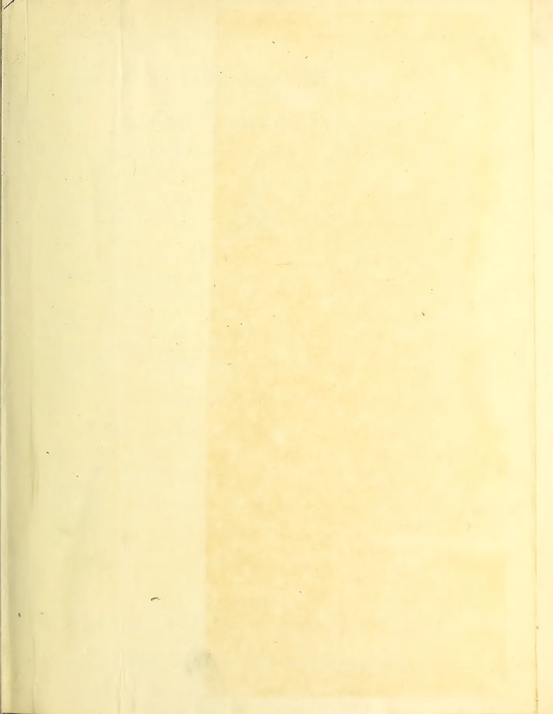This image shows a blank, aged, cream-colored page, likely an endpaper or flyleaf from an old book. The paper has a slightly textured appearance with some minor discoloration and faint creases, particularly along the left edge. There is no text or other markings on the page.

3------------------------------------------------

iiADVERTISEMENTS.

DAVIDSON'S

PATENT

“SIROCCO”

TEA DRIERS.

OVER 1,900 NOW IN USE.

The natural Up-Draft or T “Siroccos” dry tea with a self-acting current of hot Pure Air, neither fan nor air chimney being required to create the air draft, which is produced entirely by the action of the “Sirocco” Stove, wherein any description of fuel may be used—wood, coal, patent compressed coal, bamboo, eku, grass, &c.

The tea leaf is exposed on wire-web trays to the action of the hot air. The trays are arranged in superimposed order, in sets of four, with by-pass spaces on two sides of each tray to allow a portion of the fresh hot air to reach the upper trays, at its initial temperature, without passing through the lower ones, whereby a brisk drying heat is maintained on the top trays, and promptly arrests fermentation in the damp leaf when freshly put in. The natural Up-Draft “Siroccos” are now made for the trays either to pass through the drying chamber one in front of the other, like a continuous web on slides—and which form of the apparatus is designated the End-slide—or for the trays to work as individual drawers through separate openings for each tray in the side of the drying chamber, and this arrangement of the apparatus is defined as the Side-drawer.

Working with this natural up-draft of air at a temperature of 240° F. the tea is dried in twenty-five to thirty minutes. The waste hot air from the apparatus when in work is useful for withering green leaf, when the leaf rooms are suitably arranged for this purpose on the upper floor of the tea house.

The natural Up-draft “Sirocco” can also be worked with the direct heat from a Coke or Charcoal fire, the hot gases from which are mixed with a sufficiency of cold air to produce a proper temperature for tea drying.

The difference between the Pure Air “Sirocco” and the Coke “Sirocco” is altogether in the stove, which for the latter is of brickwork, with the requisite iron fittings for the fire-place and air-ports built in.

It is generally considered that hot Pure Air produces a finer flavour in tea than air impregnated with fumes from coke or charcoal, and in this respect the Coke “Sirocco” is relatively less perfect for drying tea than the Pure Air “Sirocco,” but this is the only disadvantage which has to be set against its cheaper cost price.

4------------------------------------------------

ADVERTISEMENTS.

ii

THE PURE AIR T "SIROCCO" AND COKE "SIROCCO" ARE MADE IN SEVERAL SIZES, PRICE AND CAPACITY OF EACH AS UNDER:—

<table border="1">
<thead>
<tr>
<th rowspan="2">SIZE OF "SIROCCO."</th>
<th colspan="2">OUTTUN OF TEA</th>
<th colspan="2">PURE AIR "SIROCCO."</th>
<th colspan="2">COKE "SIROCCO."</th>
<th rowspan="2">Each complete, with Trays, Thermometer, Fire Irons, &amp;c., packed and delivered free on board outward steemers at Birkenhead or Glasgow. Terms: Cash against documents.</th>
</tr>
<tr>
<th>PER HOUR</th>
<th>PER HOUR</th>
<th>Price.....</th>
<th>Price.....</th>
<th>Price.....</th>
<th>Price.....</th>
</tr>
</thead>
<tbody>
<tr>
<td>"Side-drawer," 4-Tray, with 2 extra Trays</td>
<td>About 40 lb</td>
<td>4</td>
<td>£50</td>
<td>£50</td>
<td>"Side-drawer" 4-Tray</td>
<td>£30</td>
<td>£30</td>
</tr>
<tr>
<td>"Breadslide," 12 "</td>
<td>60 "</td>
<td>2</td>
<td>£70</td>
<td>£70</td>
<td>" "</td>
<td>8 "</td>
<td>£45</td>
</tr>
<tr>
<td>"Side-drawer," 12 "</td>
<td>80 "</td>
<td>4</td>
<td>£85</td>
<td>£85</td>
<td>" "</td>
<td>12 "</td>
<td>£55</td>
</tr>
<tr>
<td>" "</td>
<td>80 "</td>
<td>5</td>
<td>£90</td>
<td>£90</td>
<td>" "</td>
<td>16 "</td>
<td>£70</td>
</tr>
<tr>
<td>"End-slide," 20 "</td>
<td>100 to 120 lbs.</td>
<td>2</td>
<td>£110</td>
<td>£110</td>
<td>Extra Trays, Out-turn, as mentioned for same sizes Pure Air "Siroccos."</td>
<td></td>
<td></td>
</tr>
</tbody>
</table>

THE NEW PATENT "DOWN-DRAFT SIROCCO"

Dries tea leaf in eight minutes, with a very strong "down-draft" of pure hot air at 240° F. through the tea, at which temperature this very rapid rate of drying produces the highest quality of tea obtainable from the leaf used.

A powerful suction fan draws the air through the tea with a speed and force equal to that of a high gale of wind, and the operating principle and construction of the "Down-draft Sirocco" are such that notwithstanding the great strength of this air-blast, the tea does not get disturbed, or whirled about on the trays when in the Drying Chamber, nor blown off them when inserted or withdrawn through the tray-ports.

The leaf is exposed to the hot air on wire-web trays, eight of which fill the Drying Chamber. Each tray with the damp leaf is put in through the lower, or inlet tray-port, and an easily worked and strongly constructed mechanical lift moves all the trays upwards to the outlet port, where the finished tea is withdrawn.

One movement of a hand-lever works the lift, and simultaneously opens or closes the door of the inlet tray-port, and inversely operates the throttle valve of the fan, whereby, when the tray-port door is open, the fan valve is closed, and vice versa. By this arrangement the trays can be inserted in calm air; but when the tray-port door is closed again the fan acts on the trays with its full suction power.

Any of the damp tea leaf which may drop through the meshes of the lowest tray falls direct upon the cool floor of the Drying Chamber, from whence it can be removed occasionally, through the basement door, and any fine tea that falls from the trays above is caught by and carried up on the succeeding trays. One man is sufficient to attend the apparatus with the assistance of a boy to prepare and spread the leaf on the trays, a fresh one of which is required every minute, and as the leaf passes through so quickly, it requires no turning or attention until it reaches the upper tray-port.

The "Down-draft Sirocco" dries about 1½ maunds of tea per hour, and final fires for packing about 5 maunds of whole leaf teas, or 3 maunds of broken teas per hour.

The Apparatus works on ground level, neither pit nor platform being required, and when set upon a layer of tiles or bricks, it can be worked as safely on a loft as on a ground floor. If worked on a loft, the fan can be driven by a belt through the floor. A short belt is sufficient, as less than half-horse power drives the fan at the necessary speed.

The air is heated by our Patent "Sirocco" Stove, which, with latest improvements, is now very durable. Any fuel may be used, and considerably less than one maund of dry wood, or about one-third maund of good coal, will dry one maund of tea.

The Apparatus is easily erected, and can be put together in about an hour, as the principal working parts are sent in made-up sections, and merely require to be bolted together to form the complete machine, which, when erected, occupies a floor-space of only 5 feet by 11 feet, and its extreme height is under 8 feet.

Price of "Down-draft Sirocco" is £120, complete, with fan, 10 trays, stove, smoke chimney, thermometer, etc., inclusive of packing and delivery f.o.b. the outward steamer at Glasgow or Liverpool. Terms—Cash against documents.

Orders will be telegraphed from abroad, free of charge, by our Agents for sale, as noted below.

"SIROCCO" WORKS, BELFAST,  
November 1888.

DAVIDSON & CO.

AGENTS:

THE PLANTERS' STORES AND AGENCY COMPANY, Limited,

<table border="0">
<tr>
<td>MESSRS. MACKWOOD AND CO.</td>
<td>..</td>
<td>..</td>
<td>..</td>
<td>..</td>
<td>..</td>
<td>..</td>
<td>..</td>
</tr>
<tr>
<td>" MATHESON AND GRANT,</td>
<td>..</td>
<td>..</td>
<td>..</td>
<td>..</td>
<td>..</td>
<td>..</td>
<td>..</td>
</tr>
<tr>
<td>" JOHN PEET AND CO.,</td>
<td>..</td>
<td>..</td>
<td>..</td>
<td>..</td>
<td>..</td>
<td>..</td>
<td>..</td>
</tr>
<tr>
<td>" OAKES AND CO.</td>
<td>..</td>
<td>..</td>
<td>..</td>
<td>..</td>
<td>..</td>
<td>..</td>
<td>..</td>
</tr>
</table>

CALCUTTA, INDIA.  
COLOMBO, CEYLON.  
SHANGHAI, CHINA.  
BATAVIA, JAVA.  
MADRAS.

5------------------------------------------------

ivADVERTISEMENT.

# BROWN, RAE & Co.,

ENGINEERS AND MILLWRIGHTS, HATTON.

---

AGENTS IN CEYLON

for the best forms of motive machinery of all classes:—

Engines and Boilers, Turbines and Waterwheels.

---

## Boilers Tested by Hydraulic Pressure.

It is advisable to have all BOILERS in use on Estates, where they are generally under the care of a Cooly, tested at least once a year, and we now undertake this work under European superintendence.

## Estates Visited and Reports Furnished

AS TO THE FORM OF MOTOR MOST SUITABLE.

Watercourses Traced and Levelling done by qualified Engineers.

---

## WYATT & BROWN'S PATENT METALLIC BATTENS FOR TEA ROLLERS.

These are now coming into general use, and we are turning them out in large numbers. They can be fitted to any Roller in a few minutes, and the results are in the highest degree satisfactory.

---

# BROWN, RAE & CO.

m 307—00—1 25— m a

6------------------------------------------------

ADVERTISEMENTS.

2 GOLD AND 1 SILVER MEDALS AT KANDY AGRICULTURAL SHOW 1887.

ARABIAN COFFEE  
PULPERS.

LIBERIAN COFFEE  
PULPERS.

**TEA MACHINERY**

OF EVERY DESCRIPTION.

Sole Agents for and Manufacturers of W. & J. Jackson's  
**TEA MACHINERY,**

TEA REQUISITES OF ALL KINDS, ESTATE TOOLS, &c., &c.

CATALOGUES AND PRICE LISTS FREE ON APPLICATION.

**JOHN WALKER & Co.,**

COLOMBO, CEYLON.

[12-89]

**THE COLOMBO APOTHECARIES' Co.**

WHOLESALE AND RETAIL DRUGGISTS,

MANUFACTURING AND DISPENSING CHEMISTS AND DENTISTS.

Maintain a highly-qualified and efficient European Staff, by whom Prescriptions are dispensed at all hours

Full supplies of Fresh Drugs and Patent Medicines always on hand.

UPCOUNTRY ORDERS CAREFULLY EXECUTED.

SHIPS MEDICINE CHESTS RE-STOCKED.

DENTISTRY,

DAILY FROM 10 TILL 5 O'CLOCK,

BY MR. HUME PURDIE, L. D. S.

NITROUS OXIDE GAS ADMINISTERED.

**A PHOTOGRAPHIC STUDIO,**

Has been opened in connection with this establishment, under the charge of  
MR. ALFRED W. A. PLÂTÉ AND MRS. PLÂTÉ.

HOURS FROM 9 A.M. TILL 5 P.M.

Mr. and Mrs. PLÂTÉ are accomplished Photo. Artists, and the Co. guarantee the highest style of work,

AT MODERATE PRICES.

Oilmanstores, Wines, Spirits, Malt Liquors, Tobacco and Cigars, Books,  
Stationery, Ornamental and Fancy Goods, Travelling Requisites, &c., &c.

FORT, COLOMBO.

12-89

7------------------------------------------------

viADVERTISEMENTS.

# JENSEN'S GUANOS

ARE

Organic Manures of Perfect Purity.

Keep well in any Climate.

ANALYSES GUARANTEED.

JENSEN'S GUANOS WONDERFULLY INCREASE THE YIELD OF

**ASPARAGUS**

**BEETROOT**

**CELERY**

**CUCUMBER**

**FLAX**

**GRASS**

**LENTILS**

**MELON**

**MUSTARD**

**POTATOES**

**RHUBARB**

**SWEDES**

**TOMATO**

**TURNIPS**

**VINES**

AND ALL

**ARROWROOT**

**BANANAS**

**COCOAS**

**COFFEE**

**COTTON**

**INDIGO**

**LEMONS**

**LIMES**

**ORANGES**

**PINEAPPLES**

**RICE**

**SUGARCANE**

**TAPIOCA**

**TEA**

**TOBACCO**

AND ALL

FRUIT AND FARM CROPS.

TROPICAL AND COLONIAL GROWTHS.

Prices and Testimonials on application to

**J. JENSEN & Co., LD.,**

109, Fenchurch Street, LONDON, E.C.

Makers of Jensen's Cod Liver Oil, the Celebrated Iceberg Brand.

8------------------------------------------------

ADVERTISEMENT.vii

# BETTS' PATENT IMPROVED INCORRODIBLE TEA LEAD.

BRAND.

BRAND.

This article will be found greatly superior to the ordinary Rolled Lead, combining advantages as an hermetic metallic envelope for Tea.

The *Tin* surface prevents oxidation or change of color from the effects of climate, and with the Body of Metal beneath forms a kind of Solder when in contact with the Soldering Iron, which materially assists the workmen in securing an air-tight seam or joint. The Metal is pliable, tough, exceedingly close in grain, and free from holes.

**Inventors of BETTS' METAL, Manufacturers of**  
**PATENT TEA LEAD, Lamina Wove Metals for**  
**Damp Walls, TINFOILS and Capsules.**

MANUFACTORIES—London:—1, Wharf Road, City Road, E.C. Batavia Mills,  
Upper Holloway. Birmingham:—Moor Green Mills.

## GALVANIZED CORRUGATED IRON ROOFS AND BUILDINGS

DESIGNED AND PREPARED FOR ERECTION ABROAD AS  
**TEA HOUSES.**

A SPECIALITY.

**STORES FOR**

WHARVES,  
RAILWAYS,  
TRAMWAYS,  
WORKSHOPS,  
DWELLINGS.

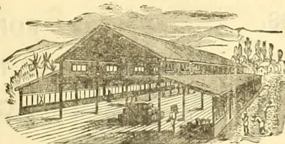

**SHEDS FOR**

SUGAR,  
COTTON,  
INDIGO,  
COFFEE  
PLANTATIONS.

**GO-DOWNS, DRYING AND PACKING SHEDS.**

Purchasers can entrust their requirements to F. M. & Co. with confidence in a reputation extending over 40 years, and an experience gained in the construction of more than 16,000 Erections during that period.

For Estimates, Information, and Catalogues, apply to

**FRANCIS MORTON & CO., LIMITED.**  
NAYLOR STREET IRON WORKS, LIVERPOOL;  
9, VICTORIA CHAMBERS, WESTMINSTER, S.W.

9------------------------------------------------

viiiADVERTISEMENTS.

# GALVANIZED CORRUGATED IRON BUILDINGS

SPECIALLY DESIGNED TO MEET REQUIREMENTS OF CLIMATE.

## TEA HOUSES AND BUNGALOWS, **DRYING AND PACKING SHEDS**

WORKSHOPS,

STORES,

FOR

RAILWAYS,

WHARVES,

ETC.

DESIGNS  
AND  
ESTIMATES  
FREE.

FOR COFFEE,

INDIGO,

COTTON,

SUGAR,

PLANTATIONS

**WALTER JONES,** **MAGNET WHARF,**  
**BOW BRIDGE, LONDON, E.**

10------------------------------------------------

[Vol. VIII, containing Numbers I. to XII: July 1888 to June 1889.]

“Step after step the ladder is ascended.”—GEORGE HERBERT, *Jacula Prudentum*.

THE  
**TROPICAL AGRICULTURIST:**

A  
MONTHLY RECORD OF INFORMATION

FOR  
PLANTERS

OF  
Tea, Coffee, Cacao, Cinchona, Sugar, Cotton, Tobacco, Palms, Spices,  
Rubber, Rice,

AND OTHER PRODUCTS  
SUITED FOR CULTIVATION IN THE TROPICS.

[ISSUED ON OR ABOUT THE 1ST OF EACH MONTH.]

COMPILED BY

**A. M. & J. FERGUSON,**

of the “Ceylon Observer,” &c.

“It is both the duty and interest of every owner and cultivator of the soil to study the best means of rendering that soil subservient to his own and the general wants of the community; and he who introduces, beneficially, a new and useful *Seed, Plant, or Shrub* into his district, is a blessing and an honour to his country.”—SIR J. SINCLAIR.

**A. M. & J. FERGUSON: COLOMBO, CEYLON.**

The “TROPICAL AGRICULTURIST” can be obtained from, or advertisements for it sent to, the following agents:—

*London*:—Messrs. JOHN HADDON & Co., 3, Bouverie St., Fleet St.; TRÜBNER & Co., 57 & 59, Ludgate Hill; GEÖ. STREET & Co., 30, Cornhill; STEEL & JONES, 4, Spring Gardens, Oharing Cross, London, S.W.; F. ALGAR, 11 & 12, Clement's Lane, Lombard St.; BATES, HENDY & Co., 37, Walbrook; COWIE & Co., 17, Gresham St.; GORDON & GOTCH, St. Bride St., Ludgate Circus; OLARK, SON & PLATT, 85, Gracechurch St.; W. H. SMITH & Co., Strand; S. DEACON & Co., 150, Leadenhall, St.; T. CHRISTY & Co., 155, Fenchurch St.; W. M. WILLS, 151, Cannon Street, London E. O.—*Manchester*: PICKLES & BROWNE, 25, Cathedral Yard.—*Liverpool*: CHAS. BIRCHALL, 32, Castle Street.—*Glasgow*: ANDREW POLSON & Co.; W. & R. MACPHUN.—*Edinburgh*: W. & A. K. JOHNSTON.—*Dundee*: THE ADVERTISER OFFICE.—*Aberdeen*: W. WESTLAND, 53, Nicholas Street.—*Paris*: AGENCE HAVAS.—*Marseille*: Mr. C. A. LUTENAN.—*Madras*: ADDISON & Co.—*Nilgiri and Wynnaad Districts*: A. PRIMROSE, Mercara, Coorg.—*Calcutta*: THACKER, SPINK & Co.—*Bombay*: THACKER & Co., LD.—*Rangoon*: WATSON & SKREN.—*Pinang*: BLAZE', REIDEL & Co.—*Singapore*: J. LITTLE & Co. and the SINGAPORE & STRAITS PRINTING OFFICE.—*Batavia*: JOHN PRYCE & Co., and G. KOLFF & Co.—*Surabaya*: THOS. C. WILSON & Co.—*Samarang*: MANUAL & Co.—*Saiyon*: FLEITH & LAPLACE.—*Hongkong*: KELLY & Co.—*Shanghai*: CHINA AND JAPAN TRADING COMPANY.—*Natal*: ROBINSON & VAUSE, DURBAN.—*Mauritius*: C. W. HALL, Port Louis.—*Melbourne, Sydney and Brisbane*: GORDON & GOTCH.—*Sydney*: WM. MADDOCK.—*Adelaide*: DRUMMOND BROS.—*Northern Queensland*: W. HOPKINS, Rockhampton.—*Perth*: W. Australia: STIRLING & SONS.—*New South Wales and Queensland*: JAMES INGLIS & Co.—*New Zealand*: COLONIAL NEWS AGENCY, Napier.—*Fiji*: ARTHUR STEPHENS.—*West Indies*: W. SABONADIERE, Blue Mountains, Jamaica; and C. H. CALDERON, St. Thomas.—*British Guiana*: “ROYAL GAZETTE” OFFICE.—*Brazil*, Rio de Janeiro: LOMBAERTS & Co., 7, Rua dos Ourives; A. J. LAMOUREUX, “Rio News” Office.—*Central America*: JAMPS BOYD, Panama.—*United States*: S. M. PETTINGILL & Co., 263, Broadway.

MDCCCLXXXIX.

11------------------------------------------------

<!-- stage4: FAINT old-images-only -->

[Faint page: no legible print of its own could be verified; text withheld (stage 4 review list)]

12------------------------------------------------

## TO OUR READERS.

---

In closing the Eighth Volume of the “**Tropical Agriculturist**,” we would once more direct attention to the large amount of useful information afforded, and to the great variety of topics treated in our pages. From month to month, we have endeavoured to embody in our pages the latest results of practical experience and scientific teaching in all that concerns tropical agriculture; and our ambition has been to make this periodical not only indispensable to the planter, but of service to business men and capitalists, never forgetting that agriculture trenches upon every department of human knowledge, beside being the basis of personal and communal wealth.

While directing our attention chiefly to the products prominently mentioned on our title-page, we have always taken care to notice minor industries likely to fit in with sub-tropical conditions; and our readers have an ample guarantee in the pages before them, that, in the future, no pains will be spared to bring together all available information both from the West and East, the same being examined in the light of the teachings of commonsense as well as of prolonged tropical experience in this, the leading Crown and Planting Colony of the British Empire.

The official Reports on the Royal Botanic and Economic Gardens in Ceylon are republished in full in the present volume, and throughout our pages will be found reviews of, and extracts from, the Reports of other Botanic Gardens situated in or near the tropics. We are ready to give copious extracts from, if not to reprint *in extenso*, the Reports of all other sub-tropical Public Botanic Gardens which may reach us. Most of these Reports we already receive and utilize as abovementioned for the benefit of our planting readers.

A full and accurate Index affords the means of ready reference to every subject treated in this, the eighth volume, which we now place in our subscribers' hands, in full confidence that it will be received with an amount of approval, at least equal to that which has been so kindly extended to its predecessors.

We are convinced that no more suitable or useful gift can be made to the tropical planter or agriculturist, whether he be about to enter on his career or with many years of experience behind him, than the eight volumes of our periodical which we have now made available. They are full of information bearing on every department and relating to nearly every product within the scope of sub-tropical industry.

In conclusion, we have to tender our thanks to readers and contributors, and our wish that all friends may continue to write instructively and to read with approval; for then, indeed, must the “**Tropical Agriculturist**” continue to do well.

A. M. & J. FERGUSON.

COLOMBO, CEYLON: 1st June 1889.

13------------------------------------------------

<!-- stage4: FAINT old-images-only -->

[Faint page: no legible print of its own could be verified; text withheld (stage 4 review list)]

This image shows a blank page with a light beige or cream-colored background. There are several small, dark specks scattered across the surface, which appear to be scanning artifacts or dust. A thin, dark vertical line is visible along the right edge of the page, likely representing the binding or the edge of the paper. The overall texture is slightly grainy, typical of a scanned document.

14------------------------------------------------

# INDEX.

<table border="0">
<thead>
<tr>
<th style="text-align: left;">A.</th>
<th style="text-align: right;">PAGE.</th>
<th style="text-align: right;">PAGE.</th>
</tr>
</thead>
<tbody>
<tr>
<td>Aberdeenshire, Tobacco Cultivation in</td>
<td style="text-align: right;">852</td>
<td>Aloes, Market Rates for</td>
<td style="text-align: right;">72, 144, 216, 288, 360, 432, 504, 648, 794, 868</td>
</tr>
<tr>
<td>Acacias</td>
<td style="text-align: right;">248, 384, 401, 856</td>
<td>America, Agriculture in</td>
<td style="text-align: right;">[See Agriculture]</td>
</tr>
<tr>
<td>Adelaide Botanic Gardens</td>
<td style="text-align: right;">[See Botanic Gardens]</td>
<td>    Cinchona Cultivation in</td>
<td style="text-align: right;">[See Cinchona]</td>
</tr>
<tr>
<td>Adulteration of Coffee</td>
<td style="text-align: right;">[See Coffee]</td>
<td>America, Coca Cultivation in</td>
<td style="text-align: right;">[See Coca]</td>
</tr>
<tr>
<td>    of Cocoa</td>
<td style="text-align: right;">437</td>
<td>    Coffee in</td>
<td style="text-align: right;">[See Coffee]</td>
</tr>
<tr>
<td>    of Citronella Oil</td>
<td style="text-align: right;">766, 805</td>
<td>    Indiarubber in</td>
<td style="text-align: right;">[See Indiarubber]</td>
</tr>
<tr>
<td>    of Produce</td>
<td style="text-align: right;">325</td>
<td>    Pushing Ceylon Tea in</td>
<td style="text-align: right;">[See Tea]</td>
</tr>
<tr>
<td>    of Spices</td>
<td style="text-align: right;">329</td>
<td>    Quinine in</td>
<td style="text-align: right;">450, 488, 493, 516, 639, 670</td>
</tr>
<tr>
<td>    of Tea</td>
<td style="text-align: right;">[See Tea]</td>
<td>    South, Liberian Coffee in</td>
<td style="text-align: right;">615</td>
</tr>
<tr>
<td>Adulterants, Adulteration of the</td>
<td style="text-align: right;">897</td>
<td>American Fruit Evaporator</td>
<td style="text-align: right;">9</td>
</tr>
<tr>
<td>Africa, A Journey Across</td>
<td style="text-align: right;">582</td>
<td>    Markets</td>
<td style="text-align: right;">450, 488, 493, 516, 639, 670</td>
</tr>
<tr>
<td>    Central, Planting in</td>
<td style="text-align: right;">159</td>
<td>Amluckic Tea Company</td>
<td style="text-align: right;">727</td>
</tr>
<tr>
<td>    Coffee Cultivation in</td>
<td style="text-align: right;">[See Coffee]</td>
<td>Ammoniacum, Gum, Market Rates for</td>
<td style="text-align: right;">72, 144, 216, 288, 360, 432, 504, 648, 794, 868</td>
</tr>
<tr>
<td>        East</td>
<td style="text-align: right;">279</td>
<td>Amsterdam Cinchona Auctions</td>
<td style="text-align: right;">261, 367, 445, 500, 597, 699, 782</td>
</tr>
<tr>
<td>        South, Planting in</td>
<td style="text-align: right;">867</td>
<td>Analysis of Produce</td>
<td style="text-align: right;">600, 484</td>
</tr>
<tr>
<td>African Tobacco</td>
<td style="text-align: right;">599</td>
<td>Andaman Islands</td>
<td style="text-align: right;">600, 657</td>
</tr>
<tr>
<td>Agencies for Ceylon Tea</td>
<td style="text-align: right;">175, 695, 753, 755</td>
<td>Andropogon Citratus</td>
<td style="text-align: right;">267</td>
</tr>
<tr>
<td>Agricultural and Horticultural Societies</td>
<td style="text-align: right;">99, 658</td>
<td>Anglo-Dutch Tobacco Company, Ltd.</td>
<td style="text-align: right;">606</td>
</tr>
<tr>
<td>    and Planting Industries of Ceylon</td>
<td style="text-align: right;">[See Ceylon]</td>
<td>Animi, Gum, Market Rates for</td>
<td style="text-align: right;">72, 144, 216, 288, 360, 438, 504, 648, 794, 868</td>
</tr>
<tr>
<td>        Chemistry</td>
<td style="text-align: right;">[See Chemistry]</td>
<td>Anatto, Market Rates for</td>
<td style="text-align: right;">70, 126, 204, 217, 256, 284, 334, 367, 422, 449, 487, 499, 670, 677, 693, 699, 726, 810</td>
</tr>
<tr>
<td>        Companies</td>
<td style="text-align: right;">672</td>
<td>    in Burma</td>
<td style="text-align: right;">631</td>
</tr>
<tr>
<td>        Department, Madras</td>
<td style="text-align: right;">601</td>
<td>Anthelia</td>
<td style="text-align: right;">727</td>
</tr>
<tr>
<td>        Literature</td>
<td style="text-align: right;">622, 750, 867</td>
<td>Antipyrene</td>
<td style="text-align: right;">259</td>
</tr>
<tr>
<td>        Professors, Lady</td>
<td style="text-align: right;">481</td>
<td>Anthracite Coal</td>
<td style="text-align: right;">660</td>
</tr>
<tr>
<td>        Returns, British</td>
<td style="text-align: right;">586</td>
<td>Ants, Remedies for</td>
<td style="text-align: right;">[See Insecticides]</td>
</tr>
<tr>
<td>        Show in Jamaica</td>
<td style="text-align: right;">577</td>
<td>    White</td>
<td style="text-align: right;">[See White Ants]</td>
</tr>
<tr>
<td>Agriculture and Insects</td>
<td style="text-align: right;">168</td>
<td>Anuradhapura Gardens, Ceylon</td>
<td style="text-align: right;">[Sup.]</td>
</tr>
<tr>
<td>    Experiments in</td>
<td style="text-align: right;">414, 526, 563</td>
<td>Aquatic Plants</td>
<td style="text-align: right;">502</td>
</tr>
<tr>
<td>        in Africa</td>
<td style="text-align: right;">159, 582, 867</td>
<td>Arabic, Gum, Market Rates for</td>
<td style="text-align: right;">72, 144, 216, 288, 360, 432, 504, 648, 794, 868</td>
</tr>
<tr>
<td>        in America</td>
<td style="text-align: right;">176, 179, 430</td>
<td>Arabian Coffee</td>
<td style="text-align: right;">856</td>
</tr>
<tr>
<td>        in Australia</td>
<td style="text-align: right;">[See Australia]</td>
<td>    Horses</td>
<td style="text-align: right;">231</td>
</tr>
<tr>
<td>        in Borneo</td>
<td style="text-align: right;">19, 36</td>
<td>Arboriculture</td>
<td style="text-align: right;">56, 350</td>
</tr>
<tr>
<td>        in Burma</td>
<td style="text-align: right;">[See Burma, Planting in]</td>
<td>Arcultipore Tea Company</td>
<td style="text-align: right;">727</td>
</tr>
<tr>
<td>        in Ceylon</td>
<td style="text-align: right;">177, 338, 404, 410, 563, 618</td>
<td>Areca nut Cultivation</td>
<td style="text-align: right;">217</td>
</tr>
<tr>
<td>        in China</td>
<td style="text-align: right;">296</td>
<td>Arrowroot, Market Rates for</td>
<td style="text-align: right;">72, 144, 216, 288, 360, 432, 504, 648, 794, 868</td>
</tr>
<tr>
<td>        in Coorg</td>
<td style="text-align: right;">[See Coorg, Planting in]</td>
<td>Arsenic in Agriculture and Destroying Insects</td>
<td style="text-align: right;">[See Insecticides]</td>
</tr>
<tr>
<td>        in Europe</td>
<td style="text-align: right;">97, 98, 693</td>
<td>    Manures</td>
<td style="text-align: right;">[See Manures]</td>
</tr>
<tr>
<td>        in Fiji</td>
<td style="text-align: right;">[See Fiji, Planting in]</td>
<td>    Teeth</td>
<td style="text-align: right;">736</td>
</tr>
<tr>
<td>        in Goa</td>
<td style="text-align: right;">614</td>
<td>Arundo Donax</td>
<td style="text-align: right;">137</td>
</tr>
<tr>
<td>        in Hainan</td>
<td style="text-align: right;">565</td>
<td>Asbestos</td>
<td style="text-align: right;">160</td>
</tr>
<tr>
<td>        in India</td>
<td style="text-align: right;">169, 239, 249, 294, 414, 459, 518, 601, 750, 755</td>
<td>Ashes as a Fertilizer</td>
<td style="text-align: right;">[See Manures]</td>
</tr>
<tr>
<td>        in Japan</td>
<td style="text-align: right;">102</td>
<td>Assafetida, Market Rates for</td>
<td style="text-align: right;">72, 144, 216, 288, 360, 432, 504, 648, 794, 868</td>
</tr>
<tr>
<td>        in Java</td>
<td style="text-align: right;">[See Java]</td>
<td>Assam, Planting in</td>
<td style="text-align: right;">232</td>
</tr>
<tr>
<td>        in Malacca</td>
<td style="text-align: right;">409</td>
<td>    Tea Company</td>
<td style="text-align: right;">123, 756</td>
</tr>
<tr>
<td>        in Mauritius</td>
<td style="text-align: right;">41</td>
<td>    Cultivation in</td>
<td style="text-align: right;">[See Tea]</td>
</tr>
<tr>
<td>        in Mexico</td>
<td style="text-align: right;">448</td>
<td>        Planters on Ceylon</td>
<td style="text-align: right;">39</td>
</tr>
<tr>
<td>        in Netherlands India</td>
<td style="text-align: right;">[See Netherlands India]</td>
<td>Associations, Planting</td>
<td style="text-align: right;">575</td>
</tr>
<tr>
<td>        in Newfoundland</td>
<td style="text-align: right;">489</td>
<td>Asphalte Pavements</td>
<td style="text-align: right;">[See Tar Pavements]</td>
</tr>
<tr>
<td>        in Straits Settlements</td>
<td style="text-align: right;">[See Straits Settlements, Planting in]</td>
<td>Australia, Agriculture in</td>
<td style="text-align: right;">184, 331</td>
</tr>
<tr>
<td>        in Travancore</td>
<td style="text-align: right;">[See Travancore]</td>
<td>    Ceylon Products in</td>
<td style="text-align: right;">885</td>
</tr>
<tr>
<td>Agriculturist, Tropical</td>
<td style="text-align: right;">[See Tropical Agriculturist]</td>
<td>    Eucalyptus in</td>
<td style="text-align: right;">[See Eucalyptus]</td>
</tr>
<tr>
<td>Agri-Horticultural Association, Matale</td>
<td style="text-align: right;">111</td>
<td></td>
<td></td>
</tr>
<tr>
<td>    Exhibitions in Ceylon</td>
<td style="text-align: right;">303</td>
<td></td>
<td></td>
</tr>
<tr>
<td>        Shows, Hints on</td>
<td style="text-align: right;">37</td>
<td></td>
<td></td>
</tr>
<tr>
<td>Alluvial Soils</td>
<td style="text-align: right;">[See Soils]</td>
<td></td>
<td></td>
</tr>
<tr>
<td>Aloe Cultivation</td>
<td style="text-align: right;">215, 719, 730, 744</td>
<td></td>
<td></td>
</tr>
</tbody>
</table>

15------------------------------------------------

INDEX.

<table border="0">
<thead>
<tr>
<th></th>
<th style="text-align: right;">PAGE.</th>
</tr>
</thead>
<tbody>
<tr>
<td>Australia, Life in .. ..</td>
<td style="text-align: right;">221</td>
</tr>
<tr>
<td>    —, Pearl Fishing in .. ..</td>
<td style="text-align: right;">40, 376</td>
</tr>
<tr>
<td>    —, Planting in .. ..</td>
<td style="text-align: right;">737</td>
</tr>
<tr>
<td>    —, Ring-barking in .. ..</td>
<td style="text-align: right;">133</td>
</tr>
<tr>
<td>    —, Sheep Raising in .. ..</td>
<td style="text-align: right;">624</td>
</tr>
<tr>
<td>    —, South, Garnets in .. ..</td>
<td style="text-align: right;">58</td>
</tr>
<tr>
<td>    —, Planting in .. ..</td>
<td style="text-align: right;">167</td>
</tr>
<tr>
<td>    —, Sugar Cultivation in .. ..</td>
<td style="text-align: right;">[See Sugar]</td>
</tr>
<tr>
<td>    —, Tea in .. ..</td>
<td style="text-align: right;">[See Tea]</td>
</tr>
<tr>
<td>    —, Trout Breeding in .. ..</td>
<td style="text-align: right;">228</td>
</tr>
<tr>
<td>    —, Western .. ..</td>
<td style="text-align: right;">206</td>
</tr>
<tr>
<td>    —, Wire Netting Fence in .. ..</td>
<td style="text-align: right;">624</td>
</tr>
<tr>
<td>Australian Blue Gums .. ..</td>
<td style="text-align: right;">376</td>
</tr>
<tr>
<td>    —, Coast, Oysters on the .. ..</td>
<td style="text-align: right;">19</td>
</tr>
<tr>
<td>    —, Timber .. ..</td>
<td style="text-align: right;">[See Timber]</td>
</tr>
<tr>
<td>Austria, Tea in .. ..</td>
<td style="text-align: right;">[See Tea]</td>
</tr>
<tr>
<td>Avenue Trees .. ..</td>
<td style="text-align: right;">101</td>
</tr>
<tr>
<td>Aviculture .. ..</td>
<td style="text-align: right;">272, 347, 457</td>
</tr>
<tr>
<td>Avocado Pear .. ..</td>
<td style="text-align: right;">255</td>
</tr>
</tbody>
</table>

B.

<table border="0">
<tbody>
<tr>
<td>Babul Trees .. ..</td>
<td style="text-align: right;">248</td>
</tr>
<tr>
<td>Badulla Botanic Gardens, Ceylon .. ..</td>
<td style="text-align: right;">[Sup.]</td>
</tr>
<tr>
<td>Bael Fruit, Market Rates for .. ..</td>
<td style="text-align: right;">256, 334, 578, 782</td>
</tr>
<tr>
<td>Bahamas Islands, Cultivation in the .. ..</td>
<td style="text-align: right;">254</td>
</tr>
<tr>
<td>Bali Islands, Coffee in .. ..</td>
<td style="text-align: right;">22</td>
</tr>
<tr>
<td>Bamboos .. ..</td>
<td style="text-align: right;">134, 248, 860</td>
</tr>
<tr>
<td>Banana Disease .. ..</td>
<td style="text-align: right;">119</td>
</tr>
<tr>
<td>    —, Cultivation .. ..</td>
<td style="text-align: right;">85, 255, 409, 486, 510</td>
</tr>
<tr>
<td>Bandakai .. ..</td>
<td style="text-align: right;">[See Hibiscus Esculentus]</td>
</tr>
<tr>
<td>Bankers' Advances, Produce as Security for .. ..</td>
<td style="text-align: right;">543</td>
</tr>
<tr>
<td>Bannockburn Tea Company .. ..</td>
<td style="text-align: right;">727</td>
</tr>
<tr>
<td>Barbados .. ..</td>
<td style="text-align: right;">254</td>
</tr>
<tr>
<td>Bark .. ..</td>
<td style="text-align: right;">[See Cinchona]</td>
</tr>
<tr>
<td>Basic Slag, Export of .. ..</td>
<td style="text-align: right;">836</td>
</tr>
<tr>
<td>Bats' Dung .. ..</td>
<td style="text-align: right;">[See Manure]</td>
</tr>
<tr>
<td>Beach, Absence of, in Ceylon .. ..</td>
<td style="text-align: right;">262</td>
</tr>
<tr>
<td>Beans, Calabar, Alkaloids from .. ..</td>
<td style="text-align: right;">455</td>
</tr>
<tr>
<td>    —, Flavouring, Trade in .. ..</td>
<td style="text-align: right;">242</td>
</tr>
<tr>
<td>Beer, Kurakkan .. ..</td>
<td style="text-align: right;">562</td>
</tr>
<tr>
<td>Beeswax, Market Rates for .. ..</td>
<td style="text-align: right;">72, 144, 216, 288, 360, 432, 456, 504, 648, 794, 868</td>
</tr>
<tr>
<td>Beetles as Enemies of Coconuts .. ..</td>
<td style="text-align: right;">[See Coconuts]</td>
</tr>
<tr>
<td>Beetroot Sugar in Netherlands India .. ..</td>
<td style="text-align: right;">679</td>
</tr>
<tr>
<td>Benefactors of Ceylon Tea Interest .. ..</td>
<td style="text-align: right;">695, 753, 755</td>
</tr>
<tr>
<td>Beri-beri, Remedy for .. ..</td>
<td style="text-align: right;">668</td>
</tr>
<tr>
<td>Birdsnests, Edible .. ..</td>
<td style="text-align: right;">325</td>
</tr>
<tr>
<td>Blue Gum .. ..</td>
<td style="text-align: right;">[See Eucalyptus]</td>
</tr>
<tr>
<td>Bolivia, Cinchona in .. ..</td>
<td style="text-align: right;">[See Cinchona]</td>
</tr>
<tr>
<td>Bombay, Mill Industry in .. ..</td>
<td style="text-align: right;">467, 480</td>
</tr>
<tr>
<td>Bonedust as Manure .. ..</td>
<td style="text-align: right;">[See Manures]</td>
</tr>
<tr>
<td>Books, Preservation of, from Insects .. ..</td>
<td style="text-align: right;">22</td>
</tr>
<tr>
<td>Boots and Shoes, Old, as Manure .. ..</td>
<td style="text-align: right;">544</td>
</tr>
<tr>
<td>Borers .. ..</td>
<td style="text-align: right;">71</td>
</tr>
<tr>
<td>Borneo, British, Company .. ..</td>
<td style="text-align: right;">107, 710</td>
</tr>
<tr>
<td>    —, German, Company .. ..</td>
<td style="text-align: right;">128</td>
</tr>
<tr>
<td>    —, North, Planting and Life in .. ..</td>
<td style="text-align: right;">19, 36, 103, 164, 196, 221, 260, 298, 314, 344, 408, 429, 475, 488, 508, 580, 620, 711, 809</td>
</tr>
<tr>
<td>    —, Timber in .. ..</td>
<td style="text-align: right;">[See Timber]</td>
</tr>
<tr>
<td>    —, Pearl Fishery .. ..</td>
<td style="text-align: right;">348</td>
</tr>
<tr>
<td>    —, Tobacco in .. ..</td>
<td style="text-align: right;">[See Tobacco]</td>
</tr>
<tr>
<td>Borokai Tea Company .. ..</td>
<td style="text-align: right;">756</td>
</tr>
<tr>
<td>Bosnia, Plum Culture in .. ..</td>
<td style="text-align: right;">852</td>
</tr>
<tr>
<td>Botanic Gardens, Adelaide .. ..</td>
<td style="text-align: right;">185</td>
</tr>
<tr>
<td>    —, Bangalore .. ..</td>
<td style="text-align: right;">438</td>
</tr>
<tr>
<td>    —, Calcutta .. ..</td>
<td style="text-align: right;">693</td>
</tr>
<tr>
<td>    —, Ceylon .. ..</td>
<td style="text-align: right;">301, 677, 692, 737, Sup.</td>
</tr>
<tr>
<td>    —, Kew .. ..</td>
<td style="text-align: right;">253</td>
</tr>
<tr>
<td>    —, Lagos .. ..</td>
<td style="text-align: right;">603</td>
</tr>
<tr>
<td>    —, Nilgiris .. ..</td>
<td style="text-align: right;">292, 693</td>
</tr>
<tr>
<td>    —, Saharanpur .. ..</td>
<td style="text-align: right;">374</td>
</tr>
<tr>
<td>    —, Trinidad .. ..</td>
<td style="text-align: right;">215, 299</td>
</tr>
<tr>
<td>Botanical Specimens in Ceylon .. ..</td>
<td style="text-align: right;">637, 639</td>
</tr>
<tr>
<td>Bourbon Cotton .. ..</td>
<td style="text-align: right;">714</td>
</tr>
<tr>
<td>Brazil, Abolition of Slavery in .. ..</td>
<td style="text-align: right;">61, 89, 205, 431</td>
</tr>
<tr>
<td>    —, Cacao Cultivation in .. ..</td>
<td style="text-align: right;">[See Cacao]</td>
</tr>
<tr>
<td>    —, Cinchona Cultivation in .. ..</td>
<td style="text-align: right;">[See Cinchona]</td>
</tr>
<tr>
<td>    —, Coffee Cultivation in .. ..</td>
<td style="text-align: right;">[See Coffee]</td>
</tr>
<tr>
<td>    —, Labor in .. ..</td>
<td style="text-align: right;">61</td>
</tr>
</tbody>
</table>

<table border="0">
<thead>
<tr>
<th></th>
<th style="text-align: right;">PAGE</th>
</tr>
</thead>
<tbody>
<tr>
<td>Brazil, Planting in .. ..</td>
<td style="text-align: right;">175, 298</td>
</tr>
<tr>
<td>    —, Progress in .. ..</td>
<td style="text-align: right;">618</td>
</tr>
<tr>
<td>    —, Rubber ia .. ..</td>
<td style="text-align: right;">[See Indiarubber]</td>
</tr>
<tr>
<td>Breadfruit .. ..</td>
<td style="text-align: right;">100</td>
</tr>
<tr>
<td>Brinjal .. ..</td>
<td style="text-align: right;">118</td>
</tr>
<tr>
<td>British Agricultural Returns .. ..</td>
<td style="text-align: right;">[See Agricultural]</td>
</tr>
<tr>
<td>    —, Guiana, Minor Industries in .. ..</td>
<td style="text-align: right;">629</td>
</tr>
<tr>
<td>    —, Indian Tea Company .. ..</td>
<td style="text-align: right;">165, 189, 756</td>
</tr>
<tr>
<td>    —, Protectorates in the Pacific .. ..</td>
<td style="text-align: right;">389</td>
</tr>
<tr>
<td>Bug .. ..</td>
<td style="text-align: right;">[See Coffee Bug]</td>
</tr>
<tr>
<td>Burma, Planting in .. ..</td>
<td style="text-align: right;">270, 466, 470, 631, 776, 823, 858</td>
</tr>
<tr>
<td>    —, Ruby Mining in .. ..</td>
<td style="text-align: right;">845</td>
</tr>
<tr>
<td>    —, Rice Cultivation in .. ..</td>
<td style="text-align: right;">[See Rice Cultivation]</td>
</tr>
<tr>
<td>    —, Timbers in .. ..</td>
<td style="text-align: right;">[See Timbers]</td>
</tr>
<tr>
<td>    —, Upper, Indiarubber Trade of .. ..</td>
<td style="text-align: right;">293</td>
</tr>
<tr>
<td>    —, Progress in .. ..</td>
<td style="text-align: right;">408</td>
</tr>
</tbody>
</table>

C.

<table border="0">
<tbody>
<tr>
<td>Cabbages, Growing of .. ..</td>
<td style="text-align: right;">56</td>
</tr>
<tr>
<td>Cacao Cultivation in British Guiana .. ..</td>
<td style="text-align: right;">835</td>
</tr>
<tr>
<td>    —, in Cachar .. ..</td>
<td style="text-align: right;">557</td>
</tr>
<tr>
<td>    —, in Ceylon .. ..</td>
<td style="text-align: right;">25, 94, 191, 208, 238, 251, 271, 305, 420, 522, 548, 633, 634, 646, 666, 724</td>
</tr>
<tr>
<td>    —, in Columbia .. ..</td>
<td style="text-align: right;">637</td>
</tr>
<tr>
<td>    —, Enemies of .. ..</td>
<td style="text-align: right;">133, 271, 548</td>
</tr>
<tr>
<td>    —, Shade for .. ..</td>
<td style="text-align: right;">548</td>
</tr>
<tr>
<td>    —, Trade .. ..</td>
<td style="text-align: right;">[See Cocoa]</td>
</tr>
<tr>
<td>Cachar, Tea Cultivation in .. ..</td>
<td style="text-align: right;">[See Tea Cultivation]</td>
</tr>
<tr>
<td>    —, Cacao Cultivation in .. ..</td>
<td style="text-align: right;">[See Cacao]</td>
</tr>
<tr>
<td>Caffeine .. ..</td>
<td style="text-align: right;">119, 189, 252, 458</td>
</tr>
<tr>
<td>Calcutta Botanic Gardens .. ..</td>
<td style="text-align: right;">693</td>
</tr>
<tr>
<td>California .. ..</td>
<td style="text-align: right;">252, 660, 849</td>
</tr>
<tr>
<td>Calumba Root, Market Rates for .. ..</td>
<td style="text-align: right;">72, 144, 216, 285, 288, 360, 432, 504, 578, 648, 794, 868</td>
</tr>
<tr>
<td>Camellia Thea .. ..</td>
<td style="text-align: right;">267</td>
</tr>
<tr>
<td>Canada, Colonisation of .. ..</td>
<td style="text-align: right;">608</td>
</tr>
<tr>
<td>Candle Manufacture .. ..</td>
<td style="text-align: right;">272</td>
</tr>
<tr>
<td>Canes and Sticks .. ..</td>
<td style="text-align: right;">333, 511</td>
</tr>
<tr>
<td>Canton Tea Trade .. ..</td>
<td style="text-align: right;">265, 284, 369</td>
</tr>
<tr>
<td>Caoutchouc .. ..</td>
<td style="text-align: right;">[See Indiarubber]</td>
</tr>
<tr>
<td>    —, Indian .. ..</td>
<td style="text-align: right;">213</td>
</tr>
<tr>
<td>Caraccas, Horticulture in .. ..</td>
<td style="text-align: right;">630, 836</td>
</tr>
<tr>
<td>Caraway Seed Market .. ..</td>
<td style="text-align: right;">261</td>
</tr>
<tr>
<td>Carbolic Soap as an Insecticide .. ..</td>
<td style="text-align: right;">[See Insecticides]</td>
</tr>
<tr>
<td>Carbonado or Black Diamond .. ..</td>
<td style="text-align: right;">260</td>
</tr>
<tr>
<td>Cardamom Cultivation .. ..</td>
<td style="text-align: right;">208, 249, 270, 488, 492, 575, 633, 646, 290</td>
</tr>
<tr>
<td>    —, Exports .. ..</td>
<td style="text-align: right;">290</td>
</tr>
<tr>
<td>    —, Market .. ..</td>
<td style="text-align: right;">126, 256, 389, 422, 449, 487, 543, 578, 670, 677, 699, 726, 782</td>
</tr>
<tr>
<td>Cardamoms, Market Rates for .. ..</td>
<td style="text-align: right;">72, 144, 216, 288, 360, 432, 504, 648, 794, 868</td>
</tr>
<tr>
<td>Carludovica Palmata .. ..</td>
<td style="text-align: right;">100</td>
</tr>
<tr>
<td>Carthagena Bark .. ..</td>
<td style="text-align: right;">300, 391</td>
</tr>
<tr>
<td>Cascarilla .. ..</td>
<td style="text-align: right;">726</td>
</tr>
<tr>
<td>Cassava Cultivation .. ..</td>
<td style="text-align: right;">365, 540</td>
</tr>
<tr>
<td>Castor Oil, Market Rates for .. ..</td>
<td style="text-align: right;">72, 144, 216, 288, 360, 432, 504, 648, 794, 868</td>
</tr>
<tr>
<td>    —, Seeds, Export of .. ..</td>
<td style="text-align: right;">103</td>
</tr>
<tr>
<td>Casuarina .. ..</td>
<td style="text-align: right;">102, 424</td>
</tr>
<tr>
<td>Caterpillars .. ..</td>
<td style="text-align: right;">343</td>
</tr>
<tr>
<td>Cattle Food, Analyses of .. ..</td>
<td style="text-align: right;">704</td>
</tr>
<tr>
<td>    —, Indian .. ..</td>
<td style="text-align: right;">169</td>
</tr>
<tr>
<td>Cauliflower .. ..</td>
<td style="text-align: right;">85</td>
</tr>
<tr>
<td>Cedrela Toona .. ..</td>
<td style="text-align: right;">[See Toon]</td>
</tr>
<tr>
<td>Celluloid, Uses of .. ..</td>
<td style="text-align: right;">192</td>
</tr>
<tr>
<td>Cement .. ..</td>
<td style="text-align: right;">22, 58, 96, 538</td>
</tr>
<tr>
<td>Central Africa, Planting in .. ..</td>
<td style="text-align: right;">[See Africa]</td>
</tr>
<tr>
<td>    —, Cachar Tea Company .. ..</td>
<td style="text-align: right;">359</td>
</tr>
<tr>
<td>Ceylindo Tea .. ..</td>
<td style="text-align: right;">820</td>
</tr>
<tr>
<td>Ceylon, Agriculture in .. ..</td>
<td style="text-align: right;">[See Agriculture]</td>
</tr>
<tr>
<td>    —, American Tea Association .. ..</td>
<td style="text-align: right;">594, 714, 745, 752, 801</td>
</tr>
<tr>
<td>    —, and Japan, Interchange of Plants between .. ..</td>
<td style="text-align: right;">385</td>
</tr>
<tr>
<td>    —, at the Glasgow Exhibition .. ..</td>
<td style="text-align: right;">210</td>
</tr>
<tr>
<td>    —, at the Melbourne Exhibition .. ..</td>
<td style="text-align: right;">204, 278, 428, 433</td>
</tr>
<tr>
<td>    —, at the Paris Exhibition .. ..</td>
<td style="text-align: right;">789</td>
</tr>
<tr>
<td>    —, Botanic Gardens .. ..</td>
<td style="text-align: right;">[See Botanic Gardens]</td>
</tr>
<tr>
<td>    —, Cacao Cultivation in .. ..</td>
<td style="text-align: right;">[See Cacao]</td>
</tr>
<tr>
<td>    —, Cinchona Cultivation in .. ..</td>
<td style="text-align: right;">[See Cinchona]</td>
</tr>
<tr>
<td>    —, Cinnamom Cultivation in .. ..</td>
<td style="text-align: right;">[See Cinnamon]</td>
</tr>
</tbody>
</table>

16------------------------------------------------

# INDEX.

<table border="0">
<thead>
<tr>
<th></th>
<th style="text-align: right;">PAGE.</th>
</tr>
</thead>
<tbody>
<tr>
<td>Ceylon, Coal in ...</td>
<td style="text-align: right;">[See Coal]</td>
</tr>
<tr>
<td>    Coffee Cultivation in ...</td>
<td style="text-align: right;">[See Coffee]</td>
</tr>
<tr>
<td>    Cotton Cultivation in ...</td>
<td style="text-align: right;">[See Cotton]</td>
</tr>
<tr>
<td>    Crops, Estimate of ...</td>
<td style="text-align: right;">534</td>
</tr>
<tr>
<td>    Cultivation of Economic Plants in ...</td>
<td style="text-align: right;">[See Economic Plants]</td>
</tr>
<tr>
<td>    Drought in ...</td>
<td style="text-align: right;">[See Drought]</td>
</tr>
<tr>
<td>    Estate Companies for ...</td>
<td style="text-align: right;">124, 153</td>
</tr>
<tr>
<td>    Exports, Distribution of ...</td>
<td style="text-align: right;">[See Exports]</td>
</tr>
<tr>
<td>    Fish in ...</td>
<td style="text-align: right;">[See Fish]</td>
</tr>
<tr>
<td>    Forest Conservancy in ...</td>
<td style="text-align: right;">[See Forests]</td>
</tr>
<tr>
<td>    Gems in ...</td>
<td style="text-align: right;">837, 845</td>
</tr>
<tr>
<td>    Gold in ...</td>
<td style="text-align: right;">17, 117, 129, 272</td>
</tr>
<tr>
<td>    Handbook and Directory ...</td>
<td style="text-align: right;">218, 734</td>
</tr>
<tr>
<td>    Irrigation in ...</td>
<td style="text-align: right;">[See Irrigation]</td>
</tr>
<tr>
<td>    Labour in ...</td>
<td style="text-align: right;">[See Labour]</td>
</tr>
<tr>
<td>    Leaf-Fungus in ...</td>
<td style="text-align: right;">136</td>
</tr>
<tr>
<td>    Materia Medica of ...</td>
<td style="text-align: right;">439</td>
</tr>
<tr>
<td>    Minerals in ...</td>
<td style="text-align: right;">[See Minerals]</td>
</tr>
<tr>
<td>    Native Industries in 315, 417, 425, 426, 449, 545, 732</td>
<td></td>
</tr>
<tr>
<td>    Pearl Fishery... ..</td>
<td style="text-align: right;">345</td>
</tr>
<tr>
<td>    Planters, Products for ...</td>
<td style="text-align: right;">426</td>
</tr>
<tr>
<td>    Planting and Agricultural Industries of ...</td>
<td style="text-align: right;">641, 734, 820</td>
</tr>
<tr>
<td>        Planting in ...</td>
<td style="text-align: right;">22, 24, 37, 38, 73, 94, 109, 113, 116, 133, 161, 209, 217, 218, 229, 243, 257, 305, 339, 340, 362, 365, 372, 376, 381, 382, 333, 401, 403, 427, 465, 475, 522, 570, 609, 612, 633, 637, 666, 698, 724, 734, 774, 779, 805, 840</td>
</tr>
<tr>
<td>    Planting Products of, and their Position and Prospects ...</td>
<td style="text-align: right;">109, 612</td>
</tr>
<tr>
<td>    Potato Cultivation in ...</td>
<td style="text-align: right;">[See Potato]</td>
</tr>
<tr>
<td>    Produce in London ...</td>
<td style="text-align: right;">500</td>
</tr>
<tr>
<td>    Rainfall in ...</td>
<td style="text-align: right;">38, 121, 383, 534, 657</td>
</tr>
<tr>
<td>    Sericulture in... ..</td>
<td style="text-align: right;">[See Sericulture]</td>
</tr>
<tr>
<td>    Spinning and Weaving Company ...</td>
<td style="text-align: right;">847, 853</td>
</tr>
<tr>
<td>    Staple Products of ...</td>
<td style="text-align: right;">463</td>
</tr>
<tr>
<td>    Tea Companies ...</td>
<td style="text-align: right;">[See Tea Companies]</td>
</tr>
<tr>
<td>        Cultivation in ...</td>
<td style="text-align: right;">[See Tea]</td>
</tr>
<tr>
<td>        Growers' Association ...</td>
<td style="text-align: right;">139, 575</td>
</tr>
<tr>
<td>        Plantations Co., Ltd ...</td>
<td style="text-align: right;">517, 806, 839</td>
</tr>
<tr>
<td>        Seasons ...</td>
<td style="text-align: right;">[See Tea]</td>
</tr>
<tr>
<td>        Timbers ...</td>
<td style="text-align: right;">[See Timbers]</td>
</tr>
<tr>
<td>    Tobacco Cultivation in ...</td>
<td style="text-align: right;">[See Tobacco]</td>
</tr>
<tr>
<td>Chandipore Tea Company ...</td>
<td style="text-align: right;">727</td>
</tr>
<tr>
<td>Chonist's Tea Trade ...</td>
<td style="text-align: right;">696</td>
</tr>
<tr>
<td>Chemistry, Agricultural ...</td>
<td style="text-align: right;">451, 533</td>
</tr>
<tr>
<td>    of Tea ...</td>
<td style="text-align: right;">78, 183, 259, 299</td>
</tr>
<tr>
<td>Chicory ...</td>
<td style="text-align: right;">26</td>
</tr>
<tr>
<td>Chillies, Market Rates for 72, 144, 216, 283, 360, 432, 504, 648, 794, 863</td>
<td></td>
</tr>
<tr>
<td>China, Agriculture in ...</td>
<td style="text-align: right;">[See Agriculture]</td>
</tr>
<tr>
<td>    Olay... ..</td>
<td style="text-align: right;">[See Kaolin]</td>
</tr>
<tr>
<td>    Grass ...</td>
<td style="text-align: right;">[See Rhea]</td>
</tr>
<tr>
<td>    Silk... ..</td>
<td style="text-align: right;">148</td>
</tr>
<tr>
<td>    Tar in ...</td>
<td style="text-align: right;">730</td>
</tr>
<tr>
<td>    Tea Cultivation in ...</td>
<td style="text-align: right;">[See Tea]</td>
</tr>
<tr>
<td>    Exports ...</td>
<td style="text-align: right;">130</td>
</tr>
<tr>
<td>Chocolate ...</td>
<td style="text-align: right;">100</td>
</tr>
<tr>
<td>Choomsali Tea Company ...</td>
<td style="text-align: right;">160, 600</td>
</tr>
<tr>
<td>Cholera, Causes of ...</td>
<td style="text-align: right;">438</td>
</tr>
<tr>
<td>Christmas Island ...</td>
<td style="text-align: right;">858</td>
</tr>
<tr>
<td>Cinchona Cultivation in Bolivia ...</td>
<td style="text-align: right;">17, 147, 188</td>
</tr>
<tr>
<td>    in Colombia ...</td>
<td style="text-align: right;">777</td>
</tr>
<tr>
<td>    in Ceylon 190, 201, 271, 383, 633, 634, 646</td>
<td></td>
</tr>
<tr>
<td>    in India 14, 180, 191, 327, 744</td>
<td></td>
</tr>
<tr>
<td>    in Japan ...</td>
<td style="text-align: right;">444</td>
</tr>
<tr>
<td>    in Jamaica ...</td>
<td style="text-align: right;">125, 472, 486</td>
</tr>
<tr>
<td>    in Java 14, 16, 22, 28, 41, 42, 57, 197, 323, 524, 630, 682, 720, 751, 866</td>
<td></td>
</tr>
<tr>
<td>    in Netherlands India ...</td>
<td style="text-align: right;">323</td>
</tr>
<tr>
<td>    Alkaloids ...</td>
<td style="text-align: right;">300, 392</td>
</tr>
<tr>
<td>    Bark and Bark Analyses 47, 300, 391, 392, 406, 416, 524, 534, 628, 686, 777, 843</td>
<td></td>
</tr>
<tr>
<td>        British Trade in ..</td>
<td style="text-align: right;">241</td>
</tr>
<tr>
<td>        Crops ...</td>
<td style="text-align: right;">28</td>
</tr>
<tr>
<td>        Curing Experiments ...</td>
<td style="text-align: right;">9</td>
</tr>
<tr>
<td>        from South America ...</td>
<td style="text-align: right;">12</td>
</tr>
<tr>
<td>        from the Nilgiris ...</td>
<td style="text-align: right;">560</td>
</tr>
<tr>
<td>        Canker in ...</td>
<td style="text-align: right;">522, 619, 613</td>
</tr>
<tr>
<td>    Enterprize 114, 180, 201, 204, 241, 296, 306, 587, 682</td>
<td></td>
</tr>
</tbody>
</table>

<table border="0">
<thead>
<tr>
<th></th>
<th style="text-align: right;">PAGE.</th>
</tr>
</thead>
<tbody>
<tr>
<td>Cinchona Exports 188, 241, 285, 290, 334, 493, 499, 598, 628, 632, 669, 678</td>
<td></td>
</tr>
<tr>
<td>    Green Bug on ...</td>
<td style="text-align: right;">575</td>
</tr>
<tr>
<td>Cinchona, Harvesting of ...</td>
<td style="text-align: right;">352, 684, 853</td>
</tr>
<tr>
<td>    Hybridization of ...</td>
<td style="text-align: right;">300, 392, 601</td>
</tr>
<tr>
<td>    Market and Market Rates for 70, 75, 95, 127, 141, 188, 204, 241, 266, 261, 285, 322, 334, 342, 367, 373, 383, 390, 404, 405, 422, 434, 438, 445, 449, 450, 455, 470, 483, 488, 493, 499, 500, 516, 524, 531, 537, 543, 579, 597, 631, 638, 670, 677, 678, 691, 712, 726, 741, 742, 749, 775, 782, 810, 818</td>
<td></td>
</tr>
<tr>
<td>    Notes on ...</td>
<td style="text-align: right;">145</td>
</tr>
<tr>
<td>    Planters, Hints to ...</td>
<td style="text-align: right;">335</td>
</tr>
<tr>
<td>    Plantations in Java, Government ..</td>
<td style="text-align: right;">684</td>
</tr>
<tr>
<td>    on the Nilgiris, Government 859</td>
<td></td>
</tr>
<tr>
<td>    Prospects ...</td>
<td style="text-align: right;">751, 793</td>
</tr>
<tr>
<td>    Statistics 47, 190, 201, 438, 493, 516, 628, 686</td>
<td></td>
</tr>
<tr>
<td>    Trade ...</td>
<td style="text-align: right;">[See Cinchona Market]</td>
</tr>
<tr>
<td>Cinchonidine Sulphate ...</td>
<td style="text-align: right;">70</td>
</tr>
<tr>
<td>Cinnamon Cultivation 116, 277, 321, 362, 365, 381, 406, 407, 594, 610, 628, 821</td>
<td></td>
</tr>
<tr>
<td>    Enemies of ...</td>
<td style="text-align: right;">285</td>
</tr>
<tr>
<td>    Exports of ...</td>
<td style="text-align: right;">292</td>
</tr>
<tr>
<td>    Market ...</td>
<td style="text-align: right;">70, 261, 712, 860</td>
</tr>
<tr>
<td>    Market Rates for 72, 144, 216, 288, 360, 432, 504, 648, 794, 868</td>
<td></td>
</tr>
<tr>
<td>    Oil, Market Rates for 72, 144, 216, 288, 360, 432, 504, 648, 794, 868</td>
<td></td>
</tr>
<tr>
<td>Citric Acid in Cranberry ...</td>
<td style="text-align: right;">85</td>
</tr>
<tr>
<td>Citrus ...</td>
<td style="text-align: right;">[See Orange]</td>
</tr>
<tr>
<td>Citronella Oil, Adulteration of ...</td>
<td style="text-align: right;">768, 805</td>
</tr>
<tr>
<td>    Oil, Market Rates for 72, 144, 216, 288, 360, 432, 504, 648, 720, 792, 868</td>
<td></td>
</tr>
<tr>
<td>Clay Soil ...</td>
<td style="text-align: right;">[See Soils]</td>
</tr>
<tr>
<td>    Dressings for Light Soils ...</td>
<td style="text-align: right;">836</td>
</tr>
<tr>
<td>    Climate, Influence of Forests on ...</td>
<td style="text-align: right;">[See Rainfall]</td>
</tr>
<tr>
<td>Clover ...</td>
<td style="text-align: right;">102</td>
</tr>
<tr>
<td>Cloves, Market Bates for 72, 144, 360, 432, 450, 504, 612, 648, 794, 864</td>
<td></td>
</tr>
<tr>
<td>Coal and Coke Industry, Russian ..</td>
<td style="text-align: right;">488</td>
</tr>
<tr>
<td>    Anthracite ...</td>
<td style="text-align: right;">660</td>
</tr>
<tr>
<td>    in Australia ...</td>
<td style="text-align: right;">737</td>
</tr>
<tr>
<td>    in Ceylon ...</td>
<td style="text-align: right;">17</td>
</tr>
<tr>
<td>    in Indian ...</td>
<td style="text-align: right;">246</td>
</tr>
<tr>
<td>    in North Borneo ..</td>
<td style="text-align: right;">550</td>
</tr>
<tr>
<td>    Petroleum as a Substitute for ...</td>
<td style="text-align: right;">1</td>
</tr>
<tr>
<td>Cochin China Vine ...</td>
<td style="text-align: right;">54</td>
</tr>
<tr>
<td>    Planting in ...</td>
<td style="text-align: right;">640</td>
</tr>
<tr>
<td>Coca ... 349, 375, 560, 659, 712, 732, 771, 786</td>
<td></td>
</tr>
<tr>
<td>    Cultivation in India ...</td>
<td style="text-align: right;">64</td>
</tr>
<tr>
<td>    Leaves 7, 446, 450, 499, 579, 597, 679, 782, 810</td>
<td></td>
</tr>
<tr>
<td>Cocaine ...</td>
<td style="text-align: right;">712, 732</td>
</tr>
<tr>
<td>    Making in Ceylon ...</td>
<td style="text-align: right;">543</td>
</tr>
<tr>
<td>    Market Rates for 405, 493, 499, 516, 818, 819</td>
<td></td>
</tr>
<tr>
<td>Cocanada, Salt Factory at ..</td>
<td style="text-align: right;">608</td>
</tr>
<tr>
<td>Cocheela Tea Company ..</td>
<td style="text-align: right;">727</td>
</tr>
<tr>
<td>Cocoa Adulteration ...</td>
<td style="text-align: right;">437</td>
</tr>
<tr>
<td>    Cultivation ...</td>
<td style="text-align: right;">[See Cacao]</td>
</tr>
<tr>
<td>    Exports ...</td>
<td style="text-align: right;">290</td>
</tr>
<tr>
<td>    Market ...</td>
<td style="text-align: right;">141</td>
</tr>
<tr>
<td>    Rates for 72, 144, 216, 288, 360, 432, 504, 648, 794, 868</td>
<td></td>
</tr>
<tr>
<td>    Substitutes for ...</td>
<td style="text-align: right;">121</td>
</tr>
<tr>
<td>Coconut as a Vermifuge ...</td>
<td style="text-align: right;">276</td>
</tr>
<tr>
<td>    Cultivation 368, 759, 787, 789, 791, 816, 828, 838</td>
<td></td>
</tr>
<tr>
<td>    in Ceylon 13, 69, 103, 116, 177, 188, 198, 220, 270, 277, 321, 362, 365, 381, 410, 451, 505, 514, 594, 611, 654, 693, 716, 722, 729, 734</td>
<td></td>
</tr>
<tr>
<td>    in Fiji ..</td>
<td style="text-align: right;">518</td>
</tr>
<tr>
<td>    in Hainan ..</td>
<td style="text-align: right;">566</td>
</tr>
<tr>
<td>    in the West Indies ...</td>
<td style="text-align: right;">474, 476</td>
</tr>
<tr>
<td>    Desiccated ...</td>
<td style="text-align: right;">518</td>
</tr>
<tr>
<td>    Disease ...</td>
<td style="text-align: right;">476</td>
</tr>
<tr>
<td>    Enemies of ...</td>
<td style="text-align: right;">833</td>
</tr>
<tr>
<td>    Fibre ...</td>
<td style="text-align: right;">321</td>
</tr>
<tr>
<td>    Leaf Disease 81, 653, 654, 701, 714, 728, 746, 748, 750, 751, 842</td>
<td></td>
</tr>
<tr>
<td>    Oil .. 227, 285, 313, 357, 474, 476, 511, 579, 657, 744, 507</td>
<td></td>
</tr>
</tbody>
</table>

17------------------------------------------------

# INDEX.

<table border="0" style="width: 100%; border-collapse: collapse;">
<thead>
<tr>
<th style="text-align: left; width: 50%;"></th>
<th style="text-align: right; width: 25%;">PAGE.</th>
<th style="text-align: left; width: 50%;"></th>
<th style="text-align: right; width: 25%;">PAGE.</th>
</tr>
</thead>
<tbody>
<tr>
<td>Cocoanut Oil and Sugar-making ...</td>
<td style="text-align: right;">206</td>
<td>Coke as Fuel</td>
<td style="text-align: right;">[See Tea, Fuel for]</td>
</tr>
<tr>
<td>    Ceylon versus Cochin</td>
<td style="text-align: right;">646, 654</td>
<td>Cola Nut</td>
<td style="text-align: right;">[See Kola Nut]</td>
</tr>
<tr>
<td>    Palm, Greatest Height of a</td>
<td style="text-align: right;">593</td>
<td>Colombo Commercial Co., Ltd</td>
<td style="text-align: right;">668</td>
</tr>
<tr>
<td>    Produce of the, Exports of</td>
<td style="text-align: right;">292</td>
<td>    Root</td>
<td style="text-align: right;">[See Calumba]</td>
</tr>
<tr>
<td>    Manure for</td>
<td style="text-align: right;">[See Manures]</td>
<td>Colombia, Cacao Cultivation in</td>
<td style="text-align: right;">[See Cacao]</td>
</tr>
<tr>
<td>    Refuse</td>
<td style="text-align: right;">104, 277, 286</td>
<td>    Cinchona Cultivation in</td>
<td style="text-align: right;">[See Cinchona]</td>
</tr>
<tr>
<td>    Shells</td>
<td style="text-align: right;">85</td>
<td>Colonial Fruit</td>
<td style="text-align: right;">[See Fruits]</td>
</tr>
<tr>
<td>Cocculus Indicus, Market Rates for</td>
<td style="text-align: right;">72, 144, 216, 288, 360, 432, 504, 648, 794, 868</td>
<td>Companies, Estate for Ceylon</td>
<td style="text-align: right;">[See Estate]</td>
</tr>
<tr>
<td>Coffee, A Rival to</td>
<td style="text-align: right;">542</td>
<td>Competition, Bitterness of</td>
<td style="text-align: right;">697</td>
</tr>
<tr>
<td>    Adulteration of</td>
<td style="text-align: right;">437, 822</td>
<td>Concrete, Securing Wood to</td>
<td style="text-align: right;">560</td>
</tr>
<tr>
<td>    and the New London Clearing House</td>
<td style="text-align: right;">105</td>
<td>Consular Trade Reports</td>
<td style="text-align: right;">369, 455, 481</td>
</tr>
<tr>
<td>    Arabian</td>
<td style="text-align: right;">856</td>
<td>Coolies</td>
<td style="text-align: right;">[See Labour]</td>
</tr>
<tr>
<td>    Artificial</td>
<td style="text-align: right;">560, 691, 844</td>
<td>Cooly Baffer</td>
<td style="text-align: right;">696</td>
</tr>
<tr>
<td>    Berries, Defective</td>
<td style="text-align: right;">642</td>
<td>Commercial Law, An Important Ruling in</td>
<td style="text-align: right;">755</td>
</tr>
<tr>
<td>    Brazilian</td>
<td style="text-align: right;">187</td>
<td>Congo, Exports from</td>
<td style="text-align: right;">64</td>
</tr>
<tr>
<td>    Bug</td>
<td style="text-align: right;">442, 447, 515, 521, 548, 575, 600, 680, 713, 752</td>
<td>Cooly Emigration</td>
<td style="text-align: right;">[See Labor]</td>
</tr>
<tr>
<td>    Companies</td>
<td style="text-align: right;">161, 163</td>
<td>Coorg, Coffee Crops in</td>
<td style="text-align: right;">336</td>
</tr>
<tr>
<td>    Consumption</td>
<td style="text-align: right;">562, 748, 752, 760, 766, 787</td>
<td>Copper in Ceylon</td>
<td style="text-align: right;">17</td>
</tr>
<tr>
<td>    Crops</td>
<td style="text-align: right;">336</td>
<td>    in Perak</td>
<td style="text-align: right;">734</td>
</tr>
<tr>
<td>    Cultivation in America</td>
<td style="text-align: right;">566, 728</td>
<td>    Sulphate of</td>
<td style="text-align: right;">660</td>
</tr>
<tr>
<td>    in Borneo</td>
<td style="text-align: right;">620, 711</td>
<td>Copra, Cochin versus Ceylon</td>
<td style="text-align: right;">654</td>
</tr>
<tr>
<td>    in Brazil</td>
<td style="text-align: right;">187, 431, 777, 778</td>
<td>    Trade</td>
<td style="text-align: right;">249</td>
</tr>
<tr>
<td>    in Ceylon</td>
<td style="text-align: right;">39, 73, 133, 161, 163, 270, 305, 343, 406, 507, 521, 522, 579, 582, 592, 593, 611, 633, 634, 639, 642, 646, 666, 672, 692, 698</td>
<td>Coral Industry</td>
<td style="text-align: right;">363</td>
</tr>
<tr>
<td>    in China</td>
<td style="text-align: right;">232</td>
<td>    or Petrified Tree</td>
<td style="text-align: right;">600</td>
</tr>
<tr>
<td>    in Coorg</td>
<td style="text-align: right;">752, 808</td>
<td>Cork Industry in Spain</td>
<td style="text-align: right;">568, 587</td>
</tr>
<tr>
<td>    in Costa Rica</td>
<td style="text-align: right;">490</td>
<td>Corks</td>
<td style="text-align: right;">645</td>
</tr>
<tr>
<td>    in England</td>
<td style="text-align: right;">750</td>
<td>Corsican Wine Market</td>
<td style="text-align: right;">431</td>
</tr>
<tr>
<td>    in Fiji</td>
<td style="text-align: right;">492</td>
<td>Costa Rica, Planting in</td>
<td style="text-align: right;">490</td>
</tr>
<tr>
<td>    in Hawaii</td>
<td style="text-align: right;">731</td>
<td>Coto Bark</td>
<td style="text-align: right;">126</td>
</tr>
<tr>
<td>    in India</td>
<td style="text-align: right;">6, 64, 249, 313, 336, 719, 730</td>
<td>Cotton, Bourbon</td>
<td style="text-align: right;">714</td>
</tr>
<tr>
<td>    in Jamaica</td>
<td style="text-align: right;">172, 441, 577</td>
<td>    Cultivation in Ceylon</td>
<td style="text-align: right;">17, 39, 73, 93, 209, 252, 269, 285, 351, 352, 365, 366, 381, 382, 387, 410, 414, 608, 609, 617, 630, 646, 692, 697, 698, 700, 703, 716, 732, 736, 740, 846, 851, 854, 860</td>
</tr>
<tr>
<td>    in Mysore</td>
<td style="text-align: right;">752, 808</td>
<td>    Cultivation in India</td>
<td style="text-align: right;">295</td>
</tr>
<tr>
<td>    in Netherlands India</td>
<td style="text-align: right;">102, 151, 227, 518, 523</td>
<td>        Japan</td>
<td style="text-align: right;">802</td>
</tr>
<tr>
<td>    in Straits Settlements</td>
<td style="text-align: right;">22</td>
<td>        Manila</td>
<td style="text-align: right;">369</td>
</tr>
<tr>
<td>    in the Malayan States</td>
<td style="text-align: right;">569</td>
<td>        Queensland</td>
<td style="text-align: right;">328</td>
</tr>
<tr>
<td>    in Travancore</td>
<td style="text-align: right;">249, 520</td>
<td>    Egyptian</td>
<td style="text-align: right;">73</td>
</tr>
<tr>
<td>    in Wynaad</td>
<td style="text-align: right;">448, 593, 720</td>
<td>    Enemies of</td>
<td style="text-align: right;">610</td>
</tr>
<tr>
<td>    Drinking</td>
<td style="text-align: right;">350, 614</td>
<td>    Gins</td>
<td style="text-align: right;">720</td>
</tr>
<tr>
<td>    Drying Experiments</td>
<td style="text-align: right;">9</td>
<td>    Industry</td>
<td style="text-align: right;">435, 762</td>
</tr>
<tr>
<td>    Enemies of</td>
<td style="text-align: right;">474</td>
<td>    Mills in Bombay</td>
<td style="text-align: right;">467, 480</td>
</tr>
<tr>
<td>    Exports</td>
<td style="text-align: right;">187, 290, 291, 386, 396, 598, 669, 678</td>
<td>    Plants, Fibres from</td>
<td style="text-align: right;">544, 598</td>
</tr>
<tr>
<td>    for High Elevations</td>
<td style="text-align: right;">86</td>
<td>    Pulp</td>
<td style="text-align: right;">608</td>
</tr>
<tr>
<td>    Green</td>
<td style="text-align: right;">626</td>
<td>    Seed</td>
<td style="text-align: right;">704</td>
</tr>
<tr>
<td>    Grub</td>
<td style="text-align: right;">[See Grub]</td>
<td>    Industry</td>
<td style="text-align: right;">329, 525</td>
</tr>
<tr>
<td>    in America</td>
<td style="text-align: right;">203, 691</td>
<td>    Silk</td>
<td style="text-align: right;">[See Kapok]</td>
</tr>
<tr>
<td>    in Java</td>
<td style="text-align: right;">102, 151, 184, 232, 261, 287, 390, 440, 488, 518, 526, 547, 723, 866</td>
<td>    Spinning in Colombo</td>
<td style="text-align: right;">874</td>
</tr>
<tr>
<td>    in Mauritius</td>
<td style="text-align: right;">744</td>
<td>    Industry</td>
<td style="text-align: right;">542</td>
</tr>
<tr>
<td>    in Trinidad</td>
<td style="text-align: right;">53</td>
<td>    in Travancore</td>
<td style="text-align: right;">10</td>
</tr>
<tr>
<td>    Irrigation of</td>
<td style="text-align: right;">745</td>
<td>Cranberry, Citric Acid in</td>
<td style="text-align: right;">85</td>
</tr>
<tr>
<td>    Leaf-Disease</td>
<td style="text-align: right;">275, 522, 577, 609, 642, 745, 814</td>
<td>Crocodiles</td>
<td style="text-align: right;">362</td>
</tr>
<tr>
<td>    Liberian</td>
<td style="text-align: right;">[See Liberian Coffee]</td>
<td>Croton Seed, Market Rates for</td>
<td style="text-align: right;">390, 422, 499, 579, 670, 699, 782</td>
</tr>
<tr>
<td>    Literature</td>
<td style="text-align: right;">728</td>
<td>Crudonia Tribola</td>
<td style="text-align: right;">672</td>
</tr>
<tr>
<td>    Market</td>
<td style="text-align: right;">53, 141, 334</td>
<td>Cryptomeria Japonica</td>
<td style="text-align: right;">384</td>
</tr>
<tr>
<td>    Rates for</td>
<td style="text-align: right;">72, 144, 216, 288, 360, 432, 504, 648, 794, 868</td>
<td>Cuba, Emancipation in</td>
<td style="text-align: right;">61</td>
</tr>
<tr>
<td>    Machinery</td>
<td style="text-align: right;">749</td>
<td>    Tobacco in</td>
<td style="text-align: right;">[See Tobacco]</td>
</tr>
<tr>
<td>    Mexican</td>
<td style="text-align: right;">71, 203</td>
<td>Cubebs, Market Rates for</td>
<td style="text-align: right;">204, 261, 405, 434, 450, 470, 493, 597, 726, 742, 782</td>
</tr>
<tr>
<td>    Mixtures</td>
<td style="text-align: right;">282</td>
<td>Cuca</td>
<td style="text-align: right;">[See Coca]</td>
</tr>
<tr>
<td>    Native</td>
<td style="text-align: right;">39</td>
<td>Cush-Cush Yams</td>
<td style="text-align: right;">675</td>
</tr>
<tr>
<td>    Parchment</td>
<td style="text-align: right;">626, 661</td>
<td>Cutch Manufacture and Trade</td>
<td style="text-align: right;">302</td>
</tr>
<tr>
<td>    Planting</td>
<td style="text-align: right;">91</td>
<td>Cuttletish Bone, Market Rates for</td>
<td style="text-align: right;">699</td>
</tr>
<tr>
<td>    Competition</td>
<td style="text-align: right;">592</td>
<td></td>
<td></td>
</tr>
<tr>
<td>    Preparation of</td>
<td style="text-align: right;">9, 53, 614, 615, 731</td>
<td></td>
<td></td>
</tr>
<tr>
<td>    Prices for</td>
<td style="text-align: right;">53</td>
<td></td>
<td></td>
</tr>
<tr>
<td>    Prospects</td>
<td style="text-align: right;">370, 517, 518, 723</td>
<td></td>
<td></td>
</tr>
<tr>
<td>    Pruning</td>
<td style="text-align: right;">377</td>
<td></td>
<td></td>
</tr>
<tr>
<td>    Sales</td>
<td style="text-align: right;">761</td>
<td></td>
<td></td>
</tr>
<tr>
<td>    Shade for</td>
<td style="text-align: right;">642, 724, 815, 820, 824, 844</td>
<td></td>
<td></td>
</tr>
<tr>
<td>    Substitutes for</td>
<td style="text-align: right;">121</td>
<td></td>
<td></td>
</tr>
<tr>
<td>    Trade</td>
<td style="text-align: right;">53, 299, 386</td>
<td></td>
<td></td>
</tr>
<tr>
<td>Coffea Bengalensis</td>
<td style="text-align: right;">860</td>
<td></td>
<td></td>
</tr>
<tr>
<td>Coimbatore, Silk Culture in</td>
<td style="text-align: right;">182</td>
<td></td>
<td></td>
</tr>
<tr>
<td>Coir for Soldier's Bedding</td>
<td style="text-align: right;">454</td>
<td></td>
<td></td>
</tr>
<tr>
<td>    Market Rates for</td>
<td style="text-align: right;">72, 144, 216, 288, 360, 432, 504, 648, 794, 868</td>
<td></td>
<td></td>
</tr>
<tr>
<td>Coix, Lachryma</td>
<td style="text-align: right;">691</td>
<td></td>
<td></td>
</tr>
<tr>
<td></td>
<td></td>
<td>Daffodils</td>
<td style="text-align: right;">214</td>
</tr>
<tr>
<td></td>
<td></td>
<td>Dairy Farming</td>
<td style="text-align: right;">260, 353, 636</td>
</tr>
<tr>
<td></td>
<td></td>
<td>    "Damping off" of Seedlings</td>
<td style="text-align: right;">296</td>
</tr>
<tr>
<td></td>
<td></td>
<td>Darjiling, Fuel in</td>
<td style="text-align: right;">379</td>
</tr>
<tr>
<td></td>
<td></td>
<td>    Planting in</td>
<td style="text-align: right;">168, 264</td>
</tr>
<tr>
<td></td>
<td></td>
<td>Date Palm Cultivation</td>
<td style="text-align: right;">645</td>
</tr>
<tr>
<td></td>
<td></td>
<td>Deccan, Farming in</td>
<td style="text-align: right;">459</td>
</tr>
<tr>
<td></td>
<td></td>
<td>Deer, Finest, in the World</td>
<td style="text-align: right;">826</td>
</tr>
<tr>
<td></td>
<td></td>
<td>Dehra Doon Forestry School</td>
<td style="text-align: right;">639</td>
</tr>
<tr>
<td></td>
<td></td>
<td>Dejas Tea Company, Ltd.</td>
<td style="text-align: right;">74</td>
</tr>
<tr>
<td></td>
<td></td>
<td>Deli, Planting in</td>
<td style="text-align: right;">20, 68, 79, 116, 123, 196, 284, 323, 369, 494, 668, 784</td>
</tr>
</tbody>
</table>

18------------------------------------------------

# INDEX.

<table style="width: 100%; border-collapse: collapse;">
<thead>
<tr>
<th style="text-align: left;"></th>
<th style="text-align: right;">PAGE.</th>
</tr>
</thead>
<tbody>
<tr><td>Demarara, Industries in</td><td style="text-align: right;">482</td></tr>
<tr><td>Deodar</td><td style="text-align: right;">248</td></tr>
<tr><td>Deterioration of Tea</td><td style="text-align: right;">[See Tea]</td></tr>
<tr><td>Dew, Adaptation of Plants to</td><td style="text-align: right;">400</td></tr>
<tr><td>Dhunsiri Tea Company</td><td style="text-align: right;">727</td></tr>
<tr><td>Diamond, Black</td><td style="text-align: right;">260</td></tr>
<tr><td>    Fields of Madras</td><td style="text-align: right;">67, 749</td></tr>
<tr><td>Diamonds, Cape</td><td style="text-align: right;">62</td></tr>
<tr><td>Dinde Tree</td><td style="text-align: right;">101</td></tr>
<tr><td>Disinfectants</td><td style="text-align: right;">8, 456</td></tr>
<tr><td>Disinfection, Hints on</td><td style="text-align: right;">204</td></tr>
<tr><td>Diversified Farming...</td><td style="text-align: right;">621</td></tr>
<tr><td>Dividivi, Uses of</td><td style="text-align: right;">397</td></tr>
<tr><td>Dog Skins</td><td style="text-align: right;">486</td></tr>
<tr><td>Dooars Tea Company, Ltd.</td><td style="text-align: right;">74</td></tr>
<tr><td>    Western, Planting in</td><td style="text-align: right;">501</td></tr>
<tr><td>Dosing Trees with Medicine</td><td style="text-align: right;">598, 604</td></tr>
<tr><td>Drainage</td><td style="text-align: right;">481</td></tr>
<tr><td>Drink and Tropical Products</td><td style="text-align: right;">826</td></tr>
<tr><td>Drinks, Strong, and Tea</td><td style="text-align: right;">149</td></tr>
<tr><td>Drought</td><td style="text-align: right;">270, 321, 410, 734</td></tr>
<tr><td>Drug Statistics</td><td style="text-align: right;">544</td></tr>
<tr><td>Drug Market</td><td style="text-align: right;">70, 75, 95, 126, 204, 256, 261, 284, 322, 334, 342, 367, 373, 389, 404, 422, 434, 449, 470, 487, 492, 499, 516, 537, 543, 544, 579, 597, 638, 670, 677, 699, 712, 726, 741, 775, 782, 818, 852</td></tr>
<tr><td>Dung, Bats'</td><td style="text-align: right;">[See Guano]</td></tr>
<tr><td>Dutch East Indies, Planting in...</td><td style="text-align: right;">202</td></tr>
<tr><td>    Guiana, Liberian Coffee in...</td><td style="text-align: right;">615</td></tr>
<tr><td>    Market</td><td style="text-align: right;">70, 75, 127, 261, 373, 405, 445, 493, 537, 678, 742</td></tr>
<tr><td>Dysentery, A Cure for</td><td style="text-align: right;">287</td></tr>
</tbody>
</table>

## E.

<table style="width: 100%; border-collapse: collapse;">
<tbody>
<tr><td>Eastern Colonial Policy</td><td style="text-align: right;">545, 567</td></tr>
<tr><td>    Produce and Estates Company, Ltd.</td><td style="text-align: right;">841</td></tr>
<tr><td>Earth, Burnt</td><td style="text-align: right;">168</td></tr>
<tr><td>Earthen Floors for Stables</td><td style="text-align: right;">329</td></tr>
<tr><td>Ebony, Indian</td><td style="text-align: right;">248</td></tr>
<tr><td>    Madagascar</td><td style="text-align: right;">55</td></tr>
<tr><td>Economic Plants</td><td style="text-align: right;">100, 110, 167, 692</td></tr>
<tr><td>Edible Birds' Nests</td><td style="text-align: right;">325</td></tr>
<tr><td>Educating Consumers</td><td style="text-align: right;">635</td></tr>
<tr><td>Education, Agricultural [See Agricultural Education]</td><td style="text-align: right;"></td></tr>
<tr><td>Eel Worms</td><td style="text-align: right;">568</td></tr>
<tr><td>Eggs, Average Production of</td><td style="text-align: right;">624</td></tr>
<tr><td>    Preserving of</td><td style="text-align: right;">532</td></tr>
<tr><td>Electric Lighting</td><td style="text-align: right;">252</td></tr>
<tr><td>Electricity and Valuable Metals...</td><td style="text-align: right;">371</td></tr>
<tr><td>    Extracting Gold by</td><td style="text-align: right;">455</td></tr>
<tr><td>    Felling Trees by</td><td style="text-align: right;">680, 836</td></tr>
<tr><td>Emancipation in Brazil</td><td style="text-align: right;">89, 125, 205, 431</td></tr>
<tr><td>    in Cuba</td><td style="text-align: right;">61</td></tr>
<tr><td>England, Agriculture in</td><td style="text-align: right;">[See Agriculture]</td></tr>
<tr><td>    Fig Cultivation in</td><td style="text-align: right;">619</td></tr>
<tr><td>Engineering School for Ceylon</td><td style="text-align: right;">263</td></tr>
<tr><td>Ensilage</td><td style="text-align: right;">344, 355, 546</td></tr>
<tr><td>Erythrinas</td><td style="text-align: right;">548</td></tr>
<tr><td>Erythroxylon Coca</td><td style="text-align: right;">[See Coca]</td></tr>
<tr><td>Essential Oils</td><td style="text-align: right;">[See Oils]</td></tr>
<tr><td>Estate Companies for Ceylon</td><td style="text-align: right;">124</td></tr>
<tr><td>Estates, Sale of</td><td style="text-align: right;">754</td></tr>
<tr><td>Eucalyptus Cultivation at Whittingham</td><td style="text-align: right;">104</td></tr>
<tr><td>    in Australia</td><td style="text-align: right;">564</td></tr>
<tr><td>    in Ceylon</td><td style="text-align: right;">384, 401</td></tr>
<tr><td>    in Madras</td><td style="text-align: right;">103, 134</td></tr>
<tr><td>    Globulus</td><td style="text-align: right;">137, 206</td></tr>
<tr><td>    Varieties of</td><td style="text-align: right;">584</td></tr>
<tr><td>Europe, Agriculture in</td><td style="text-align: right;">[See Agriculture]</td></tr>
<tr><td>Excavating Machinery</td><td style="text-align: right;">19</td></tr>
<tr><td>Exhibition, Brussels</td><td style="text-align: right;">267</td></tr>
<tr><td>    Glasgow</td><td style="text-align: right;">25, 210, 215, 265, 267, 454</td></tr>
<tr><td>    Melbourne</td><td style="text-align: right;">204, 247, 278, 428</td></tr>
<tr><td>    Paris</td><td style="text-align: right;">205</td></tr>
<tr><td>Exotics in Madras, Experiments with</td><td style="text-align: right;">134</td></tr>
<tr><td>Experimental Gardens, Cawnpore</td><td style="text-align: right;">414</td></tr>
<tr><td>Experiments in Agriculture</td><td style="text-align: right;">134, 414, 526, 568</td></tr>
<tr><td>    in Drying Produce</td><td style="text-align: right;">9</td></tr>
</tbody>
</table>

<table style="width: 100%; border-collapse: collapse;">
<thead>
<tr>
<th style="text-align: left;"></th>
<th style="text-align: right;">PAGE.</th>
</tr>
</thead>
<tbody>
<tr><td>Export Trade of British North Borneo</td><td style="text-align: right;">581</td></tr>
<tr><td>Exports, Ceylon</td><td style="text-align: right;">71, 143, 215, 287, 289, 359, 431, 502, 576, 647, 720, 752, 793, 867</td></tr>
<tr><td>    from Congo</td><td style="text-align: right;">64</td></tr>
<tr><td>Eye with a Cinder in it, How to Treat an</td><td style="text-align: right;">455</td></tr>
</tbody>
</table>

## F.

<table style="width: 100%; border-collapse: collapse;">
<tbody>
<tr><td>Farming</td><td style="text-align: right;">[See Agriculture]</td></tr>
<tr><td>    Diversified</td><td style="text-align: right;">621</td></tr>
<tr><td>Fertilizers</td><td style="text-align: right;">[See Manures]</td></tr>
<tr><td>Fibre from the Cotton Plant</td><td style="text-align: right;">598</td></tr>
<tr><td>    Machinery</td><td style="text-align: right;">208, 510, 603</td></tr>
<tr><td>    Preparation</td><td style="text-align: right;">460</td></tr>
<tr><td>    Hibiscus Esculentus</td><td style="text-align: right;">728</td></tr>
<tr><td>    Pita...</td><td style="text-align: right;">[See Pita Fibre]</td></tr>
<tr><td>    Mexican</td><td style="text-align: right;">587</td></tr>
<tr><td>    Refuse</td><td style="text-align: right;">220</td></tr>
<tr><td>Fibres</td><td style="text-align: right;">128, 215, 276, 352, 460, 510, 615</td></tr>
<tr><td>Ficus</td><td style="text-align: right;">566</td></tr>
<tr><td>    Roxburghii</td><td style="text-align: right;">566</td></tr>
<tr><td>Fig Cultivation</td><td style="text-align: right;">616</td></tr>
<tr><td>Fiji and its Industries...</td><td style="text-align: right;">369</td></tr>
<tr><td>    Coffee Cultivation in</td><td style="text-align: right;">[See Coffee]</td></tr>
<tr><td>    Fibres in</td><td style="text-align: right;">461</td></tr>
<tr><td>    Planting in</td><td style="text-align: right;">252, 269, 361, 492, 580</td></tr>
<tr><td>    Sensitive Plant in</td><td style="text-align: right;">525</td></tr>
<tr><td>    Tea Cultivation in</td><td style="text-align: right;">[See Tea Cultivation]</td></tr>
<tr><td>    Vanilla Cultivation in</td><td style="text-align: right;">522</td></tr>
<tr><td>Finance, Notes on</td><td style="text-align: right;">94, 123, 138, 188, 211, 249, 335, 415, 487, 494, 500, 507, 538, 613, 820</td></tr>
<tr><td>Fish</td><td style="text-align: right;">259, 513</td></tr>
<tr><td>Fish-Curing...</td><td style="text-align: right;">301, 756</td></tr>
<tr><td>    Destruction of</td><td style="text-align: right;">373</td></tr>
<tr><td>    Rearing</td><td style="text-align: right;">[See Pisciculture]</td></tr>
<tr><td>Florida, Lemon-growing in</td><td style="text-align: right;">[See Lemon]</td></tr>
<tr><td>    Orange Cultivation in</td><td style="text-align: right;">[See Orange Cultivation]</td></tr>
<tr><td>Flowers in Paris</td><td style="text-align: right;">119</td></tr>
<tr><td>    Preservation of</td><td style="text-align: right;">93</td></tr>
<tr><td>Flower Shows, Use and Abuse of</td><td style="text-align: right;">607</td></tr>
<tr><td>Fodder</td><td style="text-align: right;">123</td></tr>
<tr><td>    Plant, Millet as a</td><td style="text-align: right;">599</td></tr>
<tr><td>Food Grains and their Treatment</td><td style="text-align: right;">725</td></tr>
<tr><td>    Stuffs</td><td style="text-align: right;">607, 642</td></tr>
<tr><td>Foochow Tea Guild</td><td style="text-align: right;">327</td></tr>
<tr><td>Forests and Floods</td><td style="text-align: right;">151</td></tr>
<tr><td>    and Rainfall</td><td style="text-align: right;">249, 623</td></tr>
<tr><td>    in Ceylon</td><td style="text-align: right;">23, 28, 33, 384, 548, 811</td></tr>
<tr><td>    in Germany</td><td style="text-align: right;">265</td></tr>
<tr><td>    in India</td><td style="text-align: right;">62, 249, 260, 563, 635</td></tr>
<tr><td>    in Netherlands India</td><td style="text-align: right;">195</td></tr>
<tr><td>    of Uruguay</td><td style="text-align: right;">481</td></tr>
<tr><td>    in South Australia</td><td style="text-align: right;">812</td></tr>
<tr><td>Forest Produce</td><td style="text-align: right;">639</td></tr>
<tr><td>    Trees</td><td style="text-align: right;">[See Timber trees]</td></tr>
<tr><td>Forestry</td><td style="text-align: right;">260, 375, 639, 660</td></tr>
<tr><td>    of the Andamans</td><td style="text-align: right;">286</td></tr>
<tr><td>Fourcroys</td><td style="text-align: right;">134</td></tr>
<tr><td>Fowls, Raising of</td><td style="text-align: right;">272, 347, 457</td></tr>
<tr><td>Fruit, Colonial</td><td style="text-align: right;">253</td></tr>
<tr><td>    Cultivation</td><td style="text-align: right;">16, 358, 552, 586</td></tr>
<tr><td>    in Ceylon</td><td style="text-align: right;">209</td></tr>
<tr><td>    in Fiji</td><td style="text-align: right;">492</td></tr>
<tr><td>    Driers</td><td style="text-align: right;">9</td></tr>
<tr><td>    Evaporating and Preserving Company</td><td style="text-align: right;">471</td></tr>
<tr><td>    Exports, Experimental</td><td style="text-align: right;">187</td></tr>
<tr><td>    Trees</td><td style="text-align: right;">16, 81, 101, 328, 609</td></tr>
<tr><td>    Abandoned, in Straits Settlements</td><td style="text-align: right;">357</td></tr>
<tr><td>    at Sabaranpur</td><td style="text-align: right;">472</td></tr>
<tr><td>    Firm Soil for</td><td style="text-align: right;">5, 6</td></tr>
<tr><td>    Tropical</td><td style="text-align: right;">422, 374</td></tr>
<tr><td>    Without Seeds</td><td style="text-align: right;">160</td></tr>
<tr><td>Fruits in Vera Cruz</td><td style="text-align: right;">276</td></tr>
<tr><td>    Natal</td><td style="text-align: right;">83</td></tr>
<tr><td>French Vanilla Trade</td><td style="text-align: right;">619</td></tr>
<tr><td>Freights, Rates of</td><td style="text-align: right;">219</td></tr>
<tr><td>Fuel for Tea</td><td style="text-align: right;">[See Tea]</td></tr>
<tr><td>    Combustion of</td><td style="text-align: right;">852</td></tr>
<tr><td>    Compressed</td><td style="text-align: right;">390</td></tr>
<tr><td>    Notes on</td><td style="text-align: right;">109, 236</td></tr>
</tbody>
</table>

19------------------------------------------------

# INDEX.

<table style="width: 100%; border-collapse: collapse;">
<thead>
<tr>
<th style="text-align: left;"></th>
<th style="text-align: right;">PAGE.</th>
</tr>
</thead>
<tbody>
<tr>
<td>Fuel, Oak Trees for ...</td>
<td style="text-align: right;">700</td>
</tr>
<tr>
<td>— Petroleum as ...</td>
<td style="text-align: right;">[See Petroleum]</td>
</tr>
<tr>
<td>— Supply of Darjiling ...</td>
<td style="text-align: right;">379</td>
</tr>
<tr>
<td>Fungi ...</td>
<td style="text-align: right;">136, 336, 814</td>
</tr>
</tbody>
</table>

## G.

<table style="width: 100%; border-collapse: collapse;">
<tbody>
<tr>
<td>Galls, Market Rates for</td>
<td style="text-align: right;">72, 144, 216, 288, 360, 432 504, 648, 794, 868</td>
</tr>
<tr>
<td>Gambier Cultivation ...</td>
<td style="text-align: right;">671, 675</td>
</tr>
<tr>
<td>— Market ...</td>
<td style="text-align: right;">516</td>
</tr>
<tr>
<td>— Market Rates for</td>
<td style="text-align: right;">72, 144, 216, 288, 360, 432, 504, 648, 794, 868</td>
</tr>
<tr>
<td>Garden Labels ...</td>
<td style="text-align: right;">[See Labels]</td>
</tr>
<tr>
<td>— Pests ...</td>
<td style="text-align: right;">[See Insect Pests]</td>
</tr>
<tr>
<td>Garnets, South Australian ...</td>
<td style="text-align: right;">58</td>
</tr>
<tr>
<td>Gems ...</td>
<td style="text-align: right;">58, 62</td>
</tr>
<tr>
<td>Geological Discoveries ...</td>
<td style="text-align: right;">620</td>
</tr>
<tr>
<td>— Knowledge a Desideratum for Planters</td>
<td style="text-align: right;">319</td>
</tr>
<tr>
<td>Geology of Australia ...</td>
<td style="text-align: right;">[See Australia]</td>
</tr>
<tr>
<td>Germany, Forests in ...</td>
<td style="text-align: right;">265</td>
</tr>
<tr>
<td>Ginger, Market Rates for</td>
<td style="text-align: right;">72, 144, 216, 222, 288, 360, 432, 504, 648, 794, 868</td>
</tr>
<tr>
<td>Gingelly Oil ...</td>
<td style="text-align: right;">558</td>
</tr>
<tr>
<td>Glasgow Exhibition ...</td>
<td style="text-align: right;">25, 210, 215, 265, 267, 305, 454</td>
</tr>
<tr>
<td>— Indian Teas in ...</td>
<td style="text-align: right;">227</td>
</tr>
<tr>
<td>— Tea for ...</td>
<td style="text-align: right;">[See Tea]</td>
</tr>
<tr>
<td>Glass and its Uses ...</td>
<td style="text-align: right;">64</td>
</tr>
<tr>
<td>Gold in Ceylon ...</td>
<td style="text-align: right;">[See Ceylon]</td>
</tr>
<tr>
<td>— Digging in Australia ...</td>
<td style="text-align: right;">738</td>
</tr>
<tr>
<td>— in Mysore ...</td>
<td style="text-align: right;">736</td>
</tr>
<tr>
<td>— Mine Returns, Indian ...</td>
<td style="text-align: right;">819</td>
</tr>
<tr>
<td>Gram ...</td>
<td style="text-align: right;">643</td>
</tr>
<tr>
<td>Granada ...</td>
<td style="text-align: right;">141</td>
</tr>
<tr>
<td>Grape Cultivation ...</td>
<td style="text-align: right;">[See Vine]</td>
</tr>
<tr>
<td>Grain Cultivation ...</td>
<td style="text-align: right;">528</td>
</tr>
<tr>
<td>Graphite ...</td>
<td style="text-align: right;">[See Plumbago]</td>
</tr>
<tr>
<td>Grass, Fodder ...</td>
<td style="text-align: right;">128</td>
</tr>
<tr>
<td>Green Bug on Coffee ...</td>
<td style="text-align: right;">[See Coffee Bug]</td>
</tr>
<tr>
<td>— Manuring ...</td>
<td style="text-align: right;">[See Manures]</td>
</tr>
<tr>
<td>Groundnut Cultivation ...</td>
<td style="text-align: right;">566, 585</td>
</tr>
<tr>
<td>— Trade ...</td>
<td style="text-align: right;">276</td>
</tr>
<tr>
<td>Grub, Cure for ...</td>
<td style="text-align: right;">552</td>
</tr>
<tr>
<td>Guano, Bats' ...</td>
<td style="text-align: right;">[See Manure]</td>
</tr>
<tr>
<td>Guarana, a Rival to Tea and Coffee ...</td>
<td style="text-align: right;">542</td>
</tr>
<tr>
<td>Guatemala, Planting in ...</td>
<td style="text-align: right;">67</td>
</tr>
<tr>
<td>Guava Cultivation ...</td>
<td style="text-align: right;">255</td>
</tr>
<tr>
<td>Guiana, British ...</td>
<td style="text-align: right;">255, 414</td>
</tr>
<tr>
<td>— Netherlands ...</td>
<td style="text-align: right;">414</td>
</tr>
<tr>
<td>Guineaworm, Remedy for ...</td>
<td style="text-align: right;">567</td>
</tr>
<tr>
<td>Gum Arabic ...</td>
<td style="text-align: right;">728, 761</td>
</tr>
<tr>
<td>— Blue ...</td>
<td style="text-align: right;">[See Eucalyptus]</td>
</tr>
<tr>
<td>— Copal ...</td>
<td style="text-align: right;">541</td>
</tr>
<tr>
<td>— Trees and White Ants ...</td>
<td style="text-align: right;">675, 700</td>
</tr>
<tr>
<td>Gums ...</td>
<td style="text-align: right;">518</td>
</tr>
<tr>
<td>— East Indian ...</td>
<td style="text-align: right;">183</td>
</tr>
<tr>
<td>— Market Rates for</td>
<td style="text-align: right;">72, 144, 216, 248, 360, 432, 504, 648, 794, 868</td>
</tr>
<tr>
<td>Guttapercha...</td>
<td style="text-align: right;">357, 527</td>
</tr>
<tr>
<td>— Leaves as Roof Tiles ...</td>
<td style="text-align: right;">455</td>
</tr>
<tr>
<td>— Market Rates for</td>
<td style="text-align: right;">72, 144, 216, 288, 360, 432, 504, 648, 794, 868</td>
</tr>
</tbody>
</table>

## H.

<table style="width: 100%; border-collapse: collapse;">
<tbody>
<tr>
<td>Hainan, Agriculture in ...</td>
<td style="text-align: right;">565</td>
</tr>
<tr>
<td>Hakgala Botanic Gardens ...</td>
<td style="text-align: right;">591, 737, Sup.</td>
</tr>
<tr>
<td>Hamburg Market ...</td>
<td style="text-align: right;">599</td>
</tr>
<tr>
<td>Haritaki Nut ...</td>
<td style="text-align: right;">[See Myrobalan]</td>
</tr>
<tr>
<td>Havana, Economic Plants in ...</td>
<td style="text-align: right;">167</td>
</tr>
<tr>
<td>Hawaii, Planting in ...</td>
<td style="text-align: right;">364</td>
</tr>
<tr>
<td>Height Measurer ...</td>
<td style="text-align: right;">135</td>
</tr>
<tr>
<td>Hellriegel's Theory on Nitrates ...</td>
<td style="text-align: right;">858</td>
</tr>
<tr>
<td>Helopeltis Antonii ...</td>
<td style="text-align: right;">[See Cacao Blight and Tea Bug]</td>
</tr>
<tr>
<td>Hemidesmus Root ...</td>
<td style="text-align: right;">12</td>
</tr>
<tr>
<td>Hemileia Vastatrix ...</td>
<td style="text-align: right;">[See Coffee Leaf Disease]</td>
</tr>
<tr>
<td>Hemp, Manila ...</td>
<td style="text-align: right;">96, 135</td>
</tr>
<tr>
<td>Henarategoda Botanic Gardens ...</td>
<td style="text-align: right;">[Sup.]</td>
</tr>
<tr>
<td>Hibiscus Esculentus ...</td>
<td style="text-align: right;">728</td>
</tr>
<tr>
<td>Hides, Trade in ...</td>
<td style="text-align: right;">684</td>
</tr>
<tr>
<td>Hiogo, Trade at ...</td>
<td style="text-align: right;">324</td>
</tr>
<tr>
<td>Holta Tea Company ...</td>
<td style="text-align: right;">727</td>
</tr>
</tbody>
</table>

<table style="width: 100%; border-collapse: collapse;">
<thead>
<tr>
<th style="text-align: left;"></th>
<th style="text-align: right;">PAGE.</th>
</tr>
</thead>
<tbody>
<tr>
<td>Hop Culture, A Treatise on ...</td>
<td style="text-align: right;">576</td>
</tr>
<tr>
<td>Horses, Arabian ...</td>
<td style="text-align: right;">231</td>
</tr>
<tr>
<td>Horticultural and Agricultural Societies ...</td>
<td style="text-align: right;">99, 658</td>
</tr>
<tr>
<td>Horticultural Instructions ...</td>
<td style="text-align: right;">660</td>
</tr>
<tr>
<td>Horticulture in Caracas ...</td>
<td style="text-align: right;">680</td>
</tr>
<tr>
<td>— in Ceylon ...</td>
<td style="text-align: right;">105</td>
</tr>
<tr>
<td>— in Japan ...</td>
<td style="text-align: right;">105</td>
</tr>
<tr>
<td>Human Life, Economy on ...</td>
<td style="text-align: right;">260</td>
</tr>
<tr>
<td>Hybridization of Cinchonas ...</td>
<td style="text-align: right;">300, 392, 601</td>
</tr>
<tr>
<td>Hydrungea Thunbergi ...</td>
<td style="text-align: right;">267</td>
</tr>
</tbody>
</table>

## I.

<table style="width: 100%; border-collapse: collapse;">
<tbody>
<tr>
<td>Ilex Cassine ...</td>
<td style="text-align: right;">267</td>
</tr>
<tr>
<td>— Paraguensis ...</td>
<td style="text-align: right;">267</td>
</tr>
<tr>
<td>Immigration in North Borneo ...</td>
<td style="text-align: right;">580</td>
</tr>
<tr>
<td>India, Agriculture in ...</td>
<td style="text-align: right;">[See Agriculture]</td>
</tr>
<tr>
<td>— Cardamoms in ...</td>
<td style="text-align: right;">[See Cardamoms]</td>
</tr>
<tr>
<td>— Cinchona Cultivation in ...</td>
<td style="text-align: right;">[See Cinchona]</td>
</tr>
<tr>
<td>— Coal in ...</td>
<td style="text-align: right;">[See Coal]</td>
</tr>
<tr>
<td>— Coffee Cultivation in ...</td>
<td style="text-align: right;">[See Coffee]</td>
</tr>
<tr>
<td>— Cultivated Area in ...</td>
<td style="text-align: right;">491</td>
</tr>
<tr>
<td>— Ensilage in ...</td>
<td style="text-align: right;">355, 546</td>
</tr>
<tr>
<td>— Forests in ...</td>
<td style="text-align: right;">[See Forests]</td>
</tr>
<tr>
<td>— Industries in ...</td>
<td style="text-align: right;">68, 173, 403</td>
</tr>
<tr>
<td>— Labour in ...</td>
<td style="text-align: right;">[See Labour]</td>
</tr>
<tr>
<td>— Planting in ...</td>
<td style="text-align: right;">239, 543</td>
</tr>
<tr>
<td>— Rainfall in ...</td>
<td style="text-align: right;">252</td>
</tr>
<tr>
<td>— Silk Culture in ...</td>
<td style="text-align: right;">[See Silk Culture]</td>
</tr>
<tr>
<td>— Tea Cultivation in ...</td>
<td style="text-align: right;">[See Tea]</td>
</tr>
<tr>
<td>Indian Corn Cultivation ...</td>
<td style="text-align: right;">732</td>
</tr>
<tr>
<td>— Gold Mines ...</td>
<td style="text-align: right;">819</td>
</tr>
<tr>
<td>— Mangoes ...</td>
<td style="text-align: right;">567</td>
</tr>
<tr>
<td>— Tea Associations ...</td>
<td style="text-align: right;">[See Tea]</td>
</tr>
<tr>
<td>— Tea Bazaars Co., Ltd. ...</td>
<td style="text-align: right;">429</td>
</tr>
<tr>
<td>— Tea Companies... ...</td>
<td style="text-align: right;">74, 165, 166</td>
</tr>
<tr>
<td>— Tea in America... ...</td>
<td style="text-align: right;">[See Tea]</td>
</tr>
<tr>
<td>— Tea Notes ...</td>
<td style="text-align: right;">[See Tea Notes]</td>
</tr>
<tr>
<td>— Tea, Pushing of ..</td>
<td style="text-align: right;">[See Tea]</td>
</tr>
<tr>
<td>— Timbers ...</td>
<td style="text-align: right;">[See Timbers]</td>
</tr>
<tr>
<td>— Trade ...</td>
<td style="text-align: right;">231</td>
</tr>
<tr>
<td>Indiarubber Cultivation</td>
<td style="text-align: right;">100, 135, 192, 213, 512, 559, 570, 692</td>
</tr>
<tr>
<td>— Market Rates for</td>
<td style="text-align: right;">72, 144, 216, 288, 360, 432, 504, 648, 794, 868</td>
</tr>
<tr>
<td>— Pavement... ...</td>
<td style="text-align: right;">592, 728</td>
</tr>
<tr>
<td>— Trade ...</td>
<td style="text-align: right;">293</td>
</tr>
<tr>
<td>Indigo Cultivation ...</td>
<td style="text-align: right;">566</td>
</tr>
<tr>
<td>Inga Dulcis ...</td>
<td style="text-align: right;">101</td>
</tr>
<tr>
<td>Insecticides</td>
<td style="text-align: right;">22, 77, 375, 464, 521, 539, 548, 552, 731, 752, 784, 786, 793</td>
</tr>
<tr>
<td>Insect Pests ...</td>
<td style="text-align: right;">24, 179, 206, 416, 743, 835</td>
</tr>
<tr>
<td>Insects and Agriculture ...</td>
<td style="text-align: right;">168, 680</td>
</tr>
<tr>
<td>— Apparatus Required for the Collection of</td>
<td style="text-align: right;">377</td>
</tr>
<tr>
<td>Investment, Prospects of, in Ceylon ...</td>
<td style="text-align: right;">596</td>
</tr>
<tr>
<td>Ipecacuanha ...</td>
<td style="text-align: right;">57, 134, 810</td>
</tr>
<tr>
<td>Irrigation and Coffee Cultivation ...</td>
<td style="text-align: right;">745</td>
</tr>
<tr>
<td>— in Australia ...</td>
<td style="text-align: right;">191</td>
</tr>
<tr>
<td>— in Ceylon ...</td>
<td style="text-align: right;">[See Agriculture]</td>
</tr>
<tr>
<td>— in India ...</td>
<td style="text-align: right;">[See Agriculture]</td>
</tr>
<tr>
<td>Iron Bark Trees ...</td>
<td style="text-align: right;">564</td>
</tr>
<tr>
<td>— Ore ...</td>
<td style="text-align: right;">375</td>
</tr>
<tr>
<td>— Smelting in Former Days in Ceylon ...</td>
<td style="text-align: right;">384</td>
</tr>
<tr>
<td>Italy, Gum Trees in ...</td>
<td style="text-align: right;">518</td>
</tr>
<tr>
<td>Ivy on Trees ...</td>
<td style="text-align: right;">80, 104</td>
</tr>
</tbody>
</table>

## J.

<table style="width: 100%; border-collapse: collapse;">
<tbody>
<tr>
<td>Jail Diet ...</td>
<td style="text-align: right;">607</td>
</tr>
<tr>
<td>Jak Trees and their Value ...</td>
<td style="text-align: right;">609</td>
</tr>
<tr>
<td>Jalap ...</td>
<td style="text-align: right;">810</td>
</tr>
<tr>
<td>Jamaica, Cinchona Cultivation in... [See Cinchona]</td>
<td style="text-align: right;">124, 125</td>
</tr>
<tr>
<td>— Climate in ...</td>
<td style="text-align: right;">[See Coffee]</td>
</tr>
<tr>
<td>— Coffee Cultivation in ...</td>
<td style="text-align: right;">253</td>
</tr>
<tr>
<td>— Fruit Cultivation in ...</td>
<td style="text-align: right;">30</td>
</tr>
<tr>
<td>— Life Generally in ...</td>
<td style="text-align: right;">30, 172, 441, 577</td>
</tr>
<tr>
<td>— Planting in ...</td>
<td style="text-align: right;">189, 253</td>
</tr>
<tr>
<td>— Plantains in ...</td>
<td style="text-align: right;">125</td>
</tr>
<tr>
<td>— Prospects for Investors in ...</td>
<td style="text-align: right;">385</td>
</tr>
<tr>
<td>Japan and Ceylon, Interchange of Plants between</td>
<td style="text-align: right;">385</td>
</tr>
<tr>
<td>— Bamboos ...</td>
<td style="text-align: right;">[See Bamboos]</td>
</tr>
<tr>
<td>— Clover ...</td>
<td style="text-align: right;">102</td>
</tr>
<tr>
<td>— Cotton Cultivation in ...</td>
<td style="text-align: right;">[See Cotton]</td>
</tr>
</tbody>
</table>

20------------------------------------------------

INDEX.

<table border="0">
<thead>
<tr>
<th></th>
<th style="text-align: right;">PAGE.</th>
</tr>
</thead>
<tbody>
<tr>
<td>Japan Tea ... ..</td>
<td style="text-align: right;">[See Tea]</td>
</tr>
<tr>
<td>Japanese Tea Boxes .. ..</td>
<td style="text-align: right;">[See Tea Boxes]</td>
</tr>
<tr>
<td>Jarrah Trees .. ..</td>
<td style="text-align: right;">564</td>
</tr>
<tr>
<td>Jât ... ..</td>
<td style="text-align: right;">[See Tea]</td>
</tr>
<tr>
<td>Java, Cinchona Cultivation in ..</td>
<td style="text-align: right;">[See Cinchona]</td>
</tr>
<tr>
<td>—, Coffee Cultivation in ..</td>
<td style="text-align: right;">[See Coffee]</td>
</tr>
<tr>
<td>—, Exports from .. ..</td>
<td style="text-align: right;">598</td>
</tr>
<tr>
<td>—, Government Cinchona Enterprise in ..</td>
<td style="text-align: right;">682</td>
</tr>
<tr>
<td>—, Planting in .. ..</td>
<td style="text-align: right;">128, 287, 376, 678, 866</td>
</tr>
<tr>
<td>—, Prospects in .. ..</td>
<td style="text-align: right;">128</td>
</tr>
<tr>
<td>—, Tea Cultivation in .. ..</td>
<td style="text-align: right;">[See Tea]</td>
</tr>
<tr>
<td>—, Tobacco Cultivation in .. ..</td>
<td style="text-align: right;">[See Tobacco]</td>
</tr>
<tr>
<td>—, Trade and Commerce of .. ..</td>
<td style="text-align: right;">678</td>
</tr>
<tr>
<td>Jerusalem as a Trade Centre .. ..</td>
<td style="text-align: right;">328</td>
</tr>
<tr>
<td>Job's Tears .. ..</td>
<td style="text-align: right;">601</td>
</tr>
<tr>
<td>Johore, Tin Mining in .. ..</td>
<td style="text-align: right;">782</td>
</tr>
<tr>
<td>Jokai Assam Tea Company, Ltd. ..</td>
<td style="text-align: right;">74, 95</td>
</tr>
<tr>
<td>Jute Cultivation .. ..</td>
<td style="text-align: right;">128, 265, 287, 331, 598</td>
</tr>
<tr>
<td>— Exports .. ..</td>
<td style="text-align: right;">331</td>
</tr>
<tr>
<td>— Trade .. ..</td>
<td style="text-align: right;">324</td>
</tr>
</tbody>
</table>

K

<table border="0">
<tbody>
<tr>
<td>Kangra Valley, Tea in .. ..</td>
<td style="text-align: right;">805, 812</td>
</tr>
<tr>
<td>Kaolin .. ..</td>
<td style="text-align: right;">121</td>
</tr>
<tr>
<td>Kekuna Poonac .. ..</td>
<td style="text-align: right;">548</td>
</tr>
<tr>
<td>Kelani Valley Tea Association, Ltd. ..</td>
<td style="text-align: right;">467, 571</td>
</tr>
<tr>
<td>Kerosine .. ..</td>
<td style="text-align: right;">71, 236, 259, 522, 548, 599</td>
</tr>
<tr>
<td>Kesari Dal .. ..</td>
<td style="text-align: right;">333</td>
</tr>
<tr>
<td>Kew Gardens .. ..</td>
<td style="text-align: right;">253, 422, 567, 570, 601, 659, 820</td>
</tr>
<tr>
<td>Kigilia Pinnata .. ..</td>
<td style="text-align: right;">134</td>
</tr>
<tr>
<td>Kingston .. ..</td>
<td style="text-align: right;">[See Jamaica]</td>
</tr>
<tr>
<td>Kino Gum, Market Rates for .. ..</td>
<td style="text-align: right;">72, 144, 216, 288, 360, 432</td>
</tr>
<tr>
<td>— .. ..</td>
<td style="text-align: right;">504, 648, 794, 868</td>
</tr>
<tr>
<td>Kola Chocolate (Kolatina) .. ..</td>
<td style="text-align: right;">102</td>
</tr>
<tr>
<td>— Nut .. ..</td>
<td style="text-align: right;">70, 75, 95, 191, 579, 728, 810</td>
</tr>
<tr>
<td>Kolar Gold Field .. ..</td>
<td style="text-align: right;">736</td>
</tr>
<tr>
<td>Kornafuli Tea Association .. ..</td>
<td style="text-align: right;">727</td>
</tr>
<tr>
<td>Krakatau Island .. ..</td>
<td style="text-align: right;">264</td>
</tr>
<tr>
<td>Kurakkan .. ..</td>
<td style="text-align: right;">515, 529, 552, 558, 642</td>
</tr>
<tr>
<td>—, Beer .. ..</td>
<td style="text-align: right;">567</td>
</tr>
<tr>
<td>Kursong and Darjiling Tea Company ..</td>
<td style="text-align: right;">272</td>
</tr>
</tbody>
</table>

L

<table border="0">
<tbody>
<tr>
<td>Labor in Australia .. ..</td>
<td style="text-align: right;">737</td>
</tr>
<tr>
<td>— in Ceylon .. ..</td>
<td style="text-align: right;">25, 133, 366, 376, 385, 403, 522, 571, 724</td>
</tr>
<tr>
<td>— in Fiji .. ..</td>
<td style="text-align: right;">492</td>
</tr>
<tr>
<td>— in India .. ..</td>
<td style="text-align: right;">103, 259, 485, 565</td>
</tr>
<tr>
<td>— in Netherlands India .. ..</td>
<td style="text-align: right;">429</td>
</tr>
<tr>
<td>— in North Borneo .. ..</td>
<td style="text-align: right;">103, 434, 620, 711</td>
</tr>
<tr>
<td>— in Perak .. ..</td>
<td style="text-align: right;">802</td>
</tr>
<tr>
<td>— in Sumatra .. ..</td>
<td style="text-align: right;">152</td>
</tr>
<tr>
<td>— Laws of Ceylon .. ..</td>
<td style="text-align: right;">321</td>
</tr>
<tr>
<td>Lagos, Botanic Gardens at .. ..</td>
<td style="text-align: right;">603</td>
</tr>
<tr>
<td>Lancewood .. ..</td>
<td style="text-align: right;">101, 134</td>
</tr>
<tr>
<td>Land Grants and Syndicates .. ..</td>
<td style="text-align: right;">548</td>
</tr>
<tr>
<td>— Measure, Netherlands Indian .. ..</td>
<td style="text-align: right;">95</td>
</tr>
<tr>
<td>— Mortgage Bank of India .. ..</td>
<td style="text-align: right;">74, 165, 766</td>
</tr>
<tr>
<td>Lanka Plantations Company, Ltd .. ..</td>
<td style="text-align: right;">497</td>
</tr>
<tr>
<td>Lantana Bushes Killed by Kerosene ..</td>
<td style="text-align: right;">599</td>
</tr>
<tr>
<td>— in Ceylon .. ..</td>
<td style="text-align: right;">633</td>
</tr>
<tr>
<td>Lard .. ..</td>
<td style="text-align: right;">511</td>
</tr>
<tr>
<td>Leaf Disease, in Ceylon .. ..</td>
<td style="text-align: right;">136</td>
</tr>
<tr>
<td>— Coffee .. ..</td>
<td style="text-align: right;">[See Coffee]</td>
</tr>
<tr>
<td>Lebong Tea Company, Ltd. .. ..</td>
<td style="text-align: right;">125</td>
</tr>
<tr>
<td>Lemon Cultivation .. ..</td>
<td style="text-align: right;">672</td>
</tr>
<tr>
<td>Liberian Coffee Cultivation .. ..</td>
<td style="text-align: right;">5, 22, 103, 251, 298, 569</td>
</tr>
<tr>
<td>— .. ..</td>
<td style="text-align: right;">575, 609, 615, 646, 680, 692, 724, 851</td>
</tr>
<tr>
<td>— Exports .. ..</td>
<td style="text-align: right;">291</td>
</tr>
<tr>
<td>Lightning, Protection from .. ..</td>
<td style="text-align: right;">158</td>
</tr>
<tr>
<td>Lilies .. ..</td>
<td style="text-align: right;">264, 693</td>
</tr>
<tr>
<td>Lime as a Manure .. ..</td>
<td style="text-align: right;">[See Manures]</td>
</tr>
<tr>
<td>Lime Cultivation .. ..</td>
<td style="text-align: right;">255</td>
</tr>
<tr>
<td>Liquid Fuel .. ..</td>
<td style="text-align: right;">[See Fuel]</td>
</tr>
<tr>
<td>Liquorice Cultivation .. ..</td>
<td style="text-align: right;">160</td>
</tr>
<tr>
<td>— Root .. ..</td>
<td style="text-align: right;">431</td>
</tr>
<tr>
<td>Literature on Agriculture .. ..</td>
<td style="text-align: right;">622, 862</td>
</tr>
<tr>
<td>Lonada, Oil Palm in .. ..</td>
<td style="text-align: right;">110</td>
</tr>
<tr>
<td>Loudon Docks and Ceylon Tea .. ..</td>
<td style="text-align: right;">[See Tea]</td>
</tr>
<tr>
<td>— Purple .. ..</td>
<td style="text-align: right;">521, 539, 548, 558, 680, 713</td>
</tr>
<tr>
<td>Loquats .. ..</td>
<td style="text-align: right;">121, 634</td>
</tr>
<tr>
<td>Luckimpore Tea Company of Assam, Ltd. ..</td>
<td style="text-align: right;">125</td>
</tr>
</tbody>
</table>

M

<table border="0">
<thead>
<tr>
<th></th>
<th style="text-align: right;">PAGE.</th>
</tr>
</thead>
<tbody>
<tr>
<td>Mace, Market Rates for .. ..</td>
<td style="text-align: right;">72, 144, 216, 288, 360, 432, 504, 648, 794, 868</td>
</tr>
<tr>
<td>Machinery, Fibre .. ..</td>
<td style="text-align: right;">[See Fibre]</td>
</tr>
<tr>
<td>—, Tea .. ..</td>
<td style="text-align: right;">[See Tea]</td>
</tr>
<tr>
<td>Madagascar, Ebony in .. ..</td>
<td style="text-align: right;">[See Ebony]</td>
</tr>
<tr>
<td>—, Planting Prospects in .. ..</td>
<td style="text-align: right;">192</td>
</tr>
<tr>
<td>—, Tea in .. ..</td>
<td style="text-align: right;">[See Tea]</td>
</tr>
<tr>
<td>Madras Agricultural Department .. ..</td>
<td style="text-align: right;">601</td>
</tr>
<tr>
<td>— Agri-Horticultural Society .. ..</td>
<td style="text-align: right;">99, 658</td>
</tr>
<tr>
<td>— Diamond Fields .. ..</td>
<td style="text-align: right;">[See Diamond]</td>
</tr>
<tr>
<td>—, Eucalyptus Cultivation in .. ..</td>
<td style="text-align: right;">103</td>
</tr>
<tr>
<td>—, Paddy Cultivation in .. ..</td>
<td style="text-align: right;">356</td>
</tr>
<tr>
<td>—, Planting in .. ..</td>
<td style="text-align: right;">614, 797, 819, 825</td>
</tr>
<tr>
<td>—, Rainfall at .. ..</td>
<td style="text-align: right;">99</td>
</tr>
<tr>
<td>Madura, Crops in .. ..</td>
<td style="text-align: right;">518</td>
</tr>
<tr>
<td>Mahogany .. ..</td>
<td style="text-align: right;">134, 375</td>
</tr>
<tr>
<td>Maipak Seed .. ..</td>
<td style="text-align: right;">135</td>
</tr>
<tr>
<td>Maize Cultivation .. ..</td>
<td style="text-align: right;">294</td>
</tr>
<tr>
<td>Malabar Coast, Export Trade of the ..</td>
<td style="text-align: right;">386</td>
</tr>
<tr>
<td>Malacca, Planting in .. ..</td>
<td style="text-align: right;">409, 742</td>
</tr>
<tr>
<td>Malaria and Plantain Trees .. ..</td>
<td style="text-align: right;">160</td>
</tr>
<tr>
<td>Malayan States, Planting in .. ..</td>
<td style="text-align: right;">569</td>
</tr>
<tr>
<td>Manchurian Silkworms .. ..</td>
<td style="text-align: right;">411, 583</td>
</tr>
<tr>
<td>Mauganese .. ..</td>
<td style="text-align: right;">17, 509</td>
</tr>
<tr>
<td>Mangoes .. ..</td>
<td style="text-align: right;">255, 567</td>
</tr>
<tr>
<td>Mangolds .. ..</td>
<td style="text-align: right;">518</td>
</tr>
<tr>
<td>Mangosteens .. ..</td>
<td style="text-align: right;">Sup.</td>
</tr>
<tr>
<td>Mania Hemp .. ..</td>
<td style="text-align: right;">96, 135</td>
</tr>
<tr>
<td>—, Planting in .. ..</td>
<td style="text-align: right;">196, 369</td>
</tr>
<tr>
<td>Manures and Manuring .. ..</td>
<td style="text-align: right;">8, 60, 63, 91, 208, 220, 272, 321, 344, 362, 451, 457, 544, 600, 649, 652, 655, 668, 681, 693, 715, 725, 759, 776</td>
</tr>
<tr>
<td>Market Rates for Old and New Products ..</td>
<td style="text-align: right;">72, 144, 216, 288, 360, 432, 504, 648, 794, 868</td>
</tr>
<tr>
<td>Markets, New, for Tea .. ..</td>
<td style="text-align: right;">[See Tea Markets]</td>
</tr>
<tr>
<td>Matale Agri-Horticultural Association ..</td>
<td style="text-align: right;">111</td>
</tr>
<tr>
<td>— Exhibition .. ..</td>
<td style="text-align: right;">303, 305</td>
</tr>
<tr>
<td>— East, A Trip from, through Upper and Lower Dumbara .. ..</td>
<td style="text-align: right;">337</td>
</tr>
<tr>
<td>— and Laggala, A Trip through .. ..</td>
<td style="text-align: right;">209, 217, 229, 243, 257</td>
</tr>
<tr>
<td>Match Industry of Japan .. ..</td>
<td style="text-align: right;">857</td>
</tr>
<tr>
<td>Mate Tea, Market Rates for .. ..</td>
<td style="text-align: right;">579</td>
</tr>
<tr>
<td>Materia Medica of Ceylon .. ..</td>
<td style="text-align: right;">439</td>
</tr>
<tr>
<td>Mauritius, Agriculture in .. ..</td>
<td style="text-align: right;">[See Agriculture]</td>
</tr>
<tr>
<td>—, Planting in .. ..</td>
<td style="text-align: right;">41, 744, 818</td>
</tr>
<tr>
<td>—, Sugar Cultivation in .. ..</td>
<td style="text-align: right;">818</td>
</tr>
<tr>
<td>Mazwattee Tea Company .. ..</td>
<td style="text-align: right;">115</td>
</tr>
<tr>
<td>Mealy Bug .. ..</td>
<td style="text-align: right;">731</td>
</tr>
<tr>
<td>Medical Hints .. ..</td>
<td style="text-align: right;">225</td>
</tr>
<tr>
<td>Medicine, Dosing Trees with .. ..</td>
<td style="text-align: right;">598</td>
</tr>
<tr>
<td>Medicines, Proscribed .. ..</td>
<td style="text-align: right;">736</td>
</tr>
<tr>
<td>Melbourne Exhibition .. ..</td>
<td style="text-align: right;">204, 247</td>
</tr>
<tr>
<td>Melons .. ..</td>
<td style="text-align: right;">464</td>
</tr>
<tr>
<td>Merchandise Marks Act .. ..</td>
<td style="text-align: right;">137</td>
</tr>
<tr>
<td>Metals in Ceylon .. ..</td>
<td style="text-align: right;">[See Ceylon]</td>
</tr>
<tr>
<td>Mexican Fibre .. ..</td>
<td style="text-align: right;">587</td>
</tr>
<tr>
<td>Mexico, Vanilla Culture in .. ..</td>
<td style="text-align: right;">61, 136</td>
</tr>
<tr>
<td>Mica .. ..</td>
<td style="text-align: right;">152, 272, 801</td>
</tr>
<tr>
<td>Mildew and its Treatment .. ..</td>
<td style="text-align: right;">763</td>
</tr>
<tr>
<td>Milk, Cow, Analyses of .. ..</td>
<td style="text-align: right;">86</td>
</tr>
<tr>
<td>—, Ceylon Upcountry .. ..</td>
<td style="text-align: right;">752</td>
</tr>
<tr>
<td>Mill Industry in Bombay .. ..</td>
<td style="text-align: right;">467, 480</td>
</tr>
<tr>
<td>Millet as a Fodder Plant .. ..</td>
<td style="text-align: right;">599</td>
</tr>
<tr>
<td>Mimosa Bark .. ..</td>
<td style="text-align: right;">856</td>
</tr>
<tr>
<td>Mincing Lane Sale-Room .. ..</td>
<td style="text-align: right;">588</td>
</tr>
<tr>
<td>—, Vegetable Products from .. ..</td>
<td style="text-align: right;">6</td>
</tr>
<tr>
<td>Minerals .. ..</td>
<td style="text-align: right;">17</td>
</tr>
<tr>
<td>Mining .. ..</td>
<td style="text-align: right;">[See Gems]</td>
</tr>
<tr>
<td>Mohurgong Tea Company .. ..</td>
<td style="text-align: right;">606</td>
</tr>
<tr>
<td>Moors, Utilization of .. ..</td>
<td style="text-align: right;">61</td>
</tr>
<tr>
<td>Morocco, Tea in .. ..</td>
<td style="text-align: right;">[See Tea]</td>
</tr>
<tr>
<td>Moringa .. ..</td>
<td style="text-align: right;">100</td>
</tr>
<tr>
<td>Mosquitos .. ..</td>
<td style="text-align: right;">298, 299</td>
</tr>
<tr>
<td>Mothola Tea Company .. ..</td>
<td style="text-align: right;">727</td>
</tr>
<tr>
<td>Moths .. ..</td>
<td style="text-align: right;">417</td>
</tr>
<tr>
<td>Motors, Electric, for Tea Machinery ..</td>
<td style="text-align: right;">[See Tea]</td>
</tr>
<tr>
<td>Muzambique Pearl Fishery .. ..</td>
<td style="text-align: right;">252</td>
</tr>
<tr>
<td>—, Products of .. ..</td>
<td style="text-align: right;">612</td>
</tr>
<tr>
<td>Mulberry Cultivation .. ..</td>
<td style="text-align: right;">127, 149</td>
</tr>
</tbody>
</table>

21------------------------------------------------

INDEX.

<table border="0">
<thead>
<tr>
<th></th>
<th style="text-align: right;">PAGE.</th>
</tr>
</thead>
<tbody>
<tr>
<td>Mulching ... ..</td>
<td style="text-align: right;">81, 220</td>
</tr>
<tr>
<td>Museum, Colombo ... ..</td>
<td style="text-align: right;">345, 783</td>
</tr>
<tr>
<td>Mushrooms... ..</td>
<td style="text-align: right;">255</td>
</tr>
<tr>
<td>Mustard as Manure ... ..</td>
<td style="text-align: right;">272</td>
</tr>
<tr>
<td>Myrrh, Market Rates for 72, 144, 216, 288, 360, 432, 504, 648, 794, 868</td>
<td style="text-align: right;">481</td>
</tr>
<tr>
<td>Myrobalans as a Masticatory ... ..</td>
<td style="text-align: right;">481</td>
</tr>
<tr>
<td>——, Market Rates for 72, 144, 216, 288, 360, 432, 504, 648, 794, 868</td>
<td style="text-align: right;">267</td>
</tr>
<tr>
<td>Myrtus Acmenoides ... ..</td>
<td style="text-align: right;">736</td>
</tr>
<tr>
<td>Mysore, Gold Digging in ... ..</td>
<td style="text-align: right;">6</td>
</tr>
</tbody>
</table>

N.

<table border="0">
<tbody>
<tr>
<td>Nagasaki, Tea in ... ..</td>
<td style="text-align: right;">[See Tea]</td>
</tr>
<tr>
<td>Natal Fruits ... ..</td>
<td style="text-align: right;">83</td>
</tr>
<tr>
<td>——, Labor in ... ..</td>
<td style="text-align: right;">771</td>
</tr>
<tr>
<td>——, Oranges in ... ..</td>
<td style="text-align: right;">160</td>
</tr>
<tr>
<td>——, Planting in ... ..</td>
<td style="text-align: right;">677, 773</td>
</tr>
<tr>
<td>——, Prospects in ... ..</td>
<td style="text-align: right;">181</td>
</tr>
<tr>
<td>Native Industry in Ceylon ... ..</td>
<td style="text-align: right;">[See Ceylon]</td>
</tr>
<tr>
<td>Natives, Cultures for ... ..</td>
<td style="text-align: right;">[See Agriculture]</td>
</tr>
<tr>
<td>Natural History Specimens in Ceylon ... ..</td>
<td style="text-align: right;">345</td>
</tr>
<tr>
<td>Netherlands India, Planting in 68, 95, 102, 119, 151, 195, 227, 323, 429, 434, 523, 668, 672, 762, 851</td>
<td style="text-align: right;">369</td>
</tr>
<tr>
<td>New Guinea, Cultivation in ... ..</td>
<td style="text-align: right;">369</td>
</tr>
<tr>
<td>—— Products, Market Rates for 72, 144, 216, 288, 360, 432, 504, 648, 794, 864</td>
<td style="text-align: right;">717</td>
</tr>
<tr>
<td>—— York, Spice Trade of ... ..</td>
<td style="text-align: right;">489</td>
</tr>
<tr>
<td>Newfoundland, Agriculture in ... ..</td>
<td style="text-align: right;">278</td>
</tr>
<tr>
<td>Newspapers in America ... ..</td>
<td style="text-align: right;">409</td>
</tr>
<tr>
<td>Nicaragua, Banana Cultivation in ... ..</td>
<td style="text-align: right;">[See Botanic Gardens]</td>
</tr>
<tr>
<td>Nilgiris Botanic Garden ... ..</td>
<td style="text-align: right;">562</td>
</tr>
<tr>
<td>——, Forests and Rainfall in ... ..</td>
<td style="text-align: right;">560</td>
</tr>
<tr>
<td>——, Government Cinchona Plantations in ... ..</td>
<td style="text-align: right;">364, 445, 450, 859</td>
</tr>
<tr>
<td>——, Planting on ... ..</td>
<td style="text-align: right;">71</td>
</tr>
<tr>
<td>Nitrogen in Vegetable Soil ... ..</td>
<td style="text-align: right;">858</td>
</tr>
<tr>
<td>Nitrates ... ..</td>
<td style="text-align: right;">165</td>
</tr>
<tr>
<td>Noakacharee Tea Company ... ..</td>
<td style="text-align: right;">680</td>
</tr>
<tr>
<td>Norfolk Island ... ..</td>
<td style="text-align: right;">[See Australia]</td>
</tr>
<tr>
<td>Northern Territory of Australia ... ..</td>
<td style="text-align: right;">213, 258, 425, 840</td>
</tr>
<tr>
<td>Nutmeg Cultivation ... ..</td>
<td style="text-align: right;">72, 144, 216, 288, 360, 432, 504, 648, 794, 868</td>
</tr>
<tr>
<td>Nutmegs, Market Rates for 72, 144, 216, 288, 360, 432, 504, 648, 794, 868</td>
<td style="text-align: right;">104</td>
</tr>
<tr>
<td>——, Poisoning by ... ..</td>
<td style="text-align: right;">70</td>
</tr>
<tr>
<td>Nux Vomica ... ..</td>
<td style="text-align: right;">72, 144, 216, 288, 360, 432, 504, 579, 648, 794, 868</td>
</tr>
</tbody>
</table>

O.

<table border="0">
<tbody>
<tr>
<td>Oak Silk Industry ... ..</td>
<td style="text-align: right;">411, 583</td>
</tr>
<tr>
<td>—— Trees for Fuel ... ..</td>
<td style="text-align: right;">700</td>
</tr>
<tr>
<td>Ocular Notes ... ..</td>
<td style="text-align: right;">455</td>
</tr>
<tr>
<td>Oil as a Fuel ... ..</td>
<td style="text-align: right;">[See Fuel]</td>
</tr>
<tr>
<td>——, Coconut ... ..</td>
<td style="text-align: right;">[See Coconut]</td>
</tr>
<tr>
<td>——, Eucalyptus ... ..</td>
<td style="text-align: right;">390</td>
</tr>
<tr>
<td>——, Palm ... ..</td>
<td style="text-align: right;">325, 390, 455, 600</td>
</tr>
<tr>
<td>——, Seeds ... ..</td>
<td style="text-align: right;">63</td>
</tr>
<tr>
<td>—— Works in Khattan ... ..</td>
<td style="text-align: right;">40</td>
</tr>
<tr>
<td>Oils, Essential ... ..</td>
<td style="text-align: right;">81, 136, 461</td>
</tr>
<tr>
<td>——, Dried Plants for ... ..</td>
<td style="text-align: right;">446</td>
</tr>
<tr>
<td>——, Market Rates for 72, 126, 144, 204, 216, 367, 288, 499, 360, 432, 579, 597, 504, 670, 712, 726, 648, 794, 868</td>
<td style="text-align: right;">135</td>
</tr>
<tr>
<td>Olea Europen ... ..</td>
<td style="text-align: right;">72, 144, 216, 288, 360, 432, 504, 648, 794, 868</td>
</tr>
<tr>
<td>Old and New Products, Market Rates for 72, 144, 216, 288, 360, 432, 504, 648, 794, 868</td>
<td style="text-align: right;">105, 512, 778, 783</td>
</tr>
<tr>
<td>Opium ... ..</td>
<td style="text-align: right;">160, 255, 328, 472, 484, 609, 825</td>
</tr>
<tr>
<td>Orange Cultivation ... ..</td>
<td style="text-align: right;">457</td>
</tr>
<tr>
<td>—— Pest in America ... ..</td>
<td style="text-align: right;">624</td>
</tr>
<tr>
<td>—— Trees, Scab on ... ..</td>
<td style="text-align: right;">693</td>
</tr>
<tr>
<td>Orchards of Europe ... ..</td>
<td style="text-align: right;">72, 144, 216, 288, 360, 432, 504, 648, 794, 868</td>
</tr>
<tr>
<td>Orchilla, Market Rates for 72, 144, 216, 288, 360, 432, 504, 648, 794, 868</td>
<td style="text-align: right;">163</td>
</tr>
<tr>
<td>Ouyah Coffee Company, Ltd. ... ..</td>
<td style="text-align: right;">124, 153, 785</td>
</tr>
<tr>
<td>Oriental Bank Estates Co., Ltd. ... ..</td>
<td style="text-align: right;">200</td>
</tr>
<tr>
<td>Ostrich Feathers ... ..</td>
<td style="text-align: right;">560</td>
</tr>
<tr>
<td>Oxygen, Storing of ... ..</td>
<td style="text-align: right;">19</td>
</tr>
<tr>
<td>Oysters on the Australian Coast ... ..</td>
<td style="text-align: right;">19</td>
</tr>
</tbody>
</table>

P.

<table border="0">
<thead>
<tr>
<th></th>
<th style="text-align: right;">PAGE.</th>
</tr>
</thead>
<tbody>
<tr>
<td>Pacific, British Protectorates in the ... ..</td>
<td style="text-align: right;">389</td>
</tr>
<tr>
<td>Paddy Cultivation ... ..</td>
<td style="text-align: right;">[See Rice]</td>
</tr>
<tr>
<td>Palm Oil ... ..</td>
<td style="text-align: right;">[See Oil]</td>
</tr>
<tr>
<td>Palms, African Oil ... ..</td>
<td style="text-align: right;">110, 421</td>
</tr>
<tr>
<td>——, Areca ... ..</td>
<td style="text-align: right;">[See Arecanut]</td>
</tr>
<tr>
<td>——, Coconut ... ..</td>
<td style="text-align: right;">[See Coconut]</td>
</tr>
<tr>
<td>——, Date ... ..</td>
<td style="text-align: right;">[See Date Palm]</td>
</tr>
<tr>
<td>Palmyra Cultivation ... ..</td>
<td style="text-align: right;">365</td>
</tr>
<tr>
<td>—— Timber ... ..</td>
<td style="text-align: right;">694</td>
</tr>
<tr>
<td>Pan Leaf ... ..</td>
<td style="text-align: right;">[See Betel]</td>
</tr>
<tr>
<td>Papaya as a Remedy for Guinea worm ... ..</td>
<td style="text-align: right;">567</td>
</tr>
<tr>
<td>Papaw Juice ... ..</td>
<td style="text-align: right;">57</td>
</tr>
<tr>
<td>Paper from Sugarcane ... ..</td>
<td style="text-align: right;">744</td>
</tr>
<tr>
<td>—— Manufacture ... ..</td>
<td style="text-align: right;">353</td>
</tr>
<tr>
<td>—— Materials for ... ..</td>
<td style="text-align: right;">128, 358</td>
</tr>
<tr>
<td>—— Mills, Travancore ... ..</td>
<td style="text-align: right;">792</td>
</tr>
<tr>
<td>——, Parchment ... ..</td>
<td style="text-align: right;">76</td>
</tr>
<tr>
<td>——, Roofing ... ..</td>
<td style="text-align: right;">07</td>
</tr>
<tr>
<td>Paraffin, New Uses for ... ..</td>
<td style="text-align: right;">491</td>
</tr>
<tr>
<td>Paraguay Tea ... ..</td>
<td style="text-align: right;">[See Mate Tea]</td>
</tr>
<tr>
<td>Para Rubber, Imports of ... ..</td>
<td style="text-align: right;">700</td>
</tr>
<tr>
<td>Paris Exhibition, Ceylon at the ... ..</td>
<td style="text-align: right;">202, 554, 559</td>
</tr>
<tr>
<td>—— Green ... ..</td>
<td style="text-align: right;">[See London Purple]</td>
</tr>
<tr>
<td>Paritium Elatum ... ..</td>
<td style="text-align: right;">100</td>
</tr>
<tr>
<td>Paving, Tarred ... ..</td>
<td style="text-align: right;">773</td>
</tr>
<tr>
<td>Peaches ... ..</td>
<td style="text-align: right;">596</td>
</tr>
<tr>
<td>Pearl Fisheries ... ..</td>
<td style="text-align: right;">252, 348, 372</td>
</tr>
<tr>
<td>—— Oysters ... ..</td>
<td style="text-align: right;">553</td>
</tr>
<tr>
<td>Pearls and Pearl Shells ... ..</td>
<td style="text-align: right;">103</td>
</tr>
<tr>
<td>—— of Australia ... ..</td>
<td style="text-align: right;">376</td>
</tr>
<tr>
<td>—— of Ceylon ... ..</td>
<td style="text-align: right;">348</td>
</tr>
<tr>
<td>Peat as Manure ... ..</td>
<td style="text-align: right;">63</td>
</tr>
<tr>
<td>Peermoad, Planting in ... ..</td>
<td style="text-align: right;">84, 215</td>
</tr>
<tr>
<td>Peltophorum Ferrugineum ... ..</td>
<td style="text-align: right;">135</td>
</tr>
<tr>
<td>Penang, Sugar Cultivation in ... ..</td>
<td style="text-align: right;">430</td>
</tr>
<tr>
<td>Pepper, Adulteration of ... ..</td>
<td style="text-align: right;">110, 329</td>
</tr>
<tr>
<td>—— Cultivation ... ..</td>
<td style="text-align: right;">154, 722</td>
</tr>
<tr>
<td>—— in Ceylon 198, 199, 270, 343, 425, 519, 520, 528, 529, 539, 548, 560, 570, 582, 600, 617, 633, 634, 692, 724, 803</td>
<td style="text-align: right;">722</td>
</tr>
<tr>
<td>—— in Johore ... ..</td>
<td style="text-align: right;">354</td>
</tr>
<tr>
<td>—— in Malabar ... ..</td>
<td style="text-align: right;">184</td>
</tr>
<tr>
<td>—— in Siam ... ..</td>
<td style="text-align: right;">212</td>
</tr>
<tr>
<td>—— in Straits Settlements ... ..</td>
<td style="text-align: right;">208</td>
</tr>
<tr>
<td>—— in Wynaad ... ..</td>
<td style="text-align: right;">72, 144, 216, 288, 360, 432, 504, 648, 794, 868</td>
</tr>
<tr>
<td>—— Market Rates for 72, 144, 216, 288, 360, 432, 504, 648, 794, 868</td>
<td style="text-align: right;">212, 386</td>
</tr>
<tr>
<td>—— Trade ... ..</td>
<td style="text-align: right;">8</td>
</tr>
<tr>
<td>Peppermint as a Disinfectant ... ..</td>
<td style="text-align: right;">424</td>
</tr>
<tr>
<td>—— Cultivation ... ..</td>
<td style="text-align: right;">301, 677, Sup.</td>
</tr>
<tr>
<td>Peradeniya Gardens ... ..</td>
<td style="text-align: right;">96</td>
</tr>
<tr>
<td>Perak, Life in ... ..</td>
<td style="text-align: right;">75, 357, 523, 528</td>
</tr>
<tr>
<td>——, Planting in ... ..</td>
<td style="text-align: right;">734</td>
</tr>
<tr>
<td>——, Tin and Copper in ... ..</td>
<td style="text-align: right;">256, 446</td>
</tr>
<tr>
<td>Perfumes ... ..</td>
<td style="text-align: right;">793</td>
</tr>
<tr>
<td>Persian Insect Powder... ..</td>
<td style="text-align: right;">8</td>
</tr>
<tr>
<td>—— Silk... ..</td>
<td style="text-align: right;">22</td>
</tr>
<tr>
<td>Peru, Exports of Saltpetre from ... ..</td>
<td style="text-align: right;">675</td>
</tr>
<tr>
<td>——, Yams from ... ..</td>
<td style="text-align: right;">[See Insect Pests]</td>
</tr>
<tr>
<td>Pests, Insect ... ..</td>
<td style="text-align: right;">236, 259</td>
</tr>
<tr>
<td>Petroleum, American ... ..</td>
<td style="text-align: right;">152</td>
</tr>
<tr>
<td>—— and its Products ... ..</td>
<td style="text-align: right;">239</td>
</tr>
<tr>
<td>——, Annual Production of... ..</td>
<td style="text-align: right;">1, 247, 489</td>
</tr>
<tr>
<td>—— as Fuel ... ..</td>
<td style="text-align: right;">152</td>
</tr>
<tr>
<td>——, Crude, Experiments in ... ..</td>
<td style="text-align: right;">559</td>
</tr>
<tr>
<td>——, Formation of ... ..</td>
<td style="text-align: right;">106</td>
</tr>
<tr>
<td>—— in the Punjab ... ..</td>
<td style="text-align: right;">71, 236, 259, 491</td>
</tr>
<tr>
<td>——, Russian ... ..</td>
<td style="text-align: right;">71, 236, 494</td>
</tr>
<tr>
<td>—— Trade ... ..</td>
<td style="text-align: right;">369, 424</td>
</tr>
<tr>
<td>——, Uses of ... ..</td>
<td style="text-align: right;">297</td>
</tr>
<tr>
<td>—— Vapour Engine ... ..</td>
<td style="text-align: right;">376</td>
</tr>
<tr>
<td>Pharmaceutical Society of Paris ... ..</td>
<td style="text-align: right;">727</td>
</tr>
<tr>
<td>Phoenix Tea Company ... ..</td>
<td style="text-align: right;">[See Vine Disease]</td>
</tr>
<tr>
<td>Phyloxera ... ..</td>
<td style="text-align: right;">10</td>
</tr>
<tr>
<td>Pimento, Curing of ... ..</td>
<td style="text-align: right;">63, 255, 641</td>
</tr>
<tr>
<td>Pineapple Cultivation ... ..</td>
<td style="text-align: right;">446</td>
</tr>
<tr>
<td>—— Monstrosity... ..</td>
<td style="text-align: right;">454</td>
</tr>
<tr>
<td>—— Products of the ... ..</td>
<td style="text-align: right;">593, 614</td>
</tr>
<tr>
<td>Pioneer Colonists of Ceylon ... ..</td>
<td style="text-align: right;">228, 297</td>
</tr>
<tr>
<td>Pisciculture... ..</td>
<td style="text-align: right;">279</td>
</tr>
<tr>
<td>Pita Fibre ... ..</td>
<td style="text-align: right;">279</td>
</tr>
</tbody>
</table>

22------------------------------------------------

# INDEX.

<table border="0" style="width: 100%; border-collapse: collapse;">
<thead>
<tr>
<th style="text-align: left;"></th>
<th style="text-align: right;">PAGE.</th>
<th style="text-align: left;"></th>
<th style="text-align: right;">PAGE.</th>
</tr>
</thead>
<tbody>
<tr>
<td>Pithecolobium Saman ...</td>
<td style="text-align: right;">135</td>
<td>Railways in Netherlands India ...</td>
<td style="text-align: right;">151</td>
</tr>
<tr>
<td>Plantain Trees and Malaria ...</td>
<td style="text-align: right;">160</td>
<td>    —, Light or Road ...</td>
<td style="text-align: right;">209</td>
</tr>
<tr>
<td>Plantains ...</td>
<td style="text-align: right;">189, 255, 365, 494</td>
<td>Rainfall and Forests ...</td>
<td style="text-align: right;">249, 623</td>
</tr>
<tr>
<td>Planters and Machinists ...</td>
<td style="text-align: right;">403</td>
<td>    — in Ceylon ...</td>
<td style="text-align: right;">[See Ceylon]</td>
</tr>
<tr>
<td>    and Traders' Association, Ltd. ...</td>
<td style="text-align: right;">828</td>
<td>    — in India ...</td>
<td style="text-align: right;">[See India]</td>
</tr>
<tr>
<td>    Association of Ceylon ...</td>
<td style="text-align: right;">627</td>
<td>    — in Nilgiris ...</td>
<td style="text-align: right;">563</td>
</tr>
<tr>
<td>    Association, Travancore ...</td>
<td style="text-align: right;">699</td>
<td>Rain, Adaptation of Plants to ...</td>
<td style="text-align: right;">400</td>
</tr>
<tr>
<td>    , Wrinkles for ...</td>
<td style="text-align: right;">856</td>
<td>Ramie ...</td>
<td style="text-align: right;">[See Rhea]</td>
</tr>
<tr>
<td>Planting, A Pessimist's Opinion on ...</td>
<td style="text-align: right;">855</td>
<td>Reafforestation ...</td>
<td style="text-align: right;">[See Forests]</td>
</tr>
<tr>
<td>    Companies ...</td>
<td style="text-align: right;">298, 399, 497, 575</td>
<td>Recipes, Various ...</td>
<td style="text-align: right;">22</td>
</tr>
<tr>
<td>    Enterprise ...</td>
<td style="text-align: right;">[See Agriculture]</td>
<td>Red Gum ...</td>
<td style="text-align: right;">[See Eucalyptus]</td>
</tr>
<tr>
<td>    Experiments...[See Agricultural Experiments]</td>
<td style="text-align: right;"></td>
<td>    — Wood, Market Rates for ...</td>
<td style="text-align: right;">72, 144, 216, 288, 360, 432, 504, 648, 794, 864</td>
</tr>
<tr>
<td>    Weather ...</td>
<td style="text-align: right;">733</td>
<td>Rhea Cultivation and Preparation ...</td>
<td style="text-align: right;">189, 557, 602, 750</td>
</tr>
<tr>
<td>Plants, Adaptation of, to Rain and Dew ...</td>
<td style="text-align: right;">400</td>
<td>Rhododendron Trees ...</td>
<td style="text-align: right;">637</td>
</tr>
<tr>
<td>    , Aquatic ...</td>
<td style="text-align: right;">502</td>
<td>Rice as an Article of Food ...</td>
<td style="text-align: right;">329</td>
</tr>
<tr>
<td>    , Diseases of ...</td>
<td style="text-align: right;">665</td>
<td>    — Cultivation ...</td>
<td style="text-align: right;">177, 258, 294, 312, 353, 356, 371, 382, 390, 454, 470, 580, 614, 725, 787, 802, 829, 858</td>
</tr>
<tr>
<td>    , Dried, for Essential Oils ...</td>
<td style="text-align: right;">446</td>
<td>    — Industry ...</td>
<td style="text-align: right;">325, 431, 472, 526, 678, 750</td>
</tr>
<tr>
<td>    , Economic ...</td>
<td style="text-align: right;">[See Economic Plants]</td>
<td>    — Insects in Ceylons ...</td>
<td style="text-align: right;">[See Insects Pests]</td>
</tr>
<tr>
<td>    , Interchange of, between Japan and Ceylon ...</td>
<td style="text-align: right;">385</td>
<td>Ring-Barking ...</td>
<td style="text-align: right;">133</td>
</tr>
<tr>
<td>    , Life of ...</td>
<td style="text-align: right;">358</td>
<td>Rocks and Sails ...</td>
<td style="text-align: right;">620</td>
</tr>
<tr>
<td>    , Living ...</td>
<td style="text-align: right;">665</td>
<td>Roots ...</td>
<td style="text-align: right;">518</td>
</tr>
<tr>
<td>    , Preservation of ...</td>
<td style="text-align: right;">560, 672</td>
<td>    —, Secretions from ...</td>
<td style="text-align: right;">400</td>
</tr>
<tr>
<td>Ploughs ...</td>
<td style="text-align: right;">844</td>
<td>Rose Trees ...</td>
<td style="text-align: right;">176</td>
</tr>
<tr>
<td>Plum Culture in Bosnia ...</td>
<td style="text-align: right;">852</td>
<td>Rothamsted, Gardening in ...</td>
<td style="text-align: right;">568</td>
</tr>
<tr>
<td>Plumbing as a Lubricant ...</td>
<td style="text-align: right;">108</td>
<td>Royal Asiatic Society (Ceylon Branch) ...</td>
<td style="text-align: right;">315, 417</td>
</tr>
<tr>
<td>    , Market Rates for ...</td>
<td style="text-align: right;">72, 144, 216, 288, 360, 432, 504, 648, 794, 868</td>
<td>Rubber ...</td>
<td style="text-align: right;">[See Indiarubber]</td>
</tr>
<tr>
<td>Poetry ...</td>
<td style="text-align: right;">373, 811</td>
<td>Rubies, Artificial ...</td>
<td style="text-align: right;">744</td>
</tr>
<tr>
<td>Poisons and Antidotes ...</td>
<td style="text-align: right;">354</td>
<td>Ruby Mines of Burma ...</td>
<td style="text-align: right;">845</td>
</tr>
<tr>
<td>Pomegranate Monstrosity ...</td>
<td style="text-align: right;">190</td>
<td>Russia, Tea in ...</td>
<td style="text-align: right;">598</td>
</tr>
<tr>
<td>Poonah Trade with the Straits Settlements ...</td>
<td style="text-align: right;">446</td>
<td>Russian Tea Trade ...</td>
<td style="text-align: right;">20, 25 8</td>
</tr>
<tr>
<td>Potash, Sulphide of ...</td>
<td style="text-align: right;">405</td>
<td></td>
<td></td>
</tr>
<tr>
<td>Potato Cultivation ...</td>
<td style="text-align: right;">60, 208, 624</td>
<td style="text-align: center;"><b>S.</b></td>
<td></td>
</tr>
<tr>
<td>    — in Ceylon ...</td>
<td style="text-align: right;">177</td>
<td>Saccharine ...</td>
<td style="text-align: right;">272</td>
</tr>
<tr>
<td>    Fungus ...</td>
<td style="text-align: right;">104, 352, 637</td>
<td>Saffower, Markets Rates for ...</td>
<td style="text-align: right;">72, 144, 216, 288, 360, 432, 504, 648, 794, 868</td>
</tr>
<tr>
<td>Poultry ...</td>
<td style="text-align: right;">[See Fowls]</td>
<td>Sago, Market Rates for ...</td>
<td style="text-align: right;">72, 144, 216, 288, 360, 432, 504, 64, 794, 868</td>
</tr>
<tr>
<td>Power, Cost of Transmission of ...</td>
<td style="text-align: right;">184</td>
<td>Saidapet Farm, Water-Lifts in ...</td>
<td style="text-align: right;">320</td>
</tr>
<tr>
<td>Precious Stones ...</td>
<td style="text-align: right;">796</td>
<td>St. Helena ...</td>
<td style="text-align: right;">512</td>
</tr>
<tr>
<td>Prices, Fall in, Mr. Giffen on ...</td>
<td style="text-align: right;">524</td>
<td>Salo of Estates ...</td>
<td style="text-align: right;">754</td>
</tr>
<tr>
<td>Produce, Analyses of ...</td>
<td style="text-align: right;">484</td>
<td>Salt as a Fertilizer ...</td>
<td style="text-align: right;">[See Manure]</td>
</tr>
<tr>
<td>    , Colonial, Theft of ...</td>
<td style="text-align: right;">340, 341</td>
<td>    — as a Prophylactic ...</td>
<td style="text-align: right;">614</td>
</tr>
<tr>
<td>    , Notes on ...</td>
<td style="text-align: right;">94, 123, 138, 188, 211, 249, 335, 415, 487, 494, 500, 507, 538, 613</td>
<td>    — Factory at Cocanada ...</td>
<td style="text-align: right;">608</td>
</tr>
<tr>
<td>Productive Industries in United States, Loss to ...</td>
<td style="text-align: right;">252</td>
<td>    — in the Madras Presidency and in Ceylon ...</td>
<td style="text-align: right;">705, 708</td>
</tr>
<tr>
<td>Products, Market Rates for Old and New ...</td>
<td style="text-align: right;">72, 144, 216, 288, 360, 432, 504, 648, 794, 868</td>
<td>Saltpetre, Exports of ...</td>
<td style="text-align: right;">22</td>
</tr>
<tr>
<td>Prophylactic, Salt as a ...</td>
<td style="text-align: right;">614</td>
<td>Salwood ...</td>
<td style="text-align: right;">248</td>
</tr>
<tr>
<td>Prospects of the Ceylon Planting Products ...</td>
<td style="text-align: right;">612</td>
<td>Samoa, Planting in ...</td>
<td style="text-align: right;">825</td>
</tr>
<tr>
<td>Pruning ...</td>
<td style="text-align: right;">109, 383</td>
<td>Samdang Tea Company, Ltd. ...</td>
<td style="text-align: right;">74</td>
</tr>
<tr>
<td>Pulque ...</td>
<td style="text-align: right;">10</td>
<td>Sandalwood ...</td>
<td style="text-align: right;">118</td>
</tr>
<tr>
<td>Pulverizing Machines ...</td>
<td style="text-align: right;">141</td>
<td>    —, Market Rates for ...</td>
<td style="text-align: right;">72, 144, 216, 288, 360, 432, 504, 648, 794, 868</td>
</tr>
<tr>
<td>Punkabaree Tea Company ...</td>
<td style="text-align: right;">606</td>
<td>Sapanwood, Market Rates for ...</td>
<td style="text-align: right;">72, 144, 216, 288, 360, 432, 504, 648, 794, 868</td>
</tr>
<tr>
<td>Purple, London ...</td>
<td style="text-align: right;">521, 539, 548, 558, 680, 713</td>
<td>Sapphires in Tasmania ...</td>
<td style="text-align: right;">777</td>
</tr>
<tr>
<td></td>
<td></td>
<td>Sawdust as Manure ...</td>
<td style="text-align: right;">321</td>
</tr>
<tr>
<td style="text-align: center;"><b>Q.</b></td>
<td></td>
<td>Saxifraga Crassifolia ...</td>
<td style="text-align: right;">267</td>
</tr>
<tr>
<td>Quails ...</td>
<td style="text-align: right;">59</td>
<td>Scab on Orange Trees ...</td>
<td style="text-align: right;">624</td>
</tr>
<tr>
<td>Queensland, Banana Disease in ...</td>
<td style="text-align: right;">119</td>
<td>Scale Insects ...</td>
<td style="text-align: right;">474, 476, 533</td>
</tr>
<tr>
<td>    —, Planting in ...</td>
<td style="text-align: right;">328</td>
<td>Science in Agriculture ...</td>
<td style="text-align: right;">[See Chemistry]</td>
</tr>
<tr>
<td>Quinine, Cheap ...</td>
<td style="text-align: right;">350, 728, 762</td>
<td>Scottish Assam Tea Company, Ltd. ...</td>
<td style="text-align: right;">125</td>
</tr>
<tr>
<td>    Doses ...</td>
<td style="text-align: right;">405</td>
<td>    — Trust and Loan Company of Ceylon, Ltd. ...</td>
<td style="text-align: right;">399</td>
</tr>
<tr>
<td>    Factory, Auerbach ...</td>
<td style="text-align: right;">752</td>
<td>Seawater, Portland Cement as affected by ...</td>
<td style="text-align: right;">96</td>
</tr>
<tr>
<td>    Industry ...</td>
<td style="text-align: right;">22, 76, 241, 359, 534, 628, 812</td>
<td>Sea Sand for Cement and Concrete ...</td>
<td style="text-align: right;">22, 58</td>
</tr>
<tr>
<td>    in Cholera and Fever ...</td>
<td style="text-align: right;">405</td>
<td>    — Weed ...</td>
<td style="text-align: right;">176</td>
</tr>
<tr>
<td>    in England ...</td>
<td style="text-align: right;">241</td>
<td>Second Mutual Tea Company ...</td>
<td style="text-align: right;">727</td>
</tr>
<tr>
<td>    , Manufacture of ...</td>
<td style="text-align: right;">14</td>
<td>Seeds, Preservation of ...</td>
<td style="text-align: right;">560</td>
</tr>
<tr>
<td>    Market ...</td>
<td style="text-align: right;">22, 75, 76, 141, 256, 261, 285, 322, 350, 367, 373, 390, 405, 422, 434, 450, 470, 483, 488, 493, 499, 510, 516, 543, 544, 579, 597, 628, 631, 638, 639, 670, 712, 726, 742, 819</td>
<td>Senna Market Rates for ...</td>
<td style="text-align: right;">72, 144, 216, 288, 360, 432, 504, 648, 794, 868</td>
</tr>
<tr>
<td>    Prospects ...</td>
<td style="text-align: right;">376, 454, 483</td>
<td>Sensitive Plants in Fiji ...</td>
<td style="text-align: right;">528</td>
</tr>
<tr>
<td>    , Sulphate of ...</td>
<td style="text-align: right;">15, 70, 297, 350, 352, 629</td>
<td>Sericulture ...</td>
<td style="text-align: right;">[See Silk Culture]</td>
</tr>
<tr>
<td></td>
<td></td>
<td>Sesamum Cultivation ...</td>
<td style="text-align: right;">566, 585</td>
</tr>
<tr>
<td style="text-align: center;"><b>R.</b></td>
<td></td>
<td>Seychelles Islands Notes from the ...</td>
<td style="text-align: right;">825</td>
</tr>
<tr>
<td>Rabbits ...</td>
<td style="text-align: right;">624</td>
<td>Shade Trees ...</td>
<td style="text-align: right;">[See Trees]</td>
</tr>
<tr>
<td>Rails, Old ...</td>
<td style="text-align: right;">820</td>
<td>Shellac, Market Rates for ...</td>
<td style="text-align: right;">810</td>
</tr>
<tr>
<td>Railway, Lartigue, for Ceylon ...</td>
<td style="text-align: right;">57, 337</td>
<td>Shell Dust ...</td>
<td style="text-align: right;">568</td>
</tr>
<tr>
<td>    Sleepers ...</td>
<td style="text-align: right;">401, 520, 564</td>
<td>Sheep Raising ...</td>
<td style="text-align: right;">624</td>
</tr>
<tr>
<td>Railways in Australia ...</td>
<td style="text-align: right;">737</td>
<td>Shishan Wood ...</td>
<td style="text-align: right;">248</td>
</tr>
<tr>
<td>    in Ceylon ...</td>
<td style="text-align: right;">358, 365, 505</td>
<td>Shooting in Ceylon ...</td>
<td style="text-align: right;">8</td>
</tr>
<tr>
<td>    in Deli ...</td>
<td style="text-align: right;">404</td>
<td>Siam, Rice Industry of ...</td>
<td style="text-align: right;">825, 871, 424, 481</td>
</tr>
<tr>
<td>    in India ...</td>
<td style="text-align: right;">556</td>
<td></td>
<td></td>
</tr>
</tbody>
</table>

23------------------------------------------------

# INDEX.

<table border="0">
<thead>
<tr>
<th></th>
<th style="text-align: right;">PAGE.</th>
</tr>
</thead>
<tbody>
<tr><td>Sierra Leone, Kola-nuts from</td><td style="text-align: right;">728</td></tr>
<tr><td>Sikkim Cinchona Plantations</td><td style="text-align: right;">14, 692</td></tr>
<tr><td>—, A Visit to the Rani of</td><td style="text-align: right;">631</td></tr>
<tr><td>—, Labour in</td><td style="text-align: right;">103</td></tr>
<tr><td>Silage</td><td style="text-align: right;">69, 240</td></tr>
<tr><td>Silk, China</td><td style="text-align: right;">148</td></tr>
<tr><td>— Cotton</td><td style="text-align: right;">[See Kapok]</td></tr>
<tr><td>Culture</td><td style="text-align: right;">111, 182, 336, 411, 509, 583, 762</td></tr>
<tr><td>— from Cocoons</td><td style="text-align: right;">351</td></tr>
<tr><td>— Industry</td><td style="text-align: right;">333, 353</td></tr>
<tr><td>—, Persian</td><td style="text-align: right;">8</td></tr>
<tr><td>— Production</td><td style="text-align: right;">32</td></tr>
<tr><td>Silkworms, Manchurian</td><td style="text-align: right;">411, 585</td></tr>
<tr><td>Silkworm Plants</td><td style="text-align: right;">670</td></tr>
<tr><td>Simal Wood</td><td style="text-align: right;">565</td></tr>
<tr><td>Singapore, Dairy Farming in</td><td style="text-align: right;">260</td></tr>
<tr><td>— Drug Exports</td><td style="text-align: right;">455</td></tr>
<tr><td>—, Tea Cultivation in</td><td style="text-align: right;">[See Tea]</td></tr>
<tr><td>Singtom Tea Company</td><td style="text-align: right;">606</td></tr>
<tr><td>Slavery in Brazil</td><td style="text-align: right;">[See Brazil]</td></tr>
<tr><td>Sleeping-bags</td><td style="text-align: right;">67</td></tr>
<tr><td>Smallpox in Turkeys</td><td style="text-align: right;">92</td></tr>
<tr><td>Snake Poison, Antidote for</td><td style="text-align: right;">354</td></tr>
<tr><td>Snakes, Popular Errors about</td><td style="text-align: right;">193</td></tr>
<tr><td>Suipe in Ceylon</td><td style="text-align: right;">3</td></tr>
<tr><td>Soap Manufacture</td><td style="text-align: right;">222</td></tr>
<tr><td>Soapstone</td><td style="text-align: right;">211</td></tr>
<tr><td>Socotra, Botany of</td><td style="text-align: right;">215</td></tr>
<tr><td>Soils</td><td style="text-align: right;">321, 836, 568</td></tr>
<tr><td>South America, Cinchona Bark from</td><td style="text-align: right;">12</td></tr>
<tr><td>Spain, Cork Industry in</td><td style="text-align: right;">568, 587</td></tr>
<tr><td>Spathodea Campanulata</td><td style="text-align: right;">696</td></tr>
<tr><td>Spice Trade of New York</td><td style="text-align: right;">717</td></tr>
<tr><td>Spices, Adulteration of</td><td style="text-align: right;">329</td></tr>
<tr><td>—, Literature on</td><td style="text-align: right;">704</td></tr>
<tr><td>—, Market Rates for</td><td style="text-align: right;">72, 144, 216, 288, 360, 405, 432, 504, 648, 794, 868</td></tr>
<tr><td>Spinning and Weaving Co., Ceylon</td><td style="text-align: right;">847, 858</td></tr>
<tr><td>Sponges</td><td style="text-align: right;">672, 828</td></tr>
<tr><td>Spring Valley Coffee Company, Ltd.</td><td style="text-align: right;">161</td></tr>
<tr><td>Stable Manure</td><td style="text-align: right;">[See Manures]</td></tr>
<tr><td>Steam Engine Boilers</td><td style="text-align: right;">508, 786</td></tr>
<tr><td>— Ploughs</td><td style="text-align: right;">844</td></tr>
<tr><td>Sticks and Canes</td><td style="text-align: right;">333, 511</td></tr>
<tr><td>Stones, Nodular</td><td style="text-align: right;">263</td></tr>
<tr><td>Strawberry Cultivation</td><td style="text-align: right;">222</td></tr>
<tr><td>Straits Settlements, Coffee Cultivation in</td><td style="text-align: right;">[See Coffee]</td></tr>
<tr><td>—, Planting in</td><td style="text-align: right;">122, 212</td></tr>
<tr><td>—, Poonac Trade with the</td><td style="text-align: right;">446</td></tr>
<tr><td>—, Vegetable Products at the</td><td style="text-align: right;">212</td></tr>
<tr><td>— Tobacco Planters on Ceylon</td><td style="text-align: right;">97</td></tr>
<tr><td>Sucker-fish, Employment in Turtle-fishing</td><td style="text-align: right;">632</td></tr>
<tr><td>Sugar, Cultivation in Australia</td><td style="text-align: right;">737</td></tr>
<tr><td>— in Deli</td><td style="text-align: right;">494</td></tr>
<tr><td>— in Fiji</td><td style="text-align: right;">492</td></tr>
<tr><td>— in Java</td><td style="text-align: right;">435, 440, 547</td></tr>
<tr><td>— in Netherlands India</td><td style="text-align: right;">523, 668, 679</td></tr>
<tr><td>— in Penang</td><td style="text-align: right;">430</td></tr>
<tr><td>— Estates, Electric Lighting on</td><td style="text-align: right;">252</td></tr>
<tr><td>— Exports</td><td style="text-align: right;">678</td></tr>
<tr><td>— from Beetroot</td><td style="text-align: right;">679</td></tr>
<tr><td>— Manufacture</td><td style="text-align: right;">184, 206</td></tr>
<tr><td>—, Manures for</td><td style="text-align: right;">[See Manures]</td></tr>
<tr><td>Sugarcane, Paper from</td><td style="text-align: right;">744</td></tr>
<tr><td>—, Seedlings of</td><td style="text-align: right;">587</td></tr>
<tr><td>Sugar Sales</td><td style="text-align: right;">761</td></tr>
<tr><td>— Sorghums, Cultivation of</td><td style="text-align: right;">294</td></tr>
<tr><td>Sumatra, Labour in</td><td style="text-align: right;">[See Labor]</td></tr>
<tr><td>—, Planting in</td><td style="text-align: right;">[See Netherlands India]</td></tr>
<tr><td>—, Tobacco Cultivation in</td><td style="text-align: right;">[See Tobacco]</td></tr>
<tr><td>Sun, Power of the</td><td style="text-align: right;">60</td></tr>
<tr><td>Sungei Ujong, Planting in</td><td style="text-align: right;">122</td></tr>
<tr><td>Sunlight, Influence of, On Trees</td><td style="text-align: right;">448</td></tr>
<tr><td>Sylhet Oranges</td><td style="text-align: right;">472, 825</td></tr>
<tr><td>Syndicates, Tea</td><td style="text-align: right;">578, 628</td></tr>
</tbody>
</table>

## T.

<table border="0">
<tbody>
<tr><td>Talgaswela Tea Company</td><td style="text-align: right;">571, 628</td></tr>
<tr><td>Talmage, Dr., on Tea</td><td style="text-align: right;">743, 751</td></tr>
<tr><td>Tamarinds, Market Rates for</td><td style="text-align: right;">72, 144, 216, 288, 360, 432, 504, 648, 794, 868</td></tr>
</tbody>
</table>

<table border="0">
<thead>
<tr>
<th></th>
<th style="text-align: right;">PAGE.</th>
</tr>
</thead>
<tbody>
<tr><td>Tanning</td><td style="text-align: right;">397</td></tr>
<tr><td>Tapioca, Market Rates for</td><td style="text-align: right;">72, 144, 216, 288, 360, 432, 504, 648, 794, 868</td></tr>
<tr><td>Tarred Pavements</td><td style="text-align: right;">773</td></tr>
<tr><td>Tar in China</td><td style="text-align: right;">731</td></tr>
<tr><td>Tasmania</td><td style="text-align: right;">277, 375</td></tr>
<tr><td>—, Sapphires in</td><td style="text-align: right;">777</td></tr>
<tr><td>Tavey, Planting in</td><td style="text-align: right;">[See Burma]</td></tr>
<tr><td>Tea, Adulteration of</td><td style="text-align: right;">437, 452, 489</td></tr>
<tr><td>— and Dr. Talmage</td><td style="text-align: right;">743, 751</td></tr>
<tr><td>— and Domesticity</td><td style="text-align: right;">614</td></tr>
<tr><td>— and Powdered Milk</td><td style="text-align: right;">363</td></tr>
<tr><td>— and Teeth</td><td style="text-align: right;">21</td></tr>
<tr><td>—, Ambrosial</td><td style="text-align: right;">822</td></tr>
<tr><td>— Analyses</td><td style="text-align: right;">79</td></tr>
<tr><td>—, A Rival to</td><td style="text-align: right;">542</td></tr>
<tr><td>— as a Cordial</td><td style="text-align: right;">533</td></tr>
<tr><td>— Association, Indian</td><td style="text-align: right;">31</td></tr>
<tr><td>— at Nuwara Eliya and Mr. J. G. Lear</td><td style="text-align: right;">721</td></tr>
<tr><td>—, Black</td><td style="text-align: right;">691</td></tr>
<tr><td>— Blending</td><td style="text-align: right;">136, 820</td></tr>
<tr><td>— Boxes</td><td style="text-align: right;">104, 164, 191, 440, 565, 610, 631, 815, 816, 817, 819, 823, 843, 853, 854, 855, 857, 860</td></tr>
<tr><td>— Boxes, Timber for</td><td style="text-align: right;">631, 674</td></tr>
<tr><td>— Breaks</td><td style="text-align: right;">590</td></tr>
<tr><td>— Brick</td><td style="text-align: right;">631</td></tr>
<tr><td>—, Bulking of</td><td style="text-align: right;">589, 616, 770, 843, 844, 856</td></tr>
<tr><td>—, Caterpillars on</td><td style="text-align: right;">343</td></tr>
<tr><td>—, Ceylon</td><td style="text-align: right;">16, 37, 59, 65, 66, 78, 86, 88, 90, 91, 92, 113, 115, 119, 137, 139, 181, 214, 220, 227, 247, 256, 299, 350, 352, 406, 427, 465, 518, 554, 583, 590, 614, 617, 656, 695, 703, 742, 750, 761, 768, 788, 812, 813, 854</td></tr>
<tr><td>—, Agencies for</td><td style="text-align: right;">175, 695, 753, 755</td></tr>
<tr><td>—, and Copying of Estates' Names</td><td style="text-align: right;">388</td></tr>
<tr><td>—, and the London Docks</td><td style="text-align: right;">351, 448, 514, 616, 791, 843</td></tr>
<tr><td>—, at the Brussels Exhibition</td><td style="text-align: right;">561, 626</td></tr>
<tr><td>—, at the Exhibitions</td><td style="text-align: right;">65, 579</td></tr>
<tr><td>—, at the Glasgow Exhibition</td><td style="text-align: right;">215, 454, 561, 625</td></tr>
<tr><td>—, at the Melbourne Exhibition</td><td style="text-align: right;">471, 473, 571, 625, 676</td></tr>
<tr><td>—, at the Paris Exhibition</td><td style="text-align: right;">554, 626, 789</td></tr>
<tr><td>—, Deterioration of</td><td style="text-align: right;">90, 91, 92</td></tr>
<tr><td>—, for Persia</td><td style="text-align: right;">761</td></tr>
<tr><td>—, in America</td><td style="text-align: right;">31, 76, 104, 114, 120, 140, 142, 143, 175, 191, 207, 208, 267, 278, 349, 473, 477, 509, 522, 550, 579, 600, 617, 625, 626, 673, 744, 779, 791, 846, 849</td></tr>
<tr><td>—, in Australia</td><td style="text-align: right;">63, 252, 282, 323, 324, 428, 447, 512, 517, 518, 701, 733, 736, 813, 817</td></tr>
<tr><td>—, in China</td><td style="text-align: right;">375</td></tr>
<tr><td>—, in Germany</td><td style="text-align: right;">776</td></tr>
<tr><td>—, in New Zealand</td><td style="text-align: right;">627, 775</td></tr>
<tr><td>—, in the Argentine Republic</td><td style="text-align: right;">627</td></tr>
<tr><td>—, in the United Kingdom</td><td style="text-align: right;">135, 247, 349, 480, 592</td></tr>
<tr><td>—, Losses on</td><td style="text-align: right;">642</td></tr>
<tr><td>—, Pushing of</td><td style="text-align: right;">31, 63, 65, 76, 104, 114, 120, 140, 142, 143, 175, 191, 207, 208, 267, 278, 349, 427, 454, 456, 473, 477, 496, 522, 550, 579, 614, 701, 713, 733, 747, 754, 811, 815</td></tr>
<tr><td>—, Quality of</td><td style="text-align: right;">78, 86</td></tr>
<tr><td>—, Russia as a Market for</td><td style="text-align: right;">776</td></tr>
<tr><td>—, versus China</td><td style="text-align: right;">227, 821</td></tr>
<tr><td>—, Chemistry of</td><td style="text-align: right;">78, 133, 259, 299</td></tr>
<tr><td>— Chests</td><td style="text-align: right;">131, 133, 344, 590, 700</td></tr>
<tr><td>—, China</td><td style="text-align: right;">13, 18, 20, 21, 63, 105, 122, 130, 138, 148, 149, 168, 225, 227, 260, 266, 273, 282, 284, 323, 350, 372, 376, 384, 388, 583, 618, 662, 676, 749, 761, 780</td></tr>
<tr><td>—, Commercial Samples of</td><td style="text-align: right;">514</td></tr>
<tr><td>— Companies</td><td style="text-align: right;">62, 74, 94, 115, 123, 125, 139, 165, 166, 189, 272, 359, 399, 429, 446, 467, 496, 497, 517, 570, 573, 600, 606, 628, 666, 714, 727, 756, 757, 786, 806</td></tr>
<tr><td>—, Consumption of</td><td style="text-align: right;">562, 590, 605, 656, 670, 698, 748, 752, 760, 787, 841</td></tr>
<tr><td>— Crops</td><td style="text-align: right;">584, 662, 837</td></tr>
<tr><td>— Cultivation in Assam</td><td style="text-align: right;">232, 346, 456</td></tr>
</tbody>
</table>

24------------------------------------------------

# INDEX.

<table border="0" style="width: 100%; border-collapse: collapse;">
<thead>
<tr>
<th style="text-align: left;"></th>
<th style="text-align: right;">PAGE.</th>
<th style="text-align: left;"></th>
<th style="text-align: right;">PAGE.</th>
</tr>
</thead>
<tbody>
<tr>
<td>Tea Cultivation in Bengal</td>
<td style="text-align: right;">778</td>
<td>Tea, Natal</td>
<td style="text-align: right;">[See Tea Cultivation]</td>
</tr>
<tr>
<td>    in Burma</td>
<td style="text-align: right;">631, 674, 749</td>
<td>    Notes on</td>
<td style="text-align: right;">94, 109, 127, 267, 563, 608, 633, 822, 829</td>
</tr>
<tr>
<td>    in Ceylon</td>
<td style="text-align: right;">37, 39, 56, 94, 209, 272, 304, 337, 338, 339, 343, 346, 359, 370, 383, 406, 407, 415, 475, 487, 507, 519, 534, 575, 612, 633, 634, 646, 666, 695, 697, 724, 753, 817, 822, 825</td>
<td>    Nurseries</td>
<td style="text-align: right;">56</td>
</tr>
<tr>
<td>    in China</td>
<td style="text-align: right;">330, 780, 797</td>
<td>    Outturn of, from Green Leaf</td>
<td style="text-align: right;">121, 122</td>
</tr>
<tr>
<td>    in Fiji</td>
<td style="text-align: right;">252, 269, 492, 728</td>
<td>    Packing</td>
<td style="text-align: right;">354, 397, 643, 657, 770</td>
</tr>
<tr>
<td>    in India</td>
<td style="text-align: right;">57, 67, 165, 168, 272, 319, 330, 39, 400, 606, 672, 736, 750, 761, 805, 812, 822, 825, 838, 867</td>
<td>    Plants</td>
<td style="text-align: right;">674</td>
</tr>
<tr>
<td>    in Japan</td>
<td style="text-align: right;">62, 104, 259, 333, 481, 844</td>
<td>    Plucking</td>
<td style="text-align: right;">283, 397, 631, 790, 792, 811, 841, 856</td>
</tr>
<tr>
<td>    in Java</td>
<td style="text-align: right;">68, 780</td>
<td>    Preparation</td>
<td style="text-align: right;">9, 25, 59, 60, 73, 75, 78, 265, 273, 284, 328, 372, 568, 582, 609, 618, 769, 792, 817, 822</td>
</tr>
<tr>
<td>    in Johore</td>
<td style="text-align: right;">265</td>
<td>    Prices for</td>
<td style="text-align: right;">37, 39, 75, 78, 88, 89, 135, 252, 351, 364, 398, 805, 810, 840</td>
</tr>
<tr>
<td>    in Madagascar</td>
<td style="text-align: right;">305</td>
<td>    Production of</td>
<td style="text-align: right;">487, 548, 739, 503</td>
</tr>
<tr>
<td>    in Natal</td>
<td style="text-align: right;">677</td>
<td>    Property Investment</td>
<td style="text-align: right;">28</td>
</tr>
<tr>
<td>    in Perak</td>
<td style="text-align: right;">523, 528</td>
<td>    Prospects</td>
<td style="text-align: right;">816, 59, 258, 350, 475, 512, 559, 588, 605, 633, 748, 749, 769, 786, 795, 813, 841</td>
</tr>
<tr>
<td>    in Singapore</td>
<td style="text-align: right;">750</td>
<td>    Pruning</td>
<td style="text-align: right;">109, 383</td>
</tr>
<tr>
<td>    in the Andamans</td>
<td style="text-align: right;">657</td>
<td>    Quality and Quantity</td>
<td style="text-align: right;">57, 256, 855</td>
</tr>
<tr>
<td>    Culture and Preparation</td>
<td style="text-align: right;">822, 824, 840, 851, 861</td>
<td>    Random Thoughts about</td>
<td style="text-align: right;">644</td>
</tr>
<tr>
<td>    Dealers, Women as</td>
<td style="text-align: right;">753</td>
<td>    Refuse</td>
<td style="text-align: right;">252</td>
</tr>
<tr>
<td>    Discussion on</td>
<td style="text-align: right;">306, 436</td>
<td>    Rollers and Rolling</td>
<td style="text-align: right;">383, 387, 434, 631, 853</td>
</tr>
<tr>
<td>    Economy in</td>
<td style="text-align: right;">860</td>
<td>    Sales</td>
<td style="text-align: right;">397, 591, 613, 636, 784</td>
</tr>
<tr>
<td>    Tower</td>
<td style="text-align: right;">661</td>
<td>    Fraudulent</td>
<td style="text-align: right;">197, 627</td>
</tr>
<tr>
<td>    Demand and Supply</td>
<td style="text-align: right;">666, 682</td>
<td>    Samples</td>
<td style="text-align: right;">221</td>
</tr>
<tr>
<td>    Digestive</td>
<td style="text-align: right;">475</td>
<td>    Seasons</td>
<td style="text-align: right;">23, 589, 605</td>
</tr>
<tr>
<td>    Driers</td>
<td style="text-align: right;">9, 59, 78, 403, 495, 546, 552, 579, 609, 631</td>
<td>    Seed</td>
<td style="text-align: right;">259, 349, 376, 403</td>
</tr>
<tr>
<td>    Drinking</td>
<td style="text-align: right;">149, 259, 644, 818</td>
<td>    Shipments</td>
<td style="text-align: right;">[See Tea Exports]</td>
</tr>
<tr>
<td>    Duty</td>
<td style="text-align: right;">148</td>
<td>    Soils, Analyses of</td>
<td style="text-align: right;">186, 545</td>
</tr>
<tr>
<td>    Enemies of</td>
<td style="text-align: right;">447, 474, 480</td>
<td>    Sorting</td>
<td style="text-align: right;">589</td>
</tr>
<tr>
<td>    Enterprise</td>
<td style="text-align: right;">28, 119, 139, 570</td>
<td>    Statistics</td>
<td style="text-align: right;">80, 97, 537, 589, 661</td>
</tr>
<tr>
<td>    Estates, Opening</td>
<td style="text-align: right;">340, 446</td>
<td>    Storage of, in Bond</td>
<td style="text-align: right;">596, 621</td>
</tr>
<tr>
<td>    Essential Oil in</td>
<td style="text-align: right;">136, 519</td>
<td>    Substitutes</td>
<td style="text-align: right;">542</td>
</tr>
<tr>
<td>    Exhibitions</td>
<td style="text-align: right;">475, 553, 801</td>
<td>    Syndicates</td>
<td style="text-align: right;">578, 628</td>
</tr>
<tr>
<td>    Exports</td>
<td style="text-align: right;">80, 89, 266, 289, 291, 376, 388, 396, 406, 534, 557, 591, 598, 662, 669, 695, 801, 810, 837, 838</td>
<td>    Tasting</td>
<td style="text-align: right;">37</td>
</tr>
<tr>
<td>    Factories</td>
<td style="text-align: right;">75, 305, 348</td>
<td>    Thibetan</td>
<td style="text-align: right;">631</td>
</tr>
<tr>
<td>    Factory, Ceylon, A Day in a</td>
<td style="text-align: right;">281</td>
<td>    Trade</td>
<td style="text-align: right;">132, 225, 265, 284, 304, 323, 369, 444, 456, 474, 500, 536, 563, 583, 588, 589, 615, 661, 665, 676, 695, 696, 768, 774, 788, 324, 840, 854</td>
</tr>
<tr>
<td>    Firing</td>
<td style="text-align: right;">78, 463, 465</td>
<td>    Transplanting of</td>
<td style="text-align: right;">387</td>
</tr>
<tr>
<td>    Flavour</td>
<td style="text-align: right;">383</td>
<td>    Trust, Proposed</td>
<td style="text-align: right;">560</td>
</tr>
<tr>
<td>    for Canada</td>
<td style="text-align: right;">[See America]</td>
<td>    vs. Coffee</td>
<td style="text-align: right;">521, 529</td>
</tr>
<tr>
<td>    for Glasgow</td>
<td style="text-align: right;">774</td>
<td>    Weighing of</td>
<td style="text-align: right;">89, 354, 589, 616, 642, 770, 812</td>
</tr>
<tr>
<td>    Fuel for</td>
<td style="text-align: right;">1, 57, 93, 246, 338, 698</td>
<td>    Withering</td>
<td style="text-align: right;">539, 558, 568, 579, 844, 849</td>
</tr>
<tr>
<td>    Fund</td>
<td style="text-align: right;">450, 522, 553, 625, 854</td>
<td>    Yielding of</td>
<td style="text-align: right;">616</td>
</tr>
<tr>
<td>    Gardens for Sale</td>
<td style="text-align: right;">390</td>
<td>Teas, Ceylon, How to Keep</td>
<td style="text-align: right;">127, 351, 614, 644</td>
</tr>
<tr>
<td>    Green</td>
<td style="text-align: right;">691, 792</td>
<td>    Indian vs. Ceylon</td>
<td style="text-align: right;">812</td>
</tr>
<tr>
<td>    Growers' Association</td>
<td style="text-align: right;">139, 575</td>
<td>    Nilgiri</td>
<td style="text-align: right;">364, 445, 458</td>
</tr>
<tr>
<td>    Highgrown</td>
<td style="text-align: right;">383</td>
<td>Teak</td>
<td style="text-align: right;">248</td>
</tr>
<tr>
<td>    History of</td>
<td style="text-align: right;">519, 740</td>
<td>Teff or Thaf</td>
<td style="text-align: right;">102</td>
</tr>
<tr>
<td>    in England</td>
<td style="text-align: right;">122, 682</td>
<td>Textile Industry, Indian</td>
<td style="text-align: right;">[See Fibre Industry]</td>
</tr>
<tr>
<td>    in America</td>
<td style="text-align: right;">221, 257, 465, 583, 589, 635, 742</td>
<td>Teeth, Artificial</td>
<td style="text-align: right;">736</td>
</tr>
<tr>
<td>    in Australia</td>
<td style="text-align: right;">389</td>
<td>Theft of Colonial Produce at the London Wharves</td>
<td style="text-align: right;">340</td>
</tr>
<tr>
<td>    in Austria</td>
<td style="text-align: right;">269, 342</td>
<td>    "Thirst-Land," How Water was obtained in</td>
<td style="text-align: right;">582</td>
</tr>
<tr>
<td>    Indian</td>
<td style="text-align: right;">13, 20, 23, 31, 79, 168, 180, 227, 265, 284, 364, 406, 445, 583, 589, 662, 742, 812, 837, 838</td>
<td>Timber Disease</td>
<td style="text-align: right;">296</td>
</tr>
<tr>
<td>    Indian, in America</td>
<td style="text-align: right;">180, 200, 555, 581, 666</td>
<td>    in North Borneo</td>
<td style="text-align: right;">580</td>
</tr>
<tr>
<td>    Indian, Pushing of</td>
<td style="text-align: right;">582</td>
<td>    Palmyra</td>
<td style="text-align: right;">694</td>
</tr>
<tr>
<td>    Indigenous</td>
<td style="text-align: right;">192</td>
<td>    Seasoning</td>
<td style="text-align: right;">827</td>
</tr>
<tr>
<td>    Industry</td>
<td style="text-align: right;">[See Enterprise]</td>
<td>    Trees</td>
<td style="text-align: right;">57, 378</td>
</tr>
<tr>
<td>    in France</td>
<td style="text-align: right;">554, 626, 739</td>
<td>Timbers, Australian</td>
<td style="text-align: right;">22, 564</td>
</tr>
<tr>
<td>    Infusion of</td>
<td style="text-align: right;">644, 792, 841</td>
<td>    Ceylon</td>
<td style="text-align: right;">338</td>
</tr>
<tr>
<td>    in Germany</td>
<td style="text-align: right;">472</td>
<td>    in Burma</td>
<td style="text-align: right;">631, 674</td>
</tr>
<tr>
<td>    in Ireland</td>
<td style="text-align: right;">252</td>
<td>    Indian</td>
<td style="text-align: right;">248</td>
</tr>
<tr>
<td>    in Morocco</td>
<td style="text-align: right;">70, 75, 95</td>
<td>    Netherlands Indian</td>
<td style="text-align: right;">195</td>
</tr>
<tr>
<td>    in Russia</td>
<td style="text-align: right;">598</td>
<td>Tin in Perak</td>
<td style="text-align: right;">734</td>
</tr>
<tr>
<td>    in South Sea Islands</td>
<td style="text-align: right;">408</td>
<td>    Mining in Johore</td>
<td style="text-align: right;">782</td>
</tr>
<tr>
<td>    in the Lowcountry</td>
<td style="text-align: right;">609</td>
<td>Tobacco, Advantages of</td>
<td style="text-align: right;">408</td>
</tr>
<tr>
<td>    in Travancore</td>
<td style="text-align: right;">57, 340, 404</td>
<td>    African</td>
<td style="text-align: right;">599</td>
</tr>
<tr>
<td>    Interest, Ceylon, Benefactors of</td>
<td style="text-align: right;">753, 755</td>
<td>    Ceylon</td>
<td style="text-align: right;">103, 113</td>
</tr>
<tr>
<td>    in 1784</td>
<td style="text-align: right;">299</td>
<td>    Companies</td>
<td style="text-align: right;">552, 574, 599, 606, 639, 746, 749, 751, 850, 851</td>
</tr>
<tr>
<td>    Jit</td>
<td style="text-align: right;">37, 192</td>
<td>    Cultivation</td>
<td style="text-align: right;">223, 224, 295, 531, 549, 582</td>
</tr>
<tr>
<td>    Japan</td>
<td style="text-align: right;">104, 152, 388, 548, 820</td>
<td>        in Aberdeenshire</td>
<td style="text-align: right;">852</td>
</tr>
<tr>
<td>    Java</td>
<td style="text-align: right;">768, 778</td>
<td>        in Africa</td>
<td style="text-align: right;">590</td>
</tr>
<tr>
<td>    Keeping Properties of</td>
<td style="text-align: right;">179, 349, 465, 631</td>
<td>        in America</td>
<td style="text-align: right;">223, 578</td>
</tr>
<tr>
<td>    Leaf Pest</td>
<td style="text-align: right;">616</td>
<td>        in Australia</td>
<td style="text-align: right;">26</td>
</tr>
<tr>
<td>    Leaves</td>
<td style="text-align: right;">37, 846</td>
<td>        in Borneo</td>
<td style="text-align: right;">232, 269, 376, 437, 454, 494, 512, 525, 531, 552, 586, 668, 691, 850</td>
</tr>
<tr>
<td>    Literature</td>
<td style="text-align: right;">643, 641</td>
<td>        in Ceylon</td>
<td style="text-align: right;">25, 94, 209, 297, 305, 338, 332, 414, 465, 479, 512, 612, 633, 646, 657, 666, 673, 691, 692, 698, 703, 716, 724, 738, 740, 802, 814, 849, 866</td>
</tr>
<tr>
<td>    Machinery</td>
<td style="text-align: right;">25, 59, 189, 552, 579, 609, 762</td>
<td></td>
<td></td>
</tr>
<tr>
<td>    Maker, Song of the</td>
<td style="text-align: right;">373</td>
<td></td>
<td></td>
</tr>
<tr>
<td>    Manures for</td>
<td style="text-align: right;">273, 681</td>
<td></td>
<td></td>
</tr>
<tr>
<td>    Marking of</td>
<td style="text-align: right;">770</td>
<td></td>
<td></td>
</tr>
<tr>
<td>    Markets</td>
<td style="text-align: right;">37, 76, 88, 89, 90, 135, 139, 142, 474, 589, 661, 662</td>
<td></td>
<td></td>
</tr>
</tbody>
</table>

25------------------------------------------------

# INDEX.

<table style="width: 100%; border-collapse: collapse;">
<thead>
<tr>
<th style="text-align: left;"></th>
<th style="text-align: right;">PAGE</th>
</tr>
</thead>
<tbody>
<tr>
<td>Tobacco Cultivation in Cuba ...</td>
<td style="text-align: right;">167</td>
</tr>
<tr>
<td>    in Japan ...</td>
<td style="text-align: right;">195</td>
</tr>
<tr>
<td>    in Netherlands India ...</td>
<td style="text-align: right;">103, 115, 119, 124, 202, 232, 249, 284, 338, 435, 445, 454, 494, 507, 531, 586, 668, 679, 749, 767, 866</td>
</tr>
<tr>
<td>    in United Kingdom ...</td>
<td style="text-align: right;">225</td>
</tr>
<tr>
<td>    Cultivation in Vera Cruz...</td>
<td style="text-align: right;">275</td>
</tr>
<tr>
<td>    Curing of ...</td>
<td style="text-align: right;">328, 338</td>
</tr>
<tr>
<td>    English ...</td>
<td style="text-align: right;">62, 136</td>
</tr>
<tr>
<td>    Exports ...</td>
<td style="text-align: right;">678</td>
</tr>
<tr>
<td>    in Mauritius ...</td>
<td style="text-align: right;">744</td>
</tr>
<tr>
<td>    Industry ...</td>
<td style="text-align: right;">232, 338, 531</td>
</tr>
<tr>
<td>    Market ...</td>
<td style="text-align: right;">375</td>
</tr>
<tr>
<td>    Sumatra ...</td>
<td style="text-align: right;">103, 116, 531</td>
</tr>
<tr>
<td>Toddy, Analysis of ...</td>
<td style="text-align: right;">595</td>
</tr>
<tr>
<td>Tomato, Tree ...</td>
<td style="text-align: right;">100, 253</td>
</tr>
<tr>
<td>Tongking, Planting in...</td>
<td style="text-align: right;">482</td>
</tr>
<tr>
<td>Tools and Implements ...</td>
<td style="text-align: right;">624</td>
</tr>
<tr>
<td>Toon Trees ...</td>
<td style="text-align: right;">206, 248, 264, 270, 271, 384, 820</td>
</tr>
<tr>
<td>Trade Items ...</td>
<td style="text-align: right;">252, 260</td>
</tr>
<tr>
<td>    Mark Law ...</td>
<td style="text-align: right;">661</td>
</tr>
<tr>
<td>Tramways in India ...</td>
<td style="text-align: right;">639</td>
</tr>
<tr>
<td>Transplanting, ...</td>
<td style="text-align: right;">548</td>
</tr>
<tr>
<td>Travancore, Cinchona in ...</td>
<td style="text-align: right;">191</td>
</tr>
<tr>
<td>    Cotton Spinning in ...</td>
<td style="text-align: right;">10</td>
</tr>
<tr>
<td>    Paper Mills ...</td>
<td style="text-align: right;">792</td>
</tr>
<tr>
<td>    Planters' Association...</td>
<td style="text-align: right;">699</td>
</tr>
<tr>
<td>    Planting in ...</td>
<td style="text-align: right;">84, 215, 249, 340, 640</td>
</tr>
<tr>
<td>    Progress-in ...</td>
<td style="text-align: right;">249</td>
</tr>
<tr>
<td>    Tea Cultivation in ...</td>
<td style="text-align: right;">[See Tea]</td>
</tr>
<tr>
<td>Tree, Measuring a Growing ...</td>
<td style="text-align: right;">135</td>
</tr>
<tr>
<td>Trees, Ants on ...</td>
<td style="text-align: right;">[See Ants]</td>
</tr>
<tr>
<td>    Avenue, in India ...</td>
<td style="text-align: right;">[See Avenue Trees]</td>
</tr>
<tr>
<td>    Dosing of, with Medicine ..</td>
<td style="text-align: right;">598</td>
</tr>
<tr>
<td>    Felling of ...</td>
<td style="text-align: right;">647, 680</td>
</tr>
<tr>
<td>    Forests ...</td>
<td style="text-align: right;">[See Forest]</td>
</tr>
<tr>
<td>    Influence of Sunlight on ...</td>
<td style="text-align: right;">448</td>
</tr>
<tr>
<td>    Oil ...</td>
<td style="text-align: right;">480</td>
</tr>
<tr>
<td>Trinidad, Planting in ...</td>
<td style="text-align: right;">53, 298</td>
</tr>
<tr>
<td><i>Tropical Agriculturist</i> ...</td>
<td style="text-align: right;">113</td>
</tr>
<tr>
<td>Tropical Fruits ...</td>
<td style="text-align: right;">422, 472</td>
</tr>
<tr>
<td>    Products and Drink ...</td>
<td style="text-align: right;">826</td>
</tr>
<tr>
<td>Trout in Australia ..</td>
<td style="text-align: right;">228</td>
</tr>
<tr>
<td>Tuamotu Islands, Pearl Oyeters in the</td>
<td style="text-align: right;">553</td>
</tr>
<tr>
<td>Tunis, Cork Forests in ...</td>
<td style="text-align: right;">646</td>
</tr>
<tr>
<td>    Cultivation in ...</td>
<td style="text-align: right;">645</td>
</tr>
<tr>
<td>Tunisian Dates ...</td>
<td style="text-align: right;">645</td>
</tr>
<tr>
<td>Tunnel, Discovery of a ...</td>
<td style="text-align: right;">260</td>
</tr>
<tr>
<td>Turkeys, Bronze ...</td>
<td style="text-align: right;">258</td>
</tr>
<tr>
<td>    Smallpox in ...</td>
<td style="text-align: right;">92, 121</td>
</tr>
<tr>
<td>Turmeric, Market Rates for</td>
<td style="text-align: right;">72, 144, 216, 288, 360, 432, 504, 643, 794, 868</td>
</tr>
<tr>
<td>Turtle Fishiug ...</td>
<td style="text-align: right;">632</td>
</tr>
<tr>
<td>Tutucorin Pearl Fishery ...</td>
<td style="text-align: right;">348</td>
</tr>
<tr>
<td>Typhoid Fever ..</td>
<td style="text-align: right;">488</td>
</tr>
</tbody>
</table>

<table style="width: 100%; border-collapse: collapse;">
<thead>
<tr>
<th style="text-align: left;"></th>
<th style="text-align: right;">PAGE</th>
</tr>
</thead>
<tbody>
<tr>
<td>Ullucus Tuberosus ...</td>
<td style="text-align: right;">675</td>
</tr>
<tr>
<td>United States, Ceylon Tea in ...</td>
<td style="text-align: right;">673</td>
</tr>
<tr>
<td>    Loss to Productive Industries in ...</td>
<td style="text-align: right;">252</td>
</tr>
<tr>
<td>Upper Assam Tea Company ...</td>
<td style="text-align: right;">165</td>
</tr>
<tr>
<td>Uruguay, Forests of ...</td>
<td style="text-align: right;">481</td>
</tr>
<tr>
<td>Useful Plants ...</td>
<td style="text-align: right;">[See Economic Plants]</td>
</tr>
</tbody>
</table>

<table style="width: 100%; border-collapse: collapse;">
<thead>
<tr>
<th style="text-align: left;"></th>
<th style="text-align: right;">PAGE</th>
</tr>
</thead>
<tbody>
<tr>
<td>Vanilla Cultivation ...</td>
<td style="text-align: right;">61, 136, 276, 480, 528</td>
</tr>
<tr>
<td>    Market Rates for ...</td>
<td style="text-align: right;">367, 422, 543, 579, 670, 699, 712, 744, 819</td>
</tr>
<tr>
<td>    Trade ...</td>
<td style="text-align: right;">70, 75, 435, 619</td>
</tr>
<tr>
<td>Vegetable Cultivation ...</td>
<td style="text-align: right;">338</td>
</tr>
<tr>
<td>    Products ...</td>
<td style="text-align: right;">6</td>
</tr>
<tr>
<td>    Commission ...</td>
<td style="text-align: right;">326</td>
</tr>
<tr>
<td>    in Australasia ...</td>
<td style="text-align: right;">167, 531</td>
</tr>
<tr>
<td>    in Central Africa ...</td>
<td style="text-align: right;">159</td>
</tr>
<tr>
<td>    Monstrosity ...</td>
<td style="text-align: right;">190, 446</td>
</tr>
<tr>
<td>Vegetables, Medical Value of ...</td>
<td style="text-align: right;">828</td>
</tr>
<tr>
<td>Vegetation and Drainage ...</td>
<td style="text-align: right;">481</td>
</tr>
<tr>
<td>Ventilating Company, Ld. ...</td>
<td style="text-align: right;">376</td>
</tr>
<tr>
<td>Vera Cruz, Planting in ...</td>
<td style="text-align: right;">275</td>
</tr>
<tr>
<td>Vermifuge, Coconut as a ...</td>
<td style="text-align: right;">276</td>
</tr>
<tr>
<td>Veterinary Notes ...</td>
<td style="text-align: right;">761</td>
</tr>
<tr>
<td>Victoria Regia ...</td>
<td style="text-align: right;">102</td>
</tr>
<tr>
<td>Vine Cultivation ...</td>
<td style="text-align: right;">431, 457, 472, 592</td>
</tr>
<tr>
<td>    Disease ...</td>
<td style="text-align: right;">431, 731</td>
</tr>
<tr>
<td>Vinegar ...</td>
<td style="text-align: right;">176</td>
</tr>
<tr>
<td>Vineyards, French ...</td>
<td style="text-align: right;">431</td>
</tr>
</tbody>
</table>

<table style="width: 100%; border-collapse: collapse;">
<thead>
<tr>
<th style="text-align: left;"></th>
<th style="text-align: right;">PAGE</th>
</tr>
</thead>
<tbody>
<tr>
<td>Water Lifts ...</td>
<td style="text-align: right;">330</td>
</tr>
<tr>
<td>Weather Plant ...</td>
<td style="text-align: right;">567</td>
</tr>
<tr>
<td>Weeds and their Destruction ...</td>
<td style="text-align: right;">61, 85</td>
</tr>
<tr>
<td>West Indies, Coconut Palm Disease in ...</td>
<td style="text-align: right;">81</td>
</tr>
<tr>
<td>Wheat ...</td>
<td style="text-align: right;">184</td>
</tr>
<tr>
<td>White Ants... ..</td>
<td style="text-align: right;">665, 675, 681, 700, 784</td>
</tr>
<tr>
<td>Wintergreen Oil ...</td>
<td style="text-align: right;">819</td>
</tr>
<tr>
<td>Whitewash, a Recipe for ...</td>
<td style="text-align: right;">22</td>
</tr>
<tr>
<td>Women as Dealers in Tea ...</td>
<td style="text-align: right;">753</td>
</tr>
<tr>
<td>Wood Ashes and their Uses ...</td>
<td style="text-align: right;">56</td>
</tr>
<tr>
<td>    Preservation of ...</td>
<td style="text-align: right;">[See Timber]</td>
</tr>
<tr>
<td>    Soft versus Hard ...</td>
<td style="text-align: right;">401</td>
</tr>
<tr>
<td>Wooden Blocks ...</td>
<td style="text-align: right;">93</td>
</tr>
<tr>
<td>Woods ...</td>
<td style="text-align: right;">[See Timber]</td>
</tr>
<tr>
<td>Wynaad, Planting in ...</td>
<td style="text-align: right;">60, 62, 95, 180, 429, 448, 547, 587, 593, 647, 734, 761</td>
</tr>
</tbody>
</table>

<table style="width: 100%; border-collapse: collapse;">
<thead>
<tr>
<th style="text-align: left;"></th>
<th style="text-align: right;">PAGE</th>
</tr>
</thead>
<tbody>
<tr>
<td>Yams ...</td>
<td style="text-align: right;">636, 675</td>
</tr>
<tr>
<td>Yatideriya Tea Company, Ld. ...</td>
<td style="text-align: right;">666</td>
</tr>
<tr>
<td>Yatiyantota Tea Company Ld. ...</td>
<td style="text-align: right;">570, 573</td>
</tr>
</tbody>
</table>

26------------------------------------------------

# THE TROPICAL AGRICULTURIST MONTHLY.

Vol. VIII.]

COLOMBO, JULY 2ND, 1888.

[No. 1.]

## THE FUEL QUESTION IN CONNECTION WITH TEA CULTURE: PROGRESS IN THE USE OF PETROLEUM.

The following paragraph appears in the London *Globe* of May 4th:—

“PETROLEUM AS A SUBSTITUTE FOR COAL.—The sittings of the ordinary general meeting of the Institution of Mechanical Engineers were resumed this afternoon at the Institute of Civil Engineers, 25, Great George-street, Westminster, Mr. Edward H. Carbut, president, occupying the chair. A paper was read by Mr. Thomas Urquhart, locomotive superintendent of the Grazi and Tsaritsin Railway, South-Eastern Russia, on ‘The Use of Petroleum Refuse as Fuel in Locomotive Engines.’ He stated that since November, 1884, the 143 locomotives under his superintendence had been fired with petroleum refuse, besides 50 stationary boilers, two brass melting and other furnaces. Petroleum was, in fact, the fuel used for all steam-generating purposes to the complete exclusion of all solid fuel except a very small quantity of wood for starting the fires in horizontal boilers of pumping engines. For all metallurgical operations also at the central works petroleum was used as fuel except for the smiths’ fires and the foundry cupolas and it was thought that the present difficulties in its application to these two remaining exceptions would be overcome. With a locomotive in first-class order and in the hands of a skilful driver 50 tons of petroleum refuse were equal to 100 tons of first-class coal, while in special trains this ratio had even been exceeded. Now that petroleum seemed destined to occupy a prominent place in India, as well as in many other parts of the world, its value as a lubricant, as well as its use as fuel, was of especial interest to engineers.—A discussion followed.”

The information thus conveyed is interesting to us, because while it is not very likely that petroleum fuel could ever be prepared so as to render it suitable for use in tea factories, yet if it comes to be employed on our railways, in the brewery and in the projected cotton factory, that would help tea planters greatly by lessening the pressure on the limited available supply of wood fuel. The cost of bringing petroleum fuel to Colombo might seem a strong objection, but from the fact stated by Mr. Urquhart that the refuse from the Baku wells yields double the force derived from coal, and, therefore, probably twice that given by wood fuel:

On our railways, therefore, an experiment ought at once to be instituted. We shall be anxious to see the paper in detail, and meanwhile we may glance at a few points in a paper read and discussed at a meeting of the Society of Engineers in November 1886. It was prepared by Mr. Percy F. Tarbutt, who had, in the estimation of the able President, Mr. Perry F. Nursey, been largely successful in adapting marine steam engines and furnaces for the use of liquid fuel. That is scarcely the term to employ, however, for our readers will be interested to learn that the Russian petroleum wells, which are now supplying Colombo so largely with oil for lighting purposes, differ essentially from those in America, by yielding 75 per cent of thick residual stuff suitable for fuel against 25 per cent in the case of the North American borings. Mr. Tarbutt, in the course of his paper, said:—

“The quality of the crude oil in different localities varies greatly; the Pennsylvania petroleum yields about 75 per cent. of lamp oil and 25 per cent. of heavy oil suitable for fuel, whilst at Baku, on the Caspian, the proportions are reversed, only 25 per cent. being obtainable as lamp oil, and 75 per cent as residue. The petroleum now being worked at Sibi in Beloochistan, contains scarcely any lamp oil, and is suitable only for fuel. The second source of liquid fuel is derived from the distillation of coal. From the gasworks of the United Kingdom alone there is now an annual production of tar amounting to about 115,000,000 gallons, and this is increasing at the rate of from 5 to 7 per cent. per annum. The employment of tar and its products in the arts has been decreasing for some years, and unless some new commercial products in it, or applications of it, are discovered, there seems every prospect of its continuing to decrease. Tar and the green oils and creosotes obtained from the refineries are not substances which can be stored with ease or without expense, and consequently any profitable method of utilising the surplus production is of importance, even in countries where coal is cheap and plentiful, as is the case in England. Other sources of present supply of liquid fuel are coke ovens, shale oil works, and blast-furnaces in which the adoption of systems for obtaining the bye-products (including creosote oil) is increasing. The author has not yet had any opportunity of studying the question of the supply which will be obtainable from the immense shale deposits of the south of England; but according to Admiral Selwyn, who has given many years’ attention to this subject, a practically inexhaustible supply of cheap oil may be obtained from this source when it is needed.”

Admiral Selwyn, above referred to, took an active part in the discussion which followed the reading of Mr. Tarbutt’s paper, and indicated his belief in the use of oil fuel even in war ships, but he naturally objected to the British navy being dependent on foreign nations for a supply of such fuel, and advocated the use instead of the products

27------------------------------------------------

2THE TROPICAL AGRICULTURIST.[JULY 2, 1888.

of the shales which are so plentiful in many parts of Britain. Whether it be natural oil from wells bored in the earth, or oil distilled from shales which is used, anything which will lessen the run on coal and wood fuel will be in favour of the tea planters of Ceylon. Here in Ceylon we are not so favoured as some of our brethren and competitors in India and China are. In both countries constant discoveries are being made of coal, a mineral which, it is about as certain as anything can be, does not exist in Ceylon. It seems from the paper read by Mr. Tarbutt that over and over again machinery for consuming oil fuel, tar and other residual matter was invented and employed, but laid aside with much loss to its projectors, in consequence of an immediate and large increase in the price of the oils, tar, &c., the moment a demand for them set in. But apart from tar and the product of shales, the discoveries of natural oil of various qualities in America, Batoum, Burma, India, and many other places have been so numerous and the supplies on so large a scale, that we are not surprised to hear of great progress made in the use of petroleum oil or its residuum for furnaces on shore and afloat, in lieu of coal. This wonderful mineral has merits of its own which will secure its being largely used, but what we desire to see is, so large a use of substitutes as will prevent a rise in the price of coal and not merely avert increased cost in the case of wood fuel but the danger of the exhaustion of supplies within easy reach of our tea factories. While on this subject we may ask if anthracite coal would not be a good fuel for tea factories if it could be laid down cheaply enough? It is largely a natural coke. At the opposite extreme is the lignite we recently mentioned as likely to reach us from Siam and about which we hope soon to hear further. The cost of transport to any great distance is the great difficulty, and if, as we were told, it may be possible to lay down from Siam at Colombo good quality lignite, fit for use in tea factories at R5 per ton, our fuel difficulties will very largely disappear. Meantime we cannot but watch with interest the enormous stores of liquid fuel, ready as distilled by natural action, which this old globe of ours is constantly revealing for the supply of light and warmth and force, as well as the progress of inventions whereby liquid fuel is used instead of solid blocks of coal or pieces of wood. In the United States there are already 9,000 miles of "oleoducts" (pipes for conveying petroleum), and a pipe is to be laid down between the oil wells on the Caspian and the Black Sea, which is to be 600 miles long (from Baku to Poti or Batoum), the estimated cost being two millions sterling. Our readers may be surprised to hear how much of the effect of coal is lost each time a furnace is charged with cold material, and how great the superiority of petroleum oil is in this respect and others of importance. The case was thus stated in Mr. Tarbutt's paper:—

"Turning from the sources of supply to the relative values of liquid fuel as compared with coal, we find in studying their theoretical evaporative values that the heat-producing constituents of different oils vary almost as much as those of different descriptions of coals, and it is therefore only possible (without going into a labyrinth of figures) to take a standard in either case, which shall approximate as nearly as possible to the average composition of the two fuels. The average composition of English, Welsh and Scotch coal is then about 80 per cent. carbon, 5 per cent. hydrogen, 8 per cent. oxygen, the remaining 7 per cent. being nitrogen, sulphur, and ash, which for the purposes of this comparison may be disregarded. The average of the liquid hydrocarbons available as fuel may be taken at 87 per cent. carbon,

12 per cent. hydrogen, and 1 per cent. oxygen. The total quantity of heat evolved by the combustion of fuel is of course equal to the sum of the heating powers of its elements, except that when oxygen is present a deduction must be made for the equivalent constituent of hydrogen neutralised by it. The heat evolved by the combustion of 1 lb. of carbon is 14,500 English units, and by 1 lb. of hydrogen 62,000 English units, or about 4 $\frac{1}{3}$  times as much.

"Now in the case of coal a great part of the hydrogen is neutralised by the oxygen, being in fact present in the fuel in the form of water, whereas in liquid fuel nearly the whole of the hydrogen is uncombined with oxygen, and is therefore available for combustion; and it is to this fact that its higher theoretical evaporative value is mainly due. The value of the two fuels is then as follows:—

<table>
<thead>
<tr>
<th></th>
<th>English Units.</th>
<th>per lb. of water evaporated per lb. of fuel at and from 212 degrees Fahr.</th>
</tr>
</thead>
<tbody>
<tr>
<td>Average coal ...</td>
<td>14,000</td>
<td>14.48</td>
</tr>
<tr>
<td>Average liquid fuel 20,000</td>
<td>..</td>
<td>20.7</td>
</tr>
</tbody>
</table>

In practice, however, other circumstances in connection with the methods of combustion of the two fuels considerably increase the theoretical difference between them. The hydrocarbons in coal, being in the solid state absorb a considerable amount of heat in volatilising, and, in the ordinary method of hand stoking, each time fresh coal is required a large excess of air must necessarily be admitted to the furnace, which has the effect of cooling it down at the very moment when the greatest heat is required. Mr. D. K. Clark gives the following description of what occurs in the furnace when freshly stoked:—  
"A charge of fresh coal thrown on the furnace in an active state, so far from augmenting the general temperature, becomes at once an absorbent of it, and the source of the volatilisation of the bituminous portion of the coal—in a word, of the generation of the gas. Now, volatilisation is the most cooling process of nature, by reason of the quantity of heat which is directly converted from the sensible to the latent state. So long as any of the bituminous constituents remain to be evolved from any atom or division of the coal, its solid or carbonaceous part remains black, at a comparatively low temperature, and utterly inoperative as a heating body. In other words, the carbonaceous part has to wait its turn for that heat which is essential to its own combustion, and in its own particular way. If its bituminous part be not consumed and turned to account it would have been better had it not existed in the coal, as such heat would in that case have been saved and become available for the business of furnace. To this circumstance may be attributed the alleged comparatively greater heating properties of coke or anthracite over bituminous coal."

"In an ordinary coal furnace the temperature is subjected to frequent and extreme variations. The generation of gas is greatest when the furnace is first charged, and therefore at its lowest temperature, and the quantity of air required for the perfect combustion of the fuel (which is constantly varying as the conditions of the charge vary) is not practically ascertainable, nor is it under control. The consequence is that one of two evils is constantly at work—either too much air is being admitted, causing smoke and carrying off both fuel and heat up the chimney, or else there is not enough air passing through the charge to convert the carbon into carbonic acid, resulting in the production of large volumes of carbonic oxide, which escape unconsumed producing only 4,325 units of heat per lb. of carbon instead of 14,500 units, which would be obtained were the combustion of the carbon completed. A proof of the wasteful manner in which coal is generally consumed by steam users was obtained during the investigations made by the corporation of Birmingham about two years ago, when a proposition was before them for laying power mains through their streets. Non-condensing engines of good type work with 2 $\frac{1}{2}$  lb. of coal per gross horse-power per hour, but it was found on indicating six engines of this class in Birmingham, taken incidentally, and

28------------------------------------------------

JULY 2, 1888.]THE TROPICAL AGRICULTURIST.3

ranging from 5 horse-power to 30 horse-power, that the average consumption was 18.1 lb. per horse-power per hour, the highest being 27.5 lb. and the lowest 9.6 lb.

"Now, in firing with liquid fuel, the supply of fuel to the furnace being constant, and the fuel itself being homogeneous—that is to say, not consisting of volatile and non-volatile portions, as is the case with coal—the supply of air required is constant also, and the right amount is readily ascertainable by observing the chimney and so regulating the air inlets as to allow a thin transparent smoke to be evolved. If there is no smoke, too much air may be passing, and carbonic oxide may be escaping; if, on the other hand, there is not enough air, the thick volumes of smoke given off indicate the fact in an unmistakable manner. With these advantages, it is not surprising to find that when properly consumed liquid fuel yields in practice a higher proportion of its theoretical value than coal. The author has carried out a great number of trials with various classes of liquid fuels in different kinds of furnaces during the last two years, and has now some fifty furnaces working on his system in this country. The system has been successfully applied to marine, locomotive, Cornish, Laucashire, and vertical boilers, with and without cross tubes, and to vertical boilers with Field tubes, to gas retorts, tar stills, steam superheaters, and brass melting furnaces, the average duty performed by the liquid fuel employed being from one and a half to two and a half times that of coal."

No wonder if the President and others, in view of such facts, predicted a great future for oil fuel. From the very comprehensive and interesting observations of Admiral Selwyn we must give an extract:—

"He believed that the first person to use jets of any kind for liquid fuel was a certain Major Schapooski in Russia; but his patent was simply a table apparatus, and he had never carried out the operation on a large scale. The first persons, according to his knowledge, who had used the jet in a form in which it was really a success were Messrs. Wise, Field, and Aydon. He believed that the next person was a Mr. Crow. Mr. Crow used one pipe over the other, one carrying steam and the other carrying oil. This apparatus had been in use ever since 1871, at the establishment of Messrs. Johnson and Matthey, the great metallurgists in Hatton Garden. By means of it they were able to melt platinum like lead. The next person who made an improvement was Mr. Donald, of the firm of Donald and Miller, chemical manufacturers, of Glasgow. This firm introduced the fire-brick furnace which was an absolute necessity for the thorough burning of the hydrogen of the steam, which required a temperature of 4,000° Fahr. The question of the production of oil in the country was of the greatest importance. Shale existed in this country in greater quantities than coal had ever been found. It existed right across England in beds 650 feet thick, and in some cases 1,100 feet thick, and it lay close to the surface. The development of a sufficient supply of oil to take the place of coal for the commercial marine would, however, be a slow affair. He proposed to turn his whole attention to the obtaining of English oil, so that everybody might rely upon being able to obtain a sufficient quantity, and until this was done he would not allow his apparatus to be used." Admiral Selwyn takes the patriotic view of the question, but commerce is cosmopolitan, and will not reject foreign oil while the distillation of our home supplies is delayed. Again:—

"Admiral Selwyn said that there had been an experience of twenty years of the use of oil in every kind of boiler, and in no case had any damage been done to the boilers. The matter was one of constant experience, and not at all one of theory. For ten years the Russians had been running their ships across the Caspian and Black Sea, with oil fuel, and they all said that they would never go back again to coal. They used a much lighter class of oil than we had in England, and the results showed that the oil fuel was only one-fourth the cost of coal, when space and weight saved, as well as other minor consequences, were taken into account.

"Mr. Mackie said that for about two years past he had seen the experiments which were carried out in London by Admiral Selwyn, and he could confirm what had been said as to the perfect combustion which had been obtained. Rock oil and other liquid fuels required a philosophical mode of stoking. The rough method of throwing on the fuel, which was common in the case of coal, was not suitable for oil. There was no doubt that there was a quantity of shale in this country which would yield rock oil. There was no reason to doubt, either on account of the supply of oil, the perfection of the combustion, or the results obtained, that liquid fuel would be the fuel of the future."

Mr. Tarbutt, in his reply, said:—

"Steam was certainly the most handy way of diffusing oil into the furnace in the state of spray; but unfortunately in the case of sea-going vessels, in which salt water had to be used to replace the steam so employed, there would be a danger of salting up the boilers. It was for that reason that he preferred the use of heated compressed air. He had been delighted with Admiral Selwyn's remarks as to the amount of oil which could be produced from the shale deposits in England. He was sure that Admiral Selwyn must be right in what he stated, as he had given much study to the subject, and that the oil would become available when it was required. He had had some experience in the use of tar for firing gas retorts. At some works the tar could not be sold for more than 3s a ton, and as it would do double the work of the same weight of coal, that would be equivalent to getting coal at 1s 6d a ton, which, he thought, was a desideratum.

"No doubt England owed her greatness to the fact of her iron deposits and her coal deposits being near to one another; but if liquid fuel was coming to the front it was of no use for Englishmen to bury their eyes in the sand, and say that oil was of no use because they had got coal. If shipowners could not run their ships at remunerative rates with coal, engineers must look beyond the selfish question, and see whether they could not make both ends meet by means of liquid fuel." The President, in closing the discussion, dwelt on the importance of the large supplies of oil and residual matters becoming available in our own and other countries, but he evidently believes that coal has not yet shown all it can do, for he said:—

"Science was progressive, and means would doubtless be found for using coal to increasingly greater advantage. In the Eugert boiler the coal was being used under a new set of conditions. So, he took it, it would be with liquid fuel, just as indeed it had been with gas. The more scientifically perfect the conditions the better would be the result, and although theoretically a fuel might only have a given value, yet practically by extraneous aids it might be made to give a higher result than that for which theory would be responsible."

Whether more oil is used or less coal is required for the production of the vast amount of force needful for the world's work, we who use wood fuel until we can get lignite or coal at prices which we can afford must benefit as science progresses in the direction indicated by Mr. Nursey. We submit that it is the duty of the Ceylon authorities, now that petroleum is abundant in the colony, to institute experiments with reference to the use of this substance instead of coal and wood in the furnaces of the railway and the Government Factory. The Gas Company might also find it worth while to try experiments with petroleum refuse.

#### SNIPE SHOOTING IN CEYLON.

(*Baily's Magazine* for April.)

If the question were put to a meeting of Ceylon sportsmen—"What do you consider to be the best shooting in the island?" the answer would be almost unanimously, "Snipe."

Not the most dangerous, certainly, nor perhaps the most exciting, but taken all round, undoubtedly the best.

29------------------------------------------------

4THE TROPICAL AGRICULTURIST.[JULY 2, 1888.]

An universal favorite, his arrival in September or October creates at the clubs, in the mess-rooms—everywhere, the greatest delight. "Snipe are in; Brown got four couple yesterday," some one says; then follows a lot of eager, questioning as to the how and the where of Brown's luck, on which points it is not wholly improbable that Brown, with an eye to another quiet morning to himself, on the same ground, will give evasive, if not misleading, replies.

What a thoroughbred, game-looking little rascal the snipe is! The smooth round little head, the bead of an eye, the graceful shape and elegant markings on the back and wings, all stamp him a little aristocrat among birds. Good to look at; good to shoot at, and good to eat! he has all these excellent qualities, and deserves from all sportsmen the highest commendation.

He comes in to the island in small numbers about the middle of September, and is "well in" about the end of November, and is to be found up to the end of April. On one occasion I made a fine bag of twenty-two couple of snipe on the 4th of May, but this was exceptionally late for them to remain with us.

Snipe are ubiquitous in the island; occasionally some pretty shooting may be had quite close to Colombo: and the sea-side railway running down south will quickly convey the shooter to some excellent snipe-grounds; so that, when the thrilling cry "Snipe are in!" is raised, there is everywhere a great demand for No. 8 shot, and all sorts and conditions of sportsmen go for them at once. Even the German element among the Colombo merchants finds, in the pursuit of the snipe, a means of banishing the melancholy engendered of too regretful thoughts of the Vaterland.

The question is often asked if Ceylon snipe are more or less difficult to shoot than English ones. They do not, as a rule, go off with the dash of the home bird, it is true, but that is no doubt owing to the heat, and to the heavy feeding they get. But I have no doubt that, if a large number of shots at the Ceylon snipe were compared with a similar number at the home bird, the hits and misses would be found to be about equal in both cases. The walking in Ceylon is often very bad—far worse than anything we get at home. You usually have to "totter" along the thin ridges which separate the beds of the paddy-fields—most precarious footholds—or else to plough your way through heavy mud; this, combined with the heat, counter-balances any advantage which may be obtained from the bird's easier flight.

In the early morning of a cloudy day, when the ground is very wet, and the shooter has to go "splash, splash" through the fields after his game, snipe are very wild and give most difficult shots, getting up at thirty or thirty-five yards every time, with a scream and a dash equal to anything done in that way by the home birds; and a man who, without picking his chances, can account for five out of every twelve shots, must be a long way beyond the average shot to be found in the island. On the other hand, if snipe can be driven into good holding cover, such as rushes, or better still, young paddy, about a foot high and not too wet, and if the sun is hot, they lie well and get up easily, and then a good shot will bag his seven or eight birds for every dozen cartridges.

Most people, who do not care to make a labour of sport, are content with two or three hours in the cool of the morning, or the last two hours before sunset, but the most deadly time to bag snipe is, undoubtedly, the middle of the day.

If the sun is not too hot, and one gets to a ground full of snipe in strong cover, the shooting is really glorious, and a noble bag may be compiled between noon and sunset.

A very pretty and profitable way of working snipe is by driving them. Often owing to the rottenness of the ground, or the heat or other cause, walking is objectionable.

The plan then is to send a lot of men and boys by a circuitous route to the bit of ground you want to drive, and make them walk in line towards you,

Beautiful shots may be had in this way; the birds having been flushed near the beaters, steady in their flight before they get to the gun, although they come at a rattling pace, and it is very pretty to see them cut over in their flight overhead. By the time the drive is over, seven or eight birds will probably be lying round each gun.

There is no difficulty about getting beaters; unfortunately they are too common. No sooner does the firing begin in the fields, than native men and boys will be seen pouring out of their gardens and houses to see the fun. They enjoy it thoroughly and, if allowed to act of their own sweet will, will have a foundering race for every bird that is dropped.

It is most intensely annoying to find oneself the head of a mighty procession of native villagers, and, owing to this crowd of chatterers, to see bird after bird going away out of shot. It is a very difficult thing to get rid of them. If you happen to be a big-wig of the district, such as Magistrate or Assistant Government Agent, you may, by virtue of your "pride of place," persuade them to leave you in peace; otherwise it is not an easy thing to accomplish. It is no use to lose your temper with them. The best plan is to enlist on your side two or three of the leading barbarians and by promise of a fee to get them to drive back the others.

Another great nuisance of shooting in populous districts is the danger of hitting some unseen individual, perhaps gathering rushes or standing behind a bush. One cannot be too careful. In my experience I have known numerous cases of natives being hotly peppered with No. 8; and although as a rule, little damage is done, and a few well-timed words, accompanied with a *douceur*, set matters all right, yet I have known instances where the peppered one and his friends have cut up uncommonly rusty, and have refused to hear the voice of the charmer, and have given an immense amount of trouble before affairs could be brought to a favorable adjustment. So much for snipe-shooting in populous districts. The finest sport, however, is to be met with in the wild parts of the island.

Some four years ago, I was with a friend on an elephant-shooting trip of a week's duration. One day, as we were coming back to camp, we came to a very large grass-field—about eighty acres, I should think; the ground was soft, and there were little pools of water all over it.

It was full of snipe. We at once sent a man to camp to bring a supply of shot cartridges, and rested in the shade till he returned. Never before or since have I seen finer snipe-shooting. The birds had probably never been fired at, and lay well. The walking was delightful, the moist grass scarcely soiled our boots, and the birds were as thick as peas. We took a beat through a field, and at the end of it had bagged thirty couple. The snipe were wheeling round and round in the air, making their shrill "skeep," and pitching in all parts of the field. "Shall we cut it through again?" I said. "No," said H—, "What is the use; besides, we have not got too many shot-cartridges." This was true, for, when after big game, it is never advisable to have a very large number of shot-cartridges, as they weigh so heavy. I remember we sent off some twenty-five couple of fine fat snipe to some coffee-planting friends, living about thirty miles from where we were, and were very pleased to learn afterwards that they arrived all right, and were much appreciated.

Snipe are most commonly sought for on paddy land. The shooting in the wet stubbles about Jan. and Feb. is often excellent. Very good sport may also be had in what are known as "deuiyas," or waste lands, and round the edges of tanks. Mingled snipe and wild fowl shooting on tanks is perhaps the finest sport which the colony affords.

Although ubiquitous, snipe are far more plentiful in some parts of the island than in others. Tambulam, in the Eastern Province, is a celebrated ground. There is a well-known place in the Central Province known as "Bintenne," from which very large bags have been obtained. From this ground the largest

30------------------------------------------------

JULY 2, 1888.]THE TROPICAL AGRICULTURIST.5

bag to one gun of which I have heard, in my seventeen years' experience of the Island, was made by a well-known sportsman in the Civil Service, who got 110 couple to his own gun in a day. This was some seven or eight years ago. The whole of the Western Province is very good. On the sea side and all the way down to Galle are many first-rate snipe grounds; and in the Saffragam district of the Western Province the shooting is perfect.

The snipe-shooting in the Jaffna Peninsula is perhaps the worst in the island. Some ten years ago I was stationed there with two other brother civilians, and we used to be very energetic in pursuit of snipe and partridge. We thought three brace of partridges and perhaps two and-a-half couple of snipe a capital day's sport; and, if to this very modest little bag a hare was added, we were really proud of our day's work. The partridges were found in bushes, very thorny and difficult to push through, so much so that we inaugurated the wearing of leggings after the English pattern, as well as we could get a native shoemaker to turn them out for us. In going through these bushes, the ground being as hard and dry as a hot brick, an occasional snipe would spring up. We used to wonder what the birds could be doing there, in a place where there was not a vestige of feeding ground, and still more we marvelled that they were always in first-rate condition. We need not have looked far for the cause, though at the time none of us hit upon it. The snipe, no doubt, feed on the ooze of the lagoons all night, and took refuge in the bushes from the sun's rays during the day. We frequently shot a few couple of snipe out of the bushes growing on the ooze itself, and on one occasion a friend and I came upon several jack snipe, and we bagged four.

This was a very remarkable thing for Ceylon. There had long been a doubt among naturalists whether the veritable jack was to be found in the island. Captain Legge, the well-known ornithologist, who had seen many spurious specimens of so called jacks which had seen sent to him, was of opinion that there was no such bird in Ceylon. However, the question was put at rest by our sending our jacks both to Captain Legge and to a professional naturalist, by whom the birds were clearly identified.

These are the only jacks I have seen in seventeen years' shooting in the island, and I have never met with any one else who has ever seen one, except my friend above referred to.

Painted snipe are very common in many parts of Ceylon.

They are very handsome birds, but owing to their lazy flight and poor flavour when brought to table are not held in great estimation; indeed, where the real snipe are plentiful, a "painter" is often allowed to go away without a shot.

There are two birds known as painted snipe, which are nearly always met with together, and which differ very much in appearance. One, the larger—a bird weighing between 6 and 7 ozs.—is most beautiful. It has a large, round, dark eye, exactly like a woodcock's and a fine chocolate-coloured head; a broad white collar round the neck, its back and wings are of a magnificent green colour, of different shades, while the pen feathers of the wing are marked with round spots of gold.

The smaller bird is marked all over the back and wings with round golden spots.

It is commonly supposed that these two are cock and hen, the bigger bird being the cock; but last season I found an egg in the larger bird, clearly proving its sex.

It may be that the two birds are entirely different species; this a question for a naturalist.

The weight of the ordinary snipe is very much the same as that of the home bird. They get very fat towards the end of the season, about April; and I have known them to weigh a full 6 ozs., but from 4 to 4½ ozs. is the usual weight of a bird in good condition. That snipe visit Ceylon in less plentiful numbers every succeeding season has been constantly remarked, and is undoubtedly true. Grounds which, twelve years ago, would in December yield any quantity of birds are now

considered scarcely worth beating. The large bags which were made in the old days, even with the muzzle-loader, are very seldom reached nowadays. It is almost impossible now to find a ground where, in a fair day's shooting, a good and quick shot can fire a hundred cartridges at snipe, to say nothing of bagging a hundred birds. Thirty couple is a very good bag now for one gun, and he who can make it, must be far and away beyond the average shot, unless, indeed, he has the luck to find some entirely undisturbed ground where the birds are very plentiful. But twelve years ago thirty couple would have been thought nothing more than moderate sport.

No doubt this decrease year by year is owing to the improvements in guns and ammunition, and the increasing number of shooters all over the world; but it is consoling to reflect that the snipe supply is still so abundant that there is no danger, at any rate in our time, of our failing to have annually a large number of these much appreciated birds in the fields of Ceylon.

J. E. S.

#### LIBERIAN COFFEE.

Mr. F. O. Maxwell writes to the *Sarawak Gazette* under date Kuching, 25th April:—

As the planting of Liberian Coffee is spreading rapidly in this district, I have requested the Manager of the Matang Coffee Estate to give me some information as to the precautions to be taken in planting out young seedlings, and so enable me to assist the many native gardeners here with advice. This cultivation is not confined to Kuching but is spreading at the outstations, and I therefore enclose you the Manager's letter and would ask you to insert it in your paper for the information of Officers there. The rules to be observed are few and simple, but such as they are, they are of vital importance, and neglect of them means failure:—

After burning off the clearing, run a few small roads through the place, if practicable 3' wide with a back drain of 1'.

*Lining.*—Insert in a strong rope about 100 yards long a piece of colored cloth at intervals of 8 feet. When lining put a man at each end and a few men with small pegs about 2' long along the rope, to stick a peg in the ground exactly at each piece of cloth. When one line is pegged out, the men at each end measure 8' with a stick, and the line is again stretched for a new row and so on until the place is all pegged out at a distance of 8' by 8'.

*Holing.*—It is not necessary to cut holes, [but preferable, as the plants thereby get a start; holes 1' square and 1' deep are ample, and any larger size is a waste of money. In soil free from stones a man should cut 80 in a day. Holes should be cut an inch or two below (or above) the pegs, so that there will be no need to move the pegs and perhaps get them out of line in replacing them.

*Filling in.*—Keep the holes open as long as possible, and if filled in by wash from rains all the better, but if not, men should fill them up (slightly heaped) with the top soil around the holes and not put back the soil from the hole, which they generally try to do; small pieces of charcoal mixed with the soil put into the hole is a good thing; a man should fill in about 150 carefully.

*Planting.*—If the plant is about the thickness of a pencil, cut off the top of it, leaving about 4 inches of stem above the top lateral root. In 18 months' time they will have overtaken a plant put in without cutting, and have much stronger roots. All the roots should be carefully trimmed with a sharp knife, leaving the lateral roots about 1 inch long and the tap root about 4" to 8" according to the size of the root; it is of the utmost importance to plant the tap root straight down and not bend it, and also to be sure that it is completely surrounded by soil, and no space left at the end of the root, where water can lodge. Be careful that the plant is not planted too deep; the top lateral root should be about  $\frac{1}{2}$  an inch under the soil, and if eventually exposed, in this climate it will be a good thing, but a too deeply planted tree is no use and will be sickly.

31------------------------------------------------

6THE TROPICAL AGRICULTURIST.[JULY 2, 1888.

Earth should never be heaped around the stem at any age of the tree. Only allow one stem to the tree; all other shoots (from the stem) should be broken off; this work requires constant attention, as Liberian coffee is always throwing out suckers (shoots) all the way up the stem.

*Topping.*—Cut off the top of the tree when about 7 feet high to 5 feet.

*Weeding.*—Weed once a month from the time of burning, but if the weeds have got a good hold of the place, a space of about 2' in circumference around each tree should be kept clear and the other portions cut down about once a quarter or as often as circumstances will permit; if kept clean from the first a few small boys should be kept going over the place regularly once a month, carrying away all weeds.

*Supplying.*—Replace any sickly looking plants by good strong plants, and if any die off, try and find the cause and supply the vacancy.

#### COFFEE AND ITS CULTURE IN MYSORE.

All the coffee consumed in the European and American world was originally derived from Arabia. The plant, however, is not a native of Arabia, but of Abyssinia, and was not introduced into the former country until A.D. 1454, and, consequently, not until eight centuries after the time of Mahomet. The Arabians found coffee to be stimulating and agreeable, and, substituting it for forbidden wine, called it *kawah*, of which the European name coffee is a corruption through the Turkish—the world in Arabic meaning wine. Thereupon the Mahomedan doctors fell to disputing about the legality of the potation. Coffee is not narcotic, but the contrary; the Arabian theologians, however, occupied themselves with the name not the thing. In the end, the wholesome and agreeable beverage beat the doctors, and for nearly four centuries the use of coffee has been orthodox and extensive in Arabia. Dr. G. V. Poore, in a lecture upon coffee and tea, delivered recently at the Parkes Museum, said:—"I firmly believe that if a man, under the influence of mental or physical exhaustion, were offered a glass of gin, or a cup of real coffee, he would unhesitatingly choose the latter if he were aware of the marvelously stimulating effect which real coffee has." About the middle of the fifteenth century coffee was introduced from Arabia into Egypt, and from thence it spread over the rest of the Turkish Empire. A Turkish merchant took the first bag of coffee to England in 1650, and in the same year his Greek servant made the first cup of English coffee. About the same period it was introduced into France. In sixty years' time it was familiarly known in England, as we find from Pope's well-known lines in the "Rape of the Lock."

"Coffee, which makes the politician wise,

And see through all things with his half shut eyes."

For at least half a century Arabia yielded the whole supply. In the year 1690 a certain Dutch Governor-General of India, one Jan Camphius, sent as a curiosity to Holland a single coffee plant which he had raised by seed at Jeddah, in Arabia. The plant in question was carefully reared in a hot-house at the Hague, and bore fruit. Some berries from it were sent to Surinam, and these berries are the progenitors of the whole coffee plantations of America and its islands.

There is, however, another version of the West Indian supply. It is said to have been due to a distinguished French botanist. Two plants were, under his care, taken to the West Indies from the Botanic Gardens at Paris, but on the voyage the supply of water became nearly exhausted, when this person was so anxious to preserve the plants that he deprived himself of his own allowance in order to water the coffee plants. From these two, it is added, all the coffee grown in West Indies has sprung.

The first coffee plant known in Brazil was cultivated by a Franciscan monk of the name of Vellosa, in the garden of the Convent of St. Antonio. The monk

presented its fruit to the Viceroy, the Marquis of Laurado, who judiciously distributed it to the planters. This was in 1774. The date when the coffee-plant was first introduced into Ceylon has, we are told, never been definitely ascertained. It is generally supposed to have been brought from Arabia during the time of the Dutch occupation of Ceylon. The origin of coffee in Mysore is due to a Mahomedan Saint, named Baba Budea. About two hundred years ago, this person proceeded on pilgrimage to Mecca, and, on his return, brought some coffee seeds in his *calabash*, and, settling down on the hills, which are called after his name, planted the berries near his cave. But local tradition also associates its introduction with one Rid Jamal Alla Magarabi, who was one of the successors of Baba Budea. Over a century had elapsed before other gardens were raised, and about half a century more before British capital and enterprise were employed upon its cultivation. The pioneers of the industry in Mysore were Mr. Cannon, "who formed an estate on the high range immediately to the south of the Baba Budengiri where the original coffee plants are still in existence, flourishing under the shade of the primeval forests;" and Mr. Green, who, in 1843, raised a plantation near Aigur, in South Munzerabad. The fact that Cannon's coffee trees are still extant proves that planters who have good soil and carefully cultivated and manured estates, need not fear their dying out at an early age. The elevation at which coffee is produced varies from 2,200 to 4,200 feet above sea-level, and it is known that the plant refuses to grow a mile distant from the coffee zone.

The coffee of Mysore is known by three or more descriptions namely, "Old Mysore," the "Coorg Kind" and the "Cannon" brand, the latter being of the best description and most in favor in the London markets. The produce from the plantations in the Koppa Taluk is a successful rival of its neighbours. In the Kadur District, where the coffee cultivation of Southern India is said to have had its origin, the results of the industry for 1887-88 are encouraging, and its further development is expected. The number of acres assigned to coffee is 86,908, of which mature plants occupy 49,162, immature 18,717, and the unplanted area is 19,029. The total area is divided into 11,531 plantations, Europeans owing 334 and Natives 11,187, covering, respectively, 27,428 and 59,480 acres, against 11,303 plantations (English 320 with 2,506 acres, and Native 10,983 with 59,875 acres) in the year previous. Mudgeri and Koppa have the largest number of English estates, 176, and 79 respectively. Within the last decade upwards of thirty estates have been opened out by Europeans in the latter Taluk.

Of native estates Chikmagalur is credited with the greatest number, viz. 6,492, while the Europeans possess 49. The approximate yield was, under European management, 2,914,588 lb., and under Native, 2,780,780 lb., total out-turn 5,695,368 lb. In the year 1886-87 it was, 2,857,496 and 1,305,020 lb. respectively, total 4,162,516 lb. The average produce of a full-bearing acre was 120 to 360 lb. under English management, and from 28 to 239 under native.—*Madras Mail.*

#### SOME VEGETABLE PRODUCTS FROM MINCING LANE.

To those acquainted with vegetable economic products, but who at the same time have no commercial training, it is interesting to watch the reports from the principal centres of commerce, showing, as they do, the fluctuations to which certain products are liable. The reports of the London drug sales are peculiarly striking in this respect; for though, like other trade reports they are clothed in the usual technical language, they give a pretty good idea of the value of some regular articles of trade which in the course of the year make up a considerable total.

Under the head of Essential Oils, for instance, we find, perhaps, the widest range of prices, from oil of Sweet Almonds, at 1s. 6d. per pound, to Mitcham

32------------------------------------------------

JULY 2, 1888.]THE TROPICAL AGRICULTURIST.9

Peppermint oil, at 32s. per pound, and oil of Cubebs, at 58s. per pound, or Ylang-Ylang, at 20s. per ounce, besides many at intermediate prices, all of which however, are liable to considerable fluctuation according to the supply and demand. Thus, at the close of last year it was stated that the shipments of Citronella oil from Ceylon were the largest in record, having amounted, from October 1 to November 17, to 1,657,752 ounces against 313,632 ounces in the previous year. This oil always fetches to low price here, being quoted at the present time at about 2*d.* an ounce. It is largely used in perfumery. This forms a striking contrast to another perfume oil, Patchouly, which ranges from 2s. 3*d.* to 3s. per ounce.

Amongst other well known products that have attracted much attention of late may be mentioned Coca leaves (*Erythroxylon coca*), Kola nuts, the seeds of *Cola acuminata*, and *Ipecacuanha*. Of Coca leaves it was reported in December as follows:—"Of forty-eight bales of Huanoco leaves, mostly rather dark, five bales, the best of the lot, good greenish, of new import, sold at 1s. 4*d.* per pound, one penny more than was recently paid; fourteen bags of low brown, badly sea-damaged, 1 cwt. each, were offered at 2s. 6*d.* for half the lot, but could not find a buyer. A commission which was appointed some time ago to report upon a scheme for assisting the development of minor planting industries in Guadeloupe, has recommended the introduction of Coca cultivation into the island, and suggests that loans upon easy terms of repayment be granted to planters embarking in this industry. It is suggested that 400 francs per hectare (equal to about £7 per acre) should be the maximum amount lent." The latest quotation for fair Huanoco was 1s. 4*d.* per pound. Regarding Kola nuts, very large quantities of freshly gathered seeds have recently found their way into the market, realising 9*d.* per pound for very fine quality, 4½*d.* to 5*d.* per pound for good, and 2½*d.* to 3½*d.* for ordinary mouldy.

Some time since four bales—in all about 400 pounds—of a root imported from Bombay as "Medicine Root," appeared at Mincing Lane, and was sold for *Ipecacuanha* at from 1s. 11*d.* to 2s. per pound. It was soon found, however, not to be *Ipecacuanha*. The root occurs in pieces about an inch long, and an eighth of an inch in diameter. It is not so regularly annulated as *Ipecacuanha*, and is apparently more branching, or with stronger root fibres; internally it is nearly white, with a very pale ring, and apparently very starchy. It has very little taste when first chewed, but shortly reveals an acrid and biting taste. The root has been proved to contain neither emetine nor any other alkaloid, and its botanical affinity cannot, at present, be determined. This false *Ipecacuanha* has created a good deal of interest amongst pharmacists, and all those interested in the purity of drugs. The *Ipecacuanha* supply has been exclusively brought from Brazil until a short time since, when a sample of very good quality found its way to the London market from Singapore, where it had been cultivated. It having thus been established that the drug can be grown in the East, no doubt led the buyers to believe that this new root was Indian grown *Ipecacuanha*.

Speaking of adulteration, we may refer to the fact that Cubebs are now so frequently mixed with various other berries having so similar an appearance externally, that it is difficult to ensure the purchase of the genuine fruit. Quite recently it was reported that the supply of genuine berries is very small, and that as much as £29 has been privately paid for them.

Regarding Vanilla, it was stated during December that the cultivation of the plant in Madagascar was progressing, and that a splendid crop had been secured during the past season on two new plantations in the island, one of which is owned by an Englishman, and the other by a Frenchman. The former is laying out plantations on a very large scale, and it may now be considered certain that,

under favourable circumstances, Madagascar Vanilla will ere long be placed on the European markets in considerable quantities. The beans cured last year are said to be by far the best ever produced in Madagascar. In connection with the spread of Vanilla culture, we learn from Zanzibar that it has been successfully tried at one of the East African German settlements, and that 55 lb. of Vanilla from the Knigaru (Usabara) settlement are ready for shipment to Germany by the first steamer.

Some time since a good deal of interest was excited by the statement that 537 packages, amounting to about 50 tons, of gum of the Arabic character, had been received in London from Para, under the name of Brazilian Gum Arabic. We now learn that only an overland sample has been received, and that the bulk is shortly expected. Referring to this gum, *The Chemist and Druggist* said:—"Since the great advance took place in values of gums generally, certain varieties of gums found in Brazil have received considerable attention at the hands of merchants in that country, who recognised in the product an article well worth collection and exportation. Accordingly, during the past two years, regular supplies of gum have been received at Liverpool from various Brazilian ports—Miranham, Paranhuby, and Para. These imports at first realised as much as 85s. per cwt., but it was found on trial of the quality that this was too high a value compared with other descriptions of gum, and as the imports increased, the price declined to 65s. per cwt. for good quality, at which figure the article sold very readily, until latterly the supply has some-what exceeded the demand, and stocks have accumulated to about 95 tons, the market value of good quality being thereby reduced to 55s. or 57s. 6*d.* per cwt. Hitherto the Brazilian gum has been chiefly bought up by export druggists, but recently consumers in this country have turned their attention to it, and employed it successfully for various purposes. The tree yielding Brazilian Gum Arabic is called 'Angico' by the natives of that country."

The writer of the foregoing in *The Chemist and Druggist* suggests the source of the gum as *Bowdichia major*, but the Angico tree is referred to *Acacia angico*, Martius—*Piptadenia rigida*, Benth., which is described as yielding a gum very similar to Gum Arabic.—JOHN R. JACKSON, Museum, Kew.—*Gardeners' Chronicle*.

#### NOTES ON COCA LEAVES.

We announced a few weeks ago that Dr. H. H. Rusby, of New York, had been lecturing at the Philadelphia College of Pharmacy on South American drugs and remedies, as investigated by himself during a recent journey through parts of Brazil and some of the adjoining republics. When describing coca the doctor showed specimens of the two principal commercial varieties, viz., Bolivian and Peruvian coca, and explained the difference in their appearance.

The specimen of Peruvian coca Dr. Rusby gathered at the confluence of two rivers, one coming from Cuzco, in Peru, and the other from La Paz, in Bolivia; but unfortunately the names of these rivers are not given, nor are there, so far as we are aware, any rivers originating near Cuzco and La Paz which meet at all on Peruvian or Bolivian territory. Judging, however, from the doctor's subsequent remarks, the River Purus, which divides the two countries, is meant. All the way down this river, coming from Bolivia, continued the lecturer, we find the wild coca. It is of the Bolivian form, but soon as we strike the other river we find the larger leaves, the Peruvian form.

There is also a form of diseased coca, called Taja. It is probably a fungus which produces this peculiar condition. We know the disease can be produced in the leaf by simply picking them carelessly so that the twigs are wounded. Then when the new leaves are produced they present this appearance. This is a sufficient comment upon the idea which has lately been advanced by a writer, to the effect that some

33------------------------------------------------

8THE TROPICAL AGRICULTURIST.[JULY 2, 1888.

of the coca leaves which reach the market are beaten off from the plants with poles, an opinion which is evidently erroneous. If an attempt were made to beat the leaves from the plants with poles, the owner would never get another crop. Two other forms of coca, or rather erythroxylon, grow throughout the eastern part of Bolivia and even through Brazil. The two main varieties of coca, the Bolivian and Peruvian, are so different that one Bolivian writer has described the Bolivian form under the name of Erythroxylon Bolivianum. The name, however, is not correct; both are Erythroxylon coca. Two varieties are distinguished not only by the leaves but by the fruits, which are larger in the Bolivian species, while the leaves are larger in the Peruvian species. The Bolivian variety is much esteemed by the Peruvians, they saving enough from their scanty earnings to purchase one-third of the Bolivian product, although you can obtain the native article at a much lower price. Dr. Rusby then entered into the question of the chemical composition of the leaves, and spoke about the two methods of estimating the cocaine which the coca leaves contain. The first is to extract it in the pure form and weigh it. This method, the lecturer said, was impossible for me; I was therefore obliged to resort to the test by titration, and this test is as follows:—We obtain the cocaine in an aqueous acid solution, about two drachms of the solution representing two and one-half grames of leaves. This can now be tested with Mayer's reagent. As the precipitate is formed this precipitate is filtered, and the reagent again added. When no more precipitation occurs we assume that the right amount of reagent has been used, and for every cubic centimetre so used we have eight milligrammes of cocaine in the leaves. Now, estimating by this test in this country the leaves will yield from about one-half to three-quarters of one per cent. of cocaine. As I estimated them in their own country, the leaves being fresh or recently dried, taking an equal weight of fresh leaves, drying them, and then assaying them, I obtained from two to four per cent. of cocaine. I took specimens of the same leaves which I had thus assayed and sent them to the United States, where they were assayed, and they yielded the same amount which they are said to yield in this country, namely, from one-half to three-fourths of one per cent. It was evident that I had made a mistake in my process, or that the composition of the leaves was very different in their own home. On my return to La Plaz for the second time I made a very elaborate series of experiments, looking towards the assaying of the different parts of the plants. I took the best methods I could, collecting and drying at the proper time of the year, taking into account the age of the leaves, and I found my former results confirmed. But I also found on this occasion that on rendering my solution slightly alkaline and washing it with ether, the ether carried away only the cocaine, which was found to be about three-fourths of one per cent as in this country. This is, then, one of the means of accounting for the difference—an entirely different substance from the cocaine, but producing the same reaction with Mayer's reagent, being left behind in the alkaline aqueous solution, seeming to prove that the composition of the leaves is different in their own home from what it is after they are exported.—*Chemist and Druggist*.

#### PEPPERMINT AS A DISINFECTANT.

It is a fashion with some people to treat with contempt the traditions handed down by our forefathers. Before, however, we discard valuable drugs which have been used for generations past, it is always well to search for any new properties which can perhaps be added to their past history.

Many of your readers may not be fortunate enough to have copies of the *Lancet* or *British Medical Journal*, or would care to wade through their contents. I therefore wish to chronicle in your wilely read journal the results lately arrived at in favour of Peppermint Menthol.

It has been found, after laborious research, that of all substances and chemicals yet discovered there is nothing known more fatal to bacterial germs of

diseases, &c., than Peppermint (*Mentha piperita*). It is found that one three-hundred-thousandth-part of Menthol is sufficient to destroy the bacterial germs. It must be known to many of your readers, by the letter from Mr. E. M. Holmes, F. L. S., of the Pharmaceutical Society, that after a long search the home of the true Menthol plant was discovered to be in Japan. This plant I have discovered largely throughout Europe and America. Mr. J. W. Colcord, of the Pharmaceutical Society of Massachusetts, U. S. A., writes me that Peppermint has withstood  $10^{\circ}$  below zero of frost; this will prove that the plant is a hardy one. Some correspondents write to tell me they tried the Menthol by pouring hot water upon the foliage, and drinking the infusion in the hottest weather. They experienced great relief to their fatigue, and it was as refreshing as Tea, and they thought it more stimulating. I have had letters asking me if I could supply any of the foliage, so that experiments might be tried by boiling it, and bringing the infusion into a sick-room for its perfume and antiseptic properties, but on looking over my large beds of roots I found none sufficiently advanced to cut. I have no plants being forced, and regret that these experiments must be deferred until later in the spring. One experiment made with the Menthol crystals, which can now be bought of any chemist at a few pence per ounce, will show how preferable is its perfume to the objectionable smell of carbolic acid when exposed in the usual manner in an open vessel.

Medical men, when they come to ponder over these facts, will welcome the results of the experiments showing that Menthol can now be safely relied upon as yielding better results than carbolic acid.—*THOMAS CHRISTY.—Gardeners' Chronicle*.

**PERSIAN SILK.**—After China, Persia was believed to have been the first place where silk was grown, but whilst the Chinese silk was white cocoons, those of Persia were yellow. Among *savants* who have studied the question of silk it is believed that Persian silk was different from Chinese. Persian silk is very little known, and has been little studied in Europe. At the request of M. Natalis Rondot, the Minister of Foreign Affairs desired the French representative at Teheran to make inquiries on the subject. The Persian Government informed him that the original kind of yellow Persian cocoons had not been preserved pure except in one locality, namely, Schezevar. M. de Balloy, the French Minister at Teheran, has procured 737 grames that M. Natalis Rondot has placed at the disposition of the Chamber of Commerce of Lyons, who will proceed to make experiments at certain points in France and Italy.—*London and China Express*.

**MANURES.**—M. Deherain, professor at the "Conservatoire des Arts et Metiers" made a report, at yesterday's meeting of the "Académie des Sciences," on his researches upon farm manures. It follows from this report, that the black matter which impregnates dung, and forms and colours liquid manure, is the result of the dissolution of the alkaline carbonates formed by urines:— $1^{\circ}$  from the vascular deterioration of the straw:  $2^{\circ}$  the azotic matters arising from the straw itself, from the solid excrements of animals and from the transformation of the ammonic into azotized matter, vital activity of the ferments, being the cause of this metamorphosis M. Deherain concludes that in consequence of these reactions it would be advisable:  $1^{\circ}$  Never to add to manure any substance likely to decompose the alkaline carbonates: consequently the use of sulfates of iron or lime must be prescribed, and above all, acids, often employed to avoid the evaporation of ammonia;— $2^{\circ}$  To frequently water with liquid manure, which dissolves the carbonic acids abounding in the confined atmosphere of the dung—heap retaining the ammonia, accelerates by this dissolution, the diminution of the interior pressure allows the air to penetrate the heap, and facilitates fermentation thus transforming the ammonia into azotized matter, the principal result to be obtained in the preparation of manure.—*Universal Press Association*.

34------------------------------------------------

JULY 2, 1888.]THE TROPICAL AGRICULTURIST.9AMERICAN FRUIT EVAPORATOR.

From the Bulletin of the Botanical Department, Jamaica.

**COFFEE.**—Mr. John MacLean, Cold Spring, and Mr. Marshall, Chester Vale, imported one of these Machines (No), for the purpose of testing its value in drying Coffee. They cured a certain amount with this small machine in a single day, but were of the opinion that the berries were "over cured," on account of the temperature being kept too high. A small sample of this Coffee was sent to England just as it was, without picking or sizing, and the following Report was sent back by the Brokers:—"We have carefully examined the sample of Jamaica Coffee cured by the hot air, and report that the size of the berries is good, but that the Coffee appears soft and watery in character. The colour is dull, approaching that known in Central America as cloudy, and it is mixed with pale bleached berries which detract from the value. It would be more easy to say how far the process is answerable for these defects, if we knew the Estate's marks so as to compare it with Coffee cured on the Barbecues. The market value to-day is 92/ to 93/ per cwt." Mr. MacLean mentions that the same Coffee, sun-dried, realised 123/, but that the machine-dried Coffee sent was not a fair sample, as it had not been picked. He says, "there can be no doubt about the curing of Coffee, for what we did, being over-cured proves the success beyond a doubt."

Mr. James Francis, Cedar Valley, has tried this same Machine, and has sent the following report of his experience:—

"The O machine with its eight tray capacity, will only hold a quarter of a tub of parchment Coffee. Coffee from the washing tank, which has been drained upon a barbecue, will, with a temperature of 140° to 180° F. dry coffee sufficiently in six hours to place it out of danger, another six hours will almost cure the berries; two hours longer, and the Coffee will be cured as for shipment. It can be readily understood that as it would take 160 days, of 14 hours each, to cure one tierce of Coffee, I had to confine myself to limited experiments, and though I would be rendering greater service to the Coffee growing community, if I cured a certain quantity in the first stage only by the Machine, completing the process in the sun and testing the market with it. The silver skin comes away more readily from machine-cured Coffee than from sun-cured; this is an advantage. The colour is changed, and it may prove not so pleasing to the eye as sun-cured. Coffee cured in the Machine yields, or goes back, much more quickly than sun-cured; this defect would, I think, be obviated by allowing a certain time between each of the three or four stages of curing. Curing in the Machine needs constant and careful attention, or one set of trays will give Coffee cured irregularly, and in the last stage, much might be spoiled for the market, by over-curing; the Coffee then takes on the appearance of semi-parched berries. The question will naturally be asked, is the Machine good for anything? Yes. I consider it a valuable addition to any Coffee works, particularly in districts where there is rain during the early picking of Coffee. With a Machine of sufficient capacity, Coffee could be put out of danger, bagged in coarse bags, and piled up so as to let air pass through. Its use in this way would save many Coffee growers from much loss. I would willingly, and with much interest, have carried on further experiments, had the Machine been larger. I have tasted really good Coffee from berries cured in the Machine."

"TEA"—The evaporator has been tried in the manufacture of Tea at Cinchona. Three samples were sent to Kew with the view of testing whether the Machine-dried Tea was superior to that cured on iron over a fire. A sample of the latter was labelled No. 1, the samples of the machine Tea were called Nos. 2 & 3. These samples were sent to England, unfortunately, in mustard tins, which impaired their value considerably, and this is what the Brokers refer to in their letter and report subjoined:—

A. G. STANTON, Esq., TO ROYAL GARDENS, Kew 3, Rood Lane, London, E. C., 21st December, 1887.

DEAR MR. MORRIS,—I duly received your letter of the 29th instant, together with the three samples of Jamaica Tea, two being marked Nos. 1 and 2 and the third having no number; this letter I have called No. 3. As I have given in the enclosed Report a pretty full statement of the various characteristics of the samples, I will only here add that the liquors of all are very serviceable for the London market; the samples are all slightly impaired, No. 1 being especially so. I shall always be happy to report upon any samples and to do whatever I may be able in the way of assisting intending Planters with any information or suggestions which they may require.—Believe me, &c., (Signed) A. G. STANTON.

MESSRS. WILSON AND STANTON TO ROYAL GARDENS, Kew.

13, Rood Lane, London, E.C., 31st December, 1887.

DEAR SIR,—We beg to hand you our characters and valuations of Musters Packages of Tea per mail from Jamaica:—

<table border="1">
<thead>
<tr>
<th>Sample</th>
<th>Species and Character.</th>
<th>Value per lb.</th>
</tr>
</thead>
<tbody>
<tr>
<td>No. 1</td>
<td>UNASSORTED TEA ... .. £0 1 1</td>
<td></td>
</tr>
<tr>
<td></td>
<td>The dry leaf is well rolled but is much too grey in colour, and wanting in tip; somewhat uneven and inclined to be dusty. The liquor is fairly dark and full with some flavour. The infused leaf is regular and of a fairly bright colour.</td>
<td></td>
</tr>
<tr>
<td>No. 2</td>
<td>UNASSORTED TEA ... .. 0 1 2</td>
<td></td>
</tr>
<tr>
<td></td>
<td>The dry leaf is good colour but is too crinkley, and has not been properly rolled. The liquor is dark and full, and of a nice flavour. The infused leaf is regular and of a fairly bright colour.</td>
<td></td>
</tr>
<tr>
<td>No. 3</td>
<td>BROKEN ORANGE PEKOE .. £0 1 8</td>
<td></td>
</tr>
<tr>
<td></td>
<td>Dry leaf is good colour, and with a few tips; but is rather open ragged and too uneven. The liquor is dark, full, and of good flavour. The infused leaf is bright and regular.</td>
<td></td>
</tr>
</tbody>
</table>

General.—The above Teas are chiefly valuable in the London Market on account of their liquors, the manipulation of the dry leaf being faulty. We prefer the samples marked Nos. 2 and 3, the leaf being better in colour; and liquors of finer quality and flavour. No. 1 is too soft in liquor and resembles China Tea, Nos. 2 and 3 being more like Ceylon Tea.

All the samples have a peculiar smell, and taste of some substance quite foreign to Tea; for this defect we have made due allowance in our Report. The leaf of No. 1 is quite limp instead of being crisp, the sample has probably been damaged in transit.

(Sgd.) GOW, WILSON AND STANTON.  
D. Morris, Esq., Royal Gardens, Kew.

Mr. Morris writes:—"We want now some good samples of Jamaica Tea sent over in chests, and grown and manufactured by private planters. This would be a decided step in advance."

**CINCHONA BARK.**—One lot of Bark has been dried in the Machine at Cinchona with very fair results. It was evident at the time that the temperature was too high, and that the bark would consequently suffer by dissipation of a portion of the alkaloids. It was however submitted to the Island Chemists, together with a sample of the same bark dried on a barbecue. He reports that from the barbecue dried bark, he extracted 3.55 per cent of alkaloids, whilst from the machine dried he obtained 3.38 per cent, and that the latter was harder and more difficult to grind. This experiment is quite sufficient to show that the Machine would be useful to Cinchona Planters in drying their bark in plantations high up on the mountains, and distant from any barbecues.

**CORN (Maize)** Although there has been no opportunity here of drying Corn in the Machine, it is certain that either by kiln-drying or by the use of

2

35------------------------------------------------

10THE TROPICAL AGRICULTURIST.[JULY 2, 1888.

this Machine, sufficient corn could be grown and dried in the island for all our needs without having to import any.

PIMENTO.—The preliminary drying might well be done in the Machine, and it would probably much improve its appearance. It would be generally advantageous if those who have tried the Machine with the curing of Cacao or in any other way would communicate with the Director, Cinchona, Gordon Town P. O.

#### COTTON SPINNING IN TRAVANCORE.

[A correspondent sends us the following extract as of special local interest at this time.—ED. C. O.]

A correspondent of the *Textile Recorder* writes: Cotton spinning, under proper management, would appear to be a profitable business in Travancore; and indeed, with money at a very low rate of interest from Government, land cheap, taxes light, fuel for cutting and carriage, and the cheapest of labour markets there seems no good reason why it should not be very profitable, especially when cotton does not need to be brought much more than about 100 miles, and when all the twist spun can be easily sold in the local markets and bazaars. The Darragh Spinning Mill, which was started about three years ago with 11,000 spindles, and is now being increased to 18,000 spindles, is, it is understood, to be increased to its full complement of 25,000 spindles. The machinery, mostly by Howard and Bullough, and other well-known makers, would appear to wear well, and the only difficulty in spinning seems to have arisen from the fact that the South Sea cotton introduced into Travancore, is far too good to mix with ordinary Indian cotton, being itself fit to spin up to 200's while the ordinary cotton is best adapted for about 40's. It would thus appear only to need extensive cultivation of the imported South Sea cotton to enable the finest muslins to be produced. Honesty would appear also to be, if not the best, at any rate, a profitable policy, and manufacturers at home might learn a lesson from the experience of an Indian manufacturer. The native weavers, at first, had their doubts about the twist spun, probably both as regards its quality and also its quantity, but a steady perseverance in simple honest statements and marks as to both very soon resulted in a ready sale, and the consequence, as reported, is the local sale of all the twist spun. I am not sure as to the cause or causes of it, but of the fact there can be no doubt, that a native who wishes to buy a cloth that will wear, prefers to buy a native woven one but if he wishes a cheap cloth he will get one of English make. I have wondered whether the sizing has anything to do with it. I have seen the natives with a web at least 200 yards long, stretched out in the open air, and the sizers carefully going over the web with soft brushes and simple rice water (and have thought of the 200 per cent of size a home manufacturer told me he was able to put in). Whether it is in the sizing or weaving, or quality of the material, or all three, one thing is plain, that a careful study of the local needs as to quality, kind, and price, would result in a larger consumption of English-made goods. I am sending you a native (blue) cloth, made from yarn, spun in the Darragh Spinning Mill, but woven by the native weavers and coloured an æsthetic shade of blue, which I bought in the bazaar, from a native hawker, for six chukrams, about 3½, which will give you an idea of the kind of cloth worn and preferred by many of the natives of this part of India. The blue is not and is not intended to be a fast colour, but I think the shade of blue, and the same is the case with yellow cloths, could not be more tastefully done at home. I send you also a

native calico hand-printed cloth. You will see that the calico is English make; but the whole of the work on it is done by hand, by the native dyers here. I paid one and a half rupee for the cloth (about 2s 3d), but this is probably much more than its value, as "Sahib" bought it. The whole of the printing work is done by hand, even blocks are not used, nor stencils, just a patient painting or tracing out of the pattern. The colours are fast and will only look better for washing; and the black, chocolate, brown, and blue will show what the native dyer can do. Sometime I hope to send you details of the process and materials used, but this time I can only send the results, as shown in the cloth.

#### PULQUE: ITS SOURCE AND MANUFACTURE.

The question recently asked in the House of Commons by Dr. Cameron, of the Secretary to the Treasury, regarding the decision of the Commissioners of Inland Revenue to impose a licence on an importer of Mexican pulque in Edinburgh, has raised some interest as to the origin and nature of the spirit in question. The following notes on the subject may therefore be of interest.

Pulque is the national drink of the Mexican people, and is obtained from the American aloe (*Agave americana*), a plant which is much cultivated in green-houses in this country. It is known in Mexico as the "Maguey," or "tree of wonders," and is considered, in its numerous varieties, as one of the most important productions of the Mexican soil.

The best account of the *Agave americana* and its uses was given in a report by Her Majesty's Secretary of Legation on the commerce of Mexico in 1865, from which the following notes are taken. Pulque, it seems, was well known to the ancient inhabitants of the Mexican continent, from the fabulous traditions connected with it, and which were collected by the missionaries who came to the country in the early days of the Spanish occupation. One of these is the destruction of a race of giants indigenous to the valleys of Atozac and Matlacueque, and of cruel propensities, by more civilised races who had come to settle there, the former having fallen asleep from the somniferous effects of the juice of the maguey, whilst the discovery of the juice itself, whether under its ancient denomination of "Metl," "aguamiel" (honey-water), or "pulque," was attributed, by a portion of the ancient inhabitants of Mexico, to the god Izquitecatl, as would appear from various symbolical inscriptions found in the country. More modern tradition, however, has fixed the epoch of its discovery to about the years 1045 to 1050, under the reign of the eighth king of the Taltec tribe, named Tepaucaltzin, at whose court a relation of his named Pepautzin presented himself and informed him that his daughter had discovered that a sweet and aromatic liquid sprang from the metl plants in her garden. The king ordered her into his presence, and she brought him a "tecometl," or vase, of the liquid she had discovered, which he tasted and then ordered her to bring him more, and subsequently becoming enamoured of the maiden—whose beauty was great, and whose name was Xochil, or flower—he married her, of which union a child was born, to whom was given the name of Meconetzin, or "Son of the Metl," or maguey, in allusion to the circumstance which was the origin of his parents' first interview.

Whether the discovery of the use of the juice of the maguey is really to be attributed to the god Izquitecatl, or to the Queen Xochil, there is no doubt that the various properties of the plant itself were known many years before the discovery of Mexico by the Spaniards, for, not only is it mentioned as furnishing thorny scourges, as well as whips, made of the fibres of the plant's leaves for the multitudes who annually met to celebrate a festival in honour of the god Tex

36------------------------------------------------

JULY 2, 1888.]THE TROPICAL AGRICULTURIST.ii

catlipuca in the great temple of Tenochtitlan (the modern Mexico); but the use of the juice became so general that many severe laws against the drunkenness resulting from it were issued by the ancient Mexican kings, mention being made of a widow, who sold it promiscuously, having been put to death by the order of the King Netzahualcoatl, only women suckling infants, old people, and soldiers upon the march being allowed to drink it.

Notwithstanding that the primary object of the Spaniards who came to Mexico in the earlier periods of its subjection was to search for the precious metals, the maguey plant also occupied their attention very considerably, especially when increased intercourse with the natives revealed the varieties of uses to which the plant was put by them, and it was fully treated of by the authors of the time. The plant may be cultivated at an elevation of 10,000 feet above the level of the sea, but is grown with greater success at an elevation of about 9,000 feet. Though the plant is grown in many parts of Mexico, the great maguey district is that of the plains of Apam, embracing a range of territory of more than 600 square leagues, almost covered with plant, either in its wild or cultivated state. This vast maguey district is now entirely destitute of trees, although vestiges remain of cedar forests which formerly existed there, the soil being light, stony, and apparently arid in many places—indeed, nothing can be less agreeable to the eye or promising in its general aspect than these or any other maguey plantations, although so surprisingly productive. In the district referred to, there are maguey-growers whose estates are not worth less than some millions of dollars, taking into account the quantity of pulque produced.

As far as can be ascertained from the meagre statistical record of the time, not more than from 50 to 60 pulque estates existed during the last two centuries, whilst, in the several districts of the Mexican table-land of Teotihuacan, Pachuca, Apam, Texcoco, there are now 178, and from 80 to 100 in the district of Ixalcala.

The following is the mode adopted for the extraction of the juice of the plant, and the manufacturing from it of pulque. So soon as the leaves begin to turn yellow, a small concave aperture is scooped out, by means of a keen-edged knife called an "iztetl," in the core of the plant, which is usually from 18 to 20 centimetres in diameter, and this aperture is gently scraped round, care being taken that no incision be made in the leaves or fibres around it, for fear of imparting a bad taste to the juice. This operation produces a sediment denominated "raspa," through which the juice, generally known under the technical name of "agua-miel," or honey-water, exudes from the grooves of the plant; this juice is extracted by the "ilachiquero," or maguey labourer, by means of an elongated gourd formed into a tube, called an "acocotl," the air in which is exhausted by suction, and which he thrusts into the incision in the core of the plant, stopping the aperture at one end with his finger, and emptying its contents into his "zurron," a sort of impervious sheepskin bag inserted in a net and strapped to his back. Each labourer has usually the care of from 50 to 60 plants, from which he extracts, or, as it is technically expressed, sucks from about 110 to 120 arrobas of honey-water per week. As soon as his zurron is full, he carries it to the "tinical," or pulque manufactory, very commonly returning to each plant, and performing the same operation of scooping round the incision and exhausting the juice it contains, twice in the day, taking particular care to cover up the aperture with leaves and stones, lest the cattle, dogs, or cagates—a small species of jackal, which infests the country in large numbers—should get at the juice.

The honey-water varies in quantity, colour, and quality, according to the variety of the plant, the producing time of which may be said to extend on an average to about three months, although some sorts only yield juice during a period of twenty days, and other sorts are so plentiful that they yield it during six months, and that in large quan-

tities. The least productive variety of the plant is calculated to yield about 60 arrobas of juice, that of an average sort about 30 arrobas, while the finest sort of all, the "manso legitimo" of the plains of Apam yields, when it has attained complete maturity, from 140 to 160 arrobas. The average quantity yielded by each plant, one with another, may be roughly estimated at about 100 arrobas.

The "tinicales," or pulque manufactories, of the different maguey plantations, consist of a long covered-in-gallery, well ventilated, and containing rows of vats made of bullock's hide stretched over a wooden framework, and smeared with lime on the outside, into which the honey-water is emptied as soon as it is brought in from the plantations, and which in about thirty-six hours begins to ferment, throwing up large bubbles of froth, losing its pristine transparent colour, and assuming a milky-whitish tint, which it permanently retains. It was formerly the habit to throw lime or a plant called "oegractli" into the honey-water, in order to produce a greater degree of fermentation, but now only a small quantity of "madue del pulque," or pulque already manufactured, is poured into the empty vats, which quickly deposits a thick and whitish-coloured sediment, upon which the new juice or honey-water is thrown in: the mixture after fermentation being ready for use is then sent off to the city of Mexico, Puebla, or the nearest market within a radius of twenty or thirty leagues, the pulque very often undergoing a considerable dilution with water by the way at the hands of the "arrieros," or carriers, who convey it in sheepskin bags upon mules and donkeys. The quantity which thus annually enters the city of Mexico alone may be estimated on the average to be about 2,000,000 arrobas, and about 500,000 arrobas go to Puebla. The cost of transport alone has been calculated, taking the approximate average of one real as that of each arroba, to amount to 312,000 dollars. Not less than 20,000 mules and donkeys laden with the beverage enter the city every month by the gate leading to the maguey districts. To the quantity paying duty must also be added a considerably quantity which is smuggled in, and including this it may be calculated that about 50,000,000 bottles are now annually introduced into the city of Mexico, and the amount of money annually expended in the drink, at the average rate of about a quarter of a real per bottle, represents a sum of about 1,600,000 dollars, the number of "pulquerias," or pulque stores, within the capital (which, in the year 1771, when the increasing popularity of the beverage compelled the Spanish Viceroy to issue special regulations respecting licences to sell it, &c., amounted to thirty-four, afterwards increasing to eighty) now amounts to over five hundred. These stores are usually painted in gay colours outside, the wall behind the counter almost invariably exhibiting a rudely-executed allegorical fresco setting forth the "power of love" under the stimulating effects of the maguey plant: Venus, Bacchus, and the nymphs occupying prominent positions in the background, whilst a little image of the Virgin, with a lamp burning before it, occupies a retired corner of the establishment.

The best quality of the beverage is known under the different denominations of "pulque fino," "pulque dulce," or "pulque fuerte," whilst the inferior sort, the produce of the maguey planted in an inferior soil, and which is commonly consumed only by the poorer classes of Indians, by whom it is often manufactured in earthen pots, is called "ilachique," and there is another sort sold in the pulquerias composed of an admixture of this with some other sort of a somewhat better description, denominated "pulque criollo," or creole pulque. On account of the manufacture of ilachique being erroneously supposed to be carried on by the poor Indian population alone, it is subject to the payment of a very slight duty, and little is known of the real amount of its consumption.

It is stated that a chemical analysis of pulque shows it to contain in different proportions, according to its quality, alcohol, mucilaginous fecula, sugar, water, and p'tash. It has been observed that the drunkenness produced by it under its different varieties is of a less violent description than that produced by another

37------------------------------------------------

12THE TROPICAL AGRICULTURIST.[JULY 2, 1888.

common beverage of the country, "chinguirits" (brandy made from the sugar-cane), and that *delirium tremens* is rarely produced by the immoderate use of the former, though often by that of the latter. It is also affirmed that the pulque-drinker is commonly long-lived, whilst the reverse is the case with regard to those addicted to chinguirits, and that the former beverage, notwithstanding its somewhat acid taste, is, probably on account of the fecula contained in it, peculiarly beneficial to women suckling their infants, and to those requiring a wholesome stimulant. The excesses committed by the lower orders during a riot occasioned by the high price of maize in the city of Mexico in the year 1692, being attributed to pulque-drinking, its use was prohibited altogether; this prohibition, however, was afterwards removed, and the Crown of Spain allowed its sale again under certain restrictions, incorporating the tax upon it with other colonial imposts, in which, in course of time, it became a highly important item, producing in some years a sum of more than 1,000,000 dollars to the Treasury. During the few years which preceded the war of independence the annual amount of the pulque tax was from about 609,000 to 700,000 dollars, but in the year 1810 it fell to about 500,000 dollars, and in 1811 to 400,000 dollars, and from that time to the present it has continued falling, until it has reached the present comparatively low average of about 200,000 dollars, annually, the cause of so sensible a diminution being alone attributable to the extensive system of smuggling carried on, and to the increasing neglect and indifference prevailing amongst public functionaries during a long lapse of years of anarchy and confusion.

A spirit called "mezcal" is also made from the sap of the maguey plant, heated in a kind of oven which is made in the ground, and which is of the simplest possible construction; and after fermentation has taken place, it is passed through an alembic two or three times until it attains about 60 to 80 degrees of strength. It can be made from every description of the maguey plant, but the varieties best adapted for its manufacture are called the "chino," "manso," and "tenemeti." The consumption of this product, however, is trifling compared with that of pulque. The manufacture of this spirit, often erroneously called a wine, "vino de mezcal," is almost exclusively carried on in the States of Guadalajara and San Luis de Potosi. That manufactured in the former State, generally distinguished under the name of "tequilla," from the name of the place where it is principally made, is very generally consumed throughout the country, but that manufactured in the latter is almost all sent to Guanajuato and Zacatecas, and is consumed by the mining labourers of those districts. In the two first named States there are extensive tracts covered with what is termed "maguey verde," or green maguey, which is too poor to produce any but the worst quality of pulque, and is consequently turned to the manufacture of mezcal. The plants, which grow spontaneously, are cut down at certain seasons, and are never allowed to flower which causes a greater proportion of sap to concentrate within the trunk.

Besides these spirits the agave yields gum, said to be used in medicine, vinegar, sugar, &c. On this point we are told that "the belief in the efficacy of the medicinal properties of the plant is universal among the Mexican peasantry, to whom it has been handed down from time of remote antiquity; thus the juice of the leaf is said to be a specific for bruises and contusions, the gum which is engendered in the lower part of the stem to cure the toothache, whilst various experiments upon the curative properties of the plants under different forms have been made by members of the medical profession in Mexico with satisfactory results." More recently, namely, in 1874, it was stated that General Sheridan, the United States officer, when in charge of a small army in Texas, had the misfortune to have an outbreak of scurvy amongst his men, and having heard that the juice of the Mexican agave possessed anti-scorbutic properties, and being entirely without lime-juice or any other remedy, started in search of

the *Agave* plants, and having found a number, the juice was expressed, and the men compelled to take it in liberal doses, the effect of which was to entirely stay the disease. It is stated to have a fetid smell, like putrid meat.

Perhaps some trials may be made in this country as to the medicinal value of pulque now that it has become introduced to our notice.—*Chemist and Druggist*.

CINCHONA BARK FROM S. AMERICA.—There was a report current in commercial circles in March last that an export duty would be levied upon all cinchona exported from Bolivia, South America. But the rumour turned out, as all such rumours do, to be a canard, for instead of an export duty being placed on the bark, the now existing duty will be removed by the end of June. This will lead to an increased shipment of bark from that country, and in consequence the dealers are holding back their shipments until that time.—*Indian Agriculturist*.

HEMIDESMUS ROOT.—At a recent drug sale in London there came up for disposal a number of packages of hemidesmus, or Indian sarsaparilla, root, which comprised the first consignment of the drug received here after a rather unusual interval of thirteen years. It was perfectly natural, therefore, that before these packages came up for sale the drug should have been reported to be scarce—indeed, it was unobtainable; but as retail druggists are so rarely called upon to supply either the root or its preparation, the fact that the drug is scarce or otherwise is not likely to create much excitement. Yet it happens that in St. Bartholomew's Hospital, the largest medical institution in the metropolis, Indian sarsaparilla takes the place of the similax root, so that all preparations of sarsaparilla used therein are characterised by the absence of what is generally known as sarsaparilla, and the hospital has the distinction of using more hemidesmus root than all other consumers put together. Before the last arrival the hospital stock became exhausted, and one of the customs of the institution appeared to be threatened with extinction. The physicians of the hospital report that they find the preparations of hemidesmus to be as satisfactory as those of sarsaparilla. That is perhaps not saying much; nevertheless, when Dr. Ashburner introduced it in this country in 1831 it was said to increase the appetite, to act as a diuretic and improve the general health, plumpness, clearness, and strength succeeding to emaciation, muddiness and debility. It was also said to be useful in affections of the kidneys, scrofula, cutaneous diseases, and thrush. It had long been used in India, where it is held in high reputation, and is known under the names *Nannari root* and *Ananto-mul*. It is the root of *Hemidesmus Indica*, which is the same plant as the *Periploca Indica*, of Willdenow and the *Asclepias pseudosarsa* of Roxburgh. The root has a strong odour resembling tonka bean, this characteristic being particularly marked in the recent consignment. The odour is believed to be due to a volatile crystallisable "acid," which was separated by Garden in 1837. Some years later (1843) Scott obtained a stearoptene from the root by simple distillation with water, this body being probably identical with Garden's "acid." Garden proposed to call the "acid" "smilasperic acid," but it may, according to Pereira, "with more propriety be termed 'hemidesmic acid' or 'hemidesmin.'" The comparative unimportance of the drug is probably the reason why no pharmacist in these enlightened days has attempted to clear up the uncertainty regarding its active constituents. Mr. Pocklington made a careful microscopic examination of it in 1871, and found it to possess such characters as entitled him to say that "hemidesmus is much more interesting to the micro-botanist than to the micro-pharmacist." It was introduced into the British Pharmacopoeia in 1864, and still remains with its preparation, syrupus hemidesmi, but no other pharmacopoeia has had the hardihood to give the drug a place.—*Chemist and Druggist*.

38------------------------------------------------

JULY 2, 1888.]THE TROPICAL AGRICULTURIST.13COCONUT PLANTING IN THE WESTERN PROVINCE.

CEYLONESE AND CAREFUL CULTIVATION—TRENCHING AND DRAINING ON COCONUT ESTATES

Siyane Korale, April 1888.

A healthy sign of the times is that more attention is being paid to agriculture now than a year or two back, and by the sons of the soil. This is undoubtedly a step in advance. Hitherto the sole aim of wealthy Ceylonese has been to become possessed of land to satiate an earth hunger, and to boast of owning so many acres of land. Cultivation was a word with a very vague meaning in their vocabulary, and seldom comprised more than weeding the land once a year. We seem to be on the eve of a revolution, and landholders are beginning to realize that cultivation means more than keeping down the native jungle, and includes the returning to the soil the elements of fertility removed by crops. The habits of the coconut tree are to a great extent responsible for this neglect of the first principles of agriculture. Speak of crop drawing on the latent elements of fertility in a soil and of impoverishing it in time, unless the constituents removed from it are returned in the form of manure. Why the *fact* that there are properties in existence of a hundred years old, that are bearing now as they did fifty years ago without the aid of fertilizers, say our friends, goes to disprove the teachings of science. They generalize from individual and exceptional experience. Ours is essentially an agricultural country whose prosperity depends mainly on agriculture. It, therefore, behoves those in authority to make agriculture one of the principal subjects of study in all our public schools. In this utilitarian age, when we are beginning to place a £ s. d. value on education, and doubts are being raised of the utility of a knowledge of the classics and the higher branches of mathematics for those treading the humbler walks of life, and the universal cry seems to be for "technical" education, agriculture will not come amiss in the curriculum of studies, and will possess a money value if it does nothing more than induce a love of gardening. A full and liberal supply of vegetables for the table will lessen the household expenses and the druggist's bill. A long-felt want is a course of popular lectures on useful subjects by the different talented men in our midst, in some central public building, and on Saturday afternoons when all public offices are closed early.

To return to my subject, it is regrettable to find that trenching, a necessary branch of agriculture in coconut cultivation, and which is intended to take the same place as draining in upland cultivation, receives but scant attention at the hands of coconut planters. For trenching to be of any use, it must be taken in hand as soon after the land is burnt off as possible. The conservation of the valuable surface soil and ashes was considered of so much importance in coffee cultivation, that the veteran Mr. George Wall propounded a plan of his own to lose as little of it as possible, by draining land when the forest was standing. Old and experienced planters vetoed it as impracticable, but to prove its practicability, one of his superintendents, Herbert Tucker, I think it was, did actually drain land before it was felled. It is beyond my purpose to discuss the system. I mentioned it only to show the importance attached to the conservation of the surface soil and ashes. In coconut cultivation trenching is resorted to only after the trees have reached maturity. A case of closing the stable door after the steed had escaped. On an old and well-grassed coconut estate, there is no wash except in the hollows where the water from the surrounding land finds an outlet. In the first few years after a plantation has been opened, the soil is constantly disturbed and prepared for minor cultivation. It is then that all the surface soil is displaced by the monsoon rains, and finds a resting-place either in the hollows on the estate or in your neighbour's paddy-fields. To prevent this sad and irreparable loss, trenching ought to be undertaken as soon after the burning is possible.

There is one essential difference between draining as it is practised upcountry and trenching on coconut

plantations. By the former system all the rain that falls on the land is caught in drains of easy gradient and led on to ravines. With the steep hill-sides in our mountain country, this is the only practicable system, for any attempt to catch the rain water and confine it in trenches to gradually percolate through the soil, will result in huge landslips, and the gradual subsidence of the hill-sides in the neighbouring valleys. But all the same one great objection to the system is that by directing the water that falls over a large surface to ravines, these with every heavy fall of rain get wider and deeper till in time they become unsightly and encroach on the cultivated land. In trenching a coconut estate, it is sought to catch all the water that falls on it so as to allow it to gradually percolate through the soil. No cultivated tree requires so large a quantity of water for its successful growth as coconut, and the advantages arising out of storing in the soil large quantities of water for use when no rain falls are obvious.

Let me now discuss the systems in vogue amongst coconut planters. Trenches of varying depth and width, according to individual idiosyncracies, are cut continuously between rows of coconut trees. Some planters throw the soil so displaced on the upper side of the trenches, others on the lower side. One of the first things that struck me when I took to coconut planting was that there was a manifest disadvantage in continuous trenches. The water caught in these naturally gravitated towards the lowest points in them, and then found an outlet carrying everything before it to be for ever lost to the estate. They did not in my opinion answer their purpose either as catch-waters or silt-traps, except to a small extent. To overcome my objections to these continuous trenches, I left a portion of them uncut between every two trees. This gave them more the appearance of water-holes than of trenches. By this system only the overflow of these water-holes or sections of a trench found an exit at every sensible depression; and the overflowing was dependant both on the capacity of the trenches and on the fall of rain. The system was not perfect, but was an improvement on the practice in vogue. Further consideration satisfied me that no system of trenching will be perfect, or will answer the purpose for which it is intended, unless trenches are traced level following the contour of the land. The exorbitant price of a tracer stood in the way of my carrying out my idea for a long while. At last it struck me that I might devise a "level" by inverting the triangular level (*mattanilla*) in use amongst carpenters, and fixing it on to a staff and taking "shots" at the usual staff in use with a tracer. The work of my invention was approximate, but it answered my purpose admirably. I traced contour trenches, not continuous, with it in a field of coconuts at intervals of from 5 to 7 trees, and they caught all the water of the late N.-E. monsoon, heavy and long-continued though the rains were, without a single breach.

I am averse to deep trenches except in very stiff soils, for they drain away all the moisture from the land, and the water that is caught in them sinks beyond the reach of the roots. I usually cut shallow trenches about a foot deep and six feet wide, and throw the soil on the lower side of the trenches. By throwing the soil on the lower side of the trenches, their capacity as catch-waters are increased; by their being shallow, the water they catch does not sink beyond the reach of the roots, nor is the soil drained of moisture too much during the dry season; and by having them wide the surface extent exposed to the beneficial influence of the air is increased. These are the reasons for my system. I suppose those who adopt other systems have as cogent reasons to support them.

CHINA V. INDIAN TEA.

In commenting on the great struggle of China *versus* Indian tea, we have more than once referred to the great advantage which Indian tea planters possess in the large areas which

39------------------------------------------------

14THE TROPICAL AGRICULTURIST.[JULY 2, 1888.

they cultivate. Tea-growing in China is *la petite culture*; in India it is, above all things *la grande culture*. And the tendency, we observe, is to amalgamate the gardens in India more and more for the sake of greater economy in working them. Thus a recent return from Assam shows that while there were 941 gardens in 1885-86, there were only 883 at the end of 1886-87. In the same period the area under tea cultivation increased by 18,288 acres. In the former of the two years in question, the average size of each garden was 973 acres, while in the latter it was 1,058 acres. The return goes on to say the production of manufactured tea in 1886-87 was the largest ever recorded, amounting to 61 million pounds. "Improved methods of cultivation," the report says, "are increasing the average yield per acre. This average for the whole province last year is variously stated at from 349 to 363 pounds, and it rose to 518 pounds in Lakhimpur, which is the most productive district." It appears, however, that the planters this year will have to reckon with heavy losses caused by the epidemic of cholera in Assam, which slaughtered large numbers of coolies who were brought at heavy expense from Bengal, but who died before they could work for their masters.—*L. & C. Express*, May 4th.

#### CINCHONA IN JAVA.

The report of Mr. Von Romunde, director of the Government cinchona enterprise in Java, for the first quarter of 1888, dated Bandoeng, 3rd April, has only just reached us, the translation being as follows:—

The weather was very wet during the past quarter. On account of the abundant rain the putting out of plants in the open could be carried on uninterrupted, but the continuous moisture was not favourable for the development of the plants and seedlings, and the growth of the plants recently has been extremely slow. The gathering and drying of the bark was greatly hindered by the excessive rain. The crop of 1887 was dispatched by the end of February to Tandjong Priok and amounted to 703,313 half kilograms of bark. The crop of 1888 is, in consequence of the slow growth of the trees during the last few months and the continuous rain, very small as yet, and amounts to not more than about 75,000 half kilograms for bark, of which at the end of the quarter 5,017 half kilograms had been dispatched to Tandjong Priok. On the 8th December 1887 the last sale of cinchona bark of the crop of 1886 was held at Amsterdam, whilst at the sale of 23rd January 1888 the first lots of bark of the crop of 1887 were sold. The average price realized at each of these sales was 5634 and 5143 cents per half kilogram. On 3rd March a sale of cinchona seed was held. The demand for ledgeriana seed was comparatively very small, except for that obtained from analysed trees, while the succirubra seed offered for sale was all sold. The net result of the sale was f454. During the first few months of 1888 the plantations on the Malabar mountains, especially Tirtasari, suffered very much from caterpillars, which appeared in such numbers, that they caused a serious check to the growth of the plants by eating the leaves, and must also be mentioned as a cause of the small harvest realized by thinning out. Some plantations at Nagrak had also to endure a formidable attack of caterpillars. On the older plantations on the Malabar mountains, especially on those affected by caterpillars, the *Helopeltis antonii* also made a vigorous attack. As the catching of insects on high trees is impracticable, working of the soil and manuring were utilized as a means of combating the plague, whereby a vigorous growth was induced, and the results of the plague reduced to a minimum. At Rioenggoenoeng the ledgeriana plantations had to suffer much from canker, which attacked the branches and stems of the trees. It was stated in the report for the last quarter of 1887,

that the crop of ledgeriana seed in 1888 promised to be pretty abundant, but these prognostications have been swept away by the excessive rains, which have hindered the setting of the fruit. The erection of buildings intended for six Davidson's T sirocco driers was proceeded with vigorously on the establishments to the south of the mountains, to the end that as soon as these machines are received a beginning may be made with their erection. In spite of the unfavourable conditions for the growth of the plants in the early months of 1888, the crop of this year promises to largely exceed that of last, although it very probably will not be so great as was estimated at the beginning of 1888.

The number of plants in the various gardens at the end of the 1st quarter of this year is given as follows:—In the nurseries: 1,440,000 ledgeriana (including 40,000 grafts), 670,000 succirubra—total, 2,110,000. In the open: 821,000 ledgeriana (including 190,000 cuttings and grafts, and exclusive of the more or less 3,000 original ledgerianas), 14,000 calisaya and hasskarliana, 609,000 succirubra and caloptera, 166,500 officinalis, 1,000 lancifolia—total 1,611,500. Grand total, 3,721,000.

#### THE MANUFACTURE OF QUININE AT THE BRITISH SIKKIM CINCHONA GARDENS:

##### WHY NOT IN CEYLON?

#### FULL PARTICULARS OF MR. GAMMIE'S SYSTEM; NOTHING DIFFICULT ABOUT IT: A NEW LOCAL INDUSTRY WHICH MESSRS. SYMONS & COCHRAN OUGHT AT ONCE TO START.

We have a very interesting letter from our good friend, Mr. J. Gammie, the superintendent of the Moungpoo (Darjeeling) Cinchona Gardens. In responding to our congratulations on his discovery of a cheap and effective mode of manufacturing quinine, Mr. Gammie writes:—"We have undoubtedly hit at last on an almost perfect plan both for the manufacture of quinine and febrifuge. The plan can readily be worked on a small scale in bottles. We have only made about 500 lb. of sulphate of quinine as yet, but hope soon to be making it on a largish scale. Machinery for it is now being rigged up. The professional reports on our quinine have all been most favourable. The only objection to it as yet has been that it is too good, and that a slightly inferior product would pay better. The oil plan appears to bring out the alkaloids from the bark in a pure and highly crystallizable state, and, best of all, perfectly exhausts the bark. It costs us about R12-8\* to work 100 lb. of dry bark. We may yet find out how to lessen our loss of oil, but I hardly think we can reduce the cost by very much, the carriage of fusel, &c. being so very expensive. It appears to be nearly as expensive to bring the oils &c. to the bark as to send the bark to the oil &c. I hope cinchona matters are to look up soon! At present prices there can be very little profit going for either grower or manufacturer.

"I am very glad to hear that your tea is doing so well. 600 lb. per acre is just about double what the best Darjeeling hill gardens produce, and the most of them pay well. It appears to me that for steady profits the high up tea gardens are much more to be relied on than those low down. No doubt the lower gardens at times give enormous profits, but they are more subject to blight, &c. *Helopeltis* was very bad on many of the Terai gardens last year, and on some of the lower hill gardens. In consequence scarcely any the Terai gardens paid

\* R12-50 Ceylon currency.—Ed. C. O.

40------------------------------------------------

JULY 2, 1888.]THE TROPICAL AGRICULTURIST.15

their expenses, and many of them made a loss on the year's working."

Mr. Gammie wrote again giving full directions :

How to MAKE SULPHATE OF QUININE.

17th May 1888.

As promised a day or two ago, I have drawn up fuller directions for making quinine by the cold oil process which we have adopted here. I am sure you will admire both the simplicity and efficiency of the process. To me it appears to be nearly as perfect as any process can be. I may trouble you with a few more details by-and-bye.

Take 1,000 grains finely powdered yellow bark,

" 80 " caustic soda,

" 11½ oz. water,

" 16 oz. kerosine,

" 4 oz. fusel.

Put the bark in a bottle of about 50 fluid oz. capacity.

Dissolve thoroughly the caustic soda in the water, and mix the solution with the bark in the bottle. Then mix and add the oils, and shake the bottle well for three or four hours. Then let the bottle stand quietly until the oil has become quite clear. The oil has now taken up the greater part of the quinine that was in the bark.

Then draw off the oil and put it in another bottle along with 2½ oz. water, in which has been mixed about 25 drops of strong sulphuric acid, shake well up for five or six minutes. Should crystals form in the mixture, dissolve them, by adding a few drops more sulphuric acid, previously diluted, allow to stand quietly for the two liquors to thoroughly separate. Draw off the acidulated liquor, and again wash the oil with 1½ oz. water mixed with 5 or 6 drops sulphuric acid, which, in its turn, draw off, and put the oil back in the bottle containing the bark, taking great care that none of the acidulated liquor is put back with it: shake again for an hour or two, draw off the oil as before, and wash it with the 1½ oz. acidulated liquor already used, allow to separate and draw off. To make sure of exhausting the bark, it may be shaken up with the oil a third or a fourth time, but usually twice will be found sufficient.

Now mix the two acid solutions (which contain the quinine), heat to near boiling in a porcelain glass, or enamelled dish, until the smell of fusel has mostly gone off, and neutralize by adding drop by drop, and steadily stirring, a very weak solution of caustic soda, say one part of soda to a hundred of water, until the liquor shows neutral to test paper, when, if the solution be rich the crystals will immediately form out, but, if poor, not till the liquor cools.\*

To purify the quinine:—Allow the dish, in which the crystals have been formed, to stand over night, and in the morning separate the crystals from their mother-liquor by throwing them into a filter made of blotting paper. Dry the crystals and dissolve them in about fifty times their weight of boiling water. Then add a pinch of animal charcoal, say as much as can be held between the finger and thumb, and keep stirred for a few minutes: should many crystals form on the top, add a little more quite boiling water. Then filter through blotting paper, having previously made both filter and funnel quite hot, returning to the filter the first liquor to pass through, as it usually contains a few specks of charcoal. It is better to make the stream from the filter fall against the side of the catching vessel, which will prevent agitation and consequent smashing up of the

\*Should an excess of caustic soda solution be accidentally given, add sulphuric acid, drop by drop, till neutral.

crystals, also have the catching vessel quite hot. Everything in purifying should be as hot as possible, else there will be loss by the crystals forming in the filter paper. The filter paper should be washed with a little boiling water to take up any crystals that may have formed in it.

When quite cold, transfer to a blotting paper filter as before, and after the mother-liquor has drained away, put the filter containing the crystals in a warm place to dry. As soon as the crystals can be easily teased asunder with forks, they are sufficiently dry.

Both the oil mixture and acidulated liquor can be readily drawn off with a glass syphon. But the best thing for separating the acidulated liquor from the oil is a separating funnel. This is a cylindrical shaped glass vessel with a narrow tube with tap fixed in it at the bottom. But, if this is not at hand, a clear glass bottle with a hole bored close to the bottom would answer. In the same way the oil can be readily separated from the bark mixture by a hole bored in the bottle just above the meeting of the oil with the water. And other ways will readily suggest themselves.

The mother-liquors, both from the crude and purified quinine, contain more or less of the alkaloids. To recover the most of what is crystallizable from the first mother-liquor, *i.e.*, from the crude quinine, heat it up with a pinch of animal charcoal stirred into it, filter, and then evaporate the filtrate to one-half or less, cool and separate the crystals as before. The liquor will now contain what is uncrystallizable. To get that add an excess of caustic soda solution, when it will be precipitated.

The quinine in the mother-liquor of the purified quinine can be recovered by evaporation in the same way, or can be precipitated.

The animal charcoal we use is what is known as bone or ivory black. The caustic soda is Gaskell, Deacon & Co.'s white, of 60 per cent. Much of the success depends on the quality of the soda.

Fusel is miscible in water to a small extent, hence there is a greater proportionate loss of it than of kerosine. So in working repeated batches of bark with the same oil mixture it is necessary to add a little fresh fusel from time to time. If the fusel fall very much below the proportion given, the oil mixture loses its efficiency to a considerable degree, and becomes difficult of separation from the other ingredients. The fusel which has united with the soda solution and exhausted bark may be mostly recovered by distillation.

J. GAMMIE.

The above was intended for the guidance of the proprietors of a particular estate, with the hope that an experiment would be tried by them, with their own bark. But we feel bound to avail ourselves of the discretion kindly allowed us, by making the details public. Added to the official instructions issued by the Government of India, (which are reprinted in the *Tropical Agriculturist*), they ought to be sufficient to encourage what has long been projected and discussed, the establishment of a Quinine Manufactory at Colombo, where the large quantities of bark still in Ceylon could be worked up, so as to find, or wait, a remunerative market. The only objection is the very low price to which quinine has already fallen, but increased demand, the result of this cheapness, is sure to lead to improvement ere long. Quinine ought to be much more largely used in Ceylon than it is at present, not merely as a cure for fevers contracted, but as a prophylactic. For instance, if the Kelani Valley planters gave their coolies a dose containing a few grains of dissolved quinine each morn-

41------------------------------------------------

16THE TROPICAL AGRICULTURIST.JULY 2, 1888.

ing at muster, during the fever period, we cannot doubt that a much larger proportion of their labour force would continue to be available steadily and constantly for estate work, than has been the case recently and in past years. Paludal and jungle fevers periodically claim their holocausts of victims in Ceylon, and as for India, of the eight millions or thereabouts of human beings who die within its bounds every year, the vast majority are killed by fevers, "malarial" or "typhoid" (enteric). Cholera, dreadful as its ravages often are (in retribution for allowing water to get foul and the neglect of sanitary laws generally), but for the terrible symptoms of the disease and its awfully sudden termination in death, would not deserve to be mentioned as a cause of mortality in connection with the Indian death-roll. It is a question worthy of consideration whether a judicious use of quinine might not ward off, modify and even cure attacks of cholera. But no one doubts that for fevers (uncomplicated with serious internal disease or lesion of the vital organs) it is as much of a specific as any material substance can be. There is room for a large increase in the consumption of quinine in Ceylon, and for an enormous expansion of the demand for this valuable medicine in India and in China; in the latter country not only as a remedy for the prevalent paludal fevers, but as a cure for excessive indulgence in opium. So in all marshy countries, such as a large portion of the United States, Russia, parts of every country on the face of the globe, in truth. If quinine can be manufactured cheaply in Ceylon by Mr. Gammie's method, and we can see no possible obstacle which cannot be overcome, we think our leading planters and merchants ought to lose no time in establishing a factory, or in the encouragement of a chemist, or firm of chemists, to embark in the enterprise. Whether cinchona trees continue to be planted in our island or not, it is certain that the quantity still growing on estates would afford supplies for a local manufactory for many years to come, yielding, we should say, a moderate profit to the owners of the raw product, and also to the manufacturers of the alkaloids.

#### CINCHONA IN JAVA.

A good deal of information on this subject has just reached our hands. The Quarterly Report of the Director of the Java Government Cinchona Gardens is, as usual, succinct and business-like without any colouring of exaggeration or of great expectations. It will be seen from the document (specially translated for our *Tropical Agriculturist* that the total crop of bark for 1887 was only 703,313 half kilograms, or under 800,000 lb. ! After all we have heard of what the Java Gardens as well as Private Enterprise were going to do with the market, this result is certainly reassuring. But there is more behind; the crop of bark for 1888 is not at all promising, unfavourable weather has retarded the growth of trees, and altogether we infer that Mr. Von Romunde does not anticipate to ship as much bark (800,000 lb.) up to February 1889 as he did in the twelve months ending Feb. last.

So far we have some comfort for the much-tried Ceylon cinchona planter; but the other side of the shield is presented with a vengeance in the letter of a Java proprietor writing to us from Amsterdam. We certainly do not feel that M. Van Son, however good his intentions, has presented us with a reliable picture of the enterprise in Java. We have no hesitation in denouncing any writing about qualities of bark reaching to 10, 13 and 18 per cent as averages, as great exaggerations. No bark

at an Amsterdam sale yet has averaged above 4 to 5 per cent. Neither can we bring ourselves to believe in cinchona estates of large area as being *fully* planted and aggregating so many millions of trees. This statement altogether is in wonderful contrast with the moderate one last received from a Java correspondent, and we suspect the latter is more reliable. That Java bark again be harvested, dried, packed and transported "f. o. b.", all for a penny per lb., is at direct variance with every report we have ever read before. A penny per lb. is the very lowest at which this can be done under the most favourable circumstances in Ceylon, while the average is probably nearer 2d, and the Java average was given some time ago in an Amsterdam or London commercial report at 4d per lb. All this varying and in some cases, highly-coloured information, only makes us the more regret that a well-informed Ceylon planter cannot go to Java to visit, inspect carefully and report on the centres of cinchona culture there. No doubt Java (and Uva in Ceylon) will ultimately become the two great sources of supply for good bark in the world; but Java planters are evidently not in a hurry even with the trees they have fit to harvest, and there will be no rush from that quarter, so far as we can judge for some years to come.

#### THE POSITION OF CEYLON TEA AND ITS FUTURE.

Far too much we consider is made of the recent fall in Ceylon tea. It is distinctly stated by one London Broking authority that apprehensions as to future large supplies had to do with the fall. Now, apart from the possibility this year—as last—that the fall may be temporary, and that poor quality teas are also now given as a cause, we have all along had to face the fact that the superior position obtained by Ceylon over Indian teas in price could scarcely be permanent, save for our best qualities. A fall to the Indian standard for Ceylon common teas should scarcely take us by surprise. Below the Indian average we are not likely to fall, and if China teas are year by year superseded, we shall share in the benefit; while should a special taste for Ceylon teas be developed in America, Australia, &c., the superior position in prices may once again be won. We are reminded also that an average price for a whole sale—as telegraphed to our contemporary—is scarcely a safe test for purposes of comparison. An unusual proportion of poor (or very good) teas may affect one sale abnormally, as compared with its predecessor or successor. We are arranging for a weekly telegram from Mincing Lane, which shall give a quotation for a recognised standard quality in Ceylon teas, week by week. This message we hope shortly to receive, and to be continued weekly, and we think it will offer a safe index for purposes of comparison of the exact state of the Ceylon market.

Messrs. Stenning, Inskip & Co. in a report dated 7th May, express the belief that the full crops estimated from India and Ceylon for the year May 1888 to May 1889,—"at the present large and increasing rate of consumption of Indian and Ceylon kinds, this quantity (118 million lb.)—should be readily dealt with."

CULTIVATION OF FRUIT TREES.—The Quetta authorities are on a fair road to make that promising place one of the best cantonments in India. They have now turned their attention to the cultivation of fruit trees; and the Ranikhet and Simla nurseries have recently been indented upon for a large number of English fruit trees.—*Indian Agriculturist*, April 21st.

42------------------------------------------------

JULY 2, 1888.]THE TROPICAL AGRICULTURIST.17COTTON CULTIVATION IN JAFFNA.

Mr. Charles Morrison, our well-known bank agent at Jaffna, has proved himself well worthy of the gratitude of the Jaffna people. He is also ready to do anything in his power for the welfare of the people. He called a meeting of the leading men of the community, on the 3rd May, to nominate and appoint a committee to consider and take the necessary steps to form a company for encouraging the cotton cultivation in the Northern Province. The chairman, Mr. Charles Morrison, explained in a lucid speech the object of the meeting and the bright prospect before the people. He concluded his speech by saying, "the ball is set at the foot of the Jaffna man and it is now for him to roll it." Yea! we shall roll it, was the silent response. Mr. Vitianata Chetty Curryappa Chetty addressed the meeting, at some length, giving a detailed account of the different species of cotton, the mode of cultivation, and of his own experience of the industry. Hitherto, cotton, has been cultivated, here and there, in the district in small extents, but finding no proper market, the cultivation has been discouraged. Now that the Spinning and Weaving Company having been organized at the capital of the Island, is ready to buy any quantity for ready cash, the bank would be ready to advance money on cash credit system to the cultivator whenever and whatever required. Unlike the tobacco or paddy cultivation, very little labor is required and no manure is needed. If it be sown in August, the first crop, it is said, can be reaped in the following month of January.—within about six months. The plants are kept up for years together, yielding a harvest every six months. Very extensive acreage is available for this industry in the Pachilaipalle district, the Islands and the Wanny. It is hoped that the Government may help the new company by giving lands now lying waste or overgrown with jungle, on easy terms, for utilizing them with the industry. Thus, we see the required land is available. Again, the labor is very cheap. There are hundreds of people in every division of the district thrown out of, or wanting, work to do. They can be easily enrolled for the required work. All things considered, the prospect is bright and we may predict that good days are in store for Jaffna.—*Com., "Morning Star,"*

BOLIVIAN CULTIVATED CINCHONA.

South Americans allowed the planters of the Old World a good start in the cultivation of cinchona before they thought fit to repair the waste and the ravages in their native forests by rearing the bark-yielding trees in a systematic manner. It is perhaps a tribute to Spanish indifference to progress that a commencement in the cultivation of cinchona was first made in Bolivia ten years ago by German planters, one of the most successful being Mr. Otto Richter, of Cochabamba. Plantations exist at Mapire Longa, Yungas, and Mapire, north and east of La Paz, and in those localities over six million plants were first placed in cultivation. For some time the Bolivian cultivated calisaya, sent to our market in quill form, has been a standing feature in the London bark auctions; but quite recently one of the principal cultivators has made a bold attempt to provide us with a cultivated substitute for the so-called flat Bolivian calisaya, which is a bark much sought after on the Continent, and for which prices are paid greatly in excess of its mere alkaloidal value. A sample of this cultivated flat bark, recently submitted to us by the importers, shows it to have been carefully harvested. It is quite dry and powders readily, leaving little fibrous material. An assay of the bark showed us that it contains 3 per cent. of total alkaloids, a percentage considerably under the standard of the British Pharmacopoeia, but comparing favourably with the quality of many samples of natural yellow cinchona. Unfortunately the appearance of the bark under notice is somewhat against it. Of course the trees on Mr. Richter's plantation are still young, and do not, therefore, yield such stout bark as the wild cinchonas which provide the ordinary flat bark of commerce. The pieces, in fact, are

merely, if they may so be called, flattened quills, one-eighth of an inch in thickness, and which in the ordinary process of drying would have curled up into quills, but were artificially prevented from so doing. The colour is partly a deep orange, partly streaked and spotted with rusty brown, which gives the bark a queer look. Druggists, therefore, who merely appreciate appearance shun it; but we understand that on the Continent the bark is beginning to find a ready sale, and it might be worth the while of our own export druggists to devote some attention to this new variety before it gravitates, as too many other drugs are already doing, towards rival markets.—*Chemist and Druggist.*

GOLD AND COAL (?) IN CEYLON:  
COPPER AND MANGANESE.

Is Mr. Judd (see his letter elsewhere) sure of his date, in stating that he helped to dig for gold at Nuwara Eliya in 1851? We suspect it must have been in 1854, because he says that "soon after this," that is, the digging by himself and his friends, the Australian diggers came to Nuwara Eliya. We know that some of the Australian diggers, when driven by fever and paucity of appreciable gold from the Maha-oya, in 1854, went to Nuwara Eliya and dug pretty deeply under the auspices of Sir Samuel Baker, who, with his late brother, was then settled in Nuwara Eliya. If experiments were made in 1851, we think they would have been mentioned by the press of the day and by Sir Samuel Baker in his book. But, we well remember, that it was the advent of the Australian or Californian diggers in 1854 and their operations in the Mahaoya, near Ambepussa, which first drew attention to the matter, and led us then and subsequently to publish the information which appears in a collected form in "All about Gold, Gems, and Pearls," respecting the notices in ancient records of the existence of gold in Ceylon. Those records and the action of the diggers, with Mr. Power's exploration of the auriferous stream to its sources in the mountains of Dolosage, and the information of a miscellaneous nature which poured in upon us, once we commenced the inquiry, proved that the eminent geologist, Dr. Davy, had grievously erred in denying the existence of gold in Ceylon. The geological and mineralogical structure and constituents of our Ceylon rocks so closely resemble those of Southern India, except that our quartz is not reddened so deeply by pyrites, that, gold existing in the one, it was only natural to infer that the metal would extend into the other. We have now abundant and conclusive evidence, not only that gold exists in Ceylon, but that it is about as widely distributed, if not more so than the precious minerals (rubies, sapphires, "catseyes," and the ubiquitous and varicoloured tourmaline) for which the island had been celebrated for ages before Arab imagination gave the world the sensational tales of Aladdin (Allah-ad-deen), and Sindbad, whom Miss Jewsbury, in her imagination, saw, the one in the cave while she followed the other on the shore. But there is no proof that in the days of old, although gold was collected and coined in Ceylon, the metal was found in quantity to remunerate the collectors. This work, like others, was a species of Rajakariya: men collected gold dust from the river sands when the king or any potent chief gave the order. What was gathered was

3

43------------------------------------------------

18THE TROPICAL AGRICULTURIST.[JULY 2, 1888.

chiefly minute dust, and such is the case as a rule still, the dust being so minute and so much resembling "a grain of wheat in a bushel of chaff," that the question in regard to gold searching—"Will it pay?"—has not yet been solved in the affirmative. We shall know more when the weather permits wider and deeper search in the alluvials of the Morawak Korale. Even there, however, the men who are represented as finding nuggets regarded the gold as merely a subsidiary find in the main pursuit, which was for gems. In California and Australia it was the gems which were reckoned subsidiary and, until recently in Australia, of very secondary consequence to the gold. If really appreciable nuggets were found near the surface, then it would seem by all analogy to follow, that still heavier masses of the metal will be found farther down in the alluvial until the bed rock is reached. This expectation is founded on the well-known principal that the heavier the specific gravity of a substance, the greater is its tendency to sink through decomposed and yielding rock. But the experience of 1854 renders us, if not sceptical, at least very cautious as to nuggets alleged to be found by natives. When Mr Armitage, in the course of the operations which he will resume, when the violence of the monsoon is abated, finds as we trust he may, plenty of nuggets and describes their composition and character we shall feel on safer ground. Meantime, the history of other gold-bearing formations in other countries seems to favour the probability of rich finds of appreciable agglomerations of the precious metal, if they exist at all, rather in the lower than in the higher formations of our mountain system. The alluvial swamps and flats in the latter, however,—the "Moonstone Plain" in Nuwara Eliya and similar formations, stretching along the great elevated tableland, to Uva, have been more or less dug for gems, and in some of them the slight colour of gold has been recently, as well as in 1854, seen. Small nuggets, too, have been found, leading to hopes being cherished of further and richer finds in the direction of the matrix which have never been realized. We have heard so much of "the matrix" in Ceylon, from the time of Gygax, with reference to precious stones, until now in regard to gold, while we have seen or heard so little of the identification of any such mother-rock, that we begin to suspect that in our Ceylon mineralogy "matrix" and "myth" must be synonymous. Sir Samuel Baker, on arrival in Ceylon, on the occasion of his latest visit, told us that one of his main objects he had in view was to search up to the heads of certain streams in which during his previous residence he had seen abundant fragments of precious stones. But, although the great traveller lost jewels at Nuwara Eliya, he said nothing of having found the matrix of the rubies, any more than he found the matrix of the minute gold specks which showed in his Nuwara Eliya diggings of 1854. Then, as now, it was asked why Government do not directly aid the settlement of the question whether paying gold deposits exist in Ceylon. We have frequently urged a regular geological survey, and we would now strongly recommend the introduction of an expert with a diamond drill from Australia. What is specially needed is that our lower quartz reefs should be tested. It is, however, significant enough that in all the digging of plantations in Ceylon and all the cuttings for the railway, even in the mountains, we should have heard nothing of finds of gold. But such diggings and cuttings are, after all, not much more than superficial. The only quartz reef of any importance cut through in the line to

Nanuoya was that on St. Andrew's estate, Dimbula. But much of the section to Haputale will run through quartz formations, which ought, simultaneously with the blasting, cutting and tunnelling operations, to be thoroughly examined by experts and diggers for gold. Recently a small nugget was found in one of the streams running down from the side of Totapala, and also some copper pyrites and black oxide of manganese. But it is the usual tale of only small quantities found and futile searches for more. Still gold may be found on the bed rock below the marshes on the railway line near Patupola, none of which Mr. Waring found to exceed 9 feet in depth. The black oxide of manganese suggested to its finder the idea of coal, and we took it for peaty matter mixed with the magnetic iron sand in which gold is so often found. Experts, however, decided that the stuff which had blackened the quartz was manganese, the substance which gives colour to our "rose quartz" and our purple amethysts. There is no great market for it at present, but mines of manganese as well as of copper would be welcome additions to our resources. As for Mr. Judd's coal, it was of course English in every case. We only wish coal could be discovered in Ceylon; it would be more valuable to us than gold. But, while Dr. Davy's case teaches caution, we feel that it is about as certain as anything can be that coal in Ceylon is more of a myth than even the long-sought-for but never found matrices, teeming with brilliant gems and coloured richly by auriferous metal.

#### CHINA TEA IN 1887.

No article of the exports of China during 1887 attracted more notice and engaged more attention than tea. Opinion seemed to point to it as a waning business. The total quantity exported from the treaty ports was 2,096,097 piculs in 1887, against 2,217,295 piculs in 1886. Judging by quantity, 120,000 piculs, say 5 per cent., less left China in the later of these two years, the earlier of the two being an unprecedented year. But as between the two years, there is a vast difference in the values. Thus, the assessed value of the export of 1886 referred to was Hk. Tls. 33,504,820, and that of the export of 1887 referred to was Hk. Tls. 29,379,838, the difference being Hk. Tls. 4,124,982, a fall of over 12 per cent. on a diminished export of 5 per cent. It is therefore to the depreciation in value, with its likely effect in bringing about a diminished production in years to come, that we must attribute the apprehensions entertained for the prosperity of this vast industry.—*Hongkong Daily Press.*

#### TEA PLANTING IN JAVA.

An upcountry correspondent favours us with the following extracts from the letter of a well-known Java resident:—

Parakansalak, 15th May.—I duly received your favour of the 5th March, and thank you for the *Observer* you send. Unhappily, I am not in the opportunity of sending you tobacco seed. I have done my best, and wrote to different people at Deli (Sumatra), but all refused to let me have the seed, and plainly wrote that they will give seeds to nobody, even if there is more than they want for their own tobacco fields, and better destroy it, but to help swamping the market with tobacco just as the tea does now. I am also interested in a large tobacco company at Brit. North Borneo, and wonder how the manager, who was former employed in Deli, will be able to secure seed; the next monsoon they must commence planting. Tea planting in Java is not so bad as many people in Ceylon would believe: I for instance, made clear £8,000 in 1887 out of Parakansalak. The smallest dividend paid by a tea company

44------------------------------------------------

JULY 2, 1883.]THE TROPICAL AGRICULTURIST.19

was 6 per cent, others paid 8½, 10, and 12 per cent, and this is on account of our cheap labour, water-power for machinery, and boxes which do not cost more than 46 cents for 80 lb. chests. My expenses in full in 1887 did not exceed 27 cents per half kilo; I wonder what expenses are in Ceylon free on board.

#### NORTH BORNEO NEWS: PLANTING ITEMS.

(From the *British North Borneo Herald*, May 1st.)

We are glad to learn that Mr. T. C. Bogaardt of Singapore is a partner in the 30,000 acres of land secured by Mr. van der Hoeven. Mr. Bogaardt's name is a guarantee of the soundness of any enterprise and will have much weight with planters when enquiring about tobacco planting in British North Borneo.

We are glad to be able to say that offers have been made by a large Shipping Firm in Singapore to run a steamer from Singapore to Hongkong, calling at Sandakan and Kudat both going and returning. The terms offered are low and we hope they will be acceptable to the Government. The number of coolies brought down from Hongkong by the S. S. "Afghan," 287, is an earnest of the passenger freight obtainable and Count Geloes tells us that over 1,000 coolies will be required by the tobacco planters at the end of this year. This means \$10,000.

We also hope to see some other estates opened this year for next year's planting. The facilities afforded by Rivers for transport and the probability of finding large areas of flat land adjoining necessarily makes them the leading point of search. We cannot do better than mention that Mr. van der Hoeven informed us that he found better land a little further back from the River (Labuk) with better water. The drainage, if requisite, of lands on the tidal limit is not easy but above the tidal limit it becomes simple and inexpensive and there is little doubt that the upper waters of our big rivers will shortly be visited by planters.

A correspondent from the West Coast writes informing us of the arrival of the S. S. "Afghan" at Kudat with over four hundred Chinese coolies, most of them on their own account. Count Geloes d'Elsloo has returned with 100 coolies and we are pleased to inform our readers that so far from sharing Mr. Abrahamson's views, he says any amount of coolies can be procured at a moderate rate, provided means of communication be secured. The Count received valuable assistance from the Hongkong Government and his visit to China has practically solved the difficult problem of labour. This is of vast importance to the country as it was the only possible stumbling block in the way of the success of the tobacco enterprise. With cheap labour, cheap land, and no taxes, British North Borneo should become a keen competitor with Deli, with many advantages in her favour. We hear that the Ranow yield last year was over ten piculs per field and that, if the price which it is expected to command in Amsterdam be realized, the Company will pay a good dividend the first year. This has not been excelled even in Deli, and we may expect a "rush" in the latter part of the year.

Selectors of land from Holland and Java continue to arrive and whilst we do not begrudge them the profits which their concessions of land will surely bring we cannot but regret that British investors are not more enterprising. Perhaps when the facts are clearly demonstrated by the balance sheet of the Ranow Company the lithargic British may be prepared to share the confidence in the Country and in the Company, which has already been so abundantly shewn by the capitalists of Amsterdam, Rotterdam and Antwerp.

Mr. R. Doorn has also taken up land on the Sugut for tobacco planting. We learn that the lands conceded to Mr. Jan. C. Teves are to be worked by a Company under the style of the *Borneo Tabak My. Sugut*. Messrs. A. van Citters, Tromp and H. Sampson left Sandakan for Kudat on the 19th April in the "Kimanis" to visit the Tobacco estates in Marudu Bay. Mr. van Citters proposed to go on to Singapore by the following "Paknam."

The Commissioner of lands visited the Kinabangan river in April and finished the road-trace to the Suanlamba the distance from Messrs. E. E. Abrahamson & Co.'s Timber depot to Bilit being 12 miles through easy country. The River Tenggang was twice visited and on the second occasion Mr. Walker took the "Thistle" about seven miles up that stream. From Bilit Mr. Walker expects to carry his trace to the Segama without much difficulty.

Mr. H. Sampson, a brother of our former Superintendent of Public Works, arrived here on the 1st April in the S. S. "Spaniel." Mr. Sampson is a tobacco planter from Langkat who is in search of land suitable for tobacco planting, has visited Assahan, Siak and Palembang and is now looking at the lands of British North Borneo. Mr. Sampson has seen the lower Kinabangan and has gone to Kudat to visit the upper Bongon Lands. Mr. Sampson represents large Shanghai interests but apart from our desire that he should select lands in British North Borneo we shall be glad to welcome, as a resident, the brother of an old Government Officer.

#### OYSTERS ON THE AUSTRALIAN COAST.

The official report of Mr. A. Wilson, engineer in charge of ports and harbours, in reference to his recent efforts to ascertain whether oyster beds exist along the Ninety-mile Beach, in the vicinity of the Gippsland Lakes entrance, has been placed before the Commissioner of Trade and Customs. Mr. Wilson states that a dredge was put down two miles to the eastward of the entrance and a course was continued at the slowest possible speed to the westward, keeping in about five fathoms of water. The ground tested extended over 20 miles, the dredge being lifted and examined at short intervals, with the result that there was no indication of oysters in any form. Mr. Wilson, however, does not think that this test can be taken as sufficient evidence that there are no oyster beds along the Ninety-mile Beach, inasmuch as the fishermen at the lakes state that after a southerly gale they have gathered basketsfull from the beach, about 16 miles to the westward of the Lakes Entrance, and although a portion of the ground was tried, the space covered was very limited. It is suggested, therefore, that if the question is of sufficient importance, opportunity be taken, when the Government steamer "Lady Loch" is available, to make a more exhaustive examination of the ground, extending over 20 miles on each side of the Lakes Entrance. —*Australasian*, May 5th.

#### A NEW EXCAVATOR.

[Is there any chance of applying this machine to Irrigation Work in India and Ceylon?—Ed.]

Messrs. Chant and Pateman, blacksmiths, of Young, are the inventors of a new excavator, and the first trial of their machine took place at Brunswick, on April 27th, in the presence of a considerable number of city men and two or three representative squatters of Victoria and New South Wales. The machine is very simple. A wheel

45------------------------------------------------

20THE TROPICAL AGRICULTURIST.[JULY 2, 1888.

boxed right in on the outer, and over half of the inner side, runs down in the furrow or on the floor of the cutting. Iron plates are fixed at regular intervals all around the inner surface, which act as carriers for the soil. An ordinary plough-coultter and share run beside the wheel, and turn the furrow into it. It is raised then on the steps through the completely enclosed portion, and dropped into a truck or hopper fixed above the axle. The outer wheel is small, similar to that of a reaping machine, and the hopper takes a position similar to that of the machine board. The larger wheel is about 8ft. in diameter, and the hopper or truck is constructed to hold about a yard of earth. The discharging process is very simple. The whole machine is dragged out to the spot where it is desired to deposit the earth, and then a couple of turns of a screw lets the bottom fall, and the load is discharged instantly. The trial yesterday was with a couple of good horses on hard ground, and was very successful. Some slight modifications were suggested, and more power would be required for continuous work, but there is little doubt that the machine has been produced here for which Australia has long waited, and will gladly welcome. Working steadily it is estimated to cut and take out a yard of earth per minute, requiring only two men to attend it. Indeed it is quite possible that a skilful driver with a well educated team could manage it alone.—*Australasian*.

#### DELI NEWS.

(Translated for the *Straits Times*.)

The *Deli Courant* of the 28th March takes note of the starting of a company in London for mining enterprise on the East Coast of Sumatra. The company will be conducted under the style of the "Siak Tin and Planting Company." The capital has been fixed at two hundred thousand pounds sterling. The Company has been started for buying and working a concession which had been granted by the Sultan of Siak to one of the directors, under sanction of the Netherlands India Government. It takes in an area estimated at three quarters of a million of acres. A German geologist, Dr. Seelhorst, has reported from personal examination, that the company's selection abounds with tin, which may be put out at less expense than is incurred in Banka and Billiton, the chief seats of mining for that metal in this part of the world. In his opinion the Company may rest assured of realising handsome profits from this branch of enterprise at no distant date. He is confident that all will go well with the Company, and has offered to enter its service as manager. The Company also is hopeful of making a good thing out of tobacco cultivation, owing to the land it has secured being admirably adapted for that purpose. The Company is domiciled at Amsterdam, but has the right to establish a branch office in London.

A map of the tobacco districts from Siak to Langkat on the east coast of Sumatra, has seen the light at Amsterdam. The explanatory memoir attached shows that there are no less than 193 tobacco estates in the tract mapped out, the area taken up being estimated at 600,000 acres. The yield from them in 1886 reached thirty two millions of guilders in value.

There is now a great demand for "old hands" from Deli to open up tobacco estates in other neighbouring tobacco growing colonies. Planters in Deli seem mostly to be unmindful of the detrimental effect on their own interests, of this emigration of old hands. The local *Courant* urges them to retain the services of these experienced assistants, by allowing the latter a share in the estate profits. This course is held advisable, on the ground that mere increase in salary would hardly benefit the employees. At present, owing to the expensive style of living indulged in, only a few of them live within their means.

So that they are not satisfied with their lot, and readily cast about for situations abroad. To fill up vacancies arising from resignations, the planters have mainly to rely on new hands who have every thing to learn.

#### THE RUSSIAN TEA TRADE.

As regards the Russian tea trade from Tientsin the Commissioner at that port notes that a British firm has entered it, that the "trade was conducted in the usual way and by the customary means. Camels were plentiful, and Chinese and Mongols carried off the million of taels which the transportation of tea over-land yields nearly every year to the people engaged in it. How long this source of revenue is going to benefit them depends on the progress which the construction of railways in Siberia will make. It is reported that the ground for laying rails between Vladivostock and Stretensk on the Amoor has been surveyed already, and that before the end of 1888 the construction of the road will be commenced. Another danger to the Transit trade of the port is the growing consumption of Indian teas in Russia. These teas are imported into Russia from London and direct by way of Odessa, and are mixed by retailers with Chinese teas. Already the leading Russian firm at Tientsin in anticipation of the further deterioration of Chinese teas and the tendency to improve the same by mixing them with Assam or Ceylon tea, has despatched an agent to India to participate in the purchases of the commodity for which Russia affords, next to England, the greatest market." It is obvious that if Russian taste in tea drinking is turning to Indian teas, another and a very serious danger threatens our trade.—*N.-C. Herald*, May 18th.

#### INDIAN VERSUS CHINESE TEA.

We have received in the printed documents upon the decline of the China tea trade issued by the Foochow Chamber of Commerce, a comprehensive, clear, and conclusive series of reports that throw full light upon questions whose issues threaten the virtual extinction of the Chinese export trade in tea at no distant date.

In a letter of 3rd November, 1887, Mr. Wood, Chairman of the Chamber, addressed to Mr. Hannen, Commissioner of Imperial Customs at Foochow, one of the principal hindrances to any improvement in the now waning trade is dealt with. The average value of tea exported during that season from Foochow was estimated as Tls. 14 per picul. But the tea had to pay out of this price Tls. 2.75 for export duty, and for *likin* and various taxes Tls. 1.75, or in all Tls. 4.50, equal to 32 per cent. on the value. This levy is now intolerable, since Chinese teas have to compete with Indian teas that are exempt from all local, provincial, or Imperial taxes, and, besides, pay no export duty whatever.

About twelve years ago the competition of the strong and well-flavoured Indian teas began to press heavily upon the inferior and ill-cured teas from China, and the Foochow Chamber of Commerce, foreseeing the inevitable consequences of the gradual deterioration of quality, the avoidance of scientific processes of manuring the plants, the refusal to adopt mechanical and chemical improvements in the preparation of tea for shipment, and the excessive admixture of dust, stalks, and siftings for adulteration, endeavoured to move the Chinese authorities to consider the matter, and in 1876 a full report was laid before the provincial officials pointing out the degradation of the trade and the right measures that should be taken to reform it. But to this report no attention was paid; on the contrary, tea has since been burdened with additional levies of taxation; in consequence of which the trade has fallen away, and seems likely in a few years to become insignificant, if not to cease altogether.

In former years, certainly up to 1866, the Foochow teas were of fine quality. The plants were well manured with fresh grass, the trees were des-

46------------------------------------------------

JULY 2, 1888.]THE TROPICAL AGRICULTURIST.21

troyed, as worn out when eight years old,\* fresh shrubs were planted in their place, and only three crops or pickings were taken in one year. Now the plantations are neglected, there is neither trenching, manuring, nor pruning, four or five crops are taken in one season, and the old trees are not destroyed and replaced. In former times cured tea would keep for at least a year without perceptible deterioration, in fact many kinds were rather mellowed and improved by a year's storage, whereas, at present, owing to the inferiority of the leaf and the imperfections of the curing processes tea commences to deteriorate in from three or four months from the date of packing it for export.

The Foochow teamen, once a very creditable class of traders, have also deteriorated, and false packing, fictitious samples, and various dishonest and fraudulent practices have become common, so that, as is now the case in Tientsin, the native dealers are doing all they can to destroy what might even yet, under honest auspices, be a flourishing trade. The Foochow Chamber of Commerce has made its report very complete by appending tables of the deliveries in London of Indian and China tea from 1879 to 1887, with statistics of values, details of the average percentage of dust admixed, &c., and in a letter addressed to the resident Consuls on 1st September, 1876, it is shown that although the demand for Oolong tea exists, the trade—for reasons of inferiority, dust, bad packing, &c.—has now left Foochow. In 1871 the supply of Oolongs sent to Foochow for export was 213,600 half-chests; in 1876 the demand had fallen off so much that the supply would not exceed 40,000 half-chests.

We are afraid that as far as Foochow and Hankow are concerned the tea trade must be regarded as in rapid decay and almost past recovery. The Chinese Government is too short-sighted to grant any reduction of duty, much less the total abolition of the export dues that now help to crush a very important native industry, and the provincial authorities will not consent to abate the levy of *likin*. No lessons of the results of fiscal follies have so far had any effect upon the Chinese authorities, as is shown in the way by which the most valuable and growing trade in fruit between Foochow and Shanghai, and the Yangtze and Northern ports, has been completely destroyed by the gradual increase of taxes, which at last became so great that the farmer got nothing for his produce.

As an appendix, the Foochow Chamber reprints a very lively, interesting, and valuable lecture delivered by Mr. J. Berry White before the Indian section of the Society of Arts in London, upon the Jubilee of Indian tea. The Indian tea industry, which now rivals in importance and promises to surpass or even extinguish that of China, dates from 1834, and the history of the investigation revealed the fact that the tea plant was indigenous in Assam, in the *Thea Assamiensis*, a tree twenty-five to thirty-five feet high, with leaves six times larger than the China variety, and giving a yield per acre double that of the Chinese plants. The lecture also records the first serious mistake made in Assam, by importing seed and cuttings from the inferior Chinese plants instead of utilising the fine, hardy,† and productive indigenous trees.

The introduction of Chinese seed and cuttings led to the growth of a hybrid variety, which appears to have been almost as mischievous to Assam as the introduction of rabbits into Australia. The native trees became hybridized and lost their fine distinctive qualities, and now the most strenuous exertions are being made to root out all Chinese and hybrid plants, so that in a few years all the fields will be planted with pure native trees.

\* Worn out at eight years old! On the higher estates in Ceylon the plants only come into full bearing at this age, and it seems certain they will not be worn out in five times eight years.—ED.

† It seems beyond doubt that the indigenous plant is not hardy, and that a good hybrid has this quality added to the other superior characteristics of indigenous.—ED.

Every year improvement is being made both in India and Ceylon. The plantations are carefully manured, as suitable manure not only almost doubles the yield of the plants, but also improves the strength and flavour of the leaf. Besides, the most ingenious mechanical methods are employed for drying, curing, rolling and packing the leaf, which is now, except in picking from the plants, not touched by hand. These mechanical processes make the tea uniform in appearance. The curing is thorough and the methods used are also very much cheaper than coolie labour would cost. In consequence, the yield of Indian tea, which this year will not be much under 95,000,000 lb., and of Ceylon tea, which will reach and may exceed 12,000,000 lb., will displace China tea, which is now of marked inferiority of quality. As the Chinese Government and provincial authorities will not abolish, and probably will refuse to reduce taxation, and the Chinese farmer has no means of providing proper manure for his fields, or of purchasing machinery for the preparation of the leaf, we are disposed to agree with Mr. White that China must, in her tea growing industry, give way in the near future at a more rapid pace than hitherto, and the world will ere long be supplied almost wholly from Java, Ceylon and British India, although the United States may continue to draw its supplies of special kinds from Japan and Formosa, and Russian consumers adhere to their liking for the finest China Congous.—*Chinese Times*, May 5th.

CHINA TEA.—The *Shunpao* says that in Kiukiang, on the 9th instant, Messrs. R. Anderson & Co. purchased three chops of Keemen teas, consisting of upward of 100 half chests, at Tls 40, Tls 41, and Tls 40.50. On the 10th instant, Messrs. R. Anderson & Co. and Butterfield & Swire and Mr. A. Campbell purchased two chops of Keemen, consisting of 200 half chests, at Tls. 39 and Tls 37. On the 11th there were over 200 chests of Keemen, for which the foreign hongs offered Tls. 34, but the teamen would not sell at that price, and shipped it to Hankow by the S. S. "Shanghai." There being very few teamen this year, only small quantities of tea are placed on the market at Kiukiang, and only from 100 to 200 chests of tea arrive there daily.—*China Mail*.

TEA AND TEETH.—A correspondent of the *British Medical Journal* (Surgeon W. T. Black) makes the following interesting remarks on the injurious effect of tea on the teeth:—Some years since, when on duty at recruiting stations in the North of England, I took observation on the great amount of disease and loss of the teeth existing amongst the class of men offering themselves. It became a cause of rejection of itself in great numbers. As far as my inquiries went I was led to trace it to the excessive tea-drinking indulged in by the working classes in the manufacturing towns, and this went on all through the day, whether with food or not. In fact, instead of five o'clock tea being the invention of the upper classes, it was found to exist to an injurious extent in the working classes long before that time. Tea seems to have a peculiar tendency to cause hyperæmia in the tooth sacs, leading to inflammation and, eventually, abscess of the fang, with, of course, denticulæ at every stage. Whether this special tendency was due to theine or tannin having an elective affinity for dentine it is not possible for me to say. It would be curious to know if medical men, practising in such manufacturing districts, had observed the deterioration of teeth to be coincident with tea drinking. [We can scarcely accept this view: how about the greatest of European tea-drinkers, the Russians?—we never heard of their having bad teeth, nor the Chinese and Japanese,—at least unless directly traceable to other well-known causes.—ED.]

47------------------------------------------------

22THE TROPICAL AGRICULTURIST.[JULY 2, 1888.

**PERU: EXPORT OF SALTPETRE FROM IQUIQUE.**—In 1887, there were exported from Iquique 619,000 tons of saltpetre to Europe, and 75,110 tons to the United States, together, 694,110 tons, 431,500 tons in 1886. In December alone the export amounted to 96,000 tons.—*Chamber of Commerce Journal*.

**PRESERVATION OF BOOKS FROM INSECTS.**—In certain parts of China, the British Consul at Swatow observes, books are extremely liable to be attacked by insects. They first destroy the glue used in the backs of books, and gradually perforate the whole volume. Cockroaches, too, entirely disfigure the covers by eating away patches of the galzing. The remedy for both these nuisances is easy. The late Dr. Hance, who had a large library, used the following recipe:—

<table>
<tr>
<td>Corrosive sublimate ...</td>
<td>5 drachms</td>
</tr>
<tr>
<td>Creosote ...</td>
<td>60 drops</td>
</tr>
<tr>
<td>Rectified spirit ...</td>
<td>2 lb.</td>
</tr>
</table>

This mixture, a violent poison, he applied with a brush in the joint of the book between every six or seven pages, and as a preventive of the ravages of cockroaches, he varnished the cover of the book with a thin clear spirit-varnish. In binding books, it would be only necessary to add a small quantity of the above mixture to the glue used, and to give a coating of spirit-varnish to the cover, to secure complete protection from the attacks of insects of all kinds.—*Chemist and Druggist*.

**CINCHONA CULTURE IN JAVA.**—The Amsterdam correspondent of the *London and China Express*, writing on April 25th, says:—

The West Java Kina Cultuur Maatschappy held its annual meeting on the 23rd inst., when information was given regarding the condition of the undertaking, which was considered satisfactory. The cultivation is gradually extending, and the number of trees is about 3,285,000, of which 3,160,000 *Ledgeriana* and 125,000 *Succirubra*. According to the profit and loss account the total profit amounts to fl114,273, from which an expenditure of fl56,794 has to be deducted, the net profit being thus:—fl57,479, of which the shareholders will receive a dividend of 5½ per cent, or fl55 per share. The cinchona crop of the estates is estimated at about 93,000 kilos, and taking into consideration that the average price made for the last crop was c. 93 per kilo, while the cultivation in Ceylon is further decreasing, the directors express as their opinion that the prospects for the company are favourable.

**AUSTRALIAN TIMBERS.**—Mr. J. Laurie is on his way to the old country in the S. S. "Oceana," with a view to the introduction of Australian timbers to the markets of Great Britain. He is sending a sample cargo in the S. S. "Rosetta," consisting of some 12,000ft. of hardwood, including blue-gum, ironbark, tallow wood, black butt, &c. He proposes to visit the leading timber merchants, and explain to them the qualities of the various specimens, and the uses they are specially fit for. He will also take a number of samples of wooden blocks, for street paving, among which are some that have been in actual use in the Sydney streets, to show how they are affected by the street traffic. These have been supplied to him by the Government. Mr. Laurie takes with him letters of introduction from the Mayor of Sydney. His object is to give such information to the parties interested at home as may, it is hoped, lead to a large trade in colonial timbers; for although specimens of our timber have before been sent home they have attracted little or no attention, in consequence of there not being any practical man there to point out their advantages. Mr. Laurie expects to be away from the colony about five months.—*Sydney Mail*.

**LIBERIAN COFFEE** seems still to be a popular product with planters in the Eastern Archipelago. Mr. F. O. Maxwell writes to the *Sarawak Gazette*, under date "Kuching, 25th April," that, as the planting of Liberian coffee is spreading rapidly in that district, he has got the Manager of Matang coffee estate (Mr. Loyalty Peake, we believe) to draw up a paper of instructions to guide planters and officers of Government all over the Settlement. We shall give the paper—a brief one—in our *Tropical Agriculturist*.

**PLANTING HINTS FROM HAPUTALE.**—Has any one thought of the plan suggested by our Haputale correspondent of using the 'Victoria Drier' as a Witherer; and if tried, with what result? As our planting friend says:—"My idea of the Victoria being used as a Witherer may not be new to those who have them in use as a drier; but if it has not been tried, I think someone should give it a trial. The threeweekly weeding arrangement is certainly preferable to once a month, as others as well as myself can testify."

**A RECIPE FOR A WHITEWASH WHICH DOES NOT EASILY RUB OFF.**—1 maund clean white or shell lime, slaked thoroughly with hot water in a covered vessel. Add 5 seers salt dissolved in hot water; 3 seers coarse rice pounded or boiled to a thick paste; half a seer of glue cleaned by dissolving in hot water, the dirty refuse being rejected. The ingredients to be well mixed and brought to the required consistency by the addition of hot water, then allowed to simmer over a fire for a few hours, strained and laid on hot.—*Indian Engineer*.

**THE QUININE WORKS OF THE WORLD.**—Says Burgoyne, Burbidges & Co.'s Monthly Circular:—"Excluding the Government factories (and plantations) in India, where the mixed 'bark alkaloids' are prepared, to some extent, for local use, and also leaving the experimental Russian works out of the calculation, there are some eighteen quinine factories in the world, of which the total yearly output is about four and a half million ounces. The number comprises one establishment in Holland, two each in England and Italy, three in France, four in the United States, and no less than six in Germany."

**SEA-SAND FOR CEMENT.**—It will be remembered how the Chief Resident Engineer (Mr. A. W. Burnett) poohpoohed the suggestion that it was important to wash or prepare sea-sand—to free it from salt—before using with cement. It is very striking to note in Mr. Kyle's paper on the Colombo Harbour Works, how carefully he had the sand prepared for his cement concrete purposes; and not only so, but in erecting his "cement shed," being close to the sea, he had it "walled in on three sides and roofed without ventilation so as to exclude the sea air from the cement." Would that the engineers and workers at Maligankanda had been as careful.

**BALI** coffee figures so prominently in our market reports that the prospects of the produce article in question will arouse close attention in commercial circles. By last advices, the coffee crop on that island promises to be unusually abundant. The port of Buleling through which most of the coffee trade of the island passes, will thrive still more in consequence. Buleling is expected to increase considerably in commercial importance when it comes into telegraphic communication with the outside world. Preparations are actively going on there in building a telegraph office. Within a few months, a cable will be laid between Java and Macassar with Buleling as intermediate station.—*Straits Times*.

48------------------------------------------------

JULY 2, 1888.]THE TROPICAL AGRICULTURIST.23INDIAN TEA SEASON 1888-89.

LONDON, 7th May, 1888.

In view of the approaching Season, we beg to submit the following remarks for your guidance:—

**PRESENT POSITION.**—The very poor quality of the great bulk of the past Season's Crop of China Tea has directed more attention to Indian and Ceylon growths, resulting in a largely increased Consumption, so much so, that the supply, until the arrival of the New Crop, will only be about equal to requirements.

**COURSE OF MARKET, 1887-88.**—The decline, which began in August, continued until the close of the year, but was most marked during November, when prices ruled very low, quotations for medium Teas being then about as follows: Pekoes, 9d to 9½d; Broken Pekoes, 11d; Pekoe Souchong, 7d; Souchong, 6½d; and Broken Tea, 6d. A slight rise took place in January, but this was lost again by the end of the month. With the beginning of March commenced a decided upward movement, which has since been well maintained, and resulted in an advance from the lowest point of about 2d per lb. on Souchongs, Pekoe Souchongs, and Broken Teas, and fully 3d per lb. on finest classes. Medium to fine Pekoes and Broken Pekoes, however, have not appreciably shared in this advance, and are relatively very cheap, with a slow enquiry.

**IMPORT AND DELIVERY 1887-88.**—1st June to 31st May (May being estimated), are as follows, viz:—

<table border="1">
<thead>
<tr>
<th></th>
<th>Import. lb.</th>
<th>Delivery. lb.</th>
</tr>
</thead>
<tbody>
<tr>
<td>Indian ..</td>
<td>86,500,000</td>
<td>86,000,000</td>
</tr>
<tr>
<td>Ceylon ..</td>
<td>14,250,000</td>
<td>12,750,000</td>
</tr>
<tr>
<td>Java ..</td>
<td>3,000,000</td>
<td>2,900,000</td>
</tr>
<tr>
<td>China ..</td>
<td>118,000,000</td>
<td>116,500,000</td>
</tr>
</tbody>
</table>

Total .. 221,750,000 .. 218,150,000

Deduct China Tea for Export .. 30,000,000

Home Consumption .. 188,150,000

**PROBABLE SUPPLY, SEASON 1888-89.**—1st June to 31st May, may be estimated as follows:—

<table border="1">
<thead>
<tr>
<th></th>
<th>lb.</th>
</tr>
</thead>
<tbody>
<tr>
<td>Indian ..</td>
<td>93,000,000</td>
</tr>
<tr>
<td>Ceylon ..</td>
<td>25,000,000</td>
</tr>
<tr>
<td>Java ..</td>
<td>3,000,000</td>
</tr>
<tr>
<td>China ..</td>
<td>100,000,000</td>
</tr>
</tbody>
</table>

221,000,000  
Deduct China Tea for Export .. 30,000,000

Total available for Home Consumption .. 191,000,000

At the present large and increasing rate of consumption of Indian and Ceylon kinds, this quantity should be readily dealt with; but it must not be lost sight of that improved and rapid transit from the Gardens throws an undue proportion of the Crop on the London Market during four or five months of the Season—say, from the beginning of September to the end of January, thus causing a very moderate range of prices to prevail during that period.

The quantity that will be exported from China during the ensuing season can only be roughly conjectured, but may not amount to more than 100,000,000 lb. or a further reduction of about 25,000,000 lb. The falling off in the past season was due to the continued inferiority of the teas, and it remains to be seen whether growers in China are able, or are determined so materially to improve the quality in future as to meet the requirements of the present day, and thus enable them to hold their ground. The production in Indian and Ceylon having now attained such large dimensions, the future of the China trade will naturally be followed with much interest.

Garden managers are advised to watch the course of the market as should the China supply shew a further large falling off and be of the same poor quality as hitherto, it may lead to an expanded demand for souchongs, pekoe souchongs, and leafy brokens; but it is of the utmost importance that these be of good quality in cup. On the other hand the enquiry for

the higher priced teas would appear to be on a diminishing scale, and hence it may some day become a question whether, in order to meet the altered conditions of the trade, due to the gradual displacement of China tea, some modification of the present system of sorting the leaf may not be advisable. A well made leaf should be combined with a good liquor, if possible; but less attention is, perhaps yearly paid to mere appearance, provided the leaf be free from any special defect, such as dust, or other common admixture. The character of the liquor, on the other hand, is all important, because what buyers require is a bright deep red coloured infusion, possessing both strength and flavour. Dull, weak and characterless teas can no longer be depended upon to bring a paying price. Greenish, pale coloured liquors should in all cases be avoided; there is a small but rather uncertain enquiry for lightly fermented teas throwing a pungent liquor, but only when the flavour is distinctly fine.

STENNING, INSKIP & CO.

COL. CLARKE'S FOREST REPORT.

Meantime our able Surveyor-General is doing good service in triangulating and mapping out our *terra firma*, and suggesting the best means, moderate and practical, of turning what sylvan resource are left to the colony to the best account, and advising measures for adding to those resources by encouraging natural reproduction, or by active artificial cultivation of trees, the most useful for timber and fuel purposes; the cultivation of tea in the island as well as the existence and extension of railways, giving fresh importance to plants suitable for the latter purpose. While in doubt whether we were at liberty to publish Col. Clarke's report, we re-read with reference to it the very able and marvellously comprehensive review of the forests and timber resources, actual and possible, of Ceylon, which Mr. Vincent, of the great and successful Indian Forest Department, framed and presented (with a number of illustrative maps), just five years ago. Many of his recommendations, which were within the scope of the means of the colony, have been adopted, entire or with necessary modifications, while his report \* remains a mine of information on our forest flora generally and especially with regard to such individuals in that flora as are of economic value, more or less; or which can be made valuable, either for supplying cabinetwood or building timber, or for firewood. We can understand a man of one idea like Mr. Vincent being shocked and horrified at the barbarous destruction of our forests, during long ages by the wasteful system of chena cultivation,—the best-grown and most valuable trees, the accumulated growth perhaps of several generations, being sacrificed to secure one or two temporary crops,—and in the past half-century by timber speculators and contractors, who were permitted to discount for their own selfish purposes, resources which, properly husbanded and brought to market, ought to have been a steady and permanent source of revenue to the Government,—which means wealth to the community. We make allowance, therefore, for much of the denunciatory and pessimistic tone of Mr. Vincent's report. But we rejoice that Col. Clarke feels justified in speaking much more cheerfully, at any rate, of the powers of natural reproduction of our superior timbers, such as ebony, satinwood, halmilla, palé, &c., than Mr. Vincent did in his report. Although all the statements of so long a report, dealing with so many topics, could not, in the nature of

\* Reprinted, with the large and elaborate illustrative map, shewing the climate zones of the island, in the *Tropical Agriculturist* of May 1883.

49------------------------------------------------

24THE TROPICAL AGRICULTURIST.[JULY 2, 1888.

things, be perfectly consistent with each other, yet the general impression created by Mr. Vincent's utterances was, that in the struggle between forest seedlings, resulting in "the survival of the fittest," the victory was likely, most frequently, to rest with the least useful forms of vegetation, the most valuable being smothered out of existence in the process. The mode in which we saw satinwood and hal-milla plants asserting themselves in the forests of the North-Central Province, especially in the neighbourhood of the great Kalawewa tank, give us impressions much more akin to Col. Clarke's cheerful and hopeful vaticinations, than at all in accord with Mr. Vincent's despondent views. All that is wanted, in such fine forests as we have referred to, is, that felling and thinning should be so carefully and judiciously carried out that sufficient light and sunshine (without too much of the latter) should be admitted to the young plants and seedlings on the floor of the forest, inferior kinds being occasionally weeded away. Then, apart from artificial planting in suitable localities (the bunds of tanks presenting most favourable conditions for nurseries), our natural forest vegetation would get fair play and give grateful returns in proportion. We are also glad to find Col. Clarke (in this case supporting Mr. Vincent's views) pleading for fair play to our native hard woods as material for railway sleepers capable of holding iron spikes immovable, in lieu of the soft and short-lived Norway pine, almost exclusively used. What is wanted is that our native woods should be properly selected and well seasoned. The tree most commonly known as ironwood (*Mesua ferrea*, the Na of the Sinhalese) is, evidently, better suited for telegraph posts than for railway sleepers, and Mr (*Bassia ongifolia*) seems unsuitable for sleepers,—unless further experiments should be more successful than those already made. But Col. Clarke strongly follows up Mr. Vincent's recommendation of one of our most common woods, the PALÉ or PALAI of the Tamils, *Mimusops indica* of the botanists. In the northern forests this tree especially abounds, and the only cause of regret for the disappearance of many thousands for conversion into railway sleepers, would arise from the fact that the natives of the northern and some of the eastern portions of the island would be thus deprived of a considerable, pleasant and nutritious food resource. For, as the blacks of Queensland, once in three years, flock to fatten on the cone seeds of *Avruncaria bidwillii*, so the natives of the Ceylon palé region resort to those trees when the fruits are ripe, to eat them fresh and to preserve the surplus. Instead of climbing the trees to gather the fruits, however, the natives lazily and mischievously pursue a method which, as being very injurious to the valuable timber trees, ought to be stopped: they chop off the branches to obtain the fruits. The result is considerable injury to many of the trees, but it seems certain that excellent sleepers at a moderate cost could be obtained from the species of "ironwood" known as palé (*Mimusops indica*).

But we are specially pleased to find Col. Clarke go beyond Mr. Vincent and demand that the wood of one of our most common and most remarkable trees; a tree always found where water exists, on the banks of rivers and the borders of tanks,—the KUMBUK (*Terminalia gabra*),—should also receive a fair trial by the railway department, as a material for sleepers. Our visit to the North-Central Province has left on our mind the feeling, that, beautiful as are the foliage of the Tammana whence Tammana kadu and probably Taprobane) and the blossom of the satinwood, the very king

of the Ceylon forests (if the grand "talipot" palm is kept out of view) is the mighty KUMBUK. Often vast in size, so that its trunk reminds the spectator of the baobab, it combines the magnificent and the grotesquely picturesque. Hollows of the size of caves in very old trees are lined curiously on the edges with layers of young wood and bark which are constantly reproduced. The foliage is vari-coloured and the blossom beautiful and sweetly odorous. The abnormally thick bark, which is also vari-coloured and polished, is rich in lime and we cannot doubt that the timber will be found exceedingly useful, and also cheap, for the tree is ubiquitous. The wood, which is handsomely coloured, makes excellent fuel and charcoal. Although on sentimental grounds we should regret the disappearance of large numbers of these truly noble trees, yet for the sake of the colony we trust many thousands of them will be utilized and yield from six to ten good sleepers each.—But here our introductory notice of Col. Clarke's valuable Report must close. On the whole question of our forests, their resources and their influence, there is much further to say.

---

INSECT PESTS: THE GRAIN WEEVIL.—We are glad to hear that one of the results of the recent Delhi Conference has been the confederation of the Provincial Departments of Agriculture with the Calcutta Museum for the comprehensive and continuous investigation of insect pests injurious to agriculture. The Trustees of the Museum had, as we have previously intimated, already committed this work to Mr. E. C. Cotes, one of their staff; and we understand that in pursuance of the recommendations of the Conference that officer is now placed in direct communication with the Directors of the Departments, with whose assistance and that of planters and agriculturists interested in the matter the facts and circumstances surrounding the subject will be gradually collected. Already Mr. Coates has issued a preliminary paper on the life history of the weevil, an insignificant little animal which eats up about one million of rupees worth of the exported wheat every year. He indicates that the grain-dealers of the large trading centres cultivate this destroyer in breeding houses almost as a nurseryman rears a stock of plants for seed. The wheat merchant of Cawnpore, Agra or Delhi is ignorant of the fact that every perfect female insect lays an egg in each one about 150 grains, and accordingly during the winter allows a large brood of weevils to enjoy the protection of the warmth and shelter of his then empty godowns, and in the spring provides them with a plentiful supply of fresh juicy wheat on which the offspring grubs may eventually fatten. A few days after the commencement of the rains 150,000 of the perfect insects emerge as the descendants of the 1,000 parents carefully fostered during the winter by the grain-dealer. So free however, until the moment of birth, is the shell of the wheat grain from any sign of the inconvenient tenant that the incurious owner of the grain believes that the swarm of weevils was sent like locusts by the interference of an unkind but irresistible Providence from—he does not know and does not care where. He attributes to the voracious appetite of the newly-born animals the tunnels bored through the affected grains by the patient and long-continued gnawing of the unsuspected grubs. Might it not be useful if the Educational Department were to teach a little elementary natural history in our schools?—*Pioneer*.

50------------------------------------------------

JULY 2, 1888.]THE TROPICAL AGRICULTURIST.23CEYLON UPCOUNTRY PLANTING REPORT.

NEW TEA SIFTER—TOBACCO—CACAO—COOLIES.

Central Province, 28th May 1888.

MR. BARBER'S NEW SIFTER is the coming machine. That gentleman has already made his mark in regard to tea manufacture, and has gained such an honourable position therein, that the best marks in the market have found it hard to keep up with him, and harder still to beat him. Now his new sifter is about to be offered to the planting public, and those who are going in for sifting machinery will act wisely to see it, before they buy any other maker's. I had heard of the merits of the machine in question, and, being desirous to see it at work, with Mr. Barber's kind permission I visited Blackstone. The account of the combination of qualities which the sifter was said to possess, and which was sent me by its inventor, read like a romance. He put it thus:—"Quantity of outturn:—Equal to the wants of any Ceylon garden. Quality:—Leaf unbroken, bloom preserved, no dust. Power:—One cooly to work and feed. Highest merit:—Resolved on selling it at a fourth or fifth of the price asked for any of the fashionable monsters of the day, needing motors to move them." The note sounded above is pretty strong, and it has a sweetness in its "highest merit," which, if ever known here before, has all but died out of the land; certainly never heard in these days of big sterling prices; and becomes all the more welcome to the planter's ear from its extreme rarity.

The machine is not a very imposing thing, takes up little room, and when working makes hardly any noise. I won't describe its construction or principle, as Mr. Barber's patent papers are not yet completed, I believe. What I have to do with is the work it turns out, and its quality. It was proposed to put through 50 lb., and complete it in half-an-hour. This was done by one cooly who fed and worked the machine at the same time, and with several minutes to spare. Indeed an old woman or a boy would have found it easy work. Working ten hours at that rate would put through 1,000 lb., which I fancy fairly covers the first advantage claimed, "equal to the wants of any Ceylon garden."

As to the quality of work, it was as stated above, "leaf unbroken, bloom preserved," but I would qualify the "no dust" to "hardly any dust." There was a very little, which needs only to be noted for the sake of strict accuracy. I fancy very few would trouble to sift it out.

The proportions of the 50 lb. were as follows:—

<table>
<tbody>
<tr>
<td></td>
<td>Broken Pekoe ..</td>
<td>.. 12 lb.</td>
</tr>
<tr>
<td></td>
<td>Pekoe ..</td>
<td>.. 15 "</td>
</tr>
<tr>
<td>No. 1</td>
<td>Pekoe Souchong..</td>
<td>.. 13 "</td>
</tr>
<tr>
<td>" 2</td>
<td>do ..</td>
<td>.. 3<math>\frac{1}{2}</math> "</td>
</tr>
<tr>
<td></td>
<td>Coarse and red leaf ..</td>
<td>.. 2<math>\frac{1}{2}</math> "</td>
</tr>
</tbody>
</table>

46 lb.

The missing 4 lb. remained in the machine, adhering to the sifter, as the brushes which are to keep them perfectly clean were not fitted on. Had a second 50 lb. been put in, it would have weighed correctly, I doubt not. Indeed, had the four minutes which were to spare in the half-hour allotted to the experiment been occupied in working the sifter, very likely a good deal of the attached leaf would have been detached without any other aid. The 2 $\frac{1}{2}$  lb. of coarse leaf were all that called for after manipulation by hand; the red leaf to be picked out, and the balance broken through a No. 7 or 8.

I have already spoken of the power. The cooly turned the machine with the one hand, and fed the tea in with the other. It is proposed to have hopper above, big enough to hold say 50 lb. or

more at a time, which will be so regulated as to feed the sifter itself, and when that is done, it will be child's play for a cooly to put 1,000 lb. through in an ordinary working day.

Then as to the "highest merit," the price asked is to be R200, I understand. "I expect an un-parallelled run on it," writes Mr. Barber, and I expect he is right. As I said at the beginning, this new sifter is evidently the coming machine, and while its inventor has doubtless had his own interests in view while spending his thought and labour in the perfecting of it, still we will all benefit by its use, and in offering it at that moderate rate to the public, he puts it within the reach of many, who would think twice before they would buy any of the higher priced sifters.

THE CULTIVATION OF TOBACCO is being so warmly taken up, and the desire for accurate and detailed information so general, that it is not to be wondered at that those who do know should utilize their knowledge. I have seen the MS. of a *brochure* on the "cultivation and preparation of tobacco" which may soon see the light, and which should be very welcome to many. Besides treating on the best European methods of planting and curing tobacco, information will also be given regarding the most approved native styles of preparation.

CACAO is making up now in the way of blossoming, and better still in setting. You hear on all hands of the promise of a good crop.

COOLIES keep flocking in. It is a sight to see them at the railway stations, clustering in the railway carriages like bees, and this thing keeps going on day after day. Whatever rocks are ahead of the tea planter of the high districts, that of want of labour is not likely to be one. PEPPERCORN.

THE GLASGOW EXHIBITION.

(By "Aberdonensis.")

Glasgow, 17th May 1888.

MY DEAR "OBSERVER,"—I have been four times at the Exhibition and am tired of it, but I am not tired of escorting young friends there. It is a grand success. The glorious weather that introduced the first week of the Exhibition was extremely fortunate. At the Ceylon tea-room I met two "Moses's." One "Moses" used to be in Dumbara and dabbled in the fine arts in the way of amateur photography, and is now in a most elastic business in Glasgow. The other "Moses" was one of the boys. At least if he was not pulling my leg his name must be Moses. I spoke to the two boys in their tongue, and they became demonstrative, and I was being reduced to an exhibit of the show instead of a spectator. I told them "molla peysa venum" and "sattam podu wanda," and they were quieter. They seemed happy, but it was funny to see soldiers and others shaking hands with them. I asked if they were taking a white wife out, at which they hugely laughed. The tea-room is a splendid success, judging from appearances. One very familiar face was often to be seen,—the form more portly, but still familiar, I mean the Ceylon representative. I saw Mr. Shand repeatedly I met "W. McK.," who was well and was on the eve of going off to America. The Ceylon Court is very nicely arranged. The growing Tea Plants are, in my opinion, the best feature. The next best is the choice collection of Jewels and Precious Stones. The next is the series of Photos showing tea planting from the clearing to the steamer. There ought to have been a Sinhalese family engaged at some work. In the Indian section some natives were cooking, and crowds were there. The smell of

51------------------------------------------------

26THE TROPICAL AGRICULTURIST.[JULY 2, 1888.

ghee did not seem to trouble them. The models of all kinds were grand. A tea planter's bungalow was being unpacked, and was not quite adjusted. Seeing the planter lying on his back behind the bungalow, I remonstrated at the bad effect on the crowds of the sight of the helpless planter, but the "man" thought my wit was very poor. When I came round again the Sahib was sitting up and trying to look sober in the back verandah. The Indian Court was very effective.

The Machinery section was very grand. One thing would have driven me mad if I had looked at it long. Beside a revolving disc and apparently resting on nothing was a brass ball which turned round with a brass rod connected with the disc. I cannot describe it better, but the effect of the ball's position, when in motion, was that it was *suspended* in the air. I believe when the machine is at rest that the whole thing is easily understood.

### TOBACCO AND CHICORY.

By THE SCOUT.

"Good day. You've got that bit of wheat harvested, I see, off the little ten-acre paddock?"

"Yes, I've got it in, what there is of it, and that's little enough, too much wet when it went in and not enough afterwards."

"What is the yield?"

"Seven bushels, and barely that."

"What are they paying at the mill?"

"Three shillings; so I'll get 21s an acre for seed, ploughing, harrowing sowing, stripping, putting into sacks, winnowing into the shed and into the dray, and carting."

"That other 10-acre piece on the flat—the corn, don't seem to cob well?"

"Cob; no, if I get 15 bushels to the acre, it's more than I expect."

"Well, if you could get a crop of another sort with a little more trouble off this 10 acres of wheat land; that would bring you quite 20 times as much money, and another crop of different sort again, off that black soil in the flat; that would bring you 20 times what the corn will with a little more trouble. I suppose you would try something else besides wheat and corn?"

"Not I. I've always grown wheat and corn, and it ain't much trouble—the wheat anyway—now we've got the stripper."

"Well, but you've plenty of other land—good wheat land and good corn land too—you can grow wheat and corn still, and square 10 to 20 acres for other crops that will pay you better, though they are a bit more trouble."

"No, I'll touch nothing but what I've always grown; I'd rather grub along and chance the seasons with wheat and corn than bother about any other crops, though they'd pay me over 20 times as well."

The possibility of such a conversation as this will hardly be believed, and yet there are hundreds who will read this who are acting as though they entirely agreed with the farmer, and preferred a return of 21s to one of £20 or £50 per acre.

The fact that valuable products other than the ordinary cereals can be, and are, in some few cases grown in this colony with complete success, has been stated in these columns, editorially and by correspondents, over and over again. The agriculturist is proverbially conservative and averse to experimenting; yet I have met instances where the desirability of increasing the number of eggs, and multiplying the number of baskets, as suggested, from time to time, in the *Mail*, has been recognised as a practical and highly-beneficial thing. These instances are, however, few in number at present, and could be multiplied by hun-

dreds with benefit to the producers and to the colony.

"How is it to be done?" is probably in the mind of the reader. In many ways. I will refer again to two, to which attention was specially directed in this paper about 12 months ago, as well as before and since that time. I will suppose you are in a part of the country but little affected by frost and hail, and that you have, as so many men have, a bit of flat, low-lying or river bottom land on your farm. It is black soil and almost any depth. If it is not growing corn it is probably producing a magnificent crop of black thistles, which are spreading all over the country each season.

You are disposed to proceed cautiously at first, though the risk is but slight if you do not succeed. So you fence off a patch of five acres of this black soil; you cut down and burn off the thistles and weeds, and then put the plough in and break it up and harrow it, and it is clean and ready for a crop. In the meantime you have written to your seedsman for his catalogue, and probably to Messrs. Dixon and Sons for their pamphlet on tobacco, and you are ready with your pound or two of tobacco seed. This you sow in a small bed, say in your garden, thickly, as you would cabbage seed, and by the time your patch is fenced in, and the ground ready, the seed is probably up several inches, and ready to transplant. It being spring time then and the ground well worked and clean, you put in the young tobacco plants as you would plant out cabbages only you set them in rows 3ft. apart, and each plant 3ft. from its neighbour, so that each plant has a space of 3ft. all around it. Now your crop is in, and your care is to see that the ground is maintained clean, so that the plants derive all the nourishment possible from the soil, and that insects are not encouraged and propagated. Your lowlying black deep soil has much moisture in it, and the plants need it, and they require a fair supply of rain. If you are able to supply irrigation in case of need, so much the better. As you go through your crop from time to time you will see that caterpillars are not making free with it, and these you will pick off when they make their appearance. When the flower of the plant appears, you will remove it—that is, cut the flower off, which is termed heading it—and the strength then goes into the leaves, which are the valuable part. While the plants are growing you have prepared your drying or curing shed. If you have not one suitable, you have built an open shed, 9ft. to 12ft. in height, having a roof—bark will do, but not any walls. Across this shed just as the rafters go, you have placed numbers of light saplings a foot or two apart. Now, when the plants have attained their full growth, you cut and carry them to your shed, where, having made a deep cut into the heart of each, you set them by means of that cut, astride of the sapling rafters, until all are thus hung up to dry, which is the sole purpose of the curing shed. The drying of course is dependent upon the weather; it may be a matter of weeks, or three or four months. If the season be a very wet one it is usual to dig holes in the floor of the shed and keep slow fires going. In the large tobacco-producing countries, the planters in some cases having drying-rooms with artificial draught and heat. I believe, however, that natural atmospheric drying produces the best tobacco. What is desirable to be known with reference to qualities of tobacco, &c., you will have obtained from the pamphlet to which I have referred. Your tobacco being now cured and ready to send away, you pack it into bales and send it down to Sydney. Now, what have you got for your trouble? A yield of one ton per acre is a comparatively small crop,

52------------------------------------------------

JULY 2, 1888.]THE TROPICAL AGRICULTURIST.27

and under ordinarily favourable circumstances a ton and a-half, and for a heavy crop two tons per acre will be obtained, and if the sample be a good one 5d. per lb. is paid by the manufacturer. I will suppose that from the time you put in your plants to the time you sent off your bales has been nine months, and that, excluding the cost of the fence, which cannot be charged against one crop, you have spent what is equal to £1 worth of labour per week for the nine months, which should be a liberal allowance for a five-acre patch, so that your tobacco crop has cost you £39—say £40—for labour and seed.

Now, on the other side, what are you likely to obtain? Taking the yield at the low estimate of one ton per acre, you have sent to Sydney five tons of tobacco, for which at 5d. per lb. you receive £46 13s. 4d. per ton, and for your five tons, £233 6s. 8d.; or, deducting £40 as cost of working, you have made a net profit of £193 6s. 8d. on the little five-acre patch of tobacco, which would have been £386 13s. 4d. if the area had been 10 acres instead of five.

On the same piece of ground, if you had got 25 bushels to the acre, and 3s. 6d. per bushel for the corn, you would get £21 7s. 6d. gross. Allowing that all does not go well each season—drought, hail, frost, or caterpillar possibly reducing the yield—yet it promises a better return in comparison with other crops for the size of ground and labour expended. Nearly all the labour is light, too, being such as young folks can undertake. The planting-out, weeding, removing caterpillars, heading the plants, cutting them, slitting and placing them in the shed is all light work, and a farmer's children can in many cases undertake it.

With a likelihood of such a return, it is certainly worth the trial; and, again, the work on five acres is not a very serious matter, however it results. So far, you say, then for the black soil; what about the 10-acre piece of wheat land?

This, that many a farmer of late years has found growing chicory tide him over a bad harvest, when in some cases he would otherwise have gone to the wall, and what is good in that way in bad seasons is money made and available for other purposes in good years. You prepare your land for chicory as for wheat, and fair wheat land will do for it. The seed is supplied by Mr. R. Harper, of Darling Harbour, who buys the crop, and buys only what is grown from the seeds he supplies. You state how much land you propose to cultivate, and the suitable proportion of seed is sent at, I believe, 3s per lb. It is nearly always sown broadcast, I think to save trouble and expense in drilling it in. The latter method produces a larger root, and the crop can be kept clear of weeds.

The root is like a several times forked parsnip, and the leaves like small dock leaves. Stock greedily eat the tops. In the Blayney district the sowing takes place about September, and the crop is dug up about March or April. The roots are dug with a spade or long hoe, such as Chinamen use, and care should be taken to get all up, as any portion left in the ground grows again. For this reason two consecutive crops are not grown on the same ground, as self-sown chicory is not saleable.

Three tons per acre is a light crop, and seven tons, which I have several times seen, a heavy one. The average will be from four to five tons. When the crop is dug up the tops are wrenched off and the roots put into sacks, which I believe are sent to the farmer by the merchant. They are then taken to where there is water, washed, put back into the sacks, and sent off to Sydney at once—the wetter they are the better. Allowing, therefore, five tons to the acre on your 10-acre piece, you have 50 tons, and at £1 per ton a gross return of £20 per acre, or £200 for your 10-acre paddock, as against £11 to £30 for the wheat,

Dry weather, of course, makes a poor crop. Even then if the crop be reduced half, a yield approaching £100 for 10 acres is good. If 50 farmers were to cultivate one or other, or both, of these products in the coming season, they would in all probability receive from £10,000 to £15,000 more than they otherwise would, and the trade of the colony be proportionately benefited. The possible loss cannot be otherwise than small, the profit very good—why not then try it?—*Sydney Mail*.

#### THE QUININE SITUATION.

The following circular, which was issued recently by Messrs. Roessler & Hasslacher, and which to some extent may be taken as an answer to an editorial article in the *Reporter* of April 25th, will be read with interest in view of the unsettled condition of the quinine market:—

“Quinine has declined within the last month 10 cents per ounce, our April list quoting 45 cents, where we are able to offer it today at 35 cents. With this considerable decline the trade is therefore in the favorable position to find quinine cheap at the very beginning of the season's increasing consumptive demand. The reason for the present decline is found in the increased bark shipments. But as the rapid decline has already brought us pretty near to a price for the barks that does not even cover actual expenses for bringing them to the European market in merchantable condition, the trade can calculate that while waiting now may save a few cents, it is more than probable that by waiting too long it will find itself confronted with an advancing market. For it must be considered that as true as it is that there is anything but a decline in the world's crop of cinchona barks, and that the barks may be had in such abundance at Ceylon, Java or Bolivia as to make them worth nothing there, it is equally true that they are not for any length of time available to the Quinine factories of this country and Europe at prices that do not fully cover the expenses for gathering, drying, packing, shipping and negotiating the sale of them. This fact was not considered by those who last fall waited for 'twenty-five cents quinine,' and if the large speculative buyers have now made up their mind to go into quinine when the price of 30 cents an ounce is reached, they may find themselves left as badly as those who waited for the 25 cents limit last year.

“A few words also about the 'decrease in the consumption of quinine' on account of the increase of the numerous febrifuges, a reason advanced always when a bearish tendency is desired. How true this statement is you can best prove by your own books. Certainly the demand for the various febrifuges has largely increased with you, but has the demand for quinine decreased? Not with us and we are sure also not with you. That the increased consumption of the new febrifuges does not lessen the demand for quinine, is that none of these are really a substitute of quinine. None of them is a tonic, nor has any of them healing properties. They, one and all, can only effect a reduction of the temperature, and are of great value to the physician whenever he desires to reduce a too high a temperature of his patient. To better explain this we quote the remarks with which we introduced Acetanilid. On authority of a Berlin physician we then stated:

“The scientific theory of fevers goes to show that fever heat is in all cases a secondary appearance, brought about in most, or perhaps, in all cases by germs; the struggle of the system against these intruders producing fever heat. In most cases it is of importance to destroy the primary cause of the fever, its germs, suppressing at the same time its secondary effect, the fever heat, as for

53------------------------------------------------

28THE TROPICAL AGRICULTURIST.[JULY 2, 1888.

instance, with sulphate of quinine against malaria, which destroys the germs. But it very often happens that the secondary effect, the fever heat is more dangerous to the body than its primary cause. Either the primary cause is not dangerous at all if only the secondary effect, the fever heat, can be prevented, or the fever heat threatens to grow dangerous to the body before the primary cause, the germ, can be destroyed. In both cases Dr. Seyferth's Acetanilid is by far the most effective febrifuge that can be used."—*Oil, Paint and Drug Reporter*.

#### TEA PROPERTY INVESTMENT.

A correspondent writes:—"Tea property is never likely to attract the ordinary investor. Unless something is known of the garden, and of the inner working of the company, it is not advisable to buy tea shares." This is rather a wild statement. Pray what is known of the property and the "inner working" of ninety-nine out of every hundred of the joint stock companies formed except that given in the companies' reports. One would think that there was some hidden mystery about the production of tea. Information is obtainable about Indian tea companies, and those responsible for their management are certainly as frank and explicit as the managers of joint stock companies generally; and we venture to think that this form of investment contrasts very favourably in all respects, including "inner working," whatever that may mean, with joint stock companies generally. The average investor in mining shares, for instance, is in a very hazy position as to "inner working." He reads the report of a mining expert full of technical expressions meaning nothing and he has to live on this sort of thing. If he receives a dividend he is extremely fortunate. "Inner workings" in this case are cloudy indeed, and the investor who thirsts for knowledge in this direction is usually sadder and wiser. Tea shares, provided the selection be made with care and judgment, are a positive haven of rest and dividends for the investor, as compared with the majority of industrial undertakings.

#### JAVA CINCHONA BARK CROPS.

##### IMPORTANT CONTRADICTION.

(Copy of letter to one of the leading firms of Brokers in London, dated Java, April 6th, 1888.)

Gentlemen,—Referring to your fortnightly market report upon cinchona bark dated 15th Feb. past, in which you fixed the attention of parties concerned upon the publishing of a letter headed Amsterdam, and in which a most exaggerated account was given of the quantity of sulphate of quinine Java is going to produce in the course of this year and next, we have resolved to act upon the advice you have given to planters on page 3 of said report. In consequence we are now drawing up by taxation of planters themselves a statistical survey of the quantity and quality of cinchona bark Java will probably deliver on the market in the course of this year, and we intend in future to do the same at the beginning of each new year.

As soon as our taxation will be ready we shall be happy to forward a copy of the results to your firm, but in the meantime, while waiting for the exact figures being published, we beg to state "that in our estimation the contents of the letter mentioned are wholly inexact and utterly untrustworthy."

#### FOREST CONSERVATION IN CEYLON.

COL. CLARKE'S REPORT FOR 1887.

(See pages 33-36.)

Our regular readers are aware that we hold modified and moderate views, formed on a long and close observation of facts in Ceylon, as to the climatic influence of forests. That the denudation of forest for planting purposes on our mountain system,—trees averaging forty feet high being replaced by plants averaging four feet (not to speak of portions of the natural forest reserved and ornamental and useful trees planted on portions of estates),—can affect the absolute rainfall, we decidedly disbelieve. In the south-west of Ceylon rises a mountain system equal to one sixth at least of the whole area of the island. This mountain system stands right in the track of the moisture-laden ocean currents, the offspring of a series of cyclones ("long drawn out") to which we give the name of "monsoons." As the currents and clouds approach our hills and mountains, their temperature is reduced, and they are compelled to part with their moisture. Hence the existence of our moist zone in Ceylon, embracing not only the mountain system and the outlying hills but a large portion of neighbouring "lowcountry." All this wet region was once densely covered with forest, produced under the influence of equally perennial heat and moisture. And if our good friend Col. Clarke, quotes the scientists and endorses their opinions, as to the good effects on climate of forests and the evil effects of their destruction; we refer him to the history of the early military operations of the British in the then "Kingdom of Kandy," for proof of the evil effects of excessive dense and damp forest growth on climate and human health. The Kandyan, whether in the wars at the early period of this century, the conquest of Kandy (for such it really was) in 1816, or the rebellion of 1817-18, were contemptible as enemies in the field. The real enemy the British had to contend with was a dense covert of forest in which the wily foe lay in treacherous ambush, and the damp, land leeches and malaria of which proved so fatal to our poor fellows, leading Capt. Anderson to say of what is now one of the very finest climates of the world,—

"For thou art fatal as thou 'rt fair,  
As many other beauties are."

What the late Emperor Nicholas of Russia, said of "Generals January and February" as the most formidable enemies of the allies in the Crimea, might have been said of "Generals Damp and Malaria" as the real enemies of the British soldiers in the forest fastnesses of Kandy. The victims of the Kandyan fell to foul treachery and cruel massacre. But they who so fell were a mere fraction to the victims of the dense, damp, malarious forest, on far-extending and unbroken ramparts of which the Kandyan had always relied as their first, last and complete line of defence from foreign invasion. Take the case recorded in the annals of early British rule in Ceylon, of the British regiment which, within a short period of its return to Colombo from traversing the Kandyan forests and serving amongst them, buried three hundred of its number including the commanding officer from "jungle fever." We are no advocates of the entire "destruction" of forests, even in our wonderfully recuperative moist climate, but we most strongly hold that one of the first and chief benefits conferred on the mountain region of Ceylon by the energetic soldier-Governor who pierced it by a grand road and by the European planters whose enterprise that road rendered possible, has been the amelioration of climate which has followed the clearing away of so considerable a portion of the damp and dark

54------------------------------------------------

JULY 2, 1888.]THE TROPICAL AGRICULTURIST.29

forest. That clearing, be it ever remembered, was followed by regular planting; by tillage which enabled the soil to absorb large quantities of the rainfall and by drainage which carried and led off into streams and rivers water which was superfluous and calculated to be injurious if left to collect in hollows and then rush away in tearing floods. We unhesitatingly commit ourselves to the position that the whole of the regular operations of the planting enterprise in Ceylon for the last sixty years or so have been, in a climatal point of view, not only not injurious, but markedly beneficial. After all is said and done, the area cleared in the mountain and hill region, say about 350,000 acres, bears but a small proportion to the vast expanses left untouched, on the higher summits and ridges especially. In consequence of Sir Joseph Hooker's representations in 1873, founded on reports of the late Dr. G. H. K. Thwaites, C. M. G., the fiat of the Secretary of State has now rendered *taboo* all the region above 5,000 feet elevation, the region of our upland prairies covered with lemon and other coarse grasses, but also the region of forests which Mr. Vincent carefully and repeatedly estimated at two-thirds of the whole. With so much forest left and in the best position for cloud-compelling purposes, we may make our minds easy about rainfall, much of which could, indeed, be dispensed with by estates in the neighbourhood of Adam's Peak, where the annual supply ranges from 150 to 250 inches. The question of so-called "denudation" for estate purposes becomes one of merely local effect, and Mr. Vincent, with all his prejudices as a forester in the opposite direction, not only admitted the force of the arguments we have adduced, of re-planting, tillage, and drainage, but he dwelt specially on the exceptional mechanical condition of the soil on Ceylon mountain estates,—fertile yet tenacious,—so that, except in periods of exceptional floods, the drainage water runs off clear. The discoloured condition of rivers is most frequently referrible to the very different cultivation and soil of the native rice fields. It happens too that in the clearing and burning of hill forest for European planting operations, at any appreciable elevations, the trees destroyed were generally of but little value. Care was taken of SAPU (*Michelia nilagirica*) and a few other superior kinds, which were utilized by the planters for buildings. No ebony and but very little, if any, satinwood was thus sacrificed, for Mr. Vincent states that what the natives called *hurutu* (*wal burutu*) was not real satinwood. Col. Clarke's recommendation, therefore, that the cultivation of trees should be specially directed to indigenous kinds, must be materially qualified with reference to operations in our higher altitudes, where foreign trees, especially the Australian *Eucalypti*, *Acacias*, *Grevillea robusta*, with the Toon (*Cedrela toona*), *Cryptomeria japonica*, *Pinus longifolia* and several species of *Cupressus* grow much faster and yield more timber and firewood than any indigenous trees, especially if the latter are brought up from lower zones. We once saw *Cassia simea* (popularly *C. florida*, the WA of the Sinhalese), growing at an elevation of about 4,000 feet in a swamp at the entrance to Dehigama estate, Dimbula, but the position was specially sheltered and warm. On the other hand we may mention a case in our own experience as showing the superiority of exotic to indigenous trees for cultivation at high altitudes in Ceylon. Dr. Thwaites of Peradeniya, who had advised us to cultivate, at an elevation of 4,600 to 6,000 feet, indigenous trees in preference to Australian and other foreign species sent us with Australian plants in 1874, a specimen of one of our most ornamental low-

country plants, PEHIMBIYA (*Filicum decipiens*). Most of the Australian plants then received are now approaching or above 100 feet in height, and a bluegum was cut down last year, which was at least 103 feet high and yielded a large amount of timber. This is at an altitude of 4,800 feet, and the effect of the climate on the PEHIMBIYA is that it is still a dwarfed tree,—little more than a shrub in truth. For timber and for firewood both, therefore, we believe that foreign will be superior to most indigenous trees at altitudes from 4,000 or perhaps 3,500 feet upwards. The SAPU, DAMBA, KINA and a few others may be exceptions, as regards quality of timber, but we suspect all will be found slow growers, comparatively.—Coffee plantations, as a rule, were confined to a zone between 2,000 and 5,000 feet altitude, to which zone as a general rule our remarks apply. But the case is very different with tea plantations opened in the lowcountry, where the vast majority of our best timber and firewood trees,—we were going to say abound, but we must use the alternative of exist. For the destructive chena cultivator, the ruthless timber contractor, and the reckless timber thieves have in too many cases been before the lowcountry planter of tea, cacao, coconuts, &c. But a few really fine forests wholly untouched, or only partially denuded of really good trees, are scattered at intervals over the lowcountry (we are speaking of the moist zone, for there are vast expanses of "forest primeval" in the dry regions of the north and east of the island where large numbers of the best species of our timber trees still abound), and we quite concede the propriety and even the duty of Government taking measures to preserve and restore to a proper timber-yielding condition suitable reserves, for the sake of the planters themselves as well as for the sake of the general community. Colombo is very largely dependent for supplies of timber, bamboos and firewood on the new tea districts known by the general term of Kelani Valley as well as on the Valley of the Kaluganga, which the railway has now reached, to supplement abundant facilities of cheap water carriage. Timber and firewood reserves of some magnitude are, here, therefore, absolutely necessary, but in choosing them, careful and liberal regard must be observed with reference to the legitimate demands and aspirations of the class on which the colony is so largely dependent for the revenue which has enabled us even at this eleventh hour in the history of forest devastation to add a Forest Conservancy Department to our other numerous establishments. Happily, it would seem (we judge from observation during a visit to the Kelani Valley), that tea seems to flourish where coffee would absolutely refuse to grow, on chenaed cabook (laterite) soil, the prevailing vegetation of which is the small species of bamboo, BATALI (*Beesha stridula*); although, of course, the better the soil, the better the tea.

So long as the Forest Department is guided by a gentleman so well-informed and sensible as Col. Clarke, we feel very confident there will be no extreme reaction from former blameable and regrettable neglect of the forest resources of Ceylon, but that the *via media* will be pursued, between due regard for the rights of the Government (that is, the general community) on the one hand, and the interests of European capitalists and native cultivators on the other. Even in measures taken to check the process most inimical to the existence and the production of good timber in Ceylon, that of chena cultivation, caution must be exercised. There have been and are, doubtless, cases where the chena cultivator can say "I and my family must live," and a benevolent

55------------------------------------------------

30THE TROPICAL AGRICULTURIST.[JULY 2, 1888.

Government is not likely to adopt the language of Napoleon's Police Dictator by responding: "We do not see the necessity." In a large proportion of cases, however, we believe, that channelling is not only adverse to the public interests, but to those of the improvident and lazy cultivator, who is thus enabled to neglect the duty, while he, his family and the community lose the benefits of systematic cultivation of rice, edible roots and fruit-bearing trees.—Before closing this article, we feel bound to say, that, while adhering to our position that the clearance of the hill and mountain forests, so far as it has gone, has improved instead of injuring the climate, many of the planters acted in antagonism to their own future interests and those of their successors, when they made a clean sweep of the forest on their estates and did not plant trees in compensation along roads and paths and on *tundus* (patches) of their land not suited for ordinary cultivation. This a mistake which, we trust, the tea planters who "open" in forest will not repeat. We also hope that tree planting will receive due attention on estates already opened, and on which timber and firewood have been or are fast being exhausted. While we do not believe in the benefit of large expanses of unbroken natural forest, we have a vivid sense of the value of trees properly cultivated and scattered in lines and groups over the land. We hope to recur to the interesting subject.

LETTERS FROM JAMAICA:—No. 23.  
(Written for the "Ceylon Observer.")

THE WEATHER—STOCK AND CROPS—LEGISLATIVE COUNCIL—RAILWAY EXTENSIONS—LAW COURTS—JURORS—HOTELS—KINGSTON HARBOUR—JAMAICA PROVERBS.  
Blue Mountain District, Jamaica,  
For packet of 25th April 1888.

In my last letter I observed that December had been an unusually dry month. This fine weather has continued to the present time, inasmuch that there has been an actual drought, especially in the southern parishes, where, I learn, on some of the "pens" cattle are dying for want of water. It is strange that, while England and other northern countries have experienced such a severe and prolonged winter, we in the tropics should have had such a long spell of splendid weather, and it is to be hoped it may not be followed by excessive rains and floods when the rain does come.

The dry weather has so far been most beneficial for the highest coffee fields in the Blue Mountain district, which often suffer from wind, cold, and damp, and if all the good that has been done is not undone by untoward weather, it should bear a fine crop next year. As to present crops, the lower and medium elevations have done remarkably well, and the coffee berries are large and of fine quality. But our friend "Quashie" is not likely to do as well this coming crop as he did last, for not only did he get excellent prices for his coffee—(when he was wise enough to sell in the cherry, for those who pulped and kept it were, of course, losers by the sudden fall in the market early in the year),—but had plenty of wet weather, which is now so much needed at the lower elevations. It is doubtful now, if the blossoms can come to much good unless we soon have sufficient rain: I heard of one lowlying property which had not got a leaf left upon the trees, yet the owner said, so enduring is coffee, and as the drought acts as a species of wintering, that if rain came in time the trees would blossom and he would get a fair crop; let us hope for his sake as well as for the settlers, rain may not be far off.

Our Legislative Council has assembled for its short spring session: the Governor was able to announce the revenue had "so far" done better than was expected by some £26,000. Several useful measures are to be brought forward, and the question of the extension of the railway to the north side will no doubt be discussed; the preliminary surveys are completed, the two extensions, one to Port Antonio, the other to Montego Bay, are calculated to cost over one million pounds. It is therefore improbable that our timorous Legislative Council will embark in such an expensive enterprise, and borrow such a large sum; but until the country is better opened up, and transport shortened and cheapened, I cannot see how the colony can go farther ahead. Additional taxes would, of course, have to be imposed, to pay interest on the guaranteed loan, but on the other hand the money would, in large measure, be spent locally, and much benefit the labouring classes in the districts through which the iron horse was about to pass, and in some of those parishes the peasantry are very badly off, and have to be content with very low wages. Another item that is coming before the Council is the payment of Supreme Court jurors' board, lodging and mileage as is done in Ceylon. I represented the matter to the Governor, who evidently saw the justice of the plea, and sent a message to the Council on the subject. Lately, by a new law, the Supreme or Circuit Courts, as they are called here, are now held in the principal town of each parish, so the distances to be travelled will not be so great, nor will the sessions last as many days as when held at Kingston. Still the business man, the planter, the artizan, the cultivator, the shopkeeper, who have *volens volens* to serve, are entitled not to be losers by the transaction; they lose enough as it is by the loss of time and proper supervision of their work, and I trust the Council will see it in that light, and grant a fair allowance. I was hauled off to Morant Bay 23 miles distant for the first session of the new Court; there is now no hotel or lodging-house in that town; so, had it not been for the kindness of friends who live near, I might have been in a fix as to quarters. Besides there were only three cases which were got through in one day; but fancy 32 men having been summoned to accomplish this mighty work, and being put to the inconvenience and loss of leaving their homes at their own expense. It cannot be said I have been selfish in endeavouring to get these allowances, for my age from next year will exempt me from again serving my country as a juror. Our new Resident Magistrates law came into operation on the 2nd inst., so that the same Magistrate now holds both Petty Sessions and District Court at the same place one after the other, as there are generally so few cases. The right of a suitor or person sued to have the case tried in which court he preferred is now done away with, so that the chance of being dragged away miles to Easington by the spite of a vindictive person is now at an end; the powers of Petty Sessions are likewise enlarged.

I have heard nothing lately of the Jamaica Hotels Company's doings, and hope the scheme is not about to collapse; nothing is more needed in Jamaica than a few good hotels, and believe they could be easily worked with assistance from America.

The Kingston Municipality continue to disagree, and waste valuable time; nothing has yet been decided upon for the proper drainage of the town, both surface and underground, neither has anything been done towards making Kingston harbour what it should be, viz., building a stone quay along the foreshore of the business portion of the town, with

56------------------------------------------------

[JULY 2, 1888.]THE TROPICAL AGRICULTURIST.31

rails laid along it, so that ships could lie close to the quay, and receive cargo from the railway trucks, in lieu of the present system of ugly jutting out wharfs which spoil the appearance of our magnificent Kingston harbour, and prevent the public walking along the sea face of the town, as at present it is all divided off into private yards.

We have lately had a visit from the Admiral and fleet, and, though it was Lent, the Kingstonians appear to have done their best to entertain the officers, and the civilities were mutual.

To end this somewhat stupid letter and amuse your readers, I add a few Jamaica proverbs:—

1. 1. When you sleep wid dog, you catch him flea.
2. 2. When man no done grow, him should nebber cuss long man.
3. 3. When hand full him hab plenty company.
4. 4. Rock-a-tone ribber bottom nebber know sun hot.
5. 5. Ebery dog hab him day, and ebery puss him Sunday.

W. S.

P.S.—Since writing the above we have had a few good showers, which have already much refreshed the country.

#### INDIAN TEA IN AMERICA.

We copy the following article from the *Indian Planters' Gazette*. It will be observed that the "evolution" argument of the writer amounts just to this, that Indian tea should be at first prepared like Japan Oolongs. But, if it finds acceptance only in that shape, large quantities must be made on the chance of a market in America, which, if rejected there, will not sell elsewhere? Must not the Americans gradually, like the English, recognise the superiority of Indian and Ceylon teas, without such teas being highly fired?

#### THE AMERICAN SCHEME. BY THE "PERIPATETIC PLANTER."

The American scheme is still the chief topic of interest. Some people are a trifle disinclined to put their names down for a definite sum of money. Others argue that they would prefer to see some well drawn up plan of action and know who is to be the selected representative sent over to America, before they make up their minds. Whilst, on the other hand, others prefer that these points should be open to discussion; that they may have a voice in the matter, and so feel reasonably sure that the enterprise is not the banting of a clique having axes to grind. These, however, are the usual differences of opinion which were to be expected as part of the not to be avoided worry of a start. Only a few leading firms have so far been appealed to, to lead of the list well, with good round sums against their names, and already over £3,000 are down against less than half-a-dozen names. One firm alone is down for £1,000, others are down for £600 and £500 and so forth, and several of the largest companies have the matter still under discussion, such as the Assam Company, the Doom Dooms Company, the Darjeeling Company and the Jorehaut Company, &c., &c., &c. Much of course will depend upon support from your side before the £30,000 is guaranteed. From advices received from Calcutta it appears that the idea of consignments of tea is there preferred to cash subscriptions—thanks presumably to the state of exchange. The consignment of tea I fear will be found quite impracticable in this connection, for reasons I have already given relating to the exceptional circumstances connected with the American market which almost preclude the possibility of Indian teas, as now manufactured, finding immediate favour in America, although, by a process of evolutionary education, that end must, of course, be the sole object of our educational process. This attempt to prematurely compel Americans to overcome all their taste prejudices at once is surely tantamount to expecting a miracle to be worked in favour of Indian tea. Has any race ever shown any encouraging symptom of the possibility of such a sudden revolution in a nation's taste? How

was it in England here, where we had all the adventitious aid of shareholders in Indian properties and friends innumerable of planters, &c., in India, to lend their friendly aid in advertising Indian tea? Now understanding all this in favour of the growth of popularity in England, which Indian tea lacks in America, for how many years was it that Indian tea only reached the British public as a bolster under the guise of China tea? Not that for one moment do I recommend that any of our blends for America should contain China or Japan tea, far from that. But the lesson is there, and is worth attention. If in England it took many years so to change the taste from China tea to Indian tea, and that, too, by the extreme method of introducing it under the guise of the then popular China tea, how long would it take to change the American taste from the still more markedly different Japan tea, to Indian tea as now manufactured, and that without recourse, too, to the extreme method which favoured Indian tea's acceptance in England? Has history no lessons for us? If it has then there is none so certain, as, that by evolution alone can you assault national prejudices, particularly in the matter of taste, with any chance of success. Grant that as an axiom, and then the necessity for specially preparing the teas intended for the exploitation of America will be evident. Grant such special preparation to be a necessary feature, and then what becomes of the suggestion to supply ordinary Indian teas as contributions to the venture? This is distinctly a case in which the interests of the new enterprise—whilst working in the end, and as its *raison d'être* to benefit the Indian Tea Industry—must keep its own interests intact, and the shareholders in it must be prepared to work it as a business undertaking on true business principles unprejudiced by side issues. Its scope must be free to allow it to work to the best possible advantage in the interests of its own shareholders—and in doing so will lie its power, for good or for evil, over the future of the Indian tea interest generally. Otherwise, it requires no pointing out, that if the new enterprise is to be hampered and driven off the track by untimely attachment to outside conditions in India, the addition of this extra and unnecessary complication will be fatal to the success in view. There are surely sufficiently difficult problems to solve and complications enough in America without quite unnecessarily adding others in India to the rest.

So much for the trouble apparently awaiting the enterprise on your side. The chief trouble here still is to desire to rush the venture without taking the fullest precautions to ensure success. Many seem to think so lightly of national prejudices and so much of their Indian tea, that they chafe at any suggested preliminary exploration of the ground upon which the battle is to be fought, and they would risk the shipwreck that awaits their hopes rather than wait one year more whilst information should be collected, plans settled, and tea specially prepared. And yet, a good number of Anglo-Indians at one time and another, have taken their ordinary Indian tea to America to their cost. Here again, I ask, has history no lessons for us? But I need not repeat again the arguments I have already used upon this point. Suffice it, that if actual owners travelling in charge of their own property could find no profitable opening for that property, is it likely that non-owners will exhibit a keener sense or nose for scent, in the hunt for a market? *Verb. sap. sat.*

#### INDIAN TEA ASSOCIATION.

Among other matters dealt with in the general report of the Indian Tea Association for the year ended 29th February, 1888, the first of importance was the communication of Mr. William Aitchison of Cachar, made to the Council through Messrs. Barry and Co., anent the fine inflicted on him by the Deputy Commissioner for his refusal to submit returns of free labourers. The case was referred to the solicitors of the association, and their opinion, that the decision of the Deputy Commissioner was right as the law stands at present and that they could not advise Mr. Aitch

57------------------------------------------------

32THE TROPICAL AGRICULTURIST.[JULY 2, 1888.

son to appeal to the High Court, was upheld by the Council. With reference to the scheme of opening a large retail establishment in one of the first cities of America for the sale of Indian teas, the association did not see its way to give it support, but the general committee were of opinion that some good might be done in pushing the sale of Indian tea in Canada, if some arrangement could be made with the Canadian Pacific Railway Company. The committee, however, disapproved of the proposal of employing the officers of the railway as agents of the association, as such a step would place the railway company in direct antagonism to all other traders in Canada. As to the scheme for opening out the American and Canadian market formulated by Mr. Allies, lately manager of the Teesta Valley Tea Company, a general opinion was expressed that, in order to carry it out successfully, it would be desirable to go direct to the consumer with a supply of suitable blends of pure Indian tea or of such teas as could be drunk without being blended in small packets. The funds of this association, unfortunately, did not admit of direct support, but the committee were agreed that any well-considered scheme would meet with strong support from all interested. The terms offered by the Steam-ship Liners Conference for the carrying of tea, viz., £2 12s per ton with a rebate of 7s 6d to those who shipped exclusively by their lines being considered unfair and one-sided, an arrangement was entered into with Messrs. James Hay and Sons, of Glasgow, to carry the tea of all shippers contracting with them for a term of three years ending with the season of 1889. The rate of freight was to be a net rate of £2 per ton to be fixed for the entire three years irrespective of war or any other contingency arising in the interval; and on all tea landed direct in Butler's wharf a rebate of 2s 8d per ton was to be allowed by the proprietors of the wharf. It was further provided that these steamers should carry any persons connected with the business from Calcutta to London and *vice versa* (not exceeding eight by any one vessel, unless otherwise mutually agreed upon), at a rate of passage money fifty per cent. less than the British India Company's rates, with a minimum of £30 for each first class passenger. It was part of the conditions of the agreement that shippers should make provision for the carriage of, say, for the first season, about 40 or 50 million pounds of tea, whereas in sixteen voyages made by these steamers they carried only 17,116,563 lb. This want of support led to the steamers being withdrawn, so that in the coming season there will be no competition with those of the Steam-ship Conference. Owing to the unexpected increase of production of Dooars Gardens during the last few months of the season the crop probably exceeded 88 million pounds, as up to the end of March the exports to all places has been 86,699,876 lb. and the local consumption is estimated at 1,500,000 lb. The committee were able to report that there now existed a general completion and acceptance of arrangements under which contracts had been entered into, both as regards the Assam and Cachar Steamer Services, on terms considerably more favourable to shippers than those previously current. On the notice of Messrs. Begg, Dunlop & Co. a representation was made to the directors of the Darjeeling Himalayan Railway for a reduction of rates for the carriage of tea by that line, but, in reply, the directors declined to make any further reductions at present. A letter dated 1st April was received from the Secretary to the Chief Commissioner of Assam, bringing to notice a recent decision of the High Court, in which it was held that a contract purporting to be executed under Act 1 of 1882 was invalid, owing to the omission there-

from of the words stating the price at which rice was to be sold to the labourer, and also because having been made under section III. of the Act it had not, within one month from the date of execution, being forwarded in duplicate to the inspector for resignation. Copies of this letter were sent to all honorary secretaries of the association for general information.

The suggestion of the general committee to the agents of tea gardens to confine the working of their sirdars to the local agency of Babu Heralall Mookerjee, and the district labour supply, with a view to limit the number of agents and contractors in the labour recruiting districts, did not unfortunately meet with general support. From the answers received from district committees as to what alterations in the provisions of Act I. of 1882 would be necessary or advisable in the event of planters being deprived of the protection afforded to them by Act XIII. of 1859, the general opinion appeared to be that Act XIII. should continue to apply to coolies working on a tea garden, and it was unanimously resolved at a meeting of Cachar tea planters, held in May last, to protest against the report of the Act. It was also suggested by an experienced planter of Mungledye to strike out sections III. and 111 and 112 of Act I. of 1882, and the Act made really an Emigration Act, which would enable the advocates of Act XIII. to ask for a Local Labourers' Act to be applicable to all agricultural industries. The power given to inspectors to examine registers of labourers kept on the gardens, and to muster all labourers and other persons employed was objected to, and the urgent want of a clause dealing sharply with acts of insubordination and refusal to obey lawful orders was pointed out. In reply to the communication from the Chamber of Commerce asking the views of the general committee as to the proposed relief of the River Steamer Companies from certain liabilities attaching to them under the operation of the Carriers' Act III. of 1865. It was stated that the application of the steamer companies as to the alteration of the law relating to common carriers was approved, provided the change of law did not come into effect before the end of season. But, as there was reason to believe that certain London representatives of tea property did not insure their teas being river transit and depend for protection on the provisions of the Carriers' Act, the question of approving the concession asked by the steamer companies would be referred to the Indian Tea Districts' Association of London in order to ascertain the views of that body. The reply of the London Association was against the alteration of the existing law. The Committee of the Chamber of Commerce, in addressing the Government of India on the subject, accordingly stated that, in view of the diversity of opinions arising from divergencies of interests, they felt themselves precluded from expressing any definite recommendation on the subject. Mr. Hannay, the honorary secretary of the Luckimpur local committee appealed to the Deputy Commissioner against the order of the Income Tax Collector levying tax on commissions earned by managers on the profits of tea gardens. The matter was referred to the solicitors of the association, who held that no appeal to the High Court would lie against the decision of the Deputy Commissioner. They advised the association to address the Government on the subject of the levying of such tax. This course was taken, but no definite reply had been received. The following reply was received from the Chief Commissioner of Assam with respect to the representation of the association and on the draft settlement rules for the province of Assam:— "As regards the rights of settlement-holders over

58------------------------------------------------

JULY 2, 1888.]THE TROPICAL AGRICULTURIST.33

timber and other forest produce on pottah lands, the new settlement rules introduced no change, as the Government has always asserted its right over reserved trees, and the clause in the pottah now objected to was prescribed in its present form so far back as 1883. The apprehensions expressed in the Association's letter were, therefore, groundless, and the Chief Commissioner hoped that endeavours would be made to remove them as far as possible."

At the request of Mr. Williamson, of Messrs. Finlay, Muir and Co., a special meeting of the general committee was held on the 8th September to consider the question of railway communication between Bengal and Cachar, the result of which was a letter to Government drawing attention to resolution No. 868 R. C., dated 25th August, the decision contained in which the general committee thought most unfortunate, as an ample supply of labour was required at the tea districts, and to secure this desideratum a railway was what was needed. After pointing out that by the construction of this railway the journey between Cachar and Calcutta would be reduced to two days, and that its importance was incalculable in the matter of the transit of labour and the reduction of mortality, the committee showed by figures the enormous expansion of the Indian tea trade during the last few years, and the important portion of the crop produced in the districts of Sylhet and Cachar. The committee also drew attention to the probable importance of these districts as being on the line of possible communication with Upper Burmah, so that the railway would serve other purposes than those of a purely commercial character. The reply of the Government of India was to the effect that it was unable to re-consider the question of a guarantee on the outlay on any portion of the proposed scheme or to offer any concessions beyond those named in para 12 of the resolution of 25th August, which mean the grant of the land required for the railway free of charge. The question was accordingly referred to the Indian Tea Districts' Association of London, in order that the scheme might be brought to the notice of the people in England likely to be able to form a public company for the construction of the line on the terms offered by the Government of India. In respect to hailstorms in India, the opinion of the District Committees that, even if a scheme of insurance were adopted, the difficulty of estimating the damage inflicted on tea gardens by hail would be great, if not insurmountable, was communicated to the Chamber of Commerce with a request to be informed as to how the insurance against hailstorms was worked in France, Germany, and England, and by what means the amount of damage to crops was ascertained. Upon a reply being received from the Chamber after a reference to England, the general committee ordered the issue of their circular of the 12th December giving extracts from the prospectus of the country Hailstorm Insurance Company, containing certain conditions of insurance which appeared applicable to the insurance of Indian tea. It is understood that the insurance would extend to damage done by hail only and not by wind, water, or other causes, and that the risk would be limited to the "flush" actually damaged by hail, and would not cover any subsequent depreciation of crop through injury done to the bushes, so that it is thought the loss can easily be determined. The inspection of the crop would be performed by the company's local agent. The Cachar committee, who have considered the above conditions, are of opinion that they are not applicable to tea gardens, but they say that it is possible the word "flush" is meant to stand for annual crop in which ease the proposals would be worth while taking into consideration.

5

On the representation of the general committee, the steam companies had together arranged to place a receiving flat at Lohit Mookh to minimise the risk of sending teas across the main river at Luckimpur, in country boats. The Chief Commissioner of Assam was also addressed on the subject of opening a road from Lohit Mookh to Kalahari, where it would form a junction with the northern trunk road, and become a direct postal road to north Luckimpur. The scheme of Mr. Consolo to open a market for Indian tea in Italy fell through owing to the little demand for the commodity in that country. The Indian Tea Supply Company was formed during the year for the development of the consumption of Indian tea in India, Rs. 3,000 was subscribed by the Association out of the balance of the funds of the late Tea Syndicate towards preliminary expenses, and 100 shares were taken at a cost of Rs. 1,000 out of the same funds. The company commenced working as soon as 10,000 shares of Rs. 10 each had been taken up, and is understood to be making satisfactory progress in sale of tea in packets. The report also referred to the tea sent to the Brussels Exhibition and the grant of Rs. 2,500 made by the Government of India to cover expenses at the Belgian end. The association during the year has represented a planted area of 139,489½ acres, being about the same as the previous year, but as the rate of subscription was reduced at the last annual meeting from one anna to half an anna per acre, the year's subscriptions have amounted to only Rs. 4,400-11-3, while the expenditure has been Rs. 5,416-0, so that the balance at credit of the association on the 29th of February was reduced to Rs. 2,174-9-5.—*Times of India*.

#### FOREST CONSERVANCY IN CEYLON.\*

##### REPORT OF THE CONSERVATOR OF FORESTS FOR 1887.

The necessity for the conservation of the forests of Ceylon was first brought into prominent notice in 1873 by Doctor (now Sir Joseph) Hooker, who, on the report of Doctor Thwaites, then Director of the Botanic Gardens, Peradeniya, addressed the Secretary of State for the Colonies on the subject of the destruction of the forests in Ceylon, and the evil effects resulting therefrom upon climate and upon the natural resources of the Colony in future generations.

The Government of Ceylon had been alive to these evils, and to a certain extent had endeavoured to provide against them, but as forest conservation on a sufficient scale demands a considerable expenditure at the outset until the revenue derived renders a Forest Department self-supporting, it did not feel itself in a position to grant the necessary supplies for the purpose. Notwithstanding this, efforts were made by the Government in other directions to mitigate the evils attending indiscriminate sales of land. In 1882, Mr. Vincent, of the Indian Forest Service, was, on the application of the Ceylon Government, deputed by the Government of India to report on the forests of Ceylon. His valuable report was published as a Sessional Paper, No. 43 of 1882.

As the result of this report, and of a desire on the part of the Government to carry out forest conservation on a satisfactory basis, an Ordinance was passed in the session of 1885, intitled "The Forest Ordinance." The object of this Ordinance and of the rules made under it is, in the first place, to select suitable areas of forest lands and to constitute them State reserved forests; to buy off or to commute by the grant of land any rights which the population in the vicinity may have acquired in these lands; to mark off on the ground the boundaries in an unmistakable manner: to place these areas under effective protection; to improve them by sowing and planting wherever necessary; and, generally, to introduce system where there had been no

\* See Review of this report on page 28.—Ed.

59------------------------------------------------

34THE TROPICAL AGRICULTURIST.[JULY 2, 1888.]

system. As the result of systematic treatment, it is hoped to guarantee a permanent sustained yield of timber, fuel, and minor forest produce, not only for the existing, but for future generations, to improve the climatic conditions, and by judicious restrictions in regard to harmful cultivation to meet the wants, and safeguard the interests of all classes of the community. There can be little doubt of the success of these measures, provided they are carried out with intelligence, fairness, and firmness on the part of the Government officers, together with an appreciation on the part of the people of the general benefit to the community that the Government has in view.

Although the object of the State in the execution of the important trust committed to it, both in regard to the welfare of the present and future generations, is strictly conservative, and has higher aims than the mere acquisition of revenue; still, judging from the results of forest conservation in India, the revenue to be derived from proper management is far in excess of the cost of establishments and working. Ceylon has in its forests timber and minor produce of not less value, comparatively, than those of India, where the receipts in the year 1883-4 amounted to £1,052,190, and the clear profit to £403,815. Up to a very recent period this valuable State property in Ceylon, more particularly the forest produce, has not been disposed of to the best advantage. The Crown forests have been systematically plundered by a gang of native timber thieves, who, often with the connivance of native headmen, gained a rich harvest, thereby depriving the people generally of a revenue which should have passed into the Colonial Exchequer, and should have thereby benefited the community at large. An organised Forest Department will in the future aid the Government Agents in securing to the country this important branch of the revenue.

Not only are our forests worth preserving for the valuable timber, fuel, and minor produce they contain, and for the employment that forest management provides for a certain proportion of the population; but by judicious conservation, their indirect value as affecting the climatic conditions, and therefore the wants and interests of the people generally, will be greatly enhanced. There can be little doubt that forests render climate more equable, increase the relative humidity of the air, and possibly augment the rainfall. In tropical countries like Ceylon, where the rain falls at certain seasons only, and then falls in heavy showers, a covering of forest protects the soil from being washed away, and thereby mitigates the silting up of rivers and low lands. In this respect Ceylon has in the past suffered much by denudation. Again, forests regulate the water-supply, insure the sustained yield of springs, and render the flow of water in rivers more continuous; they reduce the velocity of the wind, and afford protection to the neighbouring fields. Further, forests afford shelter to cattle and useful birds, and under suitable treatment improve the healthiness and picturesqueness of the country.

Many instances might be cited of the evil effects of forest denudation in almost every country of the world; but some very striking ones were given in evidence in 1885 before the Select Committee of the House of Commons on Forestry, affording a useful warning of what might happen at no distant date in Ceylon, unless preventive measures are taken. It was given in evidence by the late Political Agent of Jinjira, in Western India, that that native state, about forty miles long and from fifteen to one hundred miles wide, was at one time entirely covered with forest, but owing to the demands of the city of Bombay, three-fourths of the forest, in consequence of indiscriminate felling, disappeared within seven years, and the remaining fourth was only saved with difficulty. The result to this native state was simply ruinous, and if unchecked would have deprived it of all its resources. Another instance was brought before the notice of the Committee. The district of Ratnagiri, fifty years ago, used to be the great rice-producing district of the west of India, when there were dense forests extending up to the Western Ghats. In the

present day, the country up to the crests of the hills has been laid bare of forest growth, and the people complain bitterly of the yield of the rice land below, which has been attributed to the destruction of the forest operating to prevent the water from being stored upon the hillsides: it runs away in violent floods instead of flowing gently over the country. There are parts of Ceylon at this moment, in the Southern and North-Western Provinces and in the Province of Uva, where the havoc of the chena cultivator threatens to repeat the disasters of Ratnagiri.

In the middle of 1887, Mr. A. Thompson, of the Indian Forest Department, was deputed from India to advise the Government of Ceylon on the conservation of its forest. That officer, however, speedily lost his health, and in September of the same year resigned his appointment. Before leaving the Island he expressed the opinion that the most pressing matters to be undertaken were the selection, demarcation, survey, and settlement of reserved forests. Mr. Thompson, owing, it is presumed, to want of time, left behind him no scheme of operations for the coming year. On his departure in October the Surveyor-General was appointed Acting Conservator of Forests in addition to his own duties. One of the most important matters that the Acting Conservator had to submit for the instruction of Government was the position of Foresters in relation to the Government Agents and the newly-created appointment of Conservator of Forests. There is much to be said from a technical and departmental point of view in favour of Foresters being entirely under the control of the Conservator of Forests; and, on the other hand, there is a good deal that may be adduced from a political point of view in favour of placing the Foresters under the Government Agent. From a technical point of view it is of the first necessity that the working of the forests and the cultural operations connected therewith in order to ensure the proper continuity of the work, should be considered solely the business of the Conservator of Forests, subject of course, to the supervision of Government. This reason alone might by many be considered sufficient cause for the Forest Officers to be placed beyond possibility of interference by Government Agents. On the other hand, from a political point of view, it might be very properly urged that a Forest Department, working entirely without the knowledge of the Government Agent, might be neglectful of the interest and requirements of the people, and be prone to press the provisions of the Forest Law too hardly against them.

With these chief considerations in view, I submitted to Government that a middle course was advisable, and that the Forester of a Province should carry out the various forest works of demarcation, conservation, cultural treatment, &c. (as agreed upon annually by the Government Agent and the Conservator of Forests, and approved by Government) under the authority and protection of the Government Agent, while in administrative matters connected with discipline, pay, promotion, transfer, &c., he should be directly under the Conservator of Forests. By this dual subordination, provided the Government Agent and Conservator of Forests worked harmoniously together and co-operated towards the common end both have in view, I conceived that the interests of both forest conservation and of the people would be met, in that the just demand and requirements of forest conservancy will be attended to under the full authority of the head of the Province, while full control over the Departmental finance and over the organisation and technical part of the work, is reserved to the Conservator of Forests, Government was pleased to approve of this recommendation.

The matter next in importance was to draw up a project of operations for 1888. The Acting Conservator of Forests placed himself in communication with the Government Agents, and after learning their views drew up the following plan of operations for the year 1888 under the respective heading of—(a) Forest Demarcation, (b) Timber and Firewood Supply, (c) Re-afforestation, (d) Extra Establishment. The plan of operations was sanctioned by Government in March, 1888.

60------------------------------------------------

JULY 2, 1888.]THE TROPICAL AGRICULTURIST.35

(a) *Demarcation.*—This subject is considered to be of primary importance, because, until the forests are selected for reservation, and the rights of the neighbouring population judicially inquired into and settled, and the forest boundaries properly defined and marked out on the ground, the law for their protection against encroachment and illicit felling cannot be satisfactorily enforced. It was therefore recommended to Government that the surveys required as preliminary to the examination of claims, and for the demarcation of boundaries on the ground should be actively proceeded with so far as the resources of the Survey Department would allow. It was further represented that the first measures of forest conservation should be directed to the neighbourhood of the large cities and towns, where, owing to the requirements of a dense population, the forest is rapidly disappearing for want of effective protection. At the same time, the firewood supply for the railway, both as it exists at the present and its probable requirements in the future, must not be lost sight of. It was submitted to Government that, speaking generally, there is no immediate necessity to demarcate the forests in the vast tracts which cover the whole face of the Northern, Eastern, and North-Central Provinces, as these are less open to encroachment, but that all available strength should be concentrated for the present on the remaining provinces. In the event of this suggestion meeting with the approval of Government it was proposed, in the Western Province, to demarcate the Mitirigala and Kanapella forests, both of them important from their situation near to Colombo on the banks of the Kelani. The survey of the Kelani reserve, which was commenced in 1887, will, it is hoped, be completed in 1888. Nearly the whole of that part of the so-called reserve which lies in the Central Province is found to be almost non-existent; while that part which lies in the Western Province will only be of value as a climate reserve. The rest has disappeared before the squatter and chena cultivator.

With regard to the large surveys carried out under the Adam's Peak range in the villages of Gilimale and Bambarabotuwa, the plans of which are now ready, it will be for Government to determine what parts of the forest should be reserved for climatic and timber purposes, and what should be sold. When this is done, the reserved forest should at once be demarcated and the rights of the natives determined and judicially settled.

In the North-Western Province it is proposed to demarcate important reserves just outside the towns of Puttalam, Kurunegala, and Chilaw, as a first step. There are other important forests in this Province which must be demarcated at an early date, before they become a prey to the chena cultivator.

In the Central Province there is work to be done in the selection and demarcation of forests in the Matale District, while in the Nuwara Eliya District the importance of maintaining the boundaries of Crown forests against encroachment becomes more and more marked.

In the Northern Province it is desirable to select and demarcate several thousand acres as a reserved forest within accessible distance of the town of Jaffna.

(b) *TIMBER AND FIREWOOD SUPPLY.*—By consensus of opinion among the Government Agents, the present system of allowing timber to be cut in Crown forests by contractors for the use of the Public Works Department or by private individuals on permit is universally condemned, as little or no check can be exercised, and the revenue fails to get the value of the timber carried away. It is proposed to introduce an entire change in the system, or want of system, and in lieu of it to establish depôts at the chief centres where there is a sufficient local demand for timber and firewood to warrant the expense of their establishment. The trees in demand for timber will then be felled as they arrive at maturity, allowed to season, and be transported to the depôt to be sawn to the best advantage. In cutting out these trees there will be much branch wood which has hitherto been left to decay in the forest, but which will now be brought to depôt for sale as firewood. By thus utilising every part of the tree, whether cut down for timber, or in thinning out, or in

opening out the necessary cart tracks, there is little doubt that considerable revenue will be derived. Moreover, the firewood supply being undertaken by the Forest Department, traders and their coolies will be kept out of the Crown forests which they have been accustomed to rob with impunity. It may be well here to mention that there seems a tendency in some places to fell timber before it arrives at maturity. In this green state timber lacks strength and durability, is more susceptible to dampness and to the attack of white ants, and is especially liable to split while seasoning. Where firewood is sold by weight there is an especial tendency to fell in the green state, for then the firewood is much heavier than when mature. There is a certain age at which a tree reaches its maximum weight; after that it loses in weight but gains in strength and durability until the age of maturity is reached.

Further, it is proposed, that instead of, as heretofore, the Government Agents felling separately, each for his own Province and without reference to the others, the annual felling should be regulated by the Conservator of Forests in communication with Government Agents according to the demands for Government use, the local demands of the public, and for export. In this way the balance between demand and supply will be better maintained.

It is proposed to have two main depôts, one at Colombo and one on the east coast. To the former depôt would be consigned all ebony, the best satinwood, and the better classes of cabinet woods, such as find favour for use in the capital or for export to Bombay, China, or England; while at the latter depôt would be sold such woods of the better classes as are in demand at Madras, but whose prices would not bear the cost of freight to Colombo. All inferior logs of cabinet woods and other timber of inferior sorts should be sold locally.

The principle of this arrangement may be summarised, that all superior classes of timber should be sold at Colombo when competition is rife, while the inferior classes that would not pay the cost of transport should be disposed of locally.

During the year 1888 it is proposed to establish depôts at the following places:—

<table>
<tbody>
<tr>
<td>Western Province.....</td>
<td>Colombo</td>
</tr>
<tr>
<td></td>
<td>Kalutara (later on)</td>
</tr>
<tr>
<td>North-Western Province</td>
<td>Kurunegala</td>
</tr>
<tr>
<td></td>
<td>Puttalam</td>
</tr>
<tr>
<td>Northern Province ...</td>
<td>Jaffna</td>
</tr>
<tr>
<td>North-Central Province</td>
<td>Trincomalee (Eastern Province)</td>
</tr>
<tr>
<td>Eastern Province ...</td>
<td>Batticaloa</td>
</tr>
<tr>
<td>Southern Province ...</td>
<td>Galle</td>
</tr>
<tr>
<td>Central Province</td>
<td>Nuwara Eliya, Nanuoya, Kandy, Matale</td>
</tr>
<tr>
<td>Province of Uva ...</td>
<td>Badulla, Haputale</td>
</tr>
</tbody>
</table>

The question of supplying sleepers to the railway will have serious attention. The woods of Ceylon have not had a fair trial up to the present time, and it is very important that we should, if possible, meet the demand for sleepers from our local resources. Palai (*Alimusops indica*) and Kumbuk (*Terminalia glabra*), which are most abundant in this Island, would, it is believed, be excellent woods for sleepers, and there are several others deserving of trial.

(c) *RE-AFFORESTATION AND CONSERVATION.*—It is the opinion of experts that questions of re-afforestation may, speaking generally, wait in this country until the more necessary measures of demarcation have made progress. In regard to re-afforestation there seems to be some misapprehension. It appears to be supposed that any kind of tree, whether indigenous or exotic, only requires to be put into the ground in order to grow. No greater mistake could be made, and disappointment and waste of money can only result from any such treatment. Some seedlings require sun, others shade; while soil, aspect, climate and altitude have all to be taken into account in determining what species will thrive in a given place. Projects of re-afforestation must be very carefully considered, and nothing done with precipitation. One great defect hitherto is, that some of the plantations in this country are neglected after they are once started, and for want of the

61------------------------------------------------

36THE TROPICAL AGRICULTURIST.[JULY 2, 1888.

requisite thinnings the young trees have grown up weakly, and are of little value in consequence. This is, of course, due to the want of the necessary establishment to look after the trees until they have become well started; but it is none the less an unfortunate circumstance. As a rule, it is desirable to take up large areas rather than small for re-afforestation—say, not less than 500 acres—to fence it in properly in proportion as it is planted, and not to spare labour until the young trees are well established. Small areas incapable of extension are costly in supervision. Indigenous timbers should be cultivated in preference to exotic, except in special localities. The mainstay of our work for some years should be the planting of the species which are known to thrive and produce good serviceable timber in the localities where they are to be planted. Many of our forests have been overworked, and require rest; for instance, in parts of the Eastern Province, it will be the duty of the Forester to make a careful survey of such forests, so as to determine the period of rest, to examine what prospects there are of seedlings of the better species growing up, or, if not, what areas should be replanted, and with what species. I do not quite share the view held by Mr. Vincent that reproduction is generally bad in this country. On the contrary, I have been much surprised at the way in which satin and halmilla, two of our most important trees, reproduce themselves vigorously in unexpected places, such as on the borders of chena lands or in places where the leaf canopy has been destroyed, and light accidentally let into the forest: given, of course, that the conditions in other respects are favourable to the growth of these species. In some of the ebony forests, too, the reproduction is satisfactory. All that is required is the establishment necessary to assist the saplings, and by fellings to preserve them from being choked by inferior species. With respect to the conservation and working of the forests, we shall, until the surveys and demarcation are complete, have to limit our cultural operations of the system known as that of *natural regeneration*, whereby the trees are only gradually removed as they arrive at maturity, so as to effect the regeneration of the forest by seed in the natural way, and to afford protection for a time to the young growth. With this cultural treatment we must combine the mode of working by compartments, whereby all the different compartments included in a forest are worked annually in rotation and given complete rest during the remainder of the period, so as to admit of their being properly protected during the years of reproduction. By this arrangement timber-cutters and coolies will be prevented from indiscriminate felling over the whole forest, which has done so much harm in the past.

(d) *Extra Establishments.*—As it is most important to check the illicit felling, which goes on unimpeded more or less over the whole Island, it is proposed to augment the present establishment by adding to it river-watchers, forest-rangers, and forest-guards, in order to help in the detection of these malpractices, and to bring them to official notice.

F. C. H. CLARKE, Actg. Conservator of Forests.  
Office of the Conservator of Forests,  
Colombo, April 14th, 1888.

#### PROGRESS IN NORTH BORNEO.

The *North Borneo Herald* of 1st May, opens with a brief but telling review of the progress of the Colony during the six years of its existence. We append the more interesting portion of this review, summarizing the table furnished by the Treasurer, Mr. Cook, as follows. Mr. Cook shows that 1883 was the first complete financial year of the Company. The revenue which was then 50,738 dollars rose to \$142,687 for 1887 and is estimated for 1888 at \$157,682, or say R350,000, about the revenue of the Colombo Municipality. It is still, therefore, "the day of small things" with this "New Ceylon" of 31,106

square miles, and an estimated population of 150,000; but there is the promise of great things in the near future. One good sign is the bringing down of Expenditure—which was five times the revenue in 1883—to within the current means of the Government for the present year. The imports of the Colony have risen from 429,000 dollars in 1883 to a value of a million dollars last year, and the Exports from 159,000 to 535,000 dollars. Mr. Cook summarizes the principal products as follows:—

Beeswax, birdsneets (edible), blachan, brassware, bricks, camphor, coconuts, coffee, dammar, fish salted, fruits, gutta percha, hide, indiarubber, ivory, livestock, old jars, pepper, rattans, rice and paddy, sago, seed pearls, sesik tingeling, sharksfins, shells—tortoise and others, tobacco, trepang, bilian, cedar and many varieties of other woods.

Most sensibly have the North Borneo Company taken warning by our bad example in Ceylon, and by the exhortations we have so long offered: they treat the proceeds of their land-sales not as current revenue, but as belonging to capital account. Up to the end of last year, it seems, 120,000 acres have been sold for agricultural purposes, and during the first quarter of this year no less than 158,365 acres additional have been applied for—doubtless chiefly for tobacco cultivation. We now quote from the main portion of the review under notice:—

The British North Borneo Company has now been in existence for nearly 6 years, and our readers are fairly entitled to know what progress has been made and to ask the Company for some account of the undertaking entrusted to them by the Royal Charter dated 1st November 1881. By this Royal Charter, the Cession to the British North Borneo Company of that part of North Borneo between Kimanis on the North-West Coast, and Sibucco river on the East Coast, was confirmed, and the Company allowed to possess and govern the country. In 1884 the Company made an addition to their territory by the acquisition of Padas district (Province Dent) thus extending their Southern boundary to Si-Pitung and making the total area 31,106 square miles, with a coast line of 987 miles.

The first and most important movement was the appointment of competent Officers, and in this the Company was singularly successful, especially in securing for the post of Governor, William Hood Treacher, then administering the Government of Labuan. This gentleman's intimate acquaintance with the Natives of North Borneo, from the proud Sultan, Datus and Pangerans to the humblest of their slaves, made him eminently suitable for this high position. In London the Directors were also fortunate in having, as adviser and Manager, William Maunder Crocker, a successful Resident in the Sarawak Service. Mr Crocker has just returned to London after a year's Administration of the Government of the Country. This additional experience will make his services the more valuable.

Harbours and stations had now to be selected, the jungle cleared and houses built. In the Bays of Sandakan, Gaya, Maruda and Silam (Darvel Bay) the finest harbours were found. At Sandakan, Papar, Kimanis, Gaya, Kudat (Maruda Bay) and Silam, stations were successively opened, Constables were recruited daily from the material at hand—Sumalis, Nubians, Indians (Sikhs) Dyaks, Malays and Sulus. Every steamer arriving, brought immigrants, rice, provisions and building material to supply the wants of the pioneers who kept playing the axe and hammer. These stations soon began to show their importance. Natives drew near, to benefit by the protection and presence of the white man, and their houses soon appeared round the Company's flag. Stores, Offices, Police Courts, Barracks, Hospitals, and Gaols, Chinese and other shops were hastily erected; boats appeared bringing the produce of the surrounding country and seas; sales of land were made to eager buyers, trade and civilization had begun.

The Company soon found it possible to collect a revenue from the sources allowed them viz:—A duty on

62------------------------------------------------

JULY 2, 1888.]THE TROPICAL AGRICULTURIST.37

opium, tobacco, spirits and salt, with power to create a farm for each of these or other commodities. Also an export duty on the jungle, and other produce, of the country. Court fees, land rents, Postal and Inland Revenue including Excise. Although the Royal Charter was granted in November 1881 it was not till June 1882 that the British North Borneo Company came into existence. Previous to that date the country was governed by a Provisional Association.

During the period under review the Company have not been idle. The resources of their territory though not yet fully known are being gradually tested. Explorers have travelled from West to East and from South to North. Payable alluvial gold fields have been found in the Segama river, while in many of the rivers falling into Darvel Bay, we have proof that they either pass through, or have their source in a gold bearing country. In the Southern Provinces rich coal fields are known to exist. In Province Dent, the coal is of superior quality and is considered as belonging to the Labuan and Muara measures. The Mineral wealth of North Borneo though known to be great, cannot be fully discovered and developed in a few years. When the country is intersected by roads and becomes more denuded of its dense forest, these riches may be expected to appear. Meantime the Company are wisely developing the agricultural resources of the country, these are more stable than minerals and are daily proving more valuable.

The soil and climate of North Borneo have been proved to be eminently adapted for tobacco, coffee, pepper, sugar and other tropical products, a late successful Manager of the Dali Maatschappi Company—one of the largest Tobacco Planting Companies in Sumatra thus describes it:—"the soil, vegetation and insect life, is the same as Lankat, but your climate is better." North Borneo tobacco is now a successful competitor with that of Sumatra, and it is grown by Planters from that country, who have every reason to be satisfied with their undertakings, the last consignment of North Borneo leaf sent to Europe having realised 185 G. cents or about 98 dollar cents per pound. At the present time there are five Companies planting tobacco in North Borneo; three in Maruda Bay and two in Darvel Bay, and as the greater portion of the land disposed of is for Tobacco, it is anticipated that in 1889 about twenty Companies will be in full operation.

In 1888, North Borneo Sugar Canes will be exported to Java as stock. A Company is being formed with the sole object of growing "tops" for export. The representative of the Java Sugar Planters has secured land with which he is satisfied "beyond his expectations." He promises that North Borneo will be a great sugar-growing as well as a tobacco-growing country. The coffee estate at Kudat belonging to Mr. Christian may be pointed to as a proof of the soil's capabilities in this respect.

The Government experimental garden at Silam has served a good purpose in proving tropical products in North Borneo soil. The forests of North Borneo produce a large variety of the finest known woods, including the famous bilian. The supply is inexhaustible. Two enterprising Companies have taken advantage of this and are preparing large Exports for China and elsewhere. A large Saw Mill fitted with the latest improvements has been erected in the vicinity. The same Company are planting Coffee, Pepper and Pine-apples; from the latter they intend to extract the fibre and are erecting machinery for the purpose.

North Borneo now enjoys all the advantages of a settled Government; its laws Civil and Criminal are taken from those in force in India. Local Ordinances are made from time to time as require. A Money Order system facilitates transactions with almost every civilized country. The treasuries at the different stations negotiate bills and perform any banking business. At each station permanent buildings, such as offices, barracks, gas ls, hospitals, dwellings, wharves, and customs-stores, are taking the place of the temporary buildings at first erected, roads and bridges are being made where required.

The whole country is in a prosperous state of advancement, and the population is steadily increasing not only at every station but throughout the country. Tribal feuds are becoming occurrences of the past and the inhabitants now enjoy the benefit of freedom. North Borneo presents many tempting advantages to the planter and settler such as are rarely met with; a soil that will grow almost any tropical product. Chinese labor only 1,000 miles distant; with regular communication, a moderate rainfall, with distinct seasons and fine climate. The natives of the interior welcome and assist the planter, and the country is without a pauper.

The British North Borneo Company have a fine property. It has taken much energy and care to bring it to its present state. We congratulate its Court of Directors on having reached this stage of progress, with their Revenue equal to their Expenditure and wish them continued success. We have a guarantee in our new Governor, Charles Vandelen Cregh, whose long experience and success in Hongkong and the Native States under the Government of the Straits Settlements, make him eminently qualified to govern North Borneo.

We have no doubt that great as has been the progress in the past six years, the advance which the next similar period up to 1894 inclusive shall witness will be far more considerable. Hitherto rough exploring and pioneering work have occupied a great part of official attention; now the success and occupancy of large agricultural districts have been pretty well assured, capital and settlers are arriving, and the results in increased trade and revenue will speedily become visible.

#### CEYLON UPCOUNTRY PLANTING REPORT.

THE MONSOON—MARKET QUOTATIONS AND CEYLON TEAS

—VARYING TEA VALUATIONS AND RESULTS—HOW TO TEST TEA TASTERS: A HINT FOR THE COMMITTEES OF AGRI-HORTICULTURAL SHOWS—JAT AND LEAF—PLANTERS AND ICE-PUDDING AND KEROSENE OIL.

11th June, 1888.

The Monsoon we are having is quite a model for mildness. I suppose it will make up for this by and bye: meanwhile we are thankful for the present state of things, and taking every advantage we can, and, if it were not for the severe fall in the price of tea, we would be happy.

By the way are the present market quotations wholly the result of depression and big deliveries? I know it is said that much of the tea which is reaching home now was not by any means up to Ceylon's high standard, and that spite of other influences which are affecting the market to our detriment, the fact that many of the teas were so inferior could not but have acted to our disadvantage. Even in the small list of estates which form the basis of comparison in your last London telegram, one of them was so wanting in rolling power, when the big rush of leaf was on, that the manager himself speaks in anything but a respectful way of the teas sent therefrom. He did not expect much from them, and I fancy he must be mightily amused to find them advanced to the high position of "standards." They may be good of their kind, but then the kind was not good. Whatever may be the cause or causes of the low range of prices, we will be all glad to see them removed.

As to tea valuations, it is sometimes no a little surprising to see how near they come, and also how far they can be out. A good estate in Dimbula had a tea valued at 1s 8d in Colombo, and which got only 1s 1d in London. Another was valued here at 1s 6d, the London tasters put it down at 1s 1d, and it sold for 1s 4d. "These be mysteries." In New York it is said, that a proof of an accomplished tea master is to have twenty-four samples placed before him which he tastes,

63------------------------------------------------

38THE TROPICAL AGRICULTURIST.[JULY 2, 1888.

makes what notes he likes, and then leaves the room. During his absence the cups are all re-arranged, then he is re-admitted, and has to taste again and place them in their original order.

I would offer as a suggestion to the spirited committee of the Matale AGRICULTURAL SOCIETY, that at their next meet they ought to get up a contest of this kind, and invite our professionals to a display of skill. Even the merest tyro in tea-tasting could appreciate a test of this kind, and the laity generally would be as ready to applaud and take as hearty an interest in a tasting tournament as the professionals themselves.

As to the planters, the work of whose hand has been condemned or otherwise by brokers' reports, they would be all alive, and there. It might be necessary if the tea augurs proved themselves inefficient to have a "sandwich man" ready to parade the show, intimating that no swearing was allowed. The best men in the competition might be, for the day, judges of the teas.

But it is not the broker and professional taster who alone is possessed of a hidden knowledge in regard to our new product, for it was only the other day I heard of a fine distinction being drawn between green leaf and green leaf, which had no connection whatever with the style of plucking. Jât was to rule the price. A seed-grower, who prides himself not unjustly on the high-class seed he has for sale, was getting exuberant over this, and would like to have the idea taken up to the total extinction of all who are daring enough to offer seed under R40 a maund at the very least. He admits with some sorrow that the man has more to do with the quality of the tea manufactured than the jât or the land on which it grows, and that some of the estates which have had the highest prices have not much in the way of jât to boast of. He has also known very fine jât get very poor prices. Spite of this there may be something in it. If the next Matale Show were to have samples of leaf plucked from various jâts, it would not be a bad feature to invite the knowing ones to come in and distinguish them, which would be the first step toward our education in these high matters.

An estate manager went down to Colombo for an outing, and was hospitably entertained by the proprietor there. All the delicacies of the capital were at his command, but he cared for none of them as he did for ice-pudding. That he would have had morning, noon, and night if the household arrangements would have allowed of it; and when he got back again to the hills his mind would revert to the toothsome morsel, and his regrets were deep at the loss of it. Since the proprietor has found out the weakness of his manager, he is endeavouring to arrange that all future advances of salary are to be paid in the shape of extra ice puddings when the superintendent visits Colombo. This, it is hoped, will satisfy all parties.

A V. A. whose hair was getting thin, and who had been applying kerosene to the bare patches, was on a visit to a cacao property. The manager was eloquent on the borer, and how it could be got out of the tree by squirting kerosene into the hole the troublesome and destructive insect had made for itself. The V. A. was much interested, would like to see the boys at work, and the manager said that that would be easily shown, as the boys must be in the neighbourhood. After looking about and walking a little, no trace of the workers could be seen, which non-plussed the manager; for, as he said, they *must* be in the vicinity, "for I smell the kerosene." The search was continued with renewed vigour, but was still

barren. Meanwhile the V. A. was convulsed with laughter, especially when the planter appealed to him if he did n't smell the oil. By and bye the V. A. uncovered, and told how he, too, had been using it for strengthening his hair, and that probably the odour that had been with them during their walk, and which had proved such a snare and delusion, was explained in that way:

PEPPERCORN.

PLANTING NOTE FROM LABUGAMA  
LOWCOUNTRY, DISTRICT, CEYLON,

11th June.—The heavy rain upcountry, and that which we have had here, has caused the floods so frequent at this time of the year. The coaches and all wheeled traffic was stopped for some days between Colombo and Awisawella. Those who were obliged to get down to Colombo, and were not in a hurry to come back, went down by river, and I learn that the current was so strong, that some friends who went down in this way were unable in consequence to put in at Kaduwela, where they had arranged for breakfast, and being not overburdened with food and liquid, arrived in Colombo with huts-men-like appetites for dinner. The Kelani Valley Hunt is about to be broken up, and the dogs either sold or raffled. The dogs have afforded sport to some and mostly so to those in the immediate neighbourhood of Awisawella; there are some members who have been so unfortunate as not even once to have followed the pack, but the Master of the Hunt had so provided, that should any member require the dogs on giving due notice he could have them any day, of course holding himself responsible for the pack.

There appears to be a wonderful demand for "hâl" timber for tea boxes. Timber dealers kindly offer 1,000 square feet 20 odd miles from Colombo at 38 rupees, thus with cart hire added this would come to something like 43-44 rupees per 1,000, and may be some will give this sum. I learn that R20-14 per tree was the figure accepted by Government for the 400 "hâl" trees in the Indikadamakalana reserved forest in Hewagam Korale, two miles from Welikanna on the Labugama road; however, I am given to understand that on the trees being marked and passed by the person whose tender was accepted there were not found the precious 400, but only something over half that number.

The Forester, W. P., when last in these parts, went to visit the Labugama reservoir, and was charmed with the picturesque beauty of the place; he is very strong on planting up forest and other trees all round the tank. At present the waterfall in the distance with its brilliant spray adds greatly to the beauty of this spot. Our loneliness has been pleasantly broken into of late, and amongst our various visitors was Mr. A. M. Gepp, en route to Awisawella, where he held classes towards the end of last week in tea tasting. I enclose rainfall for May 1887 and up to June 10th, 1887, also for same dates of present year.

1887.

May 1st 00; 2nd 00; 3rd 00; 4th '05; 5th 00  
6th '13; 7th '01; 8th '01; 9th '02; 10th '02; 11th '22  
12th '60; 13th '01; 14th '06; 15th 00; 16th '36; 17th '50; 18th 2'71; 19th 1'30; 20th '12; 21st 1'35; 22nd 1'54;  
23rd 6'17; 24th '94; 25th 1'32; 26th '24; 27th 2'95; 28th '11; 29th '28; 30th 1'22; 31st 2'52. Total 25'26.

June 1st 3'05; 2nd 1'66; 3rd '56; 4th '60; 5th '16; 6th '35; 7th '47; 8th '19; 9th '16; 10th 1'24; total 8'44.

January 1'59; February 4'54; March 4'70; April 24'26  
May 25'26. Total 60'35.

1888.

May 1st 00; 2nd 00; 3rd '02; 4th 00; 5th '03;  
6th '82; 7th '25; 8th '05; 9th '15; 10th 5'75; 11th 1'03;  
12th '79; 13th '04; 14th '02; 15th '65; 16th '49; 17th '75; 18th 1'84; 19th 3'40; 20th '02; 21st 00; 22nd '02;  
23rd '02; 24th '26; 25th '61; 26th 6'04; 27th 2'43; 28th 1'58; 29th '42; 30th '15; 31st '70. Total 28'33.

June 1st 2'54; 2nd 2'78; 3rd '15; 4th '65; 5th '67; 6th '31; 7th 1'86; 8th '59; 9th 3'13; 10th '35. Total 13'03.

January 6'63; February 0'16; March 8'99; April 13'57;  
May 23'33. Total 57'68.

64------------------------------------------------

JULY 2, 1888.]THE TROPICAL AGRICULTURIST.39NOTES FROM THE PLANTING DISTRICTS  
NORTH OF KANDY.REVIVAL OF COFFEE—COTTON CROPS—TEA AND INCREASING  
TRAFFIC—NATIVE COFFEE FLOURISHING—A  
WORTHY MEDICO.

June 11th.

You may perhaps find room for a few notes of what is going on north of Kandy. A very marked change for the better is coming over what *coffee* there is left in the district. The Lewella road, which I passed over yesterday, really reminds one of old times. The coffee along the roadside is covered with berries: in some places the overhanging branches and suckers being weighed down with crop. The foliage also shows a luxuriant growth which has not been seen for years past. The dead naked sticks, we have so long been accustomed to, have all disappeared, and strong redbarked suckers with rich dark leaves 6 or 8 inches in length are growing from almost every tree. I spoke to a good many of the Sinhalese and Moor traders, and was glad to learn that in all the villages the same improvement is observable.—A brisk trade was being carried on all along the road in *cotton*, of which there seems to have been a very good crop, and altogether there was an air of cheerfulness and brightness about the people which I have not noticed for many years past.—On the estates in this neighbourhood there is very little coffee left; but wherever black bug was not very bad last year, the trees are bearing well, and there is the same change in the character of the foliage which I have referred to above. Figures will perhaps convey the best idea of the improvement which has taken place; so I will add that I expect next season 1,000 to 1,200 bushels of parchment here, as against about 500 for the last two seasons and 500 bushels in 1885-6. I wish we could feel sure that this change points to coffee again becoming productive which would mean an almost immediate return of prosperity to the villagers who have not pulled out their coffee trees as we have done. The coffee at Aratenna and the other villages along the Hulu-ganga is bearing equally well.

Our road is in fairly good order, but more liberal expenditure will be necessary if it is to be kept so. The well-known Sirocco chimney, or a long end of 3" shafting protruding from the upward-bound cart, is a sure indication of increasing traffic ere long. Tea here, as elsewhere, has been flushing very heavily lately, and most estates will secure the crops estimated.

I was glad to see the remarks in the *Observer* respecting our District Medical Officer, Dr. Candyah, who well deserves the praise bestowed on him. He has not only been successful in his private practice amongst Europeans, but he has done much, following in the steps of Dr. Aldons, to overcome the repugnance the coolies have to going to hospital, and has shown them, by his generally successful treatment and unvaried kindness and attention to his patients, how much they gain in accepting the help offered to them.

AN ASSAM TEA PLANTER ON CEYLON.

An Uva planter writes:—"I enclose an extract from a letter I received a mail ago, from a retired Assam tea planter, though I believe he has still some interests out there. Perhaps you will find some interest in its perusal. The writer is an old experienced planter, and his name is well-known in the Lane":—

(Extract.)

"From Thompson & Co.'s fortnightly circulars issued to all interested in tea, I am always glad to learn that Ceylon comes to the forefront with a

most creditable and slightly article which fully holds its own, both as to demand and price at Mincing Lane. In Ceylon, I fancy, you have considerable advantages over tea planters in North-Eastern Bengal, both as to labour and greater production per acre. The question of labour has always been in Assam the great drawback as well as a source of much trouble and annoyance to planters. The Government, instead of facilitating the transport of coolies from the North-West to the North-East of India, has placed so many restrictions and annoyances as almost to amount to the entire prohibition of labour from other sources. Whereas you have abundance of labour at your very doors and at a cheaper rate than can be had in India. From the little information I have had regarding tea growing in Ceylon, your outturn of tea is much larger than in Assam. We thought six maunds or 480 lb. per acre a very heavy yield, and when obtained was looked on as at least 1½ maund above the average production."

TEA PRICES IN LONDON.

The serious depression in the London market for our teas induces us to inquire whether it is warranted; and whether it will be further intensified before "the bottom" is touched. Taking a retrospective view of the subject, we find that not only last year did a similar depression take place, but also during the previous year (1886) at precisely the same period. It will be seen by the subjoined extracts from Messrs. Wilson, Smithett & Co.'s market reports, that during June and July of 1886 the London market was as depressed as it now is, and a similar experience was noticed in June 1887. The important fact to Ceylon planters is, that in both instances the fall in prices was followed by a recovery which commenced in August. The causes which contributed to these depressions were said to be a periodical falling-off in quality, but chiefly to the dread of coming excessive supplies, and these are put forth as the reasons for the present state of the London market.

The question which is of most interest to us just now is, what prospect is there, that prices will begin to recover in August this year, as they did in 1886 and in 1887?

If the Estimate of Supplies for the next 12 months, —as prepared by Messrs. Stenning, Inskip & Co.—which we published in our issue of the 1st inst., is approximately correct, there is, we think, very prospect of a recovery, immediately a safe opinion can be formed as to the Supply to be expected from China. The Estimate was as follows:—

"PROBABLE SUPPLY, SEASON 1888-89—1st June to 31st May—may be estimated as follows:—

<table>
<thead>
<tr>
<th></th>
<th></th>
<th></th>
<th></th>
<th>lb.</th>
</tr>
</thead>
<tbody>
<tr>
<td>Indian</td>
<td>...</td>
<td>...</td>
<td>...</td>
<td>93,000,000</td>
</tr>
<tr>
<td>Ceylon</td>
<td>...</td>
<td>...</td>
<td>...</td>
<td>25,000,000</td>
</tr>
<tr>
<td>Java</td>
<td>...</td>
<td>...</td>
<td>...</td>
<td>3,000,000</td>
</tr>
<tr>
<td>China</td>
<td>...</td>
<td>...</td>
<td>...</td>
<td>100,000,000</td>
</tr>
<tr>
<td colspan="4"></td>
<td>221,000,000</td>
</tr>
</tbody>
</table>

"At the present large and increasing rate of consumption of Indian and Ceylon kinds, this quantity should be readily dealt with."

If the China supply is found likely to be less than that of last season, —when 123 million pounds were exported to England, —prices will respond assuredly, and it will be seen that the authority who made the estimate given above put the figure for China exports at 100 millions only.

The quantity to be expected from China up to the 31st May 1889 is, indeed the only doubtful element in this estimate. Messrs. Stenning, Inskip & Co. make out a total supply of 221 millions of pounds: and if they prove to be correct in their estimate of the export from China, there is little doubt, we think, that the present depression will be as temporary as during the preceding two

65------------------------------------------------

40THE TROPICAL AGRICULTURIST.[JULY 2, 1888]

years, because the total supply will not then exceed the average deliveries during the last four years:—

In 1884-5 the deliveries were 234 millions of pounds against an import of 206½ millions.

In 1885-6 the deliveries were only 208 millions against an import of 219 millions.

In 1886-7 the deliveries were 221 millions against an import of 228½ millions.

The returns for 1887-8 are not yet received, but taking those for 11 months, and estimating the May deliveries and imports, we find that the former will be 217½ millions, against 223¾ millions imported. If the re-export from England last year had been as large as during previous years, the supplies and deliveries would have been exactly equal, conclusively proving that the dread of excessive supply which caused the depression in June and July 1887 was illusionary. We admit that it was so, only because the China supply was 27 millions below the previous year. This year the advices from China and the extremely unremunerative prices obtained in London for more than half of what is shipped from that country seem to warrant a lower estimate for the current season's export.

We shall know more about this two months hence. In the meantime, even if the China export exceeds 100 millions, the increase from India and Ceylon will not be so excessive as to keep the market in a permanent state of depression. If the deliveries during the next 12 months come up to 228 millions of pounds, as they may easily do, and still not be out of the way, there will be room for 110 millions of pounds from China without adding much to the stocks on the 31st May next.

With these facts before us, we put it to our readers whether there is sufficient grounds for the present semi-panic state of the market, and whether we may not reasonably look for a recovery in August this year as in 1886 and in 1887?

We append, as of considerable interest to all interested in "tea"—and who is not directly or indirectly?—among our readers, the extracts from the Market Reports for the past two years, referred to in the foregoing remarks:—

EXTRACTS FROM MESSRS. WILSON, SMITHETT & Co.'s CIRCULARS, 1886:—

May 18th. There is no improved demand, and prices are still very irregular.

June 4th. The demand continues very weak, and the quality of the majority of the teas offering is not calculated to stimulate it.

„ 11th. The market for Ceylon tea is still very depressed.

„ 18th. The market remains very flat.

„ 25th. There is no improvement in the demand, and prices have again receded.

July 2nd. Only 850 packages catalogued this week, and went off slowly at very moderate prices.

„ 9th. The demand was again limited, and only moderate prices realized.

„ 16th. The supplies of Ceylon tea have been very large this week; a small demand from the country for the finer grades had a steady effect on the market, and prevented prices being still more adversely affected by this heavy supply.

„ 23rd. Fine qualities again sold well at steady rates, but poor and dull liquoring sorts met with a slack demand.

„ 30th. Teas of good quality and strength were again in good demand; lower grades are at a discount.

Aug. 6th. 3,050 packages offered and met a decidedly firmer market for teas possessing point and quality. Burnt and poor liquoring teas continue to be quite neglected.

„ 13th. The higher grades selling well at the firmer rates established last week.

Aug. 20th. 3,800 packages made a ready sale at strong prices for fine flavor descriptions.

„ 27th. The offerings from Ceylon have lately shown considerable improvement in quality and point,—a fact that has been readily recognized by the trade, and has resulted in a rise of something like 3d to 4d per lb. for good broken pekoes. Pekoes and pekoe souchongs have also generally enjoyed better competition.

Sept. 3rd. 2,560 packages offered, and time a strong market for fine qualities.

1887:—

June 3rd. 2,864 packages offered, and met a rather irregular market; the poorest descriptions went firmly for price, but ordinary pekoe souchongs sold at easier rates.

„ 10th. This market is also very dull, and the supply has been rather heavy.

„ 24th. We cannot report any improvement in the state of the market; less desirable and ordinary medium kinds sold very cheaply.

July 1st. The better kinds have sold at slightly firmer rates this week; but the market is still very depressed for medium pekoes and the less desirable souchongs.

„ 22nd. The improvement noticed last week has been well maintained.

„ 29th. The supply has been very heavy this week, viz. 3,200 packages; the market however shows rather less irregularity: this large amount evidently attracted full attention.

Aug. 12th. The market has ruled firmly for all fine liquoring teas, and although the lower grades show considerable irregularity, nevertheless a rather better tone has characterised these descriptions.

„ 19th. The supply was much more moderate this week; a good demand prevailed, and prices ruled firmer all round.

„ 26th. The market has been very firm this week; the quality generally showing considerable improvement.

Sept. 2nd. Ceylon continues firm, but at the closing auctions a rather quieter tone was apparent; the teas bought in have been chiefly sold since at considerable advances on auction bids.

„ 9th. The market has continued very firm.

MR. KING, Director of the Geological Survey, gives an interesting account of the Khattan Oil Works, in a letter published in a contemporary. He is of opinion that the conveyance of the oil through pipes, as at Baku, could only be effected by means of a complicated system of forcing pumps. This is due to the thick, viscous nature of the oil, which is described as "black, tarry-looking stuff." Distant forty miles from the railway, and being difficult of access, the works may yet fail to produce oil at profitable rates. Failing the use of forcing pumps, it must be conveyed in tubs on a tramway line.—*Indian Engineer*.

A REPORT has been issued from the Foreign Office on the oyster fisheries of Maryland, as received from Mr. E. S. Segrave, British consul at Baltimore. The report states that the value of these fisheries is more than double that of any other state in the Union, producing on an average about 5,000,000 dol. annually. In spite, however, of this enormous production, the condition of the trade is said to be depressed, owing to the exhaustion of the natural beds and the failure to adopt, in an adequate measure any new intelligent system for keeping up the supply; and if prompt measures are not taken by the Legislature there is reason to fear that the forebodings of experts will be realised, and the oyster property of the state be in imminent danger of complete destruction.—*Australasian*.

66------------------------------------------------

JULY 2, 1888.]THE TROPICAL AGRICULTURIST.41MAURITIUS.

THE WEATHER AND THE CROP.—We can but repeat our last advices as to the state of the weather which continues exceptionally fine. Under the influence of a warm temperature and abundant rains the plantations continue to thrive. We are now in a position to state that the next crop will furnish a greater yield than that of last year 210,263 bags of sugar have been received in store up to the 27th instant in excess of the quantity received during a corresponding period of last year and there were 49,493 bags less in store than at the same date last year.

VANILLA.—We entirely confirm our previous valuation, as regard a reduction of more than 50 per cent on the total out-turn of our coming crop.

ALOE FIBRE.—The manufacture of this fibre is briskly carried on and the next steamer for London will ship from 5 to 600 bales. The monthly output is now estimated at from 12 to 1,600 bales, a figure which has not been reached for a long time past. The market is firm and the demand very brisk. A few lots of fine quality, were sold at R310 per ton. Owing to the favourable news received by last mail, holders are unwilling to sell at present quotations and prefer to ship for their own accounts.—*M. & P. Gazette*, May 30th.

THE JAVA GOVERNMENT CINCHONA PLANTATIONS :DETAILED OFFICIAL REPORT FOR 1886.

This Report given on page 42 is interesting in many respects, although, in consequence of the depression and disappointment connected with the cinchona enterprise, we cannot expect that it will receive from our readers anything more than a reflection of the attention which was wont to be bestowed on Mr. Bernetot Moens' sensational revelations of the riches in pure quinine of *C. ledgeriana*, a species which the Dutch so fortunately secured. Nearly all the species and varieties known have been tried in the Dutch colony, with the result, unless the large-leaved and high growing *C. pitayensis* is found really valuable, that practical attention may be confined to *C. ledgeriana*, *C. succirubra* and a very rich hybrid, the offspring of these two species. It is very true that, now the demand from the Java forest department for succirubra plants as shelter for timber tree seedlings has slackened, this robust kind is mainly appreciated as providing strong stems on which to graft the valuable but comparatively delicate ledgerianas. The accounts given of the results of the junction of the two species and of the influence of the stock plant on the graft are exceedingly interesting, from their bearing on a much-debated question in horticultural operations and vegetable physiology. We believe we are correct in holding that the prevalent opinion hitherto has been that the stock exerted no appreciable influence on the fruit of the grafts. The effect on the bark was not we suppose investigated until Mr. Moens initiated those very interesting experiments in Java which Mr. van Romunde is so successfully following up. There seems to be a shade of doubt now whether the bark of the famous mother-trees of

ledgeriana analysed by the late Mr. Moens were so entirely free from any taint of cinchonidine as the researches of that eminent observer seemed to indicate. Later analyses show traces of the inferior alkaloid. But this qualification does not prevent Mr. Moens' successor from recognizing as a fact the influence of the succirubra bark on that of the ledgeriana graft, at the point of junction and for a limited distance upwards. The influence is, however, so limited in distance above the junction, that it is regarded as of little consequence, and Mr. van Romunde believes that all fear of the seed of grafted ledgerianas being affected adversely may be dismissed. The question, therefore, as regards this form of cultivation becomes one largely of expense and trouble. Mr. van Romunde does not enter into the investigation of these points, but it seems significant that so few grafted plants were purchased by private planters. We have no information, however, whether, with cinchona bark prices at so low an ebb, the Java planters have themselves deemed it worth their while to follow the Government cinchona growers in the graft method of cultivation. On this question we should be glad to be informed by correspondents in Java, or friends in Ceylon who are in a position to help us. Our inclination is to believe that but few, if any, private cinchona planters in Java have to any extent adopted the grafting system. As pursued in the Java Government gardens, it involves the necessity of conservatory warmth and shelter, pots placed in special positions, and considerable time and attention to secure success. From what we observed on the occasion of our visit to the Tirtasari plantation in 1881, we are not at all surprised to learn, that the grafted plants have continued to develope what they showed then, a dwarf habit, or, more correctly stated, a tendency to throw most of their strength into lateral branches. From what Mr. van Romunde states, too, it will be seen that the grafted plants are inclined to divide their strength between many stems instead of concentrating their juices on one vigorous upright shoot. The account Mr. van Romunde gives of his "intensive" (by which we understand *close*) cultivation; of the excision of all but one stem, and of a modified system of pruning and thinning the abnormally robust branches, will be read with interest. We can understand the influence of close planting in producing humus from fallen leaves, but it seems a new idea that by such a mode of planting the attacks of chafer grubs should be avoided. In respect to weather and attacks by *helopeltis*, and also until recently in regard to labour, Java has been less favoured than Ceylon. But from the first—especially in regard to the cultivation of the very finest species of cinchona, that which bears the name of the inadequately rewarded Ledger,—the Dutch colony has had advantages of soil, with which only a few portions of Ceylon can at all compare. The Preanger Regency districts, in which the Government cinchona plantations are situated, are the scene of numerous living volcanoes, to the activity of which, in former (indeed, in recent) times, the rich soil (uniformly rich to a great depth) is due. There is no poor subsoil to be turned up in terracing such soil, or in digging trenches of two feet deep and "working" the soil to that depth. But our readers will note the excellent effects of tillage on even this naturally rich soil and the benefits of manuring, even where it is merely the spreading on the surface of the waste of such an unpromising material as *alang alang* grass,—what we call *iluk* in Ceylon. Even "mulching" of this sort does good, but the perfection of tillage, to which tea specially responds, is the fork-

6

67------------------------------------------------

42THE TROPICAL AGRICULTURIST.[JULY 2, 1888.

ing into the soil of prunings and other substances, not excluding succulent stems of *nilu* from the jungle. The forked-in substances may not, as in the case of *nilu*, have any high manurial value, but they keep the ground open to the ameliorating and decomposing action of the atmosphere on the constituents of the soil. If tillage is necessary and has such rapid and beneficial effects on vegetation in the rich volcanic soils of Java, how much more should the process receive attention where the soil in its fertile components and their mechanical condition is so much less favoured, as is the case in many parts of Ceylon? As a rule, however, our Ceylon soils are fertile enough: what they need is tillage to convert latent fertility into soluble substances, available for the feeding rootlets to convey into the circulating and building-up juices of the plants. If suitable fertilizing matter can be applied, even fresh soil from neighbouring forests, so much the better. Our planter readers know all this, but it is well that lessons even from the cinchona culture of Java should be enforced as of local application. It will be seen that a Davidson's Sirocco had been ordered for use in drying cinchona bark in Java.\* As a general rule, artificial heat does not seem to have been much utilized in the curing of Ceylon bark. Drying the bark in the shade has been the prevalent practice here, but it does not seem that sun or furnace heat leads to deterioration of the bark. What is mainly wanted in connection with cinchona cultivation is the restoration of remunerative prices, now that larger consumption of quinine and the other alkaloids has been secured, mainly by the operations of Ceylon planters (for Java is as yet more noted for quality than quantity of produce), and many of us will heartily join in the hope that Mr. van Romunde's sanguine vaticinations as to the return of paying prices, may be fulfilled. It will be observed that in the case of the Java Government plantations, as in that of the similar establishments on the Nilgiris, estimates of plants growing, founded on the numbers "planted out" require periodical revision in the direction of abatement. If any of our friends in Ceylon, with faith in better times for cinchona bark, and looking at the fall which has already taken place in tea, are inclined to try an experiment in the culture of the fever plants, we would advise special if not exclusive attention to the rich, and we doubt not robust, hybrid produced in Java by the existence in close contiguity of *succirubra* and *ledgeriana*. It will probably be found superior even to the fine hybrids we already possess, resulting in Ceylon from the union in fructification of the reproductive principles of *succirubra* and *officinalis*. The latter species has succeeded better on private plantations in the eastern parts of Java than it has done in the Government gardens in the western division of the island. We were interested to learn recently too, from a planter who is the owner of coffee property near Surabaya, that *Hemileia vastatrix* has not as yet injuriously affected coffee in eastern Java.

The report for 1887, if we only had it for reference, might throw valuable additional light on the question of the influence of the *succirubra* stocks on the *ledgeriana* grafts and on other points in this interesting and valuable, if, for purposes of profit to the planter, overdone culture.

\* In the report of the first quarter of 1888, which we published recently, it was stated that building were being erected for half-a-dozen more of these machines, which were expected.

## REPORT ON THE DUTCH GOVERNMENT CINCHONA ENTERPRISE IN THE PRE-ANGER REGENCIES, JAVA, FOR THE YEAR 1886.

BY R. VAN ROMUNDE, DIRECTOR.

(Translated for the "Tropical Agriculturist.")

1. *Weather*.—In the month of January and in the first half of February remarkably little rain fell. From the middle of February to the middle of the month of May the weather continued very wet. The drought that followed, which lasted till about the end of September, was not continuous for any length of time, but was intermitted frequently by gentle showers of rain. At the beginning of October the west monsoon set in in full force, and during the last three months of the year scarcely a single dry day was registered. On the whole the weather was very favorable for the growth of the plants. Storms, which at the commencement of the year, especially on the Tankoe-banprahoe mountains, cause much damage to the plantations, were as good as unnoticed, and night frosts, which in the third quarter of the year, when severe drought and strong east wind prevail, do much mischief to the young plants especially, were also not experienced. The severe and prolonged drought during the east monsoon of 1885 had a powerful effect on the weatherbeaten tree-tops, and made its genial influence felt during the past year, when during the whole of the east monsoon also frequent gentle showers fell, whereby the plants were able to develop undisturbed. The continuous rains during the last quarter of 1886, although favorable for the young plants, in the end caused a check in the growth of the old plants.

2. *Increase*.—The number of plants in the open at the end of the year was 1,686,200. While this figure shows a notable increase in the past year, that increase is actually very much greater, as the figure for the old *C. succirubra*, *C. josephiana* and *C. officinalis* in the previous year appears to have been too high. In the nurseries there were under shade 2,108,000 plants, of which 1,433,000 were *ledgerianas* and 675,000 *succirubras*. These figures are to a great extent 'round' ones, especially as in them are counted the still young plants in beds, the number of which, even under shade, it is difficult to ascertain. Among the *ledgerianas* are included 53,000 grafts, all intended for the extension of the plantation at Tirtasari. The graft-plants will for the most part have been put out in the open during the first quarter of 1887. Beside the already thriving 53,000 grafts, there are in the nurseries at Tjiojiroean also some 50,000 well-grown graft-plants in various stages of development, which will probably be fit to put out in the open at the end of 1887 and beginning of 1888. For grafts, almost without exception twigs of the richest descendants of the mother-trees Nos. 23 and 38 have been used, which showed at least 11 per cent of quinine in the bark of the 6 to 7 year old plants. These plants are not only richer in alkaloid than their mother trees, but for artificial propagation they have the advantage of not blossoming so early,—a blossoming that causes such disturbance in growth in the case of young trees. The artificial propagation of a rich hybrid of *C. ledgeriana* and *C. succirubra* was continued actively throughout the year under notice, and by this means a large extent of uprooted land at Tjiojiroean was planted up, and the area is still being continually extended. Beside the hybrids spoken of in former reports, some graft plants of the hybrid Letter P, analysed in 1885, which must be reckoned as one of the richest in quinine and quickest growing cinchonas, were obtained. Of the five propagating-houses at Tjiojiroean one had to be entirely dismantled in 1886 on account of the rotting of the woodwork. In its place a new building was erected, that like the others was partly built of masonry. Much care and expense were spent upon the propagation of *ledgeriana* and *succirubra* seedlings, and the nurseries were con-

68------------------------------------------------

JULY 2, 1888.]THE TROPICAL AGRICULTURIST.43

tinually undergoing considerable extension. In the first quarter of the year under notice the fields uprooted in 1885 were nearly all replanted with *ledgeriana* and *succirubra*, whilst in the last quarter a commencement was made with the replanting of the estates uprooted in 1886, as well as with the planting up of some bits of new land, which was undertaken for the separation of the plantations on the Malabar Mountains. These operations will be continued and as far possible completed during the first quarter of 1887. The graft plantation at Tirtasari also underwent further extension during the second and third quarters of 1886, which was done by the employment of sturdy grafts raised in pots, which suffered little or nothing by the transplanting. The year 1886 was noteworthy from its great production of excellent *ledgeriana* seed, a result of the long and continuous drought of 1885. The graft-and-stock plantation at Tirtasari especially yielded a superabundance of good ripe seed, a portion of which was planted in the Government gardens, but the greater part was sold by public auction. The yield of seed by the analysed mother-trees was not, when the abundant blossoming of these is taken into consideration, correspondingly large. Especially was this the case with the plants originating from grafts from the mother-tree No. 25, which at the end of 1885 began to blossom so abundantly, that their death was even apprehended, a fear which, thanks to the vigorous repeated stirring of the ground, was baseless; these gave only a very small crop of seed. No other explanation for this phenomenon is to be found, than that in the case of these plants, which, though not entirely isolated, are yet more or less separate, fructification took place with difficulty. In the case of those plantations, however, formed from grafts derived from one and the same mother-tree, legitimate fructification was as good as impossible, but even self-fructification, *i. e.*, illegitimate fructification of the most unfavourable form, could scarcely take place. The large quantity of seed offered for sale during the last quarter of 1886 found buyers, it is true, but in consequence of the great supply as well as through combinations of private planters the result of the sales was very small. Upset prices for grafts and seed were therefore fixed by G. O. of 8th Dec. 1886, No. 1/C. At a sale of *ledgeriana* grafts held on 30th December, only some fifty found buyers at the upset price fixed by Government of £10 each. The total result of the sales of 1886 was as follows:—

<table>
<tr>
<td>Seed...</td>
<td>..</td>
<td>..</td>
<td>£1,385</td>
</tr>
<tr>
<td>Grafts</td>
<td>..</td>
<td>..</td>
<td>500</td>
</tr>
<tr>
<td colspan="3">Total..</td>
<td>£1,885</td>
</tr>
</table>

As in former years, portions of the seed offered for sale were allowed to germinate on the Government plantations, in order to obviate eventual complaints regarding the non-germination of seed purchased. All the experiments made gave good results, and no complaints were received. Very small quantities of *succirubra* seed were asked for by foresters, which orders were executed as speedily as possible. Very small quantities also of *ledgeriana* and *succirubra* seed were applied for by botanists and representatives of scientific institutions or foreign Governments. In consequence of the mild east monsoon of 1886 the blossoming of *ledgeriana* and *succirubra* plants was not abundant, so that the crop of seed from these trees in 1887 does not promise to be great. The question has been raised, whether the influence of the *succirubra* stem, which is the cause of the formation of by-alkaloids in the bark of the *ledgeriana* grafted thereon, should also be felt in the plants raised from the seed obtained from the graft-plants at Tirtasari. Experiments to ascertain the truth of this, by means of artificial fructification, all entirely failed, but they will be repeated in the course of 1887.

3. *Clearing and Upkeep.*—At Tirtasari during 1886 some boughs of forest land were cleared intended for the formation of graft plantations. At Tjinjiroean and Tjibeureum also several boughs of forest were felled and cleared, so far as those lots happened to

come within the new roads formed for the completion of those gardens. Some boughs of the gardens mentioned, formerly planted with *G. josephiana*, were not replanted, on account of the difficult nature of the land, so that the actual extension was not of much account. The completion of these gardens has been continued, in proportion as the uprooting of the old inferior cinchonas has progressed, whereby the system of roads is simultaneously extended and improved. The greatest care was bestowed on the upkeep of the plantations. On young fields the ground was at first worked very superficially, only as far as was needful to keep the soil clear from all weeds, which working was repeated when the weeds once more put in an appearance. As the plants developed the soil was dug to a greater depth. In the older fields the making of two feet deep trenches was continued, by which means the whole of the surface soil was worked to that depth. This method of working was not, however, carried out on all the plantations, but more vigorously in the case of *ledgeriana* plantations, and the good results of such working of the soil have not been backward in showing themselves. In all, a large sum was spent on the upkeep of the gardens and on deep working of the soil, but the expense was abundantly recouped by a correspondingly larger crop, which, as regards the outturn of *ledgeriana* alone, rose in a single year from 155,287 to 238,764 half-kilograms, without a single plant being uprooted, and which outturn was the result simply of urgently needed thinning out. The results of a thorough working of the soil were most evident in the case of the graft and stock plants at Tirtasari, where from the very beginning a system of high cultivation was carried out, and where gardens of an average age of five years yielded a return of about 1,200 half-kilograms of bark. But even more than can be shown by figures are the good results of a high system of cultivation apparent in the formation of bark by the plants, which results will be seen in future harvests. There was general activity in the formation and conservation of thick plantations. The great attention paid to the upkeep was beneficial to a vigorous growth of the side branches and will cause a speedy formation of a dense plantation. Though the amount of money expended on the upkeep of the plantations is pretty considerable at the beginning, if under "upkeep" is understood simply the freeing of the plantations from weeds, in order to insure for the plants an undisturbed growth, on the other hand that upkeep is of short duration, and is confined to two or at the most three years. The deep digging and trenching then are of actual service only in inducing a vigorous growth, and obtaining as speedily as possible large and regular crops. Beside the thorough working of the soil, the growth was promoted as much as possible also by manuring, but on account of the small quantity of manure available this method of improving the existing plantations could be carried out on only a limited scale. At Nagrak good results were obtained by filling up the trenches with surface soil from the neighboring jungles, but this method also of improving backward plantations could be employed only on a small scale. The most certain and least costly means of improving the top part of the tree is found in a large formation of humus, from fallen leaves, which can only take place undisturbed in dense plantations. Another experiment made at Tjinjiroean is deserving of mention. A *succirubra* plantation that had remained backward for years, in spite of all attempts at improving the growth, developed vigorously shortly after the surface of the ground was covered with a half foot thick layer of all sorts of rubbish, such as waste alangalang, sawdust, &c. As has been mentioned above, through the continuous keeping clean of the young plantations the branches were able to respond by a vigorous development, but as a consequence of this vigorous growth of the branches these latter entered into competition with the main stem, whence a more or less bushy growth of the plants resulted. By the regular pruning of the trees, it is true, the

69------------------------------------------------

44THE TROPICAL AGRICULTURIST.[JULY 2, 1888.

evil was remedied, but the disturbance in the flow of sap caused by this operation is always an evidence that the plants are temporarily hindered in their growth. The dispute as to the utility and desirability or otherwise of pruning the cinchona trees, by which is understood the regular removal of the lower branches, is carried on year by year, but the question is still unsettled. Although we have ranged ourselves on the side of those who assert that as few hindrances as possible should be placed in the way of the uninterrupted growth of the trees, on the other hand we have not forgotten, that in consequence of the somewhat bushy development of the cinchonas, the product obtained consisted for a large part of branch and twig bark.\* In order to bring about an improvement in this state of things, as an experiment a system of pruning was to begin with, adopted, which immediately seemed to yield such good results, that it was speedily more generally practised. It consists in the regular shortening of those portions of the branches which threaten to press down the higher branches and the stem. This pruning did not cause the slightest hindrance to the growth of the plant so far as could be seen, for, although the tree was deprived of one portion of its mass of leaves, immediately another mass of leaves that had been threatened with extinction took over the functions of growth and bark-forming. The lower branches, deprived of a portion of their mass of leaves and so checked in their growth, are quickly borne down by the higher branches, and can then be removed without harm, and harvested as needed. This method of pruning, at first practised on one year old plants, was, after the favorable results were decidedly apparent, also tried on older trees with the same good result, by which means a very considerable quantity of ledgeriana bark was obtained. The measuring of ledgerianas begun in 1879 was continued. The average height of the eight year old plants raised from seed at Tjibeureum was now 4.92 meters with a stem circumference of 0.33 meter. The maximum height was 6.50, the maximum stem circumference 0.46 meter. At Tirtasari the measurements of the seven year old grafts and cuttings respectively gave an average height of 4.76 and 3.71 meters, and an average stem circumference of 0.37 and 0.30 meter, whilst the maxima of height and stem circumference respectively were 6.15 and 4.90, 0.45 and 0.40 meters. Although these figures, especially as regards the measurements taken at Tirtasari, give no averages in connection with the growth of the plants, because the parts of the plantations selected for measurement had, as rule, developed badly, the conclusion is now drawn from comparisons with the measurements of former years that a more regular thinning out of the crowded plantations is desirable, which can also be more easily performed if the trees, by a rational and at the same time general method of pruning, no longer experience the injurious influence of the lopping. The *Helopeltis antonii* continued to show itself during the year under notice on all the establishments except Kawah Tjiwidi, but, thanks to the vigorous pursuit of the insect and the decrease in the number of affected spots, the damage caused was of small account. During the month of June the *helopeltis* made a somewhat sudden and severe attack on old succirubra plantations at Rioenggoenoeng, when their catching was impracticable. The plants recovered quickly, however, after they had been forced into vigorous growth by a thorough working of the soil. Caterpillars caused some damage at Nagrak and Lembang, and the western portion of Rioenggoenoeng again suffered much from the larvae of chafers, which gnawed off the roots of the trees. The damage caused by larvae, however, is diminishing progressively with the regular closing up of the plantations.

4. *Harvest of Bark.*—The crop of 1886 amounted to 525,698 half kilograms of bark, which were sent to the Netherlands for sale. No bark was taken by

the military medical service. The bark was obtained from the thinning out of close ledgeriana and succirubra plantations, and also from the digging out of backward and sickly trees, the rooting out of eleven boughs of *C. succirubra*, which had ceased to grow, four boughs of *C. josephiana* and two boughs of *O. calisaya anglica*. The product consisted of:—

<table border="1">
<thead>
<tr>
<th>Variety of Cinchona.</th>
<th>Bales.</th>
<th>Chests.</th>
<th>Net Weight in Half Kilos.</th>
</tr>
</thead>
<tbody>
<tr>
<td><i>C. succirubra</i> ...</td>
<td>596</td>
<td>406</td>
<td>160,830</td>
</tr>
<tr>
<td><i>C. josephiana</i> (<i>C. calisaya schuhkrafti</i>) ...</td>
<td>219</td>
<td>225</td>
<td>65,141</td>
</tr>
<tr>
<td><i>O. calisaya</i> (<i>C. calisaya javanica</i>) ...</td>
<td>3</td>
<td>1</td>
<td>580</td>
</tr>
<tr>
<td><i>C. calisaya anglica</i> ...</td>
<td>97</td>
<td>31</td>
<td>18,281</td>
</tr>
<tr>
<td><i>C. caloptera</i> ...</td>
<td>3</td>
<td>4</td>
<td>810</td>
</tr>
<tr>
<td><i>C. ledgeriana</i> ...</td>
<td>1,516</td>
<td>—</td>
<td>288,764</td>
</tr>
<tr>
<td><i>C. officinalis</i> ...</td>
<td>263</td>
<td>3</td>
<td>37,109</td>
</tr>
<tr>
<td><i>C. lanceifolia</i> ...</td>
<td>26</td>
<td>2</td>
<td>4,183</td>
</tr>
<tr>
<td>Total ...</td>
<td>2,723</td>
<td>732</td>
<td>525,698</td>
</tr>
</tbody>
</table>

From these figures it appears that the crop of 1886 exceeded that of the preceding year by 92,930 half kilograms. The increase is chiefly due to the much larger outturn of *C. ledgeriana*, of which the crop in 1885 consisted of 155,287 half kilograms. The noteworthy increase of bark from the *C. ledgeriana* plantations must be ascribed chiefly to the intensive system of culture generally practised for the last three years. For, although it is true that in 1886 some plantations yielded for the first time a crop of ledgeriana bark and added to the increase of the production, in the past year a still greater number of plants had to be spared, because, through an untimely harvesting carried out in 1885 on a large number of trees, which, in consequence of the scraping method practised on them in 1884, had assumed a sickly appearance and threatened to die, large openings had appeared in the plantations. As an instance of the favorable influence of the intensive culture on the production, it may be mentioned that thirty boughs planted with grafts and cuttings at Tirtasari of an average of five years old gave a crop of 36,246 half kilograms of bark, in connection with which it may be stated that in these plantations everything was spared that had a chance of further development, whilst at the same time it is deserving of record, that in the greater part of these thirty boughs the grafts were planted at a distance of 8 × 8 Rhineland feet and contributed for the first time to the regular harvest about the middle of 1886. The rule adopted, to harvest seasonably, often and moderately, was strictly observed, a rule which, as it were, naturally results from the well-known fact, that the growth of the trees is for the most part dependent on their mass of leaves, and from which the greater advantage of the close plantations is evident, since in these a maximum mass of leaves is met with. As has been mentioned under section 3, in the brief description of the method of pruning adopted, a large crop was obtained by the pruning practised at first on the young plants but soon afterwards on the older trees. In the case of those that had grown up shrubby it was first determined which of the many stems should be cultivated as the main stem, and then those portions of the other stems which hindered the growth of the main stem were systematically removed, whilst only then was the wholesale removal of branches proceeded with where they were weighed down by the higher ones, or threatened to be soon weighed down. It was found possible by this means to adhere strictly to the rule to harvest only a little in this manner in order to speedily obtain another crop; but this was not the case with a systematic pruning, as it was formerly carried out, by which the tree in most cases was deprived of a very considerable proportion of its organs. In the method of harvesting now followed no sign of a temporary drooping of the plants, of which so many instances are to be seen as a consequence of the former mode of pruning, are to be observed. As the trees treated in the manner mentioned can continue to develop not only in height, but also in breadth, the question, often so difficult to solve, whether in close plantations one should adopt thinning

\* One of the most prominent impressions received in our visit to the Java plantations in 1886 was the tendency to a bushy habit of the Ledgers grafted on succirubra stems.—Ed.

70------------------------------------------------

JULY 2, 1888.]THE TROPICAL AGRICULTURIST.45

out or pruning, naturally also falls to the ground. In the method of harvesting now followed thinning out and pruning go hand in hand. The question, to what height pruning should be carried, remains still to be answered. For the ledgerians, and among them especially the richest kinds have a steady tendency to more or less shrubby growth, a tendency which is promoted by the acute angle at which the branches are placed. The system of scraping was not practised during the past year. Measurements taken showed, that at the close of one year the undisturbed portion of the tree shaved over half its surface bears a proportion to the shaved portion in 6 to 7 year old plants of 4 to 3, while it is moreover presumed that on the expiry of two years the proportion is yet more unfavourable for the shaved portion. The existing drying ovens at Nagrak and Tjinjiroean continued to perform good service, but the drying requires a good deal of manual labour on account of the continual moving of the bark, and the drying did not progress rapidly. On the other establishments the want of drying apparatus was more and more felt, and the still existing want of artificial means of drying is the cause that not nearly the amount of bark was obtained that might and ought to have been expected. At the end of the year a Davidson's T sirocco was on the way. The outturn of the harvest of 1885 was sold publicly at two auctions held in Amsterdam on 15th April and 29th September 1886. The prices obtained at the first sale were considerably higher than those realized at the second. The following prices per half kilogram were obtained:—

<table border="0">
<thead>
<tr>
<th></th>
<th>1st Sale.</th>
<th>2nd Sale.</th>
</tr>
</thead>
<tbody>
<tr>
<td><i>C. succirubra</i> ...</td>
<td>33 at 107c</td>
<td>19 at 139c</td>
</tr>
<tr>
<td><i>C. josephiana</i> (<i>C. calisaya schuhkraft</i>) ...</td>
<td>13 at 154c</td>
<td>12 at 212c</td>
</tr>
<tr>
<td><i>C. calisaya</i> (<i>C. calisaya javanica</i>) ...</td>
<td>30 at 386c</td>
<td>—</td>
</tr>
<tr>
<td><i>C. calisaya anglica</i> ...</td>
<td>—</td>
<td>19 at 88c</td>
</tr>
<tr>
<td><i>C. ledgeriana</i> ...</td>
<td>65 at 185c</td>
<td>35 at 106c</td>
</tr>
<tr>
<td><i>C. officinalis</i> ...</td>
<td>103 at 131c</td>
<td>52 at 119c</td>
</tr>
<tr>
<td><i>C. lancifolia</i> ...</td>
<td>20 at 41c</td>
<td>—</td>
</tr>
</tbody>
</table>

The average price obtained at both sales was  $f0.7065$  per half kilogram and the gross amount realized  $f305,713.23$ .

5. *Staff: Expenditure.*—A great loss was sustained in the death of the former Director of the Government cinchona enterprise, J. C. Bernelot Moens, in whom the manager of the culture ever found a willing adviser, whose hints and suggestions have contributed, in a large degree, to the increasing success of the enterprise. The only change in the European staff was caused by the retirement, full of honors, of the manager of pupils, which vacancy was immediately filled up. The fixed native staff consisted at the end of December of 4 carpenters, 1 packinghouse mandoor, also postman, 23 mandoor and 203 boedjongs. The supply of labor was very plentiful during the whole year with the exception of some months during the Sawah operations, and the coffee picking, and the labour forces offering could not always be utilized. The wives and children of the fixed boedjongs were supplied with work as much as possible, and they did good service in the upkeep of the young gardens, the catching of injurious insects, and above all in the harvesting. For this last however labor has generally to be obtained from outside. More and more women from the dessas at not too great a distance from the establishments offered themselves for the harvesting of cinchona bark, and with the exception of the period of the coffee picking the supply of female labor was at all times very large. The expenditure on the service of the enterprise in 1886 consisted of:—

<table border="0">
<tbody>
<tr>
<td>Salaries of the Director, Assistant Director, and other European staff ...</td>
<td>31,300.00</td>
</tr>
<tr>
<td>Stationery ...</td>
<td>360.00</td>
</tr>
<tr>
<td>Travelling and halting expenses ...</td>
<td>2,364.20</td>
</tr>
<tr>
<td>Salaries and daily wages of the native staff, building and repair of propagating houses, purchase and upkeep of tools, and other expenses ...</td>
<td>90,144.20</td>
</tr>
<tr>
<td>Total...</td>
<td>124,368.40</td>
</tr>
</tbody>
</table>

being  $f591.60$  less than was estimated in the budget for 1886. According to the annual report for 1885 the total expenses including the transport of the product to Batavia amounted during the year to ... 113,412.39

The total cost of the transport of the product to the Netherlands beside that of sale &c. amounted to... ... 38,492.63

Total... 151,905.02

The gross result of the sales held in 1886 at Amsterdam was  $f305,713.23$ , so that a clear gain was realized from the harvest of 1885 of  $f153,808.21$ , not counting a sum of  $f16,201.25$  which was obtained by the sale of grafts and seed. The financial results of the enterprise for the year 1885 are thus considerably less than those for 1884, a consequence of the unfavourable result of the second Government sale, which was held at a point of time when the prices of cinchona bark had declined to the lowest limit hitherto known. On an average the total estimated expenditure per half kilogram of bark including the transport from Batavia amounted in the case of the product of 1884 to  $f0.26^{93}$

<table border="0">
<tbody>
<tr>
<td>"</td>
<td>1885 to</td>
<td><math>f0.26^{21}</math></td>
</tr>
<tr>
<td>"</td>
<td>1886 to</td>
<td><math>f0.23^{65}</math></td>
</tr>
</tbody>
</table>

being a saving in 1886 of  $f0.02^{55}$  per half kilogram of bark, which saving must be attributed chiefly to the great increase in production. The expense of transport to Europe, of sale &c., of the product of 1885 amounted per half kilogram to  $f0.08^{90}$ , so that the net gain per half kilogram of bark amounted to

$$f0.70^{65} - (f0.26^{21} + f0.08^{90}), \text{i.e., } f0.35^{55}$$

It was determined by the Minister of the Colonies, in consequence of a request to that effect from persons interested in the cinchona bark trade, and after consultation with the Netherlands Trading Company, that as an experiment a sale of Government bark shall take place eight times a year during the years 1887 and 1888.

6. *Condition and Prospects.*—In the yearly report for 1885 it was demonstrated by means of figures, as has been mentioned above, that as yet no proper connection exists between the cost of production and the prices that are paid for cinchona bark in the European market. On this account a regular decline in the prices of bark was prophesied. The prophecy has been fulfilled all too sadly: the decline in prices in 1886 took place even more rapidly than was anticipated. If the general anticipation, which was based on the absurdly high prices that were paid some years back for cinchona bark, has been thereby swept away, it cannot be ignored that even now there is no connection between the cost of production and the prices obtained at auction. For, although it must not be ignored that the fancy prices of  $f3.86$   $f2.12$  per half kilogram bark which were obtained for certain lots of pharmaceutical bark at both the sales of 1886 are no criterion on which to base the future, it is yet a fact, that plantations which produced such rich bark also yielded a comparatively small crop, as the bark of the thinner branches and twigs was left behind in the plantations as worthless, and indeed that the product of these gardens, being the dust of the thicker branches and portions of the stems, yielded a direct loss at such prices as  $f0.13$  and  $f0.12$  per half kilogram, since these prices gave no return for the expenses of harvesting, drying, packing, transport, and sale. The dust of the young branches and twigs of the least valuable hybrids of ledgeriana, fetched at the sale of 29th September 1886 a price  $f0.35$  per half kilogram, by which not only the above-mentioned expenses of harvesting &c., were covered, but whereby all other expenses also, such as those for oversight, erection of buildings, laying out and upkeep of nurseries, laying out and upkeep of plantations, &c., &c., were recouped. And, finally, it appears from figures for production obtained, so far as those for Tirtasari are concerned, as well as from the fact that the establishment of 150 bows at Nagrak which in 1886 yielded 194,500 half kilograms of bark,

71------------------------------------------------

46

THE TROPICAL AGRICULTURIST.

[July 2, 1888.

an establishment which in point of productiveness must rank far behind the extensive plantations of the Malabar mountains, that by continued intensive culture and rational workings the yearly production of the whole enterprise, which consists of about 1,000 bouws of surface, at the prices which are being now paid, can be increased readily to double, nay even treble the lately obtained crops, and also, what will follow as a consequence, that the cost of production per half kilogram bark will be able to undergo a considerable reduction. If, moreover, in the case of the Government enterprise, no calculation has to be made for interest on money borrowed, no taxes, such as rent, polltax, ground rent, &c., on the other hand it must not be forgotten, that the scattered nature and, in the case of a portion, unfavorable situation of the different establishments necessitates a difficult and rather expensive oversight. From the figures given under sections 4 and 5 it appears conclusively, that the distrust in the cultivation of cinchonas, a distrust that has its origin in the steadily declining price of the produce, is not fully justified, and for our own part we believe, that should the market for cinchona bark show a rise during the next few years, a great decline in the selling price of bark cannot be of long duration.

7. *Information regarding the Varieties of Cinchona Growing in Java.*—The plants raised from the seed obtained in 1880 from Heer Schubkraft have grown vigorously, and the bark of these trees will be analysed in the course of 1887. The anticipations thereanent, judging by habit and blossom, are on the whole rather small. The *C. trianae* (*C. pitayensis*) planted at various heights from 4,000 to 6,000 feet continue to grow well in every way, and in the course of 1887 the product of these cinchonas will be analysed.

8. *Chemical Analyses.*—The analyses of the crop of 1885 were again made in Europe by Mr. J. C. Bernelot Moens. Since his death these operations have been entrusted to the directors of the establishment for chemical analyses, Moens Van dersteen and Hekmeijer. The results obtained will be found in appendices B and B 1. The analyses connected with the culture continued to be made by the Assistant Director of the Government cinchona enterprise. The analyses, the results of which are given in appendix C, had chiefly for object the discovery of the influence which the succirubra stem exerts on the composition of the bark of the ledgeriana grafted thereon. If from what was said in the yearly report for 1885 the influence was even then not to be disregarded, owing to the presence of more or less cinchonine in the ledgeriana bark. The question, at what distance above the junction of succirubra stem and ledgeriana graft the influence was to be felt, remained still to be answered. The analyses were chiefly performed on barks of the grafts of the well-known rich mother tree No. 23, which tree was also subjected to chemical examination (analysis No. 50). From the analyses performed, it appears that the influence of the succirubra stem makes itself felt most in the lowest portion of the graft, whilst the influence is markedly diminished at  $\frac{1}{2}$  meter above the junction and thence up to  $\frac{1}{2}$  meter is as good as no longer traceable (comp. analyses No. 20-32). From analyses of the graft of the mother tree No. 89 the bark appeared to contain a pretty considerable amount of cinchonidine (vide analyses No. 16-29), but in the bark of the mother tree also a certain percentage 0.97 per cent, cinchonidine was found (analyses No. 49). The high amount of cinchonidine in the bark of the grafts of the mother tree No. 73 (analyses No. 10-15) remains inexplicable, unless one supposes, that in the bark of this tree, which died in 1882, in spite of the analyses made, whereby no cinchonidine was found, that alkaloid was nevertheless present. The appearance of quinine in the bark of the grafts of No. 23 (analyses No. 24, 25, 27, 28, and 30) raise the suspicion, that, in place of succirubra types, succirubra hybrids have been used, and the analyses give a new proof of the influence which the under stem exerts on the lowest portions of the cutting grafted on to it. Three of the largest almost seven year old grafts of unanalysed mother trees were, in

conclusion, also subjected to a chemical examination (analyses No. 37-48). In the case of two of the grafts, Letters A and C, it appeared, that only traces of the influence of the succirubra stem were to be discovered at  $\frac{1}{2}$  meter above the junction, and at  $\frac{3}{4}$  meter the influence was on the whole not longer traceable. From analyses of the graft Letter B it was to be inferred, that the bark of the mother tree itself must have also contained cinchonidine. On the strength of analyses made it may therefore be admitted, that the influence of the succirubra stem on the composition of the bark of the ledgeriana grafted thereon makes itself felt on only the lowest portion of the graft. The so much more vigorous growth which distinguished the grafts from seedlings and cuttings, a vigorous growth which is caused by the strong succirubra under stem, fully justify therefore the continuance of artificial increase, in which the certainty exists that only very rich individuals will be propagated. The fear, that the succirubra stem might exert influence on the composition of the bark of plants raised from the seed of grafts, is not shared by us, chiefly because, as has been seen, the influence is not felt on the higher portions of the stem. The analyses No. 51-54 show that a slight retrogression in the amount of alkaloid is to be observed in bark powder, after it has been exposed for about a year to the influence of light and moisture.

Tirtasari, 10th March 1887.

APPENDIX A.—Showing the State of the Government Cinchona Plantations in Java in the year 1886.

<table border="1">
<thead>
<tr>
<th></th>
<th>k</th>
<th>j</th>
<th>i</th>
<th>h</th>
<th>g</th>
<th>f</th>
<th>e</th>
<th>d</th>
<th>c</th>
<th>b</th>
<th>a</th>
</tr>
</thead>
<tbody>
<tr>
<td>Lembang</td>
<td>158800</td>
<td></td>
<td></td>
<td>85000</td>
<td>20000</td>
<td>5000</td>
<td>43000</td>
<td></td>
<td>12511884</td>
<td></td>
<td></td>
</tr>
<tr>
<td>Tanikoeban Prahoe Mountain</td>
<td>143000</td>
<td></td>
<td></td>
<td>80000</td>
<td>100000</td>
<td>5000</td>
<td>30000</td>
<td></td>
<td>1885</td>
<td></td>
<td></td>
</tr>
<tr>
<td>Nagrak</td>
<td>240700</td>
<td></td>
<td></td>
<td>60000</td>
<td>150000</td>
<td>4700</td>
<td>100000</td>
<td></td>
<td>1886</td>
<td></td>
<td></td>
</tr>
<tr>
<td>Tangkoeban Prahoe Mountain</td>
<td>485000</td>
<td></td>
<td></td>
<td>50000</td>
<td></td>
<td>170000</td>
<td>170000</td>
<td>170000</td>
<td>16231884</td>
<td></td>
<td></td>
</tr>
<tr>
<td>Tain</td>
<td>484000</td>
<td></td>
<td>50000</td>
<td>40000</td>
<td></td>
<td>20000</td>
<td>10000</td>
<td>10000</td>
<td>1885</td>
<td></td>
<td></td>
</tr>
<tr>
<td>Tibitoeang</td>
<td>583000</td>
<td></td>
<td>25000</td>
<td>18000</td>
<td></td>
<td>52000</td>
<td>115000</td>
<td>115000</td>
<td>15271884</td>
<td></td>
<td></td>
</tr>
<tr>
<td>Wajang Mountain</td>
<td>442000</td>
<td></td>
<td>23000</td>
<td>20000</td>
<td></td>
<td>50000</td>
<td>160000</td>
<td>160000</td>
<td>1885</td>
<td></td>
<td></td>
</tr>
<tr>
<td>Tibeneum</td>
<td>450000</td>
<td></td>
<td>20000</td>
<td>14000</td>
<td></td>
<td>60000</td>
<td>30000</td>
<td>30000</td>
<td>15601884</td>
<td></td>
<td></td>
</tr>
<tr>
<td>Malawar Mountain</td>
<td>405000</td>
<td></td>
<td>14000</td>
<td></td>
<td></td>
<td>160000</td>
<td>20000</td>
<td>20000</td>
<td>1886</td>
<td></td>
<td></td>
</tr>
<tr>
<td>Tinjircean</td>
<td>385000</td>
<td></td>
<td>15000</td>
<td></td>
<td></td>
<td>170000</td>
<td>100000</td>
<td>100000</td>
<td>15661884</td>
<td></td>
<td></td>
</tr>
<tr>
<td>Malawar Mountain</td>
<td>985000</td>
<td></td>
<td>4000</td>
<td>65000</td>
<td></td>
<td>160000</td>
<td>550000</td>
<td>550000</td>
<td>1885</td>
<td></td>
<td></td>
</tr>
<tr>
<td>Tijircean</td>
<td>985000</td>
<td></td>
<td>4000</td>
<td>55000</td>
<td></td>
<td>160000</td>
<td>50000</td>
<td>50000</td>
<td>1886</td>
<td></td>
<td></td>
</tr>
<tr>
<td>Malawar Mountain</td>
<td>801062000</td>
<td></td>
<td>3000</td>
<td>60000</td>
<td></td>
<td>160000</td>
<td>20000</td>
<td>20000</td>
<td>16231884</td>
<td></td>
<td></td>
</tr>
<tr>
<td>Rioeng Genoeang</td>
<td>385000</td>
<td></td>
<td>2000</td>
<td>95000</td>
<td></td>
<td>90000</td>
<td>80000</td>
<td>80000</td>
<td>1885</td>
<td></td>
<td></td>
</tr>
<tr>
<td>Tioe Mountain</td>
<td>208000</td>
<td></td>
<td>2000</td>
<td>12000</td>
<td></td>
<td>80000</td>
<td>30000</td>
<td>30000</td>
<td>1886</td>
<td></td>
<td></td>
</tr>
<tr>
<td>Kawah Tjiwidi</td>
<td>229500</td>
<td></td>
<td>500</td>
<td>100000</td>
<td></td>
<td>79000</td>
<td>23000</td>
<td>23000</td>
<td>19501884</td>
<td></td>
<td></td>
</tr>
<tr>
<td>Kendeng-Patoha Mountain</td>
<td>314000</td>
<td></td>
<td>25000</td>
<td>22000</td>
<td></td>
<td>1000</td>
<td>10000</td>
<td>10000</td>
<td>1885</td>
<td></td>
<td></td>
</tr>
<tr>
<td>Tain</td>
<td>266000</td>
<td></td>
<td>210000</td>
<td>30000</td>
<td></td>
<td>1000</td>
<td>5000</td>
<td>5000</td>
<td>1886</td>
<td></td>
<td></td>
</tr>
<tr>
<td>Tirtasari</td>
<td>346000</td>
<td></td>
<td>180000</td>
<td>50000</td>
<td></td>
<td>90000</td>
<td>45000</td>
<td>45000</td>
<td>1885</td>
<td></td>
<td></td>
</tr>
<tr>
<td>Malawar Mountain</td>
<td>127500</td>
<td></td>
<td></td>
<td></td>
<td></td>
<td>95000</td>
<td></td>
<td></td>
<td>1886</td>
<td></td>
<td></td>
</tr>
<tr>
<td></td>
<td>125000</td>
<td></td>
<td></td>
<td></td>
<td></td>
<td>90000</td>
<td></td>
<td></td>
<td>1885</td>
<td></td>
<td></td>
</tr>
<tr>
<td></td>
<td>175000</td>
<td></td>
<td></td>
<td></td>
<td></td>
<td>122000</td>
<td></td>
<td></td>
<td>1886</td>
<td></td>
<td></td>
</tr>
<tr>
<td>Total of different varieties</td>
<td>90003370400</td>
<td></td>
<td>329000</td>
<td>457000</td>
<td>225000</td>
<td>23000733900</td>
<td>953000</td>
<td>953000</td>
<td>1884</td>
<td>114000</td>
<td></td>
</tr>
<tr>
<td></td>
<td>8000370400</td>
<td></td>
<td>276000</td>
<td>95000</td>
<td>461000</td>
<td>739000</td>
<td>325000</td>
<td>325000</td>
<td>1885</td>
<td>1065000</td>
<td></td>
</tr>
<tr>
<td></td>
<td>8000366000</td>
<td></td>
<td>222500</td>
<td>56000</td>
<td>578000</td>
<td>825700</td>
<td>675000</td>
<td>675000</td>
<td>1886</td>
<td>4153000</td>
<td></td>
</tr>
<tr>
<td>Grand total of all varieties</td>
<td>3194200</td>
<td></td>
<td></td>
<td>1759000</td>
<td></td>
<td>(b)</td>
<td>1516500</td>
<td>1516500</td>
<td>1885</td>
<td>1885</td>
<td></td>
</tr>
<tr>
<td></td>
<td></td>
<td></td>
<td></td>
<td>1576000</td>
<td></td>
<td></td>
<td></td>
<td></td>
<td>1886</td>
<td></td>
<td></td>
</tr>
<tr>
<td></td>
<td></td>
<td></td>
<td></td>
<td>1686200</td>
<td></td>
<td></td>
<td></td>
<td></td>
<td>2108000</td>
<td></td>
<td></td>
</tr>
</tbody>
</table>

a Situation and mean height above sea-level of the plantations. (The height given in meters.) b Years for which statistics are given e, d, e, are plants in the nurseries, viz. c Ledgeriana, d Succirubra, e Officialialis. f, g, h, i, j, are plants in the open, viz., f Ledgeriana, g Calsisaya and Hasskarihana, h Succirubra and Caloptera, i Officialialis, j Lancifolia, k Grand Total of plants.  
 (a) Among these are included 53,000 grafts.  
 (b) Among these are included 160,000 cuttings and grafts (beside the more or less 3,300 original Ledgerianas).

72------------------------------------------------

JULY 2, 1888.]

THE TROPICAL AGRICULTURIST.

47

APPENDIX B.—Description of 485 chests and 1193 bales of Cinchona Bark, from the crop of the year 1885, sold on 15th April 1886 at Amsterdam. The Analysis was made by Mr. J. C. Bernelot Moens.

<table border="1">
<thead>
<tr>
<th rowspan="2">VARIETY OF CINCHONA.</th>
<th rowspan="2">PLACE OF GROWTH.</th>
<th rowspan="2">Chests.</th>
<th rowspan="2">Bales.</th>
<th rowspan="2">Numbers and marks of the Parcels.</th>
<th rowspan="2">Net contents in kilos.</th>
<th colspan="6">COMPOSITION.</th>
</tr>
<tr>
<th>Quinine.</th>
<th>Cinchonidine.</th>
<th>Quinidine.</th>
<th>Cinchonine and amorph. alkaloid.</th>
<th>Total.</th>
<th>Quinine Sulphate.</th>
</tr>
</thead>
<tbody>
<tr>
<td>C. Succirubra stem bark 1st qual. Tangkoeb</td>
<td>Prahoe</td>
<td>26</td>
<td>—</td>
<td>P N 1—26*</td>
<td>1767</td>
<td>1.88</td>
<td>2.80</td>
<td>0—</td>
<td>3.81</td>
<td>8.52</td>
<td>2.52</td>
</tr>
<tr>
<td>" " " "</td>
<td>"</td>
<td>15</td>
<td>—</td>
<td>P N 27—41†</td>
<td>1020</td>
<td>1.66</td>
<td>3.06</td>
<td>0—</td>
<td>3.07</td>
<td>7.79</td>
<td>2.23</td>
</tr>
<tr>
<td>" " " "</td>
<td>"</td>
<td>8</td>
<td>—</td>
<td>P N 42—49</td>
<td>544</td>
<td rowspan="2">1.81</td>
<td rowspan="2">3.11</td>
<td rowspan="2">0—</td>
<td rowspan="2">3.11</td>
<td rowspan="2">8.03</td>
<td rowspan="2">2.43</td>
</tr>
<tr>
<td>" " " "</td>
<td>"</td>
<td>8</td>
<td>—</td>
<td>P N 50—57</td>
<td>544</td>
</tr>
<tr>
<td>" " renewed</td>
<td>"</td>
<td>—</td>
<td>26</td>
<td>P N 1—26</td>
<td>2012</td>
<td>2.00</td>
<td>1.41</td>
<td>0—</td>
<td>2.65</td>
<td>6.06</td>
<td>2.69</td>
</tr>
<tr>
<td>" " " "</td>
<td>"</td>
<td>—</td>
<td>17</td>
<td>P N 27—43</td>
<td>1315</td>
<td>2.34</td>
<td>1.63</td>
<td>0—</td>
<td>3.49</td>
<td>7.46</td>
<td>3.51</td>
</tr>
<tr>
<td>" " 2nd qual.</td>
<td>"</td>
<td>17</td>
<td>—</td>
<td>P N 1—17</td>
<td>1012</td>
<td>1.71</td>
<td>2.99</td>
<td>0—</td>
<td>2.53</td>
<td>7.23</td>
<td>2.29</td>
</tr>
<tr>
<td>" " Kendeng</td>
<td>"</td>
<td>19</td>
<td>—</td>
<td>K 1—19</td>
<td>1051</td>
<td>1.09</td>
<td>3.07</td>
<td>0—</td>
<td>4.20</td>
<td>8.36</td>
<td>1.47</td>
</tr>
<tr>
<td>" " br. quill. Tangkoeb, Prahoe</td>
<td>"</td>
<td>33</td>
<td>P N</td>
<td>1—33</td>
<td>2609</td>
<td>1.79</td>
<td>2.55</td>
<td>0—</td>
<td>3.36</td>
<td>7.70</td>
<td>2.41</td>
</tr>
<tr>
<td>" " dust</td>
<td>"</td>
<td>—</td>
<td>43</td>
<td>P N 1—43</td>
<td>3166</td>
<td>1.38</td>
<td>1.87</td>
<td>0—</td>
<td>1.72</td>
<td>4.97</td>
<td>1.85</td>
</tr>
<tr>
<td>" " root bark</td>
<td>"</td>
<td>—</td>
<td>58</td>
<td>P N 1—58</td>
<td>4860</td>
<td>1.36</td>
<td>1.14</td>
<td>0—</td>
<td>7.32</td>
<td>9.82</td>
<td>1.83</td>
</tr>
<tr>
<td>C. Calisaya Jav. stem b. 1st qual. Malawar</td>
<td>"</td>
<td>12</td>
<td>—</td>
<td>M 1—12‡</td>
<td>710</td>
<td>1.30</td>
<td>2.17</td>
<td>0—</td>
<td>2.73</td>
<td>6.20</td>
<td>1.75</td>
</tr>
<tr>
<td>" " as sort.</td>
<td>"</td>
<td>8</td>
<td>—</td>
<td>M 1—8§</td>
<td>488</td>
<td>0.49</td>
<td>0.66</td>
<td>0.90</td>
<td>3.38</td>
<td>5.43</td>
<td>0.67</td>
</tr>
<tr>
<td>" " 2nd "</td>
<td>"</td>
<td>3</td>
<td>—</td>
<td>M 1—3</td>
<td>184</td>
<td>0.99</td>
<td>0.57</td>
<td>0—</td>
<td>1.07</td>
<td>2.63</td>
<td>1.33</td>
</tr>
<tr>
<td>" " br. quill.</td>
<td>"</td>
<td>12</td>
<td>—</td>
<td>M 1—12</td>
<td>656</td>
<td>1.30</td>
<td>2.17</td>
<td>0—</td>
<td>2.73</td>
<td>6.20</td>
<td>1.75</td>
</tr>
<tr>
<td>" " dust</td>
<td>"</td>
<td>—</td>
<td>10</td>
<td>M 1—10</td>
<td>776</td>
<td>1.12</td>
<td>0.87</td>
<td>0.10</td>
<td>1.32</td>
<td>3.41</td>
<td>1.51</td>
</tr>
<tr>
<td>" " root bark</td>
<td>"</td>
<td>4</td>
<td>—</td>
<td>M 1—4</td>
<td>223</td>
<td>1.25</td>
<td>1.27</td>
<td>0.14</td>
<td>2.77</td>
<td>5.43</td>
<td>1.68</td>
</tr>
<tr>
<td>" " " "</td>
<td>"</td>
<td>—</td>
<td>4</td>
<td>M 1—4</td>
<td>312</td>
<td>1.35</td>
<td>1.33</td>
<td>0.70</td>
<td>2.56</td>
<td>5.94</td>
<td>1.81</td>
</tr>
<tr>
<td>" " Kendeng</td>
<td>"</td>
<td>—</td>
<td>1</td>
<td>K 1</td>
<td>74</td>
<td>1.65</td>
<td>2.00</td>
<td>0.26</td>
<td>3.03</td>
<td>6.94</td>
<td>2.22</td>
</tr>
<tr>
<td>" " Anglica stem b. 1st qual. Malawar</td>
<td>"</td>
<td>13</td>
<td>—</td>
<td>M 1—13||</td>
<td>760</td>
<td>1.59</td>
<td>1.29</td>
<td>0.21</td>
<td>2.05</td>
<td>5.14</td>
<td>2.14</td>
</tr>
<tr>
<td>" " Tangkoeb, Prahoe</td>
<td>"</td>
<td>2</td>
<td>—</td>
<td>P N 1—2</td>
<td>128</td>
<td>2.17</td>
<td>0.91</td>
<td>0—</td>
<td>1.52</td>
<td>4.60</td>
<td>2.92</td>
</tr>
<tr>
<td>" " 2nd "</td>
<td>"</td>
<td>3</td>
<td>—</td>
<td>M 1—3</td>
<td>163</td>
<td>0.69</td>
<td>0.65</td>
<td>0—</td>
<td>1.28</td>
<td>2.62</td>
<td>0.93</td>
</tr>
<tr>
<td>" " Tangkoeb, Prahoe</td>
<td>"</td>
<td>1</td>
<td>—</td>
<td>P N 1</td>
<td>58</td>
<td>1.37</td>
<td>1.19</td>
<td>0—</td>
<td>2.08</td>
<td>4.64</td>
<td>1.84</td>
</tr>
<tr>
<td>" " br. quill. Malawar</td>
<td>"</td>
<td>4</td>
<td>—</td>
<td>M 1—4</td>
<td>194</td>
<td>1.59</td>
<td>1.29</td>
<td>0.21</td>
<td>2.05</td>
<td>5.14</td>
<td>2.14</td>
</tr>
<tr>
<td>" " Kendeng</td>
<td>"</td>
<td>—</td>
<td>3</td>
<td>K 1—3</td>
<td>238</td>
<td>1.10</td>
<td>0.81</td>
<td>0—</td>
<td>1.99</td>
<td>3.90</td>
<td>1.48</td>
</tr>
<tr>
<td>" " Tangkoeb, Prahoe</td>
<td>"</td>
<td>—</td>
<td>3</td>
<td>P N 1—3</td>
<td>241</td>
<td>2.17</td>
<td>0.91</td>
<td>0—</td>
<td>1.52</td>
<td>4.60</td>
<td>2.92</td>
</tr>
<tr>
<td>" " dust</td>
<td>"</td>
<td>—</td>
<td>3</td>
<td>K 1—3</td>
<td>226</td>
<td>1.41</td>
<td>1.13</td>
<td>0.10</td>
<td>1.97</td>
<td>4.61</td>
<td>1.89</td>
</tr>
<tr>
<td>" " root bark</td>
<td>"</td>
<td>—</td>
<td>4</td>
<td>K 1—4</td>
<td>317</td>
<td>1.89</td>
<td>1.57</td>
<td>0.21</td>
<td>2.86</td>
<td>6.53</td>
<td>2.54</td>
</tr>
<tr>
<td>" " Schuhrk. stem b. 1st qual. Tangkoeb, Prahoe</td>
<td>"</td>
<td>30</td>
<td>—</td>
<td>P N 1—30¶</td>
<td>1990</td>
<td>1.51</td>
<td>0.49</td>
<td>0.51</td>
<td>2.03</td>
<td>4.45</td>
<td>2.04</td>
</tr>
<tr>
<td>" " " "</td>
<td>"</td>
<td>148</td>
<td>—</td>
<td>P N 31—178**</td>
<td>9378</td>
<td>1.09</td>
<td>0.54</td>
<td>0.27</td>
<td>1.92</td>
<td>3.82</td>
<td>1.47</td>
</tr>
<tr>
<td>" " " "</td>
<td>"</td>
<td>29</td>
<td>—</td>
<td>P L 1—29</td>
<td>1566</td>
<td>1.00</td>
<td>0.19</td>
<td>0.26</td>
<td>1.70</td>
<td>3.15</td>
<td>1.34</td>
</tr>
<tr>
<td>" " 2nd "</td>
<td>"</td>
<td>30</td>
<td>—</td>
<td>P N 1—30</td>
<td>1695</td>
<td>0.48</td>
<td>0.10</td>
<td>0.33</td>
<td>1.87</td>
<td>2.78</td>
<td>0.64</td>
</tr>
<tr>
<td>" " " "</td>
<td>"</td>
<td>67</td>
<td>—</td>
<td>P L 1—67</td>
<td>3307</td>
<td>0.32</td>
<td>0.06</td>
<td>0.15</td>
<td>1.80</td>
<td>2.33</td>
<td>0.43</td>
</tr>
<tr>
<td>" " br. quill</td>
<td>"</td>
<td>—</td>
<td>25</td>
<td>P N 1—25</td>
<td>2103</td>
<td>0.93</td>
<td>0.53</td>
<td>0.50</td>
<td>2.01</td>
<td>3.97</td>
<td>1.25</td>
</tr>
<tr>
<td>" " " "</td>
<td>"</td>
<td>10</td>
<td>33</td>
<td>P N 26—63</td>
<td>3317</td>
<td>0.95</td>
<td>0.63</td>
<td>0.51</td>
<td>2.10</td>
<td>4.19</td>
<td>1.28</td>
</tr>
<tr>
<td>" " " "</td>
<td>"</td>
<td>—</td>
<td>7</td>
<td>P L 1—7</td>
<td>531</td>
<td>0.85</td>
<td>0.12</td>
<td>0.55</td>
<td>1.32</td>
<td>2.64</td>
<td>0.87</td>
</tr>
<tr>
<td>" " " "</td>
<td>"</td>
<td>4</td>
<td>—</td>
<td>P L 1—4</td>
<td>180</td>
<td>0.74</td>
<td>0.17</td>
<td>0.48</td>
<td>1.30</td>
<td>2.69</td>
<td>0.90</td>
</tr>
<tr>
<td>" " dust</td>
<td>"</td>
<td>—</td>
<td>109</td>
<td>P N 1—109</td>
<td>8779</td>
<td>0.93</td>
<td>0.53</td>
<td>0.10</td>
<td>2.19</td>
<td>3.75</td>
<td>1.25</td>
</tr>
<tr>
<td>" " " "</td>
<td>"</td>
<td>—</td>
<td>20</td>
<td>P L 1—20</td>
<td>1556</td>
<td>0.42</td>
<td>0.30</td>
<td>0.35</td>
<td>1.16</td>
<td>2.23</td>
<td>0.56</td>
</tr>
<tr>
<td>" " Malawar</td>
<td>"</td>
<td>—</td>
<td>97</td>
<td>M 1—97</td>
<td>7061</td>
<td>0.49</td>
<td>0.26</td>
<td>0.32</td>
<td>1.62</td>
<td>2.69</td>
<td>0.67</td>
</tr>
<tr>
<td>" " root bark Tangkoeb, Prahoe</td>
<td>"</td>
<td>—</td>
<td>14</td>
<td>P N 1—14</td>
<td>1230</td>
<td>2.78</td>
<td>0.57</td>
<td>0.61</td>
<td>2.07</td>
<td>6.03</td>
<td>3.77</td>
</tr>
<tr>
<td>" " " "</td>
<td>"</td>
<td>—</td>
<td>26</td>
<td>P N 15—40</td>
<td>2285</td>
<td>2.47</td>
<td>0.51</td>
<td>0.71</td>
<td>2.10</td>
<td>5.79</td>
<td>3.34</td>
</tr>
<tr>
<td>" " " "</td>
<td>"</td>
<td>—</td>
<td>14</td>
<td>P N 41—54</td>
<td>1230</td>
<td>2.80</td>
<td>0.53</td>
<td>0.54</td>
<td>1.85</td>
<td>5.72</td>
<td>3.78</td>
</tr>
<tr>
<td>" " " "</td>
<td>"</td>
<td>—</td>
<td>29</td>
<td>P N 55—83</td>
<td>2550</td>
<td>2.77</td>
<td>0.34</td>
<td>0.49</td>
<td>2.17</td>
<td>5.77</td>
<td>3.76</td>
</tr>
<tr>
<td>" " " "</td>
<td>"</td>
<td>7</td>
<td>—</td>
<td>P N 84—90</td>
<td>405</td>
<td>2.66</td>
<td>0.63</td>
<td>0.31</td>
<td>2.24</td>
<td>5.84</td>
<td>3.56</td>
</tr>
<tr>
<td>" " " "</td>
<td>"</td>
<td>—</td>
<td>10</td>
<td>P N 91—100</td>
<td>879</td>
<td>2.32</td>
<td>0.17</td>
<td>0.57</td>
<td>2.19</td>
<td>5.25</td>
<td>3.13</td>
</tr>
<tr>
<td>" " " "</td>
<td>"</td>
<td>—</td>
<td>15</td>
<td>P L 1—15</td>
<td>1242</td>
<td>2.25</td>
<td>0.20</td>
<td>0.70</td>
<td>2.20</td>
<td>5.35</td>
<td>3.03</td>
</tr>
<tr>
<td>" " " "</td>
<td>"</td>
<td>5</td>
<td>—</td>
<td>P L 1—5</td>
<td>215</td>
<td>1.88</td>
<td>0.23</td>
<td>0.41</td>
<td>1.84</td>
<td>4.38</td>
<td>2.53</td>
</tr>
<tr>
<td>C. Ledgeriana renewed</td>
<td>Malawar</td>
<td>—</td>
<td>1</td>
<td>M 1</td>
<td>70</td>
<td>4.10</td>
<td>0.22</td>
<td>0.25</td>
<td>1.29</td>
<td>5.86</td>
<td>5.52</td>
</tr>
<tr>
<td>" " "</td>
<td>"</td>
<td>—</td>
<td>20</td>
<td>M 2—21</td>
<td>1395</td>
<td>2.61</td>
<td>0.10</td>
<td>0.32</td>
<td>1.47</td>
<td>4.50</td>
<td>3.52</td>
</tr>
<tr>
<td>" " Kendeng</td>
<td>"</td>
<td>—</td>
<td>8</td>
<td>K 1—8</td>
<td>562</td>
<td>3.21</td>
<td>0—</td>
<td>0.24</td>
<td>1.76</td>
<td>5.21</td>
<td>4.32</td>
</tr>
<tr>
<td>" " " "</td>
<td>"</td>
<td>—</td>
<td>11</td>
<td>K 9—19</td>
<td>773</td>
<td>3.12</td>
<td>0—</td>
<td>0—</td>
<td>2.12</td>
<td>5.24</td>
<td>4.21</td>
</tr>
<tr>
<td>" " broken quill</td>
<td>Malawar</td>
<td>—</td>
<td>1</td>
<td>M 1</td>
<td>80</td>
<td>5.64</td>
<td>0.36</td>
<td>0.20</td>
<td>1.51</td>
<td>7.71</td>
<td>7.60</td>
</tr>
<tr>
<td>" " " "</td>
<td>"</td>
<td>—</td>
<td>12</td>
<td>M 2—13</td>
<td>957</td>
<td>4.37</td>
<td>0.30</td>
<td>0.17</td>
<td>1.52</td>
<td>6.36</td>
<td>5.89</td>
</tr>
<tr>
<td>" " " "</td>
<td>"</td>
<td>—</td>
<td>17</td>
<td>M 14—30</td>
<td>1356</td>
<td>5.78</td>
<td>0.26</td>
<td>trace</td>
<td>1.73</td>
<td>7.77</td>
<td>7.78</td>
</tr>
<tr>
<td>" " " "</td>
<td>"</td>
<td>—</td>
<td>9</td>
<td>M 31—39</td>
<td>718</td>
<td>4.00</td>
<td>0.14</td>
<td>0.72</td>
<td>1.79</td>
<td>6.65</td>
<td>5.38</td>
</tr>
<tr>
<td>" " " "</td>
<td>"</td>
<td>—</td>
<td>5</td>
<td>M 40—44</td>
<td>399</td>
<td>4.80</td>
<td>0.10</td>
<td>0.16</td>
<td>1.39</td>
<td>6.75</td>
<td>6.47</td>
</tr>
<tr>
<td>" " Kendeng</td>
<td>"</td>
<td>—</td>
<td>6</td>
<td>K 1—6</td>
<td>433</td>
<td>3.52</td>
<td>0—</td>
<td>0.54</td>
<td>1.97</td>
<td>6.03</td>
<td>4.74</td>
</tr>
<tr>
<td>" " " "</td>
<td>"</td>
<td>—</td>
<td>4</td>
<td>K 7—10</td>
<td>292</td>
<td>5.41</td>
<td>0.35</td>
<td>0.10</td>
<td>2.09</td>
<td>7.95</td>
<td>7.29</td>
</tr>
<tr>
<td>" " Tangkoeb, Prahoe</td>
<td>"</td>
<td>—</td>
<td>15</td>
<td>P N 1—15</td>
<td>1195</td>
<td>3.99</td>
<td>0.23</td>
<td>0—</td>
<td>2.23</td>
<td>6.45</td>
<td>5.37</td>
</tr>
<tr>
<td>" " " "</td>
<td>"</td>
<td>—</td>
<td>15</td>
<td>P N 16—30</td>
<td>1195</td>
<td>3.86</td>
<td>0.27</td>
<td>0—</td>
<td>2.32</td>
<td>6.45</td>
<td>5.21</td>
</tr>
<tr>
<td>" " " "</td>
<td>"</td>
<td>—</td>
<td>6</td>
<td>P N 31—36</td>
<td>477</td>
<td>6.11</td>
<td>0.18</td>
<td>0—</td>
<td>2.88</td>
<td>9.17</td>
<td>8.32</td>
</tr>
</tbody>
</table>

\* Chests 1—16 long quills. † Long quills. ‡ Chests 1—9 long quills. § Chests 1—6 long quills. ¶ Chests 1—10 long quills. ¶ Chests 21—30 long quills. \*\* Chests 51—70, 81—87, 100—129 and 143—154 long quills.

73------------------------------------------------

48

THE TROPICAL AGRICULTURIST.

[JULY 2, 1888.

APPENDIX B.—Description of 485 chests and 1193 Bales of Cinchona Bark, from the Crop of the year 1885, sold on 15th April 1886 at Amsterdam. The Analysis was made by Mr. J. C. Bernelot Moens.

<table border="1">
<thead>
<tr>
<th rowspan="2">VARIETY OF CINCHONA.</th>
<th rowspan="2">PLACE OF GROWTH.</th>
<th rowspan="2">Chests.</th>
<th rowspan="2">Bales.</th>
<th rowspan="2">Numbers and marks of the Parcels.</th>
<th rowspan="2">Net contents in kilogr.</th>
<th colspan="6">COMPOSITION.</th>
</tr>
<tr>
<th>Quinine.</th>
<th>Cinchonidine.</th>
<th>Quinidine.</th>
<th>Cinchonine and amorph. alkaloid.</th>
<th>Total.</th>
<th>Quinine Sulphate.</th>
</tr>
</thead>
<tbody>
<tr>
<td>C. Ledgeriana broken quill</td>
<td>Tangkoeb. Prahoe</td>
<td>—</td>
<td>1 P N</td>
<td>37</td>
<td>80</td>
<td>3.97</td>
<td>0.28</td>
<td>0.00</td>
<td>2.48</td>
<td>6.73</td>
<td>5.35</td>
</tr>
<tr>
<td>" "</td>
<td>" "</td>
<td>—</td>
<td>2 P N</td>
<td>38—39</td>
<td>160</td>
<td>3.33</td>
<td>0.00</td>
<td>0.00</td>
<td>2.48</td>
<td>5.81</td>
<td>4.49</td>
</tr>
<tr>
<td>" dust</td>
<td>Malawar</td>
<td>—</td>
<td>18 M</td>
<td>1—18</td>
<td>1386</td>
<td>2.12</td>
<td>0.05</td>
<td>0.32</td>
<td>1.45</td>
<td>3.94</td>
<td>2.86</td>
</tr>
<tr>
<td>" "</td>
<td>" "</td>
<td>—</td>
<td>1 M</td>
<td>19</td>
<td>77</td>
<td>3.92</td>
<td>0.29</td>
<td>0.00</td>
<td>1.46</td>
<td>5.67</td>
<td>5.28</td>
</tr>
<tr>
<td>" "</td>
<td>" "</td>
<td>—</td>
<td>20 M</td>
<td>20—39</td>
<td>1540</td>
<td>1.96</td>
<td>0.10</td>
<td>0.39</td>
<td>1.66</td>
<td>4.01</td>
<td>2.65</td>
</tr>
<tr>
<td>" "</td>
<td>" "</td>
<td>—</td>
<td>28 M</td>
<td>40—67</td>
<td>2156</td>
<td>2.79</td>
<td>0.05</td>
<td>0.38</td>
<td>1.30</td>
<td>4.52</td>
<td>3.76</td>
</tr>
<tr>
<td>" "</td>
<td>" "</td>
<td>—</td>
<td>3 M</td>
<td>68—70</td>
<td>231</td>
<td>4.63</td>
<td>0.00</td>
<td>0.06</td>
<td>1.50</td>
<td>6.19</td>
<td>6.24</td>
</tr>
<tr>
<td>" "</td>
<td>" "</td>
<td>—</td>
<td>20 M</td>
<td>71—90</td>
<td>1540</td>
<td>2.09</td>
<td>0.00</td>
<td>0.36</td>
<td>1.32</td>
<td>3.77</td>
<td>2.82</td>
</tr>
<tr>
<td>" "</td>
<td>" "</td>
<td>—</td>
<td>12 M</td>
<td>91—102</td>
<td>924</td>
<td>2.14</td>
<td>0.00</td>
<td>0.32</td>
<td>1.80</td>
<td>4.26</td>
<td>2.89</td>
</tr>
<tr>
<td>" "</td>
<td>" "</td>
<td>—</td>
<td>32 M</td>
<td>103—134</td>
<td>2463</td>
<td>4.08</td>
<td>0.00</td>
<td>trace</td>
<td>1.67</td>
<td>5.70</td>
<td>5.42</td>
</tr>
<tr>
<td>" "</td>
<td>" "</td>
<td>—</td>
<td>25 M</td>
<td>135—159</td>
<td>1925</td>
<td>3.14</td>
<td>0.00</td>
<td>0.10</td>
<td>1.90</td>
<td>5.14</td>
<td>4.24</td>
</tr>
<tr>
<td>" "</td>
<td>" "</td>
<td>—</td>
<td>26 M</td>
<td>160—185</td>
<td>2002</td>
<td>2.30</td>
<td>0.00</td>
<td>0.10</td>
<td>2.23</td>
<td>4.63</td>
<td>3.10</td>
</tr>
<tr>
<td>" "</td>
<td>" "</td>
<td>—</td>
<td>10 M</td>
<td>186—195</td>
<td>770</td>
<td>3.16</td>
<td>0.00</td>
<td>0.00</td>
<td>1.74</td>
<td>4.90</td>
<td>4.26</td>
</tr>
<tr>
<td>" "</td>
<td>" "</td>
<td>—</td>
<td>3 M</td>
<td>196—198</td>
<td>231</td>
<td>5.12</td>
<td>0.10</td>
<td>trace</td>
<td>1.26</td>
<td>6.48</td>
<td>6.89</td>
</tr>
<tr>
<td>" "</td>
<td>Kendeng</td>
<td>—</td>
<td>12 K</td>
<td>1—12</td>
<td>888</td>
<td>2.76</td>
<td>0.16</td>
<td>0.10</td>
<td>1.62</td>
<td>4.54</td>
<td>3.72</td>
</tr>
<tr>
<td>" "</td>
<td>" "</td>
<td>—</td>
<td>17 K</td>
<td>13—29</td>
<td>1258</td>
<td>3.29</td>
<td>0.00</td>
<td>0.40</td>
<td>2.00</td>
<td>5.69</td>
<td>4.44</td>
</tr>
<tr>
<td>" "</td>
<td>" "</td>
<td>—</td>
<td>11 K</td>
<td>30—40</td>
<td>814</td>
<td>3.22</td>
<td>0.00</td>
<td>0.29</td>
<td>1.64</td>
<td>5.15</td>
<td>4.34</td>
</tr>
<tr>
<td>" "</td>
<td>" "</td>
<td>—</td>
<td>7 K</td>
<td>41—47</td>
<td>518</td>
<td>3.04</td>
<td>0.00</td>
<td>0.28</td>
<td>1.73</td>
<td>5.05</td>
<td>4.10</td>
</tr>
<tr>
<td>" "</td>
<td>" "</td>
<td>—</td>
<td>12 K</td>
<td>48—59</td>
<td>888</td>
<td>2.97</td>
<td>0.00</td>
<td>0.41</td>
<td>1.66</td>
<td>5.04</td>
<td>4.00</td>
</tr>
<tr>
<td>" "</td>
<td>" "</td>
<td>—</td>
<td>10 K</td>
<td>60—69</td>
<td>740</td>
<td>3.17</td>
<td>0.00</td>
<td>0.42</td>
<td>1.73</td>
<td>5.32</td>
<td>4.27</td>
</tr>
<tr>
<td>" "</td>
<td>" "</td>
<td>—</td>
<td>5 K</td>
<td>70—74</td>
<td>370</td>
<td>4.83</td>
<td>0.00</td>
<td>trace</td>
<td>1.33</td>
<td>6.16</td>
<td>6.51</td>
</tr>
<tr>
<td>" "</td>
<td>" "</td>
<td>—</td>
<td>5 K</td>
<td>75—79</td>
<td>370</td>
<td>4.44</td>
<td>0.00</td>
<td>0.13</td>
<td>1.44</td>
<td>6.01</td>
<td>5.98</td>
</tr>
<tr>
<td>" "</td>
<td>" "</td>
<td>—</td>
<td>4 K</td>
<td>80—83</td>
<td>296</td>
<td>3.86</td>
<td>0.10</td>
<td>trace</td>
<td>2.04</td>
<td>6.00</td>
<td>5.20</td>
</tr>
<tr>
<td>" "</td>
<td>" "</td>
<td>—</td>
<td>4 K</td>
<td>84—87</td>
<td>296</td>
<td>3.63</td>
<td>0.21</td>
<td>0.00</td>
<td>2.32</td>
<td>6.16</td>
<td>4.89</td>
</tr>
<tr>
<td>" "</td>
<td>Tangkoeb. Prahoe</td>
<td>—</td>
<td>15 P N</td>
<td>1—15</td>
<td>1149</td>
<td>2.19</td>
<td>0.00</td>
<td>0.00</td>
<td>2.07</td>
<td>4.26</td>
<td>2.96</td>
</tr>
<tr>
<td>" "</td>
<td>" "</td>
<td>—</td>
<td>15 P N</td>
<td>16—20</td>
<td>1149</td>
<td>2.40</td>
<td>0.00</td>
<td>0.00</td>
<td>2.16</td>
<td>4.56</td>
<td>3.23</td>
</tr>
<tr>
<td>" "</td>
<td>" "</td>
<td>—</td>
<td>8 P N</td>
<td>31—38</td>
<td>613</td>
<td>3.57</td>
<td>0.00</td>
<td>0.00</td>
<td>1.77</td>
<td>5.34</td>
<td>4.81</td>
</tr>
<tr>
<td>" "</td>
<td>" "</td>
<td>—</td>
<td>4 P N</td>
<td>39—42</td>
<td>307</td>
<td>3.85</td>
<td>0.00</td>
<td>0.00</td>
<td>2.02</td>
<td>5.87</td>
<td>5.18</td>
</tr>
<tr>
<td>" "</td>
<td>" "</td>
<td>—</td>
<td>3 P N</td>
<td>43—45</td>
<td>230</td>
<td>3.04</td>
<td>0.00</td>
<td>0.00</td>
<td>2.24</td>
<td>5.28</td>
<td>4.10</td>
</tr>
<tr>
<td>" "</td>
<td>" "</td>
<td>—</td>
<td>4 P N</td>
<td>46—49</td>
<td>306</td>
<td>2.30</td>
<td>0.00</td>
<td>0.00</td>
<td>2.34</td>
<td>4.64</td>
<td>3.10</td>
</tr>
<tr>
<td>" root bark</td>
<td>Malawar</td>
<td>—</td>
<td>20 M</td>
<td>1—20</td>
<td>1505</td>
<td>4.31</td>
<td>0.16</td>
<td>0.91</td>
<td>2.12</td>
<td>7.60</td>
<td>5.81</td>
</tr>
<tr>
<td>" "</td>
<td>" "</td>
<td>—</td>
<td>23 M</td>
<td>21—43</td>
<td>1834</td>
<td>4.17</td>
<td>0.11</td>
<td>0.89</td>
<td>2.18</td>
<td>7.35</td>
<td>5.62</td>
</tr>
<tr>
<td>" "</td>
<td>" "</td>
<td>—</td>
<td>12 M</td>
<td>44—55</td>
<td>957</td>
<td>3.96</td>
<td>0.22</td>
<td>1.07</td>
<td>2.05</td>
<td>7.30</td>
<td>5.83</td>
</tr>
<tr>
<td>" "</td>
<td>Kendeng</td>
<td>—</td>
<td>14 K</td>
<td>1—14</td>
<td>1108</td>
<td>5.83</td>
<td>0.00</td>
<td>0.72</td>
<td>2.42</td>
<td>8.97</td>
<td>7.89</td>
</tr>
<tr>
<td>" "</td>
<td>" "</td>
<td>—</td>
<td>6 K</td>
<td>15—20</td>
<td>476</td>
<td>4.53</td>
<td>0.00</td>
<td>0.57</td>
<td>2.40</td>
<td>7.50</td>
<td>6.10</td>
</tr>
<tr>
<td>" "</td>
<td>" "</td>
<td>—</td>
<td>5 K</td>
<td>21—25</td>
<td>395</td>
<td>4.80</td>
<td>0.00</td>
<td>0.58</td>
<td>2.44</td>
<td>7.82</td>
<td>6.45</td>
</tr>
<tr>
<td>" "</td>
<td>" "</td>
<td>—</td>
<td>5 K</td>
<td>26—30</td>
<td>395</td>
<td>4.38</td>
<td>0.00</td>
<td>0.57</td>
<td>2.49</td>
<td>7.44</td>
<td>5.90</td>
</tr>
<tr>
<td>" "</td>
<td>Tangkoeb. Prahoe</td>
<td>—</td>
<td>11 P N</td>
<td>1—11</td>
<td>990</td>
<td>3.54</td>
<td>0.34</td>
<td>0.00</td>
<td>3.44</td>
<td>7.32</td>
<td>4.70</td>
</tr>
<tr>
<td>" "</td>
<td>" "</td>
<td>—</td>
<td>11 P N</td>
<td>12—22</td>
<td>990</td>
<td>3.49</td>
<td>0.66</td>
<td>0.10</td>
<td>1.98</td>
<td>6.23</td>
<td>4.70</td>
</tr>
<tr>
<td>" "</td>
<td>" "</td>
<td>—</td>
<td>2 P N</td>
<td>23—24</td>
<td>181</td>
<td>3.06</td>
<td>0.20</td>
<td>0.05</td>
<td>2.73</td>
<td>6.04</td>
<td>4.12</td>
</tr>
<tr>
<td>C. Lancifolia dust</td>
<td>Malawar</td>
<td>—</td>
<td>1 M</td>
<td>1</td>
<td>78</td>
<td>0.71</td>
<td>0.56</td>
<td>0.00</td>
<td>1.80</td>
<td>3.07</td>
<td>0.95</td>
</tr>
<tr>
<td>" root bark</td>
<td>" "</td>
<td>—</td>
<td>1 M</td>
<td>1</td>
<td>71</td>
<td>1.02</td>
<td>0.69</td>
<td>0.29</td>
<td>3.31</td>
<td>5.31</td>
<td>1.30</td>
</tr>
<tr>
<td>C. Officinalis stem bark renewed</td>
<td>Kendeng</td>
<td>—</td>
<td>1 K</td>
<td>1</td>
<td>71</td>
<td>4.42</td>
<td>0.52</td>
<td>0.15</td>
<td>1.54</td>
<td>6.63</td>
<td>5.95</td>
</tr>
<tr>
<td>" br. quill</td>
<td>" "</td>
<td>—</td>
<td>1 K</td>
<td>1</td>
<td>60</td>
<td>3.38</td>
<td>2.02</td>
<td>0.05</td>
<td>0.96</td>
<td>6.41</td>
<td>4.59</td>
</tr>
<tr>
<td>" dust</td>
<td>" "</td>
<td>—</td>
<td>12 K</td>
<td>1—12</td>
<td>851</td>
<td>2.96</td>
<td>1.61</td>
<td>0.05</td>
<td>1.10</td>
<td>5.72</td>
<td>3.93</td>
</tr>
<tr>
<td>" root bark</td>
<td>" "</td>
<td>—</td>
<td>2 K</td>
<td>1—2</td>
<td>143</td>
<td>4.28</td>
<td>1.58</td>
<td>1.42</td>
<td>3.15</td>
<td>10.35</td>
<td>5.70</td>
</tr>
</tbody>
</table>

RECAPITULATION.

<table border="1">
<tbody>
<tr>
<td>C. Succirubra.</td>
<td>93 chests</td>
<td>177 bales</td>
<td>contg.</td>
<td>19,900 kilogr.</td>
</tr>
<tr>
<td>" Javanica.</td>
<td>39 "</td>
<td>15 "</td>
<td>"</td>
<td>3,453 "</td>
</tr>
<tr>
<td>" Calisaya Anglica.</td>
<td>23 "</td>
<td>13 "</td>
<td>"</td>
<td>2,325 "</td>
</tr>
<tr>
<td>" " Schuhkraft</td>
<td>330 "</td>
<td>399 "</td>
<td>"</td>
<td>51,459 "</td>
</tr>
<tr>
<td>" Ledgeriana.</td>
<td>— "</td>
<td>576 "</td>
<td>"</td>
<td>44,505 "</td>
</tr>
<tr>
<td>" Lancifolia.</td>
<td>— "</td>
<td>2 "</td>
<td>"</td>
<td>149 "</td>
</tr>
<tr>
<td>" Officinalis.</td>
<td>— "</td>
<td>16 "</td>
<td>"</td>
<td>1,134 "</td>
</tr>
</tbody>
</table>

TOTAL : : 485 chests 1,198 bales contg. 122,925 kilogr

74------------------------------------------------

JULY 2, 1888.]

THE TROPICAL AGRICULTURIST.

49

APPENDIX B 1.—Description of 523 chests and 828 bales of Cinchona bark, from the crop of the year 1885, sold 29th September 1886 at Amsterdam. The analysis is made by Mr. J. C. Bernelot Moens.

<table border="1">
<thead>
<tr>
<th rowspan="2">VARIETY OF CINCHONA.</th>
<th rowspan="2">PLACE OF GROWTH.</th>
<th rowspan="2">No. of Chests and Bales.</th>
<th rowspan="2">Numbers and marks of the Parcels.</th>
<th rowspan="2">Net contents in Kilogr.</th>
<th colspan="6">COMPOSITION.</th>
</tr>
<tr>
<th>Quinine.</th>
<th>Cinchonidine.</th>
<th>Quinidine.</th>
<th>Cinchonine and amorph. alkaloid</th>
<th>Total.</th>
<th>Quinine Sulphate.</th>
</tr>
</thead>
<tbody>
<tr>
<td>C. Succirubra stem bark</td>
<td>1 qual. Tangkoeb. Prahoe</td>
<td>2 chests P L</td>
<td>1—2*</td>
<td>111</td>
<td>1.86</td>
<td>1.96</td>
<td>0—</td>
<td>2.77</td>
<td>6.59</td>
<td>2.50</td>
</tr>
<tr>
<td>" " "</td>
<td>" " " " " "</td>
<td>2 " " P N</td>
<td>58—59†</td>
<td>133</td>
<td>1.81</td>
<td>3.11</td>
<td>0—</td>
<td>3.11</td>
<td>8.03</td>
<td>2.43</td>
</tr>
<tr>
<td>" " "</td>
<td>" Kendeng "</td>
<td>17 " " K</td>
<td>1—17‡</td>
<td>1117</td>
<td>1.97</td>
<td>4.12</td>
<td>0—</td>
<td>2.88</td>
<td>8.97</td>
<td>2.65</td>
</tr>
<tr>
<td>" " "</td>
<td>" Malawar "</td>
<td>30 " " M</td>
<td>1—39§</td>
<td>2362</td>
<td>2.08</td>
<td>2.50</td>
<td>0—</td>
<td>3.72</td>
<td>8.30</td>
<td>2.80</td>
</tr>
<tr>
<td>" " 2nd qual. Tangkoeb. Prahoe</td>
<td>" " " " " "</td>
<td>2 " " P L</td>
<td>1—2</td>
<td>103</td>
<td>1.37</td>
<td>1.21</td>
<td>0—</td>
<td>2.29</td>
<td>4.87</td>
<td>1.84</td>
</tr>
<tr>
<td>" " "</td>
<td>" Kendeng "</td>
<td>3 " " K</td>
<td>20—22</td>
<td>127</td>
<td>1.09</td>
<td>3.07</td>
<td>0—</td>
<td>4.20</td>
<td>8.36</td>
<td>1.47</td>
</tr>
<tr>
<td>" " "</td>
<td>" Malawar "</td>
<td>4 " " M</td>
<td>1—4</td>
<td>212</td>
<td rowspan="2">1.23</td>
<td rowspan="2">2.55</td>
<td rowspan="2">0—</td>
<td rowspan="2">2.24</td>
<td rowspan="2">6.02</td>
<td rowspan="2">1.65</td>
</tr>
<tr>
<td>" " "</td>
<td>" " " " " "</td>
<td>8 " " M</td>
<td>1—8</td>
<td>394</td>
</tr>
<tr>
<td>" " br. quill. Tangkoeb. Prahoe</td>
<td>" " " " " "</td>
<td>3 bales P N</td>
<td>34—36</td>
<td>241</td>
<td>1.73</td>
<td>2.09</td>
<td>0—</td>
<td>3.09</td>
<td>6.91</td>
<td>2.32</td>
</tr>
<tr>
<td>" " "</td>
<td>" " " " " "</td>
<td>1 bale P L</td>
<td>1</td>
<td>94</td>
<td>1.37</td>
<td>1.76</td>
<td>0—</td>
<td>2.91</td>
<td>6.04</td>
<td>1.84</td>
</tr>
<tr>
<td>" " "</td>
<td>" Kendeng "</td>
<td>10 bales K</td>
<td>1—10</td>
<td>816</td>
<td>1.88</td>
<td>3.39</td>
<td>0—</td>
<td>2.57</td>
<td>7.84</td>
<td>2.53</td>
</tr>
<tr>
<td>" " "</td>
<td>" Malawar "</td>
<td>20 " " M</td>
<td>1—20</td>
<td>1524</td>
<td>1.87</td>
<td>2.39</td>
<td>0—</td>
<td>3.36</td>
<td>7.62</td>
<td>2.52</td>
</tr>
<tr>
<td>" " dust Tangkoeb. Prahoe</td>
<td>" " " " " "</td>
<td>3 " " P L</td>
<td>1—3</td>
<td>251</td>
<td>1.42</td>
<td>1.16</td>
<td>0—</td>
<td>2.59</td>
<td>5.17</td>
<td>1.91</td>
</tr>
<tr>
<td>" " "</td>
<td>" Kendeng "</td>
<td>16 " " K</td>
<td>1—16</td>
<td>1191</td>
<td>1.59</td>
<td>2.93</td>
<td>0—</td>
<td>2.62</td>
<td>7.14</td>
<td>2.14</td>
</tr>
<tr>
<td>" " "</td>
<td>" Malawar "</td>
<td>29 " " M</td>
<td>1—29</td>
<td>2061</td>
<td>1.74</td>
<td>2.44</td>
<td>0—</td>
<td>2.95</td>
<td>7.13</td>
<td>2.34</td>
</tr>
<tr>
<td>" " stem bark renewed Tangkoeb. Prahoe</td>
<td>" " " " " "</td>
<td>1 bale P L</td>
<td>1</td>
<td>95</td>
<td>2.41</td>
<td>1.13</td>
<td>0—</td>
<td>3.06</td>
<td>6.60</td>
<td>3.24</td>
</tr>
<tr>
<td>" " "</td>
<td>" Kendeng "</td>
<td>6 bales K</td>
<td>1—6</td>
<td>472</td>
<td>3.04</td>
<td>2.84</td>
<td>0—</td>
<td>2.56</td>
<td>8.44</td>
<td>4.09</td>
</tr>
<tr>
<td>" " "</td>
<td>" Malawar "</td>
<td>13 " " M</td>
<td>1—13</td>
<td>908</td>
<td>2.90</td>
<td>1.16</td>
<td>0—</td>
<td>3.02</td>
<td>7.08</td>
<td>3.90</td>
</tr>
<tr>
<td>" " root bark Tangkoeb. Prahoe</td>
<td>" " " " " "</td>
<td>1 bale P L</td>
<td>1</td>
<td>82</td>
<td>0.87</td>
<td>2.56</td>
<td>0—</td>
<td>6.59</td>
<td>10.02</td>
<td>1.17</td>
</tr>
<tr>
<td>" " "</td>
<td>" Kendeng "</td>
<td>16 bales K</td>
<td>1—16</td>
<td>1283</td>
<td>1.60</td>
<td>2.46</td>
<td>0—</td>
<td>5.45</td>
<td>9.51</td>
<td>2.15</td>
</tr>
<tr>
<td>" " "</td>
<td>" Malawar "</td>
<td>29 " " M</td>
<td>1—29</td>
<td>2291</td>
<td>1.44</td>
<td>1.57</td>
<td>0—</td>
<td>5.85</td>
<td>8.86</td>
<td>1.94</td>
</tr>
<tr>
<td>C. Calisaya Schuhr. stem bark Tangkoeb. Prahoe</td>
<td>6 chests P N</td>
<td>179—238||</td>
<td>3790</td>
<td>1.39</td>
<td>0.10</td>
<td>0.61</td>
<td>2.29</td>
<td>4.39</td>
<td>1.88</td>
</tr>
<tr>
<td>" " "</td>
<td>" Kendeng "</td>
<td>2 " " K</td>
<td>1—2¶</td>
<td>117</td>
<td>0.67</td>
<td>0.62</td>
<td>0—</td>
<td>2.00</td>
<td>3.29</td>
<td>0.90</td>
</tr>
<tr>
<td>" " "</td>
<td>" Malawar "</td>
<td>136 " " M</td>
<td>1—136**</td>
<td>8092</td>
<td>0.67</td>
<td>0.10</td>
<td>0.42</td>
<td>2.00</td>
<td>3.19</td>
<td>0.90</td>
</tr>
<tr>
<td>" " 2nd qual Tangkoeb. Prahoe</td>
<td>" " " " " "</td>
<td>62 " " P N</td>
<td>31—92</td>
<td>3581</td>
<td>0.44</td>
<td>0.20</td>
<td>0.20</td>
<td>1.69</td>
<td>2.53</td>
<td>0.60</td>
</tr>
<tr>
<td>" " "</td>
<td>" Kendeng "</td>
<td>2 " " K</td>
<td>1—2</td>
<td>111</td>
<td>1.11</td>
<td>0.10</td>
<td>0.10</td>
<td>1.60</td>
<td>2.91</td>
<td>1.50</td>
</tr>
<tr>
<td>" " "</td>
<td>" Malwar "</td>
<td>70 " " M</td>
<td>1—70</td>
<td>3733</td>
<td>0.26</td>
<td>0.24</td>
<td>0.15</td>
<td>1.41</td>
<td>2.06</td>
<td>0.36</td>
</tr>
<tr>
<td>" " br. quill Tangkoeb. Prahoe</td>
<td>" " " " " "</td>
<td>6 bales P N</td>
<td>69—74</td>
<td>441</td>
<td>0.91</td>
<td>0—</td>
<td>0.34</td>
<td>1.86</td>
<td>3.11</td>
<td>1.23</td>
</tr>
<tr>
<td>" " "</td>
<td>" " " " " "</td>
<td>7 " " P N</td>
<td>87—93</td>
<td>514</td>
<td rowspan="2">1.78</td>
<td rowspan="2">0.10</td>
<td rowspan="2">0.39</td>
<td rowspan="2">2.35</td>
<td rowspan="2">4.62</td>
<td rowspan="2">2.40</td>
</tr>
<tr>
<td>" " "</td>
<td>" " " " " "</td>
<td>12 chests P N</td>
<td>75—86</td>
<td>683</td>
</tr>
<tr>
<td>" " "</td>
<td>" Kendeng "</td>
<td>1 bale K</td>
<td>1</td>
<td>71</td>
<td>0.67</td>
<td>0.32</td>
<td>0.10</td>
<td>1.76</td>
<td>3.15</td>
<td>0.90</td>
</tr>
<tr>
<td>" " "</td>
<td>" Malawar "</td>
<td>16 bales M</td>
<td>1—16</td>
<td>1201</td>
<td>1.21</td>
<td>0.30</td>
<td>0.26</td>
<td>1.65</td>
<td>3.42</td>
<td>1.63</td>
</tr>
<tr>
<td>" " "</td>
<td>" " " " " "</td>
<td>59 chests M</td>
<td>1—59</td>
<td>3100</td>
<td>1.39</td>
<td>0.10</td>
<td>0.61</td>
<td>2.29</td>
<td>4.39</td>
<td>1.88</td>
</tr>
<tr>
<td>" " dust Tangkoeb. Prahoe</td>
<td>" " " " " "</td>
<td>11 bales P N</td>
<td>110—120</td>
<td>839</td>
<td>0.90</td>
<td>0.12</td>
<td>0.18</td>
<td>1.45</td>
<td>2.65</td>
<td>1.22</td>
</tr>
<tr>
<td>" " "</td>
<td>" Kendeng "</td>
<td>2 " " K</td>
<td>1—2</td>
<td>145</td>
<td>0.70</td>
<td>0.10</td>
<td>0.10</td>
<td>1.21</td>
<td>2.11</td>
<td>0.95</td>
</tr>
<tr>
<td>" " "</td>
<td>" Malawar "</td>
<td>36 " " M</td>
<td>98—133</td>
<td>2678</td>
<td>0.86</td>
<td>0.11</td>
<td>0.37</td>
<td>1.59</td>
<td>2.93</td>
<td>1.16</td>
</tr>
<tr>
<td>" " root bark Tangkoeb. Prahoe</td>
<td>" " " " " "</td>
<td>24 " " P N</td>
<td>101—111</td>
<td>2128</td>
<td>2.11</td>
<td>0.29</td>
<td>0.53</td>
<td>1.66</td>
<td>4.59</td>
<td>2.84</td>
</tr>
<tr>
<td>" " "</td>
<td>" " " " " "</td>
<td>8 chests P N</td>
<td>112—119</td>
<td>422</td>
<td>1.88</td>
<td>0.43</td>
<td>0.34</td>
<td>2.15</td>
<td>4.80</td>
<td>2.53</td>
</tr>
<tr>
<td>" " "</td>
<td>" Kendeng "</td>
<td>2 bales K</td>
<td>1—2</td>
<td>164</td>
<td>1.24</td>
<td>0.73</td>
<td>1.07</td>
<td>2.30</td>
<td>5.34</td>
<td>1.66</td>
</tr>
<tr>
<td>" " "</td>
<td>" Malawar "</td>
<td>83 " " M</td>
<td>1—83</td>
<td>6737</td>
<td>1.61</td>
<td>0.59</td>
<td>0.57</td>
<td>2.09</td>
<td>4.86</td>
<td>2.16</td>
</tr>
<tr>
<td>" " [1st qual. " " "</td>
<td>" " " " " "</td>
<td>29 chests M</td>
<td>1—29</td>
<td>1291</td>
<td>1.13</td>
<td>0.54</td>
<td>0.41</td>
<td>1.99</td>
<td>4.07</td>
<td>1.52</td>
</tr>
<tr>
<td>C. Calisaya Anglica stem bark Kendeng</td>
<td>" " " " " "</td>
<td>3 " " K</td>
<td>1—3</td>
<td>170</td>
<td>1.55</td>
<td>1.35</td>
<td>0.10</td>
<td>2.09</td>
<td>4.79</td>
<td>2.09</td>
</tr>
<tr>
<td>" " st. bk. 2nd qual Kendeng</td>
<td>" " " " " "</td>
<td>3 " " K</td>
<td>1—3</td>
<td>176</td>
<td>1.03</td>
<td>0.35</td>
<td>0—</td>
<td>1.30</td>
<td>2.68</td>
<td>1.38</td>
</tr>
<tr>
<td>" " dust Tangkoeb. Prahoe</td>
<td>" " " " " "</td>
<td>5 bales P N</td>
<td>1—5</td>
<td>366</td>
<td>1.05</td>
<td>0.60</td>
<td>0.12</td>
<td>1.75</td>
<td>3.52</td>
<td>1.41</td>
</tr>
<tr>
<td>" " "</td>
<td>" Kendeng "</td>
<td>1 bale K</td>
<td>4</td>
<td>68</td>
<td>1.17</td>
<td>0.33</td>
<td>trace</td>
<td>1.57</td>
<td>3.07</td>
<td>1.57</td>
</tr>
<tr>
<td>" " "</td>
<td>" Malawar "</td>
<td>16 bales M</td>
<td>1—16</td>
<td>1097</td>
<td>1.00</td>
<td>0.47</td>
<td>trace</td>
<td>1.59</td>
<td>3.06</td>
<td>1.34</td>
</tr>
<tr>
<td>" " root bark Tangkoeb. Prahoe</td>
<td>" " " " " "</td>
<td>1 bale P N</td>
<td>1</td>
<td>75</td>
<td>1.80</td>
<td>1.37</td>
<td>0.40</td>
<td>2.48</td>
<td>6.05</td>
<td>2.41</td>
</tr>
<tr>
<td>" " " [quill Malawar</td>
<td>" " " " " "</td>
<td>8 bales M</td>
<td>1—8</td>
<td>571</td>
<td>1.41</td>
<td>1.14</td>
<td>0.51</td>
<td>2.30</td>
<td>5.36</td>
<td>1.90</td>
</tr>
<tr>
<td>C. Ledgeriana stem bk. broken Tangkoeb. Prahoe</td>
<td>" " " " " "</td>
<td>7 " " P N</td>
<td>40—46</td>
<td>585</td>
<td>1.11</td>
<td>0.28</td>
<td>trace</td>
<td>1.90</td>
<td>6.29</td>
<td>5.53</td>
</tr>
<tr>
<td>" " "</td>
<td>" Kendeng "</td>
<td>3 " " P N</td>
<td>47—49</td>
<td>250</td>
<td>4.54</td>
<td>0.30</td>
<td>0—</td>
<td>1.44</td>
<td>6.28</td>
<td>6.11</td>
</tr>
<tr>
<td>" " "</td>
<td>" Kendeng "</td>
<td>4 " " K</td>
<td>11—14</td>
<td>315</td>
<td>3.67</td>
<td>0.18</td>
<td>0.10</td>
<td>1.58</td>
<td>5.53</td>
<td>4.95</td>
</tr>
<tr>
<td>" " "</td>
<td>" Malawar "</td>
<td>10 " " M</td>
<td>45—54</td>
<td>745</td>
<td>3.75</td>
<td>0.19</td>
<td>0.54</td>
<td>1.69</td>
<td>6.17</td>
<td>5.05</td>
</tr>
<tr>
<td>" " "</td>
<td>" " " " " "</td>
<td>3 " " M</td>
<td>55—57</td>
<td>223</td>
<td>5.50</td>
<td>0—</td>
<td>0—</td>
<td>1.70</td>
<td>7.20</td>
<td>7.40</td>
</tr>
<tr>
<td>" " "</td>
<td>" " " " " "</td>
<td>5 " " M</td>
<td>58—62</td>
<td>372</td>
<td>3.69</td>
<td>0—</td>
<td>0.42</td>
<td>1.83</td>
<td>5.94</td>
<td>4.97</td>
</tr>
<tr>
<td>" " "</td>
<td>" " " " " "</td>
<td>1 bale M</td>
<td>63</td>
<td>74</td>
<td>5.38</td>
<td>0—</td>
<td>0—</td>
<td>1.74</td>
<td>7.12</td>
<td>7.25</td>
</tr>
<tr>
<td>" " "</td>
<td>" " " " " "</td>
<td>13 bales M</td>
<td>64—76</td>
<td>969</td>
<td>2.86</td>
<td>0.10</td>
<td>0.28</td>
<td>1.84</td>
<td>5.08</td>
<td>3.86</td>
</tr>
<tr>
<td>" " "</td>
<td>" " " " " "</td>
<td>2 " " M</td>
<td>77—78</td>
<td>149</td>
<td>3.62</td>
<td>0—</td>
<td>0—</td>
<td>1.58</td>
<td>5.20</td>
<td>4.87</td>
</tr>
<tr>
<td>" " "</td>
<td>" " " " " "</td>
<td>5 " " M</td>
<td>79—83</td>
<td>372</td>
<td>4.40</td>
<td>0.35</td>
<td>0.13</td>
<td>1.76</td>
<td>6.64</td>
<td>5.92</td>
</tr>
<tr>
<td>" " "</td>
<td>" " " " " "</td>
<td>2 " " M</td>
<td>84—85</td>
<td>149</td>
<td>4.74</td>
<td>0—</td>
<td>0.22</td>
<td>2.25</td>
<td>7.21</td>
<td>6.40</td>
</tr>
<tr>
<td>" " "</td>
<td>" " " " " "</td>
<td>3 " " M</td>
<td>86—93</td>
<td>596</td>
<td>5.21</td>
<td>0.43</td>
<td>0.18</td>
<td>1.62</td>
<td>7.44</td>
<td>7.02</td>
</tr>
<tr>
<td>" " "</td>
<td>" " " " " "</td>
<td>9 " " M</td>
<td>94—102</td>
<td>670</td>
<td>4.51</td>
<td>0—</td>
<td>0.26</td>
<td>2.13</td>
<td>6.90</td>
<td>6.07</td>
</tr>
</tbody>
</table>

\* Long quills. † 59 Long quills. ‡ 13—16 Long quills. § 1—7, 10—26, and 32—38 Long quills. || 179—194  
 205—227 Long quills. ¶ Long quills. \*\* 1—20, 32, 34—46, 48—71, 85—102, 112—124, and 127—132 Long quills

75------------------------------------------------

50THE TROPICAL AGRICULTURIST.[JULY 2, 1888.

APPENDIX B 1.—Description of 523 chests and 828 Bales of Cinchona Bark, from the crop of the year 1885, sold on 29th September 1886 at Amsterdam. The analysis was made by Mr. J. C. Bernelot Moens.

<table border="1">
<thead>
<tr>
<th rowspan="2">VARIETY OF CINCHONA.</th>
<th rowspan="2">PLACE OF GROWTH.</th>
<th rowspan="2">No. of Chests and Bales.</th>
<th rowspan="2">Numbers and marks of the Parcels.</th>
<th rowspan="2">Net contents in kilo-gr.</th>
<th colspan="6">COMPOSITION.</th>
</tr>
<tr>
<th>Quinine.</th>
<th>Cinchonidine.</th>
<th>Quinidine.</th>
<th>Cinchonine and amorph. alkaloid.</th>
<th>Total.</th>
<th>Quinine Suiphate.</th>
</tr>
</thead>
<tbody>
<tr>
<td>C. <i>Ledgeriana</i> dust</td>
<td>Tangkoeb. Prahoe</td>
<td>10 bales</td>
<td>P N 50—59</td>
<td>812</td>
<td>2.48</td>
<td>0.21</td>
<td>0.0—</td>
<td>1.30</td>
<td>3.99</td>
<td>3.84</td>
</tr>
<tr>
<td>" "</td>
<td>"</td>
<td>1 bale</td>
<td>P N 60</td>
<td>81</td>
<td>4.74</td>
<td>0.0—</td>
<td>0.0—</td>
<td>1.22</td>
<td>5.96</td>
<td>6.39</td>
</tr>
<tr>
<td>" "</td>
<td>"</td>
<td>15 bales</td>
<td>P N 61—75</td>
<td>1218</td>
<td>2.96</td>
<td>0.0—</td>
<td>0.0—</td>
<td>2.27</td>
<td>5.23</td>
<td>3.99</td>
</tr>
<tr>
<td>" "</td>
<td>"</td>
<td>13 "</td>
<td>P N 76—88</td>
<td>1056</td>
<td>2.49</td>
<td>0.0—</td>
<td>0.0—</td>
<td>1.79</td>
<td>4.28</td>
<td>3.35</td>
</tr>
<tr>
<td>" "</td>
<td>"</td>
<td>17 "</td>
<td>P N 89—105</td>
<td>1381</td>
<td>3.68</td>
<td>0.33</td>
<td>0.0—</td>
<td>1.77</td>
<td>5.78</td>
<td>4.96</td>
</tr>
<tr>
<td>" "</td>
<td>"</td>
<td>4 "</td>
<td>P N 106—109</td>
<td>325</td>
<td>3.37</td>
<td>0.0—</td>
<td>trace</td>
<td>1.91</td>
<td>5.28</td>
<td>4.54</td>
</tr>
<tr>
<td>" "</td>
<td>Kend</td>
<td>3 "</td>
<td>K 88—90</td>
<td>236</td>
<td>4.05</td>
<td>0.0—</td>
<td>trace</td>
<td>2.04</td>
<td>6.09</td>
<td>5.46</td>
</tr>
<tr>
<td>" "</td>
<td>"</td>
<td>4 "</td>
<td>K 91—94</td>
<td>314</td>
<td>5.06</td>
<td>0.11</td>
<td>0.10</td>
<td>1.07</td>
<td>6.34</td>
<td>6.82</td>
</tr>
<tr>
<td>" "</td>
<td>"</td>
<td>3 "</td>
<td>K 95—97</td>
<td>236</td>
<td>4.57</td>
<td>0.10</td>
<td>0.10</td>
<td>1.21</td>
<td>5.98</td>
<td>6.15</td>
</tr>
<tr>
<td>" "</td>
<td>"</td>
<td>3 "</td>
<td>K 98—100</td>
<td>236</td>
<td>5.04</td>
<td>0.14</td>
<td>0.0—</td>
<td>1.12</td>
<td>6.30</td>
<td>6.79</td>
</tr>
<tr>
<td>" "</td>
<td>"</td>
<td>4 "</td>
<td>K 101—104</td>
<td>314</td>
<td>4.46</td>
<td>0.11</td>
<td>0.0—</td>
<td>1.04</td>
<td>5.61</td>
<td>6.00</td>
</tr>
<tr>
<td>" "</td>
<td>"</td>
<td>5 "</td>
<td>K 105—109</td>
<td>392</td>
<td>3.85</td>
<td>0.0—</td>
<td>0.0—</td>
<td>1.59</td>
<td>5.44</td>
<td>5.19</td>
</tr>
<tr>
<td>" "</td>
<td>"</td>
<td>4 "</td>
<td>K 110—113</td>
<td>314</td>
<td>3.69</td>
<td>0.24</td>
<td>0.10</td>
<td>1.22</td>
<td>5.25</td>
<td>4.98</td>
</tr>
<tr>
<td>" "</td>
<td>Malawar</td>
<td>6 "</td>
<td>M 199—204</td>
<td>436</td>
<td>2.06</td>
<td>0.0—</td>
<td>0.17</td>
<td>1.88</td>
<td>4.11</td>
<td>2.78</td>
</tr>
<tr>
<td>" "</td>
<td>"</td>
<td>30 "</td>
<td>M 205—234</td>
<td>2180</td>
<td>2.29</td>
<td>0.22</td>
<td>0.18</td>
<td>1.43</td>
<td>4.12</td>
<td>3.09</td>
</tr>
<tr>
<td>" "</td>
<td>"</td>
<td>5 "</td>
<td>M 235—239</td>
<td>363</td>
<td>3.69</td>
<td>0.0—</td>
<td>0.0—</td>
<td>2.62</td>
<td>6.31</td>
<td>4.98</td>
</tr>
<tr>
<td>" "</td>
<td>"</td>
<td>24 "</td>
<td>M 240—263</td>
<td>1744</td>
<td>1.78</td>
<td>0.0—</td>
<td>0.42</td>
<td>2.12</td>
<td>4.32</td>
<td>2.40</td>
</tr>
<tr>
<td>" "</td>
<td>"</td>
<td>7 "</td>
<td>M 264—270</td>
<td>503</td>
<td>3.48</td>
<td>0.12</td>
<td>0.0—</td>
<td>2.41</td>
<td>6.04</td>
<td>4.69</td>
</tr>
<tr>
<td>" "</td>
<td>"</td>
<td>5 "</td>
<td>M 271—275</td>
<td>363</td>
<td>2.69</td>
<td>0.20</td>
<td>0.0—</td>
<td>2.90</td>
<td>5.79</td>
<td>3.63</td>
</tr>
<tr>
<td>" "</td>
<td>"</td>
<td>27 "</td>
<td>M 276—302</td>
<td>1967</td>
<td>3.60</td>
<td>0.10</td>
<td>0.0—</td>
<td>2.76</td>
<td>6.46</td>
<td>4.85</td>
</tr>
<tr>
<td>" "</td>
<td>"</td>
<td>4 "</td>
<td>M 303—306</td>
<td>290</td>
<td>2.28</td>
<td>0.0—</td>
<td>0.36</td>
<td>2.25</td>
<td>4.89</td>
<td>3.07</td>
</tr>
<tr>
<td>" "</td>
<td>"</td>
<td>14 "</td>
<td>M 307—320</td>
<td>1017</td>
<td>1.95</td>
<td>0.22</td>
<td>0.27</td>
<td>1.06</td>
<td>3.50</td>
<td>2.63</td>
</tr>
<tr>
<td>" root bark</td>
<td>Tangkoeb. Prahoe</td>
<td>7 "</td>
<td>P N 25—31</td>
<td>490</td>
<td>3.42</td>
<td>0.49</td>
<td>0.31</td>
<td>1.79</td>
<td>6.01</td>
<td>4.60</td>
</tr>
<tr>
<td>" "</td>
<td>Kendeng</td>
<td>4 "</td>
<td>K 31—34</td>
<td>302</td>
<td>4.25</td>
<td>0.74</td>
<td>0.37</td>
<td>3.12</td>
<td>8.48</td>
<td>5.73</td>
</tr>
<tr>
<td>" "</td>
<td>"</td>
<td>6 "</td>
<td>K 35—40</td>
<td>464</td>
<td>5.10</td>
<td>0.41</td>
<td>0.27</td>
<td>2.57</td>
<td>8.25</td>
<td>6.87</td>
</tr>
<tr>
<td>" "</td>
<td>"</td>
<td>5 "</td>
<td>K 41—45</td>
<td>381</td>
<td>5.01</td>
<td>0.61</td>
<td>0.54</td>
<td>2.82</td>
<td>8.98</td>
<td>6.75</td>
</tr>
<tr>
<td>" "</td>
<td>Malawar</td>
<td>21 "</td>
<td>M 56—75</td>
<td>1623</td>
<td>4.59</td>
<td>0.61</td>
<td>0.81</td>
<td>2.68</td>
<td>8.69</td>
<td>6.18</td>
</tr>
<tr>
<td>" "</td>
<td>"</td>
<td>4 "</td>
<td>M 77—80</td>
<td>318</td>
<td>5.15</td>
<td>0.72</td>
<td>0.13</td>
<td>2.51</td>
<td>8.51</td>
<td>6.94</td>
</tr>
<tr>
<td>" "</td>
<td>"</td>
<td>10 "</td>
<td>M 81—90</td>
<td>797</td>
<td>4.58</td>
<td>0.40</td>
<td>0.56</td>
<td>2.74</td>
<td>8.28</td>
<td>6.16</td>
</tr>
<tr>
<td>" "</td>
<td>"</td>
<td>26 "</td>
<td>M 91—116</td>
<td>2072</td>
<td>3.84</td>
<td>0.36</td>
<td>0.51</td>
<td>2.66</td>
<td>7.37</td>
<td>5.18</td>
</tr>
<tr>
<td>" "</td>
<td>"</td>
<td>5 "</td>
<td>M 117—121</td>
<td>398</td>
<td>3.92</td>
<td>0.52</td>
<td>0.41</td>
<td>3.14</td>
<td>7.99</td>
<td>5.28</td>
</tr>
<tr>
<td>" "</td>
<td>"</td>
<td>11 "</td>
<td>M 122—132</td>
<td>876</td>
<td>4.69</td>
<td>0.36</td>
<td>0.42</td>
<td>2.48</td>
<td>7.95</td>
<td>6.31</td>
</tr>
<tr>
<td>" "</td>
<td>"</td>
<td>7 "</td>
<td>M 133—139</td>
<td>557</td>
<td>4.32</td>
<td>0.45</td>
<td>0.49</td>
<td>2.45</td>
<td>7.71</td>
<td>5.82</td>
</tr>
<tr>
<td>" stem bark renewed</td>
<td>Kendeng</td>
<td>5 "</td>
<td>K 20—24</td>
<td>356</td>
<td>4.38</td>
<td>0.25</td>
<td>0.15</td>
<td>1.20</td>
<td>5.98</td>
<td>5.90</td>
</tr>
<tr>
<td>" "</td>
<td>Malawar</td>
<td>15 "</td>
<td>M 22—36</td>
<td>1072</td>
<td>3.84</td>
<td>0.10</td>
<td>0.39</td>
<td>2.39</td>
<td>6.72</td>
<td>5.18</td>
</tr>
<tr>
<td>" "</td>
<td>"</td>
<td>3 "</td>
<td>M 37—39</td>
<td>214</td>
<td>4.46</td>
<td>0.44</td>
<td>0.0—</td>
<td>1.80</td>
<td>6.70</td>
<td>6.00</td>
</tr>
<tr>
<td>" "</td>
<td>"</td>
<td>3 "</td>
<td>M 40—42</td>
<td>214</td>
<td>4.95</td>
<td>0.16</td>
<td>0.10</td>
<td>1.89</td>
<td>7.10</td>
<td>6.67</td>
</tr>
<tr>
<td>" "</td>
<td>"</td>
<td>17 "</td>
<td>M 43—59</td>
<td>1214</td>
<td>3.39</td>
<td>0.40</td>
<td>0.12</td>
<td>2.14</td>
<td>6.05</td>
<td>4.57</td>
</tr>
<tr>
<td>" "</td>
<td>"</td>
<td>4 "</td>
<td>M 60—63</td>
<td>286</td>
<td>5.42</td>
<td>0.21</td>
<td>0.36</td>
<td>1.81</td>
<td>7.80</td>
<td>7.30</td>
</tr>
<tr>
<td>C. <i>Officinalis</i> stem bark stivers</td>
<td>Kendeng</td>
<td>18 "</td>
<td>K 1—18</td>
<td>1303</td>
<td>5.32</td>
<td>0.67</td>
<td>trace</td>
<td>0.70</td>
<td>6.69</td>
<td>8.14</td>
</tr>
<tr>
<td>" "</td>
<td>" renewed</td>
<td>6 "</td>
<td>K 1—16</td>
<td>408</td>
<td>6.19</td>
<td>0.38</td>
<td>0.0—</td>
<td>0.97</td>
<td>7.54</td>
<td>7.37</td>
</tr>
<tr>
<td>" "</td>
<td>" broken quill</td>
<td>1 bale</td>
<td>K 2</td>
<td>77</td>
<td>4.46</td>
<td>0.57</td>
<td>0.10</td>
<td>1.10</td>
<td>6.23</td>
<td>6.05</td>
</tr>
<tr>
<td>" root bark</td>
<td>"</td>
<td>1 "</td>
<td>K 3</td>
<td>73</td>
<td>4.29</td>
<td>1.57</td>
<td>1.42</td>
<td>3.10</td>
<td>10.38</td>
<td>5.80</td>
</tr>
<tr>
<td>" dust</td>
<td>Tangkoeb. Prahoe</td>
<td>2 bales</td>
<td>P N 1—2</td>
<td>140</td>
<td>3.08</td>
<td>1.40</td>
<td>0.10</td>
<td>0.98</td>
<td>5.56</td>
<td>4.10</td>
</tr>
</tbody>
</table>

The alkaloid is calculated from air-dried bark.

#### RECAPITULATION.

<table>
<tbody>
<tr>
<td>C. <i>Succirubra</i> . . .</td>
<td>77 chests,</td>
<td>148 bales,</td>
<td>contg.</td>
<td>15,868 kilo-gr.</td>
</tr>
<tr>
<td>" <i>Calisaya</i> Schuhkraft</td>
<td>440 "</td>
<td>188 "</td>
<td>"</td>
<td>39,838 "</td>
</tr>
<tr>
<td>" <i>Anglica</i> .</td>
<td>6 "</td>
<td>31 "</td>
<td>"</td>
<td>2,523 "</td>
</tr>
<tr>
<td>" <i>Ledgeriana</i> . . .</td>
<td>— "</td>
<td>433 "</td>
<td>"</td>
<td>32,986 "</td>
</tr>
<tr>
<td>" <i>Officinalis</i> . . .</td>
<td>— "</td>
<td>28 "</td>
<td>"</td>
<td>2,001 "</td>
</tr>
<tr>
<td><b>TOTAL</b> . . .</td>
<td><b>523 chests,</b></td>
<td><b>828 bales,</b></td>
<td><b>contg.</b></td>
<td><b>93,216 kilo-gr.</b></td>
</tr>
</tbody>
</table>

76------------------------------------------------

JULY 2, 1888.]THE TROPICAL AGRICULTURIST.51IPECACUANHA.

ROYAL GARDENS, KEW.

(From the *Bulletin of Miscellaneous Information.*)  
(*Cephaelis Ipecacuanha*, Rich.)

The ipecacuanha plant is a half-shrubby perennial not more than 18 inches high, which grows in abundance under the shade of trees in the hot, moist forests of many parts of Brazil. It was cultivated in this country at Edinburgh at least as early as 1832, and flowered at Glasgow in 1843.

The part used in medicine is the dried roots. These are collected more or less all the year round, but less during the rainy season from the difficulty of drying them properly. As stated by Bentley and Trimen (*Medicinal Plants*, vol. ii., 145), "From its stimulant action on the alimentary canal, ipecacuanha has always been in repute as a remedy in chronic dysentery and diarrhoea, and in large doses of 30 grains and upwards it is regarded in India as almost a specific in acute dysentery."

For the last quarter of a century a persistent attempt has been made to introduce the ipecacuanha plant into India. This has met with the most varied fortune, and has at last been crowned with success in the Straits Settlements. It is evident that the problem presented was one of no ordinary difficulty. The ipecacuanha plant presents very little elasticity of constitution, and refuses to flourish, except under a very limited range of physical conditions. The result of experiment has however been to show that it can be propagated by extraordinary facility, whether by ordinary cutting, by cuttings of the roots, or even by merely pressing a leaf to the earth.

The history of the introduction of the ipecacuanha plant into India, may be commenced with the following extracts from a letter addressed by Dr. Anderson, Superintendent of the Botanical Gardens, Calcutta, to the Under Secretary to the Government of Bengal, dated December 8th, 1868:—

"My attention had been directed to the introduction of the ipecacuanha plant into the Botanical Gardens of Calcutta for some years, but I was unable to procure any plants until April 1866, when one plant was sent to me by the overland route by Dr. Hooker, Director of the Royal Gardens, Kew.\* I am indebted to the care bestowed on the plant by Dr. George King, Assistant Surgeon of the Bengal Medical Service, during the voyage to India for its having arrived in Calcutta in good health." \* \* \*

"The plant of ipecacuanha originally introduced into the Botanical Gardens in 1866 is dead; but I now possess nine plants in this garden, which have been artificially propagated from the original one, besides five growing at the cinchona plantations at Darjeeling, to which place I sent one last year. I have thus 14 plants of ipecacuanha."

On March 23rd, 1869, the India Office wrote to Kew requesting that some plants of ipecacuanha may be procured and sent with care to Bombay.

Sir Joseph Hooker replied, March 19th: "I can place two healthy plants at the disposal of his Excellency the Governor in Council at Bombay, and I hope soon to be able to supply more, but the plant of which but one has been imported alive, is still excessively rare and propagated but slowly."

These two plants were taken out by Mr. Henry Gayen from Southampton on May 10th. The India Office wrote to Kew, December 9th following, stating that "the two plants had perished after their arrival to India."

On March 28th, 1870, Dr. Anderson, who had in the meantime come to England, reported to the India Office: "The plants have thriven at Calcutta and at the lowest levels of the cinchona plantations in Sikkim, and also at Ootacamund. There were 20 plants at Calcutta and Darjeeling last November, all the produce of one plant I received in 1866, and 13 at Ootacamund on the 9th of November last: the produce of three plants obtained by Mr. McIvor from

Kew in 1866-67. These four original plants are the only ones from which cuttings have been made in India, all others having perished on the voyage, or soon after reaching the country."

Acting on instructions from the Government of India, Dr. Anderson stated that he "determined to obtain as many plants of *Cephaelis Ipecacuanha* as possible from botanical and private gardens in Britain and Europe." He continues: "I communicated first with Dr. Balfour, Professor of Botany in the University of Edinburgh, and both he and Mr. McNab, the Curator of the Botanical Gardens there, promised to propagate as many cuttings of ipecacuanha for transmission to India as could be safely taken from the two old plants in the Edinburgh garden. It was when examining these old plants, in order that the best method of propagating might be determined on, that it occurred to Mr. McNab that the numerous root-like tubers might be taken advantage of as a means of rapidly increasing the plants. I saw the first crop of these rhizomes taken off without causing the slightest injury to the plant, and before I left Edinburgh I had the satisfaction of seeing that many of these rhizomes had struck root, and sent up a strong shoot. I heard lately that a considerable number of young plants had been obtained in the Edinburgh Botanical Gardens by means of this root division, and that many more would be procured as the roots are reproduced, all of which are intended for India. I may mention that the two old plants of *Cephaelis Ipecacuanha* have been many years in Edinburgh, and they are by far the largest and finest I have seen. In addition to these young plants promised by Dr. Balfour from the Edinburgh Botanical Gardens, I procured from Messrs. Lawson and Sons, of Edinburgh, four large plants of *Cephaelis Ipecacuanha*, which I have left in their charge for propagation. \* \* \* There are seven young plants of *Cephaelis Ipecacuanha* in the Royal Gardens, Kew, and the greater proportion of these and all the cuttings that can be obtained from them will be available for transmission to India, along with the stock I may obtain from other sources. I have also procured another large plant of Ipecacuanha in London, from which cuttings will be made, both of the roots and stems, during the remainder of my leave in England. I have heard of a few more large plants in nurseries and private gardens, some of which I shall be able to purchase or obtain in exchange for seeds or plants from the Calcutta Botanic Gardens. Cuttings will be got from these in private gardens and will be rooted and grown in Kew."

"I estimate that I shall be able to take out in January, 1871, not less than 50 plants of the true ipecacuanha, all of which will have been obtained in Europe, principally in exchange for rare plants and seed from the Botanical Gardens, Calcutta."

Dr. Anderson was, unfortunately, never able to carry out his plans. He suffered from severe illness and died before his return to India. He was succeeded in the charge of the Royal Botanic Garden, Calcutta, by Dr. King, the present superintendent, who reported May 14, 1872, to the Government of Bengal:—

"At the beginning of the year (1871) the total stock of ipecacuanha amounted to five plants in Sikkim and seven in this garden. These represented the only surviving offspring of a single plant received from Dr. Hooker in 1866. The five plants in Sikkim were early in the present year submitted by Messrs. Gammie, Biermann, and Jaffrey, of the cinchona plantation, to a most successful experiment in artificial propagation, by which about 400 cuttings were obtained, the greater proportion of which have formed good roots, and are now fine healthy little plants. \* \* \* Five Wardian cases containing about 100 plants were received from Dr. Balfour, of the Royal Botanical Garden, and three cases from Messrs. Lawson. In accordance with the orders of the Government of India, based on the results of the experience of the late Dr. Anderson, these plants were forwarded to Sikkim as soon as practicable after their arrival here. The Calcutta climate having proved totally unsuitable to this plant, all attempts to propagate it in this

\* It is impossible now to ascertain the exact history of this plant, but it is believed that it was part of a direct importation from Brazil.

77------------------------------------------------

52THE TROPICAL AGRICULTURIST.[JULY 2, 1888.

garden have been abandoned, and the cultivation of *ipeacuanha* has been accepted like that of cinchona as an experiment which must form an outlying charge. The plants are at present under the immediate care of the European gardeners of the cinchona plantation, and propagation is being carried on chiefly in one of the hot, deep valleys on the outer slopes of the Sikkim Himalaya, which open towards the terai. \* \* \* \* \* Hitherto the plant has not perfected seed in this country, although flowers have frequently been produced. We must therefore look to increase by cuttings and other artificial methods."

From the report of Dr. George Henderson, officiating Superintendent of the Royal Botanical Gardens, Calcutta, to the Government of Bengal, May 31, 1873, it appears that the number of plants from Edinburgh which reached Rungbee alive up to the end of March, 1872, were 258. In 1872 and 1873, 122 other plants were received, making a total of 380. Besides these, Dr. Anderson took out to India in December, 1873, 128 plants from Kew and Calcutta. In the summer of 1871 he reported: "We partially stripped the plants of their roots, which we cut into very small pieces and treated as ordinary cuttings. By this method our stock of plants and cuttings was increased to about 300 by the end of August, 1871." By a continuation of the method the total number of plants on the 1st of January 1873 was 3,066, and on March 31, 6,719 in Sikkim and 500 in Calcutta.

On April 28th, 1874, Dr. King reported that this amount had increased to 63,428. He states: "The cultivation has been practically confined to Sikkim, where it has been conducted chiefly by Mr. Jaffry of the cinchona establishment, to whom is largely due the credit of its success. \* \* \* \* \* Until the mode of propagating this plant by root and leaf cuttings was discovered progress was extremely slow. Since this discovery, it has been proportionately rapid. \* \* \* \* \* Mr. Gammie, the resident manager of the cinchona plantation, and I quite agree that the *ipeacuanha* cannot be successfully cultivated in Sikkim except in shady places. In open spots where it gets the full sun, it soon becomes sickly. It is essentially a tropical plant and evidently prefers moist, shady spots, where there is much vegetable mould in the soil, and an equable steamy atmosphere. \* \* \* \* \* A few plants had been sent during the year to the Khasi Hills and 100 are about to be despatched to the Madras Government for trial in the garden at Barliar, a low-lying, moist spot in one of the valleys of the Nilgiris."

June 4, 1875, Dr. King reports: "The propagation of the plant by root-cuttings is now thoroughly understood, and there are in the hot-beds, under Mr. Jaffrey's care, at Rungbee, more than 10,000 young plants, while two years ago there were less than 7,000."

On June 7th, 1876, Dr. King further reported to the Government of Bengal: "During the year I supplied a quantity of the drug itself (the dried root) to the Surgeon-General for trial in hospital practice. This was carefully administered in cases of dysentery by Dr. Crombie, late officiating physician to the Medical College Hospital, and was pronounced by him to be quite as efficient as the best South American drug." On July 10th, 1878: "A number of plants have been sent to the Botanical Garden at Singapore, which enjoys a climate that ought to suit *ipeacuanha* perfectly. \* \* \* \* \* We have been perfectly successful in propagating the plant from root-cuttings and seed, and it grows luxuriantly under cover. But out of doors the low night temperature of the cold weather proves too severe for it. During the year 26 pounds of the dried root, taken from plants grown in frames, under Mr. Jaffrey's care at Rungbee, were sent to the medical depot for use, previous trials having established the excellence of the Sikkim-grown drug." Again, July 10th, 1879: "I have been obliged to give up all hope of the profitable cultivation of the drug in Northern India, the climate being unsuitable."

Here its official history in this part of India closes. But the following extract from a letter addressed to Kew by Mr. Gammie, the resident manager of the Government Cinchona Plantations at Darjeeling, N

November 11th, 1886, illustrates in a striking way the varied fortune which attends the attempt to introduce a plant to new physical conditions in a part of the world distant from its original home, and the impossibility of absolutely forecasting the event of the experiment even under the most discouraging circumstances:—

"I do not think I ever told you the final results from our *ipeacuanha* growing experiments, but do so now.

Our original stock of plants came from Kew and Edinburgh; the great majority from Edinburgh. The few plants from Kew differed a good deal in appearance from the Edinburgh lot, which again differed greatly from each other. All the Kew plants were of one sort, which we named from the start the Kew variety. It was rougher in the leaf than the Edinburgh sorts, and not so strong growing while under glass.

After we had satisfied ourselves that we could make nothing of *ipeacuanha* from a commercial point of view, we put all the plants out in the open, under shade, and let them take their chance. By this time we had all the sorts mixed up together, and as we had, originally at least, ten Edinburgh plants for each one of the Kew sort, and the Edinburgh lot had, besides, been much the stronger growers under glass, the Kew plants formed less than five per cent. of the whole. But very soon the Edinburgh sorts began to disappear, until, in the course of a year or two, there was not a single plant of one of the Edinburgh varieties alive, whilst almost every plant of the Kew variety lived. Of it, at the present moment, we have a good stock, and in one place at 1,400 feet elevation, under the shade of living trees, we have plants which were put out many years ago in the most perfect health, but, unfortunately, their growth has been so slow as to render the prospect of any profitable return from them almost hopeless. Still it strikes me that in places geographically better situated for *ipeacuanha* growing than Sikkim, that this particular variety may succeed although other sorts may have failed. Probably our *ipeacuanha* experiments may prove another instance of the folly of giving up the cultivation of new crops as hopeless until the most exhaustive experiments have been carried out. It may be that there are even harder varieties of *ipeacuanha* than the 'Kew variety' to be found."

Dr. King's prediction in 1878, that the climate of Singapore would be found well adapted to *ipeacuanha*, has been abundantly verified, as will be seen from Mr. Cantley's report on the Forest Department of the Straits Settlement for 1886, dated July 4, 1887, p. 20:—

"*Ipeacuanha* (*Cephaelis Ipeacuanha*), a native of Brazil, and a plant which has been found generally very difficult to cultivate, seems to grow in the Straits with all the luxuriance of its native country when a proper situation is hit upon. It enjoys a very moist, still atmosphere, and somewhat dense shade. In the Straits it forms a compact little bush of about 18 inches in height and is very ornamental when well in flower. I lately visited a plantation of the plant in Johore, and saw thousands of plants in excellent health. They were protected from the sun by palm leaves laid side by side on artificial supports about 6 feet in height; hedges of the same material were put down a few yards apart. Soil, chocolate colour, rich in vegetable matter, wood ashes, &c."

There can be little doubt that Johore was the source of the consignment of *ipeacuanha* which found its way into the London market at the latter end of 1887. This was the first commercial sample of the drug produced in the old world. It was at first supposed to be of Indian origin, and a report upon its examination is given by Mr. Francis Ransom in the Journal of the Pharmaceutical Society for November 12th, 1887, p. 400. He found 1.7 per cent. of emetine in the root, the average strength of the Brazilian drug being 1.66 per cent. He concludes, therefore, that "the Indian [so-called] cultivated *ipeacuanha* is quite equal to the average Brazilian root."

Nothing is known of the history of the plant grown in the Johore plantation. It is however probable that they were derived from Sikkim, though four plants were sent from Kew to Singapore in 1875.

78------------------------------------------------

JULY 2, 1888.]THE TROPICAL AGRICULTURIST.53TRINIDAD COFFEE.

The staple industries of Trinidad are sugar and cacao. The annual export of these two products are sugar, 700,000L.; cacao, 400,000L. Hitherto the cultivation of coffee has not assumed large proportions. Efforts were made by Mr. Prestoe in the years 1875-8 to draw attention to the desirability of cultivating coffee in Trinidad, and plants of Arabian and Liberian coffee were experimentally grown in the Botanic Gardens and distributed amongst cultivators. "Notes on Coffee Cultivation in Trinidad," were published in the "Trinidad Royal Gazette" of the 29th May and 28th August 1878. In these notes it was stated that "the success which has attended a further extension of coffee planting in the Botanic Gardens is an important evidence of the reward that awaits extensive and high-class coffee cultivation in this island." He further stated that "no more favourable conditions for coffee planting could be desired than exists in the valleys of the northern portion of the island, east of the Maraval Valley. In the upper part of St. Ann's Valley there are extensive plots of coffee trees, which for vigour and fruitfulness are simply perfection." Owing probably to recurring periods of drought and to the absence of suitable shade trees, coffee cultivation has not prospered in the lowlands of Trinidad. In other localities, and especially at a higher elevation, complete success would, no doubt, be attained.

In the report on the samples of Trinidad coffee contributed to the late Colonial and Indian Exhibition, it is stated that "they were of a kind which would be very useful if picked with greater care, and quite free from black, broken, and defective beans. They were worth in their present state 53s. to 55s. per cwt, but might easily be made to realise 5s. to 6s. more by careful picking and preparation. It is doubtful if the Trinidad planters know how to remove the pulp quickly and well after picking, and if they clean their parchment well."

Mr. J. H. Hart, the recently appointed Superintendent of the Botanic Gardens at Trinidad has turned his attention to the possibility of establishing a coffee industry in the island. In a letter addressed to Kew, dated 3rd March 1888, he mentions: "I send you three samples of coffee grown here called respectively Creole, Hybrid Mocha, and Mocha coffee. I am very desirous of obtaining the market value of these samples, as I believe with proper appliances the coffee grown here could be increased in market value at least 25 per cent. The samples have been cleaned and prepared by fermentation."

In reply to this request the following letter with enclosures was addressed to the Colonial Office:—

Royal Gardens, Kew, April 11, 1888.

Sir,—I am desired by Mr. Thistlethwaite to inform you that he lately received from the superintendent of the Botanical Gardens, Trinidad, samples of coffee which had been prepared by him experimentally for the purpose of testing the merits of Trinidad coffee.

2. It appears that coffee cultivation at Trinidad has not so far proved a successful industry. The planters who have hitherto tried the cultivation have not been able to cure the produce in such a manner as to obtain remunerative prices.

3. Mr. Hart who takes an intelligent interest in local industries has very properly sought to improve the quality of Trinidad coffee by curing it according to the method so well pursued in regard to the Blue Mountain coffee of Jamaica.

4. The result of Mr. Hart's experiment according to the reports of the brokers enclosed herewith has improved the value of Trinidad coffee by about 25 per cent.

5. Mr. Thistlethwaite is of opinion that the report of the brokers, as also the letter of Messrs. Shand and Haldane, will prove of interest to Sir William Robinson, to whom they might be communicated for the purpose of drawing attention to coffee growing as a possible means of extending the industries of the colony.—I have, &c.  
(Signed) D. MORRIS.

Edward Wingfield, Esq., Colonial Office.

[Enclosures.]

MESSRS. SHAND AND HALDANE TO ROYAL GARDENS, KEW.

24, Rood Lane, E. C., April 7, 1888.

Sir,—We received your favour of 22nd ultimo, and we now have pleasure in enclosing report and valuation made by Messrs. Wilson, Smithett & Co., 41 Mincing Lane, of the samples of Trinidad coffee sent by you to us. A few words as to the system of coffee preparation generally adopted in Ceylon upon the estates may perhaps be of interest

The coffee cherries are allowed to get fully ripe upon the trees, and care is taken in picking to avoid green and partially ripe cherries. The cherries are passed through machinery generally as soon as they are brought into the measuring loft from the field, though some planters prefer keeping them for a night in the loft before pulping, and believe thereby a better colour is obtained for the bean when it reaches market, though the parchment skin may not look so clean. In the operation of pulping the beans are squeezed out of the outer skin commonly called the pulp by passage through discs or cylinders and fall into cisterns, from which the water that carries them in is drained off, and they are then heaped up and left to ferment until such time as the mucilage with which the bean is covered can be washed off: a period varying according to temperature from 24 to 48 hours. When the coffee, now termed the parchment, is ready to wash, water is run into the cisterns, and it is kept moving with batons until all the glutinous matter is removed; it is then put on mats or an asphaltic or cement drying ground and left in the sun to dry, and after two or three days' exposure, it is ready to be sent to the mills in Colombo in bags.

A few estates in Ceylon, but very few if any now, prepare their coffee for market by peeling and sizing upon the estates, but the strong sun and heavy machinery required enable these operations to be carried out better in Colombo. The planter has to be careful to pick ripe berries, and ripe berries only, to see that his cylinders or discs are so set that the beans do not get pinched or bruised in passing through them and that the skin is separated from the parchment, not to allow his parchment to ferment too long as though thereby the outer or parchment skin may become whiter and better bleached the bean loses the colour which the trade likes. The various operations of peeling, garbling, and sizing to be properly done require heavy machinery and ample room.

Full particulars as to coffee preparation upon plantations will be found in *Sub-tropical Cultivations* by R. C. Haldane, Blackwood, 1886.—We remain, &c.,  
(Signed) SHAND, HALDANE & CO.

D. Morris, Esq.

41, Mincing Lane, E. C., March 27, 1888.

Dear Sirs,—We have examined the samples of Trinidad coffee described as under experimental cultivation at Trinidad and report as follows:—

Hybrid Mocha, of good liquor and flavour, the shape of the berry, approximating to long-berry Mocha - 85s. per cwt.

Mocha, of indifferent liquor, but fair flavour, very small berry, similar to small East India - 72s. "

Creole, fair liquor, ordinary flavour, similar to Central American - 60s. "

All the samples roast evenly, showing that the berry is well prepared and ripened. Yours faithfully,

(Signed) WILSON, SMITHEFF & CO.

Messrs. Shand, Haldane & Co.

ROYAL GARDENS, KEW, TO COLONIAL OFFICE

Royal Gardens, Kew, April 23, 1888

Sir,—In continuation of my letter of the 11th instant, I am desired by Mr. Thistlethwaite to forward to you, for the information of the Government of Trinidad, the enclosed copy of a letter received from Messrs. Lewis and Pant, of Mincing Lane, on the subject of cleaning "parchment coffee."

79------------------------------------------------

54THE TROPICAL AGRICULTURIST.[JULY 2, 1888]

2. It would appear from this letter that an entirely new aspect has been given to the preparation of coffee for the English market by the establishment in London of a factory to clean parchment coffee in a cheap and expeditious manner.

3. It is proposed to treat this subject as regards its bearing upon West Indian coffee in the *Kew Bulletin* for the month of May next. Owing to the falling-off of coffee production in the East Indies to the extent, it is said, of a million and a quarter cwts. annually, coffee cultivation in the West Indies should be largely augmented. The difficulties hitherto encountered by small settlers in the preparation of coffee are likely to be entirely overcome by the cleaning of parchment coffee in London, and this fact, in the opinion of Mr. Thistlethwaite Dyer, cannot be too widely known in every West Indian Island.—I am, &c.,

(Signed) D. MORRIS.

Edward Wingfield, Esq., Colonial Office, S. W.

[Enclosure.]

MESSRS LEWIS AND PEAT TO ROYAL GARDENS, KEW, 6, Mincing Lane, E. C., April 17, 1888.

Sir.—In reply to your favour of the 16th instant we beg to inform you that the system of importing coffee in the parchment is largely on the increase, and some most satisfactory results have been attained.

We have recently sold large parcels from America which were “milled” here, and against 70s. per cwt. obtained last year for the same coffee cleaned on the plantation we obtained 86s. per cwt., a though prices all round were lower. Experience shows that the husk or parchment protects the bean from atmospheric influences which affect the colour, and in every instance where trials have been made the result has been in favour of cleaning here. The process is quite simple and the cost is 2s. 6d. per cwt., including everything. The coffee must be pulped and the cherry got rid of on the plantation, but the most important matter is the drying. It is absolutely necessary that the parchment must be perfectly dried and kept from moisture afterwards, insufficient drying is most damaging to after results, and must have the greatest care.

There is no advantage in selling the coffee in parchment as much better prices are obtained by cleaning it here. The grower is more than compensated for extra freight paid, loss in weight, &c., by the extra good out-turn of his coffee if properly cleaned here. Any further information we can furnish we shall be most happy to give you. We enclose a sample of parchment which is worth 35s. per cwt. in parchment, and when cleaned 80s. per cwt. The probable loss in weight is about 15 or 16 per cent. There would always be a market for coffee cleaned here, and as much as the West Indian Islands could produce would easily find a market.—We remain, &c.,

D. Morris, Esq. (Signed) LEWIS & PEAT.

#### PATCHOULI.

(*Pogostemon Patchouli*, var. *suavis*.)

In the *Kew Bulletin*, No. 15, for March, 1888, page 71, an account was given of the patchouli plant used in perfumery. To this account was added some interesting notes respecting patchouli cultivated at Penang, under the charge of Mr. C. Curtis, Assistant Superintendent in the Forest Department. We are now enabled to supplement these notes by the interesting information contained in the following letter, recently received from Mr. Curtis:—

Penang, February 16, 1888.

Sir.—I beg to thank you for the determinations of Penang plants (1,140–1,201), and also for your kind letter of 16th December. Referring to your remarks on patchouli, it may interest you to know the result of an experiment in cultivating and harvesting one-twentieth of an acre of patchouli in the Experimental Nursery, Penang. Cuttings were put in in January, and the last week in February one-twentieth of an acre was planted three feet apart. The soil of the nursery is poor, and the only manure used was wood-ashes.

On July the 21st the whole was cut and weighed in a green state 449 lb. After being dried in a cool airy shed for 10 days the weight was 106 lb. The leaves were then separated from the stems and each weighed separately, the result being, “good leaf.” 69 lb.; refuse, 37 lb. Samples were submitted to two London brokers, both of whom said that the sample was good. One valued it at 8d. to 10d. per lb., and the other at 10d. to 11d.

The same patch was cut again the first week in January of this year, and the yield and results were approximately the same as in July; so that there is no doubt an acre of patchouli will yield considerably over one ton of “good leaf” per annum.

If there is a steady demand, nothing better can be planted by native cultivators, as no special skill is required in its cultivation, or machinery of any kind in its preparation. That the system of cutting the whole patch at once is the best system possible I am by no means sure. I think if only one side of the rows were cut at first, and the remainder after that had commenced to grow again, there would be less exposure of the roots to the sun, and consequently less check to the growth.

The principal point to be observed in drying is to dry slowly and not to the point of crispness, otherwise the leaves get broken to powder and are of less value.

I mentioned some time ago, when sending a sample to Kew that the leaves of the *Urena lobata* are used for adulteration.

Can you inform me whether patchouli is used for any other purpose than for perfumery?—I remain, &c.,  
D. Morris, Esq. (Signed) C. CURTIS.

#### COCHIN CHINA VINE.

(*Vitis Martini*, Planch.)

An apparently new species of vine has been received at Kew from the Botanic Gardens, Hongkong. It was sent by Mr. Ford as *Vitis Martini*, Planch. From botanical specimens also contributed by Mr. Ford to the Kew Herbarium, Professor Oliver has identified the plant as *Vitis (Ampelocissus) Martini* of Planchon, but he is doubtful whether it is specifically distinct from *Vitis barbata*, Wall, of Bengal and Burma. As plants of this vine have been distributed from Kew to correspondents in the colonies, it is desirable to place on record all the available information respecting it. In the report of the Superintendent of the Botanical and Afforestation Department, Hongkong, for the year 1885, the following interesting account is given of the Cochin China vine:—

“Another plant of considerable interest is a new tuberous-rooted vine, *Vitis Martini*, Planch., from Cochin China. It fruited this year in Hongkong for the first time. The seeds were procured from the Botanic Gardens, Saigon, in 1883. The seedlings were planted out the same summer and made several shoots, each of which died down in the winter. They began to make fresh shoots about the middle of April, 1884, and grew well during the summer, but showed no inclination to power; and again died down in the winter. Last summer they started vigorously and showed flower about the end of May. Many of the bunches, however, failed to develop fruit, owing, apparently, to imperfect fertilization; but there was a good average crop of bunches on the canes irrespective of the failures. The fruit was ripe in October, many of the bunches weighing a pound each. The berries, when ripe, are jet black, and rather under the average size of ordinary grapes. The seeds are large in proportion to the size of the berry. The flavour is a peculiar blending of sweetness and acidity, very pleasant, but tending, in my case, to leave a curious smarting sensation on the tongue; others might not find this peculiarity at all objectionable. The flavour might be altered, as is well known, by varying the mode of cultivation; but the size of the seeds is likely to prevent the grape becoming popular as a table fruit; it may, however, be very well adapted for a wine producer. A number of seedlings of this vine were distributed amongst residents of the Colony

80------------------------------------------------

JULY 2, 1888.]THE TROPICAL AGRICULTURIST.55

but I learn that none of these plants have fruited. A few remarks as to the mode of cultivation may therefore be useful. The tubers should be planted at a distance of 12 feet apart in well manured soil, taking care to keep the manure near the surface as the tubers take a horizontal direction, and do not penetrate the soil to any great depth. When the shoots appear in the spring it is well to cut off all the weak ones, leaving only four strong canes; these should be trained along a trellis or wall, as the case might be, leaving a width of 3 feet between the canes. All the lateral branches should be pruned back to within one bud of the main rod, except those laterals that show bunches; but it will be found that very few bunches will be developed on the lateral shoots, most of the bunches springing directly from the main rods; but in the case of a bunch springing from a lateral branch, the branch should be stopped at the second bud above the bunch. The laterals might be allowed to grow till they are 2 feet long. It will then be seen if they are likely to throw out bunches or not. If not, prune them back as described, and also pinch back all subsequent growth as it appears. It may be found necessary to thin out the leaves to allow the sun to get at the branches, but in doing this, great care should be taken not to break or otherwise injure the leaf directly above the bunch. If this happen to be accidentally removed, the bunch below it will ripen immaturely and soon shrivel up. It is an advantage to thin out the bunches, leaving a space of 15 or 18 inch between them. It is also advantageous to thin the berries, leaving hardly one half of the original quantity on each bunch; but I am afraid this process would prove impracticable if the vine were extensively grown, owing to the labour it would entail. After the fruit is gathered the vines it require no further attention till spring. By way of experiment one lot of plants were allowed to grow at will. Some of them threw up as many as a dozen suckers and produced laterals in profusion, but they all failed to flower. Another lot was transplanted into well-manured ground just as the crowns began to push in the spring; they, too, failed to flower and presented rather a sickly appearance during the summer.

"The 'Horticultural Press' has already suggested that this vine should receive the attention of vine growers in the wine-producing countries of Europe where the phylloxera has denuded the vineyards of the old class of vines. There being no phylloxera in Hongkong, I cannot say whether the dreaded insect would spare this vine, but in view of the wonderful improvements that have been and can be brought about by skilful and persistent cultivation, it is not unreasonable to surmise that this new vine may ultimately become a wine producer. It is easily cultivated, and seems to be well adapted for a tropical climate, or a climate in which the resting season is comparatively cold and the growing season hot."

#### MADAGASCAR EBONY.

The information contained in the following correspondence respecting ebony and sandal wood at Madagascar will be read with considerable interest. In the absence of botanical specimens of the plants in question, it is impossible to express an opinion as to their identification. The flora of the lowlands of Madagascar is very imperfectly known at present, and it is most desirable to draw the attention of Consuls and all who may have the opportunity to the importance of collecting and forwarding specimens of the plants known to yield ebony and sandal wood to Kew for the purpose of identification. Mr. J. G. Baker, Principal Assistant in the Kew Herbarium, has for many years devoted attention to the flora of the mountainous parts of Madagascar, and has described the plants, collected for the most part by the Rev. R. Baron, in recent numbers of the *Journal of the Linnean Society*. The work now necessary is to explore the lowlands of Madagascar

and make collections of plants, which it is confidently anticipated will prove of the greatest possible interest.

It is well known that the heart wood of many different species of *Diospyros* constitute the ebony of commerce. There are 10 endemic species of *Diospyros* at Madagascar, but it is impossible to identify any one of these as yielding commercial ebony. Mr. Godfrey T. Saunders, who has an extensive knowledge of the hard woods of commerce, states that, "at present the only Madagascar wood known in this country is ebony, and in this, my house is the largest operator. Hitherto we are depended for supplies on the French and German houses. We understand the wood at present is smuggled out of the country. A properly organised management should put a stop to this state of things and enable us to get the wood under the best possible conditions as to proper felling and shipment. There is a large and increasing consumption for this wood."

True sandal-wood is yielded by different species of *Santalum*. Indian sandal-wood is derived from *Santalum album*, L., and West Australian sandal-wood from *Fusanus spicatus*, R. Br. A "Contribution to the Knowledge of Sandal-woods" is given by Andreas Petersen in *Journal, Pharmaceutical Society*, vol. xvi. [3], p. 757.

According to Mr. Baker there is no species of *Santalum* known from Madagascar, and *Pterocarpus* which yields red sandal-wood or Saucer's wood is doubtfully native. In the northern parts of Madagascar, according to M. Cachin, a wood with properties similar to sandal-wood is known under the Sakalava name of Hasoranto, while another wood called Laza smells of aniseed. The latter is probably *Croton anisatum*, Baill. in *Adansonia*, Vol. I., p. 159.

In the Kew Museums there is a specimen of wood labelled "*Santal vert* (Croton sp.), exported from Madagascar and Zanzibar into India, where it is said to be used for burning the bodies of Hindoos. Also a specimen from Mr. J. Heathcote, from Professor MacOwan, received February 6, 1886, labelled "Wood like sandal-wood (Croton sp.). It is ground and mixed with water, and used by the natives at Ihambane to anoint themselves."

These latter, are not properly sandal-woods. They are mentioned as indicating the possible source of what is called sandal-wood at Madagascar. The correspondence is as follows:—

THE FOREIGN OFFICE TO ROYAL GARDENS, KEW.  
Foreign Office, March 19, 1888.

Sir,—In reply to your letter of the 12th inst. and I am directed by the Marquess of Salisbury to transmit to you here-with an extract from Vice-Consul Knott's report, relating to the ebony trade on the West Coast of Madagascar.

I am to add that Lord Salisbury has no objection to this extract being published in the *Kew Bulletin* and communicated to Mr. Ransome.\*—I am, &c.,  
D. Morris, E-q. (Signed) T. V. LISTER.

[Enclosure.]

British Vice-Consulate, Mojanga,  
December 12th, 1887.

Sir,—I HAVE the honour to inform you that, up to the present time, no person having been granted a concession to export ebony from the West Coast, all that is shipped is smuggled out of the country.

In the Sakalava country, south of Manitirano, there are large tracts of forest in which the ebony tree is found, and cut by the Sakalava and brought to Manitirano, and there sold to the Indian and Arab traders in exchange for cloth for merely nominal amounts. Some comes north to Soulala in Baly Bay and there exchanged.

\* Mr. Lewis Ransome (of the firm of A. Ransome & Co., Chelsea) has been preparing himself at Kew for a botanical survey of the English concession in the district of Maroantsetra, North-west Coast of Madagascar. [This is the first we have heard of such a concession. What have our friends the French to say to it?—ED.]

81------------------------------------------------

56THE TROPICAL AGRICULTURIST.[JULY 2, 1888.

The Indian and Arab traders send it to Mozambique and Nossi Be, and, if large and sound wood, it fetches from 40 to 55 dollars a ton.

I heard also when I was in Majunba Bay that ebony grows on the banks of Nemside Bay and is sent to Nossi Be, that there were large trees there, but I was unable to go as small-pox was raging in all the principal towns.

I myself found ebony close to Ampasimerima, about 20 miles N. E. of Mojanga, marked in Oliver's map incorrectly Pajong; it was here both small in size and quantity; from there to Ambolivozy, a village on the southern entrance of Mojamba Bay, I did not discover any, but it seemed to recommence there in small quantities, and extended along the southern bank of the bay. At Ampasamalavatra, on the bay there were large quantities of small wood and a few large trees; and at Androhibe, about 10 miles inland, I saw several fine old trees of ebony. At Amboeliana, not far from there, I cut some samples sandal-wood, and sent the same to London, and informed that its value there is from 25*l.* to 60*l.* a ton.

From Soulala to south of Manitirano (Manitirano excepted) it is said to be unsafe for a white man to go, and impossible for a Hova. And, again, south of Morandava the same thing occurs; but in a few Sakalava villages there are creole traders' agents for McGubbin, of Liverpool.

In my opinion the only way the ebony trade can be worked on this coast is by opening stations on the rivers where the ebony grows, and employing Sakalavas and Makeas at a monthly wage with an English overseer at each station; he, of course, would have to take cotton goods, &c., as the wages are mostly paid in goods, coin being of no value to the Sakalavas. This way would, I think, ensure a regular supply of good wood being obtained, and avoid the cutting of small and useless wood.—I have, &c.

(Signed) STRATTON C. KNOTT,  
British Vice-Consul.

J. G. Haggard, Esq.,  
H. B. M. Consul for Madagascar.

#### SHANTUNG CABBAGE.

(*Brassica chinensis*, L.)

In a letter dated 21st April, 1887, Mr. George Hughes, late Commissioner of Customs at Chefoo, China, offered the Royal Gardens seeds of a cabbage which has long been in high repute in China, but which appears to be little, if at all known, in this country. Mr. Hughes stated: "I have just received from Chefoo, North China, a small packet of Shantung Cabbage seed, and I should like if possible, to introduce this delicious cabbage into England. It grows in the north of China, is lettuce shaped, and weighs from 5 to 8 lbs. When boiled it is nearly as good, if not quite, as sea kale; eaten raw, in a salad. It is of so delicate a flavour that I know of no vegetable in England to approach it. It is an autumn cabbage, should be planted about 18 inches apart, thrives best with moisture, and in Shantung is well watered every day; there the seed is sown in June. When nearly full grown it should be tied round so as to give it a good white heart. If it can be acclimatized in this country it will be a great addition to our vegetables.

The seeds received at Kew being few in number were carefully cultivated. They were sown in a heated pit on the 3rd May, and in about a fortnight all had germinated. They were pricked off into boxes, and when large enough transferred to pots. They were kept in a cold frame until the beginning of June, when they were planted out in beds of rich soil about 18 inches apart in the rows, and the same distance from row to row. About the middle of July the plants were tied up in the same way as Cos lettuce, and when well filled and blanched were cut for use. They were pronounced to be excellent. The seed ripened only sparingly, probably owing to the dry weather of last summer.

It is possible that this Chinese cabbage may prove a useful addition to English gardens. The kinds most highly esteemed at Pekin are those from the neighbourhood of the little town of Ngan-sun. These are said to be reserved for the table of the Emperor. They are eaten either raw in a salad or cooked and seasoned with salt.

Under suitable circumstances the cultivation of this cabbage would doubtless prove as simple and as successful as with the ordinary cabbage. Botanical specimens of Chinese cabbage were received at Kew in 1886 from Mr. F. S. A. Bourne, H. M. Consular Agent at Chungking. Under the native name of Pai-tsai he describes it "when young it is eaten as a cabbage. It is also cultivated for its seed, from which oil is pressed and used for light and cooking."

#### DIRECTIONS FOR PLANTING (CEYLON) TEA SEED IN NURSERIES.

1. The seed having been already immersed in water for floating off the light seed, it is necessary to keep it wet during transit. 2. It is best to plant the wet seed on arrival at its destination in dry earth in the nursery beds, each seed from 3 to 4 inches apart and from  $\frac{3}{4}$  to 1 inch deep not more, and leave it to give off to the dry earth its surplus moisture, if any, and thus start its breathing existence. (See GRIGOR'S Arboriculture.\*) 3. After 24 hours in dry weather the beds may then be watered to saturation and covered over lightly for shade with green fern litter. 4. If the earth is now kept simply damp, watering only sufficient to supply the daily evaporation, is ample.

Under these conditions, good seed is bound to germinate and (once rain falls), the plants will shoot up vigorously, i. e., better not to force up by excessive, watering, the result of which (and too much shade) is spindly and soft-wood plants that won't stand a drought in the open.

These directions, based on my practice during the last 10 years, were submitted to the highest scientific authority for his opinion, and I have been recently favored with the following, his comments thereon:—  
"Your directions seem to be quite to the point, and I know they are much neglected... You speak strictly accurately when you say seeds breathe. During germination they do so with great vigor, and that is why, oxygen being of course essential to the process, you must not bury them too deep in the ground or flood them with water." W. G. S.

WOOD ASHES.—Wood ashes besides being useful on the farm for soap-making and fertilising purposes, may be used to advantage as a deodorizer. Hog-pens and feeding houses begin to smell bad at this season of the year, but this nuisance can be done away with by scattering a liberal quantity of wood ashes on the floors. Powdered charcoal is better for this purpose than the ashes, but is not usually at hand for use. In building hog-houses a layer of burnt clay or wood ashes one foot in depth should be put in before the floors are laid, and will tend for years after to prevent bad smells and like evils. Such sanitary measures as these are worthy of consideration in improved farming.—*Indian Agriculturist*.

\* *Arboriculture*, or a Practical Treatise on Raising and Managing Forest Trees and on a Profitable Extension of the Woods and Forests of Great Britain, by John Grigor, the Nurseries, Forres, N. B., Author of the Highland and Agricultural Society's Prize Essays 'On Raising Forest Plants,' 'On Forest Planting, and on Trees Adapted to Various Soils and Situations,' 'On Raising and Managing Hedges,' 'On Forest Pruning,' 'On the Native Pine Forests of Scotland,' 'On Planting within the Influence of the Sea,' 'On the Deodar,' 'On the Varieties of the Larch Cultivated in Great Britain,' 'On the Larch Plantations of Scotland,' and on various other subjects connected with Arboriculture.—Second Edition. Edinburgh: Oliphant, Anderson & Ferrier (late W. Oliphant & Co.), 1881, (For sale at the OBSERVER OFFICE.)

82------------------------------------------------

[JULY 2, 1888.]THE TROPICAL AGRICULTURIST.57Correspondence.

To the Editor.

EXTENSIVE CULTURE OF HIGH QUALITY CINCHONAS IN JAVA.

Amsterdam, 29th April 1888.

DEAR MR. EDITOR,—Accept my apologies for not sending you the promised letter earlier. The fact is I was under the impression that I had taken the necessary papers about cinchona cultivation in Java with me on board, but when looking for them, I found they had been packed in boxes which I only received a few days ago.

Now, in referring to those papers, I find that your estimate of about 60 cinchona plantations in Java is about right, but you are wrong when you think they have on an average 200 acres of cinchona. You can depend on it that the average is not less than 250 bousw, or about 440 acres, most all planted with ledgerianas and hybrids. I do not know one estate of less than 350 acres; but more than 35 of over 500 acres. Besides these the Government plantations.

These estates are now for more than half the extent, all grafted with such ledgerianas and hybrids all over 10 per cent sulphate of quinine, and a large acreage over 13 per cent. There are even gardens of over 18 per cent.

The age of these varies now from 3 to 1 year old. 1½ year old grafts of 10 per cent. has showed by analysis over 6 per cent. sulphate of quinine.

What has not been grafted as yet are trees from 7, 6, and 5 years old, of which the bark contains more than 3 per cent; in many cases over 5 per cent. You have only to look over the market reports of cinchona bark sales in Amsterdam, to see that I am right. The total acreage of cinchona ledgerianas and hybrids is thus 60 by 225 bousw or 15,500 bousw of 25,500 acres. The cinchona succirubra I do not take into consideration for the present. These 15,500 bousw at 2,000 trees per bousw gives 31 million trees.

In 6 years' time these trees will yield stem and root bark of over 10 per cent. You will rather be astonished at my adding root bark, but this is a fact. I need not enlighten you though on this subject. I do not wish to say what amount in lb. of bark Java will export before and after the next 5 years, so much depends on what each individual owner of each plantation will do. It is easy, however, to calculate what they can do.

Now taking the annual consumption of sulphate of quinine at 400,000 lb. and the increase for the next 5 years at 200,000 lb., or 50 per cent (which, I sincerely hope, will be the case, but do not expect), it would give a result of 600,000 lb. of sulphate, or at 10 per cent barks, a production of only 6,000,000 lb. of bark to supply and meet the world's consumption.

This Java alone will be able to do, and will do if necessary. And as there is more cinchona in the world than in Java alone, as all cinchona growers have learned to their cost, but mostly of inferior quality, it will consequently force the price of the unit down to a limit, which will only leave a profit to rich barks.

At the same time, before the next 5 years, all cinchona growers will still be able to command a profitable price for barks of 3 per cent. and even 2 per cent if they do not swamp the market.

At present Ceylon planters can still do us much harm, but not without spoiling their own market; but if they restrict their export to say 8 million

lb. a year for the next years,\* all concerned will benefit by it.

I was very sorry to hear from you that one of our planters, who visited you a short time ago, should have given you a wrong impression about the extent of Java cinchona cultivation, the more so as it appears this has influenced your large exports. Should any of your planters wish to see for himself, I recommend him to visit the following plantations:—Pasir Telagawarna, Goenoeng Melattie, Soeka Negara, Tjititis, Tjiseurek, Tjipantjoe, Soekawarnak, Lodaja, Kartamanak; and I am convinced he will draw the same conclusions as I do.

The average price of reaping, drying, packing, and railway freight to Tandjong Priok (the harbour), that is to say f. o. b., cost us in Java, about 9 cents per kilo, or a little under 1d a lb.

Freight to England or Holland, expenses on sale &c., will, I dare say, be about the same to you as to us. Hoping the contents of this letter may be of some interest to your planting community,—I remain, dear sir, yours truly, J. L. VAN SON.

I enclose my card as introduction for any planter who might intend to visit Java.

PAPAW MILK OR JUICE.

DEAR SIR,—Referring to the inquiry made by a planter as to the manner in which the above is extracted or gathered, I may state that the method adopted by some natives (who said they came at the instance of Messrs. Bosanquet & Co.) was by simply slitting the fruits, when the milk began pouring out in small quantities, the same being gathered in small vessels made of some bark. The quantity gathered from each tree appeared to me to be very little, and hardly worth the trouble; but the natives seemed quite satisfied, and were willing to pay for all they received at so much per ree.—Yours truly, CITIZEN.

TEA IN TRAVANCORE.

Travancore, 17th May 1888.

SIR,—In the *T. A.* for April I notice a letter from Travancore signed "M." having reference to Mr. Cox's report which appeared in the *T. A.* for Feb. I read Mr. Cox's report with great interest, and for his efforts to raise the cloud of depression which has been hanging over the Travancore planter for some time past he deserves the warmest praise.

Your correspondent (I was going to say pessimist) says "talking about tea fetching 2s and 3s the pound carries no conviction." If these exceptionally fine prices carry no conviction, what does? As regards his estimate and his opinion of the capabilities of the soil, these must be based on his own experience.—Yours, &c., OLD DICK.

THE FUEL QUESTION AND LACK OF TIMBER FOR BUILDING PURPOSES:THE LARTIGUE RAILWAY.

May 18th, 1888.

DEAR SIR,—I have read with much interest the various articles on the fuel question. I recommended in a previous letter the opening of the Laggala tavalam road as a cart road, the extension of the Rattota-Oodulamaana road, the upkeep of the P. W. D. road from Nawula to Elahera: I hear now that it has been decided to keep the latter road open and to extend southward towards *Galleagama*. These 3 routes would serve to bring up any quantity of fuel and timber for building purposes, and the

\* Sic.—Ed.8

83------------------------------------------------

58THE TROPICAL AGRICULTURIST.[JULY 2, 1888.

trace of either would suit a light tramway or a railway on the Lartigue system should that system be finally approved of by competent engineering authorities as a mountain *climber*. The want of good timber for building purposes is even now beginning to be felt; and ere long, unless some such outlets as above are made, the want will become really urgent. I would suggest the establishment by Government of a sawn timber and fuel depot at Matale railway station, from which planters and others could draw supplies; such a depot would I am sure prove a source of profit to the Government.

To return to the fuel question, as far as coolies are concerned, the fuel must be in the form of wood, peat or coal: the latter would have to be accompanied by a revolution in the buildings on most estates. Coolies need and will insist on something more than a small fire to cook by; the idea of tea prunings proving a sufficient supply is surely the fruit of some very unobservant nature.

What the coolie requires more especially in such cold districts as Dimbula and Dikoya is a good healthy blaze to crouch over, and dry his cloth and cumbly after a day's work in the driving rain and mist, and if he is denied this supply of heat, which is a necessity to his well-being, he will seek the sylvan slopes of the older districts. From Matale and Tamankaduwa the supplies of timber and fuel must be principally drawn: the supply of either is practically *unlimited*, and given good outlets, either in the form of cart-roads or tramways, whichever prove cheapest in formation and upkeep, we could doubtless provide the necessities of the upcountry districts at reasonable rates.

The case against Government in the matter of grants-in-aid is a good one; and we should allow them no peace until we obtain satisfaction. In Matale East and Laggala the Government have sold to planters alone lands to the value of some Rs50,000; their return for which is so far something less than 5 per cent in grants-in-aid. The only grants being the bridge over the Rattotaoya and the Laggala road. Were only half of the sum obtained by the sale of Crown lands returned to the district in the shape of the much needed outlets referred to, either as tramway or road, the solution of the fuel question would be not far off. Finally on the subject of the Lartigue or any other system of light railway likely to prove suited to our wants, surely the proposal to lay the railway over *existing* cart-roads is a great mistake: the one great advantage of the Lartigue system seems to me to lie in its capability of penetrating country difficult of access by the ordinary broad cart way. If Matale district is to be served, there will be no railway to Cabragala at all; you may give the Matale planter credit for knowing what are his wants. The vote will go *square* for a Rattota and Laggala route.

There was surely something of the facetious in the proposal of your contemporary to connect Madulkele (already only 10 miles from Wattagama by a railway of 25 miles to Matale! Equally amusing is the tirade against the unfortunates of Jaffna, because they expect a railway; but what seems to him quite unpardonable, a broad gauge. In his attempts to throw discredit on the really flourishing settlement of Jaffna (Jaffna of the few roadside caddies), the Ed. "C. T." seems to forget that the caddies of the great Empire lie just over the way.

E. G. R.

SOUTH AUSTRALIAN GARNETS.  
Gawler Place, Adelaide, South Australia,  
21st May 1888.

DEAR SIR,—I send you an Adelaide paper, in which you will see a small paragraph referring

to some South Australian garnets I sent over to Colombo to get cut, and which, if inserted in your paper, may be of interest to some of your readers. In spite of all that has been said to discourage the enterprise of gem-mining in South Australia, several of the Companies are still going on in the hope of finding real rubies.  
—I am, yours faithfully, A. M. DRUMMOND.

SOUTH AUSTRALIAN GARNETS.—MESSRS. Drummond Brothers, of Adelaide, recently sent to Ceylon to be cut a parcel of stones obtained from the Tug River Gem Mining Syndicate's claim in the MacDonnell Ranges. They have just received from Messrs. Armitage & Co., of Ceylon, the firm to whom the stones were sent, a letter in reference to the matter and two small parcels, one being the Australian stones as cut and the other samples of Ceylon garnets in the rough. Messrs. Armitage write:—"The moment we saw the stones you sent we recognized them as garnets. No mineralogist or lapidary could mistake them for rubies. Their hardness is a sufficient test to show that they do not belong to the corundum. We send herewith six Ceylon stones (uncut garnets), which we value at 16 rupees per lb." Sixteen rupees are equivalent to about 23s of our circulation; and judging by appearances the South Australian garnets are certainly superior to these samples of Ceylon garnets which have been sent out, being clearer and more free from flaws. It seems, therefore, that even as garnets, the local stones have some commercial value. The stones referred to are on view at Drummond Brothers.

#### SEA SAND FOR USE IN CONCRETE.

May 22nd, 1888.

DEAR SIR,—With reference to your remarks on Saturday's issue *re* the preparing of the sea sand for use in concrete, I am not aware whether Mr. A. W. Burnett did say that sea sand did not require washing; but this I do know, that he was more particular than any engineer I have ever known in the country, with regard to the washing not only of the sand but of gravel and stone, his test was to rub it on his white handkerchief; if it left a stain it had to be re-washed. No better concrete was ever made (of the same proportions) than at Maligakanda; not only that, but the cement was tested daily, and I am sure the record is to be seen, yet. The reservoir failed, not (in my opinion) from bad work, but from faulty design.

Mr. Kyle's shed for the cement was necessary at the Breakwater, but not at Maligakanda, as there was an excellent store on the ground, and being a mile from the sea, makes all the difference, as I have reason to know from experience.—Yours truly,

#### CONCRETE MAKER.

[Mr. A. W. Burnett did say most expressly to one of the conductors of the *Ceylon Observer* that no washing was required to divest sea sand of saline particles. He pooh-poohed the idea of the salt doing any harm as absurd, and staked his professional reputation on the good quality of the concrete in the flooring. But the Committee, of which Col. Clarke was President, condemned this very concrete as porous, and so admitting water to the imperfect cabook foundations, thus leading to the catastrophe. Mr. Burnett's confidence in the soundness of the laterite foundation and the good quality of the concrete was fully reflected by us in an article in the *Observer*. The greater, therefore, was our disappointment and mortification at the adverse judgment on both points of a highly qualified and impartial Committee. The decisions of that Committee we feel now compelled to accept rather than the individual opinions of the Waterworks Engineer and our present correspondent.—Ed.]

84------------------------------------------------

JULY 2, 1888.]THE TROPICAL AGRICULTURIST.59QUAILS ON THE HORTON PLAINS: WHO WILL TRY AND CAPTURE ONE?

DEAR SIR,—I notice your further remarks on the quails, and write to suggest that you may have a friend within easy reach of the Plain, who would try and secure a specimen, as the same birds in all probability would be still in the neighbourhood.

As you feel sure they were quails, it would be very interesting, indeed, to identify the species, particularly as the birds seen would almost certainly have been a brood raised on the Plain; the quail family naturally inhabits plains from sea-level to a medium elevation. In India it has been thought worth recording that two or three species have been found so high as 4,000 or 5,000 feet elevation;\* but I can find no mention of any species nesting so high.

As to hawks, they are far less numerous, and eagles too than I can remember them. Everybody possessed of a gun seems anxious to try his luck on any poor bird of this family, which may come within range of it, and the race has suffered accordingly.

The term "bevy of quail" is used by sportsmen in the same way as a "covey of partridges;" the terms not being interchangeable, but I cannot tell you why this distinction is made. Another term is a "wisp of snipe," and there are many more of a similar character.

I notice a small mistake or two in my letter, due, I dare say, to careless and hurried writing. *C. chinensis*, and *T. taigoor* are the quails' names.

S. B.

[On a visit to the Museum we saw amongst the quails specimens exactly like those we put up on Horton Plains, and we find that the species is *Coturnix chinensis*, judging by the small size and the very dark colour. As this swamp quail is native in Australia, there seems no reason why it should not exist at 7,000 feet altitude in Ceylon.—Ed.]

TEA-DRYING: DAVIDSON'S SIROCCO.

Sirocco Works, Belfast, May 29th, 1888.

SIR,—We are just in receipt of your issue of 1st May, in which there appears a letter dated 28th April, from Mr. R. Morison, Chairman of the Kalutara Planters' Association, complaining that he had been unable to get certain duplicate castings for "Sirocco" stoves from Messrs. Mackwood & Co., our agents for sale of "Siroccos" and "Sirocco" parts in Ceylon.

Mr. Morison's letter in the first part reads as if no duplicate parts whatever could be got for our "Siroccos" in Colombo on the date of his letter, but our last Stock List, received by the previous mail, detailing the number of duplicate parts with our Colombo Agents at the time, shows a full stock in hands of all the castings usually asked for, viz., those which are in immediate proximity to the fire, and consequently liable to burn away. In Mr. Morison's concluding paragraphs, he, however, states that the castings which he especially referred to were Nos. 850 and 851, but as these castings form the exterior of the stove sections, and are not affected by the fire, they do not wear out, hence he had experienced no previous demand for them for renewal of stoves in use, nor had we been called upon to supply them to repair breakages.

We are always most anxious that users of "Siroccos" should be able to obtain any duplicate

\* An elevation of 5,000 feet in Northern India is equivalent to 7,000 in Ceylon.—Ed.

parts they may require with the least possible amount of inconvenience, and had we thought these castings would have been wanted, we certainly would have had them in our Colombo stock, and in future they will be obtainable from our agents, now that we know they may be required occasionally to repair accidental breakages. We had considered, however, that it was almost impossible, owing to their position in the stove sections (and more particularly as these sections are packed in very strong wooden cases), that the castings referred to could have received any greater damage inside the packing-case, than being simply cracked, and their being merely cracked does not render the stove unfit for use in the least degree, so that, had Mr. Morison known, he might have used the stove without any difficulty, unless, perhaps, the castings were absolutely broken in pieces, under which circumstances, the external damage to the packing-case ought to have been such as to justify him in refusing to accept delivery from the carrying company, as it would have indicated such gross maltreatment of the package on their part as to render them accountable for the damage sustained.

We do our very utmost to have our "Siroccos" packed so securely that even if a case were tilted from a railway waggon, so as to fall with a clean drop to the ground, as the writer saw actually occurring in India, there would be a reasonable chance that none of the contents got thereby broken. We may here mention that we lately received a testimony to credit of our packing from an engineer in the Assam province, who informed us that he had on several occasions erected a "Sirocco" complete in four hours from the time the cases were all delivered in the tea-house, and on one occasion had won a bet by doing it in three hours, and he stated that he would not have taken up the bet had he not from his experience been able to rely on the apparatus being most carefully packed.

We take this opportunity of stating that we are always glad to receive from planters, directly or otherwise, information of any difficulties that may arise in their practical experience of erecting or working our "Sirocco" driers, as we recognize that the first important step towards obviating such difficulties is that we obtain an accurate knowledge of their existence.—Yours faithfully,

DAVIDSON & CO.

CEYLON TEA NOT KEEPING: A WARNING FROM A BROTHER PLANTER.

Edinburgh, 2nd June 1888.

DEAR SIR,—I write to warn our Ceylon tea planters of a danger which threatens the good name, and therefore the sale, of Ceylon tea in the British and foreign markets. This danger consists in the fact that many of the teas sent home will not retain the strength and style which they possess when placed on the market, and very soon deteriorate by keeping.

This is no new complaint, for we heard of it in Ceylon some time ago; but it is a complaint which, if not attended to at once, and removed, cannot fail to prove fatal in a degree to the interests of Ceylon tea planters. In Ceylon, I think, we do not quite realize it yet; but at home it is a very startling reality; for one hears it mentioned, not only by large wholesale buyers, but even by private consumers. A wholesale dealer has just told me that lately he bought a large parcel of remarkably good Ceylon tea: tasting it some time afterwards, he could not understand why he had bought it; as it could then be beaten by the same teas that it had for-

85------------------------------------------------

60THE TROPICAL AGRICULTURIST.[JULY 2, 1888.

merly excelled. Such words as—"Ceylon teas, yes! Liquor very well at first, but won't keep, wouldn't touch them,"—one often hears; and if the hearer be a Ceylon man, he thinks them ominous; for, if Ceylon teas once get a bad name it means a long run of low prices, and a hard fight to get a place again. But there is another and indirect way in which this same fault retards the sale of pure Ceylon tea. It is this: A very large quantity of so-called Ceylon tea is sent out in packets to be sold by grocers and co-operative stores; and many of those packets contain a small (?) mixture of Java or Indian tea to keep up the Ceylon.

Now, making every allowance for the good intention of those packers, I feel certain that Ceylon planters would very much prefer to send out a tea, able to stand on its own merits and which would not require bolstering. Let me ask you, for the sake of Ceylon, to urge the planters to have this reproach removed without delay. It is surely only a matter of curing attributable to under-fermenting and under-firing. Planters have been blamed by London agents and brokers for over-fermenting and over-firing, and seem now to have gone too much the other way. Let them try to strike the proper medium, remembering that to turn out a raw tea, under-cured and under-fired, is much more injurious in its results than a tea fully cured and rather high fired. The former spoils by keeping, while the latter improves.—Yours faithfully,  
D. KERR.

"HINTS ON TEA MANUFACTURE, Oolong Manufacture, Tea Tasting and the Future of Ceylon Tea in respect of Consumption and Prices, being Extracts from Papers Read before the Dimbula and Dikoya Planters' Associations by A. M. Gepp," is the title of a pamphlet, a copy of which has reached us, printed at the "Times" press, containing information useful to planters.

ASHES AND SALT ON POTATOES.—The *American Cultivator* says it is an excellent plan, as soon as Potatoes are well up, to go over the piece and throw a handful of a mixture of salt and ashes on each hill. The preparation is soon washed down into the ground by rains. It repels insects, makes the Potatoes fair and smooth, and helps to draw moisture to the Potato during a dry time.—*Gardeners' Chronicle*.

SUN POWER.—Mr. Preece, in a recent lecture before the Royal Institution of Great Britain, stated that on a fine summer's day, the sun expends an average of 1 horse-power on every 30 square feet of the earth's surface in this latitude, or 1450 horse-power per acre. This great gift of energy is neither utilised nor stored by man at present, though Nature presents us with some of it in waterfalls and flowing streams. The sun itself has been more generous. Ages upon ages ago it shone with resplendent glory on a grand luxuriant flora of a uniform but flowerless character in a climate warm and damp. England formed part of a tropical jungle or swamp, where grasses, mosses, ferns, and sedges, Coniferæ, Araucariæ, Equisetaceæ, Sizillariæ grew and flourished, perished and fell *in situ*, to be covered up by the following geological formations and compressed into those grand seams of coal that form now the principal source of England's greatness and wealth.—*Gardeners' Chronicle*.

A NOVEL SYSTEM OF SILAGE.—Mr. J. L. Thompson, principal of the Dookie Agricultural College, has in a report to the Department of Agriculture communicated the result of an experimental conversion of green maize into fodder by means of a novel system of silage. The method adopted was that used in Great Britain for the preservation of potatoes. Last January a plough and earth

scoop were employed to excavate a trench 30 feet in length, 10 feet wide and 2½ feet deep, the depth being increased to 5 feet by banking up the loose earth at the sides. The maize was then cut close to the ground, and packed lengthwise until the pit was brimful, after which the scoop was used to close the silo with earth. The usual covering of straw was dispensed with, but care was taken to bring the earth roofing to a point, so as to throw off rain, and to run a plough furrow round the pit, as a drain for surface water. After a lapse of more than three months the silo was opened by means of the earth scoop, and the maize found to be in excellent preservation. The cows, says Mr. Thompson, eat it with the utmost avidity, and there has been a notable improvement in the quality of their milk. In his opinion silage greatly improves the nutritive qualities of the maize, as the process of fermentation converts the natural starch into sugar, and makes its digestion and assimilation far easier. Mr. Thompson is fully convinced that his method of ensilage presents many advantages over the old system of desiccation, and recommends its adoption by all classes of farmers.—*Melbourne Leader*. [Guinea and other grasses might in this way be stored in the wet season and be available in seasons of drought.—ED.]

WYNNAID PLANTING NOTES.—After a good many excellent imitations in the shape of cyclones, we have now fairly decided that the monsoon has commenced. The weather has been exceedingly unsettled for a month past, and our rainfall during that time unusually heavy. The season, so far, has altogether been somewhat capricious. In February we had sufficient rain to bring out a very fair blossom, though, of course, the bulk of spike was at that time insufficiently developed to be much affected. This was followed by a long and exceedingly trying drought, and that again was succeeded by heavy storms. As much as seven inches in one day fell on some estates, and this was accompanied by a destructive hailstorm, which in many cases did much mischief. Some of the hail-stones measured three and a half inches across, and these literally tore the succubra leaves into ribbons. The second blossoms on most places were destroyed by this untimely weather, and the third and last does not seem to be swelling satisfactorily; so I fear we have not generally much to hope for in the coming crop. Those amongst us who have Mark Tapley temperaments console ourselves (as usual) with the prospect for next year and undoubtedly the trees promise grandly. I have never seen them in better heart, or freer—taking them altogether—from the innumerable ills to which coffee is subject. Unless Fortune wholly means to pass us by, the crop of 1889 should certainly be magnificent. But, after so many heart-breaking disappointments, and so many cases of hope deferred, it is difficult to believe in the possibility of really good times coming. This time, last year, we were in high spirits, and great things were prophesied with regard to bumper crops and high prices. These were but very partially realized, and our ardour was considerably damped by the report of an enormous crop due from Brazil. This, however, we now hope, has been exaggerated; and, altogether, if we can tide pretty fairly over this year's shortcomings, we may suppose it possible that our crops for the following season will be paying ones. Labour is very scarce, but few of our Canarese having come in. Their dilatoriness in fulfilling their contracts is a growing evil, and if we had not the Ohermas from the coast to depend on, we should find great difficulty in carrying on the estate work. June is always a trying month for our planters. The work seems to accumulate in the most unearthy way, weeds flourish exceedingly, the manure pits shout to be emptied, and the suckers on the coffee trees groan for hands to pull them off. At this crisis, we look over our contracts to find our gangs are all overdue, and then, down comes a good old monsoon burst, and the muddle and mess in everything becomes absolutely disgusting.—*Madras Times*, June 1st.

86------------------------------------------------

JULY 2, 1888.]THE TROPICAL AGRICULTURIST.61

**THE UTILISATION OF MOORS.**—In some of the provinces in Holland exist large tracts of heath and moor-land which at present are of little value, although once covered with dense forests. An effort is now being made to form a company, whose object it will be to attempt a gradual utilisation of the soil by replanting trees. How much good may result from such an enterprise under careful management is shown by a similar undertaking in Denmark, which has started some 400 plantations in different parts of that country.—*Gardeners' Chronicle*.

**DESTROYING WEEDS ON WALKS.**—In response to "J. S." (p. 566), I beg to inform him I have used sulphuric acid very extensively on our walks and carriage drives, of which last-named there are about two miles. The quantity used was about one pint to a gallon of water, which was distributed with a watering-pot having a fine rose. The mixture is very effectual; so much so, that after a few seasons' use very few weeds grow where it has been applied. Great care is needed in its application, as it is very damaging to clothing and boots [and water-pots.—Ed.]—J. M. JOHNSTON, Hints Hall, Tamworth.—*Gardeners' Chronicle*.

**SLAVERY AND FREE LABOUR IN BRAZIL.**—While the telegraph announces the important and gratifying news of the total and immediate abolition of slavery in Brazil, the *Rio News* to 24th April reaches us with notices of a very mixed state of feeling amongst the Brazil planters on the subject:—

The *Diario Popular* of São Paulo, of the 18th, states that according to trustworthy information from the vicinity of Jabú the traffic in Indian slaves is being carried on actively. The Indians are captured and sold in S. Manoel and other places for prices even as high as 200\$. The pretext for this infamous traffic is "agricultural education." The attention of the government is invited to this report.

The *Gazeta*, of Mogy-mirim, Sao Paulo, says that a planter in the municipality of Penha has compelled his freedmen to sign a contract, officially attested, in which he agrees to pay each one a salary of 100\$. At the end of the year, and every freedman who fails to remain in his service to the end of his contract must pay a fine of 200\$. This is called *free labor*.

A statistical table just prepared shows that the liberations registered in the province of Sao Paulo between March 30th, 1887, and March 20th, 1888, (why could not the next 10 days have been included to make an even year?) was 31,774, the number of slaves becoming free on account of age 559, by operation of the emancipation fund 146, and by death 883. Returns are lacking from 13 municipalities.

On the 14th inst. a meeting of planters was held at Serraria, Minas Geraes, to take into consideration the questions of emancipation and immigration. The resolutions adopted were: (1) to maintain slavery as far as possible without promise of liberty; (2) to prepare houses for colonists and to promote their establishment at once; (3) not to abandon the freedmen but to advance them in the regimen of useful labor; (4) to protest for the rights of property. It would appear that the Southern Minas planters are a pretty hard-headed lot, and the immigrant will do well to avoid them. They don't want emancipation and are not ashamed to say it. They want unpaid, whip-compelled labor, and when the slaves are gone they will not hesitate to take it out of colonists. On the following day the minister of agriculture helped to found a colony of immigrants at Barbacena, to be called "Colonia Rodrigo Silva," which will probably flourish again in the neighbourhood of such planters as those who met at Serraria.

**VANILLA CULTURE IN MEXICO.**—Our contemporary, the *Chemist and Druggist*, quoting from a St. Louis paper, gives some details on the cultivation of Vanilla in Mexico, from which it seems that the plant flourishes in two places, namely, Papanteca, in the State of Vera Cruz, and Misantla; the first place, however, is the most important. It is a town of about 10,000 inhabitants, and is in the land of the Tocano Indians: an extremely indolent and improvident race. The Vanilla plant is found wild in the forests. The fruits

ripen in November or December, when they are gathered and put into sacks and brought into Papanteca to market. The buyers are Spaniards or Americans and the competition is described as similar to what "is to be seen in a street where second-hand stores prevail. The old women are generally in the lead, half naked, and with haggard faces begrimed with dirt. Then come the children, equally pitiable in appearance; and finally the old men bring up the rear, with long stiff hair, matted and dirty, sometimes standing out 12 inches, while their beards, filthy and long, lend a finish to a picture that is most revolting." The Vanilla pods are purchased by middlemen at the rate of 42s. to 50s. per 1000, taken as they are put up by the natives. The average weight of 1000 good sized green Vanilla pods is about 60 lb., which, when dried do not exceed 10 lb. The first fine morning after the pods are gathered they are arranged on planks, covered with quilts and exposed partially to the air, this being repeated seven times before the water has all evaporated, and they have become sufficiently dry. This is known as the sweating process, after which the pods are slightly heated and placed on shelves to dry, when they are assorted into lots, each containing fifty beans, and graded according to length. In fine weather the curing process takes three weeks, but such weather rarely prevails, and the curing sometimes takes from four to five months. Last year the beans sold for 58s. per 100, which was about a pound; but owing to a heavy crop this year, and the growing competition in the business, the best beans only bring 50s. a pound or 100, and the inferior from 30s. to 42s. The principal markets for Vanilla beans are New York, St. Louis, and Chicago. They are bought chiefly by wholesale druggists and fine confectioners, and are becoming an important article of Mexican commerce. Last year, from the vicinity of Papanteca alone, 60,000,000 beans were exported.—*Gardeners' Chronicle*.

**EMANCIPATION IN CUBA.**—Mr. A. de C. Crowe Consul-General at Havana, reports that negro emancipation has not been followed in Cuba by the same results as have occurred in other West Indian islands. Two crops of sugar have already been grown and worked by freemen, with results equal to those in the best years of slave labour. Wages have, generally speaking, been moderate. Thus neither emancipation without compensation, excessive taxation, foreign competition, nor the other causes in operation have reduced the sugar product. Mr. Crowe adds that the experience of the last two years has conclusively shown that in Cuba white labour can successfully compete with black; that Spaniards, especially, can easily become acclimatized and fit for labour; and that if more expensive, they are worth two slaves or free blacks in any capacity in which they may be engaged. There is still (the report proceeds) an immense amount of soil to be worked up, and room for millions more people. Climate and geographical position are in favour of Cuba; and the opinion is justified that with the removal of the bounty system and a restoration of confidence, the island need fear no competition in the sugar markets of the world. Mr. Vice-Consul Ramsden, reporting on the district of St. Jago de Cuba, expresses the opinion that Chinese labour could be profitably employed in the island. There is little fear of the Celestials being ill-treated, and their industrious habits would tell greatly in their favour. The Chinese are more economical and ambitious than either the negroes or white labourers, and though they have the reputation of not leaving their gains in the country, they make these gains from work done by them which does contribute to the general wealth. The country does, therefore, eventually gain from their presence, for the simple reason that they produce more than enough for their own necessities, while the negroes and others do this to only a very small extent.—*Globe*.

87------------------------------------------------

62THE TROPICAL AGRICULTURIST.[JULY 2, 1888.

**TEA COMPANIES.**—Our local contemporaries seem to miss the one point which most strongly justifies the turning of groups of tea plantations wherever possible into a Limited Company proprietary. It is the immense money saving which can thus be effected in factories and machinery. Under separate proprietors, each estate will probably have to provide some sort of a factory and machinery however inferior; while half-a-dozen such plantations under one control could afford a central and fully equipped factory—at the spot perhaps where water-power can be got—and large economy in first outlay, as well as in fuel for all time, together with far better preparation of the tea-leaf, can thus be anticipated. We know how difficult it is—in the case of old properties especially—to get all concerned—proprietors, mortgagers, agents—to agree to merge their interests in a Company. But with competent valuers on both sides, and with shares in the Company to represent the greater part of value, the difficulties ought to be overcome by men of business. Then with well-selected judicious managers—on whom, success must always chiefly depend—and perhaps an allowance in a percentage on profits, we do not see why the properties in Ceylon of Tea Companies should not be worked more economically even than privately-owned plantations.

**TEA IN JAPAN.**—Says the *Japan Weekly Mail* of May 5th:—

In Settu, Kawachi, and Idzumi the extent of ground under tea has this year been increased by about 10 per cent. The Yamashiro Tea Preparing Company and the Kyoto Tea Preparing Company have each received an order to supply a quantity of prepared and black tea to the Imperial Household.

The paper of May 12th has the following:—

Large parcels of new tea from Kyshu, Kawachi, and surrounding districts, have arrived at Osaka, and prices are said to be 10 per cent. lower than those of last season at the same period. The Tea trade is brisk, over 10,000 piculs of leaf being the business of the week. The commodity is plentiful and good, and this year's growth bears favourable comparison with that of last season. Prices decline as heavy parcels come to hand, and this will have the effect of increasing the quantity fired, the general tendency being towards a cheap article. The total shipments from Yokohama and Kobe to the United States and Canada during the season just closed amounted to 43,357,197 piculs, against 45,455,231 piculs in 1886-7.

**ENGLISH TOBACCO.**—The London Chamber of Commerce has awarded its prize of £50 for British-grown tobacco to Messrs. Carter & Co., and now it is proposed to submit the tobacco to chemical and practical tests. We may take it that it has been virtually settled that tobacco can be grown very well in England and Ireland. The specimens in their plant form are decisive enough on this point, which has been the one principally in dispute. The curing of the leaves is the other and much more difficult part of the subject, and it is here where the need for inquiry and experimentation is so great. The present demand for light-coloured cigars and tobaccos, under the idea that they are necessarily mild, is causing a good deal of immature foreign stuff to be placed upon the market. If however, we could manufacture light-tinted tobaccos in England, without the necessity for sulphuric acid bleaching, we should have solved the double problem of benefiting agriculture and of satisfying a healthy demand. It is clear we can grow the plant, and that it will be profitable. The rest is purely a manufacturers' problem.

**CAPE DIAMONDS.**—At present, says the London *Economist* of March 10th, the total nominal capital of the various South African Diamond companies is not far short of six millions sterling, and the value of the diamonds exported from their pro-

perties has been, as we have said, between forty and forty-five millions sterling, of which about fifteen and a-half millions represents the output of the past five years. The following approximately, is the annual export of Cape diamonds since 1882:—

<table>
<tbody>
<tr>
<td>1887</td>
<td>..</td>
<td>£4,033,582</td>
</tr>
<tr>
<td>1886</td>
<td>..</td>
<td>3,504,756</td>
</tr>
<tr>
<td>1885</td>
<td>..</td>
<td>2,492,753</td>
</tr>
<tr>
<td>1884</td>
<td>..</td>
<td>2,807,329</td>
</tr>
<tr>
<td>1883</td>
<td>..</td>
<td>2,742,470</td>
</tr>
</tbody>
</table>

**THE MADRAS FOREST REPORT FOR 1886-87** has reached us, and from the remarks of the Board of Revenue we quote as follows:—

Upon the whole, the working of the year was successful. The weak points in the department are the paucity of experienced and trained officers and the want of system in working the forests in some districts alluded to above. The conduct of the establishments was on the whole good, though the Conservator, Southern Circle, finds reason to complain of the want of thoroughness in the inspection of Range offices and depots by District Forest-officers. The Northern Circle Conservator, Mr. Gamble, inspected, during the year, Godavari, Kistna, Uddapah, Kurnool, Anantapura and the Nilgiris. His inspections were very thorough, and his inspection notes on Kistna and Kurnool and his note on the Nilgiri forests are full of interest. Colonel Walker inspected every district in his circle during the year. The District Forest-officers spent a sufficient portion of the year on tour, and as a rule, showed great interest in their work. The year was not a healthy one and the superior and subordinate establishments suffered much from fever.

**DAVALA, SOUTH-EAST WYNAAD.**—We are informed that the country about Davala, in South-East Wynaad, which was at one time occupied by flourishing coffee estates, now presents a scene of perfect desolation. Three or four estates, it is said, have escaped the general ruin, for which the proprietors are no doubt deeply thankful. The numerous, and in some instances stately buildings, that were erected when the gold mining fever was at its highest rage, are, we are told, completely deserted, those constructed of timber having yielded to the ravages of the termites, the white ants, while those composed of more substantial materials erect their silent heads with an air of despondency. The coffee estates, we think, gave evidence of decay, considerably before the gold fever appeared, and this craze gave the finishing stroke to their dilapidated constitutions. So much was expected from the gold, that the coffee became the subject of secondary consideration, and thus an industry which had contributed to the prosperity of Davala, as it has contributed to the prosperity of the Wynaad generally, was allowed to make room for a speculation of a very uncertain character. This uncertainty may have been concluded from the expressed opinion of experts that the precious metal would never be obtained in remunerative quantities. The wealth which Davala has absorbed is not entirely represented by the unfruitful mining operations. To it should be added the enormous sums spent upon the coffee estates which now constitute deserts and wastes, and we should remember that the change was not sudden, but had been approaching by slow, although certain steps. The question therefore arises, is coffee planting thoroughly understood in India? There have been so many men of ability and experience engaged in the management of estimates, that the question may appear absurd; there is, however, evidently, some secret which has not as yet become intelligible, or Davala would not have experienced her devastation.—*S. I. Observer*.

88------------------------------------------------

JULY 2, 1888.]THE TROPICAL AGRICULTURIST.63

**A NEW OIL SEED.**—The seeds of a labiate, the *Lallemantia iberica*, a plant common in the Caucasus and elsewhere, have lately been examined by L. Richter, who finds therein  $33\frac{1}{2}$  per cent. of a bland fat oil, which congeals at about  $34^{\circ}$  to  $35^{\circ}$  C. It is thought that this oil could be cheaply obtained, and that it would probably prove useful in pharmacy and the arts.—*Burgeon's Monthly Export Price Current*.

**CHINA TEA.**—The "first teas" of the season were shipped in big lots: our Hongkong correspondent writes:—"The 'Moyune' left Hankow with 24,000 piculs, and on 22nd the 'Glengyle' with 27,000, which makes nearly seven million lb. between these two steamers." In the *Singapore Free Press* of 7th June we read:—"The Blue funnel steamer 'Prometheus' arrived from Hankow this morning, with a cargo of 4,000 tons of tea on board. She left for London at one o'clock this morning."

**PINEAPPLE PLANT.**—It is beginning to be said that the leaf of the pineapple plant (*Ananassa sativa*) has a future before it, and it goes without saying that, if the leaf is cared for the fruit must be cared for with it. It is said now that the leaf is finer and stronger in fibre than that yielded by any other plant, and that in the Philippines where the West Indian *Ananassa* has become naturalised, a beautiful and strong textile fabric is made from it known locally as "pina cloth."—*Indian Agriculturist*.

**WONDERFUL DISCOVERY IN GLASS.**—Says *Ironmongery* of April 30th:—

"Perhaps the most remarkable recent discovery is the new glass which has just been made in Sweden. At present, common glass contains only six substances, while the new Swedish glass consists of fourteen, the most important elements being phosphorus and boron, which are not found in any other glass. The revolution which this new refractor is destined to make is almost inconceivable if it is true, as stated, that, while the highest power of the present microscopic lens reveals only the one four-hundred-thousandth part of an inch, this new glass will enable us to distinguish one two-hundred-and-four million-seven-hundred-thousandth part of an inch." What are we coming to? Is it going to be possible to see into the human frame through the pores of the skin?!

**THE USES OF PEAT.**—"Peat which can be dug on many farms"—says the *Indian Agriculturist*—"can be put to a variety of uses besides that of fuel, which was its primary use in Europe. When thoroughly air-dried and ground there is no better absorbent than peat for use in such places as closets and stables. In fact it forms a perfectly fixative deodorizer, and when thoroughly saturated may be carted off and used as a most easily applied and active fertilizer. In Germany there is in nearly every large town a peat grinding mill, the product of which is used in the manner we have suggested, and is found of the greatest value in enriching the soil of gardens, orchards, hothouses and vineyards."—Query if peat from the great Muturajawella swamp could be cheaply and profitably used for sanitary and fertilizing experiments at Colombo: the cost of carriage of even perfectly dried peat would be the difficulty?

**PEAT AS MANURE IN ORCHARDS AND VINEYARDS.**—With all our vaunted science, we are far from knowing or taking advantage of the manures most simply and easily obtained. It is only in a very few large towns that peat grinding mills are in use, making a perfectly fixative deodorizer for closets, urinals and stables. The manure thus obtained may be transported in open carts through the busiest streets without annoyance to the inhabitants and passer-by, and is of the greatest value in enriching soils of fruit gardens, orchards, hothouses and vineyards. Were the powder universally used in houses, it would form a perfect disinfectant and afterwards a most valuable adjunct to improve the garden soil. Its value as manure was

demonstrated at Kilzingen in 1834, by Dr. Fuerst, who procured a supply from the Urinals and closets in the town and public buildings and applied it to vineyards which had been formerly manured with ordinary stable straw-manure and dung, varied at regular intervals with Kainite and superphosphate, but a part had purposely been left fallow for this experiment. He divided this part into three, applying to one  $3\frac{1}{2}$  tons of ordinary stable dung, to another 150 lbs. of Kainite and 150 lbs. Superphosphate and to another  $2\frac{1}{2}$  tons of the peat-manure. A successful result was not long delayed. Even in the first summer a much richer growth was observed in this last lot, finer grapes and increased number of bunches. Plants which had borne only 20 bunches formerly now produced 30 and 40. In September, these grapes were quite soft and sweet whereas the others were still hard and sour. They were fully ripe more than a fortnight before the others and gave to 12 per cent more saccharine. Other trials in 1835; 1836, and 1837 have been still more successful and the old plants are altogether wonderfully improved. Several fruit trees nearly barren and useless were similarly treated and with like results. (From Frankfort a/M.)—*Universal Press Association*.

**CEYLON TEA IN SYDNEY.**—M. D. W. Campbell, formerly a Dimbula planter, and for the last few years engaged in business in Sydney, N. S. W., sends us a copy of the *Australian Century*, an illustrated monthly paper, which contains an advertisement of the "Ceylon Tea Company," with which Mr. Campbell is connected. This company not only sells Ceylon tea and coffee in packets, but makes ladies' afternoon tea a speciality, supplying tea, coffee and cocoa in the cup, and bread and butter, scones and pastry. *Society*, a weekly journal also published in Sydney, and a copy of which Mr. Campbell sends us, has the following paragraph under "Society Notes and Fashionable Intelligence":—

An elderly lady said to me the other day: "Madge, the art of tea-making is lost; the very look of it is no longer encouraging. It is either a pale, half-chilled unsatisfactory beverage, or it contains a blackish brown sediment from bad tea leaves." The consumption of tea, no doubt in Sydney, is enormous, and we boast to new comers that we are fond of our cup of tea; and yet where is the heretical foreigner to find a good cup in the city? At the restaurants? Never. At the old standing tea and coffee palaces? Very rarely; for these are opened in most cases to promote sobriety; but these well-intentioned people forget that both tea and coffee are stimulants. Even in private houses, it is surprising that a good cup of tea can seldom be obtained. Everywhere a great reform in tea is required. And I think a prophet has already arisen for our salvation, in the embodiment of the "Ceylon Tea Company," who have opened a charming little afternoon tea-room for ladies at 354, George-street, next to Paling's. I visited this new resort one day last week, and found it crowded with fair visitors, babbling gossip over large cups of Ceylon tea, delicious pastry, and fresh scones. The milk and butter provided here are of the purest and best description, obtained direct from a dairy, at Middle Harbour, owned by the proprietors. The secret of tea-making is also a speciality at these rooms, and is carried out under the management of a lady who has studied the charms of the beverage for years; steeping the leaves by using boiling water, then instantly almost (the most three minutes) pouring off again, by which only the volatile and stimulating portion of its principle is obtained. This pure Ceylon tea is really the cheapest in Australia, as only half the quantity is required in making a good brew. It may be had at the ladies' tea-rooms at 2s 6d per lb. Every convenience is fitted up in this place, which is a perfect picture of bright decorations. I would strongly advise housewives to order some of the Indian tea, but do not listen to the misguided people who will be sure to tell you that it wants to be mixed with Chinese tea.

We wish Mr. Campbell and his Company all success in their efforts to get the Australians to drink Ceylon tea.

89------------------------------------------------

64THE TROPICAL AGRICULTURIST.[JULY 2, 1888.COCA GROWN IN INDIA.

It is now three years since Surgeon General Bidie's lecture upon *Erythroxylon Coca* drew the attention of planters in this country to the possibility of cultivating the shrub at a profit. We were able shortly afterwards to give our readers some information as to the management and yield of the new product, and to show that as long as prices for the leaf remained steady there was money to be made out of it. A considerable demand for plants was consequently created, and seeds were advertised for sale at a rupee a piece. The Madras Agri-Horticultural Society was, however, able to supply its members at a more reasonable rate, and as most estates in our planting districts have now a few specimens growing, it would be possible to largely extend the cultivation if it seemed desirable. Dr. Warden has lately communicated to the Agricultural and Horticultural Society of India the results of a series of experiments made by him with coca leaf grown in the Bengal Presidency, and has shown that its medicinal value is as great as if not superior to, that produced in South America. In Peru and Bolivia, the natural home of the shrub, the coca leaf is by popular belief endowed with almost miraculous qualities. The Indians will work, or travel carrying heavy loads, without other sustenance for days together; and in one form or another these leaves are looked upon as a remedy for most diseases. Coca is grown upon the slopes of the Andes at an elevation of from 2,000 to 5,000 feet; it requires, however, a warm moist climate with almost incessant rainfall. The soil must be very good, and heavy forest land is usually felled for it. It, however, flourishes for as long as forty years, giving three crops of leaf annually. Nursery plants of about eighteen months growth are planted out in pits, very much as tea and coffee, except that it is found advisable not to fill in the pits until the plants are established. The ground is kept free from weeds, beyond which no cultivation appears to be necessary, and, after two years or so, plucking is commenced and carried on regularly. The mature leaves are known by being bright green on their upper surface, and yellowish on their lower surface; they are plucked separately, and with great care to avoid crushing, and are slowly dried in the sun. Dr. Trimen says that the usual yield is over 2,000 lb. per acre annually, and in Dr. Warden's paper the market value in London is quoted at 2s. 6d. a pound. The Peruvians and Bolivians between them are said to produce 22 million pounds, of which only 5 per cent., or something over one million, is exported.

The great attention which has been attracted to coca cultivation of late years was due to the discovery that the alkaloid cocaine, contained in the leaves, was of value in surgery as a local anæsthetic, especially in operations on the eye; and it was believed by some that a demand would spring up for the leaves very much as has been the case for cinchona bark. Dr. Warden's experiments were directed to discovering under what conditions of locality and subsequent treatment the Indian grown coca would give the best yield of alkaloid. It must, however, be remembered that the leaf came from plants that had only been put out for eighteen months or so, and that subsequent experience may largely modify the results arrived at. As far as these results go, it would seem that neither altitude nor rainfall has much to do with the percentage of alkaloid present. Two extreme cases were those of leaves grown at Jalpaiguri 1,700 feet above the sea, yielding 1.022, and at Arcuttipore, in Cachar, at an elevation of only 120 feet, giving 1.3 per cent. In the latter case, however, the soil round the plants had been heavily manured. Coca grown in the Jaunpore district, again, with but 30 to 40 inches of rain a year, gave only four-hundredths per cent. less alkaloid than the sample from the Doars, where they have 180 to 200 inches. The period at which the leaf is gathered seems to be of importance, as samples taken from the Society's garden at Alipore, at an interval of six weeks, showed a difference of nearly 300 per cent.

As to the effects of cultivation and manure the result arrived at are somewhat contradictory. The best leaf came from Arcuttipore, where the plants

had been manured with cowdung and soot; but that from the Jaunpore district, which is also described as having been heavily manured, gave only .571 of alkaloid. In Peru it is found advisable to grow coca under shade, and the *cocales* (as the plantations are called) are therefore closely planted with a small broad-topped leguminous tree. As in the case of coffee these leaves have a better colour; and as for local use their appearance affects their value this is an advantage. The sun-grown leaves, however, give a better yield of total alkaloids, and Dr. Warden's analyses point in the same direction. It is believed that judicious manuring would largely increase the alkaloids; and in the paper under notice the use of some fertiliser containing potash is suggested, as it was in our previous article. It is usually considered unadvisable in cultivation of this kind to manure at all before the tree is about four years old, and it can be only required where, as in the case of some of the samples examined, old tea-land had been planted up. The orthodox method of drying the leaves is to put them in the sun, but no bad results were found to arise from the plan adopted at Arcuttipore; the leaves were first withered in the shade, and then dried in a tea-drier at a temperature of 150° Fah. The object which Dr. Warden thinks should be kept in mind is "to dry the leaves as thoroughly and quickly as possible, at the lowest temperature." As soon as they are cold, the dried leaves should be packed in air-tight boxes to prevent them absorbing damp.

The only way in which the extract of the Indian grown leaves differed from any other was that Dr. Warden could not get it to form a crystallisable salt. However, the solution he prepared was reported on by Dr. Saunders who tried it in thirteen operations for cataract, and declared that as an anæsthetic upon the eye it was perfect. There can then be no doubt as to the activity of the alkaloid obtained from Indian coca, and as the shrubs mature no doubt a larger percentage of it will be found in the leaves. But the question of the commercial value of the leaves to planters is a different matter. Unless the leaves come into general use for some other purpose than medicine,—and there seems at present little probability of this,—its use must be very limited. Firms in Calcutta connected with the tea enterprise seem to have taken a great deal of interest in the new product, and to have introduced it in most of the planting districts. It might be worth while for planters to make a few trial shipments in small lots. As far, however, as we can judge, the market could be just now swamped by parcel post.—*Madras Mail*.

EXPORTS FROM THE CONGO.—Among the exports from the New Congo States during the third quarter of the year 1887, according to the circular reports, were 22,779 kilogrammes of copal, 989,748 kilos of palm oil, 16,312 kilos of sesame, 26,365 kilos of wax, and 12,836 kilos of annatto. Coffee, ivory, and palm nuts, are said to be the most valuable export commodities of the new State.—*Burgoyne's Monthly Export Price Current*.

COFFEE CULTIVATION IN SOUTHERN INDIA.—Says the *South of India Observer* of 31st May:—

We were not a little surprised to learn that in several cases coffee cultivation is being resumed in south-east Wynad. When the gold fever was on, a few years ago, the abandonment of all cultivation was recommended. Some companies, however, resolved upon keeping it up, on the best fields, in the hope of thus obtaining a return while mining was in progress. Even this limited area was indifferently attended to and was quite a secondary matter in the estimation of the staff. Now that coffee is looking up, the indiscretion of the past is perceived and once more coffee is claiming the attention it merits. We trust the revival may be general. The prospects of crop in the Ouchterlony Valley are not very brilliant. There is no reason however to complain, as the blossom has been pretty fair. The rain was too late for better things.

90------------------------------------------------

JULY 2, 1888.]THE TROPICAL AGRICULTURIST.65CEYLON TEA AT EXHIBITIONS.

We fully agree in the general tenor of the letters which Mr. Rutherford has very properly placed at the disposal of the press at this juncture. Of the importance of doing what we can at all Exhibitions to make our products and especially our tea known, there can be no two opinions; and we feel as irate as any member of our contemned Glasgow Committee at their treatment and the treatment of the Ceylon Court, by the officials, all due to the scandalous refusal of the local Government to grant the required recognition which a stroke of the pen would supply. But we do not feel that sufficient effort was made at this end, to obtain this recognition. An ordinary refusal should only have led to a special Deputation, and, if necessary, an "indignation" meeting, and then red-tape would have given way.

As to Mr. Reid's opinion that the mother-country is not yet worked half enough on behalf of Ceylon teas, we only wish that Australia and even a corner of America had one-twentieth of the attention. It would be interesting to learn from Ceylon men at home now, the name of any town or village they may come across in which Ceylon teas are *not* prominently advertised and sold. Our information last year in London led us to believe that from Cornwall to the Shetlands and from Dublin to Cork, "Ceylon teas" had been made known as no product ever before has been to the general public. Of course, there is not the least doubt of further advertising been a most remunerative undertaking. There never can be too much notoriety for an article you want to be bought and used by the million. But certainly, the time has now come, for us to give as much of our energy and means as possible to advertising in Australia and America.

THE OPINIONS OF MESSRS. DAVID REID AND J. L. SHAND ON PUSHING CEYLON TEAS.

The following are extracts from letters received by Mr. Rutherford on his efforts to organize schemes for pushing our teas:—

Mr. REID writes:—"Great Britain, in my opinion, is the country that drinks the best quality of tea, and I greatly doubt if any efforts of the Ceylon planters will be more fruitful of results to them than efforts to push Ceylon teas in this country. It has not been *half* done yet. Indian tea is second-class as compared with Ceylon, and is, in my opinion, a better weapon to combat China tea with in America. I am at one with you in desiring to combat the heathen Chinese rather than our countrymen in India, but I am not sure that you have got hold of the best mode of procedure to effect that object by joining with India in an American tea crusade."

Mr. J. L. SHAND writes:—"I had your ideas as to India and Ceylon joining in a British-grown tea crusade a year or so ago, but having seen more, I think it now impracticable. There is some common ground, but there are many points of divergence, and I think Ceylon would do better alone."

"Samples of a few thousand pounds here and there are all nonsense, and the man that asks for help of this sort is not the right man, and will probably realize the samples; after being fictitiously bolstered up, he will tumble down when the prop is taken away."

"I can think of no better way of pushing our teas than an Exhibition. Personally I am sick of them, and have no reason to speak in favour of them. Any connection from S. Kensington and

Liverpool Exhibitions has not been worth £20 to me, and I consider I should be doing the enterprise much harm if I appeared at Glasgow as a tea dealer and not as a representative of tea growers, and one cannot appear as both."

"The Paris Exhibition will be a great opportunity for Ceylon; but after the Glasgow Exhibition, I hope to shake Exhibition dust off my feet, for one cannot afford to go on losing time and money in the public cause. But what I want to impress upon you is, *don't lose the chance of an Exhibition anywhere*. If it is properly done nothing can be so good as an advertising medium, but the distribution of samples gratuitously or otherwise is a mistake, and we are always particularly careful of the man who asks for samples. The man who comes and boldly asks for *help* is in another street, and may be worthy of subsidy."

The following letter has been sent to Mr. Rutherford by Mr. David Reid as to Ceylon's part in the Glasgow International Exhibition, with a request to publish the same if considered desirable.

Thomanean, Milnathort, N.B., 17th May 1888.

My dear Rutherford,—The Glasgow Exhibition is a success, as is the Ceylon tea-house—the latter so much so that I don't think we will have to call on the guarantors in this country for anything: we are making about £10 profit weekly.

All the same I do not think that the representation of Ceylon at Glasgow is as great a success as it might have been made; perhaps nothing ever is. We have made the Court pretty, there can be no doubt about that; but it is not sufficiently interesting for want of Ceylon Exhibits. Still I believe it is worth all the trouble it has cost us, and if I had the business to do over again, I should do it in the same way; I mean that I would have both a Court and a tea-house. I know that the view of some of the planters is, "Never mind the Court; let us have a tea-house," but that won't answer. It is of course much easier for the Committee to do what we are doing at Brussels: subsidize a refreshment contractor to sell Ceylon tea, but the effect I am sure is not the same.

The Government have treated us very shabbily. I say nothing about their paltry subscription (though I doubt if it accords well with the dignity of a body like the Ceylon Planters' Association to accept such an inadequate contribution): what I complain of is their refusal to give us the status and influence they might have done by stamping with their cordial sanction our representation of the island. Such conduct shows not only a want of respect towards the Planters' Association and the Chamber of Commerce, but, what is much worse, a want of perception both of their own duty and their own interest; indeed there is something almost ludicrous in a Government spending money by the million on railways that will be worthless unless the tea enterprise continues to flourish and expand, and at the same time ignoring in the most severe manner the efforts of a Committee whose sole aim and end is to advance the success of that enterprise. I impressed on Mr. Noel Walker, whom I saw in London before he left for Ceylon, that it was not so much money the Committee wanted as official recognition, so as to enable us to interest the British public in the island, and to bring our staple product before them not as huckstering refreshment contractors, but as responsible representatives of the colony. If Sir Arthur Gordon, who is at home, had taken the trouble to enquire what we were doing, and shown some interest in the colony whose interests he is paid for promoting, I have no doubt the Prince of Wales would have shown the same inter-

9

91------------------------------------------------

66THE TROPICAL AGRICULTURIST.[JULY 2, 1888.

est in Ceylon that he did in other parts of his future dominions: as it was His Royal Highness moved right round us, visiting the Courts on three sides of us, but avoiding us like a plague. I don't blame His Royal Highness for this; I blame the Government of Ceylon, who, when they found the Planting and Commercial Associations of the island taking all the trouble and expense of keeping Ceylon in touch with the mother-country, refused even to assist where it was their duty to have led.—Yours truly,

DAVID REID.

H. K. Rutherford, Esq.

#### ADVANCING APPRECIATION OF CEYLON TEA.

Mr. John Hughes, the well-known chemist, writes to us:—"I enclose cutting from the *Lady* of last week on 'Afternoon Tea.' It is not written by myself, but as it speaks favourably of Ceylon tea, I thought it would be of interest, especially as a direct indication of an improved taste for a superior quality of tea. As you are aware, these views agree with those I have lately brought forward, and I trust we shall soon see a demand for tea with a fine flavor, but containing little tannin, which characterizes your high-grown Ceylon tea." The article alluded to is as follows:—

##### AFTERNOON TEA.

At the present day tea is more popular than it has ever been, and yet there never was a time when so little care was exercised in the making of it, or so much of inferior quality consumed.

"Afternoon tea" has become an institution. Call where you may between four and five p. m., you are sure to be invited to partake of the fashionable refreshment. But, alas! how seldom is the proffered cup really refreshing! Too often it proves to be a lukewarm, insipid fluid, which politeness compels one to taste, but inclination hesitates to swallow. Or, if not insipid, it is apt to be harsh and bitter, and suggestive of dyspepsia. It would be seen that there are some people incapable of distinguishing between good tea and bad, and who think that anything will do that is called by that name. They forget that tea is not of one universal quality, and that though a pound is the same in bulk whatever the price, there is a very real difference in value between tea at one shilling, and the same at two or three shillings.

It is a curious fact that it is not the upper classes who buy the best tea, or attach the most importance to the method of making it. Formerly, when the fragrant leaf was more than twice the price it is now, it was customary for the lady of the house to brew it herself, and the task was performed with scrupulous nicety. Nowadays the duty is usually left to servants, and the result is the deterioration of the beverage. Average servants are poor tea-makers. I do not know why they should, but they are. Possibly they make the common mistake of thinking that simple duties require no care, and consequently neglect the few plain rules which must be observed in order to obtain a really refreshing cup of tea. These rules are but four, and brief:—

1. 1. The tea must be good.
2. 2. The water must be boiling.
3. 3. But it should not have boiled long. Water that has been boiling for any length of time becomes flat, and fails to bring out the flavour of the leaf.
4. 4. The teapot should be made hot before the tea is put into it. The vessel being warm will abstract less heat from the mixture, and thus admit of more powerful action.

The infusion made in silver or polished metal teapots is stronger than that produced in earthenware pots; but, on the other hand, the silver or metal pot when filled a second time produces worse tea than the earthenware vessel, and it is advisable to use the latter unless a metal one can be procured sufficiently large to contain at once all that may be required.

This fact is readily explained by considering that the action of heat retained by the silver vessel so far exhausts the herb as to leave very little soluble substance for a second infusion; whereas the reduced temperature of the water in the earthenware pot, by extracting only a small proportion at first, leaves some soluble matter for the action of a subsequent infusion.

When, therefore, a metal pot is used there should be no second infusion. The pot being hot, the tea should be put in and a small quantity of boiling water poured on it. After standing five or six minutes—the time necessary for infusion varying according to the kind of tea used—the teapot should be filled up and allowed to stand, carefully covered with a cosy, for five or six minutes longer. The tea will then be fit for use; and when the pot is empty, another, if required, should be produced.

Ladies accustomed to refilling their teapots may think this plan savours of extravagance. Tea, however, is now a cheap luxury. Compare the price of a bottle of wine and a pound of tea at three shillings. A bottle of champagne is only sufficient for four or five persons, while a pound of tea contains ninety-six teaspoonfuls, and each teaspoonful, at a moderate computation, will make at least one cup of tea. So for three shillings you can offer one cup of good tea to ninety-six persons, or two cups of tea to forty-eight persons. There is therefore, no excuse for poor tea on the score of expense.

Why should not ladies take as much pride and interest in the flavour and quality of their favourite beverage as men do in the flavour and bouquet of their wines? At present it not unfrequently happens that in houses where the master takes care that his guests have good sound wine to drink, the mistress in her drawing-room is not ashamed to offer to her afternoon visitors, under the name of tea, a weak, watery fluid which a poor charwoman would disdain to accept.

India and Ceylon now rival China in the production of tea. Indian tea is chiefly remarkable for the large amount of tannin it contains, often as much as 15 per cent., and even more. This gives it strong astringent properties which make it a suitable beverage for hot countries. In our moderate climate the same need for astringents does not exist, and the quantity of tannin makes the tea indigestible. Judging from personal observation, the cheap, coarse kinds of Indian tea are much used. They can be instantly recognised by their roughness on the tongue.

Ceylon tea has come to the front in a remarkable manner within the last few years. Some five or six years ago the present writer well remembers asking for Ceylon tea at a large, well-known tea establishment in Oxford Street. Such a thing was unknown.

"Tea comes from China," the shopman blandly explained. "Spice comes from Ceylon."

Ceylon tea has now become so popular that advantage has been taken of its popularity to sell inferior kinds of China under that name. Probably not more than half the tea called "Ceylon" really comes from that beautiful island. The amount of tannin in Ceylon tea varies more than in the Indian leaf, and for this reason. Tea grown, as in India, at low altitudes, and on strong, rich soils, contains a high percentage of tannin; while in Ceylon, where the tree flourishes at altitudes varying from one thousand to six thousand feet, and on a poor soil, the amount of tannin varies with the elevation. The greater the altitude, the less tannin, and the finer the flavour. These high-grown Ceylon teas are very delicious, and the small quantity of tannin present—only 6 per cent. in some instances—makes them peculiarly suitable to persons of weak digestion.

#### THE MADRAS DIAMOND FIELDS.

India was, says a Madras paper, the home of the diamond before Brazil, not to speak of Kimberley, was discovered; and Golconda is a name that sparkles in the imagination of the romantic like the cave into which the genii led Alladin. The British Districts of Bellary and Anantapur, are supposed to

92------------------------------------------------

JULY 2, 1888.]THE TROPICAL AGRICULTURIST.67

enjoy with the southern part of the Hyderabad State the possession of diamondiferous soil, and a Company has been started in London to work a promising piece of ground at Wadjra Karur, the "Village of Diamonds," in the latter district, Wadjra Karur has the great advantage of being within nine miles of the Gundakul Junction railway station. Attention was drawn to this place by a curious incident. It chanced about five years ago that a gentleman entered an office in Madras and interviewing the occupant of it whispered in stagelike accents that he had heard of there being a wonderful diamond in the rough in Black Town which could be bought for a mere "song." He named, however, a large sum, and produced a model in lead of the pebble, but the person interviewed, thanked him for his courtesy, and said that he did not trade in diamonds, nor could he pretend to know one in the rough. The interviewer locked pained: and gravely affirmed that "You'll live to repent it!" You'll live to repent it!" He was again thanked, and he went away more in sorrow than in anger. Two or three days afterwards the stone passed into the hands of Messrs. P. Orr and Sons. In 1884 that firm exhibited a model of it at the Natural History Museum, South Kensington, and last year they sent to the Museum a beautiful model of the stone as cut. In the rough it weighed 6,738 carats, but when cut and polished its weight was reduced to 247.16 carats. For purity of lustre, and for brilliancy it is said to be unsurpassed by any stone in existence. Its estimated value is about 15,000*l.* Mr. Gordon Orr, the head partner of Messrs. P. Orr and Sons, had acted as sponsor for this gem, and conferred upon it the appropriate and ingenious name of "Gor-do-Norr." It is now in the market in London. Its birth place is Wadjra Karur, and Mr. Orr has obtained other diamonds from the same locality. The Company that is being floated proposes to acquire about 250 acres, with perpetual mining rights near that village, and 204 acres with similar rights in another part of the Anantapur District. The former place was examined by Mr. John Brukowski, an experienced diamond expert of London and Zurich, after he had but recently visited the Diamond Fields in Kimberley and at Jagersfontein. He has certified that "the configuration of the place indicates the basin formation, as well as the pipe, so well-known to South African miners, and if it is opened up according to modern scientific diamond mining, I have the most profound conviction that the results will equal those of Bultfontein and Jagersfontein in quantity, while, in quality, stones of infinitely superior lustre and value may be expected." The Kohinoor, weighing when cut 102 $\frac{1}{2}$  carats, the Regent 136 $\frac{1}{2}$  carats, the Great Table 242.5-16th carats, the Great Mogul 279.7-16th carats, and the Nizam (in the rough) 340 carats are a few of the historical diamonds of India that favour the belief that more diamonds are to be found in the places from whence they came. The proposed capital of the Company is £190,000 in £5 shares. The price paid to the vendors will be £160,000 in fully-paid shares, and the first issue of shares in London has been allotted. There is a good prospect, therefore, of the diamond resources of India being now tested in a scientific and workmanlike manner.—*Pioneer*, May 14th.

#### TEA IN INDIA.

It cannot be said that the present tea season can be looked on as by any means being exceptionally early: on the contrary it is late in some parts, as for example the Terai and Dooars. Red spider blight is very bad indeed on some hill gardens, and has even

made itself felt in many estates both in the Terai and Western Dooars. According to the *Darjeeling News* the cry for rain is again almost universal. The water-supply of the town has dwindled down to its minimum, and though still sufficient for domestic purposes, it is unable to provide for the flushing of drains. What is quite as bad, tea is also suffering for want of moisture; and blight has already fastened itself on some gardens. A good deal of tea, however, has been made, some gardens being even ahead of last year but the tea wants body.—*Indian Tea Gazette*.

#### GUATEMALA: ITS PLANTING PRODUCTS.\*

Mr. Brigham believes that the time will come when the fertile plains of Central America will be the garden and orchard of the United States, not necessarily by annexation, but by commercial intercourse. Sugar, coffee, chocolate, and india-rubber can be raised there cheaper and better than in any other country, to say nothing of oranges, bananas, pineapples, and other tropical fruits so largely in demand in the United States. Yet of the present imports, the United States contributes less than a third part of what England sends, our share amounting to more than that received from all other countries put together. It is satisfactory to our pride to find that Mr. Brigham attributes this to the fact that Great Britain protects the interests of her subjects, wherever invested. Mr. Brigham notes for the benefit of his countrymen in the United States, one way in which English manufacturers have secured a market in Guatemala,—namely, by packing their goods in small cases, suitable for carriage on mule-back. In many places, no systematic cultivation is either known or needed, the crops growing very much as they did in the Garden of Eden. No plough ever furrows the ground; the hoe is all-sufficient for the planter's needs. It is very remarkable that the country is as yet free from foreign weeds, which in so many new countries have upset the balance of Nature. On the coast, bread is very generally made of cassava. The tuberous roots of the manioc are grated into a coarse pulp, the poisonous juice from which is expressed by placing it in a long sack of basket-work, appropriately called a *serpiente*; this is slung by one end to a beam, while on a lever pressed through the loop at the other, the children of the family sit in turn, or together if they are small. On the uplands, maize, ground on a *metate*, is slapped into *tortillas*; and the usual drink is *pulque*, extracted from the aloe, just as in Mexico. Indigo and cochineal, which formerly ranked high among Guatemalan exports, have been so completely superseded by other dyes, the product of the laboratory, that they are now scarcely cultivated; and the cochineal insect, unfed and uncared for, is fast disappearing. In addition to the products already mentioned, sarsaparilla, vanilla, rice, coconuts, *pita* or silk-grass, and Sisal hemp, are exported in considerable quantities, as also are logwood, and rosewood, as well as mahogany. Mr. Brigham describes the business of mahogany-cutting, the primitive process of extracting sugar, the methods of preparing chocolate from the cacao-bean, and of coagulating rubber from the milk tapped from the *Castilloa* rubber-tree.—*Spectator*.

AN INGENIOUS SLEEPING-BAG which is in use by some mountain climbers consists of a mackintosh sack, one longitudinal half of which can be inflated, so that the camper can have the luxury of sleeping on an air mattress.—*American paper*.

\* "Guatemala, the Land of the Quetzal: a Sketch." By William T. Brigham, A. M. London: T. Fisher Unwin. 1887.

93------------------------------------------------

68THE TROPICAL AGRICULTURIST.[JULY 2, 1888]PLANTING IN DELI.

(Translated for the "Straits Times.")

Banjarese coolies have taken to absconding from the estates in such numbers, that the Planters have become alarmed. The Planters Association have taken the matter up and pointed out that the only way to stop desertion is for employers never to engage such people without discharge certificates. By law in Deli, it is a penal offence to engage coolie absconders.

Planters have to contend not only against absconders but also against the elements. In Upper Deli and Langkat, the other day, several estates were hard put to it on this account. A whirl-wind destroyed a great number of tobacco sheds and coolie houses. Hailstones of the size of hen's eggs also fell.

PLANTING IN NETHERLANDS INDIA.

(Translated for the "Straits Times.")

British North Borneo still continues a favourite field for investing the spare capital available in Java. The *Locomotief* announces for instance the starting of another company at Samarang, for growing tobacco in that rising settlement. The concession for that purpose has been obtained by Mr. R. Doorn, a planter from East Java, from the Government of British North Borneo. The area taken up comes to seven thousand acres. Should the company be floated, the land will be at once put under cultivation. Felling jungle will in that case, be taken in land in August, so as to admit of 100 acres being ready for planting by next April, with every prospect of raising a crop that same year. Tobacco enterprise in Java seems to be almost played out.

A correspondent writes to the Batavia *Nieuwsblad* pointing out the need for bringing Java tea more prominently into notice. Tea planters there neglect such an obvious expedient. In the island itself, there is a prejudice against the local product, deeply rooted enough. Another obstacle is the keen competition of the Ceylon article, which promises to become still more formidable in the near future. The prospect is so discouraging that tea planting in Java offers no chance of extending and making head against the rival industry in Ceylon. The Java tea planters find hard work to make head against the prejudice which tells so heavily against them.

AN INDUSTRIAL ERA IN INDIA.

After the reading Sir William Hunter's paper on this subject before the Royal Colonial Institute—at which there were a number of Ceylon Colonists present, including:—Sir J. F. Dickson, Major J. A. Fergusson, Mr. J. Churchill, Mr. H. L. Moysey, and Mr. George Vane, the following speeches of local interest were made:—

Mr. D. MORRIS (Assistant Director, Royal Gardens, Kew): My studies are chiefly concerned with botanical subjects, and the able Paper read tonight may seem at first sight so purely statistical that it hardly falls within the scope of my knowledge and experience. If you will bear with me for a few minutes, I would desire to point out that we have summarised for us tonight a most effective and complete exposition as regards the production and distribution of Indian staples. To those not directly interested in Indian industries it is pardonable to consider how far the production in India, on a large scale, of certain articles of commerce will affect either ourselves or our Colonies. It is remarkable that although a great part of the Indian Empire lies within the tropics the Indian staples now so largely produced are not essentially tropical productions. Sir William Hunter has adopted as types and dealt effectually with the production and distribution of three Indian staples: these are wheat, oil seeds, and rice. The production of wheat on a large scale will affect to some extent the growth of wheat in some of the Australian Colonies, but in other respects it can only be looked upon as adding one more staple to the self-contained resources of the Empire. Oil seeds are produced in such quantities, and at such

a low initial cost, in India that it is impossible to compete with it. In fact, India in this respect fills a place which is not seriously sought by any of our Colonies; hence in this branch of her industries she occupies a legitimate and a practically unoccupied field specially and suitably her own. Indian rice goes to feed our native populations in Ceylon, the West Coast of Africa, and the West Indies; and in this way India renders valuable service to our tropical Colonies. She provides our labourers with food at such rates as enable them to follow their varied occupations and raise the produce for which the tropical lands occupied by them are especially suited. What I wish particularly to point out is that the Indian staples thus developed are antagonistic to few, if any, of the staples of this country or its Colonies. We can therefore all the more cordially and sincerely help forward the development of industrial subjects in India. Such a development adds to the suitability and welfare of the Empire, and brings prosperity to millions of our fellow-subjects dependent upon us both for the means and the opportunity to become self-supporting. The influence of the Government is apparent everywhere in the development of Indian industries. It is, perhaps, pardonable in one not directly connected with India to venture the opinion that it is greatly owing to the initiation and the direct support of the Government of India that this now industrial era has been so splendidly developed. The extension of railways in India is fostered by Government auspices, and thus Indian products are distributed over the civilised world. As a special instance of the success of direct Government control in India, I would cite the Indian Forest Department, which is a model attempted to be copied in all tropical countries. This department is one of the most efficient and complete organisations known in modern times; while its action in preserving land from being impoverished by injurious and wasteful systems of cultivation, and in protecting and planting valuable timber trees, must ultimately tend to preserve India in a permanent condition of fertility. Again, the great tea and cinchona industries of India, although now largely maintained by private enterprise, owe their establishment to the direct action of Government. With regard to cinchona, it is due entirely to the Government of India that this useful, and, I might add, this indispensable tropical plant, has been preserved from extinction. It was brought from South America at great cost; it was established on the hills of India—and not alone the hills of India, but those of Ceylon and numerous tropical Colonies; and at the present time we owe to the enlightened and enterprising policy of the Government of India the inestimable blessing of a cheap and abundant supply of cinchona alkaloids and quinine within reach of all classes both in India and elsewhere. As the Government is practically the landlord, it is only natural to find all agricultural interests in India are fostered by special department. The reports of these departments, carefully elaborated and prepared, compare favourably with those of any country. I have no wish to underrate the results achieved by private enterprise in India, but from a careful study of colonial as compared with Indian subjects, I feel that in any account given of a new industrial era in India it is important to bear in mind how large a share of the improvement in Indian industries is due to the action of the Government. Many of our Colonies might usefully copy this policy. It is a policy which has attained complete success in a large number of departments of productive industry, and hence it is that the natives of India—so poor in themselves and so little able to help themselves—are enabled, with the powerful aid of the State, to show such wonderful results as we have heard discussed to-night, and to make their influence felt throughout the markets of the civilised world.

Major J. A. FERGUSSON (Rifle Brigade): The soldier who serves in India, even for a life time, has no right to set up as an authority, and my service there was short. I cannot lay claim to much knowledge, but I

94------------------------------------------------

JULY 2, 1888.]THE TROPICAL AGRICULTURIST.69

did bring away with me from that country a deep interest in, and a warm affection for, its inhabitants. Sir William Hunter has given a sketch of the gradual shortening of the trade routes between Great Britain and her Indian Empire. May I invite you to take a glimpse into the future. I am still one of those who firmly believe that the day is not far distant when we shall see a railway carried through from the Levant to the Persian Gulf, starting from Alexandretta or Iskanderoon, and going on by Aleppo down the Tigris to Bagdad; and I hope that long before that railway is completed the British Government—carrying out the policy of Lord Beaconsfield—will have recognised the enormous importance of Cyprus, and will have spent the trifling sum of 200,000*l.* in making Famagusta a harbour fit for all the navies of the world. But I go further than that, and venture to predict that ere long the overland route to India will be complete. If our engineers are throwing a railway across the Firth of Forth, why should they not bridge the Bosphorus, across which Byron swam? I have a friend who has lately made two or three wonderful journeys through Persia—Colonel Mark Bell, of the Royal Engineers—where no British officer has ever been seen before, and he has returned with the firm conviction that a great strategic line ought to be constructed from the Punjab to the Levant. I hope it is not unsoldierlike to say that I trust that Russia and Great Britain will soon find that the world is large enough for both, and that the two countries will enter into friendly rivalry and construct, not one line from Europe to Asia, but two, and that Great Britain will take the lead in laying down a line, say, from opposite Constantinople to the Punjab. It might first go on from Bagdad eastwards to Teheran, and on through Beloochistan by Khelat to Jacobabad and the Indus; but eventually a line might even be made through Asia Minor. I am aware of the physical difficulties, but they are not greater than have been overcome in the ghauts of Bombay, in the mountains of Ceylon, or in the Blue Mountains of Australia. Nor do I believe that the political difficulties are greater than English statesmanship can surmount. Of course, tonight the debate has been entirely about trade and commerce, but I cannot help thinking of what the effect on India would be of a railway to Western Europe. We know how the dominion of caste is already tottering to its fall, but when a great passenger traffic grows up between the Indian Empire and Great Britain caste will disappear for ever, and the enlightenment and religion of the West will drive out the ignorance and superstition of the East. Inheritors of religious light and liberty, I hope and trust that, while conceding to our Indian fellow-subjects religious liberty, we shall not shrink from giving them at the same time religious light.—Colonies and India, May 16th.

### COCONUT CULTIVATION IN THE WESTERN PROVINCE.

MILD MONSOON WEATHER—THOROUGH PULVERISATION OF THE SOIL NOT PRACTICABLE OR ADVISABLE IN COCONUT CULTIVATION—SPADE CULTIVATION TOO EXPENSIVE FOR COCONUT CULTIVATION—PROPER MANURE FOR YOUNG PLANTATIONS—HOW BRANCHES AND HUSKS SHOULD BE UTILIZED—"VAPORIZATION"—EFFECT OF SMOKE ON GROWING PLANTS.

SIYANE KORALE, May 1888.

This has been a most extraordinary season. The little monsoon has been very little with us, and indeed dispensed its moisture very sparingly. We had none of the deluges you were favored with, I am thankful to say, for I have a particular aversion to heavy falls of rain. The big monsoon crept on us like a thief on the night of the 18th. The morning of the 19th was very wet, and I commenced the long deferred planting operations only to find that the weather cleared up the next day, and kept clear for a week after. Since the 24th we have very gentle showers, between long intervals of bright sunshine, which, however well it may suit the coolies engaged in planting, cannot be as suitable to the plants put out. Fortunately what

I am engaged in planting is endowed with a deal of latent vitality and is not affected by the extraordinarily mild season we are having.

Tropical agriculturists labor under a very great disadvantage in that all the handbooks on agriculture available to us deal with a form of agriculture which finds no parallel here. The cultivation of cereals and root crops for stock are the chief occupations of the farmer in Europe. Here we grow cereals, it is true, but under entirely different conditions. The chief branch of agriculture here is the cultivation of perennials. It therefore behoves us not to follow blindly the teachings of science but to adapt them to our particular circumstances. In agriculture in Europe there is hardly anything on which greater stress is laid than on the thorough pulverization of the soil. And why? Because what is cultivated there is short-lived and has thin delicate roots, the spread of which is dependent on the mechanical condition of the soil. The aim of the farmer is to have his soil so finely divided as to permit of the free passage of the roots all through it, so that they may meet and take up all the elements of fertility present in it, and make as good growth as is possible in the short span of life allotted to such plants. To say that because a thorough pulverization of the soil is an essential condition of intelligent and successful farming in Europe, frequent ploughings to attain the same end are necessary in coconut planting here, is to lay oneself open to the charge of being more theoretical than practical. Except on the sandy flats, where ploughing is a superfluity if not a cause of positive harm, I venture to say that not one estate in a hundred has as yet received *one* ploughing during its whole term of existence, and there are many properties over fifty years old without showing signs of decay. In the face of these hard, stubborn facts, to preach on ploughings "annual and oftener" is not politic. I do not for one moment mean to undervalue the immense benefit accruing to the land from its being broken up. All I say is, that only what is practicable should be preached. A coconut tree has strong, hardy roots which will find their way through anything short of an impenetrable substance such as stone. If the soil is broken up in lines at intervals of a foot, the action of the air and rain on it will permit of the roots of a coconut tree roaming freely even on hard, stiff soils. A man can flatter himself for having treated his property well if he can go over it with the plough once in a decade. By the way, would not a cultivator be a more effective implement for breaking up the soil than a plough? Those with three times that Howard advertises would not be beyond the strength of a pair of buffaloes, I think.

Those who have paid any attention to agriculture must be familiar with what is known as cultivation with the spade. This consists in first cutting a trench of the required depth on the piece of land intended to be gone over, and placing the soil so removed on one side, and then cutting the scil before it and placing it in the trench in a reversed position. The trench formed by displacing the soil to fill up the first trench to be filled by the soil before it, and so on till the soil of the whole plot is reversed. It must be apparent to anyone that the process is a slow and expensive one and practicable only over a limited area. I was much amused to find this system recommended for a coconut estate to keep the lateral roots away from the surface and beyond the reach of the plough. This is the preliminary to frequent stirring of the soil I suppose, and is meant to overcome the objection to a frequent disturbance of the feeding roots! The man who first practises this very practical system deserves a prominent place in our Museum after death even although he is positively promised in life the very material reward of having his tree come into heavy bearing between the ninth and tenth years.

A well-constituted mind never refuses to learn truths even though they may emanate from very humble sources. To the best of my ability I have consistently and strongly opposed the recommendation to use bones exclusively in coconut cultivation,

95------------------------------------------------

70THE TROPICAL AGRICULTURIST.[JULY 2, 1888.

and have asserted that it would be positively harmful to use it for young trees to induce early bearing. Hard names were hurled at me, a pigmy, for daring to hold an opinion opposed to that of the great preacher on bones and for giving expression to it too. Hard words break no bones, and I carried on my crusade till I have been gratified by unmistakable evidence that I have convinced my most uncompromising opponent. Let us now join our forces, veteran "W. B. L.," and we can reasonably hope to storm the great army of coconut planters entrenched though they be in a citadel of conservatism and induce them to keep pace with the times, and go in for scientific agriculture. When you advise coconut planters to manure their young trees that have shown stem with a manure that will develop their constitutions, I can follow your lead, for such teaching is sound and consistent with commonsense. All the same I feel that in the present state of coconut cultivation the advice is thrown away, for where the tendency is so strong to get all one can from one's property and to return nothing to it in the shape of manure, it is unreasonable to hope that people will manure properties that give no return at all. It has nowhere been asserted to my knowledge that an excess of phosphates in the soil causes barrenness to coconut trees: what has been asserted is that an excess of phosphates causes trees to overbear and draw on their latent strength, and that if the general health of the tree is not kept up by some other manure it languishes. "W. B. L." is of the same opinion now.

It has lately been asserted that the by-products of the coconut tree are the poorest in fertilizing elements of all vegetable substances. This view is not supported by the results of analyses, which show that the ashes of the leaves are specially rich in phosphates of lime and the husks in potash, and that both contain large quantities of chloride of sodium, lime and magnesia besides. Both products, however, I must confess are not very tractable in their natural state as manurial agents, and the cost of getting them under the soil is considerable in the stiff soils in which coconuts are generally cultivated. What I have hitherto done in such a soil has been to heap the leaves round the trees, and every other year to turn into the soil, *in situ*, all that had decayed. The husks I buried round the tree in shallow trenches with cattle manure. I have hit upon a better plan for rendering readily available the constituents of the leaves. I heap them in rows between the lines of trees during the dry months when most leaves fall, and after a shower or two have fallen, and when danger from fire is lessened, I spread them out as wide as is consistent with safety and set fire to them during the day, as leaves absorb carbonic acid only during the period of sunlight. If the leaves are damp the fire will smoulder and will envelop the trees in a thick cloud of smoke. Whether leaves absorb more carbonic acid when presented to them in vast volumes, or whether the pores of the leaves assume unwonted activity under the influence of the heat generated by the fire, I am not competent to say, but an old coconut planter, since deceased, in a communication to the *Observer*, declared that "vaporization" increased the number and weight of his nuts, and with commendable public spirit offered to divulge his secret to the G. A. of the Western Province, or to Mr. Green, then A. G. A. of Negombo, for the benefit of the natives of the Western Province. Whether his secret was confided to them or not, I do not know, but perhaps it is in the possession of his son who now manages a very large coconut estate. Inquiry from natives who had been on the estate in question went to show that "vaporization" was simply placing the trees for considerable periods in an atmosphere of smoke, and any substance which on being burnt emitted large quantities of smoke was burnt with the branches. Supposing that benefit did arise from this system, it cannot be credited to smoking alone as soils undergo mechanical, and possibly chemical changes as well on being burnt, and then there are the ashes which are a valuable manure. Possibly all these combined, produced the results attributed to smoke alone. To return to what I have

just been practising, after the leaves have been burnt I spread out the ashes and turn them into the ground. On sandy flats, where the soil is so much in need of body and where the cost of burying bulky substances is not heavy, I would bury husks and branches in trenches cut anywhere and everywhere, and sprinkle on them quicklime to hasten decomposition. Perhaps the cheapest method of utilizing the husks in soils where the cost of burying them is prohibitive is to burn them where the nuts are peeled, and to mix the ashes with the artificial manures generally in use and apply the mixture according to approved methods. If husks in decomposing do not turn into humus "but gradually wear thinner and finally disappear without leaving a trace in the soil," I wonder what does become of them. Is it suggested that they evaporate and are dissipated into space?

#### DRUG REPORT.

(From the *Chemist and Druggist*, June 2nd.)

ANNATTO.—Several parcels seed were offered, and partly disposed of at extremely low rates, 2d per lb. being accepted for good bright Indian seed, and 1d per lb. for 20 barrels (in one lot) dark and common Ceylon. Brazilian *roll* annatto neglected; fine Pará bought in at 1s 8d per lb. nominally.

CINCHONIDINE SULPHATE.—A parcel of 47,000 ounces sulphate of cinchonidine, "Brunswick" brand, 100-oz. tins, was offered, but although the auctioneer stated that it "had to be sold," yet when he found that 1d. per oz. was the highest bid obtainable he refused to sell, and named 1½d. per oz. as his price. The same parcel has been offered before without success. Nominally Howard's cinchonidine sulphate is quoted at 4d. per oz. for bulk, and 6d. per oz. for vials.

CINNAMON.—The quarterly auctions, held on Monday, included 1,726 bales Ceylon, as compared with 1,609 bales at the April sales. A dull tone prevailed, and barely 4,000 bales found buyers at previous rate, to a decline of ½d. per lb., values for Ceylon ranging as follows:—First—medium to superior, 8½d to 1s 4d.; low, 6½d.—Second—good to fine, 10d to 1s 1d.; low to medium, 5¾d to 9¾d. Third—medium to fine, 8d to 9¾d.; low to fair, 5½d to 7½d. Fourth—good, 7½d to 8½d.; low to medium, 5d to 6½d. New Tellicherry sold as follows:—Quill, 7½d to 9d.; broken, 5d to 6½d.

NUX VOMICA.—The arrivals since last week consist of 67 bags, per "Fozle," from Bombay; and 124 bags, per "Olan Fraser," from Colombo. On May 8th there was said to be still 200 maunds in stock in Calcutta.

VANILLA.—286 tins mostly of rather ordinary quality, were all sold at full prices: fair, 4½ to 7½ inch, 9s. to 18s.; fine crystallised, 7½ to 9 inch, 20s. to 24s.; foxy, 3½ to 7½ inch 5s. to 11s. 6d.; damp chocolate, 4 to 7½ inch, 7s. to 16s. 6d. per lb. The shipments from the Mauritius up till April 10th were 68,801 kilos., against 34,050 kilos. and 51,073 kilos. on the respective dates of 1887 and 1886. Nothing definite could yet be said regarding the coming crop. We received four cases from Ceylon this week per "Clan Fraser."

#### THE DUTCH MARKET.

AMSTERDAM, May 29th.

CINCHONA.—The next auctions here will be held on June 7th, and will comprise 242 cases and 1,263 bales Java bark, and 16 bales Ceylon bark, consisting of:—*Succirubra*.—Quills, 131 cases; broken quills and chips, 2 cases 78 bales; root, 6 cases 13 bales. *C. Schuhkraft*.—Quills, 12 cases; broken quills and chips, 10 bales; root, 1 bale. *Ledgeriana*.—Quills, 2 cases 7 bales; broken quills and chips, 50 cases 674 bales; root, 213 bales. *Officinalis*.—Broken quills and chips 181 bales; root, 14 bales. *Lancifolia*.—Broken quills and chips, 28 bales. *Hybrid*.—Quills, 18 cases; broken quills and chips, 21 cases 33 bales; root, 11 bales. *Ceylon*.—Broken quills and chips, 16 bales. The total weight of this bark is about 106 tons, of which about 84 tons are manufacturers' bark, containing the equivalent of about 7,900 lb. or about 4 per cent sulphate of quinine, and about 22 tons druggists bark.

96------------------------------------------------

JULY 2, 1888.]THE TROPICAL AGRICULTURIST.71RUSSIAN PETROLEUM.

From a Consular Report it is evident that over-production in Russia has led to flooded markets and low prices in Russia as much as the United States, so that petroleum ought to be now obtained at very moderate prices. We quote a few details:—

RUSSIAN PETROLEUM INDUSTRY FROM 1883 TO 1886:

BY CONSUL ERHARD BISSINGER.

As compared with the year 1883, 1886 shows an increased production of over 250 per cent. Not taking into account the local consumption, the export in the former year amounted to less than 30,000,000 pud—150,000,000 gallons—at 5 gallons per pud equal to 36,113 United States pounds; in 1884 it rose to 261,216,710 gallons; in 1885 to 300,149,775 gallons, while in 1886 it reached the total of 377,006,120 gallons.

It has already been shown how the Russian home market was glutted with petroleum, due partly to the many new refineries that were called into existence in Baku after the completion and opening of the trans-caucasian railway, which eagerly bought up and prepared for the market the extraordinarily cheap raw naphtha, but also because of the want of sufficient means of transportation, so that in the beginning of 1886 the accumulation of oil in the Russian Empire is said to have amounted to 40,000,000 gallons; half of this was stored in Zarizyn, the other half in Dominno (the principal depot of the refineries of Nobel Brothers near Orel), in Moscow, in St. Petersburg, in Warsaw, etc., mostly in tanks. In the year 1886, 115,000,000 gallons more were added to this supply, so that the stock for the market amounted to no less than 155,000,000 gallons; only 80,000,000 of this enormous quantity are said to have been disposed of during the year, so that there was carried into 1887 a stock of 75,000,000 gallons.

It is not very difficult to realize that under such conditions the price of raw naphtha has been very much depressed; it fluctuated between  $1\frac{1}{4}$  and  $1\frac{1}{2}$  copecks (a copeck is 7.77 cents) per pud of 5 gallons at the wells; the cost of transporting it the refiners by rail is  $1\frac{1}{2}$  to 2 copecks (11.3 to 15.5 cents) per pud, or  $\frac{1}{2}$  to  $\frac{2}{3}$  copecks (38 to 59) by pipe line, making its net cost at the refinery  $1\frac{1}{2}$  to  $3\frac{1}{2}$  copecks (1.3 to 2.6 cents) per pud.

As  $3\frac{1}{2}$  gallons of raw naphtha yield 1 gallon of refined petroleum, and as the employment of the residue, besides affording the requisite heating material, produces also lubricating oil, etc., in sufficient quantity and value to about cover the expenses of refining, it follows that the net cost of a pud of Russian petroleum in Baku is about from 6 $\frac{1}{2}$  to 12 $\frac{1}{2}$  copecks (5 to 9.7 cents.)

The market price of prime quality refined petroleum in Baku shipped to Russia via Astrachan was 12 to 15 copecks (9.3 to 11.6 cents) in the latter part of 1886, while in former years it ranged between 22 to 27 copecks (17 to 20.9 cents) then gradually fell to 20 to 24 copecks (15 to 18.6 cents), and in the beginning of 1886 declined to 14 to 16 copecks per pud (10.8 to 12.5 cents). Second quality petroleum in the latter part of 1886 sold at 8 to 12 copecks (6 to 9.3 cents), while in the winter of 1885-86 it still commanded 12 to 13 copecks (9.3 to 10 cents), and during the period of navigation in 1885 readily sold for 18 to 21 copecks (14 to 16 cents). It will be observed from the foregoing that under the most favorable conditions, the margin on refined Russian petroleum is merely nominal.

From these figures it will be observed that Russian naphtha costs but about one-half of American refined petroleum in the St. Petersburg markets.

Of the naphtha products carried by the railway by far the greatest part is exported, notably via Batoum. The increase in this traffic has been a most desired one, and no pains or expense are being spared to find new markets outside of Russia.

Among the new markets into which Russian petroleum has recently made its entry may be mentioned

Syria; Egypt, Algeria, Belgium, Denmark and East India.

The number of steamers carrying the naphtha products from Batoum has lately been greatly increased. Freights by steamers from Batoum to Trieste are 10 copecks (7.7 cents) per pud, and to Hamburg, 15 copecks.

The extension of the Transcaucasian Railway and the consequent opening up of new markets have developed a considerable increase in the consumption of petroleum in the region traversed by the railway, and a still greater demand for Russian naphtha is therefore expected, all the more so as it is proposed to complete the construction of the road.

**NITROGEN IN VEGETABLE SOIL.**—Following on the researches of M. M. Berthelot and Schloesing, already mentioned by us, M. M. A. Gautier and Drouin have presented to the Academy of Sciences a paper embodying the experiments carried out by them to determine the fixation of nitrogen by the soil and plants. The paper only refers to the variation of the total quantities of azote in the bare soil, and comes to the following conclusion:—"Salts containing organic matter can alone fix free nitrogen or the ammoniacal nitrogen of the atmosphere, even in the absence of plants. Again, organic matter existing in any arable soil is the necessary factor in this fixation of nitrogen."—*Universal Press Association*.

**COFFEE.**—The British Consul at Vera Cruz tells us that whatever their faults, the Mexicans know how to make good coffee. He says "that the worst coffee of the worst inn in Mexico is superior to the best coffee of the best hotel in England, because it is better prepared, and is not adulterated with chicory or other nauseous ingredients. By the Mexicans it is generally roasted, ground, and drunk within twenty-four hours, or at most forty-eight hours, and is thus consumed at its best; whilst in England long intervals elapse between roasting and grinding, and between grinding and consumption, so that little of the coffee's flavour or aroma is enjoyed at the British breakfast-table, and that little is often lost entirely in the coarse flavour and smell of the adulterating root chicory. Whether the United Kingdom will ever recover the lost art of making coffee depends, Mr. Baker considers, on the reform of a vitiated taste, and on whether people can be induced to take the trouble necessary for making coffee instead of indolently spoiling it, as at present."—*H. & C. Mail*.

DISTRIBUTION OF CEYLON EXPORTS.

(From 1st Oct. 1887 to 28th June 1888.)

<table border="1">
<thead>
<tr>
<th rowspan="2">COUNTRIES.</th>
<th colspan="2">C'chona Branch &amp; Trunk</th>
<th rowspan="2">Tea.</th>
<th colspan="2">Cardamoms.</th>
</tr>
<tr>
<th>Coffee cwt.</th>
<th>lb.</th>
<th>C'cos cwt.</th>
<th>lb.</th>
</tr>
</thead>
<tbody>
<tr>
<td>To United Kingdom ...</td>
<td>76182</td>
<td>8230570</td>
<td>14150965</td>
<td>7755</td>
<td>135108</td>
</tr>
<tr>
<td>" Marseilles ...</td>
<td>831</td>
<td>...</td>
<td>3841</td>
<td>608</td>
<td>...</td>
</tr>
<tr>
<td>" Genoa ...</td>
<td>49</td>
<td>...</td>
<td>987</td>
<td>...</td>
<td>...</td>
</tr>
<tr>
<td>" Venice ...</td>
<td>1898</td>
<td>416937</td>
<td>...</td>
<td>...</td>
<td>...</td>
</tr>
<tr>
<td>" Trieste ...</td>
<td>4349</td>
<td>...</td>
<td>818</td>
<td>...</td>
<td>...</td>
</tr>
<tr>
<td>" Odessa ...</td>
<td>...</td>
<td>...</td>
<td>200</td>
<td>...</td>
<td>...</td>
</tr>
<tr>
<td>" Hamburg ...</td>
<td>146</td>
<td>...</td>
<td>43142</td>
<td>80</td>
<td>558</td>
</tr>
<tr>
<td>" Antwerp ...</td>
<td>12</td>
<td>760</td>
<td>612</td>
<td>100</td>
<td>...</td>
</tr>
<tr>
<td>" Bremen ...</td>
<td>8</td>
<td>...</td>
<td>10020</td>
<td>...</td>
<td>...</td>
</tr>
<tr>
<td>" Havre ...</td>
<td>1960</td>
<td>8174</td>
<td>...</td>
<td>26</td>
<td>...</td>
</tr>
<tr>
<td>" Rotterdam ...</td>
<td>5</td>
<td>...</td>
<td>4490</td>
<td>...</td>
<td>...</td>
</tr>
<tr>
<td>" Africa ...</td>
<td>293</td>
<td>...</td>
<td>2165</td>
<td>...</td>
<td>445</td>
</tr>
<tr>
<td>" Mauritius ...</td>
<td>51</td>
<td>...</td>
<td>13950</td>
<td>...</td>
<td>...</td>
</tr>
<tr>
<td>" India &amp; Eastward ...</td>
<td>8852</td>
<td>...</td>
<td>17123</td>
<td>848</td>
<td>127228</td>
</tr>
<tr>
<td>" Australia ...</td>
<td>5445</td>
<td>...</td>
<td>313165</td>
<td>...</td>
<td>591</td>
</tr>
<tr>
<td>" America ...</td>
<td>371</td>
<td>68796</td>
<td>18076</td>
<td>1287</td>
<td>...</td>
</tr>
<tr>
<td>Total Exports from Oct. 1, 1887 to June 28, 1888</td>
<td>103852</td>
<td>8715247</td>
<td>14579855</td>
<td>10984</td>
<td>233093</td>
</tr>
<tr>
<td>Do 1886</td>
<td>do</td>
<td>1887 145587</td>
<td>14144349</td>
<td>8922937</td>
<td>15209</td>
<td>270104</td>
</tr>
<tr>
<td>Do 1885</td>
<td>do</td>
<td>1886 183619</td>
<td>12336599</td>
<td>4864759</td>
<td>10186</td>
<td>196557</td>
</tr>
<tr>
<td>Do 1884</td>
<td>do</td>
<td>1885 242360</td>
<td>8990317</td>
<td>244815</td>
<td>5169</td>
<td>132911</td>
</tr>
</tbody>
</table>

97------------------------------------------------

72

THE TROPICAL AGRICULTURIST.

[JULY 2, 1888.]

MARKET RATES FOR OLD AND NEW PRODUCTS.  
(From Lewis & Peat's London Price Current, 7th June, 1888.)

<table border="1">
<thead>
<tr>
<th colspan="2">FROM MALABAR COAST, COCHIN, CEYLON, MADRAS, &amp;c.</th>
<th>QUALITY.</th>
<th>QUOTATIONS.</th>
<th colspan="2">FROM BOMBAY AND ZANZIBAR.</th>
<th>QUALITY.</th>
<th>QUOTATIONS.</th>
</tr>
</thead>
<tbody>
<tr>
<td colspan="2">BEES' WAX, White</td>
<td>Slightly softish to good hard bright</td>
<td>£6 a £6 10s</td>
<td colspan="2">CLOVES, Zanzibar and Pemba, per lb</td>
<td>Good and fine bright</td>
<td>7 3d a 7 3d</td>
</tr>
<tr>
<td colspan="2">Yellow</td>
<td>Do. drossy &amp; dark ditto...</td>
<td>85s a 105s</td>
<td colspan="2">" " Stems...</td>
<td>Common dull to fair</td>
<td>6d a 7d</td>
</tr>
<tr>
<td colspan="2">CINCHONA BARK—Crown</td>
<td>Renewed ...</td>
<td>5d a 1s 6d</td>
<td colspan="2">" " Fair</td>
<td>Fair fresh</td>
<td>1 1d a 1 1d</td>
</tr>
<tr>
<td colspan="2">" Red</td>
<td>Medium to fine Quill</td>
<td>8d a 1s</td>
<td colspan="2">COCULUS INDICUS</td>
<td>...</td>
<td>8s a 9s</td>
</tr>
<tr>
<td colspan="2">" "</td>
<td>Spoke shavings ...</td>
<td>4d a 9d</td>
<td colspan="2">GALLS, Bussorah &amp; Turkey</td>
<td>Fair to fine dark blue</td>
<td>55s a 62s 6d</td>
</tr>
<tr>
<td colspan="2">" "</td>
<td>Branch ...</td>
<td>2d a 6d</td>
<td colspan="2">" cwt.</td>
<td>Good white and green...</td>
<td>45s a 53s</td>
</tr>
<tr>
<td colspan="2">" "</td>
<td>Renewed ...</td>
<td>3d a 1s 6d</td>
<td colspan="2">GUM AMMONIACUM per cwt.</td>
<td>Blocky to fine clean</td>
<td>10s a 35s</td>
</tr>
<tr>
<td colspan="2">" "</td>
<td>Medium to good Quill</td>
<td>6d a 9d</td>
<td colspan="2">ANIMI, washed, per cwt.</td>
<td>Picked fine pale in sorts, part yellow and mixed</td>
<td>£12 a £12 10s</td>
</tr>
<tr>
<td colspan="2">" "</td>
<td>Spoke shavings ...</td>
<td>3d a 7d</td>
<td colspan="2">" "</td>
<td>Bean &amp; Pea size ditto</td>
<td>£10 a £11 10s</td>
</tr>
<tr>
<td colspan="2">" "</td>
<td>Branch ...</td>
<td>2d a 4d</td>
<td colspan="2">" "</td>
<td>amber and red bold</td>
<td>£5 a £10</td>
</tr>
<tr>
<td colspan="2">" "</td>
<td>Twig ...</td>
<td>1d a 1 3d</td>
<td colspan="2">" "</td>
<td>scraped...</td>
<td>£8 a £10 15s</td>
</tr>
<tr>
<td colspan="2">CARDAMOMS Malabar and Ceylon</td>
<td>Clipped, bold, bright, fine</td>
<td>1s 10d a 2s 6d</td>
<td colspan="2">ARABIC, E.I. &amp; Adeu per cwt.</td>
<td>Medium &amp; bold sorts</td>
<td>£5 a £7</td>
</tr>
<tr>
<td colspan="2">Alleppe</td>
<td>Middling, stalky &amp; lean</td>
<td>3d a 1s 6d</td>
<td colspan="2">" Ghattii ...</td>
<td>Sorts ...</td>
<td>90s a 130s</td>
</tr>
<tr>
<td colspan="2">Tellicherry</td>
<td>Fair to fine plump clipped</td>
<td>1s 3d a 2s</td>
<td colspan="2">" Amrad chs</td>
<td>Woody to fine pale</td>
<td>45s a 120s</td>
</tr>
<tr>
<td colspan="2">Mangalore</td>
<td>Good &amp; fine, washed, bgt.</td>
<td>1s a 2s 2d</td>
<td colspan="2">" "</td>
<td>Good and fine pale</td>
<td>95s a £6 10s</td>
</tr>
<tr>
<td colspan="2">Long Ceylon</td>
<td>Middling to good...</td>
<td>8d a 1s 4d</td>
<td colspan="2">ASSAFETIDA, per cwt.</td>
<td>Reddish to pale brown</td>
<td>40s a 80s</td>
</tr>
<tr>
<td colspan="2">CINNAMON 1sts</td>
<td>Ord. to fine pale quill</td>
<td>8d a 1s 4d</td>
<td colspan="2">" "</td>
<td>Clean fair to fine</td>
<td>35s a 40s</td>
</tr>
<tr>
<td colspan="2">" 2nds</td>
<td>" " " "</td>
<td>7 3d a 1s 3d</td>
<td colspan="2">" "</td>
<td>Slightly stony and foul</td>
<td>25s a 30s</td>
</tr>
<tr>
<td colspan="2">" 3rds</td>
<td>" " " "</td>
<td>6 3d a 1s</td>
<td colspan="2">KINO, per cwt.</td>
<td>Fair to fine bright</td>
<td>32s a 34s</td>
</tr>
<tr>
<td colspan="2">" 4ths</td>
<td>Woody and hard...</td>
<td>5 3d a 10d</td>
<td colspan="2">MYRRH, picked "</td>
<td>Fair to fine pale</td>
<td>£5 a £7 10s</td>
</tr>
<tr>
<td colspan="2">Chips</td>
<td>Fair to fine plant...</td>
<td>1 3d a 7d</td>
<td colspan="2">" Aden sorts</td>
<td>Middling to good</td>
<td>70s a 100s</td>
</tr>
<tr>
<td colspan="2">COCO, Ceylon</td>
<td>Bold to good bold</td>
<td>86s a 88s</td>
<td colspan="2">OLIBANUM, drop per cwt.</td>
<td>Fair to fine white</td>
<td>40s a 55s</td>
</tr>
<tr>
<td colspan="2">" "</td>
<td>Medium ...</td>
<td>78s a 83s</td>
<td colspan="2">" pickings...</td>
<td>Reddish to middling</td>
<td>30s a 88s</td>
</tr>
<tr>
<td colspan="2">" "</td>
<td>Triage to ordinary</td>
<td>60s a 75s</td>
<td colspan="2">" siftings...</td>
<td>Middling to good pale</td>
<td>12s a 20s</td>
</tr>
<tr>
<td colspan="2">COFFEE Ceylon Plantation</td>
<td>Bold to fine bold color...</td>
<td>90s a 104s</td>
<td colspan="2">INDIARUBBER Mozambi per lb.</td>
<td>Slightly foul to fine</td>
<td>11s 6d a 15s</td>
</tr>
<tr>
<td colspan="2">" "</td>
<td>Middling to fine mid...</td>
<td>75s a 87s 6d</td>
<td colspan="2">" Ball &amp; Sausage, red hard</td>
<td>1s 10d a 2s</td>
<td>1s 3d a 1s 8d</td>
</tr>
<tr>
<td colspan="2">" "</td>
<td>Low mid. and Low grown</td>
<td>75s a 78s</td>
<td colspan="2">" " white softish</td>
<td>5d a 1s 2d</td>
<td>1s 2d a 1s 8d</td>
</tr>
<tr>
<td colspan="2">" "</td>
<td>Smalls ...</td>
<td>72s a 74s</td>
<td colspan="2">" " unripe root</td>
<td>...</td>
<td>...</td>
</tr>
<tr>
<td colspan="2">Native</td>
<td>Good ordinary ...</td>
<td>60s a 70s</td>
<td colspan="2">" liver</td>
<td>...</td>
<td>...</td>
</tr>
<tr>
<td colspan="2">Liberian</td>
<td>Small to bold ...</td>
<td>50s a 68s</td>
<td colspan="2">FROM CALCUTTA AND CAPE OF GOOD HOPE.</td>
<td></td>
<td></td>
</tr>
<tr>
<td colspan="2">East Indian</td>
<td>Bold to fine bold...</td>
<td>88s a 104s</td>
<td colspan="2">CASTOR OIL, 1sts per oz.</td>
<td>Nearly water white</td>
<td>3 3d a 4 1d</td>
</tr>
<tr>
<td colspan="2">" "</td>
<td>Medium to fine ...</td>
<td>77s a 86s</td>
<td colspan="2">" 2nds "</td>
<td>Fair and good pale</td>
<td>2 3d a 2 3d</td>
</tr>
<tr>
<td colspan="2">" "</td>
<td>Small ...</td>
<td>69s a 73s 6d</td>
<td colspan="2">" 3rds "</td>
<td>Brown and brownish</td>
<td>2d a 2 1d</td>
</tr>
<tr>
<td colspan="2">Native</td>
<td>Good to fine ordinary</td>
<td>60s a 70s</td>
<td colspan="2">INDIARUBBER Assam, per lb.</td>
<td>Good to fine</td>
<td>1s 10d a 2s</td>
</tr>
<tr>
<td colspan="2">COIR ROPE, Ceylon &amp; Cochin</td>
<td>Ord. coarse to fine straight</td>
<td>£5 a £15</td>
<td colspan="2">" Rangoon</td>
<td>Common foul and mixed</td>
<td>6d a 1s 8d</td>
</tr>
<tr>
<td colspan="2">FIBRE, Brush</td>
<td>Ord. to fine long straight</td>
<td>£13 a £28</td>
<td colspan="2">" Madagascar</td>
<td>Fair to good clean</td>
<td>1s 6d a 2s</td>
</tr>
<tr>
<td colspan="2">" "</td>
<td>Coarse to fine ...</td>
<td>£9 a £16</td>
<td colspan="2">" "</td>
<td>Good to fine pinky &amp; white</td>
<td>2s a 2s 1d</td>
</tr>
<tr>
<td colspan="2">COIR YARN, Ceylon</td>
<td>Ordinary to superior</td>
<td>£13 a £35</td>
<td colspan="2">SAFFLOWER</td>
<td>Fair to good black</td>
<td>1s 6d a 1s 10d</td>
</tr>
<tr>
<td colspan="2">" "</td>
<td>Ordinary to fine ...</td>
<td>£13 a £35</td>
<td colspan="2">" "</td>
<td>Good to fine pinky</td>
<td>55s a 100s</td>
</tr>
<tr>
<td colspan="2">" Do</td>
<td>Roping fair to good</td>
<td>£10 a £14</td>
<td colspan="2">" "</td>
<td>Middling to fair</td>
<td>55s a 80s</td>
</tr>
<tr>
<td colspan="2">" "</td>
<td>Middling wormy to fine...</td>
<td>8s a 24s</td>
<td colspan="2">TAMARINDS</td>
<td>Inferior and pickings</td>
<td>15s a 25s</td>
</tr>
<tr>
<td colspan="2">" "</td>
<td>Fair to fine fresh...</td>
<td>10s a 15s</td>
<td colspan="2">" "</td>
<td>Mid. to fine black not stony</td>
<td>10s a 16s</td>
</tr>
<tr>
<td colspan="2">" "</td>
<td>Good to fine bold...</td>
<td>63s a 80s</td>
<td colspan="2">" "</td>
<td>Stony and inferior</td>
<td>3s a 6s</td>
</tr>
<tr>
<td colspan="2">" "</td>
<td>Small and medium</td>
<td>27s a 45s</td>
<td colspan="2">FROM CAPE OF GOOD HOPE.</td>
<td></td>
<td></td>
</tr>
<tr>
<td colspan="2">" "</td>
<td>Fair to fine bold ...</td>
<td>21s a 40s</td>
<td colspan="2">ALOES, Cape, per cwt.</td>
<td>Fair dry to fine bright</td>
<td>20s a 22s</td>
</tr>
<tr>
<td colspan="2">" "</td>
<td>Small ...</td>
<td>15s a 23s</td>
<td colspan="2">" Natal</td>
<td>Common &amp; middling soft</td>
<td>7s a 19s</td>
</tr>
<tr>
<td colspan="2">GUM ARABIC, Madras</td>
<td>Dark to fine pale</td>
<td>30s a £6</td>
<td colspan="2">" " "</td>
<td>Fair to fine</td>
<td>none here</td>
</tr>
<tr>
<td colspan="2">NUX VOMICA</td>
<td>Fair to fine bold fresh</td>
<td>10s a 12s</td>
<td colspan="2">ARROWROOT Natal per lb.</td>
<td>Middling to fine</td>
<td>1 3d a 2 3d</td>
</tr>
<tr>
<td colspan="2">" "</td>
<td>Small ordinary and fair...</td>
<td>7s a 9s</td>
<td colspan="2">FROM CHINA, JAPAN &amp; THE EASTERN ISLANDS.</td>
<td></td>
<td></td>
</tr>
<tr>
<td colspan="2">MYRABOLANES Pale,</td>
<td>Good to fine picked</td>
<td>5s 3d a 7s 6d</td>
<td colspan="2">CAMPHOR, China, per cwt.</td>
<td>Good, pure, &amp; dry white</td>
<td>70s a 75s</td>
</tr>
<tr>
<td colspan="2">" "</td>
<td>Common to middling</td>
<td>3s 6d a 4s 9d</td>
<td colspan="2">" Japan</td>
<td>" " pink</td>
<td>...</td>
</tr>
<tr>
<td colspan="2">" "</td>
<td>Fair Coast...</td>
<td>4s 9d a 5s</td>
<td colspan="2">GAMBIER, Cubes, cwt.</td>
<td>Ordinary to fine free</td>
<td>32s 6d a 33s 6d</td>
</tr>
<tr>
<td colspan="2">" "</td>
<td>Burnt and defective</td>
<td>2s 6d a 3s 3d</td>
<td colspan="2">" "</td>
<td>Pressed</td>
<td>25s a 30s</td>
</tr>
<tr>
<td colspan="2">" "</td>
<td>Fair to fine heavy</td>
<td>8d a 2s 6d</td>
<td colspan="2">" Block [per lb.</td>
<td>Good</td>
<td>22s 6d a 23s</td>
</tr>
<tr>
<td colspan="2">" "</td>
<td>Bright &amp; good flavour</td>
<td>1 1d a 1d</td>
<td colspan="2">" Sumatra...</td>
<td>Fine clean Banj &amp; Macas</td>
<td>2s 4d a 3s 3d</td>
</tr>
<tr>
<td colspan="2">" "</td>
<td>" " " "</td>
<td>1 3d</td>
<td colspan="2">" Reboiled...</td>
<td>Barky to fair</td>
<td>6d a 2s 3d</td>
</tr>
<tr>
<td colspan="2">" "</td>
<td>Mid. to fine, not woody...</td>
<td>35s a 38s 6d</td>
<td colspan="2">" Reboiled...</td>
<td>Common to fine clean</td>
<td>1d a 1s 4d</td>
</tr>
<tr>
<td colspan="2">" "</td>
<td>Fair to bold heavy</td>
<td>7 3d a 8d</td>
<td colspan="2">" White Borneo</td>
<td>Good to fine clean</td>
<td>11d a 1s 3d</td>
</tr>
<tr>
<td colspan="2">" "</td>
<td>" " " "</td>
<td>none here</td>
<td colspan="2">" " "</td>
<td>Inferior and barky</td>
<td>1d a 8d</td>
</tr>
<tr>
<td colspan="2">" "</td>
<td>Fair to fine bright bold...</td>
<td>12s 6d a 17s</td>
<td colspan="2">NUTMEGS, large, per lb.</td>
<td>61's a 80's, garbled</td>
<td>2s 8d a 3s 4d</td>
</tr>
<tr>
<td colspan="2">" "</td>
<td>Middling to good small...</td>
<td>7s a 12s</td>
<td colspan="2">" Medium</td>
<td>83's a 95's</td>
<td>2s 3d a 2s 7 1d</td>
</tr>
<tr>
<td colspan="2">" "</td>
<td>Slight foul to fine bright</td>
<td>6s a 10s 6d</td>
<td colspan="2">" Small</td>
<td>100's a 160's</td>
<td>1s 3d a 2s 1d</td>
</tr>
<tr>
<td colspan="2">" "</td>
<td>Ordinary to fine bright...</td>
<td>5s a 9s</td>
<td colspan="2">MACE, per lb.</td>
<td>Pale reddish to fine pale</td>
<td>2s 9d a 3s</td>
</tr>
<tr>
<td colspan="2">" "</td>
<td>Fair and fine bold ...</td>
<td>£4 10s a £4 15s</td>
<td colspan="2">" "</td>
<td>Ordinary to red</td>
<td>2s 4d a 2s 8d</td>
</tr>
<tr>
<td colspan="2">" "</td>
<td>Middling coated to good</td>
<td>5s a £9</td>
<td colspan="2">" "</td>
<td>Chips and dark</td>
<td>2s a 2s 3d</td>
</tr>
<tr>
<td colspan="2">" "</td>
<td>Fair to good flavor</td>
<td>£20 a £44</td>
<td colspan="2">RHUBARB, Sun dried, per lb.</td>
<td>Good to fine sound</td>
<td>1s 4d a 3s 6d</td>
</tr>
<tr>
<td colspan="2">" "</td>
<td>Inferior to fine ...</td>
<td>5s 10s a £22</td>
<td colspan="2">" High dried ...</td>
<td>Dark ordinary &amp; middling</td>
<td>8d a 1s 3d</td>
</tr>
<tr>
<td colspan="2">" "</td>
<td>Good to fine bold green...</td>
<td>8d a 1s 3d</td>
<td colspan="2">" "</td>
<td>Good to fine</td>
<td>8 3d a 11d</td>
</tr>
<tr>
<td colspan="2">" "</td>
<td>Fair middling medium...</td>
<td>3d a 6d</td>
<td colspan="2">SAGO, Pearl, large, per cwt.</td>
<td>Dark, rough &amp; middling</td>
<td>3d a 7d</td>
</tr>
<tr>
<td colspan="2">" "</td>
<td>Common dark and small</td>
<td>1d a 2 1d</td>
<td colspan="2">" medium</td>
<td>Fair to fine</td>
<td>10s a 13s</td>
</tr>
<tr>
<td colspan="2">" "</td>
<td>Finger fair to fine bold</td>
<td>7s 6d a 8s</td>
<td colspan="2">" small</td>
<td>" " " "</td>
<td>9s a 12s</td>
</tr>
<tr>
<td colspan="2">" "</td>
<td>Mixed middling [bright</td>
<td>5s 6d a 6s 6d</td>
<td colspan="2">" " "</td>
<td>" " " "</td>
<td>8s a 11s</td>
</tr>
<tr>
<td colspan="2">" "</td>
<td>Bulbs whole ...</td>
<td>5s a 5s 6d</td>
<td colspan="2">Flour [per lb.</td>
<td>Good pinky to white</td>
<td>8s a 9s</td>
</tr>
<tr>
<td colspan="2">" "</td>
<td>Do split ...</td>
<td>5s a 5s 3d</td>
<td colspan="2">" Penang Flake</td>
<td>Fair to fine</td>
<td>2 1d a 3d</td>
</tr>
<tr>
<td colspan="2">VANILLOES, Mauritius &amp; Bourbon, 1sts</td>
<td>Fine crystallised 6 a 9 inch</td>
<td>17s a 25s</td>
<td colspan="2">" Singapore</td>
<td>" " "</td>
<td>2 1d a 2 3d</td>
</tr>
<tr>
<td colspan="2">" "</td>
<td>Foxy &amp; reddish 5 a 8 "</td>
<td>14s a 19s</td>
<td colspan="2">" Flour</td>
<td>" " "</td>
<td>10s a 18s</td>
</tr>
<tr>
<td colspan="2">" "</td>
<td>Lean &amp; dry to middling</td>
<td>...</td>
<td colspan="2">" Pearl</td>
<td>Bullet, per cwt.</td>
<td>22s 6d a 23s</td>
</tr>
<tr>
<td colspan="2">" "</td>
<td>under 6 inches ...</td>
<td>9s a 14s</td>
<td colspan="2">" "</td>
<td>Medium</td>
<td>21s a 22s</td>
</tr>
<tr>
<td colspan="2">" "</td>
<td>Low, foxy, inferior and [pickings</td>
<td>4s a 8s</td>
<td colspan="2">" "</td>
<td>Seed</td>
<td>19s a 20s</td>
</tr>
<tr>
<td colspan="2">FROM BOMBAY AND ZANZIBAR.</td>
<td></td>
<td></td>
<td colspan="2">" "</td>
<td></td>
<td></td>
</tr>
<tr>
<td colspan="2">ALOES, Socotrine and Hepatic...</td>
<td>Good and fine dry</td>
<td>£5 a £7</td>
<td colspan="2">" "</td>
<td></td>
<td></td>
</tr>
<tr>
<td colspan="2">" "</td>
<td>Common and good</td>
<td>60s a £7 10s</td>
<td colspan="2">" "</td>
<td></td>
<td></td>
</tr>
<tr>
<td colspan="2">" "</td>
<td>Fair to fine bright</td>
<td>30s a 33s</td>
<td colspan="2">" "</td>
<td></td>
<td></td>
</tr>
<tr>
<td colspan="2">" "</td>
<td>Ordinary and middling...</td>
<td>24s a 29s</td>
<td colspan="2">" "</td>
<td></td>
<td></td>
</tr>
<tr>
<td colspan="2">CHILLIES, Zanzibar</td>
<td></td>
<td></td>
<td colspan="2">" "</td>
<td></td>
<td></td>
</tr>
</tbody>
</table>

98------------------------------------------------

# THE TROPICAL AGRICULTURIST MONTHLY.

Vol. VIII.]

COLOMBO, AUGUST 1ST, 1888.

[No. 2.

## TEA-MAKING IN COLOMBO.

With reference to recent remarks, we may now refer to the opportunity we had a few days ago of looking over one of our long established Colombo mills where, besides the preparing of coffee, cinchona, &c., we had the pleasure of seeing tea-making going on.

Tea-making is, however, no new thing in Colombo; and were it not for the difficulty in delivering the green leaf in an uninjured condition, much more might be done than would seem possible at present. The leaf we saw being manipulated had been brought down the previous day by rail, and on our arrival on the scene it was passing through the rolling process. The well-known Jackson's 'Double-action Roller' was at work, as also a Thompson's 'Challenge', and we learnt that a Law & Davidson's 'Simplex Roller' would probably soon be erected. A Davidson's Sirocco Drier, a Gow's Sifter and other appliances for further manipulating and packing of the tea were at hand. We were also shown tea in the cup which afforded us an opportunity of judging as to the strength and quality of tea manufactured in our capital.

Tea-making up to about 100 lb. made tea per day had, we were told, been carried on at these mills for the past month, but we did not gather that it is necessarily the intention to continue it for any length of time, the present object being merely to afford the mill hands an opportunity of acquiring practical knowledge in the manipulation of what is now the chief product of our island.

## CEYLON UPCOUNTRY PLANTING REPORT:

FINE PLANTING MONSOON—TEA LEAF CARRIED LONG DISTANCES—COFFEE.

25th June 1888.

We are all pleased with the fine planting monsoon we are having, and plants are being rattled out while the weather is favourable. It is perfectly astonishing what a number of supplies an estate wants, and how nurseries that were considered more than enough turn out to be a good deal less. These estimates which we make from time to time, and which are falsified so often, do not dishearten us in any fresh efforts, we are always ready again to over-estimate our nurseries, and underestimate our vacancies. This year the long drought did for everything in the struggling way, and even many plants that were well established followed in

the wake of their weaker brethren. Hence, perhaps, many of us are finding out that supplying is a heavier task than was anticipated, and our nurseries hardly so able to bear the drain as at first was fondly hoped.

The despatch of GREEN TEA LEAF for long distances is a common enough thing in China, but not quite so common here. We all aim at our own factory, but I question if it would not have paid us a good deal better if there had been more centralization and less individuality. Perhaps we may have to come to that yet, and then how to despatch leaf for the long distance, while at the same time to keep it sweet, will be one of the problems before us. As a possible solution towards this question, I have heard of leaf being partly withered, and then sent on, and as far as I know this has been a success. It has one advantage,—that the afternoon's pluckings, which often leave an estate late, and arrive late at the factory, can be dispatched early in the morning, with the minimum of trouble to all concerned. There would be the difficulty of loss of weight if the central factory were independent of the estate; but that could be overcome if the usual outturn of made tea were accepted as the basis. Where different estates of the one proprietary were delivering, there need be no difficulty.

COFFEE, which has been looking well, and in some places with a more than usually fine crop on it, is evidently still to be afflicted, as both bug and leaf-disease are too visible. The former, the more to be feared, has been about for a little while, and is showing up more and more every day. As to leaf-disease it seems as hearty as ever. That retirement into its native jungle, which we were led to look for, is evidently not yet, for its attachment to the coffee tree is undying: when you see how it clings to a sickly struggling sucker, which some all-but-defunct stump has thrown out as a last effort, it is hard to believe it will ever leave it.

PEPPERCORN.

## FINE SAMPLE OF COTTON GROWN NEAR THE FORT OF COLOMBO.

EGYPTIAN COTTON AND PLANTING INSTRUCTIONS.

A Fort correspondent writes:—

"Here is a sample of cotton grown under unfavourable conditions in what must be almost pure sea-sand and close to the harbour. It is not a bad sample notwithstanding, and goes to prove that the staple can be well cultivated in the island."

A merchant well up in cotton, who has seen it, says:—"This is as beautiful a sample of cotton as you could wish, grown in the Fort of Colombo!

99------------------------------------------------

74THE TROPICAL AGRICULTURIST.[AUGUST 1, 1888.

After that there should be little hesitation about trying to grow cotton. I think you might invite people to go and see for themselves." The cotton, we should have mentioned, has been grown in the foundry yard of Messrs. John Walker & Co., close by the harbour seaside, the foreman in charge having established a hedge of the plant!

Mr. W. W. Mitchell we learn expects some Egyptian cotton seed by the S. S. "Goorkha" due tomorrow or Saturday, and the following are instructions for those who may be inclined to try the cultivation:—

*Memo. relating to the Planting of Egyptian Cotton Seed.*

1. The cotton seed is not germinated before sowing. It is either planted dry into land recently watered, or it is soaked immediately before sowing in dry land which should be watered in a few days. The operation depends upon the nature of the land as known to the farmer.

2. The land is thoroughly prepared by ploughing and manured when possible the manure being animal dung well mixed with soil, and allowed to rot before being put on the land.

In the western districts of Ceylon, June and July would be the proper months to sow, causing the picking to take place from Dec. to March.

3. Sow from middle March to end of April; if season is fine the earlier the better.

4. Crop is ready 1st pickings 15th Sept. to 15th Oct.  
2nd " 15th Oct. to 15th Nov.  
3rd " 15th Nov. to 31st Dec.

The exact date of pickings varies according to localities the more north the later, there being at least 15 days difference between the extremes of Lower Egypt. In Upper Egypt everything is advanced 20 days at least on Lower Egypt.

5. The cotton plant is an annual: when last picking is over the plant is pulled up.

6. The seed is separated from the cotton by the Macarthy Gin.

#### INDIAN TEA COMPANIES.

The report of the Dooars Tea Co., Ltd., which has been recently published, states that

The average quality of the tea showed an improvement over the manufacture of the previous year. The out-turn was 747,578 lb. or only 12,480 lb. less than the estimate, while the expenditure was well within the sanctioned amount. Including Sukanbari, the company had under tea about 3,276 acres, which would, it was expected, reach 3,486 acres before the end of 1888. The net profits for the year exhibited an increase of £3,642 3s 11d.

The cause of the falling-off in the outturn was a severe outbreak of cholera throughout the gardens, which seriously affected the manufacture; and the plucking of coarse tea to make up quantity had, of course, affected the quality. The cost of working was 5 annas, and the cost in London a trifle over 6d. The outturn for this year is estimated at 1,420,000 lb., at a cost of £329,000. The dividend for the year was 7 per cent.—From the report of the Jokai Assam Tea Co., Ltd.,

It appears that the crop estimates and actuals for the past season show an increase of 71,727 lb. over the estimate, and of 83,747 lb. over the out-turn of the previous year. This very large increase was obtained from the same area, and is equivalent to 456 lb. per acre, against 4,111 lb. per acre yielded last season. Notwithstanding the necessary extra expenditure incurred in manufacturing, packing, and bringing to market the additional 800 chests, the cost of production was less than the estimated expenditure. The entire crop, less 6,681 lb. lost in taring, &c., being 785,046 lb. was sold in London, realising a gross sum of £37,795 10s 8d, or an average per lb. of 11.55d, being a third of a penny less than last year's average.

The gross profits on the working of the season amounted to £11,597 1s 9d, and the dividend for the year was 10 per cent.

The estimates for this year forecast a crop of 784,000 lb. of tea for an outlay of £266,650 in India, or £18,333 at 1s 4½d rate of exchange, and of £7,800 for English charges, making together a total of £26,133, or an average cost of 8d per lb. for laying down the tea in London, including administration, sale charges, &c.

—The report of the Samdang Tea Co., Ltd., states that

The quantity of tea made in 1887 was 1,300 maunds, or 104,000 lb. of which 1,078 maunds were obtained from the Samdang Garden and 222 maunds from green leaf purchased. The out-turn of tea from the company's garden showed an increase of 12 per cent over that of the previous year, and of 28 per cent over season 1885. The average price obtained last season was 1s 2½d per lb. and the cost 9½d., leaving a profit of 4½d per lb. The estimated out-turn for the present season is 1,200 maunds of tea from Samdang, and 250 maunds from purchased leaf, a total of 1,450 maunds, or 116,000 lb.

The profit for the year was £1,958 1s 11d, and a dividend of 10 per cent for the year was declared.

—From the report of the Dejo Tea Co., Ltd., we learn regarding the crop for the past year that

The quantity invoiced was 240,260 lb., showing a decrease of 56,494 lb. as compared with that of the previous season; the gross average realised was 1s 0.20d per lb. The cost of the crop laid down in London was 10.14d per lb. including all charges and commissions, against 8½d per lb. in 1886, the increased cost being due to the large falling off in out-turn as mentioned above. This decrease was caused, firstly, by a severe attack of blight, which affected nearly the whole estate in the early part of the season; and, secondly, by want of labour to take off the leaf in good time when it came on with a rush after the trees had recovered the effects of blight. This deficiency of labour was chiefly caused by several recruiters not returning with the coolies expected. The estimated crop for the current season is 280,000 lb. and the cost laid down in London is estimated at about 8d per lb.

The net profit for the year was £2,323 10s 0d, and the dividend for the year was 5 per cent.—From the report of the directors of the Land Mortgage Bank of India we extract the following:—

"The estimated crop of 1887 was 25,825 maunds, or 2,066,000 lb., and the outturn was 24,614 maunds, or 1,969,120 lb., being a shortfall on the estimate of 1,211 maunds, or 96,880 lb., attributable to unfavourable conditions of weather and other circumstances, which operated principally in Darjeeling and Assam and at Kolabbarree. The teas were laid down in London at 9.195d per lb. being a trifle under similar cost in 1886. The whole of the crop has been sold at an average price of 11d per lb. being the same average price as in 1886, showing a profit of £14,438 16s 4d against a profit of £14,331 19s 11d in 1886, the difference being but trifling, and this notwithstanding the shortfall in the crop of 1887, and the lower range of market values which prevailed generally during the season for some classes of tea."

The chairman did not venture on an estimate for this year, but stated that an increase of 10 per cent had already taken place.—At the annual meeting of the Indian Tea Districts Association, the chairman spoke very hopefully of the prospects of Indian tea in its competition with the China product. He also said:—

The question of opening a new market for tea in America is not advancing as rapidly as could be wished. Deeds have not yet taken the place of words. I will not say any of us are apathetic. My own colleagues, for instance, have signed their agreement to a money subscription, but on the whole more criticism is coming in than cash. I do not think well of the Calcutta idea of subscribing in kind, but would have a limited liability company on the lines that have been laid before our committee.

In reply to this, Mr. Seton said;—

While a number of companies and individuals had given their adhesion to the project and promised substantial support, several of the principal large owners and companies had, before doing so, asked for details

100------------------------------------------------

AUGUST 1, 1888.]THE TROPICAL AGRICULTURIST.75

of a scheme and particulars of what was intended to be done. The sub-committee, in originally drafting the prospectus of the proposed company, had, however, on mature consideration, purposely refrained from setting forth precise details, believing that details, which could only be approximate, might possibly provoke adverse criticism. At a meeting of the sub-committee held this day, it had been decided to await the receipt of a letter expected shortly from a correspondent in New York, who had propounded a scheme in detail, based on local information acquired on the spot, and on receipt of this answer some particulars of the course to be pursued would be circulated to members of the Tea Association with a view to ascertain whether general support of the movement was really forthcoming. It would then be decided once for all whether the matter was to be gone on with or not.

#### DRUG TRADE REPORT.

42 Cannon Street, E.C., June 7th.

**CINCHONA.**—A rather larger supply was offered for sale this week than appeared at the preceding auctions, the catalogues including 3,294 packages, viz., 1,999 from Ceylon, 492 from India, 69 from Java, and 734 from South America. With the exception of the latter variety, the bulk was disposed of without much competition at some decline on the last auction rates, the unit being estimated to barely reach 2d. The Indian barks offered the best assortment.

**QUININE.**—It is reported that during the current week a considerable business has been done at 1s 4d per oz. by certain German agents, the B. & S. representatives alone being said to have sold 40,000 oz. or more at that figure. *Jobst & Zimmer's* brands are selling in a small way at 1s 3d, but the agents for these makes do not join in the speculative movement. *Howard's* quinine is quoted at 2s for vials, and 1s 10d for bulk.

**VANILLA.**—We note the arrival, since our last report, of another case of vanilla from Ceylon, per "Vesta"—*Chemist and Druggist*.

#### THE DUTCH MARKET.

(Telegram from our Correspondent.)

Amsterdam, June 6th.

At today's cinchona auctions a quantity of 1,521 packages was brought forward, or which 1,499 were sold at a unit averaging from 10 to 11 cents. per  $\frac{1}{2}$  kilo. (= 1 4-5thd to 2d per lb.), or about the same as at the London auctions, perhaps a shade less. Druggists' bark, chips, broken chips, and quill, realised from 5 to 126 cents. per  $\frac{1}{2}$  kilo. (= 4-5thd to 1s 10 $\frac{1}{2}$ d per lb.); druggists' root from 14 to 29 cents. per  $\frac{1}{2}$  kilo. (= 2 $\frac{1}{2}$ d to 5d per lb.); manufacturers' bark, quill, broken quill and chips, from 16 to 79 cents. per  $\frac{1}{2}$  kilo. = 2 $\frac{1}{2}$ d to 1s 2d per lb.), and root, for manufacturing, from 28 to 74 cents. per  $\frac{1}{2}$  kilo, or 5d to 1s 1 $\frac{1}{2}$ d per lb. The bulk of the bark was bought for the Amsterdam Quinine Works, and the Brunswick factory. The bark sold contained over 125,000 oz. quinine.—*Chemist and Druggist*.

#### CENTRAL TEA FACTORIES AND THE NEED OF CAREFUL PREPARATION OF CEYLON TEAS.

We leave the following extract to speak for itself. It is from a letter received by Messrs. John Walker & Co. from Mr. Dalgarno (Mr. Jackson's agent) now on a visit to Assam:—

"I hope you are all quite well and that business is good with you; here we cannot complain and in autumn we will be very busy for India. Messrs. James Finlay & Co. of Glasgow have now close on 20 Victorias all class A, working on their estates. Most people are going in for large central factories where they can be had, and they are putting down rails for conveying the leaf. It would do you good to see some of the big factories up here; they are more like large works at home now. One is being erected (with our machinery) meantime 400 long by 90

wide, and I have seen several 160 feet by 190 feet with 6 withering-houses 110 feet by 40 feet. Prices for really fine tea are good, 140 chests of 'Hope' tea realized R1-1-6 per lb. last week: that fine property belongs to Messrs. W. Duncan & Co. of Glasgow.

"Most people are going in for tunnels for shafting, and are having all boilers and driers fired from underneath the floor, so that not a piece of firewood or coal is to be seen on the floor. As an instance of what the old kind of 10 feet H. P. class B engine will do, I found one driving 5 Excelsior rollers and two class A Victorias the other day and found a good many driving 4 rollers and 2 Victorias. Rapid rollers are going off well here and Rajahs too."

140 chests of tea selling in Calcutta at R1-1-6 is something that Ceylon has yet to reach.—It is evident that the 10 horsepower engines referred to are equal to some of the 12 and even 14 horsepower engines at work in Ceylon.

#### ENTERPRISE IN PERAK.

The difficulty in getting Chinese and Tamil coolies has greatly retarded the mining and planting development of Perak. It is indeed a pity that Tamil immigration has not come up to expectations. Judging from the fact that Tamils can mine twenty per cent cheaper than Chinese, the more Indian coolies that swarm in the country, the merrier for the tin industry. Cheap labour will counterbalance the ill effects of the fall in the price of that metal, resulting from monopolist manoeuvres. The artificial rise in price brought on by the tin syndicate gave an impetus to mining operations, which enabled the European companies mining for that metal in Larut to pay dividends. There is too much prospect of this year's Report having a different tale to tell. The auriferous character of some of the tin mines may, after all, lighten the losses from the present untoward turn of affairs. Gold has also been found in quartz rock, apparently in payable quantities. At Papan, tin mines, worked at a loss under European management, now pay handsomely with Chinamen to direct operations. A French company, turning mines to account at Lahat and Klian, has worked them so prosperously and remuneratively with the aid of seven steam engines, that it intends to carry on operations on a still more extensive scale. Experience shows that success under European management depends upon reduction of working expenses by following economical methods. The industry in question will receive a decided impetus by the discovery of lode tin in Selama, Kamunting, and Thaipeng. Galena too counts for something among the minerals of the State. A lode of it found alongside the railway line showed thirty five per cent of silver. Lodes of greater value are known to exist elsewhere in the State. Galena mining has so far proved a failure here, that capitalists are hardly likely to sink money in that line of business for the present, with the price of labour so high. It is satisfactory to find that, in the year under report, paddy cultivation has been extending. The settling of people on the land has made such progress, that a number of foreign Malays have taken up selections in Lower Park, for growing nutmegs, coffee, and pepper. In Kwala Kangsa, Liberian coffee and pepper have been successfully grown by Messrs. Hill and Rathbone with the aid of public money. With the sanction of Sir Cecil Smith, the policy of Government pecuniary assistance to planting enterprise has since been extended, with a view to push on the cultivation of suitable produce articles. Not only coffee but tea have been found to answer in Perak, the former especially succeeding on Waterloo estate, where bat guano happened to lie handy. Sir Hugh Low is particularly anxious to encourage the cultivation of Arabian coffee in Perak, in the belief that the soil and climate there suit it best. Doubtless he means out of its native habitat. In any case, leaf disease will have to be reckoned with as an element of danger. European vegetables

101------------------------------------------------

76THE TROPICAL AGRICULTURIST.[AUGUST 1, 1888.]

have been found to thrive at high elevations on the mountains. Sugar has taken as kindly to the soil in Krian on the Gula estate. The article, turned out as it is of excellent quality in increasing quantities, commands a ready sale. These results, satisfactory as they look, do not come up to the mark, owing to the extension of roads not keeping up to requirements. To meet the latter, an extension of the railway is under consideration. The growing surplus amply justifies expenditure under this head. Indeed, money spent in this direction would prove of more benefit to the country, than laying it by in Indian securities. —*Straits Times*, June 23rd.

## THE AMERICAN TEA MARKET : INDIA AND CEYLON.

BY THE PERIPATETIC PLANTER.

There has been no meeting yet of the new Sub-Committee of the American Syndicate, owing to Mr. Watson, one of the members, not having arrived from India. There has been consequently very little advance made since last week. The New York gentleman has been written to, very much to the effect hinted at in my last; and the hope is entertained that the modesty of the proposal now made to him will "choke him off." Subscriptions are not coming in as fast as could be wished, and it is becoming more and more evident, that the policy of affording subscribers the opportunity of a say in the programme to be adopted, is not popular, and that it will have to be replaced by a cut-and-dried scheme, prepared before-hand, for all to worry over—and for affording excuses for not subscribing, perhaps. The proposal, that the Ceylon and Indian interests should unite in this matter seems utopian. If we cannot unite among ourselves, we are not likely to find union with a rival, no matter how friendly, a very easy matter. Indeed the feeling is already "in the air," that such a union will not come off—and this entirely from Indian considerations. The Ceylon people would probably join willingly. On the Indian side one already hears such remarks as, "We shall both do better if we work independently, but in a friendly non-antagonistic way. Especially if, as in England, Ceylon follows India, the new comer will then revive interest in the older, and attract attention to both." Or, again, "The Ceylon people must work America, whether we do or not. They are almost at bay already, with their back to the wall. Their teas are already growing thinner as prophesied of them, and, as their teas lose their characteristics and as they increase their outturn, they will be compelled to find new markets, or again find foreclosure on mortgages the rule. Their men are able and enterprising, and this cleft stick, in which they see themselves only too likely to be caught, will assuredly excite their well-known energy, in self defence. We are not within measurable distance of any such dilemma. Our estates are not over-mortgaged, but, on the contrary, have done fairly well of late, and if we found no new market, we should hardly see ruin staring us in the face, for some years to come. Why, then, should we draw the nuts out of the fire for Ceylon Planters?" I confess, I prefer the first of these views; and, selfishness apart, is it not rather soon to count the evil prophecy, respecting the *chronic* falling off in Ceylon tea, as fulfilled? One thing, however, seems common to the general run of Indian opinion here, and that is, that we should work independently of Ceylon in this matter; although there are some leading men, too, who would gladly see the Indian and Ceylon interests united, not alone in this, but in all matters, with one Association for both.—*Indian Planters' Gazette*, June 19th.

## WHY SHOULD QUININE ADVANCE?

If an account could be published of the money lost and won by speculative dealings in quinine from May 1877, when the alkaloid attained the highest price of recent years, until the present month, the largeness of the balance on the wrong side would probably astonish the most confirmed pessimist. But we question whether even such a review, though eloquent with many a tale of financial shipwreck, would have much effect in checking speculative enterprises. Investors hope against hope, and argue against reason, for a return of the old times. Times out of number have they been disappointed, and yet, whenever the bark shipments from Ceylon show a momentary gap, or the unit value at the auctions advances a point or two, clients are found prepared to lend a listening ear to advisers for whom the tortuous ways of mysterious syndicates are clear as daylight, and who know to an ounce the stock of quinine throughout the world and the precise acreage of the cinchona plantations in every country under the sun. Just at present there are not wanting signs that we may be on the threshold of a fresh outbreak of speculative activity in quinine. The movement, it seems, is expected to set in on the other side of the Atlantic, and its backers are ready with elaborate arguments to prove that quinine ought really to be very much dearer than it is, and why it may be expected to shortly advance to what they deem its fair market price. The principal reasons given in support of these views are: (a) the decrease of the bark shipments from Ceylon; (b) the smallness of the importations of quinine into the United States, coupled with an alleged increase in the consumption, and the smallness of the stock of the alkaloid in that country on the eve of the season of the largest demand; (c) the belief that it does not pay the quinine makers to manufacture the alkaloid at its present market price; and (d) the idea that the syndicate, of which so much has been heard in the winter, is ready to recommence its operations. Very little reliable information is obtainable concerning the "syndicate" in question, and there is no evidence that that body, if it exists at all, has any ideas of buying immediately. It is rumoured that during the winter the syndicate bought—mostly through the London brokers, who are represented as its principal agents—over 2,000,000 oz. of quinine, which, even at so low an average price as 1s 6d per oz. represents the respectable figure of 150,000*l.* or more than most people would think it reasonable to risk in quinine now. This heavy stock the "syndicate" is said to hold still, and it is further affirmed that it will presently buy more, until it completely controls the market, and has pinned its opponents securely into the corner. But admitting the existence of such a plan of campaign, the important factor remains that such operations, even though executed by a "syndicate," are hazardous in the extreme, and are abundantly proved by modern commercial history to have a knack of breaking down just at the critical moment. In the vast majority of cases where combinations, corners, syndicates, trusts, or other organisations of that class have been formed, they have either come to grief themself or brought disaster upon the outsiders who thought it safe to follow in their track. And in the light of this experience it does not seem safe to pin one's faith to the success of the present shadowy combination. The fact is, quinine is now almost too big an article for continued successful manipulation. Even a superficial calculation will prove this. The absence of any official analyses of the bark sold at the London auctions renders it impossible to esti-

102------------------------------------------------

AUGUST 1, 1888.]THE TROPICAL AGRICULTURIST.77

mate as exactly as can be done with the Java bark the average percentage of quinine in India and Ceylon cinchona; but taking the standard at  $2\frac{1}{2}$  per cent., and that of Java bark (which has now passed the 4 per cent. average) at 3 per cent. only, the sum then works out as follows:—

<table>
<thead>
<tr>
<th></th>
<th></th>
<th>lb.</th>
</tr>
</thead>
<tbody>
<tr>
<td>Exports from British India, season 1886-87</td>
<td></td>
<td>1,286,900</td>
</tr>
<tr>
<td>Do. Ceylon do.</td>
<td></td>
<td>14,389,184</td>
</tr>
<tr>
<td></td>
<td></td>
<td>15,676,084</td>
</tr>
</tbody>
</table>

at  $2\frac{1}{2}$  per cent. gives 352,712 lb quinine sulphate.

Add to this, say, 2,200,000 lb averaging 3 per cent. or 66,000 lb quinine sulphate, for the Java shipments during the same season, we obtain for the last season a total yield from the principal cinchona districts of the Eastern hemisphere of close upon 6,700,000 oz. of quinine, worth, roughly speaking, £450,000 at a very low estimate. Thus, apart from the fact that it is quite unfeasable, as has been shown by experience, to obtain thoroughly harmonious action on the part of the quinine-makers, it is obvious that a syndicate, to efficiently control the market for any considerable period, must be a very powerful backed one indeed. Neither must it be forgotten that the abortive boom which occurred at the end of last year was not due to any inherent soundness in the position of the quinine market, but simply to a wave of speculation which, beginning with certain metals, swept over all low priced articles. As to the question whether it pays the growers to ship bark, and the manufacturers to make quinine at the current rates, it must be borne in mind that the growers are not free agents, but, having planted their trees and sunk their capital, must ship the bark at any price which repays harvesting, and that there is no conclusive evidence that even at a unit of  $1\frac{1}{2}$ d. harvesting is quite unremunerative. The manufacturers, no doubt, will always be sufficiently eager to secure business to continue making quinine at any figure leaving the barest margin of profit, and as it has not been proved that when quinine sold at 1s  $3\frac{1}{2}$ d to 1s 4d per oz. the manufacturers stopped working or even refused new orders at those prices, we may take it that even these figures do not yet represent the irreducible minimum, though they may not be far removed from it. Another penny added probably represents a fair level for German bulk quinine, and at the same time the axis round which, barring exceptional circumstances, this variety is most likely to revolve during the coming summer. War would send up the price, no doubt, but as the year advances, the prospects of peace increase. Speculation on a large scale would probably have the same effect, but all the premises for a successful speculative movement appear to be absent. The probabilities, therefore, seem in favour of a maintenance of the *status quo* at the best, with a possibility of a further decline.

As regards the smallness of the imports of quinine into the United States, as compared with the corresponding period of the year before, no doubt a serious deficiency may be admitted to exist, and it is also quite likely that the smaller dealers all over the States, who once held an immense aggregate stock, are now almost cleared out. If, therefore, America should buy in Europe to the extent of several hundred thousand ounces to cover the deficiency in her imports, some improvement may set in, and this, in fact, seems to be the only real point in favour of a "bull" view. But here, again, an unknown factor enters into calculation, viz., the quantity of quinine made by the American makers themselves. Besides, it does not seem likely, whatever speculators at headquarters will

do, that the smaller American druggists will stock once more heavily of an article which has been such a treacherous friend in the past. Moreover, there is no reason to believe that the consumption of quinine in America is increasing with any exceptional rapidity, while it is pretty certain that it does not increase at a more rapid rate than does that of the new febrifuges, antipyrin, antifebrin, acetanald, and others, which, according to reliable reports, are becoming as fashionable in the States as they are in many parts of Europe, especially in Germany, where, even two years ago, the consumption of antipyrin was estimated at no less than 25 per cent of that of quinine. Finally, there is the argument of the reduction in the Ceylon bark shipments. Taking, for the purpose of better comparison, the exports from Ceylon, not from October 1st, when the season commences, and which is the date from which they are usually reckoned, but for the nine months between July 1st, 1887, and March 31st, 1888, we find the official figures during that period are 8,382,668 lb., against 10,525,551 lb. between July 1st, 1886, and March 31st, 1887, a deficiency, during the latter part of the two periods, of 2,142,883 lb. But during the same periods the total shipments from Java were: 1887-8, 2,693,088 half-kilos; 1886-7, 1,736,353 half-kilos, an increase of 956,735 half-kilos, or over 1,000,000 lb., which, considering the far higher average alkaloidal standard of Java bark, practically almost wipes out the deficiency in the Ceylon shipments. And there is every reason to believe, as we have frequently pointed out, that during the next few years any diminution in the supplies from Ceylon, which are now generally expected to continue their dwindling course, will be fully balanced by the increasing shipments from Java, where fresh plantations are constantly laid out, and where the richest cinchonas are still unharvested. The exports from Indian and from the South American plantations are also growing, and experiments at cinchona culture are being made in so many countries that it is quite inconceivable that any demand likely to arise should not promptly be met. Indeed, the arguments against any lasting improvement in the value of quinine are so crushing that it is hard to account for the confidence with which the alkaloid is still regarded by many—a fascination almost unequalled since the days of the Loreley and of the veiled prophet Mokanna.—*Chemist and Druggist*, June 9th.

#### INSECTICIDES.

While wishing every success to the efforts of Mr. Cotes to introduce insecticides like arsenic, kerosine, and pyrethrum into India, for the protection of its crops and fruits, we have some misgiving as to the possibility of what he proposes. The difficulty of introducing improved machinery for agricultural purposes in India is notorious, and although it is probable of course that the cultivator would apprehend, more quickly than the benefit of improved machinery, the possibility of saving his crops from the ravages of the insect tribe, we fear he is not likely to take to applying insecticides, of which neither he nor his fathers have had any knowledge. In many parts of the country our agricultural departments have induced the ryot to use the Behea sugar-mill, but to get him to sprinkle his fields with arsenical solution by means of an aquapult pump with cyclone nozzles will prove a good deal more difficult. The subject, however, is of as much importance here as in America, where the farmer resorts readily to the arsenical and other remedies Mr. Cotes mentions. The fact warrants Mr. Cotes's attempt to make the ryots understand

103------------------------------------------------

78THE TROPICAL AGRICULTURIST.[AUGUST 1, 1888.

there is a remedy for a disease they have only too good reason to know exists.—*Indian Agriculturist*.

#### CEYLON TEAS NOT KEEPING: FIRING BY CHULAS V. DRIERS.

A Visiting Agent writes:—"Touching the non-keeping of Ceylon tea, the following extract from my London correspondence may be useful and supports your views and those of our mutual friend David Kerr:—'It is well to warn planters that the complaints as to Ceylon teas not keeping are on the increase; as this is possibly owing to the teas being too hurriedly fired, it would be advisable to try the effect of slow firing on some of the invoices.' We shall probably have a discussion on the merits of chula, desiccator, and sirocco firing. I understand the Loolcondura teas are still chula fired."

#### THE QUESTION OF POOR CEYLON TEA AND LOW PRICES IN THE LONDON MARKET IN MAY AND JUNE.

It may be taken for granted, looking at the fact that a "break" of tea is rarely despatched from an estate in a shorter period than a full week after the green leaf has been gathered, ten days being probably nearer the mark,—it may, we submit, be taken for granted, that full two months generally elapse between the gathering of green leaf from the bushes in Ceylon and the sale of that leaf as prepared tea in Mincing Lane. The teas, therefore, which are with each recurring year sold in June and July for exceptionally low prices in London, poor quality being adduced as the main reason, must be from leaf collected in March and April. Now March is generally a dry month or a month of gentle showers, and although the burst of the little monsoon takes place in April, the quantity of rain which falls in that month is a mere nothing as compared with the downpour in June and July and we may add August. In the two months of June and July, often, and certainly in the three months of June, July, and August (the great planting and supplying season), more than one-third of the total rainfall of the year occurs over the larger portion of the mountain and hill region of Ceylon where tea is principally grown. If, therefore, as a contemporary argues, the cause of poor tea and low prices are to be traced to wet weather hindering good withering and fermentation, it is the teas made in June and July which ought, as of poor quality, to sell at low prices in August and September instead of the teas manufactured in dry March and moderately rainy April being of poor quality and selling at low prices in June and July? The teas made in May,—itself a moderately rainy month after the little monsoon burst of April, and those manufactured in the very height of the monsoon rains in June and July, which sell at improved prices from August onwards, in spite of the difficulties of withering and fermenting in the wet, wind and chill which prevail in June and July specially and often just as badly in August. It is, therefore, when teas made in Ceylon, in the very worst weather for curing or manufacturing purposes, reach the London market, that the market responds with improved prices! The conclusion seems inevitable that the low prices in June and July, cannot be traced to the weather most unfavourable for the operations of withering and fermenting. The leaf gathered in the wet weather of June, July and August seems to have become possessed of so large a proportion of the chemical constitu-

ents which give value to tea, that the teas sell well in spite of any deficiencies in manufacture consequent on the prevalence during gathering and curing of wet and chilly weather. Abandoning an erroneous although a plausible and apparently justifiable inference, what is the conclusion forced on us? Obviously it is that the flush responding to the comparatively gentle first showers of spring, in March and April, is deficient in the chemical constituents which give manufactured teas the properties of strength, flavour, and colour in the cup, which experts desiderate? Either that, or so large a proportion of our tea fields are pruned in December and January that much of the tea manufactured in March and April is from the first weak flushes of trees which have been pruned. As the months of December and January are amongst those of largest production upcountry, it can scarcely be the fact that they are the months generally chosen for the pruning operation. Submitting this question to the judgment of planters with large opportunities of observation, we confess we feel ourselves shut up to the very unexpected conclusion that it is not bad monsoon weather, unfavourable to manufacture, which tells against Ceylon teas, but some deficiency of chemical properties in the flush produced during the spring months,—the moderately rainy months of March and April.—Or can the habit and practice of the "tea trade" to regard May-July as a slack time, pending the arrival of the new China teas, have somewhat to do with the neglect and consequent fall in price of Ceylon teas, during that period, apart from quality altogether?

The above was written before we had read the interesting letter from Mr. H. K. Rutherford, which only reached us this afternoon. It will be seen that he puts June teas down as poor, and yet they surely share in the rise usually experienced early in August. We cordially support Mr. Rutherford's suggestion as to Prize Essays on the practical questions he details. Chemical analyses may also teach us a good deal: Mr. Hughes made out that Ceylon rain-water was peculiarly rich in certain properties suited to leafage, and it is only reasonable to suppose that the monsoon rains, with all the electric discharges accompanying them, should be about the richest: indeed Mr. Cochran proved this, if we remember rightly. As to the price at which Ceylon teas will pay to grow, a proprietor who was one of the earliest to make and ship good teas told us some months ago that he estimated that all average Ceylon estates could be made to show a margin of profit, even if the average price for Ceylon tea in London fell to 8d a lb.

#### THE CHEMISTRY OF TEA: EFFECT OF SEASON AND WEATHER ON ITS CONSTITUENTS.

Recent experience and discussions lead us quite to share Mr. Rutherford's regret that the Planters' Association and the Chamber of Commerce did not see their way to agreeing to his proposal for a series of analyses of tea gathered and manufactured during the successive months of the year. And now, on reconsideration, instead of offering £500 for prize essays on the subject, which might not embody the results of actual personal experiment, we would recommend that the money be spent in payment for analyses, to be made twice or thrice in each month of the year, with teas grown in different circumstances of climate and elevation; such analyses to be the property of the Planters' Association and to be periodically published by them with records of the conditions under which the teas were

104------------------------------------------------

AUGUST 1, 1888.]THE TROPICAL AGRICULTURIST.79

grown and manufactured. The influences of seasonal and meteorological conditions on the chemical constituents which give tea its value,—potash, phosphate of lime, theine, &c., was conclusively proved by Kellner's analyses of Indian tea, with which Mr. Cochran (himself a thoroughly qualified analyst) favoured us. Those analyses showed, that, while, in the wintry cold of November in Northern India, only 17.31 per cent of potash was present in tea leaves, the proportion in the genial summer month of May had risen to no less than 49.06 per cent. Theine showed a similar rise from 1 per cent to 2.85. In commenting in October last year on a letter which Mr. Cochran addressed to us regarding some valuable analyses of green tea leaves made by him, we used language which exactly represents our present sentiments as to the necessity and value of a series of careful chemical analyses of Ceylon tea, made at frequent intervals during the year, and which would show not only the influence of climate and seasons on the leaf, but that of pruning and, where practised, manuring. We quote what we wrote:—

TEA ANALYSES: VARYING RESULTS.

We draw attention to Mr. Cochran's interesting letter, further explaining the results of his recent analyses of green tea leaves. The conclusion forced on us is, that it would be of importance that planters should have before them the results of analyses of teas grown at varying elevations, and, above all, that such analyses should be spread over such season and every month of the year. For it is now obvious that not only do the constituents of tea differ according to soil and elevation, but that they are most extensively affected by the meteorological conditions of season. We believe we are correct in saying that in proportion to the percentages present of theine and potash, so is the value of well manufactured tea, and Kellner's analyses have proved conclusively that, while those constituents are most abundant in warm, genial summer weather, they are reduced to exceedingly minute proportions by the cold of winter. The experiments having been made in Northern India, where the extremes of summer heat and winter cold are much more marked than in Ceylon, it is, of course, probable that the contrasts between the results of analyses in May and November, may not present such violent differences in Ceylon as was the case in India. But there can be no doubt, that similar variations will be here shown, for we know without the aid of chemistry, by the tests of the London market, that our teas gathered in cold, droughty, windy weather have sold at lower price, and evoked very different opinions amongst brokers, than those gathered and manufactured in warm mildly moist conditions of the atmosphere. The scientific conclusions resulting from such analyses as those of Kellner, the results of which Mr. Cochran placed before us in Ceylon, and those which Mr. Cochran himself has made or may make, possess a purely technical interest of no small value. But we need scarcely point out to intelligent planting readers the importance of the results in a practical and cultivator's point of view. There seems no reason why careful pruning and other treatment of tea plants should not be successful in inducing the heaviest possible yields of leaf in those months which have been proved by scientific and practical tests to give the largest proportions to the vegetation of theine, potash and phosphoric acid, on which the economic and commercial value of the tea leaf so largely depend. Mr. Cochran feeling certain of the correctness of his process for ascertaining the proportion of theine (the crystals of which are very beautiful, largely resembling those of quinine), it is obvious that further analyses are required to settle the question whether the Torwood proportion is normal or, from certain causes exceptional. Indeed, there is no reason why, if Mr. Cochran's attention were specially directed to the matter, the result of a series of analyses might not be to enable planters so to modify the processes of withering and fermenting as to retain in the dried leaf a larger percentage than is at present done, of the theine and

potash, which are evidently in large proportion in the green leaf, and which perhaps (?) may be carbonized in the great heat of the roasting process.

So far we wrote last year, and now we may add that if it is the teas grown and manufactured in the mildly rainy weather of March and April, which sell so poorly in June and July, then our conclusion founded on Kellner's Indian tea analyses, may have to be modified, and Mr. Hughes' opinion of the value of heavy rains charged with electricity to tea leaves seems to be borne out by the teas of June and July selling well in August and September. But what we all want are conclusions founded on careful and repeated local analyses as well as on market prices, and the information may possibly enable us to prune and cultivate and manure so as to counteract unfavourable seasonal and climatological influences. We attract attention to the suggestions offered by "R. M. K." in our correspondence columns.

We also attract attention to the letter of a well-known Haputale proprietor who from his own personal observation at home corroborates the professional opinion as to the recent falling-off in Ceylon teas.

PLANTING NEWS FROM DELI.  
(Translated for the *Straits Times*.)

The *Deli Courant* of the 9th June states that there is every prospect of the North German Lloyd Company actively turning to it, and going ahead in the matter of tobacco shipments from that Settlement. They have now under construction in Europe, a new steamboat fitted with the newest improvements in capacity and accommodation. She is intended to ply between Penang and Deli via the coast ports. These efforts in furtherance of trade and reader communication, deserve every success.

The Company carrying on the Arendsburg tobacco state has just declared a dividend of 152 per cent. Its shares are quoted at 820 per cent.

Negotiations between the Netherlands and British Governments regarding the emigration of Tamil coolies from India to Deli have so far advanced that, it is said, the conclusion of a convention is only a matter of a few months. Should the British Indian authorities make no objection, the Netherlands Government will find it no difficult matter to secure the ratification in London, of the arrangements come to by the representatives of the two powers at Calcutta. In Deli, the planters for whose benefit, this has been done do not apparently make the least effort to profit energetically by the opportunity. Nothing whatever has been set on foot to establish for instance, a direct steamer service between Deli and the Indian coolie ports.

No wonder that the planters look out eagerly for the advent of Indian coolies. They cannot manage to hit it off with the Chinese coolies now available. On all the estates, absconding has been alarmingly on the increase. The absconders too often disappear without leaving a trace, and so successfully smuggle themselves away, that recovery becomes next to impossible.

INDIAN TEA.

ANNUAL REVIEW.

June 1888.

The business of season 1887-88 being concluded, we are again enabled by the courtesy of our friends to publish the results of many of the leading concerns. While doing so, without entering closely into details, we would refer to the dominant features of the year, in the endeavour to extract whatever light they may throw on the future. The season has been notable for greater uniformity in the value of the general crop than has usually been the case, due to two causes—a partial failure of quality in some noted gardens, and a decided improvement in others. Upon this levelling of values obviously follow the questions: Will there be further development in this direction? Is it worth while ex-

105------------------------------------------------

80THE TROPICAL AGRICULTURIST.[AUGUST 1, 1888.

pending so much care and time in the endeavour to make fine tea? Opinions will differ; we maintain, however, that in the long run individual producers, no less than the whole Industry, will gain by steadily aiming at a high standard of quality. The experience of many seasons shows that whenever supplies of low teas are plentiful, they sink to a price which leaves but little, if any, margin for profit. So far as we know, the most careful investigation has not yet been able to explain why some of the best estates have not maintained their position—management, appliances, and system being unchanged; nor why, if climatic conditions are alone accountable, it should be as marked in Assam as in Darjeeling. In the former district it may be that too many have tried to make tea of a particular type, and some have lost the valuable characteristics of body and strength, without gaining the special pungency at which they aimed, and which certainly is not to be attained merely by light fermentation. So much attention has been paid to the subject of fermentation that it is unnecessary to say more: but it should be realized that as a larger portion of Indian Tea enters year by year into the retailers' canister, so a growing preference is shown for those kinds which can be readily used in place of China Congou without entirely altering the character of the blend, not only to the palate, but also to the eye, in the colour of the liquor. Some of the most successful blenders who are among the largest users of Indian Tea now habitually select those with deep coloured infusion and ripe mellow flavour, and pass by the pale pungent variety which a theorist would possibly pronounce to be finer tea. This year they have found what they wanted in the produce of some of the younger Sylhet Estates, which have taken such a leading position in the Trade's estimation—but they buy without reference to district or brand, and care not whence the tea comes so long as it suits their requirements.

Value is now less dependent upon appearance than it used to be—except for the particular Irish demand for stylish Pekoes and Broken Pekoes—for the trade in tea is gravitating towards specialists, blenders and large Tea Houses, both in London and the Provinces, who are provided with the best machinery for cutting and sifting, and prefer to buy whole leaf which they can themselves manipulate as required. The numerous complaints which reach us of depreciated quality, from those who have had occasion to hold Stocks, and the instances of teas landed in low condition need to be referred to, as it is generally believed that the remedy must be sought in a more thorough system of firing, by which high aroma, and the keeping quality which usually accompanies it, can be secured without overfiring—a fault which lowers value here, and shuts tea out of many foreign markets. This question, however, has doubtless engaged the serious attention of all estate managers, who are of course experimenting in the hope of discovering the cause of the shortcoming and the remedy.

Writing a year ago we expressed the opinion that low prices would lead to increased Exports to other Markets, and to some extent this has been the case; but no statistics are procurable. Hitherto the demand from the Continent, the States and Canada has mainly been for Kangra and Darjeeling growths of true flavour which throughout the season have been worth more here than the Foreign wholesale buyers will pay: but, latterly, persistent efforts to push trade abroad have shown that some other kinds can be sold in moderate quantities at about the parity of London rates; and there is reason to think that the deterioration of the Japan and China crops—which is felt abroad as well as in the United Kingdom—may open the way, and bring the opportunity which has been waited for so long.

The effect of Ceylon upon the market for Indian has not proved to be as prejudicial as some Indian Planters feared: and an increase in Consumption in one year of 10 million lb. of Indian as against an increase of 5 million lb. of Ceylon shows that the older industry is not outstripped by its younger rival but rather there is room for both.

The loss has fallen upon the China Trade; but it must not be forgotten that the last was an unusually poor crop, and if China were to produce better tea, different results might follow. Our present information points to improved quality from China with a smaller Export; and it is but reasonable to assume that 4d. per lb., the ruling price for common Congou, must lead to alteration in manufacture, and curtail supplies. With the increase, however, from India and Ceylon, twenty-five millions less from China would leave us still fairly supplied, and we must be prepared for the most part of the year to see the lowest grades on the market at the time being, wherever produced, selling at or under 6d per lb. There is, unfortunately, no question but that average retail price has declined—latterly even in Ireland, so long the market for high-priced Indian tea—the "2s canister" being largely superseded by a lower priced one. Nothing but an actual short supply seems likely to remedy this, and until it occurs competition among distributors will keep down the quotation. This seems to contradict the evidence of last season that consumers were discarding "cheap" in favour of "good" tea; but the explanation may be found in the fact that the abundant supplies of Indian and Ceylon, and the extremely low prices which have been ruling even for tea of superior quality, now enable a cheap tea to be sold which satisfies a large portion of the public.

The difficulty which the buyers find in handling the heavy supplies poured into the market between Sept. and March, has been lessened by the policy adopted by some of the principal producers of making much larger breaks than heretofore by shipping several invoices by one steamer, and bulking together in London. Though not so perfect a system as smaller invoices, factory bulked, it appears to have been successful, for it accords with the drift of opinion among buyers—and it is indisputable that more attention is paid to large lines than to smaller parcels—the finest grades of course being an exception, of which large breaks are not expected. The question of reducing the number of days in the week on which Auctions are held has been discussed by the buyers: to carry this out a general agreement among all parties concerned would be necessary.

The following are the statistics for the past three seasons, dating from 1st June to 31st May:—

<table border="1">
<thead>
<tr>
<th></th>
<th colspan="3">IMPORT.</th>
</tr>
<tr>
<th></th>
<th>1887-88.</th>
<th>1886-87.</th>
<th>1885-86.</th>
</tr>
</thead>
<tbody>
<tr>
<td>Indian ...</td>
<td>86,371,000</td>
<td>78,200,000</td>
<td>67,210,000</td>
</tr>
<tr>
<td>Ceylon ...</td>
<td>14,705,000</td>
<td>8,060,000</td>
<td>5,060,000</td>
</tr>
<tr>
<td>China ...</td>
<td>117,185,000</td>
<td>138,900,000</td>
<td>143,050,000</td>
</tr>
<tr>
<td>Java ...</td>
<td>2,989,000</td>
<td>3,494,000</td>
<td>3,849,000</td>
</tr>
<tr>
<th></th>
<th colspan="3">DELIVERY.</th>
</tr>
<tr>
<td>Indian ...</td>
<td>85,619,000</td>
<td>75,425,000</td>
<td>60,735,000</td>
</tr>
<tr>
<td>Ceylon ...</td>
<td>12,578,000</td>
<td>7,744,000</td>
<td>3,933,000</td>
</tr>
<tr>
<td>China ...</td>
<td>116,870,000</td>
<td>134,300,000</td>
<td>139,610,000</td>
</tr>
<tr>
<td>Java ...</td>
<td>3,133,000</td>
<td>3,671,000</td>
<td>3,565,000</td>
</tr>
<tr>
<td></td>
<td>218,200,000</td>
<td>221,140,000</td>
<td>207,843,000*</td>
</tr>
<tr>
<td>Of which</td>
<td></td>
<td></td>
<td></td>
</tr>
<tr>
<td>Home Con.</td>
<td>183,000,000</td>
<td>180,000,000</td>
<td>165,000,000*</td>
</tr>
<tr>
<td>Export ...</td>
<td>35,200,000</td>
<td>41,140,000</td>
<td>42,843,000</td>
</tr>
<tr>
<th></th>
<th colspan="3">STOCK</th>
</tr>
<tr>
<th></th>
<th colspan="3">1st June.</th>
</tr>
<tr>
<td>Indian ...</td>
<td>24,115,000</td>
<td>23,517,000</td>
<td>20,747,000</td>
</tr>
<tr>
<td>Ceylon ...</td>
<td>4,618,000</td>
<td>2,184,000</td>
<td>1,865,000</td>
</tr>
<tr>
<td>China ...</td>
<td>44,400,000</td>
<td>43,100,000</td>
<td>39,693,000</td>
</tr>
<tr>
<td>Java ...</td>
<td>914,000</td>
<td>1,054,000</td>
<td>1,231,000</td>
</tr>
</tbody>
</table>

WM. JAS. & HY. THOMPSON, Brokers.

\* Lowered below the average by heavy clearances in March-April 1885, when an increased duty was expected.

IVY ON TREES.—Your correspondent, "R. E. I.," evidently does not understand much about the nature of trees, nor of the Ivy which encircles them, for trees are not rendered tender in consequence, neither does Ivy when it is killed relax its hold, as "R. E. I." can easily determine if he will only take the trouble to try it on one or more trees.—W. H. R.—*Gardeners' Chronicle*.

106------------------------------------------------

AUGUST 1, 1888.]THE TROPICAL AGRICULTURIST.81EARLY MULCHING OF FRUIT TREES.

The highly beneficial effects of mulching are now generally known and admitted by most gardeners, but it is seldom that the operation is carried out in time, to be of the great service it otherwise would be, as when deferred much of the moisture that might have been retained in the ground has evaporated, but when a mulching, even of a very slight nature, is put on, evaporation is intercepted, as the searching winds are prevented from acting on the surface and causing it to crack and gape. This being so, it will at once be seen how important it is to get the work done early, and especially is this so in the case of fruit trees and Strawberries, as not only does it save much time and labour in watering, but it keeps weeds down, and may be carried out more expeditiously now, than when Strawberries, get more forward, as the foliage spreads more then, and the stems are borne down by the weight of the fruit. As the lays on the mulching, the most suitable thing to use is clean straw, or fresh stable litter, which latter, if applied now, becomes washed and sweetened by the rain and air, and is not objectionable in any way when the Strawberries are ripe. Where Fern or Bracken can be obtained, and slugs are troublesome, that forms perhaps the best of all protectors, as it breaks and splinters up, forming very sharp edges and fine pointed ends, against which the slugs cut or pierce themselves, and soon beat a retreat. Bracken has also another advantage in that it lays lightly and dries quickly, which is much in favour of the Strawberries, which, on an unsuitable bed, soon taint from mould, and rot if the night dews be heavy or the weather wet. Market growers and others near towns often use tan, which generally may be got for a mere nominal sum, and a very good mulching it is, but when done with it should be all cleared off the ground, as to dig it in is harmful till it has become decomposed. As to the fruit tree, half-rotten manure answers well, but almost any rubbish may be given, the chief object being to shade the land; and prevent any washing when water is given. In regard to Peas and Scarlet Runners, these should always have a good mulching along each side of the rows. For flower-beds, coconut-fibre is most excellent, and may be had cheaply; and leaf-mould and old Mushroom-dung are both excellent for the same purpose, and good afterwards for forking into the ground.—J. S.—*Gardeners' Chronicle*.

NOTES ON ESSENTIAL OILS, &c.

Abstracted from the April Report of Messrs. Schimmel and Co., Dresden.

*Eucalyptus Oils*.—It is stated that the demand for the oil of *Eucalyptus amygdalina* has decreased since it has been recognized that it contains no eucalyptol, although its production is increasing, it being now distilled in New South Wales and Tasmania. On the other hand the demand for oil of *Eucalyptus Globulus* increases, and Algeria is said to be taking place as the principal source. Oil equal in quality is received from California, where it is produced in large quantity as a bye-product by the "Downer Boiler Incrustation Preventive Company." In addition to the manufactured oils imported into Germany, it is thought probable that it will be found possible to distil it profitably from *Eucalyptus Globulus* leaves from South France and Africa. The oil obtained in a first distillation corresponded in its general properties with the commercial French and Californian distillates, but the distillation of it yielded some interesting information. This oil showed a specific gravity of 0.925 and was dextrogyre (+5°). The specific gravity of the commercial varieties referred to varies between 0.915 and 0.925, and though they are always dextrogyre, their rotatory power varies between 1.3° and 15.4°. Six commercial samples examined varied from 50 to 70 per cent, in the amount of eucalyptol they contained, and as eucalyptol is optically inactive, this property might be utilized in judging the quality of an oil. In distilling the leaves of *Eucalyptus Globulus* aldehydes of the fatty acids were observed; the presence of valeraldehyd was determined with certainty, and ap-

parently butyraldehyd and probably capronaldehyd were also present. The greater part of these bodies was dissolved in the distillation water, but the valeraldehyd could also be detected in the oil; it was also present in two commercial samples of the oil. Messrs. Schimmel state that the oil of *Eucalyptus amygdalina* differs from all other eucalyptus oils known to them and contains probably scarcely any oxygenated constituents; it more likely consists of at least one well-characterized terpene ( $C_{10}H_{16}$ ) and possibly a small quantity of cymol. Its specific gravity is 0.890, it boils practically between 170° and 180° and is levogyre. Observations on three different samples gave in a 100 m.m. column a rotatory power of -27°, -26.4° and -28.6°; consequently this property allows of it being easily distinguished from the dextrogyre oil of *Eucalyptus Globulus*. Messrs. Schimmel have been favoured by Mr. C. T. Staiger, of Brisbane, with samples of a series of oils from species of *Eucalyptus* which were shown at the Colonial and Indian Exhibition. These appear to be the same as those exhibited in the Queensland Court and reported on in this Journal (*Pharm. Journ.*, [3], xvii., 142), but in some respects the information given in Messrs. Schimmel's preliminary report on the specimens varies from or supplements that which has already appeared. The oils, eight in number, were from the following species:—

1. 1. *Eucalyptus Bayleyana*.—Strongly resinified; sp. gr. 0.940; boils between 160° and 185°.
2. 2. *Eucalyptus microcorys*.—Strongly resinified; sp. gr. 0.935; boils between 160° and 200°.
3. 3. *Eucalyptus maculata*, var. *citriodora*.—Sp. gr. 0.905; boils from 209° to 220°.

These three oils are very similar to one another. They possess a magnificent melissa-like odour, which especially in the oil of *E. dealbata* is manifest in a surprisingly fine and rich bouquet. It is thought they will prove to possess extraordinary practical value. Chemically the three oils are quite characteristic. Neither of them contains a terpene, but they consist of a ketone ( $C_{10}H_{16}O$ ), smelling like melissa, and a body that is probably an alcohol ( $C_{10}H_{18}O$ ?), which possesses a beautiful odour resembling that of geranium.

1. 6. *Eucalyptus Staigeriana*.—Sp. gr. 0.880; boils from 170° to 230°.
2. 7. *Backhousia citriodora*.—Sp. gr. 0.900; boils from 223° to 233°.

Both these oils are distinguished by an intense odour of lemon or verbena, and for the *Backhousia* oil especially there is probably a future. The most important constituent of the two oils is a ketone ( $C_{10}H_{16}O$ ?) with a strong pure lemon odour. *E. Staigeriana* contains a considerable quantity of a terpene, whilst that of *Backhousia citriodora* appears to consist principally of the previously mentioned ketone.

1. 8. *Eucalyptus haemastoma*.—Specific gravity 0.890 boils from 170° to 250°. This oil differs from all other described eucalyptus oils, and has an odour resembling that of cumin oil. It contains terpene and cymol, and among the oxygenated compounds is one having a peppermint odour, probably menthon.

From the foregoing statements it is evident that the oils of eucalyptus manifest great diversities in properties and character, probably exceeding those of the oils of any other genus.—*Pharmaceutical Journal*.

DISEASE OF COCONUT PALMS IN THE WEST INDIES.

(From the Bulletin of the Jamaica Botanical Department.)

The following article appeared in the *European Mail*, 1st July 1886, and as it sums up what had been done to that date, may be usefully reproduced.

The growing of coconuts is fast becoming a large industry in the West Indies, and we find that Jamaica exports about three millions annually, while the exports of Trinidad are about ten millions. The export value of the coconut industry in these two islands

11

107------------------------------------------------

82THE TROPICAL AGRICULTURIST.[AUGUST 1, 1888.

is, therefore, about 50,000 annually. The other British West India Islands do little or nothing in coconuts. Tobacco, so depressed in every industry, has, however, made some progress in the planting of coconut palms, and before long she may show a respectable item in her export list for these commercial nuts. Her present export is about 800,000 nuts, of the value of 2,500/. At Grenada, St. Vincent, St. Lucia, Dominica, Antigua, and other islands of the Leeward group, coconuts are grown more or less successfully, but the greater number of the nuts are consumed locally. Indeed, as contributing to the food supply of the inhabitants, and as entering into almost every item of their daily life, the coconut palm is invaluable. Hence it may be safely estimated that for the whole of the West India Islands, the annual value of the produce of the coconut palm is double of that exported, and may be placed at about 100,000/.

It is somewhat remarkable, and a strange anomaly in West Indian economies, that the tropical and fertile island of Barbados should be unable to grow coconuts sufficient for its own wants. This, however, is the fact. To begin with, Barbados has a teeming population of about 140,000 souls, and nearly every foot of its beautifully-kept and productive soil is devoted to the growth of sugar cane and sweet potato. A few coconut palms are seen to fringe the coast, but they do not provide a morning drink of the delicious "coconut water" to a tithe of the inhabitants. Hence coconuts are imported to Barbados from any of the neighbouring islands that can spare them, and they provide at once meat and drink to the densely-packed black population, that would otherwise have to subsist on flying fish and sweet potatoes or American corn meal. It is not, however, a matter of choice as regards growing coconuts at Barbados. For many years the few trees attempted to be grown there have presented more or less diseased conditions, and the produce in nuts has been very small. In 1880 Mr. D. Morris, Director of Public Gardens and Plantations at Jamaica, investigated the condition of the coconut palms at Barbados, and found they were attacked by a small scale insect, which covering the underside of the fronds, destroyed them as soon as they attained maturity. The disease was general, and affected every palm alike. As long as this disease is present in force it is hopeless to attempt to grow coconuts at Barbados. Since 1880 Mr. Morris' attention has been given to the condition of coconut palms in other parts of the West Indies, and naturally those in Jamaica have come under particular notice.

In 1882, a disease very similar to that at Barbados was found in certain portions of Jamaica, but it is evidently not confined either to Barbados or Jamaica, but is more or less prevalent everywhere in the West Indies. In a recent report on the subject, from which we are privileged to make a few extracts, Mr. Morris classes the diseases to which coconuts in the West Indies are liable under two heads, viz., the coconut beetle and the scale insect. As regards the coconut beetle, the attacks of this insect are confined to the trunk of the coconut palm or to the terminal bud, sometimes called the "cabbage." If a tree is suffering from the attacks of the beetle the first signs will appear among the young leaves in the centre of the crown of fronds. These will have a withered, drooping aspect, becoming more and more pronounced as time goes on, until at last the whole head will turn brown and withered. With the occurrence of the first strong breeze the head falls off, leaving nothing but the bare stem remaining. The best cure for the beetle, if noticed in time, is a handful of salt or unslacked lime dusted into the centre of the palm, which will gradually dissolve and find its way into the leafbud, where the beetle is at work, and destroy it. This, however, can only be conveniently done when the palm is young and within easy reach. Fortunately, however, although many coconut trees are destroyed by the palm beetle, its ravages are not serious at present, and it is quite possible they may never become so.

With the scale insect, however, it is different. During the last five years this insect has become more and more prevalent on coconut estates in Jamaica, and Mr. Morris appears to have corresponded with planters in different parts of the Island, and kept the disease under observation during the whole time. The result of his investigations, as detailed in the report above mentioned, are briefly as follows:—The scale insect, in appearance like a minute oyster or limpet, attaches itself to the underside of the fronds of the coconut palm, and covers them with a thin silvery coating, which rubs off when scraped with a knife. Underneath the scale, one of which is only about the twelfth part of an inch in length, there lies an insect armed with a proboscis, by means of which it penetrates into the tissue of the frond and sucks up its juices. Generally, when lifting up one of the scales, there is found, not only the female scale-insect, but also a large number of eggs, which, when hatched, give rise to a colony of small scale insects. These ultimately escape by a small hole in the scale, or general covering. It will be noticed that the coconut palm suffers from the scale insect by the loss of its juices, absorbed from the leaves by the myriad colonies of insects clustered beneath them. The disease spreads by the colonies of scale insects being carried from tree to tree, or from estate to estate, by the wind. It was first noticed in force in the parish of St. Mary's, Jamaica. Like the aphid blight which appeared on sugar canes some years ago, the scale insect has spread in the direction of the trade winds, and affected estates to the south and west. The first appearance of the scale disease is shown by the outer frond turning brown and withered, and ultimately becoming quite dead and dry. In this respect it differs from the beetle, where the head is first affected and the outer leaves only at the last. If the scale disease is persistent it gradually spreads from the outer to the inner leaves, but, so far as Mr. Morris' observations are concerned, the scale disease does not destroy the trees, although it weakens them to such an extent as to spoil their bearing. To planters the most important considerations, however, are,—(1) How has the disease arisen? and (2) How may it be checked or removed? Quoting a very valuable little book, by Miss Ormerod called "A Manual of Injurious Insects," lately reviewed in these columns, Mr. Morris expresses his opinion that this disease has spread owing to the unprecedented prevalence of dry weather, in the West Indies, and he finds that the severer the drought the worse the disease. "Insects of this class multiply most quickly in dry weather, and on plants which are sickly from drought, exhaustion by insect attack or other causes; so that all measures of cultivation tending to produce vigorous healthy growth are serviceable in counteracting attack; and where circumstances allow of the application of liquid manure, or of water to an extent to make the plant food in the soil invaluable and push on growth that otherwise would be checked by drought, such treatment would be desirable." Several other points are touched upon, such as that coconut palms grown inland, where there is an absence of salt in the soil, being less able to resist the disease, suffer more than those near the sea; that where practicable, coconuts should have a good dressing of manure applied to their roots as soon as the disease appears, and that irrigation be applied whenever practicable. As regards other treatment, Mr. Morris mentions that the fronds affected by the scale insects should be cut down and that they should be heaped up and gradually burned under the trees to give off as much smoke as possible, without, however, injuring the foliage by heat. In fact, it is believed that by thoroughly smoking the insects in the first stages they may be destroyed, but beyond that it is hopeless to cope with a disease so widespread in its habit or so difficult to bring under careful treatment. It is somewhat consolatory to learn that in Mr. Morris' opinion the disease is likely to be greatly reduced on the return of regular rains, and that it cannot ultimately affect the value of coconut properties in Jamaica. Planters in the meantime are, however, specially urged

108------------------------------------------------

AUGUST 1, 1888.]THE TROPICAL AGRICULTURIST.83

to take the simple steps noted above, and reduce the effects of the disease on their plantations as much as possible.

Mr. Hart also noticed the disease in his report for the year ending September, 1886, and mentioned various remedies.

The following letter has already appeared in the Jamaica Gazette:—Botanical Department, Gordon Town P.O., 16th January, 1888. Sir,—In continuation of my letter dated 7th September, 1887, No 2424, on the coconut disease in the neighbourhood of Bath, I beg to report that on a recent visit to Port Antonio I found that the same disease was attacking the coconut palms there, and especially the young plants.

2. Mr. Watson, who has charge of Captain Baker's plantations, appears to have been successful in getting rid of the disease on the young plants by a simple and inexpensive method. He placed a heap of dry leaves, &c., round the base of each stem and allowed it to burn for some time. The flames scorched and burnt the outer leaves of the palm, at the same time killing the scale-insects, and new leaves are putting forth, which look healthy and free from the disease. I am inclined to think that the smoke caused by the burning had a greater effect than the heat, for it could penetrate to inner parts where the flames could not act. If so, a similar plan might be tried with even the tallest palms, by packing the bases of the outer leaves with dry bush, rotten wood, or some material which would give dense smoke without flame. Sulphur might also be tried. The application of this or any other remedy should be tried at different times of the year, for a remedy which would have no effect on the eggs might completely extirpate the disease if applied when the young insects are hatched out—probably about May or June.

3. A correspondent from the Grand Cayman informs me that the coconut palms have been infested with apparently the same disease for forty years, and that "tens of thousands" of trees have been destroyed.

4. The subject is of great importance as a coconut palm in bearing is calculated to be worth five pounds, and if the disease spreads much in Jamaica, the total loss will be very considerable.

5. It is to be hoped that the results of any experiments made for the extirpation of the disease will be communicated to me, in order that they may be published for the benefit of others. I have, &c., W. Fawcett, Director, Public Gardens and Plantations.

#### NATAL FRUITS.

The following interesting letter from Dr. Sutherland, M.D., to the Colonial Secretary, in answer to several pertinent questions put to him in reference to Natal fruits, appears in this week's *Gazette*:—

9th July 1887.

The Hon. the Colonial Secretary, Natal.

Sir,—Referring to your communication enclosing copy of a letter dated the 14th August, 1886, from the Royal Gardens, Kew, together with a series of questions touching the fruit products of your colony, I have the honour to subjoin all the information I have been able to collect.

Question 1.—Please give a list (giving both the local and scientific names) of the chief fruits grown in the colony, in order of their importance.

1. 1. Pineapple (*Ananas sativa*).
2. 2. Banana (*Musa sapientum*).
3. 3. Plantain (*Musa paradisiaca*).
4. 4. Orange (*Citrus aurantium*), in great variety.
5. 5. Naartje.
6. 6. Lime (*Citrus limetta*).
7. 7. Lemon (*Citrus limonum*).
8. 8. Shaddock (*Citrus decumana*).
9. 9. Citron (*Citrus medica*).
10. 10. Peach (*Amygdalus persica*), in variety.
11. 11. Apple (*Pyrus malus*), in great variety.
12. 12. Quince (*Cydonia vulgaris*).
13. 13. Apricot (*Prunus*).
14. 14. Fig (*Ficus carica*).
15. 15. Pear (*Pyrus communis*).
16. 16. Grenadilla (*Passiflora edulis*).

1. 17. Loquat (*Eriobotrya Japonica*).
2. 18. Grape (*Vitis vinifera*). Cape varieties and Catawba.
3. 19. Strawberry (*Fragaria virginiana*).
4. 20. Cape Gooseberry (*Physalis pubescens*).
5. 21. Amatungula (*Ardunia grandiflora*).
6. 22. Tamarin (*Tamarindus indica*).
7. 23. Mango (*Mangifera indica*).
8. 24. Avocado Pear (*Persea gratissima*).

Question 2.—During what months are the chief fruits attainable? What quantities of each approximately are available for export, and what are the wholesale prices locally?

Pineapples, generally a coast product, but grown up to 2500 feet in sheltered localities, are available from January to August—in exceptional cases, the whole year. Supply equal to any demand. Prices 1d. to 3d. each, according to season and quality.

Bananas and plantains produced on the coast, and up to elevations of 1500 feet, are available generally throughout the whole year. If there were a demand, the supply would be unlimited. Prices vary from one to two shillings a bunch, according to size and quality.

Oranges, limes, &c., are available from April to August. Grown all over the colony the supply would meet any reasonable demand. The prices vary according to seasons, being lowest between May and August, and highest during the scarcity. Immense quantities are lost annually for want of a market. Marmalade and lime juice may be prepared in unlimited quantity. This industry is extending rapidly, and will soon be sensibly realised.

Peaches are universally grown all over the colony, certain varieties being adapted for the warmer coast districts, and others of the hardier and better-flavoured varieties more suitable for the colder and more elevated districts. They are available from December to February. The supply is far in excess of the demand, and can be pushed to any extent if there were a market. Fully three-fourths of the crop is annually lost from want of a market and the perishable nature of the fruit. Much is preserved for local use. A price, under the circumstances, can hardly be given. When the fruit is offered for sale it is merely to cover cost of gathering and carriage to market.

Apples, like peaches, are grown all over the colony, the hardier varieties being in the upper districts. The supply is far in excess of the demand, there being no market for the produce of every farm and garden. The fruit is in season from December to January, and prices are such as cover cost of gathering and carriage to market, 1s 6d to 3s a hundred, according to size and quality.

Quinces, like apples, thrive best in the upper districts of the colony. They are in season in January, earlier or later according to situation; cultivation capable of extension unlimitedly if there were a market. The fruit is often preserved but seldom sold, there being no demand.

Apricots come into season in November. Any demand could be met by large supplies. The price, 2s and 3s per 100 for first supplies, soon falls, owing to the limited market.

Figs are ready in January, and continue in season for two or three months. Production may be extended indefinitely. Prices just sufficient to cover cost of gathering and carriage to market.

Pears are in season in February, and can be produced to any extent. Prices when sold merely nominal.

Grenadillas are in season from November to May. Its growth is capable of indefinite extension. Prices vary according to season, 1s 6d a bushel being a common quotation, and insufficient to cover cost of gathering and carriage.

Loquats are in season in May; capable of extension indefinitely; prices nominal, merely sufficient to cover cost of carriage.

Grapes come into season in December, and continue for two or three months. The price varies from 6d to 1s per lb., according to variety, quality, and season, the Cape varieties being the most expensive. The Catawba, owing to general hardiness and free-

109------------------------------------------------

84THE TROPICAL AGRICULTURIST.[AUGUST 1, 1888.

dom from disease, is capable of extension without limit. A valuable preserve is being made from this grape, which threatens to take the place of black currant jelly.

**Strawberry.**—This valuable fruit is coming into general cultivation, and may be extended on any scale. It is in season from December to April. Prices vary according to season, 6d a pint being the minimum.

**Cape Gooseberry.**—This valuable esculent is not cultivated, being permitted to occupy fences and fallow lands in native use. It might be taken into cultivation, and by this means could be extended. The natives enjoy the entire trade, collecting the fruit in their own way and at their convenience, selling it to Europeans in town or country. The price is generally about 4s 6d a bushel. According to situation as to coast or upper districts, the fruit is in season from February to May. This fruit is made into a jam, which is hardly ever known to ferment.

**Amatungula.**—This is entirely a coast plant, and the fruit is in season from January to May. As a rule the plant has not been cultivated, but it admits of ready extension by cultivation and thereby its productiveness is greatly increased. The natives collect the fruit from the plants in their wild state, and dispose of it to Europeans. The price, therefore, varies from a mere nominal sum to anything they can get.

**Tamarind.**—This has been tried, but on a limited scale. The fruit ripens in May, but there is scarce any demand for it.

**Mangoes** can be grown in abundance, and come in to season in May, but there is no demand for them.

**Avocado pear** can also be grown in abundance, and comes into season in March, but there is no demand for the fruit.

**Question 3.**—What fruits are at present exported (1) in a fresh, or (2) in a preserved state? Please state the destination, the quantity, and the estimated value of each sort.

In 1886 the dried and preserved fruits exported were entered of the value of £422, but the sorts are not enumerated. The green fruit exported, chiefly bananas, were entered of the value of £2439. Both kinds, viz., the preserved fruits and the green or fresh, were shipped to the Cape Colony.

**Question 4.**—Are all, or any, of the fruits mentioned above capable of being produced in much larger quantities than at present? If so, what steps are necessary to start or develop a fruit trade, and what inducements, if any, do local men specially desire to open or extend a trade in fresh or preserved fruits, either with the mother country or neighbouring states?

All the above-mentioned fruits are capable of being produced in much larger quantities. The absence of a market has deterred the farming community from pursuing this industry beyond their own special and local requirements. The steps, in my estimation, necessary to develop a fruit trade are, first, the preservation of the fruit either by judiciously drying it or by preserving it in time. Messrs Jameson & Co., Durban; Hulett, Nonoti; Ladds, Mooi River; and Blaker, Estcourt, have made a good start in that direction, and others will follow their example. Local men complain that the tariffs of neighbouring states militate seriously against the use therein of Natal preserved or green fruits, import duty being so high as to prove prohibitive. This, no doubt, is (as the question would be viewed in the light of free trade) omitting the consideration of the question whether the industries of these states do not stand in need of some such protection as is secured by a high import duty. The trade with the mother country is seriously menaced by the long ocean voyage and the risks of damage to green fruit, however well it may be prepared before embarkation. In the case of preserved fruits, the new industry here will have to cope with the same industry established in other colonies and states for many years enjoying a reputation which cannot easily be set aside.

**Question 5.**—What fruits are now imported into the colony, either fresh or preserved? Please state kind, quality, and value, and the market whence derived.

Dried fruits, unspecified, from the United Kingdom, 80,000 lb.; value £1252. From Bombay, Calcutta, and Madras, 195,867 lb.; value £612. Mozambique, 608 lb.; value £8. America, United States, 850 lb.; value £14. Currants and raisins from the United Kingdom, 183,328 lb.; value £2541. From Cape Colony, 34,548 lb.; value £346. Preserved fruit from United Kingdom, unspecified, 26,378 lb.; value £653. Calcutta, 180 lb.; value not specified. Cape Colony, 38 lb.; value £8. Fresh fruit:—Cape Colony, quantity not specified, value £180. Mauritius quantity not specified, value £10. The total of imported fruit, preserved, dried, and fresh, is nearly £6000 per annum, while the exports are not quite half that sum.

**Question 6.**—Please add any special points of interest connected with the fruits of the colony herein reported upon, which are desirable to place on record.

In certain conditions of the weather favourable to the development of insect life, fruit is liable to suffer much, the only remedy for which is the maintenance of the trees in the most vigorous possible condition, giving proper heed to the due supply of manure and moisture. Violent hailstorms occasionally do much damage; but as they are very local it rarely happens that a district suffers. Of two plantations a quarter of a mile apart, one may escape entirely, while the other may have been entirely denuded of its fruit.

Regarding the institution of a fruit trade with the mother country, or with the neighbouring states, it appears to me that the first object should be to remove the necessity there is for importing fruit in a preserved state or dried. As I have already observed, steps have been taken towards this end. When imports cease, no doubt there will be a surplus of preserved and dried fruit which may with perfect safety be placed upon the markets at home, or in other colonies or states where there may be a demand for the same. Much experience and unwearied care are necessary in the conduct of the export of fresh fruit. Facilities of shipment are, it is true, so great now, as to lessen the time the fruit requires to be at sea considerably below the period required fifty years ago for the passage from the Mediterranean or the Azores. It should, however, not be forgotten that the latter slow passage was made by a sailing vessel in a cold season of a temperate climate, while the modern quick passage is made through the tropics in a steamer of great heat. Preserved and dried fruits suffer comparatively little from such heat as would be totally destructive to fresh fruit. Much no doubt may be done by careful packing and the maintenance of the lowest temperature circumstances may permit, but these conditions may involve expenses that will exceed the value of the fruit when exposed for sale in the home markets.—I have, &c., (Signed) P. O. SUTHERLAND.—*Natal Mercury*.

**NOTES FROM PEERMAAD (TRAVANCORE), April 10th.**—The splendid showers with which we were favored last month brought out a grand blossom, and the sorely-tried coffee-planter is beginning to feel a wee bit cheerful again, and almost to realize that the big crops of 15 years ago were actual facts, the "chiefs that wanna ding," and not new creatures of his imagination! Such a blossom has not been seen in this district for many years, and there is, so far, every prospect of the coming crops being a good one. Many of those, both here and elsewhere, who have gone in largely for tea, and whose opinions regarding the utter hopelessness of attempting to cultivate coffee successfully have been so extensively circulated, are, while no less loud in their praises of their pet product—tea, a trifle less abusive of "the Old King," and are compelled to admit that their condemnations were perhaps a little too strong. Tea has also benefited enormously by the show ers, and has been flushing nicely, so that planters generally are cheery, and, if not altogether satisfied with their prospects—by the way, when *do* agriculturists ever admit that they are satisfied?—are decidedly much less dissatisfied than they have been for years.—*Madras Times*.

110------------------------------------------------

AUGUST 1, 1888.]THE TROPICAL AGRICULTURIST.85DESTROYING WEEDS UPON WALKS.

The recommendation of Mr. Horsfield to use arsenic for this purpose is in many ways too dangerous, even though effectual ever to become generally used. Gentlemen who preserve peasants would, I feel sure, object to the distribution of such a dangerous poison upon the walks, having used muriatic acid with most satisfactory results. I can recommend its use as a most effectual and economical plan of removing weeds from walks, and consider there is no more danger and less inconvenience in its application than there would be with boiling water. I used it in the proportion of one to five of water, and found that of this strength it was certain destruction to all vegetation. To sprinkle it upon the walks, an earthenware watering-can is best; but if an ordinary metal watering-can be used every part of it must first receive two coats of best white paint, because on the paint the acid seems to take no effect, whereas without the paint the watering-can is destroyed after being once used. Zinc causes the acid and water to appear as if boiling, and so much heat is generated that the zinc will be found to have disappeared, so that if any vessels but earthenware are used they must first be well painted.—T. R.

In your last issue there appear two enquiries as to the best method of dealing with weeds on gravel walks, drives, &c., which at this season of the year are particularly troublesome. As I have had some experience with very weedy and neglected paths, I venture to offer the following suggestions. For a very small garden path, a few kettlesfuls of boiling water poured over the weeds will immediately and effectually destroy them. This remedy has the merit of being inexpensive, and for a little path always available. In a large way I should prefer to use commercial hydrochloric acid; or muriatic acid as it is sometimes called—1 gallon of acid to 50 gallons of water. This is very destructive and complete in its action; it is also very cheap, being obtained as a bye-product in the manufacture of sodium carbonate (common soda). I have also used with unequalled success crude carbolic acid or phenol—1 gallon of phenol to 70 gallons of water. This also is very efficient and lasting in its results, and, diluted to the extent which I have mentioned, it is exceedingly cheap; and I may say there is nothing with which I am acquainted that is so utterly destructive of plant life as either of the above. In applying these solutions it is best to walk backward. The diluted H. Cl. will act but very slightly on the zinc of galvanised watering-pot; it will rust iron quickly, and make clothes and boots rotten. Great care should be taken to thoroughly clean all watering-cans, &c., after being used, to prevent injury to other plants. The employment of the above is far preferable to the use of arsenic, which, after destroying the weeds, remains unchanged to be blown about and inhaled by all who frequent the paths, producing the unpleasant symptoms of cold in the head. Its use, therefore, cannot be too strongly condemned. I trust the above suggestions will meet the case of your correspondents and other readers of your journal who may be similarly situated.—W. CHAS. BENEDICT.—*Gardeners' Chronicle*.

CITRIC ACID IN THE CRANBERRY.—It has been long known that citric acid exists in a great number of plants, but in a few only has its precise quantity been determined. This has recently been done by a Russian chemist, P. Kossovich, in the *Oxyococcus palustris*, or cranberry. The amount of citric acid found in three samples of this species was 2.0, 2.4, and 2.8 per cent of the total weight of the berries. As these plants grow wild in vast quantities in many districts of the interior and north of Russia, the author proposes to use the juice of the berries for industrial purposes, for instance, in dyeing, instead of the concentrated lemon juice imported from Italy. We fear the lemon will prove a terrible rival to the cranberry, if the latter will only yield about 2½ per cent. of citric acid.—*Burgoyne, Burbidge & Co.'s Price Current*.

CAULIFLOWERS FROM FINISTERRE.—It is stated in the *Revue Horticole* that for the last fortnight there have been sent away from the railway stations of Saint Pol-de-Leon, Roscoff and Plouzan, to all parts of France and of Northern Europe, from seventeen to eighteen waggonloads of Cauliflowers daily, each waggonload weighing 4000 kilos. It is calculated that the total quantity sent away during the sixty days of the Cauliflower season will reach 40.40 tons, which, at the rate of 85 francs per ton, equals 346,800 francs, and the wholesale selling price of these by the dozen heads, at 2.50 to 4 francs per dozen, will realise 1,105,000 francs.—*Gardeners' Chronicle*.

A NEW USE FOR COCONUT SHELLS.—Now that the time for thinning out seedlings has come round, it occurs to me that some of the readers of the *Gardeners' Chronicle* may possibly be interested to hear of a device which has saved the lives of many of my young transplanted annuals, even of *Pappus* and *Eschscholtzia*, which do not take kindly to being moved. I find that nothing does so well as a protection for newly planted out seedling as empty Coconut shells neatly sawn across so as to form two cups. After being soaked in water these little brown nuts (which are not unsightly, being the colour of the soil) effectually shield the young plants under them from the scorching rays of the sun, and keep them fresh and moist till they get accustomed to their new position. After the first twenty-four hours the covers may be removed, but in very dry weather it is safer to keep them on for another day or so, taking them off at night to give the plants the benefit of the dew, and to prevent their becoming sickly from want of light and air. I may add that I have tried these Coconut shells with great success to keep the frost from newly planted *Glaulius* bulbs, and also to cover newly sown seeds, which we are told ought to be kept moist and in the dark till they germinate. True, a good many shells are wanted, but, packing as they do one in another, they take up little room, and can easily be stored when out of use. I have a large stock, having received a boxful from a friend in Tobago, and if any gardener would like to try them, I shall be most happy to make him a present of a couple of dozen, if he will apply to me for them through the editor of the *Gardeners' Chronicle*.—G. LAYARD, The Crescent, Leatherhead.—*Gardeners' Chronicle*.

BANANA CULTURE IN CENTRAL AMERICA.—From two Consular Reports recently received—the first from Carthage and Santa Martha, and the other from San Jose, Costa Rica—it would seem that the cultivation of the Banana is receiving a considerable amount of attention in Central America. At Riofco, some 15 miles beyond Cordoba, the land is described as being very fertile, and with the prospect of the railway shortly connecting this locality with the port of Santa Martha, the Banana cultivation has been started with the view of exporting the fruits to the United States of America, where there is an ever-increasing demand for them. This particular cultivation is said to have the great advantage that the Cocoa tree can be planted beneath its shade, and by the time the Banana begins to degenerate and has to be cleared away, a valuable Cocoa plantation is there to replace it. The lands of Riofco are also especially adapted for the successful production of Cocoa. The report from Costa Rica says:—"The Banana grows best in the low-lands, hot and even marshy plains, where the tropical rains most abound. There are large tracts of land on the Atlantic coast in the plains of Santa Clara through which the railroad runs from Carillo to Port Lemon—a distance of about 70 miles—which a few years ago was forest land, but now for the most part is cultivated with Bananas. This forest land can be bought at from £1 to £2 per 2 acres, the cost of cleaning is about £3, and eighteen months or less after planting the sucker the Banana tree bears fruit. Beyond keeping the land free from undergrowth the tree requires but little attention. At present the fruit is brought, delivered alongside the railway, at 43 cents, or 1s 4d, a bunch of nine hands, and 21½ cents, or 8d, per half bunch of seven and eight hands."—*Gardeners' Chronicle*.

111------------------------------------------------

86THE TROPICAL AGRICULTURIST.[AUGUST 1, 1888]Correspondence.

To the Editor.

COFFEE FOR HIGH ELEVATIONS.

Soerabaya, 5th June 1888.

SIR,—Can any of your readers assist me with the following information?

Is there any known variety of coffee which will grow well and bear freely at an elevation of from 5,000 to 6,000 feet? Our Java coffee will grow at 5,000 feet and bear fairly also; but the growth of the shrubs is very slow indeed.

Would the "Coorg" and "Mysore" varieties do well at those elevations? Can any of your readers send me some chosen seed of those two varieties by post? I should like to make a trial of them here and can plant them almost at any elevation, if those sending me some will mention the best height.

Can I reciprocate in any way from here, your friends have merely to mention how.—Yours faithfully,  
T. C. W.

[Had coffee only remained free of disease in Ceylon, we should have recommended seed from some of our higher districts, the plant being cultivated close to 6,000 feet successfully before the leaf fungus fully developed. Now, we should say seed from the higher estates on the Nilgiris would do best, and if any of our readers care to accept T. C. W.'s offer about reciprocating, we shall be glad to give our correspondent's full name and address on application.—Ed.]

CEYLON TEAS FALLING OFF IN QUALITY.

Cheltenham, 15th June 1888.

SIR,—I make the following quotation from the market report of the London *Times* of 8th instant, and I may say that for some months past I have seen from time to time unfavourable notices of Ceylon tea in the market reports of the same paper:—

"The feature in the catalogue has been the increased quantity of Ceylon tea \*\*\* the bulk being only ordinary in quality, and from some estates comparatively undesirable; the average prices are consequently less encouraging, and in order to compete with the Indian growths it is more than even necessary to produce a liquor brisk and altogether free from burntness, so many Ceylon teas being disliked now on account of the dulness and burnt flavour they possess."

In the *Overland Observer* dated, I think, 19th March last, there was a letter on the subject of Ceylon tea, written from England and signed "W. W." I have neither preserved the paper nor the letter, but I remember that the writer asserted deterioration in the general character of our Ceylon teas. He quoted the opinion of an experienced dealer that they had not maintained their character for flavour or for strength. The same dealer was said to have alleged that they are *soft*, and this, I think, the writer explained as meaning that they become flat, dull, and flavourless when kept for any length of time. If I remember "W. W." said that his own experience supported, or went some way towards supporting, the assertions of his friend the dealer.

It may, perhaps, be worth while to state what has been my own experience since I came home. In January last I applied for samples of Ceylon tea to a London firm connected with Ceylon, gentlemen who may be depended on to sell pure Ceylon tea at fair prices. They sent me four samples, one of which was a high-grown tea of good reputation, and the others, if I mistake not, were

mixtures of high-grown and low-grown blended for the gratification of the common consumer of this country. All these teas were to my taste so flavourless, that I had no inclination to buy even a few pounds of any one of them. In April last I tried again to get Ceylon tea to my liking. I applied to another firm of tea dealers who may be depended on to supply pure Ceylon tea. These gentlemen sent me about half-a-dozen samples, of which three were marks I particularly inquired for and marks which are of the first rank in Ceylon. All these teas were to my taste dull and wanting in flavour. I somewhat reluctantly bought a little of one well-known mark, a high-grown tea, but I may safely assert that it is very inferior in flavour to tea of the same mark which I was accustomed to use in Ceylon. The dealers in reply to my complaints wrote saying that good flavouring Ceylon teas were not procurable at that time, but promised to send me a sample of such if they met with it. I have not heard from them since.

I pretend not to any skill as a taster of tea. I speak merely as a layman who acquired a taste for Ceylon tea in Ceylon and used it there for many years. Howbeit, I think this a notable fact, that a Ceylon planter in England, who, in the quest for Ceylon tea, may be considered to have some special advantages, is unable to find it to his taste.

It can scarcely be disputed that with the great increase of quantity the quality of our teas has degenerated. Might not the matter be profitably taken into consideration by the Planters' Association and the district Associations?

I hope the time may soon come when people shall be able to buy a pound of fine Ceylon tea in any good grocer's shop, but the time is not yet.  
J. H. CAMPBELL.

COLOMBO MILK.

Wiesbaden, 51, Kollupitiya Road,

27th June 1888.

SIR,—I send you the results of an investigation into the composition of Colombo milk,—a subject which must possess interest for many of your readers. The analyses made were carried only so far as is customary with a view to ascertain whether samples of milk are genuine or adulterated.

It was necessary, in the first place, to obtain samples of milk known to be genuine, in order to ascertain between what limits the amounts of the different constituents might be expected to vary. Analyses Nos. 1 to 5 represent the composition of genuine milk from cows fed upon more than one kind of food. Sample No. 6 was obtained by a trustworthy servant who reported that the milk was from a cow fed upon grass only. Besides the chemical analyses, I have given, in tabular form, a few other particulars in connection with these samples of genuine cow's milk:—

<table border="1">
<thead>
<tr>
<th></th>
<th>No. 1.</th>
<th>No. 2.</th>
<th>No. 3.</th>
</tr>
</thead>
<tbody>
<tr>
<td>Specific gravity ..</td>
<td>1.029</td>
<td>1.030</td>
<td>1.032</td>
</tr>
<tr>
<td>Fat ..</td>
<td>2.97</td>
<td>2.11</td>
<td>5.57</td>
</tr>
<tr>
<td>Sugar and casein ..</td>
<td>7.49</td>
<td>7.73</td>
<td>8.66</td>
</tr>
<tr>
<td>Salts ..</td>
<td>.60</td>
<td>.76</td>
<td>.77</td>
</tr>
<tr>
<td>Total solids ..</td>
<td>11.06</td>
<td>10.60</td>
<td>15.00</td>
</tr>
<tr>
<td>Water ..</td>
<td>88.94</td>
<td>89.4</td>
<td>85.00</td>
</tr>
<tr>
<td></td>
<td>100.00</td>
<td>100.00</td>
<td>100.00</td>
</tr>
<tr>
<td>Solids-not-fat..</td>
<td>8.09</td>
<td>8.49</td>
<td>9.43</td>
</tr>
<tr>
<td>Age of calf ..</td>
<td>4 months</td>
<td>7 months</td>
<td>1 month</td>
</tr>
<tr>
<td>Food of cow ..</td>
<td>Grass, cotton seed and poonac, rice.</td>
<td>Grass, cotton seed and poonac.</td>
<td>Grass and poonac.</td>
</tr>
</tbody>
</table>

112------------------------------------------------

AUGUST 1, 1888.]THE TROPICAL AGRICULTURIST.87

<table border="1">
<thead>
<tr>
<th></th>
<th>No. 4.</th>
<th>No. 5.</th>
<th>No. 6.</th>
</tr>
</thead>
<tbody>
<tr>
<td>Specific gravity ..</td>
<td>1.033</td>
<td>1.036</td>
<td>1.032</td>
</tr>
<tr>
<td>Fat ..</td>
<td>3.62</td>
<td>1.51</td>
<td>4.55</td>
</tr>
<tr>
<td>Sugar and casein ..</td>
<td>8.66</td>
<td>8.66</td>
<td>8.95</td>
</tr>
<tr>
<td>Salts ..</td>
<td>.80</td>
<td>.80</td>
<td>.73</td>
</tr>
<tr>
<td>Total solids ..</td>
<td>13.08</td>
<td>10.97</td>
<td>14.23</td>
</tr>
<tr>
<td>Water ..</td>
<td>86.92</td>
<td>89.03</td>
<td>85.77</td>
</tr>
<tr>
<td></td>
<td>100.00</td>
<td>100.00</td>
<td>100.00</td>
</tr>
<tr>
<td>Solids-not-fat..</td>
<td>9.46</td>
<td>9.46</td>
<td>9.68</td>
</tr>
<tr>
<td>Age of calf ..</td>
<td>4 months</td>
<td>2 months</td>
<td>4 months</td>
</tr>
<tr>
<td>Food of cow ..</td>
<td colspan="3">Grass, cotton seed, and poonac.</td>
</tr>
<tr>
<td></td>
<td colspan="3">rice.</td>
</tr>
</tbody>
</table>

The following is the average composition of the six samples analysed:—

<table border="1">
<tbody>
<tr>
<td>Specific gravity ..</td>
<td>1.032</td>
</tr>
<tr>
<td>Fat ..</td>
<td>3.39</td>
</tr>
<tr>
<td>Sugar and casein ..</td>
<td>8.34</td>
</tr>
<tr>
<td>Salts ..</td>
<td>.74</td>
</tr>
<tr>
<td>Total solids ..</td>
<td>12.47</td>
</tr>
<tr>
<td>Water ..</td>
<td>87.53</td>
</tr>
</tbody>
</table>

<table border="1">
<tbody>
<tr>
<td>Solids-not-fat ..</td>
<td>100.00</td>
</tr>
<tr>
<td></td>
<td>9.08</td>
</tr>
</tbody>
</table>

No. 3 was richest in fat, and was indeed found to be too rich for a young child, with whom No. 2 agreed very well. The milk from the cow reported to be fed exclusively on grass was only second to No. 3 in respect of fat, while it was highest of all in non-fatty-solids. No. 5 was very poor in fat. This was demonstrated both by the chemical determination and microscopical examination; nevertheless, it was a genuine sample of cow's milk, and had a normal amount of solids-not-fat. The amount of fat in cow's milk being subject to wide variation, it is customary to judge of the amount of water that has been added to an otherwise genuine sample of milk, by the amount of solids present minus the fat. In England 9.4 per cent was for a time regarded as the minimum quantity of solids-not-fat present in genuine cow's milk. Then, as the processes for extracting the fat were further perfected, 9.2 and 9.0 per cent were the minima successively adopted. Finally, the Milk Committee of the Society of Public Analysts, after analysing 283 samples of milk between February 1884 and May 1885, recommended that no sample of milk should be passed as genuine, which contained less than 8.5 per cent of non-fatty-solids. Of the six Colombo samples, only No. 1 fell decidedly below this limit; but unless a large number of analyses should prove this to have been a very exceptional case, I fear we cannot fix a minimum for Ceylon higher than 8 per cent, and it may possibly be less.

Having thus obtained a general idea of what genuine cow's milk in Ceylon ought to be, I got a friend on three different days to purchase some milk from passing milk sellers just as it is sold to the people of Colombo, who do not keep cows for their own supply. The first of these bought samples gave the following results:—

<table border="1">
<tbody>
<tr>
<td>Specific gravity ..</td>
<td>1.014</td>
</tr>
<tr>
<td>Fat ..</td>
<td>1.95</td>
</tr>
<tr>
<td>Sugar and casein ..</td>
<td>4.13</td>
</tr>
<tr>
<td>Salts ..</td>
<td>.39</td>
</tr>
</tbody>
</table>

<table border="1">
<tbody>
<tr>
<td>Total solids ..</td>
<td>6.47</td>
</tr>
<tr>
<td>Water ..</td>
<td>93.53</td>
</tr>
</tbody>
</table>

<table border="1">
<tbody>
<tr>
<td>Solids-not-fat ..</td>
<td>100.00</td>
</tr>
<tr>
<td></td>
<td>4.52</td>
</tr>
</tbody>
</table>

Basing the calculation upon an 8 per cent minimum of non-fatty-solids, this sample of milk contained 44.6 per cent of added water at least; or in other words the milk had been diluted with

nearly its own volume of water. The following was the composition of the other two samples of bought milk:—

<table border="1">
<thead>
<tr>
<th></th>
<th>A.</th>
<th>B.</th>
</tr>
</thead>
<tbody>
<tr>
<td>Specific gravity</td>
<td>1.0185</td>
<td>1.0148</td>
</tr>
<tr>
<td>Fat</td>
<td>3.46</td>
<td>2.96</td>
</tr>
<tr>
<td>Sugar and casein</td>
<td>5.83</td>
<td>3.17</td>
</tr>
<tr>
<td>Salts</td>
<td>.33</td>
<td>.33</td>
</tr>
</tbody>
</table>

<table border="1">
<tbody>
<tr>
<td>Total solids</td>
<td>9.62</td>
<td>6.46</td>
</tr>
<tr>
<td>Water</td>
<td>90.38</td>
<td>93.54</td>
</tr>
</tbody>
</table>

<table border="1">
<tbody>
<tr>
<td>Solids-not-fat</td>
<td>100.00</td>
<td>100.00</td>
</tr>
<tr>
<td></td>
<td>6.16</td>
<td>3.50</td>
</tr>
</tbody>
</table>

Neither of these can be regarded as genuine cow's milk. If the 8 per cent s.-n.-f. formula be adopted the sample marked A could not have contained more than 77 per cent, and the sample marked B more than 43.75 per cent of genuine cow's milk. I am of opinion, however, that these were not simply samples of cow's milk diluted with water. The fact that these two samples of milk were whiter in color than cow's milk, and that, while the specific gravity and solids-not-fat were very low, the fat was yet present in quite normal proportions, I draw the conclusion that A consisted mainly of buffalo milk, and that B contained both buffalo milk and added water. Feeling pretty sure of the presence of buffalo milk in these two samples, I sent a trustworthy servant to procure some samples of genuine buffalo milk, which I analysed, with the following results:—

<table border="1">
<tbody>
<tr>
<td>Specific gravity</td>
<td>1.0174</td>
<td>1.0278</td>
<td>1.0163</td>
</tr>
<tr>
<td>Fat</td>
<td>4.77</td>
<td>5.57</td>
<td>5.41</td>
</tr>
<tr>
<td>Sugar and casein</td>
<td>5.09</td>
<td>7.14</td>
<td>3.45</td>
</tr>
<tr>
<td>Salts</td>
<td>.27</td>
<td>.73</td>
<td>.57</td>
</tr>
</tbody>
</table>

<table border="1">
<tbody>
<tr>
<td>Total solids</td>
<td>10.13</td>
<td>13.44</td>
<td>9.43</td>
</tr>
<tr>
<td>Water</td>
<td>89.87</td>
<td>86.56</td>
<td>90.57</td>
</tr>
</tbody>
</table>

<table border="1">
<tbody>
<tr>
<td>Solids-not-fat</td>
<td>100.00</td>
<td>100.00</td>
<td>100.00</td>
</tr>
<tr>
<td></td>
<td>5.36</td>
<td>7.87</td>
<td>4.02</td>
</tr>
</tbody>
</table>

It would appear from these three analyses, that, unlike the case of cow's milk, the fat in buffalo milk does not vary in amount so much as the solids-not-fat; but, to establish this as a fact, a much more extended series of analyses would be required. In all three cases the solids-not-fat were lower than, and in one case only half of, the minimum amount found in genuine cow's milk.

The only three samples of Colombo milk purchased in a casual way as cow's milk, which I have analysed, have thus turned out to be abundantly watered, or mixed with buffalo milk, or both watered and mixed with buffalo milk.

I submitted a sample of liquid from a drinking coconut, and also a sample of coconut milk, to the same analytical treatment as the samples of cow and buffalo milk, with the following results:—

<table border="1">
<thead>
<tr>
<th></th>
<th>Liquid from drinking coconut.</th>
<th>Coconut milk.</th>
</tr>
</thead>
<tbody>
<tr>
<td>Specific gravity ..</td>
<td>1.0148</td>
<td>.9994</td>
</tr>
<tr>
<td>Oil ..</td>
<td>.25</td>
<td>36.78</td>
</tr>
<tr>
<td>Sugar and other constituents</td>
<td>3.56</td>
<td>7.60</td>
</tr>
<tr>
<td>Salts ..</td>
<td>.61</td>
<td>.87</td>
</tr>
</tbody>
</table>

<table border="1">
<tbody>
<tr>
<td>Total solids and oil ..</td>
<td>4.40</td>
<td>45.25</td>
</tr>
<tr>
<td>Water ..</td>
<td>95.60</td>
<td>54.75</td>
</tr>
</tbody>
</table>

<table border="1">
<tbody>
<tr>
<td>Solids free from oil...</td>
<td>100.00</td>
<td>100.00</td>
</tr>
<tr>
<td></td>
<td>4.17</td>
<td>8.47</td>
</tr>
</tbody>
</table>

Supposing the coconut milk, which was rather thick, had been diluted till it contained 89 per cent of water, its composition would then have been:—

<table border="1">
<tbody>
<tr>
<td>Oil...</td>
<td>...</td>
<td>...</td>
<td>8.94</td>
</tr>
<tr>
<td>Sugar and other constituents</td>
<td>...</td>
<td>...</td>
<td>1.85</td>
</tr>
<tr>
<td>Salts</td>
<td>...</td>
<td>...</td>
<td>.21</td>
</tr>
</tbody>
</table>

113------------------------------------------------

88THE TROPICAL AGRICULTURIST.[AUGUST 1, 1888.]

<table>
<tr>
<td>Total solids and oil</td>
<td>...</td>
<td>...</td>
<td>11.00</td>
</tr>
<tr>
<td>Water</td>
<td>...</td>
<td>...</td>
<td>59.00</td>
</tr>
<tr>
<td></td>
<td></td>
<td></td>
<td>100.00</td>
</tr>
<tr>
<td>Solids free from oil</td>
<td>...</td>
<td>..</td>
<td>2.06</td>
</tr>
</table>

Buffalo milk, coconut milk, the liquid from the drinking coconut, and water, if added to cow's milk, will thus reduce its specific gravity and the solids not fat. Buffalo milk will maintain and, as a rule, considerably increase the amount of fat. Coconut milk will increase the fat still more. If added of the same degree of consistency as the sample analysed, coconut milk would add non-fatty solids in about normal proportion; but the great increase in the fat or oil would lead to its detection. Under the microscope the average size of the fat globules of buffaloe milk is somewhat larger than that of cows milk; while the average size of the fat globules of coconut milk is much larger than either of the others. M. COCHRAN.

[The results as to dilution do not surprise us, as the milkman when asked to bring pure milk told us candidly he would have to double his charge!—Ed.]

#### THE TEA MARKET AND PRICES.

Kotmale, 28th June.

DEAR SIR,—Were there not some certainty that a reaction would shortly set in, the depressed state of the tea market would be serious and alarming, and make one wonder what the result would be were exchange to go up to 1s 8d not to mention a higher figure. How much of all the tea planted at the present time could we afford to cultivate under such circumstances? This is now the third year that prices have fallen to what may be called an unprofitable figure, and each year the fall has been greater than that preceding it. One might well ask what are the causes or reasons for this annual fall in the price of our staple? Is there no means of checking this fall to some extent? One of the principal causes is obviously the anticipated heavy arrivals from China. Another is the larger shipments from Ceylon in April, May, and June compared with the shipments of other months of the year. One more is deterioration in quality of tea made in the months, February to June.

To obviate the first, we should make our finest teas only to meet and compete with the new tea from China till we compel the China tea dealers to curtail their shipments to such proportions as will not materially influence the market. To meet the second and third causes, we should endeavour to regulate our pruning in order that our largest shipments should arrive when high prices are ruling, and make our greatest quantities of tea to catch the best market.

Our aim hitherto has been to prune with a view to having the bulk of our tea area in the finest possible flushing condition for the months of March, April, and May with the result that in most cases two-thirds of the crop has been made from young watery leaf—from newly pruned tea—in January and February, and later on from, want of rain, tough, sapless leaf deficient in strength and flavor.

Last November heavy pluckings in many instances equal to the best obtained in May were harvested from early pruned bushes and where pruning was allowed to lie over, and the tea from such pluckings arrived to a market, averaging 3d to 4d above the rates ruling when April and May, teas were sold. It would appear therefore that our object should be to make November and December our best months instead of April and May, and have a great portion of our acreage pruned at a time when only poor leaf is grown and the market at its lowest.

A. F. S.

[But unfortunately, or fortunately, on account of labour, financial and even climate causes, many proprietors find it necessary to distribute their pruning, so as to do a portion nearly every month of the year and so keep on the plucking from one field after another. To have all pruned at once and no work then for some time for the labour force, would scarcely do?—Ed.]

#### MR. J. HOLLOWAY'S VIEWS ON THE CAUSES OF POOR TEA IN THE DRY SEASON: INACTIVITY OF SURFACE ROOTS.

4th July 1888.

DEAR SIR,—Mr. Thos. North Christie's letter of the 28th ultimo, Mr. Rutherford's letter, and your remarks in issue of yesterday, I have carefully read and seeing so much doubt expressed as regards the low price of our teas in London in May and June—Mr. Christie blaming brokers for doing what they are bound to do, report fair on the tea we send them—let Mr. Christie and others look nearer home for the cause, not in the factory, not in plucking, not in the bush, you may now well say what the deuce is it?

Well, I will tell you, the simple reason why our tea sells so low in London in May and June—(to do this we must go into the formation of the tea bush under ground, so simple and most planters must know it, but knowing, why do they not assist the tree at the proper time instead of being down on brokers at Colombo and in London?)—lies in the inactivity of our surface feeding roots during the dry weather. The heart of the tea bush as we now cultivate, lies in the stem a foot below and a foot above ground, we then have the taproot and other deep roots which give the most sap; this, however, is very poor; we next come to the branch and surface roots: these give the richer sap. they both are then worked up together and send out to the branch leaves; then we have the leaves doing their share by taking nourishment from the atmosphere and ammonia from the soil through the cells of under part of the leaf. Having taken into consideration the formation of the tree or bush, we will now come to account for the poor quality of the tea we make in February, March, and April, which reaches London in May or June.

It is simply this:—

During the dry months of January, February, and March the heat penetrates the soil (in different soils different depths) and makes the surface feeders inactive, the deeper the heat gets the more roots get inactive so to say roots are put to sleep. The earth at top is baked and gives out no ammonia, the atmosphere here is also clear and dry, so leaves also suffer, droop and cannot sustain themselves much less help the flushing; night dew and slight showers will enable leaves to look healthy only.

The tea tree and flushing as the dry season advances, get more and more dependent on the tap and lower roots which must bear all the strain in supporting the tree and give flushing, but the sap then given is very poor, unless the soil is rich at a great depth; hence tea is weak in the cup.

After the rain sets in the earth gets softened; surface roots awaken from their dormant state and contribute their sap; the atmosphere is again moist, there is more or less electricity, and the earth gives up some ammonia, so the leaves again look fresh, new healthy flushes come out, and good tea is made.

The planter has it in his power to assist our trees during their most trying time to enable them to keep their vigour and give good flushes with full strength. We are now in the wet season; should I not see anyone else giving the way to get our bushes to give strong tea during the dry season, I will take up the matter later on.—Yours truly,

J. HOLLOWAY.

114------------------------------------------------

AUGUST 1, 1888.]THE TROPICAL AGRICULTURIST.89

## THE ABOLITION OF SLAVERY IN BRAZIL.

BRAZIL CEASING TO HAVE SLAVES—GREAT REJOICINGS—  
THE OPINION OF AN OLD CEYLON PLANTER ON THE  
OUTCOME.

Rio, 22nd May 1888.

DEAR SIR,—Rio de Janeiro has been in deliriums for the last fortnight. The Government introduced in the Chamber of Deputies a law for the total extinction of slavery in Brazil without any condition whatever. In the short space of six days the measure passed through the two houses. The Senate sat on Sunday the 13th for the third reading, and the same day the Princess Regent signed the approval, and from 3 p.m. on the 13th of May 1888, Brazil ceased to have slaves.

From the very moment of the signing of the law rejoicings commenced, and for a whole week it continued. The streets were crowded each night, so that tramway and wheel traffic were entirely stopped, public institutions had their processions and feasts, schools and colleges had their displays, public work were stopped, indeed, for a whole week the city looked but for the beautiful illuminations and street decorations as if the good, order-loving inhabitants were taking leave of the serious part of existence and determined ungovenable hilarity and uncontrollable excitement.

Sunday, the 20th, just a week after the passing of the law, saw a finish to the festivities, and on that day the newspaper press took as their special day. The decorations, processions, fireworks, and the displays from balconies were all very beautiful.

I mentioned in my former correspondence that probably by the month of May, LIBERTY would be declared on condition of three years' service: the most sanguine never expected unconditional liberty. Here is the text of the law No. 3,353 of 13th May 1888:—

Art. 1.—From the date of this law slavery in Brazil is declared extinct.

Art. 2.—Dispositions to the contrary are revoked.

Owing to the festivities by the press, and to mark in an especial manner the occasion, only one newspaper out of the many of various languages was published on the Monday, and this was contributed to by all the other journals with very few exceptions. I send you a copy, and you will notice Portuguese, Spanish, Italian, French, and English articles from the papers of these respective nationalities.

The towns are rejoicing, but I cannot say much for the interior and country districts. Accounts from the interior are various: some say that the ex-slaves have left the estates; others that they ceased working, were refused food, and, after feeling hungry, went to work again on promise of being treated as free men; others say it made no difference. I am inclined to think there is truth in all these reports.

My belief is that they will all return to work again and on the old plantations. Farmers who were in debt will be ruined, mortgagees will find securities of little value, and many national banks will lose money, but the produce of the country will not be lessened, as much coffee will be picked and more sugarcane will be planted as before. The townspeople in the interior will now have the value of the ex-slaves' labour passing through their hands, for the free labourer will spend his wages in the interior. Formerly one may say only the value of his clothes and medicines was all that was spent on him, food was always grown on the farm; over and above this either went towards paying interest on borrowed money or to luxurious living of the landlords in the large towns.

The country will be in every way better. Some people predict increase of crime. I do not antici-

12

gate this through emancipation. The African is not naturally criminally inclined, and is less to be dreaded than the European element from the South of Europe. Let us in the language of Lord Salisbury's telegram to the Brazilian Government give our warm congratulations for the passage of a law of such importance for the progress and prosperity of Brazil.

A. SCOTT BLACKLAW.

## "CURIOSITIES OF THE LOCAL TEA MARKET."

DEAR SIR,—Can anyone explain the following?—A break of 2,000 lb. of two grades, pekoe and pekoe souchong, was bulked, re-fired, packed, soldered and nailed down on the same day. Both grades were packed in chests of the same wood, same size, made at the same time and leaded with lead out of the same box. Both grades were dispatched on the same day in the same cart. A sample was taken from the bulk of each grade and sent down to Colombo for valuation, the result being the pekoe was valued at fifty-four (54) cents and the pekoe souchong at forty-two (42) cents. All the tea was offered for sale the same day in the local market, the pekoe souchong fetched 42 (the price it was valued at) and only 41 cents was bid for the pekoe, one cent less for the pekoe than the pekoe souchong.

PUZZLED.

## HOW TO REMEDY CEYLON POOR TEAS BETWEEN APRIL AND JULY.

Central Province, 2nd July 1888.

DEAR SIR,—With reference to the many complaints about the poor quality of our teas sold in London between April and July, I venture to give the following as the probable cause:—

It is a well-known fact that the first flushes after pruning result in a bad tea—dull as regards fermentation and wanting in strength and body in the cup—owing to the leaf being thin and watery through the vigor of the growth preventing the sap being properly elaborated. Now is it not possible that the April hot mornings and showery afternoons following upon the long drought of January-March would have exactly the same effect on the vigorous growth of flush which takes place at that time? The only possible remedy would be to allow these flushes to run to say 4 or 5 leaves instead of to 3, but this on the other hand would check future flushes for a few rounds.—Yours faithfully,  
R. M. K.

## TEA SHIPMENTS: LOSS IN WEIGHT.

Nuwara Elyya, 3rd July 1888.

DEAR SIR,—Below I send you memo of a shipment of 79 half-chests tea lately sent to London, and shall be glad if you can let me know if others are victimized to the same extent in the shape of loss in weight:—

MEMO.

Tea as despatched from the estate 3,635 lb.  
as sold in London 3,485 „

Loss .. .. 150 lb. (or fully 4 per cent!) which at an average of say 10½d per lb. £6 11s 8d! This is actually more than the freight, which only amounted to £6 6s 5d.

Of course I know 1 lb. draft per chest is allowed, but that would only come to 79 lb.—Yours,  
TOMMAGONG.

115------------------------------------------------

90THE TROPICAL AGRICULTURIST.[AUGUST 1, 1888.]

### THE LOCAL TEA MARKET: BROKERS' REPORTS AND QUALITY OF TEA.

July 4th, 1888.

SIR,—Everything which throws light on this subject is of public interest, and that must be my apology for troubling you with my views. There is an undoubted impression that the Colombo market for teas is one not favorable to the seller, and there must be some ground for an opinion which is so generally held. The chief ground for this opinion lies, I think, in the fact that the market is a limited one, and is very much at the mercy of "orders" from home, *i. e.* it is not independent. Owing to this fact the grower who wishes to sell all his tea in Colombo frequently finds that he can sell his pekoe souchong, congou, or dust, but that he cannot get rid of his pekoe and broken pekoe except at an absurd sacrifice, or *vice versa*. Preferring, very naturally, to ship the complete consignment, rather than have it opened and sampled in Colombo for no purpose, he loses confidence in Colombo as a market for teas above the value of his lowest qualities.

Another reason is that local valuations are seldom reached in the local market, which, quite rationally, drives the producing seller to conclude that local buyers will not give a fair price. Add to this that sales are often privately effected at prices considerably over the prices bid in "the room" to those who have been bidding and sometimes to the highest bidder himself. Finally, whereas in the local market both buyer and seller have a court of appeal, the London market, there is no such appeal from the London market.

Now, sir, for the first of these evils there is no remedy, except an increase of buyers, or of orders, or of speculation; and the second evil brings us to the dispute between Mr. Christie and Messrs. Forbes and Thompson, viz., brokers' reports and quality of tea. Owing to my not having at hand files of local market reports as well as of London reports, I cannot dispute Mr. Forbes' assertion that the local experts do not wait for the London "echo," before discovering the improvement in the quality of the tea; but my impression certainly is that they do not do so six weeks before it is noticed in London. I do not see, however, that this is of much consequence to the individual, except in the way pointed out by Mr. Christie, that it may injure the general reputation of Ceylon tea. At the same time, Mr. Christie should not forget that speaking generally only "common" teas are sold or offered in Colombo; and also that Colombo valuations profess only to state present value—not value six weeks hence. Mr. Forbes has candidly admitted that faults are more conspicuous in a weak market (which by the way looks very like a buyer's remark!), which is a considerable concession towards Mr. Christie's assertion, and it is to be hoped some of the London brokers will notice the discussion in their circulars, as the subject is one of great interest.

But, sir, the real cause of all the grumbling about the local market is, that there may be an appeal to London. A seller may grumble to some purpose of the local market, because he can ship his tea. But in London he may grumble to the end of time without the slightest advantage, because there is no going beyond London. As far as my own opinion goes, I believe in the Colombo market, except for fine teas always, and for common teas during three months of year, or perhaps four months.—I am, &c., PRODUCER.

P. S.—I have just seen Mr. Rutherford's letter. He is in error, in the present state of our knowledge, in attributing the fall in the price of Ceylon

tea entirely to inferior quality owing to climatic cause. Is there no honest and candid broker or expert who can inform us, whether there are not some conditions connected with the trade at certain seasons of the year conducing to, if not causing, a fall in prices?

### CEYLON TEA PLANTERS AND COLOMBO BROKERS.

St. Andrews, Maskeliya, July 5th, 1888.

SIR,—The letters signed by Messrs. Jas. Forbes and Somerville, which have appeared in your columns, contain little more than a statement that the Colombo brokers had for 3 months past decried the quality of Ceylon teas, which is precisely what I blamed them for doing, and indeed they are too modest in limiting their period to 3 months, they might fairly claim every month of the year when the market is low. I stated, and I adhere to my opinion, that the Colombo brokers have not been able to detect in advance these great changes in quality of which we hear from London. Their usual complaint of the quality of the teas offered in Colombo is, I believe, quite misleading. One knows that a large proportion of the tea sent to the Colombo market is made up of the inferior grades and odd lots of spoiled or exceptionally inferior tea; but so far as my experience goes the estates which regularly send all-grade breaks to the Colombo market send teas which obtain an average valuation (made on a London basis by these very brokers) and price higher than the London average of the same day. If this be so, and your correspondents will correct me if I am wrong, there is no justification for the sweeping condemnation of the teas offered in Colombo. Condemn as much as you like the sending of red leaf, dust, congou, and rubbish to the Colombo market, but class your all-grade breaks differently, and work out your weekly average from them. If the Colombo brokers so clearly recognised the general and great falling-off in the quality of Ceylon teas, and were consequently prepared for the heavy fall, it is strange that they gave the prices they did for the teas. No tea broker has ever yet been known to admit that he was wrong, and how very like human nature it was for Messrs. Forbes and Somerville to pile on further depreciation of Ceylon teas in their last circulars written after my letter. This wretched product has now reached the "poorest assortment of teas that we have seen as yet this season," and the quality is "very markedly poor." A few more circulars will see it noted as worthless, possibly poisonous! Shakespeare tells us "there is nothing either good or bad, but thinking makes it so." If *saying* will make our teas bad, they ought by this time to have no quality left. Really, I wonder what the Colombo standard of a good tea is? Something we know not of upcountry.

I did not expect that the Colombo brokers would express agreement with my views, but there is hardly a planter in the island who will not agree with me that the continued disparagement of the quality of our teas has done and is doing harm, and that the poor quality cry has been carried a great deal too far. A Colombo broker who buys as well as sells would need to hold the balance very truly if he wishes his utterances to be believed.

Mr. Jas. Forbes gives us his opinion as to the cause of the alleged falling-off in quality, due he says to the rush of leaf preventing time and attention being given to it. Beyond being, what Mr. Forbes claims for it, "simple," I fear his explanation has nothing to support it. Many of our highest priced teas were made in mere "shanties" possessing no appliances, and much of the "poorest quality" tea of today is made in factories with ample room and every

116------------------------------------------------

AUGUST 1, 1888.]THE TROPICAL AGRICULTURIST.91

appliance. As I have said, I disbelieve that the fall in quality is as great or so general as some brokers would have us believe. Whatever falling-off there is, is I think due to excessive drought, but it takes a very prolonged drought before the quality on the higher estates is affected. It is the knowledge that Ceylon estates vary so much, all through the year, in their climate, elevation and periods of pruning, that, apart from my own experience, makes me sceptical of any marked simultaneous change in quality all over the island. Other things equal, fine weather teas are better than wet weather ones, but the difference is in appearance chiefly, the wet weather tea being red and flat, for the liquor remains much the same. In making this statement, I do not, of course, include the extremes of drought or continued pouring rains. One of our tea essayists (Mr. Armstrong, I think) has said that good tea is made in the field, and the more experience I get, the more am I convinced that it is so. The factor towards a good tea is the condition of the bush. Fine teas are not to be made soon after pruning, or when the bush has run too long after pruning, this latter period varying with jât, elevation and soil. Nor is a good tea to be had from leaf plucked from thin wiry shoots or off bushes which are a mass of blossom, but given a vigorous good jât bush about, say, 7 months from pruning, and nothing but deliberate mistreatment in plucking and manufacture will prevent you making an ordinary good tea at any season of the year, save during the extremes above mentioned. Just as I was about to end up, having had my say, I see Mr. Rutherford's letter in your issue of 3rd, which necessitates an addition to this already too lengthy contribution. Firstly, let me direct Mr. Rutherford's attention to an apparent contradiction contained in his letter. He says: "With regard to the falling-off in the quality of our teas, Mr. J. Forbes is, I think, right in entirely attributing this to the season." Mr. Forbes, however, did not attribute it to season *per se*, but to the imperfect manufacture when a rush of leaf came in, just the very accusation which Mr. Rutherford has, on the authority of Messrs. W. J. & H. Thompson, such natural satisfaction in contradicting. Mr. Rutherford will be relieved to hear that my remark, "At the present prices paid for our teas, I do not believe that the enterprise, as a whole, is making any profit whatever," meant literally what I said, prices at the time, not the year's average. I myself cannot see what harm it can do the enterprise to give an opinion less sanguine than that of some others as to the cost of producing our teas. No doubt fewer people will care to buy and open land if they think the cost of production is to be 9d and the selling price 10d than would have been the case had they thought the figures would be 7d and 1s respectively, but the fewer people who open land, the better the chance of the enterprise remaining profitable. The present position is a serious one, and my original letter was written in the hope that one depressing influence might be abated, and it is just as well to let the trade know that the average quality of our tea is unlikely to be other than it is, and that if prices are forced down much lower, but few growers will make any profit, and our 40 millions will cost more to produce than our friends the brokers will hand us as proceeds of sales.—Yours faithfully,

THOS. NORTH CHRISTIE.

CEYLON TEA: CRITICISM OF LONDON BROKERS' CIRCULARS.

St. Helier's, Ambagamuwa, 9th July 1888.

DEAR SIR,—The writer of Messrs. Rucker & Benecraft's Weekly Tea Circular of June 14th

must have been very ill when he drew up that statement. Why it should be the fashion amongst numerous firms in the tea trade to continually damn with faint praise and to do all they can to prevent Ceylon increasing its output, points to the one conclusion that these firms must be largely interested in China tea, and unable to shake off their Hankow connections. The prayer of the whole circular is,—for goodness sake don't interfere with our 3½d congou, or, if you do, "the greater output will be the greater loss, not profit." If you oust our 3½d congou, "there will be little profit to the planter, and precious little to the consumer."

This is one admission that the present China congou afford precious little pleasure to the consumer. So far so good; and the sooner these 50 millions per annum of congou rubbish are ousted, the better.

From beginning to end the circular is dead against quantity from Ceylon (there is no objection made to quantity from China), and the conclusion is that Messrs. Rucker & Benecraft must have a big thing in China congou, which are admitted by them to be next door to rubbish.

ALFRED SCOVELL.

PLANTING AND MANURING.

Tulliar, Devikulam, South India, 5th July 1888.

SIR,—I humbly beg you to give me your opinion on the following heads:—

*Planting.*—It is generally said that in planting cinchona, putting in the plant, so that any portion of the stem goes into the ground—commonly called deep planting, renders the plant subject to canker, and death eventually. I wish to know whether it is so with coffee or not, and if a tender plant put in with good three inches of the stem into the ground, will do equally well with another not planted deep.

*Manuring.*—How to best use cattle manure for coffee? Put in a pit in the centre of every four trees, or above every tree, it does not feed all the lateral roots of the tree, and therefore cannot produce the desired effect. Forking up the soil, where it is soft and the slope moderate, with the manure spread on the surface, so that the manure gets buried at a depth from three to nine inches all over the ground, seems to be a good method.—I am, your most obedient servant, S. JACOB.

[Let our correspondent invest in a copy of the "Coffee Planter's Manual" he will find advertised in the T. A., for the information he requires, and much more.—Ed.]

CEYLON TEA NOT "KEEPING."

9th July 1888.

DEAR SIR,—In my recent reply to a "Buyer" I gave four reasons why I declined to "patronize" the local market: one of which was that I objected to having all my cases opened in Colombo for samples during the south-west monsoon.

Now, it is very evident to me that our Ceylon tea is a very delicate article, and will not bear the rough treatment to which it is subjected in Colombo and in London. Granted, that its keeping qualities can be improved by slower and more thorough firing, and also, I think, by harder rolling, all our processes are too rapidly got through, yet is it necessary to check the unfair usage it gets in England itself. The planter is most careful to pack his teas in lead-lined, hermetically sealed packages, hot and dry from the firing; in less than a month, even if it escapes injury from the damp of Colombo, it is ruthlessly opened and turned out in London, and never soldered down again. It is exposed, thenceforward, to the English climate, unprotected, until it reaches the con-

117------------------------------------------------

92THE TROPICAL AGRICULTURIST.[AUGUST 1, 1888.

sumer. Fortunately for us the brokers and buyers at home get their samples from the newly opened packages, good and fresh, but if we had to sell on samples taken from the grocers' shops after long exposure, I wonder how much we should get. The "Committee" in London ought to work for a reformation in the treatment of our tea by the revenue officers, by the warehouse people, and by the "trade." We are mulcted pretty heavily by the trade, which takes not only one pound from every package but also *all the fractions of a pound* above the gross in round pounds, and *all the fractions of a pound* below the nett weights in round pounds. This is where "Tommagong" (who recently wrote you about his loss) suffered. Samples must be given and work must be expedited, so that I do not know how this "pull" in favour of the trade can be lessened; but we have a right to expect and demand some care for the tea itself in return. The operations of sampling, turning-out, weighing and re-packing ought to be simultaneous, and the cases ought to be re-soldered immediately. Then the grocers ought to be induced to keep their stock in canisters nearly or wholly air-tight, and not to open the soldered chests till required. I am aware of the exigencies of the retail trade, and also of those who supply certain small retailers with pictorial pound and half-pound packets. No mere paper will keep tea from "going off," and is it not a fact that much is retailed after it has been long exposed in the London warehouses, turned out again to be mixed (and adulterated) and packed in paper, in damp cellars, and then necessarily kept any length of time waiting final delivery to the consumer? If the trade at home cannot remedy all this, we shall have to pack it here ready for the consumer, and agitate for such reform of trade practices in London as will meet the new method. Finally, no tea opened in Colombo during the south-west monsoon is safe from serious deterioration. R. W. J.

#### THE DETERIORATION OF CEYLON TEAS AND THE BROKERS.

Chapelton, July 11th, 1888.

DEAR SIR,—That the brokers have decried Ceylon tea no one can deny: that they are right in doing so is more problematical. Several attempts have been made in the papers to arrive at the exact season when the said falling-off in quality commences, but so far in my opinion without success. The drought or the early rains succeeding it have been blamed, yet it must be patent to everybody that a considerable time elapses between the despatches of tea from a large and from a small factory. Some estates despatch weekly, while others keep their teas for periods up to three months to allow their sending sampling breaks; yet when the fall in price occurs the latter share equally the defects in quality of the former although they must of necessity be composed in the main of teas manufactured at a time when quality was pre-eminent, judging from the reports of sales of tea manufactured simultaneously with them.

Everybody must know that there are times when tea is not quite up to the mark, either as the result of pruning or from climatic or other causes, just as red leaf is more prevalent from the want of the first or from cold winds; but that the variation ranges from "full flavoury" to "very undesirable, weak liquoring teas" nobody but a broker could be expected to discover. To the grower it is also apparent how with the complaint against quality in a low market the burnt and overfired teas seem to predominate. Instead of the Colombo brokers being aggrieved by Mr. T. N. Christie's insinuations, that

they had not discovered the sudden deterioration of quality in teas previous to the wholesale condemnation which was suddenly telegraphed out from the Lane, it would have been more natural if they had congratulated themselves on having failed to detect anything very unusual in their quality.

I lately heard of an instance where part of a break of tea was put up for sale in Colombo some time before the fall in price, which fetched 52 cents per lb. Another lot of the same tea was lately offered for sale locally and fetched 31 cents; yet, if the brokers be right, the cause lies not in the uncertainty of the market or the excessive supplies, but in the quality of the tea itself. Of course we hear a lot about Ceylon tea not keeping its flavour, going off &c., and this may be adduced as a reason for the depreciation of value of the tea I am quoting, but then the tea in question was not subjected to the barbarous treatment it meets with in London where the packages are broken open on arrival in the dock and bulked.

The latter process from all accounts is a sarcasm on the trouble and care bestowed upon packing by Ceylon planters: the tea being exposed to every possible disadvantage, whether from mode of bulking, from climate, from exposure, or from the manner in which the package is finally "fixed up."

It stands to reason that the more flavour a tea possesses the more that tea will deteriorate by exposure, and if we are to believe the brokers, it is better to buy a flavourless China Congou, and so avoid any disappointment hereafter.

No doubt it is to the interest of some firms in the Lane to keep up their connection with China, and, as India has now firmly established herself, they feel it useless to run her down. Ceylon is, however, still an interloper and barely on her legs, and so the attempt is made to thrust her to the wall.

Were our friends (?) the brokers to expend half the trouble in pointing out the defects of fivepenny to eightpenny China teas, they do in decrying Ceylon growths, the former would soon be ousted from the market and the Ceylon planter would find his millennium.

The only present satisfaction is that in spite of the inferiority of Ceylon tea in the present depressed market, its average compares favourably with those of India and China.—Yours faithfully,  
F. L. CLEMENTS.

#### SMALLPOX IN TURKEYS.

Colombo, 13th July 1888.

DEAR SIR,—My wife writes: "I see someone asking in the *Observer* for a cure for smallpox in turkeys: write to the *Observer* and say, I have never known coconut oil and ashes, applied three times a day, fail." To hear in the case of one's wife is to obey, hence this letter.—Yours, &c.,

MARI.

#### THE ALLEGED DEPRECIATION OF TEAS: EXPERIENCE AT A MEDIUM ELEVATION.

DEAR SIR,—It is with much vexation and doubt many planters receive the remarks of brokers here and in London regarding the falling-off in the quality of our teas. I only work in a small way and cannot speak with authority; but I am certain that my tea has improved in quality during the last six months: at all events I observe no falling-off in taste or flavor, and all these apparent depreciable remarks unfortunately occur as Indian and China teas come on the London market. Is it not reasonable to draw an inference?

What I want to see is an authoritative statement by our large manufacturers as to their experience of the inferiority in their teas during the last six months, and if they can account for it.

118------------------------------------------------

AUGUST 1, 1888.]THE TROPICAL AGRICULTURIST.93

Those annual complaints are becoming a serious matter, and may have the effect of lowering our teas to an unprofitable price, so the sooner we are able to candidly admit or deny the fact, the better, and bring experience to bear upon effecting a remedy.—Yours truly, PLANTER.

A METHOD of preserving the natural colours of flowers, recommended by R. Hegler in the *Deutsche Botanische Monatshefte*, consists in dusting salicylic acid on the plants as they lie in the press, and removing it again with a brush when the flowers are dry. Red colours in particular are well preserved by this agent. Another method of applying the same preservative is to use a solution of one part of salicylic acid in fourteen of alcohol, by means of blotting paper or cotton wool soaked in it and placed above and below the flowers. Powdered boracic acid yields nearly as good results. Dr. Schonland, in a paragraph contributed to the *Gardeners' Chronicle* recommends, as an improvement in the method of using sulphurous acid for preserving the colour, that in the case of delicate flowers they might be placed loosely between sheets of vegetable parchment before immersion in the liquid, so as to preserve their natural form.—*Madras Mail*.

WOODEN BLOCKS.—One of the latest American industries is the manufacture of wooden blocks from compressed sawdust, an art which may hereafter be of the greatest value. To produce any finished article from wood a great deal of waste is necessary, not only in finishing up the work, but in cutting out the rough patterns from the log, especially when these are large or intricate. Hitherto this waste has been unavoidable, and has greatly increased the cost of all articles above a certain size, but now this loss will be unnecessary. The small pieces of wood (spurce fir for choice) are reduced to pulp on a grind-stone, which pulp is carefully cleaned and sifted, after which it is subjected to hydraulic pressure. The blocks thus formed are used for the manufacture of all wooden articles not required to stand a severe cross-strain, and as the blocks are of large size the cost of production is greatly lessened, since the value of wood increases greatly with any increase in its sectional area. The cutting from the blocks too can be used again and again so that nothing is lost.—*Indian Agriculturist*.

JAFFNA COTTON CULTIVATION Co., LD.—We have received the prospectus of this company, which it is proposed to form, with a capital of Rs50,000, divided into 1,000 shares of Rs50 each, with power to increase. The directors are Messrs. Charles Morrison, Banker; Samuel A. Allagoken, Advocate; Alex. Toussaint, Merchant; Thos. Mac Gown Tampoo, Proctor; Sinnatamby Nagalingam, Advocate; Saverimutto Manuepillai, Merchant; all of Jaffna; the Secretary being Mr. Charles Arndt, and the bankers the New Oriental Bank Corporation, Limited. The prospectus states:—

The Jaffna Cotton Cultivation Company Limited is formed for the purpose of growing Cotton in the Northern Province, and it is believed that the undertaking cannot fail to be a financial success, and also be the means of giving employment to many who are now in so much need of such. The starting of the Ceylon Cotton Spinning and Weaving Company in Colombo will provide a good market for all the cotton that can be produced locally, and we may depend upon the Cotton Mills giving preference to Island grown cotton, for as will be seen by the Prospectus issued by it the Directors are those who have the interests of Ceylon at heart due care being taken that only the best seed is sown, and which we hope to obtain through the kind services of Mr. Green of the C.C.S. who has taken the matter of Cotton Cultivation in hand. Cotton of good quality has been grown for years in this Province, but as mentioned above it is proposed to procure and circulate for growth for the future only the very best and most suitable seed, so that every reliance may be placed upon the outturn

of the cotton crop being taken over by the Ceylon Spinning and Weaving Company Limited. The approaching certainty of regular and easy means of communication with Colombo by Steam is also an additional incentive for the starting of this company. We have thus noticed the company, since the object is a praiseworthy one, but to insure success the scheme should be advertised as has been done by the Colombo Spinning and Weaving Co.

SELF-CONTAINED TEA ESTATES.—The editor of the *Indian Tea Gazette*, in an article enforcing the necessity of economy in the production of tea, writes thus:—

Every tea garden, that can afford it, should provide itself, wherever conveniently possible, with supplies of fuel of its own growing, with the means of preparing its own manures, with its own stock of wood for the manufacture of boxes and with its own labour, not only for the proper manufacture of its own tea, but also for its due assortment and careful packing for shipment, when it is intended for exportation. It is possible that very many gardens may not possess these facilities, but they can be gradually brought together by a little tact and intelligent management. In importing labour for a garden, the planter should make it a point to arrange with the recruiting agency that he should, besides the ordinary coolie for ordinary work of the plantation, be supplied with a certain proportion of skilled artisans whose special knowledge could be advantageously utilized in the internal economy of the Tea Factory. With the present available means for constant and speedy communication between the over-populated districts and the planting districts, a little higher rate of remuneration would probably suffice to attract to the certain employment of the Tea-gardens a large proportion of the artisan classes who are next to starving in their own native villages for want of congenial work to do. Much has been done, and much is still being done on our Tea estates, to improve the condition and prospects of the people engaged in the cultivation of the tea-plant and in the manufacture of the tea-leaf. If, besides increased wages, skilled artisans on the tea gardens were allowed a small commission on the savings effected by their manufactures over the purchases that would otherwise have to be made in the open market, the planter would find that he would be greatly gaining in the end. The work would be done cheaper and better, if he took care to see it done under his own eyes. At seasons in the year, when cultivation, gathering and manufacture have for the time ceased, such hands as are fitted for higher work, should be set apart to undertake what may be called the subsidiary labors of a Tea plantation. The inducements we have suggested, would make the additional labor acceptable to the industrious and thrifty classes, as assuring them of a more speedy diminution of the period when they might retire to their native villages and live upon the fruits of their present toils. Each planter will be able to ascertain for himself how, and to what extent, he can utilise his available resources with a view to enforcing economy in the pursuit of his industry, and when he might find it necessary to import extraneous facilities.

On a large number of Ceylon tea estates in Ceylon, not only is there no timber for tea boxes, but even the supply of firewood is exhausted. To keep cattle for manure is generally too costly, and the only cattle kept on most estates are milch cows. Ordinary labour is pretty abundant, and artisans are plentiful when wanted. Tea boxes come to us in shooks from Japan or are supplied by local manufactories at fairly moderate prices, but the fuel question is likely to become serious, unless the railway, the brewery and other large consumers of firewood adopt artificial fuel in the shape of kerosene residuum, of which the supply in the Russian oil region is enormous.

119------------------------------------------------

94THE TROPICAL AGRICULTURIST.[AUGUST 1, 1888.CEYLON UPCOUNTRY PLANTING REPORT.

TOBACCO—AND TEA—EHE COMING CACAO CROP—TEA AND LOW PRICES—COOLY-BACHELORS AT A DISCOUNT—WEATHER.

The activity in regard to the cultivation of TOBACCO still continues, and besides those who are already in the field, there are many more anxious and willing to enter it if the result of the present experiments are at all favourable. The cautious ones are "wanting to know, you know," how the curing is to be managed &c. before the plunge, and are prepared to encourage the sanguine to try their luck as sort of test cases. They don't fear to be too late for the market, nor of its being flooded either: the demand for "the fragrant leaf" all over the world being a steady and increasing one.

You hear of tobacco being tried in all kinds of places, by all kinds of people, and in all kinds of ways. Perhaps the least likely combination of products is tobacco and tea, and yet there is one man who is planting it between his tea lines, and is waiting the result with what serenity he can. It is pretty clear that before Ceylon is done with this new product, it will have had as queer companions as the bedfellows of poverty. There is very little danger of anything being missed for the want of an experiment, and when you hear of a man having been dispatched to Sumatra on a six months' commission, with the view to pick up tobacco wrinkles, you get impressed with the idea that the local knowing ones are not long to have it all their own way, nor pose for ever before an inquiring public as dungeons of knowledge. A well-known native cultivator was very bitter at the inaccessibility of tobacco lore. He had fallen in with two of our local tobacco authorities, but their information was un-get at-able. They made a very "square" attempt to impress his mind with the difficulties, the vast expenses, the uncertainty, and he felt that their aim was simply to "choke him off" and not to assist him, much less to encourage him to go on. He had not looked for this. "Why," he said, "is there not room enough for all;" and then he added, "but they were not like the usual European planter, they have become just like a Sinhalese!" The fun of the thing was that the speaker belonged to the nation he had levelled the tobacco authorities down to. But these knowledgeable gentlemen need not be put out by a rub of this kind. It certainly showed a want of reverence on the part of their native brother, but that after all is only the crying sin of the age. It invades everywhere, even such high mightinesses as V. A.'s don't escape its baneful influence. I heard them once wittily described as being simply on the business level of a tamby: for, like him they had to hawk about from place to place to pick up a living! After that to be compared to a Sinhalese may be endurable.

In one of your "notes" you were becoming jubilant over the prospects of the coming CACAO crop. I hope you are right; but as far as my observation goes, the cacao crop which has set is not as yet either a bumper or an average one. There has been lots of blossom, but it has not left very much behind. There is blossom now and blossom coming which, however, is setting very slowly, and not nearly so regularly as the cacao planter would like. The trees too are showing that the prolonged drought has told upon them, as there are many more dead boughs about than one cares to see. However, it is to be hoped that you have drawn your inspiration from a wider field of facts than mine, and that the good time you have heralded is really approaching us.

Canker in CINCHONA is rather pronounced just now, and those who would keep theirs back are

forced to harvest more that they would, rather than lose all. On many places there is steady employment for a small gang to harvest the dying trees.

The low range of prices of TEA at home has put the factories that buy leaf into a state of excitement and uncertainty. Some wisely wait and see; while others have made a plunge into the abyss, and offered rates for leaf which have caused much dissatisfaction, and are evidently the outcome of "blue funk." If big factories are to flourish they must be less susceptible to panic, and have at least a yearly policy to guide them.

The other day a man offering leaf for sale put it that he was ready to supply "well matured leaf"! The buyer would of course prefer that the leaf he bought was plucked from well matured trees, but he was not quite satisfied that "well matured leaf" meant that—as the expression was certainly capable of covering a good deal more.

The rush of COOLIES from the Coast has abated now for some weeks; but most estates are fairly well supplied with labour, and some have more than they want. One planter who has more men than he has profitable work for, is about to give notice to all the bachelors. Rather hard lines this. As long as Ceylon is a tea-producing country, that question which is beginning to bother the European:—"What to do with your girls," is not likely to come to the surface among the Tamils. If bachelors are to be paid off because they are unattached, the downtrodden woman of the East is clearly in a fair way to become master of the situation. Let this new but powerful factor in her civilization be herewith noted, and due credit given to the Ceylon planter.

The WEATHER lately has been rather trying on young plants which were put out a little while ago, being somewhat drier than we would like. But too little rain is not worse than too much, and then when you think of it "things maun aye be some way." For the worried, if they dig deep enough, there is a world of comfort in that philosophy.

PEPPERCORN.

NOTES ON PRODUCE AND FINANCE,  
CHIEFLY TEA.

(From the *H. & C. Mail*, June 22nd.)

Shareholders in tea companies should be in good spirits, for the prospects are hopeful and directors are cheerful. Wonders have been accomplished in the way of economy in working, and the amalgamation movement has played an important part in this. At the meetings of tea companies held recently reports have, as a rule, been well received, and prospects generally are considered good.

By the way, Mr. White is not among those who foresee a large and successful development of the tea industry of Ceylon. He told an inquiring shareholder of the Jokai that he had no great faith in Ceylon ever growing very much tea, for the climate was too forcing, and it produced wonderful results, but only for a short time. Coffee had died out, so had cinchona and cocoa, and, although they certainly had a very hardy plant to deal with in the tea plant, the fact that every man who had a tea estate in Ceylon had it in the market for sale, told its own story.\* Here is a subject that has given rise to so much controversy that it is time the respective opinions for and against Ceylon were openly debated.

We are told sometimes at public meetings that the interests of Indian and Ceylon tea planters are identical, a suggestion which the planters themselves do not entirely endorse. Certainly the rivalry up

\* The statement is, of course, recklessly incorrect, born of narrow and unworthy jealousy.—ED.

120------------------------------------------------

AUGUST 1, 1888]THE TROPICAL AGRICULTURIST.95

to now is a friendly one, and it will doubtless continue so while both Indian and Ceylon planters are engaged in competition with a common enemy. It is British grown tea *versus* China tea, and the victory is at present with the former, for which planters have to thank the inventors of tea machinery as well as their own pluck and industry.

As to the prospects of Ceylon, there are two opinions with regard to the suitability of the soil for continued crops of tea. Something on the subject from a scientific man who knows the soil and is not specially interested in tea growing would be useful.

Mr. J. Berry White, the chairman of the Jokai Tea Company, speaking at a recent meeting of that company, referred to the decrease in the cost of production at most of the company's gardens and he indicated that they were now working at a minimum cost. He said that they might possibly reduce the cost of production by a  $\frac{1}{2}$ d. per pound, and if they did that it would give them another 3 per cent., provided that the tea produced realised the same prices as now. He expressed his belief that in five years time it would be quite as much a matter of curiosity to get China tea as it was a matter of difficulty five or six years ago to purchase Indian tea. They did not know all the difficulties under which the Chinese raised their tea, but they knew that they could not raise is under 8d. per lb. What they were looking forward to and expecting was that China tea would be again displaced this year by another 20,000,000 lb. of tea, and that would be about tantamount to the increased production of India and Ceylon. The reason why China could not compete with India was that it was a case of hands *versus* machines. In China they used the old handlooms, while in India they did nearly everything by machinery, and, cheap as labour was in the Celestial Empire, the tea-growers could not compete against them with their machinery. There was no doubt that the Chinese growers and merchants had made vigorous efforts during the last four or five years to attempt to meet the Indian competition, and that in many cases they actually sold their tea at a loss. In the London market the price of Indian tea had averaged from 25 to 30 per cent. higher than China tea.

#### PLANTING IN NETHERLANDS INDIA.

(Translated for the *Straits Times*.)

In Java, capitalists and planters still fix their gaze on British North Borneo, as a more promising field for investment than that island. Companies floated there for the purpose find ready support. Planting enterprise meets with such little encouragement, from Government in Java, that it is no wonder wistful eyes are turned towards North Borneo.

According to the latest published official reports, the nutmeg plantations in Banda were in a satisfactory condition. This is more than could have been expected, considering the heavy storms that had raged there a little while before.

Telegrams from Amsterdam announce that all shares in the Maruda Bay Company started for tobacco cultivation in British North Borneo, have been allotted.

#### NETHERLANDS INDIAN LAND MEASURE.

<table>
<thead>
<tr>
<th>Acres.</th>
<th>Morgen.</th>
<th></th>
</tr>
</thead>
<tbody>
<tr>
<td>2 1032+</td>
<td>1</td>
<td>Bouw</td>
</tr>
<tr>
<td>4 9734+</td>
<td>2 1383+</td>
<td>1</td>
</tr>
<tr>
<td>600 sq. Ryland Roeden</td>
<td>1 Morgen</td>
<td></td>
</tr>
<tr>
<td>1,283 "</td>
<td>1 Bouw.</td>
<td></td>
</tr>
</tbody>
</table>

The lineal unit of the Netherlands Roede is 18.72 + links of Gunter's chain. As the lineal unit of English land measure, *i. e. a* link, and the Ryland Roede are incommensurable, we may take the 1,000 bouws of the national cinchona plantations in Java to be equal to 5,000 acres + repeating decimals.—Cor. [Can any correspondent inform us of the accuracy of the above, or point out any error, and oblige?—Ed.]

#### DRUG TRADE REPORT.

LONDON, June 21st.

CINCHONA.—At Tuesday's public sales a rather smaller quantity was offered than has been the case lately, the supply consisting only of 1,498 packages Ceylon, 662 packages Indian, 1,428 South American, and 6 bags Jamaica bark. No Java cinchona was offered on this occasion. The assortment of Ceylon, and even more so that of the Indian barks, was unusually good, but there was very little desire to buy, and sales were only possible because holders generally showed no disposition to insist upon the values paid at the last auctions. At a decline ranging from 5 to 10 per cent., and a unit value ranging from 1 $\frac{1}{2}$ d. to 1 $\frac{3}{4}$ d., nearly the whole of the eastern barks was disposed of.

TEA IN MOROCCO.—Among the articles which enjoy a growing consumption in Morocco is tea, which is nearly all bought in England, "Hyson" tea being the most esteemed. In 1887 the four principal ports imported together £33,553 worth of tea, against £31,519 the year before.

KOLA NUTS.—It is stated that a large proportion of the kolas now imported from the African West Coast at Liverpool, and distributed to the trade from that port, are of a spurious character. We were shown a few days ago a large sample of dried fruits offered by a Liverpool firm under the name of kola nuts, and which are said not to be of the genuine character. But at the same time we were shown specimens of the fresh leaves of the alleged spurious kola, and these correspond in all particulars to the drawings of the leaves of the admittedly genuine variety. In outward appearance the dried lobes of the two varieties of fruit bear a very close resemblance; but while the true fruit has a yellowish-brown uneven fracture, the "false kolas" have a distinctly waxy and smooth fracture varying in colour from purple to buff. Other samples of half-dried fruit offered as kola, which we had an opportunity of inspecting, show a five-lobed fruit, whereas true kola has only two lobes.

#### WYNA AD NOTES.

27th June, 1888.—Our weather has been lighter during the past week, and everybody is busy, planting up new clearings, and putting in failures. Coolies (Ganiarese) dribble in slowly; they have a pleasant smiling way of saying great numbers are coming in "next week," but there is a beautiful vagueness about this period which none but a planter can fully appreciate. Fortunately, we have Ohermas to fall back upon,—and for real hard work they are certainly preferable. Can any of your correspondents suggest an easy and effectual way of pulping Liberian coffee? I have quite a fine crop now ripe on my trees, but I have tried all sorts of ways of cleaning it, and found each more troublesome than the last. The husk is so hard and thick, and so great in quantity, compared to the actual out-turn of beans, that even the servants shake their heads over it, and consider a basketful rather in the light of a white elephant; and yet it seems a shame to waste it. The natives like the coffee, saying it is much stronger than the ordinary kind, and they will buy it freely, *cleaned*. It is ruination to any pulper, and apparently the only way is to pound the berries when half rotten, and extract the beans, by washing. But this is so laborious a process that it is hardly likely ever to be a paying one. The trees grow extraordinarily fast, and crop very freely, and seem to be completely free from all the diseases of coffee. I have never seen a sign of either leaf or borer on any of my trees, some of which are twenty feet high, with ropes of crop on every branch.

—*Madras Times*, June 30th.

121------------------------------------------------

96THE TROPICAL AGRICULTURIST.[AUGUST 1, 1888.

### A CEYLON PLANTER'S EXPERIENCE IN PERAK.

The following extract from a private letter of Mr. A. L. Ingall, now settled down to planting work in Perak, is very interesting. His old friends in Ceylon will be glad to hear he is fit and well, and very enthusiastic as to the vigor of the Arabian coffee in Perak, which appears to have astonished him and reminded him of the old days when the *palam* used to come in *rendue-rendue*-bushel fashion. He says:—The climate is not good, but it is not particularly bad, and the temperature is wonderfully low. The place I am opening is only 400 feet above sea level, and is really very little hotter than Kandy, while the bungalow on Elphinstone's place (1,700 feet) is very like the lower end of Dikoya. The coffee on Waterloo (Elphinstone's place) is looking simply splendid, and had a good blossom out which set well. It makes me wish I had a few dollars to open up Arabian coffee. The country to look at, is very much like Ceylon: long tracts of low land rising up to the hills, though very little of it is cultivated, the Malays being essentially lazy—not at all like those we were accustomed to see in Ceylon. I had tremendously hard work to get men to fell, but succeeded in getting a mixed force of Chinese, Malays, and Sakeis; the latter are the wild men of Perak, and have wonderfully scanty clothing. They roam about and never settle for more than a year in any one place, eat roots mostly, and are entirely uncivilized, but very pleasant and good-tempered people. Their hair is curly like a negro's, and their only weapon a blow pipe with poisoned arrows and a club.—Local "Times."

### THE EFFECT OF SEA WATER ON PORTLAND CEMENT.\*

BY HENRY FAJIA, M.INST.C.E.

The subject of the paper which the author has the honour of reading before the Society this evening is suggested by the reports which have been made public of certain failures of concrete work at Aberdeen: the failures being attributed to the chemical action of the sea on Portland cement. The author would like to call attention to this question of magnesia in cement, which has also lately disturbed the equanimity of users of cement, and he wishes more particularly to make it clearly understood that magnesia in cement—*i.e.*, incorporated in it in the course of manufacture, through the use of improper and unsuitable raw material,—is in a very different form to the magnesia precipitated from the sea water.

Magnesia incorporated in a cement is in a state similar to caustic or quicklime, and on the addition of water, acts in a similar manner, *i.e.*, it heats and expands with considerable force; and if, therefore, it exists in any considerable quantity, it will cause the cement to "blow" or expand, and destroy the structure of which it forms a part. The explanation of this is briefly that the temperature at which a cement is burned is sufficient only to cause a perfect chemical combination between the lime, silica, alumina and a part only of any magnesium carbonate which may exist in the raw materials; the remainder is only deprived of its carbonic acid by the calcination, and is left in the cement as free or caustic magnesia. Cement may be made, and the author has made by heavy burning cement containing as much as 5 per cent. of magnesia, which was perfectly sound, but he is of opinion that 3 per cent. should be considered the limit of safety. It need scarcely be added that 5 or 6 per cent. of free or caustic lime in a cement would be just as dangerous as the same percentage of magnesia. The magnesia in the sea exists principally in the form of magnesium chloride, and is precipitated as hydrate, and in this form it is perfectly inert; in fact,

it is to continue the comparison, similar to a slack lime, and has no power of expansion. That it is found by analysis in cement which has been immersed in the sea there is no question, but the author maintains that it simply fills the pores or interstices of the concrete, without in any way combining with and forming a constituent part of the cement.

The foregoing, though apparently a digression, is really of very great importance, because it shows a continuity of thought—from the effects of magnesia in cement, to the effect of sea water on cement,—and suggests that the latter is considered as the corollary of the former; in the author's opinion incorrectly, for the magnesia in the two cases is in such very different forms that they are in no way analogous. Referring first, to Professor Brazier's analysis and experiments, he first analysed three samples of the original cement, in the form of broken *briquettes*, and also one sample of the cement in powder. In none of these did he find so much as 1 per cent. of magnesia. Analyses of several samples of the "decomposed cement" from the graving-dock were then made, and in them the hydrate of magnesia varied from 13 to 21 per cent.; at the same time, the lime had decreased from 58.49 per cent. in the original sample to about 33 per cent. of carbonate and hydrate combined; he therefore inferred that some of the lime of the cement was dissolved, and some of the magnesia contained in the sea water precipitated. To satisfy himself on this point, Professor Brazier made the following laboratory experiment. Some of the cement in its original form of powder, which contained practically no magnesia, was digested in a pint of sea-water for four days; the analysis of the water and cement were made before and after, with the result that at the end of the four days, the water was found to have gained 28.16 grains of lime, and to have lost 12.52 grains of magnesia. The argument seems conclusive, but the author thinks it is at fault, inasmuch that, to keep the cement digesting is to keep it on the move, and therefore to prevent it from setting. It is well known that cement will set freely if left alone in sea-water, and it seems reasonable to suppose that if the cement sets, disintegration, except from some cause within the cement itself, is impossible; and that if the disintegration of the cement takes place through the unsound nature of the cement, then the lime in it would be partially dissolved, and the magnesia in the sea-water precipitated. The author is, therefore, of opinion, that the cause of the failures of the concrete at Aberdeen is not to be looked for in the chemical action of the sea on a properly set Portland cement, but that they are due to the cement having never been properly set, or that the cement used was an unsound one, and disintegrated from causes within itself.—*Indian Engineer*.

MANILA HEMP.—The Belgian *Bulletin du Musée Commercial* for May 19th, quoting from the *Deutsches Handels-Archiv*, gives some particulars regarding the trade in Manila hemp in the Philippine Islands. Besides its employment for ropes and cordage, experiments have lately been made to utilise Manila hemp for other purposes. At Madrid last year an attempt was started to make paper out of the waste fibre. It is said that an excellent white paper was produced, without the aid of any other material. If this experiment should be repeated with success, a fresh impetus will doubtless be given to the cultivation of the abaca. It should be understood that the waste fibre is not useless, even at present; it is employed to manure the plantations. The great export of hemp is from Manila and from Cebu some is also sent from the port of Iloilo.—*L. & C. Express*, June 22nd.

\* A Paper read before the Society of Engineers on March 5th 1888.

122------------------------------------------------

AUGUST 1, 1888.]THE TROPICAL AGRICULTURIST.97WHEN ARE OUR WORST TEAS MADE?

(From a Maskeliya Correspondent.)

With regard to the interesting discussion now taking place in your columns as to when our worst teas are made, I feel I cannot do better than send you figures taken from my books shewing date of manufacture, despatch, and sale of this estate teas for the past two years. You can rely on them as being accurate:—

<table border="1">
<thead>
<tr>
<th colspan="2">Month of</th>
<th colspan="3">1886.</th>
</tr>
<tr>
<th>Manufac-</th>
<th>Date of</th>
<th>No. of lb.</th>
<th>Date of sale.</th>
<th>Aver-</th>
</tr>
<tr>
<th>ture.</th>
<th>Despatch.</th>
<th></th>
<th></th>
<th>age.</th>
</tr>
</thead>
<tbody>
<tr>
<td>1885</td>
<td>1886</td>
<td>lb.</td>
<td></td>
<td></td>
</tr>
<tr>
<td>December</td>
<td>12 January</td>
<td>4,048</td>
<td>31 March</td>
<td>1/1½</td>
</tr>
<tr>
<td>1886</td>
<td></td>
<td></td>
<td></td>
<td></td>
</tr>
<tr>
<td>January ...</td>
<td>12 February</td>
<td>6,505</td>
<td>10 May</td>
<td>1/0¼</td>
</tr>
<tr>
<td>February...</td>
<td>4 March</td>
<td>7,100</td>
<td>15 May</td>
<td>1/0¼</td>
</tr>
<tr>
<td>March ...</td>
<td>8 April</td>
<td>10,290</td>
<td>30 May</td>
<td>1/</td>
</tr>
<tr>
<td>April ...</td>
<td>6 May</td>
<td>8,520</td>
<td>24 June</td>
<td>1/1¼</td>
</tr>
<tr>
<td>May ...</td>
<td>9 June</td>
<td>10,605</td>
<td>5 August</td>
<td>1/0¼</td>
</tr>
<tr>
<td>June ...</td>
<td>4 July</td>
<td>7,213</td>
<td>24 August</td>
<td>1/1½</td>
</tr>
<tr>
<td>July</td>
<td rowspan="2">} 8 Sept.</td>
<td rowspan="2">2,620</td>
<td rowspan="2">*</td>
<td rowspan="2">1/4½</td>
</tr>
<tr>
<td>&amp; August</td>
</tr>
<tr>
<td>September</td>
<td>30 Sept.</td>
<td>1,120</td>
<td>23 Novr.</td>
<td>1/4½</td>
</tr>
<tr>
<td></td>
<td></td>
<td></td>
<td>1887</td>
<td></td>
</tr>
<tr>
<td>October ...</td>
<td>20 Novr.</td>
<td>2,185</td>
<td>19 January</td>
<td>1/4½</td>
</tr>
<tr>
<td>November...</td>
<td>7 Decr.</td>
<td>3,881</td>
<td>19 February</td>
<td>1/3½</td>
</tr>
<tr>
<td>December...</td>
<td>8 January</td>
<td>5,155</td>
<td>21 March</td>
<td>1/</td>
</tr>
</tbody>
</table>

\* Sold in September in Colombo, at an average of 66 cts., and then sold in London under estate mark at 1/4½.

<table border="1">
<thead>
<tr>
<th colspan="2"></th>
<th colspan="3">1887.</th>
</tr>
<tr>
<th colspan="2"></th>
<th>lb.</th>
<th></th>
<th></th>
</tr>
</thead>
<tbody>
<tr>
<td>January ...</td>
<td>12 February</td>
<td>7,280</td>
<td>25 April</td>
<td>1/1¼</td>
</tr>
<tr>
<td>February ...</td>
<td>7 March</td>
<td>9,207</td>
<td>12 May</td>
<td>1/0¼</td>
</tr>
<tr>
<td>March ...</td>
<td>8 April</td>
<td>3,444</td>
<td>6 June</td>
<td rowspan="2">} 1/1¼</td>
</tr>
<tr>
<td>do ...</td>
<td>28 do</td>
<td>839</td>
<td>May in Col.</td>
</tr>
<tr>
<td>April ...</td>
<td>16 May</td>
<td>9,355</td>
<td>5 July</td>
<td>1/1</td>
</tr>
<tr>
<td>May ...</td>
<td>20 June</td>
<td>11,283</td>
<td>3 August</td>
<td>1/1½</td>
</tr>
<tr>
<td>June ...</td>
<td>7 July</td>
<td>9,783</td>
<td>24 do</td>
<td>1/1</td>
</tr>
<tr>
<td>July ...</td>
<td>15 August</td>
<td>6,445</td>
<td>19 Sept.</td>
<td>1/2½</td>
</tr>
<tr>
<td>August ...</td>
<td>9 Sept.</td>
<td>12,075</td>
<td>19 October</td>
<td>1/1½</td>
</tr>
<tr>
<td>September</td>
<td>8 October</td>
<td>12,985</td>
<td>18 Nov.</td>
<td>1/0¼</td>
</tr>
<tr>
<td>October ...</td>
<td>26 do</td>
<td>4,880</td>
<td>7 Decr.</td>
<td>1/1¼</td>
</tr>
<tr>
<td>November...</td>
<td>21 Novr.</td>
<td>7,800</td>
<td>11 January</td>
<td>1/1¼</td>
</tr>
<tr>
<td>December...</td>
<td>6 Decr.</td>
<td>5,463</td>
<td>26 do</td>
<td>1/0½</td>
</tr>
</tbody>
</table>

"You will notice that our wettest months when withering is almost impossible have, two years' running, had the best sales, and, curiously enough, the months in which the largest bulk of tea in these districts is pruned down, viz., June to September, have done the best. That the tea is much better in these months I doubt, as it stands to reason that, in fine weather, when a good wither is obtainable, it is much easier for the manufacturer than in the wet months. You will notice also that the tea sold in Colombo—September, 1886 (my first and last break)—fetched only 6s cents, the same tea selling in London in October for 1s. 4½d. The buyers at that period evidently had not spotted the rise about to take place in the market, as I was told at the time of sale it was a capital price. I still believe that our bad prices are due to speculation in the Laue previous to a certain knowledge of Chinese exports, and almost, if not all, London brokers being interested in the Chinese trade accounts for the absurd yearly cry of deterioration of Ceylon Teas. I would only add that it is not likely that with increase of machinery, and space and general knowledge, we should all make inferior teas at a certain fixed period of the year, viz., from January to May, no matter at what time we prune, or what our elevation or climate may be.

"N. B.—I buy leaf from three or four places, and have done so regularly, and the sales recorded include everything, even Dust and Congou. Red leaf only is sold locally, and a few thousand pounds of best teas have been sold in packets at good prices.—PRO BONO PUBLICO."—Local "Times."

13A STRAITS TOBACCO PLANTER ON CEYLON.

Sir,—The news contained in a late copy of your Overland issue, which I have just received, is likely to create quite a sensation amongst tobacco planters in this vicinity!—!in Java, Sumatra and elsewhere. So far the industry is a paying one. Given good soil, a suitable climate and the knowledge of curing, which is indispensable, there is a good profit such as one has only a right to expect when the distance one has to come from home and the malarious nature of the climate is taken into consideration. Now, I see that tobacco planting has attracted the attention of Ceylon planters, and that there is every probability of the cultivation being largely undertaken in your spicy island. This is simply disastrous. We, tobacco planters, have hitherto congratulated ourselves upon the fact that tobacco was not grown in Ceylon, and, therefore, though prices might gradually fall, tobacco would always command a price. I fear we must now abandon this idea, for it is not safe for anyone to be planting anything grown in Ceylon. Your planters seem no sooner to have discovered something that will grow in the island than hundreds of them rush in and plant thousands of acres of it, each one calculating that he is to make a fortune on the so-much-an-acre so-much-a-lb. principle. Millions of pounds are produced, but alas the prices fall to zero. Look at cinchona, and I suppose we shall soon see the same thing with tea. It will be like dirt, and as cheap. When I was on the Nilgiris a few years ago an old planter there, discussing my prospects of success as a tobacco planter in Java, gave me the following advice:—"Never cultivate anything that can be grown successfully in Ceylon. Sooner or later you will be ruined." Acting on that advice I took to tobacco, but, now that your planters are going in for that cultivation, I shall have to abandon it, and take to growing potatoes. It will be more profitable.—M. SCHMIDT, Singapore, June 18th.—Local "Times."

AGRICULTURE ON THE CONTINENT OF EUROPE.

(Special Letter.)

Dr. Schulze, of the Agricultural Station of Breslau, warns farmers against purchasing oil cake "meal." In the latter form, Continental farmers prefer to give the oil cake to milch and fattening stock. But the market is flooded with the cake meal, and which sells cheaper than the cake itself, although the expense of grinding cannot be counted for nothing. The miracle is explained, not so much by adulterating with other and inferior oleaginous seeds, as by the employment of sulphuret of carbon, instead of pressure being employed to extract the oil. Now sulphuret of carbon, is toxic, and the only agent chemistry has indicated as capable of struggling against the phylloxera, so far Dr. Schulze recommends farmers to grind the oil cake themselves.

The Academy of Sciences of Paris has been since a long time occupied with the rôle of nitrogen in vegetation. In what shape do plants receive it; if from the soil, by what combination: if from the air, through what agency. The difficult question has been treated by Berthelot, Gauntier, Drouin, and Schlossing. It does not appear that the solution has advanced much further than the famous experiments of Bousingault. All agree upon one point: that a soil destitute of humus, and devoid of vegetation, can neither produce nitrogen nor absorb it from the atmosphere. Less clear is the hypothesis, that microbes, in other words, the agents of fermentation, play a fixed rôle in uniting the elements, or bringing about the changes, to produce nitrogenous compounds. Another fact acquired is, that the plant neither by its roots, nor by its leaves, absorbs free nitrogen. But the latter can indirectly minister to vegetable nutrition; by the air, as when electricity forms nitric acid and ammonia, and both compounds can be washed by rain into the soil: or, the circum-ambient air can, entering the porosities of the soil

123------------------------------------------------

98THE TROPICAL AGRICULTURIST.[AUGUST 1, 1888.

can yield its nitrogen to effect new combinations. And no matter in what form the latter may present themselves, they are the roots above all, which are the vehicle for their entrance into the economy of the plant. The phenomena of nitrification are located in the organic matters of the soil.

The success which has followed the efforts of the Norwegian chemists Rohart and Jensen, but especially the latter, to utilize fish waste as a manure, is leading to the establishment of a French company to act similarly in the case of the Newfoundland cod-fisheries. At the Loffoden isles, off Norway, the cod fish come during January into the sheltered fiords or creeks, to spawn, in such shoals, that they have been estimated to be as numerous as 120 millions to the square mile; equal to the rabbit seas in Australia say. The fish when caught are cleaned, boned, decapitated, and docked of their tails: the oil is expressed from the liver; this detritus is dried and ground into a brown powder, possessing the qualities of good guano and bone dust; that is, the two valuable fertilizing elements of manures—nitrogen, to the extent of 11 per cent, and phosphoric acid to 6 per cent. Off the Loffoden Islands, 30,000 men and 7,000 boats capture annually 27 millions of cod fish, whose flesh when salted and dried is exported to Catholic countries. Later in the year the herring fishery takes place. The herring is not netted for exportation, but for manufacturing manure. The fish is pressed by machinery for its oil, and the herring cake then dried and reduced to powder. The French company intends to work up powdered charcoal in its fish manure.

The Minister of Agriculture has just established a practical School of "Agriculture." This is a noun of multitude and means, the breeding and rearing of poultry; their fatting and artificial batching; the management of eggs, their preservation and preparation for market, and the most advantageous races of poultry. The period of residence at the school is limited to three months: the fee 350 fr. board &c. included. The school is situated at Houdan, in the Seine and Oise department, a region famous for its races of barn door poultry. The male and female pupils are alternately received every three months.

Since twenty years M. Marey has been advocating elastic traces for drought horses: habitually, traces are formed of rope, leather, or chains. These, owing to their inelastic nature, subjected the horse to violent shocks at the commencing pulls, as in carts, omnibuses, drags &c. M. Celler, engineer of the Great Eastern railway of France, has since six years employed a sausage spring in the chain traces of the horses employed to pull the waggons and carriages short distances in the marshalling of trains. He attests, that the results are most gratifying; fewer traces are snapped: the efforts of the horses are more measured and uniform, and drivers have no occasion to behave brutally towards the animals when they are unable to effect an immediate start as heretofore. The horses display less fatigue, because there is less violent expenditure of strength. The spring will be applied to the traces of the parcels' vans. Germany has, in the *Pferde schoner*, a kindred spring.

PARIS, June 9,

Dutch farmers have been so deceived in their purchases of oil cake, that they now prepare their own lineseed. They buy the latter direct from the merchant, and when cooked, mix it with rye or maize meals, and give it to their milch cattle with marked advantage on their health and yield of milk. This is not quite the opinion of M. Mer; he has instituted experiments on the feeding of cows with oil cake. The latter if given to a bad milker, will not sensibly augment the yield of milk, nor prolong the milk-giving period. In this case the animal puts up fat. But if the cow be a fair milker, and a little cake be given to supplement the ration of good hay, the yield of milk will not be increased; but the yield will be maintained uniformly and for a longer period—and the cost of this extra ration will be covered by the supplement of milk.

The same authority maintains, as illustrated by his experiments and analysis, that, contrary to the general belief, oil cake does not add to the richness of the milk. It is good to be given after the calving, but when the yield of milk has arrived at the period of its natural decline—3 to 4 quarts—no cake will sensibly stimulate its augmentation; the animal will put up fat. A well-fed cow in the opinion of M. Mer, will not produce a richer cheese than a poorly fed cow, but its milk will produce a greater quantity of cheese. Why? Because the relation between the divers elements of the milk remain invariable. However, the difference not the less exists, and is due to race, variety, and individuality. This must not be understood as meaning, that a cow poorly fed will not give richer and more milk if well fed; but in the case of an animal of a good breed, intensive rations, according to M. Mer, do not augment the daily quantity of milk, but maintains the secretion at its normal standard for a greater number of days. In this feeding two forces are in antagonism; the milking and the fattening qualities; the former is at its height at the time of calving, but diminishes gradually; whilst the latter is constantly augmenting, till the moment arrives when it gets the upper hand.

The question of pasture land is intimately associated with a supply of water or humidity. The soil may be suitable, the manures appropriate, the seedings select, but without a command of the aqueous element neither natural nor artificial meadows can profitably exist. This explains, why England, Holland, Belgium, French Flanders, Normandy and the Vosges, being favored by a supply of water, are distinguished for their pasturages, while the South of France, and of southern countries generally, the absence of water, is their great drawback. Hence, why the French government is devoting so much attention to measures for creating reservoirs, to constructing dams, to canalizing, and to the sinking of artesian wells. The millions so expended will amply repay the Treasury. The reason why good natural meadow hay is so much in favor, is due to the greater variety of the grasses which afford stock an adequate alimentation; now humidity tends to prevent those varieties from dying out. It is calculated that an acre of meadow ought to have 40 millions plants of grass. In an artificial meadow, there are only five or six distinct grasses, and more generally but one; while in a natural meadow there are from thirty to fifty, and these will generally be in harmony with soil and climate, but above all with the degree of moisture.

Even in the case where permanent meadows have been laid down with all the conditions for success, they will dwindle in yield, and deteriorate in quality, if the land be not irrigated, cared and top-dressed. Good grasses being delicate, are in time suffocated out by worthless varieties. The sown grasses find at first all the essentials in the soil necessary for their growth, and display it in their vegetation; gradually the soil hardens or cakes, and the rain or irrigation water penetrates more slowly, while it rises from the subsoil in dry weather in the form of moisture, with more difficulty. In time, a layer of decayed vegetable matter accumulates on the surface, souring the soil as turf ever does, while altering the mineral ingredients in the plant-feeding area, by the organic acids making these ingredients more soluble and more easily washed into the subsoil. Analysis proves that the latter, in the case of permanent meadow land, contains a larger percentage of phosphoric acid and alkalis than in the surface soil. It is also true that grass and clover favor the accumulation of nitrogen in the soil, while grain and root crops carry it off: hence, the advantage of a rotation, and of spacing the rest under meadow to three or more years following requirements.

Clay soils grass well; but the grass does not grow so high as on medium soils, friable, and well-prepared. Peaty land produces plants of bad quality, while sandy soils consume their store of fertilizing elements very rapidly, and this voracity makes them expensive to keep rich, apart from their natural dryness. Cattle know well the good and appetizing grasses, which

124------------------------------------------------

AUGUST 1, 1888.]THE TROPICAL AGRICULTURIST.99

they bite down before coming into flower; on the other hand, they leave the worthless varieties to flower, and run to seed, which seed being shed, bad growths are propagated. In the selection of palatable grasses, sleep, and particularly rams have a remarkable ready power to rip out what is most seductive. Briefly then; always seed land with those grasses for which stock have a predilection, and sow a great variety of the grasses, so that they will arrive successively in spring, summer, and autumn. Foxtail for example, is an early and palatable grass, and so is fed down rapidly, while crested dog's tail is the opposite.

M. Laboulbène has carefully studied that enemy of maize, the *Botys nubilalis*. It is a small caterpillar which on leaving its egg-stage, attacks the infant leaf and stem by tunnelling through their tissue. There may be several insects in the same stem, but never more than two between the knot spaces. In the matured insect, the male is reddish grey, and the female pale yellow. The *Botys* attacks also hops, hemp and millet. Remedy: avoid cultivating the maize on the same soil several years in succession, and burn the old stumps in autumn.

M. de Schlanstedt draws attention to his experiments, demonstrating that everything which fetters the growth of the sugar beet aids to develop in the plant a tendency to run to seed. Thus, when the seed is covered too deeply; when night frosts strike the young plants which have just appeared above ground, or if later, a frost checks the vegetation; all these causes will contribute to produce beet liable to run to seed. Further, seed not sufficiently matured produces plants with a tendency to stalk.

In consequence of the continued frauds in seeds, the French Government intends to have a law voted, creating inspectors of farm seeds offered for sale. The prosecution will be attended with few difficulties, the penalties will be severe, and the compensation allowed to farmers injured by the fraud, will be liberal. A commission is to visit Germany and study how the pure seed-law there works.

Belgian farmers are noted for their success in potato culture. This they attribute to careful attention in the selection of the tubers intended for seed, a selection made in autumn when tubers are carefully stored in a dry and airy cellar. Tubers intended for seed are never kept in silo; never are they planted if moist, or having sprouted. In France the tubers are never planted till they have sprouted. A tuber four ounces in weight, and having few eyes, is the model for seedling; if too large, it is waste; if too small, the shoots will be slender and dwarfy; if too many eyes, there will be too many stems, too many roots, and too few tubers.

The growing favor with which meadow vulpine (*Alpecurus pratensis*) receives, merits the attention of agriculturists who desire a grass which does not suffer from a too vigorous winter and develops rapidly and abundantly. It likes a cool soil, that is to say, a bed not dry. Finland has the reputation of producing the best seed of this esteemed grass, because more care is devoted to its saving. Satisfactory experiments are being conducted in France to acclimatize it to warmer and drier zones.

In Silesia, the employment of bricks made with an addition of 15 to 30 per cent of saw dust, are much in favor for the interior walls of buildings. If the clay contains much sand the saw dust is never employed. But it must not be forgotten, that such bricks though cheap, are from their porosity, unfit for many purposes. The addition of the dust could never be worked up with the clay intended for drainage pipes or flagging.

The arrangements for the agricultural section of the forthcoming International Exhibition next year in this city are assuming concrete shape. It will of course be an Agricultural Show thrown open to the world. The never features will be a greater attention bestowed on Congresses. Each department of farm industry, that most conspicuously engages present, and likely future attention, will be prominently dealt with. These subjects will be fixed upon in advance. Questions

relating thereto, will be sent to the leading governments, to have answered through their respective Chambers of Agriculture. When the replies are received, the French Government will have a summary of them made in French, English, German, and Spanish, and suggesting the most points for discussion. Authorities taking part in the discussions can either have their oral or written speeches simultaneously translated.

#### REPORT OF THE AGRI-HORTICULTURAL SOCIETY OF MADRAS FOR 1887.

From this very interesting document we quote as follows:—

THE SEASON.—As will appear from a perusal of the following table and extracts collected and compiled from the returns of N. R. Pogson, Esq., C. I. E., the learned Government Astronomer, the year 1887, at Madras, has been in those respects which most affect vegetation quite extraordinary.

##### RAINFALL AT MADRAS.

<table border="1">
<thead>
<tr>
<th></th>
<th>1887.</th>
<th>Average.</th>
</tr>
</thead>
<tbody>
<tr>
<td>January</td>
<td>0.01</td>
<td>0.95</td>
</tr>
<tr>
<td>February</td>
<td>0.00</td>
<td>0.31</td>
</tr>
<tr>
<td>March</td>
<td>0.30</td>
<td>0.42</td>
</tr>
<tr>
<td>In 1st Quarter</td>
<td>0.31</td>
<td>1.67</td>
</tr>
<tr>
<td>April</td>
<td>0.00</td>
<td>0.65</td>
</tr>
<tr>
<td>May</td>
<td>0.06</td>
<td>2.27</td>
</tr>
<tr>
<td>June</td>
<td>0.63</td>
<td>2.01</td>
</tr>
<tr>
<td>In 1st half-year</td>
<td>1.00</td>
<td>6.62</td>
</tr>
<tr>
<td>July</td>
<td>2.00</td>
<td>3.78</td>
</tr>
<tr>
<td>August</td>
<td>8.67</td>
<td>4.53</td>
</tr>
<tr>
<td>September</td>
<td>7.70</td>
<td>4.80</td>
</tr>
<tr>
<td>In three Quarters</td>
<td>20.36</td>
<td>19.73</td>
</tr>
<tr>
<td>October</td>
<td>24.36</td>
<td>10.64</td>
</tr>
<tr>
<td>November</td>
<td>13.57</td>
<td>13.38</td>
</tr>
<tr>
<td>December</td>
<td>11.95</td>
<td>4.96</td>
</tr>
<tr>
<td>In the year</td>
<td>70.24</td>
<td>48.71</td>
</tr>
</tbody>
</table>

The rain, nearly twelve inches, which fell in December, all fell on fifteen days; but the total for the year was made up on one hundred days, the average number of days required to give the rainfall for an average year being eighty-two. "The hottest day in the shade was May 17th, when the thermometer reached 106.7; the coldest night was February 22nd, when it fell to 60.6. The greatest wind velocity was 330 miles on October 9th, and the heaviest rainfall 5.75 on October 28th. The rainfall was deficient until September, but excessive during the rest of the year. Thunder storms were recorded on twenty days, that is to say, one in July, four in August, five in September and eight in October. Lightning unaccompanied by thunder was also seen on forty-one days. A light but well marked cyclone occurred on October 9th, and although the wind velocity never exceeded 21 miles per hour at Madras, it was much stronger on the West Coast after crossing the Presidency. The North-East Monsoon winds began about October 3rd, but were not finally established before the end of the month." Such a state of affairs as evidenced by the above figures could not but be most mischievous to the interests of the cultivator, whether of the Forest, the Garden or the Field. The growers of Fuel trees in the neighbourhood of Madras suffered enormous losses from the drought of the first half of the year, beginning the season as they did with a short supply from the year before; and when the rain came, it was all at once, and at a time of the year when experience had not taught those interested to expect it, resulting in the loss from cold and drowning, by all classes of cultivators, of millions of seedlings and young plants, which had been reared and kept alive by hand-watering.

A curious experience was acquired in the Society's Gardens. On the 1st of October, an experimental collection of plants, woody and herbaceous, was obtained from Coonoor. Out of 1,068 received, over 700 perished without a struggle, to all appearance from nothing but the shock of the cold rain, as they did not damp off gradually but died at once

125------------------------------------------------

100THE TROPICAL AGRICULTURIST.[AUGUST 1, 1888.

Usually plants received in September, are established and partially acclimatised before the rains begin in the middle of October. A large number of ferns also, received from Bangalore and Ootacamund, nearly all succumbed at once to the same cold rain, a circumstance particularly remarkable in the case of one hundred plants of *Adiantum athopicum*, a species, which, in its natural habitat at Ootacamund, must often endure several degrees of frost and a vast amount of cold and wet.

The Committee continues to subscribe for the Gardeners' Chronicle, and the Botanical Magazine; and to receive as the Society's most highly valued exchanges, the Proceedings of the Agricultural and Horticultural Society of India, The Indian Forester, The Tropical Agriculturist, L'Illustration Horticole, Revue Agricole de la Société d'Acclimatation de l'Île Maurice, and the Kew Bulletin of Miscellaneous Information. "Annals of Botany" a periodical issued by a scientific Committee at Oxford has also been subscribed for. The usual distribution of the Monthly Proceedings of the Committee and the Society's other publications, to Members, Correspondents, Societies, Governments and others, was continued.

**ECONOMIC PLANTS.**—The grievous depression amongst the planting community of Southern India mentioned last year, unhappily still continues and paralyses private enterprise in the direction of new introductions. The stock of such plants is, however, still kept up in the Society's Nurseries in hopes of better times reviving the demand. Numbers of Maragogipe Coffee, *Erythroxylon Coca*, Lance-wood, Mahogany, Landolphia, Trincomallee-wood, Edible Prickly-Pear, and other useful plants are still available.

**CHOCOLATE.**—The large tree of *Theobroma Cacao* of which mention has more than once been made in the Committee's Annual Report, as flourishing and bearing fruit under the shade of the Coconut Palms, succumbed to the drought, but another plant a year or two younger growing near it not only survived, but seemed not to suffer. The old plant was isolated in the grass so had no protection but the shade overhead, and got only such water as was given to it directly by hand; while the survivor is in the new border closely surrounded, sheltered, and shaded by the Coconut Palms and the young trees and shrubs in the border, and got the full benefit of the periodical floodings of the border. The Honorary Secretary is still of opinion that the cultivation of Cocoa might very possibly be successful in Madras if the cultivators would take the same trouble as the growers of the Betel-leaf do in Bengal, to shade, shelter, and irrigate their crop.

**RUBBER PLANTS.**—The *Landolphia* plant mentioned in last report successfully ripened its crop of fruit, and from the seeds Mr. Gleeson raised about 80 plants which were in due course placed at the disposal of Government for further experiment. Orders have been issued to various officers to take over the plants and try them in climates and situations which are expected to be favourable to their growth and development. The *Castilloa elastica* plants mentioned in last report still thrive.

**BREAD-FRUIT.**—A batch of root-cuttings of the tree which bears the seedless Bread-fruit was obtained through the kind offices of Mr. Logan, the Collector of Malabar, and the Superintendent hopes to raise from them a few good plants. A large, rooted plant was also obtained by Mr. Robinson, the Chief Engineer of the Madras Railway, from the Western Coast, presented to the Society, and planted at once in the Coconut tope where it is showing great promise. Three other fine plants are thriving, planted out in the Gardens, two having been presented by Mr. Lovery, and one being the survivor of a number received from Dr. Trimen, Ceylon. Some very interesting papers on the subject of this tree will be found in recent Proceedings of the Committee. In view of Mr. Lovery's success in growing and fruiting the tree, and of the healthy and vigorous appearance of the young trees in the gardens, the Committee sees no reason why this tree, such a safe-guard from famine as it might be, should not be found growing

by the side of the channel of every irrigation well in Madras. The Committee is informed that Mr. Lovery has interested several of the wealthy Brahmins living in and about Mylapore in the subject, the produce of the tree being especially suited to the needs of their community. The Society is of course willing and anxious to do its best to obtain plants from Ceylon or the Western Coast, for every one who is prepared to pay the cost which should not come to more for each plant than that of a young, grafted Mango.

**TREE TOMATO.**—The Committee still hears frequently from the Hills of the great success of its introduction, thanks to Mr. Morris of Jamaica, of *Cyphomandra betacea*. Unfortunately the plant will not grow on the plains, but in the cooler climates of Southern India, it is an unqualified success, and its popularity continues to increase. Happily its fecundity is so great that the Society has no difficulty in complying with demands for seed by applying to some of its correspondents in more favoured localities.

**CARLUDOVICA PALMATA.**—In August, 1887, three plants of this Palm were received in a Wardian case from Dr. Henry Trimen, Director, Royal Botanic Gardens, Ceylon. Two of them unfortunately died, but the third promises to grow well, and is now five or six times as large as they were when they arrived. The following interesting account of the Plant and its uses is extracted from the Treasury of Botany —

"Common in shady places all over Panama and along the Coast of new Grenada and Ecuador. Its leaves are shaped and plaited like a fan, and are borne on three-cornered stalks from six to fourteen feet high: they are about four feet in diameter and deeply cut into four or five divisions, each of which is again cut. The Panama hats commonly worn in America, and now becoming common in this country, are manufactured from these leaves. Those of the best quality are plaited from a single leaf without any joinings, and, as the process sometimes occupies two or three months, their price is very high, a single hat often costing 150 dollars, and cigar-cases of the same material, £6 each. The leaves are cut whilst young, and the stiff parallel veins removed after which they are slit into shreds, but not separated at the stalk end, and immersed in boiling water for a short time, and then bleached in the sun."

**PARTITUM ELATUM.**—(The mountain Mahoe) seeds of this plant were received from Kew, on 19th July, 1884\* from which a few plants have been raised. Two of them have been planted in the new border in the Coconut Tope where one of them is very promising, being now about 23 feet, 9 inches high and 9 inches in girth, at 3 feet from the ground.† It is stated in the Treasury of Botany, 2nd Edition (page 847), that this plant "affords the beautiful lace-like inner bark called Cuba bast, at one time only known as a material used for tying round bundles of genuine Havannah Cigars, but afterwards imported, particularly during the Russian War, as a substitute for the Russia bast used by gardeners for tying up plants; it is now largely substituted by other materials. The tree, which is found only in Cuba and Jamaica, grows fifty or sixty feet high, and yields a peculiar greenish-blue timber, highly valued by the Jamaica cabinet-makers."

**MORINGA.**—A species of this tree *M. Pterygosperma* Gaertn., is well known to Anglo-Indians as the producer of the "horse radish" used on the plains, and less generally as the supplier of the main constituent of "Drumstick curry." There is another representative of the family with finer and more beautiful foliage in the Gardens, where it has stood, a solitary specimen, for many years, without flowering. Interest was excited in the subject by "The Kew Bulletin" which, in its first number mentioned another species which produced a tuberous root, reported to grow, and be valued as food by the Arabs in the

\* Vide ante Vol. III, New Series, p. 414.

† Measured on 20th March, 1888.

126------------------------------------------------

AUGUST 1, 1888.]THE TROPICAL AGRICULTURIST.101

Desert.\* The Honorary Secretary wrote to the Director of the Royal Gardens, Kew, on the subject who kindly sent the Society, in May last, three roots which he described as "in the resting stage." One of these roots was destroyed by insects and the other two sent out feeble shoots; the first to shoot dried up altogether, and the third is again dormant. From the account given of this plant it would probably be a very valuable introduction.

FRUIT TREES.—As in most years the Society has complied with considerable orders for grafted mango plants, but has recently set on foot enquiries as to the possibility of obtaining by selection and grafting, or from seed, ripe mango fruits, all the year round. So far as the information received goes, this most desirable state of things seems to be not only possible, but even easily attainable, by any one who can expend the necessary capital and spare the time to await results. The introduction and establishing of the Date of Commerce as grown in Tunis, Arabia, Persia, and elsewhere, has been warmly taken up by Government, and large quantities of seeds and off-sets imported. The subject of the growing of Oranges and Lemons, and their present distribution in India, has been again under consideration during the past year, though there was never any doubt of the feasibility and desirability of the proposals made. Several species of the Order *Aurantiacæe* are indigenous in the jungles of Southern India, and probably climate and soil suitable to every member of the family could readily be found within the limits of the Presidency if the inhabitants possessed the energy and capital required to grow and carry them to market. Interesting notes on the above, and other Fruit-trees will be found in recent Monthly Proceedings.

LANCEWOOD.—No information has been received from the Forest Department or the Government Botanist as to their success, or otherwise with the 74 young plants of *Avandra virgata* handed over to Government, of which mention was made in last report, but 4 remaining in the Gardens look well.

DINDE.—One of the specimens of this tree, seeds of which were received from Kew, on 19th July, 1884, planted out in the new border in the Coconut tope and mentioned in last year's report is like many of its neighbours of others species growing splendidly. It is over 24 feet high, and girths twelve inches and an half, at three feet from the ground. It is a very handsome and umbrageous tree, in leaf and habit not unlike a Scotch Elm, and promises to be a very valuable introduction being the Fustic Dye-wood (*Chlorophora tinctoria*) of the West Indies.

AVENUE TREES.—As usual, the Society raised and distributed large numbers of shade-giving trees for avenues, and to replace the destroyed Forests of the Coffee Districts. The Kigelia, the Rain Tree, and the Guatteria continue to be the favourites, but a large supply of *Albizia stipulata* was on special application got through the Conservator of Forests for a firm of Coffee Planter's on the Western Coast.

What the Rain Tree (*Pithecolobium* or *Inga Saman*) is capable of doing in the way of growth, requires to be seen to be believed. Some careful measurements of the great tree in the gardens are recorded in the Proceedings of 4th May last, from which it appears, though it shrunk a little in the dry weather, to have increased in girth during the latter months of the year 1884, about half an inch a month, and in December, after the rains, a full inch. On 30th July, 1881, it measured 6 feet 3 inches at 3 feet high, and 5 feet 9 inches at 5 feet, with a spread of 85 feet from North to South, and an height of 46 feet. On 21st April last, it measured 8 feet 8 inches at 3 feet from the ground, and 8 feet 1 inch at 5 feet, with a spread of 88 feet from North to South, and 97 feet from East to West, and an height of about 58 feet. It is now (23rd March, 1888) at 3 feet high 8 feet 11½ inches at 5 feet, 8 feet 3 inches with a

spread from North to South, of 92 feet and East to West, of 101 feet, and an height of about 60 feet. In August 1878\* when the tree was said to be under six years old, it measured 4 feet 1 inch at 3 feet from the ground, so that in ten years, a tree now only 16 years old, has much more than doubled its girth; the increase at the ground being from 5 feet 5 inches in 1878, to 12 feet on 21st April, 1887. That the growth of this tree is not abnormal, is proved by an inspection of the survivors of a complete avenue of Rain Trees planted by Mr. Burrows, in the end of 1878, when he was President of the Madras Municipal Commission, along Nungunbukum High Road; though it is sad to think what an avenue Madras would now have if the officers in charge had done their duty and protected the young trees from the wheels of carts and the horns of cattle.

From the North of India, we hear that the planting of the Rain Tree has been tried with success on barren land poisoned by salt and alkaline efflorescence. The following is an extract from the "Tropical Agriculturist" of December 1st, 1887, page 406:—

"The Guango or Rain tree (*Pithecolobium Saman*) is a native of Brazil and Venezuela. It is fast growing and ornamental, and very suitable for open spaces. It is so much desired in India that in 1880, the Jamaica Botanical Department sent, 30 lbs. weight of seed. Dr. King, the Government Botanist, in Calcutta, says of it:—"This wonderful tree grows faster than any hitherto introduced into Bengal with the single exception of Casuarina. It gives a beautiful shade and yields a pod with a sweet pulp which is greedily eaten by cattle. For avenues, cantonments, squares, and situations where dense shade is wanted, no tree is more suitable than this."

The Society has application for large quantities of seed of the Rain Tree for the current season, including one of 20 lbs. from Bengal.

At the suggestion of Colonel Cox and by the kindness of Mr. Peake, the Forest Officer, stationed in South Canara, the Society obtained a quantity of seed of *Vateria Indica* said to form in that part of India avenues unequalled anywhere, from which a fine batch of young plants has been raised. This tree is at present exciting much interest as the alleged producer of "Piney Tallow," but as the name of *Calophyllum inophyllum* which is extensively planted in Tanjore, and used in Travancore, to produce lamp oil, is to any ordinary ear exactly the same in Tamil as that of *Vateria Indica* in Malayalam, there is room for confusion and error.

INGA DULCIS.—As usual the Society has sent on application to Ceylon, Penang, and all parts of India, particularly the north, large quantities of this invaluable and most versatile tree. It is probably the most universally cultivated tree in Madras being as general for hedging, and nearly as good as the Hawthorn in England. It bears any amount of clipping and chopping, or worse, nibbling by sheep and goats and gnawing by horses and cattle. If attended to, it forms an impassable fence; if neglected, grows into a noble "Bullinch." It sows itself and grows on all waste land, and that even with its roots in salt or brackish water. Single or surviving hedge plants grow into grand timber trees. The timber is used by the husbandman for cart building; the wood is specially appreciated by the brick-maker; the leaves and twigs furnish a never failing forage for the poverty stricken feeder of milch goats; birds, beasts, and boys scramble for the plump *arillus* which encases its seeds; and in the hot weather while the grass is too dry to be eatable, the hungry cattle eagerly devour the tough outer pods.

SEEDS FOR THE BANK OF THE SUEZ CANAL.—On the introduction and recommendation of Mr. Glegg, the Society supplied to Captain Symons of the P. & O. Steamship *Pekin*, two large collections of seeds specially selected as likely to grow in sandy soil without the very best and sweetest of water. Lists of the

\* *Vide ante*, Vol. IV, page 433.

† *Vide ante*, Vol. IV, page 446.

\* *Vide ante*, Vol. I, New Series, page 268.

127------------------------------------------------

102THE TROPICAL AGRICULTURIST.[AUGUST 1, 1888.

seeds supplied will be found in the Monthly proceedings.

**CASUARINA MURICATA, ROXB.**—Experiments and enquiries are now on foot to ascertain and bring to notice the value of this tree as a producer of timber useful for building purposes, pavement, and other economic uses, as it seems positively wicked to chop up trees an hundred feet high, straight as a dart, and girding at breast height five or six feet, for fuel, which is practically the sole use to which they are now put. Mr. Ohisholm, the late Consulting Architect to Government, has spoken very highly of the timber for building purposes; and Mr. Thorowgood, the Engineer of the Madras Harbour Works is now making experiments with it for the pavement of level-crossings over the Beach Railway. Mr. Thorowgood's experiments are yet in their infancy, but it is believed that the traffic will prevent the white-ants, the bane of wood-work in the tropics, from doing much mischief, and that the cement in which the blocks are set will prevent warping, to which this wood, being immature, is specially liable. Should the trial be a success, it may be expected to revolutionize the dusty thoroughfares of Madras. From a paper entitled "A description of Wood and Asphalt, as used for the Pavement of Streets in Cities and Towns" read on 7th April, 1886, before the Institution of Civil Engineers of Ireland, at Dublin, by Mr. Parke Neville, and published in "The Universal Engineer" of 24th April, 1886, we learn that about two dozen different wood pavements have been tried in the City of London, and that the average life of the pavement in streets carrying the heaviest traffic was 9 years, at a cost of two shillings and seven pence halfpenny per square yard. On 29th April, 1879, papers were read before the Institute of Civil Engineers which amongst other facts, demonstrated that hard, tough wood should be selected to creosote, creosoted beech pavement on Sunderland Bridge having worn less in fourteen years than granite sets in four years; that it is an absolute necessity for wood pavement that it should have a thoroughly good concrete foundation; and that the cost of maintaining wood pavement to get seven years life from it is one-eighth and of scavenging one-sixth of Macadam. With such facts before us, there can be no doubt of the advantages of wood pavement generally, and there appears to be every probability that Casuarina timber will, on fair trial, be ascertained to be specially well suited for the purpose. The planting of the tree on a large scale has been practiced for so short a time, and the wood has been so much used in an unmatured state for fuel, that comparatively little mature timber has been handled; but in hardness, toughest, density, and specific gravity, it is almost unrivalled. Hard wood is scarce and costly in Europe, and if it should appear on experience that Casuarina wood is equal to or better than other woods in use, Madras has in her hands a source of almost incalculable wealth. Another reason why experiments which may lead to the retention of growing trees till they reach something like mature age should be pressed and encouraged, is that the price of Casuarina wood for fuel has fallen during the last fifteen months, nearly thirty per cent; large plantations in the market can find no purchasers, and petty owners are grubbing up their young trees to realise before the price falls still lower without any intention of replanting. Should large clearances be made followed by the abandonment of the fuel planting enterprise, the results may be disastrous. The indigenous and established sand-binding plants have been smothered by the Casuarina trees, and the consequence of the removal of the latter can only be the transformation of, at a moderate estimate, fifty miles of Coast line North and South of Madras, metamorphosed in the last twenty years into fine forest, into a chain of bare and blowing sand-dunes, the inland edges overlapping and hopelessly destroying the cultivated land, while those on the seaside contribute a liberal quota to the already surcharged streams which threaten to choke the new harbour. The fall in the price of firewood was the immediate result of a glut in the market caused by

the Cyclone of 9th November, 1886, intensified by the bringing in of vast numbers of trees killed by the drought in the early part of 1887, but it is not unlikely to continue from the expected introduction of cheap coal from the Singarene Coal field.

**JAPAN CLOVER.**—This plant, *Lespedeza striata*, so strongly recommended by, and received by the Society from Dr. Schomburgk, the distinguished Botanist in charge of the gardens at Adelaide, has not succeeded. The plant is said to furnish a very valuable bite for stock in the hot season on the Californian plains, and may be worthy of further trial, especially as the seed is observed to be quoted at a not unreasonable price in the catalogue of one of the leading firms of Seedsmen\* in England.

**TEFF.**—A quantity of seed of *Eragrostis abyssinica*, an African cereal, was received from Kew, sown in the gardens, and distributed. The plant grew well both in Madras and on the Hills, and certainly flowered, but the ears did not seem to fill in Madras at least. The grain is very small, and though the value of the plant for both grain and forage is undoubted, it is not likely to claim a share in attention of the native cultivator who is too poor to grow anything for forage, or to risk any doubtful experiment, and already possesses Cholum, Raggy, and Paddy, which, in good seasons, grow and produce a thousand fold with little more labour and attention than that required to plough the land and sow the seed.

**VICTORIA REGIA.**—A remarkable and mysterious mortality has over taken all the splendid specimens of this grand water-lily which used to grace Madras. It is believed that no one of the old and large plants survives, but the Society has got seeds from Mr. Storey, in Rajapootana, and from Calcutta, and now has two or three promising young plants.

#### PLANTING IN NETHERLANDS INDIA.

(Translated for the *Straits Times*.)

The Government coffee crop in Java, this year, stands a fair chance of being as short as that of last year. The estimate, last month, came to no more than 468,360 piculs. Its compulsory cultivation by the natives, for Government, places the latter at an advantage over private growers. They have to pay quit rent, assessment, coolie poll tax, and export duties. Since 1885, on many coffee estates, the quit rent alone has swallowed up all profits too often. On most estates, owing to the ravages of leaf disease, the taxes alone eat up every cent of profit. Remonstrance to the Government in the direction of securing a lightening of these fiscal burdens has proved of scant avail. The Colonial Minister would not move the load even with one finger. The only concession to the luckless planters was an assurance that newly opened estates will be privileged with exemption from quit rent for ten years. For them only will incidence of the quit rent be materially lightened. Holders of land on long leases have been excused from the payment of poll tax on their tenants, amounting to five guilders a head.

The authorities in Java look with disfavour upon the emigration of the natives of that island abroad, especially to work as coolies. The officials at the head of the different provinces, view with aversion the migration of their people into foreign parts, from fear lest it should be taken as evidence of misgovernment on their part.

**MESSRS. THOS. CHRISTY & Co.** have sent us samples of their kola chocolate and kolatina, which preparations, they state, are steadily growing in favour among chemists as handy articles for sale over the counter. The kolatina, which is put up in glass bottles, is a sweetened paste of ground kola and cocoa; it is taken as a beverage with boiling milk or water. The chocolate is offered for sale in cakes of eight tablets, neatly put up in tin boxes.—*Chemist & Druggist*.

\* Messrs. Carters & Co.

128------------------------------------------------

AUGUST 1, 1888.]THE TROPICAL AGRICULTURIST.103NORTH BORNEO PLANTING NOTES.

Coolies from Banjermassin.—We are informed by Hadjis and others from Banjermassin that their countrymen are willing to work in British North Borneo on the tobacco estates as they now do in Deli, viz., as jungle cutters and house builders. Doubtless our planters would find them very useful on the estates.

Mr. P. Christian proposes to sell his Liberian coffee estate at Kudat to a Company for the sum of \$5,000. This sum does not appear to be excessive when we say that the estate consists of 300 acres about 30 of which are planted and will yield a small maiden crop this year. The appearance of the coffee is such as to warrant very sanguine hopes. A preliminary engagement has been entered into to purchase the estate and shares to the extent of \$6,500 are already taken up. The present position is to limit the shares to \$10,000 of which Mr. Christian takes half and he retains the management. The estate is about 3 miles from Kudat.—*N. B. Herald.*

PLANTERS in the Teesta may well anathematise the Sikkim expedition and all its works. The military authorities are offering the seductive sum of R15 per month for coolies, with the result that the latter are quitting the gardens without furlough, and leaving their masters to shift for themselves. Syces and grass-cutters also do not think it *infra dig*, to serve as coolies on such unheard-of salaries, and are likewise deserting.—*M. Mail.*

CEYLON vs. SUMATRA TOBACCO.—In the Deli news translated for the *Straits Times* we read :—Ceylon threatens to enter the tobacco market as rival to Deli. Some of the tobacco recently grown in the Spicy Isle, have developed an aroma and flavour surpassing those characterising the Deli article. A planter from the latter country, has been so struck by this discovery, that he has gone to Ceylon with a view to embark in tobacco cultivation there.

FUEL.—According to the Russian *Technic*, the administration of the Tambov-Saratov Railroad has made experiments as to the relative cost of wood, coal and Baku petroleum with the following result :—One cord of wood is equal in value to 3,420 English pounds avoirdupois (95 poods) of coal, and 2,736 pounds (76 poods) of petroleum; while the cost of these quantities is \$15.73 (1 silver rouble—75 cents) for the wood; \$15.68 for the coal; and \$13.46 for the petroleum. Results still more favorable for petroleum have been made on the Orenburg, the Warsaw-Terespol, and on the Dunaburg-Vitebsk railroads. Besides these lines the Trans-Caspian, the Trans-Caucasian the Grjasi-Zarizyn, the Mornhansk-Sysran, and the Rjasan-Korlov railways use petroleum for fuel.—*Indian Engineer.*

EXPORT OF CASTOR SEEDS.—The exports of castor seeds from India, commencing with a shipment of 529 cwt in 1877 have gone on increasing by leaps and bounds until, in 1887, 610,893 cwt worth £281,688, were shipped from that country, while the exports of castor oil also show an increase, though not to the same extent having been 1,411,216 gallons (worth £192,612) in 1878, and 2,676,012 gallons, of a value of £271,837 in 1887. Of this quantity, nearly one-half goes to the United Kingdom, one-fourth to Australia and the rest is distributed among various other countries. The extent which the cultivation of oil seeds in India has now assumed may be inferred from the fact that about 8,000,000 acres are under cultivation in that country with oil-yielding plants.\* The imports of castor oil into the United Kingdom in 1886 were

175,818 cwt worth £241,675, of which nearly two-thirds came from India. From Italy which yields the finest oil we only received 3,823 cwt. worth £7,478.—*Indian Agriculturist*, April 28th.

PROPOSED EUCALYPTUS CULTIVATION IN MALABAR.—Mr. Weld, C.S., urges the advisability of introducing eucalyptus from Northern Australia, as being more likely to flourish in the plains than those obtained from Victoria and other southern parts of the Australian Continent. The Board of Revenue are of opinion that further efforts should be made in carefully selected places where a reasonable amount of care and supervision can be secured, with a view to still further testing the possibility of introducing some of these very valuable trees. Experiments made at Saidapet have shown that many of the commoner eucalyptus will grow in the plains with care; but possibly some hardier and more suitable varieties may be obtainable from the northern parts of Australia, which will flourish if left to themselves.—*Madras News*, July 14th.

PEARLS.—George Harley and Harald S. Harley recently communicated to the Royal Society a paper on "The Chemical Composition of Pearls." They examined three kinds of oyster pearls—British, Australian, and Ceylonese. The qualitative examination showed that they had an identical composition, and that they consisted solely of water, organic matter, and calcium carbonate. A remarkable feature is the total absence of magnesia and all the other constituents of sea-water except those mentioned. Quantitative analysis of two pearls from each variety gave the following composition :—carbonate of lime 91.72 per cent.; organic matter (animal) 5.94 per cent.; water 2.23 per cent. It was found that the whole of the mineral matter could be removed by steeping the pearls in nitric acid, without in any way altering the shape and to only a very slight extent the naked-eye appearance, so long as they were allowed to remain in the acid. When taken out they soon dry and shrivel up. The analysis of a so-called coconut pearl gave an almost identical result, and the authors express a doubt as to the genuineness of the specimen. Mammalian pearls—such as are met with in human beings and oxen—were found to have a totally different chemical composition. They were composed of inorganic material called cholesterin.—*Madras C. C. Magazine.*

COCONUT CULTIVATION.—A little pamphlet in Sinhalese on this subject, by Mr. W. A. De Silva, Agricultural Instructor at Andiyambalama, Minuwangoda, has been sent to us by the author who says in the preface :—

This little book is intended for the guidance of native cultivators. The book contains valuable practical hints on the cultivation of this palm, and is written in easy language while the author has endeavoured to make the information given therein to be in as few words as possible and at the same time thoroughly explanatory. With many deficiencies which may be found in it, still the author hopes that his feeble efforts would tend to benefit his fellow-countrymen.

The contents are as follows :—

1. Introductory; 2. Soils: Clay soils, Do Red, Do Yellow, Do Light, Sandy soils, Lime soils, Peaty soils, Loamy soils; 3. Analysis of Soils; 4. Growth of a Plant; 5. Nursery; 6. Preparation of Land for Planting; 7. Drainage; 8. Holing; 9. Treatment before Flowering: Insect pests, Weeding, Tilling; 10. Subsequent Treatment; 11. Manuring: Cattle Dung, Bones, Lime, Ashes, Leaf refuse, Sea weed, Poonac, Salt; 12. Conclusion. Mr. De Silva deserves the thanks of his fellow-countrymen for showing them, in regard to coconut cultivation, "how to do it," and we hope his efforts will be crowned with success.

\* Apart from coconut palms, probably.—Ed

129------------------------------------------------

104THE TROPICAL AGRICULTURIST.[AUGUST 1, 1888.

COCONUT REFUSE is thus alluded to in an article in *Forestry* on the "Resuscitation of Choice Trees by Top-dressing":—"Failing loam, the next best top dresser is, on the whole, coco-fibre refuse. It is less feeding, and perhaps almost more conservative alike of heat and moisture, also free from offensive odor, decomposes very slowly, and finally forms a fine mould of which the roots of all trees seem specially fond."—*Planters' Monthly*.

POTATOES.—It is somewhat disheartening to read in the report of the Calcutta Botanic Gardens that the ravages of potato disease in Sikkim and the Khasia hills have been very severe during the past year, and have given a shock to the introduction of English seed. No one knows whence the disease derives its origin; but there is no doubt of the fact that English seed is most liable to attack, and the Superintendent of the Gardens advises that in future imports of seed should be made from Malta, Australia, or elsewhere where the conditions of growth differ less widely from that of the Indian hills. Better a good plum than a bad apricot.—*Pioneer*, July 10th.

IVY ON TREES.—As several of your correspondents are asking for information on this question I willingly give my experience and observation, and first I would say that Ivy does no harm to any building provided the walls are in good repair and the spouting round the eaves perfect; and here often lies the cause of all the mischief, the rain running down behind the Ivy and causing the wall to become damp, whereas Ivy itself has quite an opposite tendency and makes buildings much drier and positively thatches the wall against rain and sucks up the moisture from the base of the buildings. The walls of the Castle here are covered with Ivy of eighty years' growth, so that I speak with considerable experience. Ivy ought never to be allowed to grow on any tree unless it shows signs of decay, when, it will for years form a picturesque object, but on healthy trees it is injurious because it binds around the stem and branches—hinders the flow of sap and the proper development of stem and branch. But then is it wise to cut it on trees now? Yes, at once, at the base, and leave it on the stem to die; and before long it, will wither and decay, and the tree will get used to the loss of the greatcoat before winter arrives.—J. RUST, Bridg Castle.—*Gardeners' Chronicle*.

EUCALYPTUS AT WHITTINGHAM.—For the information of Dr. Landsborough, and others who may feel interested in the matter, I have pleasure in forwarding you notes of measurements of the above tree, taken this morning. The height is 63 feet, girth of trunk, 10 feet; and of the four main stems, 5 feet 6 inches, 4 feet 5 inches, 4 feet 2 inches, and 3 feet respectively. I may mention that Dr. Landsborough is not quite correct in stating that it was cut down to the ground in 1860; as a matter of fact it was sown over at a height of 9 feet, and so remained to all appearance dead for more than a year. In the belief that it was quite dead; they had begun to root it out, and in doing so fortunately observed a young shoot making its appearance, was followed by others, one of them from just below where it had been cut over. Whatever may be the true name of the tree, I think Dr. Landsborough right in saying that it is not unrigorous—at least, a young plant of that variety which we have here bears no resemblance to a plant of the same age, raised from our own tree, the leaves of the former being quite green, and of the latter glaucous, as well as being both shorter and rounder. *John Garrett*, May 14. [We have no doubt from the fruit figured on p. 360 that our determination is correct.]—*Gardeners' Chronicle*.

CEYLON TEA IN AMERICA.—From the *Grocery World* we take the following paragraph:—

"FINLEY ACKER.—This indefatigable grocer and business man takes unto himself a help meet—Ceylon Tea. As we go to press word comes that Mr. Finley Acker, of Finley Acker & Co., retail grocers and dealers in food products, 123 North 8th street, this city, has embarked in still another business enterprise. He has become associated with the famous Ceylon Tea Co., and has accepted a sub-agency for

this city and State. This was learned by a *World* reporter from the agent of the company. The company have removed their offices for this State from 13th and Market street, to handsome quarters under St. George's Hall, 13th and Arch street. Mr. Acker is a very live business man, being the head and front of the *Table Talk Publishing Co.*, the Keystone Manufacturing Co., Pratt's Poultry Food Co., the big grocery house bearing his name, besides being treasurer of the National Pure Food Association, a leading member and committeeman of the local Retail Grocers' Association and interested in real estate, banking and other enterprises. He successfully does his share of all, and we congratulate him on his accession."

TEA IN JAPAN.—Says the *Japan Weekly Mail* of June 16th:—"The tea inspection regulations appear to be pretty well understood now, and seizures are not nearly so common as they used to be. People are occasionally reminded, however, that they cannot easily dispose of leaf that has not passed examination." "The principal portion of first crop Tea has been fired and shipped, and purchases of leaf during the week have fallen below 10,000 piculs. The second picking has not come in yet in quantity. Prices have been steady, present quotations being a dollar a picul less than at the same time last season for good common to medium, and two or three dollars less for the higher grades. Stocks are ample. Shipments during the week have been heavy. The 'Gaelic' took 741,228 lb., the ship 'W. F. Rotch' 2,466,145 lb., the 'Glenshiel' (via Canal) 1,630,079 lb., and the 'Port Adelaide' 1,033,317 lb." The same paper, in its issue of June 23rd, says:—"The Tea trade is on about the same scale as last reported, and prices remain firm. Small quantities of second pickings have come to hand, the quality of which is about on a par with last year's productions."

MR. DRUMMOND DEANE ON JAPAN TEA BOXES.—We find the following letter in the *Indian Tea Gazette*:—"11th June, 1888, Kintyre, Maskeliya. Sir, —In answer to "Inquirer," I believe that "Japan tea packages," machine made, can be obtained from Messrs. Williamson, Magor & Co., Calcutta—anyhow I know those gentlemen have recently imported a good many. The price and quality of these packages leave little to be desired, and I believe I should not be far wrong in saying that at least half the Ceylon tea crop was packed in them last year. Like all new things, the introducer is generally a loser, and in my case this proved the rule. A set was made on the boxes by merchants and others, who made, of course, a far bigger profit out of local made packages. Slowly, but surely, however, the planters found out the saving in trouble, expense and time in using these packages, and with improved times were enabled to steer clear of agents. The result being that the boxes are so much approved of both at home and here that other kinds of wooden packages are quite at a discount. My agents here are Messrs. Mackwood & Co., Colombo, and should "Inquirer" have any difficulty in getting the packages in Calcutta, he should write to these gentlemen for price lists and state sizes required. The stock sizes in Colombo are

<table border="0">
<tr>
<td>24 x 19 x 19</td>
<td>23 x 18 x 18</td>
</tr>
<tr>
<td>17 x 17 x 17</td>
<td>16 x 16 x 16</td>
</tr>
</table>

in half inch cedar wood, but any size can be made to order. The weight of full chests, 24 x 19 x 19 including nails, lead, and hoop iron, is 26 lb. and the price of the chest in Colombo 92 cents. It would probably be the same price in Calcutta inclusively of importer's profit, say 5 per cent. I myself have shipped 300,000 lb. tea in these packages in the last three years, and have never had a complaint from my London friends Messrs. Rathbone Brothers & Co., to whom all my teas are consigned. I believe, as before said, that Messrs. Williamson, Magor & Co., are getting consignments through my Japan friends who gave them the agency at my request, or at any rate offered it them.—Yours faithfully, dear Sir, H. DRUMMOND DEANE.

130------------------------------------------------

AUGUST 1, 1888.]THE TROPICAL AGRICULTURIST.105HORTICULTURE IN CEYLON AND JAPAN.

Messrs. Cocking & Co., of Yokohama, Japan, in writing for a copy of our *Directory* and sending their subscription for the *Tropical Agriculturist*, make some inquiries, which we consider are worth publishing on account of their interest to horticulturists. Their letter says:—

"The writer is much interested in horticultural matters, having a large private garden, and if the editor of your *Tropical Agriculturist* is acquainted with anyone in Ceylon who makes it a business to collect and ship plants, we shall be very much obliged to be placed in communication with such person.

"We are wanting some specimen plants of *Cycas circinalis* with stems from 6 to 10 feet or so long, and should like to know the probable cost of same. There is also a very tall bamboo growing in Ceylon, which we should like to get; also names of tree ferns, orchids, etc., or in fact any interesting plants we should like to have particulars of."

We submitted this letter to Dr. Trimen, who has kindly favoured us with a reply, in which he says:—

"There are really very few Ceylon plants either wild or cultivated here that would grow in Japan, except some of our hill kinds. I think, however, that the *Cycas circinalis*, a plant of quite exceptional hardness and vitality, would do there. The giant bamboo would be very unlikely to succeed, nor would it be possible to transport a specimen. Moreover, they have as fine bamboos of their own there.

"The reverse of the above is equally true. It is rarely that any Japanese plants are found to succeed here even in our hills. At Hakgala at all events we have been very unsuccessful in raising plants from Japanese seed. The conifers are best worth trying perhaps, especially the species of *Chamaecyparis* called 'Sawara' and 'Hinoki' in Japan, and of *Podocarpus* called 'Koya-maki.' There is also a fine *Magnolia* ('Honoki') which might do with us.

"I could no doubt suggest a few more as possibly worth a trial here by looking through the Japanese flora systematically."

TEA AND OPIUM AT FOOCHOW.

Mr. Hannen's report from Foochow deals chiefly with the questions of opium and tea. The new system of collecting *lekin* on opium has not only led to a slightly larger importation of the drug, but has "given a stimulus to the spread of appreciation and consumption of opium generally such as is likely to afford more satisfaction to the trader than the philanthropist." It will be remembered that early in the year there were complaints of the high rates charged for the storage of opium in the Customs' bonded godown. Mr. Hannen makes no reference to these complaints; but he writes enthusiastically of the convenience that this institution has afforded to the Chinese importer, who will soon be enabled by it to exclude the foreign importer altogether. "Formerly, owing to the valuable character of the article, none but those who had large capital and suitable premises, in regard to security against fire or robbery, were in a position to hold stocks; now anyone may do so in large or small quantities, with the facilities and security provided by the Customs bonding system." As to the competition of native opium with the India import, Mr. Hannen says that there is nothing much more reliable than rumour to the effect that the new Convention has given a considerable impetus to its cultivation. Mr. Hannen is hopeful that the recent reports by the various foreign Chambers of Commerce, on the steps necessary to rehabilitate the China tea trade will not be neglected by the Chinese government, and that "it will not be long before a re-

vival takes place such as to place China tea in its proper position in the world's consumption and appreciation;" and he is comforted by the assurances of some of the most experienced merchants in Foochow that "China has little to fear from her Indian rival"—if her teas are only brought up to the standard of twenty years ago—for the Indian teas themselves "already begin to shew signs of deterioration similar to those which now at length are engaging the serious attention of the Chinese government." The critic might be disposed to ask, what is the "proper position" of China tea, and how is it to be determined? How much has it really declined from the standard of twenty years ago?—for we must remember that we are all of us *laudatores temporis acti*, and that we have to trust entirely to memory for a comparison—and, is Indian tea shewing such signs of deterioration as Mr. Hannen mentions? for if it is, they certainly do not arise from the causes mentioned by the Foochow Chamber of Commerce in the case of China tea,—*N.-C. Herald*, June 29th.

COFFEE AND THE NEW LONDON CLEARING HOUSE.

(From *I. A. Rucker & Bencraft's Weekly Price Current*.)

LONDON, JUNE, 28TH 1888.

COFFEE.—London Produce Clearing House.—The statutory meeting of the above Company was held last week at the Cannon Street Hotel, E.C., under the presidency of Mr. F. J. Johnston.

The Chairman said that, although they had only met in obedience to the requirements of the Companies Act, and had neither report nor motion to submit to the shareholders, yet the Board were glad to have the opportunity of stating, somewhat more fully than could be done in a prospectus, the grounds on which the Company had been formed. Some of them were old enough no remember the time when, in the absence of ocean telegraphs, and even of steamers, merchants had to guess for weeks and months ahead what was passing on the other side of the globe, and their representatives could only deal with their merchandise a few days before the goods actually arrived—the arrival of the merchandise and the advice of its purchase being alike dependent on the slow and uncertain speed of sailing-ships. Those were the dark ages of commerce, very favourable, no doubt, to the sagacity and foresight of individuals, but exposing us to those disastrous commercial crises—the result of overtrading—which were witnessed in 1857 and 1847, and preceding decades, when those who held commercial bills found themselves in so many cases the victims of very unsatisfactory paper contracts. Along with the development of ocean telegraphy a complete change had come over commerce. The merchant abroad had lost his initiative, and the movements of trade were now entirely directed from the great consuming centres of Europe and the United States, where the chief trading capitalists and fullest trading information were found. The foreign merchant had thus ceased to be an adventurer, and had become transformed into a mere agent, anxious by an increased volume of business and complete security of sale to obtain compensation for the reduced profits which resulted from the much keener competition induced by the more universal knowledge of and greater facilities for trade now existing in all parts of the world. The manufacturer too could no longer continue the antiquated system of buying, storing, and insuring the goods necessary to cover his forward contracts, for if he did so he found himself placed at a great disadvantage with those of his competitors who could command the same security of delivery without incurring warehousing and insuring charges or loss of interest on capital. All that proved that here there was a want of methods and institutions which would give facility and security to forward purchases and sales; and when it was remembered that such methods and institutions existed abroad,

14

131------------------------------------------------

106THE TROPICAL AGRICULTURIST.[AUGUST 1, 1888.

the want became an absolute necessity unless our merchants, brokers, and manufacturers were to be placed at a very serious disadvantage. That was the motive for which the Company was formed—it was intended to be a solid and very powerful insurance office for the fulfilment of forward contracts. They might hear it said that the existing machinery private contracts was sufficient to meet all the legitimate wants of the case. But those who said that ignored the true bearings of the position, and might just as well say that the trade of the United Kingdom could be carried on without joint-stock banks, or that the traffic of the London and North-Western Railway could be efficiently carried on upon a single line of railway. They forgot that ocean telegraphs had created both the power and the desire to sell the produce of the world before even it was ready for shipment. So that unless consumers could be induced to contract for their clothing and food six or more months before they were required, they must have, under the present conditions of trade, a body of men called jobbers or speculators, who were always ready to deal in forward merchandise, and thus give a backbone to that class of commerce.

The object for which the Clearing House existed was to regulate and secure such contracts for the advantage of our traders, and the Board were satisfied that it was only under the conditions on which they proposed to work, viz., the obligation of both buyer and seller to make an adequate deposit on each contract by way of margin, and to keep up that margin from day to day, that the present requirements of trade could be satisfied. Undoubtedly that was the system of the future, and they therefore feared no competition based on any other methods. It was, too, the only system by which over-trading could be prevented, and by which traders would be placed on a perfectly fair footing towards each other, as it would secure the fulfilment of every contract, and each trader's deposit would be in exact proportion to his transactions. Such a system would treat the millionaire and the moderate trader alike, and no credit would be given to either.

Compared with the old system of trading, the operations of the Clearing House would be like a currency based on gold, as against a paper currency without any metallic backing. The only persons who would have any reason to fear at the establishment of the Company would be those speculators who exercised an influence on prices far beyond their means. While they recognised the usefulness and even the necessity of legitimate speculation resting on a solid money basis, the Company was bound, in its own interests as well as in those of sound commerce, to check all attempts at cornering, and it could do that by the power it had reserved to refuse the registration of contracts, and also by the influence it would necessarily have over its authorised agents—the experts, through whom alone contracts could be made with the Company. To initiate a new system of contracts, and to settle the regulations necessary to each trade, required, of course, time. So far the only article in which they were actually dealing was Rio Coffee, to which the Clearing House had already given a recognised position in the London market. While, however, the Company gave the security of sale enjoyed abroad, our merchants also naturally asked to be put on an equal footing with Continental ports as regarded ocean freights, in which respect London had hitherto been at a disadvantage.

He was glad to say that they had succeeded in removing that disadvantage, which would allow London to make use of its superior position as compared with Antwerp and Havre for dealing with the North of Europe. The depot business of the port of London was also likely to be assisted by concessions which were being offered to them in other directions. They were now completing regulations for admitting sugar into the Clearing House, and other important articles would follow. When next he had the pleasure of meeting the shareholders he trusted they would be able to report that they were doing such a business as would fully meet their expectations, and also prove of material advantage to the trade of this port and to all connected with it.

A vote of thanks to the Chairman for presiding concluded the proceedings.

## PETROLEUM IN THE PUNJAB.

(From the *Times of India*, June 19th.)

As we briefly stated a few days ago, a concession has been granted to Mr. John D'Oyly Noble, of Petrolia, Ontario, for the development of the earth oil deposits of the Punjab. The agreement, which is dated March 23rd, 1888, is between the Government of India and Mr. Noble, and has received the final sanction of the Secretary of State. It grants to the concessionaire the exclusive right to bore for oil in the northern part of the Punjab, the Rawalpindi district being of course that which will be chiefly prospected. Mr. Noble is an oil refiner of great experience gained west of the Atlantic, and he presents a syndicate of Canadian capitalists anxious to explore the Punjab oil-fields. They have formed a company, known as "The Punjab and Oriental Oil Co. (Limited)," and if the borings prove successful this company will have the option of selecting five square blocks of land at different points where they may find oil, containing ten thousand acres each. The Government go to no expense in the matter, but are to receive, by way of land revenue, five per cent. of all the crude earth-oil obtained from the ground. The company do not interfere with the surface area, except at such points as they may require to put down wells.

Mr. Noble has associated with him six other gentlemen, all of them practical oil refiners and experts in petroleum, who are largely interested in producing and refining oil. Already these gentlemen own four-fifths of the stock in the company, which is composed of 2,500 shares of Rs100 each, for the purpose of more easily sub-dividing their different interests, and the other fifth is owned by capitalists in India, whose commercial experience and legal knowledge will be of great advantage to the company. The ledger will be of great advantage to the company. The names of these stock-holders have to be submitted to the Government for approval, and one of the principal features of the agreement is that none of these original stockholders can assign or sell their stock to an outsider without the consent of the Government of India first had and obtained to such transfer. This condition has been insisted on by the Secretary of State in order to prevent the stock of the company falling into the hands of speculators and jobbers, and to secure the development of the industry in the Punjab by oil experts. The capital of 2½ lakhs is considered sufficient to strike oil with, after which the company should be self-sustaining. The Government have acted very liberally with Mr. Noble in granting him special rates of freight for five years over all railways controlled by the State for his oil and plant, &c., &c., and if the company are successful in striking oil in large quantities, they have agreed to erect works at Rawalpindi, or some other suitable place on the North-Western Railway, for the manufacture of kerosine and railway lubricating oil. The Government have also agreed to take from the company a certain quantity of lubricating oil every year for five years from the completion of the works for use on the State Railways, at the present price of castor-oil, which is now used for lubricating purposes by the different railways in India.

If the operations of the company are successful, kerosine oil will also be manufactured in large quantities, and the Government have agreed to furnish tank wagons on the North-Western Railway for distributing the oil over India in bulk, in the same manner which has been so successfully established by Messrs. Noble Brother (of dynamite fame) in Russia.

One great advantage the company will have will be their close proximity to the densely populated central portion of India, where there will be a market in the large cities for all the oil the company can manufacture for some time. The freight inland from Bombay and Calcutta on American and Russian oil is so great that long distance that it will be equal to a protective tariff for the company, to say nothing of

132------------------------------------------------

AUGUST 1, 1888.]THE TROPICAL AGRICULTURIST.107

the small tax which has recently been placed on kerosine oil in this country.

The Punjab oil-fields lie between Baku, on the Caspian Sea, and the oil-producing regions of Burma, and experts who have examined them consider them to be very favourably situated. They hold that they are similar in formation to the oil territory of Baku. There are spouting wells so graphically depicted by Charles Martin, in his *Region of the Eternal Fire*, have given Russian oil a hold upon the markets of the world. The company have adopted as their seal the picture of a flowing well which figures on the cover of Marvin's book. The North-Western Railway, running west from Rawulpindi, goes right through the centre of the property and the first well is to be put down at a place called Fatehjung, 30 miles west from Rawulpindi, where oil can now be seeing oozing out of the ground forced up by the pressure from below. It is the intention of the company to bore down there 1,500 feet, unless a spouting well is sooner obtained.

Marvin says these wells are worked at Baku at a depth of from 300 to 800 feet, the deepest well there being 825 feet; and that when the oil is struck the force of gas from below is so great as to frequently blow the heavy drilling tools and apparatus out of the hole up into the air, which is followed by an immense flow of petroleum, saturating everything with oil all round, and rising sometimes to the height of 300 feet before it can be controlled. In describing one of the oil fountains at Baku, he says: "At 420 feet there was a terrific outburst of gas, which was repeated at 490 feet; the oil each time mounting to the surface, but disappearing after the cap was fixed. The third time, at 546 feet, the explosion of gas was terrific, hurling the pumping cylinder into the air, and smashing the top of the derrick to pieces. Afterwards dry sand began to spout with terrible force, forming a fountain of grit from 350 to 400 feet high. Bits of rock were hurled so high as to be lost to sight; all the windows of the neighbouring engine houses were smashed, and the metal roof of a boiler house was broken through by a falling stone. This 'sand-volcano' lasted 45 minutes, and was succeeded by a blast of gas which poisoned the atmosphere at Balakhami the rest of the day. After a considerable time a cap was fixed on the tube, and directly afterwards the oil began to spout."

It is to be hoped the "Punjab and Oriental Oil Company" may obtain something of this sort at Fatehjung and that oil will be found in India to take the place of the Russian oil which is now coming into this country in such large quantities.

#### BRITISH NORTH BORNEO.

We have been favoured with a copy of the latest Report of Acting Governor Crocker, together with the Report presented to the shareholders in the North Borneo Company at their meeting on June 27th. We are glad to notice that the Directors are careful to keep land sales proceeds separate from general revenue; moreover they write off for depreciation of assets and make allowance for exchange. This may be seen from the following:—

The total Receipts for the year amount to £25,670 2s 6d, comprising £22,592 2s 9d from Revenue proper, £2,296 12s 6d from Sales of Land in Borneo, and £881 7s 3d from Interest and other sources in London. A reference to the comparative statement of Borneo Revenue and Expenditure for the years 1886 and 1887, which is appended, will show that while the receipts from Revenue proper amounted in the former year to £127,731 23 they have risen in the latter to £142,687 20 giving an increase of \$14,955 97 or over 11 per cent., and this has been distributed over almost all the various items of Revenue. The Expenditure in Borneo shows a decrease in 1887, as compared with 1886, of \$6,649 66.

The Home Expenses amount to £2,984 19s 4d against £3,825 18s 1d in 1886; the latter, however, included an item of £719 13s 2d as extraordinary expenditure in connection with the Colonial and Indian Exhibition.

Capital Account has been debited with £2,454 17s 11d for Expenditure on additional property and improvements in Borneo, and credited with £2,296 12s 6d for Sales of Land and other property. In addition to this a sum of £3,149 10s 7d has been written off for depreciation of Assets throughout the Territory, and charged to Revenue Account; the result of the year's operations being a decrease of £2,991 5s 2d on the Capital Account.

The Advances outstanding (Sundry Debtors—Borneo) at the close of the year have increased by £1,310 0s 1d, and now stand at £24,405 17s 2d.

The rate of Exchange has been taken at 3/2 the dollar as against 3/4 in 1886, and the result is shewn by the item of £1,390 9s 10d at the debit of the Revenue Account.

The Directors have again the satisfaction of reporting a steady increase in the Receipts, and a decrease in the Expenditure of the Colony. Since these Accounts were prepared large sales of land have been made for Tobacco planting, which bids fair to become an important element in the development of the Company's Territory. The introduction of capital and labour, which must necessarily follow, will result in an immediate benefit to the revenues of the country.

Mr. Charles Vandeleur Cragh, late Assistant-Resident of Perak, has accepted the appointment of Governor of the Colony, and Mr. Crocker, who has been acting in that capacity for the last year, has returned to resume his duties as Manager of the Company in London.

The Directors have pleasure in announcing that Lord Brassey has accepted the seat at the Court which was vacated by the resignation of Mr. James Brand. From the Governor's Report we quote:—

SANDAKAN, 1st November 1887.

LORD BRASSEY showed his confidence in the Company by investing in its shares, and in the Country by taking an interest in a mercantile firm in Sandakan, which is engaged in the Timber Trade with China.

The Settlement of Deli, in the Island of Sumatra is one of the most advanced of the Colonies under Dutch rule, and its prosperity is also owing to such a large number of Chinese being employed in the Tobacco Estates. The tobacco grown in Deli is highly esteemed by cigar manufacturers for covers, it being remarkable for its pureness of leaf. The production of this tobacco has been steadily increasing, the exports being in 1883, 93,000 bales (of 80 kilos. or 177 lb. each); in 1884, 128,000; in 1885, 125,300 and in 1886, 140,000 bales. Land in Deli and Langkat suitable for tobacco growing is now running short. I have found it impossible to obtain the actual figures of the Revenue derived from Deli by the Dutch Government, but a resident of the country gave me as a safe estimate \$800,000 a year, whilst the expenditure does not amount to one-half that sum.

The territory of Sarawak on the North-west coast of Borneo comprises an area of 41,000 square miles with a population of about 300,000 souls composed of various races, out of which it is estimated there are 20,000 Chinese. Although the revenues of this state have not advanced by leaps and bounds the progress has been steady and satisfactory (especially since the introduction of Chinese Gambier and Pepper planters in 1875), as the following figures will show.

<table>
<tbody>
<tr>
<td>Revenue</td>
<td>1875</td>
<td>...</td>
<td>...</td>
<td>...</td>
<td>$158,435</td>
</tr>
<tr>
<td>"</td>
<td>1880</td>
<td>...</td>
<td>...</td>
<td>...</td>
<td>229,718</td>
</tr>
<tr>
<td>"</td>
<td>1885</td>
<td>...</td>
<td>...</td>
<td>...</td>
<td>315,264</td>
</tr>
<tr>
<td>"</td>
<td>1886</td>
<td>...</td>
<td>...</td>
<td>...</td>
<td>346,661</td>
</tr>
<tr>
<td>"</td>
<td>1887</td>
<td>...</td>
<td>...</td>
<td>...</td>
<td>350,813</td>
</tr>
</tbody>
</table>

Here also the bulk of the Revenue is derived from Licenses, the Chinese contributing directly and indirectly about \$200,000 a year or \$10 per head in the population—and their introduction into Sarawak resulted in doubling the revenue in ten years.

133------------------------------------------------

108THE TROPICAL AGRICULTURIST.[AUGUST 1, 1888]

The Revenue of the country is steadily increasing as the following figures will show.

<table border="1">
<thead>
<tr>
<th></th>
<th>From Revenue</th>
<th>Land Sales.</th>
</tr>
</thead>
<tbody>
<tr>
<td>1883 Revenue</td>
<td>$51,654</td>
<td>$25,449</td>
</tr>
<tr>
<td>1884 "</td>
<td>82,448</td>
<td>15,458</td>
</tr>
<tr>
<td>1885 "</td>
<td>110,452</td>
<td>2,863</td>
</tr>
<tr>
<td>1886 "</td>
<td>127,731</td>
<td>12,034</td>
</tr>
<tr>
<td>1887 "</td>
<td>140,000</td>
<td>10,000</td>
</tr>
<tr>
<td>1888 Estimated</td>
<td>158,000</td>
<td>86,000</td>
</tr>
</tbody>
</table>

When reviewing the growth of the revenue it must be borne in mind that the Company in trying to attract population and capital had to compete with adjacent countries where free trade prevailed, and therefore they had to set up a most liberal form of Government. All import duties were abolished; land had to be almost given away; and no direct taxation was imposed as it was necessary at first to gain the confidence and good will of the native races. Tobacco planters were given land without a quit-rent, the only condition being that after 5 years the Tobacco exported will pay an Export duty which shall not exceed one per cent. per pound avoirdupois. Under these conditions three Tobacco Estates have been commenced and two more are about to be opened, and it is only this year that the Court could declare that no more Tobacco land will be sold under the price specified in the Land Regulations. The same remark applies to native taxation, and a scheme for increasing this in 1888 is also under consideration.

The subject of Taxes on the people requires very careful handling. The Company has already been accused of sucking the life blood of the people in order that they might pay dividends to Shareholders. In answer to such charges and to show the liberal form of Government which has been set up in British North Borneo I may quote the following examples:—

A. The natives of Java pay one-fifth of the produce from the land, and one day's gratuitous labour in the European week of seven days or from 6s to 16s. per head of population.

B. The natives of India pay a heavy land tax, and in the gross revenue from 5s to 12s. per head per annum.

C. The natives of Fiji are assessed 4s per head in direct taxation in produce; and, including heavy import duties on all goods, pay over 6s per head.

D. The natives of Ceylon pay 8s per head, and in addition six days' gratuitous labour towards the up-keep of the roads. The latter is now commuted by a money payment and yields a revenue of £83,000 a year to the Colony.

The natives of all British Colonies might be cited but it is unnecessary, as I believe there is no country in the world possessing any semblance of a Government where the inhabitants are so lightly taxed as the people under the Company's rule; as, should the measures now contemplated become law, the gross native taxation will not amount to 1s 3d per head on the total population.

The last balance sheet will show that out of a total revenue of \$139,765, the native population, numbering some 150,000 souls, paid only in Poll-tax and Inland Passes \$8,037, all of which was paid away in salaries and allowance to native chiefs and collectors. As they do not consume excisable goods this is their only contribution towards the up-keep of a large Police Force and expensive administration so, that it is evident Chinese must be attracted to the country before the Revenue will show any material increase.

The expenditure of the Colony has been reduced from \$391,547 in 1883 to \$189,154 in 1887.

These remarks might have been written about British North Borneo today, and I would point out that in 1876, after rigid economy, Sir Arthur Gordon expended in the Colony of Fiji, which contains an area of 7,400 square miles and a population of 128,000 people, £71,000 or \$420,000, whilst to manage British North Borneo, which contains an area of 31,000 square miles and a population of about 150,000 people, more scattered and discordant than the inhabitants of Fiji, the Company will expend in 1887, £29,000 or a total of \$176,000, which is about one-half of that required to conduct the affairs of the Colony of Fiji under Her Majesty's Government.

In Sandakan Bay a large number of sawyers now find profitable employment. One European Timber Company is paying good dividends by shipping to China, and coolies are finding their way down in their vessels. Another Company has been formed in Europe and will I hear erect powerful Machinery immediately. The timber resources of Sandakan Bay are almost inexhaustable, and from its advantageous position the trade must continue to develop.

If a pessimist view of the future be taken, and the failure of Tobacco and Gold is assumed, it must still be remembered that the shareholders possess a country larger than Ceylon, with all its land timber and minerals. A country which there will be no difficulty in holding and governing as combined opposition from the natives is impossible. A country which cannot retrograde but must advance, so that it would seem that the worst that could possibly happen would be a retarded development and capital locked up for a longer period without yielding any return.

An optimist however, will see Tobacco doing for Borneo what it has done for Deli, and point out that when the Export reaches that of Deli in 1886, viz.; 140,000 bales at 177 lb. each, the duty of one cent per pound which the Company can impose in 1892 will bring in a revenue of \$240,000 alone, to say nothing of the increased revenue from a large Chinese population. He will see Gold doing for Borneo what Tin has done for Perak. He would point out that British North Borneo is larger than Ceylon, where the land sales between the years 1833 to 1884 realized over two millions sterling, and ask why Borneo should not do likewise? In fact I would defy the most confirmed pessimist to write anything but a hopeful report after visiting this country. It would be impossible for him to avoid writing about the magnificent harbour of Sandakan; the beautiful bay of Silam, and the glorious tropical climate; and, even the most prosaic Shareholder, after steaming for three days from one boundary of the country in Brunei Bay to the other in Sibucco Bay, passing the most lovely scenery all the way, could not help feeling proud of his proprietary rights over such a fine territory, but I have tried to take a dispassionate view and to place the actual position of the Company before the Court and the shareholders, at all events as it appears to me, so that they may form a correct idea as to the value of their property.

Supplement.

SANDAKAN, 15th March 1888.

As stated in paragraph 15 of my first Report, Deli exports about 14,000 bales, or 24,780,000 lb. of tobacco a year. Should our out-put reach that amount an export duty of one per cent per pound avoirdupois would, without any indirect taxation, yield an annual revenue of \$247,800. Up to the end of 1886 I find the land taken up in Deli and adjacent states for tobacco growing amounted to 255,000 acres. We have already sold 112,000 acres, and have received and accepted during the last four months applications for 200,000 acres more. We have still, according to Estimates, 600,000 acres in accessible places suitable for raising tobacco, and over a million acres if the heads of our rivers and plains in the interior be taken into consideration. As no other country has yet been found to produce the same class of tobacco as that grown in Deli and British North Borneo, and as no more eligible land seems to be available in the former country, the possibilities of advancement in British North Borneo are so illimitable that it is difficult not to take a sanguine view of the future. The Ranow estate in Murudu Bay will pay a dividend the first year, and next year they hope to pay the greater part of the subscribed capital. Here the manager is thoroughly experienced both in the management of coolies and the manipulation of the crop.

As PLUMBAGO alone, as a lubricant in marine engines, is often washed away by the condensed water, Mr. J. Dewrance, under a patent, mixes it with an insoluble soap of lead or lime.—*Indian Engineer*.

134------------------------------------------------

AUGUST 1, 1888.]THE TROPICAL AGRICULTURIST.109INDIAN TEA NOTES.

Tea is doing well in Sibsagor.

The weather has been wet in Uachar.

Some damage has been done to tea by red spider in South Sylhet.

Seasonable weather is reported from Kamrup, Darrang and Nowgong.

DEHRA DUN, 3rd July.—The rains have begun at last. We have had general showers, but no rain heavy enough to bring down the kalas and raus.

LALLAMOOK, 2nd July.—The rainfall to the end of June has been 78.19 against 39.10 last year. Since the 13th May we have had 10 days on which no rain was registered. On the 14th May 8.38 fell, and 15th June 6.80. Gardens in Hailakandi are doing very badly some have made a  $\frac{1}{2}$  less tea than last year.—*Indian Planter's Gazette*, July 10th.

A VETERAN ON CEYLON PLANTING PROSPECTS.

No one is better able than Mr. Peter Moir to compare the past with the present in Ceylon after a thoroughly sound practical fashion. He has had experience as planter in a number of districts above most men, and he has had at intervals the benefit of good long spells of leisure for reflection and comparison after renewed visits to the scenes of his early labours. He has, moreover, lived through the coffee era into that of cinchona, cacao, rubber, and now above all to that of the young giant tea. Mr. Moir has just been on one of his periodical visits and has been a close observer for several months past of what is going on, more especially in the districts North of Kandy, where he so long resided and worked in the Dumbara Valley; in the Hewahetcs, Fussellawa, Ramboda; through the younger and higher districts; and lastly down through the Kelani Valley.

To take the last-mentioned first, Mr. Moir, as an old planter well acquainted with good and poor soils in Ceylon, was rather astonished to see the poor stuff—that is the shallowness of soil—on most of the Kelani Valley plantations, from which nevertheless crops of leaf are plucked averaging double the quantity gathered per acre in the hillcountry. Mepitikande, Mr. Moir pronounces to be the best piece of soil and lay of land he saw in the district. Mr. Millington's estate is also a good one, giving fine returns; but some of the newly-opened land, with drains fully cut so enabling the soil to be judged, astonished him by the shallowness of surface material although the tea plant seems to rejoice in the hard-looking sub-soil on which coffee would have starved. As regards the high districts,—Dimbula, Dikoya and Maskeliya—Mr. Moir is sanguine, tea will grow and yield profitable returns for a long period to come. Profits rising from Rs.500 to Rs.7,000 from 100 acres of young tea in such a season as the present, are not out of the way. As regards the old coffee districts there can be no doubt that tea keeps backward over large portions of Fussellawa, Ramboda, Hunasgiriya, Kelebokka, Knuckles, Rangala and especially Matale West. The clearings may come on in time, but the estimates originally framed will not be realized for two or three years after the time fixed for them. On washed-out hillsides such as may be seen in Kotmale and other old districts it is questionable if tea will ever pay. Very extraordinary is the fact that the first 50 acres' clearing on chena and grass land on Elkaduwa should have been the means of misleading so many in the Northern districts. "If that miserably poor stuff grow such fine tea, why our old coffee fields should do splendidly" was the general thought. But as a matter of fact

the old coffee fields do not do half so well. Had they been left abandoned or fallow for two or three years' interval, the case might have been different. There are large exceptions of course to this rule, good and poor fields in these northern districts being wonderfully intermixed; but the old coffee estates with the best soil—rich black loam—more particularly North and West of Matale are really most backward in tea. It is very curious. On the other hand, there are in Matale North some very fine tea clearings—notably on Hapugahalande which is pronounced a second Mariawatte. Sele-gamma too is likely to do well in tea. Wattegodde and Galgawatte as well as part of Poengalla and Dumbulagalla are spoken of, as doing exceedingly well in tea.

Mr. Moir visited his old protégé, Mr. Taylor on Loolecondura, and found him busy erecting new machinery with which he expects to turn out even finer teas. The twenty years' old tea bushes here are looking as vigorous as when they were only ten years. The Loolecondura average plucking from the old fields is said to be about 350 lb. per acre. The story has been current in some parts of the country that one reason why Loolecondura teas maintained their high average was due to the admixture of the small-leaved China variety, of which a good deal was grown on the estate. Never was a greater mistake, as any novice might know, for the finer the jât the finer the tea. The small China leaf is no advantage, quite the reverse. The fact is that Loolecondura has not many China bushes, and these are scattered along the roads. The leaf is plucked and prepared, despatched and sold separately and generally fetches 1d to 2d the lb. below the Assam-Hybrid tea.

Finally in Dumbara as Managing Director of the Rajawella Estates Company, Mr. Moir had a good deal to see of cacao, and he says it is wonderful how the supposed areas planted have dwindled down, through the trees not prospering but dying out wherever exposed to wind, or on bare ridges or poor soil. In sheltered valleys, with rich moist soil, cacao grows splendidly. But elsewhere the trees are so sparse that the supposed cultivated acreage had to be cut down nearly one-half. A good crop is now maturing on the trees throughout Dumbara. During a drive through Pallakelly—which has the advantage over Rajawella, of large reserves of virgin land—Mr. Moir was much struck with the superiority of the Nalkanad (Coorg) coffee over the Ceylon coffee, both being in young fields divided only by a road—the one looking very vigorous, while the other was drooping. As regards crops of coffee Mr. Moir fears there will be none at all this coming season: at least in Bogawantalawa and Agrapatana the outlook is very poor. Native gardens are doing well, but North of Kandy there is scarcely a bean on plantations. Nevertheless Mr. Moir and Mr. Hadden have been discussing the propriety of opening some of their low-lying land in the Hunasgiriya district with coffee, getting seed of course from Coorg and planting under shade. If the experiment is made it will be watched with much interest.

SOME EXPERIENCES OF TEA-PRUNING, &c.

About twelve months ago, there was a great diversity of views upon the right way of pruning tea and the general opinion was that most of us had overpruned; and this, like many other ideas, judged upon immediate results, was, I think, then generally admitted to be right. To prevent any mistake, however, I pruned two pieces, in similar soil and exposure, the one heavy and the other light, which has given me the following experience:—

135------------------------------------------------

110THE TROPICAL AGRICULTURIST.[AUGUST 1, 1888.

1st.—I am of opinion that, if the jât is very high, heavy pruning is a mistake.

2nd.—If ordinary, like most tea, that it does not matter considerably whether pruned heavily or lightly.

3rd.—If the jât be inferior, heavy pruning is the only way of getting anything from it.

The good jât tea flushed well from not necessarily very strong wood, while the ordinary and bad flushed best nearest the heaviest cutting.

With ordinary and inferior kinds, too, what was pruned heavily continues to show no present necessity of requiring again pruning, while such tea pruned lightly is already requiring the knife again.

In all districts above 3,500 feet, I am inclined to consider the less frequent pruning is done the more satisfactory in every way will be the plucking and consequent making of tea, therefore, on the whole, I incline to the more severe pruning, unless very high jât has to be dealt with. My reasons for this are that it can thus be the more thoroughly done, and it will run fully three months longer before pruning again becomes necessary, and, expect for the first few months, is in every way more satisfactory.

When mixed jât exist in a field, I prefer, with old tea, to have two heights, the one six inches above the other. The higher level I use for all the good kinds, and the lower for all the inferior.

With ordinary kinds, especially if the estate is at all exposed, I prefer low trees to high, and my heavy pruning takes the form of cutting down to a low height rather than much clearing out of the bush. In bad jâts, merely opening out the bush without cutting down very low is only followed by it merely growing up to the original size it was before pruned, and then again remaining inert. The only way to get at really bad tea is by cutting out all knotty, wiry stuff, or, indeed, anything indicating a desire to produce flower and seed, though, taken any way, it does not give satisfaction.—PEKOE SOUCHONG.—Local "Times."

#### CULTIVATION OF ECONOMIC PLANTS IN CEYLON.

The annual reports by Dr. Trimen upon the gardens under his charge in Ceylon are usually highly instructive and the latest is no exception to the rule, as it contains some very interesting notes on economic plants and products. Tea cultivation and manufacture is said to have now attained the position of the leading agricultural industry in the colony, about 180,000 acres being under cultivation with the plant, whilst the exports of tea in the last financial year exceeded twelve million pounds, the average price realized being nearly 1s. 1d. per lb. Coffee, its less fortunate rival, fell off in export to 180,000 cwt., and the coffee plants that have escaped the leaf disease are now being destroyed by a new scale-insect. Cinchona bark has still maintained a high position among the exports from the island, the quantity exceeding fourteen million pounds in the year; but much of it has been sold at a price insufficient to pay expenses on producing it, and it is expected that the exports of bark will now rapidly decrease. The moral drawn is that quality and not quantity should have been the object of the cultivators, and reference is made to the more far-seeing policy adopted in Java. Seeds of *Remijia pendunculata*, the tree yielding "cuprea bark," have hitherto failed to germinate in the gardens. The cultivation of the cubeb plant in Ceylon has been suggested as a probable remunerative industry in view of the enhanced price of the drug, and Dr. Trimen contributes some valuable remarks on the subject. *Piper Cubeba* is considered to be native in Java, Sumatra and Borneo, but can scarcely be said to occur wild now anywhere. Its cultivation appears to be carried on only in certain parts of Java and Sumatra, the business being almost entirely in the hands of the natives. So far as the mode of cultivation is known it appears to be similar to that of ordinary pepper, the stems being allowed to climb over the trunks of trees and the fruit being plucked before it is quite ripe and then carefully dried. The true *Piper Cubeba* plant is however but little known, and is imperfectly understood by botanists. Several other species approach it very

closely, and even the plant cultivated at Kew from which the figure for *P. Cubeba* in 'Medicinal Plants' was drawn has since turned out to belong to another species. A figure taken from a dried specimen of the true plant from Java will be found in the 'Kew Miscellany' for December, 1887. One difficulty in commencing the cultivation of *P. Cubeba* arises from its diaceous character, all the plants that have flowered in Ceylon since the commencement of the experiment having been male. Ipecacuanha appears to be doing somewhat better at Henaratgoda than hitherto had been the case at Peradeniya; but although by more care in the preparation of the soil and choice of situation for the beds some roots of finer growth have been produced, not much progress, on the whole, can be reported. Incidentally it is mentioned that by order of the Madras government a plantation of ipecacuanha is about to be formed at Nilambur, on the Malabar coast. The coca bushes at Peradeniya have yielded a large crop of seed, a considerable quantity of which has been sold. The stock was introduced from Kew, and the plant, which bears leaves differing somewhat in form from those of the typical *Erythroxylon Coca* was probably derived originally from New Granada. In Java two varieties of coca are now being cultivated, the leaves from one of which are reported to have yielded 0.87 per cent. of cocaine. Plants of *Piper nigrum* introduced from Singapore give promise of being a more vigorous and better variety than the native ones; but out of two hundred cuttings of the *Uncaria Gambier* plant from the same source only one sickly specimen had survived. The report also contains information respecting the cacao, tobacco, and several india-rubber plants, and a number of introduced fruit-bearing species.—*Pharmaceutical Journal*.

#### THE OIL PALM AT LOANDA.

The following notes on the African Oil Palm (*Elais guineensis*) are from a report on the products of Loanda, and are interesting as supplying an authoritative account of the manufacture of Palm oil from an eyewitness. Although the Oil Palm may be said to be a wild plant of these regions and requires no planting or cultivation, it nevertheless receives a certain amount of attention at the hands of the natives in the shape of pruning, lopping off dead and dying leaves, tapping some of the stronger leaves, with the object generally, it is thought, of improving the fruit. The huge spadices are said in some instances to bear, probably, as many as a thousand nuts or fruits, each about the size and nearly the shape of a pigeon's egg, of a bright red colour, tinged sometimes with yellow and in some cases deepening into black. The outer covering of the fruit is from  $\frac{1}{8}$ — $\frac{1}{4}$  inch in thickness, composed of fibrous matter and pulp, and containing the oil. To extract this the nuts are boiled and beaten to separate the oil from the pulp. This is afterwards skimmed off and put into pots ready for sale, and requires no further preparation. The hard seeds are cracked, and the kernels form an article of commerce, a fine white oil being produced from them. A few years ago the oil from this district was sold in Europe at about £40 per ton; it has now gone down to £20 and there is no prospect at present of any improvement in price, so many substitutes of a cheap kind, notably petroleum, being now employed in manufactures where at one time only Palm oil was used, such as soap, candles, &c. The substance of the kernel after the oil is expressed is used to make cattle cake. The only agricultural implements in use are the hoe and the hatchet.—*Gardeners' Chronicle*.

#### PEPPER AND ITS ADULTERANTS.

BY E. DAVIES, F. C. S., F. I. C.  
(A Paper read at a Meeting of the Liverpool Chemists' Association.)

Mr. Davies said the plant which yielded the pepper of commerce was one of the Piperaceæ, *Piper nigrum* being a climbing plant bearing its flowers in spikes. The flowers were un conspicuous, and were

136------------------------------------------------

AUGUST 1, 1888.]THE TROPICAL AGRICULTURIST.111

succeeded by green drupes which became red when ripe. They were gathered before ripening and dried, the fleshy portion becoming wrinkled and black. When white pepper was to be made the berries were soaked in water, sometimes, it was said, in cow's urine, and the outer layer rubbed off. Black pepper was manufactured by grinding the whole of the dried grain; white pepper, on the other hand, by grinding the decorticated berry. To meet the demand for an exceedingly light coloured pepper, the outer layers of the seed were sometimes ground off, and only the nearly white kernal used. As the starch of which the berry was largely composed was largest in proportion in the centre, the pepper so made was deficient in pungency and flavour, and it was a nice question whether such treatment was allowable under the Food and Drugs Act. Nothing was indeed added, but the removal of the most valuable portion of the berry was akin to skimming milk. One of the constituents of pepper was an essential oil, which could be obtained by distilling crushed pepper with water. Of this black pepper yielded 1.17 per cent., and white pepper 1.04 per cent., and it had the smell of pepper but not a strong taste. Its composition was akin to turpentine. The perfume of pepper being largely due to it, to obtain the best result the pepper should be fresh ground, or kept tightly closed. The custom of keeping pepper in castors with perforated tops was unscientific. Little mills by which the pepper could be ground when required was the best method of obtaining it pure and pungent. Other constituents were a resin soluble in caustic potash, and piperine, an alkaloid, the amount of which was very variable. In black pepper, from a recent analysis, the percentage was 7.14 to 6.62, and in white pepper 6.47. It was soluble in alcohol, and was said to be febrifugal, it being curious that its composition was identical with that of morphine. Other ingredients were starch, which in black pepper amounted to from 49 to 56 per cent. and in white pepper from 77 to 85 per cent., and cellulose, which in white pepper ranged from 12 to 14 per cent. and in black pepper from 21 to 26 per cent. Under the head of impurities, Mr. Davies dealt first with the mineral ingredients of the ash. In black pepper this was generally due to impurities adhering externally to the pepper seed, but except where sweepings had been added ought never to amount to more than 6 or 7 per cent. Of vegetable adulteration, the first to which he called attention was long pepper, made from the wild plant *Chavica Roxburghii*, which belonged to the same natural order as pepper, and also contained piperine, but in much smaller quantity. The essential oil yielded by it was stronger in smell, and there could be no doubt of the injury caused to pepper by the admixture of even a small quantity of this product. Rice was added to pepper for two reasons: first, to improve the colour by whitening it, and so gratifying the taste for white pepper, and secondly, to increase the bulk with a cheap adulterant. Fortunately the angular starch grains of rice, being twice the diameter of pepper starch, rendered its detection easy. Spent ginger, which had also been used, was likewise easily detected for the same reason. They would be well acquainted with the history of the ingenious adulteration known as pepperette or poivrete. The discovery of it by Dr. Campbell-Brown, and the publication by him of a method for its detection, had stopped what might have been a very successful swindle. The great advantage of this adulterant was that it contained no starch granules, and the cells which composed it were almost identical in form with those of the cortical layers of pepper. Only by careful comparison of the two under ordinary polarized light could they be distinguished. The olive stones from which the adulterant was made possessed neither pungency nor flavour. Under the microscope the centre of the cells of black pepper was light coloured, like the centre of the cells of the ground olive stone; but when polarized light was used there was a difference in colour, the olive cells being light bluish, and the pepper yellowish.—*Pharmaceutical Journal*.

## SERICULTURE IN CEYLON:

THE MATALE AGRICULTURAL ASSOCIATION.

MR. REEVES ON THE INTRODUCTION OF SERICULTURE.

The CHAIRMAN said the meeting would now proceed to the business on the paper, and called upon Mr. Reeves to propose the resolution which stood in his name, viz.:-"To consider the introduction of Sericulture into the district of Matale."

Mr. E. GORDON REEVES who was well received 1080 and said:-Gentlemen,—I do not intend to detain you very long, neither do I propose to deliver a lecture on the history and progress of Sericulture. What I propose to do is to bring forward arguments in favour of an attempt to introduce silk growing, and explain my scheme for starting this industry. In the first place I should state that my principal object is to introduce silk culture as a native industry. In what follows therefore I shall speak of the silk industry only as it may affect our native population. Now it is well known that the Sinhalese cultivator, the *goyiya*, with whom I purpose more especially to deal, has if not a great deal at least some unoccupied time on his hands. If he have a family the unoccupied time of the household collectively would be considerable. It is this at present wasted time that I wish to see turned to account for the benefit of the villager and his family. Now later on I am going to charge the *goyiya* with being apathetic; but it will be no contradiction if I now say that the *goyiya* has his spells of fairly hard work in which his family also shares; therefore in searching for an industry to employ his leisure hours any that would involve much labour would be out of the question. What is required is some light occupation in which the women and children of the household would take the principal part; what is also necessary is employment of a thoroughly simple character and one which could be engaged in at home and in all weathers,—an industry which, in fact, would afford continuous, easy and remunerative employment. I believe that the silk industry meets these various requirements to the fullest degree. No hard labour is required, no skilled labour, it is simple in the extreme, all it demands is a certain amount of careful attention. Now I need not, I think, detain you with a whole string of arguments in favour of my proposal. I will only bring forward a few of those which I consider most to the point. It will be necessary in dealing with such a very practical audience to prove in the first place that Ceylon possesses a suitable field for silk growing. There will be little difficulty in this. We may notice the fact that Ceylon is the home of no less than seven silk-producing moths, and that the few experiments made, notably that carried out by a member of this Association, Mr. Alexander Ross, prove that silk produced in Ceylon need be second to none in quality and strength.

The speaker then proceeded to read the report of the samples sent to the Manchester Jubilee Exhibition, and reports from the best silk-producing countries, such as New South Wales, Victoria, South Australia, Natal, Cyprus, etc.

Mr. REEVES continuing said:—I think you will allow that these figures are sufficiently good to justify a further attempt. The climate of Ceylon is regarded by experts as favourable. The present time has also, I consider, its advantages for the introduction of this industry. An Association has recently been formed in England (the Silk Association of Great Britain and Ireland) for the promotion of the silk industry and the encouragement of the production of raw silks in India and British Colonies. The President of that Association, Mr. Thomas Wardle, has been good enough to promise all the assistance he can afford in the furtherance of the proposals I lay before you. We shall, therefore, be setting out under good auspices. As to further arguments, I think, gentlemen, when we consider the advantages that would accrue to the Sinhalese villager by the gain of even a few rupees annually, and what is to my mind a more important factor in the scheme for his advancement the gain of some economic advantage by some extra display of energy on his

137------------------------------------------------

112THE TROPICAL AGRICULTURIST.[AUGUST 1, 1888]

part; when we consider that an industry of this kind once fairly implanted is likely to bring both considerable pecuniary and moral benefits to many a now almost destitute family, I think we shall have but little difficulty in coming to a fair decision as to the merits of the proposal before us. From time to time we hear of loss of crops through drought or excess of rain and the consequent distress; we hear also of fever epidemics. The famine-stricken villagers must be relieved by the distribution of grain, the fever-stricken by the issue of quinine. These measures, however, should only be regarded as good in so far as they are but temporary expedients. Surely we are not going to allow people living in the same district as ourselves to continue in this hazardous existence? Our object should be, not to make the villager more dependent on Government protection, but to encourage him to provide for himself in the case of emergencies; by so doing we shall also encourage in him a spirit of thrift and of honorable and manly independence. Now with regard to ways and means: it is here that our difficulties will at once present themselves. I have already hinted at what I consider the most insuperable difficulty. The apathy and more than apathy—the obstructive apathy—of the goiya will be a hard nut for us to crack. I do not pretend that I have any new scheme or invention for overcoming this very strongly entrenched position; on the other hand, I think it is too strong to be taken by assault; we must proceed to its capture by the slower means of investment and siege. The apathy of the goiya is so deeply ingrained in his character, that I believe in nine cases out of ten, were his ordinary means of subsistence withdrawn he would rather sit down and literally starve than attempt a new and untried means of gaining a livelihood. Nevertheless in spite of the strong opposition with which we shall assuredly meet I propose to undertake the campaign with every assurance of its ultimate success; I say *ultimate* success advisedly, as I cannot venture to think that we shall suffer no reverses, but these very reverses will I believe only stimulate us to carry the right war into the enemy's country. I have spoken of the goiya as apathetic. I assure you I do so in no depreciatory spirit. I have a very great respect for the Sinhalese as a nation, and I may say I have a great regard for many of the more enlightened Sinhalese whose acquaintance I have been fortunate enough to make. So far from attempting to depreciate the character of the cultivator, I hold that we are ourselves in no small degree responsible for his present character. Eighteen centuries ago our ancestors were not a very active-minded race. It was not until the Romans, who at that time represented the energy of the known world, came and stirred the ancient Britons up, that they began to show that they were made of good stuff. The Romans persuaded and encouraged our forefathers to undertake certain industries, and what they could not persuade them to undertake they forced them to do. Yes, the Romans must have considered our forefathers a very mean lot; but we owe much to the very practical way in which they cracked our nut for us. Now, gentlemen, the Roman Empire and its methods of civilization have alike passed away, we cannot go in for coercion, and I am thankful to believe that we have no need for it. We may effect all the improvements that the nineteenth century demands by the more moderate systems of example and encouragement. I have said we may effect improvements, I will go further and say that our very presence in this island is only justified as long as we can prove that we are effecting a continuous and steady improvement in the circumstances of the native race. The planting enterprise has provided work for an immense number of people, Tamils chiefly, but also both directly and indirectly to many Sinhalese. Work on estates in these days of tea cultivation is being offered to and accepted more freely by the Sinhalese. This is encouraging, but still the greater portion of the Sinhalese rural population is unaffected by this enterprise. The outlying villages benefit in no way by the European's enterprise. These, the inhabitants of the more outlying districts,

are the people that I wish to encourage to undertake the production of silk. I do not wish to substitute one industry for another. I should be very sorry indeed to find the villager forsaking his paddyfields owing to the greater attractions of work on the estates; so with silk growing it should be regarded as an additional source of profit to the villager, not as a substitutive industry. You will ask me to give you some idea as to my scheme for introducing the silk industry: on this point I can be very brief. All I propose at present to do is to encourage the production of silk cocoons. Though we might go further and undertake the winding off of the silk from the cocoon, this is not absolutely necessary. The cocoons themselves are of good marketable value. Just as one step in the way of a beginning, I should propose to offer a prize of £10 at the Agri-Horticultural Show for the best collection of indigenous silk cocoons. Should we find, however, that the raw silk could be reeled at a small cost and commanded in that form a proportionately better value, we might establish a small factory under the auspices of this Association, with one or two silk reeling machines (the newest improvement in the way of reeling machines costs about £15 in Manchester), charge a sufficient sum to cover cost of reeling and upkeep of factory and credit the producer with the balance proceeds of sales. Such an institution, I think, would soon prove profitable enough to attract private enterprise, and would not long be under the care of this Association. In conclusion I need hardly say, gentlemen, that I shall be extremely obliged to you for giving my proposal any consideration you may think it worth; my hope and belief is that the introduction of the silk industry into Matale will mark the commencement of a new era of progress in the district over which this Association extends its labors. (Applause.)

Mr. R. S. FRASER inquired if Mr. Reeves would inform the meeting how the eggs of these silk-producing moths could be obtained.—Mr. Reeves thought Mr. Fraser himself had introduced the eggs with which Mr. Alexander Ross had experimented some time ago.—These, Mr. Fraser explained, were obtained from Japan, but were not quite the best species.

Mr. REEVES said he had been in correspondence with the President of the silk manufacturing company referred to, and he was of opinion that Ceylon should take to the cultivation of silk of an indigenous species. The President also wrote that he would sell for us the moths of two or three kinds of an indigenous species. The speaker was of opinion that if the Association would advertise for moths the Sinhalese would find them and bring them into market, and it would be easy enough for them to do so. Producing a handbook of the Manchester Exhibition, Mr. Reeves proceeded to exhibit plates of a number of different species of silk-producing moths together with the plants on which they feed. The larger number of these moths and plants, Mr. Reeves was of opinion, were found in Ceylon. He had no doubt Ceylon was intended as a silk-producing country.

In reply to a question from Mr. BORROW, whether any of the Ceylon moths lived on the mulberry or only the foreign worms, Mr. Reeves on the authority of Mr. Haly of the Museum replied that a species of the Ceylon moth also subsisted on the mulberry leaf.

Mr. BORROW pointed out that electric storms have a killing effect on silk-worms: a gentleman who had imported a large number of them into Uva and sent home some very good silk of his own cultivation had to give up the enterprise owing to a large number of his worms being killed by the thunderstorms.

Mr. REEVES replied that in Assam thunderstorms prevailed to a large extent and withal it was an extensive silk-producing country, and he did not see why Ceylon should fail.

THE CHAIRMAN said they would be obliged to Mr. Reeves if he would put down facts on paper re information about sericulture, so that it could be translated and distributed among the Sinhalese. At the forthcoming Show sericulture might be encouraged, and by offering a good prize for the best collection of cocoons later on they might induce the villagers to bring in cocoons for sale and export them.

138------------------------------------------------

AUGUST 1, 1888.]THE TROPICAL AGRICULTURIST.113

Mr. FLETCHER inquired whether it would not be a good thing to get together a large number of cocoons and exhibit them at the next Show, also to ascertain where Mr. Reeves reared his cocoons.

Mr. REEVES :—At Kowdapellella.

Mr. J. H. EATON, by way of affording some information on the subject, said that about 30 years ago a Mr. Barton had a large number of silkworms and a great many mulberry plants in his garden in the Southern Province. He invented or discovered an engine, and a good deal of the silk went out of the island and it proved a profitable concern.

Mr. REEVES in reference to what fell from Mr. Fletcher said that Mr. Haly had referred him to a gentleman (Mr. Braine of Kurunegala) who, for some years, had been collecting moths and cocoons, and if the Association would write to him he would be glad to send some of his collection to be exhibited at the forthcoming Show.

Mr. BORRON suggested that Dr. Trimen might be able to give some information with regard to the plants the moths would live upon etc.

The CHAIRMAN said the best would be to write to Dr. Trimen, Mr. Braine, and Mr. Green for information about the silkworms and of their food, the different species, etc., etc.

The outcome of the discussion on sericulture was that cocoons should be exhibited at the forthcoming Show, Mr. Reeves to draw up a pamphlet to be translated into Sinhalese and circulated.

#### CEYLON UPCOUNTRY PLANTING REPORT.

HOW CEYLON HAS ADVANCED WITH TEA—THE "TROPICAL AGRICULTURIST" NEW SERIES—CEYLON TOBACCO SHIPPED BY THE AMSTERDAM SYNDICATE.

23rd July 1888.

Perhaps one of the most striking illustrations of the advance Ceylon has made in the way of tea cultivation is to be found in the pages of the last edition of the *Encyclopedia Britannica*: under the article "Ceylon" there is the following:—"Tea."—The cultivation of tea has recently been introduced. A small quantity of pure tea is produced annually, and finds a ready market in the island. It has not yet become an article of export." In these few words the future king is heralded and dismissed. Since the article on "Ceylon" was written the great *Encyclopædia* has been slowly progressing. Volume after volume has been issued, and now that this noble work has reached its twenty-third volume we come upon the article "Tea." The writer has it that "attempts were repeatedly made to introduce tea culture in Ceylon under both Dutch and British authority. No permanent success was attained till about 1876 when the disastrous effects of coffee leaf-disease induced planters to give serious attention to tea. Since that period the tea industry has developed in Ceylon with marvellous rapidity, and it has every prospect of taking the first rank among Sinhalese productions." To emphasise this wonderful growth there is a table of the British tea trade, and in it the progress Ceylon has made, which is a striking contrast to the paragraph "Tea" under the article "Ceylon" published a few years before.

"Pekoe," we are told, "is derived from *pak-ho* (white hairs), the pekoes showing the fine downy tips of the young buds: Souchong is from *siaou-chung*, little plant or sort: Congou from *kung-fu*, labour." The "Oolongs" which are the taste of the American people are named after a particular district, and mean "black dragon."

The compiler of the article "Tea," Mr. James Paton, may be a trustworthy enough guide: he is certainly an all-round man, for he writes among other things on "Safe," "Shoemaking," and "Tobacco" as well. Still I would rather some other fellow

would try the following, which Mr. Paton offers under the directions for manufacturing black tea:—"Between the fermenting and firing operations it is desirable," he says, "to expose the leaves to the direct sunlight for an hour or thereby. This cannot always be done, as it is impossible to keep the fermented leaves after they have attained their proper state: nevertheless the best result is always attained in bright weather, when it is possible to expose the fermented leaves to the sun"! How does it come about that we are offered rubbish of this kind? One would have thought that an article like tea, in which so many of the British public are interested, would have had a specialist to write on it, instead of being handed over to the care of a compiler, who was as ready to take up shoemaking and iron safes, as the cultivation and manufacture of the tea plant. In the "bibliography" at the end of the article, the work of Ceylon authors is wholly ignored, which may perhaps account in part for such a humbling exhibition, as the above extract displays. Certain it is, if the compiler had followed them, he would have known better about manufacture than he does, and his article would have been more of a credit to the great work, to whose pages he has contributed such questionable stuff.

While on books, let me congratulate you on the improved appearance of the *Tropical Agriculturist*. The new style of index is a great change for the better; easy to refer to, and taken in at a glance. As to the contents, they are as varied as ever, and "wrinkles" on all kinds of out-of-the-way products are common enough. To keep pace with the Ceylon planter the original scope of the magazine must need constant revision. Now you will have to go into leather, as I hear of an intention at the Matala side of utilizing old coffee cisterns for tanning. Hides about there are plentiful, and Ceylon leather can well stand being improved, both as regards smell and texture. Why the native leather should be so very inferior and so odiferous there is really no good reason as far as I know. If India can produce good dressed hides, Ceylon need not, nor will be, a day behind it, if the venture be energetically tackled, and by the proper men.

The first shipment of tobacco from Ceylon grown by the Syndicate of Amsterdam brokers has already been made, and as it is cured by an expert it will be interesting to observe what price it will fetch. The former high prices which Ceylon tobacco got and which wakened us all up, were, I am told, the result of "a fluke." They did not represent the true value of the article, and it came about in this way:—The Dutch brokers had heard of the experiment of growing tobacco in Ceylon on a big scale, and being jealous and wanting to see what kind of leaf could be produced, they sent orders to London to buy the Ceylon article. When the tobacco was exposed for sale, the keenness of the foreign buyers excited the home trade, and as the former had positive orders to buy, the price ran up, and the Ceylon grower was landed with a good thing. This is the tale that is told to me. I don't pretend to be behind the scenes; but with patience we will learn by and bye what Ceylon cured tobacco is really worth. There is one thing, the Amsterdam brokers did not allow the grass to grow under their feet after they had seen the Ceylon leaf before embarking in the venture themselves. But we are always told it was n't because the tobacco was properly cured, oh no; or that its market value was likely to show a profit for the grower. Far from it, indeed how could this be, for the knowledge of how to cure properly does not exist in

15

139------------------------------------------------

114THE TROPICAL AGRICULTURIST.[AUGUST 1, 1888.

the land, and those who professed to know, their knowledge is worse than ignorance. It's an amusing thing this tobacco.

What is to be done about the weather? Still dry, and no sign of a change. This certainly is a season.

PEPPERCORN.

#### OUR CINCHONA BARK INDUSTRY.

The result of a careful inquiry into all the information at our command in connection with the periodical Review which we give as a preface to our Handbook will be found tabulated below. We look to Messrs. Rivers Hicks, Hamilton and other friendly critics in Europe, to say where our forecast is likely to be erroneous. There must, of course, be great uncertainty as to future exports from Java, and, indeed, from Ceylon; for no one can say how far a slight rise in the price of bark would tempt Ceylon planters to harvest in any one year, though, of course, the exports in later years would suffer in a corresponding degree. The following, however, is our present forecast of the WORLD'S REQUIREMENTS IN QUININE and of the EASTERN SUPPLY OF CINCHONA BARK IN THE COMING FOUR YEARS:—

<table border="1">
<thead>
<tr>
<th rowspan="2">Years.</th>
<th colspan="2">Quinine required: total</th>
<th colspan="2">Java exports.</th>
<th rowspan="2">Total Quinine out of bark from Java, Ceylon, and India.</th>
</tr>
<tr>
<th>in mls.</th>
<th>in ounces.</th>
<th>lb.</th>
<th>lb.</th>
</tr>
</thead>
<tbody>
<tr>
<td>1889 ..</td>
<td>7½</td>
<td>84</td>
<td>5</td>
<td>6½</td>
<td>6½ mls.</td>
</tr>
<tr>
<td>1890 ..</td>
<td>8½</td>
<td>9</td>
<td>6</td>
<td>7</td>
<td>7½ "</td>
</tr>
<tr>
<td>1891 ..</td>
<td>9</td>
<td>10</td>
<td>7</td>
<td>8</td>
<td>8½ "</td>
</tr>
<tr>
<td>1892 ..</td>
<td>10</td>
<td></td>
<td>8</td>
<td>9½</td>
<td>9½ "</td>
</tr>
</tbody>
</table>

The margin left here for South American Bark to supply is certainly not large, but there is against this the probability of new uses being found for quinine: its gradual supersession of opium and its more general use against colds as well as fevers, among the masses in England and America.

#### CEYLON TEA IN AMERICA.

Planters' Association of Ceylon,  
Kandy, 25th July 1888.

The Editor, *Ceylon Observer*.

DEAR SIR,—I beg to transmit copy of a letter received from Mr. R. E. Pineo with enclosures from Mr. T. Elwood May regarding his scheme for making known Ceylon tea throughout America.—Yours faithfully,  
A. PHILIP, Secretary.

Haldummulla, 23rd July 1888.

A. Philip, Esq., Secretary, Planters' Association of Ceylon, Kandy.

Dear Sir,—I have the honor to enclose copies of Mr. T. Elwood May's letters to me dated 11th and 18th June respectively, and to beg you will have the goodness to lay them before the "Ceylon Tea Fund Committee" at its next meeting, and to make them public if you think it desirable to do so. I take this opportunity to state that my investigation of Mr. May's record led me to conclude that it was honorable and reliable. My informants were the eminent banking house of Messrs. Brown Brothers & Co., the American branch of the well-known firm of Messrs. Brown, Shipley & Co., Liverpool, the Dun Agency, the Bradstreet Agency, the State Examiner of the Banks of the State of New York, and many others, all of whom spoke in the highest terms of Mr. May, both in respect of his private and business character. The

writer of a letter above the initials A. M. W. and dated Madukkele the 28th June desires to know what my connection with Mr. May is. It is quickly told: I am Mr. May's agent and nothing more. When I purchase tea on Mr. May's account I get a commission for doing so. My remuneration comes *when and only when* I make a purchase. Neither Mr. May nor anyone else has ever contributed a cent toward my expenses, and my three years' crusade in America and Canada in trying to introduce Ceylon tea has left me a poorer if not a wiser man.—I have, &c.,

(Signed) R. E. PINEO.  
New York, June 11th.

"As written you before, I am ready to start the tea as soon I receive it. I have read very carefully all of the printed matter sent, and I see that the press takes in the situation. If the tea planters do not take interest enough in this matter and in your and my plans to contribute the small amount of 6,000 lb. asked for, it would certainly show they could not be counted upon to aid in this enormous work, and it would pay a capitalist better to spend his time and money in any one of the many other good projects constantly being offered in America, and where the producers often join in sharing all the expenses.

"I have known of English manufacturers to spend as high as £20,000 per annum for newspaper and magazine advertising. However, it is too small a thing to dwell long upon, and after you have obtained their decision you will at once kindly inform me.

"My plan is, as soon as I get the samples of tea asked for, to push its sale into this market, trying my various methods until I find the right one. I think I demonstrated to you very clearly that if it was necessary and would pay, I could readily obtain a million dollars with which to push the business. Before I can do anything I must show that I have the tea planters with me and they desire to aid in working up the American market. I would be entirely in your hands as to the quality. It would be ruinous and undermine all my projects and against all my ideas of a continued success if I at any time put upon this market anything but a pure, reliable and uniform article. The history of all American trade has clearly proved that there is no continued success where there is anything unreliable or falling off from the standard. People eventually find it out. Besides, I would not enter into the sale of or put upon this market anything, but was as represented and thoroughly reliable.

"I am confident, if the planters will aid and work with me, of a very large annual sale of Ceylon tea. And I will take great pleasure from time to time as matters come up to keep them advised of what can be done to add to their and my success."

(Signed) T. ELWOOD MAY.

(Copy and Extract.)

New York, June 18th, 1888.

"We are in receipt of your cable."

"All we need at first here is the samples, as it will take some time to pack them and distribute them intelligently as we don't propose to be reckless in their distribution.

"However, the main reason that I refuse to purchase the small amount of 12,000 pounds is that it clearly shows a lack of confidence in me on the part of the Tea Planters' Association. I do not want to go into this thing unless I have their full and entire confidence.

"I spent a great deal of time and gave you every opportunity for a full investigation of my standing and record. Should they wish to ascertain for themselves you can readily put them in the way of doing so. It would not be policy for me to go into this unless I have a letter from the planters making me their accredited agent and stating the superiority of their tea, and that they will send nothing to me but what is absolutely pure. This I would require for advertising purposes and to win the confidence of the public. There are a great many teas constantly advertised here all claiming to be pure and superior to all others, and as they are thoroughly impure and unreliable something like an assurance of quality from the planters is positively necessary. My plan for ordering should be

140------------------------------------------------

AUGUST 1, 1888]THE TROPICAL AGRICULTURIST.115

able as required, until I have developed it so that I can have tea coming by every steamer.

"You surely will grant that I am the best judge of when and what I require.

"The samples I require first and also the letter as herein stated. If I carry out the plan you have suggested all through this scheme I should make a dismal failure of it. The successful business records in the country show that one must be conservative and not recklessly go ahead, thus locking up capital unnecessarily and ahead of time. This to be sure is a very small matter, but I transact my business on certain principles and I do not wish to break them. If the tea planters have the confidence in me to permit me to follow out my own course, it will not take long to prove to them that they have found a large outlet for their production. You must be aware that samples that I ask for will call for an immediate and large expenditure on my part, as soon as received, as I would at once publish their letter with other matter. This alone would amply repay them more than the tea would cost them.

"In conclusion the tea planters have nothing to lose in sending me 6,000 pounds, while I am required to invest largely in order to gain anything. You will understand that the 12,000 pounds they desire me to order I consider a very small matter when taken by itself. To be candid with you it looks as though they did not have much sympathy or confidence in our scheme and wanted me to purchase the 12,000 pounds to make them as near whole as possible on the transaction."

(Signed) T. ELWOOD MAY.

#### THE MAZAWATTEE TEA COMPANY AND CEYLON TEA AGAIN.

A colonist who has just settled for a short stay in Worcestershire writes to us by last mail as follows:—

I thought you might be interested in the enclosed letter which I received this morning from the manager of the Mazawtee Ceylon Tea Co. in reply to one I sent him a few days ago. The grocer of this village came and asked me if I knew anything about that Co., and as I did not remember anything about it, I thought perhaps there was some trick in it, especially as it stated on one of the packets (the 2s tea) that "it was composed principally of teas grown in the sweet-scented island of Ceylon," so I took upon myself to write and ask where the Co.'s land was, and told them of the quantity there would be in the course of 3 or 4 years, and how important I thought it to educate the Europeans to the taste of Ceylon tea, &c. &c. Their letter only bears out the fact that you have been pressing on the planters, that it is necessary to keep up the quality, but the remark about the last two months shows this has not been done. For good Ceylon tea there seems a ready sale: all who have tasted the tea (Blackstone and Warwick) I brought over with me declare it is delicious, yet they buy as Ceylon tea they don't like, at least the majority are against it. Lord and Lady Forester liked the teas I gave them a sample of so much, that they wished to know where they could get it, as they desired to be always supplied with it. The 2s 6d and 3s Mazawtee Co. tea the grocer thinks will take here and he will order some at once, and I think he will be able to sell a lot about this locality. The Company's letter is as follows:—

London, E. C., July 3rd, 1888.

Dear Sir,—In reply to your letter we beg to say that our Company has no connection whatever with any Ceylon garden or estate. Mazawtee is a corruption of the two eastern words Mazadar-watte, signifying luscious growth, and is simply a trade mark, or word registered for the purposes of advertising.

With regard to the 2s quality being a blend, we have been fully justified in our judgment that to allow the grocer a fair profit it would be simply impossible to produce a blend composed entirely of Ceylon all the year round that would have the slightest chance of pleasing the public at 2s and insuring a large permanent sale. A very large proportion of the lower

grades of Ceylon pekoe souchongs are poor washy teas with an utter absence of that point and briskness, which is necessary to make a blend that the public will take to. With regard to the 2s 6d and 3s qualities the case is very different, and we have established a large demand for these classes of teas, and there has never been a single leaf of any other than Ceylon tea put in these blends.

We claim to have done more than any other firm for the development of and popularizing a taste for Ceylon tea in England, and if you are interested in Ceylon tea, we shall be only too pleased when you are next in town to show you our warehouse and let you see what we have done for the Ceylon tea trade in England. Ceylon has a wonderful chance now; but there is grave reason to fear that the planters are seriously jeopardizing the reputation of their teas by studying quantity rather than quality. There has been a serious deterioration in the quality of the arrivals during the last two months.

We taste and value every sample of Ceylon tea that is sold on this market, and at present we mark at least thirty per cent as valueless so far as our blends are concerned. This is very ominous.—We are, dear sir, yours faithfully,

pr. MAZAWATTEE CEYLON TEA Co., S. D.

TOBACCO IN SUMATRA.—The amusing and instructive account by a correspondent of the *North-China Herald* (given on page 116,) of a visit to the Deli tobacco region will be read with interest in Ceylon. An export valued at two millions sterling on the spot and realizing double that amount, so putting £4,000 profit on an average into the pockets of each of 500 planters! constitutes a big and prosperous concern; and we can understand why ex-Ceylon men over there—like Messrs. A. Forsyth, Van Cuylenburg and others—should be rather reticent, and also why so many in the Kandy districts at this time should be anxious to cultivate a field of the best paying product of the day. There has been a good deal of inquiry lately for practical information about tobacco planting and curing. It is wonderful how often men overlook what is under their noses. In going over the latest volume of our *Tropical Agriculturist*, we have simply been astonished at the amount of valuable matter in respect of tobacco and almost every new product that can be mentioned, worthy of attention in the tropics. Here for instance are the headings of the several notices in this one volume, of tobacco:—

Tobacco in Netherlands India, pages 21, 101; in Manila, page 22; in India, page 65; in Deli, page 101; a Deli tobacco plantation, the land, the coolie, the work, the European staff, pages 120 to 124; new use for tobacco plant in England page, 260; tobacco in Reunion, page 336; home and colonial tobacco culture, page 439; tobacco cultivation in Southern India, manure, seedbeds, transplanting, outturn, curing, soil, irrigation system, pages 451 to 453; tobacco in the Straits Settlements, page 509; tobacco in Java, page 519; tobacco in Netherlands India, page 530; Indian tobacco at home, page 568; tobacco the coming product in Ceylon, pages 605 to 606; tobacco in Siak, page 628; tobacco planting in Ceylon, page 629; home-grown tobacco, pages 630 to 631; tobacco in Borneo, pages 660 to 661; tobacco cultivation in the United Kingdom, page 717; tobacco in Natal, page 740 to 731; tobacco cultivation in Uva, page 759; tobacco cultivation in Sumatra, pages 763 to 764; tobacco cultivation in Ceylon, page 767; tobacco cultivation in Western and North-Western Provinces, page 775; tobacco cultivation in Hambantota, page 811; tobacco cultivation in Uva, pages 829 to 830; tobacco cultivation in Jaffna, page 832.

If the seven volumes were gone over, we venture to say a would-be tobacco planter would find every possible question he could ask fitly answered.

141------------------------------------------------

116THE TROPICAL AGRICULTURIST.[AUGUST 1, 1888.PLANTING IN THE LOWCOUNTRY.

COCONUTS AND CINNAMON—THE WET SEASON—FEVER AND CRIME.

SIYANE KORALE, June 1888.

This month has been a very favourable one for planting. With the exception of the fall on the 2nd-3rd, which gauged 3.73 inches, we never on any one day had two inches of rain. All the rain that fell was in slow gentle showers so favourable for planting. Before the planting season commenced in May, I was warned not to plant after the end of May, as I had let the season pass! It is only now that we are in the season of heavy rainfall and floods. It is well to be as early as possible in planting, but to be asked to stop operations before we had well entered on the planting season, shows to what lengths we can go in trying to emulate the early bird of the well-known proverb. The planting months of the south-west monsoon are generally June-July, while if the rain falls in abundance in May we may commence in that month. Except in abnormal seasons we have no month without rain between the south-west and north-east monsoons, so that the planting of the south-west season has a very fair chance of success. The same cannot be said of the north-east season except in Uva.

As is to be expected, coconut trees are flourishing in this weather, and the blossoms the trees are throwing out this month, and which are to yield our big crops, are really very cheering. Before we can reap the resulting nuts from them, however, the trees have to run the gauntlet of the annual drought at the beginning of the year, which usually affects the coconut crops a good deal. As far as crops go prospects of next year are very hopeful, but then there are the prices. The three big coconut crops are harvested between April and August, and it is then that prices are low. This season has been no exception to the rule. The local demand for coconuts and copra is very slack in spite of the fair prices ruling for the latter in Colombo.

As far as I am concerned I am in the full swing of the cinnamon crop. During my experience I have never known cinnamon peel as well as it does for the last two or three weeks. Hardly a mature stick escapes the cattie of the peeler, and a field of cinnamon after the peelers have been through it looks for all the world like a young plantation. This exceptional state of things is probably owing to the mild weather we are having, moisture and heat combined, which produce a free flow of sap. The wintering the bushes received during the early part of the year caused them to throw out a heavy seed bud with the first rains that followed. As long as the seed is on the bushes, which is pretty well on to the end of the year, the sticks carrying them do not peel, owing possibly to the growth being checked and with it the free flow of sap, in the effort to mature the seed. To estates with a rich soil and where the growth of the wood is rapid, this causes great loss, as by the time the seed-bearing bushes are peelable they will have grown so much as to yield coarse bark fit to quill coarse cinnamon or not fit to be quilled at all. Owing to having had a very heavy crop of seed, which, if the bushes were allowed to carry till the usual period, my crop of cinnamon would have been seriously affected both as regards quality and quantity, I hit upon the novel expedient of stripping the seed to obviate this. The result has exceeded my expectations, for within a short period of the stripping almost every stick peels, and as far as I am concerned the cost of the work—75c. per acre—has been amply recouped.

The peeling season ends with the *Ehela daluwa* or July bud which usually makes its appearance in July-August. This is the natural interval between the two crops when the bushes enjoy rest and make much growth. The bud or flush usually lasts for two months, during which peeling has to be suspended. This brings us on to the N.-E. monsoon or the season of the small crop, small because the wet months are so few, and during which another period of enforced cessation from peeling intervenes owing to another bud. We have another six weeks or so of the season to run.

Fever is again prevalent in the villages. Relief will be immediate if either Mudaliyars make it part of their duty to inquire of the minor headmen after the health of the people committed to their charge, and make it their duty to report to them when sickness breaks out, or if the Medical Department recognises it to be part of their duty to have medical officers itinerating through the villages during the usual fever season. But what the villages want is systematic not spasmodic medical aid.

Crime, I am sorry to say, is on the increase. Numerous petitions and letters to the Government Agent have received the stereotyped reply that steps will be taken to put down crime. So far as is evident nothing has been done, for no diminution of crime is apparent. We want young active Mudaliyars, who will move freely through their korales and who have the minor headmen under proper control, to cope with crime. The usual procedure when petitions are sent to the G. A. is for them to be referred to the Mudaliyar. These latter officials will be more than human if they knowingly report anything that will be to their discredit. They get up their minor headman and ask for an explanation; as the proceedings are *ex-parte* the usual reply is that crime does not exist, but that the petition is the result of a conspiracy. Hence it is that crime flourishes unchecked in the villages and its inhabitants get gradually demoralized. One remedy will be for Mudaliyars to be required to periodically travel through their korale and to report fully on its state as regards agriculture, crime, &c.—LOWCOUNTRY PLANTER.

A TRIP TO DELI: SUMATRA TOBACCO.

The port of Belawan has recently jumped into importance in the world of commerce as the place whence £2,000,000 sterling worth of excellent tobacco is exported every year. Within the past few months the river route to the old mart of Laboean or Labuan, *i. e.* "the anchorage," has been abandoned by all but very small craft, and a good second rate railway has been constructed between Belawan, Laboean, Medan (the present seat of the Dutch Resident for Deli), Langkat, and other places in the interior. Langkat may also be reached by steamer from Penang. So far, the whole of the east coast of Sumatra is destitute of lights, not so much as a tallow candle being provided to mark even the outer buoys. The buoys, again, two long lines of which now guide the mariner into the maze of Deli, are only the afterthought of the past six months, whilst a bar, exposed to ugly washes from a cross sea, exists here also to impede navigation, as at the majority of ports in the East. A new lighthouse has just come out in pieces, but owing to the extreme unhealthiness of the swampy coast, it has not yet been found possible to obtain European workmen to aid in the erection of it. The entrance to the Laboean River is walled in on both sides by a dense jungle of mangroves and tropical trees like every other sea-port in Indo-China. Belawan is on the right bank, about three miles up the river, and consists of a railway station and three hulks, with a few rush huts built on piles in the usual Malay style, and inhabited by a dozen or so of sampanmen, chiefly, of course, the ubiquitous Chinaman, who seems able to live anywhere and to eat anything,—of which there is here nothing visible to eat at all. When the tide retires from the jungle, it leaves bare a reeking, sweltering mass of ooze and slime suggestive of water-snakes and crocodiles (which last, indeed, used to swarm until the steamers frightened them away); and so deadly is the Deli fever said to be, that every man-jack of the railway staff retires with the last train to Kampong-Bessaar, a place about 10 miles inland. The train travels

142------------------------------------------------

AUGUST 1, 1888.]THE TROPICAL AGRICULTURIST.117

along a narrow causeway which forms a lane through the dismal forest, and crosses the Laboan River by an iron bridge  $\frac{1}{2}$  of a mile long, which has cost the Railway Company about £80,000 and which requires constant tinkering to keep it from sinking in the oozy bottom. From the bridge can be seen the former entrance to the river, now "barred" up, which was used before Belawan was "invented." There is all the red tape on this strip of private railway that the nations of the European continent have been able to invent. First the baggage must be removed, at the passenger's own cost, in a blazing sun to a shed, where a miserable Malay, who cannot even speak Dutch, gesticulates, turns things about, goes to ask somebody what he must do, hunts for a piece of chalk, and, after marking the box, assists another Malay coolie to demand an extortionate fee for carrying it 200 yards. A quarter of an hour before the train starts a bell rings violently, as if something were going to happen. As there are about two first-class carriages to each first-class passenger, the guard does not insist upon your sitting in a given compartment as in France and Germany, but he glares at you just as suspiciously, and takes a vicious snip out of your ticket. About 10 minutes later the ticket is examined again. One luckless passenger, who has been waiting two hours for the train to start, discovers at the last moment that his baggage (30 or 40 lb) is more than it is allowed by law to carry gratis; but as there are only five more minutes before the train actually does start, the box is hustled, amid a great flush of excitement, into the luggage van, and half a dozen officials make hasty arrangements for payment to be made at the other end where there is time. After a comparing of watches, blowing of whistles, waving of hands, ringing of bells, etc., (during which a luckless Chinese coolie hastening up with a load of fresh fish, is told it is too late to enter the train), the coupling-chains jerk and we are off. The first station of any importance is Labuan, and here there is 20 minutes halt whilst the train makes various manœuvres, changes from one line to the other, &c. The "cabs" which come to meet the traveller at Laboan may be described as a square box on two wheels. After diving in head foremost across the horse's tail from a small iron step which nearly pulls the whole concern over the would-be inmate, the traveller rolls himself round right way up, thrusts his legs straight out, leaving part of the splash-board for the Malay to sit on; gets his feet entangled in the reins, alarms the horse, and goes careering at a good pace round a nasty corner up a dusty street, over wobbly wooden bridges, through ruts and ditches until he at last reaches the Imperial German Consulate. This is one and the same place as the Labuan Hotel, and is also the office of a mercantile firm. Labuan is practically a Chinese town of one street about a mile in length, but perhaps one-third of the population consists of Malays and Madrassees. As usual, the gambling, spirit, and opium farms are the chief features which distinguish this town from one which has not enjoyed the civilising influences of the West. About twenty miles above Labuan is the thriving and interesting town of Medan, the metropolis of the great tobacco industry. A very fine square, at least a quarter of a mile in diameter, intersected by a ditch, serves at once as a drain for excessive moisture, a drill-ground, a promenade, and a people's park; but somehow or other the Chinese do not seem as happy in Dutch towns as elsewhere, and do not swagger about with that sleek though harmless bumptiousness which the easier-going British colonies develop in such a high degree. Even in the French colonies, in spite of over-

legislation, the Chinaman seems happier than in Sumatra, and it must be admitted that the French, when once they have got their many-fangled rules into working order, treat the Chinese with liberality and public spirit even though they may be strict, and perhaps severe. In Deli the Dutch do nothing, everything is left to private enterprise. Around Medan, and far into the country in every direction are the tobacco estates which have prospered so much within the past ten years that an annual profit of 100 per cent has come to be looked upon as a natural state of things, and a planter expects to make his fortune, and usually does so, in five years. All foreigners are admitted on an equal footing with the Dutch. Chinese alone are debarred from the coveted distinction of being plantation owners. Amongst non-Dutchmen, Germans are in a decided majority, but most nationalists are represented. The foreigner receives his concession from the native Rajah, with the approval of the Dutch authority, and then at once commences to cut down the trees and set fire to both the timber and the thick overgrowth. No manure is required, and a few hundred Swaton coolies soon transform confusion into order. The tobacco is then planted in rows two feet apart, and the magnificent climate, which hitherto has always enjoyed a happy distribution of rain and sun, does the rest. The tobacco is gathered in July, and is sorted out into qualities and dried. It is then hung up to dry in the huge sheds which are such a prominent feature in the Sumatra landscape, and finally thrown into heaps and carefully stirred up under the personal superintendence of the planter: it is important during this process to prevent heating or sweating, and to preserve the exact aroma and the oiliness which give this tobacco such a peculiar value. It is exported in bales, of about  $1\frac{1}{2}$  piculs each bale, and nearly all goes to Holland, where the Deli Company exercises a sort of monopoly. The price in Sumatra is about 2s. the pound, and the selling price in Amsterdam is seldom under 4s. Over 20,000,000 pounds were exported last year, chiefly by the blue funnel line of steamers *via* Singapore; and consequently about 500 planters divided £2,000,000 profit between them. The largest employer of labour is the Deli Company, which owns 24 large estates, and pays 50,000 Chinese coolies. The Sumatra tobacco is utilized for one purpose only—that of making the outer skin of cigars; the taste for it is spreading in America, whither, as also to Bremerhaven, a considerable quantity of the weed is shipped. The planters find it difficult to obtain a sufficient supply of cheap Chinese labour, and therefore, in order to avoid the "bounties" which the Chinese dealers in Penang make them pay, they have lately endeavoured to arrange for the direct shipment to Deli of coolies from Amoy and Swatow.—*N.-C. Herald*, July 7th.

#### "ALL ABOUT GOLD" IN CEYLON.

Colombo, July 23th.

At the Nanuoya terminus on my way down two days ago I met Mr. Moorhouse who looked quite innocent and chatted on indifferent subjects just as if he were not conscious of being art and part in a dark design to tear asunder and enter "the bowels of the land." The secret has been well kept, but is now out, although it was not even hinted at to me by Mr. Moorhouse. A correspondent writes to me:—

"You saw Moorhouse at the station. Did he tell you what he was there for? It was to transport to Blackpool bridge three railway waggon-loads of planks, posts, talipote, &c., for the erection of lines some-

143------------------------------------------------

118THE TROPICAL AGRICULTURIST.[AUGUST 1, 1888.]

where along the Haputale path. Dr. Tothill, Maitland, and others have formed a Gold Company, and have purchased 50 acres of land on the patanas. An Australian (German) Hirst is their head man, and Horsford is under him. Have n't they kept it all quiet? They evidently mean business, because the freight alone on the three loads of posts, &c., was R179."

As was stated some time ago in the *Observer*, Mr. LeMesurier, the Assistant Government Agent of Nuwara Eliya, has for some time back been prospecting the country along the Haputale path and railway trace, especially the quartz formations near Padupola at the foot of the Totapala range, where, if anywhere, we should suppose gold will be found in the rocks in quantity worth working for. As to appreciable nuggets in the alluvial, none that I am aware of have yet been found in this region such as were some years ago reported from Ratnapura and recently from the neighbourhood of Akuressa in the south of the island. In one of the streams which run down from Totapala Mr. LeMesurier found a small nugget of gold weighing about a couple of grains, but all attempts to discover the matrix failed, as they seem always to have failed in Ceylon, perhaps because the quantity of gold discovered in the alluvial has not seemed to justify the expenditure necessary for digging and crushing operations on a large scale. Associated with the gold,—at any rate in the same formations, Mr. LeMesurier found pieces of very beautiful and very promising copper pyrites and also black ore of manganese. Both copper and manganese, like tin, are at present selling at such depressed prices, that the existence of those metals in the loftiest of our Ceylon formations is more a matter of scientific curiosity than of economic value, even if they were found in quantity. But the world is hungering for fresh supplies of gold, which, as the great medium of currency and exchange amongst the nations, has so appreciated in value as compared with silver, that the rupee which we remember to be worth 10 per cent more than two shillings is now down to 1s. 4d., or close on that. It would be a great matter for Ceylon therefore if gold in quantity were discovered in her rocks, and it would be specially interesting if the region through which the long-delayed Haputale railway runs should be found to be so richly auriferous that active gold mining may proceed *pari passu* with railway cutting through the beautiful upland prairies which stretch from Nuwara Eliya into Uva, and the quartz, quartzite, and schist formations which extend from "summit level" near Padupola (6,215 feet above sea level) into Uva, which ought itself from its appearance to be in many places auriferous. A truly enormous quartz formation, the most extensive, probably, in Ceylon, extends from beyond Haputale round by Padupola, New Galway, Hakkala, and across to Fort Macdonald in Udapussellawa on the inside of the Uva basin. Mr. LeMesurier in looking about him very naturally came to the conclusion that if a gold-bearing lode exists, it must be found in an offshoot of this reef.

From the steps taken by the Syndicate of which Dr. Tothill and Mr. Maitland are members, it seems probable that Mr. Hirsch has improved largely on Mr. LeMesurier's finds, and we trust, for the sake of the country as well as the individuals who are going to considerable expense in thoroughly testing an appreciable area, that success may crown the digging operations. The swampy upland patanas or prairies of the region which stretches from the base of Pidurutalagala to the foot of Totapala and away into Uva must be formed largely of decomposed rocks, for precious stones have been found in many of them, and with precious stones gold is very frequently associated, as has been proved at Ratnapura and recently beyond Matara in the

south. Gold, as the heavier substance, naturally sinks further in the soft formation than do the gems. It will be interesting, therefore, to learn if gold has been found in the swampy patanas resting on the bed rock which Mr. Waring found at a depth of 9 feet, or whether Mr. Hirsch, like Mr. LeMesurier, has found his gold in the streams which run through the quartz formation on the side of Totapala. How far up, beyond 6,215 feet above sea-level, the quartz goes, I am not certain, but in all probability it goes to the summit of Totapala and may underlie the magnificent expanses of the Horton Plains. What with digging operations about to be actively carried on at Wakwala near Galle, at Dewurangala near Akuressa, and on what is likely to be a large scale between Nuwara Eliya and Haputale, we ought soon to know if really Ceylon is to be classed with the paying and productive gold countries of the world. Curiously enough, the map which accompanies that most comprehensive and useful publication, "All About Gold, Gems and Pearls," does not give Nuwara Eliya as one of the places where gold has been found, but surely, in view of Sir Samuel Baker's operations in 1854 and Mr. Judd's recent letters, it must be included in a revised edition which is likely soon to be called for, with Wakwella, Akuressa, and the spot on which the operations of the Syndicate represented by Dr. Tothill and Mr. Maitland are to be carried on.

At present there is no indication that gold in any quantity is found farther north in Ceylon than Rangala, the very name of which translated into English, means the gold mountain, as Ranwela means gold ground. Ambepussa, the scene of the gold digging operations of 1854, is nearly on a line with Rangala. Then farther south we have, in a group, Kegalla, Dolosbage, and Ruwanwella. Finally Ramboda is indicated. And there the list of places which had shown promising quartz ended when the map was framed. But it looks as if many additions would have to be made, southwards beyond Matara and eastwards into the extensive quartz formations of Uva. Not that gold is confined to quartz: indeed it would be difficult to say in what ancient series of rocks it has not been found. Black iron sand is one of the most common accompaniments of the precious metal, and iron pyrites is often as rich in gold as it is in arsenic. The great drawback to gold-digging is the uncertainty which, after all the discoveries of science, remains as to where and how digging should be conducted so as to reach gold in quantity. If in the alluvium in any abundance, it is soon found, but the difficulty is in regard to deep diggings in quartz rock and the profitable crushing of such rock by appliances which, including stampers, mercury, &c., are costly. We trust those who are spending money to solve the gold problem in Ceylon may be well rewarded for their enterprise. So far at present, but more remains to be said about possible paying gold finds in Ceylon.

**SANDALWOOD.**—The Mysore Government estimate that in the present year (1888 89) the receipts from the sale of sandalwood will be not less than R6,66,400. This is a very handsome return in 1886-87—a favourable year,—the Forest Department realized the good round sum of R6,48,349.—*Bangalore Spectator*.

**A CURIOUS BRINJAL** has been sent to us, which seems to have been grown at Batticotta, Jaffna. It is the white fruit of an egg-plant, or rather a combination of three. The main fruit closely resembles the body of a child, the two minor fruits going off like stumpy arms. The monstrosity has a droll effect.

144------------------------------------------------

AUGUST 1, 1888.]THE TROPICAL AGRICULTURIST.119

CAFFEINE FROM TEA-DUST.—We have on former occasions referred to the proposal which came before the chemical section of the London Chamber of Commerce regarding the manufacture of caffeine from those qualities of tea which are unsuitable for dietetic purposes, yet contain alkaloid in such quantity that it would be profitable to work up the tea in the manufacture of alkaloid. Large quantities of this tea are so worked up in Germany, and it would be possible to retain the greater proportion of the material in this country, and to establish practically a new industry here, provided the Customs would allow the kinds of tea in question to be landed duty free. Overtures having been made in the proper quarter and the Board of Customs have expressed their willingness to meet the demands of the chemical section, provided a suitable method for denaturalising the tea was submitted to them. The addition of asafœtida or lime has been recommended for this purpose, and although the Board of Customs have not yet given their decision as to which method will be adopted, matters have advanced so far that Messrs. Howards & Sons, of Stratford, and Mr. Thomas Whiffen, of Battersea, are about to commence the manufacture of caffeine from tea.—*European Mail*.

THE BANANA DISEASE IN QUEENSLAND.—Fiji evidently cannot boast a monopoly of the banana disease, as is testified by the following paragraph from the *Queenslander* of April 16th:—"Of late years little has been heard of the banana disease in Queensland. It was known to exist indeed to be always present, in any large plantation. It was recognised as the special enemy of the *Musa maculata*—the large bananas so common in the shops until a few years ago but now so seldom seen—and consequently this banana was never planted. But the varieties known as the "sugar," the "lady's finger," the "cavendish," the "dacca," &c., were supposed to have sufficient natural vigour to withstand the disease. Up to the present year this has been the case, but of late the disease has again assumed prominence, more particularly among the sugar variety, and we hear of great ravages among the plantations in the area extending from the Logan River to the Mary River. Whether the trouble has appeared in the tropical North we have not yet heard. The cavendish variety, so far, seems quite able to hold its own against the disease, although an examination of the roots may show it to be affected, but circumstances seem to point to the complete extinction of the sugar banana from Southern Queensland fields, as has already happened with the old *Musa maculata*."—*Fiji Times*.

THE CEYLON TEA ENTERPRISE AND MR J. L. SHAND.—It, is expected, Mr. Shand is to render to the tea planters and the Colony the same special service at the Paris Exhibition next year, that he has already rendered at the Colind, at the Liverpool and it may be said at the Glasgow and Brussels Exhibitions, he will indeed establish a claim worthy of special recognition. But we submit that a contemporary has not at all chosen an appropriate or convenient moment in suggesting or calling for a "Shand" testimonial. He supposes support may come from the "tea fund," when that fund can scarcely meet the year's claims already booked, and we hardly think any attempt at special subscriptions just now, would be so successful as it deserves to be. The case with both the "fund" and the planters generally, we may expect to be rather different twelve months hence, and what will then make the move very timely and appropriate is the fact that Mr. Shand will have closed all his heavy work for the Paris Exhibition—and very likely for all such Exhibitions—for a good long spell. Then, we submit, will be the fitting and most convenient time for the tea planters of Ceylon to show their

sense of Mr. J. L. Shand's special services to them in a suitable testimonial.

PLANTING IN NETHERLANDS INDIA.—The Amsterdam correspondent of the *London and China Express* wrote on June 6th:—

At a meeting of the Siak Tobacco Company held here on the 1st inst. a proposal was adopted not to limit the cultivation to Siak only, but to extend operations to the east coast of Sumatra. The capital, amounting to fl250,000 in shares, will be increased to fl.500,000. The Internationale Credit and Handels Vereniging Rotterdam will pay a dividend of 4 per cent, to shareholders for the year 1887. With regard to the establishment and the loan of the East Sumatra Tobacco Company, some further particulars have been published. The object of the new company is the continuation of the tobacco cultivation on grounds for which the concession was received from the Sultan of Siak by the Handels Vereniging Amsterdam in 1886. The concession was transferred to the new company against payment to the Handels Vereniging Amsterdam of an amount of fl.150,000, in 300 shares of fl.500 each, to add an amount of fl15,000 as restitution of charges incurred during the time of working by the last named company. The concession comprises nominally 10,000 acres, and is situated north-west of the Siak river, at a considerable distance from the sea, and near Pekan Baroe, from whence the crop can be shipped by the regular line of steamers to Singapore. The crop, which may be expected in the market here next year, is estimated at 1,400 piculs, equal to about 175,000 Amsterdam pounds. The capital of the new company will be fl.1,000,000 divided in two series of fl.500,000 each, each share amounting to fl.500. As stated above, the first series will consist of fl.150,000 shares paid for the concession, and of the remaining fl.350,000 an amount of fl.140,000 has been placed already, the balance being offered here by tenders on the 4th inst., amounting to fl210,000 at par. It is said that most of the shares have been taken up.

A RARE FLOWER.—The Vienna correspondent of the *Standard*, telegraphing June 3, says:—"Tomorrow there will be witnessed in the Palm-house at the imperial palace of Schönbrunn a spectacle which has hitherto been seen only once before in Europe—to wit, the Palm tree, *Brownea ariza*, in full bloom. This tree, which is named after the celebrated English botanist, arrived at Schönbrunn forty years ago from London. It was then an insignificant sprig, but now it vies in magnitude with the Maria Theresa Palm, which is 170 years old and in the same Palm house. It blossoms only once in fifty years, and the bloom lasts only forty-eight hours. The last time the blossom of the *Brownea ariza* was seen was, I believe, in June, 1851, in the Duke of Norfolk's conservatory at Chiswick." If the political and other information which special correspondents forward to daily papers is as accurate as the above how delightful their notes must appear to those who really know. No doubt our gardening [!] friend in Vienna was in sore need of something worth nothing, and he has fallen into the hands of some merciless wag of a gardener. *Brownea ariza* is not a Palm, but a member of the Bean and Pea family. It flowers at Kew annually, the last time about two months ago. It was discovered in New Grenada by Hartweg in 1842, but was not known in cultivation till about thirty years afterwards. It was first flowered in Belgium by M. Linden, and in the United Kingdom by the late Dr. Moore, of Glasnevin. From the latter plant a plate was made and published in the *Botanical Magazine* in 1880. It is not nearly so grand as *B. grandiceps*, which flowered for the first time at Kew in 1855, and probably every year since then. All the *Browneas* flower regularly every year, and their blooms last about a week. In the *Gardeners' Chronicle* (at p. 70, 1851) it is stated that *Brownea coccinea* flowered at Kew, and the correspondent probably confounded the Royal Gardens, Kew, with the gardens of the Duke of Norfolk at Chiswick, and the species *ariza* with *coccinea*.—*Gardeners' Chronicle*.

145------------------------------------------------

120THE TROPICAL AGRICULTURIST.[AUGUST 1, 1888.Correspondence.

To the Editor.

CEYLON TEA IN AMERICA.

Philadelphia, 9th June 1888.

DEAR SIR,—Your *Overland* issue becomes more and more interesting on the subject of the introduction of Ceylon tea into America. Mr. R. E. Pineo's arrival in the island is timely. His advice will be valuable, and it is to be hoped that a well-considered scheme will result from the deliberations of the Planters' Association. I take this opportunity of thanking Mr. Pineo for the eulogistic terms in which he speaks of me and my pioneering work here. Any determination I have shown is but the natural result of the fact that *my heart is in my work*. Since I put my hand to this particular plough I have not looked back. Discouragement is, as Mr. Pineo can tell you, scarcely suggestive of what I have had to face, and although now well-known and established in Philadelphia, I have nothing but tedious uphill work to look forward to for some time to come. "Never venture, never win," is a truism applicable in a special manner to business in America. Success cannot come to the man who waits for business to come to him. To be progressive in this country one must be *aggressive*, and in such a work as I have undertaken it means money and venture; what money I have obtained from private sources has been spent to the last cent in the interest of Ceylon, depending for my livelihood upon the success of my venture.

Now that general attention is being directed to America as the great field in prospect for our tea, I feel that I ought to speak very plainly when anything like a general introduction of Ceylon tea into America is contemplated.

Let me therefore place before you a few suggestions which I can assure you are worthy of serious consideration before concluding upon any scheme which can be looked upon as a *general* introduction. If you mean success in your undertaking, you must study the taste of the buyers, your customers, and apply yourselves to the preparing of a tea similar in character to that in general use over here.

Now the teas appreciated in America, although sold under a variety of names, may be divided into two orders:—Congou and Oolong, the latter being far and away the more popular of the two. If you wish to appeal to the American you have but one channel by which you can successfully do so—the *palate*; and in spite of all the good things that can be said in favor of Ceylon tea, *the fact remains* that not more than one out of ten like it and will buy it, whereas nine out of the ten will appreciate and use a good Oolong.

What I wish to impress upon the minds of the planters is that all prejudice in favor of any particular make of tea must be abandoned if it is their wish that their teas be accepted and welcomed by the American people, and the introduction thereof made easy. In saying this I do not mean to suggest a general distraction of their attention from the present system of manufacture, but I do mean that, with the purpose of making Ceylon tea popular in America in view, they ought to experiment, and in time perfect themselves in the manufacture of an Oolong which will at once recommend itself to the palate of the American tea-drinker.

Shanghai is, I believe, the centre for the fine Oolong districts. Failing a local authority on the manufacture of Oolongs, would it not pay one of our best men to go there and thoroughly master the art of manufacturing these teas so that he could teach our planters and assist in overcoming this difficulty if indeed there be any difficulty about the matter?

So far as coloring teas is concerned, I hope and trust that this custom will remain with the originators.

Let every planter follow the banner of purity on his march through the battle fields of America. People fight shy of colored teas now, and the first question asked of Ceylon tea is invariably regarding its purity.

"I can recommend this tea as an absolutely pure and wholesome tea" is a weighty answer to such inquiries. I have been for some time back in almost daily communication with a gentleman whose general knowledge of and experience in teas of all kinds is perhaps unequalled in the States. I refer to Mr. C. K. Reid (late of Messrs. J. H. Catherwood & Co., and now broker in this city), and Mr. Pineo can endorse what I say of him.

Let me quote Mr. Reid's own words on the subject of Ceylon tea for America:—"I have been in the tea trade for over a quarter of a century. I, like you, came over here to establish myself as a tea-dealer with Assam teas as a speciality. I very soon found that I would starve if I confined myself to that branch of the business, and so, as a matter of discretion if not of actual necessity, I redirected my attention to the study of China and Japan teas. I have already read one paper under the heading of 'The Tea Leaf of Commerce' before the Grocers' Association, and am now preparing a more exhaustive pamphlet on the subject (with map of tea districts) which will be at the disposal of the Ceylon planter as an aid to further developments in the art of making tea suitable for the American market. China Congou, India and Ceylon teas will no doubt be used here in increased proportions, but they will not, in our generation, be so popular among Americans as Oolongs, Moyunes and Japans; and such missionary work as trying to revolutionize the palate of a country can only be compared to establishing a new religion.

Rather than seek to convert Americans, convert your Ceylon planters."

Mr. Reid is a good adviser, and my own experience goes to confirming his views.

With the aid of machinery and superior science, a fine Ceylon Oolong could surely be manufactured, and I hope that before the year is out it will have been satisfactorily proved that such is the case. It would give Mr. Reid and myself much pleasure to receive and report on any samples you can send. So far as I am concerned, I wish my next 'boom' to be in a Ceylon Oolong tea. That is what I wish to see and expect to see ere long from Ceylon.

Let me remark here that all teas shipped to the American market ought to be packed in extra strong chests not to exceed 50 lb. in weight. Six or eight of the chests sent me lately by the planters required no opening. Had it not been for the heavy lead lining, which in two cases was torn and the chests half empty, the loss would have been good 20% of the tea sent. Out of 10 chests containing 90 lb. net weight of tea, only three arrived in anything like sound condition, and whatever may have been the wood used it was certainly unfit for tea chests. "Gingranoya" chests are strong and arrived here in good order, but I cannot tell what wood they are made of. "Campden Hill" tea also arrives in good order. Small light tea chests protected by matting are the best, in fact indispensable so far as this market is concerned. The chests now used get completely smashed and unfit for the market, as every second chest arrives with the lead burst and more or less in a leaking condition.

I have just received a note from Mr. Reid which I enclose, as it is of interest to all, and I have not the time at my disposal to write as fully as I had intended. Indeed I have been so disturbed in my attempt to get this letter written, that I am almost inclined to tear it up and write when I have more leisure. I will follow this up, and let you know what I have done with the sample teas &c. Meanwhile accept apologies for a rather disconnected letter.—Yours very truly, J. MCCOMBIE MURRAY.

4th June 1888.

Mr. J. M. Murray.

Dear Sir,—Agreeable to promise, I send you a few lines on my ideas of tea classification &c. in view of your trying to get the Ceylon planters and curers to send you certain descriptions of tea, specially prepared for this market.

Congous, as you know, now constitute a very small proportion of the 70 to 80,000,000 lb. used in the United

146------------------------------------------------

AUGUST 1, 1888.]THE TROPICAL AGRICULTURIST.121

States. The teas exported from Ceylon, India, and Java I class as Congous or Congou kind. Every tea-growing country exports Congou teas, more or less every district and country grow and cure kinds on the same order, though each differ in appearance, flavor, strength, and quality, yet they may all be of the Congou order. I class all other teas as Oolongs or Oolong kinds. The difference lies in the curing. The species, climate, soil and preparation constitute the difference between all teas. Some districts and some countries are better adapted to producing Oolong varieties, others Congous. I am under the conviction that Ceylon can furnish Oolongs as well as Congous to compete with China from whence we get the finest Oolongs. I need not name every variety of tea here, but the following are the most prominent for examples and the most popular in this country:—

Formosa Oolong grown on the island of that name and shipped here from Amoy.

High district or black leaf Oolong.

Red leaf Oolong from Foochow and Amoy.

Moyune and Fychow Hyson tea Oolong kind, colored green to represent Mandarin teas.

Japan basket-fired tea (Oolong kind).

Scented orange pekoe and capu on the Oolong order.

Scent pekoe and powchong on the Oolong order.

I would recommend your sending samples of the

1 Formosa,

2 High district,

3 Moyune, as representative teas.

The last paper I wrote was published in the *Pennsylvania Grocer* under the heading of "The Tea Leaf of Commerce" in its commercial and domestic aspects in the United States. The next which is nearly ready will have the same heading and treat of the various descriptions of the teas, namely the green, black, red, and brown varieties of China teas, accompanied with a map of the tea districts.—Yours very truly, O. K. REID.

#### DISEASE AMONG TURKEYS.

Colombo, 14th July 1888.

SIR,—The disease, about which your correspondent "B. A." spoke of in one of your later issues, is one of infectious kind, which is caused by microscopic germs, and it may be either "smallpox in turkeys" or any other cutaneous eruptions. Such germs can only be destroyed by disinfection, and all other remedies will be utterly useless.

To effect disinfection, the diseased birds must be separated from others, and kept in a cool and shady yard, which is thoroughly disinfected by tar smoke and sprinkling of strong carbolic acid. The afflicted part must be washed either with a weak solution of carbolic acid or Condy's fluid and rubbed with carbolic powder.—I am, sir, yours faithfully,

N. SWAMY NATHAN.

#### THE OUTTURN OF TEA FROM GREEN LEAF.

Kandy, 18th July 1888.

DEAR SIR,—We are much exercised at present regarding the outturn of tea to green leaf, and I should be much obliged for the necessary space in your columns for the following question on the subject, which, I trust, some of your tea experts will be good enough to answer.

Striking an average for twelve months from Jan. to Dec., how many pounds of green leaf does it take to make a pound of tea? The weighing to be done strictly all round without deductions of any sort for wet leaf. It's commonly supposed that 4 lb. of green leaf give a lb. of made tea, but such is not the case within my experience.

Your correspondents will please bear in mind that the reply must be free of all deductions. Many planters deduct heavily for wet leaf, but that is not a fair test, for we may take off 10 per cent, whilst another would be satisfied with nothing less than 30 per cent!—I am, yours faithfully,

INDOCTUS.

#### TEA: GREEN LEAF AND THE OUTTURN.

26th July 1888.

DEAR SIR,—With reference to the letter from "Indoctus" appearing in your issue of 18th instant re outturn of tea, I enclose an account made up from July 1886 to June 1888 showing the amount of leaf and tea made during each month. I also show rainfall, as some people are under the impression that 100 lb. leaf will turn out 25 lb. tea; however, such is not the case in this district, where the rainfall is pretty evenly distributed over the 12 months. The average outturn for the year ending June 1887 is  $23\frac{1}{2}\%$  and for 1888  $23\frac{1}{2}\%$ . I have made no deductions for wet leaf or anything else. The total quantity of made tea includes the 1 lb. allowed on each chest of tea.—Yours faithfully,

SWEET WILLIAM.

<table border="1">
<thead>
<tr>
<th rowspan="2"></th>
<th colspan="2">1886-87.</th>
<th rowspan="2">Rain-fall</th>
<th colspan="2">1887-88.</th>
<th rowspan="2">Rain-fall</th>
</tr>
<tr>
<th>Leaf lb.</th>
<th>Tea lb.</th>
<th>Leaf lb.</th>
<th>Tea lb.</th>
</tr>
</thead>
<tbody>
<tr>
<td>1886.</td>
<td></td>
<td></td>
<td></td>
<td></td>
<td></td>
<td></td>
</tr>
<tr>
<td>July ...</td>
<td>5,723</td>
<td>1,347<math>\frac{1}{2}</math></td>
<td>10.33</td>
<td>3,362</td>
<td>844</td>
<td>5.95</td>
</tr>
<tr>
<td>Augt ...</td>
<td>1,912</td>
<td>444</td>
<td>14.56</td>
<td>4,500</td>
<td>1,158<math>\frac{1}{2}</math></td>
<td>4.10</td>
</tr>
<tr>
<td>Sept. ...</td>
<td>4,410</td>
<td>1,008<math>\frac{1}{2}</math></td>
<td>13.91</td>
<td>4,261</td>
<td>1,057<math>\frac{1}{2}</math></td>
<td>6.57</td>
</tr>
<tr>
<td>Oct. ....</td>
<td>5,259</td>
<td>1,221<math>\frac{1}{2}</math></td>
<td>13.37</td>
<td>15,708</td>
<td>3,514</td>
<td>14.57</td>
</tr>
<tr>
<td>Nov ...</td>
<td>9,755</td>
<td>2,225</td>
<td>7.42</td>
<td>15,551</td>
<td>4,326<math>\frac{1}{2}</math></td>
<td>14.45</td>
</tr>
<tr>
<td>Dec. ....</td>
<td>7,844</td>
<td>1,928</td>
<td>8.15</td>
<td>14,431</td>
<td>3,219<math>\frac{1}{2}</math></td>
<td>31.74</td>
</tr>
<tr>
<td>1887.</td>
<td></td>
<td></td>
<td></td>
<td></td>
<td></td>
<td></td>
</tr>
<tr>
<td>Jan. ....</td>
<td>6,314</td>
<td>1,618</td>
<td>5.37</td>
<td>10,828</td>
<td>2,788<math>\frac{1}{2}</math></td>
<td>51</td>
</tr>
<tr>
<td>Feb. ....</td>
<td>8,874</td>
<td>2,184<math>\frac{1}{2}</math></td>
<td>11.81</td>
<td>13,683</td>
<td>3,722<math>\frac{1}{2}</math></td>
<td>...</td>
</tr>
<tr>
<td>March.</td>
<td>15,087</td>
<td>3,994</td>
<td>2.44</td>
<td>14,782</td>
<td>3,924</td>
<td>2.92</td>
</tr>
<tr>
<td>April...</td>
<td>16,850</td>
<td>4,116</td>
<td>8.55</td>
<td>30,702</td>
<td>7,490<math>\frac{1}{2}</math></td>
<td>8.13</td>
</tr>
<tr>
<td>May ...</td>
<td>13,863</td>
<td>3,394</td>
<td>2.34</td>
<td>30,811</td>
<td>7,272</td>
<td>10.61</td>
</tr>
<tr>
<td>June...</td>
<td>7,865</td>
<td>1,837</td>
<td>8.81</td>
<td>19,272</td>
<td>4,230</td>
<td>24.41</td>
</tr>
<tr>
<td>Total...</td>
<td>103,856</td>
<td>25,318</td>
<td>107.96</td>
<td>180,891</td>
<td>43,597<math>\frac{1}{2}</math></td>
<td>123.96</td>
</tr>
<tr>
<td>Reduced on final firing</td>
<td>...</td>
<td>538</td>
<td>...</td>
<td>...</td>
<td>556<math>\frac{1}{2}</math></td>
<td>...</td>
</tr>
<tr>
<td></td>
<td>...</td>
<td>24,780</td>
<td>...</td>
<td>...</td>
<td>43,041<math>\frac{1}{2}</math></td>
<td>...</td>
</tr>
</tbody>
</table>

MINERALOGISTS (says Dr. Taylor in the *Australasian*) are now coming to the conclusion that kaolin, or China clay, is not so much the product of decomposed felspathic minerals by carbonic acid, as by the agency of various compounds containing fluorine. Mr. J. H. Collins has succeeded in producing artificial kaolin by the operation of hydro-fluoric acid on felspar.

THE LOQUAT.—A branch of this Chinese plant, bearing a score of thoroughly ripened fruits, was kindly sent for our inspection by Mr. G. DONALDSON, gardener, Humewood Castle, Co. Wicklow. The plant from which this was cut has borne this season about 800 fruits, and is growing in the open air. Ripe fruits are very nice eating, and would, were the cultivation of the fruit carried out in an organised manner in mild districts in Ireland, and elsewhere at home, prove a marketable commodity very remunerative to the growers.—*Gardeners Chronicle*.

COFFEE AND COCOA SUBSTITUTES. (No. 3,602. 1881.)—The patentee, Mr. A. J. M. Bolanchi, describes this invention as a method of treating the fruit known as *ceratonia siliqua* and the seeds known as *vicia sativa*, also *dholl* and the date fruit, so as to combine the extract with coffee or cocoa, thereby producing substitutes for these foodstuffs. The patentee details the process to which he subjects each of the above-named substances—it simply consisting of decoction of the roasted or unroasted substance, and evaporation of the decoction to the consistence of an extract. The coffee substitute is made from the following:—

<table>
<tbody>
<tr>
<td>Ceratonia extract ..</td>
<td>..</td>
<td>..</td>
<td>50 parts</td>
</tr>
<tr>
<td>Coffee ..</td>
<td>..</td>
<td>..</td>
<td>25 "</td>
</tr>
<tr>
<td>Chicory ..</td>
<td>..</td>
<td>..</td>
<td>0 "</td>
</tr>
<tr>
<td>Sativa or dholl ..</td>
<td>..</td>
<td>..</td>
<td>5 "</td>
</tr>
</tbody>
</table>

Cocoa substitute is made in a similar manner.—*Chemist and Druggist*.

16

147------------------------------------------------

122THE TROPICAL AGRICULTURIST.[AUGUST 1, 1888.

### OUTTURN OF MADE TEA IN PROPORTION TO GREEN LEAF.

The correspondent who sends us interesting figures or proportion of made tea to green leaf in two years within his experience accounts a good deal for an average lower than the normal and accepted 25 per cent, by the figures he supplies for copious and well-distributed rainfall. Further information would have been interesting as to the system of dealing with the green leaf, and, in the absence of desiderated details, we suppose we are justified in assuming that our correspondent's calculations are founded on the weight of the green leaf exactly as it was received at the store, with all the moisture included, no deduction being made by either arbitrary or settled formula, or by actual testing of a portion of the leaf for proportion of wet. We heard recently of a tea-store superintendent, who secured a good return of cured leaf in proportion to green, by regularly and systematically deducting 10 per cent from the actual weight of the latter! We believe that, as a general rule, the pluckers are credited with the full weight of the green leaf brought in, without any deduction for moisture. That is,—if 16 lb. is the *nerrick*, as they call the daily task in India, leaf weighing 16 lb. is accepted on wet days as well as dry, and so if extra payment is made for extra quantity plucked? But various means and appliances are resorted to in factories to rid the green leaf of excessive wet, before it is spread on the lofts or trays for the withering process. From leaf merely placed on a cemented ground floor a good deal of moisture is deposited, but naturally the leaf parts much more readily with moisture when placed on sacks or other absorbent substances. In some cases, we know the moisture is forcibly expelled from the leaf by the action of a rapidly revolving cylinder, with orifices along its surface; (a green leaf sifting machine answers the two purposes, indeed). Now it is obvious that the average proportion of dried to green leaf must vary with the system pursued in dealing with the green leaf, and must largely depend on whether the calculation refers to leaf as received from the pluckers, or leaf divested of superfluous moisture. We suppose the usual mode adopted is to compare the result in dried leaf with the quantity of green divested of *excessive* moisture. And so, we suspect the received proportion of 1 lb. cured tea to 4 lb. green leaf is fairly correct. But we should be glad to hear from tea planters as to the general practice and results.

### LIFE AS A TEA AGENT IN THE OLD COUNTRY:

(By an ex-Ceylon Planter.)

[The following extracts from the graphic letter of a well-known planter to a friend in Ceylon will be read with interest by all connected with tea.—Ed.]

Since coming North I have been struggling hard to make a living by selling tea, but find the work uncongenial and discouraging. I doubt very much if I shall ever become reconciled to it. A revolution is taking place in the tea business. The consumer fixes his figure about 2s per lb. which is 1s 6d duty unpaid, and from this has to be deducted commissions, brokerages, warehousing, freights, and profits to dealers and grocers, and a host of other charges which would fill a page and add 2d or 3d per lb. to the cost price. The grocer must have 6d and 8d per lb. for retailing. If you consider all this you will see at a glance how impossible it is to do anything in first grades of Ceylon tea, *i.e.*, with a view to retailing it at 2s per lb. Taking the lower grades I find they come into competition with Assams, Oachars, and Darjeelings,

which can be purchased at 2d per lb. cheaper in the Lane. Appearance goes for nothing in this class of tea, and Ceylons cannot compete in strength with the kinds I have mentioned. So it is next to impossible to do a decent turn-over in Ceylon teas unless one starts on a large scale in London, and sells it to grocers for mixing and flavouring cheap teas!—I cannot bring myself to this game, even if I had the means, and the consequence is I am obliged to deal principally in Indian teas! Better to run the opposition than aid and abet those who are adulterating Ceylon tea. The tea business is run very close, some of the large London houses selling at  $\frac{1}{2}$ d profit per lb. I dare say they score more off China stuff which they can buy at 4d and 5d per lb., but Ceylons they supply at little over cost price in order to secure their regular customers. If I could get a good unassorted Ceylon tea landed in *bond* at 11d to 1s per lb., I would guarantee to do good business with it, but where is it to be found?

Apart from business, home life in these parts is far from congenial to one who has spent half his life on a coffee totum. The hardest work I have yet experienced is attending office and sitting there for hours on and expecting people to "turn up" with orders for tea! I would much rather walk all day at four miles per hour than continue this game. I am at my office at 9 a.m., and get out of it about 7 p.m., reaching home about 8 p.m., more tired and fagged than if I had been doing a twenty miles' walk. There is no relaxation except what I can find on Saturdays after 3 p.m. and on Sundays.

The haunts of my boyhood in the adjoining shire are in the possession of strangers, and the rivers and pools we used to fish are preserved. The old country lairds who used to allow us to shoot over their moors and covers are dead, and their properties are in the hands of retired comb-makers, and soap-boilers, and carpet-weavers, whose income runs from £20,000 to £40,000 per annum, veritable snobs of the first water, void of manly pride, but stinking with the pride of filthy lucre!

### CHINA TEA.

The indefatigable Governor of Formosa, Liu Ming-chuan, is planning to draw away the greater portion of Amoy's tea trade to his island. Hitherto the want of harbours in Formosa has sent her teas to be loaded on the ocean steamers at Amoy; but Liu Ming-chuan is building a railway from the centre of the Formosa tea trade, Twatutia, to Keelung, and is improving the capabilities of that port, and to use Mr. McLeavy Brown's words, "whatever may be the upshot of the activity now being displayed in developing communications in and with North Formosa, the effect on the prosperity of Amoy of the schemes in hand and projected can scarcely, in the long run, be favourable." There will still be the Amoy Oolongs to be shipped from that port; but they only amounted last year to some 42,000 piculs, while the re-exports of Formosa tea were nearly 120,000 piculs, and a diminution in the production of Amoy Oolongs is expected in the future.

In Canton, according to Mr. White, the general trade was of a satisfactory character last year, and pursued a steady and fairly progressive course. Mr. White is the only commissioner who is able to write with satisfaction of the tea trade of his port. Canton teas, he says, are holding their own in the home markets, and "Indian competition has not decreased the demand for them; in fact, they are largely used for mixing with the latter, and this should preserve them from a rivalry that would be disastrous to their interests."—*N. C. Herald*, July 7th.

### PROGRESS IN SUNGEI UJONG, STRAITS SETTLEMENTS.

Coffee cultivation is making headway in Sungei Ujong. The Liberian coffee on estates belonging to Messrs. Hill and Rathborne, is reported upon as yielding a crop of seven and a half hundred-weight an acre. On another plantation the outturn

148------------------------------------------------

AUGUST 1, 1888.]THE TROPICAL AGRICULTURIST.123

was only five and a half hundredweight per acre. Nothing is said in the report about leaf disease which has ruined so many coffee planters in Ceylon. Should it keep away from Sungei Ujong, growers there will have a good time before them. Appearances go far to bear out the forecast that, what with leaf disease and the abolition of slavery in Brazil, quotations for the berry will rule high in the market ere long. The cocoa trees under experimental cultivation have been less fortunate than coffee. Stricken with blight, they were in a bad way for a long while, but of late, they have recovered sufficiently to hold out hopes of a fair crop this year. Tapioca cultivation does not seem to suit the country, and the trade in the article lessened considerably during the year. So little confidence does this staple product command at present that gambier and pepper find more favour. In the export returns, tapioca makes a brave show. It figures there to the amount of 20,000 piculs; while coffee, gambier, and pepper between them only muster 16,000 piculs. Increase in the yield of pepper in certain coast districts depends upon readier supplies of opium. Both the preparation and sale of the drug there are in the hands of monopolist farmers. The latter charge so highly for the opium they supply, that the excessive price demanded seriously interfere with the progress of settlement. Settlers find that the artificially enhanced rates for the drug, make away, wholly or partially, with the profits on a plantation. The only remedy appears to be the abolition of the farm, and the substitution of an import duty on opium instead. The only objection to this change lies in the probable increase of smuggling in Malacca, in consequence of any such step. This difficulty can be overcome by authorising the importation of raw opium into Malacca, on payment of duty. The question has been taken into consideration by the Governor, and will need thorough discussion, for any such measure at Malacca would run counter to free trade principles. When matters come to a head, political economy must give way to expediency. Still, as matters now stand, the opium question certainly hampers the development of the tin mining industry. The duty on tin was raised by one dollar a bharu by order of the State Council, which greatly relieved the Chinese miners. They now pay a fixed tax on the metal, instead of squeezes to Malays claiming royalties. Time will show whether this increase of the burdens on the tin mining industry is a wise step in these days of falling prices.—*Straits Times*, July 3rd.

#### THE ASSAM TEA COMPANY.

The annual general meeting of the shareholders of the above company was held on Monday week, at the offices, 5, Laurence Pountney Hill, Caunon Street, E.C., Mr. George Turnbull presiding. The report which was taken as read—stated that the total quantity of tea packed and despatched to London of the 1887 crop, amounted to 2,138,733 lb. which was 200,273 lb. less than that of the preceding year. The average price realised was 1s. 0½d. per lb., or 1d. per lb. more than that of the preceding year. This increase of price did not quite counterbalance the diminution in quantity, and the Board were unable to propose a larger dividend than 10 per cent. for the year. The gross proceeds of sales of tea amounted to £113,749 3s. 9d.; the net profit on the crop being £16,421 1s. 1d.

The Chairman, in moving the adoption of the report said the directors were disappointed at not being able to recommend a larger dividend than 10 per cent. The prices realised in the London market for their tea had not a little to do with that diminished dividend. The diminution in the quantity of tea produced had been considerable, and was due to the fine plucking, and to the cutting down of large quantities of bushes which were half worn out, and

also to taking over about 400 acres of new plantations. Sufficient time had not yet elapsed for the growth of the plants in the new plantations to have produced any tea, and, consequently there had been little or no yield from those 400 acres. Last year they proposed certain changes in the administration of their affairs at Assam, and the packing of the tea in the gardens instead of at Nuzvid had been carried out—he hoped with beneficial results. They participated last year in a reduction in the freight from Calcutta and Assam, and they now paid 25s. a ton for freight, with a rebate of 5s. per ton if all their tea were sent by the liners.—*H. & C. Mail*, July, 6th.

#### NOTES ON PRODUCE AND FINANCE.

Amongst the new joint-stock companies recently registered are the following:—The Greenwood Tea Company, Limited; capital, £50,000 in £20 shares. Its object is to acquire the estates known as Greenwood, Dinjan, and Blackburn, with the several tea plantations or gardens thereon, situate in the district of Luckimpore and Debrooghur, Assam, to carry on the business of a tea planter in all its branches, and any subsidiary business, and any business, subservient to the company's estates and properties.

The statistics relative to the GREEN TEA TRADE of Ningpo are interesting. About 70 per cent of the total exports of the port are represented by green tea. The export last year up to December 31st amounted to roughly, 17,800,000 lb., as compared with 19,700,000 lb. in 1886. At the end of the year there was, however, a considerable stock on hand, which has, to a large extent, since been shipped to Shanghai for export to foreign countries, thus rendering the season of 1887-88 on the whole a fairly average one as regards quantity. The general quality of the teas produced (according to Mr. Consul Scott) was good, but it seems probable that losses were made on their shipments to New York, the prices in Shanghai being quoted from time to time as higher than the market rates in America. To the exporters from Ningpo the season is said to have been disastrous, and it is estimated that the average loss of the twenty-two Chinese tea-firing establishments there was not less than £1,000 each. Nor is it certain that the season was a prosperous one for the growers even; in the Ping Suey district they lost severely. The price of teas generally, as compared with the season of 1886-87, was higher in the growing districts, but lower in the Shanghai market. The prospects for the present season are stated to be not encouraging. The crop is estimated as likely to be 30 per cent less, and the number of Chinese firms engaged in the trade half of those of the past season.—*H. & C. Mail*, July 6th.

#### PLANTING IN DELI.

(Translated for the "Straits Times.")

In Upper Langkat, by last advice, this year's tobacco crop bids fair to be of good quality, barring accidents. The weather is as favourable as it can be.

The spread of planting enterprise in the country has thrown fresh light on the origin of that mysterious disease known by the name of beri beri. Experience shows that it breaks out readily among people, who ignorantly settle down on spots where the primeval forest has just been cleared away. Planters who threw precautionary measures to the winds suffered heavy losses in coolies' lives. In Siak, for instance, on a single estate, 14 miles up a river, no less than ninety out of one hundred coolies employed, died. No wonder need be felt at this high death rate, when it is considered that the coolie sheds were set up on newly cleared ground, and the men were quartered there at once. At another place, some soldiers garrisoning a fort thrown up on a jungle clearing, soon came within the grip of the dreaded disease,

149------------------------------------------------

124THE TROPICAL AGRICULTURIST.[AUGUST 1, 1888.

Sumatra tobacco has been experimented with for cultivation purposes in Virgipica. The plants look well and yield fifteen leaves each on an average. The outturn is expected to be 300 pounds an acre.

Tobacco growing in Deli, profitable as it is, brings no end of trouble to the planters. They have to count upon incendiarism as an element of danger to guard against. The Battacks who inhabit the inland country take readily to fire raising to pay off any grudge they may against the planters. On the Arnhemia estate, recently, this form of revenge has taken such an alarming shape that the neighbouring planters feel uneasy and are preparing for the worst. Fire raising has ever been a formidable weapon in the hands of aggrieved natives.

The shipment of the tobacco crop from Deli has this year been later than ever. Half of last year's outturn had not been shipped by May last. Planters, so it seems object to be first in the market on the ground that low prices may be expected early in the season. Hence they put off forwarding their produce as long as possible.

#### THE ORIENTAL BANK ESTATES COMPANY, LIMITED.

We have to acknowledge the receipt from Mr. Charles Grant, *pro tem.* agent, of a copy of report and balance sheet of this Company which was to be submitted to a meeting of shareholders on the 25th ultimo. We quote as follows:—

The Directors have much pleasure in submitting to the Shareholders their Second Annual Report, with the audited accounts, showing the continued satisfactory progress of the Company, notwithstanding the severe drought which prevailed in Ceylon during a considerable part of the year.

The net profit for the year to 31st March, 1888, amounts to £25,841 0s 8d, (including £2,191 brought forward), as against £17,398 4s 8d last year. An Interim Dividend on the paid-up capital of the Company at the rate of 7 per cent. per annum on the Preferred and 5 per cent per annum on the Ordinary Shares for the half-year ended 30th September, 1887, was paid in February last, and the Directors now recommend a further dividend at the rate of 7 per cent. per annum on the issued Preferred Shares, and at the rate of 5 per cent. per annum on the Ordinary Shares, in proportion to the capital paid up thereon, for the half-year ended, 31st March, 1888, payable on the 1st August, 1888, at the London Office of the Company's Bankers, the New Oriental Bank Corporation, Limited.

During the past year, besides valuable cocoa estates, a few additional minor estates have been purchased on behalf of the Company, which form important adjuncts, whether for the supply of fuel or otherwise, to the property already acquired. The large tea extensions in Ceylon, already made, are gradually coming into bearing, and the erection and enlargement of factories and equipment of machinery now necessary has been effected. The condition of our Mauritius Estates is reported excellent, the Britannia Estate especially has been materially improved, and the prospects for the coming year are reported to be unusually favourable. Under the provisions of the Company's Articles of Association the Board have appointed two of their number—Mr. Alex. William Crichton and Mr. William Cotton Rohde—to be Managing Directors, feeling that it is desirable that these gentlemen should be in apposition to continue to give their constant attention to the interests of the Company, and they propose that the remuneration of a Managing Director be fixed at the sum of £500 per annum. As Managing Directors of this Company are not entitled to accept their remuneration as ordinary Directors, this will no longer be charged to the Company, and thus the increase of annual expense from the appointment of Managing Directors will not exceed £500 so long as the Board remains at its present strength.

<table border="1">
<thead>
<tr>
<th colspan="4">BALANCE SHEET TO 31ST MARCH 1888.</th>
</tr>
<tr>
<th colspan="2">Dr.</th>
<th colspan="2">LIABILITIES.</th>
</tr>
</thead>
<tbody>
<tr>
<td colspan="2">Paid-up Capital—</td>
<td>£</td>
<td>s. d.</td>
</tr>
<tr>
<td>226,362 Ord.</td>
<td>Share £1 each fully paid</td>
<td>226,362</td>
<td>0 0</td>
</tr>
<tr>
<td>1,900</td>
<td>„ £1 „ part paid</td>
<td>155</td>
<td>0 0</td>
</tr>
<tr>
<td>40,902 Pre.</td>
<td>„ £5 „ fully paid</td>
<td>204,510</td>
<td>0 0</td>
</tr>
<tr>
<td colspan="2"></td>
<td>£431,027</td>
<td>0 0</td>
</tr>
<tr>
<td colspan="2">Sundry Creditors—</td>
<td></td>
<td></td>
</tr>
<tr>
<td>Acceptances</td>
<td>...</td>
<td>42,192</td>
<td>10 8</td>
</tr>
<tr>
<td>Accounts Payable</td>
<td>...</td>
<td>70,498</td>
<td>7 4</td>
</tr>
<tr>
<td>Balance (as per profit and loss account)...</td>
<td></td>
<td>13,033</td>
<td>14 2</td>
</tr>
<tr>
<td colspan="2"></td>
<td>£556,751</td>
<td>12 2</td>
</tr>
<tr>
<th colspan="2">ASSETS.</th>
<th>£</th>
<th>s. d.</th>
</tr>
<tr>
<td colspan="2">C.</td>
<td></td>
<td></td>
</tr>
<tr>
<td>Prime cost of estates, claims, shares, &amp;c.</td>
<td></td>
<td></td>
<td></td>
</tr>
<tr>
<td>acquired by the Company</td>
<td>...</td>
<td>567,167</td>
<td>1 5</td>
</tr>
<tr>
<td>Less recoveries, &amp;c.</td>
<td>...</td>
<td>156,255</td>
<td>19 9</td>
</tr>
<tr>
<td colspan="2"></td>
<td>£410,911</td>
<td>1 8</td>
</tr>
<tr>
<td>Stock of sugar in hand</td>
<td>...</td>
<td>22,681</td>
<td>17 7</td>
</tr>
<tr>
<td>Stock of tea, cinchona, cocoa, coffee, and cardamoms in hand</td>
<td>...</td>
<td>20,032</td>
<td>1 8</td>
</tr>
<tr>
<td>Office Furniture, stationery, &amp;c.</td>
<td>...</td>
<td>322</td>
<td>2 6</td>
</tr>
<tr>
<td>Sundry accounts receivable</td>
<td>...</td>
<td>91,880</td>
<td>12 8</td>
</tr>
<tr>
<td>Suspense account—</td>
<td></td>
<td></td>
<td></td>
</tr>
<tr>
<td>Balance brought forward</td>
<td>£5,000 0 0</td>
<td></td>
<td></td>
</tr>
<tr>
<td>Additional stamps on Warrants</td>
<td>...</td>
<td>1,773</td>
<td>6 0</td>
</tr>
<tr>
<td></td>
<td></td>
<td>£6,773</td>
<td>6 0</td>
</tr>
<tr>
<td>Less written off</td>
<td>...</td>
<td>2,773</td>
<td>6 0</td>
</tr>
<tr>
<td colspan="2"></td>
<td>4,000</td>
<td>0 0</td>
</tr>
<tr>
<td>Cash in hand</td>
<td>...</td>
<td>3,923</td>
<td>16 1</td>
</tr>
<tr>
<td colspan="2"></td>
<td>£556,751</td>
<td>12 2</td>
</tr>
</tbody>
</table>

<table border="1">
<thead>
<tr>
<th colspan="3">PROFIT AND LOSS ACCOUNT TO 31ST MARCH 1888.</th>
</tr>
<tr>
<th colspan="2">Dr.</th>
<th></th>
</tr>
<tr>
<th colspan="2">To Expenditure—</th>
<th>£ s. d.</th>
</tr>
</thead>
<tbody>
<tr>
<td>Upkeep of estates and charges in Ceylon, Mauritius and London (including amount written off suspense account and allowance for description on machinery and buildings)</td>
<td>...</td>
<td>89,908 9 7</td>
</tr>
<tr>
<td>Interim dividend for half-year paid in Feb. 1888</td>
<td>...</td>
<td>12,307 6 6</td>
</tr>
<tr>
<td>Balance</td>
<td>...</td>
<td>13,033 14 2</td>
</tr>
<tr>
<td colspan="2"></td>
<td>£115,749 10 3</td>
</tr>
<tr>
<th colspan="2">Cr.</th>
<th></th>
</tr>
<tr>
<th colspan="2">By income:—</th>
<th></th>
</tr>
<tr>
<td>Balance of profit from last account after payment of the dividend</td>
<td>...</td>
<td>2,191 0 0</td>
</tr>
<tr>
<td>Proceeds of produce sold to 31st March 1888</td>
<td>£57,381 0 2</td>
<td></td>
</tr>
<tr>
<td>Produce in hand estimated to realize net</td>
<td>42,713 19 3</td>
<td></td>
</tr>
<tr>
<td colspan="2"></td>
<td>100,094 19 5</td>
</tr>
<tr>
<td>Balance of interest, Commission, &amp;c.</td>
<td>...</td>
<td>13,463 10 10</td>
</tr>
<tr>
<td colspan="2"></td>
<td>£115,749 10 3</td>
</tr>
</tbody>
</table>

#### ESTATES IN CEYLON AND MAURITIUS: THE PROPERTY OF THE COMPANY.

CEYLON.—Bellwood, Craigie Lea, Dangande, Darrawella, Delmar, Dene, Dodangalla, Donoughmore, Forest Creek, Glen Devon, Havilland, Haddington, Hennegahawelle, Hunugalla, Kondesalle, Kudaoya, Lindu-patina, Lonmay, Loolecondura, Mahaberiatenne, Mahawatte, Naranghena, Newmarket, Nilloomally 3-4ths, Sinnappittia, Stellenberg, St. Coombs, Summerhill, Waloya, and Wattewella.

Total acreage 12,953 acres, under tea 4,129 acres, under coffee 637 acres, under cocoa 604 acres, under cinchona 1,158 acres, under cardamoms 80 acres, grass, forest, &c. 6,345 acres.

MAURITIUS.—Britannia, Cent Gaulettes, acreage 3,547 acres. The Company is also interested in the following estates:—Beau Sejour, Constance, La Paix, Mon Choix, Mon Songe, Mont Piton, Bon Air, Highlands and Combo, acreage 9,572 acres.

WEATHER IN JAMAICA.—Mr. W. Sabonadiere, writing at end of June, says:—"We seem quite to have had your weather: dry from December to middle of April, then had little monsoon; still unsettled now."

150------------------------------------------------

AUGUST 1, 1888.]THE TROPICAL AGRICULTURIST.125INDIAN TEA COMPANIES.(From the *Home and Colonial Mail*.)SCOTTISH ASSAM TEA COMPANY, LIMITED.

The Chairman, in moving the adoption of the report said the Assam Company stood fourth best in the market, in regard to the price obtained for their tea. As to the future price, that was an anxious and difficult matter to say anything about, but he thought their prospects were good. He directed attention to the following paragraph in the report:—"With the view of extending the cultivated area of the gardens, and thus of increasing the resources of the company more rapidly than has hitherto been done by extensions out of revenue, your directors have at present under consideration the expediency of utilising a portion of the unexpended capital of the company, which at present, lies dormant and comparatively unproductive, in forming a special block of extensions of, say, from 150 to 200 acres, and in maintaining the same until it reaches the self-supporting stage." Proceeding, he pointed out that they had about £5,000 which they could use in the manner indicated but then came the question whether, if the gardens were extended, there might not be some difficulty in keeping up the labour force. As it was, there had been a gradual extension of the gardens—88 acres in all in the course of five years.

THE LUCKIMPORE TEA COMPANY OF ASSAM, LIMITED.

The crop amounted to 453,590 lb. of packed tea, showing an increase over that of the preceding year of 111,988 lb., and representing an outturn of 488 lb. per acre of plant over three years old. The average price realised has been 1s 0½d per lb. The estimates of the crop of the current year are, for Mijica Jaun, 180,000lb. Behallie, 248,000lb.; or a total of 428,000lb. on a local expenditure of 4as. 9ps. per lb. equivalent at current rates of exchange to about 9d. per lb. laid down in London. The managers have, it will be observed, deemed it prudent to estimate the crop rather under that of last year, but with favourable weather there is no reason why the same amount at least should not be made, and returns up to 31st ultimo show an increase over last year of 3,472lb. The rates of ocean freights have, after considerable negotiation, been arranged at 20s. over those of rough cargo, to be settled monthly, subject to a rebate of 5s. per ton; and a new agreement has been concluded with the steamer companies plying on the Brahmapootra for the carriage of tea and stores between Assam and Calcutta at greatly reduced rates of freight.

THE LERONG TEA COMPANY, LIMITED.

The cultivated area on the company's gardens on May 1st last was 1,442 acres, the largest we have ever had, and a considerable portion of which, as will be seen by the manager's report, is not yet in full bearing. As mentioned by the chairman at the meeting of shareholders held in November last, a fire unfortunately occurred at Barusbeg Factory in October last, by which 10,528 lb. of tea were destroyed, and the building completely gutted. The value of the tea has been recovered from the underwriters, but the building, being uninsured, the loss in respect thereof, estimated at £4,000 has been charged against the 1887 revenue.

LETTERS FROM JAMAICA, No. 24.

THE "MAY SEASON"—COFFEE AND THE PRESS IN JAMAICA—SLAVE ABOLITION IN BRAZIL—AND PROSPECTS IN JAMAICA.

Blue Mountain District, for Packet of 6th June 1888.

To the Editor, "*Ceylon Observer*."

DEAR SIR,—Our "May Seasons"—equivalent to the Ceylon little monsoon—it was hoped had come to an end, but after a week of cloudy pleasant weather, they appear to have recommenced. It was not unreasonable to expect that after the long drought, which lasted from the end of November to middle of April, that it would be, as is so

often the case, succeeded by heavy rains and floods for commencing with a few days of nice planting weather. The rain came down in real tropical style, and lasted for nearly a week; much damage generally has consequently been done, rivers were flooded and became impassable, landslips were many, mails were detained, people were drowned, and houses washed away in Kingston which is surface-drained, the streets became running rivers, and no business could be transacted for some hours. As much as 25 inches were registered in Kingston for the week; so it is easy to conjecture how much more must have fallen on the Blue Mountain Hills and on the north side celebrated for getting more rain than the rest of Jamaica. On this property, portions of which are very steep like "Glen Alpin," in Badulla, "Gampaha" in Udapussellawa, and many of the Haputale coffee plantations, I have lost or had most seriously damaged by landslips and wash fully three acres of quite young coffee, and I have cause to be grateful, matters were not worse. I can quite imagine that much similar damage has been done on similar lands all over the island, particulars of which have not been published, for our local papers are not a patch on the *Observer*, and do not seem to get the planting news. Here in Jamaica, especially in this district, being cut off from Kingston by unbridged rivers, we are occasionally in danger of being starved out. On the last occasion the local shops ran out of rice, so that the few coolies I have were in a sad plight, and had to fall back on yam if they could get it, and on bananas: these said coolies are *Bengalis* and not as strong or useful as my old friends "Rama Swamy" and "Menatchie." Would I had a good gang of them, and the same easy way as in Ceylon of feeding them, for here the people are mostly dependent upon their provision grounds; everything else has to be carried on mules' backs. Coffee crops in the Blue Mountains have been backward this year, the high coffee specially so, the trees being still well loaded with ripening berries. It is to be hoped this renewed downpour will not be of long duration. We suffer here a good deal more than used to be the case in Ceylon from the ravages of rats and birds. The mongoose has by no means exterminated the former, and now appears to prefer young chickens and eggs, nay even fruit and bananas: he will soon become as great a nuisance, as the enemy he was introduced to slay and extirpate. None of the real Blue Mountain coffee had been sold up to latest advices, 101s being the figure so far realized this season, but the next advices should bring us something more like the old figures. And now that the grand news of the Emancipation in Brazil has been received, and is a *fait accompli*, we other coffee planters, all the world over, have great cause for gratitude and rejoicing, that justice has at length been done, not only to the slave, but to coffee growers in general. The fact that slavery has been abolished in Brazil must soon have a favorable effect upon the market, as it cannot be supposed that "Quashie" will act differently in that country than he has done in the West Indies: he will take good care not to overwork himself, he will like his piece of "ground" and cultivate it his own fashion, and will make most of his living thereby and only work to buy such luxuries as fine clothes, rum, tobacco, concertinas, dandy boots and hats, and his "cara sposa" will follow in the same line according to her instincts. We may, therefore, unless the Brazilians can adopt some way of making their old slave, work six days a week for a fair day's wage look for a diminution of the immense pro-

151------------------------------------------------

126THE TROPICAL AGRICULTURIST.[AUGUST 1, 1888.

duction of coffee in the Brazils, and this will mean a rise in price in all the European markets; surely it will in one way be better for the Brazilian planter himself to have less coffee at a well paying price, than an overplus wherewith to swamp the market. We must, of course, have a little patience before the full effects of the emancipation in Brazil can be fully realized; meanwhile it will be a good plan for those of my old friends in Ceylon who still have coffee fields to nurse and manure them and do their best to keep them in bearing, and when tea and other growths predominate, perhaps leaf disease and green bug may disappear.

I must now congratulate you, the Uva planters, and the inhabitants generally of the old principality, that the extension of the railway to Haputale is at length sanctioned; certainly the *Observer* has fought the battle most manfully and persistently, I sincerely congratulate you on this happy event, and am sure it will tend to the further restoration of prosperity in the dear old island where I have spent very many happy years. Would that we had such facilities of transport: even a good cart road from here to Gordon Town, our present *cart terminus*, would be an immense boon, but there is not the least chance of our ever getting it, so we must be content to go on in the old groove: even as they now do about coffee pulpers, using the same old-fashioned machine Laborie had on his estate some 100 years ago. Our own railway scheme of extension is again in abeyance until the Council next meets, but I doubt much whether it will be sanctioned; perhaps it may be commenced in short sections, not but that with a Government guarantee the money would be oversubscribed at 4 per cent interest. Though the railway would do us Blue Mountain coffee planters no good, I should be the last to veto it, as I believe it would indirectly benefit the whole island immensely, and enable our low-country brother planters to compete successfully with other sugar and fruit-growing countries, and also enable "pen" keepers to send their cattle and airy produce to market, and cheapen living generally.

I have read with much interest the letter on Ceylon which appeared in the London *Times* of 3rd March, and also your comments thereupon, and as it alludes to subjects which are now burning topics with our community, such subjects as railway extension, enlargement of elected members of the Council, extension of franchise, import duties, and taxes direct and indirect, I have sent copies to the *Gleaner* and hope they will be published. The late session of our Council as regards the Bill for the re-adjustment of the tariff ended in a *fiasco*: this bill, it was said, was drafted by two of the elected members at the suggestion of Government, all went smoothly at first, new import duties, raising most of them from the present 12½ to 25 per cent, and a temporary law was passed making these new duties at once leviable, so as to prevent people rushing in their rums and other commodities to escape the enhanced tax, the shopkeepers stuck on additional prices on the goods that had paid the old duty, and, as you may well suppose, there was a general outcry at such sharp practice. But not until the vexed question of the land tax came upon the "tapis" did the collapse eventuate. It was proposed to tax all lands held by whites, browns, or blacks at the rate of 1s an acre for the first 100 acres, 6d an acre for the next 400 acres, and 1s 2d an acre for the balance: this would be most unpopular and will never become law, still if the Government must have the money to balance their Budget, and to carry out certain reforms such as

penny postage, increase of schools, extension of railway, bridging dangerous rivers, and other much needed improvements, a moderate and reasonable land tax would not meet with opposition, say one shilling an acre on cultivated land, and 1s 2d an acre on all useless and uncultivated land as at present, a certain rate for pens and pimento properties; it would be as unfair to make "quashie" on his 10 or 20 acres pay one shilling on the whole when, perhaps, he only cultivated two or three, as to make the planter and large proprietor pay 1s an acre on his 1,000 or more, 100 or 200 of which were only cultivated.

Our Governor has gone home on short leave, the senior military officer, Colonel Justice, is acting, not the Colonial Secretary, as in Ceylon.

W. S.

#### DRUG TRADE REPORT.

London, July 12th.

ANNATTO.—It is very doubtful whether the present prices will induce shippers to send us any further supplies. One parcel of fair Ceylon *seed* sold at 1d per lb. Brazilian *roll* neglected; 11d per lb. would now be taken for some lots which have been offered repeatedly.

CARDAMOMS.—Altogether 184 packages were offered for sale today, but the proportion sold was smaller than usual, several holders preferring to keep back their parcels at rates above those now current. Prices were somewhat irregular, as usual, but on the whole very steady, with a tendency upwards.

CINCHONA.—The usual assortment of South American barks was offered today, and showed no special features. Crown bark seemed rather dearer, 10d being paid for fair thin rusty M. O. Z. quill. Ten bales cultivated *Calisaya* in thin flat pieces, rather dark, were bought in at 1s 6d per lb. Several packages ordinary very dusty flat *red* bark are in the market at 1s 3d to 3s 3d per lb. according to quality. Another parcel of 88 bales flat *Calisaya* bark, very broken, was bought in at 2s 2d per lb., only two damaged lots selling at 1s 9d per lb.

COTO BARK.—Five bales (about ½ ton) true coto, of cinnamon-like odour and pungent taste, recently imported from Bolivia, but rather sea-damaged in transit, were bought in at 1s 9d per lb., no bid being made at auction. There has been none of this bark offered for some time. Some years ago it came into repute as a specific for Asiatic cholera, and the demand for it brought into the market a substitute—para-coto bark—which, however, differs from the true bark in having a much less pungent taste and an odour of nutmeg instead of cinnamon.

OILS (ESSENTIAL).—*Star anise* quiet, and since the recent sale, when 6s 5d per lb. was reported paid, no further business has transpired. Oil from Russian seed is cheap at present, and may possibly advance consequent upon the improvement in the Russian exchange. *Bitter almond* oil is scarce and dear, and higher prices may shortly rule on account of the growing scarcity of the crude material. Good *Cajuput* oil was bought in today at 2s 4d. *Cinnamon* oil quiet. Ordinary quality may be had at 8d per oz., but for fine strong oil 2s per oz. is asked. The Ceylon shipments (including leaf oil) from October 1st to June 14th are: 1887-8, 107,293 oz.; 1886-7, 52,505 oz.; 1886-6, 89,248 oz. *Citronella* neglected at ¾d to 15-16th d. for native brands. The Ceylon exports are enormously heavy. *Lavender* is becoming more and more scarce in France. *Lignaloos* (Mexican): 26 10-lb. tins taken out at today's auctions. *Otto of Rose*, the crop has not been quiet so large as last year's as regards quantity, but the quality is said to be fine. Prices have not been fixed yet. *Peppermint*,—Japan quiet. American HGH quoted at 12s 9d, and firm threat. At auction today 40 cases were shown, but bought in, and 9 cases common "Newark, Wayne Co." bulk oil were also bought in at 9s 6d per lb.

PATCHOULY LEAVES.—Considerable quantities have arrived lately, and several lots rather common leaves were offered today's auctions. For one of these of 13 bales greenish leaves, without stalk, but of peculiar appearance, 6d per lb. was suggested.

152------------------------------------------------

AUGUST 1, 1888]THE TROPICAL AGRICULTURIST.127

**QUININE.**—Early in the week a rather considerable business took place in B. & S. quinine, both on the spot and for August-September delivery, at 1s 5d per oz., and on Monday 1s 5½d per oz. was actually paid, it is said, for a small lot; but there is no backbone in the movement, and it has been a very short-lived one. The market closes much quieter, with sellers of German bulk quinine at 1s 5d per oz., but no buyers at that price. The English makers have not varied their quotations.—*Chemist and Druggist*, July 14th.

### THE DUTCH CINCHONA AUCTIONS.

AMSTERDAM, July 12th.

At the periodical auctions of cinchona bark held here today a total of 1,509 packages was offered. Of this quantity, 1,436 packages were sold with fairly good competition at a slight advance, the unit averaging 10c. to 11c. per ½ kilo., or 1 4-5th d. to 2d per lb. Druggists' bark in quills, broken quills, and chips fetched from 16c. to 61c. per ½ kilo. (3d to 11d per lb.); ditto root, 21c. per ½ kilo. (3½d per lb.); manufacturers' barks, quills, broken quills, and chips, 9c. to 86c. per ½ kilo. (1¾d to 1s 3d per lb.); and manufacturers' root from 25c. up to 76c. per ½ kilo. (4½d to 1s 1½d per lb.). The principal buyer was the Auerbach Quinine-Factory, the Amsterdam Quinine-works coming second.—*Chemist and Druggist*.

### NOTES ON TEA.

The utilization of waste products has of late attracted much attention. The latest effort in this direction is to extract caffeine, on an industrial scale, from the damaged and inferior tea imported into this country—tea unfit for human consumption, and, of course, not worth paying duty on. Mr. T. Christy, F.R.S., has been engaged in making experiments, under the auspices of the Chemical Trade Section of the London Chamber of Commerce, with a view to ascertaining what can be done in this direction. As the Customs authorities are unwilling to waive the duty on such tea, and also make provision against its entering into consumption without paying the duty to which the revenue is entitled, efforts were made to ascertain a means for "denaturing" the tea in order to make it unfit for human consumption, but at the same time to preserve the constituents from which caffeine may be extracted. A request was made to the Customs to ascertain whether, if the tea were "denatured" by chemical means, it would be allowed to be taken out of bond and treated in a factory for obtaining caffeine. The reply was that unless the tea paid 6d per lb. duty it could not be allowed to pass out. Samples of tea, treated with petroleum, were then presented at the Custom house, and although the tea was "denatured," it was evident this ingredient was unsuitable, because the wharfingers, for several reasons, would object to petroleum being on the premises. Experiments were then made with tea treated with lime and assafotida, which were approved of. Mr. Christy has subsequently received a letter from the Board of Customs, to the effect that the Lords of the Treasury have sanctioned delivery of tea free of duty for the manufacture of caffeine out of bond, subject, of course, to all necessary precautions, and that the board will at once formulate the needful regulations. On the 3rd inst. the Customs finally decided on the whole of the details, and tea has actually been purchased from the wharfingers in large quantities for treatment.—*H. and C. Mail*.

### HOW TO MAKE CEYLON TEAS KEEP.

The advantages of being able to make tea that will keep, that is that will retain its flavour and general characteristics for a long time, are universally admitted. It is asserted that in this respect the machine-made teas of India and Ceylon do not equal those of China, but so far no satisfactory reason for this state of things has been adduced. Most teamakers in Ceylon complain that their tea goes off in the bin and loses its point and flavor, so that complaints made at home

regarding the non-keeping qualities of our tea are only natural. As directly touching this point a suggestion made by Mr. E. M. Hay, an old and experienced teamaker, is worthy of careful attention. In his opinions the deterioration in quality, too often noticeable in tea, that have remained long in the bin, is due to the moisture absorbed by the tea in the process of sorting—between its first firing and its binning. That tea gains a little in weight in the bin is well-known, and this is due doubtless to its absorption of the moisture in the air during the process of sorting and picking over, and from the coolies themselves, who go out into the fresh air and bring in a certain amount of moisture. To prevent this Mr. Hay adopts the following plan:—When firing off his leaf he does not keep it in the Sirocco long enough to make it very crisp, but just a little so. The tea is then sorted and picked over, and previous to being placed in the bin refired, but very gently, the tea being warmed to about blood heat. Before repacking the tea is finally fired, so that it thus gets three instead of two firings. This plan is also adopted by Mr. Barber, of Blackstone, we believe, and Mr. Hay alleges he has never had any complaints as to the non-keeping quality of his tea. By firing generally after the tea has been sorted and picked over in the factory all moisture absorbed during the process is driven away and the tea put warm into the bin, as it is into chests when packing. Tea very often is left a month in the bin, a period nearly as lengthy as that which elapses between the date it is packed, and the time it is sold in London. Yet it is considered necessary to re-fire in the one case and not in the other. This is the argument used and suggestion made by Mr. E. M. Hay, and it certainly seems a most sensible one, involving possibly a little extra trouble, but trouble that would be amply and abundantly repaid if it enhanced the keeping qualities of our tea.—Local "Times."

### MULBERRY CULTIVATION IN FORMOSA.

The following is from the *Shih Pao*, translated by the *Chinese Times*. We mentioned this proclamation of the Governor of Formosa some time since:—H. E. Liu Ming-chuan, together with Lin, Assistant Commissioner, have issued a joint proclamation exhorting the people to plant the mulberry, with the view of creating a silk industry in Formosa. Their Excellencies state that the soil of Formosa is exceedingly fertile, the crops abundant, and in general, agriculture is much more profitable on the island than on the mainland. But hitherto the cultivation of the mulberry has been neglected, and it behoves the authorities to urgently exhort the people to give their attention to that branch of industry. It is found that in various districts in northern Formosa, and in regions in the interior that have recently been developed, wherever the mulberry has been planted the trees are large and hardy, resembling those grown in Chekiang, and affording excellent food for the silk-worm. Already both Formosans and merchants from the mainland are experimentally rearing silkworms, with great success. The cocoons woven by the worms possess a thick, velvety covering, which yield fibres of a strong and elastic quality. Judging from these experimental operations, the rearing of the silkworm could be made a most extensive and profitable industry in Formosa. The planting of young mulberry trees is an easy matter, as they will grow almost anywhere, by the road-side as well as in gardens and fields. It can be carried on concurrently with farming, as the work of pruning and watering the trees requires but little time. The rearing of silkworms can be entrusted to the women, who outside of the tea season are without any important employment. The profits of the silk industry, if successfully carried on, are far greater than those of the tea trade, or of rice culture. Previously men were sent to the mountains in the interior of the Tamsui district to procure young mulberry trees for distribution among the farming population, and measures were taken to engage experienced mulberry growers from the interior to come to Formosa and instruct the people in the

153------------------------------------------------

128THE TROPICAL AGRICULTURIST.AUGUST 1, 1888.

principles of mulberry culture. Their Excellencie now issue this proclamation, to inform the inhabitants of northern Formosa that the rearing of the silkworm is a matter that concerns their welfare, and that consequently they must take heed to the exhortations herein given; and on the recurrence of every winter and spring they must devote their time and attention to the planting of the mulberry, which in a short time will afford the necessary food for the silkworm. The object of the Governor and Assistant Commissioner in promulgating this proclamation is to promote the interests of the people, and to see them happy and prosperous.

PLANTING IN TRAVANCORE.  
To The Editor, "Tropical Agriculturist."

Travancore, 18th July 1888.

DEAR SIR,—In the *T. A.* of April, page 639, appears a letter signed "M." of Travancore, whose object appears to be to take a "rise" out of Mr. John Cox. As however in attempting to do so he has assumed a liberty and shown a contempt for facts, I should like to say a word or two to correct a most erroneous impression expressed by and to be inferred from "M."s letter. Mr Cox is not, as he honestly avows, the oldest tea planter in Travancore; unless indeed "M." in a facetious mood, referred to Mr. Cox's own age. Before Mr. Cox planted the 12-acre field, referred to by "M." which I believe was his first tea planted for the purposes of manufacture, tea was being manufactured on an estate not ten miles from Oliver—though not in any way connected with Mr. Cox's estate; and yield per acre was fully double what "M." states as a liberal estimate for Southern and Central Travancore, and that too in a wretched climate and soil. If in Purmerd 250 lb made tea per acre can be had from tea 3 years old and of a middling jât, in ordinary soil, what is there, may I ask, to prevent similar results being obtained in South and Central Travancore so long as the planting is properly done.

If "M." will be "penny-wise and pound-foolish" and persist in putting his young tea into 8" and 9" pits when the pits are acknowledged to have so great an influence on the subsequent yield of tea, he will have himself to blame if in the end he has to content himself with 100 to 250 lb. made tea per acre.

"M." goes for Mr. Cox on the ground that he produces "hearsay" information. Is "M." aware that all reports and statements must to an extent be hearsay? He can scarcely expect the person compiling a report to personally superintend the operations, a statement of which, with their results, goes to make up the information rendered. If he is so averse to "hearsay" information why does he adduce "hearsay" evidence, which of all matters hearsay is to be disallowed, for the purpose of shewing up an ex-Ceylon planter's representation? Any ordinary planter would have been able to see for himself of what the 800 lb. of leaf per acre consisted without deliberately "pumping" the neighbourhood. "M." has been most liberal with his estimates of produce to be obtained from certain products—not even accepting cacao from which he only expects to get nothing per acre; but he has passed over a product which has been most remunerative in certain parts of Travancore—Mr. Cox refers to it but in a limited manner—I mean cinchona. On Purmerd the *sucrubras*, robusta and pubescens, have given most satisfactory results at an early age, in return for very primitive and inexpensive planting and little if any attention afterwards.

In Mr. Cox's letter of 4th October, should *Kinmylies* not have been substituted for *Belford*? The "Seafield" tea which fetched 1/7 was marked and shipped as *unassorted*; a most important piece of information which Mr. Cox appears to have overlooked. However thereby hangs a tale. I will proceed no further but subscribe myself, yours truly, BOG ROY.

THE GERMAN BORNEO COMPANY, the domicile of which is at Hamburg, has no net profits to distribute for 1887. The plantings had a financial result of m.91,517, in addition to which sum an amount of m.160,034 was applied for improvements. The paid-up capital amounted to m.500,000 in addition

to m.203,424 taken up as loans from bankers.—*L. & C. Express*, July 20th.

JUTE.—A paper issued by the Bengal Agricultural Department gives some remarkable statistics regarding the growth of jute cultivation in the Lower Provinces. In the last two years the increase has been about 20 per cent on the normal area, which means an extension of about 200,000 acres; while the expansion in production may be judged from the fact that last year the amount of jute received in Calcutta exceeded the imports of 1884 by over two million maunds.—*Pioneer*, July 16th.

FIBRES FOR PAPER-MAKING.—The *Moulmein Advertiser* draws attention to the fact that Burmah in general and the Moulmein district in particular abounds in plants yielding fibres most suitable for paper-making. The king grass was at one time thought likely to take the place of the celebrated esparto grass. Experiments tried by the Bally Paper Mills Company (Calcutta) with this grass (which grows in great abundance all over Burmah, proved that it was very suitable for paper, being easily wrought and showing that the loss in the weight is less than that of any other grass experimented with by the Bally Paper Mills. The paper, too, is strong and clean and shows an excellent surface.—*Indian Agriculturist*. [Had the botanical name been given we might be able to identify the "king" grass.—ED.]

PROSPECTS IN JAVA.—Amsterdam, July 11th.—At the annual meeting of the Netherlands-India Trading Bank the directors presented their report. The report observes that, although the financial result of the proceeding year is not satisfactory, there are signs of improvement in the general condition of Java. The coffee crop was small, but prices higher. The cultivation of tea and cinchona bark was much depressed by the constant fall in value. Indigo, and especially spices, realised improving prices. The rice crop was abundant, and large quantities were shipped to Holland.—*L. & C. Express*.

INDIAN FODDER GRASSES.—From Mr. S. M. Tracy, the Director Mississippi Agricultural Experimental Station, U. S. A.:—"The Mississippi Experiment Station is giving special attention to the cultivation of new varieties of grasses and forage plants and desires to procure a few of the most valuable sorts from India. If you send, us seeds—even a few of each variety—we shall be glad to receive them. If you should be able to accompany the seeds with dried specimens of the plants, the value will be still greater. The station will be happy to send to your Institution any seeds which you may desire in exchange, so far as we can procure them." The assistance of Mr. Duthie, who has made a special study of the fodder grasses of Northern India, has been asked; and he has kindly sent a supply of seeds which will be supplemented with some from the Society's own stock, and sent at an early date to Mr. Tracy. A somewhat similar application from Mr. J. W. Lever of Florida, was received some short time back through Mr. W. Coldstream, c. s. Mr. Coldstream some time in 1885 read a Paper before the Edinburgh Botanical Society on the Grasses of Southern Punjab, which was published in the *Gardeners' Chronicle*. The writer refers to this Paper which he had read with great interest; he says: "In Florida we are compelled to look outside the State and, in fact, outside the United States for a wider range of fodder plants suited to the climate. So far, we have only succeeded in obtaining and acclimatizing the Japan Clover (*Lespedeza striata*), and we annually sow seeds of the Central American Teosinte [*Reana luxurians*]. Mr. Lever goes on to say that he wrote to the Botanical Society who referred him to Mr. Coldstream; and he adds a list of the grasses he wishes to try. Mr. Lever's wants will be met as far as possible.—*Proceedings of the Agricultural and Horticultural Society of India*.

154------------------------------------------------

AUGUST 1, 1888.]THE TROPICAL AGRICULTURIST.129"ALL ABOUT GOLD."

In view of the present activity in "prospecting" for gold in Ceylon, the latest number received of the "RECORDS OF THE GEOLOGICAL SURVEY OF INDIA VOL. XXI, PART 2, 1888," is of special interest locally. The list of articles in this part is as follows:—

Award of the Wollaston Gold Medal, Geological Society of London, 1881. The Dharwar System, the Chief Auriferous rock series in South India, by R. B. Foote, F. G. S., Superintendent, Geological Survey of India, (with map). Notes on the Igneous rocks of the districts of Raipur and Balaghat, Central Provinces, by Pramatha Nath Bose, B. Sc., F. G. S., Deputy Superintendent, Geological Survey of India, (with a plate). Report on the Sangar Marg and Mehowgala Coalfields, Kashmir, by Tom. D. LaTouche, B. A., Geological Survey of India (with one plate).

The number has for frontispiece a portrait of Mr. Medlicott in the shape of a "photo etching" executed in the office of the Survey of India. Mr. Medlicott joined the Geological Survey of India in 1854 and did good work for a third of a century, in the face of difficulties and hardships. In presenting the medal the President said:—

During the last eleven years you have occupied the important and responsible position of Director of the Indian Survey; and it is to your administrative ability in that position that we owe many of the valuable results obtained by that Survey in recent years; more especially are we indebted to you, and to our Secretary, Dr. Blanford, for that useful Compendium of Indian Geology which has now become indispensable to all students of our science.

It is, however, Mr. Foote's paper on the Dharwar System, the chief auriferous rock series in South India, that is interesting to us here in Ceylon, now that prospecting for gold is exciting special attention. It appears that, as the result of extended examination, the Dharwar rocks have been separated from the gneissic system (the prevalent system in Ceylon) amongst which they were formerly reckoned. Mr. Foote explains the geological reasons:—

The Dharwar rocks form a very well marked series (or system), consisting mainly of Schistose rocks (hornblende, chloritic and argillitic) with associated, more or less hematitic quartzites and numerous contemporaneous trap flows. In many parts of the areas occupied by these rocks occur quartz reefs and veins which are auriferous, indeed all the more important auriferous tracts as yet known in South India lie within such areas, and hence the rocks composing them have come to be called the auriferous series. The Kolar gold field unquestionably occurs in an outlying band of the Dharwar system, and so also the Honnabatta, Chicknayakanhalli, Kotemaradi, Honnamaradi, Halkal gudda, Malibennur, Chiranhalli, Honnabatti auriferous tracts and the Honnali gold field (Kudri konda and Palvanhalli) in Mysore, and the Dambal gold field, in Dharwar District, which occur in one or other of the great bands. The majority, if not all the fifteen outlying auriferous localities, forming the west central group of my Mysore Report are also situated on detached areas or outliers of the Dharwars. The name chosen for this great series of rocks, "the Dharwars," was selected on well recognized principles of geological nomenclature, from the district in which the separation into a distinct and separate system of the Schistose rocks was first recognized. Till then they had been grouped as part of the great South Indian Gneissic system. The necessity for such separation was pointed out by me in my memoir on the South Mahratta country (Memoirs, Geological Survey of India, Vol. XII. 1876), but I waited for further evidence of the stratigraphical relation of the Schistose series to the far more crystalline gneissics, and this was obtained during my traverse across Mysore in 1881, and by an examination of the rocks in the Sandur and Bellary hill in 1884-85. The Schistose rocks are very largely and clearly developed in Dharwar District, and the well known town of Dharwar stands on them. All things

considered, no other local name seemed to have so many points in its favour and the name of Dharwar was therefore given to the schistose, or auriferous rock system.

The occurrence of the Dharwar rocks over the face of the gneissic systems in such remarkable bands, or portions of bands, is a feature which at once arrests the attention and demands explanation. The explanation is that the Dharwars, as now seen, are the remains of a great sedimentary series which covered a very large area in what now forms the peninsula of India. The periods of sedimentary deposition were interrupted by periods of volcanic activity during which great flows of contemporaneous trap were poured out. Many such flows were formed in different parts of the Dharwar area, as in that which now forms the Sandur and Bellary hills, and further to the south-west the hills south of Chitaldrug and the Bababuden mountains. The Dharwar rocks were at a very remote geological period exposed to vast lateral pressure, by which they were crumpled into great folds, which were then exposed to great denuding action, and largely eroded. This took place anterior to the deposition of the Kadapa and Kaladgi basins, which belong to the upper transition group. Both basins were deposited unconformably on the upturned, and greatly contorted and eroded beds of the Dharwar system. The great jaspery hematite beds of the Dharwar system furnished the bright coloured jasper pebbles which are so striking a feature in the basement and other conglomerates of the Kadapa system. The forces which caused the great crumpling of the Dharwar rocks had, of necessity, also much effect on the underlying gneissic rocks, and in various places induced a parallelism of folds which gives locally great semblance of conformability. The section of the gneiss rocks exposed south of the southern end of the Sandur tract, shows the gneiss to have been affected by an anterior process of crushing from pressure, acting in a more or less east and west direction. This is noteworthy, as it shows that the peninsula was affected at no less than four periods by great, approximately east to west or west to east, thrusts; the two just noted, and two later ones, by which the Kadapa and Karnul rocks were respectively crumpled up into the great foldings they now show. Of these, the last would seem to have been the least energetic.

The auriferous region of Southern India would seem, therefore, to have been exposed, within comparatively recent periods of geologic time, to volcanic disturbances, of which our gneissic rocks, so far as we know, show no traces? But for the settlement of all such questions we ought to have a geological survey of the island.

There is a note on laterite believed to be the result of weathering on the surface portions of the primitive rocks which is interesting to us in Ceylon where so much of our gneiss rock has undergone or is undergoing the process of change:—

NOTE.—A special feature demanding notice in the western half of the Shimoga ulier, and still more striking over the gneissic tract of the Dharwars near Anantapur is the development of lateritic rock which covers the surface almost ubiquitously and to considerable depth, rendering it extremely difficult to find any outcrop of the underlying older rock. I have not attempted to show the laterite on my map separately from the gneiss on which it mainly lies, as my brief visit to this north-west corner of Mysore did not afford me time to determine the relationship between the rocks. I did not see enough of the laterite to feel satisfied as to its being of true detrital origin or merely a product of weathering, as is much of the laterite on the southern parts of the Deccan trap described in my South Mahratta Report (Memoirs, Geological Survey of India, Vol. XII., 1876). The laterite which I am (so far as my observation goes up to the present) inclined to regard as formed by weather action, constitutes a nearly uniform cover to the whole country, whether it be flat or hilly, with a generally pale, reddish, more or less clayey surface which affords but little nourishment to vegetation.

17

155------------------------------------------------

130THE TROPICAL AGRICULTURIST.[AUGUST 1, 1888]

The grasses, especially, seem to thrive very badly and are very coarse in quality, a chief reason probably why cattle and sheep succeed so badly in the Malanad, as the forest clad, western portion of Mysore is locally designated by the natives.

As many of our readers are aware, much of our Ceylon laterite (cabook), the result of weathered gneiss, is remarkably fertile.

Quotations from Mr. Foote's paper may be useful to prospectors:—

Quartz reefs occur in all parts of the gold-field, but those found in the western part among the chloritic and argillaceous schists adjoining the trap area, are the best defined, and have received most attention from the old miners. They are doubtless the principal source of the gold obtained there. The only reef from which I obtained free gold was one of this set.

The quartz of the Hattikatti reef from which I got the specimen of free gold, and of the majority of the reefs throughout was of the ordinary kind, white or milky in colour, but very largely iron-stained in parts. The group of reefs occurring south of the village of Dhoni on the east side of the Kappatgode differs from all the others in consisting of distinctly bluish, or deep grey, diaphanous quartz, with a few enclosed scales of white or pale mica.

The reefs, excepting that of Hattikatti, and two others a little distance to the S. W., showed no sulphides of any kind, and those three yielded only a very few cubical crystals of iron pyrites. The argillites and chloritic schists, however, show great quantities of cubical crystals of that mineral converted into limonite by pseudomorphism.

A few miles south of Jagulur occurs another auriferous tract that yielded highly promising quantities of gold on washing the sands of two streams rising on the west and east sides respectively of the little hill lying north of Honnamaradi. The hill consists of drab or yellowish gritty schist passing into argillite in parts, on the south-western side of which several medium sized reefs of quartz appear running nearly north and south. Immediately east of the Honnamaradi (golden hill), the gneissic rocks are seen with an apparently faulted boundary in between. On the bank of a small nullah which flows south, a couple of hundred yards to the east of the hills are the remains of some large dumps where the old jalagars had evidently washed the sands for a considerable time. A washing of "dirt" from the bed of the nullah gave a handsome show of gold, of good grain and excellent colour; while a washing from the little rivulet flowing from the western side yielded a rich show of very coarse gold of the highest quality.

No gold was seen *in situ*, but there is every reason to believe it came from the reefs above referred to, as the streams in which the washings were made, especially the western one, have such very short courses that they could not have brought their gold-supply from any great distance.

The quartzites on the Kotemaradi are of no great thickness, and are locally much altered, nearly converted in many parts into true quartz, and generally permeated by large numbers of small quartz veins. It will be curious to ascertain, as doubtless there will ere long be opportunities of doing, whether this altered quartzite contains any gold. It is certain that the small stream draining the western and northern slope of the Kotemaradi carries down a notable quantity of large gold of excellent colour, and that no reefs of any size or importance show through the extensive talus covering the slopes.

At Chiknayakanhalli we come again upon an auriferous tract which is frequently spoken of as the Chiknayakanhalli gold-field. On Honnebagi hill, a couple of miles south-east of the town, old workings of no great size occur just within the boundary of the Dharwar area. The reefs occurring here are not promising in superficial appearance, being white and hungry-looking; but the quantity of gold obtained by washing in the small streams flowing down the hill is not by any means contemptible, and deeper prospecting might give still more favourable indications.

A little south of the Yadyur bridge an auriferous

tract is encountered close to the village of Kalinganahalli. Here good washings of gold are reported by Mr. Chas. Ogden, M.E., but no reefs of any size could be seen, merely small veins in great numbers traversing the country rock. Numerous dumps thickly scattered about show that the old miners had been busy here washing on a large scale.

The Dharwar rocks seen here are hæmatitic quartzites of no great thickness, but very distinctly marked, with overlying chloritic and hornblendic schists, which stretch down south till abreast of Nagamangala. Various good-looking quartz reefs occur in this tract.

A mile and half south by west of Nagamangala town is Honnabetta hill, an outlier of the Dharwars, consisting, so far as examined, of hornblendic and chloritic schists, with at least one fine-looking reef at the northern end of the main hill. A good washing was obtained in the stream draining the north-east side of the hill. A mine is being opened at the extreme north end of the Honnabetta outlier on a reef running through chloritic schists, which is traversed closely by a pale green dioritic (?) trap. This is the Girigudda mine. I obtained a very fair result by washing in the little stream draining the east side of Girigudda hill. Chloritic schists form the mass of the small, but rather high spur which diverges from the Shettihalli band and crosses the Lokapavani river some 10 miles S. S. W. of Nagamangala.

It will thus be seen that quartz reefs occurring in chloritic\* schist, the quartz itself, perhaps stained red with iron, are the most likely to yield gold in the Dharwar series of rocks, and so probably in our Ceylon rocks.

Quartzite, in some cases forming a "capping" to the hills, is so frequently mentioned as occurring in the auriferous regions, that we feel special attention ought to be directed to the quartzite formations so prevalent on the railway trace as it nears Haputale and occurring in many parts of Uva.

## LATEST REPORT ON CHINA TEA.

(From *Hankow Consular Reports*.)

Mr. Clement F. R. Allen reports on the trade of Hankow for 1887 as follows:—

The trade of Hankow during the year 1887 shows a considerable decrease on the trade of the two previous years, and there is a falling-off in both the exports and the imports.

### EXPORTS—TEA.

If the diminished export of tea from Hankow was accounted for by increased export from other ports in China the decline would not be of much importance, but the same reduction has been going on in all the tea-exporting ports. Comparing the season of 1880-81 with that of 1886-87, we find that the decrease in the exportation of China teas was 23,800,000 lb., and the exportation of 1887-1888 was 20,000,000 lb. less even than this. The cause is evident. It is the increased production of better tea in other parts of the world, especially in British India, Ceylon, and Java.

The Peking authorities have felt the matter to be so grave that the Commissioner of Customs here and at the other tea-exporting ports have been directed to make inquiries in order to find out the causes of this decline, and to suggest a remedy. Mr. Bredon, the Commissioner of Customs, has kindly allowed me to see the correspondence on this subject. A masterly and exhaustive letter from Mr. J. M. Riuger, whose judgment in all matters connected with the tea trade is considered unimpeachable, is the document from which I have learnt most. From it and from the other papers I have drawn the following conclusions:—

1st. That Indian and Ceylon tea is better than Chinese, although the Shanghai tea-tasters assert that China tea has naturally the better flavour. In India and

\* Chlorite, a soft, olive green mineral, consisting of minute scales, and somewhat soapy to the touch. It is allied to talc, but contains also silica, magnesia, and alumina.—DANA.

156------------------------------------------------

AUGUST 1, 1888.]THE TROPICAL AGRICULTURIST.131

Ceylon the tea plants are grown with an amount of care and attention which would strike a Chinese tea-grower as superfluous, if not ridiculous. In China there is an indifference to the selection of proper soil, so that in seasons of drought there is a deficiency of sap. Old tea bushes are rarely replaced. Manuring, removal of undergrowth, and pruning are all done in a happy-go-lucky fashion, with no idea that system and method are all-essential if the growers wish to get as much tea off an acre as is produced in India and Ceylon.

There is the same want of care and system in the manipulation of tea leaf in China as there is in the growth of the plant. Every operation is done by hand only. Instead of bruising the leaves by rolling them into balls the Chinese half dry them in the sun and then place them in bags, which are trodden until a greenish viscid fluid exudes, which no doubt contains many of the best elements of the tea-leaf. Days may elapse between the time of picking and of fermenting the leaf. It often happens, too, that the grower, instead of picking the leaves when they are fresh and in perfection, will deliberately wait for them to grow larger, in order that their weight may be increased. Mr. Ringer states that in 1887 the late picking made the crop 20 per cent worse than it need have been. Lastly, in China there is not the same care in packing that there is in India. Is it, then, to be wondered at that Indian and Ceylon teas are distinctly better than Chinese?

2nd. That Indian tea is cheaper than Chinese, owing to the heavier taxes, expenses, and charges of the latter.

I am told that the produce of a Darjeeling or Assam tea-garden can be sold in Calcutta at 8d per lb., the equivalent of 14 taels per picul, to show a profit. In Ceylon tea can be purchased at 5d per lb. f. o. b., equivalent to 8.50 taels. The Shanghai Chamber of Commerce gives the average price of Congou in 1877 as 14.50 taels per picul, duty paid. It follows, logically, that inferior tea at 14.50 taels per picul can scarcely compete with superior at 8.50 taels to 14 taels, even leaving out the fact that India and Ceylon are nearer England than China is. The total duty on Chinese teas including *tekin*, is estimated at from 4.10 taels to 5.40 taels, say 35½ per cent of the value of the tea, or 1d to 3d per lb.

Such, is, at present, the unfortunate state of the tea market at Hankow. What are the remedies proposed? They are three:—1st. The reduction of supply. At first the proposal that the Chinese should be ordered by their own authorities to put less tea on the market struck me as rather an audacious interference with the law of supply and demand. But if the officials were to issue proclamations telling the upcountry tea-growers that there is now no demand for inferior tea, and that if any such were sent to Hankow it is certain to bring loss to all concerned, it is quite possible that the good result desired might follow.

2nd. The adoption of a better system of cultivation and preparation.

3rd. The abolition or reduction of taxation.

Another remedy has also been suggested, viz., to drive India tea out of the market by sending a lecturer through England to preach a crusade against it, and to proclaim its unwholesomeness, and the danger of drinking it. The gentleman who suggests this would choose a very fit and proper person to perform this duty, but I cannot myself think that any result would follow.

The Shanghai Chamber of Commerce proposes that the Chinese Government should throw the country open to foreigners, so that these might buy land in the interior and establish tea factories with all the modern improvements, and with machinery. It is scarcely likely that the Chinese Government, or, for the matter of that, so long as exterritoriality is in force, the British Government either, would consent to this. But the following scheme is within the bounds of possibility. Let the Chinese Government appoint a Commission—a mixed one if they wish it—to visit other tea-growing countries, and there learn the best methods of growing and preparing tea. When the members of the Commission have thoroughly made themselves masters of the

question, let them be sent to the Chinese tea districts to start the necessary reforms. To do this with the least chance of success they would have to be armed with an Imperial edict, and backed with the whole force at the command of the provincial authorities, and even then there would be considerable danger of an outbreak.

Next comes the question of the reduction or abolition of duty. When the tariff was made in 1858 tea was supposed to be worth 50 taels per picul, and as the export duty on all articles was calculated at the rate of 5 per cent. on the value, the duty on tea was fixed at 2.50 per taels per picul. Now that the value of tea has gone down to 10 taels it would seem fair that the duty should also be reduced in proportion. Still, if we assert this principle we also infer the justice of raising the duty on other articles which have increased in value, notably silk. Englishmen would, no doubt, willingly consent to have the silk duty raised and the tea duty lowered; but Frenchmen, who buy much silk and no tea, would scarcely view the proposal in the same light. In my remarks on the tea trade I would point out that I have hitherto entirely confined myself to showing how British merchants exclusively are affected; but we must not forget that at the tea ports, especially Hankow, there is a large and rapidly-developing Russian business. No matter how heavy the duty on tea may be now the Russian tea trade seems well able to stand it though to this must be added the Russian import duty of 1s 8d. per lb. I think, then, that we may not unreasonably expect that the Chinese authorities will not care to make experiments with their revenue, but will set the increase in Russian trade against the decrease in British and have things as they are. At the same time I would gladly find myself mistaken.

I know little of the details of the Russian trade in leaf tea as distinct from brick tea. I have already given the amount exported direct to Odessa. Our Russian friends continue to buy the best "chops," and pay the highest prices for them, which, however, does not prevent handsome profits being made in the business, because the trade is large, and in the hands of a limited number of individuals. The trade in Russian brick tea seems to increase "by leaps and bounds." The "bricks" are prepared entirely by steam machinery. The brick-tea factories with their tall chimneys are the most striking buildings in the European settlement.—*L. & C. Express*, July 20th.

## A NEW TEA CHEST.

We suppose most of our planter readers have received circulars drawing their attention to the advantages which "the Stanley-Wrightson Patent Indestructible Tea Chest" possesses over those now in use. Messrs. Stanley and Wrightson say:—

"We would incidentally remark, that owing to the rapid development of the tea industry in India and Ceylon, great difficulty is being experienced at the present time in procuring adequate supplies of suitable timber for the manufacture of Tea Chests, and that consequently the local supply has to be supplemented by wood imported from Japan and elsewhere, at extra labour and cost—a matter of considerable importance to the tea grower. But undoubtedly an equally, if not more momentous question, and one which immediately concerns the Tea Trade generally, is, and has been, the hitherto insurmountable difficulty experienced of securing exact uniformity of *Gross and Net Weights*, in consequence of the inequalities of the various woods employed in the manufacture of packages.

"This important consideration," it is asserted, "has been at length met, and in future it will be quite possible to obtain an absolutely accurate and reliable Tare, as the 'S-W' Chests are so constructed to scale, as to permanently ensure any particular size and weight desired, practically incapable of the slightest variation. It is therefore confidently believed that this, coupled with the many other advantages, will obtain for the 'S-W' Chests a most favourable reception by the Tea Trade, the more so when it becomes

157------------------------------------------------

132THE TROPICAL AGRICULTURIST.[AUGUST 1, 1888.

known that the manufacturers, owing to there being a demand for these packages, for other goods in England, agree to purchase empty chests and half-chests from the grocer or retail dealer (at prices as stated) on the same being returned to the London factory intact, and free from smell another than that of Tea." It is added that

The packages are on view at Messrs. W. J. & H. Thompson, 38, Mincing Lane; Messrs. Gow, Wilson & Stanton, 13, Rood Lane, and at other offices, where inspection is invited, and where prices and all necessary particulars may be obtained.

Neither is the material described nor the prices stated, but, as it is indicated that the boxes are made neither of wood nor of metal, we suspect our idea expressed many years ago in favour of papier mâché must have been, at length, carried into practice.

Among the advantages for the above chests it is stated, are the following:—

As their name implies they are practically "Indestructible."

They are Cheaper than those now in use.

They require no Lead Canisters, being completely impervious to damp and moisture.

An important feature is, that these Chests can be made to any required size, always ensuring exact Uniformity of Gross and Net Weights, a thing hitherto found impossible with wooden chests.

Taking an oblong Indian or Ceylon half-chest as an illustration, measuring 19½ by 16 by 15, Tare 18 lb., and holding 49 lb. (net) of Pekoe, it is found that an "S.-W." half-chest of the same dimensions and Tare will contain 61 lb. (net) of similar Leaf, therefore showing of over 20 per cent in Freight to the Importers.

No nails are used in the construction of this package; no leakage is possible, it being unbreakable. For this and other reasons it therefore finds considerable favour with the Bonded Warehouse-keeper.

Unlike the recently introduced metal chests as a substitute for wooden ones, the "S.-W." chests can be scribed in the Bonded Warehouse with ordinary scribing irons, and addressed cards tacked on the lid, and generally worked much more expeditiously.

The manufacturers of these chests agree to purchase the empty packages from Grocers and Tea Dealers, if returned to their factory intact, and free from smell other than that of Tea, at the following prices:—

Half-chests .. One shilling.

Chests .. One shilling and threepence, and are in a position to do so from the fact of their adaptability for other commercial uses.

The chests will be manufactured at works in London, and packed in somewhat larger cases of the same material, each case containing Six chests, all ready for putting together on the estate, for which purpose ordinary coolie labour alone will be required.

In appearance and shape the "S.-W." package resembles the ordinary Indian and Ceylon chests. The importance to a large class of our readers of the subject induces us to give what is to Messrs. Stanley and Wrightson a gratuitous advertisement. Can any reader state anything from personal knowledge of the new tea chest, its composition and its merits?

After writing the above we found confirmation of our belief as to papier mâché being employed, in the following description of the new tea box given by the London correspondent of the *Indian Planters' Gazette*:—

I went to inspect a new Tea Chest which has just been brought out, to incorporate a description thereof in this letter; as being more interesting than anything likely to occur in the sale-room under the monotonous conditions now ruling.

This new Tea Chest is to be known as "The Stanley-Wrightson," from its two inventors. After a thorough inspection, everybody who has seen it has been very favourably impressed and many are already prepared to back their opinion by ordering numbers at once, without even waiting to see the results of a voyage

upon a trial shipment. This is, perhaps, the best test it could have, short of an actual trial voyage, and says more for its merits than any mere description. It has been approved by several of the leading brokers, who are, moreover, showing it off at their offices. A sample is also on view at the office of the Indian Tea District Association.

Will it surprise you to hear that the sides of this chest are made of paper? or to be strictly accurate, pulp which has been rolled under hydraulic pressure. The corners are of light but strong angle-iron, to which the sides are rivetted (on the factory), and hoop-iron strengthens all the edges and receives the screws for fastening down the lid, the screws also penetrating the pulp to obtain additional grip. The same screws can be used over and over again. This has been arranged for, as this type of box can be used, of any dimensions, to suit other commodities than tea, and should, it is supposed, prove invaluable for export purposes generally. The boxes will be sent out in pieces, and can be very easily put together on the factory. They are well coated with shellac to protect them from damp. I saw two sizes, a chest and a half-chest. They appear to be very strong, and are certainly lighter, handier, more presentable and cheaper than anything yet offered. They can be turned out in any colour, or with any marks already stamped, or stencilled, or painted upon them. The chests as ordinarily turned out are of the yellow colour of the pulp, and the iron angles and hoops frame them with good effect. The full-sized chest measured 24" x 20" x 18", or 5 cubic feet; thus 10 chests go to the ton. Its tare was 24 lb., and the exactness with which this tare can be guaranteed will be a great point in the favour of these chests. The cost of this full sized chest is to be 3s 6d. each, ex ship at Calcutta; and the manufacturers undertake to purchase the empty packages from grocers and tea-dealers, if returned to their factory intact, and free from smell other than that of tea, at 1s. 3d. per chest and 1s. per half-chest. The patentees claim that these chests are practically "Indestructible;" that they are cheaper than those now in use; that they require no hooping or lead lining, being completely impervious to damp and moisture; that these chests provide exact uniformity of tare; that they contain 20 per cent. more tea than wooden chests of the same dimensions, and so save 20 per cent. in freight. No nails are used in the construction.

Unlike iron chests, these S.-W. chests can be "scribed" in the Bonded Warehouses with the ordinary "scribing" irons used for wooden chests; and address cards can be tacked on the lid. They are to be sent out in cases of the same material, each case containing six chests, all ready for putting together on the estate, for which purpose ordinary coolie labour alone will be required. It is intended, that eventually these chests should be manufactured in India, from paddy-straw, or other fibrous refuse. The patentees are Messrs. John C. Stanley and Leonard B. Wrightson of St. Olave's Bonded Tea Warehouses, 3 to 7, John Street, Crutched Friars, London, E. C.

Our only fear is that the lac glaze may affect the tea?

#### A BOYCOTT IN THE TEA TRADE.

"The benefit the dock companies will derive from the present reduction of discount allowed to importers of tea," writes a correspondent to a contemporary, "cannot be described with accuracy as a consequence of the working arrangement authorized by the pending bill for their working union. It is founded on an alliance of a singular character recently formed between the dock companies and most of the private tea wharfingers with the tea dealers. The basis of this rearrangement is that the warehouse proprietors shall provide a so-called tea clearing house, to which any dealer or firm of dealers shall obtain access on payment of a trifling annual subscription. The real object of this apparently harmless association is found in its rules, one of which binds the warehouse keeping members to allow a discount of 5 per cent on buyers' rent

158------------------------------------------------

AUGUST 1, 1888.]THE TROPICAL AGRICULTURIST.133

to any subscribing member, and to give no allowance whatever, directly or indirectly, to any non-subscriber. In exchange for this substantial concession the dealers undertake that no subscriber shall be entitled to warehouse or deposit tea with, or employ in connection with tea, any dock company or tea warehouse keeper who is not a member of the clearing-house, or to purchase or sample any tea from the warehouse of any non-member. The warehouse keepers in order to reimburse the dealers for the assistance the latter afford in boycotting independent warehouse keepers and establishing a close monopoly, present them and them alone with a handsome percentage on that portion of their revenue derived from sold teas. That this douceur must eventually come out of the pockets of the importers is too obvious to need demonstration, and, although, as is rightly said, the cutting policy of the past has been carried to a ridiculous extent, it seems possible that it may be succeeded by a period of rates raised to an undue level by artificial means."—*L. and C. Express*, July 20th.

#### CEYLON UPCOUNTRY PLANTING REPORT.

A NEW ENEMY OF THE CACAO—POOR OLD COFFEE—  
A FEMALE PHILOSOPHER—A QUEER STORY OF A TEA-  
CHEST—THE LABOR LAWS AND COOLIES.

6th August 1888.

Cacao, one would think, has already afflictions enough to bear without anything being added; but it would seem not. A new horror, I am told, has appeared, which has a weakness for the cacao pod. It is a beetle which loves the stalk that attaches the young fruit to the tree, and which it rings in a dainty way and leaves it then to die. It is only when the pod is very young that the insect attacks it thus, but it is as likely as not, that the beetle may develop tastes for maturer fruit, and widen the field to play the rogue in. It certainly lessens our chances of crop, having an enemy of this kind, and when you think of this thing nibbling at the stalk, and the Sinhalese villager carrying off for his curry what the beetle has spared, you incline to go in heart and soul with those men who tell you that they never knew such a fraud as tropical agriculture. Just look at the bushels of blossom every cacao tree in the land has decked itself with during the last few months, and the poor results left behind. Who is the man with the bumper crop, I should like to know? And yet, if a quarter of the late blossoms had set, we were all in for bumpers. And then to find this new pest doing its best to make our medium crop somewhat smaller, why, it is about as bad as the burglaries in Colombo, without the relief of an inefficient police force to swear at!

Then, if you turn to coffee, what of it at least is left in this district, there is some food for thought to the man who votes tropical agriculture a fraud. At present it is suffering from such an attack of leaf-disease, that even in the days when this enemy had the whole Central Province to grow rampant in, its like would be difficult to match. And this is the reward for those whose allegiance to the Old King has never wavered, and who have put faith in the conclusions of our local scientists, that the plague was checked, and would likely in time be stayed. It seems to me as if it had taken a fresh lease of life, and had changed its mind about removing to new premises. The only comfort is that things might be worse. We might have been overrun with bug, which is a thing hopeless to fight, whereas the other may in a way be combatted. Certainly there is no good getting down in the mouth, or fancying our fate harder than others. There is always the temptation to imagine that elsewhere the

worries would have been fewer, like the wife of the unsuccessful Scotch planter, who maintained when times here got very hard that she "wid rather leave at home on a soorack than in the East wi' a' its luxuries." The sequel was that when "home" was tried there was little else than "sooracks" to be got, alas!

The improved tone of the London tea market has improved the tone of our local brokers. A man who had tea to sell lately was giving me a good illustration of this. He had a break to send away, but the proper number of carts did not turn up. The result was that all his souchong and one box of pekoe was left behind, what went down, was duly reported on, put up for auction and sold. It was an ordinary tea and went with the ruck. When the second lot arrived the one box of pekoe was evidently regarded as something phenomenal and drew forth a phenomenal report. The report classed it as a superior tea to what had recently been sold from the same estate, and this superiority was especially marked in regard to the flavour! When it is remembered that the box was an odd box left behind for want of room, that it was bulked with the rest, and also that the market at home has been firm, and prices advancing, the mystery may be said to be solved. Had the market fallen that phenomenal box of pekoe would likely have earned for itself the character of a reprobate tea, and been valued like a reprobate.

The upsetting of the labour laws continues to have a detrimental influence on the cooly. Many men who have had no trouble for years are having it now, and the cooly is not benefited a bit. In the old days Ramasami was happy enough, was on the whole very fairly treated, and was content. Now we have a lot of men who are regular lawyers, kangani who have been in many districts and many courts leading a kind of nomadic life among the estates, and who come with their impecunious followers asking for big advances. When they get on to an estate they do a good deal toward upsetting old arrangements, if they can, and the tone they create around them and leave behind them, is bad, and always bad. By the way how is it that the Government, which likes to pose as the coolies' friend, does nothing in the way of restricting the amount of debt between cooly and kangani which may be legally claimed? The indebtedness in many cases is so great, that it amounts in fact to a kind of life-long slavery to work it off, and when you remember how little coolies know about accounts, once he is fairly into the net, and he is always anxious to get there, his chances of shaking himself clear are very few. A kangani will make up his coolies' account, and the total that comes out is astonishing. I had two new people the other day who after working for a month or so were wanted as runaways. Their old kangani's claim amounted to nearly R160, but he was willing to take R100 cash to square. This is but a typical case. It seems to me as if there was a field opened for Governmental tender mercies in fixing a sum above which it would be illegal for a kangani to claim. More real good would result to the Tamil labourer by a law of this kind, than can ever be expected from the muddling of labour ordinances and the hair-splitting of lawyers.

PEPPERCORN.

#### RING-BARKING IN AUSTRALIA.

An interesting correspondence has taken place in the Melbourne "Argus" regarding the practice of ringbarking in Australia, which is extensively followed by graziers. Dr. Andrew Ross, M. P., in New South Wales, considers ring-barking as a crime against the best in-

159------------------------------------------------

134THE TROPICAL AGRICULTURIST.[AUGUST 1, 1888.

terests of the Colony, and though he admits that grass vegetation becomes much more abundant after the trees have been ringed, yet he states that this grass is coarse, rank and indigestible, and deficient in chlorophyll and "other nutritious elements."

The Melbourne "Argus" does not profess to know much about chlorophyll, nor about the laws of physiology and animal economy, but predicts ruin to the man who attempts to live by stock-keeping on 50,000 acres of ordinary unring forest, while it is confident that, fat sheep and fair clips are tolerably sure when once the trees are killed and the nutriment they might have absorbed is sent on to the grass. It is a pity that the elements of vegetable physiology are not studied by Australian farmers and newspaper editors, and especially that the latter, who hold out the torch of knowledge in such a wealthy and populous city as Melbourne, should trust to their own natural shrewdness rather than to their scientific acquirements. After the outcry of Professor Huxley in the "Nineteenth Century," and of Mr. Goschen at Aberdeen, it is time for Anglo-Saxons all over the world to give up the system of learning truths merely by suffering from the disastrous consequences of neglecting them, and to endeavour to profit by the wide field of experience of others, which is now so richly offered by science, and in which Germany has taken such a decided lead. But though the Editor of the Melbourne "Argus" may consider that the comparatively deep-rooted Australian trees deprive surface-feeding grass of its proper nutriment, and though Dr. Andrew Ross considers chlorophyll as the green juice of grass, which is much richer and more nutritious under the shade of trees, than in the open; both these gentlemen are actuated by the lofty desire to benefit their country, and their bold display of ignorance of the elementary truths of vegetable physiology in support of their opinions has a certain merit, as there is much to be said for the conclusions arrived at by both of them. Dr. Andrew Ross's real contention is that, forests are essential for the well-being of a country, that, it is inhuman and cruel to condemn stock to live through blazing Australian summers on shadeless wastes, and that, forest destruction affects the rainfall and the discharge of rivers and the permanent timber supply of the country. The Editor of the "Argus" entirely agrees with Dr. Ross on the necessity for the preservation of tracts of forest, such as those on the Otway ranges, which should act as a sponge for absorbing the abundant rainfall and the slow and continuous feeding of several valuable rivers, but he rightly considers that too much shade is prejudicial to grazing grounds, and argues for the destruction of stunted scattered box trees, and the clearing of land encumbered with them for grazing and agriculture. Light is unquestionably essential for the formation of starch in the green parts of plants, and unless these contain plenty of starch, sugar and other nutritious compounds, grazing animals cannot be expected to thrive.

We should by all means allow small groves to remain here and there on grazing grounds, under which cattle can rest during the heat of the day, but the rest of the ground must be cleared of tree growth, if the grass is to be strong and really nutritious. Of late, there have been attempts made by agricultural authorities in India to induce Government to open forest lands much more liberally to grazing, but in our opinion, grazing is best on cleared lands, and the maintenance of forests is incompatible with heavy grazing. Grazing and forest lands should be gradually separated, and in forests intended to be maintained for the production of timber, the regulation of grazing should be left entirely to the Forest officer, whilst in grazing grounds, the sooner the free growth, with the exception of what is required to shade cattle during the heat of the day, is cleared off, the better will be the grazing afforded.—*Indian Forester*.

#### EXPERIMENTS WITH EXOTICS IN MADRAS.

From Col. Campbell Walker's special report, we quote as follows:—

*Eucalyptus*.—The *Eucalyptus* plants at Palmanér in North Arcot are doing well, while the experiments

in Salem are not satisfactory owing, it is alleged, to want of leisure and attention on the part of Range-officers. A few plants are, however, now thriving in the Námakal, Tirupatúr and Hosúr ranges. In North Coimbatore a few *Eucalyptus citriodora* of those raised at Talamalai from seed sown in 1884, appear healthy and are about 16 feet in height. In Tinnevelly the two species, viz., *Eucalyptus rostrata* and *citriodora* continue to do well in the ghát forests at elevations varying from 800 to 3,000 feet. In Malabar (Wynaad) the *Eucalyptus rostrata* has proved a complete failure, all the plants dying out. *Eucalyptus globulus* is unsuited to the climate and elevation (the latter being insufficient) and looks very poor and weedy. The five trees of *Eucalyptus sologna* and *Eucalyptus citriodora* grow well and appear thoroughly adapted to the climate, but unfortunately a beetle has discovered and attacked them in thousands. Mr. Morgan writes: "This small beetle bores a hole 4 inches deep into the trunk and there deposits its ova. A considerable discharge of a highly saccharine and mucilaginous fluid appeared from each hole and the trees looked sickly, but they have recovered." It is hoped that the attack will not be renewed this year. It is, Mr. Morgan considers the trees must perish.

*Fourcroya*.—There are 400 plants in the Navinipatti garden in Madura. They have thrown out on an average 20 leaves and attained a height of 3 to 4 feet. 115 of them have been removed and transplanted to both side of the footpath in the garden. All the plants are very healthy and flourishing. They evince greater luxuriance in the shade than in the open.

*Giant Bamboos*, &c. —Of the four species of bamboos in the botanical garden at Manantoddy in Wynaad, *Dendrocalamus Brandisii* or *Bambusa* has shown the most surprising growth, last year's shoots being over 30 feet in height. *Dendrocalamus Longispathus*, has also grown vigorously and the best clumps, of which there are eight, average 20 feet in height. All the clumps in the nursery were taken up, divided and planted out on the western side of the garden. This has naturally temporarily retarded their growth and they only average some 10 feet in height.

*Cephalostachyum Pergracile* has been the slowest grower, last year's shoots averaging only 15 feet in height.

30 lb. of *Beesha Travancorica* bamboo seeds were obtained from Pálghat and put down in the nurseries. All germinated and the plants are now 3 feet in height.

The Burma bamboos in Nilambúr (*Arundinacea Brandisii*, *Dendrocalamus Longispathus*, &c.) are all growing well. The large clump of "yellow bamboos" and the four cuttings raised by Mr. Handfield are doing fairly well. The attempt to grow "Kakooah bamboos" both in Nilambúr and Trichinopoly has proved fruitless owing to the worthlessness of the seed which had lost all its vitality.

The District Forest-officer, South Canara, started a small nursery for cuttings of giant bamboos which proved tolerably successful.

*Ipecacuanha* (*Cephalis*).—There are twenty plants now in Nilambúr doing very well. One plant considered as dead in 1885-86 has come up again from the roots.

*Kigelia Pinnata*.—The District Forest-officer, South Canara, took with him in September last a fruit from the Horticultural Gardens. It gave him several hundred seeds, nearly all of which germinated some after 12 days' sowing, then a few at a time continuously for four months, and one only a few weeks back. The seedlings look hardy, and though they were not always properly attended to, 200 were in a flourishing condition at the close of the year. Some of them measured one foot high.

*Lancewood* (*Oxandra virgata*).—Twenty-five plants were sent from the Agri-Horticultural Gardens, Madras, to Nilambúr in February last, but they were not planted out during the year. Those similarly sent to Wynaad in pots are reported to be thriving.

*Mahogany*.—In South Arcot the seedlings raised from seed in 1885-86 and transplanted are doing fairly

160------------------------------------------------

AUGUST 1, 1888.]THE TROPICAL AGRICULTURIST.135

well. In Madura there are 70 plants thriving well, besides 185 plants at the Navinipatti garden which also grow very luxuriantly and average 3 feet in height. They are impatient of much shade. In Tinnevelly about 1,555 plants have been put out in  $6\frac{1}{2}$  acres and are doing well on the whole. Some casualties have, of course, occurred.

In Chingleput 3 lb. of seed were sown during the year, but only a few germinated. The young plant were transplanted into baskets. They were growing well at the close of the year. In Trichinopoly 50 healthy plants were raised during the year from 2 lb of seed and transplanted in pots. They average from 9 $\frac{1}{2}$  to 12 inches in height. The Padugai (river bank) soil is found exceedingly suitable for these plants. A species of grasshopper caused some damage by destroying the terminal shoots, but the plants since recovered and were doing well at the close of the year.

Of the 350 plants obtained from the Horticultural Gardens, Madras, in May 1886, 299 were doing well and averaged  $2\frac{1}{2}$  feet in height at the close of the year.

In Tanjore 25 plants survive out of 71 put out in 1881 and are in a fairly good condition. Of 168 seeds put down at Vettangudi in 1885-86, 84 germinated, of which 9 died and 75 turned out to be vigorous plants; 30 of these were given to the Executive Engineer and the rest planted. Again 1,183 seeds were put down in the Northern Range, but only 48 germinated owing to some defect in the seed.

In Malabar (Wynaad and Palghat) 43 plants were permanently planted out in 1883-84 and 55 in 1885-86. These plants (with the exception of one self-sown, which escaped the borer and is now 20 feet high and 10 $\frac{1}{2}$  in girth) have progressed poorly owing to the constant attacks of the borer.

Two pounds containing 2,400 seeds were put down, one-half at Kanot and other half at the Botanical Garden: 800 seeds germinated at Kanot, but most of the plants were destroyed: 375 germinated at the Botanical Garden, of which 278 are now alive, the rest having been destroyed by *gryllus*. These plants now average 11 inches in height and look healthy.

In Nilambur the largest mahogany tree planted in 1873 measured 70 feet in height, 56 inches at base and 44 inches at 5 feet from base, having grown 1 foot in height, 4 inches circumference at the base, and 3 inches at 5 feet high during the year. The borer was not so prevalent as in former years and had not attacked the new planting amongst the teak. Mr. Hadfield identifies the grub with that found on the brinjal (*Solanum melongena*).

*Manilla hemp* (*Musa textalis*).—In South Arcot six plants received last year through the Collector are doing fairly well, the largest 13 feet high and stem 20 $\frac{1}{2}$  girth. Three have offsets nearly fit to transplant. In Trichinopoly, of the 50 plants put out in 1885-86, 45 show vigorous growth and average a height of between 8 to 10 feet. In Tinnevelly 44 plants show a vigorous and healthy growth out of 60 put out in 1885-86, 16 having died.

In Malabar (Wynaad) the Manilla hemp continues to flourish and throw out suckers plentifully. It has twice fruited. It may be regarded a complete success in Wynaad, the climate of which appears to be very suitable for it. Mr. Morgan considers that thousands of acres might be planted with it in Wynaad, but it is not known whether the fibre produced will be as good as in its native habitat.

*Maipak* (*Exodia Meliaefolia*).—Half a pound of seed sent by the Conservator in 1885-86 was sown in nursery beds but not a single seed germinated.

*Olea Europea*.—A few seeds were received from the Director of Revenue Settlement and Agriculture at the beginning of the year, but those put down both in North Coimbatore and Tinnevelly have failed to germinate.

*Peltophorum ferrugineum*.—In Tanjore 29 seedlings were planted at Meltottam in the Vettangudi forest in 1883, of which 24 look healthy and 7 flowered for the first time during the year.

*Pithecolobium saman*.—In North Arcot some thousands of plants were raised from seeds gathered from the trees at Vellore. The young plants put down at Tiruvalam and Kilminnel are doing well. In Malabar

(Wynaad) the tree in the swamp has grown very much, especially in girth. Those on the ridge are in a poor and gravelly soil and are bad specimens. There are 142 of them in all.

*Rubber experiments*.—In South Arcot Ceara rubber does not thrive although it bears fruits and yields sap in small quantities. In Malabar (Wynaad) of the three plants of *Hevea Braziliensis* received in 1885-86, from Mr. Ferguson, two are growing rather slowly, but look healthy. The third was bored out and died. The *Castilloa elastica* plant eaten down by stray cattle in the preceding year also died. In Nilambur the *Castilloa*, *Hevea Braziliensis* and *Ceara* are all doing well. Mr. Hadfield had to thin out some of the Cearas during the year. The largest eight trees that he tapped severely both trunks and roots yielded only one pound of rubber which he considers to be a small quantity considering the age of the trees (6 years). The one plant of *Landolphia Florida* was broken off at 12 feet from the ground by the branch of a tree which fell over it, but has thrown out two shoots from where it broke off and that the length of the climber from the ground to the top of the new shoot is now 14 $\frac{1}{2}$  feet.

The nurseries in the Botanical Gardens at Manantoddy are fully stocked with a valuable and healthy assortment of plants of various kinds.

Many tons of sugar-cane were cut and supplied to the Government elephants from the sugar-cane swamp. Rats do considerable damage to the canes.

#### HEIGHT MEASURER.

I see Weisse's height measure figured on page 169 of the "Forester" for April, and as I have used for some years a somewhat simpler form, I enclose description of it and sketch.

![A technical diagram of a height measuring instrument. It consists of a horizontal bamboo tube labeled 'A' with a length of 10 inches. A non-elastic string labeled 'D' is knotted outside the tube and passes over a joint labeled 'B'. The string is attached to a smaller tube labeled 'C' at the joint 'B'. The string is pulled taut and forms an angle of 45 degrees with the horizontal tube 'A'. The string is marked with a '9 inch' measurement. The diagram shows how the string, when held level, measures the height of a point 'X' above the tube.](c33f56c63637172a92dc990eb826e2dd_23_img.webp)

A is a small bamboo tube with the upper side cut away, and attached by two small pins to another smaller one C at the joint B, so that the tube C can fold down into tube A. D is a non-elastic string knotted outside, as per sketch, and when open these tubes are at an angle of 45°. To measure a free, peg the ring of a measuring tape in the stem at 3 or 4 feet up, and holding the tape and measurer in left hand, or with both, step slowly back holding A level, and when, looking through both tubes, the upper one is in line with place to be measured, the tape then measures the exact height to that point.—S. E. PEAL.—Indian Forester.

CEYLON TEA IN LONDON.—The news by the mail of July 20th is again cheering as regards our tea, the large quantity offered during the week (10,012 packages) having been sold at a good figure all round, while for finer lots there was eager competition. The top prices were 2s 0 $\frac{1}{2}$ d and 1s 7 $\frac{1}{2}$ d for Blackstone, 1s 8d for Elbedde, 1s 7 $\frac{1}{2}$ d for Glenugie, 1s 6 $\frac{1}{2}$ d for Darrawella, 1s 6d for Gorthie, and 1s 5 $\frac{1}{2}$ d for Goatfell, Messrs. Gow, Wilson & Slanton state, however, in their Tea Report:

Although a few fair liquoring invoices have been catalogued, a large proportion of the Tea has been too highly fired. Burut Ceylon Teas are now becoming very common—a fatal mistake, which is being made upon several Estates.

161------------------------------------------------

136THE TROPICAL AGRICULTURIST.[AUGUST 1, 1888.

**VANILLA-GROWING IN MEXICO.**—**Sr. C. B. Pedetro** of Mexico, recently when on a visit to the United States, imparted the following items concerning vanilla-cultivation in Mexico to the *Republican* newspaper of St. Louis:—"Vanilla flourishes in two places in Mexico, Papantia, in the State of Vera Cruz, and Misantia; but the first place is the most important. This town, of about 10,000 inhabitants, is in the land of the Toconaco Indians, who are as indolent and improvident as any people on earth. Vanilla is found wild in the forests around Papantia clinging to the trees and bushes for support. When the beans ripen in November or December the natives go out into the forests to gather them. All kinds are put into old sacks together and brought into Papantia to market. Here there are a number of buyers, Spaniards or Americans, and the competition reminds one of what is to be seen in a street where second-hand stores prevail. The old women are generally in the lead, half naked, and with haggard faces begrimed with dirt. Then come the children, equally pitiable in appearance, and finally the old men bring up the rear, their long stiff hair, matted and dirty sometimes, standing out twelve inches, while their beards, filthy and long, lend a finish to the picture that is most revolting. The beans are purchased by middlemen at the rate of 42s. or 50s. per 1,000, taken as they are put up by the natives. One thousand good-sized green vanilla beans will weigh 60 lbs.; the same, when cured, about 10 lb. The first fine morning planks are arranged and covered with quilts on which the beans are laid after being divested of their stems. The sweating process, as it is called, then takes place, and has to be repeated seven times before all the water has evaporated. Then the beans are heated slightly and placed on shelves to dry and air. After this they are assorted in lots of fifty beans, graded according to length. In fine weather the curing process takes three weeks, but such weather rarely prevails, and the curing sometimes takes from four to five months. Last year the beans sold for 58s. per 100, which was about a pound, but owing to a heavy crop this year and the growing competition in the business, the best beans only bring 50s. a pound or 100, and the inferior from 30s. to 42s. The principal markets for vanilla beans are New York, St. Louis, and Chicago. They are bought chiefly by wholesale druggists and fine confectioners, and are becoming an important article of Mexican commerce. Last year, from the vicinity of Papantia alone, 50,000,000 beans were exported."—*Chemist and Druggist*.

**ENGLISH TOBACCO.**—In the synopsis of the judges upon the manufactured British grown Tobacco, confirming the award of the first prize to us, it is stated that the report about to be furnished by the experts through the agency of the London Chamber of Commerce "will not be favourable to the growth of Tobacco in England, inasmuch as, amongst other objections, there was an excess of moisture in all the samples exhibited, and not a single lot was in really merchantable condition." It is not our desire to champion the subject, but as we have made exhaustive experiments during the past two seasons, at a cost of several hundred pounds, all we ask is that the British-grown Tobacco may have fair consideration; and we venture to say that a mistake has been made, either by the London Chamber of Commerce or by those responsible for fixing the date of the trials, from the fact that it is impossible for Tobacco grown during the summer of 1887, either in the British Isles or in those countries from which our principal supplies are obtained, to be in a merchantable condition in the month of May, 1888. Tobacco grown in the United States has to pass through what is known as the "May sweat," and to bring the British Tobacco into marketable condition it was equally necessary that it should have passed through a similar process, and thus brought into a condition to be fairly compared with Tobacco from other countries. We, therefore, maintain that the competition should have taken place, say, about the month of September next, by which time, as we understand, the first importations of the American

Tobacco crop of 1887 might be expected to reach the manufacturer in England. It is clear from this point of view that the experts have not only committed an error of judgment in submitting the English-grown Tobacco to a final test at the present time, but they have also, upon an unsound basis, compiled a discouraging report, which we think must have the effect of limiting future experiments.—**JAMES CARTER & Co.**—*Gardeners' Chronicle*.

**ESSENTIAL OIL IN TEA.**—**Dr. Hassal**, the well-known food analyst, writes as follows regarding the essential oil in tea:—"The volatile oil is not present in fresh tea but is developed in the course of drying and roasting. It is of a lemon colour, readily solidifies, and becomes resinous on exposure to the air. It is to it that the aroma is mainly due. The amount present in tea is stated to be about 1 per cent., a statement we consider to be open to much doubt. For the estimation of the volatile oil, a considerable quantity of tea must be operated upon. This must be distilled with water and the distillate received into a cool receiver. The oil should be found floating upon the water. We may state, however, that, in certain attempts we have made, we have failed to obtain any weighable amount of the oil. The distillate had the odour of tea, but no oil drops were visible." According to Mulder's frequently quoted analysis, green tea contains 79 per cent., and black tea 60 per cent. of essential oil.—*Indian Tea Gazette*.

**BLENDED TEA.**—**Mr. A. Brooke**, of the firm of Brooke, Bond & Co., tea merchants of London, was lately in America on a visit of pleasure and information. His firm leads in the selling of blended teas wholesale in the English market. Mr. Brooke has communicated some pertinent facts regarding the trade in blended tea. He says:—"The blend-of-tea idea is of somewhat new growth in England. A variety of causes have contributed to make the system popular. The change in the English taste from the weak growth of China to the more robust product of India, necessitated some system whereby uniformity in strength and flavor became a necessity. China teas are imported in large chops embracing some 400 or 500 half-chests, all of one kind, whereas the India gardens produce smaller parcels of tea at a time, and these vary greatly in character with the changing seasons of the year. "Again, the grocer's business embraces a variety of articles, and how natural it is that he is not able to give that care, attention and time to the blending of tea that its importance demands. What the grocer needs is a uniform standard, reliable blend graded in qualities from fair to fine, even in the leaf, free from dust and stalk, and ready for retailing without trouble on his part. Enterprising grocers in England have taken readily to the idea, and with success and satisfaction. The general tendency all over the United Kingdom is to buy blended teas."—*Indian Tea Gazette*.

**LEAF-FUNGUS IN CEYLON.**—In Part VII. of his paper on "Timber, and some of its Diseases," in *Nature* of July 19th, **Mr. H. Marshall Ward** says:—

It should be mentioned here, by the way, that all leaves of all trees are apt to have fungi on them in a wet summer, but many of these are only spreading their mycelia in all directions over the epidermis, in preparation, as it were, for the fall of the leaf: they are saprophytes which feed on the dead fallen leaves but cannot enter into them while yet alive. In some cases, however, this preparation for the fall is strikingly suggestive of adaptation towards becoming parasites. I will quote one instance only in illustration of this. On the leaves of certain trees in Ceylon, there was always to be found in the rainy season the much-branched mycelium of a minute *Sphaeria*: this formed enormous numbers of branches, which on the older leaves were found to stop short over the stomata, and to form eventually a four-celled spore-like body just blocking up each stoma on which it rested. So long as the leaf remained living on the tree, nothing further occurred; but wherever a part of the leaf died, or when the leaf fell moribund on the ground, these spore-like bodies at once began to send hyphae into the dying tissue, and thus obtained an early place in the struggle for existence among the saprophytes which finished the destruction of the cells and tissues of the leaf.

162------------------------------------------------

AUGUST 1, 1888.]THE TROPICAL AGRICULTURIST.137

### THE MERCHANDIZE MARKS ACT AND CEYLON TEA

We shall await with much interest and some degree of anxiety the result of the prosecutions under the above Act authorized by the Planters' Association to be undertaken by Mr. Leake. Our anxiety is certainly justified by the uncertain character of the evidence necessary to be tendered to ensure conviction in the case of selling spurious Ceylon tea. Of course, in the instance in which the name of a Ceylon estate has been placed upon the packets sold, which has no existence, that fact alone would justify a verdict favourable to the prosecution. Also, perhaps, in the further instance of a name being assumed, which is a colourable imitation of that of a well-known and famous growth of tea, a conviction might be relied upon. But, when the prosecution is forced to depend entirely upon the evidence of experts, there seems reason to fear that it may be difficult to induce a jury to arrive at such decisive conviction as to induce it to award punishment to the parties prosecuted.

If we may rely upon Mr. Gray's opinion,—and naturally we are most disposed to give it the full weight due to it,—Mr. Leake has only to accuse the parties selling spurious teas, and the onus of defence rests with the latter; that is to say that, unless the sellers can prove that it is Ceylon tea, they become liable to the penalties of the Merchandize Marks Act. Now, this sounds very comforting, no doubt; but what would be the course of the defendants in such a case? They might prove that they *did* buy Ceylon tea in certain quantities in certain markets, and might urge thereupon that the samples complained of were part of such purchases. Against this evidence experts would have to be sworn, that either the tea was not of Ceylon growth in any degree, or else that it was mixed with inferior Indian or China teas. Then it would have to be proved further to ensure conviction that it was the seller who made the admixture, and that it was not the tea as originally purchased by him. Now we all know how liable experts are to disagree, and how easy it will be to dispute the possibility of the possession of a taste fine enough to discriminate, we will say, between pure Ceylon tea and a possible slight admixture of Indian. We believe ourselves that there are palates so trained and of such original delicacy of taste that it is possible for those possessed of them to judge with absolute certainty in such a matter. It will be a different thing, however, to persuade the average British jurymen of the possibility that we can ourselves easily recognize. There is scarcely a limitation to be put upon the sensitiveness of taste which may arise from long practice. We have had a story narrated to us by a personal friend of the parties referred to in it which would almost pass belief were it not vouched for as it was vouched for to our informant. A gentleman had invited Mr. Brooks, the representative of the celebrated firm of wine merchants of London, Messrs. Justerini & Brooks, to dine with him. A connoisseur in wines himself, the host was naturally most anxious that his finest wines should be submitted to the judgment of his guest. He told his butler to serve some of the noted '47 port he possessed, and asked Mr. Brooks on his tasting it what he pronounced it to be. That gentleman replied: "Well, certainly '47 port, and yet I am almost sure I detect in it a flavour of '48 vin-

tage." The butler heard the remark and was overcome by surprize. He said it was the fact that a glass of '46 remaining in the decanter he had used, he thought he would try Mr. Brooks' judgment, and had allowed it to be mixed with the fresh wine.

In the face of such evidence as this story affords who can place a limitation on the power of experts to decide whether teas are of single or of mixed growths? But, as we have above remarked, will a British jury be as readily convinced? If they do not recognize the possession of so marvellous a faculty, it is much to be feared that they will scarcely convict on the evidence of experts, and much advantage that we hope to see, as the result of the action now commencing on behalf of Ceylon teas may possibly be lost if conviction can only be obtained when there is deliberate falsification of a label or trade mark. Neither will it do to shut our eyes to the fact, that, if the prosecution lose its case, it will have to bear not only its own costs, but also those of the parties prosecuted. They may also possibly be themselves sued for damages for giving publicity to reports adverse to the business of their opponents, and we can see, therefore, how necessary it will be for Mr. Leake to move with caution in any case of adulteration, proof of which must rest solely upon the evidence of experts in tea tasting. Such cases must differ widely from the ordinary run of prosecutions under the Adulteration of Foods Act. It is easy enough to demonstrate the presence of so much of sand in sugar or of wood-dust in ground pepper. But no analytical chemist could prove a reliable distinction between Indian and China or Ceylon tea. It is wholly a matter of flavour, and we know how various is the flavour even among genuine Ceylon teas. We have had our attention drawn to this matter by a correspondent who thinks we should urge, that in cases apart from apparent fraudulent marking great caution should be exercised before rushing in for their prosecution. It would be highly desirable, in his opinion, to institute one test case to be thoroughly thrashed out before liabilities may be incurred for which neither our Planters' Association nor the Ceylon Association in London are prepared.

### EUCALYPTUS GLOBULUS AND ARUNDO DONAX.

The following letter has appeared in the *Australasian* :—

Sir,—I wish to make known through your columns the results of experiments I have been making during the last few years with the abovenamed, the first of which is highly valued for its salutary properties, but is dreaded in small areas on account of its rapidly attaining the dimensions of a large tree, and so starving everything near it. I find, however, that it thrives well under the pruning-knife, and, so treated does not prevent the vigorous growth of a hawthorn hedge, &c., close to it. I have allowed the row, now some seven years old, to attain a height of 15ft.; but it might just as well have been kept down to the height of an ordinary hedge. This experiment may have been tried by others, but I have neither heard nor read of it.

For about the same time I have grown (only more extensively) the *Arundo donax*. It is highly ornamental, and very serviceable in a variety of ways, for training vines, light fencing, &c. The plants require no attention when once fairly established, and goes on spreading in a remarkable manner. I measured a cane yesterday and found it 17ft. long. The ripened canes can be cut about August in each year. In a few weeks their places are supplied by vigorous young plants; and if you wish to utilise the old canes for

18

163------------------------------------------------

138THE TROPICAL AGRICULTURIST.[AUGUST 1, 1888.

closehedge purposes you have only to shorten them to about 5ft. from the ground, and they will send out in the spring numerous shoots, graceful in appearance and forming a thick hedge. The giant bamboo is of the same family, and, if it can be grown successfully in Victoria, would be much more valuable than the *Arundo donax*.

In thus writing, I have chiefly in view Mildura and other places to be similarly irrigated. Thanking you in anticipation for inserting the above, I am, &c.,

MARS MILLER.

Miller-street, North Fitzroy, April 23rd.

We may say that, in our own experience, the blue-gum is not by any means so inimical to vegetation in its neighbourhood as other species of eucalyptus. What we take to be *E. amygdalina* is very destructive, while we have blue-gums and seed-bearing tea bushes flourishing side by side. What the writer states about *E. globulus* bearing the pruning knife well reminds us of what the late Director Thwaites advised, and which we and some others carried out to a limited extent. It was to cut off the tops of the blue-gum trees and so render permanent the large dense primary foliage, which is so striking a contrast to the small secondary leaves of this species. The idea was to keep the trees valuable as shelter belts, but the tree when cut down sends up such a multitude of shoots that we can quite believe in its making a good hedge.

The *Arundo donax*, referred to, is the largest of European grasses, popularly known as a reed, and growing to a height of 6 to 12 feet. The hollow, woody stems are an article of commerce, and are used by musical instrument-makers. They are also made into walking-sticks and fishing-rods. We believe this is the reed so commonly grown in Italy to form trellis supports for vines? We think, too, this must be the reed which the late Mr. Corbet introduced, and which some dozen years ago we saw flourishing on several estates. This and other reeds could be cultivated on the banks of streams or swamps, and ought to be valuable for thatch for lines, for tats, tea baskets, &c. We can understand the reed *Arundo donax* making a good fence, but the idea of the gigantic bamboo being a good substitute for it is incongruous. This bamboo is far too valuable as an ornamental and useful plant, to be used for hedges. We have some grand clumps growing at 4,700 to 5,200 feet, stems of which have been utilized as rain and irrigation spouts. A joint, nicely prepared and polished, and on which a lady has painted the arum known as "the lily of the Nile," and the bright scarlet-orange tuft called "the red-hot poker," is much prized and greatly admired. The small China bamboo, of which all the hedges in the Straits are formed, grows well at the altitude of 4,800 feet. But all the bamboos are injurious to adjacent cultivation. So are the aloes.

#### CHINA TEA.

In a United States Consular Report from Amoy Mr. Wm. S. Crowell writes:—During the closing months of the past tea season the export duty alone was fully 30 per cent. of the market price of Amoy oolongs. This is a short-sighted policy, which will, if persisted in, with other causes bring lasting injury and sure but lingering decay upon the tea trade of China.

Similarly Mr. Wingate writes from Foochow:—The whole tea trade of Foochow is in a most unsatisfactory condition. Merchants see no prospect for the revival of the trade unless measures are taken to put China upon an equality with Indian teas by a reduction in the heavy internal taxation

and export duty, improved methods of preparation and better facilities for internal transportation. But no one here expects the Chinese Government to give up its exactions, or that the other desirable changes will be soon adopted.—*L. & C. Express*, July 20th.

#### NOTES ON PRODUCE AND FINANCE.

(From the *H. & C. Mail*, July 20th.)

It is now stale news to Indian and Ceylon planters to learn that the tea trade of China is declining rapidly and that Indian and Ceylon are rapidly driving China out of the tea market. The Chinese have at length awakened to the fact that they must do something, but the precise nature of the move has yet to be determined. The adoption of a better system of cultivation and preparation is an obvious remedy, but the Chinese are slow to move. It is remarkable that while the business with England is decreasing so much there is a large and rapidly developing Russian trade, which seems not only able to stand the Chinese duty, but the Russian import duty of 1s 8d per lb. added. While the direct steamers from Hankow for London carried 22,732,221 lb. during the season 1887-8 against 40,528,806 lb. the season before, the direct steamers to Odessa carried 11,146,486 lb. against 9,435,360 lb.

On the Continent gloomy accounts are received as to the prospects of the China tea trade, and sanguine anticipations are formed as to Indian and Ceylon tea. It is supposed that the next season 100,000,000 lb. of tea will be exported to London from India, and 12,000,000 lb. to 15,000,000 lb. from Ceylon.\* On the other hand, fine Chinese tea will be very scarce this year, and it is not at all probable that an average quantity of the third and fourth crops will be exported since such low prices are ruling at present in London. China seems to be gradually losing its hold on the European markets.

Devonport writes:—"Considering the enormously increased consumption of Indian teas—due in great measure to the free use of those teas in blending, and not to the self-drinking descriptions,—I think the time has arrived for all Ceylon, Assam, and other plain chested teas to be dated as China teas are (1887-88, &c.), so that the new season's crop may go forth as such, and the old take its place in the rear rank. Much time and labour in sampling would be saved by such an arrangement, besides some disappointment in sometimes getting a 'non-keeping' tea which may be traceable to the fact of its being a year old when bought, so that although liquoring well when purchased, its age tells rapidly upon it. Anyone buying up the clearing lots of old China must have occasionally noticed this peculiarity, but, having bought it with one's eyes open, no notice is taken of it. At present, however, we get old Assams and Ceylons mixed up with the new, and, being undated, 'pigs in pokes' are sometimes bought."

A controversy not very edifying is going on in the *British Medical Journal* about the effect of tea on the teeth. The medical journals must occasionally debate what they call a popular question, and if they can introduce an attack on tea, coffee, or sugar, it serves their purpose for the time being. As the disputants do not appear to have diagnosed dental disease in association with tea drinking, their opinions are not very valuable. The person afflicted with decayed teeth may be a tea drinker, while the dental trouble may arise from other causes. One correspondent has been struck with the apparent connection between tea and teeth decay among factory operatives, but as Dr. Henry Sewell points out, many other things may be found in the regimen of the people to explain the dental phenomena. As a rule they earn good wages and eat a good deal of badly-cooked food, while working in badly ventilated rooms, and they often console themselves with "too much beer and coarse spirit. The conditions under which

\* Ceylon is under-estimated by 6 or 7 millions.—*Ed.*

164------------------------------------------------

AUGUST 1, 1888.]THE TROPICAL AGRICULTURIST.139

they live, leaving tea out of the question, tend to produce chronic dyspepsia, and this fact being added to the neglect of the tooth brush, sufficiently explains decay, for the teeth remain from childhood covered with tartar, *debris* of food, epithelium, and secretions—a decomposing mass constantly giving rise to the formation of acid capable of dissolving the enamel. While, as Dr. Norman Kerr points out, a defective staple tea diet is promotive of gastric troubles, it seems to be certain, as declared by Dr. Sewill, that "tea can have no direct effect upon either the teeth or the tissues of the mouth leading to dental disease." The former of these gentlemen directs the attention of other correspondents to the fact that in certain American cities where tea is consumed in much small quantities than in this country, the teeth decay more rapidly than with us. He adds, "The climate, the many indegestible articles of diet, the extreme nervousness of the Americans, and other causes affecting the nerve and general health of that great people tend to induce a dyspeptic condition which always seemed to me to be largely responsible for their premature dental decay."

Last week a tea clearing-house was opened in the city. The new institution is at 21, Mincing Lane, and there is a separate office in it for each warehouse proprietor. At present it frequently happens that wholesale dealers are not aware of goods having been stopped until they are informed by the consignees, and a journey of perhaps three miles is then often necessary in order to ascertain the cause of the delay, while a second journey must be made to rectify any error or omission. All this trouble and loss of time will now be overcome, because enquiries may be made at the clearing-house, and any mistake immediately put right. Each dock, wharf, and warehouse will be represented by a responsible clerk, who will make the transaction of business as simple and straightforward as it is at the warehouse; and we believe that, for the further convenience of the wholesale dealers, it is proposed to establish, in the course of time, telephonic communication between the Clearing-House and some of the outlying warehouses, if not all of them. The object of the Clearing-House are—to give facilities to the wholesale trade in tea for the lodgement and transmission of warrants, delivery orders, carding, cording, and other orders to the various docks and warehouses from a central office to provide a central Clearing House or office where all such warrants and orders may be lodged, instead of at the various docks and warehouses and further to provide facilities for the return of warrants and other documents to the trade, and generally to avoid the necessity of the personal attendance of the trade clerks and at the offices of the various docks, warehouses, wharves, &c.; to insure frequent and rapid transaction of documents thus lodged or returned and to provide and afford facilities for answering inquiries and giving information relative to storage, working, or delivery of tea. The annual subscription is one guinea, and no subscriber is entitled to warehouse or deposit tea with, or employ in connection with tea, any dock company or tea warehousekeeper who is not a member of the Clearing-House or to purchase or sample any tea from the warehouse of any non-member.

#### A TEA GROWERS' COMPANY FOR OPENING AND PROMOTING NEW MARKETS.

Planters will read with the care which the importance of the subject demands Mr. Rutherford's letter. He shows that what is beyond the true functions of the Planters' Association could be done by an associated body of tea planters,—the men specially interested in opening new markets and cultivating and expanding old. We cannot doubt therefore that the scheme which Mr. Rutherford recommends will receive general support. The production of tea in India and Ceylon is increasing at such a rate, that prices have already been affected to a serious extent, and unless consumers

are increased in proportion to production, the limit of profitable cultivation may be soon passed. All possible efforts, therefore, must be made to increase the demand for the product on which the fortunes of the Ceylon planters now depend.

#### THE PROGRESS OF THE CEYLON TEA ENTERPRISE.

With this issue of the *Tropical Agriculturist* we circulate Messrs. Gow, Wilson & Stanton's illustrated circular, embodying their annual review of the rapidly rising tea enterprise of Ceylon. The document is one which will interest all who are connected with the enterprise, and it deserves to be preserved for purposes of frequent reference. Amongst the illustrations are three green circular balls by means of which the volumes of our tea exported in 1880, 1885, and 1887 are contrasted. While 1880 shows a small pea, 1887 has opposite it a ball a couple of inches in diameter. The amounts in figures which are thus represented are as follows, and they show that from the peculiar circumstances of the case Ceylon took rank amongst the important tea-growing countries of the world with a rapidity utterly unprecedented and not likely to be repeated in the world's history. Taking 1880 as the starting point of appreciable export of tea from our island, the progress in the succeeding seven years has been at the marvellous rate indicated by the following figures:—

<table>
<thead>
<tr>
<th></th>
<th>lb.</th>
<th>Average price.</th>
</tr>
</thead>
<tbody>
<tr>
<td>1880</td>
<td>114,845</td>
<td>10<math>\frac{1}{2}</math></td>
</tr>
<tr>
<td>1881</td>
<td>311,145</td>
<td>11<math>\frac{1}{2}</math></td>
</tr>
<tr>
<td>1882</td>
<td>621,068</td>
<td>1.0<math>\frac{1}{2}</math></td>
</tr>
<tr>
<td>1883</td>
<td>1,599,687</td>
<td>1.3<math>\frac{1}{2}</math></td>
</tr>
<tr>
<td>1884</td>
<td>2,285,294</td>
<td>1.2<math>\frac{1}{2}</math></td>
</tr>
<tr>
<td>1885</td>
<td>4,352,294</td>
<td>1.3<math>\frac{1}{2}</math></td>
</tr>
<tr>
<td>1886</td>
<td>7,790,497</td>
<td>1.1<math>\frac{1}{2}</math></td>
</tr>
<tr>
<td>1887</td>
<td>14,082,337</td>
<td>1.1</td>
</tr>
</tbody>
</table>

The figures for 1888 will show the same process of increase by leaps and bounds, and our very success, actual and prospective as growers is the source of anxiety as well as gratulation. The former feeling is founded on the figures for selling prices in the London market. We began the series of years with an average of 10d per lb. and it looks as if in 1888 we should sink to nearly that level. The lessons are that we should practice as much as possible economy in growth and manufacture and energetically support every movement for the opening up of new markets and the expansion of established sources of demand. The mere existence in the United States of so many millions of persons who owe their birth to the British Isles, and whose taste was formed not on Japans or Oolongs but on the class of teas we produce, ought to secure for Ceylon tea a large transatlantic demand, even if the native Americans remain prejudiced in favour of high-fired teas. The question of manufacturing teas of the kinds which find favour with our American cousins is one requiring very full consideration. The first attempt here in this direction was not encouraging. The figures for average prices show that Ceylon teas attained their maxima in the years 1883-85. The progress was upwards for three years; prices remained at a high level for a further three years, and now it looks as if we should have a descending scale for three years. We suppose we must be prepared to face an average of 10d per lb. Anything materially lower would probably shut up many factories in India and Ceylon. Our hopes centre in the tendency amongst large portions of the human race to increase their consumption of the fragrant and cheering leaf or to take to it. Our highest annual average price, it will be observed, was 1.3 $\frac{1}{2}$ , attained in 1883 and again

165------------------------------------------------

140THE TROPICAL AGRICULTURIST.[AUGUST 1, 1888.

in 1885. But Messrs. Gow, Wilson & Stanton's diagram, which takes account of quarters of years, shows, that, while a descent to 9d was made in the first quarter of 1881, the culminating period for Ceylon teas was reached in the three closing months of 1883 when the figures  $1\frac{5}{8}$ d were reached. Shall we ever again see such a quarter's average, or  $1\frac{3}{4}$ d for a year? If the analogy of coffee is observed this is quite possible. Low prices stimulate consumption, and after a time demand outruns supply. If only the 250 millions of India would consume even 1 lb. per caput, the beneficial effect would be great. There is the important fact in the history of our enterprise noted by Messrs. Gow, Wilson & Stanton, that "the consumption of Ceylon tea in Great Britain increased one hundred fold between 1880 and 1887." Such a record is and probably will remain unique. We should like to see deliveries increased in proportion to imports of our teas into Britain, but it is encouraging to find that while in the twelve months of 1886 the total deliveries of Ceylon tea were 9,911,610 lb. the deliveries for six months only in 1888 reached 7,313,502 lb. For the whole year we have no doubt the figures will be considerably more than doubled. In the United States tea, like coffee, is free of duty, and the taste for tea is increasing, seeing that the imports in 1887 exceeded by more than 10 millions of pounds those of 1886. The figures for the latter year are given at 86,864,000 lb. In Canada also tea is duty-free except when imported from the United States, and the imports into that British colony are given at 18,533,000 lb. Here is an aggregate of 105 millions of pounds, and population and wealth in both countries are rapidly increasing. Special and strenuous efforts should be made to obtain a footing for Ceylon tea in such markets as these. Next in importance, perhaps, are the Australian colonies, and in Victoria consumption is certain to be increased by the reduction since the circular was framed of the duty to 1d per lb. The information given as to the total consumption of tea in various countries, the rate per caput and the import duties levied is exceedingly interesting and useful. Russia, it will be observed, comes next after Britain and the United States, with an import of close on 75 millions of pounds in 1887, although the duty ranges from 2d per lb. to 1s 10 $\frac{1}{2}$ d. After all, however, the rate per caput in Russia is only 0.61 lb., against such figures as 7.66 in Australia, 4.70 in Great Britain, and 3.69 in Canada. The miserable figures opposite many countries show what scope there is for increase in their own comfort and in the sales of their product by the growers of tea. The population of France consumes only 0.03 per caput and that of Spain 0.01. Even Germany shows only 0.07, and Holland with a tea-growing colony is only up to 1.16. There is room in many directions for largely increased consumption of the article which is now the staple product of Ceylon.

#### MR. ELWOOD MAY'S PROPOSALS AND THE FUNCTIONS OF THE CEYLON PLANTERS ASSOCIATION.

With reference to Mr. Pineo's letter (page 143), we would remark that no direct attack has been made on Mr. Elwood May's personal character or business standing. But, naturally enough, surprise has been expressed that he should decline the reasonable proposal made by the Tea Fund Committee, that simultaneously with the presentation to him of the 6,000 of tea for gratuitous distribution he should invest in

twice that quantity on his own account. His refusal to risk so small a sum as the cost of 12,000 lb. of tea could not but produce an unfavourable impression, and that impression has certainly not been modified by his demanding of the Ceylon Planters' Association what they have not the power to grant and what, even if they had the power, they ought not to grant. He demands as a condition to his giving Ceylon tea the benefit of his "booming" advertisements and pushing facilities, that he should be appointed the accredited Agent of the Planters' Association, receiving supplies of tea and selling them under the aegis of that position. Now our readers will see at once that such a concession would be unjust to Mr. MacCombie Murray and others who have already been working in America on behalf of Ceylon tea, and would be calculated to deter others from entering the field. But, further, as Mr. Rutherford has pointed out, the Ceylon Planters' Association is not a trading Company, and could not possibly engage to supply Mr. Elwood May with tea of a particular brand in perpetuity or for any appreciable period. The invidious task would fall to the Committee of choosing the teas to be purchased and sent, and the disastrous result to the institution may be imagined. Within the year in which such an arrangement was concluded, the body which has done so much for the planting and general interests of Ceylon would be broken up into "fortuitous atoms," amict jealousy and strife. Although the Planters' Association is not a trading body, and never can assume the character which Mr. Elwood May seeks to give it, in connection with himself as accredited and he evidently means *sole agent*,—yet it was quite in accordance with its legitimate functions of watching over and promoting the interests of the planting community, to appoint, as a temporary measure, a Tea Committee to further by all possible and proper means, whether by sale of packets, or tea in the cup at Exhibitions, or by gratuitous distribution, a demand for our staple product. That demand once created and new markets opened, it would be the duty as it would be the desire of the Tea Committee to retire and leave the field open to competing private enterprise. Consent to Mr. Elwood May's proposal would involve either the permanent existence of the Tea Committee of the Planters' Association to supply teas of a special brand for sale by a monopolist in America, or the Association itself would have to change its entire constitution and character and become instead of an impartial deliberative assembly, an interested dealer in tea, in partnership with a transatlantic firm! To be plain with Mr. Pineo we must tell him frankly that the impression made on our mind by Mr. Elwood May's proposals and proceedings is, that the promotion of the sale of Ceylon teas in America is with him a very secondary object to the promotion of the interests and the fame of Mr. Elwood May. Had his proposals been accepted and had the result been large sales by him of Ceylon tea in America, so much the better would it be for his interests. But in any case his importance would be enhanced by the fact, of which he would make the most in his circulars and advertisements, that he had been chosen as THE SPECIAL AND ACCREDITED AGENT OF THE PLANTERS' ASSOCIATION OF CEYLON. Individual planters and District Associations, only anxious to see every possible means used to promote the increased consumption of the product on which the fortunes of Ceylon planters depend, and which is reaching the markets in such large volume, have expressed themselves in favour of compliance with Mr. Elwood May's demands *en bloc*. But they will see, on full consideration, that his demand for an appointment

166------------------------------------------------

AUGUST 1, 1888.]THE TROPICAL AGRICULTURIST.141

as accredited and sole agent of the Planters' Association for the sale of Ceylon teas, is one which the Association neither can nor ought to grant. Let individual planters and District Associations, if the latter are empowered, send tea to Mr. Elwood May for gratuitous distribution, or for sale, if they like. It may be competent, too, for any member of the Association to propose and carry a resolution that 6,000 lb. or any other quantity of tea be presented to Mr. Elwood May without any condition of his purchasing tea on his own account. But to accredit Mr. Elwood May as the special, sole and permanent agent of the Association for the sale of Ceylon teas, provided and guaranteed by the Association,—all this the Association has no right to do. To use a favourite phrase in legal discussions, such a proceeding would be *ultra vires*, and any dissentient member could, we believe, successfully demand the intervention of the law to set such a resolution aside. The connection of our good friend Mr. Pineo with the “booming” American makes us sorry to be compelled to write as we have done. In the old Ceylon planter full confidence is felt as well as kindly feeling entertained for him, and if Mr. Elwood May declines to take up the cause of Ceylon tea except on his own imperious terms, which are inadmissible, then we trust Mr. Pineo may start “on his own hook” and be very largely patronized by the planters, receiving help in beginning from the Tea Fund Committee. The formation of a Producers' Company, such as Mr. Rutherford has suggested, would relieve the Planters' Association from the embarrassment of dealing with such cases as that which we have been considering. It would be quite competent for such a Company to accredit Mr. Elwood May as their sole agent in the United States, if they deemed such a course judicious and calculated to subserve their interests. But the institution which represents the interests of the whole planting body in Ceylon is precluded by its constitution from considering Mr. May's demands, even if they were not in themselves extravagant and inadmissible.

Let Mr. Elwood May have the 6,000 or more of tea to give away, by all means, if such is the desire of the majority of planters, but further supplies he will have to procure and pay for through Mr. Pineo or some other agent, but not through and as the accredited agent of the Ceylon Planters' Association, which is not a trading Company, but a deliberative body, as we trust it will remain, even if Ceylon tea loses the patronage of Mr. Elwood May.

THE CYCLONE PULVERIZER, the remarkable machine which with nothing but currents of air, set violently in motion in opposite directions, generates a force that grinds into particles the most unwieldy articles, by impact, one with another, and not by contact with any foreign element, is opening up unlooked-for possibilities in old, as well as in new, industries. Thus, iron slag, which has hitherto been a useless incumbrance, by the cyclone is reduced to a powder sufficiently soft and smooth to make it the basis of paint. In the grinding of bone, in what is known as its green condition, the pulverizer reduces it at the period when it contains all the ammonia heretofore escaping in the atmosphere by the drying process, and reduces (at the rate of two tons an hour) to a fineness so excelsiorate that, as a fertilizer it early dissolves and almost immediately becomes operative. In grinding the refuse of slate quarries for making bricks, peroxides of iron for paint, clay for terra cotta, Carolina rock for fertilizers, etc., its wide adaptability is shown.—*Kuhlow's*, July 18th.

CEYLON PRODUCE IN LONDON.—The brokers' reports received by the mail of July 20th state that there was a good demand for the small supplies of Coffee offering, sales being effected at an advance of 1s on the previous week. Of Ceylon marks Mt. Vernon topped the market with 104s.

The Cacao market showed no improvement, but good colored Ceylons sold readily, 90s 6d and 90s being paid for Wariapolla.—The supply of *Cinchona Bark* at the week's auctions was the smallest of the year, and the Ceylon lots were of very poor quality, the highest price being 7½d for Albion renewed officinalis, and 7d for Tillicoultry and Kataboola renewed succirubra.

PRICES OF AMERICAN QUININE FROM 1823 TO MAY 18TH, 1888.—In a paper which has reached us from the United States and which has been included in our Handbook, figures are given which show the wonderful revolution which the cultivation of the cinchona plants in the East, especially in Ceylon, has effected in that valuable tonic and febrifuge, substance of quinine. Sixty-five years ago quinine could not be obtained in the United States for less than \$16 to \$20 per ounce. The price went rapidly down until in 1831 it ranged from \$1.35 to \$1.50. During the period of the Civil War the prices rose from \$1.80 highest in 1861 to \$3.75 in 1864. It then sold at moderate prices until in 1877 it rose to \$4.50. In 1880 quinine was freed from the import duty of 20 per cent, and the price went down to 50 to 56 cents in 1888. The benefit of the lowered prices to the dwellers in the swampy and feverish parts of the United States must be very great.

A PROSPEROUS WEST INDIAN COLONY.—From the official report on Grenada, we learn that the island unlike the majority of the West Indian colonies, is decidedly prosperous. Under almost every head the statistics point to this. Still, the present prosperity is based on the fact that the one staple of the colony, cocoa, is, for the time being, paying the grower a handsome profit on his outlay. Should a heavy fall in prices arrive—and some think it not far off—there is nothing else to rely upon. Sugar has ceased to be cultivated to any appreciable extent, and spices are still but a minor product. It is of the greatest importance that every effort should be made to induce those who own the land to establish in time a cultivation of the many products which would pay well, and for which the soil of the island is admirably adapted. A movement is on foot, which has been started by his Excellency the Governor, to obtain all information which may be of value to those whose enterprise may induce them to lead the way in an endeavour to establish the prosperity of the colony on broader foundations, and to provide them with the means of placing the fruits of their industry speedily and in good condition in the most remunerative markets. Progress in every direction, the report states, has marked the last three years. It may be said that the colony is at the present time spending borrowed money; but after all, the amount expended under the Public Works Loan Ordinance is only £21,000—a sum which, with a very small addition to the public burdens, the colony could pay off with ease in three or four years' time. As it is already—and several years before the law requires that provision for repayment should commence to be made—a sum of £1,500 has been set aside and stands to the credit of the sinking fund. The satisfactory position of Grenada, it is stated, is in the main due to the fact that the land is chiefly in the hands of small proprietors. There are over 4,000 persons who own the fee simple of their holdings, who are resident in the island, and who spend the proceeds of their crops in the place.—*London Times*, July 14th.

167------------------------------------------------

142THE TROPICAL AGRICULTURIST.[AUGUST 1, 1888.

## Correspondence.

To the Editor.

### "PEPPERCORN" AND THE VALUATION OF TEAS.

Colombo, 9th Aug. 1888.

DEAR SIR,—I have had my attention drawn to "Peppercorn's" remarks (page 133) upon the local tea market. Though your correspondent has been careful not to mention the mark of the tea to which it refers, so making it difficult to reply to his remarks, I have reason to suppose the break in question was a break of Bollagalla tea which I valued. If I am wrong in my supposition no doubt "Peppercorn" will correct me; but if the Bollagalla tea was that referred to, I would call his attention to a misstatement in his article. "Peppercorn" says the break was bulked on the estate, whereas the Bollagalla teas were advised as "packed as soon as made, and therefore of course not bulked;" and the tea in the various packages varied considerably: this will account for the difference in the valuations and the remarks in my report.—Yours faithfully,

HERBERT TARRANT.

### THE ELWOOD MAY SCHEME AND THE PROPOSED TEA COMPANY FOR AMERICA.

SIR,—There is still an undercurrent of feeling among planters that the Tea Fund Committee should have supported Mr. Elwood May out and out. From the correspondence published it is now clear to all that the only thing Mr. May cares about is to be made the *accredited agent* of the Planters' Association in America, and trading under the auspices of the Association it was his hope not only that he would make a good business for himself, but that he would be the means of greatly benefiting Ceylon tea-growers.

At the first glance Mr. May's proposal seems a good one for all. He asks neither money nor tea from us, but simply or good name and offices on which he can trade.

The Planters' Association is not a trading corporation, and does not deal in produce. How can it then constitute anyone its *accredited agent* for the sale of an article in which it does not deal? What possible control could such an Association have over Mr. May's buying agent in Colombo or on the purity of the tea sold by Mr. May in America under the auspices of the Planters' Association? What fantastic tricks might not our *accredited agent* whoever he may be, play with the name of the Planters' Association of Ceylon? a name which has been jealously guarded by its members since its christening day.

Some members of the Association, no doubt, think the time has now arrived when, in this practical age, we should banish the old traditions of the body, or at any rate merely look upon them as memories of the past, and not as guides for the present and the future. That this being a commercial age (and planters hard up) we should not hesitate to sell our birthright to our American cousin, or for that matter to anyone who promises to expend money and energy in pushing Ceylon tea. Those who think thus cannot fail to see vistas of hitherto unthought of fields for the sale of our teas opening out before their astonished eyes. Some members may wish to go further and sell the *patent rights* of the Association's name to the highest bidder in every civilized country!

What wealth we would then cram into the depleted coffers of the Association? The spoil would be so great, that it would necessitate a division among its members.

The members of the Chamber of Commerce would gnash their teeth, because they had not joined in the swim, and the planters of the Association reaping a golden harvest by the disposal of their *patent rights*, coining untold wealth from the inflated price of their produce by the *push* given to the sale of their teas, would outshine in lavish expenditure and extravagance their elder brethren of the golden era when coffee was king!

This is the dream of the enthusiast in such matters. Before such unlooked for bliss could be attained the present partnership of our Association would have to be dissolved, and a new one formed on a basis that would admit of the commercial element having unlimited scope for carrying out the full bent of its inclinations.

It is perfectly clear we cannot push Ceylon tea *commercially* by means of our Association. We can, and do, assist materially in making Ceylon tea known by the aid of exhibitions, and this is about the only legitimate means the Association can employ for advertising our teas.

Now I think no one will dispute that the motive power in pushing Ceylon tea must come from within and not from outside the island. The motive power in all commercial transactions is self-interest, and who can be more interested in finding new fields for the sale of their teas than the producers themselves? There are many men among us who are desirous of having Ceylon tea pushed here, there, and everywhere, but their desire is nullified by their anxiety that nobody should make anything out of them in the transaction. It is clear that if nobody is to make a profit in selling Ceylon tea, then Ceylon tea will not be sold. Now, sir, I believe that the proposed Ceylon company for the sale of our teas in America is the best means presented to us of systematically and effectively introducing our teas into that country. If such a Company, as is proposed, be started with tea growers forming its vertebra, superintendents, assistants, merchants, and others interested in the Ceylon tea enterprise forming a large integral part of the company, and with Messrs. Pineo and McCombie Murray as American managers, paid by results, we will then have the machinery being worked by the motive power of self-interest. Therein will lie our strength, for you may as well expect to get work out of a locomotive without fire as to get Ceylon tea sold or pushed in America *without* this incentive. Self-interest is what was the strong point and good feature in Mr. May's proposal, and had the Association been in a position to grant Mr. May's request, the business, no doubt, would have been carried on vigorously and successfully by him.

I hope this Company will be formed, as I believe, if properly constituted and worked, it will prove to be the surest means of introducing our teas in quantity and purity to the people of America.

America and its tea dealers will never come to us and say "Give us of your teas" until we have educated them to their taste. This education will not be one of spontaneity on their part, it will not be an easy one for us to undertake, and must necessarily be of gradual development.

As a little leaven leaveneth the whole lump, and the grain of mustard seed grows into a tree, so in time will the Ceylon Tea Company of America prove the means of having weaned a nation from drinking a spurious and worthless decoction, and lad them into the enjoyment of imbibing a bever-

168------------------------------------------------

AUGUST 1, 1888.]

THE TROPICAL AGRICULTURIST.

143

age which is as "ambrosial nectar" when compared with the "villainous compound" they now indulge in.

Again, let us go shoulder to shoulder as in the "Tea Fund," and give our support to a scheme for a company which, if it benefits one, will benefit all.

H. K. RUTHERFORD.

THE PINEO-MAY AMERICAN TEA AGENCY.

Haldummulla, 11th August 1888.

Sir,—Now that the Dimbula Planters' Association has passed a resolution favorable to supporting Mr. May, there should be no hesitation on the part of the Central Planters' Association in at once making that gentleman its accredited agent in America.

If, however, we are to wait until Mr. May sends certificates of character, business standing, &c. much valuable time will be lost and very little gained.

For years the press of Ceylon has been demanding the opening of new markets for Ceylon tea! Has any real footing been established outside of Great Britain? Has anyone done anything except write to the local press? Does anyone here know really what is the best course to pursue to open up a trade in Ceylon tea in the United States and Canada? Has any real progress been made toward making Ceylon tea known to the American people? Does the planting interest realize that if the United States consumed as much tea per head of its population as Great Britain, 300,000,000 lb. of tea would be required to supply its wants? Are my efforts to receive no recognition beyond covert sneers and faint damning praise? Is it conceivable that I would knowingly and willingly introduce to the notice of the Central Planters' Association any man whose character—both business and private—would not bear the closest investigation? What certificates regarding Mr. May's character will satisfy the planters of Ceylon? If he cannot produce references to leading men in Ceylon, will they be satisfied with any other?

Before concluding negotiations with Mr. May I exhausted every known and recognised channel to ascertain his business standing, probity, means etc. and in every respect my investigation satisfied me that he had the character of being a shrewd, honorable, business man, and his private character was very highly spoken of. Mr. May has his own method of transacting business, and he will not swerve from it. He is an extensive advertiser, and his circulars and reviews go into every quarter of the world. What have I to gain by introducing any man who cannot be trusted? What has the Planters' Association to lose by making Mr. May its accredited agent? Simply nothing. The authority can, at any time, be withdrawn. The tea enterprise has, on the other hand, everything to gain, and with Mr. May at the helm of affairs in America it will gain a very great deal indeed. Mr. May's energy, push, unique methods and means will place our teas before the American people in a way that will astonish and please all who are interested in our great industry.

In Mr. May's Monthly Review he states that "Our bankers are Messrs. Brown Brothers & Co., New York, Messrs. Brown, Shipley & Co., London and Liverpool, and their various branches and correspondents in all the principal cities of the world. Messrs. Brown Bros. & Co.'s connections are the strongest financial institutions in the world." The permission to use the names of these houses is one of the best possible proofs of Mr. May's standing. It is possible that nine-tenths of the

planters never heard of the old house of Messrs. Brown, Shipley & Co., and I take this opportunity of telling them that the house is known throughout America, Europe, China and Japan as well, and, perhaps better, than those of houses whose names are more familiar to them. Many in Ceylon may possibly be unacquainted with the scope and authentically defined intelligence of the Dun's & Bradstreet's mercantile agencies. In these offices every business man in the United States is thoroughly known, his means, his character, his career, his dishonorable methods or transactions, all are on record, and there is no escaping the vigilance of these agencies, and every particular of a man's business career is there. To both of these agencies I had access, and there Mr. May's character was recorded, and nothing whatever dishonorable was said of it during all the years he had been in business in New York. In a letter dated July 5th, Mr. May writes that an important London tea-house offer him an agency for Ceylon tea, a very handsome discount, free samples and tea on time! He adds:—"You can readily see that unless you can induce the tea planters of Ceylon to make me their accredited agent and show some liberality as to samples of tea that I will be working to a decided disadvantage alongside of the agent that this London house will appoint here. At least planters gain everything by the money we risk and the work we do, as large quantities of Ceylon tea would eventually find its way here through the London market after I had made its sale successful. Upon this they would receive all the benefit. We have decided to name the tea, should we take up its sale, the May Ceylon brand, and what we want is the accredited agency from the Planters' Association and the sole agency for this brand with as many booming letters as possible for advertising purposes." Here you see that a London house has evidently seen Mr. May's name mentioned in the Ceylon papers, and immediately writes asking him to take up the agency for their house. There is no time to be lost if the planters want to secure Mr. May's invaluable aid.

The Dimbula Planters' Association, in the most spirited manner, comes forward and makes a decidedly favorable move, and it now only needs the Central Association to give its verdict one way or the other to have the matter finally disposed of.—Yours faithfully,  
R. E. PINEO.

DISTRIBUTION OF CEYLON EXPORTS.

(From 1st Oct. 1887 to 9th Aug. 1888.)

<table border="1">
<thead>
<tr>
<th rowspan="3">COUNTRIES.</th>
<th colspan="4">C'chona</th>
<th rowspan="3">Carda- moms.</th>
</tr>
<tr>
<th colspan="2">Branch</th>
<th rowspan="2">Tea.</th>
<th rowspan="2">C'coon</th>
</tr>
<tr>
<th>Coffee &amp; Trunk</th>
<th></th>
</tr>
<tr>
<th></th>
<th>cwt.</th>
<th>lb.</th>
<th>lb.</th>
<th>cwt.</th>
<th>lb.</th>
</tr>
</thead>
<tbody>
<tr>
<td>To United Kingdom</td>
<td>88670</td>
<td>9521481</td>
<td>17207646</td>
<td>9120</td>
<td>141021</td>
</tr>
<tr>
<td>.. Marseilles</td>
<td>962</td>
<td>...</td>
<td>7757</td>
<td>666</td>
<td>...</td>
</tr>
<tr>
<td>.. Genoa</td>
<td>93</td>
<td>...</td>
<td>1487</td>
<td>32</td>
<td>...</td>
</tr>
<tr>
<td>.. Venice</td>
<td>2298</td>
<td>508190</td>
<td>...</td>
<td>...</td>
<td>...</td>
</tr>
<tr>
<td>.. Trieste</td>
<td>6121</td>
<td>...</td>
<td>938</td>
<td>...</td>
<td>...</td>
</tr>
<tr>
<td>.. Odessa</td>
<td>91</td>
<td>...</td>
<td>200</td>
<td>...</td>
<td>...</td>
</tr>
<tr>
<td>.. Hamburg</td>
<td>146</td>
<td>...</td>
<td>43142</td>
<td>89</td>
<td>1304</td>
</tr>
<tr>
<td>.. Antwerp</td>
<td>12</td>
<td>51521</td>
<td>2242</td>
<td>100</td>
<td>...</td>
</tr>
<tr>
<td>.. Bremen</td>
<td>8</td>
<td>...</td>
<td>10458</td>
<td>...</td>
<td>...</td>
</tr>
<tr>
<td>.. Havre</td>
<td>1990</td>
<td>8174</td>
<td>...</td>
<td>26</td>
<td>...</td>
</tr>
<tr>
<td>.. Rotterdam</td>
<td>5</td>
<td>...</td>
<td>4490</td>
<td>...</td>
<td>...</td>
</tr>
<tr>
<td>.. Africa</td>
<td>203</td>
<td>...</td>
<td>2165</td>
<td>...</td>
<td>435</td>
</tr>
<tr>
<td>.. Mauritius</td>
<td>51</td>
<td>...</td>
<td>20028</td>
<td>...</td>
<td>...</td>
</tr>
<tr>
<td>.. India &amp; Eastward</td>
<td>9243</td>
<td>8</td>
<td>19109</td>
<td>848</td>
<td>131248</td>
</tr>
<tr>
<td>.. Australia</td>
<td>8601</td>
<td>...</td>
<td>351571</td>
<td>...</td>
<td>367</td>
</tr>
<tr>
<td>.. America</td>
<td>543</td>
<td>67203</td>
<td>20858</td>
<td>1421</td>
<td>...</td>
</tr>
<tr>
<td>Total Exports from Oct. 1, 1887 to Aug. 9, 1888</td>
<td>119937</td>
<td>10156577</td>
<td>17632929</td>
<td>12253</td>
<td>277168</td>
</tr>
<tr>
<td>Do 1886</td>
<td>do</td>
<td>1887 165996</td>
<td>12651969</td>
<td>1013712</td>
<td>19065</td>
<td>297164</td>
</tr>
<tr>
<td>Do 1885</td>
<td>do</td>
<td>1886 202631</td>
<td>13766399</td>
<td>6118595</td>
<td>12972</td>
<td>214220</td>
</tr>
<tr>
<td>Do 1884</td>
<td>do</td>
<td>1885 298887</td>
<td>9699445</td>
<td>3135497</td>
<td>9482</td>
<td>190566</td>
</tr>
</tbody>
</table>

169------------------------------------------------

<!-- stage4: ACCEPT_TABLE vsplitV/V_001:183+184+185+186+187 -->

144THE TROPICAL AGRICULTURIST.[AUGUST 1, 1888.]

---

---

MARKET RATES FOR OLD AND NEW PRODUCTS.*(From Lewis & Peat's London Price Current, 19th July 1888.)*

---

FROM MALABAR  
COAST, COCHIN,

QUALITY.

QUOTATIONS.

FROM BOMBAY

QUALITY.

QUOTATIONS

**CEYLON, MADRAS, &c.**

<table border="1">
<tbody>
<tr>
<td rowspan="2"><b>BEES' WAX, White</b> ...</td>
<td rowspan="2"></td>
<td rowspan="2">{ Slightly softish to good hard bright ...</td>
<td>£6 a £6 10s</td>
</tr>
<tr>
<td>85s a 105s</td>
</tr>
<tr>
<td><b>Yellow</b> ...</td>
<td></td>
<td>Do. drossy &amp; dark ditto...</td>
<td>5d a 1s 6d</td>
</tr>
<tr>
<td rowspan="7"><b>CINCHONA BARK—Crown</b></td>
<td rowspan="7"></td>
<td>Renewed ... ..</td>
<td>6d a 1s</td>
</tr>
<tr>
<td>Medium to fine Quill ... ..</td>
<td>4d a 9d</td>
</tr>
<tr>
<td>Spoke shavings ... ..</td>
<td>2d a 6d</td>
</tr>
<tr>
<td>Branch ... ..</td>
<td>3d a 1s 6d</td>
</tr>
<tr>
<td>Renewed ... ..</td>
<td>4d a 9d</td>
</tr>
<tr>
<td>Medium to good Quill ... ..</td>
<td>3d a 7d</td>
</tr>
<tr>
<td>Spoke shavings ... ..</td>
<td>2d a 4d</td>
</tr>
<tr>
<td rowspan="7"><b>CARDAMOMS</b></td>
<td rowspan="7">Malabar and Ceylon Alleppe Tellicherry Mangalore Long Ceylon</td>
<td>Branch ... ..</td>
<td>1d a 1½d</td>
</tr>
<tr>
<td>Twig ... ..</td>
<td>Clipped, bold, bright, fine 1s 10d a 2s 6d</td>
</tr>
<tr>
<td>Clipped, bold, bright, fine</td>
<td>Middling, stalky &amp; lean 8d a 1s 6d</td>
</tr>
<tr>
<td>Middling, stalky &amp; lean</td>
<td>Fair to fine plump clipped 1s 3d a 2s</td>
</tr>
<tr>
<td>Fair to fine plump clipped</td>
<td>Good to fine ... .. 1s a 1s 6d</td>
</tr>
<tr>
<td>Good to fine ... ..</td>
<td>Brownish ... .. 6d a 11d</td>
</tr>
<tr>
<td>Brownish ... ..</td>
<td>Good &amp; fine, washed, bgt. 1s a 2s 2d</td>
</tr>
<tr>
<td rowspan="5"><b>CINNAMON</b></td>
<td rowspan="5">1sts 2nds 3rds 4ths</td>
<td>Good &amp; fine, washed, bgt.</td>
<td>Middling to good... .. 8d a 1s 4d</td>
</tr>
<tr>
<td>Middling to good... ..</td>
<td>Ord. to fine pale quill ... 8d a 1s 4d</td>
</tr>
<tr>
<td>Ord. to fine pale quill ...</td>
<td>7½d a 1s 3d</td>
</tr>
<tr>
<td>“ “ “ “ ...</td>
<td>6½d a 1s</td>
</tr>
<tr>
<td>“ “ “ “ ...</td>
<td>Woody and hard ... .. 5½d a 10d</td>
</tr>
<tr>
<td rowspan="3"><b>COCO A, Ceylon</b> ...</td>
<td rowspan="3">Chips ...</td>
<td>Fair to fine plant... ..</td>
<td>1¼d a 7d</td>
</tr>
<tr>
<td>Bold to fine bold ...</td>
<td>85s a 90s</td>
</tr>
<tr>
<td>Medium ... ..</td>
<td>78s a 84s</td>
</tr>
<tr>
<td rowspan="6"><b>COFFEE</b></td>
<td rowspan="6">Ceylon Plantation</td>
<td>Triage to ordinary ...</td>
<td>60s a 77s 6d</td>
</tr>
<tr>
<td>Bold to fine bold colory ...</td>
<td>92s a 103s</td>
</tr>
<tr>
<td>Middling to fine mid. ...</td>
<td>80s a 90s</td>
</tr>
<tr>
<td>Low mid. and Low grown</td>
<td>72s a 78s</td>
</tr>
<tr>
<td>Smalls ... ..</td>
<td>70s a 75s</td>
</tr>
<tr>
<td>Good ordinary ... ..</td>
<td>60s a 70s</td>
</tr>
<tr>
<td rowspan="2"><b>Native</b> ...</td>
<td rowspan="2">Liberian ...</td>
<td>Small to bold ... ..</td>
<td>50s a 72s</td>
</tr>
<tr>
<td>Bold to fine bold... ..</td>
<td>80s a 105s</td>
</tr>
</tbody>
</table>

<table border="1">
<tbody>
<tr>
<td></td>
<td>Native</td>
<td>Medium to fine ...</td>
<td>7s a 8s</td>
</tr>
<tr>
<td></td>
<td></td>
<td>Small ...</td>
<td>67s a 74s</td>
</tr>
<tr>
<td></td>
<td></td>
<td>Good to fine ordinary ...</td>
<td>60s a 70s</td>
</tr>
<tr>
<td>COIR ROPE, Ceylon &amp; Cochin</td>
<td></td>
<td>Mid. coarse to fine straight</td>
<td>£5 a £15</td>
</tr>
<tr>
<td>FIBRE, Brush</td>
<td>...</td>
<td>Ord. to fine long straight</td>
<td>£12 a £26</td>
</tr>
<tr>
<td></td>
<td>Stuffing</td>
<td>Coarse to fine ...</td>
<td>£9 a £15</td>
</tr>
<tr>
<td>COIR YARN, Ceylon</td>
<td>...</td>
<td>Ordinary to superior ...</td>
<td>£12 a £35</td>
</tr>
<tr>
<td></td>
<td>Cochin</td>
<td>Ordinary to fine ...</td>
<td>£12 a £35</td>
</tr>
<tr>
<td></td>
<td>Do</td>
<td>Roping fair to good ...</td>
<td>£10 10s a £1</td>
</tr>
<tr>
<td>COLOMBO ROOT, sifted</td>
<td>...</td>
<td>Middling wormy to fine...</td>
<td>8s a 24s</td>
</tr>
<tr>
<td>CROTON SEEDS, sifted</td>
<td>...</td>
<td>Fair to fine fresh...</td>
<td>8s 6d a 13s</td>
</tr>
<tr>
<td>GINGER, Cochin, Cut</td>
<td></td>
<td>Good to fine bold...</td>
<td>52s 6d a 80s</td>
</tr>
<tr>
<td></td>
<td>„</td>
<td>Small and medium ...</td>
<td>25s a 40s</td>
</tr>
<tr>
<td></td>
<td>Rough</td>
<td>Fair to fine bold ...</td>
<td>20s a 35s</td>
</tr>
<tr>
<td></td>
<td>...</td>
<td>Small ...</td>
<td>15s a 20s</td>
</tr>
<tr>
<td>GUM ARABIC, Madras</td>
<td>...</td>
<td>Dark to fine pale ...</td>
<td>23s a £6</td>
</tr>
<tr>
<td>NUX VOMICA</td>
<td>...</td>
<td>Fair to fine bold fresh ...</td>
<td>10s a 12s</td>
</tr>
<tr>
<td></td>
<td></td>
<td>Small ordinary and fair...</td>
<td>7s a 9s</td>
</tr>
<tr>
<td>MYRABOLANES Pale,</td>
<td>...</td>
<td>Good to fine picked ...</td>
<td>5s 3d a 7s 6d</td>
</tr>
<tr>
<td></td>
<td></td>
<td>Common to middling ...</td>
<td>3s 6d a 4s 9d</td>
</tr>
<tr>
<td></td>
<td></td>
<td>Fair Coast...</td>
<td>4s 9d a 5s</td>
</tr>
<tr>
<td></td>
<td>Pickings</td>
<td>Burnt and defective ...</td>
<td>2s 6d a 3s 3d</td>
</tr>
<tr>
<td>OIL, CINNAMON</td>
<td>...</td>
<td>Fair to fine heavy ...</td>
<td>8d a 2s 6d</td>
</tr>
<tr>
<td>CITRONELLE</td>
<td>...</td>
<td>Bright &amp; good flavour ...</td>
<td>7d a 1d</td>
</tr>
<tr>
<td>LEMON GRASS</td>
<td>...</td>
<td>„ „ „ „ „</td>
<td>1 1/2d</td>
</tr>
<tr>
<td>ORCHELLA WEED</td>
<td>..</td>
<td>Mid. to fine, not woody...</td>
<td>35s a 38s 6d</td>
</tr>
<tr>
<td>PEPPER, Malabar, blk. sifted</td>
<td></td>
<td>Fair to bold heavy</td>
<td rowspan="3">} 7 1/2d a 8 1/2d</td>
</tr>
<tr>
<td>Alleppe &amp; Cochin „</td>
<td></td>
<td>„ good „</td>
</tr>
<tr>
<td>Tellicherry, White</td>
<td>...</td>
<td>„ „ „ „ „</td>
</tr>
<tr>
<td>PLUMBAGO Lump</td>
<td>...</td>
<td>Fair to fine bright bold...</td>
<td>12s 6d a 17s</td>
</tr>
<tr>
<td></td>
<td></td>
<td>Middling to good small...</td>
<td>7s a 12s</td>
</tr>
<tr>
<td></td>
<td>Chips</td>
<td>Slight foul to fine bright</td>
<td>6s a 11s</td>
</tr>
<tr>
<td></td>
<td>dust</td>
<td>Ordinary to fine bright ...</td>
<td>5s a 9s</td>
</tr>
<tr>
<td>RED WOOD</td>
<td>...</td>
<td>Fair and fine bold ...</td>
<td>£4 10s a £5</td>
</tr>
<tr>
<td>SAPAN WOOD</td>
<td>...</td>
<td>Middling coated to good</td>
<td>£6 a £9</td>
</tr>
<tr>
<td>SANDAL WOOD, logs</td>
<td>...</td>
<td>Fair to good flavor ...</td>
<td>£20 a £44</td>
</tr>
<tr>
<td></td>
<td>Do. chips</td>
<td>Inferior to fine ...</td>
<td>£5 10s a £22</td>
</tr>
<tr>
<td>SENNA, Tinneveli</td>
<td>...</td>
<td>Good to fine bold green...</td>
<td>8d a 1s 3d</td>
</tr>
<tr>
<td></td>
<td></td>
<td>Fair middling medium...</td>
<td>3d a 6d</td>
</tr>
<tr>
<td></td>
<td></td>
<td>Common dark and small</td>
<td>1/2d a 2 1/2d</td>
</tr>
<tr>
<td>TURMERIC, Madras</td>
<td>...</td>
<td>Finger fair to fine bold</td>
<td>6s 6d a 7s 9d</td>
</tr>
<tr>
<td></td>
<td>Do.</td>
<td>Mixed middling [bright</td>
<td>5s 6d a 6s 3d</td>
</tr>
<tr>
<td></td>
<td>Do.</td>
<td>Bulbs whole ...</td>
<td>5s a 5s 6d</td>
</tr>
<tr>
<td></td>
<td>Cochin</td>
<td>Do split ...</td>
<td>5s a 5s 3d</td>
</tr>
<tr>
<td>VANILLOES, Mauritius &amp;</td>
<td></td>
<td></td>
<td></td>
</tr>
<tr>
<td></td>
<td>Bourbon, 1sts</td>
<td>Fine crystallised 6 a 9 inch</td>
<td>15s a 25s</td>
</tr>
<tr>
<td></td>
<td>2nds</td>
<td>Foxy &amp; reddish 5 a 8 „</td>
<td>10s a 17s</td>
</tr>
<tr>
<td></td>
<td>3rds</td>
<td rowspan="2">} Lean &amp; dry to middling under 6 inches ...</td>
<td rowspan="2">6s a 11s</td>
</tr>
<tr>
<td></td>
<td>4th</td>
</tr>
<tr>
<td></td>
<td></td>
<td>Low, foxy, inferior and [pickings</td>
<td>2s a 6s</td>
</tr>
</tbody>
</table>

FROM BOMBAY  
AND ZANZIBAR.

<table border="1">
<tbody>
<tr>
<td>ALOES, Socotrine</td>
<td>Good and fine dry ...</td>
<td>£5 a £7</td>
</tr>
<tr>
<td>Hepatic...</td>
<td>Common and good ...</td>
<td>60s a £7 10s</td>
</tr>
<tr>
<td>CHILLIES, Zanzibar</td>
<td>Fair to fine bright ...</td>
<td>32s a 34s 6d</td>
</tr>
<tr>
<td></td>
<td>Ordinary and middling...</td>
<td>24s a 31s</td>
</tr>
</tbody>
</table>

AND ZANZIBAR.

<table border="1">
<tbody>
<tr>
<td>CLOVES, Zanzibar and Pemba, per lb</td>
<td>Good and fine bright ...</td>
<td>6½d a 7d</td>
</tr>
<tr>
<td>Stems...</td>
<td>Common dull to fair ...</td>
<td>6d a 6½d</td>
</tr>
<tr>
<td>COCULUS INDICUS ...</td>
<td>Fair fresh ...</td>
<td>1½d a 1½d</td>
</tr>
<tr>
<td>GALLS, Bussorah &amp; Turkey ♂ cwt.</td>
<td>Fair ...</td>
<td>8s a 9s</td>
</tr>
<tr>
<td>[cwt.</td>
<td>Fair to fine dark blue ...</td>
<td>55s a 62s 6d</td>
</tr>
<tr>
<td>GUM AMMONIACUM per ANIMI, washed, ♂ cwt.</td>
<td>Good white and green...</td>
<td>45s a 53s</td>
</tr>
<tr>
<td>scraped...</td>
<td>Blocky to fine clean ...</td>
<td>10s a 35s</td>
</tr>
<tr>
<td>ARABIC, E.I. &amp; Aden ..</td>
<td>Picked fine pale in sorts, part yellow and mixed</td>
<td>£12 a £12 10s</td>
</tr>
<tr>
<td>per cwt. Ghatti ...</td>
<td>Bean &amp; Pea size ditto ...</td>
<td>£10 a £11 10s</td>
</tr>
<tr>
<td>Amrad cha</td>
<td>amber and red bold ...</td>
<td>£5 a £10</td>
</tr>
<tr>
<td>ASSAFETIDA, per cwt.</td>
<td>Medium &amp; bold sorts ...</td>
<td>£8 a £10 15s</td>
</tr>
<tr>
<td>KINO, per cwt.</td>
<td>Sorts ... ..</td>
<td>£5 a £7</td>
</tr>
<tr>
<td>MYRRH, picked ,, Aden sorts</td>
<td>Woody to fine pale ...</td>
<td>90s a 130s</td>
</tr>
<tr>
<td>OLIBANUM, drop per cwt. ,, pickings...</td>
<td>Good and fine pale ...</td>
<td>40s a 120s</td>
</tr>
<tr>
<td>siftings ...</td>
<td>Reddish to pale brown ...</td>
<td>95s a £6 10s</td>
</tr>
<tr>
<td>INDIARUBBER Mozambi per lb. Ball &amp; Saus</td>
<td>Clean fair to fine ...</td>
<td>40s a 80s</td>
</tr>
<tr>
<td></td>
<td>Slightly stony and foul ...</td>
<td>35s a 40s</td>
</tr>
<tr>
<td></td>
<td>Fair to fine bright ...</td>
<td>25s a 30s</td>
</tr>
<tr>
<td></td>
<td>Fair to fine pale ...</td>
<td>32s a 34s</td>
</tr>
<tr>
<td></td>
<td>Middling to good ...</td>
<td>£6 a £7 10s</td>
</tr>
<tr>
<td></td>
<td>Fair to fine white ...</td>
<td>70s a 100s</td>
</tr>
<tr>
<td></td>
<td>Reddish to middling ...</td>
<td>31s a 50s</td>
</tr>
<tr>
<td></td>
<td>Middling to good pale ...</td>
<td>25s a 30s</td>
</tr>
<tr>
<td></td>
<td>Slightly foul to fine ...</td>
<td>11s a 20s</td>
</tr>
<tr>
<td></td>
<td>que, } red hard ...</td>
<td>11s 6d a 15s</td>
</tr>
<tr>
<td></td>
<td>age } white softish ...</td>
<td>1s 6d a 2s</td>
</tr>
<tr>
<td></td>
<td>unripe root ...</td>
<td>10d a 1s 6d</td>
</tr>
<tr>
<td></td>
<td>liver ...</td>
<td>4½d a 1s 2d</td>
</tr>
<tr>
<td></td>
<td></td>
<td>1s 2d a 1s 6d</td>
</tr>
</tbody>
</table>

FROM CALCUTTA AND  
CAPE OF GOOD HOPE.

<table border="1">
<tbody>
<tr>
<td>CASTOR OIL, 1sts per oz.</td>
<td>Nearly water white ...</td>
<td>3½d a 4½d</td>
</tr>
<tr>
<td>2nds ,, ...</td>
<td>Fair and good pale ...</td>
<td>2½d a 2½d</td>
</tr>
<tr>
<td>3rds ,, ...</td>
<td>Brown and brownish ...</td>
<td>2d a 2½d</td>
</tr>
<tr>
<td>INDIARUBBER Assam, per lb.</td>
<td>Good to fine ...</td>
<td>1s 7d a 2s</td>
</tr>
<tr>
<td>Rangoon ...</td>
<td>Common foul and m xed</td>
<td>6d a 1s 6d</td>
</tr>
<tr>
<td>Madagascar</td>
<td>Fair to good clean ...</td>
<td>1s 3d a 1s 10d</td>
</tr>
<tr>
<td>SAFFLOWER ...</td>
<td>Good to fine pinky &amp; white</td>
<td>1s 9d a 2s</td>
</tr>
<tr>
<td></td>
<td>Fair to good black ...</td>
<td>1s 2d a 1s 6d</td>
</tr>
<tr>
<td></td>
<td>Good to fine pinky ...</td>
<td>85s a 100s</td>
</tr>
<tr>
<td></td>
<td>Middling to fair ...</td>
<td>55s a 80s</td>
</tr>
<tr>
<td></td>
<td>Inferior and pickings ...</td>
<td>15s a 25s</td>
</tr>
<tr>
<td>TAMARINDS ...</td>
<td>Mid. to fine black not stony</td>
<td>10s a 16s</td>
</tr>
<tr>
<td></td>
<td>Stony and inferior ...</td>
<td>4s a 8s</td>
</tr>
</tbody>
</table>

FROM  
CAPE OF GOOD HOPE.

<table border="0">
<tr>
<td>ALOES, Cape, per cwt. ...</td>
<td>Fair dry to fine bright ...</td>
<td>18s a 21s</td>
</tr>
<tr>
<td>" ...</td>
<td>Common &amp; middling soft</td>
<td>7s a 17s</td>
</tr>
<tr>
<td>Natal ...</td>
<td>Fair to fine ...</td>
<td>none here</td>
</tr>
<tr>
<td>ARROWROOT Natal per lb</td>
<td>Middling to fine ...</td>
<td>1½d a 3d</td>
</tr>
</table>

FROM CHINA, JAPAN &  
THE EASTERN ISLANDS.

<table border="0">
<tr>
<td>CAMPHOR, China, ♂ cwt.</td>
<td>Good, pure, &amp; dry white</td>
<td rowspan="2">} 70s a 80s</td>
</tr>
<tr>
<td>Japan ...</td>
<td>" " pink</td>
</tr>
<tr>
<td>GAMBIER, Cubes, cwt. ...</td>
<td>Ordinary to fine free ...</td>
<td>32s 6d a 33s</td>
</tr>
<tr>
<td></td>
<td>Pressed</td>
<td>25s a 29s</td>
</tr>
<tr>
<td>Block [per lb.</td>
<td>Good ...</td>
<td>23s 9d a 24s</td>
</tr>
<tr>
<td>GUTTA PERCHA, genuine</td>
<td>Fine clean Banj &amp; Macas-</td>
<td>2s 4d a 3s</td>
</tr>
<tr>
<td>Sumatra... Barky to fair [sar</td>
<td></td>
<td>6d a 2s 3d</td>
</tr>
<tr>
<td>Reboiled... Common to fine clean ...</td>
<td></td>
<td>3d a 1s 4d</td>
</tr>
<tr>
<td>White Borneo ...</td>
<td>Good to fine clean ...</td>
<td>11d a 1s 3d</td>
</tr>
<tr>
<td></td>
<td>Inferior and barky ...</td>
<td>1d a 8d</td>
</tr>
<tr>
<td>NUTMEGS, large, per lb...</td>
<td>61's a 80's, garbled ...</td>
<td>2s 9d a 3s</td>
</tr>
<tr>
<td>Medium ...</td>
<td>83's a 95's ...</td>
<td>2s 6d a 2s 8</td>
</tr>
<tr>
<td>Small ...</td>
<td>100's a 160's ...</td>
<td>1s 7d a 2s 5</td>
</tr>
<tr>
<td>MACE, per lb. ...</td>
<td>Pale reddish to fine pale</td>
<td>2s 9d a 3s</td>
</tr>
<tr>
<td></td>
<td>Ordinary to red ...</td>
<td>2s 4d a 2s 8</td>
</tr>
<tr>
<td></td>
<td>Chips and dark ...</td>
<td>2s a 2s 3d</td>
</tr>
<tr>
<td>RHUBARB, Sun dried, per lb.</td>
<td>Good to fine sound ...</td>
<td>1s 4d a 3s</td>
</tr>
<tr>
<td></td>
<td>Dark ordinary &amp; middling</td>
<td>8d a 1s 3d</td>
</tr>
<tr>
<td>High dried ...</td>
<td>Good to fine ...</td>
<td>8½d a 11d</td>
</tr>
<tr>
<td></td>
<td>Dark, rough &amp; middling</td>
<td>3d a 7d</td>
</tr>
<tr>
<td>SAGO, Pearl, large, ♂ cwt.</td>
<td>Fair to fine ...</td>
<td>10s a 12s 6d</td>
</tr>
<tr>
<td>medium ...</td>
<td>" " " ...</td>
<td>9s a 10s 6d</td>
</tr>
<tr>
<td>small ...</td>
<td>" " " ...</td>
<td>8s a 10s</td>
</tr>
<tr>
<td>Flour [per lb.</td>
<td>Good pinky to white ...</td>
<td>8s a 9s</td>
</tr>
<tr>
<td>TAPIOCA, Penang Flake</td>
<td>Fair to fine ...</td>
<td>2½d a 3d</td>
</tr>
<tr>
<td>Singapore ...</td>
<td>" " ...</td>
<td>2½d a 2¾d</td>
</tr>
<tr>
<td>Flour ...</td>
<td>" " ...</td>
<td>12s a 20s</td>
</tr>
<tr>
<td>Pearl ...</td>
<td>Bullet, per cwt. ..</td>
<td>23s a 24s</td>
</tr>
<tr>
<td></td>
<td>Medium ,, ..</td>
<td>23s a 23s 6d</td>
</tr>
<tr>
<td></td>
<td>Seed ,, ..</td>
<td>19s 6d a 20s</td>
</tr>
</table>

170------------------------------------------------

# THE TROPICAL AGRICULTURIST MONTHLY.

Vol. III.]

COLOMBO, SEPTEMBER 1ST, 1888.

[No. 3.

## NOTES ON CINCHONA.

By ANTON KESSLER.

(Translated for the "Tropical Agriculturist" from a reprint from the Journal of Industry and Agriculture at Batavia of September 1886, by J. Dent Young.)

If you hang a coffee bean or a tea seed by a thread in a glass vessel, partly filled with distilled water, so that it just touches the surface, keeping the vessel covered with a perforated sheet of glass or card, the seed will in a short time begin to germinate as if it were covered with earth; a young sprout, the future stem, stretches itself upwards vertically from the seed, whilst a well-developed taproot forces itself into the water. This continues for a certain time, until the seed shall have transferred all its contained nutriment to the young plant. After this the development of the little stem and root comes to a standstill, till after a short while the young plant dies for want of nutriment. The root finds nothing in the water that it can use for furthering the growth of the young tree or for its own development,\* and the fluid was only of use to the root to protect it from dessication during the time that the plant was being developed at the cost of the seed to which it owed its origin.

Should you desire to preserve the plant, you will have to remove it into the earth. By this means the young root finds a suitable site for exertion, and rapidly multiplies itself in numberless side rootlets, and more especially in that direction where nourishment is the most abundant.

If on its way it meets a layer of earth rich with nutritive constituents, it penetrates it in all directions with fine capillary rootlets or fibres, whilst a little further it forces its way in long threads almost without any capillary rootlets if it chanes to reach a layer of poor soil offering but little suitable nutriment.

Superficially observed it would seem as if the plant sought for food with consciousness and intention, after the manner of an animal. To account for the phenomenon, however, there is not the smallest need of any such hypotheses.

Still it is evident that after the roots have sprouted from the main root, they develop themselves in that direction where they meet the most abundant supply of nutriment and the most favorable conditions whilst the tender rootlets which are sent out by the main root into soil that is unfertile or unsuited to their development must perish, so that

only the bare main root survives. Experimental demonstration of this can be obtained in an interesting manner.

Instead of transferring the seedling into an intimately amalgamated mixture of soil, let it be planted in a glass vessel in which poor barren soil and rich mould are so placed as to be kept in clearly distinct portions, although in juxtaposition. After a time let the system of roots be examined by soaking them in water so as to loosen the earth, and gently rinsing it off the roots. Let the roots thus entirely freed from earth be placed in clear water, in the same position as that in which the plant grew; it will be seen that the whole system of roots will arrange itself into the shape which it assumed in the ground—and it is observable that the different portions of earth are more or less interlaced with roots in the ratio in which they are more or less suitable for the nourishment of the plant. Through the barren portions run the bare branchless roots, whilst the fertile divisions of the soil, however they may be placed, whether in horizontal layers, on the surface, along the sides of the vessel, or at the bottom of it, are interwoven with fine white capillary roots.

In this lies the means of obtaining an answer to the question.—What kind of soil or what kind of manuring compost is most suitable to the development of any particular plant to be cultivated? For this purpose let a vessel be divided by vertical partitions into several, say four, compartments. The two partitions are to be placed at right angles with each other, and to be sunk into the bottom, so that the thus formed four compartments may remain perfectly separated from each other. Let a square of from eight to ten centimeters (3 or 4 inches) be cut out of the upper edge of the two partitions at their intersection. Then fill the four divisions of the vessel with the soils to be examined, and form a small cylindrical hole in the earth by means of a wooden plug at the intersection of the partitions where the squares have been cut out.

In this hole filled with ordinary earth, place the plant to be experimented on, cutting off the taproot, so that it shall not reach the bottom of the hole. At the expiration of some months, the earth in the vessel is to be carefully washed away, so that the roots freed from all attached particles become visible. In many cases it will be apparent that the development of the roots in the four compartments has been very different; by cutting off these roots, level with the stump of the taproot, and weighing them, after they shall have been dried in the open air, their relative development in each of the kinds of soil subjected to the experiment can be ascertained. In this way I planted young seedlings of *succirubra* and *officialis* in bamboo baskets of about 30 centimeters [12 in. hes nearly] in diameter and height, and which were divided by vertical tin plates soldered together, into four nearly equal sections. As above described, there remained a small hole formed by cutting squares out of the upper rim of the tin plates, where they were soldered

\* The probable small quantity of ammonia and sulphuric acid held in the atmosphere is here left out of consideration.

171------------------------------------------------

146THE TROPICAL AGRICULTURIST.[SEPTEMBER 1, 1888.

together; in which the seedling with its shortened taproot was planted after the compartments had been filled as follows:—

*a.* With vegetable mould, such as is found in the primitive forest on the surface of the ground, and which for brevity I shall here call humus, as it in a great measure consists of more or less decayed vegetation.

*b.* With two parts of the humus mentioned under *a*, mixed with two parts of chocolate-colored subsoil;

*c.* With a mixture of one part of humus (as above) and three parts of subsoil (as above);

*d.* With unmixed subsoil.

A few days ago, after the plants had grown for about 8 months, I laid bare the system of roots with the help of water, cut them off, and, after drying them, weighed separately those contained in each compartment. The relative weights in the compartments *a*, *b*, *c*, and *d*, were, in the case of *Succerubra*, 425, 170, 155, 70; *Officialis*—not ascertainable, as the plant died during the experiment.

The roots were most fully developed in the forest soil which was the richest in humus, whilst the development diminished in a remarkable degree, as the proportion of subsoil was increased. This phenomenon might almost have been predicted from the nature of the cinchona tree, which only attains its full strength spontaneously in the virgin forests of the Andes, and which especially spreads out its system of roots horizontally and parallel to the surface of the soil, while its weak taproot extends but a little into the subsoil. The experiment places the matter beyond doubt.

I arranged for making similar experiments with regard to composts, but was not successful—for the bamboo baskets became mouldy and decayed to such an extent as to destroy some of the plants, and the rest were so ill-developed, that it was impossible to consider the results as normal. To obviate this for the future, I had some large earthen pots made, in which the before mentioned partitions were formed and baked at the same time. These partitions I rendered impermeable by means of a mixture of Swedish tar and resin, as otherwise, in consequence of osmosis through the porous earthen partitions, an interchange of fluids would have taken place between the adjoining compartments.

These pots were used in the same way as the baskets had been. I hope in a few months, by these means, to obtain results of practical use, with reference to mixtures for manuring purposes.

As the pots have about eight times the capacity of the baskets, the plants for experiments can be allowed to grow for a longer period, which will naturally increase the value of the results. If in this way, it shall be satisfactorily established, what kinds of soil and manure are most advantageous for the development of the tree, it will remain to be ascertained how far a better growth exercises its influence on the formation of the much desired alkaloids in the bark. It is by no means certain that the fertilizer which forwards the abundant growth of wood, leaf and seed will be equally successful in the production of alkaloids.

The elaboration of these alkaloids is not the life-object of the tree as is the seed-forming. Alkaloid appears in the bark, and we desire it to contain the greatest possible quantity; but of what its action in the bark cells may be, we have no certain knowledge—and under these circumstances it is dangerous to pronounce *a priori* positive judgment as to the influence which the formation of this matter in the cells may exercise.

Since the alkaloids are combinations of "organic mucus" or cambium, the presence of this elementary fluid is indispensable for their elaboration.

They further contain cellulose, lignine and the combinations derived therefrom of the same chemical nature, which constitute by far the greater part of the tree, consisting of carbon, hydrogen and oxygen called hydrates of carbon.

From this it might be adduced, that fertilizers containing organic mucus ought above all to excite the formation of alkaloids in the bark, and this assumption

finds support in some experiments made by the plant-physiologists Sachs, Ville and others with regard to the influence exercised by the organic mucus on the chemical constitution of plants. Sachs and Ville allowed plants of different kinds, such as beans and wheat to grow in pure air, and also in an atmosphere impregnated with carbonate of ammonia, and found in the latter case that the organic mucus of the plants was remarkably increased.

In some cases a vigorous development of the plant itself is the consequence of the use of manure which is rich in organic mucus; in other instances on the contrary the plants show little return for combinations of organic mucus or cambium, and improve more by being manured with alkalies and phosphates, and this without reference to the quantity of organic mucus elaborated in the full grown plant. Thus cereals and grass grow best in soil manured with nitre, ammoniacal salts, guano or stable manure, whilst clover in particular is best excited to robust vegetation by alkalies and phosphorus. Nevertheless, the produce of a well-grown clover field contains twice or thrice the quantity of organic mucus as does that of a corn field of the same superficial extent.

It is evident that the quantity of organic mucus in the produce does not always define the kind of fertilisers most favourable to its growth. Something similar may also be the case in respect to cinchona, and it is thus desirable that we should be enlightened by experiments carried out for that purpose.

Broughton made experiments by manuring *officialis*, and thereby arrived at the most favourable and surprising results, since the proportion of quinine from trees to which stable manure had been applied every six months was during five years 7 per cent, whilst the unmanured trees yielded only 2.4 per cent of that alkaloid. (See Moens's *Kinakultuur*, page 173.) Still those experiments were not made with sufficient care to enable conclusive deductions to be derived from the results obtained; hence the necessity of a repetition of experiments of the kind indicated. Such experiments from the nature of the circumstances require a considerable time for their completion, as it will only be after a certain period that the required indications of the constitution of the tree (should they follow), can be expected. I here only make preliminary mention of experiments which I commenced putting into operation a few weeks ago and by which I hope to learn something more with regard to manuring.

I filled several large wooden boxes of about a quarter of a cubic meter in capacity with various kinds of earth and compost in which I planted suckers from the same tree selected as being rich in quinine. In about two years it will be shewn by the analysis of the bark obtained from them, if the manuring has had any influence on the proportion of alkaloids yielded by the bark, and if it has, what has been the nature of such influence. Every one can easily make similar experiments, and by such means data will be multiplied for the solution of this very weighty question.

Analyses of soil, as far as regards the future growth and development of the plant, unconnected with the proportion of alkaloids in the bark, give no indication that can be relied on in the choice of manure, in this respect more is to be expected from empiricism. As cinchona plantations that require manuring from their commencement are rare exceptions, nearly all planters have ample time to institute such experiments as will afford them the means of arriving at a decided opinion based on facts, of which they will stand in such pressing need, when their second or subsequent planting shall necessitate the use of fertilizers.

And not only as regards the growth of the plants and the proportion of alkaloids in the bark, but also with reference to the more or less predisposition to the attacks of the so justly dreaded cancer, is it of much importance to know the effects of the manure to be employed.

As every cinchona planter knows, by the term "canker" is signified the root-disease of the cinchona

172------------------------------------------------

SEPTEMBER 1, 1888.]THE TROPICAL AGRICULTURIST.147

tree, which causes the bark to rot, gives a mouldy appearance to the roots, and spreads itself at a later stage upwards along the stem in vertical strips, so that the bark dries up over the whole length of each strip, even the underlying wood being affected to some depth. The disease ends inevitably in the death of the tree if it be left to itself. For the purpose of studying the disease, the plan is to cause it artificially, which is not difficult to accomplish. With this object a young cinchona tree is planted a few centimeters too deep, *i. e.*, in such a way that the stem is covered with a layer of earth to the depth of a few centimeters. After a time, shorter or longer according to the less or greater moisture of the soil, &c., the tree assumes a sickly appearance, displayed by a yellowish tint of the leaves, particularly at the top, and by a red leaf here and there amongst the foliage. If at the beginning of these symptoms the tree be examined, the roots will still be sound, but on scraping off the epidermis at the neck of the roots, it will be found that the immediately underlying tissues have acquired a beet-red colour; whilst in health they are of a light green. If the superfluous earth be removed to immediately above the roots, the tree recovers perfectly within a short time. But if let alone the disease increases rapidly, the neck of the root shews a speck of decay, which quickly spreads itself downwards amongst the roots and upwards along the stem.

So long as decay is only partial, for instance, extending to one-half or less of the circumference of the neck of the root, succour is still possible. Let the tree be entirely removed from the earth, wash the roots clean, so that the extent of the disease can be seen, and cut away relentlessly all diseased portions, to the sound layers of wood. It will be found that the ends of the roots are all still healthy, and that the original seat of the disease was the root neck. Diseased roots are best cut off entirely, if they are not much too large, and the surface of the section should be covered with grafting wax.

Severe pruning is now necessary, as the above described operation naturally disturbs the circulation of the sap, and withering is to be feared, should the tree be allowed to retain all its leaves.

Replanted, and this time to a proper depth, the tree generally remains alive, and often grows after its recovery as well as if nothing had happened. In spontaneous appearance of canker in seedlings, I have invariably found similar symptoms, the seat of the evil was always at the neck of the root, whilst the ends of the roots remained the longest uninjured. I conclude from this, that the canker is a simple decay of the bark, which begins at the upper part of the root, and communicates itself to the surrounding portion. As the circulation of the sap is impeded at the seat of decay, the cellular tissues lying vertically above and below the attacked place, will be the first to wither and decay, whilst the mycelium which is found in fine white threads spread over the diseased roots, is probably not a consequence of the disease, but only attaches itself to the decayed parts, as it does to other decaying wood in a damp under-ground position and of this decay at the neck of the roots, I have been able to discover no other cause than that of too much moisture.

This moisture may however proceed from various causes. Too deep planting is one of the principal origins, and one which by close attention can easily be removed. That the stem, which is formed to be above the ground, should decay when buried under damp earth, can surprize no one.

Even though not planted too deep, the neck of the roots may be exposed to too much moisture. The decay of organic matter develops much water, whilst besides this the decaying products themselves are very aqueous. If planting is done in soil too richly supplied with humus, or if too much decaying matter be heaped up round the tree, the consequence will be that the surface of the round remains constantly surcharged with mois-

ture, of which again decay and canker become the results. Since under these circumstances especially, the diseased parts are speedily overgrown with fungus, of which the germs were already at hand in abundance, it often seems as if the fungus were the cause instead of the consequence of the disease. I am of opinion, however, that this is erroneous.

In an advanced stage of canker a white, tough, fleshy excrecence appears between the decayed bark and the wood, and spreads over the entire surface of the diseased parts. As this fungus is not, however, always found, and only shows itself at an advanced period of the disease, it cannot be looked on as a cause, but only as a symptom of the disease. The withering of the bark and the decay of the tender parenchyma-cells and vessels of the cambium cause an empty space between the rotten bark and the wood, which space is most suitable for the development of fungi, so that we cannot be surprized to meet with them in such a position.

That the so-called canker is nothing else than decay seems to be conclusively proved by another fact.

In the case of young grafts it happens here and there that the starting point of the disease is not the neck of the root, but occurs at the graft joint a few centimeters above the ground. This point is the most vulnerable part of the stem. The outer edge where the conjoined surfaces of the original stem and the graft grow together protrudes like a callous rim, of which the tissue consists of the youngest formed cells, whilst there is no strong protecting epidermis to secure it from injurious external influences. So that between the grafted slip and the truncated stem of the original tree, should there be anything remaining of the latter, water can readily accumulate which may be forced into the grafted slip, by the bark produced by the growth of the tree. Those who persist in ascribing canker to a particular fungus, of which the germs abound more in one soil than in another, will find it difficult to account for its appearing on grafts situated so far above the soil.

The predisposition of the graft joint to canker indicates an analogous danger to cuttings, at least in so far as concerns those taken from woody twigs and suckers.

## CINCHONA CULTIVATION IN BOLIVIA.

Dr. H. H. Rusby, of New York, whose lecture on the home of the coca leaf we reported a few weeks ago, has now also given his experiences in the cinchona districts. Like the swallow of the fable, Dr. Rusby has seen much and remembers much (or, perhaps, even slightly more). Dr. Rusby's statement, that "at the present time no bark, except an occasional bale, reaches the market from South America which is not the product of cultivated trees," is certainly far from accurate, and his description of the dreadful havoc wrought by the felling of trees in the forest to make a clearing for cinchona growing, though picturesque to the ordinary mind, savours of romancing. This is how the Doctor narrates the story:—"The clearing process is not so difficult here (in the mountains) as upon the level ground, owing to the ease with which the trees can be made to fall. It often happens that the trees in falling will carry down immense tracts of forests with them. The place where the trees are planted is very steep. On such a place I have seen a tree weighted down with water go crashing down to a point so far below us that to reach it by the road it would occupy an entire day, whereas the tree reached the bottom in a single instant, carrying with it, not only all the trees and vines in its way, but immense masses of rock and earth, an avalanche of vegetation, blocking up the stream below."

"The trees contain a very great amount of water, and are almost completely covered by parasites. Upon a single tree may be counted sometimes from fifty to one hundred different species of plants growing as parasites, so that the trunk of the tree which might be 3 feet in

173------------------------------------------------

148THE TROPICAL AGRICULTURIST. [SEPTEMBER 1, 1888.

diameter becomes 5 feet in diameter. The branches, which themselves are about as thick as a man's leg, become so large with the mass of vines and mosses by which they are covered that a person could very easily make his bed upon one of them, and sleep without danger of falling.

"The stripping of the bark in South America is done by contract, the price paid being from 15c. to 35c. per 100 lb. of green bark. Arriving at the drying-sheds the bark is spread upon long narrow stretchers and exposed to the sun. In a week or ten days it is dry, and is tied with strips of raw hide into bales of from 60 lb. to 65 lb. each. This is the shape in which they are transported. Sixty-five pounds is a load for a man, and two of these bales is a load for a mule. Men, however, usually carry them over the worst stages, because mules are not able to endure the journey. At the repacking centre it is closely packed to go over the summit of the mountains, the transit of which requires eight or ten days, and covers an actual distance of 225 miles, costing from 15c. to 20c. per pound Bolivian currency.

"From the other side of the Andes the bark has to travel another 300 miles to the port of shipment, and Dr. Rusby states that "the entire cost of collecting, drying, and transporting to London, under the most favourable circumstances, is estimated at about 1s. per lb."

"I can say too," continued Dr. Rusby, "that from my own estimate I do not see how people can buy bark from Bolivia, bring it to this country, and get from it an amount of quinine which would not pay for the actual cost of the bark laid down in New York, leaving out of account the entire cost of manufacture. I do not see how they can get enough alkaloid from it to pay the cost of the bark itself. It has led me often to wonder whether it is not true that quinine is gradually being manufactured synthetically. I know nothing about it (which we fully believe), but otherwise I am unable to explain the cheapness of quinine at the present time. The appearance of a cinchona plantation is always handsome, owing to the peculiar satiny lustre of the leaves on many of the trees of a rich purple red. When in flower, its appearance is perfectly enchanting. At such times these groves are the resort of myriads of humming-birds. I collected eight species of these birds from a single tree in an hour's time. Besides the bark the natives use the leaves and flowers. The leaves are said to be nearly inert, but infusions of the flowers produce excellent results. They also use the buds, from which they make a gelatinous mass and apply it to fresh wounds, which heal up by first intention."—*Chemist and Druggist*, July 21st.

#### TEA LIKIN : CHINA SILK.

In the *Peking Gazette* of the 5th instant, a translation of which appears in this number, there is a most excellent, practical, and liberal memorial from the Nanking Viceroy, who, as a first step, has reduced the levy of taxation upon Anhui tea from F.2.08 to F.1.88 per *yin*.

The reduction, though not considerable, shows that the high authorities are becoming alarmed about the future existence of the Chinese tea export trade, now struggling against odds, and threatened by the large and annual increase of the yields of India and Ceylon. But to enable Chinese teas to compete with any chance of success, a reduction of 2 mace per *yin* will be of little use, as all the *likin* and all the export duty will have to be given up ultimately.

In India and Ceylon there are no levies of local taxes, no octroi upon wood for packages or lead for their lining, and the tea pays no export duty. There are also very considerable economies afforded by railways, river steamers, and—as a rule—freight from India to Europe is cheaper than from China. The teas of India and Ceylon also, are of more vigorous and prolific growths; the trees are carefully selected so as to be suitable for the soil of the plantations; the fields are carefully nourished by proper manure; and, in a given number of years varying in different localities and also dependent on the classification of the shrub, old plan-

tations are periodically uprooted, destroyed, and replaced by new trees.\* The picking and curing, too, are conducted on sound scientific principles, and the preparation of the leaf for export is not left to the manipulation of coolies but effected entirely by mechanical means. All these new and most successful appliances, costly as they are at the outset, are regarded as investment of capital, and enable the Indian and Ceylon tea growers to cultivate their fields profitably and economically. Thus the weight of leaf per acre in these two countries vastly exceeds the yield of the best Chinese fields, and the various processes, from picking to curing, and from packing to ultimate delivery in the consuming market, the British tea grower has to bear outlays very much smaller than the burdens laid upon Chinese tea from first to last.

This year, owing to abnormal circumstances, which may not recur, the prices given by exporters at Hankow and Foochow for Chinese new teas of the first crops have been higher than were expected. But if the second and succeeding crops are thrown on the markets in average quantity and in average condition, judging by the lowered standards of recent years, the prices are scarcely likely to be profitable to the Chinese producer and middlemen who, also, are now beginning to encounter opposition in places that were formerly monopolized by China. In Russia Ceylon teas now meet with increasing favour, and even the strong and astringent leaves from Assam and the Neigherries already begin to be agreeable to the sensitive and fastidious Russian palate. In the United States as well, which now take so much tea from Japan, the full aroma and strength of the Indian and Cingalese growths are now appreciated. The displacement of China teas by young and vigorous rivals, possessing many natural, artificial, and fiscal advantages, is spreading fast.

Whether by the establishment of botanical gardens, in which experiments may be made by specially qualified botanists and experts, the consequent endeavour to ascertain the true principles of botanical selections for various soils, altitudes, conditions of climate, etc. and the intelligent employment of scientific and mechanical methods of preparation for shipment, the teas of China can be enabled if not to regain their former superiority, or, at any rate, to maintain some sort of equality, is uncertain, and, under present conditions before us, we fear unlikely. No doubt if the Imperial Government, and the provincial Governments concerned went to the expense of founding model plantations, and for the sake of a valuable and important industry favoured the improved methods in vogue in India, some good might be done, and as the experiment will not cost much the outlays would not be wasted. But the stolidity of the Chinese growers the opposition of the coolies and tea firing hongs, and the hostility of the middlemen who would see with reluctance the employment of foreigners which would, at first certainly, become necessary are obstacle hard to overcome.

That the attention of high Chinese officials is being given to the matter, a matter in which foreign residents in China are deeply concerned, is satisfactory as far as it goes, and we may hope, as an early result therefrom, there will be some measure of amelioration in conditions, however partial and small.

We trust the Nanking Viceroy will now give his attention to the silk industry, a matter of great importance in his vast government. In the United States, where a large manufacture of silk stuffs has very quickly grown up, and promises ere many years to rival the famous fabrications of Lyons and Italy, Japan silk has almost entirely excluded Chinese silk from the American looms. This need not have been the case, were it not that the shortsighted and over-greedy officials of Ssoochow and Hangchow, by their oppressive levies of toll, forced the filatures of Shanghai which made the finest silk from cocoons, to close their works, after the native and foreign proprietors had borne much annoyance and loss.

\* We are not aware that this has been done even on the oldest estates in India. In Ceylon certainly not: the plants uprooted have been coffee not tea.—*Ed.*

174------------------------------------------------

SEPTEMBER 1, 1888.]THE TROPICAL AGRICULTURIST.149

The future prospects for China silk are by no means bright. The improved worm, a mixture of Japanese and European grain, has been firmly established, and France and Italy now produce as much silk as they did before the visitation of the long continued and destructive plague that ravaged the silk nurseries of Lombardy and Southern France, and the new worm, while as prolific as the old race now extinct, is much less delicate. India also produces largely, and an almost boundless new district that produces the finest qualities of silk has been found in Kashmir.

Now in China the mulberry trees, owing to the method in vogue of growing from slips or cuttings instead of from seed, everywhere show signs of fatigue, just as the French vines did before phylloxera, or as the Ceylon coffee plantations did before the leaf disease appeared. The matter, in some respects, is already becoming rather critical, for along with the tree degeneration there is the gradual though not rapid extension of the disease of worms, named *pebrine*.

Thus two important and especially national industries, tea and silk growing, are, to a more or less extent becoming jeopardized, but the evils done by neglect and ignorance in each case can be rectified before the injuries are irreparable. We trust the Imperial Chinese Government will cause investigation to be made as the questions involved are of truly national importance and should not be neglected.—*Chinese Times*, July 14th.

---

#### TEA IN CHINA.

FOO-HOW.

The *Foo-how Echo* mentions a rumour that the Chinese teamen at that port are about to form a company for the direct export of tea to London and Australia. Our contemporary discredits the rumour.

We are informed on good authority that the Russian Consul yesterday, in company with the Lekin Taotai and the Haifang-ting, went to the Sun-Cheong tea hong, where several bags of lie tea were seized, and it is reported that the Chinese Authorities intend to place the hong under seal.

We indeed feel very happy to have occasion to congratulate our tea merchants on the very fortunate result of their shipment per steamer "Glenogle," judging from the reports flying round the settlement, and we sincerely hope that the same happy result will fall to all their shipments during the season.

We hear that a few tea hongs have, in consequence of there being no buyers of tea during the last few days, wired to stop buying in the country; as the teamen, who had made good margin in their first crop, have gone mad and made large purchases in the tea districts. It remains to be seen how the matter will end at the close of the season.

---

#### OLD-WORLD NOTIONS ON STRONG DRINK AND TEA.

In a reading raid made some time ago and the primary object of which need not be definitely specified, the writer had occasion to examine more or less attentively the whole of the twenty volumes of the *Old Statistical Account of Scotland*, published just about a hundred years ago. The work is one that contains a large amount of interesting information of varied character bearing on the social and industrial condition and habits of the rural population during, and toward the close of last century. And thus in going through the work for any given purpose one could hardly avoid now and again stepping a little out of his way to make a note of something in the philosophings or moralisings of the reverend writers that awakened interest or attracted curiosity.

As was to be expected, not a few of those worthy gentlemen have taken occasion to express their opinions upon the social habits of the people in their respective parishes, and in running through the volumes the writer jotted down a considerable part of their remarks under this head. A brief selection of these, as they bear more immediately upon the question of strong drink, it is proposed to string together for the amusement, if not the instruction, of the reader.

Without any attempt at classification we take up these quaint utterances almost at random, and put them together in the manner of patchwork, simply remarking that having, with hardly an exception, been written by the parish minister, they may be very fairly considered as representing the intelligent public opinion of the time at which they were penned—(A. D. 1782-1793).

The subject of drink manufacture will naturally come first; and under the heading Kinneff (Kincardineshire) we find a breakdown in the local distillery business made the subject of lamentation. "The farmers," says the rev. statist "have for some years past regretted the failure of the Firth distillers, as the great consumers of their beer and barley." His Highland contemporary at Tarland (Aberdeenshire) would have kept the material at home. He says, "It might well be of service to have a public distillery at Tarland, as the county yields a great deal of good beer." This man had a taste for nothing better than whisky. The statist of Kirkmichael (Ayr) would have told him that "whisky, so prevalent in many places, is not esteemed a genteel drink in this corner." However, other parts of Aberdeenshire loved to encourage "the trade" for, says the statist of Newmachar—"A few years ago they frequently had malt feasts, i. e., farmers from whom the country brewers bought their malt and barley convened when the price of the malt became due, and spent part of it very cheerfully to encourage their customers." And, still in the same shire, we find the virtues of beer as a potent medicine magnified, for in 1771-3 a putrid fever, we are told, cut off many in the parishes of Kinellar and Skene, so many as 33 burials taking place within three weeks. "A stop was put to it (the fever) when it came near the manse, by the minister's sister, who gave a bottle of strong beer warmed, in the beginning. This produced a great perspiration and carried off the fever from all that took it, after several had died who used the bark and other medicines." How far this rev. gentleman would have gone with the folks of Sutherland as pictured by the minister of Golspy we cannot say. "Many in this country," says that gentleman, "think spirituous liquors a cure for almost all diseases, and the poor child in the small-pox is pried hard with whisky in all the stages of the disease, which never cures, but seldom fails to kill." Other people could tell of wonderful cures effected through the agency of intoxicating drink, and we find none more wonderful in its way, nor it may be added, more apocryphal-looking, than one related in a gossipy way by the minister of Tillicoultry (Clackmannanshire), who states that in 1758 a labourer was cured of "inveterate rheumatism" by "drinking freely of new ale full of barm or yeast." He had been confined to his bed for a year and a half, and his neighbours very kindly came to make merry with him on "Handsel Monday." Though he could not rise, he always took his share of the ale as it went round, and in the end became "much intoxicated. The consequence was," says this credulous chronicler, "that he had the use of his limbs next morning, and was able to walk about. He lived more than twenty years

175------------------------------------------------

150THE TROPICAL AGRICULTURIST.[SEPTEMBER 1, 1888.

after this, and never had the smallest return of his old complaint!" *Mirabile dictu* we may well exclaim.

The statist of Yester (East Lothian) thus gives expression to his faith in beer:—"The children, in general, are not so stout as they were forty years ago, which must be owing in a great measure to the different manner of living, as the common people now drink a great deal of tea, and not good small beer, which they did fifty years ago." An Edinburgh physician (Dr. W. Nisbet), who reports for Currie (Mid Lothian), thus states his opinions:—"Till within these few years, the people of this parish were sober, industrious, and economical. The vices of the capital, however, are beginning to spread fast among them, and the introduction of those baneful articles to the poor—*tea and whisky*—will soon produce that corruption of morals and debility of constitution which are already so severely felt in many parishes. . . . The introduction of these articles is one bad effect of the present practice of debasing and vitiating malt liquor. Formerly when that liquor was the only beverage in use, excesses from it did not affect the constitution, as it contained a good deal of nourishment. But now since it has been debased it is entirely given up."

Such was the medical wisdom of those days—*tea and whisky* classed together as equally inimical to morality, and good beer pronounced harmless even when taken in excess. We need not wonder then if simple clergymen get a little wild on the subject. The minister of Ayton (Berwick) says:—"The tradesmen and labourers in the village are addicted to the pernicious habit of using tea. Of late also, from the low price of whisky, the execrable custom of dram drinking is gaining ground even among women of the lower classes." Similarly his neighbour of Coldingham (Berwickshire) says:—"The only extravagance they are guilty of is their breakfasting upon tea in place of pottage, the constant morning diet of their more athletic ancestors, which debilitates them. . . . and the immoderate use of whisky, which destroys them. This is owing to the cheapness of these two superfluous and pernicious articles." The minister of Dalmeny (Linlithgowshire), too, says: "The luxuries in which they (the common people) indulge are tea, and, what is worse, whisky." Every one did not, however, consider whisky the worse of the two; for the minister of Gargunnock (Stirlingshire) says:—"Tea is universally used. Even the poorest families have it occasionally, and the last cup is qualified with a little whisky, which is supposed to correct all the bad effect of the tea." The minister of Dyke and Moy (Morayshire) remarks that "the use of tea makes rather an alarming progress among many who need a better nourishment at less cost." The minister of Sorbie (Wigtonshire), who held that the effects of the public-houses were most injurious to the morals and industry of the people, especially when little else than whisky was sold in them, gives a very explicit opinion in these words—"A few pence procures as much of this base spirit as is sufficient to make any man mad. The landlords of superfluous petty public-houses generally waste their time and ruin their constitutions by acting like decoys on their silly, half-resolved neighbours. In this shameless business they are flattered by the notion of promoting trade."

One class of curious statisticians give illustrative figures; for example, the report for Muirhouse (Forfarshire) says—"When the present incumbent settled here, which was in the year 1761, there were only two tea kettles in the parish, though now there is scarcely a householder who does not use that luxury." His neighbour of Mains of Fintry (Forfar

also says:—"In 1760 there was only one eight-day clock in the parish, six watches, and one tea kettle. In 1790 there are thirty clocks, above a hundred watches, and at least 160 tea kettles, there being scarce a family but has one, and many that have two." The statist of Benholme (Kincardineshire) informs us that "about 50 years ago the excise officer's family was the only one in Johnshaven that made use of tea. When the kettle was carried to the well to bring in water, numbers of both children and grown people followed it, expressing their wonder, and supposing it to be a beast with a horn!" Rather green this, we should say. Among this class may be reckoned the minister of Hownam (Roxburghshire), who states that "the number of ale-houses (in his parish) are two. The effect they have is rather unfavourable to the morality of the people." The people are, however, "in general piously disposed," and he is evidently more afraid of a meeting house "of the wildest" kind of seceders, whose "principles are not supposed to be very favourable to morals and true piety," than he is of the two ale-houses. It was different in Bourtie (Aberdeenshire), where we read—"The advantages are the sobriety of the inhabitants (not an alehouse being in the parish), and the diligence of the women in knitting stockings." At Keith-hall, a neighbouring parish to the last named, then under the incumbency of Dr. Skene Keith, a man of considerable learning and original genius, and father of the late Dr. Keith, St. Cyrus, well known for his writings on prophecy, the people were in general "industrious, and live plainly, and in such sobriety that since 1788 three different attempts to settle an alehouse among them have proved abortive."

While several of the statisticians look back with fond regret on the good times gone past, others take care to inform us of the improvement exhibited in their own day, while yet a third class have an eye to further reform. The statist for Banff resorts to the use of parallel columns in illustrating the advance of society thus:—

1748.

A joyous company after dinner have been quaffing the wine of a dozen bottles from a single glass.

1798.

A sober party sometimes meet, whose libation consists of a solitary bottle with a dozen glasses.

The minister of Cromarty significantly "hopes" the removal of the coal tax will "supersede the necessity in the people of having recourse so much to what heats them internally, by affording them improved and easy access to comfortable heat of an external nature." His contemporary of Boharm (Banff and Morayshires), in a passage which we have rarely seen exceeded in the way of bombast, utters what he, no doubt, conceived to be a profoundly wise and eloquent deliverance on the subject of needed reform in the drinking habits of the people. He says—"By the nauseous draft of train oil in Lapland, and the more disgusting beverage of Otaheite, it may be inferred that man cannot be satisfied with the simple element alone of water." From the different circumstances "concomitant" on the excise laws in England and in Scotland, he is of opinion that it would be difficult to "investigate why beer has been the prevailing drink among the peasantry of the southern, while ardent spirits have so universally obtained among the same class in the northern, end of the island, to which must be attributed their asperated and contracted features rather than to the influence of the climate." He thinks, however, that it would be easy for the Secretary of State so to model the excise law that beer instead of whisky should in a short time be generally adopted by all the labouring people of Scotland; and "by those means, while he would contribute to maintain in a high

176------------------------------------------------

SEPTEMBER 1, 1888.]THE TROPICAL AGRICULTURIST.151

degree the purity of the morals and the soundness of the constitutions of his countrymen, he would at the same time expand their countenances and improve their whole exterior form to the highest elegance of symmetry and beauty."

So much for last-century wisdom on the subject of the cup that cheers and does inebriate, and the cup that cheers and does not.—*Aberdeen Free Press*.

## NETHERLANDS INDIA NEWS.

(Translated for the Straits Times.)

Java rice now competes successfully with locally grown rice in the United States. Growers there feel alarmed at the competition, and cry out for a heavy import duty on the Java article. At Savannah, Java rice has almost ousted the local product as in the retail trade, Java rice is not so nutritious the American grain, but looks better, and is cheaper.

In Java, experiments have been made with the Maragopipe coffee, which flourishes in Brazil where it has been attracting attention for planting purposes. In Java, this kind of coffee bears large berries of handsome appearance, and as easy to manipulate and cure as the local variety. So far, it seems easier to prepare for market than the Liberian coffee. At Amsterdam, the Maragopipe coffee in the market equals the best Java, and bids fair to command a higher price on account of the larger size of the berry.

In West Sumatra, the Netherlands Indian Government has begun the construction of a railway from the coast to the Ombilien coal field in the interior. Though the forests in Netherlands India abound with valuable timber for the purpose, they are so unavailable that America has to be drawn upon for supplies.

## FLOODS AND FORESTS.

Nearly a century ago it was admitted that climate is sensibly, if slowly, affected by the loss of trees. Later experience has proved that floods and droughts speedily follow upon their disappearance on any large scale; and this they seem to be finding out in the valley of the Mississippi. Though as for that matter, within the last ten years the direct operation of the cause in widely distant countries has been recognized by every Forestry Department that has concerned itself with the inquiry.

The United States Department of Agriculture was one of the first to raise the alarm. The forest area of the States has been over-estimated. It is now officially given as less than 500 millions of acres; while many million acres are annually destroyed by fire or laid bare by the demand for "lumber." Floods and droughts must, we are assured, be the inevitable consequence of such havoc; and that warning given, the havoc proceeds. But the example has not been quite lost upon neighbouring States. The Canadian Government does now give some attention to the matter. The Argentine Republic, in forecasting the prospects of wheat-growing within its borders, declares that "the one thing to be guarded against is the wholesale destruction of forests." Floods and droughts have been traced directly to the same cause in Burma, Afghanistan, and portions of India. Norway has suffered severely from the exhaustion of her spruce and pine forests. The inundation a few years ago in the north of Italy were due to the disforestation of that once well-wooded peninsula, which also is exceptionally visited by avalanches. Nothing so breaks the force of an avalanche as mountain woods; but the slopes on the Italian side of the Alps have been almost completely denuded of timber. Spain also suffers greatly from

inundations caused by the lack of forests; and in Austria-Hungary, and different parts of Germany—well-wooded as upon the whole these countries are—similar local visitations are attributed to the same cause.

The natural chemical processes which ultimately result in "climate" operate more or less obscurely: often through long epochs, and always on a majestic scale. But the mechanical action of forests in arresting floods and preventing drought is simple enough. It is found that when streams are denuded of the trees that grow about their sources the springs that renew them are rapidly diminished. Forests may be said to nurse the rainfall. The canopies of foliage check evaporation, and the roots retain the moisture for a long time in the soil. Finally they yield the unabsorbed redundancy to the springs, thus completing the circle of causation on which natural irrigation depends. On the other hand, large portions of the denuded tracts lose their porosity and become more or less "hide-bound": a state of things frequently ensuing upon forest fires. Like fire, water is an excellent servant but a bad master; and when heavy rains are not detained by trees they are too swiftly carried off the surface of the soil, simultaneously filling the minor creeks and streams, which speedily give dangerous volume to the larger rivers.

The operation of these causes may be made clearer by glancing at the course of events in the great watershed of the Mississippi. One of the most majestic rivers in the world, it stands alone in the number and volume of its tributaries and their affluents. It rises nearly 1,700 ft. above the sea-level, and drains more than half of the whole area of the United States. Less than fifty years ago vast stretches of the eastern watershed were covered with dense forests, not a sixth part of which now remains. By the simplest of natural laws, these forests formed their own system of drainage in a perfect network of streams and rivers all irresistibly impelled towards the Mississippi. But they were regulated currents, being only the surplus water which remained after the normal replenishment of the springs. Then came the pioneers of the "Far West"—with this result: that the whole of the eastern watershed of the Mississippi is now officially spoken of as one immense farm, with only a little clump of woods in its north east corner. The entire cereal product of the United States was, in fact, doubled in the course of the ten years 1870-80; and in the last year of this decade the three States of Illinois, Iowa, and Missouri alone produced over 800 million bushels of corn, or more than the entire yield of the United States in 1870.

Destruction for the purposes of the timber trade followed the destruction of the farmer in making his "clearing;" and it is now feared that even the great pine forests of the north-west will be exhausted before the close of the present century. Commercial instinct naturally leads the lumberman to follow the course of the rivers. The transport of his "saw-logs" is made so much the easier, and from the banks of the stream he penetrates and prostrates the forests on either hand. But, whether the destruction be wrought by farmer or timber-merchant, reprisals will certainly be exacted. The cultivated farm or desolated waste may usurp the place of the forest; but neither can of itself counteract the disturbance of equilibrium which has been brought about. The reserve of water becomes less, and so we have droughts; the influx of water is subject to a too sudden superficial distribution, and hence follow floods.—*St. James's Budget*.

177------------------------------------------------

152THE TROPICAL AGRICULTURIST. [SEPTEMBER 1, 1888.THE FUTURE OF JAPANESE TEA.(Translated from the *Mainichi Shimbun*.)

By lately published statistics on Japanese tea we observe that the value of the tea exported in 1884 amounted in round numbers to yen 5,819,000. In 1885 the amount reached yen 6,854,000; and the following year yen 7,723,000. The total amount of our exports in 1886 was 47,997,000; of which yen 19,000,000 was realised from the silk trade. We see then what an important position among our staple products tea holds. Every country has its staple articles of export. England its woolen and cotton cloths, and America its wheat flour, but in no country but Japan do one or two articles constitute more than half of the produce exported. The important position that tea occupies as a source of national revenue demands that great attention should be paid to its cultivation. We are sorry to see that this is lacking. From the statistics supplied by the Tea Association we gather that during the past four years there has been a general falling off in the prices realized for various teas. The subjoined table shows the prices at which teas from principal localities have been selling:—

<table border="1">
<thead>
<tr>
<th></th>
<th colspan="4">SURUGA, TETOMI, AND MIKAWA.</th>
</tr>
<tr>
<th>Quality.</th>
<th>1885.</th>
<th>1886.</th>
<th>1887.</th>
<th>1888.</th>
</tr>
</thead>
<tbody>
<tr>
<td>Best .....</td>
<td>above $43.0</td>
<td>above $39.0</td>
<td>above $39.0</td>
<td>above $35.5</td>
</tr>
<tr>
<td>First medium...</td>
<td>33.0 to 36.5</td>
<td>31.0 to 34.5</td>
<td>30.0 to 35.5</td>
<td>29.0 to 32.5</td>
</tr>
<tr>
<td>Second medium...</td>
<td>27.0 to 30.5</td>
<td>25.0 to 28.5</td>
<td>25.5 to 28.5</td>
<td>23.0 to 26.0</td>
</tr>
<tr>
<td>Common medium...</td>
<td>24.5 to —</td>
<td>22.5 to —</td>
<td>22.0 to —</td>
<td>19.5 to —</td>
</tr>
<tr>
<td></td>
<td colspan="4" style="text-align:center">ISE AND MINO.</td>
</tr>
<tr>
<td>First medium...</td>
<td>28.0 to 32.0</td>
<td>27.5 to 32.5</td>
<td>27.0 to 29.0</td>
<td>23.5 to 25.5</td>
</tr>
<tr>
<td>Second medium...</td>
<td>25.0 to 27.0</td>
<td>24.5 to 26.5</td>
<td>20.0 to 24.0</td>
<td>18.5 to —</td>
</tr>
<tr>
<td>Common medium...</td>
<td>below 25.0</td>
<td>21.0 to —</td>
<td>17.0 to 19.0</td>
<td>13.0 to 14.0</td>
</tr>
<tr>
<td></td>
<td colspan="4" style="text-align:center">SHITACHI AND KAZUSA.</td>
</tr>
<tr>
<td>First medium...</td>
<td>28.0 to 32.0</td>
<td>27.0 to 29.0</td>
<td>26.0 to 28.0</td>
<td>23.0 to 25.0</td>
</tr>
<tr>
<td>Second medium...</td>
<td>24.0 to 26.0</td>
<td>23.0 to 25.0</td>
<td>20.0 to 23.0</td>
<td>16.0 to 18.0</td>
</tr>
<tr>
<td>Common medium...</td>
<td>below 22.0</td>
<td>18.0 to 20.0</td>
<td>15.0 to 18.0</td>
<td>12.0 to 14.0</td>
</tr>
<tr>
<td></td>
<td colspan="4" style="text-align:center">YAMASHIRO AND OMI.</td>
</tr>
<tr>
<td>Best .....</td>
<td>... to ...</td>
<td>... to ...</td>
<td>... to ...</td>
<td>... to ...</td>
</tr>
<tr>
<td>First medium...</td>
<td>32.0 to 35.0</td>
<td>30.0 to 33.0</td>
<td>... to ...</td>
<td>... to ...</td>
</tr>
<tr>
<td>Second medium...</td>
<td>27.0 to 29.0</td>
<td>26.0 to 28.0</td>
<td>... to ...</td>
<td>... to ...</td>
</tr>
<tr>
<td>Common medium...</td>
<td>... to ...</td>
<td>... to ...</td>
<td>... to ...</td>
<td>... to ...</td>
</tr>
<tr>
<td></td>
<td colspan="4" style="text-align:center">HACHOJI.</td>
</tr>
<tr>
<td>Best .....</td>
<td>... to ...</td>
<td>... to ...</td>
<td>above 38.0</td>
<td>... to ...</td>
</tr>
<tr>
<td>First medium...</td>
<td>32.0 to 35.0</td>
<td>31.5 to 34.0</td>
<td>33.0 to 35.5</td>
<td>29.0 to 32.0</td>
</tr>
<tr>
<td>Second medium...</td>
<td>27.0 to 29.0</td>
<td>26.0 to 28.0</td>
<td>28.0 to 27.0</td>
<td>24.5 to 26.0</td>
</tr>
</tbody>
</table>

This table shows that out of about twenty different varieties of tea some have fallen in price 50 per cent., and that there is not one but has decreased in value more than 10 per cent., and all in the space of four years. We hear also that probably owing to the rapid construction of railways, the wages of the cultivators and pickers of tea have had to be raised during the past year. This is said to have affected some tea districts so seriously as to make it impossible for them to send tea to Yokohama at the current rates of sale. This state of things is something more than a commercial difficulty among a certain class of traders: in that it materially affects the national revenue, it is a great national misfortune. In endeavouring to forecast what will be the future of our tea trade, we are forced to the conclusion that the only chance of success seems to lie in the possibility of our tea taking the place of coffee in western markets, or of its gaining ascendancy over the Indian and Chinese teas. Neither of these things is likely to happen. Hence we cannot but have dark forebodings in reference to the future of the trade. The fall in prices is not to be attributed to deterioration in the quality of the tea produced. The Tea Association organized under Government auspices has paid considerable attention to the

quality of the tea grown and has adopted various rules bearing on the production and preparation of tea. This has, we are assured, been a safeguard against any wide-spread falling off in the quality of the article grown, in fact it has resulted in a decided improvement in this respect. The cause of the decline in prices is to be attributed to over-production. By referring to the various annual reports of the Tea Association, we find that, in the course of ten years, that is between the years 1878 and 1888, the amount produced has doubled itself. Doubtless the same thing has taken place in China and India. The demand for tea in the West has certainly increased during this period, but not at the rate of production and hence the present disparity between supply and demand. It seems to us that the only remedy for this state of things lies in paying closer attention to the taste of foreign consumers, reducing the quantity of the varieties produced, confining our efforts to the production of those teas that are in demand, and endeavouring to reduce the expense of production as much as possible.—*Japan Weekly Mail*, July 21st.

EXPERIMENTS are being carried on in Russia with the view of finding a process, at once practicable as well as desirable on the score of economy and cleanliness, of solidifying the petroleum used as fuel. According to the report made to the Russian Government by Dr. Kauffmann, who has had the principal charge of these experiments, a successful method of accomplishing the desired results consists simply in heating the oil and afterwards adding from 1 to 3 per cent. of soap. The latter dissolves in the oil, and the liquid, on cooling, forms a mass having the appearance of cement and the hardness of compact tallow. The product is hard to light, burns slowly and without smoke, but develops much heat, and leaves about 2 per cent. of a hard, black residuum.—*Indian Engineer*, July 18th. [If it could be deprived of its odour and sold cheaply, we should here have a good tea factory fuel.—Ed.]

TAMIL COOLIES IN SUMATRA.—Says the *Straits Times* of August 1st:—It is reported that the Dutch Government intend, shortly, to take an important preliminary step in connection with the immigration of Tamil Coolies into Deli from India, by appointing a Consul-General at Calcutta. No decision has been come to whether he will be a professional or unpaid consul. The alternative which will suit in this instance is obvious enough, when it is borne in mind that only an official can steer clear of complications of every kind sure to arise from commercial transactions connected with the emigration business. But a paid Consul-General means a heavy outlay. Hence considerations of economy prompt the appointment of an unsalaried holder of the office. With parsimony in the ascendant, efficiency must go to the wall.

MICA mining pays in North Carolina:—100 lb. of block will yield from 10 to 12 lb. of cut mica, that is an average yield; but instances have been known of a yield falling to 5 per cent, while it has risen in some mines to 33 per cent, and once the high tide level of 75 per cent was reached. The highest price realized has been four dollars per pound; the average price is about \$1.75. Why is not more attention paid to mica mining in India? Supplies are abundant and obtainable without much difficulty, and, if the enterprise yields handsome profits in a country where labour is dear, as in the Southern State of America, it ought to be still better worth development in places where labour is cheap, as it is in India. Nor is cost of transit likely to be a heavy item of expenditure, the stuff being so extremely light.—*Indian Engineer*.

[Beside the large plates for lanterns, pounded mica is largely used as a lubricant in the United States.—Ed.]

178------------------------------------------------

SEPTEMBER 1, 1888.]THE TROPICAL AGRICULTURIST.153

### THE ORIENTAL BANK ESTATES COMPANY (LIMITED).

The following report, which we take over from the *London and China Express*, gives a very hopeful statement of the position of the Company, a good round sum of money having been obtained as the result of litigation with the Liquidator of the Oriental Bank (old):—

The second annual ordinary general meeting of the Oriental Bank Estates Company was held at the offices of the company, South Sea Chambers, 97 and 98, Bishopsgate-street, in the City of London, at noon, on Wednesday, July 25th, to receive and consider the directors' report and statement of accounts; to consider and declare dividends; to elect a director; to sanction the appointment of managing directors; to fix the special remuneration of directors; to appoint auditors and fix their remuneration, and to transact the other ordinary business of the company.

Mr. A'ex. William Crichton presided. In opening the meeting, which was well attended, he said:—Gentlemen, we are happy to welcome you in these new offices, which we hope meet with your approval. They are more commodious than the former ones, and we have obtained the ample space which you see here on reasonable terms. We had felt for some time that the interests of the company required that we should mark the sound and independent position we occupy by securing more suitable and permanent accommodation. But I must proceed to lay before you the report and balance-sheet, which I presume you have all looked at and will take as read. The report shows the continued satisfactory progress and prosperity of the company, notwithstanding the drought which prevailed in Ceylon during the great part of the year in question, and which caused a return of our crops to fall far below the proper estimate. I rejoice to add, however, that the weather has since become normal, and that things are looking well again. A revaluation of our estates lately made shows they have very largely increased in value. In Mauritius we have enjoyed favourable weather for some time past, and prospects of the coming season are reported to be unusually good. The rest of the report deals with matters which, if necessary, will be touched on by others, or presently by myself. Passing now to the consideration of the balance-sheet, you will see that the figures representing payments on share capital remain the same as in our former accounts, except as to the amount of ordinary shares not then fully paid. Almost all the holders of those shares accepted the option which we gave them with your consent and came forward and paid up their shares in full. The amount of capital we thus received was, of course, useful, and the grievance which these shareholders said they had in not being previously allowed to increase their interests in the company was removed. The next heading is that of our liability to sundry creditors, including, first, our acceptances, which, you will see, are rather more than balanced by the whole of our stocks and produce in hand, and secondly, our accounts payable, which are less than the corresponding accounts receivable by us by about £24,000. As to the amount in these accounts payable, you will also find they are less by about £111,000 than was shown in our accounts last year. The explanation of this striking diminution in our indebtedness will be found in the sale—to some extent in the sale—of our claims on the old Oriental Bank Corporation, the proceeds of which we applied in payment of sums of purchase money due from us. It appeared originally as if those claims would form a very remunerative investment to hold, but, when the remaining estates of the Corporation were sold with the sanction of the Court to the Assets Realisation Company, who are only bound to satisfy the claims by payments extending over three years, it became questionable whether it was worth our while to hold the securities longer. After much consideration we determined to realise this asset and to pay off the official liquidator, to whom, as I mentioned last year, there was owing at the date of our last account a

large sum for purchase money on the first contract. I may mention that these claims were very useful to us, inasmuch as they formed a security approved by the court pending the collection of our capital and payment of purchase money—on pledging which with our vendor we were at once let into possession of our estates. Passing now to the other—the asset side of the balance sheet, the sale of the proceeds of these claims accounts for a considerable part of the large sum of £156,255 there mentioned as recovered. These recoveries include too (and the cost of our estate is largely reduced by) the result of our late successful litigation in the Court of Chancery against the Official Liquidator of the Oriental Bank which took place under circumstances which I will presently allude to. Some of the accounts taken in consequence of these proceedings have not yet been completed, but we have already recovered about £111,000, and there is more to come under these accounts. You will remember that we recovered and wrote off last year from our vendor £14,500, so that altogether we have recovered and written off, and the cost of our estates is reduced by no less than £25,000 in two years, which we think extremely creditable. (Applause.) The recoveries also include a sum written off for depreciation of machinery. Then, as to the values of our produce. The produce sold up to the date of these accounts was more than double that sold in the corresponding period of last year, while the produce unsold is about the same. In fact, the produce sold was nearly three times that of the same time last year. I mentioned on a former occasion that the date we were obliged to select for the close of our financial year made it impossible not to have considerable stocks on hand; but that it is being sold quickly is a matter for satisfaction. We had valued them at prudent prices and taken the net values only. As to the accounts receivable by us, they are of the same nature as those described on a former occasion. Then comes the suspense account, which has been increased during the past year by the purchase of the remaining number of warrants necessary. Altogether we have thought that if we paid £2,773 off this account it would be sufficient, considering the extra expense which we are paying out of our income for the benefit of the future. The cash at our bankers was £3,923. And then comes the consideration of the dividend. You will remember that in February last you received interim dividends for six months at the rate of seven and five per cent per annum respectively, on the preference and ordinary shares, and this payment, which absorbed £12,807, added to the balance shown in our profit and loss account, from a total profit of £25,841—this is in addition to the £2,773 written off the suspense account, so that the true profit may be said to be between £28,000 and £29,000. When you consider that a large part of our tea is not in bearing, and that a large half of what is in bearing is not in full bearing, and that we liquidated such a large expense out of income for the up-keep of extensive acreage of plants not yet in bearing, we think you will consider this result highly satisfactory. We recommend payment of further dividends at the rate of seven and five per cent per annum respectively for six months on the preference and ordinary shares, in proportion to the capital paid up as mentioned in our report. Then as to our estates and their condition you will see from the list as compared with the last that we have bought during the year the two large cocoa estates of Mahabariatenne and Henegahawelle, with the extra estate Dene. The annual return of cocoa from these estates is expected to be, and has already reached 900 cwt.; but it will increase. Dene is chiefly valuable to us for the timber. Then secondly, we bought the estate of Newmarket, chiefly important to us on account of its adjoining Stellenberg which is made more valuable because the two estates can be worked together. Thirdly, we bought some smaller properties useful to us either for timber, fuel, or other purposes, and lastly we bought out Mr. Hedge, till lately a part owner with us in respect of his one-fourth share of the cocoa estate of Kondesalle. By this purchase and by extension of cultivation our tea acreage has reached

20

179------------------------------------------------

154THE TROPICAL AGRICULTURIST. [SEPTEMBER 1, 1888.

4,129 acres; our cocoa has increased from 357 to 604 acres; and our cardamoms to 80 acres. On the other hand the Cinchona shows a slight decline, but this is owing to scattered patches having been dug out on some of the estates to make room for tea. This does not in the least affect our Cinchona property; that is, those acreages where Cinchona flourishes and does well. I mentioned last year that I believed we had a million and a half of cinchona trees. The result of the census taken shows that we have 1,800,000 trees, and, consequently, that I had understated the number of the cinchona trees. During the year additional buildings were constructed, and the necessary machinery purchased and established on the Ceylon estates, and a considerable amount of new machinery was also purchased and established on the Mauritius estate of Britannia. The report of the working of this machinery, which is all of the most approved pattern, is favourable, and the results appear to be very good. All our estates are in excellent order, and we have had maps prepared and drawn to scale, showing the respective acreages of forest and cultivation, and, so divided according to the date of the planting, that we are able to follow upon them the reported progress of our agricultural operations. This is a great advantage because it gives us more control over our properties. You will see some of those maps hanging round the room, and will be able to inspect them and others at the close of the meeting, as no doubt it will interest you to do. I had almost forgotten to mention the circumstances relating to our litigation with the official liquidator of the Oriental Bank; but I will say a few words on the subject, because some shareholders were made nervous by seeing the name of the company figuring on one or two occasions in the Chancery cause list. We did not engage in these proceedings without long and careful consideration. We had rights, for breach of which we felt bound in your interests to obtain redress. In the first place, there was an important difference between the official liquidator and ourselves with regard to the interpretation of a clause in our first agreement with him, and under his construction of which produce to the extent of between R30,000 and R40,000 was withheld from us. Secondly, and what was of more importance, we found on overhauling the accounts relating to our Mauritius estates previous to the date of our purchase that certain sums of money that should have come to us under the agreement had not been paid. We arrived at these conclusions after an inquiry extending over more than a year, and after calling for account sales of many million pounds of sugar, &c., large calculations of much nicety engaging all our attention. The official liquidator entirely denied the soundness of our conclusions, but the result of the legal proceedings was in your favour in both cases. (Applause.) The issue has been, as I have previously stated, that we have recovered already and written off capital £11,000, and there is something more, though not nearly so much, of course to come under the accounts not yet completed. In matters of difficulty and complexity there will always be two opinions, and we do not blame the official liquidator for not having acceded without consent to our demands; but we think we are entitled to the credit of successful management by having engaged in a very arduous task in the face of so formidable and powerful an adversary, and in having brought our dispute to a successful and honourable conclusion with large profit and so little expense to you, because the greater part of the costs were paid by the other side. (Applause.) As to the future, our prospects are bright and full of promise. Our receipts, it is true, have been lessened by exceptional years of drought; but notwithstanding these drawbacks we have been able to give you a good return on your capital, and if this be the case when only one-half of one of our principal products is in bearing—only a quarter in full bearing—and when our revenues are saddled by such large expenses for the upkeep of this, as yet, unproductive part of these products, the conclusion seems to be undeniable that when our estates are in full bearing our profits will not be merely good, but very ample indeed; and

that time seems from every sign to be rapidly approaching. (Cheers.) The Chairman then moved: "That the directors' report and statements of account now submitted be, and are hereby adopted."

Mr. Grant Heatly Tod-Heatly seconded the motion, which was then carried unanimously.

The Chairman proposed, and Mr. Andrew John Macdonald seconded: "That in accordance with the recommendation of the directors a dividend at the rate of 7 per cent per annum upon the issue of preferred capital of the company for the half-year ended March 31st, 1888, and a dividend at the rate of 6 per cent per annum upon the ordinary capital of the company, in proportion to the amount paid up, for the half year ended March 31st, 1888, be, and they are hereby declared, and accordingly, that the sum of 3s 6d per fully paid preferred share sixpence per fully paid ordinary share, and a proportionate sum on the ordinary shares with one shilling paid, be paid on and after the first day of August 1888, upon the shares on the company's register at March 31st, 1888." Carried unanimously.

Mr. Macdonald moved: "That the retiring director, Mr. Alex. Wm. Orichton, be, and is hereby re-elected."

Mr. Tod-Heatly seconded, and the motion was passed.

Mr. Macdonald further moved "That the appointment by the directors of Mr. Alex. William Orichton and Mr. William Cotton Rohde as managing directors of the company as from July 26th, 1888, on the terms mentioned in the report be sanctioned."

Mr. Tod-Heatly seconded, and the resolution was carried unanimously.

Mr. Miller moved: "That Messrs. Quilter, Welton and Co., be, and they are hereby appointed, auditors to the company for the financial year ending March 31st, 1889, and that their remuneration be fixed at the sum of fifty guineas."

Mr. Ness seconded, and the motion was carried.

A vote of thanks was accorded the chairman, on the motion of Mr. Nicholson, seconded by General Beville.

This concluded the business of the meeting.

## PEPPER CULTURE.

DRUMDUAN, JOHORE, May 2nd, 1888.

The Editor, *Tropical Agriculturist*.

DEAR SIR,—Seeing that some information about planting pepper has been asked for in the above publication, I take the liberty of sending you some notes on the same. I send them with the full knowledge of the *Singapore Free Press*, and trusting they will be of some use, I remain, yours faithfully,

J. R. WATSON.

## NOTES ON PEPPER CULTIVATION.

(By a Planter.)

*Pepper*.—(*Nigrum*). The plant affording black pepper is a perennial climbing shrub, indigenous to the forests of Travancore and Malabar, and cultivated also in Sumatra, Java, Borneo, the Malay Peninsula, Siam, the Philippines and the West Indies.

*Cubeb* (*Piper Cubeba*; Fr. *Cubebes*; Ger. *Cubeben*; *Cubeba officinalis*). The fruit of the *Cubeb* is very widely used in the treatment of gonorrhoea. The plant, a member of the Pepper family, and a woody climber, is a native of Borneo, Java and Sumatra. The fruit is gathered when full grown, but before it has ripened; and is then dried. It has a strong aromatic and slightly acrid bitter flavour and a pleasant aromatic odour. The great similarity of the fruits of other species of *Piper* renders their confusion with the true drug an easy matter; they are principally *P. Crassipes* of Sumatra, *P. Lowong* of Java, *P. Ritesiodes*, *P. Caninum* throughout the Malay Archipelago, and extends to *Laurus Cubeba* of S. China.—(From Spon's *Encyclopædia of Manufactures*, etc.)

*Climate*.—A warm, moist climate, with an average rainfall of 80 to 100 inches annually, and evenly distributed, is most suitable for the successful growth of pepper.

180------------------------------------------------

SEPTEMBER 1, 1888.]THE TROPICAL AGRICULTURIST.155

*Way of Land.*—A nice gentle slope, well protected from winds and with an eastern aspect, should be chosen if possible, but as regards aspect I do not consider it an absolute necessity, as I have seen pepper growing with other aspects, and doing exceedingly well.

*Soil.*—Light sandy soil must be avoided, as pepper likes soil of a retentive nature. The majority of the soil in the Straits is of this description, being composed principally of disintegrated granite and ferruginous clay, with a free subsoil, and on top generally a few inches of vegetable mould. Pepper also grows well in well drained swamps composed almost of pure vegetable matter. I have also seen it growing in magnificent volcanic soil, and the pepper, though very fine, showed clearly, both in wood and crop, that the soil was a little too free, and did not retain sufficient moisture during the hot weather.

*Felling and Clearing.*—This work if possible should be done on contract. The men commence by cutting down all the undergrowth and small trees and spreading these evenly over the ground. They then commence from the bottom of the clearing and work upwards, cutting all the trees half through. On the top of these they fell a "giant of the forest," and this brings down the trees immediately below and around it, and they in turn bring down the others. The men then proceed over the felled clearing, and lop off all branches, and if these latter are too large, cut them up also, all being spread out so as to cover the ground. When well dry, the clearing is fired. It is best to agree with the contractor to take the risk of the burn, as if it should turn out bad, he has to heap and burn again. Besides if he takes the risk, he will be all the more likely to do the work well.

*Digging.*—After the burn the clearing should be dug up entirely to the depth of one foot, all roots, twigs, etc., being carefully heaped and all small logs over six feet in length kept for temporary posts; but if labour is abundant, I advise permanent posts being split at once, in which case the small (6 foot) logs can be added to the pile of roots, etc. I will, however, presume that the permanent posts cannot be split in time, so that temporary ones must be used.

*Roads* should be cut so as to give easy communication to every part of the estate. The gradient should not exceed one foot in twenty (*i. e.* a rise or fall of one foot in every twenty feet), as then the roads can eventually be turned into cart roads, making transport of manure cheap and easy. The extra outlay will eventually amply repay itself. Breadth of the road not less than 4 feet, and if it is to be eventually widened, the extra bit required for the widening should not be planted. Having chosen the line your road is to take, drive in a small peg (about 8" long) to the level of the ground and beside it drive another peg (about 18" long) so as to show where the level peg is. On the level peg place your tracer, after having adjusted it to the proper gradient. A cooly with the sighting pole should go on ahead about 25 feet or so, and when the gradient is found, a small peg should be driven in to the level. Another sight should be taken to see if all is correct, and another long peg driven in beside the level peg. The tracer is then brought in to the second level peg, and the work proceeds as before. When the road is cut a drain one foot deep and wide should be cut on the inside, and the road should have a slight slope in the direction.

*Drains* should be traced at the same gradient as the roads, but the level peg is not needed. They should be a chain apart and 18 inches deep and broad. Great care is needed in tracing drains, as if there be any deviation in the trace, the drain is apt to burst during a heavy shower. All drains should be led into the nearest ravine; but if that cannot be done, or the drain be too long, outlet drains should be cut, and care should be taken not to enter the cross drains in pairs, but alternately, and the last few feet should have a steeper gradient, so as to save the sides of the outlet drains.

*Liming.*—Pegs having been cut 18 inches long, a base line should be run at right angles to the road, pegs being placed seven feet apart. Some plant 8' × 8', but I consider 7' × 7' the right distance. Having run the base line to the end of the clearing, a cross line must be run at right angles to the base line, and the pegs placed the same distance. A rope is then taken about 180' long, and this is measured at regular intervals of 7' and is marked off by a bit of coloured cloth. The rope should be remeasured 3 or 4 times a day, and always after a shower. The two ends are then tied to two sticks, and a cooly takes hold at each end. One man places the end rag on the rope at his end, on the top of the cross line peg nearest the base line. A man at the other end measures with a seven foot stick from and at right angles with the base line, and puts in a peg at the end of the measure. The rope is then pulled straight, and the pegs placed in to correspond with the rags on the rope. The subsequent work is the same. Beyond the look of the thing I see no use in square liming, and a place looks just as well if lined as above. Lining 7' × 7' gives 889 to the acre, 8' × 8' gives 681, a considerable difference.

*Holing.*—At each peg a small whole should be cut, about a foot deep and large enough to take the temporary post, which should be firmly fixed in it. On the lower side of the post the soil should be dug up to a distance of about 18 inches from it, and about 9 inches deep and in a heart shape, the broader end being near the post. All rootlets, etc., being removed, the earth is piled up along the centre in a ridge leading from the post, leaving a hollow on three sides. It is then ready to receive the cutting.

*Nursery.*—Cuttings should be bought, or if they are vines, cut two months before they are required for planting. Each cutting should have not less than seven root joints and two branches, but three are preferable. When cut from the vine they should have all the branches cut off the seven joints which are to form roots, the next two or three branches left, and all above the top branch that is left should be cut off about half an inch above the joint, all such cuts being clean ones. Cuttings should not be taken from old vines, nor should old bark hardened cuttings be used, as in both cases they grow very slowly and never make good vines. In choosing cuttings, there is one kind which should always be rejected. It is difficult to tell it from a good cutting. It has the roots like the other cuttings, and may look healthy and probably does, but if carefully examined, an eye or even two or three will be seen at the root joints, and all is round and smooth, and the top and eyes will only keep on sending out branch shoots upwards without roots, and in clusters, and no amount of cutting down will change its growth. Having chosen a flat site close to water for your nursery, have it dug up to a depth of 15 to 18 inches, and all roots, etc., removed. Put over this a covering about 5' 6" high, and thoroughly shade. Divide the ground into beds 4 feet broad and any length, having paths between each bed, paths being either on the same level, or even raised above the beds slightly. Begin at one end of a bed, and cut a trench across deep enough to take the cutting as far as the lowest branch. The top side of the trench should have a slight slope, and against this slope the cuttings should be laid roots downwards, and about three inches from each other. The cuttings having been placed in the trench as described, against them a sloping bank of soil, about 4 inches broad, should be laid, and against this bank another layer of cuttings, which are again covered like the first row, the subsequent layers being placed the same way, so that cuttings will be 3" × 4" apart. Immediately after being planted they should be watered, and should have water regularly morning and evening and sufficient to thoroughly sink into the soil. Of good cuttings, about 5 % die in the nursery. Care must be taken that the lowest fork formed by the stem and branch of the cutting should not be buried.

*Burnt Earth.*—It will be noticed that under the heading "Digging" I have recommended all roots, etc., to

181------------------------------------------------

156THE TROPICAL AGRICULTURIST.[SEPTEMBER 1, 1888.

be heaped. Before the planting is taken in hand, all remaining timber not wanted lying in the clearing, should be added to these heaps, the latter should be carefully covered with soil and fired. Any green stuff added to the heap would be all the better as it would check too rapid burning. Should the earth be burnt red like a brick it is almost worthless. When the heap is burnt all charcoal and unconsumed wood must be raked or sifted out, and the heap left to cool.

*Planting.*—The clearing now being ready to receive the plants, directly the rains have well set in this work should begin. The cuttings should be carefully taken from the nursery and carried to the field in covered baskets. Never take too many cuttings at a time. Each man should have a mamotie and from 15 to 20 plants. He begins by opening up the ridge down the centre of the hole and from the post, to a depth of 9 inches or so and at a slope. In this the cutting is placed, roots downwards with the head (which by now should have from 2 to 3 shoots growing) well out of the ground and resting against the temporary post. The plant should be carefully covered, the soil being heaped as originally, and immediately and thoroughly shaded, too much of the latter being preferable to too little.

*Application of Burnt Earth (the first).*—Directly the plants have well started, about 40 lb. of burnt earth should be applied to each vine. In applying it should be put on the surface (the soil having previously been slightly loosened) and about 6 inches from the post.

*Tying.*—The shoots which grow from the fork, formed by the branch and stem, should be trained straight up the post. In no case would I allow more than two shoots to grow. The rest as they grow should be tied at every joint, but not too tight, and the material used for tying should be flat. Some allow all the branches to remain on until the vine is "let down." I advise that, with the exception of 4 or 5 branches at the top of each vine, the others should be cut off during the tying process. Care should be taken that, if possible, the three upper branches should have no barren joint between them. My reason for cutting off the branches during growth is that the wound has time to heal, and no risk is run of the plant rotting at one of the freshly cut joints when "let down." In tying, never tie any of the branches, but merely the stem, and below each joint.

*Permanent Posts.*—Splitting of permanent posts should commence directly after planting, as this is the slowest, hardest, and most expensive work of all. The posts should not exceed 13 feet in length, and should not be less than 6 inches in diameter. The hardest and best timbers should only be used. At the end will be found a list of timbers suitable for this purpose. For the work, each man will require an axe, a wedge-shaped axe, measuring about  $12'' \times 3'' \times 2\frac{1}{2}''$ , and two iron wedges measuring about  $18'' \times 3'' \times 3''$ , and a chisel  $24''$  by  $2''$ . Unless used immediately, split posts should be laid flat on a raised scaffolding until required. This will keep white ants off. One good man will cut up and split, on an average, ten posts a day.

*Letting Down.*—When the vines have reached the top of the temporary post, they should be taken off and buried, otherwise called "let down." This requires great care, and is done as follows:—The man begins first by removing with his mamotie all sand, stones and rubbish within a radius of two feet of the post. He then with a blunt pointed stick digs back on both sides of the part of vine which is in the ground (taking care not to break any of the large lateral roots) until it comes to the end of the original cutting, from which he will find from one to half-a-dozen of what may be called taproots growing. On reaching these latter he stops digging, but releases all the other lateral roots by digging along them until he reaches the end. However, should any of the lateral roots go beyond the radius of two feet I would not follow them to the end. The object in following the lateral roots is to find out in what direction they run, as otherwise they may be cut in two in digging the hole for the vine or permanent post. On no account loosen the tap root or roots. Having laid bare the roots, the vine is next detached from the temporary post and laid flat on the ground, out of harms way. The post is then

pulled out of the ground, and in its place a hole is dug large enough to take a permanent post, and 30 inches deep. The permanent post is then firmly fixed in the hole. I have not tried it myself and do not know if others have; but I do not think it would hurt the vine if the lower end of the post were to be tarred. Having fixed the post the ground should be dug up and the soil pulverised within a circular area of two feet radius from the post, and to the depth of one foot, leaving a space of 4 to 6 inches directly round the post untouched. All bits of wood and rubbish must be carefully removed. The hole, or more properly trench, thus cut must be at the same level as the end of the original cutting from which the tap root starts, and this level must be carried all round. The vine is then laid, roots down, in a circle in the hole, and about 15 inches from the post, and the end where the branches are, must be tied to the post, care being taken that the fork of the lowest branch be not buried. Should there be a double vine, the odd one is carried away from the trench, and the head fixed on to a post placed slantingly in the ground, a stick being placed to mark where the two vines join. The vine or vines are now covered in, the soil being gently pressed down with the hands, and the space levelled. A hollow should not be left as water will collect in it, stagnate and rot the vine. Should any portion of the vine be damaged in letting down, that portion should not be covered, but left exposed until hardened, when it may be covered like the other portion. The portion of the vine above ground should be tied below every joint. The odd vine when well started can be cut off from the main stem and used as a supply which can be let down on a permanent post direct, thus saving at least six months. This latter I advise being done only in wet weather, and the supply thus put down must at once be thoroughly shaded, the shade not to be removed until the vine has got a good start, and even then the removal being only gradually effected. The other work can be done in almost any weather.

*Application of Burnt Earth (the second).*—While the work of letting down is proceeding, men should be put on to make burnt earth. I advise it being made in jungle this time, as from the mould being added it is richer. As each vine is let down, about 80 lb. of burnt earth should be applied on the surface, and all round the vine, and about six inches away from the post, the soil being first gently loosened.

*Pruning, Topping, Tying.*—The vine having been let down, it should be allowed to grow about three feet up the post having been tied at each joint as it ascended. It should then be cut down to above the third or fourth branch, thus leaving three or four forks, and the cuttings either sold, should there be a sale for them, or put into the nursery for supplies or extension of cultivation. It cuttings are not wanted for supplies, sale or extension of cultivation, the vine can be topped above the third or fourth branch directly it is let down. From these forks either two, three or four shoots will be thrown out, in some cases, however, there may be only one. In the latter case, let the shoot grow to a foot or so, and again cut it down, when it is certain to throw out two or three other shoots. These shoots should be trained up the post on three sides, or if there be only two shoots, on two sides equidistant from each other. The material used for tying should be passed over the three shoots, provided of course they are all equal in growth and should be tied below the joints. Each shoot, as it grows, will throw out branches alternately. Should however any of the shoots fail to do so, it should be immediately topped below the barren joint, provided cuttings are not required. In the latter case, allow the vine to grow to about two feet, and then top it below the barren joint. If cuttings are required, allow the vine to grow up to about 5½ feet, then cut it down to three feet, but if not wanted it can be topped when it reaches the height of three feet. The object in stopping the growth is to force the sap back, to allow the vine to spread out, and to strengthen it generally, as otherwise it will grow up long and scraggy. Attention to this operation will make a difference of at least 50 per cent in the crop. During its growth the vine will be constantly throwing

182------------------------------------------------

SEPTEMBER 1, 1888.]THE TROPICAL AGRICULTURIST.157

out blossoms, which should be nipped off. On a ten feet post, the vine should be topped three times, the third time as it reaches the top, when the shoots composing the vine should be tied together and topped. As the vine is topped every three feet or so, that portion should be tied with some strong material, small unsplit rattan being used in the Straits. All subsequent handling consists in stopping the upward growth of the vine and keeping all suckers and shoots down. The vine should reach the top of the post in between 3 and 4 years, according to soil and cultivation. I would not allow the vine to bear until it has reached the top of the post. The Chinese, however, begin to pick when the vine is from two to two and a half years old, but they allow it to bear gradually from the bottom upwards. A vine is fully matured when 5 years old.

*Manuring and Manures.*—After letting down, vines should be manured at least once a year. From the time of coming into bearing, always twice a year. Time of manuring—in dry or showery weather. The Chinese use only burnt earth and fish manure, but chiefly the former; and there is no doubt that it has a wonderful effect. Besides the abovenamed manures, liquid cattle manure, applied during dry weather, has also a wonderful effect. Before using bulky manures they should be burnt with the addition of earth mould, the same way as burnt earth; otherwise they will attract whiteants and root-destroying insects of all sorts. I have seen castor-cake applied both to the surface and below the soil. The result in both cases was the death of the vine. In a dry climate or in dry weather, I strongly recommend thatching. Manures should be applied on the surface, but may be lightly covered with soil. Forking should not be done as the risk of injury to the roots is too great. As far as I am aware bones, poonac, lime (pure) or guano have never been tried.

*Crop, and Picking and Curing.*—There are two crops a year, December—January, and July—August. When the bunches have turned a dark green colour, they are ready to pluck. This is done by nipping off the bunch whole. It is then dried (by the Chinese on mats placed about 6 feet above the gambier furnace) either by fire heat or sun heat, is then separated by rubbing on a rough surface such as a mat and is subsequently put through a fanner, packed in bags and is then ready for dispatch. This is Black Pepper. White Pepper is good by fermenting or, more properly speaking, soaking for several days the berries that have turned or are on the point of turning red. It is then stamped out with the feet to remove the outer skin, washed and dried in the sun. I have no doubt that with a drier, separator and fanner, better work and finer pepper than is obtained at present can be readily turned out. The following may be considered a safe estimate of crop per vine; for the 3rd year, 1 catty; 4th year,  $1\frac{1}{2}$  catty; 5th year, 3 to  $3\frac{1}{2}$  catties; a catty being  $1\frac{1}{2}$  pound.

*Buildings.*—Should cattle-sheds be built, I strongly advise that the floor should be rendered as water-tight as possible so as to lose no urine. Near all coolie lines, too, there should be a covered-in pit, and tubs should be placed along the verandahs to receive waste rice and rice water, etc., as by these means an enormous amount of valuable manure can be collected. Should cattle be kept, I strongly advise a few pigs being kept also. For plans of buildings suitable for an estate I can recommend *The Ceylon Planters' Association's Prize Essay on Buildings*, by Messrs. Owen and Ballardie.

*Enemies of the Pepper Vine.*—The Pepper Vine, like most other economic plants, is subject to disease and attacks from insects. Its chief enemies are white-ants, black-bug, white-bug, borer, mole-cricket, cinchona-caterpillar and a certain insect belonging, I think, to the Hemiptera.

*Cures and Preventive Measures.*—A strong solution of Tuba root is quite sufficient to keep away white-ants. Tuba root is used by the Malays and Chinese to poison fish in rivers, and is common all over the Straits. Black and white bugs can be got rid of by applying a solution of Tuba root and the juice of common damaged tobacco. In mild cases, ashes, lime or sulphur and lime, applied early in

the morning, will be found sufficient. Borer begins always by attacking the joints of the branches and its presence is known by the light yellowish colour of the bark. I know of no prevention, and provided it has not gone far, it can be easily caught. It always works round the joints, and when it has completed the circle, it commences to bore down the centre of the branch and sometimes, but very seldom, the stern. The mole-cricket goes for the roots, but does the least damage of all. If it has gone too far to dig out, I can only recommend the hole being plugged up as far as possible with clay. The green cinchona-caterpillar attacks the leaves only, but of these it is capable of devouring an enormous quantity. The only way to get rid of it is to send a cooly round to collect and destroy them. The last mentioned insect (*Hemiptera*?) only appears in dry weather and sucks the juice from the young shoots and branches, generally killing the latter. It is to be found at the junction of the branch and stem. I fancy a weak solution of kerosine and water would clear them off, say a wine glass of oil to a bucket of water.

*Timbers.*—In the Straits I would only recommend the following timbers to be used for permanent posts:—

Tampenis (*Stictia sideroxylon*). Red, very hard, close grained.

Krangoe (*Dilum indicum*). Dark red, hard, close-grained.

Panaga (*Adinandra Dumosa*). Bright red, hard, cross-grained.

Tumboosoo (*Fagraea Peregrina*). Very hard, close grained, long fibre.

Billian. Hard, heavy, close grained. (called Billian Wangy).

Ballow. Colour dull gray.

Kulim. Very like Ballow.

Rassak (*Vatica species*). Red is the best.

Daroo (*Apodytes species*). White, close grained, agreeable smell.

Tambaga; Damar Putih; Bawang, light yellow and smells like an onion. Kayu Kuning, I think, is another name for Kulim. Ruongas, (*Gluta velutina*) a handsome wood used for furniture making, dark red with black veins. Lasts well. The above timber list is partly taken from the *Tropical Agriculturist*.

#### ESTIMATE OF EXPENDITURE.

To these rough notes I append an estimate for opening and bringing into bearing 10 acres of pepper. Rate of pay 30 cts. of a \$ per cooly.

<table border="1">
<thead>
<tr>
<th></th>
<th>$</th>
</tr>
</thead>
<tbody>
<tr>
<td>Felling, clearing and burning (contractor taking risk)</td>
<td>70</td>
</tr>
<tr>
<td>Digging one foot deep, heaping all roots for burnt earth and keeping trees for posts</td>
<td>300</td>
</tr>
<tr>
<td>Lining, cutting pegs, etc.</td>
<td>15</td>
</tr>
<tr>
<td>Roads 4 feet</td>
<td>20</td>
</tr>
<tr>
<td>Drains 18 inches</td>
<td>20</td>
</tr>
<tr>
<td>Temporary posts with carriage</td>
<td>200</td>
</tr>
<tr>
<td>Holing, fixing temporary posts</td>
<td>10</td>
</tr>
<tr>
<td>Nursery plants $120; cost of nursery and watering $70</td>
<td>190</td>
</tr>
<tr>
<td>Planting and shading</td>
<td>25</td>
</tr>
<tr>
<td>Burnt earth</td>
<td>72</td>
</tr>
<tr>
<td>Tools, contingencies</td>
<td>150</td>
</tr>
<tr>
<td>Weeding for six months at 40 cts. per acre</td>
<td>24</td>
</tr>
<tr>
<td>Application <math>\frac{1}{2}</math> pic. burnt earth</td>
<td>30</td>
</tr>
<tr>
<td>Tying, one man, 1,500 vines</td>
<td>51</td>
</tr>
<tr>
<td>Nursery.—plants $17. Cooly vacancies 15 %</td>
<td>$27; 44</td>
</tr>
<tr>
<td>Supplying and shading</td>
<td>10</td>
</tr>
<tr>
<td>Upkeep roads and drains</td>
<td>30</td>
</tr>
<tr>
<td>Contingencies</td>
<td>50</td>
</tr>
<tr>
<td>Expenditure (Total) Pepper 6 months old</td>
<td>1323</td>
</tr>
</tbody>
</table>

183------------------------------------------------

158THE TROPICAL AGRICULTURIST.[SEPTEMBER 1, 1888.

<table border="0">
<tr><td></td><td style="text-align: right;">$</td></tr>
<tr><td>Permanent posts 889; say 890 to the acre,</td><td style="text-align: right;">360</td></tr>
<tr><td>Letting down,</td><td style="text-align: right;">340</td></tr>
<tr><td>Transport of posts (this depends on distance)</td><td style="text-align: right;">400</td></tr>
<tr><td>2nd application of burnt earth 1 Picul.</td><td></td></tr>
<tr><td>    Burning and applying</td><td style="text-align: right;">170</td></tr>
<tr><td>    Supplying and nursery</td><td style="text-align: right;">57</td></tr>
<tr><td>    Upkeep roads and drains</td><td style="text-align: right;">54</td></tr>
<tr><td>One man tying 1500 vines for 6 months $54</td><td></td></tr>
<tr><td>One man tying 500 vines for 6 months $162</td><td style="text-align: right;">216</td></tr>
<tr><td>Weeding at 45c. per acre</td><td style="text-align: right;">54</td></tr>
<tr><td>Contingencies, purchase of ladders, etc.</td><td style="text-align: right;">100</td></tr>
<tr><td><b>Total expenditure pepper 18 months old</b></td><td style="text-align: right;"><b>3074</b></td></tr>
<tr><td><b>Tying, one man, 500 vines</b></td><td style="text-align: right;"><b>324</b></td></tr>
<tr><td>3rd application of burnt earth, burning and applying</td><td style="text-align: right;">340</td></tr>
<tr><td>Nursery</td><td style="text-align: right;">54</td></tr>
<tr><td>    Supplying, shading</td><td style="text-align: right;">15</td></tr>
<tr><td>    Weeding at 50c. per acre</td><td style="text-align: right;">60</td></tr>
<tr><td>    Building a small store</td><td style="text-align: right;">300</td></tr>
<tr><td>    Purchase of small dryer, fanner</td><td style="text-align: right;">120</td></tr>
<tr><td>Curing and transport of 45 Piculs Pepper</td><td style="text-align: right;">45</td></tr>
<tr><td>Contingencies, Tools, Sacking</td><td style="text-align: right;">150</td></tr>
<tr><td><b>Total for Pepper 2½ years old</b></td><td style="text-align: right;"><b>4,482</b></td></tr>
<tr><td>    " " (one year) 3½ "</td><td style="text-align: right;">1,000</td></tr>
<tr><td>    " " ( " " ) 4½ "</td><td style="text-align: right;">1,200</td></tr>
<tr><td><b>Total</b></td><td style="text-align: right;"><b>$6,682</b></td></tr>
</table>

CROP:—

<table border="0">
<tr><td>Sale of 50,000 rooted cuttings</td><td></td></tr>
<tr><td>In 2 years, $15 per 1000 }</td><td style="text-align: right;">750</td></tr>
<tr><td>Sale of 45 Piculs Pepper off 2½ year old vines }</td><td style="text-align: right;">675</td></tr>
<tr><td>Sale of 134 Piculs Pepper off 3½ year old vines at 1½ catt. }</td><td style="text-align: right;">2,010</td></tr>
<tr><td>Sale of 267 Piculs Pepper off 4½ year old vines at 3 catt. }</td><td style="text-align: right;">4,005</td></tr>
<tr><td>Profit off 10 acres Pepper 4½ years old }</td><td style="text-align: right;">$758</td></tr>
</table>

I have put down \$15 per picul as value of Pepper. I have further made no allowance or salary, bungalows, lines, etc., nor for purchase of land and interest, as I fancy, beyond my own district, the estimate of expenditure may not be of any great use, owing to cost of labour.

PLANTER.

PROTECTION FRGM LIGHTING.

Professor Oliver Lodge has, during the past spring, been delivering before the Society of Arts a series of lectures on the protection of buildings from lightning. The visitations of lightning in this country are sufficiently frequent and sufficiently serious to constitute the subject one of special interest. In the course of these lectures, the learned Professor has not only suggested numerous improvements in the existing methods of protection, but has, at the same time, given his audience much interesting information about lightning itself and the peculiarities of its behaviour. One hundred and fifty years ago practically nothing was known about the subject, and it was not until 1751, when Benjamin Franklin flew his kite at Philadelphia, that proof was obtained that lightning was, in fact, nothing more than a huge electric spark. No sooner was the nature of lightning thus explained, than the slight electrical knowledge which people then possessed was utilised to protect buildings and ships from its destructive agency, though, from a want of clear perception of its action the protection as then applied was sometimes quite illusory, at others positively harmful. Atmospheric electricity is presumably frictional, occasioned by the friction

of mist against dust and ice particles, in the air. Hence thunderstorms are most frequent when, after a spell of dry weather has filled the air with dust, a damp mist-bearing current mixes with a current of dry air; as for example when the south-west monsoon penetrates into the dry, dust laden atmosphere of Upper India. Electricity is apparently first generated in the upper atmosphere, and so long as there are no clouds it is possible for a very high state of electrification to exist in these regions without any ill-effects following; but clouds act as conductors, and by their means the electricity is brought down into the lower atmospheric strata, until at last it comes to within sparking distance of the earth. When this condition has been established the portion of the earth's surface covered by the cloud, the intervening stratum of air, and the cloud itself, together form a sort of natural Leyden jar, the cloud forming one coating of the jar, the earth the other, and the air acting as the glass or dielectric between them. Now it can be shown by laboratory experiments that if electricity is poured into a Leyden jar, there arrives a time when the tension becomes so great that a discharge between the two metal coatings takes place, the glass is pierced and the tension is relieved. An exactly similar action occurs in nature. By process which need not be explained here, the electrification of the natural Leyden jar at certain times increases with alarming rapidity, the coatings draw together some portion of the cloud covering descending towards the earth, till they reach sparking distance, and then with a crash the discharge takes place. The dielectric (the air) is pierced just as the case with the glass in the Leyden jar, and any opposing obstacles such as men, animals or buildings are not uncommonly destroyed.

For a very considerable period after the discovery of the nature of lightning the erection of lightning rods was strongly opposed by all the religious fraternities. The old idea that the lightning was Heaven's destroying fire clung to them, and it was considered impious to interfere or try to prevent the destruction which, for some wise purpose, was no doubt providentially designed. After a time, however, the heretical rods became fairly common, first in Protestant Germany and subsequently in France and England, and now the only difficulty that Professor Lodge encounters in his advocacy of lightning rods is to induce people to abandon their old ideas and adopt the precautions which recent advances in science have shown to be necessary for proper protection. Numbers of people still believe that a lightning-rod protects a circular area, of which the height of its point from the ground is the radius; others, that a ball at the top of the conductor is the correct arrangement; whilst not a few insist that if the "earth" end of the conductor be connected to a small water-butt, or pool, all the proper precautions have been taken. Each of these ideas is distinctly erroneous. As regards the first, Professor Lodge says all such ideas as areas of protection are perfectly illusory, and of the second, that points to the sky are now recognised as unquestionably correct. To those who firmly believed that once the "earth" end of a conductor is led to water all danger is over, the Professor replies that, as a matter of fact, there is no safety in water unless it form a large, continuous sheet, and most certainly any large flash which was discharged into a water-butt or small pool of water would make a very considerable disturbance when it left the conductor. \* \* \*

The conclusions from these experiments are that,

184------------------------------------------------

SEPTEMBER 1, 1888.]THE TROPICAL AGRICULTURIST.159

given a single cloud over a house or building, a sufficient number of points exposed on the roof of the building will take away all the electricity from the cloud and entirely prevent discharge of any sort. There is no necessity for great spikes and tridents, but simply that there should be rows of small points along all the prominent ridges. Such an arrangement will effectually discharge, without the slightest flash or danger, any cloud which is simply hanging over the protected building and quietly assimilating electricity in order to get energy enough to spark. This plan of protection is much the most satisfactory, as it prevents, except in very exceptional cases, the lightning flash occurring at all. Still sometimes it is hopeless to attempt to stop it. One cloud sparks into another which is already keeping the points at their full work in order to exhaust it; and crash it all comes at once. Points are no good under such circumstances: the electricity has no time to choose its route but simply crashes through the air, and it becomes a pure accident where it may strike. To carry sparks of this sort off it is necessary that the roof and indeed all the more projecting portions of the house should be connected up with a good stout iron tape, the end of which should be buried well into the ground and surrounded by a fair supply of coke and salt so as to ensure a certain amount of moisture. Under such conditions a house is supposed to be, and practically is, perfectly safe.—*Pioneer*, August 7th.

#### VEGETABLE PRODUCTS IN CENTRAL AFRICA.

The following notes on vegetable products in Central Africa are gathered from a recent report furnished to the Foreign Office. Rubber, it is stated, is now found in very small quantities, and, indeed, can scarcely be considered worthy of mention. This is undoubtedly owing to the destructive method adopted by the natives of extracting the juice. Under proper treatment rubber might have become a profitable export. At Mount Zomba Laudolphia florida was found in large quantities, but the plant is now almost exterminated. Rubber from this species sold in Africa last year for 1s. 6d. per pound. The cultivation of rubber-yielding plants by Europeans appears to be attracting attention, and it is stated that a plant of *Ficus elastica* that had been introduced into a private garden had grown so well that it was intended to propagate it extensively. Indigo grows wild all along the slopes of Mount Zomba. It forms a large bush, and is perennial. Its growth is luxuriant, and its cultivation and manufacture might possibly be undertaken with advantage.

Of the Kombe (*Strophanthus*), which has attracted so much attention in this country of late, it is stated that during last year over 1100 lb. were exported from the districts around Zomba, which realised in the London market 9s. per pound. The following description of the plant and its uses is given:—"Strophanthus is considered the most powerful poison the natives possess. It is found at a low level, and, as far as can be gathered from personal observation and native sources, is not to be had on the high land. The supplies hitherto obtained have been drawn from the right bank of the River Shire below the Murchison Rapids. There is apparently more than one species, or, at least variety, the distinguishing feature being a much smaller pod and fewer seeds. At present information relative to these other varieties is scant. The *Strophanthus* is a strong climbing plant, and is always found in the vicinity of high trees on which it supports itself. The stem varies in diameter, but has an average of a few inches. It lies on the ground in folds, the branches supporting themselves on the nearest trees. The young branches have a red habit, and are in appearance not unlike Elder. The fruit grows in pairs, and has a peculiar appearance, very like a pair of immense

horns hanging to a slender twig. The fruit begins to ripen in July and lasts till the end of September. The natives are quite ignorant of its age, or how old a plant may be before it bears fruit. The native method of preparing the poison is very simple. They first deprive the seeds of their hairy appendages, and then pound them in a mortar until they have reduced them to pulp; a little water is then added. This is done by using the bark of a tree containing a gummy substance, which helps to keep the poison on the arrow in the event of its striking against a bone. The poison thus prepared is spread upon the arrow, and allowed to dry. Game wounded by arrows poisoned with *Strophanthus* dies quickly; the flesh is eaten without evil effect. The only precaution taken is to squeeze the juice of the Baobab bark in the wound made by the arrow, and this counteracts the evil effect of the poison. Buffalo and all smaller game are killed by this poison."

Though fibres are much in use amongst the natives, it is said to be doubtful whether those of native preparation would command a profitable sale in the home market. In the highlands of Zomba *Sanseviera longiflora* grows abundantly, and *Likauga* fibre is obtained from it. At lower elevations, such as Lake Shirwa; and Livingstonia, another species, is found. The fibre which is obtained from the leaf might be used for coarse manufactures, but proper machinery would be required to perfectly crush the leaves and obtain the fibre. The Buaze fibre (*Securidaca longipedunculata*) is used by the natives for stringing beads and for making twine; and a fibre known as Ntingo, said to be from a Tiliaceous plant, is much used by the fishermen on Lake Nyassa for making nets.

On the subject of Coffee culture it is stated that, promising as it seemed to be two years ago, the result hitherto obtained has not realised the expectations of the planters, and though the quality of the Coffee grown at Zomba has been established beyond doubt, still more experience is required before it can with certainty be said whether the cultivation of Coffee in those districts of Africa will be successful or not. The crops grown last year, both in the Mandala and Zomba districts, were, to a great extent rendered unsaleable by the berry becoming diseased just before attaining maturity. The same disease is said to be showing itself again this year, the cause of which is partly attributed to allowing the trees to bear too profusely. In Coffee culture the difficulty of obtaining labour presents a serious obstacle. At the season when the planter requires a large supply of labour to keep down weeds and plant out new ground, the natives are all employed making their own gardens, and will not do other work.

Proprietors of small plantations may, with their few permanent hands, tide over the difficulty till workers can be obtained, but the question of labour forms a serious consideration, and will tell greatly against any foreign enterprise on a large scale being successfully carried out in this country. Another drawback to the prospects of Coffee planters is the heavy transit freights to the cost. Until competition brings about a lower rate of charges, a serious barrier is opposed to the development of European enterprise in these territories.

In favour of the cultivation of Coffee it may be stated, that land with suitable soil can be purchased cheaply. Though unlimited acreage of good soil may not be obtainable, still sufficiently large areas to justify planters in establishing plantations can readily be got. At present about 90 acres of land in the Zomba and Blueyire districts are under Coffee cultivation, a considerable portion being new plantation formed this year. Sugar-cane grows well in the Zomba district, and is rich in saccharine matter. It is successfully cultivated and manufactured by Messrs. Buchanan Brothers, who have erected a sugar-mill on their estate. At present it would not pay to export sugar from Zomba, and as yet it has only found a local market with the Europeans in these districts. The natives, though very fond of sugar, have not shown any desire to purchase the manufactured article.

185------------------------------------------------

160THE TROPICAL AGRICULTURIST.[SEPTEMBER 1, 1888.

A few Tea plants have been introduced, and grow fairly well: but as yet nothing definite can be said of the prospects of Tea plantations. In the highlands it is doubtful whether the cultivation would ever prove successful, and the uncertainty of labour would render it a very precarious undertaking.

Cinchona has been introduced and shows every prospect of its cultivation being a success, from the fact that plants three years' old are now 6 feet high. It remains to be seen whether the quality of the bark will justify the planters' investment of capital, and whether the state of the market will offer encouragement. A small plantation of 1000 plants has been formed this season at Zomba.—*Gardeners' Chronicle*.

THE PLANTAIN TREE A PROTECTION AGAINST MALARIA.—The Hospet Taluk Board has adopted the suggestion of Mr. H. St. A. Goodrich, the Collector of Bellary and President of District Board, who has found from experience that a belt of plantain trees of the ordinary size and thickness planted between irrigated land and crowded towns or villages protected the latter from malaria effectually. The Taluk Board has directed that this be carried out wherever practicable.—*Madras Standard*, Aug. 10th.

LIQUORICE CULTURE IN RUSSIA.—Liquorice root (*Glycyrrhiza glabra*), which is now but little cultivated in this country, the chief supplies coming to us from Spain and Italy, is said to have become of late an important article of cultivation in the neighbourhood of Batoum. A few years ago its existence was scarcely known or heeded. It is now grown in great abundance at Liakha, in the district of Elizavetopol. The quantity exported from this place in 1887 amounted to 1400 tons, and the average price on the spot of production is about £2 per ton, and at the port of Batoum, properly pressed and packed, it realises over £6 per ton.—*Gardeners' Chronicle*.

HIGH-HANDED CONDUCT OF THE CHINESE TEA GUILD AT SHANGHAI.—Our files of China papers are full of discussions regarding the tea trade and tea traders. It is rather surprising, just as we were feeling sympathy with the Chinese on the decadence of their great industry, to be told that very bumptious conduct on the part of the members of the Tea Guild in Shanghai was due to the fact of their having made such large profits at Hankow that they thought and boasted that they could deal as they pleased with the foreign merchants. Accordingly, on mail day, and without one word of warning, a paper was presented to the merchants, to which instant signature was demanded, by which they should be made to agree to a rule that each godownkeeper should give receipts for all tea on its arrival, with no time for examination. The merchants, of course, refused, and the Tea Guild stopped business in tea and everything. The foreign Consular body, on being appealed to, denounced the conduct of the Tea League as illegal, and so represented it to the Taotai, who, as the Guild is amenable to official rule, will bring the bumptious tea dealers to their senses. Meantime, we reserve all our sympathy for the Chinese tea-growers.

ASBESTOS LINING.—The *Citizen* speaks of an excellent adaptation of asbestos for internal use in buildings in the shape of a cardboard, manufactured in sheets five feet by four feet, and produced at the very moderate cost of a minimum of 6d per square yard. At this charge the manufacturer offers a sixteenth of an inch board, and this we found quite sufficient to protect a wooden partition from various flames. Another specimen had been selected to protect the adjacent wood work from an American stove, and on being removed no perceptible deterioration either in fibre or appearance could be detected. The "flatness" obtained by affixing to a wall surface seems to give this substance a distinct advantage, and, although corners of the sheet were

subjected to the action of the flame, the adjacent asbestos seemed to restrict the damage to the portion actually uncovered. It does not seem that with any ordinary care in fixing such positions of attack by fire can be anticipated, but we think it is unlikely that in the case of an accidental fire the minute portions of wood exposed would be subjected to such heat as that offered in the experiment. An additional advantage is that the boards readily lend to decorative purposes, and, indeed, present an excellent surface for the painter.—*Oil, Paint and Drug Reporter*. [Query: suitable for internal covering of the walls of tea stores?—Ed.]

FRUIT WITHOUT SEEDS.—The following will be of much use to such of our readers as take interest in the cultivation of fruit trees. It is well known that high cultivation tends to produce fruit containing fewer seeds, until at last all the powers of the tree or plant are directed to the perfecting of the pulp. In some cases no seed appears. The finest varieties of plantains and bananas, pineapples and bread-fruit have no seeds. Of course, all such trees and plants have to be propagated from shoots or cuttings. It has been a common belief that the life of such could not be prolonged indefinitely. In the case of the apple and the orange this is true. The trees have to be raised from seeds, and the seedless varieties are grafted upon these. Such varieties of fruit could not arise in a state of nature. They are the result of selection by the early races of mankind. It must have been the case that the fruit was abundant, so that people were content only with the best. It must also have been a favourite, if not a necessary article of food, or men would not have improved it by careful selection. Humboldt thought that some species of the plantain were natives to America, but the early discoverers made no mention of finding them there. If we could prove it to be native, it would raise our estimate of the civilization of the people. As the case stands the probability is that these seedless fruits were first produced in the East Indies and from that point have been carried around the world. The name of the banana indicates that it was given in the East, and that the fruit was a leading one in the ancient markets.—*The Indian Tea Gazette*.

ORANGES IN NATAL.—There appeared in the *Agricultural Journal* of May 31st, a letter from Mr. Mac-Owen, the director of the Botanic Gardens, on the subject of orange trees. The trees were represented as dying from some disease, not scale, which was preceded by large crops of indifferent fruit, scant foliage, and withering of the upper twigs. Mr. Mac-Owen is of opinion that the trees have suffered at the root, owing to want of care at the time of planting, the ground not having been trenched deeply so that the trees having plenty of good soil around their roots horizontally have sent the leaders through the little that was below into the unbroken subsoil. He recommends transplanting if the tree is not too far gone, and if that cannot be done, the digging of a trench on two sides of the tree carrying it well down into the hard subsoil pan so as to be at least a foot lower than the decaying roots. The trench to be filled two feet deep with the best of the top soil, mixed with an equal bulk of well-rotted manure. As the recently-formed rootlet tips and the root hairs on the youngest parts are the only absorbent portions of the root, no amount of manure dug close to the tree is of any use, except in so far as it is carried away by percolation to the rootlets, a yard away and 20 inches deep. He condemns the custom of trenching the trees with irrigation water; irrigation, without proper, quick drainage below, being almost as bad as drought. "You want," he says, "not only to wet the soil, but to cause the water to slip quickly through its interstices and pull the vital air after it. If I were to write for an hour I could tell you nothing more valuable than that simple, but oft-forgotten, law of cultural necessity."

—*Natal Mercury*.

186------------------------------------------------

SEPTEMBER 1, 1888.]THE TROPICAL AGRICULTURIST.161CEYLON UPCOUNTRY PLANTING REPORT:

DRY WEATHER AND ITS EFFECT ON THE LOAFING COOLY—  
TEA ESTIMATES AND METEOROLOGICAL FORECASTS—A  
PROSPECTIVE RUN ON TEA PLANTS—THE “CYCLONE”  
WITHERER.

20th August 1888.

We are all hereabouts suffering at present from an enforced idleness. You can hardly call the present style of weather a drought, as every now and again there is a sprinkling of rain; but the showers amount to so very little, that for all practical purposes we might as well be without them. A drought, pure and simple, would not “stick us up” more than we are. You get round your plucking a great deal quicker than you desire, and the average seems daily to get less and less: the ground is too hard and dry, to allow of almost any kind of tillage or manuring: the weeds won’t grow, nor the tea flush, and when work gets scarce, and you are at your wit’s end how to employ your labour in anything profitable, the muster in the morning grows bigger and bigger, the lines emptying themselves of all the loafers and lazy ones, who have come to add to your discomfiture, and be a burden as usual. Why don’t the lazy ones stay in? and why should an attack of all but restless weather have a moral effect on the Tamil loafer? For the spurt is only temporary. As soon as anything like normal weather returns, and a vista of work is visible, the lazy one absents himself from the parade, and the loafer, if he does turn out, is back again at his lines long ere the sun is high. He falls from his high estate into his old evil ways, frequenting the bazaars, indulging in petty thefts, and steadfastly setting his face against anything like steady work. He often in this way suffers a long eclipse, but when the appointed time again comes round, when the labourers are many, and work is hard to get, he brightens up once more, seizes the opportunity, and tries to re-establish his character for industry. But his case is hopeless, and the knowledge of that is where the shoe pinches us.

Two-thirds of the year are now all but gone, and there will need to be changed times for what remains, if our modest estimates for tea are to be any way reached. I would be ashamed to say how far we are behind; but I did hear of a man who has the privilege of revising his estimate and who thought of reducing it by a fourth, on the understanding that the kind of weather we have been favoured with during the last eight months was to be regarded as a fair sample of what was yet to come. What we want is a good meteorological forecast, more than anything else. Given that, tea estimates could be made safe enough; without it the best is but a guess. The happy guesser is he who puts it low. I suppose that by and bye, if careful records be kept, we will be able to go over the different months of the year, and say that with this given rainfall and that given rainfall the outturns ought to be so and so and so and so; but that day of exact knowledge is considerably ahead of us yet.

This want of scientific knowledge perhaps accounts for the hopefulness which inspires the belief that the leeway will yet be made up. Meanwhile, we wonder when the rain is going to come, and when there will be a suitable display above ground of that abnormal activity below, which we fondly believe the tea bush indulges in in times like these? If it is not doing that, it must have an “uncommon large” quantity of “pure cussedness” in its nature.

When the N.-E. monsoon comes in I expect there should be a considerable run on plants, for

21

this one has been particularly trying and the numbers lost are very considerable. Especially is this so on old land, where planted even with two hands and a head they haven’t half the chances of those put out on new ground say with your foot alone.

There is a chance, I hear, of the new Indian witherer, the “Cyclone,” being tried ere long in Ceylon. It has a name for business, does away with withering tats and sheds, withers the leaf during daylight, and allows of its being cured at once. It is a farewell to the worry of wet leaf, if you are able to spend the coin. The cost of a machine to wither fifty maunds of green leaf is R1,300, and one that would do four hundred maunds can be had for R7,000. These figures include charcoal stove fittings, trays and woodwork, but if you fit up your own trays and supply your own woodwork, the respective prices are R1,055 and R4,550. There are other sizes between. It will be interesting to know how the machine will work when tried here, and the comparative prices of tea which has been cured by the “Cyclone.” It is just a little late in the field.

PEPPERCORN.

SPRING VALLEY COFFEE COMPANY,  
LIMITED.

Directors.—John Brown, Esq. (Managing Director) Edward Conder, Esq.; Leon Famin, Esq., and Henry Hart Potts, Esq.

Report.—To be presented to the Twenty-third Ordinary General Meeting of the Company, on Thursday, the 2nd day of August, 1888, at 12 o’clock noon.

The usual Annual Accounts are now presented to Shareholders, viz., Profit and Loss Account for Season 1886-87, Balance Sheet made up to 31st May, 1888.

The Crop of Coffee secured for Seasons 1886-87 amounted to 3,822 cwt. 0 qr. 3 lb. against an estimate of 3,600 cwt. given in last year’s Report. The total value of Coffee sold, including that disposed of in Ceylon, amounted to £17,437 1s 11d.

The first small tea crop was plucked on Spring Valley at the end of season 1886-87, and amounted to 3,347 lb realising £157 18s 8d.

The average selling price of the coffee was 83s 5d per cwt. and the tea sold at an average of 11½d per lb; the total amount realized from sales of produce being £17,594 17s 7d.

The total expenditure in Ceylon and London, including the loss on Oolanakande estate of £382 4s 9d amounted to £11,099 18s 8d, which deducted from the value of produce leaves a profit for the year of £6,494 18s 11d.

A sum of £100 10s 5d is brought forward from last year’s account, giving a total available balance at the credit of profit and lost account of £6,595 9s 4d.

On the 7th of January last a dividend of 2½ per cent was paid on the Capital of the Company, amounting to £2,000, and the directors now recommend the distribution of a dividend at a similar rate, making 5 per cent for the year, and leaving a balance of £2,595 9s 4d at the credit of profit and lost account, and for the reasons given below the Board consider it advisable that this sum should be carried forward to next year.

During the above season even the earlier clearings of tea could only be plucked for a very short time owing to the tea plants being so young, and as heavy expenditure had to be incurred on the general upkeep of all the clearings, and also on machinery and conversion of a part of the coffee store on Spring Valley into a tea factory, the profit realised on the coffee is considered very satisfactory.

The following is the acreage now under tea on the Company’s properties:—

187------------------------------------------------

162THE TROPICAL AGRICULTURIST. [SEPTEMBER 1, 1888.TEA.

<table>
<tr>
<td>Planted Nov.-Dec., 1884, on Spring Valley..</td>
<td>271 acres, now 3½ years old.</td>
</tr>
<tr>
<td>„ May, 1885, on Oolanakande..</td>
<td>143 acres, now 3 years old.</td>
</tr>
<tr>
<td>„ Nov.-Dec., 1885, on Spring Valley..</td>
<td>230 acres, now 2½ years old.</td>
</tr>
<tr>
<td>„ May, 1886, on Oolanakande...</td>
<td>7 acres, 2 years old.</td>
</tr>
</table>

Total area under tea 651 acres.

From the above table it will be seen that most of the Tea has now attained an age when a considerable yield of leaf may confidently be looked for, while on the other hand as this yield increases the appliances for treating the leaf will also have to be supplemented.

The Tea is all growing well, and the quality of the present year's crop shows a satisfactory improvement on the first pluckings; the market, however, rules considerably lower.

The importance of manuring Tea which has been planted on land formerly under Coffee, as is the case with the Company's Tea clearings, is every day being more clearly demonstrated both in regard to yield and quality. During the current Season a considerable area has been manured with bulk, and this work will be continued according as circumstances and the results shown by the area already manured may warrant. Reports recently received with regard to the manured area are encouraging.

CROP, 1887-88.

During his recent visit to Spring Valley Mr. Brown was much pleased with the appearance of both Coffee and Tea, and there seemed a possibility of the departure of green bug, 75 per cent of this pest having been killed by the cold wet weather of December last.

Advises since to hand report the rapid increase of green bug, and although in his latest letter the Manager writes more favourably with regard to this pest, the Board fear that the original estimate of 3,140 cwt. from the 990 acres now remaining under Coffee will have to be very considerably reduced.

With this contingency before them, and also the possibility of having to convert into Tea a further portion of the Coffee area if the ravages of green bug continue, the Board consider it highly prudent to retain a substantial part of the balance standing at the credit of Profit and Loss.

The total estimate of Tea for the Season was 30,800 lb., and this will be exceeded, the deficiency of Crop on Oolanakande being more than balanced by the excess of Crop on Spring Valley.

Oolanakande Estate was for some time disappointing as to the yield of Tea leaf, but of late better results have been given, and it is quite possible that in another year's time this estate may be self-supporting.

The Government have decided to carry on the Railway on the present broad gauge, and that only as far as Haputale, a decision which the Board much regret, as it will condemn the districts of Badulla, Madulsiima, and Hewa Eliya, to permanently expensive transport.

This Company is now working a service of bullock carts of their own, by which they cart their produce to the present Railway Station at Nanuoya; by this means the Company effect a saving in cost and secure more regular transport.

From the information given them by Mr. Brown the Board are glad to express their satisfaction with Mr. A. T. Rettie's management of Spring Valley.

Mr. Edward Conder, a Member of the Board, retires on this occasion, and, being eligible, offers himself for re-election.

Messrs. Deloitte, Dever, Griffiths & Co., the Auditors also offer themselves for re-election.

By order,

J. ALEC. ROBERTS, Secretary.

July 25th, 1888.

THE SPRING VALLEY COFFEE COMPANY, LD.  
Balance Sheet, 31st May, 1888.

<table>
<thead>
<tr>
<th>Dr.</th>
<th>£</th>
<th>s.</th>
<th>d.</th>
</tr>
</thead>
<tbody>
<tr>
<td>To Capital authorized—</td>
<td></td>
<td></td>
<td></td>
</tr>
<tr>
<td>    8,000 shares of £10 each, issued and fully paid .. .. .</td>
<td>80,000</td>
<td>0</td>
<td>0</td>
</tr>
<tr>
<td>„ Reserved Fund.. .. .</td>
<td>4,012</td>
<td>10</td>
<td>0</td>
</tr>
<tr>
<td>„ Sundry Creditors .. .. .</td>
<td>1,888</td>
<td>14</td>
<td>11</td>
</tr>
<tr>
<td>„ Bills payable .. .. .</td>
<td>2,350</td>
<td>0</td>
<td>0</td>
</tr>
<tr>
<td>„ Sales of Produce, a/c Crop 1887-88..</td>
<td>811</td>
<td>6</td>
<td>3</td>
</tr>
<tr>
<td></td>
<td>£ s. d.</td>
<td></td>
<td></td>
</tr>
<tr>
<td>„ Profit and Loss Account,</td>
<td></td>
<td></td>
<td></td>
</tr>
<tr>
<td>    Balance .. .. .</td>
<td>6,595</td>
<td>9</td>
<td>4</td>
</tr>
<tr>
<td>Less Dividend paid 7th January, 1888 .. .. .</td>
<td>2,000</td>
<td>0</td>
<td>0</td>
</tr>
<tr>
<td></td>
<td>4,595</td>
<td>9</td>
<td>4</td>
</tr>
</tbody>
</table>

£93,658 0 6

<table>
<thead>
<tr>
<th>Cr.</th>
<th>£</th>
<th>s.</th>
<th>d.</th>
</tr>
</thead>
<tbody>
<tr>
<td>By Estates .. .. .</td>
<td>80,000</td>
<td>0</td>
<td>0</td>
</tr>
<tr>
<td>„ Sundry Debtors .. .. .</td>
<td>553</td>
<td>2</td>
<td>4</td>
</tr>
<tr>
<td>„ Office Furniture .. .. .</td>
<td>15</td>
<td>0</td>
<td>0</td>
</tr>
<tr>
<td>„ Charges against Crop 1887-88:—</td>
<td></td>
<td></td>
<td></td>
</tr>
<tr>
<td>    Spring Valley .. .. .</td>
<td>9,007</td>
<td>9</td>
<td>3</td>
</tr>
<tr>
<td>    Oolanakande .. .. .</td>
<td>531</td>
<td>5</td>
<td>8</td>
</tr>
<tr>
<td>    Freight and Sundry Charges .. .. .</td>
<td>55</td>
<td>5</td>
<td>10</td>
</tr>
<tr>
<td>    Directors' Fees .. .. .</td>
<td>416</td>
<td>13</td>
<td>4</td>
</tr>
<tr>
<td>    London Office Expenditure .. .. .</td>
<td>217</td>
<td>8</td>
<td>7</td>
</tr>
<tr>
<td></td>
<td>10,228</td>
<td>2</td>
<td>8</td>
</tr>
<tr>
<td>Less profit on Exchange .. .. .</td>
<td>1,641</td>
<td>11</td>
<td>2</td>
</tr>
<tr>
<td>„ Cash at Bankers .. .. .</td>
<td>4,496</td>
<td>0</td>
<td>9</td>
</tr>
<tr>
<td>„ „ in Office .. .. .</td>
<td>7</td>
<td>5</td>
<td>11</td>
</tr>
<tr>
<td></td>
<td>4,503</td>
<td>6</td>
<td>8</td>
</tr>
</tbody>
</table>

£93,658 0 6

We certify that we have examined the Books and Vouchers of the Company in London, and that the accompanying Balance Sheet and Profit and Loss Account, are, in our opinion, full, sufficient, and fair, and exhibit a true and correct view of the affairs of the Company. DELOITTE, DEVER, GRIFFITHS & Co., Chartered Accountants, 20th July, 1888.

PROFIT AND LOSS ACCOUNT.

<table>
<thead>
<tr>
<th colspan="4">CROP 1886-87.</th>
</tr>
<tr>
<th>Dr.</th>
<th>£</th>
<th>s</th>
<th>d</th>
<th>£</th>
<th>s</th>
<th>d</th>
</tr>
</thead>
<tbody>
<tr>
<td>To Estate Expenditure:—</td>
<td></td>
<td></td>
<td></td>
<td></td>
<td></td>
<td></td>
</tr>
<tr>
<td>    Spring Valley—</td>
<td></td>
<td></td>
<td></td>
<td></td>
<td></td>
<td></td>
</tr>
<tr>
<td>        General Expenditure</td>
<td>9,995</td>
<td>10</td>
<td>6</td>
<td></td>
<td></td>
<td></td>
</tr>
<tr>
<td>        Expenditure on Account of Tea .. .. .</td>
<td>2,001</td>
<td>13</td>
<td>0</td>
<td></td>
<td></td>
<td></td>
</tr>
<tr>
<td></td>
<td>11,997</td>
<td>3</td>
<td>6</td>
<td></td>
<td></td>
<td></td>
</tr>
<tr>
<td>Less profit on Exchange</td>
<td>2,775</td>
<td>15</td>
<td>6</td>
<td></td>
<td></td>
<td></td>
</tr>
<tr>
<td></td>
<td>9,221</td>
<td>8</td>
<td>0</td>
<td></td>
<td></td>
<td></td>
</tr>
<tr>
<td>Oolanakande—</td>
<td></td>
<td></td>
<td></td>
<td></td>
<td></td>
<td></td>
</tr>
<tr>
<td>    Balance of Expenditure</td>
<td>531</td>
<td>10</td>
<td>2</td>
<td></td>
<td></td>
<td></td>
</tr>
<tr>
<td>    Less profit on Exchange</td>
<td>149</td>
<td>5</td>
<td>5</td>
<td></td>
<td></td>
<td></td>
</tr>
<tr>
<td></td>
<td>382</td>
<td>4</td>
<td>9</td>
<td></td>
<td></td>
<td></td>
</tr>
<tr>
<td>To Freight, Landing Charges, &amp;c.</td>
<td>657</td>
<td>19</td>
<td>9</td>
<td></td>
<td></td>
<td></td>
</tr>
<tr>
<td>To Directors' Fees .. .. .</td>
<td>500</td>
<td>0</td>
<td>0</td>
<td></td>
<td></td>
<td></td>
</tr>
<tr>
<td>To Rent, Salaries and Petty Charges</td>
<td>289</td>
<td>5</td>
<td>7</td>
<td></td>
<td></td>
<td></td>
</tr>
<tr>
<td>To Audit Fees .. .. .</td>
<td>15</td>
<td>1</td>
<td>0</td>
<td></td>
<td></td>
<td></td>
</tr>
<tr>
<td>To Income Tax .. .. .</td>
<td>33</td>
<td>5</td>
<td>7</td>
<td></td>
<td></td>
<td></td>
</tr>
<tr>
<td>To Balance carried down—Profit</td>
<td>6,494</td>
<td>18</td>
<td>11</td>
<td></td>
<td></td>
<td></td>
</tr>
<tr>
<td></td>
<td>£17,594</td>
<td>17</td>
<td>7</td>
<td></td>
<td></td>
<td></td>
</tr>
<tr>
<td>To Balance carried to Balance Sheet</td>
<td>6,595</td>
<td>9</td>
<td>4</td>
<td></td>
<td></td>
<td></td>
</tr>
<tr>
<td></td>
<td>£6,595</td>
<td>9</td>
<td>4</td>
<td></td>
<td></td>
<td></td>
</tr>
</tbody>
</table>

188------------------------------------------------

SEPTEMBER 1, 1888.]

THE TROPICAL AGRICULTURIST.

163

<table border="0">
<thead>
<tr>
<th>Cr.</th>
<th>£</th>
<th>s</th>
<th>d</th>
<th>£</th>
<th>s</th>
<th>d</th>
</tr>
</thead>
<tbody>
<tr>
<td colspan="7">By Proceeds of Coffee—</td>
</tr>
<tr>
<td colspan="7">Spring Valley—</td>
</tr>
<tr>
<td>3,822 cwt. o qr. 3 lbs., average</td>
<td></td>
<td></td>
<td></td>
<td></td>
<td></td>
<td></td>
</tr>
<tr>
<td>88s. 5d. per cwt. ....</td>
<td>16,890</td>
<td>18</td>
<td>4</td>
<td></td>
<td></td>
<td></td>
</tr>
<tr>
<td>To Coffee sold in Ceylon ....</td>
<td>546</td>
<td>3</td>
<td>7</td>
<td></td>
<td></td>
<td></td>
</tr>
<tr>
<td>To Proceeds of Tea, 3,347 lb. average</td>
<td></td>
<td></td>
<td></td>
<td></td>
<td></td>
<td></td>
</tr>
<tr>
<td>11½d. per lb. ....</td>
<td>157</td>
<td>15</td>
<td>8</td>
<td></td>
<td></td>
<td></td>
</tr>
<tr>
<td></td>
<td><b>£17,594</b></td>
<td><b>17</b></td>
<td><b>7</b></td>
<td></td>
<td></td>
<td></td>
</tr>
<tr>
<td>By Balance from last year</td>
<td>900</td>
<td>10</td>
<td>5</td>
<td></td>
<td></td>
<td></td>
</tr>
<tr>
<td>Less Dividend paid 8th August, 1887</td>
<td>800</td>
<td>0</td>
<td>0</td>
<td></td>
<td></td>
<td></td>
</tr>
<tr>
<td></td>
<td></td>
<td></td>
<td></td>
<td>100</td>
<td>10</td>
<td>5</td>
</tr>
<tr>
<td>By Balance brought down—Profit on Crop, 1886-87</td>
<td></td>
<td></td>
<td></td>
<td>6,494</td>
<td>18</td>
<td>11</td>
</tr>
<tr>
<td></td>
<td></td>
<td></td>
<td></td>
<td><b>£6,595</b></td>
<td><b>9</b></td>
<td><b>4</b></td>
</tr>
</tbody>
</table>

**OUVAH COFFEE COMPANY, LIMITED.**

CAPITAL £100,000, IN 10,000 SHARES OF £10 EACH.  
 Directors.—John Brown, Esq. (Managing Director), H. H. Potts, Esq., L. Famin, Esq., and Edward Conder, Esq.

Report to be presented to the Twenty-Fifth Ordinary General Meeting of the Company, to be held at No. 5 Dowgate Hill, London, on Thursday, the 2nd day of August, 1888, at 1 o'clock p.m.

The following Accounts are now presented to Shareholders:—

Profit and Loss Account for Crop 1886-87.  
 Balance Sheet made up to 31st May, 1888.

The estimate in last year's Report for the Coffee Crop of last Season 1886-87 was 4,000 cwts., and it will be seen that the actual weight sold in London amounted to 3,903 cwts. 2 qrs. 22 lb., and this, together with small sales effected in Ceylon, realised the sum of £18,429 3s 10d.

The quantity of Tea sold in London was 18,528 lb., and, inclusive of a small quantity sold in Ceylon, realised £972 10s 5d.

Cinchona bark was sold in London to the extent of 25,635 lb., realising £480 2s 6d. Cocoa and cardamoms of the value of £34 6s 1d were also sold.

The average gross prices obtained for produce were as follows:—Coffee, 89s 10d per cwt.; tea, 1s 0¼d per lb.; cinchona bark, 4½d per lb.; and the total sums realised from the sales of produce amounted to £19,916 2s 10d.

The total expenditure for the year in Ceylon and London, after allowing for profit on Exchange, amounted to £16,069 11s 0d., which deducted from the value of produce sold, leaves a profit of £3,846 11s 10d for the year. To this has to be added the balance of £240 7s 2d brought forward from last year, giving the total sum of £4,086 19s 0d to the credit of profit and loss.

On the 7th January last a dividend of 2½ per cent was paid on the capital of the Company, which absorbed £2,500 of the last named sum, and the Directors now recommend the payment of a further dividend of 1½ per cent, making 4 per cent for the year. To meet the present dividend the sum of £1,500 will be required, leaving a balance of £86 19s 0d to be carried forward to next account.

So far as the actual profit is concerned the result of Season 1886-87 has not come up to the full expectations of the Directors, but they have no reason to be disappointed with the result shown when the work accomplished during the season is taken into consideration. Tea plucking to only a very limited extent was carried out during the season under review, and it will be seen that the only areas from which leaf could be gathered were the 9 acres planted in 1883 and the 347 acres planted in 1884, the latter large area only arriving at plucking age one or two months before the season closed. The total value of leaf secured from these areas, as already stated, amounted to £972 10s 5d, while on the other hand no less a sum than £1,260 14s 3d was paid on account of Tea during the season for machinery, factories, weeding, nurseries, planting, supplying, clearing,

&c. It will thus be seen that but for the large expenditure necessary for bringing Tea into cultivation and for providing the necessary appliances for manufacturing it, the profit on the year's crop would have been very handsome.

Looking to the very uncertain future that exists for Coffee by reason of the pests which are attacking it, it is, however, most satisfactory to know that a very large area of Tea has been planted and brought forward to an age when very considerable and remunerative returns may be expected; and it will be seen from the following table that nearly the whole area of the Tea planted will at an early date be self-supporting, considerable expenditure will, however, still have to be incurred in providing more machinery and factory space as the yield of leaf increases.

The area of tea on the Company's Properties is now as follows:—

<table border="0">
<thead>
<tr>
<th colspan="6">TEA.</th>
</tr>
<tr>
<th>Planted Nov.-Dec..</th>
<th>1883</th>
<th>..</th>
<th>1884</th>
<th>..</th>
<th>1885</th>
</tr>
</thead>
<tbody>
<tr>
<td>Glen Alpin Group..</td>
<td>9</td>
<td>..</td>
<td>145</td>
<td>..</td>
<td>272</td>
</tr>
<tr>
<td>Narangalla Estate..</td>
<td>..</td>
<td>..</td>
<td>82</td>
<td>..</td>
<td>93</td>
</tr>
<tr>
<td>Hindagalla Estate..</td>
<td>..</td>
<td>..</td>
<td>120</td>
<td>..</td>
<td>85</td>
</tr>
<tr>
<td>Total acreage and present age</td>
<td>9 4½ yrs.</td>
<td>347 3½ yrs.</td>
<td>450 2½ yrs.</td>
<td></td>
<td></td>
</tr>
<tr>
<td>Planted Nov.-Dec..</td>
<td>1886</td>
<td>..</td>
<td>1887</td>
<td>..</td>
<td>Total</td>
</tr>
<tr>
<td>Glen Alpin Group..</td>
<td>26</td>
<td>..</td>
<td>16</td>
<td>..</td>
<td>468 acres</td>
</tr>
<tr>
<td>Narangalla Estate..</td>
<td>..</td>
<td>..</td>
<td>..</td>
<td>..</td>
<td>175</td>
</tr>
<tr>
<td>Hindagalla Estate</td>
<td>..</td>
<td>..</td>
<td>..</td>
<td>..</td>
<td>205</td>
</tr>
<tr>
<td>Total acreage and present age</td>
<td>26 1½ yrs.</td>
<td>16 6 mo.</td>
<td>848 acres</td>
<td></td>
<td></td>
</tr>
</tbody>
</table>

The tea is all growing well and the yield of leaf increasing, but it is an established fact that tea planted on old coffee land, as is the case with nearly the whole of the Company's clearings, will have to be liberally manured to produce full and substantial Crops, and the Board are glad to be able to report that facilities and appliances for manuring operations exist in a marked degree on the Company's properties, and they are thus enabled to manure a considerable area of tea cheaply and liberally.

As recent experience has proved that Tea very readily responds to applications of manure, the Board have every reason to expect that a high average yield per acre will be secured, and the Tea already received from the Company's Estates has favourably established the question of quality beyond a doubt.

**CROP 1887-88.**

The area now under Coffee is 1,231 acres, and the estimated Coffee Crop for the above season was 3,300 cwts., but it is feared that owing to the spread of green bug the Crop will fall considerably short of this amount. The yield of Tea will probably be about 60,000 lb., and it is estimated that about 75,000 lb. of Cinchona Bark will also be harvested. These figures point to only a small profit being realised for the year.

Mr. Brown returned from Ceylon in May, having visited the Company's properties, and a report by him is now handed to Shareholders, dealing fully with the condition and prospects of their Estates, both as regards Coffee and Tea.

The Company used every influence to induce the Government to extend the Railway into the centre of the district of Ouvah, but the Board are sorry to report that the Government have refused to do this, and that they have only sanctioned the extension of the line as far as Haputale, which will practically in no way benefit this Company, and should the present out-let by the roads be neglected, thus forcing the Company to send their produce to the Railway at Haputale, the cost of transport will be somewhat enhanced rather than lessened.

During the past year, with a view to securing more regular transport, the Company have established a service of bullock carts by which means their produce is carried to the Railway Station at Nannoys, and this service is working with regularity and economy.

The Board take this opportunity of protesting against the extravagant expenditure of about £500,000 which the Government contemplate for the short Railway Extension of 25 miles they have authorised, and which will only benefit a particular district, and will condemn the districts of Badulla Madulima and Howa

189------------------------------------------------

164THE TROPICAL AGRICULTURIST.[SEPTEMBER 1, 1888]

Eliya to a permanently heavy charge for transport, while a narrow gauge railway of 50 miles could have been laid down for an equal sum, and thus have ensured cheap and rapid transport to the whole Province of Oudah.

Mr. H. H. Potts, a member of the Board, retires on this occasion, and being eligible, offers himself for re-election.

Messrs. Deloitte, Dever, Griffiths & Co., the Auditors, also offer themselves for re-election.

By Order, J. ALEC ROBERTS, Secretary.  
25th July, 1888.

BALANCE SHEET, 31ST MAY, 1888.

<table border="0">
<thead>
<tr>
<th colspan="3">Dr.</th>
</tr>
<tr>
<th colspan="3">To Capital Authorized:—</th>
</tr>
<tr>
<th colspan="3">10,000 Shares of £10 each issued and</th>
</tr>
<tr>
<th></th>
<th>£</th>
<th>s d</th>
</tr>
</thead>
<tbody>
<tr>
<td>fully paid ...</td>
<td>100,000</td>
<td>0 0</td>
</tr>
<tr>
<td>To Reserve Fund ...</td>
<td>4,000</td>
<td>0 0</td>
</tr>
<tr>
<td>To Sundry Creditors ...</td>
<td>2,727</td>
<td>0 1</td>
</tr>
<tr>
<td>To Bills Payable ...</td>
<td>6,150</td>
<td>0 0</td>
</tr>
<tr>
<td>To Sales of Produce Account Crop 1887-88</td>
<td>2,344</td>
<td>0 5</td>
</tr>
<tr>
<td></td>
<td>£ s d</td>
<td></td>
</tr>
<tr>
<td>To Profit and Loss Account</td>
<td></td>
<td></td>
</tr>
<tr>
<td>Balance ...</td>
<td>4,086</td>
<td>19 0</td>
</tr>
<tr>
<td>Less Dividend paid 7th</td>
<td></td>
<td></td>
</tr>
<tr>
<td>January, 1888 ...</td>
<td>2,500</td>
<td>0 0</td>
</tr>
<tr>
<td></td>
<td>1,586</td>
<td>19 0</td>
</tr>
</tbody>
</table>

<table border="0">
<thead>
<tr>
<th colspan="3">Cr.</th>
</tr>
<tr>
<th colspan="3">By Estates</th>
</tr>
<tr>
<th></th>
<th>£</th>
<th>s d</th>
</tr>
</thead>
<tbody>
<tr>
<td>By Sundry Debtors...</td>
<td>100,000</td>
<td>0 0</td>
</tr>
<tr>
<td>By Office Furniture...</td>
<td>898</td>
<td>12 1</td>
</tr>
<tr>
<td>By Charges against Crop 1887-88:—</td>
<td></td>
<td></td>
</tr>
<tr>
<td>Estate Expenditure</td>
<td>15,265</td>
<td>0 4</td>
</tr>
<tr>
<td>Freight and Sundry Charges</td>
<td>125</td>
<td>17 5</td>
</tr>
<tr>
<td>Interest ...</td>
<td>34</td>
<td>1 3</td>
</tr>
<tr>
<td>Directors Fees ...</td>
<td>416</td>
<td>13 4</td>
</tr>
<tr>
<td>London Office Expenditure</td>
<td>217</td>
<td>14 11</td>
</tr>
<tr>
<td></td>
<td>16,059</td>
<td>7 3</td>
</tr>
<tr>
<td>Less Profit on Exchange</td>
<td>2,008</td>
<td>9 7</td>
</tr>
<tr>
<td></td>
<td>14,050</td>
<td>17 8</td>
</tr>
<tr>
<td>By Cash at Bankers ...</td>
<td>2,326</td>
<td>16 0</td>
</tr>
<tr>
<td>By Cash in Office ...</td>
<td>6</td>
<td>13 9</td>
</tr>
<tr>
<td></td>
<td>2,333</td>
<td>9 9</td>
</tr>
</tbody>
</table>

£116,807 19 6

We certify that we have examined the Books and Vouchers of the Company in London, and that the accompanying Balance Sheet and Profit and Loss Account are in our opinion, full, sufficient and fair, and exhibit a true and correct view of the affairs of the Company,

DELOITTE, DEVER, GRIFFITHS & Co.,  
Chartered Accountants,  
20th July, 1888.

PROFIT AND LOSS ACCOUNT—CROP 1886-87.

<table border="0">
<thead>
<tr>
<th colspan="3">Dr.</th>
<th colspan="3">Cr.</th>
</tr>
<tr>
<th></th>
<th>£</th>
<th>s d</th>
<th></th>
<th>£</th>
<th>s d</th>
</tr>
</thead>
<tbody>
<tr>
<td>To Estate Expenditure—</td>
<td></td>
<td></td>
<td></td>
<td></td>
<td></td>
</tr>
<tr>
<td>Glen Alpin Group—</td>
<td></td>
<td></td>
<td></td>
<td></td>
<td></td>
</tr>
<tr>
<td>General Expenditure</td>
<td>9,367</td>
<td>7 10</td>
<td></td>
<td></td>
<td></td>
</tr>
<tr>
<td>Expenditure on account of Tea ...</td>
<td>4,016</td>
<td>11 3</td>
<td></td>
<td></td>
<td></td>
</tr>
<tr>
<td>Narangalla Estate—</td>
<td></td>
<td></td>
<td></td>
<td></td>
<td></td>
</tr>
<tr>
<td>General Expenditure</td>
<td>1,684</td>
<td>2 10</td>
<td></td>
<td></td>
<td></td>
</tr>
<tr>
<td>Expenditure on account of Tea ...</td>
<td>908</td>
<td>17 1</td>
<td></td>
<td></td>
<td></td>
</tr>
<tr>
<td>Hindagall Estate—</td>
<td></td>
<td></td>
<td></td>
<td></td>
<td></td>
</tr>
<tr>
<td>General Expenditure</td>
<td>1,824</td>
<td>6 6</td>
<td></td>
<td></td>
<td></td>
</tr>
<tr>
<td>Expenditure on account of Tea ...</td>
<td>1,687</td>
<td>11 6</td>
<td></td>
<td></td>
<td></td>
</tr>
<tr>
<td></td>
<td>18,688</td>
<td>17 0</td>
<td></td>
<td></td>
<td></td>
</tr>
<tr>
<td>Less Profit on Exchange</td>
<td>4,323</td>
<td>11 8</td>
<td></td>
<td></td>
<td></td>
</tr>
<tr>
<td></td>
<td>14,365</td>
<td>5 4</td>
<td></td>
<td></td>
<td></td>
</tr>
</tbody>
</table>

<table border="0">
<tbody>
<tr>
<td>To Freight, Landing Charges, &amp;c.</td>
<td>748</td>
<td>0 6</td>
</tr>
<tr>
<td>To Interest ...</td>
<td>114</td>
<td>17 7</td>
</tr>
<tr>
<td>To Directors' Fees ...</td>
<td>5</td>
<td>0 0</td>
</tr>
<tr>
<td>To Audit Fee ...</td>
<td>21</td>
<td>0 0</td>
</tr>
<tr>
<td>To Rent, Salaries &amp; Petty Charges</td>
<td>287</td>
<td>2 0</td>
</tr>
<tr>
<td>To Income Tax ...</td>
<td>33</td>
<td>5 7</td>
</tr>
<tr>
<td>To Balance carried down—Profit</td>
<td>3,846</td>
<td>11 10</td>
</tr>
</tbody>
</table>

£19,916 2 10

To Balance carried to Balance Sheet 4,086 19 0

Or. £4,086 19 0

<table border="0">
<tbody>
<tr>
<td>By Proceeds of Coffee—</td>
<td></td>
<td></td>
</tr>
<tr>
<td>3,903 cwt. 2qr. 22 lb. Average</td>
<td></td>
<td></td>
</tr>
<tr>
<td>89s 10d per cwt. ...</td>
<td>17,540</td>
<td>19 8</td>
</tr>
<tr>
<td>By Coffee sold in Ceylon ...</td>
<td>888</td>
<td>4 2</td>
</tr>
<tr>
<td>By Proceeds of Tea—</td>
<td></td>
<td></td>
</tr>
<tr>
<td>18,598 lb. Average 1/4d per lb.</td>
<td>957</td>
<td>9 0</td>
</tr>
<tr>
<td>By Tea sold in Ceylon ...</td>
<td>15</td>
<td>1 5</td>
</tr>
<tr>
<td>By Proceeds of Cinchona Bark—</td>
<td></td>
<td></td>
</tr>
<tr>
<td>25,635 lb. Average 4½d per lb.</td>
<td>480</td>
<td>2 6</td>
</tr>
<tr>
<td>By Proceeds of Cocoa—</td>
<td></td>
<td></td>
</tr>
<tr>
<td>6 cwt. 3qr. 19 lb. Average 84s 5d per cwt.</td>
<td>29</td>
<td>3 11</td>
</tr>
<tr>
<td>By Cardamoms sold in Ceylon ...</td>
<td>5</td>
<td>2 2</td>
</tr>
</tbody>
</table>

£19,916 2 10

<table border="0">
<tbody>
<tr>
<td>By Balance from last year ...</td>
<td>240</td>
<td>7 2</td>
</tr>
<tr>
<td>By Balance—Profit on Crop 1886-87</td>
<td>3,846</td>
<td>11 10</td>
</tr>
</tbody>
</table>

£4086 19 0

BRITISH NORTH BORNEO OR "NEW CEYLON" AS A SOURCE OF TEA BOXES FOR OLD CEYLON.

From Mr. Henry Walker, formerly well-known in Ceylon and now Commissioner of Lands of British North Borneo, a settlement over which Britain has recently assumed a Protectorate, and which, we doubt not, will ere long be ranked amongst the Crown colonies of the Empire, we have received a very interesting map of the Territory, which he certifies has been corrected up to the 23rd of last month. The map appears to have been originally framed to accompany a paper by Mr. Daly, who has been prominent as an explorer of the region in which the protected State is situated. The map purports to have been compiled from the Admiralty Charts and the Surveys and Explorations of Messrs. F. X. Witt, W. B. Pryer, F. Hatton, H. J. Walker and D. D. Daly; and it gives explanations of the terms (Malay chiefly, we presume) for names of places, which are interesting. They are as follows:—

<table border="0">
<tbody>
<tr>
<td>Bandar</td>
<td>Town</td>
<td>Kwala</td>
<td>Mouth of River</td>
</tr>
<tr>
<td>Batu</td>
<td>Rock</td>
<td>Labuan</td>
<td>Anchorage</td>
</tr>
<tr>
<td>Besar</td>
<td>Large</td>
<td>Merah</td>
<td>Red</td>
</tr>
<tr>
<td>Bukit, Bod</td>
<td>Hill</td>
<td>Pulo</td>
<td>Island</td>
</tr>
<tr>
<td>Danau</td>
<td>Lake</td>
<td>Sungei</td>
<td>River</td>
</tr>
<tr>
<td>Gunong</td>
<td>Mountain</td>
<td>Tanjong</td>
<td>Point or Cape</td>
</tr>
<tr>
<td>Kampung</td>
<td>Village</td>
<td>Telok</td>
<td>Bay</td>
</tr>
<tr>
<td>Ketchil</td>
<td>Small</td>
<td>Trusan</td>
<td>Passage or Channel</td>
</tr>
</tbody>
</table>

The territory on the mainland of the great island of Borneo is coloured so as to show the limits of the Provinces, and colour is also applied to Labuan and the numerous other islands scattered off the shores of the settlement. The Provinces have, naturally, been named after the leading founders of the colony, prominent being the name of the gentleman recently knighted. We have the nine Provinces of Dent, Keppel, Alcock, Martin, Cunliffe, Elphinstone, Mayne, Nyburgh, and Dewhurst. Attached to the map is a list of "Estates of British North Borneo," some of which are indicated as "applications," and opposite one we find "Timber Leases." Land appears as yet to have been taken or applied for in only five out of the

190------------------------------------------------

SEPTEMBER 1, 1888.]THE TROPICAL AGRICULTURIST.165

nine Provinces, preference having been naturally given to the Province of Myburg in which is situated the grand harbour of Sandakan Bay. Here 199,000 acres have been granted or applied for, including "timber leases" to the extent of 12,000 acres of forest on the edge of Sandakan Bay. Most of the land seems destined for tobacco cultivation, although sugar is mentioned in one case and "various" products in others. Blocks of 69,000 and 60,000 have been granted to parties who having purchased at \$1 per acre will doubtless sell portions at a profit, the selling price of land having lately been increased by Government \$2 per acre. Next to Myburg Province comes Martin Province with 80,000 acres and then Alcock with 75,239 acres all of which are destined for tobacco, except 300 acres against which we find Liberian coffee. In Dewhurst Province 69,000 acres have been granted or applied for, and in Mayne Province 52,000. The aggregate is thus 475,239 acres, which is but a small proportion of a territory that we suppose extends over 15 to 20 millions of acres. It is regrettable to notice that most of the land is or is to be devoted to tobacco culture, and that so few of the applicants for land are British subjects. Most of the names are Dutch, such as Teile, Doorn, vander Hoeven, Houthuysen and so on. "Count G.oes" is a man of large ideas, for we find him down for 26,000 acres in one Province and 10,000 in another. Then there is Baron T. von Amerongen down for 10,000 acres, and Baron A. von Stein for 20,000. We find only three distinctly English names in the list. Mr. Walker, in a letter to our address, very naturally expresses the hope that new and old Ceylon may become more intimately connected than is yet the case, and North Borneo being a country specially rich in timber he throws out the idea of an enterprise similar to that in Japan, by which at present India and Ceylon are so largely supplied with tea boxes. Unless papier mâché, or a combination of paper and other substances, supersedes wood for teaboxes, the idea is a good one and worthy of attention here in Ceylon. On this point and others Mr. Walker's letter is so interesting, that we here quote it:—

"I send you a sketch map of British North Borneo and a list of lands taken up and applied for. Tobacco appears well suited to our climate and rainfall, and the quality of the leaf is said to be quite equal to the best Deli. The price obtained this year will be a great criterion of this, but the small quantities hitherto sent to Amsterdam bear out the statement.

"We expect to be largely connected with old Ceylon shortly by sending you tea chests. We have suitable wood and you want boxes by the million. Your capitalists should put up saw mills here. Our rates for land are low. Timber leases (without cultivation clause) are given at 20s\* an acre rent, and permits to cut timber on Government land have so far been given at a nominal sum. We are offered steam communication with China, Europe, and Australia by three lines, and I expect daily to hear of a settlement of the matter. When the steamers run you can receive tea chests in Colombo direct from the mill in British North Borneo.

"This is a very important matter to your colony and to ours, and I hope to see a very considerable business arise between the two countries. In addition to tea chests, you want oil and coffee casks.

"I say our rates for land are low. Up to the end of July we charge \$1 (one dollar) per acre, but after that date \$2 will be charged for land on the east coast. We do not anticipate it will prevent any one from applying for land."

#### NOTES FROM UPCOUNTRY.

KANDY, 23rd August.

The Dumbara tobacco fields on the old sugar

estate and the huge drying sheds for the leaf are most interesting. Cacao, rubber and other products are flourishing on the old tobacco fields, so that the Dumbara soil is not likely to be exhausted.—Grand cacao crop on Pallakelle.—Sunset last night, as witnessed in Dumbara Valley, magnificent; sunrise through the Medamahanuwara Gap this morning a sight to remember!—Rain much wanted in the Dumbara Valley as everywhere else.

Mr. Holloway, the father of the Panwila planting district, is busy over a new estate already fully planted with tea which he is to call Maria galla, and which, through high cultivation, the conservation of rainfall and special attention to scientific agriculture, he is to make a rival to the Mariawatte, in yield of crop. Mr. Holloway is sanguine: he has every possibility, with the high road as a boundary for manuring. We shall see the result.

Messrs. Owen, Bayford and Wetherall have taken up some 500 to 600 acres near Ukuwala for tea and cacao.

Mr. Akbar is opening his Kadugannawa property for tea very carefully; a number of new tea clearings in this old district attract attention.

#### INDIAN TEA COMPANIES REGISTERED IN LONDON.

The *Home and Colonial Mail* of August 3rd contains the results of the working of the above companies in 1887, and most satisfactory must most of them be to the shareholders. Three only declared no dividend, the Land Mortgage Bank of India, the Upper Assam and the Nouchachree Tea Companies, but the profits were £14,458 16s 3d, £16,453 5s 10d and £1,625 19s 3d respectively. The first produced 1,969,120 lb. tea at the rate of 287 lb. per acre from 8,039 acres costing 9½d and selling at 11d per lb. on a capital per acre of £42; the second produced 1,155,644 lb. at the rate of 470 lb. per acre from 2,456 acres, costing 9½d and selling at 1s 1½d per lb. on a capital per acre of £79; and the last produced 548,765 lb. at 288 lb. per acre from 2,200 acres, costing 11d and selling at 1s 1d on a capital per acre of £31.

The British Indian Tea Company declared a dividend of 1¼ per cent, producing 697,935 lb. at the rate of 401 lb. acre from 2,037 acres, costing 7d and selling at 9d, on the highest capital of £119 per acre. The Scottish Assam and the Dejoos Tea Companies declared a dividend of 5 per cent. each, the former producing 240,016 lb. at the rate of 348 lb. per acre from 765 acres costing 9½d and selling at 1s 2½d per lb. on the second heaviest capital per acre of £104, the latter producing 240,260 lb. at 438 lb. per acre from 745 acres costing 10½d and selling at 1s 3½d per lb. on a capital per acre of £59. The Indian Tea Company of Cachar declared a dividend of 6 per cent, having produced 341,680 lb. at 468 lb. per acre from 930 acres, costing 9d and selling at 1s 1½d per lb. on the third largest capital per acre of £101. The Luckimpore Tea Company of Assam declared a dividend of 6½ per cent, producing 453,890 lb. at 488 lb. per acre from 935 acres, costing 9½d and selling at 1s 3½d per lb. on a capital per acre of £78. The Doobars, Darjeeling, and Borelli Tea Companies all declared a dividend of 7 per cent. The Doobars produced 747,578 lb. at 454 lb. per acre from 3,276 acres costing 8d and selling at 10½d per lb. on a capital per acre of £38. The Darjeeling produced 551,007 lb. at 308 lb. per acre from 1,906 acres, costing 9½d and selling at 1s 2d per lb. on a capital of £71. The Moabund Tea Company declared 7½ per cent dividend, on a crop of 280,020 lb. at 509 lb. per acre from 620 acres, costing 9½d and selling at 1s 2½d per lb. on a capital per acre of £36. The Lebung Tea Company declared 8 per cent. dividend on a crop of 371,303 lb. at 382 lb. per acre from 1,442 acres, costing 10d and selling at 1s 1d per lb. The Dooms Tea Company declared 8½ per cent dividend on a crop of 942,625 lb. at 582 lb. per acre from 1,885 acres,

\* About 40 cents of a rupee.—Ed.

191------------------------------------------------

166THE TROPICAL AGRICULTURIST.[SEPTEMBER 1, 1888.

costing 8½d and selling at 11d on a capital of £68. The Assam, Jokai Assam, Jhanzi, Panitola, Attaree Khat and Wilton Tea Companies all declared 10 per cent dividends, the Assam Company producing out and away the largest crop of 2,138,733 lb. at 287 lb. per acre from 8,834 acres, costing the high figure of 11½d and selling at only 1s 0¼d per lb. on the low capital per acre of £21. This last item is explained by the fact that the Assam Company got their land for a mere song from those who had tried and failed. The Jokai (Assam) Company produced 791,727 lb. at 456 lb. per acre from 2,130 acres, costing only 8½d and selling at 11½d per lb. on a capital per acre of £31. The Jhanzie Tea Association produced 408,109 lb. at 328 lb. per acre from 1,595 acres, costing 10½d and selling at 1s 1½d per lb., on a capital per acre of £34. The Panitola Company produced 658,135 lb. at the high rate of 655 lb. per acre from 1,233 acres, costing 9d and selling at 1s 0¼d per lb. on a capital of £53 per acre. The Attaree Khat Tea Company produced 302,554 lb. at 460 lb. per acre from 760 acres, costing 7½d and selling at 1s 0¼d, on a capital per acre of £54. The Wilton Company produced 310,752 lb. at 440 lb. per acre from 735 acres, costing 8½d and selling at 11½d per lb. on a capital per acre of £38. The Tiphook Tea Company declared a dividend of 12 per cent, producing 184,310 lb. at 249 lb. per acre from 830 acres, costing 9½d and selling at 1s 2d, on a capital per acre of £31. The Jorehaut and the Brahmapoetra Tea Companies each declared a very encouraging dividend of 15 per cent, the former producing 1,202,303 lb. at 311 lb. per acre on 4,570 acres costing 9½d and selling at 1s 1½d per lb. on a capital per acre of only £22; the latter producing 1,118,461 lb. at 502 lb. per acre from 2,695 acres, costing only 8d and selling at 11½d per lb. on a capital of £43 per acre. The Borokai Tea Company finishes, or rather heads, the list with a grand dividend of 16 per cent. The crop was 310,800 lb. at 351 lb. per acre from 1,038 acres, costing 9½d and selling at the very remunerative average of 1s 3¼d on a capital per acre of £40.

The 'profit per mature acre' stands in the following order:—

<table border="1">
<thead>
<tr>
<th></th>
<th>£</th>
<th>s.</th>
<th>d.</th>
</tr>
</thead>
<tbody>
<tr>
<td>Panitola Tea Company</td>
<td>9</td>
<td>12</td>
<td>4</td>
</tr>
<tr>
<td>Indian Do. of Cachar...</td>
<td>9</td>
<td>12</td>
<td>0</td>
</tr>
<tr>
<td>Borokai Do. ...</td>
<td>9</td>
<td>3</td>
<td>9</td>
</tr>
<tr>
<td>Attaree Khat Do. ...</td>
<td>9</td>
<td>2</td>
<td>1</td>
</tr>
<tr>
<td>Moabund Do. ...</td>
<td>7</td>
<td>19</td>
<td>6</td>
</tr>
<tr>
<td>Brahmapoetra Tea Company</td>
<td>7</td>
<td>16</td>
<td>4</td>
</tr>
<tr>
<td>Scottish Assam Do. ...</td>
<td>7</td>
<td>2</td>
<td>4</td>
</tr>
<tr>
<td>Lebong Do. ...</td>
<td>6</td>
<td>16</td>
<td>8</td>
</tr>
<tr>
<td>Borelli Do. ...</td>
<td>6</td>
<td>14</td>
<td>6</td>
</tr>
<tr>
<td>Upper Assam Do. ...</td>
<td>6</td>
<td>13</td>
<td>11</td>
</tr>
<tr>
<td>Doom Dooma Do. ...</td>
<td>6</td>
<td>13</td>
<td>10</td>
</tr>
<tr>
<td>Luckimpore Do. ...</td>
<td>5</td>
<td>18</td>
<td>4</td>
</tr>
<tr>
<td>Darjeeling Company</td>
<td>5</td>
<td>6</td>
<td>5</td>
</tr>
<tr>
<td>Jokai Assam Tea Company</td>
<td>5</td>
<td>5</td>
<td>1</td>
</tr>
<tr>
<td>Wilton Do. ...</td>
<td>5</td>
<td>4</td>
<td>6</td>
</tr>
<tr>
<td>Jorehaut Do. ...</td>
<td>4</td>
<td>16</td>
<td>10</td>
</tr>
<tr>
<td>Doors Do. ...</td>
<td>4</td>
<td>12</td>
<td>8</td>
</tr>
<tr>
<td>Dejoo Do. ...</td>
<td>4</td>
<td>4</td>
<td>9</td>
</tr>
<tr>
<td>Tiphook Do. ...</td>
<td>3</td>
<td>19</td>
<td>8</td>
</tr>
<tr>
<td>Jhanzie Tea Association...</td>
<td>3</td>
<td>13</td>
<td>0</td>
</tr>
<tr>
<td>Noakacharee Do. ...</td>
<td>2</td>
<td>8</td>
<td>8</td>
</tr>
<tr>
<td>Assam Company</td>
<td>2</td>
<td>3</td>
<td>9</td>
</tr>
<tr>
<td>Land Mortgage Bank of India</td>
<td>2</td>
<td>2</td>
<td>1</td>
</tr>
<tr>
<td>British Indian Do.</td>
<td>1</td>
<td>19</td>
<td>3</td>
</tr>
</tbody>
</table>

Against the above results of Indian Tea Companies we have those of only one Ceylon, the Oeylon Tea Plantations Company, available for comparison. Full statistics were supplied by Mr. H. K. Rutherford, the Ceylon Manager, which were embodied in the June number of the *Tropical Agriculturist* of the present year. Taking the same items as are mentioned in regard to the Indian Companies, we find that the Oeylon Tea Plantations Company (consisting of Mariawatte, Dunedin, Dewalakanda, Sembawatte, and Mudamana) produced 504,380 lb. at the rate of 403 lb. per bearing acre from 1,267 acres costing 5·57d f.o.b. and selling at 1s 1d. The dividend declared was 15 per cent, equal to the second highest dividend declared by the Indian Tea Companies.

## IMPORTANT AMALGAMATION OF INDIAN TEA COMPANIES.

We understand that the amalgamation of the Jokai, the Panitola, the Tiphook, and the Kamptie Guallie Tea Companies is accomplished, and that these concerns now form the Jokai Assam Tea Company, with a capital of £250,000 in £10 shares, of which £170,000 is paid up. The result of this amalgamation will be watched with interest. The following is the award of the arbitrators in the union of the Jokai and Panitola Companies, together with a statement of the comparative values. Issued by two eminent authorities on all that concerns tea property, they cannot fail to be interesting.

### AWARD.

In arriving at our valuation of the Panitola Tea Company's property, we understand that it is its comparative value to that of the Jokai Company's property as represented by its capital that is wanted, not its actual value, which we would estimate considerably higher, in the same way as the actual value of the Jokai Company's property, as represented by the present market price of its shares, is considerably higher than its capital value.

As it is as a dividend-paying concern that the properties must be viewed, we have based our valuation, as the accompanying figures will show, mainly on the average profits per acre of the tea over five years' old during the last three seasons, but with some modifications which we think reasonable on account of the extent of waste land, the number of contract labourers, and the amount of reserve funds held by each company.

We have thought it unnecessary, and possibly misleading, to make any separate valuation of the younger plant, seeing that its cost in the case of both companies has been defrayed out of revenue, that the proportion of young to mature plant is about the same in each case, and that we have no reliable figures upon which to base any separate valuation.

Regarding the waste lands, we have valued the fee simple lands at considerably less than we should have done a number of years ago, partly because owing to the development of the Assam Coal Fields and improved tea machinery, such large tracts of land are not now required for the supply of firewood and charcoal, and partly that they are not now so saleable as they once were, and that little or no income is derivable from them. For similar reasons and that they add to the annual expenditure in the shape of rent, we have put no capital value at all on leasehold and pottah lands; besides this there is not much difference in the extent of such lands held by the respective companies.

Regarding the allowance in favour of Panitola on account of labour contracts, we think this only fair, because though each concern is supposed to have a fairly efficient supply of both labour and machinery we consider that contract labour, of which Panitola has about 50 per cent. more per acre, is more reliable, and therefore, of more value. In arriving at the amount we have allowed we have given due consideration to the fact of Panitola giving a much larger yield per acre, and therefore requiring a larger staff of coolies per acre for plucking and manufacture, though not for cultivation.

Taking all the foregoing into consideration, and from what we personally know of the two Companies' properties, we are of opinion that taking its paid-up Share Capital of £64,550 as the value of the Jokai Company's property, the relative value of the Panitola Company's property is £56,000.

R. GORDON SHAW.  
WALTER S. WARREN.

June 28th, 1888.

### COMPARATIVE VALUE.

Jokai average profits for years, 1885-87 ... £4 13 2 per acre.  
Panitola " " 7 11 10 "  
If Jokai, with a profit of £4 13s 2d per acre, has a capital of £30 6s 1d per acre (1887 account). Panitola, with a profit of £7 11s 10d, should be worth £49 7s 9d per acre.

192------------------------------------------------

SEPTEMBER 1, 1888.]THE TROPICAL AGRICULTURIST.167

<table border="0">
<tr>
<td colspan="4">Value of 1,233 acres (Dec. 31, 1887)</td>
</tr>
<tr>
<td colspan="4">at £19 7s 9d ... .. £60,894 15 9</td>
</tr>
<tr>
<td colspan="4">Less difference in value of F. S. waste lands,</td>
</tr>
<tr>
<td></td>
<td>Aeres.</td>
<td></td>
<td>Aeres.</td>
</tr>
<tr>
<td>Jokai ... ..</td>
<td>5,854</td>
<td>Panitola .. ..</td>
<td>1,490</td>
</tr>
<tr>
<td>Less planted ... ..</td>
<td>1,231</td>
<td>Less planted ... ..</td>
<td>564</td>
</tr>
<tr>
<td></td>
<td>4,623</td>
<td></td>
<td>926</td>
</tr>
<tr>
<td></td>
<td>926</td>
<td></td>
<td></td>
</tr>
<tr>
<td></td>
<td>3,697 acres at £1 ... ..</td>
<td>£3,697</td>
<td></td>
</tr>
<tr>
<td colspan="4">Less estimated excess value of labour contracts in favour of</td>
</tr>
<tr>
<td>Panitola ... ..</td>
<td>1,250</td>
<td>2,447 0 0</td>
<td></td>
</tr>
<tr>
<td></td>
<td></td>
<td>58,447 15 9</td>
<td></td>
</tr>
<tr>
<td colspan="4">Less deficiency in reserve fund and cash balances at Panitola, as compared with Jokai (31st December, 1887), say ... ..</td>
</tr>
<tr>
<td></td>
<td></td>
<td>2,447 15 9</td>
<td></td>
</tr>
<tr>
<td colspan="4">Leaving as comparative value of</td>
</tr>
<tr>
<td>Panitola .. ..</td>
<td>...</td>
<td>£56,000 0 0</td>
<td></td>
</tr>
<tr>
<td></td>
<td></td>
<td>R. GORDON SHAW.</td>
<td></td>
</tr>
<tr>
<td></td>
<td></td>
<td>WALTER S. WARREN.</td>
<td></td>
</tr>
<tr>
<td colspan="4">June 28th, 1888.</td>
</tr>
<tr>
<td colspan="4">—<i>H. &amp; C. Mail</i>, August 3rd.</td>
</tr>
</table>

### NEW VEGETABLE PRODUCTS IN SOUTH AUSTRALIA.

Mr. Henry Poett, who has resided in the Northern Territory for over two years as Manager of a coffee and cinchona plantation, and is in Adelaide for a month or two, was examined on September 21. He believes that the guava and lime could be cultivated here. The guava requires a free surface soil, containing lime, and is adapted for the plains. It is first raised from seeds, then planted out, and bears in two and a half years. A fair average crop would be about 25 lb. of fruit per tree. They are planted at 8 feet apart, and reach a height of 12 to 15 feet, being evergreen. About 700 trees would stand upon an acre, and in India the value of the fruit from each would be about eighteenpence. The fruit is chiefly used for making preserves, though it is also a table fruit. Although it will live and bear fruit upon a rainfall of 15 inches it will do better with 30 inches. It likes a hot climate, and the absence of rainfall could be compensated by irrigation.\* The fruit ripens about January here. Tea could be grown in South Australia if it were irrigated—it requires heat and moisture. The leaves are picked all the year round, except during cold weather. It would not be profitable, except with cheap labour. The Tamils (Indian coolies) are by far the best men—Chinese are no good. The Tamils are the finest class of labour he ever came across. They spend nearly all the money they earn in the country where they earned it. They do not interfere with labour that Europeans can do. They confine themselves to agriculture, and never rush away to mines or anything of that sort. They take their wives and families with them. They work for 5s. per week and keep themselves, whereas Chinese require 15s. per week. In India the Tamils work for 8d. per day; here you would probably have to pay 1s. per day. The same class of labour is used in Mauritius. In a gang of 100 coolies there would be forty women and fifteen to twenty children, and the rest able-bodied men. The men and children above 7 years of age work in the fields. They generally go back to their own country every two or three years, spend what little money they have saved, and then come back again. The Liberian and Arabian coffee are both grown at the Northern Territory, but the Liberian does the best. It takes three years to realize a first crop.

\* Mr. Poett, an old Ceylon planter, ought to know that tea could not possibly pay where irrigation is necessary and labour costly, in competition with that produced where rainfall and labour are both abundant.—Ed.

Mr. Poett was Manager for a year and a half, and does not know whether any crop has been taken yet, though it is time there was one. The place has been abandoned by the Company. There was only 15 acres planted, the labour being Chinese. They lived mostly on rice and salt-fish. If he had been able to use coolie labour he would have made the plantation pay. It made all the difference where a Chinese was paid 15s. per week and a Tamil only 5s. The Chinese would not do as much work, ran away after gold-fields, required to be consulted as to working overtime, and run to cover if a shower of rain came on. The Company owned 3,739 acres, but failed for want of money. The land was bought at 7s. 6d. per acre, and is situated at Rum Jungle, 28 miles from Southport. Coconuts and anything that will grow in a tropical climate can be produced in the Northern Territory. Tobacco also will grow there—the patches of soil for this culture are not plentiful. Tea cannot be grown there, because there is not rain enough. It wants about 100 inches of rain per annum to grow tea.\*—*Adelaide Observer*

### TOBACCO IN CUBA:

#### NOTES ON ECONOMIC PLANTS IN HAYANA.

Some interesting notes on Tobacco culture, as well as on the introduction and cultivation of fibrous plants, in Havana, have recently been furnished to the Foreign Office, from which we gather the following facts:—

Regarding Tobacco culture, it seems that the markets are affected by the general demand for light-coloured Tobaccos. This demand is said to cause injury to the plant, which, unless artificial bleaching be had recourse to, must be gathered before maturity, with loss of quality and aroma. There is as much Tobacco grown, and there are as good markets as ever, but the growers and manufacturers, in their race after quick returns, force and spoil the plant in the ground and the curing-house, and ship goods that not only no longer command the market, but are undersold by foreign and inferior, but probably more carefully prepared kinds. There is, as a matter of course, a large amount of exquisite and carefully handled Tobacco exported, but the price of this has become so high that it is above the reach of the middle-class consumer, this, however, ought not to and need not be. Climate, soil, and acreage, are all in favour of a superior and large production that could hold the field against all comers, but the elements to make this a reality—namely, capital labour, and frugal and unfettered administration—are wanting. The social and political state of the island is not of a nature to attract these elements, and prostration and uncertainty are seen everywhere. Although Tobacco grows well all over the island, the soil and climate of the south-west portion produces the finest. This is known as the Vuelta Abajo, and lies along the foot-hills of the Sierra stretching to Cape Antonio and the northern side of the great plain which reaches from sea to sea across the island. The very best land of the Vuelta Abajo lies near to Consolacion and the lomas on the eastern side of the Cayos which overlook the Palm-covered plain.

The planter's house-made cigars, called "vegneros," or "farmers," are celebrated at Consolacion, and possess a delicious aroma, especially when smoked immediately on being made. The leaf is of a very rich, light, coffee-brown, with slight hairy down on it, which is soft and tender. To test the leaf, the veguero always tries the strength of the material by passing it over his finger in the way one tries the skin of the glove. The "maduro," or the ripest, is considered the very best; but as of late years fashion has ruled in favour of light colours, the Tobacco is dried in such a manner as to get the required shade, but in the opinion of the best judges, to the detriment of the flavour.

The Tobacco seed is sown early in October, after the rains have well soaked the light sandy soil, and

\* Here Mr. Poett corrects his previous evidence.—Ed.

193------------------------------------------------

168THE TROPICAL AGRICULTURIST. [SEPTEMBER 1, 1888.

cuttings are taken between October and March. Some vegas lying along the arroyos, which are always full of good and abundant water, never fail; others produce only the "tripa," or kind used for working up to form the core of the cigar, the outer leaf being of a finer brand. In this consist most of the frauds which prevail very extensively in the trade.

A company called the Cuban Fibre Company (Limited) has been formed in London for cultivating and extracting the various fibres in Cuba, principally the Sansevieria, or Leuga de Vaca plant, which give the best fibres of their class. Preliminary arrangements have been made for planting about 1000 acres in different parts of the island; so that next year the export of the fibre will commence, and will, it is expected, be equal to the best Hemp and some kinds of Flax. The cultivation of these hitherto neglected plants is likely to prove a success, for they take up little of the planter's time, and grow readily on the poorest land, leaving him free to attend to more important cultures. In a single month, which may be in the early spring or in the rainy season, hundreds of shoots or cuttings may be planted, giving later a considerable crop. Cuban labourers with families, who are numerous in some districts, will find this new agricultural industry a steady means of gaining a livelihood.—*Gardeners Chronicle*.

TEA CROP IN DARJEELING.—We are sorry to learn that little doubt is now left that the tea crop both in the Terai as well as in the Hills will fall below the estimates even for the gardens in full bearing.—*Indian Tea Gazette*.

A FRIEND OF THE CACAO TREE.—A correspondent writes:—"The insect I herewith send I find amongst cacao. Can you inform me if it is a destructive one? It is to be frequently seen perched on the tip of a dead twig." Our entomological referee reports on the insect as follows:—"An *Asilus*, belonging to the order Diptera, or two-winged flies; feeds on small flies of the same order and other insects, and therefore more likely to do good than harm."

BURNT EARTH.—I can recommend this for general use. The first illustration of its value which came in my way was when engaged in carrying out a new garden a short time ago. I was greatly surprised upon entering the glass-houses to see the luxuriance and beauty of the young stock of plants, especially of *Gloxinias*, Ferns, Palms, foliage plants, and Cucumbers, and on inquiry I was told that, owing to dearth of silver-sand and leaf-mould, burnt earth had been added liberally to the soils. The most delicate-rooted plants luxuriated in what was little else than crude top-spit loam with a liberal admixture of the burnt earth. It may be well to add that only the very finest siftings had been used. It would seem, therefore, that owners of old town gardens, in which the soil has lost its ordinary mechanical properties, may benefit themselves by partially burning and re-mixing the soil.—WILLIAM EARLY, Ilford [The value of this material in promoting root-development was shown experimentally by the Editor some years ago.—ED.]—*Gardeners' Chronicle*.

CHINA TEAS.—the *Foochow Echo* says:—"Our tea merchants had better note, that sooner or later a company will be formed by some sanguine celestial dealers, to ship teas to London and Australia, in case they cannot obtain the price they want in this market, and we learn that for this purpose a foreign Chasze will be or has already been engaged to manage the gigantic company (made of *Ice* we fancy). Now, if this report really becomes a fact, which we doubt very much, it can only have the result of forcing the foreigner to go away from the port and leave the natives to ship their own teas to the London and Australian markets, where perhaps they will or perhaps they will not obtain a better price by shipping on their own account.

This step our celestial friends must have planned either under the influence of *sanshu*, or with the idea of putting other people to trouble, because we do not see the necessity of forming such a company, to protect their interests or to venture their capital in shipments to a foreign country, when they can, without any risk, obtain immense profits at Foochow, if they will only be careful in the manufacture, sell at a reasonable price, and honestly deliver the chops as per musters shown. What we believe to be the real source of this rather funny company, is the idea of benefitting a couple of teamen, who we believe, are unable to stand any longer the losses they have had for years past, and are thus trying to raise the wind, but alas! in a wrong direction. Surely, the teamen must understand, that if foreign buyers, who know teas, and are constantly in communication with the London market, cannot pay the prices they ask, it is absurd for them to believe that they will obtain such prices by shipping on their own account to the same market. Instead of inventing such humbugs, the teamen will do themselves and foreign buyers immense good if they will take vigorous steps to prevent the usual flooding of the market every year with rubbish, which is the real cause of their own losses; the enormous profits they have made on the first crop this season, which was really very good, is a sufficient proof of the fact.—*China Mail*, August 2nd.

INDIAN AND CHINESE TEAS.—Says the *Statesman*:—"It would perhaps be premature for our tea planters to persuade themselves that they have driven Chinese teas from the London Market, but competent judges appear to think that the exclusion of the latter is not far off. The opening of our Indian gardens is almost of yesterday, Assam leading the way. It is little more than fifty years since the tea plant was found growing wild therein, but the yield of the whole province fell short of 300,000 lb. up to 1851. If we glance now, at the statistical returns presented in the annual tea report of the Assam government or last year, the expansion which has taken place in the last 35 years is almost incredible. In 1851 there was but one Company in Assam with a very limited area under cultivation, and a yearly production of about a quarter of a million pounds. In 1887 we find no less than 873 gardens covering an area of nearly a million acres although but one-fifth of that area is actually planted. In place moreover of an outturn of 250,000 lb. of tea, we are told now of an outturn of 70,000,000 lb. The cost of production, which was originally very high, owing to the outlay for skilled labour that had necessarily to be imported from China, greatly of course arrested the progress of the gardens. The pioneers of the enterprise had to buy their knowledge, and success was dear. Today, the whole cost of cultivation does not exceed R54 per acre, while the leaf can be laid down in the Calcutta sale-rooms at 6½ annas per pound, to realize prices varying from 7½ annas to 9 annas, for shipment thereafter and sale in London at an average price of 11d the pound, though on occasion quotations are at as low a figure as 7½d. The aggregate annual outturn from all the gardens of India, is now from 90,000,000 to 100,000,000 lb. a year, of which Assam, as we have said, counts for 70,000,000 lb. This area, however, is almost nothing, when compared with the acreage available for tea cultivation in the hot and moist sub montane tracts along the base of the great hill ranges of our frontiers. Should the cultivation spread in the future, at a rate at all commensurate with its increase in the past, India need have little fear of any competition from new countries like Natal, which have been spoken of in late years in almost glowing terms for their production of the leaf.

194------------------------------------------------

SEPTEMBER 1, 1888.]THE TROPICAL AGRICULTURIST.169INDIAN AGRICULTURE, &c.

"INDIA IN 1887, AS SEEN BY ROBERT WALLACE,  
PROFESSOR OF AGRICULTURE AND RURAL ECON-  
OMY IN THE UNIVERSITY OF EDINBURGH."

We have to thank Professor Wallace for a copy of his interesting book, the result of a visit which he paid to India and Ceylon about a year ago, when we had the opportunity of meeting him and admiring his combined shrewdness and enthusiasm. The value of the work is greatly enhanced by the profuse illustrations, most of them from photographs taken by the author. The previous training of the traveller as Professor of Agriculture, first at Cirencester and subsequently at Edinburgh, qualified him to observe carefully and arrive rapidly at conclusions, some of which may be of immense value to a country so largely agricultural as India is, in increasing supplies of good draught cattle and field crops, so enhancing the comfort of the people and tending to avert famine. Professor Wallace has in his book discussed not only the modes and appliances of Indian agriculture, but a vast number of subsidiary circumstances connected with or which affect the success of the tillers of the soil. He is especially strong on the breeds and treatment of cattle, but he does not fail to give his opinion on currency. Forestry is varied by remarks on chemistry, and the Professor speaks of plants, from that important food-yielder the mango to the grasses, which in their quality and luxuriance (and they are too often scanty and innutritious) affect the number and the strength of cattle—zebus and buffaloes—on which the whole fabric of Indian agriculture rests; even irrigating water losing most of its value of the patient and laborious oxen are not available, for every process from the treading of the mud to the treading out of the corn. While doing justice to isolated cases of interesting experiments and valuable results, Professor Wallace is by no means satisfied with the attention which the Indian Government has devoted to the aid and improvement of agriculture. Even in such attempts has been made, he, with his large and special experience, found much to question and criticize, and he thus concludes the introduction to his book:—

"My object in writing an account of my Indian experiences, beyond the personal gratification of doing so, is to induce Government to alter its plans as regarded an Agriculture Department, and to see that ground which has been lost by inexperienced officers is yet capable of being regained by efforts made in the right direction. One of the most hopeful signs that my desires in the matter of an Agriculture Department in India may be realized is the promise of our home Government to create a Minister of Agriculture and a special Department of Agriculture for Great Britain. Arguing in the abstract—if this country, with all its wealth and the greatness and variety of its resources, requires such an organization, what must India require within her narrow grooves of commercial life, with the evils of an over-crowded population at no great distance, and periodical famines staring her in the face?"

What is true on a large scale of Britain and the Indian Empire, is, of course, true in degree of Ceylon, and we trust that until the time for a separate agricultural department in the Civil Service of Ceylon has arrived, the Director of Public Instruc-

tion will not relax his well-directed and in some cases fairly successful experiments. We are pleased while we confess to be somewhat surprised at the, on the whole, very favourable judgment formed by the Professor of our small but wiry indigenous cattle. When well fed and tended (the great point in the case of all cattle of every breed) they are capable of good speed and endurance in labour, and they are for their size, good milk yielders. One of the illustrations represents a "Cinlese trotting bullock in native cart," what is so familiar to us in Colombo and other towns as a "hackery." There is also a picture of a "Cinlese Bull" and this is what is said about our Ceylon breeds of cattle:—

CINLESE CATTLE.

Are usually classed in two divisions—(1) The *small native breed* and (2) the *large coast cattle*. The latter are mostly imported from India, and consist largely of Mysores and their crosses.

The local breed first mentioned are the true cattle of Ceylon, and are possessed of beautiful shapes. They are remarkably like Adens; and though small, their bodies are extremely well proportioned. Their heads and feet are both large and clumsy. The head is long, does not expand at the setting on of the horns and taper towards the muzzle as it ought to do to look well. The ears are small and sharp, but only moderately well carried. The horns are short, thick, and blunt, and point upwards, but do not spring much till the animal is approaching three years old. The colour of hair is generally black, with black nose, skin and hoofs. A few are of a deep rich brown, with chocolate skin and points. These are thought to be the more beautiful of the two, but not so hardy. Still fewer have broken colours,—white patches on the prevailing black or brown; and in some rare cases, patches of the brown on the black.

The legs are short, and the bones fine. The barrel is round and substantial. The hind-quarters are unusually long for Indian cattle, and carried out square, or on a line with the back to the setting on of the tail. Behind the shoulder they are as well filled up as the best of our home breeds. The hump is thick and massive, and very often double. The dewlap is prominent, and there is no hanging skin on the belly.

Plate XXIX (a) shows an excellent specimen of a bull, but with the one little defect, which no doubt will disappear with age—want of depth of barrel. He was, at the time the photograph was taken, not quite 3½ years old (but had six teeth), and measured in height 3 feet 5½ inches. He had worked for a year, but being well fed and cared for, he had not suffered, as might have been expected, from going to yoke at such an unusually early age. Good treatment was evident from the number and appearance of his teeth.

Cattle are shod with thin or thick shoes at a cost of 1s or 2s, as the case may be. The nails used have large round heads like great coarse rivets, and a passage is made for each nail through the hoof by a carpenter's brog. In the case of the outer digits, the sharp points of nails are neatly coiled upon themselves and left as ornamentation; the inner ones are cut off and fastened in the usual way. The operation has to be repeated once every two months in the case of animals working on hard roads.

The bullocks of the breed are not noted as quick movers, but they are possessed of great power of endurance and wonderful strength for their size.

The cows of some of the strains upcountry are rather good milkers, and if properly selected and managed, might supply the material from which a good milking herd could be produced.

Braiding is more neatly performed, and even more widely practised in Ceylon than in Madras.

There are two points for remark. Had Professor Wallace seen a race between two bullock hackeries, or a hackery bullock put to his speed, as is some-

22

195------------------------------------------------

170THE TROPICAL AGRICULTURIST.[SEPTEMBER 1, 1888.]

times come to the danger of the lives of pedestrians and riders on horses or in carriages, he would not have given so qualified an estimate of the power of speed of our little zebus. Many in the chief towns of Europe have been made acquainted with their capabilities in this respect by the hackery races which formed a prominent feature in the exhibition of Mr. Carl Hagenbeck.

Then as to branding: the process must be badly done in the Madras Presidency if it is worse than the system in Ceylon, which so largely, sometimes completely, destroys the value of hides. Occasionally, for fanciful reasons, but mainly to meet the prevalent crime of cattle stealing, branding is performed after a profuse and cruel fashion in Ceylon. With regard to colour, Tennent mentions that white is so rare that cattle of that colour were always reserved for royal use.

In connection with white skins (not by any means coincident with white hair) in cattle, Professor Wallace has discussed the whole question of colour as affected by and in relation to climate. He quotes a letter from Huxley to the following effect:—"The facts you mention are of very great interest as showing a hitherto unsuspected relation between colour and climate." Surely this statement ought to be qualified. The relation of colour to climate has been noticed in the fact that members of the human race inhabiting the hotter regions of the earth are generally dark in colour, while dwellers in cold or temperate countries are as generally white. The puzzle has been to account for the advantage of the black colour of the pigment to those on whom "the sun has looked" with fervid glances. Franklin's celebrated experiment of laying bits of cloth, varying in colour from white to black, on snow, while the sun was shining brightly, conclusively proved that heat rays are absorbed specially by dark colours. The black bit of cloth sank deeper into the snow than any other. A dark-coloured skin, therefore, would seem at the first glance to be disadvantageous instead of beneficial to dwellers beneath a tropic sun. The importance of Professor Wallace's speculations consists in the explanation he gives. His position is that in the dark-skinned man inconvenient increase of temperature is prevented, not by such copious perspiration as is seen on white-skinned persons and the evaporation of which cools them down. In the case of the dark-skinned men, there is, he affirms, a constant cooling down process by the escape of moisture from the skin pores in the form of almost insensible vapour. It now remains for the philosophic world to confirm, qualify or question the Professor's ingenious conclusion. The whole problem of colour in the human race and its relation to climate is surrounded with difficulties. Ancient monuments would seem to show that dark colour appeared early and has remained permanent in large portions of the human race. And if, as Professor Wallace holds, and others have held before him, a white skin betrays inferiority in one of the lower animals, it is anomalous surely that the white skinned sections of the human race should, as a general rule, be so greatly the superiors of the black, brown, and yellow races: superior in energy and even in intellectual power if not equal to the Asiatic in subtlety. In endurance of the effects of a hot climate, the dark-skinned natives of countries with such a climate have a degree of physical advantage. As a reason why Europeans coming to India and Ceylon should carefully protect their heads against the sun, the custom of the natives in wearing voluminous cloth turbans has been adduced. But natives

who walk about in the sun bare-headed and even with every particle of hair removed from their heads by means of the razor or other depilatory agent (the coolies use a bit of broken bottle),—our own Moormen for example, whose calico skull caps can afford no real protection,—are exempt from sunstroke and other evil effects of exposure to the heat rays of a tropic sun, which affect Europeans so severely. And, curiously enough, the children of European soldiers and of others whose means are limited go about bare-headed in the Indian sun and seem to be none the worse. The skin darkens in the process, however, and we have known old residents in Ceylon who might be mistaken for Asiatics, if the sole test were the colour of the skin. The late Dr. Dickman, too, a shrewd observer, told us that in cases of dysentery he could generally calculate the chances of recovery by the colour of the skin of the patient. In proportion to the darkness of the skin were the recoveries, and so unfavourable an indication was a specially fair skin that when Dr. Dickman's own wife, a lady of Dutch descent, was attacked with the disease, he abandoned all hope of her recovery, the event justifying his fears. As to white skins in the lower animals indicating inferiority, there is a book on horses (perhaps, that by "Stonehenge") the frontispiece to which is a beautiful-looking white horse with pinkish nose, which the writer said was an illustration of all that a good horse ought *not* to be. Albinos, whether in the human race or amongst the lower animals, are generally defective. Tennent mentions what we have never observed in Ceylon, albino buffaloes with purely white hair and a pink iris. This reminds us of what we have previously mentioned in the *Observer*, the prevalence of pink or flesh-coloured buffaloes in Java. They are not rare but numerous, and our late lamented friend, Mr. Moens, so well and favorably known in the ranks of natural science as the Director of the Java cinchona plantations, assured us that these animals showed none of the defects of albinos, but were regarded as, if anything, stronger and more serviceable than those of the ordinary brown colour. Curiously, too, the flesh-coloured buffaloes of Java are not a distinct variety,—like propagating like. They occur in all herds, alternating with the brown, it being impossible to say beforehand what the colour of a buffalo's calf may be. These were the statements made to us by Mr. Moens, as the results of his observation and experience, and we submit that the subject of the prevalence in Java of what is unknown or exceedingly rare in British India and Ceylon, pink-coloured buffaloes which are either not albinos or differ from albinos generally in showing no defect of vision or strength, but the reverse, is worthy of full investigation in connection with Professor Wallace's interesting theories, which are thus detailed:—

Colour of Hair.—Indian cattle taken as a race, and represented by pure-bred specimens of the different strains are what may be termed "whole" coloured in contradistinction to "broken" coloured. By "whole" coloured is not meant that an animal is all of a uniform colour, but that in the change of colour from that of one part to that of another part there is no distinct break or division line—the colours shade or merge into one another. The most common colour is white or very light grey on the body, and the extremities grey of various shades, the two colours blending harmoniously. The bull of mature years is usually darker than the cow or young bull. Where "broken" or patchy colours appear, they, with few exceptions, indicate cross breeding of more or less recent date. No doubt it is possible in a brede

196------------------------------------------------

SEPTEMBER 1, 1888.]THE TROPICAL AGRICULTURIST.171

which has been formed by crossing two distinct breeds many years before, to retain the broken colour as a peculiarity of the new breed, but in that case it is well defined, and tends in some respects to become regular, in such features as a white head, white legs, or even white patches on the body of coloured varieties. The broken colours peculiar to cross cattle are irregular and easily recognised by one who is accustomed to watch carefully Nature's freaks in the matter of cattle reproduction. Few of those animals which are termed white are altogether free from black hairs. There is usually a fringe of black or brown round the hoof-heads, and frequently patches on the joints above the pasterns. The tuft of long hair at the point of the tail is rarely white, and there are often dark markings about the ears, with black hoofs, black muzzles, and black eyes as correlatives. The colour of the skin within the ear, though dark, is often of a lighter shade than the body skin; frequently the tint is orange with dark longitudinal patches through it—one being on the same spot that the dark marking occupies in the inside of the ear of Channel Island cattle.

Report,\* No. 1,112, of the Madras Government, dated 21st December 1886, attempts to show a connexion between the colour and certain descriptions of food prevailing in the different districts. *Paddy* straw is supposed to produce small, poor cattle of a red, brown, or black colour; *cholum* straw, large powerful animals, good milkers, with white as the prevailing colour; and *rugi* straw, compact and useful beasts, generally grey in colour. Though, with the data available in Madras, there does seem to be something in the theory, yet when applied to India as a whole it utterly breaks down. It is much more likely that in the rice districts, where cattle have to work so much in water, that the dark haired cattle belonging to the aboriginal, and in many respects inferior looking breed, were found to possess the hardy constitution suitable, for withstanding the wet; and that consequently the larger light-coloured breeds, that from time to time overrun districts of the country to which they were suited, did not there find favour. Again, land which could grow cholum could better afford to bear the cost of the improvement of the cattle by importing than land growing *rugi*.

Colour of Skins.—Perhaps the most interesting and remarkable peculiarity connected with Indian cattle is the fact that, however white the hair, all but a very small percentage have jet-black skins underneath. Certain breeds, or members of the same, that will be specially mentioned, have skin, horn, and hoof of a brown or dark chocolate hue. Only a mere fraction of one per cent. have white or light-coloured skins like the most of our own home cattle. Although known to the natives, this fact seems to be unrecognised by the European residents, and consequently the immense importance of it has been overlooked. In Gujarat the name *Kolea* is given to an animal with a white skin and white nose, and it is considered to be soft or weakly. A white muzzle and white skin on the legs and lower part of the body including the dewlap, may exist without the above consequences, if the major portion of the body skin is dark. The white skins in rare specimens of Indian cattle do not entirely correspond to the skins of the white African negroes mentioned by Joseph Thompson, or to the white skins of certain natives of British India, as these are albinoes and the white-skinned cattle do not appear to be so. I saw one man, a pure native, a Madrasī with a skin as white as any European. He was reported to be weakly and even less able to withstand heat than one of ourselves.

There is little doubt but that the black skin has much to do with the ability of Indian cattle to work in the sun without suffering as light-skinned cattle do. In this also will be found the best solution of the question as to whether native cattle can be improved by crossing with English bulls. An animal with a white skin in our own country, during

\* The terms "Government Resolution" and "Government Order" are frequently used in place of Report.

a bright summer becomes tender to the touch, and will shrink from the hand laid on the back; or it even blisters and goes back in condition when exposed to the full force of the sun, under conditions that would not affect darker varieties. One intelligent native pointed out that the difference in the temperature of English and Indian cattle could be recognised by placing one's hand on the skins. Not only is the higher temperature uncomfortable to European cattle at the time, but they, in common with all white-skinned native specimens, are liable to have their skins sunburnt, and possibly, in the end affected with an eruption corresponding to if not identical with a form of leprosy. The hair grows in yellowish patches, giving a peculiarly unnatural and rough appearance to the coat. I have seen cases in various stages of development in most of the important breeds. The constitution in such cases is weakened, and the usefulness of the animal is impaired through its inability to meet the exigencies of the climate. The skins of nearly all the lower animals—sheep, pigs, buffaloes, and horses—under domestication in India are black or dark. It is true that certain breeds of sheep have white wool on their bodies, and most naturally white skin under it, but the head, or most exposed part (covered only with short hair), is frequently black. Sheep, especially the good white-coated varieties in India, are much better protected than other animals from the direct influence of the sun by the wool and the cushion of air which it retains within its interstices, and are thus more independent of the influence of colour. It would appear that the presence of white hair on a black skin is an advantage, being widely prevalent on Arab horses and also on many of the different breeds of cattle. It has always been a marvel that the white skin, which on account of its colour does not absorb heat so quickly as a black skin, should not prevail in the human species within the Tropics; and it becomes even more wonderful now, when it begins to dawn upon us, that the skins of the lower animals follow the same great law of Nature, whatever that law may be.

It would be assuming too much to take for granted that in the colour lay the only advantage in the matter of power to resist the sun's influence, which the skins of animals in India possess over the skins of animals from more temperate climates.\* The known difference of quality of surface, thickness, and texture have unquestionably their influence, but it must be left to experiment to determine the relative position of importance occupied by each. I am indebted to Professor Huxley for making me fully aware of the importance of these qualities, which, as he remarks, make the question "immensely complicated." Yet it seems open to us, on theoretical grounds, with the data at our disposal, to look at the direction in which certain influences act, although we may not be able perfectly to point out the limits of their action.

\* Various theories exist as to the influence of colour. *Nature*, August 1884, in a paper "Why Tropical Man is Black," says, "Nature having learned in ages past that pigment placed behind a transparent nerve will exalt its vibrations to the highest pitch, now proceeds upon the converse reasoning, and placing the pigment in front of the enlarged nerve reduces its vibrations by so much as the interrupted light would have excited, a quantity which, though apparently trifling, would, when multiplied by the whole area of body-surface, represent a total of nervous action that if continued would soon exhaust the individual and degrade the species." In *Nature*, November 1884, under "The Blackness of Tropical Man," it is said, "In addition to the greater dissipation of heat by black than by white skins, it is to be inferred that the real protection resulting from pigmentary blackness in the human skin consists in there being a few of the invisible solar rays of the spectrum in tropical light injurious to man, which nevertheless possesses unusual penetrative energy . . . but which are intercepted by the contents of the epidermic pigment cells in the African and in the Hindu."

197------------------------------------------------

172THE TROPICAL AGRICULTURIST.[SEPTEMBER 1, 1888]

The Influence of Black Colouring.\*—"It would seem at first sight that the black skin should rather be a disadvantage than otherwise; but in the reality it is not so. The black colour of the skin causes it to absorb more heat than a white skin, but while it is doing so, at the same time and for the same reason it is giving off more heat—its absorbing power and also its radiating power being greater. Therefore, when the sun's rays impinge upon the skin, the heat is rapidly absorbed; but, as the rate of absorption of heat is greater than the rate of radiation, unless the temperature of the skin were lowered by some other influence, the whole surface of the body would become extremely hot.

"To complete the explanation, we must here take into consideration what is known of black-skinned men. Any one who has been in India can see that natives, although they drink water freely, do not appear to perspire so copiously as Europeans, but this is simply because more of the perspiration comes from them in the form of vapour, and less is seen to stand like dew-drops on the surface of the skin. In the evaporation of the moisture exuding from the skin, we have a demand for heat far greater than an ordinary observer might imagine; and by it all the surplus heat which the black skin absorbs over and above what it gives off by radiation can be disposed of. It is a fact which few realize, that the amount of water is small indeed which, by being evaporated could transform into its latent condition all the heat derived from the warming influence of the sun in the hottest climates."

In a communication, which I have received since the above was written, from Professor von Helmholtz, Berlin, he says, "I do not know any physical explanation of it,"—the advantage of the presence of black skin. "An analogous fact, certainly, is what I have often seen in Switzerland, that light coloured men, who do not become brown in the sun, get blistered and become covered with eruption by the reflection of the sun from the snow-fields; while those who become brown bear it much better. The black pigment generally lies in the deeper epithelial layers. Perhaps the nerve ends or other parts of the living tissue are sensitive to the deep piercing rays of the sun, and the violet and ultraviolet rays, which are usually most powerful in all chemical actions, are kept off by the brown pigment. It is known, also, that in frogs and chameleons the shifting black pigment moves to the surface as if the outer layers of the tissues had to be protected."—

*Translated.*

While everyone must admit that the above remarks are conclusive of the view expressed by Professor Huxley of the extremely complicated nature of a full solution of this question, yet I cannot see that they are incompatible with my own theory which referred to the part played by absorption, radiation, and evaporation.†

\* From a paper communicated by the author to the Royal Society of Edinburgh on 5th December 1887.

† Darwin in *Animals and Plants under Domestication*, chap. xxi., says:—"Light-coloured animals suffer most from insects, in Thuringia the inhabitants do not like grey, white, or pale cattle, because they are much more troubled by various kinds of flies than the brown, red, or black cattle." "In the West Indies it is said that 'the only horned cattle fit for work are those which have a good deal of black in them. The white are terribly tormented by the insects, and they are weak and sluggish in proportion to the amount of white.'" Although nothing is said of the colour of skin, the remarks evidently refer to white-haired animals possessing white skins under the white coat, and most probably belonging to the genus *Bos taurus*. Again, "white pigs suffer from scorching by the sun." Speaking of cattle, he says:—"Cases have been published of cutaneous diseases with much constitutional disturbance (in one instance after exposure to a hot sun), affecting every single point which bore a white hair, but completely passing over other parts of the body. Similar

## A NEW ENEMY OF CINCHONA IN JAVA.

A correspondent writes:—"The *Indische Mercur* of 21st July opens with the ominous heading 'Een Nieuwe Plaag der Kina Boomen.'—'A New Plague of the Cinchona Trees.' With their never failing courage and determined perseverance, the resolute de Ruitters and Tromps of cultivation look the evil fairly in the face, and set about their struggle against the new enemy with the same undaunted energy with which they made

'The firm connected bulwark \*\*\*  
Spread its long arms amidst the watery wave,  
Scoop out an empire, and usurp the shore.'

Kessler's little work shows that there is no diminution of their annual perseverance in the cause of science, and as they were the first to set the example of introducing the healing plant into the East, let us hope that they will now meet with the success they well deserve in the resistance of the new enemy."

## LETTERS FROM JAMAICA:—No. 23.

Blue Mountain District, Jamaica,

For packet of 18th July 1888.

DEAR SIR,—My last letter was despatched by the packet of 9th ultimo; this will, I trust, go forward by the "Orinoco," the newest steamer of the Royal Mail Co. She is, I believe, perfect as regards all modern improvements, though not nearly as large as the grand P. & O. steamers which have, I noticed, enabled you to get letters in Colombo in only 15 days from London. The West Indies are still far behind the East; it takes us usually 17 days to get our home letters, as the steamer goes first to Barbadoes, which is certainly a deviation, but if ever the Panama or Nicaragua Canals are opened, our mails will be accelerated.

Our crop season has been unusual in being very backward, and before we have finished with the upper fields, we are likely to have commenced in the lower, for there are fully 2,000 feet difference between the lower and upper portions of this plantation. The coffee in the lower fields appears to be forward, but it will be a small crop generally because of the long drought which lasted from the end of November to the middle of April, and dried up much of the blossom; the settlers consequently will not do as well as last year, both as regards quantity and prices, for those who sold in cherry made money; those who bought largely must have lost a good deal of money. In the Blue Mountains proper we still have a good deal of green coffee on the trees, some of which will not be ripe till

cases have been observed in horses." I have no doubt but that had Darwin been the observer of the details of those cases he records, he would have discovered that the areas affected, though very closely corresponding to the areas coated with white hair, were yet more nearly identical with the areas of white skin. It should be understood that the areas of white hair and of white skin do not exactly correspond in our own cattle. Some British cattle that are mostly white under the white hair have black or brown patches or spots away from coloured hair of any kind, and not noticeable until the hair is turned up. Again, the darker skin prevailing under dark spots, extends often an inch or more under the surrounding white hair. Only a small percentage of cows that are practically white haired have the black skin predominating.

198------------------------------------------------

SEPTEMBER 1, 1888.]THE TROPICAL AGRICULTURIST.173

September. The trees are in capital heart, and are likely to do better next year if the seasons are favorable; ripe, and green coffee, as well as a good blossom are now to be seen on the trees, as is often the case in "Udapussellawa" and "Uva" generally. That Jamaica coffee can and does bear heavily is exemplified by a small field on this property named "Top Mountain;" it must, from all I can learn, be fully 40 years old. We weed it as a job for  $2\frac{1}{2}$  acres, and it has yielded 90 tubs of 64 quarts, which at 40 tubs to the tierce is good for  $2\frac{1}{2}$  tierces, say 1,800 lb. marketable coffee, say 16 cwt. or  $6\frac{1}{2}$  cwt. an acre. Now as these two-and-a-half acres are such "patch-patch" coffee as not really to be more than one and-a-half acres of *bona fide* bearing trees, it raises the bearing per acre from  $6\frac{1}{2}$  to 10 cwt. per acre, a result I should much have liked to have realized from the 50 acres of *coffee land*, I weed and keep up, but which from crop results must, I am sure, be very much less of *coffee trees*. This result convinces me that Jamaica old coffee generally cannot have much more than 500 trees to the acre, or surely the yield per acre would be more, as individually the trees bear heavily and remind me of the finest coffee in Uva.

Mr. D. Morris, of the Royal Gardens, Kew, has sent me a copy of his address on the "Vegetable Resources of the West Indies," delivered before the London Chamber of Commerce. All he says of the capabilities of the Antilles to grow large and minor products, of the large reserves of virgin land available, and the good climate in all the larger islands is perfectly true, but until these lands are made available by railways or good cart roads, and there is a reliable supply of labor to be obtained, things must remain *in statu quo*. I would therefore caution intending investors in Jamaica not to be induced to settle here as coffee planters until they have first come to look and judge for themselves. The land is no doubt "all there" in thousands of acres, but it is mostly very steep and exposed to "Northers," and being at present so inaccessible and far from labour, he would be a most venturesome man who would sink his capital on our northern slopes. That the estate in which Captain Coxhead, R. A., is interested, has, up to the present, been sufficiently supplied with labor, does not make it by any means certain that if a few more estates were opened in that locality sufficient labour would be forthcoming. Even could this great difficulty of labor be overcome by cooly emigration, or Creoles from the other parishes, large barracks would have to be built, and the trouble of transport would be such that unless Government saw the way to open up these forest reserves it would be madness to open land for coffee, consequently matters are likely to remain as they are, and the cultivation of high grown coffee in Jamaica is not likely to be much extended.

I agree with all the gallant Captain and ex-"A. D. C." says in regard to breeding of horses and stock generally. Pen keeping, with Pimento to back it up, is not an unprofitable occupation, and as to banana growing, figures speak for themselves; even old King Sugar and rum will pay when the Bounty system is swept away, especially if the system of "usines" is adopted as in the French, and even some British colonies; and as to climate it is perfect on the hills, except during the few weeks of the two rainy seasons, and even in the low lands it is fairly healthy, away from mangrove swamps, and I believe with Capt. Coxhead that even labourers of the English class could occupy lands on the lower slopes, and grow various kinds of products on small holdings

of a few acres, much to their comfort and benefit, provided they were temperate, intelligent, and hard-working. In the old days raw rum and unhealthy barracks decimated the troops far more than actual ravages of "yellow jack"; yellow fever is now but seldom heard of, and may often be traced to want of common precautions on the part of the sufferer. After all, all countries have their peculiar diseases; England its consumption, scarlet and typhoid fevers; India its various fevers, cholera and dysentery; surely the West Indies cannot be expected to go "scot free," but must have their share of "the ills to which flesh is heir."

Our Governor is away on short leave; a rumour has reached the colony he is not likely to return, as he has been selected for the Governorship of Ceylon, in succession to Sir Arthur Gordon; another rumour is to the effect that Walter Sendall, formerly in the Ceylon Service, is to be promoted to the Governorship of Trinidad. These may be simply "canards"; the appointments may not be unlikely to follow, but surely Sir Henry Norman will return to complete his five years, as well as to preside over the Council during the forthcoming debate on the revised tariff, and the vexed question of a land-tax, which was to be tackled next session in October. It would doubtless be better to have no land tax at all, as being likely to deter settlers from investing, but as the Government seems to need and must have the money, my opinion is a uniform rate of one shilling an acre on all *cultivated* lands would be less onerous and more popular than a tax on the assessed value of properties, of course, the tax should be levied on white, brown, and black alike, and a very small impost placed on the remaining land, which is mostly too rough, too worn out, or too steep to be of any use to the owner. Thus, a property 200 acres in extent of cultivated land would pay £10 per annum, and on the 600,000 acres of land estimated to be under cultivation a sum of £30,000 would be secured, which, in addition to increased tariff charges, would yield the Government sufficient funds to further increase education, make penny postage universal, and yield a sum to pay interest on sums borrowed to extend the railway, and in general better to open up the country.

Nothing has yet been done by the Kingston Municipal Council in regard to street reconstruction, and the drainage of the town, or the building of a dock, and the erection of a quay wall, so as to give Kingston a proper sea front, and do away with the present system of private wharves. The Hotels Company have at last selected a site, and will soon commence the erection of a good "hotel" on the American system.

W. S.

#### THE NEW INDUSTRIAL ERA IN INDIA.

Sir William Hunter's recent lecture under the above heading, delivered before the Royal Colonial Institute, is fraught with a significance to English farmers and manufacturers which they can ill-afford to despise. The development of India as a food-exporting and manufacturing country, must involve changes in English production, which although bringing their compensations in the end must for a time be attended with suffering and loss. Formerly known as a dealer in curiosities and a retail trader in luxuries, India has developed under British rule into a wholesale producer of staples, doing an enormous export business in the foods which feed and the fibres which clothe distant nations. This development has been mainly

199------------------------------------------------

174THE TROPICAL AGRICULTURIST.[SEPTEMBER 1, 1888]

regulated by the cost of carriage between this country and Europe, and by the comparative cheapness of production in India. The comparative value of silver in the East and West has also been an important factor. When Indian commodities were conveyed across Asia by caravan, only such articles as would bear a large addition to their cost could be exported and accordingly we find that gems and drugs were the principal if not the only, Indian products which found their way to the markets of the West. In later days, when the journey was made partly by sea by way of the Persian Gulf and afterwards by the Red Sea, the articles exported from India grew in bulk and multiplied in variety. Subsequent to the expedition of Vasco da Gama, the adoption of the Cape route gave a great stimulus to Indian export trade, and the comparative cheapness of this route opened out the hand manufactures of India to Europe. In the present day, the introduction of railways in India, the increased use of steam-shipping, and the cutting of the Suez Canal, have enabled India to appear for the first time in European markets as a producer of raw materials upon an enormous scale. Her old trade in precious hand-made articles has given place to a vast exportation of fibres and food stuffs, and a competition has resulted between Europe and India, which Sir William Hunter describes as "the competition between the productive powers of the tropics and of the temperate zones."

In 1834, the exports from India were valued at 9½ millions sterling, which increased during the following twenty years to an average of 20 millions for the five years ending 1854. During the next twenty years, the introduction of railways, the development of steam-shipping via the Cape, and the opening of the Suez Canal enabled a vast development of Indian export trade to take place, and for the five years ending 1874, we find that the exports of Indian merchandise averaged annually 57 millions sterling. The full influence of Indian railways, of steam navigation, and of the Suez Canal was, however, more fully felt during the following ten years, and in 1884 the exports of merchandise reached the enormous total of 88 millions sterling. The revolution in Indian shipping, caused by the opening of the Suez Canal, has resulted in a considerable decrease in the number of vessels, an enormous increase in their size and carrying-capacity, and a vast expansion in the amount of business done by steam vessels, while there is still enough business of another class to enable sailing ships to hold their own. The increase in shipping could not, however, have taken place had it not been that the development of railways in India enabled staples to be brought to the sea which could never have been brought down by the rivers. The populations along the course of the great navigable channels of India are so dense, that the quantity of food stuffs required for their own consumption leaves but a comparatively small surplus available for exportation; moreover, the great rivers tap but a very small proportion of the Indian provinces: while the railways open up vast tracts of country for which there were previously no outlets for the products of the soil. The introduction of railways into India has, therefore, materially assisted the development of Indian export trade, and the diminishing cost of railway working will tend to further increase that development. In the last fifteen years, the system of Indian railway finance and construction has undergone radical change, and the old guaranteed system of 5 per cent. has given place to the system of State Lines and "Assisted" Lines with a guarantee of not much over 3 per cent. The cost of working has also been largely reduced by

the adoption of Indian coal as fuel where wood or fuel brought from England, was formerly used and at the present time a new fuel seems to be developing in some parts of the Empire. On the Sukkur line experiments made last year showed the average cost of working per 100 miles to be R36 with local petroleum as against about R55 with coal.

The significance of the reduced cost of working Indian railways is too grave to be lightly dismissed, when its importance as a factor in the cost of transit between India and Europe is considered, and, with further economy in this direction, there can be no doubt that it will be possible to lay down Indian staples in the English market at prices which will defy competition.

The growth of India's export trade has not been unattended with suffering to some portion of her population. When a new food-producing area is opened up by a railway, local prices rise, and the husbandman grows rich but the artisan and the landless labourer have to pay more for their daily food, and until an economic adjustment is effected by a rise of wages, which sooner or later follows the introduction of a railway, a certain amount of suffering is entailed upon these classes. The new industrial era has also impaired or ruined many of the old cities and ancient marts of India, and there has been a growth of new mercantile towns, developed mainly by the growth of railways which have effected a series of displacements in the centres of trade. We have so far been dwelling upon the cost of transit between India and Europe, and the ways in which reductions of this cost have been effected; but this cost is, however, but one factor in the Indo-European trade. The cost of production is an equally important factor, and, in considering this point, it behoves us to see what commodities India can produce cheaply than other countries. The first industry that will occur to most minds will be the agricultural industry, for, while Indian cultivators lack the advantages which science and capital bestow upon the British farmer, it must be apparent that in India Nature does very much more for the husbandman than she does in England. An equal amount of human labour produces, with the aid of sun and rainfall, a larger value of saleable produce. The cost of production is less, the cost of living is less, and the rates of wages are naturally and proportionally less. Another point in favour of Indian agriculture is, that the agriculturist enjoys low rents and fixity of tenure, and the result of the latter condition is that the husbandman has what may be called an hereditary knowledge of his fields, and the net result is that the food staples and seed crops of India are produced at a much lower cost than in England. The abolition of internal Customs and the greater facilities of land and sea carriage have largely assisted to swell the growth of the Indian export trade, and, we will briefly trace the history of the development of the three great Indian staples—wheat, rice, and cotton. The former export duty on wheat seeds, and rice. The former export duty on cotton checked the exportation of that staple, but in 1873, the quantity exported was 1½ million cwt., while, since the abolition of the duty, the quantity has increased to 21 million cwt., and, owing to the construction of railways in new grain-producing areas, a considerable increase may be looked for. In fact, the cost of production is so low, that the ultimate dimensions of the Indian wheat trade are chiefly a question of possible reductions in cost of carriage. Up to 1875 the exports of oil-seeds have averaged about 4 million cwt., but in that year they were freed from duty, and, by 1885, the quantity exported had grown to 18 million cwt. The rice trade has not shown such considerable increase as the two former staples, but

200------------------------------------------------

MBER 1, 1888.]THE TROPICAL AGRICULTURIST.175

is due to the fact that the export duty is still levied upon it, and in this staple India has to compete with the silver-using countries of the East instead of with the gold using countries of the West, as in the case of the wheat and oil-seeds trade. We will deal with another factor in Indo-European trade, and review the development and prospects of India's manufacturing interests in a future issue.—*Indian Engineer*. [The importance of the manufacturing industry is shewn by the statement of Mr. Sutherland, Chairman of the P. & O. Company, that the Corporation has had to build special steamers to convey Indian cotton goods to the far east.—ED.]

### THE PINEO-MAY SCHEME.

Planters' Association of Ceylon, Kandy, 23rd Aug. 1888.  
*The Editor, "Ceylon Observer."*

SIR,—I beg to enclose copy of letter received from Mr. J. McCombie Murray, Philadelphia, with reference to the Pineo-Elwood May scheme and his own action in pushing the sale of Ceylon tea throughout America—Yours faithfully, A. PHILIP, Secretary.

Office of the Ceylon Pure Tea and Coffee Co.,  
60 North Thirteenth St., Philadelphia, Pa.,  
17th July 1888.

To the Secretary of the Planters' Association of Ceylon, Kandy.

Dear Sir,—Referring to Mr. R. E. Pineo's letter of 3rd May, stating conditions on which Mr. S. Elwood May is willing to push the sale of Ceylon tea in the States, I beg to call your attention to the clause which reads as follows:—"That he be permitted to announce himself as the accredited representative agent of the Planters' Association of Ceylon."

Although Mr. Agar refers to my work in America as attacking "only limited markets," I cannot well remain silent, when it would appear there is a possibility of my firm being overlooked when it is proposed that any "accredited agent" is to be officially appointed. Nor do I presume that my interests in the matter will, in the event of such accredited agent being appointed, be overlooked by the Planters' Association of Ceylon. Still in justice to myself I must protect my interests by reminding the members of the Association that any such appointment made in favour of anyone in a special way would be detrimental to my business and the status thereof, so that the question arises who has worked for and deserved the honor of being called the accredited agent of the Planters' Association of Ceylon?

Were the wording an accredited agent I could have no objections, as it would be well for me were there a hundred accredited agents of the Planters' Association of Ceylon in this great country; but as it reads the meaning is very different, and any such appointment would be an injustice to me and my business, the only established business of the kind in America.

I am not writing to flatter myself, but to state my claims upon the Planters' Association as representing the planting interests of Ceylon.

Now Mr. Pineo's scheme supported by Mr. S. Elwood May is of course worthy of every support. In fact it is similar to what I am carrying out myself, the only difference being that Mr. May is said to have capital, while I am only a poor planter. Yet, however weak I may be, I have at least risked everything to make my enterprise a success. Having fought my way single-handed, I am entitled to credit for at any rate whole-hearted service and undivided attention to the interests of Ceylon. Yes, I am poor, and pushing Ceylon tea keeps me poor; but I doubt if Mr. Elwood May will ever do more for Ceylon than I have done and will do, and it will take time as well as money before he can do the business that I am now doing in pure Ceylon tea.

From the day I sent to the editor of the *Ceylon Observer* a letter addressed to the members of the Ceylon Tea Syndicate, dated 29th July 1886, I have

thrown myself into the work in which I am now engaged, and since that day I have endeavoured to show by results that I was in earnest when I wrote the words "I bind myself to conscientiously serve your interests."

My business, generally known as the "Ceylon Pure Tea and Coffee Co.," is in no way limited to any market, and although extension with limited capital is necessarily slow, it is none the less sure when properly managed.

I have the nucleus of a great business, and my life, if spared, will be devoted to the completion of what I have begun.

Had I no ambition for the future, the subject of this letter would be of little interest.

As it is I am already, through the agency of Messrs. Barclay & Parsons, advertising the "Kootee" brand in New York city, and I am only doing justice to myself when I claim for my firm the first right to any official declaration relative to the representative agency of the Planters' Association of Ceylon.

I trust my meaning is plain in writing this. I will be glad to hear Mr. May has commenced to boom the city of New York, Chicago, or any other city excluding Philadelphia as an accredited agent of the Planters' Association, but not as the or what might be the only accredited agent of that body.

I trust the Association will give careful consideration to my claims in this matter, and not take any steps which might act as a discouragement to one of themselves in a very uphill fight on behalf of their own interests.

My business is day by day putting on the appearance of success, and I am hopeful of being able at no distant date of having the sign of the Ceylon Pure Tea & Coffee Co. prominent in every large city in the States of America.—I am, dear sir, faithfully yours, (Signed) J. McCOMBIE MURRAY.

### AGENCIES OF THE CEYLON PURE TEA AND COFFEE COMPANY IN AMERICA.

<table border="0">
<tr>
<td colspan="2" style="text-align: center;">Head Office.</td>
</tr>
<tr>
<td>Philadelphia</td>
<td>J. M. Murray &amp; Co., Finlay Acker &amp; Co.</td>
</tr>
<tr>
<td>New York State.</td>
<td></td>
</tr>
<tr>
<td>General agents</td>
<td>Barclay and Parsons, New York City.</td>
</tr>
<tr>
<td>Special Agents in N. Y. State.</td>
<td></td>
</tr>
<tr>
<td>Troy</td>
<td>John Ware</td>
</tr>
<tr>
<td>Tarrytown</td>
<td>R. J. Leonard</td>
</tr>
<tr>
<td>Whitehall</td>
<td>J. H. Sullivan &amp; Co.</td>
</tr>
<tr>
<td>Lake George and Warren County</td>
<td>L. Crosby</td>
</tr>
<tr>
<td>Buffalo</td>
<td>W. A. Wallis</td>
</tr>
<tr>
<td>Wisconsin.</td>
<td></td>
</tr>
<tr>
<td>Milwaukee</td>
<td>E. K. Morice</td>
</tr>
<tr>
<td>California.</td>
<td></td>
</tr>
<tr>
<td>San Francisco</td>
<td>Gen. agent Alex. Souttar</td>
</tr>
<tr>
<td>San Diego</td>
<td>W. H. Murray.</td>
</tr>
</table>

So far 12,000 samples of tea have been given away through the above agencies.

(Signed) J. M. MURRAY & Co.

### IS BRAZIL A FERTILE COUNTRY?

There is a very generally received opinion, in the United States and Europe, that Brazil is a wonderfully fertile region; many persons, well-informed ones too, probably regard it as the richest land in the world. There are plenty of authorities to support this idea. Scores of travellers have described its exuberance in glowing terms; encyclopedias and school-geographics have pictured the undoubted luxuriance of its forests and prairies; it is known to be the great coffee-producing country of the world, and its sugar, cotton and tobacco have long figured in commerce; the Brazilians themselves are thoroughly convinced that the agricultural resources of the empire are boundless, only needing an influx of foreign labour to develop them. In venturing a somewhat diverse opinion I shall be regarded as a heretic, unfriendly to the coun-

201------------------------------------------------

176THE TROPICAL AGRICULTURIST. [SEPTEMBER 1, 1888.

try and unworthy of attention. But let us look at the acts.

At present agriculture in Brazil is nearly confined to a comparatively narrow belt extending along the coast from Cape St. Roque southwards. This region is, in the main, very fertile; the decomposition of the gneiss rocks, which form most of the mountains and hills, has given rise to a rich reddish soil, generally deep and affording excellent crops of coffee, cane and other products even with the miserable no-cultivation which is in vogue. There are, however, considerable tracts of stony or badly-watered land, which, collectively, are of great importance, but must practically be subtracted from the agricultural lands of the coast region.

The Amazon valley is a vast steaming forest, generally (in Para at least) with the poorest possible soil; luxuriant as the vegetable growth is, it covers a ground composed of sharp white sand, or at best, of a poor clay, almost devoid of the elements which nourish forests in other parts of the world. Most of the few plantations are on the alluvial iron-bottoms, or tracts of *terra preta* (black land), which was formed centuries ago by the rubbish and rotting palm thatchets of Indian villages. Nevertheless, the Amazon valley is well adapted for certain crops, and with the introduction of improved agricultural implements, it will give good returns to the farmer. The forest is nourished, not from the ground, but by the air, which is always surcharged with moisture; some kinds of trees will flourish for weeks after they are cut. This excess of moisture also tends to support the growth of certain cultivated plants, especially sugar-cane, coffee and tobacco. And if the ground, even this poor clay and sand, were properly prepared to receive the roots of the plants, good crops could be obtained almost everywhere. As it is, comparatively little of the land is regarded as fit for plantations, and these are generally abandoned after a few years.

All the great interior region, comprehending the Brazilian table-land, is covered with *campo*, interrupted here and there by little patches of forest on hillsides and along the banks of streams. Botanists who have travelled through the *sertao* have been struck with the immense variety of families and species to be found among the *campo* plants, and they have naturally fallen into the error of regarding it remarkably adapted for plant growth. The truth is that nearly all the Brazilian tableland is a howling sandy desert with a wonderfully rich desert vegetation. The botanists may find a thousand species of plants on a square league of land; but I doubt if the same land would produce a thousand bushels of corn or potatoes. Much of the country is adapted for pasturage, but only in the wet season; during the dry months cattle must be driven away to the lowlands. The little strip of forest-land can be used for planting and in some places they give good crops; but they form only a small part of the whole. A large district comprising part of Beara, Piahy, Rio Grande do Norte, Pernambuco and Bahia, are subject to periodical droughts, which destroy the cattle and plantations and reduce the entire population to the utmost poverty—often to starvation.

Two elements which go far to determine the fertility of Europe and the United States are almost or quite wanting in Brazil; the winters and the action of earthworms. Our northern winters are of immense assistance in the formation of vegetable mould. The herbs, grass and forest leaves die away in the autumn and lie in thick beds on the ground, where they are speedily covered with snow; successions of thaws, and finally the spring rains, reduce these leaves to sodden masses; as the sun returns they decay slowly, forming a rich, dark soil, rich with the elements of new plant-growth. In the tropics, the leaves and herbs fall singly, are baked in the sun, broken by the wind, and finally pass away almost entirely in the form of gases, hardly anything being added to the soil. Add to this fact the influence of frost in breaking up and disintegrating of rocks, and the importance of winter cold in the formation of soils will readily be seen.

The elaborate studies of Mr. Darwin have shown that the despised earth-worms are the preservers of our farms and gardens; unseen workers, they are ever bringing up the rich subsoil and strewing it over, the surface; boring the ground in all directions, they keep it loose and soft, and fit it for the roots of even tender plants. Now, earth-worms are by no means common in Brazil; they are altogether wanting in the *campos*, and even in the forest they are rarely seen except along the banks of streams. Probably the sandy soils so prevalent in Brazil are ill adapted to them; very likely, too, they would be of less use in ground which, by its nature, is friable and easily pierced by roots. At all events they are an element, of greater or less importance, which is nearly wanting in Brazil.

I have written all this in no harsh spirit—rather as a friend of Brazil. I wish to point out a mistake which might in the future lead to grave troubles. The first element of success in the individual, or in a new country, is a thorough knowledge of the resources of the weak points which must determine success or failure. Brazil has great resources; it has elements of agricultural wealth which are far from unimportant; but by overrating its own riches it may be tempted to waste them; by resting too securely on agricultural industries it may neglect the no less important ends of manufactures, mining, grazing and commerce. Brazil is far too large and important a country to be content with one element of success. She should seek for all.

HERBERT H. SMITH.

—*Planters' Monthly*.

## AGRICULTURAL ITEMS.

(From the *California Florist* for June.)

QUICK WORK.—In Augusta, Ga., a tree felled in early morning, was, before nightfall the same day, converted into paper, and sent out bearing the current news.—*Ex*.

PARCHMENT PAPER.—Mr. A. C. Oelschig, the Savannah, Ga., rose-grower, writes, that so far he has not been able to obtain parchment paper at a price which will justify practical use. It could not be obtained in Europe last season, and the New York factories wanted 25 cents a pound, which is too much. He sends *The Florist* a number of samples of the paper, and promises a full report of his experiments this season. It is safe to predict that this material will soon supplant glass for the protection of plants from both heat and cold in all semitropic countries.

A WEEPING ROSE TREE in a garden at Koosterin, Holland, is so large that thirty performers lately gave a concert under its branches. It is sixty-five feet in circumference, and it has been estimated that it had 10,000 roses at the time of the performance.—*Rural Californian*.

VINEGAR.—A patent has been granted in England for the manufacture of vinegar from tomatoes. The fruit when ripe, or nearly so, is reduced to a pulp and steeped in water for twenty-four hours. The resulting liquor is drawn off, sugar added and the whole allowed to ferment.

MR. PURVIS, of Kukuihaele, Hamakua, has a number of Japanese preparing the ground for a large number of tea plants, which he has successfully raised, and there seems no doubt but what tea-growing will become a profitable industry in the Hawaiian Isles.

SEA-WEED.—California big trees will have to take a second place as botanical giants now that the ocean has undertaken to beat the land in the size of its products. Capt. John Stone, of the ship "Clever," picked up a sea-weed on the Atlantic near the equator, that was 1,500 feet long. It was an alga, and has been identified as a specimen of *macroceptis pyrifera*.—*Philadelphia Times*.

202------------------------------------------------

SEPTEMBER 1, 1888.]THE TROPICAL AGRICULTURIST.177CINNAMON IN CEYLON.

(Extracted from the "Sundaresa," a native bi-weekly paper.)

It is said that the price of cinnamon is daily decreasing on account of over-production, but there is another cause for the decline of prices, that is, by lessening its demand in the market. Several persons manufacture and export cinnamon leaf oil in consideration of the small remuneration they get through it. In the Nogombo district the distillation is not done by the proprietors but by outsiders, who pay a small sum in consideration of the leaves they get. If a distiller were to produce 100 bottles per month (which is the highest average he could attain), and selling these at the rate of one rupee per bottle, he would get barely 15 rupees as profit. On large estates leaves are obtainable during eight months of the year, and if the distiller be very active he will be able to earn R120 per annum. The sum paid to the estate owner for the leaves and fuel is only R5 per month. But it is apparent now that the cinnamon estates suffer much on account of the loss of material carried away in the form of leaves in consideration of such a small sum as five rupees. A great deal of matter which should otherwise fertilize the soil is removed from it. Ceylon exports about 10,000 bottles of cinnamon oil annually. On account of its low price it is used in the manufacture of soap and perfumery. If there is no leaf oil, the manufacturers have to use oil made of bark, and thereby cause a good demand for bark of the lower quality. Instead of 10,000 bottles leaf oil used at present, they should at least use 5,000 bottles of bark oil. To manufacture these 5,000 bottles they require 2,500,000 lb. of coarse bark at the rate of 500 lb. per bottle.

By that means the export of so many pounds of coarse bark would be stopped, and for that the consumers would need at least a little less than 2,500,000 lb. of bark of good quality, and it is for the proprietors to consider how the market would be effected when an additional demand of 25,000 bales of good cinnamon bark is caused in the market. Therefore, it is advisable to leave off the small profits obtained through the distillation of leaves in consideration of the higher demand arising in the market for the bark.—Cor.

LOWCOUNTRY NATIVE PRODUCTS.

PADDY AND COCONUT—DIFFICULTIES MET WITH IN THEIR CULTIVATION—THEORIES—USE OF THEORETICAL KNOWLEDGE.

Paddy and coconut are the two principal products cultivated by the lowcountry *goyiyas*. Paddy is usually cultivated in small areas; and as the labour required is great and the results are uncertain, it is usually cultivated by the owners themselves without going to the expenses of having outside labour. In its cultivation the *goyiya* has first to depend upon rain for his supply of water, which is very essential. If he gets more of it, he falls into the danger of not being able to cultivate for the season or to suffer a loss in his crop. He has other difficulties to face besides the supply of water. These are the damages caused by animals, large and small, together with several blights, through fungi, &c. As for larger animals, cattle are always ready to damage the crop if it is not properly guarded throughout. The cultivators are familiar with nine different blights or diseases preying on the paddy plant. Much of the above enumerated evils could be averted if a proper system of cultivation is adopted. With a little knowledge of climatic variations and of principles of engineering, much of the failures could be averted, as the cultivation could be calculated according to the supply of water. By improved systems of cultivation, as through ploughing, transplanting &c., the plants will get harder and less liable to attacks of blight, &c. Thus, we see a system of implanting the principles of agriculture to village boys, should in the end, lead to a better system of cultivation, and with their knowledge, they would be

able to cope with these evils better than at present, and it is natural enough they would do so. As for the other product, the coconut, it is not so trying a cultivation, and it being a grateful tree, the cultivator with very little trouble could realize his end, but even with that a systematic cultivation with better methods would make it more profitable. Europeans and other intelligent persons who have embarked in its cultivation do it systematically and get higher yields. The *goyiyas* are not without their theories of cultivation; they have deduced those theories by practice, but still they cannot give proper reasons for them. These rules, found out accidentally as it were, they follow blindly without considering the external circumstances. Thus, if a cultivator were questioned on the best method of improving the produce of a coconut garden, he would at once give as his opinion, to establish *chekkus* (native oil presses) in the place. But in most cases he is at a loss to assign reasons for that improvement. The improvement here is caused by the cattle employed in the work. They drop a deal of dung and urine about the place and thereby fertilize it. There is another cause why the dung and urine should be valuable in this particular instance. Unlike the cattle which they generally have on an estate, which always feed on the grass grown on the soil and then impart as manure only a part of what they have actually taken; cattle employed in *chekku* work are well fed with straw, cakes, &c., and these droppings are comparatively valuable as manure. And again if we inquire why trees growing near dwelling-houses yield better, the invariable answer would be, that it is on account of the human voice affecting them, though it is caused by the clearing and the placing generally of various sorts of materials which form valuable fertilizers. The above are examples of the theories held at present among the cultivators who have no systematic idea of what they do, but if they can deduce reasons with at least a little knowledge of the principles of Agriculture, things would look better and brighter.—W. A. D. S.

POTATO CULTIVATION IN CEYLON.

We are not aware if the following letter has ever been made public. It is of interest, not merely for its style and contents, but for the evidence it affords that the wife of the Governor of those days discharged semi-official functions on such domestic subjects as the cultivation of Potatoes. The letter is addressed to Mr. J. F. Loreusz, to whom we recently referred as the agricultural Magistrate of Morowa Korale, and who was the first to cultivate potatoes successfully in Ceylon:—

Mount Lavinia, September 28th, 1812.

Sir,—Knowing as I do the deep interest that General Brownrigg takes in the welfare of the inhabitants of this country, and how much he has suffered from the distress he has witnessed in consequence of a scarcity of food, I cannot possibly wait for his return to express to you in my own person how highly gratified I feel at your endeavours to cultivate potatoes being at last crowned with success. Through the Chief Justice I yesterday received the basket you were so good to send to the Governor, and which from knowing its contents I opened.

It is with very sincere satisfaction I can say that, although I did not pick out the best, I had three boiled, and they were more highly flavoured and more farinaceous than any that I have seen here either from Bengal or Bombay. I immediately asked my Malabar servant if he would not like that vegetable as well as rice, to which he cordially assented. If any praise of mine could add to the inward satisfaction you must feel in having accomplished so great a blessing to this country, you not only deserve but have them to the fullest extent. To those who have seen the effects of scarcity in a country where so many prejudices are to be combated, your success must indeed give the truest pleasure. In hopes of others attempting the same laudable effort, I have directed a gentleman to make public mention of the result of your experiments in the *Government Gazette*.

23

203------------------------------------------------

178THE TROPICAL AGRICULTURIST. [SEPTEMBER 1, 1888.

Sir Alexander Johnston asks me if I have any of the Bengal potatoes left, with the idea of sending you for seed. I am sorry if it was your wish, but for some time I have not had a potato in my house. When the ships from England arrive, if they have any, particularly from the Cape, I will secure you a few.

I have the honour to be, Sir,

Your obedient, humble servant,

(Signed) SOPHIA BROWNRIGG.

(From the Madras Government Gazette.)

Colombo, 30th September, 1812.

At a moment when the distress of the inhabitants for want of grain is a subject of deep concern to every feeling heart, it must afford general satisfaction to hear that in the very district where scarcity chiefly prevails, the efforts of a gentleman have, at last, succeeded in raising potatoes of a quality superior to those usually imported from the Continent of India, being more dry and farinaceous. We, therefore, are most happy, in this public manner, to express our well-deserved thanks to Mr. Lorenz, Sitting Magistrate of Morowa Korale, for his very laudable and useful exertions, in bringing the culture of so inestimable a vegetable to such perfection.

It cannot be uninteresting to give a detail of the first crop. Ten cuttings were planted on the first of July. The appearance of the plant was for some time not promising, the stem having grown too luxuriantly; but on the 21st instant, being dug up were found to have produced abundantly. One of the plants yielded 70, another 56, and one 52 potatoes of tolerably large size. A few of these Mr. Lorenz has been so good as to send, as a specimen of the produce of Morowa Korale, to Colombo; and being boiled were found to have an excellent flavour, and to be, in every respect of the best quality. This being a vegetable eaten by every caste of Natives, it is earnestly to be hoped that many persons will follow the patriotic example of Mr. Lorenz. General and repeated trials ought in fact to be made to rear this article of food, the culture of which, requiring a dry soil, seems to be of all others the best adapted to avert the possibility of famine in these eastern countries, where excessive drought is so frequently the cause of such calamity.

We had long known that Mr. J. F. Lorenz, senior, was a Prussian Colonist who had been the first to grow Potatoes successfully in the Island when sitting Magistrate of Morowa Korale, but we were not aware that he had interested himself much in other products, or that his agricultural tastes had secured him any official status. A letter from the Matura Kutcherry, bearing the signature of William Granville, Collector—there were no Government Agents in those days, and the new spelling had not given an unfamiliar appearance to well known town—and dated the 17th December 1813, informs Mr. Lorenz that the Governor has been pleased to appoint him "Superintendent of Cultivation in the Morawa Korale," in recognition of the interest he had shown in agriculture. The office was evidently honorary, for we find no mention of any remuneration; but the very elaborate and precise instructions in the latter of appointment show that the acceptance of the office involved the discharge of important duties. The Magistrate was, in fact, to be an Assistant to the Collector in matters agricultural and botanical. We hope to publish the lengthy letter on some future occasion, but note meanwhile the very great interest which the Government at that early date exhibited in Native agriculture. Mr. Green will be interested to hear that the advantages of transplanting paddy were not unknown then; and 75 years ago the Collector of Matura had no suspicion that Coffee would prove such a disastrous failure as it did on the Morawa Korale hills; for he presses on the new Superintendent the need of making experiments with Coffee. It would be interesting to ascertain the results of those early experiments. A

special interest attaches to the inquiry in view of the recent Agri-Horticultural Show and the Southern tour of Sir Noel Walker; and Mr. Baumgartner's industry, if he should hunt through old records, might be rewarded with success, which we should be glad to chronicle. Curiously enough, Cotton too was then pressed on the attention of the people, and it may be that, with the new Spinning and Weaving Company just started, the future for Cotton is brighter in the South than the outlook for Coffee ever was. We have, however, now to do with a letter written four years later, in which some of the inquiries of Mr. Granville's successor are answered by the agricultural Magistrate, whose Germanisms do not make his answers the less intelligible or interesting. The letter runs as follows:—

Berlepanatera, 8th August, 1817.

Sir,—I have to apologise for not answering earlier your letter of the 10th ultimo; illness prevented my doing so. I now beg leave to lay before you my answers to your questions.

I. In the short period during which I held the situation in the Morowa Korale, namely from October 1813 till June 1814, I have obtained only a circumscribed knowledge of the nature and extent of all the arable land in the district. However, I ascertained that the extent of Government land appearing in the Kutcherry books does not come much short of the truth, at last Mr. Granville thought so. I began a special Registry of Berlepanatera, Ginilye, Urobokke, and Dampahah, which was not only to include all the Deewel and Malapala lands, but also the other Paraweny lands with their extent and their present possessions; but was removed from hence before I could complete it. If it be required of me I shall continue with the undertaking.

2. Since my return hither I have not been able to do much; my arrival fell in sowing time; as usual, the general complaint was want of seed grain. The last harvest had fallen out so unpropitious that hardly one person out of ten had any grain at all, and that which there was, was of the worst grain. The consequence was that those who wanted seed grain were obliged to borrow from other people who had any, to be repaid at the ensuing harvest with fifty per cent. Much ground lies therefore waste this year—nor do the fields that have been sown promise fair on account of the bad grain sown. This District lies so far distant from Matura, and is separated from it by mountains almost impassable for passengers, that it is with difficulty the people can obtain relief from the Desave or the Modliar of the District, for no person to whom the distressed cultivators can apply lives in the District; even the Vebede Mohandram who resides at one end of the District, namely at Morawakke, through age and infirmity, seldom stirs this way. Such of the headmen as are able to assist the needy do it, but not without the reward of 50 per cent; this bears exceedingly hard upon the poor cultivator here, and I believe there is hardly any other part of the Matura District to be pointed out where the generality of the people are so extremely needy as here. I shall take the liberty of suggesting to you in the sequel what I think an effectual remedy for this evil.

As to myself, in the short space of time I had before me, I followed up my first plan. I sowed a small plot of Government ground with the best seed I could get, and at the proper season transplanted it. I have now the satisfaction to see (and every person passing by observes it) that my little field produces the tallest and thickest crop in the village. I have taken pains to draw the attention of the people to my plans. I have shown and demonstrated to them, that instead of throwing on the ground four bags of seed grain in order to fill an ammunam's extent, I make use of even less than one bag, and that in this way I obtain a larger crop and better grain than they. I have this time actually convinced them that they are in a wrong opinion that the transplanting of the paddy is so difficult, or would require a greater number of people to work for a number of days which would put them to a great expense in

204------------------------------------------------

SEPTEMBER 1, 1888.]THE TROPICAL AGRICULTURIST.179

feeding these people, as is the custom. My paddy was transplanted by the children of the villagers, whom I expressly collected for the purpose, and who did the work cheerfully in the expectation of the promised meal. Further, I have laid out a small potato field, and though I had only a few seed potatoes, yet my little crop promises fair to yield a good quantity of potatoes for next year's trial. I have also a good number of young Sapu plants ready for transplantation, the ground where they are to be put in being cleared by my own people.

3. There are no Tanks in the Morowa Korale. The country being mountainous, and the paddy fields situated in the villages, they are irrigated by innumerable little springs and rivulets led through them in every direction. The tying of the fences to defend the fields from the raids of cattle and wild beasts requires the superintendence of a person in authority to overcome the laziness and indifference of the people.

4. Hemp thrives much better in sandy soil than in clay ground and on hills. I have made no experiments in raising it, but if required, and seed is sent to me I will make the trial. Wheat and Barley I have tried often in different ways and at different times, but with no success. The principal and I may say only requisite to bring this district into a most flourishing state of cultivation, and to relieve the distress of the cultivators, in my opinion, is to provide it with the best sorts of seed paddy that can be obtained, and to issue it on application at moderate interest. This may be done by cultivating a certain quantity of the Government share of the paddy rents in kind. I mean to say, the best kind is to be laid safely up under the responsibility of trustworthy persons to be issued when wanted; if all is not wanted to sell it on account of Government. I am too well assured that Government cannot sustain any loss by this plan, but will be a certain gainer, and the country will be benefited by it; for measuring in and measuring out and laying it carefully up a wastage might be allowed to the person who takes care of it.

5. The Alepe grain never arrived in this District; myself and several other persons who wanted it sustained some loss.

6. The only innovation in paddy cultivation which would be of importance is transplanting, it saves as I said before nearly two-thirds of the grain, and it gives a larger crop and better grain. But among people of the common and lower class in this country, as well as in every part of the world, persuasion on the subject is of little or no effect—whether my example will do any good, time will show. Yet I am of opinion that so desirable a change in the present mode of cultivation might be very much forwarded, if government were to put the holders of Deeval and Mallapalla lands under an additional but light obligation—namely of planting paddy upon one pela's extent on each ammunam of Government land which the holder possesses. Or the obligation might be made to fall on the Vidhan Aratchies and Gamerales in actual service, or the superior headmen of each village might be enjoined to plant one pela's extent every Harvest not on his own but on Government land.

The success which cannot fail to follow these trials must open the eyes of the people that this system is preferable to the old. At the same time, they will become sensible that it is not so difficult to be compassed, as prejudice has made them believe.

I myself intend to make a trial on a small scale in every village in both the Yalla and Maha Seasons.

I shall for the present close this letter in the best hope to receive soon from you such instructions as may enable me to use my best endeavours to forward the improvement of this District, and subscribe myself, with particular respect,

Sir, your most obedient servant,  
J. F. LORENZ.

J. G. Forbes, Esq. Collector, Madura.

It will be seen from the interesting glimpse of the past which the latter affords that, in many respects, old conditions and difficulties still exist. The removal

of Officials from one station to another often postpones improvements; the people are still slow to welcome any change in their methods, but, as Mr. Lorenz shrewdly points out, it is the same with the lower and less educated classes everywhere; the Headmen even then were greedy of gain, and as the latter dryly records were willing to help those in need with seed paddy for a reward of 50 per cent. We are not aware that trans-planting is practised to any greater extent in the Districts in which Messrs. Granville and Lorenz laboured, than in any other part of the Island; but the suggestion of the latter might well be carried out now, of making transplantation one of the conditions of holding Government land or Government office. The plea now, as it was then, is "too much trouble." Headmen are most able to overcome the trouble, and the drilling their labourers would receive would be useful on their own lands. The old German did not run wild over new products; but knowing the people and their habits by living among them, and with practical acquaintance with the lands with which they had to do, his recommendation was that they should be encouraged to do the best they could with paddy, which yielded their staple food. Mr. Green, as far as we know his views, is of much the same opinion; but in his present position he may be able to secure greater attention to the suggestions for encouraging transplantation than they secured in the second decade of the century. It would be curious if Mr. Green's lieutenant for the practical improvement of Native Agriculture should be Mr. C. Drieberg, one of Mr. Lorenz's grandsons, who is pursuing his agricultural studies in Edinburgh, and has, we learn, applied to the Secretary of State for suitable employment in the Island.—Local "Examiner"

#### THE KEEPING PROPERTIES OF TEA.

Sir,—As all information about the keeping properties of tea is of use, I give you my experience. I make very little tea. I commenced manufacturing in July, and packed all I had made from that date up to end of December. Another estate, as well as the one I am writing from, sent samples for valuation in Colombo. They were valued at the same price. The teas were shipped to England and sold about the commencement of March. My teas were sold for 2½ above the Colombo valuation, while the other estate sold its teas for ¾ below valuation. So that there was a difference of exactly 3d in the price of the teas, I must mention that I always fire my teas after softing before putting into the bin, while the other estate does not. You will see from what I have written that some of the tea I made was kept nine months before being sold, instead of deteriorating, and it seems improved by keeping. This I attribute to firing before putting into the bin.—B. E., Matale, July 30th, 1888.—Local "Times."

#### AGRICULTURAL ITEMS.

(From the *California Florist*.)

THE POET ROGERS once took a lady to visit one of the English gardens. She asked him the names of some of the flowers. He said, "I love flowers too well to call them names."

INSECT PESTS.—Dr. J. A. Lintner, the well-known entomologist of New York, says that there are in the world 320,000 species of insects; 25,000 of those belong to the United States, and about 25,000 prey upon the productions of man; 7,000 or 8,000 of these could be considered as being fruit pests. The future successful fruit grower should study entomology and be acquainted with insects and their habits, so as to be able to tell friends from foes. Prof. Lintner recommends the study of feeding and habits as a guide to the use of insecticides, which should also receive notice.—*Scientific American*.

Don't allow anybody to delude you into the belief that it pays to plant anything between the rows

205------------------------------------------------

180THE TROPICAL AGRICULTURIST.[SEPTEMBER 1, 1888.

of your orange trees. Perfectly clean culture and a never ending stirring of the ground is the theory that has been adopted here through years of experiment.—*Citrograph*.

The first proposal to grow cinchona in India was made in 1835,\* for there seemed to be a danger of the supply from America running short, as no regular cultivation of the tree was carried on. Despite numerous warnings, it was not till 1858 that sanction was accorded to the scheme. A few packets of seeds and six seedlings which were introduced by private individuals failed to germinate, while the first importations under Government auspices were equally barren of results. In 1860, however, success crowned their efforts, and a cinchona plantation was formed in the Nilgheri Hills. By the end of 1870 the three plantations on these hills covered twelve hundred acres the limit fixed by Government. The experiment has been tried in various other parts of India with varying success. In Ceylon, especially, it thrives uncommonly well, for the planters are able to select sites that very nearly resemble its native habitat in South America. The requisites for success seem to be a moist climate, with an equable but comparatively cool temperature, an open sub-soil, a sloping exposure, and other conditions of a perfect drainage.—*Indian Agriculturist*.

#### WYNAAD PLANTERS' ASSOCIATION.

Proceedings of a general meeting held at the Jubilee Hall, Vayitri, Wednesday, August 4th, 1888.

Present:—Messrs. Abbott, Achard, Atzenwiler, Batty, West, Winterbotham, and Hockin, Honry. Secretary. Mr. Batty, in the chair.

EXEMPTION OF CINCHONA FROM TAXATION FOR 5 YEARS FROM THE DATE OF PLANTING.—Government are of opinion that this exemption granted by His Excellency Sir M. E. Grant Duff for all plantations planted within 5 years from the date of the order should not be made a permanent one "as the land revenue assessment bears such a small proportion to the working expenses of a cinchona estate that any additional relief that might be afforded by extending the period of exemption on cinchona cultivation from two to five years could not have any appreciable effect on the present depressed condition of the industry which is made the basis of the request contained in the address."

CINCHONA.—Read extract from Ceylon Planters' Association Report for the year ending February, 1888, stating "as anticipated by the Committee last year the large export of bark has not been maintained and it is unlikely unless there should be a very substantial rise in price to be ever approached in the future. The number of trees now growing in Ceylon can be but a fraction of those calculated on a few years ago. The exports for 1887 were 13,113,067 lb. against 14,675,663 lb. in 1886."

Read letter from W. Hamilton Esq., on cinchona leaf disease. The experience of members present was that it did no material harm to matured trees.

PAPERS ON TABLE.—Proceedings of Wynaad Taluq Board, June 18th 1888. *De Indische Mercur*.

Ceylon Planters' Association Report for year ending February, 1888. This contains an interesting article on Green Bug giving its life-history, the history of its ravages and its treatment. It also states that it has disappeared from estates and fields of coffee which it once threatened to exterminate; that it has many enemies which will probably in time master it, and that successful experiments for its destruction have been made with diluted phenyle applied at the root of the tree and fifteen per cent carbolic lime applied to the under surfaces of the leaves and branches when wet with dew.

The next meeting will be held on September 5th, at the Jubilee Hall, Vayitri.

(Signed) PERRY BATTY, Chairman.  
J. WILLIAMS HOCKIN, Honry. Secy.

#### INDIAN TEA IN THE AMERICAN MARKET.

The *Indian Planters' Gazette* has been furnished by its London correspondent with the rough draft of a report by the sub-committee appointed by the Indian Tea Districts Association to consider the best means for promoting the sale of Indian tea in America. As something on the same lines may be desirable in Ceylon, we reprint the recommendations as follows:—

1. They are confirmed in the belief that inasmuch as the immediate interests of the trade in America are opposed to forcing any change in the public taste, no material assistance can at present be expected from that quarter, and that accordingly the best way to attain the object in view is to begin by bringing the superior merits of Indian tea before the consumers and thus to gradually educate them to a taste for the article, after which the trade will be forced by self-interest to turn their attention to it.

2. They are of opinion that the most promising plan for carrying the object into effect will be:—(a.) To establish in the large towns retail shops (according to the means provided by the planters) for the sale of blends of Indian tea in packets, and also in cup, on similar lines to the shops that have recently been so successful in London and elsewhere. (b.) To make arrangements with retailers in the smaller towns for the sale of tea in packets. (c.) By judicious advertisements, by handbills, through the news papers and otherwise, as experience may show to be most efficacious.

3. That a Limited Company should be formed, with a Board of Directors composed of gentlemen of business experience who are concerned in the tea growing industry, possessed of the confidence of the subscribers, to whom a free hand should be given in working out the details and in engaging managers and agents.

4. That the Directors should report progress at frequent intervals and call meetings every three months, so as to keep subscribers well informed as to what is being done in the way of carrying out their trust, and to receive suggestions from their constituents.

5. That all tea garden proprietors should be invited to subscribe in one or other of the following ways:—

(a.) In cash, the equivalent of which will be allotted in shares of the Company.

N. B.—It is most essential that all who possibly can should subscribe under this head.

(b.) Parties who do not consider themselves at liberty to take shares in the Company, will be asked to contribute a proportion of their crop, in which case the Directors shall have the option (when they consider the tea delivered unsuited for the American market) of converting it into cash, and using the money as working capital for the purchase of more suitable kinds of tea. The tea thus contributed, whether sold in London or in America, to be accounted for at the end of each season and, subject to the deduction of a proportion of expenses incurred in carrying on the enterprise, in the event of the outlay exceeding the earnings, a certificate of indebtedness to be given to the respective contributors; the Company, however, not to be liable to repay the value in cash until the end of three years. The contributor to have the option of receiving an equivalent in paid up shares.

(c.) Where Companies are not considered competent to hold shares, they would have the option of giving a cash subscription, which could be vested in Trustees and held by them in shares either to be sold and returned after the Company was successfully established, or, returned to them if the Company was liquidated.

If all planters would contribute one per cent. of the value of their crops in one or other of these ways, a

\* Shortly after the discovery of tea in Assam.—ED.

206------------------------------------------------

SEPTEMBER 1, 1888.]THE TROPICAL AGRICULTURIST.181

working capital of about £40,000 would be provided, which would be ample for the purpose. So small a tax in the first instance is but a very small sacrifice for a great future good, and it is hoped that *all* will cordially co-operate. At the worst, they can but lose a proportion of their subscriptions, while it is the opinion of persons well qualified to judge that before long good dividends may be looked for.

Applications to represent the Company in America have been received from different quarters with details and estimated costs of working on the lines proposed. But the offers of candidates to give their entire services for a fixed period are conditional on the proposed Company having at its command sufficient capital to guarantee a continuance of the business on a proper scale for a series of years.

Should the Company be formed, it will fall to the Directors to decide on the scale and plan of operations and the details of working proposed by applicants for the post of representative. As, too, the question of the selection of a representative depends to some extent on this decision, the Sub-Committee have not considered it expedient at this stage to commit themselves to any present applicant (especially as they shortly expect to receive further details and information from one of them).

The present seems a specially opportune moment for entering upon the undertaking. The largely increased production of tea in Ceylon, as well as in India, will undoubtedly lead to a further serious fall in prices, unless active steps are taken to open up new markets. America stands open, almost untouched. The instinct of self-preservation will surely lead the Indian planters to make a strong and united effort to carry out this proposal. W. L. Watson, (Chairman), J. B. White, R. B. Magor, R. Rowe, W. H. Verner, A. Thompson, R. R. Waller, G. Seton, Hon. Secretary.

#### THE LONDON "TIMES" ON THE COLONY OF NATAL.

(FROM A CORRESPONDENT.)

It might be considered exaggeration to say that the colony of Natal is now flourishing, but, at all events, its present condition is one of healthy vitality and progressive development as compared with what it was a few years ago. The town of Durban, with its beautiful suburbs on the well-wooded slopes of the Berea, has all the appearances of prosperity. The one hindrance to its becoming a port of great importance has ever been the shifting bar that frequently blocks the entrance to its extensive and safe harbour. Much money has been sunk in attempts to remedy this defect, and at length the engineers have hit on the right plan, and if the works now in progress can be carried out without let or hindrance it seems certain that the bugbear of the bar will disappear in less than two years and the harbour by dredging will be made capable of sheltering a large number of ships of the deepest draught in all weathers and at all states of the tide.

During the same period we may hope that the railway will be carried forward from Ladismith, its present terminus, to the confines of the colony at Coldstream, tapping the coalfields of Newcastle and Dundee, and as some of the mines already opened, though very imperfectly worked, turn out a coal fit for the furnaces of steamships, there is a reasonable hope of Durban becoming eventually an important coaling station.

There is, unfortunately, no chance of the Transvaal Government carrying on the line northward to the goldfields; but they will doubtless, gradually improve the existing abominable roads, and as the development of the short route from Delagoa Bay seems to hang fire from various causes, there is no reason why the Natal route, if properly opened out first, should not always command a fair share of the traffic, which as time goes on will be very considerable.

The sugar plantations in the coast districts are doing better than formerly, as they have found a market for their produce in Australia, and this trade may with care be greatly developed. The cultivation of tea is also said to pay. Great jealousy is felt by the bulk of the colonists of the importation of coolie labour from India. But without it the plantation industries could not be carried on, as the black races of the country have an incurable dislike to continuous labour, and as soon as they learn their work and begin to be useful they return to their homes, leaving their employers in the lurch. On this account it has been found necessary to employ Indians almost exclusively on the railway as pointsmen and so forth.

The objection to the increasing immigration of the class of Asiatic petty traders known by the general, though incorrect name of Arabs is more valid. These men are gradually taking all the trade out of the hands of the white shopkeepers, whom they can easily undersell, as their living, lodging, and clothing cost them next to nothing. They do not enrich the colony, as but little of their profits is spent there, and the goods they supply, though attractive from the cheapness, are, as a rule, of inferior quality.

Farmers with small capital who find it so difficult now to make a living in England might do very well in some parts of Natal. The land rises in terraces as you leave the coast line till an altitude is reached which gives a climate suitable for all kinds of agricultural farming as well as stock raising. The soil in most districts is good. I saw many good fields of roots in Mooi River district and elsewhere, and if stacking hay and aying down silos in the summertime were resorted to, as well as the growing of roots for winter food, the annual migration of all the stock and sheep from the high veldt to pastures in the lower and bush countries might be avoided.

The cultivation of fast growing timber, gums, firs, &c., would be remunerative. Practically there is no timber in the country fit for building purposes, railway sleepers, mine props, and the like. The demand is large, constant, and increasing, and is supplied at heavy expense by importation from Norway and America. The rapidity of the growth of the extensive plantations in the Pietermaritzburg district shows that both soil and climate are favourable for arboriculture.

#### MR JOHN HUGHES, THE AGRICULTURAL CHEMIST, ON CEYLON TEA.

The various communications we have from time to time received from Mr. Hughes and published in the *Observer* prove the deep interest he has continued to take in Ceylon since his visit to the island to report on coffee culture and the soils of our estates. His reports and recommendations were searching, intelligent, and practical, and there can be no doubt they would have eventuated in much good, had not the destructive fungus and finally the fatal green bug intervened to annihilate (for that, we fear, will be the end) an enterprise which was once so great and so promising. Mr. Hughes has followed with unflagging interest and with valuable advice the fortunes of our new staple product, and now comes a letter from him indicating his intention to revisit the colony *en route* to Australia, with the intention of seeing for himself and testing practically the value of the varied and fluctuating opinions which have been given by brokers and others of the quality, and especially the staying quality, of Ceylon tea. We hope individual

207------------------------------------------------

182THE TROPICAL AGRICULTURIST. [SEPTEMBER 1, 1888.

planters, as well as the Planters' Association, will be prepared to avail themselves of Mr. Hughes' presence in our midst, by submitting to him for analysis and report specimens of tea, in all stages, from green leaf, to withered, rolled, "fermented," partially roasted and finally fired for packing. Teas from various elevations and different districts ought to be provided, so that the influence of soil and climate can be tested, and we think it would be well if small sample boxes were made up and packed now, to be opened and reported on chemically when Mr. Hughes is amongst us. No man can be better qualified than Mr. Hughes to suggest the treatment which ought to be adopted and the fertilizing substances which ought to be applied to old coffee soils, or soils naturally poor, or in a bad mechanical condition. We need scarcely suggest that in many cases it may be advisable to submit, with specimens of tea, samples of the soil in which it has been grown, with records of temperature and rainfall. Teas made in dry weather and wet, from leaf gathered from old trees and young, and from trees after pruning, ought to be tested. To Mr. Hughes, although the labourer is always worthy of his hire, we feel certain, it will be a labour of love to investigate the characteristics of our now chief product and to render us all the assistance possible in preserving the high position it once enjoyed or in recovering that position if it has really been to any extent lost.

The following is Mr. Hughes' letter to our address.

London, E. C., Aug. 3rd, 1888.

Messrs. A. M. & J. Ferguson, Colombo.

GENTLEMEN.—The recent numbers of the *Overland Observer* have contained numerous references to the supposed falling-off in the quality and keeping properties of Ceylon tea, and only the other day I was visited by a gentleman of experience who asked my opinion as to the cause of this reputed falling-off in quality. I replied that I could give no opinion on the subject at present; but that as I was arranging for a visit to Australia next Nov., I hoped to break my journey at Colombo, and await the following mail which would give me a fortnight for a trip up-country and a personal enquiry into the merits of the alleged falling-off in quality.

Of course there may be a fall in price as the result of overproduction, without there being really any falling-off in the quality of the tea itself,

The most reasonable plan would be to get a full report from the leading brokers, stating in what respect the tea failed, supplemented, if necessary, by careful analysis to show by the aid of figures the extent and in what particulars there was or was not any actual depreciation in the strength or aroma of the tea. Thus, is it the tea made in the dry weather or in the damp weather that is complained of? Is there a falling-off in the strength or in the flavour? Is the proportion of soluble extract greater or less than usual, also what are the proportions of tannin, theine, and essential oil. In other words let us obtain some definite results, and compare them with those already published respecting good tea of previous delivery. It is reasonable to suppose that leaf gathered after a period of drought must be of an inferior quality, to that picked after a few weeks of showery weather during which there would be a rapid growth of fresh tender leaf full of sap, rich in the juices essential to good tea.

I have been informed that the reputed falling-off in quality is chiefly in reference to the older gardens, and that the more recently planted trees have yielded so far a leaf of average quality. If this be so, does it not suggest that the soil is becoming exhausted, and that if the flavour and strength are to be kept up some manure containing the chief fertilizing ingredients of nitrogen, potash, and phosphates of lime should be judiciously applied in moderate quantities.

Certainly, before admitting the genuineness of these complaints respecting quality, some definite facts should

be ascertained, and a careful enquiry into the points suggested should be undertaken.

I have only this week returned from a run through Scotland, during which I was fortunate to get a really fine day for the Glasgow Exhibition—the weather this summer being, as you are aware, unusually wet and quite the opposite to that of last year. The Ceylon Court looked very interesting and seemed to attract much attention among the visitors, while the tea-house must be a great success; for, as early as 1 o'clock in the day, it was full of country people anxious to taste the famous Ceylon tea. The Indian tea-house, though better situated and more luxuriously appointed, was comparatively quite empty at the same time of the day. The well-dressed native servants with their wonderful pearl-like teeth and dark faces, were undoubtedly a great attraction at the little Ceylon tea-house. Their jolly laughing voices as they shouted "All right" on receiving an order for tea, and their civil and obliging manners indicated that they had been carefully selected, and no doubt their presence materially added to the natural attractions of a cup of good Ceylon tea on a summer's afternoon at such an Exhibition.—Yours very truly, JOHN HUGHES.

#### SILK CULTURE IN COIMBATORE.

[Now that sericulture is again attracting attention in Ceylon, the following article will be perused with interest.—Ed.]

[By Mr. E. B. Havell, Superintendent, School of Arts, Madras.]

The following is a note on Silk Culture in the Kollegal taluk of Coimbatore:—

MODE OF CULTIVATING THE MULBERRY PLANTS.—In the rainy season, immediately after the fall of rain, fields containing black soil or clay are ploughed 4 or 5 times into furrows, and the soil loosened. On another fall of rain, mulberry cuttings, each one foot in length, are planted in small pits a yard apart, in the same manner as sugarcanes are planted. Within two days these cuttings begin to take root and to sprout. At the time the plantation is weeded, and the soil around the plants broken up, and fresh earth mixed therewith. At the end of 4 months the plants grow to perfection.

ABOUT THE REARING OF SILKWORMS.—One seer of cocoons is usually bought for one rupee.—They are laid in large bamboo trays (resembling sieves) which are suspended by ropes for eight days out of the reach of rats and ants. On the 9th day the moths begin to come out of the cocoons. They are at once removed to another bamboo tray in which they are kept for one day. Next day the male moths are taken out and thrown away. Before the evening of that day the female moths lay their eggs, and the next day they are also removed from the trays and thrown away. The trays are then hung about the roof, and covered with thin cloth to protect the eggs from flies, ants, and lizards. On the seventh day after the eggs are laid, the silkworms begin to come out. At this stage the worms are fed with small cuttings of tender leaves of mulberry plants five times in the day and five times in the night. Thus they are fed for seven days. On the eighth day they discontinue feeding and lie down without moving. In this state they are said to be attacked with fever. In the morning of the next day they recover and are fed as before with small cuttings of mulberry leaves. In this way they are fed for four days. Then they are attacked with fever a second time, and discontinue feeding. Next day they are again fed as usual. After the lapse of four more days they are attacked with fever a third time. Next day they recover as usual and are fed with full-grown mulberry leaves for four days longer, when they are attacked a fourth time. At the time of the first fever, the worms in on tray are transferred to two trays. On the second attack the worms in two trays are removed to eight trays, and for the fourth to thirty-two trays. In four days after the fourth attack the worms grow large and change color from white to purple. At this stage they discontinue feeding alto-

208------------------------------------------------

SEPTEMBER 1, 1888.]THE TROPICAL AGRICULTURIST.183

gether, and are removed to bamboo tatties called *chendrigai*. Three days afterwards they begin to spin cocoons. During the process the tatties are exposed to the morning sun at sunrise for about half-an-hour and then hung up to the roof inside the house. In two days more the cocoons are collected in bamboo baskets; a sufficient number are laid aside for a fresh propagation, and the rest are subjected to a steaming process to kill the chrysalides. The silk is unwound from the cocoons by putting them in a chatty with boiling water and a few cleaning nuts (Pomalangal) and attaching the ends of two or more cocoons to a light wheel turned by hand. The cleaning nuts probably serve as solvent for the natural gum secreted by the silkworm for building the walls of his cocoons together. There does not appear to be any specific disease prevalent in the taluk among the silkworms. They are said to be affected in abnormal seasons of heat or rain but not to such an extent as to produce a marked loss in the quantity of silk. The following table shows the average price of raw silk per maund during the last ten years:—

Years. Average price. Rs. A. P.

<table border="1">
<tbody>
<tr>
<td>The price of one maund of raw silk in the year July 1879 to June 1880</td>
<td>..</td>
<td>130</td>
<td>0</td>
<td>0</td>
</tr>
<tr>
<td>The price of one maund of raw silk in the year July 1880 to June 1881</td>
<td>..</td>
<td>140</td>
<td>0</td>
<td>0</td>
</tr>
<tr>
<td>The price of one maund of raw silk in the year July 1881 to June 1882</td>
<td>..</td>
<td>125</td>
<td>0</td>
<td>0</td>
</tr>
<tr>
<td>The price of one maund of raw silk in the year July 1882 to June 1883</td>
<td>..</td>
<td>120</td>
<td>0</td>
<td>0</td>
</tr>
<tr>
<td>The price of one maund of raw silk in the year July 1883 to June 1884</td>
<td>..</td>
<td>100</td>
<td>0</td>
<td>0</td>
</tr>
<tr>
<td>The price of one maund of raw silk in the year July 1884 to June 1885</td>
<td>..</td>
<td>90</td>
<td>0</td>
<td>0</td>
</tr>
<tr>
<td>The price of one maund of raw silk in the year July 1885 to June 1886</td>
<td>..</td>
<td>110</td>
<td>0</td>
<td>0</td>
</tr>
<tr>
<td>The price of one maund of raw silk in the year July 1886 to June 1887</td>
<td>..</td>
<td>140</td>
<td>0</td>
<td>0</td>
</tr>
<tr>
<td>The price of one maund of raw silk in the year July 1887 to February 1888</td>
<td>..</td>
<td>130</td>
<td>0</td>
<td>0</td>
</tr>
</tbody>
</table>

The price is said to fluctuate according to the increase or decrease in the importations of China or other silk.—*Indian Agriculturist*.

#### NOTES ON EAST INDIAN GUMS.

BY J. G. FREMBLE, BOMBAY.

During the last few years large quantities of gums, the production of Indian trees, have been exported from Bombay. About three-fourths of these exports go to the United Kingdom, and always I think to London, under the names of "ghāti," "amrad," "oomrawutty," etc. In a recent paper on these gums, published in this Journal,\* these names and the origin of the gums do not appear to be well understood, hence some notes on these points may be of interest.

"Ghāti," an aboriginal or purely Indian word, has the primary meaning of a strait or pass through a mountain. Drugs or vegetables of country or local production are sometimes distinguished as "ghāt" from those which are imported from foreign ports or from a distance; thus there is "ghāti-pitappra" (*Justicia procumbens*), which is used as a substitute for the true pitappra (*Fumaria officinalis*), imported from Persia, and "ghāti-mirchi" (*Capsicum annuum*), country-grown chillies, as distinguished from a variety resembling the West Indian and imported from Goa and known as "gowar-mirchi,"† and lastly "ghati" gum, gum collected on the ghats and hills of the country and called "ghati" in contradistinction to the variety imported from foreign ports.

The best picked "ghāti" gum as now exported from Bombay is entirely or almost entirely derived from *Anogeissus latifolia*.‡ I think Dalzell is the

first author who mentions this gum. He says, "the tree produces a very white, hard and valuable gum." The Bombay name is "daure" or "dabria." It is largely used throughout India for calico printing, for which it has a high reputation, and as has been shown by Mander it may with advantage be used in pharmacy in place of the high priced and scarce Kordofan gum. I have obtained the same reactions with this gum as was observed by Mander with a London sample of "ghāti" gum hence I conclude that his sample was free from admixture with other gums.

"Oomrawuttee" gum derives its name from Oomrawuttee, or Amravti, the chief town of the Hyderabad assigned districts known as the Berars, the centre of a prosperous trade and officially described as "the very home of the cotton plant and the heart of the cotton trade in India." It gives its name to a variety of cotton staple, "the Oomrawuttees," and such phrases as "good oomras," "good fine oomras," "oomra variety," are to be met with in the Bombay cotton market reports. Oomrawutti gum is considered by the native gum dealers in Bombay to be of two kinds, the "ghāti" and the "amrad;" the latter they consider to be derived from the babool tree (*Acacia arabica*). Babool gum is distinguished from all other gums that I have examined by being unaffected by either neutral or basic acetate of lead, and by being more or less darkened, but not gelatinized, by ferric chloride. Samples of babool gum that have hung long on the tree and are of a deep reddish-brown colour give a very dark coloration, almost black, but the pale samples are less affected. The Oomrawuttee sample examined by Mander was evidently babool gum. With regard to the name "amrad," I do not think it has any reference to "amra," the native name for the gum derived from *Spondias mangifera*, as this gum has a character more nearly resembling tragacanth than Arabic gum. Forty grains of it form a jelly with about two ounces of water. I thought it might be a corruption of "amravti," but the gum dealers can give no satisfactory explanation of the meaning of the word further than that it is applied to all gums of a reddish tint. It is therefore probably a word imported into India, and as the name is principally applied to Barbary and Egyptian gums it may be a corruption of the Arabic word *hamra*, red, and this thought is supported by a statement I have recently seen that "amrad" is a corruption of "ambara,"\* a name applied to a gum derived from an acacia.

Gums are sent to Bombay from all parts of India, but the best come from Amravti. Other centres are Nagpur, Jubbnepur and Cawnpur, and a good deal is collected on the ghats of the Bombay presidency. On arrival in Bombay they are sorted by coolies and children. Anogeissus gum, possessing well-marked physical characters, is easily separated, and is sent to the London market almost free from admixture, but the dark coloured or amrad gums are generally mixtures of various gums, babool gum predominating. During the last financial year 20,895 cwts. of gum arabic of Indian production were exported from Bombay valued at £793,934.†—*Pharmaceutical Journal*.

#### CHEMICAL NOTES ON TEA.

BY DR. B. H. PAUL AND A. J. COWNLEY.

In the experiments made some time since and recorded in the paper "Chemical Notes on Tea" (*Pharm. Journ.*, [3], xviii., 417), it was found that in the small quantities of tea, merely 5 grams, then operated on, no evidence could be obtained of the presence of theobromine, and we were so far unable to arrive at any definite conclusion as to the opinion expressed by Liebig and Zoller, that an alkaloid which they found in a sample of Himalayan tea was none other than theobromine. Shortly after the publication of our paper we were enabled, by the courtesy of Messrs. Gow, Wilson and Stanton, to obtain an authentic sample of Himalayan tea, and were thus

\* "Ghāti and other Indian Substitutes for Gum Arabic," *Pharm. Journ.*, April 14, 1888.

† Dymock, 'Materia Medica of Western India.'

‡ I consulted Dr. Dymock on this point, and he is also of opinion that the gum now exported as ghāti is derived as stated.

\* *British and Colonial Druggist*, May 19, p. 539.

† 'Annual Statement of the Trade and Navigation of the Port of Bombay,' 1880 and 1887.

209------------------------------------------------

184THE TROPICAL AGRICULTURIST.[SEPTEMBER 1, 1888.

placed in a position to examine this point more definitely by operating on a much larger quantity of material than is necessary when merely carrying out the determination of the theine in tea. The weight of tea taken for examination was 200 grams, and it was treated in the same way as described by us for the determination of theine.

The hot alcoholic solution gave on cooling a deposit weighing 2.08 grams, but this was found on examination to consist chiefly of wax and chlorophyll with only a trace of theine. It was in such a deposit that Liebig and Zoller found the substance which they considered to be theobromine, but in our examination of tea above mentioned we were unable to obtain any evidence of the presence of that alkaloid.

After the whole of the theine had been extracted from the acidulated solution by frequent agitation with chloroform, in the manner suggested in our previous paper, the solution was made alkaline with potash, and again shaken several times with chloroform. On evaporation of the chloroform solution a very small quantity of a yellow and apparently amorphous alkaloid was obtained that dissolved readily in acid and was reprecipitated by potash. It was almost insoluble in hot water, but readily soluble in ether, and the fact of its ready solubility in ether proved it to be neither theine nor theobromine. The quantity obtained from 200 grams of tea was so very small that we decided to defer any mention of our observation until a further quantity of the same kind of tea could be obtained sufficient for ascertaining the nature of this alkaloid more particularly, and we are now engaged upon this work.

The account which appeared in *Nature* last week of a recent communication made to the Berlin Physiological Society induces us, however, to make known the fact that we had some months ago obtained distinct evidence of the presence in tea of an alkaloid differing from theine. From that account it appears that Professor Kossel has obtained from tea a base to which he has given the name "theophyllin," and that he has been able to ascertain that it is an isomer of theobromine, but differing from the latter by a series of well-marked chemical reactions. No description is yet given of the characters of this base, and it is therefore impossible to say whether or not it is identical with the base we had obtained in the manner above described. The quantity at our disposal was too small to admit of the determination of anything more than the physical characters above mentioned.—Laboratory, 13, Fenchurch Avenue.—*Pharmaceutical Journal*.

**SIAM PEPPER GROWING.**—The exports of pepper from Bangkok amounted to 1,436 tons (value 74,221*l.*) in 1885, and to 951 tons (value 56,646*l.*) in 1886. The profits of the growers have been increasing, and they have, moreover, been able to get rid, in a great measure, of middlemen. The chief source of the article is the province of Chantabun, on the east coast of the Gulf of Siam. The crop is necessarily a fluctuating one, as it depends upon the rainfall. Many new plantations have been started, and there will shortly be a considerable increase in the annual average output. The price is now nearly double what it was six years ago.—*Chemist and Druggist*.

**COFFEE IN JAVA.**—Says the *Soerabaya Courant* of 10th Aug.:—"High prices continue to be given for desirable qualities of coffee. We learn for instance from telegrams received today of coffees grown on the Southern Mountains and on Smeroe (south-east and south-west slopes) which realized respectively 53, 54 and 55 cents. A day or two ago a crop of some 5,000 piculs of ordinary coffee was sold here for 42½ per picul. The prospects for the coming year are on the whole not bad. Even those lands that have given comparatively large crops this year promise well for the following year also. The trees are recovering nicely, and there is little leaf disease to be seen; very little especially on the topped portions, so far as has been observed."

**AUSTRALIAN TILLAGE AND WHEAT.**—The Australian Government statistics show that during the year ended on March 1st last there were under tillage in the whole of the Antipodean Continent 2,576,405 acres of land, of which wheat alone occupied just one-half, having increased 180,258 acres over the figures for the previous year. The outturn of grain from this area was 13,328,765 bushels, or an average of about in round numbers, 6½ bushels per acre, which compares very unfavourably with the normal outturn for the whole of India, namely, 10 bushels per acre according to the last report. It is curious to note that the total area of land under tillage in the whole of the Australian Continent is less than that occupied by wheat alone in the Bombay Presidency which comes fifth in point of importance. And yet we have seen Australian flour in the Calcutta market!—*Indian Agriculturist*. [There are only three millions of inhabitants in Australia against 250 millions in India. Hence the surplus of wheat and flour exported.—ED.]

**SUGAR BY THE DIFFUSION PROCESS.**—Mr. Forsyth, formerly of Glassaugh, Dimbula, sends us a paper from Honolulu with a letter marked in which a Mr. Spalding states:—

"You may make public my opinion that 'Diffusion' will prove a practical success in the manufacture of cane sugar. We have made such decided improvements, and have so effectually overcome the obstacles that at first stood in our way, I am willing to state as my judgment that by diffusion we will gain largely in the percentage of sugar obtained from the cane (say 10 to 15 per cent. in our best mills) at a cost of not to exceed one quarter (¼) of a ton of coal to a ton of sugar, and less than one dollar (\$1.00) per ton for extra labor. We are now running at the rate of over thirty (30) tons of sugar per day of 24 hours, and passing all the diffusion juice (mixed with charcoal or lignite) through our two Kroog Filter Presses. The exhausted chips make very fair fuel, coming from the two roller mill with less than 28 per cent. of moisture in them. But we will do even better by and by."

**COST OF TRANSMISSION OF POWER.**—The following comparisons of cost of transmission of power by various methods appeared in the *Revue Universelle des Mines*, vol. 15, page 522:—

1. Comparative cost on 10 H. P. transmitted 1,093 yards:—

<table>
<thead>
<tr>
<th>By Cables</th>
<th>...1.77</th>
<th>per effective H. P. per hour.</th>
</tr>
</thead>
<tbody>
<tr>
<td>Electricity</td>
<td>...2.21</td>
<td>do do</td>
</tr>
<tr>
<td>Hydraulics</td>
<td>...2.90</td>
<td>do do</td>
</tr>
<tr>
<td>Compressed air</td>
<td>...2.98</td>
<td>do do</td>
</tr>
</tbody>
</table>

2. Comparative cost on 50 H. P. transmitted 1,093 yards:—

<table>
<thead>
<tr>
<th>By Cables</th>
<th>...1.35</th>
<th>per effective H. P. per hour.</th>
</tr>
</thead>
<tbody>
<tr>
<td>Hydraulics</td>
<td>...1.87</td>
<td>do do</td>
</tr>
<tr>
<td>Electricity</td>
<td>...2.07</td>
<td>do do</td>
</tr>
<tr>
<td>Compressed air</td>
<td>...2.27</td>
<td>do do</td>
</tr>
</tbody>
</table>

3. Comparative cost on 10 effective H. P. transmitted 5,465 yards:—

<table>
<thead>
<tr>
<th>By Electricity</th>
<th>...2.64</th>
<th>per effective H. P. per hour.</th>
</tr>
</thead>
<tbody>
<tr>
<td>Compressed air</td>
<td>...4.66</td>
<td>do do</td>
</tr>
<tr>
<td>Cables</td>
<td>...4.69</td>
<td>do do</td>
</tr>
<tr>
<td>Hydraulics</td>
<td>...5.29</td>
<td>do do</td>
</tr>
</tbody>
</table>

4. Comparative cost on 50 effective H. P. transmitted 5,465 yards:—

<table>
<thead>
<tr>
<th>By Electricity</th>
<th>...2.37</th>
<th>per effective H. P. per hour.</th>
</tr>
</thead>
<tbody>
<tr>
<td>Cables</td>
<td>...2.65</td>
<td>do do</td>
</tr>
<tr>
<td>Compressed air</td>
<td>...2.99</td>
<td>do do</td>
</tr>
<tr>
<td>Hydraulics</td>
<td>...3.02</td>
<td>do do</td>
</tr>
</tbody>
</table>

Steam was the prime mover used in each of the above instances, and it appears that for long distances electricity takes the lead in economy over all other systems. It has also a great advantage in the facility with which the power may be subdivided, and there appears to be no doubt that, in future coal-mining, electricity will be much used for coal-cutting, tunneling, hauling, pumping, &c., as well as for lighting.—*Indian, Colonial, and Foreign Engineer and Builder*, July 15th.

210------------------------------------------------

SEPTEMBER 1, 1888.]THE TROPICAL AGRICULTURIST.185REPORT TO THE BOARD OF GOVERNORS OF  
THE ADELAIDE BOTANIC GARDEN.

Botanic Garden, May, 1888.

Gentlemen,—I have to submit for your information my Report upon the Botanic Garden and Park, and the Museum of Economic Botany, for the year 1887.

Since the year 1884 I have not prepared any Report with as much satisfaction as that which I now lay before you. It is seldom that South Australia has been visited with such frequent, abundant, and widely distributed rains as those with which this colony was blessed during the past year. The rainfall registered in Adelaide amounted to 25,701 inches. As may be seen in the following table, the heaviest downpour occurred in the months of May and June. Mr. Charles Todd, C.M.G., the Postmaster-General, has been good enough to supply me with the following figures:—

<table>
<thead>
<tr>
<th colspan="5">The rainfall recorded was in</th>
</tr>
</thead>
<tbody>
<tr>
<td>January</td>
<td>...</td>
<td>...</td>
<td>...</td>
<td>0.693 inches</td>
</tr>
<tr>
<td>February</td>
<td>...</td>
<td>...</td>
<td>...</td>
<td>0.504 "</td>
</tr>
<tr>
<td>March</td>
<td>...</td>
<td>...</td>
<td>...</td>
<td>0.317 "</td>
</tr>
<tr>
<td>April</td>
<td>...</td>
<td>...</td>
<td>...</td>
<td>2.082 "</td>
</tr>
<tr>
<td>May</td>
<td>...</td>
<td>...</td>
<td>...</td>
<td>4.086 "</td>
</tr>
<tr>
<td>June</td>
<td>...</td>
<td>...</td>
<td>...</td>
<td>6.021 "</td>
</tr>
<tr>
<td>July</td>
<td>...</td>
<td>...</td>
<td>...</td>
<td>2.571 "</td>
</tr>
<tr>
<td>August</td>
<td>...</td>
<td>...</td>
<td>...</td>
<td>1.372 "</td>
</tr>
<tr>
<td>September</td>
<td>...</td>
<td>...</td>
<td>...</td>
<td>2.517 "</td>
</tr>
<tr>
<td>October</td>
<td>...</td>
<td>...</td>
<td>...</td>
<td>2.733 "</td>
</tr>
<tr>
<td>November</td>
<td>...</td>
<td>...</td>
<td>...</td>
<td>0.942 "</td>
</tr>
<tr>
<td>December</td>
<td>...</td>
<td>...</td>
<td>...</td>
<td>1.863 "</td>
</tr>
<tr>
<td>Total</td>
<td>...</td>
<td>...</td>
<td>...</td>
<td>25.701 "</td>
</tr>
</tbody>
</table>

The rainfall of the previous year, 1886, was only 14,420 inches. A moderate temperature prevailed all through the spring, and during portion of the summer. Indeed hot days were rare, and such hot winds as were experienced were not very severe, and of short duration only. The highest temperature in the shade was 111.2°, and in the sun 164°. February, March, and April were rather dry and warm, especially the latter, the thermometer often reaching as high as 91° in the shade.

The beneficial influence of this genial season has been felt over the whole colony, and the progress of Agricultural and pastoral undertakings has enjoyed a stimulus which had been wanting during several previous years. The wheat crops, with few exceptions, have turned out well, and the average yield throughout the colony has been computed at eight bushels per acre, which is considered to be a fair result in South Australia. There has also been a fair average crop of fruit, which has been of excellent quality, size, and flavor.

In the Botanic Garden the flower parterres, borders, and carpet beds presented a beautiful display of various descriptions of flowers. The summer flowers, such as Zinnias, Tagetes, Portulacas, Verbenas, Amaranthus, and, indeed, all the annuals, in the great variety of their forms and colors, surpassed anything that had previously been seen in the garden, and excited the warmest admiration of the numerous visitors who came to the garden.

The roses have seldom been seen to such advantage, and have rarely produced such large and perfect flowers as they did last year. The mild and genial temperature which prevailed in September and October prolonged the flowering considerably beyond the usual time.

The growth of the shrubs and trees of all kinds in the garden and in the park exhibited a rich luxuriance not often witnessed before. The lawns presented a most healthy and verdant appearance. This was brought about, in some measure, by manuring them with sulphate of ammonia, one of the most powerful and beneficial fertilizers which can be used for lawns, and which I cannot too strongly recommend.

The Jubilee Exhibition attracted, as was expected, a large number of visitors from the adjoining colonies, and they appeared to be much struck by what they saw, and were loud in their praises of the garden. The Museum of Economic Botany received a large share of attention on account of general utility and instructiveness. Its value in these respects was very generally recognised and acknowledged. It is found that the

garden is not resorted to alone for the amusement it affords, but for the knowledge obtainable from it by those who have a taste for and who practice floriculture in this colony. The number of persons who frequent the garden for instruction is always increasing, and the numerous applications that I receive from visitors for information on floricultural subjects convince me of the great public advantage which this State Horticultural Institution offers in promoting a taste for flower culture. The number of amateur florists, I am glad to say, is extending steadily. This may be seen in the numerous tasteful cottage gardens which are laid out in many parts of the city, and all directions in the suburbs and the general environment of Adelaide. Another proof may be seen in the flower shows which are held from time to time, and in the great improvement which is visible in the cultivation of the plants which are exhibited on those occasions. It is still more gratifying to note the taste for floriculture which prevails to a large extent amongst the working classes. At our shows, under the class of "Cottagers," specimen plants are shown which evidence considerable care, patience, and judgment in the way the plants are selected and cared for.

There are difficulties in the way of promoting the taste that manifests itself in the ways I have mentioned, and my efforts have not been entirely successful. Some of the colonial nurserymen complain that the public are supplied too freely with plants, seed, and cuttings from the garden, and that in consequence their trade is injured. I do not think that such complaints are well founded. The regulations under which plants, &c., can be spared are offered in exchange for others not in the garden, and which require that no ornamental plants shall be distributed until two years after their introduction, appears to me to afford sufficient protection to the nurserymen. This restriction, however, does not apply to newly introduced plants which have a distinct commercial importance and value, or to medicinal plants which are multiplied and distributed without delay, and to the fullest possible extent. Enthusiastic amateur florists, when they see new flowers in the garden, are not content to wait for two years on the chance of being able to obtain cuttings or seeds from me, but give their orders to nurserymen or seedsmen to procure them from the neighbouring colonies, if obtainable there.

I consider it advisable to give my experiences of some of the plants which were introduced into the gardens in 1885-6 and 1887, viz., the Insect powder plant, the Cheesemaker, Eland's Boontges, and the Kumara.

There is no doubt that the "Insect powder plant" (*Pyrethrum cinerariifolium* (Trevir), *roseum* and *carneum* (Birbst.)), have found a congenial climate in South Australia, and, without having the slightest care bestowed upon them, have done uncommonly well in all the different situations and soils in which they have been planted. They also figure well as ornamental plants during their flowering period. The same may be said of the Cheesemaker (*Withania coagulans*, Dun), which continues to thrive well.

Although the growth of the Eland's Boontges (*Elaephantorrhiza Burchellii*, Beuth.) is not so vigorous as that of the two former plants, it seems to thrive in the colony. As mentioned on a former occasion, the plant dies down in the winter season, but the fleshy roots, which contain the tannic acid, increase materially in size. The plant itself is decidedly ornamental; its graceful pinnated leaves show it to be an addition to our ordinary flower borders. I have been informed that a box of the roots has been sent to England from the Botanic Garden, Natal, for the purpose of analysis. The report upon the roots is not very favorable; the amount of tannic acid they contained being less than was expected. The roots also contained a coloring matter that is considered to be objectionable. I agree with Mr. Wood, the director of the Botanic Garden, Natal, in the suggestion that the roots should be tested at different seasons of the year, because it is very probable that the amount of tannin may vary considerably at different periods, as it is known to do in wattle bark.

21

211------------------------------------------------

186THE TROPICAL AGRICULTURIST.[SEPTEMBER 1, 1888.]

The Kumara (*Ipomœa chrysorrhiza*, Forst).—In the year before last, I left some of the tubers of this esculent in the ground during the winter. That season was a dry one; the roots kept well and produced larger tubers than those which were taken out of the ground in April. I followed the same course last winter, but, that being very wet, the tubers all rotted in the ground. It is clear, therefore, that it will be necessary to take them out of the ground and keep them in a dry place. They should be replanted in August. I fear that the crops of the Kumara, which may be grown upon the plains, will not be prolific, as the tubers produced are small. The plant has not yet been tried in the hills, or rather in the gullies. There, no doubt, they are likely to thrive better, the climate being cooler, and to some extent approaching more nearly to that of New Zealand.

*Boussingaultia basseloides* (Humb. and Bonpl.).—During the last two years a great deal of notice has been taken of this plant, and it was recommended for extensive cultivation. The tubers are said to be eatable, and are taken readily by cattle and sheep. It has found a suitable climate in South Australia, and is easily cultivated, for the smallest piece of root will grow in any soil, rich or poor. I have not heard whether it has been tried by farmers, or whether the tubers are as useful as has been stated.

*The Daira Grape*.—When last in London, Sir Samuel Davenport, K.C.M.G., became cognizant of a valuable Spanish grape called Daira, which comes from Almeria in Spain. It is the kind which largely supplies the London market with fresh grapes, and is considered to be the best kind for export, as the bunches do not suffer from either packing or transport. Sir Samuel procured cuttings from Messrs. Jimenez and Sons, Spanish merchants, in London, who kindly sent two lots of the cuttings. The one washed overboard in the Bay of Biscay, the second arrived safely. I have succeeded in growing nearly every one, and I am now able to distribute about a hundred well rooted plants amongst the vinegrowers.

*THE PALM HOUSE*.—It is to be much regretted that year after year the luxuriant growth of the palms, fern trees, and other plants, causes them to reach the roof of the palm house, and that some of the most vigorous actually break through the glass roof. In consequence of this it became necessary to cut down two splendid specimens of the *Phoenix reclinata* (Jacq.). They were planted in the ground, and consequently could not be removed for replanting. Several others have to be removed. The fine specimen of the *Latania borbonica* in the palm house, which stands in the centre of the dome, grew nearly two feet last year. It is now thirty-three feet high, and the dome itself is only thirty-six feet.

It will be absolutely necessary to raise the roof of the house several feet, but this cannot be done without great expense. Something, however, must be done to save the plants. A number of these have been planted in the ground, and cannot be removed without great injury. The fine fern trees which formed the Fern Tree Gully in the Victorian Court, and specimens of the fine group of New South Wales plants in the New South Wales Court at the Jubilee Exhibition, viz. —Staghorn and Birdnest ferns, Palms, and Macrozamiæ—were kindly presented to the garden by the Executive Commissioners of Victoria and New South Wales. Some of the largest and best grown fern trees, with stems eight or nine feet high, and three to four feet in circumference, are placed in the house, and add materially to its appearance.

The terrace around the palm house presented, all through the year, its customary gay appearance.

Only seven new palms have been added to the collection during the last year, viz. —*Calamus humilis*, Roxb.; var. *gracilis*, *Geonema gracilis*, Wendl.; *Licuala grandis*, Hort.; *Chamaerops humilis* var. *argentea*, *C. canariensis* var. *tomentosa*, *C. flexuosa*. This brings up the number of species and varieties in our collection to 180.

*Ochna multiflora*, Dec.—This is a native of Sierra Leone, and has lately been introduced by Mr. B. Williams into the English market. This is one of the most remarkable plants that deserves a very full description.

It has an elegant growth, and produces bright yellow flowers in great abundance. After a few days the stamens fall off and the calyx immediately begins to grow, and changes in color to a bright strawberry red, and then forms a large fleshy receptacle upon which the seeds form, three or four together. When young these are green, but when ripe they become of a ruby dark plum color. Contrasting as they do with their bright red receptacle, they produce an effect which once seen is not easily forgotten. I find the plant is easy to cultivate, and it retains a showy appearance nearly all through the year, partly on account of its flowers and partly owing to the development of its curious seeds, which grow very profusely.

The number of plants added to the garden during 1887 and possessing an economic as well as an ornamental value—exclusive of florists' flowers—was 220, which is somewhat less than were added in former years. Many of them, however, are specially valuable. The general collection has thus been increased in number from 12,753 species to 12,973.

*MUSEUM OF ECONOMIC BOTANY*.—Last year 1,795 fresh objects were added to the existing large collection, the addition being occasioned by the Jubilee Exhibition.

The collection of the Sultan of Johore contained a sample of sugar prepared from the coconut. It was not clarified but of intense sweetness. The manufacture of the cocoa is illustrated in six different stages. Samples of the cocoa beans grown in different countries are shown. They come from Trinidad, St. Thomas, Columbia, St. Domingo, Surinam, Bahia, Porto, Castello, and Ceylon. The beans show much difference in size and fulness. There is also an interesting collection of oil cakes, which are much now used in Europe for the purpose of fattening cattle. The percentage of nutritious matter that each contains is worthy of note. Coconut cake, after the oil has been expressed and formed, contains 40.19 per cent.; palm seeds, various 34.52, linseed, 36.8; rape, 32.5; dotter (*Camelina sativa*, Linn.), 31.3; poppy, 25.8; sesamum (tiel seed), 24.8; cotton seed 21.7; earthnut, 27.8 per cent.

The museum now contains 8,166 objects of various kinds. It continues to form, as it formed from the time it was instituted, one of the most attractive features of the Botanic Garden. Visitors from other parts of the world are much struck with the objects themselves, as well as their simple but practical arrangement. The descriptions in a short form, and the use to which they may be applied, are sufficiently clear to render the printing of a catalogue now unnecessary.

#### ANALYSIS OF TEA SOILS.

(From the Proceedings of the Agricultural and Horticultural Society of India.)

In continuation of this subject read following letter from Mr. W. O. Bell Irving—

Calcutta, 17th July 1888.

Dear Sir,—I beg to annex copy of a letter from the Secretary, Indian Tea Association.

At the meeting in question, an unanimous opinion was expressed that Dr Warden's report on Tea Manures and Tea Garden Soils would be likely to prove most instructive and valuable, and as such, sure to be much appreciated by all interested in Tea growing.

On receipt of details as to the manner, &c., in which the samples should be collected, the Tea Association will be only too pleased to do the needful.

It is suggested that samples be sent from 3 or 4 representative Gardens in each District, say Cachar, Sylhet, Assam, and the Doars, and that gardens possessing different descriptions of soil be selected. One garden to send say black peaty bheel soil, another plateau mould, a third stiff soil, and a fourth a specimen of Teelah formation. Some idea should be given as to the amount of earth (surface and subsoil) required as a sample, and the depth at which the latter should be taken, also as to the quantity of oil-cake, bone-dust, cow-manure, &c., necessary for a fair test muster.

Yours sincerely,  
W. O. BELL-IRVING.

212------------------------------------------------

SEPTEMBER 1, 1888.]

THE TROPICAL AGRICULTURIST.

187

(Enclosure.)

Calcutta, 10th July 1888.

Dear Sir,—Your letter of the 12th ultimo on the subject of collecting samples of different descriptions of manure for Tea bushes, and specimens of the various kinds of soil upon which Tea is grown in Cachar, Sylhet, Assam, and Doars, was duly considered by the General Committee at their Meeting of the 3rd instant, when it was resolved that this Association would be glad to support the scheme proposed in your letter.

It is understood that at present it is not desired that the Association should take any active steps in procuring the samples of manure or specimens of soils, as this part of the scheme will be undertaken by you after communication with the Agri-Horticultural Society.

Yours faithfully,  
G. M. BARTON,  
Assistant Secretary.

Mr. Bell Irving mentioned that a firm in Calcutta, interested in the Tea industry, had some time ago been so impressed with the practical advantages of having the information which the Society now propose collecting, that they had spent considerable sums in obtaining analysis of soil, which they sent to an expert in England; and that they had manures expressly prepared in accordance with the requirements of different soils.

BRAZILIAN COFFEE.

The empire of Brazil has attained the supremacy in the production of coffee over every other country of the world. A century-and-a-half of attention to this staple industry has enabled the coffee planters to throw on the markets of the world more than one-half of all the coffee produced. The culture is carried on more or less largely from the River Amazon to the province of San Paulo embracing nearly 20 degrees of latitude. From the coast to the extreme west of the province of Matto Grosso comprises 25 degrees of longitude. Coffee, however, succeeds best generally between the 18th and 25th parallels. Brazil will merit the name of the coffee country *par excellence*, seeing that it produces more than 250,000 tons annually.\* Brazilian coffee is divided into eight kinds, which take the names of the districts in which it is cultivated, viz., Rio, Santos, Bahia, Ceara, Minas-Geraes, Andarahy, Pernambuco, and Amazon. Fifty-five per cent. of the coffee exports are shipped from the port of Rio. The total exports from Rio have been in—

<table border="0">
<tr>
<td></td>
<td>Bags.</td>
</tr>
<tr>
<td>1840 ... ..</td>
<td>1,068,418</td>
</tr>
<tr>
<td>1850 ... ..</td>
<td>1,343,484</td>
</tr>
<tr>
<td>1860 ... ..</td>
<td>2,127,219</td>
</tr>
<tr>
<td>1870 ... ..</td>
<td>2,209,456</td>
</tr>
<tr>
<td>1880 ... ..</td>
<td>3,513,368</td>
</tr>
<tr>
<td>1886 ... ..</td>
<td>4,209,200</td>
</tr>
</table>

The weight of the Brazilian bags of coffee vary, in Rio they are 160 lbs., in Bahia 128 lbs., but the average may be taken at 140 cwt. The total exports of Brazilian coffee last year were a little over 6,000,000 bags.

What is singular is that in Europe, although half the production goes there, Brazilian coffee is never seen or heard of as sent. It is passed off in trade circles under other names. A prejudice seems to exist against it which leads to this commercial deception, and yet Brazilian coffee has greatly improved of late years both in culture and separation.

In the amount of caffeine it contains it compares favourably with other coffees. The following proportions have been found:—

<table border="0">
<tr>
<td>Yellow coffee of Brazil ... ..</td>
<td>1.82</td>
</tr>
<tr>
<td>Java ... ..</td>
<td>1.79</td>
</tr>
<tr>
<td>Mocha ... ..</td>
<td>1.26</td>
</tr>
<tr>
<td>Cayenne ... ..</td>
<td>1.00</td>
</tr>
<tr>
<td>St. Domingo ... ..</td>
<td>0.89</td>
</tr>
</table>

An analysis made by Prof. Church a few years ago for the Brazilian Government gave 1.18 per cent.

At the different International Exhibitions in Holland, Belgium, the United States, and Russia, Brazilian coffee has obtained the highest awards, and the Agricultural and Commercial Society of Rio Janeiro has taken great pains in the interest of the coffee planters to diffuse useful information, and to obtain justice for their coffee. The principal error appears to be in throwing the produce on the market in too green a state. Unlike tea, which should be used as soon as possible, coffee, like wine, improves with age, and the longer the berry is kept the better, as the moisture is evaporated and the quality is improved. But neither planters nor dealers can afford to store the coffee for any length of time, and incur the loss in weight and expenses—hence the rawness of the coffee, and the objection to its general use, except in the United States.

The Brazilian planters, with the growers in British possessions, are suffering from the gradual fall in prices during the last eight years, and the more general use of tea, in many countries. In England, the consumption of coffee has naturally declined. Ten years ago it was about 1 lb. per head of the population; now it is only 0.86 of a pound, whilst the proportion of tea is 5 lbs. This decline in coffee may arise from adulteration, for 100,000 cwt. of foreign chicory is imported, besides what is grown at home, and cocoa is more popular. If we take the latest year available (1886), the following were the quantities of coffee imported for consumption by different countries, compared with the population, which is given for the years named:—

<table border="0">
<thead>
<tr>
<th>Countries.</th>
<th>Population.</th>
<th>Coffee Imports in tons.</th>
</tr>
</thead>
<tbody>
<tr>
<td>France, 1886 ... ..</td>
<td>38,218,903</td>
<td>68,233</td>
</tr>
<tr>
<td>Belgium, 1880 ... ..</td>
<td>5,520,009</td>
<td>26,874</td>
</tr>
<tr>
<td>Holland, 1879 ... ..</td>
<td>4,012,093</td>
<td>84,144</td>
</tr>
<tr>
<td>Switzerland, 1880 ... ..</td>
<td>2,846,102</td>
<td>9,764</td>
</tr>
<tr>
<td>Russia in Europe, 1882 ... ..</td>
<td>87,407,721</td>
<td>7,330</td>
</tr>
<tr>
<td>Sweden, 1886 ... ..</td>
<td>4,717,169</td>
<td>15,453</td>
</tr>
<tr>
<td>Norway, 1885 ... ..</td>
<td>1,947,000</td>
<td>8,814</td>
</tr>
<tr>
<td>Denmark, 1880 ... ..</td>
<td>1,969,039</td>
<td>770</td>
</tr>
<tr>
<td>Germany and Hamburg 1885 ... ..</td>
<td>46,855,704</td>
<td>2,367,305*</td>
</tr>
<tr>
<td>Austro-Hungary, 1880 ... ..</td>
<td>37,883,503</td>
<td>37,559</td>
</tr>
<tr>
<td>Roumania, 1884 ... ..</td>
<td>5,173,452</td>
<td>1,400</td>
</tr>
<tr>
<td>Greece ... ..</td>
<td>1,719,301</td>
<td>—</td>
</tr>
<tr>
<td>Italy, 1881 ... ..</td>
<td>28,459,623</td>
<td>10,851</td>
</tr>
<tr>
<td>Portugal, 1878 ... ..</td>
<td>4,348,541</td>
<td>2,633</td>
</tr>
<tr>
<td>Egypt, 1882 ... ..</td>
<td>6,806,381</td>
<td>17,504</td>
</tr>
<tr>
<td>United Kingdom, 1881 ... ..</td>
<td>35,003,719</td>
<td>50,327</td>
</tr>
<tr>
<td>United States, 1880 ... ..</td>
<td>50,155,783</td>
<td>252,102</td>
</tr>
</tbody>
</table>

After the United States, which consumes 104 lbs. per head, Belgium, Holland, Denmark, the Scandinavian States, and Switzerland are the largest consumers of coffee.—*Journal of the Society of Arts.*

EXPERIMENTAL FRUIT EXPORT FROM AUSTRALIA TO LONDON.—Mr. F. Hannaford, Chain of Ponds, has presented to the Central Agricultural Bureau three cases of stone pippin apples which will be shipped by the mail steamer "Arcadia," leaving on 15th August. The fruit will be packed in special cases in a particular manner, and addressed to Sir Arthur Blyth, our Agent-General, who will be requested to obtain opinions from experts as to the condition in which the fruit arrives, its value on arrival, and estimated value in March to May, at which time such fruit would be in demand in England. If this fruit should reach England in good condition, after being kept so long here, it would be proof that with proper care it could be sent successfully just after ripening.—*Adelaide Observer.*

\* Clearly an error for cwt.=118,000 tons.—Ed.

\* Now, double this quantity !—Ed.

213------------------------------------------------

188THE TROPICAL AGRICULTURIST.[SEPTEMBER 1, 1888.NOTES ON PRODUCE AND FINANCE.

We are glad to see that one of the financial papers has called the attention of its readers to Indian tea companies as investments. The *Statist*, which has been earning golden opinion of late by reason of its exposure of company mongering, says:—"Investors in search of something over 4 per cent. on their money may find some profitable returns from judicious investment in Indian tea company shares." It quotes the following:—

<table border="1">
<thead>
<tr>
<th rowspan="2">Company.</th>
<th colspan="4">Dividend per cent.</th>
<th rowspan="2">Yield at present price on 1887. dividend.</th>
</tr>
<tr>
<th>1884.</th>
<th>1885.</th>
<th>1886.</th>
<th>1887.</th>
</tr>
</thead>
<tbody>
<tr>
<td>Assam</td>
<td>14</td>
<td>20</td>
<td>10</td>
<td>10</td>
<td>£5 2 6</td>
</tr>
<tr>
<td>British Indian</td>
<td>1</td>
<td>1½</td>
<td>5</td>
<td>1½</td>
<td>6 18 9</td>
</tr>
<tr>
<td>Darjeeling</td>
<td>7</td>
<td>8</td>
<td>7½</td>
<td>7</td>
<td>6 1 9</td>
</tr>
<tr>
<td>Dooars</td>
<td colspan="4">Estab. 1887.</td>
<td>6 10 10</td>
</tr>
<tr>
<td>Jokai</td>
<td>10</td>
<td>10</td>
<td>10</td>
<td>10</td>
<td>7 11 6</td>
</tr>
<tr>
<td>Jorehaut</td>
<td>15</td>
<td>15</td>
<td>18</td>
<td>15</td>
<td>7 2 9</td>
</tr>
<tr>
<td>Lebong</td>
<td>9</td>
<td>9</td>
<td>8</td>
<td>8</td>
<td>6 6 0</td>
</tr>
<tr>
<td>Luckempore</td>
<td>3½</td>
<td>4</td>
<td>6</td>
<td>6½</td>
<td>9 5 9</td>
</tr>
</tbody>
</table>

Discussing the introduction of Ceylon tea into America, and the remarks made by Mr. J. McCormbie Murray as to the advisability of working independently of grocers in the matter, the *Canadian Grocer*, a new trade organ published at Toronto, says:—"We believe it impossible to create a universal or extensive demand for any article of food or drink without the aid of those who are engaged in their general distribution. The retailer is intimately associated with the consumer, and if it is made his interest to talk up the merits of a new article, he will do it in a very effective way. It is a work demanding system, hard and persistent work, and a scheme of co-operative advertising."

By-the-way the London *Grocer* has a good deal of advice to give Ceylon planters. It says:—"In order to secure the constant patronage of consumers generally, the Ceylon planter needs hardly to be reminded that to retain his present hold upon them he must maintain a high standard of quality, so as to attract the greatest number of customers and not disappoint them by afterwards producing an inferior article." If the Ceylon planter is the man of business we take him to be he knows all this and much more.

The *Grocer* also says far greater efforts will have to be made in the direction of opening up new markets in America and Canada if British-grown tea is not to fall still further in price. Considering that the game of opening up new markets has only just begun, and that the active operations hitherto have been practically nil, there is a great deal of truth in what the *Grocer* says.—*H. and C. Mail*, Aug. 10th.

COCONUT PLANTING IN THE WESTERN PROVINCE OF CEYLON.

THE CROP AND DRY WEATHER—A SPLENDID COCONUT DISTRICT IF!—A COCO PALM CANNOT OVERBEAR!  
—SOL ENGINEERING THE ROADS—THE CEYLON RAILWAY MANAGEMENT REPELLING TRAFFIC AS NO OTHER RAILWAY IN THE WORLD DOES.

HAPITIGAM KORALE, 11th Aug. 1888.

We had in this district a fair share of the June rains, but since the beginning of July we have been practically without rain, as the two slight showers that fell during the first week of August were hardly enough to lay the dust.

The weather has been rather cloudy, therefore the effects are not so serious as they would have been with hot sun. These effects are, however, bad enough: the pastures are dried up, the lately sown paddy is in the way to be utterly ruined, and the coconut trees, that were promising to take on an unusually large crop, are dropping germs in thousands, and the weaker trees are beginning to hang down their lower leaves. Two dry seasons in the year is rather hard on the coconut planters, and the crops decline in proportion. We have a beggarly account of barren flowers between Christmas and Easter, and just when we began to rejoice in the full swing of heavy bunches in course of forming, this second drought comes to damp our hopes.

The effects of the January-February drought of this year has been less injurious than that of the previous year. The May and July gatherings last year in some cases took over 1,700 nuts to the candy of coppera; the worst heard of this year is under 1,400. What the effect of a second drought in July and August may be has yet to be seen.

Were it not for those long spells of dry weather, to which we are subject, this would be a splendid coconut district; even with this drawback and without any very efficient cultivation, some of the older estates yield annual average crops, up to 60 nuts per tree, which even at the average size and current prices makes each tree good value for R10: Yes, a tree that bears 60 nuts per annum will yield a clear 10 per cent of profit, with a sufficient margin for the usual cost of an improving cultivation; while every cent beyond that expended in manure and manipulation will give a return of at least cent per cent. I have many nine year old trees carrying over 100 nuts, and so far from their seeming oppressed, the only surprise is that such grand trees bear so little.

I have deliberately arrived at the opinion that a coconut tree never overbears. Few thriving trees have less than twenty germs on each flower stem, and some have habitually as many as fifty. As a vigorous young tree opens sixteen flowers in the year, the number of germs at twenty to each flower is 320. Not one tree in 100,000 bears 300 nuts per annum, they necessarily drop germs, and keep dropping them till they carry no more than they can supply with the necessary pabulum; and in the event of an unfavourable season they proceed to drop more advanced nuts, till in very bad cases they have few or none left. That trees do fall out of bearing, that they drop more leaves than they open, and that each leaf produced is shorter than the last, there is no doubt; but over-bearing is not the cause,—that is to be found in the mechanical condition of the soil, in its incapacity of retaining sufficient moisture, in its utter poverty or in an originally feeble plant, to which not the most favourable conditions of soil can impart vigor.

Old Sol, a much more diligent and efficient engineer than any of those belonging to the P. W. D., has been at work on our roads, and has for the time put them into very fair order. Unfortunately his work is not of an enduring character, and as soon as he ceases to operate, we may look out for *glaur* and pitfalls, as nothing else has been done.

There is perhaps, of all the railways in the world, none except the C. G. R. that deliberately repel certain kinds of traffic by excessive charges. This fact was specially brought to my notice the other day in this way. I had a cow and her young calf to send to a friend in Colombo, and on inquiry we found that the railway charge for 30 miles was R7'50, or nearly as much as five third-class passengers. The parcel rates too seem rather anomalous; the P. O. deliver parcels at 5 cents per oz. at the remotest stations; the railway charges 10 cents on any parcel under 10 lb. for any distance under 30 miles and doubles the charge over 30 miles. Our district is especially unfortunate in this particular, as our station is just outside the 30th mile.

BAD NEWS FOR CINCHONA PLANTERS, or rather perhaps exporters, at the present time is contained in the following paragraph from the latest *Chemist and Druggist* to hand:—

"The German Consul at La Paz in Bolivia states that the Bolivian Government, in accordance with the expressed unanimous wish of the cinchona planters, have abolished the export duty of 3 1-5th bolivares per quintal (46 kilos.) on cinchona bark. The Consul adds that for some time the exports will in all probability be enormously heavy, as the planters had caused large supplies to accumulate in anticipation of the abolition of the duty."

On the other hand it is rather strange that the above intelligence and the resulting large exports have had no special effect on the London bark market; perhaps the movement was discounted at the time of the very great depression in bark early in the year?

214------------------------------------------------

SEPTEMBER 1, 1888.]THE TROPICAL AGRICULTURIST.109THE BRITISH INDIAN TEA COMPANY LIMITED.

The annual meeting of this company was held at the offices, 14, St. Mary Axe, E. C., on Thursday week, Mr. A. R. Capel presiding.

The report from which we extract the following, was taken as read:—"The revenue statement shows a balance at credit of £5,791 13s 8d and after deducting from this sum £1,148 4s for debenture interest, £994 4s 8d for new extensions to the cultivation, and £231 17s 5d for income tax, &c., there remains £3,417 7s 7d at credit of profit and loss account. This amount, it will be noticed, exceeds by £2,315 8s 10d the sum available in last year's account, thus bearing out the anticipations of the board that the 1885-86 year's working was exceptionally unfortunate. Out of the above sum the directors recommend the payment of a dividend of 5s per share (free of income tax), leaving £376 2s 7d to be added to the previous balance of £581 6s 3d, thus making an amount of £957 8s 10d at credit of reserve fund. The 1886-87 crop was estimated at 636,000 lb of tea, but the quantity made was 697,935 being an increase of 61,935 lb on the estimate, and of 65,701 lb on the actual produce of 1885-86. It was disposed of in the following manner:—Shipped to London and sold there, 686,716 lb; lost in transit, and value recovered, 2,170 lb.; trade allowance for taring, &c., 9,049 lb. The sales gives the following results:—Chests, 7,613; invoice weight, 697,935 lb.; account sales weight, 688,886 lb.; net proceeds, £22,696 2s 10d; average per lb., gross 9 15d, net 7 91d. This results per pound, calculated on the account sales weight, viz., 688 886 lb., should be considered very gratifying, being evidence of a still further reduction in the working expenses. The total cost, including all charges in India and London, with commission to the managers, only amounts to 7 13d per lb., which with a gross average realised for the crop of 9 15d, leaves a profit of 2 02d. The out-turn for 1887-88 has been put at 8,550 maunds, or 684,000 lb., for a total Indian expenditure of £221,992, which at 1s 4½d exchange, amounts to £15,262, or 5 36d per lb., f.o.b. Calcutta, adding to this £1,578 for stores, machinery, &c., and £4,600 for freight, dock dues, sale charges, and London expenses, gives a total of £21,440 lb., or 7 52d per lb. for all expenditure except commission to managers."—*H. & C. Mail*, July 27th.

**THE PREPARATION OF RHEA.**—The Board of Trade have received information through the Foreign Office to the effect that the opening of the competition of machinery and apparatus for the preparation of rhea, which was to have taken place at Paris on the 15th of this month, has been postponed till the 25th prox. The period during which applications for permission to compete will be received has also been extended to the 30th of August.—*London Times*, Aug. 11th.

**PLANTAINS IN JAMAICA.**—The largest shipment of bananas ever made from this island took place last week, when the following ten steamers were loaded on the North Side of the island and sailed for the northern ports of the United States:—

<table border="1">
<thead>
<tr>
<th></th>
<th>Bunches.</th>
</tr>
</thead>
<tbody>
<tr>
<td>"Brixham" ... ..</td>
<td>12,500</td>
</tr>
<tr>
<td>"Latharua" ... ..</td>
<td>12,600</td>
</tr>
<tr>
<td>"Ethelbald" ... ..</td>
<td>13,000</td>
</tr>
<tr>
<td>"Godden" ... ..</td>
<td>10,000</td>
</tr>
<tr>
<td>"Pomona" ... ..</td>
<td>8,000</td>
</tr>
<tr>
<td>"Aguan" ... ..</td>
<td>16,000</td>
</tr>
<tr>
<td>"Dorian" ... ..</td>
<td>12,000</td>
</tr>
<tr>
<td>"Kong Alf" ... ..</td>
<td>12,000</td>
</tr>
<tr>
<td>"Kenilworth" ... ..</td>
<td>7,000</td>
</tr>
<tr>
<td>"Athos" ... ..</td>
<td>16,000</td>
</tr>
<tr>
<td>Total ... ..</td>
<td>120,000</td>
</tr>
</tbody>
</table>

The 120,000 Bunches Bananas shipped are estimated to have cost £12,000—which sum went into circulation in one week. The average shipments

from March til 1st July, for four months, amounted to about 70,000 per week, or £7,000 per week put in circulation. After the 1st July the shipments usually fall off, and do not average over 40,000 bunches per week, but the prospects for this year are better.—*Gleaner*, July 4th.

**TEA MACHINERY.**—You may have noticed from a late sale of Mr. E. John's that the combined withering and sowing machine, the X-L-ALL at *Bombakelly*, has begun to tell during the wet weather—as *Walla Valley tea* (the bought leaf) and *Queenwood tea* both withered and final fired by the X-L-ALL have got the highest average prices in that sale of the teas of 18 estates. Mr E. Wiggin makes only two classes of tea, so that the novelty of (in Ceylon) making a first-class tea from fresh wet leaf and drying it besides by the same machine deserves some consideration. A small size, the original (the Myth) X-L-ALL from Brown, Rae & Co., goes in a few days to Mr. Hogg, *Imbulpitiya*, and a large size to Mr. Dickson in October, and others shortly.—*Cor.*

**CAFFEINE.**—The amount of caffeine present in the husk of Liberian coffee, and the pods of cacao and of kola, has been estimated by Messrs. Heckel and Schlagdenhauffen. In kola fruits they found only about one-fortieth of the amount present in the seeds (which contain 2.371 per cent.). From the cocoa pod they obtained only about one-thirtieth of the amount present in the seeds (49 milligrams per 100 grams), Liberian coffee husks yielded only about 6 milligrams per 100 grams. According to these authors the caffeine exists in the free state both in kola and Liberian coffee. The Liberian coffee husk gave off the odour of caffeine when roasted, but the leaves of the coffee plant and those of kola did not afford any caffeine (*Rep. de Pharm. p. 205*).—*Pharmaceutical Journal*.

**CHINA GRASS MATTINGS.**—We call the following from an article in the Carpet Trade and Review. The making of matting has been known to the Chinese from a very early period. Grasses from which the matting is made grow in great abundance throughout China, but the principal plant, the *Arundo mitis*, is cultivated mostly in the province of Canton. To perfect its growth, the plant requires a great deal of moisture, and this it receives lavishly in the lowlands of Canton, being adjacent to both sea and rivers. The excessive moisture makes the growth so rapid that "hearing the grass grow" is almost a truism. The grass requires little cultivation, and grows from the root instead of from seed. The principal foreign dyes used in the manufacture of these mattings are aniline, but before these were known in China the principal style of carpet was the red and white check. The matting loom simply consists of an upright frame work with cylindrical crosspieces above and below, over which the warp runs, the woof being woven in without a shuttle. A long, flat and smooth piece of bamboo having an eye or split at the point is used to shoot in the single straws, the warp being regulated by the working-beam through which it passes. Each straw is fastened at the right and left hand side alternately by simply twisting the end in and outward around the outer and inner somewhat thicker selvage strings, and then the lay is brought down with sufficient force to give the texture the firmness required. The warp is easily arranged, the necessary number of China grass strings (according to the size of warp desired) being passed over the upper crosspiece and through the holes in the beam and the ends fastened to bamboo sticks, which in turn are secured under the lower crosspiece; when the warp becomes loose it is tightened by driving a wedge between the upright and the crosspiece. Breaking of the warp which is oiled to make it smooth, is of frequent occurrence, but apparently of little importance, as time seems to be somewhat of a drug in the markets of all Eastern countries.—*Kuhlow's German Trade Review*.

215------------------------------------------------

190THE TROPICAL AGRICULTURIST.[SEPTEMBER 1, 1888.

## Correspondence.

### To the Editor.

#### A VEGETABLE CURIOSITY.

Bandaragama, 10th August.

DEAR SIR,—I beg to forward herewith a 'curiosity' which I found inside a pomegranate fruit. If you think it worth to publish something concerning it, please do so. I have never seen or heard any thing about such a fruit as this before. Yours faithfully,

C. M. ANTHONY, Postmaster.

[Dr. Trimen, to whom we submitted the 'curiosity', kindly writes:—"The specimen sent is clearly one of the divisions (carpels), of which the pomegranate like other fruits is composed, which has grown independently of the rest and has become abortive. All the grains are seedless. As it has been separated from the fruit of which it formed a part, its precise relationship to the rest (which is the point of interest) cannot now be ascertained. The same 'monstrosity' occasionally occurs in oranges."—Ed.]

#### THE NUMBER OF CINCHONA TREES IN DIMBULA.

Henfold, Lindula, 15th Aug. 1888.

DEAR SIR,—In a late issue of the *Observer* I note it is stated from observation, that it is estimated there are 6,000,000 cinchona trees in Dimbula.

I think this is an over-estimate, and a serious one, as it may tend to influence the bark market. The bulk of the cinchona in Dimbula is succiruba or robusta, and 500 of these trees to an acre, when they are 6 years old, make a great cover. I do not know of any land in Dimbula carrying more than 500 of such trees to an acre, and, if there are 6,000,000 trees in the district, then, on this calculation, there are 12,000 acres out of our cultivated acreage of 44,000 acres under cinchona. That this is not so, my intimate knowledge of Dimbula convinces me, and I do not believe that it can show more than 1,000,000 trees of such growth that they are entitled to be considered when estimating the probable yield of bark. Our average death-rate is over 10 per cent yearly, and no planting to speak of has been done since 1883. Much land has also been cleared of cinchona since tea has been planted, not only to help in paying for the cost of planting this new product, but because tea does not yield freely when growing under cinchona.

I may state in conclusion that out of the 140 odd estates in Dimbula under 30 have any claim to be considered as places on which cinchona takes an important position amongst their products.—Yours faithfully,

GEO. BECK.

[Mr. John Ferguson, who made the computation from returns supplied for the Handbook, and felt that personal observation confirmed the accuracy of his estimate, will, no doubt, duly consider Mr. Beck's criticism, when his short holiday is over. See page 201 further on.—Ed.]

#### MR. PINEO ON A TEA COMPANY AND ON MR. ELLWOOD MAY.

SIR,—In his address the Chairman of the "Dimbula Planters' Association" stated that he could "not advocate the alternative proposal of a Company as we had the example of a similar Company which had been formed in India for the sale of Indian tea in America which had proved to be a failure with a loss of somewhere about £30,000."

Unfortunately, he did not give the reason why that Company had met with failure and loss, and

will, therefore, endeavour to fill up the gap. The Indian Company\* selected a gentleman to go to America who was, I believe, in every way competent to fulfil the conditions laid down for his guidance, but those conditions were based on imperfect data and misconception. He visited America and Canada and interviewed those who were more or less directly interested in the China and Japan tea trade, and finally appointed a firm in New York to act as agents. Shipments were made to New York irregularly and Brokers hawked about samples to the trade, but without finding buyers. Eventually the tea found its way to the auction room, and was there sold for what it would fetch. One of the buyers, doing a very large business in New York and Brooklyn, thought he would make a speciality of it, and so packed it up in one pound packets and then tried to get his customers to take it. Some tried it, with the result that it was returned to him, and he finally gave up the packet trade in disgust. He then had a good deal of this Indian tea in his hands, which he could not sell in its pure state, so he used it for blending with, and improving his China and Japan teas. The Indian tea was still being sold at auction, and as there were no competitors, this dealer bought nearly all that was offered at his own price. This attempt resulted:—

1st, in a loss to the Indian Company.

2nd, an improvement in strength and flavor of Japan and China teas; and last

In not making a single consumer acquainted with Indian tea except the few who had tried and condemned it. The Canadian market was not opened out and the Company retired from the field. The foregoing is not gleaned from hearsay evidence, but was furnished me by the man who brought nearly all the tea that came into the New York market. I had long and frequent interviews with him, and hence it was that I concluded to go direct to the consumer with our teas, believing then, as I now do, that if we can reach him the battle is won. Any Company or individual who may, hereafter, attempt to open out a market in America and Canada, in either Ceylon or Indian tea, through existing channels or on the same lines that the Indian Company pursued, will meet with failure and disaster.

No wholesale business in our tea in America and Canada can at present live.

If the Parent Association decides to make Mr. May its accredited agent, and undertakes to guarantee that he will offer to the American people always, and only, a pure Ceylon tea, then there may seem no need of a local Company being started. I have said all I can honestly say about Mr. May, and so far as I am concerned I can do nothing more. My great desire is to place only reliable data before the planting interest. My experience in America and Canada with tea dealers and consumers (gained by a very considerable expenditure of time and money) is at the disposal of the tea planters of Ceylon. It has been unique because I struck out a path for myself, and varied by reason of having been in close communication with tea-brokers, tea-dealers and consumers of tea.

I will not touch upon the subject of a local Company until the Planters' Association has come to a final decision.—Yours faithfully, R. E. PINEO.

[We have nothing to add to what we wrote. Let the Planters' Association decide. Whether a Company is formed or not, it is evident that much money and much energy must be spent before a taste for Ceylon tea can be created in the United States. A Company, if formed, would have to postpone dividends for several years.—Ed.]

\* It was not a company but the same syndicate which sent teas to the Melbourne Exhibition and employed Mr. Sibthorp to push them.—Ed.

216------------------------------------------------

SEPTEMBER 1, 1888.]THE TROPICAL AGRICULTURIST.191CINCHONA IN TRAVANCORE (NORTH).

August 18th.

SIR,—“To help raise the cloud of depression hanging over the Travancore planter,” as one of your correspondents puts it, Renewed official has this year analyzed 1st 5-79 Sulphate Quinine

<table>
<tr>
<td>2nd 6-35</td>
<td>do.</td>
</tr>
<tr>
<td>3rd 6-81</td>
<td>do.</td>
</tr>
</table>

Each of the above is the sale analysis taken in each case from about 5,000 lb. and not from picked trees, as our Java friends seem so fond of giving. I may mention that there is little or no bark over 7 years of age, and that the elevation is between 5,500 feet and 6,000 feet.

DEVACOLAM.

THE SUPPLY OF TEA BOXES FOR CEYLON.

Colombo, 29th Aug. 1888.

DEAR SIR,—As no one seems to have thought fit to notice your remarks upon British North Borneo as a possible source of supply for tea boxes in Ceylon, you will allow me to state what is being done in the matter. Some time ago I wrote to my friends in North Borneo about this, and the British Borneo Trading and Planting Company, Limited, when importing their plant for the sawmills, included in their indent a box-making machine. Some correspondence ensued about size of boxes, mode of slotting, quality of wood, etc. Specimen Japanese boxes were sent by Mr. W. D. Gibbon of Kandy, I believe, and all particulars as to our necessities in regard to tea boxes have been forwarded, specimens of the most likely woods were promised me, but have not been sent as yet. The sawmills were opened on the 30th June last, so that it is not possible as yet to have properly seasoned timber ready for box making. The *British North Borneo Herald* of 1st July gives a long account of the opening ceremonies, and in the advertisement at the end you will find Messrs. D. Edwards & Co., Hatton, amongst the list of agents. The Colombo agency was offered to me, and I signified my willingness to accept it, but have not since heard from Mr. F. Boulbee on the subject. —Yours faithfully, EDMUND WOODHOUSE.

IN DEFENCE OF CACAO AND A GROWL AT “PEPPERCORN.”

SIR,—Your correspondent “Cup from the Highways” betrays much want of experience upon the subject of cacao when he presumes to touch upon it. Inquiry also fails to elicit his authority, beyond a self-constituted one. It is not clear what is the number of trees your correspondent superintends; but it is clear that these same struggle for an existence, under conditions which apparently must be impossible for them, and that the most economical manner of disposing of them would be as fuel for a Sirocco.

Otherwise we should not have it related how that, upon an average of once a week, they attract a new species of pest, and how impossible it is becoming to stand the strain of depredations by the Sinhalese for the purposes of curry of two to three dozen cacao pods per annum. (It takes 700 pods to make one bushel of cacao nibs.)

Let anyone visit at this present any properly constituted cacao estate, and see the enormous crop, remembering also the fearful droughts which have been undergone.

No unprejudiced person would otherwise declare than that there was absolutely nothing in Ceylon (and very few things elsewhere) worthy even to touch the latchet of the shoes of cacao; while as for its comparison with tea!—Himmel!—as well put side by side the lustrous merits of Golconda diamonds with those of quartz or the shininess of a tinker's new tin POTTINGER.

THE KOLA NUT.

SIR,—In *Chambers's Journal* for July, page 362, is an article on “The Kola Nut.”

From this article it seems that the kola nut contains caffeine in greater quantity than coffee; that its paste is more nutritious than chocolate; that it is good for the liver; and that it is the best “pick me up” after being tight.

Surely here is one of the new products planters are in search of; and one sure to be in great demand. Could you therefore kindly inform your readers where the nuts for seed can be got, and a few particulars about climate, soil, and cultivation?—Yours, &c.,

KOLA NUT.

[Our correspondent will find a good deal about the kola nut in past volumes of the *T. A.* As to its value, we quote from the *Chemist and Druggist* of July 28 as follows:—

KOLA.—An article published in a German daily paper on the uses of kola has drawn a commentary from the well-known African traveller, Adolf Krause. Krause is of opinion that there is only a small demand for the drug in Europe, which is not likely to increase, as it would be difficult for a new nutrient beverage to command the field in the presence of such well-established rivals as cocoa, tea, and coffee. Only if it were very cheap would such a result be possible; and this condition he regards as unlikely, as the article is very highly esteemed by the natives—a statement which he supports by quoting various prices at which it is sold. Krause also reminds readers that a German factory had made an attempt to introduce kola chocolate without satisfactory results. The opinion prevalent on the Continent that Europeans eat kola when in Africa is contradicted, it being asserted that they only do so when nothing else is to hand. The traveller says that he himself has tried it in all kinds of preparations, including the fresh drug, and the same when roasted like coffee, but he never derived any great pleasure or benefit from its use.—Ed.]

IRRIGATION THE HOPE OF AUSTRALIA.—This was the subject of a lecture delivered by the Rev. M. Wood Green at a meeting of the Chamber of Manufactures on Thursday evening. The President (Sir Samuel Davenport) presided over a good attendance. The lecturer prefaced his remarks by historical references to the knowledge possessed by the ancients as evinced by the ruins of irrigation works. He then urged its importance in South Australia because of the dryness of its climate and the uncertainty of its rainfall. Irrigation in California, the vineyards, orchards and farms, their wonderful production, the preparation of the produce, and the general prosperity entailed were fully and eloquently described. In South Australia much might be done by private enterprise, but there was a great deal to be done by the Government. The profits accruing to Chaffey Brothers from their scheme in this colony would at the least amount to from three to four and a half millions. The Government should undertake irrigation schemes, and if necessary borrow money to do so, charging a fair interest on the outlay and selling the land at reasonable prices. The rev. gentleman gave a calculation based on his observations, which would make South Australia capable of supporting a population of 144,000,000, and concluded with an eloquent peroration on the future of Australia. A discussion followed, in which the lecturer was highly complimented upon his address. It was suggested by Mr. T. Parker that something might be done in the way of establishing an Irrigation League, as in Victoria. The idea was favourably received, and it was decided to continue the discussion at the next meeting, when the Rev. Mr. Green and Mr. Parker promised to attend. A vote of thanks was accorded to the lecturer and the Chairman.—*Adelaide Observer*, Aug. 10th.

217------------------------------------------------

192THE TROPICAL AGRICULTURIST.[SEPTEMBER 1, 1888.]WHAT IS AN INDIGENOUS TEA PLANT.

The question "What is an Indigenous Tea Plant?" has been well handled by "Cachari" in the June number (page 817) of your *Tropical Agriculturist*. [Article taken over from *Indian Planters' Gazette*.] He holds that an "Indigenous" and a "China" are the same plant,—no doubt botanically they are,—but so is any camellia:—but I may be in error? The difference is by no means confined to color of leaf. What in fact drew my attention to dark-leaved indigenous was the form of the leaf being much more round instead of lance-shaped like the ordinary Singlo, and the depth of the corrugations, forming separate cup-like compartments on the under side of the leaf.

When I was tea planting up there in Cachari 10 years ago, a Naga brought me from his hills among other specimens a branch of this which I at once 'spotted' as most likely to turn out well if trained by cultivation in Ceylon.

"Cachari" is certainly in error when he uses the expression 'dark-leaved' as synonymous with 'small-leaved.' As a matter of fact (and as you saw and commented on in your *T. A.*, Vol. VI., No 9, last year), the large foot-long leaves I sent you were perhaps the darkest green to be found in vegetation; while, far from being brittle, they 'roll' as well as the delicate—too delicate—Singlo. As to 'dark-leaved' being a hybrid as 'Cachari' supposes, its size alone militates against this idea. Another friend of mine up there a Kuki ("Cachari" hit very closely the source of origin when he says Upper Burmah) brought me some light-colored, the leaves of which were as long and narrow as bamboo leaves; this, I have found when planted in Ceylon to be a splendid flusher, and I am now engaged trying to get a cross between it and my 'dark-leaved' (instead of Singlo). I was all ready for a big expedition to risk 'jumping' the Burman frontier, and clearing out down the Irrawaddy with a lot of this seed, when my health, as you know, collapsed so suddenly. However, my little game up there was not altogether a fiasco. By-the-bye "*Missing Friends*":—I wonder what has become of "*Doodputlee*" Weir;—"*Heroucherra*" Kennedy, and the Noads who were related to the old Ceylon surveyor?

"Cachari" again is perfectly orthodox as regards plants grown in the jungle shade. An abrupt change of habitat is trying to any organism, but by the ordinary law of survival, and a gradual training, (tending always to a hardening development), in the nurseries,—after one remove I find they hold their own very fairly as plants with lower jats in the full open. None of my growths here are under shade. I say as plants; because my experience of seed is that it, the higher jat it is, always has a decidedly greater tendency to 'go off' in retention of vitality compared to the commoner sorts. Also, that if in the capsule on the tree there are three seeds, two only at the outside are worth anything. If there are five (I often have this lusus here) only three will germinate, though the whole five may look good.

As to what "Cachari" remarks about isolation for a seed-bearing estate, that is gospel and holds good with any flowering plant. Here, in the Ratnapura district, I am as yet fortunately 10 miles away from what "Cachari" styles "all possible chance of contamination from other plants." In practice I find that "Cachari's" method of alternate rows of light and dark is excessive. My plan is to lay out the estate in 'cadre' or frames each one square chain of 'light,' surrounded by a border of 'dark,'—which is equivalent to one row dark to ten rows light. This gives me just the amount of crossing I desire. Friends have sometimes criticised this way of mine as expensive lining work, but I find that it comes cheap in the long run, checking weeding, &c. (10 squares to the acre); and even in the new clearing as a check on holers, peg contractors, and liners; besides obviating the after-necessity for any professional detailed survey. Time and a 'prismatic' are only required.

Respecting "Cachari's" manuring for seed crop, I for my part don't approve of any forcing of seed bearers whatever; on the contrary I thin off, and as regards cropping seed bearers for leaf: as he says, that cer-

tainly would be madness. Topping overgrown trees is a different thing; but I would recommend planters to treat lateral branches with the same sacred respect we showed to the coffee "*Ta-vath*" in the days of our youth under the nurture and admonition of our P.D.'s; and to carefully study "Cachari's" three conclusions, especially No 2.

W. G. S.

RUBBER PROSPECTS IN MR. KINGDON'SMADAGASCAR CONCESSION.

Mr. Abraham Kingdon, who is well known to many of our readers as the original proprietor of this Journal, has, of late, been turning his attention to Madagascar, a country in which he was formerly for some time a resident, and with which he has continued to maintain business relations. His recent visits to the island have resulted in the concession to him (on certain defined terms) of the right to cut and export timber, and to collect and export gums and India-rubber from a district of 1,600 square miles in the North East of Madagascar. The rich virgin forest is intersected by navigable waterways, and a lucrative trade in a great variety of valuable woods, and several other commercial products will, no doubt, be realised by the company which Mr. Kingdon is now forming.

It is, of course, chiefly as a probable addition to the sources of rubber supply that we are interested in the concession referred to. It is chiefly from the north-eastern district of the island that the best Madagascar rubber, that known as "pinky," and which fetches nearly as good a price as "Para," is obtained. By improving the methods of collection and adopting modern appliances (as the company undoubtedly will do) a really superior article will unquestionably be obtained. Mr. Thomas Christy says of the Madagascar rubber, in reply to a letter from Mr. Kingdon: "If the India-rubber were collected in cans, as it is now in Brazil, and then placed in larger cans, and afterwards poured into water, so as to exclude all extraneous matter, we think that it would fetch a very high price." The India-rubber vines abound in unlimited quantities all over the conceded district, and it seems that the natives of the North-Eastern Madagascar understand how to treat the juice with acid, and prepare it for market. But the quantities hitherto produced by the natives, are of course, as nothing compared to what may be procured by proper organisation and superintendence. There are caoutchouc plants of the *Landolphia* species near the West Coast of Madagascar, but in the north-east districts the caoutchouc is obtained from three varieties of climbing plants (*Vahea*) belonging to the family of *Apocynæa*. These climbers yield a really excellent rubber. We have no doubt that Mr. Kingdon will reap the reward he well merits for his recent long journeys and arduous exertions. In spite of the recent troubled state of the island, he has managed to overcome obstacles that would have daunted most men, and those who are now coming forward to aid in working the concession will share in the results of his energy and enterprise. For augmenting the sources of rubber supply, in the manner we anticipate, the thanks of the rubber world will be justly his due.—*Indianrubber and Gutta-percha Journal*.

SHIPS SHEATHED WITH CELLULOID.—Among the various uses of celluloid, it would appear (according to the *Annales Industrielles*) to be a suitable sheathing for ships, in place of copper. A French company now undertakes to supply the substance for this at nine francs per surface-metre and per millimetre of thickness. In experiments by M. Butaine, plates of celluloid applied to various vessels in January last were removed five or six months after, and found quite intact and free from marine vegetation, which was abundant on parts uncovered. The colour of the substance is indescribable; the thickness may be reduced to 0.0003 metre; and the qualities of elasticity, solidity, impermeability, resistance to chemical action, &c., are all in favour of this use of celluloid.—*Indianrubber and Gutta-percha Journal*.

218------------------------------------------------

SEPTEMBER 1, 1888.]THE TROPICAL AGRICULTURIST.193SOME POPULAR ERRORS ABOUT SNAKES.

The following is the substance of a lecture recently delivered at Trevandrum by Lieut. H. S. Harold Ferguson:—

From the earliest ages snakes have been surrounded by a cloud of myth, and it is only within a very recent period that the cold light of science has been able to dissipate these mists of error. Their habits have readily lent themselves to darken the air of mystery that has always surrounded them; their stealthy gliding motion, their fixed and glittering eyes, the deadly nature of the poison of the venomous kinds, all these attributes have been the subject of remark, and it is not to be wondered at that the primitive man worshipped them as the emblems of death and destruction, and that as civilisation progressed these attributes have become crystallised in the metaphor of the poet and stereotyped, as it were in the proverbs of every nation. All sorts of evil qualities have become associated with the very name of snake, and the innocent have had to suffer with the guilty. An additional and very potent source of prejudice, favourable or otherwise, has been that in almost all the great religious system of the world, both past and present, snakes have been in some way mixed up, whether for good or evil.

A good deal of misapprehension exists on the subject of a snake's way of moving. The Hebrew King, the wisest of men, says that this is one of the things that is too hard for him to find out. 'There are three things which are too wonderful for me, yea four which I know not,' he says, and the second of these is 'the way of a serpent upon a rock.' Truly it is a wonderful mode of progression, and for many a year it remained to men of science as much a mystery as it was to Solomon. Many people are under the impression that the absence of limbs is a great disadvantage to snakes, but the fact is they have been so wonderfully modified that their ribs take the place of limbs, so that instead of having only two pairs, as other vertebrates have, they have sometimes over two hundred. Aristotle, who, in natural history, was far in advance of his own generation, and, indeed, of many subsequent ones, mixes up fact and fiction very curiously in regard to snakes, and in the matter of ribs he remarks they have as many as there are days in the month, the fact being that the number varies and reaches as many as four hundred in the pythons. The movement of the ribs was first remarked by Sir Joseph Banks, and Mr. afterwards Sir Everard Home, and the latter brought it to notice in a paper on the subject in which he likened the movement of the ribs to that of the legs of a caterpillar. If the vertebra of any snake be examined it will be seen that they are articulated together by a cup and ball joint which gives the maximum power of movement in every direction; to the sides of each vertebra a pair of ribs is movably jointed, and these again are fixed at the other extremity by muscles to the sides of the broad ventral scales so that each vertebra supports a pair of ribs which act like a pair of legs having the extremities connected together by a broad plate; the hind part of this plate is free, and when the ribs are moved forward this end is raised so that it takes hold of any roughness or irregularity of the ground. This movement is not rapid, but when progressing in this way a snake moves in a direct line and not with those "indented glides" that are usually seen. When rapid motion is required some portion of the body in front gains a purchase by means of the ventral shields on some projection in the ground, the ribs are drawn together on alternate sides throwing the body into alternate curves, some portion of the hinder part of the body gains a purchase and the fore part is straightened out. One often sees a snake represented as moving forwards in a series of vertical coils; but this is an error. There are, however, wonderful accounts of snakes in Australia which are said to move by extending their bodies to their full length, then bringing up the posterior portion in a loop and so springing forward with amazing rapidity; but this wants confirmation. The old story

of the snake which puts its tail into its mouth and rolls down a hill like a hoop is, of course, a myth. The rapidity with which they move has been much exaggerated, and even such an authority as Professor Owen says of them "They can outleap the Jerboa and suddenly loosing the coils of their crouching spiral, they can spring into the air and seize the bird upon the wing,"—a feat which, I am sure, no one ever saw performed. The fact is we know very little indeed of snakes at liberty in their natural haunts, and I think the exaggerated notion of their rapidity is due to the fact that they can get away easily into where one cannot follow, and so appear to move off with great speed; but if you get a snake in a room or anywhere in the open you will find that it cannot go at all fast. I have followed a fairly large snake down a ditch, and found that I could easily keep up with it at a fastish walk, so that I consider half the accounts one reads of snakes almost flying are gross exaggerations. In Miss Hopley's book on snakes there is an account of a clergyman in Australia who was chased by a snake, and he is described as taking to his heels with all speed, knowing the vicious nature of the creature. "Looking back he saw the reptile pursuing him with strides or bounds, stretching itself to gist full length, then bringing up its tail and springing forward again with terrific vigour. In its excitement it seemed to fly." For "its" here I should rather read "his." A man running away in a fright is hardly likely to be a dispassionate observer of his pursuer's motions, and I should be inclined to class this evidence with that of a native of India who had been an eyewitness of the fall of a large meteorite. He could not give many facts, but on one point he was absolutely certain that the meteorite had chased him for a long way through the jungle.

Having got the snake in motion, imagine him next in search of prey. This is how Pepys, writing about 1661, quotes the description of the way in which the harmless English snake was supposed to catch its prey. "They observe," he says, "when the lark is soared to the highest and do crawl till they come to be just underneath them, and there they place themselves with their mouth uppermost and there as it is conceived they do eject poison upon the bird, for the bird do suddenly come down again in its course of a circle and falls directly into the mouth of the snake." Here the error is obvious. In the first place, the snake has no poison to eject, and, secondly, if it had it certainly could not eject it like a rifle bullet. In this more critical age such a statement would not remain long unchallenged, but those were the days in which they believed in swallows hibernating in the mud, and such like fables. It is easy to see how the error arose. Some one saw a snake in the grass, and a lark soaring in the heavens happened to alight close to the snake who at once seized it. The whole affair was a pure chance, but a story is founded on it and false deductions drawn. Now snakes are said to attract their victims within striking or grasping distance by some marvellous power of fascination which they, alone of all the animal kingdom, are supposed to possess. Now, any one who has watched the demeanour of live animals given to snakes in captivity with the hope of seeing this marvellous power exercised must have been grievously disappointed. Chickens, rats, guinea pigs, rabbits, all move about with an utter absence of fear of their deadly enemy, and I have seen a hen make use of a python to roost on. How, then, has this fabled power come to be attributed to snakes? There are several explanations which will fit the several circumstances under which the supposed fascination is described as being exercised. Only the other day, in the columns of the *Madras Mail*, there was a letter in which the writer described how he had long doubted about fascination, but at last had become convinced from his own observation that the power really existed, and then he went on to say how he had seen a number of birds flying round a snake in a tree, and dashing themselves almost into its face. Now had that same writer seen me on a certain occasion he might very well on the same grounds have

25

219------------------------------------------------

194THE TROPICAL AGRICULTURIST.[SEPTEMBER 1, 1888.

attributed to me the deadly fascination of the serpent's eye. I had killed, or rather wounded a small bird known to ornithologists as the Malabar wood-shrike, which goes about in small flocks keeping up a harsh chattering. No sooner had I picked up the wounded bird than it began to scream, and the whole flock dashed round me almost into my face, chattering and screaming. I could have easily knocked them down had I felt so inclined, so closely did they fly around me, and this went on for two or three minutes, when they flew away. Now this is what probably had happened with the snake the writer saw. It had most likely killed one of a flock, and the rest were mobbing it as one often sees them mobbing an owl or other bird of prey. It is the habit of snakes to wait motionless their for prey, and they make great use of their tongue continually exerting and retracting it. Dr. Stradling noticed on one occasion a hen, which had been put into a cage as a meal for a snake, make a determined peck at the snake's tongue, "sometimes two or three in quick succession, evidently taking the tongue for an insect or worm." He has also seen the same thing done by a frog, so that it may be conjectured that the prey may be attracted in this way to approach the motionless snake. With regard to poisonous snakes it is easy to see how the power has been attributed to them. Sir Hans Sloane writes:—"The whole mystery of charming or enchanting any creature is simply this. When small animals or birds are bitten the poison allows them time to run a little way (as perhaps a bird to fly up in to a tree) where the snakes watch them with great earnestness till they fall down when the snakes swallow them." Any one seeing this might easily be led to attribute some power to the snake's eye of attracting its prey. The apparent fascination then can be accounted for in many ways. It may be the approach of an insectivorous bird or of a mammal in hopes of a meal; it may be the mobbing of the companions of a victim already seized, or of a mother whose nest has been robbed; it may be the effect of poison already injected, or it may be simple curiosity; but fascination as such may be dismissed as purely mythical.

Now, let us suppose the snake has seized his prey that it has been destroyed either by the injection of the deadly poison into its veins, or crushed by the constricting coils. According to the popular idea the next process is what is variously termed the salivering, or the lubrication of the morsel to enable it to be easily swallowed, and this is supposed to be effected by means of the tongue. That the snake is seen to pass its head over and round and about the body, and that the tongue is to be seen continually gliding over it, is perfectly true; but that this is a process of lubrication is quite false. You might just as well expect a man to tar a railing with a camel's hair brush as a snake to cover even a small bird with saliva by means of its tongue. The tongue is bifurcate, as finely pointed as the finest camel's hair brush, and is quite inadequate for such a purpose. What happens is this. As the snake always swallows its prey whole it has to take it in such a way that it will slide down most easily; so it feels all over with the tongue, which is a tactile organ of the greatest delicacy, and ascertains which is the right end to begin on; this done, it proceeds to swallow the morsel, the salivary glands come into immediate activity, and pour their secretions on the part that is in the snake's mouth in quantities thus aiding deglutition "which," says Günther, "but for the quantity of saliva that is discharged over the body of the prey would be a slow process." This is not the only error about the tongue which, from very early times, has been looked on as the serpent's sting. In the book of Job it is said "The viper's tongue shall slay him." In the "Midsummer Night's Dream," Hermia, addressing Demetrius, says "an adder did it, for with doubler tongue than thine, thou serpent, never adder stung." Instances of this sort from Shakespeare could be multiplied, showing that the belief was general in his day in the deadly nature of the snake's tongue. But it is unnecessary. The belief was general then, and it is by no means dead even

now. If, then, the tongue is not used in salivering the prey, and is not a weapon of offence, what is it? It is, as has been before mentioned, a very delicate organ of touch. A snake's eyes are so placed that it cannot see in front or below itself; and as it goes forward it continually puts out its tongue and literally feels its way. It is quite extraordinary how people writing on snakes are carried away by their subject, and attribute all sorts of designs and powers to them. Even a practical naturalist like Frank Buckland, in his "Curiosities of Natural History," writes:—"The tongue is generally protruded in order to intimidate the bystanders." Possibly this is the effect on ignorance, but that the animal possesses such a high degree of intelligence as to be able to divine and play upon human stupidity is obviously absurd."

Among the lower classes of India it is pretty commonly believed that the rat snake is the male cobra. This arises, no doubt, from the fact that in colour they are somewhat alike, but it is, of course, an error as there are male cobras hooded like the female, and there are female rat snakes. It is curious how this error holds its ground, for people are quite aware that the rat snake's bite is not poisonous, but they believe that it uses its tail with deadly effect, and that a blow from it is fatal. Almost every snake in the imagination of the people is more or less poisonous. I remember a curious case of a keeper in the public gardens at Trevandrum. He was bitten by one of the pythons then in captivity, about the year 1876. He was suffering from a kind of leprosy, I believe, which eventually carried him off ten years afterward, but during those ten years whatever ailment he had he put down to the effect of the python bite, and up to the last he attributed his illness and finally his death to the same cause.

Two headed snakes are also believed in, but there may be some ground for this; not that they really exist, but the snake charmers sometimes manipulate some of the blunt tailed sand snakes and so deceive the credulous. But Dr. Vincent Richards, writing to the *Englishman* lately, gives a most curious account of a certain Sergeant Instructor P. as an instance of how the belief may arise without any foundation at all. The Sergeant brought what he said was a two headed snake, but which Dr. Richards at once recognised as a fine specimen of the "Bungarus Fasciatus" which is possessed of an abrupt rounded tail, which the Sergeant declared was the second head and "so great was his delusion that he declared he had seen the tongue protrude at the tail before he killed the brute." The doctor adds "Here was an intelligent and undeniably honest man—for Sergeant P. is both an excellent soldier and a keen and legitimate sportsman—declaring most positively that the reptile under his very nose possessed a physical conformation of which it was utterly devoid."

This is a very good example of how such stories get about; want of observation and a belief that nothing is surprising where snakes are concerned, are at the bottom of all such fables. Of course there are many myths in India about snakes. Dr. Malcolm cites one that he says is current in Malabar by which the origin of shooting stars is explained. "When a cobra finds a pot of gold (the Naga demons are supposed to be the guardians of under-ground treasure) he lies down on it and guards it; the gold shrinks and after many years concentrates itself into dust and forms a single luminous gem of immense value, called the 'Manikkam.' By this time the cobra has also shrunk to a small size; he takes the 'Manikkam' in his mouth and flies away to bathe, his track been shown by the radiance of the gem." Now we come to the greatest error of all, and that is the belief that every snake one meets is not only poisonous, but absolutely deadly. One cannot accept the testimony of one's gardener or other servant, as they are profoundly ignorant on this subject and invariably affirm that every snake is deadly. Now the proportion of poisonous to harmless snakes in India, as regards the number of *genera*, is about one to ten. It is, of course, impossible to say what the proportion of individuals is, but judging from the fact that

220------------------------------------------------

SEPTEMBER 1, 1888.]THE TROPICAL AGRICULTURIST.195

many of the harmless species, such as the green tree-snake, the rat-snake, the chameleon-snake, are very common, the proportion cannot be higher than this, so that the odds are that, out of every eleven snakes you meet, only one would be poisonous. Let us now see if there is not some way of discriminating between harmless and poisonous snakes. The question is more or less a special one, but the facts are easily mastered.

Poisonous snakes may be divided into three classes—(1) sea snakes, (2) viperine snakes, and (3) poisonous colubrine snakes, which more or less resemble the harmless ones. The first class may be left out of consideration; they live entirely in the sea, and are not, therefore, likely often to be met with. They can be readily recognised by the compressed shape of their tails; they are all poisonous. The viperine snakes may be divided into the pit vipers and the true vipers. The latter can be at once recognized by the head being scaled instead of having shields, as in other kinds. The pit vipers have the head more or less imperfectly shielded, but the presence of a deep depression, or pit, between the eye and nostrils distinguishes them. The whole class have flattened triangular heads, very distinctly marked off from the neck, and their general aspect is repulsive. The third class is at first sight hardest to discriminate, but there is one sure sign by which they can be known, and that is the absence of the loreal shield. If the head of a harmless snake be examined, it will be found to be covered by large, flat scales, or plates, of different shapes; these are all known by certain names; that in which the nostril is situated is called the nasal, those touching the orbit and in front of it are called the preorbital, and between them in the harmless snakes there is generally another or sometimes two, called the loreal shields. It is the absence of this shield which at once distinguishes the poisonous colubrine snakes. It is true that the loreal shield is absent in some harmless snakes, but they are not many and can be recognized as harmless by other characteristics. If, however, a snake is met with not possessing a loreal shield it is better to consider it suspicious, and to treat it with caution.

To consider the question more in detail, the poisonous snakes that may be met with in Southern India are not very many. First we have the "ophiophagus elaps" or "Hamadryad" or snake-eating snake. This is the largest of our poisonous snakes, and being hooded like the cobra it is easily recognizable. It is only found in jungle. The largest recorded is one mentioned by Mr. Phipson, the Secretary of the Bombay Natural History Society. It was killed in the Goanese ghats, and measured fifteen feet five inches. The bite of such a snake would cause death to a man in about three minutes, probably. It is said to be a fierce snake, and has the reputation of attacking any one molesting it, but it is probable that this is only the case when it is breeding. It is not common, however. I have only come across one in the Travancore hills. I was riding with a friend, and as I went round a corner I came on one lying in the path; my pony went over it without touching it, and I turned to warn my friend. But it was too late, and I saw the snake, with hood extended, moving right under his pony. It was a bad moment, for had the snake been touched no doubt it would have struck, but it was not, and glided off the path into the coffee. It was all over in a few seconds, and I was so intent on looking back that I never noticed a branch across the path which caught me on the chin and knocked me over my pony's tail.

The cobra is probably the commonest poisonous snake we have, and nothing need be said of its appearance, as it must be sufficiently familiar to all. It is the snake usually exhibited by the charmers, and is chosen because it is timid and easily managed. It is supposed to be attracted by the musical sound of the pipe, and, you will see the charmer seated in front of the snake tooting away, but always keeping up a side to side movement with the pipe which the snake follows. It is this movement which attracts the snake and not the sound at all. Let the pipe be played behind the snake instead of in front of it

and it will take no notice of the music, for it is almost deaf. Snakes have no external ear, and no drum to their ear, so it is impossible that they can be at all sensitive to sound. The Burmese charmers, it is said, do all their charming without any piping at all, nor do they, as most Indian charmers do, extract the fangs. The next poisonous snake is the "Bungarus" or "Krait." It grows to about four feet, or a little more; it is black above, and white below, with white arches extending over the back. There is a little harmless snake called "Lycodon Aulicus," which is to be found about houses, a dark variety of which is not unlike the "Krait," but it can always be distinguished by the presence of the loreal shield, and by the fact that the vertebrae scales in the "Krait" are considerably enlarged and are hexagonal in shape. Another species of "Bungarus" may be met with, also coloured black and white, but the black bars encircle the body with white between. The bite of both these is fatal. The next genus is "Callophis." The snakes of this genus are not common, and mostly inhabit the hills; their bodies are long and slender; little is known of the effect of their bite, but it is probably not fatal. This ends the poisonous colubrine-snakes of the viperine snakes. There are four species that may be met with, but all in the hills. Two species of "Trimeresurus, Halys Elliotii Peltopelator Macrolepis" and "Hypnale Nepa." They can all be recognised by the presence of the pit, and by their broad flat heads. I have known a case of a European being bitten, I believe by one of these "Trimeresurus," without suffering more than some pain and swelling of the injured member, and of a European planter bitten by "Hypnale Nepa" with the same effect—both cases happening in the Travancore hills. Without doubt the commonest viper is the "Daboia elegans," or "Russell's" viper. It is quite unmistakable; the broad flat head, the absence of shields, and the chain pattern down its back render it easy of identification. When roused it hisses very loudly, and this seems generally to irritate dogs, for I have known two instances in which dogs have attacked, and have, unfortunately, paid the penalty of their temerity. It is a sluggish snake; however, and not easily provoked to bite. The fangs are very long and its bite is fatal. The last of the poisonous snakes is "Echis Carinata," also recognizable by its flat head, covered with numerous small keeled scales; its bite, if not fatal, is certainly dangerous. It is not found in the region of heavy rainfall. This exhausts the list of poisonous snakes to be found in South India.

What result then have we arrived at? There are roughly some twelve distinct species of poisonous snakes to be met with, five of which, the cobra, the two species of Bungarus, the Daboia, and Echis, are to be found in the low country; the rest are confined to the hills. All these are easily recognized and should be destroyed wherever met with. Now to sum up what has been said. Firstly a snake moves by means of its ribs. Secondly, the attribution to snakes of a wonderful power of fascination is an error. Thirdly, they do not lubricate their prey with their tongues before swallowing it. Fourthly, the tongue is not a sting, but only an organ of touch. Fifthly, there are no double-headed snakes; and, lastly, an endeavour has been made to point out means by which poisonous snakes can be discriminated from harmless one.

—Madras Mail.

HAROLD FERGUSON.

## NETHERLANDS INDIA NEWS.

(Translated for the Straits Times.)

Though timber of excellent quality abounds in the forests of Netherlands India, the sleepers and other wooden materials required for the Government railway now under construction on the west coast of Sumatra, have to be imported from the United States. The *Sou-rabaya Courant* ascribes this dependence on a foreign country, to the fact that no systematic efforts have ever been made to open up the forest resources of Nether-

221------------------------------------------------

196THE TROPICAL AGRICULTURIST.[SEPTEMBER 1, 1888.]

lands India though the valuable kinds of timber available would amply repay the trouble.

The trade in Java tea has not been extending as it ought of late, owing to the little enterprise displayed by the local planters. Their Ceylon rivals leave no stone unturned to get customers. The consequence is that Ceylon tea has distanced the Java product, which indeed lags a long way behind.

The Planters' Association at Padang on the west coast of Sumatra has, along with the Chamber of Commerce there, petitioned the Netherlands India Government in favour of coolie immigration thither from India. The Government is requested to take steps to render the importation of labour from India possible.

#### DELI NEWS.

(Translated for the *Straits Times*.)

The *Deli Courant* of the 11th August speaks favourably of tobacco prospects in Siak, where planting industry has been going ahead of late. A planter there writes to that journal to say, that, so far as he is concerned, the outlook is promising. With him, tobacco growing has been a success.

In Deli, many planters begin to feel uneasy from the diminished inflow of coolies direct from China. Direct immigration has been set on foot in order to balk the coolie brokers in the Straits Settlements. These fellows had been foolish enough to squeeze the Deli planters too much, in fixing the price of coolies. The aggrieved planters could not stand it, and took measures to get labourers straight from the Celestial Empire. The Planters' Association co-operated, and aided in bringing matters to a satisfactory conclusion. That the immigration had not proved more brisk did not arise from any slackness on their part, but from causes beyond their control. It appears that, in the districts around Swatow, which supplies the best labourers to plantations in Deli, a widespread cholera epidemic has broken out. Its ravages resulted in coolie emigration at that port being brought for a time to a standstill. At the end of this month, a steamer laden with coolies from that quarter is expected to arrive in Deli. There is every prospect of regular direct consignments of coolies arriving there regularly in future.

Runaway coolies give the planters no end of trouble. Recently, on one estate, when search was made for absconders from a neighbouring plantation, the coolies on the spot, fell upon the searching party and the manager of the estate with sticks and hoes. The manager and his party had to beat a retreat before overwhelming numbers. The police had eventually to interfere, and arrest the absconders, which they did without opposition. The ringleaders smarted for it before the Magistrate. It turns out that coolies abscond even from estates where they had been kindly treated. Absconding is greatly facilitated by some planters taking absconders into employment, without narrowly scrutinising the antecedents of applicants. Coolies make a regular trade of deserting after receiving advances. By changing masters, they get successive advances within a short time.

Mr. J. W. Van Muyden, agent of the German Borneo Company, has arrived in Deli from British North Borneo. His reports on that company's plantations there have been sent to Europe. It is expected he will receive order to engage suitable persons in Deli for Borneo.

In Ceylon, tobacco planting has been taken up with an enterprise which deserves success. The parties who have taken the venture in hand have secured the services of an experienced planter from Langkat.

#### MANILA NEWS.

(Translated for the *Straits Times*.)

The Government, by directing that all articles for supplying the Philippine army should be of local manufacture, has taken a step calculated to foster the cultivation and manufacture of cotton in the islands. Formerly, the army clothing used to be of local origin and make. The *Comercio* urges the Go-

vernment to embark upon direct encouragement, by ordering the local authorities to compel the people to plant cotton, whenever the environment suits the cultivation of the plant. That idea had been hit upon by a previous Governor-General in the matter of coffee. By his orders, the provincial authorities left no stone unturned to persuade the natives under their sway, to plant that particular produce article. Millions of coffee trees were planted out in consequence. But when the Governor-General had served his term, the plantations were left to private enterprise, and went to wreck and ruin.

#### NORTH BORNEO.

Amongst papers put aside for notice at a convenient season, we find a copy of the *North Borneo Herald* with a letter by Mr. W. B. Pryer in which he stated:—

An experienced Ceylon planter, the first one that visited the country, Mr. T. S. Dobree, said that in his opinion the climate and general conditions were so favourable to the successful growth of Liberian Coffee, that he expected to see British North Borneo one of the chief producing countries in the world for it, when once its cultivation was properly started. This opinion was based upon observations made on the Segaliud river. Coffee has lately seen some violent fluctuations, but the price now has apparently settled down at a very much higher rate than it was formerly and one which leaves no doubt of its paying well to the planter, provided no untoward events happen to it: and in the case of Liberian Coffee in this country, nothing untoward is likely to happen as even leaf disease, which almost annihilated Coffee Arabica in Ceylon, and is slowly but surely working havoc in Brazil and Java, is thrown off by Liberian Coffee, not only here, but in the Straits, Johore and Sumatra also I believe.

Several estates I have seen that would have been deserted in Ceylon as destroyed by *Hemileia Vastatrix* have quite recovered, in some cases the cure having been accelerated by the aid of a little cattle dung as manure; while in others, no manure at all has been used. It has no other enemies, is a strong and handsome shrub, bears heavily, and it has been said, by Indian planters, who saw some thousands of plants of it on the Sebooga Estate about eight miles away at the back of the town, that it is finer with us at eighteen months old, than in India at three years old.

Another plant that bids fair to have a large share in this country's future prosperity, is the Willoughbeia rubber which grows naturally all over the country, but more particularly about Sandakan Bay; growing under natural forest shade it requires no outlay at all upon felling, clearing, holing, and all the other operations which make ordinary planting so expensive; simply put in at the foot of forest trees, it takes care of itself, requiring no weeding to speak of, and when maturity is reached, yields an abundant supply of the valuable "gutta susu" or india-rubber. As to what the yield is, opinions differ, some place the quantity as high as 50 catties to each creeper, others limit it to 20 catties, but, in either case, the returns are out of all proportion to the money invested in starting a plantation of it.

The difficulty attending its cultivation hitherto has been the want of seeds from which to start nurseries. It may be safely predicted, that the first person who can get a few creepers of it into bearing, from which to supply seeds, will make a handsome profit, irrespective of the sale of the india-rubber itself. Other plants which seem to promise well to the planter in this country, include pepper, which remains at the very remunerative price of 8½ per lb. and which is not likely to decrease in price, to any marked degree, owing to the still continued struggle in Acheen. When travelling out to the East this spring, I happened to come across a Capitan China from that locality, who informed me that the pepper crops have fallen off, from 75,000 piculs to about 15,000 per year. Gambier is also high in price at the present time, and is likely to still further advance, as it is coming into use for various new

222------------------------------------------------

SEPTEMBER 1, 1888.]THE TROPICAL AGRICULTURIST.197

purposes. This plant has never been tried in British North Borneo, but a wild form of it grows freely all over the country in this neighbourhood. Tapioca, not systematically cultivated here, produces tubers of unusual size in the native gardens. In other countries it yields large profits to the growers. Manila hemp, sago, kapok, nutmegs, and many other plants, also promise to repay the cultivator here.

Amongst the many other plants, cotton will probably be numbered. The wealth of North Borneo in good timber is great, and China, which is going in for railways on a great scale, will afford a constant and profitable market. Meantime we are interested in learning whether in the Eastern Archipelago Liberian coffee is really able to resist *Hemileia vastatrix*, which has proved so destructive in Ceylon to both species of cultivated coffee.

### THE JAVA GOVERNMENT CINCHONA PLANTATIONS.

The following is a translation of the report, dated Tirtasari, 10th July 1888, of Mr. van Romunde, director of the Government cinchona enterprise in Java, for the second quarter of 1888:—

The weather continued very rainy during the month of April and the greater part of May. In consequence of this, it was possible to carry on planting out uninterrupted, but, though the wet weather was good for the young plants, the abundant rain was not favorable to the growth of the older and especially the harvestable trees, so that during this year also the same amount of bark will not by a long way be obtained that was collected in a similar period of 1887. The unfavourable state of the weather lasting almost two full months of the previous quarter interfered greatly especially with the regular gathering and drying of the bark. In the first half-year of 1888 a total of some 230,000 half kilograms of bark was gathered, against about 300,000 pounds in the corresponding period of the past year. Of the bark gathered, up to the end of June 155,266 half kilograms had been despatched to Batavia, of which 1,112 pounds were reserved for the local military medical service. At the end of May the long-desired dry weather set in. It is true that it did not last without a break, and during June also there fell more or less heavy showers, but as soon as the dry weather set in the plants began to grow vigorously everywhere, and the regular outthinning crops were also increased, the product of which promises to be very plentiful during the next few months. The plague of caterpillars, mentioned in the first quarter's report of 1888, continued also during the second quarter of this year, and only decreased on the setting in of the dry weather. Not a trace is now to be found of the insect, but the plantations on the Malabar mountains in many places still bear the evident marks thereof. This is especially the case with some gardens of graft plants at Tirtasari, which were lately eaten perfectly bare by caterpillars, but which happily have begun everywhere to recover. The amount of *Helopeltis autumni* also, which insect appeared everywhere simultaneously with or after the caterpillars, diminished greatly during last month. On 23rd February, 22nd March and 3rd May 1888 sales of cinchona bark of the crop of 1887 were held in Amsterdam. The prices obtained at these sales for manufacturers' bark averaged 92-29, 96-32 and 47-23 cents per half kilogram. For certain lots of pharmaceutical bark remarkably high prices were again paid, such, for instance, as 135 cents per half kilogram for a lot of succirubra in long quills, and 92 cents per pound for a lot of *Calisaya schultkrafti* in long quills, at the sale of 22nd March 1888. But fairly good prices were also paid for certain lots of inferior bark, such as *C. calisaya*, *C. josephiana*, *C. caloptera*, &c., and the value of the plantations of these varieties of cinchona has increased considerably. For though lately no more bark of the thinner branches and twigs has been gathered from the plantations, as the harvesting of

these only yielded loss, the harvesting of the bark of roots and of the thicker branches of *C. calisaya* and others, which cannot be gathered in the desired quill form, also resulted in scarcely any profit. It is a necessary factor therefore towards a rational system of cultivation, that the plantations of inferior varieties of cinchona, especially of those which yield no bark either of the desired appearance or of the required form, should continue to be rooted out at a greater rate than has hitherto been the case, in order to make room for the planting of *C. ledgeriana* and *C. succirubra*, which can be carried out now that the nurseries everywhere will yield for the next west monsoon a large supply of seedlings for planting up steadily the plantations to be rooted out. At the end of June three of Davidson's T Sirococcs were brought to Bandung for the drying of the cinchona bark, which will be speedily erected and set to work as soon as needed.

At the end of the quarter there was in the gardens a grand total of 3,671,500 plants, made up as follows:—In the nurseries: 1,397,000 ledgeriana (including 37,000 grafts), 620,000 succirubra. In the open: 841,000 ledgeriana (including 200,000 cuttings and grafts, but exclusive of the more or less 3,000 original ledgerianas), 11,000 calisaya and hasskarliana, 646,000 succirubra and caloptera, 155,500 officialis, 1,000 lancifolia.

### FRAUDULENT SALES OF CEYLON TEAS.

The view taken by Mr. Leake of the probable effect of the threats of prosecution by him on behalf of the Planters' Association and of its affiliated Society, the Ceylon Association in London, cannot fail to be satisfactory to all those in the island who are in any way concerned either with the growth or with the disposal of Ceylon teas. It is that gentlemen's opinion, as the result of conversation and correspondence had with the several parties to whom letters of admonition and warning have been sent by the solicitors employed, that most will be ready to accept the caution conveyed to them, and that they will take every care, that for the future all teas sold by them as Ceylon teas will really be deserving of that name. The difficulty Mr. Leake apprehends with respect to teas which are openly sold as blended teas we can fully appreciate. The term "blend," indeed, may cover any sort of mixture in which Ceylon tea, in however minute proportions, may have a place. We can estimate that very much of harm to the reputation of Ceylon tea may result from any wide diffusion of sales of this class, but we cannot well see how the evil is to be met and dealt with.

The Merchandise Marks Act only provides for such cases as are evidently of fraudulent intent. To sell as "Pure Ceylon Tea" anything not having that character comes decidedly, and without loophole for escape, therefore under the operation of that Act; but it makes no provision for compelling vendors in any case of the sale by them of blended teas to state upon the packets containing them the various proportions of different growths of which such blends are composed. We should much like to know whether experts in tea-tasting, who are undoubtedly competent, as they claim to be, to decide whether tea is of a pure growth or not, could go so far when estimating their powers as to be able to state even approximately the proportions of different descriptions in any given blend? It is to be feared such a pitch of nice discrimination must be impracticable even to the most experienced and competent of them. It remains, therefore, that, even if the blend was fully described, it would be impossible to test the accuracy of such a description with the exactitude which would be required to constitute evidence upon which a Court of Law could

223------------------------------------------------

198THE TROPICAL AGRICULTURIST.[SEPTEMBER 1, 1888.

decide. It is consequently apparent that, to some extent, blenders can work their own sweet wills unchecked by the fear of consequences.

But, after all, it may be that we can—as our London correspondent suggests in the course of his remarks upon this topic—rely upon the educated taste of the Home public to insure that by far the larger demand by them for Ceylon teas will be for the true stuff, unspoilt by any blending, however skilfully made, with teas grown in other countries. To satisfy that taste will not in future be difficult. The steps now being adopted must soon insure that the consumer who asks for Ceylon tea, and Ceylon tea alone and unblended, will be certain of being served with the genuine article. Once a palate has become accustomed to the flavour of our teas in their purity, it cannot fail to rapidly detect any foreign admixture; and the retailers will speedily become aware that a continuance to serve blended teas to their customers can only result in their losing them. There is, at best, an element of uncertainty about a successful result to prosecutions under the Merchandise Marks Act, and this must make it a subject for congratulation if the end that it is desired to attain, can be achieved without incurring the risk of pecuniary loss which would attend a failure in any such case of prosecution. Both the Associations we have referred to, therefore, may be well satisfied if one of their primary objects can be secured without involving expenditure beyond the mere cost of sending a lawyer's letter. When the home consumer finds he can be certain of his purchase of pure-Ceylon tea, we may predict that the blends will be out of it. They will die of inanition for want of patronage.

#### THE EFFECTS OF THE DROUGHT IN THE LOWCOUNTRY OF CEYLON:

COCONUTS—PEPPER—&c.

Having just returned from a day's trip into the Siyane Korale, about seven miles to the south of the Henara'goda station, I can endorse the correctness of the account which reached you from Hapitigam Korale of the effect of repeated and prolonged droughts on the coconut palms. Most of our way (three of us travelled grandly from the station each in a bullock hackery) we passed through groves of this tree, most of which have superseded primitive or chena jungle (chiefly the latter) within the past couple of decades, and I could not help attracting the attention of my companions to the signals of distress exhibited by the palms. It would be more correct perhaps to say the proportion of the trees which had "laid down their arms" exhausted in the unequal combat with two successive and severe droughts in little more than six months. One is prepared to see, in due course, a considerable proportion of withered branches hanging point downwards by the sides of the trunks, before their hold on the trees is loosened and they fall to the ground. But what attracted my special attention on this occasion was the very large proportion of green-hued branches which pointed to the earth instead of to the zenith or the horizon. When the weather is normally moist, the sight of half-a-dozen or more green leaves of a coco palm hanging down the side of a trunk reveals the presence of the fatal beetle and its devouring grubs in the soft heart of the tree. But, knowing as we did of the second serious drought of this year through which the unfortunate trees had just passed, the suggestion of beetles was not needed to account for the distress shown by a large minority if not a majority of the trees. It is in very rare cases indeed that the floor of a coconut top is a model of

tidiness. On one place, it is true, during our journey, we saw heaps of branches, undergrowth and weeds gathered up at intervals and in the process of being burnt. But as a general rule where the branches or rather huge leaves fall from coconut palms there they lie, and where the husks are separated from the nuts there also the accumulated heaps are allowed to pass into decomposition. The effect is better in a manurial than in an æsthetical point of view. No coir seems to be cleaned in this region. During the first half of our journey it seemed to us that the poor soil, some of it approaching "cinnamon sand" in colour, aggravated the effects of the successive droughts on the rather stunted-looking trees. As we approached near the fourth mile southwards from the Henaratgoda station, the huge sentinel rock of a series,—the remains, I believe, of a high ridge which once connected Adam's Peak and Negombo,—the tropical gardens being on a portion of it,—there was a marked improvement in the appearance of the soil (decomposed granitic gneiss darkened by humus, or reddened by iron), and a corresponding change for the better in the appearance of the vegetation. But why will so many of the natives persist in a style of cultivation,—200 to 300 coconut palms to an acre, instead of 70 or 80,—which results for many years in the minimum yield of fruit? In a good many gardens very thickly planted with coconuts, arecas were still more closely planted between. Here the æsthetic effect was excellent; the tall, slim, perfectly straight-growing areca palms with their crowns of dense foliage contrasting strikingly with the never straight and generally much bent stems of the coconut palms with their wealth of large feathery leaves. A few grand talipot palms interspersed added to the effect, contrasting curiously with the euphorbias and flowering grasses growing on the rocks. The Sinhalese are, as a rule, a shrewd people, and therefore the dense groves which generally occur near dwellings may be a matter of calculation. The natives may deliberately count on the gradual dying out of weakly trees and on a constant succession of palms which bear some nuts, compensating for fewer trees bearing many nuts each? The natives also value the cool shade and perhaps the fallen leaves as firewood? Knowing who your Hapitigam Korale correspondent is, I am somewhat surprised at his even seeming to favour large estimates of nuts per tree per annum. He talks of 60, and no doubt a good many trees in good, well-cultivated soil would bear this number while in their prime. But he and I have often agreed on 30 to 40 and nearer 30 than 40 being a general average for coconut palms as usually grown. Your correspondent alludes to the instinct which leads the coconut palm to discard superfluous germs and even throw off well-grown nuts which the tree finds it cannot, with safety to its own existence, mature. But he might have added that the thinning process is aided and accelerated by external agencies, such as rats, squirrels, &c. It is sorely trying to the owner of a coconut property to see strewed beneath his trees fine nuts in all stages of growth with a hole eaten into each. In one case in our own experience the culprit was taken *in flagrante delicto*, a nut falling down with the snout of the rat in the hole which the thieving rodent had bored and eaten into. That rat can be beheld in the Colombo Museum unto this day, a warning to over-greedy feeders. The shock of the fall was fatal to the arboreal thief. From a very interesting monograph on the coconut palm by Dr. Shortt, retired Surgeon-General, Madras, well illustrated, we extract as follows:—

224------------------------------------------------

SEPTEMBER 1, 1888.]THE TROPICAL AGRICULTURIST.199

**RODENTS.**—The muridae or rat family are extremely destructive. In certain localities they infest coconut trees, building their nests in the hollows of the base of the frond and feeding on the tender leaf or young kernels, and also on the mature nut. In the latter they bite a hole on the top, where the nut is attached to the stalk and feed on the kernel. It is difficult to get at these rats; at the Laccadives and the neighbouring islands, people get up rat hunts occasionally; a few men climb up the trees, and the whole of the islanders turn out with sticks and clubs. As soon as the rats on the trees are disturbed they either spring to the ground or rush down the stem, when they are chased and killed. Sometimes over a thousand are killed on such occasions. After witnessing one of these hunts, I suggested smoking the trees. This was not feasible; but a chatty with some damp straw stuffed into it was placed over the opening of each rat hole, and through a small hole bored at the bottom of the chatty, pieces of live coal were forced and blown upon. The smoke was thus sent into the hole, and most of the rats smothered in them. A few, half-smothered, escaped from the counter-openings; these were soon killed. The people were well pleased with this mode. I also suggested that a few good terriers should be kept; after a little training, all the men would have to do would be to turn the rats out of the trees, and the dogs under them would despatch the rats. Unfortunately these islanders were all Muhammadans, and do not care for dogs. I do not remember meeting with a single dog of any kind on any of these islands during my visit to them in February 1873. In the province of Travancore, it is said that the "flying squirrel" or *Pteromyces petaurista* takes up its abode in the coconut groves near woods or forest trees, and attacks the nut at night, doing much damage. The common striped palm squirrel or *Sciurus palmarum*, attacks the blossom chiefly; they are met with in most districts, but the damage they do is small, as they only resort to coconut trees in the absence of other food. The flying fox or *Pteropus Edwardsi* is said to do much damage to the young fruit in Travancore; but this is beyond my personal knowledge. If the fact be so, the damage must be confined to that province. The wood-dog or tree-dog, "mara nai" of the Tamils, and the *Paradoxurus Musanga* of scientists, the "Todd cat" of Europeans, does much damage to the young nuts; it gnaws a round hole through the husk at the tenderest part near the stalk, and feeds on the tender albumen which it scoops out with its fore paws. It cleans out the shell of its kernel in the most perfect manner. These animals commit their depredations always at night, and the number of empty shells picked up every morning under the trees shows the amount of damage done.

But it was not coconut cultivation alone which had suffered from the abnormal droughts so as to present sad contrasts to the emerald green rice, peeping above its watery habitat in the irrigated valleys. The tea we went specially to see had suffered. Not only had seedlings perished, while the work of supplying had been stopped, but even bushes had died. In prolonged dry weather we are prepared for the loss of some plants on the edges of drains, but on this occasion trees had died for want of moisture even on spaces between drains. The cause was evidently a "pan" of mechanically hard cabook in lieu of subsoil. Coconuts flourish in cabook soil, and so do tea plants, provided there is moisture sufficient to keep the rock in a suitable mechanical condition. Some-what more than two years ago I recorded having seen at Awisawella a block of cabook, which had been cut out for transmission to Colombo, in order to show how the taproot of a tea plant had pierced through it. But then the climate of Awisawella has a larger rainfall and one better distributed than the place I have just visited can boast of, and the cabook which was pierced was saturated with moisture. So with the place I am referring to in ordinary years, but in the late severe and

prolonged drought the moisture was, in spots where the bed rock of cabook was near the surface, evaporated from soil and rock, and hence the decease of a certain number of tea bushes,—a very small percentage, after all, not much more, perhaps, than fall victims to *symplocos* on upcountry estates, but they were regretted nevertheless.\* The proportion of hard cabook on the little estate is not great, and over the larger portion, where the soil is deep and free and retentive of moisture, it was a matter of remark how well not only the older bushes but the seedlings (well shaded with ferns) had borne the drought. There are few cultivated plants possessing such tenacity of life as the tea plant, which is specially at home, not merely within fifteen degrees of each side of the equator, like coffee, but has more than twice that range. Scattered over one portion of the place (a ridge rising to about 100 or 150 feet) are scattered blocks and boulders, chiefly of fine red granite, so "confusedly hurled" as to form a very romantic feature, while a beautiful and extensive view is obtained from the top of the ridge. Up the sides of the rocks we are successfully cultivating pepper vines, which rooted in the rich soil at the base of the rocks have well resisted the drought, showing only a few yellow leaves. Rain had fallen a couple of days previously to our visit, and while up amongst the rocks we were glad to be compelled by a smart shower to take refuge in some of the numerous caves, formed by the decomposition of the softer portions. After disappointments with Liberian coffee and cacao (in common with many others), tea is doing well in this locality, while coconut plants, put in at distances which give only 66 to the acre, instead of 150 to 200 in native gardens, are flourishing so as to give good promise for the future. Now that the second drought of 1888 is broken, let us hope that for many years to come abundance of rain well distributed over the months of each year may be the rule, so that the hearts of the cultivators may be made glad.

#### PEPPER CULTIVATION ON ROCKS.

In our notice of the effects of the recent drought, pepper was mentioned as growing luxuriantly up the faces of rocks on a place to the south of Henarattgoda which we may as well indicate as Eilandhu. Wishing to extend this cultivation we wrote to ask Dr. Trimen as to the advisability of introducing foreign kinds. With his consent we publish his reply, as of general interest:—

"With regard to pepper, experiments in the low-country have shown that it is not a good plan to grow it over rocks, which in hot dry weather become much heated and shrivel up the plants. There are several varieties of black pepper in cultivation by the natives, and one is a superior sort, perhaps as good as any you could get, unless the choicest Travancore or Malabar sorts. The conductor at Henarattgoda garden knows the peppers well, and could supply you with the right sort. We have tried the Singapore sort grown there so largely by the Chinese. It is less of a climber than any of our sorts, and though it does well here at Peradeniya, it did not succeed in the lower country. If you think of trying foreign sorts, I should recommend you to get some from the Malabar Coast.

"*Cubeb* is another matter. I doubt if you will succeed in obtaining seed of this from anyone, that is seed that will grow. Of course it is easy to go into the bazaar and buy it, but such seed is useless, and that is what is generally sent from Netherlands, India.

\* On some places in the Kolani Valley, we learnt, the drought not only stopped flushing but proved fatal to not a few tea trees.

225------------------------------------------------

200THE TROPICAL AGRICULTURIST.[SEPTEMBER 1, 1888.

"As with ordinary pepper, cubebs are picked when full-grown, but before they are mature, hence even if fresh-gathered they are incapable of germination.

"Ripe seed is very rare, I imagine, the plant being propagated by slips entirely, and no fruit allowed to ripen."

For the above information we and a good many of our readers will feel indebted to Dr. Trimen. At Eilandhu pepper vines are grown on trees, jak trees specially, besides those trained on rocks, and our observation during our recent visit led to conclusions the reverse of those stated by Dr. Trimen. There were more yellow leaves on the vines which had climbed up the trunks of the trees than on those which had spread over the surface of the rocks. The main reason no doubt was the existence of accumulations of deep rich soil in which the vines were rooted at the base of the rocks, this soil overshadowed by the rocks retaining moisture for a longer period than that in which the trees grew; which latter, moreover was drawn upon to feed the standard trees as well as the adherent vines. There are rocks and rocks too as well as different kinds of pepper, and we are satisfied that the red granite rocks on Eilandhu and the ridge on which it is situated are specially rich in felspar and other fertilizing constituents. The masses which remain of what was in past geologic ages an important range are often deeply striated from the decomposition and washing down of the softer parts, and we specially noticed that it was not on the pepper branches which had fixed to and spread themselves up and over the rocks, that yellow leaves were to be seen, but on branches which had straggled along the surface of the ground. It was not our opinion alone, but that of our two companions, both experienced planters, that the appearance of vegetation and fruit on the rock-borne pepper vines, at the conclusion of a severe drought, formed a full encouragement to extend the cultivation. The rocks, the shapes and arrangement of which in one part have suggested the idea of a "necropolis," look picturesque as they stand, some of them clasped by the long and numerous roots of Indian figs, but they will be still more beautiful when utilized as supporters of pepper vines with the specially luxuriant vegetation of those climbing and spreading planters.

## THE AMERICAN MARKET FOR INDIAN TEA.

A well-attended meeting of the General Committee of the Indian Tea Districts' Association was held at the office, 14, St. Mary Axe, on Thursday, July 26th, at which the following gentlemen were present:—Mr. A. Bryans (Buchanan and Co.), Mr. H. Earnshaw (A. Lawrie and Co.), J. M. Holl (Dejee Tea Company), Mr. R. Lyell (G. Williamson and Co.), Mr. G. H. M. Ricketts, C.B., Mr. R. Rowe (Planters' Stores and Agency Co.), Mr. George Seton (Octavius Steel and Co.), Mr. R. Gordon Shaw, Mr. A. G. Stanton, Mr. J. O. Stenning, Mr. W. L. Watson (J. Finlay and Co.), Mr. J. B. White Jokai and Panitola Co., Mr. R. R. Waller (Octavius Steel and Co., of Calcutta), and Mr. E. Tye, secretary.

Mr. W. L. Watson, chairman of the sub-committee appointed by the association on May 15th last, was called to the chair. The report of the sub-committee, previously circulated to members of the association, and copy of which appears in this issue, was laid on the table. The chairman briefly summed up the proceedings of the sub-committee, referring to the delay which there had been, and to its causes. Several meetings had been held and a good deal of evidence taken. They were confirmed in the belief that, in order to progress at all rapidly

they must go to the consumers, and probably start shops for the sale both of dry tea and tea in cup, extending operations in the different towns by means of agents who would sell the Association's blends of different grades and of uniform quality. They had considered that the joint-stock constitution was, on the whole, better suited to the movement than a Syndicate, but they proposed that the company should hold frequent meetings for the information of its shareholders. To meet the case of companies which did not clearly see their way to hold shares, they proposed the alternative of contributions of tea—to be sold on the market, to produce cash if necessary, and where even this course could not be followed they proposed to invite subscriptions to give which, it appeared to him, practically every company was competent under the usual general clauses in their Memoranda of Association empowering directors to do all such things as are conducive to the attainment of the objects of the company. Their report, it would be found, dealt in detail with the means proposed for giving contributors of tea and others subscribers something to shew for their contributions. As regarded the manager or agent to be appointed in America, they had decided to leave over their decision, as explained in the report: that in deciding upon this, no personality must be brought into the matter. He concluded by pressing on the meeting the necessity of this being an absolutely united and universal movement, and he felt sure, if members would only unite and pull together, that they could undoubtedly look forward to making a decided impression on America, and eventually reaping an abundant harvest.

A discussion ensued, on the invitation of the Chairman, in the course of which Mr. Shaw made a suggestion—supported by Mr. White and others—as to young tea being assessed on the basis of its ultimate producing power, but exception was taken by Mr. Rowe to the proposal. The Chairman, however, said that the suggestion seemed a fair enough one, and might easily be given effect to, on the basis, probably, of value of produce with a minimum of four maunds an acre.

After some further discussion, the following resolutions were put to the meeting, and passed unanimously:—

Proposed by the Chairman, and seconded by Mr. White: "That the report be received and adopted."

Proposed by Mr. Lyell, and seconded by Mr. Holl: "That the sub-committee be re-appointed, to take such further steps as they consider necessary for carrying out the scheme, and that they report from time to time to the Association."

The Chairman, in summing up, said that he understood that this sub-committee had the authority of the Association to proceed to do what was initially requisite to carry to a conclusion the proposal made in the report, to obtain more information, and to further elaborate details, with a view to finally formulating the required scheme. That meantime the sub-committee should circulate widely if possible, through companies and agents copies of the report, accompanied by a circular asking for support.—*H. & C. Mail*, Aug. 10th.

OSTRICH FEATHERS:—It has been noticed that of late ostrich feathers have increased in quantity and fallen in price. This is a matter of fashion's caprice. In 1875, the finest white feathers were worth £30 the pound, three years later they sold readily, with an augmented output, at £50, and very superior realised as much as £80. At that palmy time of the industry at the Cape, a chick just clear of the shell sold for £2 10s., and the profits of ostrich farming fully rivalled those of diamond digging. The returns, however, are still considerable. The secretary of the Port Elizabeth Chamber of Commerce has supplied a record of exports from the Cape, from 1858 to 1887, whence it appears that in the first-mentioned year the quantity exported of ostrich feathers was 1,357 lb., worth £12,688; in 1882, the trade reached its high-water mark with 253,954 lb., valued at £1,093,989, and last year fell to an output of 266,832 lb., valued at £365,587.—*Colonies and India*.

226------------------------------------------------

SEPTEMBER 1, 1888.]THE TROPICAL AGRICULTURIST.201OUR CINCHONA PLANTING INDUSTRY.

Remembering how, for many years back, the estimates framed in connection with the Ceylon cinchona industry, whether of planted area, trees available for barking, or of the resulting bark, have been uniformly demonstrated to be far wide of the mark in the sense of being below actual results, it requires some boldness, we consider, in the face of past experience, to come forward after the old fashion and attack Ceylon cinchona statistics as exaggerated. Again and again, in years gone by, has the same story being told to us that the millions of trees given in our Directory must be far above the actual number, as would be shown if that impossible thing—an actual census—were instituted. But how comes it then that the estimates of annual exports, based upon so much bark per tree from such totals, have been uniformly—and in some years so enormously—below the actual figures? It may be said that this has been due not to the harvesting of crop from the growing trees, but to the large mortality and the need of bringing the whole bark of such trees, including root, to account. But apart from the fact that the statistics of root bark do not bear out this view, as Messrs. C. & M. Woodhouse, of London, have shown, who is prepared at this moment to say that our estimates of future exports of bark from Ceylon—based on the total of our Directory returns of trees—are exaggerated? Our contemporary very glibly attacks the totals for all the districts and with a show of wisdom, speaks of the harm done to the enterprise by sending our figures forth to the world. This is rather absurd, considering how exports and export estimates are regarded by men in the bark trade. But, the fact is that our contemporary should be the last to speak; for his *low* estimates of exports—considerably below ours as a rule—have made the “Ceylon cinchona bark estimates” to be utterly distrusted throughout Europe and especially in the City of London. Nor is the current season likely to be an exception to this rule; for with one month still to pass of the season, our shipments are already in excess of the biggest local estimate and  $1\frac{1}{2}$  million lb. above our contemporary's estimate in November last.\* It behoves therefore any critic taking the whole country within his purview and endeavouring to make out a case for exaggeration, to speak with bated breath and with the utmost modesty. Somehow or other whatever be our estimates of the acreage or the number of trees of cinchona growing in Ceylon, the export of bark in the following season is always out of proportion, and in excess of such estimates! Generalizing therefore from certain local district experience or from the discovery of a certain amount of error in the returns must be done very cautiously.

At the same time we most fully accept and welcome the criticism of planters, each for his own particular district or neighbourhood. Mr. Geo. Beck has offered one letter of criticism, in which however, he, without entering at all into detail, would reduce the total number of cinchona trees, 2 years old and upwards in the whole Dimbula district, from 6 millions to one million! Now we should like Mr. Beck with our Directory

\* The local “Times”'s estimate of cinchona bark exports in November last was 9,500,000 lb. On October 8th 1887, we wrote in the *Observer*:—“With due reserve we estimate a fall to 11 millions in the season on which we have entered;” but in deference to a cry about the cinchona being all gone, led chiefly by Mr. James Sinclair, we reduced our estimate in December to 10,000,000 lb., and yet the actual shipments to 30th ultimo are 11,040,309 lb.

26

before him to enter a little more into particulars as to the estates from which our returns are manifestly in excess. Of course, for the calculation of trees per acre, where only acreage was returned, we in the *Observer* office are responsible, working as we have done on a certain recognized rule. It is quite possible that our allowance of trees per acre is too liberal; but there is this fact to be explained to the contrary, that for the one district—Udapussellawa—in which the most careful reckoning, we believe, has been made by a local Planters' Committee, the result came out as given to us by Mr. Naftel, almost identical with our own calculation, based on returns of acreage and trees. But leaving acreage out of view, we have in the case of Dimbula a large number of proprietors or superintendents returning not the “acreage” under cinchona, but the “number of trees” over two years, each for his own place. What are we to do in such cases: accept Mr. Beck's sweeping condemnation or the individual returns? If our critic will refer to the Dimbula returns he will find a total of over  $2\frac{1}{2}$  millions of trees in the entries made by the proprietors, agents or superintendents themselves. This is apart from 996 acres on other properties said to be covered with cinchona only, 4,842 acres covered with coffee and cinchona, and 1,897 acres covered with tea and cinchona. Now even counting 500 trees to the acre for cinchona alone and 250 trees when mixed with coffee and tea, we should get a total for Dimbula of over  $4\frac{1}{2}$  million cinchona trees. We cannot possibly see, therefore, how we are to come down to Mr. Beck's “one million” of trees over two years old for all Dimbula. One rough mode of checking, might be afforded by contrasting Udapussellawa where (as we have said) the return of 3 million trees has been very carefully reckoned. How, we should ask, do these two districts compare in respect of growing cinchona, in appearance? Has Dimbula in all its divisions—the Agrapatana and Lindula especially—fewer trees growing than Udapussellawa? We trow not. But we are open to conviction and correction, so soon as it is shown that the individual estate returns of cinchona—for which not we, but the planters themselves are responsible—are much exaggerated.

Very much more to the point than Mr. Beck's criticism on the Dimbula returns, is that afforded for Fussellawa by Mr. J. A. Roberts, to whom our apology is due for delay in publication. He *does* enter into particulars for a series of estates, and we give his letter prominence as follows:—

“CINCHONA IN PUSSELLAWA.

To the Editor *Ceylon Observer*.

Whyddon, Fussellawa, 20th August 1888.

DEAR SIR,—I am in receipt of your Directory, for which I thank you. I see it contains more information than ever, but I only yet have had time to look up the subject that interests me most, i.e. cinchona.

As your Directory is for two years, namely 1887-88, it is impossible for me to know to what date your figures are compiled. But, if you mean to say that there are at the present moment 35 million cinchona trees in the island over two years old, I am convinced you overstate the number considerably.

For my own district of Fussellawa for instance, I see you put down 2,232,000. Now I am certain from my own observation and conversation with neighbours, that there is not more than one quarter that number of trees in the district.

I enclose a list of the estates which have cinchonas, with the number of trees which I estimate

227------------------------------------------------

202THE TROPICAL AGRICULTURIST.[SEPTEMBER 1, 1885.

to be on them and shall be surprised if anyone in the district can increase the numbers there stated. If this letter meets with no contradiction and leads residents in other districts to make similar deductions from their own knowledge of each district, my object in writing will be gained. I am sure you will agree with me that the sooner the true position of cinchona cultivation in the island is known, the better for those who have any left.—Yours faithfully, J. A. ROBERTS.

CINCHONA TREES TWO YEARS OLD IN PUSSSELLAWA.

<table border="1">
<thead>
<tr>
<th colspan="2">Estate.</th>
<th colspan="2">Estate.</th>
</tr>
</thead>
<tbody>
<tr>
<td>Attabage</td><td>.. 10,000</td>
<td>Nugawella</td><td>.. 35,000</td>
</tr>
<tr>
<td>Dewatagas</td><td>.. 15,000</td>
<td>Peak Upper</td><td>.. 10,000</td>
</tr>
<tr>
<td>Beaumont</td><td>.. 60,000</td>
<td>Rajatalawa</td><td>.. 20,000</td>
</tr>
<tr>
<td>Good-Hope</td><td>.. 10,000</td>
<td>Riverside</td><td>.. 15,000</td>
</tr>
<tr>
<td>Helbodde</td><td>.. 15,000</td>
<td>Rosalie</td><td>.. 5,000</td>
</tr>
<tr>
<td>Kalogalla</td><td>.. 50,000</td>
<td>Rothschild</td><td>.. 50,000</td>
</tr>
<tr>
<td>Lemagastenne</td><td>.. 176,000</td>
<td>Sanquhar</td><td>.. 30,000</td>
</tr>
<tr>
<td>Kanapediwatte</td><td>.. 50,000</td>
<td>St. Cuthberts</td><td>.. 15,000</td>
</tr>
<tr>
<td>Melfort</td><td>.. 120,000</td>
<td>Stellenberg</td><td>.. 5,000</td>
</tr>
<tr>
<td>Moneragalla</td><td>.. 10,000</td>
<td></td><td></td>
</tr>
<tr>
<td colspan="2"></td>
<td><b>Total</b></td><td><b>.. 701,000"</b></td>
</tr>
</tbody>
</table>

This is a valuable contribution to our knowledge, because we are at once able to institute comparisons by estates and see where the errors occur. But, first, even Mr. Roberts is a little rash in his inferences; for he says he is sure not more than one-quarter of our Directory return of trees, exist in Pussellawa: that would actually be 558,000, while he himself shows 701,000 trees. But now we come to comparisons and going over our Directory return *seriatim* we would ask Mr. Roberts how it is we have got an estate "Datry" in his own name with 20 acres cinchona, not in his list? The "170 acres" of "coffee and cinchona" on Black Forest we suppose must have been cleared out of cinchona, though not reported to us, since it does not enter into Mr. Roberts' return? Delta however has 17 acres "coffee and cinchona" not in Mr. Roberts' return; and have Derby, Paragalla, Providence and Grove Hill no cinchona now, though reported? Helbodde was returned to us with 208 acres under cinchona, and yet, for this, only 15,000 trees are credited? On the other hand (and Mr. Beck should note this) for Lemagastenne which has 176 acres under cinchona, Mr. Roberts returns 176,000 trees, and for Melfort also, 1,000 trees per acre over 120 acres. On Upper Peak we have 180 acres cinchona, but Mr. Roberts says there are only 10,000 trees. How about Rothschild however?—our return was 376 acres under cinchona and Mr. Roberts only allows 50,000 trees. Perhaps we may get answers to some of these questions before finally entering Mr. Roberts' figures on our pages. However, on going over the Pussellawa returns again we see a great blunder was made by our correcter of the press in putting down 2½ million trees; the figures as printed only work out 1,562,000 according to the estate returns; while with the corrections for Black Forest and other places patent to us, this would come down to 1¼ million. But we do not think Mr. Roberts can generalize from the case of Pussellawa. We do not think it likely any of the Uva districts can show many corrections, and there after all lies the main portion of our planted cinchona now. Meantime this is how we stand:—

CINCHONA TREES ABOVE 2 YEARS OLD IN CEYLON.

Directory as Printed in Corrections as By  
Table: No. Trees. given above, critics.

<table border="1">
<tbody>
<tr>
<td>Badulla</td><td>.. 3,986,000</td><td></td><td></td>
</tr>
<tr>
<td>Dikoya</td><td>.. 1,515,000</td><td></td><td></td>
</tr>
<tr>
<td>Dimbula</td><td>.. 6,123,000</td><td>4,500,000</td><td>1 million (Mr. Beck)</td>
</tr>
</tbody>
</table>

<table border="1">
<tbody>
<tr>
<td>Haputale</td><td>.. 3,071,000</td><td></td><td></td>
</tr>
<tr>
<td>Hewaheta</td><td>.. 1,206,000</td><td></td><td></td>
</tr>
<tr>
<td>Madulsima and</td><td></td><td></td><td></td>
</tr>
<tr>
<td>Hewa Eliya</td><td>.. 2,568,000</td><td></td><td></td>
</tr>
<tr>
<td>Pussellawa</td><td>.. 2,232,000</td><td>1,200,000</td><td>701,000 (Mr. Roberts)</td>
</tr>
<tr>
<td>Udapussellawa</td><td>.. 3,033,000</td><td></td><td></td>
</tr>
<tr>
<td>All other districts</td><td>.. 11,421,000</td><td></td><td></td>
</tr>
</tbody>
</table>

But after all, as we have said, the men who regulate the bark market look far more to our exports and the probable estimates for the future of bark, than to calculations of the number of growing trees. No doubt the latter may have some bearing on the value of cinchona property here, though even that again must be judged chiefly by the future of the enterprise in Java and Bolivia. What we should like just now to learn (and what we have no doubt cinchona dealers would value much too) is how far our Directory estimates of the future of bark exports from Ceylon can be justified, when we put down 9 million lb. for season 1838-9; 7 millions for 1889-90; and 6 millions for the two succeeding years. Are these figures too large and is there as much chance of a sudden collapse of exports from Ceylon as there was of the totally unexpected large rise from 7½ to nearly 12 million lb. between 1883 and 1884? Of course it is a matter of importance to have the number of growing trees as a guide in estimating the exports; but we do not suppose even with the criticism of Messrs. Beck and Roberts, that the above export figures are likely to be much disturbed. One local mercantile house specially interested, last year put down the two following seasons as likely to give 20 million lb. bark altogether; and if we send 11½ millions this season, that would still leave 8½ millions lb. as likely to go forward between 1st October 1883 and 30th September 1889.

TOBACCO CULTIVATION IN THE DUTCH EAST INDIES.

The *Bulletin du Musée Commercial*, in an article upon the tobacco cultivation in the Dutch East Indies, says that the plant is cultivated in two different manners, according to whether it is intended for exportation or local consumption. The home consumer prefers the long stalk leaf, and cares very little for the ground in which it is grown. When a plot of ground is chosen, either in or out of the *desa*, or village, it is sown after the weeds have been pulled up, and without being even dug up. If there does not happen to be sufficient natural shade for the young plants, they are covered with cocoa leaves. The end of the rainy season is the time usually chosen for sowing. In the morning or afternoon, seed mixed with sand or ashes is spread over the ground; it is then watered and covered with straw, in order to prevent the rains washing the seed away, and to keep the ground fresh in the middle of the day. The seed commences to sprout at the end of fifteen or twenty days. It is then necessary to guard against caterpillars, which have a preference for the shaded plants. At the end of fifty or sixty days, the planter for home consumption considers that the young plants are strong enough to transplant, and then commences to prepare the fields where the tobacco is to be cultivated. A preference is shown, as a rule, to the dry grounds, or *tegals*, as it is believed that tobacco cultivated in these is stronger than that grown in *sawa*s, or damp ground. Before taking the young plants from the nursery grounds they are well watered, and the strongest are first transplanted in rows about three feet apart. In this operation the farmer is assisted by his family, and it usually takes place in the afternoon. When the family is not large enough to assist in the work, friends and neighbors are called in to help him. A plantation seldom contains more than 3,000 plants. After planting, the young plants are again watered, and are protected from the rays of the sun by being covered with

228------------------------------------------------

SEPTEMBER 1, 1888.]

THE TROPICAL AGRICULTURIST.

203

large leaves, chiefly those of the *djali*. During the dry weather they are watered every day until the plants have taken root, those which are weakly or dead are pulled up and are replaced by others, in addition the caterpillars are carefully removed. Occasionally the ground is weeded and broken up with a *patjol*, a species of mattock, great care being taken to heap up the soil around the stem. At the end of seventy days, the plants commence to bear buds; these are carefully removed with the fingers or with a small knife. After this operation, the shoots which spring from the stalk and injure the leaves are carefully watched. The highest leaf is considered by the growers as the best of the whole plant, and if it is desired to fully develop it the lower ones are sacrificed, so that in some cases only twelve or fifteen leaves are left on a plant, while those planters who only look to the quantity and not to the quality of their crop only remove from eighteen to twenty of the leaves three months after planting, and when the leaves begin to have a yellowish-green tint the gathering of the crop is commenced. This is done leaf by leaf, and great care is taken to keep separate the higher leaves, the lower leaves, and those growing midway; or again, these are mixed together in a certain proportion, according to the exigencies of the market for which the planter is growing. The crop is covered with leaves of the *pisang*, *Musa paradisaca*, and placed upon bamboo tables. After the lapse of twenty-four hours, or when the leaves have become completely yellow, they are removed from the stems, and the principal ribs are taken away; a dozen leaves are rolled up in such a manner as to leave the largest on the outside, and they are then cut up very fine. This is a fatiguing operation, and requires much practice. The tobacco known under the name of "shag"—in Dutch *Apenhaar*—which is sold in European markets, shows to what a degree of perfection the natives have attained in the art of cutting up. The table used for this operation is a simple plank, long rather than broad furnished with two ledges widened toward the top. The rolls of tobacco are placed between these two ledges, and are pushed forward by the hand as the knife cuts off the layers. The knife used is composed of a very long and broad blade in a short handle, and is used only for this purpose. When the planter's family is not sufficient for the cutting, friends and neighbors are called in to assist, and as a rule this assistance is not paid for in money, but the workpeople are well treated and receive a portion of the crop as their reward. For two or three days the tobacco which has been cut up is allowed to remain exposed to the sun, and during the night it is exposed to the air, as it is the opinion of the growers that the dew exercises a favorable effect upon the aroma and the color of the tobacco. As soon as the tobacco is dry and of a brown color, the layers are taken up and folded in two in the form of a square bundle. This operation is usually performed in the morning about nine o'clock, as then the tobacco is supposed to have got rid of the night dews, and has not become so dry as to be difficult to handle. The bundles so formed are wrapped up in banana leaves, and are then heaped up in bamboo baskets, covered in the inside with *pisang*, *djali*, and *alang-alang* leaves. In these baskets the tobacco is subject to a species of fermentation. When the tobacco is not intended for immediate consumption, it is kept in the baskets or in boxes, care being taken to exclude the air and light. The grower for the home market, who thus keeps his cut tobacco (*radjang*) provides himself with capital, for he knows that sooner or later Chinese, Arabs, or the native merchants will visit his village and purchase his surplus crop. Prices vary according to quality and circumstances, but native tobacco is always very choice, and assures to the grower considerable profit, if he is only careful in choosing his time for selling. Prices generally range from 20 to 80 francs per picul, the picul being equivalent to about 137 lb. avoirdupois. Native tobacco from some parts of the Archipelago, for instance that grown in Paraan, Kadoe, Redjang, or Palembang, has a very high reputation, and fetches a high price. It is the usual custom of the Javanese to plant his tobacco in the *awaks*, or watered lands, after the rice harvest, and

in the *tegals*, or dry grounds, after the maize harvest. It is believed that the dry ground grows a stouter and more odoriferous leaf, and the irrigated lands a finer and larger leaf. The *Bulletin du Musée Commercial* states that the information respecting the tobacco industry in the Dutch East Indies has been furnished by the Belgian Consul-General at Batavia, who has also forwarded samples of the native products to the Commercial Museum at Brussels.—*Scientific American*.

THE FUTURE OF MEXICAN COFFEE.

Mexico is by no means sharing as she ought to do in the immense coffee trade of the United States. Last week, basing our statement on the statistics then at hand, we reckoned the annual consumption of coffee in the United States at \$43,000,000 gold. During 1887 the Americans paid for their coffee nearly \$50,000,000 gold, or \$66,000,000 of our currency. Of this vast sum Mexican coffee planters received less than 4 per cent.

The Central American republics sold the Americans more than twice as much coffee as we sent to them. Even Venezuela exported more than three times as much coffee to the United States as did Mexico. These facts prove incontestably that we are annually losing a trade that, under better economical conditions here, should be largely our own. The United States bought coffee in the fiscal year ending June 30, 1887, as follows:—Of Brazil, \$36,401,864 gold; of Venezuela, \$6,770,167 gold; of Central America, \$4,269,867 gold; of Mexico \$1,637,450 gold; of Columbia, \$1,437,177 gold. And, besides, purchased of other countries.

The following presents the contrast between the coffee exportations of Mexico and Central America.

COFFEE EXPORTATIONS.

<table border="1">
<thead>
<tr>
<th rowspan="2"></th>
<th colspan="2">From Mexico to</th>
</tr>
<tr>
<th>— United States. —</th>
<th>— United States. —</th>
</tr>
<tr>
<th></th>
<th>Val. in gold.</th>
<th>Pounds.</th>
</tr>
</thead>
<tbody>
<tr>
<td>1887</td>
<td>$ 1,837,450</td>
<td>14,567,005</td>
</tr>
<tr>
<td>1886</td>
<td>1,380,756</td>
<td>15,764,902</td>
</tr>
<tr>
<td>1885</td>
<td>999,538</td>
<td>10,041,421</td>
</tr>
<tr>
<td>1884</td>
<td>1,114,594</td>
<td>9,975,466</td>
</tr>
<tr>
<td>1883</td>
<td>809,757</td>
<td>8,578,532</td>
</tr>
<tr>
<td>1882</td>
<td>1,817,584</td>
<td>17,020,669</td>
</tr>
<tr>
<td>1881</td>
<td>1,730,838</td>
<td>13,911,910</td>
</tr>
<tr>
<th></th>
<th colspan="2">From Central America to</th>
</tr>
<tr>
<th></th>
<th>— United States. —</th>
<th>— United States. —</th>
</tr>
<tr>
<th></th>
<th>Val. in gold.</th>
<th>Pounds.</th>
</tr>
<tr>
<td>1887</td>
<td>$ 4,269,967</td>
<td>32,734,302</td>
</tr>
<tr>
<td>1886</td>
<td>3,091,810</td>
<td>29,867,736</td>
</tr>
<tr>
<td>1885</td>
<td>3,833,372</td>
<td>36,811,072</td>
</tr>
<tr>
<td>1884</td>
<td>3,288,521</td>
<td>31,827,573</td>
</tr>
<tr>
<td>1883</td>
<td>2,475,942</td>
<td>24,715,028</td>
</tr>
<tr>
<td>1882</td>
<td>2,512,230</td>
<td>22,449,113</td>
</tr>
<tr>
<td>1881</td>
<td>1,989,958</td>
<td>15,858,327</td>
</tr>
</tbody>
</table>

Since we began exporting coffee to our northern neighbors, we have never before, except in two years, exceeded last year's exportation; but what a mere drop in the bucket it is compared to the total value of the coffee bought by the Americans we have seen. Already we have pointed out the imperative need of lessening the local taxation on coffee, if we are to make effective competition with the Brazilians and Central Americans, and of other causes which retard exportation we will treat in a future issue, leaving our readers in the coffee-growing districts to digest the figures we give in this article.—*Mexican Financier*.

The province of Rio Grande do Norte is complaining of drouth, and people are already leaving the interior districts. In Ceará great suffering is reported from various localities. It is generally feared that the north is to experience another devastating *secca*.—*Rio News*.

According to a statistical report of the director of the public gardens at Curityba, Paraná, the export of *herba matte* from that province last year amounted to 19,403,174 kilogrammes, against 14,735,630 kilos in 1886. The export in 1887 was 12,462,217 kilos.—*Rio News*.

229------------------------------------------------

204THE TROPICAL AGRICULTURIST.[SEPTEMBER 1, 1888.PRACTICAL HINTS ON DISINFECTION.

The following is from "Disease Germs and How to Combat Them," by Lucius Pitkin in the *Century* for July, accompanied by a frontispiece portrait of Pasteur.

First—Corrosive sublimate (mercuric chloride), sulphate of copper, and chloride of lime are among our best disinfectants, the first two being poisonous. At wholesale drug houses in New York single pounds can be obtained, mercuric chloride costing 75 cents, the others 10 cents a pound.

Second—A quarter of a pound of corrosive sublimate and a pound of sulphate of copper in one gallon of water make a concentrated solution to keep in stock. We will refer to it as "solution A."

Third—For ordinary disinfecting solution add half a pint of "solution A" to a gallon of water. This, while costing less than  $1\frac{1}{2}$  cents per gallon, is a good strength for general use. Use in about equal quantity in disinfecting choleraic or typhoid fever excreta.

Fourth—A 4 per cent. solution of good chloride of lime, or a quarter-pint of "solution A" to  $\frac{1}{2}$  a gallon of water, is used to wash woodwork floors and wooden furniture, after fumigation and ventilation.

Fifth—For fumigating with sulphur, three to four pounds should be used to every 1,000 cubic feet air space. Burn in an old tin basin floating in a tub of water; keep room closed twelve hours to allow the fumes to penetrate all cracks. Then open a window from the outside and allow fumes to escape into air.

Sixth—Soak sheets, etc., in chloride of lime solution, wring out and boil.

Seventh—Cesspools, etc., should be well covered on top with a mixture of chloride of lime with ten parts of dry sand.

Eighth—Isolate the patient in an upper room from which curtains, carpets and stuffed furniture have been removed.

Ninth—The solution of mercuric chloride must not be placed in metal vessels, since the mercury would plate them.—*American Grocer*.

A CARD FROM DR. RUSBY.

COLUMBIA COLLEGE, NEW YORK, JAN. 30.

Editor "Oil, Paint and Drug Reporter."

In your issue of January 25, page 9, you publish a report of a lecture delivered by me before the Pittsburgh College of Pharmacy, in which so many of my statements are reversed or distorted, as to constitute a serious misrepresentation. I beg to present certain portions of your report, and beside them the statements actually read by me from typed manuscript.

1. "The home of the cinchona tree is a belt of 500 acres." I stated that I had ridden 9 Spanish leagues through an almost continuous cinchona plantation, the property of a single individual.

2. "The storm-clouds that sweep constantly over it from the Pacific" I presented the Pacific slope as an almost rainless desert, the clouds all coming from the Atlantic, across the Brazilian silvas.

3. "There is not an ounce of the drug sold today, but what is the result of cultivation." I said "there is only an occasional bale sold which is not the product of cultivated plants."

4. The whole cinchona trade is in the hands of a single Spaniard, of high position, in Chili. My statement: "At the time, when cinchona bark brought \$3 and \$4 per pound, the high price was caused, not so much by scarcity, as by the monopoly of the trade, which was wholly in the hands of a single individual.

5. There is a small quantity of the bark cultivated in some parts of India, but it is weak and almost worthless." My statement: "Notwithstanding that the Indian bark is, except as the result of special treatment (I referred to mossing) somewhat inferior on the average to that produced in its original home, yet it has so cheapened the product as to cause recent shipments of Bolivian bark to be sold in London at a loss to the shipper of about 12 cents per pound." I made the additional clear statement that so far as I could see there was no hope for the South American planter except

in the advent of a European war, or some unexpected destruction of the Indian supply.

At the above point you very naturally comment on the gross ignorance displayed in the statement that you suppose me to have made. I can only assure you that I am familiar with the whole history of the Indian plantations, and of their condition and prospects.

I trust that you will, by publishing this communication, do what you can to correct the wrong impression caused by your report.

Very respectfully,

H. H. RUSBY, M. D.

DRUG TRADE REPORT.

London, August 9th.

ANNATTO, dull. A few barrels fairly good dry Ceylon seed were shown, and for this 2d. per lb. is asked which is about the market price at present.

CUBERS.—We received this week consignments of 22 bags per "Telamon" from Singapore, and 6 bags per "Quetta" from Batavia. Our own market remains quiet, but firm, and up to 27 $\frac{1}{2}$  per cwt. for good genuine berries. None were offered at the sales today.

CINCHONA.—Several parcels of South American bark were offered today, including 101 bales Lima, which sold very cheaply, at 2d to 2 $\frac{1}{2}$ d. per lb. for sound fairly good mossy, and  $\frac{1}{2}$ d to 2d. per lb. for damaged bark. The whole parcel weighed 9,305 lb. Good grey Huanoco quill brought is 4d. per lb. damaged ordinary ditto, 9d per lb. Five bales nondescript bulkings were also disposed of at 3 $\frac{1}{2}$ d per lb.

OILS (ESSENTIAL).—There is very little business doing in this branch, and the alterations reported since last week are small. Today there is a report that Bergamot oil is again dearer in Italy, but we have not confirmed it. Cassia dull; 25 cases unworked bought in at 3s. per lb. nominally. Cinnamon, Cinnamon leaf, and Citronella unchanged but steady. Of Lemon 5 cases were offered at auction, and bought in at 4s to 4s 6d. per lb. Our last report concerning the coming crop of Mitcham Lavender still holds good, although the hot weather of the last few days has slightly improved the prospect. Oil of limes quoted at 3s. Peppermint oil, America HGH, dull at 12s to 12 3d. per lb. Otto of rose unchanged. We hear that the largest Constantinople dealers have not yet bought, as they anticipate lower prices shortly.—*Chemist and Druggist* August 11th.

CEYLON AT THE MELBOURNE EXHIBITION.

We are indebted to the same chatty correspondent who wrote to us some weeks ago, for the following letter dated July 26th from Victoria:—

Shall be glad to send a few notes from time to time, because I feel very strongly that the Ceylon connection with the Exhibition furnishes an excellent opportunity of impressing the great importance of Australia to our tea interests, and because I venture to think that a chatty letter, or quoted remarks by you, are likely to reach those who habitually skip or skim official P. A. reports. I am much pleased with all you say in your last issues of the *Observer* to hand. After the changes being rung by your correspondents on Brussels and Glasgow, Glasgow and Brussels, till those interested in Melbourne might well be jealous, it is comforting to see the lights being turned on the S. Hemisphere at last. Of course you have heard that it is quite settled Mr. Fowkes takes the working charge, and I do not think a better man could have been found. He has secured an office in Collins Street, and is full of activity and enthusiasm, having already grounds for hope of gaining a good footing in the trade, which is everything. He also already supplies one of the coffee palaces, a huge new one, built specially, I believe, for Exhibition time, and I understand the demand for 'Ceylons' showed a distinctly marked improvement at the new season's tea sales just on when I was

230------------------------------------------------

SEPTEMBER 1, 1888.]THE TROPICAL AGRICULTURIST.205

down. One of Ceylon's best supporters in this line is Mr. Robt. Walker, the head of a large and old-established firm. Since he met Mr. A. M. Ferguson at the last Exhibition he has always used Ceylon tea himself, and has pushed it continually in his business. There is at least one crumb from the old table.

The space has been allotted at last. Ceylon has also got not one, but two nice little additions to its space, securing thereby a capital "godown." We are indebted for this to the exceedingly obliging and genial Superintendent of Minor Courts, Mr. Forbes. He would have granted this earlier if he possibly could, and, had he done so, we would have been able to increase the width of the verandah, but until the owners of the spaces expressed dissatisfaction he could not move.

Permission was given to the Education Court people to leave a large arched window open between our kiosk and their rooms, as I think the children's competitions would be an attractive feature to ladies who can watch and listen as they have tea. A sketch of the kiosk I hear goes to the P. A. Mr. H. Mackenzie telegraphed at once to Queensland for bamboos, and they are now come. Gas, water, and all such details are arranged, and everything will be ready for opening by the time things arrive from Ceylon. On the whole I really think that, all things considered, Mr. Mackenzie has at last got matters on a very satisfactory footing and that the advertisement will be both popular and pretty. The main building will of course be got ready somehow for the 1st, which they persist in keeping to as opening date, but ten days ago chaos and carpenters reigned supreme; many of the spaces in the Minor Courts bearing still only their chalked numbers, so it does not matter in the least that we are somewhat late. In fact I think it carries advantages.

The German Court was nearly finished and was very handsome indeed. The promise of the entire Show is that it will be worthy of "Marvellous Melbourne." Hotels had already begun to fill, and the streets look more gay. The theatre turning crowds away nightly, among the "rushed" being preeminently that beautiful new theatre, the Princess's, near the Exhibition, where the London Gaiety Company is delighting the colonial "chappies," and everyone who sees their finished, refined and graceful acting and dancing.

#### CEYLON AT THE PARIS EXHIBITION.

Planters' Association of Ceylon, Kandy, 31st Aug. 1888.  
To the Editor, "Ceylon Observer."

SIR,—I beg to enclose letter from Mr. J. L. Shand on the subject of the representation of Ceylon tea at the Paris Universal Exhibition 1889.—Yours faithfully,

A. PHILIP, Secretary.

Ceylon Court, International Exhibition,

Glasgow, 7th August 1888.

The Secretary, Planters' Association of Ceylon, Kandy.

Dear Sir,—I have duly received your letter of 12th ultimo, and I have also to thank you for copy of P. A. proceedings which I read with pleasure and sometimes wish I were on the spot to take a part in.

As regards Paris Exhibition I have had, as I told you before, enough of Exhibitions, but I presume I may take the feeling expressed in your official letter, and in your Chairman's private letter, as a general one, and, as that feeling seems to be endorsed by those interested at home, I feel I should be false to my colors in not coming forward now, and I shall be heartily glad to do all I can to contribute to the success of Ceylon in Paris.

My agreement has been signed, and I will just mention again what it is. The British Empire section hands over to me a space of about 120 square meters with walls and roof, but nothing more; all flooring, &c., &c., has to be done by me, and for this concession I am to pay £1,200, say £48; for every million visitors to the Exhibition, visitors meaning those who pay at the gate and not including season-ticket-holders nor attendants. I have also a large terrace in front, and on the side of the building which will give ample space, altogether I think we shall have selling room for 400 people: which means a very much larger establishment than we have ever

had before. Here we cannot conveniently seat more than sixty, and we are slaves to the greed of Exhibition Councils and the jealousy of rival refreshment contractors.

At the present moment we are parties to a suit for telling our baker he might sell what in an agreement with the Council, we were told we might sell, but we are now told we must not. We have consequently had to make entirely new arrangements from which we may suffer loss, and for which, of course, the Council is responsible, and we have the prospect of a lawsuit before us.

In Paris I am assured no such thing can happen, and, as we have the only tea-room in the British section, we must show ourselves deserving of the monopoly.

As regards a Ceylon Court at Paris Exhibition, it would certainly be a mistake to try it unless there was plenty of money available to do it thoroughly. We should come into contact with the French Colonies which are all straining, every nerve to celebrate a great event in the life of their nation, and though on the walls and the corners of our tea-room we might make an effective display in a small way, unless a large sum, say £3,000; could be raised I think it would be a mistake to attempt a Court.

I do not know what arrangements have been made for space for British Colonies. I know the whole space in the British Empire section has been taken up, and I conclude as none of our Colonies are likely to have any official help, none of them are likely to form separate Courts, and the charge for space will probably be heavy.

Again, the circumstances of Paris are entirely different to Glasgow or other Exhibitions. In Glasgow our only chance of not sinking our identity in the Indian Empire, and of not being crushed by an extreme rent, was to provide our attraction in the shape of a Ceylon Court. Moreover there are social reasons (which the members of the Association will appreciate) which make it impossible for me or those associated with me to appear at an Exhibition in this country as mere sellers of Ceylon tea, and even if these reasons did not exist the stand I have all along taken of representing growers and not dealers is far more likely to do good to Ceylon.

In Paris things are entirely different, and my advice to the Association would be to have nothing to do with a separate Court, but to spare no effort in making the tea-room thoroughly attractive, for after all the chief object we have had in view in getting up Ceylon Courts has been to secure a tea-room, and here it is secured without the trouble and expense of a Court. Sir Wm. Gregory writes me very strongly about the necessity of making the tea-room attractive, and congratulates me upon having secured the co-operation of Mr. Smither who has kindly offered me his services, and my desire is to decorate this tea-room as no tea-room has ever been decorated before, making it characteristic of Ceylon and meeting the Parisian love of gaiety and novelty. This will, if properly done, absorb every penny we are likely to get, and I should recommend the Association to confine its efforts to the tea-room. Outlay begins at once. I am called upon to deposit £1,200 as a guarantee, and we shall want all the money we can lay our hands upon, but I am very confident that at the end of the Exhibition I may be able to return to the Association whatever sum it contributes, or at all events part of it.

Glasgow goes on steadily: sales are averaging 5,000 cups per week.—Faithfully yours,  
(Signed) J. L. SHAND.

BRAZIL has abolished slavery. Now let the Argentine Republic do the same. Nominally, it has, but really it has not. There are scattered through the country Indian captives who are to all intents and purposes slaves. They are to be found among "high life" families in the city of Buenos Aires, the capital of the Republic, and all over the country. They are slaves because in bonds. They work and get no wage. They are not free to come and go, but are hunted and held as other slaves are held, treated well or abused according to the dispositions of their masters."—*Buenos Aires Herald*.

231------------------------------------------------

206THE TROPICAL AGRICULTURIST.[SEPTEMBER 1, 1888]TOON TREES AND INSECT PESTS.

*Cedrela toona* is a special favourite of ours amongst timber trees, as it well deserves to be from its straight clean stem, its peculiarly handsome red-coloured foliage, and the quality of its timber, resembling and not much inferior to mahogany. It grows in time to an enormous girth, and Gamble describes it as generally a quick grower. That is our own experience, as recently recorded, in the case of a grove of young and flourishing trees on a piece of land near the bund at Nuwara Eliya. The rate of growth of the trees here in less than two years has been most satisfactory, while less than half-a-dozen out of several hundreds have suffered in broken tops from wind. They have been attacked neither by insects nor animals, which cannot be said of their companion tree, *Cryptomeria japonica*. The tender tops of these have been eaten off from their infancy onwards. We have blamed rats and hares, but we suspect the chief culprits are stray cattle. The tops of our "red cedar" trees are now almost all beyond the reach of cattle, even if the latter affected them, which they do not. A gentleman for whose opinion generally we have much respect, has recently attempted to shake our faith in toons by asserting that although they grow rapidly when young they subsequently hang fire and that they are liable to attacks from boring beetles. Owing to this latter cause, he stated, Mr. George Beck of Henfold, Dimbula, was extirpating some toons which he had grown. This was the second case we had heard of, the first being in regard to toon trees grown on Loolecondera. But this place and Henfold are each fully 1,500 feet lower in altitude than the scene of our experiment, and we have never heard of insects attacking this tree at Darjiling or other parts of the Himalayas, on the Nilgiris or in Java. Balfour and Gamble say not one word about insect attacks, but they notice properties in the wood and bark specially inimical to insects. Accordingly, we are glad to find, on reference to Dr. Trimen (who kindly permits us to publish his reply to our inquiries), that the insects which do occasionally attack toon trees in Ceylon are not timber borers, but merely leaf-eating caterpillars, of little account. Dr. Trimen's interesting statement is in the following terms:—

"The little borer which occasionally attacks the toon is not a very serious pest, and scarcely affords as efficient reason for cutting down the trees. It is not a beetle-larva, but the little caterpillar of a small moth, and is scarcely deserving of the name of 'borer,' as it does not live in the wood of the tree, but in the extreme twigs when young and green, in fact immediately after they are put forth. It has attacked a few trees in Peradeniya, and I know was troublesome some years ago at Loolecondera, but is by no means general or even common. It has nothing whatever to do with the borer of coffee and other trees, and there is no likelihood of its spreading to them. It is, however, very partial to the mahogany, a close relation to the toon, and many of our trees in Peradeniya have been much checked in growth by its annual attacks. The effect is indeed very curious; the repeated destruction of the terminal twigs causes the continuous production of lateral ones on the branchlets below, so that the character of the tree becomes at last quite altered, and a dense, round, much-branched head results, instead of the usual wide-spreading foliage. Probably a somewhat similar change would occur in the toon trees, but that is the worst that would happen."

This is reassuring, and we retain our belief in *Cedrela toona*, the grand "red cedar" of Queensland (whence slabs 8 feet wide have been obtained of fine quality timber), and the whole Himalayan and other elevated regions of India, as one of the most desirable trees to grow at high

altitudes in Ceylon. The trees can be planted very close, can be gradually thinned out, and when mature individuals are finally cut down, they coppice as readily as does that other valuable timber tree, the teak, which ought to receive special attention in the moist lowcountry of Ceylon. In the dry and arid portions of the lowcountry, the satinwood, halmilla, tamarind and palu grow well, and on the banks of the rivers the huge kumbuk. But the tree to be specially cultivated in the dry and arid zones is the palmyra palm, good for fence, thatch and native book leaves, sugar, fruits and timber.

FLOWERING OF EUALYPTUS GLOBULUS.—There is now in the garden of Beaconhill House, Exmouth, Devon, a tree of *Eucalyptus globulus*, which in a few days will be a beautiful sight—at present there are some hundreds of flowers open and a large number of buds are about to expand. The height of the tree is about 30 feet, and at 6 feet from the ground, measures 24 inches in circumference. It was planted about seven years ago. Does not such a specimen speak well for our mild climate?—W. J. G.—*Gardeners' Chronicle*.

A NEW SUGAR-MAKING AGENT.—Sugar-growers in Demerara have been much excited of late in consequence of the successful use of coconut oil as a sugar-making agent. The addition to the pan prior to striking, of about a pint of the oil to the ton of sugar produces an enormously increased return of sugar from the masuite. The sugar made with the oil contains not a trace of the odour peculiar to it. When in addition to this, cheapness of the agent, and the simplicity of its application are taken into account, it seems certain that the new process is bound to come into general use.—*Indian Agriculturist*.

GUTTA PERCHA.—The gutta obtained from the Abyssinian trees, *Mimusops Schimperi* and *M. Kummel*, Hochst, has been examined by Messrs. Heckel and Schlagdenhauffen, who find that it contains 48.20 per cent. of gutta, 42.80 per cent. of an amorphous resin, produced apparently by the oxidation of albane, and 9.80 per cent. of inorganic salts. The crude article is elastic and adhesive, and owes its glutinous character to the resin. The authors also examined the product of a species of *Payena* from the Sunda Isles, which yielded about 30 per cent. of caoutchouc, and a crystalline and an amorphous resin. The authors conclude that neither of these products are available for technical purposes in the pure state, but may be useful for mixing with other varieties of gutta (*Compt. Rend.*, cvi., p. 1625).—*Pharmaceutical Journal*.

FARMING IN WESTERN AUSTRALIA.—Mr. H. Stonehewer Cooper, a well-known writer on the Colonies, writing to the *Sydney Mail*, gives a striking picture of the reckless way in which farming has hitherto been carried on in Western Australia:—

To show your readers what sort of farming has been carried on here in years gone by, I will just give a case:—Not far from this pretty little town of Albany, where I am writing, a man has a farm of about 70 acres, and he has farmed it for 22 years. In all that time he has never put an ounce of manure on his fields, and he has never ploughed more than 4½ in. deep. The average of his wheat return has been 25 to 28 bushels per acre, and of barley 45 to 50 bushels. But the apathetic indolence and indifference to modern ways of doing things surpass all belief. Only a few days ago a correspondent of a Perth paper says that some of the farmers of the rich Greenough Valley refuse manure if offered to them, although they have been pottering on in the same miserable fashion, imported, I fear, from the "distressful country," for some 15 years, are heavily in debt to the storekeepers, and do next to nothing with soil which the ordinary English or Scotch farmer would make a fortune with. These things and many like them make people who wish for the progress of West Australia cry aloud for new blood—men with brains as well as money to turn a land capable of great things to account.

232------------------------------------------------

SEPTEMBER 1, 1888.]THE TROPICAL AGRICULTURIST.207Correspondence.To the Editor.

PUSHING CEYLON TEA IN AMERICA: MR. MCCOMBIE MURRAY'S EXPERIENCE.

Philadelphia, 18th July 1888.

DEAR SIR,—Perhaps a short account of my experiences in the line of distributing samples of Ceylon tea might be interesting to your readers.

At first sight it may appear a *mighty nice thing*, if I may use the expression, to be the happy recipient of 3,000 lb. of tea, free, gratis, and for nothing. But when it is taken into consideration that this amount of tea is *not* a present to the recipient, but to the *public* through the *medium* of said individual, there are two ways of looking at it, as I have found to my cost. When I found that my first three weeks of temporary proprietorship of the tea sent me for distribution, and the labor attached to the work of putting out the same, made me liable for more than \$250, I began to wonder whether I would see my money again. I was the more thoughtful on the subject as there remained a goodly number of tea chests still untouched, which meant that my expenses were by no means at an end, and that I would have to be prepared to put as much again into the work before I got the tea disposed of.

In reading a remark on the subject of pushing Ceylon tea by means of samples made by Mr. J. L. Shand (in your issue of June 11th), I was at first disposed to criticize what appeared to be rather a wholesale imputation of fraud and dishonorable action to all on whose behalf the *fund* has been instituted, myself included. And indeed it is apparently unwittingly that he made remarks that contained an element of truth. That any man would accept a consignment of tea, on the pretext of wishing to distribute samples free where it could best encourage the drinking of Ceylon tea, and *sell* it to apply the proceeds to his own personal benefit, I do not believe, as tea would not be so placed at the disposal of anyone whose sense of honor had so forsaken him. But where *applicants* for samples ought to be very careful is first to *count* the cost of putting out samples, and then be careful to receive only such amount as he feels he can put out without drawing too much upon his resources.

Given that the tea costs the pioneer of Ceylon tea nothing so far as *buying* it is concerned; it is by no means a cheap, or rather *inexpensive*, style of advertising, but on the contrary, the most expensive of all ways.

Judiciously carried out, it is equal to any Exhibition, as *there*, there is so much to attract the attention of the sightseer that any *one* article is lost sight of to a great extent in the crowding upon the imagination the interesting features of the whole Exhibition, whereas a well-directed sample comes upon the recipient in his *quiet* moments at *his own home*. But it is *expensive*, and I would warn anyone who does not feel he can afford to make a pretty good show at an Exhibition, *not* to undertake a general distribution of free samples, as the one course will cost almost as much as the other, even although the tea is given him.

From personal experience I can say that in America a good-sized sample of Ceylon tea (provided it costs nothing to buy) judiciously distributed will pay in the end as well as almost any advertisement that I know, but the first expenses are heavy, and although a man may be ever so willing to see the last pound given away, he will not, if he is honorable, give it away *injudiciously*, and, as it is in my own case, he may find it hard

to meet the expenses of putting it out *profitably* all at once.

Having nearly a dozen agents at work in different parts of the country, I have been able to distribute through them, with no cost to myself except packing the samples in boxes and printing and advertising expenses; but I calculate that in distributing these samples I will pay over \$500 out of my own pocket, or rather out of the resources of my firm, and that without agents established it would have cost half as much again.

The question of whether it has paid me I cannot yet answer. At present I am *very much* out of pocket—so to speak, but in the end it will *pay* me.

Locally my method was in the first place to procure six nice girls to pack in full view of the public. This attracted attention. Secondly, to address envelopes containing my circular and attach to sample package. Then to secure three young fellows nicely dressed and a waggon.

From a book published in Philadelphia called the "Blue Book," we get the addresses of the better class people of the city.

The streets being laid out in regular blocks we could very easily arrange a methodical system of delivery; and before three weeks had passed from date of the arrival of the tea, we had 6,000 samples carefully placed in 6,000 of the best houses in Philadelphia. Personally I supervised the work given me to do, besides which about 5,000 samples have been cast upon the waters, some sent to my agents, some disposed of in other ways, such as to bazaars for charitable purposes, where they were sold at 10 cents each for the benefit of the cause, &c., &c.

With the exception of a few chests in *bulk* (to remain so for a season) all the tea has been put up in sample boxes ready to send to any good channel for profitable distribution. If Mr. Shand could raise an Exhibition here for me at which to boom Ceylon tea, I am sure I would be more than ever indebted to him; but the worst of it is I have no Exhibition, but my own store wherein to indulge in my eloquence and eulogize Ceylon tea before the more or less sceptical people of the quaker city.

Down in Cincinnati a Centennial Exhibition has just been opened, and I have done my best to get a man to get up an exhibit there for me, as I cannot leave Philadelphia. So far I have not succeeded, but am now engaged in a correspondence which may end in a representation of some sort. I will exhibit next year at the Pennsylvania State Fair, which, by the way, did me a great deal of good in the end, although it cost money at the time.

I enclose our latest circular for the use of agents in particular. Twelve thousand now received go direct to my agents, so you may judge from that, that my means for reaching the general market are not so very limited as Mr. Agar would have it appear. True, I cannot do in New York or Chicago what I have done in Philadelphia.

Since Mr. Pineo left I have reached the good families of this city on two occasions, once with samples, once with circulars. Through the agency of Messrs. Barclay & Parsons of New York City I hope to do a little in the way of advertising, and I trust that nothing will occur which will interfere with my right to mention the Planters' Association of Ceylon as the parent body from which I am sprung by the appointment of anyone as the accredited agent and representative of that Association. I am a Ceylon man to the backbone, and I have written to Mr. Philip as Secretary of the Association, resenting any such appointment, as Mr. S. Elwood May, of "New York City," claims for himself in the event of his undertaking to push the sale of Ceylon tea in America.

233------------------------------------------------

208THE TROPICAL AGRICULTURIST. [SEPTEMBER 1, 1888]

I do not know Mr. May personally, although I have frequently supplied him with Ceylon tea, but I have no doubt he will do well for Ceylon if he gets encouragement. It would appear he is a man of capital, and if his heart is in the work, let him have full swing. There are very few Americans who will consent to handle Ceylon tea, and if you find the American with money, who will invest his money in the interests of the Ceylon tea enterprise, catch a hold of him and stick to him, but don't forget that there is a Ceylon Planter in America who has done more for Ceylon than Mr. May. I plead guilty to the weakness, if it please you to call it so, of wishing my humble efforts to introduce Ceylon tea into America to be appreciated just so far as they have been faithful to the interests of Ceylon and unceasing since I took the first step in addressing the members of the Ceylon Tea Syndicate through the favor of your columns and those of the "Times of Ceylon" in a letter dated 23rd July 1886. I said in that letter "I bind myself to conscientiously serve your interests," and without a guarantee of any kind I left for America, and none better than Mr. Pineo can tell you that I have kept my word at the risk of utter ruin to my own temporary prospects.

I will say no more; I am not in Ceylon to plead my cause, or to answer any criticism of what I might write, so I must write plainly and openly and let the thing go.

One thing I know, I have fought just so hard for Ceylon, that I am jealous of anyone who would step between me and the first place in the estimation of those for whose interests I have risked everything, and allow him to place even money and power before my work, the only reward for which is the appreciation of my brother planters in Ceylon, and a meagre livelihood for myself and family, which is, even now, not out of jeopardy.

I cannot write more on this subject. I have already said perhaps too much, but I must be excused, for I am far away and, as is my usual, in a very anxious frame of mind. If I live and can earn but a bare livelihood in the work I have put my hand to, I am yours in the cause of the Ceylon tea enterprise, whether it be Oolongs, Congous, or any other kind of tea; but I claim what I earn, the first call upon the Planters' Association for their confidence and support.

So far as the manufacture of a Ceylon Oolong tea is concerned, I can only say what I have said before.

If it can be accomplished satisfactorily, you can win the Americans over to using Ceylon tea in one-tenth of the time and with just so much less expense, and so long as it can be made to be equally pure and wholesome, why not at least experiment on it, and follow the advice of one of our great soap advertisers, which is "Don't be a clam."

It may not be a successful experiment. The first shipments of Ceylon tea in its present form were not successful as marketable teas. Why expect the first shipments of Ceylon Oolongs to be a great success?

Try it, and if I am well advised you will succeed.

For the present I conclude. Your readers are probably tired; I know I am.—Yours very truly,

J. McCOMBIE MURRAY.

**ASHES AND SALT ON POTATOES.**—The *American Cultivator* says it is an excellent plan as soon as potatoes are well up to go over the place and throw a handful of a mixture of salt and ashes on each hill. The preparation is soon washed down into the ground by rains. It repels insects makes the potatoes fair and smooth and helps to draw moisture to the potato during a dry time.

**PEPPER AND CARDAMOM CULTIVATION.**—To give an impetus to the cultivation of pepper and cardamoms in the Wynaad, the Special Assistant Collector of Malabar and the Nilgiris has recommended that the assessment on lands taken up for such cultivation may be remitted for the first three years from date of planting, as the trees take that time to come into bearing.—*Madras Mail*, Aug. 27th.

**CEYLON TEA IN AMERICA.**—We call attention to the frank outspoken letter addressed to us by Mr. McCombie Murray: we think its appeal will meet with a hearty response from Ceylon planters, and that the Tea Fund and P. A. Committees will be strengthened in their resolve to do nothing to weaken the hands or to derogate from the representative position of Mr. Murray as a Ceylon Tea Agent, in entrusting a similar recognition and Agency to Mr. Elwood May. The more agencies the better, provided there is no partiality shown in nominating anyone in particular as the only Agent recognized by the Planters' Association of Ceylon.

**COCOA TREES IN THE SOUTHERN PROVINCE.**—It may not be generally known that cocoa trees are found almost wild in the Hinidum Pattu of the Southern Province. The Mudaliyar of the district informed me, some time ago, that trees as large as jak (!) are found in almost every garden, and that the only use made of the pods was for the youngsters to suck the fleshy part of the beans and throw them away. Seeing that I was sceptical, he, in a few days, sent me a gunny-bag full of large pods, but they were unripe and useless or the preparation of chocolate—a preparation often made by me from the produce of some trees in a garden in Labodowe, and highly appreciated by all who partook of it. It is only lately that European planters opened up estates in Udugama. Who, then, planted these trees in the wilds of Hinidum Pattu, and when?—Local "Times."

**RHEA FIBRE MACHINES.**—Our enquiries in reference to the details of the rhea machines said to have been brought to such perfection in Spain, and to which we referred last week, have thus far resulted in ascertaining that the French Government, impressed with the importance of this very promising industry for the French manufacturers, have issued a decree notifying the holding of an International competition of machines and apparatus for the preparation of rhea in Paris on the 15th of August, offering prizes of various values for those competitors who may be successful. If this competition is held with any approach to fairness as between competitors of different nationalities, there will be every probability that we shall be able to learn which of the various machines for which patents have been taken out, are likely to be suitable for use in India, also as regards their cost. At present the accounts regarding them are somewhat conflicting, and it is especially desirable that the fullest information be obtained, as the practical value of these depends upon turning out a quantity of the fibre in a marketable state within a given time. Without such data the result cannot be considered of practical value. Our readers may probably remember that in the early part of the year 1884, during the currency of the Calcutta Exhibition, we reported the results of trials made with various fibre machines, some of which performed very good work on a small scale, but on being tested on larger quantities were found to be unequal to the task. Since that time a company has been formed to grow rhea in South India, and this part of the undertaking has been actually carried out, considerable quantities of the fibre in the rough or half-prepared state having been sent home for working up. In 1886 the Company had a show case in the Indo-Colonial Exhibition which contained a larger assortment of articles said to have been made from rhea grown on the Company's land. Some of these were beautifully got up and, judging from appearances the success of this Company would seem to have been assured. But it does not appear to have accomplished much, no doubt from the failure of crushing machinery for removing the dried cuticle from the fibre.—*Indian Agriculturist*.

234------------------------------------------------

SEPTEMBER 1, 1888.]THE TROPICAL AGRICULTURIST.209THROUGH MATALE EAST AND LAGGALA.

TEA; TOBACCO; FRUIT; COTTON.

(Continued.)

The Valley of Matale may be said to commence about the Ukuwala station on the railway line and to extend some twenty miles onwards to Kawdu-pelella, growing wider as the capital is left behind. The cultivation throughout the length and breadth of this valley is more varied and interesting than can perhaps be seen within any other similar area in Ceylon. Long famous for its well-watered rice-fields, presenting just now in their vivid green and long-extended reaches some of the most charming pictures possible, as seen from the hill-sides; famous also for its fruit and vegetable gardens—such delicious plantains and loquats we have nowhere else tasted,—there are besides flourishing groves of the coconut palm more extensive and richer bearing than any to be found between Polgahawela and Batticaloa. Then we have some of the best and most extensive cacao-walks in Ceylon, and if the old staple 'coffee' is fast disappearing (though not a few native gardens still flourish) tea promises to more than make up the deficiency. In addition we have fields covered with the Annattodye shrub; groves of areca palm cultivated by European planters as well as natives; rich and promising expanses of tobacco and a dozen or more of other minor products up and down the Valley all diversifying the prospect and adding to the interest of the visitor. Apart from its proximity to Peradeniya, there is no need for an Experimental Garden in Matale for the very good reason that the whole Valley may be said to be the scene of experimental as well as proved cultivation, with new and old products. Ukuwala station already referred to, as we enter the Valley, is likely to be the centre of a very important tea industry on comparatively virgin (that is chena) land. Accompanying a couple of Missionaries on a visit of inspection, I got out here and, walking along the line for some distance, was able to mark several miniature "Mariawattes" most promising so far as soil and undulating almost flat lay of land went, the only drawback apparent being want of rain. Of course all the country suffers at this time, but even in normal seasons the Matale Valley (with its 75 to 85 inches) is scarcely so well provided as that of Gampola, where Mariawatte gets an average of over 100 inches. Peradeniya tea estate will have the same climate probably as the Ukuwala group and as the still finer Bandarapola tea estate close to Matale town. At Ukuwala, the pioneers include Messrs. T. C. Owen (and partners), J. H. Barber, Kerrs, &c.; while higher up and nearer Wattegama, such fine old places as the Pendleton-Malvern group are doing famously well in tea. Our inspection of the Mission school not far from Ukuwala was exceedingly satisfactory: I could not have believed so many healthy-looking boys could be got together in one school in that quiet place: some 80 on the roll and 50 or 60 in regular attendance, and the examination of different classes showed good intelligent working. This is connected with the Matale division of the Baptist Mission under Mr. Lapham's care, another good school being situated in the village of Rattota. Entering Matale from Ukuwala we came on the farfamed cacao and coffee fields of Wariapolla, which present as healthy and vigorous an appearance as any in the island. Far more attractive and refreshing than either tea or coffee fields cultivated in the open, are the shaded cacao walks with their fine large bushes laden with fruit—scarlet, pink or white—surmounted by the umbrageous *Erythrina Indica* or *Cenra* rubber trees, which afford a sense of coolness even

in the hottest hours of the day. We need not allude to the historical interest attaching to Wariapolla, or the unique planting prosperity attending the cultivation of the sister property of Kandawewara, from which in the palmy coffee days as much as £13,000 clear profit has been made in a single year. Tea is never likely to yield such returns, but it is certain to be remunerative on a uniformly well-cared-for property like the one under notice; and Matale is fortunate to have in the resident "laird" a gentleman of so much intelligence, enterprise and public spirit as Mr. R. S. Fraser.

Though my visit and inspection took place after my return from Laggala, I may here allude to the true "Mariawatte" of the Matale district, in the new BANDARAPOLLA tea property created by the unwearied industry and pluck of Mr. Hugh Fraser. For nine long years was this gentleman engaged in enquiries, negotiations and buying up the various allotments of native property, chiefly chena land, which put together (with the old Godapola places) make up the 930 acres now comprising Bandarapolla. After all had been signed, sealed and paid for, Mr. Fraser's titledeeds and connected papers formed a mass quite equal to an ordinary cooly load; and then to "mak siccar," he very wisely had all passed through the Government Kachcheri, a connected official survey made, and the whole entered in one transfer bearing the official stamp. The contribution in stamps to the revenue for Bandarapola deeds must be something considerable. One thing is certain,—that no thief, even if he got possession, could easily run away with the enormous volume of which we had a glimpse. It will be remembered that a half share of Bandarapolla was sold for R60,000 cash to the late Mr. A. H. Murray-Menzies, a few months before his decease, and a good bargain we consider was made at that price with 300 acres under tea reaching up to five years old, and such tea! It was like taking a stroll in a newly laid out English garden to walk round the knolls and note the successive fields of Bandarapolla, after the ups and downs and almost break-neck paths of Laggala. The roads are cut so as eventually to be rendered fit either for cart or tramway, and most of the tea is planted on undulating flats, in which well selected jats, including a good deal of indigenous, luxuriate. At one end of the property we came on a field of tobacco, the plants (looking like young cabbages) alternately with the young tea which, as the crop is likely to be gathered a few months hence, they are not expected to injure. Some of the tobacco (Havana seed got from Peradeniya) plants intended for seed-bearers show a magnificent growth for the time they have been in the ground. Rain and rain alone was wanted to give a finish to the picture of verdure and vigorous growth which surrounded us on Bandarapolla, and we do not think, with an average of 80 inches pretty fairly distributed, that as a rule the lucky proprietors have much to fear. But one very important addition to this land, secured by Mr. Fraser from the villagers and temple representatives, is the right to a water supply which, after doing its duty by paddy-fields farther up, ran pretty well to waste. There was difficulty of course in arranging for this, and some native objectors carried their pleas to Government. An enquiry was ordered with the result that Mr. Fraser was specially thanked (in place of being censured) for the benefit he had conferred on the native cultivators by blasting out and improving the watercourse between the river and the rice-fields in order to increase his own water supply. This water is, of course, primarily required on Bandarapolla to fill a dam and supply

27

235------------------------------------------------

210THE TROPICAL AGRICULTURIST.[SEPTEMBER 1, 1888.]

a big water-wheel driving the machinery in a well-furnished Factory. But in connection with his watercourse, Mr. Fraser has very skilfully and wisely carried irrigation channels round the sides of his knolls from which tiny streams run down to the drier flats below, imparting freshness to the thirsty tea at a variety of points when we were there. These irrigating arrangements, in our opinion, render the success of Bandarapolla doubly secure. As to transport, better facilities could not be wished, with a cart-road from the factory door 4 miles to Matale station, while for riding, across the river, the distance is little more than 2 miles. I should not omit to mention the sight of a splendid nursery of tobacco plants, which, as Mr. Fraser said, had cost him for seed no more than R30; while to secure as many tea plants would probably require an outlay of R3,000 in seed! Mr. Fraser is very strong in his belief that tobacco might very freely be cultivated by the Laggala villagers, the leaf being taken to a central factory for sale. Mr. Ingleton (as representing Messrs. Meyer & Co.) should see to this. Meanwhile, in the lower valley of Matale, there is another product about to claim to attention of the Sinhalese in—Cotton.

*(To be continued.)*

#### A LITTLE EASTERN COURT AT GLASGOW AND WHAT IT TEACHES.

[FROM A CORRESPONDENT.]

"Surely we are the most practical people on the face of the earth!" Such were the words I heard spoken by a well-to-do citizen of the northern capital of industry within the exhibition building. I felt inclined to contradict him as regards International Shows. Were it so, there would not be the dense crowds gazing on the show-cases of jewellery and gold and silver, silks and laces from foreign countries; there would be more people occupied in examining those exhibits which instruct and improve. Why is the Indian Court so much thronged, and why is the Ceylon Court so little frequented? In the one is a huge collection of rich and costly curios; in the other is a marvellous gathering of instructive products, showing what industry and application can extract from the earth under the most trying conditions. Yet these things fail to attract as do articles made only for the eye.

The world has heard a good deal of talk about Ceylon tea and of its excellence, but the world knows very little—it may be said next to nothing—about the island in which that tea is grown, nor should I be able to write of it now as I do were it not for the appearance of a compact, prettily-illustrated "Handbook of Ceylon Products and Industries,"—the only one published in the Exhibition, in which a good deal is told in a very brief space. Looking at the diminutive models of Sinhalese villagers engaged in noosing elephants in a kraal, one would not have dreamt that in the remote past, when our ancestors dwelt in mud hovels, the kings of that "utmost Indian Isle" resided in vast palaces of stone, richly carved and ornamented with glittering gems, and that they invaded India with a great army and sacked many cities; nor would it be thought probable that the tanks, and embankments, and palaces, constructed two thousand years ago in that little-known island, were of such magnitude that the labour bestowed upon them if paid for at the current value of such work, would equal in amount the entire capital expended upon all the English railways, viz., £600,000,000, yet so it is, and but for this little handbook, I should not have heard of such things. Strange that Cook with his globe-trotting tourists has not found his way to these

marvellous cities of the dead.

Nor less strange is it that much of what passes current regarding things in Ceylon is without foundation in fact. Even the lady artist whose charming pictures adorn the walls of the Ceylon Court, bright in colouring of tropical scenery, in her description speaks of Buddhist priests, Buddhist worship and Buddhist temples, yet in fact there are no priests, no worship, and no temples! There are Buddhist mendicants, but priest would indicate some form of ritual and worship—which have no existence. At his death, Buddha passed out of existence, and though he left discourses on morality, he left no form of prayer. There is no word in the Sinhalese language for "temple,"—the natives calling the buildings in which figures of their teacher, who was never a God, are kept, "Image-houses." The Dagobas, of which a model is shown in the Court, were often of vast size—one as lofty as our own Cathedral of St. Paul's—but they are not temples, they are simply relic shrines. And when offerings of flowers, and fruit and rice are placed before Buddha's figure, these things are offered not in worship, but simply as an earnest of the votary's desire to live up to the precepts of the great teacher of the eastern world.

More than this, the little handbook tells us that it was on the coast of Ceylon that Sindbad the Sailor was wrecked, as related by him in the Arabian Nights Entertainments; that the identical Valley of Diamonds, whence he brought away much treasure, is still to be found in a particular district, amidst most romantic scenery, as rich as ever in precious stones, rubies, sapphires, amethysts, etc., of which brilliant specimens are shown by Mr. Hayward, who has himself worked in the ruby mines of Sindbad's Island.

And what are the teachings of this bright, this most interesting little Court? We learn from the exhibits and the "handbook" how the glittering things of the remote past have in this modern era of steam and electricity, given place to products and industries more likely to advantage mankind than gems and pearls and spices; and in their place, or, of greater importance, we find tea, coffee, and cocoa for the breakfast table, cinchona for the dispensary, coir for the floor, oil for the soap-maker, perfumes for the toilet, and all these things growing in importance.

It should deeply interest the citizens of the north to know, that the pioneers of the planting industry of Ceylon were Scotchmen, hailing from Banff, Aberdeen, and Crimond. The name of Robert Boyd Tytler, the father of Ceylon planters, was long a household word in the Island, and to this day the Scotch element is strong wherever planting is carried on.

If it were true that we are really a practical people, the fact should be remembered that whilst the Chinaman makes his tea by hand in the rudest fashion, the Ceylon planters employ expensive machinery for every process in tea making, the leaf never being touched by hand after gathering, and that in the purchase of this machinery, large sums of money are expended with Scotch and English firms of manufacturers.

There is yet one other lesson to be learnt by a perusal of the "Ceylon Handbook," a lesson which is curious as it is original, but then in the East we must look for paradoxes in economies as well as in the some other things. In the Court there is a model of a native mill for extracting oil from copra, the dried kernel of the coconut, a very rude affair worked by two bullocks. It works slowly but effectively, and so economically, that, although costly and powerful steam machinery for making the oil has been erected in Ceylon, the little clumsy bullock-mill holds its own, and continues to creak and grind as it creaked and ground half a century ago. In most other countries, Europeans with steam power have killed all native manufactures,

236------------------------------------------------

SEPTEMBER 1, 1888.]THE TROPICAL AGRICULTURIST.211

but not so here it seems. The reason is not far to seek. We are told that "when copra is scarce or dear, and oil is not to be made, the pair or bullocks are turned out to graze, costing their owner nothing; but when the large oil factory is compelled to stand idle, the interest on capital invested has to be reckoned, in addition to which an accident to the machinery may involve an outlay of some hundreds of pounds."

There is yet something to be learnt as to why, with the vast tea resources of China being poured upon the market, Ceylon should be able to enter the lists as a competitor, and carrying all before it, drive the older article clean out of its wonted place at the head of the list. It is because whilst the old article fell away in quality, the new leaf deftly prepared and richer in flavour and strength, has shown its undoubted superiority; so much so, that, though selling for more money than China tea, it is really cheaper, as it goes further in the teapot.

Whilst on this subject I have a suggestion to make for the consideration of the tea planters of Ceylon and the Chinese authorities—which it is my belief if acted upon would convert the "irony of fate" into a decided gain to all concerned. Here we have on the one hand Ceylon tea growers complaining that they cannot procure sufficient labourers to gather their crops, and on the other hand the Chinese are unable to employ all the Celestials who are thrown out of work by Ceylon competition, the same Celestials being refused work in Australia. If these round-eyed pig-tailed workmen were despatched from Australian ports to Ceylon, who can doubt their finding ready employment on the tea gardens amongst the Kandyan hills, to the mutual advantage of colonists and Chinamen?

There is yet one more curious little circumstance connected with Ceylon worth jotting down. In one of Miss Gordon Cumming's pretty pictures is a view of the celebrated Adam's Peak mountain nearly 7,000 feet high, rising majestically from the lowland about Sindbad's Valley of Diamonds; on its summit may be seen a remarkable impression reputed by devout Mahomedans to be an imprint of one foot of the Father of Mankind, who, it is said, rested there on his expulsion from Paradise. It is a gigantic print, and what is still more remarkable is, that the measurement of Eve's tomb, near Mecca, pretty nearly coincides in proportion to the size of this reputed footprint of Adam. It is not a little remarkable that the Buddhists of Ceylon believe the footprint to be that of the founder of their faith, notwithstanding that Buddha never visited the island. That however, does not trouble them much.

The reader will, I trust, acknowledge that I have made out a case for the interest attaching to the Indian island, whose Court is to be seen in the Glasgow International Exhibition. It may not be so brilliantly attractive in appearance as some other portions of the "Great Northern Show," but practically, and even artistically and historically, it stands out before most other Courts. Ceylon possesses the oldest Dagoba and the oldest tree in the world of which there is any record; and if more recommendation is needed it produces some of the finest tea in the world. If the reader doubts this statement, let him put it to the test by a visit to the pretty Ceylon Tea house in the grounds.—*Fairplay*, Aug. 17th.

#### NOTES ON PRODUCE AND FINANCE.

While the proprietors of Indian tea gardens are liberating as to the best methods of pushing the sale of Indian tea in America with a minimum of risk to themselves, we learn that an enterprising Calcutta firm has actually started a branch in Canada, their

representative in the Dominion being a smart Sylhet planter. After three months' work, the results are very promising. Agencies have been established in various towns, and the sale of Indian tea is being rapidly and successfully pushed. If the support given to the movement for opening up a market for Indian tea in America, at the outset, had taken the form of money instead of advice, the campaign in the United States would have been opened long since, and some tangible results would have followed.

Tea is now cultivated in the Fiji Islands. The growers there will find a ready market for it in New Zealand. There is some tea from Fiji shown by Messrs. Pringle and Crichton at the Glasgow Exhibition. It is said to be "well made, of fair liquor, with trace of Java flavour."

There is a market for Indian tea in Morocco. The demand from there at present is chiefly for Hyson, and the tea is nearly all purchased in England. In 1887 the four chief ports imported tea to the value of £33,553, against £31,519 the previous year.

We know that "all things are not what they seem," and therefore it is not surprising that both Indian and Ceylon teas, especially the latter, are sometimes sold as pure when blends of inferior teas are mixed with them. This is very wrong, but so long as competition is keen, and dishonest practices abound, we fear this form of deceit will continue. A firm of tea dealers call attention to this fraud as follows:—Being large packers of pure Ceylon tea, we are much annoyed by the many brands now offering to the trade described as Ceylon tea, which are practically known to contain both China and Indian tea, or either one of them. We look on this as a most reprehensible matter; it is not honest trading to gull the public into thinking they are buying Ceylon tea when they are only getting somebody's blend of all sorts of teas; and this practice is adopted by some wholesale houses because the retail trade object to pure Ceylon, as they do not show enough profit.—*H. & C. Mail*, Aug. 11th.

#### SOAPSTONE.

The mineral soapstone, or steatite, is just now coming into prominence by reason of the valuable property it possesses as a pigment for protecting steel vessels against corrosion. This characteristic was recently referred to in our correspondence columns, and it may be interesting to briefly notice this mineral and the many uses to which it is put. Soapstone is a soft magnesian mineral found frequently in small contemporaneous veins, that traverse serpentine in all directions. It is used in the manufacture of porcelain to make the biscuit semi-transparent. It is employed in polishing marble and glass for mirrors, and in numerous other directions in the arts and manufactures. In China, soapstone is used as the material for idols, and other figures which form the household gods of the Celestials. Hence it has been termed figure-stone. Its refractory nature lends itself to the manufacture of gas-burners and for use in furnaces. It is also used in the manufacture of crucibles. Its latest application, however, is that of a paint for protecting the insides of iron and steel ships and other structures, which difficult problem it is stated to have been the means of solving. Besides the purposes to which we have already alluded, soapstone is also largely used in China for preserving structures built of sand-stone and other stones which are liable to disintegrate under atmospheric influence, and we are told that the covering of powdered soapstone in the form of paint on some obelisks in China, which were hewn out of stone liable to suffer under atmospheric influence, has been known to preserve the same intact for hundreds of years. Soapstone may therefore be said to have extraordinary qualities in withstanding atmospheric influence, which have a great deal to do with the corrosion of steel and iron, for the inside of a steamer which, although not exposed to the incessant action of salt water, like the bottom, corrodes much more quickly than the outside. Soapstone has, however, another quality which eminently adapts it as a pigment for protective paints, and that is, the extreme

237------------------------------------------------

212THE TROPICAL AGRICULTURIST.[SEPTEMBER 1, 1888.]

fineness of its grain, as everyone who has handled this stone is aware. Ground soapstone is one of the finest materials which can be produced, and from the experiments which have been made by Messrs. Holzapfel & Co., of Quayside, Newcastle-on-Tyne, it is found that nothing takes hold of the fibre of iron and steel so easily and firmly as soapstone. It is, moreover, lighter than metallic pigments, and is said to cover a larger surface than either zinc white, red lead, or oxide of iron. The soapstone is mixed by Messrs. Holzapfel & Co. with a quick-drying varnish of great tenacity and hardness, producing a paint of great covering capacity and firmness, presecting an enamel-like surface of a bright red colour. In employing soapstone as a pigment for paint, Messrs. Holzapfel employ practically an imperishable article. Soapstone is neither affected by heat, by atmospheric influences nor by ordinary acids, and will, consequently, be a great improvement on the pigments employed in paints so far. Oxide, lead and zinc mixed with oil, turpentine, and driers are usually employed in painting the insides of vessels, as well as bridges and all iron or steel structures which are liable to corrode. All these pigments undergo a change through being exposed to the atmosphere, and are all easily dissolved in acids, and can, consequently, only last for a limited period. For steel structures, particularly, these oil paints, as a rule, do not offer sufficient adhesive properties to protect the steel against atmospheric influences effectually, on account of the smooth surface and fine grain of the steel. As a strongly adhesive, hard-setting varnish is employed in the present case, soapstone composition may be considered a distinct advance on the present method of painting. The soapstone composition will also preserve woodwork from rotting and sandstone from decay; it will render walls damp-proof, and will be found an efficient substitute for all ordinary paints.—*European Mail*.

[Soapstone paint or varnish would, apparently, be a valuable application to the wood and metal of teahouses. All the notice we can find of this mineral in Ceylon is a reference by Gygax to steatite or "French clay" of an impure nature in Saffragam. Dixon names steatite as occurring at Nuwara Eliya, but gives no hint of its quality. It may be worth while looking after. The beautiful mineral serpentine, with which it is generally associated, does not seem to have been observed in Ceylon.—*Ed.*]

## PEPPER AND NUTMEGS IN THE STRAITS SETTLEMENTS.

### REPORT OF CONSUL A. G. STUDER AT SINGAPORE.

Black pepper takes the lead in exports, with a vastly increased cultivation on the peninsula of Malacca, in Sumatra, Siam, Borneo, and in localities where formerly little or no pepper was planted. It is now about 85 per cent higher, \$20.50 per picul, than it was during the first years of my residence here, and not so long ago it was up to \$24. For the benefit of the masses of our people who consume more or less of this spice, I would say that, as I understand it, there is in reality no need for such high prices. With due allowance to the plantation laborers for the depreciation of their wages, paid to them in Japanese silver dollars (which allowance they do not receive, but their Chinese "towkay" pockets, when selling his crop), I call this spice, in view of its vastly increased cultivation (like three to four now to one in 1871 to 1875), very dear (not losing sight of the immense stock held by speculators) at \$14 silver per picul (133 1-3 pounds). This wild speculation in pepper originated essentially in Europe.

Pepper, unlike many articles of colonial produce, is one that will keep for a very long time without any discoverable deterioration, if not handled much. The United States' pro rata of population as compared with other countries in Europe, consumes more spices of pepper, nutmegs and mace especially, than any of them, and as to pepper, large quantities of it are used in curing meats on an extensive scale in meat-packing establishments and on the farms in

our Western States in addition to household consumption. This consumption of spices, any kind, pro rata of population by any country, is pretty well known here in the country of production among exporters after long experience, and as most of the latter have branch firms in London chiefly, it is of course well known there as well.

I feel pretty certain that if our Consuls in England, and the continent of Europe, were forbidden to grant their certificates to invoices of this spice (and any other Asiatic produce, for that matter), it would come down from its high horse pretty soon—reduce wild speculation; actual consumption more than speculation would fix the price of it—a reasonable one.

Singapore and Penang are the principal pepper exporting places in the East (Padang, in Sumatra, and Ports in Java export some), and only to satisfy speculation in Europe. I cannot see why not all of it should be exported directly to the United States instead of in this roundabout way by way of ports in England and Europe (keep the profits at home). This would give at the same time more employment to American vessels than they now have at wretched figures (with much loss of time), in view of the immense seafaring competition, steam and sail.

To give a fair idea of the importance of the pepper trade here, in the country of production, and in other countries in 1884 and 1885, I will quote the exports, first from the records of this consulate to the United States, and next from the colonial trade statistics to countries in Europe, taking Singapore first, and giving only the value not the quantity. (The average value per picul for the two years was about \$18, Mexican.)

To the United States from Singapore, as per declared exports in this consulate in 1884, \$554,099; in 1885, \$195,788 as per trade statistics.

<table border="1">
<thead>
<tr>
<th>Countries.</th>
<th>1884.</th>
<th>1885.</th>
</tr>
</thead>
<tbody>
<tr>
<td>Austria ... ..</td>
<td>$ 159,147</td>
<td>$ 224,918</td>
</tr>
<tr>
<td>France ... ..</td>
<td>185,203</td>
<td>149,247</td>
</tr>
<tr>
<td>Germany ... ..</td>
<td>163,203</td>
<td>249,218</td>
</tr>
<tr>
<td>Italy ... ..</td>
<td>13,127</td>
<td>274,783</td>
</tr>
<tr>
<td>Russia ... ..</td>
<td>38,610</td>
<td>55,408</td>
</tr>
<tr>
<td>United Kingdom ... ..</td>
<td>1,391,566</td>
<td>1,593,358</td>
</tr>
</tbody>
</table>

As to Penang and declared exports thence to the United States, I have not at hand the figures from the consular agency for 1884 and 1885, and only for the years ending September 30, 1885 and 1886 (sent with my first part of this report), and must, therefore, quote from the colonial statistics, which, in this instance, I believe to be approximately correct, viz:

<table border="1">
<thead>
<tr>
<th></th>
<th>To</th>
<th>1884.</th>
<th>From Penang.</th>
</tr>
</thead>
<tbody>
<tr>
<td>United States ... ..</td>
<td>...</td>
<td>$34,895</td>
<td>$59,303</td>
</tr>
<tr>
<td>Austria ... ..</td>
<td>...</td>
<td>...</td>
<td>265</td>
</tr>
<tr>
<td>France ... ..</td>
<td>...</td>
<td>19,984</td>
<td>33,616</td>
</tr>
<tr>
<td>Germany ... ..</td>
<td>...</td>
<td>66,300</td>
<td>75,878</td>
</tr>
<tr>
<td>Italy ... ..</td>
<td>...</td>
<td>18,786</td>
<td>8,260</td>
</tr>
<tr>
<td>United Kingdom ... ..</td>
<td>...</td>
<td>1,209,199</td>
<td>1,612,352</td>
</tr>
</tbody>
</table>

Holland does not appear in the pepper export statistics, because, no doubt, this spice was exported from her ports in Netherlands India to Holland direct, and I have no means of knowing how much. But the figures above shown speak for themselves. I think that Italy received less pepper in 1884 than she consumed, and much more in 1885, and that some of the latter was probably shipped via Genoa to countries north of Italy. I think that Russia is credited with less than she consumed, and received supplies from British, Dutch, or Hanseatic German ports (as also the Scandinavian states, which are not mentioned at all in the statistics.) Reviewing the exports, as above, to the United States and to the United Kingdom, we find that the former, with a population of about 60,000,000 received only \$844,088.61 worth, while the United Kingdom, with about five-eighths to three-fourths of the former's population, received \$5,811,475 worth for the same period, i.e., 1884 and 1885. Now, I don't believe that one-half of that amount was consumed in the United Kingdom; but supposing it was, the question remains, "what became of the other half?" Granted that some of

238------------------------------------------------

SEPTEMBER 1, 1888.]

THE TROPICAL AGRICULTURIST.

213

the latter was re-exported to different parts of Europe, I firmly believe that the largest portion of it was sold and shipped to the United States, and this belief I base upon what I heard here from reliable sources. For the rest, our own trade statistics of imports from the United Kingdom and other parts of Europe will give decisive information in the premises.

As to white pepper, though its export is much smaller (about one-fourth of the black), because much dearer, the same remarks hold good, and perhaps, with regard to shipments from English ports to our own, were more so. I will only mention the exports of it from this colony in 1884 and 1885 to the United States and the United Kingdom, leaving out countries in Europe and quoting from the same authorities as in black pepper, viz:—

<table border="0">
<tr>
<td>From Singapore to</td>
<td>1884.</td>
<td>1885.</td>
</tr>
<tr>
<td>United States.....</td>
<td>$18,758 65</td>
<td>$6,666 06</td>
</tr>
<tr>
<td>United Kingdom.....</td>
<td>496,068 00</td>
<td>492,670 00</td>
</tr>
</table>

<table border="0">
<tr>
<td>From Penang to</td>
<td></td>
<td></td>
</tr>
<tr>
<td>United States.....</td>
<td>$3,100 00</td>
<td>$17,200 00</td>
</tr>
<tr>
<td>United Kingdom.....</td>
<td>253,594 00</td>
<td>345,608 00</td>
</tr>
</table>

I would mention here that the trade statistics of Singapore as to this spice do not agree by great odds with those of this consulate based upon declared exports. This, I hardly think, is the fault of the statistician, but of the parties engaged in the said exports by not reporting in accordance with actual facts (deception in trade or strategy arising from trade jealousy among themselves).

<table border="0">
<tr>
<td>My statistics, as above.....</td>
<td>$18,758 65</td>
<td>$6,666 06</td>
</tr>
<tr>
<td>Port statistics.....</td>
<td>17,865 00</td>
<td>13,644 00</td>
</tr>
</table>

<table border="0">
<tr>
<td>Less.....</td>
<td>893 65</td>
<td></td>
</tr>
<tr>
<td>Over.....</td>
<td></td>
<td>6,974 94</td>
</tr>
</table>

As a merchant exports here on ship to his agent in London, and instructs him to try the markets of England and the United States, to sell in that which pays the most, such discrepancies are easily accounted for, but could not occur if any consul there refused his certificate. At the same time this tends to mislead other exporters here as to actual shipments to America and England. The exports, as actually or not actually intended (a port of destination must be shown, but not under oath or solemn declaration), are reported to the port export office, and by the latter to the Chamber of Commerce, for general information in its market report. The consul has no remedy to prevent such deception, as he can only certify to the invoices presented to him. There his jurisdiction in the premises practically ends. It is only after the publication of the port statistics by the local government that he can discover and expose such deception or "differences."

They are not deceptions, in his commercial report. I have often had inquiries, "Did such a firm ship such goods by such a steamer via London to America?" but I never yet answered them in a single instance, and instead told them to find out at the export office or chamber of commerce. The trade statistics nowhere agree with my own statistics—based upon duly declared exports in this consulate—and no one, before their official publication, ever came to ask me whether they agreed.

As I have been reporting on white pepper, I would briefly say that it is produced from fully ripe berries (light crimson in color and in size about the same as an average currant), from the same vine that yields black pepper, the latter being plucked green, before maturity.

NUTMEGS.

This spice, at least, experiences only slight fluctuations during the last two years, being at times as low, if not a little lower, than during the first few years of my residence here, and at times a little higher, and now they are again at about normal quotations. The size of the nut has much to do with market quotations, the smaller the nut the lower the price. Between largest and smallest, if in sound condition, there is a margin of from \$15 to \$20 per picul, those of 110 to the English pound being the highest priced. Those exported from Singapore come essentially from the Moluccas (Banda Islands,

Amboyna, and even from New Guinea, where the nutmeg grows wild). Those exported from Penang are the actual product of Penang Island and immediate vicinity on the main land, where the nutmeg tree largely cultivated, with increasing tendency and does well. During my long residence here, I have by close observation and statistics discovered what may not be generally known.

Our country buys and consequently consumes more nutmegs than the whole continent of Europe taken together, and before the repeal by our Government of the 10 per cent. discriminating duty on Eastern good imported from places west of the Cape of Good Hope (referred to in my part), the colonial statistics showed that far fewer nutmegs were exported to the United Kingdom than to our country. Since the repeal of said act, the tables have turned, and judging from the same statistics and my own, which I quote below, it would seem that the British have become enormous nutmeg consumers, beating us badly. But that is not it. I have no doubt that they are shipped from there to our country, the same as pepper, tin, and other Straits produce upon consular invoice certificates obtained there, and I opine that they are a remunerative article of commerce with a margin of 15 to 20 per cent., depending on the sizes of the nuts, with speculation thrown in.

I quote from the same authorities, as in pepper, the exports of nutmegs in 1884 and 1885 from Singapore and Penang to our country and the United Kingdom, viz:

<table border="0">
<tr>
<td></td>
<td>To United States.</td>
<td>To United Kingdom,</td>
<td></td>
<td></td>
</tr>
<tr>
<td>From</td>
<td>1884.</td>
<td>1885.</td>
<td>1884.</td>
<td>1885.</td>
</tr>
<tr>
<td>Singa-</td>
<td></td>
<td></td>
<td></td>
<td></td>
</tr>
<tr>
<td>pore</td>
<td>$150,611 61</td>
<td>$172,769 19</td>
<td>$102,100</td>
<td>$63,510</td>
</tr>
<tr>
<td>Pen-</td>
<td></td>
<td></td>
<td></td>
<td></td>
</tr>
<tr>
<td>ang</td>
<td>43,295 00</td>
<td>49,185 00</td>
<td>225,941</td>
<td>172,453</td>
</tr>
<tr>
<td>Total.....</td>
<td>193,906 61</td>
<td>221,954 17</td>
<td>328,041</td>
<td>235,963</td>
</tr>
</table>

There was an increase in 1885 to the United States and a decrease to the United Kingdom, but it will be found hereafter that in 1886 the reverse was the case) None of the nutmegs (or any other Straits produce, exported hence to England were carried in American bottoms and those exported the United States were largely carried by foreign vessels, prominently British Steamers.

The nutmeg cultivation is on the increase not only at Penang but in various parts of the Straits Settlements and adjacent Malay states under British protection.—*Oil, Paint and Drug Reporter.*

INDIAN CAOUTCHOU.

Though at the present time of writing, stocks are plentiful and visible supplies forthcoming to meet all requirements of consumers, when we reflect that the major portion of the rubber-yielding vines throughout India are located in the mountain districts, inhabited by semi-civilised tribes, utterly incapable of understanding the importance of husbanding resources, and whose cupidity, moreover, is being constantly stimulated by collectors—themselves concerned only with the present—resulting in the merciless tapping of all plants, without the slightest regard to size or age, it is time, we think, attention should be directed to the necessity of taking measures for securing steady, permanent supplies by all such as are chiefly interested in the matter.

We do not wish to pass as alarmists, but a perusal of the Administration Reports of those provinces of British India in which the three vines, *Ficus elastica*, *F. Ureola*, and *Chavannessia esculenta*, are indigenous, tend to show that a marked falling off in out-turn is becoming annually apparent. That such falling off in the known producing districts does not tally with the amount exported, we admit, but the cause of the discrepancy is due to the fact that fresh tracts, hitherto untouched, are being exploited, and though the yield from these may be expected to increase the output for a year or two, these new fields are being taxed with the same ruthless dis-

239------------------------------------------------

214THE TROPICAL AGRICULTURIST. [SEPTEMBER 1, 1888.

regard to future supplies as those to which the official reports are now drawing attention. Facilities for exploration in the more remote districts are being rapidly developed, and though the rubber vine country is extensive, the plants themselves are scattered about in widely distributed groups, chiefly in those valleys that still retain their primeval forests, ranging up from the level of the plains to 6,000 feet above the sea. We may mention that the home of the plants is comprised between the meridians 80° to 110° east longitude, and 22nd 30th parallels of north latitude, though extending down the mountain ranges lying between the 90th and 95th meridians, from the extreme N. E. corner of India through the Malayan peninsula to Singapore. In and around this belt the adjacent countries furnish supplies that are becoming available as our markets are pushed up to our ever-increasing border; but as no attempt is made for conserving the vines from which such supplies are obtained, the matter of exhaustion is but a question of time.

As far as the two former vines are concerned, initial propagation is accomplished by birds, who carry the seeds of the ripe figs from tree top to tree top, where they take parasitical hold, gradually enveloping the tree upon which they have been deposited in their folds until it entirely disappears, the vine assuming the character of a tree, leading the uninitiated to mistake it for one. The gum from the first two vines, when intelligently collected, is hard and firm, and loses but little weight in transit; but in Assam and Burmah, native collectors adulterate it with the juice of the banian, jac, and other similar trees that yield a milky sap. *Chavannessia*, though more abundant and a much quicker grower than either of the others, never loses its character of a creeper, but not only does not yield so prolifically, but its produce, when exposed but to moderate heat, becomes flaccid, sticky, and parts with a considerable amount of moisture; we therefore dismiss it.

Much misconception exists as to the age at which the two first-named vines can safely be tapped, such misconceptions arising from the proceedings of the Indian Forest Department, who, in forming plantations, have in view of the twofold objects of providing tall umbrageous plants for rain attractors to denuded tracts, and prohibiting tapping until the plant had attained a size and strength to yield between 300 and 400 pounds per season. But a little study of the plant (and there are thousands in and around London, at least of *Ficus elastica*,) will prove that with care and moderation plants may be tapped at a very much earlier age than is generally supposed. The fact is that, given heat and moisture corresponding to a rainfall of 200 inches, *Ficus* can be bled at the end of its third year from slips, age not being so much the guide in the matter as size and development of mature wood. We have been favoured with the result of some experiments carried out in India at a spot 1,500 feet above the sea. The slips of vine were the thickness of an ordinary middle finger, and eighteen inches in height, when planted; they struck rapidly, and at the end of the third year had attained the height of six feet of matured wood, with a girth, one foot from the ground of from twelve to eighteen inches. Incisions on each side about a foot below the green shoots were made, and each plant yielded four pounds of clean gum the first season, an additional two pounds being taken each succeeding year up to the eight; the deductions from which are, that as an acre planted eight feet by eight feet would contain 676 plants, the yield up to the eighteenth year, when the plants could be tapped from the roots and give its 300 to 400 pounds annually, would be as under:—

3rd year @ 4 pounds per tree = 2,700 lb. per acre.

<table border="0">
<tr>
<td>4th</td>
<td>"</td>
<td>"</td>
<td>6</td>
<td>"</td>
<td>"</td>
<td>"</td>
<td>4,000</td>
<td>"</td>
<td>"</td>
</tr>
<tr>
<td>5th</td>
<td>"</td>
<td>"</td>
<td>8</td>
<td>"</td>
<td>"</td>
<td>"</td>
<td>5,300</td>
<td>"</td>
<td>"</td>
</tr>
<tr>
<td>10th</td>
<td>"</td>
<td>"</td>
<td>18</td>
<td>"</td>
<td>"</td>
<td>"</td>
<td>11,900</td>
<td>"</td>
<td>"</td>
</tr>
</table>

and so on. *Ficus* will grow on flat land, and with little training can be kept from straggling, and though it might be necessary to thin out the plantation, the yield would not be affected, inasmuch as the necessity for thinning out being begotten of the development of plants, they would have attained sufficient robustness

to make good any deficiency that might be expected to arise from reduction of numbers.

*Ureola* needs support, and might, as has been suggested, be trained on rocks or allowed to run riot amid the forest though from its more straggling nature it would be difficult to estimate correctly its yield per plant per acre.

The subjoined figures, therefore, are drawn out on the assumption that *Ficus* is the variety to be dealt with, and the expenses spread over three years.

ESTIMATE FOR 100 ACRE PLANTATION OF

*Ficus Elastica*.

<table border="0">
<tr>
<td>Clearing at £3 per acre</td>
<td>...</td>
<td>£ 300</td>
</tr>
<tr>
<td>67,600 slips at 6d.</td>
<td>...</td>
<td>1,700</td>
</tr>
<tr>
<td>Planting</td>
<td>...</td>
<td>100</td>
</tr>
<tr>
<td>General cultivation</td>
<td>...</td>
<td>9,000</td>
</tr>
<tr>
<td>Tapping and gathering</td>
<td>...</td>
<td>3,380</td>
</tr>
<tr>
<td>Freight on 120 tons</td>
<td>...</td>
<td>300</td>
</tr>
<tr>
<td>Building</td>
<td>...</td>
<td>500</td>
</tr>
<tr>
<td>Management, at £ 400</td>
<td>...</td>
<td>1,200</td>
</tr>
<tr>
<td>Incidental</td>
<td>...</td>
<td>520</td>
</tr>
</table>

£ 17,000

PER CONTRA.

<table border="0">
<tr>
<td>270,400 lb. of gum at 2s.</td>
<td>...</td>
<td>£ 27,000</td>
</tr>
<tr>
<td>Balance</td>
<td>...</td>
<td>10,000</td>
</tr>
</table>

£ 17,000

FOURTH YEAR.

<table border="0">
<tr>
<td>General cultivation...</td>
<td>...</td>
<td>£ 3,000</td>
</tr>
<tr>
<td>Tapping and gathering</td>
<td>...</td>
<td>3,380</td>
</tr>
<tr>
<td>Freight on 180 tons</td>
<td>...</td>
<td>450</td>
</tr>
<tr>
<td>Management</td>
<td>...</td>
<td>400</td>
</tr>
<tr>
<td>Incidental</td>
<td>...</td>
<td>770</td>
</tr>
</table>

£ 8,000

PER CONTRA.

<table border="0">
<tr>
<td>400,000 lb. gum, at 2s.</td>
<td>...</td>
<td>£ 40,000</td>
</tr>
<tr>
<td>Balance</td>
<td>...</td>
<td>32,000</td>
</tr>
</table>

£ 8,000

Our readers can elaborate these calculations, which will show the advantages of growing direct for their own requirements.—O. W.—*Indiarubber and Gutta-percha Journal*.

[The above article is a surprise to us, as *Ficus elastica* in Ceylon is a large tree and never a parasite or vine. If the account given of its performances can be trusted, it is certainly the plant to cultivate for indiarubber.—Ed.]

DAFFODILS.—To show what manuring will do on light soil, Mr. Jenkins (Collins, Gabriel & Co.) has just shown us bulbs of the Tenby Daffodil weighing about a quarter of an ounce, and others from the same original sample increased to 1½ ounce; and parent bulbs of Emperor with four and five offsets weighing collectively 12½ ounces. The bulbs are not merely large but of excellent substance and quality. The bulbs in question are grown in light soil to which a good proportion of dried cow-manure is added.—*Gardeners' Chronicle*.

BURNT CEYLON TEAS.—A Ceylon planter now at home, writing about the end of July, says:—"When in Glasgow I tasted some samples of Ceylon teas distinctly burnt. The tea-taster, an experienced man, but otherwise unconnected with Ceylon, told me that during the past twelve months several Ceylon teas had been more or less burnt. General complaint is made of the poor keeping qualities of Ceylon teas; they 'go off' so quickly, and it is suggested that too rapid firing may be the cause. The effect of getting over this difficulty, i.e. of putting our teas on a par with Indian in 'keeping' qualities, would be to add *pence* per lb. to their value. I have been told that Mr. Davidson, the Sirocco man, refires all his teas in Belfast and increases the value 2d per lb."

240------------------------------------------------

SEPTEMBER 1, 1888.]

THE TROPICAL AGRICULTURIST.

215

TRINIDAD BOTANIC GARDENS.—Mr. Hart's report for 1887 gives a summary of the history and present condition of the garden, its library, and offices. Such a report is specially valuable at home, while the practical details as to the cultivation and preparation of various fibres, food plants, drugs, &c. must be of great importance in the colony itself. The meteorological data also will be of use to home cultivators. The report is in every way creditable to the Superintendent, and affords promise of great future benefit to the colony, as well as to botany and horticulture. In connection with Trinidad we may also mention the publication of a *Bulletin*, of which No. 5 is devoted to Coffee, the report being based upon a treatise of Mr. W. Sabonadière, of Ceylon. Trinidad has the means of producing Coffee equal to that grown in any other part of the world. —*Gardeners' Chronicle*.

Aloe Fibre has become an important article of export from Mauritius, as the following table will show:—

COMPARATIVE STATEMENT OF SHIPMENTS

From 1st August 1885, 1886 and 1887 to 26th June 1886, 1887 and 1888 respectively.

<table border="1">
<thead>
<tr>
<th></th>
<th>1885-86 kilos</th>
<th>1886-87 kilos</th>
<th>1887-88 kilos</th>
</tr>
</thead>
<tbody>
<tr>
<td>United Kingdom .....</td>
<td>721,540</td>
<td>1,359,610</td>
<td>1,407,472</td>
</tr>
<tr>
<td>France.....</td>
<td>41,500</td>
<td>190,824</td>
<td>610,218</td>
</tr>
<tr>
<td>Australasia.....</td>
<td>12,000</td>
<td>4,500</td>
<td>38,000</td>
</tr>
<tr>
<td>United States.....</td>
<td>—</td>
<td>60,000</td>
<td>—</td>
</tr>
<tr>
<td>Réunion .....</td>
<td>—</td>
<td>50</td>
<td>—</td>
</tr>
<tr>
<td>Continental India.....</td>
<td>—</td>
<td>—</td>
<td>43,000</td>
</tr>
</tbody>
</table>

Total..... 775,040 1,614,984 2,098,690

Surely something might be done with the product in Ceylon?

NOTES FROM PEERMAAD.—In spite of the vile weather, our Coffee is flourishing and fair average crops will be obtained. There is a slight sensation of 'Leaf' here and there, but not enough to cause anxiety. I have just returned from a round of visits, and have seen most of the Tea and Coffee in the District. A small clearing under partial shade, (too much partial and not enough shade to please me) was looking lovely, but then you know, Mr. Editor, that shade coffee is a hobby of mine; and I ride him and love to ride him persistently and it won't be my fault if a good many more acres are not under perfectly partial shade before very long. *Mais nous verrons* as my esteemed friend *Mons. Jean Crapaud* would remark. Tea is flourishing and flushing, flowery Pekoe fluctuating, but factories are full—fortunate foreigners, as our esteemed laborers consider their benevolent masters. But they neither understand financing nor—well my F's are nigh exhausted. Alliteration!!—*Cor., Madras Times*, Aug. 28th.

BOTANY OF SOCOTRA.—Professor Balfour's detailed account of the botany of Socotra has been published by the Royal Society of Edinburgh, and forms a bulky quarto of 446 pages and 100 lithographed plates. The preface contains a brief history and proceedings of the expedition, which lasted for forty-eight days only, but which was soon followed up by a second exploration by Dr. Reebeck and Dr. Schweinfurth and others. The plants collected by Dr. Schweinfurth on this occasion were generously made over to Professor Balfour for use in the present work. The introductory chapter contains an account of the geographical and geological features of the island. The low ground has approximately the same flora as that of the Sahara and Punjab. In the valleys in the higher ground tropical vegetation occurs. The higher altitudes have a strange and peculiar vegetation of arborescent Composites, aromatic Helichrysums, and other quaint types. The total number of plants is given at 828, of which 575 are flowering plants, no fewer than 206 being endemic. The most showy plants are *Adenium multilorum*, *Begonia socotrana*, now well known in gardens, and made already the starting point of various hybrids; *Criuum Balfourii*, *Euxoa cœruleum*, &c. A Cucurbitaceous tree, *Dendrosicyos socotrana* is one of the wonders of the island; *Cocculus Balfourii* is also an erect shrub

instead of a loose climber, like most of its congeners. *Punica protopunica* is remarkable for having only one row of carpels, and as being the wild representative of the common Pomegranate. The dragon's blood used in varnish making is the produce of *Dracena cinnabari*, nearly allied to *D. draco*. Frankincense and myrrh are also found, while socotrine aloes is yielded by *Aloe Perryi*, a species of *Buxus*. *B. Hildebrandi* may prove important as a source of Boxwood. The whole work is a striking proof of what may be accomplished by well-directed energy and instructed zeal in the course of a few weeks' exploration. The exploration and its record, as here given, are alike creditable to British science and to its representative, Professor Balfour.—*Gardeners' Chronicle*.

THE PLANTERS' CEYLON TEA STORES, GLASGOW.—Judging from the numbers who flock to the Tea House of the Ceylon Planters' Association in the International Exhibition of Glasgow, pure Ceylon tea seems to be generally appreciated, and, in order that the public may be supplied with tea similar to those now being dispensed in the Tea House, members of the Planters' Association have opened the Planters' Ceylon Tea Stores at 43 Union Street, where teas are sold in the packet and can be tasted in the cup. The front shop is neatly appointed for the packing and distribution of the tea, which is carefully weighed by Cinghalese and Tamils, specially engaged. The saloon in the rear is decorated in an Oriental fashion, the walls being lined with the orthodox yellow Buddhist cloth and dado of Oriental matting, with most interesting photographs which show the processes of the growth and manufacture of tea from the seed to despatching the chest from Colombo, the principal port of Ceylon. The objects of the Ceylon Planters' Tea Stores Company are purely Ceylon, and they do not mix their tea with Indian, China, or other cheap and inferior tea; but, in order to procure a strong tea having a fine flavour, they blend teas grown at various altitudes, as tea grown in the low country gives strength of infusion, and that of higher altitudes flavour and aroma. A great advantage of purchasing tea in these Stores, is, that it can be sampled and tasted in the cup, and anyone wishing to purchase tea direct from the chest can have a cup of that tea infused in a few minutes. All information regarding the colony of Ceylon, and, in particular, tea cultivation and manufacture, is given gratis by Mr. Roger or Mr. Bett, who represent the Company in Scotland.—*Dunoon Observer*, Aug. 8th.

DISTRIBUTION OF CEYLON EXPORTS.  
(From 1st Oct. 1887 to 30th Aug. 1888.)

<table border="1">
<thead>
<tr>
<th rowspan="3">COUNTRIES.</th>
<th colspan="2">C'chona Branch &amp; Trunk</th>
<th rowspan="3">Tea.</th>
<th rowspan="3">C'con</th>
<th rowspan="3">Carda- moms.</th>
</tr>
<tr>
<th>Coffee</th>
<th></th>
</tr>
<tr>
<th>cwt.</th>
<th>lb.</th>
</tr>
</thead>
<tbody>
<tr>
<td>To United Kingdom .....</td>
<td>95856</td>
<td>1039667</td>
<td>18594350</td>
<td>9307</td>
<td>152542</td>
</tr>
<tr>
<td>.. Marsilles .....</td>
<td>886</td>
<td>...</td>
<td>7757</td>
<td>666</td>
<td>...</td>
</tr>
<tr>
<td>.. Genoa .....</td>
<td>94</td>
<td>...</td>
<td>1487</td>
<td>32</td>
<td>...</td>
</tr>
<tr>
<td>.. Venice .....</td>
<td>2398</td>
<td>508190</td>
<td>...</td>
<td>...</td>
<td>...</td>
</tr>
<tr>
<td>.. Trieste .....</td>
<td>6121</td>
<td>...</td>
<td>988</td>
<td>...</td>
<td>...</td>
</tr>
<tr>
<td>.. Odessa .....</td>
<td>31</td>
<td>...</td>
<td>200</td>
<td>...</td>
<td>...</td>
</tr>
<tr>
<td>.. Hamburg .....</td>
<td>148</td>
<td>...</td>
<td>48444</td>
<td>160</td>
<td>4690</td>
</tr>
<tr>
<td>.. Antwerp .....</td>
<td>12</td>
<td>51521</td>
<td>2234</td>
<td>100</td>
<td>...</td>
</tr>
<tr>
<td>.. Bremen .....</td>
<td>8</td>
<td>...</td>
<td>10358</td>
<td>...</td>
<td>...</td>
</tr>
<tr>
<td>.. Havre .....</td>
<td>1960</td>
<td>8174</td>
<td>...</td>
<td>26</td>
<td>...</td>
</tr>
<tr>
<td>.. Rotterdam .....</td>
<td>5</td>
<td>...</td>
<td>5030</td>
<td>...</td>
<td>...</td>
</tr>
<tr>
<td>.. Africa .....</td>
<td>293</td>
<td>...</td>
<td>2165</td>
<td>...</td>
<td>435</td>
</tr>
<tr>
<td>.. Mauritius .....</td>
<td>61</td>
<td>...</td>
<td>20628</td>
<td>...</td>
<td>...</td>
</tr>
<tr>
<td>.. India &amp; Eastward .....</td>
<td>9491</td>
<td>8</td>
<td>20392</td>
<td>848</td>
<td>136144</td>
</tr>
<tr>
<td>.. Australia .....</td>
<td>9770</td>
<td>...</td>
<td>350311</td>
<td>5</td>
<td>367</td>
</tr>
<tr>
<td>.. America .....</td>
<td>543</td>
<td>82759</td>
<td>23876</td>
<td>1421</td>
<td>...</td>
</tr>
<tr>
<td>Total Exports from Oct. 1, 1887 to Aug. 30, 1888</td>
<td>126667</td>
<td>1104030</td>
<td>10118995</td>
<td>12505</td>
<td>294088</td>
</tr>
<tr>
<td>Do 1886 .....</td>
<td>1887</td>
<td>172354</td>
<td>13408890</td>
<td>1006543</td>
<td>16427</td>
<td>303648</td>
</tr>
<tr>
<td>Do 1885 .....</td>
<td>1886</td>
<td>214250</td>
<td>14577504</td>
<td>662698</td>
<td>13018</td>
<td>223557</td>
</tr>
<tr>
<td>Do 1884 .....</td>
<td>1885</td>
<td>254091</td>
<td>10368300</td>
<td>3340129</td>
<td>6588</td>
<td>135523</td>
</tr>
</tbody>
</table>

241------------------------------------------------

216

THE TROPICAL AGRICULTURIST.

[SEPTEMBER 1, 1888.]

MARKET RATES FOR OLD AND NEW PRODUCE

(From Lewis & Peat's London Price Current, 16th August 1888.)

<table border="1">
<thead>
<tr>
<th colspan="2">FROM MALABAR COAST, COCHIN, CEYLON, MADRAS, &amp;c.</th>
<th>QUALITY.</th>
<th>QUOTATIONS.</th>
<th colspan="2">FROM BOMBAY AND ZANZIBAR.</th>
<th>QUALITY.</th>
<th>QUOTATIONS.</th>
</tr>
</thead>
<tbody>
<tr>
<td colspan="2">BEES' WAX, White</td>
<td>Slightly softish to good hard bright</td>
<td>£6 a £6 10s</td>
<td colspan="2">CLOVES, Zanzibar and Pemba, per lb</td>
<td>Good and fine bright</td>
<td>6½d a 7d</td>
</tr>
<tr>
<td colspan="2">Yellow</td>
<td>Do. drossy &amp; dark ditto...</td>
<td>85s a 105s</td>
<td colspan="2">" " Stems...</td>
<td>Common dull to fair</td>
<td>6d a 6½d</td>
</tr>
<tr>
<td colspan="2">CINCHONA BARK--Crown</td>
<td>Renewed ...</td>
<td>5d a 1s 6d</td>
<td colspan="2">" " Fair</td>
<td>Fair fresh</td>
<td>1½d a 1½d</td>
</tr>
<tr>
<td colspan="2"></td>
<td>Medium to fine Quill</td>
<td>6d a 1s</td>
<td colspan="2">COCULUS INDICUS</td>
<td>Fair</td>
<td>8s a 9s</td>
</tr>
<tr>
<td colspan="2"></td>
<td>Spoke shavings ...</td>
<td>4d a 9d</td>
<td colspan="2">GALLS, Bussorah &amp; Turkey</td>
<td>Fair to fine dark blue</td>
<td>55s a 62s 6d</td>
</tr>
<tr>
<td colspan="2"></td>
<td>Branch ...</td>
<td>2d a 6d</td>
<td colspan="2">GUM AMMONIACUM</td>
<td>Good white and green...</td>
<td>45s a 53s</td>
</tr>
<tr>
<td colspan="2">Red</td>
<td>Renewed ...</td>
<td>3d a 1s 6d</td>
<td colspan="2">ANIMI, washed, per cwt.</td>
<td>Blocky to fine clean</td>
<td>10s a 35s</td>
</tr>
<tr>
<td colspan="2"></td>
<td>Medium to good Quill</td>
<td>4d a 9d</td>
<td colspan="2"></td>
<td>Picked fine pale in sorts, part yellow and mixed</td>
<td>£12 a £12 10s</td>
</tr>
<tr>
<td colspan="2"></td>
<td>Spoke shavings ...</td>
<td>3d a 7d</td>
<td colspan="2"></td>
<td>Bean &amp; Pea size ditto</td>
<td>£5 a £10</td>
</tr>
<tr>
<td colspan="2"></td>
<td>Branch ...</td>
<td>2d a 4d</td>
<td colspan="2"></td>
<td>amber and red bold</td>
<td>£8 a £10 15s</td>
</tr>
<tr>
<td colspan="2"></td>
<td>Twig ...</td>
<td>1d a 1½d</td>
<td colspan="2"></td>
<td>Medium &amp; bold sorts</td>
<td>£5 a £7</td>
</tr>
<tr>
<td colspan="2">CARDAMOMS Malabar and Ceylon</td>
<td>Clipped, bold, bright, fine</td>
<td>1s 10d a 2s 6d</td>
<td colspan="2">ARABIC, E.I. &amp; Aden per cwt.</td>
<td>Sorts ...</td>
<td>90s a 130s</td>
</tr>
<tr>
<td colspan="2">Alleppee</td>
<td>Middling, stalky &amp; lean</td>
<td>8d a 1s 6d</td>
<td colspan="2">Ghatti</td>
<td>Woody to fine pale</td>
<td>35s a £6 7s 6d</td>
</tr>
<tr>
<td colspan="2">Tellicherry</td>
<td>Fair to fine plump clipped</td>
<td>1s 3d a 2s</td>
<td colspan="2">Amrad chaff</td>
<td>Good and fine pale</td>
<td>90s a £6</td>
</tr>
<tr>
<td colspan="2"></td>
<td>Good to fine</td>
<td>1s a 1s 6d</td>
<td colspan="2"></td>
<td>Reddish to pale brown</td>
<td>40s a 80s</td>
</tr>
<tr>
<td colspan="2">Mangalore</td>
<td>Brownish</td>
<td>6d a 11d</td>
<td colspan="2"></td>
<td>Clean fair to fine</td>
<td>35s a 40s</td>
</tr>
<tr>
<td colspan="2">Long Ceylon</td>
<td>Good &amp; fine, washed, bgt.</td>
<td>1s a 2s 2d</td>
<td colspan="2">ASSAFETIDA, per cwt.</td>
<td>Slightly stony and foul</td>
<td>25s a 30s</td>
</tr>
<tr>
<td colspan="2">CINNAMON</td>
<td>Middling to good...</td>
<td>8d a 1s 4d</td>
<td colspan="2">KINO, per cwt.</td>
<td>Fair to fine bright</td>
<td>30s a 32s</td>
</tr>
<tr>
<td colspan="2">1sts</td>
<td>Ord. to fine pale quill</td>
<td>8d a 1s 4d</td>
<td colspan="2">MIRRH, picked, Aden sorts</td>
<td>Fair to fine pale</td>
<td>£6 a £5 5s</td>
</tr>
<tr>
<td colspan="2">2nds</td>
<td>" " "</td>
<td>7½d a 1s 3d</td>
<td colspan="2">OLIBANUM, drop per cwt.</td>
<td>Middling to good</td>
<td>70s a 100s</td>
</tr>
<tr>
<td colspan="2">3rds</td>
<td>" " "</td>
<td>6½d a 1s</td>
<td colspan="2"></td>
<td>Fair to fine white</td>
<td>31s a 50s</td>
</tr>
<tr>
<td colspan="2">4ths</td>
<td>Woody and hard...</td>
<td>5½d a 10d</td>
<td colspan="2"></td>
<td>Reddish to middling</td>
<td>25s a 30s</td>
</tr>
<tr>
<td colspan="2">Chips</td>
<td>Fair to fine plant...</td>
<td>1½d a 7d</td>
<td colspan="2"></td>
<td>Middling to good pale</td>
<td>1s a 20s</td>
</tr>
<tr>
<td colspan="2">COCOA, Ceylon</td>
<td>Bold to fine bold</td>
<td>86s a 90s</td>
<td colspan="2">INDIARUBBER Mozambi per lb.</td>
<td>Slightly foul to fine</td>
<td>11s 6d a 15s</td>
</tr>
<tr>
<td colspan="2"></td>
<td>Medium ...</td>
<td>78s a 84s</td>
<td colspan="2">Ball &amp; Sausage</td>
<td>red hard</td>
<td>1s 6d a 1s 10d</td>
</tr>
<tr>
<td colspan="2">COFFEE Ceylon Plantation</td>
<td>Triage to ordinary</td>
<td>60s a 77s 6d</td>
<td colspan="2"></td>
<td>que } white softish</td>
<td>10d a 1s 6d</td>
</tr>
<tr>
<td colspan="2"></td>
<td>Bold to fine bold colory</td>
<td>92s a 104s</td>
<td colspan="2"></td>
<td>unripe root</td>
<td>4½d a 1s</td>
</tr>
<tr>
<td colspan="2"></td>
<td>Middling to fine mid.</td>
<td>80s a 90s</td>
<td colspan="2"></td>
<td>liver</td>
<td>1s a 1s 4d</td>
</tr>
<tr>
<td colspan="2"></td>
<td>Low mid. and Low grown</td>
<td>72s a 78s</td>
<td colspan="2">FROM CALCUTTA AND CAPE OF GOOD HOPE.</td>
<td></td>
<td></td>
</tr>
<tr>
<td colspan="2"></td>
<td>Smalls ...</td>
<td>70s a 75s</td>
<td colspan="2">CASTOR OIL, 1sts per oz.</td>
<td></td>
<td></td>
</tr>
<tr>
<td colspan="2">Native</td>
<td>Good ordinary ...</td>
<td>60s a 70s</td>
<td colspan="2">2nds ..</td>
<td>Nearly water white</td>
<td>3½d a 4½d</td>
</tr>
<tr>
<td colspan="2">Liberian</td>
<td>Small to bold ...</td>
<td>50s a 70s</td>
<td colspan="2">3rds ..</td>
<td>Fair and good pale</td>
<td>2½d a 3½d</td>
</tr>
<tr>
<td colspan="2">East Indian</td>
<td>Bold to fine bold...</td>
<td>80s a 105s</td>
<td colspan="2">Indiarubber Assam, per lb.</td>
<td>Brown and brownish</td>
<td>2d a 2½d</td>
</tr>
<tr>
<td colspan="2"></td>
<td>Medium to fine ...</td>
<td>75s a 80s</td>
<td colspan="2">Rangoon</td>
<td>Good to fine</td>
<td>1s 7d a 2s</td>
</tr>
<tr>
<td colspan="2"></td>
<td>Small ...</td>
<td>67s a 74s</td>
<td colspan="2">Madagascar</td>
<td>Common foul and mixed</td>
<td>6d a 1s 6d</td>
</tr>
<tr>
<td colspan="2">Native</td>
<td>Good to fine ordinary ...</td>
<td>60s a 70s</td>
<td colspan="2"></td>
<td>Fair to good clean</td>
<td>1s 3d a 1s 10d</td>
</tr>
<tr>
<td colspan="2">COIR ROPE, Ceylon &amp; Cochin</td>
<td>Mid. coarse to fine straight</td>
<td>£5 a £15</td>
<td colspan="2">SAFFLOWER</td>
<td>Good to fine pinky &amp; white</td>
<td>1s 9d a 2s</td>
</tr>
<tr>
<td colspan="2">FIBRE, Brush</td>
<td>Ord. to fine long straight</td>
<td>£12 a £26</td>
<td colspan="2"></td>
<td>Fair to good black</td>
<td>1s 2d a 1s 6d</td>
</tr>
<tr>
<td colspan="2">Stuffing ...</td>
<td>Coarse to fine ...</td>
<td>£9 a £15</td>
<td colspan="2">TAMARINDS</td>
<td>Good to fine pinky</td>
<td>55s a 100s</td>
</tr>
<tr>
<td colspan="2">COIR YARN, Ceylon</td>
<td>Ordinary to superior</td>
<td>£12 a £35</td>
<td colspan="2"></td>
<td>Middling to fair</td>
<td>55s a 80s</td>
</tr>
<tr>
<td colspan="2">Cochin</td>
<td>Ordinary to fine ...</td>
<td>£12 a £35</td>
<td colspan="2"></td>
<td>Inferior and pickings</td>
<td>15s a 25s</td>
</tr>
<tr>
<td colspan="2">Do</td>
<td>Roping fair to good l</td>
<td>£10 10s a £14</td>
<td colspan="2"></td>
<td>Mid. to fine black &amp; stony</td>
<td>9s a 14s</td>
</tr>
<tr>
<td colspan="2">COLOMBO ROFT, sifted</td>
<td>Middling wormy to fine...</td>
<td>8s a 20s</td>
<td colspan="2"></td>
<td>Stony and inferior</td>
<td>4s a 8s</td>
</tr>
<tr>
<td colspan="2">CROTON SEEDS, sifted</td>
<td>Fair to fine fresh...</td>
<td>8s 6d a 13s</td>
<td colspan="2">FROM CAPE OF GOOD HOPE.</td>
<td></td>
<td></td>
</tr>
<tr>
<td colspan="2">GINGER, Cochin, Cut</td>
<td>Good to fine bold...</td>
<td>52s 6d a 80s</td>
<td colspan="2">ALOES, Cape, per cwt.</td>
<td>Fair dry to fine bright</td>
<td>18s a 21s</td>
</tr>
<tr>
<td colspan="2">Rough</td>
<td>Small and medium</td>
<td>25s a 38s</td>
<td colspan="2">" Natal</td>
<td>Common &amp; middling soft</td>
<td>7s a 17s 6d</td>
</tr>
<tr>
<td colspan="2"></td>
<td>Fair to fine bold ...</td>
<td>20s a 35s</td>
<td colspan="2">ARROWROOT Natal per lb</td>
<td>Fair to fine</td>
<td>none here</td>
</tr>
<tr>
<td colspan="2">GUM ARABIC, Madras</td>
<td>Small ...</td>
<td>16s a 20s</td>
<td colspan="2"></td>
<td>Middling to fine</td>
<td>1½d a 3d</td>
</tr>
<tr>
<td colspan="2">NUX VOMICA</td>
<td>Dark to fine pale</td>
<td>23s a £5</td>
<td colspan="2">CAMPHOR, China, &amp; Japan</td>
<td>Good, pure, &amp; dry white</td>
<td>70s a 80s</td>
</tr>
<tr>
<td colspan="2"></td>
<td>Fair to fine bold fresh</td>
<td>10s a 12s</td>
<td colspan="2">GAMBIER, Cubes, cwt.</td>
<td>pressed</td>
<td>33s 6d a 34s 6d</td>
</tr>
<tr>
<td colspan="2">MYRABOLANES Pale,</td>
<td>Small ordinary and fair...</td>
<td>7s a 9s</td>
<td colspan="2">Block [per lb.</td>
<td>Ordinary to fine free</td>
<td>29s a 30s</td>
</tr>
<tr>
<td colspan="2"></td>
<td>Good to fine picked</td>
<td>5s 3d a 7s 6d</td>
<td colspan="2">GUTTA PERCHA, genuine</td>
<td>Good</td>
<td>25s 6d a 26s</td>
</tr>
<tr>
<td colspan="2"></td>
<td>Common to middling</td>
<td>3s 6d a 4s 9d</td>
<td colspan="2">Sumatra...</td>
<td>Fine clean Banj &amp; Macas</td>
<td>2s 4d a 3s 3d</td>
</tr>
<tr>
<td colspan="2"></td>
<td>Fair Coast...</td>
<td>4s 9d a 5s</td>
<td colspan="2">Reboiled...</td>
<td>Barky to fair</td>
<td>6d a 2s 3d</td>
</tr>
<tr>
<td colspan="2">PICKINGS</td>
<td>Burnt and defective</td>
<td>2s 6d a 3s 3d</td>
<td colspan="2">White Borneo</td>
<td>Common to fine clean</td>
<td>3d a 1s 4d</td>
</tr>
<tr>
<td colspan="2">OIL, CINNAMON</td>
<td>Fair to fine heavy</td>
<td>8d a 2s 6d</td>
<td colspan="2"></td>
<td>Good to fine clean</td>
<td>11d a 1s 3d</td>
</tr>
<tr>
<td colspan="2">CITRONELLE</td>
<td>Bright &amp; good flavour</td>
<td>1½d a 3d</td>
<td colspan="2">NUTMEGS, large, per lb.</td>
<td>Inferior and barky</td>
<td>1d a 6d</td>
</tr>
<tr>
<td colspan="2">LEMON GRASS</td>
<td>" " "</td>
<td>1½d a 1½d</td>
<td colspan="2">Medium</td>
<td>61's a 80's, garbled</td>
<td>2s 9d a 3s 6d</td>
</tr>
<tr>
<td colspan="2">ORCHELLA WEED</td>
<td>Mid. to fine, not woody...</td>
<td>35s a 38s 6d</td>
<td colspan="2">Small</td>
<td>83's a 95's</td>
<td>2s 6d a 2s 10d</td>
</tr>
<tr>
<td colspan="2">PEPPER, Malabar, blk. sifted</td>
<td>Fair to bold heavy</td>
<td>7½d a 8½d</td>
<td colspan="2"></td>
<td>100's a 160's</td>
<td>1s 7d a 2s 5d</td>
</tr>
<tr>
<td colspan="2">Alleppee &amp; Cochin</td>
<td>" good "</td>
<td>none here</td>
<td colspan="2">MACE, per lb.</td>
<td>Pale reddish to fine pale</td>
<td>2s 11d a 3s</td>
</tr>
<tr>
<td colspan="2">Tellicherry, White</td>
<td>" " "</td>
<td>none here</td>
<td colspan="2"></td>
<td>Ordinary to red</td>
<td>2s 6d a 2s 10d</td>
</tr>
<tr>
<td colspan="2">PLUMBAGO Lump</td>
<td>Fair to fine bright bold...</td>
<td>12s 6d a 17s</td>
<td colspan="2">RHUBARB, Sun dried, per lb.</td>
<td>Chips and dark</td>
<td>2s 2d a 2s 5d</td>
</tr>
<tr>
<td colspan="2">Chips</td>
<td>Middling to good small...</td>
<td>7s a 12s</td>
<td colspan="2"></td>
<td>Good to fine sound</td>
<td>1s 4d a 4s 3d</td>
</tr>
<tr>
<td colspan="2">dust</td>
<td>Slight foul to fine bright...</td>
<td>6s a 11s</td>
<td colspan="2"></td>
<td>Dark ordinary &amp; middling</td>
<td>6d a 1s 3d</td>
</tr>
<tr>
<td colspan="2">RED WOOD</td>
<td>Ordinary to fine bright...</td>
<td>5s a 9s</td>
<td colspan="2">High dried ...</td>
<td>Good to fine</td>
<td>3½d a 11d</td>
</tr>
<tr>
<td colspan="2">SAPAN WOOD</td>
<td>Fair and fine bold</td>
<td>£4 10s a £5</td>
<td colspan="2"></td>
<td>Dark, rough &amp; middling</td>
<td>3d a 7d</td>
</tr>
<tr>
<td colspan="2">SANDAL WOOD, logs</td>
<td>Middling coated to good</td>
<td>6s a £9</td>
<td colspan="2"></td>
<td>Fair to fine</td>
<td>10s a 12s 6d</td>
</tr>
<tr>
<td colspan="2">Do. chips</td>
<td>Fair to good flavor</td>
<td>£20 a £44</td>
<td colspan="2"></td>
<td>medium ...</td>
<td>9s a 10s 6s</td>
</tr>
<tr>
<td colspan="2">SENNA, Tinneveli</td>
<td>Inferior to fine ...</td>
<td>£5 10s a £22</td>
<td colspan="2"></td>
<td>small ...</td>
<td>8s a 12s</td>
</tr>
<tr>
<td colspan="2"></td>
<td>Good to fine bold green...</td>
<td>8d a 1s 3d</td>
<td colspan="2">Flour [per lb.</td>
<td>Good pinky to white</td>
<td>8s a 9s</td>
</tr>
<tr>
<td colspan="2"></td>
<td>Fair middling medium...</td>
<td>3d a 6d</td>
<td colspan="2">TAPIOCA, Penang Flake</td>
<td>Fair to fine</td>
<td>2½d a 3d</td>
</tr>
<tr>
<td colspan="2"></td>
<td>Common dark and small</td>
<td>4d a 2½d</td>
<td colspan="2">Singapore</td>
<td>" "</td>
<td>2½d a 2½d</td>
</tr>
<tr>
<td colspan="2">TURMERIC, Madras</td>
<td>Finger fair to fine bold</td>
<td>6s 6d a 7s 9d</td>
<td colspan="2">Flour</td>
<td>" "</td>
<td>12s a 20s</td>
</tr>
<tr>
<td colspan="2">Do.</td>
<td>Mixed middling [bright</td>
<td>5s 6d a 6s 3d</td>
<td colspan="2">Pearl</td>
<td>Bullet, per cwt.</td>
<td>23s a 24s</td>
</tr>
<tr>
<td colspan="2">Do.</td>
<td>Bulbs whole ...</td>
<td>5s a 5s 6d</td>
<td colspan="2"></td>
<td>Medium</td>
<td>23s a 25s 6d</td>
</tr>
<tr>
<td colspan="2">Cochin</td>
<td>Do split ...</td>
<td>5s a 5s 3d</td>
<td colspan="2"></td>
<td>Seed</td>
<td>20s a 36s 6d</td>
</tr>
<tr>
<td colspan="2">VANILLOES, Mauritius &amp; Bourbon, 1sts</td>
<td>Fine crystallised 6 a 9inch</td>
<td>15s a 25s</td>
<td colspan="2"></td>
<td></td>
<td></td>
</tr>
<tr>
<td colspan="2">2nds</td>
<td>Foxy &amp; reddish 5 a 8 "</td>
<td>10s a 17s</td>
<td colspan="2"></td>
<td></td>
<td></td>
</tr>
<tr>
<td colspan="2">3rds</td>
<td>Lean &amp; dry to middling</td>
<td>6s a 11s</td>
<td colspan="2"></td>
<td></td>
<td></td>
</tr>
<tr>
<td colspan="2">4th</td>
<td>under 6 inches</td>
<td>2s a 6s</td>
<td colspan="2"></td>
<td></td>
<td></td>
</tr>
<tr>
<td colspan="2"></td>
<td>Low, foxy, inferior and [pickings</td>
<td></td>
<td colspan="2"></td>
<td></td>
<td></td>
</tr>
<tr>
<td colspan="2">FROM BOMBAY AND ZANZIBAR.</td>
<td></td>
<td></td>
<td colspan="2"></td>
<td></td>
<td></td>
</tr>
<tr>
<td colspan="2">ALOES, Socotrine and Hepatic...</td>
<td>Good and fine dry</td>
<td>£5 a £7</td>
<td colspan="2"></td>
<td></td>
<td></td>
</tr>
<tr>
<td colspan="2">CHILLIES, Zanzibar</td>
<td>Common and good</td>
<td>60s a £7 10s</td>
<td colspan="2"></td>
<td></td>
<td></td>
</tr>
<tr>
<td colspan="2"></td>
<td>Fair to fine bright</td>
<td>32s a 34s 6d</td>
<td colspan="2"></td>
<td></td>
<td></td>
</tr>
<tr>
<td colspan="2"></td>
<td>Ordinary and middling...</td>
<td>24s a 31s</td>
<td colspan="2"></td>
<td></td>
<td></td>
</tr>
</tbody>
</table>

242------------------------------------------------

# THE TROPICAL AGRICULTURIST MONTHLY.

Vol. III.]

COLOMBO, OCTOBER 1ST, 1888.

[No. 4.

THE CULTIVATION OF NEW PRODUCTS :  
THROUGH MATALE EAST AND LAGGALA :  
ANNATTO DYE-PLANT AND ARECANUT CULTIVATION—

TWENTY YEARS AGO IN MATALE EAST.

(Continued from page 210.)

Crystal Hill estate, close to, that is four miles out of, the town of Matale, is one of the most interesting places to the visitor that we know of in the country. We commend it to the notice of the Governor, the Lieut.-Governor, and the Director of the Botanic Gardens. Should His Excellency or His Honor—one or both—visit the approaching Matale Exhibition, the Assistant Agent could scarcely do better than drive his distinguished guests up to Crystal Hill in order to show at a glance an epitome of the intelligent efforts made by European planters in his district, who have passed through the coffee crisis, to cultivate new products other than the one (tea) now universally run after. To Mr. A. G. K. Borron belongs the credit of planting up a comparatively extensive and valuable plantation without a single tea or cinchona, any more than a coffee, bush. We find on Crystal Hill a good deal of cacao, some pepper and a variety of experimental products; but the chief features are two products not often seen on a European's plantation in Ceylon. On Crystal Hill, there is a continuous expanse of annatto or arnotto, the famous dye-plant, the handsome leaves of the big bushes, almost trees, contrasting with the bunches of rose-coloured flowers and still more with the reddish-brown, heart-shaped fruit which predominated on the occasion of our visit, so that away up the hillsides there was a show of colour never before equalled in our experience in Ceylon. A cacao "walk" with rich ripe pods no doubt presents a splendid blaze of dark red; but the pods as a rule are hidden under the luxuriant green vegetation, whereas in the case of the arnotto the fruit is borne up aloft and in such clusters as overpower the rest of the bush, and leave the impression of one grand expanse of colour. Single bushes of arnotto in flower and fruit are a familiar sight in Colombo gardens, and from these some idea can be formed—though a very inadequate one—of what a whole hillside covered at regular intervals with such bushes in grand luxuriance and full crop, should look like. To acquaint our readers more clearly with the plant we speak of, we quote from the "Dictionary of Botany" as follows:—

"**BIXA.** A name applied by the Indians of Darien to the plant producing the Arnotta of commerce, and adopted by botanists for the genus of *Flacourtiaceæ*, to which it belongs. There are four species known, all of them natives of tropical America, and forming small trees, with entire leaves marked with numerous pellucid dots. Their flowers are produced in large bunches at the ends of the young branches; and have a calyx consisting of five sepals, which alternate with five wart-like swellings on the stalk, and likewise with the five petals; numerous long free stamens, and a long style terminating in a two-lobed stigma. Their fruit has a dry prickly husk, which splits into two pieces, each bearing numerous seeds attached in a perpendicular row on their inside.

"**B. Orellana** is a small tree growing about twenty or thirty feet high, having broad heart-shaped pointed leaves, and bunches of rose-coloured flowers. Its fruit is heart-shaped, rather more than an inch long, of a reddish-brown colour, and covered with stiff prickles. The seeds have a thin coating of red waxy pulp, which forms the substance called Arnotta; it is separated by throwing the freshly-gathered seeds into a tub of water, and stirring them until the red matter is detached, when it is strained off and evaporated to the consistency of putty. In this state it is made up into rolls and wrapped in leaves, and is then known as flag or roll arnotta; but when more thoroughly dried, it is made into cakes and called cake arnotta. In South America arnotta is greatly used by the Caribs and other tribes of Indians for painting their bodies: paint being almost their only article of clothing. In this country it is used for colouring cheese, inferior chocolates, &c.; and by the Dutch for colouring butter. It is also used by the silk-dyers; and by varnish-makers for imparting a rich orange tint to some kind of varnish."

The crop of bright red seed from the pods, which are opened by women and children in the field, is not a bulky one, nor is the value large in proportion to weight as compared with other and more popular products. But Mr. Borron (with his intelligent Superintendent, Mr. Van Starrex) has given special attention to the preparation and finds encouragement to go on; although one cannot help thinking that as in the case of "croton oil seed," a few more plantations of the size of Crystal Hill would effectually swamp the arnotto market with their crops. Meantime the cultivation on Crystal Hill is a picture in itself and well-worthy of official notice. The total export from Ceylon in 1887 of "arnotto seed" is given in our Handbook at 349½ cwt. and of Bixa Dye 17½ cwt. From French Guiana, the annual exports are said to equal 10,000 cwt.; from Guadeloupe 15,000 cwt. and from Jamaica 3,000 cwt.

The other feature on Crystal Hill which at once arrested attention are the rows of well-grown areca-palms, some of them 8 to 9 years old, graceful in form,

243------------------------------------------------

218THE TROPICAL AGRICULTURIST.[OCTOBER 1, 1888.]

vigorous in vegetation though not yet bearing and contrasting well with the arnotto which is not at all affected—unless it be beneficially—by their shade. Mr. Borron returns in the Directory, we find:—50 acres cacao, 30 acres arecanut, and 160 acres arnotto on Crystal Hill; but he is extending both arecas and arnotto in new fields. Some of his native neighbours are copying his example, and in Laggala there are also several clearings of arnotto, the crop having an advantage in its small bulk for transport over long distance. As regards arecas, the only fear in the neighbourhood of Matale is of the rainfall not being sufficient, the home *par excellence* of the areca in Ceylon being the wet south-western slopes of the hills in the Kegalla and Awisawella districts. But very probably careful cultivation may more than atone for any such deficiency.

Along the Matale-Rattota road there is every sign of comparative comfort if not prosperity among the natives. The rice-fields on the river valley from Elkaduwa downwards and away towards North Matale are specially luxuriant and after leaving Rattota village—where the school located in the old Baptist Mission Chapel is a prominent object—I have pointed to me the location of the 700 acres of land applied for by the Tobacco Syndicate, undulating chena not far from the river, at present waste and likely to remain on account of drought so far as tea is concerned, but very possibly well fitted for tobacco. However, there is no sign of this block being taken up this year and perhaps Mr. Ingleton's principals are satisfied for the present with the rich fields planted on their account in the Kurunegala district.

I ought to have referred in passing to the Suduganga property which like so many old places is, under tea, taking a new lease of life. Here I first spent an evening twenty years ago with Mr. Peter Moir when he was hard at work renovating a property which in its day, had borne some of the heaviest coffee crops known in the island. One of the biggest was, however, almost completely ruined through inability to overtake its preparation and despatch during persistently wet weather, all the cherry ripening at once. So grievous and absolute was the loss that the young planter then in charge—this must have been early in the "fifties,"—began burying the rotting beans in holes in the estate, the coolies being hard at work in this fashion when the proprietor turned up: tableau! Finally, a good deal of the crop when it reached London had to be thrown into the Thames as unfit for food,—so that the biggest crop Suduganga ever gave left the proprietors less profit than the succeeding very short one. Next, coming into Mr. Borron's hands, we all remember his young clearing with 20 to 25 cwt. of coffee per acre on the trees, and how visitors from the higher districts flocked to see the sight, among the rest Mr. Phipson from Maskeliya who negotiated the purchase for the present proprietors at what was deemed a fancy price, but which in reality did not leave much over to the seller. Higher up on our route, I might fix on Opalgalla as the crack estate of the Northern division of Matale East in the days of old. Here I saw that model Manager, Mr. R. J. Chippindall, when the model estate was in its prime in '69—a cartroad made especially for its use (and that of the Gammadua group) from Rattota, while a plantation better supplied with every facility for economising labour, expediting work, saving soil and applying manure did not exist in Ceylon. Mr. George Wall gave much of his attention to Matale East, and probably no one outside the district made so many weary journeys over and along both sides of this steep Laggala range

in years long gone by as this well-known leader among merchants and planters. On Opalgalla hill the foundation of a small fort can be traced, the construction of which vague tradition as usual ascribes to "Yakkas," the alleged architects of so many ruins in Ceylon. But my route lay in the other direction by bridlepath up the steep ascent to Dangkande and Laggala, a route which has been used by the Sinhalese as the means of communication between the two sides of the country from a date, I suppose, long anterior to the advent of planters in the country and which I fancy has scarcely if at all been improved since it was passed over by Major Forbes perhaps sixty years ago. The wonder is that so little life has been lost on these Matale East breakneck, rocky paths and dangerous fords. One young friend, Willie Allen, just as he had attained to the top of his ambition as a pukka full-blown Manager, lost his life riding home from Matale in crossing a swollen stream—swept from his horse and drowned—but that was farther to the west, on the river below Elgalla. The Dangkande path, however, is not without its dangers as Major Forbes found in one of his official tours when he records:—

"Nearly clear of the forests of Dankande, and already looking down on the Matale valley, we were congratulating ourselves that the horses had passed without accident: when we came to a narrow platform, supported along the face of a sloping rock, my pony passed without hesitation; but, in the middle, Mr. S ———'s horse, feeling the spars bending, got frightened, started, and fell. Hearing the clattering of his hoofs as he rolled over and over, we expected to find the animal killed or disabled; but, on clearing a path obliquely down to the bottom of the rock, we perceived the horse quietly grazing and perfectly unhurt; so effectually had the thick brushwood, matted with creeping-plants, which spread over the lower part of the rock, broken the force of his rolling fall."

The blessing that 10 or 15 miles of cart road would confer on the Laggala district cannot be overestimated; and of this we shall have numerous illustrations afforded as we pass on.

#### CEYLON UPCOUNTRY PLANTING REPORT.

"FERGUSON'S CEYLON HANDBOOK AND DIRECTORY": THE BEGINNING, MIDDLE AND END OF THE BIG VOLUME.

3rd September 1888.

There are some few things which it is impossible to conceive our colony without, and *Ferguson's Handbook and Directory* is especially one of such. Before it is issued, it is one of the mild excitements of Ceylon life looking forward to its appearance, and when after many delays it has reached the hands of its subscribers, it is as good as a gossip with the best-informed men in the country as to "who is who" and "what is what" just to go lazily through its pages. But the book is a very great deal more than this; for, as a standard work of reference in regard to all things related or relating to Ceylon, where can you find its equal? If a man is in a fix about anything; if for instance he wants to know the amount of rupees which the Inspector-General of Police absorbs in return for those services, and that personal knowledge of everybody so pathetically referred to at the indignation meeting by his ex-inspector; if he wants the height of Mutton-Button, the amount of the arrack and toddy farms, the strength of the Salvation Army in the island, or ten thousand and ten as diversified things, where can his wants be better supplied, or his enquiries more fully satisfied, than in the *Handbook and Directory*?

244------------------------------------------------

OCTOBER 1, 1888.]THE TROPICAL AGRICULTURIST.219

What a queer position the island would be in if, through the working of some occult cause, every existing copy of the *Directory* were to disappear, and we were left without this *vade-mecum* to refer to? We all depend upon it a great deal more than we think, and if a reference to its pages results in a barren return, the compilers and publishers are only too pleased to learn where the work has failed so as to meet the want in future volumes. The new volume which is just being issued is as sturdy as the facts it holds and is divided into three parts:—The Planting and Agricultural Review, the Handbook and Compendium of useful knowledge, and the Directories.

In the first division of the work, all the Ceylon products, major and minor, have due attention paid to them. It is a history of the past as well as of the present, and it is pleasing to notice how well the information is brought up to date. The articles on Tea and Cinchona are especially full. They contain a store of information, which it would be hard to get elsewhere, and to which planters and others may want to refer from time to time. As to the statistics, well if the *Directory* is not strong on that point, it is strong nowhere. Men fond of figures—I am not one of them—here can revel to their heart's content, and having gone away saturated, may return again and again for renewed feasting. If the Planting and Agricultural Review were published in a small volume by itself, it would make a valuable and handy book, and might find a public outside of the island, which is not likely to be reached through the dearer *Directory*.

In the middle portion of the work, the "Handbook and Compendium of Useful Information," the labour of the compiler and the statistician here assumes its fullest proportions, and this part is perhaps the most valuable to the local public, or the outsider who desires to be fully informed in reference to Ceylon affairs. It is not like the directories. In the nature of things, some names are out of date in that section before the book has even seen the light. Their owners may be dead; have changed their residence, or occupation; or it may be, left the country: so rapidly does the directory public of Ceylon alter in a short space of time. But what has been written in the "Compendium" has an enduring interest for almost every class of the community. It is difficult to dip into any part of it, without having the horizon of your knowledge enlarged, and the vague information which floats about in the minds of many is there crystallized and condensed into handy figures. The ground it covers is co-extensive with the whole interests of the colony; and the fulness and completeness of the information offered, has but to be studied to be properly appreciated.

As to the "Directories," they are as full as ever, and the many subdivisions make a special reference easy enough. The details given in connection with the different estates are replete with interest, and the tabulated information gathered therefrom, is the most accurate source one can go to who desires to learn aught that is trustworthy regarding the position of the agricultural interests of the colony. The labour entailed in getting together this widely scattered knowledge must have been very considerable, and called for patience, tact, and perseverance.

Of course a voluminous work of this kind is hardly to be expected to be free from misprints and other minor mistakes. But the wonder is not that they are there, but that their numbers should be so few.

The editors and compilers of *Ferguson's Handbook and Directory*, 1887-8, are entitled to feel consider-

able pride in their work, and the general public may be congratulated that they have such a book to refer to. It is a worthy successor to the Directories which in former years have been edited by the same hands and issued from the same press, and in saying so I feel that a higher compliment to the volume can hardly be paid.

PEPPERCORN.

As "Peppercorn" has started the ball, we are tempted to dispose of a few more complimentary references lying by us in regard to the big volume.

His Excellency the Governor, in acknowledging his copy, was good enough to express the opinion after a first glance, that it was fuller in information than any of its predecessors.

The Lieut.-Governor and Colonial Secretary has very considerably favoured us with the following communication in acknowledgement of an early copy:—

4th August 1888.

Dear Sir,—I thank you for the advance copy of your "Handbook and Directory for 1887-88." I can well appreciate the amount of labour and time it has cost you, and I congratulate you on having reached its publication. My official necessities and daily search for information in my strangeness to everything here perhaps constitute me a good judge of the practical value and use of your publication, and I rarely turn to it for assistance without success. I can pay it no better tribute than in saying so. The earlier issue was the first book on Ceylon which I obtained at home on my appointment here. I shall be glad to be enrolled as a registered subscriber to the publication, not so much in a commercial spirit as in the desire to record my appreciation of a useful and most meritorious public service, and I shall always be pleased if I can in any way in my official capacity or personally assist you in further prosecuting the work.—Yours faithfully,  
E. NOEL WALKER.

Other gentlemen who received early copies—old and leading members of the planting community—write as follows:—

"Your Handbook and Directory for 1887-88 keeps up its reputation for thoroughness and indispensability, and, if it be possible, exceeds its predecessors in usefulness and finish. It keeps its possessor up to and abreast with the times; and, judging from its bulk and index, omits absolutely nothing worth recording. On the contrary, ALL Ceylon matters,—political, legal, religious, agricultural, sanitary, &c., &c.,—are exhaustively dealt with; while the Directories of properties and institutions, and of persons—everybody who is anybody being included with name and address,—make it the only reliable guide to find 'who's who,' and WHERE and WHAT 'who' is."

"Many thanks for new Directory just received Ceylon is certainly the first Crown Colony yet, and in spite of our losses in coffee we may yet hope for much good. I take your new Directory as *auspiciu melioris ævi*."

Kandy, 28th August 1888.

Messrs. A. M. & J. Ferguson, *Ceylon Observer*, Colombo.

Sirs,—I duly received the copy of your valuable Handbook and Directory, and at the recent general meeting of the Association, the Chairman, in inviting special attention to it moved that an expression of the cordial thanks of the Association be conveyed to you for the volume. On behalf of the Planters' Association I beg to transmit this acknowledgement of your courtesy and need hardly add that motion was carried unanimously.—I am, sirs, yours faithfully,

A. PHILIP, Secy.

On the other hand it was not to be expected in so voluminous a work dealing with so great a

245------------------------------------------------

220THE TROPICAL AGRICULTURIST.[OCTOBER 1, 1888.

variety of topics, perfection could possibly be attained. Our columns bear witness to the objections raised about certain cinchona statistics. In addition, a number of corrections have reached us on different portions of the Directory: most of which will be embodied in Errata for the rest of our edition. The error we most regret is giving "Deltotta" in place of "Hewahetta" as the post station for Rookwood, Hope, Katukelle, Amunamulla, Columbia and Eastland estates. This should be noted both in the Estates and General directory by readers.

On page 293 of our Handbook, it is stated that the N.-G. Lloyd's Steam Co. have a subsidy of £10,000 per mile, which is a mistake, as the total paid is only £220,000, and this is coupled with onerous conditions as to reductions in passage rates to civil servants and military. Of course the German Government pays nothing for the carrying of mails.

At page 536 the market price of Lanka Company's shares is given by mistake at 10s, whereas they have never been below £5. The capital of Mariawatte, Dunedin Co. is given by mistake at £75,000 in place of £75,000.

#### MAZAWATTEE TEAS AGAIN.

[I herewith enclose you a circular that was sent out to me from my sister, to whom it had been sent. It speaks for itself as to what is doing in provincial towns in Scotland as well as England with the name of Ceylon.—Cor.]

High Street, N. B., July 1888.

Madam,—I have made arrangements for the sale of the celebrated Mazawatee Ceylon teas, which are now generally acknowledged to be the finest in the world.

Connoisseurs and those who really appreciate fine teas, can scarcely realize the revolution caused by the successful cultivation of tea in Ceylon.

To find a parallel in quality for the finest blends of Ceylon teas, one would have to recall the delicious China teas of thirty years ago.

The prices are 3s, 2s 6d and 2s per lb., and they are now packed in any size of packages. I shall be pleased to send sample  $\frac{1}{2}$  lb packets on receipt of stamps or order.—I am, Madam, yours obediently,

#### COCONUT PLANTING IN THE WESTERN PROVINCE.

FIBRE-REFUSE—MULCHING—SALT—HEAVY BEARING COCONUT PALMS—WEATHER.

SIYANE KORALE, Aug. 1888.

The extract you recently gave from the *Planters' Monthly*, I believe it was, on the value of fibre-refuse as a top-dressing affords evidence from an independent and unbiased source, of the soundness of the position I always held against Messrs. Symons and Shand. I wonder whether it is instinct or intelligence, surely the latter, which leads the natives in the Cinnamon Gardens to largely use fibre-refuse to improve the texture and mechanical condition of their hungry soils. If the mill-owners in Colombo who find this stuff a nuisance were to press it into conveniently sized bales, I am sure it will be largely used in coconut cultivation.

Mulching with maana grass was practised to some extent on estates adjoining patanas in the hey-day of the coffee enterprise. In damp situations it was supposed to warm the soil, and in low-lying districts to afford the soil the needful shade, wash was entirely stopped by it, and weeding became unnecessary where it was practised. Finally when decayed if it was worked into the soil with lime, it proved a very acceptable top-dressing. The objection that mulching draws the roots to the surface is unfounded for what is drawn to the surface are the root-hairs

or feeding rootlets, and these are produced as occasion requires. Cinnamon planters unconsciously practise mulching round their peeling sheds with the scrapings, which are the epidermis or outer corky covering of the bark. This is possibly as poor a substance\* (as one can come across manurially), yet the bushes that are so treated seem to grow perceptibly and produce fine, succulent, well-grown sticks that yield fine bark. Why is this, but in gratitude for the protection their roots receive from a substance which is as retentive of moisture and as impervious to the rays of the sun as fibre dust itself.

In the *Tropical Agriculturist* for June, an Indian planter grows enthusiastic over the virtues of salt agriculturally. Chlorine plays a very unimportant part in the economy of nature and is placed last in the order of importance of the mineral constituents of plants. Yet, as common salt, it is said to occur pretty freely in vegetation in the earlier periods of its growth. Salt though not of much value as a direct food of plants is valuable as a "digester" of food, for it has the property of rendering available the valuable plant food contained in the soil. Whenever its use has increased the crop of cereals, the increase is attributed more to the property it has of stiffening straws and enabling them to bear the weight of their ears and not allowing them to lie prone and be destroyed, rather than to having acted directly as a manure.† Its chief value, however, lies in its affinity for moisture. I have so far spoken of the value of salt generally, but in coconut cultivation salt has an especial value, for it is found in the mineral constituents of the tree from the fronds down to the roots. The salt-saturated soil of the sea-shore is the first and natural home of the coconut tree, at least as far as this island is concerned. An excess of salt seems to act beneficially rather than otherwise from its earliest stages of growth. If plants before being put out are steeped in salt water, they withstand the ravages of white-ants and receive a favourable start as well. If a handful of salt be sprinkled in the holes at planting, not only are the ravages of white-ants averted, but the plants are enabled to pull through a dry season as well.

This affinity for moisture ought to render salt invaluable in coconut cultivation, especially in localities severely affected by drought. No better and simpler illustration of the affinity of salt for moisture can be obtained than by exposing in the open a sack used for salt. The sun will bleach it and render it perfectly dry, while in the morning it will be found reeking with the moisture it has attracted from the atmosphere. Will not some of the intelligent and spirited planters and proprietors in the Mahaoya Valley, also known as the Happy Valley, experiment with salt on an acre or two of their lands most affected by drought, and give it a crucial test, now that its properties have been prominently brought under notice. It can be applied broadcast, after the soil has been turned with plough or mattock, with the last rains of the N.-E. monsoon. No fear need be entertained that the salt will be washed out of the soil, for clays have the valuable property of retaining the too soluble salts. To give the experiment a fair test, I suppose it will be necessary to apply salt liberally, say half a ton the acre. At 75 lb. to the bushel this will be about 15 bushels to the acre. It is not too much to expect Government to aid in the experiment by supplying the salt at the price it is supplied for export viz. R2.25 per ton. The cost per acre will then not much exceed R10, say R15 inclusive of everything, and that sum is not beyond the means of the happy proprietors of this fruitful valley. Government ought to encourage the free use of salt by supplying it for agricultural purposes at

\* We have watched the heaps of scrapings at Mr. De Soysa's store pass into mould which could not be distinguished from good soil.—Ed.

† This is curious, if reliable. We have always understood the stiffness of straw, to depend on the amount of soluble silicious matter in the soil. Probably the action of salt renders quartz soluble.—Ed.

246------------------------------------------------

OCTOBER 1, 1888.]THE TROPICAL AGRICULTURIST.221

about double of what it costs them. Surely the chemists in our midst could suggest something to mix with it to render it unfit for food. I would suggest poudrette as this will encourage a new industry, otherwise some offensive smelling stuff like steamed bones or superphosphate of lime. I lately had occasion to use the former and could with difficulty induce my men to even carry the bags containing it. I doubt whether I convinced them effectually that the offensive smelling stuff was harmless bones, even though I handled it freely. The mixture could be made under the supervision of a Government official and at the expense of the buyer, with the stuff for mixing supplied by him.

On every estate there is a certain proportion of trees that seem unable to support their bunches and branches. The reason for this has so far as I am aware been only hazarded. They are supposed to be the result of immature seed nuts or seed nuts from immature trees. Whatever the cause for them, they present an unsightly appearance, and it should be the aim of planters to cure them if possible of this pernicious habit. I have before said that to salt is attributed the property of being able to stiffen the straw of wheat. Is it unreasonable to suppose it will possess the same stiffening properties when applied to coconuts and will enable the trees I have referred to, to carry their fronds at the proper angle, and thus support the bunches that look for support to them? Any way the experiment is worth a trial.

This has been an extraordinary July with only 1.64 inch of rain. Following as it does an exceptionally mild "burst," the effect on the cinnamon stools I transplanted is not of the pleasantest. Even what I planted towards the latter end of May, before the rains began are evidently succumbing to the combined effects of a fierce sun and a scorching wind. But this has been a glorious peeling season. I never knew cinnamon being cut cleaner. Hardly a coarse stick went to waste, when in previous years they were cut and thrown away as unpeelable and cumbering the bushes. Since the middle of the month we have an abortive bud, now called "flush" I see, to complete I suppose the similarity you and a correspondent of yours maintained exists in the treatment of the cinnamon and tea bush. The bud is rendered abortive from want of rain, but in spite of the bud it peels very fairly with me.

#### ROUGHING IT IN AUSTRALASIA.

An ex-Travancore coffee planter, who passed through Colombo for Fiji some eight or nine years ago, in writing to us from Northern Queensland by last mail says:—

I have been in Queensland ever since leaving Fiji and have had a very fair all round colonial experience I can tell you. I was for a long time assisting in pioneering in the north among the Myall blacks and the alligators. It was poor fare, poor pay, and generally a poor life, though it had its redeeming features. I had intentions once of getting a selection suitable for sugar, coffee or other tropical products, but after a time I decided that the game was not worth the candle. I was for a long time employed by surveyors north and west, and actually studied the business up so that I was master of most of their formulae. I could not, however, pass as a surveyor without serving an indenture, and this I was too old to do. I therefore gave that life up. I once worked alongside of a Ceylon planter in the bush. I forget his name just now. He got drunk one day when we were camped near a publichouse, and we had to leave him behind, and I have neither seen nor heard of him since. For the past three years I have been employed in clerical work chiefly in Brisbane upon a microscopic salary, but it was more congenial than the bush, as I could choose my associates and I had good opportunities for study.

#### SAMPLES OF TEA FROM AMERICA.

Five samples of tea have been sent to us by Mr. McCombie Murray to illustrate the descriptions appreciated in America. For the benefit of local plan-

ters looking to the United States for a market, Messrs. Somerville & Co. have been good enough to report on these samples as follows:—

<table border="1">
<thead>
<tr>
<th>Sample No.</th>
<th>Description.</th>
<th>Present London value.</th>
<th>Colombo Equivalent to exch. 1s 4½d.</th>
</tr>
<tr>
<th></th>
<th></th>
<th></th>
<th>R. c.</th>
</tr>
</thead>
<tbody>
<tr>
<td>1</td>
<td>Oolong</td>
<td>1s 7d to 1s 8d</td>
<td>1 06 a</td>
</tr>
<tr>
<td>2</td>
<td>Do.</td>
<td>1s 5d to 1s 6d</td>
<td>0 94 b</td>
</tr>
<tr>
<td>3</td>
<td>Do.</td>
<td>1s 3d to 1s 4d</td>
<td>0 82 c</td>
</tr>
<tr>
<td>4</td>
<td>Hyson</td>
<td>1s 10d to 2s</td>
<td>1 27 d</td>
</tr>
<tr>
<td>5</td>
<td>Gunpowder</td>
<td>1s 3d to 1s 4d</td>
<td>0 82 e</td>
</tr>
</tbody>
</table>

#### REMARKS.

*a Leaf* blackish, greyish, rather irregular twisted.  
*Liquor* sharp flavor, good quality; pale straw colour.

*b Leaf* same as above.  
*Liquor* pale straw colour; little thin; fair flavor and quality.

*c Leaf* greyish, blackish, even choppy, few ends.  
*Liquor* dark, fair strength.

*d Leaf* even well twisted; good even colour.

*Liquor* pale straw colour; pungent, flavor, good quality.

*e Leaf* even shotty appearance.

*Liquor* pale straw colour; fresh, pungent.

Sept. 6th.

pp. SOMERVILLE & Co.,  
A. H. THOMPSON.

It is impossible to give a correct values for these teas, as there are no standards to work by and no market for this class of tea locally. pp. S. & Co.  
A. H. T.

The samples can be seen at the *Observer* office by anyone interested.

#### PLANTING NOTES.

Mr. G. Klomp from Amsterdam arrived in the "Will o' the Wisp" on the 24th July. Mr. Klomp intends to reside some few weeks, (or months if necessary) in North Borneo and prospect for tobacco land.

Mr. S. P. J. Netscher arrived at Kudat by the S.S. "Paknam" on the 15th July, to open the land originally conceded to Mr. H. van Son in the name of the Marudu Bay Company. Mr. Netscher brought a steam launch in tow from Singapore which will be a great boon to the planters at that end of Marudu Bay. We hear that Count Geloes also intends to obtain a launch.

Messrs. Jan C. Teves and A. P. B. van Delden, left Sandakan in the S. S. "Paknam" on the 17th July. Mr. Teves has acquired some concessions of Land for himself and his friends and, in addition, Mr. Teves has bought a Suburban lot. We hope the time will come when he will take up his residency in Sandakan. Mr. van Delden has obtained a concession of land on the Kinabatangan.

Mr. P. Persyn was a passenger from Kudat to Sandakan in the S. S. "Paknam," arriving on the 16th July, and left the next morning for the Belacking River to inspect a concession of land applied for by Count Geloes. Mr. Persyn informs us that his crop of Tobacco from Ranow estate of 412 piculs (not *Bales* as printed by us in July number) was obtained from 42 fields, each field being 54,000 square feet, or about 1¼ acre.

As the Tobacco only left Singapore in July it is not likely it will be auctioned before October and the price to be obtained is looked forward to with great interest.

Alterations in Land Rules are never satisfactory to all the public and just now a good deal of critical comment is made upon the regulation just issued, viz. that no one interest shall receive more than 5,000 acres. A reference to the *Estat* Directory of Sumatra will shew that the average acreage of the 160 estates is 4,332 acres and a

247------------------------------------------------

222THE TROPICAL AGRICULTURIST.[OCTOBER 1, 1888.

some of these are for as much as 17,500 acres (10,000 Bows) it follows that others are much below the above average. Looking at the facility with which some concessions of 4,000 acres have changed hands we think it quite reasonable to suppose that acreage is sufficient for a Company and that 5,000 acres is a sufficiently liberal allowance.

Arrivals by the S.S. "Paknam," 16th July. Messrs. H. N. J. Lugt, V. W. van Gogh, T. F. W. Kehrner and Aug. Koch. These gentlemen are all connected with planting and their object in visiting British North Borneo is to select land suitable for Tobacco planting. They proceeded the following day to Lahad Datu to visit Baron von Stein's Tobacco Estate the soil of which they report as being very suitable for Tobacco. After their return to Sandakan they proceeded up the Kinabatangan in the S. S. "Normanhurst" as far as Bilit and continued up stream in the "Thistle" with their men and boats in tow, to prospect the Lokan and upper Kinabatangan. We are glad to see these gentlemen among us and hope they may meet with success.

#### A PROLIFEROUS STRAWBERRY.

Horticultural editors are often appealed to to interpret the conditions in the schedules of flower shows. A frequent injury is as to whether Rhubarb is to be considered as a fruit or a vegetable—using the latter word in a culinary sense. A similar question is often put with reference to the Tomato. No such enquiry has ever reached us as to the Strawberry; every one seems quite satisfied that should be called a fruit, and not only a fruit, but that particular fruit called a berry. It may be read that the Almighty might have created a better "berry," but that He did not. What then, if the so-called Strawberry be not a berry at all, and, except in a very loose sense, not even a fruit? In point of fact, the true fruits in the Strawberry are the little dry pips commonly, but erroneously called seeds, and which spring from and are more or less imbedded in the fleshy end of the flower-stalk. Usually the flower-stalk or axis, after having given origin to the several parts of the flower, ceases to grow, and disappears from sight: but in the Strawberry it swells out into that delicious succulent mass which is so nice that the partaker heeds not for a moment the botanical pedant who tells him it is not and could not be a berry. That it is really the dilated top of the flower-stalk is, however, shown on various grounds which it is unnecessary to discuss. Suffice it to say it is the office of a stalk to produce leaves, leaf-buds, shoots, or flowers, or all of them, as the case may be; and in the Strawberry before us we have three or four such buds springing from the sides of the berry, and one of them so perfectly organised as to have not only leaves (A) but adventitious roots, the commencement of a runner, (C), and a terminal flower.—*Gardeners' Chronicle*.

#### MATERIALS USED IN THE MANUFACTURE OF SOAP.

Under this heading we find the following information in the *Indian Engineer*:—

Palm oil may be considered next in importance to olive oil in the fabrication of soap, for which purpose it is consumed in vast quantities, in England especially, where it was first used. It enters into nearly all their best rosin soaps, and this admixture has given both character and popularity to English yellow soaps. It is also used advantageously in many soaps for toilet purposes. It is obtained from the fruit of a species of palm, the *Avocia Elais* or *Elais Guianensis*; according to others, however, from *Coccus Buty-racea*, as well as from an *Areca* species. It is, however, not improbable that all these plants

produce similar vegetable oils. Palm oil is a product of the soil of tropical Africa and South America (Guiana), the Canary Islands, India and also of some other regions. The largest consumption of palm oil is in England, which country, in 1879, imported 147,993,216 lb., but the consumption of it is also very great in Germany, France and the United States. The different kinds in the market have various names; the *prima layos* and *secunda layos* being the most excellent; the former can be more easily bleached than the latter.

*Palm Kernel oil*.—Has recently made its appearance in the market, and it is but a short time since it found application in the manufacture of soap. It is obtained by crushing and pressing the stony kernels which are obtained in the fruit of the *Avocia Elais*. In the raw state it has almost a coffee brown color and a peculiar cocoa-like fragrance. Before its application to the making of soap it must be bleached. To do this, the following recipe will answer:—50 kilogrammes (110 lb.) of fat are well stirred with a rake in a sub-lye or a solution of culinary salt of 26° B., at a temperature of 100°C. (212°F.); after this it is left to settle a while, during which time the fat, which has already lost considerable of its color, rises to the surface. It is then scooped off, warmed to 35°C. (95°F.), mixed with 1 kilogramme (2.2lb.) of crude muriatic acid and a solution of  $\frac{1}{2}$  kilogramme (8.8 oz.) bichromate of potash in water and well stirred. On the following day the oil is re-heated to 35°C. (95°F.), and again  $\frac{1}{2}$  kilogramme bichromate of potash and 1 kilogramme muriatic acid are added. The oil thus bleached, called in commerce palmitin oil, has a faint reddish tint and an agreeable smell similar to that of a mixture of palm oil and cocoa-nut oil, and in consequence thereof it may be used with good results for making the so-called Swiss soaps, also for colored toilet soap, which in this case is not subject to that disagreeable odour which cocoa-nut oil soda soap possesses.

*Cocoa-nut oil*.—Of this valuable oil several kinds are at present known in commerce, Ceylon, Sidney, Malabar, Goa, and Cochin-China oils,—the latter being considered much the best—whether from a different species of palm or the care in its preparation is not known. These oils are obtained by boiling\* the ground or crushed kernels of the nuts of the *Coccus Nucifera*, the *Coccus Buty-racea*, and perhaps other species. Cocoa-nut oil is a white usually rancid fat of the consistency of lard, with an unpleasant taste and smell; it melts at 20° to 22°C. (68° to 71.6°F.) and congeals at 18°C. (64.4°F.). Tyndall made some experiments, and obtained by the operation from 210 kilogrammes (462 lb.) dividing the cocoa-nut kernels into portions of 3 $\frac{1}{2}$  kilogrammes (7.33 lb.) in pressing bags made of the best mats, various sorts of oils of steadily increasing melting points, after having five times increased the temperature of the masses which were prepared for pressing.

*Sesame oil*.—This valuable oil, from the seeds of the *Sesamum Orientale*, † has many good properties for forming a superior soap especially adapted for the toilet, but generally in combination with other oils or fats. The plant, originally indigenous to India, however, generally thrives in hot climates, and is frequently cultivated as an oil plant. In India three varieties are said to be known, viz., with white seed, with partly colored, and with brownish-black seed grains; the latter furnishing the oil of commerce, and containing 40 to 50 per cent of oil. The Sesame seed is exported in large quantities from India and Africa to Europe, France, Germany and England, where, by pressing, the oil is obtained. It is yellowish in color, and, in a pure state, odourless and tasteless. When first pressed, it tastes somewhat sharp, but this taste is soon entirely lost. If exposed to the air for some

\* Certainly not: it is expressed by both natives and Europeans, the latter using powerful hydraulic presses. Boiling is resorted to only when oil is wanted for culinary purposes.—Ed.

† Gingelly.—Ed.

248------------------------------------------------

OCTOBER 1, 1888.]THE TROPICAL AGRICULTURIST.223

time it attains a hemp-like smell. The oil has a specific gravity of 0.923 at 15°C. (59°F.); at 8°C. (46°F.) it congeals and assumes a consistency like a palm oil; heated to 150° to 200°C. (302° to 392°F.) it becomes somewhat lighter in color. Sesame oil finds a very extensive application as table oil, illuminating oil, and especially for soap-making. It is used in a similar manner to Olive oil, and serves frequently for adulterating it. According to Pohl, Sesame oil, mixed with sulphuric acid, turns quickly to a brownish-red color, while Olive oil attains a greenish-yellow or brownish-yellow hue; according to others the presence of Sesame oil in another oil is perceptible by a stronger foaming, which becomes visible when the oil is left to descend in a thin stream from a height of 1.2 to 1.5 metres (47 to 59 inches). What influence the state of the seed, the age of the seed, and the manner of pressing have on the properties of the oil, has not yet been ascertained. Soda soap made from Sesame oil always remains somewhat soft, and hence it is best applied for making soft soap, or added to fats making a hard soap.

**Ben oil**—Is obtained from the seeds of the *Galan-dysa moringa*, and is very well adapted for use in perfumery, it having the property of resisting rancidity better than almost all known oils. For this reason it is used in oiling clocks. The more solid parts are extracted by congealing the oil, and the limpid oil used for this purpose. For soaps this oil has no advantages over Sesame and some other oils, while it is usually much higher in price.

### HOW TO GROW TOBACCO.

In our May number we referred to the importance of pushing the cultivation of tobacco in Ceylon, and we are now able to give below an essay published in *Tobacco culture*, which contains thirteen other essays (selected by a committee out of eighty articles sent to compete for the prize) by experienced cultivators resident in different parts of the United States, including the prize essay, which originally appeared in the *American Agriculturist*. Four experienced growers attested to the correctness of the process described in this essay.

ESSAY BY MR. JOHN PURSLEY, FRANKLIN COUNTY, MO.

I have grown this plant for over ten years, and have tried many different modes of cultivating it. There are more than twenty distinct varieties, of which I will only mention the most valuable.

The Yellow Prior, Blue Prior, Orinoco, Little Frederic, Big Frederic, Cuba, and Spanish tobacco. These are considered the most valuable in this State. The Yellow Prior and Orinoco are the most profitable.

I prefer the Yellow Prior, as it is the easiest cultivated and is the most fine and smooth of the many varieties. Some growers prefer the Orinoco, on account of it being the heaviest. I do not for various reasons: it has large stiff fibres and ruffled stalks, which afford hiding-places for insects; it molds easier, is harder to cure, and generally does not bring as good a price as the Yellow Prior.

**Selecting Seed.**—In gathering seed, the largest and ripest bolls should be selected and put away in a dry place. When procuring seed, at a seed-store, always be careful to get new seed. When it is new it is of a dark brown; when old it is lighter in colour.

The seed should be sown any time, from the 1st of February till the 10th of March; but I have known it to be sown as late as the 25th of March and do well.

**The Shed-Bed** should be made on a south hill-side, in new loamy ground, not too dry. Cut off the timber, and separate the trash from the coarse wood; then rake off the leaves and brush, leaving the ground perfectly bare so as to admit the heat of the fire. Then put the brush on four or five feet thick; then put on a thick layer of the coarse wood, and then set fire to it. This should be done when the ground is in good working order. After the bed is burnt, the ashes should lie on till the ground is cool; then the brands should be raked off, and the ground dug up five or six inches deep; this is best done with a grub-hoe; rake and pick all the roots out, making it loose and mellow. Level the

surface of the bed, and it is ready to be sown. Mix the seed with dry ashes, so as to sow them regularly. One table-spoonful of good seed will sow a bed 25 feet square, and will raise enough plants to set five or six acres. After sowing as regularly as possible, the bed should be rolled or trampled with the feet until it is solid and level; then cover it up with brush till spring opens; then the brush should be removed to admit the rays of the sun, which will soon bring the plants; keep the weeds and grass out of the bed till the plants are large enough to transplant. They are handiest to transplant when their largest leaf is three or four inches long.

**SOIL AND PLANTING.**—Tobacco can be raised on most qualities of soil; but the best is new first year's land; white oak, hickory, hazel, or pawpaw land is preferable. After plowing, the ground should be harrowed thoroughly, making it as mellow as possible. Checker it off with a shovel-plough, so as to form the hills about three feet apart; make up small flat mellow hills. This should be done by the time the plants are large enough to transplant. Transplanting is usually done with a peg, sharp at one end, making a hole sufficiently large to admit the plant; press the earth closely around the roots, in the same manner that cabbage is transplanted.

We generally commence setting out tobacco about the 1st of June and continue till the 25th; if set out after this, it is not apt to get ripe before frost.

**CULTURE.**—As soon as the tobacco is set out there is a great destroyer lays hold of the plant, and often cutting the stem off, thereby ruining it. It is a species of black ground-worm, usually known as the cutworm. These must be looked after every morning, for they do their mischief in the night, consequently their sign is easier detected in the morning, and they have not entered deep into the ground. When the plant makes a start to grow it soon gets out of the reach of the cutworm; then all the vacant hills should be replanted.

As soon as the weeds and grass start to grow, the hills should be scraped down with a hoe, not disturbing the roots of the plant. By the time the grass makes its appearance the second time, the tobacco is large enough to admit the plough. A narrow shovel-plough does the neatest work; run three furrows to the row, not close enough to fracture the tobacco, then work it over thoroughly with the hoe, putting a small mellow hill to each plant.

**WORMS.**—By this time you will observe the work of the green tobacco-worms. They must be looked after at least once a week. There are two different species of this worm—the red-horned and the blue-horned, each equally destructive. One of these worms will soon destroy a plant. When it has finished its work, it enters the ground to come up next spring, in the form of a fly. This fly lays her eggs on the tobacco, which hatch out young worms. The egg is hardly as large as a mustard-seed and of a yellowish colour. Many of these flies may be caught about Jamestown weeds and destroyed. They may be seen of evenings sucking the Jamestown blooms. Keep all destroying insects off of the tobacco while it stands in the field. The bud-worm was very destructive in the years 1860—2; it works in the bud of the plant, making great havoc with the young leaves.

When the tobacco is about a foot-and-a-half high, it should get its last ploughing and hoeing, and should have a large flat hill put around it.

**PRIMING AND TOPPING.**—When the buds that contain the blooms make their appearance, it should be primed and topped. Priming is done by pulling off the bottom leaves, so that those remaining will not reach the ground; then pluck out the buds, leaving twelve or fourteen leaves on a stalk.

We generally go over the field three or four times, topping and priming. First, topping that which is large enough, and letting the smaller remain till the next week, and so on till it is time that all should be topped, to escape the frost. We generally finish topping by the 29th of August.

If the transplanting is finished by the 25th of June, which it should be, the tobacco will be amply

249------------------------------------------------

224THE TROPICAL AGRICULTURIST.[OCTOBER 1, 1888]

large enough to top by the 20th of August, which will give it time to ripen by the 20th of September.

Some seasons tobacco may be planted later, but it is unsafe in this locality, for the frost may come and lay waste a summer's labour.

**SEED-PLANTS.**—The earliest plants should be left for seed; do not top them, but trim the teaves off at the top, to about ten to a plant.

Four flourishing plants will yield one half-pint of good seed. The bud-worm should be kept from the seed-plants, as they will enter the pods and eat the seed. I have caught as many as twenty bud-worms on one neglected seed-plant.

**SUCKERING.**—After the tobacco has been topped about a week, there will be little sprouts or suckers put forth on the stalk, at the but of every leaf. If they are neglected, they will grow up and go to seed, and take all the nourishment from the stalk, giving the plant a haggard appearance, and literally ruining the tobacco. These suckers must be strictly attended to; they should be pulled off as soon as they have grown long enough to be conveniently taken hold of by the fingers.

There are generally three sets of suckers, sometimes four. After one set is pulled off, in a week or so there will be another set put forth, in the same place, and so on until the tobacco is ripe.

The better the worms and suckers are kept off, the better the tobacco will be.

**HARVESTING AND CURING.**—When the tobacco is ripe it has a yellow faded colour, and becomes brittle; the surface of the leaf is rough and ridged. By bending the leaf short between the fingers, it will break before it will double.

The sticks to hang it on should be in readiness. The best mode of hanging or stringing, is with a V-shaped spear, made of iron or steel. The spear has a socket, large to admit the end of the stick. The sticks should be sharpened at one end to fit the socket; should be four feet six inches in length, two inches wide, and one inch thick. A stick of these dimensions will hold eight plants.

The tobacco should be cut off just below the bottom leaf, then turn the plant upside down, and let it remain so till the sun wilts it. When it is wilted it can be handled without breaking; then it should be taken up and laid in piles of eight stalks each, placing the buts of the stalks towards the sun, to prevent it from sun-burning. When it is sun-burnt it turns black, and it cannot be cured any other colour than black, which ruins its sale.

The sticks should be strewed along, one stick to a pile; place the spear on the end of the stick, and set the stick upright; then take up the tobacco, one stalk at a time, and thrust it on the stick, letting the spear pass through the stalk, about six inches from the butend; then take the spear off and take up the stick, and shake the tobacco out straight, and set the stick up with the buts towards the sun.

Some tobacco-growers prefer splitting the stalk from the top down to within about six inches of the but then hang it on the sticks. But I cannot agree with them, for it is more difficult to handle, and is apt to slip off of the stick, when moving it; besides, the tobacco cured in this manner is not so heavy as if it was speared. It dries out quicker by being split, but the substance evaporates instead of remaining in the leaf. I am not certain that it injures the taste of the tobacco, but I am certain that split tobacco is lighter than that which is speared.

Some prefer hanging the tobacco on scaffolds in the field until it is ready to be put in the barn and cured by fire. But it is the safest to house it as soon as it is strung on the sticks.

Scaffolding is done by placing poles on forks, about four feet apart, and four or five feet from the ground; then hang the tobacco between the poles, letting the ends of the sticks rest on the poles. This procedure is unsafe, for the rain may come and saturate the tobacco and wash off the gum, thus making it light and chaffy.

Tobacco should not be exposed to the weather after it is cut. It should be immediately conveyed to the

barn and hung up. As soon as it gets about half yellowed, a slow fire should be started under it; if made too hot at first, the tobacco will turn black. About the second day the ends of the leaves will begin to curl up; then the fire should be gradually increased, till it heats the tobacco blood warm; it should be kept up so till the leaf is thoroughly cured.

If this rule be strictly adhered to, the tobacco will be cured bright. The brighter it is cured the better it sells.

Our barns, in this State, are generally built of logs, some have frames. The barn should be made tight up to the tobacco, which should hang about eight feet from the ground; above this leave cracks or air-holes sufficient for free ventilation.

A barn to hold two-and-a-half acres of tobacco, which is as much as one man can attend to, should be twenty-four feet square. It should have five tiers of poles, the lowest about six feet from the ground; these should extend across the barn, and be fastened at each end into the walls. The poles should be four feet apart, and the tiers directly one above another.

The sticks which contain the tobacco should be placed within eight inches of each other, on all the poles except the bottom ones, which should be left vacant directly over the fire. When tobacco is nearly cured, it very readily catches fire.

If there be a wet spell of weather before the stalks are thoroughly dry, build a fire under the tobacco sufficiently hot to keep it dry. It should not get damp and plent until the stalks are dry, then it may be allowed to get damp.

**STRIPPING** will be the farmer's labour during damp weather, until his tobacco is stripped and ready for market.

The lugs, shipping, and manufacturing, which are worst, medium, and best qualities, should be separated at stripping. The lugs, or worst quality, are found at the bottom of the plant; they are chaffy and light leaves, and should be stripped from the stalk and tied in bundles by themselves with all of the ragged black, and injured leaves.

The second quality, or *shipping tobacco*, is a grade above the lugs; it is the red or brown tobacco; this should also be tied in separate bundles.

The best, or *manufacturing*, is the finest and brightest leaves, and should be put in bundles by itself.

In stripping, the stems of the leaves should be broken off as close as possible to the stalk; this adds to the weight of the tobacco.

In forming a bundle the buts of the leaves should be placed evenly and closely together and pressed tightly in the band; then a leaf should be folded to form a wrapper two inches in width; then wrap it tightly and smoothly around the buts of the leaves, winding it from the end down, about two inches and a-half; then open the bundle in the middle and tuck the wrapper leaf through the opening and draw it snug, so that when the opening is closed the wrapper leaf will remain; this forms a bundle which we call a "hand of tobacco."

The hands should be strung on sticks and hoisted up in the barn on the tier-poles; eighteen or twenty hands may be put on each stick, at equal distances apart.

**BUYING AND PACKING.**—Let the tobacco hang in the barn until within a week or two of hogshearing, take it down, remove it from the sticks, and put it in a bulk. This is done by making a platform, and covering with straw or hay; then lay the hands of tobacco side by side, in layers around, with the buts outward, in the same manner as wheat or oats are stacked.

If the atmosphere is dry, the bulk should be covered up closely, so that the tobacco will retain its moisture. It should not be too damp, for there is danger of its molding in the bulk.

If it should mold, hang it up again in the barn, and put fire under it. The mold that it gets in the bulk is generally the yellow mold, which is the most fatal. It sometimes gets a white mold on it, while hanging in the barn, when the atmosphere is very damp and warm, but this does not materially injure it, for it will rub off while drawing the tobacco through the hands. It should be drawn through the hands every time it is handled, to keep it straight, and to give it a silky texture, which adds to its price.

250------------------------------------------------

OCTOBER 1, 1888.]THE TROPICAL AGRICULTURIST.225

We generally send tobacco to market in hogs-heads, and sometimes in boxes. A hogshead four feet in length, and three feet in diameter, is the medium size. One thousand pounds is considered a full hogshead; but one of the above dimensions can hold one thousand five hundred pounds, by hard pressing; but this blackens the tobacco, and injures the sale of it. Packing in the hogshead is done by first laying a course or layer of bundles straight across the bottom, keeping the buts even and close together, then fill up on each side of the centre course, placing the buts against the staves; then the buts of the hands that lie against the hogshead should be covered up with two or three others, pressed closely down. The next centre course should be laid across the first, and done in the same manner as before, and so on, crossing each course in succession, until the hogshead is two-thirds full; when the press should be applied till the tobacco is pressed down to within a foot-and-a-half of the bottom of the hogshead.

The press should remain on an hour or more, in order that the tobacco may settle together; then the press should be raised, and the packing resumed as before, till the tobacco is within a foot-and-a-half of the top; then the press should again be applied till the tobacco is pressed half way down the hogshead; the same proportion should be observed until the hogshead is full. Then put the head in, and it is ready for market.—"Ceylon Advertiser."

#### TOBACCO GROWING.

It is now beyond doubt that tobacco growing in England cannot be made to pay. Tobacco can be made to grow, and where money is lavished upon it to grow in abundance, but the crop is not worth much at the best, and the average specimens are unsaleable. This is the verdict of the judges on whom it devolved to pronounce upon the relative merits of certain crops in the competition for a prize of fifty guineas offered to the producer of the best tobacco leaf. The prize has been awarded, but the judges thought fit to make an addendum to their award. Not one of the four samples, they say, eligible for the prize, is in any respect valuable for trade purposes. "With regard to the prospects of tobacco growing in England," the judges add, "we share the opinion that, even under the most favourable conditions possible, such a crop cannot be made to pay, and that in most seasons it must be an absolute failure and heavy loss." So then this source of revenue is closed against English agriculturists, together with other sources in which their hope was for some time fixed. With the decline in the price of the staple of English farming—wheat—pasturage was thought to be a better paying alternative, but the large importation of frozen meat from abroad speedily dissolved this hope, and various other remedies for the depression, such as fruit farming, were in their turn recommended and found wanting. The idea of jam making, which found its origin in the fertile brain of Mr. Gladstone, proved no better specific. The resources of jam, eggs, butter, meat, and grain have been inadequate to arrest the decline in farming, and now tobacco growing is shown to be the most delusive hope of all. But the report of the judges will contain no great disappointment, for few ever believed that the soil or the climate of England rendered it possible to cultivate the tobacco plant to any good purpose. Even the most daring enthusiasts could hardly entertain the idea that by tobaccos produced at home could rival in flavour and perfume the produce of Virginia or of Egypt. But now even the most moderate expectations have been shown to be extravagant. The fifty-guinea prize tobacco is flavourless and insipid in comparison to ordinarily good samples of the imported article. Pity 'tis true, but it is as well to know exactly how we stand.

We shall have to go back to old-fashioned farming and make the most out of it. This is exactly wherein the hope of the future rests—in making the most out of wheat growing, stock producing, etc.; and it is not unlikely that, if schools for agriculture were more general, and the science of farming as well as its practice

better understood, we shall yet be able to hold our own with the competition from abroad.—*Chemical Trade Journal*.

#### CHINA TEA TRADE.

There is no need to dwell on the section in Mr. Hughes' report devoted to the tea trade, for there is nothing new to be said on the subject of the tea trade between China and England. He makes a good point of the fact that the brick tea shipped in such large quantities to Siberia only pays an export duty of Tls. 0.60 per picul, and is exempt from transit duty, while the coarse leaf and dust, of which it is made, pays Tls. 2.50 per picul, if shipped to England. He concludes:—"The trade has never been in our hands, and we have no reason to grudge our Russian friends their success, but attention may fairly be drawn to its flourishing condition in support of the contention of our merchants that the export duty on tea should be largely diminished or altogether abolished." As we have before remarked, the Chinese government may reply that their interest in the tea trade is in the duty they extract from it, and that it is unreasonable to ask them to abolish that duty; though they may be persuaded to relax the duty, when the tariff is revised, as the local officials this year have in certain places relaxed the inland taxation on the leaf.—*North-China Herald*, Aug. 24th.

#### MEDICAL HINTS FOR THE HILLS.

[Dr. Bishop, a couple of years ago, published a curious picture of planter and cooly life in Assam, more amusing to outsiders than to the planters depicted. Now he seems to have issued a graver book, a notice of which we reproduce from the *Indian Planters' Gazette*.—Ed.]

Doctor Bishop's "Medical Hints for the Hills"\* is a little unpretentious book that one can easily carry in the pocket. It deals with topics which, so far as we are aware, have not hitherto obtained that attention which their importance demands. How often does it happen that invalids going to the hills are little the better for the change; and in some instances sink under the new conditions of climatic surroundings. There is no doubt that many valuable lives are lost owing to insufficient care on the arrival in the new station. "I have often noticed," says Doctor Bishop, "after arrival in a hill station from the plains, that visitors, more especially those who come on account of their health, suffer from various indispositions; and it is my aim in these notes to try and point out a few of the most common incidental to the change of climate. From my own experience I am confident if more care were taken, and more prudence exercised, in a great measure a good deal of unnecessary sickness could be avoided. We must bear in mind the additional strain there is thrown on the constitution, which is not altogether compensated for by a hill trip. After a prolonged residence in the plains, the large organs of the body are generally debilitated and unable to bear the extra work which is thrown on them; therefore it behoves all new arrivals to use some discretion, and to gradually adopt the system to the change.

"The heart, the liver, the lungs, the stomach and kidneys all have their work increased."

These organs and their diseases, as they appear in the hills, are dealt with in a very able and exhaustive manner. Fever, hill climates; sleeplessness,

\* "Medical Hints for the Hills." By Doctor S. O. Bishop. Printed by N.L. Royat Lochnagar, Darjeeling, in the Scotch Mission Orphanage Press, and Messrs. Newman & Co., Calcutta.

29

251------------------------------------------------

226THE TROPICAL AGRICULTURIST.[OCTOBER 1, 1883.

and sanitation are all treated more or less exhaustively and free from technicalities. The author's address to planters should be in the hands of every planter in India. Doctor Bishop says:—

A planter's life is one of continued risk and exposure, only those who have lived and worked amongst them can realize the risks they run. Year by year the already heavy list is steadily increased by those who pass over to join the great majority, victims of the climate. Young men who arrive from home strong and healthy, full of life and vigour, succumb to that deadly curse, malaria. Often situated away from European medical advice, sufficient attention is not paid to the health of the planter; he probably goes on getting slight attacks of fever which he treats as best he can, finally drifting into a debilitated state of health, and is carried off by the first sharp attack of malaria; his system not rallying sufficiently to throw off the poison. Planters, as a rule, are a happy-go-lucky sort, and pay little attention to attacks of malaria. With the great responsibility of large concerns on their hands they have no time to lay up, often going to their daily work with fever, trusting to a few doses of quinine to pull them through; so it goes on until the liver and spleen become affected and the constitution ruined. More attention should be directed to this, and every planter ought to be overhauled occasionally. He may not be ill, but at the same time some advice is useful, and an experienced eye can detect a flaw when least expected—it may be only a trivial ailment, but still require seeing to. Planters are somewhat careless about their health, being so wrapped up in the interests of their gardens that if medical advice is not handy, they seek it when too late, and irretrievable mischief is done. It is useless to expect a planter to ride miles and miles in a blazing sun to obtain a medical opinion. It must be at hand. A monthly visit from the doctor is little enough, a friendly chat sometimes disclosing symptoms which otherwise would never have been noticed. To those proprietors interested in tea properties, I would most earnestly impress on them the necessity of seeing that their managers and assistants have furlough in due season; many a valuable life has been sacrificed for want of a timely trip to sea. The planter, sooner than risk a refusal, will go on working till he drops, and the change comes too late. A trip to England every five years is absolutely requisite for those engaged in the plains and malarious districts, and in many cases oftener. Longer subjection to malarious influence means the constitutions becoming so imbued with malaria that sooner or later it tells on the frame, and it is no easy work to repair the mischief done, numbers only going when dire necessity compels them, arriving home in such a state that their health never recovers sufficiently to allow them to return to their duties. A change being only beneficial when taken at an early stage. In my opinion, if change of air were ordered more frequently, less lives would be lost. Planters whose lot is cast in the Terai, the Dooars, parts of Assam, Cachar and Sylhet, all more or less suffer from malaria from time to time varying in severity. Perhaps, mostly in the Terai. The earth of this district is immensely rich and covered with dense forests, which being shut in by the vast mountain ranges, make free perfusion of air impossible. This, at particular seasons of the year, causes it to be very unhealthy. Even those who live above the plains at a higher elevation are not always safe from the baneful poison, for malaria has been known to attack residents who thought themselves so elevated as to be out of harm's way. The malaria has been carried along by winds

sufficiently strong enough to do so, yet not to dispel it. Currents of heated air will cause it to ascend far above its origin. Bungalows built above a malarious plain are often more under its influence than those below. Malaria, if helped by gorges and hot air currents, has been known to invade mountains at various heights. It is not wise to place bungalows on the edges of ravines supposed to be above fever level. A good belt of forest intervening between a malarious swamp and a bungalow is a great protection. Water acts in a similar way by its absorbing powers. As long as the earth is protected from the sun by forest, it is not so bad; however, after clearing the forest, and before the land is brought into cultivation, is the time when the malaria seems at its worst.

I do not think planters exercise sufficient discretion in their living, and to this I wish to draw attention; likewise to the pernicious habit of taking stimulants between meals; not that this is done to excess. Still planters do get into the habit; returning from the morning's work tired and exhausted a peg is taken; most probably he will find this freshens him up. So without knowing or thinking about any harm that might result from this, he gets into the way of having intermediate nips between meals. These are bad, very bad. Habershon, in his excellent work, says, 'From the free use even of wine and malt liquor we often find a state of subacute inflammation of the stomach produced. Congestion of the liver and enlargement follows. This state gives place to chronic dyspepsia, very frequently to the vomiting of blood and to a disordered state of the whole abdominal viscera. Organic degeneration of the liver and kidneys often succeeds, or chronic ulcer of the stomach with its attendant miseries; an atheromatous condition of the arteries is another consequence of alcoholic imbibition, and this again becomes the cause of valvular disease of the heart, and may endanger life from apoplectic effusions into the brain. Alcohol may be a most valuable medicine, but the abuse of it entails innumerable miseries, and that which may be of temporary benefit becomes direct injury when unnecessarily continued; the temporary requirements of disease and of a failing circulation are never meant to be the guide of normal health; and if large doses of stimulant be continued, organic disease will almost invariably follow.' A planter's life is necessarily a very hard one, and it is of the uttermost importance that he should keep himself in good health to be able to go through his arduous duties, and to avoid the risk of malarious poisoning: with this aim he must live well and have regularity in his meals. A sufficiently substantial meal is not always taken in the morning, to carry on till breakfast, usually at midday. The result being that nature becomes exhausted long before breakfast, and a peg is indulged in sometimes to help along, without a biscuit or anything to eat at the same time, which materially decreases the harm. In my opinion, planters, from the robust life they lead, and living often in a malarious climate, are none the worse for some stimulant, providing it is taken at the right time with meals. What I wish to point out is the irreparable mischief done to the great organs of the body, viz., the heart, the liver, stomach and kidneys by the habit of nipping between meals. The mischief comes on insidiously, one of the most frequent outcomes of this habit being chronic catarrh of the stomach, resulting in an accumulation of phlegm in the throat on rising, efforts to dislodge which cause vomiting. This is simply an inflamed condition of the coats of the stomach, due in some cases to cold, but more

252------------------------------------------------

OCTOBER 1, 1888.]THE TROPICAL AGRICULTURIST.227

often caused by taking spirits on an empty stomach. At the midday meal light beer, as Pilsener, or claret and soda, are the most harmless kinds of stimulants suitable to a planter's avocation. Bass's beer and pegs are rather heavy at this time of day. At dinner a glass of beer, or claret, or whiskey and soda, might be taken if required. I likewise do not see the harm of a mild peg after the work of the day is over and the sun well down but this is, often replaced with benefit by a glass of dry sherry and bitters. It is a bad symptom when one cannot face breakfast in the morning before going out, it means something wrong and is not natural. The interval between the meals is a long one, during which time all the hardest work of the day is done. It is a most deleterious habit to go out round the work, if the stomach is not well fortified; with an empty one the system is much more susceptible to malarious influences. In the plains many indulge in an afternoon nap, this has been blamed by some. I myself think the secret is not to go to sleep too soon after your food; then I do not see the harm of indulging in half an hour's rest; provided you wake up refreshed and not heavy with a nasty taste in your mouth. Gentlemen, a good deal rests with yourselves, though you are exposed to great vicissitudes of climate, yet with ordinary care in your mode of living, taking change in time and not being too indulgent, you ought to enjoy good health. Take note of attacks of fever. If you find they are coming too frequently, seek advice in time and do not go on doctoring yourselves.

#### PLANTING IN NETHERLANDS INDIA.

(Translated for the *Straits Times*.)

The *Java Bode* hails with satisfaction, the extension of a British protectorate over North Borneo, Brunei, and Sarawak. A British occupation, in its opinion, will prevent any difficulties like the Acheen one from arising. Holland cannot do anything in the direction of a protectorate. The trouble and burden of it will now be borne by another power, which is sure to make life and property there safe enough to admit of Netherlanders settling down to grow tobacco, or look out for some other means of gaining a fortune. Holland has too many irons in the fire to admit of her managing effectively the Colonial possessions she holds. In the Netherlands portion of New Guinea, the Government officials do nothing more than every now and then, giving a look round to see whether the natives are content and in good case. They are never otherwise, interfered with.

Many of the islands under the Netherlands Indian Government are little known to the scientific world. To meet this want of knowledge, Dr. Baseler, a young and wealthy German scientist, who has travelled through Egypt and Hither India as well as Ceylon and Further India, is now pursuing investigation and research in them. After visiting Java, he went his way to the Moluccas, and New Guinea. There, he was carrying on explorations by last accounts. Dr. Baseler is provided with the choicest of instruments, and is chiefly making ethnographical and anthropological inquiries, with the aid of an excellent photographic apparatus. Being furnished with credentials by Professors Virchow and Bastian, and letters of recommendation from the Governor General, he has met with every aid and help from the local officials.

A correspondent writing to the *Surabaya Courant* from Buleling the chief port in Bali, reports that the coffee trade there is steadily on the increase. That article takes a prominent place among what is

known as Straits Produce. The export of the berry has taken promising dimensions. The Chinese-owned steamers frequenting the port, profit the most by the opportunity. They usually leave it with full cargoes of that produce article. The steamers of the Netherlands India Steam Navigation Co. cannot compete with them, and often have to depart from Buleling with hardly any local cargo on board. The Chinese-owned steamers manage to fill up with coffee, all the same. Tact and enterprise on the part of the latter's agents, largely contribute to their success.

#### DOMESTIC COCONUT OIL.

What is known as "Cuban" coconut oil is seldom seen in the American markets, but an article of domestic manufacture has taken its place and sells at a fraction under the price of Ceylon oil. Coconuts unfit for other purposes are taken to New Jersey and converted into soap stock and fertilizing materials. The production of oil from this one source is claimed to average seventy-five tons per month, but it is questionable about rejected nuts being exclusively used, as the damaged importations must be very extensive to produce such a quantity of soap stock. For some years, coconut oil has been made in Philadelphia and on the Pacific coast but the domestic article has not been an important factor in the market and never will be on account of the superior quality of Ceylon and Cochin oils. The total production here is only a drop in the bucket compared to the importations, and consequently, is not a disturbing element.

Strange as it may seem, American oil has been sent to Marseilles to be used as a component part of French soaps, and operators are at a loss to account for it when the foreign consumers are more favourably situated in regard to Indian supplies of raw materials. There can be no inducement from extremely low prices, as home manufacturers can dispose of their entire output at a good figure in this vicinity and no necessity exists for shipping abroad. The cause is probably to be found in the fact that a surplus was allowed to accumulate a few months since when stocks of foreign oil were large at this port and the movement slow. Holders no doubt concluded to send their supplies out of the country at an important concession rather than pay storage and bear the market with their presence, but the shipments are not of recent date.

The traffic in American oil is the result of efforts to utilize a waste material. It can never be made an industry of importance, the oil being merely a by-product in the manufacture of bakers' coconut or extracted from damaged nuts which would otherwise be worthless.—*Oil, Paint and Drug Reporter*.

[Coconuts are very largely used in the United States by cooks and confectioners to produce dainty dishes, cakes, &c.—*Ed.*]

#### CEYLON VS. CHINA AND INDIAN TEAS IN GLASGOW.

In sending us the following communication, a well-known Ceylon planter writes:—

"Here are a few remarks by a professional tea-taster, and perhaps you may think them worthy of printing. He sees my *Overland Observer*, and hence his remarks. Privately his opinion is that we have still a deal to learn with regard to manufacture. But he admits that we have a decided speciality in flavour in our Ceylon teas, and if our manufacture was up to India's standard, we would have no difficulty in topping Indian teas. I have repeatedly explained to him that a great many of our plantations are at that stage, that it is almost impossible to do justice to curing. He very properly says that is nothing to the trade. Our tea is put against India, China and Java teas, and which ever comes out best in the liquor is the best value. I only wish planters could see the awful rubbish I see sometimes of a morning, and have no doubt they would at once admit what my friend says that they have still a lot to learn as to curing."

253------------------------------------------------

228.THE TROPICAL AGRICULTURIST.[OCTOBER 1, 1888.

(By a Professional Tea Taster.)

During the past nine months I have been a constant reader of the *Overland Ceylon Observer* lent to me by a planter friend now sojourning here, and I notice from time to time letters and arguments re the ups and downs of prices of Ceylon teas. From my point of view and speaking as a practical tea taster of 18 years' experience, I think Ceylon in general has nothing to grumble at as regards tea. What could be more rapid than the growth in public estimation of Ceylon tea? For the last 10 years I have been selling tea to the wholesale and retail trade in Scotland. Speaking of Glasgow in particular, ten years ago blends were composed of 2-3rds China, 1-3rd Indian. As time went on Indian was used more freely. Three years ago Ceylon planters began to assert themselves, but lost favor again slightly, because they went "dead" after keeping a while. At the present time they are greatly in favor, and there is hardly a tea dealer or grocer in Glasgow who does not use Ceylons either pure or blended. The tables are quite turned on China teas: now, the proportion of China used is only about 1-7th to 1-10th, and I anticipate that (in Glasgow certainly) they will disappear altogether except the very lowest priced teas for the low retail out. This season's import of China teas will give a great lift to Indian and Ceylon teas. The China Monings are all or nearly all, so far, tarry or smoky and most undesirable. The red leaf Kaisow teas are even worse than the Monings, the Soomoo kinds, which is by far the largest assortment of the Kaisow crop, are simply rotten.

I notice a great deal of squabbling (in your issue, 3rd July) amongst your planters and brokers. After reading all letters and remarks carefully, I quite agree with the Colombo brokers. The reports they gave in the circulars quoted were quite justified by the outturn of the teas arriving here in May and June: a more sapless and insipid lot of teas could not be wished for by the greatest anti-Ceylonist. We had good liquoring Assams and Chinas at the time, so could afford to pass over all undesirable sorts, hence the low quotations. At the end of June and beginning of July the quality improved considerably, but we were then in the throes of the arrivals of new China's which diverted the attention of the trade for a week or two till we had seen a few shipments, and discovered what a miserable lot of stuff China had sent us. The whole trade to a man turned their attention to Ceylon's resulting in an immediate rise in prices, which has since been maintained and is likely to be till we get a larger supply from India. Ceylon has nothing to fear from China; keep your eye on Indian teas and imitate their make as far as possible, avoiding the harshness of some Indian teas. Avoid burning the Ceylon teas as far as possible, but on the other hand don't send us the thick, soft, bitter almond-flavored sorts: they won't take anywhere, and in a month or two go off as dull as ditch water and do more harm to the interests of Ceylon tea than all the brokers' reports that could be written from now till Doomsday; as these reports are not seen by the British public in general. Brokers are like a certain garment; they are indispensable. Speaking of London brokers, they are expected to send out a circular, the tone of which in nine cases out of ten depends on the "luck" they have had during the week. London brokers should not write circulars: they have no idea of the wants of the country in general. They get teas put into their hands to sell either by public or private sale; in many cases they have not a shadow of an idea of the value of the tea they are offering, trusting to the dealer to make a respectable bid. The bid made, the broker goes to the merchant entrusted with the

tea, pulls a long face, and says this is the best he can do, better sell; result, planter robbed; buyer chuckles at his bargain. To get a really honest report of the British wants, go to a first-class dealer (I mean London wholesale dealer) who has his or their agents or representatives established in all the best districts in the Kingdom, who are supposed,—and do in all well-regulated houses,—write daily letters stating the wants of the trade and get samples accordingly. A great deal is said about subsidies; why not subsidize all tea agents of London houses who make a point of pushing Ceylon tea? Why send your subsidies to America? You get no return. Here you have it guaranteed, provided you give us teas well cured.

I have seen a number of Ceylon planters during this 12 months, and I find they have a lot to learn as regards the proper liquor for the British market; many say they don't know how to liquor teas, *i.e.* taste as we do.

## FISH IN AUSTRALIA:

### SIR THOMAS BRADY ON TROUT BREEDING.

Within 70 to 100 miles of Melbourne is a magnificent region of mountains, rivers and lakes, the latter having communication with the sea, known as Gippsland after a former Governor, Sir George Gipps. Melbourne is largely supplied with sea fish from the lakes, and, naturally enough, the idea of stocking the rivers with salmon and trout has been entertained, and we are only surprised it has not yet been carried out. The railway now extends via Sale to Bairnsdale, the centre formerly and probably still of extensive hop culture on the alluvial soil which forms the banks of the beautiful Mitchell river. Its sides were blazing with sweet-odoured "golden wattles" when we steamed down its course into the Lakes. These Lakes are the very home of the black swans and other aquatic birds of Australia, which are now, we are glad to say, protected. Amongst the Gippsland snow-capped mountains, whence numerous fine rivers pour down, are many gold mines, including one of the richest in the world, the "Wahalla." But plentiful supplies of food are more important to human beings than any quantity of gold, and so Sir Thos. Brady, an Irish visitor (Inspector of Irish Fisheries), has been prospecting for fish existing and for conditions favourable for additions to the kinds now bred and caught in the brackish lakes and the fresh-water streams. In the latter the nearest approach to trout is the "black fish" to which visitors to Fernshaw are treated. From a notice in the *Australasian* of Sir Thos. Brady's visit, we take a few extracts, having a bearing on the praiseworthy efforts of Mr. Le Mesurier to naturalize trout in Ceylon. The recorder of the events of the trip writes:—

We set out, first to take a look at the upper, or rather the running, waters of the Mitchell, and secondly to run down through Lake King and Reeves River to the Heads, or, more correctly, the present opening to the sea. The Mitchell is a beautiful stream by Bairnsdale, deep, clear, broad, and still. For seven miles below and three miles above the town it has no perceptible current. "As fine an estuary," said Sir Thomas, "as salmon could desire." Our immediate object was to ascertain the possibility of the successful introduction of salmon to the Gippsland rivers, and to ascertain this it was necessary to inquire into three distinct matters. First as to the upper or running waters. A clear stream running over a gravelly bed was essential. A lake at the head waters was also desirable. We could discover by inquiry that there was no lake, but as to the stream, rumour reported many things, and the only

254------------------------------------------------

OCTOBER 1, 1888.]THE TROPICAL AGRICULTURIST.229

way of discovering the truth was by personal investigation. The river ran clear, we were told, and over a visible bed at Mr. Hill's station, seven miles out of town and therefore at early morning to Mr. Hills' station we set forth. The morning was cold and frosty—enough winter about it, one would imagine, to satisfy any salmon; but the journey was short and the roads good, and at 9 o'clock we were down on the bank of the river immediately below the homestead.

We are tumbling down a steep bank, and walking through rank grass and various vegetable growths to the river's bank. Satin birds fly along before us, and red and blue rooks flit from bough to bough. We come right to the edge, and look down on the river. The bed here is of sand, silt, gravel, and snags. The water is a pale bluish green, tolerably clear, but not transparent; the bank of loose silt, fine, almost as wheaten flour, washed down from the hills and spread over the flats by the rains and floods of ages. A very brief inspection suffices. "Trout," says Sir Thomas, "but not salmon. That is not a salmon stream." "Did you ever try trout here?" "Yes, we have put trout in the stream." "How many?" "A few hundreds." "Put in a few tens of thousands, and you would have a better chance of success." Sir Thomas holds strongly, and, as one cannot doubt, rightly, that this business of introducing new fish must be gone into in a wholesale fashion; to put a handful of foreign fish into a river is like scattering a handful of strange seeds in a forest. The four hundred thousand young fish which will shortly be released in Tasmanian waters are not by any means an extravagant number. "It will be four years before they begin the work of reproduction, remember, and think of all the enemies that will assail them during that period." But is the game worth all this mighty expenditure of candle? Well, yes, taking, as in all other instances, the commercial aspect first. The salmon exported from Ireland return on an average £600,000 annually, and probably £100,000 worth go into home consumption. And to this must be added that unknown quantity—the value of the sport. If that be so, we must really endeavour to find a true salmon stream in Gippsland, and where shall we look for it? "The Snowy," says one, and another "The Snowy is as fine a stream as could be found in the world." I myself have seen and heard the Snowy brawling over the granite boulders at Buckley's Crossing, in the Manaro Mountains, and join in the general chorus of advice that the Snowy should be visited.

We attract attention to the statement that Sir Thos. Brady did not expect the trout to breed under four years. Has not Mr. Le Mesurier therefore been expecting results at too early a date from his fish? But to continue our extracts:—

We pass on, and an hour after noon steam through the broad channel which skirts the long, flat narrow cape into Lake King. The luminous home of waters and of fish opens broad before us, and as we steam out the far away blue mountains rise beyond the dark, low timbered hills. There are streaks of snow in the clefts of Mount Wellington, but every other height is far faint cobalt. The lake is smooth as glass, and ten thousand swans and a hundred thousand ducks are sailing or resting on its broad surface. The account is to be continued, and in due time we shall doubtless learn Sir Thos. Brady's opinions regarding the Snowy River, the Avon, the Mac Allister and other noble mountain streams, which flow through the majestic forests and rich soil of Gippsland. Meantime, might it not be well if efforts were made to obtain ova from the trout (whatever may be said of the salmon) which have flourished so wonderfully in the grand Derwent river of Tasmania. It seems probable that the progeny of trout naturalized in the climate of an island so much more alike in conditions to those of the hill country of Ceylon than any part of Europe could be would be more likely to thrive in our streams than that brought direct from regions so much colder for a large portion of the year.

Advantage might be taken of the presence in Australia of Mr. Arthur Sinclair, a former Ceylon planter, and still retaining a deep interest in the welfare of our island, to obtain supplies of fish ova, which we feel sure the P. & O. Company would be glad to convey hither in water cooled by ice. We submit the suggestion for the consideration of those interested in the experiment.

## PLANTING IN MATALE EAST AND LAGGALA.

(Continued from page 218.)

LAGGALA GAP AND THE TRAFFIC BETWEEN EAST AND WEST—RAMA'S ARROWS—A NEW WORLD; THE COUNTRY OF THE SEA OF PRAKHAM—A LAGGALA BURGLAR AND AN ARACHCHI AFTER A LICENSE TO SHOOT HIM—THE STORY OF 3 TREES VALUED OFFICIALLY AT £768—A PLANTERS' MODEL BRIDGE ON THE TELGAMA-GANGA.

Of all the "Gaps"—and there are some half-dozen altogether—leading across the mountain range from Matale East to Laggala, that belonging to the path from Rattota village through Dangkande and Laggala estates seems to have been longest in use. Indeed it belongs to the ancient village path traversed by the Sinhalese for generations if not centuries before the Kandyan forests were invaded by European planters. And to this day, as we had evidence at almost every turn of the road, there is a very considerable native traffic between the large native district on the East of the range and Rattota and Matale towns. A good deal is done with the aid of tavalam bullocks, chiefly owned by Moormen, but still more by Sinhalese men carrying each his own burden, chiefly small bags of paddy or kurakkan, slung over the shoulder, brought across to sell or barter for curry stuffs, cloths, &c. in the Matale bazaars. It quite surprised me in a couple of days' journey to see the number of men engaged in this traffic, and the large quantity of grain that must in this way be supplied from the eastern districts. The Laggala route through the forest being so well-known it was no wonder perhaps that hereabouts some of the earliest coffee pioneers commenced work. The neighbourhood is redolent of the names of Tytler, Strachan, Mackay, Jolly, Duncan, and many more of the early days. The grand Dangkande rock and mysterious Laggala Gap—cut, according to Indian tradition, by a stroke from the shaft of Rama while engaged in the search for his lost bride Sita,—have ever been objects of more than ordinary interest. Splendid crops of coffee were grown on Dangkande as on the neighbouring Cattaratenne estate in bygone days, and now both are gradually but surely being covered with a green mantle of tea, fresh and vigorous-looking. The carefully planted young tea-fields on Cattaratenne are especially a sight to see in their promise of good things to come. So far, Mr. Watson on Dangkande has the only regular tea factory in the locality and it receives the leaf from a good many other plantations, including Moncrief which is ten miles distant on the outermost shelf of the North Laggala range. This is, I suppose, about the greatest distance tea leaf is carried by coolies in Ceylon and yet, I did not hear that there was appreciable damage. The journey is made easy for the coolies by relays from the Dangkande end, meeting them half-way, so dividing the trip. Of course the arrangement is only temporary, factories on the other side being only a question of time. Indeed Laggala estate proper, with 500 acres under tea, of its own, will want a very considerable factory, already planned, and a steam engine which will cost a pretty penny to

255------------------------------------------------

230THE TROPICAL AGRICULTURIST.[OCTOBER 1, 1888.]

get carried up in parts, no matter how divided, from the end of the present cart-road. Twenty or twenty-five per cent of the cost is likely, we believe, to be swallowed up in transport! and the present path will have to be widened and strengthened so that elephants may be employed to drag up cylinder, boiler, &c. "Oh! for a cart-road," Mr. Reith may well exclaim, or better still the Lartigue railway if it could only ensure the economical carriage of heavy pieces of machinery. The course proposed for the Lartigue was pointed out to me from time to time in crossing the valley and ascending the hill-sides; but I could not help expressing the opinion—shared in the district I found—that it would be much more advantageous to the traffic of Matale East and Laggala, if this line were first projected from the end of the existing cart-road at Rattota, in place of from Matale town! The question of solving the transport difficulties of the several divisions of this part of the country is not an easy one to face, but some relief is certainly very urgently called for. Dangkande (once the property of Tytler and Strachan) was the scene, on a piece of flat, when held by Mr. Borron, of a rather extensive experiment with arrowroot, but as in so many other trials of minor products, the result was not financially satisfactory. The climb of a thousand or 1,200 feet from Dangkande to the Gap is as steep a bit of riding as any in the island; but on a clear day, the view backward over the wide extending Matale valleys, across to the Matale West and Kurunegala hills, and to the circle of higher ranges to the south-west, well repays the traveller. Alagala presented a new side and shape so as to be scarcely recognisable; while Yakdessagala indicated the site of the capital of Seven Korales. On the way up, a big cavern under a great mass of rock is passed, and here we are told an ambuscade of rebels took up their position during the troublous times of 1847-48. A headman on the Laggala side was one of the most determined foes of the British, and the Matale East estates of that day were nearly all taken possession of in the name of the upstart "king." The exception was that in which a sturdy Scotch Superintendent objected to give up charge to a native rabble, saying he would just remain and look after the place for the "King" himself, and in another where though the "durai" had bolted into Kandy, the bungalow servants dressed up a figure in master's clothes, sticking a newspaper in its hands, and so assured "the rebels" that their Mahatmaya was deeply engaged reading in his verandah, and that he was such an angry man as to shoot anybody who disturbed him while so engaged! This made a sufficient impression; for finding that their coughs at a respectful distance had no effect in attracting the irascible Mahatmaya, the rabble (whose only object was loot) went away without entering the bungalow at all! So much for the so-called rebels.

Poor Watson Duncan with his hearty honest genial ways, how he would have rejoiced in this tea era, after all his struggles with coffee and enochous on his Laggala property. Cinchona flourished here for a long time as it did on few other places, Duncan complaining of his 14 years old trees never giving him any seed; but they have long ago been cut and the bark utilised, and now tea covers the fields on both sides of the range. But if the look westward and southward from the Laggala Gap at 3,500 feet (?) satisfies the visitor, what shall we say of the new world revealed by the very few steps which carry one over the ridge? Looking down from this proud eminence over the cultivated tea fields of Laggala interspersed in the most picturesque way with grassy downs, and

clumps of forest, the eye passes on over a wide extent of diversified patana, rolling grassy slopes, sholas of forest and isolated hills to the grand expanse—a continuous wilderness—of forest which runs away to the sea margin on the far East. As Tennyson puts it, from Laggala eastwards we viewed,—

A land where all things always seem the same!

Looking to the north-west, the region of the ancient sea of Prakrama is before us. Glimts of silvery brightness in the wilderness indeed mark the course of the waters of the Mahaweliganga, and by-and-by a big patch of brightness reveals Minneri, while certain landmarks define the site of Polonnaruwa. The change within a few seconds from the West to the East is indeed startling, and the diversity of views as we proceed along the range, unequalled. I could quite understand however, how, in the full fury of the south-west monsoon, the wind must tear down the several ravines and steep slopes on its way to fill the vacuum in the hot lowcountry. But fortunately the damage to tea is far less in every way than to coffee—at the most affording only such a rest to the shrub for a month or so, as might be given by a light pruning. Passing on through Mousaheria, Pittawelloya, Hattanwella and afterwards Marnagalla and the Telgamas, I saw where wind had done its worst in the coffee era to the destruction of the hopes and purses of Hope, Wingate, Beckett, Catto and others. Wingate's nice avenues of oleanders still flourish—though the shrub is an objectionable one on a plantation—but, alas, for the poor patches which remain of what was once the staple of cultivation. Looking back to far distant Moncrief, I am reminded of the warning given to Mr. James Wright on his way to explore the jungle by a companion who learned that ironstone prevailed on the Laggala side. They met several natives carrying blocks to be smelted in the Matale valley and the visitor decided that an iron country was not the place to grow coffee! For tea however, we know from experience in Ambagamuwa, Balangoda and other districts how compatible a ferruginous soil may be with heavy crops of leaf, yielding a desirable liquor. The present laird of Hattanwella (who has acquired so high a reputation on Hooloo as a tea-maker) is opening quite a number of clearings, and he would treble his acreage if only the cart-road were extended; but it will be hard for him to open any new clearing to beat his present little field on the flat with its vigorous growth of bush.

Spending a night at Hattanwella with the intelligent Superintendent, it was amusing to learn that the epidemic of burglaries which has so long infested the capital, has its counterpart amidst the sequestered, peaceful villages and plantations on the Laggala side. Laggala residents were unanimous in holding that a better behaved, more virtuous people than the Sinhalese below them in the valleys could not be found in Ceylon. When robberies from bungalows, stores or coffee-fields took place, the culprits were invariably traced to the other, the Rattota side of the range. They used in the time of coffee crops to make raids over the hills especially on moonlight nights. But of late, one particular rogue had developed among the Laggala villagers themselves. He must have got his training and villainy from the "civilized" side of the country; but he chose to carry them back and exercise them on his own people. The result was a whole series of depredations and disturbances and yet though every village was annoyed, the simple folk would neither arrest, nor give proper information to lead to the capture of the robber, and the Arachchi of the neighbourhood was

256------------------------------------------------

OCTOBER 1, 1888.]THE TROPICAL AGRICULTURIST.231

at his wits' end. He had come to consult Mr. Burnet as to what was to be done? The whole country side could not have its peace, and property risked for one man. The Hattanwella "mahatmaya," no doubt with a twinkle in his eye, suggested as the only sufficient (and legal) remedy, that the Arachchi should proceed to Matala and apply to the Agent, Mr. Burrows, for "a license to shoot" the rogue "Mudiyanse," who was certainly a greater public nuisance than any wild trespassing buffalo in the district. The Arachchi took the counsel quite gravely; it met with his full approval; it looked a legal as well as equitable course of procedure and he made up his mind to visit Matala—with what result we have yet to learn. The general opinion was that the face of the Assistant Agent would be worth photographing when he received the application of his worthy headman!

But if planters can get a little fun out of headmen, they certainly get a *quid pro quo* sometimes. On my way up to Dangkande, I passed, on a piece of Crown patana, three stately but solitary trees of goodly appearance, about which there hangs a tale unprecedented perhaps in the annals of timber, red-tape and Kachcheri business in Ceylon. Mr. D. Watson, the manager, being in want of timber, in place of cutting down stray trees which could scarcely ever be missed, did the honest thing in a formal application to purchase these three particular trees; it was referred to the headman for report as usual, passed on to the Kandy Kachcheri and from thence came the required permission on payment of 768 rupees as the appraised value of the said three trees. Anything more provocative of fun among practical men at the expense of dry-as-dust officials could scarcely be imagined. The headman, no doubt, was a clever fellow in his way, but that there was not sufficient humour at the Kandy headquarters to understand the joke of valuing three trees away up on the side of the Laggala range at R250 a piece, is passing strange. Had Mr. Watson sent ten rupees for each tree with his application, he would certainly have done handsomely by the Crown and general revenue.

(To be Continued.)

## WHAT IS A THOROUGHBRED ARAB?

To the Editor of the *Queenslander*.

Sir,—It is a curious fact that in the Bible no mention is made of horses in connection with Arabia. When the Israelites came in contact with the tribes of the desert, as the Midianites, we find that such tribes had plenty of camels, asses, oxen, and sheep; but no horses are spoken of. At a later period, when the Midianites made hostile forays upon Palestine, "their camels were past numbering," and even their chiefs rode only upon camels (Judges vi. and viii.). In the days of King Saul, when the Jewish tribes beyond Jordan fought for the pasture grounds with the Arabian nations, the victorious Hebrews took 50,000 camels, 250,000 sheep, 2,000 asses, and 100,000 oxen; but still no horses are mentioned (I. Chron., v. 10, 20, 23). When Solomon was forming a body of cavalry it was from Egypt that they were mounted (as the writer of the paragraph in the *Queenslander* remarks), although naturalists have often supposed that Arabia was the native country of horses. The Arabs themselves say that their best breeds are descended from the stud of Solomon, a tradition without any solid foundation but it seems at least to involve an admission that horses were used in Palestine earlier than in Arabia. Strabo, the geographer, who wrote not long before the Christian era, expressly states that in Arabia there were no horses in his time, camels supplying their place. I am sorry I cannot give a direct reference to the passage in Strabo where he makes this state-

ment, but I am quite certain he does make it; and in all cases where he had personal experience he is thoroughly reliable. If, then, Strabo's statement be true, it entirely upsets the theory that "the Khamsa is descended from one of the five mares of King Solomon." When the Arabians began to pay attention to the breeding of horses, ever has been, is, and probably ever will remain a mystery but it is certain that horses, wherever they came from, were numerous and highly valued in that country in the time of Mohammed (*vide* Dr. Kitto). Yet it is singular that the Patriarch Job gives a glorious description of the horse as used in war: "He paweth in the valley, and rejoiceth in his strength; he goeth forth to meet the armed men. He mocketh at fear, and is not affrighted; neither turneth he back from the sword. The quiver rattleth against him, the glittering spear and the shield. He swalloweth the ground with fierceness and rage; neither believeth he that it is the sound of the trumpet. He saith among the trumpets, Ha, ha; and he smelleth the battle afar off, the thundering of the captains, and the shouting." (Job, xxxix. 19-25). (I have quoted this passage at length not only for its great beauty but also because it goes far to confirm the opinion of those who place the scenes of this ancient Book in the deserts towards Mesopotamia.)

Bacon knew nothing about horses, Shakespeare did. At the present time when such strenuous efforts are being made to tear the laurel wreath of Genius from the brow of Shakespeare and plant it on Bacon's head, which already is adorned with quite as many as it deserves, I feel sure you will excuse my endeavour to enlist the sympathy of our very horse fellow-colonists for Shakespeare, by concluding this letter with his opinion of what are the qualifications of a good all round horse, though the quotation be somewhat irrelevant to the subject matter in hand:

Round hoofed, short jointed, fetlocks shag and loug;  
Broad breast, full eyes, small head, and nostrils wide;  
High crest, short ears, straight legs, and passing strong;  
Thin main, thick tail, broad buttock, tender hide.

—I am sir, &c., JOHN NELSON.  
Hillsborough station, 26th July.

## INDIAN TRADE IN 1886-7.

FROM A PLANTER'S POINT OF VIEW.

The Indian Administration reports for the 1886-7, which, having just come to hand, are not very fresh or very light reading. People have almost forgotten the period with which they deal. Nevertheless, in some respects, they are instructive, and if they have taken a long time to compile, the reason is that the mass of statistics with which they deal is not easily ascertained or quickly arranged. Under the head of manufactures, mines, and industries, we observe that the export of indigo showed an increase of 15½ per cent., but prices fell heavily, except in the descriptions suited for the American market. The increasing production of Java indigo, the quality of which is said to rival the best produce of Tirhoot, has seriously affected the Indian trade, except in the exports to the United States, which showed the largest figures on record. Of course tea developed largely in the period referred to, and the statistics on the subject are ancient history. The Assam reports show a total production in that province of 61,719,678 lb. during the year 1886-7. This, added to the 16,500,000 lb. from the Bengal tea gardens, makes a grand total of over 78,000,000 lb., as against about 15,000,000 lb. in 1872—an astonishing development of production. Chinchona cultivation suffered seriously from a landslide in Darjeeling, which uprooted and buried 300,000 trees, including some of the best on the estate. In the earlier part of the season 20,000 promising young trees were destroyed by a hailstorm. Looked at from a purely commercial point of view, the year has been a bad

257------------------------------------------------

232THE TROPICAL AGRICULTURIST.[OCTOBER 1, 1888.

one for the producer, the price of quinine, and consequently of all cinchona products, having fallen to the lowest known limits. The increase in the crop from Ceylon, where the growers were preparing to plant tea, is held unaccountable.

The decline of the sugar industry in British colonies continued to hamper the emigration agencies working in Calcutta. Only three British colonies, Demerara, Trinidad, and Fiji and the Dutch colony of Surinam indentured for labourers in the past year. In Jamaica immigration has been entirely suspended; the prospects of sugar manufacture in Natal show no sign of improvement, and in St. Lucia were so bad that some of the central factories will be forced to abandon operations. In the latter colony the Indian coolies suffered severely from malarial diseases and want of work but the authorities refused to sanction the departure of labourers no longer under indenture to Panama where high wages, which have attracted large numbers of immigrants from Jamaica, are paid on the canal work.

For railways the year was one of consolidation and completion rather than of new work, only 62 miles of new line having been opened for traffic, principally on the Assam, Behar, and Tirhoot system.—*H. & C. Mail.*

#### ASSAM AND ITS TEA GARDENS.

The report of the administration of Assam for the past year illustrates the theory of the survival of the fittest. While the amount of land under tea cultivation is increasing the number of gardens is decreasing, owing to amalgamation and other influences. The average size of the Assam gardens is increasing year by year, showing combination among owners or more capital, and the small cultivators are disappearing. There were 883 gardens in 1886 and 873 in 1887, although new gardens were opened during the latter year. Even more was done in previous years to amalgamate gardens with a view to economy and convenience of working. The total area under tea cultivation in 1887 was 950,171 acres—an increase of 16,037 acres over 1886. In 1882 the area of the gardens was 783,362 acres. These figures represent the areas held by the tea planters, and either not yet worked at all, or in one or other of the various stages between jungle and productive and saying tea garden. The area under mature plants last year was 177,900 acres, and under immature 33,179. The area under mature plants increases steadily in Assam; in 1882 it was 156,707 acres, 1885 159,876. The total tea production of the province for 1887 is given at 68,451,130 lb. an increase of 6,731,502 lb. or 10.91 per cent. over 1886, and more than double the production of 1885. According to the figures of the Indian Tea Association, Assam produced 74.89 per cent. of the whole crop of Indian tea in 1887. The yield per acre for the whole province was 335 lb. for the year, as compared with 363 lb. in 1886. The tendency of the cost of production is to decrease with the improved communications and methods of cultivation and manufacture. More is obtained from the soil at less cost, it is handled more cheaply and effectually, and reaches the consumer by more economical communications. The price is now lower than it ever was before, yet the planters are doing fairly well as regards profits. The explanation is that the tea can now be turned out for less than was possible a few years ago. The use of machinery of an improved character is now largely extended, while freight and cost of transport are much less. The coolies are growing older and more skilled in their work, and can do more, and far better, than they could when raw hands. The Indian Tea Association estimate that Assam will produce 70,975,884 lb. this year, out of a total Indian crop of 95,829,312 lb.

THE GOVERNMENT JAVA COFFEE CROP, this year, is estimated at 545,000 piculs. Most of it has already been garnered. This result is an agreeable surprise. The contrary had been counted upon.—*Straits Times*, Sept. 5th.

THE IMPORTATION of coffee plants into Tonquin has been prohibited, the object of this measure being to prevent the introduction of the coffee plant disease.—*Hongkong Daily Press*, Aug. 30th.

TOBACCO.—It is interesting to note the gradually extending field of selection of Tobacco lands in British North Borneo. At first Sandakan and Marudu Bay, then the Sugut and Labuk Rivers and Darvel Bay, followed by the Segama and now the Kinabatangan. The last, the largest river in the territory, must have a large extent of suitable land for Tobacco on its banks and the means of transport afforded by its broad stream will be a strong point in favour of an inspection and possible selection. All these districts belong to the East Coast. Who will pioneer the way for selections on the West Coast? Prices for Tobacco have, so far, ruled somewhat low but already a rise has been noted and the reason alleged for the previous low rates is said to be owing to want of competition from American buyers. The crop of Tobacco for 1888 from Sumatra is estimated at 200,000 bales as against 180,000 bales in 1887.—We hear that Mr. J. van Gogh who applied for a concession of 10,000 acres of land on the Segaliud River on the 6th March last has since sold his concession to a Company for 115,000 guilders, say over \$50,000. In other words Mr. van Gogh has made a profit of over \$40,000 in less than five months. The choice of the land was due to the making of a road trace from the Segaliud to Kinabatangan which enabled the Commissioner of Lands to take Mr. van Gogh and his skilled Tobacco planter, Mr. Merchistein of Deli, straight to the block and Mr. Merchistein promptly made the selection which has already been attended with such happy results to the lucky purchaser. We learn that Mr. van der Hoeven has already formed a Company to take up his concessions of land on the Labuk River and has received a sum of 60,000 guilders in cash and 120,000 guilders in shares. This is good business. Mr. van der Hoeven is expected out shortly to commence planting operations.—*British North Borneo Herald*, Aug. 1st.

TOBACCO PROSPECTS.—The following report is of interest to Ceylon tobacco planters. It is from Consul Robinson, Amsterdam, to the Marquis of Salisbury.—“The tobacco trade during 1887 was large, brisk, and profitable. Our market has become more and more the principal one in Europe, in consequence of the excellent quality of the Sumatra tobacco, which is sought for here by buyers from all parts of the world, and especially by the American cigar manufacturers, and of the large amounts of Dutch capital invested in the plantations of Sumatra, Java, and Borneo, the extent of which is daily increasing. The crop of 1886 was the largest hitherto known. Sumatra sent to Holland in 1887 138,000 bales, value £2,600,000, as compared with 125,000 bales, value £2,300,000, in 1886. North America alone purchased for £1,160,000. Prices slightly improved, partly in consequence of the demand for the finer qualities for cigar-making, for which extra rates, were paid. The measure taken by the English Government, fixing 35 per cent. as the limit of water to be added by the tobacco manufacturers, was a severe blow to the sale to England of Java tobacco, the absorptive power of which is very great. Borneo is now beginning to send some tobacco of excellent quality, and the produce of British North Borneo is now looked forward to with much interest. The dividends of the more important Sumatra tobacco companies were again very high—the Deli Company 109 per cent. per annum, and the Arendsburg Company 169 per cent.”

258------------------------------------------------

OCTOBER 1, 1888.]THE TROPICAL AGRICULTURIST.233

## CACAO (COCOA) PLANTING IN CEYLON.

A LECTURE DELIVERED AT MATALE ON THE 30TH JUNE 1888, BY MR. J. H. BARBER.

It is not my intention to devote this paper to the consideration merely of such cultural details connected with cacao planting as may be readily gleaned by reference to that most valuable publication, the *Tropical Agriculturist*, or any manual treating on cacao cultivation generally, but to raise for future discussion at our Agricultural Association, as far as the limited scope of this paper will permit me to-night, some of the vexed questions connected with the cultivation of this product, on which it would be desirable to have the experience of planters—facts that should be more generally known and more generally discussed: although they may be within the knowledge and experience of managers of the older and leading estates of the Island. Indeed this want is one that can be easily supplied by an institution such as the Matale Agricultural Association, with the experience that its members have already gained in cacao cultivation. By meeting here frequently, and discussing agricultural matters, not only will benefit accrue to us individually and directly; but in the end it will follow that we shall, by promoting the cultural industries of Matale, help materially to the prosperity of a part of the Island which holds great potentialities, and is waiting only for enterprise and capital to develop its resources. With its rich soil and forcing climate, there is no tropical plant that cannot be cultivated here. Cacao, tea and coffee as articles of diet; pepper, cloves and nutmegs as spices; and even the costly tobacco and the rare vanilla find a home here, while the graceful areka palm, shading the humble homestead of the poor villager, flourishes here with a luxuriance that is matchless.

In such a district as this, at a happy moment the idea appears to have suggested itself to the promoters of the Agricultural Association to call it into existence. And it is now left with us to make it really useful, and subservient to our best interests, by making the fullest use of our opportunities.

We can also, I think, always rely on the ready support of the Government, and of those who will, from time to time, be connected with our Royal Botanic Department. The desire to support the planters in the colonies is a feeling not merely confined to the incumbents of our local garden in the Island, but one that emanates from higher quarters; in fact, from the very fountain-head at Kew.

In a letter addressed to the Colonial Secretary of Jamaica by the Director of the Botanical Department there, dated 28th October 1884, I find embodied the views of the Director at Kew, as regards the West India Islands, which have more than a local bearing, and which convey encouragement to all colonists alike; showing how keenly alive he is to the necessity of publishing information and of promoting new industries.a These are his suggestions:—"In addition to distributing plants, there might be organised at the Central Institution a regular system of botanical bulletins, containing practical hints as to the treatment of economic plants, and the conditions under which they might best be utilized as objects of remunerative industry.

"There is no doubt a great want felt in the West Indies for reliable information on the culture of new economic plants; and to ensure success it will be necessary not only to supply seeds and plants, but also carefully compiled and plain practical hints as to

the means to be employed for rendering them of the greatest value."a

These are the views of Mr. Thiselton Dyer, now Director. We in Ceylon cannot say that this want is not felt by us here also at times: and that the Botanical literature of the Colony, although extensive and varied, is all-sufficient for our wants. There are occasions, indeed, when we do wish for more information and more help. It was only last week that I was travelling with a Matale planter who, speaking of tobacco culture, told me that he intended going all the way to Sumatra, for want of sufficient information here. I daresay the Director of the Royal Botanic Gardens, who has given this subject his attention already, will feel it his duty to give it fuller attention now, and also to afford us hints regarding the curing of the leaf. I will refer to another instance. How many planters are there in Ceylon who cultivate cubebbs (*Piper cubeba*)? We all grow pepper here at Matale, and there is no better district for it than this; and cubebbs grow where pepper grows.

In 1885 the price averaged for cubebbs was 77/6 per cwt.; then it came down for a while, and in 1880 it went up again. Since 1880 the price has steadily gone up, and good genuine cubebbs in 1886 realised £20 to £22 per cwt. But who grows it? you ask. In Java small plantations are specially devoted to cubebbs. They have also been latterly cultivated by European planters on coffee estates.† But I fear our getting this variety of pepper is a difficult matter. Dr. Trimen was written to by me for this plant about a year ago. He had not then the plant to give me, and his reply was not by any means calculated to encourage me as regards its cultivation, owing to the fluctuations in price. Here it ended, although I was prepared to give anything in reason for seed or plants, to start it in Matale.

The next reference to it that I find is in his report, which I shall read to you:—

"It is by no means easy to obtain the true *P. cubeba*, which is a plant very little known and indeed very imperfectly understood, even by botanists. Several other plants approach it very closely, and even at Kew the cultivated plant hitherto believed to be *P. cubeba* and figured by me under that name in 1877 has since been determined to be another species." And so it has. It has been proved to be *Piper chaba*, Hunter, or *Chavica officinarum*, Miquel, belonging to the long pepper group.‡

The learned Doctor, however, gives us the comforting assurance that he is now endeavouring to obtain seed from Java, stating that hitherto the difficulty was due to the cultivation being in the hands of the natives. I shall give you his very words:—"I am now attempting to get ripe seed from Java. But it appears to be difficult to obtain this from the natives."

It will be found that much of the information contained in this part of the report of Dr. Trimen is drawn from the Kew Gardens Bulletin for Dec. 1887, from which I have just read to you, and from this you will perceive, if the bulletin be correct, that the cultivation is not now entirely in native hands. And we may now be said to be in a fair way towards getting this much-prized variety of pepper, in, say, another eighteen months or so. It is matter for great satisfaction and rejoicing to know that we shall shortly be in the running with our luckier neighbours at Java; although the full period of ten years will have elapsed, when we begin growing this pepper, from the date at which cubebbs began "going up in price steadily" (1880). And one is casually reminded of the time consumed in the siege of Troy; in the early history of warfare, before the invention of gunpowder, and the knowledge of steam and electricity. This merely as a coincidence.

I have referred to these facts to shew you how necessary it is for us to devise means, by concerted action, to help each other, and the Government ultimately, in developing the resources of our Island.

a Italics are mine.

† Kew Bulletin, Dec. 1887. Italics are mine.

‡ Kew Bulletin, Dec. 1887.

a Kew Bulletin for June 1887: Botanical Stations in the West Indies, p. 7.

30

259------------------------------------------------

234THE TROPICAL AGRICULTURIST.[OCTOBER 1, 1888.]

With these preliminary remarks I shall proceed to the subject I have chosen for discussion today. We need not wait to inquire where cacao will grow in Ceylon, and where it will not.

Everyone knows that it will not grow in Nuwara Eliya; and that it does grow in Uva on the one side; and on the other side from Dolosbage down to sea-level, embracing Peradeniya, Dumbara, Matale, Kadugannawa, Rambukkana, Polgahawela, Kegalla, Veyangoda and so on down to Colombo, and even Negombo. I obtained some pods from that district, not long ago, sent to me by Mr. F. Driberg, which were remarkably fine of their kind. But it may not be generally known that about thirty or thirty-five years ago there were cacao trees flourishing in Colombo. I remember, among my earlier recollections, seeing two trees growing in Small Pass, Colombo, bearing freely and flourishing for a long time. This was in a property owned by Mr. John Van Dort of the Surveyor General's Office, father of the Artist and of the Doctor, both so well known in Ceylon. I also remember a tree in Kalutura, standing not far from the Post Office. This tree has stood there for many years, yielding heavy crops.\* And all these, as far as my recollection serves me, were of the original type that was long after shipped to London from Rajawelle and Pallekelly. Indeed, if it were otherwise, it would have been noticed earlier.

A question that very naturally presents itself to the cocoa planter, at the very threshold, is one regarding the selection of seed for planting his estate with; as the commercial value of the future crop and the profits accruing to the enterprising planter will be determined by the variety selected by him.

We have of late all taken up the cry of "*Forestero*" neglecting the much-prized so-called *Caracas*, which gave Ceylon cacao such a reputation, as soon as it went to the London market. How far we shall suffer hereafter when all Ceylon estates take to shipping the coarser variety in large quantities can be only a matter of conjecture just now; but this much is clear, that we seem to be actuated by the idea that cocoa being such a paying concern, we can afford to be content with even less for our crops, so long as we can grow some sort of cacao with a little more success, and with a little less risk than heretofore. Indeed, we could be quite content with the old red pod that was universally planted in Ceylon at first, but for its extremely delicate habit, and the difficulties attending its successful cultivation.

We have, after years of experience, thought it desirable to neglect this variety for the *Foresteros*, just as the West Indian planters, in their day, went from the one to the other for the same reasons.

With what material advantage to individuals and to the Colony we are adopting this sweeping change time alone can show, with heavier shipments of the *Forestero* from our quay; though I suspect there are many here who would still prefer the neglected old red pod, if they only had the choice of land. But much of our best land is in the hands of the Sinhalese villagers as gardens, or has been ruined by chena cultivation. Talking of chena cultivation and the ruin to land, let me pause here to remark *en passant* that I fear this will be the fate in reserve for the lands taken up extensively for tobacco cultivation: if it is cultivated here as in Sumatra; and if timely measures are not adopted by the Foresters and the Legislative Council to conserve our forests for more permanent cultivation. The native tobacco planter in Jaffna,† Negombo, and other places, with the aid of heavy manuring, keeps his land always cultivated. But the planter who asks Government for a 1000 acres is likely to take the cream of the land from, say, a 50-acre block at a time, and pass on to the next block of 50 acres or more, and so on, abandoning the previous clearing; and well he may, after paying Government a nominal R10 per acre, and netting the splendid profits that tobacco is said to return.

\* I have been told that it is still there now, and it is said to be over 60 years old.

† In Jaffna sheep are penned and fed on land cultivated with tobacco.—Ed.

But while we congratulate the individual who makes the most of his bargain in the shortest space of time, no one can regard such a system of cultivation as an unmixed blessing to the Colony; which has not after all an unlimited extent of land suitable for cultivation.

A system such as this, while it blesses the receiver, who flourishes on the accumulated wealth of the forest, hoarded up for him for centuries past, can hardly be said to bless the giver—the Colony, should acre after acre, tract after tract, and district after district be opened up, harvested and abandoned, as the chena cultivators did before. The absence of that permanence in the cultivation of each and every acre of land in the Island that is opened out, which is a condition essential to its continued well-being, cannot fail to tell on its prosperity ultimately. Every such clearing will be a blow at the root and foundation of its agricultural permanence.

To return to the subject in hand, with good cultivation and abundance of shade, the so-called *Caracas*, or red pod variety, continues to flourish in many places that I know of, and in one little place that I own myself, paying very fair returns and bringing high prices for their crops.

One argument advanced in favor of the new varieties is that the attacks of *helopeltis* can be better resisted by the *Forestero*, with its thick pericarp or husk to protect it. But I have seen this fastidious bug, which evinces such partiality for the food of gods, quite indiscriminating in its attentions, when it narrows down to a question of variety only.

You will all remember how this bugbear created a panic among planters a few years back; and the report by Mr. J. R. Martin of Yatewatte, to the Planters' Association in 1885, where he stated his conviction that "the scare which was raised by the discovery of its devastations was altogether unjustifiable." About that time I visited an estate at Kadugannawa, fully planted with *Foresteros*, belonging to Mr. Ferdinandus of the Royal Botanical Gardens, Peradeniya, a Sinhalese gentleman of much botanical experience, from his long connection with the gardens, and withal a practical planter.

When I went there, his coolies and conductor were employed in burying his entire season's crop for manure, under the very trees that bore it: so virulent was the attack. But it has all blown over now, and no one speaks of the mosquito bug seriously.

Now, the question is: if it is essential to our safety that we should grow *Forestero* and not *Caracas* (I will call this variety *Caracas* for distinction), is there any particular variety, or more than one, out of the many we have, that can take the place of this so-called Ceylon *Caracas*, of such unquestioned excellence? Now the *Foresteros* are admittedly a coarse variety; and their beans cure darker than the *Caracas*. They cannot be said to have the same commercial value.

I know, for a fact, that of the many West Indian samples that were sent to me from "Mincing Lane," by my agent's some years ago, of cocoas that had just then passed the hammer, the *Caracas* stood away from the rest in price. And this was a bright small bean like ours.

Further proof of the superiority of our red pod appeared in a report from Messrs. Rucker & Ben-craft as far back as 1881, when shipments from Ceylon were beginning to attract attention in the Lane. The *Observer* noticed it specially, and gave it prominence at the time.

"One little parcel of Ceylon marks Amba and Palli fetched the fancy prices of 100s to 100s 6d. This cocoa is much liked; it has the true rose color, and the husks are light and fragile."

So that if the common red of Ceylon is not the true *Caracas* botanically, it still ranks in commerce as its equivalent from Ceylon.

If we can now only obtain such a variety of cacao as will combine the excellence of the *Caracas* with the hardy habit of the *Forestero*, this will be the variety to be fixed upon for general cultivation. It is well known that we owe our best flowers and vegetables to the skill and care of seedsmen, who

260------------------------------------------------

OCTOBER 1, 1888.]THE TROPICAL AGRICULTURIST.235

devote their closest attention to hybridisation—a study that has for a long time engaged the attention of the naturalist, and one now systematically practised by the gardener as a means of plant improvement. We are told that "the first apples planted in America by the earlier colonists retrograded, until the fruits were no better than 'crabs.' Now their apples are equal to any in the world." (Paper read by Mr. Pink of the Botanic Gardens on the hybridisation of plants, before the Royal Society. See *Tropical Agriculturist*, April 1885.)

At the last Autumnal Show of the Royal Horticultural Society, there were exhibited no less than 125 sorts of that homely vegetable, the potato; of these, 47 were produced by one firm alone, of which 27 were already introduced by them among their constituents. I daresay you are aware that a tomato has now been produced by Sutton & Sons which can be grown in the open, in England, as it is grown here. (Sutton's Catalogue for 1888.)

But just in the same way that we have obtained by chance hybridisation valuable varieties of cinchona and tea, it is possible that later on we may obtain varieties of cacao, better than those we have; though I am inclined to think that we have already certainly one variety (although there may be more) of great value for future general cultivation. The *Forestero*, known commonly as the pink *Forestero* is, I think, undoubtedly a hybrid. It is a noteworthy fact that while some of its seed share with the *Forestero* in color, there are others quite white, like the Ceylon common red (so-called *Caracas*)—others again are neither quite purple nor white, but shaded pink or violet. This diversity exists sometimes in the same pod.

I remember shewing this singular phenomenon to some brother planters, at the last Matala Exhibition, who had not noticed it before.

You will all remember the magnificent pods that came from "Gonambil" estate; it was there among them. I think it worth our while collecting information on this subject. If a separate sample of this can be cured by those who have enough of it, and have the same valued, it would add to our information, materially.

A Matala planter, Mr. Purdon, writing to me the other day on cacao, also makes reference to a variety that he has, as one which he considers to be a superior sort of *Forestero* or a variety of *Caracas*. From what appears in the letter, I presume it to be a hybrid of much value, whether it is the same that I am talking of or not.

Here is his letter, which I think will be of interest in our investigation, as fresh evidence from an unexpected source on the same question:—

"The pods are not *Forestero*—so says Dr. Trimen—but pink or yellow (I forget which) *Caracas*. The former is, naturally, purple in the bean, but these ones are, or were, all white when cut across. Many, once white, are now purple, having hybridized, but that does not seem to have affected their commercial value, because they retain the bright golden color outside, when cured. The ordinary *Forestero* usually cures dark."

Talking of this pink *Forestero* variety as a specially fine one: about 18 months ago, when I was collecting seed for the "Ukwele" nurseries, I was strongly urged by a friend of mine, who was an advocate for another variety, to come over to the plantation under his management,—which was one of our older plantations—and see how well his own favourite variety did. He had been all along supplying me with the pink *Forestero* (which I shall, for the sake of distinction, here call the hybrid variety). Well, I drove down to the plantation one morning, and after we had examined carefully the two varieties, it appeared to me that the hybrid had another advantage, quite apart from the question of quality, over the favourite variety of my host, which was the Maravilla or green long pod. By way of test I took a number of average-sized pods of each variety, and proceeding to the office, took out the seeds of the respective pods and weighed them separately. We also weighed the husks, and it was then found that

relatively, in proportion to the weight of husk, there was a preponderating weight of seed in the hybrid over the Maravilla. In respect to the seed contained in each pod also, we found that the hybrid weighed more than the Maravilla. The Maravilla contained the larger number of seed; which again gave the advantage to the hybrid in size of bean, which enhanced its commercial value.

Now this variety that I am talking about, it may be of importance to know, is not to be found in the group of *Foresteros* at the Peradeniya Botanic Gardens. These came into the Gardens from Kow in November 1880, and I have watched them ever since with the greatest interest.

It must also be mentioned that the pink *Forestero* hybrid I am speaking of was then with me, at my little property in Dumbara. This was a plant obtained by me from Mr. Ferdinandus from his own garden. He, in the year 1875, received from Mr. Wm. Rollo, the visiting agent, and for sometime manager of the Ceylon Company, Limited, one of two cases of plants that were brought out from Trinidad. A dozen plants were successfully brought to bearing by Mr. Ferdinandus, all foreign, and different from the common red cacao, and one of these turned out to be the cacao known to many of us now as the pink *Forestero*, and which I conclude to be a hybrid between a *Forestero* and a true *Caracas*. Pods from this tree were sold by Mr. Ferdinandus ever since, year after year, to many planters. And I believe Wariapola, as well as the Dumbara estates, obtained this variety from him, as I did myself afterwards.

I now come to the details of the nursery. There are various ways of making nurseries, but I have found the following mode the safest, and the cheapest in the end. Two ordinary half round tiles, tied together with a bit of coir rope. These make a pot fully a foot long, giving both taproot and laterals ample scope to establish themselves. But the principal advantage is that in the transplanting, the plant can be placed in its future home, without the slightest molestation. The tiles are withdrawn one after the other, and sent away to cover your bungalow or store, or extensions in your coolie lines. Thus your pots cost you nothing in the end. I planted about 75 acres last year, and over a 100 this year in this way, and not a single plant was lost, except what was chargeable to the omnivorous white ant, and he is one of the most formidable enemies that the cacao planter has to contend with. If he is omnivorous, he may be said to be also ubiquitous; and his working hours spread over the entire day, and the night as well. He works with an unflagging industry; and his name is Legion. To destroy or to circumvent this unrelenting foe, has been the fondest wish and prayer of every cacao planter that I ever met. But to no purpose; you may clear the ground of all the twigs and branchlets; you may even sift your soil, as I did for the nursery; but you will not exclude his presence. He attacks your plants when he has no twigs to fall upon; and where the ground is strewn with a plentiful supply of rubbish, he then seems to turn in a spirit of mischief, or from sheer fastidiousness, to your much-prized plants of *Forestero* (from pods purchased at R25 per 100!)

The white-ant has no doubt his own special mission on earth: that perhaps of speedily converting twigs and rootlets and waste and dead matter into soil for the agriculturist; just as Darwin tells us the humble earthworm supplies us with so many tons of mould per acre per annum.

But all the same it is terrible to see, after your best endeavours to destroy this enemy, or to beat him off for a time, how he returns to the charge; rising superior to all your devices, and getting back to his mission, with a sense of duty, that is quite exemplary. Only that he is out of his legitimate sphere of usefulness when he attacks living matter.

Now there are one or two things which do not seem to possess special attractions for the white ant, and the neighbourhood of which he appears to avoid. One of these is said to be kerosine; and kerosine and water is used in some places regularly.

261------------------------------------------------

236THE TROPICAL AGRICULTURIST.[OCTOBER 1, 1888.]

But as the oil and water can only be said to mix mechanically, it is likely to follow, when the mixture is poured round the plant in a circle, that the water will gradually filter into the soil, leaving the oil globules more or less on the surface. As the white ant works down to six or eight inches below the surface, very often, it is doubtful whether this will answer as well as it is expected to. Information on this subject from those who have tried it may be of value.

A very good thing is found to be phenyle; a tar product which has the quality of being thoroughly soluble in water, and is a reliable insecticide. It can be mixed safely in a hundred parts of water, and applied at the rate of about three oz. to the plant. Its cost is about six rupees per gallon, and the cost of application per acre including phenyle may be said to be about 50 cents.

The poonac of the "kekuna" seed is another cheap remedy; and it is plentiful in the villages. Its odour is strikingly offensive; and white-ants keep clear of it.\*

The sawdust of jak wood, mixed with the soil, round about the roots, has also been known to protect the plant; but with all these appliances one has to watch the plantation for the first two years with the closest attention and care.

The next important question is the one regarding shade. Now, although cacao can only be grown here successfully under shade, yet there is a period up to which it is found best to grow it in the open. They not only grow quicker; but with sunshine and light they grow more robust. There are times, however, during long droughts, early in the year especially, just after the N. E. monsoon rains have passed away, when one feels anxious. But it is worthy of notice that at "Ukuwela" my plants in the open survived the last drought without trouble, while plants near about trees that had been spared in the clearing needed all the attention we could give, to save them. The explanation may be that large trees absorb so much moisture themselves, that the little plants suffer more under them and near their roots, than elsewhere, from drought alone. But where there is dense shade from trees, all over a plantation, this is not the case; as the thick carpet or covering of decaying and fallen leaves preserves the moisture in the ground, while the exclusion of sunshine checks its rapid evaporation. But under dense shade, little plants take a very long time to attain maturity, and then they are attenuated and spindly in habit. It is therefore best to clear your ground entirely, and after planting your cacao, to plant your shade.

A tree we all know to be used in the West Indies for this purpose is the *Erythrina umbrosa* or "Immortelle." But we have our Ceylon variety; the *Erythrina indica*, or "Erabadu," which is at our doors, and seed of which the village boys will collect for you for a few cents. This I found to grow at "Ukuwela" quite nine feet in one year, at some places. Dr. Trimen strongly recommended me this variety, when first the question of shade was being discussed. The *Erythrina lithrosperma* or "dadap" is also said to be a very useful variety, and seed of it can now be obtained in Ceylon. But I must not omit to notice a reference to this variety by the editor of the *Tropical Agriculturist* in May 1885:—"Nothing which I saw of the 'dadap' in Java impressed me favorably—quite the reverse indeed—and when I was in the Dutch Island at the latter end of 1881, the planters had transferred their love for it as a shade tree to the luxuriant but brittle *Albizia moluccana*."

In the meantime, at distances of say about 36 feet apart, where we plant cacao 12 feet apart, it will be found convenient to put in jak for shade. There are many advocates in this and other districts who stand by the jak; although there are some who do not like it. In 1881, Mr. John Drummond, writing

\* Mr. Barber has told us in conversation recently that this is by far the best remedy. The *Kekuna* is a tree with beautiful silvery leaves cultivated near native houses for the sake of the oil-yielding nuts. Thwaites gave its botanical name as *Canarium Zeylanicum*.—ED.

from Gangwarily, said: "I find the jak tree answer capitally." And many other cocoa cultivators, including Mr. Ross of Kawudupelle, have proved it a fact. We have also recently introduced into Ceylon the *Albizia moluccana*. And I planted it in Ukuwela last year among my cacao. But this year when I went there to supply my last year's failures, I found that the *moluccana* had taken entire possession of the field, and was master of the situation. The cocoa holes in its neighbourhood, to an appreciable distance, were so completely filled with its roots, that the new plants of this year would not have had a chance, while those of last year, close by, appeared to be languishing and holding back; so the edict went forth, and they were all ruthlessly cut down, to make room for the generous shade of the *Madre de cacao*—*Erythrina*—a foster mother truly, under whose spreading arms cacao flourishes best.

I have been asked what I thought of the plantain (*Musa Sapientum*) as a shade, in the early years of cacao. The banana, we are told, is used for this purpose in the West Indies; and in Ceylon, in one or two places, the plantain has been tried with advantage to the cacao. But where there is other shade, that can be quickly grown, I would not employ the plantain. The one argument that is advanced in its favor is that it is not a profitless cultivation; inasmuch as its fruit may bring in returns for a couple of years. But against this there is, *per contra* in your account, the exhaustion of good soil which should be saved on your estate, as much as possible, for the product that is going to be a permanence; and which, when it is fifty years old, may be said to be still in its prime. Besides, when after a few crops of plantain, you decide on rooting the bushes up, and set about it, you will find the cost a far heavier item than you reckoned at first, as the bulbs will keep growing for ever if you do not get rid of every particle.

It has been pointed out that the plantain fibre may have a sufficient market value to justify looking more closely into the question.

I have considered this matter too, and fear it does not offer a sufficient inducement just now; unless indeed a paper mill is started in Ceylon.

The fibre industry has had some attention paid to it in the West Indies; and it was found that the plantain yielded in one place 1.81 per cent, and at another 2.25 per cent of fibre on the gross weight; and the fibre may be said to be worth about £15 per ton. There is a plantain (*Musa textili*) out of which the manilla hemp is obtained, which is worth about £40 per ton. Regarding the plantain being used for paper making, Dr. King, Superintendent of the Royal Botanic Gardens, Calcutta, says: "I have ascertained by reference to a large English paper-maker that if it can be delivered cheap enough, fibre would be readily bought for paper making." (Kew Bulletin, April 1887.)

But we need not wait to inquire into this question further just now. The plantain, suffice it to say, is not only known to exhaust the soil, but I have heard from a high authority that its roots leave in the soil certain acrid matter, positively injurious to vegetation.

So while we copy the example of the West India planters in some matters, it may be well for us to exercise our own judgment in others, and to be guided by that best of masters, one's own dearly-bought experience.

I must leave the subject here for the present, as the paper has been, I fear, longer than I intended it at first.

## RUSSIAN AND AMERICAN PETROLEUM.

[Petroleum is becoming an article of so much importance in our market as a light-yielding material and a probable source of fuel, that we think it right to lay before our readers the following extract from a very elaborate paper on the substance as exported from the United States and Russia respectively.—ED.]

262------------------------------------------------

OCTOBER 1, 1888.]THE TROPICAL AGRICULTURIST.237

BY SAMUEL P. SADTLER, PH.D.\*

American petroleum, or, more exactly, Pennsylvania petroleum, has, I am aware, been taken as a subject for lectures before this institution on several occasions already, notably in recent years by Mr. Chas. A. Ashburner, of the Second Geological Survey of Pennsylvania, and its geology and conditions of production as well as its refining and varied utilizations have been ably described. I am not aware, however, that it has been discussed in comparison with that equally wonderful and more recent production, Russian petroleum. It is my purpose then to describe briefly the conditions of occurrence of these two most important natural products, to note the chemical differences between the two "crudes," the differences of treatment made necessary in consequence, the characters of the respective products, and lastly the present and prospective commercial values of these two gifts of Nature. In speaking of the American field I shall speak, of course, essentially of the Pennsylvania production, for although we have Canadian oil, West Virginia oil, California oil and, prospectively of still greater importance, Ohio oil, the great bulk of the crude oil which is refined for illuminating and lubricating purposes, comes from what is called the Pennsylvania field.

None of these Pennsylvania and New York oils contain any appreciable amount of sulphur or other impurity which would require a modification of the general refining methods. The heavy oils of Franklin and Smith's Ferry, Pa., and some few other localities, are so valuable for the manufacture of lubricating oils that they are collected and worked separately. The Pennsylvania crude oils has in general a dark greenish-black color, appearing claret-red by transmitted light, and varies ordinarily in specific gravity from 0.732 to 0.850 or as it is frequently expressed, from 49 deg. B. to 34 deg. B. Exceptions to this general statement are the Washington county amber oil, the light colored oil of Smith's Ferry and some other natural yellow or amber oils. In chemical composition it is essentially composed of hydrocarbons of the paraffin series  $\text{C}_n\text{H}_{2n+2}$ , the gaseous and the solid members of the series being alike held dissolved in the liquid ones and smaller amounts of the olefine series  $\text{C}_n\text{H}_{2n}$  and the benzene  $\text{C}_n\text{H}_{2n-6}$ . According to Markownikow, as confirmed by Kramer, Pennsylvania petroleum also contains hydrocarbons of a series  $\text{C}_n\text{H}_{2n}$ , which he terms "naphthenes."

The crude oil of the Pennsylvania field is mostly refined in the three large cities of Pittsburg, Pa., Cleveland, O., and Buffalo, N. Y., or on the Atlantic seaboard, in close proximity to the ports of shipment. The transportation of the oil to these points, at first effected exclusively by railway tank cars, is now very largely effected by means of pipe lines. Most of these are now controlled by the National Transit Company. \* \* \*

If we turn now to the question of foreign petroleum production, we will find that only one locality deserves to be mentioned in comparison with our Pennsylvania production, viz.: Baku, on the Caspian, in the Russian province of the Caucasus. The map (projected on the screen) will show the several known petroleum deposits of Europe and their geographical relation to each other, and to some extent the transportation facilities, as far as illustrated by the railway connections. The second or special map of the immediate Baku district will show the producing points and the refining center on the outskirts of the town of Baku. As seen on this last map, there are two great groups of wells, the Surakhani and the Balakhani groups. The former exists on the site of the old fire worshippers' temple, where the petroleum gas has been issuing from the ground from the prehistoric period, 2,500 years ago, to the present. Only two or three companies carry on operations here. The majority are gathered at Balakhani, as a more copious supply was discovered here, and drilling operations were found to be more easily carried on.

The geology of this Baku district is not very defi-

nitely known. Vasilieff, in an article in the Russian Mining Journal of September, 1886, states that the petroleum-bearing strata of the Caucasus belong to the Lower Miocene series of the Tertiary epoch, the deposits extending in a north-easterly to south-westerly direction, and the dip ranging apparently between 20 and 400. The petroleum bearing beds are composed of sand, calcareous clays, marls and, in places, compact sandstones, often of great thickness, penetrated by bands of pyrites. The theory of Ludwig Nobel, based on numerous oil well records made by his company, is that "the oil bearing strata, originally running regularly in an almost diagonal direction, became dislocated and thrust hither and thither horizontally during some volcanic disturbance, and a sort of irregular cellular character given to the petroleum deposits." The peninsula of Apsheron is probably honeycombed with thousands of these oil cells, which seem to be for the greater part independent of each other. They are found at all depths down to 825 feet, the extreme depth yet reached. The great Droobja oil fountain, which in six months of 1883, poured forth about 55,000,000 gallons of oil, had reached a depth of 574 feet only, and while this was flowing at the rate of 2,000,000 gallons per diem, wells a stone's throw off and of lesser depth, were giving their daily supply of petroleum totally unaffected by it. Many of my audience have, perhaps, read newspaper items with regard to the terrific power and prolific character of some of these Baku oil wells, and may have put down much of the account to exaggeration. But numerous reliable and unbiased witnesses have united in giving figures that we must therefore accept. The largest flowing well we have had in Pennsylvania (the Armstrong No. 2) flowed for a time at the rate of over 6,000 barrels (or 260,000 gallons) per twenty-four hours. When Boverton Redwood, the secretary of the British Petroleum Association, visited Baku in the fall of 1884, one of Nobel's capped fountains was opened for his benefit. A solid column of oil, more than a foot in diameter, shot up to a height exceeding 100 feet, and continued to flow without diminution of violence as long as the valve remained open, forming a lake of oil to leeward of the well. The derrick was seventy feet high, and the oilcolumn occasionally rose to at least double this height. This well (Nobel's No. 18) yields at the rate of 1,125,000 gallons per twenty-four hours whenever opened. It was, however, exceeded by the Droobja well before referred to, and Nobel's No. 9, each of which for a time having yielded double that quantity, or over 2,000,000 gallons per twenty-four hours, about eight times the amount yielded by the strongest Pennsylvania oil well known. The Nobel No. 9 was promptly capped, 1,000,000 gallons of oil being the total loss, but the Droobja well could not be gotten under control for over four months, and it is supposed that 100,000,000 gallons of oil were lost during this period. Not only this, however, but this Droobja fountain, which was from 200 to 300 feet high, threw out so much sand that neighbouring engine houses and derricks were partly buried by it. The company owning it not only lost their oil, but were ruined by the damages they had to pay the surrounding well owners for flooding them with sand and oil. The maximum pressure previous to the discovery of these two fountains, had been four atmospheres, but in the case of Nobel's No. 9 and the Droobja wells the pressure exceeded thirteen atmospheres, or nearly 200 pounds pressure to the square inch. Of the 400 wells in the Baku district, only about 100 are producing at present, and of these 100 some twenty are flowing wells. These twenty, however, would for a time yield more than enough crude oil to suffice for the manufacture of the 2,000,000 gallons of refined petroleum that the world consumes daily. Nobel Brothers had, moreover, at a recent date, fourteen oil fountains plugged up and held as a reserve.

Wells in the Baku district which do not flow, cannot be pumped in the ordinary way, in consequence of the large quantity of the sand present (sometimes as much as thirty to forty per cent.), and the oil is raised to

\*A lecture delivered before the Franklin Institute.

263------------------------------------------------

238THE TROPICAL AGRICULTURIST.[OCTOBER 1, 1888.

the surface in cylinders resembling the sand pump. About two minutes are required to lower and lift the tubes, which bring about fifty gallons of oil to the surface each stroke. "Torpedoing" is so far unknown as a well requires only to be bored a little deeper in order to bring fresh quantities of oil. The oil on issuing from the well is always allowed to stand for a time in reservoirs (which are frequently only shallow ponds in the surrounding soil) in order to deposit the sand, and is then pumped through the pipe lines to the refineries at the Blacktown on the coast some eight miles off.

The Baku petroleum has a higher gravity than the American, averaging 0.873, or 810 B., and has been found to be entirely different in its chemical composition, consisting for the most part of hydrocarbons of the series  $C_nH_{2n}$ , isomeric with the oilfine series and called "naphthenes." As will be seen later, this difference in chemical composition involves a difference in the refining methods and results.

The processes of distilling Pennsylvania petroleum are in a general way at least familiar to most of my audience, so I shall not take the time to go over them in detail. It is sufficient to say that although a normally conducted fractional distillation would give from thirty-five to fifty-five per cent only of illuminating oil, by the process of "cracking," or destructive distillation, the percentage of illuminating oil may be increased to seventy-five to eighty per cent, the benzine fraction being from ten to fifteen, and the residuum from five to ten per cent. On the other hand, the Russian petroleum does not yield over about twenty-seven to thirty per cent of illuminating oil of satisfactory quality, but will yield fifty per cent. of a very superior lubricating oil. Nobel Brothers, who are by far the most scientific and progressive in their methods, obtain about the following result: Benzine, 1 per cent; gasoline, 3 per cent; illuminating oil (32 deg. C. or 89 deg. F. Abel flash point), 37 per cent; Soliarovi lubricating oil, sp. gr. 0.87, 12 per cent; Veregenni lubricating oil, sp. gr. 0.89, 10 per cent; lubricating oil, sp. gr. 0.905, 17 per cent; cylinder lubricating oil, sp. gr. 0.915, 5 per cent., vaseline, sp. gr. 0.925, 1 per cent; liquid fuel, 14 per cent, and loss, 10 per cent; total, 100.

It is true that more illuminating oil than this twenty-seven per cent is sometimes gotten by some of the Baku refiners, but it is of lower flash test. Prof. Beilstein, of St. Petersburg, has also proposed a method of cracking by which the yield of illuminating oil can be raised to fifty per cent, but it is not adopted as yet to any considerable extent. With regard to the character of the best Russian illuminating oil as compared with the American oil, it is claimed by English and German experimenters that, while the Russian oil gives less light at the beginning of the burning when the lamp is full of oil and freshly trimmed, it affords a flame of somewhat greater permanence as the level of oil in the reservoir becomes lower, the difference being supposed to be due to the greater power which the Russian oil has of ascending the wick. In a comparison of the lubricating oils, there seems but little doubt that the Russian product has a distinct advantage. These lubricating oils from Baku petroleum contain little or no solid hydrocarbons, the greatest quantity obtainable amounting to only a quarter of one per cent of the crude oil. They will show, therefore exceptionally low cold tests. At the same time they have a remarkably high viscosity in relation to their specific gravity. This characteristic is exhibited in the following tabular statement prepared by Boverton Redwood:—

<table border="1">
<thead>
<tr>
<th></th>
<th>Viscosity at 70 F.</th>
<th>Viscosity at 120 F.</th>
<th>Loss per cent in cold test</th>
<th>Viscosity</th>
</tr>
</thead>
<tbody>
<tr>
<td>Russian oil (sp. gr. 0.913.)</td>
<td>1400</td>
<td>166</td>
<td>88</td>
<td></td>
</tr>
<tr>
<td>American oil (sp. gr. 0.914)</td>
<td>231</td>
<td>66</td>
<td>71</td>
<td></td>
</tr>
<tr>
<td>Russian oil (sp. gr. 0.907)</td>
<td>649</td>
<td>135</td>
<td>79</td>
<td></td>
</tr>
<tr>
<td>American oil (sp. gr. 0.907)</td>
<td>171</td>
<td>58</td>
<td>66</td>
<td></td>
</tr>
<tr>
<td>Russian oil (sp. gr. 0.898)</td>
<td>173</td>
<td>56</td>
<td>67</td>
<td></td>
</tr>
<tr>
<td>American oil (sp. gr. 0.891)</td>
<td>81</td>
<td>40</td>
<td>50</td>
<td></td>
</tr>
<tr>
<td>Refined rape oil (for comparison)</td>
<td>321</td>
<td>112</td>
<td>65</td>
<td></td>
</tr>
</tbody>
</table>

It is true that the disproportion is chiefly at lower temperatures, the Russian oil losing its body relatively faster than the less viscous American oil. One distinctive feature of the Baku refining is the successful use they make of continuous distillation processes which are especially suited to Baku petroleum, as the quantity of burning oil separated being comparatively small the residuum is not very much less fluid than the crude oil. The stills, each of the capacity of 4,400 gallons, are arranged in groups or series of not more than twenty-five, and a stream of oil is kept continuously flowing through the entire number. The crude oil entering the first still parts with its most volatile constituents, passing into the next still has rather less volatile hydrocarbons distilled from it, and finally flows from the last still in the condition of residuum, which in Russia is termed *astatki*, or *masut*. The several stills are maintained at temperatures corresponding with the boiling points of the products to be volatilized. Superheated steam is used for all the stills, the steam being delivered partly under the oil and partly above the level of the oil; that is, in the vapour space above. The fuel used under all the stills in Baku is petroleum residuum or "astatki." At many of the smaller works, the liquid fuel is simply allowed to flow upon the hearth of the furnace, and in thus using it, a very dense black smoke is evolved, whence the refining suburb of Baku has come to be known as the Blacktown. At Nobel's refinery, however, arrangements are adopted for burning the fuel with a proper admixture of air, and smokeless combustion is thus obtained. The part the *astatki*, or liquid fuel, now plays in the Caucasian district and in Russia is something not to be overlooked. It is the only fuel for locomotives, steamers and factory engines throughout this part of Russia. It has replaced wood and coal, and the use of it is now extending as far as Moscow to the north, Teheran to the south, Merv and Khiva to the East and Batoum to the west. In 1883, the aggregate export of *astatki* to Russia by all the Baku firms was 281,000 tons. On the other hand, the production was estimated as exceeding 500,000 tons, leaving, after making allowance for consumption in refineries, perhaps as much as 200,000 tons, or 50,000,000 gallons undisposed of. Enormous quantities are therefore allowed to go to waste. It is found in practice that with a good hydrocarbon furnace one ton of *astatki* goes as far as three tons of mineral fuel.\* Nobel Brothers alone are now turning out 450,000 tons of this fuel per year.

It remains now to glance at the methods of transportation and commercial development of Russian petroleum fields as compared with those of America. Our American system of pipe lines, extending to the seaboard, has already been illustrated. With the oil once at the Atlantic seaboard, its shipment either as crude or as refined is readily effected to any part of the habitable globe. Here, the Russians are at a disadvantage. Baku is on the Caspian Sea, on the border line between Europe and Asia, but with very imperfect means of communication. What there is may be said to have grown principally out of the energy and engineering ability of one man, Ludwig Nobel, a Swede by birth, although resident in Russia since his twelfth year. In 1875, his elder brother, Robert Nobel, began refining at Baku in a small way, with capital furnished by Ludwig, who had extensive engineering works at St. Petersburg. The Nobel Brothers found all the oil that was refined at Blacktown transported from Balakhani in barrels slung in two-wheeled Persian carts, termed "arbas." They laid down a pipe line eight miles long and it paid its expenses the first season. The imported American oil-well borers revolutionized the method of sinking wells. Then it was that, finding the transportation facilities too limited to allow them to ship their oil, Ludwig Nobel, the engineer, designed and had built the first of the oil-tank steamers that allowed him to ship his oil on the Caspian from Baku to the mouth of the Volga, a distance of 460 miles. This first liquid transport, or "cistern steamer," appeared on the Caspian in 1879. There is now a fleet of forty of them, the Nobels owning twelve, carrying

\* N. B.—Ed.

264------------------------------------------------

OCTOBER 1, 1888.]THE TROPICAL AGRICULTURIST.239

about 5,500 barrels apiece each trip. As the Volga at its wide mouth is very shallow, the tank steamers can proceed no farther than a locality known as "nine-feet sounding," about twenty miles from land, when the oil is transferred to oil barges, in which it is conveyed to Tsaritzin, the first railway point on the river Volga, 400 miles distant, where Nobel Brothers have established one of their great distributing centers for Russia. They have twenty barges on the Volga, and from Tsaritzin they distribute the oil by trains of oil-tank wagons. Of these, the Nobels own 1,500 holding 2,500 gallons, or about ten tons of refined oil each. These are made up into trains of twenty-five wagons, so that the firm runs sixty such trains continuously in their distributing work. The accompanying map shows the network of storage depots and distributing stations that the Nobels have established throughout Russia and the adjacent countries. This system of storage depots is not merely a matter of convenience to them, but is to a large degree a matter of necessity. During at least four months in the year, the Volga is frozen over solidly, so that the oil needed for consumption during this winter term has to be accumulated at points accessible by rail connection. The oil trains of the Nobels, therefore, are occupied during part of the year in collecting the oil in their storage depots, and during the winter in distributing it for consumption. This work is directed from St. Petersburg, where Ludwig Nobel, the president of the company, resides. They are beginning also to ship their oil by tank steamers from Libau on the Baltic, where they bring it by tank cars, to Stettin, Hamburg and even to London. At Stettin, they have begun to erect storage tanks for the supply of the German trade.

In 1883 the Trans-Caucasian Railroad was finished and oil is now shipped from Batoum on the Black Sea in quite considerable amounts to Mediterranean ports. A pipe line from Baku to Batoum has also been surveyed, and the government concession having been obtained, it will likely be built in the near future.

The successful introduction of transportation of oil in bulk by means of oil-tank steamers on the Caspian, of course, led oil shippers to consider the question of using similar tank steamers for the transportation of oil in bulk to Europe. Indeed some slight experimenting in this line had preceded the adoption of the tank steamers on the Caspian, but the engineering difficulties connected with the shipment of oil in bulk for the voyage across the Atlantic were far greater, and hence greater precautions against danger had to be devised. Two large tank steamers, however, have been running this last year successfully, the "Crusader" and the "Andromeda," the former to London and the latter to Bremen. The most important feature of their construction is the provision of auxiliary tanks above the level of the storage tanks and in communication with them. The storage tanks can thus always be kept quite full of oil, the auxiliary tanks serving to hold the surplus when the storage tanks become expanded by heat and supplying the deficiency when contraction takes place. The "Crusader" is provided with forty-five tanks, with an average capacity of 125 barrels each, the "Andromeda" with seventy-two tanks, and carried in its first trip to Bremen 681,641 gallons of refined oil.

The statistics of production of both American and Russian oil and of exportations of the two, as far as statistics are attainable, are given in the tables in the appendix.

APPENDIX.  
TABLE I.

Annual production and value of petroleum in the United States, according to the Bureau\* of Mining Statistics, U. S. Department of the Interior:

<table border="1">
<thead>
<tr>
<th rowspan="2"></th>
<th colspan="2">Production.</th>
</tr>
<tr>
<th>Bbls.†</th>
<th>Valued at</th>
</tr>
</thead>
<tbody>
<tr>
<td>1882</td>
<td>80,053,500</td>
<td>$23,705,698</td>
</tr>
<tr>
<td>1883</td>
<td>28,400,229</td>
<td>25,740,252</td>
</tr>
<tr>
<td>1884</td>
<td>24,080,758</td>
<td>20,476,294</td>
</tr>
<tr>
<td>1885</td>
<td>21,842,041</td>
<td>19,193,694</td>
</tr>
<tr>
<td>1886</td>
<td>28,110,115</td>
<td>20,028,457</td>
</tr>
</tbody>
</table>

\* N. B.—ED. † Barrels.—ED.

TABLE II.

Annual production of crude oil in the Baku district according to Engler:

<table border="1">
<tbody>
<tr>
<td>1881...</td>
<td>4,900,000 hundred kilos, or</td>
<td>3,500,000 bbls.</td>
</tr>
<tr>
<td>1882...</td>
<td>6,800,000 "</td>
<td>4,857,143 "</td>
</tr>
<tr>
<td>1883...</td>
<td>8,000,000 "</td>
<td>5,714,286 "</td>
</tr>
<tr>
<td>1884...</td>
<td>11,300,000 "</td>
<td>8,071,428 "</td>
</tr>
<tr>
<td>1885...</td>
<td>16,360,000 "</td>
<td>11,655,714 "</td>
</tr>
</tbody>
</table>

TABLE III.

Exports of crude and refined petroleum from the United States during the years 1884-85 and '86 according to the U. S. Bureau of Statistics:

<table border="1">
<thead>
<tr>
<th></th>
<th>1884. Gallons.</th>
<th>1885. Gallons.</th>
<th>1886. Gallons.</th>
</tr>
</thead>
<tbody>
<tr>
<td>Crude petroleum exported.....</td>
<td>79,679,395</td>
<td>81,435,600</td>
<td>76,346,480</td>
</tr>
<tr>
<td>Valued at...</td>
<td>$6,102,819</td>
<td>$6,040,685</td>
<td>$5,068,409</td>
</tr>
<tr>
<td>Naphthas and light distillates</td>
<td>13,676,421</td>
<td>14,739,469</td>
<td>14,474,961</td>
</tr>
<tr>
<td>Illuminating oils</td>
<td>433,851,275</td>
<td>445,880,518</td>
<td>485,120,680</td>
</tr>
<tr>
<td>Lubricating oils</td>
<td>11,985,219</td>
<td>12,978,955</td>
<td>13,918,367</td>
</tr>
<tr>
<td></td>
<td>Bbls.</td>
<td>Bbls.</td>
<td>Bbls.</td>
</tr>
<tr>
<td>Residuum &amp; tar.</td>
<td>126,269</td>
<td>136,474</td>
<td>47,474</td>
</tr>
<tr>
<td>Value of the refined products</td>
<td>$43,354,306</td>
<td>$43,631,058</td>
<td>$43,076,795</td>
</tr>
</tbody>
</table>

TABLE IV.

The shipments of Baku petroleum for the years 1885 and 1886 are thus given in the U. S. Consular Reports.

(1) From Batoum via Trans-Caucasian Railway:

<table border="1">
<thead>
<tr>
<th></th>
<th>1885. Gallons.</th>
<th>1886. Gallons.</th>
</tr>
</thead>
<tbody>
<tr>
<td>Illuminating oils.....</td>
<td>26,865,325</td>
<td>39,321,005</td>
</tr>
<tr>
<td>Crude, lubricating and residuums .....</td>
<td>4,774,600</td>
<td>14,965,315</td>
</tr>
<tr>
<td>Total.....</td>
<td>31,639,925</td>
<td>54,286,320</td>
</tr>
</tbody>
</table>

(2) Via Astrachan on the Caspian Sea:

<table border="1">
<thead>
<tr>
<th></th>
<th>First six months of 1886. Gallons.</th>
</tr>
</thead>
<tbody>
<tr>
<td>Illuminating oil.....</td>
<td>44,428,335</td>
</tr>
<tr>
<td>Crude, naphthas and residuums.....</td>
<td>79,866,200</td>
</tr>
<tr>
<td>Other products.....</td>
<td>8,851,960</td>
</tr>
<tr>
<td>Total.....</td>
<td>133,146,495</td>
</tr>
</tbody>
</table>

—Oil, Paint and Drug Reporter.

INDIA IN 1887.\*

This title is so comprehensive, that, it might mislead, were it not followed by the frank limitation that the India referred to is bounded by the vision of the professional agriculturist. It is desirable also to state that Mr. Wallace landed in Bombay on May 10th, and embarked from the gate of Western India on September 13th, 1887, during which period he "travelled by rail over thirteen thousand miles," including a flying visit to Ceylon. It cannot be said that he did not make the most of his time; for he reached Simla and Lahore through the Aravalli route by Ajmere, ran down to Calcutta and up to Darjeeling, flitted back to the Western coast, and thence descended on Southern India, whence, after a trip to Kandy, he returned to Bombay. Four months' travel in the hot season implies great energy, and, to profit by it, close attention to the special objects for which the journey was undertaken; and, so far as the contents of his volume warrant an opinion, he kept steadily to his purpose throughout his rapid tour. He wished, primarily, to ascertain what had become of certain British and native students whom he had taught at Cirencester, next to press on the Indian Government the necessity of establishing an Agricultural Department, and also to extend his own knowledge. We are bound to say that, although he was so short a time in the country, the result of his toil is not an example of

\* "India in 1887, as seen by Robert Wallace, Professor of Agriculture and Rural Economy in the University of Edinburgh." Edinburgh: Oliver and Boyd. London: Simpkin, Marshall and Co.

265------------------------------------------------

240THE TROPICAL AGRICULTURIST.[OCTOBER 1, 1888.

book-making, but a genuine contribution to the description of matters of great importance; and the reason is that he carried to India a large fund of knowledge derived from experience and study, and a sincere desire to promote the welfare of that vast dominion. His pages contain many photographs of cattle, the value of which is diminished by their imperfections, due to the fact that the author only began to learn the photographic art 5 days before he embarked.

If he failed in photography, he made a remarkable discovery in regard to cattle, alighting on a fact which apparently, though not unobserved by the natives, is new to the physiologists. He found that all the Indian cattle, a small percentage excepted, however white the hair, have jet-black skins. The native farmers attribute weakness to those having white skins, and the inference he draws is that the black skins may help the cattle to bear the sun. Nor is it confined to them; for the same peculiarity exists in sheep, pigs, and horses. Mr. Huxley, in a letter to the author, says that the fact he mentions "is of very great interest, as showing a hitherto unsuspected relation between colour and climate." Professor Helmholtz cannot furnish any explanation of the phenomenon. Mr. Wallace, however, has a theory of his own. He thinks that while black absorbs heat in a greater degree than lighter colours, the black body is relieved by the moisture escaping in the form of vapour, which carries off "the surplus heat which the black skin absorbs over and above what it gives off by radiation." The question is one requiring a closer examination; but, apart from its scientific interest, it is held to have some bearing on the attempts to improve Indian by an admixture of English cattle, which find no favour in the eyes of Mr. Wallace. Indeed, the kernel of his doctrine is that Indian agriculture can only be improved by applying English knowledge and thoroughness to Indian methods. "It is not difficult to see," he writes, "and no practical man will wonder at it, that climate and general surroundings being so vastly different in India from those at home, British and American practices must be unsuited to Indian conditions." Therefore he is of opinion that "the first step to be taken is the study of native agricultural practices" not to subvert, but to make them more effective; and that is why he wants an Agricultural Department, which should deal with the whole subject. The thing has been tried and has failed, so far; yet he would persevere, believing that a choice of competent men who went to work on the lines he has indicated would bring success. His scheme, however, is very large, and might be expensive; yet it is based on the correct principle that Indian methods, as a rule, form still the best basis of any system or systems which should give the Indian farmers and breeders the benefit of Western science so far as it may be applicable or adaptable to the conditions of the East. At the same time, the demands on the Government are endless, the expert is not infallible, and the problem is so difficult that even more money may be wasted. One thing is encouraging. It is that the natives will readily adopt real improvements. A sugar-cane crusher is widely used; the native tailor has taken kindly to the sewing-machine; and a Hungarian has successfully secured a considerable European market for cigars and tobacco, not by substituting European for native practices, but by "improving native methods of growing, curing, and manufacture by the light of his superior and more extensive knowledge." So it is with machinery; it must be such as will suit the soil and climate, or it will be useless. The fact is that the various peoples of India do know something

considerable about rearing and tending cattle and other creatures, and about cultivating and manuring land, because they have been so engaged for some thousands of years; and the help we can supply, if at all, is by infusing into agriculture the spirit which pervades the British administration, thoroughness, and bringing to bear the advantages derived from science, guided by that wise caution which a scientific education is supposed to impart. It is even possible that a long and minute personal acquaintance with India might modify some of the strong opinions held by Mr. Wallace and other experts, and make them more keenly alive to the difficulties which beset the Indian Government.

Not the least interesting chapter is that dealing with the wheat trade. There has been some apprehension that the Indian ryot would supplant the British farmer. Mr. Wallace, examining the question on the spot, does not deny that Indian wheat will remain as a substantial item in our imports; but he gives many solid reasons to show that the supply will not be boundless. Drought, diseases peculiar to the grain, frost, fogs, locusts, rats, and weevils plague the grower. "We must not forget," he says, "the likelihood of the yield decreasing and the quality degenerating by too frequent growth on the same land." The natives have already observed that wheat causes the soil to deteriorate, if not manured; and, therefore, they cling to their system of rotation. In Russia and America the same law holds. In the latter country, "the line bounding the best wheat area has steadily moved westward," and left, as a record of its course, the ruins of disused and deserted mills. In Southern Russia failure followed on an attempt to extract continuous crops of wheat from the same area. Then in India, as elsewhere, a deficient harvest reduces exports, and obviously a rise in freights has a similar effect even in years of plenty. Still, the power of sending forth wheat, the result of improved oceanic communication, is a boon to the Indian farmer. He may find another in the adoption of ensilage. On that point Mr. Wallace writes in a confident strain:—

"If silage," he says, "is ever to be effectually established on a large scale for the benefit of a great community, it will be in India. Although I am no advocate of the general adoption, under all circumstances, of systems of ensilage in this country, yet I believe the adverse climatic conditions met with in our Eastern Empire are such as could be overcome in a marked degree by making silage on an extensive scale. Modern invention and recent experience have produced methods by which ensilage can now be practised at a merely nominal expenditure of capital. It is not necessary to build an expensive house or silo. It is even unnecessary to dig a hole in the ground to contain it. All that is required is to build the grass into a good large stack on the surface of the earth, and tie it down tightly with galvanized steel-wire rope. Some who pretend to have a special gift in the matter of rearing the native character, say that a native will never come to bury good food for cattle in a hole in the ground. Surely they can have no objection to build it in a heap, where they can always have an eye upon it."

He admits that bad results have followed from the use of silage in some instances, and that the soldiers are against it as horse provender; but he still contends that sufficient success has been attained to warrant the belief that this mode of economising grass-crops will be adopted in the end, and not only mitigate famines, but avert, or help to avert, "the impending evil of an over-crowded population." The book, indeed, is full of suggestions; and, on the whole, Mr. Wallace's report looks decidedly favourable to the future agricultural prospects of India,—all the more because the produce, animate and inanimate, is as vast and varied as the enormous dominion itself.—*Spectator*.

266------------------------------------------------

OCTOBER 1, 1888.]THE TROPICAL AGRICULTURIST.241

THE CINCHONA BARK TRADE OF BRITAIN is this subject of an interesting article with statistics from the *Chemist and Druggist* given below. It is shown that the average annual value of the Ceylon bark imported into Britain for five years\* has been £541,000 out of an average value for the whole of the imports of only £733,000. Low as the price of bark has fallen, we should have thought these figures below the mark. Interesting information is given respecting the exports of bark from London to the Continent of Europe, but these do not afford a proper idea of the actual manufacture of bark and consumption of quinine in each country. This has been summed up in our "Planting Review" (in the "Ceylon Handbook and Directory") with the aid of every authority within reach, and we commend to the notice of our London contemporary the following results arrived at by us after prolonged examination of all statistics within our reach:—

IMPORTS AND CONSUMPTION OF CINCHONA BARK.

<table border="1">
<thead>
<tr>
<th>United Kingdom (and British Colonies)</th>
<th>Bark.</th>
</tr>
</thead>
<tbody>
<tr>
<td>import about 17 millions lb., but manufacture or consume only ... ..</td>
<td>6,000,000 lb.</td>
</tr>
<tr>
<td>India (manufactures from local growth apart from 250,000 oz. of quinine &amp;c., imported) ... ..</td>
<td>350,000</td>
</tr>
<tr>
<td>Europe, Continent of (imported through France, Holland and Italy) — Italy 3 millions; Germany 7 millions; France 4 millions; Holland and Belgium 1½ million; Russia ½ million; other countries ½ million ... ..</td>
<td>16,500,000</td>
</tr>
<tr>
<td>United States (besides 2½ million ounces of quinine) ... ..</td>
<td>5,000,000</td>
</tr>
<tr>
<td>Other countries (Brazil, Africa and rest of Asia) ... ..</td>
<td>650,000</td>
</tr>
</tbody>
</table>

Total Bark:—28,500,000

QUININE MANUFACTURED BY

<table border="1">
<thead>
<tr>
<th></th>
<th>lb.</th>
</tr>
</thead>
<tbody>
<tr>
<td>United States, 4 Manufactories ... ..</td>
<td>80,000</td>
</tr>
<tr>
<td>Germany, 6 " ... ..</td>
<td>150,000</td>
</tr>
<tr>
<td>Italy, 2 " ... ..</td>
<td>70,000</td>
</tr>
<tr>
<td>France, 3 " ... ..</td>
<td>80,000</td>
</tr>
<tr>
<td>Holland, 1 " ... ..</td>
<td>10,000</td>
</tr>
<tr>
<td>England, 2 " ... ..</td>
<td>40,000</td>
</tr>
<tr>
<td>India, 1 " ... ..</td>
<td>8,000</td>
</tr>
</tbody>
</table>

468,000

QUININE, CONSUMPTION OF:

<table border="1">
<thead>
<tr>
<th></th>
<th>lb.</th>
</tr>
</thead>
<tbody>
<tr>
<td>United States ... ..</td>
<td>200,000</td>
</tr>
<tr>
<td>Germany, Austria, Holland and Belgium ... ..</td>
<td>51,000</td>
</tr>
<tr>
<td>Italy, ... ..</td>
<td>35,000</td>
</tr>
<tr>
<td>France, ... ..</td>
<td>30,000</td>
</tr>
<tr>
<td>Russia, Turkey &amp; Greece ... ..</td>
<td>80,000</td>
</tr>
<tr>
<td>Spain, ... ..</td>
<td>15,000</td>
</tr>
<tr>
<td>India, ... ..</td>
<td>25,000</td>
</tr>
<tr>
<td>Other countries, Japan, China, Brazil and Africa ... ..</td>
<td>15,000</td>
</tr>
<tr>
<td>United Kingdom &amp; Colonies ... ..</td>
<td>15,000</td>
</tr>
</tbody>
</table>

lb. 468,000

Probably in 12 months, 1888-9, the manufacture and consumption of quinine will not be much under 470,000 lb. (7,520,000 ounces) per annum, apart from a limited quantity of inferior alkaloids and bark used up by druggists, brewers, &c.

What our London contemporary says about the virtual abandonment of bark harvesting in many districts of Ecuador and Columbia, and the difficulties attending export from Bolivia, is full of interest. We have yet to see what effect the abolition of the export duty in Bolivia will produce.

\* The total value of Ceylon bark for the 5 years imported into London is given at £2,705,540.

81THE BRITISH TRADE IN CINCHONA BARK.(From the *Chemist and Druggist*, Aug. 18th.)

In our market report we publish this week an interesting table giving the weight and value of cinchona bark imported into and reshipped from the United Kingdom during the last five years, from and to the principal countries with which we deal in that commodity. These statistics show that from 1883 to 1887 inclusive we have imported into the United Kingdom 639,360 cwt. of cinchona, and re-exported 534,127 cwt., leaving for our own consumption 105,233 cwt. in five years' time, or, say, about one-sixth of our entire imports. If we take into account the fact that we entered upon the year 1883 with the stock of 3,500 acres and casks and 67,176 serons cinchona, or, say, an aggregate of 74,176 cwt., and were left at the end of 1887 with a supply, in the first hand, of 11,333 cases and casks and 48,286 serons, or about 70,952 cwt. altogether, we find that we must add about 3,224 cwt. for the decrease in our stock to the balance of 105,233 cwt. excess of imports over re-exports to arrive at the nearest possible estimate of our actual consumption of cinchona for all purposes. This, upon the above-named basis, has averaged about 21,691 cwt. per annum since 1883, less, of course, than we export to Germany alone, directly and via Holland, but still a respectable enough quantity. Looking at our cinchona imports, we find that their aggregate value has been steadily declining since 1883, though in weight they show an almost equally uninterrupted growth. The cinchona imports from British India are expanding considerably, although even yet they weigh scarcely one-tenth part as heavy as the supplies from Ceylon. France (Holland not being specially named in the returns) is the only European country from which we receive any cinchona supplies of importance, and even she does not furnish us with much more than 1 per cent of our entire imports. We receive from France principally South American barks of the cuprea and Maracaibo varieties, which are brought to Havre by the steamers running from that port to Venezuela, Colombia, and Central America. Of South American countries, Ecuador has almost ceased to send us any bark at all, notwithstanding that the Guayaquil, Huanoco, and Loxa cinchonas, which are usually imported from that country, have suffered proportionately less depreciation than most other varieties. But Ecuador in 1886 and 1887 passed through some political squalls of more than usual severity, and this may, partly at least, account for the hiatus in the supply from that quarter, while, moreover, the forests easiest to reach have been quite denuded of bark, and the present prices do not make it profitable to collect it in out-of-the-way places. The imports from Colombia are also dwindling, but most of the bark shipped from the ports in that country, Carthageña, and Maracaibo, is sent to the United States. The forests in the State of Santander, however, where the bark called, from its copper-like colour, "Cuprea" was discovered about thirty years ago, are now partly exhausted, and the depreciation of this bark, which was worth up to 2s 6d per lb. in 1880 and now fetches only about 3½d per lb., does not encourage the bark-hunters to take any very great pains in procuring fresh supplies. Bolivia is not specially mentioned in the returns which we have compiled. The country is competely cut off from the sea since the Chilian war, and therefore, although no doubt the largest producer of cinchona in America, the Bolivian barks figure, without exception, in the returns from her neighbours, Chili, Colombia, and the Argentine Republic. The Bolivian plantations, which now furnish such excellent yellow bark, are situated in the neighbourhood of Cochabamba, on the eastern slope of the Andes, and the cultivators find it cheaper to ship their goods by the comparatively easy, though long, water-way along the Pilcomayo and Paraná rivers to Buenos Ayres or Montevideo on the River Plate, than to send the bark by a much shorter route across the difficult mountain passes. In a like manner the flat Calisaya bark, procured from the wild trees found in out-of-the-way forests, are mostly despatched by river through Brazil or the Argentine Republic. But if,

267------------------------------------------------

242THE TROPICAL AGRICULTURIST.[OCTOBER 1, 1888.

as is probable, the exports of cinchona from Bolivia should assume abnormal proportions this year in consequence of the abolition of the export duty, we shall probably be able next season to publish statistical information concerning the shipments from that country. The sudden doubling of the value of cinchona received from various less important countries is probably owing to the increased shipments from Jamaica and Africa, and to the fact that more Java bark has been sent to London for sale, either direct or via Holland. As regards our export trade in cinchona, the returns are valuable as showing at a glance that our re-shipments are drifting more and more towards Germany and America. France, which is our best customer for South American cinchonas, takes an average of about 12,000 cwts per annum, and the amount of her purchases varies very little, but our shipments to Germany (including Holland and Belgium), which were only 40,675 cwt. in 1883, have gradually expanded to 70,692 cwt. in 1884, 67,650 cwt. in 1885, 74,481 cwt. in 1886, and 74,360 cwt. in 1887. We must add to this the increasing quantities bought every year by Germany at the Amsterdam auctions, and the figures, therefore, go a long way to prove that in spite of the low quinine prices there must still be a margin for the manufacturers to work the bark, since it cannot be supposed that the stock of a depreciating article is merely left to accumulate in Germany. Of course, we do not claim for our figures that they absolutely prove this contention, but still, taken in conjunction with other available statistics, they unmistakably point in that direction. Next to Germany the United States are our best customers for cinchona, and to this country also a very large increase in the shipments is shown, the excess of quinine thus shipped in the bark fully counterbalancing the decrease in the imports of prepared quinine into the States. Italy also buys more and more bark every year, the fall in the shipments in 1885, consequent upon the failure of the Milan quinine works, being the only exception.

London, Aug. 16.

**CINCHONA.**—The total quantity offered for public sale on Tuesday was somewhat smaller than that catalogued for the preceding auctions (3,779 against 4,179 packages), but on Tuesday more Eastern barks, forming on the whole a very good assortment, were shown, the catalogues consisting of 1,907 packages, Ceylon, including a large quantity of Hybrid bark, but little *Officinalis*. For Ceylon bark there was a fair, though by no means excessive, competition, and three-fourths of the supply offered sold at fully last auction's rates, and in some cases at about 5 per cent advance. Of Indian barks, 442 packages were offered, mostly from Southern India (Nilgiri Hills), but the demand was rather slack. Java cinchona was in better supply than usual, 190 packages *Ledgeriana*, including no particularly fine lots, being offered and sold. *South American* cinchonas, finally, were represented by 1,240 packages, mostly *Opurea* (506 packages), which is at present a veritable drug in the market, and of which parcels imported several years ago are being constantly offered for sale. Of Bolivian *Calisaya* bark there were 427 packages, and the rest was made up of 189 packages *Pitayo* and 118 soft *Colombia*. A few lots were disposed of. The unit is generally estimated at 2d to 2½d, or very slightly in excess of the preceding auctions, and the principal buyers were the agents for the Mannheim and other German factories. The prices realised were as follows:—*Ceylon Cinchona*.—*Succirubra*—Dust 3d; ordinary and branch to fair stem chips, 1½d to 4d; good strong chips, 4½ to 5½d; spoke shavings, common to fine, 2½d to 5½d; root, including "renewed" lots, 2d to 5d; quill, fair to good stout silvery druggist's 6d to 9d; renewed, medium to fine, mostly shavings, 4½d to 8d. *Officinalis*—Chips, small branchy to fine bold stout stem, 3d to 6½d; root, 4½d to 8½d. *Hybrid*, &c.;—Chips, weak to fine *Ledger*, 2½d to 7d; root, 4d to 4½d; quill, bright 9d. A few packages very fine bright natural *Ledger* spoke shavings, 1s 5d per lb. *Indian Cinchona*.—*Succirubra*—Siftings, 1d to 2d; ordinary to fine stem chips, 2½d to 6½d. *Officinalis*—Branch, 1d; shavings, 4½d to 5d; root, including renewed,

6d to 11d, *Hybrid*—Branch, 2½d to 5d; chips, 4d to 5½d; root, 10½d; thin weak quill, 2½d per lb. *Java, Cinchona*.—*Ledgeriana*—Chips, young to fair quilly, 3d to 6d; good stout strong, 7d to 9d; root, 9d to 11d; branch and siftings 2d to 3d per lb.

**SOUTH AMERICAN CINCHONA.**—*Calisaya* from the Bolivian plantations, in quills, fairly good to strong and of fine appearance, 8d to 10d.; old *Cuprea*, 3½d.; and common *Pitaya* at ½d to 1d. per lb. The imports of cinchona into Germany during the first half-year of 1888 were 1,843,100 kilos., against 2,359,600 kilos. during the first half-year of 1887. The re-exports of cinchona from Germany were respectively 12,200 and 10,800 kilos. The exports of cinchona bark from private plantations in Java for the first four months of the year has been:—

<table border="1">
<thead>
<tr>
<th></th>
<th>1886.</th>
<th>1887.</th>
<th>1888.</th>
</tr>
</thead>
<tbody>
<tr>
<td>To Holland Kilos.</td>
<td>162,544</td>
<td>153,933</td>
<td>382,551</td>
</tr>
<tr>
<td>" England "</td>
<td>30,684</td>
<td>17,636</td>
<td>44,743</td>
</tr>
<tr>
<td>Kilos.</td>
<td>193,228</td>
<td>171,569</td>
<td>427,294</td>
</tr>
</tbody>
</table>

The following figures represented the cinchona trade of the United Kingdom during the last five years:—

<table border="1">
<thead>
<tr>
<th></th>
<th>1883</th>
<th>1884</th>
<th>1885</th>
<th>1886</th>
<th>1887</th>
</tr>
</thead>
<tbody>
<tr>
<td>Exported to</td>
<td></td>
<td></td>
<td></td>
<td></td>
<td></td>
</tr>
<tr>
<td>Germany cwt.</td>
<td>10,188</td>
<td>12,836</td>
<td>15,420</td>
<td>31,452</td>
<td>36,522</td>
</tr>
<tr>
<td>" value £</td>
<td>82,686</td>
<td>66,904</td>
<td>75,134</td>
<td>154,632</td>
<td>129,998</td>
</tr>
<tr>
<td>Holland cwt.</td>
<td>20,838</td>
<td>52,862</td>
<td>42,307</td>
<td>40,439</td>
<td>34,424</td>
</tr>
<tr>
<td>" value £</td>
<td>159,884</td>
<td>358,155</td>
<td>197,371</td>
<td>188,415</td>
<td>126,478</td>
</tr>
<tr>
<td>Belgium cwt.</td>
<td>9,649</td>
<td>4,994</td>
<td>10,223</td>
<td>2,590</td>
<td>3,414</td>
</tr>
<tr>
<td>" value £</td>
<td>82,058</td>
<td>33,980</td>
<td>46,087</td>
<td>11,133</td>
<td>15,270</td>
</tr>
<tr>
<td>France cwt.</td>
<td>10,580</td>
<td>12,659</td>
<td>12,803</td>
<td>13,830</td>
<td>10,944</td>
</tr>
<tr>
<td>" value £</td>
<td>90,660</td>
<td>84,211</td>
<td>83,748</td>
<td>65,024</td>
<td>48,181</td>
</tr>
<tr>
<td>Italy cwt.</td>
<td>7,719</td>
<td>8,936</td>
<td>1,583</td>
<td>9,614</td>
<td>12,125</td>
</tr>
<tr>
<td>" value £</td>
<td>52,568</td>
<td>55,647</td>
<td>11,898</td>
<td>31,446</td>
<td>48,348</td>
</tr>
<tr>
<td>United States cwt.</td>
<td>7,798</td>
<td>10,163</td>
<td>29,720</td>
<td>19,669</td>
<td>33,494</td>
</tr>
<tr>
<td>" value £</td>
<td>70,716</td>
<td>76,144</td>
<td>203,342</td>
<td>93,768</td>
<td>110,441</td>
</tr>
<tr>
<td>Other countries cwt.</td>
<td>2,607</td>
<td>488</td>
<td>384</td>
<td>397</td>
<td>456</td>
</tr>
<tr>
<td>" value £</td>
<td>17,227</td>
<td>4,295</td>
<td>3,931</td>
<td>3,376</td>
<td>2,920</td>
</tr>
</tbody>
</table>

<table border="1">
<tbody>
<tr>
<td>Total exports cwt.</td>
<td>69,379</td>
<td>102,938</td>
<td>112,440</td>
<td>117,991</td>
<td>131,379</td>
</tr>
<tr>
<td>" value £</td>
<td>555,799</td>
<td>679,336</td>
<td>621,511</td>
<td>547,794</td>
<td>481,636</td>
</tr>
<tr>
<td>Imported from</td>
<td>1883</td>
<td>1884</td>
<td>1885</td>
<td>1886</td>
<td>1887</td>
</tr>
<tr>
<td>France.. cwt.</td>
<td>11,973</td>
<td>5,384</td>
<td>1,881</td>
<td>3,995</td>
<td>1,863</td>
</tr>
<tr>
<td>" value £</td>
<td>192,510</td>
<td>68,634</td>
<td>22,959</td>
<td>40,525</td>
<td>15,124</td>
</tr>
<tr>
<td>British India (Madras) cwt.</td>
<td>3,216</td>
<td>2,494</td>
<td>6,588</td>
<td>8,151</td>
<td>10,783</td>
</tr>
<tr>
<td>British India (Mad.) value £</td>
<td>47,738</td>
<td>26,697</td>
<td>55,245</td>
<td>57,615</td>
<td>55,742</td>
</tr>
<tr>
<td>Ceylon.. cwt.</td>
<td>47,860</td>
<td>78,055</td>
<td>106,375</td>
<td>114,932</td>
<td>105,282</td>
</tr>
<tr>
<td>" value £</td>
<td>474,699</td>
<td>579,014</td>
<td>655,646</td>
<td>564,802</td>
<td>431,379</td>
</tr>
<tr>
<td>U.S. Colombia cwt.</td>
<td>29,196</td>
<td>6,456</td>
<td>2,192</td>
<td>4,975</td>
<td>686</td>
</tr>
<tr>
<td>" value £</td>
<td>391,857</td>
<td>65,349</td>
<td>28,055</td>
<td>53,982</td>
<td>5,531</td>
</tr>
<tr>
<td>Ecuador cwt.</td>
<td>9,399</td>
<td>3,519</td>
<td>2,120</td>
<td>621</td>
<td>344</td>
</tr>
<tr>
<td>" value £</td>
<td>120,818</td>
<td>55,861</td>
<td>32,729</td>
<td>9,613</td>
<td>4,529</td>
</tr>
<tr>
<td>Peru .. cwt.</td>
<td>2,508</td>
<td>1,950</td>
<td>2,557</td>
<td>1,537</td>
<td>2,660</td>
</tr>
<tr>
<td>Peru value £</td>
<td>40,772</td>
<td>28,801</td>
<td>28,258</td>
<td>12,848</td>
<td>33,835</td>
</tr>
<tr>
<td>Chili .. cwt.</td>
<td>2,800</td>
<td>2,013</td>
<td>928</td>
<td>1,891</td>
<td>3,053</td>
</tr>
<tr>
<td>Chili value £</td>
<td>44,713</td>
<td>23,849</td>
<td>9,693</td>
<td>12,966</td>
<td>20,401</td>
</tr>
<tr>
<td>Other countries cwt.</td>
<td>9,969</td>
<td>5,920</td>
<td>5,463</td>
<td>9,265</td>
<td>18,506</td>
</tr>
<tr>
<td>" value £</td>
<td>110,409</td>
<td>57,794</td>
<td>41,742</td>
<td>49,002</td>
<td>94,641</td>
</tr>
</tbody>
</table>

<table border="1">
<tbody>
<tr>
<td>Total imports cwt.</td>
<td>116,921</td>
<td>105,791</td>
<td>128,104</td>
<td>145,367</td>
<td>143,177</td>
</tr>
<tr>
<td>" value £</td>
<td>1,423,516</td>
<td>905,499</td>
<td>874,332</td>
<td>801,353</td>
<td>661,132</td>
</tr>
</tbody>
</table>

#### TRADE IN FLAVORING BEANS.

To the report of the Committee on Statistics, made at the late annual convention of dealers in drugs, we are indebted for the following statement of the trade in Vanilla beans:—

The reports in circulation for the last year or two about a great falling off in the crop of Vanilla beans in Mexico are not borne out by the statistics of imports for the past three years, which are as follows:—

<table border="1">
<thead>
<tr>
<th></th>
<th>Lbs</th>
</tr>
</thead>
<tbody>
<tr>
<td>1885...</td>
<td>97,095</td>
</tr>
<tr>
<td>1886...</td>
<td>99,529</td>
</tr>
<tr>
<td>1887...</td>
<td>137,479</td>
</tr>
</tbody>
</table>

268------------------------------------------------

OCTOBER 1, 1888.]THE TROPICAL AGRICULTURIST.243

The average imports for the four years previous to 1886 being 90,000 lbs per year. It would appear, therefore, that not to shortage of the crop, but to largely increased consumption and competition among importers, vying with each other in buying in Mexico, is due to the advance in price. In 1886 the total imports were valued at \$422,831, or \$425 per lb. To June 30, 1887, the value entered was \$775,423, or \$5 65 per lb. Within the last twelve months considerable arrivals of Bourbon beans were offered in the New York market. With the price about half that of Mexican, it is thought they may in time prove a serious competitor, even although it is generally admitted the flavour is not nearly so fine as Mexican. The price of Mexican in July, 1886, ran from \$5 50 to \$10, according to quality; in September, \$7 to \$15 was established, closing lower, viz., \$6 50 to \$12. Bourbon beans ranged from \$4 50 to \$5 during same period.

The export demand for Mexican Vanilloes is small. Shipments to June 30 in each year were:—

<table border="1">
<thead>
<tr>
<th></th>
<th>lb.</th>
<th>Value.</th>
</tr>
</thead>
<tbody>
<tr>
<td>1886 ...</td>
<td>9,355</td>
<td>1886 ... $43,174</td>
</tr>
<tr>
<td>1887 ...</td>
<td>1,568</td>
<td>1887 ... 11,058</td>
</tr>
</tbody>
</table>

France being the only buyer. The cultivation of the Vanilla plant appears to be progressing very satisfactorily in Ceylon. Vanilla beans would have been higher if it had not been for the introduction of the artificially prepared vanilline, which takes its place to a considerable extent, as proved by its increasing importation.

In Tonga beans the stock of Angostura being well under control, the price has not varied much during the past twelve months. In December last a reduction of 10 cents to 20 cents per lb was made on large lots. The jobbing price at present is \$1 25 to \$1 40, according to quality, against \$1 35 to \$1 65, same period in 1886. The beans grow wild in the forests of Venezuela, and it is said almost unlimited supplies can be collected but since 1883 the collection has become a monopoly, with an export duty of 10 cents per lb levied by the Government. The crop of 1886 was the largest for a great number of years, being said to be over 350,000 lb. The following were the shipments from the port of Ciudad Bolivar alone for

<table border="1">
<thead>
<tr>
<th></th>
<th>Gross weight, Lbs.</th>
</tr>
</thead>
<tbody>
<tr>
<td>1882...</td>
<td>89,985</td>
</tr>
<tr>
<td>1883...</td>
<td>153,138</td>
</tr>
<tr>
<td>1884...</td>
<td>150,681</td>
</tr>
<tr>
<td>1885...</td>
<td>35,325</td>
</tr>
<tr>
<td>1886...</td>
<td>293,000</td>
</tr>
</tbody>
</table>

Imports to the United States of all kinds were:  
 1886 ... 315,000  
 To July 1, 1887 ... 5,000  
 —American Grocer.

THE KALUPAHANA VALLEY, LAGGALA.  
 TELGAMA-GANGA BRIDGE 62 BY 4½ FEET COSTING R150  
 —EN ROUTE TO KALUPAHANI VALLEY—THE TELGAMA VALLEY: WESLEYAN MISSION AND SCHOOL—THE GREAT NEED OF A MEDICAL DISPENSARY—MAJOR FORBS ON the LAGGALA DISTRICT—THE RICHEST PASTURE FOR GOOD MILK AND FATTENING CATTLE IN CEYLON—COCONUTS AT A HIGH ELEVATION—THE KALUPAHANI AMPHITHEATRE.

Leaving Hattanwella to visit the Kalupahana Valley some ten to twelve miles farther out from the Laggala range, the early morning walk down to the side of the Telgama river was a caution in its steep roughness, but to cross the stream we had the advantage of a capital bridge erected by Mr. Burnet at a very moderate cost which might well be taken by planters and minor road officers, as a model to be copied in many other parts of the country. Its superiority to the very best wire suspension bridge cannot be questioned. At my request, Mr. Burnet kindly furnished a sketch and few notes on TELGAMA-GANGA BRIDGE, which the printer has endeavoured to reproduce with his type as follows:—

Sketch of 1 Beam with Supports and Tension Rod of a Tavalam bridge over the Telgama-ganga at

Managalla in the Laggala district showing details of construction.

FIFTY FEET IN LENGTH, BY 3 (?) IN WIDTH.

![A technical diagram of a bridge beam structure. The diagram shows a long horizontal beam supported by several vertical posts. The beam is divided into segments by vertical lines. Various components are labeled with letters: 'A' for planks, 'B' for cleats, 'C' for beams, 'D' for posts, 'E' for cleats, 'F' for beams, 'G' for cleats, 'H' for beams, 'I' for cleats, 'J' for beams, 'K' for cleats, 'L' for beams, 'M' for cleats, 'N' for cleats, 'O' for cleats, 'P' for cleats, 'Q' for cleats, 'R' for cleats, 'S' for cleats, 'T' for cleats, 'U' for cleats, 'V' for cleats, 'W' for cleats, 'X' for cleats, 'Y' for cleats, 'Z' for cleats. The diagram illustrates the complex arrangement of beams and cleats used to hold the planks together and support the bridge structure.](5ac149c0e242f92319b85cc4b2b49049_16_img.webp)

AA Planks with bevelled ends of which the beam is built, held together by 19 pairs of bolts KK.

BB Cleats fixed at the points of lowest plank in beam and held in place by 6 pairs of coach screws LL.

CC Beams (resting on posts DD) on which the beam lies and through channels cut in top of which pass the iron chains UU which are secured to holdfasts at each end.

oo Cleats nailed to lower surface of beam resting against cc and preventing them from being pulled inwards in straining the chain.

EEE Straining posts kept in position by struts MM.

269------------------------------------------------

244THE TROPICAL AGRICULTURIST.[OCTOBER 1, 1888.

“NOTES ON A TAVALAM BRIDGE OVER THE TELGAMA GANGA AT MANAGALA IN LAGGALA.

“This river being subject to very high and violent floods, it was necessary to have a bridge which would stand as well clear of the water and offer as little obstruction to the current as possible. Accordingly a site was chosen at the foot of a fall on a spot where a rocky bank shelves steeply down with occasional ledges on one side of the river; while a huge boulder projects some distance into it on the other, standing some ten or twelve feet above the ordinary level of the water. On the top of this boulder two holes were drilled one foot deep, three feet apart, for the reception of a pair of iron bars (D in sketch) four inches in diameter and projecting five feet above the level of the rock. Another similar pair of bars were fixed in a ledge at about the same level on the opposite side of the river—a distance of fifty feet. On the top of each pair of bars was fixed a beam (C in sketch) by boring holes half through into which the heads of the bars fitted: these beams were one foot square and four-and-a-half feet long. Exactly over each bar on the upper surfaces of the beams, channels were cut an inch and a half deep through which pass the chains (M in sketch) which were drawn as tight as could be managed and made fast. Some of the battens which were to form the roadway of the bridge were then tied on the chains cross-wise at distances of six or eight inches to form the scaffolding. The beams which had been previously built up ashore of planks six inches by two and lengths as shown in the sketch were then taken to pieces again, and the bottom layer only of each beam fixed together again by the help of the cleats E B B, and coach screws L L. The straining rods E E E were then fixed and the struts H H H put in position, the straining rods being so proportioned that they raised the centre of the beam a very little above the level. The two small cleats O O were now fixed to prevent the bars D and beams C being pulled inwards by the chain when the full weight came on it and then the remainder of the beams was built up again and the bolts screwed tight when the extra weight brought the centre of the beams down to the level of the ends. The battens (four-and-a-half feet by three inches by two) were then nailed on—a short span made with ordinary beams to connect the main span with the shore at the boulder end—handrail erected and the bridge declared open.

“Annexed is memo. of the whole cost of the bridge:—62 feet long in two spans of 50 and 12 feet by 4½ feet wide—six chains of approach road and reopening half-a-mile of abandoned road. Iron bars and chains were used because they were there already—parts of an old bridge a little farther up—but wooden posts and bits of an old wire shoot would do equally well. The money spent on making the roads however would have covered their cost. Taking into consideration the mistakes made and round-about methods of doing things adopted owing to want of experience on the part of both architect (!) and artisan there can be little doubt that it could be done over again for R150,

<table border="1">
<thead>
<tr>
<th></th>
<th>R.</th>
<th>c.</th>
</tr>
</thead>
<tbody>
<tr>
<td>Walker's account—Nuts, bolts and railfare and nails ... ..</td>
<td>29</td>
<td>39</td>
</tr>
<tr>
<td>Sawyer's account—960 feet timber ... ..</td>
<td>37</td>
<td>60</td>
</tr>
<tr>
<td>39½ days carpenters ... ..</td>
<td>32</td>
<td>87</td>
</tr>
<tr>
<td>122½ ” labour ... ..</td>
<td>46</td>
<td>27</td>
</tr>
<tr>
<td>82 ” ” at approaches ... ..</td>
<td>31</td>
<td>27</td>
</tr>
<tr>
<td>Sharping jumpers ... ..</td>
<td>2</td>
<td>00</td>
</tr>
</tbody>
</table>

R179 40”

The whole cost of construction was not above R150, some of the material, chains, &c., coming from an old bridge. It was not possible to print the sketch to scale; but we have no doubt, anyone interested can have the exact details from the constructor (Mr. C. G. Burnet, Hattanwella, Rat-tota). It struck us as one of the most serviceable bridges we had ever seen thrown by a planter across a mountain stream;—a stream too which at all times with a good deal of water, can become

a raging torrent, flooded from bank to bank and of great depth during the monsoon seasons.

The Kalupahani valley beyond Laggala lies at the back of the Knuckles range, the most direct route into it, if practicable, being across from about the middle of the Knuckles district. South of Kalupahani divided by a high ridge, is the Nitre Cave district which lies at the back of Rangala. The upland rice valleys and rolling patanas of Laggala leading to Kalupahani, and before falling into the wilderness of jungle covering the lowcountry, present a very pleasing and diversified aspect. Some of the most prosperous of rice fields are to be found in successive valleys having a never failing supply of water from the Telgama and other streams. In the first valley below the Laggala plantations is found the mission station and school established by the Wesleyan body, and to the success of which I found ready testimony both official and otherwise. One great want of this remote district is a Dispensary and more especially in the interests of the Sinhalese who at present, to a great extent, are dependent on their planting neighbours for fever powders and other treatment. The planters, too, find it very inconvenient for their coolies to have to go all the way to Kelebokka, and, therefore, if a Dispensary were granted in the Telgama valley it would suit both Sinhalese and Tamils, and estate proprietors would be ready to bear part of the cost. We trust a goodly addition to the number of Outdoor Dispensaries in different parts of the country—and especially in the remote divisions of Matale—will prove a feature of the Supply Bill for 1889. If not, a strong stand ought to be made by the unofficial members on behalf of such absolutely needful and truly humane expenditure, as against votes for what must comparatively be “luxuries” in more favored divisions. Any large populous district without a road, a dispensary or a school at this time of day, has a special claim for attention on the Central Government, and the native unofficial representatives especially, should take cognizance of such claims.

Leaving Marnagalla, *en route* to Kalupahane, we pass away from the main range well out into a country from 2,500 to 1,300 feet above sea-level, the most striking feature of which is presented in great detached masses of rocky hills, rising from the patanas covered with grass on all but one precipitous side where the gneiss in clearly defined layers is fully exposed. These layers of stratified rock have been so affected by weathering and successive monsoon storms as in many cases to become very loose in the hill-side: indeed the valleys give evidence by the number of fallen masses or boulders that the sides of the hills often give way altogether. Forbes well heads his chapter describing a visit “to the mountain of Lakagalla” with the lines:—

\*\*\* Pale grey crags that frown above us;

Which seem like records pointing us to read  
Of desolation past.

Forbes travelled to Lakagalla by a different route, round the North end of the range, although he must have returned through the Laggala Gap and Dangkande forest and it is of interest therefore to see what he has to say about this part of the country:—

“An opening caused by the falling of some decayed trees on the top of this rocky range of hills enabled us at last to extend our view beyond the surrounding jungle to the forest-encumbered valleys of Laggala, over which grassy slopes and wooded summits of mountains rose to a height of six thousand feet. Advanced from these the rocky pinnacles of Lakagalla attracted our attention, and we perceived its precipices beetling over the artificial-looking crags called the Brahmin Rocks. Having descended to the village of Pallegamm.

270------------------------------------------------

OCTOBER 1, 1888.]THE TROPICAL AGRICULTURIST.245

on the banks of the Kaluganga, we there rested during the heat of the forenoon, and then proceeded by a rocky path, through several small but prettily situated villages, to Narrangamma. This is a large village; and from its proximity to the mountains, as well as its elevation above the sea, combines the advantages of a pleasant climate and picturesque situation. Amidst its bright green rice fields several masses of rock were surmounted by watch huts; around the margin of the cultivated lands a few of the houses might be distinguished; and the presence of the coconut trees showed the position of the remainder of the village scattered near the base of Lakagalla. In the morning we commenced ascending the mountain, and, after passing the cool clear stream which flows from it, entered a small level plain covered with rich black mould. This place preserves the name of Uyangamma-tenna-wewa (lake of the garden-flat); and here the growth of underwood is prevented by the thick shade of forest trees, and by the circumstances of the ground being occasionally inundated. Into this rock-encircled basin huge masses of stone, which occasionally detach themselves from the Matale peak, plunge with a tremendous crash; and the natives believe such occurrences are the forerunners of domestic troubles in the country. Under this impression, the descent of one of these crags, and even the distance to which the sound of its fall extended, were officially communicated to me by the principal native in the district. From various names of neighbouring places, and for other reasons, I believe the Yakka town of Lankapoora\* was situated around this mountain; and this circumstance, conjoined with still more ancient traditions, has obtained from native superstition a belief that its formation was miraculous, and that the sounds of its falling rocks are mysterious prognostics of public misfortune. If the narrow gap through which we entered into the Uyangammatenna were filled up, even to the height of four feet, the peaks of Lakagalla might again be reflected in its embosomed lake.

"In ascending, we found several springs of the purest water; and breakfasted, at an elevation of three thousand three hundred feet above the sea, on a spot from which we saw into the valley of Meemoorra on one side, and on the other our view extended over the districts through which we had passed to the plains on the north and east of the Kandian territory. Through these levels we could discern the course and occasionally saw the silver light of the Mahaweli-ganga, where it flowed near the isolated mountain of Dimbulugala in the direction of Trinkomalee. The upper part of Lakagalla is covered with coarse grass, which spreads in patches over the moist mass of solid rock that forms the summits of the mountains; trees and thickets occupy the sheltered ravines; and, near its base, the nelu forms a dark disagreeable jungle.

"My guide this day was an old Kapua, who said the was a priest and worshipper of the Ganga Bandera (river prince): from his recitation I obtained some verses, which he repeated to prove that the very spot where I stood was hallowed by legends of the olden time:

(Translation.)

Through the vale of Meemoorra † while sweeps the wild storm,

\* Although in the Pali account of the Yakkas it is called Lankapoora, the Elu (Sinhalese) history mentions Laggala.

† Meemoorra is a deep narrow valley beyond Lakagalla; and in the mountains which forms the opposite side is a nitre cave, the most productive in the Kandyan country, although the quantity it yielded was so trifling that it is not now worth working.

The red thunderbolts gleam shows Lak'galla's rude form. Hallow'd region of spirits! \* when tempests rush by, Frowning o'er their dark course, thy scathed peakst shoot on high.

Here stern Rawan was vanquish'd, and in that dread hour,

Lakagalla was rent by the conqueror's power; It was Rama's keen shaft cleft the mountain in twain, And Lak'galla's bright lake made a desolate plain.

"The malignant spirit called Ganga Bandera, Oya Bandera, Oya Yakka, † &c. is properly an object of terror, not of worship; and under very many different appellations the identity is easily perceived: he is the representative or personification of those severe fevers to which, from some occult causes, the banks of all Ceylon rivers are peculiarly liable. The manner of making offerings to the Ganga Bandera is by forming a miniature double canoe, ornamented with coconut leaves so as to form a canopy: under this are placed betel, rice, flowers, and such like articles of small value to the donor, as he flatters himself may be acceptable to the fiend, and induce him to spare those who acknowledged his power. After performing certain ceremonies, this propitiatory float is launched upon the nearest river: in a sickly season I have seen many of these delicate arks whirling down the streams, or aground on the sandbanks and fords of the Ambanganga. The ceremony with which the ashes of Cingalese Kings were consigned to supposed annihilation in the waters of the Mahaweli-ganga seems to have been derived from these rites; and was admirably adapted to perpetuate the feelings of mystery and awe which it was the policy of Ceylon monarchs to maintain when alive, and after death to transmit to their successors.

"In the legends regarding Lakagalla, we pass from the era of Ramachandra, and the wars of Rawana, to the time of Vijeya, a Hindu conqueror, who landed B.C. 543, and afterwards established his power over the various tribes which then occupied the country. It was at the marriage festivities of a chief of Lakagalla that Vijeya surprised and massacred a multitude of Yakkas, and thus secured that ascendancy in Lanka which enabled him to found a dynasty whose patronymic became the name of the island, and, after enduring through twenty-three centuries, only fell before the British power in A.D. 1815, when the last of one hundred and sixty-five Sinhalese kings passed from the Kandian throne to a British prison.

"From Matale to Narrangamma, by the way we had come, was nearly double the distance of a jungle-path leading over the range of mountains which we had doubled by passing round its extremity at the Ambanganga. I had directed a large body of people to make this short line passable for a horse, and to clear the jungle on each side; as afterwards, by this route, the inhabitants of Lakagalla might reach the court-house in half the time that the journey now occupied. Departing for Puackpitia, we passed at a considerable elevation across successive ridges of hills, in most places free of jungle: the higher parts of these open grounds were covered with illuk and common lemon-grass, herbage too coarse for the pasture of any animals except buffaloes, but useful for thatching houses or forming temporary huts.

\* Some legends say it was the birth-place, at least a chosen haunt, of Kartikeya (Mars.)

† From one side Lakagalla shows three peaks: one of them is so sharp, pointed, and narrow, as to resemble a steep of surpassing height; all of them are of solid rock:

‡ The river king, prince, or devil, the washerman's fiend, the water-fiend, are some of the names given to the visible signs of sickness that sometimes follow the course of running water in Ceylon.

271------------------------------------------------

246THE TROPICAL AGRICULTURIST.[OCTOBER 1, 1888]

"The lower slopes produced, in immense quantities, the finest grass I had seen in the island; this it is which has rendered proverbial amongst Kandians the milk of Lagalla and the fatness of its cattle. The people of the neighbouring districts profit by its rich grazing grounds, and drive bullocks and buffaloes in thousands (when their services in cultivation, or as beasts of burthen, can be spared) to fatten in these luxuriant pastures: neither can the proprietors prevent this intrusion, as by Kandian custom all pasturage is common, unless fenced in by the proprietor; that is to say, he has the right of property, but, when left unenclosed, cannot obtain compensation for a trespass.

"In the wooded valleys that intervene between the successive ridges over which we crossed cinnamon-bushes were abundant; and a few trees of this spice were pointed out with stems about eighteen inches in diameter, and of height proportioned to their size. The barks of these large trees had a strong flavour, but when chewed felt coarse and gritty.

"Near the Batandua pass, an elephant, in attempting to reach the leaves of a bo-tree, a food of which they are remarkably fond, had tumbled headlong from a precipice; and, falling on his thick, straight, short tusks, had shivered them to the extremity of their sockets. The animal was killed by the shock; and a Kandian, who passed soon after, secured the shattered ivory, which he produced to me, and pointed out the rock from which the animal had fallen."

The goodness of the Laggala pasturage continues to be widely appreciated by the Kandians on both sides of the mountains and one of the troubles of the planters is to keep buffaloes driven across to the patanas to graze, out of their clearings, wide ditches as well as fences being in many cases provided. Forbes refers to the coconut palm in the Laggala uplands as well as valleys. We were much struck with one prosperous grove near a Kandyan village at the back of the Knuckles range, before reaching Kalupahana; quite 2,000, to 2,500 feet above sea-level. There resides a headman who for rather more than sympathy with the would-be Rebels of '47-8, was deprived of his office and has ever since been under a cloud. His village home with its groves of fruit trees and surrounding upland rice-fields is a most picturesque one, and from this point, the Kalupahani valley with its fine expanse of forest—running from the riverside up to the top of an encircling amphitheatre of mountains,—lies like a map at our feet.

(To be continued.)

#### NOTES ON FUEL FOR PROPULSION AND TEA FACTORIES, AND ON TRAMWAYS, BY AN ENGINEER.

"M. I. C. E." writes:—"I enclose a page of 'The Machinery Market.' There are one or two notices that I think might be interesting to your readers who have not seen this paper, especially 'Petroleum Fuel for Locomotion.' As in India so eventually here, the 'cost of wood fuel is increasing yearly owing to its scarcity.'

"In the same paper there is an interesting article on 'Yarrow's Zephyr System of Propulsion for Launches.' 'The material used for burning is the ordinary paraffin or kerosine oil,  $\frac{1}{2}$  a gallon of oil per hour for a 4-horse power engine, no skilled labour required.' In view of the increase of

railways, the daily erection of tea stores and the probable scarcity of wood fuel in a few years every attention should be given to all new motive powers for working machinery of every description.

"P.S.—Since writing the foregoing I have been reading over some notes made from time to time, and I think the following suggestion for the benefit of the island in view of a future want should be adopted. Of course, you are the man to lead everything. Consequently, I think allowing that the cost and therefore the scarcity of wood fuel will before long prevail, you should call a meeting of engineers and leading planters (I should include Government engineers that know an engine from a Coast bullock), to appoint a Committee who should read up and write papers from time to time on all new improvements on the new phase in the history of motive power, which undoubtedly we are now entering upon. So that not only the junior but many of the senior planters should be fully acquainted with what they purchase and what is best to purchase for their individual requirements. This may at first sight seem to be very rough on any agent for any particular machine. Whatever motive is eventually thought best at one time, it will be sure to be improved on in this world of progress in a few years. So the sooner their firms adopt or improve, the better for them.

"The tramway in Colombo should have been taken up long ago. Kingston, Jamaica, is in the hands of 3 or 4 individuals, and although they are always calling out 'wolf,' I know it pays well, and not over flat ground like Colombo where you could drive one of Barrell & Sons tramway cars with his new compound tramway locomotive at any pace. In Kingston they use mules. I am afraid to say how many mules die in the year, but their Half Way Tree line of over 3 miles by a couple of chains or so has a rise of an average of from 1 in 170 to 1 in 150 3 mules up and 2 mules down. Mules cost from £15 to £20 each."

On which we have to remark that the fuel question is literally as well as metaphorically a "burning" one. We were just stating suggestions for inquiries respecting Indian coal from the Warora mine, when the above letter reached us:—

INDIAN COAL TO CEYLON.—Noticing that portion of Col. Conway Gordon's railway report on Indian railways which deals with the question of fuel, the *Indian Engineer* states:—

The outturn of coal at the Warora Colliery, during the year under review, was 113,073 tons, and a profit of 6.83 per cent, on the capital cost of the colliery was made. There is every probability that a large field of virgin coal exists, and the Great Indian Peninsula Railway Company have made arrangements to take 72,000 tons annually at the reduced rate of R4.4.0 per ton. Here it will be seen that the best coal as yet found in India can be obtained by the Great Indian Peninsula railway for R4.25 per ton. Might it not be worth while for our railway authorities, or an enterprising private individual, like Mr. Grinlinton, inquiring at what rate coal from the Warora mine could be delivered on board a sailing vessel in Bombay for transmission to Colombo? With the prospect of establishing an appreciable trade, both the Mining and Railway Companies would probably concede favourable terms. If even the contract rate of the Indian Railway Company were trebled by the time the coal was landed in Colombo, or brought up, say, to R12 per ton, there would be, we suppose, a saving of 25 to 30 per cent on the rate at which English coal is supplied. In that case the remaining question would be one of quality. We have not heard anything further of the lignite of Siam, which our good friend Mr.

272------------------------------------------------

OCTOBER 1, 1888.]THE TROPICAL AGRICULTURIST.247

MacGregor, Mining Engineer, was of opinion could be conveyed to Colombo at a cost of 15 per ton. The establishment of a cotton mill at Colombo will give new emphasis to a fuel difficulty. We cannot help feeling that India, so near at hand, will be able, ultimately, to help us besides supplying her own wants from coal deposits, which are constantly being discovered, of varying quality, but generally improving as greater depths from the surface are attained. The use of paraffin or kerosene oils is advancing and bound to advance at an accelerated rate, but the sources of this fuel are distant from us, and the odour, unless it can be dispelled, would be fatal to the use of this substance in tea factories.—Our correspondent exaggerates our "leading" powers, as much as he seems to under-rate the ability of Government railway engineers to discriminate between an engine and the animal which old George Stephenson called a "coo." Engineers are professional men, entitled to put a money value on their opinions. So, for that matter, are "senior" planters, many of whom are specially employed to give advice as visiting agents. Neither class would be likely to respond to an invitation to form themselves into a society for giving advice gratis, although both have shown a creditable readiness to discuss economical questions of public interest. Mr. Rutherford, for instance, has published the results of his experience, in his dual capacity of planter and engineer. We can trust him and others, in the future as in the past, voluntarily to give their opinions on subjects of public interest. We need scarcely say that we should gladly see tramways at work in Colombo, but if animal traction is to be resorted to we should think good, strong Indian bullocks would be preferable to mules, on the score of expense. Mules have never been an institution of any consequence in Ceylon, while the planting and farming literature of the West Indies is full of these hybrid animals. We suppose their large employment was due to the proximity of the western British colonies to South and Central America, where horses and asses are so plentiful and the breeding of mules is reduced to a system. Here the Indian bullock holds the place of the mule, and we suppose oxen will be less likely to injure themselves by violent pulls at each successive start than horses or mules. From the extracts marked by our correspondent we quote as follows:—

Petroleum Fuel for Locomotives.—Experiments have been made, both in India and the United States, with petroleum as fuel for locomotives. In the former country the experiments were made on the North Western Railway, two engines being run on the main line between Sukkur and Radham, a distance of seventy-nine miles. The results were most satisfactory. It was found that the cost per 100 miles, worked for various kinds of fuel, was as follows:—Patent fuel, 51.23rs.; coal, 51.14 to 57.4rs.; petroleum, 36.8rs.; wood, 15.8 to 30rs. The average evaporative power of petroleum was found to be 9.82 lb. of water per lb. of fuel, as compared with—Patent fuel, 7.71 lb.; coal, 6.91 lb. Petroleum is, therefore, cheaper than coal or patent fuel, but more costly than wood. The cost of wood fuel, however, is increasing yearly, owing to its scarcity. On the Sind-Pishin section, where wood fuel is not obtainable, petroleum would be invaluable. The average consumption of petroleum, according to the experiments made, was 28 lb. per train mile, one gallon of oil weighing 83 lb. nearly. The oil is very thick in its crude state, and contains earth, water, and sulphuric acid, so much so that, in order to get it to burn, it was found necessary to steam it to get rid of the earth, and to boil it in the tank of the engine tender to clear it of the sulphuric acid and water. Although the fuel

was a novelty to the drivers, the engine were worked without a hitch. The experiments in America were made on the elevated roads of New York with petroleum refuse. This fuel is said to have proved a success, and engines can be run with it cheaper than with coal. But it is in Russia, naturally enough, the substance being so abundant, that the chief and most successful experiments have been made with mineral oil as a motive power. A very elaborate paper on Petroleum as exported from the United States and Russia respectively, from the *Oil Trade Review*, is of too great length and too much technicality for our daily issue, but we are reprinting it in our monthly periodical (*Tropical Agriculturist*) and it ought to be read by all interested—and who is not?—in the future of a material which is daily growing in importance for its light-yielding and fuel properties.

## THE MELBOURNE EXHIBITION.

(From an ex-Ceylon Planter.)

The Exhibition, to celebrate the Centenary of the occupation of Australia by the white man, was opened in Melbourne on the 1st August with great pomp and ceremony; a huge procession, comprising all the military, navy, and trades unions of Victoria, marching through the main street, Collins Street, which is a mile long, accompanied by numerous bands, together with representatives of all the Benefit Societies, mayors by the dozen, and town councillors innumerable, processed to the building in the early morning, where the "upper crust" of all the colonies, together with the public who cared to pay a guinea for the privilege of being present to witness the ceremony, assembled waiting the arrival of the viceregal party which reached the building about 12 o'clock. This consisted probably of the largest number of H. M.'s representatives ever met together to assist in any ceremony, there being no less than six Governors present, each with his suite: these were escorted through the streets by a business-looking squadron of Victorian mounted rifles, the streets being lined by a vast crowd, the numbers of which it is simply impossible to estimate. The crowd though made up of all classes of society was well-dressed and orderly, but no signs of their patronizing vice-royalty were apparent with the exception of the faintest cheer at very long distances apart, and perhaps about one individual in 1,000 taking the trouble to doff his hat. [The Australians, as a rule, will not appreciate the value of a home representative amongst them, until they get a foreign fleet thundering at their gates, when they will anxiously look out for the fleet of the mother country, and until something of that kind occurs all ideas of imperial federation may be dropped; however this by the way.]

The ceremony, with the usual concomitants in such grand functions, passed off with success, a telegram—advising the same—being despatched from the building to the Queen, which reached London in 36 minutes: an answer appearing in all the Melbourne papers the next morning.

The attendance at the Exhibition so far has been disappointing: this is probably caused by the weather, which is very cold, the building itself being exceedingly cold and drafty; however the almond trees being in full blossom show summer to be near at hand, when a larger attendance may be expected.

## CEYLON TEA AT HOME.

I was amused at a shop close to us, to see a tin with label

"Spring Blossom  
"Ceylon Tea.

("Being the choicest spring pickings of Ceylon, India, and China teas.") It is called "The Spring Blossom Brand," and the label gives this quotation from the *London Telegraph* of June 24th, 1886:—"The Ceylon tea is not

273------------------------------------------------

248THE TROPICAL AGRICULTURIST.[OCTOBER 1, 1888.]

a mere fancy article; it is good sterling stuff, commanding a high price in open markets of recognized strength, cured with the best knowledge of modern times." The canister ( $\frac{1}{2}$  lb. and 1 lb.) both 2s and 2s 6d tea has tin lid and bottom, but the body of it is of cardboard blocked into a round shape. There are 15 or 20 shops in this town where Ceylon tea is sold.—*Home Cor.*

### INDIAN WOODS SUITABLE FOR ENGINEERING PURPOSES.\*

BY THE LATE-KUNHYA LALL (RAI BAHADUR), M. INST.C.E.

The Principal Indian woods suitable for engineering purposes are:—1. Bamboo; 2. Babul, or Keeker; 3. Deodar; 4. Ebony; 5. Sal; 6. Teak; 7. Toon; 8. Tamarind, or Imli; 9. Shishan.

1. The Bamboo (*Bambusa arundinacea*) is the most generally useful of all the vegetable productions of India. It forms the warlike of the cavalry, and the deadly bow of the Bheel, as well as the pole of the dooli which carries the wounded soldier out of action. It is used for boat-oars, clubs, walking-sticks, and for scaffolding. It also forms a principal material in thatched roofs of houses, in which it is employed for the net-like frame-work that supports the thatch. It is an ornamental as well as a useful garden-tree. The bamboo is of two distinct kinds, the small, hard, close-grained variety, and the large hollow one, generally used for the uprights in scaffolding. The bamboo is very tough, and is stronger than any of the Indian woods.

2. The Babul (*Acacia Arabica*) is found on sandy and clayey plains and waste-lands. It thrives best on the poorer soils, as it is generally found on all the uncultivable lands around Indian villages. The tree seldom attains a greater height than 30 or 35 feet, or a greater thickness than 2 feet. The heart-wood is of a light red colour, close-grained, hard, tough, and of great durability. It is preferred for cart-wheels and ploughs; also for the beams of sugar-mills, and for roofing purposes. It is in general request for the manufacture of tent-pins, for which it is admirably adapted by its toughness and hardness, combined with lightness, which is a point of greatest importance to the traveller. The bark of the wood is extensively used as tan.

3. The Deodar (*Cedrus deodara*) is generally supposed to be a variety of the Cedar of Lebanon, used in the building of Solomon's temple. It has great stiffness, strength, hardness, and durability, and on this account is well adapted for engineering purposes. It grows in large quantities in the Himalayan forests, and is brought down to the plains by river. It comes down the Ravi, Jhelum, and Chenab, in large logs, varying from 20 to 60 feet in length, and from 2 to 12 feet in girth. It takes a long time to season, and is never well-seasoned for joiners' work under eight or ten years. For engineering purposes it is said to season sufficiently in three years.

4. The Indian Ebony (*Diospyros ebenaster*) is of a small size, not more than 8 to 12 inches in thickness. The natives use it for axles of carts, for which purpose it is admirably fitted by its extreme hardness, toughness, and strength. The sap-wood is much used for door-frames and for wheels; but the heart-wood alone is used for furniture. It is the heaviest Indian wood yet known, being superior to Sal in this respect. The heart-wood is of a very dark colour, approaching to black, and takes a good polish. On this account it is used for ornamenting furniture, for wood carvings, and for ornamental ceilings.

5. Sal-wood is obtained from the principal forests along the Terai, at the foot of the Himalayan Mountains and the Vindhyian Hills near Gaya. The sal (*Vatica robusta*), one of the most celebrated of the Indian trees, as well as one of the most useful, is close-grained and of straight fibre, possessing great stiffness, hardness, strength, and durability, and is the chief building timber in the North West Provinces of India. It is the heaviest Indian wood

except ebony. It can be obtained from 40 to 50 feet in length, and from 1 foot to 5 feet in thickness. The logs are almost straight, without any knots, flaws, and cracks; but the wood dries so slowly that it continues to shrink for several years after other woods would have become quite dry. Small scantlings and planks are very liable to warp in drying, unless some means are employed to prevent it. Sal-wood is very heavy and coarse-grained, and is particularly straight and even in fibre. It is superior to almost all woods in strength, and is well adapted for engineering purposes.

6. Teak (*Tectona grandis*) is not procurable in the Punjab, nor in the North-West Provinces, but is obtained from Burmah, Bombay, and from the Central Provinces. The tree does not reach any great size; the largest timbers not being more than 16 feet long by 12 inches in breadth. It is used in small scantlings for railway-carriages and for flooring. Beams for roofs are seldom obtained exceeding 20 feet in length. Indian teak is much superior to Burmese teak in strength and beauty. The weight is about the same; but the deeply-marked, and wavy irregular veins of the Indian tree afford a much handsome cabinet wood than the straight-grained and faintly-marked timber of the Burmese variety. It is almost straight, close-grained, and of even fibre, and is on that account well fitted for engineering purposes. Doors and windows are also made of it.

7. The Toon (*Cedrela Toona*) is another of the more useful Indian woods. It resembles mahogany, and has been brought into general use by Europeans. It is a very excellent substitute for mahogany for making tables, chairs, book-cases, frames, and furniture of all kinds. It is also used for doors and windows of houses, but not for beams and joists of roofs, as it is not strong enough, and is also costly. It becomes rapidly brown with age, unless it is kept well waxed. The toon tree is grown in most gardens, of which it forms an elegant ornament.

8. The Tamarind (*Tamarindus*) is found chiefly on hard dry soils, occasionally also on black soils, but never on hilly or rocky ground. A full-grown tamarind presents the finest appearance among Indian trees both for size and beauty. The young tamarind, of from twenty to fifty years' growth, is much used for door-frames, but is subject to the attacks of worms unless well seasoned. The wood is of a crooked grain, and is therefore not fitted for roofs. It affords a profusion of fruit.

9. The Shishan (*Dalbergia latifolia*) is another popular Indian wood, but is never obtained in long lengths, and is therefore not fitted for roofs except for small spans. It is used for furniture of all kinds, being very hard and tough, and taking a good polish. It is found all over the plains of India. The heart-wood is heavy and of a reddish colour, and is employed for structures where hard wood is required. It is in general use by the natives as well as Europeans. It is the only wood adopted for furniture in the Punjab.

Of the above nine kinds of woods, the most useful for engineering purposes, are Deodar, Sal, and Teak, as they possess great strength, hardness, stiffness, and durability. These qualities are generally found in timbers which are free from large and loose knots, and straight-grained, and which are least affected by being soaked in water.—*Indian Engineer.*

[On the above we would remark that there are a great many more species of bamboo than two; that the *babul* might well be grown in the drier parts of Northern and Eastern Ceylon; that we need scarcely regret the absence of the deodar from Ceylon, seeing it is so slow of growth and requires so many years to season; that the Ceylon ebony is evidently superior to the Indian; that the sal would be a real acquisition in Ceylon, if the seeds could be got to retain their vitality; that special attention should be given to teak at low elevations and to toon at high altitudes (it grows readily in Nuwara Eliya); that tamarind also should receive attention as a useful and ornamental wood, and that *Dalbergia latifolia* would be valuable, as would also *Dalbergia sissoo* if they could be naturalized in Ceylon.—Ed.]

\* Other Selected Papers. Trans., Inst. C. E.

274------------------------------------------------

OCTOBER 1, 1888.]THE TROPICAL AGRICULTURIST.249PROGRESS IN TRAVANCORE.

CARDAMOMS—COFFEE—COPRA—FORESTS—RAINFALL—REVENUE.

From the Report on this Native State for 1887-88, we take a few extracts:—

CUSTOMS.—There was a falling off in the year in the export trade of all the chief dutiable articles, viz., copra, coir, areca-nuts, &c. The duty on pepper, on the other hand, yielded a higher revenue.

CARDAMOM AND OTHER GOODS.—The outturn of the cardamom crop in the year proved very disappointing, having been much less than was anticipated. This is a very fluctuating and precarious source of revenue.

The available revenue for the year amounted to R12,475,872, which, however, included a balance from the previous year to the outrageous amount of R5,849,445. On such a reserve the Madras Government commented adversely. From the estimates for the following year we quote as follows:—

CARDAMOM AND OTHER GOODS.—From accounts of the condition of the cardamom crops received, the prospect this year appears to be promising and justifies an estimate at over a lakh in advance of the actuals of the previous year.

From the report of the Resident we quote thus:—

LAND REVENUE.—The state of rainfall in the State given by the Diwan is interesting, showing the gradual increase of rainfall from 8.8 inches in the south (at Cape Comorin) to 118.9 inches in the extreme north of the State (at Poravoor). Owing to deficient rainfall during the year, there was a slight failure of the later crops in the south; increased imports, however, prevented any rise of prices. The total revenue demand amounted to R18,02,883, of which R17,35,646 was collected. Of old arrears no less than R5,43,291 are still outstanding, and special arrangements have been made to collect the amount. Such an amount of arrears shows a bad system of accounts. The management of the Puniath Chief's estate has been continued by the Sirkar with the favorable result of a balance of R13,942 to the Chief's credit. A change was introduced in regard to the assessment of hill cultivation of a temporary character. Instead of taxing the produce, the tax is now levied in money on the area cultivated. This is a more equitable method. The system of dealing with applications for waste lands was dealt with during the year; and power was given to the Division Peishkars to deal with such applications, with the result that the quantity of land taken up has increased and the revenue proportionately benefited. The Administration has been actively working for the benefit of the people—

1. (1) In placing more power in the hands of the Peishkars to enable them to deal more promptly with applications for waste lands;
2. (2) In endeavouring to introduce better systems of agriculture in the country;
3. (3) In assisting in the construction and repair of embankments and channel banks;
4. (4) In encouraging improved agriculture and stock-breeding by the introduction of exhibitions.

FORESTS.—The net revenue derived from forests was R1,97,208. A Forest Act is being introduced, which will tend to the better conservation of forests. The prices realised for cardamoms was considerably below the average, and the crop was a very poor one. The Ceylon cardamom production affects the Travancore monopoly selling prices.

The financial condition of the State is prosperous and the general administration appears to be to be sound and progressive.

The Government Order states:—

TRADE.—Exclusive of Government transactions and internal trade, there was a slight decrease ( $1\frac{1}{2}$  per cent.) observable in the trade of the State. The amount carried by the backwater for importation was less than that in the year before by 25 per cent. The depression in the coffee industry, which has been felt for a long series of years, showed no signs of departure. The value of the total exports, R2,21,000 in 1881, was only a lakh of rupees this year. Of

the exports, copra (25.4), coir (20.7) and miscellaneous goods (14.3) again bore the best proportion to the total value, and pepper rose to 9.2 per cent. Under imports the best results were shown by tobacco (29.5) miscellaneous goods (19.7), rice (16.7), thread (12.1) and piece-goods (11.0). Nearly 85 per cent of the trade was in the direction of British India; that to wards the United Kingdom fell from almost 3 to below 1 per cent; and that towards Ceylon rose from 9 to 10.

A SUMATRA TOBACCO PLANTER.

We have to welcome back Mr. Melville Bell of the Kelani Valley looking all the better for his short trip to the old country, where, however, he found even "summer" weather far too cold—bitterly cold—to suit a Ceylon wallah. The Red Sea on the return trip made, however, ample amends: 98° in the saloon must have been a contrast to the "bitterly cold" of Edinburgh a fortnight earlier!

A fellow passenger of Mr. Bell interested in Ceylon was Mr. Harrison of Deli, Sumatra, who is engaged in a large way like so many residents there in tobacco. Mr. Harrison, beginning life as a surveyor some twenty years ago, must have been one of the earliest among tobacco planters, and he is evidently well up in all the "mysteries" connected with tobacco curing. Some years ago he tried as a diversion some 50 acres of cacao, but dropped it on learning that Ceylon had begun to plant that product, because, as an adviser said, "whatever Ceylon touches is overdone"! Mr. Harrison was enlightened on learning that both in cacao and tobacco Ceylon can never lead the way as she did with coffee, cinchona, cardamoms and may do with tea and now does with cinnamon and coconut oil. On our remarking that cacao wants not only good deep soil but shelter, Mr. Harrison made the characteristic remark that they should never have grown tobacco in Sumatra if exposed in any way to wind, or to drought such as Colombo is suffering from, he added, to judge by the burnt-up Galle Face! Moisture and shelter (or absence of wind) are therefore wanted for tobacco, and yet how about dry Kurunegala and Dumbara? Mr. Harrison, we are glad to say, is likely to give us further information about tobacco, and he may be back here on a visit to our hillcountry a few months hence.

NOTES ON PRODUCE AND FINANCE.  
(*H. & C. Mail*, Aug. 24th.)

This is the season when, as poor Harry Leigh said:—

"My Brown has gone away to Greece,  
My Robinson to Rome;  
My Jones was off today for Nice,  
And I am still at home.  
One friend is on the Tiber,  
Another on the Rhone,  
The third a book-imbiber—  
And I am all alone."

Tea, like time and tide, wait for no man, and the chests continue to arrive, irrespective of Tomkins, who is in Venice, and Smith who is at Margate.

The question of the quality of Ceylon tea and the remarks thereon that have appeared in some brokers' circulars, are the subject of comment in the *Laue*. In a circular issued in June by Messrs. J. A. Rucker and Benecraft the following remarks occur:—"Every halfpenny lower brings Ceylon tea into competition with cheap China tea, and if the element of quality is to be eliminated, and more and more low class tea sent forward, it will not be long before planters find themselves at a level where the greater the output the greater the loss—not profit. We constantly read statistics to show how Ceylon tea is ousting China tea from consumption, but if Ceylon tea is going to interfere with 3½d. China coupons, there will be a little profit to the planter, and precious little pleasure to the consumer."

82

275------------------------------------------------

250THE TROPICAL AGRICULTURIST.[OCTOBER 1, 1888.]

Mr. Alfred Scovell thereupon wrote to the *Ceylon Observer*, asking why it should be the fashion amongst numerous firms in the tea trade to continually damn with faint praise and to do all they can to prevent Ceylon increasing its output, points to the one conclusion, that these firms must be largely interested in China tea, and unable to shake off their Hankow connections. The prayer of the whole circular is,—For goodness' sake don't interfere with our 3rd congos, or, if you do, the greater output will be the greater loss—not profit. If you oust our 3rd congos, "there will be little profit to the planter, and precious little pleasure to the consumer." This is one admission that the present China congos afford precious little pleasure to the consumer. So far so good; and the sooner these fifty millions per annum of Congou rubbish are ousted, the better. From beginning to end the circular is dead against quantity from Ceylon, and the conclusion is that the above-named firm must have a big thing in China Congos, which are admitted by them to be next door to rubbish.

The *Grocer* commenting upon this says:—"While making every allowance for parties living at a considerable distance from the home markets, it must be evident to most persons who peruse this letter that the author of the letter could not have been very well acquainted with the position and standing of the London house on whom he tries to throw the greatest discredit." A correspondent of that paper in the same issue says:—"We would suggest that it would be greatly to the interest of the pure Ceylon tea trade if you could form a jury of (say) the five leading Ceylon brokers, to whom, through you, samples of the various brands of teas offered as Ceylon could be submitted; and if the reports of this jury were published in your paper, we think a very serious check would be given to what we would call the spurious Ceylon trade."

The rice planters of Louisiana are considerably disturbed in consequence of the formation of the American rice millers' "trust." It is urged that, under cover of protective duties the Louisiana rice planting industry is being extended very rapidly, and bids fair not only to rival the local sugar industry, but to produce sufficient to permit of a surplus for export. The rice millers, however, have now combined to maintain a fixed price for cleaning rice on account of the planters, and to dictate their own price for rice bought on their own account. This latter they are enabled to do by refusing to buy except through one appointed agent, who is thus made the sole customer to whom the planters can sell. The planters apparently fail to realise that, under the protective system, being as yet unable to produce sufficient rice to supply fully the home consumption, they themselves practically constitute a combination which has hitherto had both consumers and millers at its mercy. Were the protective duties abolished, millers as well as planters would find such combinations impossible, as they would be compelled by foreign competition to allow prices to take their natural course. The millers' combination for the purpose of "squeezing" the planters is essentially the same in principle as the protectionist combination for the purpose of "squeezing" the consumers.

The French Government is very ingenious in its diplomacy. Just now it is making a difficulty in the sugar bounties question in regard to the new English invention—saccharine, which it declares will undo all that the proposed Convention will assert. As a result, the British excise authorities are maintaining a very strong attitude towards the product of tar which sweetens so powerfully, and are prohibiting its use wherever possible.

Baron De Worms is quite sanguine as to the result of his labour in connection with the sugar bounties. Writing to the Burton Trades Council, he says:—"Your meeting appears to have been so unanimous that the bounties were unfair and unjust to British workmen, that I need hardly add a word to emphasise the obnoxious character of this system; but I should like very briefly to ask of you to keep well in view two special phases of this subject, viz., that in seeking to terminate the

bounty system, we are aiding the removal of a serious impediment to free trade principles, which of course do not admit of bounties. In the next place, it is important to remember that foreign governments do not give these bounties out of philanthropic regard to the English consumer, or to make his sugar cheaper. We would be lamentably shortsighted if we acted on this assumption. The bounties are paid to establish in the several countries a sugar industry, and by so doing to crush out of existence the British branch of this industry. If that should be accomplished, the foreign producer assuredly would raise the price of sugar. But I am hopeful we may avoid the calamity by a general agreement to abolish bounties in the interests of all concerned."

#### LIBERIAN COFFEE CULTIVATION.

(*British North Borneo Herald*, August 1.)

The following reliable Estimates for a Liberian Coffee Estate have been kindly furnished us by our Ceylon Agent, Mr. W. D. Gibben, and which cannot fail to be of use to intending Planters in North Borneo. It should be noted the estimates are calculated in rupees, the currency of Ceylon.

#### ESTIMATE FOR OPENING A LIBERIAN COFFEE ESTATE OF 100 ACRES EXCLUSIVE OF COST OF LAND.

<table border="1">
<thead>
<tr>
<th></th>
<th>1st Year</th>
<th>2nd Year</th>
<th>3rd Year</th>
<th>4th Year</th>
</tr>
<tr>
<th></th>
<th>R.</th>
<th>R.</th>
<th>R.</th>
<th>R.</th>
</tr>
</thead>
<tbody>
<tr>
<td>Superintendence</td>
<td>1,500</td>
<td>1,500</td>
<td>1,500</td>
<td>1,500</td>
</tr>
<tr>
<td>Allowance 1 cooly</td>
<td>120</td>
<td>120</td>
<td>120</td>
<td>120</td>
</tr>
<tr>
<td>Conductor 6 months</td>
<td>180</td>
<td>...</td>
<td>...</td>
<td>...</td>
</tr>
<tr>
<td>Felling and clearing at R20 p. a.</td>
<td>2,000</td>
<td>...</td>
<td>...</td>
<td>...</td>
</tr>
<tr>
<td>Lining at R2 p. a.</td>
<td>200</td>
<td>...</td>
<td>...</td>
<td>...</td>
</tr>
<tr>
<td>Holing 18" by 18" 680 holes per acre 12" by 12"</td>
<td>544</td>
<td>...</td>
<td>...</td>
<td>...</td>
</tr>
<tr>
<td>Filling in</td>
<td>400</td>
<td>...</td>
<td>...</td>
<td>...</td>
</tr>
<tr>
<td>Planting and supplying</td>
<td>100</td>
<td>50</td>
<td>20</td>
<td>...</td>
</tr>
<tr>
<td>Nursery, 5 bags seed cherry at R6</td>
<td>30</td>
<td></td>
<td></td>
<td></td>
</tr>
<tr>
<td>Beds &amp; light sheds 200</td>
<td>470</td>
<td>120</td>
<td>60</td>
<td>...</td>
</tr>
<tr>
<td>Watering and attendance</td>
<td>240</td>
<td></td>
<td></td>
<td></td>
</tr>
<tr>
<td>Weeding at R1 per acre</td>
<td>1,200</td>
<td>1,200</td>
<td>1,200</td>
<td>1,200</td>
</tr>
<tr>
<td>Roads 6 miles at R1.50</td>
<td>900</td>
<td>50</td>
<td>20</td>
<td>20</td>
</tr>
<tr>
<td>Drains at R10 per acre 30 feet apart</td>
<td>1,000</td>
<td>100</td>
<td>100</td>
<td>100</td>
</tr>
<tr>
<td>Tools, alavangas, mamo-ties, &amp;c.</td>
<td>300</td>
<td>...</td>
<td>20</td>
<td>40a</td>
</tr>
<tr>
<td>Building Lines</td>
<td>300</td>
<td>...</td>
<td>...</td>
<td>200b</td>
</tr>
<tr>
<td>Do Bungalow</td>
<td>500</td>
<td>...</td>
<td>1,500</td>
<td>300c</td>
</tr>
<tr>
<td>Contingencies, medical aid</td>
<td>300</td>
<td>200</td>
<td>200</td>
<td>200</td>
</tr>
<tr>
<td>Stationery, &amp;c.</td>
<td>...</td>
<td>...</td>
<td>40</td>
<td>40d</td>
</tr>
<tr>
<td>Pruning, topping, &amp;c.</td>
<td>...</td>
<td>...</td>
<td>...</td>
<td>...</td>
</tr>
<tr>
<td>Picking and Ouring</td>
<td>...</td>
<td>25 cwt at R8=</td>
<td>200</td>
<td></td>
</tr>
<tr>
<td>Total</td>
<td>10,014</td>
<td>3,340</td>
<td>4,780</td>
<td>4,920</td>
</tr>
</tbody>
</table>

a For mats, &c. b For Pulper. c For Small store-d For handling.

<table border="1">
<thead>
<tr>
<th></th>
<th>5th Year</th>
<th>6th Year</th>
<th>7th Year</th>
<th>8th Year</th>
</tr>
<tr>
<th></th>
<th>R.</th>
<th>R.</th>
<th>R.</th>
<th>R.</th>
</tr>
</thead>
<tbody>
<tr>
<td>Superintendence</td>
<td>1,500</td>
<td>1,500</td>
<td>2,000</td>
<td>2,000</td>
</tr>
<tr>
<td>Allowance</td>
<td>120</td>
<td>120</td>
<td>120</td>
<td>120</td>
</tr>
<tr>
<td>Weeding</td>
<td>1,200</td>
<td>1,200</td>
<td>1,200</td>
<td>1,200</td>
</tr>
<tr>
<td>Roads</td>
<td>20</td>
<td>20</td>
<td>20</td>
<td>20</td>
</tr>
<tr>
<td>Drains upkeep</td>
<td>100</td>
<td>100</td>
<td>100</td>
<td>100</td>
</tr>
<tr>
<td>Tools, mats, bags</td>
<td>50</td>
<td>50</td>
<td>100</td>
<td>100</td>
</tr>
<tr>
<td>Building Pulphouse</td>
<td>400</td>
<td>...</td>
<td>50a</td>
<td>50b</td>
</tr>
<tr>
<td>Coolie Lines</td>
<td>200</td>
<td>...</td>
<td>...</td>
<td>...</td>
</tr>
<tr>
<td>Pruning (suckering)</td>
<td>50</td>
<td>50</td>
<td>50</td>
<td>50</td>
</tr>
<tr>
<td>Picking and curing at R4 per cwt. 100 cwts.</td>
<td>400</td>
<td>800c</td>
<td>1,600d</td>
<td>1,800e</td>
</tr>
<tr>
<td>Contingencies</td>
<td>200</td>
<td>200</td>
<td>300</td>
<td>300</td>
</tr>
<tr>
<td>Storekeeper and conductor 7th year</td>
<td>...</td>
<td>...</td>
<td>360</td>
<td>360</td>
</tr>
<tr>
<td>Total</td>
<td>4,240</td>
<td>4,040</td>
<td>5,900</td>
<td>6,100</td>
</tr>
</tbody>
</table>

a General repairs. b Repairs. c For 200 cwts. d For 400 cwts. at R4. e For 600 cwts at R3.

276------------------------------------------------

OCTOBER 1, 1888.]

THE TROPICAL AGRICULTURIST.

251

<table border="1">
<thead>
<tr>
<th>Expenditure</th>
<th>Interest 8 per cent.</th>
<th>Crops at R40 per cwt.</th>
<th>Credit Interest</th>
</tr>
</thead>
<tbody>
<tr>
<td>1st Year, 10,914</td>
<td>6,408.96</td>
<td></td>
<td></td>
</tr>
<tr>
<td>2nd " 3,340</td>
<td>1,870.40</td>
<td>25 cwts = 10.00</td>
<td>4 years = 320</td>
</tr>
<tr>
<td>3rd " 4,780</td>
<td>2,294.40</td>
<td>100 " = 4,000</td>
<td>3 " = 960</td>
</tr>
<tr>
<td>4th " 4,920</td>
<td>1,965.80</td>
<td>200 " = 8,000</td>
<td>2 " = 1,280</td>
</tr>
<tr>
<td>5th " 4,240</td>
<td>1,356.80</td>
<td>400 " = 16,000</td>
<td>1 " = 1,280</td>
</tr>
<tr>
<td>6th " 4,040</td>
<td>969.60</td>
<td></td>
<td></td>
</tr>
<tr>
<td>7th " 5,900</td>
<td>914.00</td>
<td></td>
<td></td>
</tr>
<tr>
<td>8th " 6,100</td>
<td>488.00</td>
<td></td>
<td></td>
</tr>
<tr>
<td>Interest</td>
<td>R16,300.16</td>
<td>R58,000</td>
<td>R3,840</td>
</tr>
<tr>
<td>Expended</td>
<td>R12,460.16</td>
<td></td>
<td></td>
</tr>
<tr>
<td>Receipts</td>
<td>55,794.16</td>
<td></td>
<td></td>
</tr>
<tr>
<td></td>
<td>53,000.00</td>
<td></td>
<td></td>
</tr>
<tr>
<td></td>
<td>R2,794.16</td>
<td></td>
<td></td>
</tr>
</tbody>
</table>

Subsequent expenditure probably R40 p. a. at R100=R10,000  
 " Crops average.....5 cwt p. a. at 40 = 20,000  
 Annual Profit...R10,000

CAACAO CULTIVATION.

(British North Borneo Herald, August 1.)

The following reliable Estimate for opening a Cocoa Estate has been kindly furnished us by our Ceylon Agent, Mr. W. D. Gibbon, and which cannot fail to be of use to intending Planters in North Borneo. It should be noted the estimates are calculated in rupees, the currency of Ceylon.

ESTIMATE FOR OPENING A COCOA ESTATE OF 100 ACRES EXCLUSIVE OF COST OF LAND.

FIRST YEAR.

<table border="1">
<tbody>
<tr>
<td>Felling and clearing 100 acres @ R20 per acre</td>
<td>= R2,000a</td>
</tr>
<tr>
<td>Nurseries clearing, making cadjan sheds</td>
<td>150</td>
</tr>
<tr>
<td>purchasing seed say 2,000 pods b</td>
<td>200</td>
</tr>
<tr>
<td>4,000 baskets 8" by 5" c</td>
<td>210</td>
</tr>
<tr>
<td>Filling in baskets and sowing seed</td>
<td>120</td>
</tr>
<tr>
<td>Nursery man watering, &amp;c.</td>
<td>120</td>
</tr>
<tr>
<td>Living, 100 acres at R1</td>
<td>100</td>
</tr>
<tr>
<td>Holing 300 holes per acre 12" by 12" apart</td>
<td>600c</td>
</tr>
<tr>
<td>Filling in 30,000 holes, 70 holes @ 40 cents, say</td>
<td>172</td>
</tr>
<tr>
<td>Planting, supplying, and shading @ R3.25</td>
<td>325</td>
</tr>
<tr>
<td>Weeding, 15 months at R1 per acre</td>
<td>1,500</td>
</tr>
<tr>
<td>Roads paths and drains at R1.50 per chain, say 4 miles</td>
<td>600</td>
</tr>
<tr>
<td>Drains at R10 per acre</td>
<td>1,000</td>
</tr>
<tr>
<td>Tools, crowbars, mamoties, &amp;c., &amp;c.</td>
<td>300</td>
</tr>
<tr>
<td>Buildings, Lines small set temporary</td>
<td>200</td>
</tr>
<tr>
<td>Bungalow</td>
<td>500</td>
</tr>
<tr>
<td>Contingencies, Medical and Hospital, stationery</td>
<td>300</td>
</tr>
<tr>
<td>Superintendence, at R1,500 for 16 months d</td>
<td>2,000</td>
</tr>
<tr>
<td>Conductor or overseer at R20</td>
<td>240</td>
</tr>
</tbody>
</table>

First year expenditure. R10,667

a This for Forest, chena (small jungle) is done for R12; light jungle R15.

b Selected seed, delivered on estate.

c Holes 24" by 18".

d Works supposed to commence say in March and first ear's expenditure is taken to 30th June (10 months.)

<table border="1">
<thead>
<tr>
<th></th>
<th>SECOND YEAR.</th>
<th>THIRD YEAR.</th>
<th>FOURTH YEAR.</th>
</tr>
</thead>
<tbody>
<tr>
<td>Superintendence</td>
<td>1,500</td>
<td>2,000</td>
<td>2,000</td>
</tr>
<tr>
<td>Allowance 1 cooly</td>
<td>120</td>
<td>120</td>
<td>120</td>
</tr>
<tr>
<td>Nursery</td>
<td>120</td>
<td>120</td>
<td>...</td>
</tr>
<tr>
<td>Supplying</td>
<td>200</td>
<td>100</td>
<td>...</td>
</tr>
<tr>
<td>Weeding</td>
<td>1,200</td>
<td>960</td>
<td>960</td>
</tr>
<tr>
<td>Roads</td>
<td>100</td>
<td>100</td>
<td>50</td>
</tr>
<tr>
<td>Drains (clearing)</td>
<td>100</td>
<td>100</td>
<td>100</td>
</tr>
<tr>
<td>Staking @ Rs. per acre</td>
<td>300</td>
<td>50</td>
<td>...</td>
</tr>
<tr>
<td>Buildings</td>
<td>...</td>
<td>1,500a 500b</td>
<td>...</td>
</tr>
<tr>
<td>Contingencies</td>
<td>300</td>
<td>300</td>
<td>200</td>
</tr>
<tr>
<td>Gathering and curing</td>
<td>...</td>
<td>...</td>
<td>325c</td>
</tr>
<tr>
<td>Mats, bags, &amp;c.</td>
<td>...</td>
<td>...</td>
<td>50</td>
</tr>
<tr>
<td></td>
<td>R3,940</td>
<td>R5,850</td>
<td>R3,805</td>
</tr>
</tbody>
</table>

a Bungalow, &c. b Drying room. c 100 cwt. at R325.

<table border="1">
<thead>
<tr>
<th></th>
<th>FIFTH YEAR.</th>
<th>SIXTH YEAR.</th>
<th>SEVENTH YEAR.</th>
</tr>
</thead>
<tbody>
<tr>
<td>Superintendence</td>
<td>2,500</td>
<td>2,503</td>
<td>3,000</td>
</tr>
<tr>
<td>Conductor</td>
<td>300</td>
<td>300</td>
<td>300</td>
</tr>
<tr>
<td>Allowance 1 cooly</td>
<td>120</td>
<td>120</td>
<td>120</td>
</tr>
<tr>
<td>Weeding</td>
<td>960</td>
<td>960</td>
<td>960</td>
</tr>
<tr>
<td>Roads</td>
<td>50</td>
<td>50</td>
<td>50</td>
</tr>
<tr>
<td>Drains</td>
<td>100</td>
<td>100</td>
<td>100</td>
</tr>
<tr>
<td>Contingencies</td>
<td>200</td>
<td>200</td>
<td>200</td>
</tr>
<tr>
<td>Gathering and Curing</td>
<td>975a</td>
<td>1,300b</td>
<td>1,625c</td>
</tr>
<tr>
<td>Tools and bags</td>
<td>150</td>
<td>200</td>
<td>500d</td>
</tr>
<tr>
<td></td>
<td>R5,355</td>
<td>R7,230</td>
<td>R6,855</td>
</tr>
</tbody>
</table>

a For 300 cwts; b For 400 cwts; for Stores, R1,500, c 500 cwts. d For Store, &c.

<table border="1">
<thead>
<tr>
<th>Expenditure.</th>
<th>Crop.</th>
<th>Interest.</th>
<th>Rs.</th>
<th>Rs.</th>
</tr>
</thead>
<tbody>
<tr>
<td>1st Year</td>
<td></td>
<td>7 years</td>
<td>8 %</td>
<td>5,973.52</td>
</tr>
<tr>
<td>2nd "</td>
<td></td>
<td>6 "</td>
<td>"</td>
<td>1,891.20</td>
</tr>
<tr>
<td>3rd "</td>
<td></td>
<td>5 "</td>
<td>"</td>
<td>2,340.00</td>
</tr>
<tr>
<td>4th "</td>
<td></td>
<td>4 "</td>
<td>"</td>
<td>1,217.60</td>
</tr>
<tr>
<td>5th "</td>
<td></td>
<td>3 "</td>
<td>"</td>
<td>1,285.20</td>
</tr>
<tr>
<td>6th "</td>
<td></td>
<td>2 "</td>
<td>"</td>
<td>1,156.80</td>
</tr>
<tr>
<td>7th "</td>
<td></td>
<td>1 "</td>
<td>"</td>
<td>550.80</td>
</tr>
<tr>
<td>Interest</td>
<td></td>
<td>less in crops</td>
<td></td>
<td>14,415.12</td>
</tr>
<tr>
<td></td>
<td></td>
<td></td>
<td></td>
<td>4,169.00</td>
</tr>
<tr>
<td>Total</td>
<td></td>
<td></td>
<td></td>
<td>19,255.12</td>
</tr>
<tr>
<td>Crop</td>
<td></td>
<td></td>
<td></td>
<td>52,000.00</td>
</tr>
<tr>
<td></td>
<td></td>
<td></td>
<td></td>
<td>R1,987.12</td>
</tr>
</tbody>
</table>

Dr. Balance end of 7th year.

Subsequently stores improved and manuring required a liberal allowance for cultivation would be R80 per annum, say R8,000 expenditure annually, while crops could be averaged probably over 400 cwts = 1,600 crop.

Leaving profit of R8,000 [annually.

277------------------------------------------------

252THE TROPICAL AGRICULTURIST.[OCTOBER 1, 1888.]

**ELECTRIC LIGHTING ON SUGAR ESTATES.**—We (*Mauritius Gazette*) understand that several estates have adopted electric lighting for their mills. "Alma" and "Midlands" have just commenced crushing and have been lighted with about fifty incandescent lamps of thirty-five candle power each and one arc light of about 1,000 candle power for the yard. These installations are worked by a Gramme dynamo of the latest improvements.

**MR. THOMAS CHRISTY**, who was chiefly instrumental in obtaining from the Board of Customs permission to use refuse tea for the manufacture of caffeine in this country, sends us a sample of the chemical manufactured, we understand, by Messrs. Howards & Sons. We also notice from an advertisement published by Mr. Whiffen, of Battersea, who has likewise commenced the manufacture under similar conditions, that he is now prepared to supply the alkaloid.—*Chemist and Druggist*, Aug. 25th.

**CALIFORNIA.**—Rev. Dr. John Hannon in a letter to the Richmond "Christian Advocate" speaks of California, to which land he was exiled:—*In the Superlative Degree*:—The biggest 'milk dairy' in the world, the largest butter dairy in the world, the largest almond orchard in the world, the largest orange orchard in the world, the largest vineyard in the world, the most productive gold quartz mine in the world, the largest hotel in the world, the largest grape vine in the world, the corporation which has built the most miles of railroad in the world, the largest telescope in the world (I think perhaps), the biggest vessels in the world: these are some of the things that California glories in.—*Southern Planter*.

**COTTON GROWING IN CEYLON: NEW GINNING MACHINES IN CHINA.**—Mr. Consul Scott, of Ningpo, describes a new cotton ginning machine now used in China, which is imported from Japan, and which is said to have two great advantages over American methods: (1) the staple is less cut and injured; (2) the seeds are apparently better cleaned. It seems probable that in a few years the smaller machines must come into general use throughout the cotton-growing districts of China, and a very large demand for them must arise—a demand that, if the principle is really of the excellence suggested, will not be confined to China, but will extend in America, India, Egypt, and all cotton-growing countries. It would seem that the invention is one worthy the immediate attention of British machinery manufacturers.—*Chamber of Commerce Journal*, Aug. 6th.

**THE PEARL FISHERY OF MOZAMBIQUE.**—The Belgian Consul-General at Zanzibar, in a recent report, makes the following reference to the pearl fishery of Mozambique:—"There exist on the coast reefs of pearl oysters, of which the most important is situated to the south of Chiloane, in the Bazaruto archipelago. The greater portion of this reef is within enclosed waters, and as it has never been regularly worked, the pearls which would be found there ought certainly to be of very considerable dimensions. At Mozambique and Ibo, similar but less important reefs are met with. In the latter locality the negroes, who devote themselves to the oyster fishery, often find black pearls of great beauty, but their value is absolutely destroyed in consequence of the method employed in extracting them from the shells. This method consists in placing the oyster in the fire. The working of the pearl oysters has hitherto been unfettered by legislation."—*Morning Post*. [What a chance for some enterprising Ceylonese capitalists—Messrs. De Soysa, Muttiyah, Jeronis Pieris &c.—to charter a steamer and despatch trustworthy agents with a select number of our Pearl Fishery divers?!—Ed.]

**LOSS TO PRODUCTIVE INDUSTRIES IN UNITED STATES.**—The annual loss to productive industries in the United States caused by insects is estimated at 150,000,000 dols. The loss to the cotton crop is estimated at 15,000,000 dols. a year, while that to the apple crop is not much less, and that to the potato crop at least one-half as much.—*Indian Agriculturist*, Aug. 25th.

**TEA IN FIJI.**—The *Fiji Times* thus notices a sample of tea grown on the estate with which Mr. Arthur Stephens is connected:—"We have received from Alpha estate a sample of Pekoe of excellent quality. This description of tea always fetches a high price when it attains anything like its proper sapidity, and the small lot inspected, should certainly be spoken well of in the market. There can be no doubt as to its suitability for the purpose to which it is chiefly applied—that of giving an extra flavour to ordinary teas. It is remarkably well cured and merits all the commendation which can be bestowed upon it."

**HIGH-PRICED TEA IN IRELAND.**—In the latest book on Ireland by Mr. Hurlbert, there is a curious reference to tea. The *Spectator* review says:—"Mr. Hurlbert was told repeatedly in the Gweedore district that the people there constantly bought tea at 4s or 4s 6d per pound, which they stewed and drank continually,—the teas offered at any cheaper rate being despised, though the flavour of the tea cannot possibly be discerned by people who use tea after this cruel fashion. They buy these extravagant priced teas on credit, always being more or less in debt to the dealers."

**THE SEASON** seems to have been extraordinary all over India: drought in some places and drowning in others. A Chittagong planter sends to the *Indian Planters' Gazette* a record showing incessant rain from 15th July to 24th August, rising on one particular day, August 15th, to 10.54 inches, followed by 4 next day. In the 40 days 54.47 inches fell. To quote:—

"Swamped Out" writes us from Chittagong:—"We have had the most extraordinary weather here since the 15th ultimo. I append below an extract from my rainfall register. The fall in 41 days raised my rainfall from 37.28 to 92.65 and, as during all this time we have had no sunshine, you can imagine the planter community have had anything but a cheerful time of it. The rice crops, I am given to understand, have suffered very severely, no less than three separate consecutive sowings having been destroyed. While I write the heavens continue overcast and we seem in for some more of it."

**CEYLON TEA IN AUSTRALIA.**—There is a very common opinion amongst planters here that people in Australia do not care for really good first-class teas, for which they have to pay a decent price. We have just received an elaborately got up circular from Messrs. James Inglis & Co., of Sydney, evidently a big firm, and in speaking of their imports they say:—

With regard to our own imports, in addition to the finest Panyong, Souchong, Saryune, and Yung How procurable, we are this year bringing down from Hankow a chop of the very finest Ning Chow Cong such as now invariably goes to Russia, and though this is, of course, an experiment, we believe that consumers in New South Wales are quite willing to pay value for really fine Tea, if it be offered to them.

Having this object in view, we recently imported by far the finest Ceylon Pekoe that has ever come to Sydney, and we have so perfected our arrangements that we shall, in future, be in regular receipt of varied and well-selected shipments from both the Northern and Southern ports of China, and from India, Ceylon, Japan, Java and Fiji. It is to be hoped that if the taste for good tea is thus cultivated Ceylon will be able to hold her own.

278------------------------------------------------

OCTOBER 1, 1888.]THE TROPICAL AGRICULTURIST.253ROYAL GARDENS, K&W.

(From the Bulletin of Miscellaneous Information.

August 1888.)

**COLONIAL FRUIT.**—In the *Kew Bulletin* for the months of November 1887 and January 1888 information, derived from official sources, was supplied, respecting the capabilities of certain Colonies for the production of fruits. The *Bulletin* for November 1887 was wholly devoted to a comprehensive report on the fruits of Canada. The *Bulletin* for January 1888 was devoted to reports furnished by their respective Governments on the fruits of Victoria, South Australia, Western Australia, Tasmania, New Zealand, Cape Colony, and Mauritius. In the present *Bulletin* it is proposed to continue the publication of such reports, and we now present a summary of information relating to the fruit productions and fruit sources of the West Indian colonies:—Jamaica, Bahamas Islands, Barbados, St. Lucia St. Vincent, Grenada, Tobago, Trinidad, and British Guiana.

The list of questions to which answers are now furnished was published in the *Bulletin* for November 1887, pp. 2-4. This list, if consulted, will afford a key to the arrangement of the reports and furnish those interested with the special points to which the inquiry has been directed.

JAMAICA.

The chief fruit interest in the West Indies is connected with Jamaica. The exports of fruits from this island are of the annual value of a quarter of a million sterling. The following Report was prepared by Mr. J. H. Hart before his transfer to the charge of the Botanical Gardens at Trinidad:—

The chief fruits of the Island of Jamaica are Cocoa-nut (*Cocos nucifera*), Banana (*Musa sapientum*), Orange (*Citrus Aurantium*), Pineapple (*Ananas sativa*), Lime (*Citrus Medica*, var. *acida*), French Lime (*Citrus Medica*, var. *limetta*), Mango (*Mangifera indica*), Citron (*Citrus Medica*), Lemon (*Citrus Medica*, var. *limonum*), Shaddock (*Citrus decumana*), Forbidden Fruit (*Citrus decumana*, var.), Avocado Pear (*Persea gratissima*), Bread Fruit (*Artocarpus incisa*), Neeberry (*Achras Sapota*), Bilberry (*Vaccinium meridionale*), Strawberry (*Fragaria vesca*), Star Apple (*Chrysophyllum Cainito*), Guava (*Psidium Guava*), Pome d'or (*Passiflora laurifolia*), Granadilla (*Passiflora macrocarpa*), Nutmeg (*Myristica fragrans*), Otaheite Apple (*Eugenia malaccensis*), Rose Apple (*Eugenia Jambos*), Otaheite Gooseberry (*Cicca disticha*), Cashew (*Anacardium occidentale*), Grapes (*Vitis vinifera*), Cherimoyer (*Anona Cherimolia*), Sour Sop (*Anona muricata*), Custard Apple (*Anona reticulata*), Sweet Sop (*Anona squamosa*), Genip (*Melicocca bijuga*), Tree Tomato (*Cyphomandra betacea*).

**Cocoa-nut (*Cocos nucifera*).**—This is placed first on the list on account of its being a fruit which is likely to become in the future of more permanent value than any other (1) on account of its keeping qualities, (2) for its economic value, (3) for certainty of crop, (4) for permanence of crop, (5) by reason of its requiring little or no cultivation, and (6) by its being adapted to many kinds of soil.

**Banana (*Musa sapientum*).**—Obtainable throughout the year, but most plentiful during August and following months. Supply good, except after hurricanes; cultivation might be largely extended.

**Orange (*Citrus Aurantium*).** In full season during the closing months of the year. Supply very good, capable of being largely extended.

**Pineapple (*Ananas sativa*).**—In season June, July, and August in large quantities; all the year round in fair numbers. Could be grown in large quantities if demand arose.

**Lime (*Citrus Medica*, var. *acida*).**—In season all the round. If the paying demand arose the supply could in three or four years be made unlimited.

**French Lime (*Citrus Medica*, var. *limetta*).**—This possesses more juice; is larger, with skin resembling an orange; it is a very fine fruit. The supply is small, but worthy of extensive cultivation. [Have we got it in Ceylon?—Ed.]

**Mango (*Mangifera indica*).**—Throughout the island the supply is now practically unlimited, but were an export demand to arise, better varieties would be planted and the value increased. In season June, August.

**Citron (*Citrus Medica*).**—Supply small all the year round. Capable of being extensively grown at lower elevations of excellent quality.

**Lemon (*Citrus Medica*, var. *limonum*).**—Supply small, but of excellent quality; could be extensively grown.

**Shaddock (*Citrus decumana*).**—See Lemon.

**Avocado Pear (*Persea gratissima*).**—Supply very good. In season from June to September at different elevations. Supply could be very largely extended in a few years.

**Bread Fruit (*Artocarpus incisa*).**—Supply small comparatively, except in moist districts; in season during most months of the year. If cooked by baking will keep well for two or three weeks. [We have never heard of it being so kept in Ceylon?—Ed. T. A.]

**Neeberry (*Achras Sapota*).**—One of the most delicately flavoured and wholesome fruits grown. Gathered when "full," it will stand transport well. In season June to November.

**Bilberry (*Vaccinium meridionale*).**—A wild mountain fruit which could be readily cultivated; makes a fine coloured natural jelly, a good wine, and is excellent for tarts. June and August. [Has the bilberry ever been tried in Ceylon?—Ed. T. A.]

**Strawberry (*Fragaria vesca*).**—A small variety resembling the Alpine species. In season on the mountains at 4,000 feet during nine months of the year, wild.

**Star Apple (*Chrysophyllum Cainito*).**—In season June to September. A fruit difficult to transport.

**Guava (*Psidium Guava*).**—Supply limited. Wild; no good varieties cultivated though present. June and July.

**Pome d'or (*Passiflora laurifolia*) and Granadilla (*P. macrocarpa*).**—Could be cultivated in quantities for export. July September. [Was at one time (forty years ago) largely cultivated in Ceylon and ought to be so still.—Ed. T. A.]

**Nutmeg (*Myristica fragrans*).**—Mentioned here for sake of its pericarp or outer fleshy envelope which is succulent and possesses a fine mild spicy flavour; makes an excellent and rare preserve, which only waits to become known to encourage a large demand.

**Otaheite Apple (*Eugenia malaccensis*) and Rose Apple (*Eugenia Jambos*).**—Make excellent preserves, and are in season from June to October. They possess a flavour which reminds of the smell of rose, the latter especially.

**Otaheite Gooseberry (*Cicca disticha*).**—An acid fruit. Might be bottled as gooseberries.

**Cashew (*Anacardium occidentale*).**—Make an excellent preserve; will not stand transport. Nuts, when roasted, are a choice dish for dessert.

**Grapes (*Vitis vinifera*).**—Grown in small quantities in the neighbourhood of Kingston, chiefly the Muscat varieties, but never likely to become a reliable crop, all the year round.

**Cherimoyer (*Anona Cherimolia*).**—A mountain fruit of great delicacy, but difficult to transport. July to September.

**Sour Sop (*Anona muricata*), Custard Apple (*A. reticulata*), Sweet Sop (*A. squamosa*), and Genip (*Melicocca bijuga*).**—Tropical fruits of ordinary value. June to October.

**Tree Tomato (*Cyphomandra betacea*).**—A tree bearing a fruit of excellent quality, which when preserved, somewhat resembles in colour and flavour the Apricot of Europe. Will only grow at elevation of 3,000 ft. and upwards in a temperature of 69° mean annual. The tree fruits all the year round; is easily cultivated, and the supply could be increased to any extent in two or three years.8

Of the fruits most capable of being produced in larger quantities the first 14 mentioned are most deserving of notice, for they could be extended to

8 It is equally successful in Ceylon. This fruit and the vegetable cho-cho are valuable acquisitions, due to the enterprise of Mr. Rock of the Haggalla Gardens.

279------------------------------------------------

254THE TROPICAL AGRICULTURIST.[OCTOBER 1, 1888.]

an enormous degree if proper facilities were afforded for placing them in suitable markets. The production of the other fruits mentioned could be increased to a very large degree if any profitable demand were to arise.

The steps necessary to develop the fruit trade are:—

1. 1. Suitable and speedy transport.
2. 2. Certain markets.
3. 3. The institution of a system of brands at port of export so that fruit of a certain brand should be of uniform quality; in a similar manner to the governmental inspection of fish stuffs in the province of Nova Scotia, which does not permit an inferior article to be exported.
4. 4. A better system of packing, methods for which might be introduced under Government control for a time to show cultivators that higher prices would surely accrue from well-packed fruit.
5. 5. To introduce a syndicate for packing, delivery, and sale of fruit produce in the best markets, instead of trusting to brokers and irresponsible agents.
6. 6. Telegraphic communication from responsible agents to enable sellers to place their produce at ports where there is the best demand from time to time.
7. 7. And not least, money at easy rates to assist cultivators or an agricultural loan bank.

As to preserved fruits, the local methods hitherto in vogue are too expensive. What is required is to institute the modern English and American methods, which should be done by someone conversant with the extensive plant required in a preserved fruit factory. The price of locally preserved fruits is prohibitory to their extensive sale, and as a rule the taste of buyers is not consulted. An article suitable for the West Indies does not as a rule suit the European palate.

The quality of Pine-apples, Bananas, Oranges, Lemons, Mangoes and Neeberries grown in Jamaica is of such a high character, that if suitable transport were provided they would obtain a ready sale in almost any market in their fresh state.

[Why should not fruits be grown in Ceylon for export to India at least if not ultimately to Australia?—Ed. T. A.]

#### BAHAMA ISLANDS.

The principal fruits of the Bahamas are Pine-Apple, Sweet Orange, Banana, Grape Fruit,\* Coconut, Plantain, Limes, Mango, Sapodilla, Tomato, Water-melon, Pumpkin, Alligator or Avocado Pear, Guava, Tamarind, Lemon, Sour or Seville Orange, Shaddock, Sour Sop, Sugar Apple, Ground or Pea-nut, Mammee, Cucumber, Rose Apple, Bread Fruit, Egg Plant, Cashew Nut.

The Pine Apple is obtainable from the latter part of May to end of July. Crop amounts to about 6,000,000 fruit. The wholesale local prices are 2s. per dozen for the first cuttings, or pick of the fields, 1s. 3d. to 1s. 6d. per dozen for the second cuttings, and 9d. to 1s. per dozen for the third cuttings.

The Sweet Orange, Grape Fruit, Lime, Lemon, Shaddock and Sour Orange are in season from October to January. The Sweet Orange yield is fully 4,000,000. The wholesale local price is 1*l.* per thousand. The Grape fruit crop amounts to about 150,000. Wholesale local price 2*s.* per hundred. Of the Lime, Lemon, and Sour Orange no estimate can be given. Only a small quantity of each is available. At the present time they are grown chiefly for local consumption. The wholesale prices are respectively 9*d.* to 1*s.* per hundred, 1*5s.* per thousand and 10*s.* per thousand. The cultivation of the Shaddock having materially declined within the past 15 years, the crop does not now amount to more than 4,000 to 5,000 fruit. The wholesale price is 4*s.* per hundred.

The Banana, Plantain, and Coconut can be obtained throughout the year. The annual yield of the Banana must be fully 400,000 bunches, by far the greater part of which is locally consumed. The quantity available for export at any one time does not exceed more than

2,000 bunches, and these would have to be collected at different points. Wholesale price is from 1*s.* to 2*s.* 6*d.* per bunch.

The Plantain is extensively grown, but being an important article of food, nearly the entire crop is consumed in the Colony. The annual yield is nearly equal to that of the Banana.\* The quantity available for export, however, is much less, and does not exceed at any one time more than 300 to 400 bunches. Wholesale price is from 1*s.* 6*d.* to 4*s.* per bunch.

The Coconut is also extensively consumed at home. The annual crop is about 1,000,000 nuts, of which from 8,000 to 10,000 can be obtained any month for export. Wholesale price £4 per thousand. In a short period the crop of this fruit ought to be double that of the present time. A few years ago large numbers of trees were planted throughout the Colony, which will soon commence to bear.

The Tomato is obtainable from December to March. It is raised both for home consumption and for export. The quantity annually exported is about 2,000 bushels. Wholesale price average 4*s.* per bushel.

The Mango is in season from June to August. No reliable estimate of the extent of the crop can be given. It is never less, however, than 1,000,000 fruit, nearly all of which are locally consumed. Owing to the rapid ripening and decay of this fruit after being plucked it is almost impossible to export it with any prospect of success. It will not stand a sea-voyage of over a few days' duration. The foreign trade is therefore exceedingly small, and is almost entirely confined to the near port of Key West.

The above remarks also apply to the Avocado Pear, the Sapodilla, the Sour Soap, and the Sugar Apple.

The Avocado Pear is obtained in August, September, and October. Wholesale prices 4*s.* to 6*s.* per hundred.

The Sapodilla, first crop, is in season in February and March, and the second crop in August and September. The tree grows without cultivation and in the greatest abundance. The annual yield is immense, being several millions, only a proportion of which is utilized. Wholesale price 9*d.* per hundred.

The Sugar Apple is not available for export, and the Sour Soap in a limited quantity only (not over 1,000). The wholesale price of the latter is about 1*5s.* per hundred.

The Water Melon is obtainable in quantity for export from May to September. The crop is about 10,000 only, about one-third of which is exported. Wholesale price average £1. 5*s.* per hundred.

The Pumpkin can be obtained throughout the year, but principally during the summer and autumn months. Annual yield about the same as that of the Water Melon. Wholesale price also about the same.

The Guava is in season from August to October. Crop large, and is almost entirely used in the manufacture of preserves. There is no foreign trade in the raw fruit. Wholesale price about 2*s.* per bushel.

There can be no doubt that the fruit can be improved by higher cultivation. Manures and fertilizers should be more generally and freely used. The fields and orchards should be kept clear of weeds. The Orange and other fruit trees should be regularly and carefully pruned and scraped.

#### BARBADOS.

The chief fruits grown in Barbados are Bananas, Oranges, Shaddocks, Tamarinds, Mangoes, Star Apples, Golden Apples, Avocado Pears, Guavas, Grapes, Cashews, Sapodillas, Pine Apples, Chili Plums, Pomegranates, Mammee Apples, and Papaws.

2. (a) What little fruit there is chiefly obtainable from September to March. (b) The only fruit available for export are Tamarinds. (c) The wholesale price of Tamarinds varies from three shillings to five shillings per hundred pounds.

\* The distinction between bananas and plantains is unknown in Ceylon.—Ed. T. A.

† With special care mangoes have reached Vienna from Bombay in good condition.—Ed. T. A.

\* A variety of the Shaddock or the Pumelow.

280------------------------------------------------

OCTOBER 1, 1888.]THE TROPICAL AGRICULTURIST.255

3. (a) No fruit is exported in a fresh state. (b) Tamarinds are exported preserved in treacle; the value of which for five years ending 31st December 1885 is as follows, viz.:-

<table border="1">
<thead>
<tr>
<th></th>
<th>£.</th>
<th>s.</th>
<th>d.</th>
</tr>
</thead>
<tbody>
<tr>
<td>1881</td>
<td>1,307</td>
<td>10</td>
<td>0</td>
</tr>
<tr>
<td>1882</td>
<td>1,122</td>
<td>7</td>
<td>6</td>
</tr>
<tr>
<td>1883</td>
<td>1,139</td>
<td>10</td>
<td>0</td>
</tr>
<tr>
<td>1885</td>
<td>2,197</td>
<td>7</td>
<td>6</td>
</tr>
</tbody>
</table>

(c) All of the above was shipped to Great Britain with the exception of small quantities sent to British North America in 1882, 1884 and 1885, the value of which amounted in the aggregate to one hundred and forty-three pounds ten shillings.

#### BRITISH GUIANA.

##### Remarks on the Principal Fruits of Colony.

**Plantains.**—These being the principal article of food of the negro peasantry, their production comes next to sugar (though insignificant in relation) as one of the staple industries of the colony. They are gathered green before maturity, and used as a vegetable, boiled or roasted. Cut when full grown, but while still green, they are used by colonists roasted in ashes. At this period they have a soft mellow, somewhat cheese-like substance. If kept for a week or ten days in store when thus gathered they ripen and turn yellow, acquiring a fruity character. They are then prepared for table by baking in the oven, whole, the skins having first been removed, or are sliced, lengthwise, and fried. In this state they resemble ordinary baked apple, but are sweeter, with a much firmer substance. Were these qualities of this fruit known in temperate countries, I think a demand would arise for it, and it might be made an article of export from the Colony. For this purpose it would have the advantage of the greater hardness it possesses in handling over the Banana. The quantity of fruit produced and consumed in the country must be very great, but there is hardly any means of estimating it. The average number of bunches annually exported is about eight thousand, valued at one thousand three hundred dollars, which are sent to neighbouring countries.

**Bananas.**—The cultivation is almost confined to supplying the demand for local consumption, but it might be increased to any extent. Several varieties are grown, the smaller kinds, called Figs, being chiefly in demand among the better-to-do classes. The kind apparently in most favour with cultivators and the working classes being the dwarf Chinese; this produces large bunches and is one of the best in keeping, but in quality is not so good as several of the taller growing kinds. I am quite unable to estimate the quantity or value of that locally consumed. That exported I estimate at from 10,000 to 12,000 bunches a year, and in value from \$2,000 to \$2,500. For full information on the subject of this fruit as an article of export see the paper attached entitled "Regarding an Export Fruit Trade."

**Mangoes.**—There is no cultivation in the proper sense of the term of this fruit. From its first introduction to the Colony it was planted on the "Dams" of sugar estates, and the greater part of the trees now growing in the country occupy these situations; and the want of drainage prevents its spreading spontaneously. Fewer trees are in existence now than formerly, for an abundance of Mangoes tends to sustain idleness among the labouring classes; and partly as a consequence of this "fruit walks," as the avenues of fruit trees on the dams were called, are not kept upon many estates now. The mango in Guiana fruits precariously, a very dry year yields usually a heavy crop, but in ordinary seasons the yield is light. At the former old settlements on the rivers very fine trees are in many places found, but they rarely fruit,—the present occupiers say only about once in seven years, and then only in an exceptionally dry season. This tendency is characteristic of the Mango in all countries to which my experience has extended. The kinds grown here are generally poor, and there is no first-class fruit among them. The Botanic Gardens are endeavouring to remedy

this by propagating only good and first-class kinds by grafting (in-arching) and offering them for public sale at a cost to cover expenses. In good mango seasons all classes have an abundance of the fruit. At such times it has hardly any value in country districts where trees are plentiful, and after transport to town, is sold at from one dozen to two dozen for a penny. In less favourable seasons it sells at twice to four times this rate. None is exported. First-class fruit would be worth exporting, but a refrigerator would be required for its safe conveyance. No attempt, however, should be made to export the fruit now available, as its quality is so poor it would only prejudice the market. The difference between poor and good Mangoes is as great as that between crab-apples, and the choicest cultivated kinds of that fruit.

**Oranges.**—Of this fruit there is hardly any real cultivation, nor are trees abundant. The soil and climate appear very favourable, and good crops are generally produced. Trees suffer from the orange scale pest, and individuals often succumb to its ravages. The kinds grown are not all of equal merit, but some are very good. The cultivation might be carried to an indefinite extent. There is no export, and small quantities are sometimes imported from the West Indies.

**Limes.**—These are not grown largely, but more than sufficient for local demand. In some places dams are planted; and there the fruit is allowed to a large extent to perish on the ground, as there is little demand for it in the local market, and the price realised does not pay carriage to town. A small quantity was exported on trial a short time ago to the United States, fresh, in barrels, upon which, compared to the quantity, there was a considerable loss. Lime-trees seem to suffer much more from the orange scale than Orange-trees do, and many from time to time are killed from its attacks. Apart from this pest, the conditions here are favourable, and the cultivation might be multiplied indefinitely. Two or three varieties are grown, one or two of which are very fine fruit.

**Pine Apples.**—The land of the coast region, a stiff clay, is not suitable for the best growth of this plant. Still a good many fruit are grown on the dams of sugar estates and elsewhere. Some of the best of the English kinds are among these. The sandy land of the interior, where, by the way, the Pine Apple is plentifully indigenous, is specially adapted to the cultivation. There the Indians grow this fruit more or less plentifully in their provision fields. The area of land, within reasonable distance of the ports of shipment, most thoroughly adapted for the culture of this fruit is very large. None is exported.

**Guavas.**—These are naturalised in pastures and other places, and consequently are not much cultivated. The greater part of the fruit wastes on the ground or is eaten by animals, but some is made into jelly for local use or for export. The entire quantity used is not however of much consideration. There are three or four varieties, all of which thrive freely on both the coast and interior lands, and might be multiplied indefinitely.

**Avocado Pear.**—This tree does not thrive so well here as in the West India Islands, and the fruit is, as a rule, expensive. Fine fruit is, however, produced in some places, but is chiefly consumed by the owners, and that which reaches the market is little in quantity and of inferior size and quality. In the principal season there is a small importation from the West India Islands. It thrives better in the more humid climate of the interior, and fine trees stand at some of the old settlements on the rivers.

The other fruits enumerated in the opening table are not of a quality or produced in sufficient quantity to call for detailed remarks.

EXTRAORDINARY MUSHROOM.—There has been on view lately, in the window of an Ipswich grocer, a mushroom of extraordinary dimensions, having a circumference of 49 in., being 15 in. across, and weighing 21 lb. 10 oz.—*Indian Agriculturist*, Aug. 25th.

281------------------------------------------------

256THE TROPICAL AGRICULTURIST.[OCTOBER 1, 1888.TEA: "THE CEYLON PAPERS AND LONDON BROKERS' CIRCULAR."

Messrs. Rucker & Bencraft have returned to the charge under the above heading, in their circular received by this mail:—

By recent mails from Colombo we have received papers containing comments, editorial and otherwise, upon our Tea Circular of June 14th.

In that circular we advocated the view we hold, in common with the principal dealers in London, that planters would, by improving the quality of Ceylon Tea rather than by increasing the quantity, find their ultimate profit.

Our suggestions are by one paper held to expose our ignorance, by another as calculated to lead to deception being practised in order to obtain a fictitious average for a particular estate, while a third disposes finally of the matter by stating that if any planter attempts to carry them out he will ruin his bushes and himself.

It is some satisfaction to ourselves to remember, that strong language and sound argument are not necessarily synonymous, and we leave it to our many personal friends in Ceylon to decide whether the criticisms are on the whole in good taste.

We should be sorry indeed to believe that both systems had now been fairly tried, that all planters had come to the conclusion that quantity rather than quality was the factor for which they must strive, and that we can only expect in future to receive from Ceylon enormously increasing quantities of common to medium Teas, and that every one had abandoned all idea of keeping up the reputation of Ceylon for the fine quality of its leaf.

Though the chorus of disapprobation in the public prints is unanimous, it is rather consoling to find the paper that is loudest in condemning our ignorance, quoting Mr. Rutherford as having stated the other day that it is by no means certain which system—fine plucking or medium plucking—gives the greater profit per acre, the only true test of the merits of either or of any system. We had supposed the question to be still open, and having witnessed the career, so to speak, of so many articles in Mincing Lane, thought, perhaps erroneously, that we might be able to indicate what we believe to be the wisest course to aim at with Ceylon tea. Our "young man" having been nearly thirty years in the tea trade, both at home and abroad, can scarcely be considered new to the duties of either tea tasting or circular writing, and we take it that part of his duty consists in bringing before our merchants the requirements of the dealers.

One of the largest buyers, if not the largest in London said to us recently, "the only hope of salvation for Ceylon Tea is to keep up the quality." In most if not all great staples, the tendency of late years has been towards over-production. Tea has been no exception, and for many years the value of Tea has been on the decline. If a broad view be taken, and we attempt to look some years ahead, we see no dearth of Tea staring us in the face; on the contrary, enough, if not abundance, promises to be the order of the day. Some hope and count on this feature as regards produce generally being checked, others consider the tendency towards over-production will increase rather than diminish, but as regards Tea we take it there can be no question but that the article sets at the present time towards over-production. While this goes on the producer of Tea who limits his out-put for the purpose of improving his article, benefits in two ways. He commands attention and even obtains competition in an otherwise flat market. He also staves off the inevitable period of depression, by doing nothing to contribute to the over-production going on around him. When the period of under-production arrives, the upward move is always more marked among the lower and cheaper grades. He then for a short time does not benefit in the same proportion. His position is, however, unassailable, and the new round soon begins, when he has his reward. We are aware that many assert that a planter can in the course of a few days change himself from a producer of quantity into a producer of quality, or vice versa. The former experience teaches

us to doubt for reasons which we need not enter into now, the latter we hope our friends will steadfastly avoid, even under great temptation. We have gone fully into the cost of fine plucking as compared with coarse, with both merchants and planters, and we do not find that the difference of cost per pound is as much as some newspaper correspondents would have us believe.

The challenge to satisfactorily explain to an intelligent planting community the case put forward by "Pewit" does not appeal to us, because it would be just as easy for us to put forward an example shewing quite a different result, with the names of the Estates given. "Pewit" knows whether he has simply gone for what we may term a verbal score, or whether he has given an example which planters, as a body, would acknowledge to be a fair one. On the face of it it appears to us to be an unhappy one, and to carry its own answer on its back. Fine plucking or what may be termed discriminative plucking will we believe become more and more necessary as time goes on; medium plucking being in its nature restrictive to a certain extent, comes within, and really admits the principle for which we argue. In conclusion we may be permitted to add that from all parts of the world we get applications for our circulars, originally intended for our constituents only, and though the very last thing we should think of would be to deprecate criticisms from any quarter, we cannot again notice them if they descend to personalities, personalities with which we feel convinced ninety-nine out of one-hundred Planters have no sympathy.

DRUG TRADE REPORT.

London, August 23rd.

ANNATTO.—A parcel of 7 bags fine bright Ceylon seed brought 2½d per lb., a very good price considering the position of the article. For 5 bales of medium quality 1¼d per lb. was accepted.

BAEL FRUIT.—Twenty bags pale quarters, slightly mouldy, sold at 1¼d per lb.

CARDAMOMS.—Today's drug sales included 117 packages, of which by far the greater part were sold. The first lots went very cheaply indeed, but subsequently much better prices were realised, and on the whole the article, though irregular, must be quoted at fully the last rates. Mysore cardamoms realised: good medium to bold smooth pale pods, 2s; long bald pale good appearance, 1s 10d to 1s 11d; medium pale fair long 1s 6d to 1s 8d; small long pale, 1s 4d to 1s 2d; dark mixed 1s; Ceylon Malabar, mixed sizes pale rather heavy, 1s 9d; smaller ditto 1s 7d; plump pale medium, 1s 9d; fair medium pale and yellow mixed, 1s 7d; small pale to brown 1s 4d to 1s; brown and split, 10d. Seed sold at 1s 3d for some lots, for others 1s 4d was refused.

CINCHONA.—The South American barks offered today consisted mainly of flat Calisaya, of which two new parcels were shown. For good hard bright orange sound pieces 2s to 2s 2d per lb. was paid, and from 1s to 1s 9d per lb. for damaged lots. Fair but very broken Loxa realised 1s 7d per lb. For Lima, fairly good bright, 2½d per lb. was refused. Forty-four bales low Pitayo, imported in 1882, were bought in. Privately similar bark has been sold at ¾d per lb., and even that price can no longer be obtained.

QUININE.—Some business has been done since our last report at 1s 3½d to 1s 4d per oz. in second hand, and the agents for the B&S brand, in a circular in which they point to the improbability of an advance occurring in the article, announce that they reduce their price to 1s 4d per oz. for October-November delivery. Other German brands, however, are still quoted at 1s 5d per oz. Howards' and Pelletier's are both held at 1s 8d for bulk and 1s 10d for vials.—*Chemist and Druggist*, August 25th.

EGYPTIAN PERFUMES.—The ancient Egyptians have never been equalled for their skill in the manufacture of perfumes. Some of their ointment, preserved in an alabaster vase in the museum at Alnwick still retains a pungent odour, although its age cannot be much less 3,000 years.—*Indian Agriculturist*, Aug. 25th.

282------------------------------------------------

OCTOBER 1, 1888.]THE TROPICAL AGRICULTURIST.257

IN THE KALUPAHANA VALLEY,  
LAGGALA, CEYLON.

(Concluded from page 246.)

Enclosed on three sides by a splendid wall of mountain ranges, the Kalupahana valley certainly presents one of the finest expanses of forest-land now to be seen in the country. Whatever may be the drawbacks—and distance from road communication and wind in the south-west monsoon must be placed first, we suppose,—there can be no question of the attractive outlook to a visitor. And when the road comes nearer, and virgin forest-land becomes no longer available even in the Kelani Valley, we have no doubt that a good many plantations can and will be carved out of the 12,000 acres available at a fine medium elevation in Kalupahana.

The first man to survey and indeed take up land in the Kalupahana valley was the late Mr. Vetch of the Survey Department, a cousin of Robert Vetch Dunlop of the O. B. C. Mr. Vetch served out here for some thirteen years, retiring through ill-health in 1870 at the comparatively early age of 42, on a pension of £220. He did some good work in out-of-the-way parts of the Central Province in his day, though he never had the exposure and risks of poor old Noad who for weeks together in the jungle had to live on the fare of his Sinhalese coolies, swollen rivers in the days when district bridges and roads were comparatively unknown, intercepting supplies. Mr. Vetch sold his Laggala block of land (639 acres)—which he called Dawick, and of which not more than 50 acres ever was cultivated—to Mr. G. W. Carlyon, and he again parted with it to Mr. Borron, who though pioneering quietly for a number of years, has not extended cultivation beyond 200 acres. There are two or three other blocks owned on the margin of the valley which have never yet had an axe in them\*; but I have no doubt that the success of tea in the Laggala division will encourage enterprise farther on. More particularly the great success of tea on Brae and Lauragalla estates must attract attention, for it is quiet evident that the new giant is much better suited for windy districts than ever coffee was, and there can be in getting over the fine crops of leaf now gathered on Mr. Hugh Fraser's Brae properties or the splendid cover of vegetation there. Under the shadow of Maha Tunisgala (one of three "Tunisgalast" all of them striking-looking mountains, rising from spurs of the Knuckles range on both sides) we see no reason why even finer tea should not be cultivated. The decaying gneiss rocks which hang over the forest-clad valley give every promise of adding perennial fertility to the slopes and flats running to the riversides below and the smiling rice-fields and prosperous hill villages show that population is close at hand, not only to fell and clear the land, but also to do much in cultivating and plucking the leaf. A gathering of Sinhalese who came for their periodical redemption of the durai's brass fanam tokens, at Managala, showed that big stalwart men were ready to work for the planter. They have not yet got the length of allowing their women and children go to the tea clearings or fields to weed or pluck leaf, but that will follow as the demand for help increases. No one who admires natural scenery need feel lonely even in remote Kalupahana, while the historical associations of the neighbourhood as we have already shown by the quotation from Forbes are full of interest. The Laggala

headmen and villagers had generally to take charge of State prisoners and so members of the highest families in disgrace, settled down amongst them. In the Hattanwella village, Robert Knox spent some part of his captivity, and the people still retain the tradition of the "white man" who lived, and was esteemed for his goodness, amongst their ancestors. To the top of Maha Tunisgala, which rises like a giant sentinel over the remotest corner of the Kalupahana valley to a height of perhaps 5,500 feet, the late Dr. Thwaites, F. R. S., and Mr. A. Oswald Brodie forced their way, being richly rewarded botanically, we believe, by a trip over country never before trodden by the Botanist even if by any white man at all. The late James Gunn did a great deal of travelling and surveying in connection with the Temple Lands survey, below Laggala, but that was after the time of Agent Brodie. Our exploration of Kalupahana was confined to the lower portion, and most curious it was to note the series of rocky terraces which even there, immediately above the riverside flat, became the distinguishing feature of the land. This would indicate a series of "Gallahas" or "Oodoowellas" all the way up through the 12,000 to 15,000 acres, and of the fertility of soil so formed there can be no doubt. My companion had made the trip—a day's journey on foot—from Kalupahana round the outside base of the mountains through the village of Palugama (where empty bottles were an acceptable santosum!) to the Nitre Cave district at Tariffa. If this country were opened up properly, there can be doubt of the benefit to the natives. For sport, no other planting district perhaps affords better opportunities than Laggala, in deer, wild pig, hares, jungle-fowl, &c., &c.

Our ride back was saddened as we passed through the abandoned coffee fields of the Telgama's and recalled our first visit in 1864 across the Hoolankande Gap with W. D. Gibbon and Charlie Catto to visit their then young clearings on which so many hopes were built. If tea had been planted, we have no doubt the result would have been different; for directly opposite and above we gaze on the splendid tea fields of Lauragalla and Brae. The great part of the bridlepath up through Brae has been cut on a cart road trace and provision for a road to connect with the Cabragalla Gap ought certainly to be included in the next Supply Bill. The evening sun was fast declining as we rode up through the forest to the top of the Gap, and as we turned round to bid farewell to Laggala and its many river-fed valleys running down to the wilderness of lowcountry jungle, we could mark Lake Minneriya once more glistening in the reflected sunlight—a charming picture to carry away as a last memento of a pleasant holiday; while on the Pass itself

Summer winds, about us blowing,  
Made a murmur in the land.

THE AMERICAN TEA MARKET.

(BY THE "PERIPATETIC PLANTER.")

The report and covering circulars alluded to in my last, were not got off by last mail after all, but it is hoped that they may be in time for this.

As bearing upon the ground taken up all along in these articles, on the two points, that Canada's conditions are favourable to the acceptance of Indian teas as now made, unlike the case of the United States; and secondly, that a planter of good business capacity should be a director of the crusade, it is interesting to learn, that Mr. Hayter, formerly of the Shumshernugger estate in Sylhet, having been commissioned by a small syndicate of well-known Indian firms to proceed to Canada to see what he could do for Indian teas over there, is meeting with unexpectedly rapid success.

\* Among the Kalupahana proprietors may be mentioned Mr. Dunford (Delaford); Mr. H. A. Clarke; and Sir G. D. H. Elphinstone (Bridport).

† Hence the name.

33

283------------------------------------------------

258THE TROPICAL AGRICULTURIST.[OCTOBER 1, 1888.]

He was given a perfectly free hand to act as he might deem best. He has only been away some three months, and he has already established agents in all the important towns over a large tract, and is beginning to receive "repeated-orders," which is, of course, eminently encouraging. He is evidently, from a letter of his which I have been permitted to see, creating a broadly extended trade on thoroughly sound business lines, and considering the short time he has been at work, his success has been beyond the expectation of those who sent him. Whilst his success points to the correctness of the course of first of all selecting a good man, and then giving him *carte blanche*, which is equally applicable to the proposed scheme for exploiting America, it, nevertheless, cannot be held up as an example of the rapid success to be counted upon in the very different United States' field. Mr. Hayter's friends in Sylhet will be interested to learn that he is quite settling down to win Canada for Indian teas, and that Mrs. Hayter will soon join him in his new home.—*Indian Planters' Gazette*.

#### OUR TEA PROSPECTS.

The special telegram we published from Calcutta yesterday has no ordinary significance to all interested in Ceylon tea, because it seems to indicate that the anticipated increase of ten million pounds in the Indian Tea Exports for season 1888-89 is not likely to be realized. This is at least the inference of an observer who has been closely watching the Indian and China exports, and partial confirmation is found in the report of a Cachar planter who speaks of short crops from red-spider and hailstorms. Should the deficiency on estimate be realized we need scarcely say that there will be all the more room for increased exports from Ceylon, even if the China exports do not go on to show any decrease on last year's return. Another satisfactory feature in both the Calcutta and Ceylon returns is the large increase of shipments to the Australian Colonies, a process of increment which, we trust, will go on steadily until our Southern cousins take the greater part of their 28 million lb. of tea in reliable Indian and Ceylon produce. There was an absurd report the other day in some English papers that tea consumption in Russia was falling off. A great mistake: Russia is bound to go on as one of the best customers for tea, and its people as a rule like a good article. The *Daily News* (August 30th) has a paragraph as follows:—

RUSSIAN TEA IMPORTS.—Our Odessa Correspondent writes:—The fifth and last of the season's tea ships, consisting of four of the volunteer fleet vessels, and one specially chartered British vessel, the "Pathan," arrived here a few days ago. The total tea freight brought by these steamers direct from China to this port amounts to 16,740,000 lb., which shows an increase on last year's import of three and a half million pounds. The transit by the overland route via Kiachta has now practically ceased. But altogether, we estimate in our Handbook, that Russia (in Europe and Asia) consumes 72 million pounds of tea: half being conveyed overland from China and the other half reaching Russia in Europe via the Black Sea, the Baltic and overland through Germany.

#### THE CULTIVATION OF NUTMEGS.

Paddling into a little cove on the south side of the bay, we landed beside a clear rippling stream, and, having ordered the whole of the men to march in Indian file in front, we started by a little rugged path into the mountains, with my interpreter immediately behind me and the Rajah just in front. Every foot of the journey, which was laborious in the extreme, disclosed fresh scenes of verdure and tropical splendour. Winding along the sides of deep ravines, sometimes dragging ourselves up by the creepers and undergrowth, we ultimately attained an altitude of about 1,000 ft. above the sea, and then entered the nutmeg country.

Here we halted and rested. The Rajah pulled some of the nutmegs, and explained how far they were from being ripe. Having rested sufficiently, we again started forward, and after scrambling along for about an hour we gained a fine piece of table-land, over which we travelled for about another half-an-hour, when we reached three houses erected in the very heat of the forest. These were used by the natives for drying the nutmegs. The country was everywhere magnificent, and the aroma of the spice-laden air delicious. Nutmeg and other equally valuable trees were everywhere growing in great profusion. The fruit of the nutmeg in appearance resembles a pear, and when ripe opens and displays the nut covered with a beautiful red coating of mace. The nuts are then picked from the tree, put into baskets and taken to the houses, where they are husked and placed on shelves. They are then partially roasted over a slow fire until all the moisture is extracted. After this they are cooled and carried down to the village in nets ready to be bartered to the Bugis, Arabs, and other traders who frequent the Gulf in their small prow or junkos at the proper season.—*Explorations and Adventures in New Guinea, by Captain John Strachan. F. R. G. S., F. R. C. L., of Sydney.—Madras Mail*.

PRIZE PADDY CULTIVATION.—The Assistant Agent of Matara has taken a commendable step in circulating a notice in Sinhalese in his district to the following effect:—

With a view to encourage improved systems of paddy cultivation, sums of R100 and R50 are offered as first and second prizes respectively, for the largest yield in bushels per acre from any extent of paddy land in the Matara district, cultivated for the forthcoming Maha harvest. Any system of cultivation may be adopted and any description of paddy be sown. Among the conditions, is

The extent cultivated shall be not less than 3 acres. Suggestions made include:—

Experience has shown that the yield is always increased by the use of the Howard's Sinhalese plough (which will be lent on application to the Assistant Government Agent) in the preparation of the soil when dry and if the field be afterwards cross-ploughed when wet with the native plough. An interval of not less than six weeks would be allowed to elapse between the completion of ploughing with the improved plough and the commencement of cross ploughing with the native plough. If in addition to the above process in the preparation of the soil, the paddy is planted out, instead of sown broad cast, the yield will be still further increased.

BRONZE TURKEYS.—M J. B. Turner of Nai Vali Vali, Rewa, imported from California some short time back three Bronze turkeys. The *Californian Cackler* says that of all the varieties of turkeys, the Bronze is the largest and hardiest. In colour they are "dark bronze, with a lustre assimilating to that of burnished gold, when seen in the sunlight." They make an excellent cross for common stock, increasing in size, weight, and hardness. They do not attain their full size and weight until about three years of age, when the hens often weigh from twenty to thirty pounds and the gobblers nearly twice as much. Those imported by Mr. Turner are doing first rate. The voyage from San Francisco to Auckland and thence to this colony extended over eight weeks, during the whole of which time the birds were in a coop; notwithstanding this they arrived in good health. The gobbler weighed 17 lb. on arrival; he now turns the scale at 26 lb. and Mr. Turner confidently expects that from the rate at which he is increasing, he will reach 35 lb. in two months, "unless some coloured friend confiscates him." Mr. Turner will have none but pure eggs, so there is a good chance for poultry breeders.—*Fiji Times*. [If the Bronze turkey of California does well in Fiji, the fowl ought to answer in Ceylon.—Ed.]

284------------------------------------------------

OCTOBER 1, 1888.]THE TROPICAL AGRICULTURIST.259

**ANTIPYRINE.**—This sea-sickness remedy has been repeatedly referred to in our columns, and has moreover been made the subject of repeated inquiry by correspondents in different parts of the country. The remedy, so highly spoken of by Dr. Ossian Bonnet and many others, is the new artificial alkaloid, called antipyrine. It was discovered by Knorr, of Erlangen, four or five years ago. It is really a coal-tar product, tar being the source of it as well as of the aniline colours.—*Chemical Trade Journal*, Aug. 4th. [We should like to know what cannot be got from tar!—Ed.]

**TEA IN JAPAN.**—We mentioned recently the scarcity in Kobe of coolie labourers required for tea-firing godowns. The wages of this class have risen fully 50 per cent., and the scarcity of men is attributed to the fact that railway construction has absorbed the greater number of those fitted for the work. A broker of Kobe was recently arrested for having sold a quantity of adulterated tea, and will receive his deserts according to the regulations in force to meet the case. But the broker had an accomplice, a Chinaman, who being also laid by the heels—literally—was not kept long in suspense, for his Consul ordered 50 blows with the bamboo, which were duly administered at one dose and without delay.—*Japan Weekly Mail*.

**TEA SEEDS.**—The Collector of the Nilgiris has furnished a report to the Agricultural Department of the Board of Revenue upon the experimental cultivation of Fu-erh tea seeds obtained with great difficulty by the Board through the intervention of the British Resident Consular Officer, Ching Ching, 10 tolas of the seed were received, and were equally distributed among some planters on the Nilgiris and Wynaad. The reports received state that not a single seed has germinated, which is accounted for by the seeds being damaged, most being grub-eaten, and very light in weight. Major General H. R. Morgan, to whom some were sent, states in addition that “the Chinese are accused of boiling their seeds before parting with them in order to prevent germination.” The tea is in high repute for its fragrant aroma and strength of liquor, it would prove very profitable to Indian planters should they be able to introduce its cultivation successfully in the country.—*Madras Mail*, Sept. 5th.

**AN EXCELLENT FISH.**—The following is from a Bombay paper:—Have any of our readers who may have visited the Continent of Australia ever come across, or even heard of, a fish called the *Mullaway*, or “Butter-fish.” If what is said of it by a correspondent, who writes from Port Victor in South Australia, be true, we should be very glad if some of our enterprising citizens would endeavour to introduce it into Indian rivers. It is said to be a large fish weighing from 15 lb. to 60 lb., in shape and size very like a salmon, and so delicate in flavour as to be preferred by many gourmets to the salmon itself. This unquestionably is very high praise for any member of the finny tribe; but we have not exhausted the noteworthy peculiarities of this remarkable fish. It is stated to carry two pearls in its head which are said to be worn as earrings and other ornaments by the natives dwelling along the Murray or Coorong River, and inland sea which extends along the coast. When the fish is properly smoked it is, says the correspondent above referred to, most delicious; and if it were canned it would make an excellent article of preserved food. This statement naturally suggests the question, “If that be so, why don’t the Walers can it, and send a few tons of it to this and other cities, where the ‘Butter-fish’ would, no doubt, be highly appreciated?”—*Pioneer*.

**TEA-DRINKERS BEWARE!**—Says the *British Weekly*:—“It will no doubt be extremely interesting to our readers to know that something has been discovered in tea, a new and well-defined base,  $C_7H_8N_4O_2$ , ‘which, since it is isomeric with theobromin, is presumably a dimethylxanthin.’ There is a great deal more about the stuff which the mind may with difficulty grasp, none of it being expressed in words of less than five or six syllables, such as trimethylxanthin. Think of this, good people, and drink tea if you dare. At all events, there is plenty of chemistry in the cup.”

**RUSSIAN v. AMERICAN KEROSENE OIL.**—We believe it is generally admitted that the oil imported from the Russian coast of the Black Sea is much inferior to that got from America, as proved by the experience of the citizens of Colombo. According to the American “Oil Reporter,” the saving in cost to the importers is very little:—

Late advices from Russia bring particulars of the increasing exports of Muscovite illuminating oil to ports in the far East which were formerly exclusively supplied with the American product, and the inroads on our trade being made in the Continental and English markets. The difference in the price of the two oils has averaged about one half-penny per gallon, which appears to be sufficient inducement for the poorer consumers to use the inferior Russian oil. A difference of one cent or even two cents per gallon is not regarded of sufficient importance in this country, the consumer preferring the best oil he can get, but in the countries of the Old World the conditions are different; there, price is regarded before quality. It is useless to shut our eyes to the encroachments made on our trade by Russia, and rather than pooh pooh at the possibility of the idea of losing the bulk of our foreign trade, we should earnestly seek measures to counteract the encroachments being made before the foothold gained is so strong that dislodgment is impossible. This is a case where “a stitch in time, &c.” is applicable.

**THE EMIGRATING INDIAN COOLY AND HIS LIKES AND DISLIKES.**—Our contemporary of the *Pioneer* puts the case aptly and cleverly in the following remarks:—

As a general rule, the multiplication of reports is unadvisable, but there is one which should be translated into the vernaculars and sown over the country. The stay-at-home native has not yet learned to appreciate the advantages of emigration, nor do the stories which he hears from friends returned from foreign parts sufficiently appeal to his ambition. It is possible that the mute statistical eloquence of the Protector of Immigrants might move him to try his luck in such far off fields as Trinidad or Surinam. Last year, rather more than five hundred men and women of enterprise remitted from the former place two thousand pounds to their friends in India, while a ship-load numbering 391 men with women and children returned to Calcutta, taking with them in bills more than twelve thousand pounds and jewellery to the extent of another thousand. Nor is this congregation of plutocrats the only evidence of the prosperity that attends the bold. The Government savings banks of Port of Spain and San Fernando hold deposits to the extent of about thirty pounds per coolie-head—a truly enviable state of affairs brought about, the tables show, not by stress of abnormal mortality and the consequent survival of the fittest, but by mere hard work. The most curious feature of the emigration is the return of the coolie to the Tom Tiddler’s ground whence he came, in preference to dying in his own land among his own folk. Strange as it may seem, the returned coolie finds the climate of India too severe for him, and, when asked why he comes back, is wont to answer:—“Because India is too unhealthy.” But we must remember that a native’s objection to the “air and water” of any particular place covers every conceivable dislike; and it is very possible that a Monte Cristo in his ancestral village in Bengal might find the possession of wealth attended with serious disadvantages.

285------------------------------------------------

260THE TROPICAL AGRICULTURIST.[OCTOBER 1, 1888.]

A TUNNEL near Samos, which dates from about 530 B. C., has recently been explored by a German expedition. It was constructed as a water conduit, and has been driven through limestone rock to a length of 1,235 feet without a central shaft. Near the upper end of the conduit a large covered reservoir has been discovered.—*Indian Engineer*.

IMPROVED TRADE.—As indicative of improved trade at Liverpool, Black Sea freights have risen 25 per cent., and grain rates from San Francisco have doubled since the opening of the year. Cotton freights have also materially advanced, and the shipping trade is remarkably healthy at present.—*European Mail*, Aug. 31st.

CHINA TEA.—In a notice of the foreign trade of China, which we have marked for extract, it is noticed that the figures for tea are serious. The export of 1886 was unprecedented for its smallness, but 1887 showed not only a decline on 1886 of 5 per cent in quantity but of 12 per cent in value. The figures for value were 7½ millions sterling in 1887 against 8½ millions in 1886.

THE USE OF THE BLACK DIAMOND OR CARBONADO has increased since 1862, when they were first used for rock drilling machines, to such an extent that the price per carat rose from 4 to 5 francs in that year, to 35 francs for the larger stones at present. The price is not likely to be lowered, for various other stones, rubies, sapphire, agate and quartz have been tried a substitutes, but without success.—*Indian Engineer*.

BRITISH NORTH BORNEO does not only seem to attract Tobacco planters, but also Coffee planters are enquiring and looking out for lands. We have just heard that a well-known and experienced West Java planter has leased 4,000 acres in the vicinity of the Benkoka river; another gentleman who is bringing the land under cultivation, is also in search of suitable land of the same size. Also the Notary Bloch a well-known capitalist in Java has the same object in view.—*Straits Times*.

ECONOMY OF HUMAN LIFE.—Professor Huxley has been reviving the alarm which Malthus initiated as to population outreaching the means of subsistence. Huxley points to land which is limited and an increase of population to which no limit can be seen. But Edwin Chadwick, the great political economist, insists, that, although the extent of land in Britain is limited, there is scarcely any limit to its possible productiveness beyond the normal rate. Taking the case of Lancashire, he shows that with a great increase of population wages have largely increased, while the price of food has gone down within the half-century, from 1s 4d to 4d the quarter loaf. He quotes a French writer to the effect that one-sixth of the cultivated land of the globe is not yet occupied. This proportion is probably above the truth, while the "harvests of the sea" must not be forgotten. Those who, like ourselves, have read the extraordinary descriptions of Siberia in *The Century Magazine*, know that the territory is larger than all Europe, has scarcely begun to be occupied, and is capable of producing indefinite quantities of grain, fruits, vegetables, and meat-yielding animals. De Candolle is quoted by Chadwick to show that by means of liquid manure the produce of land can everywhere be increased five-fold over the common production.—The article, which we find in the *Sanitarian*, is commonsense and encouraging. There is plenty of room on the earth yet, for man to go up and possess, but room also for providence and prudence in regard to marriage. Mr. Chadwick, who writes so clearly, sensibly and forcibly, is, we find, in his 89th year. He is, therefore, well entitled to speak with authority on measures for promoting health and longevity.

DAIRY FARM AT SINGAPORE.—Singapore, in its Dairy Farm enterprize, has set an example worthy of being followed. It is named the "Clearwater Dairy Farm," and, although only just getting into working order, the Farm is already able to supply milk in pretty fair quantity. The buildings are lofty, cool, and well-ventilated, with flooring of Portland cement, each constructed to accommodate sixteen head of cattle. At present there are two larger sheds with storehouses, calf-sheds, men's quarters and paddocks, a very complete looking establishment. The milk is first class, being very rich in cream, and the price is cheaper than the natives' charge, as the farm delivers an imperial quart of 40 oz. against, as a rule, the natives' quart bottle, which has a capacity of 24 oz. only.—*Indian Agriculturist*, Aug. 25th. [We suppose Singapore in the Straits is meant? In any case we trust the example will be followed in Colombo.—Ed.]

THE "INDIAN FORESTER" for August has the following table of contents:—

I.—Articles, Correspondence, &c. The Forests of Manipur (continued).—Annual Meeting of the American Forestry Congress.—Pensions and Furlough Allowances for the Uncovenanted Service.—Recording results of protection of Forests from fire.—Compounding Forest Offences.—The Nala Pani Springs, Dehra Dun.—Lower California. II.—Reviews.—The Botany of the Afghan Delimitation Commission, Forestry in the Andamans.—The Forests of Tasmania.—Report on Calcutta Botanic Garden, 1887-88. III.—Notes, Queries and Extracts.—Forests of Tunis.—The Trout's Precept—and Practice.—Sâal Trees in the Garo Hills. From the article on the Forests of Manipur, we quote a curious paragraph:—

A few trees of nagesar continue, but soon become intermixed, in dank shady glades, with the graceful rounded clumps of the fig (*Ficus triloba*), the large leaves of which, with their ferruginous velvety surfaces, are truly lovely. On dry grassy slopes and on the more open forest tracts, another fig is met with (*Ficus conglobata*). This tree, throwing towards the ground its fruiting boughs succeeds, through the aid apparently of ants, in having its fruits completely covered with the loose rich soil in which they are ripened. On the boughs of this tree a curious bee was found which, ant-like, had constructed its hive by sewing two or three leaves together. The insect was very small, and had a curious greenish metallic lustre. Thinking this to be an ant that perhaps preyed upon the smaller species, supplied with food by the fig in return for services rendered, I was about to catch hold of it, when one of my coolies told me not to do so, as the bee stung very badly at first, but lost this power after a time. This local wisdom dictated a course of procedure that greatly astonished me. The hive was struck gently with a stick once or twice, the adventurer rushing off as hard as he could between each attack. By-and-bye, deeming that the bees had got over their fit of ill nature, he coolly went up and cut the hive off the tree—the bees crawling over his hands all the time without stinging him.

We add what follows:—

In the forest above, the Mukru (*Schima Wallichii*) makes its appearance—a tree 30 to 60 feet in height, which when in full flower, looks remarkably like a tea tree. It is indeed a closely allied plant to the Camellia; and along with *Saurauja Roxburghii*, observed lower down, may be viewed as establishing the Ternstroemiaceous character of the Manipur forest, which becomes more and more pronounced, until in the eastern ranges, forests of the true tea plant are met with. From a paragraph on white pines in Lower California, we quote as follows:—

Two trees that had recently fallen were measured by the explorer, and gave the following results:—No. 1. 180 feet long, 8 feet in diameter at the butt, 50 feet to the first limb, where it was 5½ feet in diameter. No. 2. 201 feet in length, 8 feet 2 inches in diameter at the butt, 65 feet to the first limb, where it was 5 feet in diameter,

286------------------------------------------------

OCTOBER 1, 1888.]THE TROPICAL AGRICULTURIST.261DRUG TRADE EXPORT

LONDON, Aug. 30th.

CINCHONA.—Notwithstanding the fact that heavy shipments have arrived recently, only a small quantity of bark was offered for sale on Tuesday, the catalogues comprising a total of 3,276 packages, divided as follows:—

<table border="1">
<tbody>
<tr>
<td>Ceylon bark</td>
<td>1,946</td>
<td>of which</td>
<td>1,535</td>
<td>were sold.</td>
</tr>
<tr>
<td>East Indian bark</td>
<td>216</td>
<td>"</td>
<td>179</td>
<td>"</td>
</tr>
<tr>
<td>Java bark</td>
<td>22</td>
<td>"</td>
<td>13</td>
<td>"</td>
</tr>
<tr>
<td>South American bark</td>
<td>1,092</td>
<td>"</td>
<td>170</td>
<td>"</td>
</tr>
</tbody>
</table>

<table border="1">
<tbody>
<tr>
<td>Total</td>
<td>3,276</td>
<td>1,897</td>
</tr>
</tbody>
</table>

The assortment was only a medium one, although it contained several parcels of good renewed succirubra root and Ledger shavings. A pretty steady competition prevailed, but the prices realised were not quite up to those obtained at the previous auctions, and the unit is quoted at 1½d to 2d at the outside. The principal buyers were the agents for the American quinine makers; but next to them Messrs. Howards & Sons, the Auerbach Quinine Works, and Böhringer & Sons also secured a fair share each. The following prices were paid:—South American Bark: 45 bales common dusty Pitayo, imported in 1882, ½d per lb. for sound and ¼d per lb. for damaged; 14 serons ordinary Soft Colombian (lion's head over B brand), 1884 import, 5d for sound and 4d per lb. for damaged. Calisaya—7 packages thin broken and damaged, partly silvery cultivated Bolivian quill, 8½d to 1s per lb.; ordinary sound ditto, 6½d per lb. For a large parcel of old Ouprea bark, 3d per lb. is asked. Ceylon Bark: Succirubra dust at 1d to 3½d; branch, 2d to 2½d; chips, small quilly to fair 2½d to 5½d; shavings, ordinary to good 2½d to 5d; root, 2d to 4½d; quill common dull and broken, 3d to 3½d, renewed, common woody to fine 8d to 9d. Officinalis, branch, 2d to 3d; chips, small to fine, 2½d to 8d; shavings, 4½d to 7½d; root, 3½d to 10d; renewed, medium to fine, 5d to 1s. Hybrid, dust, 2d; chips, 3d to 1s; shavings, 2d to 1s; root, 8½d; renewed 4½d to 10d. East Indian Bark: Officinalis, natural chips, 4½d to 5d; good strong ditto, 6d; fine renewed stem chips, 11d. Succirubra, natural stem chips, 4½d; renewed 6½d; good stout silvery druggists' quill, 1s; thin weak broken quill, 3½d to 4d. Java Bark: Good Ledgeriana root, 7d; shavings 8½d. Succirubra root 3d; quill, thin weak long, 3½d; fair stout, 4½d per lb. Dusty Succirubra chips held at 2½d.

CINNAMON.—The quarterly sales of cinnamon were held on Monday, a fairly heavy quantity, viz., 1,357 bales, mostly firsts and seconds, being catalogued. There was a very good demand and over 1,200 packages found purchasers at steady rates for ordinary and medium and full to slightly dearer prices for fine qualities. The following figures were realised:—Firsts: superfine, 1s 3d; good to fine, 10½d to 1s 1d; ordinary to fair, 8d to 9d. Seconds: superfine, 1s 2d; fine 11½d to 1s; common to fair, 7d to 9½d. Thirds: superior, 11d to 1s; good to fine, 9d to 10½d; common to medium, 5½d to 7½d. Fourths: fine, 10d; medium, to good, 6½d to 9½d; common, 5d to 6d per lb.

CINNAMON CHIPS.—Only a small proportion of the 369 packages offered for sale was disposed of at 4½d to 6d per lb for quill and cuttings, and 2d for common chips.

QUININE.—After having been quite lifeless until the middle of the week, German bulk, being offered at 1s 4d per oz., but finding no buyers at that price, the agents for the B & S brand reduced their quotation to 1s 3½d per oz., at which on Wednesday they sold 10,000 oz. for October delivery.—*Chemist and Druggist.*

THE AMSTERDAM CINCHONA AUCTIONS.  
(Telegram from our Correspondent.)

AMSTERDAM, Aug. 30th.—Of the 2,791 packages cinchona bark offered for public sale today 2,466 were disposed of, with fair competition, the unit ranging from 10c to 11c per half kilo., or 14-5thd to 2d per lb. exactly at par with that of the London auctions of the day before yesterday. The principal buyers were the Auerbach quinine works, and next to them the Brunswick factory. The prices obtained run as

follows:—Druggists' bark in quills, broken quills and chips, 20c. to 72c. (=3½d to 1s 1d per lb.); ditto, root, 23c. to 30c. (=4½d to 5d per lb.); manufacturers' bark quills, broken quills, and chips, 9c. to 103c. (=1½d to 1s 6d per lb.); ditto, root, 17c. to 80c. (=3½d to 1s 2½d per lb.)—*Chemist and Druggist.*

THE DUTCH MARKET.

AMSTERDAM, Aug. 29th.

CAKAWAY SEED.—The wretched rainy weather has much damaged the growing crop. The quality is bad, and farmers ask high prices, 13½s. to 14s. per 50 kilos. for new seed. Old seed, the quality of which is much superior to the new, is held on 16s., which price is said to have been paid in some instances.

CINCHONA.—The next auction here, to be held on August 30th, will contain 506 cases and 2,245 bales Java bark, and 40 bales Ceylon bark, consisting of: Succirubra, quills, 218 cases; broken quills and chips, 29 cases, 87 bales; root, 49 bales. Ledgeriana, quills, 54 cases; broken quills and chips, 83 cases, 1,633 bales; root, 347 bales. Calisaya Schuhkraft, quills, 32 cases; broken quills and chips, 44 bales; root, 11 bales. Hybrid, quills, 29 cases; broken quills and chips, 53 cases, 27 bales; root, 8 cases, 9 bales. Officinalis, broken quills and chips, 9 bales; root 12 bales. C. Anglica, broken quills and chips, 7 bales; root, 10 bales. Ceylon, broken quills and chips, 40 bales; weighing together 217 tons, of which 186 tons are manufacturers' bark, containing the equivalent of 18,815 lb., or 4½ per cent. sulphate of quinine on the average. From these 186 tons manufacturers' bark about 12 tons analyse 1 to 2 per cent. s. q.; 33, 2 to 3; 31, 3 to 4; 46, 4 to 5; 30, 5 to 6; 27, 6 to 7; 23, 7 to 8; 13, 8 to 9; 3, 9 to 10; 2½, 10 to 11. There are thus 110 tons above the 4-per-cent. standard alluded to in my former letters, in which I state as my opinion that the 4-per-cent. standard is the vital question of a successful plantation of cinchona trees.

CUBEBS.—Fifteen bales of cultivated cubeb of good quality, recently imported from Java, are firmly held at 3f. 50c. per ½ kilo. (= 30s. per cwt.), whilst usual genuine berries may still be had at the equivalent of 27s. to 28s. per cwt. There is not much left of the last crops, and at least six months must pass before the new crop may be expected. The price last paid for spurious cubeb (big grain) was 295f. per 50 kilos, or 24s. 15s. per cwt.—*Chemist and Druggist.*

THE JAVA COFFEE CROPS.—Says the Hamburg correspondent of the London and China Express, writing on Aug. 15th:—Some figures have been published lately regarding the coffee crops of the past year and former years in Java. In 1887 the Government crop was not more than 5,280,000 piculs, a quantity which is very small when compared with the crops during the last fifty years. Formerly a small outturn of the crop was always succeeded by a larger one in the following year. In 1864 there were gathered 493,000 piculs, but in 1865 949,419 piculs; in 1871 116,204 piculs, but in 1872 985,961 piculs. In 1875 the crop was 493,420 piculs, but in 1876 the outturn was abundant, being 1,266,196 piculs; and the crop of 1880 of 558,281 piculs was followed in 1882 by a quantity of 1,607,829 piculs. The prospects for the crop of this year are again unfavourable, which will greatly injure the interests of those concerned in the cultivation, and especially of the native population, the revenue of which are already very small. In the years 1881, 1882, 1883, and 1884 the population in Java earned about 14 million guilders by cultivating Government coffee, but the amount was only four millions in 1887, while the Government revenue sustained also a considerable loss. Under the present circumstances the question is being asked, what should be done to improve this gloomy condition, and from various sides it is urgently advised that such measures should be introduced as may lead to the benefit both of the Government and the native population.

287------------------------------------------------

262THE TROPICAL AGRICULTURIST.[OCTOBER 1, 1888.THE ABSENCE OF BEACH IN CEYLON.

A correspondent addresses to us a query as to the cause of the absence of beach on the shores of this island. The dealing with shifting beaches has been one of the questions which has much exercised the intelligence of the engineering profession in England, and correspondence of late proceeding in the home scientific journals has roused the curiosity of our querist, who desires to know what causes can be assigned for the almost complete absence of shingle along our coast lines, while most other countries—certainly those situate in Europe—are liberally provided with this means of defence against the erosion of their shores by the sea. At first sight the query put to us on this topic does not seem easy to answer. There is ample rock formation around our shores to furnish the *débris* which supplies the usual material for a shingle beach. The constant attrition to which fragments of rock detached and falling into the sea are subjected by the action of waves and currents would before very long produce that rounded form which is possessed by most of the shingle forming the beaches of the United Kingdom, and we should naturally expect to find that, after countless ages of sea action, there would be deposits of such stones in certain positions sufficient in amount to form a regular beach. And yet we cannot call to mind that in any of the visits paid by us to many points on the coast of this island we have ever seen what could with justice be termed a beach, such as the formation which receives that appellation at home.

At Point Pedro in the Jaffna Peninsula there is the best defined beach that is, perhaps, to be found in the island, and at Valvetitturai, but a short distance to the westward of Point Pedro, the old Dutch marine works have operated as groynes and have arrested the course of the travel of the shingle and caused a very considerable deposit. But with these two exceptions we cannot call to mind any locality along the whole of the coast of Ceylon which we could point to as having anything worthy of being denominated a beach. There are many places where fragments of broken shell and coral have been heaped by the action of the sea; but such deposits must be considered as apart from the immediate object of our correspondent's query, though doubtless these have been accumulated by the like causes as tend to the collections of shingle in other countries. But what is asked is the reason why shingle, as it is popularly known to Europeans, finds no place on our shores. What becomes of the *débris* falling from the high and rocky cliffs noticeable at such places as Trincomalee and, though less prominently, at Galle and other places on our southern shores? It at first occurred to us that there might be something in the currents peculiar to Ceylon which might furnish a reply to these queries; but then, as we find that there are large accumulations of shell and broken coral, such a hypothesis seems scarcely tenable as furnishing any conclusive reason for the phenomena under discussion.

Shingle, it is well known, travels along the coast of Great Britain in the direction of the most prevalent winds and currents. When these give place to what are exceptional movements, the shingle deposits due to the operations of nature during the greater part of the year disappear in art for the time being, but only to reappear when the normal set is resumed. There are two

causes which appear to us likely to meet the demand of our correspondent for some possible explanation of the denuded characteristic of all coasts, not alone those of Ceylon, in tropical countries. Shingle, as we have pointed out above, there must be. What becomes of it? Why do we not see it lying on our shores? Now there is no doubt that to the action of currents resulting from the inset and outset of tides much of the deposits on any shore must be accounted due. In the more northern and southern zones there are few localities where the ordinary rise and fall of the tide does not range between six feet and ten feet. Here in the tropics the ordinary range is rarely above 18 to 24 inches, while during spring tides that range is increased but to thirty-seven inches.\* The result to this limitation, we should say, would be that the currents resulting from tidal action along an open shore must be greatly restricted in force. This may amply suffice to drive up and accumulate light fragments of coral and shell such as we have remarked are in many places observable around Ceylon, but it must fail in power to give travel to stones of the size which form a beach in the usual acceptance of the term. The second reason which suggests itself to us is the existence nearly all round our shores of a coral or breccia fringe, this lying very often but from one to two hundred yards from the absolute coast line. This must break the force of the waves and currents very materially, further adding to the weakness of these due to limited tidal range. They also probably act as natural groynes, and when they do not stay the travel of the shingle and retain it in deep water, they compel that travel to follow a course far out beyond the earth line, so that real shingle is a rare visitant to the sandy slopes which, as the rule, is the substitute in all tropical countries for the shingly beach of more northern latitudes.—So far as we are aware, our correspondent's query is the first notice taken of this peculiar characteristic of our shore lines. We have endeavoured to answer that query to the best of our ability, but we should say there are many scientists among us who could probably furnish us with other information and suggestions which might tend to a wider elucidation of the subject. We know that our rocks generally are specially liable to decomposition; and that by means of carbonate of lime held in solution in the sea water, sand and fragments of all kinds are re-composed into breccias of varied qualities from solid "sand-stone" to loose aggregations of coral and cabook; but surely some of the more granitic fragments are worn and polished into pebbles instead of being absolutely disintegrated?

As having some bearing on the subject, we would attract attention to the paper we quote below from the Transactions of the Geological Department of India, which may throw some light on the curious geological question raised. If rounded, shingle-like stones are found in deep water off Colombo, they are pretty certain to exist outside the coral or breccia reefs elsewhere. The introductory note to the paper quoted was written some months ago when we read and marked the matter for extract. It has been waiting for a convenient season, and that has now arrived.

\* We quote from our latest "Handbook" as follows, the experience of Mr. Kyle in respect of Colombo:—The range of tide during the north-east monsoon is from 5 to 37 inches, and from 5 to 30 inches during the south-west monsoon, and averages about 24 and 18 inches respectively. The extreme highest and lowest tides occur at full moon in April, when the tide falls to the zero of the gauge and rises 40 inches within twenty-four hours.

288------------------------------------------------

OCTOBER 1, 1888.]THE TROPICAL AGRICULTURIST.263

EXAMINATION OF NODULAR STONES OBTAINED BY  
TRAWLING OFF COLOMBO, BY E. J. JONES, A.R.S.M.,  
GEOLOGICAL SURVEY OF INDIA.

[We had not heard of the following paper contributed to the proceedings of the Asiatic Society of Bengal, until we found it quoted into the records of the Geological Survey of India. First remarking that it is interesting to learn that close to Colombo the sea deepens to 675 fathoms, or 4,050 feet, we would suggest that volcanic matter which has come floating from Krakatao and its neighbourhood into our seas in large quantities may, to some extent, account for the abnormal constitution of the nodular stones?—Ed.]

The following account\* of these stones is reprinted from the Journal of the Asiatic Society, Bengal, as being of more direct interest in these Records:—

“The nodules were obtained during a trawling operation off Colombo in water of 675 fathoms, and are stated to have been found associated with sand and mud, which formed a hard calcareous crust at the bottom of the sea, and a small quantity of which was forwarded with the specimens.

“The stones are irregularly rounded, and vary in shape from almost spherical to roughly cylindrical with rounded ends. The specimens received varied in size from 1–4 inches in length and  $1\frac{1}{4}$ – $\frac{3}{4}$  inch in thickness. Externally, they are rough and mostly have one or two small excrescences of the size of a pin's head, and a few small pittings of about the same size; the colour is dirty light grey.

“On breaking them open, the fractured surface has much the appearance of an ordinary slate without the cleavage, and is of a much darker colour than the exterior. Running along the central line of a long cylindrical one which I broke open, there is a narrow vein of a brownish colour.

“A microscopic examination of a thin slice showed merely a confused mass of aggregates resembling in their structure that of spherulites, such as occur in the so-called spherulitic lavas, with the remains of Foraminifera and Radiolaria disseminated throughout the mass. With ordinary light, little is to be seen except more or less radiating fibrous aggregates, but as soon as the section is observed between crossed Nicol's prisms the whole field is seen to be covered with little dark crosses with their limbs parallel to the planes of the prisms, and, on revolving the stage, the limbs of the crosses keep the same orientation whilst the section revolves.

“It is when thus observed that the aggregates are seen to be entirely distinct from one another, as each cross keeps to its one aggregate, and the crosses do not overlap; so that, by revolving the stage, the limit of each aggregate can be determined by tracing the path of the outer end of one of the limbs of the crosses.

“In the volcanic rocks in which this structure is known, it appears to be due to incipient crystallization in a glassy mass; and at first it might be supposed that these masses were of igneous origin. This idea, however, is untenable on account of the remains of Foraminifera (of several species, the most easily recognised of which are the globigerinæ) and Radiolaria which are sparsely scattered through the mass, and, in some cases, enclose a spherulitic aggregate. An indeterminate greenish substance, which probably consists of glauconite, is also seen scattered through the mass. The only difference that can be detected between the central vein and the portion between it and the exterior is that the aggregates in the central vein are much larger and the colour brown instead of green, and that it is unacted on by hydrochloric acid, which dissolves out some calcic

carbonate from the other portion. As mentioned by Mr. Daly in his letter forwarding the nodules, these are very heavy, having a sp. gr. of 3.77 at a temperature of 30° C. as against water of 4° C. A qualitative analysis showed the nodules to consist in great part of baric sulphate together with small quantities of calcic and strontic sulphates, small quantities of calcic and magnesian phosphates, aluminic silicate, calcic carbonate, and traces of iron, sodium, and manganese.

“Not having the time to devote to a complete quantitative analysis, I made, in order to arrive at an approximate estimate of the proportion of baric sulphate present, a determination of the sulphuric acid. An average sample from two of the nodules powdered and dried at 100° C. gave 82.5 per cent. of baric sulphate, the whole  $\text{SO}_2\text{H}_2\text{O}$  being calculated as  $\text{SO}_2\text{BaO}$ .” This result is, however, of course too high, as a small quantity of the  $\text{SO}_2\text{H}_2\text{O}$  is combined with Ca. and Sr. in the form of calcic and strontic sulphates, though, from the results of the qualitative analysis, it is probably not much too high; and we may, I think, safely take 75 per cent as the percentage of baric sulphate present. In order to see whether the material was derived from the mud in which the nodules occur, and which also contained Foraminifera, I made a qualitative analysis of the mud, and found it to consist mainly of aluminic silicate, with small quantities of calcic carbonate, some iron, and a trace of manganese; there was also a trace of an alkaline earth which was not removed by boiling with hydrochloric acid and subsequent washing, but this, on spectroscopic examination, showed itself to be lime.

“In spite of the negative result of the analysis of the mud, I am inclined to think, from the presence of the Foraminifera both in the mud and enclosed in the nodules, that the latter have been formed at the bottom of the sea either at the spot where they were found or at no great distance therefrom, though it is difficult to imagine how the material was obtained; but it is possible that a careful analysis of a larger quantity of the mud would reveal a trace of Barium, for sea-water contains a slight trace of this element.

“I cannot at present call to mind any instance of spherulitic structure occurring without the aid of heat.

“In volcanic lavas and in artificial glasses, it may be regarded as concretionary, or as resulting from incipient crystallization or devitrification around certain points or nuclei. The nuclei when they exist consist either of a granule or a minute crystal or crystallite, but most commonly no nucleus is discernible.”

“In this case, however, it would seem, that it must be due to slow segregative action; and, baric sulphate being very slightly soluble in water, the deposition would be very slow and may have been to some extent crystalline, at any rate sufficiently so to produce the same effect as incipient crystallization from a glassy mass.”

#### A SCHOOL OF ENGINEERING FOR CEYLON.

The receipt from the Madras Government of the report on the working of the Madras College of Engineering during 1887-8 suggests to us the necessity that exists for such an institution in Ceylon. We have got a Medical College in Colombo which has proved a marked success, and we do not see why a college for training young men as engineers should not be equally successful. There are plenty of trained officers in the Public Works Department whose services could be utilized as lecturers, while there is the Government Factory available for the practical part of the training. We are sure that there are many young men who would be only too glad to have the opportunity thus offered them of becoming fitted for an engineering career

\* Natural History Notes from H. M.'s Indian Marine Survey Steamer “Investigator,” Commander Alfred Carpenter, R. N., Commanding. No. 5. On some Nodular Stones obtained by trawling off Colombo in 675 Fathoms of Water.—By E. J. Jones, A. R. S. M., Geological Survey of India. Journ. Asiatic Society of Bengal, LVII., Part II, No. 2, 1887.

Rutley's Study of Rocks, p. 183.

289------------------------------------------------

264THE TROPICAL AGRICULTURIST.[OCTOBER 1, 1888.

without having to incur the expense of going out of the island. It is true that the report before us is not of a very encouraging nature, the students having been very unsuccessful at the examination and the numbers attending the College having fallen off greatly; but this is accounted for as follows:—

The slight decrease in the strength last year was attributed to mere ordinary fluctuations, but the facts disclosed this year evidently lead to the conclusion that the difficulty in finding employment under Government is one of the chief causes that has told so perceptibly on the strength of the College. The stricter rules now in force, as regards the award of certificates, the increased length of the courses, and the increased cost of the education afforded although unquestionably important factors, did not probably contribute so much to this decline as the cause above mentioned. As the College has hitherto been more or less a training institution for the Department of Public Works, it is not surprising to find the number of admissions fluctuating with the facilities which passed candidates have of obtaining employment under Government. But the Director is disposed to think that the introduction of the re-organization scheme in its entirety and the strengthening of the staff by two European professors will ultimately raise the College considerably in public estimation and thus increase the attendance. If the men turned out under the new scheme prove themselves superior to those educated under the old, the employers of labor will naturally prefer them, and the demand thus created will lead young men to resort to the institution. Until, however, the States compels Local and Municipal bodies to employ only technically-qualified Engineering subordinates, the usefulness of the institution must be limited and its cost to the exchequer be much greater than would otherwise be the case.

Of the 93 students who attended the classes in 1888, 7 were Europeans and Eurasians, 6 native Christians, 53 Brahmins, and 27 non-Brahman Hindus, there being no Muhammadans. As regards the social position of the students, it was found that a very small proportion belonged to the poorer classes, this fact justifying the conclusion that the fees charged were too high. If, therefore, a similar institution is organized in Colombo, the errors which have been committed in connection with the Madras College of Engineering should be avoided.

A REMINISCENCE OF DARJILING AND LILLIES.—When we visited Darjiling in 1876 we met a Gloucestershire squire, a fine-looking tall man, who had been an officer in the Guards. This was Capt. A. J. Elwes, brother, we believe, or cousin, of Mrs. Talbot of Ceylon. He was employed, with the help of the flat-faced Lepchas, in making natural history collections in Sikkim, one of the most favoured regions of the world, midway between the heat of the North Indian plains and the cold of the Himalayas. We were naturally interested to learn that Capt. Elwes had been in partnership in a Darjiling tea estate with a Mr. Macdonald, a grandson of our old parish minister in the Highlands, the Rev. John Macdonald, "the apostle of the north." Young Macdonald (son of the second Rev. John Macdonald, Dr. Duff's coadjutor in Calcutta) had inherited heart disease, and, contrary to the protests of the dentist, got a tooth extracted under the influence of chloroform. He left his young wife in the ante-room, who next saw him dead in the dentist's chair. We learned that Capt. Elwes had, in his garden in Gloucestershire, the finest collection of lilies in the world, and we now find from a book catalogue before us, that he subsequently published a monograph on his favourite flowers, which is thus described:—

"LILLIES. ELWES (A. J.) A Monograph of the Genus *Lilium*, illustrated by W. H. Fitch, with fine emblematic title-page by W. G. Smith, coloured maps showing geographical distribution, a splendid full-page photo-

graph of the North-West Himalayas (the native locality of *Lilium polyphyllum*), and 48 magnificently coloured plates, imp. folio, £7 17s 6d, scarce, 1880.

"This is a magnificent volume, alike a credit to author, artist, and printer. The drawing and colouring, by Mr. W. H. Fitch, is done with inimitable skill and glows with life."

This is a book we should like to see. Is a there copy in Ceylon?

CEDRELA TOONA.—As our readers are aware, we have published in the *Observer* Dr. Trimen's most recent and most matured opinion as to the comparative innocuousness of the borer which occasionally affects the tender shoots of *Cedrela toona*. It is amusing as well as interesting, therefore, to find Mr. T. Farr writing in the following strain to the local "Times":—

Having carefully examined the toona borer myself, and having previously made the acquaintance of the coffee and tea borer, I was sceptical as to the dangerous nature of the former, and was fortunate enough, through the courtesy of a friend to obtain so valuable an opinion on the subject as that of Dr. Trimen, given about a year ago. Dr. Trimen says: "The toona will do no harm planted on a tea estate. It is true that the tree has suffered from the attacks of a small caterpillar which lives upon the pith of the young shoots, but this has nothing to do with the borers which live on wood and are the larvae of beetles." This opinion should set at rest any doubts on this subject, and, as the toona tree is without exception one of the quickest growing trees ever planted in Ceylon, and is the very best wood for tea boxes, it is very satisfactory to know that we may plant the tree with perfect safety amongst our tea. I have a considerable number of these trees of all sizes, and only a few of them have been attacked by this caterpillar.

The ancient date and the second hand origin of Mr. Farr's quotation of Dr. Trimen's opinion does not detract from the value of that opinion, any more than Mr. Farr's lofty pretence of ignoring more recent and explicit testimony lessens the value of his testimony in favour of a tree, the value of which (for timber, not for firewood) we have impressed on our readers.

A DESTROYED ISLAND.—Dr. Treub, the director of the Botanical Garden at Buitenzorg, Java, has published his experience with regard to the reappearance of vegetation upon the Island of Krakatau, which partly sank, and was wholly overwhelmed by the ashes and pumice-stone from its volcano during the violent outbreak of 1883. Three years after this date, Dr. Treub (on 26th June 1886) visited the island, and as he approached it he found that it was covered with vegetation to the very summit of the mountain. The plants could not have grown from the roots or seeds of those existing before the great eruption, for the toughest organism must have been destroyed by the excessive volcanic heat. The whole island was covered with a layer of ashes and pumice-stone from 3 ft. to 240 ft. thick. Nor could the vegetation, Dr. Treub thinks, have been introduced by man, for the island is uninhabited and difficult of access. It must have been by means of seeds carried thither by birds, the wind, or the currents of the sea that the new vegetation arose. It consists for the most part of ferns, of which eleven different varieties were found, and of single specimens of blossoming herbs, such as are found on coral reefs that have lately risen above the level of the sea. Dr. Treub has, however, found that the ferns were not the first living plants that had found nourishment on the destroyed island. Almost everywhere there were signs that the ashes and pumice stone had been covered by a thin layer of algae, which rendered the surface of the soil soft and capable of absorbing water. These microscopic algae prepared the way for the ferns, and the latter, in their turn, for the blossoming herbs.—*Aberdeen Free Press*.

290------------------------------------------------

OCTOBER 1, 1888.]THE TROPICAL AGRICULTURIST.265TEA CULTIVATION IN JOHORE.

Dear Sir,—I had much pleasure in reading in your issue of the 6th instant, Mr. Kenughan's description of the Skudai District, and am greatly obliged to him for the favorable notice he has given of the Tanah Merah Tea Estate. There are, however, one or two slight errors that I wish to correct. Of the original 60 acres opening, only 30 acres are virgin soil, yielding 400 lbs. per acre or 12,000 lbs. in all; 30 acres old lalang land, yielding 300 lbs. per acre, or 9,000 lbs. in all; and 20 acres also of old lalang land, but some two years younger, yielding 150 lbs. per acre or 3,000 lbs. in all. This makes a grand total of about 24,000 lbs. of tea for the year, which even at 1 shilling average would only realize some \$7,800. But it must be remembered that the 24,000 lbs. is the whole outturn, and in this is included about 10 per cent. or so of dust and Souchong (coarse tea), averaging about 5d. per lb. I have got at public sales in London as much as 1s. 0¼d. per lb. as an average, and some of my valuations have been as high as 2s. 6d., and I expect to obtain 1s. for my new teas now going in.—J. HAMILTON HUNTER, *Manager*.—*Straits Times*.

FOREST MANAGEMENT IN GERMANY.

We hear much of the excellent system of management in German forests, and the value of the forests and forest schools as training institutes for those destined to enter the forest service of India. Some notes on the subject, therefore, from the pen of Sir Dietrich Brandis, the late Inspector-General of Forests of the Government of India, will be welcomed by all interested in forest matters. Sir Dietrich shows that modern forestry, so far from being unduly a matter of routine, treats each portion of a forest with special regard to the peculiar conditions of the locality and the requirements of the growing stock, while due attention is constantly paid to the systematic arrangements on the entire forest range. While the system is thus elastic on the one side, due care is taken to prevent it becoming confused on the other. British foresters may, it is pointed out, be startled at the mass of what they may consider needless minutiae and superfluous figures, but these details constitute the essence of methodical forestry. "The forester's success is based upon close observation of numberless minute details in the development of the trees and shrubs of which his forests are composed. The observations and measurements made by him, combined with the results obtained by the researches of others, enable him to understand the complex problems which every forest presents, and to shape his treatment in the right manner. The fundamental principles underlying the forester's profession are simple enough, but their application is difficult. This must be learnt by study and by actual experience, as in every other profession." The work before us is entitled *Notes*, and its author expressly says that it is not to be considered as a complete treatise, but is simply meant to draw attention to a few essential points which may be useful to Indian foresters. We have, in fact, an account of the forests in the Grand Duchy of Baden, including the Black Forest together with notes of forests in other portions of Germany. Of special interest are the notes on the rotation of forest and cereal crops in some districts, where the coppice belongs to certain public corporations exercising a common proprietorship over a definite tract of ground cultivating the domain on a common system and sustaining itself by the produce. The coppice is cut after seventeen to nineteen years, the bark peeled, the rods burned, the ashes spread over the cleared land, and a crop of Rye sown. The shareholders have the right to grow this Rye crop for their individual benefit, but having gathered in this crop the plot relapses into the state of undivided or common property when the coppice is allowed to grow up again. The appendices contain tables for the conversion of the methodical metrical system to the stupid and confused system still in use in this country, and an explanation of the more important German technical terms.—*Gardeners' Chronicle*.

34THE GLASGOW EXHIBITION.

An exception may however be made in favour of tea, not only because it is remarkably well represented in this exhibition, but also on account of the growing importance of the tea industry to the British dependencies India and Ceylon. Though tea cultivation has only been carried on commercially in the island of Ceylon during the last few years, since the excessive cultivation of the cinchona has rendered that industry unremunerative, the import of Ceylon-grown tea into this country during twelve months is said to have already reached 11,300,000 lbs., whilst the import of Indian-grown tea in the last two years has increased from 65,000,000 to 83,000,000 lbs. On the other hand there has been a corresponding falling off in the importation of Chinese tea, and this, according to a recent consular statement, is causing considerable anxiety to the Pekin authorities. Moreover, a report presented to these authorities by an expert does not appear to have been very reassuring. One inference drawn from this report and other papers by Her Majesty's Consul at Hankow is that both the Indian and Ceylon teas are better than the Chinese, although the Shanghai tea-tasters assert that China tea has naturally the better flavour. All admit, however, that the Indian teas are better grown and better prepared and that they are stronger and stand more watering. On the other hand it is claimed that China teas keep longer than the Indian, probably because they are freer from moisture, which favours fermentation. It is also alleged that "the removal of moisture means the removal of tannin, glucose and other elements," the retention of which in Indian tea renders it unwholesome, "a bogie" that is not likely to interfere much with its consumption. In the Ceylon court of the exhibition the growth and manufacture of tea is illustrated in all its stages, from the growing plant to the finished product in great variety, whilst it is only necessary to visit the Ceylon tea house in the adjoining grounds to ascertain the quality of the infusion it yields. A more cosmopolitan, and exceedingly creditable display of teas, is that of Pringle and Crichton, of Glasgow (No. 826), since it includes varieties from China, India, Ceylon, Java, Japan and Central Africa, as well as the so-called Paraguay tea (*Ilex paraguayensis*). A little pamphlet issued by this firm contains a mass of information as to the characteristics of the principal varieties of these teas, though we can only take from it a concluding quotation referring to the use of the term "pekoe," concerning which information has recently been asked for. "The qualities of tea in the several districts may be said generally to depend upon the age of the leaf. The finest is called orange pekoe, of which a certain portion is the partly-grown youngest leaf on the point of the shoot. Pekoe is the first and second leaves further down. Pekoe souchong is the third leaf. Souchong is the fourth leaf. Congou lower still. The shoots may be picked as low down as to produce the pekoe s'age only, but, generally, we believe the shoot is plucked at the third or fourth leaf, and then, in process of manufacture, the several kinds are 'sorted' by sieves of various sizes."—*Pharmaceutical Journal*.

THE CHINA AND INDIAN TEA GROWERS

The following, from the Calcutta *Englishman*, is a report of the minutes of a meeting of the committee appointed to inquire into the state of the Tea trade at Canton:—

*Present*—Messrs. E. Deacon (in the chair), K. D. Adams, E. W. Mitchell, and R. B. Allen (secretary to the meeting). Mr. F. O. Deacon was unavoidably absent. The Chairman having read the notice convening the meeting, invited the members of the committee to give their views on the subject under consideration. A prolonged discussion then ensued, and it was finally decided to put the following on record as being some of the points worthy of the consideration of the Chinese authorities, unless the Tea trade at Canton is to be seriously crippled, if

291------------------------------------------------

266THE TROPICAL AGRICULTURIST.[OCTOBER 1, 1888.]

not altogether annihilated, by the yearly increasing competition with India.

SECTION I.—*Canton Scented Caper.*

This description of Tea, of which the bulk of the Canton export consists, competes more keenly with Indian kinds than any other class of China Teas, being especially useful for mixing purposes. The competition with India is now however growing so severe, and home prices have reached so low a range, that unless some steps are shortly taken to relieve the produce of the excessive burdens of *likin* and export duty, a time must arrive when scented Tea will cease to be an article of consumption altogether. As regards quality, the districts from which the best descriptions of leaf arrive, being the most remote from Canton, suffer most heavily from inland taxation; and this induces native merchants to admix inferior leaf grown nearer to Canton, and suffering in consequence lighter dues. One of the greatest complaints, however, that buyers have to make is in respect to the large proportion of dust found in the Teas. The dust should, if possible, not be sent to Canton from the districts at all, as the Peking dues have to be paid on it as well as on the whole leaf; and this, of course, increases the ultimate cost of the Tea. This complaint is specially to be made about leaf arriving from the Loting and Hoyune districts.

SECTION II.—*Canton Scented Orange Pekoe.*

It may almost be said that this class (both the long and short leaf descriptions) has already been beaten out of the field by the success of Indian Teas; this is amply proved by the significant fact that, during the past ten years, the export from Canton has fallen from 3,870,000 lbs. to 1,100,000 lbs. This decrease in export continues year by year; and it now seems impossible that this class of Tea can regain its lost position on the London markets.

SECTION III.—*Congous.*

Of this kind, the best Teas arrive from the Tayshan districts; and, as a rule, there is a steady market for these in London. The only suggestion that might be made is that better quality would be obtained if growers were contented with fewer pickings during the year. Experience has shown that Teas plucked in the months of August and September are deficient in every quality except "make," and the picking of the leaf in these months affects the supply as well as the quality of the autumn crop, which is the best produced from the district.

SECTION IV.—*Weights.*

It is worthy of remark that Teas shipped from Canton waters invariably lose in weight on the homeward voyage, where as those shipped from Foochow and the northern ports always show a distinct gain. The remedy of this is in the hands of the Imperial Maritime Customs, for native packers are prepared to allow an extra  $\frac{1}{2}$  lb. per box, provided no export duty is charged on it—a concession which the Imperial Maritime Customs will not grant.

SECTION V.—*General.*

The steady fall in exchange during late years has been of material assistance to the China grower, for it has enabled Tea shippers to lay down their purchases in London at lower sterling prices year by year, while paying almost the same tael prices to the Chinese as formerly. The native grower must be looked to for any improvement in manufacture or production; and as long as he feels no necessity for such improvement, it need not be expected. The members of the committee have read with much interest the correspondence which has already been published by the Shanghai and Foochow Chambers of Commerce relating to the decline of the China Tea trade, and they heartily concur in the opinions expressed by these bodies, and consider that the only real remedy for preventing the total extinction of the trade is the abolition of all *likin* and export duties, so that the China article may be on the same footing as the Indian, Ceylon and Java, all of which are free from tax.—*Produce Markets' Review.*

THE DEPRECIATION OF CHINA TEAS.

The rapidity with which the taste for Indian and Ceylon Teas has spread in England is making itself seriously felt in the older Tea growing country of China. The British Consul at Hankow, referring to this subject, says:—Comparing the season 1880-1881 with that of 1886-1887, we find that the decrease in the exportation of China Teas was 23,800,000 lb., and the exportations of 1887-1888 was 20,000,000 lb. less even than this. The cause is evident; it is the increased production of better Tea in other parts of the world, especially in British India, Ceylon, and Java.

The falling off in the export of China Tea is a most serious loss of profit to the native producer and merchant, and a loss of revenue to the Chinese Government. The authorities in Peking have felt the matter to be so grave, that the Commissioners of Customs at Hankow and at the other Tea exporting ports, have been directed to make enquiries in order to find out the causes of this decline, and to suggest a remedy. As a result of these enquiries the following conclusions have been arrived at:—That Indian and Ceylon Teas are better than Chinese, although the Shanghai Teasters assert that China Tea has naturally the better flavour. All admit that the Indian Teas are better grown and better prepared; that they are stronger and stand more watering. On the other hand, the balance of evidence is in favour of the China Teas keeping longer than the Indian, probably because they have had more moisture extracted, the absence of which prevents fermentation. It is said, too, that the removal of moisture means the removal of tannin, glucose, and other elements which make Tea unwholesome, whence it follows that the drinking of Indian tea, in which these hurtful substances exist, is more deleterious than the use of China Teas from which they have been eliminated.

In India and Ceylon the tea plants are grown with an amount of care and attention which would strike a Chinese Tea grower as superfluous, if not ridiculous. A soil is selected at least 3 feet in depth, so that the tap-root of the tea plant may suck moisture from the subsoil in seasons of drought. The plants are grown in rows, so that the bushes may touch each other at the sides, while room is left at the back and front for the pickers to pass. Each bush is allowed to grow to a maximum height of 5 feet. Fertilising and pruning are carefully attended to. The latter is done with such thoroughness that as many as twelve and sixteen pickings can be got from a single bush in a year, and thus an acre of ground is made to produce the largest obtainable crop. It is said that an acre of Indian tea garden will produce 600 lb. of tea annually. The leaves are picked before they are overgrown, and are bruised and rolled into balls with the hand that fermentation may take place. Then the balls are broken up, and the first firing is done—if possible, on the very day that the leaves have been picked, in order to fix all the properties essential for strong and pungent tea. The rest of the preparation is all done by machinery and great care is taken to have good leads and packages.

In China there is an indifference to the selection of proper soil, so that in seasons of drought there is a deficiency of sap. Old tea bushes are rarely replaced. Manuring, removal of undergrowth, and pruning, are all done in a happy-go-lucky fashion, with no idea that system and method are all essential if the growers wish to get as much tea off an acre as is produced in India and Ceylon.

There is the same want of care and of system in the manipulation of the tea leaf in China, as there is in the growth of the plant. Every operation is done by hand only. Instead of bruising the leaves by rolling, the Chinese half dry them in the sun, and then place them in bags, which are trodden until a greenish viscid fluid exudes, which may contain some of the best elements of the tea leaf. Days may elapse between the time of picking and of fermenting the leaf. It often happens, too, that the grower instead of picking the leaves when they are fresh and in perfection, will deliberately wait for them to grow larger, in order that their weight may be increased. It is stated that the late

292------------------------------------------------

OCTOBER 1, 1888.]THE TROPICAL AGRICULTURIST.267

picking of 1887 made the crop 20 per cent. worse than it need have been. Lastly, in China there is not the same care in packing that there is in India. The remedies proposed for improving this unfortunate state of things in the Hankow Tea trade are threefold.—1st, the reduction of supply; and 2nd, the adoption of a better system of cultivation and preparation; and 3rd, the abolition or reduction of taxation.

Another remedy it is said has also been suggested, namely, to drive Indian Tea out of the market by sending a lecturer through England to preach a crusade against it, and to proclaim its unwholesomeness and the danger arising from drinking it.

Whatever might be the result of a better system of cultivation and preparation, the last proposition would probably hasten its decline, by advertising, and consequently increasing the sale of, Indian tea.—*Gardeners' Chronicle*.

#### TEA NOTES.

The dried leaves of the *Saxifraga crassifolia* are used in Siberia and other parts of upper Asia as a substitute for tea. They are chiefly gathered in the valley of the Tsharysh on a mountain, which, on that account, is called by the Russians Tshaynaya Sopka, the "Tea-mountain." The leathery, spongy leaves of this plant fall off in the fourth year, when those only are gathered which are quite black. They require no other preparation to be used. The infusion is reddish and of an astringent taste, similar to that of tea, but the aromatic flavour is wanting.—*Penny Cyclopaedia*, Article "Altai Mountains," 1832.

**HYDRUNGEA TRUNBERGI**, Siebold, Japan.—The leaves of this shrub give a peculiar tea, there called the "Tea of Heaven."

**ANDROPOGON CITRATUS**, Candolle.—The Lemon Grass of India. It yields an essential oil for perfumery; besides, it is occasionally used for tea. This applies as well to *Andropogon Nardus*, L., and some allied grasses.

**ILEX CASSINE**, Linn., Southern States of North America.—A Tea bush to which remarkable medicinal properties are ascribed.

**ILEX PARAGUENSIS**, St. Hilaire, Uruguay, Paraguay, and Southern Brazil.—The Maté. This holy bush, which attains the size of a small tree, is inserted in this list rather as a stimulating medicinal plant than as a substitute for the ordinary Tea Plant, although in its native country it is very extensively used for this purpose. From the province of Panama alone there were exported more than 36 million pounds in 1871, besides 9 million pounds used for home consumption; while in Rio Grande de Sul the local provincial consumption is nearly four times as much, not counting large quantities consumed by the aboriginal race. It is cheaper than Coffee or Tea (about 5d. per lb.), and an individual there uses about 1 lb. per week. It has a pleasant aroma and can be taken with milk and sugar. It is the favourite beverage in large portions of South America (Dr. Mercado Soares). The leaves destined for the Maté are slightly roasted. *I. Dahoon* and *I. Dipreuna* are used for the same purpose, and probably other hollies may be found equally good. Chemical principles: Caffein, quina acid, and a peculiar tannic acid, which latter can be converted into viridin acid.

**MYRTUS ACENOIDES**, F. von Mueller, Queensland.—The fragrant leaves of this and of *M. Fragrantissima* used for flavoring tea, according to Mr. P. O'Shaney.

**CAMELLIA THEA**, Link. (*Thea Chinensis*, Linn.)—The tea shrub of South-Eastern Asia, said to be indigenous also to some localities of Japan,—for instance, Suruga. This evergreen and ornamental bush has proved quite hardy in the lowlands of Melbourne, where in exposed positions it endures without any attention our night frosts as well as the free access of scorching summer winds. But, it is in humid valleys, with rich alluvial soil and access to springs for irrigation, where only the most productive tea-fields can be formed. The plant comes into plentiful bearing of its product as early as the Vine and earlier than the Olive. Its culture is surrounded with no difficulties, and it is singularly free from diseases, if planted in

proper localities. Pruning is effected in the cool season, in order to obtain a large quantity of small tender leaves from young branches. Both the Chinese and Assam tea are produced by varieties of one single species, the tea-shrub being indigenous in the forest country of Assam. Declivities are best adapted and usually chosen for tea culture, particularly for Congou, Pekoe, and Souchong, while Bohea is often grown in flat countries. In Japan tea cultivation extends to 39° north latitude, where the thermometer occasionally sinks to 16° F. (Simmons). For many full details Fortune's work, "The Tea Districts of China" might be consulted. The very troublesome Tea-bug of Asia is *Helopeltis theivora*. Fumigation and the application of birdlime are among the remedies to cope with this insect. The third volume of the Journal of the Agricultural and Horticultural Society of India is mainly occupied by Lt.-Col. Ed. Money's and Mr. Watson's elaborate essays on the Cultivation and Manufacture of Tea in India. For full advice on the culture and preparation on tea, consult the writer's printed lecture, delivered in 1875 at the Farmer's Club of Ballarat.

The Tea of commerce consists of the young leaves, heated, curled, and sweated. The process of preparing the leaves can be effected by steam machinery. A machine of particular construction has been suggested recently by Mr. Joachimi according to requirements explained by the writer. In 1866 three machines for dressing tea have been patented in England, one by Messrs. Campbell and Burgess, one by Mr. Thomson, and one by Mr. Tayser. To give an idea of the quantity of tea which is consumed at the present time, it may be stated that, from June to September 1871, 11,000,000 lb. of tea were shipped from China alone to Australia, and that the produce of tea in India from Jany. to June 1872 has been 18,500,000 lb. India sent only a first small sample of tea in 1840 to the European market, but exported in 1877 to England 40,000,000 lb.—that is as much as the whole English exportation thirty years ago (Burrell). Seeds of the tea-bush are now in many parts of Australia locally to be gathered from plants distributed by the writer, and for years to come the cultivation of the tea-bush, merely to secure local supplies of fresh seeds, ready to germinate, will in all likelihood prove highly lucrative. Tea contains an alkaloid, caffeine, a peculiar essential oil, and Bohea acid, along with other substances.

#### GLASGOW AND BRUSSELS EXHIBITION : CEYLON TEA FOR AMERICA.

Ceylon Court, International Exhibition,

Glasgow, 31st August 1888.

The Secretary, Planters' Association, Kandy.

Dear Sir,—I have to thank you for your letter received last week, containing draft of a Brussels Exhibition £100.

You will have since received Mr. Haldane's report on his visit to Brussels, and you will learn that in spite of the magnificent buildings, the tempting surroundings and the splendid promise, the Exhibition in Brussels is as far as attracting numbers goes a comparative failure.

Exhibitions are always lotteries: Glasgow has succeeded beyond the expectation of the most sanguine. Brussels has disappointed everybody, but the Planters' Association need not be discouraged in consequence, and I believe though the Exhibition will only be visited by perhaps one million instead of the estimated five and the number of cups of tea drunk will be proportionately less than we expected, the advertisement will be a good one and will well repay the Planters' Association. One of the native servants, Simon Peter was reported to be ill, and, as we had also unsatisfactory reports of his general conduct, I ordered him to be sent here, the directors of the S. S. "Lady Gordon" having kindly consented to convey him to Ceylon. I had him examined by a doctor on arrival here, and, as the doctor thought him too ill to travel, I was obliged to place him in the infirmary. I visited him there yesterday and find he is improving, and I shall send him back by the first opportunity.

293------------------------------------------------

268THE TROPICAL AGRICULTURIST.[OCTOBER 1, 1888.

Captain Whitley of S. S. "Lady Gordon" kindly undertook to convey to you a parcel containing a few of our handbooks. The catalogue attached to this is unfortunately very imperfect, and I am sorry that many names of exhibitors have been left out. It was impossible for me to compile a handbook myself, and I felt that it could not be in better hands than Mr. Capper's, but I intended also that the printers should be in London. Unfortunately our Exhibition rule made it necessary to employ Messrs. Constable of Edinburgh, who of course had a great press of Exhibition work on, and the difficulties were much increased by the tardy arrival of exhibits. That the little work as a means of drawing attention to Ceylon is a success we have constant and abundant proof, but I feel that an apology is due to those who have come forward to help us with exhibits and whose assistance is not publicly recognised in the catalogue. While in this connection may I again beg that all who have sent us exhibits as loans will as soon as possible send us full instructions as to their disposal at the end of the Exhibition, as our labour and expense will be much lessened thereby. I hope also to hear from you that we may dispose of and credit the P. A. with the proceeds of the show cases. They are very unwieldy, expensive to store or move about.

On Friday last week we had the honor of a visit from the Queen and several members of the royal family. Her Majesty looked closely at many things, and frequently stopped to examine things. Mr. Hayward's collection of rough and polished gems, the Dagoba with its surroundings of plants and stuffed animals, Messrs. Somes & Co.'s case of exhibits from Pallekelle and Hoolankanda, the tea cases, the cacao and spice cases, Miss Gordon Cumming's pictures and the case containing specimens of gold and silver native workmanship all specially attracted the Queen's attention. Her Majesty also paid special attention to the diagram prepared by Messrs. Cow, Wilson & Stanton, showing the growth of the Ceylon tea enterprise. We had been fortunate in obtaining the loan from Mr. Bullen, the Director of the Botanic Gardens, of several Ceylon plants, palms, cinchona, anatto, cinnamon, castor oil and others which set off the Court very much, and made it very interesting. Mr. Bullen also helped us much in arranging our Court for the royal visit, and I promised him that as a slight token of our gratitude I would procure him a packet of seeds from Ceylon, so if you would kindly take this in hand and place the matter in Dr. Trimen's hands, I should esteem it a personal favor. Glasgow Exhibition continues to attract beyond all expectations and our sales of tea in cup keep steadily up to about an average of 6,000 per week.

I am quite sure the P. A. is on the right track in doing something to stimulate the introduction of Ceylon tea into America; my experience and that of many others who have tried it is that an initial loss has to be faced and that we are unwilling or unable to face, now that Messrs. Ellwood & May have declined the liberal offer made to them, I have no hesitation in saying that I can get agents who will gladly accept the same terms, they will not however go in for wholesale distribution of samples, but if they receive gratuitously 1,000 lb. of tea for every 2,000 lb. they purchase and are thus enabled to buy 33 per cent below market rates they will be able to face the loss generally inseparable from making markets.

Mr. J. McCombie Murray, who is having a very hard struggle in Philadelphia, would, I believe, gladly avail himself of this assistance, and comply with terms, and if we or any others in correspondence with him in London were empowered by the P. A. to hand him 1,000 lb. of tea gratuitously for every 2,000 lb. he purchased and shipped to America up to the amount of say 6,000 lb., I believe good business might result. Such tea must, however, be purchased and if need be mixed in London if the venture is to be a success. There is much prejudice to contend against in opening up new markets, and though a second shipment may be better than the former one if the character is not similar, dissatisfaction ensues. We had our Court photographed after the Queen's visit, and I hope to send you copies soon.—Faithfully yours, (Signed) J. L. SHAND.

#### COTTON-GROWING WITH TEA IN CEYLON.

A very interesting experiment has been begun by Mr. James Blackett on one, or more, of his Dolosbage properties. He has planted or rather sown a considerable area of cotton seed amongst his tea. The fields chiefly chosen are on "Jaktree Hill" at the back of Vellekande, not far from Gampola, on undulating indeed rather side-long land. Of this old coffee plantation Mr. Blackett has cleared 70 acres, planting it with tea in the usual way and then, buying one cwt. of Egyptian cotton seed for R8, to try an experiment, he found he had enough seed to go over 100 acres! He accordingly had the soil forked up at intervals, in place of holing, throughout the 70 acres as well as some 30 acres on another property and then dibbled the seed in, two seeds to a hole, at about the same number of cotton plants to an acre as there will be tea. The whole expense of this cotton experiment so far, does not exceed R2 per acre! Of course "the proof of the pudding is in the eating," and there are several contingencies to be faced which may bring about a loss rather than profit. But, meantime, Mr. Blackett has found the cotton seed coming up and sprouting within three days of being put in the soil, and he anticipates that the shrub will grow so quickly as to save him very soon the expense of weeding his tea land, while he thinks the shade will do good rather than harm. On the other hand, cotton is known to be an exhausting crop, but Mr. Blackett intends after harvesting to root out and reduce the bushes to ashes, returning the same to the soil. As regards the crop much will depend on the weather, and on the face of it, we might suppose the Dolosbage or Gampola district to be far too wet to be a successful cotton-growing district. But Mr. Blackett has chosen his season very judiciously, for by the time the harvest arrives in March-April next, the dry season will be fully on in his district. He will have to provide a gin, or gins, to clean the cotton before sending it to Colombo. But we need not anticipate these and other contingencies. Mr. Blackett has now secured a small packet of Fiji, the best South Sea Islands seed, to try a further experiment. It is reported that Sir Arthur Gordon has interested himself in arranging that about a ton of the best Fiji seed be got for Ceylon. We may expect to see the example of Mr. Blackett freely followed by planters in several of our lowcountry districts.

#### TOBACCO IN BORNEO.

The Prospectus has been issued of the London Borneo Tobacco Company (Limited), with a capital of £120,000, in 11,999 ordinary £10 shares and ten founder's shares of £1. Of the ordinary shares 4,000 have already been applied for and will be allotted in full at par, and 4,000 are offered for public subscription. The remaining 3,999 ordinary shares will be allotted to the vendor in payment for the property, but will not rank for dividend in any year until 10 per cent. dividend has been paid on the 8,000 shares allotted to the public, and 10 per cent. of the net profits has been set apart to form a reserve fund until the same amounts to £40,000. The vendor's 4,000 shares will then rank *Pari passu* with the 8,000 shares in each year as regards any surplus net profits, and after 100 per cent. has been paid in dividends on the 8,000 shares allotted to the public, will have equal rights in every respect with those shares. The ten founder's shares will be allotted to the vendor for cash; they will be entitled to no benefit until £100 per cent. has been paid in dividends on the 8,000 ordinary shares issued to the public, but thereafter they will be entitled to one-fourth of the net profits in each year, provided dividends of 10 per cent. are paid on the whole of the ordinary shares and a provision made for reserve

294------------------------------------------------

OCTOBER 1, 1888.]THE TROPICAL AGRICULTURIST.269

fund as above. The company has been formed for the purpose of acquiring a grant of land purchased by Count Charles de Geloes d'Elsloo from the British North Borneo Company, containing an area of 26,000 acres, situated in Marudu Bay, British North Borneo. The tenure is for 999 years, free of quit rent, subject to an export duty of one cent of a dollar per pound avoirdupois on the tobacco grown on the land, to commence to be paid after January 1st, 1892, which duty the British North Borneo Company have guaranteed will not be increased for twenty years thereafter, the object of the company being the cultivation of tobacco for export to European, American, and other markets. Count Geloes, who has already achieved considerable success in tobacco growing in Borneo, has consented to be the managing director in Borneo for the period of five years. We may remark that, previous to the issue of the prospectus to the public, the whole of the capital was virtually subscribed. Not only this, but the company was formed in an incredibly short space of time. It may also be mentioned that the expenses of starting the company are on the lowest scale, and that no promotion money has been, nor will be, paid; the concession for the land being paid for in shares to the vendor. It is evident that tobacco growing in Borneo is coming into considerable favour.—*L. & C. Express*.

#### FILII TEA.

Several weeks ago the first commercial consignment of tea from the colony of Fiji was received in Mining Lane, and was pronounced by experts to be good, the infusion having a good body and fair aroma. We were fortunate in receiving a small sample of this importation. To India we may confidently look for our future supplies of "the cup that cheers," and, if China refuses to receive our Indian opium, it may be some consolation to Anglo-Indians to know that we have ceased to be enamoured of her tea. To Ceylon also we may with confidence look for future supplies. Ceylon tea is in some respects better than the Indian kind, resembling rather a blend of Indian and China teas, and for this reason mainly it has grown enormously in popular favour during the past few years, so much so, indeed, that agriculturists in the island may expect ere long to get over the disasters which their excessive production of cinchona has brought upon them. That extremely interesting country, Johore, which recently attached itself to the rule of our Queen, is trying what it can do in the cultivation of tea, and for many years Natal has used tea of her own growing, while Jamaica is also experimenting with some hope of success. For various reasons, the chief being the proximity of Fiji to Australasia, we regard the cultivation of tea in that island as being almost of equal importance to its cultivation in India. [Absurd.—Ed.] All the Australian colonies, including New Zealand and Tasmania, consume amongst them over 22,000,000 lb. of tea annually, or about 7 lb. per head of population, while in Great Britain we only consume 5 lb. per head of population; this, however, being more than the whole continent of Europe put together. Australasia, it is apparent, is the natural outlet for Fiji tea, and when that is satisfied Fiji may tap the United States, which is exclusively supplied by China and Japan at present. Fiji is better situated to compete with these countries than either in Ceylon or India. The industry is still young in the colony, having been started in 1880; but there are several thousands of acres planted with it, and the plant seems to thrive well. Tea is somewhat dearer than it is in Ceylon, but the quality of the tea is able to stand this, and there is a hope that as the colony develops Polynesians may go to it of their own accord, and so lessen the expense under this head. The samples of Fiji tea which were shown at the Colonial and Indian Exhibition were mostly of excellent quality, and the importation which has been received in London recently certainly equals it so far as the palate is concerned. Chemical analysis has not yet been able to determine

\* Fiji cannot possibly compete with India or Ceylon in respect of labour supply both for cheapness and reliability.—Ed

the market value of tea, nevertheless we believe that some fact which an analysis of the sample submitted to us has revealed are not without interest. The amount of moisture contained in it was found to be 6.4 per cent.—a figure which compares well with the 7.10 to 12.66 per cent. found in the best Russian teas, which are typical of the China produce. Recently Messrs. Paul and Cowney examined twenty-eight sample of Ceylon tea, and found the moisture to vary from 3.6 to 7.56 per cent., with 2.4 to 4.66 per cent. of theine. The samples of Russian tea referred to contained from 1.36 to 3.09 per cent. of alkaloid, and our sample of Fiji tea yielded us 2.35 per cent. of beautiful theine. This alkaloid has long been regarded as the only alkaloidal constituent of tea, if we may except paraxanthine theobromine, but a recent research by Kossel has revealed the existence of a second base, to which he gives the name "theophylline," and regards it as an isomer of theobromine and paraxanthine. The crystalline body was found to have the formula  $C_7H_8N_4O_4 \cdot H_2O$ , the molecule of water being dispelled on exposure to a temperature of 110° C. The solubility of the new base in alcohol and water is similar to that of theobromine, and the form of the crystals accords with the form of paraxanthine. Theophylline melts at 264° C., paraxanthine at 280° C., and theobromine sublimes at 290° C. without melting. Kossel regards the new base as axanthine derivative. Messrs. Paul and Cowney have announced since this discovery was made known that some months ago they obtained distinct evidence of the presence in tea of an alkaloid distinct from theine.—*Chemist and Druggist*, July 28th.

#### TEA IN VIENNA AND AUSTRALIA GENERALLY.

With reference to the enquiry of "A Planter" following on the letter of "A Well-Wisher," we have to say that evidently in Austria, as in many parts of France, there is no taste for tea-drinking. The public taste has to be educated and that is a slow process at the best. In the centre of France even in big towns, when enquiring for tea, we were referred to the "Pharmacy" stores. Tea was regarded as a medicine! The case is different now in Paris among the better classes especially, and at this moment we know no better opening for an energetic business man and good linguist than in the establishment of tea stores or agencies, or even restaurants, in Paris. The same is, doubtless, true of Vienna, for here is the corroborative information very kindly placed at our disposal by the Agent of the Austro-Hungarian Lloyd's, on our referring "Planter's" letter to him. Mr. Marinitsch writes as follows:—  
Austro-Hungarian Lloyd's Steam Navigation Company,  
Colombo Agency, 21st Sept. 1888.

Dear Sir,—Replying to your note just to hand, I am unable to quote you the exact reason why tea is so highly priced in Vienna. I know that duty amounts to 3s. 6d. (E. money) per kilogramme = 2 1/2-5th lb. Some time last year I sent a consignment to my Trieste friends and it did not come off successfully. My friends wrote me some time ago in reply to my urgent appeals to push Ceylon tea, as follows:—"Regarding your remarks about tea, we have only to state that the consumption of tea in the Southern provinces of our Empire is very small indeed; in Vienna, Galicia, Bohemia, the better class of people drink tea, but not in like quantities as England or Russia, or even Holland and Germany. Only China tea is wanted, and the quality mostly consumed is sachong, costing about 23d. per kilo equal to about 11d. per lb."

I trust the above information may be useful to your planting friends.—I am, dear sir, your faithfully,

G. A. MARINITSCH

Another mercantile authority on Continental matters remarks:—

There is no consumption of tea to speak of in Austria, nor I should say any likelihood of a demand for our now staple springing up in a hurry. The price of 8s. 6d. sterling per pound, mentioned in your corre-

295------------------------------------------------

270THE TROPICAL AGRICULTURIST.[OCTOBER 1, 1888.

spondent's letter, is doubtless a mistake, unless it refers to a fancy quality. With all that, Ceylon ought to feel some gratitude for the very high prices Austria used to pay for Ceylon coffee as long as there was such an article.

### COCONUT PLANTING IN THE LOW COUNTRY OF CEYLON:

A TERRIBLE DROUGHT; PEPPER; COCONUT CULTIVATION.  
HAPITIGAM KORALE, Sept. 1888.

On the 27th 28th, and 29th August we had showers aggregating about two inches. This revived things a little, but since then bright sun and a gale of dry wind, for six hours daily, has licked up every atom of the moisture, and everything that habitually suffers from drought, is suffering more than before. The coconut trees of all ages have more unseasonably withered leaves than I have ever seen in the S.-W. monsoon. My few remaining Liberian coffee trees are on their last legs; bread fruit trees are well nigh denuded of leaves, the cush-cush beds have withered down to the ground in many cases and vegetables are perishing wholesale. The wells are running dry: we are put to much trouble in finding water for the cattle and they are greedily eating what a few weeks ago they would have scorned. Altogether we are having a rather bad time.

As the question of growing Pepper on protruding boulders has been raised, I may as well state my experience on that point. I found that the vine will not attach itself to a rock that departs more than about 10° from the perpendicular. That it thrives best on the north side, not so well on east and west, and on the south not at all. That it will spread over flat or slightly sloping rock but will not attach itself. That in a favourable season it will yield a good crop but cannot be depended on for a succession.

I have already communicated to you my plan of cultivating Pepper as a low bush. It is my intention to try the next wet season an experimental patch of 300 plants so as to place the discovery beyond question, and if the first patch should promise success, to extend it the following year to ten acres.

When in my last I mentioned 60 nuts as the average per tree per annum, it was not as an estimate for the district, but the ascertained yield of a single estate. This record is, however, beaten into chips by a Katukenda property said to average 97, or within 3 of the number I have always stood up for as the result of skilful cultivation. Dr. Shortt holds 100 a very safe estimate for the Malabar Coast, whereas Ceylon cannot safely be estimated at over 20, if we include the sea shore and the village topes—all the difference lies in an annual expenditure of 15 cents, the value of seven coconuts annually in labour and manure. Taking the general run of Ceylon coconut proprietors, the most advanced notion of cultivation is a clean surface of pasture grass kept up at a cost of 3 cents per tree per annum.

### COFFEE AND CARDAMOMS.

NOTES FROM HAPUTALE.

18th Sept.—There is no mistake now about the setting in of the N.-E. monsoon, for up here we have been having it wet and stormy for the last 24 hours: thick mists and occasional squalls from all points of the compass. This change of weather is very appreciable after the long spell of drought we experienced for nearly three months, which, if it had continued longer, would have done serious damage to all cultivation. Coffee blossoms have been retarded and only on scattered fields and wherever the bushes were in good heart has there been any blossom to speak of, this rain has just come in time to save and bring out a spike that has been hanging on the trees for some time. It is too early yet to conjecture what the coming coffee crops will be like; on some places the autumn crop now on the trees is pretty fair and generally speaking estates are in good condition for a fair crop next year, notwithstanding the long neglect and want of proper cultivation and systematic manuring and nursing which poor old king

coffee has undergone. I am of opinion, even with all diseases and calamities which coffee flesh is heir to, that this product will give the best returns and profits to those who stick to it, and by proper cultivation do justice to it—leaf disease and green bug to the contrary. Tea is first favourite at present, and everyone with a few acres in bearing "factory mad" and inventing new machines, otherwise building "castles in the air." Expensive buildings and costly machinery were some of the items that added the "last straw" to the back of the coffee enterprise, and I very much fear, but that gigantic factories and costly machines will be the rocks on which the tea enterprise will split and fortunes sink. Cardamoms in shade have benefited by the long drought, as the sun penetrated to the very roots and has brought out excellent racemes of blossom and the coming crop should be a good one: pity the market for this product is so ridiculously low, the prices realized barely pay for gathering and curing. Tobacco, cotton and pepper are the new "colts" entered for the next "Ceylon sports and races"; ever something new, planters seem to delight going "out of the frying-pan into the fire," and properly stewing in their own juice.—J. A.

### THE TOON TREE—WHITE AND RED VARIETY.

Mr. Deane of Kintyre, in answer to our inquiry, reports:—"The Toonas I referred to are the *white variety*." We learn through Mr. Cross Buchanan that Mr. James Taylor's unfortunate experience was also of the white toons. So that, it is clear there is nothing said against the hardier red kind, the planting of which we urge on all tea planters above a medium altitude.

### PLANTERS' TROUBLES IN BURMA.

Tavoy, 10th August, 1888.

Dear Sir,—Some years ago I saw an advertisement by the Burman Government that they would grant land, and would give every facility to planters that would be willing to open up land in the district of the Tavoy hills. This induced me to go to see the land and judge for myself whether the soil was really fit for tea, coffee, or cinchona. Of course, I thought that I could reach the spot by a road, but am sorry to say that there was only a road of about 20 miles from Tavoy; the remainder 30 miles I had to walk, swim, and manage the best way I could. I got up to Niadong, where, to my surprise, no shelter was to be found, but must confess the land I saw was good. But what is the use of land when you have no road to get provisions for self and coolies within 50 miles from any village, let alone the cost of transport? I was, however, repaid for my troublesome and expensive journey, when I arrived on my way back at the Model Duke Estate, where I saw coffee, tea, fruit trees of all descriptions thriving as well as I have seen in India or Ceylon (if not better), and in my opinion the land was not as good as in Niadong.

The Government ought to be extremely thankful to Mr. Watson for having planted up an experimental garden at his own expense for the good of the Government, as I hear he had but little assistance from the Government. But, after all, what is the use of all when the Government stand in their own way by not constructing roads to induce pioneers to invest their money in the Tavoy hills? Unless roads were constructed to enable them to get to the land conveniently, and the land laws made a little more favourable, I have no doubt, that many planters from Java, India, and Ceylon, who would only be too glad to avail themselves of the land so offered, would refuse to come.

Trusting, Dear Mr. Editor, you will give this room in your valuable paper, so as to prevent others from a troublesome and expensive journey.—A PLANTER OF A QUARTER CENTURY.—*Rangoon Times*.

296------------------------------------------------

OCTOBER 1, 1888.]THE TROPICAL AGRICULTURIST.271Correspondence.

To the Editor.

CACAO AND ITS ENEMIES:

Kandy, 4th Sept. 1888.

DEAR SIR,—In your issue of August 29th appears a letter signed "Pottinger," accusing your correspondent, "Peppercorn," of want of experience upon the subject of cacao, thus inferentially denying the truth of his statements *re* that product. The letter which seems to have aroused "Pottinger"'s ire mentions that a new pest is attacking the young cacao pods by biting round the stalks and so causing the pods to wither and fall. This insect whose ravages "Peppercorn" correctly describes is the girdler (*Onideres cingulatus*). Professor Haldeman in the *Pennsylvania Farm Journal* says:—"This insect was first described by Say in the *Journal of the Academy of Natural Sciences* in 1825, and its habits were discovered by us and published in our 'Materials towards a History of the Coleoptera Longicornia of the United States, 1837.' In our walks through the forest our attention was frequently drawn to the branches and main shoots of young hickory trees, which were girdled with a deep notch in such a manner as to induce an observer to believe that the object in view was to kill the branch beyond the notch, and, extraordinary as it may appear, this is actually the fact, and the operator is an insect whose instinct was implanted by the Almighty power who created it, and under such circumstances that it could never have been acquired as a habit. The effect of girdling is unknown to the insect, whose life is too short to foresee the necessities of its progeny during the succeeding season."

Duncan, the well-known geologist and naturalist, writing of the girdling propensities of the *Onideres*, says:—"Now what is the reason that the beetle should cut away the branch? If it is that which is usually considered to be true by naturalists, it is a most wonderful instance of superior instinct. It is supposed that the branch is cut off in order to prevent an unusual supply of sap flowing into it, or with a view of diminishing the amount of sap circulating generally in the branch. Were the incision not made through the bark and the flow of the sap not checked the larvae would suffer from too great abundance of liquid in their immediate neighbourhood; and the diminution of the sap is necessary for the perfection of the metamorphoses."

I have carefully examined several pods thus treated by this insect, but have not been able to find larvae in any of them. Suffice it to say that it is one more enemy of the cacao, and, from the amount of pods recently destroyed here, an enemy to be feared. "Pottinger" says:—"Let anyone visit at this present any properly-constituted cacao estate, and see the enormous crop, remembering also the fearful droughts which have been undergone." I have just returned from a trip in other cacao districts and I find that, like here, they have had any amount of blossom, but that very little has set and that the trees look so sickly and yellow that it is an open question how much of that already set will come to maturity, and that there is every likelihood of crops being exceedingly short this year.

As for the concluding paragraph of "Pottinger"'s letter, that there is absolutely nothing in Ceylon (and very few things elsewhere) worthy even to touch the latchet of the shoes of cacao, he can hardly expect that to be taken seriously. The facts of the case appear to be as follows:—Prior to 1884 the cacao tree grow luxuriantly and judging from trees already in bearing 5 cwt. per acre seemed a fair and moderate estimate of crop to be expected in the

6th year. In 1884 however a disease attacked the cacao tree, several estates went out very quickly and the surviving estates assumed a very shuck appearance. This was attributed by some to the drought of that year, but the fact remains that the trees have never recovered their earlier look, nor have they given anything approaching the 5 cwt. we so confidently expected. Let any one look at the exports of cacao for the last four years, and he will see that 2 cwt. per acre is not realized.

My opinion is that, grown in good soil, well shaded and sheltered, from  $1\frac{1}{2}$  to  $2\frac{1}{2}$  cwt. per acre may be expected from cacao in the 7th year, which would certainly leave a margin of profit, but nothing to warrant "Pottinger"'s extravagant eulogy.—I am, sir, yours truly,

CACAO PLANTER.

P. S.—I enclose my card.

CINCHONA CULTIVATION IN DIMBULA.

Henfold, Lindula, 12th Sept. 1888.

DEAR SIR,—In sending you figures I did not pretend to have had my cinchona trees counted, and I know that many in this district did what I did, viz., sent a statement of what I *thought* I had, and the wish I fear was father to the thought. I am now sure that I greatly overestimated, and yet Henfold is a show cinchona estate. Again how many deaths have occurred since the return was sent to you? And no planting to speak of has been done for years, and self-sown plants come to nothing! And how many estates since then have been almost cleared of cinchona, and some of those places that had the most? Kindly inform me the date of the last return made to you, and oblige, yours truly,

GEO. BECK.

P. S.—I fear from what Mr. Mackwood tells me,—he has just left me,—that it is a borer that attacks my Toona trees. They are not the hard red Toona. We have them also, and they are not attacked.

[Our cinchona returns were generally dated this year from March onwards. We are, however, about to take steps to have certain districts checked, and we trust planters will do all they can to aid us.—It is interesting to learn that in Mr. Beck's case the insects have discriminated and confined their attention to the white toons. Those we are cultivating and recommending are the red variety. Dr. Trimen's communication shows that even these can be attacked, but that the attacks are of little consequence, as the boring is confined to the tender branchlets, the trunk and large branches not being touched. We take it for granted that even the white toons have the borers only on the tender shoots? So long as that is the case, the effects will only alter the character of the foliage, and Dr. Trimen does not believe the insects will attack our cultivated plants.—Ed.]

BORERS IN CEDRELA TOONA.

Kintyre, 15th September 1888.

SIR,—On this estate every toon tree was attacked when about 15 to 18 months old, although they were only planted here and there through the estate. The grubs grow to about 1 inch long at largest, and each tree contained from 3 to 20 of them. I coppiced every tree below the grub holes, and burnt the grubs, but in three months' time, when the coppiced trees threw out new shoots, the grubs came back at once in swarms, so I reluctantly rooted out and burnt all the trees. The grubs were of a white color, with red hair on them when they grew to a large size, the smaller ones having little if any hair observable.

297------------------------------------------------

272THE TROPICAL AGRICULTURIST.[OCTOBER 1, 1888.

A curious thing was that no matter how isolated the tree was the grubs found it out, and there are none (or certainly, if any, but very few) trees of this variety on neighbouring estates. H. D. DEANE.

[The question still remains, have the insects ever attacked trees growing at and over 4,800 feet? Trees growing on Abbotsford at this height and now seven or eight years old have never been affected; neither have the younger trees at higher elevations there and in Nuwara Eliya. We refer entirely to the red-leafed variety of *toon*.—Ed.]

#### MUSTARD AS MANURE FOR TEA. (To the Editor *Indian Agriculturist*.)

August 5, 1888.

Sir,—The Secretary, Dehra Doon Tea Co., asks for information regarding Mustard and Tea, which I have much pleasure in giving, answering his questions in the order put.

1. 1. The black variety I think the best and cheapest.
2. 2. Eight seers per acre.
3. 3. If sown in March, the crop would be fit to hoe in by the 21st May, and would therefore not interfere with leaf-plucking.

4. Annual sowings would have to be made.

A dressing of gypsum (native sulphate of lime) powdered, and at the rate of 5 to 10 cwts per acre, with powdered saltpetre 2 cwts. per acre to be applied when the mustard crop was 2 inches high, or just after hoeing the latter in, would give a good return of leaf. Let Mr. Gibson try this on, say, five acres, and report results, as it is a question that has long puzzled planters how to increase the yield of leaf. J. R. C.

[As neither gypsum nor saltpetre is readily obtainable in Ceylon, ground castor cake and ground bones might be used, in limited quantity of course.—Ed.]

#### STONE TERRACING AND MANURING FOR TEA.

Singell, near Kurseong in the Darjeeling district, is a steep and stony place, and must be amongst the oldest of places in the district. The following paragraph in the latest report may afford a hint to proprietors of similar places in Ceylon:—

CULTIVATION.—The entire garden has had the deep cold weather hoeing, and since then has been kept in good cultivation both with the hoe and sickle. The pieces of cultivation we stone terraced and filled in with manure during the cold weather are looking and doing exceedingly well. This plan of terracing the steep parts of the garden is so beneficial that we hope to do a great deal more this coming cold weather. Over 6,000 maunds of manure have been carried into the garden, and a like quantity will be available this coming cold weather. The rainfall to the 30th June is much behind last year.—*Indian Planters' Gazette* Sept. 4th.

GOLD DIGGING ON THE ELK PLAINS.—A correspondent of the local "Times" says:—

"Mr. Hirsch has now moved his camp nearer Haputale, and is sinking another shaft. He is very sanguine about finding gold, although up to date nothing but disappointment has met his efforts. Yesterday Mr. Cochran reported that a sample, supposed to contain any quantity of the precious metal, contained only iron. Curiously, no gems have been found, although much of the soil removed is similar to that of the Ratnapura gem pits. Mr. Hirsch is living in a small hut, together with twenty Sinhalese villagers, and works through wet and cold in a manner that few planters would care about. Such is the thirst for gold! We wish him all luck."

The same correspondent, referring to the first pit, says:—

"The pit was not abandoned—as the *Observer*, whose reporter visited Mr. Hirsch, stated—because it fell in, but because it was not considered good enough to go with, and it only fell in after the last board was taken out and the supports removed." We never said it was abandoned because it fell in, and our contemporary's correspondent will do well to read communications more carefully before seeking to correct them.

PRICE'S PATENT CANDLE COMPANY LIMITED.—The directors of this company state that, subject to audit and without making any deduction for the expenditure on new machinery and plant, the accounts show a profit for the half-year ended June 30th, of about £28,500. They recommend an interim dividend of 10s. per share, which will absorb £18,750.—*Chemical Trade Journal*, Aug. 11th.

MICA.—We had occasion to notice the other day the success attending the efforts of Hautefeuille and Perrey to reproduce artificially two well-known minerals of the gem family, emerald and phenakite. It is now reported that M. Doelter has been equally successful in the artificial reproduction of the chief minerals of the mica group. He has been describing his process to the Paris Academy of Sciences.—*Chemical Trade Journal*.

KURSEONG AND DARJEELING TEA COMPANY.—The latest return from the Gardens is to the 21st August. The quality of the tea from the Darjeeling and Terai Gardens has been disappointing; the former Mr. Dominy attributes to the very dry weather; at the latter the manufacture is having Mr. Dominy's attention. Prices for fine Orange and Broken Pekoes have been lower than last year, but for other qualities with point and character there is a good enquiry.—*Indian Planters' Gazette*, Sept. 4th.

TEA IN HAPUTALE.—We are assured by an experienced planter and inspector of estates with large interests on the Kandy side, that he knows nothing finer in the island than the tea at 6,300 feet,—the same elevation as Nuwara Eliya,—on Dambattenne estate, Haputale. As much as 400 lb. of tea per acre can be got at four years' old, which is a specially good return. All the upper divisions of Uva, it is evident, will do exceedingly well in tea; the medium elevations fairly well; although some doubt may be felt about the lowlying and drier places.

AVICULTURE is an industry which should be introduced for the benefit of the people of Ceylon. Can the Director of Public Instruction not take it up?—The French Minister of Agriculture has just established a practical School of "Aviculture," or school for the breeding and rearing of poultry; their fattening and artificial hatching; the management of eggs, their preservation and preparation for market, and the most advantageous breeds of poultry. The period of residence at the school is limited to three months; the fee is 350 fr. board &c., included. The school is situated at Hodan, in the Seine and Oise department, a region famous for its races of barn door poultry. Male and female pupils are alternately received every three months.

SUGAR PLANTERS in Queensland and elsewhere, it would appear, need have no fear that the new chemical products called saccharine will ever prove a formidable competitor to cane sugar. In a paper read recently before the Paris Academy of Medicine, some particulars were given of the results of experiments made with saccharine upon patients in various hospitals. Dr. Stadelmann, of Heidelberg, took observations in 11 cases where 80 grains of saccharine were given daily for two or three weeks. Nine of the patients experienced no bad effects; but in the case of the other two, nausea, loss of appetite, and pains in the stomach resulted. In three out of four cases of diabetic patients the digestion was injuriously affected after eight or ten days. A committee was recently appointed by the Paris Board of Health in order to inquire into the dietetic properties of saccharine, and the committee have expressed no opinion that saccharine should be debarred from use in articles of general consumption, as being prejudicial to public health.—*European Mail*.

298------------------------------------------------

OCTOBER 1, 1888.]THE TROPICAL AGRICULTURIST.273THE CHINESE TEA:ITS CULTIVATION AND MANUFACTURE.\*

The consumption of tea is so universal amongst a large portion of the inhabitants of the globe, and its culture is of such importance to the vast Chinese empire, that a full exposition of the culture, preparation, and uses of this plant will be here in its right place. The plant which produces the common kinds of tea in commerce, is the *Thea chinensis*, of which there are a number of more or less constant varieties, so that several botanists have made not only two, but three, distinct species, viz., *Thea viridis*, *Th. bohea*, and *Th. stricta*. I shall afterwards return to the reasons which determined me to receive one species as furnishing the Chinese tea.

China is the native country of the tea plant: it is found there as high as the 40th degree of north latitude, as well as in the mountainous districts in the southern parts of the country, particularly on the mountains which separate China from the Birman empire. That the culture of the Chinese tea is also carried on in Ava, the Birman empire, and on the eastern borders of Thibet, Ritter has proved from accurate sources. But the tea plant has recently been found wild in Assam, and, indeed, in the territory which belongs to the English, where the mountains are not above 6,000 or 8,000 feet high; and therefore great hopes are entertained that the culture of tea on a large scale will soon be so successful there that the trade in this article will soon be snatched from China. A large quantity of ordinary tea is produced in Cochin China and in Tonquin, yet here this branch of agriculture is much neglected. Whether the plant is wild here, or whether it has been introduced, we do not yet know; the latter might almost be supposed, for the tea-plant thrives best in the sub-tropical zone, consequently it will be indigenous in it, as well as on the heights of mountains corresponding to this zone. The use of the warm infusion of the leaves of this plant, which is known by the name of tea, stretches back into the earliest times of Chinese history, and it is at present so universal throughout the empire, that the consumption of tea leaves can scarcely become greater, that is if the population does not increase.

Much has already been written on the origin and on the native country of the tea, and old Chinese writings are continually brought forward as authorities. Siebold has very lately tried to disseminate the opinion that the tea has been introduced into China from Kuorai, which, however, Klaproth has shown to be erroneous. He has shown that the oldest notices of the use of tea stretch back to the years from 265 to 419. In the Chinese writings which bears the title *Sohi-schue*, we find that in the middle of the fourth century a minister of the public building, Wang-mung by name, used the tea-plant, which in Chinese is called *Ming*. In the year 600 the plant was recommended by a priest to an emperor of China, who suffered much from headache, and as the illness was soon cured by using tea, the use of it was speedily adopted everywhere. *Tschha* is a synonym for the plant *ming*, and by that name the dried plant was first brought into notice by the Portuguese and Spaniards; the word *Tschha* is also common in all the northern provinces of China. Klaproth considers the word *Thea* to be the *Malay Teh*, which is derived from the Chinese word

*Thee*. The culture of Tea in China must have been very considerable as early as the 8th century, for in 763, at a taxing of the empire, a duty of 10 per cent. was laid on tea, and since that time the government has always derived a large revenue from this useful plant. At the present time the tax on tea is collected in the following manner; none of the country people are allowed to sell tea without permission; but these permits are obtained at the Custom-house of the province, and for the precise quantity which is to be sold a double receipt is issued, one of which the seller keeps, while the buyer receives the other, in order at any time to prove the legality of the sale. Tea has been known in Japan since 810, and it has been cultivated in the Corea since 828. Its culture also has been attempted in Bengal, and great success is expected from it, nay, this question has been very recently discussed by Royle, yet, as it seems, with great partiality to India. I shall subsequently attempt to show that even though the tea-plant can be grown in all the cooler parts of the tropical zone, over the whole sub-tropical, and even for within the temperate zone, to about the 40th parallel, yet there are other circumstances necessary in order to a profitable culture of the plant. The chief one is a low price of labour, which is, indeed, very low in Bengal, as well as in China; but that it is in India only one-fourth or one-half as high as in China, which Reeves has asserted in Royle's work, may well be doubted; if it were so, then Bengal would soon furnish cheaper tea than China. The day's wage may indeed be eightpence at Canton, where Mr. Reeves lived, but in the interior of China it is only a fourth of this sum. Besides, in these countries, tea has been planted in Ceylon and Java, whence some thousands of chests are annually exported. The tea of Java has lately reached the market of Amsterdam, and excited much attention there, for above 1,400,000 lb. have already been obtained, so that the Dutch will probably within twenty years draw the whole quantity of tea they require from Java. According to Marsden few tea bushes were cultivated in Sumatra in the last century. The tea has also been planted at the Cape of Good Hope, in St. Helena, and at Rio Janeiro, where there are still large plantations of it in the Botanic Garden, but these are in a miserable condition. Plantations of tea are formed by sowing the seeds, which are set more or less regularly. In the first year the middle shoot is stopped, that it may not grow tall and slender, but may become bushy, and be covered with a greater quantity of leaves. The crop of leaves begins in the fourth or fifth year. I have visited such tea plantations, and found them in silly situations which is said to be the case throughout the country. The plants in these plantations were in general only two and a half or three feet high, and they stood about three feet apart: a few branches only shot beyond the rest and reached a height of five feet. I have found women sitting beside these bushes and plucking off the leaves by hand in the ordinary way. From the different statements respecting the time of gathering them, it seems to vary much in different parts of Chinese and Japanese empires; however, the principal crops end in May and June, for in September and October fresh supplies of tea from the interior of the country reach Canton.

The mode of manuring these plantations differs much in different parts; in China, however, the most usual manure is a compost of human excrement and calcareous clay. We everywhere see in the Chinese fields close to the cultivated land, large walled-in pits or enclosures sunk in the ground and filled with this compost. In Japan according to Siebold's statement other very strong manures are used for tea, viz., the expressed juice of the Japanese mustard dried anchovies, also the oil-cake of *Brassica orientalis* and other plants.

The leaves of the tea-plant, when freshly plucked, have nothing of the odour and flavour of the dried leaves; they have neither a sharp, nor an aromatic, nor a bitter taste. The properties which they afterwards show as prepared tea, and for which they are so highly prized, viz., the pleasant taste and delightful odour, are the effects of the roasting by which the leaves are

\* From "Outlines of the Geography of Plants: with Particular Enquiries Concerning the Native Country, the Culture, and the Uses of the Principal Cultivated Plants on which the Prosperity of Nations is Based." By F. J. F. Meyen, Ph. D., M. D., late Extraordinary Professor of Botany in the University of Berlin, &c. Translated by Margaret Johnston. London: Printed for the Ray Society, 1840. [The original German was written in 1836.—A. M. F., Jn.]

• 35

299------------------------------------------------

274THE TROPICAL AGRICULTURIST.[OCTOBER 1, 1888]

dried. We need wonder the less at this as it is the same with the coffee. Every one knows that unroasted coffee possesses nothing of the pleasant aroma and ethereal odour which are proper to it after being roasted. The tea leaves are dried upon great iron plates, which are excessively heated, and in large flat iron pans by being constantly stirred with a gentle heat, and are then gradually dried by keeping up the heat. After this the hot leaves are turned out upon mats and rubbed with the palms of the hands; after having cooled they are again put in the pans and again roasted until the tea is perfectly dried, which is done by repeating this operation from four to six times. In drying the leaves lose three-fifths of their whole weight, so that 3 lb. of fresh leaves produce only 1 lb. of dry tea. The differences in the colour, shape, and pubescence of the dried tea leaves at first induced botanists to think that the green and black teas were prepared from different species; this, however, is not the case, but both kinds of tea can be made from the leaves of the same plant, as Abel learned during the journey of Lord Amherst. But when once prepared, the tea, as Mr. Reeves also mentions, cannot well be changed; at least, black tea cannot be made into green tea, though the green may be changed, imperfectly at least, into black.

It is a singular circumstance that the dispute amongst botanists whether tea is made from one species of the genus *Thea*, or from two different species of this genus, has never yet been terminated. In Japan, where black as well as green tea is made, the tea shrubs according to the observations of Kämpfer, Thunberg, and Siebold, belong to the same species, of which F. Nees von Esenbeck also has convinced himself from the specimens brought home by Siebold; consequently the opinion so sharply expressed by Mr. Reeves, formerly tea-taster at Canton to the English East Indian Company, that the black and green teas are obtained from two perfectly different plants, is shown to be incorrect. *Observation.*—I do not think that more importance can be attached to the opinion of Mr. Reeves, even though he has lived so long at Canton and Macao, than to the botanists by profession, who must know better what are to be considered as species and what as varieties. Besides, Mr. Reeves has never been in the provinces of China, where the culture of tea is universally carried on; nay, he does not even seem to have once visited the tea plantations in the neighbourhood of Canton. Mr. Reeves wonders how any one, who has been in China, who has only seen the different infusions of green and black tea, can consider both kinds of tea the leaves of one and the same plant, and this expression which we must consider very extravagant, seems to find great approval. But had Mr. Reeves known how the different kinds of tea are prepared, he would no longer have wondered. He refers us to the figures of the two sorts of tea which are given in Loddige's Bot. Cab. Tab. 226 and 227, and remarks that the two species, which furnish the black and green teas, are there very well characterized. But that this is not so very extraordinarily clear as Mr. Reeves thinks, will perhaps be confirmed by the prejudiced comparison of most botanists. Even in our agricultural plants of the kind, which have but small areas, in comparison with the tea-plant, greater differences between the varieties than we find here may be pointed out. It is true that Hooker also has admitted the existence of two species of tea, but his characters are founded on plants which had been grown in England.

If we take a number of leaves of all the various sorts of tea, which come to us in trade, soften them in hot water and lay them out side by side, we shall soon be convinced that there are no characters which distinguish the different kinds of black tea from the green teas: provided a great number of leaves be observed. Accum, who is at present at Berlin, has lately executed and laid before the society for the advancement of Industry in Prussia, a work well worthy of attention, by which the transition of the leaves of all the different sorts of tea is shown. The correctness of Mr. Reeves' opinion on this subject may, therefore, at least be doubted; I think that it may even be refuted.

The green tea is prepared in the manner I have already stated; the black on the contrary is made in what is called the moist way. The fresh leaves are laid on large sieves, and these are placed over boiling water, so that the leaves are permeated and strongly infused by the hot steam. After this the leaves are dried on iron frames in the manner previously described. By this infusion with hot steam the fresh tea is deprived of its astringent principals, viz., the gallic acid and tannin: the leaves also in consequence contain fewer of the delightful aromatic particles which are present in green tea in such quantities. Thus, according to the known analysis of chemists, black tea contains less gallic acid and tannin than green tea; nay, the latter alone contains theine, an alkaloid, which the black tea is probably deprived of solely by the infusion with the hot steam.

Although it is now decided that all kinds of tea are prepared from the same species of *Thea*, it must not be thought that all the sorts can be made in one and the same district and from one bush. In one place the black tea chiefly is grown, in another the green tea; here the tea is but little curled up, there very much, so that it becomes quite globular: this is, however, by no means a mark of very fine tea. I do not think that one can be surprised at this, for the same holds good with other agricultural plants with us, of which there are likewise hundreds of varieties. I here call to mind the making of our wine: the vine is almost everywhere the same species; and yet how differently so the wines taste and smell. The tea plantations, the leaves of which are of a particular flavour, are first as limited as the place in which this or that vine of a peculiar flavour occurs; and it is not the case, that the pleasant odour of particular kinds of tea is given by other fragrant substances. However, I here remark, that I have seen large quantities of the flower buds of *Olea fragrans*, which are a real article of trade in China, and are used by connoisseurs to improve the flavour of green tea; but every one mixes this substance according to his own taste. Inferior sorts of tea, which generally do not come to us in commerce, but are kept for home consumption, are prepared by taking entire branches and shoots from common plants and drying the leaves partly with the stalks, partly only stripped off by the hand. The brick-tea is made of this sort of tea. It comes into trade in hard cakes, very like thin bricks, but is chiefly consumed in Northern China, and in the interior of Asia, for example by the nomades in the desert of Cobi, it consists of bad and dirty leaves, mixed with stalks which are glued together by some clammy substance, pressed in the form of cakes and dried in ovens. In using this brick tea some pieces are broken off, and after having been reduced to powder, it is boiled with water or with milk, meal and fat. The Chinese soldiers on the northern frontiers receive this brick tea as pay, and what they do not need themselves, is sold at Kiachta. Indeed this tea is bartered in all parts of Mongolia and in Dauria. Large caravans of camels laden with this tea journey through the desert of Cobi. At an earlier period it was quite usual both in China and Japan to make tea from the powdered leaves.

The oldest work yet known, in which tea is mentioned by a European, is the *Historia Indica* of Maffei, which appeared at Leyden in 1580: yet tea was first brought to Europe by Dutch merchants in 1610. As early as the year 1660 a tax was laid on the sale of tea by an Act of Parliament. In the year 1638 ambassadors from Moscow brought tea as a present to the Czar.

Now that we have become acquainted with the cultivation, the preparation, and the distribution of tea, we shall proceed to the consideration of the immense quantities which are annually produced from this useful plant, and consumed. We know that at present so large a quantity is consumed in England, that more than 1½ lb. must be reckoned for each inhabitant; but the consumption of tea in China must certainly be much greater, for there every one who can drinks tea the whole day. However, if we reckon only a pound and a half for each person, as the population of the Chinese Empire is at least 200 millions of souls, we obtain the enormous amount of 300 millions of lb. If

300------------------------------------------------

OCTOBER 1, 1888.]THE TROPICAL AGRICULTURIST.275

we also take into consideration the consumption of tea in Japan, Cochin China, and the neighbouring states, 450 millions of lb. of this dried herb is probably not too great a sum for the east of Asia. Now think of the mass of fresh leaves and the number of bands which are necessary to prepare this quantity of tea. Of such importance is agriculture in China and Japan for this object only. We do not indeed know with sufficient exactness the quantity of tea which is annually exported from China, but we know what is imported to Europe and the European Colonies. From accurate sources I have calculated the whole quantity of tea exported by Europeans from the port of Canton, at 45,000,000 lb. for the year 1830; to this must be added the tea brought to Russia by caravans, which is said to have amounted in the year 1830 to no more than 5,405,990 Prussian lb.

The large quantity of tea, with which China supplies the Indian Empire by land carriage, is unfortunately not known, and data also are wanting to enable us to estimate its approximate amount; yet to judge from various accounts, the consumption of tea there must be very great. Over all Thibet and in Nepal tea is the common beverage at every meal. But disregarding entirely the quantity of tea which is brought by land carriage to India, yet 50,000,000 lb. are exported to Europe and its Colonies, for which a sum of about eighteen millions of Prussian dollars flows into the Chinese empire, for on an average the teas are worth one-fourth of a piastre a lb. at Canton. We have however, seen in what an exceedingly singular way this immense sum of money is again drawn from the Chinese Empire, but unfortunately it flows into other hands, so that Europe by the use of tea always suffers a considerable loss of gold.

I may mention that of the 50,000,000 lb. of tea which are exported by sea from Canton, and sent by land through Kiachta, not more than about 200,000 lb. are used in the Prussian States, while England consumes 26,000,000 or 27,000,000 lb.\*; accordingly England, in proportion to the population, consumes one hundred times more than Prussia.

The culture of tea is now of great importance to the eastern part of Asia, and yet scarcely 100 years have passed since the use of tea became general in Europe; in the meantime the taste of the people for tea is daily increasing, and therefore it may be foreseen that this branch of agriculture in half a century will be a new and important source of prosperity to certain tropical countries.

The chief circumstance to be regarded in introducing the culture of tea into other countries, is the value of labour in them. The preparation of tea demands much labour, and as the value of tea of itself is very small, of course a very low wage can be given for the labour of its preparation; therefore in a country where labours are few and the day's wage high, tea can never be grown with advantage; this is the case with the culture of tea in Brazil, where slaves are so enormously dear. As the average price of a lb. of tea at Canton is about 84d., the cultivator must sell it at 5d. or 6d. for the merchant who disposes of the tea to foreigners must have about 30 per cent profit after all expenses are deducted, for the Chinese merchant borrows money at Canton at from 20 to 25 per cent, with which he goes to the tea plantations in the interior and buys the crop on the bush for ready money, just as the wine makers buy the grapes with us.

#### HEMILEIA VASTATRIX.

To the Editor of the *Madras Mail*.

Sir,—It seems to me that certain facts point to the vapour which rises from decaying vegetable matter as being, perhaps not the cause, but the most nourishing food for the fungus *Hemileia Vastatrix*. We are known that leaf disease is most rampant in the month of September, when after the monsoon

\* In the course of the years 1834-35, after the privilege of trading to China was taken from the English East India Company, and the high duty on tea was lowered, about 36,000,000 lb. of tea, according to the newspapers, were consumed.

rains a great deal of saturated decaying vegetable matter is on the ground, and the first gleams of sunshine cause the vapour to rise up through the coffee and thus spread the disease. Under good shade trees again, the disease is stayed because the sun does not reach the ground, and evaporation is not so prolific. Again, on weedy estates in this month, I have often remarked that no disease is noticeable, but, after weeding, it becomes far worse than carefully hand-weeded estates in the same neighbourhood, although the weeds may be buried. In freshly weeded soil which has been to a great extent turned, over a great deal of decaying vegetable matter is to be found, viz., roots of weeds, leaves, &c., and the ground being cold, vapour rises rapidly with a little sunshine, and the ravages of the disease are frightful to contemplate. I am no advocate of weeds, and I think that all arguments for them are exceedingly shallow—for instance, that "they take the place of the carpet of leaves that is found in the natural jungle." But nothing can take the place of the carpet leaves (who ever found weeds in good jungle?) in keeping the soil moist in hot weather, and weeds certainly only help the quicker to exhaust the humus with their long roots, for they must have moisture to grow, and when they are fulfilled out, they instantly dry up, and all moisture is lost. But why should there not be a carpet of leaves on a coffee estate, where we have a thin jungle of shade trees, and a heavy undergrowth of coffee, which are constantly shedding their leaves. If an estate is worked properly then there will always be a carpet of leaves in the hot weather, when it is required. I argue that in May, June and July, manure should be applied, and the ground scraped free of all weeds and leaves which should be buried with the manure. During August and September no weeding should be done (as this makes the decaying matter which starts leaf disease), but weeds should be prevented from seeding by a careful grass knifing late in September, and if absolutely necessary, in October a clean hand-weeding should be done. As we are now past the leaf disease months, the weeds, and not leaves, should be buried in; and if hand-weeding is persevered with there will be a thick carpet of leaves by the end of crop time, as the coffee drops a large quantity of leaf then, and the pruning will help to cover the ground. Weeds will not grow so prodigiously if the ground is covered, and during the hot weather the hand-weeding must be persevered with to eradicate the weeds, if possible. This form of cultivation will keep the ground free from decaying matter during August and September, the worst leaf disease months, and the estate will be comparatively free from it.

WYNADIEEN.

Saultan's Battery, 29th Aug.

#### VEGETABLE PRODUCTS IN VERA CRUZ.

The growth of Tobacco in the State of Vera Cruz is said to be increasing considerably, the present production amounting to nearly 6,000,000 lb. per annum, and the average cost being about 54d. per pound. About 23 per cent. is exported to foreign countries, and of this export somewhat less than half is of manufactured tobacco, and comes chiefly to England, the remainder is consumed in the Republic. For the highest quality of tobacco as much as 10s. 6d. per 100 leaves has been obtained, but this quality is very scarce. Notwithstanding its primitive method of cultivation, Vera Cruz Tobacco is obtaining—and deservedly—a rapidly increasing reputation, and the tobacco manufacturers of this part are increasing the size of their factories and the number of their operatives, and paying greater attention to the selection and the sorting of the leaves, and are, in fact, producing a very superior article to the Vera Cruz cigar of two years ago, or even of last year. This improvement in the manufacture will, of course, increase the market, and also give great encouragement to the planter; but what is chiefly wanted is capital, combined with the better cultivation which is so necessary, but so difficult to obtain, in the present financial condition of the majority of planters.

301------------------------------------------------

276THE TROPICAL AGRICULTURIST.[OCTOBER 1, 1888.

**VANILLA.**—The vanilla bean grows wild in the cantons of Misantla and Papantla, and it is also cultivated there in a primitive manner by the Indians. It is prepared for market by the cultivators and collectors, and often before it is quite ripe. This is especially the case with the wild Vanilla, one family taking it early lest another family should get it when quite ripe for harvest. The systematic and rational cultivators of Vanilla in the cantons just mentioned would certainly be a remunerative business. At present the quantity produced is about 8,000 mls (*i. e.*, 1,000 pods), worth about £3 to £3 10s. per mil.

**FRUITS.**—The fruits of the State of Vera Cruz are of great variety, and grow in such abundance as to be exceedingly cheap. The production of Pine-apples is about 500,000 per annum; they are grown in fields, and their local value is about 1*d.* to 1½*d.* a piece. Plantains are a fruit universally consumed, and over 10,000 per annum are actually harvested; their local value is less than 1*d.* per 10 lb.

**PITA FIBRE.**—This fibrous plant grows wild in Vera Cruz, and can be cultivated with very little care. Its fibre sometimes measures 3 yards long, and is very silky in appearance; but unfortunately its preparation for market is at present difficult and expensive. The State Government is, however, about to offer a large reward for a machine to reduce Pita to a marketable state without injuring its beautiful fibre, and without making its cost of production too high, having regard to its market value. It is most probable that such a machine will be produced, and if so, Pita will become, undoubtedly, the first article of produce and export of this State.—*Gardeners' Chronicle*.

## THE PONDICHERRY GROUND-NUT TRADE.

(From a Correspondent.)

The Ground-Nut season for Pondicherry and South Arcot has practically closed for the year 1888, and, arrivals both by rail and road have stopped; two, or possibly three, steamers have yet to load, either wholly or in part, from Pondicherry, and with these the stocks will be cleared out. The crop has been a fairly good one, especially when the damage occasioned to the sowings by the prolonged and heavy North-East monsoon of 1887 is considered. But for this misfortune the harvest would have been an unusually heavy one and cultivators and the host of "middle-men" would have had to accept lower prices and diminished profits. Curiously enough, the exceptionally high prices at which the local markets opened at the beginning of the year have been fully maintained throughout the season, notwithstanding the unfavourable rates prevailing in Europe. It is a notable fact that while the average local prices for the three years preceding 1888 varied but slightly, those for the current season advanced nearly 20 per cent. on former figures. The following is an approximate statement of the Pondicherry export market rates *per French candy* of 240 kilos or 529 lb. English, for the seasons of 1885, '86, '87 and 88:—

<table border="1">
<thead>
<tr>
<th></th>
<th>1885</th>
<th>1886</th>
<th>1887</th>
<th>1888</th>
</tr>
</thead>
<tbody>
<tr>
<td>Opening Prices ...</td>
<td>14 0</td>
<td>15 0</td>
<td>15 8</td>
<td>18 8</td>
</tr>
<tr>
<td>Closing Prices ...</td>
<td>19 4</td>
<td>19 0</td>
<td>20 8</td>
<td>25 8</td>
</tr>
<tr>
<td>Highest Price touched ...</td>
<td>21 8</td>
<td>20 0</td>
<td>21 0</td>
<td>26 0</td>
</tr>
</tbody>
</table>

No reliable statistics have, I believe, been obtained, by which even a fair approximate of the cost of producing the nut can be arrived at; different cultivators differ in their figures even as much as 50 per cent. the minimum being fixed as low as R8 per candy and the maximum as high as R12. Probably an average of R10 per candy would not be very far wrong. Allowing for the losses sustained on low lands in consequence of the heavy floods of last year's monsoon, there must have been a very large average profit on the actual cost of production throughout the district, and it is not to be wondered at that this year's sowings are said to be largely in excess of any previous year, so that if nothing unforeseen happens the total outturn of Coromandel kernels will not fall much short of 1,500,000 bags, giving about one-and-a-quarter million of foreign export. It is scarcely, how-

ever, to be expected that with a largely increased crop the current season's high rates will be maintained, and unless the foreign Bombay and Senegal supplies fall short, or the manufacturers requirements are unusually heavy, Indian cultivators may have to accept greatly reduced prices in order to effect sales. Growers may be expected to stand out for a time against lessening rates below last year's values, but ground-nuts deteriorate rapidly and, in rainy weather, unless carefully stored in dry godowns, begin to germinate and soon become worthless as an article of export. Under such circumstances, therefore, holders of large stocks of such risky goods will do wisely to accept moderate profits and quick returns.

The following statement shows the total number of bags exported from ports on the Coromandel Coast to foreign countries, from the year 1885 to 1888 both inclusive:—

<table border="1">
<thead>
<tr>
<th>From</th>
<th>1885.</th>
<th>1886.</th>
<th>1887.</th>
<th>1888.</th>
</tr>
</thead>
<tbody>
<tr>
<td>Pondicherry, Cuddalore ...</td>
<td>614,229</td>
<td>851,132</td>
<td>870,498</td>
<td>950,000*</td>
</tr>
<tr>
<td>Madras ...</td>
<td>...</td>
<td>...</td>
<td>...</td>
<td>...</td>
</tr>
</tbody>
</table>

\* estimate in part.

The bulk of the trade is transported in English steamers. Of the total exports during the three years ending December 1887, British vessels carried about 80 per cent. and French about 26 per cent. Nearly the whole of the earth-nut exports from Madras ports go to Marseilles. For the period above referred to France took 90 per cent of the total.—*Madras Mail*.

## COCONUT AS A VERMIFUGE.

TO THE EDITOR OF THE TIMES OF INDIA.

Sir,—I was not a little surprised to find that so well posted a journal as the *Lancet* should be found informing its readers that the coconut may ultimately prove as efficacious as a vermifuge as Professor Parisi, of Athens, found it to be during a recent visit to Abyssinia. Coconut has been used as a vermifuge in India for probably forty generations by the beef-eaters in this country, and is so well known as a vermifuge for expelling the flat worm that I cannot conceive that the news of this use of the coconut should have reached England only a month ago. Much has recently been written about the advancement of therapeutics and pharmacology in this country, and a great desire has been expressed to bring to light the properties of the indigenous drugs of this country, which are known only to the *hakeems* and the *baidis* of India. What we chiefly want appears to be an Indian Pharmacopoeia to be published by Government on the lines of the British or, better still, the American Pharmacopoeia. Such a work was begun in Calcutta by Dr. O'Shaughnessy about thirty years ago. The work has probably become extinct, but I remember how useful it was to medical men in this country. It could be easily revived if Government would only direct that this should be done, and would pay a compiler for preparing it. The number of known Indian drugs, whose properties have been well proved, are sufficiently numerous to make up a good sized and very valuable pharmacopoeia. The discovery by an Athenian professor of the vermifuge properties of the coconut, and the commendation given to the professor's discovery by the *Lancet*, go far to prove that India should possess its own pharmacopoeia, not only for its own benefit, but also for the benefit of European nations. The flat worm prevails in Europe from the extensive use of beef and swine flesh in these countries. The most abominable vermifuges are employed for their expulsion, of which male fern oil, kousoo, the root of the pomegranate, and turpentine are the chief. Compared with any of these vermifuges, the coconut vermifuge is as pleasant to the palate as the others are offensive, and, when properly prepared and intelligently administered, is equally efficacious. Now why should thousands of persons in Europe suffer themselves to be barbarously physicked by the abominable vermifuges I have named, when the coconut vermifuge is within easy reach? The answer appear to be, because there is no Indian pharmacopoeia. There are numerous other very effica-

302------------------------------------------------

OCTOBER 1, 1888.]THE TROPICAL AGRICULTURIST.277

cious drugs known to the Indian *hakeem* and *baid* and constantly used by them, but often used in a hurtful manner from a deficient nosology and an incorrect diagnosis. These drugs are not usually found in chemists' shop in Bombay; but they would be found there if there was an official Indian pharmacopoeia, and I have reason to believe they would prove a very useful addition to the armamentarium of the practising Indian physician. And if to the practising Indian physician why not to the European practising physician, and to humanity in general? Do I ask the Government of India for a great mercy or a very small one? Financially I ask for a very small mercy indeed, but that very small mercy is capable of becoming a very great mercy to human suffering.—B.—*Times of India*.

### NEWS FROM TASMANIA.

TASMANIA, 24th July.—I send a small packet of celery-top pine seed (*Phyllocladus rhomboidalis*), a noble pine, indigenous to Tasmania, growing freely in the wettest though not the coldest portions of the island, furnishing the timber that has the remarkable quality of being *unshrinkable*. As the season advances I hope to get Huon pine and other seeds in quantity. Meanwhile we are in the depth of winter. Yesterday morning the ice was an inch thick and the ground white; at Waratah the snow was  $\frac{7}{8}$  inches deep, and the wind blew as cold as ever I felt it at Dover or Dunnet Head. Phew!—for all-the-year-round comfort, commend one to the hills around Kandy.

Garrulous globe-trotters may talk as they like to a gullible public about this "perfect" climate. As for me, I am disposed to say as Père Accolti the missionary said of Vancouver: "*huit mois d'hiver et quatre d'enfers*"—does n't suit.—*Cor.*

From a letter contributed to a local paper by "Old Colonist" evidently, we quote in regard to Roadmaking in Tasmania:—

Some months ago about 150 so-called "working men" were despatched from Hobart, passage paid, to Strahan, the ostensible object being the construction of a road from Remmie to Zeehan, the remuneration 8s 4d per day of eight hours. A few days after reaching their destination, these "working" men might have been seen in groups, stretched on the banks of the River Henty, busily smoking and playing cards, while a team of poor lanky bullocks struggled helplessly to drag their traps through the sandy bed of the river. "Come! bear a hand," cries the bullock driver, but not one would move. "We ain't going to wet our feet for any ——— boss," was the response. The thoroughly reliable eye-witness who graphically depicted this scene, adds that he had seen gangs of these men pass to "their work," the day being well advanced ere they started, midday would be past by the time they reached the supposed scene of operations, when shrewdly calculating that they could put in the eight hours by the time they again reached the huts, they actually returned without ever soiling their shovels, chuckling greatly over the joke.

Meanwhile the local "boss" would doubtless be leaning back in his easy office chair, inditing the weekly report to his chief in Hobart, in which he had "the honour to state" that strenuous efforts were being made to accomplish the work in hand, and that no stone was being left unturned in order to complete the road to Zeehan with the least possible delay.

On the margin our correspondent pencils:—

On the mines the manager tells me he is now paying regular wages to all comers at the rate of 10s for eight hours, and paying all cost of carrying provisions. How many S. Ds get this in Ceylon? Why it is — R2,200 a year, but then Ramen is a gentleman compared to the average miner.

### COCONUT REFUSE AS A DEFENSIVE WAR MATERIAL.

When a local controversy raged as to the merits of coconut refuse in agricultural and horticultural operations, it must have been the last idea which could have occurred to the local disputants, that the substance of their contradictory opinions was calculated to play an important part in the defensive armour of ships of war! And why, if it succeeds at sea, should it not be found useful on shore as a substance in which the cannon-balls of an enemy attacking Colombo or Trincomalee might be buried as they struck, the compressed coir dust closing over them? The paragraph we are referring to occurs in an unexpected but not incongruous place, Dr. Lawson's report on the Nilgiri Gardens. The Mr. Money who brought the French account to Dr. Lawson's notice and helped to conduct experiments is the former Calcutta lawyer who has been long a planter on the Nilgiris, and whose book on Java, "How to Govern a Colony," produced a sensation when it appeared. The paragraph is as follows:—

A Proposed New Method for Utilizing Coconut Refuse.—Mr. J. W. B. Money of Deva Shola drew my attention last summer to an article entitled "*Battement de combat et la guerre sur mer*" in the *Revue des Deux Mondes*, dated the 1st August 1886, by a M. L. P. de la Barrière in which he described, at length, how the refuse of the coconut, after the process of retting, might be used for backing the iron plates of ships of war. His mode of proceeding was simple enough, and is as follows:—He took a quantity of the powdered refuse before it was quite dry, and subjected it to pressure, when the natural viscosity of the macerated cellular substance of the coconut caused the mass to cohere, and the whole to form a plate which in general appearance was like a mill board, only much more brittle; owing to the hygroscopicity of this substance, if a hole is made through it, the parts adjacent to the puncture absorb water, swell up, and immediately close the orifice. When on the West Coast last August, I brought away a sack of this refuse, and made a plate, eighteen inches square, by about  $\frac{3}{4}$  of an inch in thickness, and placed it between two boards, and then fastened it to one side of a box, which contained a head of one foot of water. A bullet one-half inch in diameter was fired through it, but not a drop oozed out. This experiment was repeated three times with the same result; next a  $\frac{3}{4}$ -inch bullet was fired through the plate, when a few drops only made their way through; lastly a bullet near an inch in diameter was fired through the plate, when a large jet of water shot through, but in the course of a few seconds the stream decreased in volume; and in less than a minute had ceased to flow altogether. Whether or no this material could be advantageously used for the purpose which Monsieur de la Barrière has suggested, or for any other purpose, it is a matter worth considering; for, as Monsieur de la Barrière truly says in his article, millions of tons float away annually down our rivers in India. All the above experiments were carried out under the superintendence of Mr. Money, on his estate at Deva Shola.

### CINNAMON AND COCONUTS IN THE NEGOMBO DISTRICT.

Kadirana, 22nd Sept.

Weather still dry. Since the 28th June, now close on three months, we have had 1.71 inch of rain, so you may imagine the parched state of all shrubs and grasses; the showers that fell on the 17th and 18th, about half an inch, freshened up the herbage a little and cooled the atmosphere for two days, but matters are as bad as ever again. Cinnamon, in the white sand fields especially, is suffering severely, and the bearing of coconut trees for next year's June, July, August and September pickings will be very seriously affected. Pools and springs are rapidly drying up, and altogether prospects do not look encouraging. I observe lightning towards the north this evening,—an indication, I hope, of the advent of the north-east monsoon.

303------------------------------------------------

278THE TROPICAL AGRICULTURIST. [OCTOBER 1, 1888.CEYLON AT THE MELBOURNE EXHIBITION.

77 Collins St. West, Melbourne, 7th Sept. 1888.

The Secretary, Planters' Association, Kandy, Ceylon.

Dear Sir,—I am in receipt of yours of the 3rd and 4th ultimo advising despatch of the exhibits and the two native attendants by S. S. "Oceana" which reached this on the 21st ultimo, after which I continued as expeditiously as possible to complete the arrangements for the Court; further exhibits however from Messrs. Mackwood & Co. which came to hand by German steamer, arriving several days later, have retarded somewhat the completing of the Court, and I am unable to advise by this mail its being open to the public, but can confidently say that I shall be in a position to do so by the next; and I hope your Committee will agree with me that it was preferable to have everything in position before opening though it may have caused a little further delay. I am glad to say that the space afforded me will be ample for all requirements: some of the space allotted, adjoining ours, not being taken up, has been granted to me. I regret to say that permission has not been granted for the sale of tea, and it is highly improbable that it will be,—the last communication with the public caterer now more than a fortnight since being entirely ignored, to whom as I wrote you previously the Commissioners referred me in the matter.

As the outlay so far as has exceeded £175, I need not say that it will be advisable for the satisfactory development of the exhibits that you should remit me further funds. In the meantime I propose in order to meet current expenses to dispose of some of the tea in hand provided that I can do so at a fair profit. Accounts and vouchers of expenditure will be forwarded you by next mail.

I have to request you to thank Mr. A. M. Ferguson for his two letters to Sir J. Macbain and Mr. Cosmo Newbery, which I shall avail myself of with pleasure. The Ceylon flag alluded to in your letters under reply has not been received, but will probably come to hand by the S. S. "Coromandel" due here on the 8th or 9th. I had already had a flag made representing an elephant balancing a flag pole bearing the Union Jack, which can be replaced by that sent by you if thought advisable and made use of in some other part of the Court. I have had some little trouble in finding house accommodation for the two native attendants, but have made the best arrangements possible, and imagine that their discomfort, if any, must be mainly attributed to the continual cold weather they have experienced since their arrival. I have found it necessary to provide them with some extra warm clothing; as we are now expecting daily warm weather, this cause of complaint will be removed.

The photographs received have been nicely framed, so as to fit into suitable positions in the building, and will without doubt be a great attraction, being much admired already.

Should my selling of tea be approved of by the Committee during the season of the Exhibition, I would advise further shipments and in half chests in preference to whole.—I am, &c.,

(Signed) H. MCKENZIE.

CEYLON TEA IN AMERICA:  
HOW TO MAKE IT KNOWN: DR. DUKE'S  
PLAN—A GOOD IDEA.

We learn that a proposal has been laid before the Planters' Association by Dr. Valentine Duke which is at once novel and, from our point of view—extremely sensible and practical. With the object of securing attention to Ceylon tea throughout America Dr. Duke proposes that the 6,000 lb. of tea offered to Mr. Elwood May under conditions, but declined, should be utilized by being distributed into a thousand or 1,200 packets of 5 lb. tea each. These should be made up in suitable neat boxes which ought also to contain a short account of the rise and growth of the Ceylon tea industry in pamphlet form with

instructions for the proper infusion of Ceylon tea. What is to be done with the boxes? They are to be entrusted to a reliable agent, to forward by prepaid parcel delivery or post to the leading Newspaper Editors in the United States and Canada! This is to be effected so that the delivery may take place as "A CHRISTMAS GIFT from the Tea Planters of Ceylon" to each of our selected Newspaper contemporaries. So good is the idea that we should like to see it extended and 2,000 additional packets of 2 lb. each say, sent to the conductors of second rate journals—whose name is legion—in the States. That would make 10,000 lb. of tea in all, and a better advertisement for our staple across the Atlantic "ferry" could not possibly be desired. A good paragraph, if not a leader, with full extracts from the pamphlet, might be looked for in the journal of every recipient, and as 5 lb. or even 2 lb. of good Ceylon tea—equal to double the quantity of China—would suffice for a considerable time in the editor's family, the lasting effect of the advertisement in a circle sure to have many friends and acquaintances can be easily understood. Dr. Duke, we believe, urges that the editors of medical and technical journals should be specially considered in the distribution. This can easily be done. From Sell's Dictionary of the World's Press, we gather that the totals for the United States and Canadian Dominion are as follows:—

<table>
<tbody>
<tr>
<td>Daily Newspapers</td>
<td>...</td>
<td>...</td>
<td>1,297</td>
</tr>
<tr>
<td>Tri-weekly "</td>
<td>...</td>
<td>...</td>
<td>51</td>
</tr>
<tr>
<td>Semi-weekly "</td>
<td>...</td>
<td>...</td>
<td>173</td>
</tr>
<tr>
<td>Weekly "</td>
<td>...</td>
<td>...</td>
<td>11,165</td>
</tr>
<tr>
<td>Bi-weekly "</td>
<td>...</td>
<td>...</td>
<td>74</td>
</tr>
<tr>
<td>Semi-monthly "</td>
<td>...</td>
<td>...</td>
<td>252</td>
</tr>
<tr>
<td>Monthly "</td>
<td>...</td>
<td>...</td>
<td>1,674</td>
</tr>
<tr>
<td>Bi-monthly "</td>
<td>...</td>
<td>...</td>
<td>26</td>
</tr>
<tr>
<td>Quarterly "</td>
<td>...</td>
<td>...</td>
<td>127</td>
</tr>
</tbody>
</table>

Grand Total ... 14,339

It will be no easy matter selecting even 3,000 out of this large body of press publications; but the agent employed—and it is much better to entrust this duty to someone in America—has the means of ascertaining approximately the position of nearly every journal in the country. Sell gives the names and addresses of only about 800 with the leading circulation, and this "Dictionary of the World's Press" (for 1887, the latest published) is at the disposal of the Planters' Committee if they desire to have it. But we would strongly recommend the gentlemen concerned to entrust the business of distribution to capable and disinterested hands in America. Perhaps it might not be thought the right thing to give the distribution to any dealer in tea? In that case we would recommend to the notice of the Tea Fund Committee the firm of Messrs. Pettingill & Co., Broadway, New York, who stand highest, we believe, as Newspaper Advertising Agents, and who must have business connections with all parts of the Union. A gentleman who would be certain to interest himself, if applied to, is Mr. Andrew H. Green,—brother of the late Dr. Green of the American Mission, Jaffna,—who holds a very high position in New York, at the head of one of the largest Insurance Societies, and who bears the highest reputation as a citizen, man of business and politician. A word from Mr. Green in any business circle in New York goes a long way, and we know how he keeps up his interest in Ceylon affairs. It will be for the Planters' Committee, however, to decide what is best to be done with Dr. Duke's proposal. That it is likely to be taken up cannot be doubted, since we learn it has the approval of several of the leaders of the planting community.

304------------------------------------------------

OCTOBER 1, 1888.]THE TROPICAL AGRICULTURIST.279

### COLONISING EAST AFRICA: THE BRITISH EAST AFRICA COMPANY:

THE B. E. A. COY. TO HAVE 50,000 MILES.

We reprint today from the *London Gazette* of last night the text of the Charter which has just been granted to the Imperial British East Africa Company. We also print a long account, from the pen of a well-informed correspondent, of the character, purposes, and prospects of this new and very important enterprise. The Charter has been issued in response to the petition of Mr. William Mackinnon, Lord Brassey, Sir Donald Stewart, Sir John Kirk, and others—men whose character and reputation are a sure guarantee that the great work undertaken by them in the foundation of the British East Africa Company will be pursued with energy, discretion, and humanity. The territory to be administered and developed by the Company has been obtained by formal cession from the Sultan of Zanzibar and from a large number of independent or semi-independent chiefs in the interior. It lies wholly within the region recognized by agreement between this country and Germany as reserved for the exclusive exercise of British influence in that portion of Eastern Africa. Starting with a strip of coast line, ceded by the Sultan of Zanzibar, about 10 miles broad and 150 miles long, including the important and very valuable harbour of Mombassa, it stretches inwards in the shape of an irregular wedge, which has its apex on the eastern shore of the Victoria Nyanza. Its northern boundary is the River Tana from the coast for some distance inwards, though it ultimately quits that river and turns considerably to the northwards before reaching the Victoria Nyanza, so as to include the northern slopes of Mount Kenia; and its southern boundary is the line of demarcation already agreed upon between the respective spheres of British and German influence. There seems, however, to be room for an amicable rectification at certain points of this somewhat hastily drawn boundary, and it is to be hoped that this matter may be adjusted without delay, and that no troublesome questions may be left in abeyance, to give rise to dispute hereafter, when British and German enterprise have established themselves within the respective spheres of influence of the two Powers.

The territory thus formally handed over to the new Company has an estimated area of about 50,000 square miles and an estimated population of about two millions. It is known to include some of the most fertile and salubrious regions of Eastern Africa, and there is every reason to believe that its exploitation and development will, in time, reclaim a vast area for civilization and amply repay the efforts of those who have undertaken the task. At the same time the magnitude and difficulty of the task must not be underestimated. The coast and the country for some distance inland are known to be far from healthy. It is not until the elevated plateau of the interior is reached that the fertile and salubrious districts are found which have been described almost as a Paradise by those European travellers who have visited them. It is hardly safe, perhaps, to take too literally the enthusiastic descriptions of explorers and discoverers. But, when all reasonable deductions are made, there seems to be no doubt that the upland regions which lie between the Zanzibar coasts and the Equatorial Lakes are eminently adapted for development by European enterprise. It is possible, indeed, that the unhealthiness of the coast may have been exaggerated. The routes to the interior, which have hitherto been mainly used by slave-traders and their caravans, seem to have been deliberately established in places

so unhealthy that the slave-traders were not likely to find their passage disputed by robust and warlike tribes. If this be so, however, the circumstance is not likely to constitute one of the initial difficulties of the new Company. The Company is required by its Charter to discourage and, so far as may be practicable and consistent with existing treaties, to abolish, any system of slave trade or domestic servitude within its territories. It will, therefore, find the whole slave-trading interest opposed to it from the outset; and that this is no contemptible obstacle to its enterprise seems to be shown by the news, which reaches us this morning, of a conflict which has just occurred between the boats of the German gunboat "Möwe" and a force of discontented Arabs and natives at Tanga, near Pangani, a place on the Zanzibar coast, within the territory of the German African Company. The "Möwe" has found it necessary to shell the town, and a good deal of excitement seems to prevail in the district, though the presence of a German fleet in the neighbourhood will probably suffice to prevent any serious disturbance. Discontent with the procedure of the German Company is said to be the cause of the outbreak, and this may be regarded as an example of the kind of opposition which the British Company is not unlikely to encounter in its turn. Nor will its difficulties be confined to the coast. A considerable portion of the uplands of the interior is occupied by the warlike Masai tribes, who are said by our Correspondent to be the scourge of the whole region. "They are," he says, "perpetually carrying slaughter and devastation among their neighbours, stealing their cattle, and redering anything like settled industry impossible." The presence of these irritable and warlike savages is undoubtedly an obstacle to the immediate civilization of a district otherwise eminently adapted for the peaceful and beneficent processes of European enterprise. But it is not an insurmountable obstacle. The colonization and commercial development of a new land peopled by savage races is never an easy task. But it is a task which Englishmen have undertaken over and over again and always accomplished in the end. Certainly the task has not often been undertaken under better auspices at the outset or with better prospects of ultimate success than those which the Imperial British East Africa Company now enjoys.

It is no small matter that England is now definitely committed to a share in the work of carrying European civilization into the recesses of the Dark Continent. It may be that this will hereafter be regarded as one of the great achievements of the nineteenth century. The issue of such an undertaking are as yet literally incalculable. Africa, especially Eastern Africa, seems to be like a fruit with a rough and forbidding rind and a sweet kernel within. There is no calculating as yet what the full value of the kernel may be when the rind is once penetrated and stripped off, but there is no reason to think that its value has been greatly overestimated by the few who have been permitted to taste it. It is likely enough that, although Africa has been the last of the great territorial divisions of the earth's surface to yield up its secret and its treasures to European curiosity and enterprise, it may yet prove in the end to be as rich as any, and may surrender more rapidly and completely to the peaceful conquests of civilization. The resources accessible nowadays to those who attempt to explore and develop a new country are far greater and more potent than at any previous period of the world's history. It is, indeed, when we come to undertake a task such as that which

305------------------------------------------------

280THE TROPICAL AGRICULTURIST.[OCTOBER 1, 1888.

battled and almost defeated the sturdy adventurers of the Elizabethan age when they strove to lay hold on the New World, that we begin to appreciate those appliances of material civilization whose praise was so eloquently sounded by Sir Frederick Bramwell a few days ago. It may be that the difficulties which the new Company will encounter in the first beginnings of its enterprise will be as great as, or even greater than, those which tried the endurance of the first colonists of Virginia. But we now enter upon the struggle with resources infinitely more potent. It is not wise to boast at the beginning of a great enterprise, still less to be over-confident of immediate and brilliant success. The fortunes of the new Company will probably undergo many vicissitudes. But, if the reports of those who have seen the promised land are even approximately true, there can be little doubt that the founders of the British East Africa Company have set their hands to a work big with the fate of many generations of the English race.

Among the native products of the districts adjoining the Zanzibar coast regions are indiarubber, of at least two species, copal, hides, grain, orchilla, oil-seeds, copra. The Somali country has great commercial capacity. Although the islands of Zanzibar and Pemba are cultivated in the rudest possible manner, they furnish a large proportion of the clove supply of the world. Quite recently tobacco of the best quality has been grown by the German planters. The forests are full of springs and deep deposits of alluvial soil which affect even the natives. The Taveta forest is 15 miles by three, and when it is cleared the fertility of the soil will be almost inexhaustible. All travellers speak in glowing terms of the fertility of the plateau (2,500 ft.) to the west and south-west of Taveta, around Kilimanjaro; not only are there abundant native products, but anything will grow one chooses to plant. Germany has here 2,000 square miles of the very best land. The natives are great bee farmers, the district yielding about 100 tons of honey and wax annually.

As to the southern portion of the Taveta plateau, very favourable reports are given of its agricultural possibilities. It has an altitude of 2,500 ft., rising gradually for 100 miles towards the north-west. The plateau is about 50 miles wide. Though not particularly well watered, as is shown by the absence of large trees, it is covered with pasture. The region is reported to be to all appearance well adapted for wheat culture. It has the necessary elevation, a soil suited for the purpose, rain sufficient to mature two crops of fine grass annually. Still, the real capacity of the great southern plain, and an even more extensive one to the north, must be practically tested by those familiar with Indian modes of culture; those who know the facts are confident of the result.

The south Masai plain has a very large area available for cultivation. The climate is colder than the Taveta plain, the temperature ranging from 52deg. to 72deg., only rising to 80deg. in the hottest part of the day. Of course, it should be remembered that all these conclusions are based on very limited observations, and much yet remains to be done before a satisfactory knowledge of the country and of its capacities has been obtained. The country, so far as these high plains or plateaus are concerned, is stated to be "one of the most salubrious in the tropics—probably in the world;"—capable of becoming a permanent settlement of British colonists and a new centre of trade. This, it must be admitted, is a strong statement to make, but it can be easily tested, and no doubt soon will be.

There is, however, a far more extensive plateau

to the north of this, possessing to a high degree all the essential conditions of soil and climate suited for wheat culture. Mr. Thomson, indeed, describes the climate as very similar to that of Europe. The plateau begins at the south end of the Mau encampment and strikes away north-west to the Victoria Nyanza. It has an average height of from 3,000 ft. to 4,000 ft., with a greater and more regular rainfall than the southern plain, but is not too wet for wheat. It is more wooded than the Masai plain, and has a population of robust and independent agricultural tribes, able to hold their own against the Masai. It is admitted by those who have visited and studied the country that there would be no difficulty in making a railway to the plateau over a distance of 300 miles through the heart of the Masai country. But it is premature to discuss such a project. The country is reported to be admirably adapted for the construction and cheap maintenance of a railway. It may no doubt be some time before the region is ripe for extensive railway construction, but if wheat culture is to be carried out on an extensive scale a railway will become necessary. There would be a few preliminary difficulties in the coast region, after which it would be comparatively plain sailing. It would bring what is believed to be a wheat country of great extent within less than a day's journey of Mombassa. Ivory alone, of which no doubt a fair supply now exists, may soon be difficult to obtain, though the company will take stringent measures to prevent the diminution of the present supply. Besides wheat, the country is capable of producing tea, chocolate, coffee, vanilla, pepper, tobacco, opium, carob beans, cinchona, wines; while among native products there are Indian corn, hides, rubber, cotton, copal gums, wax, honey, aloes, fibres, oil seeds, orchilla. Manufactured goods of various kinds could be introduced and exchanged for these products at a very handsome profit and yet with perfect satisfaction to the natives.

A recent report refers to the region in the following glowing terms:—

All the mixed beauties and grandeur of the Alps, the vastness of the Himalayas, are there blended with the delicacy and softness of the finest parts of our English lake scenery, with a harmony so perfect that once seen it can never be forgotten even by the least impressionable. To whichever aspect the spectator may turn, the eye is enchained by the almost ideal loveliness both of the foreground and ever varying distance; the shadow of each passing cloud, as it floats across the splendid snow-clad peaks of Kiboo and Kimawenzi, which stand out isolated in the sky nearly four miles above, brings with it a constant change of hue over hill and plain, lake and stream, as well as over the evergreen tropical foliage which lends its charm to every feature of the more permanent landscape. This exquisite picturesqueness is probably caused partly by the extreme purity of the air, but principally by the presence at one spot of so great a variety of scene, each perfect of its kind, and all within the spectator's range at the same moment, every detail, moreover, being subject at short intervals to an entire change of light and shade, while to the harmony of each prospect an indescribable grandeur is added by the perfect contour of the isolated cone which crowns the whole. The eye may tire of the daily prospect of the everlasting snow walls and peaks of Northern India, or of the less vast but more varying mount and vale, gorge and precipice of the Swiss Alps, but here even the natives carrying the loads of the expedition seemed never to lose their interest in the scenery, and, after camping for a month amid it, Europeans will still sit, without wearying, gazing for hours on the splendid peaks, precipices, and craters of this mountain, and on the evergreen but ever varying vegetation which clothes its slopes.

306------------------------------------------------

OCTOBER 1, 1888.]THE TROPICAL AGRICULTURIST.281

The whole transaction which has led to the formation of the Imperial British East Africa Company and the granting of the charter has been carried out with credit to all concerned; but the fortunate result is without doubt largely due to the energy and business capacity of Mr. William Mackinnon.

Mr. George S. Mackenzie, who has had a long and varied experience of the Arab and Persian tribes in the Persian Gulf, has left for East Africa for the responsible duty of taking over the concession from the Sultan and inaugurating this important work. He takes with him a well-selected staff of Englishmen, whose qualifications fit them for the work, and the operations of the company will be commenced at once by the despatch of a well appointed caravan to open up the interior to European trade. Already one has been sent up the country, and with the energy, capital, and experience which direct the great enterprise we may hope at no distant date to be able to measure results in proportion. And, while every Englishman will feel proud of the success of an undertaking so distinctly characteristic of British enterprise, not the least sentiment of national gratification will be that which arises from the hope we may now feel that we are within measurable distance of the end of the unholy slave traffic of the dark region into which the light is now about to enter.—*London Times*, Sept. 8th.

#### A DAY IN A CEYLON TEA FACTORY.

My chief object in Ceylon being to see what I could of the tea-planting and the manufacturing industry of the same, I made my way upcountry from Colombo at once to the estate to which I had secured an introduction.

I arrived between eight and nine in the morning, and found work in full swing; the gentleman who superintends the tea-making was already in his office—a small room adjoining the store, and having windows on every side to overlook the engines. He received me very courteously, and seemed delighted to show me everything, but offered first to explain the method which was pursued with the leaf before it reached the factory.

"Our principal work," began Mr. S., "is the plucking of the leaf, which goes on for a good part of the year. This is done by my coolies, who pick the leaf into small baskets tied at their waists. They empty these into larger ones which are taken twice a day to my assistant's bungalow (he lives a mile from here, in the middle of the tea garden) and weighed, after which they are poured into a cart fitted with trays, and brought down here."

"How often do you pluck the trees?" I asked.

"We go over the estate about every eight or nine days. We pluck the unfolded leaf or tip at the top of the shoot (which makes the bright yellow tip seen in the higher class teas) and the two next leaves, according to the season. Women are the best pluckers; they get the most practice, as the men are often taken off for other work."

"When the leaf reaches the factory your work begins, I suppose?"

"If you will come round and have some breakfast with me, we shall just be in time to get before the leaf carts come in," he answered; and I gladly followed him to a pretty little bungalow, covered with creepers, not a hundred yards from the store, where a very clean and attentive servant, dressed all in white, had spread an excellent breakfast in the one sitting-room—a fairly large one, with a lovely view.

The Fish Club, which has a box up from Colombo once a week, had provided a capital dish of fish, very like salmon, but white fleshed; besides this, we had buttered eggs, a "devil" of a peculiarly Sinhalese warmth, and a fine sirloin of beef, cold, with a salad, which my host said he raised from English seed, and of which he had only one complaint to make, that it

would grow to such a gigantic size that it took him a week to get through one lettuce. Our beverages were beer, and whisky and soda; for a second course we had tea, toast, and jam, the former very strong and of a delicious flavour.

On going down to the factory after breakfast, we found a leaf-cart, drawn by bullocks, had just arrived.

"The first thing to do," said Mr. S., "is to see that the quality of the leaf is all right; if I find any hard or coarse leaf, I make the coolies pick them out."

The upper floor of the factory was filled with coarsely woven clothes, called Jute-Hessian, stretched from side to side of the store, one sheet six inches above the other, leaving just room for a man to pass at ends and sides.

On these tats, as they are called, the leaf is spread, very thinly, a pound of leaf taking up about ten superficial feet, and there left until it gets soft and flabby and withered. In fine, hot weather this takes place in about eighteen hours; in cold and wet, double the time. When properly "withered," it is swept off the tats, through a hole in the floor into the roller.

"Now let us go down to the lower floor, and see the different kinds of machines. This large press moving rapidly backwards and forwards on a table, is the roller, which bruises and twists the leaf; then it is passed on to the roll-sifter (a horizontal sheet of fine wire netting, moving, by means of a crank, with a quick, shaking motion) where the fine leaf falls through the netting, and the coarse is once more returned to the roller to be further bruised and pressed. The roll (as the leaf is now called) is then spread out on tables, some three or four inches deep, and covered with a damp cloth, is left to ferment."

"And what," I asked, "is that enormous kind of box, with doors and wheels, which suggests a bathing machine?"

"That is the dryer, into which the roll is put when it is fermented, a process of from one to three hours according to the temperature and quality of the leaf. It is put in at the top, and carried along a series of zinc trays working on an endless chain and at different levels, through which hot air is drawn by the fan from the furnace below. The passage through the dryer takes about twenty minutes, and when the leaf is discharged the tea is made."

"But," I objected, taking up a handful of tea from below the dryer, "this is not like the tea one gets in England."

"No; what you are looking at is what we call bulk tea. It has still to be sorted, either by hand or machine-worked sieves, and the tea may be divided into many grades. Here we sift into three grades only. The first which contains those yellow tips I showed you, we call broken pekoe. This, I fancy, you never get unbleached at home, and, indeed, it is too strong for drinking alone. After separating the broken pekoe, the rest goes into a machine called a cutter in which knives work to and fro over a perforated plate and the tea which drops through the holes is called pekoe—the second grade. This makes, in my opinion, the best tea for ordinary drinking. The third grade—pekoe souchong—is that which, after the admixture of a large percentage of the commoner China tea, is sold retail at home for 2s or 3s a pound."

"Do you do anything in the way of sending tea home yourself?" I asked Mr. S.

"No; except occasionally sending my people a box for their own use."

"And may I ask what that costs you?" I said.

"Something under 3s a pound, duty and all charges paid and delivered free. For this I can send my people a first-rate strong and flowery pekoe."

"I suppose you have been a long time in the country."

"About ten years," Mr. S. answered; "seven were devoted to coffee and cinchona, and the last three to tea."

"And have you not been home in all that time?"

"No; I always look forward to taking a trip some day, but we are only just beginning to recover from the depths of poverty into which we were thrown by the failure of coffee."

80

307------------------------------------------------

282THE TROPICAL AGRICULTURIST.[OCTOBER 1, 1888.

"And when is your day's work finished, and what do you do then?" I asked.

"Everything is usually finished by about four in the afternoon, except in the heaviest crop time, when we sometimes work all night. I have a very good tennis ground behind my bungalow, and on most fine evenings some of the neighbours drop in, and we get a set or two. Also I keep a few hounds; and on wet evenings can generally get a run either with deer, pig, or a hare. My employers, too, are good enough to give me an extra allowance for a horse, so that I sometimes get a ride when, after a long day in the factory, I do not feel inclined to take the necessary exercise on my own legs. If you can manage to stop with me for a day or two, I shall be delighted to show you something of the life."

I was unable to accept this kind invitation just then, but before leaving Ceylon I did go and spend a few days with Mr. S., and enjoyed it exceedingly, obtaining thereby considerable insight into the life of a tea planter and the joys and sorrows of tea-making.—L. S.  
—*Field*, August 18th.

#### THE SEASON'S CHINA TEAS.

As far as the present season has gone, those who have been engaged in China tea are probably fairly well satisfied with the results. The amount that has come forward is not excessive, and there can be no doubt the teas are better than for some seasons past. The preparation has evidently been of a more careful nature, and the leaf is more even and better twisted. The proportion of dust has, likewise, not been too preponderant. Teas that have been carefully bought and above medium grade have done very well; it is the commoner kinds, as during the last few seasons, which show the losses. These are aided, too, by such heavy auctions as took place on the 30th inst., when buyers could not have had time to properly taste all the samples, and consequently a languid interest in the sales encouraged the droop in prices for the commoner kinds, which had been apparent for the last two or three weeks. What the hurry is we cannot determine, seeing that with the stoppage of business at Shanghai for some period, consequent on the very arbitrary action of the Tea Guild as to fire insurance, must mean that the supplies coming forward are of a moderate nature. In this matter the Guild took steps to declare that the risk of fire should be borne by the presumed purchaser, from the time that the tea was delivered into his godown, and before it was weighed and approved of. This and one or two concomitant proposals not being immediately accepted by the foreign merchants, all business was stopped. Not only in tea, for it extended itself to most branches of trade other than tea. Subsequently the guild went to work in a more orthodox manner, and addressed a representation on the subject to the Chamber of Commerce. Any way this action has caused the shipment of tea from Shanghai to be suspended for some weeks, so that the apparent haste seems to be the more inexplicable. This, of course, is all second crop tea, and it is notorious the first crop was very short. At all events, as far as the present season is concerned, we must recognise that China teas show signs of much better preparation. The other fact that has been animadverted upon of late, weighs against them still, and presses heavily on them in their competition with teas grown in other countries. We refer, of course, to *lekin* and export duties. With these charges handicapping them there seems no outlook for a recovery of the first place they held, though it is abused to suppose that and demand for them will altogether cease. There will always be a certain demand.—*L. and C. Express*, Aug. 31st.

COFFEE MIXTURES.—The trade in coffee mixtures seems to be dying out. In 1882-3, when the  $\frac{3}{4}$  and 1d labels were first issued, a revenue of £6,344 2s  $\frac{2}{3}$ d was collected. The revenue has steadily decreased, and last year amounted only to £2,855 12s 8d.—*Chemist and Druggist*.

#### CEYLON TEA IN AUSTRALIA.

(By "*A Struggler*.")

As statements have been frequent in the *Observer* that it is difficult to spread the use of Ceylon tea in Australia, the experiences of one who has been struggling to earn a living in this direction dealing with consumers and his opinions as to the cause of this, together with his prognostications as to future prospects, are offered to you for what they are worth. It appears that the chief obstacle in the way is the indifference of the Australians, as a body, as to what tea they drink, being guided more by the brand or the name of the grocer who supplies them than by the quality or flavor of the tea. Sentiment is unknown, unless through the pocket, otherwise one would think that the strong feeling against the Chinese now so (barbarously) prevalent would lead them to try the products of the British settlement rather than that of what they designate the "yellow agency," but this feeling does not trouble them. It is enough that the tea of China is cheaper, and if an attempt is made to explain that the cheapness is only apparent, the reply would probably be that they know better, a weakness of the inhabitants being their own high estimate of their cuteness and a strong aversion to anything new. Travelers in attempting to push Ceylon tea frequently find a little amusement in the remarks of consumers, which somewhat tempers the disappointments met with; one having frequently been threatened with a prosecution for selling poisons, and being left to the tender mercies of the sanitary inspector, or the policeman; and the comparing it with senna and other such flavoring herbs is of frequent occurrence. The tenant of one house may probably offer the remark that there is no flavor in the tea at all, whereas the next neighbour may venture the opinion that it is not tea at all, but some other very strong abomination. Among the minority who really go to the trouble to form any taste in the matter, a penchant for an exceedingly strong China orange pekoe prevails; the few, however, who, at the first, take to Ceylon fortunately remain constant to it, but it is uphill work to find out these few, as it is not in the nature of the people (as a rule) to go to the trouble of recommending to their friends an article they may like themselves. Notwithstanding so many disappointments amongst the consumers, the large importers are now however beginning to turn their attention to Ceylon, partly because they, as a rule, follow the London markets in these things, and partly because of the lower rates at which Ceylon can now be had through the marvellous increase of manufacture, comparing favourably with the prices at which they have been usually importing Indians; and they are beginning now to think them preferable to the rougher Indians generally used by them for blending. As the large houses are now beginning to take this in hand, the consumption will rapidly increase, not that the householders will value it on its own merits, but simply because it is imported and recommended by firms whose names are familiar to them.

Importers complain that they can never get consecutive shipments, even from the same estate, of one standard: if the Ceylon proprietors can undertake to ship tea of an equable quality and flavor to the colonies, there is no doubt that in the near future the demand will increase. So far the pioneers in Ceylon tea in these parts have met with scant encouragement, many having attempted to make a living out of it and failing given it up in despair, while to one and all it has been a struggle.

308------------------------------------------------

OCTOBER 1, 1883.]THE TROPICAL AGRICULTURIST.283LEAF PLUCKING, TEA, &c.

As far as this season has gone, it is just about as bad as last season was a good one. A number of gardens are far behind in their estimates, and with but little chance now of making good the lost ground, no matter how favourable the remaining portion of our season may be. The short outturn without a rise in prices will just make all the difference between concerns paying a dividend or proclaiming a loss; this to the sorely tried shareholders of tea estates after being buoyed up by last season, will be, to say the least of it, very vexatious, and we will doubtless hear of wholesale changes in managements this coming cold season. This season we have had hail-storms with an excessive rainfall, and this has much to say to our short yield to date.

Besides, having suffered from hail-storms and an excessive rainfall we have suffered from red spider blight very severely, and this blight in itself is quite sufficient to ruin a season's prospects if it sets in badly. Those gardens that were not cut up with hail were unable to get away owing to the excessive rain and cold weather we experienced up till June; lowlying estates imperfectly drained, suffered through the soil being submerged; and all more or less from red spider. The season has so far been one of the very worst, the tea industry has had to contend with for a long time, and more especially will it be felt when we were looking so expectantly forward for another bumper season, so that we might, on the top of last year, swamp the China teas out of the London market, and at the same time make it hot for our friends in Ceylon.\* Had we been able to do this, there is not a shadow of a doubt that with the ascendancy we had once got of the London market, we would have been in a position to have held our own against all comers, but I fear, owing to a short crop, we will lose some ground, which at such a critical time as this is very disappointing. It will take another year or two before we hold the position which a bumper crop would have given us this year in the London market. We have been told that fine teas are what buyers are wanting this year, and so a rush has been made to satisfy the demand, with the result that our fine teas have exceeded the demand and are only now fetching the price of medium quality teas. In a former communication I said that only 25 per cent. of our teas should be of this very fine class, and explained my reasons for saying so. How many men have sacrificed medium quality tea for this fine tea this season, who if they had to do it again, would go in for it?

After bushes have been pruned, for the first flush leave four, the second two, and third one, leaves respectively, and toward the end of the season only the quarter leaflet which the coolies term the *jennum*. If any of my readers will look up "Johnson's Gardener Dictionary," or any other standard book on plant culture, they will find in what position leaves stand to the plant. Here is what "Johnson" says:—"Leaves are highly vascular organs in which are performed some of the most important functions of a plant. They are very general, but not absolutely necessary organs, since branches sometimes perform their offices. Such plants, however, as naturally possess them are destroyed or greatly injured by being deprived of them." Again, he says:—"The functions of leaves appear to be a combination of those of the lungs and stomachs of animals; they not only modify the food brought to them from the roots, so as to fit it for increasing the size of the parent plant, but they also absorb nourishment from the atmosphere," &c., &c. "The power of leaf to generate sap is in proportion to its area of surface, exposure to the light and congenial situation." My object in quoting Johnson is to show my readers what an authority says on the subject, and so to add weight to my argument that all leaves should not be stripped off in pruning. [N. B.—Ed.] and that the best means of getting quantity with medium quality is by sticking to the rule laid down by me for the leaving

of four, two and one leaves in the first, second and third flushes. Owing to the visitation of red spider this season in most estates, one of the most injurious of all our pests, leaf has been checked in its growth, as this little creature so impregnates the leaf and exhausts it of all its sap, that the leaves so affected are unable to perform the functions required of them, and we thus get little or no leaf, and what we do get is the dwarfed crinkled leaf from which good teas cannot be made. The only way to overcome this is to cultivate the bushes and try to make growth, and though it is a trying time waiting till the bushes make a start, it is really the only safe and sure remedy we have, and far and away superior to the remedy gone in for by some men of plucking all the crinkled leaves down to *jennum*, as by this latter treatment the plants undergo a very severe shock, as it deprives them of their very lungs, and to my mind such treatment of a bush is quite as bad as the blight itself, if not worse. Now, another point I want to draw the attention of my readers to, is the difference of yield that exists between some districts that are very similarly situated as to soil and climate, and the vain and futile attempts made by men to get a similar yield without having studied how this can be got. Bushes to yield a large quantity of leaf per acre require first of all to be of a good *jat*, secondly to be treated so that the very most can be made out of them, and there is no use in thinking it can be got any other way legitimately. It can, of course, be got for about three years by systematically hard plucking the bushes, and this is but too often done and the garden suffers for it as do proprietors, who, from an excessive greed cry out for large dividends when their gardens for some cause or another, such as inferior *jat* of tea, want of cultivation, bad treatment extending over a series of years, or from exhaustion of the soil, as not in a position to yield well. We hear men say, we don't want big bushes, we want small broad plants. Their idea of what a small broad plant should be like, I hardly fancy they could describe if called upon to do so. I am quite sure no really good man would care to have big lanky plants, his object being to have a small or medium-sized plant, carrying breadth with it, as he is quite wide enough awake to know the position the leaves hold to a bush, as he is aware that it is not only from the roots a plant derives its food. Such a man will be careful pruning, and plucking, bring his bushes into shape, so that they may cover as large an area as possible. Plucking down to the *jennum* before the month of September, I consider hard on plants, and only permissible in exceptional cases, such as in plant that is to be pruned down to the stump the coming cold season, or on large indigenous bushes; the object in so plucking being to get finer leaf. No one is fool enough to imagine, I hope, that this style of plucking gives quantity. In the above cases it is allowable for the reasons laid down by me, but to do so on small bushes is nothing more than suicidal; the large indigenous bush covers a much lesser area of ground than the medium-sized plant, consequently has more leaves or lungs on it, and, as a rule, this class of plant is only cut over the top in the pruning season, and not cleaned out much, so that its branches, large and small, combined with the leaves, help to keep the plant healthy. Large bushes are best adapted for fine leaf plucking, and small bushes for quantity; at first this may seem absurd, but it is the case nevertheless, for in the former the leaf is nipped off every fifth day when very small, and in the other the leaf is allowed to grow forming wood as it grows, and plucked from the eighth to tenth day, and such leaf is bound to weigh more than fine.

In conclusion, let me say that more harm has been done with fine plucking to estates, than by coarse plucking, and this fine plucking originated in this district with experts who came up to teach men the work they were paid for doing, and to make fine teas. These men insisted on fine leaf apart from quantity and so gardens were sacrificed for a season or two's crops. However, that was of no concern to such men, who were, so to speak, only time bargains.—*CACHARI*.—*Indian Planters' Gazette*.

\* How kind and brotherly! What if Ceylon, with abundant yield and the absence of pests, makes it hot for the big brother!—*E.D.*

309------------------------------------------------

284THE TROPICAL AGRICULTURIST.[OCTOBER 1, 1888.THE CHINA AND INDIAN TEA GROWERS.

The following, from the Calcutta *Englishman*, is a report of the minutes of a meeting of the committee appointed to inquire into the state of the Tea trade at Canton:—

*Present*:-Messrs. E. DEACON (in the chair), K. D. ADAMS, E. W. MITCHELL, and R. B. ALLEN (secretary to the meeting). Mr. F. O. DEACON was unavoidably absent. The Chairman having read the notice convening the meeting, invited the members of the committee to give their views on the subject under consideration. A prolonged discussion then ensued, and it was finally decided to put the following on record as being some of the points worthy of the consideration of the Chinese authorities, unless the Tea trade at Canton is to be seriously crippled, if not altogether annihilated, by the yearly increasing competition with India:—

SECTION I.—*Canton Scented Caper.*

This description of Tea, of which the bulk of the Canton export consists, competes more keenly with Indian kinds than any other class of China Teas, being especially useful for mixing purposes. The competition with India is now however growing so severe, and home prices have reached so low a range, that unless some steps are shortly taken to relieve the produce of the excessive burdens of *likin* and export duty, a time must arrive when scented Tea will cease to be an article of consumption altogether. As regards quality, the districts from which the best descriptions of leaf arrive, being the most remote from Canton, suffer most heavily from inland taxation; and this induces native merchants to admix inferior leaf grown nearer to Canton, and suffering in consequence lighter dues. One of the greatest complaints, however, that buyers have to make is in respect to the large proportion of dust found in the Teas. The dust should, if possible, not be sent to Canton from the districts at all, as the Peking dues have to be paid on it as well as on the whole leaf; and this, of course, increases the ultimate cost of the Tea. This complaint is specially to be made about leaf arriving from the Loting and Hoyune districts.

SECTION II.—*Canton Scented Orange Pekoe.*

It may almost be said that this class (both the long and short leaf descriptions) has already been beaten out of the field by the success of Indian Teas; this is amply proved by the significant fact that, during the past ten years, the export from Canton has fallen from 3,870,000 lbs. to 1,100,000 lbs. This decrease in export continues year by year; and it now seems impossible that this class of Tea can regain its lost positions on the London markets.

SECTION III.—*Congous.*

Of this kind, the best Teas arrive from the Tay-shan districts; and, as a rule, there is a steady market for these in London. The only suggestion that might be made is that better quality would be obtained if growers were contended with fewer pickings during the year. Experience has shown that Teas plucked in the months of August and September are deficient in every quality except "make," and the picking of the leaf in these months affects these supply as well as the quality of the autumn crop, which is the best produced from the district.

SECTION IV.—*Weights.*

It is worthy of remark that Teas shipped from Canton waters invariably lose in weight on the homeward voyage, where as those shipped from Foochow and the northern ports always show a distinct gain. The remedy of this is in the hands of the Imperial Maritime Customs, for native packers are prepared to allow an extra  $\frac{1}{2}$  lb per box, provided no export duty is charged on it—a concession which the Imperial Maritime Customs will not grant.

SECTION V.—*General.*

The steady fall in exchange during late years has been of material assistance to the China grower, for it has enabled tea shippers to lay down their purchases in London at lower sterling prices year by year, while paying almost the same tael prices to the Chinese as formerly. The native grower must be looked to for any improvement in manufacture or production; and

as long as he feels no necessity for such improvement, it need not be expected. The members of the committee have read with much interest the correspondence which has already been published by the Shanghai and Foochow Chambers of Commerce relating to the decline of the China Tea trade, and they heartily concur in the opinions expressed by these bodies, and consider that the only real remedy for preventing the total extinction of the trade is the abolition of all *likin* and export duties, so that the China article may be on the same footing as the Indian, Ceylon, and Java, all of which are free from tax.—*Produce Markets' Review*.

PLANTING IN DELI.

(Translated for the *Straits Times*.)

Old experienced hands have a good time of it in Deli, now that estates in the neighbourhood spring up like mushrooms. Their owners keep a lookout for any Deli planters inclined to undertake the management of these new ventures. But, unhappily, the needful discrimination in the choice of managers seems often to be lacking. Evidently, in Java and Holland, where reside the moving spirits of these enterprises, the requirements that go to make an efficient manager are misunderstood. The opinion appears to be that all will go well with tobacco growing, provided there be liberal supplies of men and money. The local *Courant* enumerates the qualifications that characterise a good manager:—four years' experience at least in field labour and tobacco curing, a practised eye in judging land, some skill in planting matters, practical business knowledge, and sufficient tact and discretion to get along with Chinese labourers. Any one equipped with these qualifications has every chance of turning out to be a good planter, as well as an efficient manager. But people must not run away with the idea that all persons who call themselves managers in Deli possess these qualifications. The peculiar qualities that at once mark them out do not, in all cases, implant themselves in every one who has the good luck to stand at the head of an estate. Many never get them at all. Those who do, require more than four years' experience to qualify themselves. Too many never succeed in getting hold of the practised eye and the lucky hand, which alone can bring planting operations to a profitable conclusion. These are mostly inborn qualities, which meeting with a favourable environment in one's early years blossom in due time. Persons brought up as traders, officials, or soldiers can never acquire them.

The Planters' Association in Deli have taken steps to further the direct immigration thither of coolies from China. The long established system of engaging them through brokers in the Straits Settlements had resulted in raising the price of coolies intolerably high to the planters. The coolies, too, fared ill owing the lion's share of the advances they got falling into the hands of the brokers. The Planters' Association have established an immigration bureau at Medan, at which employers will be bound to engage coolies. The members of the Association have bound themselves to turn the bureau to account in recruiting labourers. It all depends now on how far they are prepared to act on the principle that union and strength must go together.

Siak has come, of late into prominence as a field for tobacco growing. The Sultan of the country does his best to encourage plantation enterprise there. The first planter from Deli who tried his luck in the new land of promise, grew tobacco which experts found no difficulty in pronouncing to be as good as the best Deli kind in the market. The natural consequence is a rush for planting concessions in Siak. The soil in Siak is said to be quite equal to that of Deli. The burning quali-

310------------------------------------------------

OCTOBER 1, 1888.]THE TROPICAL AGRICULTURIST.285

ties of the Siak tobacco turn out to be particularly good. It burns away steadily, and leaves clean white ashes. The rainfall, an important factor in that kind cultivation, is all that can be desired. The nearness of Siak to Singapore is another point in its favour.

#### DRUG TRADE REPORT.

LONDON, Sept. 6th.

ANNATTO.—Some Para Roll annatto which has been repeatedly offered for sale is now obtainable at 11d per lb. for fair red. Ceylon Seeds and Paste very neglected, and offering in large quantities. In Liverpool there has been a better demand for Guadeloupe annatto, and 25 casks TG brand are reported to have sold at 2d to 2½d per lb.

CALUMBA in good demand and selling at much better rates than were recently obtainable in public sale. Of 216 bags about one half was disposed of, realising 14s 6d to 15s 6d for yellowish mixed, dusty and wormy root, 12s for a dark mixed and dusty lot, and 5s for common dark and mouldy.

CINCHONA.—The assortment offered at to day's auctions was rather small, and very little of it found buyers. Some good bold silvery Bolivian Calisaya quill, said to contain over 5 per cent, of quinine sulphate, was bought in at 1s 2d per lb 10d being solicited, and one case very fine mossy red Madras quill at 3s per lb. nominally. Up to the present 2,696 packages are announced for sale at Tuesday's auctions, including 1,132 Ceylon, 442 Indian, 158 Java, and 964 South American bark. The exports from Ceylon between October 1st and August 2nd have been as follows:—1887-88, 9,978,480 lbs; 1886-7, 12,380,891 lbs; 1885-6, 13,717,867 lb; 1884-5, 9,642,291 lb. The following are the official figures relating to the exports of cinchona bark from Java during the last five years:—

<table border="1">
<thead>
<tr>
<th>From</th>
<th>upto</th>
<th>Private</th>
<th>Government</th>
<th>Total</th>
</tr>
<tr>
<th>1st July</th>
<th>30th June</th>
<th>lb.</th>
<th>lb.</th>
<th>lb.</th>
</tr>
</thead>
<tbody>
<tr>
<td>1887</td>
<td>1888...</td>
<td>3,124,924</td>
<td>617,101</td>
<td>3,742,025</td>
</tr>
<tr>
<td>86</td>
<td>87...</td>
<td>1,569,842</td>
<td>660,433</td>
<td>2,230,275</td>
</tr>
<tr>
<td>85</td>
<td>86...</td>
<td>1,073,889</td>
<td>457,267</td>
<td>1,531,156</td>
</tr>
<tr>
<td>84</td>
<td>85...</td>
<td>776,510</td>
<td>419,460</td>
<td>1,195,970</td>
</tr>
<tr>
<td>83</td>
<td>84...</td>
<td>663,623</td>
<td>410,911</td>
<td>1,104,534</td>
</tr>
</tbody>
</table>

COCA LEAVES.—There is very little doing on our market, and only one bale broken but good pale Traxillo leaves was offered at the auctions, 1s 3d per lb. being mentioned as the price.

OILS (ESSENTIAL).—The shipments of cinnamon bark and leaf oils from Ceylon have assumed very large proportions indeed lately, and are now given as follows:—October 1st, 1887, to August 2nd, 1888, 132,505 oz.; 1886-87, 54,501 oz.; 1885-86, 89,248 oz. At the auctions only 3 cases of ordinary quality were offered, and for these 9½d. per oz was refused. The following are the shipments of citronella oil from Ceylon in the periods between October 1st and August 2nd:—1887-88, 8,333,177 oz.; 1886-87, 7,749,626 oz.; 1885-86, 5,165,430 oz. On our market the article remains in an extremely neglected state at ¾d to ¾d per oz. for native brands on the spot.

QUININE.—A much better feeling has set in since last week, and a large business has been transacted at gradually hardening prices. The English makers have made no alterations in their official quotations, but we hear that some of Whiffen's quinine sold in bulk today at 1s 6d. on the spot, and the makers ask a higher price. The German manufacturers have sold, it is said, up to 1s 5d. per oz. and now quote at 1s 6d. to 1s 5½d., the Auerbach factory not naming a price at all. At the end of last week it was reported that one of the German manufacturers (Auerbach) had made a contract with the Russian Government for 100,000 oz. at 1s 3d. per oz. which is said to be the lowest price ever accepted for so large a quantity of first-hand quinine.—*Chemist and Druggist*, Sept. 8th.

#### Correspondence.

To the Editor.

#### ENEMIES OF THE COCONUT.

Hanwella, 20th Sept. 1888.

DEAR SIR,—Herewith I send you in a sealed bottle ½ a doz. insects found on my estate, feeding on coconut plants. They gradually consume all the leaves of the plant, leaving only the stalk and the eskies; eventually the plant dies or else its growth is retarded for some years. May I therefore beg you to let me know what the insects are and the best means of destroying them and preventing their attack—I am, yours faithfully,  
G. E. AMERESEKERE.

[“Locust,” *Phymatus punctatus* (?) For description and details see ‘The Coffee Tree and its Enemies,’ *Nietner*, also *Kirby and Spence*, ‘Introduction to Entomology.’ I know of no other method of destroying them than to put a force of coolies on to collect them in sacks.”—A. P. G.]

#### ENEMY TO THE CINNAMON BUSH.

DEAR SIR,—Have you ever witnessed an insect of the accompanying sample? They have been a cause of great destruction to my cinnamon plantation. They eat up the leaves as per sample and the tender tops and buds of the plants, owing to which the bark cannot be peeled. The insect you will find of a lark colour within the whitish case hanging by the leaves. Will you or one of your many subscribers kindly let me know through the medium of your columns some remedy for the destruction of these insects?

A YOUNG PLANTER.

[Mr. A. P. Green is good enough to tell us that the offender is “*Metisor plana*, Walker; fam.: Psychidae.”—“This is the larva of a little moth, found on most trees and shrubs in the neighbourhood of cultivated districts. It constructs a portable silken case, which is more or less covered with pieces of stems or leaves of the food plant, in which the larva lives and undergoes its transformation. The female is wingless, and passes its existence in the larval case. There are several species of this family, most of them larger than the one sent by your correspondent. Tennent, in his Natural History, says:—‘The Sinhalese call these larval cases *Darakatva*, or “billets of firewood” and regards the inmates as human beings, who, as a punishment for stealing wood in some former state of existence, have been condemned to undergo a metempsychosis under the form of those insects.’ I really cannot suggest any remedy for their destruction, never having before heard of their being so numerous as to cause serious damage. Washing the trees with lime water or syringing with soft soap and tobacco water might induce them to depart, but I cannot give any authority.”]

COTTON-GROWING AMONG TEA.—One slip has to be corrected in our remarks on Mr. Blackett's experiment: the soil was not forked all over (a work that could scarcely be done for R2 an acre!) but merely stirred with a fork at the point where the cotton seed was placed; forking in this way taking the place of holing.

COTTON GROWING ought really to be tried very freely by planters in our lowcountry in view of the cheapness of the experiment. Mr. Blackett found that a hundredweight of seed sufficed for 100 acres, and that altogether the expense of the seed in the ground—or rather above, for three days saw it up,—was only R2 an acre. An advertisement elsewhere shows that there are three varieties of seed now available in Colombo, and it would be interesting to try all these on one place to see which was most suitable and profitable. Messrs. Darley, Butler & Co. have already distributed a good deal of seed; but all ought to be out before the monsoon.

311------------------------------------------------

286THE TROPICAL AGRICULTURIST.[OCTOBER 1, 1888.FORESTRY ON THE ANDAMANS.

Mr. Carter's report on Forestry on the Andamans is said in the Government of India orders to be the first clearly written one received, enabling Government to follow the operations in the department.

As the Forest Act has not yet been extended to these islands, strictly speaking there are no forest reserves, but practically the whole area not actually cleared is reserved, and the forests are naturally protected from fires and gazing, while the habits of the aborigines, and the control exercised over the convicts, prevent forest offences.

The chief attention of the forest officer is therefore directed to profitable exploitation chiefly of padouk (*Pterocarpus indica*), and to the reproduction of this species in the forests.

Mr. Carter's remarks on this point deserve reproduction, and are as follows:—

"All efforts to encourage natural reproduction would naturally be directed towards padouk, the most valuable species in the forest; little experience has as yet been gained, and what is known offers little encouragement. The padouk trees in the forest are of large size and great age, so that not less than one-half are hollow and useless. There is no gradation of age classes, so far as padouk is concerned. The existing trees are probably 300 years old and for the past three centuries no natural reproduction of padouk has taken place. Other species have taken possession of the blanks which have been caused by fallen trees. These species must have been for the greater part shade enduring trees previously existing in the undergrowth and to a less extent seedlings of species with very rapid growth, which were able to get their crowns through the advance growth before it formed a canopy. Only in this way can the prevalence of such shade-avoiding trees as *Bombax* and *Payanetia* be accounted for, the shade-enduring advance growth has in many cases been *Doispyros* and *Murroya exotica*. The system of selection felling, without special operations to encourage a desired species must result in a forest consisting of trees capable of enduring dense shade, interspersed with trees (not necessarily shade-enduring) of very rapid growth. To neither of these cases does padouk belong. It cannot endure dense shade, or it would be found among the undergrowth in the forest. The shade given by it is not dense, for in the young plantation of padouk, although its canopy is complete, the ground is covered with a growth of low grass. It is true that this grass is of a shade-enduring kind, but it is entirely absent from the adjacent plantation, in which teak is the principal species. Nor is padouk of rapid growth when very young. When five years old it is scarcely more than half the height of a teak tree of the same age, although it is very probable that at the age of ten years and afterwards its growth would rival that of teak. The natural reproduction of padouk, therefore, must entail a considerable expenditure in clearing the ground to enable the seedlings to establish themselves, and in weeding out other species until the young padouk is out of danger, probably until the age of ten years."

We read further on the report that the teak planted in 1883 at Goplakabang are as vigorous as any plantation in Burmah, and the mixture with padouk will be favourable. Mr. Carter considers this plantation as the beau-ideal of what a teak plantation should be, and that there is probably nothing finer of its kind in India. Older teak plantations at Port Blair have not proved successful, but the plants were too far apart, sometimes at distances of 30 feet, and cattle were tethered under the trees, which growing without any undergrowth, have naturally not developed straight boles.

There can be doubt, as is remarked in the Government review, that teak forests in the Andamans would probably be the most valuable in the world, on account of the facility of transport, and we are glad to hear that extensions of these plantations are to be pushed on vigorously and also that valuable species of bamboos, as *Dendrocalamus Brandisi* are being introduced.

During the year, girdling was stopped, as there was a large balance of girdled trees in the forest. 4,158 trees yielding 7,173 logs, were felled, about one-third of

which were padouk. 5,076 logs were delivered at forest depôts, 3,375 to sale depôts, at which the following were the principal transactions:—

"Two-thousand-three-hundred-and-eighty telegraph posts sold for R13,265-11-5, after deducting shipping charges and commission, being R5-9-0 per post, and R75-14-6. On those delivered by contractors at R3 per post, the net profit was R2-9-0 per post, or R38-6-6 per ton. Twenty-five were lost in shipping and 100 rejections are lying in Calcutta, which will further reduce the net profit.

"Sixty one padouk Squares sold in London, Hamburg, and Havre, the London price being £13 per ton; and after deducting charges, the net rate was Rs 12-4 per ton.

"Six hundred and one padouk planks sold in London for £10 per ton, yielding after deduction of charges R72-10-6 per ton. These were delivered by contractors at R25 per ton, and the net profit was therefore R47-10-6 per ton.

"Three-thousand-four-hundred and forty-one tea-boxes sold for R2,264-3-3, or R43-14-0 per ton. These were of Toungbeing, Tuitmin, and Simal."

Mr. Carter has calculated that the cost of timber delivered at Port Blair is R14-2 per ton, and at Shoal Bay R22-4 per ton.

From the latter depot, timber has to be shipped to Europe, and we read as follows regarding the proposed shipments to London of padouk timber:—

"Although it had been urged that a ship carrying 600 to 700 tons of coal should be sent from England under contract to take a cargo of timber back, a ship carrying 1,700 tons of coal was sent without any arrangement as to the timber. Only 670 tons of timber were ready to be loaded and the master of the ship refused to take these on reasonable terms. No ship suitable to carry the timber could be obtained in Calcutta, and the agents are now arranging for a ship at home at a freight of £2 per ton. Another year will therefore elapse before it can be ascertained whether any considerable trade can be done in padouk timber from the Andamans."

Mr. Carter's remarks regarding elephants will be useful where these animals are used for dragging—

"The number of elephants at the commencement of the year was 27 in addition to one calf, and at its close 20 and one calf. Seven elephants died during the year. In December the custom of giving grain rations to the elephants was resumed. For elephants working every day unless they are sick, grain rations are a necessity and not a luxury. The outturn of timber is entirely dependent on the number of elephants available for dragging. The number now on hand are only just sufficient to drag the logs needed for local consumption and even to do this they are over-worked. If, therefore, it is found that an export trade in padouk can be done on a larger scale, more capital must be invested in elephants or in a portable tramway. The latter is probably more advisable, for casuities among the elephants have been numerous during the past two years, and they are here peculiarly liable to a disease of the feet. Two of the present elephants have been thus incapacitated for work for six months, and it seems even doubtful if they will recover."

The surplus of the year's transactions was Rs 580, besides a valuable cargo of timber being stored at Shoal Bay, and a surplus of R7,300 for timber works by district officers.

Surely it might be found practicable to have one account for all the timber works in the Andamans.—*Indian Forester*.

COCONUT REFUSE.—Coconut refuse is coming under notice for economic purposes as top dressing. Forestry experience in India, shows that coconut fibre answers admirably in that line. It stands heat and moisture almost as well as loam and has the advantage of freedom from offensive odour. It decomposes very slowly, and at length becomes reduced to a fine mould to which the roots of trees take kindly.—*Indian Agriculturist*.

312------------------------------------------------

OCTOBER 1, 1888.]

THE TROPICAL AGRICULTURIST.

287

JOHORE.

Shortly after his late visit to this country the Sultan of Johore established a new order of knighthood in his dominions called the Order of the Crown of Johore. The persons upon whom this honour is conferred bear the title of "Dato," equivalent to "Chief" or "Headman," and ranking in Johore with the "Sir" borne before the names of English knights. This title was given to Mr. James Meldrum, the first British subject who settled in the Sultan's territory; and the only other British recipients of the honour are the Duke of Sutherland and Prince Bernhard of Saxe-Weimar, both of whom visited the Sultan at Johore in the early part of this year. Dato James Meldrum is at present in this country as the Sultan's Commissioner to the Glasgow Exhibition, where there is a fine display of the produce of the Sultanate; and he gives a most interesting account not only of the resources of his adopted country, but of the future he believes to be in store for it, and of the important part it will fill in the development of the Eastern Archipelago as a producer of commodities, as a market for English manufactures, and as an essential portion of the great overland trade-route which must eventually be established between England, India, and Australia.

Johore itself is situated at the southern extremity of the Malay peninsula, immediately opposite the island of Singapore, from which it is separated only by a narrow strait of half a mile in width. The Sultan is an educated and enlightened man, who has travelled much in Europe, speaks English well, is practically under the protection of the British Government, and is anxious for nothing so much as the industrial development of his country. The native race is, of course, Malay; but the Chinese immigrants form the bulk of the population. The Government is administered largely with the aid of Englishmen, and life and property are as secure as in any part of the East. The climate is extremely even, foliage is perennial, and there is an abundant but not excessive rainfall. As the general features of Johore are those of the entire peninsula, it will be convenient to consider the facts here stated as having that wider application. Iron ores are everywhere found, and in the south they exist in such profusion that at one time the roads of Singapore were macadamized with ore containing nearly 60 per cent. of pure metal. The whole length and breadth of the peninsula is said to abound in tin. Gold, silver, copper, and arsenic have also been found in such quantities as to suggest the likelihood that it would be profitable to work them. The greater part of the surface of the peninsula is covered by immense forests of the finest timber. The export of timber is indeed one of the principal features of its trade, especially at Johore, where Mr. Meldrum has established the largest saw-mills in the East. To develop this trade, however, a railway is necessary, as the forests nearest to the capital and along the sea and river shores are being rapidly cleared away. For tropical agriculture the soil and climate are admirably suited. Pepper and spices, gambier, indigo, cotton, tobacco, tea, tapioca, coffee, sugar, and other produce are easily grown, although neither the plough nor the harrow nor any other agricultural helps are in general use; the hoe being the only implement of husbandry employed by the Chinese or Malays. Two and a-half acres are the most that a Chinaman cultivates in the year, and even this little is only obtained by hard driving if the man is working on monthly wages for a European. English capital, intelligence, and supervision would speedily alter this state of things, and planting in the Malay Peninsula would then in all probability be as profitable as in Ceylon. Concurrently with the development of the natural resources of the country it would be opened up as a market for British and Indian manufactures; and then, finally, would come its inclusion in the great highway of which it may already be said to be the last unexplored and unsurveyed section. Nowhere in the whole world—not even in Africa—is there to be found so promising a field for new enter-

prises; and yet the most essential part of it, the Malay peninsula, has been known to us for nearly 300 years as well as we know it to-day.—*St. James's Gazette.*

A CURE FOR DYSENTERY.—Says Dr. Taylor of "Science Gossip" in the *Australasian*:—For some time past naphthaline has been a course of some trouble to gas companies generally. Now it appears as if, like all other "waste substances"—which are only "waste" because we don't know what to do with them—naphthaline will come into vogue for special as well as general uses. Medical men have discovered that it is a valuable drug in cases of dysentery, summer diarrhoea, and other intestinal disorders. Injections of it have proved valuable in cases of dysentery.

PLANTING IN JAVA.—From the Java papers we gather the following:—About the coffee culture at Java no cheering news can be gathered anywhere. For generations experiment has shown an abundant coffee year immediately following an occasional bad one. Now in 1887 the total coffee product in Java is reported to have been only 280,000 piculs, which is the lowest that can be found even over the last half century. The year 1888, instead of making up for it by a product of over one million piculs, as has happened several times, is reported to offer hardly any better prospects than the last. This comes very heavy; principally upon the native coffee planters, who are paid by the monopolistic Government for their labour relative to the amount of produce. The report says that during last year four million guilders were paid to native coffee planters for labour, the yearly average payment for that culture being about 14 millions. It is stated that during the last three or four years, the number of coffee trees at Java had actually been reduced by about 100 million trees, but as this would come to about 40 per cent of the total amount, and as sufficient reason for this does not appear, there is some difficulty in believing it.—Before the Resident's Court of the East Coast of Sumatra at Medan, Deli, a case was brought against the "Amsterdam Deli Company" and among the charges brought against the defendants it appears that they, as employers, had not offered to eight Boyanese Coolies, engaged at Singapore, discharge tickets at the end of their engagements and also that they had engaged and actually put to work on their plantations the eight Boyanese coolies, being foreigners, without written agreement. The Resident, sitting as Judge after hearing both parties, dismissed the case, but the Government Attorney, who had brought the charge, has entered protest against the judgment.—*S. F. Press.*

DISTRIBUTION OF CEYLON EXPORTS.

(From 1st Oct. 1887 to 30th Sept. 1888.)

<table border="1">
<thead>
<tr>
<th rowspan="2">COUNTRIES.</th>
<th colspan="2">Coffee</th>
<th colspan="2">Tea.</th>
<th colspan="2">Cardamoms.</th>
</tr>
<tr>
<th>cwt.</th>
<th>lb.</th>
<th>lb.</th>
<th>cwt.</th>
<th>lb.</th>
<th></th>
</tr>
</thead>
<tbody>
<tr>
<td>To United Kingdom</td>
<td>101339</td>
<td>1170659</td>
<td>2016621</td>
<td>3820</td>
<td>155893</td>
<td></td>
</tr>
<tr>
<td>.. Marseilles</td>
<td>1074</td>
<td>...</td>
<td>1757</td>
<td>703</td>
<td>...</td>
<td></td>
</tr>
<tr>
<td>.. Genoa</td>
<td>94</td>
<td>...</td>
<td>1757</td>
<td>42</td>
<td>...</td>
<td></td>
</tr>
<tr>
<td>.. Venice</td>
<td>2398</td>
<td>508190</td>
<td>...</td>
<td>...</td>
<td>...</td>
<td></td>
</tr>
<tr>
<td>.. Trieste</td>
<td>6397</td>
<td>...</td>
<td>1650</td>
<td>...</td>
<td>...</td>
<td></td>
</tr>
<tr>
<td>.. Odessa</td>
<td>31</td>
<td>...</td>
<td>200</td>
<td>...</td>
<td>...</td>
<td></td>
</tr>
<tr>
<td>.. Hamburg</td>
<td>485</td>
<td>...</td>
<td>49144</td>
<td>100</td>
<td>4600</td>
<td></td>
</tr>
<tr>
<td>.. Antwerp</td>
<td>12</td>
<td>51521</td>
<td>2232</td>
<td>100</td>
<td>...</td>
<td></td>
</tr>
<tr>
<td>.. Bremen</td>
<td>5</td>
<td>...</td>
<td>17453</td>
<td>...</td>
<td>...</td>
<td></td>
</tr>
<tr>
<td>.. Havre</td>
<td>1360</td>
<td>8174</td>
<td>108</td>
<td>26</td>
<td>...</td>
<td></td>
</tr>
<tr>
<td>.. Rotterdam</td>
<td>5</td>
<td>...</td>
<td>5090</td>
<td>...</td>
<td>...</td>
<td></td>
</tr>
<tr>
<td>.. Africa</td>
<td>293</td>
<td>...</td>
<td>2105</td>
<td>...</td>
<td>475</td>
<td></td>
</tr>
<tr>
<td>.. Mauritius</td>
<td>164</td>
<td>...</td>
<td>32098</td>
<td>...</td>
<td>268</td>
<td></td>
</tr>
<tr>
<td>.. India &amp; Eastward</td>
<td>9903</td>
<td>8</td>
<td>23719</td>
<td>848</td>
<td>14922</td>
<td></td>
</tr>
<tr>
<td>.. Australia</td>
<td>11734</td>
<td>...</td>
<td>47626</td>
<td>5</td>
<td>397</td>
<td></td>
</tr>
<tr>
<td>.. America</td>
<td>543</td>
<td>100980</td>
<td>2847</td>
<td>1577</td>
<td>...</td>
<td></td>
</tr>
<tr>
<td colspan="7">(Total Exports from Oct. 1, 1887 to Sept. 30, 1888, 138295 1170492 2078579 12411 310880)</td>
</tr>
<tr>
<td>Do 1887</td>
<td>1861</td>
<td>150429</td>
<td>1448200</td>
<td>1196910</td>
<td>16848</td>
<td>321363</td>
</tr>
<tr>
<td>Do 1888</td>
<td>1861</td>
<td>223693</td>
<td>1564812</td>
<td>7176429</td>
<td>13347</td>
<td>236600</td>
</tr>
<tr>
<td>Do 1884</td>
<td>1861</td>
<td>314811</td>
<td>11678390</td>
<td>3709884</td>
<td>6753</td>
<td>163403</td>
</tr>
</tbody>
</table>

313------------------------------------------------

<!-- stage4: ACCEPT_TABLE vsplitV/V_001:188+189+190+191+192 -->

288THE TROPICAL AGRICULTURIST.[OCTOBER 1, 1888]MARKET RATES FOR OLD AND NEW PRODUCTS.*(From Lewis & Peat's London Price Current, 13th September 1888.)*FROM MALABAR  
COAST, COCHIN,

QUALITY.

QUOTATIONS.

FROM BOMBAY-

QUALITY.

QUOTATION

CEYLON, MADRAS, &c.

<table border="1">
<tbody>
<tr>
<td rowspan="2">BEES' WAX, White</td>
<td rowspan="2">...</td>
<td rowspan="2">{</td>
<td>Slightly softish to good</td>
<td rowspan="2">... £6 a £6 10s</td>
</tr>
<tr>
<td>hard bright</td>
</tr>
<tr>
<td>Yellow</td>
<td>...</td>
<td>Do. drossy &amp; dark ditto...</td>
<td>85s a 105s</td>
</tr>
<tr>
<td rowspan="6">CINCHONA BARK--Crown</td>
<td rowspan="6">...</td>
<td>Renewed</td>
<td>5d a 1s 6d</td>
</tr>
<tr>
<td>Medium to fine Quill</td>
<td>6d a 1s</td>
</tr>
<tr>
<td>Spoke shavings</td>
<td>4d a 9d</td>
</tr>
<tr>
<td>Branch</td>
<td>2d a 6d</td>
</tr>
<tr>
<td>Renewed</td>
<td>3d a 1s 6d</td>
</tr>
<tr>
<td>Medium to good Quill</td>
<td>4d a 9d</td>
</tr>
<tr>
<td rowspan="4">" Red</td>
<td rowspan="4">...</td>
<td>Spoke shavings</td>
<td>3d a 7d</td>
</tr>
<tr>
<td>Branch</td>
<td>2d a 4d</td>
</tr>
<tr>
<td>Twig</td>
<td>1d a 1½d</td>
</tr>
<tr>
<td>Clipped, bold, bright, fine</td>
<td>1s 10d a 2s 6d</td>
</tr>
<tr>
<td rowspan="5">CARDAMOMS Malabar and Ceylon</td>
<td rowspan="5">...</td>
<td>Middling, stalky &amp; lean</td>
<td>8d a 1s 6d</td>
</tr>
<tr>
<td>Fair to fine plump clipped</td>
<td>1s 3d a 2s</td>
</tr>
<tr>
<td>Good to fine</td>
<td>1s a 1s 6d</td>
</tr>
<tr>
<td>Brownish</td>
<td>6d a 11d</td>
</tr>
<tr>
<td>Mangalore</td>
<td>Good &amp; fine, washed, bgt.</td>
<td>1s. a 2s 2d</td>
</tr>
<tr>
<td rowspan="2">Long Ceylon</td>
<td rowspan="2">...</td>
<td>Middling to good...</td>
<td>8d a 1s 4d</td>
</tr>
<tr>
<td>Ord. to fine pale quill</td>
<td>8d a 1s 4d</td>
</tr>
<tr>
<td rowspan="4">CINNAMON</td>
<td rowspan="4">...</td>
<td>1sts</td>
<td>6½d a 1s 3d</td>
</tr>
<tr>
<td>2nds</td>
<td>6d a 1s</td>
</tr>
<tr>
<td>3rds</td>
<td>5d a 10d</td>
</tr>
<tr>
<td>4ths</td>
<td>Fair to fine plant...</td>
<td>1¼d a 6½d</td>
</tr>
<tr>
<td>Chips</td>
<td>...</td>
<td>Bold to fine bold</td>
<td>86s a 90s</td>
</tr>
<tr>
<td rowspan="3">COCO, Ceylon</td>
<td rowspan="3">...</td>
<td>Medium</td>
<td>80s a 84s</td>
</tr>
<tr>
<td>Triage to ordinary</td>
<td>60s a 78s</td>
</tr>
<tr>
<td>Bold to fine bold colory</td>
<td>98s</td>
</tr>
<tr>
<td rowspan="10">COFFEE Ceylon Plantation</td>
<td rowspan="10">...</td>
<td>Middling to fine mid.</td>
<td>85s a 97s</td>
</tr>
<tr>
<td>Low mid. and Low grown</td>
<td>78s a 85s</td>
</tr>
<tr>
<td>Smalls</td>
<td>72s a 80s 6d</td>
</tr>
<tr>
<td>Native</td>
<td>Good ordinary</td>
<td>60s a 70s</td>
</tr>
<tr>
<td>Liberian</td>
<td>Small to bold</td>
<td>58s a 73s</td>
</tr>
<tr>
<td>East Indian</td>
<td>Bold to fine bold...</td>
<td>95s a 105s</td>
</tr>
<tr>
<td>Native</td>
<td>Medium to fine</td>
<td>87s a 94s</td>
</tr>
<tr>
<td>Native</td>
<td>Small</td>
<td>70s a 78s</td>
</tr>
<tr>
<td>Native</td>
<td>Good to fine ordinary</td>
<td>60s a 70s</td>
</tr>
<tr>
<td>COIR ROPE, Ceylon &amp; Cochin</td>
<td>...</td>
<td>Mid. coarse to fine straight</td>
<td>£5 a £15</td>
</tr>
<tr>
<td rowspan="2">FIBRE, Brush</td>
<td rowspan="2">...</td>
<td>Ord. to fine long straight</td>
<td>£12 a £26</td>
</tr>
<tr>
<td>Coarse to fine</td>
<td>£9 a £15</td>
</tr>
<tr>
<td rowspan="3">COIR YARN, Ceylon</td>
<td rowspan="3">...</td>
<td>Ordinary to superior</td>
<td>£12 a £35</td>
</tr>
<tr>
<td>Ordinary to fine</td>
<td>£12 a £35</td>
</tr>
<tr>
<td>Do</td>
<td>Roping fair to good</td>
<td>£10 10s a £1</td>
</tr>
<tr>
<td>COLOMBO ROOT, sifted</td>
<td>...</td>
<td>Middling wormy to fine...</td>
<td>8s a 20s</td>
</tr>
<tr>
<td>CROTON SEEDS, sifted</td>
<td>...</td>
<td>Fair to fine fresh...</td>
<td>8s 6d a 13s</td>
</tr>
<tr>
<td rowspan="4">GINGER, Cochin, Cut</td>
<td rowspan="4">...</td>
<td>Good to fine bold...</td>
<td>52s 6d a 80s</td>
</tr>
<tr>
<td>Small and medium</td>
<td>25s a 40s</td>
</tr>
<tr>
<td>Fair to fine bold</td>
<td>20s a 35s</td>
</tr>
<tr>
<td>Rough</td>
<td>Small</td>
<td>16s a 20s</td>
</tr>
<tr>
<td>GUM ARABIC, Madras</td>
<td>...</td>
<td>Dark to fine pale</td>
<td>23s a £5</td>
</tr>
<tr>
<td>NUX VOMICA</td>
<td>...</td>
<td>Fair to fine bold fresh</td>
<td>10s a 12s</td>
</tr>
</tbody>
</table>

<table border="1">
<tbody>
<tr>
<td>MYRABOLANES Pale, ...</td>
<td>Small ordinary and fair...</td>
<td>7s a 9s</td>
</tr>
<tr>
<td></td>
<td>Good to fine picked ...</td>
<td>6s a 8s</td>
</tr>
<tr>
<td></td>
<td>Common to middling ...</td>
<td>4s a 5s 6d</td>
</tr>
<tr>
<td></td>
<td>Fair Coast...</td>
<td>5s a 5s 6d</td>
</tr>
<tr>
<td>Pickings</td>
<td>Burnt and defective ...</td>
<td>3s 3d a 3s 9d</td>
</tr>
<tr>
<td>OIL, CINNAMON ...</td>
<td>Fair to fine heavy ...</td>
<td>8d a 2s 6d</td>
</tr>
<tr>
<td>CITRONELLE ...</td>
<td>Bright &amp; good flavour ...</td>
<td><math>\frac{3}{4}</math> 1 a <math>\frac{7}{8}</math>d</td>
</tr>
<tr>
<td>LEMON GRASS ...</td>
<td>" " " " ...</td>
<td><math>1\frac{1}{2}</math>d a <math>1\frac{3}{4}</math>d</td>
</tr>
<tr>
<td>ORCHELLA WEED ...</td>
<td>" " " " ...</td>
<td>30s a 35s</td>
</tr>
<tr>
<td>PEPPER, Malabar, blk, sifted</td>
<td>Fair to bold heavy {</td>
<td rowspan="2">7<math>\frac{1}{2}</math>d a 8<math>\frac{1}{2}</math>d</td>
</tr>
<tr>
<td>Alleppe &amp; Cochin ,,</td>
<td>" good ,, {</td>
</tr>
<tr>
<td>Tellicherry, White ...</td>
<td>" " " ...</td>
<td>none here</td>
</tr>
<tr>
<td>PLUMBAGO Lump ...</td>
<td>Fair to fine bright bold...</td>
<td>12s 6d a 17s</td>
</tr>
<tr>
<td></td>
<td>Middling to good small...</td>
<td>7s a 12s</td>
</tr>
<tr>
<td>Chips ...</td>
<td>Slight foul to fine bright</td>
<td>7s a 11s 6d</td>
</tr>
<tr>
<td>dust ...</td>
<td>Ordinary to fine bright ...</td>
<td>5s a 9s</td>
</tr>
<tr>
<td>RED WOOD ...</td>
<td>Fair and fine bold ...</td>
<td>£4 10s a £5</td>
</tr>
<tr>
<td>SAPAN WOOD ...</td>
<td>Middling coated to good</td>
<td>£6 a £9</td>
</tr>
<tr>
<td>SANDAL WOOD, logs ...</td>
<td>Fair to good flavor ...</td>
<td>£20 a £44</td>
</tr>
<tr>
<td>Do. chips ...</td>
<td>Inferior to fine ...</td>
<td>£5 10s a £22</td>
</tr>
<tr>
<td>SENNA, Tinneveli ...</td>
<td>Good to fine bold green...</td>
<td>8d a 1s 3d</td>
</tr>
<tr>
<td></td>
<td>Fair middling medium...</td>
<td>3d a 6d</td>
</tr>
<tr>
<td></td>
<td>Common dark and small</td>
<td><math>\frac{1}{4}</math>d a <math>2\frac{1}{2}</math>d</td>
</tr>
<tr>
<td>TURMERIC, Madras ...</td>
<td>Finger fair to fine bold</td>
<td>8s a 8s 6d</td>
</tr>
<tr>
<td>Do. ...</td>
<td>Mixed middling [bright</td>
<td>6s 6d a 7s 6d</td>
</tr>
<tr>
<td>Do. ...</td>
<td>Bulbs whole ...</td>
<td>6s a 7s 3d</td>
</tr>
<tr>
<td>Cochin ...</td>
<td>Do split ...</td>
<td>9s a 9s 6d</td>
</tr>
<tr>
<td>VANILLOES, Mauritius &amp; Bourbon, 1sts</td>
<td>Fine crystallised 6 a 9inch</td>
<td>12s a 25s</td>
</tr>
<tr>
<td>2nds</td>
<td>Foxy &amp; reddish 5 a 8 ,,</td>
<td>8s a 15s</td>
</tr>
<tr>
<td>3rds</td>
<td rowspan="2">} Lean &amp; dry to middling } under 6 inches ...</td>
<td rowspan="2">5s a 10s</td>
</tr>
<tr>
<td>4th</td>
</tr>
<tr>
<td></td>
<td>Low, foxy, inferior and [pickings</td>
<td>6d a 4s</td>
</tr>
</tbody>
</table>

---

FROM BOMBAY  
AND ZANZIBAR.

---

<table border="1">
<tbody>
<tr>
<td>ALOES, Socotrine and Hepatic...</td>
<td>Good and fine dry ...</td>
<td>£5 a £7</td>
</tr>
<tr>
<td></td>
<td>Common and good ...</td>
<td>60s a £7 10s</td>
</tr>
<tr>
<td>CHILLIES, Zanzibar ...</td>
<td>Fair to fine bright ...</td>
<td>35s a 36s</td>
</tr>
<tr>
<td></td>
<td>Ordinary and middling...</td>
<td>24s a 34s</td>
</tr>
</tbody>
</table>

AND ZANZIBAR.

<table border="1">
<tbody>
<tr>
<td>CLOVES, Zanzibar</td>
<td rowspan="2">} Good and fine bright ...</td>
<td>7<math>\frac{3}{4}</math>d a 9<math>\frac{3}{4}</math>d</td>
</tr>
<tr>
<td>and Pemba, per lb</td>
<td>Common dull to fair ...</td>
<td>6<math>\frac{1}{2}</math>d a 7<math>\frac{3}{4}</math>d</td>
</tr>
<tr>
<td>Stems...</td>
<td>Fair fresh ...</td>
<td>1<math>\frac{1}{2}</math>d a 1<math>\frac{3}{4}</math>d</td>
</tr>
<tr>
<td>COCULUS INDICUS ...</td>
<td>Fair ...</td>
<td>8s a 9s</td>
</tr>
<tr>
<td>GALLS, Bussorah</td>
<td rowspan="2">} Fair to fine dark blue ...</td>
<td>55s a 62s 6d</td>
</tr>
<tr>
<td>&amp; Turkey P cwt.</td>
<td></td>
</tr>
<tr>
<td>[cwt.</td>
<td>Good white and green...</td>
<td>45s a 53s</td>
</tr>
<tr>
<td>GUM AMMONIACUM per</td>
<td>Blocky to fine clean ...</td>
<td>10s a 35s</td>
</tr>
<tr>
<td>ANIMI, washed, P cwt.</td>
<td>Picked fine pale in sorts,</td>
<td>£12 a £12 10s</td>
</tr>
<tr>
<td></td>
<td>part yellow and mixed</td>
<td>£10 a £11 10s</td>
</tr>
<tr>
<td></td>
<td>Bean &amp; Pea size ditto ...</td>
<td>£5 a £10</td>
</tr>
<tr>
<td></td>
<td>amber and red bold ...</td>
<td>£8 a £10 15s</td>
</tr>
<tr>
<td>scraped...</td>
<td>Medium &amp; bold sorts ...</td>
<td>£5 a £7</td>
</tr>
<tr>
<td>ARABIC, E.I. &amp; Aden ..</td>
<td>Sorts ... ..</td>
<td>90s a 130s</td>
</tr>
<tr>
<td>per cwt. Ghatti ...</td>
<td>Woody to fine pale ...</td>
<td>35s a £6 2s 6d</td>
</tr>
<tr>
<td>Amrad cha</td>
<td>Good and fine pale ...</td>
<td>90s a £6</td>
</tr>
<tr>
<td></td>
<td>Reddish to pale brown ...</td>
<td>40s a 80s</td>
</tr>
<tr>
<td>ASSAFETIDA, per</td>
<td>Clean fair to fine ...</td>
<td>35s a 40s</td>
</tr>
<tr>
<td>cwt.</td>
<td>Slightly stony and foul ...</td>
<td>25s a 30s</td>
</tr>
<tr>
<td>KINO, per cwt.</td>
<td>Fair to fine bright ...</td>
<td>34s a 36s</td>
</tr>
<tr>
<td>MYRRH, picked ,,</td>
<td>Fair to fine pale ...</td>
<td>£6 a £8 5s</td>
</tr>
<tr>
<td>Aden sorts</td>
<td>Middling to good ...</td>
<td>70s a 100s</td>
</tr>
<tr>
<td>OLIBANUM, 1rop</td>
<td>Fair to fine white ...</td>
<td>31s a 50s</td>
</tr>
<tr>
<td>per cwt. ,,</td>
<td>Reddish to middling ...</td>
<td>25s a 30s</td>
</tr>
<tr>
<td>pickings...</td>
<td>Middling to good pale ...</td>
<td>11s a 20s</td>
</tr>
<tr>
<td>siftings ...</td>
<td>Slightly foul to fine ...</td>
<td>11s 6d a 15s</td>
</tr>
<tr>
<td>INDIARUBBER Mozambi</td>
<td>que, } red hard ...</td>
<td>1s 6d a 1s 10d</td>
</tr>
<tr>
<td>per lb. Ball &amp; Saus</td>
<td>age } white softish ...</td>
<td>10d a 1s 6d</td>
</tr>
<tr>
<td></td>
<td>unripe root ...</td>
<td>4<math>\frac{1}{2}</math>d a 1s</td>
</tr>
<tr>
<td></td>
<td>liver ...</td>
<td>1s a 1s 4d</td>
</tr>
</tbody>
</table>

FROM CALCUTTA AND CAPE OF GOOD HOPE.

<table border="1">
<tbody>
<tr>
<td>CASTOR OIL, 1sts per oz.</td>
<td>Nearly water white ...</td>
<td>3<math>\frac{1}{2}</math>d a 4<math>\frac{1}{2}</math>d</td>
</tr>
<tr>
<td>2nds ,, ...</td>
<td>Fair and good pale ...</td>
<td>2<math>\frac{3}{4}</math>d a 2<math>\frac{1}{2}</math>d</td>
</tr>
<tr>
<td>3rds ,, ...</td>
<td>Brown and brownish ...</td>
<td>2d a 2<math>\frac{1}{2}</math>d</td>
</tr>
<tr>
<td>INDIARUBBER Assam, per</td>
<td>Good to fine ...</td>
<td>1s 7d a 1s 10d</td>
</tr>
<tr>
<td>lb.</td>
<td>Common foul and mixed</td>
<td>6d a 1s 6d</td>
</tr>
<tr>
<td>Rangoon ...</td>
<td>Fair to good clean ...</td>
<td>1s 3d a 1s 10d</td>
</tr>
<tr>
<td>Madagascar</td>
<td>Good to fine pinky &amp; white</td>
<td>1s 9d a 2s</td>
</tr>
<tr>
<td></td>
<td>Fair to good black ...</td>
<td>1s 2d a 1s 6d</td>
</tr>
<tr>
<td>SAFFLOWER ...</td>
<td>Good to fine pinky ...</td>
<td>85s a 100s</td>
</tr>
<tr>
<td></td>
<td>Middling to fair ...</td>
<td>55s a 80s</td>
</tr>
<tr>
<td></td>
<td>Inferior and pickings ...</td>
<td>15s a 25s</td>
</tr>
<tr>
<td>TAMARINDS ...</td>
<td>Mid. to fine black not stony</td>
<td>9s a 14s</td>
</tr>
<tr>
<td></td>
<td>Stony and inferior ...</td>
<td>4s a 8s</td>
</tr>
</tbody>
</table>

FROM  
CAPE OF GOOD HOPE.

<table border="1">
<tr>
<td>ALOES, Cape, per cwt. ...</td>
<td>Fair dry to fine bright ...</td>
<td>18s a 21s</td>
</tr>
<tr>
<td>" ...</td>
<td>Common &amp; middling soft</td>
<td>7s a 17s 6d</td>
</tr>
<tr>
<td>Natal ...</td>
<td>Fair to fine ...</td>
<td>none here</td>
</tr>
<tr>
<td>ARROWROOT Natal per lb</td>
<td>Middling to fine ...</td>
<td>1½d a 3d</td>
</tr>
</table>

FROM CHINA, JAPAN &  
THE EASTERN ISLANDS.

<table border="1">
<tr>
<td>CAMPHOR, China, ♂ cwt.</td>
<td>Good, pure, &amp; dry white</td>
<td rowspan="2">} 80s a 85s</td>
</tr>
<tr>
<td>Japan ...</td>
<td>" " pink</td>
</tr>
<tr>
<td>GAMBIER, Cubes, cwt. ...</td>
<td>Ordinary to fine free ...</td>
<td>33s 6d a 35s</td>
</tr>
<tr>
<td></td>
<td>Pressed</td>
<td>29s a 30s</td>
</tr>
<tr>
<td>Block [per lb.</td>
<td>Good ...</td>
<td>25s 6d a 25s</td>
</tr>
<tr>
<td>GUTTA PERCHA, genuine</td>
<td>Fine clean Banj &amp; Macas-</td>
<td>2s 4d a 3s 3</td>
</tr>
<tr>
<td>Sumatra...</td>
<td>Barky to fair [sar</td>
<td>6d a 2s 3d</td>
</tr>
<tr>
<td>Reboiled...</td>
<td>Common to fine clean ...</td>
<td>3d a 1s 4d</td>
</tr>
<tr>
<td>White Borneo ...</td>
<td>Good to fine clean ...</td>
<td>11d a 1s 3d</td>
</tr>
<tr>
<td></td>
<td>Inferior and barky ...</td>
<td>1d a 8d</td>
</tr>
<tr>
<td>NUTMEGS, large, per lb...</td>
<td>61's a 80's, garbled ...</td>
<td>2s 10d a 3s 7</td>
</tr>
<tr>
<td>Medium ...</td>
<td>83's a 95's ...</td>
<td>2s 6d a 2s 9d</td>
</tr>
<tr>
<td>Small ...</td>
<td>100's a 160's ...</td>
<td>1s 7d a 2s 5d</td>
</tr>
<tr>
<td>MACE, per lb. ...</td>
<td>Pale reddish to fine pale</td>
<td>2s 10d a 3s</td>
</tr>
<tr>
<td></td>
<td>Ordinary to fair ...</td>
<td>2s 6d a 2s 9d</td>
</tr>
<tr>
<td></td>
<td>Chips and dark ...</td>
<td>2s 2d a 2s 5d</td>
</tr>
<tr>
<td>RHUBARB, Sun dried, per lb.</td>
<td>Good to fine sound ...</td>
<td>1s 4d a 4s 3d</td>
</tr>
<tr>
<td></td>
<td>Dark ordinary &amp; middling</td>
<td>8d a 1s 3d</td>
</tr>
<tr>
<td>High dried ...</td>
<td>Good to fine ...</td>
<td>8½d a 11d</td>
</tr>
<tr>
<td></td>
<td>Dark, rough &amp; middling</td>
<td>3d a 7d</td>
</tr>
<tr>
<td>SAGO, Pearl, large, ♂ cwt.</td>
<td>Fair to fine ...</td>
<td>10s a 12s 6d</td>
</tr>
<tr>
<td>medium ...</td>
<td>" " " ...</td>
<td>7s a 11s</td>
</tr>
<tr>
<td>small ...</td>
<td>" " " ...</td>
<td>8s a 12s</td>
</tr>
<tr>
<td>Flour [per lb.</td>
<td>Good pinky to white ...</td>
<td>9s a 10s</td>
</tr>
<tr>
<td>TAPIOCA, Penang Flake</td>
<td>Fair to fine ...</td>
<td>2½d a 3d</td>
</tr>
<tr>
<td>Singapore ...</td>
<td>" " ...</td>
<td>2½d a 2¾d</td>
</tr>
<tr>
<td>Flour ...</td>
<td>" " ...</td>
<td>12s a 20s</td>
</tr>
<tr>
<td>Pearl ...</td>
<td>Bullet, per cwt. ...</td>
<td>22s a 23s</td>
</tr>
<tr>
<td></td>
<td>Medium " ...</td>
<td>21s 6d a 22s</td>
</tr>
<tr>
<td></td>
<td>Seed " ...</td>
<td>19s 6d a 20s</td>
</tr>
</table>

314------------------------------------------------

# THE TROPICAL AGRICULTURIST MONTHLY.

Vol. III.]

COLOMBO, NOVEMBER 1st, 1888.

[No. 5.

## CLOSE OF COMMERCIAL EXPORT SEASON, 1887-8.

See Chamber of Commerce Export and Distribution Tables on separate sheet.

We are enabled in the present issue to include the final tabular statement of the Chamber of Commerce for the season 1887-88, which reaches us, however, only a few hours before we go to press, and we can therefore only offer a hurried review of the same. The aggregate totals of our export trade in the main staples included in the Chamber's statement must, on the whole, be considered satisfactory. The volume of trade has kept up and developed even beyond expectations if the total result is kept in view. Of course poor old coffee has further shrunk, but tea has come to the front in actual shipments, and more particularly in the "promise and potency" of good things to come, in a way to more than make compensation. Cinnchona as well as Cinnamon Barks have, in the opinion of most people, been shipped to an over-liberal extent. The trade in the various products of the Coconut palm is increasing steadily, a most satisfactory feature; while minor estate and low-country exports—cocoa, cardamoms, plumbago, timber, essential oils, keep well to the front.

We shall not be in a position to forecast the probable exports of each article for season 1888-9, with the care which we should desire, for some weeks to come. But it will be observed that in discussing each product separately, and very briefly, we add a *pro tem.* estimate of what may possibly be looked for during the current season in the export of each.

### TEA.

The season's exports close at 20,755,799 lb., while the most generally accepted estimate—that of Mr. H. K. Rutherford—was 22,300,000 lb., or 1,544,201 lb. above the result; but it is quite recognised that two factors that neither Mr. Rutherford nor anyone else could have foreseen account to a large extent, if not altogether, for this deficiency. One of these more immediately applying is the scarcity and dearness of freight to London which has prevailed during most of September, so undoubtedly delaying the shipment of a good deal of tea lying in Colombo ready

for despatch; the other factor was the quite exceptional drought which followed the burst of the south-west monsoon and has prevailed through August and most of September. This drought, while suiting some of the higher districts, has diminished the yield over a larger extent of lowcountry in the Kelani Valley and Kalutara districts especially. Altogether, therefore, we consider that Mr. Rutherford's estimate for 1887-8 may be regarded as a reliable one under normal circumstances, though the lesson of course may be to make more allowance in future for the great likelihood of some one abnormal circumstance turning up at one time or another, during the twelve months. Looking at the development of our tea industry for ten years back as given in the table, no one can feel disappointment. It is little less than marvellous that the industry represented by 81,595 lb. in season 1878-79 should have attained to 1,522,882 lb. five years later and to 20 $\frac{1}{2}$  million lb. within the decade. The last-mentioned export shows an increase of over 66 per cent on that for the previous season 1886-7. It is a matter of regret perhaps that the proportion of our teas passed through the Colombo sales does not keep pace with our increased export. The total so disposed of was only about 2 $\frac{1}{2}$  million lb. or 13.40 per cent of the whole exports, showing no increase over the local sales in season 1886-7, when the proportion was 13.34 per cent, while in season 1885-6, as much as 17.67 per cent of the total shipped, was sold locally.

Special interest is taken in local sales, because the larger proportion of tea therein bought is shipped to Australia and other countries than the United Kingdom, and of course the greater the quantity so diverted, the less pressure on the London market. As regards distribution, it is clearly the day of small things so far, in regard to our exports elsewhere than to the United Kingdom, that is London, which got 20,109,521 lb. out of 20,755,779 lb., leaving only 646,258 lb. for Australia, Continent of Europe, America, &c., or only 3.11 per cent of the whole. Out of this Australia has taken 479,626 lb.; but we trust the day is near at hand when a few millions lb. will be shipped from Colombo to Melbourne, Sydney, Adelaide and New Zealand ports, every season.

THE LARGEST SHIPMENT OF TEA FROM CEYLON, since the export commenced, seems to have been the 410,527 lb. taken away by the "Paramatta" the other day. Cargoes of several millions of pounds have gone from China, but these have been in special tea ships, an institution not available and scarcely likely to be available for us in Ceylon. But we may look forward to the time when half-a-million and even a million of pounds will go as cargo in one of the larger steamers.

315------------------------------------------------

290THE TROPICAL AGRICULTURIST.[NOVEMBER 1, 1888.

The largest shipment in any one month so far from Ceylon—as may be seen from the tables we append—was 2,588,000 lb. in June 1888. It is clear that the busy shipping season from Ceylon (as from India generally) will lie between April and October, though there will always be an appreciable quantity (perhaps 33 per cent) of shipments distributed over the other six months.

As regards the future, Mr. Rutherford's estimate of Tea Exports for season 1888-89, as given in our "Handbook and Directory" page 46, is as follows:—

<table border="1">
<thead>
<tr>
<th></th>
<th>1st Oct. to 30th Sept. 1888, acres.</th>
<th>1889, lb.</th>
</tr>
</thead>
<tbody>
<tr>
<td>Tea 5 years old and upwards</td>
<td>30,000</td>
<td>at 340=10,200,000</td>
</tr>
<tr>
<td>4 to 5 years</td>
<td>39,000</td>
<td>300 11,700,000</td>
</tr>
<tr>
<td>3 to 4 "</td>
<td>48,000</td>
<td>200 9,600,000</td>
</tr>
<tr>
<td>2 to 3 "</td>
<td>38,000</td>
<td>80 3,040,000</td>
</tr>
<tr>
<td>Not in bearing</td>
<td>24,000</td>
<td></td>
</tr>
<tr>
<td>Do. seed</td>
<td>3,000</td>
<td></td>
</tr>
</tbody>
</table>

<table border="0">
<tr>
<td>182,000</td>
<td>=</td>
<td>34,540,000</td>
</tr>
<tr>
<td>Local consumption say</td>
<td></td>
<td>540,000</td>
</tr>
</table>

Probable export=34,000,000"

Considering that the tea short-shipped during the past season will tend to swell the current year's return, this estimate might be thought perfectly safe. But for the reasons given in a full discussion in our "Handbook" (to which we may refer at pages 45-47), we are inclined to take a lower figure. In this we are supported by an Estate Inspector of experience who writes:—

TEA.—I see I am 4,000,000 lb. below Mr. Rutherford. I certainly do not like to question his figures, but I am sure he is now putting too much (350 lb.) on the 5 years old tea and upwards, for much of the tea in old coffee land is not coming up to 200 lb. per acre. I thus put my figures:—

<table border="1">
<tbody>
<tr>
<td>Above 5 ..</td>
<td>30,000 acres</td>
<td>@ 300 lb.</td>
<td>= 9,000,000</td>
</tr>
<tr>
<td>4-5 ..</td>
<td>39,000 "</td>
<td>@ 250 "</td>
<td>= 9,750,000</td>
</tr>
<tr>
<td>3-4 ..</td>
<td>48,000 "</td>
<td>@ 180 "</td>
<td>= 8,640,000</td>
</tr>
<tr>
<td>2-3 ..</td>
<td>38,000 "</td>
<td>@ 80 "</td>
<td>= 3,040,000</td>
</tr>
</tbody>
</table>

30,430,000

or say 30,500,000 lb.

Of course much depends on the weather. The drought of 1887-88 has been trying on the low-country estates, but if we have a wet season in 1888-89, that will put down the high estates' average. Within the last year more of the high old coffee land put in tea is included in the bearing area than of lowcountry tea in virgin forest or *chena*, and so the arithmetical progressive arrangement of Mr. Rutherford is, in my humble opinion, at fault.

Our own estimate for season 1888-89—so far as we can judge at present—is 32,000,000 lb.; but this may be modified by the information we expect to collect before the end of October.

#### CINCHONA BARK.

Shipments of bark have kept up again much beyond expectation. Our estimate a year ago, however, of 11 million lb. was as wonderfully near the mark (11,704,932 lb.) as our estimate of 14 million lb., made in October 1886, came to the actual export for season 1886-7, namely 14,389,184 lb. Unfortunately the clamour was so great in planting circles about our over-estimating, that about the end of 1887 we reduced our estimate to ten million lb. Again, we are assured on all sides of the rapid disappearance of cinchona trees from many estates and even districts, and certainly our stock is much less than it was a year ago in actual available bark on trees. Still, we can see no good reason for putting our estimate for the actual shipments of cinchona bark during 1888-9 at less than 9,000,000 lb. On this point our planting critic writes:—

CINCHONA.—I think your 9,000,000 lb. are correct. There is a good deal of this product lying in snug corners, and there is no use keeping only 2 per cent bark to compete with the over 4 per cent Java bark which is now beginning to come forward.

#### COFFEE.

Poor old coffee is going rapidly to the wall: only 136,295 cwt. shipped for last season. The distinction of "native" coffee may as well be dropped now, with only 6,442 cwt. or about 5 per cent to come under this head in the past twelve months. We suppose there is less still to be so classified in the coming season, and therefore, as we say, the distinction might well be abandoned. We much fear the total of coffee for 1888-9 will not reach 100,000 cwt., and yet we hear of some good crops in unexpected quarters; but on the whole we suspect our planting friend draws a true picture:—

COFFEE.—Some people doubt the 50,000 cwt. being secured, but the old staple dies hard, so I say 80,000 cwt. Arabian and Liberian coffee.

We shall be better able to judge a month hence from our district returns.

#### "COCOA" FROM THE CACAO TREE

is again a grievous disappointment as regards total results, and it will be impossible to say that this product is a success over any appreciable area of cultivation in Ceylon unless our shipments speedily improve; but instead of that our information at present would seem to show that our export for season 1888-9 cannot be expected to exceed that of 1886-7 or at most 18,000 cwt. Here is an uncountry opinion, still more adverse:—

CACAO figures are disappointing also. We end this season with barely 13,000 cwt., carrying us back to 1886-87 export. Well, we have had terribly dry weather to date, so it will take some time to recover the effect of this 18 months' drought; so I really don't see how we can export more than 15,000 cwt. during 1888-89, though there are believers in an estimate of 17,000 cwt. I fear Kurunegala will not help us much, and Matale has been frizzling on the same gridiron as Dumbara.

#### CARDAMOMS

have done fairly well with an export of 310,685 lb., but we suppose we cannot look for quite so much during the coming season with planting attention so largely given to tea. Our correspondent remarks:—

CARDAMOMS.—So much of the land under this product is being rooted out for tea, and so little fresh land planted, that I fear my estimate is correct, —250,000 lb. against, say, 310,000 lb. in 1887-88.

We now append some tables given in our Handbook and partly made up to date from the monthly Customs Accounts as far as time will permit:—

"It is of special interest to observe what are the busy and slack months in our tea shipping business at Colombo. It is impossible here to have, even for a month, an entirely close or holiday time as in China, Japan and India. January and February are the slackest months, and yet over 5 per cent of the total crop is shipped in each of these months, respectively. Indeed, if we take the quarters, the tea business here is found to be wonderfully spread over the year, thus:—1st quarter 18.03 per cent; 2nd quarter 31.14; 3rd quarter 26.70; 4th quarter 24.11. The six months from April to September inclusive, give nearly 58 against 42 per cent during October-March. But a better way to get at the busier period is to count from May. Thus May-June-July give 34.32 per cent of the year's exports, while if we add in August we get 43.13 per cent. The four months, May to August, may, therefore, be considered the busiest in Ceylon; due of course to the south-west

316------------------------------------------------

<!-- stage4: ACCEPT_CAP pilot/O_001:6 -->

NOVEMBER 1, 1888.]

THE TROPICAL AGRICULTURIST.

291

monsoon; but then again the districts getting the north-east evidently make busy months of November-December, and the percentage is likely to increase for the latter months when tea in Uva comes to the front."

SHIPMENTS OF CEYLON TEA CROPS

<table border="1">
<thead>
<tr>
<th>Month</th>
<th>1884.</th>
<th>1885.</th>
<th>1886.</th>
<th>1887.</th>
<th>Total for 5 years.</th>
<th>Monthly percentage av. for on whole year.</th>
</tr>
</thead>
<tbody>
<tr>
<td>January</td>
<td>163,628</td>
<td>196,848</td>
<td>422,022</td>
<td>794,483</td>
<td>1,691,302</td>
<td>338,278</td>
</tr>
<tr>
<td>February</td>
<td>140,570</td>
<td>190,899</td>
<td>397,736</td>
<td>717,088</td>
<td>1,505,487</td>
<td>301,087</td>
</tr>
<tr>
<td>March</td>
<td>94,779</td>
<td>280,124</td>
<td>693,196</td>
<td>1,012,010</td>
<td>2,157,733</td>
<td>431,550</td>
</tr>
<tr>
<td>April</td>
<td>91,154</td>
<td>355,851</td>
<td>732,568</td>
<td>829,885</td>
<td>2,196,322</td>
<td>439,264</td>
</tr>
<tr>
<td>May</td>
<td>229,229</td>
<td>580,607</td>
<td>691,380</td>
<td>1,282,770</td>
<td>3,032,941</td>
<td>606,588</td>
</tr>
<tr>
<td>June</td>
<td>271,868</td>
<td>526,149</td>
<td>1,080,109</td>
<td>1,851,502</td>
<td>4,017,931</td>
<td>803,586</td>
</tr>
<tr>
<td>July</td>
<td>196,067</td>
<td>388,167</td>
<td>809,556</td>
<td>1,347,120</td>
<td>3,143,667</td>
<td>628,733</td>
</tr>
<tr>
<td>August</td>
<td>146,256</td>
<td>379,854</td>
<td>809,741</td>
<td>1,065,321</td>
<td>2,616,321</td>
<td>523,264</td>
</tr>
<tr>
<td>September</td>
<td>142,230</td>
<td>410,298</td>
<td>514,263</td>
<td>897,076</td>
<td>2,167,935</td>
<td>433,587</td>
</tr>
<tr>
<td>October</td>
<td>70,090</td>
<td>295,416</td>
<td>528,312</td>
<td>1,027,056</td>
<td>2,106,649</td>
<td>421,329</td>
</tr>
<tr>
<td>November</td>
<td>85,748</td>
<td>501,585</td>
<td>593,117</td>
<td>1,402,216</td>
<td>2,514,951</td>
<td>502,990</td>
</tr>
<tr>
<td>December</td>
<td>85,256</td>
<td>359,122</td>
<td>603,251</td>
<td>1,346,813</td>
<td>2,537,665</td>
<td>507,533</td>
</tr>
<tr>
<td>Total</td>
<td>1,649,877</td>
<td>4,274,941</td>
<td>7,745,233</td>
<td>13,673,342</td>
<td>29,688,970</td>
<td>5,937,792</td>
</tr>
<tr>
<td>1st Quarter</td>
<td>398,979</td>
<td>667,894</td>
<td>1,382,984</td>
<td>2,523,581</td>
<td>5,354,582</td>
<td>1,070,916</td>
</tr>
<tr>
<td>2nd do.</td>
<td>585,251</td>
<td>1,442,697</td>
<td>2,504,007</td>
<td>3,964,158</td>
<td>9,247,196</td>
<td>1,849,439</td>
</tr>
<tr>
<td>3rd do.</td>
<td>494,553</td>
<td>1,208,320</td>
<td>2,133,561</td>
<td>3,469,517</td>
<td>7,927,921</td>
<td>1,585,584</td>
</tr>
<tr>
<td>4th do.</td>
<td>241,094</td>
<td>956,124</td>
<td>1,721,680</td>
<td>3,776,086</td>
<td>7,159,266</td>
<td>1,431,853</td>
</tr>
<tr>
<td>Total</td>
<td>1,649,877</td>
<td>4,274,941</td>
<td>7,745,233</td>
<td>13,673,342</td>
<td>29,688,970</td>
<td>5,937,792</td>
</tr>
<tr>
<td>Year</td>
<td>1883.</td>
<td>1885.</td>
<td>1886.</td>
<td>1887.</td>
<td></td>
<td></td>
</tr>
<tr>
<td>Galle</td>
<td>15,891</td>
<td>97,780</td>
<td>104,655</td>
<td>160,714</td>
<td></td>
<td></td>
</tr>
</tbody>
</table>

[The year 1882 will be added in after Dec. 31st.]

<table border="1">
<thead>
<tr>
<th>1887.</th>
<th>Tea.</th>
<th>Cocoa.</th>
<th>Cinchona.</th>
<th>Cardamoms.</th>
</tr>
<tr>
<th>Months.</th>
<th>lb.</th>
<th>cwt.</th>
<th>lb.</th>
<th>lb.</th>
</tr>
</thead>
<tbody>
<tr>
<td>January</td>
<td>794,483</td>
<td>5,611</td>
<td>1,392,612</td>
<td>54,404</td>
</tr>
<tr>
<td>February</td>
<td>717,088</td>
<td>4,133</td>
<td>1,179,108</td>
<td>48,152</td>
</tr>
<tr>
<td>March</td>
<td>1,012,010</td>
<td>2,252</td>
<td>1,349,711</td>
<td>35,990</td>
</tr>
<tr>
<td>April</td>
<td>829,885</td>
<td>894</td>
<td>919,580</td>
<td>31,662</td>
</tr>
<tr>
<td>May</td>
<td>1,282,770</td>
<td>725</td>
<td>1,061,137</td>
<td>20,165</td>
</tr>
<tr>
<td>June</td>
<td>1,851,502</td>
<td>839</td>
<td>1,389,987</td>
<td>28,962</td>
</tr>
<tr>
<td>July</td>
<td>1,347,120</td>
<td>618</td>
<td>1,113,584</td>
<td>27,727</td>
</tr>
<tr>
<td>August</td>
<td>1,065,321</td>
<td>485</td>
<td>1,158,914</td>
<td>17,923</td>
</tr>
<tr>
<td>September</td>
<td>897,076</td>
<td>234</td>
<td>844,399</td>
<td>15,960</td>
</tr>
<tr>
<td>October</td>
<td>1,027,056</td>
<td>131</td>
<td>755,820</td>
<td>21,211</td>
</tr>
<tr>
<td>November</td>
<td>1,402,216</td>
<td>334</td>
<td>736,459</td>
<td>41,201</td>
</tr>
<tr>
<td>December</td>
<td>1,346,813</td>
<td>1,235</td>
<td>1,217,981</td>
<td>41,154</td>
</tr>
<tr>
<td>Total for 12 months</td>
<td>13,673,342</td>
<td>17,160</td>
<td>13,111,667</td>
<td>384,016</td>
</tr>
<tr>
<td>12 months 1888.</td>
<td>160,714</td>
<td></td>
<td></td>
<td></td>
</tr>
<tr>
<td>January</td>
<td>1,392,746</td>
<td>2,524</td>
<td>649,370</td>
<td>36,265</td>
</tr>
<tr>
<td>February</td>
<td>1,476,104</td>
<td>2,815</td>
<td>828,037</td>
<td>48,165</td>
</tr>
<tr>
<td>March</td>
<td>1,391,939</td>
<td>1,454</td>
<td>1,048,132</td>
<td>35,454</td>
</tr>
<tr>
<td>April</td>
<td>2,013,121</td>
<td>957</td>
<td>1,616,291</td>
<td>15,665</td>
</tr>
<tr>
<td>May</td>
<td>2,473,856</td>
<td>507</td>
<td>1,697,189</td>
<td>91,663</td>
</tr>
<tr>
<td>June</td>
<td>2,595,351</td>
<td>994</td>
<td>1,182,412</td>
<td>14,223</td>
</tr>
<tr>
<td>July</td>
<td>1,510,792</td>
<td>689</td>
<td>736,197</td>
<td>8,566</td>
</tr>
<tr>
<td>August</td>
<td>2,115,803</td>
<td>801</td>
<td>1,340,953</td>
<td>12,812</td>
</tr>
<tr>
<td>September</td>
<td>1,826,335</td>
<td>160</td>
<td>92,815</td>
<td>12,440</td>
</tr>
<tr>
<td>Total</td>
<td>19,598,487</td>
<td>10,623</td>
<td>9,211,349</td>
<td>177,012</td>
</tr>
</tbody>
</table>

"Liberian" coffee will be found distinguished from Arabian ("Plantation" and "Native") in the following:—

<table border="1">
<thead>
<tr>
<th colspan="3">1887.</th>
</tr>
<tr>
<th>Months.</th>
<th>Coffee Plantation, cwt.</th>
<th>Coffee Liberian, cwt.</th>
</tr>
</thead>
<tbody>
<tr>
<td>January</td>
<td>24,541</td>
<td>925</td>
</tr>
<tr>
<td>February</td>
<td>29,245</td>
<td>147</td>
</tr>
<tr>
<td>March</td>
<td>28,383</td>
<td>1,273</td>
</tr>
<tr>
<td>April</td>
<td>16,821</td>
<td>2,289</td>
</tr>
<tr>
<td>May</td>
<td>10,980</td>
<td>415</td>
</tr>
<tr>
<td>June</td>
<td>7,338</td>
<td>1,910</td>
</tr>
<tr>
<td>July</td>
<td>10,422</td>
<td>56</td>
</tr>
<tr>
<td>August</td>
<td>13,977</td>
<td>778</td>
</tr>
<tr>
<td>September</td>
<td>7,368</td>
<td>158</td>
</tr>
<tr>
<td>October</td>
<td>3,100</td>
<td>1,236</td>
</tr>
<tr>
<td>November</td>
<td>3,501</td>
<td>1,875</td>
</tr>
<tr>
<td>December</td>
<td>9,513</td>
<td>2,237</td>
</tr>
<tr>
<td>Total for 12 months...</td>
<td>165,189</td>
<td>13,299</td>
</tr>
<tr>
<td>Galle for 12 months</td>
<td>.....</td>
<td>.....</td>
</tr>
<tr>
<td></td>
<td></td>
<td>3,353</td>
</tr>
<tr>
<td></td>
<td></td>
<td>61</td>
</tr>
<tr>
<td></td>
<td></td>
<td>Total...3,419</td>
</tr>
</tbody>
</table>

  

<table border="1">
<thead>
<tr>
<th colspan="3">1888</th>
</tr>
<tr>
<th>Months.</th>
<th>Coffee Plantation, cwt.</th>
<th>Coffee Liberian, cwt.</th>
</tr>
</thead>
<tbody>
<tr>
<td>January</td>
<td>13,656</td>
<td>734</td>
</tr>
<tr>
<td>February</td>
<td>27,808</td>
<td>1,091</td>
</tr>
<tr>
<td>March</td>
<td>21,272</td>
<td>492</td>
</tr>
<tr>
<td>April</td>
<td>8,293</td>
<td>506</td>
</tr>
<tr>
<td>May</td>
<td>4,558</td>
<td>255</td>
</tr>
<tr>
<td>June</td>
<td>4,174</td>
<td>1,033</td>
</tr>
<tr>
<td>July</td>
<td>9,954</td>
<td>593</td>
</tr>
<tr>
<td>August</td>
<td>10,427</td>
<td>459</td>
</tr>
<tr>
<td>September</td>
<td>9,392</td>
<td>627</td>
</tr>
<tr>
<td>Total 9 months...</td>
<td>111,524</td>
<td>5,730</td>
</tr>
<tr>
<td></td>
<td></td>
<td>1,104</td>
</tr>
</tbody>
</table>

<table border="1">
<thead>
<tr>
<th rowspan="2">Middling Plantation per cwt.</th>
<th rowspan="2">Coconut Oil Per ton</th>
<th rowspan="2">Coarse Salt of Quinine</th>
<th rowspan="2">Per Unit of Solvate</th>
<th rowspan="2">Per lb. Cin. &amp; Branch</th>
<th rowspan="2">Per lb. Cinnamon</th>
<th rowspan="2">Plumbago</th>
<th rowspan="2">Rice per bag</th>
<th colspan="2">Steamer Freights to London</th>
</tr>
<tr>
<th>s. d.</th>
<th>s.</th>
</tr>
</thead>
<tbody>
<tr>
<td>September 1887</td>
<td>275</td>
<td>280</td>
<td>10 to 12</td>
<td>2 nominal</td>
<td>38 to 44</td>
<td>135 to 160</td>
<td>6 60 to 7 30</td>
<td>30 0 to 35 0</td>
<td>32 6 to 35 6</td>
</tr>
<tr>
<td>October</td>
<td>262</td>
<td>292</td>
<td>9 to 11</td>
<td>—</td>
<td>38 to 40</td>
<td>110 to 145</td>
<td>6 50 to 6 70</td>
<td>32 6 to 35 6</td>
<td>32 6 to 35 6</td>
</tr>
<tr>
<td>November</td>
<td>262</td>
<td>292</td>
<td>9 to 11</td>
<td>—</td>
<td>44</td>
<td>145</td>
<td>6 65 to 6 90</td>
<td>32 6 to 35 6</td>
<td>32 6 to 35 6</td>
</tr>
<tr>
<td>December</td>
<td>262</td>
<td>292</td>
<td>10 to 12</td>
<td>—</td>
<td>—</td>
<td>145</td>
<td>6 80 to 6 85</td>
<td>32 6 to 35 6</td>
<td>32 6 to 35 6</td>
</tr>
<tr>
<td>January</td>
<td>262</td>
<td>292</td>
<td>10 to 13</td>
<td>1</td>
<td>42</td>
<td>145</td>
<td>6 75 to 6 85</td>
<td>32 6 to 35 6</td>
<td>32 6 to 35 6</td>
</tr>
<tr>
<td>February</td>
<td>262</td>
<td>292</td>
<td>9 to 15</td>
<td>—</td>
<td>42</td>
<td>150 to 160</td>
<td>6 50 to 6 60</td>
<td>32 6 to 35 6</td>
<td>32 6 to 35 6</td>
</tr>
<tr>
<td>March</td>
<td>262</td>
<td>292</td>
<td>9 to 11</td>
<td>1</td>
<td>42</td>
<td>150 to 160</td>
<td>6 50 to 6 60</td>
<td>32 6 to 35 6</td>
<td>32 6 to 35 6</td>
</tr>
<tr>
<td>April</td>
<td>262</td>
<td>292</td>
<td>7 to 12</td>
<td>1 to 1</td>
<td>42</td>
<td>145 to 160</td>
<td>6 55 to 6 60</td>
<td>32 6 to 35 6</td>
<td>32 6 to 35 6</td>
</tr>
<tr>
<td>May</td>
<td>277</td>
<td>50</td>
<td>7 to 11</td>
<td>1</td>
<td>36</td>
<td>145 to 160</td>
<td>6 50 to 6 65</td>
<td>32 6 to 35 6</td>
<td>32 6 to 35 6</td>
</tr>
<tr>
<td>June</td>
<td>277</td>
<td>50</td>
<td>9 to 13</td>
<td>1</td>
<td>36 to 38</td>
<td>145 to 170</td>
<td>6 50 to 6 75</td>
<td>32 6 to 35 6</td>
<td>32 6 to 35 6</td>
</tr>
<tr>
<td>July</td>
<td>277</td>
<td>50</td>
<td>9 to 13</td>
<td>—</td>
<td>34</td>
<td>145 to 170</td>
<td>6 50 to 6 75</td>
<td>32 6 to 35 6</td>
<td>32 6 to 35 6</td>
</tr>
<tr>
<td>August</td>
<td>266</td>
<td>292</td>
<td>9 to 13</td>
<td>—</td>
<td>01</td>
<td>145 to 170</td>
<td>6 50 to 6 75</td>
<td>32 6 to 35 6</td>
<td>32 6 to 35 6</td>
</tr>
<tr>
<td>September</td>
<td>260</td>
<td>292</td>
<td>8</td>
<td>—</td>
<td>04</td>
<td>145 to 170</td>
<td>6 80 to 7 25</td>
<td>50 0 to 60 0</td>
<td>50 0 to 60 0</td>
</tr>
</tbody>
</table>

\* No market for bark under 1 per cent.

317------------------------------------------------

292

THE TROPICAL AGRICULTURIST.

[NOVEMBER 1, 1888.

NATIVE EXPORT PRODUCTS.

We now turn to the Exports which are more especially the result of native industry, and first we have the pre-eminently important trade in the various products of the (to the Sinhalese) invaluable

COCONUT PALM.

Under nearly every head, the export last year has been the highest on record. This is notably the case in respect of COCONUT OIL, POONAC, and COIR FIBRE; while in respect of COPRA, COIR YARN and ROPE the results are very high, although COCONUTS number far less than in the previous season.

Apart from the enormous local consumption in Ceylon of the products of this Palm, it is well to see at a glance the total exports:—

EXPORTS OF PRODUCE OF THE COCONUT PALM.

<table border="1">
<thead>
<tr>
<th rowspan="2">TOTAL EXPORTS: FROM</th>
<th rowspan="2">Coconut Oil</th>
<th rowspan="2">Copta</th>
<th rowspan="2">Coconut Poonac</th>
<th rowspan="2">Coconut nuts, No.</th>
<th colspan="2">Coir, Cwt.</th>
<th rowspan="2">Total Ship- ping tons of height (ap- proximate)</th>
<th rowspan="2">Total approx- imate value of all a</th>
</tr>
<tr>
<th>Rope.</th>
<th>Yarn.</th>
</tr>
</thead>
<tbody>
<tr>
<td>1st Oct. 1887 to 30 Sept. 1888</td>
<td>365,758</td>
<td>173,773</td>
<td>114,863</td>
<td>5,411,572</td>
<td>7,915</td>
<td>79,840</td>
<td>22,826</td>
<td>12,500,000</td>
</tr>
<tr>
<td>Do 1886 to 30 Sept. 1887</td>
<td>304,478</td>
<td>106,065</td>
<td>112,180</td>
<td>9,437,618</td>
<td>9,570</td>
<td>69,097</td>
<td>20,546</td>
<td>11,227,321</td>
</tr>
<tr>
<td>Do 1885</td>
<td>1886</td>
<td>234,308</td>
<td>127,899</td>
<td>42,484</td>
<td>7,816</td>
<td>74,146</td>
<td>17,219</td>
<td>9,825,455</td>
</tr>
<tr>
<td>Do 1884</td>
<td>1885</td>
<td>274,998</td>
<td>127,899</td>
<td>0</td>
<td>10,419</td>
<td>84,057</td>
<td>17,732</td>
<td>11,376,243</td>
</tr>
<tr>
<td>Do 1883</td>
<td>1884</td>
<td>193,820</td>
<td>178,361</td>
<td>54,245</td>
<td>11,792</td>
<td>85,195</td>
<td>13,672</td>
<td>52,533</td>
</tr>
<tr>
<td>Do 1882</td>
<td>1883</td>
<td>306,299</td>
<td>177,947</td>
<td>0</td>
<td>14,473</td>
<td>85,195</td>
<td>13,672</td>
<td>61,243</td>
</tr>
<tr>
<td>Do 1881</td>
<td>1882</td>
<td>183,718</td>
<td>54,004</td>
<td>0</td>
<td>11,792</td>
<td>68,896</td>
<td>13,009</td>
<td>46,210</td>
</tr>
<tr>
<td>Do 1880</td>
<td>1881</td>
<td>247,115</td>
<td>54,004</td>
<td>0</td>
<td>7,479</td>
<td>65,885</td>
<td>6,199</td>
<td>28,592</td>
</tr>
<tr>
<td>Do 1879</td>
<td>1880</td>
<td>316,305</td>
<td>43,537</td>
<td>0</td>
<td>11,640</td>
<td>43,747</td>
<td>6,117</td>
<td>30,048</td>
</tr>
<tr>
<td>Do 1878</td>
<td>1879</td>
<td>213,622</td>
<td>0</td>
<td>0</td>
<td>7,290</td>
<td>56,838</td>
<td>5,862</td>
<td>32,597</td>
</tr>
<tr>
<td>Do 1877</td>
<td>1878</td>
<td>112,825</td>
<td>0</td>
<td>0</td>
<td>8,201</td>
<td>51,915</td>
<td>9,676</td>
<td>15,229</td>
</tr>
<tr>
<td></td>
<td></td>
<td></td>
<td></td>
<td></td>
<td>7,810</td>
<td>57,671</td>
<td>5,347</td>
<td>18,176</td>
</tr>
</tbody>
</table>

a At prices given in middle of 1888. b No records previous.

The approximate value of our tea, 20½ million lb., exported in the past season, for purposes of comparison with the above, may be taken at 12 millions of rupees; about the same as that of coconut palm exports; though the total of plantation exports in tea, coffee, cocoa, cinchona bark and cardamoms would be probably double this. Again, tea is bound to go on increasing, while, with the present very prolonged drought, we fear the next crop of coconuts will be short over a large extent of country, so affecting the exports of season 1888-9.

MINOR EXPORTS.

we can only very briefly allude to. PLUMBAGO shows a very large export last season in 254,046 cwt. and there is no sign of abatement in this industry.—CINNAMON BARK, like cinchona, in the supply almost outstrips the demand, and we would fain see a much less export of "chips" especially, so as to make a better demand for the pure bark, than is indicated in our table, the return for 1887-8 being:—

Bales .. 1,657,424 lb.  
Chips .. 496,887 lb.

Total 2,154,311 lb.

In respect of our export trade in EBONY, SAPANWOOD, DEER HORNS, ORCHELLA WEED, KITUL FIBRE and CITRONELLA as well as CINNAMON OIL, we need only refer to the table to show that a steady and progressive trade had been done during 1887-8: in Essential Oils, the rapid increase in exports, season by season, being especially noteworthy, though this, we regret to think, has not been accompanied by a corresponding profit to the producers and manufacturers:

ANNUAL ADMINISTRATION REPORT OF THE GOVERNMENT BOTANICAL GARDENS AND PARKS, NILGIRIS.

By M. A. LAWSON, Esq., Government Botanist and Director of Government Cinchona Plantations, Nilgiris.

I. SEASON AND RAINFALL.—The rains began in February 1887, and good showers were experienced all through March, April, and May 1887, till the monsoon burst on the 10th June; and in consequence of this wetness of the season, the younger plantings came on very satisfactorily. During June, 9 inches of rain fell, and the weather continued to be wet till the 15th July, when a break occurred, that lasted almost without intermission, till the beginning of October, the rainfall for July, August, and September being only 4-08, 3-73, and 4-99 inches, respectively. The north-east monsoon broke with considerable violence on the 3rd October 1887, and the weather continued more wet than usual till the close of the year, the last week in the year being exceptionally so. The frost during January and February was of unusual severity and the damage done to the trees and shrubs, both at Ootacamund and at Sim's Park, was considerable. The frosts in the early part of January were the most destructive, as they occurred immediately after the heavy rain which fell during Christmas week and before the ground had dried and the plants had lost their succulency. Geraniums, Fuchsia, and many other hardy plants, where at all exposed, were killed outright, and considerable injury was done to vegetable gardens.

II. GENERAL CONDITIONS, &c.—(1) Ootacamund.—(a) Government Gardens.—Several alterations for the better have been made in these gardens. The *Lonicera* hedge at the entrance was much injured by grubs, and as it did not seem likely soon to recover, it was taken up and a new hedge of *Cupressus macrocarpa* planted in its stead. This resists the attacks of grub more than any other plant, and will in two or three years form a thick and ornamental fence. \* \* \*

(c) Stonehouse Park.—The trees and shrubs planted out some years ago made a good growth. The broom which had spread out too far over the ground was partially dug up, and it will be still more confined during the present year. \* \* \*

[Common broom is not, we presume, intended? Perhaps the broom grass. It is curious that while furze has become so thoroughly naturalized at Nuwara Eliya, broom has not yet succeeded in establishing itself.—Ed.]

(e) Crewe and Ottley Hall Estates and adjoining ground.—The frost again proved very destructive to the *Melanoxylops* which were planted on these estates. The *Cupressus torulosa*, on the other hand, were uninjured, and have during the present spring grown considerably. The ground opposite Ottley Hall was sown with Australian oats. These came up and grew well, but unfortunately the entire crop was destroyed by the frost in the early part of January. \* \* \*

(3) Barliyar\*—Experimental Garden.—The usual upkeep has been maintained in this garden; some thinning was done amongst the younger trees. The crop of *Mangosteens* and *Litchis* was a very poor one compared with that of the year before. The *Hevea Brazilianensis* flowered for the first time this spring. The *Durian* is growing vigorously and seems to be quite at home.

III. HERBARIUM.—The botanical collections are in good order, and have been considerably increased during the past year. The rearrangement of the plants in the Madras Herbarium has been gone on with, but is not yet finished. The delay is due to the specimens of the later natural orders being very imperfectly or wrongly named. During the year a large number of economic and other plants have been referred for identification from Collectors and others, by the Board of Revenue, and from other sources. This identification of plants has indeed occupied a large amount of time.

A collection of about eight hundred species from the Madras Presidency was sent to the Botanical Gardens at Oxford and a much smaller collection of plants from the Nilgiris to the British Museum.

\* Less than half the elevation of Ootacamund.—Ed.

318------------------------------------------------

NOVEMBER 1, 1888.]THE TROPICAL AGRICULTURIST.293

IV. LIBRARY.—R729-5-9 were spent during the year on Botanical works; Dr. King presented a copy to the Library of his important monograph on the genus *Ficus*. Eight decades of Von Mueller's Iconographia of Australian species of *Acacia* were presented by the government of Victoria. Dr. Trimen has also given a copy of his Catalogue of plants—exotic and indigenous—growing in the Royal Gardens, Peradeniya. Mr. Thistlethwaite Dyer, Director of the Royal Gardens at Kew, on behalf of the Bentham Trustees, has presented new numbers of the Icones plantarum; also copies of the Kew Bulletin.

V. NOTES ON SOME OF THE MORE INTERESTING PLANTS WHICH HAVE BEEN INTRODUCED OR GROWN IN THE GARDENS DURING THE YEAR—(1) *Phoenix dactylifera* Date.—The seed of this palm, which was sent through Mr. Duthie, the superintendent of the Sabaranpur Gardens, was completely destroyed by weevils, before it reached its destination. As it has already been stated in my report, there can be little doubt but that the date would grow well in many parts of Southern India.

(2) *Teff*, *Fragrostis Abyssinica*.—This grass seeded freely at Coonoor, and it is proposed to distribute the greater part of it to planters in the Wynad.

(3) (*Vitis Ampelocissus*) Martini, or the *Cochinchina tuberous-rooted vine*.—This vine is fruiting freely this year, and as the plant grows older, it seems likely that it will continue to yield an increasingly heavy crop every succeeding year.

(4) *Medicinal Rhubarb*.—Plants have been put down in the garden at the jail at Coimbatore, and others will be planted out shortly in the new garden at Gûdalûr.

(5) *Ipacacuanha*.—There are in stock altogether about four thousand plants, five hundred of which were planted out last year at Nilambûr; out of these five hundred, three only have died, while the rest are vigorous growing plants, although they have been topped and the leaves stripped off them no less than three times during the last nine months. In accordance with the instructions issued in G. O., No. 2524, of 27th April 1888, Revenue, about two thousand well-rooted plants will be distributed, free of cost, to planters during the present season; the remainder will be removed for increasing still further the stock in hand. A set of instructions for the cultivation and propagation of the plant was printed and circulated last August. The reports on the growth of some few specimens, which were put out in the Wynad last year, are most encouraging.

(6) *Naregamia Alata*.—Mr. T. J. Ferguson of Calicut kindly procured 26 pounds of the air-dried stem and root of this plant and sent it for experimentation. This was handed over to Surgeon-General Bidie, who has reported upon it as follows:—

"It will be seen that, on the whole, the results of the trials of this indigenous remedy have been satisfactory, and such as to encourage its further use."

From this report it will be seen that it is probable that in mild cases of dysentery the *Naregamia* may supplement the *Ipacacuanha*. Specimens of the *Naregamia* have been planted at Nilambûr, with the view of testing its rate of growth, in case further experiments should prove it to be a plant of high therapeutic value.

(7) *Jalap*.—Between five and six thousand tubers, of all sizes, have been put down in the Medicinal garden at Dodabetta, besides several thousands of cuttings; but it is not expected that any appreciable crop will be harvested before the winter of 1889 or 1890.

(8) *Rubber-yielding Trees*.—As a full report has so recently been made on these trees, it is only necessary to say that, while they grow vigorously, all attempts to extract the rubber, in anything like paying quantities, have up to the present moment completely failed. The *Cearas*, *Castillons* and *Heveas* all flower and fruit freely. The roots of the *Ceara* swell out into large tuberous nodules, which contain an abundance of starch, similar to that of *tapioca*, but unlike the *tapioca*, the roots contain no poisonous juice, and are palatable, when either roasted or boiled.

(9) *Quillaja Saponaria*.—This tree flowered and fruited in the Government Gardens, Ootacamund, for the first time this spring.

(10) *Barilla*.—Several species, supposed to yield Barilla, have been experimented upon, especially the African *Osteospermum Montiferum*, but none of them seem likely to be able to compete with the soda of commerce, the price of which is only £2-10-0 per ton.

(11) *Seedhale*.—The plants which were raised from seed last year have grown so rapidly, that by next spring they will be large enough to furnish a considerable cutting.

(12) *Michelia Nilagirica*.—A quantity of bark was sent into the market in London under this name, but as it had evidently no chemical relationship with the *Michelia*, leaves of the trees, from which it was said to have been taken, were forwarded to me for identification; and which, upon examination, were found to be those of *Gordonia Obtusa* and of *Cinnamomum Wightii*.

### THE INDIARUBBER TRADE OF UPPER BURMAH.

Mr. Warry, of the British Consular Service in China, at present stationed as political officer at Bhamo, has made a report to the Chief Commissioner on the indiarubber trade of the Mogoung district. Rubber was first exported from Upper Burmah in 1870, and until 1873 the trade was free to all. Since the latter year, however, the forests have been worked under the monopoly system, five Chinese firms being the joint concessionaires, two supplying the money, and three superintending the work. The price ranged from R 60,000 to R 90,000 per annum, but in the present year the sale of the right produced a lakh of rupees. The forests occupy an extensive Kachin district north of Mogoung and stretching east across the Chinese border. The Kachins are exceedingly jealous of interference with their trees, and although at first they made the mistake of over-bleeding them, they are more careful now, and though the trees seen by Mr. Warry were covered with innumerable small incisions, even up to the tiny topmost branches, they were obviously not drained to the extent of half their power. Mogoung is the headquarters of the trade; four-fifths of the yearly supply is brought in there by Kachins in the employ of Chinese, the remaining fifth is purchased in the district by Chinese agents of the lessees. The practice is for the Chinese manager in Mogoung to make liberal advances to the Kachins to defray expenses during the collecting season; when the rubber is brought in, the refund is made by selling the rubber to the manager at half the market price. The travelling Chinese agents who also collect rubber, merely travel from place to place, buying such quantities as the Kachins offer, but as the latter have no standard weights they are usually cheated to the extent of about 70 per cent. The profit on this difference of weight more than pays the expenses of the agents. In most cases rubber is the subject of certain transit charges through the Kachin districts, tsawbwas, or local chieftains, levying a certain toll—perhaps two or three bolls out of a hundred. So long as these charges do not amount to 10 per cent, there is no complaint. Whatever the toll, the Chinese manager and Kachin owner bear the loss in equal shares; but the latter is amply compensated by being housed and fed at the expense of the Chinese during his stay in Mogoung. Last year a new district was opened, and a Chinese capitalist employed 400 Chinese and Shan labourers to work the forests in the neighbourhood of the amber mines. The local Kachins objected to the intruders and insisted on their right to the forests. A compromise was reached, 200 of the labourers being sent back at once, the remainder collecting rubber under Kachin supervision, to whom 10 per cent was to be paid, and 200 Kachins, paid at the current rate, took the places of the 200 dismissed coolies.—*London and China Express*.

319------------------------------------------------

294THE TROPICAL AGRICULTURIST. [NOVEMBER 1, 1888.

### AGRICULTURE AND ITS IMPROVEMENT IN SOUTHERN INDIA.

[The following extracts from the lecture delivered in England by Mr. Robertson, for so long a period Superintendent of the Saidapett Farm, Madras, have a reflected interest for us in Ceylon. It will be seen that a better and less aquatic rice than that indigenous to India can be obtained from Madagascar, but that this and Carolina rice require deep ploughing; maize and sorghum ought to be profitable crops if properly attended to, and each can be sown in alternate rows with cotton, if the soil is rich; cotton will, we trust, yield larger crops than are obtained in India; while tobacco requires soils rich in carbonate of potash.—ED.]

#### CAROLINA RICE.

About 20 years ago, on the suggestion of Dr. Forbes Watson, F. R. S., attempts were made to introduce Carolina rice into South India. Dr. Forbes Watson pointed out the fact that Carolina rice in the European market usually sold for a price nearly twice as great as ordinary Madras rice. Through his agency a quantity of Carolina rice seed was obtained direct from the United States, and forwarded to Madras. The average temperature of the rice districts, of Madras in the cropping season does not differ greatly from that of the rice region, in South Carolina, at the time of year when the rice is cultivated. The seed was widely distributed in all the rice growing districts of the province, and it was sown ordinarily under the same conditions as the common rice. The cultivation was left entirely in the hands of the people willing to undertake the experiment, though papers containing suggestions for their guidance were printed in the vernacular and distributed with the seed. In a number of widely scattered places the new crop grew well, and yielded in some instances heavier crops than the common rice grown under similar conditions. But a wide experience showed that the seed belonged to a stage in agricultural progress that had not yet been reached in South India. The general results showed clearly that the slovenly treatment to which the common rice is generally exposed is much more pernicious in its effects in the case of Carolina rice. Crops of the common rice grew and gave fair results under conditions that proved disastrous in the case of the higher rice. The Carolina rice plant was found to have long roots that feed deep down into the soil, while the roots of the common rice spread over the soil and form into a network over the mud on which the crop grows. Ordinarily, in Madras the soil for rice is shallow tilled, and is worked, while under water, into a puddle. Under this treatment the undersoil becomes sour and unfitted for healthy root growth. A soil in this state would be utterly unfitted for the growth of a crop of Carolina rice, and yet, a fair crop of the common surface feeding rice might be produced on it. Further supplies of seed were obtained, and the experiments were repeated, but the general results were all similar. When the soil was deep and healthy, with fair underdrainage, and the irrigation water was used with care and judgment, good crops were produced; under the opposite conditions the crop generally failed. It is doubtful, however, whether if the cultivation was better, and the crop generally succeeded, the rice produced from the Carolina seed in Madras would sell for a much higher price than that for which ordinary Madras rice sells, unless the method of husking and preparing the rice for market was raised to the American standard. I sent a small consignment of Madras grown Carolina rice, prepared in the ordinary native method, to this country to test these questions and the price realised, though higher than that of any Madras rice sold at the time was considerably below that at which American Carolina rice was then selling. It being generally believed in the United States that Carolina rice was introduced from Madagascar. I obtained from that Island a number of samples of the varieties of rice generally cultivated, and among these was pleased to find one variety, known as Rajafatsky, that resembled somewhat Carolina rice, a resemblance I found much

closer when I saw the crops of the two kinds of rice growing. If this is not the variety of rice from which the Carolina originated, it is, nevertheless a variety well worthy of attention in South India; it possesses so many of the goods points of the Carolina, while it has been grown under the same rude agriculture as prevails in South India. One of the chief points of importance common to both the Carolina and Madagascar rice plants is that they are much less aquatic in their habits than the ordinary rice, and consequently may be grown with an expenditure of much less irrigation water.

I may mention that among the samples of rice received from Madagascar there were some not unlike a few kinds of Madras rice. May it, therefore, not be possible that Madagascar obtained the rice plant from India, and that the so-called Carolina rice may be descended from Indian rice, its excellencies being due to good cultivation in a virgin soil, under a favourable climate.

#### MAIZE.

Maize was another cereal that engaged our attention at about the time we were introducing Carolina rice. Maize is almost unknown as a field crop in South India. A few different varieties were obtained from the Southern States of America, Egypt, Queensland, the Cape, and Queensland seed; it appeared to need no acclimatisation. Heavy yields of grain and straw were obtained from sowings of this seed. The straw proved to be especially rich in saccharine juices. I had some experiments made in extracting this juice, and in making jaggery (crude sugar) from it; following in this the usual native process. The results showed that from 100 pounds of fresh straw three pounds of jaggery could be made. This jaggery, on analysis, was found to contain 34.99 per cent of crystallisable, and 11.46 per cent of non-crystallisable, sugar. This maize was produced on a soil containing 90 per cent of sand: on a good soil the yield of saccharine juices in the straw would, of course, be much greater. The refuse straw, after being crushed in squeezing out the juice, formed excellent cattle food. The Maize crop may thus yield grain for the food of man and stock, a crude sugar and straw.

Very good results were obtained in growing maize along with cotton in alternate lines. It was found that the shelter the maize plants afforded the young cotton plants was very beneficial, while as the maize was removed before the cotton needed the whole of the land, the cotton crop suffered in no way. Ordinarily cotton occupies the land in Madras about nine or ten months, and maize about three months. Both crops being sown at one time, the maize crop was usually harvested when the cotton plants were just beginning to throw out their side branches, and needed the extra space. This combination of crops removes one objection usually made to cotton culture in South India where food for man and beast is so much needed, that it provides no food for man and but little food for stock.

Unfortunately, maize has made but little progress as a field crop owing chiefly to the inferior character of the cultivation generally adopted. A short time ago I saw a lot of cobs that had been received from one of the districts in which the crop has been persistently cultivated, and none of these weighed more than one-seventh of the weight of the average crop produced by the first sowings of the imported seed.

#### SUGAR SORGHUMS.

The sugar sorghums received a great amount of attention. *Sorghum vulgare* is extensively grown in South India. The area annually under this crop is over 31 million acres black seeded, yellow seeded, and white seeded, varieties are all grown. All give fair yields of grain, and of straw, but the straw generally contains no saccharine juice. As far has yet been ascertained, there are none of the sugar sorghums indigenous to South India. It was therefore considered desirable to introduce some of the sugar yielding varieties. Seed was obtained from China, from Queensland, from the Cape and from the Southern States of America. The varieties introduced were the *saccharatum* and the *kaffrarium*. Both grew well in all

320------------------------------------------------

NOVEMBER 1, 1888.]THE TROPICAL AGRICULTURIST.295

parts of the province where they were tried, and the straw proved to be rich in saccharine juices. Average samples of the juice of the *saccharatum* was found to contain 10.59 per cent of crystallisable, and 1.79 per cent of non-crystallisable sugar. Ordinary sugar cane, I may remind you, contains about 15 per cent of crystallisable sugar and about half as much of the non-crystallisable.

Comparing ordinary sugar-cane with sugar sorghum, the former needs a rich deep soil which necessitates a large expenditure in preparing the land and providing the cane sets, &c., demands regular irrigation during its entire growth and occupies the land over twelve months. The sugar sorghum will yield fair crops on very ordinary soils, the seed is cheap and the land needs no expensive preparation, irrigation is unnecessary in ordinary seasons and the crop never occupies the land longer than from three to four months; while unlike the sugar cane, the sorghum will yield grain, a crude sugar, and a feeding straw.

The sugar of the juice of the ordinary *S. saccharatum* (the Chinese sugar-cane) always crystallised with difficulty, but that of the juice of a variety known as the Early Amber, and that of the juice of the *S. kaffrarium* we introduced from the United States usually crystallised freely, though as far as our experiments went in, neither case was this so readily or perfectly as in the case of the sugar of the ordinary sugar-cane juice. However, as far as regards the manufacture of jaggery, as large an outturn was obtained from sorghum juice as from sugar-cane juice.

All the ordinary cereals of South India received more or less attention, but I have not now time to refer to other cereals. I may just mention that nearly all these cereals yield small seeds with a considerable percentage of husk and usually contain but a small percentage of albuminous matter. The pulses are better as a rule but the area of land occupied by the pulses is small. This is much to be regretted, both on agricultural and physiological grounds, for cereals occupy far too much of the cultivated land, and pulse is so especially needful in the diet of a non-flesh-eating people such as live in South India.

#### COTTON.

In many respects the soil and the climate of the province are suited for cotton culture; indeed, there are vast areas of black soil specially fitted for the crop. But, while the average yield of cotton in Madras is only 70 pounds per acre, the average yield in the cotton States of America is over 300 pounds per acre, while American cotton usually sells here for from 25 to 50 per cent more money than Indian cotton.

The desirability of improving the quality and the yield per acre of the cotton crop has long been recognised; and efforts have been made to introduce better varieties of the plant and improve the system of its cultivation. Much attention was given to this matter more than forty years ago, under the direction of an eminent botanist, Dr. Wight, but unfortunately he failed to recognise how intimately the question of cotton improvement is connected with that of agricultural improvement.

At Saidapet attention has been given chiefly to the introduction and distribution of good seed of the New Orleans, Yea Valley, Egyptian and one or two other well-known and appreciated varieties of cotton. New Orleans has been particularly successful, and by carefully selecting the seed for several years, the proportion of lint to seed has been greatly increased. The New Orleans has proved a heavy cropper and a hardy plant. The Yea Valley, a Peruvian variety obtained through the agency of Mr. Clements Markham, C. M., was found to grow and thrive under good cultivation near the coast and to yield a long and valuable lint. A sample of this lint was valued in Liverpool at a higher price than any other kind of cotton on sale at the time from either India or Egypt, and as high as the best American cotton. The plant is unfortunately very liable to the attacks of a grub of a coleopterous insect. Egyptian cotton grows well in Madras, and same may be said regarding the Hsinghaut, and one or two other kinds introduced from Bombay.

It has been clearly shown that there is no necessity to confine the culture of cotton to the black soils and better loams as is now the custom, for under good treatment poor sandy soils produce twice as heavy crops as the average crop yielded by much of the black soil region.

#### TOBACCO.

Tobacco is another crop to which much attention has been given; it is grown in all parts of the province but only in small plots. The total area of land usually cropped with it is only about 80,000 in a cultivated area of over 23,000,000 acres. The plant grows well in most parts of the province, and fair crops are raised, but generally the leaf is very inferior, from its poverty in mineral constituents, and the curing to which it is subjected is always unsatisfactory. The tobacco is almost unsaleable in this country, though the cheroots made at Trichinopoly meet with a certain amount of appreciation.

At my suggestion samples of tobacco from all the chief tobacco-growing districts were chemically examined. More than 50 samples were analysed. The investigation was confined to a determination of the percentages of nicotine and ash, the percentage of carbonate of potash in the ash leaf. The results of these investigations were valuable and suggestive. Nicotine varied from 1½ to 7 per cent; the average was about 3 per cent. The percentage of nicotine determines what is usually called strength in tobacco; when there is over 4 per cent the tobacco is a strongly intoxicating one. Havana tobacco contains usually about 2 per cent. The percentage of ash averages about 20; in a few cases it was over 25, but there were others in which it was under 15. The greatest variations were in the percentages of carbonate of potash in the ash. In 39 of the 50 analyses made, the percentages of carbonate of potash was under 7; the majority being under 5; in some instances it was as low as 0.75. One sample, grown on the Nilgherry Hills, contained nearly 50 per cent. of carbonate of potash in the ash, and fine samples, grown in other thinly populated parts of the province, contained from 10 to 17 per cent. The potash in a tobacco influences greatly its burning, the larger the percentage the better it burns, and the whiter is the ash. Samples of tobacco produced in the United States contain frequently as much as 35 per cent of carbonate of potash in the ash. The low percentage of carbonate of potash generally found in the ashes of the tobacco of the older cultivated districts of Madras is a sure indication of the poverty of the soil in potash and this mineral is, it must be remembered, a food of the greatest value for nearly all kinds of cultivated plants.

The close connection between the percentage of carbonate of potash in the soil and in the ash of the tobacco grown on it, was shown in a remarkable manner in some tobacco experiments conducted at the Saidapet farm, the soil of which in 1868 contained but a trace of this mineral in 1871, the tobacco produced gave an ash containing on the average only 0.6 per cent. of carbonate of potash; in 1879 after seven more years of improved cultivation nine samples of tobacco produced in the same year were analysed. Of these, the ash of four samples was found to contain nearly five per cent of carbonate of potash and the ash of all the remainder contained each more than 3 per cent. In other words, the percentage of carbonate of potash was fully 12 times greater.

Tobacco seed of good varieties was obtained from the United States and other countries and distributed to cultivators along with suggestions for the more careful selection of soils and treatment of the crop. Special attention was devoted to the curing of the tobacco: the native system being a highly unsatisfactory one, chiefly in the excessive fermentation to which the leaf is exposed.

#### SELECTED SEED.

While efforts were made to introduce seed from other countries suited to the wants of the province, the fact was not overlooked that in some parts of the country superior varieties of indigenous crops are grown, the seeds of which might with advantage be

321------------------------------------------------

296THE TROPICAL AGRICULTURIST.[NOVEMBER 1, 1888.]

introduced into the more backward or less favourably situated tracts of country. Attention was directed to this by means of agricultural shows and in other ways. There is nothing, I think, which more convincingly shows the apathy and want of enterprise among the agricultural population of South India, than the fact that the people over large tracts of country will persist in sowing year after year seed of inferior varieties of farm crops when frequently seed of better varieties could be got within a distance of 20 or 30 miles at an additional expense of only the carriage of the seed. It must, however, always be remembered that the native cultivator has to depend chiefly on his own resources in getting fresh seed as there are no field seedsmen in India as there are in Europe.—*Indian Agriculturist*.

#### AGRICULTURE IN CHINA.

There will be an immense field for business in the interior of China some day. The methods in vogue in all occupations are at present most primitive, and should afford scope for the introduction of modern tools and machinery. This is especially the case in connection with the cultivation of the soil, which is, of course, the chief occupation of the people. In this industry no progress has been made for centuries. There is great care, and minute details are attended to, but there is an extremely primitive knowledge of agricultural implements, and absolute ignorance of the principal of the rotation of crops, and the adaptation of soils to particular grains. The fields are cultivated with as much watchfulness and care as we bestow on gardens. When the crop is ripe it is gathered by hand, and not a straw or a leaf is overlooked or allowed to remain. In the vicinity of Pekin, the principal crops, besides fruits and vegetables are wheat, barley, millet, beans, Indian corn, hemp, rice, cotton and some tobacco. The fruit an vegetables comprise almost all the kinds that are found in Western countries.

In irrigating his land the farmer uses many devices. Where running water is at hand he turns it to advantage by directing it over his fields in large channels, banked in with clay, and subdivided into smaller and smaller streamlets, until every part of the ground has been reached. If no running water is found, wells are dug and water is drawn up by hand and poured into the main ditches, which are subdivided into numerous smaller ones. Holes are dug in which rain water accumulates, which is baled out when needed. The raising of this water is in most cases, especially in the vicinity of Peking, done very laboriously by hand. Windmills, of which there is not one around Peking (if any where in China), might be used for this purpose with great increase of efficiency and saving of human labour.

Chinese agricultural implements are of the rudest character. They are, chiefly, the plough, the hoe, the harrow, the rake, and the stone roller. The plough is simply a broad blade fastened to a rough handle, guided by a man and drawn by teams of the most miscellaneous description; it cuts a furrow never more than six inches deep, and frequently only two or three. The teams are made up of horses, donkeys, mules, bullocks, and human beings, it being not unusual to see a man or boy, and any one or more of the animals above named drawing the same plough. Chinese farmers measure the depth of the furrow by the fingers, and frequently speak of ploughing only two or three fingers deep. The reason of this seems to lie in the difficulty of making a deeper furrow with their ploughs and not because they are unaware of the advantage of it. The hoe is a much more effective tool, and it is with this that they work between the furrows of grain after it has sprouted.

Foreign agricultural implements, especially ploughs, might be introduced with good effect among the Chinese, except that the price would deter all but very few from buying them. A Chinese plough can be bought for 8s. or 10s. and smaller tools in proportion. There are no great stores devoted to the sale of agricultural implements as with us, they being made by hand, either by a neighbouring blacksmith or by the

farmer himself, as occasion demands.—*British Trade Journal*. [Much that is true of China is true of India. Both have immense populations, chronically poor.—Ed.]

#### "DAMPING-OFF" OF SEEDLINGS.

The following extract is taken from an important and valuable series of articles from the pen of Professor Marshall Ward, now appearing in *Nature*, relating to the diseases of timber:—

"In the seed-beds, [Beech is specially alluded to] it is often first noticeable that patches of seedlings here and there begin to fall over, as if they had been bitten or cut where the young stem and root join at the surface of the ground: on pulling up one of the injured seedlings the 'collar,' or region common to stem and root will be found to be blackened, and either rotten or shrivelled, according to the dampness or dryness of the surface of the soil. Sometimes the whole of the young root will be rotting off before the first true leaves have emerged from between the cotyledons; in other cases the collar only is rotten or shrivelled and the weight of the parts above ground causes them to fall prostrate on the surface of the soil; in yet others the lower parts of the stem of the older seedling may be blackened, and dark flecks appear on the cotyledons and young leaves, which may also be turning brown and shrivelling up. If the weather is moist, *e. g.*, during rainy May or June, the disease may be observed spreading rapidly from a given centre or centres, in ever-widening circles. It has also been noticed that if a moving body passes across a diseased patch into the neighbouring healthy seedlings, the disease in a few hours is observed spreading in its track. It has also been found that if seeds are again sown in the following season in a seed-bed which had previously contained many of the above diseased seedlings, the new seedlings will inevitably be killed by the 'damping-off.' As we shall see shortly, this is because the resting spores of the fungus remain dormant in the soil after the death of the seedlings. In other words, the disease is infectious, and spreads centrifugally from one diseased seedling to another, or from one crop to another; if the weather is moist and warm—'muggy,' as it is often termed—such as often occurs in the cloudy days of a wet May or June, the spread of the disease may be so rapid that every plant in the bed is affected in the course of two or three days, and the whole sowing reduced to a putrid mass; in drier seasons and soils the spread of the infection may be slower, and only a patch here and there die off, the diseased shrivelling up rather than rotting."

—*Gardeners' Chronicle*.

CINCHONA.—Two excellent papers by Mr. David Hooper were read by Dr. Thresh at the annual meeting of the Pharmaceutical Society which is reprinted further on in our *Tropical Agriculturist*. The subjects are "The Hybridization of Cinchona" and "Carthagenia Cinchona." The *Chemist and Druggist* says:—Two authorities discussed the papers and showed how utterly the Indian Government has failed to meet the demands of the markets by cultivating species which do not afford barks that are liked by the quinine manufacturer. This emphasises in a marked manner how wise the Java planters have been in latterly devoting themselves exclusively to those barks which are rich in quinine.

COAL IN BORNEO.—Up to the present the borings have only been shallow, not more than 25 feet, when the clay gave place to sand rock but it is hoped that larger beds will be found on Pulo Timbong where the coal yet found appears also to be of somewhat older formation. This latter burns well and clearly, and the Miners, who include some old Labuan hands, say the coal is equal to the best Labuan. It remains to be seen whether it can be found in quantity.—*North Borneo Herald*. [If so, or even if good lignite is plentiful, Borneo may yet be a source of supply for Ceylon.—Ed.]

322------------------------------------------------

NOVEMBER 1, 1888.]THE TROPICAL AGRICULTURIST.297

### THE TOBACCO-GROWING EXPERIMENTS IN CEYLON.

Along with almost all the other products of the island the tobacco which had been planted by a German gentleman in the Kurunegala district has suffered greatly from the unusually prolonged drought, many thousands of the young plants having been killed. For some time 200 coolies a day were employed in watering them, but even this expensive expedient could not atone for the absence of rain, and the experiment seems to be a failure for the present, at all events; though we hope the promoters will not lose heart, and trust that better luck will yet attend their experiments in Ceylon.

### QUININE FOR THE MILLION.

To Mr. Rivers Hicks of London, a well-known authority on cinchona, belongs the credit of coming forward after a practical manner to popularize quinine and make it available for the million not only in England but in India and we trust by-and-by throughout China. This mail brings us a letter full of interest from Mr. Rivers Hicks which will be published in our next issue, and it also brings us a package of his "four-grain quinine pills" made up in convenient little boxes of "24 doses for 12 pence"; but inside are little pill-boxes each containing two quinine pills of 4 grains each, each such box selling at one penny or one anna. Then this is accompanied by an illustrated pamphlet of 16 pages giving the following information in Marathi, Tamil, Gujarati, Bengali and Hindustani, with pictures of various public buildings in England to catch the native eye. Mr. Hicks has still to serve the Chinese, Burmese, Malays, Siamese and especially the millions of Chinese, who, above all other people, are likely to take to cheap quinine. The letter-press is as follows:—

#### SULPHATE OF QUININE:

MADE UP INTO THE SAFE DOSE OF FOUR-GRAIN FEVER-PILLS.

MADE BY MACHINERY.

A box containing two pills costs 1d. = 1 anna.

Quinine is well-known throughout India as the only reliable remedy against fever, and is especially so known since the introduction into India of the cinchona tree by the Government of the Empire.

Its value is inestimable to those who, in unhealthy climates, have been in the habit of taking opium medicinally, as quinine produces all the good results to be expected from opium without any of its evil effects.

The beneficial increase in the cultivation of the cinchona has not had a proportionate result in the cheapening of Quinine to the consumer.

The poorer among the inhabitants of India now get some valuable, though inferior, febrifuges at a comparatively low rate, but they do not get the sulphate of quinine which they require. That has hitherto been sold at too high price for them to buy it. It has also hitherto been sold in large quantities than they require, and they do not know the proper dose.

I am, therefore, now offering at the low price of one penny, about equal to one anna each, boxes containing two safe doses of each four-grain sulphate of quinine, made up by machinery into fever pills, ready to be taken.

Persons accustomed to taking quinine, or those suffering from, severe attacks of fever, may take much larger doses, even up to as much as twenty grains, but the four-grain is the safe dose, and if taken by any one feeling the first approach of fever may prevent an attack.

These fever-pills may therefore be considered as valuable preventives of fever.

Buyers of large quantities, who send R100, will have forwarded to them, carriage paid, to any address in India, 1,000 boxes, each containing two doses of sulphate of quinine, being at the rate of one anna per box.

Buyers of small quantities can have any quantity, however small, sent by post, on forwarding, in addition to 1d for each box the cost of postage.

Minimum parcels postage of 8 annas; so that 8 boxes of pills would cost 8 annas + 8 annas postage, or 16 annas = 1 rupee, whereas 56 boxes would only cost 56 annas + 8 annas postage, or 64 annas = 4 rupees.

### THE PETROLEUM VAPOUR ENGINE.

In his address before the British Association, Sir Frederick Bramwell made the following interesting reference:—

"Looking at the wonderful petroleum industry, and at the multifarious products which are obtained from the crude material, is it too much to say that there is a future for motor engines worked by the vapour of some of the more highly volatile of these products—true vapour—not a gas, but a condensable body, capable of being worked over and over again? Numbers of such engines, some of as much as four horse-power, made by Mr. Yarrow, are now running, and are apparently giving good results, certainly excellent results as regards the compactness and lightness of the machinery; for boat purposes they possess the great advantage of being rapidly under way. I have seen one go to work within two minutes of the striking of the match to light the burner. Again, as we know, the vapour of this material has been used as a gas in gas engines, the motive power having been obtained by direct combustion."

The President, having now warmed to his work, waxes bold, and says:—

"Having regard to these considerations, was I wrong in predicting that the heat engine of the future will probably be one independent of the vapour of water? And, further, in these days of electrical advancement is it too much to hope for the direct production of electricity from the combustion of fuel?"

Allusion is next made to various methods of supplying power to householders:—

"Water at 700 lb. pressure per inch is a most convenient mode of lying on a large amount of power through comparatively small pipes."

Again:—

"Power is also transmitted by means of compressed air, an agent which, on the score of its ability to ventilate and of its cleanliness, has much to recommend it. On the other hand, it is an agent which, having regard to the probability of the deposition of moisture in the form of 'snow,' requires to be worked with judgment. Again, there is an alternative mode for the conveyance of power by the exhaustion of air—a mode of which has been in practical use for over sixty years. We have also the curious system pursued at Schaffhausen, where quick-running ropes are driven by turbines, those being worked by the current of the river Rhine; and at New York; and in other cities of the United States, steam is laid on under the streets, so as to enable domestic steam engines to be worked without the necessity of a boiler, a stoker or a chimney, the steam affording also means of heating the house, when needed. Lastly, there is the system of transmitting power by electricity, to which I have already adverted. I was glad to learn, only the other day, that there was every hope to this power being applied to the working of an important subterranean railway."

Heat-withdrawing or cold-producing engines are next discussed:—"We have in these machines daily instances that, if you wish to make a ship's hold cold, you can do it by burning a certain quantity of coals—a paradox, if ever there was one."

### FISH-CULTURE.

[TO THE EDITOR OF THE "SPECTATOR."]

Sir,—There is a serious difficulty to be overcome before your suggestion that ornamental waters should be stocked with sporting fish can be accomplished. Trout, which of course, are the species to be first thought of, do not breed unless they have a gravelly stream to spawn in. Now the ornamental waters fed by a sufficient stream of that kind are ex-

89

323------------------------------------------------

298THE TROPICAL AGRICULTURIST.[NOVEMBER 1, 1883.

ceedingly rare. The others are accumulations of rills, in which trout can find room for themselves only after very heavy rains. If those rills could be gathered into one brook, two or three hundred yards long, most ornamental waters would be provided with ample spawning-beds. Now, do you not think that that end could be attained by means of a syphon drawing from the pond water enough to make a goodly sized rivulet into it? If that notion were found practicable, we should have to consider another difficulty. You may put trout into an artificial pond, and even get them to thrive there; but you will not make them rise freely to the angler's fly. They will afford good sport for a few seasons; but after eight or ten years they will not "take" at all, even although they have multiplied enormously. Still, your fascinating proposal is essentially good. The fish would help to keep public waters pure, and as they could be netted, they would add to our supply of food.—I am, Sir, &c.,

ANGLER.

#### NORTH BORNEO PLANTING NOTES.

(From the *British North Borneo Herald*, Sept. 1st.)

Messrs. V. W. van Gogh and Aug. Koch left for Singapore in the S.S. "Paknam" on the 23rd August. These gentlemen have selected 5,000 acres each on the River Labuk. Mr. van Gogh proposes to be back in North Borneo in about five months time together with Mr. Koch who is a Deli tobacco planter and who will undertake the first planting for the proposed Company. Mr. van Gogh is a Java planter of long experience and it is pleasant to hear him talk with admiration of the soils he has seen on the Kinabatangan and Labuk rivers. He says, "I believe in the future of North Borneo."

Mr. J. Lennards has applied for land on the Benkokoa River for Liberian coffee planting. The success attending Mr. P. Christians' clearing at Kudat is sufficient evidence of the suitability of our climate for coffee, and we fully expect to see a large export of coffee from British North Borneo in years to come. The crucial question is, price of labour, and this is a matter that can, we believe, be settled by introducing Tamils, as is now done in the Straits. In this respect we would bear evidence of the good work done by the Muruts lately deported from Padas to Sandakan who are good woodsmen and who have, to our personal knowledge, lately been placed side by side with Sulus when felling jungle with the result that the Sulu Contract was begun before and was not finished while the Muruts faithfully performed their contract. These Muruts are willing to work for, men 25 cents, women 15 cents, a day. On the West Coast these people work for (men) some 15 cents a day and should estates be opened near their villages it seems probable that cheap labour supply could be obtained.

#### THE CHARACTER OF THE PLANTERS OF BRAZIL

is thus unfavourably depicted by the *Rio News* :—

Some days since a report appeared in the daily papers to the effect that the government had entered into an arrangement with the Banco do Brazil for the advance of pecuniary assistance to planters, the bank undertaking to loan 12,000,000\$ at a maximum of 6 per cent on lands, growing crops, etc., one half of which was to be furnished the bank by the treasury *without interest*. A member of the cabinet has since stated that no agreement has yet been signed, but leaves the conditions of this extraordinary expedient unexplained. It is to be hoped that the government will not make so serious a mistake as that of advancing money to planters to meet the ordinary requirements of their industry. There is no more excuse for making such an advance to this class, than to merchants, manufacturers, rubber-gatherers, or fishermen. The only just and safe policy is to let each industry take care of itself. The planters for whom this assistance is intended are among the largest land

owners of the country, and the producers of an article which enjoys a remarkably secure and profitable market. Almost without exception the prices obtained for this product have left to them a balance of profit, generally a large one. If, then, they have been unable to keep out of debt, then there is absolutely no hope for them. The assistance already given so many times has been of no avail, nor will the assistance proposed today prevent their returning next year for more. The truth is—and it should debar them from all sympathy—they have been so reckless in the use of their money, spending it in the cities in gambling and on wine and women, that they have never been able to improve their estates nor to provide against bad years. To their vices, and not to abolition, is to be charged these troubles of today; and from their creditors, not the needs of labor, come these urgent appeals for money. They are known to be spendthrifts and profligates—those clamoring for assistance—and for this reason, if for no other, they are undeserving of aid. Now, this much ought to be understood, whether in relation to this reported measure, or that of *credit foncier* banks: the enterprising, industrious planter needs no other source of credit than his land and products. If he is a good manager and produces a marketable crop, there will be abundant sources of private credit for all his necessities. This is the experience of other countries, and must be so here. All that is required to secure this is to reform the bankrupt laws and the various provisions of judicial procedure which now prevent a creditor from compelling a debtor to comply with his obligations. The difficulties and expenses of collecting a debt or foreclosing a mortgage, are greater obstructions to credit facilities than any and all causes of which the planters and their sympathisers have thus far complained.

TEENDARREA COMPANY, LIMITED.—During the early part of the season the garden suffered rather from both drought and blight, but latterly rain has been plentiful, and prospects have considerably improved. Work was also seriously impeded by scarcity of labour, the Commissariat Department having offered coolies 8 annas per diem for carrying stores to Sikkim. Labour, however, is coming in more plentifully now, and the Manager anticipates no further trouble this season.—*Indian Planters' Gazette*, Sept. 4th.

MOSQUITOES AND MISCHIEF.—Dr. Finlay, of Havana, is of opinion that mosquitoes are the principal disseminators of the much-dreaded yellow fever. He holds that the sting of this insect, after penetrating the skin of a yellow fever patient, retains on its exterior surface the germs of the disease, with which the mosquito will inoculate the blood of the next person it stings. Hence Dr. Finlay is of strong opinion that yellow fever is spread chiefly by means of insect-inoculation.—*Australasian*.

TRINIDAD.—The last *Bulletin* of the Botanical Department of Trinidad is occupied with a treatise on the cultivation of Coffee, based on a similar work by Mr. Sabonadiere, formerly of Ceylon, but now of Jamaica, and adapted to the requirements of Trinidad, by Mr. Hart. A very important alteration in the procedure has of late taken place, whereby, after the pulp of the berry (cherry of commerce) has been removed, the seeds (beans) may be transmitted to England to have the parchment (endocarp) removed—a process that can be done with much less trouble and expense here than in the colonies, while, provided the "parchment" be kept perfectly dry, the Coffee travels better, and retains the desired colour better, than when the skin is removed on the plantations.—*Gardeners' Chronicle*, Sept. 15th.

324------------------------------------------------

NOVEMBER 1, 1888.]THE TROPICAL AGRICULTURIST.299

**MOSQUITOES.**—Rather late in the day, although the white-barred mosquitoes now devouring us are the most blood-thirsty and venomous of all, the *Scientific American* of 14th July shows how the tormenting insects can be banished from our rooms. The paper says:—*To expel mosquitoes* take of gum camphor a piece about one-third the size of a hen's egg, and evaporate it by placing it in a tin vessel, and, holding it over a lamp, taking care it does not ignite. The smoke will soon fill the room and expel the mosquitoes, and even though the windows should be left open all night, they will not enter the room as long as the odour remains.

**TEA: NEW CONSTITUENT.**—At a recent meeting of the Berlin Physiological Society, Professor Kössel announced the discovery of a new constituent in tea, to which he has given the name of *theophyllin*. The physiological action of this is still under investigation, and if it proves to be a stimulant, as supposed, and does not exist in coffee, the cases of people who can drink strong coffee with little nervous disturbance, but are excited by tea, are explained. They have become tolerant of the theine which exists in both tea and coffee (as opium-eaters become tolerant of morphia in moderate quantities, arsenic-eaters of arsenic, smokers of nicotine, etc.), but not of the theophyllin, which operates upon them with a fresh energy comparable to the nicotine of the schoolboy's first cigar.—*Times of India*.

**TEA IN 1784.**—The following is an old grocer's bill of 1784 (the year of Dr. Johnson's death), which shows the price of tea at that period:—

<table>
<thead>
<tr>
<th colspan="2">Mr. Pritt.</th>
<th colspan="2">London, 1784.</th>
</tr>
<tr>
<th colspan="2">Lot. of Geo. Roberts.</th>
<th colspan="2"></th>
</tr>
</thead>
<tbody>
<tr>
<td>Fine Congou tea ...</td>
<td>1 lb. ...</td>
<td>@ 6/8 ...</td>
<td>£, 6 8</td>
</tr>
<tr>
<td>Fine Spk. Lf. Single ...</td>
<td>1 ...</td>
<td>@ 8/ ...</td>
<td>, 8 0</td>
</tr>
<tr>
<td>Loaf Sugar ...</td>
<td>14 ...</td>
<td>@ 8d ...</td>
<td>, 9 4</td>
</tr>
<tr>
<td>Supr Fine Hyson ...</td>
<td>1 ...</td>
<td>@ 16/ ...</td>
<td>, 4 0</td>
</tr>
<tr>
<td>Fine Souchong ...</td>
<td>1 ...</td>
<td>@ 10/ ...</td>
<td>, 2 6</td>
</tr>
<tr>
<td>Mt. Sugar ...</td>
<td>4 ...</td>
<td>@ 5d ...</td>
<td>, 1 8</td>
</tr>
<tr>
<td colspan="2"></td>
<td>£1 12 2</td>
<td></td>
</tr>
</tbody>
</table>

Received the same time, G. Roberts.

If Johnson, as Macaulay says, was in the habit of getting to his "thirty-seventh cup of tea" when he was asked out, he must have been rather an expensive acquaintance.—*Overland Mail*.

**LIGHT OR ROAD RAILWAYS.**—The *St. James's* has the following note, and the subject deserves further inquiry in the interests of Ceylon:—"Mr. Sellon has been reading down at Bath a paper in favour of 'Light or Road Railways,' and fortifying his arguments with facts drawn from the experience of the Wolverton and Stony Stratford Company. This line has only been working, it appears, some eighteen months; but it already carries the entire population of the district once a week besides dealing with the whole of the goods, parcel, and mail traffic to and from the main London and North-Western line. Though this is not the only line of the kind in the country—as there is Lord Wantage's line at the station of the same name, and another, we believe, in the neighbourhood of Wisbech—there can be no doubt that the system is capable of very great extension. On the Continent they are well aware that many districts can support a light railway, whose traffic would not justify the construction of heavy engineering works. In the country parts of Holland more especially there is hardly a market town which has not its line of steam tramway running up into the station-yard. Mr. Sellon does well to insist on one point: that the line shall be of standard gauge, so that trucks may pass from railway to tramway and vice versa without the delay and injury which must always be caused by the process known as 'breaking bulk.'"

**THE BOTANIC GARDENS, TRINIDAD.**—When Mr. Hart scarcely more than a year ago, assumed the superintendence of the gardens, he found them in rather a backward and dilapidated condition. An interregnum of twelve months had intervened between his appointment and the retirement of his predecessor, and during that time the gardens had been under the superintendence of a clerk from the island Audit Office. The work was done as well as could have been expected; still many things were out of order, and many improvements had instantly to be made. Mr. Hart set vigorously to work, and with the efficient co-operation of his Excellency Sir William Robinson, K. C. M. G., he has been able to do wonders. We admire his courage and his ability, and we sincerely wish him all success in his important labours.—*Gardeners' Chronicle*.

**THE RECENT "RIC" IN COFFEE** has caused large fortunes to change hands in Hamburg, and it is believed that "bear" operators in London, who have been speculating through the Hamburg and Havre Clearing Houses, have incurred loss. The estimated liabilities to deliver Santos coffee in Hamburg at the end of September are about 100,000 bags. Of this amount about 30,000 bags are on passage, so that a residue of 70,000 bags must be delivered either from existing stocks, or carried over until the next month. The moving spirit of the rise is stated to be a Hamburg firm, which has dealt hitherto very fairly with the bear operators, but the matter has now entered on a new stage, the Hamburg Liquidation-Kasse having given out that it will book no further engagements for September, unless the sellers bring a guarantee of their ability to deliver. The unprecedented advance has been from 86 pfennig per lb. on the 4th inst. to 250 pfennig on the 7th. At the last figures the "bulls" nett according to report some £2,000,000 sterling. At Antwerp the same wild gambling is going on. Measures are demanded to put a stop to this abuse.—*L. & C. Express*, Sept. 14th.

"THE TEA WE DRINK" is the subject of a long discussion in the London *Standard* files, chiefly through correspondence, but also editorially, and good cannot fail to result to the producers of the pure article. Several old colonists at home send us copies of the issues, and Mr. John Hughes writes a letter on the subject which will be dealt with later on. The ball was opened by a teaplanter signing "B. M.," who wrote "to protest against the vile rubbish now being sold in London and all over the country as tea." A shoal of replies followed from "Mining Lane," "A Merchant," "Export," "Manager of a Tea Company," "Indian Tea," "C. S.," "Mercury," "W. E. W.," and so on. Some of the letters are amusing reading. We make one extract now concerning ourselves more particularly:—

"With reference to the remarks of 'Mining Lane' about Ceylon C. S. writes:—Let me assure you that the soil of Ceylon is not at all likely to 'give out.' The tea plant is a deep feeder, with a long tap root, which touches a soil which may be called virgin, and of which there is a great depth all through the tea districts of the island; and as to quality, that will improve as the bushes mature. The finest tea comes from the oldest gardens. There is, I believe, a marked similarity between Ceylon Tea and the fine qualities of China which used to reach this country; and it is owing to this that Ceylon is in such demand. But 'Mining Lane' is wrong in stating that there has been a decided reaction lately in favour of the two teas—it may be so in the case of China—but Ceylon has been in favour all along. Another correspondent says:—The writer who signs himself 'Mining Lane,' today must have a peculiarly constructed palate when he can drink and enjoy 43d Congou. Such a palate would hardly discriminate between carbolic acid and Irish whisky."

325------------------------------------------------

300THE TROPICAL AGRICULTURIST.[NOVEMBER 1, 1888.THE HYBRIDISATION OF CINCHONAS.\*

BY DAVID HOOFFER, F.C.S., F.I.C., GOVERNMENT QUINOLOGIST.

Cinchona hybrids have received a great deal of attention from a number of botanists, and in the present paper the author treats the subject, so far as cinchona is concerned, in the light of the chemical analysis of the barks.

Between *C. succirubra* and *C. officinalis* many hybrid barks are recognised, and have been cultivated and exported to a very large extent. The facility with which these plants made their appearance on the estates seems to imply that forms of cinchona were produced that were more adapted to the climate and situation of their adopted country than the parent forms brought originally from South America. Those having a greater vigour of growth should be propagated, as the robust habit is usually indicative of a richer bark. Hybrids assume the quick growing character of the succirubra, yet they contain a greater proportion of quinine than that species. They do not, as a rule, contain the percentage of quinine usual to officinalis, but the large quantity of bark yielded by the trees and the high total alkaloids make them equal in value to the best crown barks.

The author proceeded to give the alkaloidal composition of two species between which hybridisation on the plantations has taken place, the natural stem bark being selected. The results were given in a table representing fifty selected red barks, the quinine ranging from 17 to 27 per cent., cinchonidine from 26 to 51 per cent., cinchonine from 17 to 47 per cent., and amorphous alkaloids from 4 to 23 per cent.; besides these the alkaloid quinidine occurred in traces in red barks, and occasionally reached 0.5 per cent.

The average of the fifty total alkaloids was 6.25 per cent. The table further showed that, with the exception of five samples, all were official barks. During the discussion on the present Pharmacopeia, a critic remarked that the test admitted barks containing  $2\frac{1}{2}$  per cent. of quinine and  $\frac{1}{2}$  per cent. of cinchonidine or those containing  $\frac{1}{2}$  per cent. of quinine and  $2\frac{1}{2}$  per cent. of cinchonidine with 3 per cent. of other alkaloids, but it was the opinion of the author that it would be very surprising to find such an erratic composition in any one kind of cinchona.

The average composition of the alkaloids, derived from the foregoing analyses, shows the following percentage composition:—

<table>
<tr>
<td>Quinine</td>
<td>1.40</td>
</tr>
<tr>
<td>Cinchonidine</td>
<td>2.25</td>
</tr>
<tr>
<td>Cinchonine</td>
<td>1.92</td>
</tr>
<tr>
<td>Amorphous alkaloids</td>
<td>.68</td>
</tr>
<tr>
<td></td>
<td>6.25</td>
</tr>
</table>

In cinchona officinalis there is a different arrangement of alkaloids, fifty specimens showing that the quinine ranged from 48 to 62 per cent., the cinchonidine from 18 to 33 per cent., the quinidine from 0 to 6 per cent., the cinchonine from 2 to 16 per cent., and amorphous alkaloids from 4 to 13 per cent.

The crown barks in this table give an average of 5.25 per cent. of total alkaloids, viz. :—

<table>
<tr>
<td>Quinine</td>
<td>2.93</td>
</tr>
<tr>
<td>Cinchonidine</td>
<td>1.40</td>
</tr>
<tr>
<td>Quinidine</td>
<td>.08</td>
</tr>
<tr>
<td>Cinchonine</td>
<td>.42</td>
</tr>
<tr>
<td>Amorphous alkaloids</td>
<td>.42</td>
</tr>
<tr>
<td></td>
<td>5.25</td>
</tr>
</table>

Calculating from these figures, a hybrid of the two species ought to yield:—

<table>
<tr>
<td>Quinine</td>
<td>2.16</td>
</tr>
<tr>
<td>Cinchonidine</td>
<td>1.82</td>
</tr>
<tr>
<td>Quinidine</td>
<td>.04</td>
</tr>
<tr>
<td>Cinchonine</td>
<td>1.17</td>
</tr>
<tr>
<td>Amorphous alkaloids</td>
<td>.56</td>
</tr>
<tr>
<td></td>
<td>5.75</td>
</tr>
</table>

\* Papers by Mr. David Hooper read at the annual meeting of the Pharmaceutical Society by Dr. Thresh

Analyses of twenty-five specimens of hybrid bark (*magnifolia* and *pubescens*) showed that the centesimal composition of the total alkaloids gave on an average:—

<table>
<tr>
<td>Quinine</td>
<td>41.2</td>
</tr>
<tr>
<td>Cinchonidine</td>
<td>40.9</td>
</tr>
<tr>
<td>Quinidine</td>
<td>0.5</td>
</tr>
<tr>
<td>Cinchonine</td>
<td>9.7</td>
</tr>
<tr>
<td>Amorphous alkaloids</td>
<td>7.7</td>
</tr>
</table>

The following analyses show the distribution of the alkaloids in individual barks:—

<table>
<thead>
<tr>
<th></th>
<th>Quinine</th>
<th>Cinchonidine</th>
<th>Quinidine</th>
<th>Cinchonine</th>
<th>Amorphous alkaloids</th>
<th>Total</th>
</tr>
</thead>
<tbody>
<tr>
<td>1 Hybrid</td>
<td>3.32</td>
<td>2.99</td>
<td>—</td>
<td>.41</td>
<td>.49</td>
<td>7.21</td>
</tr>
<tr>
<td>1a "</td>
<td>2.58</td>
<td>2.91</td>
<td>—</td>
<td>.43</td>
<td>.63</td>
<td>6.55</td>
</tr>
<tr>
<td>2 "</td>
<td>.87</td>
<td>.98</td>
<td>.13</td>
<td>2.96</td>
<td>.70</td>
<td>5.64</td>
</tr>
<tr>
<td>2a "</td>
<td>.90</td>
<td>2.75</td>
<td>—</td>
<td>1.05</td>
<td>.40</td>
<td>5.10</td>
</tr>
</tbody>
</table>

The two barks marked "1" and "1a" are in appearance like the pubescent hybrid, and their analysis confirms to some extent the resemblance, in that they contain a large proportion of quinine and cinchonidine in their alkaloids. Nos. 2 and 2a have the habit of the magnifolia hybrid, but the presence of quinidine and the large amount of cinchonidine and cinchonine respectively indicate new features in the alkaloidal composition that might be referred to new forms produced by hybridisation.

Some analyses of hybrids grown in the Bengal Government cinchona plantations, at Mongpoo, near Darjeeling, at 3,500 feet elevation, showed the difference between hybrids from foreign localities grown in the same situation. The three kinds were from trees raised from seed from Jamaica, the Nilgiris and Monpoo, and each sample was taken in strips from about forty trees of varying types.

<table>
<thead>
<tr>
<th></th>
<th>Jamaica.</th>
<th>Nilgiris.</th>
<th>Mongpoo.</th>
</tr>
</thead>
<tbody>
<tr>
<td>Quinine</td>
<td>2.22</td>
<td>2.47</td>
<td>2.02</td>
</tr>
<tr>
<td>Cinchonidine</td>
<td>1.93</td>
<td>1.98</td>
<td>2.50</td>
</tr>
<tr>
<td>Quinidine</td>
<td>—</td>
<td>—</td>
<td>.17</td>
</tr>
<tr>
<td>Cinchonine</td>
<td>.75</td>
<td>.58</td>
<td>.66</td>
</tr>
<tr>
<td>Amorphous alkaloids</td>
<td>.64</td>
<td>.59</td>
<td>.31</td>
</tr>
<tr>
<td></td>
<td>5.54</td>
<td>5.62</td>
<td>5.66</td>
</tr>
</tbody>
</table>

In concluding, the author expressed the hope that he might in a future communication give the results of a large number of analyses of the ledger-hybrid, a cross between *C. ledgeriana* and *C. succirubra*.—*Chemist and Druggist*,

CARTHAGENA BARK.  
BY DAVID HOOFFER.

In the initiatory part of this paper the author gave some historical data regarding the barks bearing the name of Carthagena in the United States of Colombia.

José Celestino Mutis explored the bark region of New Granada in 1772, but it would seem that he was not acquainted with the more valuable species of cinchona.

Alexander von Humboldt, who visited the ports of the Caribbean Sea in 1801, stated then that "the proximity of the port of Carthagena would render the neglected cultivation of cinchona an object of great importance to European trade; while Dr. Karsten, a German botanist, stated in 1844, as the result of a long residence in South America, that he found *Cinchona lancifolia* of Mutis to be a very variable plant, and to furnish barks of very different appearance. This species, he says affords principally two kinds of barks: the valuable variety called soft Colombian, or Calisaya, or Santa Fé, and the less valuable variety, called Carthagena, or Coguetta bark, or Carthagène ligneux of the French. About the year 1872 Colombian barks were again in the market, and 12 cwt. was shipped to Europe from Carthagena and neighbouring ports. After referring to the production of bark in the United States of Colombia at the present time, Mr. Hooper proceeded to state that Mr. Robert Cross was employed in 1877-1878 to collect plants of the Calisaya Santa Fé on the eastern Andes, and of the

326------------------------------------------------

NOVEMBER 1, 1888.]THE TROPICAL AGRICULTURIST.301

Carthagena bark on the Central Cordillera. He brought home five specimens of the latter from Cauca Valley, and one from Coralis Inza, in the district of Magdalena, and the latter was the only one that was found to contain quinine by Mr. J. E. Howard, who analysed them, the amounts of total alkaloids being found to be 2.91, 3.68, 0.44, 3.76, 4.75, and 2.72 per cent., the fifth of these only containing quinine (1.88 per cent.).

The plants were reared in Kew before they were sent out to India, and this year some bark was taken from an original tree six years old, on the Government plantation, and examined, with the other specimens, with the following results:—

<table border="1">
<thead>
<tr>
<th></th>
<th>Government Stem-bark.</th>
<th>Ossington Stem-bark.</th>
<th>Ossington Root-bark.</th>
</tr>
</thead>
<tbody>
<tr>
<td>Quinine ...</td>
<td>—</td>
<td>—</td>
<td>1.10</td>
</tr>
<tr>
<td>Cinchonidine ...</td>
<td>.40</td>
<td>.22</td>
<td>.55</td>
</tr>
<tr>
<td>Quinidine ...</td>
<td>—</td>
<td>—</td>
<td>.36</td>
</tr>
<tr>
<td>Cinchonine ...</td>
<td>1.64</td>
<td>1.60</td>
<td>1.77</td>
</tr>
<tr>
<td>Amorphous alkaloid</td>
<td>1.51</td>
<td>1.33</td>
<td>.62</td>
</tr>
<tr>
<td></td>
<td>3.55</td>
<td>3.15</td>
<td>4.40</td>
</tr>
</tbody>
</table>

The appearance of the bark was not very different to that of other species; the outer surface was marked by transverse rings at rather regular intervals and warty exuberances. The powder of the stem, and especially of the root-bark, was decidedly more yellow than other kinds of cinchona. Although this bark is known in some quarters as "hard Carthagena," no particular hardness was noticed in the small sample from the locally-cultivated trees; if the hardness depends upon the heaviness the name would not apply to this bark, as the specific gravity of some of the powder showed it to be like the Cuprea, lighter than the red and crown barks. The analyses, however, are of the most importance, and these show the bark to have the same composition as those brought by Mr. Cross from Usenda and Sylvia, in the district of the Cauca, and analysed by Mr. J. E. Howard in 1878.

It is very evident that this variety of Carthagena bark, now being cultivated on the Nilgiris, is a very useless one commercially, and that the better kind, brought from the Magdalena Valley, never reached India at all, or was one of the plants that was unsuited to the climate and died. It is not likely that the propagation of this species will be continued now that its exact value is known.

In concluding the paper the author acknowledged the assistance he had received from the works of various authors, and the statistical notice of the cinchona trade in the *Pharmaceutical Journal* and the *Chemist and Druggist*.

The PRESIDENT, in moving a vote of thanks, expressed his pleasure that the Conference was selected as the medium for the publication of such important papers as these.

Mr. GROVES said he felt interested in this question of hybridisation, and would like to know if there was any one who could tell him what was the influence of the parent on the nature of the bark. For instance, if a tree was rich in alkaloid, should that not be taken as the parent rather than the other, which might not be so rich?

Dr. B. H. PAUL, rising in response to the President's request, said that he would like to point out that the manner in which the analytical results had been placed before them illustrated in a very graphic style the disastrous results which had followed the introduction of cinchona in India. (Laughter.) No one could judge from the figures given what was their real significance. It so happened that the selection of red cinchona for cultivation by the Indian Government was made during the senseless craze for red bark, and that selection had been followed by great disaster. The reason of that was that the bark contained so much as worthless alkaloid, cinchonidine, and cinchonine that no manufacturer would have anything to do with it as long he could get more workable barks. Crown bark

was better in this respect, and the effect of cultivation upon the bark had been rather to improve it, but what he wished to emphasise particularly was that the red bark contained so little quinine in comparison to the other alkaloids, that its cultivation had succeeded in well-nigh ruining the planter, the quinine maker, and everyone who had anything to do with it. There was the proof of it: cinchonidine and cinchonine were running all over the table, and they were no use to anybody. As to crown bark, while he said that it was better than the red, he should like to add that it also was of little use unless it gave from 3 to 5 per cent. of quinine. He then proceeded to criticise the figures on the table, pointing out that the quinine was quite swamped by the less valued alkaloids, and his comments thereon created much hilarity, as also did the remark that the attempt to cultivate the comparatively worthless Carthagena bark was another example of the superlative wisdom of the Indian Government. He objected to the propagation of the existence of these South American barks which experience in cinchona culture elsewhere has shown to be of no account, and in concluding again referred to the red bark and its introduction into the B.P., the result of which was that every article containing cinchona was "an officially adulterated article," each 1 per cent. of quinine having from 2 to 3 per cent. of valueless products to keep it company.

Mr. HONGKIN followed in a very similar strain, pointing out to begin with that centesimal figures were exceedingly misleading, and this fact, he regretted to say, he had learnt as a manufacturer of quinine. He was doubtful, too, as to the correctness of Mr. Hooper's figures, and was of the opinion that those referring to the crown bark, for example, had really been got from the examination of Hybrid barks. Otherwise he could not account for the ratio of the percentages. Cinchona culture on the Indian Government plantations had not been very successful, and it would not be until the authorities took some hints from the Java planters, who had confined themselves latterly to the cultivation of calisaya hybrids, which gave bark containing as much as 6 and 8 per cent. of quinine. He regretted that nothing was said in the paper about the cultivation of cinchona robusta, a hybrid which had sometimes yielded as much as 4½ per cent of quinine; but what he particularly urged was that the Indian Government should go in for the cultivation of those valuable barks which had proved so successful in Ceylon and Java. In reply to Mr. Groves, he stated that the selection of the parent in hybridisation made a distinct difference—for example, if a calisaya was the parent, it gave a better bark than if a succirubra was the parent.

Dr. THRESH having explained that Mr. Hooper's paper gave figures which answered much of the criticism of the speakers, this concluded the solid business of the meeting.—(*Chemist and Druggist*.)

PERADENIYA GARDENS.—Mr. W. T. Thistlethwaite, C.M.G., in his presidential speech before the Biological Section of the British Association at Bath, said:—"This Association has made a small grant in aid of the establishment of a laboratory in the Royal Botanic Gardens at Peradeniya, in Ceylon. It may be hoped that this will afford facilities for work of the same kind as has yielded Dr. Trenb such a rich harvest of results in the Buitenzorg Botanic Gardens in Java."

FISH-CURING YARDS seems to be prospering in Madras. We have an order of Government before us directing the transfer of eleven temporary fish-curing yards to the permanent list, thus raising the cost of the permanent establishments from R7,836 to R9,036 a year, and the cost of the temporary staff employed in the permanent yards from R3,228 to R3,657 a year (the period of employment of these temporary establishments is now limited to six months in the year); a revision of the temporary establishments at temporary yards resulting in a reduction from R10,747 to R9,032 a year. The sanction to these establishments will remain in force during 1888-89 only.

327------------------------------------------------

302THE TROPICAL AGRICULTURIST.[NOVEMBER 1, 1888.]CUTCH : ITS MANUFACTURE AND TRADE.

One of the most important articles of produce after rice, exported from Burmah to Europe, is cutch. The trade in this commodity has been steadily increasing during the last twenty years; and though in 1885-86, there was a sudden decrease in the exportation owing to the troubles arising from the annexation of Upper Burma, nevertheless the trade has to-day regained its former activity, and last season's supply was equal to, if not greater than, that of late years. As soon as affairs settle down more peaceably throughout the country, road communications have been opened out, and proper facilities given to the Burmese to work the cutch trees, which abound in the forest tracts of Burmah, there is not the least doubt but that this industry will assume greater dimensions. The cutch sent to the markets will also be of a better quality and far superior to the lot of adulterated and inferior stuff which now finds buyers amongst our merchants and gives rise to the very serious complaints made by brokers in Europe and America. The cutch tree (*Acacia Catechu*) is found in large forests throughout the whole of Burma. The core or heart of the tree is a dark-red wood, like in appearance to mahogany; this wood is chipped, boiled and the extract is what we term cutch—Burmese *Tha*; in other words, according to Dr Mason, it is the inspissated extract obtained by boiling chips of the wood. This industry is generally carried on by inhabitants of villages situated on the skirts of forests, as also by those able-bodied Burmese not given to Agricultural pursuits, or who, not being rich enough to possess a couple of bullocks or buffaloes are unable to till their lands. The only requisites needed are a pair of strong and willing arms, a dah and a cooking or boiling pan. In the month of October, when the rains have ceased the cutch-boilers make their arrangements. Those who do not live in the vicinity of the trees, and who comes from a distance for this special work, form into companies of threes and sixes and so on; whilst whole families living in the neighborhood, devote themselves to the manufacture of this article. Certain spots are selected, where a choice of good robust trees may be had. Small pits are made and so formed that the pans can remain in a fixed position, so as to avoid any tilting when charged with the manufactured material. The labor of felling the trees now begins; of lopping the branches, of stripping the bark and cutting the outer wood, until the core is reached. The younger members of the family have now their task, viz., of chipping the dark-red pieces of wood remaining. When a large quantity of these chips have been collected, the boiling process is taken in hand. One Burman superintends three pans into which, partly filled with water, the chips are put. The fires are now lighted and cooking proceeds. The Burman, who has this part of the work in hand, is generally well up to the business and is careful that the boiling mass does not get overheated or burnt. When of the desired consistency or thickness, the sap or cutch being drawn by the heat from the chips, the contents of the pans are spread out on mats for evaporation; care being taken that the dregs or woody refuse be discarded. These mats are laid out in a cool shady and dry place, where the cool breeze can play upon the liquid mass. The evaporation goes on gradually, and in a short time the workmen are enabled to manipulate the cutch and fashion it into blocks, which measure about 12" x 7" x 5". This is the size of good pure cutch offered in the market; but there is no hard and fast rule in this respect. The block generally weighs from 4 to 6 viss; the color red, dark-red and black; these shades depend principally on the quality of the chips used, whether of a young and robust or one of many years growth; or to the duration of the time taken in boiling. The light red and red cutch is considered of the best quality and is made into small tablets; more care and attention is paid to this quality and is taken up principally for local consumption, as it, with betel-nut, chunam and the pan leaf, constitutes the Burmese *chewing quid*. It is exported also in small quantities for the same eating purposes to India. The dark-red and black are the varieties prepared largely for the markets of Europe

and America, and it is with these qualities our merchants of Rangoon have principally to do. A block of pure, unadulterated cutch presents as a rule, the following characteristics. If the block has been allowed sufficient time for evaporation and to harden it will have a uniform appearance, probably cracked on the sides; dimensions the same as already given; weight from four to six viss; taste bitter, acrid or pungent; smell something like that of opium, and, if it is thoroughly dry, the block can be easily broken, with a tendency to crumble, and, on the other hand, if there is still moisture in the centre, there will be a *flaky* appearance. The more it approaches the light-red color, the better quality it is. If therefore the cutch to be sold should show to any perceptible extent a falling off in any of the particulars enumerated above, it may be safely put down as of an inferior kind and adulterated. Of course large quantities are brought to the market in a soft condition owing to the eagerness and hurry the cutch-boilers have in their desire to be early in the market when prices are ruling high. When the commodity arrives in this condition, the test consists in the smell and bitter taste. It will be understood, the more liquified it is the greater will be the loss in weight when it dries up or by the time it reaches the home markets. In former years merchants were pretty safe in the purchase of the genuine articles as the quality known as *Mindoon pure Cutch* was invariably manufactured; but of late years, owing to the steady demand, keen competition and enhanced prices, a greater stimulus has been given to the trade and unfortunately greater liberties taken by cutch-boilers in mixing and adulterating. *Than Sha*, a spurious kind of cutch is used for this purpose. Some eight years ago, it first became known to the trade; its value at that time, was about R8 to R10 per 100 viss, but the sale was slow; now a greater demand has sprung up, and the quotation last season for this spurious article was R25 per 100 viss.

There are also several other varieties of inferior stuff manufactured; some designedly, as by the mixture of fibrous matter, sand or earth; some, through overheating, the quality of the wood, or carelessness on the part of the cutch-boilers. These are called, *Sat-sha*, *Nay-lan sha*, *Teven-loun sha*, *Pet-tok sha*, etc.

A little experience will soon familiarize the European buyer with these deceptive sorts, if he keeps in mind the general particulars given for pure unadulterated cutch. Those that are mixed with sand or earth for the purpose of increasing the weight, may be detected by the heaviness of the pieces or by the grittiness of the stuff when placed between the teeth. We would recommend merchants who do largely in this business, to insist on their European assistants, acquiring a good practical knowledge of the article. A careful examination of the different lots which in season are daily offered for sale, will afford many opportunities to these assistants of spotting, so to speak, the good from the bad. If assisted at the onset by some experienced Burman and by the aid of the ordinary testing rod, there is no reason why in a few weeks' time they should not become fair judges of the quality they are buying. Again, if feasible, purchases should be made by sample. It happens too frequently that, owing to keen competition, Chinamen will insist on your taking the whole parcel as it is brought in the wagons, or as it lies in the godowns, without choice or selection, and that at prices which should be for the best quality only.

The Chinamen take good care when buying for themselves direct from the Burmese traders to classify the cutch as it arrives in carts or boats from the interior, and to pay according to their classification. For example, if the rate for good hard cutch is R37 per 100 viss, they will give for good soft R25 to 30, for Sat-Sha, or mixed kinds 18 to 25; for inferior stuff, viz. that mixed with earth or sand 8 to 12 per 100 viss. In almost every cart or boat some pieces answering to the inferior description will be found, and when a parcel is made up and sent down to Rangoon, the good, bad and indifferent are sold in one lot and at one uniform price, if

328------------------------------------------------

NOVEMBER 1, 1888.]THE TROPICAL AGRICULTURIST.303

then, the mechants should agree amongst themselves to buy only according to quality and care be taken to separate the good from the inferior, we feel convinced that a healthy reaction would soon take place and that Burmese and Chinese would be forced to offer a good pure and unadulterated article in the market. We may again have occasion to refer to this subject and will probably write a few words on the manufacture of Slab Cutch.—*Rangoon Gazette*.

### THE MATALE AGRICULTURAL EXHIBITION. (Communicated.)

The Agricultural Society of Matale is to be congratulated on the financial success of its second Exhibition. The subscriptions exceed R600 and over R150 was collected at the gate during the three days of the Show. However, the rumoured agricultural and industrial advancement of the district cannot be traced from the poor display of exhibits that were placed on the tables. The quantity and quality were much inferior to last year. It can only be called a pleasant social gathering, where old friends met to renew the happy scenes in the days of old King Coffee. I would advise this Society to rest for the next three years and give other places a chance of coming forward. The refreshment arrangements were *nil* and severely commented upon by all the visitors. Few could procure a cup of tea. Mr. D. Joseph's catering was of the poorest description. As I turn over the pages of the catalogue a few notes on the different classes may interest those that were not present.

#### CLASS I.—GARDEN PERENNIALS IN POTS.

Poorly represented. Only 2 exhibits that received awards, shown by Mr. Greve stationmaster, who is a worthy example to all—a true florist and keen cultivator. I have not seen a more tastefully arranged garden in Ceylon, and at present the display of bloom is magnificent and well worth a journey to Matale. Two exhibits of roses in pots were brought inside the buildings, and how the owners ever imagined the Judges were to award honours to such rubbish remains a puzzle.

#### CLASS II.—GARDEN ANNUALS IN POTS.

One exhibit from Mr. Greve.

#### CLASS III.—FERNS AND ORCHIDS.

One poor collection from Mr. Greve. 8 orchids from Nuwara Eliya district were very creditable. 3 good specimens of golden fern and 1 adiantum farleyensis came from Colombo, the only good plants in the Show.

#### CLASS IV.—FOLIAGE PLANTS.

3 exhibits of miserably grown stuff.

#### CLASS V.—CUT FLOWERS.

Roses: One good exhibit from Mr. Reeves, large blooms, but badly shaped. Stands of phlox, hibiscus with some new forms? Zinnias, chrysanthemums, and Indian pinks from Mr. Haxley, arranged with great taste in proper flower boxes. Mr. Greve's exhibits were also well shown. Mr. Barber exhibited several nice boxes of flowers grown at Ukkuwala. Bouquets and table decoration were the most heterogeneous and vulgar mass of flowers I have ever seen on a table. After all the advice given by Mr. Nock in your columns, one would expect to see improvement in taste of colour and arrangement. The most of the bouquets resembled a cabbage head. Some neat buttonhole bouquets were sent by Miss Greve, much improved with the addition of grasses.

#### CLASS VI.—VEGETABLES.

Miserably shown. Only 2 collections, one grown in Matale district by Mrs. Booth, "who does everything well." The other from Nuwara Eliya by Mr. Whyte. Tomatoes three entries.

#### CLASS VII.—FRUIT.

Very poor, everything green and unfit to place on a table.

#### CLASS VIII.—NATIVE PRODUCTS.

One would expect to see this class to perfection in such a productive district as Matale. The "Tremando" address road to Sir Arthur Gordon by the worthy laird of Bandarapola must have been prepared before the composer visited the Show, otherwise

the superlative language used in expressing the resources of the district might have been considerably modified. The request for an additional train drew forth a real "sardonicus risus" from the viceregal party. Only 3 collections of paddy and rice were staged for the gold medal. Nuts and other small grain, very indifferent.

#### CLASS IX.—ESTATE PRODUCTS.

2 entries for the collection, and the prize lot contained nothing worthy of special notice.

The samples of tea were very good, both fancy and commercial; but a poor representation under a dozen exhibitors.

Coffee Arabica 3 samples, small-sized bean.

Liberian 4 samples. The prize lot from Matale North estates very fair.

Cocoa 4 entries. The finest sample being disqualified, as the judges declared it was picked. The exhibitor denied the charge.

Cardamoms a few good samples, but the best lots were over steamed and boiled. Strange that grower will not produce the fruit in its natural state. Any artificial preparation destroys the flavour of this valuable spice.

Cinchona 3 exhibits. The succirubra from Mr. MacFarlane, Maskeliya, was very fine.

The annatto exhibit from Crystal Hill was very interesting.

Vanilla, indiarubber and pepper comprised a few samples.

Tobacco leaf from Mr. Vollar was fine and well cured.

Cigars.—Bandarapola sent an exhibit of green and uncured leaf, a very spotted looking article. I consider this class the worst represented in the Exhibition.

#### CLASS X.—LIVE STOCK.

Few entries, and those shown wretched specimens, except two cows which were in good condition.

Poultry and Ducks.—A few good pens.

Fresh Butter, judged by Mrs. Watt, Mrs. Williams, and Mrs. Alexander. 6 entries, all excellent quality and keenly contested by ladies from the granite county, and well they upheld the renowned fame of that agricultural county, Aberdeen. The egg award went to another Aberdeen. Beagles were represented by 2 mangy couples.

#### CLASS XI.—ARTS AND MANUFACTURES.

Gold, silver and brass work comprised some lots of beautiful workmanship and artistic designs.

Jewellery, in the usual Ceylon style, were displayed.

Ivory carving, included a beautiful exhibit from a whihara in N.-W. Province.

Pottery and Mats.—Chiefly the ugly red and yellow pots made about Kandy.

Woodwork.—An exceedingly neat collection of fret-work was shown by Col. Ser. Doran, Kandy, and some small tables inlaid with Ceylon woods were exhibited by the Industrial School, Kandy, but defective in arranging the colours. The fancy work from R. O. Convent, Matale, was very pretty, and I observed several nice samples of woolen articles. Planters, "bachelors in particular," can be well suited there with a useful pair of hose, at a moderate cost. Mending is also undertaken.

The lace and embroidery work was beautiful.

#### CLASS XII.—BAZAAR.

Beef and mutton &c, two entries.

#### CLASS XIII.—PRESERVES.

4 exhibits for this class and one good set of preserves received an award from the fair judges.

#### CLASS XIV.—MISCELLANEOUS.

Tea Brand.—Three competitors entered for this prize, but the judges considered the suggestions too poor to award any prize.

Messrs. GREEN & Co. exhibited a collection of photographs in neat frames, mostly native women in a state of nudity.

A considerable amount of discussion arose over the tea exhibits, as the Committee members in charge of Class IX disqualified certain teas from the chief prize, as *dust* was not mentioned in the invoices.

Captain Williams's and Mr. Barber's Tea SHEDS was the only machinery in the Exhibition. A preparation of delicious chocolate was manufactured in the shed near the machinery.

329------------------------------------------------

304THE TROPICAL AGRICULTURIST.[NOVEMBER 1, 1888.

The adjoining shed contained workers in silver and brass, also lacquer workers, ornamenting walking-sticks, their chief substance being Waterlow & Sons' wax. The weaving of cloth was done in a very primitive fashion by villagers from Laggala side.

On Saturday I observed the Hon. W. W. Mitchell and Mr. Holmes going carefully through the Show, and found quite a point of much interest in a beautiful sample of Fiji cotton, grown by Mr. Wejekoon, Matale.

One of the chief exhibits of interest came from Mr. P. C. Braine, Woodslee, illustrating sericulture.

Your correspondent who reported the proceedings on the opening day must have been a stranger in Matale.

BY A COLOMBO VISITOR.

It is in accordance with the views of intelligent gentlemen expressed through the public press that Agricultural Shows are becoming fashionable. Kandy, Kurunegala and Kegalla have been to the front, and success has invariably been the result. Matale followed suit, and from all that appeared in the papers about last year's Show, Matale does not appear to have been behind-hand in any respect. When the present Show, just over, was announced, great was the attraction which drew not merely sight-seers and holiday-makers but even practical men. It must be admitted, however, that the attraction was far in excess of the actual interest attaching to the Exhibition and the summary of its results. This remark applies chiefly to the exhibits of "native products," which were of the poorest. It does not in the least affect the credit due to the indefatigable exertions of the Assistant Government Agent, Mr. Burrows; but if it does prove anything, it proves how feebly his efforts are seconded by his native lieutenants and the leading agriculturists of the district—always excepting Mr. Charles De Soysa. To the credit of that gentleman and his superintendents, it must be said that he scarcely misses a single Show, but is always to the front with the products of his estates; and he cares more for the influence of his example than for gold or silver medals. If others of the landed gentry of Matale, who pride themselves over the many broad acres they own, were to imitate his example, there would be no occasion for Sir Arthur Gordon to express, as he did, his regret at the poor show of native products. But that the natives do not either enter into the spirit which promotes these Shows, or do not quite understand their object, would appear from the greater eagerness and interest with which they press forward and crowd themselves to suffocation in order to witness the wild, grotesque and ugly performances of some Kandyan dancers than to examine the exhibits of the products of their own cultivation. The result is just what might have been expected. Of six gold medals only two were won by natives, viz:—For paddy by Mr. T. B. Aluwihara and another for tea by Mr. Soysa. Of silver medals only one was won by Mr. H. Alwis for a table bouquet, whilst not a single native would appear to have won any medal at all for what may be regarded as strictly "native products," viz.—tobacco, cardamoms, pepper, tomatoes, annatto, poultry, butter, &c. In strong contrast to the apathy or something worse of the natives, the Europeans of the district and conspicuously so the planters have mustered in full force, and to their zeal and energy is due the success of the Exhibition such as it was. Prominent amongst these was the laird of Bandarapolla, Mr. H. Fraser, who seems to have worked with a will and energy not inferior to the Assistant Government Agent, whilst contributing no mean share in the products exhibited. Mr. Gordon Reeves comes next, and the well-known Mr. A. G. K. Borron would yield the palm to none in exhibits of general estates products perhaps beginning with arecanut and ending with vanilla.

The Liberian coffee exhibited was the best I have ever seen, and the cardamoms were of the purest white and full flavored.

I visited the Exhibition a day if not two days after the fair; and yet it was the flower and fern department which lent a charm to the Exhibition and

made it almost a fairy scene. On returning to take the train late in the evening, I found to my surprise that so far as flowers were concerned the station grounds might as well have been referred to as the best exhibition of them, and if names do not mislead me, I believe the stationmaster himself was the largest exhibitor of flowers, and it would be well if other stationmasters followed his example. But tastes differ. On my return journey I observed that one stationmaster has a partiality for the lantana weed; another prefers cholan or maize; a third, more frugal, grows peas, beans, and other vegetables to meet the daily demands of the housewife, whilst the last I observed was apparently one who cannot bother himself with these trifles. He goes in for stately trees—a jak here, a jak there, with plantain interspersed.

A hideous picture—the production of a native artist—was pointed out as a likeness of the last King of Matale—a picture by no means complimentary to his late Majesty. My friend naively remarked that the subjects of so ugly-looking a specimen of royalty cannot be very good specimens of physical formation. But the appearance of some Kandyan ladies in their graceful native costume made us considerably modify our opinion. Perhaps the race has improved since his Majesty ceased to reign. But whatever the physical features of some few females, the general appearance of the majority of the population, male and female, reminds one that Matale borders on the Vanni, and that the people have to sustain existence on very scanty fare. Unfortunately there are not the vital statistics to refer to, but it would be interesting to note if the rate of mortality bears out this view of the population.

The Volunteer Band from Kandy went in the same train in which I travelled, and when they were seen in the Exhibition grounds, there was quite a rush to see them, many in the crowd exclaiming "Oh! that will be better than anything we have yet seen." The entrance fee to the Exhibition on the 3rd day was 12½ cents; but the young chap who presided over the ticket department said, that if we left the grounds the same fee would be paid over again: rather an inconvenience this, as the refreshment room had become a snare if not a delusion on the 3rd day; the constable who mounted guard over it assuring us that if we once got in, he would on no account allow us to go out without a ticket from the Secretary, and, as we prized personal liberty more than creature comforts, we did not care to make this bargain. Unfortunately neither Mr. Daniel Joseph nor his exhibits of capsicum were to be seen anywhere within the grounds.

A NOTEWORTHY feature of the year, as regards the effect on the British carrying trade in tea, was the falling-off in shipments by the Suez route, the greater portion of this decrease amounting to about 4,000,000 lb. (or say 6,000 tons of 40 cubic feet measurement), being carried across the Pacific Ocean by steamers running in connection with the Canadian Pacific Railroad.—*L. & C. Express.*

TEA IN CEYLON.—A correspondent writes:—It is an interesting fact, that wherever the experiment of tea cultivation has been ventured upon in the Galle district, it has answered the planters best expectations, and the growth of the bushes on some of the estates here has been pronounced to be equally good as in places better favored with conditions of soil and climate. At the local sales of tea in the Colombo market, last month, I was shown the account sales rendered by the firm of Messrs. Forbes & Walker, from which it appears that a single native proprietor in Galle had placed in the market 4,295 lb. of made tea. Nothing surprised me more than to be assured by this Sinhalese gentleman that the present entire cost of his manufacture does not exceed an average of 18 cents the lb. on the estate; and as some of these teas realized as much as 68 cents per lb., at the sale in question, it must surely leave a large margin of profit, clear of all expenses.—*Indian Agriculturist.*

330------------------------------------------------

NOVEMBER 1, 1888.] THE TROPICAL AGRICULTURIST.305CEYLON UPCOUNTRY PLANTING REPORT.

MATALE SHOW—CACAO—TOBACCO—COFFEE—A LADY ON  
TEA FACTORIES—THE GLASGOW EXHIBITION.

2nd October 1888.

The SHOW at MATALE was not by any means so good as the one held last year. There was the same defect in the buildings, the roofs too low, and, as a result, the place was dark, and the exhibits suffered in consequence. The native workmen, who were to show their skill to all-comers, were a screaming farce. They would do nothing without being "tipped," and early in the day were hopelessly demoralized, or hopelessly lazy. The present of a quarter of a rupee—half what was paid to see the whole Show—only resulted in a stirring of their lethargy: there was really no work done. One fellow who did weaving carried off the palm for listlessness. He would, when fee'd, condescend to exhibit his skill for a minute or two, and immediately after leave his loom for his mat. He was too enervated to get upon his feet when he sought repose after his hard toil; he sliddered along with a crab-like motion, his bottom never more than two inches from the ground at any time. I understood he came from the wilds of Laggala, but no civilized trades-unionist that ever I saw, or heard of, could have matched him in his advanced notions of what was a fair day's work, or the remuneration due thereto.

There was another genius among the band of art workers who certainly deserves a place here. It was the artist who painted the pottery. He had before him a series of small pots filled with paint and had an unfinished chatty in his hand. When you stopped to see his methods, he would dip his brush into the paint, make as if he were going to begin, and look at you beseechingly. I offered nothing in response to that silent appeal, and slowly the chatty was laid down and the brush too. I waited for a little, hoping to see something of Sinhalese free-hand drawing, but no: he too evidently had his price, and I had to come away without seeing what I wanted.

There was about the whole band of art workers a weary indolent air, and if the Show Committee had intended to exhibit specimens of Sinhalese apathy, they could not have done it better than they did with any amount of trying.

Then the Refreshment arrangements were deplorable. You could get nothing almost you wanted, and when it did come you had got so tired waiting, and everything was in such a hopeless muddle, that there was no pleasure whatever. Every ten or fifteen minutes a man was seen flying across the grounds with a teapot in one hand and a jug in the other. I don't know if he were the head boss or not, but he did his best all but single-handed to satisfy the demands of a tired and thirsty public. He was a handy fellow, not easily put out, and had many resources. A dozen cups or so, I think, an excessive estimate of the crockery that was provided by the purveyor, and you had to wait till somebody was done, before you were supplied with china. As there was no water about to wash the cups in, the handy man above-mentioned picked up your teapot, poured a little tea into the cup, swirled it about, threw the swirlings away, and you were free to begin. Had we been a band of shipwrecked passengers, the arrangements might have been tolerated; but after such a flourish of trumpets about the refreshments to be provided, and such a powerful Committee on the Show Executive, there was wretched mismanagement somewhere to have allowed the refreshment department to drift as it did.

On the whole I think there was disappointment with the Show, and although the Matale folk showed great pluck in attempting a yearly Exhibition, yet it was somewhat manifest that the strength of the place was overtaxed. When the competition for the best dressed Tamil was being spoken of, it was regretted that no prize had been thought of for the worst old hat a planter could produce. It was believed that such a prize would have brought many into the field, which modesty would otherwise keep out. With his working beaver the modest one would feel as if his foot were on his native heath, and he only too proud to compete.

CACAO in Dumbara has, I hear, suffered very severely from the drought, and the estimates are woefully short of what at one time were thought of. Other parts which had more rain are doing better, but with all I question much if the crop will over the planting districts be up to middling. The trees, however, still go on blossoming: the wealth of flower thrown out this year has simply been amazing.

Said the young TOBACCO planter to the older one, who prides himself on his knowledge, but would die rather than impart it, "What's the proper colour of tobacco when it's cured?" "The proper colour of cured tobacco's" reiterated the knowing one, there are thirty different colours!" And the inquirer has to go elsewhere, or be satisfied with that.

A lady from the lowcountry was on a visit to the hills. Seeing a tea factory in the course of erection with two rows of high pillars standing, she said she was surprised that they should want so many chimneys!

COFFEE is beginning to ripen, and in spite of the drought we have had, it does not seem yet as if there would be so much blackening at the points of the branches as usual. The beans, too, although perhaps smaller than ordinary, are quite full, the light being a very small item indeed. The bug too is very little about, and the leaf disease which was raging so badly a month ago has passed, leaving many bare trees, but still a hope of the crop ripening spite of the leafless condition of the branches.

The Weather is bright again, and all signs of the N.-E. monsoon have disappeared. Wind strong at times from the old quarter.

What will the harvest be?

The dimensions of the expected surplus at the close of the big Glasgow Show have been much canvassed of late. Judging by mere numbers, one should expect a substantial balance on the right side. But these numbers, apart from their financial equivalent, are apt to tell a too flattering and deceptive tale. It is rather anomalous that Glasgow should be so far in front of Manchester in admission numbers, and at the same time should be so far behind in admission money. At the end of four months our drawings are not one-half of the total Manchester "gate" of £143,000. Our four months' receipts at the turnstiles have only reached £70,000 as against Manchester's £96,000. Manchester had the grand income from all sources of £268,000, and a surplus of £43,000. Those who think that Glasgow can approach or exceed that surplus, are, I'm afraid, imagining a vain thing. The extraordinary devotedness of the season ticket holders in hastening so repeatedly to Kelvin-grove may prove an upsetting factor in surplus calculations.—*The Daily.* PEPPERCORN.

MADAGASCAR TEA.—Mr. J. Andrianise, of Antananarivo, Madagascar, has successfully prepared for consumption a parcel of the first tea grown in the island. The aroma and flavour of the product are said to be so excellent as to encourage every attention being paid to the propagation of the shrub.—*Chemist and Druggist*, Sept. 8th.

39

331------------------------------------------------

306THE TROPICAL AGRICULTURIST.[NOVEMBER 1, 1888.]Correspondence

To the Editor.

OUR CINCHONA BARK INDUSTRY.

London, 14th Sept. 1888.

DEAR SIR,—Your valuable editorial under the above heading has only this day come under my eyes in the *Tropical Agriculturist*. Your figures appear to me to be most valuable, because most practical. Whether Ceylon bark be likely to average so high a test as that at which you put it, or whether in all their other details your figures are likely to be in detail borne out by facts, are doubts incidental to the fact of your figures being a forecast and as such only intended to give very approximate information.

Roughly speaking, however, you lead us and lead us correctly to expect a 50 per cent increase during the next four years in the production of quinine in the bark and a 30 per cent increase in the total amount of quinine required for consumption, and you show that at the end of four years we are likely to find consumption ahead of production *if*—but here the *if* comes in—if your hope should be realized: “but there is against this the probability of new uses being found for quinine, its gradual supersession of opium, &c., &c.”

You have without doubt hit the right nail hard on the head. The consumption of quinine must be fostered and facilitated, and the only way to foster the sale of any article on a large scale is to make it easily accessible to the million at a price which the million can afford to pay.

There is no reason but one why the consumption of quinine should not soon be 20 millions of ounces a year and rapidly increasing from that figure, and that one reason is that the people who want it most, cannot now get it at all.

Denizens of temperate climate or emigrants earning good wages can buy quinine. The Indian native earning a few annas a day, the Chinaman earning his few cash, cannot buy quinine; if they could the consumption would soon begin to multiply itself.

As those who are interested in this matter on a large scale do not seem to push the sale, I am doing my best in this direction, small as that best is, and I enclose you a pamphlet descriptive of my “penny quinine,” and send you by sample post a few boxes of the pills.

When quinine shall have been made known and available to those for whom it was intended, we shall hear less of distress in the bark trade whether it be in the growing, the selling, or the manufacturing part of it.

Then and then only we shall return to a solid improvement in prices so large, that it shall surprise those who think that rings, syndicates, and other artificial contrivances can help a trade and who are even now finding how little such things can do for them, but so long as high retail prices of quinine shall stand in the way of largely increased consumption, so long shall we continue anxiously to watch whether Java send a million or two more lb. of richer bark, or Ceylon a million or so less lb. of poorer bark.

The operator of last November missed his chance of slipping out between the showers; of realizing for himself a fine profit, and of giving the trade a fillip before Java should become a really serious factor in the question. Now he must bear the burden for the market, and we must turn for relief to the only legitimate source of revival which as you point out, is to be found in an increased Consumption of Quinine.—Your faithfully,

RIVERS HICKS.

THE DISCUSSION ON TEA IN THE LONDON STANDARD.

LONDON, 14th Sept. 1888.

SIR,—I propose leaving Brindisi on the 12th November in the P. & O. steamer “Massilia” and hope to remain in Ceylon till the mail following which, as it will be carried in the “Oceana,” will not allow more than 12 clear days at the most. I send you cuttings from the *Standard* upon “The Tea We Drink,” and think that the leading article and the letters which it has brought forth are a good sign that attention is being directed to the wretched quality of tea that so many of those well-to-do are content to drink day after day.—Hoping to see you soon, believe me, faithfully,

JOHN HUGHES.

THE TEA WE DRINK.

TO THE EDITOR OF THE “STANDARD.”

35, Eastcheap, E.C., Sept. 10th.

SIR,—Your well-timed Leading Article on the Tea we drink will doubtless prove of distinct advantage, by opening the eyes of the public to the trash which is too often consumed for Tea.

As you suggest, the stuff mentioned by your Correspondent at one shilling per lb. is a price so low that nothing but rubbish can be expected. But at two shillings per lb. excellent Tea can be supplied, and is supplied by all grocers worthy of the name. I do not mean Tea possessing in its own degree the merits of “Lafitte, one hundred and thirty shilling the dozen,” but Tea which, for this comparison, might be placed against claret at half one hundred and thirty shillings.

The trouble is, as you suggest, “the cutting competition in Mincing-lane,” which has debased the public taste, and caused a demand for low-priced Tea, quite irrespective of quality. Certain Wholesale Tea Dealers of Mincing-lane are engaged in retail trade, under assumed names, and in their competition with each other and the grocers, their main object seem to have been to sell the lowest possible priced Tea. Who has not seen at railway stations the notice, that by buying a certain firm’s Tea at one shilling and threepence per lb. the public save one shilling per lb.? This tea, for an extra threepence per lb., is delivered, post paid in the country; but the postage on the Tea, and the invoice and receipt, which are sent to customers, cost fourpence-halfpenny; thus the Tea is retailed at one shilling and three-halfpence per lb. and has to bear its share of enormous advertising expenses.

Another large firm, whose quotations commence from one shilling and fourpence per lb. announce to the public that they sell “at a bare commission on the prices actually paid at the place of growth.” But everyone, however unacquainted with the trade, will see, on reflection, that the price of this Tea, somehow or other, has to cover cost of freight to England, dock and warehouse charges, expenses of distribution, greatly swollen by heavy advertising, as well as the Custom’s duty of sixpence per lb.

The evil does not end here. Consumers see at every turn these low-priced offerings of common Tea, and so the grocer is compelled to devote his attention to price, rather than to quality, with the result that the public taste in the matter of Tea becomes more depraved every year.—I am, sir your obedient servant,  
JOHN HENRY BETTS.

Esfield, September 10th.

SIR,—I find from a note-book of mine that your remarks in *The Standard* of today on the purity of Tea in Dr. Johnson’s time were slightly optimistic. In 1777 an Act was required to prohibit counterfeiting Tea with aloe, liquorice, ash, or elder leaves, by imposing a penalty of five pounds for every pound sold or found in possession.

In 1784, the year when Johnson finally bade farewell to the Teapot, the accountant of the East India Company estimated that over twelve million pound a year of the leaf were either counterfeited or smug

332------------------------------------------------

NOVEMBER 1, 1888.]THE TROPICAL AGRICULTURIST.307

gled in Great Britain. Hence the duty was lowered, and a house-tax imposed instead.—I am, sir, your obedient servant,

ARCHIBALD WEIR.

Sir,—Very few of your earlier correspondents would appear to be actually in the swim of the tea trade. It is an extraordinary but a well-authenticated fact, that the British public, taken as a whole, know little or nothing about tea, or the manufacture thereof; if anything less than they do about soap. Hence the reason why tea and soap should be the two favourite articles for advertisers to puff.

[Up to a few years ago the tea trade was a fairly profitable one to all concerned in it. Importers thrived on it, brokers lived out of it, and dealers and grocers both made their profits, without having to descend to any of the petty tricks now in vogue. All this is a thing of the past, and at the present time importers pander to the popular inquiry for cheap tea by bringing in cargo after cargo of the commonest stuff that the Hongs of China can produce, and for one half-chest of good tea sold, there are fifty of what your correspondent, "Mincing Lane," so much enjoyed at 4½d per lb.

The extraordinary strides made by Ceylon tea during the last few years show that a proportion of the tea drinkers of England can still appreciate a really good article, and, as the finest of these teas resemble much in purity and character the old-fashioned Monings of years ago, even the Chinaman, dense as he appears to be to his own interests, must see how much he has lost by sacrificing quality to quantity.

The very commonness of the bulk of China tea imported has been the making of Indian tea, as a good, rough-drinking mixture can be got by blending a little of the latter with a lot of the former; and as clean China tea can now be bought at 5d per lb. and strong rasping Indian at 10d per lb., it is easy to see that a compound of even half-and-half must pay well at the general retail price of 1s 8d to 1s 10d.

As regards the intermediate profits between producer and consumer, it is doubtful if they can be much lessened; and, of course, the advertising statements, "Direct from the gardens," &c., must be taken for what they are worth. They do not impose on any one who is "in the know."

Tea, as a rule, passes through five hands. The importer gives it to a first hand broker; he probably, places it, with a second hand, or "buying over" broker, who in turn divides it out between his *clientèle* of dealers at one-half per cent commission; the dealers sell it again to the grocers, or packers and blenders, as the case may be, and the latter, as a rule, are the people who advertise, for the benefit of the gullible public, that they buy direct from the gardens.

The consumer is as far off from the grower as ever he was, and it is only the low price of tea and the power of modern advertising that lull him into the belief that he buys at a "bare commission."—I am, sir, your obedient servant,

G. M. ROBERTS.

14, Mincing-lane, Sept. 13th.

Sir,—It is to be hoped that your able leading article on the above, together with the numerous letters that it has called forth, may induce the public to take a little more trouble in the selection of their Tea. What is required is a better appreciation of the flavour of really good Tea; the actual price per pound is another matter, and depends upon the increased production and greater competition.

The consumer should have the opportunity of purchasing genuine Ceylon, Indian, or China Tea separately, and afterwards blend them as he may wish, instead of buying a special mixture at so much per pound, as advertised. If this were possible, those who like a strong, astringent Tea, with a large amount of tannin, could purchase Indian leaf from Assam, a quality which, I believe, is admirably adapted for general use, or in a hot climate; while, on the other hand, persons of weak digestion could select Ceylon or the better quality of China Tea, which combines a fine flavour with much less of the objectionable tannin.

It may not be generally known that the proportion of tannin present in Tea varies considerably. In strong Assam, I have found as much as 15 to 17 per cent, while in Ceylon and some kinds of China there is not more than half this quantity; and in one sample of Ceylon, grown at an elevation of 6,000 ft., the amount of tannin was only 6 per cent. Indeed, the elevation seems to have a great deal to do with the proportion of tannin, the higher-grown Tea containing the least.

The great demand for genuine Ceylon Tea is a distinctly hopeful sign of an improvement in the public taste; and I was much struck, during a recent visit to the Glasgow Exhibition with the fact that as early as one o'clock in the day the little Ceylon Tea-house was crowded with people, while the larger and certainly better appointed Indian House was almost empty. The character of Ceylon Tea owes much to its soil and climate, but also a great deal to the skill and improved machinery which the energy of the planters has introduced into the manufacture.

In 1877, when I first visited the island, and made a tour through the planting districts, very little Tea was made, and for some years the quality with a few exceptions, was poor in flavour, in consequence of a want of technical knowledge in the process of manufacture. Since then, however, the fame of Ceylon Tea has increased by leaps and bounds, and in my coming visit next December I expect to see wonderful changes in the general prosperity of the estates, in consequence of this new industry.

In conclusion, I would warn the public against spurious Ceylon Tea, which consists simply of inferior China and some Indian. Genuine Ceylon Tea should have a fine flavour, and be free from that rough taste peculiar to strong Assam Tea.—I am, sir, your obedient servant,

JOHN HUGHES, F.C.S.

Analytical Laboratory, 79, Mark-lane, Sept. 12th.

Sir,—As a practical Tea grower, may I say a few words with regard to very cheap Tea? I can only judge by my own experience of what I can afford to sell at. With the exception of Dust, a Tea Planter must average a shilling per pound all round for his Tea sold by auction in Mincing lane, to make but a small profit, even if his garden be well placed—that is not too far from a shipping port.

For this shilling per pound he has to grow the Tea, pluck it, with it, roll it, ferment it, fire it, and buy Tea chests, Tea lead, nails, &c. Also pay carriage to nearest port, pay freight, insurance, dock charges, merchant's commission, and brokerage. Now, Sir, so far we have got a drinkable Tea at a shilling; let me ask if your readers know what has to be added to that amount ere it reach the consumer's cup?

First of all, there is the duty of 6d per pound, which brings it at once to 1s 6d. Then there is the whole sale dealer's profit, carriage to the grocer, and last, but not always least, the grocer's profit; and I leave you to judge how much under two shillings a pound it is possible for the public to buy decent Tea at. How grocers can sell Tea at one shilling, which must have had sixpence per pound duty paid on it, besides all the numerous expenses I have before mentioned, is a riddle I cannot solve.

I am glad to say I have only once seen Tea which was sold at one shilling, and I never in my life smelt such stuff. It certainly had never been plucked off the bush we planters are accustomed to know by the name of Tea. There is no doubt that the greater part of the public, not knowing that sixpence per pound duty has to be paid on all Teas, good or bad, think that fair Tea can be bought at these prices; and all I want them to know is that there is this duty to pay, even on the worst of Tea, and I feel quite sure they will then understand the reason why genuine Teas cannot be sold at these low prices.—I am, sir, your obedient servant,

PEKOE.

September 12th.

Sept. 11th.

Sir,—The public and the trade should thank you heartily for so generously opening your columns for

333------------------------------------------------

308THE TROPICAL AGRICULTURIST.[NOVEMBER 1, 1888.

the ventilation of the above subject. Tea is now so generally used in this country, that its quality is of national importance. We have long and earnestly protested against the fatal rush after "Tea for price," and welcome the sound observations in your admirable leading article.

It is a well-known fact that (so called) cheap tea is very dear in the end, for more is needed to be used, and no pleasure is derived from the cup which ought to cheer. Your correspondent "Mincing Lane's" lady friend, who characterises the 4½d. sample as "very good," confirms Mr. Betts's statement, that by reason of the puffing of these very common teas, "the public taste in the matter of tea is becoming depraved." As wholesale dealers in tea, we are grieved to see so many really good, wholesome, and pleasant-drinking teas at moderate prices neglected largely for the nasty stuff which only irritates the drinker, maligns a noble industry, and lands the dealer in it in loss. Your correspondent "Expert" unintentionally lets a flood of light upon the quality of this rubbish, when he says, "The teas fetch (regardless of prime cost) what buyers consider them worth in open competition." If this estimate of value reaches 4½d., it speak volumes.

We are getting now some very excellent teas from Ceylon, and some of the milder-drinking sorts of Indian tea are pleasant enough; but for them no such quotations as those referred to are known. Fine to finest Darjeelings—teas to dream about—fetch from 2s 6d to 3s 6d in bond, and are cheap at that, as an article of diet.—I am, sir, your obedient servant, JOHN WADE.

St. Dunstan's House, E. O.

Sir,—Your Correspondent "Mincing Lane" finishes up his letter, in *The Standard* of today, by remarking that, "whether Ceylon will keep up its character, or whether the soil will give out, and thus repeat the sad experience many had with Coffee, remains to be seen." It appears to me a pity that, in a discussion on the quality of Tea supplied to the public, an attempt should be made to throw doubt on the permanence of an important industry.

Let me assure him that the soil of Ceylon is not at all likely to "give out." The Tea plant is a deep feeder, with a long tap root, which touches a soil that may be called virgin, and of which there is a great depth all through the Tea districts of the Island; and as to quality, that will improve as the bushes mature. The finest Tea comes from the oldest gardens.

There is, I believe, a marked similarity between Ceylon Tea and the fine qualities of China which used to reach this country; and it is owing to this that Ceylon is in such demand. But "Mincing-lane" is wrong in stating that there has been a decided reaction lately in favour of the two Teas—it may be so in the case of China—but Ceylon has been in favour all along.—I am, sir, your obedient servant, C. S.

September 11th.

Sir,—Although it is quite right that the attention of the public should be drawn to the fact that the common tea they buy at one shilling at the shops, is very dear at the price, it must at the same time be remembered that it is the severe competition that has brought the price down so low; the quality is just the same now as it was ten years ago, when the wholesale merchants had to pay one shilling per pound on the market for the same grade of tea.

But, sir, the shilling bait is only a sprat to catch a mackerel, as the public pay much more for their tea than that. For the last four years I have taken great interest in the tea imported from Ceylon, and have been the means of introducing largely favourite brands which have met with much appreciation. Ceylons are all good quality, similar to what we were used to years ago in the era of the old clipper time. The average price fetched in public sale for Ceylon Tea is one shilling and a penny to one shilling and fivepence. The public can rely with safety upon the purity of Ceylon Tea, as it is grown and prepared by Englishmen.—I am, sir, your obedient servant,

BUNGALOW.

Eastcheap, September 11th.

Sir,—As a tea planter, and, consequently, much interested in the subject, I write to protest against the vile rubbish now being sold in London, and all over the country, as tea. I got a sample from a country town, a short time ago, which the grocer was selling at 1s per lb., and for which he informed me he gave 4½d in bond. He then has to pay 6d per lb. duty, and carriage, possibly another farthing. This leaves him a profit of only a penny per lb. Now, this tea has been sold to him by a London merchant at certainly not less than a halfpenny per lb. profit, more probably three-farthings, or a penny; say a halfpenny. We thus have this tea sold in Mincing-lane at 4½ per lb.; some is sold at a lower figure even than that. Out of this, the grower has to pay an export duty, in China, of not less than 1½d per lb. leaving 2½d to grow the tea, get a profit, pay freight, insurance (if he insures), warehousing, and other expenses in England, and brokers' charges for sale by auction.

Let the public ask themselves whether this can be done, so that they can get a tea fit for a human being to drink. Can it even be done at 1s 3d or 1s 4d per lb. retail, for it must be remembered that the more a grocer gives for tea, the more profit he expects to get out of it? This varies much in different localities, ranging from 4d and 4½ per lb. up to 9d and 1s. I tried the tea in question, and am astonished that people can be found to drink such stuff. Before infusion it smelt like shoe-leather; after infusion it had a strong flavour of tallow, and the infused leaves had a most unpleasant smell. The poorest class, probably, buy this tea. They are mistaken, if they think it an economy. Half the amount of good tea would make a stronger drink, and, certainly, a more palatable one. It is well known that spent leaves—that is, leaves once used—are dried and rolled, mixed with a little fresh leaf, and resold; and I understand, from men in the trade, that stuff is shipped which is not tea at all. This has been proved by analysis. I do not believe that two-thirds of the public are aware that 6d per lb. has to be paid on all tea in England, good or bad.

My object in writing this letter is to warn people against the vile stuff sold at low prices. You may say that a demand creates a supply; but I cannot think that the public are acquainted with the few figures I place before them. I think I may claim that the subject is one that requires ventilation. If you, sir, should think the same, pray publish this letter.—I am sir, your obedient servant, B. M.

September 7th.

A correspondent, whose letter we print in another column, protests against certain rubbish which is being extensively sold in this country under the name of Tea. It is retailed at one shilling the pound; so that, after paying export duty in China, import duty in England, and allowing the most moderate profit to the wholesale merchant and the grocer, there remains no more than twopence three-farthings to meet the cost of growing the stuff, to reimburse the planter for his expenditure of capital and labour, and to pay freight, insurance, and other expenses, including the broker's commission for selling it at auction. We are, therefore, not surprised to learn that the leaves, before infusion, "smelt like shoe leather," and, after infusion, had a "strong flavour of tallow," plus "a most unpleasant smell," which, if worse than that of last year's tallow, must have been a very nasty odour indeed. Our Correspondent does well to be angry, though whether his financial analysis of this unwholesome product of the Flowery Land will have any practical result, is very doubtful. The Adulteration Act does not apply to it. In every respect it may be unfit for human food; and it is certain that no one would think of knowingly drinking such an unattractive beverage. But, botanically, the material consists of the leaves of *Thea sinensis*. Indeed, it is questionable whether any other herb at all like it is so much cheaper that it is worth seeking out for the purpose of adulteration, though endless drugs are employed to "face" these inferior Tea leaves, and impart to them a semblance of those native merits which either they never possessed,

334------------------------------------------------

NOVEMBER 1, 1888.]THE TROPICAL AGRICULTURIST.309

or with which they have long since parted. Hence, the administrators of the law are disinclined to interfere with the traffic in this vile herb, which, if at all like that of 1678, justifies the lament of Mr. Secretary Coventry, that nations were growing so "wicked" as to have "the filthy custom of calling for Tea, instead of pipes and bottles after dinner." Tea which costs, at first hand, less than twopence a pound, needs no tavern bush to proclaim its quality. But, though it is, happily, an "exceptional brand," there is plenty, at a much higher price, which is not much better. The cup into which it enters may not inebriate, but a knowledge of its contents can scarcely cheer. Nevertheless, hundreds of the most lavish hosts, who pour out Lafitte at one hundred and thirty shillings the dozen, and who would scorn to offer a bottle with even a suspicion of corkedness, will, half an hour later, themselves drink, and, without a thought that they are not keeping up the character they assumed earlier in the evening, ask their guests to drink "fine flavoured Bohea" at half a crown the pound. This, no doubt, may be very superior to the shilling tea over which our correspondent so justly waxes wrath, yet it is not fit for a house in which wine at fifteen shillings the bottle is consumed. No host in Russia—China or Japan may be taken for granted—would dream of drinking Tea of this kind, even though the claret might bear a humbler label than that of English dinner-giver; but even when ten shillings is paid for a pound of overland "Thé" from Kiakhta, the cost of an entertainment is not very appreciably increased by this extravagance.

The truth is that in drinking cheap tea we err more in ignorance than out of niggardliness. Accustomed to the low-priced article which the cutting competition in Mincing-lane has put before us, few men think or know that there exists, even in China, growths worth forty or fifty shillings the pound, and that in the famous district of Uji, in Japan, there are some valued at more than sixty shillings the pound. Of course, we may well believe that there is not a great deal of this "chop" in the Yokohama market. However ten, twelve, and even fifteen shillings, is by no means an uncommon retail price in Moscow and St. Petersburg; and in London, brands quite as high, and as well worth the money, may be obtained, though, perhaps, not in the shops which profess to sell Flowsery pekoe at one and fourpence the pound. But London dealers know that it is useless to import such high-priced teas in any quantity, for not one person out of ten thousand would dream of paying the value put upon them. They have been educated into knowing that 51 port is not to be had for thirty shillings the dozen; but they readily swallow the fiction which affirms that no better tea need be drunk than "our Young Hyson" at eighteen-pence, or "our superb Souchong" at twice the money. Even Russia is getting corrupted by the cheaper teas imported by sea; and there are rising up economists who, like M. Tegoborski, are not slow to affirm that the legend regarding the superior quality of Caravan tea is unsupported by actual facts. China has, however, another tale to tell. Year after year, her trade in tea has been so much cut into by India, Ceylon, and Java, that the Government has become thoroughly alarmed. Fortunes are no longer acquired in the business, and a bare livelihood is getting difficult. Between 1881 and 1887, the export had decreased by about twenty-six million pounds; while that of India and Ceylon had increased by thirty-seven million pounds; and this year is expected to show a still greater disparity. Instead of trying to meet this rivalry, by imitating the English growers in their departure from the old, conventional methods of preparing the leaves, the Chinese planters and tea-men have endeavoured to make both ends meet by further and further sophisticating their wares, with the result that they are not cheap, and are decidedly nasty. The natural consequence is that the better cultivated, better selected, better cured, better packed, more honestly sold, and yet lower priced teas of our eastern Empire are rapidly supplanting those of China in the market, now that the consumer has learned to distinguish good from evil, and to abandon the arbitrary

taste he had acquired for the Sinetic article. Already, Japan has stolen half of the Chinese trade in green tea. Before long, unless the growers who, until twenty or thirty years ago, had a practical monopoly of the business, turn over an entirely new leaf, Ceylon and India will have absorbed their once enormous, and still important, commerce in black tea.

The beverage with which harlemed tea drinkers, like Dr. Johnson, "amused the evening, solaced the midnight, and welcomed the morning," was not quite the herb in which so many of his countryfolk find a moderate degree of comfort. At eight or nine shillings the pound it was reasonably pure, and, though lacking something in nicety of preparation, was better than the hastily-cured stuff which is despatched to meet the demand for a sound family tea at one and threepence the pound. The adulteration came later. Then it was that paddy husks, and various other leaves, faced with clay, soapstone, catechu, and black lead, supplied the lack of the unadulterated herb. What was advertised as "Fine Moung Congou" was known in the trade as "Ma-loo Mixture," and in China by the frank title of "Lie Tea." It consisted of the sweepings of the "Godowns," of the dried leaves of exhausted tea, much of which had become putrid, and of other rubbish, which an eye-witness described as lying in heaps in Shanghai, with dogs and pigs trampling over it. Nor was "Lie Tea" making unknown on this side of the ocean. Several establishments were reported to the Board of Inland Revenue as engaged in the business of collecting from hotels, coffee-houses, and elsewhere, exhausted leaves, re-drying them, and facing them with rose-pink and black lead. Others contrived to make the leaves of the sloe, hawthorn, peach, willow, beech, plane, and other plants do duty, until it was next to impossible to obtain a perfectly pure specimen of a green or fancy tea. Of late years, we believe, there has been comparatively little adulteration, either here or on the other side. The analyst has been too much for the rogues. Moreover, the latter have learnt that there are more ways of cheating the public than by selling them sloe leaves for tea, and hay for tobacco. Instead of mixing up strange herbs with the real ones they prepare the latter in a cheap and careless fashion, and toss into the "chops" any and all growths. They no longer devote the care, money, and time which the English growers do to the selection of the shoots in strict accordance with their future gradation in teas. The result is a kind of unpoetical justice. After half poisoning the people for years, and corrupting the public taste until it is almost beyond redemption, their sin has found them out at last. Their malpractices have been brought to light, and they are now seeing their business pass into the hands of men who early learnt the lesson which teaches that honesty is the best policy.

Sir,—The following figures, compiled from Official Returns, show the home consumption of the different growths during the three years ending 31st May, 1886, 1887, and 1888:—

<table border="1">
<thead>
<tr>
<th></th>
<th>INDIAN. Pounds.</th>
<th>CEYLON. Pounds.</th>
<th>CHINA. Pounds.</th>
</tr>
</thead>
<tbody>
<tr>
<td>1886 ..</td>
<td>594 millions</td>
<td>.. 92 ..</td>
<td>.. 99</td>
</tr>
<tr>
<td>1887 ..</td>
<td>74 ..</td>
<td>.. 71 ..</td>
<td>.. 96</td>
</tr>
<tr>
<td>1888 ..</td>
<td>84 ..</td>
<td>.. 12 ..</td>
<td>.. 84</td>
</tr>
</tbody>
</table>

These statistics, coupled with the fact that the August home consumption of China Tea was 1½ million pounds less than 1887, upset the theory of a reaction in its favour. It is surprising that any one hailing from Mincing-lane should be so misinformed as to broach such a theory.

The verdict of the trade in favour of British-grown Tea—which merely reflects the opinion of consumers—is the more emphatic, because the cheapness of China tea would enable the retailer to make a larger profit on his sales, if he could sell it against competitors who are selling Indian or Ceylon.

In order to ascertain why China Tea is being pushed out of consumption, it is only necessary to obtain half-an-ounce of Indian or Ceylon, and of China of equal market value, infuse each in a pint of boiling water for five minutes, pour off the infusion, and re-

335------------------------------------------------

310THE TROPICAL AGRICULTURIST.[NOVEMBER 1, 1888.

fill the pot. It will be found that the former will give a good second brew, while the China will not.

The fact is, most Indian and Ceylon Teas are so strong, that about half the quantity required when China is used will suffice.

The "tannin" bogey is an old one, and need scare no one. The infinitesimal dose contained in a properly made cup of tea—i.e., brewed for five minutes only—is rather wholesome astringent. Tea-tasters, at any rate, suffer less from sore throat than most people; and many of them are renowned for their vocal accomplishments. The analyst, moreover, omitted to mention the larger percentage of theine and nitrogen which Indian Tea contains.

On the general question of price, let me say how absurd it is to use a cheap and nasty common Tea, when, even at the rate of 3s. per lb., a cup costs barely one-third of a penny. The canny Scot and the shrewd Irish man know this; consequently, they take the bulk of the choice Tea produced, leaving the trash to be consumed by the unenlightened Englishman.

If those who think they are economising by using the Teas retailed under 2s. per lb. were to procure some really fine Tea from one of the respectable firms, such as Cooper, or Ridgway, and compare results, they would soon discover their mistake.—I am, Sir, your obedient servant,  
HARD FACTS.  
Sept. 14th.

Sir,—I am a Tea-planter and Tea-taster of seventeen years' experience, and I read with great interest your article in the *Standard* of the 10th inst. on the "Tea we drink." I agree entirely with "B. M.'s" remarks on the same subject. My object in writing to you, sir, is to protest against, not only the vile stuff sold as tea to the public, but against the exorbitant prices charged for cups of tea at hotels, restaurants, country inns, railway stations, and several other places.

Surely, sir, with tea selling at such low prices, it is monstrous to ask 4d and 6d for a cup. But this is far too common. The cup of tea at a railway station, for instance, is heavily handicapped against a glass of beer, for which only 2d is asked, and which can be had fairly good, and at once, whereas the former is, nine times out of ten, more than double the cost, wishy-washy, and often not ready.

Yesterday I was driven from the Lizard to Falmouth. The brake stopped half-way at a country hotel, and there I had to pay 9d for two cups of tea, which were undrinkable, and for which I had to wait ten minutes, whereas I could have had two glasses of beer for 2d (1d the glass), and without waiting a minute. This is merely an instance of what is the rule all over the country. There is no reason, Sir, why tea should not be sold at 2d. or even 1d. the cup, and decent tea too, leaving a decent profit.—I am, sir, your obedient servant,  
G. W. D.  
Garrans, near Grampound, Sept. 13th.

Sir,—A word in answer to one point in "Mercury's" letter in the *Standard* of today—viz., as to the deterioration of Ceylon tea when opened. Having had several boxes, 50 lb. and 25 lb., open for various periods, I can give this statement a most emphatic denial, the tea remaining as good as at first, and never losing its aroma; but then what I drink is real Ceylon, shipped straight from the factory, and in no way interfered with. Ceylon tea should not be used until it is quite three months old. It requires the mellowing influence of time.—I am, sir, your obedient servant,  
EXPERIENCE.

Sir,—With reference to the discussion upon the Tea we drink, may I be allowed to say that, apart altogether from the question of good or bad Tea, there are one or two reasons why the beverage in question, as generally prepared in England, is not so satisfactory as it might be?

In the first place, the repeated addition of boiling water after the Tea has been allowed to stand some time extracts a not inconsiderable amount of tannin

This is, in my judgment, not only unpleasant, but objectionable, and I think that the practice of frequently filling up the teapot should be abandoned.

Secondly, the addition of a minute quantity of milk, as is usually done, is, in my opinion, a mistake. I believe that a few drops of lemon juice are infinitely preferable; but, if milk must be used—and it certainly mellows and softens the Tea to some extent, though, at the same time, it does away with most of the aroma, and renders the fluid greasy—the proportion should be much greater, say, from a quarter to a third of the total quantity.

It is, perhaps, hardly necessary to add that the water should be boiling, and that soft water is far superior to hard.

Finally, it may be mentioned, that the very frequent consumption of a semi-boiling and somewhat astringent fluid can hardly be regarded as calculated to assist digestion.  
H. S. CARPENTER.

London, September 14.

Sir,—Will you allow me, through your columns, to point out to "Souchong" and others interested in the subject, that any person—be he importer, broker, or retail grocer—who sells, or offers for sale, or causes to be offered for sale, Tea under the titles of "First Crop Congou," "Finest Kaisow," or "Finest Moning," &c., which is not properly described under these titles, or who makes use of a trade description, directly or indirectly false in any respect, renders him or herself liable for a term of imprisonment with hard labour for two years, under the Merchandise Marks Act, 1887, which came into operation a few months ago.

The onus of proof is thrown upon the Defendant. This Act has already been put in force in other trades with most salutary effect, and there remains no reason why the dishonest Tea dealer should continue to defraud the public and get off scot free. J. E. E. J.

London, September 14.

Sir,—I cannot allow the letter of "Taster and Blender" to go unanswered as to the branding of Teas in packets being a guarantee of their quality. What does he say, for instance, about one of the first houses in London, now supplying grocers in the country with their packeted tea at 1s. 4d. per lb.? I believe that as great frauds are perpetrated by these means as by any other, and when "Taster and Blender" brings forward wine and cigars to support his argument, he brings forward the very worst champions he could have picked out. With regard to Ceylon Tea particularly, we find the country flooded with Teas in packets, bearing names of estates, in most cases fictitious. As a matter of fact, Ceylon planters do not put their Tea up in packets; and if people judge Ceylon Tea by these they are woefully mistaken. These are invariably made up in London.

I do not say they are all the same, but most contain a small amount of Ceylon Tea of a certain grade; the rest, some common rubbish. I was shown the other day by a grocer in the South of England, a quantity of showy labels, sent down to him by a London firm. These had the names of Ceylon estates, which I knew, on them, but with one letter in the name altered. The public may be certain that if they cannot trust a respectable man to sell them Ceylon Tea pure, loose, they do not insure getting such by buying it in packets with a fictitious estate name on it.

As a Ceylon planter, and, as such, of course, jealous of the reputation of the Tea which this sort of thing is doing much injury to, I ask you, sir, to publish this letter.  
September 14. B. M.

Sir,—Mr. Hughes' letter in your issue of the 12th instant is a fair and just tribute to an article that has become popular on its own merits. Since the public generally first had the opportunity of tasting pure Ceylon Tea at the Health Exhibition in 1884 the demand has kept pace with an enormously increasing supply, the imports in 1884 amounting to under 2,500,000 lb., whilst this year they are expected to reach 22,000,000 lb.

336------------------------------------------------

NOVEMBER 1, 1888.]THE TROPICAL AGRICULTURIST.311

No effect is being spared in Ceylon to insure a continuance of popularity by keeping up the quality, and the public should, in its own interests, encourage, with its patronage, those firms whose Ceylon Tea is Ceylon Tea, and many of whom supply it much more nearly direct from the gardens than Mr. G. M. Roberts would lead you suppose. In conclusion, I would point out that Ceylon is British-grown Tea, and should, on that account (given equal value), be preferred to China.

September 14.

CEYLON.

Sir,—Notwithstanding the opinion which is expressed by "J. E. E.-J.," in the letter contained in your issue of to-day, I am afraid that those who proceed under the Merchandise Marks Act, 1887, against the vendors of "cheap" Tea, will meet with disappointment. No doubt, in the case of fraudulent "garden marks" affixed to packages of Ceylon or Indian Tea, by the Act there is afforded, in addition to the procedure by which planters and importers can protect themselves, an excellent method of dealing with dishonest traders.

But, in the case of China Teas, an expert alone is able to distinguish a first from a second crop, or between many of the infinite number of varieties. And in every case the packages are marked under the direction of experts in China. So that, even were a Prosecutor able to prove that such "markings" as "finest," "choicest," "first crop," &c., were trade descriptions within the meaning of the Act, so long as the Defendant had confined himself to the generally sufficiently attractive description inscribed on the packages, he would have little difficulty in proving that he "had no reason to suspect the genuineness of the trade description," or had "otherwise acted innocently;" in either of which cases he could not be convicted.

Since, also, the Prosecutor must show the trade description to be "false in a material respect," he would be under considerable difficulty in obtaining a conviction in the case of Tea sold at a shilling, and described as "Kaisow" or "Moning." Whether a buyer of Tea at one shilling and fourpence per pound, duly paid—which, though so described, proves not to be the "finest first crop Moning"—is fairly entitled to consider himself swindled is, I venture to suggest, doubtful.

MALOO.

The Temple, September 17.

Sir,—The letter of your Correspondent "B. M." requires a reply from me, as he evidently did not read my letter as carefully as he should have done.

He says that he cannot allow my remarks to go unanswered "as to the branding of Teas in packets being a guarantee of their quality." In advising the public to buy their Tea in packets, I gave these words, "Packed by respectable firms, bearing a trade mark, with a guarantee of quality." With regard to Ceylon Tea in packets, deception has undoubtedly been practiced by some firms who cannot be called respectable, and the packets sent out by such firms contain no guarantee of quality, although they bear misleading statements, which tend to deceive the public. But because there are certain unprincipled men who do a hole-and-corner business in this way, your Correspondent must not cast a slur on Houses who are doing a large business in supplying grocers with packed Tea, which bear a guarantee of quality, and are labelled in conformity with the Merchandise Marks Act.

As to a certain House sending out packed Tea at one shilling and fourpence per pound, your Correspondent asks what I have to say to this? I recommend the public not to buy Tea in any shape or form at this price. The closing words of my letter were, "Let the public pay a fair price for their Tea, and select a brand which pleases their palate." The Tea he refers to fulfils neither of these conditions.

Your Correspondent, "Anti-Monopolist," cannot be an expert, when he states that Tea only retains its aroma when kept in bulk. If he were a buyer and holder of Tea he would know how soon even the

best Teas, whether Indian, Ceylon, or China, lose their aroma, although kept in bulk; and that their value at "prompt day," if unsold, is very different to their cost three months previously.

On the other hand, I have tasted Tea which has been three and four months in lead packets, or in paper packets lined with damp-proof paper, which was as fresh at the end of this time as the day it was packed.

TASTER AND BLENDER.

London, September 17.

Sir,—I feel sure the Tea-drinking community will one and all thank you for allowing so much space in the *Standard* to be taken up, and such free opinions expressed, with reference to the Tea we drink. I feel compelled to remind your readers that any customer who purchases packet Tea may, if he believes he is defrauded in the article, take proceedings under the Merchandise Marks Act, which came into operation on the 1st January last.

Your Correspondent, in to-day's issue, makes a sweeping charge respecting Ceylon Tea in packets, which he says the country is flooded with, bearing names of estates in most cases fictitious. I can only say that he, being a planter, and jealous of the reputation of the trade, would be doing a public good, if he at once took proceedings under the before-mentioned Act, to bring the guilty parties to justice, and put a stop to the fierce competition now raging, which induces many to sell various descriptions of Teas under false names.

The article in *The Standard* has already been the means of clearing the windows of many large London shops of their immense posters, announcing "First Crop Congou," "Finest Kaisow," &c., at one shilling and fourpence.

EAST INDIAN.

Esher, Surrey, September 17.

Sir,—The summing up by Carlyle of the character of the British public as being "35,000,000, mostly fools," is again amply confirmed.

It costs close upon, if not quite, 2d. per lb. to pack Tea in these so-called "original lead packets." It stands to reason, this has to be paid for by the British public. This same British public may as well make up their minds to what (no matter what advertising packet Tea dealers may say) is an absolute fact. If they want to get the best value they can for their money, they must go to their grocer (who, I take it for granted, is a good one—at any rate most people have the choice between good and bad) and buy from him his ordinary Tea at 2s. or 2s. 6d. Below 2s. Tea cannot be good, and, certainly, there is not the least necessity to pay more than 2s. 5d. Although interested in the packet trade, in honesty I must admit the British public have to pay through the nose for it.

It has let into the Tea trade, too, a lot of inexperienced noodles, who are incompetent to blend and pack their own Teas, and who before supplying their customers (who, by the bye, they may believe that the Tea is their own blending, &c.), pay yet another profit themselves to the firms they employ to blend and pack for them.

A. J. G. C.

September 18.

Sir,—I hope you will allow me to confute the statement of your Correspondent, "A. J. G. C.," that "Below 2s. Tea cannot be good."

I do not think he can have much knowledge of the Mincing-lane market, or he would know that really good China Tea can be bought at the public auctions at 8½d. to 9½d. per lb. and very fair Ceylon and Darjeeling from 9½d. to 1s.; a duty of 6d. per lb. brings these prices to 1s. 2½d. and 1s. 3½d. in the case of China Teas, and 1s. 3½d. to 1s. 6d. in that of Ceylons and Indians. Add 3d. per lb. profit to the retailer, which ought, in a large turnover, to be amply sufficient margin of profit for such transactions, and you have the price of really good serviceable Tea from 1s. 6½d., or, say 1s. 6d. to 1s. 9d. per lb.

ARTHUR HAWTREY.

London, September 19.

337------------------------------------------------

312THE TROPICAL AGRICULTURIST. [NOVEMBER 1, 1883.

Sir,—My attention has been drawn to a statement made by one of your correspondents on "The Tea We Drink" as to the sale of tea, purporting to be from Ceylon, in packets bearing the names of estates which do not exist.

As agent in London for the Planters' Association of Ceylon, I recently received instructions from my principals to purchase such packets as seemed to bear a false description, and, if advisable, to institute proceedings against the under vendors the Merchandise Marks Act.

In the course of my inquiries, I have met with many packets of so-called Ceylon tea, on which the name of the estate or garden was given. In only one case was the name that of an existing Ceylon estate, and in that case, though the cover was labelled "Pure Ceylon Tea," it was admitted at once that only twenty-five per cent. of the tea was really from Ceylon. In one other case, however where the name of the estate was fictitious, the tea was all from Ceylon.

As a rule, no doubt, the teas exposed for sale in packets in this country as "Pure Ceylon" are mixed tea.

I am glad to have this opportunity of stating, through your columns, that the sole object of the Planters' Association of Ceylon in this matter is, if possible, to secure the observance of the law, and not in any way to interfere with any reasonable action on the part of dealers, grocers, and other distributors to meet the public taste. For it is fully recognised that it is on the regular trade channels that planters must, in the main, rely for the disposal of their produce.

Tea drinkers might do their share in helping us to attain the object in view, by taking some little trouble to ascertain that the tea they buy is really what it pretends to be.—I am, sir, your obedient servant,

WM. MARTIN LEAKE.

City Chambers, 65, Fenchurch-street, London,  
Sept. 18th

#### IMPROVED AND PROFITABLE PADDY CULTIVATION.

Office of the Director of P. I.,  
Colombo, 8th Oct. 1888.

SIR,—I have the honour to forward for your information an account of cultivation of paddy with the improved plough and by "planting out," received from the President of the Village Tribunal of the Gangaboda Pattu in the Matara district.

The particulars of cost and profit given are interesting, and it is to be observed that the President's experiment was one conducted independently of this department.—I remain, sir, your obedient servant,

H. W. GREEN,  
Director.

Tihegoda, 28th August 1888.

H. W. Green, Esq., Director of Public Instruction.

Sir,—I beg to submit the following details in connection with the experimental cultivation I conducted during the last yala season.

The Uduwa tract is a very large expanse of paddy land usually cultivated during both the maha and the yala seasons of the year. An artificial channel affords all the necessary facilities for irrigating it. Some parts of the tract are very rich, but it is not so all throughout. The plot I selected for planting paddy is about one acre in extent, or, as the villagers would say, little more than one-third of an amunam or 18 kurnies in sowing extent. Its soil is admitted to be worse than the average in the tract.

This was ploughed with the new plough at the beginning of February and water was let in at once. It was ploughed again at the middle of March with the native plough. At the beginning of April a few buffaloes were drawn over it for a couple of hours. Five or six days after the dams were repaired, the ground was levelled, and a sprinkling of manure cowdung was made. Paddy plants were then rooted out

from the nursery and left on the land for two days and the planting itself was done immediately after, a plant six inches apart.

I think I should state that the plants had two disadvantages at the outset, no water was let in the field when the planting was going on, and my coolies planted the shoots too deep; both were the results of want of experience in the new system. These and the filling up of the beds with water no sooner the first ploughing was done, had their effect on the plants.

The putting forth of the shoots was not quite regular which I attribute to the deep planting, but the growth which was luxuriant, and the number of shoots put forth were ultimately such, that they exceeded the best anticipations of the most experienced cultivator. The average bush consisted of fifteen shoots, and the plants all round were vigorous. I exhibited two of the bushes at the Agricultural Show with the approval of the Assistant Government Agent.

Weeding and cropping of the tops of the leaves are two of the necessary operations which this system of growing paddy requires, but I was unfortunately not able to see them attended to.

Reaping and threshing out the grains were of course done in the ordinary way.

The following is an account of the expenses incurred and the yield obtained:—

#### PLOUGHING WITH THE NEW PLOUGH.

<table border="1">
<thead>
<tr>
<th></th>
<th>R.</th>
<th>c.</th>
</tr>
</thead>
<tbody>
<tr>
<td>Hire for one pair buffaloes for <math>\frac{1}{2}</math> a day ...</td>
<td>00</td>
<td>40</td>
</tr>
<tr>
<td>do do extra do ...</td>
<td>00</td>
<td>40</td>
</tr>
<tr>
<td>Hire for one driver ...</td>
<td>00</td>
<td>37<math>\frac{1}{2}</math></td>
</tr>
<tr>
<td>do additional boy ...</td>
<td>00</td>
<td>12</td>
</tr>
</tbody>
</table>

#### PLOUGHING WITH THE NATIVE PLOUGH.

<table border="1">
<tbody>
<tr>
<td>Hire for 2 pair neat cattle ...</td>
<td>00</td>
<td>50</td>
</tr>
<tr>
<td>Hire for two driver ...</td>
<td>00</td>
<td>75</td>
</tr>
<tr>
<td>Hire for mudding by buffaloes ...</td>
<td>00</td>
<td>50</td>
</tr>
<tr>
<td>Repairing the dams ...</td>
<td>00</td>
<td>37<math>\frac{1}{2}</math></td>
</tr>
<tr>
<td>Levelling the beds 2 men ..</td>
<td>00</td>
<td>50</td>
</tr>
<tr>
<td>Manure cow-dung, a sprinkling ...</td>
<td>00</td>
<td>37<math>\frac{1}{2}</math></td>
</tr>
<tr>
<td>Cost of fence (portion allotted for the ext.)</td>
<td>00</td>
<td>30</td>
</tr>
<tr>
<td>Rooting out and transplanting 12 women and 2 men ..</td>
<td>2</td>
<td>00</td>
</tr>
<tr>
<td>Reaping and stacking 6 men ..</td>
<td>1</td>
<td>50</td>
</tr>
<tr>
<td>Threshing and winnowing 12 men ..</td>
<td>3</td>
<td>00</td>
</tr>
<tr>
<td colspan="3" style="text-align: center;">Nursery.</td>
</tr>
<tr>
<td>Filling the nursery..</td>
<td>00</td>
<td>12<math>\frac{1}{2}</math></td>
</tr>
<tr>
<td>Fencing two kurnies extent ..</td>
<td>00</td>
<td>82</td>
</tr>
<tr>
<td>Value of seed paddy, two kurnies ..</td>
<td>00</td>
<td>30</td>
</tr>
<tr>
<td>Second tilling, sowing, &amp;c. ..</td>
<td>00</td>
<td>25</td>
</tr>
</tbody>
</table>

R12 59

#### Yield.

<table border="1">
<tbody>
<tr>
<td>48 bushels and 3 seers.—Value at R125</td>
<td></td>
<td></td>
</tr>
<tr>
<td>per bushel ..</td>
<td>60</td>
<td>15</td>
</tr>
<tr>
<td>Straw ..</td>
<td>00</td>
<td>37<math>\frac{1}{2}</math></td>
</tr>
<tr>
<td>Sale of fence sticks..</td>
<td>00</td>
<td>12<math>\frac{1}{2}</math></td>
</tr>
</tbody>
</table>

R60 65

The adjoining portion of this land 26 kurnies in sowing extent cultivated in the ordinary way cost, when the labour is computed, R11.71 and yielded 27 bushels in corn and 70 cents worth of straw and fence sticks.

Considering the nature of the land selected the result obtained is very satisfactory; with the gaining of experience in the system, and the cultivation of larger extents the cost might be very much reduced. There are fields in this district which give this yield and in some more in the ordinary native way of cultivation, using of course a larger quantity of seed paddy, and if they can all be made to produce increased crops in proportion to their richness of soil by the new system, they yield and the saving in seed paddy will be enormous.

The superiority in weight and in fulness are two of the peculiarities which the paddy raised by the planting out system possesses over that obtained in the ordinary way. The former quality, I believe, is considered peculiar to grains containing more nutritious matter, and is a result of superior cultivation.

—I have the honor to be, sir, your obedient servant,

(Signed) J. P. GOONETILLEKE, President.

338------------------------------------------------

NOVEMBER 1, 1888.]

THE TROPICAL AGRICULTURIST.

313

COFFEE IN INDIA: ASSESSMENT ON ESTATES.

To a request of the Wynad Planters' Association that the Government would afford some relief in the matter of assessment on cinchona estates, in the circumstances of the great depression prevailing in the bark market, the Government are said to have replied, that the assessment on the land represents so insignificant a portion of the outlay on such property, that no appreciable relief would be afforded by any relinquishment of revenue. The rejoinder exhibits so grave a misapprehension of the nature of the Government assessment on land, that we deem it necessary to call attention to the subject, although it has frequently been most ably and exhaustively treated by our contemporaries, especially by the *Indian Agriculturist*. As however the great majority of our planting readers are coffee rather than cinchona planters, and as the same principles underlie the cultivation of both products, and, moreover, as a shrewd and successful native planter on the Nilgiris has furnished us with certain statistics and his experiences and views on the subject, we propose, on the present occasion, to discuss the Government assessment on land in its relation to coffee. The native gentleman to whom we are indebted for the materials for this article is of sufficiently advanced intelligence to understand the benefits derived from high cultivation and at the same time is quite conservative enough to follow the rigid economies of his own countrymen.

The cultivation of Coffee on the Nilgiris proper, at the present time he estimates roughly at 10,000 acres, mostly held under titles from natives—on which at the recent Settlement, a uniform rate of 2 rupees an acre was imposed, a rate not professing to be fixed on any recognised classification, nor on the half nett produce principle adopted in revenue Settlements elsewhere. The extent under cultivation he apporitions thus, 500 acres in the Kundas, 1500 in Todanad, 3000 in Mekanad and 5000 in Parunaganad.

From extensive personal experience, and as the result of minute enquiries among coffee planters throughout the District, our informant reckons the average yield of coffee on the Nilgiris to have been, one year taken with another, 2 cwt. per acre, and the value 30 rupees per cwt. He believes that the accuracy of this estimate is borne out by the export returns of the presidency. The expenses of cultivation per acre are thus detailed:—

<table border="0">
<tr>
<td>6 Weedings in the year at 3 Rupees</td>
<td>18</td>
</tr>
<tr>
<td>Manuring</td>
<td>20</td>
</tr>
<tr>
<td>Pruning</td>
<td>6</td>
</tr>
<tr>
<td>Handling</td>
<td>6</td>
</tr>
<tr>
<td>Draining and Rounding</td>
<td>2</td>
</tr>
<tr>
<td>Picking</td>
<td>5</td>
</tr>
<tr>
<td>Preparing for Market</td>
<td>1</td>
</tr>
<tr>
<td>Supervision</td>
<td>1</td>
</tr>
<tr>
<td>Repairs to Lines, &amp;c</td>
<td>1</td>
</tr>
<tr>
<td>Tools</td>
<td>1</td>
</tr>
<tr>
<td>Total...</td>
<td>R61</td>
</tr>
</table>

If the above figures are all reliable, we have absolutely an excess of expenditure over receipts, and no margin for interest on capital, profits and the Government assessment. The exchange, it is believed, covers the cost of shipping, curing and similar charges and at the favourable rates now prevailing, maintains the industry from collapse. For a series of years, planters have had to contend with adverse influences including drought, leaf disease and bug, a falling market, over production in other parts of the world, where the land bears no burdens or insignificant ones. These influences have been and are still in active operation, and that they have been disastrous may be inferred from the abandonment in whole or in part of estates scattered over the Nilgiris.

Moreover, it cannot fairly be urged that the planting industry is in the hands of novices or speculators. It has long passed the initial or experimental stage, and is now engaged in by men of tried and lengthened experience who devote much time and labor to their

work, and spend their money economically and intelligently, with results however uniformly and continuously unsatisfactory.

No further economies can be affected in the expenses of upkeep, without prejudicing the safety of the capital outlay and resulting deterioration of the estates. Judged by the true principles which regulate the question of assessing land to revenue, the rate of two rupees per acre is far from insignificant, and if expenditure cannot be further reduced, it is obvious that interest on capital and Government assessment cannot be paid out of profit which is the legitimate source whence such charges should be obtained. Moreover, many coffee estates are heavily encumbered, and it may be added are absolutely unsaleable at the present time, as the result of a succession of bad seasons, low prices, insect and fungoid diseases. Interest is therefore an item which cannot be ignored. By the late Settlement, the planters suddenly found their burdens considerably increased. These burdens by falling upon the unproductive waste in every holding, enhance the price of manure, which in consequence is applied to the land in quantities far from adequate to maintain its productivity.

We trust we have fairly represented the views of our native friend, and that these views will be acceptable to his European confreres, if not as absolutely correct, at least as approximately representing the truth, and establishing with some show of reason that the assessment is not such an insignificant factor in the question under discussion.

We are aware that several planters, who feel the hardship of the times, have been deterred from uniting in a memorial to Government knowing that the authorities have long entertained the views embodied in the reply to the Wynad Planters' Association, but it is possible that a more intimate acquaintance with the planters, their industry and their grievances may lead Government to consider in what way, apart from the remission of assessment, really efficient relief can be afforded. The planters themselves, however, must formulate their own request and establish conclusively that the relief asked will be a substantial benefit. Government naturally believe that if coffee planting is in *extremis*, the relinquishment of a couple of rupees an acre is not likely to save it, and it must be confessed that this view has much in its favour.—*South of India Observer*.

COCONUT OIL PROSPECTS.

There has been a belief for years that the price of tallow governs the market for coconut oils, but importers and dealers have about come to the conclusion that the articles bear no relation to each other, and there appears to be abundant evidence to that effect. On occasions when the tallow market is low and depressed, buyers of soapstocks are disposed to refer to the fact as an argument against ruling quotations for other articles in their line, and are not willing to accept the other side of the situation when the market is against them. The actual barometer of values is the position of stocks, irrespective of all other raw soap materials, and it makes no difference whether tallow is elevated in price or otherwise, coconut oil will command a figure according to the demand and supply. London quotations rule the primary markets, and the views entertained there regulate values in the United States, while the whole system is based on the visible supply and probable demand. The latter is well determined, as the consumption has steadily increased for several years, and operators at the place of export are enabled to contract several months ahead from being familiar with the prospective output and subsequent movement.

The spot stock of Ceylon coconut oil is placed at six hundred tons, but it is claimed that part of this is held for a consumer, and that not more than half of the amount will come on the market. The comparatively limited supply on spot has an important influence on prices notwithstanding the liberal quantity on the way to this port. The small available stock is

40

339------------------------------------------------

314THE TROPICAL AGRICULTURIST.[NOVEMBER 1, 1888.

owing to the non-arrival of the "Tweed," which has been condemned at Port Elizabeth in the Cape of Good Hope; its cargo of 500 tons will have to be transferred to another vessel, and some time may elapse before it can be received here, or it may be sent to London by the underwriters. The first lot of oil comes on the "Lucy A. Nickels," due on September 15th with 650 tons. One month later the "Sultan" is expected with 650 tons, followed by the "Edwin Reed" late in November with 720 tons, making the total visible supply for the balance of this year 2,820 tons, including the spot stock. The estimated consumption of Ceylon coconut oil in the United States is about 400 tons per month, and if all the stock afloat comes to hand, there will be sufficient to last seven months. It is claimed however that a large portion of the stock afloat has already been sold to consumers, and that the actual supply in first hands is smaller than the estimate given above. Spot prices can be well maintained until additional arrivals.

Cochin oil has lost money for several members of the trade who bought at seven cents or over per pound and are now selling at a small fraction above six cents. There has been a decline of three cents per pound since January last year owing to liberal stocks, and shipments can now be had under six cents. The loss of the vessel "Soteria" last May with 210 tons prevented a further decline, and no one has been heard to express regrets over the occurrence except consumers and insurance men. The condemned "Tweed" has also 100 tons, the arrival of which is very uncertain, while the "Suffolk" with 150 tons is now due, but the bulk of the latter has changed hands for consumption. These are the only arrivals until next March or possibly May, but the visible supply to that time including stock on the spot is placed at 550 tons, and as the annual consumption is estimated at about 800 tons, there will be barely sufficient to go around unless there are importations by steamer from London. The present dull situation is attributed to the large holdings of consumers, and not to the substitution of other soap stocks.

Domestic coconut oil is produced in such limited quantities, that its sale at a lower price than the imported has no effect upon the market. English oil and the San Francisco product are not heard from during the reign of high values, while the Cuban grade has passed almost entirely out of sight.—*Oil, Paint and Drug Reporter.*

## THE JUNGLE OF BRITISH NORTH BORNEO.

(*Viewed Medically.*)

[The following article on jungle fevers in British Borneo, and various forms of disease known to the natives under the general term of "beri-beri," is interesting, and the views expressed are generally sound. We suspect, however, that sufficient importance is not attached to the atmosphere as well as to the drinking water. Fevers depend greatly on extremes of heat in the daytime and cold at night, the latter resulting in chill. It seems a sanguine view to expect a malarious locality to become healthy in six months. The Ceylon planting districts are generally healthy, but there are districts, such as Dumbara and Kurunegala, where "malaria" is chronically present.—Ed.]

The growing popularity of the jungle of British North Borneo, as a means whereby the important cultivation of Tobacco, Coffee, Pepper, etc., may be effected with profit, reminds us at this juncture that a few remarks on diseases incident in clearing may not be quite out of place.

Hitherto, the opening of the jungle has been attended with the appearance of certain specific diseases, which in order of frequency and occurrence are fevers, dysentery, and beri-beri. Of those

attacked, imported labourers are more liable than natives in the proportion of twenty to one; and of imported labourers Chinese are more liable than Javanese or Malays from the Straits in the proportion of two to one. Bangerese appear to have greater immunity than Javanese; while Boyanese, from their very frugal style of living, have less.

The term specific is used regarding these diseases in the sense that they are looked upon as produced by a special cause or causes, which have their origin in the soil, and from that source become infectious by inhalation or through the medium of drinking water. Their nature is bacterial, their distribution fairly general; but their effects are markedly influenced by locality. In cases for example near Suan Lamba, where the land selected has been marshy, subject to periodical inundation, and covered with virgin forest, the diseases have been more general, and the type more virulent than for example in Marudu Bay where the land has been capable of easy drainage, porous in its nature and covered with a younger jungle. However, whatever may have been the extent and type of the disease on the onset, a short time—from three to six months—suffices to work a change and to convert the previously unhealthy locality into one where life can be spent with comparative freedom from climatic disease.

Although the cause is thus specific, yet there are certain factors which combine to so lower the resisting power of the individual as to predispose him to an attack. Among these, exposure to cold and wet, mental depression, a prolonged low and inefficient dietary may be noted. The first shelter of the labourer is exceedingly primitive; consisting as it does of a temporary shed rapidly put together and affording little protection from wind and rain. Added to this, there are scanty clothing and a low temperature; the daily minimum temperature of virgin jungle varying from 65° to 70° approximately.

Secondly, imported labourers arrive on the estate heavily burdened with advances; and as the prospect of clearing these off does not, at first sight, appear hopeful, they naturally lose heart and abscond into the jungle in hope of escape; a course which in many parts of the territory has been fraught with disaster to the coolie. This condition of low spiritedness has frequently been observed and has been contrasted with cases, where coolies have arrived under similar conditions on estates in good working order where prospects were far more hopeful. Run-away coolies, who have spent a few nights in the jungle, and who have been caught or have returned of their own accord, are particularly liable to be attacked; and, as a rule, their case is unfavourable from the first. Lastly, the absence of an efficient dietary, as regards quantity, quality and variety of food stuffs appears in course of time to establish a form of cachexia differing little from pernicious anaemia. This result has been observed in two estates, remote from each other; but its onset is gradual and later in the history of the estate.

The duration of disease, with exception of the last form, is tolerably constant. By the sixth month it is, speaking generally, dying out. At the onset, the type is severer and the tendency to spread more marked than at any other time.

Taking the diseases seriatim, let us first consider the fevers. Of these the simple continued and malarious are met with. The latter are the more important, especially as they are at this period very apt to belong to the remittent class, and to be not uncommonly complicated with cerebral symptoms which render the particular case unfavourable. They appear during the first month; but should the soil be inundated, their appearance usually is delayed, till the drying of the soil commences. The poison in connection with these has been long known by the vague term "malaria," and the factors concerned in its production were also known to be a correlation of heat moisture and temperature. Only recently has it been discovered that the poison is bacterial in its nature, and finds in certain conditions of soil

340------------------------------------------------

NOVEMBER 1, 1888.]THE TROPICAL AGRICULTURIST.315

a suitable nidus for propagation. Why the effects should be more severe on clearing the jungle is explained by the direct action of the sun's heat in rapidly drying up the soil and thereby accelerating the growth of the germ.

Next in order comes dysentery, which appears slightly later than the former, and is usually associated with it, often coming on in its course. It is believed that whenever dysentery is prevalent in a malarious district, the contaminating medium is drinking water. The disease is amenable to treatment if taken early; whereas, if allowed to go unheeded, it is apt, if it does not prove fatal, to have the patient a wreck as regards future usefulness to the estate.

Beri-beri in the paralytic form closely follows: and it is particularly apt to be a sequel of the two preceding, but it does occur independently. Cases, for the most part, are seen after the second month; but this is no rule, for the fully-developed disease is sometimes named dry beri-beri, which is not strictly correct; inasmuch as, although a few cases are found where dropsy is said to have never existed, the great majority have had dropsy more or less, preceding or co-existing with the other symptoms. The mortality is high, more especially among the early cases occurring in an epidemic, while the course is rapid; and death usually ensues from cardiac complications. Where the course is slower, and the patient is in a position of receiving good food and nursing, the fatality is very much less, but, as a rule, three or four or more mouths are required to effect a cure.

In British North Borneo this disease may be looked upon as essentially a jungle one; the infecting medium being the soil and water. The idea that a residence in a place of six to ten months is required in order to contract the disease, is erroneous: as in one locality five out of 30 coolies shewed symptoms after a residence of three months. It is far more prevalent in the East Coast than in the West, where, hitherto only a few isolated cases have been met with.

Another disease sometimes met with on our estates is what has been called anaemia or Wet Beri-beri.

The term beri-beri, by the way, is used by the laity to signify any case of dropsy. Nothing could be more misleading, for dropsy is a frequent symptom of tropical disease generally.

Anaemia is the prominent symptom and is very striking, as it gives rise to extreme pallor of the mucous membranes, for example the lips, tongue, etc. Its progress is steady; and its treatment very unsatisfactory. Intercurrent attacks of dropsy supervene, due to the hydraemic state of the blood. The labourer becomes a frequent inmate of the estate hospital for the treatment of this dropsy which soon disappears, he is discharged and goes back to work. In a short time—it may be in less than a month—dropsy re-appears and he is re-admitted to hospital. This may go on for a considerable time, during which the strength gradually fails and death follows from exhaustion, very often preceded by convulsions and coma, or by an intractable diarrhoea or dysentery.

The disease occurs in those places where the dietary is found to be defective; more particularly in the insufficient daily quantity of protoids and a correspondingly large quantity of Carbo hydrates and fats. The staple diet from year to year having been rice and salt-fish with a little pork twice a month.

This form of anaemia has been looked upon as a form of pernicious anaemia; and it very much resembles in course, duration and symptoms what Dr. Kynsey F. C. M. O., Colombo, has called in the medical report of 1886, the anaemia and beri-beri of Ceylon, and what Dr. Lutz has described as anchylostomiasis from its being associated as cause and effect with a nematode, anchylostoma duodenale, found in small intestines. It appears therefore that this so-called beri-beri is essentially distinct from the other form: and being so should not receive the name.

With reference to the management of these cases, the indications at the outset should be, as far as practicable, to avoid exposure to the virus (a) by the

choice of a suitable locality, (b) by strict attention to drink water; and to prevent action of predisposing causes (a) by a proper selection of labourers, (b) by providing efficient protection from exposure, etc. The locality should be slightly elevated; the soil should be porous, and capable of easy drainage; and, if an old clearing (Dusun) be near the same is preferable to living in a virgin jungle. Great care should be given to the water supply for drinking purposes. Superficial well-water is always suspicious in the jungle and should be avoided, or it should be boiled and filtered. River water may at times be good and usable, at other times, owing to its becoming contaminated with organic vegetable matter during heavy rains, it is impure and should also be boiled and filtered. The ordinary drip-stone is largely used here, and answers very well. In not a few instances has drinking water been traced to be cause of outbreaks of fever, dysentery and beri-beri. As the predisposing causes act by lowering the vital force of the individual, and thereby rendering him more liable to disease they should be removed. The coolies selected should be such as are less likely to fall sick. For instance, an attempt should be made to obtain the first labourers for felling and clearing from this country or from South Borneo, so that after the work has been so far advanced, the imported labourers may be brought on the estate, which by this time has lost a good deal of its former insalubrity. Again, substantial protection from exposure should be provided from the first. The floors should be raised from the ground some 5 to 7 feet and covered in all sides. The floors should be closed, especially where the coolies sleep. The night clothing should also be attended to, and any attempt on the part of the coolies at selling or disposing of their blankets and other articles of comfort should be put down.—*British North Borneo Herald*.

#### THE INDUSTRIES OF CEYLON.

(Summary of Paper read by GEORGE WALL, Esq., at the meeting of the Ceylon Branch of the Royal Asiatic Society, October 5, 1888.)

Mr. Wall dwelt first, in the spirit of modern political economy, on "the conditions necessary to industrial progress," and showed how first the despotic rule, of the native kings and then the conduct of the Portuguese and Dutch, had rendered the free interchange of products and the accumulation of wealth by the Sinhalese impossible. Hence there was no surplusage to export. As illustrations of the absorption or waste of wealth, he adduced the enormous cost of the great wall of China and of modern armaments. Knox was quoted to show that under the native rule it was dangerous for a man to have the reputation of being wealthy, as the King could claim everything. Mehmet Ali's policy in modern Egypt and the pyramids in ancient Egypt were referred to, as well as the ruins of Yucatan and the remains of Nineveh while the irrigation works of Ceylon were used as illustrations of the writer's proposition, that great natural resources might not mean surplusage of wealth well employed. The wealth of Egypt derived from the overflowing of the Nile was also effectively used, and the wonderful progress of Britain and North America under adverse conditions adverted to. The conditions were shown under which even religions and educational institutions might be perverted so as to hinder instead of helping progress. In Ceylon the very persons of the people and their labour were regarded as the property of the kings. Absence of capital and usurious interest exacted for seed advances were adduced as causes which hindered industrial progress. When the British took possession and up to the time when Sir Emerson Tennent wrote in 1846, there was no native capitalist in Ceylon. That want of capital as the cause of stagnation was shown by the wonderful

341------------------------------------------------

316THE TROPICAL AGRICULTURIST.[NOVEMBER 1, 1888.

change which followed the introduction of capital in connection with the planting enterprise. In regions beyond the reach of capital and its influences stagnation still continues. Under the heading of "Intercourse and Market," Mr. Wall dwelt on the beneficial effect of free intercourse and interchange showing how steam navigation, railways, and telegraphs had brought the ends of the world together. Prohibitive and protective tariffs were denounced. The utter absence of roads at the beginning of this century and the difficulties of intercourse nearly half a century subsequently were dwelt on. The great benefits conferred by roads and railways were described, high railway rates deprecated, and the necessity of encouraging railway construction by private enterprise dwelt on. As connected with capital, free intercourse and markets, the importance of labour was urged and the necessity of sufficient rewards for labour being given,—adequate inducements for good work held out. In Ceylon, as elsewhere, the violation of this principle had led to disastrous results. The evil effects of caste were forcibly illustrated by the facts that supply and demand in different directions of employment were hindered by its operation, while certain pursuits, such as the preparation of coir, were tabooed. In its obligations and its restrictions caste was equally an evil, labouring for hire even, being considered a degradation. It was shown, however, that caste feeling was not entirely confined to the natives. Mr. Wall defended the natives from the charge of indolence, referring to Governor Sir Hercules Robinson as representing the class who prefer such a charge and Sir Henry Ward as conspicuous among those who more generously appreciate native character. The names of writers on both sides were adduced, and to our great surprise we found Mr. Wall dealing seriously with the insane rhapsodies of Charles Wynn Payne, who passed from prose to poetry in describing the natural resources of Ceylon, amongst which he enumerated gold and silver, copper and tin.

"Treasures not seen without but hid within."

Mr. Wynn Payne was never a permanent resident in Ceylon. He only, somehow, got amongst a body of natives who bestowed on him "a robe of honour," and from that hour he bored the Colonial Office and the public with wild writings. On the whole Mr. Wall's attitude towards the Sinhalese and that which he wishes others to adopt may be expressed in the ancient rhymed expression of charity:—

Be to their faults a little blind,  
And to their virtues very kind.

The above gives but the barest idea of the wide scope of a long and very able paper, the intellectual eminence of which we appreciated without agreeing with all the propositions advanced.

#### DISCUSSION.

THE CHAIRMAN:—I am sure we are all very much indebted to Mr. George Wall for the paper he has just read. I understand from the Secretary that the custom on these occasions is to invite discussion on the paper, and to address questions to the lecturer, which doubtless he will be happy to answer. A preceding chairman foreshadowed the time when a lady might occupy this chair. Perhaps I may therefore say now that even the ladies are not precluded from taking part in the discussion. (Applause.)

Mr. A. M. Ferguson, C. M. G., said that as none of the ladies had responded to His Honour's invitation to take part in the discussion, he ventured to do so. He might be allowed to say that the meeting was an abnormally large one. He had no doubt that the anticipated pleasure of seeing His Honour for the first time in that chair had attracted a considerable portion of the audience,

especially the ladies—(applause)—but he was sure His Honour would agree with him that the anticipated interest of the paper from a gentleman of Mr. Wall's long experience and great ability must have drawn the larger number there. They had listened, he was sure, with very great pleasure to, and they had been very largely informed by a paper which had ranged over a very large portion of human knowledge, and over a very great number of the countries of the globe, from which illustrations had been drawn to enforce the leading doctrines of political economy which were now recognized by a considerable proportion of the Governments and nations of the earth. Mr. Wall had taken a very generous and a very magnanimous view of the character of the natives of this country. They all felt there was much to be said for a people who had been ground down by ages of despotism and oppression. On the other hand when they made the bare statement that a large proportion of the natives were indolent they were only stating the truth. Some man had laid down the axiom that every man living was as indolent as he possibly could be, and when they came to analyse the saying they found it was true. One man was indolent, because he did not like to work, and another man worked, because training and conscience compelled him to work, and they who had been born in a colder climate than that of Ceylon, had much to be thankful for, because the very inclemency of their climate had produced robustness, activity, and a desire for labour, and that labour had led to the accumulation of capital upon which Mr. Wall had so enlarged. As the hour was so late, he would only just touch upon one or two marked topics. Mr. Wall very properly alluded to bloated armaments as absorbing the capital of individuals and of nations. That was a true view, but they must not forget the other side of the question. If the Sinhalese were in a poor and distressed condition it was largely due to the fact that they failed in their duty to themselves in not organizing a permanent force sufficient to resist the invading Tamils who were the prime agents in bringing about the ruin on which Mr. Wall had dwelt, by destroying those magnificent irrigation works upon which the prosperity and the very life of the country depended, for as soon as the tanks and channels were destroyed, pestilence set in, famine succeeded pestilence, and a large population disappeared from off the face of the earth. So that a fair proportion of the revenue of any country spent in providing an army or a navy to defend the nation and its interests was simply a premium of insurance. Then, as regarded the operation of caste, Mr. Wall had shown how it had operated. With reference to the observation that caste exists in western communities, they must never forget the grand difference. Oriental caste means that a man cannot pass from a low position to a high one. In Britain matters were so different, that, as they all knew, the grandson of a weaver having married an Earl's daughter was virtually ruler of Britain for very many years—one of its most eminent men, Sir Robert Peel. If caste in Oriental countries would only admit of cases of that kind, they would have nothing to say against it. Mr. Wall had shown how it did operate. When there was a demand for labour in one direction they could not possibly get the supply to meet the demand, because only people of a certain caste would perform the labour. Mr. Wall had shown that a very large amount of work had been done by the Sinhalese people in furthering the industries of the land by taking contracts. They had felled jungle, they had taken contracts to build bungalows and stores, and a very considerable proportion of

342------------------------------------------------

NOVEMBER 1, 1888.]THE TROPICAL AGRICULTURIST.317

them had been carters, and they had done good work in that way. But sitting there, and listening to that very able paper, he could not help saying mentally, "What has come over my old friend, George Wall? for, in treating of the industries of the island he said not one word about the class without whose labour British capital even would have been in vain, viz., the Tamil labourers." Admitting that the Sinhalese might have performed 10 per cent of the work which had been done in Ceylon in developing the resources of the country, he did not think he was beyond the mark when he said that they owed 90 per cent to the Tamil coolies. They had all been instructed, and he was sure His Honour would take a mental note of the statement, that if they did not progress with railways they would be left behind in the race by their competitors. He was sure His Honour would convey his feelings on that subject to His Excellency the Governor, and His Excellency would write to the Secretary of State, and so, as the Yankees say, they would "go ahead" with railway construction. As regarded railway rates he might say, even at the risk of being deemed a heretic, he was of opinion that if possible revenue should ultimately be obtained from railways. In this country they could not apply with over-strictness the doctrines of free trade. Direct taxation was very excellent in its way. It induced men to look at the mode in which their money was being spent, and where they had intelligent men it was all right; but in Oriental countries direct taxation meant that one rupee was collected for the Government and another rupee extorted for the benefit of the collector. So that he thought liberal rates obtained from railways were justifiable so long as the splendid system of roads which they had in Ceylon was kept up; it afforded a check, so that the railway department could not possibly exact higher rates than competition with carts would allow. If they charged rates that were too high, carts at once would come in and compel them to lower the rates. There were a great many other points worthy of notice in the very able and comprehensive paper they had listened to with so much pleasure, but the hour was late and there were other gentlemen—and ladies also, he hoped—who would respond to His Honor's invitation, and therefore with those remarks he could only say that he very highly appreciated the great ability of the paper which they had all listened to with pleasure. (Applause.)

Mr. C. KRISHNA MENON (of the Agricultural Department, Madras) was the next speaker. He thought Mr. Wall had succeeded to a very great extent in proving that the imputation always cast upon the natives of Ceylon as indolent and apathetic had very little foundation when viewed in true economic lights. He went on to compare the natives of India generally with the people of colder climes, and said there were certain forces underlying the superstructure of every Society which explained the cause of the decline of industry. These forces he enlarged upon, and then went on to disagree with the lecturer in reference to his remarks about native rulers, entering into a defence of the last King of Kandy. Having referred to free trade and adduced instances in all strata of his contentions from the history of the Malabar Coast, Egypt, the United States and other quarters of the globe, he concluded with an apology for having kept the meeting so long.

Mr. J. FERGUSON said it was impossible to deny the influence of climate and religion on the character of a people like the Sinhalese. It had been hinted that, naturally, they would all like to do as little work as possible, and this was specially exemplified in the local proverb well-known to

them all:—"Better to walk than to run; to sit down than to walk, and best of all to go to sleep." (Laughter.) He had been that day reading a review of the wonderful work done by Sir Colin Moncrieff and his colleagues of late years for the Fellahs of Egypt, and very much was true of the effect in Egypt which was true of the beneficial influence of the British Government in Ceylon. He would like just to refer to the response which the Sinhalese had made to the influence of good and enlightened Government, education, roads, the railways, &c. in directions outside those especially associated with their immemorial industries. For instance, a large number of them took a part in the coffee industry as owners of gardens and even large plantations; when coffee fell, they were eager many of them about cinchona, cacao and most of all tea. The teas sent to the market from Mr. De Soysa's plantations—all managed and the teas prepared by Sinhalese—had got him quite a name. But it was in regard to the great coconut planting industry more especially that the natives had distinguished themselves by their marvellous extension of cultivation. Following European pioneers who forty years ago began in Negombo, Jaffna, and Batticaloa, the natives especially in the Western and North-Western provinces had changed the face of the land, until now their palm cultivation was nearly equal in importance to that of the whole of the other planting industries in the island. ("Hear, hear," and applause.)

Mr. A. M. FERGUSON, after a pause in the discussion, said he was very reluctant to appear again, but he had omitted to mention one of his most important mental notes, and he would like to take the liberty of just saying a few words on Mr. Wall's omission to notice that the British, with their western liberal ideas, went too far in 1830. They abolished compulsory labour,—the labour due to the state by the people, by the aid of which Sir Edward Barnes made that great road which laid the foundation of the prosperity of the country. But they abolished also the native customs in connection with the culture of rice, and in doing so, he believed, instead of forwarding the interests of the country they threw them back a quarter of a century. They had had to hark back in their legislation, and help the people to re-enact those rules by which compulsory service was exacted by the community from the community for its own good. The mistake of 1830 was one of their greatest, but it was one honourable to them, for it was made in the direction of liberality, but it showed how different were the conditions of a western community and those of people of different pursuits and different ideas, in oriental countries. (Applause.)

THE CHAIRMAN (Sir Noel Walker).—I do not propose to make any attempt to traverse the multitudinous subjects which have been touched upon by the lecturer, and by those who have spoken after him, nor do I wish to take you from the Emerald Isle to the United States and other quarters of the globe to which the native gentleman from Madras has introduced us. I have no doubt when we have an opportunity of studying his remarks, we shall see the practical application of them. There is a great advantage in seeing ourselves as others see us. There are two points in connection with tonight's paper and discussion which press themselves on my attention, and to which I should like to refer. One is as to the industry of the people. I, for my own part, and I think many others have been very much irritated by those theory-mongers who go about the world and tell us that if we did this and that we might be a most industrious and prosperous people. The lecture referred to one I did not exactly catch who he was—who pictured

343------------------------------------------------

318THE TROPICAL AGRICULTURIST.[NOVEMBER 1, 1888.

the prospect of a surplus of  $1\frac{1}{2}$  million in Ceylon. What they were—rupees or pounds—I do not know. It has been my business for a long time to endeavour to make a surplus, and I should be very much pleased to catch hold of that gentleman and get him to put his theory into practice. I think his remark was in some way directed at the industry of the people. I object to making comparisons, but where they are in favour of the community amongst which we live I have less reluctance. I have spent 25 years in the West Indies. I inherited the traditions of a father who served the West Indian colonies for half-a-century. I have served from British Guiana in the South to the Bahamas in the North, and I say unhesitatingly that in the West Indies there is nowhere such an industrious people as that of Ceylon—whether it be Tamil, Moor, or Sinhalese. (Loud applause.) I should very much like my friends the tea planters of Ceylon to have a turn with the indentured emigrants of the West Indies, or the natives of the West Indies, or Africa. I speak as an official of 25 years' service in nearly all the colonies of the West Indies, with perhaps one exception, and I speak also from the other side. Fortunately or unfortunately I have been a sugar planter and proprietor, employing, jointly with others, some 400 or 500 Indians, the greater part of whom were indentured labourers. So that I speak feelingly and with some experience when I draw the comparison. Mr. Ferguson drew my attention very pointedly to railways. Perhaps about railways I may have a different notion personally to what I have officially. From some American associations which I have I personally, perhaps, would go a little ahead of my proper official position. I have great faith in the American doctrine which says:—"Put a railway down wherever you like: if there is population it is bound to pay." (Applause.) But that is the vexed question which is always brought forward—will it pay or not? A private individual often thinks differently to an official. For instance, if I had private funds to invest I might go into a country, travel through it, and learn a good deal about it, and I might be perfectly justified in investing my £20,000. But in that same country, looking at it from an official point of view, I should not be justified in throwing in the weight of my official position, unless I could by some calculation show that it would pay. That is the difficulty in which responsible officials are placed in considering projects of railway extension as compared with what I may call irresponsible or private persons. I hope, however, and I think that the public of Ceylon ought not to be altogether satisfied with the measure of railway extension which is before them at present. I think perhaps it may be sufficient for the day. When we are getting towards the end of that extension or getting partly through it, we may begin to talk about something more. There is one point at any rate in which I am sure the whole meeting will agree with me most thoroughly and unanimously, and that is in offering to Mr. Wall our cordial thanks for the trouble he has taken in preparing and in delivering this paper. (Applause.) I fear very much that he has read it at some personal inconvenience in regard to himself, though I know he had an offer of assistance, but he preferred to read it himself, and there is no doubt that a paper comes with more acceptance and more force from its author than second hand. (Applause.) I am sure I can in your names say to Mr. Wall we are very much obliged to him for his paper. (Applause.)

MR. WALL:—Sir, and Ladies and Gentlemen, I should indeed abuse the great kindness and patience which you have shown, if I were to unduly avail

myself of my privilege of reply: at the same time I think I should scarcely be justified in entirely abstaining. The paper was already too long, and I have therefore rather to thank the speakers generally for their additions to it rather than to answer them. However, I should feel myself very much at fault indeed, if I thought I had neglected to take due note of the vast influence that had been exerted over the industrial enterprise of this country by the British Government as a whole, and by the British planters in particular. But, considering the introductory nature of this paper, it did not appear to me—nor does it still appear—that there would be any appropriate allusion in particular to the Tamil labourer. The points I have had to establish were that the labourer must be remunerated, irrespective of his nationality, and, to endeavour to show what had been the causes of the low condition in which industry was when the British took possession, it was necessary, I thought, to make explanation which would sufficiently account for that low condition, and also justify, as far as it can be done, the attitude, the conduct, and the character of the people. But I think I have already alluded to the very great change that took place when British capital and British influence impressed themselves upon this country and its industries, and I dwelt on the very great benefit that had accrued, and expressed a hope that the range of that influence might be extended so as to embrace the parts of the country which had not hitherto enjoyed it. I was rather too brief, perhaps, in my anxiety to condense my paper, and I ought to have said in regard to modern armaments that they were necessary. I entirely concur with the view taken by the first speaker on that subject. Nevertheless, they certainly do involve a large unproductive expenditure. With regard to the particular armaments to which he referred, which impoverished the country, it was, like other things, the act of the governing power and not of the people. Therefore the people whose character and position I was anxious to exhibit were not concerned in that extravagant expenditure of money in meeting the incursions of their neighbors from the Malabar coast. With regard to the remarks about the railways, I must say that something far better than the rates of carriage upon roads ought to be offered to us by the railways if they are really to be of use to us, as they are in other countries. It would be vain for us to rely upon railways that do not economize the cost of carriage over roads. In other countries, the cost of carriage by railways is in some instances a third or even a fourth of the carriage by road, and I think therefore we have a right, especially as the industries of the country have paid for the railway, to expect that the railways shall be made subservient to the industry and progress of the country. If so, they must certainly do a great deal better for us than roads. That remark has reference to what the first speaker said—that we had always a check upon railways, that they could not exceed the cost of carriage upon the roads. But, in fact, the railway must keep under it to be of any service and go to a fraction of what the cost of ordinary rates would be. I am indebted to the last speaker—Mr. John Ferguson—for his mention of coconuts; but, in fact, that is one of those matters which comes more into the modern explanation of the industries, than to those principles of them to which my paper more particularly was directed. I think, sir, these are the only remarks which seem to me to be called for at the present, as the time is late: and I hope that, whatever omissions there have been in the paper, will be made good in the subsequent chapters, when I deal with the various industries specifically.

344------------------------------------------------

NOVEMBER 1, 1888.]THE TROPICAL AGRICULTURIST.319

The CHAIRMAN said there was on the card a notice of another paper to be read—the antiquities of a place the name of which he would not endeavour to read, but he did not know whether at that late hour the meeting would like to hear the paper, have it taken as read, or postponed to another meeting.—After a pause he said he thought he might take it to be the wish of the meeting that its reading should be postponed till the next meeting. (Applause.)

He then proposed the adjournment of the meeting to the next customary day, of which notice would be given by the Secretary.

Mr. THOMAS BERWICK, before this resolution was put to the meeting, moved a vote of thanks to the Chairman and welcomed him on his first appearance at a meeting of the Royal Asiatic Society. He was sure they all hoped that they would often be favoured with the light of his countenance there. (Applause.)

The CHAIRMAN in reply said:—I thank you very much for the kind expressions which Mr. Berwick has used. It will always be a pleasure to me to be present, and I hope, in the language of Mr. Berwick, there will always be as much light reflected in the company as there is at present. Alluding to a remark that Mr. Ferguson made I cannot suppose that the presence of so many ladies has been attracted by myself so much as by the lecturer. (Applause.)

The meeting then terminated.

#### GEOLOGICAL KNOWLEDGE A DESIDERATUM FOR PLANTERS.

An article so headed in the *South of India Observer* generalizes correctly as follows:—

It is sometimes asked whether a theoretical knowledge of any science is of essential importance to those who have merely to attend to its practical applications? The sailor, it is said, may navigate his vessel without a scientific acquaintance with mathematics, or astronomy; the operative may manufacture chemical products without a knowledge of the laws of chemistry; and the miner may profitably extract from the earth's crust its minerals and metals, and yet be altogether ignorant of the deductions of geology. But while this is true—and it is true only in the sense of making these men the tools of the scientific skill of others—it will surely not be gainsaid that neither the sailor, the operative, nor the miner would discharge his duties less efficiently were he possessed of some knowledge of the principals upon which his own special art is founded. A man may proceed a certain length upon mere empirical skill, but empiricism is always restricted, has no progressive elasticity about it, and is totally helpless when new conditions or unusual phenomena present themselves. It is science alone which can explain such appearances, and suggest the methods by which new difficulties may be surmounted. Scientific knowledge and the practical applications of that knowledge cannot be dissociated; the more exact and extensive the one the more certain and successful the other. What is often held up in laudation as "practical skill" is but the result of long observation and deduction, and the wider that observation and the more exact that deduction the sounder and more successful that practical skill. The observation and deduction may not have shaped themselves into any system of science, but they are science nevertheless, and the offspring of much comparing, reasoning, and reflecting; and what is science but the observation of phenomena, the marshalling of facts, and the drawing of legitimate conclusions? A man's practical skill is but the methodical arrangement of his experiences, and such an arrangement is science in the best and truest sense of the term. There can be no antago-

nism, therefore between science and art—between theoretical knowledge and its practical applications.

Then follows the practical application:—

A knowledge of the composition and structure of the earth's crust becomes more and more indispensable; and hence an acquaintance with geology, if he would learn where this or that mineral is to be found, the abundance in which it occurs and the facilities with which it can be obtained for this purpose. The minerals and metals are not scattered broadcast throughout the earth. They have their places and these relations it is the function of geology to determine. Whoever, therefore, has to deal with the products of the earth in their economic or commercial aspects cannot fail to be benefited by some scantling of geological knowledge. Let us endeavour to make this clearer by a few illustrative examples. And, first, the soils we cultivate depending for their fertility on their composition and texture may be naturally unfertile, and yet may be capable of improvement by simple admixture of other soils, by drainage, or by mineral manuring. The planter who knows the nature of his soils and sub-soils, their underlying rocks, is surely therefore, in a better position to correct their deficiencies by admixture, by draining, and by manuring than one who cannot discriminate the nature of these soils or detect their deficiencies. The elements of fertile admixture may lie within the same estate; the defects in composition may be corrected by the application of appropriate mineral manures; but how can the planter obtain this needed information save through a geological acquaintance with the nature of the materials he has to operate upon and apply? "Let him obtain it from the geologist," says some one, and apply it empirically. So far good; but infinitely better that the planter know something of the matter himself, and could separate the wheat from the chaff of his scientific advisers. Secondly, as the worth of an estate depends not only on its agricultural but also on its mineral value especially in these days of gold mining, the planter who is unable to determine the character of its soils and subsoils, and is ignorant of its mineral structure, can never do justice to himself or his employer. A knowledge of the geological structure of an estate is not less necessary to fixing its real value, than a knowledge of its agricultural value; and it is from a lack of these that estates are either sold under their value or bought at unremunerative prices. No planter is worthy of the name who is incapable of appreciating this two-fold aspect of the value of landed property. Some of the older schools may affect indifference to science; but the younger members of the profession may lay it to heart that the knowledge which sufficed even twenty years ago will not sustain them in the race of life in these days of gigantic undertakings and more exact calculation.

The above are the main portion of a long article, the heading of which is scarcely comprehensive enough. The article really indicates what is true, that it would be a great advantage to every planter to possess a competent knowledge of agricultural chemistry, which includes at least the elements of geology and mineralogy, and also the properties and effect on soils of manures, artificial as well as natural. With the deeper mysteries of geology and mineralogy, an agriculturist need not be familiar, but with the constituents of the commoner rocks and soil and of all manorial substances he cannot be too familiar, so as to enable him to give practical effect to his theoretical knowledge.

#### TEA CULTIVATION IN INDIA:

A PAPER BY DR. J. R. ROYLE.

Dr. J. R. Royle has contributed the following letter to *Nature*:—The subject of tea cultivation in India is one to which innumerable writers have devoted their attention, and not the least valuable portion of Dr. Feistmantel's work, "Die Theekultur in Britisch-Ost Indien," is the bibliography of the subject with which, while recording his indebtedness

345------------------------------------------------

320THE TROPICAL AGRICULTURIST.[NOVEMBER 1, 1888.

for much of his information to many of the English and German authors enumerated, he commences his remarks. In his preface he explains that in the course of an address on the products and exports of British India, recently delivered by him in Prague, he alluded to the fact that on the Continent of Europe tea was generally known only as either Russian or Chinese, and that it was barely known that India produced a large and annually increasing quantity of high-class teas, which are largely used in London for mixing with an improving China tea. The correspondence which ensued when these remarks were reported by the local press, induced him to publish the present work as the result of information he had the opportunity of collecting, while serving in India for eight years as paleontologist to the Geological Survey.

It is Dr. Feistmantel's aim to place before the German-speaking peoples of the Continent as complete an exposition of the conditions of the tea industry in India, as has already been laid before English-speaking people by other writers; and he therefore begins with an abstract of the early history of the tea-plant in India, the date of its first discovery as an indigenous shrub, and its first introduction into the different districts in which it is now cultivated. He mentions the first export from India to England in 1838 of twelve chests of tea, which sold for 19s. 5d. per pound.

He points out the difference between the indigenous, the "China," and the hybrid varieties of the plant which are cultivated in India, and enumerates the various pseudo-tree which are known either in the frontier countries of India or in other countries; such as *Osyris nepalensis* or *arborea*, in Kumaon-Garhwal, and lately in Kashmir; *Elaodendron pericium* in Burma, from which, when mixed with oil, salt, garlic, and assafetida is prepared the nauseous compound, to European taste, known as "pickled tea," *Ilex paraguayensis*, the Paraguay tea, or "Mate," of South America; *Ledum palustre*, or Labrador tea; the Tasmanian tea, made from various varieties of *Melaleuca* and *Leptospermum*; and the Faham tea, *Augrecium fragrans* of Mauritius; and others.

The number of the plantations in the various provinces, area under cultivation, and annual yield of tea for all India, are given in detail; and the difference between the various kinds of China and Indian tea, as proved by analysis, are very fully treated of. The principal black teas made in India are flowery pekoe, orange pekoe, souchong, pekoe souchong, congou, and bohea; as also the several varieties of broken leaf, such as broken pekoe, pekoe dust, &c. All these are not, as is commonly supposed, the produce of different plants, but are prepared from one and the same plant, the classification being caused by the difference of age and development of the leaves used for the several varieties. The principal kinds of green tea are gunpowder, hyson, and young hyson, and these are manufactured almost exclusively in the North-West Provinces and Kangra.

It may be accepted as a fact that Indian tea is very rarely adulterated, being packed on the plantation, and shipped direct from the planter to the market; but "China tea" passes through many hands before it is packed for shipment, and is frequently mixed with willow or other leaves, or with artificial colouring-matter. But the adulterated tea is not now readily saleable in London, and is therefore re-exported to the Continent. A direct importation of tea from India to the Continent would insure the purity of the supply.

In a lecture given before the Society of Arts, in May last, by Mr. J. Berry White, and quoted by Dr. Feistmantel, a table is given showing the steady rise of the Indian tea crop from 232,000 pounds in 1852 to 76,586,600 pounds in 1886; and Mr. White estimated that the crop for 1887 would not fall far short of 90,000,000 pounds. The amount of tea exported from India between October 1, 1885 and September 30, 1886, is officially returned as 68,784,249 pounds, of which 66,649,749 pounds went to England. Nearly the whole of this tea is consumed in Great Britain, a small quantity being sent to the Continent mixed

with inferior China teas, and consequently sold as China tea. The percentage of Indian tea used in England has also been steadily rising, for whereas in 1865, China tea formed 97 per cent of the entire consumption, in the first quarter of 1887 the proportion was 51 per cent of Indian to 49 per cent of China tea.

Notwithstanding the steadily increasing production in India, China tea is still imported into the country; in 1885-86 about four million pounds were imported, but mainly into Bombay, where none is grown, and much of it for re-export to the Persian Gulf, Afghanistan, and some to Trieste, where it arrives as Indian tea.

Statistics concerning the consumption of tea show that the greatest tea-drinkers are the Australians, who in 1881 consumed 81 ounces per head of the population. England ranked next with 73 ounces, while the United States of America came next with 21 ounces. Russia, Belgium, Holland, and Denmark rank highest among Continental nations as tea-drinkers, but they only consume from 7 to 8 ounces per head of the population. Dr. Feistmantel fully indorses the prevalent English opinion as to the superiority of Indian to China tea, and attributes its being almost unknown on the Continent mainly to the fact that "China tea" is a much older, and therefore better known, product throughout Europe. Even in England, Indian tea took years to establish its reputation. It will in the end be as much appreciated on the Continent as it is in this country if a few merchants and tradesmen in different Continental cities, whose commercial standing will be a guarantee for the purity of the goods they supply, are induced to keep it. A special chapter is devoted to the cultivation of tea in Ceylon, and shows the marvellous progress made by this new industry in consequence of the coffee disease having caused the conversion of so many coffee plantations into tea plantations. In 1875 only 1080 acres were under tea, whereas in 1885 no less than 102,000 acres were occupied by it, and the exports rose from 82 pounds in 1875-76 to nearly four million pounds in 1884-85. The plantations are principally in the western and southern provinces of Ceylon.\* Dr. Feistmantel's work concludes with an interesting chapter on caravan teas, compiled from an article by Herr Walter Japha, published in the *Revue Coloniale Internationale* for September-October 1887.

Some amongst us are apt to feel a certain amount of jealousy at the not infrequent employment of foreigners in Government appointments, and this feeling is perhaps intensified by the knowledge that in this matter, as in Free Trade, there is no apparent reciprocity—for we seldom hear of the employment of Englishmen by Continental Governments; but the present is an instance, and by no means a solitary one, of the great service done to us by foreigners who avail themselves of the information they have collected in the course of their employment by our Government to diffuse among their fellow countrymen such an intelligent knowledge of the productions of our distant possessions, as is calculated to largely benefit commerce or by leading to an extensive demand for the goods of which they write.

It would seem, however, scarcely just that the work of diffusing this knowledge should be left to other nations, seeing that the benefits are to be reaped by ourselves. It is hardly likely that in England it will be recognized, as it is in some other countries, to be part of the duties of any Government Department; but why should it not be part of the work of such a body as the London Chamber of Commerce, or the new Imperial Institute, to disseminate information regarding our Colonial and Indian products among Continental nations, and to translate and circulate any useful works on commercial and kindred subjects, published in foreign languages, among such classes of the community as they would be likely to interest?—*Indian Tea Gazette*.

\* A curious mistake: the cultivation of tea in the Western and Southern Provinces is advancing, but the vast majority of the tea estates are in the Central Province, a large proportion in truth being converted coffee estates.—Ed.

346------------------------------------------------

NOVEMBER 1, 1888.]THE TROPICAL AGRICULTURIST.321COCONUT PLANTING IN THE WESTERN PROVINCE.

AN UNPRECEDENTED DROUGHT—RIGHT AND WRONG COCONUT CULTIVATION—CONDITION OF ROADS—THE PROPOSED AMENDMENT OF THE LABOR LAW—THE PRESENT NAWALAPITIYA REALLY KARAHANDUGALA—REMINISCENCES OF THE "DAYS OF OLD."

HAPITIGAM KORALE, September 1888.

Three and a-half months of dry weather in the south-west monsoon is unprecedented in the experience of the oldest inhabitant. We had a few light showers on the 26th and 27th, after which the sun shone and the wind blew in a way to lick up the scanty supply of moisture in a few hours. The wind is still steady in the south-west, and the battle of the monsoons has not yet opened. It is too soon to reckon up the bill of costs till we have had a good saturating downpour, but it is clear that it will be a heavy one.

The drought has been specially trying to last year's planting, a large percentage of which has already perished, and there are still many doubtful plants. The two and three year plants have a smaller number of green leaves than they had at the same date last year, and a crop of nuts for next year greatly under the average is already a settled affair.

Nothing is so detrimental to young coconut plants as rank grass, whatever the character of the soil or the changes of the weather may be. The practice of late years has been to plant in large holes, and if the field be gone over twice a year, filling in two or three inches of loose soil, and thoroughly weeding and keeping bare a circle six feet in diameter; the cost is very trifling, and the advantage to the plants most decided, as may be readily ascertained by comparing two fields of the same age where this work has been done on one and omitted on the other.

During the months of April and May last I turned over the soil one mamotie deep of a portion of a four year old field. The difference of the plants on the dug and undug parts of the same field is now unquestionable, and fully justifies the expenditure of Rs. 50 per acre that the work cost.

In planting up failures this year I put half a ballast basketful of cattle-shed manure into each hole. Where this was done there has been hardly any failures, and after all this drought the young plants are looking fresh and vigorous.

Our roads are, of course, in good order, and the D. K. O. are now replacing the wretched structures that have disgraced the Kotadeniya-Magurunampola road since its opening by first-class bridges.

I believe the planters will be generally content with the proposed amendment of the Labour Law communicated by Government to the P. A., and that the soundest thinkers deprecate any further tinkering, unless indeed the prepayment of wages for work to be done should be made legally binding on the recipient. That is to say, the cooly who made the first condition of his engagement a certain amount of prepayment, should be bound under a penal sanction to remain in the service till he earned his advance. The law gives the cooly a primary claim on the fee simple of his employer's property as security for his wages; to my simplicity, it seems only giff-gaff, that the cooly should be legally bound to work his advances. The cooly's status by Supreme Court law is that of a day labourer, who can come and go at his pleasure, and for the debt he owes, his creditor is referred to his legal remedy, namely, a costly suit against a man whose only visible property is an earthen pot and a mat bag. The legal maxim that every wrong has a remedy hardly holds good in this case. The advance system has been forced on the planter against his will by pressure from the side of the cooly with only the cooly's good faith as security. The Tamil-cooly has many good qualities, but pecuniary honesty is not in the list; he will agree to any terms, however hard, to get hold of money, and when he succeeds, all the resources of his mind are thenceforth employed in considering means of avoiding the fulfilment of his contract.

The proposal to make monthly settlements compulsory had better be omitted in the amendment of the law; the cooly's wages are already better secured than the planter's advances in having a solvent debtor in most cases; moreover, he has already the legal right to a monthly settlement, if it pleases him to enforce it; besides, no law can reach a debtor and creditor, who, for their mutual convenience, agree to defer a settlement. Such a clause would be a mere excrescence on the ordinance, remedying no old wrong and establishing no new right.

Your Nawalapitiya correspondent seems not to be aware that the present town is not the original Nawalapitiya, which is lower down the river. Karahandugala was the name of the land where the town stands, which continued to be the post-mark for years after the office was established, but, the public persisting in addressing their letters to Nawalapitiya, the stamp was changed. Sandy Gray, a very remarkable specimen of the Aberdonian that some few of the old hands will still remember, was the first postmaster. My first visit to the spot took place on the 1st March 1841. The only inhabitant in those days was an old tavalamkaran who had a hut on the ridge between the road and the river, situate at the junction of the paths leading into the valleys of three large branches of the Mahaweli. It very soon superseded Ambagamuwa as the capital of Uda Bulatgama, and it grew in importance up to the time when the Nannoya extension was opened; after which, some of the element of its prosperity must have failed. Among the hills and valleys of Uda Bulatgama and Kotmale, wellnigh one hundred Europeans lived and laboured forty years ago, and many a merry meeting they held in Junga Appu's hotel or Cathorn's store. Some half-dozen of them still survive in their native land, and only one of the early pioneers of the district awaits his call in Ceylon.

No. 2. (By another hand.)

FAILURE OF THE SOUTH-WEST MONSOON AND ITS RESULTS ON COCONUTS AND CINNAMON—NATURAL DECAY IN BURNING—CHARACTERISTICS OF SOILS—VALUE OF COCONUT FIBRE AND SAWDUST.

SIYANE KORALE, Sept. 24th, 1888.

The time that elapses between the date of my communications and their publication very often renders ridiculous my remarks on the weather and its effect on agriculture. I shall therefore endeavour as far as possible to write on general rather than on local topics.

The south-west monsoon is on all sides admitted to have been a huge failure. The effect on agriculture generally of the paucity of rain is and will be disastrous. As far as the lowcountry is concerned, I think I may safely say that all planting operations have already proved to be a total failure. The loss consequent on the death of all the plants put out during a season is not to be gauged simply by the cost of the plants. There is the labour employed at the work, very often drawn away from a very important and urgent work which has to be postponed for another season, and what is of the highest importance the loss of an entire year before the planting work can be undertaken again, for mind you I am speaking of the lowcountry on the western coast where no prudent man will undertake planting during the N.-E. monsoon, with its 3 or 4 months of drought following the rains at the beginning of the year. Speaking for myself all the planting I did has proved a total failure.

Except on a few well-favored fields with abundance of water during all seasons of the year, the *yala* sowing will not yield a good crop, while as for the *maha* sowing, it is indeed a pitiful sight to see the young plants scorched in fields gaping with fissures. The result of the drought on coconut crops all the country over both as regards number and weight will be marked. The cinnamon bush is perhaps the hardest of all tropical products and will stand with equanimity, nay with jovialness, neglect and ill-usage sufficient to kill outright any other product. When the effect of the drought we are passing through is seen on all sides in drooping

41

347------------------------------------------------

322THE TROPICAL AGRICULTURIST.[NOVEMBER 1, 1888.

and scorched vegetation, to see the cinnamon bush decked in all the vari-coloured hues of a growing leaf bud—I beg pardon flush—is a very refreshing sight. But the drought has left its mark even on the hardy laurel, for the wood has refused to grow without moisture and we have a stunted growth of wood at present which will take a lot of growing before it is fit for the cattle during the next crop, which is due with the next monsoon rains. I very much fear, however, that the crop will be delayed this year as we have yet to get the July-August bud which did not make its appearance this year owing to want of rain.

Natural decay is but a slow form of combustion, and the ultimate results of both are the same. Some agriculturists argue from this that it will be better to burn vegetable matter and apply the ashes to the soil than to allow it to slowly decay and become gradually available as plant food. Before deciding the question one way or the other, it is essentially necessary to bear in mind that what is good for one class of soils will be unsuitable for another. There are soils with an excess of vegetable matter and there are others that have so little organic matter in them that they are extremely porous and allow to pass through them both moisture and manure. They have no retentiveness. To burn such soils or to burn vegetable substances before application to such soils, I think argues a want of knowledge of the leading principles of agricultural chemistry. Peaty soils, which are distinguished for an excess of vegetable matter, and are very often unproductive, are said to be greatly benefited and to be rendered fertile by being burnt. Another class of soils that is greatly improved both mechanically and chemically by burning is clay soils. The chief characteristic of these soils is their compactness. Their mechanical condition can be improved by draining as well as by burning. On some clay soils it is said that burning has the same effect as a heavy manuring. The opposite of a clay soil is a sandy soil which is extremely porous, is not retentive of moisture and from which heavy rain washes out its inherent elements of fertility as well as manure that has been applied to it. Adding clay to such soils to improve their texture is only practicable over very small areas. Another substance that might with advantage be used as a substitute for clay is vegetable matter. Decaying vegetable matter has one great advantage over clay. It has great absorptive properties in addition to retentiveness. The atmosphere contains ammonia, and ammonia is requisite for the growth of vegetation. Decaying vegetable matter or humus absorbs ammonia which the rain washes out of it to the soil to be taken up by the roots of trees. Besides these valuable properties of decaying vegetable matter, it in its decay gives out carbonic acid gas the source of carbon in vegetation, and carbon forms a large proportion of the woody substance of all vegetation. It will thus be seen that decaying vegetable matter plays a very important part in vegetable economy, besides being a necessary and very valuable addition to light hungry soils.

I have been induced to pen the above after having observed in my "walks abroad" the husks and branches of the coconut tree heaped and burned under the trees, on a well-known estate which has for its superintendent one of the best planters engaged in the cultivation of coconuts, and which cannot boast of a heavy soil. I am inclined to think that a little consideration will satisfy him, he is not doing the best thing for the valuable property under his charge. I know the slowness with which vegetable matter decays in sandy soils, but decomposition can be hastened by the addition of lime, and lime is easily available there. Anyone who has lighted fires on sandy soils will have observed how their character is still further altered for the worse after the process. They lose the little adhesiveness they originally possessed, and consequently all power of retaining water, and turn to a light, white sand on which even the lower forms of vegetation refuse to grow for a long while. To give body to a light soil, that is to make it retentive, it is necessary that all the available vegetable matter should be allowed to decay

on it. There is no form of vegetable matter so handy and that can be better and with less expenditure of labor incorporated thoroughly with a light soil than fibre dust and saw dust. The latter is available only to a limited extent. Not so the former. I have hopes that before long fibre dust will be reckoned at its true value.

#### DRUG TRADE REPORT.

London, September 13.

CINCHONA.—The quantity catalogued was nearly equal to that offered at the previous sale, the proportion actually disposed of at the auctions was very much larger. Even of the American barks only a quantity of cultivated Calisaya, in broken quills, and a parcel of 78 bales very old Petayo (1882 and 1883 import) remained unsold, an offer of 3d per lb. being solicited in vain for this bark. As regards quality, the assortment offered can only be pronounced moderate. The best lots shown were a few lots of Java root bark, and there were also some parcels of good strong yellow root bark from Ceylon, but no lot realised more than 1s 4d per lb. One catalogue contained 564 packages bark (mostly South America), offered "for account of whom it may concern," the concerned parties in this case being said to be the creditors of a firm of quinine dealers which recently came to grief. From the beginning an animated competition prevailed among buyers, and it was clear at the outset that the general expectation that the sale would "go off well" would not be disappointed. To all appearance, the best prices were realised at the beginning and towards the end of the auctions, though the bidding never flagged. It is generally admitted that a decided advance on the previous auctions rates was obtained, the estimates of the rise varying from 5 to 15 per cent., but we are inclined to place it at about 10 per cent., certainly not higher. The unit may thus be put at 2d to 2s 16th d per lb. By far the largest quantity was bought by the representatives of the Brunswick Quinine Works, Jobst & Zimmer's agents, the representatives of the American manufacturers, and the Auerbach agents being also heavy buyers. The agents for the Mannheim factory appeared to have some difficulty in securing lots; they certainly bought very little. Messrs. Howards & Sons did not buy much, while Messrs. Whiffen did not compete at all. At the end of last week it was reported that the Mannheim quinine works had privately bought 600 bales Ceylon cinchona, averaging 1½d per cent quinine sulphate, at the rate of 2½d per unit per lb. The report was evidently spread for a purpose in connection with the impending auctions, as it is certainly not usual on the part of the quinine manufacturers to make such announcements out of a mere spirit of communicativeness. The "Britannia" has arrived from Valparaiso with 610 packages bark, but whether this is all Bolivian calisaya is not quite certain. Adverses from Bolivia, however, would seem to indicate the probability of very heavy shipments from that quarter.

QUININE.—The market has been very strong and sensitive since our last report, and there is little doubt that considerable sales have been made at full prices, both by manufacturers, notably the Brunswick and Mannheim works, and by second-hand holders. Since our last report, the total of the transactions said to have been made amounts to considerably over 150,000 oz., but such figures should be received with caution, as they are entirely unsubstantiated, and one single transaction, especially in a sensitive market, is often multiplied several times. It cannot be denied that there is a good feeling for the article at present, and that it has repeatedly, after falling to between 1s 3d and 1s 4d per oz. rebounded, as it were, to the extent of several pence; but there certainly appears no warrant whatever beyond mere speculation for and considerable rise. We hear it said that up to the present the largest buyers are a firm of brokers intimately connected with the shellac trade, who evidently work on a preconceived plan of action. The sales reported since

348------------------------------------------------

NOVEMBER 1, 1888.]THE TROPICAL AGRICULTURIST.323

last week are nearly all in "Brunswick" and "B. & S." bulk, partly spot, but mostly for October-December delivery, at 1s 5d, rising to 1s 5½d per oz., at which latter figure there are still plenty of sellers today, the German makers quoting 1s 6d per oz.—*Chemist and Druggist*, Sept. 15th.

#### CEYLON TEA IN AUSTRALIA.

The exports for the past four years have been as follows:—

<table border="1">
<thead>
<tr>
<th></th>
<th>lb.</th>
<th>Percentage of crop.</th>
</tr>
</thead>
<tbody>
<tr>
<td>1884-85</td>
<td>41,124</td>
<td>1.08</td>
</tr>
<tr>
<td>1885-86</td>
<td>151,767</td>
<td>2.12</td>
</tr>
<tr>
<td>1886-87</td>
<td>251,259</td>
<td>2.09</td>
</tr>
<tr>
<td>1887-88</td>
<td>479,626</td>
<td>2.31</td>
</tr>
</tbody>
</table>

showing that the Australian demand has increased elevenfold in four years, and the increase in the demand during that period has more than overtaken the increase in the supply. The particulars of the Colombo tea sales published in our issue of 27th ultimo shew that the market from which the Australian supplies are mainly drawn, is not being supported in proportion, a circumstance to be regretted. The ability of those members of the tea trade working in Colombo to supply markets other than that of London seems to us to be as important to the welfare of the planting interest, as is the support accorded to the "Ceylon Tea Fund." We are all hoping that the present Melbourne Exhibition will, among other things, lead to an increased demand for Ceylon teas; but how then if there be a complaint of an insufficiency of teas offered in the local market from which to choose for the Southern Colonies! Seeing that the chances are of quite as good a price being obtained from a local sale as from shipping to London—better indeed in the case of small breaks which are often disregarded in Mincing Lane—we trust planters will support the local market more freely during the present season.

#### THE TEA TRADE OF FOOCHOW.

##### REPORTS TO RESUSCITATE THE CHINA TEA TRADE.

We published last week, from the *Foochow Daily Echo*, a short article on the tea trade of that port at present, and since an agreement had been come to by the tea-men and the Kung-Yih Tong Guild. We were not in possession of the text of the latter document at the time, but having now received it we print it today. It is a very explicit document and it will certainly be carried out. In future years none of the black tea plantations are to manufacture or sell any tea after about the beginning of September. The usual dire penalties, which the Guild knows well how to enforce, are fulminated against all who shall infringe its decrees, and we may reasonably expect that the new regulations will have the effect which the tea-men and the Guild and foreign merchants desire—a diminution of the quantity of low priced common teas. Thus we see that the Foochow dealers, probably the most sanguine body of men in the tea trade, the most speculative in business and eager to do a large trade—being sometimes not over careful as to the times on which they did trade, so long as it was done,—have at length seen the wisdom of listening to the advice of foreigners. This will cause bitter disappointment to the tea growers, but their interests and those of country middlemen and carriers and the *lekin* farmers alone will suffer. The Foochow native tea-men have done a sensible thing but not before it had become inevitable, a fact which we hope will be brought to the notice of the Yamen as the trade at other ports is certain to be obliged to follow their example sooner or later. Our Foochow contemporary dealt, however, with the effect

which this measure of the men would have on the *lekin* and on the export duty, the deficiency on both promising to be very large and what is more to increase, unless a great deal be done to improve the make and quality of teas of all kinds. We have already written so fully on what should be done by the Chinese authorities that it would be useless to go over the same ground again. But we heartily commend the position of the tea trade at Foochow and the action of the tea men there to the consideration of those who have the means of bringing the state of the trade to the notice of the Tsung-li Yamen. We know that the report of Mr. Consul Allen, which we reproduced a few weeks ago, has been translated for the benefit of the Yamen and it would further enlighten that body if what has been done in Foochow were brought to its notice. There is good reason to believe that a few years of improved cultivation and manufacture would restore China black teas to the favour of the British public, and the green to the place they have so greatly lost in the American market. Simultaneously with this, new and more liberal fiscal arrangements in the country must be made. The neglect of these things will infallibly lead to the destruction of the trade, for India and Ceylon are increasing their production and are leaving no stone unturned to attract the buyers of the world to their wares. The increase in the export to Russia may possibly be regarded by the Tsung-li Yamen as showing that matters cannot be so bad as foreigners represent them. But the Yamen should also note that lately Indian teas have been well received in Russia, where in former years they could not find a market, and when Indian tea merchants get admission to a market, they not only hold their own but increase their trade in it, and this is nothing more than a fair reward for the care with which all who are engaged in Indian and Ceylon tea growing and preparation endeavour to supply teas of a quality which the markets, which they already ship to, require, and which are likely to attempt others they are invading. A similar policy must be adopted by the tea growers in China, and as time presses, it is to be hoped that the Tsung-li Yamen will be moved without delay to do something efficient.—*N. C. Herald*, Sept. 21st.

#### PLANTING IN NETHERLANDS INDIA.

(Translated for the *Straits Times*.)

On behalf of the planting community in Java steps have been taken to petition the Minister for the Colonies against any further extension of the Government cinchona cultivation in that island. The Minister will be urged to curtail official enterprise in that direction, until the plantations are brought to the footing of an experimental farm conducted on scientific principles. They were started at the outset with that object in view. Their extension as now pursued, leads to a harmful competition with private enterprise in that line of cultivation. The State moreover, by persisting in its present policy, runs the risk of losing heavily on a steady continuance of low prices in the cinchona market.

At Batavia, a factory has just been started to extract tannin out of the bark of trees, and forward it to Europe as export article. The bark used generally contains 10 per cent of the extract but sometimes higher percentages are met with. A sample once displayed at the Colonial Exhibition in Amsterdam held sixteen per cent. It consisted of dried and pulverised mangosteen husks. The success of the enterprise depends upon a cheap and easy way of extracting the tannin.

#### PLANTING IN DELI.

(Translated for the *Straits Times*.)

The new established tobacco growing companies now at work on recently opened districts on the East coast of Sumatra, do not seem to be run in a satisfactory fashion. The *Deli Courant* points out that the directors in Europe manage these ventures ignorantly, to their own detriment in the near future. On too many of these new estates, managers have been appointed without security that economy and sound judgment will

349------------------------------------------------

324.THE TROPICAL AGRICULTURIST.[NOVEMBER 1, 1888.]

be kept in view. Such lightheartedness cannot fail to work mischief ere long. Much of this kind of thing was pretty rife in Deli in the early years of planting, with the result that many pioneers burned their fingers badly before experience brought wisdom. The promoters of these new business concerns set little store by consulting experienced parties, and engaging old hands on the East coast of Sumatra. With the many Deli planter is suitable for manager without closer scrutiny into qualifications. On the other hand it must be noted that Deli old hands are not easy to engage, owing to the hard conditions they lay down before agreeing to join any of these new ventures.

#### FROM THE FAR SOUTH.

(By Old Colonist.)

SCARCITY OF FREIGHT—CEYLON TEA IN AUSTRALIA—MR. ELWOOD MAY AND HIS NEW ENTERPRIZE—AMERICA NOT A TEA-CONSUMING COUNTRY—AUSTRALIAN PREJUDICE AGAINST PACKET TEA,

TASMANIA, Sept. 18.

"No freight now for two months and no chance of any for some time to come, so if orders are not executed, know that we cannot get freight."

Such has been the burden of my agent's letters for the last two mails: what does it mean? Surely an appeal to the ever-courteous P. & O. agent would overcome this difficulty, or if not there's the German line, and now the Orient. It is particularly tantalizing at the present moment when duty has been lowered to 1d, to find no Ceylon tea in Melbourne; at a time too when the demand for "Ceylon" is really and rapidly increasing.

Although not laying myself out as a tea merchant, I have in a quiet way done my best to introduce and recommend Ceylon to the great tea-drinking bushmen, and watched for their verdict with keen interest—at first so invariably adverse, and yet after the second or third trial—how the lips smack with unmistakable approval! If the supply could only be kept up, there can be no question the Ceylon article would very soon supplant the China, but for weeks past I have daily been asked in vain, "Do you know where Ceylon tea can be had?" I have written to James Henty & Co. and two other houses, but the reply is "None in the market," and I am now come to accept and circulate Darjeeling in order to keep alive the taste for Indian teas. Absurd as it may seem, merchants talk of indenting on London, from whence there are no difficulties about freight. Relations with China are getting strained, and one would have hoped that Ceylon might have taken a legitimate advantage of this, but no, so engrossed are you in forcing your teas upon the unwilling Yankee, that your own sister colonies in the south are unheeded. (One would have thought that the experience of 100 years ago might have taught the Britisher that there was little profit by pushing tea in America!) It is all very well to talk profoundly of the importance of supplying 60,000,000 compared with only 4,000,000, but although I am not in all respects partial to the Australian bushman, in the matter of tea drinking I'll back him against any ten Yankees that ever spat in a circle. The requirements of Australasia are already, indeed, quite sufficient to wipe off the whole produce of Ceylon.

It may be said, however, that the prices hitherto realized in Melbourne have not been sufficiently encouraging, but it ought to be remembered that the market hitherto has been in the hands of the Elwood Mays of Melbourne, and these gentlemen with "stupendous" connections are not always the best fitted to push a special article, their long-established interests being apt to clash with the new enterprise. To one looking on quietly from a distance all the commotion over Elwood May seems truly ridiculous; no doubt he is "one of the most remarkable men in his country," so was

Mr. Seadder, but the idea of giving him 6,000 lb. of tea, while Melbourne cannot obtain for love nor money a single chest, is rather re-markable. Mr. Lavater and others have told me distinctly that though greatly preferring Ceylon tea they had the greatest difficulty in obtaining it. Of course, there is now Mr. Foulkes and his packets, but there is a well-grounded prejudice in the Australian mind against packet tea; nothing he likes better than a big chest in the corner of the room from which he can take a handful.

Had the impression made 8 years ago been followed up by regular supplies and a tithe of the trouble taken to cultivate the Australian trade which has been lavished on the non-tea-drinking Yankee, the market would have been in a very different state today.

THE JUTE TRADE OF INDIA.—Jute, as a fibre, is inferior to rhea or ramie, but then it is easily decorticated and cleaned. The result is that while in 1854-55 the exports from Bengal of this substance were valued at only 23 lakhs of rupees, those of 1887-8 reached the enormous value of 603 lakhs, the quantity being 9½ millions of cwts. But this is not all: 3.7ths of the jute grown in Bengal is retained in Bengal for local consumption. The average yield is 11 cwt. per acre, clean fibre of course. These and other interesting details will be found in an article which we have marked from the "Pioneer" for extract into the *Tropical Agriculturist*. Next to cotton, we suppose, jute is the most important fibre produced in the world. Rhea fibre approaches silk in strength and beauty, while it can be mixed with wool. But in competing with jute there is the disadvantage of the difficulty and cost of getting rid of the ligneous matter.

TRADE AT HIIGO.—Consul Troup thus writes in his report to Mr. Trench on the trade of Hiigo and Osaka for the year 1887.—The export of tea last year amounted to 18,669,788 lb. as against 18,020,060 lb. in 1886; the declared value to \$2,882,568 (£456,406), as against \$2,649,072 (£441,512) in 1886. The average price per picul was \$19.90, a higher average than has been shown since 1884, the quantity of high-classed teas which was bought being somewhat larger than in 1886. Of the tea exported over 4,900,000 lb. were carried by steamers of the Canadian Pacific line to Vancouver, chiefly for transport to Eastern Canada and United States' cities. Over 6,700,000 lb. were carried by local steamers to Yokohama, and thence by Pacific steamers to San Francisco, chiefly for transport to United States' cities. About 1,200,000 lb. were carried *via* Yokohama, and thence by sailing vessels to different ports on the North American Pacific coast, and the nearest estimate at which I can arrive places the quantity carried by British steamers, *via* Suez Canal to new York for United States' Atlantic cities and Canada, at more than 5,700,000 lb.—*London and China Express*.

THE UNITED STATES AND CANADA.—The *Oil, Paint and Drug Reporter*, an American journal, shews, by means of figures, the enormous injury which would be inflicted on the United States as well as Canada by the "retaliatory measures" proposed by President Cleveland for unworthy party purposes, just as the Senate disallowed the Fishery Treaty on equally unworthy and we may add wicked grounds. The article concludes thus:—"It will be seen from the above that a resort to such aggressive measures would not prove an injury to Canada alone, but would affect the United States in a manner that few would relish even for the sake of retaliation. Aggressive measures should only be resorted to after all other means of maintaining our rights have been resorted to and been found to be unavailing. Retaliation of the kind proposed, or indeed, of any description, is undignified and unworthy a great enlightened nation such as we claim the United States to be, but in any event it should be resorted to *only* after all other honorable means for settling since the differences have been tried and failed."

350------------------------------------------------

NOVEMBER 1, 1888.]THE TROPICAL AGRICULTURIST.325

We are not supreme in the art of ADULTERATION America is fairly good at the process, and there are other countries in Europe, notably Germany, who can give us points. A German chemical journal estimates that about 70,000,000 lb. of adulterated food is sold during the year, but how it arrives at these figures is not explained. Founding his facts on official reports, the writer goes on to say that the city analyst of Heilbronn examined 128 specimens of pepper, and found that 34 of them contained quantities of ground maize, flour, palm, kernel, and dried potato. A "surrogate" was in use for producing either white or black pepper. "Genuine Java coffee" was found to be 47 per cent burnt maize-corns. It was sold at the price of the best coffee. The maize and the coffee-bean are so unlike in their natural state that the former are "dressed, shaped, and glazed" by the trade to be mixed with the latter. The Poles are adepts at falsification. Out of 40 different specimens of tea examined by the police analysts in Warsaw 20 proved to be no tea at all. The analyst remarks that the use of the microscope is necessary in the examination of tea.—*H. & C. Mail.*

**EDIBLE BIRDS' NESTS.**—Mr. Steere, a traveller in the Philippine Archipelago, in the course of a paper, in the *American Naturalist*, descriptive of the central islands of the group, refers to certain caves in the island of Guimaras where edible birds' nests are found. The bird which builds these nests is a species of swallows or swift, and the caves are not found opening on the sea, but far inland where the cavities are covered by vegetation. Guided by an old Indian whose livelihood was obtained by gathering nests, and provided with a torch of native gum and another of the ribs of cocoa palm leaves, Mr. Steere started for the caves. After half an hour's rapid tramping through the steep, rocky valleys, he came to a low ledge of rock, 8 ft. or 10 ft. high, covered with vines and bushes, at the foot of which was a black hole, just large enough to crawl through, leading down into the earth. After lighting the torches the party crawled on hands and knees down a steep, rocky, narrow passage, the channel of a stream in the rainy season. It was simply a rift in the rocks, produced, perhaps, by an earthquake. Gradually all light except that from the torches disappeared, and when about 100ft. below the ground and several hundred from the entrance, the weak, faint twittering of little birds as they flew about overhead was heard. When the Indian raised his torch, shallow hollows were seen in the roof of the cave, in which, partly supported by the sides, were the little cup-like nests. They were pure white in colour, made of little fibres interwoven with each other, and were still soft and damp. It was surprising how the birds ever found out a place so far from the light, with a dry face of rock and suitable depressions, or how they could build the nests in such utter darkness. A second cave, not far off, was entered by a kind of well, and the curious, faint noise of the birds underground is described as "more like the sounds spirits might make than the notes of anything earthly." Near the mouths of the caves were rougher nests, built also of the same edible gum, and said to be those of birds who gave warning of danger to those within. The young frequently attach their nests to those of their parents and the same nest is used year after year. In these caves the nests are collected and sold to the Chinese in Ho Ho. It should be added that the caves here described by Mr. Steere are of quite a different character to the far-famed Gormanton caves in British North Borneo, which are the principal source of the supply of edible birds' nests. These stupendous caves are quite open, and are as lofty as a cathedral aisle, so that the nest-gatherers have constructed ladders

and galleries of rattans to reach the nests in the roof. A curiosity of these caves also is that they are inhabited by myriads of swallows by night and of bats by day, the latter swarming out in clouds as the former swarm in, and *vice versa*.—*Weekly London Times.*

#### HARD AND SOFT PALM OIL

are thus noticed in an article in the *London Chamber of Commerce Journal*:—

The staples of trade in the Benin river are palm oil and palm kernels. From 1872 to 1881 trade was stopped in kernels. The stoppage was associated with the death of an old king of Benin, from which the people were led to believe that if they allowed the kernel trade, their "big men" would die. The main reason which influenced the situation was to keep down the rising generation, and to "ring" slavery and the trade advantages derived therefrom. The busy season is from April to July, the remaining months represent the slack season. A curious fact is, that on the Benin side of the river, that is, the right bank, soft oil is the staple; whilst on the left bank, and eastward, hard oil is obtained. Governor Moloney goes on to explain that the difference of manufacture is, that one—the hard oil—is the result of the cold process as regards manufacture, while soft oil is obtained by the boiling process. Palm oil is received in barter by the cask, each cask holding about two-thirds of a ton, or from 220 to 240 gallons, at the rate of 70 pieces "Madras" per ton, with 3 for "dash," styled "top cask," in all £7. 6s. a ton. Hard oil is not acceptable in the German markets; it has to be sold in England. The soft oil is said to be as good if not the same, as Lagos oil; yet it rarely commands the same price. Kernels are bought by cask measures of half a ton each, used for the purpose, for which 30 pieces of "Madras" are given, that is, 60 to a ton, or £6. Hamburg offers no present sale for Benin hard oil; nor will Benin soft oil, although said to be equal to that of Lagos, fetch as much on a Benin Bill of Lading. In consequence of buying kernels by measure, as is generally done in the Oil Rivers, there are no local grounds for complaint of soaking; and no cause for the cry after protective legislation, as is the case elsewhere. The Governor says he is supported at Benin also, in the opinion he has always held, that the remedy against soaking is in the hands of merchants and agents, who can apply, where such practice is resorted to, the system of buying by measure.

#### THE RICE TRADE OF SIAM.

Rice is now the great staple of Siam. It has been an article of export since 1856, when the treaty with Siam, then ratified, opened up the kingdom to foreign trade. Prior to that, the laws of Siam required that a three years' supply of rice should remain in the country before any was allowed to be shipped abroad. When this law was abolished, a demand for rice sprung up, and the natives, learning that it was a cash commodity, commenced planting for export, and yearly the acreage has steadily increased, thousands of Chinamen engaging in the business. The demand for land has caused canals to be opened through sections which have lain fallow for centuries, and thousands of acres which were useless and breeders of malaria now stretch out for miles with fields of grain, billows of emerald blades greeting the eye until lost in airy undulations on the rim of the horizon. The natives use the most primitive appliances in the cultivation of their fields, breaking up the ground with buffaloes and oxen attached to a wooden plough; but the soil is so prolific that the grain grows almost spontaneously. At times the fields require irrigation the water for which is easily obtained from the rivers and canals which cross the country in every direction. As the land is level, the water rises and falls with the tide; hence, the canals require no locks, and are

351------------------------------------------------

326THE TROPICAL AGRICULTURIST.[NOVEMBER 1, 1888.

navigable for boats, which do all the carrying, since there are but few waggon roads, which are traversed with buffalo carts—huge, unwieldy two-wheeled vehicles.

The rice fields are laid off in lots of about one-third of an acre each—surrounded by an embankment of earth, from eighteen inches to two feet in height, for the purpose of holding water when the land is being prepared for planting or irrigation—for which the cultivator pays to the Government a tax of twenty-eight cents per field. To encourage the natives to open up new fields, no tax is levied on the land the first five years. When matured, the grain is cut with sickles and stacked similar to American wheat, and, when needed, is tramped out by buffaloes and oxen, six or eight animals being attached to a post, around which the straw is strewn, and over which the cattle tramp round and round until the grain is separated from the straw. Then the straw is piled up for the cattle and the grain is winnowed from the chaff and dirt in a machine a Chinese invention of a thousand years ago. The rice for export—Kow Moong and Kow Soon—is brought to the mills at Bangkok to be hulled, and then sacked for shipping. The natives hull their rice for home consumption in wooden mortars with wooden pestles; the latter they work with their feet, though many pound it out by hand. The first steam rice-mill at Bangkok was established by an American firm; but not finding it profitable, they disposed of their plant. Now the preparation of rice for market has grown into a prosperous business. The large crop this year and the increased demand has induced several firms to put electric lights into their mills, so that they can run night and day. There are now fifteen steam rice-mills in Bangkok, one in course of construction, and two at Patiew, a city thirty miles west of the capital. Most of the mills are in charge of foreign engineers. The only fuel used in these mills is the husk of the rice. Notwithstanding the country is full of rice—the last year's crop being an unusual one—the drought which has prevailed has dried up the water in the canals to such an extent that only a small portion has so far reached market, while thousands of piculs are spoiling in the boats which are stranded in the water-ways.—*British Trade Journal*.

#### THE VEGETABLE PRODUCTS COMMISSION.

The Royal Commission on Vegetable Products have issued the Fifth Progress Report, and continuation of the minutes of evidence, with appendices and a general index. The subjects dealt with and the information given are, perhaps, the most important to the farming community that have yet appeared. A deficiency of scientific and cultural knowledge, however, appears both in the examiner and some of the witnesses a good many irrelevant questions being asked, and answers are given which lose their value on account of a want of knowledge of the scientific names of plants, insects, diseases, &c., though, fortunately, most of those whose evidence is given in this report are experts in the subjects of which they treat.

The first portion of the evidence was taken at Wangaratta in September of last year, when information was obtained on tobacco, hops, roots, grapes, oranges and other fruits. In the next the very valuable evidence of Mr. J. L. Thompson of the Dookie Experimental Farm, was taken; Mr. Thompson handed in an essay on ensilage which must prove a boon to every farmer of sufficient enterprise to undertake the growth and manufacture of silage. The methods of cultivating and saving the silage, while perfectly effective, are plain and simple, and such as may be carried out at a small expenditure. Full details are given of the construction of the silo, the treatment of the fodder, the mode of packing, of testing the temperature and all other details, including the difference between sweet and sour ensilage.

Mr. Thompson remarks:—"It has been said that it makes no difference whether a silo costs £20 or £500; one will preserve ensilage as well as the other, the only requirement being continuous pressure. But you cannot make small silos as effective as large ones, nor

can you pack the fodder so well against rough surfaces as against walls that are smooth; consequently there is more waste of fodder with small pits and rough surfaces than with large pits and smooth walls. Cheap earthen silos (holes simply dug in the ground) are more likely to popularise the system of ensilage among the farming community than expensive masonry, and where the earth is sound this plan may be adopted with perfect success. I have seen as good ensilage made in this way as ever I saw from the most expensive silo, and small farmers need not hesitate to sink a hole in any good holding ground, put in their green fodder, and cover it up with two feet of earth—it will come out green and sweet six or nine months afterwards." This is valuable and timely advice and instruction for small farmers, and we hope to hear of many of them acting upon it, and commence preparations for growing some fodder crop, as we have so often recommended.

Regarding the two kinds of ensilage—sweet and sour—Mr. Thompson agrees with Mr. D. Wilson and other dairymen that sour ensilage is best for milch cows, and sweet ensilage for fattening stock. In speaking of stack ensilage Mr. Thompson says—"The only objection to stack ensilage is that our penetrating hot winds and sun have the effect of spoiling a considerable portion of the fodder around the edges of the stack, and the loss is so great that it will repay the farmer to construct a silo." He also gave evidence on dairying, farm crops for grain and fodder, olives, grapes, fruit drying, pigs, bees, &c.

Mr. John Zevenboom gave evidence on millet for broom making. There are two broom manufactories in the colony. He uses 15,600 lb. per month, and if the same quantity is used in the other manufacture the total amount will be upwards of 166 tons per year, which at 3d. per lb.—the present price—is worth £4,650. Mr. Zevenboom says—"Of course it can be grown in the colony," as our readers already know.

Mr. Francis Donovan and other tanners gave evidence on leather, wattle bark and other substances used for tanning. Wattle bark is really getting scarcer, and the price has gone up in 15 years from £3 10s. a ton to £9 or £10, so that there is inducement for landowners to undertake its cultivation. He says—"There has been no special foresight concerning the culture of wattle; persons have been allowed to go into the forest by paying a small licence fee, and the forests have been denuded without any regard to the wattle, and now it has got very scarce. There is no tannage that has been used so complete as that of the wattle bark, it is complete in itself. It is thought that among other substances used elsewhere, the sumach especially would thrive in the colony, and the demand for it is unlimited."

Dr. Carstairs and Mr. W. M. Ross gave their experience on the qualities and culture of sugar beet. Mr. James Matthews, Fyansford, spoke on street tree planting. He infers, from the townships and places he has visited, that municipal and shire authorities have little definite knowledge as to the best trees to grow for their streets. He considers the best deciduous trees for streets in the colony are elms, oaks, oriental planes and poplars, in which we entirely agree with him, as also in the impropriety of planting different kinds of trees, especially evergreen and deciduous, in the same street. Mr. Charles French, of the Botanic museum gave evidence on insects injurious to fruit trees and other farm and garden produce. Mr. G. W. Knight, senr. nurseryman, &c., Sandhurst, gave a large amount of very valuable evidence on grapes and other fruits, as well as on various other subjects. Also enlarged microscopic figures of the flower of the grape in different stages, and he handed in a descriptive list of grape vines planted in the experimental ground at the nurseries. So valuable was the evidence given by Mr. Knight considered, that the chairman of the commission and Mr. J. L. Dow, M. L. A., gave special thanks to him for giving the commission the valuable results of his patient research and many years' experience. Messrs. W. Waller and A. J. Cheke gave evidence regarding tea. Miss F. Campbell gave interesting evidence on fungi and fungoid diseases of

352------------------------------------------------

NOVEMBER 1, 1888.]THE TROPICAL AGRICULTURIST.327

trees and other plants. Miss Campbell's view of the Government appointing an entomologist is that he should be a biologist, or rather vegetable pathologist. Mr. Robert Lucas went fully into the culture and management of hops.

Much valuable matter is contained in the appendices, including tables showing the quantities and values of articles imported into the colony during 1886 to 1887 which can be produced or manufactured in Victoria, affording a valuable study for all interested in agriculture or horticulture. Also the report of the Wattlebank Board of Inquiry, 1878. Papers by Mr. A. N. Pearson, chemist to the Agricultural department. In a paper by Mr. Cureton (Chaffey Bros.), on the Tillage and Products on Irrigated Land, may be found a quantity of information of great value to irrigators as well as other cultivators. Dairy Farming in Italy is from Mr. A. Dekin's Memorandum on Water Supply. Mr. George Neilson, curator of the garden of the Royal Horticultural Society, furnishes a short paper on the Registration of Seedling Fruits raised in Victoria. It is to be hoped that every farmer in Victoria will be put in possession of a copy of the report, to read and study during the long winter evenings.—*Leader*.

#### FOOCHOW TEA GUILD AGREEMENT.

The following is a translation of an agreement with regard to tea drawn up by the Kung Yih Tong Tea Guild, Foochow, and signed by all the hongs of that place:—

In the case of any dreaded trouble or calamity, men are accustomed to take precautionary measures beforehand, and guard against the dreaded evil. This should be so in all circumstances. Especially necessary is it to take precautionary steps with reference to our tea trade. We must not adhere obstinately to old ways of doing business, but change our tracts and adopt new modes of procedure.

Now in former years the amount of Autumn teas brought down here was much too large, and consequently the prices were exceedingly low, indeed so low, that words cannot be found to express it. This year however we hope by carefulness and forethought to mend matters and render them more profitable to ourselves. In order to do this let us, the heads of all the tea hongs, meet together in our public meeting-place and discuss together and agree as to what regulations should be adopted. In the first place, it is desirable that all teas of the 3rd picking whatever description should, from the 15th day of the 7th moon, be stopped (from coming to Foochow), but for 10 days however after this date, viz., to the 25th of the 7th moon, indulgence may be granted and tea may come down. In the 2nd place let all the tea hongs all over the country in every place, at once, and without delay, collect from the teamen (traders) the Lekin permits so that no tea shall pass the Lekin houses. But should the teamen refuse to surrender their Lekin permits and dare to bring down the tea (to Foochow) then the tea hongs (at Foochow) are not to receive the tea thus brought but to refuse it absolutely. Should any one be bold enough to break these regulations he shall be held as having transgressed the guild rules, and shall be punished accordingly. Fortunately the heads of all the tea hongs have agreed earnestly and zealously to see that these regulations are carried out, and so protect our interest and trade. 3rdly.—It is decided that after the 30th day of the 7th moon (each year) none of the black tea plantations shall manufacture or sell any tea, and any one doing so after the above date, shall be punished for having broken the regulations. 4thly.—With reference to the teas already in the tea-hongs, 10 days after the above date will be allowed for packing &c., &c. viz., to the 10th of the 8th moon, after which no packing &c. will be allowed. Should any one disregard these regulations, strict examination shall at once be made, and it shall be decided by the heads of the various tea-hongs what punishment shall be inflicted on the transgressors. Should any of this tea require repacking, the fact must first be clearly notified to the heads of the tea-hongs, before it is allowed. The two sorts of tea called *Hwahong* and *Pahho*, do not come under any of these

restrictions or prohibitions. The teamen of the western and northern districts shall on the date above fixed, give up their Lekin permits to the heads of the various tea-hongs, but if these teamen themselves should secretly give money to the manager of the tea-hong for the purpose of paying the Lekin dues, and thus evading these regulations, enquiries shall be at once set on foot to discover which of the managers received such money and the head of the tea-hong to which he belong shall be mulct in accordance with the regulation already fixed, or should the teamen secretly go to any other house of business and contrive to dispose of his tea to said house, and it comes to the knowledge of this guild, they will at once write a letter to the Foreign Chamber of Commerce and inform them of the circumstance and let them decide what is to be done in such a case. This guild because of the very weighty and important matter, of protecting our tea business, have taken these unavoidable measures, and now make it known to all concerned with the earnest hope that the head of each tea-hong, and the teamen will together and with one consent abide by this agreement and not break these regulations. This is of the utmost importance. Done at the Tea Guild Hall &c.

Referring to the above, the *Foochow Echo* says:— We publish today a literal translation of the Agreement drawn up by the Kung Yih Tong and signed by all the Hongmen in this place. It corresponds pretty closely with the ideas formed regarding it on hearsay, but there is one important particular in which it does not agree. We refer to the penalty clause. It was generally understood that a fine of a dollar a package would be imposed on any Hong or Tea-men violating its terms, and now we find that any discovered infringement is to be referred to the general Chamber of Commerce, for the purpose, we presume, of getting that body to award a punishment. Opinions will differ as to the rightness of this course. Some will no doubt think that such cases should be referred to a tribunal of their own countrymen. Next, we may notice the great indulgence that has been extended to the local packers, in giving them until the 10th of the 8th moon (15th Sept.) to complete their season, though the reasons for this are no doubt considered fair. And then we would draw attention to what was not, we think, previously understood, namely that these regulations do not apply to this year only, but to an indefinite number of future years.

We are impressed at first sight with the genuine tone of bona fides that runs through this document, and so long as the price of common tea in London remains at 3½ per lb., and nothing occurs to interrupt the steady increase of production in India and Ceylon, we believe that the agreement will be faithfully carried out. But such things do happen as unforeseen interruptions to steady production. Droughts sometimes occur in the East, and such things as strikes amongst labourers are not wholly unknown. We do not say that such catastrophes are likely; on the contrary they are improbable. Supposing, however, something were to occur to remove the gloom at present hanging over Foochow tea, how would the Chinese act in regard to this arrangement? We are not parties to it in any way. The terms of it have certainly been mentioned to buyers in a casual sort of way, but only for the purpose of endeavouring to give support to prices. As far as we can see, there is nothing to prevent their calling another meeting of the Kung Yih Tong and annulling the agreement off hand if they saw it to their advantage to do so. Such a course would not be altogether without precedent. They would be accountable to nobody. Far be it from us to throw doubt on their keeping good faith with themselves and with us in the present instance. We trust that the compact will be carried out in its integrity, and that it will benefit all interested in the trade.—*Overland China Mail*.

CINCHONA GROWING IN INDIA.—Home chemists in their criticisms of Mr. Harper's paper are most unjust to the Indian Government. It went in for *Ledgeriana*. But it won't grow everywhere, as I know to my cost.—*Com.*

353------------------------------------------------

328THE TROPICAL AGRICULTURIST.[NOVEMBER 1, 1888.

**TEA PLANTERS AND TEA AGENTS.**—The *Indian Planters' Gazette* says that a tea-planter has "played it down low on the wily and infallible Calcutta agents," and distinctly scored off them:—"I had," says the tea-planter, according to the paper mentioned, "samples sent me by my agent and was told to make similar teas as they were considered 'desirable teas.' On receipt of these samples I repacked them in lead, put my own garden mark on them, and sent them down as my own. The report I received was to the effect that 'these teas are most undesirable; your system of manufacture must be seriously wrong. We would advise higher watering and less fermentation.'"—*Pioneer*, Sept. 21st.

**TOBACCO CURING EXPERIMENTS.**—At the request of Mr. H. Caine, the tobacco expert, the Agricultural Department of the Board of Revenue has asked the Collector of Madura to instruct the Tahsildar of Dindigul to afford Mr. Caine every assistance in procuring on lease for a year about eight acres of land near Dindigul for the cultivation of tobacco to be experimented upon. A small shed is also to be erected near the land for curing the leaves. Of the indigenous tobacco submitted to Mr. Caine, the Havana and Vizagapatam samples grown at the Madura Farm were considered the best for the manufacture of cigars, and seeds of these two varieties are to be utilized in the experimental cultivations. The tobacco grown in the Kurnool district is cured for the native market, and Mr. Caine thinks it would not be advisable at present to interfere with the native taste, which requires heavy tobacco, coarse and strong; even should the cultivator be convinced that fine wrappers would pay him better, yet he would not find a market in his vicinity to dispose of the leaves.—*Madras Mail*, Sept. 26th.

**JERUSALEM AS A TRADE CENTRE.**—According to the report of the British Consul at Jerusalem on the trade of that town for the past year, it appears that exports, notably those to the United Kingdom, have increased, owing to a good harvest, while there is a small decrease in imports. Statistics are not obtainable, but it is estimated that two-thirds of the goods imported at Jaffa go to Jerusalem, which is the market for the villages of the interior and for the Bedouins. The chief industries are the manufacture of a coarse soap sent to Egypt, and of objects of devotion in mother-of-pearl and olive wood, in which considerable art is now displayed; £20,000 worth of these were exported in 1887 to Europe and America. The Jewish immigration has been checked by a regulation of the Porte prohibiting Jews from settling in Palestine, and restricting their residence in the country to a period of three months. The culture of the vine by German settlers is extending and the quality of the wine produced is improving. The price of land in the vicinity of the city has continued to rise in price, the best fetching, on an average, 6s the square yard, which not many years ago could have been obtained for a sixth of the price. This rise is due to the Jewish immigration before it was interfered with, to the multiplication of religious establishments and educational and charitable institutions, English, French, German, and Russian, and to the desire to live beyond the walls of an insalubrious and confined city. But the acquisition of land by foreigners is subject to two disadvantages, for all claims and questions concerning it are settled by the native courts, the Consul having no right to interfere, and the owner cannot build on it without the consent of the Government. German trade with Palestine is rapidly developing, on account of the large and prosperous German colonies which have established themselves in Palestine, and the members of which are invading all branches of commerce, industry, and handicraft. The colonists exercise a beneficial influence on the natives.—*Times Weekly Edition*.

**ORANGE CULTURE IN AMERICA.**—The question as to the cultivation of the Orange as a remunerative crop comes before us in a report on the fruit produce of Sicily, where it is stated that the cultivation of Oranges and Lemons in California, Louisiana and Florida has assumed such vast proportions that it is a matter of certainty that at no distant period the import of the former of these fruits into America, which is one of the chief customers for this article, and the carrying business, which gives so large employment to English merchant vessels, will wholly cease, and, although the exportation, owing to a failure in the crops in Florida through an unprecedented frost, was largely increased in 1887, yet it was carried on at such prices as not to be remunerative. In fact encouraged by the extraordinary prices which were obtained in the American markets for Sicilian produce some years ago, the Sicilian cultivators increased their Orange and Lemon plantations to such an extent that the over-production has increased to a ruinous degree. Indeed, the prices at which the fruit was sold in America in the past year did not, in some instances, even cover the freight. It must be added that their bad packing and the choice of inferior fruit which might have been used for the manufacture of essences and extracts at home, have not a little contributed to the depreciation of Sicilian fruit in foreign markets. The export of Lemons, however, may be continued on account of the special aptitude of the Sicilian climate for the growth of these fruits owing to the absence of frost.—*Gardeners' Chronicle*.

**PROTECTION FOR FRUIT TREES.**—Says Dr. Taylor in the *Australasian*:—

M. Magny, president of the Horticultural Society of Constance, writes to say that he has applied a solution of sulphate of copper to his fruit trees with great success, as regards protecting the young buds from birds which love to devour them. Not a bud nor a blossom was damaged by the application, and not only were the birds kept off them, but insects as well. The following is M. Magny's receipt in full:—4 lb. of lime slaked in six pints of water, 1 lb. of blue stone (sulphate of copper), dissolve in 67 pints of hot water, add then 1 lb. of soot, and clay enough to give the liquid a semi-fluid consistency.

There is a stupid omission to state what is to be done with the slaked lime! We suppose, but cannot be sure, that it is mixed with the liquid sulphate of copper.

**BOUNTIES ASKED FOR COTTON-GROWING IN QUEENSLAND.**—At Brisbane, on September 10, a delegation of East and West Moreton farmers asked the assistance of the Premier towards the growing and manufacturing of cotton in the colony. They pointed out that cotton had been successfully grown previously, and if farmers were encouraged to grow it by the establishment of local cotton mills, which would absorb the produce, their industry would bring into profitable use a large area of land now lying idle. They asked the Government to offer a bonus of £5,000 for the first 5,000 yards of cotton goods manufactured in the colony from cotton locally grown, and to grant 5,000 acres of land at the expiration of three years from the establishment of the first cotton factory. In reply Sir T. McIlwraith expressed the opinion that the cotton manufacturing industry would be maintained in a flourishing state with the assistance of the ordinary protective duties. The Premier promised to carefully consider the question. "We need scarcely say that the encouragement of cotton-growing in suitable districts by the natives of Ceylon—now that a Ceylon manufactory is to be started—is an object deserving of the special encouragement of the local Government. The Assistant Agents ought to be empowered to offer money rewards—small bounties in fact—for an appreciable quantity of cotton grown from the best seed now available and which might well be distributed free of cost to the people.

354------------------------------------------------

NOVEMBER 1, 1888.]

THE TROPICAL AGRICULTURIST.

329

RICE AS AN ARTICLE OF FOOD.

This country, says the *Times-Democrat*, is the largest producer and one of the smallest consumers of rice among civilized countries. A comparison with the consumption of this grain in grain in Great Britain seems to show that its use is steadily extending in that country, and as steadily declining in the United States. Following are the figures of rice consumption per capita here and in Great Britain:

<table border="1">
<thead>
<tr>
<th></th>
<th>1886.</th>
<th>1885.</th>
<th>1884.</th>
</tr>
</thead>
<tbody>
<tr>
<td>Great Britain, pounds</td>
<td>10.76</td>
<td>7.43</td>
<td>9.76</td>
</tr>
<tr>
<td>United States, pounds</td>
<td>3.55</td>
<td>3.62</td>
<td>3.90</td>
</tr>
</tbody>
</table>

The relative estimation in which it is held in the two countries is aptly shown by the fact that in Great Britain it is used mainly as an article of food, while in the United States a large portion is used in making beer. That prices have but little effect upon the figures and, consumption is shown by the low price now ruling. The above paper also gives what it thinks to be the real reason of the light demand for rice in the United States. It is that in the greater portion of this country the art of cooking rice is absolutely unknown. This is more especially the case in the north and west. The consumption is greater in the south, where the mode of cooking it is understood. The commercial value of this cereal is well known. Louisiana is especially interested in rice culture, and an improved demand for rice as an article of food would help the rice-growing interest of that State. It is suggested that the public needs to be enlightened as to rice as an article of food in order that the demand for this home product may be increased.—*Planters' Monthly*.

EARTHEN FLOORS FOR STABLES.

I had always been accustomed to a solid earth floor for my horses until four years ago, when I removed to my present location. The situation of my stable is on a hillside, thus making the rear stalls 3 feet above the ground. The floor I found to be a good one, and the greater ease with which it could be kept clean reconciled me to the change, but it was not more than two months after occupying it that I noticed that the feet of my main work horses were getting dry and horny. They showed signs of cracking, and the blacksmith who shod them complained of the difference in the way they handled. I at once concluded to blame the stable floor with the trouble, and was considering the advisability of taking out and filling up with earth, when it occurred to me to try earth on top of the floor, and I did so. At the time we were making a new road, we struck a vein of very tough yellow clay. My stalls are 6 feet wide, and placing a 3-inch cross-piece 7 feet back from the manger I filled the intervening space with clay, ramming and hammering it very thoroughly, so that no lumps remained unbroken and no spaces were left to fill up and get foul with liquid matter. I rounded the clay up on top so that drainage from the middle of the stall would run to the rear. Now after three years of constant use, my work horses never run out, for I find it just as good as the solid earth floor. It is easily cleaned. The horses' feet regained their natural condition very soon. In fly time the horses do not wear their shoes off and disturb the neighbourhood stamping. When the surface gets to hard, a sprinkling of water makes it all right again. If it wears into holes or becomes foul, it is easy to scrape off and level the surface, and if necessary hammer in a little more clay. On the whole, it is by far the most satisfactory floor I have ever tried, and I shall not soon go back to the solid earth or the solid boards.—*National Stockman*.

FOREIGN COMPETITION ON COTTONSEED PRODUCTS.

There is a popular notion that cottonseed must be even more of a refuse in Egypt and the Indies than it ever was here, and it follows as a natural consequence, that the looked for extortions of the great monopoly will result in the development of

competition from the East and the eventual dwarfing of the domestic industry. To those who are influenced by facts rather than fancies, and who may be as uninformed as to the facts in this case as are those who conceive these new elements of danger, it may be well to give a few figures, showing the relative importance of the cotton production of America and the remainder of the world. The figures are for 1884, the latest date for which complete returns are available, and show where the world's supply of cotton was grown that year. They are as follows:

<table border="1">
<thead>
<tr>
<th></th>
<th>Pounds.</th>
</tr>
</thead>
<tbody>
<tr>
<td>British India ... ..</td>
<td>500,000,000</td>
</tr>
<tr>
<td>Egypt ... ..</td>
<td>230,000,000</td>
</tr>
<tr>
<td>Brazil ... ..</td>
<td>55,000,000</td>
</tr>
<tr>
<td>Asia Minor... ..</td>
<td>7,000,000</td>
</tr>
<tr>
<td>All other ... ..</td>
<td>15,000,000</td>
</tr>
</tbody>
</table>

<table border="1">
<tbody>
<tr>
<td>Total outside the United States ...</td>
<td>807,000,000</td>
</tr>
<tr>
<td>The United States... ..</td>
<td>2,110,258,000</td>
</tr>
</tbody>
</table>

Grand total ... .. 2,917,258,000

Referring to these figures, the *American Exporter*, in an article directed mainly to the subject of competition between the American and foreign staple, says:—"This shows how completely the cotton manufacturing world must depend upon the United States for existence, and the futility of all attempts at developing a cotton field to compete with ours. We possess all the natural conditions necessary for the growth of the finest cotton, and as to appliances we are years ahead of the most advanced producers elsewhere."—*Oil, Paint and Drug Reporter*.

AN EXPERT DESCRIBES THE METHOD OF CHEAPENING SPICES.

"Rice flour and white meal can be mingled with white pepper in reasonable quantities and experts in spices cannot detect it," said a leading grocer to a reporter.

In fact there is no trade in which adulteration for pecuniary profit can be carried on more profitably and with less chance of detection than in spices. Terra alba, a fine marble dust, is exported from Italy to this country in considerable quantities to mingle with white pepper. Mustard mixes with sago flour, rice flour and a bit of aniline coloring without detriment to the appearance of the mustard. Treat the mixture with iodine and you expose the adulteration; but the average consumer of mustard is not apt to apply that test. The German and French mustards are an interesting mixture. They are a compound of cracker dust, mustard, cayenne pepper, white vinegar, oil and sugar flavoring. Old crackers were sometimes baked brown, then ground into dust and mixed with ground cinnamon and nutmeg, and the whole is sold for nutmeg at a price that drives pure nutmeg out of the market.

"Ground pepper is frequently sold for less money than the unground article, which makes the naturally suspicious suspect at once that the ground goods are loaded with pepper dust, which is made from coconut shells or buckwheat hulls, charcoal, white meal and mustard bran. Lack of taste is as desirable in an adulteration of spices as adaptability of color. For that reason the coconut shell ground up very fine is desirable. Venetian red, salt and white meal can be ground together and made into a valuable addition to cayenne pepper. A dull red pepper exported from Africa, is often heavily adulterated with that mixture. It is worth only about 10 cents a pound when pure, but when well adulterated it can be sold to a green dealer and a green trader for genuine Natal pepper, worth from 25 to 35 cents a pound. You can buy ground ginger at almost any store for 7 cents a pound, when the unground article commands 10 cents for the same quantity. That means that the goods offered for 7 cents a pound is a mixture of white meal, starch, cayenne pepper and manila rope, flavored with ginger."—*Oil, Paint and Drug Reporter*.

[Is not all this horrible and suggestive of the application of the lash?—Ed.]

42

355------------------------------------------------

330THE TROPICAL AGRICULTURIST.[NOVEMBER 1, 1888.TRIAL OF WATER-LIFTS AT SAIDAPET FARM.

On the 1st instant a trial of water-lifts, *viz.*, the Picottah, the Sing'e Mhote, the double Mhote, an Improved Double Mhote, and Subba Rao's Water-raising Inclined Plane, was held on the College Farm, Saidapet. The other gentlemen present first watched the working of Subba Rao's Water-raising Inclined Plane. This consists of a very abrupt slope fitted with wooden rails, on which a truck moves up and down, the ropes of the bucket being fastened to the truck. The top of the truck on the slope is always horizontal. The water-lift is worked by a man and bull, weighing 640 lb., getting into the truck, which then moved down to the foot of the slope, raising a bucket, with 30 gallons of water, 17½ feet high. The man and the bull then stepped over a platform and walked to the top of the slope by a path 42 feet long, which the bull took 30 seconds to ascend at the rate of about one mile per hour. As soon as the man and the bull got out, the truck was rapidly drawn to the top of the slope by the empty bucket which was let down loaded to half the weight of the truck. Mr. Lee Warner and other gentlemen watched the work of the water-lift for twenty minutes, 28 buckets being raised during that time. In the evening the water-lift was again worked for half an hour, during which time 36 buckets, each shown to discharge 30 gallons of water, were raised. About 70 buckets, or 2,100 gallons of water, were thus raised per hour. If, as suggested by many of the spectators, a bull and a man were made to descend the slope in the truck, while another bull and man went to the top of the slope, the efficiency of the water-lift would be more than doubted. The water-lift does not cost more than R20, and can be constructed by any village carpenter. Certain suggestions for providing control over the speed of the descending truck were made.

The Single Mhote which is the ordinary water-lift of the country worked by a pair of cattle, did very good work at starting. It could not be worked for a sufficient length of time for want of water in the well. On Monday it was worked for 1 hour and 55 minutes in the morning and for 1 hour and 49 minutes in the evening in the presence of Mr. Cengul Rao, B. A., Mr. Thirumal Rao, B. A., Mr. N. Bhujanga Rao, a retired Tehsildar, and Messrs. Thiruvengada Charriar, Balasubramania Aiyar and Rangiah Naidu, all land-holders. The best pair of cattle on the Farm whose value was estimated by the judges at not less than R100, were employed. The total number of buckets (30 gallons each) raised in 3 hours and 44 minutes was 290, which is equivalent to about 77 buckets, or 2,310 gallons per hour, 19½ feet high. Both on the 1st and 2nd instant the public were shown how tiresome it is for the cattle to raise water by the Single Mhote, for nine robust coolies could hardly raise a single bucket of water, whereas two students of the Agricultural College, with no more difficulty raised a bucket containing twice as much water by means of the Improved Double Mhote. The Picottah and the Double Mhote were worked on Tuesday in the presence of the same judges except that Mr. Raganartha Charriar, B. A., took the place of Mr. Balasubramania Aiyar who was absent. The Picottah, worked by three men, raised in 63 minutes, 228 buckets containing 7 gallons each, or about 1,519 gallons per hour. The Picottah was then stopped as the water level had sank too low.

The double Mhote (cost about R150) was worked by one of the two bulls employed at the Single Mhote. In 109 minutes it raised 132 buckets of 30 gallons each, equivalent to about 79 buckets or 2,370 gallons per hour. The Improved Double Mhote (cost about R60) raised per hour about 60 buckets of 46 gallons each, or 2,760 gallons per hour, and would have raised much more but for the excessive leakage of the mouth-piece; it was worked, too, by an indifferent pair of the cattle belonging to the College Farm. It had one very serious defect, *viz.*, that as soon as the drum was unbolted after the raising of a bucket, the bucket was precipitated into the well with a great shock. This defect has now been re-

medied by Mr. K. V. Kishnasawmy Iyer, bailiff of the College Farm, by an ingenious contrivance whereby the force of the shock is utilised for raising more water, and perfect control on the speed of the descending bucket is secured. The Improved Double Mhote and Subba Rao's Water-raising Inclined Plane will be given another public trial when the weather permits. The expense of the irrigation match was met from subscriptions.—*Madras Mail*.

TEA CULTURE IN CHINA AND INDIA CONTRASTED.

The following is the first paragraph of a long article in the *Japan Mail*—

We have very small hope indeed that the efforts which various Chambers of Commerce in China are making to place before the Chinese Government and people, suggestions which will enable Chinese tea growers to compete successfully in the markets of the west with Indian tea, will be followed by the desired results. These suggestions are all sound and prudent in their way; Chinese tea is weighted by *lekin* and export duties where Indian tea is free; Chinese tea merchants collect their goods in small quantities, allowing the leaf to remain untouched until they have a large chop, while most Indian chops represent a single day's picking the leaf being treated while it is quite fresh,—these and much else which will be found in the special reports on the subject from the Shanghai, Foochow and Canton Chambers are perfectly true. But they seem to us scarcely to go to the root of the matter. In China tea is grown by a large number of persons, each for the most part working his own little garden or plantation, aided perhaps, by half-a-dozen labourers. Nearly 40 years ago "Fortune," in his record of visits to the tea countries of China noticed that the plantations were very small. He says in all his travels he never saw one which would produce 600 chests, and not many which would produce 300. In India on the other hand the gardens cover sometimes thousand acres; in Assam the average size of the gardens in the whole province in 1887 was between 800 and 900 acres, and the tendency is in favour of increase in size and diminution in number. On gardens of this extent the latest and most improved machinery is in use, large capital is expended, and every operation is conducted on a large scale with a consequent decrease in the cost of production. Capital and science are at work to attain the best results at the lowest possible figure. It is *la grande culture* against *la petite culture*; cultivation on a large against cultivation on a very small scale, American wheat against British wheat, Australian meat and wool against the British articles. Hence it would seem that to compete successfully against Indian tea growers all along the line, the Chinese will have to adopt Indian methods, and in the agrarian condition of China this scarcely seems likely.

We quote the conclusion of the article:—

Of course the total export of Chinese tea is still far beyond that of Indian tea. In 1885-6 the quantities were 66 million and 14½ million pounds from India and China respectively; but Indian tea has to make its way in the United States and the continent of Europe as it has done in Great Britain. And seeing that it has progressed in the latter country by leaps and bounds because of its good qualities, and in fair fight with Chinese tea, there seems at present no reason why it should not in time succeed equally well elsewhere.

The Indian tea trade now gives employment to 500,000 persons, engages nineteen million sterling of capital, and the harvest of the current year is estimated as worth £4,500,000. In recent years the price has steadily become less and less as in the case of Chinese tea, and the tea industry in consequence is not so remunerative as in former years. This state of things the Indian planters have met by cheaper production by means of the production of machinery and other appliances by more rapid

356------------------------------------------------

NOVEMBER 1, 1888.]

THE TROPICAL AGRICULTURIST.

331

and cheaper communication with ports of shipment by more care in expenditure and by co-operation. The fall in price is shown by the following figures giving the price per pound of Indian tea laid down in the London market and including the costs of sale:—1878, 1s. 5d.; 1882, 1s.; 1884, 11½d.; 1886, 9¾d. per pound; when sold the profits in the same year were 1878, 4¼d.; 1882, 5¾d.; 1884, 2¾d.; 1886, 2½. These naturally are the wholesale prices and Dr. White of the Indian Medical Service, commenting on them before the Society of Arts in London, said that they showed why China was going down in the contest with India. The latter working on a system centuries old and on an exhausted soil is not able to reduce the cost of production materially, and meets the new state of affairs by supplying a lower quality so that it is now completely discredited, while India meets the reduced price by reduced cost of production. Indian tea of every grade fetches more in the London market than Chinese tea; the lowest priced Indian tea is more than the lowest priced Chinese, and the finest Indian tea fetches 2d per pound more than the finest Chinese tea. In fact Indian teas are constantly used to mix with Chinese tea in order to give the latter "body," and were it not for this mixing considerable quantities of Chinese teas now coming on the market would be quite unsaleable.

Into the subjects of the various qualities of Indian teas or the reasons why they are not yet so common on the continent of Europe as in Great Britain, it is unnecessary to follow Herr Feistmantel. Enough has been said to show the conditions of the great tea question which is having such influence on the trade of China and which appears destined to exercise a still greater and we might say destructive influence in the near future.

THE JUTE CROP.

Bengal and Assam are, it is believed, the only two Provinces in India in which Jute is cultivated as a fibre. In other parts of the country the plant is found growing wild, but it is rarely cultivated, and then only as a pot-herb. In Bengal, where the principal seat of cultivation is in the northern and eastern districts, with small patches in the central parts of the Province, the seed is sown from the middle or end of March to the beginning of June, and the plant is cut down from the middle of August to the middle of October, or in some districts earlier. In Assam, where jute is grown to a more or less extent all over the Province, Goalpara having by far the largest area, the sowing takes place in March and April, and the cutting in August and September. The following figures, showing the percentages of exports in each quarter to the total exports, indicate pretty fairly when the produce of each Province comes into the Calcutta market:—

<table border="1">
<thead>
<tr>
<th rowspan="2"></th>
<th colspan="4">Quarter ending</th>
</tr>
<tr>
<th>31st March.</th>
<th>30th June.</th>
<th>30th Sept.</th>
<th>31st Dec.</th>
</tr>
</thead>
<tbody>
<tr>
<td>Bengal</td>
<td>17</td>
<td>4</td>
<td>33</td>
<td>46</td>
</tr>
<tr>
<td>Assam</td>
<td>88</td>
<td>4</td>
<td>4</td>
<td>54</td>
</tr>
</tbody>
</table>

The normal area and outturn are estimated below, though the estimate is of necessity a rough one, since agricultural statistics in Bengal and Assam are either wanting or incomplete:—

<table border="1">
<thead>
<tr>
<th></th>
<th>Area.</th>
<th>Acres.</th>
<th>Outturn.</th>
<th>Cwt.</th>
</tr>
</thead>
<tbody>
<tr>
<td>Bengal</td>
<td>...</td>
<td>1,275,000</td>
<td>13,757,000</td>
<td></td>
</tr>
<tr>
<td>Assam</td>
<td>...</td>
<td>16,000</td>
<td>170,000</td>
<td></td>
</tr>
<tr>
<td>Total</td>
<td>...</td>
<td>1,291,000</td>
<td>13,927,000</td>
<td></td>
</tr>
</tbody>
</table>

No reports appear to have been furnished on the prospects of this season's jute crop in Assam. As regards Bengal the Provincial Director of Land Records and Agriculture states in his report up to the middle of August last that the crop, at first expected to be an excellent one, has in many districts deteriorated from drought in June and from deficient rainfall in July. He adds, however, that:—"Considering the large extension of cultivation and the favourable prospects of a good steeping season on account of the late rain,

it may be expected that the outturn of the jute harvest of 1888 will not be much below the average of past seasons."

Upon the basis of the figures given in the table appended to the Director's Report, an attempt may be made to frame an estimate of the probable outturn of Bengal jute for this year. As, however, these figures themselves are candidly stated to have no pretensions to statistical accuracy, the result must be taken for what it is worth. The average outturn is reported to be a little more than 15 maunds (nearly 11 cwt.) per acre. The figures then will work out thus:—

<table border="1">
<thead>
<tr>
<th colspan="2">Normal.</th>
<th colspan="2">1888.</th>
</tr>
<tr>
<th>Area.</th>
<th>Acres.</th>
<th>Outturn.</th>
<th>Cwt.</th>
</tr>
</thead>
<tbody>
<tr>
<td>1,275,000</td>
<td>13,757,000</td>
<td>1,435,000</td>
<td>10,990,000</td>
</tr>
</tbody>
</table>

There is an increase of 12·5 per cent in the average as compared with the normal area, but a decrease of 20 per cent in the estimated yield of 1888. This decrease hardly supports the Director's anticipations that the total outturn of this year's crop will not be much below the average. The rise in area under jute cultivation is, no doubt, correctly explained by the fact that the good prices which the growers have received during the last few years have induced them to increase the cultivation. But it is not altogether satisfactory that more precise information should not be forthcoming on a subject which is so closely connected with one of the largest and most speculative industries in India.

Assam exports about half its produce, all to Bengal and apparently nearly all for shipment. Broadly speaking, Bengal consumes three-sevenths of its produce and exports the remainder. The exports of raw jute from Bengal during the five years ending with 1886-87 to places outside it were as follows:—

<table border="1">
<thead>
<tr>
<th></th>
<th>1882-83.</th>
<th>1883-84.</th>
<th>1884-85.</th>
</tr>
</thead>
<tbody>
<tr>
<td>By coast, cwt.</td>
<td>59,500</td>
<td>56,600</td>
<td>57,900</td>
</tr>
<tr>
<td>By sea, cwt.</td>
<td>10,341,000</td>
<td>7,017,700</td>
<td>8,368,600</td>
</tr>
<tr>
<td>By rail, cwt.</td>
<td>...</td>
<td>...</td>
<td>3,900</td>
</tr>
<tr>
<td>Total</td>
<td>10,400,500</td>
<td>7,074,300</td>
<td>8,430,400</td>
</tr>
<tr>
<td></td>
<td></td>
<td>1885-86</td>
<td>1886-87</td>
</tr>
<tr>
<td>By coast, cwt.</td>
<td>...</td>
<td>23,200</td>
<td>20,200</td>
</tr>
<tr>
<td>By sea, cwt.</td>
<td>...</td>
<td>7,752,300</td>
<td>8,306,000</td>
</tr>
<tr>
<td>By rail, cwt.</td>
<td>...</td>
<td>26,800</td>
<td>26,900</td>
</tr>
<tr>
<td>Total</td>
<td>...</td>
<td>7,832,300</td>
<td>8,353,100</td>
</tr>
</tbody>
</table>

The jute exports by sea have naturally risen considerably during the last thirty years. In 1854-55 their value was 23 lakhs; in 1864-65, 32½ lakhs; and in 1884-85, 466 lakhs. In 1887-88 the value increased to 603 lakhs, the quantity exceeding 9½ million cwt. Practically speaking, Bengal engrosses the trade: the shipments are from Calcutta and Chittagong in the proportion of 85 to 15, and chiefly to the United Kingdom and the United States, the share taken by each of these countries being 73 and 17 per cent, respectively, on the total exports. About a third of the imports into the United Kingdom, which is supplied almost exclusively by India, is re-exported to Continental Europe, which competes more largely every year with Dundee in jute manufactures. A large proportion of the supplies which India sends to the United States is, it is stated, comprised of jute-cuttings and rejections, which are turned to account by the inventive Americans for the purposes of paper-making.—*Pioneer*.

VEGETABLE PRODUCTS IN AUSTRALASIA.

The effect of low prices is felt universally. While we are grumbling at home about "cutting" prices and forgetting that the sack of flour was never so cheap as it is now, our fellow countrymen in the antipodes are striving to solve the financial difficulty which is resulting through the diminished and still diminishing price of wheat. Farming unquestionably is at a low ebb in this country, and it is not much better—indeed, with over-production and higher wages it is even worse—in Greater Britain. Can Australia grow profitably anything but wheat and wool? These are the staple articles, those upon which much of the

357------------------------------------------------

332THE TROPICAL AGRICULTURIST.[NOVEMBER 1, 1888.

wealth of the colonies depends, and it has become a matter of urgent public importance to the colonists that something definite should be done for the more profitable tillage of the fertile soil with which Nature has endowed them. There was, therefore appointed some time ago a Royal Commission on vegetable products to investigate the matter. This commission held fifty six meetings in Melbourne, besides visiting South Australia and had before them all sorts and conditions of men who were able to give advice regarding the cultivation of the soil and its products.

One of the main objects of the commission was to indicate to farmers how to use their lands to greater advantage in the cultivation of products now imported. Customs returns show that vegetable and animal products capable of being grown or manufactured in Australasia are imported into Victoria to the value of about six millions sterling per annum, and into the other Australian colonies to the value of about thirteen millions per annum. These imports include many drugs and allied products, which are shown by the official returns to amount to the following sums annually:—

<table border="1">
<thead>
<tr>
<th rowspan="2">Materials</th>
<th>Victoria</th>
<th>All the</th>
</tr>
<tr>
<th>£</th>
<th>Colonies £</th>
</tr>
</thead>
<tbody>
<tr>
<td>Oils, vegetable ... ..</td>
<td>96,164</td>
<td>287,814</td>
</tr>
<tr>
<td>Tea ... ..</td>
<td>668,472</td>
<td>1,668,517</td>
</tr>
<tr>
<td>Tobacco, including Cigars and manufactured and unmanufactured Tobacco ... ..</td>
<td>282,061</td>
<td>745,446</td>
</tr>
<tr>
<td>Mustard ... ..</td>
<td>19,073</td>
<td>65,570</td>
</tr>
<tr>
<td>Opium ... ..</td>
<td>41,651</td>
<td>142,570</td>
</tr>
<tr>
<td>Perfumes and Essential Oils ... ..</td>
<td>13,549</td>
<td>22,664</td>
</tr>
<tr>
<td>Starch ... ..</td>
<td>16,136</td>
<td>61,732</td>
</tr>
<tr>
<td>Resin ... ..</td>
<td>7,099</td>
<td>12,847</td>
</tr>
<tr>
<td>Lime Juice ... ..</td>
<td>2,585</td>
<td>10,460</td>
</tr>
<tr>
<td>Dyes ... ..</td>
<td>23,667</td>
<td>31,238</td>
</tr>
<tr>
<td>Arrowroot ... ..</td>
<td>998</td>
<td>7,885</td>
</tr>
<tr>
<td>Gum ... ..</td>
<td>4,992</td>
<td>16,732</td>
</tr>
<tr>
<td>Liquorice ... ..</td>
<td>3,455</td>
<td>3,824</td>
</tr>
<tr>
<td>Blue ... ..</td>
<td>2,579</td>
<td>25,668</td>
</tr>
<tr>
<td>Canary Seed... ..</td>
<td>1,392</td>
<td>3,780</td>
</tr>
<tr>
<td>Chicory ... ..</td>
<td>355</td>
<td>6,443</td>
</tr>
<tr>
<td>Glutine ... ..</td>
<td>1,697</td>
<td>1,697</td>
</tr>
<tr>
<td>Glue ... ..</td>
<td>2,886</td>
<td>5,487</td>
</tr>
<tr>
<td>Honey and Beeswax ... ..</td>
<td>286</td>
<td>2,109</td>
</tr>
</tbody>
</table>

Of the chief items in this list there can be no doubt that oil, tea, tobacco, and opium-yielding plants can be grown in Australasia with but little trouble. In South Australia, for example, the olive has been successfully cultivated since 1851, and the samples of oil exhibited at the Colonial and Indian Exhibition were excellent of their kind. This is an industry which might with advantage be greatly extended, more especially as the manufacture of the oil is not so largely dependent upon manual labour as some other manufactures of vegetable products. Moreover, the market for pure olive oil is seldom overstocked, and if we were to judge alone from the prevalence and persistence of adulteration in this article, a pure Australian oil would be remunerative. The report by Dr. Trimen, which we recently published, contained a reference to the cultivation of tea in Australasia. There is little doubt that the climate is suitable for this plant, and the consumption of tea per head of the population is nowhere in the world so large as it is in Australasia; but there is one powerful deterrent to the extension of tea-planting in the colonies, and that is the cost of labour. Labour there costs as many shillings as pence are paid for it in China, India, and Ceylon; and these countries could, in spite of heavy duties, place tea on the Australian market at a lower price than it could be produced there. For the same reason the cultivation of the opium poppy has never become general. Mr. Joseph Bosisto has produced excellent opium on his estate, but he makes on secret of the fact that although there is an import duty of 1*l.* per pound on the drug, it is questionable if opium production could be made to pay in Australia. Cheaper labour the colonists can

get if they like, but they strongly object to the introduction of it in the shape of John Chinaman, and he is really the only coolie who could exist in the colonies. Tobacco is already grown in Australia, but if we may judge from the price which it fetches as compared with the imported article, viz., about one-half, it cannot be of high quality. Some attention to the cultivation of the herb and the harvesting of the leaf should, however, improve matters in this respect. Fairly good tobacco has recently been grown in England under proper scientific conditions; these conditions might be observed in the colonies, and, as they have the advantage of England in climate, the result there ought to be at least equal. In regard to these matters we find in the fifth report of the commission that a bonus for oil and opium production is suggested, and for tobacco-growing it is urged that capable experts should be obtained to instruct both growers and manufacturers. The licence-fee of 150*l.* for small factories is recommended to be reduced, and whole question of duty and excise should be carefully reconsidered.

The colonies, it is well known, yield some wattle barks rich in tannin, which are exported to Europe in large quantities. On the strength of evidence given before them, the commission recommend owners of poor lands to try wattle-growing as likely to be remunerative where other crops fail. The supply of wattle bark is failing, and the price has doubled within the last few years. The cultivation of the "Canaigre root," which has grown well at Dookie, and contains from 26 to 40 per cent. of tannin, is also strongly recommended; and the Council of Agricultural Education hope to be able shortly to distribute roots of the plant amongst the farmers.

Mr. Warrick has recently spoken of the cultivation of perfume plants in Australia, and he is of opinion that it would be likely to turn out successful. We learn from the report that the growth of perfume plants and the manufacture of essential oils and perfumes is successfully carried on at Mitcham, near Melbourne, and reference is made to the opinion of Mr. A. Piesse, whose experience in this line is sufficiently indicated by his name, and the fact that he is a son of the author of the "Art of Perfumery." Mr. Piesse gave evidence before the commission, and stated that "Victoria is particularly well suited for the production of perfumes." Apart from the native odorous plants, whose number is legion, the cultivation of the well-established favourites not indigenous to the country would be most remunerative.

Closely allied to this is the cultivation of fruit. Australia produces more of the succulent fruits than she knows well what to do with, so that it is not surprising to note that the commission have suggestions to make regarding the export of the ripe fruit and manufactures from it. We should think that much of this, which at present is allowed to go to waste or sold unprofitably, might advantageously be employed for the manufacture of fruit-juices—raspberry, strawberry, and the like. The demand for these is constant, and the supply of natural juice from European fruit is but a small part of the total consumed, most of the fruit essences being of artificial production. With proper means for concentration and preservation, the natural juices might be made in Australia on a paying basis. What the Australians have, in short, so successfully done in viticulture might also be done in arboriculture. In connection with this and other vegetable products, which the commission believe may be exported from the colonies, it is suggested "that action be taken with a view to the establishment of colonial markets in London, so that colonial goods would be shown to the best advantage, and the public would know where to go to secure *bona-fide* Australian goods of the best quality." This can only be done by private enterprise. "United Australian action," which is limited at most, probably means "official action," and this would result in a useless, unprofitable museum. For real results shops all over London are required, and if the capital and enterprise for these are forthcoming, Londoners will

358------------------------------------------------

NOVEMBER 1, 1888.]THE TROPICAL AGRICULTURIST.355

buy readily enough if there is anything good to sell. But it is evident from the report that the metropolitan public are not the first to be educated regarding the value of Australian produce: The colonists themselves require instruction, and more especially the farmers, whose object hitherto has been to get a big farm and put into it the work and manures which are only suited for a little one. This has to be changed, and the farmers have also to be informed of what else than wheat may be grown in mother earth; therefore the commission strongly recommend the publication of a cheap edition of Baron von Mueller's work, "Select Extra-Tropical Plants for Industrial Culture and Naturalisation," which affords the fullest information as to the useful plants capable of being grown in Victoria, and specially indicating the more important and valuable of them. We trust that the commission's labours will bear good fruit, and that Australian commerce, and more especially agriculture, will be advanced by it, and will take a larger share in supplying the old country with many of the raw products for which we are at present dependent upon foreign countries.—*Chemist and Druggist*.

**TEA AT NAGASAKI.**—Consul Enslie in his report to Mr. Trench on the Trade and Shipping of Nagasaki for 1887 remarks:—Owing to the primitive and careless methods of cultivation and preparation in the surrounding districts, tea has virtually ceased to be an article of export, except to the north of China, which takes large quantities of very inferior kinds, ranging between \$4 and \$5 per picul. There were but small purchases at the opening of the year, and, though prices declined, the rise in sterling exchange prevented any advantage being taken of this fall, which was about \$2 in medium to fine, and \$1.50 for better kinds.—*London and China Express*.

**KESARI DAL.**—The evil effects of the particular kind of vetch known to science as *lathyrus sativus*, and to the cultivator as *kesari dal*, have long been well, if not widely, known. The habitual use of the grain produces a peculiar sort of paralysis in both men and animals, affecting in the human subject chiefly the lower limbs. The evil results are, however, not universal, showing themselves in different degrees in different subjects, while some habitual consumers of the grain seem to escape altogether. To this fact, and to the ease with which it is cultivated, may be ascribed its continued use. *Kesari* will grow on heavy clay lands which will give no other crop, and when sown broadcast, after the retreat of flood-water, will give a good return, although the ground subsequently hardens to the consistency of a sun-dried brick, and splits into long deep fissures. It is commonly sown in rice land before the rice is cut, springing up among the stalks and yielding a crop in the spring, while the rice stubble is still standing. The ease and cheapness of its production lead to its extensive use for the payment of grain wages, with a corresponding perpetuation of its evil results. This being so, it is interesting to observe that a continental physician, whose attention was called to the effects of the same grain in the south of Italy, has been conducting a series of experiments with a view to the isolation and subsequent examination of the toxic principle. In the result an alkaline volatile liquid has been obtained from the seeds, which exhibits all the poisonous effects associated with the use of *kesari*. The importance of this discovery, if it is to be relied upon, lies in the fact that this liquid, being volatile, is not present in preparations of the grain, such as pressed cakes made at a high temperature, which were accordingly not found to be poisonous. If, however, such cakes were prepared at low temperatures they exhibited toxic properties, the heat used not being sufficient to drive off the poisonous principle. This seems as if it might afford an explanation of the capriciousness of the effects of *kesari* on the people who habitually consume it. In any case the experiments referred to are well worth repetition in this country, where a large number of the poorest classes are compelled to eat *kesari*

during many months of the year. If a grain which is undoubtedly noxious, can be converted into a wholesome food-stuff simply by the application of sufficient heat in cooking, the fact ought to be definitely ascertained and made widely known.—*Pioneer*.

**CANES AND STICKS.**—In a lecture on cane umbrella handles, &c., Mr. Jackson of Kew stated:—From the East and West Indies, Singapore, Java, China and other eastern countries, are derived a great variety of sticks, principally, however, belonging to the bamboo and palm tribes. The sticks, as required for the workshops, are drafted from these immense stores; some are so crooked, that they require a great deal of straightening before anything else is done with them, and this straightening process is one of the most interesting and remarkable point. On the top of a very hot stove is a heap of sand, in which the sticks are plunged, and kept there till they have become quite pliable. The workman then takes the crooked stick while it is still hot and inserts it into a notch cut in a stout board, placed at an angle inclined from him, and bends and strains it, occasionally casting his eye along it to see that it is straight and when perfectly so it is thrown down to cool, and when cold it is quite rigid, without the slightest fear of it ever going back to its natural crookedness. In this way some of the most irregular and apparently worthless sticks are made to assume an appearance almost impossible, when we consider that the workman has nothing but practice and a well trained eye to guide him. Heat is a very important element in the manipulations of a stickmaker, and produces very different effects on the several kinds of woods, the degree of heat necessary to straighten one kind of stick being often sufficient to completely spoil another kind. The same power which makes a crooked stick straight is applied to make a straight one crooked, and so we find that the rigid stems of bamboos, partridge canes, as well as all the various kinds of English sticks which are required to be curled or twisted, are by the application of heat made to assume almost any shape or form. Thus we often see ladies' sunshade handles at the present time, especially those of bamboo or partridge cane, twisted and even tied into double knots.—*Journal of the Society of Arts*.

**THE WORLD'S SILK PRODUCTION.**—The following statement, which has been extracted from returns lately prepared by the Syndicate of Silk Manufacturers of Lyons, shows the world's silk production in each of the years 1884, 1885, 1886 and 1887, the figures being in kilogrammes (one kilogramme = 2.204 lb. avoirdupois) :—

<table border="1">
<thead>
<tr>
<th></th>
<th>1884.</th>
<th>1885.</th>
<th>1886.</th>
<th>1887.</th>
</tr>
</thead>
<tbody>
<tr>
<td>France and Spain</td>
<td>568,000 kilos.</td>
<td>591,000 kilos.</td>
<td>729,000 kilos.</td>
<td>800,000 kilos.</td>
</tr>
<tr>
<td>Italy and Austria</td>
<td>2,952,000</td>
<td>2,625,000</td>
<td>3,405,000</td>
<td>3,720,000</td>
</tr>
<tr>
<td>Total for Europe</td>
<td>3,520,000</td>
<td>3,216,000</td>
<td>4,134,000</td>
<td>4,520,000</td>
</tr>
<tr>
<td>Levant</td>
<td>730,000</td>
<td>623,000</td>
<td>677,000</td>
<td>730,000</td>
</tr>
<tr>
<td>Exports from—</td>
<td></td>
<td></td>
<td></td>
<td></td>
</tr>
<tr>
<td>  Shanghai</td>
<td>2,695,000</td>
<td>2,631,000</td>
<td>3,444,000</td>
<td>2,450,000</td>
</tr>
<tr>
<td>  Canton</td>
<td>774,000</td>
<td>715,000</td>
<td>1,110,000</td>
<td>1,050,000</td>
</tr>
<tr>
<td>  Yokohama</td>
<td>1,346,000</td>
<td>1,372,000</td>
<td>1,484,000</td>
<td>2,100,000</td>
</tr>
<tr>
<td>  Calcutta</td>
<td>861,000</td>
<td>700,000</td>
<td>781,000</td>
<td>800,000</td>
</tr>
<tr>
<td>Total for East- ern Asia</td>
<td>5,676,000</td>
<td>5,478,000</td>
<td>5,819,000</td>
<td>6,420,000</td>
</tr>
<tr>
<td>Total production</td>
<td>9,226,000</td>
<td>9,317,000</td>
<td>10,690,000</td>
<td>11,710,000</td>
</tr>
</tbody>
</table>

—*Journal of the Society of Arts*.

359------------------------------------------------

334

THE TROPICAL AGRICULTURIST.

[NOVEMBER 1, 1888.

DRUG TRADE REPORT.

LONDON, September 20th.

ANNATTO.—There is no change in values, which remain very low. At today's auctions only a few lots Ceylon seed were offered, 2d per lb. being paid in some instances.

BAEL FRUIT.—Ten cases shrivelled dried apple, slightly wormy, were bought in at 4d per lb.

CARDAMOMS.—The auctions today included 94 packages of rather better quality than the usual average. There was a steady competition, and the bulk sold at full to 2d dearer prices for the better lots, but occasionally cheaper for more ordinary parcels. Mangalore, smooth bold pale, 2s 7d; fair heavy "CCO" brand 2s 4d; medium ditto 1s 9d; small pale 1s 2d per lb. Oeylon Malabar, good bold heavy pale but warty 2s to 2s 2d; ditto, yellowish 1s 11d; medium, plump pale to yellow 1s 6d; fair grey 1s 5d; skinny and specky brown 1s 1d; small long yellow 1s; ordinary 10d to 1s per lb. Mysore, good medium to bold pale, long and plump mixed 1s 11d to 2s; fair medium rather warty 1s 7d to 1s 8d; fair bold smooth being 1s 6d to 1s 5d; small pale 1s 1d to 1s 2d. Dull Wild Ceylon 3d per lb. Seed 1s to 1s 4d per lb. The following are the figures relating to the exports from Ceylon during the period between October 1st and August 23rd 1887-8, 290,057 lb.; 1886-7, 302,066 lb.; 1885-6, 220,178 lb.

CINCHONA.—At today's auctions there was a pretty large show of South American Calisaya bark, partly of the thin cultivated "imitation flat" bark, which did not sell, and some wild flat Calisaya, which is arriving in large quantities. For the latter, rather small and scft and somewhat damaged, 1s 7s was paid: a badly damaged lot fetching 1s per lb. Several parcels of Crown bark also sold at 9d to 1s per lb. for fair rusty quill. Next Tuesday's auctions are likely to be rather heavier than the average of recent sales, 3,151 packages being already announced, including 1,366 Ceylon, 381 East Indian, and 1,404 South American bark.

The *Tropical Agriculturist* estimates the world's requirements in Quinine and the supply of Cinchona from the Eastern hemisphere during the next four years as follows:—

<table border="1">
<thead>
<tr>
<th></th>
<th colspan="2">1889</th>
<th colspan="2">1890</th>
</tr>
<tr>
<th></th>
<th>Exports Bark lb.</th>
<th>Average Standard per cent.</th>
<th>Exports Bark lb.</th>
<th>Average Standard per cent.</th>
</tr>
</thead>
<tbody>
<tr>
<td>Ceylon</td>
<td>9,000,000</td>
<td>2</td>
<td>7,000,000</td>
<td>2½</td>
</tr>
<tr>
<td>Java</td>
<td>5,000,000</td>
<td>3½</td>
<td>6,000,000</td>
<td>4</td>
</tr>
<tr>
<td>India</td>
<td>2,000,000</td>
<td>2</td>
<td>2,500,000</td>
<td>2</td>
</tr>
<tr>
<td><b>Total</b></td>
<td><b>16,000,000</b></td>
<td>—</td>
<td><b>15,400,000</b></td>
<td>—</td>
</tr>
<tr>
<th></th>
<th colspan="2">1891</th>
<th colspan="2">1892</th>
</tr>
<tr>
<th></th>
<th>Exports Bark lb.</th>
<th>Average Standard per cent.</th>
<th>Exports Bark lb.</th>
<th>Average Standard per cent.</th>
</tr>
<tr>
<td>Ceylon</td>
<td>6,000,000</td>
<td>2½</td>
<td>6,000,000</td>
<td>2½</td>
</tr>
<tr>
<td>Java</td>
<td>7,000,000</td>
<td>4½</td>
<td>8,000,000</td>
<td>4½</td>
</tr>
<tr>
<td>India</td>
<td>3,000,000</td>
<td>2½</td>
<td>3,000,000</td>
<td>2½</td>
</tr>
<tr>
<td><b>Total</b></td>
<td><b>16,000,000</b></td>
<td>—</td>
<td><b>17,000,000</b></td>
<td>—</td>
</tr>
<tr>
<th></th>
<th>1889 oz.</th>
<th>1890 oz.</th>
<th>1891 oz.</th>
<th>1892 oz.</th>
</tr>
<tr>
<td>Quinine Required</td>
<td>7,500,000</td>
<td>8,250,000</td>
<td>9,000,000</td>
<td>10,000,000</td>
</tr>
<tr>
<td>Contained in total bark exports</td>
<td>6,500,000</td>
<td>7,500,000</td>
<td>8,750,000</td>
<td>9,500,000</td>
</tr>
<tr>
<td>Deficiency</td>
<td>1,000,000</td>
<td>750,000</td>
<td>250,000</td>
<td>500,000</td>
</tr>
</tbody>
</table>

It would have been more interesting if the *Tropical Agriculturist* had published at the same time the data\* upon which its estimates are based, and it should be said that it is careful to add: there must, of course, be great uncertainty as to future exports from Java, and, indeed, from Ceylon; for no one can say how far a slight rise in the price of bark would tempt Ceylon planters to harvest in any one year, though, of course, the exports in later years would suffer in a corresponding degree.—*Chemist and Druggist*.

\* All given in our Handbook.—Ed.

BARK AND COFFEE.

(From James Cook & Co.'s Monthly Despatch.)

LONDON, Sept. 20th, 1888.

BARK.—A much firmer market since our last, and the moderate supplies of East India have realized higher prices, generally about 2½d per unit for good qualities. For Quinine there has also been more enquiry, and considerable sales of German make at advancing prices, 1s 5d to 1s 6d per oz in bulk.

The large sale in Holland on the 30th August, and which comprised 500 cases, 2,300 bales Java Bark, much of it very fine quality, ranging from 4 per cent up to as high as 11 per cent quinine, went off at full prices.

COFFEE.—The market on the spot 6s to 8s dearer. Good and fine qualities of colory sell from 32s to 35s, and fine to fine ordinary from 71s to 78s per cwt. There is a divided feeling as to the future, same valuable opinions incline to the idea that there must be a marked advance throughout the present year, and that sellers of Rio, even for next Spring delivery at 53s or thereabouts, calculating on ample supplies, will lose money. The disorganization of labour has much to do with the delay, but more recently it is the rainy weather that has retarded receipts and the continued reduction in the stocks has favored the speculative movement for the rise, thoroughly in opposition to legitimate trade operations. Numerous orders lodged in Rio on the point of execution have been frustrated by the advance of 6s to 8s per cwt. in the Rio market.

Some ten years since stocks of coffee were in a moderate compass: 1879 started with less than 100,000 tons, but since then they have, until the last three years been accumulating.

<table border="1">
<thead>
<tr>
<th></th>
<th colspan="4">Brazil Season, Price, Fair</th>
</tr>
<tr>
<th></th>
<th colspan="2">General Stocks</th>
<th colspan="2">Rio and Santos</th>
</tr>
<tr>
<th></th>
<th>Tons.</th>
<th>Bags.</th>
<th>Channel</th>
<th>Rio.</th>
</tr>
</thead>
<tbody>
<tr>
<td>December</td>
<td>1879 115,037</td>
<td>1878-9 4,759,233</td>
<td>69/</td>
<td>543,505</td>
</tr>
<tr>
<td>Do</td>
<td>1883 224,551</td>
<td>1882-3 6,235,903</td>
<td>51/</td>
<td>644,088</td>
</tr>
<tr>
<td>Do</td>
<td>1884 218,069</td>
<td>1883-4 5,047,555</td>
<td>41/6</td>
<td>622,784</td>
</tr>
<tr>
<td>Do</td>
<td>1885 236,650</td>
<td>1884-5 6,262,281</td>
<td>34/6</td>
<td>653,367</td>
</tr>
<tr>
<td>Do</td>
<td>1886 157,745</td>
<td>1885-6 5,272,360</td>
<td>55/</td>
<td>678,677</td>
</tr>
<tr>
<td>Do</td>
<td>1887 138,923</td>
<td>1886-7 5,893,707</td>
<td>78/</td>
<td>552,836</td>
</tr>
<tr>
<td>September</td>
<td>1880 104,028</td>
<td>1887-8 3,194,000</td>
<td>64/</td>
<td>381,018</td>
</tr>
<tr>
<td></td>
<td colspan="2">Estimate 1888-9 6,500,000?</td>
<td colspan="2">8 months</td>
</tr>
</tbody>
</table>

In Caracas the crops promise well, early, as excellent in quality. The first parcel was expected in the market during September. The exports during August were 569,690 kilos; from La Guayra in July, 10,089 bags, and Puerto Cabello 10,764 bags. Guatemala also sends very favourable information with regard to the yield, which will be marketed early, but not quite as soon as was expected a short time since, Costa Rica decidedly small.

The quality of the first arrivals of new Java proved very satisfactory, but the further receipts from East Coast are described as being inferior. Of the Menado crop the Government estimate on the 30th June, was 6,300 piculs. The shipments of Java coffee, in parchment, for the year ending 30th June, was 86,881 piculs. The London imports in parchment continue on the increase, very little short of 80,000 bags having this season passed through the London mills, chiefly Costa Rica and Guatemala, but including some washed Rio, sold early in the month at 73s to 76s for good colory, leaving a substantial again to importers.

The Dutch sale on the 11th instant, 31,057 bags 708 cases, went off well at 2 to 4 cents advance. Good ordinary 43½ = 72s 9d per cwt.

The *Jornal do Commercio*, the principal Rio newspaper, most trustworthy and careful in its statements, reports that the Rio coffee trees are said to have flowered well, and that the harvesting of the present crop is progressing favourably. The export to 15th September, is 387,000 bags, against 141,000 and of Santos 289,000 against 88,000.

The Continental Exchanges have been advanced swiftly, the receivers of coffee, September delivery, have the matter apparently in their own hands, and have put up prices considerably; but the fluctuations have been very severe, especially in Hamburg, from 79 pf. on the 1st instant, to 95½ pf. then to 185 pf., and to 250 pf.; subsequently sellers were found at 135 pf., more recently 110 was paid, and today's quotation is 72 pf. September, 67½ pf. October, 62½ pf. December, and 60½ pf. March.

It is impossible to fathom the mischief occasioned by the manipulation of the cornering in Hamburg; some restrictions are now being enforced, the Caisse, before recognising sales, requiring that Bills of Lading should be shown or shipments guaranteed, but this caution comes late, and may probably give more assistance to present holders of coffee for their operation than to those who have to deliver, the advance of the deposits in Havre to 100 fcs. per bag for September-October delivery, and 12 fcs. per bag for subsequent delivery, may also assist such a course. The movements are startling and losses serious; fortunately, a large proportion, it is expected, will fall upon outside speculators, but dealers are necessarily mixed up in the misfortune, and weakness is declared in Continental markets, as well as in London.

360------------------------------------------------

NOVEMBER 1, 1888.]THE TROPICAL AGRICULTURIST.335

It seems a question whether steps might not be taken to lessen in some degree proceedings so detrimental to the regular trade. The Canadian Government, according to a paragraph some time since in the *Times* newspaper, recognising the evil, passed an Act making gambling in stocks and merchandize a misdemeanor, punishable by five years' imprisonment and a fine, no doubt a very extreme course, and, one would think, scarcely practicable.

Exchanges, though encouraging undue speculation, give a certain degree of safety by enforcing payment of deposits, and for importers purposes they have many advantages. Many who have been recent operators in Hamburg are more likely for the future to divert their attention to the London Clearing House, and if this could in some respects be remodelled, it would have more success than hitherto. It is a mistake that Brokers, or in fact any one, personally interested in the Coffee Trade, should be selected as directors. It seems to us also a mistake that the Clearing House should limit dealings simply to those who pay a subscriber's fee or pass contracts only through special brokers. As long as Brokerage is paid and deposits held the Clearing House retaining the option as at present of refusing the registry of contracts, is not their position secure? Another main point which we think would add to transactions would be to admit contracts for smaller quantities than 500 bags, and allow, as in New York, the sale of Brazil Coffee, either Rio or Santos, unless specially stipulated by the contracting parties at the time, based upon three samples of Rio and three of Santos, disregarding altogether the term "good average," which is variable, and permitting delivery of either class of coffee, within a given limit, at a market difference.

they produced a depression and low range of prices such as had never before been experienced in the United States and Canada.

The correspondence on tea in the *Standard* has gone on now for a fortnight, and were all the letters received, published, it might go on for a year. Let us hope the readers of that paper have profited by the various opinions put forth. There have been one or two stupid attacks on Indian tea, and Ceylon tea has come in for some adverse criticism also, but, as a rule, cheap China and packet teas have had the lion's share of abuse. Those interested in the Ceylon tea trade have, as usual, been very wide awake, and have not lost an opportunity of scooping on behalf of themselves. In fact, at present, the whole controversy seems to have been carried on in their interest. We have noticed before that the good people who push Ceylon teas do not lose an opportunity of making a point.—*H. & C. Mail*, Sept. 21st.

#### HINTS TO CINCHONA-PLANTERS.

In October last we referred to a paper read at a meeting of the Agricultural Society of Bandoeng, in Java, in which the question was discussed at what lowest sale price it would be possible to grow cinchona at a profit to the planter. At that period the price of bark had fallen to the lowest level yet recorded, and the question, "Does cinchona-growing still pay?" gave rise to the enunciation, in trade journals and circulars, of the views of experts, their consensus of opinion being that, at the unit then prevailing, the closest possible margin of profit had been about reached.

Mr. Berkhout, who read the paper in question, has published it in *in extenso* in a Dutch-Indian planters' journal, and his advice to the Java cinchona-growers to conduct their operations upon a more systematic basis and sounder scientific principles than have hitherto been followed deserves the attention of others than his own countrymen.

#### NOTES ON PRODUCE AND FINANCE.

Mr. Consul Alabaster, of Canton, reporting on the subject of the export of tea from that port, says:—"The competition of Indian, and more especially of Ceylon tea is felt to some extent; indeed, in cangous it is felt most seriously, but the art of preparing the finer-scented teas, for which Canton is noted, has not been acquired by the Indian planters, and so long as the quantity thrown on the London and American markets is not excessive, there is always a good demand there for it. It is worthy of note, also, that it seemed the general opinion of experts, at a meeting held to discuss the question, that the quality and flavour of Canton teas has not deteriorated during the past ten years at least, as is said to be the case at other ports; and although there has been some slight increase on the *likin*, the power exercised by the Tea Guild has been able to prevent its being crushed like other articles of commerce by too overwhelming taxes. The merchants say that the extinction of the *likin* is merely a matter of time, and that unless the export duties and *likin* are very materially reduced, or abolished altogether, it cannot continue to compete with Indian and Ceylon teas; but in this I cannot agree with them. So long as the quality is maintained, the taste for good teas will continue, and although the commoner sorts used only for mixing will be supplied from this, there should be a good demand for the higher grades for many years to come."

The condition of the tea trade of Japan is not altogether satisfactory. The export figures for the port of Yokohama for tea showed a slight falling-off last season as compared with 1886, both in quantity and value, being 26,657,616 lb., valued at £732,318, against 27,836,925 lb., valued at £829,538, in 1886, or a decrease of 1,279,309 lb., and £97,120. The trade is described as having been an unsatisfactory one to exporters, as they had not only a somewhat inferior crop to handle, owing to the weather during the growth of the leaf not being so favourable as in the preceding year, but a considerable portion of the previous season's supply remained over on the American and Canadian markets, and as a consequence, the new leaf did not meet with the demand anticipated by some buyers. This reacting upon the Japan market caused dulness and lower offers for what remained of the crop, but the Japanese dealers kept prices up, and shipped a considerable quantity of tea on their own account, forming several companies for the purpose. These shipments having no legitimate outlet, and being thrown upon the markets from unaccustomed channels, were recklessly sold in the central markets of New York and Chicago, and, as they served to increase the previous excessive supply,

they produced a depression and low range of prices such as had never before been experienced in the United States and Canada.

Mr. Berkhout's principal aim is to impress upon cinchona-growers the necessity of learning to form as accurate an estimate as possible of the exact period at which it will pay them best to harvest their bark. That time, of course, depends upon several factors, partly of a speculative nature—such, for instance, as the unit value in Europe—but the tendency among planters generally has undoubtedly been to harvest too soon, and thus to overfeed the markets with young and imperfectly-developed cinchona, which, if left upon the trees for a few more seasons, would not only have increased in size, but also in alkaloidal richness. Unfortunately no statistics are yet available showing the exact progress, season by season, of all the Java cinchona plantations over a number of years; but Mr. Berkhout, in support of his thesis, quoted figures, partly based upon the working of a large plantation of *Ledgeriana* trees in the Preanger districts (South-Western Java), as typical of the average results which might be expected from a well-managed concern.

The figures are given in Dutch florins (12 florins = 1*l.*) per bahoe, a Javanese superficial measure, and appear to be all based upon practical experience, with the exception of the unit value, which, of course, has been higher in reality than Mr. Berkhout puts it, a fact which only makes his results more favourable to the planter. The expenses of planting, including roads, buildings, cost of management, &c., would be 300*fl.* per bahoe during the first year, to which, at the end of the year, 30*fl.* would have to be added for interest at 10 per cent. on the capital invested. During the second and third years 50*fl.* would be annually expended per bahoe for repairing of roads, buildings, and all working expenses, the same item during the fourth year amounting to 30*fl.* per bahoe. At the end of the latter year, therefore, a sum of 600*fl.* per bahoe (including compound interest at 10 per cent. per annum) would have been expended on the plantation, but during that year the first harvest of bark, amounting to 1,200 *hali-kilos* (304 kilos = 1 *cwt.*), would be obtained. This bark may

361------------------------------------------------

336THE TROPICAL AGRICULTURIST.[NOVEMBER 1, 1888.

be put as averaging 3 per cent. sulphate of quinine, and yielding a net amount (deducting 15c. per  $\frac{1}{2}$  kilo. for freight and sale expenses) of 252fl., at the rate of 12c. per unit. From the fifth until the end of the tenth year the plantation would require an annual expenditure of 36 fl. per bahoe for working expenses, &c., to which compound interest at the rate of 10 per cent. per annum must be added, but concurrently with this expenditure the annual yield and average alkaloidal richness of the bark increases considerably, although at the same time the unit value in Europe is supposed to fall from 12c. to 7c. per unit. The yield and alkaloidal richness of the bark obtained average as follows:—

*Yield per Bahoe from Stripping.*

<table border="1">
<thead>
<tr>
<th colspan="6">Fourth year 1,200<math>\frac{1}{2}</math> kilos., assaying 3 per cent., unit 12c.</th>
</tr>
</thead>
<tbody>
<tr>
<td>Fifth</td>
<td>"</td>
<td>1,700</td>
<td>"</td>
<td>3<math>\frac{1}{2}</math></td>
<td>" 10c.</td>
</tr>
<tr>
<td>Sixth</td>
<td>"</td>
<td>2,300</td>
<td>"</td>
<td>4</td>
<td>" 9c.</td>
</tr>
<tr>
<td>Seventh</td>
<td>"</td>
<td>3,100</td>
<td>"</td>
<td>4<math>\frac{1}{2}</math></td>
<td>" 8c.</td>
</tr>
<tr>
<td>Eighth</td>
<td>"</td>
<td>4,200</td>
<td>"</td>
<td>5</td>
<td>" 8c.</td>
</tr>
<tr>
<td>Ninth</td>
<td>"</td>
<td>5,700</td>
<td>"</td>
<td>5<math>\frac{1}{2}</math></td>
<td>" 7c.</td>
</tr>
<tr>
<td>Tenth</td>
<td>"</td>
<td>7,500</td>
<td>"</td>
<td>6</td>
<td>" 7c.</td>
</tr>
</tbody>
</table>

*Yield per Bahoe from Thinning and Pruning.*

<table border="1">
<thead>
<tr>
<th colspan="6">Fifth year 500<math>\frac{1}{2}</math> kilos., assaying 2<math>\frac{1}{2}</math> per cent., unit 12c.</th>
</tr>
</thead>
<tbody>
<tr>
<td>Sixth</td>
<td>"</td>
<td>620</td>
<td>"</td>
<td>3</td>
<td>" 12c.</td>
</tr>
<tr>
<td>Seventh</td>
<td>"</td>
<td>740</td>
<td>"</td>
<td>3<math>\frac{1}{2}</math></td>
<td>" 9c.</td>
</tr>
<tr>
<td>Eighth</td>
<td>"</td>
<td>900</td>
<td>"</td>
<td>4</td>
<td>" 8c.</td>
</tr>
<tr>
<td>Ninth</td>
<td>"</td>
<td>1,100</td>
<td>"</td>
<td>4<math>\frac{1}{2}</math></td>
<td>" 8c.</td>
</tr>
<tr>
<td>Tenth</td>
<td>"</td>
<td>1,350</td>
<td>"</td>
<td>5</td>
<td>" 7c.</td>
</tr>
</tbody>
</table>

This typical plantation, therefore, during the first three years yields absolutely nothing; from the third to the end of the seventh year it is carried on at a dead loss, though the actual deficiency diminishes each year; but the profits during the eighth, ninth, and tenth years more than recoup the planter for his previous disbursements. At the end of the fourth year there would be a loss of 348fl. per bahoe, but from that time the planter commences to sent bark for sale to Europe, and at the close of the fifth year he only finds himself 303fl. out of pocket, which amount further diminishes to 183fl. after the sixth, and to 16fl. after the seventh season. The balance then turns to the right side, for at the close of the eighth year the profits are 436fl. per bahoe, 813fl. after the ninth, and 1,683fl. after the tenth season. Of course, the actual figures will vary on almost every plantation, and Mr. Berkhout's statistics are intended merely to illustrate the importance of not stripping the bark from the trees too quickly, even though the unit value should be on the decline, and to demonstrate that, even if the unit should fall below 7c. per half-kilo. (or 1 3-15ths. per lb.), a well-managed plantation of full-grown trees may still be carried on at a profit.

In the second part of his paper Mr. Berkhout urges cinchona-planters to carefully tabulate the cost and the yield of their trees year by year, and to divide their plantations in sections, each of which should be tabulated under a separate heading. It is not necessary to mark the limits of the various sections by paths, but bright-leaved shrubs (of which, perhaps, a profit may be made at the same time), should be grown between the plots as a line of demarcation. During the first three or four years the average height of the trees should be ascertained annually, and after that time the quantity of bark contained on the trees in each section would have to be calculated and checked at each succeeding seasons. This calculation is one of the most difficult problems in connection with cinchona cultivation, it being impossible to accurately estimate the quantity of bark on the trees by merely inspecting the section. The author, therefore, recommends that the ascertained results of different cinchona plantations in the island should be collated and published, and that these gardens, according to the size of the trees, their soil, elevation, &c., should be classified into several grades, so that a planter wishing to estimate the quantity of the bark on the trees of his own plantation may be guided by the ascertained results of other plantations situated similarly to his own. The calculations at present resorted to are not founded upon any sound basis, being generally arrived at in the following

manner:—In a plantation a large number of six-year-old trees, say 1,000, are stripped, and found to give 2,000 kilos. bark. The probable yield of another six-year-old plantation, containing 800 trees per bahoe, is then calculated by taking 800 times the average of the yield of the 1,000 trees already stripped. Such an estimate does not take into account that on soil where trees are planted too close to one another the proportionate yield of branch and root bark is less than where there is a considerable distance left between the trees, and also that trees at the border of plantations are always stouter than those in the centre.

Mr. Berkhout thinks that one of the best methods to estimate the proportionate yield of bark of two plantations will be found to be the following:—Given two plantations having trees of similar average height and shape, but the one containing 800 trees, averaging 9 centimetres in diameter at 5 feet from the ground, and 4-5ths centimetre average thickness of bark, while the other has 1,000 trees of 7 centimetres diameter and 3-5ths centimetre bark thickness, it is required to ascertain which plantation will yield most bark. To calculate this, imagine rings of barks stripped from all the trees at a height of 5 feet, and placed side by side in strips. Those of the first plantation would cover a superficial area of

$$\frac{9^2 \times (9 - 2 \times 4\text{-5ths.})^2 \times 800}{4} = 1,65 \text{ square metres.}$$

$$\frac{7^2 \times (7 - 2 \times 3\text{-5ths.})^2 \times 1,000}{4} = 1,21 \text{ square metres.}$$

It is only, Mr. Berkhout thinks, by managing their plantations upon scientific and carefully considered principles that the Java planters will be able, after a certain time, to gain that control over the cinchona market to which the extent and the richness of their plantations entitle them.—*Chemist and Druggist*.

SILK CULTURE.—Last mail brought us copies of Mr. Thomas Wardle's work on "Silk: its Entomology, History and Manufacture as Exemplified at the Manchester Jubilee Exhibition," which includes a large number of illustrative engravings; also a pamphlet with "Paper and Discussion on the Silk Trade of England and the Continent" read before the British Association by Mr. Wardle. Should any of our Matala friends wish to have a perusal of these works they are very welcome.

A NEW KIND OF FUEL.—If it be correct that Dr. Kauffmann has discovered a method of converting petroleum into solid fuel which burns slowly without smoke, and with only 2 per cent of cinder, petroleum stands revealed more clearly than ever as the fuel of the future. Dr. Kauffmann's method is very simple. He heats the petroleum, and mixes with it from 1 to 3 per cent of soap. When the mixture cools it solidifies in a mass, which looks like cement and feels like tallow. It is not stated whether the solid petroleum burns without smell. For domestic use that is indispensable.—*European Mail*, Sept. 21st.

PROSPECTS OF THE COFFEE CROP IN COORG.—The outlook of the Coffee Crop in Coorg for the season 1888-89 is estimated at 5,180 tons; the average annual exports for the last ten years having been 4,500 tons. The Commissioner of Coorg writes:—"The total area of Coffee plantations, European and Native, is 80,389 acres, of which 59,124 acres are actually planted: Of this area, 33,141 acres are held by Europeans, and forecast returns have been furnished for the bulk of these estates. The Native holdings comprise 25,983, for the greater portion of which no returns are obtainable. The present forecast has been based, as far as practicable, on the returns furnished, and for the rest a rough estimate has been framed, giving a total of 5,180 tons."—Government of India. Revenue and Agricultural Department, Simla, the 28th Sept. 1888.

362------------------------------------------------

NOVEMBER 1, 1888.]THE TROPICAL AGRICULTURIST.337

## PLANTING: FROM MATALE EAST THROUGH UPPER AND LOWER DUMBARA.

KELEBOKKA FROM THE TOP OF HOOLANKANDE—MR. GORDON REEVES' FINE TEAS—POENGALLA AND ITS FINE JATS OF TEA: MR. REID TO "MEND HIS WAYS"—DAMBOOLAGALLA AND ITS WELL-EQUIPPED TEA FACTORY—RELUGAS AND CABRAGALLA—ODELAMANA AND NICHOLA-OYA—WEWELMADDE—THE LARTIGUE RAILWAY AND ROAD FOR LAGGALA—HOW TO DEVELOPE MORE TRAFFIC FOR THE MATALE RAILWAY.

One of the most impressive if not most beautiful pictures of upland cultivation in the island during the "days of old" when coffee was in its prime, was that obtained from the top of Hoolankande estate overlooking the length and breadth of the Kelebokka valley. As described in the "Handbook for 1859," "it is a perfect picture of green and undulating beauty, the framework being the lofty peaks and ridges of the everlasting hills: the blue sky and the rolling haze affording alternations of light and shade, which nature alone can bestow: which the most gifted painters alone can imitate." Emerging from the jungle, we fain would stay on the spot some time, albeit the shadows of evening are closing in, for the old familiar scene is well worth looking over. But, alas! how changed since 1859, or even 1864 when I first saw it. The framework of everlasting hills is still there; but the picture is one of patchwork rather than of a uniform undulating green. Tea has by no means filled up the blank created by the dying out of coffee, though when the young clearings mature, the old picture will be more nearly restored. Kelebokka was always regarded as an exceptionally good coffee district, especially in its middle and lower divisions. The higher fields never did so well. Now, in tea, we should expect the reverse to be the case, and certainly for fine flavour and good prices Hoolankande tea will compare favourably with any other in the island. There can be no question that Mr. Gordon Reeves understands his business as a teamaker, for, though his exceptionally high average may be partly explained by the scanty gathering, so far, of less than 100 lb. made tea per acre, yet this cannot explain why others in the district not making more than 120 to 150 lb. per acre do not get as good prices. At the same time, even for the "finest plucking," anything under 200 lb. would seem too little, though, no doubt, it may "pay" with very fine prices and low expenditure. On the other side of the hill, Brae has shown—in its fields yielding up to 700 lb. an acre, and this season averaging all over an average of 500 lb.,—what can be done in the neighbourhood, and we have no doubt that year by year, the average yield for Kelebokka will increase for a long time to come. The tea plant in these old districts takes time to get down to the "virgin subsoil" as the favourite saying goes.

Facing Relugas and Damboolagalla and passing over the shoulder of the hill into Cabragalla and Poengalla, we are on classic planting ground if any such can be spoken of in Ceylon. At every step we are reminded of old friends: Tytler and poor Sangster Martin, Catto and A. H. Baillie gone to their rest; while R. J. Mackay, Chippindall and Stewart Jolly are still to the fore, we are glad to think, to read how their old "totums" are being revived into prosperity with tea. For one of the best and most uniform jats of tea in the country—a perfect picture of vigorous young plants of a high-caste type,—commend me to Poengalla, the property of

Capt. Boyle, R. N., whose son is a young officer in the Battalion of Gordon Highlanders shortly expected in Ceylon. Good careful planting might be expected with Mr. George Reid as Manager, and he had the advantage of "Logie" placing at his disposal a full supply of the best Seaforth and Horagalla seed. The result of putting out only strong vigorous plants is seen in a better, because more uniform, display of jat than I have hitherto observed on any clearings of the same age in the country. Now that the indispensable, all-important work of planting is finished, I have no doubt, Mr. Reid will find a little time "to mend his ways," at least in the direction we entered from Kelebokka, a descent on which road enabled us to do penance for past misdoings as much as any poor sinner travelling to the shrine of his patron saint, and who may have forgotten to boil the peas in his boots. No need for peas inside, coming down that corner of Matale East! But what are such trifles when compared with the brave sight of promising tea fields on every side offering a cure for sore eyes, and despondency about the fate of old districts, and the hospitable welcome awaiting the visitor in the bungalow. This division of Matale East can not only boast of some of the best tea we have seen, but if half we heard be true, it has on Damboolagalla (Mr. Joseph Fraser's plantation) a model Factory with tandem waterwheel and all requisite rolling, drying, &c. machinery admirably arranged. On the opposite side of the valley we glance over the young promising tea fields of Oodelamana and Nichola-oya, and farther down we pass through a splendid sheet of tea on Wewelmadde which in this new product will no doubt repay Messrs. Moir and Hadden for the high price they gave for the property a few years ago, on the faith of being handsomely remunerated by large coffee-crops. Now not a coffee bush remains, and very soon, a cup of coffee in an estate bungalow on the Matale ranges will be a thing unheard of, unless the house-keepers take to importing the fragrant berry from London, as is already done by more than one up-country Ceylon resident!

The success of "tea" in the fertile valley of Matale and alongside the course of the railway nearly all the way to Wattegama is almost entirely a question of rainfall, the soil being very suitable. I confess to having learned with regret of the extent to which in some parts of the Northern districts, both cardamoms and cacao had been, and were being cut out, to make room for the more popular tea.

The several routes proposed for the Lartigue Railway across the valley from the town to the Eastern ranges were pointed out to me, but as already stated, I consider that the necessity for beginning at the end of either the Rattota or Kandanuwaru cart road seemed much greater. Two points which ought to rule the projectors of any form of transport relief in the Matale district are very clear, namely, that any rail line or new road should serve to concentrate, and if possible bring new traffic to the Matale railway line; and secondly, that the endeavour should be to give early relief to the estates at present not served by a cart road. If the first instalment of a Laggala road is to pass on above Hoolankande and down by Brae, it ought surely to join with the end of the Kandanuwaru road and so serve to place all that neighbourhood in communication with the Matale railway station, in place of some of the Matale East estates as at present sending their produce by the Madulkele road all the way to Wattegama. Catching such traffic for Matale should recoup Government for any outlay on the road. It is quite evident to old residents in the

43

363------------------------------------------------

338THE TROPICAL AGRICULTURIST. [NOVEMBER 1, 1888.

district that if the Matale Railway were in the hands of a Private Company, a good many sources of traffic at present untouched, would speedily be tapped by the offer of special rates of freight. "Fruit" in great variety—we have never tasted such delicious loquats as on Poengalla, and the Matale Valley generally is famous for its fruit—could so be secured for trains that are now not laden nearly enough and other minor products would also help a good deal.

DAYS OF OLD WHEN KELEBOKKA, KNUCKLES AND RANGALA WERE "HAPPY HUNTING GROUNDS"—SPLENDID TEA ON THE KING OF KANDY'S HIGHLAND GARDEN—TIMBER AND FUEL ABUNDANT GENERALLY IN THE NORTHERN DISTRICTS—LANDSLIPS IN 1888, AND IN 1835 AS DESCRIBED BY MAJOR FORBES—MR. ANDREW NICOL SENDING RANGALA COOLIES FOR RICE TO KANDY FORTY YEARS AGO—A VISIT TO THE DUMBARA VALLEY: MR. VOLLAR'S TOBACCO FIELDS AND CURING SHEDS—EXPORTS OF TOBACCO AND THE TOBACCO SYNDICATE—TOBACCO IN DELI—DUMBARA VEGETABLE MARKET.

In "days of old" before the British conquest the forests and highlands of the country now known as the Kelebokka, Knuckles and Rangala planting districts must have been the happy hunting ground of the Kandyan Chiefs and their retainers who occupied the wide extending, cultivated Lower Dumbara valleys. In the same way on the other side of the country, the Kandyan of Kotmale were in the habit of migrating for two months at a time to live on the Lindula and Agra patanas and hunt the wild deer in the "Wilderness of the Peak." These undoubtedly may have been happy and profitable days for the native hunters in the "merrie greenwood;" but there can be no question of the greater good bestowed through the employment and food provided by the cultivation of these waste forest jungles, on thousands of Sinhalese as well as Tamils. On the borders of Kelebokka, about the dividing line between it and the Knuckles, and overlooking those falls on the Hoolooganga recently immortalized in one of Boyd's stories in the *Literary Register*, there is a comparatively level expanse of uplands, known in Sinhalese legend as the King of Kandy's Garden or Highland Camping Ground. During all the coffee era, this comparatively level expanse remained crown property and grew up into low chena; but a few years ago the block was purchased by the proprietors of the adjoining estate (Allacolla) and as a young tea plantation on virgin soil, it is in a fair way to equal any clearing of the age in the country. Finer tea than the two year old on the flat could not be wished for anywhere of the age. As a general rule, tea on the old estates in the Kelebokka, Knuckles and Rangala districts gets on more slowly than on the other side of Kandy and Nawalapitiya. But every year will see an improvement, until "bumper crops" come when the "virgin subsoil" is fully entered, and meantime nearly all the planters in these Northern districts have a great advantage over many of their brethren in Fussellawa, Dimbula, &c., in having an ample fuel supply available.

At the burst of last south-west monsoon, a Knuckles planter who had got his clearings in good order, only to find himself the victim of some very extensive and expensive landslips, penned to us a terrible and unmitigated indictment of Providence. He evidently felt like Dr. Jessopp's

Sussex yeoman that "Providence had a great deal to answer for," and that "the sooner One above Providence interfered and put a stop to his working, the better." Our correspondent, the Knuckles planter, probably thought that such an experience as his in 1888, was unprecedented; but we have come across an incident related by Major Forbes, which shows that even in his day, before planters had cut a tree in the Kandyan forests, similar catastrophe involving serious loss of life were not unheard of. We quote as follows:—

"In the last days of the month of November 1835, the rains exceeded in violence and duration anything of the kind I had hitherto witnessed, and did great damage in the south-western portion of the island. Soon after the commencement of this deluge, the thickness of the clouds, and the closeness of the rain, had contracted the visible horizon to a few yards around the house where I resided; and the darkness rendered it difficult to read at mid-day. Before the second evening every ravine was filled, and each streamlet had become a river in size, and a torrent in rapidity: down two of these, that passed my quarters, the dead carcasses of buffaloes and bullocks were rolling and tumbling; occasionally some one, still alive, and lately swept off, might be seen hurried along while still plunging and struggling in hopeless strife with the raging waters. The soil of the mountain near us, softened and saturated by the continued floods, had no longer tenacity to retain the great stones or loose masses of rock that rested on its steep sides and arched summit: they shifted, then rushed with resistless force, crashing through the forest, or thundering over the bare rocks until they reached the level grounds. So appalling was the continued darkness and the sound of falling rocks, that the villages along the base of the mountain were abandoned until the rain ceased, and the sun appeared, on the fifth day.

"On the fourth of these melancholy days, a man, lame and severely bruised, presented himself before me, and, pointing to the Hunasgiri range of mountains, groaned out that the side of a hill had shifted into the valley and entombed his wife and three children: his small property, his house, his garden, and his rice-field were also overwhelmed by the same catastrophe. His account of it was, that, while resting in the verandah of his house, he was awaked by an unusual noise, and could just distinguish, through the gloom, stones rolling past, and felt his cottage shaking from the battering of those that struck against it. He opened the door, alarmed his family, then fled; and had only advanced a few yards, when he perceived an immense mass of earth and trees and rocks pass over the house, which thus became the tomb of his family. The unfortunate man had received severe contusions from the stones that bounded down the hill, preceding the great body of earth borne forward on water that had accumulated in some crevice of the mountain, and produced the calamity. Great damage was done by this flood to roads, bridges, and rice-fields; the destruction of cattle was immense, and the loss of human life considerable, from accidents similar to that which I have just related.

"Amongst other changes caused in the face of the country by the rains, I saw a garden (in which stood several full-sized coconut trees) that had bidden farewell for ever to its owner's bounds, and now seemed perfectly at rest on his neighbour's property; a glorious opportunity for litigation, of which it is not likely two Kandians would fail to take advantage."

Considering the settled well-roaded condition of the Northern districts now-a-days, it is difficult to credit the story of some of the drawbacks to

364------------------------------------------------

NOVEMBER 1, 1888.]

THE TROPICAL AGRICULTURIST.

339

cultivation in the time of the early planters. Mr. Andrew Nicol—"the poor but industrious planter" and pioneer of Rangala—has just been telling us of the time when he had to send coolies into Kandy regularly for their rice supplies. He lost thereby three days of each man, taken up on the journey to town and carrying back for the long distance his burden of rice. The wonder is, under such circumstances, how coolies remained in the country at all. Nor was this all: they were liable to be pillaged by regular gangs of village robbers on some of the routes. In one case, a squatting village of Moormen had to be smoked out (without troubling the Government or the law courts!) before the Rangala and Knuckles coolies could pass unmolested: the said villagers for a long time levying a regular toll on every bag of rice passing by!

In Lower Dumbara—or Dumbara proper,—we had the pleasure during a brief visit to Pallakelly of being taken over Mr. Vollar's tobacco clearings, and no less than five large new fermenting, drying and curing sheds. The latter are very extensive, and plainly show that the preparation of the tobacco leaf in a state likely to attract purchasers at good or fancy prices, is no child's play. The fields with the fresh-looking tobacco plants with their large cabbage-like leaves looked very promising, and it was satisfactory to learn from Mr. Vollar that so far from his old tobacco fields being abandoned, or becoming waste land, the flourishing young cacao shaded by luxuriant Ceará rubber trees we admired so much, were growing on the ex-tobacco fields of two or three years ago. To Mr. Vollar belongs the credit of bringing out Messrs. Schappe and Meyer to invest in tobacco in Ceylon, for it was his consignment of leaf from Dumbara that first attracted their attention hither. Mr. Vollar's first consignment sold at from 5d to 3s 10d a lb., the gross return being equal to some £400 per acre. The Syndicate began by purchasing Mr. Vollar's crop in store at a very fair price. Since then, they have planted on their own account and secured Mr. Ingleton's services; but unfortunately through the prolonged drought, their Kurunegala venture this season, is not likely to be any success. In Dumbara there can never be any great extension of tobacco cultivation as there is no reserve of land available save what has been already cultivated as chena with "kurakkan" (dry grain) &c. The Syndicate would gladly take up 10,000 acres of land for their purpose if only it were available. As it is their biggest purchase is likely to be 700 acres in the Matale valley north of Rattota.

It will be interesting to see how our exports of tobacco increase during the next few years through European operations. We can generally distinguish such exports, because the large quantity of native grown unmanufactured tobacco sent out of the island, always goes to India. In 1885, two packages went to France; and in 1886, 40 cwt. to Australia; while in 1887, there is a return as follows:—"Unmanufactured Tobacco to the United Kingdom, produce of Ceylon, 273 cwt., 3 quarters 13 lb." valued locally at £7,600.

Of Mr. Vollar's consignments we learned in the early part of this year:—

Over 13,000 lb have gone home in 1887:

60 bales 15th March 1 cwt. each  
77 ,, 4th July do. do.

The case is different with "cigars," of which the United Kingdom got a small package in 1885 and 228 lb. in 1886, while Australia got 110 lb. in 1885. In 1887, there were no Ceylon cigars sent to the United Kingdom, only 1 package to Belgium, 1 to British India of 80 lb., and 87 lb. to Australia.

For the expired portion of the present year, we are indebted to the Customs for the following return of our tobacco exports:—

<table border="1">
<thead>
<tr>
<th>Articles.</th>
<th>Countries to which exported.</th>
<th>Produce and manufactures of the colony.</th>
<th>British, foreign, and other colonial produce and manufactures.</th>
<th>Total.</th>
</tr>
<tr>
<th></th>
<th></th>
<th>Pkgs. lb.</th>
<th>Pkgs. lb.</th>
<th>Pkgs. lb.</th>
</tr>
</thead>
<tbody>
<tr>
<td>Tobacco,</td>
<td></td>
<td></td>
<td></td>
<td></td>
</tr>
<tr>
<td>cigars ..</td>
<td>United Kingdom..</td>
<td>— 177</td>
<td>— 330</td>
<td>— 507</td>
</tr>
<tr>
<td></td>
<td>Australia ..</td>
<td>— —</td>
<td>1 —</td>
<td>1 —</td>
</tr>
<tr>
<td>— Unmanufactured</td>
<td>United Kingdom..</td>
<td>— 8</td>
<td>— —</td>
<td>— 8</td>
</tr>
</tbody>
</table>

It is interesting to know that the present is the Jubilee year of tobacco cultivation in Deli. We read in a Straits paper:—

"In May last it was exactly 25 years since Mr. J. Neinhuis, then manager of a tobacco estate in Java, started to Deli at the prompting of a syndicate at Rotterdam. There he laid the foundation of a colony which showed unmistakably what Dutch enterprise can do. The early years of tobacco growing in Deli certainly had the advantage of being exempted from the adversity and mischance, which, in spite of every precaution and care, too often prove fatal to planting operations in the neighbouring colonies. It must be admitted that fortune at the outset had singularly favoured Deli. Indeed planters there have had ever since an almost unbroken run of good luck. Much of the success and prosperity is undeniably due to the enterprising spirit of the early pioneers, who managed to overcome difficulties by determination and accommodation to circumstances."

No doubt, the great secret of success in Deli has been the production of tobacco leaf of an exquisitely fine quality. Of all crops, tobacco is the most exhaustive, and as the Deli planters do not manure—as the natives in Ceylon constantly do in their tobacco gardens—Sumatra may soon, like Java, be dotted with localities growing nothing but *alang-alang*, the *ituk* grass of Ceylon.

As a sign of the times, it was interesting to note in passing between Kandy and the Dumbara Valley, the establishment of a fruit and vegetable market at a point on the roadside some distance outside of Kandy, where the villagers sold their produce wholesale to dealers who came out from the town to meet them there.

TEA AND NEW PRODUCTS.—The substitution of tea gardens for coffee plantations has continued at an increased rate throughout the year. Bazaars again line the roads in every direction, and employment is being given to large numbers of contractors and artisans from the low-country. The yield of tea has been most encouraging. Cacao in Matale and Dumbara, cardamoms in Rangala and Medamahanuwara, and even old coffee in Bogawantalawa and Upper Dikoya, at the high prices which ruled during the year, restored somewhat of the old brightness of planting life in the Province. An interesting attempt was started in the close of the year by a German planter from Sumatra—Mr. Meyer—to introduce tobacco cultivation on a large scale. At my suggestion, he visited in succession Dumbara, where he succeeded, I believe, in inducing a planter of great local experience (Mr. Ingleton) to join him in his speculation, and then Matale, where he hopes to find a suitable block of land, and then the Seven Korales. Tobacco has been for years grown successfully on Rajawela in Dumbara, and I doubt not Mr. Ingleton was able to show him fine specimens of Ceylon-grown tobacco. He has not yet found any large block in Matale sufficient for his purposes, though Mr. Burrows is doing all he can to further his wishes.—*Mr. Sharpe's Administration Report.*

365------------------------------------------------

340THE TROPICAL AGRICULTURIST. [NOVEMBER 1, 1888.NEW AREAS OF CULTIVATION.

The Matale District was among the very first to feel the ruinous effects of leaf-disease and the other natural causes that wrought the destruction of coffee, until its very name became a synonym for decay and desertion; but it has also been among the first to take advantage of the introduction of new products; and its prospects from a planting point of view are now as bright as three years ago they were hopelessly gloomy. Abandoned coffee land is being put into tea on every side; and the prices fetched by Matale teas in the London market are a sufficient proof of the success of the experiment, as also is the large increase of goods traffic on the Matale line. It is almost impossible at present to form any accurate estimate of the acreage thus treated: it will be easier to obtain reliable figures at the end of 1888. Matale possesses advantages which very few other Districts can rival in the shape of splendid soil, a good supply of water-power for machinery purposes, and easy access to firewood, which give every reason to hope that this revival of prosperity is not merely temporary, but will be steadily progressive. Perhaps, however, the best reason of all lies in the proved energy and determined enterprise of the Matale planters. A great deal of new land has been, and is being, opened up for tea planting in the neighbourhood of Matale, notably at Ukuwala, Bandarapola, Balakaduwa, and Elkaduwa. There is not the slightest doubt that this area of new cultivation would be greatly and rapidly increased, but for the extreme difficulty (alluded to under III. 2) of ascertaining what land is available and what is not. There is hardly a planter in the District from whom complaints have not been received on the subject. It is not that there is the slightest desire to interfere with native rights: it is the utterly unsettled condition of these rights and claims at this critical time which affects detrimentally the interest of claimants and would-be purchasers. Surveys have been received in this kachcheri during 1887 of land applied for in 1879. The mere mention of this fact will show that there is some ground for the complaints of intending investors. The consequence is that there is a strong temptation to buy on doubtful titles without reference to the Kachcheri at all, which often has disastrous results for all parties concerned.

The area under cacao is steadily increasing, but more slowly than that under tea, as it is much harder to find suitable land. Every effort is being made to induce the native owners of small gardens in Matale south to plant cacao under the shade of their coconut trees and plantain trees, where it would flourish excellently; and some satisfactory progress has been made in this direction. But it will be two or three years yet before the natives generally see the advantage of taking to this product in place of their hopeless coffee. A great many of these gardens and a great deal of the chena land in Matale would also grow cotton and tobacco plentifully; and it is therefore to be hoped, in the interest of the District, that the Ceylon Spinning and Weaving Company, and the enterprise of Messrs. Meyer and Schappi—Sumatra tobacco planters, who are anxious to acquire a large grant of land here—will meet with the success they deserve. There is a great deal of land, too, in Lagala Pallesiyapattu (Matale east) which is admirably adapted to the cultivation of cotton and tobacco, and probably of cacao and coconuts.—*Mr. Burrows' Administration Report.*

TEA CULTIVATION A GREAT SUCCESS IN TRAVANCORE.

15th Oct. 1888.

Tea plucking—the average per cooly—has a wonderful influence on the imaginative man when away from his books. It is hard to know what is “the record;” but when one with a poetic turn is talking on the loose, he astonishes his hearers if he does not astonish himself, at the extraordinary deliveries his people do bring in. I heard of a man in the rising neighbourhood of Ukuwala who has had forty pounds a head!

That's not bad; and if he goes on at that rate he will upset your tea estimates. An unquestionable return comes from Maskeliya. Last week three hundred coolies brought in an average of twenty-seven pounds each.

It is said that Travancore is going to be the tea country of the world, and although Ceylon will be hard to beat, those who know the capabilities of Travancore are inclined to back it. What do you think of 400 lb. of made tea per acre from one and a-half to two and a-half year plants? “He must mean green leaf,” is what the knowing ones here say, but there they are wrong: made tea is what is meant. Let him who is able to receive it receive it; to me it seems incredible. One thing is certain: that the tea growers of Travancore are going to go in for the best methods and the latest tips, and to get these they have in some cases sent over their native assistants to pick up tea work in the Ceylon factories. PEPPERCORN.

THEFTS OF COLONIAL PRODUCE AT THE LONDON WHARVES.

A most extraordinary revelation has just been made through the medium of the Thames Police Court which cannot fail to confirm many Ceylon planters in the bad opinion they have entertained of the management and disposal of their produce after being landed in London. It must serve, too, to awaken the suspicions of the entire planting community; and as the matter is one that eminently calls for the attention of our local Chamber of Commerce and Planters' Association, we give all the particulars available by the present mail. Perhaps the case will be one for the London Ceylon Association to inquire into; for it is clear that a great deal of rascality may have prevailed for a long time back, of which only a sample has now been presented to us. We have a private letter on the subject from a leading Colonial Merchant in the City who is as indignant as any planter can be, and who speaks his mind and indicates his suspicions rather plainly. We call attention also to the very commendable attitude of the representative of Messrs. Lewis & Peat in the Mincing Lane Auction Room (as reported along with the Police Case in another column); but we submit that it augurs a rather low tone among his surroundings when the offender was able to brazen the matter out, and more especially when Mr. Figgis's outspoken condemnation was not seconded by a general response in the room indicating that the offender should walk or be turned out? Be that as it may, it is quite evident that the present affair cannot be hushed up; for apart from the London Trade journals noticing it, we learn that *The Times*, *Daily News*, *Telegraph*, *Chronicle* and *Financial Times* have had references to the matter, and we are prepared in the *Observer* and *Tropical Agriculturist* to keep open the discussion as long as there is the slightest suspicion of a sufficient check not being applied.

It will be seen that the charge made against the Manager of the New Crane Wharf was one of stealing “gum” belonging to Messrs. Redfern, Alexander & Co., “guttapercha” of Messrs. Hetttenbach Bros., and “coffee,” “tapioca,” &c., &c., of other importers, and of selling such produce on account of the Wharf Co. concerned. The most serious matter in our eyes is that one official after another connected with the Wharf treated the transaction as an ordinary one! Is it therefore too much to suppose that very many tons of colonial produce had been disposed of in the same way before it struck the Police to stop the two vanloads that form the subject of this charge?

366------------------------------------------------

NOVEMBER 1, 1888.]THE TROPICAL AGRICULTURIST.34

When these two loads containing produce worth £200 are sold for £46, it is almost impossible to believe that either sellers or buyers considered it to be an innocent transaction; and it is most disturbing to find who was deemed hitherto "a respectable Mincing Lane Broker" concerned in so dubious a piece of business.

But irrespective of the question of the guilt or innocence of those mixed up in this charge, the whole affair must have a most important bearing on the late fierce competition between Docks and Wharves. One large London Dock Company had its receipts, we hear, reduced to a figure below its working expenses. Another large Dock Company has been reduced to a divided of  $\frac{1}{2}$  per cent. The most wealthy Wharves have no doubt been in much the same plight: the poorer ones, of which there are so many up and down the Thames, must have had great difficulty in paying their way. How some of them have managed to pay their way at all has been a mystery to many outsiders. There are those who think now that much of the mystery is explained, when one man after another connected with a Wharf can take of the imported goods, vanloads and sell them or be parties to the selling of them not on account of the importer but on account of the Wharf! We hold clearly that the Wharves have no more right to the samples and sweepings than the Docks have. "Why, the London and St. Katherine Docks might make largely out of their big wool sweepings after one of their sales, but instead these are sold, and, of course, credited *pro rata* to the importers. But to have a Wharf with unlimited powers of sampling produce, the "perquisites in shape of produce of sales is too much to trust to any private concern." Such are the views of our London mercantile friend, and we fully concur in them. But we consider that the whole question and the general practice should now be most strictly inquired into.

#### A COLONIAL BROKER PUBLICLY REBUKED IN MINCING LANE.

A very significant incident occurred at the drysaltery auctions on Tuesday (Sept. 18th.) Mr. Samuel Figgis, before commencing to offer the goods catalogued in the name of Messrs. Lewis & Peat, referred to "certain circumstances which had lately transpired in connection with one or two gentlemen, which, he considered, rendered it incumbent upon him to offer some plain observations. When persons assuming the title of 'colonial brokers,' and professing themselves capable to accurately value articles belonging to their trade, purchased such goods at figures very much below the actual value, and under circumstances of which they had all heard, the trade owed it to themselves as a duty to take serious notice of such proceedings. He referred to a case which had recently become public, and in connection with which the name was mentioned of one or two persons whom he now saw present in the room." Here Mr. Figgis, after blandly surveying the audience, generally, pointed at first more or less indefinitely, but gradually with much greater precision, to the right-hand side of the table below him, at which a number of gentlemen had taken their seats. Pointedly addressing some one in the extreme right-hand corner, Mr. Figgis stated that in his opinion a certain gentleman at that table below would do well to leave the room, and not to show himself in future at the auctions again, and that moreover, his (Mr. Figgis's) firm had given the individual in question notice that they would never take his bid again. Some measure of applause punctuated the close of Mr. Figgis's observations, the auctioneer proceeding with his sale as if nothing had happened, and the person upon whom everybody's look was fixed as the subject of the denunciation continuing to preserve the air of absent-minded indifference

which he had maintained throughout the proceedings and entirely neglecting Mr. Figgis's advice to leave the room. The case which is supposed to have given rise to Mr. Figgis's remarks is reported below.

#### SERIOUS CHARGE AGAINST A WHARF MANAGER.

At the Thames Police Court, on Saturday last (Sept. 15th), Henry Kerr, of 31, Roland Gardens, Kensington, described as manager of the New Crane Wharf, surrendered to his bail on the charge of stealing goods belonging to Messrs. Hettenbach Brothers, of Fenchurch Street Avenue, and other merchants. Mr. Geoghagan defended; Mr. Thomas Beard, solicitor, watched the case for the owners of the wharf. A large number of merchants and brokers were present during the hearing of the case. The case had been before Mr. Lushington on the Saturday before, (8th Sept.) and on that occasion it transpired that at about 8.45 on the previous morning Sergeant Francis, of the Thames police, in company with Detective Bond, saw two loaded vans leaving the New Crane Wharf, Shadwell. The officers followed them to Assembly Passage, Mile End, the premises of Mr. George Dix, and there stopped the goods as they were being unloaded. At 3.30 on Friday afternoon one of the officers saw the prisoner at the wharf and told him that Inspector Read wished to see him. He said, "Is it about those sweepings?" and received the answer, "It is about the goods you sold to Mr. Dix." Kerr said, "Yes; I sold them on behalf of the firm. I am allowed to sign their name. I have not paid the money into the other office. Whether the money should be paid into there or whether it should remain here is a question." Mr. Kerr further stated in answer to the officer that he had no permit from Her Majesty's Customs to sell coffee or coffee-sweepings. Later on the officer, together with the prisoner, Mr. Priestly, a representative of the firm, and Inspector Read, went to Wapping and looked at the goods, which were then at the police station. Mr. Priestly was asked if he considered the gutta-percha and indiarubber and other articles were sweepings, and said that he would inquire into the matter. The prisoner said that some tapioca, sago, pepper, and ivory-nuts were the remains of samples, and the gum he considered sweepings. With respect to the coffee, he said that had dropped down through the floor and had been swept up. He did not know that any of it had gone out of the warehouse. He was then told the charge by Inspector Read, and was taken into custody. Mr. Ludwig Hettenbach, merchant, of 4, Fenchurch Avenue, said he had goods stored at the New Crane Wharf. On Saturday he was shown some indiarubber and gutta-percha goods at Wapping Police Station, which he identified. He did not consider them sweepings. Inspector Read said he saw the prisoner at the City office and told him he had detained two van-loads of colonial produce, which had been carted from the wharf and sold to Mr. Dix by him (prisoner) in the name of Cousins. Prisoner said, "I sold them by the firm's authority." Mr. Priestly said, "It's quite right. I have given him authority to sell the sweepings." They afterwards went to Wapping and saw the goods. Witness said, "Do you call these sweepings?" Mr. Priestly looked at the prisoner and said, "How did this happen?" The accused made no reply. Witness said, "Have you advised the merchants to whom those goods belong that you were about to sell them?" Mr. Priestly replied, "No; we always sell the sweepings." Witness said he did not consider they were sweepings, and should charge the prisoner with being concerned in stealing them. When the charge was read over to him he replied, "Am I charged individually? I sold them on behalf of the firm." The value of the two loads was over 200/, and they were sold to Mr. Dix for 40/. He had not had time to communicate with the other merchants interested in the goods. On the case being further inquired into last Saturday Mr. L. Hettenbach, recalled, said since the last hearing he had been to the Wapping Police Station and examined the gutta-percha

367------------------------------------------------

342THE TROPICAL AGRICULTURIST. [NOVEMBER 1, 1888.

and indiarubber. The total value would be about 9/. He had other goods warehoused at the wharf besides these. He was shown some pepper and some sago, and he believed he had goods warehoused there similar in appearance and quality. He should not consider the gutta-percha, indiarubber, sago, or pepper as sweepings. By Mr. Geoghegan: He did not authorise the police to take the prisoner into custody. He had stored things at the wharf for many years. Samples were allowed to be sold, and often accumulated for months before they were sold. He could not say if the indiarubber and gutta-percha were his property. He did not prosecute in this case. Mr. Andrew Devitt, a colonial broker, of 6, Mincing Lane, stated he knew nothing about the affair. In answer to Mr. Sayer, chief clerk, the witness said he had seen some gum in the hands of the police. There was about 6 cwt. or 7 cwt. of it, and the value would be 10/. or 15/. That quantity might have been made up of samples. He was a broker, and his merchants had gum stored at the wharf. The wharfingers might have the right to sell the gum. The gum changed hands every day. He acted as broker to Messrs. Redfern & Alexander, and they had gum at the wharf. By Mr. Geoghegan: Samples of gum would amount to tons in a short time. What he saw was certainly not sweepings. Samples were sold without the proceeds being accounted for to the merchants. George Morris, a sampler, of 42, Arabin Road, Brockley, stated he was employed at the Crane Wharf. He drew the samples from the packages including tapioca and gum. A clerk then came from the office and took them away. His name was Partridge, and he was clerk of the wharf. The samples were drawn by the prisoner's orders. He also drew samples of pepper, gutta-percha, and indiarubber. He should say the samples he drew were the property of the wharf. The goods that were seized by the police were entirely made up of samples and sweepings. Mr. Lushington said he could not help saying there was a good deal of unwillingness shown in the case by those from the wharf. Thomas Handley, foreman at the New Crane Wharf, said he delivered the parcels seized by the police from the wharf to the vans by direction of the prisoner. The parcels consisted of samples, and the whole of them came from the sampling floor. The coffee in the bag produced was mixed with dirt. He agreed with the last witness as to the accumulations of samplings. George Dix, a colonial broker and dealer in drysaltery produce, of 9, Mincing Lane and 13, Assembly Place, Mile End Road, said he purchased a quantity of goods from Messrs. Cousins & Co. on September 4th. He made the purchase personally, and gave certain prices for particular goods. Prisoner told him the goods were sweepings. He received the invoice produced by post. On September 4th he paid the accused 46/ 0s 10d by cheque, and made it payable to the New Crane Wharf. He should think the cheque was an open one. He believed he was dealing with the wharf, and he paid fair prices for sweepings. With the exception of that cheque, the prisoner did not receive any money from him. Mr. Lushington remanded the prisoner again in order that the police might communicate with the Public Prosecutor. He would accept the same bail as before, viz. two sureties in 100/ each and himself in 200/ for his re-appearance.—*Chemist and Druggist*, Sept. 22nd.

DRUG TRADE REPORT.

LONDON, Sept. 27th.

CINCHONA.—The supply of cinchona bark offered at Tuesday's auctions was considerably larger than that offered at any recent public sale. It consisted of

<table border="1">
<thead>
<tr>
<th></th>
<th>Packages</th>
<th>Packages</th>
</tr>
</thead>
<tbody>
<tr>
<td>Ceylon bark ...</td>
<td>2,288 of which 1,785 were sold</td>
<td></td>
</tr>
<tr>
<td>East Indian bark</td>
<td>663 do</td>
<td>535 do</td>
</tr>
<tr>
<td>Java bark ..</td>
<td>10 do</td>
<td>10 do</td>
</tr>
<tr>
<td>South American bark</td>
<td>2,649 do</td>
<td>726 do</td>
</tr>
<tr>
<td>Total ...</td>
<td>5,610</td>
<td>3,056</td>
</tr>
</tbody>
</table>

the quantity actually disposed of, thus actually exceeding that sold at any previous auctions this year. At the commencement, prices appeared to be slightly

easier, but gradually the competition became more lively, until it slackened again towards the close of the auctions. On the whole, the last sale prices were almost maintained, at least no appreciable change can be reported, and the unit is generally placed at 2d to 2½d. The following are the approximate quantities purchased by the principal buyers:—

<table border="1">
<thead>
<tr>
<th></th>
<th>lb.</th>
</tr>
</thead>
<tbody>
<tr>
<td>Agents for Messrs. Böhringer &amp; Sons</td>
<td>212,721</td>
</tr>
<tr>
<td>" Auerbach Quinine Works</td>
<td>141,307</td>
</tr>
<tr>
<td>" American and French manufacturers</td>
<td>117,970</td>
</tr>
<tr>
<td>Messrs. Howards &amp; Sons</td>
<td>70,448</td>
</tr>
<tr>
<td>Agents for the Brunswick Works</td>
<td>45,735</td>
</tr>
<tr>
<td>" Jobst &amp; Zimmer's Works</td>
<td>29,401</td>
</tr>
<tr>
<td>Mr. Thos. Whiffen</td>
<td>19,274</td>
</tr>
<tr>
<td>Sundry buyers</td>
<td>4,680</td>
</tr>
<tr>
<td>Bark unsold</td>
<td>394,655</td>
</tr>
<tr>
<td>Total quantity in sale</td>
<td>1,036,191</td>
</tr>
</tbody>
</table>

SOUTH AMERICAN BARK.—The heavy quantity offered was almost wholly made up of cultivated Bolivian Calisaya quills and Cuprea bark, no fewer than 1,714 packages of the latter, mostly of old import, but some of which has only recently been landed, being placed in sale. A fair proportion of this Cuprea bark was sold. 1883 import—Sound 4½d; damaged, 3½d to 4d. 1882 import—Sound 3d; damaged 1½d to 2½d. For a parcel of new Cuprea 4d was refused, 4½d per lb. being named as the price, while other parcels are held at 2½d to 3½d per lb. Two cases very long heavy quill, catalogued as Cuprea bark (imported via Hamburg), remained unsold, not even 1d per lb. being obtainable. For Bolivian Calisaya in quills good prices were paid. A new arrival of 45 serons, all damaged, part badly, sold in one lot at 1s 3d per lb., the highest price paid for any lot at the auctions; for another fine lot of sound quills 1s 4d per lb. was refused. Other parcels sold as follows:—Very bold split quill 1s; sound silvery, rather weak 9d to 11d; thin broken 5d to 7d; damaged 4d to 10d per lb. For a parcel of Pitayo bark (1880 import) of rather dubious appearance 3½d was refused. An offer of 3d was also declined for a parcel of Soft Columbian bark (1883-84 import) 3½d being required for this.

EAST INDIAN BARK.—The assortment was a rather large one and of good average quality, the bulk selling as follows:—Original chips, mixed with quill, partly damaged 2½d to 4d; fine ditto 7d; renewed sound 7½d to 8d; damaged 6d to 8d; shavings, good parcel 4½d to 4¾d; branch 4d; and a considerable parcel of the well-known NCO brand shipped from Madras at 11d to 1s for fine renewed bright; and 7d to 10½d for smaller. Succirubra realised: Original chips 3d; renewed chips, quilly mixed, sound 4½d; damaged 3½d; root 3d to 3½d; renewed shavings 3d; natural ditto, dull 2½d; small bright quilly 3½d to 4d; quill, weak to good broken renewed 3½d to 7½d per lb.

OF JAVA BARK only ten packages were offered and sold at 6½d per lb. for Ledgeriana root and chips; and 4½d for long weak damaged quill. The next Amsterdam cinchona sales will be held on October 4th, and include about 330,000 lb. Java bark, of which about 275,000 lb. are quinine manufacturers' bark, containing about 185,000 oz. sulphate of quinine, or an average of 4½ per cent.

CINNAMON.—The upward movement in spices has affected this article, of which the stock is rapidly diminishing, and it is said that nearly 500 bales Ceylon have recently changed hands at an advance over the recent public auction rates.—*Chemist and Druggist*.

TEA IN AUSTRIA.

We have been favoured by Mr. Marinitsch with the following Report on China teas supplied to the Trieste market and which cost there 1s 11d (for No. 3, valued at 1s 1d to 1s 5d) and 1s 6d (for No. 4, valued at 10d to 11d) respectively, wholesale. Trieste is a free port, but all teas sent inland pay duty on leaving the town. This anomaly is shortly to be done away with, and customs duty is to be levied on produce landing at Trieste, which will

368------------------------------------------------

NOVEMBER 1, 1888.]THE TROPICAL AGRICULTURIST.343

no longer have the "free town" privilege. Mr. Gordon Frazer's Report on the China tea samples got out by Mr. Marinitsch, is as follows:—

J. D. Robinson, Esq.—Dear Sir,—Herewith I beg to hand you report on two musters, lapsong souchong, as compared with Ceylon tea:

No. 3 is a fine tea with true souchong flavor. Tea of similar quality could be bought here occasionally at from the equivalent of 1s 1d to that of 1s 5d according to the leaf, whether pekoe or pekoe souchong, but the identical flavor could not be actually matched in Ceylon tea.

No. 4 is very common, and the lowest price whole leaf tea offering on this market would almost at any time be of much greater intrinsic value. Just now this class of tea is very dear in this market, and it would not be safe to mention under 50 to 55 cents, or the equivalent in London of 10d to 11d per lb. This tea has no flavor, and is bought on the Continent on account of its bold style of leaf.—I am, dear sir, yours faithfully,

GORDON FRAZER.

Of course the retail prices of the above China teas in Vienna and elsewhere may be as high as stated by our travelling correspondent a little while ago.

#### CATERPILLARS ON TEA.

Mr. Sholto Skrine of Dikoya lately sent us some caterpillars caught on his tea, to get information as to their identity and habits. Mr. A. P. Green, to whom they were referred, writes very much to the point, as follows:—

"Larva of *Sephisa cingala*, Moore, fam. *Chalcosidae*. A blackish green moth with a yellow band of large spots across both wings. The larva feeds on *Lagerstroemia* and other plants. The pupa enclosed itself in a pale ochreous cocoon.—Where numerous, and causing much injury to the trees, the caterpillars may be collected by hand and destroyed. For caterpillar attacks on fruit trees in England, Miss Ormerod ('Manual of Injurious Insects and Methods of Prevention') advises good drenches of soft soap and fish-oil, or soft soap and sulphur thrown powerfully at the foliage. Although remedies of the above nature might be found to have an unpleasant effect on the tea leaves, caterpillars are very susceptible to injury from wet and cold in their young state and when changing their skins; and strong syringing with cold water where at hand might be tried with good effect if done in the early morning. Caterpillars being generally night-feeders, soft soap could be used in the evening, to be washed off by a good drenching with pure water the following morning. Except where the boughs touch, the caterpillars can only travel to another tree by crawling up the trunk, and where the attack is severe, the surrounding trees might be protected by placing rings of some deterrent at the lowest part of the trunk, or on the ground round about it. A thick band of hay or straw, soaked in a mixture of tar and oil, that would keep wet and sticky for some time, would effectually prevent the caterpillars crossing it. If the attack is confined to a limited area, surrounding the whole with sand or ashes well sprinkled with paraffin and water would check their further progress. (See Ormerod, 'Injurious Insects,' &c.")

#### PEPPER, COFFEE AND TEA.

In my last article I dwelt upon the cultivation of pepper. I shall, in this, attempt to show the great advantage resulting from the cultivation of this important commodity of commerce to the agricultural community in general, and to the rice cultivator in particular, who, from the precarious nature of the cultivation owing to the interference of the middleman, may be said to be in a state of pauperism. I might here state that pepper is no new commodity to the Sinhalese cultivator. Ceylon, in former times,

was one of the greatest emporiums of pepper trade. Owing to the strict monopoly established by the Dutch, and the consequent poor return to the cultivator, other countries that had better advantages took the lead, and Ceylon, at present, instead of exporting, imports a large quantity for home consumption. On referring to the Ceylon Directory, I find that during the Dutch period, the "pepper grown in Ceylon was sold at higher price than that produced elsewhere. In 1739 the Dutch exported 465,000 lb of pepper, the greater portion from the Kandyan provinces, where the harvest began in December and ended in April.....In 1813, the export of pepper was 195 and odd candles valued at about 12,000 francs." Since then according to the Directory, there was very little export of pepper, although, here and there, pepper is still grown for home-consumption to a very limited extent. Even in the hey-days of pepper trade in Ceylon, we see Bertolacci blaming the indolence of the natives for not greatly extending the cultivation of the vine, which, according to him, will grow on almost any soil, and has everywhere forest trees to spread over it, forgetting that his own people contributed a great deal to the indolent habits of the cultivator. The decline of the tobacco industry of Jaffna, now reviving at a rapid pace, forcibly illustrates how monopolies and prohibited tariffs act prejudicial to the foster of the national industries. But, it may be asked, why the pepper cultivation was not extended after the British occupied the country. The reason is not far to seek. The extension of British Government into Ceylon was, in fact, co-eval with the progress of coffee enterprise. The vast amount of capital and labor spent in the country by the indefatigable planter, naturally led the native cultivator into the belief that he had in coffee what he lost in pepper. And he was not far wrong. The few plants that he reared up in the background of his homestead flourished under his paternal care, and brought him a handsome amount at the end of the year. He has felt, perhaps for the first time, the peculiar sensation incidental to the jingling of money, which was denied him before. He found in Coffee the *talisman* of his life. The cultivation of Coffee was, consequently, pushed on sometimes even beyond his means, to the prejudice of his paddy lands. But, what cared he, so long as the "almighty dollar" was in his hand. If his paddy failed, he could have hypothecated his coffee crop to the ever-ready "Chetty" who probably kept a rice boutique close to a Coffee plantation; and the "Chetty" found a good business in bartering rice for coffee. Things went on in this somewhat humdrum manner, undisturbed by any foreign agent, or, ruffled by any domestic enemy, until, alas! the domestic enemy in the shape of "*hemileia vastatrix*" began to wage war with the cultivation. The history of this terrible leaf-disease has become a thing of the past; suffice it to say that both the European planter and native cultivator became heavily indebted, according to their respective positions in society. The planter is again up on his legs, as he has tea to support him; but the poor cultivator is crippled. Attempts are being made by natives to introduce tea plants into their lands; but it can never take the place of Coffee. Unless the native has sufficient capital to open curing-houses, the cultivation of tea will be a precarious one. At present, if tea is cultivated near large plantations with curing-houses, there is profit; for the planter, is ready to purchase green leaves. But, if the European market is flooded with tea, and there is every probability of its being flooded, and prices consequently fall, the native cultivator will be entirely at the mercy of the European planter, who may, and will reject the green leaves to keep up the price. And the green leaves being a perishable commodity, the cultivator is sure to land in bankruptcy. But the case of coffee was very different there was very little curing, and the produce might have been stored up in the cultivator's barn, until a favorable opportunity arrived for sale. Pepper is a still less perishable article, and has always a ready market. And the pepper cultivator will be quite

369------------------------------------------------

344THE TROPICAL AGRICULTURIST. [NOVEMBER 1, 1888.

independent of the planter, though I am not sure of the "Chetty." I would therefore appeal to the philanthropists of Ceylon, to encourage the poor cultivators to plant pepper vines in places where they can be profitably grown.—MALABARICUS.—Local "Independent."

#### PHOSPHATIC MANURING.

WITH SPECIAL REFERENCE TO BASIC CINDER  
AS A MANURE.

In the year 1879 an improvement in the well-known 'Bessemer' process was patented by Messrs. Gilchrist & Thomas. It must be explained that in the manufacture of steel from pig-iron certain impurities in the raw material have to be got rid of in order to produce a good steel. Among these impurities one of the most important is *phosphorus*. This is owing to the fact that even a very small percentage of phosphoric acid in steel has the effect of rendering it brittle. The extraction of the phosphorus from the raw material was formerly, however attended with very serious difficulties, and had the effect naturally of rendering steel a costly article, inasmuch as only the purer kinds of pig-iron could be used for the purpose. By the introduction, however in 1879 of the 'Thomas-Gilchrist' or 'Basic' process, these difficulties were very largely overcome, and the employment of even such impure irons as the Cleveland (containing comparatively a large percentage of phosphorus) was rendered possible, and the price of steel consequently generally very much reduced. The process 'consists of submitting the molten pig-iron to a very great heat in a pear-shaped vessel (known technically as the 'converter'). This is open at the top, and is supported on hinges, which permit of its being moved so as to pour off the scum which rises to the surface at the end of the operation and which we may explain, consists of 'Basic cinder.' In the original process the sides of the 'converter' were lined with fire bricks consisting largely of silica. This process was known as the 'Acid' process. In the 'Thomas-Gilchrist' process, however, the sides of the 'converter' are lined with lime (dolomitic limit-stone being largely used) lime being also added to the pig-iron. An air blast is injected through the molten mass, and the impurities are burnt or oxidised as it is chemically termed. The phosphorus in the iron is thus covered into phosphoric acid, and uniting with the lime forms phosphate of lime, which rises as I have already said to the surface in the form of a scum, and is separated from the steel by being poured off.

This, then, is how the *Thomas slag* is obtained. It did not seem, however, for some years after the introduction of this ingenious process to have struck any one that this rich phosphatic bye product might prove a valuable addition to our artificial fertilisers. The result was that the Thomas slag was treated as another of the only too numerous valueless bye-products, which seem to be necessarily incidental to most of our chemical and other manufactures, and was allowed to accumulate in large quantities without being used for any purpose. In 1883 some short articles published in Germany on the subject were the means of first drawing the attention of the public to its importance as a manure. During the years 1884-85 numerous experiments were carried out on the subject in the same country and from then up till the present hour it has become more and more extensively used in Germany till last year, as I already stated its consumption amounted to nearly 300,000 tons.—*N. B. Agriculturist*.

#### ENSILAGE.

There is no doubt whatever that the system of ensiling green grass has received a wonderful impetus during the last few weeks..... We now find that no silo, no chaff cutter is wanted at all, and we shall, we hope, soon learn that no extraneous or mechanical

system of pressure is wanted. Pressure we must have, but, as far as possible, let that pressure come from the silage itself. As in the case of Stilton and of cream cheese, and as in the case of Tokay wine, let there be no extra pressure, but the weight of the material. Hundreds of farmers are wanting to make silage, but are afraid to begin, as they have heard so much of the various systems used, the importance of continuous pressure, and the regulation of temperature. Let them take our advice, backed up as it is by experience. First, then, take the grass fresh and wet, and proceed to make a round rack of it, very carefully shaking up the grass and thoroughly well tramping it down. Let two or three days elapse, and proceed as before, using the second addition of grass as a weight upon what was put in the first day. After another interval of two or three days proceed again, and as the stack sinks add yet more grass to it. When the process has been carried on for a fortnight, the stack may be 10ft. or 12ft. high, and it may then be best weighted by placing the elevator near it, and building a hayrick on the top. If well topped up during the intervals, so as to throw off the rain, so much the better.—*Agricultural Gazette*.

THE STANLEY-WRIGHTSON PATENT INDESTRUCTIBLE TEA CHEST.—We have to acknowledge the receipt of three or four circulars from Messrs. Charles Strachan & Co., Colombo, referring to these tea chests. We have no doubt the patentees will advertise what seems such a good thing.

PROGRESS IN NORTH BORNEO.—Referring to the last number of the *Herald*, from which we have already quoted freely, a correspondent writes:—

The *North Borneo Herald* of 1st August is very interesting, 1st.—The new contract with Holt's Line for a 600-ton steamer plying between Hongkong, Singapore and Sandakan, with another steamer of 130 tons running in connection between Labuan and Simporna, the most southerly port on the east coast. The large steamer has first and second passenger accommodation and also third, and runs every six weeks. Mrs. Dominic Daly gives a very interesting account of Sandakan market, especially noting the different varieties of fish, fruit, and the various nationalities selling and purchasing. A yearly taking of \$3,000 or R7,000 for stalls and licenses speaks volumes for progress in Sandakan. A suburban lot of 1 acre sold on the 18th July for \$255 or R560, upset price \$60. Padre Elton formerly in Dikoya is the newly appointed Episcopalian clergyman in Sandakan, the first representative of other than the Roman Catholic Church. The challenge billiards cup presented by ex Governor Treacher has been won this year by our Ceylon friend, Mr. Henry Walker. I notice another Ceylon man, Von Donop, among the players. On page 465 is recorded the good fortune of a Mr. Von Gogh who has made a profit of \$40,000 or R85,000 on a concession of 10,000 acres he has sold to a tobacco company. It is also recorded that a Mr. Vander Hoeven has already formed a company to take up his concessions of land on the Labuk River, receiving a sum of R56,000 for each and R112,000 in shares. As the editor of the *Gazette* remarks: "This is good business." The Remar estate has secured a crop of 442 piculs or 26 tons of tobacco from 42 fields of  $1\frac{1}{2}$  acre each,—53 acres. This tobacco will be sold in Holland in October, and the prices to be obtained are looked forward to with great interest. Immigration statistics in Sandakan are favorable for the month of June: 261 arrivals as against 95 departures. When the Holt Line steamer contract is fairly at work in September and immigrants are carried to Borneo from Hongkong and Singapore for \$5 or R10, there will be a great rise in immigration figures which will benefit the tobacco planters. An interesting meteorological memo is given by Mr. Walker, giving the monthly rainfall in the principal stations, which will be very useful for the tobacco planters. Curiously enough the east coast of Borneo seems still preferred by the tobacco planters of the new Ceylon, while in the old Ceylon the west coast is considered most suitable so far.

370------------------------------------------------

NOVEMBER 1, 1888.]THE TROPICAL AGRICULTURIST.345COLOMBO MUSEUM.

INTERESTING SELECTIONS FROM REPORT OF THE  
DIRECTOR OF THE COLOMBO MUSEUM FOR 1887.

CONDITION OF THE COLLECTION.

I mentioned in my last report the great difficulties I was then experiencing in preserving the Entomological collection from the attacks of fungus. I find that sponges soaked in citronella oil and placed in the cases answer better than anything yet tried. As an example of the difficulty in destroying both mites and fungus, I may mention that in one instance in which a solution of creosote and benzine was poured upon the sponges, it was quite impossible to stand over the case, when opened, for some months afterwards, the wood work being apparently saturated with the fumes of creosote; yet not the slightest perceptible effect appeared to be produced either on the mites or fungus. The treatment at present adopted is as follows:—

I.—Every insect is bathed in benzine on being removed from the setting board.

II.—If attacked by mites at any time the bath is repeated.

III.—If fungus appears, it is touched with a solution of carbolic acid in benzine.

IV.—Sponges soaked in the best citronella oil procurable are kept in the cases.

If these precautions are adopted, insects gradually become proof against attack. There are some specimens in the collection between fifteen and twenty years, and many ten years old, which have been treated this way, and now give no trouble.

I attribute the virulent attack of fungus last year to the use of naphthaline, which, although largely employed in European Museums, certainly tends to keep the insects damp in this climate. In the other zoological cases and in the cases in the Ceylon Products Room it is, however, used with good effect.

ON COLLECTING NATURAL HISTORY SPECIMENS.

A great improvement has been made this year in transporting the insects collected. Ordinary tobacco or butter tins have a layer of naphthaline placed at the bottom, and over that a layer of cotton wool; the tin is then filled with alternate layers of insects and wool. Packed in this way they keep perfectly relaxed for a fortnight or three weeks, and can be posted to Colombo from any part of the Island. They can then be looked through, sorted, and set at leisure. This plan effects a great saving in transport, as it is no longer necessary to carry insect, boxes, and setting boards; and it also enables any one who is willing to collect for the Museum to do so with very little trouble and no expense. I shall also be able to establish stations about the Island, from which insects can be received from month to month, and thus some light be thrown on their distribution and natural history. Unfortunately, the reduction of the transport vote has prevented this idea being carried out during the past year.

With regard to the marine fauna, my experiences during the last few years have lead me entirely to abandon any more attempt at using the dredge as employed by Naturalists in Europe, the Ceylon boat being quite unsuited to the work. I experimented at Panadura with a Naturalist's dredge, reduced to one-half the size with lighter arms and the scrapers made perfectly flat—a form lately adopted by Professor Agassiz in dredging in the Gulf of Mexico. This answered much better. But in consequence of the reduction of the transport vote, my opportunities for trying it were very limited. I also experimented with the Negombo trawl, which attracted my attention when stationed at Negombo some years ago. Unfortunately, I find that to make it work properly it requires a large Negombo boat and crew. Next year I propose trying the Euplectella dredge used in Fiji, and also a compound dredge and trawl of my own design.

NEW METHOD OF MOUNTING NATURAL HISTORY OBJECTS.

I have introduced a few alterations in mounting specimens. Small insects are mounted on glass circles by a process invented by Mr. Staniforth Green, and when necessary a drawing of the specimen, sufficiently

enlarge to show its character, is placed beside it. A number of small insects prepared in this way are now ready for exhibition; and a small collection of beetles accompanied by drawings has been purchased. There has been great difficulty in supporting the small glass circles on which the insects are mounted, all the cements used to fix them to the pieces of cardboard through which the pins are inserted having failed; Mr. E. E. Green has, however, invented a very simple spring clip, which has overcome the difficulty.

A supply of new bottles from Germany having been received, I have commenced remounting the collection of reptiles. A flat sheet of glass is placed across the bottle backed with cotton wool, which presses the objects against the glass, so that although the bottles are round, the specimens have all the appearance of being in flat bottles against a white ground, and they occupy a very much smaller space.

A collection of spiders, centipedes, and scorpions is now being prepared. They are mounted in wooden cells lined with cotton wool. In this way the almost insuperable difficulties of cementing the glass covers is overcome, the objects are kept firmly in position; and although air bubbles cannot be entirely avoided, they are of little importance; the animals also are always available for inspection and are well shown against the background of cotton wool. The same method can of course be applied to all marine forms, and I hope next year to have all our star fish, echinoderms, and custacea exhibited in this way. A background of glass wool has a much better effect than cotton wool, but its price is prohibitory.

ON THE NEW METHOD OF PRESERVING SPECIMENS IN GUM AND GLYCERINE.

I detailed at full length in my last report the new method of preserving fish and many kinds of invertebrates by gum and glycerine, but I also stated that its use was limited on account of its excessive dehydrating effect, and also from the cost of the glycerine for mounting. I had tried from the first to overcome these difficulties by weakening the mixture, but with the result that if spirit or salt solutions were employed, the gum was precipitated, and if water was used a thick crop of fungus sprung up in a few hours. I found that even a mixture of glycerine and syrup of the same specific gravity grew fungus quite as rapidly as glycerine and water alone. The great rise in the price of glycerine during the past year rendered it impossible to exhibit any more specimens in this medium, to my great disappointment, as I found that on comparing fish that had been mounted for the last three years with fresh specimens of the same species, that no loss of colour could be detected. The preservation of the colour is owing entirely to the gum, for if a prepared specimen is taken and placed in any solution which precipitates the gum, the colour is quickly lost.

Darwin relates that he was fond of trying imbecile experiments, and, notwithstanding the teaching of chemistry and his own experience that solutions of gum will not mix with alcohol, I determined to try once more whether weak spirits could not be introduced in sufficient quantity to prevent the growth of fungus. The result of the experiment was, that I found that solutions of gum and glycerine are miscible with spirit in all proportions necessary for my purpose. It had never occurred to me to stir the precipitated gum which re-dissolves readily, and hence my previous failures. I can now obtain mixtures of any specific gravity necessary, and I am preparing snakes and frogs as quickly as I can procure them to take the places of the old spirit specimens.

The solution used for mounting specimens prepared in this way is syrup reduced to the necessary specific gravity by proof spirit. I cannot say whether the colours will last as long as they do in glycerine, as I have only had six months' experience; but so far the effect is the same. Budge's solution, which is said to be quite a perfect preservative, and the celebrated solution of Wickersheimer, for which the Prussian Government gave a large sum of money, have both been tried without success. Sea water saturated with bichromate of potash has been found excellent for hardening jelly-fish. \* \* \*

41

371------------------------------------------------

346THE TROPICAL AGRICULTURIST.[NOVEMBER 1, 1888.TEA PLANTING IN ASSAM AND CEYLON :  
A COSMOPOLITAN'S VIEWS OF MEN AND METHODS.

Mr. John Greig, junior, of the firm of Messrs. John Greig & Co., patentees and tea machinery manufacturers, Regent Works, Edinburgh, is at present staying in Colombo, and as a man who has travelled over and had practical experience in nearly every one of the tea districts of the world, we thought it worth while interviewing him. He first came out to the East in 1865, having previously been a mechanical engineer, draftsman, &c. Then he passed his examination as a civil engineer and came out to Bombay and Goa as an irrigation engineer in the service of the Hon. Rustumjee Jamsetjee Jeejeebhoy. He occupied this position for about two years, and afterwards was appointed general superintendent for another period of ten years. During this time he had a good deal of experience in the planting of various products in different parts of India. Then a Government notification appeared asking inventors to try their genius on a machine for cleaning China grass fibre, and a prize of £5,000 was offered. Mr. Greig entered into the competition, and went home to see his machine perfected, winning a prize of R15,000. He then went into the North of Assam as a tea planter for Major Eckford, R.E., and continued there for five years as general manager.

In answer to our interviewer Mr. Greig said, that generally speaking, the methods of cultivating tea in Assam are similar to those in Ceylon, with only minor differences. The growth is slower in this colony than in Assam for the greater part of the year. In the latter place they get a very heavy rainfall in March, April, May, June and July, and then it continues to gradually diminish till September. Then the cold season sets in, and the tea bushes begin to harden, and the quantity plucked becomes less and less every day, until the bushes are, to use a colloquial term, "shut up" about the end of October, the leaf being no longer soft and succulent. Consequently it is not worth plucking. November, December, January and February are nice months as far as the climate for man is concerned, but they are bad for tea flushing. When the tea becomes "shut up," then comes the time of preparation for next year. First there is the hoeing to be done, and it is deep hoeing, said Mr. Greig, compared to the practice in Ceylon. The hoes are about 9 inches long, and they are supposed to be dug to the hilt in the soil. Next the pruning. The top pruning is done by women with long curved knives. These knives are slashed across the bush, and owing to the shape of the knife and the slide of the cut it is cut quite clean. The stick pruning is done by men. Some of the stems are four or five inches thick on the indigenous gardens, and are often cut with an axe. The tea bushes throughout Assam grow much higher than in Ceylon and are trained broader. Then, of course, advantage is taken of the cold weather, when the tea is not flushing, to repair all the houses and roads. The bamboo trays for withering have to be renewed, and the matting for the floors and general purposes has to be seen to. No tea is plucked again till March or even April, but as soon as the rain comes then comes the flush. But the plucking varies in different parts of India. In the Terai and Darjeeling district they can go on plucking till New Year's day, and they do not begin again till May or June. They pluck coarser in Assam than in Ceylon, because they want to get off as much soft leaf from the bush as they can. This practice, unless the leaf is separated in the factory when it is in either a flat or a half-rolled

state, certainly reduces the quality, but it increases the quantity. Assam teas, as a rule, are stronger than Ceylon teas, the leaf being softer and more velvety. They also require less rolling. Both teas fetch much about the same prices now in individual instances, but it greatly depends upon whether a person goes in for quantity; or quality; of course quantity with quality is what they all want. But in Assam there is less attention paid to quality, provided they get the quantity whereas in Ceylon quality is more sought after.

"Then when all our young teas are a little older we shall have the advantage over Assam," said the interviewer.

"Oh, no," continued Mr. Greig, "the quality is sure to go down when the quantity increases. Already it is seen that as soon as the quantities begin to increase the qualities go down."

In answer to further questions Mr. Greig said: "The machinery used is much about the same, but they get through a greater amount of work with fewer rollers in Assam. This is because each batch of leaf that is put to the machine is only rolled 20 or 25 minutes, whereas here they roll it an hour or one hour and a-half. In India they only roll till the leaf is twisted up. They have what is called a high-class hybrid in Assam, and that is a very soft leaf, and produces strong liquor without much rolling. The Ceylon people were not generally able to buy the pure indigenous seed because of their losses consequent upon the failure of coffee. In fact, a great deal of it is the common China plant. But they were fortunate in their poverty in getting that low class, because about that time flavour was more specially required. For the last 8 years flavour has been in greater demand. A low class hybrid gives the flavour, and they get the strength by longer rolling, which breaks all the cells, and gives out a stronger tea than it otherwise would do. In most of the estates in Assam there are some China tea bushes, except on the hills, and on the hills they are purely indigenous."

Continuing, in reply to other interrogations, Mr. Greig said it struck him that Ceylon planters let their bushes stand so long without topping that they got "shut up with crows' feet." The long hooked Assam knife was just the thing for taking off these crows' feet. They cut the bush as flat as a table. Mr. Greig does not consider that Ceylon estates are old enough for much stick pruning. The cells of the upright stems are still quite open, and he thinks that topping and quilling the bushes are all that is required for years to come. He thinks that many estates would be better if the ground were forked all over, thus raising the soil to let the air get in about the roots. All the Darjeeling districts are forked, and Darjeeling is a district exactly like the hill districts of Ceylon. There they find a great benefit from forking. In Assam, without hoeing, which serves the same purpose as forking in Darjeeling, the produce of the estates would be almost nil. As a rule neither of these things is done in Ceylon—only in one or two isolated cases. Mr. Greig thinks they also plant too close in Ceylon, and pluck too early. Instead of beginning to pluck when tea is three years old they pluck when it is hardly two; and thus keep the bush too much dwarfed.\* He also thinks there is too much "grab" here. Our planters are in too great a hurry to realise their money. In planting Mr. Greig does not consider that they hole deep enough in Ceylon. If they would go in for large and deep holing in places where it can be done the cost would repay itself three times over. The lining of estates is

\* In Assam the age is counted from the nursery: in Ceylon from planting out.—Ed.

372------------------------------------------------

NOVEMBER 1, 1888.]THE TROPICAL AGRICULTURIST.347

also carelessly and irregularly done here as compared with Assam, but that no doubt is owing to their having to plant in the midst of coffee and also to their haste to recover from their former losses. The subsoil here, he would say, is better than in Assam. In Assam it is a clay subsoil, so that it requires more draining than the soil does here. There are a lot of Assam planters who believe that tea won't last long in Ceylon, because here they pluck all the year round, but Mr. Greig is not one of those who think so. The Assam men naturally think that because their tea gets five months' rest every year it will last longer than the Ceylon tea, which gets no rest. But Mr. Greig thinks that the sub-soil here is so good that it will last quite as long as in Assam. When he was here twenty years ago he could see from the road cuttings the roots of the coffee plants down in the soil to a depth of 16 feet, and he has seen the tea roots going down far enough to pierce the sub-soil. He has noticed that it is the custom here to cut the taproot, but his experience in Assam has been that if any part of the taproot is broken the plant dies. He always took care in Assam not to allow the taproots to grow too long in the nursery. Generally, if possible, they should be taken out whenever the taproot appears from the shell, and planted as soon as possible. This will prevent them from being broken. The Ceylon men have got the custom of cutting the taproots from the old coffee days. Such a practice is all very well for producing seed, but is not so commendable where it is required to produce leaf. The theory is—for seed, prune your roots, for by this injury nature will try to recover itself; and for leaf—feed the plant as much as you possibly can, and keep all the roots intact. Mr. Greig says he has seen a great deal of blossom on the bushes throughout the estates in Ceylon. That, he says, is very bad. He finds the blossom is on pure China bushes and low class hybrid, and when bushes blossom, they are not worth keeping for their leaf. It would be better to pull the plants up by the roots and put in another good jat.

Passing on he said he thought the *sinna durais* and even the *periya durais* were very much underpaid for their work; compared with Assam their pay was very much lower. But the health of the climate, Mr. Greig thinks, makes up for the deficiency in this respect. He would rather be in Ceylon with Rs100 less a month than in Assam. He does not think it is much cheaper living here, but there is this to be said,—that in Assam the proprietors of estates are more liberal than in Ceylon. One or two horses are always provided by the estate, and the manager is provided with two native gardeners and the assistant manager with one to attend to their vegetable gardens. All assistants, as well as managers, are possessed of at least one horse, and often a trap, at the expense of the proprietors. Then a European is never seen weighing green leaf in Assam as they have to do in Ceylon. An under clerk does it. There is no such thing as selling green leaf to factories in Assam. If there is a garden at all the planter makes his own teas. Central factories for the manufacture of tea were tried, but were found to be a failure owing to the heating of the leaf before it got to the factory.

Such were the principal opinions gleaned from this experienced planter. Mr. Greig in a day or two will be going upcountry to Mr. Dickson's of Lobanon, where he is erecting a large "X. L. All Combined Withering and Drying Machine," and superintending the lighting of the whole factory with electric light. He has there working one of his bulk tea cutting machines and also his newest in-

vention made at the request of Mr. Armstrong, a simultaneous roll breaker and sifter on the rapid centrifugal principle which he has patented.

#### POULTRY FARMING IN CEYLON.

It is to be doubted if there be not a tendency, greatly to be deprecated, with our governing Powers, whilst they give special and constant attention to the subject of Irrigation, to entirely overlook many of those minor industries, a little aid to which would do a great deal to promote the well-being of many thousands residing in isolated settlements. The subject of one of these,—that of Poultry Farming,—has long been taken up at home, and although the promotion of this industry is there more due to private encouragement and initiation than to any direct action by the ruling powers, a great deal has been accomplished towards rendering more efficient and consequently more remunerative, the rearing of poultry by small households. The cases of England and Ceylon, however, as regards the duty of Government respecting such matters differ widely. At home, the population has long been out of leading strings, and the day for motherly interference has long passed by. In Ceylon, the autocratic Government has duties towards the many races and classes inhabiting it which do not attach to those of countries having a more advanced civilization. Every form of industry needs encouragement and development and instruction in better methods. It is useless to depute these altogether to local Societies such as our Agricultural Society. This body—if we may still refer to it—and kindred Associations are not possessed of the funds whereby useful aid and instruction may be conveyed to the great mass of natives who live isolated from European influence. But a very small outlay allowed to the Agents of the Government who reside in the centres of such communities, would we believe, do much towards inducing an improved character being given to the supplies which reach our central markets.

Now, taking as an instance the subject which we have chosen for this article, we would ask whether we should rest content with the very inferior quality of native-reared poultry with which our bazaars are supplied. What that quality is, is well-known to every European resident. Who is there among that class who does not occasionally,—nay very often—exhibit temper at the wretched *koli* which as a rule furnishes the *pièce-de-résistance* both of our breakfast and dining tables! Can anything be conceived more miserable than the attenuated birds with which our appus too frequently furnish us? Arthur Gride's traditional "beautiful bird" must have been a perfect specimen of plumpness compared to most of the fowls which we in Ceylon are compelled to devour. And yet improvement at least in that matter of plumpness is one that could readily be attained were our native suppliers better instructed in the right method of feeding, or encouraged to stock their farmyards with a better breed of birds. Round about our planters' bungalows, and in the vicinity of Nuwara Eliya and other hill stations wherein Europeans have amused themselves with poultry breeding, the effect of the introduction of new classes of birds is strongly manifested. But the main sources of supply, wherefrom our lowcountry bazaars are stocked, show no such improvement, and it is among these that, we hold, the leaven should be introduced and allowed to work. We know from personal experience that ordinary bazaar fowls confined to a narrow run and fed upon soaked refuse grain fatten rapidly, and to such an extent that it became necessary to greatly curtail the amount of food given: the

373------------------------------------------------

348THE TROPICAL AGRICULTURIST.[NOVEMBER 1, 1888.

birds becoming so fat that the result of their consumption was a bilious household. But we learned sufficient from our experiment to show us that if the system we tried were adopted with common poultry for a week or two before being sent to market, we should see in our bazaars very different specimens of poultry to that we are accustomed to behold. There is no doubt that the native farmers would readily act on such a hint were the wire-netting for enclosing small runs readily available to them at a small price. This can be bought in quantity at an almost nominal cost, and its distribution by the Government Agents, if judiciously made, might act as a great incentive to the farmers in outlying districts. The late Mr. Dyke of Jaffna did much towards effecting improvement in many agricultural matters in the north. At his own expense he purchased the finest stud bulls procurable, and the effect of the services of these—given gratuitously—is very visible in the finer class of cattle possessed by a good many farmers in the Northern Province.

But this sort of thing ought not to be left to private enterprize, or individual generosity altogether. The expense that was undertaken by Mr. Dyke should be borne by the Government, which in a colony like this has, as we have said, duties towards the larger sections of the population it rules over, which are not incumbent on the Governments of more advanced countries. The expense certainly of the maintenance of small model Poultry Farms at each Assistant Agent's station, to be directed by such officer, would be quite inconsiderable, while their results would soon be beneficially visible, not only in the improvement of our bazaar supplies but in the condition of the native farmers. Every egg distributed from improved stock would contribute towards such a result by the introduction of a stronger strain into our native poultry yards. The outlay would be a minimum and the result it a maximum of good. It would, however, we feel sure, be a paying concern were some enterprising natives to buy up the poultry from native growers and submit them to the form of temporary restraint and feeding we have alluded to, before sending them to the public markets. A stall always stocked with well-fed poultry would soon attract all the European custom, and this would readily pay the slightly enhanced price which could be justifiably demanded for improved supply. A protection would be afforded both to the seller and the buyer if a system of sale by weight of poultry could be established. At present, whether our birds be skinny, or as nearly approaching to good condition as is ever observable among them, we pay pretty much the same price for them. A discrimination insisted upon by the comptrollers of domestic households would soon tend to the improvement we desire to see effected, and were this seconded by some effort on the part of Government, a very much to be desired change might soon be brought about.

The freer use of incubators would certainly tend to aid the effecting of such a change. Our London Letter but recently drew attention to a specially useful form of these introduced by the wellknown Mr. Christy, the large drug importer of London. Here each model poultry farm,—which we have suggested should be established under the control of every Agent of Government,—might be supplied with some of these. The natives would soon appreciate their effect in the ready multiplication of increase, as well as the freedom from the liability of the egg to be destroyed by vermin which now contributes so greatly to reduce the output of native poultry rearers. The introduction of small poultry farms would be the thin end of the wedge, which

when driven further home by carefully measured degrees, would do much to bring about that improvement in the condition of the rural population of Ceylon which it is the prime duty of their rulers to try and effect.

#### PEARL FISHERIES OFF CEYLON, TUTICORIN, AND BORNEO.

Capt. Donnan, Inspecting Officer of Pearl Fisheries, goes off to the pearl banks on Monday morning in the barque "Sultan Iskander," to see if he can find any more of the oysters that were carried away from the Cheval in December last: which, however, he hardly expects to do, but still it is worth while making the search. After thoroughly searching in the vicinity of the Cheval, Capt. Donnan means to go down to the new bank off Dutch Bay, to see if the oysters that were on it in abundance this time last year have escaped the current which cleared the Cheval. If so he will lift and wash a sample, as it is just possible they may prove fit for fishing in March next. After examining the bank off Dutch Bay, Capt. Donnan means to run down to Chilaw and have a look at the banks in that neighbourhood: so that our worthy inspecting officer has work enough cut out to keep him away till the end of November. We trust his health may stand it all.

We hear that a big fishery is expected at Tuticorin next March, but it will be finally settled by the result of the inspection which Capt. Phipps will make within the next month. If we in Ceylon should have a fishery too at Dutch Bay, we may wonder which side would attract the most boats, divers, and merchants. One or the other would be bound to suffer some loss in consequence of the attraction of the favourite fishery.

While on the subject of pearls and pearl fisheries, we may mention that we received the other day some seed pearls sent from North Borneo. We should like to know the kind of oysters from which they were got, although, marketably, these tiny seed pearls are of little or no value. The oysters fished for them must be far too young. The North Borneo authorities meditate an experiment in transporting and acclimatizing Ceylon pearl oysters. But, before doing so, it would be necessary in the first place to try some experiments as to the best way of keeping oysters alive a sufficient time to cover the voyage from our banks to Borneo. We rather think this would be found a difficult matter.

#### THE LEBANON TEA FACTORY

is likely when complete to be one of the most noteworthy in the country. Mr. Dickson has just added to the group of estates served by this factory, the estate of Battagalla, so that the Lebanon group altogether will now cover 1,488 acres, of which 960 are planted with tea. To drive his machinery, Mr. Dickson commands a river which sends into his watercourse enough to drive a 60 horse-power turbine. In the factory there are, Kinmond's and Richardson's, a Barber No. 1 and Jackson's Excelsior as well as Universal rollers. Mr. Dickson is well pleased with Kinmond's and Barber's for use with the first roll, transferring the leaf thence to the Excelsior and Universal to finish off. In this way, he considers time is saved and better work done. The factory includes Jackson's Victoria and Venetian Driers, a Eureka Sifter, and the turbine also drives a circular saw. There is now to be added one of Greig's Witherers erected under this Engineer's personal supervision

374------------------------------------------------

NOVEMBER 1, 1888.]THE TROPICAL AGRICULTURIST.349

Already, Mr. Dickson has provided with the aid of a village carpenter (the work not costing more than 20 rupees) one of Greig's patent roll-breakers—a fan with strong arms, running 400 revolutions a minute into which the rolled tea is shovelled by a boy and sent streaming out in a shower—the contrivance saving the time of 2 coolies a day!—250 lb. of tea is broken up in 4 minutes in this way.

The Lebanon Factory is, as already mentioned, to have electric light, and this is to be provided by a separate turbine of 10 horse-power, so as not to be affected by the slackening or stopping of the machines driven by the larger wheel. The smaller turbine will also be useful in dry weather, or in a season of prolonged drought, to drive the rolling, &c., machinery when possibly there might be a scarcity of water for the bigger turbine.

The flood which occurred on the Knuckles rivers during last south-west monsoon is said by the "oldest inhabitant"—the arachchi of the village—to have been the biggest within his memory and there is this to justify his opinion, namely, that a huge tree used as a bridge over one division of Lebanon stream, which had remained safe since the place was opened in 1858, was carried off this time and made matchwood of at the foot of the estate. Mr. Dickson's wire bridge—one of the longest in the island—was also carried off, and for a week communication destroyed, so that the coolies were in danger of starvation till he contrived a means of sending rice over. Across the river Mr. Dickson had formed a low dam between two enormous rocks (so as to send a full supply into his watercourse); huge blocks of stone were keyed in and formed an arch against the stream, so that the force of the flood could not bend or drive it, but the waters lifted this mass of keyed stone upwards and blocked the opening below with small boulders, gravel, debris, so that now it forms more of a dam than ever!

#### DR. DUKE'S TEA SCHEME FOR AMERICA.

Planters' Association of Ceylon, Kandy, 18th Oct. 1888.  
*The Editor,*

Sir,—I enclose copy of Dr. Duke's letter submitting his scheme for making Ceylon tea known in America.  
—Yours faithfully,  
A. PHILIP, Secy.

Kandy, 24th September 1888.

The Chairman of the Planters' Association of Ceylon

Sir,—As a member of the Planters' Association, and one personally interested in the staple industry of the island, I beg to submit the following comparatively economical scheme for making known the merits of Ceylon tea throughout the United States of America, and I shall be obliged if you will kindly lay it before your Tea Fund Sub-Committee for consideration, and if approved to act upon it and work out the necessary details:—

The following is the scheme which I would suggest, viz.:

1. To utilize the 6,000 lb. tea not now required for Mr. Elwood May by dividing it into 1,200 packets of 5 lb. each, each to be packed into neatly made boxes, and each box to contain a short pamphlet showing the development of the tea enterprise in Ceylon and also giving instructions for the proper infusion of the tea leaf, &c., &c.

2. These boxes to be shipped direct to New York, or any other American port to an approved agent, and by him to be distributed by parcel post as a Christmas present from the Planters' Association of Ceylon to the editors of 1,200 of the leading daily newspapers, including the medical journals and those organs advocating total abstinence throughout the United States, Canada, and California. The advantages that would result from this procedure would, I anticipate, in the

first place be a very extensive publicity not to be obtained by any ordinary means of advertising within our reach, as the gift would probably elicit favourable editorial comment and in many instances no doubt a transcript or extract from the pamphlet would find its way into the columns of the papers as the article is one of such general interest.

In addition to this we secure by the consumption of this quantity in the editor's family a fair trial of Ceylon Tea by 1,200 men of more than ordinary intelligence, who to a great extent guide the public taste, and who, from the nature of their profession and its powerful influence, command a very large circle of acquaintances and friends.—I am, &c.,

(Signed) VALENTINE DUKE.

#### THE COCA PLANT IN CEYLON.

Messrs. J. P. William & Bros. of Henaratgoda write:—"We send you by this post two branches of *Erythroxylon Coca* pale leaved variety, and *E. Coca* dark leaved variety. We imported parent plants of the pale leaved variety; it grows fast and yields plenty leaves and produces a small quantity of seeds; the dark-leaved variety which exists in Ceylon produces large quantities of seeds and small quantity of leaves, grows slowly; the pale variety is the true and best kind in commerce and fetches a high price. We have a tree of the pale variety two years old 4 feet high and 3½ feet circumference\* loaded with a large quantity of leaves, and the dark variety of same age 1½ to 2 feet high with a small quantity of leaves and a large quantity of seeds."

TEA SEED.—With reference to a recent warning a planter writes:—"Seed which has been plucked before it is *properly ripe* ferments and rots soon after packing, but ripe seed will retain its vitality for a considerable time. The kernel of a ripe seed has a rough skin adhering to it; immature seed has none, but some of the Calcutta experts don't seem to recognise this fact, and pass all seed as *good* which is not absolutely rotten at the time of inspection."

CEYLON TEA AND ITS KEEPING QUALITIES.—We call special attention to the letter of "M." on this subject on page 351: it deserves the serious attention of every planter and merchant interested in the future of Ceylon tea, for, as the writer remarks in a private note:—

"I fear we shall wake up in a few months' time to the fact that we might have attended to our tea manufacture as regards its 'keeping quality' with very serious advantage to ourselves."

Our correspondent makes certain practical suggestions which, we trust, will receive the prompt consideration of the Planters' Association Committee, backed as they are by a clear offer of practical help in any special attempt to solve the present difficulty.

SELLING CEYLON TEA IN THE UNITED KINGDOM is declared by recent arrivals in the island to be an exceedingly profitable business for not a few ex-Ceylon colonists engaged in it. Among others, Messrs. Roger and Bett of the Glasgow Planters' Agency are named as already doing a very large and rapidly expanding as well as profitable business; while "J. A. Robertson" of Dimbula fame is said to be carrying all Yorkshire before him with his numerous shops for the sale of Ceylon teas. The figures given for the weekly sales in some of these cases stagger us, for they exceed by a good deal those appertaining to London-Ceylon tea agencies for the *monthly* sales, even though for one of these agencies, three Baronets were actively interested if not engaged in making the merits of the teas known. We suspect the Yorkshire and Glasgow figures want a little amendment.

\* Branches round the tree.

375------------------------------------------------

350THE TROPICAL AGRICULTURIST.[NOVEMBER 1, 1888.

**CHINA TEAS.**—A Ceylon planter now at home sends us the following extract from a home paper:—"The rapid decline of our trade in tea with China, owing to the increasing hold which the teas of India and Ceylon are obtaining on this country, has at length begun to arouse the attention of the Chinese growers and shippers. The exports from China to London up to the 11th of August of this year are stated to have been 59,000,000 lb. as against 94,000,000 lb. in the corresponding period of four years ago. This heavy falling off is mainly attributable to the export duties levied on tea leaving China, whilst the rival teas of India and Ceylon are free of such imposts. A Trade Committee of Inquiry acting with the Shanghai and Foo-Chow Chambers of Commerce has recently expressed an opinion 'that the only real remedy for preventing the total extinction of the trade is the abolition of all export duties, so that the China article may be on the same footing with the Indian, Ceylon, and Java, all of which are now free from tax.' The quality of some of the recent arrivals of black leaf teas of congou and souchong descriptions has been very poor and fetched very low prices."

**BULLING QUININE.**—A letter appeared in a financial contemporary on the position of this quinine, in which investors are tempted by brilliant representations of the money to be made in the article. The reasons advanced by the anonymous correspondent are not likely to influence people posted in the past history of quinine; but it would be a pity if it had the effect of "landing" any of the numerous class of investors who run after supposed good things even though they know next to nothing about them. The Ceylon estimates of cultivated bark area and future exports, upon which the writer largely bases his arguments, have more than once proved unreliable; and as a matter of fact the compilers of these returns themselves acknowledge, in the Ceylon papers to hand by this week's mail, that they have wrongly estimated the very number of growing trees upon which the letter-writer bases his calculations. Similar innocent-looking attempts at bulling the market were made last autumn, and paraded with much show of satisfaction by speculators.—*Chemist and Druggist*, September 29th.

**TEAS AND TEAS!**—Already we learn there are anticipations abroad of a poor time coming for Ceylon teas. We cannot see it ourselves just yet, with Indian exports below the estimate so much, the China returns showing no sign of recuperation, and our own deficiency on estimates. But already dealers are scenting afar off the time when "Ceylons" are to be poor again, due to "newly pruned teas." Surely it is too early to begin this cry, and in view of so many plantations now doing their pruning by instalments all the year round, save in the very dry months, it will be rather difficult to distinguish the period for poor teas and depressed prices. In this connection, we cannot help recording the experience of a Rsk-wana proprietor, who, for some time, was conscientious enough to place "N. P." ("newly pruned") on the boxes containing his first teas after pruning, with the result, as soon as the mystic letters were explained in the Lane, of considerably less prices. Latterly, however, he has given up this practice, and he says his "newly pruned teas" now fetch quite as much as any others from his property. Once again, a Dimbula proprietor making up a sample package of a break of tea, per post, found three packets (a triangular affair) rather awkward for the tappel, and so added a fourth, taking the tea from the same bulk as one of the others, but forgetting so to label this 4th package. He had a very good report from the Lane on his three marked samples, but the 4th (unmarked but really a duplicate) package was condemned as burnt and inferior!

**TEA IN BURMAH.**—The *Mandalay Herald* trusts the general success that has attended tea culture in Upper Burma will attract those who have been forestalled in Assam, India, and Ceylon. "We have the climate, soil, and temperature, and millions of acres in Upper Burma that are offering themselves to the planter, if he will only go to them and use them. All that is required, is that authoritative publicity should be given to what the local Government has to offer to planters and others."

**CHEAP SULPHATE OF QUININE.**—A few months ago we published details of a process adopted by Mr. Gammie of the Government cinchona gardens in Sikkim for making sulphate of quinine cheaply, by means of caustic soda and fusel and kerosene oils. At our request, Mr. Gammie sent us a box containing the various ingredients required, and we handed them to Mr. Cochran, who has kindly made some sulphate by this process, which is a somewhat troublesome one in the absence of the apparatus used for shaking the materials up. The specimen before us took a boy five hours to shake up! It is a very nice looking sample, and we do not see why a regular manufactory should not be started in Colombo, for supplying the local market at any rate. The specimen referred to can be seen at this office.

**COFFEE.**—We are now asked to give up coffee. A writer in *The North American Review* dogmatically asserts that it produces blindness and all sorts of mischief besides, and turns a growing lad into a "runt"—whatever that may be. He declares that what he says is based on his own experience. He had good eyes, and needed them for his trade; but his sight was nearly ruined by copious coffee. "A horror of darkness" set in, and he longed to get to some place where there were short nights—or, as we should say, long days—all the year round. But many people who were not intemperate coffee-drinkers have been known to express the same wish. The writer warms to his subject as he gets on, till in time we learn that "Coffee-drinking exhausts the mouth and throat, leaving the face a grinning skeleton, while the body is honeycombed." This beats anything we have heard of whisky! She will be a brave woman who sips the aromatic herb in the teeth of this "grinning skeleton." Perhaps, however, the writer did not take his coffee "neat." The worst of it is, he has not told us what we are to drink.—*Christian World*, Sept. 20th.

**AN "ARBOR DAY" FOR CEYLON.**—"With a view to remedying the waste caused by the reckless cutting-down of trees, a voluntary tree-planting movement was begun in the State of Nebraska about fifteen years ago. One day in every year was set apart for the business, and called 'Arbor Day,' and that day local authorities, notabilities, and people in general celebrate by planting trees. The example has been followed by several other of the Western States, with the result that a considerable territory has been reafforested. The success which has attended 'Arbor Day' in America makes one wonder whether, like so many other Transatlantic products, it would bear transplantation to this country." So writes the *London Graphic*; and could not something of the kind be attempted in Ceylon in connection with fruit-trees. Dr. Kilner many years ago advocated a toll on our great North-road in the shape of each traveller being obliged to carry and place in the soil at proper intervals a few palmyra-palm seeds. Had this been begun thirty years ago, the road from the Jaffna Peninsula to Matale might be lined with this hardy and useful palm by this time. Could not the boys of Mission and indeed Government schools be interested in an "arbor" or "fruit-trees" day?

376------------------------------------------------

NOVEMBER 1, 1888.]THE TROPICAL AGRICULTURIST.351Correspondence.

To the Editor.

HIGH-PRICED TEAS.

Matale, October 7th, 1888.

DEAR SIR,—According to "Rucker & Bencraft," Mr. Gordon Reeves of Hoolankande, had the honor of sending "perhaps the finest invoice of tea ever dispatched from Ceylon." This consisted of 70 packages averaging 1s 10½d, B. O. P. 2s 8¾d, P. 2s 1¾d, P. S. 1s 6¾d, dust 1s 0¾d.

If you refer to the *Tropical Agriculturist* of October 1885, you will see that much higher averages were obtained by Loolcondura and Blackstone; the former averaging 2s 0½d for 62 packages, B. P. 2s 4¾d, P. 2s 2d, P. S. 1s 10¾d, broken tea 1s 6¾d, and dust 1s 7d, while Blackstone averaged 2s 4d for 32 packages. The B. P. fetching 3s 2d, P. 2s 2¾d, and P. S. 1s 7¾d. Again vide *T. A.* March 1887. Blackstone for 32 packages averaged 2s 2d, the range of prices being 1s 0½d at 3s 2d,

Now see what Agarsland averaged when Mr. Hall was the superintendent of the place. Agarsland average 2s 1¾d, range of prices 1s 0½d to 2s 7¾d. *T. A.* June 1887; and again vide *T. A.* April 1887, Agarsland average 2s 7¾d, range of price 1s 6d to 2s 7¾d and 3s 2¾d. The last is, I think, the highest average yet obtained for Ceylon tea, while the highest price for a special tea, was if I am not mistaken, 3s 10d for 2 boxes O. P. or flowery pekoe from Strathellie.

The brokers say that really good teas fetch as high prices now as ever they did before; if this is so, Hoolankande will have to take 4th place, and therefore has not the honor of "perhaps sending the finest invoice of tea ever dispatched from Ceylon."

E. B.

[Has "E. B." observed what the general average for Ceylon teas was at the several dates he refers to? This is an important element in any comparison.

E. B.]

COTTON GROWING.

SIR,—Can you or any of your readers inform me how the new product cotton is to be grown, all about the nursery, the depth of the holes, and all concerning it, and also what books will teach me further on the subject?—Yours faithfully, 'SWAN.'

P. S.—Is cabook soil suited for cotton?—S.

[Let the ground be forked over and lines made, 2 seeds dibbled into each hole a few inches deep, and say 3 to 4 feet apart; no need for a nursery. The cotton plant succeeds better in light and sandy soils than in such as are heavy and clayey. Cabook soil would have to be broken up and made friable. Study the *Tropical Agriculturist*.—Ed.]

SILK FROM COCOONS.

Agar's Land, 14th Oct. 1888.

SIR,—I am this day sending you by post two cocoons of two different kinds of silkworms, which I got on this estate. The round cocoon caterpillar I find on the olive or common *weratu* tree, also on the small black *jambul*, or *dan hindan* fruit tree (a small black fruit often sold in Colombo heapd in baskets) called *navu palam* in Tamil. I find these caterpillars on these two trees only. The other caterpillar of the folded cocoon, and which appears to be the best silk by appearance, is found in great quantities on the cardamom trees or shrubs.

I should feel extremely obliged for any information from silkworm rearers as to how to act in procuring or extracting silk from these cocoons, and

by what method, and what machines are used? I can supply cocoons (folded ones) on application.

JAMES GRAY.

The one cocoon represents the Tusser silk moth and the other the rather common Atlas moth which our correspondent is wrong in supposing to be the more valuable: the Tusser silk being superior; its usual food is found on the country almond tree. Our *Tropical Agriculturist* volumes give a good deal of information on the subject.—Ed.]

DOES CEYLON TEA KEEP?

Colombo, Oct. 22nd, 1888.

DEAR SIR,—Is not the present time suitable for having this question worked out by some concerted action and set at rest?

Following upon the outcry a few months since, the letters recently written to the *London Standard* and reprinted by you in the *Observer* of the 8th instant, and Messrs. Rucker & Bencraft's circular of Sept. 27th show the necessity (if possible) for improving our teas as regards their keeping qualities.

I have letters from London from people interested in the welfare of Ceylon tea in which they write: "The opinion is gaining ground that Ceylon teas do not keep," and, whether true or not, we may be sure that our India and China competitors are not likely to let the idea drop.

At the moment, as we are getting fair prices and our stock at home represents, say 2½ months' supply, the shoe does not pinch us; but later on when the stocks are trebled and probably reach an average of 6 to 7 months' supply of a largely increased consumption, the keeping power of our tea must make or mar us.

Primarily it appears to me that the Planters' Association should devote attention to the subject, and now that they have funds in hand and incoming more than sufficient to meet the cost of representation at Exhibitions, I suggest that probably the best plan would be to offer substantial prizes for practical essays giving results of tests, say £600 or more for 1st prize and proportionate sums for 2nd and 3rd.

If I am wrong as regards the P. A. funds, I should be willing to contribute to a special fund for these prizes.

If our teas do not keep; in other words, if they go off in about 3 months' time after landing in England or elsewhere, one cannot help thinking whether we are not putting the cart before the horse, in forcing new markets and having our teas ultimately condemned on this ground, before first correcting the faults of our manufacture.

I have for some time thought that in one or two directions we have pushed economical working too far at the expense of efficiency:

1st. In duration of final firing by machinery, the remedy possibly being a reversion to "chulas."

2nd. In thickness of lead used for packing. The standard in vogue, viz., 5 oz., is thin compared with lead used by the Chinese, but with a tendency to try 4½ oz., 4 oz., and probably thinner sheets, wisdom would suggest careful trials to show the happy medium between safety and economy.

3rd. Is it not the case that in some factories where they pack as they make and sell in the local market, that teas are not final fired at all? —Yours truly, M.

CEYLON TEA AND THE LONDON DOCKS.

SIR,—Loss in weight of tea at the London docks appears to me deserving of attention by Ceylon shippers.

My experience during the past eight or ten years shows an alarming loss although the quantity must be infinitesimally small compared to what people

377------------------------------------------------

352THE TROPICAL AGRICULTURIST.[NOVEMBER 1, 1888.

"in the trade" lose. The merchant has not so direct a cause for complaint as the producer, nor can he assert positively that proper weights of tea have been leaded up in the boxes, unless he re-bulks before putting his packages on board ship in Colombo. I have patiently endured the loss on my teas shipped to London for these past years, thinking probably like many other Ceylon producers, that it was beyond our reach trying to remedy the evil. Recent disclosures, however, of pilfering (if we call it by no harsher term) appear to give us an opportunity for "grasping the nettle." I feel sure if the subject is taken up and properly handled by the Planters' Association and Chamber of Commerce, aided by London merchants interested in the tea trade, a cleansing from all such untidiness as "two waggon loads of samples," or a trifling matter of two to four per cent loss in weight on tea to Ceylon growers would be effected. "Two to four per cent" appears to be a very large order, yet, so I have worked it out, over a series of tea sales in London, and I have no doubt but many a Ceylon planter will find a similar sad experience if he turns over his London invoices. From information recently received, blame for loss in weight of Ceylon tea in London appears to be thrown upon the producer; the arguments used are that Government supervises the weighing of our teas in the London docks, and that the weights mentioned on the invoice could never have been put into the packages. This is no doubt a strong disclaimer, yet we have these "two waggon loads" of odds and ends to create suspicion; and moreover we need further information on many points. Is the sampling done prior to this Government supervision of the weighing? Is it not possible for Government supervisors to be in collusion with samplers *ad hoc*? Is it likely that breaks of tea from the same factory weighed carefully and packed under European supervision would vary in loss of weight to the following extent:— $1\frac{1}{2}$  per cent,  $2\frac{1}{2}$  per cent,  $4$  per cent,  $2\frac{1}{2}$  per cent,  $3$  1-16th per cent, and  $3$  per cent for years past, unless unreasonable quantities were extracted for sampling purposes? Is it not the usual practice for Ceylon growers to put in each chest, or  $\frac{1}{2}$  chest  $\frac{1}{2}$  to  $\frac{1}{4}$  lb. extra of tea, so as to make up for any samples which are taken?

An ordinary garden would ship say 30,000 to 40,000 lb. of tea per annum; it is therefore a serious matter for a proprietor to face a loss of even 2 per cent, which would represent 600 to 800 lb. of tea in the year, without considering the  $\frac{1}{2}$  at  $\frac{1}{4}$  lb. given gratis to the samplers.—I am, &c.,

SHELTON AGAR.

**FRESH SUPPLIES OF CUPREA BARK READY FOR HARVESTING.**—In the unlikely case that our bark supply from other quarters of the world should fail, or if prices should again become sufficiently remunerative, we may expect (if a German authority is to be relied upon) a renewed influx of large quantities of Cuprea bark. It has hitherto been generally believed that the reckless destruction of the Cuprea forests between 1879 and 1884 had practically exhausted these sources of supply, but we now hear that while the forests in the Lebrija and Sogamossa valleys of the Republic of Colombia were actually destroyed, other woods have escaped; and that, moreover, fresh trees have by this time grown up from the roots of the trees felled seven or eight years ago. The Cuprea roots, unlike those of the Colombian *C. Lancifolia*, are valueless for manufacturing purposes, and thus, while the *C. Lancifolia* trees have been hopelessly exterminated, the second generation of Cupreas is now again ready for the axe.—*Chemist and Druggist*, September 29th.

**COTTON GROWING IN THE GAMPOLA DISTRICT.**—Mr. Blackett's clearing of cotton now shows bushes approximating to a foot above the ground, certainly an average of 8 inches in height in six weeks from date of dibbling in the seed. The bushes look healthy and promising.

**HOOLANKANDE ESTATE** (Mr. Gordon Reeves) has the honour—according to Messrs. Rucker & Bencraft—of sending to the London market "perhaps the finest invoice of tea ever despatched from Ceylon." This consisted of 70 packages, averaging 1s 10 $\frac{1}{2}$ d (pekoe souchong is 6 $\frac{3}{4}$ d; broken orange pekoe 2s 8 $\frac{1}{2}$ d; pekoe 2s 1 $\frac{1}{2}$ d; dust 1s 0 $\frac{1}{2}$ d). This shows what fine picking (under 100 lb. per acre) and careful preparation of a high-grown tea can do. Messrs. Gow, Wilson & Stanton give the average at 1s 11 $\frac{1}{2}$ d.

**SILK** (writes a Coventry ribbon manufacturer) has been very cheap for some years. If Ceylon can grow silk to a profit now, it need never be afraid; for, unless through panic, as in a revolution, it is not likely to go lower in price. Enclosed is a small pamphlet on the subject and if any further information is required, I feel sure that Mr. Wardle of Leek, Staffordshire, would gladly give it. It is his special study. He has compiled a work on "Silk. Its Entomology, History and Manufacture."

**THE SPECIMEN OF QUININE** manufactured by the new process on the Government Cinchona estates submitted to Government for approval, is said to be as good as Howards. Steps will be taken to test its pharmaceutical strength as soon as a sufficient quantity is available for distribution. It is premature to form an opinion merely on an experiment, as between the manufacture of a specimen and quinine in bulk, there is a great gulf fixed. We have no doubt our practical Director and Quinologist will be able to produce quinine as good as that obtainable at Darjeeling.—*South of India Observer*, Sept. 25th.

"**NEW DISEASES.**"—Those words (says Dr. Taylor of *Science Gossip*) are ominous. The too-well-known potato disease was unknown till about the year 1846. The vine diseases are equally modern. Coffee-planting has been ruined in Ceylon since 1872 by the fungus. Are we developing new diseases? It looks like it. The latest news is of another and hitherto-unknown species of potato disease which, under the name of "scurf," is attacking the potato-crops in Germany. Dr. Thumen also describes a new species of vine disease in South Tyrol, which is destroying the immature berries, and which is due to a hitherto undescribed species of microscopic fungus.

**FIBRE.**—Scientific enquiry or often times chance bring to light resources unthought of in the vegetable world. Mons. J. de Turck, Lille, is using in his mills a quantity of what he calls "lin exotique." It is the product of the dolichos of Tonquin—the dolichos catjang of Cochin China—known through Tonquin as dau, one of the chief food crops of the country. The fibre, which resembles ramie, is, when decorticated, long and lustrous, and while possessing great strength can be used in the manufacture of the finest lace or strong cord. It is spun without combing, a great saving as compared with common flax, and it can be worked up with flax, cotton, or wool. The cost at Marseilles is from 10 to 20 cents per kilogramme ( $2\frac{1}{2}$  lb.) This plant, which is much cultivated as a clearing crop, is grown from seed sown in February or March, and ripens about a month before the rice crop. The pods are gathered in baskets by women and children, the stalks being mostly ploughed in or used as bedding for the buffaloes. Apart from the food-producing quality of the plant the economic value of the stalk would recommend its cultivation, and it would probably suit warm valleys in Natal.—*Natal Mercury*.

378------------------------------------------------

NOVEMBER 1, 1888.]THE TROPICAL AGRICULTURIST.353IMPURE AIR AND DAIRY COWS.

On a certain farm twelve cows were in the habit of passing the putrefying carcase of a calf, at a distance of about 100 yards, each time they went to be milked. They breathed the stench-laden air for a minute only each time, but this was sufficient to spoil both their own milk and also that of the remainder of the herd of eighty cows. In another case, the scent of a bed of onions was sufficient to give an objectionable flavour to the milk that the cows yielded immediately afterwards. These facts are sufficient to show the importance of providing pure air for our cattle, if our dairy products are to be of high quality. Nothing in the nature of an offensive smell should be allowed to exist either near the dairy or near the animals themselves. You can't get good milk unless the cows get plenty of clean, fresh water to drink whenever they want it.—*Farm and Home*.

[What about cows kept by natives in Ceylon for the supply of milk and butter? Is any attention paid to pure water and uncontaminated air?—*Ed.*]

PAPER PULP FROM COTTON STALKS.

For several weeks says the *Atlanta Constitution*, there have been on exhibition in the office of the clerk of the Superior Court samples of pulp made of the hulls and stalks of the cotton plant. The pulp is as white as snow and can be converted into the finest writing paper. It is regarded as valuable, and is the product of parts of the cotton plant hitherto deemed valueless.

The process by which it is made is new. It is a process by which the ligneous substances of the hulls and seed are dissolved. By this process over fifty per cent of the fibre is extracted from the hulls which have been regarded as fit only for fuel in the mills or for feed and fertilizing purposes, and which were sold for four dollars a ton. These converted into pulp will be worth about forty dollars a ton. From the stalks usually left to rot in the fields this new process utilizes about thirty-eight per cent of fibre at a very small expense. It has been settled that there are fertilizing properties in the oil of the cotton seed and it is asserted that the fibre will not decompose for six years and cannot be used as a fertilizer. This is why the woody matter eliminated from the stalk and hull is much more valuable as a decomposing fertilizer than the entire seed. By the same process the ramie plant and its troublesome cousin, the bagace stalk is met and overcome. By the decorticating process the fibre was crushed and torn out by a slow and expensive process.

In the new process the lignite is simply dissolved out, and the snowy films of the ramie and the tawny threads of the sugar cane are coaxed out as easily as the infantile kitten to its milk.—*Indian Agriculturist*.

[Which we suspect is too good to be true.—*Ed.*]

IMPROVED PADDY CULTIVATION.CULTIVATION OF PADDY AT TOPPUR.

*Report of crops obtained by the Agricultural Instructor.*

(a) By "planting out" the paddy, after ploughing with the improved plough, the Agricultural Instructor obtained 99 bushels of paddy from 20 measures seed planted out on 24 acres, i. e., nearly 149 folds, or 38½ bushels crop per acre from only 8 measures seed per acre, the usual amount of seed paddy used in that neighbourhood being 3 bushels per acre.

There was thus a saving of seed of 2 bushels and 24 measures per acre, while the average crop of the neighbours who cultivated in the native style was 21 to 24 bushels per acre, or 7 fold odd.

(b) By omitting "planting out," but still using the improved plough, he obtained 36½ bushels per acre, from 1 bushel and 18 measures sowed broad cast per

acre, a yield of 22 fold, against the native 21 to 24 bushels crop per acre from 3 bushels sowed per acre (7 fold odd) on the native system.

No manure was used, and except for the use of the plough, and "planting out," the Instructor cultivated under exactly similar conditions to his neighbours. This is the second successful crop raised by the Instructor from the same fields, it having been objected in some quarters to his former success that our system might be all very well for one crop, but that it would not last.

*Reports by the Villagers who Cultivated on the New System.*

No. 1.

7th September 1888.

M. L. Capepu Mobamet, headman of Toppur, begs to report that he ploughed this year about ½ acre of land with the improved plough, and, according to the instructions of the Agricultural Instructor, he sowed about 3½ measures of paddy in it. The quantity of the crop realized in it was 23 bushels. Thus the quantity realized in the part cultivated with the improved plough was much more than that of the other parts.

No. 2.

10th September 1888.

V. V. Sagurthamby begs to report that he ploughed this year ¼ acre of land, which never produced a good crop before, trampled it, and sowed in it about 10 measures of paddy. The plants in this part grew much better than those in other parts. The quantity of the crop realized in it was 8½ bushels and 3 measures.

No. 3.

10th September 1888.

T. Katharnsaibu of Toppur begs to report that his younger brother desired to cultivate a portion of his field according to the new method of cultivation. So Katharnsaibu and his brother ploughed about ¼ acre with the improved plough, and after having trampled and levelled the ground, sowed paddy in it. The quantity sown was ½ bushel and that realized was 12 bushels. The quantity realized in this part was twice as much as that obtained in those parts prepared without ploughing.

No. 4.

11th September 1888.

S. L. Agamadu Lebbe begs to report that the cultivated about ¼ acre with the improved plough, and according to the instructions given by the Agricultural Instructor, sowed in it about 8 measures of paddy. The quantity realized in it was 7½ bushels. Thus of all the plots he cultivated, this one (¼ acre) produced the largest quantity.

No. 5.

13th September 1888.

Aliar Tamby Moiadeen Baba of Toppur begs to report that he cultivated ¼ acre of land this year with the improved plough, and, according to the methods adopted by the Agricultural Instructor, sowed in it germinated paddy.

The quantity of seed paddy was ½ bushel, and the quantity realized in it 10 bushels and 5 measures.

Of all the pieces of land he cultivated, this ¼ acre produced the largest quantity of crop.

No. 6.

15th September 1888.

K. M. Sinna Markar of Toppur begs to report that, in Kiranvelly, he cultivated ¼ acre with the improved plough, and, after having trampled it, sowed 1 bushel and 2 measures. The quantity realized in it was about 19 bushels. Thus this ¼ acre produced a better crop than the other pieces of land cultivated by him.

No. 7.

20th September 1888.

M. L. Kuppittamby of Toppur begs to report that he ploughed about ¼ acre of land with the improved plough this year, and after having trampled it, sowed in it 9 measures of paddy. The quantity realized in it was 10 bushels and 21 measures. The paddy plants in the part cultivated with the improved plough looked better than the plants in other parts.

He also "planted out" a small portion of his field, and removed the weeds according to the method adopted by the Agricultural Instructor.

This piece of land also produced a larger quantity of crop than any other part.

45

379------------------------------------------------

354

THE TROPICAL AGRICULTURIST.

[NOVEMBER 1, 1888.

**POISONS AND ANTIDOTES.**

The following list of simple antidotes to the common forms of poison will be found useful to servants who get hold of the wrong bottle:—

<table border="0">
<thead>
<tr>
<th style="text-align: left;">POISONS.</th>
<th style="text-align: left;">ANTIDOTES.</th>
</tr>
</thead>
<tbody>
<tr>
<td>1. Acid—Carbolic, sulphuric, nitric, muriatic, nitro-muriatic, creosote, iodine, phosphorous.</td>
<td>White of egg well beaten up with water. A teaspoonful of mustard flour in a cup of hot water. Very thick lime water—(in case of sulphuric, nitric, muriatic, or nitro-muriatic acids).</td>
</tr>
<tr>
<td>2. Chromic acid, chromates, all preparations or compounds of chromium, antimony, copper, mercury or zinc.</td>
<td>Abundance of white of egg in water. A teaspoonful of mustard flour in water. Copious draughts of an infusion of salt herbs.</td>
</tr>
<tr>
<td>3. Ammonia, soda, potash, alkaline, silicates, and sulphates.</td>
<td>Strong vinegar and water. Large doses of oil. Large doses of milk.</td>
</tr>
<tr>
<td>4. Prussic acid and its salts, all cyanides and sulpho-cyanides, oil of bitter almonds, and nitrobenzene.</td>
<td>Continuous and heavy cold water over the head and spinal column. Mustard plasters on the stomach and soles of the feet. Prevent sleep.</td>
</tr>
<tr>
<td>5. Ether, petroleum, benzine fruit essence, concentrated or absolute alcohol.</td>
<td>Plenty of mustard flour in a large quantity of hot water. Cold water douches. Fresh air. Prevent sleep absolutely.</td>
</tr>
<tr>
<td>6. Compounds of baryta and lead.</td>
<td>A teaspoonful of mustard flour in warm water. Strong solutions of Epsom salts and Glauber's salts in cold water.</td>
</tr>
<tr>
<td>7. Compounds of arsenic.</td>
<td>A teaspoonful of mustard flour in warm water. A teaspoonful of dialysed iron mixed with the same quantity of calcined magnesia every five minutes for one hour. Then plenty of oil, or milk, or some mucilaginous tea—say linseed.</td>
</tr>
<tr>
<td>8. Oxalic acid and its salts.</td>
<td>Very thick paste of lime and water by large spoonfuls at the time. After several of these, large draughts of lime water. Finally, 4 ounces of castor-oil.</td>
</tr>
<tr>
<td>9. Nitrate of silver.</td>
<td>Large doses of ordinary kitchen salt dissolved in water, after which one teaspoonful of mustard flour in warm water.</td>
</tr>
<tr>
<td>10. Nitrous fumes of vapours, arising in vitriol or chemical works.</td>
<td>Frequent and small doses of strong acetic acid—the stronger the better.</td>
</tr>
</tbody>
</table>

—Indian Tea Gazette.

**TEA WEIGHTS.**

I have been assisted most materially by the Managing proprietor of one of the principal Bonded Warehouses, who has kindly given me a good deal of valuable information. I cannot do better than give two examples, first, how teas ought not to be packed; secondly, how they ought to be packed, so as to secure a minimum of loss. I can best illustrate my remarks by the following small tables which, however, apply to

the weighing of teas that are not bulked in Ceylon, or, if bulked, so badly done that they have to be re-bulked in London:—

TABLE I.

How teas ought not to be packed.

<table border="1">
<thead>
<tr>
<th>Actual gross weight of each package in Ceylon including all iron, hoops, nails, &amp;c.</th>
<th>Customs' gross weight in London.</th>
<th>Actual tare or weight of each empty package in Ceylon.</th>
<th>Customs' tare in London.</th>
<th>Actual nett weight in Ceylon.</th>
<th>Customs' nett weight in London.</th>
</tr>
<tr>
<th>lb. oz.</th>
<th>lb.</th>
<th>lb. oz.</th>
<th>lb.</th>
<th>lb. oz.</th>
<th>lb.</th>
</tr>
</thead>
<tbody>
<tr>
<td>139 15</td>
<td>139</td>
<td>40 1</td>
<td>41</td>
<td>99 14</td>
<td>93</td>
</tr>
</tbody>
</table>

TABLE II.

How teas ought to be packed.

<table border="1">
<thead>
<tr>
<th colspan="6">as above as above as above as above as above</th>
</tr>
<tr>
<th>lb. oz.</th>
<th>lb. oz.</th>
<th>lb. oz.</th>
<th>lb. oz.</th>
<th>lb. oz.</th>
<th>lb.</th>
</tr>
</thead>
<tbody>
<tr>
<td>140 2</td>
<td>140</td>
<td>39 14</td>
<td>40</td>
<td>106 4</td>
<td>100</td>
</tr>
</tbody>
</table>

In table No. I, it will be seen that the importer loses 15 oz. on both the gross and the tare, 1 lb. 14 oz. per package, and, though this may be termed an extreme case, it does frequently happen. In table No. II., the loss it will be observed, is only  $\frac{1}{4}$  lb. per package. Should, for example, a package be found to tare (which tare must be ascertained before packing), 39 lb. 13 oz., then 100 lb. 5 oz. must be packed in order still to make the gross 140 lb. 2 oz., tare 40 lb. = 100 lb. nett. But in the event of packages taring, say 39 lb. 12 oz., 11 oz. or 10 oz., these packages must be increased in weight by adding more wood to the empty packages, so as to bring them up to the requisite standard, namely, 39 lb. 13 oz. or 14 oz. Although 39 lb. 13 oz. or 14 oz. is given as an example, it is immaterial that all the packages should run the same, the great principal is that the tare of all should be 2 oz. to 3 oz. under a pound.

Teas, if properly bulked, are always weighed nett; that is, the contents of 10 per cent. of each grade are weighed in bags, and the average nett weight represents the parcel. Care should be taken by packers in Ceylon that the nett weights run as evenly as possible. 3 oz. should be allowed as overweight in each package.

—A. M. GEPP.—Local "Times."

**"PEPPER CULTIVATION."**

In the last issue of the "Tropical Agriculturist" was published an excellent article on the cultivation of pepper. But, there are some practical difficulties in adopting the system advocated by "a planter." The first and foremost of them being the selection of posts for the support of the vine. Permanent posts of timber as advocated by "a planter" will not serve in Ceylon where the attacks of white ants are too notorious to be dealt with in this article. Besides, the expenses of "splitting of permanent posts" will be something enormous. I give below the system of cultivation adopted in Malabar which is pre-eminently the pepper producing country in the world.

There are two systems prevalent in Malabar, the one, by the ordinary cultivator who owns a small area of ground, and the other, by "gentlemen farmers" who own extensive grounds, and who can command a capital.

To begin with the first:—a red gravelly soil capable of retaining moisture, with a goodly number of mango and jack trees growing on it, is preferred. The mango tree is reckoned the best for the purpose. A mango tree ought to be at least twenty years old before any pepper vines are put on it; for it is believed that a younger tree will produce less fruit when there is vine on it than it would otherwise do. At the commencement of the rainy season, which is the South West monsoon in Malabar, the soil round the tree is dug, and a small bank, at a cubit distance from the root is formed to confine water. Then from 8 to 12 shoots of the vine, according to the size of the tree, are laid down within the bank with three inches of the vine slanting up against the tree. The shoots are about a cubit long. They are then covered

380------------------------------------------------

NOVEMBER 1, 1888.]THE TROPICAL AGRICULTURIST.355

with fine mould and earth. As the vines grow they must be tied up to the tree. In the hot season they require watering. At the commencement of the next rainy season, leaves, ashes, dung, &c., must be put near their roots and fresh earth thrown up. The pepper vine begins to bear at five years of age. In four years more it is in full bearing. An ordinary tree will produce 20 lb of pepper, and a good one as much as 30 lb.

The second method, *i. e.*, of opening large plantations, is as follows:—A hill-side with an eastern aspect and gentle slope is selected. The land is cleared of its jungle about April, and burnt. The ground is then hoed, and steep slopes are converted into terraces which is very essential to keep the surface soil from being washed off by rain. After a few freshes, just before the regular monsoon begins, hill-rice, dholl, and cotton are sown broad cast. About the middle of June, set in plantain trees at a distance of 8 feet apart, and plant *Erythrina* branches at a distance of about 15 ft. apart, or, say at the rate of 200 trees to an acre. Sometimes 300 trees are also planted, but it is believed that pepper vines would not bear well when planted close together. The *Erythrina* branches should be from 6 to 12 ft. long. During summer these trees must be watered, if they have not taken sufficient hold in the soil to take care of themselves. When the monsoon has fully set in, preparations should commence for regular planting of the vine. There are two ways adopted by the planters. Some people take 6 or 7 cuttings, each a cubit in length, and put them in a basket with their upper end sloping towards the tree. The basket is then filled with earth, and buried in the ground at the foot of the tree. Between the middle of October and the beginning of November the earth round the basket is dug; and, as a manure, dry leaves, grass, and cow-dung are put round the vines. Some people plant the cuttings without any basket. It has been found by experience that the "basket-system" prevents many accidents to which the young shoots are liable. Between October and November the vines must be manured, and tied up to the tree until they are six feet high, after which they are able to support themselves. After the third year the plantations are dug up; and twice a year, at the beginning of the S. W. and N. E. monsoon the whole plantations must be hoed, and dried leaves and grasses put as manure. In four or five years the vines begin to bear pepper. In the sixth year they yield a full crop, and continue to do so for 16 or 20 years, when the *Erythrina* dies, and must be replaced by a new branch and new vines. The pepper vine is liable to be killed by droughts, especially when the N. E. monsoon fails. Attacks by grubs and insects are seldom heard of in Malabar, between May and June the vines flower, and by January the fruit is fit for gathering. There is only one harvest in Malabar. The men who collect the crop, go up by ladders, and with their fingers twist off the *Amenta*. The fruit is collected in baskets, and after placing them on the ground, rubbed with the feet to separate the berries. Pepper is dried on mats, or, on a piece of ground purposely made smooth by washing with cow-dung and clay. For three days they are spread out to the sun, but every night are gathered and taken into the house. It is believed that the drying on mats is by far the best manner. A man can daily pick, according to the abundance of the crops from 20 to 30 lb. The rubbing and drying is generally performed by women and children. It is estimated that the expenses of harvest curing, &c., cannot possibly exceed one-twelfth of the value of pepper. The vines, on an *Erythrina* tree, 6 to 8 years old, will yield from 5 to 10 lb of pepper. Attempts have been made, with complete success, to grow vines against every tree found growing in forests where a moist soil is met with.—MALABARICUS.—"Ceylon Independent."

#### ENSILAGE IN INDIA.

[The following is important as showing that good silage can be made of mana grass:—Ed. T. A.]

Mr. S. William Hockins writes from Vayitri, Wynnaad:—

It is difficult to give a reason for your correspondents failure with his silo, as he gives no detail as to how or when it was made. Very probably it was made of too old or too dry grass. Silage must be soft and full of juice, with a pungent colour, sweet or sour for cattle to take to it, and must therefore be made of succulent grass. It is, I believe, possible to make silage of the common bracken fern; and land, which was formerly considered useless in the Highlands of Scotland, is now being taken up for silage farms. This sort of silage can, however, only be made of quite young and tender fern, and much that was made at first was uneatable because the fern was old and tough when cut. Similarly old Mana grass or old spear grass could not be made into silage, the first being nearly all flower stalks which dry into uneatable sticks and the second containing 75 per cent. of silica, besides being very tough with sharp edges. Cattle will, however, eat both spear and Mana grass within one or two months of the young shoots appearing after a burn, and will soon kill these if graziers are allowed to graze them daily from April or May when the First throw up young shoots. I should be sorry to try the experiment of feeding cattle on silage made exclusively of spear grass, for though they would no doubt eat it if made only of young shoots, they would probably get little nourishment from it. Young Mana grass shoots will make very good ensilage. I made some last October from young shoots about 18 inches long, which was so sweet and good that we could not fill the feeding troughs quickly enough as the cattle emptied them so rapidly. Ensilage made in the monsoon from Mana grass three to four feet long, without flower stalks, turned out sour ensilage, but the cattle ate it readily—in fact, as long as there was a strong smell of fermentation it seemed attractive to them though very offensive to human beings.

Much better ensilage can, however, be made of smaller grass called by the Canarese, Marawally Hullu, which on good grass land generally grows up with the common Mana grass, and where that has been killed by grazing, takes its place. This grass attains a height of from 2 to 3 feet, does not grow up so soon as Mana grass, which ought to be cut first in June or July when labour is usually scarce, and if it will stand grazing could be grazed till August, then allowed to grow up and cut in October or November. It has an ear like a small barley, and the leaves are on the flower stalk. Ensilage cannot be made of this or any grass unless it is green and succulent when cut. I cut some Marawally grass last year in December to January, which had been grazed till August, but it got so dry from the land wind and sun before I could get it cut that it made poor ensilage, and though I made the rest into hay, which the cattle ate to save themselves from dying, they did not seem to be able to eat enough, and got decidedly poorly. When once the land wind begins, even growing grass withers so quickly, that it is little good for either hay or ensilage, and I think it is very likely this may be the cause of your correspondent's failure. A neighbour of mine made first rate ensilage from Mana and Marawally grass in September to October last year, but the grass land from which these were cut was well covered with trees, and all the flower stalks were picked out before the grass was put into the pit. This was sweet, and greedily eaten by the cattle. Another neighbour has established guinea grass on all worn-out patches of coffee on his estate, and when I saw the grass in August last year it was from 5 to 6 ft. high. The better the grass from which the ensilage is made the better, of course, is the resulting fodder, but I am satisfied that from either Mana grass cut young, say 3 cuts a year at intervals of 2 months from June or July, or Marawally Hullu, quite good enough ensilage can be made to save cattle from starvation in the hot weather. I stall-fed 40 head of cattle from November to April last year,—a period of six months,—and lost very few, though I picked out all the smallest and sickliest cattle on the estate for the experiment. In fact, I began it because the small Mysore frontier cattle were

381------------------------------------------------

356THE TROPICAL AGRICULTURIST. [NOVEMBER 1, 1888.

giving evident signs, that they could no longer travel long distances over steep grass hills to get a living. From February to April I stall-fed 225 head and the loss was only 15 head, including deaths from old age and accidents (5 head) from October 1887 to July 1888, while in previous years I have lost 30 to 40 out of 160 head, and this is in spite of much of my ensilage and hay being of very poor quality from want of experience in making it and 70 of my cattle being newly purchased in November to January, and therefore unaccustomed. The cattle fell off in condition, and I am not yet satisfied that the common grasses will give good enough ensilage to keep cattle in condition all the year round, but I am certain such ensilage will keep them alive for three months of the hot weather when they usually suffer most.

Cattle have been stall-fed on guinea grass ensilage in the hot weather, and 1 lb. coconut poonac a head a day for some years on the Naliampatties, and are always "fit for the butcher." The following hints as to filling silts may be of use:—

Cut the sides of the pit perpendicular.

See that there is no subsoil flow of water into the pit.

Put a roof over it if it is to be filled or emptied in wet weather.

The pit should not be more than 8 to 10 feet deep or more than 12 feet wide, as it is difficult to make a strong *cutchi* roof more than 15 feet wide—A pit of this size and 27 feet long will take the grass from 20 acres when the shoots are about 2 feet long.

Put the grass in the pit the day it is cut.

If possible only put a depth of 2 to 3 feet into the pit on any one day, and fill on alternate days only. This is to let it settle and ferment, whereby more and sweeter ensilage can be got into the pit.

See the grass cannot catch on the sides of the pit as if it sinks or fall below any point, where it catches, will turn black or mouldy.

Put a *tatty* and a depth of 2 or 3 feet of earth on the top.

If "Silo" cuts his grass young and tender, or at any rate green and succulent, and observes the above simple rules he cannot fail to make good sour ensilage in wet and sweet ensilage in dry weather. If after all his cattle will not eat it as I have heard of their refusing the best Luerne ensilage let him try watering the ensilage continually in the feeding troughs with brine or jaggery water. All the latest ideas on ensilage can be obtained from "Silos for British Fodder Crops," published at the office of the *Field*, 346 Strand, London.—*Indian Agriculturist*.

#### PADDY CULTIVATION IN MADRAS.

[The extracts which follow have an intimate bearing on rice cultivation in Ceylon.—ED.—T. A.]

In preparing the soil for paddy the practice in some parts of the Presidency is to work the soil in the dry state and to defer flooding until the tillage operations are finished. But the more common practice is to flood the land at once and work the soil while under water into a liquid mud. The object of this puddling process is "to make the land hold water," and this result is undoubtedly secured but at the expense of the healthy action of the soil.

The crop is both sown and transplanted. When the soil is prepared in the dry state, it is usual to sow; when the wet process is followed, both sowing and transplanting are adopted. The seed for sowing on wet land is frequently sprouted previously; this prevents the seed sinking too deeply into the liquid mud. On the dry prepared soil the seed is sown both broadcast and in lines, the quantity used varying from 20 to 150 pounds per acre. There can be no doubt but that there is in South India a very large waste of seed, from the thick sowing. The annual loss from this cause cannot amount to less than 20 per cent. on the assessment of the land.

When it is intended to transplant instead of sowing, the young seedlings are usually raised in nursery beds, though not unfrequently the seedlings used are thinings pulled out roughly from a broadcast crop growing near. Such plants, however, are frequently dam-

aged and never give such good results as plants that have been reared in a nursery bed. The seedlings vary from 15 to 28 days old; when planted out those about 21 days old are usually best. They are planted singly and in bunches of 2 or 3, at distances of about 6 to 9 inches, either irregularly over the land or in lines. There is, of course, in favour of transplanting a saving of water, from the shorter time the crop is growing in the field, and a saving in the quantity of seed used, though the expense of planting is greater than that of sowing.

Manure is seldom used on paddy land. In some rare instances sheep folding is practised during the dry season, and sometimes a leguminous crop is grown on the land and ploughed in as a green manure. Leaves of trees are also used as green manure, but generally the manure given to paddy-land consists chiefly of rain-washed village ashes. Most irrigated land has to depend entirely on the silt brought in the irrigation water. In some cases the water brings large quantities of fertilizing silt, but not unfrequently the water is either entirely without any suspended silt, or the silt consists only of finely divided sand, having no manurial value.

After the crop has been sown, or planted, the irrigation floodings are commenced. The practice differs, but generally the land is flooded at once and the floodings are repeated at intervals of two or three days during the whole time the crop is growing. On very porous soils, in dry bright weather, it is difficult to keep water always on the land; but on the stiffer soils especially those that have been puddled no such difficulty is experienced. The time paddy occupies the land varies into different varieties; some mature in 20 weeks, while other kinds need 24 to 30 weeks. Taking 22 weeks as a fair average, a crop of paddy will probably receive during its growth, in addition to the rainfall, about 60 waterings.

Each ryot usually attempts to get as much water as he possibly can, especially when the only trouble he has to incur is to open a sluice. In some places the sluices are so arranged that only a certain flow of water may pass through when open, and the time the sluices are open is regulated by the area of land to be watered and the claims of the different persons entitled to the use of the water. But too frequently the sluices are made of an uniform size, and are out of repair, and there is then practically no control over the quantity of water used.

If a ryot is asked what quantity of water he uses for his paddy crop, all he can say in reply is, that he applies the water on each occasion to a certain depth over the land and at certain intervals. Of course the quantity applied at each time, as determined in this way, will depend on the state of saturation of the soil when the water is applied and will differ greatly. Assuming however that each fresh flooding follows immediately after the drainage of the remains of the previous one, and that the soil is saturated at the time, we may obtain some data by the aid of which the quantity of water used may be approximately determined. Assuming then that the figures above given are fair average ones, and that about 60 floodings, each to the depth of 2 inches on the land, are required to mature a crop of paddy, we find that the entire quantity of water used, will be equal to a depth of ten feet over the whole of the area irrigated. This seems to be an enormous quantity of water to use, but we have no hesitation in stating that, over a large area of South India, the quantity used is frequently much greater. If the soil was thoroughly worked and manured, half this quantity of water would be more than sufficient to bring to maturity a crop of paddy.

The paddy crop receives very little attention during its growth, beyond an occasional weeding which, as the ground is so soft, and the crop seldom grows in lines must generally be done by hand at a considerable expense. Harvest seldom begins until the crop is dead ripe; there is no doubt but that when cut in this state threshing is facilitated; but as the grain sheds so easily there is a considerable loss of it in the field, while the value of the straw as cattle food is considerably reduced. The crop is usually cut by means of a small lightly curved knife of 9 or 10 inches in length;

382------------------------------------------------

NOVEMBER 1, 1888.]THE TROPICAL AGRICULTURIST.357

both smooth-edged and serrated-edged knives are used, and sometimes a hook is employed somewhat resembling a very small sickle. A reaping machine cannot be used with advantage, the plots being so very small, but a scythe of small size suited to the strength of the ordinary field coolie has been introduced and found useful. The crop is tied in small sheaves and after being exposed to the hot sun for a short time threshing commences. Paddy is very easily threshed. In many places in South India threshing is performed by striking the sheaf at the ear-end on a block of wood, 3 or 4 good strokes generally sufficing to separate all the grain from the straws. Sometimes short sticks are used for beating out the grain in the same manner as with a flail; but threshing is usually done in the ordinary way by treading by cattle. Threshing machines have been tried but have not been found to perform the work in a much more satisfactory way than the process first mentioned; the grain is so easily separated. It is very unusual in South India to stack crops of paddy. The crop is generally threshed immediately after harvest.—*Indian Agriculturist*.

### GUTTA REGULATIONS.

*Extract from the State Council Minutes  
of 5th July 1888.*

The Resident lays on the table correspondence containing recommendations of the Magistrate, Krian, and the Superintendent, Lower Perak, regarding the exportation of Gutta from the State, and says that about seven years ago an Order was issued to prevent the exportation of Gutta, because the trees were being rapidly destroyed, and it was feared that they would be completely.

It has now been found that so many Gutta trees are unavoidably destroyed by the extension of paddy and other cultivations, and by the collectors of firewood, that it is impossible to protect the trees which remain, and it is therefore proposed to revive the industry, which would afford a means of livelihood to many settlers who are at present entirely dependent on the paddy crop, having no other mode of obtaining their living during the months preceding the harvest.

Many of the poorer class of natives in Perak would also benefit by being allowed to resume this industry, which was carried on by them under the Malay régime.

After discussion, in which the views of the Malay members were fully considered, it is unanimously decided that the collection of Gutta shall be allowed to persons licensed by Government, such provision as is possible being made for the protection of the young trees, by the issue of an Order on the subject.

The following Notification is submitted by the Resident, and approved by His Highness the Sultan and all the members present:—

It is hereby notified that from the 1st October next, the prohibition on the Collection and Export of Gutta will be removed, and Gutta of various kinds may be collected and exported under the following Regulations:—

1. Any person desirous of collecting Gutta must first apply to the Penghulu of the district in which he resides for a certificate that he is the possessor of at least one acre of cultivated land within the State.

2. Having obtained this certificate, the applicant may apply to the District Officer, who, after ascertaining the extent and situation of the land, title under which it is held, nature of the cultivation, &c., and that all Government claims upon it have been fully satisfied, may grant to the applicant a license which will entitle him to collect Gutta throughout the State.

3. A fee of \$5 shall be payable for this license, which shall be good for one year from the date thereof, but shall not be transferable.

4. Malaya born in the State of Perak may be exempted from the necessity of being the possessor of one acre of land, and may obtain a pass to collect and export Gutta upon producing the certificate of the Penghulu of the district in which they were born,

and on its verification by the District Officer, and on payment of the fee of \$5.

5. All Gutta collected must, before being exported to the mukim, be reported to the Penghulu, whose certificate must accompany it to the port of export.

6. A royalty of one-tenth in kind or value will be payable at the port of export.

7. Trees of the kind called "Gutta Rambong" may not be cut down, but the Gutta must be drawn from them by tapping the bark only, and no Gutta-bearing trees, with the exception of "Singgrip," of less diameter than 8 inches within the bark, may be felled, except in places where the land is required for planting, mining, or other industrial purposes.

8. Infractions of these Regulations may be punished by fine not exceeding \$100 (One Hundred Dollars), or by rigorous imprisonment not exceeding two months, with confiscation of Gutta.—*Straits Times*.

### DESTRUCTION OF COCONUT TREES BY BEETLES.

*Extract from the State Council Minutes  
of the 10th July 1888.*

The Resident invites the attention of His Highness the Sultan and the members of Council to the devastation committed by beetles amongst the coconut trees in Larut, Kurau, and Krian, where at one time there were a large number of trees, which in the former place have been almost, and in the last-named districts quite, exterminated.

This matter was before the Council last year, and money provided in the estimates. Major Walker undertook to endeavour to get the insect destroyed in the coconut trees near the barracks in Taiping, but could not find men willing to continue the work for 12\$ a month.

Mr. Creagh, then Assistant Resident, called for information from the Penghulu of Larut, who recommended a liberal use of salt among the branches of the trees, and filling up the holes already bored by the insect with the same material.

Dr. Simon's letter of 23rd May, 1887, published in the *Straits Settlements Government Gazette* of the 27th May, is read and explained to the Council, and, after discussion, the following is passed:—

Great loss having been sustained by the people in many parts of the State through the destruction of their coconut trees by the ravages of beetles, and H. H. the Sultan in Council having ordered that steps shall be taken to prevent the spread of this pest to such parts of the country as are not yet affected:

It is hereby notified,—

1. That the owner of any trees which are affected shall be compelled to clear the trees of these insects within three months of notice given, under a penalty of \$1 for each tree so neglected to be cleared.

2. The trees shall be inspected by Officers of Police, in each district, and, in case of the owners failing to clear them by the end of three months, the tree shall be cut down, split up, and burned.

3. The \$1 fine for each tree being imposed in accordance with paragraph 1 of this Order.

The necessary expenditure for this work will be provided under a Supplementary Estimate as a Special Payment.—*Straits Times*.

### ABANDONED FRUIT TREES REVERT TO THE GOVERNMENT.

*Extract from the State Council Minutes  
of 11th July 1888.*

The Resident lays on the table correspondence 2,556—1888, dated 10th June, 1888, containing a letter from the Superintendent, Lower Perak, relative to fruit trees which are found in the jungle, having been formerly planted by casual settlers, no owners for them being known. The Council directs the Superintendent, Lower Perak, to be instructed that such trees, where no owners can be traced, are the property of Government, and may be demised with the land on which they stand, and, should legitimate claims to the trees be established, compensation should be made to the owners, but, in the case of trees long abandoned, no such claim could be allowed.—*Straits Times*.

383------------------------------------------------

358THE TROPICAL AGRICULTURIST. [NOVEMBER 1, 1888.PLANT-LIFE.

(From Mr. W. T. Thistlethwaite's address to the Biological Section of the British Association at Bath.)  
GEOGRAPHICAL DISTRIBUTION.

Perhaps those which are yielded by the study of geographical distribution are of the most general interest. The mantle of vegetation which covers the surface of the earth, if only we could rightly unravel its texture, would tell us a good deal about geological history. The study of geographical distribution, rightly handled, affords an independent line of attack upon the problem of the past distribution of land and sea. Here, however, we are embarrassed by the enormous amount of work which has yet to be accomplished. And unfortunately this is not of a kind which can be indefinitely postponed. The old terrestrial order is fast passing away before our eyes. Everywhere the primitive vegetation is disappearing as more and more of the earth's surface is brought into cultivation, or, at any rate, denuded of its forests. A good deal, however, has been done. We owe to the indomitable industry of Mr. Bentham and of Sir Ferdinand Mueller a comprehensive flora of Australia, the first large area of the earth's surface of which the vegetation has been completely worked out. Sir Joseph Hooker, in his retirement, has pushed on within sight of completion the enormous work of describing so much of the vast Indo-Malayan flora as is comprised within British possessions. To the Dutch botanists we owe a tolerably complete account of the Malayan flora proper. But new Guinea still remains botanically a *terra incognita*, and till within the last year or two the flora of China has been an absolute blank to us. A committee of the British Association has, with the aid of a small grant of money, taken in hand the task of gathering up the scanty data which are available in herbaria and elsewhere. This has stimulated European residents in China to collect more material, and the fine collections which are now being rapidly poured in upon us will, if they do not overwhelm us by their very magnitude, go a long way in supplying data for a tentative discussion of the relations of the Chinese flora to that of the rest of Asia. I do not doubt that this will in turn explain a good deal that is anomalous in the distribution of plants in India. The work of the committee has been practically limited to Central and Eastern China. From the west, in Yunnan, the French botanists have received even more surprising collections, and these supplement our own work in the most fortunate manner. I have only to add for Asia Boissier's *Flora Orientalis*, which practically includes the Mediterranean basin. But I must not omit the invaluable report of Brigade-Surgeon Aitchison on the collections made by him during the Afghan Delimitation Expedition. This has given an important insight into the vegetation of a region which had never previously been adequately examined. Nor must I forget the recent publication of the masterly report by Professor Bayley-Balfour on the plants collected by himself and Schweinfourth in Socotra, an island with which the ancient Egyptians traded, but the singularly anomalous flora of which was almost wholly unknown up to our time. The flora of Africa has been at present but imperfectly worked up, but the materials have been so far discussed as to afford a tolerably correct theory of its relations. The harvest from Mr. Johnston's expedition to Kilima-Njaro was not as rich as might have been hoped. Still it was sufficient to confirm the conclusions at which Sir Joseph Hooker had arrived, on very slender data, as to the relations of the high-level vegetation of Africa generally. The flora of Madagascar, investigated by Mr. Baker, is perhaps at the moment the most interesting problem which Africa presents to the botanists. The flora as a whole presents a large proportion of endemic genera and species, pointing to isolation from a very ancient date. The tropical element is, however, closely allied to that of Tropical Africa and of the Mascarene Islands, and there is a small infusion of Asiatic types which do not extend to Africa. The high-level flora, on the other hand, exhibits an even closer affinity with the temperate flora, the ruins of

which are scattered over the mountainous regions of Central Africa, and which survives in its greatest concentration at the Cape. The American botanists at Harvard are still systematically carrying on the work of Torrey and Gray in the elaboration of the flora of Northern America. The Russians are, on their part, continually adding to our knowledge of the flora of Northern and Central Asia. The whole flora of the north temperate zone can only be regarded substantially as one. The identity diminishes southwards, and increases in the case of the arctic and alpine regions. A collection of plants brought us from high levels in Corea by Mr. James might, as regards a large proportion of the species, have been gathered on one of our own Scotch hills. We owe to the munificence of two English men of science the organisation of an extensive examination of the flora and fauna of Central America and the publication of the results. I am happy to say that the botanical portion, which has been elaborated at Kew, is all but finished. In South America I must content myself with referring to the great *Flora Brasiliensis*, commenced by Martius half a century ago, and still slowly progressing under the editorship of Professor Urbao at Berlin. The travels of Mr. Ball in South America have led him to the detection of some very interesting problems. The enormous pluvial denudation of the ancient portions of the continent has led to the gradual blending off the flora of different levels with sufficient slowness to permit of adaptive changes in the process. The tropical flora of Brazil, therefore, presents an admixture of modified temperate types, which gives to the whole a peculiar character not met with to the same degree in the tropics of the whole world. On the other hand, the comparatively recent elevation of the southern portion of the continent accounts, in Mr. Ball's eyes, for the singular poverty of its flora, which we may regard indeed as still in progress of development.

The Botany of the "Challenger" Expedition which was also elaborated at Kew, brought for the first time into one view all the available facts as to the floras of the older oceanic islands. To this was added a discussion of the origin of the more recent floras of the islands of the Western Pacific, based upon material carefully collected by Professor Mosely and supplemented by the notes and specimens accumulated with much judgment by Dr. Guppy. For the first time we were enabled to get some idea how a tropical island was furnished with plants, and to discriminate the littoral element due to the action of oceanic currents from the interior forest, almost wholly due to frugivorous birds. The recent examination of Christmas Island by the English Admiralty has shown the process of island flora-making in another stage. The plants collected by Mr. Lister prove, as might be expected, to be closely allied to those of Java. But the effect of isolation has begun to tell; and I learn from my colleague, Professor Oliver, that the plants from Christmas Island cannot be for the most part exactly matched with their congeners from Java, but yet do not differ sufficiently to be specifically distinguished. We have here, therefore, it appears to me, a manifest case of nascent species.—*Gardeners' Chronicle*.

HEATED BORDERS IN THE OPEN AIR.—I send you a Pine-apple, and some Peach and Nectarine fruits ripened in my "Hypocaust," or heated earth garden, in the open air. One Peach and one Nectarine, supplied by Mr. Rivers for the purpose, with the fruit well set, were plunged in the hot earth, and the Pine-apple, a small-fruited sucker, was planted right out. This was in the first part of June. The peach and Nectarine never suffered a check and are now in healthy and luxuriant foliage. The fruits I send were attacked by slugs and so dropped. The Pine grew strongly, and the fruit, about the size of a green Walnut when put out, had become yellow and perhaps ripe, ten days before.—R. TREVOR CLARKE.—*Gardeners' Chronicle*.

384------------------------------------------------

NOVEMBER 1, 1888.]

THE TROPICAL AGRICULTURIST.

359

(Compiled by the Ceylon Chamber of Commerce.)

**TOTAL QUANTITIES of the following Articles EXPORTED from Colombo and Galle Annually during the past Ten Years.**

<table border="1">
<thead>
<tr>
<th colspan="3"></th>
<th colspan="3">COFFEE, CWT.</th>
<th colspan="2">CINCHONA.</th>
<th colspan="2">TEA.</th>
<th colspan="2">COCO.</th>
<th colspan="2">CARDAMOMS.</th>
<th colspan="2">CINNAMON.</th>
<th colspan="2">COCO-NUT OIL.</th>
<th colspan="2">COPRA.</th>
</tr>
<tr>
<th colspan="3"></th>
<th>Plantation.</th>
<th>Native.</th>
<th>Total.</th>
<th>Branch &amp; Trunk. lb.</th>
<th></th>
<th>lb.</th>
<th></th>
<th>Cwt.</th>
<th></th>
<th>lb.</th>
<th></th>
<th>Bales lb.</th>
<th>Chips. lb.</th>
<th>Cwt.</th>
<th>Cwt.</th>
<th></th>
<th></th>
</tr>
</thead>
<tbody>
<tr>
<td colspan="20"><b>Total Exports from</b></td>
</tr>
<tr>
<td colspan="2">1st Oct. 1887 to 30th Sept. 1888</td>
<td>1888</td>
<td>129,853</td>
<td>6,442</td>
<td>136,295</td>
<td>11,704,932</td>
<td></td>
<td>20755,779</td>
<td>12,611</td>
<td>310,685</td>
<td></td>
<td>1,657,421</td>
<td>496,887</td>
<td>335,758</td>
<td>173,773</td>
<td></td>
<td></td>
<td></td>
<td></td>
</tr>
<tr>
<td>Do.</td>
<td>1885</td>
<td>do.</td>
<td>1887</td>
<td>171,807</td>
<td>8,622</td>
<td>180,429</td>
<td>14,389,181</td>
<td>12013,656</td>
<td>16,638</td>
<td>321,569</td>
<td></td>
<td>1,793,893</td>
<td>505,951</td>
<td>394,478</td>
<td>104,035</td>
<td></td>
<td></td>
<td></td>
<td></td>
</tr>
<tr>
<td>Do.</td>
<td>1885</td>
<td>do.</td>
<td>1885</td>
<td>215,576</td>
<td>8,117</td>
<td>223,693</td>
<td>15,364,912</td>
<td>7,170,329</td>
<td>13,317</td>
<td>236,055</td>
<td></td>
<td>1,620,518</td>
<td>543,037</td>
<td>234,308</td>
<td>127,889</td>
<td></td>
<td></td>
<td></td>
<td></td>
</tr>
<tr>
<td>Do.</td>
<td>1884</td>
<td>do.</td>
<td>1885</td>
<td>294,506</td>
<td>20,305</td>
<td>314,811</td>
<td>11,678,360</td>
<td>3,796,884</td>
<td>6,758</td>
<td>152,405</td>
<td></td>
<td>1,574,022</td>
<td>628,911</td>
<td>274,998</td>
<td>178,351</td>
<td></td>
<td></td>
<td></td>
<td></td>
</tr>
<tr>
<td>Do.</td>
<td>1883</td>
<td>do.</td>
<td>1884</td>
<td>312,458</td>
<td>11,483</td>
<td>323,941</td>
<td>11,192,947</td>
<td>2,262,539</td>
<td>9,863</td>
<td>66,319</td>
<td></td>
<td>1,796,372</td>
<td>538,577</td>
<td>423,840</td>
<td>177,347</td>
<td></td>
<td></td>
<td></td>
<td></td>
</tr>
<tr>
<td>Do.</td>
<td>1882</td>
<td>do.</td>
<td>1883</td>
<td>215,331</td>
<td>11,122</td>
<td>226,453</td>
<td>6,025,575</td>
<td>1,522,882</td>
<td>3,588</td>
<td>21,655</td>
<td></td>
<td>1,102,120</td>
<td>336,572</td>
<td>206,209</td>
<td>122,225</td>
<td></td>
<td></td>
<td></td>
<td></td>
</tr>
<tr>
<td>Do.</td>
<td>1881</td>
<td>do.</td>
<td>1882</td>
<td>522,949</td>
<td>41,897</td>
<td>564,846</td>
<td>3,090,805</td>
<td>623,202</td>
<td>1,018</td>
<td>23,127</td>
<td></td>
<td>1,599,327</td>
<td>391,731</td>
<td>183,768</td>
<td>54,904</td>
<td></td>
<td></td>
<td></td>
<td></td>
</tr>
<tr>
<td>Do.</td>
<td>1880</td>
<td>do.</td>
<td>1881</td>
<td>415,456</td>
<td>38,302</td>
<td>453,758</td>
<td>1,207,720</td>
<td>277,590</td>
<td>479</td>
<td>16,069</td>
<td></td>
<td>1,319,406</td>
<td>321,772</td>
<td>247,113</td>
<td>43,337</td>
<td></td>
<td></td>
<td></td>
<td></td>
</tr>
<tr>
<td>Do.</td>
<td>1879</td>
<td>do.</td>
<td>1880</td>
<td>623,306</td>
<td>47,308</td>
<td>669,614</td>
<td>1,208,518</td>
<td>103,621</td>
<td>122</td>
<td>*</td>
<td></td>
<td>1,395,534</td>
<td>474,481</td>
<td>316,503</td>
<td>*</td>
<td></td>
<td></td>
<td></td>
<td></td>
</tr>
<tr>
<td>Do.</td>
<td>1878</td>
<td>do.</td>
<td>1879</td>
<td>767,293</td>
<td>57,216</td>
<td>824,509</td>
<td>373,511</td>
<td>81,595</td>
<td>...</td>
<td>...</td>
<td></td>
<td>1,219,208</td>
<td>188,518</td>
<td>213,622</td>
<td>*</td>
<td></td>
<td></td>
<td></td>
<td></td>
</tr>
</tbody>
</table>

  

<table border="1">
<thead>
<tr>
<th colspan="3"></th>
<th colspan="2">COCONUT POONAC.</th>
<th colspan="2">COCO-NUTS.</th>
<th colspan="2">PLUMBAGO.</th>
<th colspan="3">COIR, CWT.</th>
<th colspan="2">EBONY.</th>
<th colspan="2">DEER HORNS.</th>
<th colspan="2">SAPAN WOOD.</th>
<th colspan="2">ORCHELLA WEED.</th>
<th colspan="2">KITUL FIBRE.</th>
<th colspan="2">CITRON-ELLA OIL.</th>
<th colspan="2">CINNAMON OIL.</th>
</tr>
<tr>
<th colspan="3"></th>
<th>Cwt.</th>
<th></th>
<th>Cwt.</th>
<th></th>
<th>Cwt.</th>
<th></th>
<th>Rope.</th>
<th>Yarn.</th>
<th>Fibre.</th>
<th>Cwt.</th>
<th></th>
<th>Cwt.</th>
<th></th>
<th>Cwt.</th>
<th></th>
<th>Cwt.</th>
<th></th>
<th>Cwt.</th>
<th>oz.</th>
<th></th>
<th>oz.</th>
</tr>
</thead>
<tbody>
<tr>
<td colspan="26"><b>Total Exports from</b></td>
</tr>
<tr>
<td colspan="2">1st Oct. 1887 to 30th Sept. 1888</td>
<td>1888</td>
<td>114,863</td>
<td>5,111,572</td>
<td>251,046</td>
<td>7,915</td>
<td>79,840</td>
<td>22,826</td>
<td>15,451</td>
<td>2,307</td>
<td>3,519</td>
<td>1,043</td>
<td>1,128</td>
<td>9,508,157</td>
<td>144,433</td>
<td></td>
<td></td>
<td></td>
<td></td>
<td></td>
<td></td>
<td></td>
<td></td>
</tr>
<tr>
<td>Do.</td>
<td>1886</td>
<td>do.</td>
<td>1887</td>
<td>112,180</td>
<td>9,437,918</td>
<td>234,473</td>
<td>9,570</td>
<td>69,097</td>
<td>20,546</td>
<td>18,354</td>
<td>1,916</td>
<td>7,519</td>
<td>954</td>
<td>1,282</td>
<td>8,371,426</td>
<td>62,665</td>
<td></td>
<td></td>
<td></td>
<td></td>
<td></td>
<td></td>
<td></td>
</tr>
<tr>
<td>Do.</td>
<td>1885</td>
<td>do.</td>
<td>1886</td>
<td>42,481</td>
<td>...</td>
<td>190,153</td>
<td>7,816</td>
<td>74,146</td>
<td>17,219</td>
<td>26,590</td>
<td>1,080</td>
<td>1,848</td>
<td>665</td>
<td>2,906</td>
<td>6,461,278</td>
<td>139,094</td>
<td></td>
<td></td>
<td></td>
<td></td>
<td></td>
<td></td>
<td></td>
</tr>
<tr>
<td>Do.</td>
<td>1884</td>
<td>do.</td>
<td>1885</td>
<td>51,215</td>
<td>...</td>
<td>197,221</td>
<td>10,419</td>
<td>81,057</td>
<td>12,732</td>
<td>10,013</td>
<td>2,125</td>
<td>2,831</td>
<td>430</td>
<td>1,631</td>
<td>5,721,112</td>
<td>117,023</td>
<td></td>
<td></td>
<td></td>
<td></td>
<td></td>
<td></td>
<td></td>
</tr>
<tr>
<td>Do.</td>
<td>1883</td>
<td>do.</td>
<td>1884</td>
<td>...</td>
<td>...</td>
<td>213,514</td>
<td>14,473</td>
<td>85,195</td>
<td>13,672</td>
<td>16,721</td>
<td>937</td>
<td>2,413</td>
<td>827</td>
<td>1,466</td>
<td>4,827,020</td>
<td>101,185</td>
<td></td>
<td></td>
<td></td>
<td></td>
<td></td>
<td></td>
<td></td>
</tr>
<tr>
<td>Do.</td>
<td>1882</td>
<td>do.</td>
<td>1883</td>
<td>...</td>
<td>...</td>
<td>279,057</td>
<td>11,792</td>
<td>68,896</td>
<td>18,009</td>
<td>18,273</td>
<td>2,552</td>
<td>11,404</td>
<td>1,057</td>
<td>1,762</td>
<td>3,335,780</td>
<td>76,221</td>
<td></td>
<td></td>
<td></td>
<td></td>
<td></td>
<td></td>
<td></td>
</tr>
<tr>
<td>Do.</td>
<td>1881</td>
<td>do.</td>
<td>1882</td>
<td>...</td>
<td>...</td>
<td>249,716</td>
<td>7,479</td>
<td>67,857</td>
<td>6,199</td>
<td>17,532</td>
<td>2,552</td>
<td>16,551</td>
<td>1,157</td>
<td>1,675</td>
<td>2,965,017</td>
<td>115,752</td>
<td></td>
<td></td>
<td></td>
<td></td>
<td></td>
<td></td>
<td></td>
</tr>
<tr>
<td>Do.</td>
<td>1880</td>
<td>do.</td>
<td>1881</td>
<td>...</td>
<td>...</td>
<td>205,723</td>
<td>11,640</td>
<td>43,747</td>
<td>6,117</td>
<td>34,957</td>
<td>1,007</td>
<td>9,756</td>
<td>880</td>
<td>880</td>
<td>1,769,677</td>
<td>41,719</td>
<td></td>
<td></td>
<td></td>
<td></td>
<td></td>
<td></td>
<td></td>
</tr>
<tr>
<td>Do.</td>
<td>1879</td>
<td>do.</td>
<td>1880</td>
<td>...</td>
<td>...</td>
<td>209,096</td>
<td>7,290</td>
<td>56,838</td>
<td>5,862</td>
<td>12,616</td>
<td>1,677</td>
<td>*</td>
<td>*</td>
<td>*</td>
<td>*</td>
<td>*</td>
<td>*</td>
<td>*</td>
<td>*</td>
<td>*</td>
<td>*</td>
<td>*</td>
<td>*</td>
</tr>
<tr>
<td>Do.</td>
<td>1878</td>
<td>do.</td>
<td>1879</td>
<td>...</td>
<td>...</td>
<td>160,302</td>
<td>8,201</td>
<td>51,915</td>
<td>9,076</td>
<td>21,399</td>
<td>4,367</td>
<td>...</td>
<td>...</td>
<td>...</td>
<td>...</td>
<td>...</td>
<td>...</td>
<td>...</td>
<td>...</td>
<td>...</td>
<td>...</td>
<td>...</td>
<td>...</td>
</tr>
</tbody>
</table>

**CENTRAL CACHAR TEA COMPANY.**—[While the Darjeeling estates have been suffering from drought, the following is the fearful tale of damaging wet, told in the report of this company.—Ed.] The season has been most unfavourable, and will be noted for the frequent and severe hailstorms commencing from the latter end of March to the end of April; accompanied by heavy rain, 45" having been registered to the end of April. The plant by this time was so weakened by the hail and the damage from wet and cold, that they were attacked early in May by red spider, which hung on all through June: the temperature all this time ranged from 75° to 85°, being far too cold for growth, while the ground was suddenly from the wet, so that comparatively little tea was made during May and June. The weather improved during July, and with it the flushes, and a fair quantity of tea has since been made: it is difficult to say how the season will result, some dry warm weather would give large quantities of leaf, but if it continue as it has been, a gradual falling off in the returns may be expected; unfortunately at the date of our latest advices, 16th August, the weather is reported as being "worse than it has been at any time during the season" "the river still continues in flood, on the flats the drains are full of stagnant water": the rainfall to 15th August, was 136" against 81" last year. Prices have been rather lower for fine Orange and Broken Pokous, but better for the other qualities with point and character.—*Indian Planters' Gazette*, Sept. 1th.

**QUININE PROSPECTS.**—The Commercial Correspondent of the *Times of India*, writing on September 28th from London, reports:—

A "bull" movement is opening in quinine, and the chance of its being sent up to at least double or treble its existing value are discussed. In 1880 the manufacturer's prices for sulphate of quinine were about 12s per oz., at the present time the price is only about 1s 6d per oz. Ceylon has been the principal factor in breaking down the market. Now as no planting to speak of is going on, everything giving way to tea—the forecast is that there will be con-

siderably diminished exports of cinchona from Ceylon in the next few years. "The very low price of bark" as one concerned writes, "will prevent much inferior produce being sent, and the impecunious owners of estates being now able to make both ends meet with their tea cultivation, all are causes which may result in manufacturers finding themselves short of the raw material they have in previous years been overstocked with. It is very easy and inexpensive to hold stocks of bark or quinine, and it would not require very much capital to hold all that was necessary, not to drive up the price of sulphate of quinine to 15s per oz. as was done some ten years ago but, say, to treble its present value."

**DISTRIBUTION OF CEYLON EXPORTS.**  
(From 1st Oct. 1888 to 1st Nov. 1888.)

<table border="1">
<thead>
<tr>
<th rowspan="3">COUNTRIES.</th>
<th colspan="2">C'chona</th>
<th rowspan="3">Tea.</th>
<th rowspan="3">C'con</th>
<th rowspan="3">Cardamoms.</th>
</tr>
<tr>
<th colspan="2">Branch</th>
</tr>
<tr>
<th>Coffee &amp; Trunk</th>
<th>C'chona</th>
</tr>
<tr>
<th></th>
<th>cwt.</th>
<th>lb.</th>
<th>lb.</th>
<th>cwt.</th>
<th>lb.</th>
</tr>
</thead>
<tbody>
<tr>
<td>To United Kingdom</td>
<td>4030</td>
<td>1044926</td>
<td>2081119</td>
<td>42</td>
<td>9377</td>
</tr>
<tr>
<td>.. Marsailles</td>
<td>...</td>
<td>...</td>
<td>...</td>
<td>...</td>
<td>...</td>
</tr>
<tr>
<td>.. Genoa</td>
<td>...</td>
<td>...</td>
<td>10</td>
<td>...</td>
<td>...</td>
</tr>
<tr>
<td>.. Venice</td>
<td>...</td>
<td>...</td>
<td>...</td>
<td>...</td>
<td>...</td>
</tr>
<tr>
<td>.. Trieste</td>
<td>...</td>
<td>...</td>
<td>...</td>
<td>...</td>
<td>...</td>
</tr>
<tr>
<td>.. Odessa</td>
<td>...</td>
<td>...</td>
<td>...</td>
<td>...</td>
<td>...</td>
</tr>
<tr>
<td>.. Hamburg</td>
<td>...</td>
<td>...</td>
<td>2,895</td>
<td>...</td>
<td>...</td>
</tr>
<tr>
<td>.. Antwerp</td>
<td>...</td>
<td>...</td>
<td>...</td>
<td>...</td>
<td>...</td>
</tr>
<tr>
<td>.. Bremen</td>
<td>...</td>
<td>...</td>
<td>...</td>
<td>...</td>
<td>...</td>
</tr>
<tr>
<td>.. Havre</td>
<td>...</td>
<td>...</td>
<td>...</td>
<td>...</td>
<td>...</td>
</tr>
<tr>
<td>.. Rotterdam</td>
<td>...</td>
<td>...</td>
<td>...</td>
<td>...</td>
<td>...</td>
</tr>
<tr>
<td>.. Africa</td>
<td>35</td>
<td>...</td>
<td>100</td>
<td>...</td>
<td>...</td>
</tr>
<tr>
<td>.. Mauritius</td>
<td>...</td>
<td>...</td>
<td>2500</td>
<td>...</td>
<td>...</td>
</tr>
<tr>
<td>.. India &amp; Eastward</td>
<td>185</td>
<td>...</td>
<td>245</td>
<td>...</td>
<td>6474</td>
</tr>
<tr>
<td>.. Australia</td>
<td>535</td>
<td>90700</td>
<td>47517</td>
<td>...</td>
<td>...</td>
</tr>
<tr>
<td>.. America</td>
<td>...</td>
<td>...</td>
<td>60</td>
<td>...</td>
<td>...</td>
</tr>
<tr>
<td><b>Total Exports from Oct. 1, 1888 to Nov. 1, 1888</b></td>
<td><b>4688</b></td>
<td><b>133626</b></td>
<td><b>213246</b></td>
<td><b>42</b></td>
<td><b>16141</b></td>
</tr>
<tr>
<td>Do 1887</td>
<td>do 1887</td>
<td>3044</td>
<td>552501</td>
<td>111446</td>
<td>143</td>
</tr>
<tr>
<td>Do 1886</td>
<td>do 1886</td>
<td>3851</td>
<td>1019106</td>
<td>525416</td>
<td>186</td>
</tr>
<tr>
<td>Do 1885</td>
<td>do 1885</td>
<td>17209</td>
<td>1774437</td>
<td>322484</td>
<td>8794</td>
</tr>
</tbody>
</table>

385------------------------------------------------

<!-- stage4: ACCEPT_TABLE vsplitV/V_001:193+194+195+196+197 -->

360THE TROPICAL AGRICULTURIST.[NOVEMBER 1, 1888.]

---

---

 MARKET RATES FOR OLD AND NEW PRODUCTS.

 (From Lewis & Peat's London Price Current, 11th October 1888.)
 

---

<table border="1">
<thead>
<tr>
<th>FROM MALABAR COAST, COCHIN,</th>
<th>QUALITY.</th>
<th>QUOTATIONS.</th>
<th>FROM BOMBAY AND KANPUR.</th>
<th>QUALITY.</th>
<th>QUOTATIONS</th>
</tr>
</thead>
</table>

CEYLON, MADRAS, &c.

<table border="1">
<tbody>
<tr>
<td>BEES' WAX, White</td>
<td>...</td>
<td rowspan="2">} Slightly softish to good hard bright</td>
<td>... £6 a £6 10s</td>
</tr>
<tr>
<td>Yellow</td>
<td>...</td>
<td>Do. drossy &amp; dark ditto... 85s a 105s</td>
</tr>
<tr>
<td>CINCHONA BARK--Crown</td>
<td></td>
<td>Renewed ...</td>
<td>5d a 1s 6d</td>
</tr>
<tr>
<td></td>
<td></td>
<td>Medium to fine Quill</td>
<td>6d a 1s</td>
</tr>
<tr>
<td></td>
<td></td>
<td>Spoke shavings ...</td>
<td>4d a 9d</td>
</tr>
<tr>
<td></td>
<td></td>
<td>Branch ...</td>
<td>2d a 6d</td>
</tr>
<tr>
<td></td>
<td>Red</td>
<td>Renewed ...</td>
<td>3d a 1s 6d</td>
</tr>
<tr>
<td></td>
<td></td>
<td>Medium to good Quill</td>
<td>4d a 9d</td>
</tr>
<tr>
<td></td>
<td></td>
<td>Spoke shavings ...</td>
<td>3d a 7d</td>
</tr>
<tr>
<td></td>
<td></td>
<td>Branch ...</td>
<td>2d a 4d</td>
</tr>
<tr>
<td></td>
<td></td>
<td>Twig ...</td>
<td>1d a 1½d</td>
</tr>
<tr>
<td>CARDAMOMS Malabar</td>
<td></td>
<td>Clipped, bold, bright, fine</td>
<td>1s 10d a 2s 6</td>
</tr>
<tr>
<td>and Ceylon</td>
<td></td>
<td>Middling, stalky &amp; lean</td>
<td>8d a 1s 6d</td>
</tr>
<tr>
<td>Alleppe</td>
<td></td>
<td>Fair to fine plump clipped</td>
<td>1s 3d a 2s</td>
</tr>
<tr>
<td>Tellicherry</td>
<td></td>
<td>Good to fine</td>
<td>1s a 1s 6d</td>
</tr>
<tr>
<td></td>
<td></td>
<td>Brownish</td>
<td>6d a 11d</td>
</tr>
<tr>
<td>Mangalore</td>
<td></td>
<td>Good &amp; fine, washed, bgt.</td>
<td>1s a 2s 4d</td>
</tr>
<tr>
<td>Long Ceylon</td>
<td></td>
<td>Middling to good...</td>
<td>8d a 1s 4d</td>
</tr>
<tr>
<td>CINNAMON</td>
<td>1sts</td>
<td>Ord. to fine pale quill</td>
<td>8d a 1s 4d</td>
</tr>
<tr>
<td></td>
<td>2nds</td>
<td>" " " "</td>
<td>6½d a 1s 3d</td>
</tr>
<tr>
<td></td>
<td>3rds</td>
<td>" " " "</td>
<td>6d a 1s</td>
</tr>
<tr>
<td></td>
<td>4ths</td>
<td>Woody and hard ...</td>
<td>5d a 10d</td>
</tr>
<tr>
<td>Chips</td>
<td>...</td>
<td>Fair to fine plant...</td>
<td>1¼d a 6½d</td>
</tr>
<tr>
<td>COCOA, Ceylon</td>
<td>...</td>
<td>Bold to fine bold</td>
<td>90s a 96s</td>
</tr>
<tr>
<td></td>
<td>...</td>
<td>Medium ...</td>
<td>84s a 88s</td>
</tr>
<tr>
<td></td>
<td></td>
<td>Triage to ordinary</td>
<td>60s a 75s</td>
</tr>
<tr>
<td>COFFEE Ceylon Plantation</td>
<td></td>
<td>Bold to fine bold colory...</td>
<td>100s a 106s</td>
</tr>
<tr>
<td></td>
<td></td>
<td>Middling to fine mid.</td>
<td>90s a 98s</td>
</tr>
<tr>
<td></td>
<td></td>
<td>Low mid. and Low grown</td>
<td>85s a 88s</td>
</tr>
<tr>
<td></td>
<td></td>
<td>Smalls ...</td>
<td>80s a 83s</td>
</tr>
<tr>
<td>Native</td>
<td>...</td>
<td>Good ordinary ...</td>
<td>65s a 75s</td>
</tr>
<tr>
<td>Liberian</td>
<td>...</td>
<td>Small to bold ...</td>
<td>60s a 73s 6d</td>
</tr>
<tr>
<td>East Indian</td>
<td>...</td>
<td>Bold to fine bold...</td>
<td>98s a 111s</td>
</tr>
<tr>
<td></td>
<td></td>
<td>Medium to fine ...</td>
<td>87s a 96s</td>
</tr>
<tr>
<td></td>
<td></td>
<td>Small ...</td>
<td>75s a 82s 6d</td>
</tr>
<tr>
<td>Native</td>
<td>...</td>
<td>Good to fine ordinary ...</td>
<td>70s a 75s 6d</td>
</tr>
<tr>
<td>COIR ROPE, Ceylon &amp; Cochin</td>
<td></td>
<td>Mid. coarse to fine straight</td>
<td>£10 a £18</td>
</tr>
<tr>
<td>FIBRE, Brush</td>
<td>...</td>
<td>Ord. to fine long straight</td>
<td>£12 a £28</td>
</tr>
<tr>
<td>Stuffing</td>
<td>...</td>
<td>Coarse to fine ...</td>
<td>£8 a £17</td>
</tr>
</tbody>
</table>

<table border="1">
<tbody>
<tr>
<td>COIR YARN, Ceylon</td>
<td>...</td>
<td>Ordinary to superior</td>
<td>... £12 a £36</td>
</tr>
<tr>
<td>Cochin</td>
<td>...</td>
<td>Ordinary to fine</td>
<td>... £10 a £36</td>
</tr>
<tr>
<td>Do</td>
<td></td>
<td>Roping fair to good</td>
<td>... £10 10s a £1</td>
</tr>
<tr>
<td>COLOMBO ROOT, sifted</td>
<td>...</td>
<td>Middling wormy to fine</td>
<td>... 15s a 40s</td>
</tr>
<tr>
<td>CROTON SEEDS, sifted</td>
<td>...</td>
<td>Fair to fine fresh</td>
<td>... 8s 6d a 13s</td>
</tr>
<tr>
<td>GINGER, Cochin, Cut</td>
<td></td>
<td>Good to fine bold</td>
<td>... 52s 6d a 75s</td>
</tr>
<tr>
<td>"</td>
<td></td>
<td>Small and medium</td>
<td>... 25s a 33s</td>
</tr>
<tr>
<td>Rough</td>
<td></td>
<td>Fair to fine bold</td>
<td>... 20s a 35s</td>
</tr>
<tr>
<td>...</td>
<td>...</td>
<td>Small</td>
<td>... 16s a 20s</td>
</tr>
<tr>
<td>GUM ARABIC, Madras</td>
<td>...</td>
<td>Dark to fine pale</td>
<td>... 20s a £5</td>
</tr>
<tr>
<td>NUX VOMICA</td>
<td>...</td>
<td>Fair to fine bold fresh</td>
<td>... 10s a 12s</td>
</tr>
<tr>
<td></td>
<td></td>
<td>Small ordinary and fair</td>
<td>... 7s a 9s</td>
</tr>
<tr>
<td>MYRABOLANES Pale,</td>
<td>...</td>
<td>Good to fine picked</td>
<td>... 7s a 8s 6d</td>
</tr>
<tr>
<td></td>
<td></td>
<td>Common to middling</td>
<td>... 5s a 6s 6d</td>
</tr>
<tr>
<td></td>
<td></td>
<td>Fair Coast</td>
<td>... 6s a 6s 6d</td>
</tr>
<tr>
<td>Pickings</td>
<td></td>
<td>Burnt and defective</td>
<td>... 3s 6d a 4s</td>
</tr>
<tr>
<td>OIL, CINNAMON</td>
<td>...</td>
<td>Fair to fine heavy</td>
<td>... 8d a 2s 6d</td>
</tr>
<tr>
<td>CITRONELLE</td>
<td>...</td>
<td>Bright &amp; good flavour</td>
<td>... <math>\frac{3}{4}</math>d a <math>\frac{7}{8}</math>d</td>
</tr>
<tr>
<td>LEMON GRASS</td>
<td>...</td>
<td>" " " "</td>
<td>... <math>\frac{1}{2}</math>d a <math>1\frac{1}{4}</math>d</td>
</tr>
<tr>
<td>ORCHELLA WEED</td>
<td>..</td>
<td>Mid. to fine, not woody</td>
<td>... 28s a 32s 6d</td>
</tr>
<tr>
<td>PEPPER, Malabar, blk, sifted</td>
<td></td>
<td>Fair to bold heavy</td>
<td rowspan="2">{ <math>7\frac{1}{2}</math>d a 8<math>\frac{3}{4}</math>d</td>
</tr>
<tr>
<td>Alleppe &amp; Cochin "</td>
<td></td>
<td>" good "</td>
</tr>
<tr>
<td>Tellicherry, White</td>
<td>...</td>
<td>" " "</td>
<td>... none here</td>
</tr>
<tr>
<td>PLUMBAGO Lump</td>
<td>...</td>
<td>Fair to fine bright bold</td>
<td>... 12s 6d a 17s</td>
</tr>
<tr>
<td></td>
<td></td>
<td>Middling to good small</td>
<td>... 7s a 12s</td>
</tr>
<tr>
<td>Chips</td>
<td>...</td>
<td>Slight foul to fine bright</td>
<td>... 7s a 11s 6d</td>
</tr>
<tr>
<td>dust</td>
<td>...</td>
<td>Ordinary to fine bright</td>
<td>... 5s a 9s</td>
</tr>
<tr>
<td>RED WOOD</td>
<td>...</td>
<td>Fair and fine bold</td>
<td>... £4 10s a £5</td>
</tr>
<tr>
<td>SAPAN WOOD</td>
<td>...</td>
<td>Middling coated to good</td>
<td>... £6 a £9</td>
</tr>
<tr>
<td>SANDAL WOOD, logs</td>
<td>...</td>
<td>Fair to good flavor</td>
<td>... £20 a £44</td>
</tr>
<tr>
<td>Do. chips</td>
<td>...</td>
<td>Inferior to fine</td>
<td>... £5 10s a £22</td>
</tr>
<tr>
<td>SENNA, Tinnevelly</td>
<td>...</td>
<td>Good to fine bold green</td>
<td>... 8d a 1s 3d</td>
</tr>
<tr>
<td></td>
<td></td>
<td>Fair middling medium</td>
<td>... 3d a 6d</td>
</tr>
<tr>
<td></td>
<td></td>
<td>Common dark and small</td>
<td>... <math>\frac{1}{4}</math>d a <math>2\frac{1}{2}</math>d</td>
</tr>
<tr>
<td>TURMERIC, Madras</td>
<td>...</td>
<td>Finger fair to fine bold</td>
<td>... 8s a 8s 6d</td>
</tr>
<tr>
<td>Do.</td>
<td>...</td>
<td>Mixed middling [bright</td>
<td>... 6s 6d a 7s 6d</td>
</tr>
<tr>
<td>Do.</td>
<td>...</td>
<td>Bulbs whole</td>
<td>... 6s a 7s</td>
</tr>
<tr>
<td>Cochin</td>
<td>...</td>
<td>Do split</td>
<td>... 9s a 9s 6d</td>
</tr>
<tr>
<td>VANILLOES, Mauritius &amp;</td>
<td></td>
<td></td>
<td></td>
</tr>
<tr>
<td>Bourbon, 1sts</td>
<td></td>
<td>Fine crystallised 6 a 9 inch</td>
<td>... 12s a 25s</td>
</tr>
<tr>
<td>2nds</td>
<td></td>
<td>Foxy &amp; reddish 5 a 8 "</td>
<td>... 8s a 15s</td>
</tr>
<tr>
<td>3rds</td>
<td></td>
<td>{ Lean &amp; dry to middling</td>
<td rowspan="2">... 5s a 10s</td>
</tr>
<tr>
<td>4th</td>
<td></td>
<td>{ under 6 inches</td>
</tr>
<tr>
<td></td>
<td></td>
<td>Low, foxy, inferior and</td>
<td></td>
</tr>
<tr>
<td></td>
<td></td>
<td>[pickings</td>
<td>... 6d a 4s</td>
</tr>
</tbody>
</table>

**FROM BOMBAY  
AND ZANZIBAR.**

<table border="1">
<tbody>
<tr>
<td>ALOES, Socotrine and</td>
<td></td>
<td>Good and fine dry</td>
<td>... £5 a £7</td>
</tr>
<tr>
<td>Hepatic...</td>
<td></td>
<td>Common and good</td>
<td>... 60s a £7 10s</td>
</tr>
<tr>
<td>CHILLIES, Zanzibar</td>
<td>...</td>
<td>Fair to fine bright</td>
<td>... 38s a 40s</td>
</tr>
<tr>
<td></td>
<td></td>
<td>Ordinary and middling</td>
<td>... 30s a 37s</td>
</tr>
</tbody>
</table>

AND ZANZIBAR.

<table border="1">
<tbody>
<tr>
<td>CLOVES, Zanzibar</td>
<td>Good and fine bright</td>
<td>8½d a 9½d</td>
</tr>
<tr>
<td>and Pemba, per lb</td>
<td>Common dull to fair</td>
<td>7d a 8½d</td>
</tr>
<tr>
<td>Stems...</td>
<td>Fair fresh</td>
<td>2d a 2½d</td>
</tr>
<tr>
<td>COCULUS INDICUS</td>
<td>Fair</td>
<td>8s a 9s</td>
</tr>
<tr>
<td>GALLS, Bussorah</td>
<td rowspan="2">Fair to fine dark blue</td>
<td rowspan="2">55s a 62s 6d</td>
</tr>
<tr>
<td>&amp; Turkey ♂ cwt.</td>
</tr>
<tr>
<td>[cwt.</td>
<td>Good white and green...</td>
<td>45s a 53s</td>
</tr>
<tr>
<td>GUM AMMONIACUM per</td>
<td>Blocky to fine clean</td>
<td>10s a 35s</td>
</tr>
<tr>
<td>ANIMI, washed, ♂ cwt.</td>
<td>Picked fine pale in sorts,</td>
<td>£13 a £14 10s</td>
</tr>
<tr>
<td></td>
<td>part yellow and mixed</td>
<td>£11 a £12 10s</td>
</tr>
<tr>
<td></td>
<td>Bean &amp; Pea size ditto</td>
<td>£6 a £10</td>
</tr>
<tr>
<td></td>
<td>amber and red bold</td>
<td>£9 10s a £12</td>
</tr>
<tr>
<td>scraped...</td>
<td>Medium &amp; bold sorts</td>
<td>£5 a £7</td>
</tr>
<tr>
<td>ARABIC, E.I. &amp; Aden ..</td>
<td>Sorts ... ..</td>
<td>90s a 130s</td>
</tr>
<tr>
<td>per cwt. Ghatti ...</td>
<td>Woody to fine pale</td>
<td>35s a £6 2s 6d</td>
</tr>
<tr>
<td>Amrad cha</td>
<td>Good and fine pale</td>
<td>90s a £6 10s</td>
</tr>
<tr>
<td></td>
<td>Reddish to pale brown</td>
<td>40s a 80s</td>
</tr>
<tr>
<td>ASSAFETIDA, per</td>
<td>Clean fair to fine</td>
<td>35s a 40s</td>
</tr>
<tr>
<td>cwt.</td>
<td>Slightly stony and foul</td>
<td>25s a 30s</td>
</tr>
<tr>
<td>KINO, per cwt.</td>
<td>Fair to fine bright</td>
<td>30s a 33s</td>
</tr>
<tr>
<td>MYRRH, picked ,,</td>
<td>Fair to fine pale</td>
<td>£6 a £8 5s</td>
</tr>
<tr>
<td>Aden sorts</td>
<td>Middling to good</td>
<td>70s a 100s</td>
</tr>
<tr>
<td>OLIBANUM, drop</td>
<td>Fair to fine white</td>
<td>31s a 50s</td>
</tr>
<tr>
<td>per cwt. ,,</td>
<td>Reddish to middling</td>
<td>25s a 30s</td>
</tr>
<tr>
<td>pickings...</td>
<td>Middling to good pale</td>
<td>11s a 20s</td>
</tr>
<tr>
<td>siftings ...</td>
<td>Slightly foul to fine</td>
<td>11s 6d a 15s</td>
</tr>
<tr>
<td>INDIARUBBER Mozambi</td>
<td>que, } red hard</td>
<td>1s 6d a 1s 11d</td>
</tr>
<tr>
<td>per lb. Ball &amp; Saus</td>
<td>age } white softish</td>
<td>10d a 1s 6d</td>
</tr>
<tr>
<td></td>
<td>unripe root</td>
<td>4½d a 1s</td>
</tr>
<tr>
<td></td>
<td>liver</td>
<td>9d a 1s 5d</td>
</tr>
</tbody>
</table>

FROM CALCUTTA AND CAPE OF GOOD HOPE.

<table border="1">
<tbody>
<tr>
<td>CASTOR OIL, 1sts per oz</td>
<td>Nearly water white</td>
<td>3½d a 4½d</td>
</tr>
<tr>
<td>2nds ,, ...</td>
<td>Fair and good pale</td>
<td>2½d a 2½d</td>
</tr>
<tr>
<td>3rds ,, ...</td>
<td>Brown and brownish</td>
<td>2d a 2½d</td>
</tr>
<tr>
<td>INDIARUBBER Assam, per</td>
<td>Good to fine</td>
<td>1s 7d a 1s 10d</td>
</tr>
<tr>
<td>lb.</td>
<td>Common foul and mixed</td>
<td>6d a 1s 6d</td>
</tr>
<tr>
<td>Rangoon ...</td>
<td>Fair to good clean</td>
<td>1s 3d a 1s 10d</td>
</tr>
<tr>
<td>Madagascar</td>
<td>Good to fine pinky &amp; white</td>
<td>1s 9d a 2s</td>
</tr>
<tr>
<td></td>
<td>Fair to good black</td>
<td>1s 2d a 1s 6d</td>
</tr>
<tr>
<td>SAFFLOWER ...</td>
<td>Good to fine pinky</td>
<td>85s a 105s</td>
</tr>
<tr>
<td></td>
<td>Middling to fair</td>
<td>55s a 80s</td>
</tr>
<tr>
<td></td>
<td>Inferior and pickings</td>
<td>15s a 25s</td>
</tr>
<tr>
<td>TAMARINDS ...</td>
<td>Mid. to fine black not stony</td>
<td>9s a 14s</td>
</tr>
<tr>
<td></td>
<td>Stony and inferior</td>
<td>4s a 8s</td>
</tr>
</tbody>
</table>

FROM  
CAPE OF GOOD HOPE.

<table border="0">
<tr>
<td>ALOES, Cape, per cwt.</td>
<td>...</td>
<td>Fair dry to fine bright</td>
<td>...</td>
<td>18s 6d a 22 6d</td>
</tr>
<tr>
<td>"</td>
<td>...</td>
<td>Common &amp; middling soft</td>
<td></td>
<td>7s a 17s 6d</td>
</tr>
<tr>
<td>Natal</td>
<td>...</td>
<td>Fair to fine</td>
<td>...</td>
<td>none here</td>
</tr>
<tr>
<td>ARROWROOT Natal per lb</td>
<td></td>
<td>Middling to fine</td>
<td>...</td>
<td>1½d a 3d</td>
</tr>
</table>

FROM CHINA, JAPAN &  
THE EASTERN ISLANDS.

<table border="0">
<tr>
<td>CAMPHOR, China, ♂ cwt.</td>
<td></td>
<td>Good, pure, &amp; dry white</td>
<td rowspan="2">}</td>
<td rowspan="2">82s 6d a 92s 6d</td>
</tr>
<tr>
<td>Japan</td>
<td>...</td>
<td>" " pink</td>
</tr>
<tr>
<td>GAMBIER, Cubes, cwt.</td>
<td>...</td>
<td>Ordinary to fine free</td>
<td>...</td>
<td>38s a 39s</td>
</tr>
<tr>
<td></td>
<td></td>
<td>Pressed (none here)</td>
<td></td>
<td>35s a 37s</td>
</tr>
<tr>
<td>Block [per lb.</td>
<td></td>
<td>Good</td>
<td>...</td>
<td>26s 6d a 27s</td>
</tr>
<tr>
<td>GUTTA PERCHA, genuine</td>
<td></td>
<td>Fine clean Banj &amp; Macas-</td>
<td></td>
<td>2s 4d a 3s 3d</td>
</tr>
<tr>
<td>Sumatra...</td>
<td></td>
<td>Barky to fair [sar</td>
<td></td>
<td>6d a 2s 3d</td>
</tr>
<tr>
<td>Reboiled...</td>
<td></td>
<td>Common to fine clean</td>
<td>...</td>
<td>3d a 1s 4d</td>
</tr>
<tr>
<td>White Borneo</td>
<td>...</td>
<td>Good to fine clean</td>
<td>...</td>
<td>11d a 1s 3d</td>
</tr>
<tr>
<td></td>
<td></td>
<td>Inferior and barky</td>
<td>...</td>
<td>1d a 8d</td>
</tr>
<tr>
<td>NUTMEGS, large, per lb...</td>
<td></td>
<td>57's a 80's, garbled</td>
<td>...</td>
<td>2s 10d a 4s 4d</td>
</tr>
<tr>
<td>Medium</td>
<td>...</td>
<td>83's a 95's</td>
<td>...</td>
<td>2s 6d a 2s 9d</td>
</tr>
<tr>
<td>Small</td>
<td>...</td>
<td>100's a 160's</td>
<td>...</td>
<td>1s 7d a 2s 5d</td>
</tr>
<tr>
<td>MACE, per lb.</td>
<td>...</td>
<td>Pale reddish to fine pale</td>
<td></td>
<td>2s 10d a 3s</td>
</tr>
<tr>
<td></td>
<td></td>
<td>Ordinary to fair</td>
<td>...</td>
<td>2s 6d a 2s 9d</td>
</tr>
<tr>
<td></td>
<td></td>
<td>Chips and dark</td>
<td>...</td>
<td>2s 2d a 2s 5d</td>
</tr>
<tr>
<td>RHUBARB, Sun dried, per</td>
<td></td>
<td>Good to fine sound</td>
<td>...</td>
<td>1s 4d a 4s 3d</td>
</tr>
<tr>
<td>lb.</td>
<td></td>
<td>Dark ordinary &amp; middling</td>
<td></td>
<td>8d a 1s 3d</td>
</tr>
<tr>
<td>High dried</td>
<td>...</td>
<td>Good to fine</td>
<td>...</td>
<td>8½d a 11d</td>
</tr>
<tr>
<td></td>
<td></td>
<td>Dark, rough &amp; middling</td>
<td></td>
<td>3d a 7d</td>
</tr>
<tr>
<td>SAGO, Pearl, large, ♂ cwt.</td>
<td></td>
<td>Fair to fine</td>
<td>...</td>
<td>10s 6d a 12s 6d</td>
</tr>
<tr>
<td>medium</td>
<td>...</td>
<td>" " "</td>
<td>...</td>
<td>8s 6d a 12s 6d</td>
</tr>
<tr>
<td>small</td>
<td>...</td>
<td>" " "</td>
<td>...</td>
<td>9s a 12s</td>
</tr>
<tr>
<td>Flour [per lb.</td>
<td></td>
<td>Good pinky to white</td>
<td>...</td>
<td>8s 6d a 9s 6d</td>
</tr>
<tr>
<td>TAPIOCA, Penang Flake</td>
<td></td>
<td>Fair to fine</td>
<td>...</td>
<td>2½d a 3d</td>
</tr>
<tr>
<td>Singapore</td>
<td>...</td>
<td>" "</td>
<td>...</td>
<td>2½d a 2¾d</td>
</tr>
<tr>
<td>Flour</td>
<td>...</td>
<td>" "</td>
<td>...</td>
<td>12s a 20s</td>
</tr>
<tr>
<td>Pearl</td>
<td>...</td>
<td>Bullet, per cwt.</td>
<td>...</td>
<td>22s 6d a 23s 6d</td>
</tr>
<tr>
<td></td>
<td></td>
<td>Medium "</td>
<td>...</td>
<td>21s 6d a 23s</td>
</tr>
<tr>
<td></td>
<td></td>
<td>Seed "</td>
<td>...</td>
<td>21s a 22s</td>
</tr>
</table>

386------------------------------------------------

# THE TROPICAL AGRICULTURIST MONTHLY.

Vol. III.]

COLOMBO, DECEMBER 1ST, 1888.

[No. 6.

## PLANTING AND AGRICULTURE IN FIJI:— PREDICTION AND FULFILMENT.

We take an article from the *Fiji Times*, in which the editor laments, that with the single exception of sugar, production in Fiji has fallen far short of what Sir Hercules Robinson predicted at the banquet given to him in Sydney on the occasion of the adoption into our Colonial Empire of the Fijian Archipelago. The soil is specially suitable for sugar, and for this article there is a good market close at hand. The same may be said of tea, if, which we doubt, a steady supply of cheap labour can be always counted on. Next to sugar, copra, and the other products of the coconut tree are staple exports, but it is in regard to bananas and other fruits that Fiji ought to go ahead, so that it may hold the same relation of fruit supplier to Australia that Jamaica does to the United States. We are not surprised at the decadence of cotton, once the high prices of the period of civil war in America collapsed. Cotton requires cheap labour, and even the cheapest labour in the world does not suffice to render the preparation of many plant fibres, beyond jute, profitable. As to rice, even here in Ceylon, we import about a third of what we use. While the natives of Fiji prefer root culture to rice growing, the latter cannot make much progress. Maize is an exhausting crop; but in Fiji it ought to be largely grown as a cattle feed. The whole question of production in Fiji, as in other tropical lands, depends mainly on abundance of cheap labour, and in this respect Ceylon has a great advantage over the Pacific colony. If the insane idea of the union of Fiji with Australia is carried out, the introduction of black labourer will be at once stopped in favour of the white labourer, and then Fiji will suffer as Northern Australia is suffering. The article in the *Fiji Times* runs thus:—

In December, 1874, Sir Hercules Robinson, the first titular Governor of Fiji, was invited by the leading merchants of Sydney to a complimentary banquet in honour of the annexation of this Colony to the British Crown. In speaking of the newly-acquired group, Sir Hercules said that:—"The islands are unsurpassed in fertility, and are capable of yielding tropical and semi-tropical products in every variety—such as sugar, cotton, maize, rice, coffee, tobacco, fibre, and the varied products of the coconut palm. Under such conditions, capital will assuredly flow into the islands, attracted by the prospect of profitable investment. The value

of property will increase. The great natural resources of the country will be developed. Fresh markets will be opened to trade. And the group, from its position, will become a centre from whence the blessings of christianity and civilization will radiate through the almost numberless surrounding islands of the South Pacific."

Leaving these blessings out of the calculation, inasmuch as they can scarcely be assessed at a money value, let us see how far the predictions of Sir Hercules Robinson have been sustained by actual fact, so far as tangible results are concerned.

Of sugar, there is no cause for the relation of a woful tale. Although prices have declined and the total values, therefore, appear lower in the Receiver-General's returns than is desirable, production has been and is on the increase. From 96 tons in 1875, valued, at the then current rates, as worth £3,417, or nearly £35 12s per ton, the export in 1887 had gradually reached 12,831 tons, valued at £205,294, or close on £16 per ton. Had values in 1887 been equal to those of 1875, the return for this article would have figured at £456,783. As it is, we must be content with the fact of increased production and the enterprise and industry of which it is the visible sign; and, still going on the same direction, hope for the speedy realisation of the brighter prospects which have been so long predicted.

It is a sad reflection on the Colony that the same spirit of steady progress is not only not to be observed with regard to cotton, but that studied and systematic neglect of this profitable industry has become thoroughly developed. In 1884, there were exported 150 tons, valued at £15,309, or £102 per ton. In 1887, cotton was evidently much higher in the market and was estimated as being worth something more than £120. Yet only 24 tons, returned at £2,894, were exported. Why, or wherefore, is one of the mysteries which hitherto have puzzled the political economist when attempting to forecast the future of Fiji from ascertained results.

The third article, to which Sir Hercules Robinson referred, was maize. During the last three years the export of this cereal has been pretty uniform, and the home consumption has probably increased. The high rate of freight and the risk of markets will always tend to keep this in the back ground as an article of commercial exchange; and it will only be when local supply largely exceeds local demand, and an arrangement can be made for carriage at a moderate rate that this will make any figure in the table of exports from this Colony.

It must be borne in mind that Sir Hercules Robinson spoke with authority. Not with authority merely official, but with the authority of one who had lived for a considerable period in tropical countries and was thoroughly acquainted with the conditions necessary to production. When, therefore, he referred to Rice as one of those articles for the growth of which Fiji is evidently suited, he was alive to the requirements essential to its successful cultivation. Those, he was convinced, exist here. Accepting that fact as unquestionable, what presents itself? The return of rice—grown in Fiji during the last four years when the demand for the article is revealed by the inexorable logic of figures? No. But the amount of money sent out of the Colony, to the

387------------------------------------------------

362THE TROPICAL AGRICULTURIST.[DECEMBER 1, 1888.

extent of upwards of £40,000, in that period. A startling commentary on the neglect of those gifts of Providence from the intelligent appreciation of which so much was expected, and, sad to say, so little has been realised. The fact speaks for itself; it needs no marker.

Of tobacco there is none; of fibre but little exported. Both articles ought to figure largely in illustration of the material wealth of production of Fiji. Some hopes are held out of the former being grown and manufactured under skilled supervision, and when that arrives a prospect of success in the industry may be fairly looked for. This colony ought to produce as fine a leaf as can be found anywhere. It has been proved that it can do so, and knowledge and enterprise alone are wanting in order to secure the advantages of the growth. Fibre, in which the country abounds, shows a steady retrogression in place of natural increase. It has dwindled with lamentable regularity from 94 tons, valued at £1,031 in 1884, to 44 tons, estimated at £347 in 1887. A sad but emphatic commentary on the neglect of an article, the material of which is at every man's door and is, in many cases, a pest. That it might be made a means to competence, if not of absolute wealth, troubles nobody. The machinery necessary to utilise the raw material is cheap and its manipulation easy. Experience has demonstrated that the article can be manufactured; the falling off in the export has therefore to be accounted for.

If from these we turn to other matters, we find that with splendid pasturage and any amount of cattle, Fiji imported, during last year, butter valued at £2,281. With her seas, rivers and bays swarming with fish, she sent out for her consumption of that article in the same period, the sum of £1,758; with fruits, rotting for want of being gathered, and with sugar with which to utilize them growing on every hand, her bill in 1887 for jams and jellies amounted to £519; with an estimated export of tea for this year of upwards of 53 tons, she in the last twelve months, brought in about £1,150 worth of that article; and so on and so on, until repetition becomes wearisome.

In 1874, what did Sir Hercules say with respect to these. His words contain volumes of truth; will Fiji never profit thereby? His utterances of that day apply as well now and were to this effect:—

"All that is needed in order to utilise these vast natural advantages to the utmost is to seek to facilitate production; to increase the prosperity of those who labour, by cheapening the means of living; and to multiply commercial relations—giving to other countries of the superabundance with which Providence has blessed this, and taking from them in return what we ourselves are unable to supply—bearing in mind, as one of our greatest poets has so graphically expressed—

"The band of commerce was designed  
To associate all the branches of mankind;  
And if a boundless plenty be the robe,  
Trade is the golden girdle of the globe;  
Wise to promote whatever end He means,  
God opens fruitful Nature's various scenes;  
Each climate needs what other climes produce,  
And offers something for the general use."

It is by acting up to the great principle inculcated in those lines—the principle of commercial association as distinguished from commercial isolation—that every portion of this Colony will attain the position she is qualified to occupy.

The country possesses almost boundless natural resources which require but to be developed. The true policy under these conditions must be to loosen every band that hampers industry—that interferes with free exchange—so as to lessen the cost of production; to extend our markets and by unmistakable exposition of the store of indigenous wealth with which we are blessed, to attract capital and population to our shores. When, when, will fact illustrate the truth of this?

The new feature in the above article in the *Fiji Times* (by a new editor) is that the Government and its land and labour policy are not denounced as entirely responsible for the absence of enterprise and progress described.

## A VISIT TO THE NEGOMBO DISTRICT:

THE GREAT CINNAMON REGION OF CEYLON RE-VISITED AFTER HALF-A-CENTURY—THE CINNAMON TRADE—THE BASE LINE—REMINISCENCES OF THE "DAYS OF OLD"—THE CEYLON CROCODILES—A NOVEL MANURE FOR COCONUT TREES—VARIETIES OF CINNAMON.

GOLUAPOKUNA, KADIRANA, Oct. 23rd, 1888.

A period of well-nigh half-a-century has elapsed since I first made acquaintance with this the great cinnamon region of Ceylon. Poor Wm. Ferguson was then commencing his career in Ceylon as a Sub-Assistant Surveyor, and was taking part in the operations preliminary to the sale by Government of its cinnamon plantations and the final abandonment of the once profitable trade and monopoly in the spice. Our Dutch neighbours in Java had gone far enough in experiments to show that Ceylon had no natural monopoly in the growth of cinnamon, although then and still, as in the case of plumbago, it possesses a monopoly of the best and finest kinds. And so the decree had gone forth for the sale of the Gardens and the absorption of the Cinnamon Department in the general Service, although for years subsequently a revenue accrued to Government from exorbitant duties on the world-famed spice, which is supposed to add sweetness to the breezes which "blow soft o'er Ceylon's isle." Monopoly prices, heavy export duties, and I am sorry to be compelled to add, adequate profits on the private capital and industry embarked in the private enterprise of cultivating and preparing cinnamon, have long been matters of the past,—the long ago,—the ancient times which many think were better than these. In those times I made the acquaintance of "the base line" which would be undervalued only by the class described by Sydney Smith as capable of "speaking irreverently of the equator." We saw the towers too, which are not only to be repaired but to be raised, each of the two, by 30 feet of additional height. They will then, I suppose, be more useful than ever before as aids to a strictly correct trigonometrical survey of the island, to become the basis of detailed cadastral surveys.

At the time of which I write the Government cinnamon department and the special importance of the Mahabadda were not mere traditions. Walbeoff, the head of the department, had been killed by being thrown against a tree while riding, but the Rajepaks, name inseparably connected with our special spice staple, were in full force, and I suppose it was the uncle of the benevolent old Sampson whom I met on the occasion of my visit, when I was a black-haired, red-cheeked lad, instead of an old man "withered at the top" as my good friend Dr. Elliott used to say of grey hair. Mr. Walbeoff had been wont to hold Court and administer justice in the building set on a cabook-hill whence I now write, while Waring's and Walker's bungalows were household words. The Walker referred to, whose bungalow was at Colombo, was uncle to Sir E. Noel Walker as well as to Mr. John Marsh. With the ignorance of short acquaintance with the country and the natural impetuosity of youth, my brother and I thought it well—after a long walk through the laurel-like fields, during which we shot a "jungle pheasant," popularly "jungle crow," but scientifically the species of Indian cuckoo which shouts "Ouk! ouk!" and which made a very tough curry,—to have a bath in a deep pool of the Mutwardiya river. While dashing and splashing about in the water, I was surprised to see what I took for dark-coloured logs of timber, bobbing up and down in the water. It turned out that we had been bathing in the midst of a perfect shoal of gavials. They did not attack us, and I have never heard of any human being falling

388------------------------------------------------

DECEMBER 1, 1888.]THE TROPICAL AGRICULTURIST.363

victim to the crocodiles of this region. So it is with the crocodiles of the ponds and marine streams of the Jaffna Peninsula: they always scuttled away from us to take refuge in the water. And from Hornaday's account of the leprous and famished and *cannibal* crocodiles of Mullaitivu, they are equally innocuous as regards man, although they fought for the carcasses of their fellows. I have just heard from my friend here, Mr. Wm. Jardine, that on the occasion of a year of great drought in the Jaffna Peninsula, during which pond after pond dried up, the crocodiles concentrated in one larger lakelet where the water held on. Here 500 of them were captured, slaughtered, and their carcasses applied to the manuring of the coconut palms. That was man's revenge on the species for the sins of individuals in other parts of the island, such as the crocodile at Batticaloa which made a vacancy in the Dutch Civil Service, by swallowing and digesting a Collector, the buttons of whose uniform subsequently revealed the mystery of his fate. Not at Batticaloa alone has the fierce voracity of crocodiles been proved, a different variety surely to the sluggish creatures I have been speaking of. But sluggish as they may be I should not care to repeat the experiment of that bath of long ago.—Cinnamon is more prevalent than ever in this its favourite region, though not now cultivated and prepared, except on this and a few other estates with the care and attention which high prices formerly justified. Of this plant as of others there are distinct and greatly differing varieties. The natives appreciate four well-marked kinds of cinnamon, of which one is of a far higher jât, giving a much finer bark than the others. On this estate all supplies are confined to this high-class variety. So in regard to coconuts, the cultivation of which has made such enormous progress in the half century, only the best, perfectly mature, round-shaped nuts are chosen to propagate from, while the culture of the palm is reduced to a science. But here I must stop, although, when I sat down to write, I intended to give an account of my trip hither via Nagoombo. But the rest must await a more convenient season.

#### THE CORAL INDUSTRY AT LEGHORN.

The coral industry has long flourished in Italy—its principal markets being Naples, Genoa, and Leghorn. Its importance has, however, greatly diminished. The price of worked coral, which was £14 7s per lb in 1883, fell to £10 15s in 1884, to £7 5s in 1885, and to £3 12s 6d in 1886, and 1887. Owing to this great decline, the value of the export from Leghorn fell, during the period between 1883 and 1886, from £451,936 to £124,184, a diminution of about 72 per cent., though the quantity increased 10 per cent. A slight rise in prices took place during 1887, but there is no reason to suppose it will be maintained. This great fall in prices, which has been so disastrous to the Leghorn coral industry, is due in large measure to the enormous quantities obtained at Sciacca in Sicily. Geologists suppose that some submarine eruption has occurred there and raised large quantities of coral within reach. Thus raw coral of medium quality has fallen from 3s 7d per lb. to 1½d and even lower. I have seen cases of Sciacca coral, small and broken it is true, and of the worst quality bought at 2½d per lb. Ten years ago the same thing would have fetched about 6s 6d. The most prosperous period of this industry was before 1880, when the new Sciacca reef was discovered.

The greater part of the corals worked at Leghorn is exported to Poland, Finland, Russia, the Balkan Peninsula, and Asia and Africa. Each country has

required from time immemorial a special kind of make, necklaces of round pearls, or of oval, heavy, medium, small, cubical or irregular kinds. In spite of the general depreciation in price, the best kinds are still very dear; an uncut piece of the size of a pigeon's egg of deep shade and perfect, is still worth £32 to £40. Ten years ago it would have been worth £64 to £72. These choice pieces are chiefly sold for ornamenting the head-gear of mandarins, or the turbans of rich mussulmans. Rose and milky, as also clear colours, are less valuable than deep shades. The best shades come from Cape Vert. The export to certain countries is diminishing, because coral is ceasing to be used as money, but there are still large quantities sent to Abyssinia, the Congo, the Cape, India and Ceylon, Siberia, Japan, and China. The uses to which coral ornaments are put in many countries are often unknown even to the merchants who trade in them. It is supposed that among barbarous or half-civilized peoples, they are used to ornament arrows, lances, and pikes, and that corpses are decorated with them before interment. Formerly, the Italian peasants, especially in Central Italy, bought coral largely for ornament, feeling sure of being able to sell it again without difficulty in case of need, as it was easily realizable, but in consequence of the recent fall in prices, they have lately largely abstained from such purchases.

Many houses in the coral trade at Leghorn are now closed, chiefly those with small capital. The industry formerly employed about 10,000 women here, nearly all of whom worked at home, but now only 6,000 are thus engaged. In spite of this, the quantity of coral exported from Leghorn has nearly doubled since 1882, owing to the fact that now-a-days there is a much larger proportion of inferior quality, requiring less workmanship. No machinery or mechanical process is used, the workman takes the pieces into her hands one after the other, and according to their thickness, quality, and defects, works it into a certain form. The women earn from 7½d to 1s 3d per day. Sciacca coral is chiefly employed on account of its low prices, and has considerably lowered the value of the old fisheries of Sardinia, Algeria, Spain, Portugal, and Japan. There is very little demand in Europe for coral, and it seems an article most suitable for barbarian and semi-civilized nations.—*The French Consul at Leghorn.*—*British Trade Journal.*

#### TEA AND POWDERED MILK.

The latest novelty in connection with tea is that just introduced into this country by the London representative of the Swiss Milk Company of Gossau—St. Gall, Switzerland, Mr. Carl Lawinski, of 50, Mark Lane, E.C. This preparation consists of a mixture of tea—purchased originally in London—and the desiccated milk powder of this well known firm. I have had several of their productions to test, and it may interest your readers, to whom tinned milks are often a necessary makeshift, to learn something authentic about this latest innovation in their preparation. By this strange new combination of tea and powdered milk, I was tempted to investigate some of the other preparations, and as these will be better appreciated by your readers than the tea and milk, the results may as well be included in this account. First of all as to the milk itself. This is prepared by a special process by which the aqueous constituents of the splendid and rich Swiss milk are all evaporated, and the result is a fine powder containing all the nutritive constituents and flavour, and only requiring the re-addition of water to reproduce the full characteristics of the original milk. I may as well endorse this by stating that the *Lancet* has had the various milk-powders of this firm tested by careful analysis, and was thoroughly satisfied as to their purity, which is guaranteed—and speaks of them as "highly nutritious food."

389------------------------------------------------

364THE TROPICAL AGRICULTURIST.[DECEMBER 1, 1888.]

There are three preparations of the milk itself,—viz.; (1) the dry solids of pure cream milk, (2) the dry solids of skim-milk, and lastly, a mixture of milk, powder and sugar. Personally I venture to join issue with the *British Medical Journal*, on the preparation of most importance, as I fear the cream-milk (No. 1 above) is too rich owing to the original richness of Swiss milk as compared with other milks—and No. 2. above, is probably the one which will be found both the most readily digestible and the most palatable. It contains 0·20 of fat, as compared with 21·80 of fat in No. 1. These preparations are made up in tins for export, one of tin No. 2 containing enough to produce 1 litre of milk, over an imperial quart. Their keeping qualities as compared with fluid condensed milk are said to be far better, and this seems reasonable. As ordinary condensed milk contains from 25 to 30 per cent of water, it is obvious that powdered milk takes up less space in packing, and is lighter in weight. The absence of water, in itself is a sound reason for supposing that it will keep longer in warm climates, and longer when opened, than condensed milk. So much for the milk itself. The new departure I am referring to is the admixture of chocolate, coffee and tea, by which cups of ready prepared coffee, chocolate and tea, can be produced wherever hot water is procurable. I have tried the tea, and two forms of the chocolate. As to the tea, all I can say is that this of course depends upon the quality of the tea employed—and this being China at present would hardly recommend it to people accustomed to Indian tea. Still it is a fair quality of China, and I have tasted much worse at Hotels in this country. The tea and milk, however, is not a combination that will be in much request in India, the home of tea. The chocolate and milk preparations on the other hand I can safely advise your readers to try. One form is in that of tablets or cakes, the other in powder. Both make exceptionally well flavoured chocolate, when prepared as in my case, that is *boiled* and stirred for a minute or two, as all chocolate should be. The tablet form is much more highly flavoured and far richer in fat than the other, which latter (the powder) is consequently probably more digestible and better suited for India, resembling as it does Cocoa-tina prepared with milk, without the trouble of having to procure or to add the milk. Either of these is infinitely superior to any form of "Cocoa and Milk" I have yet tasted. The Government have taken these preparations up.

P.S.—I would point out in connection with the remarks in the *Standard's* article, upon the price of Dr. Johnson's tea, that in his day the freight was very much heavier than now, and the duty, instead of 6d per lb. all round, was as follows:—

<table border="1">
<thead>
<tr>
<th>In</th>
<th>s</th>
<th>d</th>
<th>£</th>
<th>s</th>
<th>d</th>
</tr>
</thead>
<tbody>
<tr>
<td>1728</td>
<td>the duty was 4</td>
<td>0 per lb. plus</td>
<td>13</td>
<td>18</td>
<td>7½ per cent</td>
</tr>
<tr>
<td>1760</td>
<td>1</td>
<td>0</td>
<td>43</td>
<td>18</td>
<td>7½</td>
</tr>
<tr>
<td>1782</td>
<td>1</td>
<td>14-5th,</td>
<td>55</td>
<td>15</td>
<td>10</td>
</tr>
</tbody>
</table>

PERIPATETIC PLANTER.—*Indian Planters' Gazette*.

#### MR. W. J. FORSYTH IN HAWAII.

A copy of the *Daily Pacific Commercial Advertiser* of August 30th from Honolulu contains the following parliamentary report, showing that an old Ceylon planter is still to the front:—

##### THE LEGISLATIVE ASSEMBLY.

WEDNESDAY, Aug. 29th.—The House met at 10 o'clock, the President, Hon. W. R. Castle, in the chair. Prayer by the Chaplain, Rev. E. S. Timoteo. Minutes read and confirmed.

##### MINISTERS ANSWER QUESTIONS.

Minister Thurston read the following, in answer to Rev. Nakaleka's questions:

1. The appropriation for the encouragement of the cultivation of cinchona has been disposed of as follows:

Cinchona seed, \$168 70; Mr. Forsyth's services to February, 13th 1888, \$412; \$580 70. The balance of \$1,429 30 remains in the Treasury.

2. That Mr. Forsyth has been in the employ of the Government from August 13th, 1887, to July 31st, 1888.

3. The salary which was agreed to be paid Mr. Forsyth was \$200 a month, he paying his own traveling and other expenses.

4. The Government has not given any I. O. U.'s for Mr. Forsyth's salary. Through inadvertence he did not draw the salary due him between the 13th of February and the end of March. Since the lapse of the period and consequent lapse of the unexpended balance of appropriation, there has of course been no payment to Mr. Forsyth. He has rendered several bills to the Government on the basis above stated up to and including the 31st of July, which I have approved, and which I have told him would be paid upon the passage of the appropriation bill, out of any available appropriation.

5. The propositions made by Mr. Forsyth and the proposed action of the Government were stated at the time the appropriation was asked for in 1887. It was in brief as follows:—Mr. Forsyth was on the ground with unquestioned evidence that he was what he represented himself to be, viz., a practical coffee and cinchona planter and cultivator, who had been employed as an expert in other countries in connection with the introduction of such industries. He proposed to the Government and his proposition was accepted, that he should make a detailed examination of the different districts of the Kingdom, and report upon the suitability of the same for cinchona and coffee culture; and at the same time to disseminate information and stimulate an interest concerning the same.

The question of developing these industries and the best methods of so doing received much personal attention on the part of myself, and was considered a number of times by the Cabinet. With regard to cinchona, investigation showed that from several causes the prices had declined to such a figure that there was little profit. But with coffee the outlook was entirely different. Statistics show that the consumption is increasing faster than the production, and the price steadily rising. After much discussion of different plans it was decided, with the concurrence of the Cabinet that a system on the lines of the bill which has been passed by the House, would best accomplish the object, and Mr. Forsyth was informed of the action proposed, and an outline of the proposed Act was given to him with the statement that the Government would introduce a bill in accordance therewith. He has acted on that information, and has done his best to create an interest in the subject, and as a result of his efforts, in conjunction with those of the Government, I am assured, by those who are willing to invest their money, that the capital will be forthcoming to place the plan proposed by the bill in operation.

As to what has been accomplished by engaging Mr. Forsyth's services, his report in the Interior Report speaks for itself, and it is saying no more than the truth to give him the credit of having overcome the well nigh universal indifference and opposition and created the present interest in the industry which is felt in the community.

Had it not been for the efforts of Mr. Forsyth, and the interest created by him, the subject of coffee cultivation would not have been brought before the House this session. As a result of the action of the House I hope and expect that, under the bill referred to, a thorough and well equipped coffee plantation will be inaugurated within the next few months. I propose to pay for this service out of any proper appropriation made by the Legislature and shall propose an item for that purpose which by inadvertence have been omitted from the estimates.

A Bill for the promotion of Coffee was, however, afterwards vetoed by the King.

#### HIGH-PRICED NILGIRI TEAS.

Ceylon is favoured at present with a visit from Mr. Thomas Stanes, proprietor of Glendale and other tea and cinchona estates on the Nilgiris. Mr. Stanes is interested in seeing what is being done in Ceylon Tea factories and will spend a few days this week in the Central Province. In the circular of Messrs. Gow, Wilson & Stanton for Sept. 28th, we find Glendale entered for 36 boxes of orange flowery pekoe at 3s. per lb.

390------------------------------------------------

DECEMBER 1, 1888.]THE TROPICAL AGRICULTURIST.365

and 3½ boxes at 7s 6d ! So that Mr. Stanes' manager on Glendale knows how to make Fancy teas. The latter at 7s 6d, Mr. Stanes tells us, was a special green tea and valued in Calcutta at 10s. So large is the local demand throughout India for Glendale teas that very little so far has ever been sent to London. Glendale is situated at about 6,000 feet altitude. Mr. Stanes tells us that a large portion of his fuel supply has for years been got from his plantation of blue gums which he regularly coppices with satisfactory results. We trust Mr. Stanes will enjoy his visit to our hill country.

FIFTY MILES NORTH OF COLOMBO :  
THE RAJAKADALUWA PLANTING DISTRICT.  
COCONUTS—PLANTAINS—CASSAVA—COTTON—PALMYRAS,  
THE ENCOURAGEMENT FOR RAILWAY EXTENSION TO  
CHILAW.

Through the absolute disposal of all suitable land in the districts south of Chilaw, enterprising pioneers—native, burgher and European—interested in the extension of coconut planting have been forced to look farther afield and in some cases to take up Crown land north of Chilaw, and even beyond the Deduruoya, in order to fell the forest, clear the land and plant the popular palm. This process of extension began some years ago ; and now at several points alongside the road to Puttalam, there are plantations or young clearings, of more or less extent, of coconuts. To the eye of the visitor or passing traveller, the country beyond Chilaw is certainly not propitious for planting purposes. It looks, and it certainly is, a dry and thirsty land. The sombre forest and apparent absence of large timber trees add to this effect, as also the sandy appearance of much of the soil. But on the other hand it must be confessed that I and a fellow-traveller saw the district under perhaps the greatest disadvantage, towards the end of a very protracted, exceptional and trying drought. And yet, notwithstanding such an ordeal, the coconut trees we inspected up to three and even five or six years, stood up with full health and looked wonderfully green and vigorous, so much so as to draw forth expressions of astonishment from my companion, an experienced coconut planter.

The Deduruoya runs to the sea a little north of Chilaw. The ferry is about two miles from the town. There are coconut clearings on both sides of the road between the town and the river. Older trees near native huts and villages are not wanting, but they scarcely afford a sufficient criterion of what plantations may come to. The unbridged Deduruoya is a decided obstacle to traffic and to progress in that region. It cuts across the main road between Chilaw and Puttalam, and it is one of those unmanageable rivers that nothing but a substantial bridge can conquer. Rising amongst the West Matale hills, rains in that region speedily tell on its flow, and in monsoon times—as doubtless at this present moment—this river runs bank high, in an exceptionally deep, wide, rushing, raging torrent. In a time of flood, the ferry beyond Chilaw presents this wide, rushing current, and with débris tumbling down no ordinary boat can ply with safety, so that often for a week at a time, communication is cut off between the North and South of the district and between Puttalam and Chilaw.

Successive Government Agents have frequently urged the bridging of this river and none more forcibly than Mr. Lushington, and this reminds us that now we have travelled over the ground and seen the continuous scene of cultivation and population between both rivers, we certainly cannot help coming round to the opinion of this officer in favour of Railway Extension not only to Negombo, but all the way to Chilaw or not beyond. We do not see at this moment any immediate prospect of Government

carrying on the Railway even as far as Negombo; although we feel that if a certain fixed sum were taken from surplus revenue henceforward every year for Railway Extension, more good would probably be done to the people and country than through further irrigation schemes. But whether this desirable bit of Railway Extension be taken up next year or only several years hence, one thing may be urged with a clear conscience and that is, that both the Mahaoya at Toppu and the Deduruoya beyond Chilaw should be bridged without loss of time, and that the bridges should be of iron and of so big a pattern and so strongly constructed as to be suitable to carry both road and railway when the day for laying the line arrived. This would undoubtedly prove true economy in the end for all concerned.

It is clearly an immense check on ordinary trading when an unbridged river and ferry toll intervene as at Toppu, to keep fruit sellers, carters &c. away from the natural markets; and again when planters and coolies are liable as they are beyond the Deduruoya, to be cut off for a week at a time from the source of their grain supplies, the Chilaw bazaar. When we crossed the latter river, it was probably at its lowest, with the current confined at the Northern side to one-third or fourth of its whole bed : the rest presenting a wide extent of sand through which it was painful to see bullocks dragging a loaded cart with the greatest possible difficulty. Of the cartroad on each side of the river, we have to speak in high praise. It was in capital order and so well constructed, so well-barrelled with deep side drains as likely to continue good for a long time.

Coconut clearings begin at once on the North side of the Deduruoya, the chief proprietors in this neighbourhood being members of the family of the late well-known Proctor Cooke of Chilaw and they on the whole, seem well pleased with their investments. We saw some exceptionally good soil on one of these properties with correspondingly luxuriant trees. Rajakadaluwa, the terminus of our journey, is some 4 miles north of the river, and here Mr. G. D. Miller (formerly of the Ramboda, Dikoya and Matale districts) has with great pluck and industry, pioneered and opened for himself within the last three years, as many as 250 acres with coconuts. Mr. Miller is now opening fresh clearings on behalf of constituents and altogether quite an impression has been made on the "wilderness of jungle" at this point. My companion's experienced eye was not quite satisfied with the generality of the soil: it was of that porous, comparatively light description, in which though the coco-palm may rejoice for 8, 10 or 12 years, he thinks will then require liberal treatment in fertilising material to keep the crops of nuts up to the mark. At the same time, it is a soil which can be conveniently dealt with and which will absorb moisture very readily. As it is, water even at this very dry season was found at an easy depth, a fact that partly explained the healthy, vigorous appearance of the young palm trees. The lay of the land altogether is simply perfect, and though the jungle of the Rajakadaluwa district—does the district take the name from the principal estate or *vice versa*?—cannot be considered heavy, yet there is a good deal of marketable timber, more particularly ebony, for which a sale can be got. The most noticeable fact connected with the cultivation as inspected, next to the flourishing condition of the young coconuts (the oldest being about three years) was Mr. Miller's very successful interest in the culture of plantains. These were very readily and healthily growing, and in the opinion of both planters present, they

391------------------------------------------------

366THE TROPICAL AGRICULTURIST.[DECEMBER 1, 1888.]

distinctly benefit the coconut by shading the young plants during the most trying period of their lives; while, after three years, the plantains are entirely rooted out and the palm gets the full benefit of all the space. In other parts Mr. Miller had an equally flourishing crop of cassava which grows luxuriantly and which he sells to the villagers at 6 cents a plant, the purchaser taking up the tubers and leaving the tops in a way to be restored to the soil. The tubers of one plant were considered to serve a family of five or six persons for a week and all for 6 cents! The nutritious qualities of the cassava are highly appreciated by the Sinhalese and Tamils of the Chilaw district. Most of the work on the plantations in this district is done by the villagers on contract and the good effected amongst them by the opening up of large plantations is particularly noticeable and duly appreciated. As usual, the natives have begun to follow the example of the European pioneers by clearing and planting small gardens along the road, more especially up to the next river, the Battuloya, but ere long we shall doubtless see the whole of the roadsides between Chilaw and Puttalam taken up and occupied. Mr. Miller acts as the Medical Officer pretty well for the whole of his district: such confidence have the people in his skill that they come long distances to be treated surgically as well as "with potion and with pill" and the poor people are not wanting in gratitude to their European benefactor.

We need not say that the Rajakadaluwa country is a good one for sportsmen: elk, spotted deer, pigs, hare, junglefowl are plentiful enough, while bigger game are not wanting in jackals (rather too abundant), crocodiles (a young one was being raised at our friend's bungalow), cheetahs and elephants. Mr. Cooke had been troubled by a herd of elephants shortly before our visit and had to collect all his labourers and neighbours to help to drive them away, while as for cheetahs, the biggest we have ever seen—looking more like a lioness in size—sprung quietly out of the jungle and crossed the cartroad, looking leisurely up and down, about 200 yards in front of our bullock cart. The planter who is fond of sport need never therefore feel time hang heavy on his hands. The unhealthy time of the year in the district is February-March, and then Mr. Miller's experience teaches him it is best to take a holiday trip to avoid fever and recruit for another spell of lowcountry life. The influence of the seabreeze—the coast not being over 3 miles off,—is felt for the greater part of the year.

As an instance of the difference transport makes, we may mention that R18½ per 100 bunches of his plantains given to the planter at Rajakadaluwa, pays him better than R40 for the same quantity, would in Colombo—the difference barely covering the cost of transport and expense if sent and sold in the capital on his own account.

At the end of these hurriedly written and rather disconnected notes, we can only just refer to Cotton-growing as an industry which we consider peculiarly adapted to the northern portions of the Chilaw and Puttalam districts. The climate and soil would we think, do well, and samples we brought from fine vigorous shrubs at Rajakadaluwa, have been reported on as follows by Mr. Mitchell of Messrs. Darley, Butler & Co. :—

"The sample of cotton is of the kind the Sinhalese call 'kapu,' has an excellent staple, and would be admirably adapted for spinning purposes. It is what is commonly called 'Fiji' cotton, and the growth of it should be extended as much as possible, for the Spinning and Weaving Company will buy all they can get of it. Without seeing the seed, I should say it is from the perennial shrub, that grows some 6 or 8 feet, and goes on yielding almost without

stopping. This kind would give the minimum amount of trouble to the cultivator, and is easily separated from the seed. There is a grand future before the natives of the country if they can be induced to grow such cotton, and that it will grow is now beyond doubt, for it has been in the island for many years, and is believed to have been brought by the Portuguese from South America."

There are extensive resources in fairly good jungle in the district referred to,—a depth inland of perhaps ten miles of forestland being untouched,—and the Assistant Agent for Puttalam (Mr. Lushington) as also for Chilaw (Mr. Saxton) will, we feel sure, supply any needful information to intending planters of cotton, coconuts, palmyras or tobacco in that region. The Chilaw district has only been separately established under Mr. Saxton's care from the beginning of this year, and everywhere we found this intelligent, obliging officer, highly spoken of by the people of his district.

[Just as we were closing the above, the Administration Reports for the North-Western Province came to hand, and we find that as usual Mr. Lushington has supplied a very full and able Report on his district which, for last year, included Chilaw as well as Puttalam. Mr. Lushington specially alludes to the extension of new industries in coconuts and tobacco and he enlarges on the Chilaw Railway after a very practical fashion. We shall quote fully in early issues. Mr. Lushington makes one curious blunder: in affording a comparison between the "days of old" and 1887 in his district, he refers to Casie Chitty's "Gazetteer" as for 1828: it was published in 1834.]

#### COTTON GROWING IN CEYLON.

In answer to a Hanwella correspondent we say:—Land liable to be flooded will scarcely do for cotton. Still you might try an experiment on an acre first; plough or fork the ground; buy a few lb. of seed from Messrs. Darley, Butler & Co.; dibble 2 seeds in each hole with a stick, 2 inches in ground at 3 feet apart, or say 3 by 4 feet, getting 3,500 plants to the acre; put the seed in now in wet weather and it ought to be above ground in a week or two and then the crop comes 6 months after in dry weather, can be gathered by hand, packed and brought into Colombo to be cleaned in a "cotton-gin." Mr. James Blackett dibbled in seed (2 in each hole, 2 inches deep) over 100 acres with 1 cwt. of seed, and his shrubs a few weeks old are about a foot high.

#### SINHALESE LABOUR ON TEA ESTATES IN THE LOWCOUNTRY.

It is quite evident that we are on the eve of a notable revolution in the circumstances attending the cultivation of a large area of European plantations in Ceylon; and it will be well for the Government of Sir Arthur Gordon to recognise the fact before they legislate for simply Immigrant coolies labourers on such plantations. If, as is rumoured, the Governor entertains the idea of sweeping away all special legislation and other differences between Sinhalese and Tamils, immigrant or otherwise, in respect of medical treatment, quite as necessary will it soon be to legislate for the relations between planters and Sinhalese as between planters and Tamil immigrant coolies, in respect of wages, terms of agreement, and so on.

During the "coffee" era, only under rare circumstances did the Sinhalese come to work on the plantations of Europeans, and when they did, it was after a most erratic fashion. Very few of the coffee districts adjoined the villages of a class of natives poor enough to need the help which extraneous wages would supply. No coffee estates existed within the bounds of what we now recognise as the "lowcountry," and even when Sinhalese could be persuaded to come and help in

392------------------------------------------------

DECEMBER 1, 1888.]THE TROPICAL AGRICULTURIST.367

picking coffee berries during a time of big crop, daily or at longest weekly wages with leave to go to their own houses every night, was generally the stipulation where such labour was employed.

The case is very different now. Our "lowcountry" in the Kelani Valley, Labugama, Kalutara and all down the Western and Southern coast districts as far as Matara is being gradually but steadily—in some districts very rapidly—covered with tea plantations. These districts are surrounded in many cases by Sinhalese villages and often by a class of very poor people ready to do a good day's work for the much-coveted regular food and wages offered by the planter. So much is this the case, that the Sinhalese are even ready to leave their villages and in some instances travel a good many miles, to take up their residence in "lines" (huts) provided by the planter. They also receive advances of food in coast rice which they are as glad to have as country-grown grain, and work steadily on for a month at a time, only after that period claiming settlement of wages in full. Here we have several of the long-cherished notions respecting Sinhalese labour knocked on the head; but more than that we have the authority of a gentleman—Mr. W. J. Forsythe of Nahalma, who is perhaps the largest employer of Sinhalese labour on any one plantation in Ceylon,—for saying that he finds the Sinhalese, men, women and children ready to work alongside of or even among Tamils and under the control of Tamil kanganiyas. Mr. Forsyth has as many as 150 Sinhalese helping to pluck his tea and doing other estate work. Some of them have come from villages 15 miles off. They come in family groups and make themselves comfortable in their "lines" and stay on for a month at a time—that is they are pleased if paid up about the 27th or 28th, and allowed three days' leave on condition of returning to work on the 1st of the following month. No advances are given, but rice is supplied from the outset, and a very few weeks are sufficient to show a great change for the better in the health and bearing of these Sinhalese from the effects of the regular and ample supply of food they receive.

We should have mentioned that although there are no money advances paid to the Sinhalese who come to work on tea estates, one main inducement in some cases is that afforded by giving the head of a party of villagers—their leader—five cents a day, the usual kangany's pay, for every Sinhalese of his village turning out to work. In this way, the headman who brings 20 labourers, earns his rupee a day for doing nothing. With reference to Sinhalese working with Tamils, a Colombo merchant informs us that he has just engaged for a Kelani Valley estate, a gang of 20 Sinhalese and 9 Tamils under a Sinhalese kangany, who made the journey to the capital in order to have his mixed gang of 29 men, women and children taken on!

All this is very interesting; but it also conveys a lesson pregnant with the promise and potency of greater things in the future. We may be sure that thousands of our rural population now earning a very precarious living,—eking out their small portion of rice with fruit and roots,—will soon copy the example of their neighbours when they learn the comfortable results to them of such occupation. To work on the tea watties, will become the great cry of the Sinhalese in the poorer lowcountry districts, and we leave the Governor and his Executive advisers to judge how speedily may come the time when throughout many tea planting districts there will be far more Sinhalese, than Immigrant Tamil Coolies employed. One advantage from the change will undoubtedly be that the money raised, beyond the local supply, will be spent in the island in place of being taken away to India.

DRUG TRADE REPORT.

LONDON, October 4th.

ANNATTO.—Very dull, at 2d per lb. for good Ceylon Seed, three bags fair quality but mixed with tea sold at 1½d per lb. today. We hear that the cultivation of annatto is being very largely extended in Ceylon at present.

CINCHONA.—At today's auctions only a few parcels were offered, but no attention was paid to them. South American flat Calisaya, good bright, partly bold was bought in at 1s 10d for damaged to 2s 3d for sound. Thirty-two cases Ceylon bark, bold heavy silvery, but slightly-damaged *Succirubra* quills were bought in at 1s per lb., an offer of 9d being refused.

The exports from Java during the month of July, the first of the season in that island, have been remarkably small, the figures for the month, as compared with its predecessors, being:—

<table border="1">
<thead>
<tr>
<th></th>
<th>1888</th>
<th>1887</th>
<th>1886</th>
<th>1885</th>
</tr>
<tr>
<th></th>
<th>lb.</th>
<th>lb.</th>
<th>lb.</th>
<th>lb.</th>
</tr>
</thead>
<tbody>
<tr>
<td>Private</td>
<td>...162,980</td>
<td>219,787</td>
<td>171,566</td>
<td>51,609</td>
</tr>
<tr>
<td>Government</td>
<td>... 11,021</td>
<td>76,699</td>
<td>49,549</td>
<td>66,162</td>
</tr>
</tbody>
</table>

Total...174 001 293,486 221,115 117,771

OILS (ESSENTIAL).—Citronella: It is said that there has been a little more life in the article, but prices still remain quoted at ¾d to ¾d per oz. for native brands. At today's auctions 10 cases bought in. Clove oil has advanced to 5s per lb. in sympathy with the rise in the spice. Essential oil of Almonds can still be had at 25s per lb. Cinnamon leaf oil neglected at 1½d per lb. Three cases Spanish *Eucalyptus* oil were offered and bought in at 1s 10¾d per lb., ¾d less being declined. French Lavender unchanged. A parcel of about 500 oz. "Neroli" sold again without reserve at 6d to 7d per oz. Japan Peppermint is reported in somewhat better request privately, but there is still plenty offering. American oil firm at 14s 6d per lb. for H.G.H. American Spearmint (H. G. H.) quoted at 15s per lb. Otto of rose is said to be dearer in the East. Prices here are firm. As regards Mitcham oils, the future of the market, this week has been the demand for Chamomile oil, of which very little is now left in the growers' hands. The price has advanced about 10s per lb., viz. to 52s. 6d to 55s, and there is very likelihood of a further advance, as the demand is not yet satisfied. The total quantity of this season's oil is put at considerable under 200 lb. Pepermiut is dull and almost neglected at about 24s to 25s per lb., but there seems every appearance of an advance shortly. In Lavender there is nothing new.

QUININE.—There has been a further decline this week, and considerable sales of German in bulk are reported, first at 1s 5d and subsequently at 1s 4½d per oz., although it appears that at the close there is a somewhat better demand, which buyers at the latter figure. At the auctions 7,500 oz Auerbach quinine in 100 oz. tins were offered for sale. The holder would have taken 1s 3½d per oz., but could only obtain 1s 3½d at the auctions, and bought in the whole parcel.

VANILLA.—186 tins were rather pressed for sale today, and mostly disposed of at a decline of fully 2s for medium and good lots; common dry foxy at 1s 5d, rather brownish chocolate 2s to 6s; ordinary, door flavour, slightly crystallised 5s to 8 inch, 4s 6d to 6s 9d; fair flavour ditto 5 to 7, 5s 3d to 7s 9d; 8 to 7½, 7s to 11s; good 7½ to 8, 11s 9d to 13s 6d; fine 7½ to 9, 15s to 18s 6d per lb.—*Chemist and Druggist*.

THE AMSTERDAM CINCHONA AUCTIONS.

AMSTERDAM, October 4th.

At today's cinchona auctions 1,761 packages Java bark were offered, of which 1,655 sold at an average unit value of 10 cents per ½ kilo, or 14-5tnd per lb. being somewhat below the parity of the last London auctions. The bulk of the sales consisted of *Leuqueriana* in chips and broken quills, *Succirubra* being comparatively sparingly represented. Druggists' barks in quills and chips, realised, from 12 to 65 cents per ½ kilo. (=2d. to 10d. per lb.); ditto root, 20 to 28 cents per ½ kilo. (=3½d. to 5d. per lb.); manufacturers' barks

393------------------------------------------------

368THE TROPICAL AGRICULTURIST.[DECEMBER 1, 1888.]

in quills, broken quills and chips, 13 to 88 cents ( $=2\frac{1}{2}$ d to 1s 4d. per lb.); and ditto root, from 38 to 75 cents ( $=7\frac{1}{2}$ d to 1s. 1 $\frac{1}{2}$ d per lb.) The principal buyers were the Amsterdam Quinine Works and the Brunswick Factory. Of the 121 tons manufacturers' bark 6 $\frac{1}{2}$  tons contain an average of 1 to 2 per cent.; 19 $\frac{1}{2}$  tons, 2 to 3 per cent.; 37 tons, 3 to 4 per cent.; 26 tons, 4 to 5 per cent. 10 $\frac{1}{2}$  tons, 5 to 6 per cent.; 15 $\frac{1}{2}$  tons, 6 to 7 per cent.; 6 $\frac{1}{2}$  tons, 7 to 8 per cent. quinine sulphate.—*Chemist and Druggist.*

#### COCONUT PLANTING NOTE.

(By an Old Planter.)

MANURING UNDER DIFFERENT SYSTEMS—PRACTICE AND THEORY.

The writer who defines manuring as restoring to the soil the elements removed from it in the crops it produces, who would regulate the supply as exactly as possible to the same quantity as has been so removed, and who objects to giving any manure whatever to the land occupied by a perennial plant till it has removed some of the natural fertility of the soil, may possibly keep up by such treatment a tolerably equal cropping from year to year, only affected by the character of the seasons. This view was set forth in the case of coconut cultivation, and really amounts to this. No matter what the quality of the soil may be, your young plant should have no assistance from manure, till after it has produced a crop, and after that, just so much as will enable it to yield another crop of precisely the same weight as the first.

There are other planters, who take a commercial view of a system of manuring: they ascertain by experiment—Newton's plan against Kepler's—the effects of a given value of manure on young, half-grown, and mature trees. If they find that 2 cents worth of manure annually will bring a young tree into flower in six years, that would without such aid have taken ten, they will be apt to hold that a gain of four years is an abundant return for 25 cents, half in manure, and half in labour. Again if they take a mature tree, that has been bearing 25 nuts per annum, and spend 25 cents in digging and manuring the land it occupies, with the result of a crop of 50 nuts in the second year after the application, and the promise of an equal return in the third, they will hardly be deterred, from playing so profitable a game by the fear of reducing the tree to a "semi-artificial existence." They will probably say that they infinitely prefer a semi-artificial tree that bears 50 nuts to an altogether natural one that bears 25. Hurrah then for the semi-artificial coconut tree!

It has been written, that, so far as the writer's knowledge goes, roots are not endowed with more than rational discrimination, but take up as much fertilizing matter as they are able to. There are plants whose chief base is potash, others whose chief base is lime, plants may be growing in soil where the base they most require is deficient, while the other is abundant, yet in no case is a plant untrue to its species, the one will not take up lime, to supply a deficiency of potash, and *vice versa*. If we deny to plants, the super-rational discrimination of selecting their specific aliment in unvarying proportions, how are we to account for those unvarying proportions and the total absence of certain elements contained in the solution, from which they derive their supplies? We must either accept this power of discrimination in the roots, or else fall back on the old theory of excremental discharges into the soil, which after all would only be transferring the discriminating power to some other organs.

Mause Headrigg held the setting-up of a winnowing machine a tempting of Providence, it being in her view a Christian duty to wait for a dispensation of wind on the sheiling hill. In like manner a Hebriden farmer called the provision of collars and traces for working cattle a setting up of carnal human inventions, in opposition to the decrees of God Almighty who had supplied the animals with tail to tie the plough to.

Those good Christians believed they were serving God in opposing with all their little might profane innovations, but there is such a thing as fanaticism outside of religious bigotry, and such is the fallacy born of presumption, and nursed in the lap of ignorance, that the young coconut plant should in no case have its growth advanced by artificial means, leave as many impediments in its way, as suits your laziness, but on no account break up the soil it occupies; on no account add the elements its constitution requires, else you will have cause to repent of meddling with nature's institution. There is no very clear explanation of the nature and extent of the calamity that will befall the rash innovator, but the rapid exhaustion and final death of his trees is clearly enough indicated. He has been told that though he himself may profit by the forcing system, his heirs will be robbed of their inheritance—a terrible calamity indeed, for the after comers, who must take realized rupees instead of the fluctuating but always diminishing income derived from a neglected coconut field. He is told that his views are impracticable by people who never tried whether they were practical or not. Of course the critic who thus denounces the unpractical theorist never heard that the same theorist took in hand a mature coconut field over twenty years old, and in ten years by annual increments raised the crop one hundred and fifty per cent; he never saw, perhaps would not believe if he did see, the result of 18 cents worth of bone dust and 9 cents of labour on a seven year old tree at the end of two years. He might see a great head of thirty green leaves, a crop of 120 nuts, and a stem running up so rapidly, that there is a space of ten feet between the lowest bunch of nuts and the highest flower, and all this before a single ripe nut has been gathered. Can the critic tell at what period the reaction is likely to set in or if there is no possible resource by which it may be averted?

The sole objective point of all agricultural operations is to get as much as possible out of the land in crops, but self-satisfied ignorance will waste labour with small effect, or if of a specially economical turn of mind he asserts that his field needs no labour, and he gives it none; that manure spoils his trees and he religiously refrains from that folly, or if he do admit that manure promotes crop, he proceeds to administer it in the most slovenly and wasteful manner that shiftless laziness ever invented. He looks moreover with the contempt of superior intelligence on the man who ventures a step beyond his own practice and if results follow that repay the expenditure four-folds, he says: "Wait and see what will happen to the trees that have been forced into unnatural productiveness." He is well assured that the day will come, and at no distant time when they will become utterly barren,—barren beyond the power of manure and manipulation to remedy. True he has not seen the end, but he has an inner consciousness, an infallible instinct, that assures him it must be so.

The innovating experimentalist will go on, endeavouring to take out of his land as much as his cultivated plant can take, and he will not confine his gratitude to restoring in another form exactly what he has taken out of the land, but will keep mending the price so long, as he finds the transaction commercially profitable, and if in the mean time he partially fails, it will be from lack of means and not from lack of will to give his trees the best chance of making an ample return.

It is a lame definition of manuring to say it is merely restoring to the land the fertilizing matter the plant has abstracted; this indeed will keep the land up to the same measure of fertility that it possessed when first taken in hand, but there is no necessity that it should stop at this point. The wheat lands of England give an average yield of 28 bushels per acre, which is more than twice as much as they yielded a hundred years ago; the increase being due to improved husbandry, and more fertilizing matter put into the soil. When coconut cultivation is better understood and more skilfully practised, a time will come, —Ceylonese conservatism, and guides with a little knowledge notwithstanding, when four candies of copra

394------------------------------------------------

DECEMBER 1, 1888.]THE TROPICAL AGRICULTURIST.369

per acre will only be considered a fair crop on average land, and no planter will hesitate to spend £10 per annum in manuring each acre of his land—not his trees. There are few among cultivated plants that yield so good a return for manure as the coconut, and one cannot begin to manure two early, except on those rare spots of rich land that bear large crops perennially, without trouble or expense.

It is not out of wonton destructiveness that we cut any of the main roots of the coconut, but our system requires a depth of nine inches for the operations of cultivation, and if any mains intrude on that space, we must of necessity dispose of them. Happily, the trees never appear to miss them, and certainly benefit more from breaking up the soil than any loss they sustain from the deprivation of a few of their worst situated roots. After all, the injury is slight, compared with digging a circular trench two feet deep at three or four feet from the stem, a practice much in vogue, among the choice spirits our native planters. In our system the nine inches of broken soil is the proper range of the branchlets, and for them we have no tenderness whatever, assured that the more they are cut up, the often the soil is stirred, the faster they are reproduced, and the more they ramify. Those who have any doubt about this fact had better try the experiment for themselves.

Rank grass round young coconuts is very nearly as injurious as jungle, and the planter will greatly facilitate their growth by weeding a circle of four or five feet in diameter round each as often as may be required. A cool can go over an acre daily, unless the work be all the heavier. If this work is done twice a year for the first three or four years, the grain in growth amply compensates the cost of the operation. This is over and above digging for the breaking up of the soil makes the grass grow only the quicker, and the ranker, in rainy weather. When the plants carry nine or ten leaves they are strong enough to hold their own with any merely herbaceous growth.

#### PLANTING IN DELI.

Plantation enterprise goes ahead along the Rokan river in northern Sink. Of late, several concessions of land have been taken out there. The banks of this river lie so high that danger from floods is out of the question. The Rokan river is shallower than the Siak river; and hence does not suit steam-boats of large draught, but it is deep enough for transport by boats and steam-launches, and thus admits of a brisk trade in jungle produce. Concessions for cultivation have been secured by Messrs. Harrison and Muller and others. Sink has only lately come to the front as a field for plantation enterprise, but prospects look so cheering that land has been eagerly taken up there.—*Straits Times*

#### PLANTING IN MANILA.

The Minister for the Colonies has directed the Governor-General to do every thing in his power in furtherance of the material and moral interests of the Colony. He has been specially instructed to foster the cultivation of cotton. Specimens of Philippine cotton that had found their way to Barcelona have proved to be of excellent quality. Hopes have been in consequence aroused of rendering Spain independent of the United States in the cotton supply by encouraging cotton cultivation in those islands. The Governor-General has also been directed to push on the growing of other produce articles, such as sugar cane, hemp, coffee, and tobacco. The Governor-General has the interests of the islands at heart, and will no doubt carry the minister's wishes out so far as circumstances admit.—*Straits Times*.

WESTERN NEW GUINEA.—A very interesting report of Mr Milman, Deputy Commissioner to Western New Guinea, is published in the Australian papers. He speaks of the natives as on the whole peaceable and friendly. He adds:—"I was accompanied on my last visit to Mowatta by Professor Haddon, who has come out from England to report on the marine zoology of our coral reefs. He was much interested by what he saw, and I am pleased to know that he thought highly and hopefully of the first Papuans he has seen."

47

#### TEA AT CANTON.

(Canton Consular Report for 1887.)

In tea the export is above that of last year, and it may be noticed that, although over-supply in the glutted London markets eventually brought prices down and led to heavy losses, for a time the results were very satisfactory to the exporters.

The competition of Indian, and more especially of Ceylon, tea, is felt to some extent; indeed, in Ceylon it is felt most seriously, but the art of preparing the finer-scented teas, for which Canton is noted, has not been acquired by the Indian planters, and so long as the quantity thrown on the London and the American markets is not excessive there is always a good demand there for it.

It is worthy of note, also, that it seemed the general opinion of experts, at a meeting held to discuss the question, that the quality and flavour of Canton teas has not deteriorated during the past 10 years at least, as is said to be the case at other ports; and although there has been some slight increase on the like, the power exercised by the Tea Guild has been able to prevent its being crushed like other articles of commerce by too overwhelming taxes.

The merchants say that the extinction of the trade is merely a matter of time, and that unless the export duties and like are very materially reduced, or abolished altogether, it cannot continue to compete with Indian and Ceylon teas; but in this I cannot agree with them. So long as the quality is maintained the taste for good teas will continue, and although the commoner sorts used only for mixing will cease to be supplied from this, there should be a good demand for the higher for many years to come.—*Hongkong Daily Press*.

#### NEW USES OF PETROLEUM.

Says Dr. Taylor of *Science Gossip* in the *Australasian*:—

A good deal of interest has been excited by the introduction of a new system of propulsion for launches, &c., introduced by Messrs. Jarrow, of Poplar. They have built a boat called the "Zephyr," which has been successfully tried on the Thames, in which volatile vapour is used instead of steam. Hitherto the application of hydrocarbon has been confined to substituting the liquid for the solid combustible material in the furnace for raising steam from water. Messrs. Jarrow's plan is to substitute spirit for water in the generator—for there is no actual boiler—using the vapour arising from it to obtain their motive power. The subject was brought before engineers last March, but it is only recently that the plan was successfully demonstrated. The material or spirit used for burning is the ordinary kerosene. The propelling machinery consists of an ordinary engine of any well-known compact type. The generator producing the vapour is placed close to the engine, and is simply a coil of copper piping into which spirit is pumped continuously by the engine. The spirit is converted into vapour on its passage through this coil, which is heated, and drives the pistons after the manner of steam. Below the vapouriser is a smaller coil, one end of which terminates in a burner, the other end being connected with an air-tight tank containing kerosene. When starting the engine, a hand air pump is used, by means of which a pressure is set up in the air-space above the mineral oil in the tank. About five pounds to the square inch is found sufficient for the purpose. In this way the liquid fuel is injected into the first box of the vapour generator. When this is ignited, and the furnace started, the heat of the flame acts on the liquid fuel before it emerges into the fire-box, and the oil is thus vapourised. The vapour is so mixed with common air that it is non-luminous, after the manner of a Bunsen burner. After doing its work, the vapourised kerosene passes away by the exhaust pipe to a condenser. Thence it is pumped in a liquid form to the tank, so that it can be used over and over again. The launches on which these experiments have been made are 36 ft. long by 6 ft. beam, made of steel. They are started within five minutes of the

395------------------------------------------------

370THE TROPICAL AGRICULTURIST.[DECEMBER 1, 1888.

word being given to light the burner. These launches will be of admirable service on small and shallow streams

On the Thames just now may also be seen a naphtha launch, recently imported from America, in which naphtha is vapourised, and then used, as above, like steam, except that it stinks vilely. A spirit lamp supplies all the heat necessary to warm the vapouriser. The engine driving this new launch only weighs 600 lb. and is equivalent to six horse-power. The weight of the launch and engine combined is only 800 lb.

A new era is evidently dawning for petroleum. It has long been used by the Russians for motive power on their Caspian steamers, where special furnaces were devised for utilising it. In India, as well as in the United States, locomotive engines are now running which burn kerosene instead of coal, and it is said to be less costly. This is an important matter for you in Australia to consider.

#### THE FUTURE OF COFFEE IN CEYLON AND OTHER COUNTRIES.

Being among a group of planters and others the other day who were all more or less interested in the subject of planting either in India or Ceylon, it chanced to me to hear many opinions expressed as to the future prospects for coffee in your own island. The discussion arose out of a remark made by a Mincing Lane man, who expressed the view that a very large proportion of the coffee still received from Ceylon is fully up to the standard of quality that was so prized in former times. How is it, he asked, that this should be the case if, as is commonly said, coffee production in Ceylon is to be regarded as doomed? One would naturally expect that the continuance of long suffering due to years of leaf disease and insect attack would have resulted in a preponderance of small and ill-formed beans, but such a result does not appear to have followed. Ceylon coffee, in the matter of quality, indeed, seems to be fully up to the standard of the best days of its growth, and it was observable that the question put by the colonial broker considerably puzzled the planting experts among the listeners to his query. Of course, among these by far the larger proportion asserted that the day could never come when the growth of coffee in Ceylon could resume its old footing. They quoted the almost universal abandonment of the cultivation in order to demonstrate that the consensus of island opinion was on their side in the matter, but there were some heretics who were disinclined to pin their faith to the theory of utter extinction. One of these last seemed to me to entertain very reasonable views on the subject. He pointed out that it was the generally adopted theory that the introduction of the disease, which first struck the fatal blow at your coffee industry, had been due to the adoption of an almost single cultivation. It seemed almost, according to him, as if the leaf disease had been the result of long-continued inbreeding, a course of propagation which we know to produce evil results in all kinds of animal life. Under such conditions probably, the extinction of any cultivation would be but a matter of time. The tendency to the results of this inbreeding, it might be assumed, would be greatly checked by the extensive narrowing of the area over which it had been before exercised. Upon the remaining and greatly diminished area the effect of the introduction of new blood by an even small supply of plants from a new country, or from far-off districts, would probably be greatly restorative, and the speaker thought it extremely likely that there would be a residuum eventually left of strong and healthy trees from which a fresh life would be

widely propagated. That there must still be a large proportion of such trees left in Ceylon, he believed to be evidenced by the very fine quality of much of the coffee still received from thence in Mincing Lane. He therefore adopted the theory that, when things come to the worst, they must take a turn; that there would be a survival of the fittest, and that from these there might spring a revival of a healthy family. It was noticeable that those least inclined to accept this view were those men who had no more coffee left to indulge hope over. But even men whom I had on previous occasions heard express themselves as quite hopeless as to the extinction of leaf disease and insect pests among your coffee admitted there was something to be said on the other side of the question, and that, when coffee nearly approached extinction, the enemies of it might become wholly eradicated and leave the trees which might have survived their attack strong enough to start a healthy progeny once again. Of course it is impossible for me to judge whether there is really justification for such a hope. Probably Mr. Hughes, during his visit to you, might be able to arrive at some conclusion, as to whether the soil has become by the long continuance of a single cultivation unfit chemically for its ultimate reproduction. If he should decide otherwise, there are many of us who cannot see why coffee should not again be grown with success in Ceylon.

Now it is very certain that if this could be done, the financial result to it would probably surpass anything attained in former years by your coffee planters; because one has only to observe the records of sales in Mincing Lane to see how the little you are still able to send us is appreciated, and what competition there is for it. The increased growths in South America do not seem now able to affect the price of Ceylon coffee in the Home markets to the extent of the effect a heavy crop in the Brazils used to have on it. The reduced supply, and the difficulty consequently of obtaining the quantity demanded by the retail trade, makes your coffee less liable to fluctuation than it formerly was. I recently met a gentleman of experience, who told me that, were he now the possessor of an estate in Ceylon, he should certainly maintain a fixed amount of acreage under coffee cultivation, whether he did so at a present loss or not. He of course was one of the comparatively few men who attach weight to the theory above-named; but we find that the number of those is increasing, who believe that after a certain point has been reached coffee is likely to again show to the front in Ceylon. It is certain that the reputation of your island growth will never entirely die out in the London market, and any you can send is sure to secure buyers at top-prices. In connection with this topic I give you the following extract from *The Times* relative to coffee-growing in a country which has as yet been free from the pests which have had such a fearful result in your own case. Probably, if the lands of that country were as crowded with one form of cultivation as yours was in days gone by, they might not have escaped the result you yourselves experienced:—

“COFFEE CULTIVATION IN COSTA RICA.—The British Consul at San José, in Costa Rica, in his last report states that the cultivation of coffee is the chief and at the same time one of the most agreeable occupations of the farmer. To farm successfully in Costa Rica the land should not, on account of the high rate of interest prevailing, be purchased with borrowed capital; at least two-thirds of it should be bought by the farmer with his own capital, leaving the balance to be paid off with the crops. In this way a coffee estate will return, one year with another, 12 per cent.

396------------------------------------------------

DECEMBER 1, 1888.]THE TROPICAL AGRICULTURIST.371

on the outlay. The prices of coffee estates vary according to the quality of the land and its vicinity to the capital or provincial town. For an estate in bearing from £22 to £67 an acre may be paid. The crops are irregular, a good or larger crop being generally followed by a small one, then a fair one, and then a good one again. There are two branches of the coffee industry—the first that of the simple grower, who sells the fruit straight off the trees to the cleaner and exporter. The two are often combined, but then it demands a very much larger capital to be invested in stone and brick tanks for washing, large open cemented places for drying, and machinery for removing the husk and classifying the coffee. It requires about four years before a newly-planted estate begins to bear, and as soon as the berry commences to form, plenty of rain is necessary, with moderate sunshine. Should the rains not begin soon after the blossoming of the flower, the sun scorches the young berry and kills it. Costa Rica coffee is always much appreciated in the European markets for its quality and flavour, and generally commands a high price compared with Brazilian coffee. The country, however, rarely exports more than from 10,000 to 15,000 tons per annum.

The intelligence referred to in my last letter, that there is a divergence of opinion among the members of your Planters' Association with respect to the constitution of that formed in London, has proved to be very disagreeable to several members of the latter body, who have talked over the subject with me during the last few days. I have not yet been able to see Mr. Leake, to ascertain what the points may be which it has been thought desirable in the colony to refer to London, and no one has as yet been able to inform me as to them. We had all so thoroughly made up our minds that all things were in course of thorough settlement, that to be told the contrary has not been pleasing. The conjecture has been started that a few of the members of your local body are jealous that their interests are not to be alone considered, not to receive quite undivided attention here. But the fact was, I believe, that the Planters' Association, when making its first suggestion on the subject to Mr. Leake, expressed some desire that the London Association should also be representative of the Chamber of Commerce and your Agricultural Society. If this was the case, it seems somewhat unreasonable that the fact that the representativeness of the London Committee has been given an even wider scope to, should be cavilled at. No fear need be entertained, lest other matters should have precedence of those in which your planters are immediately interested. The dealing with these last is the *rationale* of the formation of a body in London; and, as, without this as a basis, it is quite unlikely any success would have attended Mr. Leake's efforts, you may feel entire confidence that nothing would be allowed to interfere with it. However, we must leave the issue to Mr. Hamilton's able and friendly negotiation.—*London Cor.*

#### ELECTRICITY AND THE MORE VALUABLE METALS.

In an address at the meeting of the British Association Mr. W. H. Preece said:—Both at Swansea and Widnes immense quantities of copper, in spite of the restrictive operations of the copper syndicate, are being produced by electro-deposition. Copper steam pipes for boilers are now being built up of great firmness, fine texture, and considerable strength by Mr. Elmore, at Cocker-mouth, by electro-deposition on a rotating mandrel in a tank of sulphate of copper. By this process one ton of copper requires only a little more than one ton of coal to raise the requisite steam to complete the operation. It has been shown that the electrolytic

separation of silver from gold by similar methods is perfectly practicable. The value of the material to be dealt with may be gathered from the fact, communicated to the "Gold and Silver Commission" now sitting, that nearly 90,000,000 ounces of silver are annually produced, and the greater portion of this amount contains sufficient gold to render refining remunerative. Although the old acid process of "parting" gold and silver remains practically undisturbed, there seems no reason to doubt that in the future electricity will render us good service in this direction as it has already in the purification of copper. There is not much actual progress to report in the extraction of gold from its ores by electrical agency. The conversion of gold into chloride of gold by the direct, or indirect, action of chlorine is employed on a very large scale in (Grass Valley) California and elsewhere. This fact has led to well-directed efforts to obtain by electrolytic action, chlorine which should attack finely divided gold suspended (with the crushed ore) in the solution from which the chlorine was generated, the gold, so converted into soluble chloride, then being deposited on a cathode. The process would seem to be hopeful, but is not as yet a serious rival to the ordinary chlorination method. In the amalgamation of gold ores much is expected from the possibility of keeping clean, by the aid of hydrogen set free by the electric current, the surfaces of amalgamated plates. It is well known that the late Sir W. Siemens considered that the electric arc might render good service in the fusion of metals with high melting points, and he actually succeeded in melting 96 ounces of platinum in 10 minutes with his electrical furnace. The experiments were interrupted by his untimely death, but in the hands of Messrs. Cowles the electric arc, produced by 5,000 amperes and 500 horse-power, is being employed on a very large scale for the isolation of aluminium (from corundum), which is immediately alloyed (*in situ*) with copper or iron, in the presence of which it is separated.—*Journal of the Society of Arts.*

#### RICE INDUSTRY OF SIAM.

Consul Chidi, of Bangkok, says that rice is now the great staple commodity of Siam. It has been an article of export since 1856, when the treaty with Siam, then ratified, opened up the kingdom to foreign trade. Prior to that the laws of Siam required that a three years' supply of rice should remain in the country before any was allowed to be shipped abroad. When this law was abolished a demand for rice sprang up, and the natives, learning that it was a cash commodity, commenced planting for export, and the acreage has yearly increased, thousands of Chinese engaging in the business. The demand for land has caused canals to be opened through sections which have lain fallow for centuries, and thousands of acres which were useless now stretch out for miles with fields of grain. The natives use the most primitive appliances in the cultivation of the fields, breaking up the ground with buffaloes and oxen attached to a wooden plough; but the soil is so prolific that the grain grows almost spontaneously. At times the fields require irrigation, the water being easily obtained from the rivers and canals which cross the country in every direction. As the land is level, the water rises and falls with the tide; hence the canals require no locks and are navigable for boats, which do all the carrying, since there are but few waggon roads which are traversed by buffalo carts. The rice fields are laid out in lots of about one-third of an acre each, surrounded by an embankment of earth, from eighteen inches to two feet in height, for the purpose of holding water when the land is being prepared for planting or irrigation—for which the cultivator pays a tax to the Government of a sum equivalent to about fourteen pence per field. To encourage the natives to open up new fields no tax is levied on the land the first five years. When matured, the grain is cut with sickles and stacked like wheat, and when needed is trodden by being trampled upon by buffaloes and oxen, six or eight animals being attached to a post, around which the straw is strown, and over which the cattle walk round and round until the grain is separ-

397------------------------------------------------

372THE TROPICAL AGRICULTURIST.[DECEMBER 1, 1888.

ated from the straw. The straw is then piled up for the cattle, and the grain is winnowed from the chaff and dirt in a machine—a Chinese invention of a thousand years ago. The rice for export—*Kow Moong* and *Kow Soon*—is brought to the mills at Bangkok to be bulled and then packed up for export. The natives hull their rice for home consumption in wooden mortars with wooden pestles, the latter they work with their feet, though many pound it by hand. There are now fifteen steam rice mills in Bangkok, one in course of construction, and one at Patriew, a city thirty miles west of the capital. The only fuel used in these mills is the husk of the rice. There are two varieties of rice, *Na Moong*, which is sown broadcast over the fields and allowed to mature without further care and *Na Soon* or garden rice, the latter is allowed to grow to a certain height and is then transplanted. This is the rice of commerce, and is the best and highest priced of all grades. The daily consumption of rice by the average Siamese family is estimated to be from one to two English quarts.—*Journal of the Society of Arts*.

#### FLUSHING IN LOWER DIKOYA.

A planter writes:—"I send you by this post a couple of specimen shoots representing the sort of thing Lower Dikoya is producing at the present moment. The two shoots I send are the tippings taken off tea two months from pruning, which had previously been plucked over once about a fortnight or three weeks ago, and these two were taken off yesterday. I weighed the shoots before doing them up, to send you, and the two weighed  $\frac{3}{4}$  of an oz.; at this rate 43 shoots go to the lb.!! I should think this beats the record, don't it?" [Very likely; but we daresay Kelani Valley and Kalutara will begin to look out now for something more wonderful!]

#### PLANTING NOTES ON MATALE.

An old planter writing from Maskeliya says:—"I have been reading your articles on your trip with great pleasure and interest, as I know the most of the country you went over. Some of your remarks were a little out, but you are not to be blamed for that: your informants were at fault."

"Mr. George Vetch (F. H. Vetch) was not the first that purchased land in 'Dawick' Valley; there was a Captain somebody that bought a block before that, but lost it, as he only paid the 10 per cent on the sale."

"In the year 1860, 1st October, I went to the Kandy Kachcheri and bought the two blocks for Vetch, 639 acres at the upset price, and it was put in to Mr. Francis H. Vetch's name, as George could not hold land, being in the Service. Wingate went with me intending to buy a block of I think 249 acres, but his heart failed him at the last moment.\* You had better take a run up here and see our tea and factories; we can show something in the latter that you will remember."

#### CEYLON UPCOUNTRY PLANTING REPORT.

THE PROPHESIED "HARD FIGHT" WHICH CEYLON WAS TO HAVE IN OUSTING CHINA TEA, AND THE REALITY—A SAMPLE OF "REALLY GOOD CHINA"—A PREJUDICED JUDGE—'WRINKLES' IN TEA MANUFACTURE.

30th Oct. 1888.

When our tea industry was young, and pushing its way to the front, wholly on the merits of the tea produced, there were not wanting those who foresaw, in our struggle to gain a footing in the world's markets, a hard fight before us, and the probability of being worsted in the end. The heathen Chinese, they said, was not easily beaten, especially in cheap working; and those who knew his capability of "living for a month on the smell of a dirty oil rag" were satisfied that the Mongolian would hold his own spite of our best

\*He must have gone in soon after, and whatever Wingate owned or planted, he always had a fence of oleanders!—Ed.

efforts to displace him. Very likely if we had been prosperous we would have considered a good deal more than we did, before we entered into a contest with China; but we were not, and the general blank look-out, with the growing belief, that the tea plant had found in Ceylon a congenial home, induced us to enter the lists. Perhaps too there was in some measure the courage of despair. For, as a horsey friend put it, and as indeed we all felt, we had saddled our last horse. It is now a matter of history how for the last three years Ceylon and Indian teas have, to a considerable extent, displaced the China article, and it will suit us wonderfully well to find this portion of history repeating itself.

Hearing so much of Chinese rubbish,—the stuff which is bought in bond at 4½d, and which with a pinch of Ceylon or Indian tea is considered a bargain at 1s 6d to 1s 9d a pound, and a perfectly suitable beverage for the toiling millions at home,—an old planter here, who would have nothing to do with such nastiness, sent an order to Shanghai for a half-chest of "really good China." He was curious to compare their best with ours. The half-chest came: 52 lb. in weight, and cost on the spot R95, or at the rate of R1.84 a pound! to which ere it reached Ceylon another R19.50 had to be added for freight, *octroi* charges, duty, &c. He was good enough to send on a packet of it to me, and says:—"I got down this tea, more out of curiosity than anything else, to see how the rubbish compared on the spot with ours. The comparison, I can't say I regret, has turned out odious indeed!" and these pithy words really represent how the case stands. With the exception that the tea was very fragrant—"a fine nose," I presume, is the way to put it—there was nothing to commend it. If this tea, which cost in Shanghai R1.84 a lb., is a really good China,—and at the money it ought to be,—it can only be a question of time for the complete ascendancy of the British-grown teas. It has been an old tale that it is only when in China you can get good tea, or know what good tea is. One of our merchants who had a long connection with the Empire of the Celestials was always very emphatic on this point, and to close the dispute for ever as to the inferior position our teas stood in, he agreed to get some of the really good kind sent here to him, and have his friends treated to a brew. When the trial was over, his friends were not by any means struck dumb, nor inclined to give the Ceylon article a second place; and the old China merchant had to admit that the imported article did not approach to the remembrance he had of the teas he used to drink with such relish in the land of Cathay. The fact is, he had been for some time drinking Ceylon tea; and to return from that to the wisky-washy smoky-flavoured China, was about as hopeless, as for a man who breaks away from his early faith ever to go back to the old moorings again.

Is there any secret in the manufacture of tea? Does quality wholly depend on plucking and the other et ceteras which form the everyday routine of a well-worked factory? It would seem so, if what I am told be true, that R150 has been paid to the manager of Hoolankanda by a neighbour, who wants to know "how to do it." We will become a lively community by-and-by when we all take to selling our "wrinkles" for hard coin. The prospect opens a vista, in the shape of extras, which should rejoice the hearts of the theoretical as well as the practical man. The planter who works out or stumbles on a good thing will appreciate it all the more, when he finds that there is a money value attached to it. We will be having advertisements headed "The

398------------------------------------------------

DECEMBER 1, 1888.]THE TROPICAL AGRICULTURIST.373

New Tea Tip," "The Patent Packing Process," and such like. It is clear that there is more money in tea than we dreamt of, and a decline in prices may be met by a sale of "wrinkles." There is a talk of a number of estates in the Kelani Valley forming themselves into a company, so as to have all their teas cured in a central factory, and thus reducing the cost of manufacture to a minimum.

The N.-E. monsoon is no sham this year, and for a planting season nothing could be better so far. Indeed it is suiting planters generally all round, whatever their operations be, whether putting out or taking in.

PEPPERCORN.

### DESTRUCTION OF FISH.

Mr. H. S. Symons, of Ootacamund, has brought to the notice of Mr. H. S. Thomas, the member of the Board of Revenue in charge of Pisciculture, the wholesale destruction of fish and fry in the Bhavani river, one of the most important fish producing rivers of the Presidency. Mr. Symons and some friends were lately on a week's fishing on the river, and is of opinion that the district is absolutely poached out and denuded of fish and game by the Moplahs. The river which formerly abounded in Mahseer weighing from 50 to 100 lb. each, is now nearly denuded of them, as only four were caught by these gentlemen in a week's fishing of the weights of 31, 10, 9 and 6 lb. The matter is to be laid before Government in order that this wastage of food-supply may be put a stop to. The Fish Preservation Act of 1879 does not affect the Mahseer as it is limited only to non-indigenous fish, and the Mahseer and its fry is consequently left to the mercy of the destructive Moplahs who frequent the Bhavani river and erect basket weirs at every fish-pass.—*M. Standard*, Oct. 24th.

### DRUG TRADE REPORT.

LONDON, October 11th.

CINCHONA.—Tuesday's bark auctions were considerably smaller in extent than the preceding sales, the decrease being accounted for by the smaller supplies of South American and East Indian barks. The sales included:—

<table border="1">
<thead>
<tr>
<th></th>
<th>Packages</th>
<th>Packages</th>
</tr>
</thead>
<tbody>
<tr>
<td>Ceylon bark ...</td>
<td>2,037 of which 1,482 were sold</td>
<td></td>
</tr>
<tr>
<td>East Indian bark ...</td>
<td>288</td>
<td>239</td>
</tr>
<tr>
<td>Java bark ...</td>
<td>156</td>
<td>156</td>
</tr>
<tr>
<td>South American bark</td>
<td>1,123</td>
<td>613</td>
</tr>
<tr>
<td>Total ...</td>
<td>3,604</td>
<td>2,490</td>
</tr>
</tbody>
</table>

The sales commenced with a decidedly weaker tone, and lower prices all round, and although gradually they improved somewhat and competition became more lively, it was evident that holders were generally much more anxious to realise than buyers were to purchase and some of the brokers simply withdrew large parcels when they saw that it would not be possible to obtain the figures at which they were limited. Taking an average of the auctions we should put the decline at fully 5 per cent as compared with the preceding sales, and on this basis the unit would be now between 1½d and 2d. The following are the approximate quantities purchased by each of the principal buyers:—

<table border="1">
<thead>
<tr>
<th></th>
<th>Lb.</th>
</tr>
</thead>
<tbody>
<tr>
<td>Agents for the Auerbach works ...</td>
<td>117,858</td>
</tr>
<tr>
<td>" Messrs. Böhringer &amp; Sons</td>
<td>107,691</td>
</tr>
<tr>
<td>" American and French works</td>
<td>86,950</td>
</tr>
<tr>
<td>" the Brunswick works ...</td>
<td>67,502</td>
</tr>
<tr>
<td>Messrs. Howards &amp; Sons ...</td>
<td>55,002</td>
</tr>
<tr>
<td>Agents for Jobst &amp; Zimmer ...</td>
<td>20,977</td>
</tr>
<tr>
<td>Sundry buyers ...</td>
<td>15,705</td>
</tr>
<tr>
<td>Quantity sold ...</td>
<td>492,208</td>
</tr>
<tr>
<td>Bought in and withdrawn ...</td>
<td>243,560</td>
</tr>
<tr>
<td>Total offered ...</td>
<td>735,768</td>
</tr>
</tbody>
</table>

SOUTH AMERICAN BARK.—Calisaya from the Bolivian plantations was well represented at the auctions, and

a large proportion sold at 1s to 1s 1d per lb. for rich heavy silvery quill, and from 11½d down to 6d for poorer, more broken and thinner parcels; damaged bark realising from 5d to 9½d per lb. For hard Pitayo 4½d for lb. is asked. Soft Columbian, lion's head brand is held at 5½d per lb., while for an ordinary lot 2½d was refused. Cuprea, nearly all of old import, sold well at 4d to 5½d for good sound, and 3d to 4½d for damages.

CEYLON BARK.—The assortment was a very moderate one as regards quality, and the following prices were realised:—Officialia, chips, thin and mixed 3d to 4½d; good stem chips 5d to 6d; spoke shavings, fair to fine strong 4d to 7½d; root, dull dusty 4d; renewed, fair to fine rich 6½d to 1s 2d. Succirubra, dust 1½d; branch 1½d to 2d; chips, quilly and mixed 1½d to 3d; stem chips 2½d to 6d; spoke shavings, weak and dusty, mixed to fine 2½d to 5½d; root, 2d to 6½d quill, irregular and weak 4d to 5d; renewed ordinary to woody fine rich 3d to 10½d. Hybrid, &c., chips 3d to 11d; spoke shavings 3d to 6½d; renewed 6½d to 9d.

EAST INDIAN BARK.—Succirubra, or binary dusty root, 1½d to 3½d; fair to good spoke shavings 3d to 4½d; stem chips, fairly good bright 2½d. Ledgeriana, fine original shavings 10½d.

JAVA BARK.—Ledgeriana, good to fine rich root 7d to 9½d; quilly to good rich chips 5d to 7½d. Succirubra, fair chips 5½d per lb.

QUININE has had a very uneventful week, and there does not seem to be any life whatever in the article at present. Sales of German bulk quinine, B. & S. for forward delivery (first hand), are reported at 1s 4½d and of Brunswick at 1s 4½d to 1s 3½d per oz.; other German manufacturers are practically out of the market at present. One of the German makers, however, states that most of the weak holders have cleared out, and nearly all the stock is in the hands of people more or less connected with the bark trade, who can well afford, and apparently also mean, to keep it until higher prices will rule. It is also pointed out that yellow fever in America is increasing, and that in consequence the demand for quinine in the United States has become very active. Two other facts are also noted in connection with quinine, viz., that one of the principal planters in Bolivia, who used to send over very fine bark, failed a short time ago, and that the quinine works at Bromley (England) have been closed and are offered for sale.

### THE DUTCH MARKET.

AMSTERDAM, Oct. 10th.

COCA LEAVES.—With reference to recent reports about the appearance of Java coca leaves on our market, we must say that what we saw of Java produce was of poor quality, so far as the appearance was concerned, but the samples were too small for an analysis. The sample alluded to in a recent German circular did not appear in our open market. Perhaps the leaves were not properly dried before they were packed in tin-lined cases. There is no regular cultivation of coca leaves for commercial purposes in Java yet. Trials have been made, but to no extent worth mentioning.

QUININE.—At last week's cinchona auctions the quinine contained in the bark for manufacturers was sold in the following proportions:—About 1,300 kilos. sulph. of quinine to the Amsterdam works; 1,250 to Messrs. C. L. Schepp & Son, of Rotterdam; 1,000 to the Brunswick works; 650 to the Frankfurt works; and the rest to seven other buyers.—*Chemist and Druggist*, Oct. 13th.

### THE TEA MAKER'S SONG.

B \* \* \* \*, 27th Oct. 1888.—The factory manager of the above estate begs to forward a sealed packet to the address of the Editors of the *Observer*. Some time back a man wrinkled, baggared, and bent, weather-beaten and infirm, dragged himself slowly and with difficulty up to this factory, and making various enquiries about the planters' ward and the facilities for a Christian burial in Colombo, left this packet with

399------------------------------------------------

374THE TROPICAL AGRICULTURIST. [DECEMBER 1, 1888.

the request that it should not be forwarded till after his death. He offered no further explanation, except stating with an expression of bitterness, that he was a Ceylon tea-planter; and that it was not Time that had placed his withering hand on his wrinkled brow. Albeit his grey eye had no lustre in it, his cheeks were sunken and pale, and the load of three score years and ten seemed to rest on his once ample shoulders. As nothing has been heard of him since, it is to be presumed that he is dead especially as he appeared to have been on his last legs then. The packet contains, probably, his last will and testament, and the writer ventures to suggest that it had better be opened before your legal advisers in their capacity of Notaries.

THE CONTENTS OF THE PACKET:—THE SONG OF THE ROLLER-SHED (IN THE DAYS OF ROLLER-WORSHIP.)

With features haggard and worn, with eye-lids heavy and red,  
planter stood at his factory door, watching his roller-shed:—  
Roll, roll, roll, from muster call till dine;  
And roll, roll, roll, till the hour-hand points to nine:  
“Kinmond” and “Barber” and “Giant,” and “Jackson” and “Kinmond” and “Kerr.”  
Till over the rolls he falls asleep and dreams of the grind and the whirr.  
Roll, roll, roll, from weary chime to chime,  
And roll, roll, roll, to the rule of the Geppian time;  
Oh men with your acres of wealth, who watch for the sale and the strife,  
It is not mere souchong you grind away; but the years of your manager's life.  
Roll, roll, roll, like the drums of Great Britain abroad;\*  
And grind, grind, grind, like the car of the Jagger-nant god:  
It was oh to be a slave to the flights of a tea-taster's dream,  
When you welcomed him like an inspired one, to teach you to roll and to steam.  
Fire, fire, fire, when the cock is crowing aloof;  
And fire, fire, fire, while the sun is hot on the roof:  
Dust, and pekoe and broken, and broken, and pekoe and dust:  
Roasting at once with a double fire the tea and the man to a crust.  
Roll, roll, roll, while the owls are hooting aloof;  
And roll, roll, roll, till the devil-bird is heard on the roof;  
Roll, roll, roll, your souchong to pekoe, to dust;  
But roll, roll, roll, since the broker he says that you must.  
So 'tis souchong and pekoe for ever and rolling and thudding till morn;  
Like the strife of the surge to all time, till the blast of the last muster horn—  
With features weary and worn, with eye-lids heavy and red,  
A planter stood in his “planter's boots” eyeing his roller-shed;  
Roll;—roll;—roll;—faintly, with tottering step,  
He sang the song of the roller-shed, and expired, with  
—“commend me to Gepp!”

THE GOVERNMENT GARDENS AT SAHARANPORE, INDIA.

The report on the progress and condition of the above gardens during the past official year, by the Superintendent, Mr. Gollan, is a very interesting record. These gardens are upwards of seventy years old; they are 3,000 feet in length by 2,000 feet in breadth. The receipts realized during the period under review from all sources were R14,919, being R2,419 above the estimate and R1,236 above that of the previous year. In addition to the above, seeds and plants to the value of R4,201 was issued gratis, or at reduced rates, to soldiers' and public

gardens. There has also been a saving to government of R2,315 made by the cultivation and manufacture of drugs for the medical Department. The total receipts, direct and indirect amounts to R21,435, against an expenditure of R19,327. There was more than average rainfall during the season, but irregular in its distribution. The total fall was 43.06 inches, being 9.24 inches more than the previous year, and 11.97 above the average of the ten years immediately preceding. The forest crop taken as a whole was below the average. The mango fly committed great damage. This insect is found upon the trees during summer, and lives upon the juice of the leaves, flowers, and young tender shoots, but the full extent of the mischief is done when the trees are in blossom by injuring the reproductive organs of the flowers and thus interferes with the setting of the fruit. Out of a packet of seeds of the American Dewberry, which flourishes luxuriantly in Florida, 117 plants were reared; the fruit is described as being “delicious,” better than the best blackberry, and as large or larger. If it grows well in the N.-W. P., it will prove a useful addition to the varieties of upcountry fruit. In regard to date palm 101 offsets brought from the Persian gulf were planted, five died and eight are sickly, and even if all the latter die the loss will be only thirteen per cent. Dr. Bonavia, a great authority on this subject, recommends that offsets should be planted at first in shady nurseries and transplanted to the open ground after they have made some growth. But these directions were not observed at Saharanpore. The plan there adopted was to plant them at once in the open, and as it proved successful, the Superintendent recommends it to be followed with all future importations. About three-fourths of the area of five acres reserved for date planting had been taken up. The total number planted was 508, comprising 40 distinct varieties. The seeds of the Elche date palm procured from Spain being old and of bad quality were all failures. Loquats grown in the Government garden are said to be the finest in India, and as they thrive well no new varieties were introduced. The most noted variety in the list of oranges is the Sz-on-kom variety of China. Six plants were obtained from Hong-Kong and are making excellent progress. It is considered a delicacy in that country, and the finest of them are sent as a tribute to the Emperor. Plantains have not been so successful as was anticipated, the old plantations bore poor crops of fruit last season and now appear to be in need of reformation. The soil and the climate of the North are inimical to its growth.\* The Burmese method of growing plantains was adopted but did not prove a success; the report says, the “advantage claimed for this method was that plantains could be grown in the same ground for unlimited periods of time without the aid of manure other than by burying all the stems which fruited from time to time in the open spaces of the plantation, and planting the young plants in the vegetable mould thus formed.” It was even asserted that a plantation systematically treated in this manner for forty or fifty years would find the soil richer at the end of the periods named than before the plantation was made. This however has not proved to be anything near the truth.....  
..... “The plantation treated as above described is now only in its fourth year, but the soil seems quite exhausted and does not seem capable of rearing a single plant up to a fruit bearing stage.” A collection of 23 varieties of English vines made good and healthy growth during the past summer, and nearly every plant is bearing a few bunches of fruit, the tuberous rooted Cochin China vine has not been thriving. Those kept in a heated structure passed safely through the winter, but those in the open were destroyed by the frost. In the matter of vegetables six kinds of potatoes were grown, but the outturn was much below the average owing to the frost which proved disastrous throughout the district.

\* Unceasing; reference to the sun never setting on other dominions which girdle the earth, &c., &c.

\* We should think so, in 30° N. L.—ED.

400------------------------------------------------

DECEMBER 1, 1888.]THE TROPICAL AGRICULTURIST.255

Eleven varieties of watermelons were received from Florida, but the *Cuban Queen* proved the best. The heaviest individual specimen weighed 41lb, and one plant bore five fruits aggregating 153lb. West Indian gherkin sown in March and June germinated, but while the former did not bear any fruit the latter was quite a success. The plantation of the salt bush was very successful, nearly every seed came up with the result that 3,500 young plants are now in stock for planting out next autumn in the usar reserves. The Telf grass also gave a good outturn, it consists of two varieties, one with white and the other with red seeds, the former answer best for the dry season and the latter for the rains. The March sowing of the white variety gave an outturn of grain at the rate of 660 pounds per acre, and the red variety sown on the same day only yielded 17 pounds per acre. Both kinds however gave a good crop of fodder in the middle of July, the red variety producing 11,022 and the white 7,436 pounds per acre. The hay made from the Telf was preferred by the cattle to jower or sorghum stalks. The experiment with the *Erythroxylon Coca* was a failure not only at Saharanpore but also at Dehra. The cold is too much for them, and the superintendent of the gardens thinks that it is not to be expected that the plant could be cultivated with success in the North-West Provinces. We now come to the experiments with gypsum. The ground in which these crops were grown received its full allowance of farmyard manure before being broken up by the plough, and gypsum was added in the form of a top-dressing before they germinated but before receiving their first weeding. The first six varieties of crops for the purposes of the trial were each divided into two equal plots, one on which gypsum was not applied and one on which it was applied at the rate of five maunds per acre mixed with six times its weight of ashes and dry soil which was done merely to increase the bulk in order to facilitate an even distribution of gypsum over the plot so treated. The remaining ten varieties of crops were divided into three equal plots, one in which gypsum was not applied, one on which it was applied mixed with six times its weight of ashes and dry soil, and one on which it was applied mixed with six times its weight of river sand. The plots upon which the latter mixture was applied gave better results than those treated with gypsum, ashes and dry soil. But there was an exception in the case of "Landreth's" extra early peas, and with the 'white' and 'chocolate' colored huskless barleys, for the gypsum treated plots yielded less than the plots not so treated. This is attributable probably to the soil of the non-treated plot being naturally much richer than that of the plot upon which gypsum was applied. The non-treated plot of the chocolate coloured variety was 75 pounds per acre above the gypsum-treated plot, and the non-treated plot of the white variety was 186 pounds per acre above its corresponding gypsum treated plot. On the other hand in the case of beans, lucerne, and potatoes. One of the gypsum treated plots of lucerne shows an increase of 1,520 pounds per acre over the non-treated plot. Several experiments were made with the leaves of the *Althea Vassia* as an insecticide. It was tried in two instances, one upon an ant-hill and again upon the mango fly, but in both cases it failed to have any deterrent effect. Under the head of Arboriculture we are told that during the year under notice 1,359 plants were planted out while 25,613 had to be cut down as overgrown stock and 56,637 still remain in hand. Among the exotic plants, the Divi-Divi suffered from frost in the open, but in better protected spots within the garden proper, where they have been planted as ornamental specimens they have succeeded. Not a single specimen of the Mexican ebony survived the frost. The Japanese varnish tree is making very slow progress and does not give any promise of being acclimatized. The Catalpa which has failed in Sabaranpore have thriven very well in Arnighath on the hills, and proves its superiority for such a climate in India. The paper mulberry is as much

at home in the plains as in Arnighath and was making rapid growth. Several mahogany trees were killed by the frost but those in sheltered position escaped wonderfully. There are five full-grown specimens in the garden, one of which has a circumference of nine feet at five feet from the ground. The financial results of the Mussorie gardens are as follows: the expenditure amounted to Rs. 1,703 or Rs. 1,597 below that of the preceding year. The income amounted to Rs. 561 or Rs. 65 above that of the preceding year. Fruit-trees to the value of Rs. 193 were supplied gratis to the Political Agent, Quetta, in accordance with the order of Government. The income derived being chiefly realized from the sale of fruit trees and ornamented plants.—*Indian Agriculturist*.

**TOBACCO AT AMSTERDAM.**—295 bales Ceylon were in store on the 1st inst. On the 9th inst, 4,854 bales Java, 295 bales Ceylon, and 269/2 bales Manila have been offered by tender; 4,323 bales Java, 108 bales Menado, and 501/2 bales Manila were bought in.—*L. & C. Express*.

**CEYLON TEA IN REQUEST IN CHINA.**—The following is an extract from the letter of a resident in China to a Colombo merchant:—"May I send you another order for Ceylon tea? We shall be glad to have a box of 15 lb., or, if not made up in that size, one of 20 lb. Our last was called, I think, Abbotsford, and met with great favour here."

**IRON ORE IN CONGO.**—It is stated that there is scarcely a country in the world so rich in iron as the Congo basin, and that the mineral is not only abundant, but can also be easily reduced. In the opinion of M. Dufont, Director of the museum of natural History of Brussels, if the other continents ever exhaust their resources of iron, the Congo basin can easily supply the rest of the world for a long period.—*Indian Agriculturist*.

**FORESTRY ORATORS AND THEORISTS.**—says the *American Cultivator*—must admit after this season of unprecedented rain that the rainfall is governed by causes beyond the range and influence of forest trees and wood lots. Common sense indicates that the spongy mass of moss and fallen leaves in every forest must assist in holding moisture back, and equalizing its flow, but common folks will still fancy that the existence of large bodies of water and the evaporating power of the sun's rays have more to do with creating rainfall than the planting of forest trees or the preservation of overripe specimens of pine, spruce or hemlock, which have stopped growing and which stand in the way of the development of the younger and more vigorous forest trees.

**TASMANIA** is evidently destined to become one of the leading gold and silver exporting countries in the world. From a letter to the *Melbourne Age* by Mr. H. Wintle, F.L.S., we quote as follows:—

The cloud which has so long hung over the island colony is at last beginning to be dissipated into attenuated air in the eyes of Victoria. The discovery of metalliferous wealth made Victoria what it is at the present time; but mineral deposits are not reproductive, and latest statistics show a great falling off in the gold returns of this colony. In Tasmania we have an island whose physical structure consisted from end to end of high mountains and valleys, which bespeak, not to the geologist alone, but to the most unscientific observer, the existence of mineral wealth which awaits capital and enterprise to exhumate it. The Centennial Exhibition will undoubtedly do much towards making known the earth treasures of the island. Its great gold mine, the Tasmania, is second to none in Australia as an auriferous quartz mine, having yielded 9 tons of solid gold in little over nine years, the value of the shares of this company being at the present time over half-a-million sterling. This fact speaks with no uncertain sound.

401------------------------------------------------

376THE TROPICAL AGRICULTURIST. [DECEMBER 1, 1888.

**QUININE PROSPECTS.**—We call attention to the *Chemist & Druggist's* Drug Report on page 373, which, as usual, contains some interesting details. In respect of Quinine, especially, we are told of the failure of one Quinine manufacturing establishment at Bromley, Kent; while on the other hand it is asserted that the prevalence of yellow fever in Florida and adjacent States is creating an increased demand for Quinine. Of more interest perhaps to Cinchona planters is the news of a stoppage of planting in Bolivia.

**PU-ERH TEA SEED.**—A Madras Government paper gives an account of an experiment to introduce from China the seed of the specially fine variety of tea named as above. The Chinese are accused of boiling their tea seed, but there seems no necessity to assume any such practice to account for utter failure on the present occasion. The tea seed was a year old when it reached India, light and grub-eaten. Of course not a single seed germinated. Tea seed, as all planters in Ceylon know, soon loses its vitality. Rapidity of transmission is of the utmost importance, and if this can be secured and the seed packed in earth, success with the larger proportion may be relied on.

**THE BLACKMAN VENTILATING Co. LTD.,** have received a most satisfactory letter from Captain Skinner of Silcoorie, in which he chronicles the complete success of the Blackman system of withering. It is quite on the cards that this system will be found to overcome all the withering troubles of the past, even in the worst of weathers. Indeed, from Captain Skinner's letter it would appear that it has already done so. Having gone thoroughly into this question with the Company's Manager here, the matter appears to me of sufficient importance to justify a full description, and I am therefore having an illustration prepared to accompany the description: the illustration, however, will not be ready for a couple of mails, so the matter must be postponed till then.—London letter, *I. P. Gazette*.

**PARIS PHARMACEUTICAL SOCIETY.**—The opening meeting after vacation having organised on Oct. 3rd with its regular officers, namely, President Delpech and Perpetual Secretary Planchon, Secretary Planchon showed a specimen of false ipecacuanha sent to him from Amsterdam. The drug in question has only the physical appearance of true ipecac. Chemical analysis shows it to contain no emetine; and microscopical investigation proves it to possess none of the characteristics of an ipecac. Besides, it is the rhizome of a monocotyledonous plant, while ipecac is a root proper. Nevertheless, as it appears large quantities of the worthless stuff are brought to market under the name of Ceylon ipecac, and its appearance is calculated to deceive, it is not amiss to give warning of the possible fraud intended.—*Chemist and Druggist*.

**NORTH BORNEO TOBACCO.**—Considering that the tobacco from the Ranow estate in North Borneo was dried and prepared at a bad season, and that the sorting and classification were not as well done as generally occurs on a Sumatra estate, the rate at which the 280 bales from Borneo have sold at Rotterdam must be considered as encouraging. The average price was 2s 3d per half kilo; but some 60 bales which had not been affected by wet in the course of preparation fetched 3s 6d per half kilo. This has now definitely demonstrated that tobacco of very good quality can be grown in Borneo. Packages from Sandakan Bay and Marudu have been sold, and we are informed that a sample from Darvel Bay has been highly reported on. This means that there are three degrees of latitude on the east coast of Borneo in which tobacco can be grown, and where the rainfall—so essential to a tobacco estate—is suitable.—*L. & C. Express*.

**CHINA TEA.**—The *Foochow Echo* of the 15th instant gives the following Table of Comparative Settlements in Foochow from the opening of the market to 7th September:—

<table border="1">
<thead>
<tr>
<th colspan="4">SEASON 1887-1888.</th>
</tr>
<tr>
<th></th>
<th>Chests.</th>
<th>Half-chs.</th>
<th>Boxes.</th>
</tr>
</thead>
<tbody>
<tr>
<td>Total ...</td>
<td>7,490</td>
<td>790,660</td>
<td>142,750</td>
</tr>
<tr>
<td>Average price per picul Taels 15.1</td>
<td></td>
<td></td>
<td></td>
</tr>
<tr>
<td>Total Settlements at }</td>
<td></td>
<td></td>
<td></td>
</tr>
<tr>
<td>Tls. 20½ and upwards }</td>
<td>4,506</td>
<td>121,040</td>
<td>26,330</td>
</tr>
</tbody>
</table>

<table border="1">
<thead>
<tr>
<th colspan="4">SEASON 1888-1889.</th>
</tr>
<tr>
<th></th>
<th>Chests.</th>
<th>Half-chs.</th>
<th>Boxes.</th>
</tr>
</thead>
<tbody>
<tr>
<td>Total ...</td>
<td>9,912</td>
<td>664,574</td>
<td>127,740</td>
</tr>
<tr>
<td>Average price per picul Taels 19.4</td>
<td></td>
<td></td>
<td></td>
</tr>
<tr>
<td>Total Settlements at }</td>
<td></td>
<td></td>
<td></td>
</tr>
<tr>
<td>Tls. 20½ and upwards }</td>
<td>9,263</td>
<td>242,390</td>
<td>83,196</td>
</tr>
</tbody>
</table>

—and remarks thereon in its leading columns:—Figures are hard facts, and this table divulges a most extraordinary and deplorable state of affairs. It is simply this, that the price of tea, notwithstanding the general outcry about poorness of crop, etc., has averaged Taels 4.3 per picul more than last year, and that the merchants and speculators of Foochow have paid the teamen a no less sum than about \$1,850,000.00 more than they need have done. *Long live Foochow*.

**"PEARLING" IN WESTERN AUSTRALIA.**—The "pearling" referred to in the following paragraph is, of course, the collection of the large mother-o-pearl shells:—

A deputation of gentlemen representing the pearling industry of this colony waited on the Colonial Secretary yesterday, for the purpose of pointing out to that official how pearling operations are paralysed by the heavy import and export duties at present prevailing. The deputation, which consisted of Mr. James Lilly (Manager for the Adelaide Steamship Company), Mr. D. A. Symon (Symon, Hammond & Hubble), Mr. M. Price and Mr. James Clark, was introduced by the latter gentleman, who explained how those at present engaged in pearling were handicapped, now that the market price of shell is only £90 a ton, compared with the price of a few years ago when the ruling prices were from £250 to £300 per ton, and when the shell could be obtained by natives, who were employed beach-combing. Mr. Clark's remarks having been emphasised by Messrs. Lilly, Price and Symon, the Colonial Secretary expressed regret at not being in a position to furnish the deputation with a definite reply, and urged those forming it to lay their views before his Excellency the Governor, on a day to be arranged. This was agreed to, and the deputation, after having expressed their thanks, withdrew.

**CEYLON AND JAVA.**—A writer to the *Sourabaya-Courant*, signing the initials "H. v. S.," expresses his opinion in no measured terms of the manner in which the local Government are hampering the private planting enterprise by prohibiting the employment of Chinese labor on estates, the excuse for this step being a desire to put a check on the sale of opium. The writer gives instances of the inconvenience and loss which the planters have suffered thereby, and adds:—"How different is the case in Ceylon. In the pamphlet of Mr. Mundt, 'Ceylon and Java,' it has already been pointed out forcibly what advantages the Ceylon planter enjoys over the Java one. And is the population there poorer? In Ceylon the soil is cultivated by enterprizers, not the enterprizer and population by the State, and yet there is a surplus each year. Let one just look at the map, 'Hill-country of Ceylon' (published by A. M. Ferguson, Colombo), and the districts of Matale, Dumbara, Uva and Badulla, and then everyone will understand how there enterprise after enterprize has sprung up. The Government there recognizes, that the development of colonies by the spirit of enterprize goes hand in hand with the interest of people and State." The writer points out that the very different treatment accorded to planters by the N. I. Government is driving them to settle in other countries: but he hopes for an improvement with the accession of a new Governor-General

402------------------------------------------------

DECEMBER 1, 1888.]THE TROPICAL AGRICULTURIST.377

### A NOTE ON THE APPARATUS REQUIRED FOR COLLECTING INSECTS IN INDIA.

**Killing bottle.**—A simple and effective killing bottle is made as follows:—

Two or three lumps of cyanide of potassium, each as big as an acorn, are dropped into an empty quinine or other wide-mouthed glass bottle: enough plaster of Paris, made by mixing the dry powder with water to the consistence of cream, is poured in to cover up the lumps of cyanide. The bottle is left open for a few hours, until the plaster has set hard, when it is tightly corked up, and after remaining closed for a day or two, is ready for use.

The plaster and cyanide set into a solid mass, which sticks fast at the bottom of the bottle, the object of the plaster being to hold the cyanide in place, and the whole mass has a smooth, even surface, from which insects can be easily picked up, the glass sides of the bottle enabling the insect to be easily seen.

A few minutes in a good killing bottle, thus made, is sufficient to kill most small insects, but some of the larger species of insects require to be kept in it for several hours to insure their not reviving.

A killing bottle, when carefully used, should last for a good many months, the great thing being to keep it tightly corked up and always to close it quickly, after taking out or putting in an insect, thus allowing as little as possible of the cyanide vapour to escape.

Old quinine bottles do very well for all ordinary purposes, as killing bottles, they are cheap and of a convenient size, but are not big enough to take the largest moths and beetles, so for these a larger size of bottle should be obtained.

**Killing butterflies.**—All insects can be killed in a killing bottle, but for butterflies it is quite sufficient to fold the wings together over the back, and then to pinch the thorax between the finger and thumb; this kills the insect without injuring its wings.

**Preserving insects in alcohol.**—Eggs, pupæ and soft-bodied insects (such as caterpillars and grubs,) can be at once killed and preserved by dropping them alive into strong alcohol, where they do not putrefy or shrivel up, as they would be liable to do if it were attempted to dry them.

**Small insects.**—All small insects, when taken out of the killing bottle, should be at once pinned, or else gummed on to little pieces of cardboard or mica, great care being taken in gumming them not to smear the gum over their bodies; the little bits of card or mica can be pinned down into cardboard boxes, and thus closely packed to travel.

**Medium-sized insects.**—Medium-sized insects (including all butterflies and most moths) can be wrapped in soft paper, when they come out of the killing bottle, and as soon as they are dry, can be packed lightly but closely together into tight-fitting tin boxes, with a few lumps of camphor or naphthaline; in this way they can be sent long distances by post without fear of injury. Simply drying the packets, which contain the insects, separately in the sun and air for two or three days being quite sufficient to preserve their contents.

**Large insects.**—Large insects, especially those with stout abdomens, require to have the contents of the abdomen removed, and the shell stuffed with cotton wool, after which they can be dried and packed like the medium-sized insects above.

**Keeping dried insects.**—All insects, when thoroughly dried, can be kept in any close-fitting box or case which contains a little camphor or naphthaline. It is essential, however, for the case to be itself perfectly dry and practically air-tight.

**Insect net.**—A simple and serviceable net for catching insects can be made out of mosquito curtain stretched on a cane hoop with a bamboo handle attached.

**Forceps.**—A pair of forceps, which can generally be made locally, will always be useful for picking up small insects.

**On sending insects for determination.**—In sending specimens of insect pests to entomologists for determination, each pest should be kept carefully by itself, and

when possible specimens should be sent, in all stages of development and in considerable numbers, accompanied by any notes on the habits of the insect, and a full account of the nature and extent of the damage, also any specimens (such as half eaten leaves, bored wood, damaged grain, &c.,) which throw light on the nature of the attack. Live specimens are always easier to make out than dead ones, so they should always be sent when there is a reasonable probability of their surviving the journey; chrysalides and cocoons, especially, should be sent alive, packed in a perforated box with leaves or grass. So little is at present known of Indian entomology, that the exact determination of species is often a matter of very great difficulty. Hence the necessity of furnishing full particulars and also of collecting a considerable number of specimens in each case, as these are often of great assistance in making out the affinities of an insect, and in any case form a most valuable record for comparison.

**Materials.**—The following materials are sufficient for collecting a vast number of insects, and would probably last one collector for at least a year.

In the absence of price list, it is impossible to say what the exact cost would be, but from R5 to 20 would probably buy all that could possibly be wanted by one collector.

For collecting ordinary dried insects the following will be sufficient:—

- Four ounces of cyanide of potassium.
- A pint bottle full of dry plaster of Paris.
- One pound of camphor (or better naphthaline).
- A couple of wide-mouthed bottles with corks.
- Three yards of mosquito net.
- A few pieces of cane and bamboo.
- Some small tin boxes.
- A packet of thin white brown paper.
- A pair of forceps.
- A needle and thread.
- A ball of string.
- A yard or two of mulmul.
- A pocket knife.

If larvae and other soft-bodied insects are to be collected, the following should be added:—

- One quart of strong spirit (or better pure alcohol).
- Some empty bottles with corks.
- A little wax for closing bottles.

If very small insects are to be collected, the following should also be provided:—

- Two or three sheets of fine cardboard.
- Two or three packets of small pins.
- An ounce of gum arabic.
- Small cardboard boxes of various sizes.

**Rough collecting.**—The above list contains all that is likely to be wanted by a collector; but a great deal can be done with very much simpler materials; for instance, when other apparatus is not at hand, any insect can be killed and preserved by dropping it alive into a bottle of alcohol (or even whisky), though its colours will always be more or less damaged in the process, and it will consequently not make a good cabinet specimen afterwards.—E. C. COTES.—*Indian Forestry.*

---

### COFFEE PRUNING.

We have had the pleasure of reading a very interesting article in a contemporary on the subject of "Coffee Pruning." The matter is there treated in an able and exhaustive manner, and as we agree with the theories there laid down, there is but little left for us to write on the subject except to add our experience as regards the practice of different systems, which may be termed "Pruning," "light," "medium," or "heavy," and without condemning our neighbour's heavy "spur" pruning on the one side, we do not advocate the very "light" or, in some cases, total neglect of the operation by our friend, on the other. Being aware of the importance of "Pruning" as a part of the cultivation of coffee, it has received our closest attention, with a view to gain a knowledge of the actual requirements of the tree in this respect. We have watched this work more particularly in order to prune accord-

43

403------------------------------------------------

378THE TROPICAL AGRICULTURIST.[DECEMBER 1, 1888.

ing to the varying condition of the trees, ignoring any system of heavy cutting, such as leaving secondaries only, but endeavouring to make the most of a well-furnished tree, namely, by removing the wood that had borne in order to give place to the new. In the case of a tree having borne a heavy crop, and little or no new wood having come forward to bear foliage, the best of the old wood, with healthy leaves, should be left to provide lungs and to carry the tree on till the showers, and the exhausted wood only should be removed. This plan of pruning with a view to preserving a sufficiency of foliage has proved a very successful one, particularly during droughts. We find almost invariably that the trees carrying the greatest amount of foliage are bearing the best crop, and we think the reason is obvious. The blossom, having greater protection from the sun, is in less risk of being burnt off, and the tree being provided with ample "lungs," is enabled to absorb a sufficient amount of moisture from the dews at night. The foregoing we consider to be the "light" method of pruning, and for districts with moderate soil, elevation, &c., is probably the best for all purposes. The happy "medium" however, is only suitable to such estates as have the advantage of good soil and high cultivation, where the trees are in good order and have had careful pruning from the first. Such trees generally have more primaries, and the extent of wood to operate upon being more extended, the pruning may be made a little more severe, and the bearing wood confined to the age of two years. Next comes the "heavy" system of pruning, useful in its way, under certain circumstances of fine soil and climate, for bringing neglected trees into shape by clearing out a large accumulation of centre wood; but even here we would prefer to accomplish the object by extending the operation over a period of two or three years. The advocates of real heavy pruning, so far as we are aware, are few indeed in this district, but they, we suppose, have reason for their system of reducing the graceful form of a well-furnished tree to a skeleton, just at the hottest time of the year. Surely this excessive and sudden bleeding of the tree must prove detrimental to its vitality sooner or later, and must prejudice the production of crop. The circulation of sap being suddenly checked and confined to space causes the tree later on to force out a large quantity of "suckers," and when the early showers come, the sap runs riot and bursts out in the shape of malformed shoots that grow in every direction but the right one, and strangely opposed to the beautiful appearance of the tertiaries springing from the ripe secondaries left by the "medium" pruner, but appearances being out of the question, the "heavy" pruners assert, and very strongly too, that by confining the bearing wood to secondaries only, these are most prolific, springing as they do direct from the primary: but no amount of "handling" will prevent tertiaries from growing on the secondaries, and the tree necessarily attains a considerable amount of foliage. The system, however, of growing crop from secondaries alone spares not the tertiaries; the secondary, having borne and fulfilled its function, is cut off, and along with it the foliage of the tertiaries. On a young estate, we have found the plan of taking crop from secondaries a very good one, until the primary becomes sufficiently strong to carry tertiaries; but very few can afford to carry this system into older estates. A "bumper" crop is wanted to make up for a bad season, and then comes the necessity of pruning according to circumstances, without adhering to any special rule, except to begin and finish the work as soon as possible after picking the crop.

We trust the matter of pruning will be thoroughly ventilated. Experience teaches us that the equalizing of crops depends more on "pruning" and "handling" than any other part of the cultivation, and we consider that after giving a tree help by "manuring," the aim of the cultivation is to perfectly utilise the sap, in order to produce good and regular crops without exhausting the tree. Taken as a whole, however, we are afraid that with few exceptions too much has been expected from pruning without the aid of manure necessary to nourish the tree.—*South of India Observer*.

#### AMERICAN TIMBER TREES.

At the American Forest Congress, the Hon. Martin Conrad thus described the leading timber trees of the United States most useful for economical purposes, thus:—

Before I present the tabulated results of our calculation, I will give a short description of the five kinds of wood used in the construction of farm wagons, for in these five we have all the varieties that are used in implements and all outdoor machinery. I begin with the oak (*Quercus*). Of the 150 or more varieties of this tree 82 are native to this country. Of these the white oak (*Q. alba*) is the only one in demand by wagon and carriage builders, and as it is at the same time the most serviceable for all mechanical purposes, I will describe only this species. The white oak is indigenous to the State of Illinois, and is mostly found on yellow loam of moderate fertility, although it also flourishes on our prairie soil. It matures at about an average age of 80 years, after which it gains in size, but with no further improvement in quality, its further growth, being a mere accumulation of adipose, if I may use such a comparison. When fully developed the white oak is one of the largest and grandest of the entire forest tribe, and it is, of all the deciduous trees, about the most valuable for general purposes. In a wagon it furnishes the hubs, spokes, felloes and all of the running gear except the axles and the tongue, and it takes the lead in all other branches of wood manufactures where special strength, solidity and durability are required, as in ships, car-building, cabinet ware, implements, &c., &c. The natural forests of this supremely useful tree are, however, rapidly disappearing, and, if only on the ground of utility, its preservation and culture should be our very first care. Next in order comes the hickory (*Carya*). The hickory is exclusively an American tree, of many varieties, one or more of the several species being quite common in every State of the Union. None of them, however, better merits cultivation than the shellbark, for wherever special elasticity is required, as in wagon axles, carriage spoke, hammer, pick and tool handles, &c., it stands without an equal, and in its growth it is as rapid as any of its kind. The timber is heavy, hard and elastic, and is very durable, except when exposed to a foul or moist atmosphere, in which case it decays rapidly. It grows to the height of 60 or 80 feet, with a diameter of 2 feet, and while young is exceedingly graceful and ornamental, so that it might well be cultivated for its beauty alone. For fuel its wood is by far the best in America, and its fruit is the "hickory nut" of commerce. The "thick shellbark" must not be confused with the species just described. To identify the proper nut for planting I may mention that it is of a globular shape, somewhat flattened, nearly pointless, with a thin, whitish shell, and a large kernel. The nut of the "thick shellbark" is twice as large and has a sharp point at each end, the shell is thick, hard and of a yellowish tinge, while the kernel is very inferior. The leaf of the "shellbark" always consists of five leaflets, while the "thick shellbark" leaf has seven or nine. In this way the difference can be easily distinguished—not only in the seed, but in the young trees as well. Hickory for timber should be grown uninterrupted from the seed; but it has been asserted that the transplanted tree will bear more and better quality of fruit. I will now pass on to the well-known ash (*Fraxinus*). To the manufacturer of wagons and agricultural implements this valuable timber is of high importance. It is very durable, and unites lightness, strength and elasticity to such a degree that no other wood could properly replace it for wagon tongues, fork handles and the like. It exhibits also a highly ornamental finish when used in floors, furniture, wainscoting and interior trimming of dwellings generally. Besides all this it is of high rank simply as fuel, and for all these multifarious purposes its consumption has so largely increased, that the better grades are becoming very scarce and the price has advanced at least 25 per cent. in the last 15 years. I venture to say that unless its cultivation is begun very soon, the present generation will see its last for practical uses.

404------------------------------------------------

DECEMBER 1, 1888.]THE TROPICAL AGRICULTURIST.379

in this country. Indigenous to North America are the white ash, as also the "black," "blue" and "green," but of these the "white ash" is the most valuable. It bears transplanting even when quite well grown, and appears to be quite free from insect foes, so that its cultivation would have at least these important points in its favour. The next in order is the tulip tree (*Liriodendron tulipifera*), which belongs to the family of the magnolia, and although commonly known under the various names of "white wood," "yellow poplars," "tulip poplar," &c., it does not resemble the true poplar in any respect. There is but one species of this genus, and it is one of the largest and finest trees of the American forests. Hough, in his "Elements of Forestry," speaks of specimens attaining a diameter of 10 feet, and a height of 150 feet. It is found more or less all over the United States, but chiefly in the western forests wherever the climate is not too severe, and where the soil is deep and fertile. Its lumber, known as "white wood," is superior to pine in wagon and carriage building for several reasons. It is stronger, less liable to twist and warp, and has a dense grain, which renders it capable of taking a very high finish without the use of any previous "filler," for which reason also its finish is much more permanent. Its clear qualities also enable its use in wide boards and the largest class of timbers. Its quality of width being a leading attraction, it requires at least 60 years before it attains a marketable size, hence its only value to the producer in the meantime is its ornamental appearance in which it has few equals. Its leaves are large, bright and glossy, its blossoms are of good size, abundant and of an agreeable odour. This tree should be cultivated from the seed and deserves an extensive propagation, for it would be hard indeed to find another kind to fill its place in the wood-working industries, especially wagon making and furniture. Its colour and quality is decidedly affected by the nature of the soil on which it grows, and leads to the various names of "white," "blue" and "yellow" poplar, by which it is erroneously designated. The difference, however, is not externally manifest in the tree. The "yellow" variety is the toughest, hardest and most flexible, which lends to its extensive use in carriage panels, cylinder desks and other work where flexibility and toughness are required. My list of wagon woods will end with the pine (*Pinus*). This is the only coniferous tree that is of use to the wagon-maker, and it is perhaps fortunate, because none of the conifers are of any value for wagon lumber, until at least 60 years of age, being used exclusively in the form of boards. To make the best lumber, they should be thickly grown when young, in order to produce a straight tall tree of nearly uniform diameter and free from knots. If grown in isolated situations the tree will expend its vigor in the production of useless side branches, and the trunk will taper very rapidly from the base. The pine is used for wagon box bottoms, in which the "hard yellow" variety is chiefly employed. Its chief recommendation is its cheapness, since ash is fully its equal in lightness and superior in durability. The fact is, if it were possible to dispense with pine entirely, the wagon would be the gainer—and the list of our wagon woods would be reduced to the four deciduous trees already described.—*Indian Forester*.

#### THE SCARCITY OF FUEL AT DARJEELING.

[We reprint the following paper from the *Indian Forester*, in view of its bearing on the state of things existing or likely to arise at our Ceylon mountain sanatorium.—Ed.]

We publish the following letter from Mr. Prestage, dated 20th June, to the Chairman of the Darjeeling Municipality, with some comments:—

1. In continuation of my previous communication, more particularly the Darjeeling-Himalayan Railway Company's letter No. 2221 of the 27th May, 1886, to you as Chairman of the Road Cess Committee, I now have the honor to address through you the Commissioners, soliciting that urgent attention may be

given to the increased and growing cost of living in this sanatorium, and that an effort may be made to cheapen the chief supplies which are necessaries to the most needy.

2. I am glad to report that arrangements have been made by which some of the largest consuming establishments will draw their chief bazaar supplies from distant, new and cheaper areas, and which will, it is thought, cause less demand on the local markets, and a consequent reduction in the cost of fowls, eggs and such produce; but I would earnestly solicit that a strong Sub-Committee of the Commissioners be appointed to consider the following, or any more workable proposals they may bring forth.

3. I have been informed by one of our late Chairmen, that since 1874 the price of firewood has increased from R15 to its present cost of R32 per 100 maunds, so that one of our main necessaries has in a few years more than doubled in cost, but what is still more serious is, that from the present control and working of our sources of supply, and the neglect to produce and reproduce, there is reason to fear that another 14 years may show a further increase of cost of more than 100 per cent.

4. Interested as I am with my friends very largely in the prosperity of the district and the station, I have given special attention to the causes of the unfortunate increases in the cost of timber and firewood, and which are as under.

5. Instead of the supply of timber, as in most wood-burning countries in Europe, being under the control of the Municipality, or a body interested in giving abundant and cheap supplies, or the forests and waste areas near at the stations being rendered productive or reproductive, the whole production, or rather the exhaustion of the forests, is under the control of a foreign feeble intermediate department, which fails to reproduce, and is indifferent to the increased cost of fuel and timber to the consumers.

*The Remedies are—*1st. I beg to urge that the supply should be as in Europe under the control of the Municipality.

2nd. The Forest Department should be deprived of all trading powers and desires, that it should only be required to produce technical advisers to Government, with instructions mainly to produce and reproduce, and not exhaust particularly near the large consuming areas.

*The mode of proceeding advised is—*

(a). For the Municipality (through a contractor who will be forthcoming) to re-purchase from Government the 700 acres of forest land on blocks Nos. 44 and 45 on the north of Ghoom ridge for the original purchase money R14,000, less say half the revenue the Forest Department has already netted from the blocks; it is estimated that these blocks would give a full supply to the station for the next six years.

(b). The Government to undertake to transfer to the Municipality additional areas required abutting to give a further supply for a total of 20 years, at the rate paid per acre by Government for blocks Nos. 44 and 45, viz., R20 per acre.

(c). The Government to place at the disposal of the Municipality any selected officers and employes of the Forest Department capable of reproducing and advising in forest operations to the greatest advantage.

(d). The Government to supply at actual cost seedlings and any Forest Department produce and materials required.

(e). The Municipality (through the proposed contractor) to construct or arrange to construct a good cart road or railway on the level from the 48 $\frac{1}{2}$  mile on the Darjeeling-Himalayan Railway to the Ghoom ridge through the new unproductive lands (late Municipal blocks Nos. 44 and 45) and the Soom Tea Estate lands to the neck on the Ghoom ridge, by which a level or descending gradient would be got from the neck into Darjeeling, and the cost of hauling into the station would be much reduced.

(f). The Municipality to plant the 400 acres, now unproductive land, north of Ghoom almost abutting Darjeeling, with quick growing trees that will yield

405------------------------------------------------

380THE TROPICAL AGRICULTURIST.[DECEMBER 1, 1888]

good firewood in 20 years, and replant the areas in blocks Nos. 44 and 45 as they are exhausted, due regard to be had for preserving grazing ground for sheep and the rearing of shrubs most sustaining to cattle.

(g). The Municipality by water-power or otherwise to cut up the timber to the rails from the lower levels of the blocks.

(h). The Municipality to erect such machinery as is used in Europe for the purpose of sawing up and splitting the firewood, and prevent the heavy waste of timber and labour by the present hand process.

(i). The Municipality to establish good well-covered fuel depôts abutting the railway at the junction with the Ghoom ridge new road or railway, with the Darjeeling-Himalayan main line (48½ miles), also at the foot of the Kog Jhora road and in the bazaar (Bird's godown is proposed).

6. The price to be charged by the proposed contractor for dry split firewood at the depôts is not to exceed Rs 30 per 100 maunds.

7. I am prepared to carry through the above proposals, and will find a substantial and reliable contractor to do so if the Municipality can and will influence the Government to the extent proposed.

8. In judging of this matter, it should be kept before us that the exceptionally low and unremunerative rates at which Assam coal has been delivered in the district for the last two years failed to cause an increase in the consumption of that fuel, and I am of opinion that until a through connected line is constructed between the Northern Bengal State Railway and the Brahmaputra, that we cannot hope for a permanent supply of such fuel at sufficiently low rates to bring about increased consumption and less demand for wood fuel.

9. I have not alluded to the advantage to the station of the now large barren areas north of Ghoom ridge again being converted into forests, and of the new road or railway extension giving easy access to the virgin forests nearest to the station.

Our remarks on the above are as follows:—

*Para. 2.*—The arrangements referred to have made no appreciable difference so far in the cost of fowls, &c., in the local market to the general consumer. The cost rises year by year, and is likely to continue to do so as the number of Europeans in the station and at Jalapahar increases, notwithstanding the alleged improved import arrangements.

*Para. 3.*—The inspection of the recorded retail prices current compiled weekly in the Deputy Commissioner's office, will show that the price of firewood in the station of Darjeeling has only varied as follows in the last 14 years:—

<table border="1">
<thead>
<tr>
<th></th>
<th>Seer per Rupee.</th>
<th>Per 100 Maunds.</th>
</tr>
</thead>
<tbody>
<tr>
<td>June 1874</td>
<td>200</td>
<td>Rs. 20</td>
</tr>
<tr>
<td>December 1875</td>
<td>200</td>
<td>25</td>
</tr>
<tr>
<td>June 1876</td>
<td>200</td>
<td>20</td>
</tr>
<tr>
<td>June 1877</td>
<td>160</td>
<td>25</td>
</tr>
<tr>
<td>June 1885</td>
<td>120</td>
<td>33.3</td>
</tr>
</tbody>
</table>

Not exactly "more than double," as stated in the letter. This "retail" rate is, however, for small purchasers of a maund or less from retail merchants in the bazaar; the Forest Department depôt rates have been as follows for lots down to 12½ maunds since 1887, which was the first year in which the Department brought firewood into Darjeeling bazaar for sale:—

<table border="1">
<tbody>
<tr>
<td>1877</td>
<td>R25 per 100 maunds.</td>
</tr>
<tr>
<td>1885</td>
<td>30 "</td>
</tr>
<tr>
<td>1887</td>
<td>15 ", cord.</td>
</tr>
</tbody>
</table>

The cord (sale by measurement of firewood stacked) was adopted in the interests of purchasers, so that the subordinates of the Department should gain no advantage as to stock in hand by wetting the wood previous to sale to make it weigh more. The cord of fresh cut wood was found to weigh about 60 maunds on the average. The rate per 100 maunds was raised to Rs 30 in 1885 by order of Government, to allow private dealers a chance, as they complained that they could

not compete with the Departmental sales at Rs 25; since then the Department keeps a reserve stock on hand, from which it is optional for purchasers to buy, or they can go to the general dealers: the result so far is that departmental sales have not fallen off. Private dealers now deliver on road, most convenient to purchasers' houses in carts at Rs 30 per 100 maunds.

"Production and reproduction" in the Darjeeling forests has cost the Department as follows, as I gather from the printed reports:—

<table border="1">
<thead>
<tr>
<th colspan="2">Artificial reproduction</th>
<th colspan="2">Artificial reproduction</th>
</tr>
<tr>
<th></th>
<th>R</th>
<th></th>
<th>R</th>
</tr>
</thead>
<tbody>
<tr>
<td></td>
<td></td>
<td>Brought forward,</td>
<td>28,594</td>
</tr>
<tr>
<td>1874-75</td>
<td>5,230</td>
<td>1881-82,</td>
<td>4,145</td>
</tr>
<tr>
<td>1875-76</td>
<td>4,976</td>
<td>1882-83,</td>
<td>3,663</td>
</tr>
<tr>
<td>1876-77</td>
<td>8,577</td>
<td>1883-84,</td>
<td>2,856</td>
</tr>
<tr>
<td>1877-78</td>
<td>1,102</td>
<td>1884-85,</td>
<td>3,446</td>
</tr>
<tr>
<td>1878-79</td>
<td>4,096</td>
<td>1885-86,</td>
<td>2,064</td>
</tr>
<tr>
<td>1879-80</td>
<td>2,789</td>
<td>1886-87,</td>
<td>1,950</td>
</tr>
<tr>
<td>1880-81</td>
<td>1,824</td>
<td>1887-88,</td>
<td>2,425</td>
</tr>
<tr>
<td>Carried forward,</td>
<td>28,594</td>
<td>Total,</td>
<td>49,148</td>
</tr>
</tbody>
</table>

Or an average of Rs 3,511 per annum, the average surplus of working these forests having been Rs 3,382 for the same period, without allowing for share of general direction charges. The Department can hardly, under the circumstances, be fairly charged with "neglect" in this matter.

*Para. 4.*—The "unfortunate increases in the cost" are due primarily to the further distance fuel and timber has now to be carried, and to the increased cost of labour since the introduction of the Local Labour Act.

*Para. 5.*—The charges hitherto brought against the Department by the writer of the letter have been that it declines to allow the Darjeeling-Himalayan Railway to cut what trees it requires where it likes. He now accuses the Department of exhausting the forests. Had the writer of the letter had his own way, there would not be a tree fit to produce timber in the forests by this time within about 15 miles of the line of railway; he has, however, lost every case he has sent up to Government (and they are many) containing charges of obstruction and what not against the Department, notwithstanding that he dubs it (in Railway parlance?) a "foreign feeble intermediate" one.

[Which on the part of Mr. Prestage is simple impertinence, the Indian Forest Department being a most able and useful institution.—Ed. T. A.]

*The Remedies.*—2nd. I should think the writer would hardly wish Government to trust to the advice of the Department after the opinion he has given of its works above, which he here again accuses of having "exhausted" its forests.

*The mode of proceeding.*—(a). It would hardly need much sagacity to guess who the "contractor forthcoming" would be. These blocks 44 and 45 having been worked out by the Department as far as its "feeble" technical knowledge and management considers safe, the "contractor forthcoming" (who has presumably been interviewed by the writer of the letter) evidently makes a very sanguine estimate in expecting to get a "full supply" to the station for the next six years out of the area.

(b). There is something delightfully "childlike and bland" in this proposal. The Municipality sold Government land almost cleared of timber, and the writer of the letter wishes forest carefully conserved and almost fully stocked at the same rate from Government.

(c). Any one would think after the remarks preceding, that the "contractor" (with the help of course of the writer's experience) would be above taking advice from members of the "foreign feeble intermediate" Department.

(d). This has a decided touch of the "childlike, &c.," as at (b).

(e). The "proposed contractor" would probably profit by this very considerably. It is doubtful if any one else would benefit.

406------------------------------------------------

DECEMBER 1, 1888.]THE TROPICAL AGRICULTURIST.381

(f). The mixture of a plantation of quick growing trees "to yield good firewood in 20 years," and the use of the area at the same time for sheep grazing is quite "too too." A sight of the bare hills on which the grazing is now allowed, about three-fourths without a shrub, and about one-fourth bare rock or slips, ought surely to convince any one (the feeble intermediate Department included), that it is absurd to object to grazing anywhere, especially of course in artificially planted areas.

(g, h and i). Presumably through the "proposed contractor"?

6. The Municipality having paid the "proposed contractor" (say) from two to three lakhs for the preliminary works proposed by the writer of the letter, will of course make a handsome profit by selling at R30 per 100 maunds.

7. The "contractor" again!

8. The well-known boast of the writer of the letter about twelve months ago was that the Forest Department might shut up its depôts, as before the stock of fuel then in hand was worked out nothing but coal would be used in Darjeeling and the Tea gardens along the line of railway.

9. The Municipality asked the "foreign feeble intermediate Department" to undertake the re-stocking of this area about 18 months ago, but on being informed that it must forego its grazing revenue for some years, took no further action in the matter.

[The subject of fuel supplies for Nuwara Eliya, now that the railway is being extended in its neighbourhood, is well worthy of attention.—Ed. T. A.]

## PLANTING IN THE LOWCOUNTRY, WESTERN PROVINCE, CEYLON.

WELCOME RELIEF FROM THE DRY WEATHER—THE ADVENT OF THE N.-E. MONSOON—TEA AND OTHER PRODUCTS NOT RESPONDING TO THE RAINS AS HERETOFORE—MR. BLACKETT'S EXPERIMENT WITH HIS COTTON AND HIS YOUNG TEA PLANTS—THE HAPITIGAM CORRESPONDENT'S STATEMENT THAT A TREE NEVER OVERBEARS NOT SUPPORTED BY EXPERIENCE—PROFIT FROM CINNAMON VERY LOW, COMPARED WITH THE LOW PRICE FOR THE SPICE.

Siyane Korale, End of Oct. 1888.

We had a pleasant relief from the dry weather, which has told severely on all forms of cultivation. I suppose the 11th will be looked upon as the date of the advent of the N.-E. monsoon with us, if by "monsoon" is understood the rains which accompany it. The fall on the night of the 11th gauged 4 inches, but no damage was done by it, as the rain was slow and continuous. Not so with a shower which fell subsequently and which came down in bucketfuls on a soil saturated to depletion. A fall of 4½ inches during the space of an hour and-a-half cannot but do immense damage. While contemplating the amount of damage I was to witness the next morning, I felt thankful that my lot was not on the hills where such heavy falls do an amount of mischief that is positively heart-rending. At least such was my experience when resident on the hills. I used to sicken over the damage of a rainstorm and the loss of tons of valuable soil from slips, burst drains and ever widening ravines. The rains have been so long coming that they cannot undo the mischief that has already been done. We will realize it next year in diminished crops and small-sized and imperfectly formed nuts. While in former years cinnamon was the first of all cultivated products to respond to the general rains, after the two severe and prolonged droughts of this year, the bushes have not made any appreciable change in their appearance till now. Tea too has been so hard hit that it blushes but indifferently.

Mr. Blackett's experiment with cotton between his young tea plants is interesting. Cotton is no doubt an exhausting crop, but I do not think there is much reason to apprehend that the tea plants will miss the elements of fertility removed from the soil in the cotton crop. For the first year the roots of the tea plants will not have travelled much out of the confines of the

holes they were planted in, and by the time the roots reach the ground the cotton fed on, is it unreasonable to hope that Dame Nature will have stepped in and supplied most, if not all, the constituents the cotton removed? I think it will be wise and withal beneficial to the tea plants and the soil for the shade it will afford them, to plant cotton the first year in tea clearings. Mr. Hughes ought to be able to give an authoritative opinion on the subject. It is not very clear however, how Mr. Blackett intends reducing the cotton plants, after harvesting the crop, into ashes and returning them to the soil. Where is the burning to take place? If taken out of the field, the cost will more than counterbalance the benefits of the application. Will it not be better and far cheaper to bury the bushes *in situ*? Will not the effects of the green manuring be more marked and the benefits accruing to the soil more lasting?

Your Hapitigam Korale correspondent records it as his deliberate opinion that a coconut tree never overbears. And what are the grounds for such an opinion? A tree opens 16 flowers in a year, and each flower contains on an average 20 germs. If all come to maturity each tree ought to bear 320 nuts per annum. Not one in 100,000 trees bears even 300 nuts, therefore no tree overbears. This argument carried to its logical conclusion will be, that no tree that does not mature all the flowers it produces overbears. Is this supported by the experience of anybody? What tree ever matures all the tender fruit it bears, and yet are there no instances of trees overbearing? Let us take coffee for example. During the time it was reigning monarch, instances were not rare of fields setting flowers with a promise of fruit at about a ton the acre. Tender berries were dropped subsequently calculated at over half of what came to maturity, and yet these fields were known to have been nearly snuffed outright by overbearing and had to be carefully nursed to be brought round and were for years thrown back. How is it that nature did not right itself here and take care that the shrubs did not overbear. Are we to put the plain interpretation on "I have deliberately arrived at the opinion that a coconut tree never overbears," and look upon the nut-bearing tree as an exception to the general rule? This will be rendered easy if some reasons were adduced for this. I have repeatedly seen young trees bear a heavy crop one year and take a rest the next year with a small crop, and trees that bore heavily once take many years to recover entirely.

I have heard it asked what is the value of an acre of cinnamon land at the present day with the very low price for the spice. A compact little estate very favourably situated and midway between Colombo and Negombo, and within four miles of a railway station, recently changed hands at R200 the acre. That will naturally be looked upon as the market value of cinnamon land; but this land was somewhat neglected in recent years. For land in a state of high cultivation and in a favourite locality I think R300 per acre could still be had from those on the look out for an investment. And what is the yield per acre? In the "Planting Molesworth" the yield per acre is given on the authority of two old planters at a bale of 100 lb. I have known estates yield double this, but that is exceptional. What is the income per acre? A bale of cinnamon unassorted can be had at present for about R35. Against this must be set

<table>
<tbody>
<tr>
<td>Superintendence per acre say</td>
<td>...</td>
<td>R10.00</td>
</tr>
<tr>
<td>Peeling per bale</td>
<td>...</td>
<td>15.00</td>
</tr>
<tr>
<td>Kaugani</td>
<td>...</td>
<td>1.00</td>
</tr>
<tr>
<td>Wooding twice a year</td>
<td>...</td>
<td>10.00</td>
</tr>
<tr>
<td>Pruning do</td>
<td>...</td>
<td>3.00</td>
</tr>
<tr>
<td>Total per bale</td>
<td>...</td>
<td>R39.00</td>
</tr>
</tbody>
</table>

How is cinnamon made to pay it? will be naturally asked, and how is it valued at R300 per acre when the yield per acre is R4 less than the expenditure? I will answer that presently. The figures are not mine. According to the authorities I quoted superintendence is given at R12 to 15 per acre. I made it R10. Pruning is given at R6. I have made it R3. I have taken no account of interest on capital, cost of tools, upkeep of buildings, and contingencies, &c., and yet people make a

407------------------------------------------------

382THE TROPICAL AGRICULTURIST.[DECEMBER 1, 1888.

living out of cinnamon! It is very evident that the financing of a cinnamon estate is a secret that both the "old planters" you have consulted had no intention of divulging when they supplied you the figures embodied in the "Planting Molesworth." They may look askance at me if I say that on a well-cultivated and well managed estate the yield will be more than a bale per acre and the expenditure will be less than the figures quoted, while on native gardens the working can hardly be dignified by the term cultivation, and is done mostly by the family or at cheap rates, while chips yield a few rupees the acre. Anyway the profit from a cinnamon estate in these days of low prices is cut very fine and is hardly discernible.

#### JAFFNA AND COTTON. [AND TOBACCO AND PADDY.]

The people of Jaffna are not behind the age, as some persons would suppose; they are rather in advance of it, at least where money making is concerned. Look for instance at the idea of their asking for a Railway; and look at the persistency with which they press forward their petition in season and out of season. Does it look anything like the temperament of a people who are not alive to their own interests? Does it not rather prove the reverse? But if we concede anything, we concede this. They are a practical people. They look to and calculate upon results, and they would not allow themselves to be taken in by the efforts of rhetoric and the arts of the elocutionist. With the same readiness with which they rallied round the Chairman of the Railway Meeting, they have subscribed for shares in the Cotton Cultivation Company, Limited.

But the practical character of the work to be initiated will better illustrate to our readers that there need be no pessimist view taken of the project. The Directors do not contemplate to buy 2,000 or 3,000 acres of jungle or forest land in the first instance, clear it and turn it into a gigantic Estate. Such was the colossal scheme proposed by the late Jaffna and Batticaloa Commercial and Agricultural Company, Limited, whose very tremendous proportions sufficed to charm the millionaires of Colombo who would consider it rather degrading to count on a profit of 50 per cent. It perished by the colossal nature of the work it had proposed to itself.

The Cotton Company will, at the first start, acquire small parcels of land in the Tenmaradchi and Pachchilapalli Divisions of the Peninsula, in such situations as are suited to cotton-growing, and within such easy distance as to admit of periodical inspection by one or other of the Directors. Nurseries of the several varieties of cotton will be opened, large enough to supply applicants from the villages, and leave a sufficient balance to plant model estates of the company's own with.

Tobacco-growers and cultivators of other produce who have land in reserve adjoining their gardens, will it is hoped, avail of the facilities offered by the company, to plant such reserve lands with cotton. The company will ultimately buy up all cotton, gin it here and send it to Colombo.

Nothing can be more simple, more profitable and more safe. It has nothing in it of the character of a wild or fantastic speculation, and it is hoped that the number of shares allotted to Jaffna will be speedily bought up, so that Jaffnase outside being strengthened by the confidence of their countrymen at home may go in for the remaining shares. What has to be deplored is the loss of time. Negotiations are in a forward state of progress for the acquisition of the land, and it would be a thousand pities, if the tardiness of share holders should keep the hands of the Directors idle for another season. The iron has to be beaten when it is hot, or this splendid scheme conceived and brought forth under such exceptionally favourable auspices will languish and die; and the Jaffnase will have to blame themselves for missing so rare an opportunity of raising their country to the level of other producing countries of the world.

At present their chief, if not only, industry resulting in an export of their produce is the Tobacco. But the world's requirements for the nasty weed cannot go on expanding indefinitely; and like the Coffee Planters, the tobacco-growers may have bitter reason to regret the folly of keeping all their eggs in one basket. If tobacco fails or the demand slackens, what is there besides for the cultivator to fall back upon? Absolutely nothing. Few are the natives who own coconut estates; and the coconut region within the Peninsula may be said to be fully occupied.

Of paddy culture in Jaffna the less said the better. It is in no sense a speculation, except that the work-a-day labourer earns his bare bread. Some few who have ancestral broad acres have the necessity laid on them to cultivate the land, if for no other reason, but to keep up the prestige of the family. But every year they sink deeper and deeper into debt until finally they quietly part, with the property to some lucky fellow who has had sudden run of wealth into his hands from tobacco or other speculation. This person takes up the cultivation in right good earnest as if he were "to the manner born," and well he may, for he has a superabundance of ready cash, which he wishes to make a show of, and he suffers besides from a craving to rank amongst the landed gentry of the country. Excepting these two classes there are few who engage in paddy cultivation as a means of making-money.

Cotton therefore comes in the very nick of time both for utilizing lands now lying waste and for affording remunerative employment of a very respectable kind to many hands now hanging idle. When Coffee failed, there would have been a complete smash of all European Enterprise, and with it a thorough destitution of all native trade, had not some far-seeing Planters introduced Tea, Cinchona, Cacao, Cardamoms, which now more than serve to uphold the credit of Ceylon in the Money Markets of Europe and American. — "Ceylon Patriot."

#### PLANTING NOTES FROM KEGALLA.

Tea planting by a few native gentlemen near Kegalla has taken a start. Much disappointment was felt when the small capitalists found that the so-called 5,000 acres in the Kegalla district advertised for sale consisted of isolated blocks far away and on the very confines, and even beyond the desired Kegalla district! When Sir Hercules Robinson sold over 6,000 acres in Maskeliya, he took care to see that the blocks were not only contiguous, but so cut up as to suit both large and small purses.

There is much suitable land lying between Yatideriya estate and Kegalla town owned by the Crown and Kandyans under sannases, but it is difficult to secure a block without being prepared for two years' patient work and worry. There are several very old abandoned estates bordering Dolosage, Kadugannawa &c., but proprietors in England prefer to wait till R40 to R50 per acre is offered, as there is no more Government land available, save small chena blocks in the Kegalla, district (proper). Several native gentlemen are selecting small blocks of 30 to 50 acres to begin with, and to extend gradually by purchasing adjoining villagers' lands. The Yatideriya estate, 8 miles from Kegalla, is likely to be one of the finest in the island. It is a pity the Company is not a large one owning a few other places in this district, as there is a great future for estates here: planters pronouncing the soil more lasting than those in Kelani Valley west.

The arecanut crop is ripening now, and it is time for nurseries. It is a pity that planters do not place them closely on boundaries, as they make a good fence and give a good return on the spot by sale to natives and cost next to nothing to tend.

There has been not a sunny day since the 18th ultimo, and it is still raining; but the showers are lighter and not so heavy and "washy" as before, and paddy cultivators have commenced to level their ploughed fields and sow, but owing to the lateness of the season much inferior varieties will be sown.

408------------------------------------------------

DECEMBER 1, 1888.THE TROPICAL AGRICULTURIST.383PLANTING REPORTS FROM THE HILL-COUNTRY OF CEYLON :

THIS YEAR'S ABNORMAL WEATHER AND ITS EFFECTS ON TEA—CINCHONA FLOURISHING NOW THAT THE PRICE OF BARK IS SO LOW—HIGH-GROWN TEA—DELICATE FLAVOR & PUNGENCY AND STRENGTH—HARD ROLLING—EFFECT OF LOW PRUNING—THE RAINFALL ON ABBOTSFORD.

COLOMBO, 5th Nov. 1888.

During my recent short visit to the hills I was too busily engaged arranging what Mr. Oliver of the railway staff affectionately termed "co-operation" as to the severance of the estate in which I am interested by the Nanuoya-Haputale extension and the passage through the land of a 6-feet bridlepath, and in other ways, to be able to deal in any detail with "the weather and the crops." My telegrams, however, embodied the great fact that better weather for both flushing and planting there could not be. So far, tea has never had such a season in our region of high altitudes in the neighbourhood of Nanuoya. The drought which in the present year followed the abnormal rainfall of the closing quarter of 1887, and which had effects so disastrous to human health and vegetable growth in parts of the lowcountry, affected us only favourably. Our porous soil, which had been thoroughly soaked by the heavy rains in the last quarter of 1887, gave back the moisture by evaporation only at the slow rate demanded by the temperature of the air at our high altitude, and the results have been "planting out" seedlings and taking in leaf, at a rate which has taxed all the powers of a large labour force. While last year was a year of disappointment, 75,000 lb. of tea only being made against an estimate of 100,000 lb., the present year promises to give fully double the result of 1887: or 150,000 lb. of made tea against an estimate of 130,000 lb. In October alone green leaf equivalent to 18,500 lb. of made tea was gathered, say 74,000 lb. of green leaf. In one day, October 23rd, the leaf taken in was 3,525 lb. the equivalent of 901 lb. of made tea, and it is probable that before now the round 1,000 lb. of made tea, or 4,000 of green leaf, have been gathered in a day. Of course some portion of the increase this year on last is due to an increased area of tea coming into bearing, in our case, but the fact remains that we and our neighbours growing tea at and above 4,000 feet altitude have had one of the most favourable seasons ever experienced. What a contrast to that dreadful year, 1882, when wind-driven moisture (the moisture largely saline) threatened to destroy not merely Australian eucalypts and cinchonas but even that plant, most tenacious of life of all I know,—tea. I need not point the moral: it is that one, or even two bad seasons ought not to lead agriculturists to abate a jot of heart and hope. All will come right to him who can wait. Alas for those who could not wait. And that reminds me of the irony of fate in regard to that most disappointing "new product" cinchona. When we were getting 7s 7d per lb. for our officinals bark, the trees were cankering off in thousands. Now that 7d per lb. is probably the price likely to be realized by any we should send into the market, not a tree is sick or dying,—all, even those which were pruned until a couple of twigs at the summit only were left, are flourishing after a fashion which compels the resolve to thin them out for the sake of the tea, even in the face of prices so absurdly low as those now prevalent. It is not that the severely denuded cinchona trees have survived treatment which was intended to check their growth, but that they have put on unbragious and horizontal growth of branches and most luxuriant leafage, which shades the more valuable tea bushes

after too dense a fashion. A considerable number, therefore, of our really fine trees of *C. officinalis* are doomed, in the interests of the great staple tea. In regard to that product, what we desiderate are higher prices for leaf which, being high-grown, must be fine-flavoured,—is so, we know. But the mixers and blenders value pungency and strength, and the latter we hope to impart by harder rolling, when our second waterwheel is up, as it will be (tandem fashion) before this month is out. Without any admiration for Mr. Gepp's extravagant theories, we feel that more power for harder rolling is demanded, and perhaps more restricted withering. Meantime our 500 lb. per acre, the result of medium (not coarse) plucking, probably pay us better than if we plucked only half or one-third the quantity and realized considerably enhanced average prices per lb. We may be able some day to compare notes with estates in our immediate neighbourhood which pluck fine for tea making, and are compelled to add the plucking of *banjy* (hard) leaves. I may add to my notes that the effect of low pruning (to 6 and even 4 inches from the ground) on a small field of Darjiling-China jat we have, has been marvellous in producing close expanses of plentiful flush. We have come to the conclusion that this jat of tea requires pruning once in twelve months, while the higher jats, which largely preponderate, may be plucked for 18 months, and in some cases, (dependent largely on season,) for two years.

The weather of last month and of the ten months which closed on 31st Oct., and which all through have been so favourable for tea flushing and, in the proper seasons, for planting, is indicated, as far as rainfall is concerned, by the figures in the following memorandum with which I was supplied:—

OCTOBER RAINFALL 1888—UPPER ABBOTSFORD.

<table border="1">
<thead>
<tr>
<th>Date. Rainfall.</th>
<th>Date. Rainfall.</th>
<th>Date. Rainfall.</th>
<th>Date. Rainfall.</th>
</tr>
</thead>
<tbody>
<tr>
<td>3rd .04</td>
<td>23rd .15</td>
<td>October 1888</td>
<td>7.25</td>
</tr>
<tr>
<td>8th .03</td>
<td>24th .10</td>
<td>Brought forward</td>
<td>71.17</td>
</tr>
<tr>
<td>10th .04</td>
<td>25th .44</td>
<td></td>
<td></td>
</tr>
<tr>
<td>14th .10</td>
<td>26th 1.33</td>
<td>Total</td>
<td>78.42</td>
</tr>
<tr>
<td>15th 1.09</td>
<td>27th .03</td>
<td></td>
<td></td>
</tr>
<tr>
<td>16th .07</td>
<td>28th .70</td>
<td>Avr. for 5 yrs. Oct. 10.14</td>
<td></td>
</tr>
<tr>
<td>17th .07</td>
<td>29th 1.21</td>
<td>Do 10 months 75.38</td>
<td></td>
</tr>
<tr>
<td>18th 1.04</td>
<td>30th .12</td>
<td></td>
<td></td>
</tr>
<tr>
<td>19th .37</td>
<td>31st .20</td>
<td>Rainy days in Oct. 19</td>
<td></td>
</tr>
<tr>
<td>22nd .12</td>
<td></td>
<td>Brought forward</td>
<td>138</td>
</tr>
<tr>
<td>Total</td>
<td>7.25</td>
<td></td>
<td></td>
</tr>
<tr>
<td></td>
<td></td>
<td>Total</td>
<td>157</td>
</tr>
</tbody>
</table>

Average rainy days for October (5 years) 25 2.5ths

Average total rainy days for 10 months 172 3.5ths

<table border="1">
<thead>
<tr>
<th>Jan. '88</th>
<th>May</th>
<th>September</th>
</tr>
</thead>
<tbody>
<tr>
<td>.18</td>
<td>9.58</td>
<td>7.35</td>
</tr>
<tr>
<td>February .12</td>
<td>June 31.88</td>
<td>October 7.25</td>
</tr>
<tr>
<td>March 3.13</td>
<td>July 5.75</td>
<td></td>
</tr>
<tr>
<td>April 6.07</td>
<td>August 7.11</td>
<td>Total 78.42</td>
</tr>
</tbody>
</table>

It will be seen from the figures that the rainfall for October was beautifully distributed, there being intervals of warm, calm and genial weather, rainless or only misty. All through the expired portion of the year the wind gave little cause of complaint, and, as was telegraphed, the mild wind, which has so far accompanied the north-east rains, has been hitherto from the south-west. The  $\frac{7}{8}$  inches of rain in October were nearly 3 inches below the average, but a moderate fall in the north-east monsoon is, by all the laws of meteorology, to be anticipated in view of the enormous rainfall of close on 32 inches of rain in June, that excess being itself a reaction from the drought of January and February, when less than one-third of an inch fell in the two months, the first quarter of the year getting only 3.43 inches. July showed a reaction from the rainstorms of June, when 17 inches fell in three days, but a little over 7 inches for each of th

409------------------------------------------------

384THE TROPICAL AGRICULTURIST.[DECEMBER 1, 1888.]

three months, August, September, October, respectively, indicate, with mild winds and gentle temperature, most desirable weather. Similar weather to the end of the year seems probable.

HIGH ALTITUDES AND RE-AFFORESTING—AUSTRALIAN  
EUCALYPTS AND ACACIAS—TOONS AND CRYPTOMERIAS  
—NATIVE IRON SMELTING IN FORMER DAYS AT  
NUWARA ELIYA.

COLOMBO, Nov. 6th.

As this matter has been delayed, I add a few words about high altitudes.

In the course of a trip to Nuwara Eliya, I noticed that several patches on the edge of the forest on the right-hand-going up, which had been largely denuded for timber and firewood purposes, had been fully cleared, doubtless by the Forest Department and evidently with a view to re-afforesting. This is a process which, I suppose, will go on. It will be interesting to notice what species of trees will be chosen to replace the natural jungle. If firewood alone is in view we have Dr. Trimen's decided opinion, founded on experience at Hakgala, that no better or quicker growing trees for the purpose can be chosen than the Australian acacias, known popularly as "wattles," of which four are well established in Ceylon: *A. melanoxylon* (good for timber as well as firewood), *A. dealbata*, *A. pyrenantha*, and *A. decurrens*. All these have the habit of profusely throwing up subsidiary plants from their lateral roots, the scraping away of the top soil encouraging this tendency to an extraordinary degree. A few trees can thus, in a short period, be the parents of a dense grove, which can be regularly thinned by the coppicing process. If there be any intention to grow superior timber trees, then the Australian eucalypts,—the blue and red gums, the jarrah, *E. robusta* stringy and iron barks and others included in Baron von Mueller's *Eucalyptographia* offer a wide range of choice. Again, to see the growth of a timber tree of first rate quality, common to India and Australia (the "red cedar" of Queensland and New Guinea—the *Cedrela Toona* of India), the forest officers ought to visit the really striking grove of these closely-planted, straight-stemmed, branchless trees, with their crown of luxuriant, red-coloured foliage, on a 10-acre block of land near the Lake Bund at Nuwara Eliya. This is my own experiment, and as yet it is a marvellous success, one of the trees only just over two years in the field measuring 22½ feet in height. This is at an elevation of 6,400 feet above sea-level. I mentioned on a previous occasion that at this elevation and even at 4,700 on Abbotsford, no insect has ever attacked trees which in the latter place are eight years old. The toons, too, unlike the Japan *cryptomerias* interspersed amongst them, are exempt from attacks by hares or rats, to which the tender succulent tops of the pines seem so acceptable. Dr. Trimen has expressed the apprehension that for this fine tree *Cryptomeria japonica*, the climate, with 100 inches of rain, may be found too moist. But the climate is certainly favourable to the rapid and luxuriant growth of the plants. Those not topped by animals shoot upwards beautifully, as do those which have been attacked, when they got beyond reach of their enemies. Straight and upward growth can, in the case of these pines, be encouraged by pruning off the lateral branches, by means of which the tree can be propagated. We find that the toon, also, coppices freely and can be easily reproduced by cuttings, but seed both of toon and cryptomeria can be so easily obtained that cuttings need not be resorted to. A few specimens of *Pinus sinensis*, obtained from the Hakgala Gardens, are also doing well in the same locality. The beautiful and fine

timbered *Pinus longifolia* of the Himalayas, I was sorry to notice, had not made equal progress; but as it has grown well at Hakgala, its comparative failure with us must be owing to causes which are capable of cure. I submit to the head of the Forest Department that *Cedrela Toona*, as one of the best possible timber trees, ought to receive special attention in the high altitudes around Nuwara Eliya where it is now pretty evident, the succulent ends of the branches are exempt from those attacks by little boring beetles which have given such a disreputable appearance to a toon I saw in the Peradeniya Gardens. But even there the stem and well-grown branches were in no ways affected. In India the tree flourishes at high altitudes: at Darjiling at 7,000 feet above sea-level, equivalent to nearly 10,000 in Ceylon; on the Dehra Doon at somewhat over 2,000 feet; but the latter altitude in about 30° north, is quite equivalent to 5,000 in Ceylon. I am not likely to forget the intense cold of a drive to and over a tea plantation on the Doon (the down place as compared with Mussooree, Landour, and the snow-covered Himalayan peaks above) in the month of February. The mention of the Doon and the recollection of its beautiful plantations of *sal* trees, leads me to ask if nothing can be done to introduce this fine timber tree, *Shorea robusta*, into Ceylon? Once, in reply to a request for seeds, we were told that the seeds of this tree cannot retain their vitality for any appreciable period, but surely they could be packed in earth, so germinating in transit? The matter cannot have escaped the attention of Dr. Trimen.

The soil in which the toons are flourishing at Nuwara Eliya is excellent,—a fact the more remarkable from the prevalence of rock fragments so rich in iron, that half-a-dozen native smelting furnaces were found on the place, one of which we have preserved as a memento of the times when the abundance and cheapness of iron and steel imported from Britain had not annihilated the native manufacture. Now that the jungle undergrowth has been cleared away, a great heap of charcoal and slag débris has been revealed, which doubtless will prove to have a manurial value. Many pieces of the slag, however, are worthy of being preserved as curiosities and ornaments. In some cases the formation is fluted with a polished and occasionally an iridescent surface. The resemblance in some instances to the products of volcanic fires is so close, that we could not wonder at the existence of pieces of the slag resulting from the old native iron-smelting furnaces being adduced to us as proof of former volcanic activity in Ceylon.

CHINA TEA has of late been so persistently run down, says the *L. & G. Express*, that it has been somewhat jocularly queried at times, "Well, is China Tea to be wiped out?" The general reply, and one in which we fully concur, is that there will always remain a demand for China Tea. It will not be as large as it has been in the past perhaps. At all events there is no prospect of such being the case for some time to come, though possibly the popular taste, aided by medical opinion, may again pronounce in its favour. There are certain qualities—not to mention aroma—in China Tea which do not exist in the importations from other countries, and as long as this remains so the demand will exist. For quality it certainly maintains its place; it is only low common grades which have given way so disastrously. Anything like wiping out China Tea is for the nonce too absurd to be seriously discussed, as it does not enter into the realm of practical politics.

410------------------------------------------------

DECEMBER 1, 1888.]THE TROPICAL AGRICULTURIST.385Correspondence.

To the Editor.

INTERCHANGE OF PLANTS BETWEEN JAPAN AND CEYLON.

Yokohama, 7th Sept. 1888.

DEAR SIR,—I was much interested in the remarks made by Dr. Trimen about Japanese plants in Ceylon. It can be quite understood I think why plants from here are not likely to be suitable to Ceylon, when it is remembered that vegetation in Japan has a distinct period of rest during the dry cold winters. The climatic conditions of Japan again vary very much, more so in fact, than most countries. For the same distance in latitude you have a greater difference of temperature than can be found in most countries. This is owing to Japan's position being placed between two opposing extremes of climate, viz. that pertaining to the northern part of China, Kamschatka and Behring's Straits and the well-known "Kuso Siwa" or Gulf Stream that bathes the shores of the south and south-eastern part of these islands.

It is for this reason that almost every mile of latitude combined with the distance from this warm stream has its distinct influence on the vegetation of the country. It therefore occurs that many plants that are hardy and flourish in one part of Japan will not grow in another part. This peculiar geographical position and consequent variety of climate should always be taken into account, when the hardiness or otherwise of Japanese plants is under consideration.

I see no reason however why many Japanese plants should not grow and even thrive in Ceylon, particularly those indigenous to the southern portions of these islands.

Dr. Trimen mentions the "koya-maki;" the conifer however that goes under this name is the well known umbrella pine, *Sciadopitys verticillata*. The *Podocarpus macrophylla* is the "maki" of the Japanese. I have some fine specimens of the former in my garden that are now full of cones, and shall be glad to send some of the seeds for trial. I don't think Dr. Trimen will have any difficulty in raising plants from them.

With reference to the cycad family, the *Cycas revoluta* is perfectly hardy as far north as Yokohama. It is one of the handsomest of the group and many specimens are 20 to 30 feet high and much branched. Immense quantities have of late been shipped from the Liu Kiu Islands and Province of Kiushiu to Europe and more particularly to Germany. The Ceylon species, *C. circinalis*, is not cultivated here, even if it is known yet to the Japanese growers, but it should be as hardy as its congener. Neither the "hinoki" (*Thuya obtusa*) nor *T. pisifera* I think would thrive in tropical countries. The *Magnolia hypoleuca* that Dr. Trimen mentions under its Japanese name of "honoki" is a deciduous species. It is very common on the hills around Yokohama; it is a very fast growing tree, and attains a height of 30 feet or more.

Has the *Cinnamomum Camphora* been tried yet in the hill districts of Ceylon?—as being the source of the camphor of commerce, it might be worth the attention of planters. It grows principally in the warmest parts of Japan, and is getting scarcer every year. I should strongly draw the attention of experimenters to this tree. The solid stearoptene of the oil and known as the ordinary camphor of commerce is an article that will increase in demand, while it is now known that the oil itself, that is the liquid portion of the crude camphor, consists of many valuable components that are now being used for many purposes.

S. COCKING.

49

[NOTE BY DR. TRIMEN.—The camphor tree was introduced to Ceylon over 30 years ago, and grows fairly well, but the climate generally is too wet for it. *Cycas revoluta* can live anywhere, from a wet tropical garden like Peradeniya to the dry and dusty staircase of a German hotel, or the saloon of an ocean steamer. Seed of the curious and picturesque *Sciadopitys* would be very acceptable, though I fear no part of Ceylon will prove suitable for its full growth.—HENRY TRIMEN.]

SINHALESE v. TAMIL LABOURERS ON ESTATES; AND THE SETTLEMENT OF SINHALESE COLONIES UNDER RESTORED TANKS.

DEAR SIR,—The letters in your issue of the 27th on "Sinhalese labourers on plantations in the Kalutara district" are most interesting. Still more so, and more important, is the result of Mr. De Soysa's importation of Kandyan villagers to his lowcountry estate, as recorded in the same issue.

As regards the former, it seems to have been forgotten of late that the original coffee estates were all opened and cultivated with Sinhalese labourers. The objection urged against them was their proneness to return to their villages continually without due regard for their obligations to their employers. The proximity of their homes to the plantations where they worked was a great temptation to them, and their frequent absences were a serious inconvenience to their employers. Hence, when Tamils offered their services, they were eagerly taken on. Moreover, the demand for labour, which arose when the rage for coffee planting fairly set in, soon exceeded the local supply, and this went on diminishing just in proportion as the demand increased, because the money of the planters flowed amongst the villagers and made them more independent. Thus it came to pass that all the regular work of the estates, which required resident labour, fell to the Tamils, and the heavier works of felling and carting as well as the skilled work of carpentry, masonry, &c., were performed by Sinhalese, who were ever eager to undertake these more laborious pursuits.

The fact is that Tamils in their own country within reach of their own villages are even worse than the Sinhalese for running away to them from their employment on estates. Planters in S. India complain of them more bitterly than the Ceylon planters of old had reason to do of their Sinhalese coolies. Besides, Tamils are not the only race who behave better in all respects abroad than in their own country.

It is satisfactory to find that planters of today are discovering the value of the local supply of labour, and to know that henceforth the wages they pay will circulate for the good of the island, instead of being carried away to enrich the southern provinces of India.

Mr. De Soysa's splendid experiment affords reason to hope for results still more beneficial to the country, even than the employing of Sinhalese labourers on the plantations. His success shows the fallacy of the only excuse the ruling powers have ever been able to allege for not settling the people from overcrowded villages upon the lands under restored tanks. The lands so rendered cultivable at the public expense ought to be *let*, not *sold*; but the Government, whilst admitting the want of such a resource for the many destitute villagers, always allege that the people will not leave their homes! In vain is it shown that numbers of them actually do leave, and too often betake themselves to courses that are not creditable either to themselves or their country. In vain has it been shown, in answer to the alleged unwillingness of villagers to leave their homes, that the

411------------------------------------------------

386

THE TROPICAL AGRICULTURIST.

[DECEMBER 1, 1888.

terms offered by the Government are such as no man in his senses would or could accept. Even the enterprising, energetic British colonist would not go empty-handed to a strange land and settle in a wilderness, nor does he go alone. He goes in company, laden with supplies to last till his first harvests come in, and with capital or tools wherewith to house himself and comrades or family. Mr. De Soysa, wise and good man as he is, first built lines and villages to receive *his* immigrants, and therefore they came willingly, and soon spread the report of their newly-found *homes* amongst their still desolate old friends, who, in like manner, came freely to share the blessing. So, likewise, would it be on the lands under the restored tanks, if the Government were as wise and as good as their worthy exemplar, and every acre would be occupied as in the good old days.

The ostensible justification of the expending of public money on the restoration of the ancient works is to benefit the poor people who still linger upon the parched places where plenty once prevailed. Yet how is it possible for these poor parangistricken, destitute people to buy the lands, or even to provide the scanty stock to work them, or to wait for the harvests? What mockery it is to offer the land on such terms, either to them or to their compatriots in villages whose lands have long been insufficient to support the natural increase of their population! Let the Government follow Mr. De Soysa's splendid example, and finish their work, by making the lands *tenantable*, and by offering them on terms that could be accepted. Then hundreds of villages throughout the country might have effectual relief, and thousands of villagers would have honest employment, to whom the jails now offer subsistence, diet, and homes which, miserable though they be, are immeasurably better than any others they can command.

G. W.

THE EXPORT TRADE FROM THE MALABAR COAST, 1887-88: COFFEE, AND PEPPER.

Tellicherry, 24th Oct., 1888.

DEAR SIR,—We have the pleasure to hand you herewith our Annual Statement of Exports of Coffee and Pepper from the West Coast for the year ending 30th June last, which may be of interest to you. You will gather from the figures that the exports of both these products are in excess of the quantities shipped in any of the five preceding years as shown in the Statement, and we may add for ten years previous to those during which we kept statistics. The Mysore Coffee crops last year were exceptionally good, the result being that the shipments from Mangalore were very heavy, and as has been the case of late years, a considerable portion of the native coffee found its way to Tellicherry for shipment, thence to Europe: this accounts to a large extent for the imports deducted from the Tellicherry totals. Pepper is becoming more and more an important item in the exports from Malabar, and the shipments of this product is steadily increasing at Tellicherry and Cannanore, and seeing that each year is bringing a larger acreage under cultivation, there is no doubt that a bigger business in this article may be looked for.

The coming Coffee crops in both Mysore and Coorg, we anticipate, will compare unfavourably with last year: this applies more especially to estates belonging to native owners, which are not so highly cultivated as those of Europeans; but as a considerable extent of new coffee is coming into bearing, the shortage may not be so apparent as would otherwise have been the case—Yours faithfully,

p. pro. ALSTON, LOW & Co.,  
RALPH TATHAM.

MESSRS. ALSTON, LOW & Co.'s ANNUAL STATEMENT OF COFFEE AND PEPPER EXPORTED FROM THE MALABAR COAST DURING SEASON ENDING 30TH JUNE 1888:—

<table border="1">
<thead>
<tr>
<th rowspan="2">To</th>
<th colspan="2">Mangalore.</th>
<th colspan="2">Tellicherry.</th>
<th colspan="2">Calicut.</th>
<th colspan="2">Beypure.</th>
<th colspan="2">Cochin.</th>
<th colspan="2">Quilon.</th>
<th colspan="2">Alleppy.</th>
<th colspan="2">Total.</th>
</tr>
<tr>
<th>Ptn.</th>
<th>Nat.</th>
<th>Ptn.</th>
<th>Nat.</th>
<th>Ptn.</th>
<th>Nat.</th>
<th>Ptn.</th>
<th>Nat.</th>
<th>Ptn.</th>
<th>Nat.</th>
<th>Ptn.</th>
<th>Nat.</th>
<th>Ptn.</th>
<th>Nat.</th>
<th>Ptn.</th>
<th>Nat.</th>
</tr>
</thead>
<tbody>
<tr>
<td>London (wt.)</td>
<td>66,169</td>
<td>886</td>
<td>82,963</td>
<td>3,078</td>
<td>39,941</td>
<td>26,022</td>
<td>9,518</td>
<td>37,738</td>
<td>1,159</td>
<td>1,159</td>
<td>4,152</td>
<td>508</td>
<td>650</td>
<td>136,038</td>
<td>13,467</td>
<td></td>
</tr>
<tr>
<td>Marsilles</td>
<td>13,355</td>
<td>13,355</td>
<td>162</td>
<td>27,279</td>
<td>27,441</td>
<td>2,552</td>
<td>2,552</td>
<td>1,725</td>
<td></td>
<td></td>
<td>1,062</td>
<td>400</td>
<td>43,318</td>
<td>11,438</td>
<td></td>
<td></td>
</tr>
<tr>
<td>Hayre</td>
<td>1,000</td>
<td>1,000</td>
<td>48,359</td>
<td>48,359</td>
<td>18,553</td>
<td>888</td>
<td>888</td>
<td>4,310</td>
<td>1,998</td>
<td>1,998</td>
<td>4,262</td>
<td>637</td>
<td>52,215</td>
<td>27,762</td>
<td>100</td>
<td></td>
</tr>
<tr>
<td>Trieste</td>
<td></td>
<td></td>
<td>595</td>
<td>6,623</td>
<td>7,218</td>
<td>633</td>
<td>633</td>
<td>1,379</td>
<td></td>
<td></td>
<td></td>
<td></td>
<td></td>
<td>7,851</td>
<td>3,500</td>
<td></td>
</tr>
<tr>
<td>Naples</td>
<td></td>
<td></td>
<td></td>
<td></td>
<td>1,211</td>
<td></td>
<td></td>
<td></td>
<td></td>
<td></td>
<td></td>
<td></td>
<td></td>
<td>139</td>
<td></td>
<td></td>
</tr>
<tr>
<td>Brisbane</td>
<td></td>
<td></td>
<td></td>
<td>139</td>
<td>1,492</td>
<td>316</td>
<td>316</td>
<td></td>
<td></td>
<td></td>
<td>700</td>
<td></td>
<td></td>
<td>1,808</td>
<td>1,050</td>
<td></td>
</tr>
<tr>
<td>Antwerp</td>
<td></td>
<td></td>
<td></td>
<td>489</td>
<td>665</td>
<td>54</td>
<td>54</td>
<td></td>
<td></td>
<td></td>
<td></td>
<td></td>
<td></td>
<td>489</td>
<td>200</td>
<td></td>
</tr>
<tr>
<td>Sydney</td>
<td></td>
<td></td>
<td></td>
<td></td>
<td>375</td>
<td></td>
<td></td>
<td></td>
<td></td>
<td></td>
<td></td>
<td></td>
<td></td>
<td>719</td>
<td>375</td>
<td></td>
</tr>
<tr>
<td>Melbourne</td>
<td></td>
<td></td>
<td></td>
<td></td>
<td></td>
<td></td>
<td></td>
<td></td>
<td></td>
<td></td>
<td></td>
<td></td>
<td></td>
<td>1,294</td>
<td></td>
<td></td>
</tr>
<tr>
<td>New York</td>
<td></td>
<td></td>
<td></td>
<td></td>
<td></td>
<td></td>
<td></td>
<td></td>
<td></td>
<td></td>
<td></td>
<td></td>
<td></td>
<td></td>
<td></td>
<td></td>
</tr>
<tr>
<td>Bombay and Other Indian Ports</td>
<td>1,226</td>
<td>47,328</td>
<td>48,564</td>
<td>174</td>
<td>14,590</td>
<td>14,764</td>
<td>34,495</td>
<td>2,546</td>
<td>950</td>
<td>950</td>
<td>4,881</td>
<td>680</td>
<td>13,193</td>
<td>75,732</td>
<td>78,332</td>
<td></td>
</tr>
<tr>
<td>Turkish Afri- can and Arab Ceylon Ports</td>
<td>4,935</td>
<td>4,935</td>
<td>157</td>
<td>2</td>
<td>4,188</td>
<td>906</td>
<td>145</td>
<td>1,086</td>
<td></td>
<td></td>
<td></td>
<td></td>
<td>85</td>
<td>9,290</td>
<td>3,058</td>
<td></td>
</tr>
<tr>
<td></td>
<td>1</td>
<td>1</td>
<td>1</td>
<td>29</td>
<td>31</td>
<td>110</td>
<td></td>
<td>1</td>
<td></td>
<td></td>
<td>10</td>
<td></td>
<td></td>
<td>32</td>
<td>206</td>
<td></td>
</tr>
<tr>
<td>Less Imports</td>
<td>67,405</td>
<td>67,505</td>
<td>134,910</td>
<td>835</td>
<td>36,329</td>
<td>65,036</td>
<td>101,365</td>
<td>60,692</td>
<td>20,224</td>
<td>21,248</td>
<td>50,407</td>
<td>14,311</td>
<td>38,059</td>
<td>38,059</td>
<td>38,059</td>
<td></td>
</tr>
<tr>
<td>1887-88 cwt.</td>
<td>29,358</td>
<td>30,610</td>
<td>59,993</td>
<td>913</td>
<td>24,981</td>
<td>63,326</td>
<td>90,507</td>
<td>59,452</td>
<td>12,586</td>
<td>11,442</td>
<td>54,278</td>
<td>10,663</td>
<td>268</td>
<td>11,678</td>
<td>256,255</td>
<td>108,976</td>
</tr>
<tr>
<td>1888-89</td>
<td>49,063</td>
<td>64,774</td>
<td>113,858</td>
<td>968</td>
<td>42,836</td>
<td>48,588</td>
<td>91,724</td>
<td>56,944</td>
<td>49,441</td>
<td>15,415</td>
<td>65,116</td>
<td>14,174</td>
<td>1,510</td>
<td>18,437</td>
<td>325,475</td>
<td>160,504</td>
</tr>
<tr>
<td>1881-86</td>
<td>41,338</td>
<td>45,122</td>
<td>66,461</td>
<td>12,272</td>
<td>24,661</td>
<td>52,837</td>
<td>77,498</td>
<td>53,314</td>
<td></td>
<td></td>
<td></td>
<td></td>
<td>1,912</td>
<td>11,842</td>
<td>280,756</td>
<td>91,516</td>
</tr>
<tr>
<td>1883-84</td>
<td>45,133</td>
<td>46,235</td>
<td>91,408</td>
<td>643</td>
<td>45,930</td>
<td>60,324</td>
<td>112,324</td>
<td>112,324</td>
<td></td>
<td></td>
<td></td>
<td></td>
<td>2,968</td>
<td>3,591</td>
<td>322,690</td>
<td>47,148</td>
</tr>
<tr>
<td>1882-83</td>
<td>25,198</td>
<td>50,554</td>
<td>59,622</td>
<td>1,481</td>
<td>26,710</td>
<td>70,772</td>
<td>97,182</td>
<td>70,587</td>
<td></td>
<td></td>
<td></td>
<td></td>
<td>986</td>
<td>2,658</td>
<td>271,937</td>
<td>101,483</td>
</tr>
</tbody>
</table>

\* Including the following:—For Genoa, 252 cwt. Tellicherry Native Coffee and 1,225 cwt. Pepper. For Bremen, 22 cwt. Calicut Plantation Coffee, 63 cwt. Native Coffee and 14 cwt. Pepper. For Hamburg, 605 cwt. Tellicherry

412------------------------------------------------

DECEMBER 1, 1888.]THE TROPICAL AGRICULTURIST.387

Native Coffee and 1,150 cwt. Pepper; 1 cwt. Calicut Plantation Coffee and 327 cwt. Pepper; 1,234 cwt. Cochinchina Pepper. For Ancona, 200 cwt. Tellicherry Pepper and 225 cwt. Calicut Pepper. For Malta, 68 cwt. Tellicherry Pepper. For Venice, 255 cwt. Tellicherry Native Coffee. For Suez, 903 cwt. Tellicherry Native Coffee and 543 cwt. Pepper. For Bombay and other Indian Ports, 129 cwt. Cannanore Native Coffee and 23,323 cwt. Pepper. For Turkish, African and Arab Ports, 797 cwt. Cannanore Pepper.

TEA ROLLERS.

Wynaad, 20th October 1888.

SIR,—Knowing you always interest yourself in all matters regarding planting and the various machinery for tea, will you kindly let me know your own as well as the neighbouring planters' opinion *re* the Kinmond-Richardson Patent Tea Rolling Machine. I have heard a lot about it, but wish to satisfy more fully before investing in one. Trusting you will excuse trouble, and oblige, as I know no one in Ceylon, having got all my experience in planting in the Wynaad.—Yours faithfully,

W. RYAN.

[The Kinmond Richardson Tea Roller does not appear to be a great favourite in Ceylon, to judge by the few at work; but in one or two cases it has proved very useful. Mr. T. Dickson of Lebanon estate, Madulkele, likes it very much for a first roll of his tea which he finishes off afterwards in a Jackson's roller.—Ed.]

ON PLANTING: TRANSPLANTERS AND BASKETS.

DEAR SIR,—The question of how to have an estate without vacancies in it has occupied the attention of tea planters for many years, and since the days of Colonel Money's Prize Essay, various schemes have been promulgated for planting an estate, so that there may be no vacancies.

When once the tea on an estate is established and the bushes two years old and upwards, the difficulty of getting a supply to start almost amounts to impossibility by the ordinary methods.

The system of putting the seeds much wider apart in the nursery and planting with a lot of earth round the roots, has been long in vogue; in some parts of India with great success; in some cases the seeds being put in 6 inches apart each way in the nursery. In Ceylon seeds are usually planted very much closer than this from  $\frac{1}{2}$  to  $2\frac{1}{2}$  inches apart, with a result of economy in nursery expenditure and a far larger percentage of vacancies in the field and consequent loss of crop.

The system of jamming plants into slavanga holes and giving the coolies a large "kanuk" of plants to do in a day, enables Brown to proclaim to the world that his clearing only cost R19-11 to hole and plant, "whereas Jones spent no less than R30 on his work," but a difference of 100 or more lb. an acre in crop every year will be some consolation to Jones for his spending R10 more in careful planting to begin with.

When expensive seed is being purchased my impression is, that it would pay in every case to put out plants with transplanters, or with large balls of earth on the roots. I prefer the former to the latter as (1) properly done the work is cheaper; and (2) the coolies are apt to seize the balls of earth and knead them round the roots, which throws the plants mouths back if the nursery soil is stiff and clayey; while if it is sandy the earth is apt to break off the plants and leave the roots as bare as if they had been hand-pulled.

As I write I have before me a piece of tea a few acres in extent that was put out with a transplanter, and the plants adjoining it were larger than those put out with it; in fact it was because the plants were so tiny that it was unsafe to put them out in any other way that it was used and its use over the whole was refused on the grounds of expense! R2-50 to R1-50 an acre.

The adjoining tea had 20 per cent of vacancies; this field with worse plants had not 2 per cent, while it has given and will continue to give far larger crops.

I planted over 250 acres in this manner during the last 18 months, and the results well justify the expenditure: one field planted with Sinhalese women at 20 cents a day and no pence money, had not 2 per cent of vacancies in it this year I believe, and the cost was only R5 an acre over 60 acres. The seed was mostly "indigenous," and cost on estate R90 a maund, giving about 10,000 plants a maund, so that the plants were worth at least R12-50 per 1,000 and more.

I do not believe that the average clearing has fewer than 20 per cent of vacancies in it; indeed 10 per cent the second year is very good.

And 10 per cent only of vacancies is 330 an acre at 12-50 per 1,000—to R4-16 saving in plants to begin with that more than repays your extra cost, and your tea comes 3 to 6 months sooner into bearing than if put in, in the ordinary way.

This is the result of my experience after having planted more than 1,000 acres in different ways.

Filling up vacancies in tea two years and upwards old, is a harder nut to crack, as the roots of the bushes already established, extract the moisture from the ground round the young plants before they are established and they droop and die after struggling on for some months, in most cases. The one successful mode that I have found of supplying vacancies, is to use supply baskets.

I have found them perfectly successful when all other plans failed, and instead of going over and over the ground year after year with most unsatisfactory results, the work can be completed at once with uniform success.

I know of one estate in Dimbula that was partly planted with them with magnificent results:—

<table border="0">
<tr>
<td>The cost of baskets was, say 3,000</td>
<td></td>
<td></td>
<td></td>
</tr>
<tr>
<td>per acre @</td>
<td>R5</td>
<td>..</td>
<td>..R15</td>
</tr>
<tr>
<td>Railfare say R1</td>
<td>..</td>
<td>..</td>
<td>.. 3</td>
</tr>
<tr>
<td>Extra cost of planting, say</td>
<td>..</td>
<td>..</td>
<td>.. 7 per acre.</td>
</tr>
</table>

R25

<table border="0">
<tr>
<td>Against this put the cost of 15 per cent at least</td>
<td></td>
<td></td>
<td></td>
</tr>
<tr>
<td>of 3,000 indigenous plants</td>
<td>..</td>
<td>..</td>
<td>.. R7-50</td>
</tr>
<tr>
<td>Cookies, supplying, &amp;c.</td>
<td>..</td>
<td>..</td>
<td>.. 2-50</td>
</tr>
</table>

<table border="0">
<tr>
<td>Say a saving per acre of</td>
<td>..</td>
<td>..</td>
<td>..R10-00</td>
</tr>
<tr>
<td>And we have got a field of tea for R15 per acre extra 6 months earlier in bearing and worth at least R100 more per acre than the adjoining tea.</td>
<td></td>
<td></td>
<td></td>
</tr>
</table>

With supply baskets available all over the country at R5 per 1,000 and say rail-fare R1 per 1,000, it is possible to fill up every vacancy in the country presuming them to be 10 per cent at a cost of R3 to R4 per acre and I fully believe that from the same area 10 per cent more crop would be got by so doing.

I know one man in the lowcountry who has 100,000 plants now in baskets going out, and that their use is becoming common both for tea and fuel trees, anyone would conclude from the truck loads that leave Kalutara railway station regularly "for the hills."

SUPPLY.COTTON CULTIVATION IN CEYLON.

DEAR SIR,—With reference to cotton cultivation in Ceylon, perhaps the following may interest your readers. Last June I received a small bag of Indian cotton seed from Mr. Mitchell, and on the 22nd and 23rd of that month I roughly dibbled it out in rows in a new chena clearing on Crystal Hill estate. The month of June was showery, but since the planting there has been no rain to speak of to date; in fact as you are aware there has been a hard drought. Beyond two rough weedings, it received no further care or attention. Within two months from sowing it began to bud freely; for some time back the plants have been covered with blossoms, and now (this 2nd October) say some fourteen weeks after sowing, an open ball of ripe cotton has been found. The pod is very small; but whether this is due to the drought or the kind of cotton I can't say. Anyway the time required for the cultivation seems exactly to suit the north-east monsoon in this part of the country.—Yours truly,

A. G. K. BORRON.

413------------------------------------------------

388THE TROPICAL AGRICULTURIST. [DECEMBER 1, 1888.CHINA AND JAPAN TEA EXPORTS FOR 1888-89 :  
TOTAL SUPPLY FOR UNITED KINGDOM.

As three-fourths of the current season's supply from China for Great Britain has now been shipped, the interest in the export returns has so diminished as to render it unnecessary for us to incur the expense of having the fortnightly figures telegraphed to us from the Far East, for the information of our planting subscribers. We have therefore discontinued these telegrams; but we shall resume them when next season's supply becomes one of interest to our readers. In the meantime, in order to keep our tea-planting friends in touch with a subject of so much importance to them, we will occasionally publish comparative returns as we did before we commenced the special messages. Our readers will see that to provide for deliveries of 220 millions of pounds in Great Britain, the estimated quantity required between the 1st June 1888 and the 31st May 1889, the probable receipts were given by Messrs. Stenning, Inskip & Co. at 221 million lb. They put forward in June last, the following figures:—

*Probable Tea Shipments to the United Kingdom :*

<table>
<tr>
<td>China and Japan</td>
<td>100,000,000 lb.</td>
</tr>
<tr>
<td>India</td>
<td>93,000,000 "</td>
</tr>
<tr>
<td>Ceylon</td>
<td>25,000,000 "</td>
</tr>
<tr>
<td>Java</td>
<td>3,000,000 "</td>
</tr>
</table>

Together . . . . 221,000,000 lb.

It was evident, therefore, that the supply to Great Britain and the deliveries for consumption and export were so nearly equal, that there were good grounds for anticipating a healthy state of the Tea Trade until the prospect of the supplies for 1889-90 had to be dealt with, provided the figures for this season's supply were not under-estimated.

As three-fourths of the China and Indian supply for the current season have now been shipped, we are in a position to form a tolerably correct opinion on the above estimates put forth at the commencement of the tea year. By the subjoined figures it will be seen that the China and Japan exports to the 20th March amounted to 75,359,963 lb., against 90,676,023 lb. last year:—

Exports from China and Japan to

<table>
<tr>
<td>United Kingdom for...</td>
<td>1888-9</td>
<td>75,359,963</td>
</tr>
<tr>
<td>" " " "</td>
<td>1887-8</td>
<td>90,676,023</td>
</tr>
<tr>
<td>" " " "</td>
<td>1886-7</td>
<td>120,088,784</td>
</tr>
<tr>
<td>" " to America for...</td>
<td>1888-9</td>
<td>42,304,225</td>
</tr>
<tr>
<td>" " " "</td>
<td>1887-8</td>
<td>37,786,845</td>
</tr>
<tr>
<td>" " " "</td>
<td>1886-7</td>
<td>47,988,674</td>
</tr>
<tr>
<td>" " to Australia for...</td>
<td>1888-9</td>
<td>21,359,531</td>
</tr>
<tr>
<td>" " " "</td>
<td>1887-8</td>
<td>20,516,371</td>
</tr>
<tr>
<td>" " " "</td>
<td>1886-7</td>
<td>18,627,307</td>
</tr>
<tr>
<td>" " to Continent almost entirely to Russia...</td>
<td>1888-9</td>
<td>18,070,667</td>
</tr>
<tr>
<td>" " " "</td>
<td>1887-8</td>
<td>12,820,667</td>
</tr>
</table>

To make up Messrs. Stenning, Inskip & Co.'s estimate of 100 million lb. 24½ millions of lb. only should be shipped during the remainder of the season to the United Kingdom. Last year between the 20th October and the end of the season 32½ millions of pounds were shipped. The question therefore is, as regards the China and Japan supply, what is the prospect of the remainder of this season's export being 8 millions of pounds below last year's figures? Taking into consideration the advanced period of the year, and the stocks in the chief treaty ports, we are inclined to think that the China supply will be from 3 to 5 per cent over the estimate, but 18 to 20 millions below the total of last season. The great falling-off so far this year has been in the Foochow supply: the decrease has been 1½ millions of pounds. From the Yangtse ports it has only been ½ million, and from

Canton and Macao 2½. There is little doubt, but that there will be a further considerable decrease from the Yangtse ports, as the stock at Shanghai is only half of what it was this time last year. The supply from Canton and Macao is dwindling down into very small figures, and the quality of what is now coming to market is of the lowest possible description. The arrivals at Foochow have as usual at this time of the year become small; but, as the stock there is 30 per cent more than last year, namely 10 million pounds against 8 millions, there may be some increase from that port. A careful comparison of the figures induces us to think that the total supply from China will be under 105 million of pounds.

From India up to the 1st instant to the United Kingdom, 57 million lb. have been shipped out of an estimated supply of 93 million pounds. Judging from the tenor of the Indian advices we should say that the full quantity estimated will not be shipped to the United Kingdom from Calcutta,—the increase will probably be this season 8 millions of pounds against an estimated increase of 10 millions. The only doubtful element, then, in the calculated supply is that from Ceylon. The export from the 15th of April to the end of October, or 6½ months, has been 14 million lb., out of an estimated supply of 25 millions for the year ending 31st May 1889. There is thus 11 million lb. to be shipped between the 1st Nov. and 15th April next. The question is, will it be more or less? Our own idea is that the quantity will be about 13 million pounds, against Messrs. Stenning, Inskip & Co.'s estimate of 11, showing an increase which exactly balances the estimated decrease in the case of Indian exports. The estimated supply from Java to the United Kingdom may be taken at from three to four million lb.

Looking at these figures as a whole, therefore, there is nothing to indicate an oversupply of our staple to the 31st May next, and therefore no occasion to anticipate otherwise than a firm market and good prices, save from any passing fluctuation due to temporary causes.

CEYLON TEA AND COPYING OF ESTATES' NAMES.

The lessee of Taprobana estate, Dimbula, has just had a curious experience. His London Agents, in reporting a sale of his tea (9th October) as follows:—

<table>
<thead>
<tr>
<th>Marks.</th>
<th>Packages.</th>
<th>Goods.</th>
<th>Price per lb</th>
</tr>
</thead>
<tbody>
<tr>
<td>Taprobana</td>
<td>16 half cfts.</td>
<td>Pekoe</td>
<td>1s</td>
</tr>
<tr>
<td></td>
<td>8 "</td>
<td>Broken Pekoe</td>
<td>1s 6½d.</td>
</tr>
<tr>
<td></td>
<td>10 "</td>
<td>Orange "</td>
<td>1s 1d.</td>
</tr>
</tbody>
</table>

34  
add in their letter:—

"You will be interested in seeing the enclosed wrapper which covers packets of tea sold by a tradesman in the Borough. We have brought and tasted the tea which is fairly good, but as the man sells it at 1s 10d per lb. we expect there is cheap China mixed up with the Ceylon, but it is difficult to detect it." The label enclosed is a bright yellow one, and runs as follows:—

"Rich Ceylon tea,—Taprobana,—Harrington and Lucas, Tea and Coffee Merchants, 155, Borough High Street, London, S. E.

11d per half lb.

This delightful tea surpasses in excellence the growth of China or India: it is absolutely pure and unmixed combining the delicate flavour of the finest China teas, with the strength and fragrance of fine Indian. This tea is peculiarly adapted for the dyspeptic and for invalids, being free from excessive astringency and tannin. To be had only of Harrington and Lucas, 155, Borough High Street, London, S. E."

414------------------------------------------------

DECEMBER 1, 1888.]THE TROPICAL AGRICULTURIST.389

Of course Mr. Morrison had never heard of Messrs. Harrison & Lucas before, and for them to say that "Taprobana" tea is only to be had from them and to sell it at a rate which inevitably means "mixing China" is rather too much. Of course they will say that "Taprobana" is used as another name for Ceylon; but, as regards the "pure Ceylon" tea, Mr. Morrison's Agents should not let the matter drop, but communicate with Mr. Leake and see whether a test case cannot be tried.

#### TEA IN AUSTRALIA.

I quote the following from a private letter just received from a friend settled in New South Wales:—"You are quite right about the people having chiefly the cheap rubbish from China: the general quality which I meet within my travels is innocent of the slightest flavor of the leaf, and it has always been a marvel to me that rich men, big squatters, bankers and prosperous hotel-keepers will buy such fearful stuff. Yet I am doubtful of any success in introducing your tea, simply because habit has so overcome any antipathy. This is a town of 1,300 inhabitants, and a centre of supplies for at least 4,000 square miles, and there are some 3 or 4 large stores where tea is sold. I am afraid the price would be a little too high for general consumption, because tea which is consumed on runs and large farms is bought wholesale, and sold in small quantities to the hands on the run, who will not give a high price, although they could afford it. I have spoken to the principal storekeeper here, and he says that the only persons who could introduce it would be the large merchants in Sydney. Tea (so called) is drunk here at every meal. Wine, spirits and beer are taken between meals."—*Con.*

#### THE NEW BRITISH PROTECTORATES IN THE PACIFIC.

It was recently announced from Auckland that the acting British Vice-Consul at Rarotonga had been instructed to proclaim a British protectorate over the Cook Islands. The proclamation is to be made on the 20th inst., at Rarotonga, and as soon afterwards as may be possible at the remaining islands of the group. News has since been received to the effect that Savage Island is also to be proclaimed a British protectorate. The accompanying chart shows the position of all the new protectorates. They are situated, as will be seen, between the Friendly Islands of Tongas, an independent group, and the Society Islands, which belong to France. To the north-west the nearest islands are the Samoan group, or Navigator's Islands, where German influence is practically paramount. To the south-west, the only islands between the Cook group and New Zealand are the Kermadecs, which were annexed by us in 1886.

Cook Islands were discovered by Captain Cook, and have since been visited by, among others, Captain R. D. Bethune, of Her Majesty's ship "Conway," in 1837; Captain T. Harvey, of Her Majesty's ship "Havana," in 1857; Lieutenant A. Quentin of the French ship "Latouche-Treville," in 1864; and Captain K. H. A. Mainwaring, of Her Majesty's ship "Camelion," in 1872. The group consists of the Islands of Rarotonga, Mangeia, Talutea, Atiu, Mitiero, Mauki, Aitutaki, and the Hervey Isles; and possibly of one or two other islands the existence of which, though asserted by Bethune and others, is very doubtful. Rarotonga, the history of which is intimately associated with that of the missionary John Williams, is a beautiful island, of volcanic origin, the central portions having an elevation of 2,000 feet. It is about thirty miles in circumference

and is surrounded by a reef, but there is no anchorage. Small craft may, however, lie within the reef off Avarua, which is the chief village in the place. The other villages are Atauia, Ngatangia, and Arognani. The total population is now about 3,500 souls; but in 1837 it was said to be 7,000. Cotton, coffee, and fruit are cultivated with great success. The island has hitherto been under the rule of an independent queen. Mangeia, or Mangea, is of about the same size as Rarotonga, and is also volcanic. Its highest summit does not nevertheless exceed 700ft., and it is, upon the whole, rather flat. There are neither reefs nor anchorage, the surrounding sea being extraordinarily deep. The principal village, Oneroa, lies on the west. The island has hitherto been governed by an independent king. As for the population, it was once fully 5,000, but is now not more than 2,000. Takutea, Atiu, and Mitiero form a confederation of petty kingdoms. Takutea, or Wenua-iti, is but three miles in circuit and has a very small population. Atiu, otherwise Vatiu or Wateeo, is twenty miles in circumference, and the population numbers about 1,400. Mitiero is some sixteen miles in circuit, and supports 250 souls. Mauki, or Parry Island, is only two miles in diameter and is very low. The population does not exceed 300. Aitutaki was discovered by Bligh in 1793. It is rather flat, about eighteen miles in circuit, and dangerous to approach. It is governed by three chiefs, whose subjects number nearly 1,700. There is a jetty, but only small craft can lie alongside.

Savage Island, which was discovered by Cook in 1774, and so named by him on account of the ferocious reception which he met with at the hands of the inhabitants, is properly called Nieu, or Inine, or Felekaho. Its inhabitants, some 5,500 in number, are of a different race from those of the Cook Islands, and resemble rather the Samoans. Cook seems to have been the only person who found them savage. Captain Erskine, R.N., in 1849 found them perfectly trustful and harmless. They are, moreover, very industrious, and according to Mainwaring, have never been cannibals. The island, which is thirty-three miles in circuit, is low and of coral formation. Of late years it has been a favourite resort for German traders; and the Messrs. Godeffroi, of Hamburg, established an agency there early in their business career. This fact is, no doubt, sufficient reason for the protest which Germany makes against the proclamation of the British protectorate. In none of the Islands does there appear to be any harbour of sufficient size to admit even a small man-of-war; but was watering places, and perhaps as coaling stations on a small scale, the new dependencies may be useful when the opening of the Panama Canal creates a new route between England and New South Wales.—*St. James's Budget.*

#### DRUG TRADE REPORT.

LONDON, October 18th.

CARDAMOMS.—At today's auctions only 88 packages were offered for sale, and the bulk of this sold at a sharp advance, medium qualities occasionally at 3d to 4d beyond the valuations, but not quite so much higher for the best lots. Ceylon Malabars, good medium yellow 1s 9d to 1s 10½; small r 1s 8½; medium to small badly cipped and dull 1s 4d to 1s 5d per lb.; small and brown 10d; split and husky 5½ per lb. Mysore, medium to bold smooth heavy long 2s 2d to 2s 3d; smaller 1s 8½; long fair small to medium 1s 6d to 1s 3d; yellow specky and split 1½d. Tellicherry good pao 1s 7d; full bold brown 1s 5½; ordinary brown 1s 1d; seed 1s 3d to 1s 7d per lb. The following figures refer to the exports from Ceylon in the periods between October 1st and September 30th,

415------------------------------------------------

390THE TROPICAL AGRICULTURIST.[DECEMBER 1, 1888.

1887-8, 303,063 lb.; 1886-7 310,859 lb.; 1885-6, 230,804 lb. A planter at Haputale (Ceylon) writes as follows:—"Cardamoms have benefited by the long drought, as the sun penetrated to the very roots, and has brought out excellent blossoms; the coming crop should be a good one; pity the market for this product is so ridiculously low, the prices realised barely pay for gathering and curing."

CINCHONA.—The South American barks offered today realised exceptionally high prices; Guayaquil, fair to fine bright silvery quill, 1s 9d to 2s 5d; good thin brownish Huanoco, 1s 2d to 1s 4d; stout brown and damaged from  $4\frac{1}{2}$ d to 8d per lb. Flat Calisaya, hard medium to bold good bright, 1s 11d to 2s; thinner, 1s 9d; damages, 1s 3d to 1s 10d per lb. The following are the exports of bark from private plantations in Java during the first six months of 1886, 1887, and 1888, as given in Government statistics:—

<table border="1">
<thead>
<tr>
<th></th>
<th>1886. kilos.</th>
<th>1887. kilos.</th>
<th>1888. kilos.</th>
</tr>
</thead>
<tbody>
<tr>
<td>To Holland</td>
<td>341,587</td>
<td>234,704</td>
<td>575,552</td>
</tr>
<tr>
<td>To United Kingdom</td>
<td>80,794</td>
<td>40,036</td>
<td>62,842</td>
</tr>
<tr>
<td>Total</td>
<td>422,381</td>
<td>274,740</td>
<td>638,394</td>
</tr>
</tbody>
</table>

CROTON SEED.—Ten bags Ceylon seed sold at 15s 6d per cwt.

OIL (EUCALYPTUS).—The 3 cases Spanish Eucalyptus oil offered at the last drug sales have been sold at 1s. 10 $\frac{1}{2}$ d. per lb. With regard to this oil we understand that it was distilled in Valencia by a grower there as an experiment, but the price obtained not yielding sufficient inducement, the grower will not, at present, continue to make it, and means to cut down a greater part of his trees next month to sell the wood. The 3 cases referred to were accumulated stock of several years, about 168 kilos. altogether. Fresh oil, if distilled, would cost about 4s. 6d. per lb. f. o. b. Valencia.

OIL (PALM) is now firmly held at £24 to £24 10s. for fine Lagos, but this fresh advance has checked business to a great extent. Our stock has been reduced to a minimum.

QUININE is again lower. Sales of some importance are reported during the week at 1s 4d for forward delivery of German bulk quinine to strong buyers in Mincing Lane; and it is said that 5,000 oz. B. & S. quinine have changed hands at 1s 3 $\frac{1}{2}$ d, cash in second hand. The quotations are now as follows:—Howard's bulk, 1s 7d to 1s 8 $\frac{1}{2}$ d, bottles, 1s 9d to 1s 10d; Whiffen's bulk, 1s 5 $\frac{1}{2}$ d; Pelletier's bottles, 1s 10d; Fabbrica Lombarda, 1s 5d; Zimmer and Jobst, 1s 5 $\frac{1}{2}$ d; Auerbach, 1s 5d; B. & S. and Brunswick, 1s 4d per oz., all bulk. It is remarkable that at the same time that a firm of German manufacturers issued a circular in Europe calling attention to the increase in the consumption of quinine in America, owing to the ravages of the yellow fever in the Southern States, the New York agent of one of the German makers circularised the trade in America with the statement that "the stir caused in Europe through the report of fever in the unfortunate South has no justification, as the dreaded scourge there is unquerable by quinine."

Messrs. Oscar Andrae & Co. desire us to say that the quantity of cinchona bark bought by them for the Auerbach quinine works in the auction of October 9th was 146,638 lb.—*Chemist and Druggist*.

RICE.—According to the first reports of the season, the area under rice cultivation in the ten chief rice-producing districts in Burma this year is 3,603,932 acres as compared with 3,475,567 acres, the actual area of last year, the increase being 128,415 acres.—*M. Mail*, Nov. 3rd.

COFFEE can hardly be a very common surname and Ellen Coffees must be still more rare. It is all the more remarkable, therefore, that at Bow-street Police-court one Ellen Coffee should have been convicted of assaulting another Ellen Coffee—prisoner and prosecutrix not being related to one another.—*L. & G. Express*.

TEA.—The following appeared in the London *Times* of Friday last:—For sale, an Indian Tea Garden, has averaged dividends for the last three years of 8 $\frac{1}{2}$  per cent, after allowing £450 a year for management. Books may be examined by any firm of accountants. Price £5,000. Write Teaplanteer, May's Advertising offices, 162, Piccadilly, W.—*Home and Colonial Mail*, October 26th.

THE INTRODUCTION OF COFFEE INTO JAVA PROHIBITED.—We have received a copy of a circular in French issued last month by Dr. Treub, Director of the Government Botanic Garden, Buitenzorg, Java, to the following effect:—"The introduction of seeds and plants of coffee and other tropical Rubiaceæ having been prohibited pending further orders into Netherlands India, correspondents of the Buitenzorg Botanic Garden are earnestly requested not to send to this establishment either seeds or plants of the abovementioned trees."

COMPRESSED FUEL.—An anxious problem with coal merchants in London and the provinces, as well as upon the seaboard, has long been that of the disposal of the dust or slack from their coal, which in some cases has accumulated to the extent of several hundred tons and is still accumulating. Attempts have been made from time to time to solve this problem, but without any apparent practical success. Now, however, there appears to be a reasonable chance of the question being settled in a satisfactory manner by the aid of a briquette making machine which has been invented by Mr. Mowll and Mr. Messenger, C. E., of Dover. There are already several machines extant for making patent fuel bricks for steam purposes, but among other drawbacks incident to them, the machines are too large and costly for use by coal merchants, while they produce blocks of fuel which are much too large for use by the public in general. The new machine which we recently saw in operation at Creek-bridge Wharf, Greenwich, is of comparatively small size, and the briquettes made by it measure only 4 $\frac{1}{2}$ in. long by 2 $\frac{1}{2}$ in. wide and 2 $\frac{1}{2}$ in. deep, and weigh 1 $\frac{1}{2}$ lb. each. In making these briquettes the coal dust is first mixed with 10 per cent. of crushed pitch, and the mixture is fed into a vertical mill in which the ingredients are thoroughly incorporated by stirrers. At the bottom of the mill the ingredients encounter a jet of steam which melts the pitch and brings the mixture into a plastic condition. The mixture is then fed into a revolving mould and the charge receives its initial pressure from a horizontal plunger. The mould then makes a partial turn and the partially compressed charge encounters another plunger which gives it the final pressure. Another partial turn brings the compressed charge to an ejector which pushes it out of the mould into a trough, from which the briquettes are removed by a boy on to a tray to be taken away for stacking. The briquettes are ready for use in about an hour from the time they have been delivered from the press. The action of the machine is continuous, the operations of moulding, pressing, and ejecting being carried on simultaneously by means of the rotary mould block. The rate of ordinary working is about 14 briquettes per minute, or five tons per day of 12 hours, which can be increased to six tons if necessary by working at a higher speed. The machine can be erected at a comparatively small cost, and can be worked by unskilled labour. It can be driven either by horse or steam power, so that its services are available where steam is not to be had. The result of the burning of this fuel in ordinary grates was shown to be very satisfactory, a good bright fire being maintained without trouble and with but very little ash. The machine is being introduced by the Universal Patent Fuel Machine Company, of 32, Fenchurch-street, London.—*London Times*.

416------------------------------------------------

DECEMBER 1, 1888.]THE TROPICAL AGRICULTURIST.391CARTHAGENA BARK.

BY DAVID HOOPER.

[We give this paper as being much fuller than the one on page 300.—Ed. T. A.]

The following two papers were read and discussed together at the Twenty-fifth Annual Meeting of the British Pharmaceutical Conference on Wednesday, Sept. 5, 1888 :—

Some of the cinchona barks are known by the names of the localities in which they are collected, others are named from the ports whence they are distributed, and perhaps none of these barks has been less noticed than that bearing the name of Carthagena in the United States of Colombia. As the botanical source of this bark will very probably be cleared up at an early date, it would be interesting in the meantime to link together historical facts on the subject, and to give the results of the experiments connected with the introduction of the Carthagena bark trees into the Nilgiri Cinchona Plantations of the Madras Presidency.

José Celestino Mutis, at the request of the Spanish Viceroy, was the first botanist sent out to explore the bark region of New Granada,\* and discovered the first cinchona tree at Teena, in the year 1772. A few years later Ruiz and Pavon were sent round to Peru to investigate the bark regions of that country, and a hot discussion sprang up between the botanists as to the respective merits of the species they had discovered in the two countries. It would indeed seem that Mutis was not acquainted with the more valuable species of cinchona, as the large quantities of bark that were subsequently exported from Carthagena and Santa Martha were found to be so worthless that the barks of New Granada were brought into disrepute.

The distinguished traveller, Alexander von Humboldt, with Aimé Boupland, visited the ports of the Caribbean sea in 1801, and expresses an interest in the bark trade of South America. He says: "The proximity of the port of Carthagena would render the neglected cultivation of cinchona an object of great importance to European trade. The real febrifuge cinchona with the hardy corolla is nowhere else found so near the coast, if we except the Sierra Nevada of Santa Marta." Whatever might have been the value of the barks exported at this time, the trade was considerably brisk; it is shown in the Report of the Administrator that between 1802 and 1807 the shipment of New Granada bark from Carthagena was 3,240,000 lb., and the first arrivals in Spain sold at 5 to 6 dollars a pound.

Dr. Karsten, a German botanist, arrived in South America in 1844, and during a long residence examined the cinchona trees of New Granada, and determined the origin of several barks exported from the northern towns. He found *Cinchona lancifolia* of Mutis to be a very variable plant, and to furnish barks of very different appearance. This species, he says, affords principally two kinds of barks, the valuable variety called Soft Colombian, or Calisaya, of Santa Fé, and the less valuable variety, called Carthagena, or Coguetta bark, or Carthagène ligneux of the French. Other investigators refer the latter bark to the species named by Mutis, *C. cordifolia*, a tree largely distributed in South America, and considered to be very poor in alkaloids. The *quina amarantaja* from *C. lancifolia* was exported very largely between 1819 and 1855, but after that time the supplies began to fail. About the year 1872 Colombian barks were again in the market, and 12 cwt. was shipped to Europe from Carthagena and neighbouring ports, but the bark trade at this time ceased to be characterised by one or two special kinds, as the Pitayo forests had been recently explored by travellers, and quantities of bark from this district formed the bulk of the exports. Within the last decade Remijias have been discovered

\* In 1819, after the war with Spain, Colombia was proclaimed a republic. In 1831 the Confederation resolved itself into three independent states, New Granada, Venezuela, and Ecuador. In 1861 the former was rechristened Colombia, with Bogota as chief town.

in the forests of Colombia, and cuprea barks have taken the lead in the commerce of that country; in 1881, for instance, out of 87,000 serons exported, 60,000 serons were cuprea bark.

The United States of Colombia at the present time probably yield the greater portion of the South American cinchona bark of commerce. The cuprea bark comes from low elevations at Antioquia in the north-west, from the basin of the lower Magdalena in the north, from Bucaramanga and Llanos on the eastern slopes of the eastern Cordillera, and from near the several affluents of the Orinoco and Amazon. The mountainous territory in the south-west affords the Pitayo bark and the Calisaya of Santa Fé, and includes the habitat of the Carthagena bark trees. In nearly every part of the country, from 9000 feet on the three branches of the Colombian trifurcation of the Andes, down to river basins a little above sea-level, are numerous rubiaceous trees more or less valuable as quinine producers. The bark from this country is not all exported from Carthagena, but this port still holds an important position in the trade. In the consul's report on the trade of Carthagena for the year 1837, 133,000 pounds of cinchona bark were passed out, together with some drugs of less importance, as balsam, ipecacuanha, and saraparilla.

Mr. Robert Cross was employed in 1877-1878 to collect plants of the Calisaya Santa Fé on the eastern Andes and of the Carthagena bark on the Central Cordillera. This intrepid traveller and accomplished gardener made a successful journey through Cali and Popayan, over the western and central Cordilleras, and returned with cuttings and seeds of the plants for which he went in search. He defined the Carthagena bark region as situated on the eastern declivities of the central Cordillera on the border of the Magdalena Valley in the district of Paez, a little below 3° north latitude. The tree grows at elevations of from 4000 to 8000 feet in forests with a heavy rainfall. It is rapid and robust in habit, and stands great variations in temperature. Five specimens of bark were collected from trees in the Cauca Valley, and one from Coralis Inza in the district of the Magdalena, and the latter was the only one that was found to contain quinine. The analyses of the six samples by Mr. J. E. Howard might here be conveniently reproduced.

<table border="1">
<thead>
<tr>
<th></th>
<th>1</th>
<th>2</th>
<th>3</th>
<th>4</th>
<th>5</th>
<th>6</th>
</tr>
</thead>
<tbody>
<tr>
<td>Quinine</td>
<td>.00</td>
<td>.00</td>
<td>—</td>
<td>.00</td>
<td>1.88</td>
<td>.00</td>
</tr>
<tr>
<td>Cinchonidine</td>
<td>.00</td>
<td>.46</td>
<td>—</td>
<td>.28</td>
<td>1.18</td>
<td>.00</td>
</tr>
<tr>
<td>Quinidine</td>
<td>.00</td>
<td>.00</td>
<td>—</td>
<td>.00</td>
<td>.18</td>
<td>.00</td>
</tr>
<tr>
<td>Cinchonine</td>
<td>1.23</td>
<td>1.25</td>
<td>—</td>
<td>1.30</td>
<td>.80</td>
<td>1.24</td>
</tr>
<tr>
<td>Amorphous alkaloids</td>
<td>1.68</td>
<td>1.97</td>
<td>—</td>
<td>2.18</td>
<td>.71</td>
<td>1.48</td>
</tr>
<tr>
<td>Total</td>
<td>2.91</td>
<td>3.68</td>
<td>0.44</td>
<td>3.76</td>
<td>4.75</td>
<td>2.72</td>
</tr>
</tbody>
</table>

No. 1. Paniquita variety, Popayan. 5000 feet, valley of the Cauca.

No. 2. Paniquita variety, Usenda. 3500 feet, district of the Cauca.

No. 3. Smooth leaved variety, Pueblo Nuevo. 8000 feet, district of Cauca, Mr. Howard remarks this is the *Quina blanca* of Carthagena, and does not belong to the Cinchona, but to an allied family.

No. 4. Paniquita variety, Silvia. 7500 feet, district of the Cauca.

No. 5. Magdalena variety, Coralis Inza. 7000 feet, district of the Magdalena.

No. 6. Paniquita variety. 6000 feet, district of the Cauca.

The plants were taken to Kew, arriving there in March, 1878, and forty cuttings were obtained from the root pieces of the plants; much difficulty was experienced in preserving the Magdalena plant, owing to the frost of the following winter and to the cockroaches feeding upon it. Next year the young plants were brought to India, and six Carthagenas planted out on the Nilgiris, in October, 1880. The high elevation of Dodabetta was unsuited to their habit and growth, but two plants at Naduvattam found a more genial climate, and even now thrive most luxuriantly. Colonel Beddome reporting on the plantations in June, 1881, remarks: "The two plants brought lately by Mr. Cross from the central cordillera

417------------------------------------------------

392THE TROPICAL AGRICULTURIST.[DECEMBER 1, 1888.

near Bogota (elevation 4000 to 6000 feet), are healthy and strong growing, and are being propagated. The prospects of establishing it on the Nilgiris is promising. It is supposed to be a strong growing and large tree, which its present appearance does not belie; its yield in quinine is much the same as that of succirubra, and it will probably succeed in the same localities as that species." Mr. Cross tells me that he believes the "China Cuprea" from Bogota is the same species. In 1884 they flowered and seeded, and in the same year 400 young plants were put out and grew rapidly.

One of the trees planted by Mr. Rowson in Ossington Estate, Naduvatam, was cut down and uprooted last year; it had been growing in a poor soil with a southern aspect, and was five and a half year old.

This year some bark was taken from an original tree six years old, on the Government Plantation, and examined with the other specimens, with the following results:

<table border="1">
<thead>
<tr>
<th></th>
<th>Government Stem-bark</th>
<th>Ossington Stem-bark</th>
<th>Ossington Root-bark.</th>
</tr>
</thead>
<tbody>
<tr>
<td>Quinine ... ..</td>
<td>—</td>
<td>—</td>
<td>1.10</td>
</tr>
<tr>
<td>Cinchonidine ... ..</td>
<td>.40</td>
<td>.22</td>
<td>.55</td>
</tr>
<tr>
<td>Quinidine ... ..</td>
<td>—</td>
<td>—</td>
<td>.36</td>
</tr>
<tr>
<td>Cinchonine ... ..</td>
<td>1.64</td>
<td>1.60</td>
<td>1.77</td>
</tr>
<tr>
<td>Amorphous alkaloid</td>
<td>1.51</td>
<td>1.33</td>
<td>.62</td>
</tr>
<tr>
<td></td>
<td>3.55</td>
<td>3.15</td>
<td>4.40</td>
</tr>
</tbody>
</table>

The appearance of the bark was not very different to that of other species; the outer surface was marked by transverse rings at rather regular intervals and warty exuberances. The powder of the stem, and especially of the root-bark, was decidedly more yellow than other kinds of cinchona. Although this bark is known in some quarters as "hard Carthagenia," no particular hardness was noticed in the small sample from the locally cultivated trees; if the hardness depends upon the heaviness the name would not apply to this bark, as the specific gravity of some of the powder showed it to be like the cuprea, lighter than the red and crown barks. The analyses, however, are of the most importance, and these show the bark to have the same composition as those brought by Mr. Cross from Usenda and Sylvia in the district of the Cauca, and analysed by Mr. J. E. Howard in 1878.

It is very evident that this variety of Carthagenia bark, now being cultivated on the Nilgiris, is a very useless one commercially, and that the better kind, brought from the Magdalena valley, never reached India at all, or was one of the plants that was unsuited to the climate and died. Now we know of the little value of this species, its propagation will not be continued, a few trees only will be reserved for botanical identification and future chemical investigation. In the first analysis of the root bark the small quantity of alkaloid named quinine appeared to have some of the properties of homoquinine, an alkaloid found in cuprea bark, but further tests on a larger scale showed it to be chemically and physically identical with quinine. Cinchonidine was also readily detected in each sample, and as the absence of this alkaloid constitutes a perfectly distinct character of the Reinjias, it is very clear that the barks above examined are from a separate species of cinchona from any of those hitherto introduced into India.

In concluding this paper I must acknowledge the use I have made of the works of Markham, Howard, Kaisten, Triana, Humbolt, Cross, Flückiger, Van Gorkom, the Reports of the Madras Government, and the statistical notices of the cinchona trade in the *Pharmaceutical Journal and Chemist and Druggist*.

#### THE HYBRIDISATION OF CINCHONAS.

BY DAVID HOOPER, F.C.S., F.I.C.,

Government Quinologist.

The hybridisation of plants belongs to the department of vegetable physiology, and when plants contain alkaloids and principles which admit of precise quantitative determination, the processes of Nature might well be studied from a chemical point of view. Cinchona hybrids have received a great deal of attention from a number of botanists, and without re-

producing the different conclusions arrived at, and only using botanical terms sufficient for explanation, I intend to treat the subject in the light of the chemical analysis of the barks.

There are two well-defined species of Cinchona on the plantations of the Madras Government, the one is *C. succirubra* (Pavon), yielding red bark, and the other *C. officinalis* (Hooker), yielding the crown bark of commerce. Between these two species, many hybrid barks are recognized, and have been cultivated and exported to a very large extent from this country, and the time has come when their nature should be thoroughly investigated. The facility with which these plants made their appearance on the estates seems to imply that forms of cinchona were produced that were more adapted to the climate and situation of their adopted country than the parent forms brought originally from South America. Those having a greater vigour of growth should be propagated, as the robust habit is usually indicative of a richer bark. Hybrids assume the quick growing character of the succirubra, yet they contain a greater proportion of quinine than that species. They do not as a rule contain the percentage of quinine usual to officinalis, but the large quantity of bark yielded by the tree, and the high total alkaloids, make them equal in value to the best crown barks.

It will first be necessary to discuss the alkaloidal composition of the two species between which hybridisation on the plantations has taken place, and for this purpose the analyses of natural stem bark will be quoted, excluding branch, root, and all barks submitted to artificial treatment. *Cinchona succirubra* has a peculiar centesimal arrangement of alkaloids in its bark varying between certain limits. In the following table it will be seen that in fifty selected barks the quinine ranges from 17 to 27 per cent., cinchonidine from 26 to 51 per cent., cinchonine from 17 to 47 per cent., and amorphous alkaloids from 4 to 23 per cent.; besides these the alkaloid quinidine occurs in traces in red barks, and occasionally reaches 0.5 per cent.

#### Composition of Alkaloids in Red Barks.

<table border="1">
<thead>
<tr>
<th></th>
<th>Quinine.</th>
<th>Cinchonidine.</th>
<th>Cinchonine.</th>
<th>Amorphous Alkaloids.</th>
</tr>
</thead>
<tbody>
<tr><td>1</td><td>.. 17.6</td><td>43.4</td><td>29.4</td><td>9.6</td></tr>
<tr><td>2</td><td>.. 17.8</td><td>35.3</td><td>38.3</td><td>8.6</td></tr>
<tr><td>3</td><td>.. 18.0</td><td>39.8</td><td>34.5</td><td>7.7</td></tr>
<tr><td>4</td><td>.. 18.3</td><td>29.8</td><td>43.1</td><td>8.8</td></tr>
<tr><td>5</td><td>.. 18.9</td><td>51.7</td><td>25.4</td><td>4.0</td></tr>
<tr><td>6</td><td>.. 19.0</td><td>27.0</td><td>42.0</td><td>12.0</td></tr>
<tr><td>7</td><td>.. 19.2</td><td>33.3</td><td>33.7</td><td>8.8</td></tr>
<tr><td>8</td><td>.. 19.4</td><td>30.7</td><td>40.1</td><td>9.8</td></tr>
<tr><td>9</td><td>.. 19.6</td><td>48.4</td><td>26.4</td><td>5.6</td></tr>
<tr><td>10</td><td>.. 19.7</td><td>36.6</td><td>37.2</td><td>6.4</td></tr>
<tr><td>11</td><td>.. 20.0</td><td>27.0</td><td>46.0</td><td>6.1</td></tr>
<tr><td>12</td><td>.. 20.0</td><td>30.0</td><td>40.0</td><td>10.0</td></tr>
<tr><td>13</td><td>.. 20.3</td><td>41.4</td><td>26.8</td><td>11.5</td></tr>
<tr><td>14</td><td>.. 20.4</td><td>36.7</td><td>32.4</td><td>10.5</td></tr>
<tr><td>15</td><td>.. 20.6</td><td>33.9</td><td>32.6</td><td>12.9</td></tr>
<tr><td>16</td><td>.. 20.9</td><td>42.9</td><td>29.1</td><td>7.1</td></tr>
<tr><td>17</td><td>.. 21.3</td><td>42.1</td><td>21.5</td><td>15.1</td></tr>
<tr><td>18</td><td>.. 21.4</td><td>26.5</td><td>42.6</td><td>9.5</td></tr>
<tr><td>19</td><td>.. 21.5</td><td>35.6</td><td>24.9</td><td>18.9</td></tr>
<tr><td>20</td><td>.. 21.6</td><td>37.1</td><td>26.7</td><td>14.6</td></tr>
<tr><td>21</td><td>.. 21.6</td><td>34.3</td><td>37.3</td><td>6.8</td></tr>
<tr><td>22</td><td>.. 21.9</td><td>34.7</td><td>31.5</td><td>11.9</td></tr>
<tr><td>23</td><td>.. 22.1</td><td>34.9</td><td>29.7</td><td>13.3</td></tr>
<tr><td>24</td><td>.. 22.2</td><td>36.6</td><td>33.4</td><td>7.8</td></tr>
<tr><td>25</td><td>.. 22.2</td><td>36.8</td><td>23.1</td><td>17.9</td></tr>
<tr><td>26</td><td>.. 22.4</td><td>35.4</td><td>30.0</td><td>12.2</td></tr>
<tr><td>27</td><td>.. 22.4</td><td>32.6</td><td>32.8</td><td>12.2</td></tr>
<tr><td>28</td><td>.. 22.6</td><td>35.4</td><td>35.4</td><td>6.6</td></tr>
<tr><td>29</td><td>.. 22.7</td><td>39.3</td><td>23.0</td><td>15.0</td></tr>
<tr><td>30</td><td>.. 22.7</td><td>44.5</td><td>28.8</td><td>4.0</td></tr>
<tr><td>31</td><td>.. 23.0</td><td>41.0</td><td>27.5</td><td>8.5</td></tr>
<tr><td>32</td><td>.. 23.1</td><td>26.1</td><td>35.7</td><td>15.1</td></tr>
<tr><td>33</td><td>.. 23.1</td><td>33.7</td><td>34.2</td><td>9.0</td></tr>
<tr><td>34</td><td>.. 23.5</td><td>42.3</td><td>18.2</td><td>16.0</td></tr>
<tr><td>35</td><td>.. 23.5</td><td>28.3</td><td>24.4</td><td>23.8</td></tr>
<tr><td>36</td><td>.. 23.5</td><td>38.6</td><td>27.9</td><td>10.0</td></tr>
<tr><td>37</td><td>.. 23.7</td><td>36.2</td><td>26.1</td><td>14.0</td></tr>
<tr><td>38</td><td>.. 23.9</td><td>36.5</td><td>25.4</td><td>14.2</td></tr>
<tr><td>39</td><td>.. 24.4</td><td>35.4</td><td>31.0</td><td>9.2</td></tr>
</tbody>
</table>

418------------------------------------------------

DECEMBER 1, 1888.]

THE TROPICAL AGRICULTURIST.

393

<table border="1">
<thead>
<tr>
<th></th>
<th>Quinine.</th>
<th>Cinchoni- dine.</th>
<th>Cincho- nine.</th>
<th>Amorphous Alkaloids.</th>
</tr>
</thead>
<tbody>
<tr><td>40</td><td>24.5</td><td>37.1</td><td>32.9</td><td>5.5</td></tr>
<tr><td>41</td><td>24.7</td><td>36.9</td><td>32.1</td><td>6.3</td></tr>
<tr><td>42</td><td>24.8</td><td>37.7</td><td>27.7</td><td>9.8</td></tr>
<tr><td>43</td><td>25.2</td><td>36.6</td><td>29.0</td><td>9.2</td></tr>
<tr><td>44</td><td>25.6</td><td>37.3</td><td>29.2</td><td>7.9</td></tr>
<tr><td>45</td><td>25.6</td><td>29.2</td><td>30.0</td><td>15.2</td></tr>
<tr><td>46</td><td>25.6</td><td>27.4</td><td>32.8</td><td>14.2</td></tr>
<tr><td>47</td><td>26.0</td><td>41.3</td><td>21.1</td><td>11.6</td></tr>
<tr><td>48</td><td>26.3</td><td>38.3</td><td>17.6</td><td>17.8</td></tr>
<tr><td>49</td><td>26.4</td><td>35.4</td><td>28.0</td><td>10.2</td></tr>
<tr><td>50</td><td>26.8</td><td>44.3</td><td>22.8</td><td>6.1</td></tr>
<tr><td>Average</td><td>22.2</td><td>36.1</td><td>30.9</td><td>10.8</td></tr>
</tbody>
</table>

The average of the fifty total alkaloids is 6.25 per cent. The British Pharmacopoeia, 1885, directs that "it should yield between 5 and 6 per cent. of total alkaloids, of which not less than half shall consist of quinine and cinchonidine." Reference to the table shows that, with the exception of five samples, all are official barks; Nos. 4 and 11 were sent from the Wynad, No. 6 was taken from one of the oldest trees on the plantation, No. 18 came from Ceylon, and No. 32 from Travancore; of these five none fall seriously below the Pharmacopoeia standard, and all yield over 6 per cent. of total alkaloids. Most of the barks were taken in strips, but Nos. 25, 34, 47 and 48 were taken by the shaving process, and although shavings are not in accordance with the official description, they are rich in alkaloids and exhibit a remarkable decrease in cinchonine. During the discussion on the present Pharmacopoeia, a critic remarked that the test admitted barks containing  $2\frac{1}{2}$  per cent. of quinine, and  $\frac{1}{2}$  per cent. of cinchonidine, or those containing  $\frac{1}{2}$  per cent. of quinine, and  $2\frac{1}{2}$  per cent. of cinchonidine with 3 per cent. of other alkaloids, but it would be very surprising to find such an erratic composition in any one kind of cinchona that I am acquainted with.

By taking the average composition of the alkaloids, and calculating from the average yield of total alkaloidal contents, we arrive at the composition of a typical succirubra bark.

*Type of a Succirubra.*

<table border="1">
<tbody>
<tr><td>Quinine</td><td>...</td><td>...</td><td>...</td><td>1.40</td></tr>
<tr><td>Cinchonidine</td><td>...</td><td>...</td><td>...</td><td>2.25</td></tr>
<tr><td>Cinchonine</td><td>...</td><td>...</td><td>...</td><td>1.92</td></tr>
<tr><td>Amorphous Alkaloids</td><td>...</td><td>...</td><td>...</td><td>.68</td></tr>
<tr><td></td><td></td><td></td><td></td><td>6.25</td></tr>
</tbody>
</table>

*Cinchona officinalis* has quite a different arrangement of alkaloids in its bark, which, like the former are found within certain limitations. In the following table of analyses made on selected barks, nearly all from the Nilgiris, the quinine ranges from 48 to 62 per cent., the cinchonidine from 18 to 33 per cent., the cinchonine from 0 to 6 per cent., the amorphous alkaloids from 4 to 13 per cent.

*Composition of Alkaloids in Crown Barks.*

<table border="1">
<thead>
<tr>
<th></th>
<th>Quinine.</th>
<th>Cinchoni- dine.</th>
<th>Quini- dine.</th>
<th>Cincho- nine.</th>
<th>Amorphous Alkaloids.</th>
</tr>
</thead>
<tbody>
<tr><td>1</td><td>48.2</td><td>26.7</td><td>—</td><td>16.1</td><td>9.0</td></tr>
<tr><td>2</td><td>50.2</td><td>30.5</td><td>—</td><td>12.5</td><td>6.8</td></tr>
<tr><td>3</td><td>50.4</td><td>31.5</td><td>1.5</td><td>6.8</td><td>9.8</td></tr>
<tr><td>4</td><td>50.5</td><td>24.5</td><td>—</td><td>14.3</td><td>10.7</td></tr>
<tr><td>5</td><td>51.4</td><td>29.1</td><td>3.0</td><td>7.2</td><td>9.3</td></tr>
<tr><td>6</td><td>52.1</td><td>28.0</td><td>—</td><td>10.1</td><td>12.8</td></tr>
<tr><td>7</td><td>52.2</td><td>25.6</td><td>3.1</td><td>12.8</td><td>6.3</td></tr>
<tr><td>8</td><td>52.2</td><td>24.4</td><td>3.0</td><td>9.6</td><td>10.6</td></tr>
<tr><td>9</td><td>52.4</td><td>30.3</td><td>—</td><td>8.1</td><td>9.2</td></tr>
<tr><td>10</td><td>52.4</td><td>31.6</td><td>—</td><td>6.6</td><td>9.4</td></tr>
<tr><td>11</td><td>52.7</td><td>30.3</td><td>1.4</td><td>7.8</td><td>7.8</td></tr>
<tr><td>12</td><td>53.3</td><td>2.0</td><td>5.3</td><td>7.4</td><td>8.0</td></tr>
<tr><td>13</td><td>54.2</td><td>26.2</td><td>3.4</td><td>11.0</td><td>5.2</td></tr>
<tr><td>14</td><td>54.6</td><td>26.1</td><td>2.0</td><td>10.0</td><td>6.4</td></tr>
<tr><td>15</td><td>54.7</td><td>26.5</td><td>2.0</td><td>5.6</td><td>11.2</td></tr>
<tr><td>16</td><td>55.0</td><td>26.7</td><td>1.9</td><td>6.7</td><td>9.7</td></tr>
<tr><td>17</td><td>55.1</td><td>26.9</td><td>—</td><td>9.4</td><td>3.6</td></tr>
<tr><td>18</td><td>55.2</td><td>25.6</td><td>1.9</td><td>7.9</td><td>9.4</td></tr>
<tr><td>50</td><td></td><td></td><td></td><td></td><td></td></tr>
</tbody>
</table>

<table border="1">
<thead>
<tr>
<th></th>
<th>Quinine.</th>
<th>Cinchoni- dine.</th>
<th>Quini- dine.</th>
<th>Cincho- nine.</th>
<th>Amorphous Alkaloids.</th>
</tr>
</thead>
<tbody>
<tr><td>19</td><td>55.5</td><td>27.0</td><td>—</td><td>9.2</td><td>8.3</td></tr>
<tr><td>20</td><td>55.5</td><td>29.3</td><td>.5</td><td>8.7</td><td>6.0</td></tr>
<tr><td>21</td><td>55.8</td><td>23.1</td><td>1.5</td><td>7.8</td><td>12.8</td></tr>
<tr><td>22</td><td>56.0</td><td>25.8</td><td>—</td><td>11.7</td><td>6.5</td></tr>
<tr><td>23</td><td>56.0</td><td>18.6</td><td>—</td><td>13.0</td><td>12.4</td></tr>
<tr><td>24</td><td>56.0</td><td>24.9</td><td>tr.</td><td>11.1</td><td>8.0</td></tr>
<tr><td>25</td><td>56.3</td><td>28.5</td><td>1.4</td><td>8.0</td><td>5.8</td></tr>
<tr><td>26</td><td>56.3</td><td>25.1</td><td>—</td><td>7.4</td><td>11.2</td></tr>
<tr><td>27</td><td>56.4</td><td>21.5</td><td>—</td><td>16.7</td><td>5.4</td></tr>
<tr><td>28</td><td>56.5</td><td>28.1</td><td>4.1</td><td>7.9</td><td>3.4</td></tr>
<tr><td>29</td><td>56.6</td><td>25.0</td><td>2.1</td><td>4.2</td><td>12.1</td></tr>
<tr><td>30</td><td>56.6</td><td>28.8</td><td>1.0</td><td>4.7</td><td>8.9</td></tr>
<tr><td>31</td><td>56.8</td><td>27.4</td><td>1.7</td><td>6.6</td><td>7.5</td></tr>
<tr><td>32</td><td>56.8</td><td>27.6</td><td>.8</td><td>9.5</td><td>5.3</td></tr>
<tr><td>33</td><td>56.9</td><td>26.4</td><td>1.6</td><td>6.6</td><td>8.5</td></tr>
<tr><td>34</td><td>57.0</td><td>20.8</td><td>—</td><td>14.6</td><td>7.6</td></tr>
<tr><td>35</td><td>57.3</td><td>27.9</td><td>.9</td><td>3.6</td><td>10.3</td></tr>
<tr><td>36</td><td>57.4</td><td>25.6</td><td>2.9</td><td>7.1</td><td>7.0</td></tr>
<tr><td>37</td><td>57.8</td><td>26.7</td><td>2.2</td><td>6.1</td><td>7.2</td></tr>
<tr><td>38</td><td>57.8</td><td>26.6</td><td>2.3</td><td>6.1</td><td>7.2</td></tr>
<tr><td>39</td><td>58.0</td><td>28.1</td><td>2.1</td><td>5.4</td><td>6.4</td></tr>
<tr><td>40</td><td>58.4</td><td>29.2</td><td>2.3</td><td>5.0</td><td>5.1</td></tr>
<tr><td>41</td><td>58.6</td><td>28.6</td><td>2.5</td><td>5.3</td><td>5.0</td></tr>
<tr><td>42</td><td>58.8</td><td>24.8</td><td>2.4</td><td>4.0</td><td>10.0</td></tr>
<tr><td>43</td><td>59.4</td><td>26.0</td><td>1.5</td><td>3.9</td><td>9.2</td></tr>
<tr><td>44</td><td>59.8</td><td>27.9</td><td>—</td><td>4.7</td><td>7.6</td></tr>
<tr><td>45</td><td>59.9</td><td>33.2</td><td>—</td><td>2.0</td><td>4.9</td></tr>
<tr><td>46</td><td>60.0</td><td>29.1</td><td>2.2</td><td>2.2</td><td>6.5</td></tr>
<tr><td>47</td><td>60.1</td><td>25.4</td><td>1.0</td><td>8.5</td><td>5.0</td></tr>
<tr><td>48</td><td>60.1</td><td>26.9</td><td>1.4</td><td>5.8</td><td>5.0</td></tr>
<tr><td>49</td><td>61.6</td><td>22.2</td><td>4.7</td><td>4.8</td><td>6.7</td></tr>
<tr><td>50</td><td>62.1</td><td>25.0</td><td>2.2</td><td>3.5</td><td>8.1</td></tr>
<tr><td>Average</td><td>55.9</td><td>26.7</td><td>1.5</td><td>8.0</td><td>7.9</td></tr>
</tbody>
</table>

The crown barks in this table give an average of 5.25 per cent. of total alkaloids, hence the composition of a typical officinalis is thus represented:

*Type of Officinalis.*

<table border="1">
<tbody>
<tr><td>Quinine</td><td>...</td><td>...</td><td>...</td><td>...</td><td>2.93</td></tr>
<tr><td>Cinchonidine</td><td>...</td><td>...</td><td>...</td><td>...</td><td>1.40</td></tr>
<tr><td>Quinidine</td><td>...</td><td>...</td><td>...</td><td>...</td><td>.08</td></tr>
<tr><td>Cinchonine</td><td>...</td><td>...</td><td>...</td><td>...</td><td>.42</td></tr>
<tr><td>Amorphous alkaloids</td><td>...</td><td>...</td><td>...</td><td>...</td><td>.42</td></tr>
<tr><td></td><td></td><td></td><td></td><td></td><td>5.25</td></tr>
</tbody>
</table>

In Sach's 'Botany' under "Hybrids," it is stated, "The characteristics of the parent forms are, as a rule, transmitted to the hybrid, that the influence of both is manifested in all its characters, producing a fusion of the different peculiarities." If this fusion applies to the outward appearance of the hybridized plants, it should also apply to the organic principles contained in them. By calculation from the two types of cinchonas, we arrive at the theoretical composition of the alkaloids in the hybrid bark.

*Type of Hybrid.*

<table border="1">
<tbody>
<tr><td>Quinine</td><td>...</td><td>...</td><td>...</td><td>...</td><td>2.16</td></tr>
<tr><td>Cinchonidine</td><td>...</td><td>...</td><td>...</td><td>...</td><td>1.82</td></tr>
<tr><td>Quinidine</td><td>...</td><td>...</td><td>...</td><td>...</td><td>.04</td></tr>
<tr><td>Cinchonine</td><td>...</td><td>...</td><td>...</td><td>...</td><td>1.17</td></tr>
<tr><td>Amorphous alkaloids</td><td>...</td><td>...</td><td>...</td><td>...</td><td>.56</td></tr>
<tr><td></td><td></td><td></td><td></td><td></td><td>5.75</td></tr>
</tbody>
</table>

The theoretical type of hybrid differs in some particulars, however, from actual analyses of average specimens; there is less cinchonine present; the principal alkaloids are quinine and cinchonidine, one or the other predominating, but in no instance in such a high ratio as in the species; and lastly hybrids have a larger amount of total alkaloids than is shown in the above calculated type.

There are two kinds of hybrids known on the estates at Naduvanam, named *magnifolia* and *pubescens*; the former resembles somewhat in external appearance the *officinalis*, the latter has the peculiarities of growth of a *succirubra*. The following twenty-five analyses are selected from a large number to show the centesimal composition of the alkaloids of the two varieties.

419------------------------------------------------

394THE TROPICAL AGRICULTURIST.[DECEMBER 1, 1888.

<table border="1">
<thead>
<tr>
<th>Hybrid Barks.</th>
<th>Quinine.</th>
<th>Cincho- nidine.</th>
<th>Quinidine.</th>
<th>Cincho- nine.</th>
<th>Amorphous Alkaloids.</th>
</tr>
</thead>
<tbody>
<tr><td>1</td><td>Pubescens 55.3</td><td>32.2</td><td>—</td><td>4.2</td><td>8.3</td></tr>
<tr><td>2</td><td>" 50.6</td><td>35.1</td><td>tr.</td><td>6.0</td><td>8.3</td></tr>
<tr><td>3</td><td>" 48.0</td><td>41.6</td><td>.7</td><td>5.6</td><td>4.1</td></tr>
<tr><td>4</td><td>" 47.4</td><td>39.0</td><td>.6</td><td>7.2</td><td>5.8</td></tr>
<tr><td>5</td><td>Magnifolia 47.4</td><td>39.6</td><td>—</td><td>3.1</td><td>9.9</td></tr>
<tr><td>6</td><td>Pubescens 46.0</td><td>41.4</td><td>—</td><td>5.3</td><td>7.3</td></tr>
<tr><td>7</td><td>Magnifolia 43.5</td><td>39.1</td><td>.8</td><td>8.4</td><td>8.2</td></tr>
<tr><td>8</td><td>" 43.2</td><td>39.8</td><td>—</td><td>9.0</td><td>8.0</td></tr>
<tr><td>9</td><td>" 43.2</td><td>38.8</td><td>tr.</td><td>9.5</td><td>8.5</td></tr>
<tr><td>10</td><td>" 43.0</td><td>37.3</td><td>—</td><td>9.5</td><td>10.2</td></tr>
<tr><td>11</td><td>Magnifolia 43.0</td><td>44.4</td><td>—</td><td>3.2</td><td>9.4</td></tr>
<tr><td>12</td><td>Pubescens 42.6</td><td>30.2</td><td>5.2</td><td>19.0</td><td>3.0</td></tr>
<tr><td>13</td><td>" 41.1</td><td>33.9</td><td>—</td><td>19.3</td><td>6.6</td></tr>
<tr><td>14</td><td>Magnifolia 40.6</td><td>47.4</td><td>—</td><td>3.3</td><td>8.7</td></tr>
<tr><td>15</td><td>" 40.2</td><td>40.9</td><td>—</td><td>10.3</td><td>8.6</td></tr>
<tr><td>16</td><td>" 39.4</td><td>34.3</td><td>1.5</td><td>12.9</td><td>11.9</td></tr>
<tr><td>17</td><td>" 39.3</td><td>35.4</td><td>2.0</td><td>17.5</td><td>5.8</td></tr>
<tr><td>18</td><td>" 36.9</td><td>51.8</td><td>—</td><td>6.6</td><td>4.7</td></tr>
<tr><td>19</td><td>" 36.8</td><td>40.8</td><td>—</td><td>13.2</td><td>9.2</td></tr>
<tr><td>20</td><td>" 36.1</td><td>48.9</td><td>—</td><td>6.0</td><td>9.0</td></tr>
<tr><td>21</td><td>" 35.6</td><td>50.6</td><td>—</td><td>6.6</td><td>7.2</td></tr>
<tr><td>22</td><td>" 34.5</td><td>35.1</td><td>2.2</td><td>19.2</td><td>9.0</td></tr>
<tr><td>23</td><td>" 33.1</td><td>44.7</td><td>—</td><td>15.4</td><td>6.8</td></tr>
<tr><td>24</td><td>" 31.0</td><td>50.9</td><td>—</td><td>12.4</td><td>5.7</td></tr>
<tr><td>25</td><td>" 30.8</td><td>51.2</td><td>—</td><td>9.8</td><td>8.2</td></tr>
<tr><td></td><td>Average 41.2</td><td>40.9</td><td>0.5</td><td>9.7</td><td>7.7</td></tr>
</tbody>
</table>

The above analyses were made on the natural bark of individual trees from 7 to 16 years of age, and they are arranged according to their value in quinine, which occurs from 55.3 to 30.8 parts per 100. The figures for cinchonidine more or less increase with the decrease of quinine; these two alkaloids together form four-fifths of the whole. The quinidine as a rule is found in those barks in which the quinine predominates, and in that kind called pubescens. With regard to the less valuable alkaloids, it is very satisfactory to notice their deterioration in the hybrids compared with the species; the cinchonine is seen to be in the same small proportion peculiar to the crown bark, and the amorphous alkaloids, commercially regarded as worthless, are much lower than in the red bark.

The arrangement of the analyses according to the percentage of quinine shows how the hybrids take up an intermediate position between the succirubra and officinalis. The highest amount of quinine in the succirubras is the lowest in the hybrids, and the highest in the hybrids merges into the lowest in the officinalis. This illustrates the complete fusion that takes place in the alkaloids of the barks through the process of species-hybridization.

Several plots at Naduvatam are devoted to the cultivation of hybrids, and the plants, as might be expected, are of many varieties. About 70 per cent. are forms of hybrids previously noticed and the remaining 30 per cent. is a mixture of the two parent species and a few other new strains. A few analyses of barks from selected trees of five years of age will show the variety of forms raised from hybrid seed.

<table border="1">
<thead>
<tr>
<th>Character of trees.</th>
<th>Quinine</th>
<th>Cincho- nidine.</th>
<th>Quini- dine.</th>
<th>Cincho- nidine.</th>
<th>Amor- phous Alka- loids.</th>
<th>Total.</th>
</tr>
</thead>
<tbody>
<tr><td>1 Hybrid</td><td>3.32</td><td>2.99</td><td>—</td><td>.41</td><td>.49</td><td>7.21</td></tr>
<tr><td>1a "</td><td>2.58</td><td>2.91</td><td>—</td><td>.43</td><td>.63</td><td>6.55</td></tr>
<tr><td>2 "</td><td>.87</td><td>.98</td><td>.13</td><td>2.96</td><td>.70</td><td>5.64</td></tr>
<tr><td>2a "</td><td>.90</td><td>2.75</td><td>—</td><td>1.05</td><td>.40</td><td>5.10</td></tr>
<tr><td>3 Officinalis</td><td>2.85</td><td>1.11</td><td>.11</td><td>.46</td><td>.35</td><td>4.88</td></tr>
<tr><td>4 Succirubra</td><td>.85</td><td>1.24</td><td>.15</td><td>2.79</td><td>.57</td><td>5.60</td></tr>
<tr><td>5 Officinalis</td><td>3.10</td><td>1.88</td><td>.09</td><td>1.17</td><td>.56</td><td>6.80</td></tr>
<tr><td>6 Succirubra</td><td>1.35</td><td>2.67</td><td>—</td><td>1.36</td><td>.96</td><td>6.34</td></tr>
</tbody>
</table>

No. 1. Height 9 feet. Girth 6 inches. Leaves broadly ovate, crumpled, glabrous, dark green, glossy above, strongly pubescent beneath, 6 × 4 inches, base rounded or slightly produced on the leaf-stalk.

No. 2. Height 10 feet. Girth 6½ inches. Leaves 8 × 4½ inches, ovate, flat, glabrous above and beneath, as also the young shoots, dark green, shining base rounded or slightly produced.

No. 3. Approaching the officinalis type. Height 9 feet. Girth 8 inches. Leaves 5 × 3 inches, very broadly ovate, dark green, shining above, glabrous on both surfaces, base rounded, scorbiculae on upper surface prominent.

No. 4. Approaching the succirubra type. Height 8 feet. Girth 7 inches. Leaves broadly ovate, shining above, slightly puberulous beneath, dark green, crumpled, produced at the base.

No. 5. Approaching the officinalis type. Height 9 feet. Girth 5½ inches. Leaves 4 × 1½ inches, lanceolate, narrow, perfectly glabrous, dark green glossy, folded inwards upon the upper surface, leaf-stalk reddish.

No. 6. Approaching the succirubra type. Height 10 feet. Girth 8 inches. Leaves and young shoots pubescent. Leaves 10 × 8 inches, light green, variable in size, crumpled, base scarcely produced.

The two barks marked "1" and "1a" are in appearance like the pubescent hybrid, and their analysis confirms to some extent the resemblance in that they contain a large proportion of quinine and cinchonidine in their alkaloids. Nos. 2 and 2a have the habit of the magnifolia hybrid, but the presence of quinidine and the large amount of cinchonidine and cinchonine respectively, indicate new features in the alkaloidal composition that might be referred to new forms produced by hybridisation. Nos. 3 and 5 are the broad-leaved and narrow-leaved officinalis, and are very characteristic in their analyses. Although the latter is the richer of the two, it is superseded in quinine and totals by the first pubescent hybrid. Nos. 4 and 6 are the dark and light-green-leaved varieties of succirubra. The analysis of the former corresponds throughout with the glabrous hybrid No. 2, while the analysis of the latter reveals a composition almost identical with the true type of the Nilgiri succirubra. In the plot where these barks were collected it was noticed that the trees of the parent forms flowered and seeded sooner than the hybrids, but on the other hand the hybrids were more vigorous in their appearance and had more foliage than the species; this perhaps, is in confirmation of a botanical law that in hybrids the growth is strong but the sexual functions are weak.

Before concluding the subject some analyses might be quoted of hybrids grown in the Bengal Government Cinchona Plantations at Mongpoo, near Darjeeling, at 3500 feet elevation. The results are very interesting in showing the difference between hybrids from foreign localities grown in the same situation. The three kinds were from trees raised from seed from Jamaica, the Nilgiris and Mongpoo, and each sample was taken in strips from about forty trees of varying types. Mr. J. A. Gammie, in sending the samples, says, "Here at Mongpoo our own type of hybrid yields quite double the bark that the Nilgiri type does, whilst it in its turn yields double as much as the Jamaica sort. Perhaps on the Nilgiris our type would be the poorest of the three. The Nilgiri and Jamaica plants approach much nearer than ours to the officinalis, a species that is a failure with us."

<table border="1">
<thead>
<tr>
<th></th>
<th>Jamaica.</th>
<th>Nilgiris.</th>
<th>Mongpoo.</th>
</tr>
</thead>
<tbody>
<tr><td>Quinine</td><td>2.22</td><td>2.47</td><td>2.02</td></tr>
<tr><td>Cinchonidine</td><td>1.93</td><td>1.98</td><td>2.50</td></tr>
<tr><td>Quinidine</td><td>—</td><td>—</td><td>.17</td></tr>
<tr><td>Cinchonine</td><td>.75</td><td>.58</td><td>.66</td></tr>
<tr><td>Amorphous alkaloids</td><td>.64</td><td>.59</td><td>.31</td></tr>
<tr><td></td><td>5.54</td><td>5.62</td><td>5.66</td></tr>
</tbody>
</table>

In this case it would be misleading to place much importance upon the analysis of the bark alone, as the samples are pretty equal in value, considering their content of alkaloids; but, taking into account the fact that the Mongpoo hybrid yields so much more bark than the others, it would, of course, be more remunerative to cultivate this variety in the Himalayan plantations.

420------------------------------------------------

DECEMBER 1, 1888.]THE TROPICAL AGRICULTURIST.395

In a future report to the Conference I hope to be able to give the results of a large number of analyses of the Ledger hybrid, a cross between two species of cinchona, the *C. Ledgeriana* and *C. succirubra*.

THE PRESIDENT, in proposing a vote of thanks to Mr. Hooper, said the Conference might be congratulated on being the medium of the publication of two such valuable papers.

MR. GROVES asked whether the result of the hybridization would not be affected by the selection of the parents,—whether the male parent should be of one kind or another. The paper did not state anything on that point, but he should imagine, though he knew nothing about hybridisation, that it would affect the result very materially.

DR. PAUL said it was somewhat difficult to offer any remarks on a paper which went into such a mass of detail; but incidentally he should like to point out that the mode in which these figures had been placed before the meeting illustrated in a striking manner the disastrous consequences of the enterprise which had been pushed forward with so much unusual zeal by the Government in India. The introduction of cinchona cultivation in India seemed to have been marked by mishaps. The selection of succirubra plants under the influence of the red bark craze, which prevailed some years ago, had been perhaps the most pernicious step which had been taken. The bark of the trees of that type cultivated in India had certainly shown an improvement on the red bark brought from South America, but it was characterized by the presence of such a large proportion of the more worthless alkaloids that practically red bark was at present almost worthless as a source of quinine. The cultivation of other kinds of bark, crown especially, had resulted in a very much more favourable production of alkaloids, not only in regard to the total quantity, but in their relation to each other. The reputation of the officinalis barks, which used to be known as Loxa bark, was almost gone as an alkaloid-yielding bark; but when that tree was grown in India it produced bark yielding two, three, four, and sometimes as much as seven or eight per cent. of sulphate of quinine. However, official prejudice was in favour of the red bark, which had been largely cultivated, and wherever that was the case it had not only produced bark comparatively valueless in itself, but it had spread a degrading influence round all the neighbouring plantations, and so the hybrid referred to in the paper had been brought into existence. He could not regard the figures given as having any value beyond showing the unfortunate result which had almost brought about the ruin of the cinchona planter, the quinine manufacturer, the bark merchant, and everybody connected with the industry. Cinchonidine and cinchonine were overflowing the table in much greater quantity than was wanted, and at the same time the quantity of red bark grown had increased to such a point that it had become literally so much a drug in the market that no use could be found for it. Moreover, the comparison between the barks as shown by the table was not accurate. The crown bark as described there was what would be called by everybody acquainted with bark a very mean specimen. The proportion of alkaloids yielded by crown bark of any value was from 3 to 5 per cent. of sulphate of quinine, with something less than 1 per cent. of cinchonidine; but in the author's table there was a statement that crown bark of average composition gave half as much cinchonidine as quinine, which was altogether wrong. Passing on to the red bark the conditions were reversed, and in favour of that craze about succirubra to which he had already referred. The well known proportions in red bark were 1½ per cent. quinine with 3, 4, and 5 per cent. of cinchonidine. The representation of hybrid bark again was what he should call a purely fantastical one, for out of a table of analyses of that kind you could evolve anything you pleased to work the figures into, but such figures represented nothing which really existed in nature, and were of no kind of value. The introduction of Carthagena bark was another illustration of the misguided way

in which the cultivation of cinchona had been carried out. There was no reason why Carthagena bark should be cultivated to any extent in India as an article of produce. So long as it existed in South America, and a good price could be got for it, it was very well to import it and work it, but to propagate its existence was not at all desirable. The kinds of bark fit for cultivation and encouragement were the crown bark and the calisaya, but above all things the crown as being rich in its yield, comparatively more hardy than any other, less liable to decay, and in every respect the best kind of bark to use. The feeling in favour of succirubra had extended even to the Pharmacopeia, with the result that every bark preparation that appeared there was in fact an officially adulterated article. Those preparations were made, not with such a drug as was formerly ordered, crown bark or calisaya, but with the most inferior bark that could be selected, which contained for every unit of quinine, the only really valuable constituent, 2, 3, or 4 per cent. of the comparatively valueless ones.

MR. HODGKIN said he was glad to be able to corroborate in great measure what Dr. Paul had said. The way in which the centesimal analyses were presented was most fallacious, because for these percentages to be of any good whatever it could be necessary to assume that the percentage of the total alkaloids of the bark was the same in the various species; but everybody who knew anything about the total percentages of alkaloids in these barks must know that the percentages were not by any means equal, but that in some barks they were very much higher than in others. With regard to the crown bark analyses the figures did not represent a typical officinalis. If you took the analyses and examined the proportion that the quinine and cinchonidine held to one another, you could only come to the conclusion that the bark was a hybrid and not the *C. officinalis* which the Indian Government had in their own plantations. In the Nilgiri hills they had a plantation of the Officinalis, var. *Uritusinga*, cultivated from some plants his uncle, the late Mr. J. E. Howard, gave them some years ago, and large quantities of the bark had been sent to this market, but the analyses shown by no means represented that bark. Mr. Hooper had started with bark which was by analysis most certainly hybrid. Then he took the mean of that analysis and that of a succirubra—which he had really no right to do because the total percentages varied so immensely—and proceeded to build up a theoretical hybrid upon it. What the Indian Government ought to do was to take a hint from the Java Government. They had a kind of "*Calisaya-succirubra*" hybrid which Mr. Hooper alluded to in his paper, and some of the private growers in Java had had this bark on the market for some years. On testing, it gave 7 to 8 per cent. of pretty nearly pure sulphate of quinine. This bark, when examined carefully, presented the peculiar characteristics and marking both of the calisaya bark and of the succirubra. Mr. Hooper carefully left out any reference to what might be called the celebrated Indian hybrid, the "*robusta*" bark which was produced by Col. Beddome when he was director of the woods and forests. It did not appear from the figures shown what the percentage of alkaloids was, and therefore he could make no comparison between these government hybrids and those which were on the market. The robusta bark in the Madras forests contained 4 to 4½ per cent. of sulphate of quinine, and sometimes one came across a hybrid from Ceylon, which was a calisaya hybrid, either with the officinalis or the succirubra, which came up to 6 or 8 per cent. Those were the hybrids the Indian Government ought to go in for.

DR. THRESH, in reply to Dr. Paul said Mr. Hooper gave in the paper in detail the analyses of the barks, and also the maxima and minima, and in two cases calculated out tables of means. He (D. Thresh) had simply calculated out the other two so that they might be compared; although the tables might be of no value in themselves, if they consulted the tables in which the details were given, it would be found there was a considerable fund of information to be obtained.

421------------------------------------------------

396THE TROPICAL AGRICULTURIST.[DECEMBER 1, 1888.

Dr. PAUL said he had no desire to throw any discredit on the labour Dr. Thresh had so kindly given to make the paper understood; he merely referred to the illustration which the tables afforded of the fallacies and mistakes of the Indian cinchona cultivation.

Mr. HODGKIN, in reply to Mr. Groves's question, said, to begin with, the bulk of the plants would take the form of whichever parent was the stronger plant, and not of the other one, so that in some parcels containing hybrids from the same plants originally, from calisaya and succirubra, it might be found, if the calisaya had been the stronger plant to begin with, that the resulting bark would test better than if the succirubra had been stronger.—*Pharmaceutical Journal*.

### COFFEE AND TEA IN THE UNITED STATES:

#### SIMULTANEOUS DECREASE IN THE CONSUMPTION OF

#### COFFEE AND INCREASE IN TEA.

The imports of coffee into the United States for the year ending June 30, as reported by the Government were 92,463,396 pounds less than during the preceding year, comparing with previous years as follows:

<table border="1">
<thead>
<tr>
<th>Year.</th>
<th>Imports Pounds.</th>
<th>Exports. Pounds.</th>
<th>Consumption. Pounds.</th>
</tr>
</thead>
<tbody>
<tr>
<td>1888</td>
<td>433,645,774</td>
<td>15,083,019</td>
<td>418,562,755</td>
</tr>
<tr>
<td>1887</td>
<td>526,109,170</td>
<td>25,289,583</td>
<td>500,819,587</td>
</tr>
<tr>
<td>1886</td>
<td>564,707,533</td>
<td>27,495,752</td>
<td>537,211,781</td>
</tr>
<tr>
<td>1885</td>
<td>572,599,552</td>
<td>33,335,196</td>
<td>529,264,356</td>
</tr>
<tr>
<td>1884</td>
<td>534,785,543</td>
<td>26,152,679</td>
<td>508,632,863</td>
</tr>
<tr>
<td>Av'ge yearly.</td>
<td>526,369,514</td>
<td>25,471,246</td>
<td>500,898,268</td>
</tr>
</tbody>
</table>

In glancing over the above table the first question it prompts is, Why has the consumption decreased every year since 1885, until during the year just closed it fell 82,335,513 pounds below the average yearly consumption for five years past, and this in face of an increasing population and general prosperity?

High prices, as the result of short crops, and speculation are the two chief factors in bringing about the remarkable change noted.

The following table shews the cost per pound of imports, based upon value as declared at custom houses, and the per capita consumption, based on Prof. Elliott's table of population:

<table border="1">
<thead>
<tr>
<th>Year:</th>
<th>Cost per pound.</th>
<th>Per capita Consumption pounds.</th>
</tr>
</thead>
<tbody>
<tr>
<td>1888</td>
<td>16.</td>
<td>6.81</td>
</tr>
<tr>
<td>1887</td>
<td>10.7</td>
<td>8.36</td>
</tr>
<tr>
<td>1886</td>
<td>7.6</td>
<td>9.20</td>
</tr>
<tr>
<td>1885</td>
<td>8.2</td>
<td>9.45</td>
</tr>
<tr>
<td>1884</td>
<td>9.3</td>
<td>9.16</td>
</tr>
</tbody>
</table>

Within two years coffee advanced 113 per cent., a rise which placed a premium upon the use of substitutes and caused many consumers to abandon the berry for tea.

The consumption of the latter has increased 23,883,554 pounds, or 39.7 per cent. within five years, as the following statement of imports and consumption shows:

<table border="1">
<thead>
<tr>
<th>Year.</th>
<th>Imports.</th>
<th>Exports.</th>
<th>Retained for consumpt'n.</th>
</tr>
</thead>
<tbody>
<tr>
<td>1888</td>
<td>84,627,857</td>
<td>682,359</td>
<td>83,945,498</td>
</tr>
<tr>
<td>1887</td>
<td>89,831,221</td>
<td>2,350,035</td>
<td>87,481,186</td>
</tr>
<tr>
<td>1886</td>
<td>81,898,522</td>
<td>3,015,697</td>
<td>78,882,825</td>
</tr>
<tr>
<td>1885</td>
<td>72,104,956</td>
<td>5,730,591</td>
<td>66,374,365</td>
</tr>
<tr>
<td>1884</td>
<td>67,665,910</td>
<td>7,603,966</td>
<td>60,061,944</td>
</tr>
</tbody>
</table>

The above table shows an average yearly consumption during the past five years of 75,349,164 pounds; that for the year ending June 30, 1888, being 8,596,334 pounds above the average yearly consumption, against a decrease of 82,335,513 pounds in the consumption of coffee below the annual average of the same period.

The cost of tea has decreased and the consumption increased, the cost per pound as declared at the custom house, and per capita consumption comparing with that of coffee as follows:

<table border="1">
<thead>
<tr>
<th rowspan="2">Year.</th>
<th colspan="2">Tea.</th>
<th colspan="2">Coffee.</th>
</tr>
<tr>
<th>Average cost per pound. Cents.</th>
<th>Per capita c'ns'm't'n Lbs.</th>
<th>Average cost per pound. Cents.</th>
<th>Per capita c'ns'm't'n Lbs.</th>
</tr>
</thead>
<tbody>
<tr>
<td>1888</td>
<td>15.7</td>
<td>1.36</td>
<td>16</td>
<td>6.81</td>
</tr>
<tr>
<td>1887</td>
<td>18.7</td>
<td>1.46</td>
<td>10.7</td>
<td>8.36</td>
</tr>
<tr>
<td>1886</td>
<td>19.6</td>
<td>1.33</td>
<td>7.5</td>
<td>9.20</td>
</tr>
<tr>
<td>1885</td>
<td>19.5</td>
<td>1.22</td>
<td>8.2</td>
<td>9.45</td>
</tr>
<tr>
<td>1884</td>
<td>20.2</td>
<td>1.18</td>
<td>9.3</td>
<td>9.16</td>
</tr>
</tbody>
</table>

It is claimed that one pound of tea is equivalent to four pounds of coffee, as to quantity of infusion. In a country as large as the United States there are many whose purses would force them to abandon coffee at high price and substitute tea. One pound of tea costing at retail fifty cents would last a family of five as long as four pounds of coffee costing from \$1 @ 1 20. Necessity knows no law, and therefore the unskilled laborer and the needy farmer have been forced to buy tea instead of coffee. This is not true everywhere, but in enough territory to make the changes noted. That probably accounts for the great disparity recorded in the per capita consumption of tea and coffee in the United Kingdom as compared with this country, and which is here shown:

<table border="1">
<thead>
<tr>
<th rowspan="2"></th>
<th colspan="2">Unit'd K'g'd'm</th>
<th colspan="2">United States</th>
</tr>
<tr>
<th>Coffee. Pr cap. Lbs.</th>
<th>Tea. Pr cap. Lbs.</th>
<th>Coffee. Pr cap. Lbs.</th>
<th>Tea Pr cap. Lbs.</th>
</tr>
</thead>
<tbody>
<tr>
<td>1887</td>
<td>0.80</td>
<td>4.89</td>
<td>8.36</td>
<td>1.46</td>
</tr>
<tr>
<td>1886</td>
<td>0.88</td>
<td>4.83</td>
<td>9.20</td>
<td>1.33</td>
</tr>
<tr>
<td>1885</td>
<td>0.91</td>
<td>4.93</td>
<td>9.45</td>
<td>1.22</td>
</tr>
<tr>
<td>1884</td>
<td>0.91</td>
<td>4.82</td>
<td>9.16</td>
<td>1.18</td>
</tr>
<tr>
<td>1883</td>
<td>0.90</td>
<td>4.74</td>
<td>8.9</td>
<td>1.23</td>
</tr>
</tbody>
</table>

The demand for chicory has rapidly increased during the period marking the rise in coffee as shown by the following statement of the quantities and values of chicory root, burned or prepared, ground or unground, imported into the United States during the years ending June 30, 1884 to 1888:

#### IMPORTS OF CHICORY ROOT.

<table border="1">
<thead>
<tr>
<th>Year ending June 30:</th>
<th>Pounds.</th>
</tr>
</thead>
<tbody>
<tr>
<td>1884</td>
<td>1,780,298</td>
</tr>
<tr>
<td>1885</td>
<td>4,239,370</td>
</tr>
<tr>
<td>1886</td>
<td>3,415,655</td>
</tr>
<tr>
<td>1887</td>
<td>5,227,995</td>
</tr>
<tr>
<td>1888</td>
<td>6,762,473</td>
</tr>
</tbody>
</table>

Fifty years ago a supply of 150,000 tons of coffee was needed to meet the consumptive requirements of Europe and the United States. In 1848 the two countries absorbed 250,000 tons, in 1867, or just twenty years ago, 375,000 tons, or little less than one-half of the present consumption, which in 1887, reached 703,714 tons.

To meet the home demand, we import 75 per cent. of the supply from Brazil; about 11 per cent. from Venezuela; 6 per cent. from the West Indies; 5 per cent. from the East Indies; 3 per cent. from Central America and sundry points.

The exports of coffee from Brazil for the past five years, ending June 30, were as follows:

<table border="1">
<thead>
<tr>
<th>Year</th>
<th>Rio.</th>
<th>Santos.</th>
<th>Total.</th>
</tr>
</thead>
<tbody>
<tr>
<td>1888</td>
<td>1,879,174</td>
<td>1,310,209</td>
<td>3,189,383</td>
</tr>
<tr>
<td>1887</td>
<td>3,453,353</td>
<td>2,493,228</td>
<td>5,946,581</td>
</tr>
<tr>
<td>1886</td>
<td>3,642,202</td>
<td>1,660,169</td>
<td>5,302,371</td>
</tr>
<tr>
<td>1885</td>
<td>4,093,889</td>
<td>2,175,627</td>
<td>6,269,516</td>
</tr>
<tr>
<td>1884</td>
<td>3,086,446</td>
<td>1,919,793</td>
<td>5,006,239</td>
</tr>
<tr>
<td>Total</td>
<td>16,155,064</td>
<td>9,559,026</td>
<td>25,714,090</td>
</tr>
<tr>
<td>Average</td>
<td>3,231,013</td>
<td>1,911,805</td>
<td>5,142,818</td>
</tr>
</tbody>
</table>

The above table reveals the cause of the rise in the cost of the bean, the deficiency in the Brazil crop falling 2,570,619 bags below the average annual supply for the five years, 1883-87. This was a decrease of 151,212 tons, or nearly one-fourth of the world's annual requirements. This year there is promise of a supply equal to the world's requirements. Speculators, in forcing up the price of coffee until it reached 22½ cents for Fair Rio in June, 1887, failed to estimate correctly the power of high prices and the

422------------------------------------------------

DECEMBER 1, 1888.]THE TROPICAL AGRICULTURIST.397

substitution of tea, and adulterants of coffee, to force a reduction in consumption as an off set to short crops. The outlook is once more in favor of cheap coffee as the profitable character of the industry since 1885 has stimulated the setting out of new plantations, the effect of which will be left in 1890.—*American Grocer*.

### THE USE OF DIVI-DIVI IN TANNING LEATHER.

In tanning with divi-divi, carefully selected pods deprived of their seeds should be used. They may be reduced to powder, or roughly broken, and infused in either cold or warm water. Divi-divi may be used either as a pure or mixed tannage, *i. e.*, skins soaking in divi infusions may be stratified with layers of the material itself, or with layers of other tanning material, or, *vice versa*; infusions of other material may have layers of divi-divi for stratifying skins and hides soaking in them. This plant possesses certain advantageous qualities that ought to find favor with tanners, were it not that they are more than counter-balanced by its bad qualities. It is rich in tannic acid, containing from 30 to 40 per cent., and if tannic acid alone were taken as a standard in estimating the value of tanning materials, divi-divi would take the palm of most others. But tannic acid, though the chief, is not the only factor in the formation of leather; it simply forms *tanno gelatine*, and it requires something more than mere tannic acid to form real leather. Experience also teaches that in course of manufacture skins and hides, while soaking in infusions of bark, etc., stratified with layers of the material used in order to facilitate absorption, absorb other matter held in solution besides tannic acid. This soluble matter contains coloring matter, and characterises the leather when tanned, giving it color and other qualities desirable or otherwise; it is known in the trade as "extractive matter." Leather, like all other commodities, in order to be marketable, is judged by a certain standard such as color—from a light brown to cream. It must be mellow, close in texture, silky to the feel in case of skins, and firm though pliant in the case of hides. In fact, it must take the eye. Such being the case, it is quite natural that a tanner will look about him for some material yielding an extractive matter producing these results, and such a material we have in the bark used in the Madras Presidency.

Divi-divi possesses the excellent and much desired property of giving weight to leather, but yields an extractive matter producing most disagreeable results; it imparts a reddish brown color to the material, which is very often horribly streaked. It also possesses that worst of all properties, gallic fermentation, which may be reckoned among the worst of the tanner's enemies, as it is a great source of loss and annoyance to him, though, in its way, gallic acid is very useful to him. All materials containing tannic acid are subject more or less to gallic fermentation, but divi-divi possesses this property in an extraordinary degree, fermenting rapidly under an increase of temperature even in the presence of antiseptics, so that it is not suited to India, where more favorable tanning materials abound, and where, in the absence of scientific skill in the trade, these difficulties cannot be contended against. From a few specimens of divi-tanned leather that I have by me I find that it is influenced by the weather, having the peculiarity of being firm in the dry, and soft and flabby in the wet weather. In some of my experiments with divi-divi, when the temperature of the atmosphere had risen, I found that gallic fermentation had set in within a few hours, so much so that I suspected the presence of foreign matter, and had other vessels scrupulously cleaned, and into these I introduced fresh infusions together with a small quantity of an antiseptic, and found that gallic fermentation had set in, though not in so marked a degree as without the anti-ferment; it was only by means of an anti-ferment that I succeeded at all in tanning with divi-divi. From the iridescent, oily appearance of the surface of the infusion I infer that the rapidity with which divi-divi ferments is due

to the presence of a soluble oil, or fatty matter; but with the limited quantity at my disposal I was unable to make further experiments to bear out this inference which, after all, may be a mistaken one. Divi-divi should find favor in Europe, where tanning materials are scarce, as it has certain advantages over other imported materials, such as its comparative cheapness, richness in tannic acid and its excellent weight giving property. Moreover, its disadvantages can be better contended against where the climate is more favourable, and where science and modern appliances are brought to bear on them with very favourable results. Science in all its branches is making giant strides in this wonderfully progressive century of ours, and the tanning community, hitherto a few centuries behind time, contented to walk on the same lines chalked out by their forefathers, are awaking to the fact that science must go hand in hand with their trade as it does with most others, with the result that ere long obstacles supposed to be insurmountable will yield to its influence. Probably in the near future divi-divi will, in the estimation of tanners in Europe, rank among their chief imports. In conclusion, I would suggest to those who have both the means and leisure, and are interested in seeing this article a commercial success, to make an extract of it, as tanners in Europe affect extracts preferably to the materials themselves. An extract would be more advantageous to the exporter as it would find more ready sale than the material itself, provided it is free from foreign matter; moreover, the cost of freight is comparatively far cheaper. In making the extract good colored and well-matured pods should be selected, and all discolored and decayed ones rejected. The pods may be roughly broken, or reduced to powder and digested in hot or cold water, the latter where a good colored extract is required, and the former where tannic acid is the chief object. Another suggestion I would make is to mill the pods prior to making an extract, in order to see if oil in any appreciable quantity can be obtained. A quantity of carefully prepared extract, sufficient at least for a fair, if not exhaustive, trial should be sent either to Europe, or to some local tanner willing to make experiments with it himself, without entrusting it entirely to the hands of his servants.—E. G. THORPE.—*Madras Mail*.

### TEA-LEAF PLUCKING AND CARRYING IN UVA.

A Badulla planter lately told me that his pluckers a day or two previously had plucked from 5 to 13 lb. per cooly by 11 a.m. from a rather straggling and irregular field, and the kangani tasked the coolies to bring in 20 lb. each, from 11 to 4 p.m., as they had more regular tea and a better flush. He thought the task too much, but to see if it were possible he promised 3d each to every cooly who brought in the 20 lb. at 4 p.m. and to his surprise 39 pluckers out of the gang brought over 20 lb. each and got their 3d each, while all the rest had also done well. He also told me that he finds he can transport leaf on coolies' heads a distance of about four miles in ordinary *gunny bags* without the leaf being the slightest bit injured, and that it is really a waste of labour and money to make coolies carry loads of leaf in these large baskets, and that he shall do so no longer.—*Cor.*

### USEFUL HINTS TO TEA PLANTERS: HAWES & CO'S FORTHRIGHTLY CEYLON TEA REPORT.

London, 14, Mincing Lane, 26th October, 1888

The following quantities have been offered at Auction since our last issue, dated 12th October:

<table>
<tbody>
<tr>
<td>Oct. 16th</td>
<td>3,801 pkgs.</td>
<td>which sold at an average price of</td>
<td>1s 13d per lb</td>
</tr>
<tr>
<td>" 18th</td>
<td>160 "</td>
<td>" "</td>
<td>1s 1d "</td>
</tr>
<tr>
<td>" 23rd</td>
<td>3,812 "</td>
<td>" "</td>
<td>1s 0 1/2 "</td>
</tr>
<tr>
<td>" 25th</td>
<td>1,239 "</td>
<td>" "</td>
<td>1s 0 1/4 "</td>
</tr>
</tbody>
</table>

423------------------------------------------------

398

THE TROPICAL AGRICULTURIST.

[DECEMBER 1, 1888.

The average price realized for the past, compares favourably with that of the previous fortnight, being 1st. 1s 1-16d per lb., against 11 1/4d per lb. The teas offered have shown generally improved quality and received keen competition from the trade, and late full and profitable prices have been easily obtained; this is owing to the moderate quantity offering, and to the trade recognising the fact, that the exports will be less than estimated, namely, 23,000,000 lb. Judging from latest advices from Colombo, we anticipate the season's crop will be about 2,000,000 lb. short. The greatest demand has been chiefly for fine and choice Broken Pekoes, Pekoes, and good liquoring Pekoe Souchongs, which we quote fully 3/4d to 1 1/4d per lb. dearer. Medium and common Pekoes show the least improvement, while the lower grades of Pekoe Souchongs, Souchongs, and Broken Teas are about 3/4d per lb. dearer. In our opinion the following gardens have represented the best and most useful teas for this market:—"Chapelton," "Dickoya," "Hope," "Elbedde," "Glen Alpin," and "Goatfell."

1 lb. 14 oz. per package, and, though this may be termed an extreme case, yet it frequently occurs.

HOW TEAS OUGHT TO BE PACKED.

Actual Gross Weight of each Package in Ceylon, including all iron hooping, nails, &c. 140 lb. 2 oz.

Customs Gross Weight in London 140 lb.

Actual Tare or Weight of each Empty Package in Ceylon 39 lb. 14 oz.

Customs Tare in London 40 lb.

Actual Nett Weight in Ceylon 100 lb. 4 oz.

Customs Nett Weight in London 100 lb.

The loss, it will be observed, is only 1/4 lb. per package. Should, for example, a package be found to tare (which tare must be ascertained before filling in every case) 39 lb. 13 oz., then 100 lb. 2 oz. must be packed in order still to make the gross 104 lb. 2 oz., tare 40 lb. = 100 lb. nett; but in the event of packages taring, say, 39 lb. 12 oz., 11 oz., or 10 oz., these packages must be increased in weight by adding wood to the interior, so as to bring them up to the requisite standard, viz., 39 lb. 13 oz. or 14 oz. Although 39 lb. 13 oz. or 14 oz. is given as an example, it is immaterial that all the packages should run the same; the great principle is that the tare of all should be 2 oz. or 3 oz. under a pound.

Teas, if properly bulked, are always weighed nett; that is, the contents of 10 per cent. of each break is weighed in bags, and the average nett weight represents the parcel.

Care should be taken by packers in Ceylon that the nett weights run as evenly as possible; 2 oz. or 3 oz. should be allowed as overweight in each package.

We think that if more Ceylon Teas were packed in Chests it would be advisable.

We venture to give our criticisms on most of the complete invoices of Estate Teas, sold during the past fortnight, which we hope may be of interest to those concerned, and may shew estate owners the condition in which their teas are received here:—

Estates—Teas—Descriptions.

Hope.—Broken pekoe, pekoe and souchong:—Rather well-made leaves, malty, good Ceylon-flavoured liquors.

Adam's Peak.—Broken pekoe, pekoe, pekoe souchong Well-made leaves, thick, malty, Ceylon-flavoured liquors.

Uva.—Orange pekoe:—As orange pekoe too bold, being more like an Indian pekoe. Pekoe:—Too bold, pekoe souchong leaf, and wanting tip. Good pekoe-flavoured teas.

Laxapana.—Broken pekoe:—Black and tippy leaf. Pekoe and pekoe souchong:—Good style. Flavoury, but too thin.

Dickoya.—Broken pekoe, pekoe, pekoe souchong. Well-made leaves, fair strength, good pekoe-flavoured teas; desirable trade teas.

Glencairn.—Broken pekoe:—Too small. Pekoe and pekoe souchong:—Too brown and mixed. Fair strength, rather soft flavour.

Goorookelle.—Broken pekoe:—Too dusty. Pekoe:—Unevenly rolled and too dusty. Pekoe souchong:—Badly rolled, open and choppy leaf. Thick, rather coarse liquors.

Rangbodde.—Broken pekoe:—Fairly well made leaf, too dusty. Pekoe:—Evenly twisted leaf. Pekoe souchong:—Fairly rolled, wanting tip. Thick, rather soft, flavoury teas.

Nanoo-oya.—Broken pekoe:—Too small and too dusty. Pekoe:—Fairly-made leaf. Pekoe souchong:—Too dusty and choppy. Dull, strong, rather coarse liquors.

Gorthie.—Broken pekoe:—Good style, but too dusty. Pekoe:—Rather well twisted, tippy leaf. Fair strength and flavour.

Dalleagles.—Fair strength, rather malty.

Atherfield.—Broken pekoe:—Uneven and too dusty. Pekoe:—Good style, rather choppy, wanting tip. Pekoe souchong:—Rather open leaf. Plain liquor, wanting strength and flavour.

Deanstone.—Broken pekoe:—Rather small flaky leaf. Pekoe:—Fair pekoe leaf. Pekoe souchong:—Brownish, unevenly made leaf, rather dusty. Rather thin, little burnt flavour.

PERCENTAGE OF GRADES SOLD IN PUBLIC AUCTION.

<table border="1">
<thead>
<tr>
<th>Oct.</th>
<th>Broken Pekoe.</th>
<th>Pekoe.</th>
<th>Unsorted and Pekoe Souchong</th>
<th>Souchong and Congou.</th>
<th>Broken Tea.</th>
<th>Dust.</th>
</tr>
<tr>
<th></th>
<th>per cent.</th>
<th>per cent.</th>
<th>per cent.</th>
<th>per cent.</th>
<th>per cent.</th>
<th>per cent.</th>
</tr>
</thead>
<tbody>
<tr>
<td>16th</td>
<td>26</td>
<td>30</td>
<td>19</td>
<td>5</td>
<td>12</td>
<td>8</td>
</tr>
<tr>
<td>18th</td>
<td>21 3-7th</td>
<td>42 6-7th</td>
<td>21 3-7th</td>
<td>—</td>
<td>1 7th</td>
<td>7 1-7th</td>
</tr>
<tr>
<td>23rd</td>
<td>26 2-7th</td>
<td>33 5-7th</td>
<td>23 3-7th</td>
<td>1 5-7th</td>
<td>7 3-7th</td>
<td>7 3-7th</td>
</tr>
<tr>
<td>25th</td>
<td>29 1-3rd</td>
<td>26 2-3rd</td>
<td>22 2-3rd</td>
<td>6 2-3rd</td>
<td>6 2-3rd</td>
<td>8</td>
</tr>
</tbody>
</table>

RANGE OF PRICES REALISED DURING THE FORTNIGHT.

<table border="1">
<tbody>
<tr>
<td>Broken Orange Pekoe and Broken Pekoe</td>
<td>from</td>
<td>10 3d</td>
<td>to</td>
<td>1s 11 1/4d</td>
</tr>
<tr>
<td>Orange Pekoe and Pekoe</td>
<td>"</td>
<td>9 1/4d</td>
<td>"</td>
<td>1s 8 1/4d</td>
</tr>
<tr>
<td>Pekoe Souchong</td>
<td>"</td>
<td>8d</td>
<td>"</td>
<td>1s 1 1/4d</td>
</tr>
<tr>
<td>Souchong and Congou</td>
<td>"</td>
<td>7d</td>
<td>"</td>
<td>11 1/4d</td>
</tr>
<tr>
<td>Broken Tea and Broken Pekoe Souchong</td>
<td>"</td>
<td>5d</td>
<td>"</td>
<td>1s 10 3/4d</td>
</tr>
<tr>
<td>Dust</td>
<td>"</td>
<td>5 1/4d</td>
<td>"</td>
<td>1s 10 1/4d</td>
</tr>
<tr>
<td>Unsorted</td>
<td>"</td>
<td>9 1/4d</td>
<td>"</td>
<td>1s 3 1/4d</td>
</tr>
</tbody>
</table>

We would draw Planters' attention to the following tables, and our explanatory remarks with reference to "Weighing Teas," which if strictly adhered to will save loss in weight between Colombo and London. Planters must also keep in mind that all teas must be packed in well-seasoned wood, if not, it will dry on the way home, causing the weight to be different, and probably damage the flavour and condition of the tea.

HOW TEAS OUGHT NOT TO BE PACKED.

Actual Gross Weight of each Package in Ceylon, including all iron hooping, nails, &c. 139 lb. 15 oz.

Customs Gross Weight in London 139 lb.

Actual Tare or Weight of each Empty Package in Ceylon 40 lb. 1 oz.

Customs Tare in London 41 lb.

Actual Nett Weight in Ceylon 99 lb. 14 oz.

Customs Nett Weight in London 98 lb.

In the above example it will be seen that the inner losses 15 oz. on both the gross and tare, say

424------------------------------------------------

<!-- stage4: ACCEPT_CAP r1O/O_001:21 -->

DECEMBER 1, 1888.]THE TROPICAL AGRICULTURIST.399

Queensbury.—Good style of leaves all round:—Thick, rather soft, flavoury teas.

Mahanilu.—Fairly made evenly rolled teas:—Strong, brisk, flavoury liquors.

Glen Alpin.—Broken pekoe:—Uneven, mixed, rather flaky leaf, few tips. Pekoe No. 1:—Rather well made leaf, little tippy. Pekoe No. 2 and pekoe souchong:—Too choppy and dusty. Desirable trade teas, fair strength and quality, good flavour.

Hindagalla.—Broken pekoe:—Fair broken pekoe leaf, wanting tip. Pekoe:—Fairly twisted, rather uneven leaf, wanting tip. Pekoe souchong:—Fairly made, rather choppy. Fair strength, flavoury, but too soft.

Dedugalla.—Fairly made leaves, rather too choppy:—Fair strength, thick soft flavour.

Gallebodde.—Rather well made, evenly rolled teas. Broken orange pekoe:—Too small and flaky. Fair strength, plain, soft, flavoury liquors.

Mariawatte.—Too choppy:—Thin, and wanting favour.

Hillside.—Loosely twisted leaves, wanting tip:—Thick soft flavour.

Summerville.—Fairly made leaves:—Fair flavour, and quality rather thin. Imboolpittia.—Loosely twisted bold leaf:—Plain soft, flavoury teas.

Katooloya.—Unevenly rolled, little dusty:—Rather thick, wanting quality.

Elbodde.—Well made desirable teas:—Thick, good quality, desirable trade teas.

Annfield.—Broken pekoe, pekoe, fairly made. Pekoe souchong:—Rather too bold and open. Pure, good flavour, rather thin.

Chapelton.—Broken pekoe:—Fair broken pekoe leaf, few tips. Pekoe:—Small wiry leaf, wanting tip. Pekoe souchong:—Fairly twisted leaf, rather choppy. Very flavoury, but rather too thin.

Kintyre.—Broken pekoe:—Too small and flaky. Pekoe:—Irregular leaf, few tips. Broken pekoe souchong:—Open, choppy leaf, dusty. Little flavoury, thin and poor quality.

Moray.—Broken pekoe and pekoe:—Fairly made leaves. Pekoe souchong:—Rather irregular and choppy. Fine, pungent, flavoury teas.

Hunasgoriya.—Well made leaves all round:—Thick, plain, useful teas.

Goddess.—Rather well twisted leaves:—Fair quality and flavour, but wanting strength.

Yuillefield.—Blackish, fairly made leaf:—Brisk, flavour, rather coarse.

Andangoddie.—Broken pekoe:—Fairly made, leafy broken pekoe, few tips. Pekoe:—Fairly twisted leaf, wanting tip. Pekoe souchong:—Unevenly rolled choppy leaf. Soft on sour flavour, rather thick.

### SCOTTISH TRUST AND LOAN COMPANY OF CEYLON, LIMITED.

Report by the Directors of the Scottish Trust and Loan Company of Ceylon, Limited, to the eleventh ordinary general meeting of shareholders, to be held within the Company's Registered Office, No. 123 George Street, Edinburgh, on Friday, the 26th day of October 1888, at three o'clock p. m. The Directors beg to present their eleventh report to the shareholders, being for year to 31st August 1888.

ESTATES IN COMPANY'S POSSESSION.—These have been carefully farmed. The cultivation of coffee and cinchona is continued wherever it is thought advisable, while tea-planting is steadily proceeded with. A tea factory has been erected at Annfield, and preparations have been commenced for building a permanent one at Alnwick. The return for the year was 56,019 lb., as against an estimate of 47,000 lb. The estimate for the current year is 138,000 lb. The decrease on the net return upon the estates, as compared with last year, arises largely from the low price of cinchona and coffee.

PRODUCE IN HAND.—This has been carefully estimated. As in former years the actual receipts during the current year for the produce realised at the close of last account compared favourably with the estimate.

MORTGAGES HELD BY THE COMPANY.—The interest has been well met, and considerable sums of principal have been repaid.

DEBENTURE DEBT.—This has been reduced during the year, and will be further reduced at the approaching term. Such renewals as were considered advisable were readily arranged at 4 and 4½ per cent.

<table>
<tr>
<td>1884-87</td>
<td>...</td>
<td>...</td>
<td>...</td>
<td>...</td>
<td>£4,886</td>
<td>11</td>
<td>1</td>
</tr>
<tr>
<td>1887-88</td>
<td>...</td>
<td>...</td>
<td>...</td>
<td>...</td>
<td>2,297</td>
<td>16</td>
<td>7</td>
</tr>
</table>

<table>
<tr>
<td>Total expended on Tea extension</td>
<td>...</td>
<td>£7,184</td>
<td>7</td>
<td>8</td>
</tr>
</table>

<table>
<tr>
<td>The Balance at the Credit of Profit and Loss Account is</td>
<td>...</td>
<td>...</td>
<td>...</td>
<td>£6,299</td>
<td>2</td>
<td>8</td>
</tr>
</table>

<table>
<tr>
<td>and the Directors propose to write off the whole of the amount expended during the year in Tea extension,</td>
<td>...</td>
<td>...</td>
<td>...</td>
<td>£2,297</td>
<td>16</td>
<td>7</td>
</tr>
<tr>
<td>to pay a Dividend of 5 per cent, free of Income Tax,</td>
<td>...</td>
<td>...</td>
<td>...</td>
<td>2,250</td>
<td>0</td>
<td>0</td>
</tr>
</table>

<table>
<tr>
<td></td>
<td></td>
<td></td>
<td></td>
<td>4,547</td>
<td>16</td>
<td>7</td>
</tr>
</table>

<table>
<tr>
<td>Leaving</td>
<td>...</td>
<td>...</td>
<td>...</td>
<td>£1,751</td>
<td>6</td>
<td>1</td>
</tr>
</table>

to be carried forward to next account.

The Dividend will be payable as before on 11th Nov.

### BALANCE SHEET AS AT 31ST AUGUST 1888.

<table>
<tr>
<td>Dr.</td>
<td></td>
<td></td>
<td></td>
<td></td>
</tr>
<tr>
<td>Loans made in Ceylon</td>
<td>...</td>
<td>...</td>
<td>...</td>
<td>£11,170</td>
<td>9</td>
<td>4</td>
</tr>
</table>

<table>
<tr>
<td>Real estate at the Amount of the Bonds foreclosed</td>
<td>...</td>
<td>...</td>
<td>...</td>
<td>42,770</td>
<td>16</td>
<td>8</td>
</tr>
</table>

<table>
<tr>
<td>Tea extension—Amount expended on Estates for year 1887-88</td>
<td>...</td>
<td>...</td>
<td>...</td>
<td>£3,374</td>
<td>16</td>
<td>11</td>
</tr>
<tr>
<td>Less—Expenses connected with year's crops</td>
<td>...</td>
<td>...</td>
<td>...</td>
<td>1,077</td>
<td>0</td>
<td>4</td>
</tr>
</table>

<table>
<tr>
<td></td>
<td></td>
<td></td>
<td></td>
<td>2,297</td>
<td>16</td>
<td>7</td>
</tr>
</table>

<table>
<tr>
<td>Cash Balances—</td>
<td></td>
<td></td>
<td></td>
<td></td>
</tr>
<tr>
<td>Royal Bank of Scotland</td>
<td>...</td>
<td>...</td>
<td>...</td>
<td>£8,528</td>
<td>2</td>
<td>10</td>
</tr>
<tr>
<td>Chartered Mercantile Bank</td>
<td>...</td>
<td>...</td>
<td>...</td>
<td>2</td>
<td>7</td>
<td>7</td>
</tr>
<tr>
<td>Sums on Temporary Deposit.</td>
<td>...</td>
<td>...</td>
<td>...</td>
<td>3,500</td>
<td>0</td>
<td>0</td>
</tr>
<tr>
<td>Ceylon Agents</td>
<td>...</td>
<td>...</td>
<td>...</td>
<td>28</td>
<td>0</td>
<td>1</td>
</tr>
</table>

<table>
<tr>
<td></td>
<td></td>
<td></td>
<td></td>
<td>£12,058</td>
<td>10</td>
<td>6</td>
</tr>
<tr>
<td>Less—Due Secretary</td>
<td>...</td>
<td>...</td>
<td>...</td>
<td>8</td>
<td>15</td>
<td>5</td>
</tr>
</table>

<table>
<tr>
<td></td>
<td></td>
<td></td>
<td></td>
<td>12,049</td>
<td>15</td>
<td>1</td>
</tr>
</table>

<table>
<tr>
<td>Value of balance due by Oriental Bank Corporation, in Liquidation...</td>
<td></td>
<td></td>
<td></td>
<td>206</td>
<td>11</td>
<td>8</td>
</tr>
</table>

<table>
<tr>
<td>Interest on Investments and Deposits—</td>
<td></td>
<td></td>
<td></td>
<td></td>
</tr>
</table>

<table>
<tr>
<td>Accrued</td>
<td>£674</td>
<td>7</td>
<td>7</td>
<td></td>
</tr>
<tr>
<td>In Arrear</td>
<td>412</td>
<td>10</td>
<td>0</td>
<td></td>
</tr>
</table>

<table>
<tr>
<td></td>
<td>£986</td>
<td>17</td>
<td>7</td>
<td></td>
</tr>
<tr>
<td>Less—Accrued on Debentures</td>
<td>741</td>
<td>0</td>
<td>3</td>
<td></td>
</tr>
</table>

<table>
<tr>
<td></td>
<td></td>
<td></td>
<td></td>
<td>215</td>
<td>16</td>
<td>10</td>
</tr>
</table>

<table>
<tr>
<td>Value of Estate produce on hand or in transitu, as estimated</td>
<td>...</td>
<td>...</td>
<td>...</td>
<td>4,721</td>
<td>19</td>
<td>6</td>
</tr>
</table>

<table>
<tr>
<td>Office Furniture, London</td>
<td>...</td>
<td>...</td>
<td>...</td>
<td>30</td>
<td>0</td>
<td>0</td>
</tr>
</table>

<table>
<tr>
<td></td>
<td></td>
<td></td>
<td></td>
<td>£106,793</td>
<td>5</td>
<td>8</td>
</tr>
</table>

<table>
<tr>
<td>Cr.</td>
<td></td>
<td></td>
<td></td>
<td></td>
</tr>
</table>

<table>
<tr>
<td>Capital—First Issue of 15,000 Shares of £10 each, whereon £3 per Share have been paid up...</td>
<td>...</td>
<td>...</td>
<td>...</td>
<td>£15,000</td>
<td>0</td>
<td>0</td>
</tr>
</table>

<table>
<tr>
<td>Borrowed on Debentures</td>
<td>...</td>
<td>...</td>
<td>...</td>
<td>45,575</td>
<td>0</td>
<td>0</td>
</tr>
</table>

<table>
<tr>
<td>Reserve Fund</td>
<td>...</td>
<td>...</td>
<td>...</td>
<td>8,500</td>
<td>0</td>
<td>0</td>
</tr>
</table>

<table>
<tr>
<td>Unclaimed Dividends</td>
<td>...</td>
<td>...</td>
<td>...</td>
<td>7</td>
<td>16</td>
<td>0</td>
</tr>
</table>

<table>
<tr>
<td>Outstanding Accounts</td>
<td>...</td>
<td>...</td>
<td>...</td>
<td>411</td>
<td>7</td>
<td>0</td>
</tr>
</table>

<table>
<tr>
<td>Profit and Loss Account for Balance</td>
<td>...</td>
<td>...</td>
<td>...</td>
<td>6,299</td>
<td>2</td>
<td>8</td>
</tr>
</table>

<table>
<tr>
<td></td>
<td></td>
<td></td>
<td></td>
<td>£106,793</td>
<td>5</td>
<td>8</td>
</tr>
</table>

### PROFIT AND LOSS ACCOUNT FOR YEAR TO 31ST AUGUST 1888.

<table>
<tr>
<td>Dr.</td>
<td></td>
<td></td>
<td></td>
<td></td>
</tr>
</table>

<table>
<tr>
<td>Interest on Debentures paid and accrued</td>
<td>...</td>
<td>...</td>
<td>...</td>
<td>£2,520</td>
<td>1</td>
<td>8</td>
</tr>
</table>

<table>
<tr>
<td>Commission on Loans</td>
<td>...</td>
<td>...</td>
<td>...</td>
<td>20</td>
<td>16</td>
<td>8</td>
</tr>
</table>

<table>
<tr>
<td>Do on Debentures</td>
<td>...</td>
<td>...</td>
<td>...</td>
<td>11</td>
<td>5</td>
<td>0</td>
</tr>
</table>

<table>
<tr>
<td>General Charges, including Office Rents, Auditor's Fee, Printing, Stationery, &amp;c.</td>
<td>...</td>
<td>...</td>
<td>...</td>
<td>172</td>
<td>13</td>
<td>10</td>
</tr>
</table>

<table>
<tr>
<td>Telegrams</td>
<td>...</td>
<td>...</td>
<td>...</td>
<td>19</td>
<td>16</td>
<td>1</td>
</tr>
</table>

<table>
<tr>
<td>Advertising</td>
<td>...</td>
<td>...</td>
<td>...</td>
<td>4</td>
<td>19</td>
<td>0</td>
</tr>
</table>

<table>
<tr>
<td>Postage and Debenture Stamp</td>
<td>...</td>
<td>...</td>
<td>...</td>
<td>12</td>
<td>14</td>
<td>7</td>
</tr>
</table>

<table>
<tr>
<td>Home Salaries</td>
<td>...</td>
<td>...</td>
<td>...</td>
<td>550</td>
<td>0</td>
<td>0</td>
</tr>
</table>

<table>
<tr>
<td>Directors' Remuneration</td>
<td>...</td>
<td>...</td>
<td>...</td>
<td>200</td>
<td>0</td>
<td>0</td>
</tr>
</table>

<table>
<tr>
<td>Special fee for Report and Valuation of the Company's Estates and Law Charges</td>
<td>...</td>
<td>...</td>
<td>...</td>
<td>106</td>
<td>1</td>
<td>9</td>
</tr>
</table>

<table>
<tr>
<td>Income-Tax</td>
<td>...</td>
<td>...</td>
<td>...</td>
<td>73</td>
<td>9</td>
<td>9</td>
</tr>
</table>

<table>
<tr>
<td>Loss on Exchange</td>
<td>...</td>
<td>...</td>
<td>...</td>
<td>147</td>
<td>0</td>
<td>7</td>
</tr>
</table>

<table>
<tr>
<td>Balance being Profit—</td>
<td></td>
<td></td>
<td></td>
<td></td>
</tr>
</table>

<table>
<tr>
<td>At 31st August 1887</td>
<td>...</td>
<td>...</td>
<td>...</td>
<td>£1,796</td>
<td>9</td>
<td>7</td>
</tr>
</table>

<table>
<tr>
<td>For year to 31st August 1888</td>
<td>...</td>
<td>...</td>
<td>...</td>
<td>4,502</td>
<td>13</td>
<td>1</td>
</tr>
</table>

<table>
<tr>
<td></td>
<td></td>
<td></td>
<td></td>
<td>6,299</td>
<td>2</td>
<td>8</td>
</tr>
</table>

<table>
<tr>
<td></td>
<td></td>
<td></td>
<td></td>
<td>£10,298</td>
<td>5</td>
<td>7</td>
</tr>
</table>

425------------------------------------------------

400THE TROPICAL AGRICULTURIST.[DECEMBER 1, 1888.]

<table border="0">
<tr>
<td>Cr.</td>
<td></td>
<td></td>
<td></td>
</tr>
<tr>
<td>Balance at 31st August 1887</td>
<td>...</td>
<td>...</td>
<td>£10,933 0 8</td>
</tr>
<tr>
<td>Less Carried to Reserve Fund</td>
<td>...</td>
<td>£2,000 0 0</td>
<td></td>
</tr>
<tr>
<td>Tea cultivation accounts written off</td>
<td>...</td>
<td>4,886 11 1</td>
<td></td>
</tr>
<tr>
<td>Dividend of 5 per cent paid</td>
<td>...</td>
<td>2,250 0 0</td>
<td></td>
</tr>
<tr>
<td></td>
<td></td>
<td></td>
<td>9,136 11 1</td>
</tr>
<tr>
<td></td>
<td></td>
<td></td>
<td>£1,796 9 7</td>
</tr>
<tr>
<td>Interest on Investments—</td>
<td></td>
<td></td>
<td></td>
</tr>
<tr>
<td>Received</td>
<td>...</td>
<td>£3,979 5 5</td>
<td></td>
</tr>
<tr>
<td>Less Accrued at 31st August 1887</td>
<td>...</td>
<td>1,860 5 3</td>
<td></td>
</tr>
<tr>
<td></td>
<td></td>
<td>£2,119 0 2</td>
<td></td>
</tr>
<tr>
<td>Accrued to 31st August 1888</td>
<td>...</td>
<td>613 19 10</td>
<td></td>
</tr>
<tr>
<td>In arrear at do</td>
<td>...</td>
<td>312 10 0</td>
<td></td>
</tr>
<tr>
<td></td>
<td></td>
<td></td>
<td>3,045 10 0</td>
</tr>
<tr>
<td>Net Return from Estates in Company's possession for year 1887-88</td>
<td>...</td>
<td>...</td>
<td>5,151 15 1</td>
</tr>
<tr>
<td>Bank and Deposit Interest received and accrued</td>
<td>...</td>
<td>...</td>
<td>141 5 11</td>
</tr>
<tr>
<td>Registration Fees</td>
<td>...</td>
<td>...</td>
<td>3 5 0</td>
</tr>
<tr>
<td></td>
<td></td>
<td></td>
<td>£10,138 5 7</td>
</tr>
</table>

**TEA CULTIVATION.**—Indian tea now forms 50 per cent. of all the Tea used in the United Kingdom, whereas no longer ago than 1865, China furnished 97 per cent. According to an article in *Nature*, the Australians consume 81 oz. per head of the population, English people 73 oz., while the inhabitants of the United States come next with 21 oz., those of Russia, Belgium, Holland, and Denmark consume only from 7—8 oz per head of the population. Unfavourable contrasts are sometimes drawn between the services rendered by botany and botanists to the State, and those rendered by chemists and engineers. The botanists, however, can show a good record—Indian Tea, Cinchona, Cotton, India-rubber, Gutta-percha are all substances, the development, and, in some cases, the discovery of which was due to botanists, and their culture to horticulturists.—*Indian Tea Gazette*. [Who but botanists could discover, and who but horticulturists could cultivate new plants?—E.D. T. A.]

**THE SECRETION FROM ROOTS.**—Recent investigations on this subject undertaken by D. Hans Molisch have shown that the acid secretion from the roots of plants attacks organic even more powerfully than inorganic substances, not merely dissolving them, but causing in them important chemical changes. It exercises both a reducing and an oxidizing power. It stains guaiacum blue. It oxidizes tannin and humin substances, and hence, greatly promotes the decomposition of humus in the soil. It transforms cane-sugar into reducing sugar, and has a light diastatic action. Plates of ivory are corroded by it. The root behaves in many respects like a fungus, specially in the fact that the fungus alters the organic constituents of the soil by definite excretions, and causes their more rapid decomposition. This root secretion does not merely impregnate the epidermis, as has been generally supposed, but is often excreted over its surface in the form of drops.—*Indian Tea Gazette*.

**ADAPTATION OF PLANTS TO RAIN AND DEW.**—Professor N. Wille records in Cohn's *Beiträge zur Biologie der Pflanzen*, 1887, the results of a series of experiments for the purpose of determining the extent to which plants can absorb moisture through their leaves or other aerial organs. The experiments were made on a number of different plants by placing on the leaves drops of a 1 per cent solution of lithium chlorate, and then examining, by means of the spectroscope, the extent to which the lithium was absorbed. The general results obtained were that water is absorbed so slowly, and in such small quantities, through these organs, in comparison to the amount taken up through the root, that it is without any physiological value to the plant. This applies equally to ordinary leaves, and to those which possess what have been regarded by some observers as organs specially constructed for the absorption of water.—*Indian Tea Gazette*.

**CEYLON ESTATE ADVERTISED IN LONDON.**—Ceylon.—For Sale.—Good opportunity for a Small Capitalist, or a Father wishing to Start his Son in Life.—A nice Tea Estate, in a healthy and favourite district; cart road adjoins the estate; the Kelani River runs almost at the foot of the estate boundary; splendid chances for extending; good bungalow, tea factory, tea rolling machinery, and coolies lines. Tea in bearing as follows: 64 acres, from 2-7 years old. Forest and Chenia 61 acres. Total 125 acres. Free. Crown title. Crop average 25,000 lb of tea. Price £2,500. Apply to C. F. Ross Wright, Labugama, Ceylon.—*Morning Post*.

"BLISTER BLIGHT": WHAT IS IT?—The following paragraph appears in the *South of India Observer*. Has any Ceylon tea planter had experience of the blight referred to? Is it due to insect or fungus, or purely chemical?—"We regret to hear from a correspondent of the occurrence of 'Blister Blight' on the tea plant. It is said to be seen on low and high land; on low and high pruned bushes; on bushes thoroughly cleared of all small twigs; where there is shade and where there is none; on young and old plants; on well and badly cultivated gardens; in rainy and fine weather; it is also to be seen on rich and poor soil; but it may be said to increase where there is a continuation of successive rain for a week or more."

**NEW CALEDONIA.**—The report just issued by Mr. Edgar Layard, Her Majesty's Consul at Noumea, upon the trade of New Caledonia for the past year, although to some extent incomplete and unsatisfactory, owing to the slipshod manner in which the French Colonial Bureau at Noumea issues its official statistical statements, contains some highly interesting facts. The Consul has had to take the figures as supplied to him, and Mr. Layard tersely explains the extraordinary confusion of the returns by observing that New Caledonia is a penal settlement first and a Colony afterwards, and that commerce holds a very secondary place in the estimation of the authorities. The effect of sending the heavily-subsidised Messageries steamers to New Caledonia has been to decrease the trade with the Australian Colonies, as the contracts are now executed in France. The French Government has given instructions that all orders for the supply of the convict establishments must for the future be executed at home.—*European Mail*, Oct. 12th.

**DR. BURCK'S REMEDY FOR COFFEE LEAF DISEASE.**—The *Soerabaia-Courant* of October 17th contains an extract from *De Landbouwer*, a translation of which is as follows:—"The Coffee-Doctor.—Dr. Burck, or the *toean doctor koppie*, as the natives of the Smeroe at once named him, is at present making an experiment with his pricking method in the Toeren district, Malang division. He is also visiting a single private estate. We have learnt from a good source that Dr. B. was delighted when he saw the fine private plantations here in the Oosthoek. In Mid-Java they do not know such trees, he said. [A note is appended to this, as follows:—"No longer at present perhaps, though we believe that a single good estate is still to be found also there, in the *high lands*. But five years ago the finest estates were still to be found in Mid-Java."] Dr. B. still continues to speak confidently of his repressive method, and explained to the planters that one woman can sprinkle three bouws during one month. Only the third pair of leaves, however, must be operated on, and Dr. B. maintains that in this manner a pair of leaves can be prepared each month, so that the tops of the branches do not die, the fruits ripen, in a word the object is attained. He had not yet been able to find a suitable pulverizator for his preventive method. We learn further that the pulverizator of Mr. D. de Waal has not given satisfaction at Buitenzorg."

426------------------------------------------------

DECEMBER 1, 1888.]THE TROPICAL AGRICULTURIST.401PLANTING REPORTS FROM THE HILL-  
COUNTRY OF CEYLON :AUSTRALIAN EUCALYPTS AND ACACIAS—RAILWAY SLEEPERS:  
SOFT vs. HARD WOOD.

Colombo, Nov. 12th.

In writing about the eucalypts of Australia as suitable for re-afforesting our high altitude jungles, I might have added that the *red gums* (there are several, but eminently the common *E. rostrata*), make excellent railway sleepers. About the singular and numerous family of "gums," there is an immense mass of interesting information, couched occasionally in curious idioms in Baron F. von Mueller's elaborate and splendidly illustrated *Eucalyptographia*. Possessing and valuing this work, I wrote to ask if there was a similar publication in regard to the great family of *Australian acacias*. In response I received the first seven decades of Baron von Mueller's "Iconography of Australian Species of Acacia." The well chosen motto is "SED GAUDEBITIS ET EXULTABITIS USQUE AD SEMIPTERNUM IN HIS, QUÆ DEUS CREABAT.—*Prophetia Isaie LXV*, 18." [But be ye glad and rejoice forever in that which I create.] After the ample information, popular as well as scientific, afforded by the Victorian Botanist regarding the eucalypts, the work on acacias was to me a great disappointment. The illustrations, it is true, are all that could be desired, faithful and beautifully executed, but not only are the descriptions purely and technically botanical, but the Baron avows that his object was to depict those species of native acacias of which no drawings had previously appeared anywhere. Hence we look in vain for portraits of the species which have become familiar to us here in Ceylon, as well as for indications of the economical uses or suitability for cultivation of the species actually dealt with. The following is a specimen of the information afforded:—"ACACIA CONTINUA. Bentham, Flora Australiensis, ii 322 (1864) 1, part of a branchlet. 2, flower head. 3, bracts. 4, unexpanded flower. 5, expanding flower. 6, longitudinal section of a flower. 7, front- and back-view of a stamen. 8, pollen grains. 9, pistil. 10, lower portion of a fruit valve with seeds. 11, a seed separated. 12, transverse section of a seed. 13 and 14, longitudinal sections of seeds.—All enlarged, but to various extent." In some cases there are additional details, such as, "phyllodia, part of a phyllodium;" and so forth. For botanical identification, and I may add for identification by intelligent observers who may not call themselves botanists, nothing could be more perfect than the detailed drawings and the descriptions, but for popular accounts of the species we must resort to other volumes. The grand feature in von Mueller's *Eucalyptographia* was the combination of equally full botanical and general information, (quality of timber, suitability for firewood or charcoal, richness in gum, essential oil, &c.) face to face with the portrait plates and the botanical details. The species of acacias in Australia appear to be more numerous than even the eucalypts. In his preface von Mueller speaks of at least 300 acacias! But a couple of extracts from the introduction will be interesting:—

"Through the liberality of the Victorian Government it became possible, to prepare in the Phytologic Department of Melbourne successively several volumes, illustrative of some portions of the Australian Flora. Thus in earlier years appeared a series of lithographs in elucidation mainly of orders and genera of Victorian plants; in latter years an almost complete iconography of the Eucalypts of Australia became elaborated, and this was followed quite recently by an *Atlas of Myoporinous plants*. In a desire of containing these

pictorial issues it was deemed best, to devote the next volume to those native species of Acacia, of which hitherto no drawings had appeared anywhere. As the genus Acacia is by far the largest in the Flora of this part of the globe, numbering more than 300 well-marked specific forms, hardly one-third of them hitherto illustrated anywhere, much difficulty was experienced by horticulturists and artisans, here as well as abroad, to identify with systematic accuracy any particular kinds of these plants, either cultivated for ornamental purposes or drawn into use for technic objects, so that a work like the present one seemed specially called for. Moreover it appeared likely, that by offering additional means for naming any of the numerous Acacias of ours now known, they might become restored in European Conservatories to that favor, which they enjoyed so much in the earlier part of this century, when they were largely reared as the first harbingers of the spring, and were the objects of much admiration and delight for the profuseness of their flowering or for the oddity of their fantastic foliage. Since then various of the arborescent Acacias of Australia have attracted forestal attention very widely also in countries with mild climes on account of the celerity of their growth, or the technic importance of their wood, or the great value of their bark for the tanning industry, or the copious yield of mimosa-gum, so that this vast genus of plants is now surrounded by a multifarious practical interest, alien to it when but comparatively few of the species were known and the significance of many for technology remained unascertained. Indeed it may be readily foreseen, that through a publication, such as the present one, various branches of applied workmanship, including that of the seeds-trade, will become promoted or benefited.

"A work of this kind ought to have some bearing on our educational efforts likewise, as by its dispersion through the Australian dominions, not merely as patterns for drawing or as text for some phytologic glossology, but also as easy means for directing pleasantly the attention of residents all over Australia to some of the leading features of the floral world near them, and this perhaps far through the next century, when our rich-blooming or curious or fragrant Acacias, while they have become widely naturalized elsewhere, will no longer extend in their gayness and loveliness over all the vast pristine spaces occupied by them now!"

The materials for the plates, it is stated, have been accumulating for forty years. The drawings show diversities of forms in leafage and especially in the seed pods, comparable to the vagaries of the orchid tribe. Some of the leaves are extremely long and thin, others out of proportion broad, while others again are merely little angular bits ranged along the stalks. In some cases thorny spines predominate. The pods in many cases curl round like wheels, while in others they assume the serpentine form. One acacia is so like a heath that it is popularly known as the Australian heath, and its botanical name favours the idea. In the seven decades published the number of species figured and botanically described is no fewer than seventy, ten in each decade, so that, of course, 100 at least will be figured and described in the complete work. By means of the *Eucalyptographia*, from the detailed descriptions as well as the plates, a large number of the eucalypts growing on Abbotsford estate have been identified, including *Jarra* (*E. marginata*), *E. robusta*, *stringy* bark, &c. We have also some acacias, not yet identified, so truly magnificent in growth, that we cannot help thinking that many of the Australian acacias, beside those known to us, may be found valuable for railway sleepers as well as for general timber and firewood purposes, not to speak of tanning bark and fine gum, in which latter substance the gigantic trees we speak of are rich, the crystallized exudation being of a beautiful ruby tint.

As to the question of soft and hard wood sleepers for Railway purposes, the impression prevails that the railway Department officers prefer the very in-

51

427------------------------------------------------

402THE TROPICAL AGRICULTURIST. [DECEMBER 1, 1888.

perfectly creosoted pine wood of Scandinavia mainly on the ground of superior elasticity. It was, I suppose, on some such ground that a quantity of hard-wood (doon) sleepers which Mr. Nowell meant to have used on the Nawalapitiya-Nanuoya section were rejected and compensation made to him? Residing as I do within a couple of hundred yards of the Colombo seaside railway, the quality and life-term of the Norwegian sleepers have engaged my special attention. I have constant proof before me in my "walks abroad," that the merit of elasticity in the soft-wood sleepers involves the serious demerit of liability to be crushed. In a great many cases, too, it becomes speedily evident that sleepers blackened with the creosoting process and solid looking on the outside are composed of white sap-wood internally, which soon decays from dry rot or some other form of "Eremacausis." The process of removing crushed or decayed sleepers has gone on for years at a rate calculated to give serious thought to an onlooker, and to suggest the idea that hard-wood sleepers—made from timber not only hard but calculated to resist the action of damp earth and broken gneiss, laterite or sand ballast—might be cheaper in the end, even if they cost twice or thrice the money to begin with. We have plenty of excellent timber trees in Ceylon, but, unfortunately, the mass of them are at such distances inland, with means of carriage so ineffective and expensive, that sleepers cannot be delivered where they are wanted at the railway price of R5 each. We actually want railway extension through the densely-forested regions of the north-west, north-central, northern and eastern portion of the island, to secure good sleepers for our railways. At present a considerable portion of the railway line near Colombo is bare of top ballast, and we suppose the experiment is being tried of ascertaining whether the sleepers will not last longer when fully exposed to atmospheric influences? Iron and steel sleepers are being increasingly used in India, and I suppose experiments have been made with metal sleepers in Ceylon. But for a long time yet, if not always, wooden sleepers will be in request, and especially hard wood sleepers. The deodar (Himalayan cedar) of India seems to be closely analogous in quality to the Norway pine, being soft and easily crushed and disintegrated, while sāl (*Shorea robusta*), as a material for hard-wood sleepers, seems to occupy the same place on the Indian Continent that red-gum wood does in Australia. With deodar sleepers, it is asserted in an article in the *Indian Engineer*, correct gauge cannot be long maintained, and I suppose the same difficulty with Norway pine leads to the constant and expensive removals and renewals which I have seen for years (since the formation of the line, in fact) proceeding on the seaside line. From the article referred to, I make a suggestive extract:—

"From experiments made some years ago, it was found that curves of from 1,000 to 1,500 feet radius required to be re-spiked to gauge every six months—at least, when laid with deodar sleepers—and, in some cases, where the traffic was exceptionally heavy, the rails were half-an-inch wide to gauge three months after being laid with new sleepers. The same curves laid with good sāl sleepers were only from one-eighth to one-quarter of an inch wide after two years' heavy wear; and where the traffic was ordinary, the gauge remained correct for over three years. This speaks for itself both as regards economy and safety.

"After many years' experience in railway working, and thoroughly examining the statistics compiled from time to time in Europe, America, and Australia, the writer can only confirm the opinion which he ex-

pressed nearly twenty years ago; that, for Indian Railways, no better wooden sleeper has ever been known, or is ever likely to be found, and that wherever the use of wood is desirable, or compulsory, only the best Nepal sāl should be used. First cost is always a serious consideration; but it is high time that Railway Managers should know that cheap material is seldom, if ever, economical. Twenty-six years ago, with the exchange at two shillings per rupee, Sir A. M. Rendel expressed his opinion that it was cheaper to pay R5-8-0 for sāl sleepers than to import creosoted firs, and that it would pay better to give R6 each for sāl sleepers than to import iron bowl sleepers from Europe. If this was the case in 1862, what can be said now with the exchange at 1s 4½d per rupee."

The creosoted pine sleepers, discarded after a few years' use, realize nothing or next to it, while hard-wood sleepers of good quality after a service of a score or more of years would still have an appreciable selling value. The objection to Australian jarrah sleepers was their liability to split, but we should think that a proper mode of seasoning (perhaps in water?) would obviate this difficulty. Col. Clarke in his late report, it will be remembered, indicated the large and prevalent kumbuk tree as a material for sleepers and we trust the timber of this magnificent tree may be so utilized. Some, at least, of our many hard-wood trees ought to be found suitable in quality and cost. To quote again:—

"From tests made with different descriptions of sleepers at Boston, in 1886, it was found that hard-wood sleepers at one dollar to 1¼ dollar each were cheaper than soft wood sleepers at from 50 to 75 cents each.

"Concerning the experiment Mr. Sargent says:—'None of the ties which have been removed from the track were decayed, with the exception of the ailantus taken out in November, 1882, and this stick was defective and partly decayed when laid down. The other ties, when taken out, have been worn out by pressure, and not by decay. The whole mass of wood directly under the rail has been so crushed and disintegrated to the depth of the spike holes (5½ in.), that the spikes have no hold upon the tie, which has to be abandoned. The experiment, if it has done nothing else, has confirmed the opinion of the most experienced Railway Engineers, that ties do not rot out, and, therefore, ability to resist decay in contact with the soil, is a less important quality in a wood to be used for this purpose, than ability to resist a direct crushing and wearing pressure.'"

The following confirms my own observation in regard to pine sleepers on the seaside line:—

"In addition to the crushing of soft wood sleepers complained of in America, creosoted fir sleepers in this country, are subject to a dry rot internally. It is nothing uncommon to find sleepers of this class quite hollow inside, although from outward appearances, they would be passed as sound, first-class, sleepers. Experienced men have often been deceived in this way, and although no reason has been given for this rapid deterioration which it appears has not been found to exist on English Railways, it is, no doubt, a source of danger in India on account of the difficulty of detecting it."

The summing up of the article by "Railroader" in the *Indian Engineer* is as follows:—

The advantages to be gained by the use of sāl or any other similar sleeper, may be summarized as follows:—

1. (1.) Less danger from fire.
2. (2.) Correct gauge.
3. (3.) Smooth road in consequence of less renewals.
4. (4.) Fewer thefts of spikes.
5. (5.) Reduced cost of maintenance.

The four first-mentioned, not only represent less danger from accidents—and it must be remembered that a very slight accident often costs from R10,000 to R15,000—but the 2nd, and 3rd, also mean less wear and fear of both rolling stock and permanent-

428------------------------------------------------

DECEMBER 1, 1888.]THE TROPICAL AGRICULTURIST.493

way material, and consequently important reductions in the yearly working expenses. In fact, as in all other matters pertaining to Permanent-way, the best is the cheapest in the end.

I may add that soon after the railway was laid on the seashore I saw sleepers taken up which were swarming with white-ants, but for years back I have seen no trace of these destructive insects on the line. Added to the reverberations from frequent trains, gangs of coolies are constantly disturbing and resettling the ballast. So much about soft and hard wood railway sleepers, for the present.

#### CEYLON UPCOUNTRY PLANTING REPORT:

PLANTERS AND MACHINISTS: THE NEED OF PLAIN INSTRUCTIONS—*e.g.*, FOR MR. DAVIDSON'S "SIROCCO"—  
THE SCHOOLMASTER ABROAD—NEW COOLIES AND NEW WAYS—TEA SEED WANTED IN UVA—TEA SEED IN HUSK—  
"ALL ABOUT TOBACCO" MANUAL.

13th November 1888.

Some planters like to have tradesmen about, and some don't: I fancy there are more of the latter than the former; for the worry that carpenters and masons give, has, I believe, shortened the lives of most of us. How we affect their lives is another question, and need not be discussed here, except to say, that if they can assimilate and utilize half of the energy which is expended on them when they have fairly roused us, they should in time become changed characters, and more of a credit than they are at present. If Mr. Davidson of the "Sirocco" fame knew how much we have to suffer already, I think he would have been more careful in the drawings that are sent out with the instructions for erecting his Driers. These drawings are a snare and a delusion, and the amount of inconvenience and extra work they have caused are a source of considerable complaint. The drawings of the side view and end view do not correspond, and the figures given for the depth of the pit are not according to scale. When the figures given and the depth shown are taken as a guide for other measurements the result is a pit which does not suit your "Sirocco," but into which you may actually fall and metaphorically do fall. Now for a man to dig a pit, and himself fall into it, is a state of things which we have the highest sanction for regarding as aggravating in the extreme and leading to no good. Tastefully got up handbooks are all very well; but if the information therein contained is inaccurate, and gives a busy man more trouble than he need have, let exactness take the place of ornamentation, and let our way be plain. Scholastic advertisements ought to be above suspicion in the matter of grammar. For some time back there has appeared in your columns a notice referring to education for Ceylon boys, in which there is the following unhappy sentence:—"Mr. (and Mrs.) — would superintend their boarders' home studies and treat them as *his* own children." When the schoolmaster goes abroad for pupils, it were well if he were not quite so much abroad himself.

Some new coolies were introduced to an estate lately. They had formerly been employed in the French island of Réunion, and when they arrived in Ceylon everything was new to them. Why they came here I do not know, for they had no connections; unless it be that they had heard that money was to be made on tea estates, and that the Indian Government had prohibited the Indian emigrant coolies from proceeding to the French Settlements. Anyhow their advent at the Government coolies caused quite a commotion; kaddie-keepers,

kanganes, and others were anxious to get them, for forty-six coolies, owing nothing, were clearly a mine of wealth. A number were enticed away, and it is of the remainder that I would write. When they reached the estate they settled down, and in doing so have quite unsettled the conductor. Their home is far afield from the usual recruiting ground of the Tamil kangani; their language is not Tamil; and several of them know a little French. The men dress in loose trousers, with a shirt and coat, while the women have cotton print gowns. Old Soodin the conductor deems it an affront that these labourers should call an alavanga by any other name; all their peculiarities he indeed resents; but the climax of their audacity he felt had been reached, when he discovered that they ate their rice with spoons! It was then he came to his master, and seeing perhaps an expression of incredulity on his face when the spoons were mentioned, he emphasized his statement with the words "*I saw them.*"

Those who are selling tea seed have, I am told, a good market at present on the Badulla side. One estate I know, which has a name both for its tea and for its seed, is booked up for some time to come with Badulla orders. Prices of course are not so high as they were a couple of years ago, but, even at present rates, seed orders are remunerative.

An estate in the lowcountry, that is out of the way, and has in consequence a considerable distance to be covered ere supplies reach it, was a little unfortunate at times with the seed sent down. An effort has lately been made to overcome this difficulty by having the seed dispatched in its natural husk, with I understand the happiest of results. The seed arrives almost as fresh as if taken from the trees, and the extra weight carried is as nothing compared to the advantages gained. Perhaps if Indian seed were sent in this way the failures so often deplored, might be materially decreased.

I am glad to hear that in your new Manual, "*All About Tobacco*," the brochure in *Mrs.* which I mentioned some months ago, as being so full of information on that new product, and as likely to be published, is to be incorporated in your book. What with that, and wrinkles which can be got elsewhere, the budding tobacco grower, who at present is searching about pretty much for information, will feel, when your book is in his hand, as if he had got on the right side of the secret Society. I have no fear whatever, if a few score of intelligent Ceylon planters go into tobacco, but that the result will be success, and this success should be more easily attainable, when they have the right methods of curing explained to them, and experience only wanting. In that day the tobacco esoteric circle will evaporate: the "cock in their beaver" will disappear; indeed, I should not be surprised, if, in sheer shamefacedness, they do not use their "beaver" to extinguish themselves.

PEPPERCORN.

#### INTERESTING ITEMS ABOUT INDIA.

The following extract from a Calcutta letter, sent by one of the correspondents, is interesting, and clearly demonstrates that manufacturers in England have great difficulty in competing with Bombay spinners:—"As a matter of curiosity we send you under separate cover a knot of yarn, which is one of thirty composing a bundle of a local spinning lately brought to us from the bazaar. The 30 knots made up a bundle of 84 lb., which was sold as 'light 30's.' The yarn really is 20's or 21's, and is so short reeled that the knots, instead of con-

429------------------------------------------------

404THE TROPICAL AGRICULTURIST.[DECEMBER 1, 1888.

taining 10 hanks, contain less than six, though these six are divided into 10 skeins, and each skein into seven divisions by the tie. The bundle actually contained  $17\frac{3}{4}$  hanks of 20's or 21's, made up to resemble 300 hanks of 30's. Strange to say, there is a very strong demand for this deceptively packed yarn, and it fetches 9 pies per lb. more than it would do if it were honestly bundled as 20's. We shall be glad to know what the Merchandise Marks Act would have to say about such yarn in England. The bundle had no ticket or stamp upon it, but we have seen another bundle of the same spinning which bore a ticket with the words "light 20's" on it, and which contained  $127\frac{1}{2}$  hanks of 17's made up to resemble 200 hanks of 20's."

The following table, compiled from the 90th table in the New Indian Statistical Abstract, shows the growth in the export of the principal Indian staples during the past ten years. It will be understood that they refer solely to the sea borne, and not to the trans-frontier trade:—

<table border="1">
<thead>
<tr>
<th rowspan="2">Articles.</th>
<th colspan="2">Exports, in Millions of Rupees.</th>
</tr>
<tr>
<th>1878.</th>
<th>1887.</th>
</tr>
</thead>
<tbody>
<tr>
<td>Raw cotton</td>
<td>93.8</td>
<td>134.7</td>
</tr>
<tr>
<td>Opium</td>
<td>123.7</td>
<td>110.7</td>
</tr>
<tr>
<td>Seeds</td>
<td>73.6</td>
<td>92.2</td>
</tr>
<tr>
<td>Rice</td>
<td>69.5</td>
<td>88.3</td>
</tr>
<tr>
<td>Wheat</td>
<td>28.7</td>
<td>36.2</td>
</tr>
<tr>
<td>Hides and skins</td>
<td>37.5</td>
<td>51.4</td>
</tr>
<tr>
<td>Tea</td>
<td>30.6</td>
<td>48.8</td>
</tr>
<tr>
<td>Raw jute</td>
<td>35.1</td>
<td>48.0</td>
</tr>
<tr>
<td>Manufactured jute</td>
<td>7.7</td>
<td>11.5</td>
</tr>
<tr>
<td>Indigo</td>
<td>34.9</td>
<td>36.9</td>
</tr>
<tr>
<td>Cotton twist and yarn...</td>
<td>7.4</td>
<td>34.1</td>
</tr>
<tr>
<td>Cotton manufactures</td>
<td>15.5</td>
<td>24.3</td>
</tr>
<tr>
<td>Raw wool</td>
<td>9.6</td>
<td>13.4</td>
</tr>
<tr>
<td>Coffee</td>
<td>13.4</td>
<td>15.1</td>
</tr>
</tbody>
</table>

Of the 34 articles of which the figures are given in the abstract, only nine show a decrease, and of these the only one of first-rate importance is opium. On the whole, the exports increased from 651.8 million rupees in 1878 to 884.2 in 1887, and they have never been so great as in the latter year.

Mr. Heneker Heaton, writing to *The Times* on the subject of cheap postage to Australia, says:—"In May, 1887, I was able to announce in *The Times* that a 3d. rate for Australian letters would be conceded. I have since received (on Jan. 31st 1888) a written assurance from the Postmaster-General on the subject, and the Postmaster-General of New South Wales and several Agents-General also promised their support or openly favoured the scheme. This morning I am informed that the postage will be 4d. instead of 3d. for the ocean-borne letters to Australia. I strongly denounce this charge as being most unsatisfactory to the public. Three-pence is a convenient charge in itself; the man with many letters to write or few sixpences to spend being able to send two letters to Australia for 6d. instead of one, would not be likely to forget the boon. The three-penny bit, too, still circulates, and the fourpenny is doomed. The 3d. rate would be accepted as a real instalment by itself and others. But Mr. Raikes should clearly understand that we would prefer to wait rather than accept the 4d. rate."—*H. & C. Mail*, Oct. 26th.

#### PLANTING AND AGRICULTURAL PROSPECTS IN THE GALLE DISTRICT.

A well-informed correspondent writes as follows:—"I have observed some extensive tracts of Crown land in Hinidum Pattu, connected with the Matara district, in the Southern Province, which are well adapted for tea and coconut cultivation, in case Government decides to offer them for sale. In addition to the excellent soil (of which there is abundant proof in the exuberant vegetation), precious stones, principally

catseyes, are found in both high and low lands. There are also very valuable timber forests. The present Government Agent of the Province, than whom no one has better experience of the country, has been instrumental in opening a minor road to connect Hinidum Pattu with the Matara district. It will join the principal road on the Morawak Korale line at the 32nd mile-post, and intersect the Crown lands above-mentioned. The distance is only  $7\frac{1}{2}$  miles from Opata to Debigaspe and the junction is 9 miles from the Akuresa resthouse. The cutting of the line is in progress; on completion it will be necessary to improve the existing bridlepath through Habarakada to Hinidum as to admit of wheeled traffic. It will be a better road, and involve less expenditure, than the line through Udugama, as the construction of bridges on the latter will make it costly. When I was last at Hinidum Pattu the villagers frequently complained that they had been reduced to great poverty since the abolition of chena cultivation in that part of the country, and expressed themselves willing to pay Government R250 per acre annually if they were allowed this privilege, explaining that the yield of paddy on low lands was very unremunerative. I witnessed several cases of fever in the Hinidum Pattu during my visit. The native practitioners prescribed some powders (not quinine), allowing the patients to partake freely of curds, coconut water, &c.: strange to say most of them recovered."

#### TEA IN TRAVANCORE.

When the European planters in Travancore lost heavily in coffee they were compelled to put their land to other uses, and so took to the cultivation of tea, encouraged by the total remission of tax conceded by the Government of the Maharajah, and by the large grants made for roads, which had fallen into disrepair when the planters were not in a position to maintain them. Thus fostered, tea planting is becoming a thriving industry in the State, and the produce competes well in the market with the teas grown in older settlements. 935 cwt. of tea were exported from Travancore in 1886 and 1,567 cwt. in 1887. From the hills the plants strayed into the plains, where they grew luxuriantly, showing that the low country was adapted to their cultivation as well as the hills. The Travancore Government was not slow to take advantage of this circumstance to benefit the people. The Dewan recently issued a proclamation offering waste-land in the low country free of tax for a few years, and thereafter at a low assessment, to natives disposed to take to the planting of tea in small plots. The plan apparently is to tempt the European capitalist to open up estates in convenient localities in the plains by giving him, on easy terms, a few hundred acres here and there where the native can learn how to cultivate tea, and where he can find a factory which will buy his raw produce for manipulation and export; for, as yet the native is neither rich nor expert enough to establish factories of his own and go into the manipulation business. Two of the most experienced planters of Peermaad have sent in applications for land in the low country.—*M. Mail*.

#### DRUG TRADE REPORT.

LONDON, Oct. 25.

CINCHONA.—At the fortnightly auctions on Tuesday a fair average quantity was offered, the catalogues comprising:—Of—

<table border="1">
<thead>
<tr>
<th></th>
<th>Packages.</th>
<th>Packages.</th>
</tr>
</thead>
<tbody>
<tr>
<td>Ceylon bark</td>
<td>... 1,857... of which...</td>
<td>... 1,391 were sold.</td>
</tr>
<tr>
<td>East India</td>
<td>... 302...</td>
<td>... 254 "</td>
</tr>
<tr>
<td>Java</td>
<td>... 245...</td>
<td>... 245 "</td>
</tr>
<tr>
<td>South American</td>
<td>... 1,210...</td>
<td>... 336 "</td>
</tr>
<tr>
<td>African West Coast</td>
<td>... 10...</td>
<td>... "</td>
</tr>
<tr>
<td>Total</td>
<td>... 3,624</td>
<td>... 2,226 "</td>
</tr>
</tbody>
</table>

The auctions proceeded rather slowly, and in the beginning several parcels sold below the valuation; subsequently the tone improved somewhat, only to flag again towards the close. A number of parcels

430------------------------------------------------

DECEMBER 1, 1883.]THE TROPICAL AGRICULTURIST.405

were bought in, the limits not being obtainable, for others the holders seemed to meet the market. The result of the sales leave the article slightly weaker, although not perhaps to a quotable extent, and the unit value may be placed at 1½d. The following are the approximate quantities purchased by the principal manufacturers and agents:—

<table border="1">
<thead>
<tr>
<th></th>
<th>LB.</th>
</tr>
</thead>
<tbody>
<tr>
<td>Agents for Messrs. Böhringer &amp; Sons ...</td>
<td>118,855</td>
</tr>
<tr>
<td>" the American and French works ...</td>
<td>112,686</td>
</tr>
<tr>
<td>" the Auerbach works ...</td>
<td>107,161</td>
</tr>
<tr>
<td>Messrs. Howards &amp; Sons ...</td>
<td>47,723</td>
</tr>
<tr>
<td>Agents for the Brunswick works ...</td>
<td>35,304</td>
</tr>
<tr>
<td>" Messrs. Zimmer &amp; Co. ...</td>
<td>35,304</td>
</tr>
<tr>
<td>Mr. Thos. Whiffen ...</td>
<td>10,610</td>
</tr>
<tr>
<td>Sundry buyers ...</td>
<td>8,265</td>
</tr>
<tr>
<td>Quantity sold ...</td>
<td>497,519</td>
</tr>
<tr>
<td>Bought in or withdrawn ...</td>
<td>225,246</td>
</tr>
<tr>
<td>Total offered ...</td>
<td>722,765</td>
</tr>
</tbody>
</table>

**SOUTH AMERICAN BARK.**—The supply consisted mainly of Calisaya quills from the Bolivian plantations, of which 297 packages sold at 11d to 1s 1d. per lb. for good stout to bold silvery quill, and at 6d to 11d for more broken and damaged lots. For 117 bales Soft Colombian bark 4d was refused, the price being ¼d per lb. more. Of 11 bales new Carthagena, part sold at 4½d for sound, and 4d for damaged. Cuprea in good supply, but mostly bought in; 64 bales of new import (via Havre) are limited at 6d per lb. but only 3d was offered. Thirty packages very common, imported in 1883, sold at ¼d per lb.\* A parcel of common red bark was bought in, from 1s 4d to 1s 6d being asked for the best lots.

**CEYLON AND EAST INDIA BARK.**—The following prices were realised: Succirubra, dust 1½d to 2d.; branch, 1½d to 3½d.; chips, small and weak mixed to good stout, 1½d to 5d.; spoke shavings, dull to fine, 2½d to 6d.; root, 2d to 4d; renewed shavings, coarse to fine rich 2d to 11d.; quill fair silvery, 6d. Officialis, branch, 2½d to 3d.; chips, mostly mixed with branch, &c. 3d to 4½d; spoke shavings, 1d to 6d; root, 6½d to 8½d. Hybrid, &c. chips, mixed to good, 2d to 6d; spoke shavings, 2½d to 4½d; root, 6d to 6½d.; renewed fair to fine, 5d to 9½d.

**JAVA BARK.**—The entire supply, consisting mostly of Ledgeriana bark sold at 3d to 9d for medium to fine sound stem chips; 2½d to 4½d for damaged ditto, root 4½d to 10d, dust 5d to 9d, one lot realising 1s 2d per lb., the highest price paid for any bark at the auctions. African West Coast Bark: 10 bales—together 1,120 lb.—dull thin quill of "crown" character, sea and oil damaged were brought in at 4d per lb, no bids being made. The parcel was imported from or via the Island of St. Thomas.

**COCAINE.**—The German manufacturers report a somewhat better enquiry, but prices have not been altered, and there does not seem much prospect of a change.

**QUININE.**—The quotations are nominally unchanged. Nineteen bags were imported here per "Doucalion," 3 bags per "Patroclus," and 2 bags per "Glaucous"—all from Singapore.

**QUININE.**—Towards the end of last week sales of about 15,000 oz. second-hand quinine (Auerbach, Jobst, and F. Lombarda brands) are said to have been made on the spot at 1s 3d per oz. cash. The manufacturers are said to have sold scarcely anything until today, when 5,000 oz. Barnswick quinine, March delivery, were sold by the agents at 1s 4d per oz. The B. & S. agents have advanced their quotations from 1s 4d to 1s 4½d for December, and 1s 5d for February delivery. Jobst and Zimmer quinine is quoted at 1s 5d to 1s 5½d per oz. nominally.

**SUPERS.**—Of 100 bags rather common Ceylon Cinnamon chips, several lots were sold at auction at 2½d per lb. In Cloves a steady trade has been done at

\* One halfpenny per lb. What with cost of production, freight, storage and interest on capital, there must have been a loss of fully 1s. per lb. on this lot.—Ed.

† Surely all prices under 3d. left a loss?—Ed.

8½d in the beginning of the week, but subsequently at an advance, spot and forward delivery, closing at up to 8½d per lb. None were offered at the auctions. Trade in Ginger remains exceedingly quiet, and the only sales made at the auctions consisted of a quantity of small to bald, cut, wormy Cochin at 2½s 6d to 42s, and Jamaica, fair Rhatoon at 56s, and medium up to 68s per cwt. Mace is obtainable at lower rates ordinary to good red Penang 2s 4d to 2s 7d; West India 2s 3d to 2s 5d; good bright wild Bombay 9½d to 9¾d per lb. Nutmegs dull and tending lower. Sales have been made of Penangs (67's to 151's) at 3s 5½d to 1s 9d per lb., and West Indian (90's to 127's) at 2s 4d to 1s 11d per lb. Pepper, black dull, with very little business. Pepper, white has declined to 11d for fair Penang, Pimento animated, and still rising at the auctions; 3½d to 3¾d per lb. was paid for fair Jamaica, but since then 3 7-16ths d. to 3½d per lb. has been conceded.

## THE DUTCH MARKET.

AMSTERDAM, October 24th.

**CINCHONA.**—The next public sales will take place on November 8th, and will contain 257 cases and 1,395 bales Java bark, consisting of about 97 ton manufacturers' bark and about 31 tons druggists' bark or: Ledgeriana, quills 64 cases; broken quills and chips, 24 cases 866 bales; root, 302 bales; Officialis, broken quills and chips, 54 bales; Schuhkraft, broken quills and chips, 58 bales; Caloptera, quills 9 cases; Hybrids, broken quills and Chips, 10 cases 6 bales; Succirubra, quills, 150 cases; broken quills and chips 76 bales; root, 33 bales—total 257 cases 1,395 bales. Of these 1,654 packages, 24 cases and 609 bales were imported by the Netherlands Trading Company for account of the Government. The total quantity offered contains the equivalent of about 172,800 oz. quinine sulphate.—*Chemist and Druggist*, Oct. 27th.

**SULPHIDE OF POTASH.**—An American contemporary gives the following particulars of a successful experiment with sulphide of potash in the suppression of mildew on roses. It says:—"A stock of some 20,000 young rose plants become infected with mildew to such an extent that their leaves were curled up as if quite withered showing only a dull grey. No green surface appeared on all the foliage. They were treated to sulphide of potash a quarter of an ounce to a gallon of water, syringed with a very fine rose. In the morning the remedy was applied again and the plants kept close. Before night nearly all the plants had expanded their foliage, and the fungus was evidently destroyed. They were then syringed with clear water and have since made a good growth."—*Indian Agriculturist*.

**QUININE IN CHOLERA AND FEVER.**—The following hints may perhaps be useful to Planters in most parts of India:—*Deccan Times*, on the authority of Dr. Lawrie, the Residency Surgeon, Hyderabad, says that a preventive for cholera has been found in quinine: "While the disease is about, every one ought to take from 3 to 5 grains of it before each meal. No one who does this, Dr. Lawrie is persuaded, will take the disease." A correspondent of a contemporary asks, has quinine ever been brought forward in this light before? With regard to the articles which have been appearing lately about "heroic doses" of quinine, I may mention that five years ago when about to leave home for this country, my brother, who was just then commencing to practice as a medical man, told me to disregard the advice of all men who told me to take 3 to 5 grain doses, the proper thing, he said, was to take as much as was possible without permanently injuring oneself, say 20 to 30 grains, and then retire to bed, making up one's mind for a couple of hours' splitting headache, and buzzing in the ears. When those symptoms subsided, the fever is gone for good—at least that particular dose of fever. I have tried this treatment with success on myself and on coolies. Small doses are best taken as a preventive only.—*Indian Tea Gazette*.

431------------------------------------------------

406THE TROPICAL AGRICULTURIST.[DECEMBER 1, 1888.]Correspondence.

To the Editor.

CEYLON AND INDIAN TEAS.

Peermaud, 2nd Nov. 1888.

SIR,—I send an advertisement cutting from a home paper, from which you will observe the light in which Ceylon and Indian teas are regarded and represented by certain dealers.—Yours faithfully,  
D. M.

[The advertisement referred to, from a Scottish Highland paper, says:—"It is well known that this quality of souchong and the finest monins have for many years been shipped to Russia, thence the introduction in many cases by British merchants of somewhat doubtful quality of Assams and subsequently Ceylons. Assams and Ceylons have found more or less favour of late in this Country, owing to the absence of finest China teas. The subscriber holds a stock of teas varying from 1s 3d per lb., up to the price of his direct importation of souchong 3s 9d per lb."—Ed.]

INDIAN TEA EXPORTS.

Indian Tea Association, Chamber of Commerce

Calcutta, 3rd Nov. 1888.

DEAR SIR,—In their circular of the 14th April last the General Committee gave an estimate of the outturn of the present Season's Crop of Indian Tea based upon the following figures which they had been able to collect:—

ORIGINAL ESTIMATE OF CROP OF 1888.

<table border="1">
<thead>
<tr>
<th></th>
<th>Estimated Outturn of Crop of 1888.</th>
</tr>
<tr>
<th></th>
<th>lb.</th>
</tr>
</thead>
<tbody>
<tr>
<td>Assam</td>
<td>40,432,979</td>
</tr>
<tr>
<td>Cachar and Sylhet</td>
<td>30,542,905</td>
</tr>
<tr>
<td>Darjeeling, Terai and Dooars</td>
<td>17,222,468</td>
</tr>
<tr>
<td>Chittagong and Chota-Nagpore</td>
<td>1,630,960</td>
</tr>
<tr>
<td>Dehra Doon, Kumaon and Kangra</td>
<td>4,000,000</td>
</tr>
<tr>
<td>Private and Native Gardens</td>
<td>2,000,000</td>
</tr>
<tr>
<td></td>
<td>95,829,312</td>
</tr>
</tbody>
</table>

From figures which have since been obtained a revised estimate has been prepared, based upon actual results to the 30th September, as follows:—

<table border="1">
<thead>
<tr>
<th></th>
<th>Manufactured to 30th Sept. 1887.</th>
<th>Manufactured to 30th Sept. 1888.</th>
</tr>
<tr>
<th></th>
<th>lb.</th>
<th>lb.</th>
</tr>
</thead>
<tbody>
<tr>
<td>Assam</td>
<td>27,375,978</td>
<td>30,645,941</td>
</tr>
<tr>
<td>Cachar and Sylhet</td>
<td>19,690,863</td>
<td>19,444,086</td>
</tr>
<tr>
<td>Darjeeling, Terai and Dooars</td>
<td>11,672,722</td>
<td>14,602,295</td>
</tr>
<tr>
<td>Chittagong and Chota-Nagpore</td>
<td>972,415</td>
<td>961,623</td>
</tr>
<tr>
<td></td>
<td>59,711,978</td>
<td>65,653,945</td>
</tr>
</tbody>
</table>

REVISED ESTIMATE OF CROP OF 1888.

<table border="1">
<thead>
<tr>
<th></th>
<th>lb.</th>
</tr>
</thead>
<tbody>
<tr>
<td>Assam</td>
<td>41,869,654</td>
</tr>
<tr>
<td>Cachar and Sylhet</td>
<td>28,731,581</td>
</tr>
<tr>
<td>Darjeeling, Terai and Dooars</td>
<td>17,808,714</td>
</tr>
<tr>
<td>Chittagong and Chota-Nagpore</td>
<td>1,348,379</td>
</tr>
<tr>
<td>Dehra Doon, Kumaon and Kangra</td>
<td>4,000,000</td>
</tr>
<tr>
<td>Private and Native Gardens</td>
<td>2,000,000</td>
</tr>
<tr>
<td></td>
<td>95,758,228</td>
</tr>
</tbody>
</table>

It will be seen from these figures that while the estimates for Assam and Darjeeling, Terai, and Chota-Nagpore, are increased by about two million lb., those for Cachar and Sylhet, and for Chittagong and Chota-Nagpore, are induced by the same number of lb., so that there is hardly any difference on the whole between the original and revised estimates.

The Exports to Australia, America, and other places during the past season amounted to 3,644,790 lb., and if this quantity, together with the requirements of Northern India, calculated at

1½ million lb. be deducted from the estimate, there would remain about 90½ million lb. for shipment to Great Britain during the season of 1888, but looking at the fact that the figures collected by the Association are generally short of the actual results it is probable that the present season's shipments to the United Kingdom will total 92 millions.—Yours faithfully,

G. M. BARTON,  
Assistant Secretary.

CINCHONA.

SIR,—Can any of your Planter Subscribers verify the annexed table on Cinchona Barks? It appears to be a very good return if true.

<table border="1">
<thead>
<tr>
<th rowspan="3"></th>
<th colspan="2">Yield per ton</th>
<th colspan="2">Yield per acre</th>
</tr>
<tr>
<th colspan="2">Shavings.</th>
<th colspan="2">Shavings.</th>
</tr>
<tr>
<th>At 4 years.</th>
<th>At 7 years.</th>
<th>At 4 years.</th>
<th>At 7 years.</th>
</tr>
</thead>
<tbody>
<tr>
<td>Succirubra oz...</td>
<td>5 1.25</td>
<td>14 2.25</td>
<td>250</td>
<td>560</td>
</tr>
<tr>
<td>Officialis "..."</td>
<td>3 2.25</td>
<td>3 3.50</td>
<td>180</td>
<td>450</td>
</tr>
<tr>
<td>Robusta "..."</td>
<td>5½ 2.00</td>
<td>14 3.50</td>
<td>250</td>
<td>700</td>
</tr>
<tr>
<td>Ledgeriana "..."</td>
<td>5 6.00</td>
<td>12 3.00</td>
<td>250</td>
<td>600</td>
</tr>
</tbody>
</table>

Ooty, 25th Oct.

L. W. G.

[The above table looks very businesslike and compact, but is really very misleading: An "acre" may be anything in cinchona planting: from 500 to 1,000 or 2,000 trees. Again "per ton shavings" must be a misprint for "tree" and "shavings" ought to be printed above the 4 and 7 years. We do not think that statistics have been kept in Ceylon so carefully as to verify these calculations in the form in which they stand: 1 lb. or 16 ounces dry bark per tree at 7 years' old has been obtained in Ceylon from succirubra and Robusta.—Ed.]

COFFEE AND TEA DOING WELL IN THE AGRAPATANA DIVISION OF DIMBULA.

Balmoral, Agrapatana, 10th Nov. 1888.

DEAR SIR,—Noticing in your London correspondent's letters remarks *re* the continued good quality of Ceylon plantation coffee, I send you by today's post a sample of what the coffee estates still cultivated on the Agrapatanas are producing this season. This is not a picked sample, but merely a handful brought from the heap by my conductor to show me what like it was, as I am confined to my room at present by sickness.

To show you what tea is going to do on the Agras, the writer has about 100 acres in full bearing, about 100 partially in bearing, and 100 just beginning to bear, and the daily gathering from this is over 2,000 lb. green leaf.—Yours faithfully,  
R. B. LAWRENCE.

[The sample looks well: an expert pronounces it, "if ready for delivery as worth R12.25 if the quantity be 500 bushels or upwards. For 250 bushels and under R12.12½. The beans are not so perfect as the appearance of the parchment would lead one to expect."—Ed.]

CINNAMON PLANTING AND THE RETURNS IN CEYLON.

12th November 1888.

DEAR SIR,—I read with pleasure and interest your Siyane Korale correspondent's letters, though not always agreeing with his views upon agricultural matters. He is usually careful in his figures and quotations; but in his letter of the "End of October 1888," appearing in your issue of the 8th instant, he transgresses in this particular. Writing on the subject of Cinnamon he quotes figures from the "Planting Molesworth" as given he says by "two old planters"; and after making liberal deductions from the rates for cost of different works, he forms an estimate of what it would cost to produce a bale, or the expenditure on the upkeep of an estate per acre, the yield being taken at 100 lb. or one bale,

432------------------------------------------------

DECEMBER 1, 1888.]THE TROPICAL AGRICULTURIST.407

and then asks how is cinnamon made to pay when it sells for R4 per bale less than it costs to produce it? Truly this is a tough problem, and one I am glad to say I have not yet been called upon to solve in my experience, though I must admit that it has been, and is still, a puzzle to me as to how some estates manage to make expenditure and income meet. Partial abandonment, no expenditure except on preparation, and taking what nature gives under such conditions, is the solution to some; but this is at the cost of the steady ruin of the property and less income each year. Your correspondent a short while ago, in replying to a trenchant attack made on him by his Hapitigam rival, twitted him with misquoting his words, and of setting up a "man in buckram" that he might have the satisfaction of knocking him down. There is an old axiom to this effect: "People who live in glass houses should not throw stones." I said above that your correspondent gets his figures by mixing those given by the "two old planters;" this I object to as it is not fair to either. "Another Old Planter," in Notes on Cinnamon in your "Planting Molesworth," had left cinnamon planting for over a decade; he gives the cost of works at that time when probably owing to good prices and better yield, a few rupees extra of expenditure per bale was not thought much of: it is very different now, and you may remember that I sent you a few Notes on this subject shortly after the appearance of the "Planting Molesworth." Where does your correspondent get his information that superintendence is put down at from R12 to R15 per acre? Certainly not from the notes of "An Old Planter;" there he will find that the "cost of upkeep, including superintendence, is given at R13 to R15 per acre,—a very different thing to that sum being put down to superintendence alone. It may interest your correspondent to know that superintendence, weeding and pruning on the estate "An Old Planter" manages, does not cost R12 per acre; and he is vain enough to think that there are few estates kept in better order! I do not think that either of the "two old planters" would "look askance" at your correspondent for saying that "on a well-cultivated and well-managed estate the yield will be more than a bale per acre, and the expenditure less than the figures quoted." If he will kindly look at the Notes of "An Old Planter" he will then read: "Crop per acre 150 lb. quill bark, old estates with many vacancies will not give more than 100 lb. per acre." I think your correspondent would hardly venture to estimate more than this. What handicaps so many of the old estates is the large number of vacancies; and it is a hopeless task trying to supply these, particularly when the soil is very sandy. A proprietor who owns an estate that yields 150 lb. quill bark per acre is a lucky individual, and should make a fair profit annually. I quite agree with your correspondent when he says "anyway the profit from a cinnamon estate in these days of low prices is cut very fine, and is hardly discernible." I am afraid the valuation of R300 per acre is much too high; the first value of an estate can only be arrived at by taking the average yearly profit, after allowing for proper upkeep and cultivation, and allowing ten years in which to pay off the purchase money. The only remedy for the low price of cinnamon is the discontinuance of preparing chips; almost all the cinnamon property in the island is in the hands of natives, and if large owners would combine and agree, the matter would be settled at once. It is hopeless however to expect this; they have not sufficient confidence in each other to believe that the terms of such an agreement would be honourably carried out.—Yours truly,

AN OLD PLANTER.

CINNAMON PLANTING AND THE COST OF WORK.

Syame Koiolo, 17th Nov. 1888.

DEAR SIR,—If by mixing up the figures of two "old planters" I have done your correspondent an injustice, I crave his pardon. It was unintentional. I must apologize to your correspondent for having unintentionally

credited him with giving R13 to R15 for superintendence alone. It does interest one to know that superintendence, weeding, and pruning cost R12 per acre on the estate your correspondent manages. It certainly shows careful and intelligent supervision. But is not the good order of the property your correspondent manages, due as much to the nature of the soil as to careful management? And is not the cheapness of weeding due to the same cause? Let confidences be mutual. The property I manage is planted with coconut and cinnamon and crediting each product with half the superintendence, the cost of superintendence, weeding and pruning is R15 the acre, and yet I cannot say that my estate, at least the cinnamon, is in good order as regards cleanliness, the weeds keep growing at the backs of the weeders. So you see, in spite of higher expenditure, I cannot indulge in the proud boast of your correspondent. With crop at from a bale to a bale and a half per acre, all I have to say is that if it is meant as a general average it is too high. I have known an old estate, as old as the one your correspondent manages, give two bales the acre once. That was many years ago and the figure has never been reached again. I also know a young estate with bushes not  $\frac{1}{2}$  the diameter of the bushes on old estates, yield two bales the acre recently. I attribute it to exceptional causes, but I am confident it will yield two bales the acre again. But of course these figures are exceptional.

I am sorry your correspondent thinks my valuation of cinnamon land high, and yet only a few years ago a well-known estate in his neighbourhood changed hands at about three times my figure, and the purchaser was said to have made a profit by his purchase: "How have the mighty fallen."

I am glad to hear your correspondent thinks the remedy for low prices is the discontinuance of scraping chips. I have been always of this opinion and did my little best to bring about this desirable change, and have even gone so far as to give practical evidence of my belief by ceasing to scrape chips. I do not go with your correspondent and attribute the continuance of this suicidal system to native proprietors distrusting each other. Men of intelligence and position have been spoken to and they cannot see, because they will not, that the contemptible sum above cost they get for their chips is not profit, but an indirect loss, as it takes away from the price of their quilled cinnamon.—Truly yours,

A YOUNG PLANTER.

THE CULTIVATION OF TEA IN THE GALLE DISTRICT.—The cultivation of tea is not only rapidly on the increase in the district, thousands of pounds being now regularly forwarded every two months once to Colombo for public sale at the Chamber of Commerce Sales' Room, but it will be seen that its manufacture is well understood by the local producers, and compares very favorably with the tea placed on the market from other parts of the island, where the conditions of soil and climate are generally considered more favourable to its growth. At the sale of the lots put up last Wednesday, by Messrs. Forbes & Walter, it is as well to mention that one tea garden alone in Galle, situated barely four miles from the town, contributed 2,332 lb., and the exceptional quality of the manufacture may be gathered from the fact that it prominently tops the market with 72 cents realized for its Broken Pekoe, a figure not reached by any single other estate—some twenty-four or thereabouts in number—the teas of which had been exposed for sale by the same firm on the day in question. To prevent misapprehension, it is right to mention that, taking the bulk of the teas (sold last week by all the five firms of brokers), bearing the distinguishing marks of some 75 estates in all, the price alleged to have been obtained by Mr. E. John for 393 chests, mark "Mocha," is the only one instance in which the sum of 72 cents for Broken Pekoe has been exceeded, the value, as given in the list and published in your issue of the 31st ultimo, being 80 cents, which, if not a misprint, or intended to represent the price realized for Orange Pekoe, must be a figure paid for a splendid tea of the description given far above the general run in quality.—Galle Cor., November 5th, 1888.—Local "Examiner."

433------------------------------------------------

408THE TROPICAL AGRICULTURIST.[DECEMBER 1, 1888.]

## AN OLD CEYLON PLANTER IN BRITISH NORTH BORNEO.

Mr. P. Christian, for many years a planter in Ceylon during the old coffee days, sends the following letter to a friend here, who has kindly placed it at our disposal. Writing under date Oct. 3rd, he says:—

"Your letter received, but I still think you should stick to Ceylon, unless you can go somewhere else with £1,000 in your pocket, or to a certain situation with a good salary. Land here costs \$1 per acre, but planting operations must be commenced within 12 months after selection, or it is forfeited. This is to prevent speculators obstructing progress, and the same rule is carried out in India, Burma and Australia.

"I am the only English planter here; all the rest are Dutch and German, from Sumatra. They plant tobacco, which is a most profitable cultivation, but only people with very large capital can go in for it. The Government do not need any more people as far as I know; in fact I think they might do the work with the half of them. You just wait a bit and see how things turn out. But you might study Malay. It is very easy to learn. Get Marsden's grammar and dictionary. Malay is the language in the Malay Peninsula, including Singapore and Penang, also in Sumatra, Java, Borneo, Celebes, &c., and is of course a useful language to know. If I had travelled all through the planting world 15 years ago when I could have done it, I would never have been ruined. That nonsensical idea of 'Coffee is King' did for us. It gave the trees leaf disease and us hemileia on the brain. Many thanks for the paper you sent; Ceylon seems in a worse plight than I thought it was. I fancied that tea was selling well and people making money. I was sorry to learn from your letter than I— and W—were dead. I never heard of it. I never get a letter, but someone dies that I would like to see again.

"So B—and I—are in America. Well I hope they will get easy times some day, that is, if they are as tired of hard lines as I am. Burma is a good place to go to, with a few hundred pounds. In Tavoy they give up to 1,200 acres of land for nothing till 1895, and then 7 annas an acre, but one could pay by that time. There is a fine field there too for surveyors. A railway is certain to be made into Yunnan in China, either by Bamo or Moulmein, or both, and perhaps from Assam. Read up Burma, and China bordering on it and Siam. I will have ripe Liberian in a month or two from 20 acres, but I can't afford a pulper or pulping-house, but I dare say I shall manage somehow or other. I lost 4 or 5 acres newly planted land at the beginning of the year by deer. They bite the plants in two, and the supplies they pull out. I never was troubled with that in Ceylon, and we had the same deer there—the sambur or elk as we called it. There were cheetahs in Ceylon to keep them in order, however, and we have none here, so deer, pigs and wild cattle are too plentiful for farmers."

Tobacco is accepted by Rev. W. J. Woods, B. A., of Clapton, as "a gift from heaven," and those religionists who condemn its moderate use are regarded as "successors in office of the Pharisees". Mr. But Woods, who contributes a paper on smoking to *The Young Man*, pertinently adds, "I hold it my duty as a smoker to maintain perfect mastery over the habit; to discourage the practice in all whose physical stature is immature: to forbear from obtruding tobacco upon those who dislike it; to consult my wife's wishes respecting the rooms in which I smoke at home; and never to light pipe or cigar in any other house except by invitation of my host. In a word, I hope I take my pleasure as becomes a Christian gentleman."

—*Christian World*, Oct. 25th.

TEA FROM THE SOUTH SEA ISLANDS.—The *Grocers' Chronicle* in a late issue writes:—Those who have watched how in India, Java, and Ceylon, the experiments in tea planting have, after much patient effort, proved commercially successful, will be somewhat prepared to note that in the South Sea Islands similar experiments are being made. Messrs. Pringle and Crichton, tea merchants, of Glasgow, have called our attention to the fact that they have just added to their wonderfully interesting and instructive exhibit of the teas known to commerce in the Glasgow Exhibition, two samples of tea—Pekoe and Pekoe Souchong—grown in Fiji. Although we have not had an opportunity of examining the samples of this, the latest attempt to extend the growth of tea, yet we are quite prepared to take the word of this well known firm that "they are very well made, fair liquor, with trace of Java flavour, and considering the newness of the undertaking, very promising," and we congratulate this firm on the enterprise they have shown in thus demonstrating to the public what is being done in the way of developing the production of tea. Although we believe so far the attempt to grow the plant in South Africa has not been followed by any very marked success, yet the samples we have seen would indicate that with increased experience something might be done there. But this new departure in the South Sea Islands has apparently been patronized by the New Zealand buyers, who are reported to have taken two hundred boxes, and if in this early stage this leaf has thus commanded the market, we see no reason why we should not ere long hear of some being offered in Mincing-lane. Certain it is, as we pointed out last week, that the supremacy of Chinese growths in English markets is now gone beyond probability of recovery, and it must be highly satisfactory to the people of Great Britain that her tea supplies are coming forward in steadily increasing quantities from various parts of Greater Britain.—*Indian Tea Gazette*.

PROGRESS IN UPPER BURMA.—From the Commissioner's Administration Report for 1887-8, we quote the following satisfactory summary:—

The results of the administration of the past eighteen months may now be briefly summarized. The police force has been organized and brought up to strength, and the work of maintaining order, which a year ago was performed by troops, is now being efficiently done by the police under the immediate control of Civil officers. In the case of serious disturbances the aid of the troops is sought and is always cordially afforded. Except in two or three districts there are now no large bands of dacoits, and there are not more than four or five dacoit or rebel leaders of any note or influence in the province. Jails have been or are being provided. Court-houses have been built. The Medical department has been entirely re-constituted. Enquiry has been instituted into the revenue system of the country and preparation made for its establishment on a firm basis. Municipal institutions have been introduced. The village system, the basis of the successful administration of the country, has been organized in accordance with the customs of the people, and the hands of District Officers has been strengthened to enable them to administer their charges with the aid of the well-disposed portion of the community. The result has been satisfactory. In every district the people are daily becoming more accustomed to our rule, more willing to aid in the maintenance of order, and more ready to recognize that their interests and those of the Government are identical. During the period of report the Chief Commissioner has visited each district of Upper Burma and has met the leading men, taking advantage of every opportunity to point out to them their duties, privileges, and responsibilities, and to establish confidence in the stability and justice of our rule. There is every reason to believe that a course of steady and continuous progress in all branches of the administration will be sustained throughout the province.

434------------------------------------------------

DECEMBER 1, 1883.]THE TROPICAL AGRICULTURIST.409AGRICULTURE IN MALACCA.

**MALAY INDOLENCE.**—The Malay, who is of an improvident disposition, and entertains peculiar aversion to hard work, will never, we fear, be induced to emulate the thrift of the Chinaman. Only the other day a Malay cultivator of padi was spoken to on the subject of agriculture, and he was asked why he did not engage more extensively in padi cultivation. "Well, you see," he said "I have four *koyans* of padi a year, two of these I keep for my family, and the other two I sell. A *koyan* brings \$45, so that I get \$90 for my two *koyans*. This means \$7,50 a month, a sum which keeps myself and family in comfort until the next harvest." This gives one a fair idea of the disposition of the Malay. It is on this account we assert that Government should use all its best endeavours to induce the industrious Chinese to take to padi cultivation, if it is desired to grow sufficient grain for home use and for exportation.

**PADDY GROWING.**—While we deplore the smallness of the area under cultivation, and the very meagre crop produced in the cultivated portions of the Settlements, the present occasion may not be unfit for briefly pointing out why this branch of agriculture is not more generally successful.

We frequently hear it remarked:—"Why does not the Malay grow two crops of padi in the year?" The answer to which is, because the Malay grows a crop of padi during one part of the year, and during the other part he grows what has been styled a crop of manure. But he has a special difficulty to contend against in many places, and that is the want of water. If padi planting is to be made a successful and remunerative undertaking, and all available land put under cultivation, a proper system of irrigation must form the first consideration. The padi lands of Malacca offer no special difficulties for this work. Canals could be dug which would ensure a copious supply of water in dry seasons, and drain off superfluous water in exceptionally wet ones. Few plants, however aquatic in their requirements, will thrive when immersed "head over ears," we may say for any lengthened period in water. In wet seasons a large area of padi is destroyed by inundation, and, so long as this state of things lasts, we cannot wonder that, independent of the cultivator's indolence, the supply of padi is limited. The irrigation works should be taken up by Government with as little delay as possible, for a proper irrigation system would, as we have said, secure the crops against heavy rains or drought, and inspire the half-hearted planter to go to work with greater cheerfulness and confidence.

**CAUSES OF FAILURE.**—There are very few of the inhabitants of this place who understand anything of planting, and many thousands of dollars have been wasted in trying to grow crops of various kinds on ground which has been totally unsuitable, a result which an expert would have foreseen with a glance at the soil. Tapioca will grow everywhere, and it requires little attention; but the objection to it is that it impoverishes the soil. We cannot expect tapioca to be superseded by more desirable plants until planters acquire some knowledge of their habits, the treatment they require, and the most suitable soil to place them in. This is a difficult task, and one that would demand much toil and patience. But we think the Hon'ble the Resident Councillor has hit upon the right plan, and the most desirable results may be expected from the holding of an Agricultural Exhibition, for which a vote of \$500 has been taken. In the meantime we have a great fancy for the idea of having a few simple instructions and some general information printed in Chinese and Malay, and the Natives might be induced to visit the Experimental Gardens where copies of the instructions, &c, could be procured, and where the plants could be seen growing.—*Malacca Weekly Chronicle*. 20th October.

BANANA CULTURE IN NICARAGUA.

Under the title of *Banana Cultivation on the Rama River, in the Mosquito Reserve, Republic of Nicaragua*, a Consular Report specially devoted to this subject has recently been issued from the Foreign Office, of which the following is the substance:—

52

This trade, it seems, has entirely sprung up during the last few years, the first shipment of Bananas for exportation having been made in 1883. The river Rama flows from the junction of two small streams, the rivers Escondido and Sequia, to the Bluefields Lagoon, on the Atlantic coast, a distance of some ninety miles, and previous to the year 1883 the banks of these rivers were uncultivated and uninhabited. About that time the Mosquito Fruit Company cleared a tract of land, with a frontage of three miles, on the river Rama, and commenced the cultivation of Bananas. The first shipment, consisting of about 500 bunches, was made in the latter part of 1883, the fruit being sold at the vessel's side at the rate of 50 cents (Nicaraguan currency) per bunch. The success that attended this first attempt induced many persons, including several foreigners, to commence the cultivation of Bananas, and now the whole of both banks of the Rama River, commencing from about 20 miles from the Bluefields Lagoon up to the junction of the rivers Escondido and Sequia, and such parts of the last-named rivers as are navigable for canoes have been cleared and cultivated. The banks of the Rama River, for about twenty miles from Bluefields, are not adapted for cultivation, being too low and swampy. The following figures will show the rapid growth of the exportation of Bananas from this country:—In 1883 the number of bunches exported was 8000; in 1884, 40,000; in 1885, 45,147; in 1886, 154,434; and in 1887, 255,332.

To ship the Bananas during the year 1887 there were six steamships, each making monthly trips to the United States, where the whole of the fruit is sold; two of these steamers carrying their cargo to New Orleans, three to Baltimore and Philadelphia alternately, and one to New York. These steamers have not only to be fast, to enable them to arrive at their destination before the fruit ripens—as it has to be cut whilst still green, and handled with the greatest care, the slightest bruise leaving a black mark, and consequently depreciating the value of the fruit—but the steamers have also to be of light draught, to enable them to pass the bar of Bluefields Harbour which has only some 14 feet of water. Once inside the bar, the steamers proceed up the Rama River, which has a considerable depth of water—in some places as much as 50 feet—and, calling at the various plantations on the river banks, purchase the Bananas that may be ready. In consequence of the greater part of the planters refusing to accept the low prices offered by the steamers, many of the vessels have been withdrawn, leaving, at the present time, it is stated, only two steamers making monthly trips—both to New Orleans—and in consequence a large quantity of fruit has ripened in the hands of the planters, and has rotted for want of means of transportation.

A plantation of 10,000 Bananas would cost, including clearing the ground and planting, about 10,000 dols. currency. It would commence to give fruit in nine or twelve months after planting, and would last about five years; after that time the ground becomes exhausted, and the fruit so poor as to be unmarketable. The Bananas grown on the Rama River are the ordinary yellow Bananas, about 6 to 8 inches long, and a red variety known as the "Patriota." This is smaller than the yellow form, but has a sweeter and finer flavour.

When the Bananas are stowed away in the steamers they have to be kept shaded from the sun, and the temperature whilst in the tropics must be kept as low as possible by means of a free circulation of air; but in spite of all precautions, some bunches always ripen and are lost during transit, and in some few cases owing to the steamer having been obliged to batten down her hatches from heavy weather, or other causes, the whole of the cargo has been lost. According to the rules of the trade, eight clusters, or bands (as they are technically called) to a bunch forms a whole bunch; bunches having from five, and under eight clusters, or bands, are counted as half-bunches; and, as a rule, the steamers refuse to take at any price bunches having less than five clusters.

J. B. JACKSON.—*Gardeners' Chronicle*.

435------------------------------------------------

410THE TROPICAL AGRICULTURIST.[DECEMBER 1, 1888.]

### LOWCOUNTRY NATIVE PRODUCTS: COCONUTS AND COTTON.

DROUGHT—TRANSPLANTING—ADVANTAGES OF A DROUGHT  
—COCONUT CULTIVATION—CRITICS AND CRITICISMS—  
COTTON.

(From a Native Correspondent.)

7th November 1888.

The drought which lasted for nearly 3½ months this year did its full share of damage on coconut and paddy crops, many a poor goiya lost his entire crops owing to it, and they will be in a sad plight for the seed-paddy which they require for the next season's cultivation. So they will have to resort to the seed-paddy lenders who take 100% on their capital, which is a hard drain on the poor cultivator. This practice prevails to a great extent in the rural villages, and it will be for their good to bring some measures to check it. There is one thing which, if generally adopted, will free the cultivators of the necessity of borrowing. It is the system of transplanting. It requires only eight seers of paddy per acre, while the method of broadcast sowing requires ten times the amount or two and a half bushels of paddy. It has also been already demonstrated beyond doubt that the transplanting system yields very much better than broadcast sowing. Any experienced goiya would admit this. Now what is the drawback for their not adopting this, and what will they say if questioned; they would always say it requires more labour; and it is perfectly true. But without considering the ultimate benefits, if we were only to take to account the saving of seed-paddy, it will at once be proved otherwise. If the labour for transplanting be paid for and hired labourers engaged, an acre of paddy land could be planted easily by 2 men and 12 women which costs in money only two rupees. But the seed-paddy saved through this method will be worth at the rate of one rupee per bushel, two rupees and 25 cents. The above will show that it is not at all a bit more inconvenient to transplanting than to sow broadcast, and the system if brought before the goiyas should but eventually be accepted by them. This is worth while being considered, especially where seed-paddy is lent by Government to distressed goiyas. They should only be given the amount necessary for transplanting, and if they themselves are unable to transplant their paddy, it could be very well done by spending a part of the savings which will amount to Rs 25 per acre. Not only will the cultivators get better crops from their lands, but even the most conservative of them will learn to adopt the system which they themselves would see to be greatly beneficial. And the Government which lends the required capital will, instead of spending the whole, have a small saving, and also at the same time will force upon the cultivators a system which will increase their yields without any inconvenience either to the Government or the cultivators.

It is worth while considering whether a drought is an unmixed evil. I for my part will not think so. It is true it plays great havoc on our crops, but at the same time it brings with its train some advantages to the cultivator also. On account of a drought the sun-heat in its course of evaporating the moisture from the soil, draws it from great depths. The more the drought is severe the deeper does the action go in the soil. And the water in its course upwards to the surface brings with it a deal of fertilizing matter from the undersoil, where there is no probability of the roots ever reaching them. Such matter when brought to the surface in solution with water is left on the upper soil, where the water is evaporated, and this gain is sometimes remarkable where they have rich subsoils. By the above process many an unfertile soil is made to produce good crops. And it is not unfrequent to have good crops the season following the one of abnormally dry weather. Thus we see one of the benefits on account of a drought. It also makes a cultivator to leave his land in fallow though unwillingly and unintentionally. This may be taken as one of the reasons why most of our Ceylon paddy lands do not get exhausted, by almost continuous cultivation of

one crop, sometimes without any sort of manuring. The land is laid under fallow, and a good deal of fertilizing matter is added to it through occasional droughts in the course of three or four years, and it becomes a blessing in disguise. Ceylon cultivators have never understood or have recourse\* to any fallowing or rotation to restore the fertility of their soils. But in other countries even in ancient times they had a method of leaving land in fallow. For instance, it is said that in Egypt they were required to fallow all their lands once in seven years, and among old Saxon cultivators they had what they called an 'arable mark' and left one-third of their lands always in fallow. But here we have no such fallow or arable mark, and occasional droughts which occur at intervals and which force the cultivators to leave their lands without crops serve as a system of fallow.

In regard to the cultivation of coconuts there were some theories expounded in a Sinhalese paper a few weeks ago. I shall mention some of them here rather for the amusement of your readers. The writer says that it is very destructive for the trees to plough or dig any coconut land or either to trench round trees for manuring. With respect to this he criticises the pamphlet published lately on the subject in Sinhalese, and says that in such and such pages of the pamphlet the author gives the most destructive process for coconut lands, and which is followed foolishly by many intelligent cultivators to the destruction of their valuable trees, and he goes on advising the planters to get their lands scraped or hoed without disturbing the soil, and then heap the rubbish round the trees, and he goes so far as to give a diagram for the instruction of his readers. What will your well-informed and practical correspondents on the subject think of the above? The only thing for regret is that the giving of prominence for such letters in the papers without at least referring them to some one who could form an opinion about them.

While speaking about critics and criticisms let me give you some of my experiences about them. For instance, in connection with the pamphlet on coconut cultivation lately published, some parties went so far as to condemn it entirely only taking into account parts of sentences, and would say that some of the information were sound in theory but not in practice, &c. And there was another thing which such critics had resort to, that of mistranslating parts of it representing them to be parts of the original, thereby trying to deceive those who could not have read the book for themselves. Criticisms well expressed are always for the mutual good of both the parties, but the intention of such ones as I mentioned before are obvious...

I would mention a word about the new product for the lowcountry of Ceylon which is attracting attention at present, I mean cotton. Experiments are initiated in different parts of the Island; and they, I am sure, will yield us valuable information. But those experimentalists should be careful to give the kind of seed they used, as some kinds of seed are not at all fit for our climate or soils. For instance, the Tinnevelly seed. In Tinnevelly cotton is grown in black peaty soils,† and the soils are also very deep. So the plant use to send its roots far into the soil and get its nutrition. Another point is, it does not prefer excessive moisture or excessive heat. Both these are not present in that district. Because there is no scope for excessive moisture as the rainfall of that district is comparatively very little, and also as the peaty soils have a remarkable property of absorbing moisture, &c., from the atmosphere the crops do not suffer from excessive heat. Such climate we cannot expect in most districts of Ceylon, as during monsoon weather we

\* This is surely too sweeping. Between Colombo and the hills, large tracts of paddy land may be seen for years devoted to pasturage, which when rested and enriched with the droppings of cattle, &c., are at intervals cultivated.—Ed.

† We never before heard the black cotton soils of India described as peaty.—Ed.

436------------------------------------------------

DECEMBER 1, 1888.]THE TROPICAL AGRICULTURIST.411

get plenty of rain and excess of moisture followed by a dry weather afterwards. So it would not be a matter for surprise to hear of the failure of cotton in most places where this kind of seed were used. The Egyptian, Brazilian and Fijian cotton would, I think, thrive better in our districts, as they can very well stand the extremes of weather. I have found the Egyptian cotton to stand three weeks of dry weather just after planting and as much rain after that without any apparent injury, whilst all the Tinnevelly planted along with them suffered a sad end.

W. A. D. S.

#### OUR MANCHURIAN SILKWORMS:

##### THE OAK-SILK INDUSTRY: No. I.

The curse of China, as I have seen it, is the want of fuel. Unless, indeed, one go a step further back and say, the true blight is in the apathy of the people, who are informed that they have more fuel stored underground than any country in the world, and yet make no proper effort to use it. And then logic compels us to go further and say, the poor people are ground between two curses: superstition, which makes more of lucky influences than of mineral wealth; and certain unfortunate defects of government, whereby magistrates are compelled to make merchandise of their offices, and are especially tempted to enrich themselves at the expense of new industries. It used to be heart-breaking to me to see the utter desolation wrought on the hills in Shantung. Nothing was safe from the fuel gatherer; everything breakable was broken; everything scrapeable was scraped; what could not be dug out was hacked; and a general spirit of destructive recklessness seemed to animate young and old alike, the hereditary transmission of long years of over-population. It seemed a relief to come to Manchuria, and to find one's self almost always within touch, always within easy travel, of luxurious vegetation and wood-clad hills. But alas! every ten years tells us what strides we are making towards the guilty poverty of Shantung. We are not making much of our mineral wealth, and we are smashing up our timber. Thirty years ago, the east of the province was one unbroken belt of forest. The timber stood everywhere in the settler's way. Some little of it he got floated down the Yalu, or dragged to the cities. But it was a drug, and many a fine beam have I seen rotting in the creek where it fell. Then came the doom of the oak scrub. Had the Chinese been Anglo-Saxons a few enterprising men would have made fortunes out of the silk industry. They would have done with silk what our countrymen have done with wool in Australia. The conditions are most favourable: a first class oak-growing country; a superior climate; ample outlets for commerce. What an opportunity! The land becomes the inalienable property of the settler. The hills and streams are his, the woods and forests, the feathered and the finny tribe; and he has no over-lord, none nearer than the distant Emperor, who claims the paltriest of taxes in name of allegiance. Yet all this glorious opportunity has been thrown away. Emigrants have come in like ants. The very oak scrub begins to be eaten up. It is fast disappearing where it was once the feature of the landscape. In my own time I have seen the oak-belt receding from the seaport from year to year. It is so far removed now that even with winter roads it barely pays to bring it in. Then instead of the silk merchant, the distiller has laid his hands on it. He plants himself in remote valleys by clear pebbly stream, and converts the oak-scrub into fire-water for the million. Fuel is the cry, and the chances of the province becoming the seat of a great silk industry are lessening yearly. What is to be done? The people must live. And so the fuel cutter and the silk grower get to logger-heads. Our village guild decrees to use its hill-side oak for silk; its neighbour village values it only for fuel. These are by Chinese law masters of the soil, and have agreed hitherto to recognise each other's rights in the use of the oak-patch. But fuel cutters trench on the silk industry. Strife arises, a law-plea, a feud; and the men of the one village gather silently

at midnight, and burn their enemies in their houses. Thirteen charred bodies were there to tell the ghastly tale, while so bitter was the feud that the district Magistrate dared not approach the scene to hold the customary *post-mortem*. But this incident shows also that the people are alive to the value of the silk industry. What we suffer from is the want of connected action. Silk growing is carried on everywhere. In some districts it takes the place of a staple industry. We have southerners resident amongst us who, some of them, would seem to represent capital. I hear wherever I travel of a foreigner who buys largely and gives wise suggestions, which have already led to an increase in the value of the silk. And yet the trade languishes—certainly does not play the part it ought. There are now fewer silk houses in Hai-ch'eng than there were five years ago. I have talked with members of many families who say they have been impoverished by the trade. The people's means are too limited. I frequently hear of a venture of Tls. 10. I knew such a man last year who lost his entire crop in the wet season. I hear of Tls. 50 ventures, of partnerships in which larger sums are distributed among ten or twelve people; but never of any such capital as could possibly create an industry. I fear the common run of things is for a man who has a few taels to say to a man who has rights on the hill: "Let's club together—you give the hill and I find the worms and do the watching, and we shall halve the proceeds." Or a silk merchant goes round and advances small sums—usually without security—and trusts to the honour of a number of poor families to recoup him in a good season. This is all very well in agriculture, where there is commonly security in the land. But the humble silk grower rarely owns his oak-patch. He rents it for a trifle from a temple, or from a village guild, or from a peasant farmer who has had the luck in his original settlement to be first on the hill and to claim it as his own. Foreign merchants therefore are helpless. In their case nothing can be done without capital. For they want a better cocoon better reeled. To this there must be improved knowledge of silkworms improved machinery, and concentrated effort. Who is to head the movement? Who is to stimulate and foster it? The foreigner cannot, were it only that he has no security for his money. In these circumstances it is gratifying to see a most promising move made by the Chinese Maritime Customs. It is foreign to be sure in its inception. But from the character of the men with whom it has originated, it is bound to work itself into the Chinese mind, and to carry with it the sympathies of the highest officials. For this purpose questions have been drawn up in Chinese eliciting scientific information as to the varieties of silk-worms to be found in the Eighteen Provinces. Domestic, semi domestic, and wild—nothing which can by any means claim affinity with the silkworm is to be omitted in these researches. These queries are to be distributed in book form all over the silk-growing districts. They are so prepared that there is room beside the query for the answer of any silk-grower who may be large enough minded to give replies. It fell to me to distribute these in our province; and I must confess there was the usual difficulty. It emanated from foreigners, and of course excited the inevitable low-born suspicion of foreigners. And again it emanated from the Customs, and there were actually fools enough who scorned to help in it as deeming it an artful dodge of the government to put some new tax upon their industry. So the work fell to the missionary and his Christian converts. I would recommend with all deference that the Customs now apply deliberately to the missionaries for help in this matter. As an order they are more deeply than any associated with the history of silk. They introduced the original silkworm to Europe. They have ever and anew been the discoverers of new varieties. They are not now as in old days located in seaports, but are distributed over the interior; and there is not a province in China where they are not represented. It would only be to the honor of missionaries to help in such a work—to return China's original gift to us with interest by giving her

437------------------------------------------------

412THE TROPICAL AGRICULTURIST.[DECEMBER 1, 1888.

the benefit of our scientific knowledge and improved skill in what was once her exclusive domain. I have no means of knowing the general result of the above enquiries. But for this province (Manchuria) the results have been most gratifying, and promise to be of immediate benefit to commerce. In my own collection, not to speak of new varieties of wild silkworms, there were two new varieties of the oak-feeding worm commonly known as *Antheraea Pernyii*, one of which has now been named *Antheraea Hartii*, in honour of one whose name is supreme as a benefactor of China. The hunt being above all things for new species, I had live cocoons collected over a considerable area, and where practicable had the worms brought to me when about to spin. I had not a hundred cocoons in all, and none of my specimens represented the far east nor the north-east of the province, to which resort is often had for fresh seed when disease invades us. Yet from this small collection it was made manifest that the Chinese are ignorantly cultivating three varieties higgledy-piggledy, in utter ignorance on the part of many that these differ widely in the quality of the cocoons. When the black-brown moth, now named *Antheraea Hartii*, startled me by its novel appearance, I sent for a grower, who answered my query, "Is this not an unusual colour?" by the careless reply, that several of these were sure to appear annually in his son's oak-patch, but that they make nothing of them. To test the statement I sent him to bring me some, and in three days he returned, not indeed with the five pairs demanded by the Customs, but yet with five males and two females. He was a little late, he said, or he might possibly have picked up more, but no one there had noticed particularly the difference among the moths. This was in a small Tls. 10 venture. When I got what seemed a new variety I used to pin it on the wall, and bring in my friend for his opinion. He had seen them all before, and always in the same stock. And in spite of certain peculiarities of the Chinese mind well known to us long residents, I am satisfied the man was right. In making further enquiries this year in regard to the other new variety, a very fine yellow moth, I have, however, found a farm where some twenty thousand worms are kept strictly apart, worms of a bright burnished yellow colour, altogether distinct from the ordinary green worm, and these are thus kept by themselves because the grower is aware they produce a much finer silk. I was unfortunate enough to lose the moth season this year—the season of elorion—in consequence of the unusual rains. But there is no doubt these are the worms of the yellow moth. There is every reason, then, to believe that the province is rich in varieties, and that the Chinese, true to themselves are jogging among in ignorant courses. Even when an individual hits on knowledge, he keeps it to himself, lest by communicating it he should enrich others. All honour to the customs, therefore, for this move. It is to be hoped we are only at the beginning of a great movement by which foreigners will repay China for the long centuries of benefit we have received at her hands.

Worms are not generally supposed to be an interesting topic, yet in a silk district it is not an offence to speak of them even at meals. And really one begins to lose one's natural horror of the caterpillar tribe when one has had even a slight acquaintance with the gentle family of silkworms. I was once initiated by an old enthusiast into the mysteries of bee keeping, and advanced far enough to know how it takes the form of a craze in many, when one's bees know one, and can be handled summer or winter and recognize the fingers at the feeding slide, even when one does give it an unfortunate jerk on a cold day and brings the nimble sentry upon one's finger nails:—well, worms are not bees. They are like friends with fishy fingers, which make one cold at the touch. It takes some time really to get into the state of craze. Yet, after all, it is imagination. I remember in one of my visits to the Far East my attention was arrested by a party of very swell young Chinamen, who were loitering about with great fat green

caterpillars crawling on their silk sleeves. They seemed to despise me that I did not show appreciation of their fancy. I saw only great, fat, ugly slugs, which I had not the courage to touch, and which if put on my sleeve would have made me creep. Now I wish to describe this slug—for it was none other than the oak-silkworm when about to spin; and to give an account of some three or more varieties I have met with, in the hope readers will be willing to make its acquaintance, and in fact (where they have opportunity) to push its fortunes in the world. One would not think there was much romance in the life of a worm. But look at this worm's enemies. When it is but a tiny little black mite, and indeed to the close of its second stage, it is a tit-bit for the ubiquitous sparrow. It then passes into the hand of the magpie and the crow—the former more especially being a cruel Pharaoh, and quite equal to the extermination of a stock. When the worm is just ready to spin, has no further excrement, and is pack-full of the essence of silk, a pair of four-footed persecutors appear—shall I be believed when I say it?—the fox and the badger. But where is scepticism when I say the Chinese themselves feed on them at this stage, and deem them a delicacy. Here are foes enough. But we are not nearly finished. The big formidable wasps of these parts prick them and suck the juice. So does another enemy which I cannot name in English—the Pi Pa Tsan—and which is even more dreaded than the wasp. The elephant ant worries them always, even to the spinning stage. I have seen an ant attack the head of a four-inch sleeping beauty when resting after a feed—resting with body in mid-air and help only by the tail and feet-prehensiles. The spider is also an abiding plague, blocking the way of the worms as they move from twig to twig—and of course making a meal of the younger ones. And as the spider traps them on the tree, so froggie gapes for them when they fall on the ground. Once on the ground, alas! their enemies are legion, and escape is rare. Is it a mere Chinaman's legend that our children's friend, the fairy little "lady-bird," is also an enemy? It is said to be blown from the land rocks in locust-like clouds, and to settle upon the oak scrub to the injury of the silkworms. But would naturalists believe it sucks their juice? Even on poetic grounds one would fain hold it a libel. Yet the culprit brought me seemed indisputably a "lady-bird." There are also enemies which interfere with the food of the poor creature. The chief of these is a caterpillar, supposed to belong to the *Lesio-campidee* family, which I have seen destroy an entire oak plantation—a whole valley so that not a leaf was left. Even where present in moderation this is a trying plague, as the silkworm won't touch a leaf which its enemy has tasted. Then comes a round of fell diseases which seizes the worm in its later stages, and which often in the very last stage robs the grower of his hope. One is the yellow disorder in which the worm assumes a sickly yellow colour. Another is the yellow spots, which show in yellow spots like blisters. A third is the black rust, showing in minute black spots like pin points, sometimes dotted over the whole body, sometimes more sparsely along the sides. A fourth is the black spots or bars, showing in larger spots than in the above and in streaks. The last may be described as diarrhoea, known by the excrement clinging to the worm and not falling free. Worms in the power of any of these diseases are considered doomed, and in some seasons a whole stock will suffer. It is hard to say which is more dreaded where nothing is to be hoped from any. But perhaps the black rust is more common in our parts, and as it is a plague of water or damp is most dreaded in autumn, after the summer rains. But when all these are passed, there remains in our latitudes the plague of the north wind, an exasperating one in this, that it frequently arrests the healthy worms within a day or two of spinning, and leaves them as it were spiked on the tree in a comatose condition, when time is precious and a few days loss means simple doom. As early as the 27th September this year I saw whole bushes,

438------------------------------------------------

DECEMBER 1, 1888.]THE TROPICAL AGRICULTURIST.413

the worms of which though perfectly healthy were pronounced late and unfit to spin—even with a change of wind; and when they do spin, the cocoon is, of course, thin and valueless. So much for the romance of danger. The varied life of the worm has a touch of romance in it. It does not pass its days in a musty Chinese house, but in the open. It is not set out in artificial plantations close by the villages, as in Shantung, but, like our bees in summer time, it is taken to the hills. The moth is tied to a twig to lay its eggs on the leaves, or, when the eggs are hatched in the house, the infant worms are brushed off from a tray, and soon settle to work. The bush itself is not imposing—in our parts. It is kept well cropped, as much for the sake of fuel as to promote the growth of fresh leaves. It is so low that Renard might scan it all over without rising on tiptoe when in search of the sweet essence of silk. It is so small that a company of full grown worms will eat it up in a day, and have therefore to be constantly removed from one bush to another. We have to go very far east to see respectable shrubby trees where the worms can manage fairly well for themselves. But where I have seen the worms, it has been in the midst of charming scenery. In spring and autumn they have the company of some of the loveliest birds of passage, some of which are sweet birds of song. The hill sides are beautified at times with a perfect wealth of wild flowers. There is occasionally the clear, rusting brook with its moss-grown rocks, and the secret treasure of ferns. And nestled in these sweet nooks, they have even there their changes according to the seasons. They pasture upon the airy heights in summer, and they are early withdrawn to the depth of the valley to avoid the autumn winds. In such scenes, then, the worms go through their various stages. First a little black mite, then a green worm, interesting from the variety of the shades of green through which it passes, and developing into a ring of formidable proportions, the bulkiest of all our silkworms. Nor is the worm altogether unworthy of its surroundings. The green worm itself—I speak of the full grown worm—is beautifully marked, though few would say so at first sight. Conspicuous is a brilliant yellow line along the sides at the base. Just under this, along the length of the worm, are nine remarkable oval spots on each side, composed of a gold line enclosed by two black or black brown curves. These spots begin on the first ring, miss the second and third rings, and then go on unbroken to the tail. In every case I have seen, and I have examined many hundreds, the mark on the first ring is lighter, the gold line being set on a light brown ground. Immediately under this again there is a line of hairy tufts with bright blue base. When perfect there are eleven on each side, beginning from the first ring. Some worms, indeed many, have only a few and in some again they are altogether wanting. There are other three such tufts with a blue base on a lower line on each side, one right over each claw. Less conspicuous, because colourless, are two lines of hairy tufts along the ridge of the back, two on each ring. But where there are “gold stars” on the worm a certain proportion are always found forming the base of these tufts, and then the effect is very striking. The blue base of the tufts above spoken of is small, a mere pin point, and does not readily catch the eye—many Chinese who handle the worms are unaware of their existence; but the gold stars flash out in the sunlight like pearl drops. In a sense the most prominent trait in the worm is these gold stars—when they are present. But I have mentioned them last, as they are supposed to be a blemish, and where too numerous it is declared the worm cannot spin. The perfect worm should be free from them. A worm which has more than five or six begins to be in a bad way. They invariably occur on the yellow line above mentioned, and in the hairy tufts on the ridge of the back, where the number is large the majority occur on the yellow line. Where they occur on the ridge of the back there are generally two on each of two rings, with sometimes an odd one on a third ring. The fourth and fifth rings claim the greatest number, but they are not always in pairs even in these. Next

in order comes the sixth ring, while in a large number of cases carefully counted I have only found one or two on the seventh ring. The same rule also obtains in regard to the gold stars on the yellow line—the fourth and the fifth rings never escaping if there are stars on the worm. As to the number of gold stars commonly to be met with, the following table may be of use. In twenty worms taken for the sake of their various markings, two had three gold stars, two had four, three had five, three had six, four had eight, two had nine, two had ten, and two had sixteen. In another set of four, one had six, one had eight, one had ten, and one had fourteen. In another set, out of sixteen worms two had four, two had six, five had eight, one had nine, one had twelve, one had sixteen, one had seventeen, one had twenty, one had twenty-two, and only one was altogether free. But this might be misleading if I did not add that the hunt in this case was for well-marked worms. As a set off against this it would be necessary to institute a separate investigation to find out approximately how many worms are without gold stars. Certainly, in glancing over the bushes the impression grows upon one that few are altogether free. Not unfrequently these “stars” shine with the clear sparkle of silver. But, as a rule, the term “gold stars” is the appropriate one. The largest are equal in size to a large-headed pin. When the worm is in vigorous health they shine with quite a lustrous light, and the light would seem to pale somewhat with sickness, and especially, when the worms are wasting in autumn from the effects of continuous north winds. I am inclined to believe, too, that the silvery look in some is to be thus explained. The head of the worm is in itself a noticeable feature. It is large even for the worm, and has a look of the walrus about it. It has even a more peculiar look, when flattened and drawn in under the skin of the first ring during the periods of moulting. It is marked all over with bright black spots, which though minute stand out very prominently on the light brown ground. There is a method in their apparent irregularity, and I have mostly found them to consist of five large spots on either side of the head, forming on either side an irregular W read perpendicularly; and again of a few smaller ones dotted over and about the singular triangular space—slightly sunk right over the mandibles. A remarkable feature also is the hair all over the body, and above all the vigorous crop of fine dark hair on the legs extending down to the very feet, so to say, *i. e.* to the feet prehensiles. But if the green variety can make thus a good show even among green leaves, what shall we say of a yellow worm, golden yellow, with other colours marking to suit? This I have not seen noticed anywhere, and I am not aware if it has been heard of in Shantung. It makes a pretty show on a shrub, and on a hillside too, when you have some twenty thousand pastured by themselves on the same slope. These have the same head exactly as the green variety, but the colour tints show some interesting variations. Thus the yellow line becomes a rich orange colour; the blue base of the hairy tufts becomes lavender; the oval spots are all there, but appear as if a gold line were marked on a darker shade of yellow. The gold stars prevail here apparently to the same extent, and being of a reddier hue than the ground colour of the worm they lose none of their sparkling effect. The history of this lot gives us some hope for the Chinese. Some few years ago my informant observed that several cocoons which he had secured from the Jaloo district as “seed,” produced beautiful yellow moths such as he had never seen before. He therefore kept them by themselves. In due course it appeared the worm was yellow and not green; and their original appearance as well as the high reputation of the East for good seed led him to devote special attention to this new variety. It finally appeared that the silk produced was incontestably superior to the common sort as spun by the green worm, and hence his present resolution to cultivate only this sort, which has increased on his hands to twenty-two thousand worms. It is interesting to know in this connection that a moth sent among others to Europe was at once pronounced a new species

439------------------------------------------------

414THE TROPICAL AGRICULTURIST. [DECEMBER 1, 1888.

and it would seem to be this very yellow moth in question.

There is another remarkable worm of which I was only able to secure two specimens in a patch where fifteen thousand worms of the green variety are pastured. It is in all respects like the green variety save in the head, which is coal black. One keeper made light of it. He sees them occasionally, he says, but they don't come to much—they are unprofitable spinners, and, as if in proof of his words, the very pair he gave me had no intention of spinning. But another keeper at once recognised them as the worms of the so-called black moth (the one now known as *Antheraea Hartii*) which he assured me was one of the best sorts in the province. The grower above quoted denies the connection between this black-headed worm and the black moth. But as to the black moth itself, it came also with new seed from the east of the province. At one time as many as four thousand were kept apart at one farm, and it was found to yield superior silk. But the lot was owned by a co-partnership, and was broken up and dispersed in consequence of a split in partnership. I conclude with a variety I have not seen—an odd-looking blackish hairy worm with a very red head. There is clearly a wide field for investigation. It would well repay a five months' visit on the part of a specialist, nay, an annual visit for some years to come. We can promise him interesting results, and a rare zest even to a devotee from our Manchurian climate and our charming scenery.—JOHN MACINTYRE.  
—*Chinese Times*.

#### REPORT ON COMMERCE AND SHIPPING OF THE NETHERLANDS COLONY OF GUIANA FOR THE YEAR 1887.

**PARAMARIBO.—EXPORTS.**—The production of cocoa, which had fallen off 70,000 kilos, in 1886, increased in 1887 by 100,000 kilos. over 1885, when the amount produced was 1,344,413 kilos.

In this year the duty was taken off the export of sugar and molasses, and the duties on the exportation of cocoa is yearly to be reduced  $\frac{1}{2}$  c. per kilo. until the year 1892, when it is to be free of export duty.

**AGRICULTURE.**—Agriculture, as is understood by the term in England, does not exist in this colony, where no grain crops are grown, beyond a small quantity of rice, &c.; even dairy and cattle farming are unknown, and market gardening is not practised. Cocoa and sugar are the staple products of the estates in this country, and the latter is gradually dying out. Cotton was at one time procured in large quantities, but since the abolition of slavery it has altogether disappeared. Coffee, also, has ceased to be reckoned as an article of export, and all the old coffee estates have either been abandoned or turned into cocoa plantations.

Land has fallen in value in the last few years to such an extent that any investment in landed property here can only be said to be very precarious, and I would not advise any British capital being engaged in either sugar or cocoa planting. For the most part, those who have tried their fortunes here have been heavy losers. The accompanying return of land and estates sold during the past year will show how low the value of land is now in this colony, even where there are buildings on the estate sold.

#### REPORT ON THE CAWNPORE EXPERI- MENTAL STATION FOR THE RABI SEASON, 1888.

From the introduction to this report we quote a sentence:—

The good effects of deep ploughing, green soiling, of gypsum when applied to leguminous crops and of the good value to be obtained in the shape of manure for many materials now neglected of the people, have all been demonstrated before, but constant repetition is needed to keep the memory of these facts green. There are some experiments, however, of former years that have been discontinued which may,

I think, be revived with advantage, such as growing for statistics of produce sample fields of all the main rabi crops, the cultivation of wheat on strips, with alternate strips of fallow, the pedigreeing of wheat, experiments with fodder grasses, &c.

The following extracts from the Report are interesting:—

Ploughing in a green crop of hemp is a most economical way of enriching the land, and is most to be recommended for fields were farmyard manure cannot be applied with profit either owing to long distance or scarcity of manure.

*Catch crop.*—In a field of oats, when the plants were some four inches high, lucerne seed was drilled in which germinated well, but its plants were, of course, kept down by oats. Its addition did not affect the yield of oats, which was rather more than the produce obtained from a neighbouring field to which lucerne was not added. The crop of lucerne was kept for seed and added R12 to the profit. Where water is available this system of catch-cropping can be safely recommended in fields of barley.

*Effect of gypsum on leguminous crops.*—Gypsum was applied to a field of peas and gram; its effect on the former was not much, but it increased the produce of the latter by 113 lb. per acre.

*Effect of certain manure on potatoes.*—The following statement shows the result of this experiment: it will be seen that 10 maunds of castor cake with 3 cwts. of gypsum gave nearly as good result as 500 maunds of farmyard manure or 200 maunds of poudrette, with 54 lb. of iron sulphate. This is, however, the first year in which the experiment has been tried, and the results require to be confirmed for future trials.

*Ensilage.*—A large pit was filled with *chari* and the common grasses of the rainy season. It was opened in May and proved sound; the ensilage was freely eaten by cattle.

**BRITISH GUIANA.**—Mr. Jenman's annual report of the Botanic Garden is an elaborate document, giving in detail accounts of the weather and the effect on the plants of a prolonged drought, albeit the annual rainfall amounted to 84.2 inches, the greater part of which fell in the early months of the year, leaving the subsequent months parched. Among the experiments recorded is that of a successful cross between *Peristeria alata* and *P. pendula*. A large portion of the report is occupied with the description of various sorts of Sugar-cane, and an analysis of their chemical composition.—*Gardeners' Chronicle*.

**COTTON AND TOBACCO IN CEYLON.**—Anuradhapura, 28th October, 1888.—Some Egyptian cotton seed has been distributed among the land-owners to be sown as an experiment. I am sure that it is generally known that almost every village in this Province cultivates cotton and some villagers spin coarse cloth out of it! they sow cotton in their cheas together with Kurakkau or hill paddy or other fine grain. Both grow together. But not the least care is taken as to watering or pruning or manuring. The fine grain is reaped, and the cotton allowed to ripen. When ripe it is plucked and sent to the market for sale. They get only one crop and with it the tree dies. If well taken care of, I think the cotton plant will live three years on an average, and the result will be three crops at least. As it is at present, the growth of cotton cannot pay and the people do not care to grow it. But if proper instructions be given, even to the townsfolk, I mean the land owners, how to sow and keep the plant, we might expect better results. The Government must teach them to grow it *systematically*, and then it will pay. Tobacco is tried only here and there. I know of two or three men whose attempts at tobacco cultivation were a failure, because it was not done in a systematic way. Only one man, who cultivated about half an acre of land, has succeeded in turning out a splendid yield. His crop is now offered R300. This is good tobacco and really worth the money.—Local "Independent."

440------------------------------------------------

DECEMBER 1, 1885.]THE TROPICAL AGRICULTURIST.415NOTES ON PRODUCE AND FINANCE.

We hear rumours as to the formation of a Tea Trust under influential auspices. Should this Trust be formed, it ought to have some effect upon the price of Indian Tea company shares.

An effort is being made to arrange for the sale of Indian tea at the Paris Exhibition. Negotiations have been conducted with this end in view, and the idea was that in the Indian Palace which the British Indian Section will have in the Exhibition building there would be a buffet for the sale of Indian tea. Like other plans sketched out for the advancement of the tea industry, this is hanging fire for the want of funds, but efforts are being made by the Indian Tea District Association to further the scheme; and we hope it may ultimately be carried out, although the monetary difficulty stops the way just at present. The Ceylon planters have arranged their plans, and Ceylon tea will be represented at the Exhibition. No doubt, with numbers of visitors from all parts of the world, the Exhibition would be a fine opportunity of making Indian tea generally known.

The buyers at the Indian tea sales, Mincing Lane, had, on Friday last, a little discussion not altogether of a friendly nature over the question of accommodation for buyers. Mr. Fred Davis moved a resolution to the effect that non-buyers (brokers) shall not occupy front positions in the room to the exclusion of buyers. He declared that his resolution was only aimed at those brokers who occupied front seats in the room, and who rarely, if ever, bought. He said it would be within the knowledge of all present that for some months past buyers of greater or lesser position had been standing up during the whole sale, thereby causing considerable inconvenience to those near them, besides placing themselves in a very unfortunate position. The only alternative to that was that they should go to the back of the room and stand there, and they would be quite prepared to do that if there was no possibility of getting to the front without disturbing buyers. But when they saw the majority of the best seats in the room occupied by gentlemen who rarely bought any tea, they did not think that they ought to be satisfied with their position.

The resolution and the speech of Mr. Davis caused a good deal of opposition, several buyers remarking that the former was uncalled for, and that the calling of the meeting was a ridiculous thing. Ultimately the chairman, Mr. Arthur Thompson, said that to him it seemed that the resolution was very reasonable and fair. In effect it simply meant that the largest buyers should have the preference of position in the room, and both from the auctioneers' and the buyers' point of view, that could not fail to be an advantage. They suffered from too much noise during the sales; what they had most to complain of was the "buzz" caused by nearly everybody talking at once. As a rule, he noticed that the largest buyers were always the quietest. He should support the resolution, as, in his opinion, it would facilitate the business of the room, and would harm no one. They could not be proud of the way in which the business of the room was carried on; there was too much talk and too much noise, and he believed the talkers in most cases were those gentlemen who did the least business. He then put the resolution, when eighteen voted for and twenty-seven against, it being therefore lost by a majority of nine.

The *Grocer* has something to say about Ceylon and tea-growing, and it is good enough to tell us that all the mythical hallucinations about tea cultivation have exploded, and the disastrous experience of India prevented Ceylon from falling into any serious errors at the outset, which means, we presume, that it is easy enough to grow tea and make it pay if you know how. It says, "Ceylon has an advantage over India in the fact that its rains are more regular, which is a most important matter for successful tea-growing. It also possesses an advantage over Dehra Doon, Kangra, Kumaon, and other parts in its facilities for getting the tea conveyed easily and cheaply to shipping ports. Railways are being spread all over the land, so that in a short time the expense of carriage

will be very small indeed. This certainly will be an important consideration, and may tend, with other things, to reduce the price of tea. Ceylon tea, while, useful for blending, and often suitable for drinking alone, is nevertheless apt to go off so much that many buy it from hand to mouth." "Ceylon tea," the *Grocer* kindly adds "seems to be at the height of its popularity just now, and although some people prophesy that it will have the same fate as coffee, let us hope that they are wrong in their anticipations, and that Ceylon will go on improving year by year the quality and supply of its teas."—*H. & C. Mail*, Nov. 2nd.

THE ERA OF TEA IN CEYLON.A ROUND OF THE OLD PLANTING DISTRICTS:  
WITH TEST CASES FOR TEA.

(By "Old Colonist.")

[Written before he received our letters on the Matale district.—ED.]

Perhaps no colonial newspaper ever was, or ever will be, better fitted to keep alive the interest of old colonists in the scene of their former labours, than the *Ceylon Observer*. One result of this is, that it invariably leads to a thirst for more and more details. Ample as these may appear to be, particularly in the matter of tea, there are many old Ceylon men, besides myself, who feel a growing craving for more specific reports from our own particular pakum.

In every one of the various districts of Ceylon there are certain *test spots* familiar to all who have resided therein; *keys*, as it were, to the general characteristics of the locality, and it may be to 1,000's of acres beyond its limits, though clearly within the limits of the old planters' memory, so that any reliable hints as to the prospects of these *test spots under tea* would probably lead to important results.

Supposing, for instance, that the observant correspondent who four times a year dilates on Maria-watte's original 100 acre field were to note and report on the appearance and prospects of the conical little hill at the back of the bungalow,—many an old Gampola man would thank him.

Again, it must please many an old Hantane man to read "Peppercorn's" praise of Anthonyvale new clearing; but not a few who were wont to ride round the Kandy lake remembering the rather bare ridges, to the south-east, the wash from which threatened to silt up the lovely little loch, would like to know if these ridges be now really covered with verdant tea?

And what old Matale man would not give something to know how tea flourishes on Ballacadua, where poor Wyllie, who had chewed coffee leaves for 30 years, at length perished for want of healthy foliage!

Or may be the anxious inquirer was a Matale East man, and thinks of the mangy heights of Midlands, where in days of yore the dauntless McRae hunted by day and danced hoolahan by night. Does tea grow here? \* Or, say, the opposite side of the oya, on the breezy ridges of Bambaragalla, where hospitable old Bob was wont to prime the proprietor with pop, charging it to manuring, and yet the coffee went out. Does tea do better?

Over the ridge and towards the Hoolankande gap we feel sure tea will do fairly well, though no more shall we there meet the gentle Jolly nor the real Mackay.

Once through the Gap, the overgreen valley of Kelebokka leaves little room for doubt or inquiry; but there is just one spot I would like to hear about, viz., the patana plantation—I mean the spot through which that bashful youth Johnnie

\* Yes, it does, we believe.—ED.

441------------------------------------------------

416THE TROPICAL AGRICULTURIST.[DECEMBER 1, 1888.

Robertson traced his wondrous road.\* Or away farther down the valley where in bygone days Ceylon's "Vicar of Wakefield" ploughed with the Sinhalese by day and meekly watched them steal his clothes at night. Will tea prove remunerative on these patanas?

Old Knuckles bricks are not afraid of their "pakum." The sheltered valley that so oft echoed the rich basso tones of poor old Crüwell will ever be green, while the hills of Lebanon so long and so carefully cultivated by A. G. K. B. must prove a valuable tea totum. Battagala and Mooragalle will also give good accounts of themselves, but I would be interested to hear how tea answers amongst the rocks of Gangemulle and Katooloya.

Goomera—old and new,—will do, and so will Tunisagalla, while Lovegrove in the warm valley beyond will just be "lovely," as the Yankee maiden would say. Duckwari—erstwhile the noblest and most misused of coffee watties—will doubtless now renew its verdure; but Rangala men of old will be anxious to learn how the quartzzy ridges on Loonagalla, which early in the sixties gave such bumper crops, now promise under tea?

From Loonagalla to Medamahanuwara seems but a hop-skip-and-jump, but it is a pretty stiff morning's walk I know. Here during the fifties reigned Eagar, the *Observer's* friend, followed by Forsyth the great financier. Round the corner is Dodayalla, for so many years a bone of contention, below which lies the wattie poor Hinck lost; but I am thinking of a wattie stretching beyond this, where that hardy son of the soil Hugh B. so long and so faithfully served his not always too appreciative "ferrum"; and I wonder how tea will do on Woodside? †

From this point we look down upon Dumbara, and Dumbara looks down upon tea, I am told; but if the modern salamanders could be induced to turn dear old R. B. T.'s. pump upon a field of care" fully planted tea I'd much like to see the result,

Right opposite lies Hewaheta, and here there is always Hope, while the district generally has been proved suitable for the production of full-flavoured leaf; but not far round the corner there is a straggling sister upon which old Piduru pitilessly blows his coldest and fiercest blasts, and I am now more particularly concerned to hear of her prospects. I select as a test the spot where poor Middleton decided "life was not worth living and where W. W. W. was wont once a week to walk forth in all the splendour and dignity of his full-dress togs. Yes, I should like to know if tea will prove remunerative on *Mandara Newra*. If so, my mind is easy as regards the rest of the district, and I congratulate Goodwood and Gonapatia as I move onwards, only hoping the ways of this locality have been improved. I fain would turn eastward into Walapana, though there is no room for any doubt as to this favoured spot, and I know full well that whatever is cultivated, will be cultivated to the best possible advantage by our old friend J. B., who, if not the most sanguine, is one of the very best practical planters ever imported.

I now look towards the thrice happy hills of Haputale where the game old king dies so hard, but die he must, alas! and it is high time old Haputale-hands were introduced to his successor. There is nothing to fear here: from the eastmost point, where "Ad Referendum" indited his lengthy letters, to the veritable Nonpareil

\* One of the finest bits of tea in the Northern districts, or indeed, in the island of its age: "Old Colonist" had not got our letter in the *Observer* when he wrote.—Ed.

† Not yet tried: "tottum" is available for "Old Colonist" to buy at "prairie" value, probably.—Ed.

in the west, there is not an acre under coffee which will not under tea take what little shine there is out of many of the mouldy districts in the C. P. There is, however an immense tract of land on the intermediate ranges, from Wellaway westwards, which it would be interesting to know what it is fit for—tea or cotton? Of opened land, take for instance the spot where poor Handyside felled the jungle by mistake and the still more terribly unfortunate de Boos struggled so long, and just say if tea thrives on "Naoola."

But I must hurry onwards: it is a long road to Rakwana, and my friends there are already looking out for me. Grand old Haldummulla on the one hand and Kalupahana on the other bring back pleasing memories of the Sixties when the shrewd P— might have been seen posturing in front of his massive mirrors long ere he dreamt of piping to the P. A. on behalf of the Great Disinterested Tea-Selling Assurance Company of N. Y.!

I must not, however, go off at a tangent, and will not even stop to look at Balangoda, familiar as every acre is to me. My present object is to see *Barra flat*, the first tea planted south of Adam's Peak; and a more crucial test could not have been tried. I will not presume to inquire about returns—it is enough, that it lives, and I am glad to hear the produce is being specially prepared for the Yankee palate: [Barra flat with China tea 20 years old yields 400 lb. an acre, while 600 to 700 lb. are got over a wide area of hybrid.—Ed.] I have only one more question to ask at this time. Does tea thrive satisfactorily on Booloototte, the spot where giants of old buried the trunks of forest trees? If so, there is much hope for Kookoola, and I pass on to Morawaka, very familiar ground to me, and I know much better suited for tea than ever it was for coffee. There is a peculiarity in the soil of the *tongal totum* called *Goshen* where the sweater's friend developed his scientific manuring, and I'd much like to know if tea has been tried here. I must now halt, purposing a flight through Dikoya, Dimbula, Fussellawa, and Kotmale, &c., in my next,

CINCHONA.—Sir,—The analyses and yield per acre of "Cinchona Officinalis" and "C. Robusta" given by "L. W. G." in your issue of the 30th Oct., would be considered low in the Kanan Devan District, North Travancore. We have no "Succirubra" or "Ledgeriana" to speak of, so I can say nothing one way or the other concerning them from actual results. Back volumes of the "Tropical Agriculturist" will give your correspondent figures to compare with his own.—A. F. M.—*Madras Mail*.

THE CUCUMBER FLEA BEETLE.—The latest thing in sensational report on insect pests (says a writer in the *Standard*) is one of what appears to be supposed by certain American journals to be a new enemy to the potato-crop. The cucumber flea beetle (*Halticacucumeris*) a member of the genus to which our mischievous turnip flea beetle belongs, has spoiled a large acreage of potatoes in New York States this season, by puncturing the leaves till the vitality of the plants was destroyed. The notoriety of the Colorado potato beetle is supposed to have paled before that of the new pest, because while the former succumbs to Paris green as a poison, the latter is said to have resisted all attempts to kill it. All this shows, as Miss Ormerod reminds us, that our American friends do not make sufficient use of the valuable publications of their noted entomologist, Professor Riley, who, in his official report for 1884, mentioned the insect in question as known to attack the leaves of potatoes. Probably from the lack of more suitable food the pest has been driven to attack the potatoes to an exceptional extent this season, and it may be a long time before much mischief is again done by it.—*Indian Agriculturist*.

442------------------------------------------------

DECEMBER 1, 1888.]THE TROPICAL AGRICULTURIST.417ANCIENT INDUSTRIES OF CEYLON.

(Summary of Paper read by GEORGE WALL, Esq., at the meeting of the Ceylon Branch of the Royal Asiatic Society, November 22, 1888.)

Mr. WALL began by quoting Turnour's opinion that the history of Ceylon from the landing of Wijayo in 543 B. C. was "authenticated by the concurrence of every evidence which could contribute to verify the annals of any country." History however was a record of the doings of rulers and priests, and afforded little, if any information, concerning the industries of the people. These, being the source of all national wealth, might be inferred from the facts of the narrative. After some allusions to the ancient industries of other countries, he said that their epitaph was inscribed on the monuments they had left. If the Sinhalese had been as careful as the Chinese had been to protect their territory and treasure from foreign invasion, they would have had a similar progress, instead of being despoiled by their rapacious neighbours. The ancient history of the Sinhalese, as shown by their great works, advance in art, and moral culture, proves that they would have attained a high moral and intellectual condition. But instead of protecting their defenceless coasts they attracted their enemies by lavishing gems and precious metals upon the decoration of their public buildings. The policy of the ancient Sinhalese was that of a people too intent upon their occupation, to ascend to their national interests. They were a domestic, not a political people, and continued to be such to the present time. They had therefore generally acquiesced in and acknowledged the supremacy of foreign invaders so long as these ruled them without undue rigor; when oppressed cruelly they turned upon the invaders with fury and expelled or extirpated them. The character of the people and the nature of their industries could only now be inferred from the events of history, which must have depended on their sinew, either for the things done, or for the means of doing them. Tennent had stated in his great work on Ceylon, that agriculture was unknown here in Wijayo's time and for centuries afterwards, and that the people lived on "fruit, honey and the products of the chase," but this was quite irreconcilable with the authentic facts of history. Wijayo found Yakho sovereigns, courts, social institutions, and a considerable degree of civilization, a state of things wide as the poles from that of nomadic tribes, who lived like the Red Indians of America, Bushmen of Australia, or the Veddahs of Ceylon. The sovereigns, cities, and court dresses of the Sinhalese whom Wijayo conquered, contrasted strongly with Chiefs in war paint and feathers, as did also the gems, and precious metals and luxuries of the former with the scalps, skulls and other savage trophies of the latter. The Sinhalese were called Yakhos, and they continued to familiarly call each other so to this day. It may then have been used by Buddhist historians, perhaps as the Chinese designate us British, as barbarians and foreign devils. After answering Tennent's arguments, and analyzing the events of the invasion by Wijayo, the lecturer proceeded to show that the speedy dispersion of Wijayo's small party, he to settle in Tambapanni, and they to found settlements in widely separated parts of the island, was a proof that those parts were populated, and by a peaceful people. In further proof he adduced the fact of a great embassy to Madura with costly presents to select a wife for the newly established monarch. This embassy was received by Panduwo with great favour, and he, deciding to send his own daughter as the bride, invited his nobles to send theirs to accompany her to "renowned Sihala." The

bride and 700 noble ladies were then despatched with magnificent presents of slaves, chariots, and horses in charge of 18 officers of state, and a great retinue. Such a cortège would never have been despatched, to a country inhabited by demons, or savages, but could only, in fact, have been received amongst a peaceful people who had a settled government, and resources adequate to the maintenance of a court. The king of Madura must have been fully satisfied on these points, or he would not have sent his own daughter nor have bestowed on her such costly and luxurious dowry. These and other collateral facts proved incontestably that Ceylon possessed civilization and wealth anterior to Wijayo's landing. This was corroborated by recent philological researches, which had satisfactorily proved that the Sinhalese language was spoken long previously, and Mr. Spence Hardy had expressed his conviction that the people of that time were very far from being so rude and barbarous as they were generally regarded. The lecturer closed by adducing a number of the authentic facts of the history to prove that the country must have possessed considerable wealth to have enabled them to achieve the great works which were undoubtedly done during the reign of the conqueror, and his immediate successor. A comparison of these works with what had been done in Ceylon during nearly a century of British occupation with the advantages of several millions of imported capital, utilized by some thousands of Britain's most energetic sons, employing modern appliances, and with the aid of nearly 300,000 imported Tamil coolies in a time of undisturbed peace, could not fail to convince the most sceptical persons of the great resources of Ceylon five centuries before the Christian era.

The reading of the paper over,

The CHAIRMAN said:—I am sure I shall be only acting in accordance with the wishes of the members as well as the custom of the Society in inviting discussion on the paper and reminding those present—visitors as well as members of the Society—that they are invited to take part in it.

Mr. A. M. FERGUSON, C.M.G., thereupon rose and said:—I am placed at a great disadvantage in offering any observations on the very able paper to which we have listened by the fact that I had no knowledge of its contents until I heard it read. The practice of the Parent Society I understand is, that, when papers are passed by the Reading Committee, they are printed and very confidentially communicated to members before the meeting, so that they may come prepared to make such observations as may occur to them; and I submit that it might be well, in the case of this Society, to adopt that practice. One effect which it would have would be that the papers being in type would be printed in the proceedings of the Society within a reasonable period. At present, it is quite on the cards that a paper read in 1880 may not appear in the proceedings till 1890. (A laugh.) Having said so much, I would like first of all to remark, in fairness to Tennent, that Mr. Wall has, curiously enough, omitted a very important fact mentioned by him. The absence of the notice of any particular product in the old records is of very little value, because, as Mr. Wall has pointed out, the records being made by Buddhist priests, they confined themselves very much to what concerned the Buddhist church and monarchy. Cinnamon, strikingly enough, is not mentioned, and that has led to very great debate as to whether cinnamon is or is not indigenous to Ceylon, but, in the case of agriculture, Tennent mentions the fact that the Queen had to provide her guests with rice from a wrecked vessel. Now, if rice were culti-

53

443------------------------------------------------

418THE TROPICAL AGRICULTURIST.[DECEMBER 1, 1888.

vated, and in abundance, it is very strange that she should have had to resort to a wrecked vessel in order to get rice to feed her guests. As regards the race and the language of the pre-existing race, I think there is a great deal to be said for the Rev. Spence Hardy's theory. Mr. Wall has forgotten to mention one most important point on which Mr. Hardy dwells, and that is that nearly every important mountain, river and locality has a name of Sanskrit origin, and those names must have been given by a race which pre-existed the landing of Wijayo. Then comes the extraordinary problem that a Sanskrit-speaking race should be away at the Southern end of India and the difficulty also that Wijayo and his followers did not come amongst friends but amongst a foreign people whom they conquered. There is no suggestion in the narrative that they were of the same race. Quite the contrary; and there are great difficulties concerning the whole subject. I was surprised to hear Mr. Wall state that in the best poets of the Sinhalese female virtue is especially dwelt on. Mr. Wall must have read more largely than I have had the opportunity of doing. The specimens we have of Sinhalese poetry in the work of the accomplished Forbes would seem to point rather in the opposite direction. One of his chapters is headed by a verse in which the poet says that he has seen such wonders as a straight coconut tree, a white crow and an Indian fig—which, as Doctor Trimen knows, bears fruit without having had blossom on it—that they had seen that tree in blossom, but a virtuous woman I never saw. (Laughter.) That is the most prominent point in Sinhalese poetry as quoted by Forbes. As regards the wealth of the country, it may be consistent with the fact that agriculture was not carried on to any extent that they should have what represented wealth. To this day the soil of Ceylon in some parts is largely permeated by gems, and gems had a great value always on the opposite continent of India, and 2,400 years ago, or so, the soil contained immensely larger quantities of rich gems than is now the case, so that they had an immense quantity of what represented wealth in the shape of gems, and it is quite probable that the pearl fisheries may have yielded treasures also. In any case there is not sufficient proof, and I must confess that although it is quite true that the non-mention of a thing in the native records is not strong negative proof of the non-existence of the thing, yet the fact that 40 years after Wijayo's appearance in Ceylon, we have a record of the first tank that was built, combined with the fact that we know that we have no record of any tank made before Wijayo's era, would seem to show, that, whether the people grew rice or not, they certainly could not have known much of irrigation. (Hear, hear, and applause.) I think the balance of evidence is against the people whom Wijayo conquered having had large irrigation works. I have simply thrown out these few remarks, as members were expected to say something, and I can only say that having thrown out these few suggestions, I cannot sit down without expressing my deep sense of the great research, ingenuity and acuteness with which Mr. Wall has treated his important subject.

Mr. THOMAS BERWICK:—Might I be allowed to say one word in corroboration of the very cogent remarks which have just been made by Mr. Ferguson as to the inconsistency of the fact that the earliest record we have of any of our tanks, dates subsequent to the arrival of Wijayo with the idea that the agriculture of Ceylon was in the high condition that Mr. Wall would seem to imagine. Not only is that theory inconsistent with what has just been pointed out by Mr. Ferguson, but there is another little point on

which I am somewhat at issue with Mr. Wall and that is when he refers to the neighbouring country of India, and contrasts the condition of ancient agriculture there with that in Ceylon. There is one circumstance which I might perhaps refer to, in the first instance, which has struck me very forcibly indeed, and that is that in all my travels in the South of India I was impressed with the fact that every—if I may so speak—item of agricultural civilization which Ceylon possesses has been borrowed from our neighbours in the South of India. I was exceedingly struck with that fact, clearly proving as it does that our agriculture here is the child of a parent which came from the other side of the water. I mention that merely as a preliminary to another circumstance. Mr. Wall has told us that there is no record in India of any tank earlier than the fourteenth century. But it should be remembered in the first place that the south of India overflows with tanks, that those huge tanks to which ours are rather a contrast in point of magnitude, then existed and that the records of India have always been in a more imperfect condition than those of Ceylon. It is, I believe, a fact that Ceylon has the proud advantage of being in possession of records older and more authentic than any that are to be found on the continent, and, that may well account—in fact must necessarily account—for the absence of records in India of tanks older than the fourteenth century. When we see the whole of the South-East especially of India covered with tanks of the most enormous magnitude, and when we see that the only civilization that ever has existed in Ceylon, namely, agricultural civilization has been evidently borrowed from our neighbors, I think these facts suggest a considerable amount of modification of the theory which Mr. Wall has so ably endeavored to put forward.

Mr. KRISHNAN MENON (of the Madras Agricultural Department) remarked that Mr. Wall had attempted to show by an elaborate process of induction that there was a great development of national industry in Ceylon before Wijayo's conquest. To those who had been accustomed to accept the traditions and histories written by Sir James Emerson Tennent and writers of the same stamp, the theory propounded by Mr. Wall, that there were industry and civilization in Ceylon before the Wijayoan conquest was startling; but to one who comes from India, who has been nursed in the legendary tales and folklore of his native country, who has had opportunities of studying the great epic poems in the vernaculars, the theory suggested by Mr. Wall will not be startling. Both the great epic poems of the Hindus—the Ramayana and Maha Bharat—were composed long before Wijayan period, and they contained references to Ceylon, which show that the inhabitants had at that period already attained a high degree of civilization. He agreed with the lecturer in thinking that Ceylon had a civilization before the Wijayan conquest. As regards the tanks, he did not believe that Wijayo and his followers brought with them the genius for tank-building because Wijayo belonged to the kingdom of Bengal which is inundated by the Ganges. He could not, however, agree with the lecturer in thinking that the ancient Indians were ignorant of tank building. The Aryan races were probably ignorant of it because they had no necessity for tanks, but the Dravidians, who included the vast majority of the Tamil population, knew a great deal about tank building, and the ancient kings encouraged and multiplied the building of tanks all over Southern India. It is therefore quite probable owing to the close proximity of Ceylon to the South of India that the Ceylonese learned the art from the Dravidians. (Applause.)

444------------------------------------------------

DECEMBER 1, 1888.]THE TROPICAL AGRICULTURIST.419

THE CHAIRMAN:—I feel inclined to say a word, though I occupy a position which, unfortunately, makes it almost impossible for me to argue in detail upon the points raised by the previous speakers. Mr. Wall's most able and ingenious paper rests apparently upon the foundation of an implicit reliance upon the details of the Sinhalese chronicles, or at any rate upon their general veracity from the date 545 B. C., and what we want is to have some grounds for that confidence, other than the very general statements of the distinguished Turnour that those chronicles are worthy of credence. I imagine that Turnour said that, and that he said that they were furnished with all the evidence by which a history can be confirmed, not in reference to the earliest part of those chronicles, but with reference to them in general and with particular reference to their later part and to the striking confirmation to which he himself had drawn attention from the date 250 B. C. From the time of Asoka there is confirmation of the Sinhalese chronicles, but I am afraid for the 200 years before that we have still to find the evidence. The chronicles were written by people, say, 400 or 500 years A. D. who evidently had access to some records—faithful records—running back to 250 B. C., but there, as far as I am aware, all that we know ends. We have no reason to believe that they had anything further, though they may have done so. But as to their coloring of the details—the amount of gold or jewels, the number and names of the persons, etc.—those must be put down to the imagination of the writers of about 400 A. D.; at any rate what is wanted before we can follow the reader of the paper into all his conclusions is some further ground for believing that the writer of the *Dipawansa* had access to authentic materials for the sixth century B. C. I feel bound to draw attention to that which seems to me to be the weak point of an ingenious argument which unless further established by materials to be produced, seems still to be like founding historical conclusions upon the details of romance. When we meet with people who were said to be the grandsons of lions and who were like Ulysses and Calypso, themselves the guests of ladies of a supernatural race, we are naturally led to distrust the details of such a story. The strongest point which I think Mr. Wall has alleged is the mention of a tank comparatively a few years after the time assigned to Wijayo but still as that tank is not identified it appears to me to be the easier curse to suppose that to be entirely fictitious than to suppose that it is a confirmation of the statements that surround it. No doubt as our valued visitor has pointed out Wijayo coming from the North of India was not likely to have introduced a system of tank irrigation into this country and if only 40 or 50 years after his arrival his successor made a tank it is pretty certain that there was developed a knowledge of the system in this country independent of his arrival. That would be a most interesting confirmation of the degree of civilization that existed if we had proof that his statement is historical, and I hope that Mr. Wall, in the next paper, will direct our attention especially to the further proofs which I am sure he has upon which he rests his confidence that history may be based upon those parts of the *Dipawansa* and *Mahawansa*.

MR. GEORGE WALL:—My Lord, Ladies and Gentlemen,—I was afraid when I began to read my paper that I was already trespassing rather too much upon the patience and good nature of my audience. Had it been otherwise I should not have contented myself with the proofs or evidences that I have adduced, but I should have endeavoured to anticipate points which will be brought upon a future occasion

which show that the hypothesis which I have ventured to propound is not dependent upon mere details but upon the substantial facts of history. I quite agree with the gentleman who said it was a startling one because I felt it so myself and it was not until I had seen that it was supported by accumulative proof that I accepted it. If it had depended upon a single statement here, or a single parenthetical remark there, gleaned painfully from small details, I would not have troubled this audience with it; but, having started the enquiry long ago with the belief generally entertained, namely, that this country was inhabited by aborigines, and that the period of authentic history was the period of civilization, and that civilization commenced with it—it was not until I found how strangely inconsistent that state of affairs was with the whole pile of history that confronted me that I changed my opinion, which was based in part upon what the exports and imports, according to Tennent, were at the time we had been alluding to. It is with regard to the condition of the island at the time of Wijayo's landing that we must look to as the starting point upon which the theory depends. Now, according to Sir Emerson Tennent—page 446 first volume, the only exports were gems, pearls and chanks. I have taken the trouble to count up all that should be, according to the knowledge we now possess, obtained by gems, pearls and chanks, and then I set against it what we were supposed to have imported—slaves, chariots, horses, gold, cloth, frankincense, sandalwood, silk, vermilion, woollen cloths, and carpets, gold and silver. He says that the gold which was lavished upon the cupolas of the Dagobas and which abounded in the vessels that were used must have been imported as it exists here so scantily. We are said to have also imported the only grain there was. Be it observed that is the only argument, and I can find no other arguments in favor of the theory that Ceylon had no grain. It is distinctly stated, in so many words, that, not only at the time of Wijayo's landing, but for several centuries afterwards; Agriculture was not known and that grain if grown at all was not systematically cultivated till several centuries afterwards. The only argument in proof of that stupendous conclusion, so far as I can find, is that the rice was obtained from wrecked ships, but whether there is any people that ever were kept in food by the chance of a precarious advantage of wrecked vessels, I leave this audience to judge. (Laughter.) The fact of that little parenthetical observation about wrecked ships is quite consistent with the facts of everyday occurrence. I suppose, if a ship laden with rice, were wrecked, we should not object to using the rice if it were not seriously damaged; but the idea of a population such as I have demonstrated should have existed depending upon rice from wrecked ships is too absurd. The other evidence adduced is that in a present that was sent from the neighbouring continent, there were a great number of grand things. I can hardly enumerate them all but they were about the greatest luxuries you can imagine in your wildest oriental imaginations. There were one hundred and sixty coolies loads of—what? Hill paddy. Now, what practical accompaniment would such an item be along with that glorious canopy and golden horses, chariots, and that sort of thing. I consider it would not have been sent if it was a present of rice in such quantity as would have been devoured in a single week. It was hill paddy, and I conclude that it is a far more reasonable thing to suppose that hill paddy was not generally known in this country or generally cultivated, and that, seeing that they were painfully cultivating the rice that they

445------------------------------------------------

420THE TROPICAL AGRICULTURIST. [DECEMBER 1, 1888.

consumed by a process that required such tremendous tanks, it would be a great boon to this country to have a kind of rice that would grow on mountain sides and dry places where water was not accessible. At any rate I draw no conclusion, and I should consider a hypothesis built upon such evidence as not worth very much. I would draw my conclusion in some proportion to the facts, and the hypothesis I put forward is necessary in my opinion to the whole narrative. Not only must you discard all the details but you must discard the whole thing unless to make it consistent you invest the island with a previous history to that of the time of Wijayo, it will hereafter be my endeavor to show that that tank was the first tank of the kind. I may say, in anticipation of what is to follow, if these great works had been the work of Tamils, I appeal to this audience to consider whether the Tamil monarch Panduwo would have allowed them to go out of his possession, or whether it would not have been maintained with the same regard that a British Government would regard the vast sum of money that it had expended on any public works, and whether, if we erected those tanks, we would quietly have allowed the people to claim them, and taken no further notice. Now, these monarchs, Panduwo and others, were close neighbours, and I look upon the part that these neighbouring monarchs played as the most incontestable proof of the independent action of this country. As I said, the problem as to who the then Sinhalese were is a problem which does not concern my inquiry, and is probably beyond my powers to solve. I see certain broad facts which meet me at every turn, and I may say that I have read Tennent's book over and over again, the *Mahawanso* and other books, and endeavored to harmonize the old and accepted doctrines, and it defies all my power. When I see such a small list of exports and such a prodigious lists of imports, it calls upon me to believe that this country was so poor that it could not feed itself, but was yet so rich that it could import all the luxuries of the world! It appears to me, my lord, that the groundwork was at fault, that the hypothesis, that this country was inhabited by a few aborigines and that Wijayo commenced the history of civilization, is a mistake, and that it is impossible to harmonize facts which required these tremendous—these stupendous—conclusions from those very slender premises. With regard to the remark of Mr. Ferguson, I must reply that I have not had the advantage of reading much poetry (laughter)—that is not in my line quite—but in my reading I may have been singularly fortunate for the only poems that I have ever found it worth my while to read or had the means of reading, because they were translated into English, were the most beautiful expressions of womanly devotion and virtue that I could have addressed to my own daughter. (Applause.) I do not doubt for one moment that, along with these, there were others of a very different character which existed, but those ideas prove that there was a high culture, that there was refinement. There may have been along with it that which was very debasing—so there is amongst ourselves, alas and alas—but you do not therefore disparage the poet because there are some who have disgraced the language. I am sorry it did not occur to me, my lord, to bring a copy which I made of one of these poems, intending to read it, but, fearful of taking up more time than was meet, I have curtailed my paper and did not bring forward more than was necessary.

Mr. FERGUSON:—Would you kindly mention where we can find those verses?

Mr. WALL:—In the *Sidat Sangarawa* I believe that the poems I allude to must have been translated by

Mr. Skeen, because I find that they were signed W. S., but my attention—

Mr. THOMAS BERWICK:—What is the date of those verses?

Mr. WALL: I cannot give you the dates. I have not introduced the subject further than that there was refinement, and the dates will be given when the paper is printed. I think Mr. Ferguson did not mention the date of his specimen. (Laughter.) I think, if the system of tank cultivation had been as well known in India as it was here, the King of Cashmere would not have sent through and passed his own neighbours to find engineers in the eighth century of this era to carry out works of a similar nature. The fact that our works and those of South India are in many respects similar, I think, does not prove that the Indian necessarily preceded these. I think they may have been originated here for any argument that has been adduced to the contrary. Further than this, we shall see more hereafter. In regard to what has fallen from his lordship, as I say I gleaned my hypothesis from a general consideration of the narrative and not from its details only. With regard to Asoka, of whom, it would appear from his lordship's statements, that history would be more reliable, he, in sending his present to Ceylon spoke of this island as a splendid country and exclaimed, after he was given the presents from Ceylon, that there were no treasures to compare with them in those parts. I am sorry, my lord, to have taken up so much time, but the subject is one of some interest, and I hope I may be pardoned for having done so.

#### CACAO PLANTING IN CEYLON: A REVIEW.\*

(Communicated.)

The general public have a fair ground of complaint against you for consigning the able and exhaustive lecture of Blackstone Barber, teeming as it is with matter of deep interest socially, politically, scientifically and agriculturally, to the comparative obscurity of the *Tropical Agriculturist*. Do not tell me that this useful publication has a wide circulation and is filled for reference in every Kachecheri. I know that, but as general circulation is less locally than that of the *Observer*, and it is consulted only by those who are directly interested in agriculture, and even then to a limited extent comparatively. [This is a reflection on the community: we take it that no intelligent man interested in the planting industries of the country fails to glance through each monthly *T. A.* If so, so much the worse for him!—Ed.]

The planting community, European chiefly, is more beholden to Mr. Barber than perhaps to any other single planter in the island, while to his countrymen of the younger generation he is a shining light, a bright example to be followed by all who wish to carve for themselves a name and reputation. Messrs. Wright and Barber are examples of what the Ceylonese are capable of when engaged on their own account in the cultivation of products which engage the attention chiefly of Europeans, and in competition with them.

Though Mr. Barber's paper professes to deal with cacao, it wanders incidentally to all the products that are and can be cultivated in the lower spurs of our mountain ranges. Matala is specially favoured with a very deep friable soil interspersed largely with dolomite. One drawback there is however, and that is its dry climate. Given facilities for irrigation and there is no limit to the agricultural capabilities of Matala.

\* Cacao Planting in Ceylon; with Hints as to the Best Varieties to be Cultivated: A Lecture Delivered at Matala on the 30th June 1888 by Mr. J. H. BARBER; with Additional Hints on the Best Varieties and Useful References in Appendixes. Colombo: *Ceylon Observer Press*, 1888.

446------------------------------------------------

DECEMBER 1, 1888.]THE TROPICAL AGRICULTURIST.421

In enumerating the products that can profitably be cultivated in this fruitful valley, Mr. Barber seems to have forgotten fruits and vegetables. Matala oranges enjoy quite a reputation for their lusciousness, while vegetables, Ceylon vegetables, and plantains attains great perfection there. As to arecanuts, Mr. Barber's opinion hardly coincides with that of Mr. John Ferguson, who, professing to reflect the opinion of planters generally and of the proprietor of Crystal Hill particularly, in his recent notes of a trip through Matala and Luggala wrote: "As regards arecas, the only fear in the neighbourhood of Matala is of the rainfall not being sufficient;" while Mr. Barber says: "The graceful area palm, shading the humble homestead of the poor villager, flourishes here with a luxuriance that is matchless." These contradictory opinions can be reconciled only by supposing that Mr. Ferguson refers to the hill-slopes where European cultivation is carried on, [Quite so.—Ed.] and Mr. Barber to the damp, shady valleys, the residences of the villagers. Shade and moisture are essential to the successful cultivation of the area palm, and on plantations they are not likely to flourish except in the vicinity of swamps and ravines.

Mr. Barber complains, and justly, that in undertaking the cultivation of new products we are at a disadvantage owing to the scantiness of the information accorded us by the Botanical Department of Government. True Dr. Trimen when applied to is ready to impart all the information at his command, but that benefits individuals only. And in his Administration Reports a good deal of information on all products is vouchsafed, but these useful publications are annual. We want general information on all subjects engaging the attention of planters, and on products that might with advantage be cultivated by them, oftener than once a year. If a "Ceylon Botanical and Agricultural Bulletin" cannot be undertaken, the Director might copy the example of Mr. Morris, late of Jamaica, and through the press draw the attention of planters to products that might be profitably cultivated by them, and impart information on the cultivation of products already undertaken by them. The absence of cubobs (*Piper Cubeba*) in our Botanic Gardens is drawn attention to, but it is a satisfactory to learn that Dr. Trimen is endeavouring to obtain seeds of this very valuable pepper from Java. [Again we say there are Dr. Trimen's Annual Reports and the *T. A.* monthly, full of hints about new products.—Ed.]

In enumerating the districts in which cacao is grown, mention is made of the Nigombo district, from which remarkably fine pods were obtained from Mr. F. Drioberg. The estate in question is at Ekle, and is one of the original cinnamon plantations of the Dutch, and the soil of it is the usual white sand of the cinnamon gardens. The trees which yielded the pods were raised from a seed pod purchased at Menaratgoda. I believe some old trees of the red variety were standing on the site of the present bungalow and had to make way for it. Reference is made to old trees of this variety growing at Small Pass and Kalutara to show that even with no special attention cacao trees attain a great age. On Mr. De Breard's grounds at Grand-pass stand two old trees which year after year yield a good harvest of pods, which were turned into chocolate by the late Mr. De Breard, an eminently practical man, long before cacao cultivation attracted attention. There was a discussion a few years ago in the papers as to the source of the seed for Mr. Tytler's plantations at Dumbara. It was decided then I believe that the tree standing in the premises now occupied by Mr. Venning in Kandy was the parent tree of the original plantations. All this goes to prove that cacao is as long-lived and as permanent an industry as coconut cultivation. The much-voiced question is debated at great length as to the superiority of the two rival varieties of cacao, *Forastero* or the red *Caracas*. The *Forastero* is the hardier tree and is more easily grown, but it is coarser than the red *Caracas* which is very delicate and has to contend with many enemies. It however helped to give Ceylon the splendid

reputation she enjoys for the fine quality of her cacao. The question narrows itself into whether for the sake of better prices we are willing to face the heavy initial expense and disappointments of planting a garden with the delicate red variety, or whether we will be content with lower prices for a variety that is hardly and can easily be raised? The solution of the difficulty, it is contended, lies in the possibility of obtaining a hybrid to combine "the excellence of the *Caracas* with the hardy habit of the *Forastero*. To a cautious mind it does sound extremely rash for Mr. Barber to assert without qualification that the pink *Forastero* is "undoubtedly a hybrid." It is better that such a difficult question as to whether a plant is a hybrid or a distinct variety,—a question sometimes on which eminent scientists are not agreed, be left to the decision of a specialist like Dr. Trimen. It will be interesting to know what his opinion in the subject is. The subject is one of the highest importance to cacao planters. Mr. Barber's keen, enquiring mind discovered that there is a peculiarity in the colour of the seeds of the so-called hybrid, that it is pink in colour or a cross between the white of the *Caracas* and the purple of the *Forastero*. Mr. Barber's favourite variety is the pink *Forastero* which he is pleased to call a hybrid. The gentleman who supplied Mr. Barber with this variety affected the long green Maravilla, and wished him by comparison on the spot to satisfy himself that the latter was superior to the former. The invitation was accepted, and Mr. Barber with the discrimination due to his legal training refused to accept as conclusive the inferiority of his favourite till the two varieties received searching tests. Average sized pods of both varieties were secured and submitted to the test of weighing. It was found "relatively, in proportion to the weight of the husk, there was a preponderating weight of seed in the hybrid over the Maravilla." The seed too in each pod of the former weighed more than the seed in the latter. The Maravilla had the larger number of seeds, which consequently gave the advantage in size to the hybrid and increased its value. It may be interesting to know the history of this so-called hybrid. Mr. William Rollo, at one time Visiting Agent of the Ceylon Company, imported from Trinidad two cases of cacao plants. Mr. Ferdinandus of the Botanical Gardens received one of the cases and successfully raised a dozen plants from it in his garden at Kadugannawa (?) One of these happened to be the pink variety, and is the parent of the trees now growing at Wariapola and Dumbara. This pink variety does not occur in the group of *Forasteros* in the Botanic Gardens received from Kew in 1880.

#### AFRICAN PALM OIL NUTS

are becoming quite plentiful in many districts in Ceylon, and the question will speedily arise as to how they are to be utilized either for export as plucked, or by having the oil locally expressed. We are told that "the oil is obtained from the African oil palm nuts by means of a process of boiling, and not by machinery such as is used for coconut oil." Just as we are writing, we find in the *Indian Agriculturist* the information we want as follows:—

THE OIL PALM.—The British Consul at Lounda in a recent report on the agriculture of the provinces of Angola, describes the method of obtaining palm oil, the great staple of trade along the rivers of Western Equatorial Africa. The palm from which the oil is obtained may be said to be a wild product of these regions and requires no planting; yet it receives a certain amount of attention at the hands of the natives in the shape of pruning, lopping off dead and dying leaves, and tapping some of the stronger leaves, with the object generally, it is presumed, of improving the fruit. The latter grows in large clusters, nearly pear-shaped or somewhat like a huge branch of very bright red grapes, some clusters counting perhaps a thousand nuts, which are partially embedded in a kind of fibrous matting. The nuts and fruit are the size and nearly the shape of a pigeon's egg, of a bright red colour,

447------------------------------------------------

422THE TROPICAL AGRICULTURIST.[DECEMBER 1, 1888.

tinged sometimes with yellow, and in some cases deepening in shade almost to black. The nut is composed of three parts, the outer covering, the hard nut, and the inner kernel. In this respect it is like a plum. The outer covering is from an eighth to a quarter of an inch in thickness, of a fibrous nature, and in this is the oil. To extract the latter, the nuts are boiled and beaten to separate the oil from the fibre, which is then skimmed off, and put away in pots ready for sale, requiring no further preparation. The inner nut is cracked and the kernel, which produces a fine white oil, is sold. A few years ago oil from Angola sold in Europe for about £40 a ton; it has now gone down to £20, and there is said to be no prospect at present of an improvement in the price, because so many substitutes of a cheap kind, notably petroleum are now employed in manufactures such as soap, candles, etc., where at one time palm oil alone was used. The meal of the kernel, after the oil is pressed out, is used to make seed-cake for cattle. The oil is also used as an article of food, but it is then subjected to a little more refining than when it is intended for commerce.

This African palm grows so readily almost everywhere in Ceylon that it may come to rival the coconut and palmyra; indeed exceed both in its ready growth. The "Encyclopædia Britannica" says:—'The seeds of *Elais guineensis* of Western Tropical Africa yield, when crushed and boiled, palm oil.' "Chambers's Encyclopædia" says:—"The pulp of the drupes forming about three-fourths of their whole bulk, yields, by bruising and boiling, an oil" &c. Again, "The nut was formerly rejected as useless after the oil had been obtained from the fruit; but from its kernel a fixed oil is now extracted [Not said how, so we infer expression.—Ed.] called palm nut oil; which is clear and limpid and has become to some extent an article of commerce." "Unripe nuts make excellent soup!"

#### DRUG TRADE REPORT.

London, November 1st.

**QUININE FOR THE MILLION.**—It appears that a well-known London quinine operator is now trying to popularise quinine among the natives of India, Burmah, &c., by offering to supply "direct to the consumer" 4-grain quinine pills in boxes of two each, twelve boxes done up in a larger packet, at 1s for the twenty-four, which is equivalent to 4s 6d per oz. Buyers who order 1,600 small boxes, or about 30 oz. quinine, in one order, will receive the goods carriage paid to any part of India. Each packet is accompanied by an illustrated pamphlet of 16 pages, giving information in Marathi, Tamil, Gujarati, Bengali, and Hindustani, with pictures of various public buildings in England to "catch the native eye." Particular attention is called to the fact that the pills are "made by machinery."

**ANNATTO.**—A little firmer. Some fairly good Brazilian Roll annatto was offered, and sold at 1s per lb., and for a parcel of East Indian Seeds 3½d per lb.—rather a good price—was paid.

**CARDAMOMS.**—Only a small quantity was offered for sale today, and mostly disposed of, with excellent competition, at an average advance of fully 2d per lb. for fairly good lots, which formed the bulk of the supply. Ceylon Malabar, good pale sound, medium to bold, 1s 10d; rather smaller and yellower, 1s 8d; small to medium fair yellow and warty, 1s 6d to 1s 7d; very small round, 10d; husks and split, 5d to 7d per lb. Mysore, fair medium to bold pale round, 2s; long pale medium to bold size, 1s 9d; medium and small mixed, 1s 5d; small, 1s 2d; very small thin pale, 9½d to 1s per lb. Seeds sold at 1s 4d to 1s 5d per lb. Aleppy, fairly good brown, 11d to 1s. Thin small Tellicherry held at 4d per lb.

**CINCHONA.**—South American barks were in small supply today, and none were sold. Two boxes of flat red bark (South American) were shown, one (100), containing exceptionally fine bold red pieces for which

10s or 11s per lb. is required, the other (56 lb.) of good colour, but broken and dusty, was bought in at 4s 6d per lb. The total exports of cinchona from Java during the month of August were 262,452 Amst. lb. This was all grown on private plantations, and about one-fourth of it has been sent to London, the rest going to Amsterdam. Mail advices from Ceylon stated that the season just closed has been remarkable for the collapse of public sales throughout the year; and that there is little doubt that on many estates the cultivation has been given up entirely in favour of tea.

**CROTON SEED.**—A small lot of fairly good pale Ceylon seed was disposed of today at 18s per cwt., which shows some improvement.

**QUININE.**—A large business, amounting to over 200,000 oz. is said have been transacted since last week at advancing prices, the rise being between 1d and 1½d per oz. since the date of our last report. Whether the quantity reported as having been sold has actually changed hands it is, of course, impossible to say; but there seems no doubt that a considerable movement has really taken place. The B. & S. and Brunswick factories are said to have been the principal sellers. The former works now quote 1s 6d to 1s 6½d for delivery early next year, and they claim to have actually made sales at the lower figure. Whiffen's, Jobst's, and Zimmer's brands are quoted at 1s 6d per oz. in bulk; Howards' and Pelletier's brands remain unchanged. It is not, of course, an easy matter to give the precise reasons for every small fluctuation in the article, and the only safe guide to the future is, we are convinced, to entirely leave out of account the manoeuvres of different speculators. We hear rumours of all kinds concerning these operations, such, for instance, as that the London agency for a foreign manufacturer recently sent large quantities of quinine bought here back to the Continent for the purpose of being repacked and then tendered to buyers in fulfilment of contract. But rumours of this kind are always in the air, and no great importance should be attached to them.

**VANILLA.**—The latest mail reports from Mauritius state that the outturn of the coming crop in that island will be a small one, and is not expected to exceed 34,000 lb. At today's auctions over 200 tins were offered, and nearly all sold at good to slightly dearer rates. Common long, 8s to 9s; ordinary small and brownish, slightly crystallised, 5s to 9s; good chocolate, 4 to 7 inches, 6s to 10s; 7 to 7½ inches, 11s 6d to 14s; 8 inches, 18s to 19s; fine, 8½ to 9½, 23s. A large parcel of very ordinary beans, said to be salvage from the Yorouba, but resembling very nearly the pods from the African West Coast which we noticed in a recent issue, sold at 5s to 6s 6d for the best, and from 2s. to 1s 1d per lb for the commonest lots.—*Chemist and Druggist*, Nov. 3rd.

#### TROPICAL FRUITS.

(From the Kew Bulletin of Miscellaneous Information.)  
DOMINICA.

The following interesting and valuable Report on the fruits of Dominica has been prepared by Dr. H. A. Alford Nicholls, F. L. S., Government Medical Officer, and a valued correspondent of Kew:—

From the time of its settlement Dominica has been justly celebrated for its fruit. Of all the British Possessions in the Lesser Antilles it is now regarded as having the best promise of the development of a large and remunerative fruit trade, not only with the United States and Canada, but also with Europe. The islands lying between Dominica and the mainland of North America, with the exception perhaps of the small colony of Montserrat, are not adapted for the cultivation of most of the tropical and sub-tropical fruits, by reason of the droughts to which they are sometimes subject. Thus it happens that Dominica is the nearest fruit-producing island of the Lesser Antilles to the United States and Canada, and it is also the nearest of the West Indian fruit islands to Great Britain. This is an important fact in regard to the future of the fruit trade between Great Britain and

448------------------------------------------------

DECEMBER 1, 1888.]THE TROPICAL AGRICULTURIST.423

North America and the Lesser Antilles, for with so perishable an article as fruit even a few hours' cartailment of an ocean voyage means sometimes all the difference between profit and loss. Possessing a fertile soil, unsurpassed in any other part of the world, an abundant rainfall, and a wide diversity of climate, owing to the mountainous nature of the country, the capabilities of Dominica for the culture of tropical and sub-tropical fruits can scarcely be over-estimated. There can, therefore, be no doubt that when the natural advantages of the island become more widely known, the necessary capital will be found to form farms for the growth of the various fruits and vegetables that can be exported at a profit.

The earliest recorded instance of a trade in Dominica fruits is found in Atwood's history of the island, published in London in 1791. Atwood says, "The Lemon and the lime trees bear also very aromatic scented blossoms, and the fruit of both is in great abundance, large and of excellent quality. Of these, the latter especially, great quantities are often sent in barrels to England and America. The neighbouring English islands are likewise often supplied with them from this country, especially those of Antigua and Barbados." What the old historian of the Dominica wrote nearly a century ago is true even now, for quantities of the island fruit are exported not only to England and America but also to many of the neighbouring islands. It was not, however, until recent years that fruit became a regular article of export from the Colony, for the successful prosecution of such an industry requires experience in what is styled "the handling" of the fruit, experience also in the various systems of packing, and a knowledge of the requirements of the markets abroad. In past times American schooners used to come to Roseau, the chief port of Dominica, for oranges, but owing to ignorance of the buyers and sellers the ventures did not pay; and it is scarcely to be wondered at, as the oranges were knocked off the trees, and the bruised fruit was shipped roughly in bulk in the hold of the vessel, with the result that most of it became rotten long before its port of destination was reached. As a case in point it may be mentioned that the Blue Books show that in the year 1851 the fruit exports from the island are estimated at 703/., which sum includes 115/., the value of the Lime juice exported that year. With the exception of 1,019,800 oranges shipped to the United States, and valued at 489/., there are no details given of the kinds of fruit exported; and as no more oranges were shipped to America until many years afterwards it must be assumed that the venture was not a paying one. About 14 years ago, with a view of demonstrating the capabilities of the island for a fruit trade, I made a few trial shipments of oranges and shaddocks to Messrs. Keeling and Hunt, of Monument Yard, London. Notwithstanding the long voyage by the Royal Mail steamers, longer in point of time than it is now, and the traushipments at Barbados and St. Thomas, the fruit, which was carefully selected and packed, arrived in London in excellent condition, and fetched the highest price in the market, where it was then somewhat scarce, and as a consequence the results of the shipments showed a large profit on the outlay. I showed several of our local merchants the account sales, but nothing was done to pro-ecute the trade, and things went on in their usual style, for oranges appear in the official lists of exports for the years 1876 and 1877, and they then disappear again, as might be expected, for the shipments could not possibly have paid owing to the rough handling of the fruit. Probably there would have been no considerable fruit trade in Dominica now but for the enterprise of some Americans who came to the island in the proper season, bought up oranges and other kinds of fruit, and shipped them to the New York market. These Americans went the right way to work. They refused to purchase oranges that did not have the stalks attached and properly cut, and in this way they ensured, to a great extent, the proper hand-picking of the fruit. They rejected with ridicule all bruised fruit, and what they bought they packed carefully in suitable boxes, each orange having

been examined for bruises, and if found sound wrapped in paper specially imported for the purpose. The result was a revolution in the desultory and insignificant fruit trade of the island. The Americans came back year after year, thereby showing the people that the trade was successful, and then local men began to take up the matter, with the result that at the present time the Americans have to compete with resident shippers.

With the exception of the Limes, which are extensively grown in the island for the sake of their juice, and the bananas which are cultivated by the peasants, the greater part of the fruit shipped from the island is gathered from trees that have grown up, in most cases accidentally, in gardens, in odd corners of estates and by the roadside. Considering that the exports of fruit, excluding lime juice and other fruit products, now reach in value a good deal over 1,000/., a year, or about one forty-eighth of the total value of the exports of the island these facts are very striking, and they are pregnant with promise for the future of the trade. Some of the planters and peasant proprietors are now turning their attention to the systematic cultivation of oranges, shaddocks, and other fruit trees on a small scale, but the only estates in the island devoted entirely to fruit culture are those belonging to the lime planters, who do not, however, ship the fruit in its natural condition in any considerable quantity.

The chief fruits exported from the island are oranges, coconuts, bananas, limes (both fresh and pickled in brine), mangoes, shaddocks, and pineapples. The tamarind is exported in a preserved state, but it is only when the prices are high in the home market that local shippers consider it worth their while to ship this article, and thus the quantity exported varies considerably year by year. The juice of the lime (both fresh and concentrated) has become a very important export from the island, and any account of the fruit trade would be incomplete without some details of the industry, which was started in Dominica years ago by the late Dr. Imray, to whom the island owes, on that account alone, an everlasting debt of gratitude. The lime, which is the fruit of a tree closely allied to the orange and lemon, has done much to help to revive the prosperity of Dominica; and, as the industry is constantly growing, it gives promise of great things in the future. In addition to the juice of the fruit, very fragrant essential oil, called commercially the "essential oil of limes," is obtained from the rind of the fruit. This oil is not yet very well known in the trade, but the demand for it is increasing, and the exports of the article are accordingly running up in value. Besides lime juice, other fruit juice has been exported by one of the planters during the last two years. The principal kind is that obtained from the pineapple. It is shipped principally to the United States, and it is used for flavouring purposes.

In order to give a correct idea of the fruit industry in Dominica, I have made a careful examination of the Blue Books kept at Government Office, but as the volume for 1880 is lost, and as no other copy exists in the island, I have been unable to go back for more than seven consecutive years.

As will be seen from this table, the total value of the exports of fruit and fruit products for the seven years amounts to the sum of 46,030/., or 10/., Since it has not been possible, for the reasons given, to obtain any statistics for the year 1880, I have drawn up the following table showing the value of the same articles exported during the seven years ended 1879, and a comparison of the two tables will conclusively show the satisfactory progress made in the prosecution of the fruit industry notwithstanding the many disadvantages that the shippers and growers have had to contend with.

Until the year 1886 the various kinds of fruit exported from the island were not enumerated in the official returns; but, except in the case of coconuts, were all included under the headings "fresh fruit" or "fresh fruit and vegetables." I pointed out, however, in 1886 to Mr. U. Murray, the chief clerk in the Treasury Department, the advantage for statistical

449------------------------------------------------

424THE TROPICAL AGRICULTURIST.[DECEMBER 1, 1888.

purposes in keeping proper records of the progress of a new and growing industry, and since then that gentleman has entered the fruit exports in detail in the Blue Books. Thus I have been able to compile the following interesting table, which shows the kinds of fruit exported during the last two years, their estimated value, and the countries to which they have been exported.

This table shows that a considerable trade in fruit is carried on between Dominica and the neighbouring islands—English, French, and Danish, more especially those lying between Dominica and the United States. Indeed as far as the northern Islands are concerned Dominica may fitly be described as their orchard. The commencement of a trade, too, has been made with the United Kingdom; and, as I understand that the fruit shipped to London was, in most instances, sold at a profit, it is to be hoped that there is here the germ of a regular trade between the mother country and this fine but neglected island. As will be noticed from the table, nearly half of the total exports goes to the United States, the Quebec Steamship Company and their officers having done all in their power to facilitate and to foster the trade, and I would here remark that it is to be regretted that the Royal Mail Steamship Company are not equally anxious to foster this local industry.

Particulars of the fruit exports are given in the table under nine heads, but two of them, namely, limes and pickled limes, are essentially the same, the latter being simply ripe limes packed in brine, which preserves them remarkably well for a long time.

The following are the average prices from which the values have been officially estimated:—

<table>
<thead>
<tr>
<th></th>
<th>s.</th>
<th>d.</th>
</tr>
</thead>
<tbody>
<tr>
<td>Bananas, per bunch</td>
<td>-</td>
<td>0 6</td>
</tr>
<tr>
<td>Coconuts, per barrel</td>
<td>-</td>
<td>8 4</td>
</tr>
<tr>
<td>Fresh limes, per barrel</td>
<td>-</td>
<td>7 6</td>
</tr>
<tr>
<td>Pickled limes, per barrel</td>
<td>-</td>
<td>8 4</td>
</tr>
<tr>
<td>Mangoes, per hundred</td>
<td>-</td>
<td>1 0</td>
</tr>
<tr>
<td>Oranges, per hundred</td>
<td>-</td>
<td>1 0</td>
</tr>
<tr>
<td>Pineapples, per barrel</td>
<td>-</td>
<td>8 4</td>
</tr>
<tr>
<td>Shaddocks, per barrel</td>
<td>-</td>
<td>8 4</td>
</tr>
<tr>
<td>Non-enumerated fruits, per barrel</td>
<td>-</td>
<td>5 0</td>
</tr>
</tbody>
</table>

It must be remembered, however, that this valuation is for fruit properly pickled, selected, and packed, ready for export, and it includes the cost of packages and packing. In bulk the fruit can be bought much cheaper. Thus, selected and hand-picked oranges can be purchased at 9d. a hundred, and limes at 4s. a barrel, and it would doubtless pay some London fruiterer to visit Dominica in the fruit season in order to buy up fruit for export.

Under the head of "non-enumerated fruits" are included a great number of various kinds other than those mentioned in the eight foregoing columns of the table. Perhaps, for its size, Dominica produces a larger and more varied number of fruits than any other part of the tropics. I have made the following list of 60 kinds of fruit that are grown in the island; and, in order to make the list as useful as possible, I have given the local names, the botanical names, and the habitat of the plants producing the fruits, as well as the season during which each kind is plentiful, and I have added such special information as appeared to me to be necessary. Each plant has been placed under its natural order, as such a classification is perhaps the easiest for reference.

**HINTS TO BRITISH MANUFACTURERS.**—Ceylon tea planters continue to give attention to the utilisation of petroleum for fuel, and petroleum-driven engines are consequently growing in favour. The daily erection of tea stores, and the probable scarcity of wood fuel in a few years, make the question an important one, though it is likely that Siam and India will be able to supply suitable coal ere-long; but, as already pointed out in this column, petroleum fuel would be very largely consumed in Ceylon tea factories if the odour, which is its chief characteristic, could be dispelled.

—*Colonies and India.*

**SIAM.**—We had occasion to remark the other day on the development of the internal resources of Siam; how a Syndicate had been formed to open up new lines of railways and other enterprises in connection with prospecting for minerals. It any thing speaks well for the welfare or prosperity of a country is its external trade, and in this connection Siam has made great strides in exports. The quantity of rice sent out of the country during 1887 is by far the largest yet on record, being 402,046 tons, the next being in 1881 with 274,300 tons. Teak takes the second place among established exports. It shows, however, a falling off 647 tons as compared with 1886, the best year hitherto. Pepper shows a considerable increase with a total of 1,553 tons and very nearly brings the export up to the maximum point of 1883 when the figures were 1,571 tons.—*Indian Agriculturist.*

**THE AMERICAN PEPPERMINT CROP.**—Mr. G. W. Osborn, of Parkville, Mich., U. S. A., writes that on September 22nd the peppermint crop in his State had nearly all been distilled, and, through want of rain, has yielded less than was expected, 30,000 lb. being the highest estimate for St. Joseph, Cass, and Kalamazoo counties. The prospect is that there will be but half the present acreage next year, and the planting will be confined to a few favoured localities on marshes and other low lands. When the price is less than two dollars per lb, its production on upland will decrease. In Michigan State there are said to be one acre of lowland to ten of upland soil under peppermint cultivation, but in the State of New York mint is principally grown on lowlands. With reference to the alleged adulteration of American with Japanese peppermint oil, Mr. Osborn says:—The exports of Japanese oil from Japan in 1884 were 12,020 lb., in 1885 20,480 lb., and in 1886 81,330 lb. The first export to the United States appears to have been in 1885, and amounted to 665 lb., but it increased in 1886 to 2,797 lb. This probably was the commencement of its use as an adulterant for American oil, and there is no doubt but that 81,000 lb. of oil are being used as an adulterant to the detriment of consumers and producers, hence the poor quality of oil sold to consumers since my last communication.—*Chemist and Druggist.*

**DESTRUCTION OF CASUARINA TREES.**—In a motion by Mr. Short, Attorney-at-law, at the High Court yesterday, it was mentioned to Mr. Justice Kernan that the recent storm had caused great damage to a plantation of Casuarina trees situated at Kunoothoor in the village of Woodundee, from 20,000 to 40,000 of them having been broken down by the force of the wind. As these trees were the property of an insolvent named Yarlagudda Ramunna Naidoo and in mortgage, Mr. Short, on behalf of the mortgagee, applied for an order of the Court authorising him to cut, remove and sell them, so that a reasonable profit might be obtained by the transaction. Mr. S. Billigiri Iyengar appeared for Arcot Cundaswamy Moodelly, the first defendant, also an insolvent, objected to the hurry displayed in desiring a removal of the trees which could result in nothing less than great loss to the mortgagors whose property amounted to Rs 150,000 whilst the amount of the mortgage did not exceed Rs 20,000 and that the statements of Mr. Short were not borne out by affidavit. This Mr. Short denied. Mr. Burton, on behalf of the Official Assignee, argued on the same lines against the motion of Mr. Short. Mr. Justice Kernan said that although the mortgagee was in possession of the property still, the mortgagor had every right to enter, cut, sell, and do what he liked. His Lordship accordingly passed an order that the Official Assignee in conjunction with the first defendant should appoint a proper guardian over the trees, and obtain the profits whilst the mortgagee should see that such profits were properly obtained, and all matters connected with the accounts fairly transacted.

—*Madras Mail*, Nov. 14th.

450------------------------------------------------

DECEMBER 1, 1888.]THE TROPICAL AGRICULTURIST.4-5

### THE PROMOTION OF NATIVE INDUSTRIES IN CEYLON: NUTMEGS AND PEPPER.

Over forty years ago, the gentleman who may be called the pioneer of the Sabaragamuwa district, planted during one of his many journeys up and down, some NUTMEGS in the grounds of the Ratnapura resthouse. The resulting trees have been the admiration of everyone visiting the place, and the resthousekeeper confesses to a handsome return for a long period back from the crops. As much as twenty rupees per tree have in some seasons been netted from the nutmegs sold, and this is a fact peculiarly within the cognizance of successive Assistant Agents of the district; yet what have they done to induce headmen or villagers to go in for nutmeg cultivation? Absolutely nothing. For over thirty years, probably, these trees have been bearing luxuriantly, and the seed (or part of it at least) which might so well have been utilized for nurseries, has all been sold in the bazaars; while so far as we know, no native garden of nutmegs is to be found in the whole of the wide-extending district of Sabaragamuwa, although the above—the finest trees in the island are everywhere one can see them and under native and official care. It was left for the original planter to be the first to endeavour to profit by the lesson his own trees taught him, and it says much for his buoyancy of spirit and regard for posterity that Mr. Shand should, when quite 60 years of age, have planned to open extensive nutmeg groves on his Rakwana estates with the aid (readily rendered) of the Director of the Botanic Gardens. Unfortunately his orders at the time were not carried out as he wished; nevertheless there are now a good many flourishing nutmeg trees rising 7 years old, and showing signs of fruiting on Rangwelletenne estate, besides several thousands of luxuriantly growing Clove trees. It may be said that the moral points more to the slowness of other and younger European planters not going in for these industries; but we are dealing now with paid public servants who are supposed to be promoting native agricultural interests, and who if they had got each village to plant 1,000 nutmeg trees might have done the people more lasting good than by spending months of inspection and reams of reports over possible or impossible paddy field restorations.

Take a far more important industry—that of PEPPER—which affects this same district but still more the adjacent division of Kegalla—what has been done to promote and extend Pepper growing in Kegalla? How much does the district export? Why the export for the whole island last year was only 14 cwt. against 136,000 cwt. from the Malabar coast opposite; and yet pepper-growing was *par excellence* a native and a Sinhalese industry from time immemorial, and the very centre of cultivation from a period dating 300 years back has been the country between Hanwella, Kegalla and Ratnapura. Pepper was esteemed by the Dutch as perhaps the most suitable and most profitable of Ceylon products. In 1710 Governor Van Imhoff considered pepper better worthy of attention than coffee or cardamoms, the export being then 465,000 lb. per annum, and Bertolacci at the beginning of the pre-ent century, declared that native indolence alone was to blame for the cultivation not being greatly extended, as "the pepper vine will not grow on any soil and land but everywhere forest trees to grow over." This opinion as to soil may not be quite reliable, but there can be no doubt that if the servants of Government had interested themselves with their headmen and people to urge the cultivation of pepper in the

middle and lower Kandyan districts, this specially suitable industry would have brought more wealth to the Sinhalese than all the extensions of paddy-growing of the last half century. In our forthcoming Manual, "All about Pepper," (which is to follow that on Tobacco), we shall quote every reference in every local Administration Report to the subject, and wofully poor will be the sum-total presented from that particular source. There is no single Irrigation vote in the list for 1889, we feel sure, which would benefit so many people as the same amount judiciously distributed in the Kandyan districts as "bounties" on the cultivation of certain areas with the pepper vine, in order to revive this important industry.

If we turn to the North of the island, a large extent of this region might be covered with this palm (and perhaps allied species) without special aid from irrigation. At any rate we have the assurance of one of the best authorities in the island that the palmyra grows almost wild if the seed gets covered in decent soil anywhere north of Chilaw, and we have often referred to the Rev. J. Kilner's statement that if every native travelling down the North Road were made to plant one or two palmyra nuts there would speedily be one avenue of palmyra from Jaffna to Anuradhapura. We suppose that if a line were drawn from Chilaw to Trincomalee, a very large proportion of the country north of it could be readily (and eventually with great profit) cultivated with palms peculiarly suited to our drier regions, though of course responding most gratefully to good cultivation and watering. But in place of this most valuable industry extending in the North and East, we are informed that in consequence of the keen demand for palmyra tree rafters, there have probably been more trees cut down in the Jaffna peninsula itself of recent years, than there are young plants put out to take their place.

Without the taste, some training, or at least encouragement from headquarters, it is impossible to expect any change for the better among district revenue officers: they will continue to ring the changes in most cases on "grain revenue" and "irrigation," "ancient ruins" and "village customs." Long ago we pleaded that all cadets for the Ceylon Civil Service should (like the Dutch cadets selected for Java) be sent to an Agricultural College for at least one year's training. This might well be followed by another year's attachment to the local Royal Botanic Gardens. Dr. Trimen could impart invaluable information to future district officers. It may sound an exaggeration, but we venture to assert that Dr. Trimen and his lieutenants in a quite way and with an allowance of revenue money which is quite laughably small, have probably been the means of adding more to the permanent wealth of the island during the last ten years than the whole staff of revenue officers put together with the Governor at their head.

In many other Colonies, we find systems of "bounties" established and worked with most desirable results, and yet nowhere else is there a country or people with better prospects from the extension of really suitable and profitable industries. Cotton is admirably suited for some of our drier districts. Tobacco gardens could be multiplied very greatly. Pepper should be grown until our export is equal to that of Malabar or 20 million lb. per annum—for which and a great deal more, there is an assured market. Nutmegs, Cloves (which Dr. Trimen has distributed) and a score of other fruit trees, besides the palmyra palm can be extended profitably. All that is wanted is that the Government and their district officers should "peg away"

54

451------------------------------------------------

426THE TROPICAL AGRICULTURIST.[DECEMBER 1, 1888.

by every lawful means at the people in the suitable regions, giving them encouragement and aid and watching over the initiatory steps of new industries as closely and carefully as they now do over the restoration of a tank, dagoba or an elah. To secure the necessary aid and to provide bounties for the first appreciable crops of cotton, say,— surely it is not too much to ask that a “vote for promoting new products” to the extent of Rs50,000 may be included in the next supply Bill. This will be only *one-fourth* the lump sum given without question to “Irrigation.” If in addition an appreciable sum were placed at the disposal of Dr. Trimen we feel sure the Colony and its people would benefit ten times over. A flourishing Government Experimental Garden at every Kachcheri would do wonders for the people.

It will be seen from C. S.’s letter in next column, that Rangwellettenne estate cannot yet count its nutmeg trees by thousands, though that term, we learn, may be applied to the numerous and flourishing clove trees. There is thus little or no difference so far as our argument is concerned, for the clove tree yielding an abundant crop may prove quite as valuable as the nutmeg; and Mr. Shand’s experience shews that with a little care both these spices may be freely grown at a medium elevation, while the nutmeg trees in the Ratnapura resthouse grounds not 100 feet above sea-level, indicate how readily native villagers might be led to grow a few of these very productive trees in their gardens. It is too much, perhaps, to expect a change of policy during the remainder of the present *régime*; but we trust our brethren of the press and public opinion generally, will agree with us that a strong effort must be made to get our next Governor to start a new and different policy in reference to the promotion of agricultural improvement among the natives. We think the Government should be urged to inaugurate three or four Experimental Gardens on a really commensurate scale, under trained assistants from Kew after the pattern of Messrs. Nock and Clark though, of course, without their experience to begin with. Subordinate to these Gardens, District Kachcheries could have smaller ones or at least nurseries under trained native gardeners supplied by Dr. Trimen and there should be every inducement given to the revenue officers to interest themselves in experiments with new products, but more especially in the industries suited to their districts and people. With each annual Administration Report a return should be furnished of the extent to which fresh products had been introduced into the villages, the headmen recording the number of new palm, fruit, or spice trees, pepper vines, cacao plants, or acres of cotton or tobacco added to their villages during the year and the revenue officer giving the totals for his district. This should be done much more easily and accurately than the Blue Book returns now given of existing cultivation. The mere calling for such a return year by year, and the remarks made on it at headquarters would give a new interest to other cultivation than paddy growing. If, in addition, Dr. Trimen and his increased staff were expected to co-operate with the revenue officers and give them their opinion on the villagers’ culture of new products, while “bounties” for first crops and prizes at Shows were regularly kept up, certain we are that a new era of lasting prosperity would dawn on the people of the island. In this way, the people, in many districts, would get money for their produce to buy far more rice than they usually consume, and more cheaply than they ever could grow it for themselves. Under our next Governor then, we must urge that the EXTENSION OF NEW PRODUCTS

rather than of Paddy-growing should be the chief aim of his Government, while the maintenance of existing industries and irrigation works could of course be provided for. It would not be so much the opening up of so many acres of paddy-fields which would stand to the credit of Sir Arthur Gordon’s successor at the end of his six years; but that His Excellency (whoever he may be) had encouraged the planting of so many millions of palmyra palms in the country north of Chilaw and Trincomalee, and so many millions of pepper vines, cacao plants, nutmeg, clove, bread and other fruit trees in the southern half of the island. A Governor who could so report after his term of office would have done more, probably, for the welfare of both Sinhalese and Tamils and the trade of the Colony as a whole, than any ruler we have had since the time of Sir Henry Ward.

#### NEW PRODUCTS FOR THE NATIVES.

*To the Editor, “Ceylon Observer.”*

Colombo, Nov. 19th, 1888.

DEAR SIR,—Referring to your editorial on the subject of “Revenue Officers, and the Promotion of Native Industries,” I wish to correct the statement as to the number of nutmeg trees on Rangwellettenne estate. Alas, there are not a dozen. There are, however, a large number of clove trees, some of which are beginning to bear, though as yet sparingly. They grow most luxuriantly, and I think the clove tree is one of the most ornamental in nature.

Though the cost of planting spices in a small way is insignificant, the trouble is considerable, and this, I fancy, is the reason why so little is done in this direction. I quite agree with you that more attention should be given by Government to encourage amongst the natives the cultivation in a small way of such tropical products as Nutmegs, Cloves, Pepper, and Cacao. If the Assistant Government Agents were given the means of raising and distributing plants amongst villagers, the result would soon show itself in considerable exports. In the Western and most parts of the Southern Provinces, the products I have named will all grow, and if only one plant of each was planted in every native garden through the influence of the headmen, the result could not fail to be beneficial, and I am sure the natives would adopt the idea because carrying it out would not involve any cost nor ultimate work.

In the Western Province I know the Assistant Agents are most anxious to foster the cultivation amongst natives of any product likely to be profitable. But the head of our paternal Government keeps a firm grasp on the purse-strings, for everything but magnificent undertakings. The revival of ancient industries appears to be the ruling idea of our Jupiter and his satellites. Modern industries result in perishable gain, the other in undying fame.—C. S.

PRODUCTS FOR CEYLON PLANTERS.—The *Chemist and Druggist* sums up an able review of “Ceylon’s Staple Exports” with some words of counsel which the majority of our planters should very carefully consider:—

We should think that the Ceylon planters may find that in future they are more likely to reap profits from the cultivation of a number of comparatively small articles than from a few staples, and among the cultures to which they will probably turn their attention in the first place are cubeb, black pepper, nutmegs, cloves, annatto, vanilla, and other drugs and spices. As the climate of Ceylon is exceptionally suited for the acclimatisation of new products, and only a fraction (it is said less than one-ninth) of the island is at present under cultivation, the future of the ancient Taprobane is altogether beyond calculation.

452------------------------------------------------

DECEMBER 1, 1888.]THE TROPICAL AGRICULTURIST.427CEYLON UPCOUNTRY PLANTING REPORT:

THE ENTERPRISING MOORMAN AND COFFEE—CACAO RIPENING—A FAMOUS CACAO TREE—GRAND WEATHER FOR TEA.

26th November, 1888.

The enterprising Moorman is out on the prowl at present after coffee. If you have a few bushels of husk to dispose of, or a heap of "tails" or light, you have no end of these insinuating fellows up about, wanting to buy, whose anxiety to relieve you of your produce is hardly in keeping with the tales they tell, of a fall in the price, and a general dulness in the market. They listen to your unvarnished account of things in an attitude bordering between the sceptical and the out-and-out unbelieving; and when you reject their highest bid, and tell them that in coffee at present to wait is likely to win, and that your price is so-and-so, and to that you will hold, they turn their attention to something else—tea, cacao, bark, or even old newspapers,—but they come back to the coffee again as prime favourite. In coffee dealing there is so very much scope for the fine art of manipulation that there is no wonder that the Moorman has a passion for trafficking in it. It has been to the followers of the Prophet an education; and now that coffee is in a state of decline, and the opportunities for trading in it yearly becoming more limited, I expect we shall find that, as a result, the Moorman will become less sharp. There is no other product that I know of that could lend itself so readily to develop the genius of the Moor, and whet him to such a keen edge, as coffee. Tea? it is nowhere in the race: you can't take much liberties there without being found out, and "blacks" and stones would hardly pass. In cinchona there would be a very fine field, except that the analyst is always about as a last appeal. Cacao is all but hopeless—indeed when coffee finally goes there will die with it a wealth of world's wisdom of a kind which has been collected, evolved, and rendered effective in the upbuilding and downfall of several generations of tambies as they went on trading from year to year. It is melancholy to think that all the dodges which raised the dealing in coffee to be one of the fine arts are now passing away, and will, in time, be forgotten for want of a proper field to exercise in.

The little that remains of coffee on this side has not done so well this year as it did last, and the estimates, which were certainly moderate enough, are likely to be somewhat short. We were terribly stricken with leaf-disease a few months ago, and, although we have now got over that, still I have no doubt that our short crop is partly to be attributed to the bullying of the fungus. Prices however are good, and any kind of trash which has any kind of relationship to good coffee is readily competed for and at good rates. Husk, mostly gathered from the tips of withered branches, is selling at R5 a bushel, which is certainly a fine price. The Moorman who buys your first lot always loses money. I have found this to be invariably the case. You first hear of it through your coolies, who can give you the exact number of rupees the trader has dropped: then your carpenter tells you, and then someone else. It's an old dodge, to choke off intending buyers of any later parcel, and gives a kind of footing for a fresh trade as to price, when another transaction is being arranged.

Cacao is ripening, and showing a good sample. Some places will do very well; others I know are not so fortunate. Wherever the trees have been highly manured, there as a rule, you have good results. Those who don't cultivate highly have to be content with poor returns, and the longer you have experience of cacao, the stronger will be your

faith in "muck." The trees are not by any means free of pests, and the amount of borers your "poochi"-hunting gang will produce in a day tells of the necessity of constant watchfulness.

A man whose place was not doing remarkably well and who was somewhat cast down in consequence had his spirits wonderfully raised by seeing a cacao tree, said to be forty years old, loaded with fruit. He came to the conclusion that all that his estate wanted to change its character for the better, was time, and with that he was conforred.

The weather we are having is grand for tea, and most planters are busy enough. It has been a wonderfully fine year for the high places, but those at medium and low elevations have not fared so well. Although pulling up now, the long-continued dry weather we had through so many months of the year has given us a good deal to make up, which alas! in many cases won't be done. It is pretty clear that a season good for the whole tea zone is a thing pretty nearly impossible. Perhaps it is as well that it should be so, as our tea experts are growing fast enough even under the present ~~be~~scawing of the seasons. It is like the usual energy of Ceylon men, the efforts that have been lately made to secure good tobacco seed. You hear of seed got from this country and the other: indeed I fancy that there is hardly any place where tobacco has been successfully grown, that indents have not been sent. Every man cherishes his own as most precious. It is clear that the enterprise will not fail for want of push.

PEPPERCORN.

CEYLON TEA FOR THE MILLION.

A SUGGESTION TO SELLERS.

A planter sends us a capital model for a tea-dealer's circular or poster, which we have no doubt will be utilized by many sellers of our teas who will see it in our *Overland Observer*. He writes:—"If I sold tea at home I would have such a bill in large type done for the window, and small bills to wrap up with every pound of tea sold. All honest vendors of Ceylon tea should be supplied with them by the thousand." The suggestion is as follows:—

TEA,

A SUGGESTION.

Is it not a fact that many well-known vendors of tea have built up their enormous trade, and large fortunes, simply by means of their persistent advertisements? Such advertisements stare us in the face in almost every home paper we open; while other notorious means are resorted to in every town in England to induce the people to buy the wretched China congo. Should not our Association take a lesson from this fact, and raise a fund to be expended solely in continuous advertisements? as thus:—

TEA! TEA!! TEA!!!

To the People.

Beware of the TEA you drink! Particularly beware of CHEAP tea. More LIES are told by vendors of tea in their ADVERTISEMENTS, than of any other commodity. CHEAP CHINA TEAS are weak, worthless, and pithy: and would not be drinkable but for the very small quantity of BRITISH-GROWN TEAS generally blended with them.

These ONE or TWO OUNCES in a pound are all the value you get for your money!

Say at one shilling a pound you get 12 oz. of DIRT mixed with 4 oz. of British-grown tea!

So that you pay for the real stuff at the rate of 4s pound! at last!

WHEREAS by INSISTING upon being served with GOOD BRITISH-GROWN TEA you can buy the REAL TEA for 2s 6d a lb., unmixed with dirt from China!

How many of your ailments, do you suppose, can be traced to your habit of drinking filthy, low-priced China tea?

453------------------------------------------------

428THE TROPICAL AGRICULTURIST.[DECEMBER 1, 1888.HOW TO TELL GOOD TEA FROM BAD.

1. 1. Half a teaspoonful of good tea will make one large cupful, and give a good *second* half-cup.
2. 2. Good tea, when bought, has a smell like a bouquet of sweet flowers.
3. 3. After infusion the leaves should be like a new penny in colour.
4. 4. Each particle put into the pot should turn out the above colour, and be a piece of strong, healthy LEAF.
5. 5. Any black bits that go to mud between the finger and thumb are rotten leaves, or dirt, and injurious to health.
6. 6. The liquor when just made should be quite clear and pure.

GET INTO THE HABIT OF TESTING ALL THE TEA YOU DRINK BY THESE RULES.

And (finally) remember that no really good British-grown teas (made by machinery with scrupulous cleanliness, whereas the Chinese prepare their with dirty hands and feet) can be imported under ONE SHILLING a pound, to which sixpence duty has to be added!!

This should be issued by an "*Association of British Tea Growers*."

CEYLON AT THE MELBOURNEEXHIBITION:

(By a Lady.)

THE CEYLON TEA KIOSK. OLD FRIENDS TO THE FRONT.

A CAPITAL HINT FOR CEYLON TEA PLANTERS:

PERMANENT CEYLON TEA-ROOMS WANTED IN MELBOURNE.

VICTORIA, Oct. 25th.

I have just returned from a very enjoyable and instructive visit to Melbourne, spent chiefly in the Exhibition, and more particularly in the Ceylon kiosk. The entire Show is now very complete, and much of the 'scattered' impression has disappeared since the exhibits have been arranged. Of course the great amount of space covered prevents a proper idea of the attendance,—in fact, gives at times a feeling of emptiness, but I am glad to say that perhaps nowhere in the building is this less felt than around our well-known motto *Unitas Salus Nostra*.

Before this reaches you, you will have received a copy of the article in the *Age* headed "The Plantations of Ceylon," the shorter notice in the *Argus*, as well as the direct reports from the Kiosk. I had also the pleasure of meeting your friend and correspondent "Old Colonist," whose fluent and graphic pen has doubtless ere now been turned to good account.

As I have from time to time given you a detailed account of the difficulties and progress *re* the P. A. representation here, I feel on this occasion inclined to leave you to gather from "Old Colonist" as an independent witness what is now being done and its probable effect on the Australian tea market. All I need therefore say is, that my most sanguine anticipations are more than realized, and the success already achieved through the small effort made by the Association makes me reiterate my regrets that more was not attempted. For instance, unfortunately for Ceylon, its kiosk is in the vicinity of the elegant marquee into which Van Houten invites all visitors to partake of a cup of his cocoa, and by comparison our tea although prettily is rather shabbily housed.

However tea, not cocoa, is the everyday beverage of Australia, and therefore we console ourselves with the fact that the former product needs less pushing and advertising than the latter. Yet one cannot restrain a sigh for a great opportunity only half taken advantage of, or the abiding regret that the leading spirits of the P. A. should have been so deeply possessed with that safe virtue

"Prudence" as to confine their Melbourne donation to a sum, which to a solitary well-to-do Colonial would be a mere bagatelle in advertising.

Advertising full, and without regard to expense is, as you know, the feature of the age, and thus the sooner the localized and therefore timid and unadventurous among our planting mind permits the recognition of this fact, the better will it be for the Ceylon tea industry.

Although rather late in the day as regards the Exhibition, even now much might be done. From remarks in the papers and observations in society, it is evident that families in particular are becoming more and more discontented with the teas supplied to them, and it has been suggested to me by more than one intelligent observer that the P. A. should follow up what they are now doing at the Exhibition, by continuing their support to a tea-room in some central part of fashionable Melbourne.

Supposing for instance that some reliable person undertook to run such rooms for, say, a year, guaranteeing that everything should be done in the best style and under P. A. rules, would it not pay the Association to give some £200 towards rent should the venture fail at first to be self-supporting? I feel certain it would, as, besides meeting a social want, a very considerable business would be done in taking orders as could now be done at the kiosk if the tea stock was larger. As this outlet has, by the way, occurred to the kiosk to assist in its own upkeep, I trust every effort will be made to hurry off a further consignment of tea, and I would again emphasize the necessity for the greatest care being exercised in its selection.

There is a good deal of Ceylon tea in circulation in Melbourne, which is pitiful stuff, and must detract from our good name. Should therefore Tea-rooms be continued to be run after the Exhibition is over, I would suggest that the initial rule be that all teas passing through them either at table or as orders, be specially blended to a standard combining good flavour with fair strength. As the *Argus* remarks, "this Ceylon tea with its delicate flavour is something of a revelation" to tea drinkers, and we should before everything strive to deserve this high recommendation.

Cards of invitation are now being printed, which will be forwarded to prominent residents before "Cup week" (the carnival of entire Australia) and by this means it is hoped to secure further and more influential notice. Considerable interest is evinced in the various exhibits, and the photographs are very good. A number of people have either left cards, or introduced themselves, who have or formerly had connection with Ceylon, and it is proposed to open a Visitors' Book with special reference to such. Were it placed on "Old Colonist's" beautiful round table of many inlaid woods—which he has kindly lent for Exhibition—and surrounded by the "Jubilee Ceylon," "Handbook and Directory," and other Volumes which you are kindly forwarding, we would have the ready-made nucleus of a Ceylon Club! I understand "Old Colonist" had much to do with forming and supporting the Aberdeen Institution which held such pleasant social gatherings some years ago.

I shall have something further to say regarding the effort to popularize Ceylon tea when I return to Melbourne, and I should like to tell you something of the little Seychelles Court with its Vanilla specialties; but I am pressed to catch the mail, and besides, as I have said, would like you to gather your impressions this time from photographs and the remarks of more mature and independent witnesses such as "Old Colonist."

J. J. M.

454------------------------------------------------

DECEMBER 1, 1888.]THE TROPICAL AGRICULTURIST.429LATEST NORTH BORNEO NEWS.

(From the *British North Borneo Herald*, Nov. 1st.)

A rara avis in the shape of a white swallow has for the last few weeks been soaring in graceful gyrations round Government House which is regarded by the natives as an infallible omen of approaching prosperity.

Mr. von Donop has procured some carefully selected Tea Seed from Ceylon and any one who may wish to have a few plants can obtain the same by applying to Mr. H. Walker to whose care they have been entrusted.

The Lincarbo Pearl Fisheries have commenced and the consequence is an exodus of natives from Sandakan and from the Bay. The fishery shews every sign of being a most profitable one to both Government and the collectors.

A Company is forming in London to buy up an extensive tobacco estate in British Borneo for \$600,000 with the object of exporting the product to the United States.—*The Kansas City Star*, August 20th, 1888. (*Kansas Mo. U.S.A.*)

We regret very much to have to report the death of Mr. Meyners from malarial fever contracted whilst cutting out land for Baron Von Stein's Tobacco Company. Dr. Lamb on a recent visit to Lahad Datu found him in a very precarious condition and brought him back to Sandakan but notwithstanding all that medical skill could do, he passed away on the 14th ultimo. He was buried in the Christian Cemetery, the Rev. Mr. Elton officiating; his funeral being attended by H. E. the Governor and all the European residents. Mr. Meyners was the son of Col. Meyners of Delft, Holland, and a widower at the time of his death and leaves behind him also a son and a brother to mourn his loss.

We have it on good authority that on some of the rivers here stools have been found consisting of over thirty canes and that Mr. Pryer saw one of thirty five canes on the Kinabatangan.—"That is so" said a Dutch gentleman who overheard our informant "but if you tell it to any one in Java he will say you are a liar."

We are glad to learn that Count Geloes has formed a Company in London to take over 26,000 acres in Marudu Bay under the style of the London Borneo Tobacco Company, Limited, which will start with a working Capital of £80,000 sterling. The 4,000 shares that were offered to the public were more than covered by the applications. The vendor receives no cash and will receive no dividends on the 4,000 shares allotted to him until 20 per cent has been paid on the 8,000 shares allotted to the public; and when 100 per cent has been paid on the 8,000 shares the vendor will be entitled to one fourth of any further profits. Count Geloes' land adjoins Ranow and the terms of sale shew his confidence in the future of the London Borneo Tobacco Company's new Estate.

NETHERLANDS INDIA NEWS.COOLIES FOR DELI.

Papers laid before the Netherlands States General throw light on the negotiations which have been carried on to turn part of the stream of emigration from India in the direction of Deli. The Netherlands Consul General at Singapore and another official went early this year on a mission to Calcutta for that purpose. They met there, from the authorities concerned every assistance and co-operation in gaining the object in view. The Governor General of Netherlands India has thanked the Viceroy of India in consequence. The Consul General reported that the negotiations had been brought to a satisfactory conclusion.

COOLIES FROM SINGAPORE.

At Batavia, coolies have become scarce. They generally come from Bantam, but this year, owing to the disturbed state of the province, their numbers have been fewer. At last, the supply fell so short that a British firm at that port determined upon importing some three hundred Chinese coolies from Singapore. They arrived and set to work on the 29th October. The Bantam coolies around came to the spot, and stood staring with great astonishment at the work of these new competitors. At first there

were fears of disturbances, but the brown labourers took it all very quietly, and did not molest the new-comers at all.—*Straits Times*, Nov. 12th. [In 1881 estates in the Straits were worked largely by Javanese.—Ed.]

SOUTH WYNAAD.

Crop is extraordinarily late this year; picking can hardly even yet be considered really on, and the coffee is ripening patchily, but I am glad to hear that, so far as can be judged at this early stage, the sample promises to be better than that of last year. The Chermas are in full force and any amount of labor obtainable for weeding purposes. I hear also of sundry fresh blocks of land which have lately found purchasers in this district, which looks as if the belief in the future prosperity of coffee still exists amongst us. There is a great deal of anxiety felt on the subject of crop robberies; and I was delighted to learn that one gang of Punniabs had been already captured, red-handed. Though so early in the season more than one estate has been robbed, and it is a known fact that very considerable preparations are being made by the regular "receivers," who are determined that they, at any rate, shall not suffer like most of us from "short crops." It seems extraordinary that such a state of things should exist, and it would be an infinite boon to the hardly tried planters if a more strongly organised system of police could be introduced during the crop season at least. It is the receivers who require severe dealing, for the actual thieves are mere semi-savage slaves, bound to do as they are bid by their far more culpable masters, and yet, so far *nothing* is done for us, and, as often as not, culprits caught in the act escape through means which, in our injured eyes, appear simply inexplicable. Our latest cinchona worry in the appearance of hordes of gigantic grasshoppers, which devour everything, after the manner of locusts. At first they are small, brown, insignificant creatures, which collect by thousands on every tree, and play sad havoc amongst them; after some time these develop into really magnificent insects, beautifully colored, and very large. The next stage is the depositing of countless eggs in the soil around the trees, and what the result of these will be next year, we tremble to anticipate! The weather has, of late, been very extraordinary, quite unlike what we usually expect in October and November, very close and sultry, with constant storms, all of which have been exceedingly trying, and colds, fever and other ailments are the consequent results amongst the coolies. It is "fine growing weather," doubtless, but not suited to drying coffee and bark. Very great quantities of this last product are going down daily to the coast, and it is to be hoped, in our planting interests, that the price will improve.—*Madras Times*, Nov. 12th.

INDIAN TEA BAZAARS Co., LTD.

It is proposed to start a company under the above name, with a capital of £25,000 in 25,000 shares of £1 each, the first directors being Messrs. Robert Foote, Tea Merchant, 9 Virginia Street, Glasgow; Andrew Polson, Tea Planter and Importer, 24 Howard Street, Glasgow; and Alexander Wright, Baltic Dyeworks, Glasgow. From the prospectus we quote as follows:—

This Company has been formed for the purpose of acquiring and extending the business at present carried on in Glasgow, Dundee, Greenock, Leith, Hull, and other places, under the name of "The Indian Tea Bazaars." The business consists of the sale, wholesale and retail of Indian and Ceylon Teas, Coffee, Cocoa, &c, for household consumption and otherwise, and the sale of these articles as refreshments in Tea and Luncheon Rooms specially fitted up for the purpose. This business the Company proposes to develop and extend over the whole of Great Britain as opportunity offers. With the growth of the Temperance movement an almost unlimited demand for Tea-

• Have grasshoppers ever attacked cinchonas in Ceylon? —Ed.

455------------------------------------------------

430THE TROPICAL AGRICULTURIST.[DECEMBER 1, 1888.

Rooms suitable for all classes of the community has sprung up in populous places, and comfortable and attractive places of Refreshment of this description are greatly in request. The success of the Aerated Bread Company of London, the business of which is analogous to that of this Company, and which last year paid a dividend of 22½ per cent, and whose £1 Shares are now quoted at £5 2s 6d, leaves no room for doubt that equal results will attend a similar enterprise in other large centres of population, and next to the Metropolis itself it would be hard to select better fields than those which the Directors propose in the first instance to occupy. Although the business in the Tea-Rooms will be conducted mainly on the same lines as that Company's, the facility for purchasing in bulk exactly the same Tea as is served as Refreshments, will be an additional feature. The demand for Pure Tea for household consumption is everywhere rapidly increasing especially among the poorer classes. By extending the premises taken over, and by starting fresh rooms and shops in localities where openings are known to exist, the Directors hope to bring these "pure and moderately-priced" Teas within reach of the masses at moderate rates, thus conferring upon them an immense benefit, and at the same time developing for the Company a large source of Revenue. "The Indian Tea Bazaars" have appeared to the Directors to be a suitable nucleus for the more extensive undertaking they have in view. The Teas hitherto used in connection with them have been exclusively of Indian and Ceylon growths, which are noted for their purity and high quality; and, although not long established, the twenty-four shops and tea-rooms which are at present in existence are doing an increasing and profitable business. By taking them over as a going concern, the Company will secure the services of a small, but experienced staff, with a qualified Manager and Superintendent; and will thus—while keeping clear of a heavy capital outlay for goodwill, etc.,—be enabled to extend its operations immediately, avoid the delays involved in the creation of a new business, and earn profits from the beginning.

A slip enclosed in the prospectus states:—

The present Proprietor of the Indian Tea Bazaars has done more to introduce Ceylon Teas into Glasgow and Scotland generally than almost any man in the Country; in fact, it may safely be said that he has done more than any man in Scotland for the good of Ceylon. The services of a Professional Buyer who has gone largely in for Ceylon and Indian Teas during the last few years, have been promised to the Company, so that there is every prospect of its not only proving a great success financially, but that it will help largely to spread Ceylon and Indian Teas in their pure state.

#### FARMING IN THE GREAT NORTH-WEST.

*To the Editor, "St. James's Budget."*

Sir,—As the *St. James's Budget* reaches me in a roundabout way from a friend in British Columbia, I have only just seen the letter in your issue of the 28th of July, headed "Farming in the Great Mackenzie Basin," signed "Robt. J. Rose," and dated from Fort Qu'Appelle, Assiniboia; and in the original of which Mr. Rose forwarded for your inspection the wonderful onion, grown presumably in his garden, the bulb of which you describe as about the size of an ordinary lucifer-match.

It seems to me that, under the guise of friendly advice not to farm in the Mackenzie Basin, Mr. Rose has made a somewhat feeble attack on the district from which he dates his letter. I live, as the crow flies, forty-three miles from Fort Qu'Appelle, and have also had five years' experience of the "droughts," "summer frosts," and "gophers" of which he complains; and though I think I may claim to live in the same "favoured region," I can say that at least my garden produce is somewhat better than his letter would lead intending settlers to expect. Last year I sent twenty-two varieties of vegetables to our local show and did not get even an honourable mention.

The neighbour who won the first prize sent upwards of thirty. At the present moment I have vegetable-marrows, cucumbers, and tomatoes uninjured by frost in my garden; but if I expect a cold night I throw a little hay or an old sack over them. The ordinary vegetables are quite as fine if not finer than those I used to grow in England. A few days ago I cut a head of cauliflower which, when trimmed ready for boiling, weighed 4½ lb. In taking up some English ash-leaf kidneys, I counted on one root eighteen and on another twenty-one potatoes fit for the table. Our main potato crop is not dug yet, but last year the prize bushel of potatoes (60 lb.) contained less than thirty bulbs; or, in other words, averaged over 2 lb. each. Turnips, carrots, beetroot, parsnips—in short, all root crops, are fully equal to the average to be seen at provincial shows in England. I have just pulled up and weighed a cabbage for the table—13 lb. His neighbour, rather larger, I am keeping for our show.

I have no wish to deny that we are troubled by summer frosts, droughts, and gophers. "Grasshoppers and beetles of vegetable-destroying grubs" I have understood escaped: they may be more plentiful in the Qu'Appelle Valley. Nor in this a country in which a man can make a rapid fortune by farming; but I say distinctly that a man can make a fair living by mixed farming—he should not put all his eggs in one basket—and that he can lead a comfortable country life, aided by his farm produce, on an income which would be genteel beggary in England. The "endless ice in winter and millions of every species of mosquito in summer," of which Mr. Rose complains, are no doubt more severely felt in the wide alluvial valley of the Qu'Appelle—especially where, as at Fort Qu'Appelle, the river expands into the "fishing lakes" of many miles in extent—than on the higher grounds. Water attracts the cold and encourages the mosquitoes; but the climate is a most healthy though severe one. The prairie air, both summer and winter, is most invigorating, and 50 degrees below zero is anything but unbearable even by one who, alas! is considerably the wrong side of the half-century. I ought, however, to say that 45 degrees below zero is the lowest I have registered in five years' residence.

Any further information that I can give is very much at the service of your readers, especially of any old officers who in these times of enforced early retirement may think of making a home in a new country.—I am, Sir, your obedient servant.  
—PERCY G. B. LAKE.

Lieut.-Colonel late 54th Regiment and 3rd Royal Lancashire Militia.

*Grenfell, Assiniboia, N. W. T., Canada, Sept. 11, 1888.*

#### PENANG NEWS.

(*Penang Gazette*, 26th October.)

##### AN INQUISITIVE OFFICIAL.

We hear that the District Officer of Nibong Tebal has addressed a circular letter to the Chinese sugar planters in his district, asking the following questions, in accordance, he says, with Section 96 of Ordinance IX of 1887, otherwise the Municipal Ordinance:—

1. 1. Nature of crop and when planted.
2. 2. Area under cultivation.
3. 3. Average yield per acre or orlong.
4. 4. Average price obtained for produce.
5. 5. Cost of manuring and cultivating per orlong.
6. 6. Rate at which land is let if any.
7. 7. Average net profit for last three years.

Another document asking the following still more inquisitorial questions is going round:—

1. 1. Nature of crop.
2. 2. Area under cultivation.
3. 3. Average yield per acre or orlong.
4. 4. Average price obtained for produce.
5. 5. Cultivation expenses.
6. 6. Cost of manure.
7. 7. Cost of manufacturing.
8. 8. Gross annual expenditure past year.

456------------------------------------------------

DECEMBER 1, 1888.]THE TROPICAL AGRICULTURIST.431

1. 9. Gross annual receipts past year.
2. 10. Commission to manager.
3. 11. Net profit.
4. 12. Value of machinery.
5. 13. Value of premises.
6. 14. Total capital invested in Estate.

Now, while there is no harm in many of these questions, a considerable number are of a distinctly inquisitorial nature. The Government has no power under the Municipal Ordinance, or any other Ordinance, to compel any one to answer them. Comprehensive as the section quoted by the District Officer of Nibong Tebal no doubt is, it certainly cannot be stretched into giving him power to make a man state his income.—*Straits Times*.

SIAM NEWS.

(*Siam Gazette*, 20th October.)

RICE EXPORT AND PADDY CULTIVATION.

The Rice Export has been:—

<table border="1">
<tbody>
<tr>
<td>1877</td>
<td>...</td>
<td>...</td>
<td>...</td>
<td>3,082,507</td>
<td>Piculs</td>
</tr>
<tr>
<td>1878</td>
<td>...</td>
<td>...</td>
<td>...</td>
<td>2,354,547</td>
<td>do.</td>
</tr>
<tr>
<td>1879</td>
<td>...</td>
<td>...</td>
<td>...</td>
<td>3,999,654</td>
<td>do.</td>
</tr>
<tr>
<td>1880</td>
<td>...</td>
<td>...</td>
<td>...</td>
<td>3,430,040</td>
<td>do.</td>
</tr>
<tr>
<td>1881</td>
<td>...</td>
<td>...</td>
<td>...</td>
<td>3,670,773</td>
<td>do.</td>
</tr>
<tr>
<td>1882</td>
<td>...</td>
<td>...</td>
<td>...</td>
<td>3,308,995</td>
<td>do.</td>
</tr>
<tr>
<td>1883</td>
<td>...</td>
<td>...</td>
<td>...</td>
<td>2,620,950</td>
<td>do.</td>
</tr>
<tr>
<td>1884</td>
<td>...</td>
<td>...</td>
<td>...</td>
<td>4,683,360</td>
<td>do.</td>
</tr>
<tr>
<td>1885</td>
<td>...</td>
<td>...</td>
<td>...</td>
<td>3,648,615</td>
<td>do.</td>
</tr>
<tr>
<td>1886</td>
<td>...</td>
<td>...</td>
<td>...</td>
<td>3,618,497</td>
<td>do.</td>
</tr>
<tr>
<td>1887</td>
<td>...</td>
<td>...</td>
<td>...</td>
<td>6,662,620</td>
<td>do.</td>
</tr>
</tbody>
</table>

To arrive at an approximate amount of the whole out-turn of Rice, we must take into account the home consumption of this article. The population of Siam is believed to be from 6 to 7,000,000. If each inhabitant consumes during the year 4 piculs of rice in food or in other form, as cakes, spirits &c., some 24,000,000 piculs ought to be added to the above table to indicate the approximate amount of a yearly crop. We should have then

<table border="1">
<tbody>
<tr>
<td>1877</td>
<td>...</td>
<td>...</td>
<td>...</td>
<td>27,082,507</td>
</tr>
<tr>
<td>1878</td>
<td>...</td>
<td>...</td>
<td>...</td>
<td>26,354,547</td>
</tr>
<tr>
<td>1879</td>
<td>...</td>
<td>...</td>
<td>...</td>
<td>28,999,654</td>
</tr>
<tr>
<td>1880</td>
<td>...</td>
<td>...</td>
<td>...</td>
<td>27,430,040</td>
</tr>
<tr>
<td>1881</td>
<td>...</td>
<td>...</td>
<td>...</td>
<td>27,670,773</td>
</tr>
<tr>
<td>1882</td>
<td>...</td>
<td>...</td>
<td>...</td>
<td>27,808,995</td>
</tr>
<tr>
<td>1883</td>
<td>...</td>
<td>...</td>
<td>...</td>
<td>26,620,950</td>
</tr>
<tr>
<td>1884</td>
<td>...</td>
<td>...</td>
<td>...</td>
<td>28,683,360</td>
</tr>
<tr>
<td>1885</td>
<td>...</td>
<td>...</td>
<td>...</td>
<td>27,648,115</td>
</tr>
<tr>
<td>1886</td>
<td>...</td>
<td>...</td>
<td>...</td>
<td>27,618,497</td>
</tr>
<tr>
<td>1887</td>
<td>...</td>
<td>...</td>
<td>...</td>
<td>30,652,620</td>
</tr>
</tbody>
</table>

From 1877 till 1886, there was no manifest progress. In 1887 there is an observable increase of 3 millions, and in 1888 an increase of probably 4,000,000 piculs on 1886. Is this increase due to increased cultivation or only to exceptionally good crops? We believe the latter is the case. A surplus of about 10 per cent. on the whole crop can be easily realized by a good harvest; and the three last crops have been exceptionally good. There is no doubt that on the very few new canals that have been cut within the last few years, many new fields have been opened, likewise in the eastern provinces, where high influence plays a rôle in Steam Rice Mills, but we are sorry to notice that in many provinces fields are left idle.—*Straits Times*.

EMANCIPATION AND COFFEE PLANTING IN BRAZIL.

The *Madras Mail* winds up an article on this subject as follows:—"The irresistible conclusion is that, except under the most favourable circumstances, such as short and easy transport, good estates in high cultivation, healthy and pleasant climate etc., European labour cannot be profitably employed in coffee cultivation in Brazil. Every effort is being made by the Government, in combination with the planters, to give immigrant labour a fair trial, and by the close of the present year some 100,000 Italians will be on the plantations, besides men of other nationalities. It seems, however, as if the Brazilian coffee planters are now passing into a condition which will render the survival of all but the fittest among them impossible."

**LIQUORICE ROOT.**—A report on the trade of *Da-mascus* for 1887 states that there has been a remarkable falling off in the export of Liquorice root (*Glycyrrhiza glabra*) both in quality, quantity, and value. In 1883 there were 15,944 bales of the value of £10,362 exported; whereas during last year the exportation declined to 3779 bales, of the value of £1492. For the past two years there has been a brisk competition in the trade in this article, which has caused a considerable fall in the price and an overstocking of the market. The demand consequently diminished much during last year, the United States being the only country where the article is in request.—*Gardeners' Chronicle*.

**CORSICAN WINE-GROWERS** are beginning not only to supply their own market and drive foreign wine away, but also to export in considerable quantities. The export of wine for 1887 was 71,563 gallons over that of 1886, but the import at the same time decreased from 489,953 to 79,562 gallons. The British Consul at Ajaccio, in his last report, says that although the phylloxera has ruined many acres of vineyards, yet it has not caused such ravages as in France, the centre of the island being especially free from the pest. American grafts have been introduced, and in the neighbourhood of Ajaccio many new vineyards have been recently planted. By the last returns it appears that there were about 42,000 acres planted in vineyards, which, taking the average production of 750 gallons to the acre, and allowing for the grapes consumed in the island or exported, would yield about five million gallons of wine.—*Australasian*.

**PHYLLOXERA IN FRANCE.**—The Minister of Agriculture in France states in his report of the wine departments of the country, that flooding the vineyards has been followed with excellent results, and that the reinstating of the vineyards by means of grafting on the American Vines has warranted the experiment. Moreover, the French varieties, when so grafted, gain in earliness, and bear considerably, even in the Medoc district, without loss of fine flavour. After a good deal of research, a method has been discovered by which the vineyard can be restored to fertility in three years. Among other results of grafting, it has been found that varieties of Medoc Grapes can be got to fruit well in the Gironde, where, by direct planting, no good result was attainable. Vines which have been planted in very sandy soil, as on the bank of the Gironde, and in the vicinity of Aigues Mortes, make great progress, and are proof against Phylloxera. We learn that in Medoc sulphur and bi-sulphide of carbon have been successfully employed against the Phylloxera, and the Bordeaux solution (sulphate of copper) against mildew, with similar results.—*Gardeners' Chronicle*.

DISTRIBUTION OF CEYLON EXPORTS

(From 1st Oct. 1888 to 29th Nov. 1888)

<table border="1">
<thead>
<tr>
<th rowspan="3">COUNTRIES.</th>
<th colspan="2">Cehona</th>
<th rowspan="2">Tea.</th>
<th colspan="2">Cardamoms.</th>
</tr>
<tr>
<th colspan="2">Branch</th>
<th colspan="2"></th>
</tr>
<tr>
<th>Coffee &amp; Trunk</th>
<th></th>
<th></th>
<th>C'con</th>
<th>moms.</th>
</tr>
<tr>
<th></th>
<th>cwt.</th>
<th>lb.</th>
<th>lb.</th>
<th>cwt.</th>
<th>lb.</th>
</tr>
</thead>
<tbody>
<tr>
<td>To United Kingdom</td>
<td>6122</td>
<td>2163936</td>
<td>4031513</td>
<td>69</td>
<td>14123</td>
</tr>
<tr>
<td>" Marseille</td>
<td>...</td>
<td>...</td>
<td>...</td>
<td>...</td>
<td>...</td>
</tr>
<tr>
<td>" Genoa</td>
<td>...</td>
<td>9</td>
<td>...</td>
<td>10</td>
<td>...</td>
</tr>
<tr>
<td>" Venice</td>
<td>...</td>
<td>1001</td>
<td>37239</td>
<td>...</td>
<td>...</td>
</tr>
<tr>
<td>" Trieste</td>
<td>...</td>
<td>697</td>
<td>...</td>
<td>70</td>
<td>...</td>
</tr>
<tr>
<td>" Odessa</td>
<td>...</td>
<td>...</td>
<td>...</td>
<td>...</td>
<td>...</td>
</tr>
<tr>
<td>" Hamburg</td>
<td>...</td>
<td>...</td>
<td>2395</td>
<td>...</td>
<td>674</td>
</tr>
<tr>
<td>" Antwerp</td>
<td>...</td>
<td>...</td>
<td>...</td>
<td>...</td>
<td>...</td>
</tr>
<tr>
<td>" Bremen</td>
<td>...</td>
<td>1</td>
<td>...</td>
<td>90</td>
<td>...</td>
</tr>
<tr>
<td>" Havre</td>
<td>...</td>
<td>...</td>
<td>...</td>
<td>...</td>
<td>...</td>
</tr>
<tr>
<td>" Rotterdam</td>
<td>...</td>
<td>...</td>
<td>...</td>
<td>...</td>
<td>...</td>
</tr>
<tr>
<td>" Africa</td>
<td>...</td>
<td>35</td>
<td>...</td>
<td>109</td>
<td>...</td>
</tr>
<tr>
<td>" Mauritius</td>
<td>...</td>
<td>...</td>
<td>...</td>
<td>2600</td>
<td>...</td>
</tr>
<tr>
<td>" India &amp; Eastward</td>
<td>...</td>
<td>113</td>
<td>...</td>
<td>7417</td>
<td>...</td>
</tr>
<tr>
<td>" Australia</td>
<td>...</td>
<td>1671</td>
<td>...</td>
<td>21449</td>
<td>...</td>
</tr>
<tr>
<td>" America</td>
<td>...</td>
<td>134</td>
<td>90700</td>
<td>1625</td>
<td>...</td>
</tr>
<tr>
<td>Total Exports from Oct. 1.</td>
<td></td>
<td></td>
<td></td>
<td></td>
<td></td>
</tr>
<tr>
<td>1888 to Nov. 29, 1888</td>
<td>6775</td>
<td>2291875</td>
<td>4296202</td>
<td>119</td>
<td>21772</td>
</tr>
<tr>
<td>Do 1887</td>
<td>do</td>
<td>1987</td>
<td>7813</td>
<td>1361323</td>
<td>143</td>
<td>42734</td>
</tr>
<tr>
<td>Do 1886</td>
<td>do</td>
<td>1888</td>
<td>9901</td>
<td>2076312</td>
<td>1151123</td>
<td>343</td>
</tr>
<tr>
<td>Do 1885</td>
<td>do</td>
<td>1885</td>
<td>28987</td>
<td>2916954</td>
<td>605477</td>
<td>316</td>
</tr>
</tbody>
</table>

457------------------------------------------------

432

THE TROPICAL AGRICULTURIST.

[DECEMBER 1, 1888.]

MARKET RATES FOR OLD AND NEW PRODUCTS.

(From Lewis & Peat's London Price Current, 8th November 1888.)

<table border="1">
<thead>
<tr>
<th colspan="2">FROM MALABAR COAST, COCHIN, CEYLON, MADRAS, &amp;c.</th>
<th>QUALITY.</th>
<th>QUOTATIONS.</th>
<th colspan="2">FROM BOMBAY AND ZANZIBAR.</th>
<th>QUALITY.</th>
<th>QUOTATIONS.</th>
</tr>
</thead>
<tbody>
<tr>
<td>BEES' WAX, White</td>
<td>...</td>
<td>Slightly softish to good hard bright</td>
<td>£6 a £6 10s</td>
<td>CLOVES, Zanzibar and Pemba, per lb</td>
<td>...</td>
<td>Good and fine bright</td>
<td>9s 6d a 10d</td>
</tr>
<tr>
<td>Yellow</td>
<td>...</td>
<td>Do. drossy &amp; dark ditto...</td>
<td>85s a 105s</td>
<td>Stems...</td>
<td>...</td>
<td>Common dull to fair</td>
<td>8d a 9d</td>
</tr>
<tr>
<td>CINCHONA BARK-Crown</td>
<td>...</td>
<td>Renewed ...</td>
<td>6d a 1s 6d</td>
<td>COÇULUS INDICUS</td>
<td>...</td>
<td>Fair fresh</td>
<td>2d a 2½d</td>
</tr>
<tr>
<td>Red</td>
<td>...</td>
<td>Medium to fine Quill</td>
<td>6d a 1s</td>
<td>GALLS, Bussorah &amp; Turkey</td>
<td>...</td>
<td>Fair</td>
<td>8s a 9s</td>
</tr>
<tr>
<td>...</td>
<td>...</td>
<td>Spoke shavings ...</td>
<td>4d a 9d</td>
<td>&amp; Turkey</td>
<td>...</td>
<td>Fair to fine dark blue</td>
<td>55s a 62s 6d</td>
</tr>
<tr>
<td>...</td>
<td>...</td>
<td>Branch ...</td>
<td>2d a 6d</td>
<td>[cwt.]</td>
<td>...</td>
<td>Good white and green...</td>
<td>45s a 53s</td>
</tr>
<tr>
<td>...</td>
<td>...</td>
<td>Renewed ...</td>
<td>3d a 1s 6d</td>
<td>GUM AMMONIACUM per ANIMI, washed, 3cwt.</td>
<td>...</td>
<td>Blocky to fine clean</td>
<td>10s a 35s</td>
</tr>
<tr>
<td>...</td>
<td>...</td>
<td>Medium to good Quill</td>
<td>4d a 9d</td>
<td>...</td>
<td>...</td>
<td>Picked fine pale in sorts, part yellow and mixed</td>
<td>£13 a £14 10s</td>
</tr>
<tr>
<td>...</td>
<td>...</td>
<td>Spoke shavings ...</td>
<td>3d a 7d</td>
<td>...</td>
<td>...</td>
<td>Bean &amp; Pea size ditto</td>
<td>£11 a £12 10s</td>
</tr>
<tr>
<td>...</td>
<td>...</td>
<td>Branch ...</td>
<td>2d a 4d</td>
<td>...</td>
<td>...</td>
<td>amber and red bold</td>
<td>£6 a £10</td>
</tr>
<tr>
<td>...</td>
<td>...</td>
<td>Twig ...</td>
<td>1d a 1½d</td>
<td>...</td>
<td>...</td>
<td>Medium &amp; bold sorts</td>
<td>£9 10s a £12</td>
</tr>
<tr>
<td>CARDAMOMS Malabar and Ceylon</td>
<td>...</td>
<td>Clipped, bold, bright, fine</td>
<td>1s 10d a 2s 6d</td>
<td>ARABIC, E.I. &amp; Aden per cwt.</td>
<td>...</td>
<td>Ghatti</td>
<td>£5 a £7 7s 6d</td>
</tr>
<tr>
<td>Alleppe</td>
<td>...</td>
<td>Middling, stalky &amp; lean</td>
<td>8d a 1s 6d</td>
<td>Amrad cha</td>
<td>...</td>
<td>Woodsy to fine pale</td>
<td>35s a £6 15s</td>
</tr>
<tr>
<td>Tellicherry</td>
<td>...</td>
<td>Fair to fine plump clipped</td>
<td>1s 3d a 2s</td>
<td>...</td>
<td>...</td>
<td>Good and fine pale</td>
<td>90s a £6 10s</td>
</tr>
<tr>
<td>Mangalore</td>
<td>...</td>
<td>Good to fine</td>
<td>1s a 1s 6d</td>
<td>ASSAFETIDA, per cwt.</td>
<td>...</td>
<td>Reddish to pale brown</td>
<td>40s a 80s</td>
</tr>
<tr>
<td>Long Ceylon</td>
<td>...</td>
<td>Brownish</td>
<td>6d a 11d</td>
<td>...</td>
<td>...</td>
<td>Clean fair to fine</td>
<td>35s a 40s</td>
</tr>
<tr>
<td>CINNAMON</td>
<td>...</td>
<td>Good &amp; fine, washed, bgt.</td>
<td>1s a 2s 4d</td>
<td>KINO, per cwt.</td>
<td>...</td>
<td>Slightly stony and foul</td>
<td>25s a 30s</td>
</tr>
<tr>
<td>1sts</td>
<td>...</td>
<td>Middling to good...</td>
<td>8d a 1s 4d</td>
<td>MURRH, picked, Aden sorts</td>
<td>...</td>
<td>Fair to fine bright</td>
<td>30s a 33s</td>
</tr>
<tr>
<td>2nds</td>
<td>...</td>
<td>Ord. to fine pale quill</td>
<td>8d a 1s 4d</td>
<td>...</td>
<td>...</td>
<td>Fair to fine pale</td>
<td>£6 a £8 5s</td>
</tr>
<tr>
<td>3rds</td>
<td>...</td>
<td>" " " "</td>
<td>6½d a 1s 3d</td>
<td>OLIBANUM, drop per cwt.</td>
<td>...</td>
<td>Middling to good</td>
<td>70s a 100s</td>
</tr>
<tr>
<td>4ths</td>
<td>...</td>
<td>" " " "</td>
<td>6d a 1s</td>
<td>...</td>
<td>...</td>
<td>Fair to fine white</td>
<td>35s a 50s</td>
</tr>
<tr>
<td>Chips</td>
<td>...</td>
<td>Woody and hard...</td>
<td>5d a 10d</td>
<td>...</td>
<td>...</td>
<td>Reddish to middling</td>
<td>25s a 32s 6d</td>
</tr>
<tr>
<td>COCOA, Ceylon</td>
<td>...</td>
<td>Fair to fine plant...</td>
<td>1½d a 6½d</td>
<td>INDIARUBBER per lb.</td>
<td>...</td>
<td>Middling to good pale</td>
<td>12s a 20s</td>
</tr>
<tr>
<td>...</td>
<td>...</td>
<td>Bold to fine bold</td>
<td>32s a 90s</td>
<td>Ball &amp; Saus</td>
<td>...</td>
<td>Slightly foul to fine</td>
<td>9s a 13s</td>
</tr>
<tr>
<td>...</td>
<td>...</td>
<td>Medium ...</td>
<td>70s a 80s</td>
<td>...</td>
<td>...</td>
<td>que, } red hard</td>
<td>1s 6d a 1s 11d</td>
</tr>
<tr>
<td>...</td>
<td>...</td>
<td>Triage to ordinary</td>
<td>50s a 70s</td>
<td>...</td>
<td>...</td>
<td>age } white softish</td>
<td>1s 1d a 1s 7½d</td>
</tr>
<tr>
<td>COFFEE Ceylon Plantation</td>
<td>...</td>
<td>Bold to fine bold colory</td>
<td>100s a 106s</td>
<td>...</td>
<td>...</td>
<td>unripe root</td>
<td>4½d a 1s</td>
</tr>
<tr>
<td>...</td>
<td>...</td>
<td>Middling to fine mid.</td>
<td>90s a 95s</td>
<td>...</td>
<td>...</td>
<td>liver</td>
<td>9d a 1s 6d</td>
</tr>
<tr>
<td>...</td>
<td>...</td>
<td>Low mid. and Low grown</td>
<td>82s a 90s</td>
<td>...</td>
<td>...</td>
<td>...</td>
<td>...</td>
</tr>
<tr>
<td>Native</td>
<td>...</td>
<td>Smalls</td>
<td>82s a 86s 6d</td>
<td>FROM CALCUTTA AND CAPE OF GOOD HOPE.</td>
<td>...</td>
<td>...</td>
<td>...</td>
</tr>
<tr>
<td>Liberian</td>
<td>...</td>
<td>Good ordinary</td>
<td>70s a 75s</td>
<td>CASTOR OIL, 1sts per oz</td>
<td>...</td>
<td>Nearly water white</td>
<td>3½d a 4½d</td>
</tr>
<tr>
<td>East Indian</td>
<td>...</td>
<td>Small to bold</td>
<td>60s a 71s 6d</td>
<td>2nds</td>
<td>...</td>
<td>Fair and good pale</td>
<td>2½d a 2½d</td>
</tr>
<tr>
<td>...</td>
<td>...</td>
<td>Bold to fine bold...</td>
<td>98s a 115s</td>
<td>3rds</td>
<td>...</td>
<td>Brown and brownish</td>
<td>2d a 2½d</td>
</tr>
<tr>
<td>...</td>
<td>...</td>
<td>Medium to fine</td>
<td>87s a 96s</td>
<td>INDIARUBBER Assam, per lb.</td>
<td>...</td>
<td>Good to fine</td>
<td>1s 7d a 1s 10d</td>
</tr>
<tr>
<td>...</td>
<td>...</td>
<td>Small</td>
<td>80s a 86s</td>
<td>Rangoon</td>
<td>...</td>
<td>Common foul and mixed</td>
<td>6d a 1s 6d</td>
</tr>
<tr>
<td>Native</td>
<td>...</td>
<td>Good to fine ordinary</td>
<td>70s a 75s 6d</td>
<td>Madagascar</td>
<td>...</td>
<td>Fair to good clean</td>
<td>1s 3d a 1s 10d</td>
</tr>
<tr>
<td>COIR ROPE, Ceylon &amp; Cochin</td>
<td>...</td>
<td>Mid. coarse to fine straight</td>
<td>£14 a £19</td>
<td>...</td>
<td>...</td>
<td>Good to fine pinky &amp; white</td>
<td>1s 9d a 2s</td>
</tr>
<tr>
<td>FIBRE, Brush</td>
<td>...</td>
<td>Ord. to fine long straight</td>
<td>£15 a £30</td>
<td>SAFFLOWER</td>
<td>...</td>
<td>Fair to good black</td>
<td>1s 2d a 1s 6d</td>
</tr>
<tr>
<td>Stuffing</td>
<td>...</td>
<td>Coarse to fine</td>
<td>£8 a £18</td>
<td>...</td>
<td>...</td>
<td>Good to fine pinky</td>
<td>85s a 105s</td>
</tr>
<tr>
<td>COIR YARN, Ceylon</td>
<td>...</td>
<td>Ordinary to superior</td>
<td>£14 a £36</td>
<td>...</td>
<td>...</td>
<td>Middling to fair</td>
<td>55s a 80s</td>
</tr>
<tr>
<td>Cochin</td>
<td>...</td>
<td>Ordinary to fine</td>
<td>£13 a £36</td>
<td>TAMARINDS</td>
<td>...</td>
<td>Inferior and pickings</td>
<td>15s a 25s</td>
</tr>
<tr>
<td>Do</td>
<td>...</td>
<td>Roping fair to good</td>
<td>£13 a £16</td>
<td>...</td>
<td>...</td>
<td>Mid. to fine black not stony</td>
<td>7s 6d a 10s</td>
</tr>
<tr>
<td>COLOMBO ROOT, sifted</td>
<td>...</td>
<td>Middling wormy to fine...</td>
<td>15s a 40s</td>
<td>...</td>
<td>...</td>
<td>Stony and inferior</td>
<td>4s a 6s</td>
</tr>
<tr>
<td>CROTON SEEDS, sifted</td>
<td>...</td>
<td>Fair to fine fresh...</td>
<td>8s 6d a 13s</td>
<td>FROM CAPE OF GOOD HOPE.</td>
<td>...</td>
<td>...</td>
<td>...</td>
</tr>
<tr>
<td>GINGER, Cochin, Cut</td>
<td>...</td>
<td>Good to fine bold...</td>
<td>47s a 75s</td>
<td>ALOES, Cape, per cwt.</td>
<td>...</td>
<td>Fair dry to fine bright</td>
<td>18s 6d a 22 6d</td>
</tr>
<tr>
<td>...</td>
<td>...</td>
<td>Small</td>
<td>15s a 19s</td>
<td>"Natal"</td>
<td>...</td>
<td>Common &amp; middling soft</td>
<td>7s a 17s 6d</td>
</tr>
<tr>
<td>GUM ARABIC, Madras</td>
<td>...</td>
<td>Dark to fine pale</td>
<td>20s a £5</td>
<td>ARROWROOT Natal per lb.</td>
<td>...</td>
<td>Fair to fine</td>
<td>none here</td>
</tr>
<tr>
<td>NUX VOMICA</td>
<td>...</td>
<td>Fair to fine bold fresh</td>
<td>11s a 12s 6d</td>
<td>...</td>
<td>...</td>
<td>Middling to fine</td>
<td>1½d a 3d</td>
</tr>
<tr>
<td>MYRABOLANES Pale</td>
<td>...</td>
<td>Small ordinary and fair...</td>
<td>7s a 10s</td>
<td>CAMPHOR, China, 3 cwt.</td>
<td>...</td>
<td>Good, pure, &amp; dry white</td>
<td>100s a 105s</td>
</tr>
<tr>
<td>...</td>
<td>...</td>
<td>Good to fine picked</td>
<td>7s a 8s 6d</td>
<td>Japan</td>
<td>...</td>
<td>" " " pink</td>
<td>...</td>
</tr>
<tr>
<td>...</td>
<td>...</td>
<td>Common to middling</td>
<td>5s a 6s 6d</td>
<td>GAMBIER, Cubes, cwt.</td>
<td>...</td>
<td>Ordinary to fine free</td>
<td>40s a 42s</td>
</tr>
<tr>
<td>...</td>
<td>...</td>
<td>Fair Coast...</td>
<td>6s</td>
<td>...</td>
<td>...</td>
<td>Pressed (none here)</td>
<td>35s a 37s</td>
</tr>
<tr>
<td>Pickings</td>
<td>...</td>
<td>Burnt and defective</td>
<td>3s 6d a 4s 3d</td>
<td>Block [per lb.</td>
<td>...</td>
<td>Good</td>
<td>2s 6d a 29s</td>
</tr>
<tr>
<td>OIL, CINNAMON</td>
<td>...</td>
<td>Fair to fine heavy</td>
<td>1s a 2s 6d</td>
<td>GUTTA PERCHA, genuine</td>
<td>...</td>
<td>Fine clean Banj &amp; Maca-</td>
<td>2s 4d a 3s 3d</td>
</tr>
<tr>
<td>CITRONELLE</td>
<td>...</td>
<td>Bright &amp; good flavour</td>
<td>1½d a 3d</td>
<td>Sumatra...</td>
<td>...</td>
<td>Barky to fair</td>
<td>6d a 2s 3d</td>
</tr>
<tr>
<td>LEMON GRASS</td>
<td>...</td>
<td>" " " "</td>
<td>1½d a 1½d</td>
<td>Reboiled...</td>
<td>...</td>
<td>Common to fine clean</td>
<td>3d a 1s 4d</td>
</tr>
<tr>
<td>ORCHELLA WEED</td>
<td>...</td>
<td>Mid. to fine, not woody...</td>
<td>2s 6d a 3s 6d</td>
<td>White Borneo</td>
<td>...</td>
<td>Good to fine clean</td>
<td>11d a 1s 3d</td>
</tr>
<tr>
<td>PEPPER, Malabar, bkt, sifted</td>
<td>...</td>
<td>Fair to bold heavy</td>
<td>7½d a 8½d</td>
<td>...</td>
<td>...</td>
<td>Inferior and barky</td>
<td>1d a 8d</td>
</tr>
<tr>
<td>Alleppe &amp; Cochin</td>
<td>...</td>
<td>" " " "</td>
<td>none here</td>
<td>NUTMEGS, large, per lb.</td>
<td>...</td>
<td>57's a 80's, garbled</td>
<td>2s 9d a 4s 4d</td>
</tr>
<tr>
<td>Tellicherry, White</td>
<td>...</td>
<td>" " " "</td>
<td>12s 6d a 17s</td>
<td>Medium</td>
<td>...</td>
<td>83's a 95's</td>
<td>2s 5d a 2s 8½d</td>
</tr>
<tr>
<td>PLUMBAGO Lump</td>
<td>...</td>
<td>Fair to fine bright bold...</td>
<td>7s a 12s</td>
<td>Small</td>
<td>...</td>
<td>100's a 160's</td>
<td>1s 7d a 2s 4d</td>
</tr>
<tr>
<td>Chips</td>
<td>...</td>
<td>Middling to good small...</td>
<td>7s a 11s 6d</td>
<td>...</td>
<td>...</td>
<td>Pale reddish to fine pale</td>
<td>2s 8d a 2s 10d</td>
</tr>
<tr>
<td>dust</td>
<td>...</td>
<td>Slight foul to fine bright</td>
<td>5s a 9s</td>
<td>MACE, per lb.</td>
<td>...</td>
<td>Ordinary to fair</td>
<td>1s 4d a 2s 7d</td>
</tr>
<tr>
<td>RED WOOD</td>
<td>...</td>
<td>Ordinary to fine bright...</td>
<td>£4 15s a £5</td>
<td>...</td>
<td>...</td>
<td>Chips and dark</td>
<td>1s 10d a 2s 3d</td>
</tr>
<tr>
<td>SAPAN WOOD</td>
<td>...</td>
<td>Middling coated to good</td>
<td>66 a £9</td>
<td>RHUBARB, Sun dried, per lb.</td>
<td>...</td>
<td>Good to fine sound</td>
<td>1s 4d a 4s 3d</td>
</tr>
<tr>
<td>SANDAL WOOD, logs</td>
<td>...</td>
<td>Fair to good flavor</td>
<td>£20 a £44</td>
<td>High dried</td>
<td>...</td>
<td>Dark ordinary &amp; middling</td>
<td>8d a 1s 3d</td>
</tr>
<tr>
<td>Do. chips</td>
<td>...</td>
<td>Inferior to fine</td>
<td>£5 10s a £22</td>
<td>...</td>
<td>...</td>
<td>Good to fine</td>
<td>8d a 11d</td>
</tr>
<tr>
<td>SENNA, Tinnevelly</td>
<td>...</td>
<td>Good to fine bold green...</td>
<td>8½d a 1s 3d</td>
<td>SAGO, Pearl, large, 30 cwt.</td>
<td>...</td>
<td>Dark, rough &amp; middling</td>
<td>3d a 7d</td>
</tr>
<tr>
<td>...</td>
<td>...</td>
<td>Fair middling medium...</td>
<td>4d a 8d</td>
<td>medium</td>
<td>...</td>
<td>Fair to fine</td>
<td>11s a 13s</td>
</tr>
<tr>
<td>TURMERIC, Madras</td>
<td>...</td>
<td>Common dark and small</td>
<td>8s a 8s 6d</td>
<td>small</td>
<td>...</td>
<td>" " "</td>
<td>10s a 12s 6d</td>
</tr>
<tr>
<td>Do.</td>
<td>...</td>
<td>Finger fair to fine bold</td>
<td>6s 6d a 7s 6d</td>
<td>Flour [per lb.</td>
<td>...</td>
<td>Good pinky to white</td>
<td>9s 6d a 11s</td>
</tr>
<tr>
<td>Do.</td>
<td>...</td>
<td>Mixed middling [bright</td>
<td>69 a 7s</td>
<td>Singapore</td>
<td>...</td>
<td>Fair to fine</td>
<td>2½d a 3d</td>
</tr>
<tr>
<td>Do.</td>
<td>...</td>
<td>Bulbs whole</td>
<td>9s a 9s 6d</td>
<td>Flour</td>
<td>...</td>
<td>" " "</td>
<td>2½d a 2½d</td>
</tr>
<tr>
<td>Cochin</td>
<td>...</td>
<td>Do split</td>
<td>12s a 25s</td>
<td>Pearl</td>
<td>...</td>
<td>Bullet, per cwt.</td>
<td>12s a 20s</td>
</tr>
<tr>
<td>VANILLOES, Mauritius &amp; Bourbon, 1sts</td>
<td>...</td>
<td>Fine crystallised 6 a 9inch</td>
<td>8s a 15s</td>
<td>...</td>
<td>...</td>
<td>Medium</td>
<td>21s 6d a 23s</td>
</tr>
<tr>
<td>2nds</td>
<td>...</td>
<td>Foxy &amp; reddish 5 a 8</td>
<td>5s a 10s</td>
<td>...</td>
<td>...</td>
<td>Seed</td>
<td>21s 6d a 22s</td>
</tr>
<tr>
<td>3rds</td>
<td>...</td>
<td>Lean &amp; dry to middling under 6 inches</td>
<td>[pickings 6d a 4s</td>
<td>...</td>
<td>...</td>
<td>...</td>
<td>...</td>
</tr>
<tr>
<td>4th</td>
<td>...</td>
<td>Low, foxy, inferior and</td>
<td>...</td>
<td>...</td>
<td>...</td>
<td>...</td>
<td>...</td>
</tr>
<tr>
<td>FROM BOMBAY AND ZANZIBAR.</td>
<td>...</td>
<td>...</td>
<td>...</td>
<td>...</td>
<td>...</td>
<td>...</td>
<td>...</td>
</tr>
<tr>
<td>ALOES, Soccotrine and Hepatic...</td>
<td>...</td>
<td>Good and fine dry</td>
<td>£5 a £7</td>
<td>...</td>
<td>...</td>
<td>...</td>
<td>...</td>
</tr>
<tr>
<td>...</td>
<td>...</td>
<td>Common and good</td>
<td>60s a £7 10s</td>
<td>...</td>
<td>...</td>
<td>...</td>
<td>...</td>
</tr>
<tr>
<td>CHILLIES, Zanzibar</td>
<td>...</td>
<td>Fair to fine bright</td>
<td>33s a 36s</td>
<td>...</td>
<td>...</td>
<td>...</td>
<td>...</td>
</tr>
<tr>
<td>...</td>
<td>...</td>
<td>Ordinary and middling...</td>
<td>30s a 32s</td>
<td>...</td>
<td>...</td>
<td>...</td>
<td>...</td>
</tr>
</tbody>
</table>

458------------------------------------------------

# THE TROPICAL AGRICULTURIST MONTHLY.

Vol. III.]

COLOMBO, JANUARY 1ST, 1889.

[No. 7.

## CEYLON TEA AT THE MELBOURNE EXHIBITION.

The mail received today from Melbourne brings accounts of the very annoying and disheartening position in which the Planters' Association seems to have placed their representatives at the Melbourne Exhibition. We call attention to the letter of a correspondent on the subject, and we trust the Chairman and Committee can, at Friday's meeting in Nuwara Eliya, put matters on a proper footing. When it is remembered that Messrs. Hugh and Wm. Mackenzie and indeed other members of the family give their time to the work of the Ceylon Tea Court, free of all cost, not even charging their expenses, to their constituents, it will be felt, we think, that these gentlemen deserve every consideration at the hands of the P. A. and Tea Fund Committee. Indeed, we believe that were it not for the action of Mr. Wm. Mackenzie early last year in urging representation at Melbourne, there would scarcely have been a Tea Fund at all. To bind the hands therefore of the Messrs. Mackenzie in the way now described was surely most injudicious. What can the Committee who sent that Memorandum and Resolution have been thinking about? Surely the planters understand that it is of more importance to Ceylon to win Australia for our tea than it is even to make a stir in America, in Brussels or in Glasgow. Surely too, there is no one so foolish as to suppose that the sale of 5 and 10 lb. packets could interfere with our ordinary export trade? We consider the case so urgent that we trust a telegram will be sent to Mr. Hugh Mackenzie from Nuwara Eliya giving him power to go on with his sales and that another supply of tea is to be at once forwarded. Our increasing export of tea this season to Australia is no doubt, greatly due, to the notice taken of it at the Exhibition. The comparative increase may be seen from the following:—

### To Australia.

<table><tr><td>Oct. 1st to Nov. 29th, 1888</td><td>=</td><td>214,489 lb.</td></tr><tr><td>Do.</td><td>=</td><td>55,839 lb.</td></tr><tr><td>Increase</td><td>=</td><td>158,650 lb.</td></tr></table>

(From a Correspondent.)

MELBOURNE, 13th Nov. 1888.

I wonder if you are aware of the critical position in which the P. A. Tea-house at the Exhibition stands at the present moment.

The instructions to Mr. Hugh Mackenzie were that complete discretion was left him, but he was to try to *sell* tea in the cup and packet, in the Exhibition, or adjoining grounds; and should he be unable to sell, he was to distribute the tea.

As you are aware, the Commissioners refused to grant him the right to sell in the cup; and nothing can be sold in the Exhibition unless manufactured in it. But shortly after opening the Court, it became clear that a sale of the tea in 5 and 10 lb. packets was possible, and that disappointment would be felt by many, were its sale refused to them. Mr. Mackenzie then wrote to the P. A. telling them so, and asking for a further remittance of tea, as the 1,000 lb. sent would soon be exhausted. To this request the reply is, for a Memorandum of Expenditure, and a copy of a Resolution of the Tea Committee that they could not approve of Mr. Mackenzie's selling tea sent him for *free distribution*,—and this although their instructions were "*sale by cup and packet*, and only failing such,—a free distribution."

Now with the proceeds of the sales effected (say £70) the amount allowed—£6,000—will admit of the Court being kept open till the end of November only. To close it then, would be nothing short of DISASTER.

In the teeth of the facts that the Court is so well patronized; that one hears praise of the tea on all sides; that leading grocers advertise tea similar to that used at the Court; and that orders for Ceylon tea, for this market, are pouring into Colombo in overwhelming numbers,—surely Ceylon planters can see their way to give £50 to £60 to enable their representative to keep the Court open till the end of the year,—even if the arbitrary managers of the Tea Fund should be so blind to their interests, as to decline to guarantee anything further.

It is not claimed that the many orders which have reached Colombo hitherto are due to our exhibits here; but, as a leading broker remarked yesterday, it is incumbent upon us to keep up the demand for our tea. Otherwise, on the arrival of all these large shipments, there may be a glut in the market, and a reaction and disappointment ensue. To help to avert such a catastrophe, don't you think Colombo merchants, who reap commissions on orders, should do something towards helping the Tea Fund? Another £60 from them would enable us to keep open till the end of January, when the Exhibition closes. In any case, the Kiosk and Exhibits will have to be looked after during December and January, as they cannot be removed while the Exhibition is open.

459------------------------------------------------

434THE TROPICAL AGRICULTURIST.[JANUARY 1, 1889.THE PATENT TEA ROLL BREAKER.

Where are tea planting inventions to stop? From our advertising columns today, it will be seen that Mr. Souter of Kotmale has patented a tea roll breaker which ought to come into general use from its moderate price and capital work, saving as it does two men in the factory. We learn that a roll of 300 leaf is thoroughly broken up and separated in 4 to 5 minutes; the same quantity done by hand would take 6 men from fifteen to thirty minutes. The leaf is not torn or broken by the machine. The twist on the leaf is not destroyed by the machine as is often the case when the balls or lumps are rubbed between the hands. The leaf falls in a shower from the breaker and immediately below it. The machine can be attached above a green roll sifter or worked separately. The one at Westhall is working over a sifter. The tea Roll Breaker complete with driving pulley can be obtained for Rs150, but could easily be made out of old coffee machinery at a trifling cost. We have no doubt that every factory in the country worthy of the name will go in for a tea roll breaker with its better work and absolute economy in labor.

DRUG TRADE REPORT.

LONDON, November 8th.

**QUININE IMPORTS IN TURKEY.**—In consequence of repeated complaints regarding the alleged fraudulent practices of certain quinine importers in Turkey, who are accused of systematically opening quinine in bottles and adulterating it to a large extent, the Director of Customs in Turkey has ordered his customs officers to place an official band or label over the corks of all quinine bottles examined by them. A charge of about 3d per bottle is made for this.

**QUININE FOR THE MILLION.**—Mr. Rivers Hicks, who is the gentleman alluded to in the paragraph under this head which appeared in last week's issue, asks us to state that his offer to supply quinine "direct to the consumer" applies only to such places in India and the East as are beyond the reach of ordinary trade influence. In all other places, Mr. Hicks proposes to sell through wholesale firms, and negotiations are now pending for the introduction on a large scale of "penny quinine" through the medium of such firms.

**CINCHONA.**—At Tuesday's periodical auctions a moderately heavy quantity was offered, consisting of

<table border="0">
<thead>
<tr>
<th></th>
<th>Packages</th>
<th>Packages</th>
</tr>
</thead>
<tbody>
<tr>
<td>Ceylon bark</td>
<td>1,935 of which 1,798 were sold</td>
<td></td>
</tr>
<tr>
<td>East Indian bark</td>
<td>567</td>
<td>525</td>
</tr>
<tr>
<td>Java bark</td>
<td>49</td>
<td>31</td>
</tr>
<tr>
<td>South American bark</td>
<td>1,284</td>
<td>919</td>
</tr>
</tbody>
</table>

Total ... 3,835 ... 3,273

It will thus be seen that a far larger proportion of the total quantity offered was sold on this occasion than is usually the case, and this applies specially to South American barks, large parcels of cultivated Calisaya quills and a good many lots of Cuprea bark being readily disposed of. The average quality of the barks shown was decidedly good, more particularly as regards East Indian cinchonas, and in quite a number of parcels sold at prices ranging between 7d and 10d per lb. At first there was a kind of indecision among buyers, but as the auctions proceeded the tone grew firmer, and the general result of the sale is a slight advance on the preceding one, the consensus of opinion placing the unit at fully 2d, occasionally reaching 2½d.

The following are the approximate quantities of bark purchased by the different quinine manufacturers and their agents:—

<table border="0">
<thead>
<tr>
<th></th>
<th>Lb.</th>
</tr>
</thead>
<tbody>
<tr>
<td>Agents for the Auerbach quinine works</td>
<td>142,979</td>
</tr>
<tr>
<td>Messrs. Böhringer &amp; Sons</td>
<td>133,391</td>
</tr>
<tr>
<td>the American and French works</td>
<td>118,516</td>
</tr>
<tr>
<td>the Brunswick works</td>
<td>79,368</td>
</tr>
<tr>
<td>Messrs. Howards &amp; Sons</td>
<td>59,249</td>
</tr>
</tbody>
</table>

<table border="0">
<tbody>
<tr>
<td>Agents for the Jobst &amp; Zimmer works</td>
<td>55,301</td>
</tr>
<tr>
<td>Mr. Thos. Whiffen</td>
<td>20,436</td>
</tr>
<tr>
<td>Sundry buyers</td>
<td>7,832</td>
</tr>
<tr>
<td>Total quantity sold</td>
<td>617,072</td>
</tr>
<tr>
<td>Bought in or withdrawn</td>
<td>94,498</td>
</tr>
<tr>
<td>Total offered</td>
<td>711,570</td>
</tr>
</tbody>
</table>

**CEYLON AND EAST INDIAN BARK.**—Nearly the whole of these barks were sold, the best price being realised for parcels imported from Madras and Calicut. Ledgeriana chips, rather small, mixed to medium, 2½d to 5d; good to fine bright stem chips 6d to 8d; shavings 5d to 5½d; root, very dusty to fine rich 1d to 10d; renewed, poor to good shavings 5d to 8½d; fine ditto 9d to 11d; bold branch chips 1s 1d; original chips 1s; strong, but dusty chips, and good renewed sittings 1s 1d to 1s 2d (in large quantities); one lot of very fine chips 1s 4d per lb.; Succirubra, dust 1½d; common branchy to good stem chips 2d to 5½d; shavings ordinary dull to very rich 3d to 1s; root, commons, to good 1d to 4d; fine lots, up to 7d; dull dusty shavings 1s; four cases of medium to bold stout silvery druggists' quill 1s 11d per lb. (the highest price realised in the sales); and ordinary broken quill at 6d to 7d per lb.

**JAVA BARK.**—The supply was a very poor one, and about 31 cases chips were disposed of at prices ranging from 2½d to 5d per lb. It is pointed out that the direct shipments of Cinchona from Ceylon to the United States have fallen from 554,430 lb. in the season 1885-6 to 392,027 in 1886-7, and 100,980 lb. 1887-8, and the reduction is said to be caused by the stoppage of one of the American quinine works. The falling-off in the exports to some Continental ports, such as Antwerp, Rotterdam, Amsterdam, Bremen, during last year and former seasons, is probably due to the high rates of freights to these places, which were greatly in excess of those to London. But, on the other hand, large quantities of bark passed London in transit only on their way to Germany. The following information concerning "Peruvian bark" is given us in the October Board of Trade returns:—

<table border="0">
<thead>
<tr>
<th></th>
<th>1886</th>
<th>1887</th>
<th>1888</th>
</tr>
</thead>
<tbody>
<tr>
<td>October</td>
<td></td>
<td></td>
<td></td>
</tr>
<tr>
<td>Imports ... cwt.</td>
<td>9,700</td>
<td>11,378</td>
<td>9,218</td>
</tr>
<tr>
<td>" ... value £</td>
<td>47,390</td>
<td>47,792</td>
<td>35,261</td>
</tr>
<tr>
<td>Exports ... cwt.</td>
<td>11,177</td>
<td>10,556</td>
<td>10,297</td>
</tr>
<tr>
<td>" ... value £</td>
<td>42,558</td>
<td>29,778</td>
<td>24,764</td>
</tr>
<tr>
<td>January to October</td>
<td></td>
<td></td>
<td></td>
</tr>
<tr>
<td>Imports ... cwt.</td>
<td>118,796</td>
<td>125,030</td>
<td>120,445</td>
</tr>
<tr>
<td>" ... value £</td>
<td>635,570</td>
<td>585,419</td>
<td>458,560</td>
</tr>
<tr>
<td>Exports ... cwt.</td>
<td>91,412</td>
<td>116,012</td>
<td>103,487</td>
</tr>
<tr>
<td>" ... value £</td>
<td>436,133</td>
<td>440,146</td>
<td>284,626</td>
</tr>
</tbody>
</table>

**CUBERS.**—Some business is said to have been done at £26 per cwt. for fine quality, but we have reason to believe that that price could be shaded.

**QUININE.**—There is no alteration in the makers' quotations, but second-hand holders have shown much more willingness to sell this week, and now offer German bulk at 1s 4½d on the spot, and 1s 5d per oz. forward. Transactions have been very small this week. The imports of quinine into the United States, which early in the year showed a great falling-off compared with 1887, have recently been rather heavy. In the period from January 1st to October 23rd they were 1,519,275 oz., against 1,682,886 oz. in the corresponding period of 1887.

NETHERLANDS INDIA NEWS.

EXCHANGES TO THE 17TH NOV.

(From the *Straits Times*, Nov. 26th.)THE BRITISH BORNEO PROTECTORATE.

The *Java Bode* deems that the British protectorate in North Borneo will prove a benefit to that promising field for industrial and planting enterprise, where so many Netherlanders are now trying their fortunes.

CHINESE COOLIES NOT WANTED.

The Chinese coolies lately imported from Singapore to Batavia for labour purposes have aroused such antagonistic feelings by competing with the native labourer

460------------------------------------------------

JANUARY 1, 1889]THE TROPICAL AGRICULTURIST.435

that collisions between them have been frequent. The Chinese will in consequence be sent back to Singapore.

TOBACCO.

At Rotterdam, recently, parcels of North Borneo and Deli tobacco were put up for sale by auction at the same time. The latter realised prices higher by one-fifth. The brokers expressed the opinion that the Borneo tobacco was too dry and broken in leaf from late planting. They were convinced, from the glossiness and elasticity of the leaf, that should the other shortcomings be remedied, the Borneo tobacco would soon distance the Sumatra article. This is nothing surprising. The soil of East Sumatra has become exhausted. Borneo is only just being opened out.

JAVA SUGAR FOR CHINA.

A little while ago, a Chinaman came to East Java to buy sugar. The consequence is that large quantities of this year's crop have been forwarded to China. It is expected that the export thither will increase still more largely next year. A powerful Chinese syndicate has set to work for that purpose at Surabaya.

THE NEW COTTON SEASON.

Respecting the prospects for the new season, Messrs. Ellison and Co. say:—"Although it does not appear as if consumption will materially exceed that of last season, neither does it appear that there will be any increase in supplies, unless the American crop should turn out to be larger than the current estimate of 7,000,000 bales. On the basis of this estimate the import into Europe may reach 4,670,000 bales. From India it would not at present be safe to reckon upon more than 1,250,000 bales, and it may not reach this figure, as the recent accounts of the crop are unfavourable. Egypt may send 400,000, bales, though there are estimates as low as 370,000 bales, owing to the season being unfavourable for the healthy development of the plant. Last year's Smyrna crop was a failure, owing to drought, but at least 50,000 bales are expected this season. The Brazils, Peru, &c., may send 500,000 bales. (Good authorities think that not more than 400,000 bales will be received; but the South American movements are always very uncertain.) These, with 4,670,000 from America, compare as follows with last season's import and last season's deliveries to consumers:—

<table border="1">
<thead>
<tr>
<th></th>
<th>Estimated Import, 1888-89.</th>
<th>Actual Import, 1887-88.</th>
<th>Deliveries to Spinners, 1887-88.</th>
</tr>
</thead>
</table>

<table border="1">
<tbody>
<tr>
<td>America ...</td>
<td>4,670,000</td>
<td>4,556,000</td>
<td>4,661,000</td>
</tr>
<tr>
<td>East Indian ...</td>
<td>1,250,000</td>
<td>1,182,000</td>
<td>1,398,000</td>
</tr>
<tr>
<td>Egyptian ...</td>
<td>400,000</td>
<td>410,000</td>
<td>419,000</td>
</tr>
<tr>
<td>Smyrna ...</td>
<td>50,000</td>
<td>21,000</td>
<td>21,000</td>
</tr>
<tr>
<td>Brazils and E. I. ...</td>
<td>500,000</td>
<td>504,000</td>
<td>540,000</td>
</tr>
<tr>
<td>Total ...</td>
<td>6,870,000</td>
<td>6,673,000</td>
<td>7,039,000</td>
</tr>
<tr>
<td>Average weight ...</td>
<td>436 lb.</td>
<td>436.2 lb.</td>
<td>434 lb.</td>
</tr>
<tr>
<td>Bales of 400 lb. ...</td>
<td>7,488,000</td>
<td>7,277,000</td>
<td>7,638,000</td>
</tr>
</tbody>
</table>

It will be observed that, though the estimated import is larger than the actual import of the previous season, it is 150,000 bales smaller than the deliveries to spinners. It is obvious, therefore, that prices are not likely to be below the average of last season, unless the American crop materially exceed 7,000,000 to 7,100,000 bales. It is equally clear that an American crop of 7,100,000 bales is wanted to keep up last season's rate of consumption, especially as the stock in Europe is, in proportion to the rate of consumption, the smallest in the history of the trade—440,000 against 812,000 last year, or barely three-and-a-half week's requirements. At the present moment it looks as if the yield would not come out more than 7,000,000; but it is too early yet to hold very confident views on this point, especially as the season is so late that the date of killing frost is more important than usual. Meanwhile we may observe that, though 7000,000 is the favourite guess, there are estimates as low as 6,500,000 and as high as 7,300,000."—*Overland Mail*, Nov. 2nd.

VANILLA.THE BORDEAUX VANILLA TRADE.

Bordeaux is one of the principal centres of the trade in vanilla, which is imported there to the extent of over 50,000 lb. annually, the exact figures for the last seven years being as follows for that port and for the whole of France:—

<table border="1">
<thead>
<tr>
<th></th>
<th>1880</th>
<th>1881</th>
<th>1882</th>
<th>1883</th>
</tr>
<tr>
<th></th>
<th>Kilos.</th>
<th>Kilos.</th>
<th>Kilos.</th>
<th>Kilos.</th>
</tr>
</thead>
<tbody>
<tr>
<td>Bordeaux</td>
<td>20,910</td>
<td>23,900</td>
<td>22,700</td>
<td>19,000</td>
</tr>
<tr>
<td>France</td>
<td>90,102</td>
<td>72,139</td>
<td>83,594</td>
<td>78,041</td>
</tr>
<tr>
<td></td>
<td></td>
<td>1884</td>
<td>1885</td>
<td>1886</td>
</tr>
<tr>
<td></td>
<td></td>
<td>Kilos.</td>
<td>Kilos.</td>
<td>Kilos.</td>
</tr>
<tr>
<td>Bordeaux ...</td>
<td>...</td>
<td>25,200</td>
<td>22,600</td>
<td>26,100</td>
</tr>
<tr>
<td>France ...</td>
<td>...</td>
<td>71,877</td>
<td>93,264</td>
<td>120,016</td>
</tr>
</tbody>
</table>

Most of the vanilla now comes from the French colony of Reunion, where the culture is of comparatively recent date, the annual exportation from that island prior to 1845 being only some 6 or 8 kilos. per annum, while during the seven years from 1880 to 1886 the French colonies exported the following quantities:—

<table border="1">
<thead>
<tr>
<th></th>
<th>1880</th>
<th>1881</th>
<th>1882</th>
<th>1883</th>
</tr>
<tr>
<th></th>
<th>Kilos.</th>
<th>Kilos.</th>
<th>Kilos.</th>
<th>Kilos.</th>
</tr>
</thead>
<tbody>
<tr>
<td>Reunion</td>
<td>74,677</td>
<td>62,047</td>
<td>60,510</td>
<td>90,530</td>
</tr>
<tr>
<td>Mayotte</td>
<td>—</td>
<td>—</td>
<td>996</td>
<td>1,100</td>
</tr>
<tr>
<td>Tahiti</td>
<td>—</td>
<td>—</td>
<td>350</td>
<td>520</td>
</tr>
<tr>
<td>St. Marie,</td>
<td></td>
<td></td>
<td></td>
<td></td>
</tr>
<tr>
<td>Madagascar</td>
<td>—</td>
<td>—</td>
<td>—</td>
<td>265</td>
</tr>
<tr>
<td>Guadeloupe</td>
<td>3,566</td>
<td>5,102</td>
<td>6,166</td>
<td>5,605</td>
</tr>
<tr>
<td>Total</td>
<td>78,243</td>
<td>67,149</td>
<td>68,022</td>
<td>98,020</td>
</tr>
<tr>
<td></td>
<td></td>
<td>1884</td>
<td>1885</td>
<td>1886</td>
</tr>
<tr>
<td></td>
<td></td>
<td>Kilos.</td>
<td>Kilos.</td>
<td>Kilos.</td>
</tr>
<tr>
<td>Reunion</td>
<td>..</td>
<td>61,765</td>
<td>84,340</td>
<td>164,358</td>
</tr>
<tr>
<td>Mayotte</td>
<td>..</td>
<td>985</td>
<td>1,200</td>
<td>1,180</td>
</tr>
<tr>
<td>Tahiti</td>
<td>..</td>
<td>1,875</td>
<td>8,341</td>
<td>2,500</td>
</tr>
<tr>
<td>St. Marie,</td>
<td></td>
<td></td>
<td></td>
<td></td>
</tr>
<tr>
<td>Madagascar</td>
<td>..</td>
<td>178</td>
<td>4,000</td>
<td>8,300</td>
</tr>
<tr>
<td>Guadeloupe</td>
<td>..</td>
<td>6,166</td>
<td>6,492</td>
<td>4,333</td>
</tr>
<tr>
<td>Total</td>
<td></td>
<td>70,969</td>
<td>104,373</td>
<td>180,671</td>
</tr>
</tbody>
</table>

Vanilla is classified in four qualities by the local dealers. The pods of the *primeira* or first quality are from 7 to 9 in. in length, and proportionally large. They possess in greater duct its value. The *chicapunia* is less fine; the *saccate* and abundance the characteristic perfume which gives to the *probatura* are the smallest. The vanilla vine is at times covered with efflorescence of silvery brilliance, producing a crystallisation similar to that found in the pod, and which is diffused on the outside of the capsule. This is called vanilla rime, and is in great demand on the Bordeaux market.

There are two different measures in vogue for preparing vanilla for the market. The first consists in harvesting the capsules after they have lost their green tint. Woollen sheets are spread upon the ground, and when thoroughly heated by the sun the pods are spread upon the sheets and exposed to the sun for a certain period. The pods are then put into boxes covered by a cloth, and again exposed to the sun. The fruit should assume a coffee-like colour twelve or fifteen hours after this last exposure. If this colour is not obtained, the vanilla is again submitted to the heat of the sun. This process occupies about two months, at the expiration of which the vanilla is packed in tin boxes containing about fifty pods each, and securely packed.

The second process consists in tying together about a thousand pods and plunging them into boiling water to bleach them, after which they are exposed to the sun for several hours, and then coated with oil or wrapped in oiled cotton to prevent the pod from bursting. During the drying the pod exudes sticky liquid, which is expedited in flowing by gentle pressure of the pods two or three times per day. In preparing the capsule for market it loses about one-quarter its original size.—*Chemist and Druggist*.

461------------------------------------------------

436THE TROPICAL AGRICULTURIST.[JANUARY 1, 1889.THE TEA WE DO NOT DRINK.

There is hardly any better way of starting a controversy in the daily newspapers in the dull season of the year than that of throwing doubts upon what people should eat, drink, or avoid, and few subjects have so much attractiveness for the free lances in trade disputes as that pertaining to the purely domestic article tea. The discussion on this occasion was opened in the columns of the *Standard* under the sensational heading of "The Tea we Drink," by one who admits himself to be a "Tea Planter," and who "protests against the vile rubbish now being sold in London, and all over the country, as tea." He further says:—"I got a sample from a country town, a short time ago, which the grocer was selling at 1s. per lb., and for which he informed me he gave  $4\frac{1}{2}d.$  in bond. He then has to pay 6d. per lb. duty, and carriage, possibly another farthing. This leaves him a profit of only 1d. per lb. We thus have this tea sold in Mincing Lane at  $4\frac{1}{2}d.$  per lb. Out of this the grower has to pay an export duty, in China, of not less than  $1\frac{1}{2}d.$  per lb., leaving  $2\frac{3}{4}d.$  to grow the tea, get a profit, pay freight, insurance, warehousing, and other expenses in England and brokers' charges for sale by auction." It will here be seen that "Tea Planter" assumes that this tea came from China, whereas it might have been imported from India, where no "export duty" is levied, and this alone would be the means of adding  $1\frac{1}{2}d.$  per lb. to the profits of the growers. "Tea Planter" also tells us that he "tried the tea in question, and was astonished that people can be found to drink such stuff. Before infusion it smelt like shoe-leather; after infusion it had a strong flavour of tallow, and the infused leaves had a most unpleasant smell."

The "Planter" goes on to state somewhat needlessly that "his object in writing is to warn people against the vile stuff sold at low prices" (when perhaps his real motive is to invite them to buy some "curious" sort of tea which he has to sell at several pence per pound more), and adds that "the subject is one that requires ventilation." There we agree with him entirely, but not in the sense that other correspondents have written in reply, where they do all they can to throw discredit upon the *bona fides* of firms, wholesale and retail, who seek to supply the public with a beverage which is pure and wholesome at such prices as keen competition and the advantages of free trade enable them to fix. The fact probably is that these disparagers of other men's goods are envious of the success of their neighbours, and think that by injuring others in the eyes of the public they may draw more custom and patronage to their own side, either in the open market or at the secluded shop. The truth is, these writers are for the most part utterly ignorant of their subject, as is proved by the replies which remarks similar to the above extracts have elicited from parties who are equally interested in the trade, and who have a practical knowledge of the question they are called upon to explain. Read first that paragraph of the letter signed "Mincing Lane," which says:—"The merchants (not the wholesale dealers) who import the tea to London have to sell it to the said wholesale dealers at the best price obtainable, and, in the case of the  $4\frac{1}{2}d.$  tea referred to, the loss to the importer could not have been less than 50 per cent. After deducting the duty in China of, say,  $1\frac{1}{2}d.$  per pound, the native would then have something over 7d. for his produce, and not  $2\frac{3}{4}d.$ , as stated—a price amply sufficient to enable him to make fair quality. Doubtless, some very common stuff does leak into this country, but to speak of the teas the grocers are now selling, duty paid, at 1s. per lb. as "vile rubbish" is absurd. In corroboration of this view "Expert," another controversialist, informs us that "Tea Planter" can know little, if anything, of the Mincing Lane market. The mere cost of tea in China, the import duty, and the various other charges, have absolutely nothing whatever to do with the price of tea in this country. This is regulated by the public auction sales in the

Commercial Sale-rooms, which are unreserved, so that the teas just fetch what buyers consider them worth, in open competition. It is absolutely untrue that 'leaves once used are dried and rolled, mixed with a little fresh leaf.' It would never pay in this country, and could not be done without almost instant detection. If done in China (as it was many years ago) it would be rejected by the officers in connection with the Customs, and condemned."

Our daily contemporary who has been publishing these random effusions has also been led to indulge in some imprudent comments in a special editorial on the subject, mentioning that "the beverage with which hardened tea-drinkers like Dr. Johnson, 'amused the evening, solaced the midnight, and welcomed the morning,' was not quite the herb in which so many of his country-folk find a moderate degree of comfort. At 8s. or 9s. the pound it was reasonably pure, and, though lacking something in nicety of preparation, was better than the hastily-cured stuff which is despatched to meet the demand for 'a sound family tea' at 1s. 3d. the pound. The adulteration came later." This, a correspondent signing himself Archibald Weir, absolutely denies when he declares that, according to a notebook of his, the foregoing "remarks on the purity of tea in Dr. Johnson's time are slightly optimistic. In 1777 an Act was required to prohibit counterfeiting tea with sole, liquorice, ash, or elder leaves, by imposing a penalty at £5 for every pound sold or found in possession."

From this extreme of running down the teas of the present day, as deleterious, poisonous, and no one knows what, the same daily print has the inconsistency to rush to the opposite one, by stating that, "Accustomed to the low-priced article which the cutting competition in Mincing Lane has put before us, few men think or know that there exists, even in China, growths worth 40s. or 50s. the pound, and that in the famous district of Uji, in Japan, there are some valued at more than 60s. the pound. Of course, we may well believe that there is not a great deal of this 'chop' in the Yokohama market. However, 10s., 12s., and even 15s. is by no means an uncommon retail price in Moscow and St. Petersburg; and in London, brands quite as high, and as well worth the money, may be obtained, though, perhaps, not in the shops which profess to sell Fowery Pekoe at 1s. 4d. the pound." Much more of this hyperbole would take away our breath, and we are glad to quote the rejoinder of "Mincing Lane," whose letter has been already alluded to, that "The highest price paid for black tea in China this last year was about 60 taels per picul, or rather over, say 2s. 4d. per lb. in bond; and never have I heard of such a price anywhere approaching the equivalent of 40s. to 50s."

Exaggeration and misrepresentation mark the greater portion of the recent correspondence on what they term the "Tea we Drink," showing that all they urge is not prompted by a desire to enlighten the public consumers of tea, so much as it is to benefit, enrich, and advertise themselves and their connections; and as the existing state of things in the trade is the natural outcome of generations of experience, competition, and enterprise in every form, we would fain believe that it will not be this class of grumblers who will introduce a new system of business that will make tea-drinking a more innocent and cheap form of indulgence than it is now. The dealers, both wholesale and retail as well as consumers, will therefore give little heed to what they see in the daily papers concerning tea, as there are few authorities on the subject who are to be trusted, not from any dishonest motives on their part—far from it,—but simply because they cannot always look at purely trade questions in an impartial light; and for this reason we ask our readers to adopt the idea, that what these busybodies have been talking about is not the tea we drink, but, for our credit's sake, "the tea we do not drink.—The Grocer."

462------------------------------------------------

JANUARY 1, 1889.]THE TROPICAL AGRICULTURIST.43/

## OUR BREAKFAST-TABLE AND ITS ADULTERATIONS.\*

By A. W. STOKES, F.O.S., F.I.C., Public Analyst to Paddington, Bethnal Green, and St. Luko's.

Tea next engaged the attention of the audience: Its method of growth and preparation were illustrated by some beautiful Chinese paintings made on rice paper by native artists. The properties of its constituents, including the alkaloid theine (found also in coffee, and known there as caffeine), were enlarged upon. Mr. Stokes pointed out the facing of the green leaves, to give them a better appearance, with Prussian blue and silicate of magnesia, and the microscopical method of detecting this. The characters of foreign leaves and of exhausted tea leaves, as well as those of "Lil tea" (containing iron-sand) were described. Experiments to detect the presence of tannin or of iron were performed. Incidentally it was noticed that tea in the seventeenth century was sold in England for from 5*l.* to 10*l.* per lb., and that Parliament levied a duty of 1*s.* 6*d.* per gallon upon its infusion, which tax was afterwards changed to a duty of 5*s.* per lb. upon the dry tea. No regret was expressed at the failure to obtain a demand for the compound of tea and spirits known as "Robur" brought out a few years ago. Tea-making and tea-tasting were noticed. One tea-taster said that in the late busy tea season he had tasted as many as 530 samples in one day.

In regard to Coffee its constitution was referred to, as well as its growth and preparation. It has a variety of adulterants, such as chicory, dates, figs, acorns, roots of dandelion, turnip, wurzel, &c., all of these being first roasted and then ground. Chicory is, however, the most frequently found adulterant; samples advertised as "French coffee, prepared by a patent process, whereby the aroma, &c., are preserved," are usually heavily adulterated, the "patent process" being the addition of 60 to 70 per cent. of chicory. The lecturer described how a customer might be deceived even when he saw his coffee ground in the shop before his own eyes, either by some chicory being already in the mill or by chicory moulded into the shape of coffee-berrys being mixed with the unground coffee. The simple test of coffee floating on and not coloured water, while chicory sank in the water and coloured it, was exhibited, and the scientific methods of discovering the amounts of the various adulterations were duly expatiated on.

Cocoa, as the only really nourishing beverage, except milk, met with a description of its source and preparation. It was shown to contain half its weight of a peculiar fat of high melting-point, known as cocoa-butter. This fat is very useful because, unlike other fats, it does not get rancid on keeping. It is largely used as a constituent of the cream of chocolate-creams, for pastries and for pharmaceutical preparations. Like tea and coffee, cocoa possesses an alkaloid (theobromine), similarly, too, it contains a quantity of a tannin compound. Strange to say, almost all of the favourite beverages taken to by men are of an astringent (tannin-containing) character. The large proportion of fat present in cocoa prevents its use by many people; hence samples from which most of the fat has been extracted, find a ready sale. In other cases not only is most of the fat taken away, but arrowroot or sago and sugar are added in large quantity. Such samples form a pasty mass when boiled with water, in fact "thicken in the cup." They are frequently known as homeopathic cocoa, and some of them possess so little cocoa as to form merely a species of gruel. Luckily, the microscope, the proportions of fat and of phosphates are means whereby the adulterations can be estimated—*Chemist and Druggist*.

\* Abstract of lecture given November 8, 1888, to the Chemists' Assistants' Association.

## TOBACCO PLANTING IN BORNEO.

From various widely-scattered sources, we have recently culled and published a number of facts bearing on tobacco-planting in Borneo; and the announcement of a British protectorate over a large portion of that country affords a convenient opportunity for considering the subject as a whole. The decadence of Deli appears to be merely a question of time. The price of that famous tobacco is falling not on account of over-production, but because the quality of the product is deteriorating, the result of the cultivation of inferior soils. For fine leaf the demand is keener than ever, and the prospects of North Borneo plantations may be said to hinge on the quality of the tobacco they may produce; if it can be employed for "coverings," these estates will soon be placed in a very enviable position. There is of course no longer any doubt that tobacco will grow in North Borneo, and the question of quality seems to be in a fair way to be definitely settled. A Dutch contemporary says of Borneo tobacco: "It is used as coverings for cigars, the large size, and extreme softness and silkiness of the leaf admirably fitting it for this purpose." This favourable opinion of Borneo leaf has been confirmed by a number of experts. As a matter of fact, the last sale of Borneo tobacco in Holland was that of the crop grown on the Ranow Estate by the Count de Geloes. This shipment realised fl.1.26, or less than was expected by some; but if we are rightly informed a serious accident happened to the drying sheds while full of tobacco, and the quality suffered greatly in consequence. Still fl.1.26 is a very good and remunerative rate; and the managers of many Deli estates would be well pleased if their crops would sell at the same price.

With one exception, the plantations are all the property of foreigners, the majority of these being Dutchmen, who find that British Borneo offers them greater inducements than either Sumatra or Java. Indeed North Borneo is "British" more in name than in substance, the only purely English establishment in the country worth mentioning being the Planting and Trading Company. Even in the shipping trade, which we are apt to look upon as being peculiarly our own, the foreign element enters largely in the competing steamship lines. So far as tobacco planting is concerned, this is hardly to be regretted, and it is very encouraging to find experienced planters leaving Deli and Java for North Borneo. They know thoroughly well what they are about, and are the best judges of soil, climate, and the other conditions relating to the successful cultivation of tobacco. The present keen demand for land, however, has naturally resulted in a certain number of "jobs" being put through by persons who take out provisional leases which, as a general rule, are promptly dubbed concessions. The concessions are then sold at a profit, before the land is selected or surveyed, or a stroke of work done upon it. This easy way of making money is profitable solely to those to whom "lease" and "concession" are convertible terms, and is not of much benefit to the country in which they operate. Land which is actually known to exist, and upon which some measure of work has been done, certainly offers the greatest degree of security to intending investors. It must be remembered by the general public that all land is not tobacco land, and that it is as easy to float "Wild-cat" tobacco companies as mining ventures of the same breed. Of course it is a matter of notoriety that many of the Deli estates have paid dividends of over 100 per cent. per annum for several years running and, since such is the case, Borneo tobacco companies appear to offer a fair opportunity for men who can afford to take the considerable risk which necessarily attends all forms of planting.

The general conditions of tobacco planting in North Borneo are undoubtedly excellent. The Government of the country, though sadly weak and inefficient in many ways, adopts a liberal and wise policy in respect

463------------------------------------------------

438THE TROPICAL AGRICULTURIST.[JANUARY 1, 1889.

to this particular industry. But it is to be hoped that even the present administration may be improved and reformed in many notable ways if the new British Protectorate is to exercise any good and useful influence, and then all should go well. Even at present the way of tobacco planters in North Borneo is made smooth for them by the Government. Steam communication also is cheap and frequent, there are no native rajahs or petty chiefs to bother about, and there is a total absence of fire-raising Battaks and many other objectionable elements which have made themselves felt in Sumatra. In these circumstances it seems probable that tobacco planting in Borneo has a good future before it.—*Straits Times*, Nov. 7.

### BUYERS OF HIGH AND LOW CLASS CINCHONA.

In our issue of October 27 there appeared a letter from Messrs. Zimmer & Co., of Frankfurt-on-Maine, the quinine manufacturers, drawing attention to what they consider a source of possible injustice in our market reports, viz. the enumeration of the approximate weight of bark bought at the London auctions by the various manufacturers or their agents, without the collateral mention of the quantity of quinine sulphate represented by that bark. Messrs. Zimmer & Co. made out a very fair case for grievance, especially as concerns their own firm, by pointing out that, whereas they are in the habit of purchasing bark averaging 4 to 5½ per cent. quinine sulphate, other factories usually buy much poorer cinchona, and that therefore the mention of the bulk alone may convey an unjust idea regarding the producing capacities of different factories. We have no hesitation in saying that we fully appreciate the force of our correspondents' remarks, but we cannot quite see how it would be possible to overcome the difficulty to which they allude under the system of private analysis now obtaining in London. Attention has been repeatedly called in these columns to the superiority of the system prevailing at the Amsterdam bark auctions, where the analysis of each lot is printed in the catalogue, thus affording to all a safe guide to the market. This system was introduced in Amsterdam by the Netherlands Trading Company, and it has since been adopted by all the other importers, which alone is strong evidence of its soundness, though for advocating the adoption of this plan by the London importers we have been foolishly abused and accused of a desire to play into the hands of our Dutch rivals. In time, perhaps, the guiding spirits of the London market may take a leaf out of the Dutch book; but meanwhile it would scarcely be feasible for anyone not a large buyer to analyse every lot advertised for sale, and the only moderately reliable clue to arrive at the standard of the bark sold at the auctions would be to compare the prices realised with what is generally said to be the average unit—a rather time-robbing process to apply to an auction of about 3,000 packages. But with a view to remedy as far as possible any injustice which may have been done to some buyers by our reports, we have prepared a table showing the number of packages and the relative percentage proportions of high and low standard barks bought, so far as we could ascertain, by the quinine manufacturers at the last three public auctions. Taking first the high-class barks, selling at 8*d.* per lb. or higher, and presumably equalling, therefore, from about 4 to 7 per cent. quinine sulphate, we obtain the following results:—

November 6 October 23 October 9

<table border="1">
<thead>
<tr>
<th></th>
<th>Pkgs. P. c.</th>
<th>Pkgs. P. c.</th>
<th>Pkgs. P. c.</th>
</tr>
</thead>
<tbody>
<tr>
<td>American and French</td>
<td>467</td>
<td>46</td>
<td>139</td>
</tr>
<tr>
<td>Zimmer &amp; Co. ...</td>
<td>140</td>
<td>14</td>
<td>57</td>
</tr>
<tr>
<td>Böhringer &amp; Sons ...</td>
<td>156</td>
<td>15</td>
<td>64</td>
</tr>
<tr>
<td>Howards &amp; Sons ...</td>
<td>205</td>
<td>20</td>
<td>2</td>
</tr>
<tr>
<td>Brunswick Works ...</td>
<td>31</td>
<td>3</td>
<td>45</td>
</tr>
<tr>
<td>Auerbach Works ...</td>
<td>2</td>
<td>—</td>
<td>—</td>
</tr>
<tr>
<td>Thos. Whiffen ...</td>
<td>17</td>
<td>2</td>
<td>—</td>
</tr>
</tbody>
</table>

This table shows that, in the last three auctions, the principal buyers of high-class barks were the agents for the French and American quinine makers, Messrs. Howards & Sons, Zimmer & Co., and Böhringer & Sons, while little or no high-priced bark was bought by the Auerbach and Brunswick factories. Next, treating in the same manner the distribution of low-class barks selling at 2*d.* per lb. or less, and therefore probably containing only about 1 per cent. of quinine, we arrive at the following figures:—

November 6 October 23 October 9

<table border="1">
<thead>
<tr>
<th></th>
<th>Pkgs. P. c.</th>
<th>Pkgs. P. c.</th>
<th>Pkgs. P. c.</th>
</tr>
</thead>
<tbody>
<tr>
<td>American and French</td>
<td>8</td>
<td>5</td>
<td>—</td>
</tr>
<tr>
<td>Zimmer &amp; Co. ...</td>
<td>8</td>
<td>5</td>
<td>27</td>
</tr>
<tr>
<td>Böhringer &amp; Sons ...</td>
<td>—</td>
<td>—</td>
<td>4</td>
</tr>
<tr>
<td>Howards &amp; Sons ...</td>
<td>4</td>
<td>2</td>
<td>10</td>
</tr>
<tr>
<td>Brunswick Works ...</td>
<td>121</td>
<td>71</td>
<td>2</td>
</tr>
<tr>
<td>Auerbach Works ...</td>
<td>26</td>
<td>15</td>
<td>83</td>
</tr>
<tr>
<td>Thos. Whiffen ...</td>
<td>4</td>
<td>2</td>
<td>—</td>
</tr>
</tbody>
</table>

From this table it appears that the Auerbach and Brunswick factories took the bulk of low grade cinchonas at the last three auctions, though it must be added that Messrs. Zimmer & Co. themselves purchased a fair share of these on October 23. It is right to point out, however, that we do not claim for our figures more than an approximate exactness. The buyers at the sales, with one or two exceptions, always bid in an undertone or by nodding of the head, and it would sometimes puzzle the most experienced frequenter of the auctions to indicate definitely the allottee of certain lots. Again, in the course of a year or so the proportions may conceivably vary considerably for those given by three auctions only. Bark is sometimes purchased privately between the auctions, and we need scarcely say that so far as the quality of the product is concerned, the standard of the cinchona is no criterion at all. And in justice to factories which may appear small purchasers it should be stated that they are so only because they decline to follow the policy of what are termed the speculative manufacturers, and that, if more remunerative prices should prevail, they will doubtless again be found to purchase a proportion more in accordance with the undoubted importance of their works.—*Chemist and Druggist*.

### BOTANICAL GARDENS AND PARKS IN BANGALORE.

Visitors to the Lal-Bagh at Bangalore do not require to be told how successfully these Gardens have been managed by their present Superintendent, Mr. Cameron, still there are many experiments being carried on and much valuable work being done which do not meet the eye of the ordinary visitor. Of these however, the report for last year, which has just been issued, contains full details. The year 1887-88 was, on the whole, a favourable one. The rainfall of 35 inches was fairly distributed over the months from May to December, though apparently there was no rainfall during the other four months. In the former months there was rain on 68 days, and only in October was the fall at all excessive. In the month nearly 11 inches of rain fell, which did considerable damage to the early ragi crops, and the rain was closely followed by myriads of insect larvæ, which committed great havoc among fruit trees, grass, and pulse crops. Specimens of these larvæ were sent to the Indian Museum, and reported on by Messrs. Wood Mason, and E. C. Cotes. One of the most destructive was the larva of *Pyrales* Sp. a small caterpillar which, in its brief visit of only ten days, "attacked the lawns, and literally ate up every green blade of grass," so that the lawn in the centre of the Gardens, which is regularly mown, "looked for a few days as if a fire had passed over it." Mr. Cotes recommends the use of weak emulsions of kerosine oil and soap or milk, compounds of arsenic, for dealing with this pest. Another very destructive class of larvæ chiefly

464------------------------------------------------

JANUARY 1, 1889.]THE TROPICAL AGRICULTURIST.439

attacked the soare crops. Mr. Cotes believes it to be the larvae of two allied species of noctues moths, one of which was much like *Heliothis Armigera*. This is a cosmopolitan pest, and an omnivorous feeder. It has infested dhal in Dehra Dun, and is well known in America, where it has been attacked with some success with kerosine and arsenic.

Turning now to the records of the experimental cultivation, we find the results full of interest. Potato disease has been spreading to an alarming extent during the last two years, and it is recognised that something must be done to save this valuable esculent, which is now considered an essential part of a European's diet here as it is at home. Much can be done to mitigate the severity of the disease by choice of suitable soil and manures, but, generally, the most effective plan is to obtain new varieties. Seventeen new varieties were experimented on during the year, and though it is as yet too soon to form an opinion of the relative merits of these, the results have been generally good, and the Superintendent is confident that he has now good material to work upon. The local gardeners are not slow to recognise the advantage of having improved seed tubers, and during the present year the cultivation of these is likely to pass beyond the experimental stage. Amongst the new food plants introduced the most important is the Chocho whose fruit and yam-like roots are largely used in tropical America for food. Three ripe fruits of this plant were obtained from the Superintendent of the Hakgala Gardens in Ceylon, and in three and a half months after their receipt Mr. Cameron had plants laden with fine fruits. These were freely distributed to local gardeners, and the plant being a perennial one of easy growth, may be considered to be fairly established in Bangalore. Well grown fruits should weigh about 3½ lb. each. "In consistency and flavour they differ slightly from custard marrow." Experiments have also been continued on the tree tomato, which has fruited several times, and on the "Paragon" tomato from Philadelphia, which "promises to surpass the finest of its kind." A large number of fruit trees were received from England during the year, most of which are to be planted in the Palace Gardens, where everything is favourable to health, growth and rapid propagation. The experimental cultivation of the Arabian date palm begun in 1885, has been continued. These experiments are on a tolerably large scale, for 690 offsets and 163½ lb. of seed have from time to time been obtained and there are now in the nursery 1,354 date palms. Those which were planted out in the grounds in October 1888 have grown very satisfactorily, and the largest of them are now six feet high, with a leaf diameter of from 5 to 6 feet. In their early years the date offsets require to be carefully preserved from the attacks of white ants, which are attracted by the dead fibrous matter on the stems and leaf scapes, but after a time they are free from danger from this source. A number of rooted offsets which were planted out at Hebbal, on the banks of a nullah, have not been a success, and this confirms the results obtained in other parts of the Presidency as to the necessity of selecting suitable soil, free from excessive moisture for these plants. Instead of at once distributing the plants over the country, Mr. Cameron proposes to form a local plantation under skilled supervision in a suitable locality, whence, in the course of a few years, offsets and seeds could be distributed with much greater hope of success.

The Hebbal plantation continues to make progress, and now contains 4,488 trees, of which over 2,000 are mahogany. A healthy plant of the "Palo de coca," or Cow-tree of South America, is growing well. This is a tree described by Humboldt. When incisions are made in the trunk there is a profuse flow of a glucy thickish milk, a substitute of acidity and exhalating a very agreeable balsamic odour, which can be drunk in large quantities without evil effect. The juice is a source of India-rubber, and it is for this, and not as a substitute for the cow, that it is being cultivated at Bangalore. The fine collection of orchids in the Gardens has been greatly enriched by the receipt of over 100 Burmese orchids from Mr. J. H. Gilbert, Principal of

the Rangoon College. Of these Mr. Cameron writes that they form "the most valuable gift the gardens have received during my term of office." The net cost of the Gardens to Government was R13,728.

Of the other Parks and Gardens under Mr. Cameron's charge not much need be said. All who know the Gubbon Park will be surprised to learn that it is kept in its present admirable order for an expenditure of only R1,316—a sum which does not leave much margin for improvements of any kind. The Palace Park and Gardens are also under Mr. Cameron's care. Fortunate on the whole as to soil and situation they have developed rapidly, and now form one of the sights of Bangalore, and as remarked in the report, "When the Palace is completed, His Highness the Maharajah will have a mansion and grounds that are not equalled in Southern India." Much has been done in the way of planting trees and laying out flower beds, but a good deal of planting has still to be done in the rear of the Palace before the work can be held to be complete. The fernery, which now measures 127 feet by 27, is the largest of its kind in Bangalore, and contains a wonderful collection of beautiful plants. An appendix to the report contains a list of 617 plants collected in the Bangalore district with their technical and their vernacular names, the latter being given in both English and Canarese. This list has been drawn up with the assistance of Mr. M. A. Lawson, and forms the first part of a systematic list of the plants of Mysore with their authentic vernacular names—a work of much practical value.—*Madras Mail*.

#### THE MATERIA MEDICA OF CEYLON.

Pharmacy in the East was in ancient times practised by the priesthood, and this was the case long before any system of a materia medica was reduced to writing. Ceylon possesses what is believed to be the oldest work on pharmacy in the east; it was compiled by one of the ancient sovereigns of that country a century or two before the Christian era, and at the present time it continues to be consulted by village practitioners, who are, however, in most instances incapable of distinguishing between what is useful in its contents and what is simply worthless. Its royal author, who found time to study the medicinal properties of indigenous roots, herbs, and gums, not only acquired a practical knowledge of all these things, but applied that knowledge personally in hospitals and dispensaries erected by him at considerable cost in his capital. In the suburbs of that ancient city there were formed botanic gardens in which the most useful herbs and plants were grown for hospital use. In the record of the materia medica of that day prepared by the sovereign of Ceylon there were many articles named not known at the present time, whilst a good number of those mentioned in it are known to be of very questionable value; but neither is there any doubt that this "King's book" made reference to plants and drugs the use of which has in the present day been adopted not only by the educated burgher practitioners of Ceylon with the greatest advantage, but by European members of the profession in the treatment of diseases prevalent in that country.

The native practitioners, who continue to practise on the old lines of the *vederades*, rarely employed powerful or hurtful remedial agents, being content to relieve the patient by means of emetics and purgatives, assisted by an extremely low diet, so that, whilst often failing to effect a cure, they rarely cause mischief. Better trained and more intelligent Singhalese doctors adopt a system not very dissimilar to modern European treatment, trusting a good deal to nature for efforts to restore health, whilst placing the patient under the most favourable conditions for recovery by means of suitable diet. There is no doubt that, although worthless mixtures are often employed by ignorant native practitioners, the materia medica of Ceylon will compare favourably in some respects with the pharmacopoeias of Western nations.

In the native materia medica, as formulated in their books, there are a large number of plants declared

465------------------------------------------------

440THE TROPICAL AGRICULTURIST.[JANUARY 1, 1889.]

to be remedies for snake-bites, but experiments carefully and repeatedly made by European practitioners have demonstrated the worthlessness of these supposed remedies; and an experienced local medical writer on this subject has declared that no antidote for the poison of snakes has yet been found in the vegetable kingdom, though it is not improbable that in the natural order of *Aristolochiaceæ* such may be discovered.

The Ceylon Court of the Colonial and Indian Exhibition in 1883 contained a collection of nearly four hundred drugs indigenous to that island, found chiefly in the hill districts, but not nearly representing the entire materia medica of the island. They had been collected by Dr. Trimen, Director of the Royal Botanic Gardens at Kandy, who described them in a catalogue from information furnished by native village *vederales*. In the descriptive catalogue of that court the compiler felt bound to admit that the uses of these remedies must not be supposed to be based on any real properties in a large number of cases; much is traditional, in the same way as, in the middle ages and up to the seventeenth century in Europe, numerous plants which are known to be quite inert were credited with virtues on the authority of older writers and astrologers.

Amongst the medicinal products of Ceylon the "BELI" or "BAEL FRUIT" (*Egle marmelos*), well known in this country as a remedy in cases of diarrhoea or dysentery, especially when the attack is accompanied by fever; but native medical books and *vederales* attribute to the root, leaves, and bark of the bael tree qualities as febrifuges to which they are certainly not entitled. It is the practice with many practitioners in Ceylon to boil the unripe fruit, and afterwards bake it under hot wood ashes; others employ the soft pulp of the ripe fruit in its natural state. When it is intended to be kept in store for any time, or exported, the fruit is gathered before being fully ripened, cut in to thin slices, and dried thoroughly in the sun before being packed for removal. As this tree grows readily in almost any soil in high or low districts, and needs no kind of cultivation, it might be propagated to any extent with a view to a larger trade in the dried fruit.

"KOTHOMBA BARK" (*Azadirachta indica*).—The bark of a tree common in the maritime districts of the island, employed in the form of infusion with much success as a febrifuge, the patient being at the same time kept on extremely low diet, almost to starvation-point. The fruit of the tree is said to possess purgative properties, whilst an oil made from the seeds is applied externally in cases of rheumatism. In rheumatic affections the bark of the "KAHATA" (*Careya arborea*) and of the "DAMBA" tree (*Calophyllum inophyllum*) are both employed with some success in infusion.

In cases of diabetes an infusion of the leaves of the "Ranaconda" (*Cassia auriculata*) is employed very generally, and with good results. It is extremely useful in allaying the parching thirst which invariably accompanies the disease.

The woody stem of the "WENI-WEL" (*Coscinium fenestratum*), infused, forms an excellent tonic and febrifuge, and well dried in the sun has been exported to Europe. It has also been found to possess considerable antiseptic properties—meat steeped in the infusion keeping perfectly fresh for several weeks. A strong infusion is employed by native mat-makers for dyeing their wares a bright yellow.

The "ATANA" (*Datura fastuosa*) is a species of thorn-apple, possessing in its leaves and seeds therapeutic properties similar to those of belladonna, and which are contained in the active principle, *daturin*. The dried leaves are rolled into the form of cigars, and in cases of asthma smoked with good effect. It is a very common plant in most of the districts in the interior, where it thrives in thin, poor soil, and might, therefore, be extensively grown.

The "NIYANGALA" (*Gloriosa superba*), a very poisonous plant, and known as much from olden times, being mentioned in the most ancient work on medical subjects, is a wild, quick-growing climbing plant, having

a pretty variegated flower; all parts of it—root, leaves, and seeds—are equally poisonous. It is employed by Sinhalese women to procure abortion, and also for suicidal purposes.

The "IRAMUON" (*Hemidesmus indicus*), or Indian sarsaparilla, a freely-growing creeping-plant, is indigenous to the low country of Ceylon, where it is found very plentifully in all light soils remote from cultivation. Its long tenacious root and stem have an aromatic and slightly bitter taste, alterative, diuretic, and diaphoretic. A decoction of the root is prescribed with decided success in syphilis, rheumatism, and diseases of the blood. The plant might be collected and dried for export in considerable quantities.

The "GAMMAHE" or Ceylon Kino tree (*Pterocarpus Marsupium*) yields gum kino from its soft fleshy bark in fair quantity. The tree grows freely in the poorest soil, and might be very extensively propagated by the village population, and a considerable trade in the article created at a low rate.

The "SAMADORA" (*Samadora indica*).—The wood of this tree is an excellent substitute for quassia; an analysis has shown that it contains more of the active principle *quassiu* than the ordinary quassia of the drug market. It can be grown in any description of soil.

"GODA-KADURA" (*Strychnos nux-vomica*).—The nux-vomica plant of Ceylon is a free grower and capable of being largely propagated. A sample of the seed examined by Prof. Dunstan yielded 1.14 per cent. of strychnine and 2.60 brucine. The plant is very abundant in Ceylon, and at present only one or two small shipments have been made to Europe. Analyses of the seed more recently made show the proportion of strychnine to range from 1.15 to 1.78, and of brucine from 2.86 to 3.63.

That a considerable drug export might be made from Ceylon to Europe with advantage is beyond doubt, and as all the medicinal products mentioned above grow abundantly, without any attempt at cultivation, in districts where native population exists largely, they could be collected, prepared, and shipped at a moderate cost. The product of the cinchona tree, now so largely exported from Ceylon, has not been included in the above list, it not being indigenous to the island, but introduced and cultivated almost exclusively by European planters.—*Chemist and Druggist*.

TEA BOXES.—The *Englishman* propounds the following conundrum:—Why does Assam not make its own tea boxes? The tea boxes are imported in great numbers from Burma, and though the boxes cost more than the locally made articles, the tea sent in them to England sells for a better price, as there is a good demand for the empty boxes.—*M. Mail*.

SUGAR AND COFFEE IN JAVA.—Much is said in Java about the European sugar convention. The most general opinion seems to be that it can only lead to disappointment to expect any good results from the suppression of all premiums on sugar, and that the only way in which Java can head the concurrence of other sugar producing countries for the future will be only found in reducing the cost price of the Java Sugar as much as possible by improvements in the machinery, cheap labour, &c. The trial plantations in the Residency Cheribou with Sugar-cane bibit from Borneo are reported to be a total failure. The expenses came to thousand guilders per bouw. Great dissatisfaction has lately been shown with the natives at the Government persistency in keeping Java Coffee culture in its own hands and not giving it up to private industry. As the Coffee culture forms at present one of the principal sources of income from its Colonies to the Dutch Government, and as the Colonial estimates for next year, now before Parliament, close with a deficit of eight to nine million guilders, it is not likely that they will do anything of the kind, at least for the present, but according to general opinion, they will have to raise the payment to the natives for their labour in several districts at least or expect in a few years the total ruin of the Government coffee gardens.—*Singapore Free Press*.

466------------------------------------------------

JANUARY 1, 1889.]THE TROPICAL AGRICULTURIST.441LETTERS FROM JAMAICA:—No. 26.

A WET YEAR IN JAMAICA—GOOD COFFEE CROPS AND PRICES—THE FUTURE OF COFFEE—CEYLON RESIDENTS IN JAMAICA—JAMAICA AFFAIRS.

Blue Mountain District,  
For packet of 13th October 1888.

Paucity of materials must be my excuse for not having addressed you for the last three months, and even at present I shall find it difficult to find sufficient materials to fill my customary letter.

From what I read in the *Ceylon Overland Observer*, our weather here seems to have been similar to yours in Ceylon: dry till the middle of April, then very heavy rains which did a great deal of damage by landslips, and which, on your railway, seem to have caused several heavy "breakaways" as we call them here. We have also experienced a wet August and September, and should our usual October "season" be severe, shall have had more rain than enough. Oh that we had a cart-road and a set of mills in Kingston there to get our coffee cured Colombo fashion. As to crop in the Blue Mountains proper, owners have about realized expectations; one estate, *Radnor*, did wonderfully well, but with this exception there was no approach to a "bumper," and what is curious, all the high estates have still coffee on the top fields,—a sort of autumn crop, which is not the usual custom in Jamaica, crops being usually considered over by the 1st of August. As to prices we have had no cause to complain, as Clifton-Mount, the favourite mark, touched 143s, and *Radnor* 142s, and other estates in proportion. A large shipment went home by the "Orinoco," which has been held by the brokers in Liverpool; so we are all hoping for equivalent results, for prices have been going up steadily lately in London in consequence of reduced stocks, and also no doubt because the Brazil crop of eight million bags is not forthcoming, for it can only have been the anticipation of this immense supply which has kept coffee at moderate prices in the face of largely diminished European stocks.

Whilst talking of coffee, reminds me to ask whether you or any of your readers came across a note in the *St. James's Budget* of the 17th July, in which Monsieur Raoul, in the employ of the French Government, an eminent botanist, is represented as having calmly stated that he had visited the principal coffee-growing districts in the world, and had scarcely met with a plantation that was not seriously affected by "*Hemileia Vastatrix*," which is as disastrous to the coffee, as the *Phylloxera* is to the vine. Now I have written to the editor of the *St. James's Budget* (who, I trust, will deem my letter worthy of publication) to prove I trust very practically that M. Raoul's statement that in a few years prices of coffee will rise to four times their present value, and that it will be difficult to find a substitute—to be an opinion entirely at variance with actual probabilities; for Mr. Raoul has evidently never visited, and palpably utterly ignored, the Western Hemisphere as a coffee producer, though he avers he has visited the principal coffee-growing districts in the world. Thank God, we are so far free from the dire pest, which makes Mr. Raoul's statement in great measure correct as regards the Eastern Indies, though even there old King Coffee is not entirely wiped out. Why! Brazil alone would pretty well supply the wants of the European and American markets, to say nothing of Central America, and the much ignored and despised West Indies. I think, therefore, there is not much chance of coffee rising in value to such a price, as to deprive all but the rich from indulging in the concoction of the berry which sustains

and cheers and does not inebriate; at the same time barring any disaster such as befell coffee in the East Indies, I believe that West India and all coffee planters on this side of the world may hopefully look forward to the maintenance of paying prices in the Home markets for whilst population must, as a natural consequence, increase, the production of coffee on the other hand is not likely to be augmented in like proportion; for Brazil, now that the slaves are freed, will most likely produce less, than increase its exports, and as to the West Indies and Central America, though there are thousands of acres of land available for cultivation, labour and transport difficulties, both as regards the cost and the scarcity of suitable labor, must prevent to any material extent the increase of coffee plantations, for we old planters all know that without moderately priced labor and other facilities it is impossible to grow coffee at a reasonable profit. The latter part of the article on which I have based these remarks not only *riles* but likewise amuses me, I mean the editor's remark that "in this country we have long since learned to thrive on very passable imitations, the calamity will not be felt at its worst," and as criticism on this very "naive" view of the prophesied scarcity I naturally ask in my letter "Why have the people of Great Britain calmly consented to this adulteration? And why have British Governments, one after another, refused to accord to coffee planters the same protection as to growers of other products, which are strictly guarded by laws prohibiting mixtures; but with coffee if a grocer merely labels the coffee as not pure coffee, he may mix any sort of trash with it, and thereby make very large, and what I as an honest man deem dishonest profits, cheating and hoodwinking the public, especially the poorest classes, and defrauding the Government, who appear blind to the fact of the extra revenue that would be derived were more genuine coffee consumed in Great Britain, instead of decreasing as has of late been the rule, proving conclusively that adulteration obtains to a great extent.

Another old Ceylon coffee planter has appeared on the scene—Mr. E. L. Mackenzie. He was in Ceylon from 1876 to 1879 until bad times and fever compelled him to return home. He managed latterly Dr. White's estates in Uvu: he now desires to return to his former love, and will, I trust, be able to meet with a suitable property and settle down amongst us. As to F. D. Marshall, formerly of Haputale, I am sorry to say he has given up coffee planting, and is now employed by Government on the railway staff. With Dr. Plaxton, who has charge of the Jamaica Lunatic Asylum and Major Knollys, Inspector-General of Police, we have now a total of five men who, at various times, have been denizens of dear old Ceylon. Would there were more of them, and that we had enough of our old Madras coolies to help us, though how we should be able to feed them with our transport difficulties, having to carry the rice some 14 miles on mules' backs, would be a puzzle, so perhaps it is as well to put up with Mr., Mrs., and Miss Quashie, and submit to the ways and customs of our adopted country.

The Legislative Council met on the 26th ultimo: as regards the question of the re-adjustment of taxation, the Governor in his Message stated that the revenue had improved, and would be sufficient to meet the last year's deficiency, and that as 1888-89 would probably leave a small surplus, he therefore deemed it best to postpone any further legislation as regards taxation to next year, when the new Council will have been elected; and he

58

467------------------------------------------------

442THE TROPICAL AGRICULTURIST.[JANUARY 1, 1889.

concluded that the elected members, representing the different Parishes, will, by that time, have ascertained the wishes of their constituents, and come fully prepared to legislate on such an important subject.

In Kingston a new Council has been elected, and Mr. Jackson, a lawyer, has been chosen as Mayor. Let us hope the change will be for the better, and that the most important matters of proper drainage and sewerage of the town, and the building of a ship-quay and dock, will be taken in hand. To show how little public spirit and patriotism there is in Jamaica, the fact that not half of those who had votes to elect members of Council took the trouble to come and vote, and also that many suitable men who were elected refused to serve, speaks for itself.

We are to have an "assistant" Bishop, as our present Bishop, Dr. Enos Nuttall, is far from strong, and very much overworked. The Venerable Archdeacon C. F. Donet, M. A., of Trinity College, Cambridge, was unanimously chosen by the Synod and went home by the last packet to be ordained.

W. S.

### COFFEE AND GREEN BUG:

A SYMPOSIUM OF PLANTING AUTHORITIES: A VARIETY OF OPINIONS.

A well-known Udapussellawa planter put a question to us some weeks ago which we scarcely felt competent to answer. We accordingly asked the opinion of a number of visiting agents and residential estate managers in different districts still having to do with coffee; and the result, though scarcely so encouraging as we had hoped, is worthy of being put on record at this period of our planting history. Our friend originally wrote to us:—

"Do you think, reasoning from analogy, there is a probability of this green bug coming to an end, after it has run a course of a certain number of generations?

"That is my belief: Can you support it in any way? It does not kill cultivated coffee, and when estates are half in tea, they could afford to wait until the evil had past its worst and was on the decline.

"Any sane man can see that coffee will soon be worth its weight in gold."

On this a well known Visiting Agent remarks:—

"The attack of green bug this year in Dikoya and Maskeliya is not so general and not so virulent as last season. In Dimbula also it is less prevalent, and in the old districts, the little coffee left is comparatively free of it. The above facts certainly favour the assumption that the pest is on the decline, although it appears to me rather premature to jump to conclusions. Green bug has killed cultivated coffee."

Another "V. A." and resident Manager sends us a long letter on the subject as follows:—

"WILL GREEN BUG LEAVE US?

ANALOGOUSLY CONSIDERED.

"SIR,—I have seen the note for your paper in which a well-known Udapussellawa planter inquires whether there is any likelihood of the green bug, which attacks coffee, coming to an end?

"I believe the worst pests which trouble modern agriculture, indeed I may say trouble mankind, are those which I shall call 'exotic,' and that there may be no want of clearness in what I mean I will give a few illustrations. Ageratum and lantana are both exotics, also that widespread wild and very beautiful sunflower or marigold that may now be seen growing alongside our roads throughout the length and breadth of the Central Province. The plague which ravaged Europe some centuries ago, and which appears now to have died out, and the cholera are both of the same nature: they having arisen in the east and travelled westward. These

are all governed by the same general laws and struggle for their existence in much the same manner as we do ourselves and our cultivated plants; but I must return to my exotic theory.

"It is generally well known now that in South America, from whence we obtain vanilla, there is an insect provided with the means of fertilizing the flowers, while here in Ceylon there are no insects so provided; consequently only those mature here which by means of wind and other indirect causes are fortuitously fertilized. All this goes to show how necessary is the condition of our surroundings to our lives and the welfare of our plants and animals. The smallest germ may produce the direst disease. Tapeworm may assume two or three different forms in which it can enter the human system. I cannot tell you to how many millions an original aphid can increase in an incredibly short time if its surroundings are favourable; neither can I tell you how many millions of aphides a few thousand ladybirds can suck, as schoolboys suck gooseberries in the same period of time, but I believe the number has been recorded.

"This green bug, which has troubled us so much, belongs to a family whose habits are very similar to the aphid family, and it is assailed by much the same kind of enemy, who looks him over, chooses a nice spot, and then sucks him dry. There are doubtless many other insects and fungi who, had they the chance, would probably treat him even more roughly, and I wish for your Udapussellawa friend that I could find the right individual to introduce.

"All this tends to show that there is a balance in nature corresponding to our so-called balance of power in Europe, only deranged when some being runs 'amok' as did Napoleon Bonaparte nearly 100 years ago, and it is the adjustment of this that is wanted when coffee is so heavily handicapped with the green bug. Nature's equipoise has been overcome for the time.

"My theory of leaf disease and green bug is, that both have been introduced into Ceylon in some wardian case, maybe at Peradeniya, arriving possibly upon the most improbable plant,\* without their natural enemy, so when let loose again have had their undue share of prosperity. The same applies to ageratum and lantana. If their natural and indigenous enemies could only form a part of their environment, their demise, or at least their blatant audacity would be followed by the most retiring modesty. An instance we have in the introduction of the rabbit into Australia without its natural enemy the fox. Were the fox and the weasel both introduced along with the rabbit, it would probably have been kept within bounds; the one would make the rabbit "lie out" and then the fox would fall upon him. Unfortunately, the latter has a partiality for lambs, and this prevents its being favourably regarded.

"Coffee, like an oak, a man, or a butterfly, has its allotted period of life; a time comes to all when their tissues are worn out and they die,—this we call old age. Their lives too are affected by the vicissitudes accidental to them in the struggle for existence. With man there are diseases which Life Assurance offices consider shorten life, even after recovery appears secured; this also is the case with plants and animals. Green bug at first was so intense in form and character as in some instances causing immediate death to coffee; it is, however, not as insidious as leaf-disease, so there is more hope for its subjection through many enemies which subsist upon it; thus wherever its appearance has not resulted in prompt and irremediable evil, these would remain, and if they do not destroy it altogether would keep it within such bounds as to be more or less under human control; neither do I consider green bug has the same power for evil when its enemies are established amongst it as it had at the beginning of its attack. The aphides and

\* This is contrary to the opinion of the late Dr. Thwaites, a most learned mycologist, who distinctly stated that *Hemiteles vastatrix* existed in the jungles of Ceylon (in which there are trees of the family to which coffee belongs) in a latent form, before it got upon the cultivated coffee.—ED.

468------------------------------------------------

JANUARY 1, 1889.]THE TROPICAL AGRICULTURIST.443

scaly bugs are much sought after by many predatory insects which would increase and form part of the environment of coffee wherever and whenever the pest was present. The degrees of their influences are dependent upon many causes, although I think your correspondent may rest assured after the first two years, that the worst form of the evil has passed. Such has been the result of my observation in various districts; besides, the existence of such tempting food as scaly bugs in vast numbers cannot long remain without collecting around them ever fresh and increasing swarms of rapacious enemies. How far the coffee tree has suffered in its constitution in the meantime is also a factor in determining its period of successful cultivation after the enemy has left the scene of its undesired labours?—**APHIS.**"

We next come to a gentleman who like "Aphis" has had a long experience of coffee in a variety of districts:—

"When your Udapussellawa correspondent says 'It does not kill cultivated coffee,' I do not know what he means, or where he has been. I have no hesitation in saying it has killed cultivated coffee within the last year. Whole acres in Maturata have gone clean out, and been cleared away to make room for tea. The manager of 'Seaton' estate, Maturata, wrote me no later than last current:—'The coffee about the store has become black with bug' (green bug). Glasgow estate is far away from Maturata, but even there we have suffered badly from green bug, and though it is not very bad at the present moment, it may return again in full force whenever the dry weather sets in. I consider Mr. — is extremely sanguine in this matter, and I think there is nothing to show that green bug is leaving us. I would be only too glad to think he was right, but I cannot see it. I drew Mr. John Br. wa's attention to an invention at home for destroying such pests, viz. Strawson's a machine which can be run over a farm by one horse, and can cast a fine spray of kerosene oil at the rate of 6 acres an hour. It does no harm to vegetable life. The effect is as of a spider's web of a fine morning after rain, covering the bushes. If we could run it by means of coolies along our estate roads, and spray even 4 acres in an hour or two, we might soon dispose of insect pests. I hope Mr. Brown will be able to bring out a machine suitable for our requirements, and so enable us to keep coffee free from insect pests.

"We have not, however, got rid of our old enemy, leaf disease, yet. The fall of leaf just now is as bad as it has ever been."

An Uva planter writes:—

"If our friend could answer the question 'What number of generations is bug going to run?' we might be able to give our opinion if coffee will hold out long enough, but I fear it is quite a mistake to suppose that green bug does not kill cultivated coffee. At all events it so thoroughly impoverishes and weakens the lungs of the coffee, that in many instances the trees become like dried sticks and die off in patches.

"I do not advocate cutting out coffee affected by bug so long as a hope remains of its producing crop to pay cost of upkeep; but I cannot too strongly urge the opinion that while sticking to the coffee thus affected, the planting of tea, where means are available, should not be delayed.

"Very little can be said in support of coffee outliving this most serious of all pests that have attacked our old staple. I have 100 acres of this estate without a berry, and but for bug it would have given a good blossom. This no ordinary proprietor can stand if it goes on year after year; yet I have seen coffee worse than any I have, recover apparently. Unless the course of green bug is about its close, coffee must go, as I say; in many instances it is going off in patches, and much of the coffee that has been frequently attacked by bug is so weakened, that it cannot mature the crop as it did in former days."

Mr. Geo. Wall writes:—

"I know no reason why the green bug should disappear after any number of generations. It will per-

sist as long as the conditions which favour its propagation last, whatever these may be.

"The black bug, when it first visited our plantations, spread over nearly the whole country, and disappeared very soon over the greater part; but it lingered in certain localities in different parts of the country for 10, 15, or even 25 years, to my knowledge. In some of these places every remedy was tried in vain. In one case, after numerous efforts, to extirpate it had been tried in vain, the trees were cut to the stump and the primaries left with only one eye each. The leaves and branches were burned and the tree stumps were scoured and limed. The result was that the young leaf buds that came upon the trees that survived the treatment were thickly beset by the bugs as soon as they appeared!

"My experience of the green bug is that unless destroyed it will kill the coffee trees. At any rate I have not known any to withstand a persistent attack of 3 years."

Next, we have the valuable opinion of Mr. Giles F. Walker of Bogawantalawa:—

"November 2nd, 1888.

"I do not know whether there is any scientific chance of green bug dying out of itself, but black bug seems to afford an analogous instance, so that we may not unreasonably expect the present pest, if not to go away completely, yet to assume a mildly chronic form, which would do comparatively little harm.

"Mr. —'s assertion that this bug does not kill 'cultivated coffee' depends upon the meaning you attach to the expression 'cultivated.' Used in the loose general sense, cultivated coffee has undoubtedly been killed to a very large extent. That we should have suffered less had we manured more liberally goes without saying: but how many men could afford to risk the expense of heavy manuring in the face of the earlier ravages of the bug aggravated by leaf disease?

"The bug this season is in these districts much less severe than it was last year, though it is still present here and there more or less. If it is tending towards a milder chronic form we can combat both it and leaf disease very largely, by more liberal cultivation; and we can afford to do this in view of the present and prospective prices of coffee.

"We are by no means 'out of the wood, yet, but I would certainly advocate the retention of all good and fairly healthy coffee and the careful pruning and handling of it under any circumstances.

"Each year no doubt sees a further acreage on every estate, over which coffee has to give place to tea; but, so long as any doubt remains, I would give coffee the benefit of that doubt.

"A good thorough forking up of the soil with 15" grapes I have found very beneficial to trees that have suffered from bug or leaf disease, and the cost of this is not heavy."

Again, a gentleman of experience in Southern India, as well as in inspecting estates in Ceylon, is good enough to answer our inquiry as follows:—

"When on my rounds I received the note from you respecting 'green bug' and the value of coffee as a product.

"In the first place, I would remark that since I came to Ceylon I have gradually formed the following opinion, viz., that leaf-disease and green bug have been the result of want of tillage of the soil, i. e., deep forking; after many years of hand weeding and a considerable portion of the land covered with moss, &c., the land has become sour. Then again, shade has been too much neglected, I mean the planting of proper shade trees when coffee was planted in the field. I know all the varieties suitable to the Indian climate, but would say that *Ficus glomerata* would be the best for Ceylon where the climate is not too wet. I have planted this year at Kondesale 50 acres of cacao with coffee (from Coorg seed) and the above fig trees as shade the coffee is 6 by 5' and cacao 12' by 10' shade the same.

"I am led to make these remarks on 'shade,' because in South Coorg, where the coffee is under cultivated shade and the land is well forked at least once a year,

469------------------------------------------------

444THE TROPICAL AGRICULTURIST.[JANUARY 1, 1889.

black or green bug and leaf disease are unknown; again more shade means more variety and less chance of attacks from epidemic diseases, or the advent of such as the green bug. The question, however, I have run away from: it is asked if you think it will disappear? I think judging from the black bug, and we can have no better analogy, that green bug will disappear in the near future, and that every planter who can afford to feed his coffee with manure and bide his time, should do so—it is what we are doing for our Company, and I am glad to say that, where, on one estate in Dimbula, we had green bug on 110 acres of coffee, it cannot be found now.

"If the above remarks are of any use in helping you to form a conclusion and assist Mr. —, I shall be glad; I am far too busy to write anything more deeply on the subject just now. I used to hear much about the poor soil in Ceylon, but I find that a large area had very rich soil and bore successive crops of coffee unequalled even by the Ouchterlony Valley."

We leave the above variety of opinions from planters of much experience and generally resident in different districts to the consideration of our readers. We have certainly heard from more than one quarter of green bug killing coffee trees, but these trees had undoubtedly been previously debilitated by the leaf fungus. Scale insects are well known to be amongst the greatest enemies of horticulturists and planters, and they sometimes kill individual trees, but there is no instance within our knowledge of a great industry being destroyed by them. We cannot venture to prophesy, but we have every hope that those who possess really good coffee can successfully fight green bug if *Hemileia vastatrix* abates its virulence. Just as we are writing, there comes a letter from the Chairman of the Haputale Planters' Association announcing the appearance in that district of what appears to be, apparently, a new tiny moth which spreads over the coffee in millions. Mr. Westland hazards the suggestion that they may be feeding on the bug; and we have referred his letter and the specimens he has sent to Mr. Green. The result of the latter's inspection will be awaited with interest. Meantime, it will be a pity if Mr. John Hughes should not have the opportunity, while amongst us, of seeing Mr. Vollar's fine sheet of young coffee on Pallekelly and some of the well-maintained coffee fields in Udapussellawa, Agrapatana or Dikoya. It seems to us, indeed, that there is room for a small committee of inquiry as to the likelihood of coffee grown from Mysore seed at a moderate elevation and under shade resisting the leaf fungus and green bug as in the case of the Dumbara fields, and the Coorg and Mysore estates which are positively increasing their exports. [The climate of the Mysore coffee districts resembles that of Uva in being for a large portion of the year rainless: droughty, indeed. Such climate seems to indicate benefit from shade.] There are capitalists interested in Ceylon who would probably take such a Committee's Report, if favorable, as a strong inducement to invest in coffee on carefully selected blocks of chena, if not forest, land under, 3,000 or 2,000 feet elevation.

#### THE TEA TRADE OF JAPAN.

CONSULAR REPORT FOR 1888.

(From the *Japan Weekly Mail*, Nov. 3rd.)

The export figures for the port of Yokohama for tea show a slight falling-off as compared with 1886 both in quantity and value, being 26,557,616 lb valued at £732,345 against 27,836,925 lb valued at £829,538 in 1886, being a decrease of 1,279,309 lb and £97,120.

The trade was an unsatisfactory one to exporters, as they had not only a somewhat inferior crop to handle, owing to the weather during the growth of the leaf not being so favourable as in the preceding

year, but a considerable portion of the previous year's supply remained over on the American and Canadian markets, and as a consequence, the new leaf did not meet with the demand anticipated by some buyers. This reacting upon the Japan market caused dulness and lower offers for what remained of the crop here, but the Japanese dealers kept prices up, and shipped a considerable quantity of tea on their own account, forming several companies for the purpose. These shipments, having no legitimate outlet, and being thrown upon the markets from unaccustomed channels, were recklessly sold in the central markets of New York and Chicago, and, as they served to increase the previous excessive supply, they produced a depression and low range of prices such as had never before been experienced in the United States and Canada.

The crop was a large one, and of fair average quality, and prices during the entire season, though unusually even, ruled slightly higher than the previous year, though the general tendency for a series of years has been to lower rates owing to steady increase in production, which has been greater than the increase in demand for consumption. The decline in silver has had the effect of maintaining prices at higher rates than would otherwise have been the case, and the business evidently continues to be remunerative to the producer.

A noteworthy feature of the year, as regards the effect on the British carrying trade in tea, was the falling off in shipments by the Suez route, the greater portion of this decrease amounting to about 4,000,000 lb (or say 6,000 tons of 40 cubic feet measurement), being carried across the Pacific Ocean by steamers running in connection with the Canadian Pacific Railroad.

#### CINCHONA CULTIVATION IN JAPAN.

The following is a translation of Mr. van Romunde's report, dated Tirtasari, 10th October 1888, on the Government Cinchona enterprise in Java for the third quarter of 1888:—

During the past quarter the weather continued pretty dry. At the beginning of August and the end of September some showers fell, which did much good to the young plantings and especially to the nurseries. On the whole the plantations continued to grow well, thanks especially to the thorough working of the soil during the east monsoon, with the exception however of a large portion of the graft plantations at Tirtasari, which were badly affected by caterpillars. In the past quarter about 250,000 half-kilograms of bark were dispatched. The crop of 1888 therefore so far amounts to some 500,000 pounds of bark, of which by the end of September 405,303 pounds had been dispatched to Batavia. On 7th June, 17th July and 30th August sales of cinchona bark were held in Amsterdam. The prices obtained at these were very encouraging as regards *ledgeriana* and *officialis* barks. Pharmaceutical barks of good appearance and desired form also realized satisfactory prices, whilst a strong downward tendency is to be marked in the price of inferior varieties of cinchona, especially of those barks which are not distinguished by a handsome appearance. During the quarter three of Davidson's *T. Siroccos* were erected at Tinjiroean and Tjibeureum, which, on account of the plentiful harvest, were at once set agoing. During the course of October similar drying apparatus will begin working at Tjibitoeng, Rioenggoenoeng and Kawah Tjiwidae. At the same time at Lembang a drying furnace of simple construction will be built, so that now on all the establishments harvesting can be proceeded with uninterruptedly independent of the state of the weather. At Tirtasari caterpillars made a renewed attack upon the *ledgeriana* graft plantations and did considerable damage there. The plague was checked as far as possible by the catching of the insects. It is specially the older plantations, where the catching of the insect is well-nigh impossible, that suffered most from the plague. The damage

470------------------------------------------------

JANUARY 1, 1889.]THE TROPICAL AGRICULTURIST.445

done was aggravated, as the trees had to endure an attack of *Helopeltis antonii* immediately after the ravages caused by the insect. Surprise is caused by the phenomenon, that in the neighbouring seedling plantations of Tjinjiroean there was scarcely a trace of a plague of caterpillars. At Tirtasaria commencement was made with the clearing of forest land intended for the laying out of graft plantations. Our account of the plentiful supply of grafts in the nurseries the above establishment can be extended by about thirty bounts during the last quarter of this year and the first half of 1889.

The total number of plants in the Government gardens at the end of the quarter was 3 720,000 made up as follows:—In the nurseries, 2,157,000, viz., 1,870,000 ledgeriana (including 45,000 grafts); and 287,000 succirubra. In the open, 1,563,000: viz., 821,000 ledgeriana (including 200,000 cuttings and grafts, and exclusive of the more or less 3,000 original ledgers), 8,500 calisaya and hasskariiana 611,000 succirubra and caloptera, 121,500 officinalis and 1,000 lancifolia.

#### THE DUTCH CINCHONA AUCTIONS.

(Telegram from our Correspondent.)

AMSTERDAM, Nov. 8th.

At today's periodical auctions of Java cinchona bark about 107 tons of manufacturers' bark were offered, analysing as follows:—9 tons from 1 to 2 per cent; 17 tons 2 to 3; 28 tons 3 to 4; 18 tons 4 to 5; 14 tons 5 to 6; 5 tons 6 to 7; 10 tons 7 to 8; 4 tons 8 to 9; 1 ton 10 to 11. The average quinine standard being 43 per cent. Of the packages offered, 1,592 were disposed of at prices equal to those realised at the London auctions this week, the unit averaging 11 cents, or 2d per lb. The prices paid range from 10 to 76 cents (—1½d to 1s 1¾d per lb.) for druggists' quills; broken quills and chips, from 17 to 23 cents (—3d to 4½d per lb.) for ditto root; from 14 to 110 cents (—2½d to 1s 8d per lb.) for manufacturing bark, quills, broken quills, and chips; and from 43 to 82 cents (—7½d to 1s 2½d per lb.) for manufacturing root. The principal buyers, in order of importance, were Messrs. Zimmer & Co., of Frankfort-on-Maine, the Brunswick Quinine Works, the Amsterdam Quinine Works, and Messrs. C. L. Schepp & Zoon, of Rotterdam.—*Chemist and Druggist.*

#### FINE NILGIRI TEAS.

We have received from the Manager of Glendale estate, Coonoor (the property of Mr. Thomas Stanes), samples of the fine delicate teas sold in September last in London at 7s 6d and 6s. The former is called "Young Hyson" and Mr. Stanes says is not difficult to manufacture. In place of the Black Tea which sold at 6s, the Manager Mr. Brown seems to have sent us a sample of 35 boxes of Golden Orange pekoe which sold at 2s 1d. Both samples are however very interesting and can be seen at the *Observer* office.

A merchant, who has seen the samples, writes:—"We have had a good look, and have liquored, with the result that they may be described as follows:—

"Golden Orange Pekoe.—Black, bright, even wiry leaf, full of golden tips, infusion bright and even, liquor very thin. Fine delicate flavour.

"Young Hyson.—Straw-coloured liquor, very thin, very pungent.

"The latter is quite a curio, and there is nothing like it produced in Ceylon, in a commercial way at all events."

#### TOBACCO PLANTING IN SUMATRA.

AN EX-CEYLON PLANTER CRITICIZING, AND OFFERING COUNSEL ON THE CURING OF TOBACCO.

DELHI, 5th November.—*Observer* and *T. A.* regularly to hand, and read with great interest. It was a

great shock to me to hear of James Cantlay's death. He was a good and sincere friend, and I look back now, alas, many years ago, to pleasant and happy days spent in his house, both in Medamahanuwaru and Dimbula; there was no one I knew in Ceylon for whose opinion I had greater respect.—R. I. P.

Some time ago I noticed in one of your articles anent the profits made by Deli planters, that it was no wonder that I and others were reticent on the subject of TOBACCO, meaning, I suppose, that we liked to keep the secrets connected therewith to ourselves. Well, for my part, you accuse me unjustly: I would gladly impart to one and all of the Ceylon men, who choose to go in for tobacco, everything I know about the mysteries (?) of curing tobacco; but the fact is, it is impossible for me, or anyone else, to tell on paper or by word of mouth how the leaf is fermented. It can only be learned by experience, not the experience of a year or so, but an experience requiring the closest study and attention of at least four or five years, and even then I am doubtful, if one has not much to learn. Every year every estate shows different qualities of tobacco, which require different treatment, and he would be a bold man, even among the planters here, who would say to his neighbour, you should do this or that; you may have your ideas on the subject, but it is wisest to keep them to yourself, or you may run amuck, a thorough knowledge of the tobacco undergoing fermentation being indispensable.

I see in your *Overland* issue of the 9th ult. an extract from a letter from a Mr. Gray, in which he says he has got over the problem of curing, and that he has cured 10 cwt. or so. Well, if by curing he means fermentation, he must allow me to tell him, that, if he has fermented 10 cwt of tobacco, he has wrought a miracle, and deserves to get the "good man with capital," when doubtless he will soon make his 10 per cent. It is one of the difficulties we have, in opening a new estate, which is generally on a small scale, say from 60 to 100 fields (a field is generally about an acre and one-third, which is the amount given to one cooly to cultivate), to get sufficient tobacco to ferment properly; we cannot do so with a small quantity, even 300 piculs, equal to about 360 cwt., gives great trouble: it is one thing to dry the tobacco, another to ferment. I should like to learn how Mr. Gray raised his temperature with 10 cwt. of tobacco; I expect if he turned over this quantity a couple of times, he would find that he would get no higher temperature than the surrounding atmosphere. Our tobacco generally takes from 6 to 7 months, from the time it enters the fermenting shed until it is out fermented, but it greatly depends on the quality of the leaf, oily tobacco taking much longer than dry. Out fermented tobacco can be told *only* by the touch and look, not by the thermometer.

Mr. Gray says the three main points in curing tobacco are:—1st, to fix the colour required; 2nd, retain flavour and strength; 3rd, to secure a leathery texture. As to the first, neither Mr. Gray nor any other man can fix the colour required (I only wish we could): we can fix no colour; the colours are inherent, and are brought out by fermentation; we cannot alter the original colours, though by strong fermentation a darker shade may be got. The colours are fixed by nature before the tree is cut, but something can be done to get lighter or darker original colours by cutting at different degrees of ripeness; but it would take too long to explain this, so will pass on to the 2nd main point. If Mr. Gray will ferment properly, he need not bother himself about the strength and

471------------------------------------------------

446THE TROPICAL AGRICULTURIST.[JANUARY 1, 1889.

flavour; they will look after themselves. 3rd, if Mr. Gray and all others interested in tobacco in Ceylon will only continue to secure a leathery texture, we here will have nothing to fear from Ceylon competition; our great desideratum is to secure as *fine and silky a leaf as it is possible to get*; but Mr. Gray, having solved the problem, doubtless knows what he is writing about.

"Peppercorn," in his jocular manner, puts a question from the young tobacco planter to the older about the number of colours; for the information of the would be T. P.'s I will tell them. There are only four principal colours, viz., dark brown, vaal (Dutch), nearly equivalent to our fawn colour, and yellow; but there are, of course, many shades, and it requires a practised eye to tell what particular colour the leaf should be assorted to.

It is one of the greatest difficulties we have to deal with, the sorting of the tobacco, and I am sorry to say, with all our practice and experience we are still far from being perfect; not that the manager or his assistants do not know what to do, but the difficulty is to get the coolies to do it, and when you come to think that on an estate producing, say 1,000 piculs, 25 millions or more of leaves have to be assorted, each to its particular kind, and on most estates 17 or more different kinds are sorted, you can conceive the very great difficulty there is in getting the work anything like properly done.

In writing you the above, I simply do so with the wish to bring before those, who may think of investing in tobacco, that there are many, many difficulties to contend with in the preparation of the leaf, and that those difficulties can only be got over by actual downright hard experience, and not by reading manuals or essays, be they ever so cleverly written.

In the course of my experience in the East, now upwards of 20 years, I have seen most tropical cultures, and I can safely say, that there are none, that requires so much careful study and attention for some years as the preparation of tobacco. The mere growing of the tobacco is nothing, as it is more or less mechanical work.

I am sorry to see Fritz Meyer's experiment in Kurunegala has failed through drought; better luck next time. Crops here are short, as a rule, this year we trust to prices keeping up. Last year's crop, so far, has not always realized satisfactory prices, the Amsterdam market showing a decline of about 25% in the previous year's prices; still some favorite marks have realized splendid prices. A. F.

**COCA LEAVES.**—The advertising columns of our daily issue show that there is a chance for any planter who has been cultivating the *Erythroxylon Coca* of finding a market in Colombo for his leaves. The object is to extract cocaine.

A PINEAPPLE MONSTROSITY has been sent to us by Messrs. Volkart Brothers with the following note:—"A native gentleman, Mr. F. Fernando, of Kollupitiya, brought us this morning the monster pine herewith. We do not know whether it is anything very extraordinary, as we often saw several pines growing on one stem, although probably never any with 10 to 11 fruits as this one. It was grown in Mr. F. Fernando's garden, about 8 miles from Colombo." The monstrosity weighs 31 lb., and is 21 inches in length, 31 inches in breadth, and has a circumference of 73 inches. We noticed a similar abnormal growth some time ago, but this one is a good deal larger. Of course it is quite uneatable.

THE RUMOUR as to the forthcoming Tea Trust, to which we referred last week, is exciting much curiosity. The names of those connected with the project are not made public for the present, but should it be in the hands of men likely to inspire confidence, the Trust should be a success. There is plenty of room for an undertaking of the kind.—*H. & C. Mail*.

THE PUNAC TRADE WITH THE STRAITS SETTLEMENTS.—A very brisk trade is being carried on between Pondicherry and Penang in earth-nut ponac. The steamers "Roma" and "Menatchy," bound for that port, shipped upwards of 9,000 bags, or nearly 700 tons, during the last fortnight. The price at present is Rs. 8-0 per caddy of 529 lb. English. Two years ago the value was but a little more than one-half that amount.—*M. Mail*.

A NEW CEYLON TEA ESTATES Co.—We call attention to the remarks given in last Overland Summary in reference to the New Dikoya Tea Estates Company for which Mr. H. L. Forbes is advertising for a Manager. The name of the new Company has not yet been fixed. The estates included will be: Inverry, Waterloo and Strathdon in Dikoya district, Mincing Lane in Maskeliya, and Abergeldie and Benachie in Lower Dikoya, comprising a total of 1,526 acres with 1,426 acres in cultivation almost entirely tea and most of it just coming into bearing.

A NEW PERFUME PROCESS.—A firm of manufacturers at Leipsic, who are known as distillers of essential oils on rather a large scale, are reported to have discovered a process for extracting and preserving the musk perfume from the ambretta or musk seed. It is said that should this process really prove to be practically useful, the consumption of ambretta seed would probably increase very largely. It is now estimated at about 25,000 lbs. weight a year over the whole world. It is not a little curious that just as this news reaches us, we learn that most of the Java cultivators have ceased to grow the plant which yields this now-to-be-famous musk seed. Some time ago it was stated that fourpence a pound, which is all they can get for it, does not cover more than one-third of their expenses. Whether the ambretta cultivation revive or not in Java, we trust we shall hear some day that the new process has proved to be successful.—*Burgoyne, Burbridges & Co.'s Price Current*.

DRIED PLANTS FOR ESSENTIAL OILS.—At a meeting of the New York Pharmaceutical Association held not very long ago, Mr. Albert M. Todd read a paper on the treatment and distillation of peppermint plants. He was particularly desirous of discovering whether the drying of the plant (drying by legitimate means, of course) had any influence on the yield of essential oil. After a great number of laborious investigations which it is not necessary to dilate upon in this place, the author finally arrived at the following conclusions:—1st. In peppermint and other plants yielding essential oils no perceptible loss of essence is occasioned by drying in the open air at ordinary temperatures. 2nd. When the drying of the plants is continued through many months, a slight oxidation of the oil in the leaf occurs, decreasing its solubility and increasing its specific gravity; this resinification also raises its boiling point, for the resin formed is non-volatile and insoluble. 3rd. A long exposure of the plants to atmospheric action prior to distillation does not affect the crystallising tendency of the essential oil of peppermint, nor any other of its physical properties, as far as the author has investigated them. 4th. To obtain the best results the plants should be dried thoroughly, and distillation should take place as soon as possible afterwards. With regard to the latter conclusion, we should add that 2000 lbs. of dried plants yielded 20 lbs. of oil in thirty minutes, and a similar charge of fresh plants yielded only 2 lbs. of oil in an hour. The plant loses about half its weight (49.4 per cent) on drying by exposure to the sun in the open air. This loss of weight is entirely moisture.—*Burgoyne, Burbridges & Co.'s Price Current*.

472------------------------------------------------

JANUARY 1, 1889.]THE TROPICAL AGRICULTURIST.447Correspondence.

To the Editor.

THE OPENING FOR CEYLON TEA IN SOUTH AUSTRALIA:—PRACTICAL PROPOSALS.Gawler Place, Adelaide, S. Australia,  
19th Nov. 1888.

DEAR SIR,—I have noticed in your *Overland* issue just to hand the proposal to send a Christmas box of Ceylon tea to all the editors in America, and further that it has been also suggested to do the same in Australia. Now as regards S. Australia, there are only about 40 editors, the cost would not be much to send each of them a 3 lb. box of tea, with pamphlet, giving a brief description of the tea industry from the commencement which would prove interesting in itself, and would undoubtedly cause notice to be taken.

We have found very satisfactory results from sending 1 lb. packets to private families, which has paid much better than all the advertising done from time to time.

As regards distribution for South Australia, we are willing to take it up on the following terms:—

That the tea be put in 3 lb. boxes; quality—a good pekoe or pekoe souchong. We agree to pay half the cost including freight and insurance, the duty and other charges on this side to be paid by us. And for the supply of further orders it must be understood the pamphlet to bear our name and address, so that all orders would come through us. Should the Planters' Association see fit to agree to the above, we shall forward a draft for our share with as little delay as possible.—We remain, yours faithfully, DRUMMOND BROS.

AN INSECT ENEMY OF TEA.

Dolosbage, 24th Nov. 1888.

DEAR SIR,—By the post that takes this to you I send you a matchbox containing some insect poochie which I took off one of these estates and which appears to be doing sad destruction to the tea plants amongst which I found it: fully an acre had been destroyed by it. The leaves on every tree that it attacked were completely riddled as if shot at by the finest sized shot, and were covered with a bright yellow tinge, something the colour of that created by *Hemileia vastatrix*. They also appeared as if spiders had been over them, and many of them were mere skeletons, and quite like a gossamer web. There were some *gedumba* trees in the neighbourhood, large ones that were full of the insect, and the whole tree looked as if a searching fire had passed over it, the leaves all dropping off; every piece of vegetation that it attacked was a pitiful sight to see. I notice too that it is quickly and greatly increasing; some measures have been taken to stop it, but not sufficient to arrest its progress.

After a few fine days we have the rain on us again, but it will do good, as flushing appears much retarded since the wane of the moon.—Yours faithfully, BLIGHT.

["The leaves sent are covered with the cast skins of a species of hairy caterpillar which I am unable to identify in this state. 'Blight' better send live specimens." So says our scientific referee. Meantime the Dolosbage planters concerned should take steps at once to destroy the *gedumba* trees from which the insect is said to have spread. The insect looks like a "green fly," but further live specimens are necessary to identification.—Ed.]

THE HAPUTALE MOTHS.

Haputale, Below the Pass, 27th November 1888.

DEAR SIR,—During the past few days there have been thousands, perhaps millions, of moths like the enclosed flitting about amongst the coffee affected by green bug.

It has occurred to me to send you these specimens, in the hope that your friend Mr. Green may be able to enlighten us as to the object of their mission.

Are they destined to eat up or spread the bug? Or are they simply enjoying a short and merry life without doing either good or harm?—Yours truly, AN OLD COFFEE TRICE.

[Mr. A. P. Green reports:—"A small moth belonging to the *Tineidae*, not likely to affect the green bug in any way."—Ed.]

GREEN BUG.

December 5th, 1888.

DEAR SIR,—Considering the time which has elapsed since the so-called "highest cultivated" coffee districts of Ceylon have been dead—killed by green bug—it is astounding to see this question in print:—"Does bug kill cultivated coffee?" Surely the gentleman who proffers it, has suddenly awakened from a trance of many years' duration! He is marvellously behind the times. Unfortunately, experience knows too well that wheresoever the highest cultivation obtained, there the collapse, under green bug, was of the most abject kind; such coffee, for instance, which one sees in the neighbourhood of coolies' lines, proving in this respect absolutely the most contemptible! One season was sufficient. Upon the other hand, the few ghostly, desultory coffee sticks which linger throughout the districts which were first visited by bug apparently owe their existence still to the fact that they have been left severely alone; participating only in the weeding, which, however, is not done upon their account.

In this connection, there may, awhile, come a little coffee from Uva, the constitution of its trees not having been utterly wrecked by castor cake and bone dust *et hoc*. And for this brief reprieve, thankfulness should be due, that the means, whereby the vast majority of coffee properties met their ruin 15 years before their time was withheld: there was no railway to Uva.\* A fragile thread of hope is clung to and hails from the higher districts: it is that "bug is not so bad this season as last, and appears to be wearing out." Is it? It thus so seemed in the lower districts last year, but 6 months of renewed excessive virulence have since divided the wretched fragments which remained by 2. There is no hope for coffee. This is how a value of a nowadays "coffee estate" would act: he would estimate the value of the crop upon the trees, adding thereto the "prairie" value of the land—price R10 per acre—which would be considered, with a possible view to being put under tea by-and-by. But upon the coffee trees he would not put the value of one cent per acre, so long as the improbable supposition that they would not be dead, 9 months hence, was not guaranteed by anything more substantial than "hope." Were he to act otherwise, his proper place would be in a lunatic asylum. The gentleman who lays down this profound opinion—"That green bug is due to sour soil, induced by hand weeding"—adds one more item to the volumes of rubbish which have been printed in Ceylon for 20 years in connection with suchlike kindred subjects.

\* Our correspondent is well-known as a prince among cyuics!—Ed. C. O.

473------------------------------------------------

448THE TROPICAL AGRICULTURIST.[JANUARY 1, 1889.]

A very good shot can be made whence pests are propagated, but who upon earth knows their origin? It is quite believed—and with truth—that the opening of jungles in Madulima was responsible for *H. vastatrix*, and all its consequences: hence we dearly love that district. But it is not quite so certain that green bug, which is more deadly than 16 years of leaf-disease conglomerated, was not introduced by Liberian plants in wardian cases. At all events, 4 years ago this question was publicly put: "Was this bug in Liberia, upon Liberian coffee, when Liberian plants were despatched to Ceylon?" This question, no notice was taken of it, and what makes it more suspicious is the fact that green bug seems a permanent and comparatively harmless parasite of the Liberian coffee tree and as familiar as are buffaloes and ticks. Moreover its first appearance in Ceylon was upon Liberian coffee, not one hundred miles from the north road, where it recruited strength and started thence upon its gruesome journey, collapsing district after district, like so many ninepins.

If it was Liberian coffee which brought the bug, I subscribe myself one of the earliest victims of the introduction by others of a

"NEW PRODUCT."

#### LOSS IN WEIGHT OF CEYLON TEA SENT TO LONDON.

The Hermitage, Kandy, Dec. 6th, 1888.

SIR,—Loss in weight of tea has been alluded to by your "London Correspondent." Beside the usual draft 1 lb. per package allowed, there is an actual loss as per enclosed extract from a London letter, of 2 per cent; on other occasions I have had it a good deal more. Now, sir, the question is, where and how does this loss occur? If Ceylon exports thirty million lb. of tea during the current year, and there is a loss on it of 2 per cent over and above the usual draft of 1 lb. per package, what pickings there must be for some people? Fancy 60,000 lb. of tea which has been securely boxed, leaded, and soldered on the estate, going into *thin air*! We poor deluded planters chuckled at the idea of packing up our own produce and dodging the Colombo curing charges. We are not a whit better off, in fact, I may say, worse off, as I cannot remember loss in weight of coffee anything like what it is in tea. A story has been told me by a sampling clerk, which goes far towards confirming my suspicions, regarding malpractices at the London warehouses. My informant relates, that samples taken from the packages were looked upon as *the property* of the clerks, and were regularly sold, and proceeds divided amongst them! As an illustration, he tells of how he took what he considered fair samples on his first visit to the warehouse, but the old stagers very soon opened his eyes and told him to bring paying quantities in future!!! If our teas are dealt with in this manner, it is indeed needless to combat against loss, except by very powerful machinery.—I am, sir, &c.,

SHELTON AGAR.

COFFEE IN WYNAAD.—Taken as a whole, we hear the coming coffee crops will scarcely realise estimates. A few estates in Wynaad, which were fortunate to get the early showers to bring forward a large April blossom appear to be the exception to the general rule. During the early part of last year, and especially during the months of June and July, the rainfall was excessive, but this year the early showers throughout Wynaad and Coorg appear to have been unusually deficient. This, however, it appears has not affected the highly cultivated estates so much as the ones lacking this advantage.—*South of India Observer*.

MEXICAN AGRICULTURE.—In a recent report on the agriculture of the Mexican State of Vera Cruz, the British Consul describes the primitive manner in which maize is cultivated in the Minatitlan district, where three crops are raised annually, but never on the same land. No ploughing is done; one man makes with a pointed stick a series of lines of holes about two feet apart; another man follows, dropping two or three grains into each hole, and the rain is left to fill the holes in. The harvest is calculated at a hundred times the weight of the seed, and is gathered in 16 weeks after the planting. No manuring is done, except when the land is first cleared, and then the ashes of the burnt underwood, rank grass, and stumps are used as fertilizers. This method of cultivation prevails in remote and low-lying districts: on the higher levels maize is cultivated on ploughed lands, and farming there is becoming more and more systematic, and on many haciendas scientific. Lack of capital is the cause of the exceedingly rude cultivation of cotton, maize, and other products in Mexico. Even in the case of tobacco many planters never plough or manure, and never plant the same land twice, yet the reclamation of Mexican tobacco is rapidly increasing, and the manufacturers of Vera Cruz are increasing the size of their factories and the number of their operatives. The present annual production is almost 6,000,000 lb., produced at an average cost of 5½d. per lb. Twenty-three per cent. of the whole is exported, about half of which is manufactured and goes chiefly to England.

THE INFLUENCE OF SUNLIGHT ON TREES.—In the latest report of the head of the Forestry Department of the United States reference is made to the effect of light on the growth of various trees. It is well known, says Professor Fernow, that light is necessary for the development of chlorophyll, and therefore, for the life of all green plants, and especially for that of trees. The heat alone which accompanies the light is not sufficient, although the relative influence of the light and the heat on the growth is still an open question, as well as the relative requirements in light of different species of trees. In the case of forest weeds, which in forestry serve as an indication of the amount of shade which the trees exert, and with that their capacity of impeding evaporation, some require full sunlight for their development, others are averse to a high degree of light. To this must be due the change in the plants of a district when its forests are removed. Then the amount of light or shade needed is modified by site. Where the sunlight is strong, in higher altitudes, drier climates, or where the growing season is longer, or there are more sunny days, some species will endure more shade. The flora of high altitudes in general requires light. Trees nearly always develop best, in other words, make most wood, in the full enjoyment of light, but their capacity of developing under shade varies greatly. The yew will thrive in the densest shade, while a few years overtopping kills the larch; the beech will grow with considerable energy under partial shade, where the oak would only just keep alive and the birch would die. When planted in moist places all species are less sensitive to the withdrawal of light. In the open, maples, elms, sycamores, and others grow well and make good shade trees, in a dense forest they thin out and have but scanty foliage. Conifers, such as spruces and firs, which preserve the foliage of several years, have perhaps the greatest capacity of growing under shade, and preserve the foliage in spite of the withdrawal of light. In America sufficient data to group the forest trees according to the amount of light required by them have not yet been collected, but rules based on experience have long been formed in Germany, where the behaviour of trees under different conditions of light has been carefully studied. It has been found, for instance, that on the same branch those leaves which are developed under the full influence of sunlight are not only larger and often tougher in texture, and thicker, but that they have a larger number of stomata or breathing pores than those less exposed to light. The whole subject is one of the utmost importance in forestry, and observations and experiments are to be carried out in regard to it in the United States.—*Times Weekly Edition*.

474------------------------------------------------

JANUARY 1, 1889.]THE TROPICAL AGRICULTURIST.449NEW INDUSTRIES AND DEVELOPMENT OF THE NORTHERN HALF OF THE ISLAND.

AN ECHO FROM THE NORTH.

Your recent editorial utterances, in the widely read columns of the *Observer*, will, I hope, go a great way to wake up many a Jaffnese from their long lethargy of indifference. Among the many industries and works, which you have called upon the Jaffnese to undertake, those of palmyrah planting development of inland steam navigation, and the manufacture of cement, must before all receive their early attention. It is a lamentable truth, that the first industry does not at all receive any attention from the people, and if this state of things continue, it is to be feared that the race of palmyras might become extinct, whole gardens of waving palmyras are annually emptied for the sake of timber obtainable from them, and no effort is ever made to plant others in the place of those that are dislodged. The great demand in India for the timber is the cause of this annual wholesale slaughter. It is a very shortsighted policy indeed to look for a present immediate gain and to be blind to the great and continued good that would result hereafter.

It was a good custom of old, in the villages and the many islands that lie scattered about Jaffna forming a veritable archipelago, that no sooner a daughter was born in a family, than the parents of the child made it their first business before anything else, to buy some acres of waste or Crown land and plant them with palmyra seeds; so that when the child arrived at woman's estate and was to be married, this piece of land was given to her as her dowry. By the time the daughter was of age to be married, the palmyras would be in full bearing, and the new family lived on the produce. It was by such good and wholesome practice as this, that lands which would have otherwise been overgrown with jungle, were converted into gardens of waving palmyras: but it must be mentioned to the shame of the present generation that the practice has altogether fallen into disuse, and no effort is made to revive such a useful custom.

Your suggestion about insisting on every traveller by the Jaffna-Kandy road to plant two or three palmyrah seeds along the sides of the road, by way of toll, is an admirable one indeed; but whether this is practicable, is a doubtful question. The region of palmyra at present extends from the very north of the Jaffna peninsula to Elephant Pass, but there are stray ones here and there farther down on the east coast. There are upwards of twenty coach stations between Elephant Pass and Anuradhapura, and if persons in charge of each station be asked to plant 200 or 300 seeds about their houses, this number alone will amount to 4,000 or 5,000 plants; and, as the distance between two stations is at the most 5 miles, this gap can be slowly filled up by travellers according to your suggestion. But for the present, I believe, this suggestion of mine will work admirably well, if the coach contractor can be made to take some trouble with it, and the plan can be carried about at little or no cost.

About your second suggestion, viz. the development of inland steam navigation, I think you have briefly put forward the several advantages which would accrue from this movement. Suffice it to say, that this will be a move in the right direction, and one worthy of the attention of all intelligent Jaffnese, both at home and abroad. With regard to your doubt, whether there exists a large trade to justify the introduction of steam launches, I may say there exists enough of trade to cover all the expenses of keeping up steam launches and to leave a fair margin of profit. There is a large trade carried on between Kayts on the one end and Elephant Pass on the other, a distance of about 40 miles. Most of the paddy and rice imported into the peninsula is brought down from Kayts—a harbour where native vessels anchor, as the lagoon is not deep enough for this purpose. There is again a long uninterrupted line of coconut estates from Chavakachcheri to Elephant Pass, a distance of about 25 miles, and cartloads of coconuts and coprah are daily brought into the town. Now transport is very expensive, and this will be conferring a real boon

to coconut planters. Besides this extensive trade there is an annual transport of tobacco, paddy, and other things from those places, and above all there is timber to be transported all the year round, and if every other thing fail, any Company can safely rely on the last mentioned trade. The lagoon is deep enough to admit of steam launches of light draught. As the steam-launches can bring boats in tow, and as they can ply about the lake all the year round, their introduction will not prove detrimental to the interests of boat owners, but on the other hand, trade will be kept up uninterrupted with every place in spite of the changes of monsoon which at present put a stop to trade with many places. One of these can be used to carry mails and passengers to Mannar from Jaffna, another can go round to Kankesanurai and Point Pedro to bring down in tow boats laden with paddy and other articles; one more can constantly ply between Jaffna and Kayts, in view of the large trade between the two places, carrying mails and passengers in addition, another still between Jaffna and Elephant Pass. Thus there is work enough for four or five moderate sized steam launches of light draught, and these being available all the year round, will be doing a world of good to the Jaffnese. But it is easy to say things like this and thousands more, and it is for the Jaffnese to take vigorous steps in this direction, especially at this time when there is the Agent of the Province well versed in these things, and not to sit folding their hands and clamour for railway, as frogs in a pond. The fact is that enterprises like this require large capital, and, as this is solely in the hands of the ignorant few, it is next to impossibility to persuade them to undertake things like this. As this is hopeless, we look for our rich and intelligent brethren in Colombo and elsewhere to initiate this movement, and make their names ever remembered by the people of JAFFNA.

DRUG TRADE REPORT.

LONDON, November 15th.

ANNATTO.—Several parcels of Brazilian Roll annatto were again offered. Most of these are now rather hard and off colour, and holders appear rather anxious to dispose of them. They accepted 10d per lb. today for 50 baskets. For seven cases Ceylon Seed mixed with dust and stones and quite discoloured  $\frac{3}{4}$  d per lb. was offered.

CARDAMOMS.—The quantity offered at auction today was again a very small one, viz., 55 cases only, mostly of Mysore variety. By far the greater part of the supply was sold with excellent competition at an advance of from 3d to 5d per lb. all round. Mysore, good long pale 2s 5d to 2s 6d (2s 7d being refused for a slightly better lot); medium to small pale 1s 11d; yellow and rather dull medium long 1s 9d; medium to bold mouldy grey 1s 8d to 1s 10d; small to medium brown and specky 1s 7d; very small long pale 1s 4d; Ceylon-Malabar, yellow mixed round warty 1s 5d; small and dark 1s; Aleppy, fair brown 1s 4d to 1s 7d; Tellicherry, dark and husky 6d; Seeds 1s 7d to 1s 9d per lb. The exports from Ceylon between October 1st and 18th have been:—1888, 6,720 lb.; 1887, 1,936 lb.; 1886, 6,015 lb.

CINCHONA.—A rather heavy quantity of South American barks offered at today's auctions brought extremely high prices, especially for Loxa and Huaoco barks, which were well represented, and sold in many instances at 3d to 4d per lb. advance. Loxa bark in good bright broken quill brought 2s 3d per lb.; broken, dull, and damaged ditto from 1s 11d down to 1s per lb., while a very badly damaged lot sold at 4d per lb. Huaoco, &c., fine mossy 2s 1d; bright thin broken quills 1s 7d to 1s 4d; rusty dull and split quills 1s to 7d per lb.; a lot of common damaged Guyaquil at 2d per lb. Seventeen bales common hard Pityo are held at 1d per lb., while 3 bales coarse and badly damaged Maracibo sold at 3d per lb. Of flat Calisaya bark 2 serious very fine bright hard bold orange sold at 2s 3d per lb.; other less desirable lots being bought in at 2s to 1s 8d per lb. nominally. Ordinary broken quill sold at 3d to 5d per

51

475------------------------------------------------

450THE TROPICAL AGRICULTURIST.[JANUARY 1, 1889.

lb. For 14 cases thin but very long (4 feet) rusty Java quills, analysing 2.13 per cent quinine sulphate, and 5.62 per cent total alkaloid 9d per lb. was refitted. The arrivals in London have been very heavy since our last reports. With regard to last week's auctions in Amsterdam, the average percentage of quinine sulphate in the bark sold there was 4.3 per cent, and not 3.75 to 4 per cent as has been stated in other quarters. The quantity of quinine in the bark sold was apportioned as follows:—

<table>
<thead>
<tr>
<th>Amsterdam Quinine Works, buying also for the Maunheim Works</th>
<th>Kilos.</th>
</tr>
</thead>
<tbody>
<tr>
<td>C. L. Schepp &amp; Zoon, Rotterdam</td>
<td>... 1,320</td>
</tr>
<tr>
<td>Brunswick Quinine Works</td>
<td>... 840</td>
</tr>
<tr>
<td>Zimmer &amp; Co., Frankfurt-on-Maine</td>
<td>... 820</td>
</tr>
<tr>
<td>Other buyers together</td>
<td>... 780</td>
</tr>
<tr>
<td></td>
<td>... 960</td>
</tr>
<tr>
<td>Total</td>
<td>... 4,670</td>
</tr>
</tbody>
</table>

CLOVES sold at the weekly auctions at a decline of 1d to 1/2d per cwt. Zanzibar, dark to fair, 9d to 9 1/2d; good fair 9 1/2d; good bright 9 3/4 to 9 1/2d.

COCA LEAVES.—Steady. Five bales good bright brown mixed Huanoco leaves sold at 1s 2d per lb. to-day. Another lot, not so good, was bought in.

CUBBS.—Eight cases were imported this week per "Dardanus" from Singapore. At today's auctions 37 packages of various qualities were shown. Four bales of these (of which no sample was shown) were sold at £24, for 19 bags small but genuine, very slightly mixed and stalky berries, £26 is required; and for another lot of the bold berries, which many here consider spurious £22 15s was refused £24 being named as the price.

QUININE has had an extremely uninteresting week. German bulk is now quoted at 1s 4 1/2d per oz. on the spot in second hands at the auctions; 100 1-oz. bottles of Pelletier's make, imported in May, 1871 sold without reserve at 1s 8 1/2d per oz.

#### THE AMERICAN MARKETS.

NEW YORK, October 27th.

QUININE shows not the least improvement, though possibly the next few days may develop some change in the position of the article. London has been cabling to this market "active business" and "advancing prices," with the value up to 1s 6d, or equivalent to 36c. for German in large bulk, but the information has been without influence, as buyers have, stood, and stand today ready to meet the wants of the trade at 32c. to 33c. Confidence is also lacking in the position of this staple, very few in the trade seeing anything of a favourable character in the outlook—*Chemist and Druggist*, November 17th:

#### OUR CINCHONA REPORTS.

SIR,—Permit us to take the liberty of drawing your attention to an item in your otherwise so interesting and complete market reports that possibly might create false ideas about the capacities of the various quinine factories. Of late, namely, you give statements of the quantities of bark bought in the various auctions, together with the names of the respective buyers, without, however, considering the percentage of quinine in the bark bought, nor the relative values of the lots. Thus it happens that factories appear to be at the head of the buyers who in reality purchase little proportionally. One factory in particular buys almost exclusively bark of a very low percentage, and if the amount of quinine in bark were taken into consideration, this factory would not appear such a large buyer as is now the case, but generally rank far lower in your reports than it does. The following explains our meaning:—"The Auerbach factory bought 141,307 lb." (see page 445, September 29th); "the Auerbach factory bought 117,558 lb." (see page 521, October 13th). But these quantities contained only 2,100 and 1,750 lb. of quinine respectively, and were therefore barks of not even 1 1/2 per cent average. We bought 29,401 and 31,800 lb., representing about 1,650 and 1,250 lb. of quinine. These quantities, it is true, are somewhat smaller than those bought by the Auerbach works, but not at all in the

proportion the bark figures might make it appear, since the bark bought by our factory averages 5 1/2 and 4 per cent, therefore more than three times the average of the quinine standard of the Auerbach barks.

It would, therefore, be an improvement if in your highly-valued report you could take this point into consideration in a similar way as with the reports on the Amsterdam auctions. This, no doubt, will be easy for you, as the official London analyses surely are easily obtainable by you.—Very truly yours, ZIMMER & Co. Frankfurt a. M.-Sachsenhausen; October 22nd.

—*Chemist and Druggist*.

#### A QUININE SPECULATION.

Some three years ago a gallant attempt was made to found a new British quinine factory at Widmore, near Bromley, in Kent. The enterprise was undertaken by a German gentleman named Schütte, who had been already established in London in business in the export drug trade, and who probably thought it desirable to be ready for the boom in quinine which has been so long coming. Building land was taken at 35*l.* a year ground rent, a convenient factory was put up at a cost of nearly 2,000*l.*, and it was furnished with special plant, costing, it is said, about 9,000*l.* The plant included eight large torpedo-shaped bark-extractors, crystallising pans, boilers, engines, tanks, hydraulic and other presses, the fittings of an experimental laboratory, &c. The factory was "going" for about a year, and a certain quantity of "Widmore" quinine was put on the market. We have not heard that any complaint was made of the quality, and we believe it realised ordinary prices. No time could have been more unfortunately chosen, as it turned out, for the investment of ten or twelve thousand pounds in quinine works, and the latest scene in the history was reached on Wednesday afternoon, when Mr. F. J. Bisley, auctioneer, invited offers for the concern at the Mart "by order of the mortgagee." Less than a score of people attended, and very little anxiety was manifested to become the proprietor of this desirable possession. For the whole property, building and plant complete, the best offer made was 1,500*l.*; for the plant alone no advance on 250*l.* was recorded; and the auctioneer intimated that both these figures were considerably below the limit, though he said he had come there to sell if anything approaching a reasonable sum had been obtainable. The chance is probably still open.—*Chemist and Druggist*, Nov. 17th,

#### FINE NILGIRI TEAS.

Our Colombo broking correspondent expresses the following opinion on Glendale tea samples:—"They are both beautiful teas; the young *Hyson* especially, which is worth all the money. The other tea (black) looks cheap against some *Ceylons* I have seen as tippy and well-made. The 'green' is as pungent as they make them, and is the top leaf and undeveloped bud only, or 'tip as it is called when 'tea.' I certainly should have valued it at 8s. to 9s. per lb. and the O. P. at 2s. 6d."

#### TEA FUND.

Minutes of proceedings of a meeting of the Standing Committee of the Ceylon "Tea Fund" held at Nuwara Eliya on Thursday, the 6th day of December 1888, at half-past 3 o'clock in the afternoon.

Present:—Messrs. L. H. Kelly, Chairman, Planters' Association of Ceylon; H. K. Rutherford, Chairman, Kelani Valley Association; H. L. Forbes, Chairman, Ambagamuwa Association; G. A. Dick, Chairman, Uda, pussellawa Association; G. F. Walker, Chairman,

476------------------------------------------------

JANUARY 1, 1889]THE TROPICAL AGRICULTURIST.451

Dikoya Association; G. A. Talbot, Chairman, Dimbula Association; J. H. Starez, Kandy, R. Porter, Kandy, and A. Philip, Secretary, Planters' Association of Ceylon.

I. The notice calling the meeting was read.

II. The minutes of proceedings of a meeting of the Standing Committee held at Nuwara Eliya on Friday, the 12th day of October 1888, were read and confirmed.

III. Read letter from Mr. Edward Hamlin intimating that the directors of the Oriental Bank Estates Company (Limited) have authorized the continuance of the Company's subscription to the "Tea Fund" for another year on same terms as before.

IV. Read letter from Hon. Thos. North Christie acknowledging receipt of resolution regarding Government grant towards the efficient representation of Ceylon tea at Paris Universal Exhibition 1889, and intimating that he will have pleasure in attending to the request of the Committee.

V. Read letter from Mr. T. S. Dobree in reply to resolution of the Committee at last meeting.

VI. Read letter from Messrs. Lee, Hedges & Co. Resolved:—"That in reply Messrs. Lee, Hedges & Co. be informed that subscription to the 'Tea Fund' is not compulsory, but that the Standing Committee hopes that Messrs. Lee, Hedges & Co. will not think of discontinuing their subscription to the 'Fund,' as in the opinion of the Committee the necessity for the 'Fund' is as great as ever, and the Tea Fund Committee have numerous engagements still to carry out."

VII.—Read letter from Mr. W. Taylor, Darrawella, Dikoya, in reply to the resolution of the Committee passed at its last meeting.

Resolved (1):—"That Mr. R. R. Taylor, Trinam, Canterbury, New Zealand, be appointed an agent of the Planters' Association of Ceylon in New Zealand, the conditions of the agency being that the only tea Mr. Taylor shall sell is *pure Ceylon tea*." (2).—"That Mr. Taylor be further informed that the Standing Committee of the 'Ceylon Tea Fund' does not see its way to sending him a grant of tea at present, as such grants are confined to entirely new fields."

VIII.—Read letter from Mr. Walter Agar explaining that under certain conditions he is quite agreeable to continue his subscription to the Tea Fund and would certainly support the Fund provided results shows its operations to have been good.

#### GRANT OF TEA FOR FREE DISTRIBUTION IN NEW ZEALAND THROUGH MR. J. FENTON WINGATE.

Read (I) letter from Mr. Wingate; (II) letters from Messrs. J. M. Robertson & Co., Colombo, intimating the purchase and shipment of six hundred and twenty (620 lb) of Ceylon tea to Port Lyttleton, New Zealand and enclosing invoice for R495.94, also letter acknowledging payment of this amount.

#### GRANT OF TEA FOR FREE DISTRIBUTION IN THE CITIES OF THE ARGENTINE REPUBLIC THROUGH MR. T. C. ANDERSON.

Read (1) letter from Mr. T. C. Anderson; (2) letters from Messrs. J. M. Robertson & Co. intimating the purchase and shipment of four hundred and sixty pounds (460 lb.) Ceylon tea and enclosing invoice for R261.86 also letter acknowledging payment of this amount.

#### CEYLON TEA IN AMERICA.

*The Pineo-Elwood May Scheme for Taking Up and Pushing the Sale of Ceylon Tea throughout America.*—Read letter from Mr. R. E. Pineo and other correspondence on the subject. Resolved:—"That in view of Mr. Pineo's letter dated 6th December and from the information received by the Association the Standing Committee of the 'Tea Fund' considers it inadvisable to recommend to the Association the appointment of Mr. S. Elwood May as its agent in America for the sale of Ceylon tea."

#### PARIS UNIVERSAL EXHIBITION 1889.

Submitted correspondence on the subject.

#### LONDON COMMITTEE.

Resolved:—"That the Secretary be instructed to ask Mr. Whittall and Mr. Leake to associate themselves with Mr. Shand in carrying out arrangements for the 'Tea Room' at the Paris Exhibition."

#### GLASGOW INTERNATIONAL EXHIBITION 1888.

Submitted correspondence on the subject.

Resolved:—"That Mr. Shand be informed that the Planters' Association's show cases may now be sold to best advantage on account of the Association."

#### BRUSSELS INTERNATIONAL EXHIBITION 1888.

Submitted correspondence on the subject.

#### MELBOURNE CENTENNIAL EXHIBITION 1888.

Submitted correspondence and telegrams on the subject.

Resolved:—"That in addition to the vote of R6,000 already made a further sum £100 sterling be granted to the Melbourne Exhibition, and that this sum be remitted at once to Mr. Hugh Mackenzie, also that 2,000 lb. of Ceylon tea be purchased, if necessary, and shipped to him for sale, the value to be repaid through Mr. Mackenzie by bank draft."

The Standing Committee of the "Tea Fund" then adjourned.

A. PHILIP, Secretary, P. A. of Ceylon.

### COCONUT PLANTING IN THE WESTERN PROVINCE:

MANURING AND DIFFERENCES OF OPINION—AGRICULTURAL CHEMISTRY—BONES NOT STIMULATING.

Siyane Korale, Nov. 1888.

As silence on my part on the remarks aimed at me in the notes on coconut planting by your veteran coconut planting correspondent is likely to be misunderstood, I take up my pen to answer them.

My definition of manuring, as restoring to the soil the elements of fertility removed by cropping, cannot be and is not questioned. The definition is general. I have been misrepresented in the application of that definition to the purposes of coconut cultivation. I have systematically opposed the teaching that it is wise to force young trees into premature bearing by the application of bones. Precocity is induced, and this is opposed to longevity. Helping forward the growth of young trees by breaking the soil and the application of such manures as help growth, I have not opposed, and I always carry on this mode of treatment.

"Old Planter" has worked himself up to a state of unnecessary excitement and exhilaration ending with a "hurrah" for a semi-artificial coconut tree! Every planter with a head on his shoulders takes a £ s. d. view of manuring. "Old Planter" labors under the delusion that the system is peculiar to himself. Coconut planters, as a whole, are not singular in their endeavour to make two nuts grow where one grew before. Agriculture is to all, even to the wealthy, a commercial undertaking, therefore the unmeaning hurrah might with advantage have been repressed till it could be used to some purpose.

Does "Old Planter" in all seriousness advance in support of his assertion, that no matter what quantity of manure be placed within reach of a tree, the roots will take up only just sufficient for the requirements of the tree; that the mineral constituents of different species of plants occur in unvarying proportions? Surely, surely so old a hand as "Old Planter" is who has dived into the mysteries of agricultural chemistry for so long, ought to be aware that the proportions of the mineral constituents are unvarying prorelatively and not quantitatively. That is, that in every 100 parts of the ashes of the kernel of the coconut there will be found 1.45 phosphoric acid, .21 lime, and so one proportionately, and not that whatever the crop may be the total of the resulting ashes will be as above. What is true of the coconut tree is true of all species of trees and plants and also of animals: whatever the soil, climate, country, food, the proportion of mineral constituents is unvarying. And yet to account for this natural phenomenon there must needs be a resort to endow roots with "super-rational discrimination"! If roots do not take up as much as they are able of the nutriment that is within their reach in a soluble state, the appellation given to certain manures as stimulating is unmeaning, and yet

477------------------------------------------------

452THE TROPICAL AGRICULTURIST.[JANUARY 1, 1889.

authorities speak of guanos and all manures rich in nitrogen as stimulating. How is the phenomenon of large crops resulting from the liberal use of stimulating manures explained? The reference to the theory of excremental discharges in this connection is not very clear. Before Agricultural Chemistry was an established Science, farmers of observation found out that the same crop will not grow on the same land for a number of years successively. In seeking for an explanation of this, it was believed that plants during their growth excreted certain substances. These were supposed to be injurious to the growth of the plants that were responsible for them, though beneficial to some other species of plants. This was the origin of rotation of crops. But what the exploded theory of excremental discharges has to do with the "super-rational discrimination," with which roots are supposed to be endowed, is not easily understood.

It is well in carrying on a discussion to avoid the use of such high-sounding expressions as "fallacy born of presumption and nursed in the lap of ignorance," "self-satisfied ignorance" &c. However smart one may be considered to be for using them, such expressions have an uncomfortable tendency of recoiling on the head of him who uses them.

The assumption is gratuitous that I am unacquainted with the wonderful successes of "Old Planter" with the coconut plantations once under his charge. Are they not chronicled in Ferguson's Directories, more especially in that for 1876-78, and also in "All About the Coconut Palm," compiled by the same indefatigable gentlemen? In the Directory for 1876-78, it is said that a property 19 years old was taken in hand, and the result was an increase of 50 per cent in crops for the first eight years. In the notes under notice reference is made to a property over 20 years old, the crops of which by good treatment were increased by annual increments 150 per cent. Perhaps both the references are to the same property, and the discrepancy in the figures is due to a lapse of memory. Why is "Old Planter" so kind as to credit me with disbelieving my own visual organs? If I were shown a tree of unusual development with "a space of ten feet between the lowest bunch of nuts and the highest flower," and carrying a crop of 120 nuts, and were told that the tree was 7 years old, and the extraordinary development was due to "18 cents worth of bone dust and 9 cents of labor," I should most certainly credit my informant and my eyes, and find confirmation for my opinion that bone dust was responsible for the abnormal appearance, and that by early forcing, the constitution of the tree would be permanently damaged. Practical, hard-headed coffee planters, who are credited with sound commonsense, and who conducted their cultivation on commercial principles, recommended the stripping of the virgin crop of coffee, which the shock to the constitution of the tree due to topping, to a very great extent induced. Are the abusive epithets levelled at me applicable to them as well, and also to the planters of the present day, who deprecate the early topping and cropping of tea as causing permanent injury to the bush?

I join issue with "Old Planter" when he says that "the sole objective point of all agricultural operations is to get as much as possible out of the land in crops." This is not generally true, however true it may be as regards the cultivation of cereals and root crops. As far as the cultivation of perennials is concerned, I would add to the above "without permanently damaging your trees." On second thought it strikes me that this reservation is unnecessary, as slow and steady returns will ensure the attainment of the "objective point" of agricultural operations, rather than quick and dazzling returns. We are not agreed as to the mode of attaining our objects which are precisely similar.

To say that I preach against the breaking up of the soil and against manuring, is to state what is not the fact. I challenge "Old Planter" to substantiate that, if he has any regard for truth, I practise both operations, but not in accordance with the ideas of "Old Planter." I recognise the fact that bone dust is not a general, but a special manure, and I use it with cattle manure and ashes or with oil cake and

potash salts, because I recognise what is a further fact, that in manuring a coconut tree the "objective point" of the practical and wise planter is not only to secure a large crop, but to see that the health of the tree is not injured by the additional strain thrown on it.

Text-books on Agricultural Chemistry say no doubt precisely what "Old Planter" says,—that the oftener soil is stirred the better, for the oxygen and carbonic acid of the air have free access to the soil, and help to render soluble the dormant plant food present in the soil. But we must not blindly follow the teachings of Agricultural Chemistry, we must adapt the teaching to our varied requirements and circumstances. Because frequent stirring of the soil is good in the cultivation of cereals and roots, and is practised when no crop is growing on the land, it by no means follows that the same treatment of the soil must be practised in coconut cultivation. What is nearly analogous to the cultivation of perennials here is fruit farming in Europe. Do farmers practise frequent stirring of the soil of their orchards? Even supposing they do, the circumstances of climate are not identical. In a temperate climate heavy branch and root pruning are necessary to check the natural tendency of the trees to grow wood, and to induce fruit bearing. Here the tendency is just the other way. To show that general rules do not apply even in our little island, I may mention that in coffee planting, heavy pruning and handing were necessary in the higher districts to put crop on the trees, while in the lower districts where no wood was made, very light pruning was resorted to. So with manuring. Planters who followed the fashion of building large central cattle establishments in the higher districts, found them to be a costly failure, while in the lower districts cattle-manure, and in fact all forms of bulky manures, were an absolute necessity.

The sneer at the "choice spirits" among the native planters who dig trenches for manure two feet deep round the tree is uncalled for. I certainly never once came across such trenches, though I move about with my eyes open. As for myself, to receive cattle droppings, I remove soil to the depth of from 3 to 6 inches in a wide circle round my trees, and then dig in the droppings with ashes and bones and return the soil again.

It is due both to "Old Planter" and to myself that I withdraw the term I applied to bones, when I said their action was stimulating. Agricultural authorities tell us that their "effect is spread over a number of years, and that their action is slow;" therefore they cannot possibly be stimulating. Where a "gentle but continuous supply of phosphoric acid and ammonia is desirable," bones must be used. To account for the effect of bones on crops, it must be understood that soils as a rule, are deficient in phosphates more so our soils, and that phosphates form a by no means inconsiderable constituent of all fruit and grain crops, therefore the immediate effect of bones is to increase the crop; but as either a crop of grain or fruit requires for its development other constituents besides phosphates, and as an increased crop means an increased demand in the vital resources of the tree, therefore bones must be used with other manures that help towards that end.

There is every promise of the N.-E. rains making up for the deficient fall of the S.-W. monsoon. Already, though the month is only half run out, we have had more rain than for the whole of November 1887. The excessive fall to our human understanding serves no good whatever, at least agriculturally. The soil is so saturated that all the rain we now have runs off the ground. Springs of water start in every direction.

#### ADULTERATION OF CEYLON TEA.

Planters' Association of Ceylon,  
Kandy, 12th Dec. 1888.

*To the Editors, "Ceylon Observer."*

Sirs,—I beg to enclose a verbatim report of the proceedings at the Mansion House, London, in the case "Regina v. Ellen," received from Mr. Wm. Martin Leake.—Yours faithfully, A. PHILIP, Secretary.

478------------------------------------------------

JANUARY 1, 1889.]THE TROPICAL AGRICULTURIST.453

REGINA v. ELLEN.

Heard 14th November at the Mansion House before Mr. Alderman Kuill. Mr. Albert Gray, instructed by Mr. W. J. Crossfield, appeared for the prosecution, and Mr. Poland for the defence.

Mr. GRAY, in opening the case, said:—This is a prosecution under the Merchandise Marks Act of 1887, passed last year for the prevention of frauds in the marking of labels on tea and other descriptions of goods. You will be aware, sir, that these frauds have been the subject of a great deal of discussion in commercial circles.

Mr. POLAND, interrupting, remarked that Mr. Gray was dealing with matters not before the Court.

Mr. GRAY proceeded:—This prosecution is instituted by an Association composed of gentlemen interested in Ceylon affairs, and engaged in business in the City of London. Ceylon tea has attained a good position in the market. The action of the defendant of which we claim is that he has knowingly marked as Ceylon Tea, tea which is largely China tea. (Packet of tea produced.) This packet, sir, was purchased at a shop down in the country. We will prove the purchase. The Act provides that if the retailer will give the prosecution every information that it is in his power to supply, and will prove that he was deceived—that is to say, if he will show that he innocently purchased the tea from the person who applied the false mark: that person and not the retailer, must be proceeded against. In this case it is proved to be the defendant who applied the labels. If you, sir, will kindly look at this packet, you will see that it is entitled "Pure Ceylon Tea" in very large black letters, and underneath is a drawing of a house with the word "Bungalow" ad-led, and at the side in very small letters the words "Blended with the earliest spring pickings of the most noted estates of Assam." You will, sir, apply your own commonsense as to what this description would be taken to mean by the ordinary customer. There is another question. The witness who will be called will state that the tea mixed with the Ceylon tea in the packet is not "Assam," but "China." Witnesses will tell you that a great mass of China tea is sold at Mincing Lane, and at much inferior prices to those obtained for Ceylon tea. If, therefore, this tea was largely "China," a fraud of a serious nature will have been committed in this respect. Great damage is done in this way to the Ceylon tea trade. Advantageous for the China trade, very likely; but even that is doubtful, because the tea is not sold under the name of China tea. I see, sir, that you have a copy of the Act before you, and need therefore only call attention to the special clauses under which this prosecution is instituted. (Clauses cited.) The tea in this present case has been analyzed by competent men. If the description of "Pure Ceylon Tea" is a false one, most undoubtedly an offence has been committed. It is not as if the label made the words "Blended &c." large like the words "Pure Ceylon Tea." The clause relating to blending is in such small type as to be almost concealed from the intending purchaser.

The first witness was GEORGE W. SMITH, who said:—I am manager to Messrs. Loetson, fishmongers and greengrocers of Chobham Road, Woking.

Examined by Mr. ALBERT GRAY:—About the end of August or September last was a parcel of tea sent to you by defendant?—Yes.

The ALDERMAN:—Did you receive it? Where's the invoice? (Invoice produced dated 28th August; rendered by "A. J. Ellen, agent for Bungalow Ceylon tea, packed in lead.")

Mr. GRAY:—On what terms was this supplied on sale or return? Was there one description of tea in the parcel, or two?

Mr. POLAND:—What is the use of asking a fishmonger to describe different qualities of tea?

The ALDERMAN (to Mr. Gray):—I understand you to ask the witness how many descriptions of tea there were said to be?

Mr. GRAY:—Certainly.

Witness said that he had always thought the tea was

the same in quality, differing only in price. One was sold at 2s and the other at half a crown.

Mr. GRAY:—Did you sell a packet of tea to Mr. Wainwright? Yes. (Mr. Wainwright identified by witness). What kind of tea did Mr. Wainwright purchase? Two shilling tea. You sent back a considerable quantity of the tea after a time, did you not? Yes.

Cross-examined by Mr. POLAND:—Loe & Son are fishmongers? Yes; and greengrocers. Did you sell tea? Yes. Green tea, of course? No, sir. Then the shop was half a fishmonger's, and the other half a greengrocer's, with a little game thrown in; and occasionally some tea? Yes. Were you asked to buy and sell this tea by the Planters' Association Limited, or whatever the name is? Yes. (Witness afterwards said no.) Then who was it asked you to buy it? Mr. Ellen's traveller. And it was bought on sale or return? Yes. How much of the tea did you keep altogether? Twelve shillings worth. How much of each sort? (No answer.) Have you any that you kept still unopened in your shop? No. Then it's all sold? No; two packets were kept for our own use. They are unopened. That's right you're quite welcome to use it. It's good tea. What sort is it that you have kept. One packet of each sort. Did you know Mr. Wainwright before he bought that tea of you? No. Are you quite sure it is he? Yes, I think so. What colour was the label on the tea? Yellow.

Re-examined by Mr. GRAY:—No other person asked you to purchase the tea besides Mr. Allen's agent? No.

WM. LANGWORTH WAINWRIGHT said:—I am a medical student, and I reside at Woodside, Weybridge. On the 20th September last I purchased a packet of tea at Loe's shop at Woking. The price was two shillings.

Examined by Mr. GRAY:—What did you do with the packet when you had bought it? I left it at my grandfather's at Woking. And you did not see it again? No. Does your father live with your grandfather? No.

Cross-examined by Mr. POLAND:—You did not buy this tea at your dispensary? I have not a dispensary. Did your father ask you to buy it? Yes, left it at my grandmother's. Oh, your grandmother! You've changed the sex. I hope your grandmother is quite well. Did you hand the packet to your grandmother? No. I left it in the hall. And you didn't put your initials on it, nor mark it with a lancet? No.

The ALDERMAN:—What business is your father in? He has no business.

JAMES GADESDEN WAINWRIGHT, examined by Mr. GRAY:—What is your occupation? I am not engaged in any trade. Did you at the end of September get a packet of Ceylon tea? Yes. I instructed my son to buy it at Messrs. Loe's. How was it sent to you? It came by hand. I don't remember who bought it. Is the packet produced the packet bought to you? Yes, to the best of my belief. Look at the label.

Mr. POLAND:—They are all alike.

Mr. GRAY:—The labels were all the same as that? Yes. What did you with the tea? I took it to Mr. Leake.

Cross-examined by Mr. POLAND:—To whom did you deliver the tea? To Mr. Leake.

WILLIAM MARTIN LEAKE:—I am a cement manufacturer.

Examined by Mr. GRAY:—You are interested in Ceylon? Yes; I am the agent in London of the Ceylon Planters' Association. On or about the 26th of September did you receive a packet of tea from Mr. Wainwright? Yes: it was on the 25th. Is that the packet? (Produced.) That is the packet. Was it full? Yes; quite intact. Did you take some out? Yes, I gave samples for report. To whom? I gave one portion to Mr. Stehn, and another to Mr. Stanton.

Cross-examined by Mr. POLAND:—You wanted samples of tea bought for the purpose of instituting prosecution, did you not? Yes; I have received instructions from my Association to proceed against offenders under the Merchandise Marks Act. Did it occur to you to send a portion of the tea to Mr. Ellen, to enable him to test your examination? No; it did not. Then you did not know that under the Drago

479------------------------------------------------

454THE TROPICAL AGRICULTURIST.[JANUARY 1, 1889]

Act the tea in question should have been divided into three equal parts? No; I am not a barrister. So much the better for you.

WITNESS:—That is as it may be.

Mr. POLAND:—You received the tea from Mr. Wainwright? I did. And you personally gave a portion to Mr. Stehn? I did. What is he? A tea taster, associated with Messrs. Wilson, Smithett & Co. And what is Mr. Stanton? A broker. He is a principal. And what about the remainder of the tea? It has been in my possession all the time.

Mr. STEHN was then called, when

Mr. POLAND argued that no evidence had been given to prove that the packet produced was the packet purchased at Loe's. There was proof wanted as to who carried the tea to Mr. J. G. Wainwright, and also as to whether that the tea was the same as had been left by Mr. W. L. Wainwright in the hall at his grandmother's.

After some conversation it was agreed to adjourn the further hearing of the case until Thursday, the 29th November 1888, at 2 o'clock.

Mr. POLAND said, that he would produce proof as to what ships had brought the tea to this country, and would also show by evidence that with the exception of one-fifth or one-sixth the packet of tea sold to Mr. Wainwright was pure Ceylon tea.

An application by Mr. Poland for costs against the plaintiff on the first hearing was refused, the Alderman acceding to Mr. Gray's suggestion that the question of costs might be left over till the conclusion of the case.

#### GLASGOW EXHIBITION.

Ceylon Court, Internation Exhibition, Glasgow, 15th Nov. 1888.

The Ceylon Planters' Association.

Gentlemen,—The Glasgow Exhibition is over, and I think Ceylon men have every reason to congratulate themselves on the success of the Ceylon Court and Tea-house here. The former was the most popular Court of its class in the Exhibition, and the success of the tea-house is best explained by the following statistics of cups of tea sold:—

<table>
<thead>
<tr>
<th></th>
<th style="text-align: right;">cups.</th>
</tr>
</thead>
<tbody>
<tr>
<td>May</td>
<td style="text-align: right;">19,058</td>
</tr>
<tr>
<td>June</td>
<td style="text-align: right;">18,822</td>
</tr>
<tr>
<td>July</td>
<td style="text-align: right;">24,137</td>
</tr>
<tr>
<td>August</td>
<td style="text-align: right;">23,946</td>
</tr>
<tr>
<td>September</td>
<td style="text-align: right;">22,834</td>
</tr>
<tr>
<td>October</td>
<td style="text-align: right;">17,850</td>
</tr>
<tr>
<td>November</td>
<td style="text-align: right;">7,865</td>
</tr>
</tbody>
</table>

Total ... 134,512

The tea-house kept up its reputation to the very end, as we sold during the last week 5,881 cups. People are all praising the tea, and there is no doubt that the Exhibition has proved a very good advertisement for the Colony. I am now sitting in the wreck of the Court seeing the familiar old exhibits being packed up and returned, and after eight months of hard work feel thankful not only that the Show is now over, but on account of the success which has marked the Glasgow Exhibition of 1888.—I am, gentlemen, yours faithfully, (Signed) R. O. HALDANE.

PRODUCTS OF THE PINEAPPLE.—A valuable medicinal oil, a sort of wool said to be obnoxious to moths, and a strong, cheap matting, are among the products now made from pineapples.—*Indian Tea Gazette*.

THE work of pushing Indian and Ceylon tea in Scotland and the North of England is assisted by the formation of a company entitled the Indian Tea Bazaar Company, Limited. This Company, the capital of which is £25,000 in £1 shares, has been formed for the purpose of acquiring and extending the business at present carried on in Glasgow, Dundee, Greenock, Leith, Hull, and other places, under the name of "The Indian Tea Bazaars." The business consists of the sale, wholesale and retail, of Indian and Ceylon teas, coffee, cocoa, &c., for house-

hold consumption and otherwise, and the sale of these articles as refreshments in tea and luncheon rooms especially fitted up for the purpose.—*H. & C. Mail*.

RICE IN CEYLON.—*The Reis and Rayet* has the following note:—"After a good deal of effort to make rice a paying crop in Ceylon, the cultivation is to be abandoned. The Government have accepted the view that the experiment has failed. Paddy cannot be grown at a profit." We wonder where our Calcutta contemporary got this information. It was only the other day that a leading Ceylon paper complained of tank restoration, irrigation, and the overmuch prominence given to the encouragement of paddy-growing, albeit it declared its opinion that the Island\* is by no means suited to be a great rice-grower. We do not think, nor is it a fact that Paddy cannot be grown in Ceylon at a profit. We may however concede this much, that paddy growing in the north of Ceylon, in the peninsula of Jaffna where running water is unknown, is not appreciably profitable.—"Ceylon Patriot," Nov. 30th.

DELI AND BORNEO TOBACCO.—In Holland the price of tobacco shows a failing off. Overproduction is not the exciting cause. There is always a steady demand for any superior ripe tobacco which yields white ashes. These good qualities begin now to be wanting in Deli tobacco. Dealers ascribe this shortcoming to inferiority in soil, owing to the exhausting nature of the cultivation. Hence Deli tobacco has reached its highest point, and, before long, it will be distanced. The demand calls for good colour, uniform on the whole leaf, which must be moreover sound all through, and without spot or blemish. The recent consignments which reached the market in Holland show spots and burn badly. Their inferior quality has told heavily in depressing prices. Under these circumstances Borneo tobacco has a bright future before it.—*Straits Times*, Nov. 5th.

COIR FOR SOLDIERS' BEDDING.—We regret to find that some serious printers' errors were overlooked in the opening sentences of our short article on the above subject in last week's *Overland Mail*. The passage should have read as follows:—"It seems strange that a device for increasing the comfort and healthfulness of soldiers' beds, which has been proved in India to be not only efficient but economical, should still remain unadopted for the Home forces, although the matter has been repeatedly pressed upon the consideration of the authorities at the War Office. Straw for palliasses has been found to be so unsatisfactory for soldiers' bedding that the authorities have long been looking for a substitute. They endeavoured to find it in some form of canopy or netting bottomed cots with extra blankets, but these have been found objectionable from their cost and the want of warmth, etc.—*O. Mail*.

QUININE AND ITS FUTURE.—A good deal of information of interest to cinchona owners will be found on page 450. A planter sends us a cutting from the *Financial News* in which "Verb. Sap." gives his opinion as follows:—

There are various reasons for supposing that these large shipments of bark (from Ceylon) will fall off in the coming year. The very low price of bark will prevent much inferior produce being sent, the absence of disease in trees which have survived, and the impetuous owners of estates being now able to make both ends meet with their tea cultivation—all are causes which may result in manufacturers finding themselves short of the raw material they have in previous years been overstocked with. It is very easy and inexpensive to hold stocks of bark or quinine, and it would not require very much capital to hold all that was necessary, not to drive up the price of sulphate of quinine to 15s per ounce, as was done some 10 years ago, but, say to treble its present value.

\* We have always guarded ourselves by limiting our objection to certain districts, not favourable to rice cultivation.—Ed.

480------------------------------------------------

JANUARY 1, 1889.]THE TROPICAL AGRICULTURIST.155EXTRACTING GOLD BY ELECTRICITY.

Mr. John Taylor, managing director of five of the Kolar Gold Mines, wrote on the 5th ultimo to a mining paper:—"Two tons of Welsh gold ore have been sent to Mr. Calvert's electric gold extracting machines. I happened to be present at the drawing of the charge. The plates would not move at first from the superabundance of gold precipitated thereon, but upon extra power being applied they were lifted out, and being placed in the scales they weighed 113 lbs. 7 ounces, deducting 61 lbs. for the two plates left a result of 52 lbs. 7 ounces of pure native gold, the produce of these 2 tons. If these had been treated by any of the present known wasteful processes now being adopted, scarcely one-half of this quantity would have been obtained, as the sulphides of gold are in a great measure lost in manipulation, and as to the silicates they are not realised at all, and are allowed to pass on to the tailings as though they did not exist. How many gold ventures are every year closed through simple negligence and ignorance in treatment of their ores? What an enormous field of enterprise would be opened if these machines were brought to bear upon millions of tons of stuff which are at present simple waste and refuse."—*Indian Agriculturist*.

HOW TO TREAT AN EYE WITH A CINDER IN IT.

A correspondent writes as follows to *The Medical Summary*:—"Nine persons out of every ten with a cinder or any foreign substance in the eye, will instantly begin to rub the eye with one hand, while hunting for their handkerchief with the other. They may, and sometimes do, remove the offending cinder; but more frequently they rub until the eye becomes inflamed, bind a handkerchief around the head, and go to bed. This is all wrong. The better way is, not to rub the eye with the cinder in it at all, but rub the other eye as vigorously as you like. A few years since, I was riding on an engine. The engineer threw open the front window and I caught a cinder that gave me the most excruciating pain. I began to rub the eye with both hands. 'Let that eye alone, and rub the other eye (this from the engineer). I know you doctors think you know it all; but if you will let that eye alone, and rub the other one, the cinder will be out in two minutes,' persisted the engineer. I began to rub the other eye; and soon I felt the cinder down near the inner canthus, and made ready to take it out. 'Let it alone and keep at the well eye,' shouted the doctor *pro tem*. I did so for a minute longer, and, looking in a small glass he gave me, I found the offender on my cheek. Since then I have tried it many times, and have advised many others, and I have never known it to fail in one instance (unless it was as sharp as a piece of steel, or something that cut into the ball and required an operation to remove it. Why it is so, I do not know; but that it is so, I do know, and that one may be saved much suffering, if they will let the injured eye alone, and rub the well eye."—*Indiarubber and Gutta-percha Journal*.

GUTTAPERCHA LEAVES AS ROOF TILES.

These impregnated leaves are mostly intermixed two or three-fold in a manner that their fibres cross each other. By this means a thin elastic wooden plate of great power of resistance is formed, which always retains its original form, and, on account of the firmness of the sticking material used, is neither affected by the change of temperature nor weather, and may even be exposed for a considerable time to boiling water without effecting a separation of the leaves. But for the purpose of still further strengthening their power of endurance their outer side is spread over with tar, and further covered with a layer of warm asphalt, hardened by impressed small gravel, whereas the inner side is protected against the risk of fire by the addition of a nonconducting matter.

The advantages of this style of roofing consist in the thinness of the plate, compared with the necessary application at ordinary zinc roofs, as well as in the lighter weight. Whereas, for example, a cardboard roof, which was hitherto considered as the lightest, weighs, including the material for fastening, 38 lb. per square metre of roof surface, the gutta-percha or Indiarubber plate, prepared as above described, has a weight of only 14 lb. per square metre. As the plates are, moreover, very large, there is no need of any further protection, and they are merely nailed down upon laths placed at a proportionate distance from each other. There is consequently a considerable saving of both labour and cost, and yet the gutta-percha roof can be used without support for a comparatively long surface, because its power of resistance against pressure or breaking is most remarkable. *Indiarubber and Gutta-percha Journal*.

[The question of cost will arise.—ED.]

BRITISH AND FOREIGN CONSULS' REPORTS.

**DUTCH COLONIES.**—The production of arrowroot and indigo in the Dutch colony of Surinam (Netherlands Guiana) is receding, but on the other hand there is an extension in the cultivation of cocoa.

**ECUADOR.**—GUAYAQUIL CINCHONA.—The shipments of cinchona bark from Guayaquil in 1887 were: to the United Kingdom, 35,804 Spanish lbs.; to Spain, 300 Spanish lb.; to the United States, 11,758 Spanish lb.; to France 1,100 Spanish lbs.; and to other parts, 5915 Spanish lb; a total of 54,877 Spanish lb.

**STRAITS SETTLEMENTS.**—SINGAPORE DRUG EXPORTS.—The following articles of pharmaceutical interest were exported from Singapore in 1887, the unit being given in piculs of 133½ lb.: Gambier (black), 5,938; gambier (cube), 48,260; cutch, 257; gum damar, 5,000; dragons' blood, 47; gum benjamin, 881; copal, 31,354; sticklac, 2,686; nutmegs, 3,473; mace, 172; pepper (black), 178,268; pepper (white), 32,461.

**THE PALM OIL TRADE IN ANGOLA.**—The palm from which the oil is obtained may be said to be a wild product of Western equatorial Africa, and requires no planting. The fruit grows in large clusters, nearly pear-shaped, or somewhat like a huge branch of very bright red grapes, some clusters counting perhaps a thousand nuts, which are partially embedded in a kind of fibrous matting. The nuts and fruit are the size and nearly the shape of a pigeon's egg, of a bright red colour, tinged sometimes with yellow, and in some cases deepening in shade almost to black. The nut is composed of three parts—the outer covering, the hard nut and the inner kernel. In this respect it is like a plum. The outer covering is from an eighth to a quarter of an inch in thickness, of a fibrous nature, and this contains the oil. To extract the latter the nuts are boiled and beaten to separate the oil from the fibre, which is then skimmed off and put away in pots ready for sale, requiring no further preparation. The inner nut is cracked, and the kernel, which produces a fine white oil, is sold. A few years ago oil from Angola sold in Europe for about 40/ per ton; it has now gone down to 20/, and there is said to be no prospect at present of an improvement in the price, because so many substitutes of a cheap kind, notably petroleum, are now employed in manufactures, such as soap, candles, &c., where at one time palm oil alone was used.—*Chemist and Druggist*.

A NEW ALKALOID FROM CALABAR BEAN.

Messrs. C. Böhringer & Sons, of Mannheim, announce the discovery of a new alkaloid in Calabar bean, to which they have given the name "Esoridine." The alkaloid, they inform us, has been known to them for some years, and they have made a careful investigation of its chemical and physical properties, and Dr. W. Eber, of Berlin, has reported upon the physiological action of the base. As a result, it appears that esoridine is not nearly so active a poison as physostigmine, but it is closely related to it chemically. From the particulars which we have received, we may contrast the properties of the old alkaloid and its new associate:—

481------------------------------------------------

456THE TROPICAL AGRICULTURIST.[JANUARY 1, 1889.

<table border="0">
<tr>
<td><i>Physostigmine</i>, C15H21N3O2.</td>
<td><i>Eseridine</i>, C15H23N3O</td>
</tr>
<tr>
<td>Melting-point, 106° C.</td>
<td>Melting-point, 132° C.</td>
</tr>
<tr>
<td>Very soluble in ether.</td>
<td>Sparingly soluble in ether.</td>
</tr>
<tr>
<td>Crystallises with difficulty and becomes amorphous on exposure to the air.</td>
<td>In crystalline white powder and large transparent crystals, permanent in the air.</td>
</tr>
<tr>
<td>Combines readily with acids to form salts.</td>
<td>Form salts with difficulty.</td>
</tr>
</table>

Perhaps the most important point regarding the new alkaloid is the fact that it so closely resembles physostigmine (there is only a molecule of water of difference in the formulae) that when heated with acids it undergoes dehydration, and is changed to physostigmine. The physiological experiments with eseridine show that it has a powerful action upon the bowels, inducing copious mucous discharges from the intestinal membrane, without affecting the nervous centres the high degree that physostigmine does. Dr. Eber's investigations show further that the action of eseridine upon the spinal cord is such that its use is contraindicated in diseases wherein there is an excitable condition of that centre. Its action upon the spinal cord is similar to that of strychnine, but it is not cumulative. These particulars seem to indicate that eseridine is not unlike the alkaloid calabarine which Harnack and Wiskowski discovered some fifteen years ago, and which according to them was the tetanising principle of Calabar beans. The existence of this alkaloid has, however, been called in question, the doubts being based on the alleged physical properties of calabarine. We should not be surprised, therefore, if Harnack's alkaloid was found to be a form of Böhringer's eseridine. The latter has been given in the following hypodermic doses to animals, viz., horses up to 0.1 gram, cattle up to 0.2 gram, pigs up to 0.02 gram, and so on. A solution of eseridine, 0.1 gram, with a drop of dilute sulphuric acid, in a few cubic centimeters of water keeps perfectly for a reasonable time.—*Chemist and Druggist*.

#### AN AGREEABLE DISINFECTANT.

To most of our readers the very words "disinfectant," "deodorizant," and "antiseptic" are at once suggestive of some unpleasant, not to say repulsive, chemical compound, of a more or less caustic, poisonous character, with a "smell about it," too, of the class best described as repellent. Whatever the practical value of any commercial "disinfectant" may be, from a sanitary point of view, its immediate influence upon the noses and the nerves of those exposed to its vapour is often scarcely less objectionable than that of the decomposing organic matter whose evils it is presumably intended to neutralize or counteract.

How many persons, we wonder, really like "carbolic acid," or "coal tar," in any form, or can refrain from shuddering when chloride of lime or bleaching-powder is to the fore? Even Lalvarragne's disinfectant, not quite so coarsely bad-smelling as bleaching-powder, is too much for some people, and it seems really to be generally characteristic of this kind of disinfectants that they should exhale a smell of almost cadaveric nature, which readily blends with the sickening emanations arising from the close atmosphere of illness, or the chamber of death.

Ordinary perfumes have but little power to overcome or mask miasmatic smells of this kind, and they were certainly powerless to destroy them, or to paralyse their subtly-dangerous germs of disease.

In "*Eucalyptia*," however—a highly rectified preparation of the essential oil distilled from the leaves of *Eucalyptus Globulus*—Messrs. Borroughes, Wellcome & Co., of Snow Hill Buildings, E. C., have now provided us with a novel and really agreeable disinfectant and antiseptic which, we believe, only needs to be better known to be exceedingly popular amongst medical men, druggists, and undertakers, as well as

with the public generally, during those periods of illness and dissolution which comes to every household in turn.

*Eucalyptia* is a fragrant, refreshing, volatile oil, which, according to the report of a well-known hygienic authority—Professor Lascelles-Scott—exerts an antiseptic and anti-zymotic action, which, weight for weight, is nearly four times as powerful as that of crystallized carbolic acid, and, therefore, in common parlance, is from twenty to forty times as strong a disinfectant as the fluid carbolic acid of commerce. Unlike this poisonous, acid, however—the cause of so many accidental deaths and suicides every year—*eucalyptia* is not deleterious; it may be taken internally without danger (and, indeed, is frequently so administered with great benefit); it may be rubbed upon the skin, and no blistering or cauterization takes place, and, consequently, there is no great harm done even if it be "left about," and "the children get at it." A few drops diffused in spray quickly renders the air of a close apartment wholesome and respirable again, and in every case of death a little should be applied upon and around the corpse, which will then retain its colour, form, and freedom from putrefaction for a comparatively long time. Of course, this is a great safeguard to the health of the living inmates of the house. The term "*Eucalyptus*" has been much abused of late years, and the oil mostly in the market is of a very mixed description, being now often distilled from any and all varieties which happen to be handy. We understand, however, that most of the other kinds are comparatively devoid of *Eucalyptol*—the active principle—but Messrs. Burroughes, Wellcome & Co., have been at much trouble to ensure that their *Eucalyptia* is prepared from the oil of the *Eucalyptus Globulus* only.—*Indianrubber and Gutta-percha Journal*.

ADVERTIZING CEYLON TEA.—A firm of London brokers sends us a large poster which they accidentally came across, but which shows the eagerness with which distributors are buying Ceylon tea before the public. The poster is in flaming red and blue letters, and runs thus:—

Co-operative stores Ceylon tea at 2s 4d unknown in England nine years ago.

Ceylon tea at 2s 4d, 14,000,000lb. sold last year in England.

Ceylon tea at 2s 4d, is fresh and fragrant at the stores.

Ceylon tea at 2s 4d, is sold at all the Branches.

Ceylon tea at 2s 4d, it is impossible to buy a better at the price.

Ceylon tea at 2s 4d, is full in colour, flavour, and strength.

Ceylon tea at 2s 4d at the Co-operative stores, where the profits are divided with the purchasers.

ASSAM TRADE means in a very great measure trade in Assam tea, and accordingly it is to the evidence it gives of development in this direction that we mostly look in the recently issued records of river-borne trade for the Province. Some years ago only 337,000 maunds were exported from the Brahmaputra Valley, and 196,000 from the Valley of the Surma; whereas last year the total export in the case of the former was 461,000 maunds, and in that of the latter of 313,000. In the Brahmaputra Valley the prices fell to some extent; but, despite this, both the quantity and the value of the export over the whole of Assam was greater than the outturn of any previous year of which there is a record. Clearly, the rapid advance which the Ceylon leaf is making in the markets of Europe has not as yet at any rate had any prejudicial effect on the prospects of the industry in Assam.—*Pioneer*. [As yet there is evidently room for both, and we trust that demand may increase, so that there always will be.—*Ed. T. A.*]

482------------------------------------------------

JANUARY 1, 1889.]THE TROPICAL AGRICULTURIST.457MANURE FOR GRAPE VINES.

On the subject of manuring grape vines a writer in the *New York Tribune* gives the following information:—"Good stable manure thoroughly rotted is the best invigorator for grapes; whether organic fertilizers are best for health and longevity of the vine is another question. Application of bones to the grape border is of the greatest importance, as careful examination of the roots will prove. Ground or broken bone is preferable to the material in an unbroken condition, as it allows of a more even distribution and hastens disintegration. Vineroots, however, will push a long distance in a straight line to obtain this much-coveted food. Some years since in removing a vine it was found that the roots on one side were much stronger than the others, and curiosity as to the cause instigated a careful search for the extremities or feeding rootlets. After several feet had been uncovered the bones of a dead animal were unearthed, but they were so completely covered with a perfect network of small fibres as to be almost indistinguishable. These rootlets had penetrated into very crack or inequality of the bones, which evidently had been of great service as food for the plant. Beyond question iron in the soil is of great benefit for colouring the fruit. Iron filings and turnings answer an excellent purpose, and the effect may be noticeable the first season after application. Above all else the sweepings of a blacksmith's shop have given excellent results, as we then secure manure in a concentrated form and of a variety of constituents—the horse-droppings, hoof-parings, iron-fillings, &c., combine to form a powerful fertilizer. Perhaps no other plant is more quickly benefited by the contents of the washtubs every week. It is a mild solution of potash, and appears to be greedily absorbed at once. A plentiful allowance of wood-ashes forked in the soil in spring pays well in the crop of fruit. It may not destroy mildew on the foliage as some claim, but it will certainly invigorate the plant.—*Adelaide Observer*.

SUCCESSFUL POULTRY RAISING.

Mr. Charles Lyman, a successful raiser of poultry, writes as follows:—"In raising poultry or stock of many kind it should be the aim of every one to keep it healthy and improve it. You can do it very easily by adopting some systematic rule." These may be summed up in brief as follows:—

1. 1. Construct your house good and warm, so as to avoid damp floors and afford a flood of sunlight. Sunshine is better than medicine.
2. 2. Provide a dusting and scratching place where you can bury wheat and corn and thus induce the fowls to take the needful exercise.
3. 3. Provide yourself with some good, healthy chickens, none to be over three or four years old, giving one cock to every twelve hens.
4. 4. Give plenty of fresh air at all times, especially in summer.
5. 5. Give plenty of fresh water daily, and never allow the fowls to go thirsty.
6. 6. Feed them systematically two or three times a day; and scatter the food, so they can't eat too fast or without proper exercise. Do not feed more than they will eat up clean, or they will get tired of that kind of feed.
7. 7. Give them a variety of both dry and cooked feed; a mixture of cooked meat and vegetables is an excellent thing for their morning meal.
8. 8. Give soft feed in the morning and the whole grain at night except a little wheat or cracked corn placed in the scratching places to give them exercise during the day.
9. 9. Above all things, keep the house clean and well ventilated.
10. 10. Do not crowd too many in one house; if you do, look out for disease.
11. 11. Use carbolic powder occasionally in the dusting bins to destroy lice.
12. 12. Wash your roosts and bottom of laying nests, and whitewash once a week in summer and once a month in winter.

13. Let the old and young have as large a range as possible—the larger the better.

14. Don't breed too many kinds of fowls at the same time, unless you are going into the business. Three or four will give you your hands full.

15. Introduce new blood into your stock every year or so, by either buying a cockerel or settings of eggs from some reliable breeder.

16. In buying birds or eggs, go to some reliable breeder who has his reputation at stake. You may have to pay a little more for birds, but you can depend on what you get. Culls are not cheap at any price.

17. Save the best birds for next year's breeding, and send the others to market. In shipping fancy poultry to market send it dressed.—*Standard American Poultry Book*.

THE ORANGE PEST IN AMERICA: VISIT OF A SPECIALIST TO SOUTH AUSTRALIA.

By the last mail arrived in South Australia Mr. Albert Kœbele, Assistant Entomologist to the United States Department of Agriculture, deputed by that body to visit Australia and enquire into the history and habits of the *Iceya Purchasii* and its parasites, as well as to pick up information generally concerning all kinds of coccids and other pests affecting the industrial products of the colonists. Mr. Kœbele is at present living at Botanic House, North-terrace, opposite the Botanic Garden, where he will be very glad to receive information as to where specimens of *Iceya* particularly and other coccids (scales, &c.) generally can be seen; or those at a distance who feel willing to help him in his mission can send specimens. The *Iceya Purchasii*, it may be remembered, was supposed to have been introduced at the Cape of Good Hope some few years back, and within a very short time it increased so enormously that the insects utterly destroyed all the orange-trees in that colony, from which trees previously the colonists had derived a very considerable revenue. Not only did it attack the orange-trees, but many other plants also, and nothing could be done to resist its ravages. Finally, the Cape Government interdicted the introduction from Australia of all kinds of acacia and other trees and plants; but the mischief was already completed, and nothing can now be done unless they introduce the parasites which in Australia keep the coccids somewhat in check. This course was suggested by our Agricultural Editor to Mr. P. van der Byl, a member of the Cape Legislature, who visited this colony, and he expressed an intention of getting this idea carried out, though up to now no steps have been taken in that direction. Since the ruin of the orange orchards of the Cape of Good Hope the *Iceya Purchasii* has appeared in the Southern States of California, and at Santa Clara, where it first appeared, the trees are in a dreadful state. They are so loaded with the insects as to appear a white mass, visible at a long distance, and all over the States the *Iceya* is spreading so alarmingly that it is only a question of a very short time when the trees will be all dead unless the natural enemy of the insect can be introduced.

It is due to Mr. Frazer S. Crawford of this colony that the discovery was made of this parasite, which proved to be a minute two-winged fly, which deposits its eggs within the body of the *Iceya*. The eggs produce maggots which live upon the juices of their host, ultimately change into obrysalides, and finally emerge as flies, which again attack fresh coccids. Mr. Crawford was unable to successfully introduce the infected *Iceya* to California, but after several trials he got some specimens of a much larger coccid (named *Monophlebatus*) to California, and from these a number of the parasitic flies were hatched. But it is possible that the parasites of the *Monophlebatus* are of a different species (or perhaps even genus) to those of the *Iceya*, because they would not attack the *Iceya* in California, though

58

483------------------------------------------------

458THE TROPICAL AGRICULTURIST.[JANUARY 1, 1889.

placed under all sorts of circumstances considered to be favourable. Meantime, the United States Department of Agriculture has been most active in endeavouring to find a remedy, and some degree of success was attained when the orchardists employed certain insecticides, applied by means of the cyclone nozzle, which has been found so useful in this colony.

But this was found to be very expensive to spray twice at least every season, and the spraying only killed the insects then upon the trees, and, of course, gave the plants no immunity from attack by fresh hordes bred upon other plants and trees. Another, and a most dangerous remedy (even in the hands of experts), was found to be effectual for a time. The tree to be treated was covered with a gas-proof tent; a portion of cyanide of potassium was placed in a vessel, and sulphuric acid poured on it. This produced a highly poisonous gas, or fume, immediately fatal to all animal life. This plan is universally condemned on account of its dangerous nature.

The success of Mr. Crawford's experiment with the giant coccid put it into the minds of the United States Commissioners for Agriculture to send over a special delegate to Australia, as before said, with instructions additionally to endeavour to forward the parasite of the *Iceya Purchasii* to California. He has already visited New Zealand and New South Wales. In the latter colony he found two or three specimens of the *Monophlebus*, but was not fortunate enough to get the parasite on the *Iceya*. On Wednesday morning, October 3, however, he was shown some orange-trees owned by Mr. John Trewenack, Kent-terrace, Norwood, upon which a few *Iceya* exist, and he was delighted to find no less than nine chrysalides of the fly in the body of the first *Iceya* examined. Two or three more were dissected, and specimens in all stages were found. Mr. Kœbele will at once make arrangements for sending as many specimens to California as can be obtained, and will follow up by fresh consignments in order that by some means the parasite may be introduced to the infected California orange orchards. That the enterprise may prove successful will, we are sure, be the earnest wish of all South Australian colonists.—*Adelaide Observer*.

## THE RISE AND POWER OF CAFFEINE.

We have now before us the first fruits of the recent successful application to Government for the right to use "denatured" tea, duty free, for manufacturing purposes, in the form of a very fine specimen of the alkaloid caffeine, prepared, from the material named, during the present month, under the new conditions, says the *British and Colonial Druggist*. The compound is superior in appearance to most of the imported brands, and is in the form of pure, white silky acicular crystals, resembling when in bulk, quinine, and possessing like that principle, though in a less degree, a bitter taste. As the subject of the preparation of caffeine in England from damaged tea, and the consequent probable impetus to the therapeutic use of the alkaloid, have attracted considerable attention recently, both in medical, pharmaceutical, and general circles, we propose to follow our sketch of the agitation, with a summary of the present state of our knowledge as regards the chemistry and therapeutics of caffeine itself.

The alkaloid caffeine, which is identical, chemically and physiologically with theine and with guaranine, is remarkable in containing more nitrogen in its molecule than any other known alkaloid except theobromine, being represented empirically by the formula  $C_8H_{10}N_4O_2$ . Concerning its constitution—a factor of very considerable theoretical and some practical interest in the case of all such bodies—two theories have been advanced: one by Medicus, in 1875, and the other by Emil Fischer, in 1882. That of the latter investigator accords best with the nature of the decomposition products of the principle, and is graphically exhibited as follows

$$\begin{array}{c}
 \text{Me. N} - \text{OH} \\
 | \qquad \quad || \\
 \text{O} \qquad \quad \text{C.NCH}_3 \\
 | \qquad \quad | \\
 \text{Me. N} - \text{O} = \text{N.} \quad \quad \quad \diagup \quad \diagdown \\
 \qquad \qquad \qquad \qquad \qquad \qquad \qquad \quad \text{CO}
 \end{array}$$

Caffeine may be prepared from tea by one of at least three processes, viz., (1) by exhausting with boiling water, removing tannin with lead subacetate, and excess of the latter with sulphuretted hydrogen evaporating and crystallizing; (2) by filtering an aqueous decoction, evaporating to a syrup, mixing with slacked lime, and extracting with chloroform; or (3) by evaporating the filtered decoction with oxide of lead, adding carbonate of potassium to the syrup product, and extracting with alcohol.

The pure alkaloid is only slightly soluble in water (1.35 part in 100 at 60° F.), less in alcohol, and still less in ether (0.044 parts in 100 at 60° F.). It is most soluble in chloroform, a hundred parts of which, at the normal temperature, take up 13 parts of caffeine.

With regard to its physiological properties, Dr. Julius Lehmann carried out a series of experiments and published the results in 1853. He chiefly directed his attention to the influence of the principle upon the functions of the kidneys, which his investigations showed were intensified in a marked degree by the administration of coffee or of caffeine. After a number of tabular statements of the effects of coffee drinking upon the quantity of the urine and the proportion of its constituents, he says:—

The influence upon the organism of daily 4 grain doses caffeine was, save an increased activity of the heart, not observable. Later, therefore, I gave G. M. (one of his provers) 8 grains daily, which induced a more frequent pulse, strong action of the heart, tremors and continual desire to urinate, though only small quantities of urine could be passed. At the same time the imagination was much excited, and subsequently confusion of thought, visions and especially a peculiar intoxication followed, succeeded by a profound sleep.

Lehmann also concluded that caffeine exerted a retarding influence upon tissue change. Gubler, Shapter, Leech and others also proved it to act promptly as a diuretic, simultaneously reducing the pulse rate. Its effects upon this organ are ascribed to a direct action upon the nervous system thereof. In its physiological influence, caffeine seems to resemble alcohol more than any drug, as it directly stimulates the whole nervous, muscular and vascular systems; yet it is a curious phenomenon that it prevents and moderates alcoholic intoxication, so that not only can more wine or spirits, etc., be imbibed, without symptoms of poisoning, if coffee or any liquid containing caffeine be taken with them, but a strong dose of the same alkaloid will entirely avert or moderate an approaching condition of alcoholism.

These results are valuable and noteworthy in that they were obtained by observation of the influence of the principle upon perfectly healthy and robust organisms, and not upon those more or less abnormal from the touch of disease. But from the clinical investigations already made, though not in very great numbers, caffeine would seem destined to play an important part in the relief of suffering and in the saving of life. It has proved an efficient remedy in certain dropsical conditions associated with affections of the heart. Milliken, Brakeuridge, Huchard and others relate instances in which it has rescued patients from the jaws of a threatening and imminent death by its direct stimulant effect upon those wonderful ganglia which act as generating cells of nerve force for the supply of motive power to the heart. In atonic dyspepsia, in melancholia, and in other nervous affections associated with the conditions of our much belauded nineteenth century civilization, caffeine has proved a useful remedy, and in it the vast increasing army of those who "coin their brains into gold," often at a rate which the recuperative power of nature vainly strives to compensate,

484------------------------------------------------

JANUARY 1, 1889.]THE TROPICAL AGRICULTURIST.459

will find a source of that mental exaltation and intellectual stimulus which are so often required most, when the overstrained faculties are beginning to revolve themselves for long years of unrelaxing tension and of inflexible abuse.—*Oil, Paint and Drug Reporter*.

### THE DECCAN VILLAGER AND AGRICULTURE IN INDIA.

Whoever amongst us here—if we except Sir Edward Buck and his intimate disciples—who wants to learn more than he knows at present about Indian ploughs had better read an essay on the subject by Sir George Birdwood in the *Asiatic Review* for October. One must, at all events, be a great deal in the fields and a very close observer of native ways to have picked up all the details with which this article is enriched without being overloaded, for it is a long, imaginative and picturesque article—very charming withal in its delightful heterodoxy when it touches any economic problem, and it tells the reader a good deal more about the real life of the Deccan peasant than he will be able to glean from statistical abstracts or progress reports that calculate out his happiness or his misery, as the case may be, to several places of decimals. The essay found an echo at once in the *Times* which published a leader on the 10th October, perfumed, so to speak, with memories of rural Bengal and eloquent concerning the great *Pac India*, which careless newspaper readers were so apt to forget while fretted with telegrams about the Black Mountain or Sikkim—mere frothy disturbances on the fringe of the profound calm within. Sir George Birdwood has been inspired to sing the idyll of “The Mahrattra plough” by some Pandit of progress who addressed the East India Association a few months ago on the subject of agricultural improvement in India. Sir George scornfully ridicules the idea that the Indian agriculturist can be brought into improved relations with the fields he has cherished through memorial antiquity by the British manufacturers of steam-digging machinery. He tells the tale of such a piece of machinery brought into one of the Native States in the Bombay Presidency—led out to its work in the black cotton soil wreathed with flowers and scented with *attar* of roses. It snorted and shrieked and moved forward and sank in the yielding earth and foundered there, so that it could neither move forward nor backward. Ultimately it had to be taken to pieces, and the share was painted red and set up in the village as a *lingam* to serve as a symbol of Mahadeo. The real plough of the Mahrattra peasant is a piece of apparatus he can buy to begin with for five shillings, and carry home with him when his day's work is done under his arm. Once some native ploughs were photographed for a firm of English agricultural instrument makers that they might see if they could not reproduce them cheaply and undersell the native maker. “It was an evil hope,” says Sir George, “and fortunately there is no chance of its ever being fulfilled.” Soothed by the thoroughly Indian atmosphere of this essay, what reader will fail to sympathise with the writer's feeling, and yet how few of the efforts to improve India by bringing over European manufactures could escape the charge on similar principles of being animated by “evil hopes!” If it is evil to undersell the Indian maker of ploughs, how are we to applaud the underseller of Bombay cottons or Oulh hardware? To undersell your neighbour is the leading commandment of the great gospel of competition; and only when everybody has beaten everybody else out of the field of industry does the improvement of the commercial enthusiast culminate in the universal prostration which is apparently identical—in economic philosophy—with universal prosperity.

The Mahrattra country is described by Sir George Birdwood with affectionate proximity in all its geographical details, but the picture he gives of the peasant's life is the more truly interesting part of his essay. The scene is so vividly described one cannot help seeing the figures of the Deccan village that the writer has imagined so intensely. “The first sound heard after the deep stillness of the night, just before the

dawn, is of the house-father, who having on rising worshipped the family gods, is moving about quietly with his head and shoulders still wrapped in his *chaddar*, rousing up the bullocks and oxen. Then, having got the cattle out and lit his cigarette of tobacco rolled up in a leaf of the *apta* and taken up his breakfast of *jowari* or *hayri* cakes cooked the night before and tied up with an onion or some pickle overnight by his wife, he strolls off at daybreak with his oxen before him to his fields. . .” And then the women's work at home is described, and how they go out to the men in the fields at midday with a dinner of pulse porridge. “The cultivators within hail of each other generally take this meal together. . . so from half an hour to an hour is spent,” and then the men lie down and sleep for a while, and then work again and go home at sunset “in long winding lines towards their respective villages, walking along leisurely, chatting and laughing, and always keeping their oxen before them. Then, tying up the cattle after bathing and again worshipping the household gods, the husband at eight o'clock has his supper of pulse porridge. After this the social life within the village suddenly bursts into its brightest and happiest activity. The temples of the gods are visited, namely, of Mahadeo the great god, meaning Siva, and Bhairava, and incarnation of Siva, and Hanuman. . . In Western, Southern and Central India Hanuman is everywhere the favourite local divinity of the lower agricultural classes, whose innocent gaiety of heart, so promptly responsive to all the pleasanter conditions of their life, he precisely personifies.”

So the description proceeds, and at greater length than will allow of quotation we are told of the various village festivals, and of the appearance and dresses of the women, and of the temple customs, and of the consultations with the astrologer about the right days for sowing the various crops. It all works up to a most timely and admirable peroration directed in scorn at the intermeddlers who prate about “Unhappy India” and get their meagre stock of false conceptions about the country from statistical abstracts and Blue Books. “Unhappy India indeed! I might rather bemoan the unhappiness of England, where faith has no fixed centre of authority; where political factions rage so furiously that men seem to have lost all sense of personal shame, confusing right with wrong and wrong with right, and excusing the vilest treasons against the State on the plea of party necessity.” Bravo! It is rather an unexpected moral to deduce from the study of the Mahrattra plough, but good straight hitting none less the less, and further recommended, no doubt, to general consumption by the facility with which everybody in England who reads the passage will applausively apply it to the people on the other side. But on India, exempt from the feverish torments of the steam-plough, competition, and democracy, we need merely graze quietly in artistic appreciation. “Happy India! where all men may still possess themselves in natural sufficiency and contentment and freely find their highest joys in the spiritual beliefs, or let it be illusions, which have transformed their trades' union village organisation into a veritable *civitas dei*!” Of course there is an element of æsthetic extravagance in all this, and no subject lends itself more readily to the cruel sneers of the cynic than the idyllic life of the Indian ryot. The dissolving view, as we turn from the one line of treatment to the other, might show us the dinner, so lately enjoyed by a merry group under the shade of a tree—a mockery of hunger with the spectre of famine lurking in some not distant lair. The pretty domestic picture might be stained by some barbarous customs, and the routine of the house-father's devotions be variegated by sacrifices of rather too sensational an order. We need not override our conviction that everything which has the sanction of native usage is for the best in the best of all possible *Maharashtra*; and since they didn't know everything even down in Judea, so it is unlikely that they have a complete grasp of all that can be known about the resources of agriculture even in the Deccan Steam-ploughs may found in the black cotton soil, but,

485------------------------------------------------

460THE TROPICAL AGRICULTURIST.[JANUARY 1, 1889.

on the other hand, a *nangar* would not do much in some other parts of India to extirpate the deeply-rooted grasses that may devastate agricultural area as fatally as the inroad of the sea. We should not be true to our mission in this country if we did not bring over the steam-plough, always supposing we have the moderate commonsense to introduce it only to those of the agriculturists of India who have been defeated by the hard conditions of Nature for the want of such an ally. It is, in truth, refreshing to find civilisation abused sometimes and the innocent simplicity of primitive life extolled by an artist admirer like the author of the essay before us; but that is rather because so much sickening twaddle is always pouring forth from the fountains of conventionality in honour of progress and machinery and competition and free trade, and the other more or less repulsive idols of Western superstition. It is agreeable to hear a totally different note for a change. In their right places civilisation and machinery have their merits, and we should be surprised if even Sir George Birdwood would personally exchange the artificial purliens of St. James's Park even for a house-father's happiness in a Deccan village, with a double allowance of *holi* festivals and a temple to Hanuman next door. One may most heartily recognise that the Indian ryot is far better off as a human being than the Whitechapel voter—not to speak of his advantages in enjoying a "spiritual faith"—which is not generally laid on in Whitechapel; but at the same time knowledge comes, though wisdom lingers, and if it has come to us of Great Britain first, we are bound to bring it out—even in the shape of steam-ploughs if necessary—to the East, where it is our manifest destiny to do a good deal of ploughing, metaphorically and in all senses of the word. The great blunder that we have to guard against is, of course, the blunder of supposing that *ipso facto* we are doing good when we root up some Indian custom without regard to anything but our own usage and plant a European one in its place. For its value against that sort of thing and against the unholy nonsense of the universal competition creed, with which unhappily the policy of Great Britain is but too generally infected, we may cordially welcome such aching as that of Sir George Birdwood's essay.—*Pioneer*.

#### SOME OF THE FIBRES OF FIJI.

TO THE EDITOR OF THE FIJI TIMES.

BANANA FIBRE.—The average monthly export of bananas from this Colony has now reached the figure of about 40,000 bunches. As is well known, the trunk of this plant is cut down immediately after the ripe fruit has been gathered; and, up to the present time, no use has been found for it other than a doubtful manure, having a strong tendency to make the soil sour, owing to its moisture-retaining propensities. Added to the 40,000 trunks removed from which marketable bunches have been collected, an additional 3,000 are probably cut down bearing defective and small bunches. Approximately, taking each stem or trunk to produce say three pounds fibrous and cellulose matter, the total paper-making material from this source alone would reach the surprising quantity of 57 tons for the month. I need not dwell upon the benefit the Colony would derive from this article being turned to use, and when it is borne in mind that the cost of production is nil, there appears to me that from this product alone the profits to be derived from the fruit-growing industry could be largely supplemented, and that an article, now wasting, could be turned to good account. A process was patented in England by Berry in 1838, and another by Newton, in 1852, for the manufacture of paper from this fibre. The paper was of excellent quality and of good repute, but the raw materials were difficult to obtain. Several methods by which the water can be removed have been suggested, such as even the common mangle; but as the extent of cultivation and the circumstances of the growers will of necessity vary, I will leave this to the experiment of those interested. *Ai masi* bark, or the bark of

*Broussonetia papyrifera*, met with particular enquiries. From this bark, the celebrated native cloth, which has attracted much attention to this and adjacent groups, is made; and, in the hands of practical men, the excellency of its fibre is readily discovered. It is said, and with good reason, that its paper making qualities are better than cotton and perhaps superior to any other material for the manufacture of what is termed vegetable parchment. In fact, even for this purpose it is not used without a mixture of inferior substances. Now, Sir, with our languishing industries, a profitable employment of capital and labor could be found in the growing and exporting of this article; and although I am not at present at liberty to quote the price that may be obtained for it f.o.b. ship in Fiji—suffice it to say that the figure named appeared to me to be remunerative, considering the simple nature of the cultivation of the plant; its rapid growth; its reproductiveness and the facility with which the bark can be gathered independent of the seasons and localities of the group.

Vau bark, or the bark of the *Hibiscus vilaceus* is another valuable article and can be obtained in large quantities at the mere cost of gathering. Its fibres are highly prized, as being useful for textile fabrics; and it has been manufactured into a high-class paper in other parts of the world, and has supplied the natives of these seas with the material from which their cordage has been made. It grows most luxuriantly on our sea shores as well as in the interior of the islands, and would therefore be accessible to the native population in every district of Fiji. Pine apple leaves, which also form part of the waste of our fruit plantations, should be turned to good account, as the cost of production is nil. The pandanus leaves, and other allied kinds, could be gathered at very little cost and the troublesome weed of the *Sida retusa* could be dried and exported in its woody condition.

As I will require about a ton of dried banana stems, large contributions of this material will be especially acceptable.

Lest the question of freight should be adversely considered by some, I may say to the encouragement of the industry, that Mr. R. could see no difficulty in the way of having a mill erected in this colony at a place where a good supply of water could be obtained and with convenient shipping facilities; but his greatest anxiety was the question as to whether we could supply the quantity of the raw material.

In order to give an insight into the enormous consumption of paper in Australasia, I may mention that Victoria alone imported, in 1886, 7,233 tens, of which 717 tons was classed as writing paper; and this for one colony only!

Can we doubt the extent of a market after this? The manufacturer is ready to meet us and to do his utmost to pay even more than a maximum market price for the material in order to encourage and develop an industry here. Are we to let the chance slip out of our reach?

It behoves my fellow colonists to avail themselves of this opportunity to secure a market for our fibres; remembering that, great ends have always small beginnings. Let them put themselves individually to no more trouble than I have done and I venture confidently to say that success will attend our endeavours.—I am &c.,

W. KOPSEN.

N. B.—To those interested I may say that for the purpose of comparison, a sample of imported manila fibre can be seen at my office.—W. K.

Suva, 19th Sept. 1888.

TO THE EDITOR OF THE FIJI TIMES.

Sir,—For years past the attention of several of our more energetic planters has been turned towards the practical utilisation of the fibre-producing plants of the Colony.

In a recent issue of your journal the subject is referred to by Mr. Kopsen whose promised information

486------------------------------------------------

JANUARY 1, 1889.]THE TROPICAL AGRICULTURIST.461

and suggestions will be anticipated with interest, more especially those which will touch upon "the mere cost of collection."

Up to the present date the most persevering and carefully conducted experiments have unquestionably been made by Mr. Peate of Udu Point, to whom all praise is due. Mr. Robertson, M.L.C., also deserves the thanks of those interested in the increase of our products whether in the natural state, or partly prepared, for having imported one of the latest of Death & Ellwood's fibre machines.

It is, however worth while considering whether the economical and successful treatment of fibre-producing material will not be found to lie in chemical rather than in mechanical processes. To this end the following information may be interesting. Messrs. Christy & Co., of 155 Fenchurch-street, London, E.C., would, upon application, furnish the fullest details upon the subject.—I am &c., F. L. S.  
Suva, 24th Sept., 1888.

#### NEW PROCESS FOR OBTAINING FIBRES.

The process consists in heating the plants or fibrous substances under pressure, with a solution of Thiolyte. The operation may be performed in an iron boiler of any convenient construction, by simply passing live steam direct from the steam generator.

The pressure necessary for obtaining good results depending so much on the nature of the material to be treated and the quality of the product required, it is difficult to give precise information on this point. For the preparation of fibres for textile purposes from fresh green plants, a pressure of from 15 to 30 lb. per square inch will generally be sufficient; whereas if the plant has been allowed to mature, or has become dried, it may be necessary to increase the pressure from 50 to 70 lb., or even in some cases to 80 lb. For the production of pulp for the manufacture of paper, a higher pressure will as a general rule, be required. The boiling process should continue for from 5 to 15, hours, for green plants, according to circumstances, care being taken that the maximum pressure is gradually attained in treating dry vegetable substances. The strength of the solution also depends very largely on the nature of the raw material, and on the amount of substance it may be necessary to dissolve. It should contain from 25 to 35 lb. of Thiolyte per 100 gallons.

When such plant substances as China grass or jute have been boiled, with a view of obtaining fibres suitable for textile purposes, they should, after being washed, be soaked for about half an hour in a dilute acid (one gallon commercial muriatic acid to 100 gallons of water). This operation must be performed in a vessel constructed of stone or wood, or of some material capable of withstanding the action of the acid.

Since all plant substances either contain bodies of an acid nature or readily yield such on decomposition, it is necessary to prevent the solution from becoming acid during the boiling operation, and Thiolyte has been specially prepared to this end, thus avoiding the necessity of adding another chemical, such as an alkaline or earthy carbonate.

The following detailed accounts of actual operations will render the principles of the process more clear:—

**CHINA GRASS.**—5 lb. of decorticated rhea stems such as is obtained by the "Death Ellwood" machine, were boiled with a solution containing 1 lb. of Thiolyte (equal to 2½ lb. of crystallized sulphate) in 10 gallons of water, at 60 lb. for 5 hours. The fibre was obtained in a condition adapted to the combing process.

**Flax and Hemp** may be treated at any age. When young it yields the fine soft fibre so much desired by spinners. If allowed to harden in the stem it is harsh, and sometimes brittle.

**STRAW.**—One ton chopped straw was boiled for 8 hours at a pressure of 70 to 75 lb. per square inch. Steam was blown in through a perforated pipe, the boiler being a rotary one. About 6½ gallons of water were used, containing 5 cwt. crystallized sulphate, together with 40 lb. sodium carbonate (equal to 2½ cwt. of Thiolyte). The straw was perfectly pulped, the fibre remaining long.

**WOOD.**—The wood should be chopped in pieces of about one half-inch cube, and should if possible be crushed or cut in such a manner as to open out the fibre. Wood (white pine) thus prepared was heated for 12 hours at 150 lb. pressure, with a solution containing ¾ per cent. of the Thiolyte.

**JUTE, ETC.**—Jute can be prepared for textile purposes by heating for 10 hours at 50 to 60 lb. with a solution containing 2½ per cent. of the Thiolyte. For obtaining pulp suitable for making paper, the pressure should be increased to about 100 lb.

**ADANSONIA** can be very readily pulped at 85 lb. pressure; the other conditions being the same as for jute.

Thiolyte is found to be very advantageous in the treatment of plants and substances yielding fibre, for it can be used in an iron boiler, or convertor, into which steam may be blown directly. There is, therefore, no change of plant necessary in paper works, and the result is a pulp with a long and soft fibre at a much less cost. By a simple contrivance, the liquor may be recovered and much of it used over again.—*Fiji Times*.

#### NOTES ON ESSENTIAL OILS FROM MESSRS. SCHIMMEL'S REPORT.

**Angelica Oil.**—A parcel of angelica root has been received from Japan, though too recently to allow of a report upon the essential oil distilled from it. Eight species of *Angelica* are known to occur in Japan, but the exact botanical origin of the present consignment is not yet ascertained.

**Arnica Flowers Oil.**—It is stated that 100 kilos of fresh arnica flowers yield only about 40 grams of essential oil.

**Arnica Root Oil.**—In order to afford pharmacists an opportunity of examining this oil more closely, Messrs. Schimmel have distilled a quantity of fresh arnica root and have at their disposal about a kilogram of the pure essential oil, which they are willing to supply at cost price for the purpose of scientific investigation.

**Bay Oil.**—In respect to this oil, the demand for which is said to be still increasing, Messrs. Schimmel confirm from their experience the statements made recently as to the incorrectness of the description of its specific gravity and solubility, as given in the United States Pharmacopoeia. Oil distilled in their New York factory from imported leaves had a specific gravity of 0.928 at 15° C.

**Betel Leaves Oil.**—Samples of this oil have been supplied with a view to experiments being made as to its therapeutic properties.

**Calamus Oil.**—A sample parcel of calamus roots has been received from Japan, the oil distilled from which will be described in the next report.

**Camphor Oil.**—The "light camphor oil," being the portion of the crude oil boiling at about 175° C., is said to be now in regular demand for various technical industries. Recently it has found practical use in the soap manufacture, it having the property of covering the penetrating disagreeable odour of ordinary kinds of fat and tallow, and also the acrid odour of bone fat extracted by means of benzene. For this purpose the light camphor oil may be mixed with the fat before or after saponification, about 2 or 3 kilos being required for 100 kilos of soap. It is also said to be used by varnish makers, sometimes alone and sometimes mixed with turpentine oil. In a previous report the opinion was expressed that "light camphor oil" contained terpeneol, but although this is still thought probable that body has not yet been isolated; on the other hand it has been found to contain from 5 to 6 per cent. of cineol (monolysitol).

**Camanga Oil.**—Messrs. Schimmel refer to a second, low-priced, variety of Indian camanga oil, as being suitable as a perfume for soaps, but devoid of the finer fragrance that characterizes the prime quality Indian camanga oil, and in a greater degree, the ylang-ylang oil.

**Eucalyptus Oil.**—It will be remembered that in previous reports Messrs. Schimmel have controverted the presence of eucalyptol in the oil distilled from *Eucalyptus amygdalina*, the source of most of the eucalyptol.

487------------------------------------------------

462THE TROPICAL AGRICULTURIST.[JANUARY 1, 1889]

tus oil received from Australia, but that recently Herr Gildemeister reported that by a more delicate reaction he had obtained that body from amygdalina oil (see before, Sept. 1, p. 164). Referring to this subject, Messrs. Schimmel quote from a published statement by Mr. Staiger, the Brisbane chemist, a passage to the effect that in Australia it frequently happens that in the distillation of eucalyptus oil, the leaves of both species, *E. Globulus* and *E. amygdalina*, are placed in the still, from which is inferred the possibility of considerable variation in commercial oil of *E. amygdalina*. Consequently, the opinion is expressed that the question as to the presence of eucalyptol will not have been definitely settled until an examination has been made of a sample of pure oil specially distilled from *E. amygdalina* leaves, and this investigation the firm proposes to undertake. Messrs. Schimmel state that they themselves have recognized the presence of eucalyptol in commercial amygdalina oil, but that the quantity is too small and the process too difficult to pay for its separation. The "so-called eucalyptol from *E. amygdalina*, which by this time may be looked upon as practically killed," obtained by fractional distillation over caustic potash, is said to consist principally of phellandren,  $C_{10}H_{16}$  (eucalypten), and about 20 per cent. of eucalyptol,  $C_{10}H_{18}O$ . such a preparation has a specific gravity of 0.890, is strongly laevogyre, and does not solidify in a freezing mixture. It can be easily indented by mixing 1 c. c. of the oil with 2 c. c. of glacial acetic acid, and adding to the mixture 1 to 2 c. c. of a concentrated aqueous solution of sodium nitrite, when a gentle shaking causes almost instant solidification to a crystalline paste of phellandren nitrite. Neither pure eucalyptol nor oil of *E. Globulus* gives this reaction, both remaining unaltered, or at most becoming somewhat darker in colour.

Larger consignments have now been received from Australia of the leaves of *Eucalyptus maculata*, var. *citriodora*, *Backhousia citriodora* and *E. Staigeriana*, which have been distilled. The oil obtained from the leaves of *E. maculata*, var. *citriodora*, is described as corresponding in its characters with the sample mentioned in the April report (see *Pharm. Journ.*, vol. xviii., p. 908). The principal constituent of the oil is a ketone (? aldehyd), which gives with acid sulphites of the alkalies a difficultly soluble compound. It boils under slight decomposition between 205° and 210° C., and is identical with the ketone (aldehyd) occurring in citronelle oil, which according to Kremers has the composition  $C_7H_{14}O$ , though the analyses made by Messrs. Schimmel correspond more closely to  $C_7H_{12}O$ . About a kilogram of this body, which it is proposed to call "citronellon," is available for investigation. The oil from the leaves of *Backhousia citriodora* corresponds also with those attributed to it in a previous report (loc. cit.). The aldehyd or ketone-like body there spoken of as its principal constituent has been more closely examined. It has a composition represented by the formula  $C_{10}H_{18}O$ , boils at 220°-227° C., undergoes decomposition in distillation, and easily resinsifies. This body, which has been named "citral," possesses an intense lemon odour and has been found also in small quantity in lemon oil and lemon grass oil, while it constitutes 30 per cent. of oil distilled from "citronelle fruit."

*Ginger Oil.*—The use of ginger oil is said to show a considerable falling off, the spirituous extract of the rhizome being preferred for liqueurs. The specially prepared ginger from China referred to in a previous report (see vol. xviii., p. 883) has also proved unsuitable and much too dear for the liqueur manufacture.

*Kesso Root Oil.*—A first consignment of Kesso root, or Japanese valerian root (*Patrinia scabiosaefolia*), has been received, and the oil distilled from it is now available.

*Lavender Oil.*—Messrs. Schimmel criticize some published descriptions of lavender oil and give the following as the character of what they would consider to be a genuine sample. Specific gravity: 0.895 at 15° C., 0.890 at 20° C. Solubility: 1 part in 8 parts of alcohol, sp. gr. 0.864. Distillation: Out of 100 c.c. below 160° C. none passes over; from 185°-190° C. 6.5 c.c.; from 190° to 250° C. 755 c.c.; total below 250° C., 85 c.c.

*Cochlearia Oil.*—Messrs. Schimmel express the opinion that a genuine distillate of scurvy grass (*Cochlearia Officinalis*) is not to be met with in commerce, and say that it could only be produced at enormous cost, since the fresh herb only contains  $\frac{1}{4}$ - $\frac{1}{2}$  per 1000 of essential oil. A mixture of oil of rue with some mustard oil is sold under the name in Germany, which has not the slightest resemblance to the genuine article. Scurvy-grass oil contains as its principal constituent, according to Hofmann, a fraction boiling at 161°-165° C., sp. gr. 0.944, which he has recognized as isobutyl mustard oil and prepared synthetically. Experiments made by Messrs. Schimmel, however, to obtain in this way an artificial scurvy-grass oil have been fruitless, since although the commercial isobutyl sulphocyanate has a certain resemblance to the genuine distillate, it cannot be used as a substitute on account of a highly objectionable odour accompanying it.

*Sumbul Oil.*—Referring to the difficulty in obtaining supplies of sumbul root for the distillation of this oil, the report states that this drug is not now to be met with in Russia. Formerly it was brought by merchants from Buchara, Turkestan, to the fair at Nischnei-Novgorod, but for some years past, on account of the absence of demand for it, the supply there has ceased.

*Rosemary Oil.*—The following are given as the characters of an undoubtedly pure Italian oil of rosemary, obtained first hand:—Specific gravity: 0.905 at 15° C., 0.900 at 20° C. Solubility: 1 part in 12 parts of alcohol, sp. gr. 0.864, as a maximum, showing already a trace of turbidity. Distillation: Out of 100 c. c. there passes over up to 170° C., 4.5 c. c.; from 170°-200° C., 84 c. c.: total up to 200° C., 88.5 c. c.

*Mustard Oil.*—In correction of some statements that have been made recently as to the amount of sulphuretted oil obtainable from certain cruciferous seeds, Messrs. Schimmel say that the maximum quantity of oil yielded by *Brassica nigra* (Dutch mustard) is 0.90 per cent., and by *Sinapis juncea* (Russian mustard), 0.52 per cent.

*Storax Oil.*—The residue after the distillation of the oil from *Styrax liquida* is said to be practically odorless.

*Wintergreen Oil.*—Mention is made that recently samples of wintergreen oil from Java have been received and some doubt is expressed as to its botanical origin. [It may be mentioned that seventeen years ago Dr. Vrij stated in this Journal (vol. ii., p. 503) that probably wintergreen oil could be distilled profitably in Java from the leaves of *Gaultheria punctata*.]

*Ylang-Ylang Oil.*—According to information received from Manila, the differences in quality of the numerous varieties of this oil met with in commerce depend principally upon the method of preparation and the selection of blossoms, as these possess the finest aroma when freshly picked. In the distillation the first, most volatile, portion of the oil has an incomparably fine perfume, whilst that distilling over afterwards gradually manifests a stale odour; the finest oil is therefore sent out by those firms that distil only the first portion. In practice if 100 kilos of fresh flowers would yield 1200 grams of oil, the finest aroma would be concentrated in the first 600 grams that passed over.

*Dilem Leaves Oil.*—From Java a sample of "dilem leaves" has been received, possessing a very fine perfume and yielding about 1 per cent. of an ethereal oil that in odour is said to resemble patchouli oil, but to smell essentially fresher, finer, and less musty. It is a yellowish-green, moderately thick liquid, has a specific gravity of 0.960 and boils between 250° and 300° C. It is considered that if the cost of producing this oil should prove to be not too great it might take an important place in perfumery, and steps are therefore being taken to determine the origin of the leaves and obtain a supply.

*Massoy Bark Oil.*—A large supply of massoy bark having been secured through the agency of the German New Guinea Company, and appeal is made to the patriotism of German perfumers and soap makers to find an application for the first product of this kind from a German colony. The oil is described as

488------------------------------------------------

JANUARY 1, 1889.]THE TROPICAL AGRICULTURIST.463

having an agreeable aromatic odour resembling cloves and nutmeg, and as being suitable as a perfume for cheap toilet soaps. The plant from which the bark is derived was discovered by D' Albertis in South New Guinea and named by Peccari *Massoia aromatica*. Gmelin, who attributes the bark to *Cinnamomum Kiamis*, Nees, gives in his 'Handbuch' (iv. 356) the constituents of the oil as follows: (1) an almost colourless thin light oil, with an odour of sassafras; (2) a thick, heavy, less volatile oil, with a weaker odour, but tasting strongly like sassafras; and (3) massoy camphor, a white powder, heavier than water, less soft to the touch than fatty substances, odourless and almost tasteless, allied to laurin and caryophyllin and soluble in hot alcohol and in ether. In preliminary experiments Messrs. Schimmel have obtained from the bark about 7 per cent. of an oil having a specific gravity of 1.04, boiling between 200° and 300° C., and containing about 75 per cent of eugenol. The portion of the oil insoluble in soda liquor boiled between 210° and 245° C., and among other bodies contained safrol.

*Matsu Oil*.—The Japanese oil mentioned under this name in a former report, and supposed to have been a distillate from a birch or beech tar, has now been ascertained to have been derived from a tar of either *Pinus Massoniana* or *P. densiflora*, both of which trees pass under the name "matsu" in Japan. The former is said to show great similarity to *Pinus austriaca* and the latter to *P. sylvestris*.

*Citronelle Fruit Oil*.—A larger consignment of the small round barries of the size of a pea, designated "citronelle fruit," has been received from Java, and has yielded about 3½ per cent. of essential oil. This oil resembles verbenal oil, and is unusually powerful and rich; its specific gravity is 0.980 and it boils from 180° to 240° C. It contains a terpene and citral (see under *Eucalyptus* oil). In the Indies it is known under the name "minjak sereh" and is credited with being a panacea.

*East Indian Oils*.—Messrs. Schimmel also report upon fifteen samples of essential oil received from India, only one of which was found to be a pure distillate. This was described as "lemon oil" and had a fine lemon and melissa odour, essentially finer than that of citronelle oil, and at a moderate price would probably prove acceptable. The others were all mixtures having a basis of sandal wood oil, and were all condemned as useless.

From St. Domingo samples of oils have been received under the following names:—

*Bergamot Oil*.—A distilled yellow oil with a powerful and fine aroma, resembling oil of petit grain in odour, but not recalling bergamot oil. Probably the distillate of the leaves and unripe fruit of some species of *Citrus*.

*Lavender Oil*.—A water-clear essential oil, quite different from the European varieties of lavender oil, and rather recalling spike oil in odour.

*Rosmary Oil*.—A powerfully aromatic oil, approaching nearer to European lavender oil in odour, and probably utilizable if the cost allows.

*Bay or Mountain Laurel Oil*.—An essential oil with an odour like that of laurel oil.—*Pharmaceutical Journal*.

#### THE EFFECT OF FIRING ON TEA.

One hears so many complaints about mistakes made over the firing of tea in Ceylon that anything which may add to the knowledge of your planters as to what should be adopted, and what avoided in respect to the practice, cannot but be useful. It is with the object of extending such knowledge that the following extract from *The Times* is sent you. What is therein stated has caused me personally some surprise. Only a week or so back a sample of Ceylon tea was submitted by me to a first-class London firm. It is claimed for this special brand that it is particularly suited to weak digestions, and my own experience with it bears out that claim. But the report made to me was to

the effect that the sample had been so highly fired that it was as the fact specially unsuited to persons who suffer dyspeptically. (Is that a coined word of my own?) Now the paragraph extracted says that firing, by decreasing the amount of theine,—"which is said to be to tea what alcohol is to liquors,—decreases the effects of tea-drinking on the nervous system." It is generally thought that 'nerves' and 'dyspepsia' are convertible terms. Therefore, why should our authority deprecate firing as injurious in such cases while the Japanese experts recommend it! "When doctors disagree" &c. It must be left to your local preparers to decide for themselves therefore whether firing is judicious or not. Perhaps it is a question of degree only. As to the practice of colouring, it is not quite unusual in Ceylon to adopt it? It has never been stated to me that any of your tea exports have passed through such a process:—

THE EFFECT OF "FIRING" ON TEA.—Certain investigations have lately been made in Japan into the chemical effects on tea of the process called "firing," which it always undergoes. This is a kind of roasting, the tea being worked by the hands in pans or bowls heated from below. It takes place prior to packing for shipment, and usually under the superintendence of the foreign tea merchant, and is said to be necessary to preserve the tea on the voyage. The process, according to the investigations referred to, diminishes the capacity of the leaf to absorb moisture, the proportion of theine, and the quantity of tannin in solution when warm water is poured on the leaf. The latter is thus rendered less stringent, and on the whole, "firing," so far from producing deterioration, is pronounced a beneficial process, as it strengthens the aroma, diminishes the astringent quality of the leaf, and, by decreasing the quantity of theine—which is said to be to tea what alcohol is to liquors—decreases the effects of tea-drinking on the nervous system. The colour is also improved in consequence of the employment during "firing" of certain colouring matter. When the latter is a preparation of indigo, it is quite harmless, while Prussian blue is deleterious, and is said not to be used now for the purpose. The consumers insist on having tea with a certain colour on the leaf, and it is solely to please them that the colouring matter is employed. The investigators—two chemists—say that tea is very rarely coloured with any fraudulent intent, and they quote the remarks attributed to a Chinese Minister in Washington to this effect:—"Our producers will give you tea with all the colours in the rainbow if you wish. But why will you drink coloured tea—what is the use of the colour? Be reasonable, like us Chinese; we use uncoloured tea, and we know why." The suggestion in the last sentence, say the chemists, is not correct. Tea is coloured because the consumers will have it so, not because it is of any advantage to the merchant or producer.—*London Cor.*

#### CEYLON'S STAPLE PRODUCTS.

The Ceylon mail received this week brings particulars regarding the exports from the island of its staple products during the commercial year 1887-8, which close on September 30 last. A study of the meaning of these figures reveals some curious facts regarding the place occupied by this fertile island among the raisers of tropical produce. Cinnamon, coconut oil, plumbago, tea, and coffee are in bulk the main products of the country, tea being the only one among these which is of recent introduction. Ceylon plumbago was first introduced into commerce in 1829 by Mr. Joseph Dixon, of the American Crucible Company and the industry created by this gentleman has been for years a source of considerable profit to the revenue of the island, in the shape of export duty. This tax at one time amounted to 2½ per cent. *ad valorem*, but it has been gradually reduced to its present rate, which, we believe, is 6s. per ton. But

489------------------------------------------------

464THE TROPICAL AGRICULTURIST.[JANUARY 1, 1889.

the diminution of the export duty has not been able to save the Ceylon plumbago industry from decay, and during recent years large numbers of plumbago mines have been abandoned, and the value of the mineral has depreciated to such an extent that 15s. per cwt. will now buy a very fine quality. Nevertheless, the shipments of plumbago from Ceylon during the last two seasons have again shown a considerable increase, and in 1887-88 they reached 254,046 cwts., a total only once exceeded during the last decade. Coffee, once a mainstay of the Ceylon planters, has gone very much out of favour lately, owing, in the first place, to its tremendous fall in price; and from 842,509 cwts. in 1878-9 the shipments have fallen to 136,295 cwts. in 1887-8. The Ceylon people will, no doubt, regret to have participated so slightly in the great speculative movement of the last two years, but still it is scarcely likely that they will again resort to coffee-growing on any increased scale. Many of them have found salvation in tea, and indeed, the soil of the island is generally so well adapted for the cultivation of all kinds of tropical produce that, if tea were to forsake them, the cultivators would have no great difficulty in wooing the favours of whatever new produce might be in the ascendancy. Ten years ago Ceylon tea was scarcely more than a curiosity. In 1878-79 81,595 lb. were exported from the island, and since then every succeeding season has outstripped its predecessor by bounds of from 30 to 70 per cent., until in 1886-7 the shipments exceeded 12,000,000 lb., whence they rose in 1887-8 to 20,755,779 lb., or about 10 per cent. of the whole of the tea imports of the United Kingdom. Nearly all the Ceylon tea is sent to the London market, and its average value last year was, roughly speaking, 1s. per lb., nearly 1,000,000/. having thus gone into the pockets of Ceylon planters from this "happy hit." Cocoa is also a new industry—in fact it is, as a commercial venture, even of more recent date than tea, for none was exported until 1879-80, when 122 cwts. were shipped. From that time the imports have increased to 12,611 cwts. last season, representing a value of, say, 50,000/. For this industry there is not so large a scope as for tea, and it is therefore probable that it will not develop to much larger proportions than it has assumed already, although Ceylon cocoa holds a very high rank among the different grades. In connection with these cultivations it may be interesting to state that while the consumption of tea in the United Kingdom increased from 1.22 lb. per head in 1840 to 4.95 lb. in 1887, that of cocoa rose during the same period from 0.08 lb. to 0.43 lb., while that of coffee receded from 1.08 to 0.81 lb. The cultivation of cinnamon is advancing more slowly than that of other staples, having grown from 12,192,208 lbs. in 1878-9 to 1,657,424 lb. last season, in the face of constant retrogressions in price, which are now said to have become so acute as to leave scarcely any profit to the grower. The immense increase of the production of cassia lignea in China and further India and the cheapness of this coarser substitute have probably crippled beyond recovery the Ceylon cinnamon industry, which is known to have flourished in the island from as early a period as the thirteenth century, and was afterwards most assiduously protected by the Dutch colonists. The fruit of the coconut palm, and the products derived from it—copra, poonac, and coconut oil—are shipped from Ceylon in enormous quantities, 385,758 cwt. of oil, which may have been worth about as many sovereigns, and 5,411,572 nuts having been sent abroad last season. The Ceylon product of greatest interest to druggists is of course cinchona. The surprising extension of its cultivation caused by visions of immense profits, the ensuing over-production, the rise of new competition farther east, and the impending decadence of the shipments have been watched and debated anxiously day by day, and many luckless speculators have been laid low by misplaced confidence in the article. Twelve years ago only 16,842 lb. were exported; the season of 1879-80 witnessed shipments pass the million line, in

1883-4 the ten million mark was exceeded; and two seasons later the exports attained the unique figure of 15,364,953 lb. Since then they have been declining, and in 1887-8, as we were able to inform our readers the day after the close of the season, they were smaller than at any time since the close of the 1883-4 season, viz, 11,704,932 lb. What the coming season will bring it is impossible to say, but it seems quite likely that the production from other centres will be large enough to keep prices low, and in that case Ceylon planters will probably withdraw from its culture more and more. Cardamoms are another article of which the shipments have progressed in an extraordinary degree, and in value they now rank second among the minor cultures, the shipments of 310,685 lb. in 1887-8 having probably been worth between 20,000/. and 30,000/, while nine years ago they were so small as not to be worthy of separate record. Nearly half the Ceylon cardamoms are consumed in India and the Far East, the remainder being principally sent to Great Britain, though only a small proportion is actually used in this country. The two other "minor" articles which have risen from unrecorded obscurity since 1880 are oils of cinnamon and citronella. The shipments of both these oils last season are the heaviest on record. Citronella has been exported to the extent of 9,508,157 ozs., worth perhaps 55,000/, against 1,760,677 ozs. in 1880-1, but the price, owing to this superabundant supply, has fallen from about 3½d. to 3¼d. per oz. during the same time, and, if value alone is considered, the shipments in 1880-1 will therefore be found to approach last season's pretty closely. By far the largest part of this citronella oil is consumed in the United States, many of the popular toilet soaps made in that country being scented with it. Of cinnamon oil 144,433 ozs. were shipped from Ceylon last year, mostly to the United Kingdom, but a good deal also to the States. The value of this export cannot very well be determined, as most of the oil is known to consist simply of the low grade distillation product of the leaf, and not of the highly-priced bark oil. Large quantities of cinnamon oil are distilled in Europe from the cinnamon chips, which form a separate Ceylon export article. Among many other notable products of the island are coir and kitool fibres, deer horns, orchella weed, and ebony and Japan woods, but with the exception of the first they are all of minor importance. We should think that the Ceylon planters may find that in future they are more likely to reap profits from the cultivation of a number of comparatively small articles than from a few staples, and among the cultures to which they will probably turn their attention in the first place are cubeb, black pepper, nutmegs, cloves, annatto, vanilla, and other drugs and spices. As the climate of Ceylon is exceptionally suited for the acclimatisation of new products, and only a fraction (it is said less than one-ninth) of the island is at present under cultivation, the future of the ancient Taprubane is altogether beyond calculation.—*Chemist and Druggist*, Nov. 3.

**MELONS**—Alphonse Karr owns to a weakness for Melons, but has not yet experienced the fate of Pope Paul, who died one morning after having eaten two large Melons for supper the night before. The Emperor Albert of Austria in 1459, according to the same authority, died from eating too freely of Melon.—*Gardeners' Chronicle*.

**INSECT PREVENTIVES**—I notice that on p. 472 of your last issue soot, lime, and Hellebore powder are all recommended for the destruction of caterpillars, but perhaps it is not generally known that gas-tar is a first-rate preventive, which is better than cure. I have had whole plots of Gooseberry bushes devastated by them, and also Cabbage and Cauliflower. Since I commenced to use gas-tar the caterpillars have not made their appearance, and it is both a safe and a cheap remedy for the Gooseberry caterpillar and all others affecting green crops which are subject to attack.—**JOHN McINTOSH, Glennachan.** [Please say how do you apply gas-tar?—**ED.**]—*Gardeners' Chronicle*.

490------------------------------------------------

JANUARY 1, 1889.]THE TROPICAL AGRICULTURIST.465CEYLON UPCOUNTRY PLANTING REPORT :

A VARIETY OF ADVICE ON THE PRESENT KEEPING QUALITIES OF THE TEA AS COMPARED WITH THE PAST—AN INGENIOUS MANAGER—THE SUPERIORITY OF LOCAL CIGAR MAKERS OVER TOBACCO PLANTERS—MANUFACTURE OF CIGARS IN COLOMBO—TOBACCO PIONEERS WANTING LONG EXPERIENCE TO STUDY THE FERMENTATION OF THE LEAF—ONE FOR “OLD COLONIST.”

11th December, 1888.

I wonder if our teas keep better now than formerly? We have had lots of advice on the matter, and there were those who would have been pleased to have been able to work up a scare on the head of a supposed evanescence of its distinguishing features, and nip in the bud the growth of popular favour, which had set in strongly in the direction of our new product. Public and private advices alike have drawn attention to a non-staying quality; the tea, they tell us, “goes off” after a time. Dealers don’t like this, for the public demand, they said was certain to go off too.

Somehow or another we have heard nothing of late of this fatal weakness: whether it is that the market is not depressed enough, and the soul of the planter is not in that state of meek preparedness for being “sat on,” which always follows sanctified affliction: or that in the face of the growing deliveries, and other too manifest evidences of a popular liking, to harp on the old string won’t do. I don’t for a moment fancy we are now perfect tea-makers, or even the class next to that known in Scotland as the “by-orderer-extraordiner.” Yet somehow in spite of a non-staying quality said to be a speciality of the Ceylon tea, it makes its way. But it was not to praise our noble selves that I write. I was rather filled with gratitude towards those, who, when every decent attempt was made to give our product a bad name, stepped boldly forward and told us how to cure it. Too rapid firing, you will remember, was the sum and substance of the accumulated wisdom of our home advisers, the brokers. There was that fellow with the scientific bent, who brought the microscope to bear on the prepared leaf, and found out that the cells in the centre were not so well cooked as the outside, and after that—well we were “shut up.” We did not feel that we could discuss with a man who had his eye on a miseroscopic lens on any kind of level terms at all, and let us hope we were content with his ruling, accepted his advice, and fired our teas well. But it is so difficult to hit the golden mean: brokers and tea tasters alone do it, the planter never. If the latter did, the end of the world would have come for the others, and those words of dignified wisdom, which are to be found written in public circulars and private reports, and to which we all look up, would for ever cease. It is well, therefore, that the planter has been imperfectly fashioned, and will ever remain imperfect.

I have a specimen of this imperfection now before me, in the shape of a written howl of indignation against a London broker’s report on a late shipment of tea. I won’t quote the howl, but when I say that the planter feels that he can only adequately deal with the report in question, after he has had a little time to extend his vocabulary of bad language, he is already a master of Tamil abuse, and knows English Billingsgate fairly well, the state of things may be conceived. The cause of offence is that the teas reported on are all said—better quote the original—“Dry liquor, too long fired”!! There is a special note at the end recommending the London house to advise their Ceylon friends not to fire their teas so long!!!

The planter wants to make something out of this—says that those teas were specially fired to remedy

51

the great evil of not keeping &c., &c., but that is too like posing, and “piling the agony.” Without any glorification to the planter, or even an acceptance of statement, the thing is complete enough.

The rush of leaf showed too clearly that a new roller must be got. But such machines in these days of sterling quotations mean a lot of rupees, and the estate exchequer could not at the time very well stand the strain. The manager was disheartened; he did not like to come out with a low average, and was sure to for want of rolling power, so being imaginative, and a man of resource he set his brains aworking, and hit at last on an ingenious plan which was to get him the needed machine, without entrenchment on his funds. His suggestion was to advertise in the local papers wanted a “little giant” for his keep! That fellow is sure to get on.

However successful our tobacco planters may yet hope to become, local cigar makers have already made their mark, and it will take a good deal to beat them.

The following is the label on a box of cigars, manufactured in Colombo by a native firm, and which I bought yesterday. The cigars are good :

“Comparison is the true test of quality :

If you want a perfect smoke, try our

No. 1 (Patent.)

A boquet of roses, a nice leisure hour cigar, mixture of Java, Pondicherry, Dindigal, with Trichy tobacco, dipped in coconut and rose water; fine aroma with the accompanying qualities of real Havanna. Gives the scent of rose after soft smoking. Aids in promoting health. Manufactured by &c. &c.”

“A. F.” writing from Sumatra the other day holds out a cheering prospect for our tobacco pioneers, when he says that the fermentation of the leaf can only be learned by experience; “but an experience requiring the closest study and attention of at least four or five years.” Has “A. F.” ever heard of the coconut and rose water treatment? I fancy not; it’s a Ceylon dodge. When your correspondent has become what he would call an experienced Sumatra tobacco planter, he will have to trot back to Ceylon for the latest methods, unless he wants to be a learner all his life, he should not wait away too long. Coconut and rose water are not the only things that will be tried here!

A man anxious to turn the honest penny has carefully preserved that copy of the *Observer* in which “Old Colonist” asks for reports on several estates, as to what they are doing on tea. He is ready to supply the reports in question, but wants to know who is to pay him. He is sure that “Old Colonist,” when a Visiting Agent, did not do much in the estate reporting way without getting an equivalent in coin, and he would beg to say that although much of the old order has changed, reports that are worth anything have still a market value. I need hardly say that the man referred to is a Scot, and comes from Aberdeen.

PEPPERCORN.

TEA IN AMERICA.

(From the *Indian Planters’ Gazette*, Nov. 27th.)

The “Peripatetic Planter” has kindly sent us the following extracts from a letter from an old “Docara” Planter:—

New York, Oct. 1888.

“I have been now nearly three months here and am able to give you some idea of the tea trade of America more particularly New York, and as you asked me to write you on the subject, I now do myself the pleasure. Through my brother’s influence, I have been introduced

491------------------------------------------------

466THE TROPICAL AGRICULTURIST.[JANUARY 1, 1889.

to, and seen a great number of the tea men here. They, one and all, speak highly of the Indian teas as being pure, &c., but confess that the taste of the Americans has been spoilt by Chinas and Japans, and that it would be a long and difficult task to get them to take to Indians, though the brokers believe that they will ultimately find a large sale; but in the meantime, a heavy expenditure would be required, to introduce them prominently before the public. A large staff of agents would be wanted, who would be required to sell the tea at very little, or perhaps no, profit till such time as a demand for the teas was wanted, also a lot of money would be wanted for advertising, which is the great outlet of American enterprise. They also complain that the tea is too strong and pungent for the people's taste; they prefer a nice flavouring tea; they sacrifice the strength for the flavour; they also go very much for appearance, a whole tippy tea fetching them greatly whereas a broken, let it be ever so good, they will not look at. I saw in a broker's office the other day a Pekoe from Dhurmsal, very pretty to look at, tippy and wiry—just what they want here; it was had for 9½d. = 19 cents here. Another great fault they complain of is the unwieldy boxes we send the teas in; they are christened here the Indian Coffins; they are in marked contrast to the neat packages, sent from China and Japan.

"The people here put a great deal of trust in outward appearances, and are much taken by the style in which the Japans are presented for sale. Grocers here sell from the original packages, the customer insisting on seeing that the tea is taken from the chest and weighed in her presence; hence when the purchaser notes the heavy untidy chests that Indians are packed in, as a rule, she concludes that the tea can't be good, otherwise it would have been packed in a better box or chest. What is required for this trade, is neat boxes, containing say 20 lb. or 40 lb., neatly marked, the box well planed and wrapped in gunny or wicker-work, so as to make it of a size and weight easily handled, but on no account should the present heavy maund chest be sent, they are very bitter about the heavy tare they have to pay railways on them.

"In conclusion, I am of opinion that a nice Cachar Pekoe, Souchong or Darjeeling Pekoe Souchong with some style-tippy appearance with flavour, but no strength, packed in neat 20lb. or 40lb. chests should be the tea that ought to be tried first; as the tea gets known, more grades could be introduced.

"I am sending you by newspaper post the *New York Record*, a most influential wine paper here. In it you will find a notice *re* Jas. & Co., Lonchemi, of which firm my brother is junior partner. He has induced me to remain here and I propose going into business in Brooklyn from 1st proximo as wholesale Tea, Coffee, Wine and General Stores. I will be backed up by his firm and have no fear but I will get on, as my Store will be the first of the kind in that district. I have made arrangements for Coffees, Fruits (canned), Wines, &c., and write you in the hope that you will be able to give me some assistance in the tea line. I should be most happy to push Indian teas as much as I could, and amongst the connection that I will have, I should be able to do a large business. Brooklyn especially, where I am located, is principally inhabited by family men, who attend business during the day in New York and return home every evening; they are a very respectable population, and I feel confident that I would be able to do a good thing, as I would be able to sell them direct. I propose confining a portion of the Store for tea sampling, that is where a lady can come in and get several grades of tea brewed for her to taste, and whichever she prefers, she can purchase right away. This plan, I believe, will answer well for introducing Indians, as the people here are very fond of novelty."

#### PIONEERING AND PLANTING IN BURMA.

I have had rather unforeseen hardships to contend with, viz. in our little Tavoy war. The town was first attacked on the 28th March and saved by the Tavo

Volunteers from destruction by fire and sword, etc. I am Lieut. in command of the detachment of the Moumein Volunteer Rifles here, and had plenty to do, but did my work with efficiency and received the special thanks of the chief Commissioners, Col. Furlong, Col. Hayter, Col. Plant, and Major Adamson. A few lives were lost on both sides in several encounters with the rebels, and one extra assistant commander killed at Naboola near Tavoy, and a few natives and police and soldiers. Over 45 rebels have been brought in, and 3 have been hanged and the other 11 sentenced to be hanged are now in jail in Tavoy. 14 will be strung up before the end of the month, and some 16 will be transported for life. Some 85 that were caught by the authorities in Siam, near Bangkok, 10 of this number have been identified by Photos sent here, and I fancy the whole number will be given over to be tried here in due course. The hangman in Tavoy is making more money just now than anyone else. 11 men strung up in one day and all at once at R25 per man is a good day's pay. What a time we had until we got reinforcements from Rangoon it would be hard for you to believe. To see all the families, women and children, huddled into the Courthouse and the Courthouse protected by a fort of sandbags to give the Volunteers some protection, and the little plucky band armed to the teeth, ready for them. Night after night, and week after week, we had been on the alert, and it was rather hard when the then chief authority disregarded the rumours until he had ocular demonstration, and then he was "too late," just like the *mammy's dog*,—the hare was off. Well, he was sent off himself by the Chief Commissioner, and we had a good man sent down until matters were settled a little, and about 250 soldiers and police with Col. Hayter and Lieut. Rindal, and they went out and fired boldly and in volleys, and wounded thousands of trees, fired 900 rounds and killed no one; but they put the fear of death into them and scattered the enemies and brought in one dead man shot by a Karen Chief and some 26 live rebels, and amongst them one notorious phoongee (Burmeser priest), armed with guns, swords, dahs, pistols, revolvers, powder, shot. What a time of anxiety, and your humble servant managed to get one arm broken badly, and the other severely sprained in the beginning of May: thank goodness I am now able to wag my pen again, but this misfortune pulled me down with other worries of different sorts, and nothing for it but a good many kicks behind; certainly not before, for I came off with the thanks in general to Tavoy Volunteers from all the authorities for pluck, efficiency, loyalty, and untiring determination; yes, and we held our own against hundreds. I have no pleasure I can assure in the fighting line, and pray that our weapons of war may be turned into reaping-hooks, and that we may live in peace with mankind, for this gives to the rich more, and to the poor less. Poor people have been in great want this end of the year, living on wild roots, such as wild potatoes, yams, bamboo shoots, sprouts of different trees and shrubs, and fish catching. Rice has been as high as R4.80 per basket—a basket is a little less than a bushel measure. I have paid R4 myself for a basket: rice has been sent down by the steamers from Rangoon and Moumein. The paddy crop this season is A1; never saw a better crop nowhere, and the poor people this year will be better off if we have the late rains to help the paddy to fill properly. Sugarcane, and Indian corn, and all green crops are firstrate, and the fruit trees are loaded: I have some bending down to mother earth with the weight of crop on the trees; I hope to get a good crop this season of sorts. I am a paddy planter and have 3 acres of paddy, the ears take me over the head, Liberian coffee, annatto, cotton, croton, divi-divi, tea, tea, tea. Fine tea A1. It would make your hair curl to see my fine tea—aye I and my weeds would make some of you swear, and *ban* Clarendon if he is still to the fore would be in his element, for he would get weeds galore, which is much against my grain. What can do? Shallie ellia dorie; must grin and bear it until returns come to hand. Well, I might have gone further and been worse off. I am to make money, that's certain, if the old tabernacle hold together, there's no doubt about that. I am

492------------------------------------------------

JANUARY 1, 1889.]

THE TROPICAL AGRICULTURIST.

467

now well pleased with results, and we must trust to Providence and keep turning round the old wheel. I am sorry to hear of so many deaths of good and true friends of mine in Ceylon: a sad blow to me, people that had a kind and good encouraging word always for me.

JAMES D. WATSON.

THE KELANI VALLEY TEA ASSOCIATION, LIMITED.

Directors:—G. W. Paine, Esq., Chairman; Donald Andrew, Esq., L. F. Davies, Esq., and D. A. C. Scott, Esq.

Report of the Board of Directors, to be presented to the shareholders at their Second Annual Meeting, to be held at the Office of the Company, 16, Philpot Lane, London, E. C., on Thursday, the 22nd day of November, 1888, at 2-30 p.m.

The Directors have pleasure in herewith laying before the Shareholders their Report with the Accounts and Balance-sheet for the year ending 30th June 1888.

The opening-up of the Company's property is proceeding satisfactorily, and the tea produced from the old clearing has turned out of excellent quality. The small field has produced for the year 3,814 lb. of tea, giving an average of 421 lb. to the acre. The gross amount realized was £183 18s 9d, which may be considered a very satisfactory result. The acreage now under cultivation consists of:—

9 acres tea in full bearing. (This field on resurvey turned out 9 and not 10 acres as mentioned in last Report):

40 acres tea, 21 months old, coming into bearing.  
15 " " 15 " "  
220 " " 12 " "  
216 " " cleared and being planted this year.

The weather during the past year has been abnormally dry, and the growth of the plants on the last division has been somewhat delayed, but, from recent advices, we learn that rains have been abundant, and that the newly-planted fields are now making satisfactory progress.

The Directors authorized the purchase from Government of a small block of land (20 acres) adjoining their property, which, they were advised by their Manager, it was in the interests of the Company to acquire, and this purchase has been effected. In reference to the Accounts, the Directors have departed from the very usual course in Tea Companies of debiting all charges to the Estate Development Account until the gardens come into bearing, preferring to keep the Capital expenditure as low as possible. The item "Directors' Fees" although appearing as a charge against Profit and Loss, has not been drawn, nor do the directors propose taking these fees until such time as profits are earned. Of the £4,250 authorized issue of Debentures, Bonds for £2,450 have been placed, and applicants for the balance are available when the money is required. The Directors consider the future prospects of the Company so favourable, they propose further developing the estate and erecting permanent buildings, machinery, &c. To do this efficiently, a further issue of capital may shortly become necessary. Mr. Herbert L. M. Davies, the Company's Auditor, retires in accordance with the Articles of Association, and, being eligible, offers himself for re-election.

G. W. Paine, Chairman.

16, Philpot Lane, London, E. C., 10th Nov. 1888.

BALANCE SHEET, JUNE 30TH, 1888.

Liabilities.

<table border="1">
<thead>
<tr>
<th></th>
<th>£</th>
<th>s.</th>
<th>d.</th>
</tr>
</thead>
<tbody>
<tr>
<td>To Capital Account—</td>
<td></td>
<td></td>
<td></td>
</tr>
<tr>
<td>    Nominal Capital 2,000</td>
<td></td>
<td></td>
<td></td>
</tr>
<tr>
<td>    Shares at £10 each ...</td>
<td>2,000</td>
<td>0</td>
<td>0</td>
</tr>
<tr>
<td>To Capital Issues ...</td>
<td>10,000</td>
<td>0</td>
<td>0</td>
</tr>
<tr>
<td>    In 1887, 1888, &amp; 1889, on which £2 per Share has been called up ...</td>
<td>4,250</td>
<td>0</td>
<td>0</td>
</tr>
<tr>
<td>    140 fully-paid Vendors' Shares ...</td>
<td>1,000</td>
<td>0</td>
<td>0</td>
</tr>
</tbody>
</table>

<table border="1">
<tbody>
<tr>
<td>Less call unpaid ...</td>
<td>5,750</td>
<td>0</td>
<td>0</td>
</tr>
<tr>
<td></td>
<td>2</td>
<td>0</td>
<td>0</td>
</tr>
<tr>
<td>To Debenture Account—</td>
<td></td>
<td></td>
<td>5,748</td>
<td>0</td>
<td>0</td>
</tr>
<tr>
<td>    Debentures issued to date</td>
<td></td>
<td></td>
<td>1,500</td>
<td>0</td>
<td>0</td>
</tr>
<tr>
<td>    To G. W. Paine, Esq. ...</td>
<td></td>
<td></td>
<td>1,500</td>
<td>0</td>
<td>0</td>
</tr>
<tr>
<td>    To Sundry Creditors ...</td>
<td></td>
<td></td>
<td>171</td>
<td>11</td>
<td>0</td>
</tr>
<tr>
<td>    To Directors' Fees ...</td>
<td></td>
<td></td>
<td>200</td>
<td>0</td>
<td>0</td>
</tr>
<tr>
<td>To Exchange Account—</td>
<td></td>
<td></td>
<td></td>
<td></td>
<td></td>
</tr>
<tr>
<td>    Amount Outstanding...</td>
<td></td>
<td></td>
<td>232</td>
<td>10</td>
<td>9</td>
</tr>
</tbody>
</table>

£9,652

2

Assets.

<table border="1">
<thead>
<tr>
<th></th>
<th>£</th>
<th>s.</th>
<th>d.</th>
<th>£</th>
<th>s.</th>
<th>d.</th>
</tr>
</thead>
<tbody>
<tr>
<td>By Degalessa Estate—</td>
<td></td>
<td></td>
<td></td>
<td></td>
<td></td>
<td></td>
</tr>
<tr>
<td>    Balance from last Account ...</td>
<td>5,556</td>
<td>9</td>
<td>6</td>
<td></td>
<td></td>
<td></td>
</tr>
<tr>
<td>    Interest paid to Vendors on purchase money ...</td>
<td>89</td>
<td>7</td>
<td>0</td>
<td></td>
<td></td>
<td></td>
</tr>
<tr>
<td>    Paid for 20 acres Crown Lands ...</td>
<td>41</td>
<td>6</td>
<td>6</td>
<td></td>
<td></td>
<td></td>
</tr>
<tr>
<td>    Expenditure Developing New Clearings ...</td>
<td>2,949</td>
<td>6</td>
<td>2</td>
<td></td>
<td></td>
<td></td>
</tr>
<tr>
<td>By Preliminary Expenses—</td>
<td></td>
<td></td>
<td></td>
<td>8,069</td>
<td>9</td>
<td>2</td>
</tr>
<tr>
<td>    Balance Outstanding ..</td>
<td></td>
<td></td>
<td></td>
<td>97</td>
<td>13</td>
<td>9</td>
</tr>
<tr>
<td>By Cost Advances—</td>
<td></td>
<td></td>
<td></td>
<td></td>
<td></td>
<td></td>
</tr>
<tr>
<td>    Balance Outstanding, Rs. 341.06 at 1s 6d per Rupee ...</td>
<td></td>
<td></td>
<td></td>
<td>249</td>
<td>16</td>
<td>7</td>
</tr>
<tr>
<td>By Produce Shipments—</td>
<td></td>
<td></td>
<td></td>
<td></td>
<td></td>
<td></td>
</tr>
<tr>
<td>    Current Season's Tea realized at 30th June</td>
<td></td>
<td></td>
<td></td>
<td>52</td>
<td>15</td>
<td>11</td>
</tr>
<tr>
<td>By Sundry Debtors ...</td>
<td></td>
<td></td>
<td></td>
<td>27</td>
<td>14</td>
<td>11</td>
</tr>
<tr>
<td>By Cash at Bankers ...</td>
<td>289</td>
<td>4</td>
<td>11</td>
<td></td>
<td></td>
<td></td>
</tr>
<tr>
<td>    Cash in hand ...</td>
<td>2</td>
<td>6</td>
<td>7</td>
<td></td>
<td></td>
<td></td>
</tr>
<tr>
<td>By Profit and Loss Account</td>
<td></td>
<td></td>
<td></td>
<td>291</td>
<td>11</td>
<td>6</td>
</tr>
<tr>
<td></td>
<td></td>
<td></td>
<td></td>
<td>243</td>
<td>0</td>
<td>5</td>
</tr>
</tbody>
</table>

£9,652

2

PROFIT AND LOSS ACCOUNT, JUNE 30TH, 1888.

<table border="1">
<thead>
<tr>
<th></th>
<th>£</th>
<th>s.</th>
<th>d.</th>
</tr>
</thead>
<tbody>
<tr>
<td>To General charges, including London Office Expenses, Auditors Fee, Stationery, &amp;c. ...</td>
<td>140</td>
<td>8</td>
<td>2</td>
</tr>
<tr>
<td>To Preliminary Expenses, Proportion 20 per cent. written off ...</td>
<td></td>
<td></td>
<td></td>
</tr>
<tr>
<td>    To Interest on Debentures ...</td>
<td>32</td>
<td>11</td>
<td>2</td>
</tr>
<tr>
<td>    To Telegrams ...</td>
<td>4</td>
<td>7</td>
<td>3</td>
</tr>
<tr>
<td>    To Income Tax ...</td>
<td>9</td>
<td>10</td>
<td>9</td>
</tr>
<tr>
<td>    To Directors' Fees ...</td>
<td>3</td>
<td>1</td>
<td>8</td>
</tr>
<tr>
<td></td>
<td>200</td>
<td>0</td>
<td>0</td>
</tr>
<tr>
<td></td>
<td>£427</td>
<td>8</td>
<td>0</td>
</tr>
<tr>
<td>By Balance from last Account ...</td>
<td></td>
<td></td>
<td></td>
</tr>
<tr>
<td>    By Profit on Sales of Tea ...</td>
<td>32</td>
<td>3</td>
<td>3</td>
</tr>
<tr>
<td>    By Profit on Rice, supplied to coolies ...</td>
<td>84</td>
<td>11</td>
<td>8</td>
</tr>
<tr>
<td>    By Interest Received ...</td>
<td>43</td>
<td>1</td>
<td>2</td>
</tr>
<tr>
<td>    By Balance carried to Balance Sheet...</td>
<td>4</td>
<td>11</td>
<td>6</td>
</tr>
<tr>
<td></td>
<td>233</td>
<td>0</td>
<td>5</td>
</tr>
<tr>
<td></td>
<td>£427</td>
<td>8</td>
<td>0</td>
</tr>
</tbody>
</table>

THE PROFITS OF THE MILL INDUSTRY IN BOMBAY.

(FROM A CORRESPONDENT.)

The Manchester manufacturers were lately engaged in emulating the discussion of the Big-Indians and the Little-Indians of Swat, and they are not yet sure whether they are losing an important section of their trade by fluctuating exchange or declining freight or the long working hours of the Bombay operatives. To them the following tables will doubtless supply food for reflection, and it is to be hoped that such reflection may induce on their part sobriety in the treatment of a problem, the right solution of which concerns their interests so vitally. The tables in question contain a summary of the accounts of the Bombay cotton mills for one whole year, such year coming in some cases with December, 1887, and in others with June, 1888. For obvious reasons, we have included only those mills which are in normal working order, and which publish their accounts for their shareholders. Some of them make up their accounts half-yearly, and in that case we have had to set out their figures so as to show their operations for one whole year. The mills are also divided into groups, according to the nationality of their managers, for, as we shall show further on, the working and condition

493------------------------------------------------

468

THE TROPICAL AGRICULTURIST.

[JANUARY 1, 1889.

and even the nomenclature of the concerns depend not a little upon the idiosyncracies of the respective nationalities. The first group is denominated English, as the mills comprised therein are managed by English firms, one of them having the management of five of the following seven concerns. The accounts given are for the year ending June, 1888, except when otherwise mentioned.

I.—ENGLISH GROUP. (a)

<table border="1">
<thead>
<tr>
<th>No.</th>
<th>Names.</th>
<th>Spindles.</th>
<th>Looms.</th>
<th>Capital.</th>
<th>R.</th>
<th>Paid up Capital.</th>
<th>Loan Capital.</th>
<th>Reserve Fund.</th>
<th>Interest on Loan Capital.</th>
<th>Agents Commission.</th>
<th>Profit for the year.</th>
<th>Percent- age of Profit on Capital.</th>
<th>Dividend paid on share-holders.</th>
<th>Per cent.</th>
</tr>
</thead>
<tbody>
<tr>
<td>1</td>
<td>Anglo-Indian.....</td>
<td>33,432</td>
<td>NH</td>
<td>9,36,000</td>
<td></td>
<td>1,54,396</td>
<td></td>
<td>NH</td>
<td>15,038</td>
<td>.....</td>
<td>1,23,710</td>
<td>39.97</td>
<td>7 3/4</td>
<td>10</td>
</tr>
<tr>
<td>2</td>
<td>Connaught Mill.....</td>
<td>28,080</td>
<td>NH</td>
<td>4,20,000</td>
<td></td>
<td>9,64,280</td>
<td></td>
<td>63,150</td>
<td>43,754</td>
<td>12,460</td>
<td>1,66,787</td>
<td>20.56</td>
<td>10</td>
<td>10</td>
</tr>
<tr>
<td>3</td>
<td>Empress Mill.....</td>
<td>35,752</td>
<td>NH</td>
<td>8,21,500</td>
<td></td>
<td>3,80,104</td>
<td></td>
<td>1,40,024</td>
<td>16,787</td>
<td>12,291</td>
<td>1,68,971</td>
<td>20.56</td>
<td>10</td>
<td>10</td>
</tr>
<tr>
<td>4</td>
<td>James Greaves.....</td>
<td>38,124</td>
<td>NH</td>
<td>6,60,000</td>
<td></td>
<td>6,49,885</td>
<td></td>
<td>1,00,448</td>
<td>28,384</td>
<td>17,976</td>
<td>2,19,740</td>
<td>33.29</td>
<td>10</td>
<td>10</td>
</tr>
<tr>
<td>5</td>
<td>Imperial.....</td>
<td>37,937</td>
<td>NH</td>
<td>6,60,000</td>
<td></td>
<td>7,46,389</td>
<td></td>
<td>15,000</td>
<td>38,760</td>
<td>11,935</td>
<td>1,02,136</td>
<td>15.02</td>
<td>10</td>
<td>10</td>
</tr>
<tr>
<td>6</td>
<td>Leopold.....</td>
<td>10,728</td>
<td>NH</td>
<td>3,50,000</td>
<td></td>
<td>2,09,234</td>
<td></td>
<td>1,77,593</td>
<td>16,365</td>
<td>8,742</td>
<td>1,17,283</td>
<td>33.50</td>
<td>10</td>
<td>10</td>
</tr>
<tr>
<td>7</td>
<td>People of India 1887</td>
<td>6,868</td>
<td>NH</td>
<td>2,50,000</td>
<td></td>
<td>1,02,123</td>
<td></td>
<td>8,499</td>
<td>9,041</td>
<td>1,016</td>
<td>9,150</td>
<td>4.36</td>
<td>NH</td>
<td>NH</td>
</tr>
<tr>
<td colspan="4">Total</td>
<td>41,17,500</td>
<td></td>
<td>31,46,211</td>
<td></td>
<td>5,04,718</td>
<td>1,63,129</td>
<td>64,420</td>
<td>9,07,777</td>
<td>160.70</td>
<td>57.50</td>
<td>8.21</td>
</tr>
</tbody>
</table>

Average percentage of earnings and dividends

(a) N.B.—A portion of the Loan Capital represents debts due to machinery makers in England, and the same being in sterling exchange forms a heavy item of the debts in question with some of the Mills in this Group.

Business men will draw their own conclusions from these several figures. We are only concerned here in elucidating some of the points requiring explanation. For example, mill No. 1, the Anglo-Indian, charges no commission. This mill is an Anglo-Indian concern in reality as well as in name, its capital being partly subscribed in England and partly in India, and its accounts are rendered in rupees, as well as in sterling money. Its directorate is in Manchester, and it is managed here by a paid staff; hence no commission. But its accounts show the working of a law of compensation. For, whereas its mill and office establishments, including directors' and committees' fees, amount to Rs. 1,38,224, a mill of about the same size in the group and with nearly the same capital—the Empress (No. 3)—is managed at a cost of only Rs. 1,23,781 in these several items, and has paid besides Rs. 12,291 for commission to its agents. We have not given the block account of the several mills in the table, but its total cost for this group, including machinery, buildings, and land, amounts to 58 lakhs in round numbers. The difference between this item, and

the amount of the paid-up capital, say, 41 laks, is 17 lakhs, so that out of 31 and odd laks of loan capital only, about 14 lakhs represents the working capital. This amount of borrowed capital, together with 5 lakhs of reserve, enabled the mills to earn Rs. 9,07,777 of profit, or equal to nearly 23 per cent on the paid-up capital, and that after paying interest at 5 3/4 per cent. on the borrowed money. No wonder, then, that they find it to their advantage to deal with "other people's money," taking the risk of carrying a heavy lien on their heads. So long as money is cheap and times are smooth, such a course is plain sailing, but when times change the lien is sure to press with a double weight. In this view it is fortunate that the mills, instead of dividing the whole of the profits of over nine lakhs, carry the greater portion to increase their reserves, to provide for their wear and tear, and to make other provisions for strengthening their financial position. The earnings of the Connaught Mill (No. 2), it will be seen, are close upon 40 per cent, but its block account is over ten lakhs against a paid-up capital of only 4 1/5th lakh, so that it is obliged to use over nine lakhs of "other people's money." This is rather a risky position for times of financial pressure, and it is therefore a relief when we find it keeping three-fourths of its earnings as at stand-by, distributing one-fourth amongst the shareholders.

The next group we give is the Parsee group, and it comprises nine mills, of which four (Nos. 3, 7, 8, 9) may be described as old concerns. Their accounts, too, are given as on 30th June, 1888, except when otherwise indicated.

II.—PARSEE GROUP. (a.)

<table border="1">
<thead>
<tr>
<th>No.</th>
<th>Names.</th>
<th>Spindles.</th>
<th>Looms.</th>
<th>Paid up Capital.</th>
<th>R.</th>
<th>Loan Capital.</th>
<th>Reserve Fund.</th>
<th>Interest on Loan Capital.</th>
<th>Agents Commission.</th>
<th>Profit for the year.</th>
<th>Per cent- tage of Profit on Capital.</th>
<th>Dividend paid on share-holders.</th>
<th>Per cent.</th>
</tr>
</thead>
<tbody>
<tr>
<td>1</td>
<td>City of Bombay.....</td>
<td>29,640</td>
<td>NH</td>
<td></td>
<td>7,00,000</td>
<td></td>
<td>41,497</td>
<td>23,075</td>
<td>52,730</td>
<td>1,42,969</td>
<td>20.42</td>
<td>10</td>
<td>10</td>
</tr>
<tr>
<td>2</td>
<td>Dhun Mill 1887.....</td>
<td></td>
<td>do</td>
<td></td>
<td>3,13,000</td>
<td></td>
<td>2,91,000</td>
<td>4,050</td>
<td>20,019</td>
<td>32,861</td>
<td>22.58</td>
<td>11</td>
<td>11</td>
</tr>
<tr>
<td>3</td>
<td>Frankie Petit 1887</td>
<td>35,352</td>
<td>do</td>
<td></td>
<td>12,50,000</td>
<td></td>
<td>6,56,470</td>
<td>45,000</td>
<td>53,062</td>
<td>80,855</td>
<td>14.04</td>
<td>5 3/4</td>
<td>5 3/4</td>
</tr>
<tr>
<td>4</td>
<td>Jamshed Mill 1887..</td>
<td>8,576</td>
<td>do</td>
<td></td>
<td>4,00,000</td>
<td></td>
<td>13,234</td>
<td>13,234</td>
<td>5,835</td>
<td>1,40,448</td>
<td>11.23</td>
<td>12</td>
<td>12</td>
</tr>
<tr>
<td>5</td>
<td>Queen.....</td>
<td>31,740</td>
<td>do</td>
<td></td>
<td>7,99,000</td>
<td></td>
<td>5,92,663</td>
<td>40,000</td>
<td>28,827</td>
<td>73,281</td>
<td>18.32</td>
<td>10</td>
<td>10</td>
</tr>
<tr>
<td>6</td>
<td>Ripon 1887.....</td>
<td>23,260</td>
<td>do</td>
<td></td>
<td>6,00,000</td>
<td></td>
<td>4,37,500</td>
<td>10,000</td>
<td>22,813</td>
<td>1,60,097</td>
<td>20.37</td>
<td>10</td>
<td>10</td>
</tr>
<tr>
<td>7</td>
<td>Cooria.....</td>
<td>38,604</td>
<td>551</td>
<td></td>
<td>13,00,000</td>
<td></td>
<td>6,65,617</td>
<td>31,811</td>
<td>29,714</td>
<td>1,37,629</td>
<td>21.63</td>
<td>10</td>
<td>10</td>
</tr>
<tr>
<td>8</td>
<td>Maneckjee Petit.....</td>
<td>96,192</td>
<td>2,022</td>
<td></td>
<td>40,50,000</td>
<td></td>
<td>19,63,097</td>
<td>13,08,402</td>
<td>53,024</td>
<td>98,077</td>
<td>7.54</td>
<td>3 3/4</td>
<td>3 3/4</td>
</tr>
<tr>
<td>9</td>
<td>Oriental 1887.....</td>
<td>71,662</td>
<td>1,288</td>
<td></td>
<td>35,75,000</td>
<td></td>
<td>17,28,869</td>
<td>1,72,869</td>
<td>1,53,902</td>
<td>7,11,043</td>
<td>17.55</td>
<td>11</td>
<td>11</td>
</tr>
<tr>
<td colspan="4">Total.....</td>
<td></td>
<td>1,30,28,000</td>
<td></td>
<td>56,03,907</td>
<td>23,71,875</td>
<td>4,10,077</td>
<td>5,61,001</td>
<td>17.96,286</td>
<td>14.64</td>
<td>77.50</td>
<td>8.61</td>
</tr>
</tbody>
</table>

Average percentage of earnings and dividends

(a) N.B.—In the Petit Mills the interest item is mixed up with brokerage and exchange.

494------------------------------------------------

JANUARY 1, 1889.]THE TROPICAL AGRICULTURIST.469

Financially this group shows to better advantage than the English group. Its paid-up capital is 130½ lakhs, in round numbers, against a block account of 156 lakhs, but as the mills can fall back upon a reserve of over 23½ lakhs they have no lien on them in that respect, as is the case with the English group. The loan capital of this group is about 43 per cent of its own money, though it has had to pay interest on the amount at 7½ per cent against 5½ per cent of the English group. Looking to the earning columns, it will be found that, like the English group, those mills which have a larger block account than their capital, and whose borrowings consequently are greater, show a better result than their neighbours. These mills are Nos. 1, 2, 4, 5, and 6, whose earning range between 18 and 22½ per cent. They are all new mills, they have a block account of 43 lakhs against a paid-up capital of only 28 lakhs. No wonder, then, that when they can earn over 20 per cent, with borrowed money, which costs them much less, they should like to sail with light ballast, though it is necessary to remind them of the prudence of not forgetting the Ides of March. The item of commission in this group offers a marked contrast to the same item in the English group. The gross earnings of the mills are comprised in columns 9 and 10 of the respective groups, and we thus find that, while the English mills pay their managers only R64,420, out of R9,72,197, the mills have paid R5,61,001, out of R23,57,297, being equal to 6½ and 22½ per cent, respectively, on the gross earnings. The system of

charging commission in our mill management is a threadbare subject of controversy in these parts, and it is scarcely necessary to say that most of the mills in Bombay allow their managers a quarter anna per lb. upon the yarn sold, which, for rough calculation, may be taken at 3½ per cent on the gross proceeds. The English mills, however, allow only 10 per cent on the net earnings, and the newer mills that are now being projected are obliged to conform to that system or to a sliding scale in which the remuneration bears some relation to profit. The Jamshed Mill, in the Parsee group, sets a laudable example in the former respect, as its commission is a percentage on the net proceeds only. It will be seen that financially the Maneckjee Petit Mill is the strongest, having a reserve of fully 35 per cent. of its capital, and this tells favourably on its earnings, which are the highest but one of the old mills in the groups that precede, and that which follows.

The group which follows is the Hindoo group, which comprises mostly old mills, only three mills (Nos. 2, 6, and 13) being new concerns. Another speciality of this group is that the mills combine spinning and weaving, whereas the majority of the two previous groups confine themselves to spinning. This is probably owing to the business relations of the managing firms with the interior marts of the country, which enable them to move off their cloth to better advantage than their English or Parsee neighbours. The accounts of this group also are made up for the year ending June, 1888, except when otherwise mentioned

### III.—HINDOO GROUP.

<table border="1">
<thead>
<tr>
<th rowspan="2">No.</th>
<th rowspan="2">Names.</th>
<th rowspan="2">Spindles.</th>
<th rowspan="2">Looms.</th>
<th rowspan="2">Paid up Capital.</th>
<th rowspan="2">Loan Capital.</th>
<th rowspan="2">Reserve Fund.</th>
<th colspan="2">Interest Agents'</th>
<th rowspan="2">Commission the year.</th>
<th rowspan="2">Profit on Capital paid up.</th>
<th colspan="2">Per cent.</th>
</tr>
<tr>
<th>Loan Capital.</th>
<th>Commission</th>
<th>Dividend paid to Shareholders.</th>
<th>Per cent.</th>
</tr>
</thead>
<tbody>
<tr>
<td>1</td>
<td>Alliance ... ..</td>
<td>36,864</td>
<td>Nil.</td>
<td>17,91,000</td>
<td>4,32,655</td>
<td>2,01,212</td>
<td>19,796</td>
<td>46,271</td>
<td>1,49,665</td>
<td>8.35</td>
<td>6</td>
<td></td>
</tr>
<tr>
<td>2</td>
<td>Lukbmidas ... ..</td>
<td>33,364</td>
<td>"</td>
<td>7,82,000</td>
<td>5,18,600</td>
<td>77,000</td>
<td>39,451</td>
<td>61,600</td>
<td>1,68,401</td>
<td>21.52</td>
<td>12</td>
<td></td>
</tr>
<tr>
<td>3</td>
<td>Mahaluxmee ... ..</td>
<td>24,696</td>
<td>"</td>
<td>6,50,000</td>
<td>3,64,210</td>
<td>"</td>
<td>17,070</td>
<td>28,098</td>
<td>45,095</td>
<td>7</td>
<td>4</td>
<td></td>
</tr>
<tr>
<td>4</td>
<td>Bombay United... ..</td>
<td>22,136</td>
<td>450</td>
<td>9,00,000</td>
<td>46,628</td>
<td>3,47,751</td>
<td>Nil.</td>
<td>34,375</td>
<td>1,15,280</td>
<td>12.80</td>
<td>7½</td>
<td></td>
</tr>
<tr>
<td>5</td>
<td>Hindoostan ... ..</td>
<td>84,028</td>
<td>701</td>
<td>12,00,000</td>
<td>10,92,339</td>
<td>35,000</td>
<td>62,567</td>
<td>60,777</td>
<td>1,16,620</td>
<td>9.71</td>
<td>7½</td>
<td></td>
</tr>
<tr>
<td>6</td>
<td>Indian Manufacturing (1887)</td>
<td>20,580</td>
<td>400</td>
<td>6,00,000</td>
<td>5,12,755</td>
<td>62,000</td>
<td>30,453</td>
<td>33,246</td>
<td>1,14,253</td>
<td>19</td>
<td>14</td>
<td></td>
</tr>
<tr>
<td>7</td>
<td>Jivraz Baloo (1887)</td>
<td>36,956</td>
<td>521</td>
<td>11,00,000</td>
<td>3,05,706</td>
<td>6,15,361</td>
<td>16,680</td>
<td>49,287</td>
<td>1,64,421</td>
<td>14.94</td>
<td>10</td>
<td></td>
</tr>
<tr>
<td>8</td>
<td>Khatao ... ..</td>
<td>25,360</td>
<td>340</td>
<td>9,95,000</td>
<td>3,94,625</td>
<td>3,15,050</td>
<td>17,357</td>
<td>36,113</td>
<td>76,811</td>
<td>7.70</td>
<td>5½</td>
<td></td>
</tr>
<tr>
<td>9</td>
<td>Morarjee ... ..</td>
<td>37,048</td>
<td>517</td>
<td>11,50,000</td>
<td>4,87,713</td>
<td>7,47,480</td>
<td>18,014</td>
<td>65,733</td>
<td>2,79,434</td>
<td>24.30</td>
<td>14½</td>
<td></td>
</tr>
<tr>
<td>10</td>
<td>Great Eastern (1887)</td>
<td>33,192</td>
<td>709</td>
<td>15,00,000</td>
<td>75,312</td>
<td>17,526</td>
<td>32,660</td>
<td>60,586</td>
<td>1,32,227</td>
<td>8.81</td>
<td>4</td>
<td></td>
</tr>
<tr>
<td>11</td>
<td>Suonderdass ... ..</td>
<td>10,680</td>
<td>201</td>
<td>8,50,000</td>
<td>5,23,208</td>
<td>1,45,600</td>
<td>31,581</td>
<td>23,584</td>
<td>46,515</td>
<td>7.15</td>
<td>5½</td>
<td></td>
</tr>
<tr>
<td>12</td>
<td>Western India ... ..</td>
<td>28,720</td>
<td>502</td>
<td>12,00,000</td>
<td>8,82,425</td>
<td>59,000</td>
<td>48,572</td>
<td>45,510</td>
<td>78,183</td>
<td>6.54</td>
<td>5</td>
<td></td>
</tr>
<tr>
<td>13</td>
<td>Bombay Cotton Manufacturing Company ... ..</td>
<td>6,716</td>
<td>"</td>
<td>2,98,500</td>
<td>2,33,252</td>
<td>13,750</td>
<td>15,729</td>
<td>27,929</td>
<td>49,914</td>
<td>16.21</td>
<td>9</td>
<td></td>
</tr>
<tr>
<td colspan="4"></td>
<td>1,28,10,500</td>
<td>83,69,458</td>
<td>28,27,730</td>
<td>3,48,930</td>
<td>5,73,109</td>
<td>15,37,679</td>
<td>164.03</td>
<td>101.50</td>
<td></td>
</tr>
<tr>
<td colspan="10">Average percentage of earnings and dividends.....</td>
<td>12.61</td>
<td>8.03</td>
<td></td>
</tr>
<tr>
<td>1</td>
<td>Sussoon (1887) ... ..</td>
<td>51,950</td>
<td>918</td>
<td>15,00,000</td>
<td>10,33,435</td>
<td>4,39,726</td>
<td>1,03,620</td>
<td>60,495</td>
<td>2,99,208</td>
<td>19.95</td>
<td>10</td>
<td></td>
</tr>
</tbody>
</table>

It will be seen that this group runs parallel with the Parsee group, not only in regard to its paid-up capital, but also in respect of its reserve funds. But when we come to look at the block accounts, then they part company, the Parsee block account being 166 lakhs, against 164 lakhs, recorded in the Hindoo group. In regard to the rate of interest, also the Hindoos enjoy advantage over the Parsees. The latter have paid 7½ per cent. for their money, whereas the Hindoos have been able to get theirs at 5½ per cent only. Their earnings, however, show only 12.61 per cent, against 16.32 per cent of the Parsees, and the difference can only be accounted for by the large number of old mills in this group, as well as by so many of them having a weaving business, too, which seems to be a drain on the spinning department. It will further be seen that like the Maneckjee Petit in the Parsee group, Morarji Mill (No. 9) is financially in a strong position, and for the same reason namely, owing to its having built up a good reserve (R7,47,180) which amounts to 65 per cent. of its capital. The dividend paid by this mill (14½ per cent.) is the highest of any of the old mills in all the groups—though the Indian Manufacturing (No. 6) runs close to it, with its 14 per cent. In the interest of pru-

dent management, however, one could not help wishing that the last mentioned concern had looked closely to its reserve, which is only ten per cent of its capital, against 65 per cent held by its rival, though in this respect its action is quite justifiable when contrasted with that of one of the English mills. This mill, in order to round off a half-yearly dividend, had to borrow money, and the amount so borrowed appears in its accounts as "loss" on the half-year's operations. The last mill on our list is the Sussoon's, and though moving in an orbit of its own, it has nothing to learn from its rivals. On the contrary, for an old mill its percentage of earning is the highest of all but one of similar concerns, and instead of dividing the whole earnings, the managers have, with real mercantile instinct, taken a moiety to increase their reserve, and otherwise strengthen their position.

Taking then all the groups together, the main result is that with a capital of three crores and fifteen lakhs, or £3,150,000 conventional sterling, the cotton industry here has realized a gross return of R58 lakhs, or £580,000, or over eighteen per cent. Some three years ago it was mentioned in *Blackwood's Magazine* in an article entitled "Scottish Capital Abroad" that more than twelve millions of Scotland's money invested in America and on the continent had not returned

495------------------------------------------------

470THE TROPICAL AGRICULTURIST.[JANUARY 1, 1889.

a cent of profit for many years together. Need we point out, after such an experience as theirs, and in view of the fact vouched for by the figures given above, what home capitalists ought to do? To those disposed to act upon the inference, the interior of India offers an almost uncultivated field. What the prospects of that field are, are vouched for by the published accounts of the Central India Cotton Manufacturing Company. This mill, working in the very heart of the cotton districts, and with a capital of 18½ lakhs, has earned, for the year ending June, 1888, a gross return of R572,155, equal to 30 per cent., and that after paying over R91,000 for interest no its borrowed capital of 12½ lakhs, a result which is hardly approached by any of the mills working in overcrowded Bombay.—*Bombay Gazette*.

### DRUG TRADE REPORT.

LONDON, November 22nd.

CINCHONA.—The fortnightly auctions held on Tuesday were the smallest in extent held for some time, although the average standard of the bark, owing to the large proportion of South American Calisaya quills, was a high one. The catalogues comprised:

<table border="1">
<thead>
<tr>
<th></th>
<th>Packages</th>
<th>Packages</th>
</tr>
</thead>
<tbody>
<tr>
<td>Ceylon bark</td>
<td>960, of which</td>
<td>712 were sold</td>
</tr>
<tr>
<td>East Indian bark</td>
<td>344</td>
<td>224</td>
</tr>
<tr>
<td>Java bark</td>
<td>341</td>
<td>275</td>
</tr>
<tr>
<td>South American bark</td>
<td>1,071</td>
<td>551</td>
</tr>
<tr>
<td>Jamaica bark</td>
<td>87</td>
<td>87</td>
</tr>
<tr>
<td>Total</td>
<td>2,803</td>
<td>1,849</td>
</tr>
</tbody>
</table>

The auctions commenced with a fairly satisfactory tone, but competition very soon fell off, and dulness reigned supreme until the end of the sale, many holders preferring to buy in the bulk of their supplies rather than to accept the low prices offered. Of two small catalogues not one single lot was sold. It is generally said that the prices show no material alteration on those of the previous auction, but we should be inclined to place the unit not higher than 2d. The following are the approximate quantities of bark purchased by the various buyers at the auctions:

<table border="1">
<thead>
<tr>
<th></th>
<th>Lb.</th>
</tr>
</thead>
<tbody>
<tr>
<td>Agents for the Mannheim and Amsterdam works</td>
<td>86,149</td>
</tr>
<tr>
<td>the American and French works</td>
<td>79,161</td>
</tr>
<tr>
<td>the Auerbach works</td>
<td>55,391</td>
</tr>
<tr>
<td>the Brunswick works</td>
<td>39,826</td>
</tr>
<tr>
<td>Messrs. Jobst &amp; Zimmer</td>
<td>25,412</td>
</tr>
<tr>
<td>Messrs. Howards &amp; Sons</td>
<td>14,315</td>
</tr>
<tr>
<td>Mr. Thos. Whiffen</td>
<td>14,110</td>
</tr>
<tr>
<td>Sundry buyers</td>
<td>12,350</td>
</tr>
<tr>
<td>Total quantity sold</td>
<td>326,714</td>
</tr>
<tr>
<td>Bought in or withdrawn</td>
<td>171,936</td>
</tr>
<tr>
<td>Total offered</td>
<td>498,650</td>
</tr>
</tbody>
</table>

EAST INDIAN BARK.—Succirubra: Original quill and chips 3½d; renewed shavings 4½d to 9d per lb. Crown: Shavings and chips 4d to 9½d per lb.

JAVA BARK.—Ledgeriana: Root 6½d to 8d; dusty branch quill 6½d to 7½d; dusty to fine chips 5d to 10d; stout fine rich quill 1s 4d; 1 bale fine chips 1s 5d per lb., the highest prices paid at the auctions. Succirubra: Broken dull sea-damaged to thin but very bold long quill 3½d to 6d per lb.

JAMAICA BARK.—Crown: Low branchy chips 2½d to 3d; weak broken quill 4½d to 5½d per lb. The shipments from Ceylon since the opening of the new season on October 1st have reached proportions very much in excess of what had been expected. This is partly owing, no doubt, to the fact that in the latter part of September freights were very scarce at Colombo, and the arrivals from the plantations accumulated at that port until more ships were available in Oct.

SOUTH AMERICAN BARK.—More than half the quantity offered consisted of Bolivian cultivated Calisaya, which sold very freely at comparatively good prices, up to 1s and 1s 1d per lb. for fine bold silvery but broken and slightly sea-damaged quill; 10½d to 11d for good stout quill (10d for the damages); and 8d to 9½d

for fairly good ditto. Nearly all the Cuprea bark offered was bought in, a few parcels selling at 3½d to 4d per lb. Two or three of the parcels have just been imported, for one of these 3½d is asked, while another is held at 3½d per lb. for the whole "pile." Other lots, of old import—1882 and 1883—are held by the importers at the recent auction rates, which were not obtainable yesterday. For two parcels of Soft Columbian character, import in 1880-81, very dusty 2½d to 3d per lb. was refused. For some hard Pitayo (1882 import) 4½d per lb. is named.

CUBEB.—Good genuine berries are still quoted at £26 to £27 per cwt., but we do not hear of business. The cultivation of cubeb is to be commenced in British North Borneo by a Java planter, who has asked, for a concession of 4,000 acres on the Bengkoka River for the purpose of cultivating Liberia coffee, Ceara rubber, and cubeb.

QUININE.—Another penny decline on German brands has been an event of the week. The market last Friday closed dull at 1s 4½d per oz. on the spot, and 1s 5d forward; but on Tuesday, after the bark auctions, second-hand sales were reported at 1s 4d, and subsequently at 1s 3½d to 1s 3¾d for second-hand lots on the spot. The market closes weak at the latter prices, though another little spurt of life next week, or even this, would not much surprise us. Makers' quotations remain unchanged.—*Chemist and Druggist*.

### BURMAH A RICE GROWING COUNTRY.

There is probably no country in the world where the production of rice for exportation can be carried on so successfully as in Burmah at present. Many other countries in the far east can produce rice in abundance, but where the population is very dense the rice produced is required for internal consumption; and where facilities for cheap transport to the coast do not exist, there is no use in producing any surplus rice. In Burma, we have an eminently suitable soil and climate, and every natural facility for cheap carriage, the population is very far from being so dense as to eat up all the rice produced. On the contrary one of our drawbacks is that our population is not numerous enough to bring the available land under cultivation. With these advantages there is no immediate danger of our losing our rice trade at present; but it would be a mistake to reckon too confidently on retaining our present advantages for any indefinite length of time, or to ignore the efforts other nations are making to get into the rice trade.

Our French neighbours are very anxious to obtain a larger share of the trade than they have now, and they eagerly watch every chance of obtaining this end. Quite recently they have discovered that the transit duty of five cents per picul, which for the last three years has been levied on rice and paddy of Siamese origin descending to Saigon and Cholon by the Mekong across Cambodia, has pressed so heavily on the trade that the exportation of this kind of rice has practically ceased. This has been pointed out in a report by M. de Champeaux, Resident General of France in Cambodia and on the strength of this report M. Richaud, the Governer General has published a decree in the *Journal Officiel* of Cochinchina, suppressing the transit duty. At the same time the river "Messageries" have lowered their freights, so that every facility possible is now afforded for the bringing down of Siam grown rice to Saigon and Cholon, and the merchants there are looking forward to a greatly increased trade.

Rice is an article for which the demand is not at all likely to decrease in any way. On the contrary it is the staple food of a very large portion of the human race; it is cheap and nutritious, and even as a food it seems to be coming in a very general use in many countries. It is also used for very many purposes besides food, and apparently there is no limit almost to the quantity which can be absorbed. There is ample room for Saigon to increase her exports without materially reducing those from the Burmah ports, but if everything possible is done to make the rice exported from Saigon cheap, and if the other

496------------------------------------------------

JANUARY 1, 1889.]THE TROPICAL AGRICULTURIST.471

rice-growing countries of the world very materially increase their production and exportation during the next few years; there must be a further fall in the value of rice. Should this occur Burmah rice will not bear the heavy land tax and the export duty now put upon it. As competition in the trade becomes keener, the Burmese paddy grower will have to work more economically than he does now, he will find that to make his paddy field support himself and his family he must buckle to work in earnest and not employ coolies so much as he does now; and Government will also find that it also must reduce its exactions on rice.

When one comes to think over the matter it is a most marvellous thing that the production of a simple and formerly somewhat despised grain should have done so much for any country as rice has done for Burmah. Thirty-five years ago had any one foretold that the wretched swamps which the East India Company had been compelled to annex would prove the source of wealth they actually have done both to the people and to the government he would have been regarded as a lunatic. It is not too much to say that free and unfettered rice cultivation has made Burmah. What the country has derived from other sources is altogether insignificant in comparison. But the very facility with which this wealth has been acquired tends to give both Government, officials and the actual cultivators erroneous impressions of what they can get out of rice. The danger is not very imminent, perhaps, but other nations are becoming alive to the fact that rice fields may be turned into a source of great wealth and they are learning to turn them to account. Burmah was practically first in the field, and has had something approaching to a monopoly of the trade for many years, but sooner or later she must face a more active competition than any she has yet encountered; and it is to be hoped that all concerned will be wise in time and make the necessary reductions in the cost of rice before any check has been put on the export of Burmah rice, by the increasing quantities of cheaper rice from elsewhere thrown on to the great markets of the world.—*Rangoon Gazette*.

#### THE MINERVA FRUIT EVAPORATING AND PRESERVING COMPANY.

Recently, a representative of this journal paid a visit to the Evaporating Factory in Levuka of the Minerva Company, with the object of ascertaining the special merits of the particular type of evaporator in use there and of judging, as far as possible, of its general capability to suit immediate and probable future requirements in Fiji. It is plain that an industry of very great importance to this colony is being initiated by means of the principle of evaporation or desiccation, and that the use of this principle will make all the difference between highly profitable productions and the reverse. Banana growers have long felt the want of some means of dealing with the large surplus of their fruit, which, for various reasons, is not available for shipment while green, and which consequently is wasted in large quantities. In evaporation they certainly have the remedy at hand. Our representative was shown samples of this fruit prepared by the American Evaporator, which is the machine in use at the Minerva Co.'s establishment. In taste and appearance nothing is left to desire, and the price (6d per lb.) at which the prepared article is sold wholesale, leaves a very handsome profit in operation on what would otherwise go to waste, or merely, at best, to feed cattle. The evaporated banana is a great improvement on the sun-dried article, and as a dessert fruit is highly appreciated by the Australian public, if any judgment may be formed from the number of orders coming from the neighbouring colonies; but, beyond this, in culinary and confectionery uses it is found scarcely possible to tell it from the more expensive raisin.

The Minerva Company at present pack their bananas in 7 and 12 lb. tins, hermetically sealed, at a

cost of about 3d per lb., thus securing perfect preservation at a low cost for packing. Our representative was shown samples of desiccated coconut and confectioneer's copra made by the Company; which for whiteness, sweetness and perfect preservation and appearance would be impossible to be beaten. The great advantage of the principle applied is that the heat is utilized direct instead of through any intermediate or accessory agency. The fuel burnt generates the largest possible amount of hot, dry air, which comes into immediate and automatic contact with the substance to be dried, and the machine is so arranged that an enormous drying surface is available for evaporating by this air. The outturn of finish product is in proportion, while the labor and fuel required is small. The heat is perfectly under control, and any degree up to 400° Fah. can be quickly obtained. With regard to the extension of the uses of this machine and principle, upon other products than those shown our representative, space forbids our doing more than merely glancing at the wide and profitable variety of its uses in a tropical country. If coffee planting should be revived, it would give a new and greatly increased value to that product, as it has been found to turn out an article in flavour and quality infinitely superior to the crude method of pulping sometimes resorted to here. Similar advantages result in tea and cocoa drying, and the "American" as applied to tea preparation in the Wainunu district is reported a distinct success, and will certainly procure for its user appreciative demand for his growth and make.

Another immediately prospective use of the machine is in desiccating pineapples. About one cwt. of these, prepared by the "American," were sent to the colonies last season as a sample; with the result that they elicited the very highest commendation on their merits, by comparison with other makes now getting known in Australia. A further result is the offer of orders thence at 1s. per pound; a price at which a fortune could be made, and which should stimulate the growth of this easily cultivated fruit on a large area in Fiji.

We shall be glad to refer again to the subject of evaporating as its uses in various ways become developed or the subject of actual experiment in this colony.—*Fiji Times*.

[We suggested the preservation of plantains in Ceylon by means of the American Evaporator, and we do not see why it should not pay.—Ep.]

#### CEYLON TEA AT THE MELBOURNE EXHIBITION.

13th December 1888.

*The Editor "Ceylon Observer."*

SIR,—I beg to annex extract from the *Age* Supplement, dated 13th November 1888, as it gives some interesting information regarding the "Ceylon Tea Room" at the Melbourne Centennial Exhibition.—Yours faithfully,  
A. PHILIP, Secretary.

(Extract from the "Age" Supplement.)  
MELBOURNE CENTENNIAL EXHIBITION.

Melbourne, Tuesday, Nov. 13th, 1888.

FREE OFFERINGS.—A visitor from one of the neighbouring colonies observed that the hospitality displayed at the Centennial Exhibition was very remarkable. It was not as a distinguished guest at the weekly luncheon of the President of the Executive Commissioners that he had come to this conclusion. A turn of inspection round the building had resulted in invitations to take two or three cups of afternoon tea, a cup of Van Houten's cocoa, a basin of soup, besides offerings of sundry tins of mustard, condensed soup, samples of tea, and cocoa, &c. These are all, of course, advertising mediums. All the commodities offered are of excellent quality. A cup of Van Houten's cocoa testifies to the difference existing between entirely pure articles, and the many inferior qualities that are to be met with. Messrs. Atcherley

497------------------------------------------------

472THE TROPICAL AGRICULTURIST.[JANUARY 1, 1889.

and Dawson, tea merchants, invite visitors in the most cordial manner to visit their tea sampling and reception rooms in one of the minor courts, where excellent tea is served in the afternoon and evening. The stand erected by the Tea Planters' Association of Ceylon is unique in its character and the place is thronged all the afternoon with persons anxious to avail themselves of the open invitation given. It is novel to many of the visitors to be waited upon by two natives, one a Sinhalese, the other a Tamil from the southern portion of Hindustan. But the great novelty is in the tea itself. The clear amber fluid dispensed is so different to the highly favoured, mixed and manufactured teas of commerce, that the majority of people at their first visit vote it peculiar rather than attractive in flavour. But there is some fascination about it, for a second trial he gets a desire for a third and many visitors eventually order cases, protesting that they cannot drink the ordinary tea again. The Ceylon tea resembles a little the Japanese variety which is drunk throughout the United States, but more in colour and freedom from adulteration than in actual aroma. To a young country like Australia it is highly encouraging to see in how few years comparatively an immense trade can grow up by means of a staple production. In 1877 the exports of tea from Ceylon were 1775 lb. The estimated crop for 1889 is 32,000,000 lb. Ceylon contains a little over 15,000,000 acres of land altogether. At present only 3,000,000 acres out of, say, 12,000,000 available are under cultivation. When we compare the size of Victoria, with its 87,884 square miles of territory, and the Australian Continent, which gives a total of 2,944,828 square miles, we can fairly gauge the possibilities of the various industries that are being established throughout the land. Irrigation, combined with scientific methods of cultivation and the genial Australian climate, should give results which at present can scarcely enter into the dreams of the most sanguine.

**SYLHET ORANGES.**—We had the pleasure of receiving today a very acceptable parcel of Sylhet Oranges from Dr. Stork, grown on his property at Heneratgoda, Comillah estate. They are very like mandarins, but larger and with a distinct flavour, and should prove a welcome addition to Ceylon grown fruit.—Local "Examiner," Dec. 6th.

**TROPICAL FRUITS.**—The Division of Pomology of the United States Department of Agriculture has published a report of the tropical and semi-tropical fruits grown in the Southern States. The report has been prepared by Mr. H. S. van Deman, chief of the Pomological Department. The several fruits are enumerated, and details given as to their culture, and the insects and diseases to which they are subjected.—*Gardeners' Chronicle*.

**THE VINE.**—A French vigneron, M. Chatin, has just communicated to the Academy of Sciences the result of some very remarkable experiences with the phylloxera. He has a well-known vineyard at Meyzieux Isère, which has been preserved all through these long phylloxera-visited years of sunny France—like an oasis in a desert—not only from phylloxera, but mildew, black-rot, *et hoc genus omne* altogether. He ascribes his protection to his particular treatment of the manures for the soils of his vineyard. He has all along treated them to the following manures:—First, he has a systematic process of nipping; then he applies a strong manure, which includes granulated phosphorus and products, with a base of potash, nitrogen, lime, &c. The real facts of the case are that vines are highly-civilized plants. They live freely and yield freely. You can no more hope to get good and perpetually good crops of grapes without feeding the plant well, than you could get good speeches from your own Parliament unless the speakers had well dined and—liquored.—*Dr. Taylor in the "Australasian."*

**CINCHONA BARK FROM JAMAICA.**—A somewhat unusual feature at Tuesday's cinchona auctions was the sale of 87 bags of cinchona from the Jamaica plantations. The bags were rather light (the whole parcel weighed only 5,936 lbs.), and they were the proceeds of the importations from what island during the last three months. As during the whole of 1887 the shipments of cinchona from Jamaica reached 17,009 lb., we need not anticipate any alarming competition from that quarter just yet. In appearance the Jamaica bark sold yesterday was decidedly inferior, the twigs which seemed to belong to the *Crown* variety, being weak, broken, and apparently the produce of young or sickly trees. The alkaloidal value of the our parcels is given as follows:—

<table border="1">
<thead>
<tr>
<th></th>
<th>Quinine sulphate per cent.</th>
<th>Total alkaloid</th>
</tr>
</thead>
<tbody>
<tr>
<td>39 bags, selling at 5½d. per lb. =</td>
<td>2.83</td>
<td>4.54</td>
</tr>
<tr>
<td>12 " " 5d. " =</td>
<td>2.47</td>
<td>3.58</td>
</tr>
<tr>
<td>25 " " 4½d. " =</td>
<td>3.58</td>
<td>1.97</td>
</tr>
<tr>
<td>11 " 2½d. to 3d. " =</td>
<td>1.37</td>
<td>2.12</td>
</tr>
</tbody>
</table>

—*Chemist and Druggist*, Nov. 24th.

**THE RETAIL PRICE OF TEA IN GERMANY.**—The *Deutsche Handels-Archiv*, the official commercial publication of Germany, in its last issue discusses the reasons for the small consumption of tea in that country, and comes to the conclusion that the enormous retail price is the main cause. It thinks that the spread of tea-drinking in the country is greatly to be desired, but this is impossible as long as the retail dealers persevere in charging the present excessive prices. It instances the establishments in the West-end of London where the average price for tea of medium quality is 1s. 6d. per pound, including the heavy English duty of 6d. per pound, and the finer sorts may be obtained at 2s.; while in Germany the retail prices begin at 3s. a pound for the poorest qualities, and go up to 9s. For German retail dealers it would seem that the large and universal fall in the prices of tea in the last twenty years has never existed; yet in England the tea that was 2s. 6d. a pound in 1866 was 2s. 1½d. in 1876, and is now 1s. 6d. a pound.—*L. & C. C. Express*.

**THE RICE TRADE OF INDIA** as affected by the export duty is thus dealt with by Lord Cross in a despatch to the Indian Government:—

<table border="1">
<thead>
<tr>
<th></th>
<th>Quantity Exported. Cwt.</th>
<th>Value of Exports. Rx.</th>
<th>Duty Received. Rx.</th>
</tr>
</thead>
<tbody>
<tr>
<td>1881-82</td>
<td>28,888,421</td>
<td>8,308,167</td>
<td>762,268</td>
</tr>
<tr>
<td>1882-83</td>
<td>31,258,288</td>
<td>8,476,327</td>
<td>832,312</td>
</tr>
<tr>
<td>1883-84</td>
<td>27,040,330</td>
<td>8,363,280</td>
<td>719,068</td>
</tr>
<tr>
<td>1884-85</td>
<td>22,051,532</td>
<td>7,192,197</td>
<td>588,394</td>
</tr>
<tr>
<td>1885-86</td>
<td>28,222,595</td>
<td>9,247,126</td>
<td>743,849</td>
</tr>
<tr>
<td>1886-87</td>
<td>26,879,272</td>
<td>8,836,827</td>
<td>708,422</td>
</tr>
</tbody>
</table>

"Nor can it be assumed that it will be possible to maintain all the existing sources of revenue. The question of the duty now levied on the export of rice will continue to be a subject for discussion. The economical objections to it have always been evident; but it was held that the duty was rendered less injurious by the fact that India and Burma possessed an almost complete monopoly of the supply of rice to Europe. Mr. O'Conor refers, in the 97th paragraph of his Review of the Trade of India in 1886-87, to the stagnation of the rice trade; and, in the 30th paragraph, he remarks that it has 'much to contend with since the fall in price of all the other material used for distillation and starch, such as potatoes, rye, barley, maize; even wheat has been used for the manufacture of starch, so low has the price fallen.' There has been no increase in the exports of rice since 1881-82, and in those from Bengal especially there seems to have been a marked reduction; and the amount collected as duty thereon shews a tendency to diminish. This is a subject which will no doubt receive the attention of your Government."

498------------------------------------------------

JANUARY 1, 1889.]THE TROPICAL AGRICULTURIST.473CEYLON TEA IN AMERICA.

We call attention to the long and interesting letters (see page 477) addressed to us by Mr. J. L. Shand and Mr. McCombie Murray, to which we have no doubt the Tea Fund Committee especially will give due consideration. Mr. Shand writes forcibly and to the point as he generally does, and Mr. Murray clearly shows that he is maintaining a gallant struggle in the interests of Ceylon tea and that he is deserving of encouragement. But we cannot help expressing our surprise that there is not a word in the whole of his long letter about the pre-eminent importance of carrying his teas to the consumers in that part of America—namely the Central and Western States—where, in our opinion, there is far and away the best chance of creating very rapidly, a steady and ever-growing demand for our Ceylon teas. We know Mr. George W. Childs—at least so far as a very pleasant, interesting interview in his princely editorial sanctum could make us acquainted—and esteem him as perhaps the most notable and high-principled of American journalists, and his paper is undoubtedly a power in every sense, in the fair state of Pennsylvania and also considerably beyond its bounds in the Eastern States. But we very much question whether Mr. Childs himself would not agree that it would be wiser, as a beginning at least, to carry a new product like Ceylon tea—as also its advertising,—“out West,” to Chicago, to Kansas City, Omaha, Denver and even Salt Lake City, than to begin knocking against the prejudices due to a hundred years' building-up of the Americans in the old and settled Eastern States.

We should certainly advise the Ceylon Tea Fund Committee to offer a handsome bonus to the first man who could prove to them that he had opened a store or agency for the sale of Ceylon teas in the rising town of Denver, the capital of the splendid state of Colorado. There the people are free from many of the prejudices of their neighbours in the Far East—they are a new people. Leadville, a town near Denver, of 14,000 people when we were there in 1884, had all sprung up within 10 years—and many of the people are emigrants from the old country who would gladly drink good tea if they could get it. In that region, we believe, lies by far the best chance for Mr. McCombie Murray. Let him start out West, or send a trustworthy representative, and the day that he can announce the establishment of a Store for the sale of pure Ceylon teas in Denver (and if possible, in Chicago), nothing will be wanting on our part at least, to urge that he should be liberally supported by the Ceylon Tea Planters from their Fund, in his then most deserving pioneering enterprise.

CEYLON TEA AT THE MELBOURNE EXHIBITION.

Planters' Association of Ceylon,  
Kandy, 15th Dec. 1888.

The Editor, *Ceylon Observer*.

Sir,—I beg to enclose extract from the *Argus* Supplement, as it gives some interesting information regarding the “Ceylon Tea Room” at the Melbourne Centennial Exhibition.—Yours faithfully,

A. PHILIP, Secretary.

EXTRACTS FROM THE “ARGUS” SUPPLEMENT.  
Melbourne Centennial Exhibition 1888.MINOR COURTS.

TEA.—“As the largest consumers of tea in the world, Australians may well take an interest in the tea exhibits on view in that part of the building which is occupied by the Minor Courts. The annual consumption of tea in Australia, according to the latest figures, is 769 lb. per head as compared. 502 lb. in

Great Britain, 0.61 lb. in Russia, and 0.03 lb. in coffee drinking France. Of this the largest amount is at present imported from China, whose teas still hold the foremost position in the commercial world. Of late years however, Indian teas, and still more recently, those of Ceylon, have been attracting a great deal of attention at home, and bid fair at the present rate of increase seriously to threaten the monopoly hitherto enjoyed by China and Japan. The fact, however, seems to be that neither tea is likely altogether to drive out the other, and that there is room for both kinds in a world which can appreciate the good qualities of each. Indian tea having more strength and character than most of the China teas, is found extremely useful in blending with the lighter sorts of the latter. For Ceylon tea it is claimed that, while possessing the strength of the Indian herb, it has a delicate aroma of its own, which is quite peculiar to it, and which must make it a more and more popular beverage as it becomes more and more widely known. From this healthy competition among the various tea producing countries the public have naturally derived considerable benefit. Instead of having to pay, as in the 16th Century, 10 guineas a pound for tea, or 30s, as was the case at home not very many years ago, tea can now be procured for 3s, and of a quality better, probably, on an average than that for which the higher price was paid. Moreover, the successful cultivation of tea in India and Ceylon has provided opportunities for the profitable investment of immense amounts of British capital, and for the remunerative employment of large numbers of British subjects in those parts of the world.”

CEYLON.—“Twenty years ago the island of Ceylon was known as one of the three chief coffee-producing countries in the world, exporting the berry to the value of five millions sterling annually. About the year 1868, however, leaf-blight attacked the coffee plants, and in a very short time nearly ruined the industry as well as many of those who were engaged in carrying it on. At the present time the value of coffee exported annually from Ceylon is reduced to £800,000. Cinchona, cardamoms, cocoa, and other products were tried with varying success, until about eight years ago the planters in despair turned their attention to tea. The industry is still of such recent date that only a portion of the cultivated area is as yet in full bearing. The area at present under cultivation for tea is estimated at about 200,000 acres, the great bulk of which has only been planted during the last few years. Notwithstanding this, the amount annually exported has increased from 114,845 lb. in 1880 to 20,755,779 lb. in 1888, and the estimate from October 1st of the present year to September 30th, 1889, is 32,000,000 lb. Between the year 1884 and 1885, and again between 1886 and 1887 the export very nearly doubled itself. In spite of the increase in production, the average price during these years showed an advance, and Ceylon teas still obtain almost top prices in the market. This is due to the fact that they possess a variety which is seldom found in teas grown elsewhere, and combine the richness and strength of the Indian herb with the delicacy and flavour of the Chinese variety. The diversities of flavour are very great, teas grown at high elevations being noted more for delicacy, and those in lower-lying districts for strength. The climate of the island, with its abundant rainfall alternating with bright sunshine, is particularly suited to the growth of the tea plant, which flourishes where coffee has failed to yield. Labour in abundance is supplied by the Tamil population from the neighbouring coast of India, and is obtained at a cost of about sixpence per head per day. The roads in Ceylon are about the best in the world, and a railway through the centre of the island helps to provide cheap and easy transport to the coast, whence the produce can be conveyed by sea to every part of the world.

EXHIBITS.—“In a prettily-arranged but made of bamboo, hung round with photographs of various Cingalese scenes, the Ceylon Planters' Association make a good display of the exhibits. Foremost amongst these, of course, are the teas, of which a great many samples

60

499------------------------------------------------

474THE TROPICAL AGRICULTURIST.[JANUARY 1, 1889.]

are shown—some of them (in cases) being fancy teas, and others (contained in bottles) teas known to commerce. Round the stand in the centre are ranged a number of little tables and chairs at which the representative of the Company entertains free of charge all who may wish to try a cup of genuine Ceylon tea. The privilege is, as may be imagined, largely made use of, and every afternoon numbers of visitors are to be seen enjoying the refreshments provided for them. The tea is neatly and daintily served, and there must be few persons who do not pronounce it to be excellent. By those who use Ceylon tea one thing must be borne in mind. Though lighter in colour it is a good deal stronger than most China teas in common use, and about two-thirds of the amount required of the latter will be found sufficient to use in the case of the former. Some samples of coffee are also to be noticed, among which the beans of the Liberian giant, a shrub 6 feet high growing wild in Liberia, are shown in the parchment. Cocoa, coconut oil, cinchona bark, cinnamon, and kapok, a sort of natural silk down, are exhibited. Among the contents of the stand attention may also be directed to a new liqueur called a *Crème de cocoa*, delicately flavoured with cocoa, and forming a most delicious drink.

"Close to this stand may be seen a fine specimen of Cingalese workmanship, exhibited by Mr. Arthur Sinclair, which consists of a massive table of ebony, inlaid with different woods of Ceylon, from the calamander down to the common jak. The design of the table is cleverly executed, and, it is believed, took many years to complete."

#### SCALY INSECT ON THE COCONUT PALM IN THE WEST INDIES; AND OUR OWN COFFEE AND TEA INDUSTRIES.

Mr. Hart of the Trinidad Botanic Gardens sends us an interesting communication (see page 476) on a subject which he has seen discussed in our *Tropical Agriculturist*. Besides affording useful information respecting a pest affecting coconut palms in the West Indies, Mr. Hart enters on the general laws governing the epidemic appearance of insect and other pests, a subject which is of special interest to Ceylon with its coffee leaf fungus and green bug insect troubles. Why it may be asked in this connection has no pest, at least in an epidemic form (for the coconut palm has its enemies here like every other plant) appeared in this island on a palm which has been so widely cultivated not for 40 or 50, but for 100 to 200 years? It may be that the narrow area occupied round the coast up to 40 years ago or so was insufficient to induce the condition referred to by Mr. Hart; but still more may be made of the absence of continued droughts such as have affected Jamaica (for three years in one case) and yet again may we not refer to the fact that the latest and best authority (De Candolle) concludes that the original home of the coconut palm is not in the far West—not in South America or the contiguous Pacific,—but more probably in our own East Indian Archipelago with very much the same conditions, of climate at least, as Ceylon.—The case was different with our coffee, and the universal planting of this one product over our hillcountry exactly fulfilled the predisposing cause referred to by Mr. Hart. But he and other observers and scientists should help us now to understand why—when coffee has dwindled down to isolated fields in each district, only the very best being preserved and well looked after with careful cultivation—this new and dire pest of a green scale insect cannot be driven away. We can show Mr. Hart some of the finest coffee trees in the world in Udapussellawa, Haputale, the Agras and Bogawantelawa—bushes fresh and vigorous-looking,

full of vegetation, stems as stout as a man's thigh, with no appearance of failing in any way, and yet these same bushes cannot shake off this dire scale pest which not only destroys the chance of crop, but must gradually yet surely affect the vitality. Experiments with kerosene oil, soap, lime, &c., have been tried, but so far without such success as would afford encouragement to persevere. And yet if ever we were getting back to the condition most suitable to keep good coffee in isolated fields free of pest, it is now.—How then about tea which is fast taking the position of coffee in "the days of old," by occupying nearly the whole planting country with one product? Well, one bit of consolation offered is that tea, like the coconut palm, is much more at home in Ceylon than ever coffee was, that our climate and soil are much better adapted to a leaf than a fruit crop, that we can fight any fungoid or insect pest on tea (which can be pruned down till not a leaf is left) far better than we ever could on coffee—that in fact a tea garden might be burnt off, so killing all adverse insect or fungoid life, without permanent injury to the tea roots and stems which in a few months would again display a cover of luxuriant green. This is all very good—and yet—and yet—we should like to see, if it were possible, Mr. Hart's idea of varied cultivation on our plantations more widely followed than it is at present in Ceylon.

#### TEA! TEA! TEA!

(Sorrowful Facts from a Sorrowful Man.)

Tea comes tumbling down once more with that annual and proverbial regularity which is positively disgusting.

I wonder that for very shame the brokers can keep up the old threadbare joke of "inferiority," "falling off in quality," &c. (See the old gentleman's last London letter to the local "Times.")

No, it won't do. These "old man yarns" may gull the Indian planter away in far off Assam, but we here absolutely refuse to swallow this so regularly dished up viand.

Here is a nice little table I have proved by practice:—  
Good teas, good market, good prices.

Good teas, bad market, bad prices.

Bad teas, good market, good prices, comparatively!!

Bad teas, bad market, bad prices.

Tea has evidently no evenly fluctuating value, and the price is as unsettled as a breakwater crab (outsider) during a nor'-easter. To revert to our "wretched fall," every year we sink lower and lower. Once we flattered ourselves that 10d was our limit, but alas for vain delusions, we have managed to touch 9½d or 9d; and at the present rate there will be no difficulty this coming season in getting down to those curiously shaped and oft repeated numerals, which are the principal representatives of this now rapidly vanishing period of time which is determined by the revolutions of the earth in its orbit. (See *Nuttall*, page 749.)

Why do tea-roller men try to rival the veracity of a certain well-known Biblical gentleman and his better half? Has anyone a tea-roller that will work off the prescribed quantity of leaf advertised, but unfortunately not guaranteed by inventors and patentees?

Why does Mr. Davidson continue making Sirococo? By his last pamphlet there are 1,900 now in use. Many of them must have an easy time of it. I have set them all going full speed, and have worked them for eight hours a day for nine months, and dried 90 lb. an hour, and have turned out 369,360,000 lb. of dry tea.

I feel perfectly exhausted and must conclude.

\* "Old man yarns." No disrespect or allusion to the venerable "J. C.," merely an Australian term: something to do with kangaroos. A squatter friend has sent me copious notes with full particulars, which I will forward.—S. M.

500------------------------------------------------

JANUARY 1, 1889.]THE TROPICAL AGRICULTURIST.475"HOW THINGS ARE DONE IN DIKOYA:"

TEA: PROSPECTS OF FLUSHES AND PRICES—HOW TEA IS TREATED BY LONDON BULKERS: A NICE LITTLE GAME.

DIKOYA, 17th December.

This has been on the whole a very favorable season for tea, and estimates are well forward for the time of the year. Not much was expected from coffee, and that little will in many cases not be realized. The weather has lately been rather cold with a hard wind, which will temporarily keep back the flush in tea, but it is too early yet for dry weather to set in, and next shower will doubtless bring it on as lively as ever. Tea prices are disappointing, and much below last season's at the same time of the year, but I don't think anyone can lay this at the door of the tea-makers on this occasion; so far as I can judge the quality is as good as ever it was, except in those estates where they are taking in first tippings after pruning.

I trust the London branch of the P. A. will not rest until they have settled this matter of "Loss in voyage" and "Allowance to buyer." The former I heard very simply accounted for by one who had been some years in a leading tea-broker's office in the Lane. In describing the bulking process, he said the boxes were opened with a crowbar, the tea chucked out on the floor, the lead often following; the tea was shoved back anyhow, and in repacking the tea might be put back in the lead, or alongside of it. The bulking men having shovelled back the tea in the boxes and tramped it down with their hobnailed boots spread a sheet of brown paper over it and knock on the lid. On my suggesting that it was impossible to put all the tea back in that rough manner if it had been carefully packed at this end, he said that of course it was not all put back, only as much as they conveniently could, and that the rest was "Lost in voyage." He also described with much humour how useful this loss on voyage was to understrappers like himself, as he could always buy some good tea for a small price, resell it to his friends, and thereby make a very desirable addition to his pocket money. I have no doubt there is a good deal in all this that would help to throw light on the subject, if a parcel of tea was carefully followed through the warehouse and the bulking process; and the sooner it is seen to the better, as, if tea is to go on falling in price, we cannot afford these little perquisites, however useful they may be to the young men in the Lane. Those who are acquainted with tea and how susceptible it is to damp when exposed, will have no difficulty in accounting for the bad keeping qualities of tea subjected to treatment of this sort.

PLANTING IN BRITISH NORTH BORNEO.—The last British Consular report from British North Borneo describes the progress which is being made there in the introduction of new plants. Last year pepper appeared for the first time among the exports, and much is expected in future from it. It is a remunerative crop, and is rapidly extending in the Bundoo district, where there is such a large infusion of Chinese blood that the people may almost be said to belong to that thriving and industrious race. In the neighbourhood of Sandakan Bay a British company is planting Manila hemp and pineapples for the fibre. The same company is also proceeding with the cultivation of Liberian coffee and pepper, and coffee estates are being laid out elsewhere. It is purposed shortly to give attention to india-rubber and rattans. Both of these plants are indigenous, growing wild in the forests, so that there can be no doubt of the suitability of the country for their production, while, owing to their growing under natural forest shade, their cultivation will not be attended with the expenses incident to the opening and maintenance of ordinary estates. During 1887 applications for 278,335 acres of land were received by the Commissioner of Lands, 218,000 by Dutch and about 60,000 acres by English planters or companies.—*London Times*.

DIGESTIVE TEA has been a feature among exhibits at recent home Exhibitions, and there seems to be a large sale to judge, by rival preparations. The best known perhaps is that of the Universal Digestive Tea Company Limited of Manchester, who publish a long series of medical and other testimonials to the value of their "digestive tea dried and prepared on a new principle by which the tannin is entirely neutralized and the injurious oils to a great extent extracted." Another preparation is referred to in a paragraph in the *Chemist and Druggist* as follows:—

Lodge's "Dietetic" Tea.—This article is brought under the notice of chemists by Messrs. Lodge, of Broad Street, Birmingham, as one which is "free from injurious tea, and most suitable for invalids and persons with weak digestion." This claim obviously makes the tea a good line for chemists. We have tried it, and find it to be a good liquoring tea, of full body and flavour, and rather under the average degree of astringency. It is attractively put up in tins. We have had the opportunity through the kindness of Mr. Wm. Walker of trying the Manchester Company's tea from a packet about which Mr. Walker writes as follows:—

"I have tried the best quality since I came to Ceylon, and found it not at all satisfactory. It seemed to leave a consciousness behind it of having taken something that was not digestive, but the reverse. I had the same experience on the voyage, and therefore gave up using it. This was a disappointment, as I had been using it at home, and had got to like it. What we used at home cost 3s per lb; the packet we tried here cost 3s 4d per lb. The Company's Secretary at home wrote to me that their process was applicable to India and Ceylon teas as well as China, and that in the 3s 4d quality there was a good proportion of India and (or?) Ceylon. I am not disposed to hope for much from this process. I think that the right thing for those who suffer from indigestion after taking tea, is to see that they use a fine quality of Ceylon tea, and use it after it has been only a few minutes infused. It is the bitter long-infused tea that works mischief in the stomach. In this I feel certain that you will agree with me." There can be no question that Mr. Walker is right, that in nine cases out of ten the infusion rather than the tea itself—due regard being had to the smaller quantity of Ceylon or Indian than of China tea required at a time—is to blame for the objections raised about tannin and indigestion. But contrary to Mr. Walker's experience, our trial of the "digestive tea" left a favourable impression of a mild, pleasantly flavoured preparation, though the infusion is by no means equal in its refreshing qualities to that of our average Ceylon tea.

THE KELANI VALLEY TEA ASSOCIATION, LTD.—We call attention to the Report of this Company on page 467, and to the evidence of rapid progress which it affords. This Company has now 500 acres of virgin forest land planted with tea, with a reserve of 200 acres of forest land. Degaleesa, which is the name of their plantation, has the advantage of being close to the Yatiantota bazaar and to the river and cart road, so that facilities for cheap supplies and transport are exceptional. If the young tea does as well as the only field in bearing, at the same age, it is quite clear that the Company's property will be a very valuable one, and we are quite sure that no effort has been wanting in the part of Mr. Porter, the Company's Manager in the island, nor of Mr. Wilkins, Superintendent of Degaleesa, to get good work done in planting and all other estate arrangements.

501------------------------------------------------

476THE TROPICAL AGRICULTURIST.[JANUARY 1, 1889.

## Correspondence.

To the Editor.

### THE COCONUT PALM DISEASE IN THE WEST INDIES.

Botanical Department, Trinidad, Oct. 26th, 1888.

DEAR SIR,—I note that in the August number of your valuable monthly you quote, from the Bulletin of the Jamaica Botanical Department, Mr. Fawcett's notes on the coconut disease, but the mention of my name as having reported on the matter in Sept. 1886 is somewhat misleading, as the enclosed copy will show. Mr. Morris and myself issued reports on the matter concurrently and without the knowledge of each other; but, as my report was only published in the official organ (*Government Gazette*), it did not obtain the publicity that his did, and was actually unknown both to himself and Mr. Fawcett until I called their attention to it after the publication of the article which you republish.

Mr. Morris' report is coincidentally confirmed by my own, and the similarity of the conclusions are somewhat remarkable, the only difference of importance (if any) being in the application of a suggested remedy, and the primary cause of the disease.

It is admitted by Mr. Morris, Mr. Fawcett, and myself that the scale insect is the ultimate cause of death, but I do not think they insist so strongly as I do upon the importance of combating the predisposing cause. Personally I place much reliance upon remedying the primary and predisposing cause when endeavouring to counteract the dire effects of the disease, while my respected co-workers appear to lay much stress upon the urgency of removing the insect pest.

This, of course, corresponds to the usual difference of opinion which is well-known to exist with regard to the many diseases to which vegetable and human life are unfortunately subject; on which arises the question, whether is it better to find and remedy the predisposing cause, or to stamp out the ultimate cause of death, leaving the predisposing one rampant for all ill?

That the former is the more successful policy to pursue would appear to be evident, for when this is done the ultimate or secondary cause generally disappears, after having attained a certain mortality, without the use of any hard course of opposition.

In confirmation of this view I am supported by the opinion, observations and experiments of Professor Harrison of Barbados, who has devoted much attention to the subject since the issue of Mr. Morris' notes on the Barbados trees. For on carrying out the treatment suggested in the 16th para of my report he has been entirely successful where it has been deemed a "hopeless task" to grow them while the "disease is present."

Traced to its primary source, it would appear to be fairly apparent that the so-called disease is in the majority of instances caused by a state of semi-starvation, induced either by drought, or by a deficiency of manurial constituents in the soil of the particular district, and that, when these causes do not obtain, it disappears; unless it has become through a continuity of incidents severely epidemic, when the distribution of the insect pest by winds or other causes would, by the immensity of their numbers, cause healthy and well-nourished trees to eventually succumb.

Although healthy growth, favorable seasons, and a sufficiency of food would probably be in the majority of instances coincident where the balance

of nature is not disturbed, there yet remains the fact, that the assemblage of large numbers of one particular species of plants or animals (man included) is conducive to destructive agents in various forms, which would otherwise or under other conditions be perfectly harmless, and that when a destructive organism or one that has become destructive reaches such a practically unlimited field, where the natural balance of nature is unduly destroyed by the hand of man, it will, and does, work its way, in spite of all the skill that practical experience and scientific effort can suggest, as you must know to your cost in Ceylon with regard to coffee leaf disease, which will probably never be eradicated until the predisposing causes (be they what they may) are removed or disappear.

Plant diseases appear to require the same method of treatment as those affecting man. Our physicians of the present day would not rest satisfied with merely eradicating or staying the ravages of any special disease in the single human body. Where is the doctor of modern education who would be satisfied with stating that 'such and such' a disease was the cause of death without trying to fully understand how the disease was caused, its history and progress, and though he might write *Phthisis pulmonalis* would not understand and treat that disease according to the modern knowledge of its predisposing causes, and would he not also know, how almost worse than useless, were anything but palliative measures in the latter stages of that disease?

Are not the sanitary scientists of the present day doing more for mankind than all the old conservative drug doctors of former generations, and why? Because they have searched for and found the predisposing cause of many diseases, and have thus been able to draw up accurate methods of treatment which have enabled them to combat them successfully.

In addition to what is given in my report, I would now add that I am much in favour of mixed planting, i.e., that although each crop should for economy's sake be planted together, still that it should be done in smaller areas than is now usual, and that alternate areas of other crops should be the rule so as to disturb Nature's balance as little as possible, especially where the situation is at all unfavourable.

My report was founded upon returns received in answer to a circular issued under the authority of the Jamaica Government to some of the largest cultivators in that island, and it has therefore more authority than if issued as the result of my own individual experience.

J. H. HART, F. L. S.,  
Superintendent, Botanical Department,  
Trinidad.

(Extract from "Jamaica Gazette.")

No. 210.

28th June 1886.

The Governor directs the publication for general information, of the following copy of a paper prepared by Mr. J. H. Hart, Superintendent of the Government Cinchona Plantation, embodying results of inquiries made on the subject of the disease effecting the coconut palm.

#### REPORT ON COCONUT DISEASE.

The importance of an inquiry being made into the disease affecting coconut trees in Jamaica having been proved by continued applications to the Botanical Department requesting the suggestion of remedial measures led to the issue of a circular containing questions, which, it was thought, would tend to elucidate some useful information concerning the nature and extent of the "disease," notes were also made on it by D. Morris, Esq., late Director of the Department, during visits to some of the districts, and notes have also been made in districts by myself.

502------------------------------------------------

JANUARY 1, 1889.]THE TROPICAL AGRICULTURIST.477

2. In comparing the returns from correspondents, there appears to be a concensus of opinion that "disease" has only shown itself to be prevalent since the beginning of the year 1885; but it is recorded by one gentleman as having existed since 1876.

3. There would appear to be some districts which are somewhat affected by attacks of the beetle mentioned by Mr. Morris in his annual report for 1881 as being prevalent in the Parish of St. Elizabeth, but the general complaint is of trees affected (1) by an insect known as the scaly blight, and (2) by a "disease" which spreading from root upwards completely destroys the tree.

4. The well-known fact, that many trees of the palm tribe do not show the effects of the injury for lengthened periods after it has taken place, and the facts gathered from the replies of the correspondence as to the nature and progress of the "disease," would lead to the conclusion that its origin is owing primarily to the succession of dry seasons experienced during the last few years.

5. Nearly all correspondents agree that the "disease" proceeds from the base of the tree upwards which would tend to show that the injury proceeds from the root. In all indigenous plants the most vigorous part of the tree and that possessing the most vitality is the centre (known in palms as the cabbage) and consequently it would not suffer so soon as the other portions through which the sap cannot pass so freely.

6. Trees which have suffered from drought or injury of any kind are well-known to be more liable to the attacks of insects than those in a healthy state, and consequently the attacks of the scaly blight may be looked upon as the effect and not the cause or the disease.

7. The "scaly blight" is an insect belonging to the order *Coccidae*, many species of which infest plants in all parts of the world. The females are usually shield-like or convex above and concave or flat on their underside, being furnished with minute legs which when the insect is older become part of the body. On the underside of the insect is a sucker which pierces the enticle of plants and extracts their juices. Soon after impregnation the eggs are deposited and the female dies, her body becoming a shield for the protection of the eggs, their power to increase being enormous. While young both sexes are alike, but the male larva produces two winged insects.

8. The determination of the particular insect which infests the trees has not been decided, but it is probably nearly allied, if not identical, with *Aspidiotus neri* or "cleander scale," also known as the South Sea Rose.

9. Though the attacks of this insect may be looked upon as a secondary matter, still it does without doubt contribute to the death of the trees, and hence it is necessary to take measures for its removal whenever practicable, or it may become so numerous as to attack and by the multitude of its numbers attack and destroy healthy trees.

10. The means used to destroy similar insects on cultivated plants in England though probably not applicable generally to trees of such height as the coconut may, if made known to planters, lead to the adoption of some plan by which the numbers of this insect may be successfully diminished. One method is to apply a mixture which will effectually seal up the insect for a sufficient length of time to kill them: others are the use of an emulsion of kerosene oil or the application of spirits of turpentine (but it is probable that the use of the latter would be precluded here on the score of expense); another is to brush them off the surface with a hard brush and squeegee freely afterwards with strong soap suds; while, yet another is to cut up bar soap into pieces and affix it to different parts of the tree, so that it would be distributed through the medium of the rain. The mixture spoken of may be made as follows:—Stiff clay 6 parts; flower of sulphur 1 part; soft soap 1 part; soot or ashes 1 part; quicklime 1 part. Mix with water and then add 1 part in 100 of kerosene oil, and apply to every portion of the surface with a brush in the same manner as paint.

11. To young trees probably, some modification of these remedies may be applicable, but in case of old trees where this pest has made great headway, it is doubtful if they can be successfully employed, and the only course would appear to be to fell and burn the tree at once, especially as it appears that no instance of recovery after being once severely affected has yet been observed.

12. It would be also advisable to cut away as much as possible of the infected portions of young trees and burn them before the application of any remedy, it is however to be mentioned that this precautionary measure has already been adopted by many correspondents.

13. Among the specimens examined were some showing channels made by a small boring coleopterous insect about  $\frac{1}{8}$  of an inch in length of which I found several perfect specimens and numerous larvæ, but as it belongs to a class which is generally found among dead or decayed wood it would not appear to be the cause of any serious injury, but had doubtless merely found a congenial home in the dying leaf, stalks and wood of the coconut tree. Many of the specimens that were received were also made into sections and microscopically examined under a high power to see if any fungoid growth had contributed to the death of the tree. Only those fungi were present which we would naturally expect to find on any decaying vegetable tissue and more of them were found traversing the intercellular spaces. From one correspondent a portion of the "cabbage" sent as a specimen was also covered by numerous acaridæ or mites and the larvæ of a dipterous insect was found in the softest part: these also would naturally be found on any decaying vegetable matter, but they are mentioned here to show that due consideration has been given to every particular as given by correspondents.

14. The attacks of the larger beetle which infests the district of St. Elizabeth's might probably be held in check by destroying them in their channels by the application of bi-sulphide of carbon and then plugging the entrance and by systematically destroying the insects by hand picking wherever seen. One of the larger beetles attacks the plant in its youngest stage, first entering the ground and then piercing the heart; these should be carefully searched for and may often be destroyed by forcing into the orifice by which they enter a piece of stiff iron wire.

15. In view of the foregoing the tendency of the enquiry is to show as before stated that the "disease" is plainly referable to the past dry seasons, and that no great alarm need be occasioned by its occurrence, and that it is probable that with the return of normal seasons it will entirely disappear.

16. I would recommend, however, on a recurrence of drought that the ground around the trees should be well dug for some 3 or 4 yards in diameter and then be covered with a good mulching of stable manure or vegetable refuse about a foot in thickness to conserve and retain as much moisture in the soil as possible during dry periods, and at the same time to afford nutriment to the tree. An application of salt or brine to the roots of trees which are not exposed to saline influences would probably be very beneficial.

(Signed) J. H. HART,

Govt. Cinchona Plantations, Jamaica.

## HOW TO PUSH CEYLON TEA IN AMERICA, ENGLAND, &c.

London, E. C., 16th Nov. 1888.

DEAR SIR,—I enclose a letter which Mr. Murray has asked me to read and forward with remarks. There is much in it with which I agree. If the Tea Fund sees its way to give Mr. Murray 6,000 lb with no restriction as to gratuitous distribution, but conditional upon his purchasing 12,000 lb. for the American market, and thus obtaining 18,000 lb. 33 per cent below market rates, I believe it would be a good thing both for the grower and Mr. Murray; and, if the Tea Fund should see its way to help Mr. Murray in the way of advertising, I think it would be a step in the right direction, because in this

503------------------------------------------------

478THE TROPICAL AGRICULTURIST.[JANUARY 1, 1889.

direction he is specially handicapped. All dealers in Ceylon tea in the United Kingdom receive a great deal of gratuitous advertisement from the many interested in Ceylon scattered over the Kingdom, but across the Atlantic where advertising is far more necessary this gratuitous assistance is not forthcoming. But while I should be very glad to see Mr. Murray helped, and knowing something of the struggle he is having, I think he is deserving of all help,—I object most strongly to anyone imagining they have a claim upon the Planters' Association of Ceylon for their championship of Ceylon tea, more especially when that championship is self-constituted. I remember pointing this out at a meeting in Kandy, and now that I have seen something more of business, I hold the view more strongly. The Planters' Association should have nothing to do with trade, and the moment it takes any special tradesman under its protection, it places itself in a very invidious position: the clamorous receive help which the more modest but perhaps more deserving do not apply for, and instead of keeping the retailer and producer in harmony, a section of the trade is at once irritated.

I can imagine no case more deserving of, and more directly appealing for aid to the Tea Fund than that of Mr. Horsfall of Bournemouth, who, after having overcome the difficulties inseparable from the establishment of a new business, suffered serious loss, direct and indirect, from his premises being burnt down; but so far as I know he has borne his loss uncomplainingly while others who have ventured on their own account to introduce Ceylon tea into foreign countries and who may have lost in so doing, clamor for assistance. I, like many others connected with Ceylon, am constantly trying new markets for tea, but I do so as a tea dealer and not as a member of the P. A., with the full responsibility and with the full intention of pocketing all profits if any, derived from my ventures. I value the P. A. of Ceylon far too highly to desire to see its field of usefulness impaired, or its name in any way degraded, and I could not but regret lately to see a firm advertising as a special inducement why people should try Ceylon tea from it, "That its partners were members of the Planters' Association of Ceylon." Of course if buyers knew what this meant they would not attach much value to it, and they would just as soon think of buying their butter from a man because he happened to be a member of an Agricultural Society; but the buyer, as a rule, does not know what the P. A. of Ceylon, is, and such an advertisement either means nothing, or conveys the false impression that the P. A. of Ceylon is a tea-trading body; and woe betide the tea planter of Ceylon if that idea once became prevalent. I believe Mr. Murray to be on the right path in not trying to force pure Ceylon tea down American throats. In America as in Europe if prices are to be maintained, the great bulk of Ceylon tea must be used for blending.—Faithfully yours,  
J. L. SHAND.

Philadelphia, 25th Oct. 1888.

Dear Sir,—In view of possible business relations being formed between myself and other parties resident in or connected with Ceylon, I would like to express my candid opinions on certain subjects, at the risk of being considered heterodox. If such is the verdict, I must be content to plead guilty, for my convictions are at least honest, being the result of every day experience, and a pretty intimate acquaintance with the tastes and habits of American tea-drinkers.

"Ceylon tea is not appreciated over here" is an oft-repeated assertion, and sounds like "a chesnut," as the Americans term it; but, as you are not armed with "chesnut" bells in Ceylon, I am courageous enough to,

repeat myself until you cable me that your columns are for ever closed against me. No one is so tried of hearing this not very encouraging piece of information repeated as I am, and I only stand it because I know it is but too true.

Will Ceylon tea ever be appreciated in America?—In the opinion of Americans who ought to know, it will, in time, be appreciated by a minority of American people, but never by the majority. In other words, it will never be the popular tea of America. To this a reservation might be added—unless Ceylon and India can successfully compete with the Foochow or Formosa Oolong by producing a tea of similar character.

Is the demand for such a tea as Ceylon now produces sufficient to support or warrant the establishment of a business in that tea to the exclusion of others?—No! emphatically no! The ready demand is nominal if indeed existent at all. Any demand for the tea has to be made by constant advertizing, involving great outlay and indefatigable energy on the part of the pioneers who undertake to introduce it. What is true of an agent undertaking to introduce it in a small way, is applicable to a Company of large capital on the greater undertaking. Money spent in judicious advertizing, with plenty of push and energy, will create demand, but not in proportion to the expenditure. The question then arises

Who ought to bear "the initial loss inseparable to making markets"?—Why—surely those whom the making of the markets benefits. The pioneer who does the practical work is certainly more or less benefited when the market is made, if he is fortunate enough to pull through, but if unassisted the chances are that the making of the market proves his ruin and the fortune of those who follow.

Who benefit by the making of the market?—Perhaps the easier way to put this question would be to put it in the negative form, and ask "Who does not benefit by the making of the market? The whole country is undoubtedly benefited, and the Government must be looked to as headquarters. The planters are perhaps the most directly interested parties, and they have responded liberally to the suggestions of their leaders.

The next point I would touch upon is how best to aid pioneers in their work. No private party can be expected to face certain loss and possible ruin, to serve the interests of a whole community. The same applies to a company formed to carry out a commercial enterprise. If they do so, they have a right to ask the support of those who ultimately benefit by their work.

Mr. Shand has suggested one means by which a pioneer can be effectively assisted. If on purchasing 2000 lb. of tea he received 3,000 lb. he could afford to put the tea into successful competition with all other teas and at the same time make a large profit. Had I been able to secure tea on these terms last week, I could have placed 12 chests of tea in very good hands. As it was, an Assam took its place at a few cents cheaper than I could afford to tell. I had a talk with Mr. Finley Acker three days ago, and he seems to think he could double his exertions if I could let him have the tea at about London market rates, which I could do if I could secure the tea on such terms as Mr. Shand suggests.

Another means of assistance occurred to me as reasonable and fair. What are the expenses which the pioneer feels the most? Not the rent or fixtures necessary to the adornment of his place of business. These are common to all manner of business. It is the necessary advertising of a new article. It is not the excellence of the article itself that makes the market so much as the advertising of the article. The consumption of pure Ceylon tea is dependent on the amount of advertising done for it. Advertise for me and I will guarantee the sales. Now, if the Chamber of Commerce would vote \$1,000 to be handed over to Mr. George W. Childs of the *Public Ledger*, I think I could prevail upon that great philanthropist to give good value for the same in the "personal" column, which 99 out of 100 ladies of Philadelphia read every morning with perhaps more regularity and interest than they read their Bible. If there could be inserted in this column of interest, such an advertisement as "Have you tasted Ceylon tea? it is absolutely

504------------------------------------------------

JANUARY 1, 1889.]THE TROPICAL AGRICULTURIST.479

pure, the finest flavored of all tea, and very wholesome and economical. Can be tasted free at any time at our office. J. M. M & Co." &c. I think it would do more to assist me to dispose of Ceylon tea than anything that could be done for me. It would be making me a present of so many hundreds of customers per annum—a welcome present for me and a direct benefit to the donors.

What would serve me well would serve others in like position. Assist them by advertising Ceylon tea on the general interest principle, and let THEM derive the benefit of the sales.

I have enlarged on this subject, because it means the making of my business if I am assisted in this way. I called on Mr. Childs the other day with the view to finding out what he would allow upon his usual terms for such an advertisement, but found him away from home. I will see him shortly on the subject, and sound him, although I assure you there is no necessity for those who would thus assist me waiting for any further information. An official note addressed to Mr. Childs, asking him to draw upon them for any sum they may grant for this purpose, would be attended to at once and acknowledged by return of mail.

*How can unsupported pioneers assist themselves?* Personally speaking, I had to assist myself, not only by finding money to keep things going, but by taking a sensible angler's view of my position, and changing my fly, or rather adding a new fly—and I think I may truthfully assert that this step helped me to keep "a stiff upper lip" when my heart was very near failing altogether. There are two ways of winning a battle. It may be won by storm, but it can also be won by stealth. This was the principle with which the second fly was dressed. "What will the *Observer* say to my using this bait?" thought I to myself when I gave Messrs. J. H. Catherwood & Co. an order for a few chests of Formosa Oolong and young Hyson, a venomous looking article forsooth. Well! I had no choice in the matter. If Frenchmen eat frogs and enjoy snails, they have a right to enjoy them, and so have Americans to prefer the tea they have been used to, to Ceylon which they never tasted or heard of before. I saw a goodly number of people every day, who averred that they would like to deal with me, but that, to be honest, they did not fancy Ceylon tea, or their people did not like it. It dawned upon me that, while I accused Americans of prejudice, there might also be a little prejudice in my mind also. I accordingly asked Mr. Reid to furnish me with really good samples of the aforesaid teas, and after a week's tasting, I came to the conclusion that a very palatable blend of Ceylon, China, and Japan tea was not only a possible thing, but a tea that was calculated to suit almost any taste. I no longer winced under the ill-disguised expressions of displeasure or disappointment which I had accustomed myself to expect on a customer first tasting the tea I eulogized so much. If it did not suit, I presented cup No. 2, and if that did not suit, cup No. 3. One of these was sure to please, and they all contained a large percentage of Ceylon tea. These blends proved universally acceptable in the event of the pure Ceylon not being liked, and, in selling the blend tea, I invariably gave, as I now do, a 2 oz. sample of the pure article with a perfect halo of eulogies to enhance its value. I always give pure Ceylon the first chance, but in the event of the person to whom I give it not liking it, I never force a sale, as I have learnt to my cost that it is a mistake to do so. The additional custom thus secured makes the difference between a losing and a self-sustaining business. The only people I never ask to taste pure Ceylon tea are green tea drinkers, as to do so is to encourage wicked thoughts and suppressed bad language. I give them one-third Ceylon with the two-thirds of young Hyson, and they submit.

I know that many will think they see in this letter the first tokens of "throwing up the sponge" in the cause of Ceylon tea, but my object in writing is to claim precedence for this system of introducing pure Ceylon tea as the most sensible and practical of all systems, and I think I have tried most and paid well for my experience.

I sat down to this letter about three hours ago with the determination that I would make a clean breast of every heterodox opinion I suspected myself of. I have bearded the lion in his den, which I am glad to say is 13,000 miles away, and can only hope that not only he, but all his readers, will look upon me, not as a backslider, but as one who has been persuaded against his will to follow the course of his convictions, and by presenting a palatable blend of Ceylon with China and Japan teas to the American people, demonstrate to them, not that Ceylon tea is improved by the introduction of these teas, but that these teas to which they have been accustomed, is improved by the introduction of Ceylon tea, which, I endeavour to persuade them, they will eventually come to like and appreciate as a pure wholesome, and economical tea.

I cannot stop without a little reminder that I am in need of assistance. I never occupied the unenviable position of a beggar, but it appears to me that I am doing justice, not only to myself, but to the cause in which I am engaged, when I claim the assistance I really need.

My capital has never been large, having buried the greater part of that commodity in the sloping subsoils of Dolosbage, but I have worked with a will, and pushed Ceylon tea for all it is worth. "It now appears I need thy help," and I think I can reckon on the echo "Well, be it so." I have been successful in establishing quite a business, but constant advertising is necessary, absolutely necessary, and that it is that handicaps me. I am not in any way discouraged as to the future of Ceylon tea. What concerns me most at present is my own future, for it is a struggle all the time. The fact that it is nearing the presidential election paralyzes business and makes it all the harder for me, but I keep at it all the same.

I send this letter through Mr. J. L. Shand, to whom I am writing, and he may add a few remarks which will be very acceptable from one of his experience in the pioneering line. I will now close, as I don't wish to occupy an entire daily issue—I am, yours very truly, J. McCOMBIE MURRAY.

Philadelphia, October 24th, 1888.

Mr. J. McCombie Murray, Phila. Dear Sir,—We are in receipt of your inquiry as to our opinion of the Ceylon tea prospects in the United States. In reply would say that our opinion, based upon actual experience, is that Ceylon tea can be sold in this country, provided sufficient interest is manifested in educating the public to appreciate it, and provided skill and tact are employed in introducing it. This work costs money to the educators, and you need not be surprised at the apparent indifference of the trade so long as there is no "moneyed" advantage for them to take this trouble. We have spent considerable time and money in pushing and advertising Ceylon tea, and believe that if we could purchase the tea at lower prices, or receive a rebate with the understanding that it is intended for advertising purposes, and to warrant the employment of labour to push it, that we would push it in many sections of the United States. While we cannot say what this would amount to, we are justified in predicting a very large increase on what we have done up to this time. If you could succeed in getting some rebate of this kind for us, it would stimulate us to do all that we possibly could to push its sale.—Yours very truly, FINLEY ACKER & Co.

#### A CHANCE OF A PRIZE FOR CEYLON TOBACCO GROWERS.

Colombo, 14th Dec. 1888.

DEAR SIR,—Under the above heading a paragraph appeared in last night's *Observer* stating that the London Chamber of Commerce "offers a prize for the best specimen of Colonial-grown tobacco weighing not less than 400 lb." For the information of Ceylon tobacco growers, permit me to say that a prize of fifty guineas was offered in March last, and the conditions respecting same

505------------------------------------------------

480THE TROPICAL AGRICULTURIST.[JANUARY 1, 1889.]

appeared in the "Ceylon Advertiser" for April.\* The Colonial tobaccos competing for the prize had to be in a London bonded warehouse by the 1st December, but from inquiries I made before leaving London, I do not think a single Ceylon grower sent home a sample.—Yours faithfully,

W. H. DAVIES.

#### "POOCHIES" ON TEA.

Park, Lunnugala, Dec. 14th.

DEAR SIR,—I send you by today's post in matchbox some specimens of caterpillars which have attacked my tea bushes. They start on a bush and eat every leaf off until they leave it so many bare sticks, and then they go to the next bush. Can you tell me what they are, or suggest any way of exterminating them?—I am, yours faithfully,

B. FFANSHAW.

[Mr. A. P. Green reports:—"Larva of a small moth, which I am unable to identify at present, the caterpillars having passed into the chrysalis state." As for prevention, we repeat as follows:—Where numerous, and causing much injury to the trees, the caterpillars may be collected by hand and destroyed. For caterpillar attacks on fruit trees in England, Miss Ormerod ('Manual of Injurious Insects and Methods of Prevention') advises good drenches of soft soap and fish-oil, or soft soap and sulphur thrown powerfully at the foliage. Although remedies of the above nature might be found to have an unpleasant effect on the tea leaves, caterpillars are very susceptible to injury from wet and cold in their young state and when changing their skins; and strong syringing with cold water where at hand might be tried with good effect if done in the early morning. Caterpillars being generally night-feeders, soft soap could be used in the evening, to be washed off by a good drenching with pure water the following morning. Except where the boughs touch, the caterpillars can only travel to another tree by crawling up the trunk, and where the attack is severe, the surrounding trees might be protected by placing rings of some deterrent at the lowest part of the trunk, or on the ground round about it. A thick band of hay or straw, soaked in a mixture of tar and oil, that would keep wet and sticky for some time, would effectually prevent the caterpillars crossing it. If the attack is confined to a limited area, surrounding the whole with sand or ashes well sprinkled with paraffin and water would check their further progress. (See Ormerod, 'Injurious Insects,' &c.)—Ed.

#### CEYLON TEA IN ENGLAND.

Wattegama, 17th Dec. 1888.

DEAR SIR,—I wish to call your attention to the harm that is being done to the tea industry by the shipment and sale in London of the lowest qualities

\* The London Chamber of Commerce are offering a price of fifty guineas for the best specimen of Colonial grown tobacco. The sample must weigh 400lb, embrace an average of the growth, and not consist alone of leaf picked from a larger quantity than that which is submitted to the jurors. It is nevertheless desirable that the leaf should be assorted in the usual way, into sizes or colours, separately packed, each sort being left in its natural proportion to the bulk. The Colonial specimens must be in any London bonded warehouse on or before the 1st December next, so that they should be shipped from Colombo not later than the middle of October. We do hope Messrs. Ingleton, Vollar and others will send in samples for competition. If they do not obtain the prize, they will at any rate be advertising Ceylon as a tobacco producing country, and at same time be obtaining some valuable experience as to the exact requirements of the London trade. We need hardly say we shall be glad to take charge of any exhibits, personally look after them, and obtain all the information we can regarding preparation, etc. We have now procured a supply of the conditions and necessary forms to be signed and sent home by intending exhibitors. They can be obtained on application at our Colombo office.

of our leaf. These teas are entirely bought for the packet trade and sold to the public as pure Ceylon teas. Now that we have a certain amount of protection, I trust, under the Merchandize Marks Act, it is simply suicidal to continue shipping rubbishy teas. The price of the lowest qualities is at present remarkably high compared with the better qualities. This is entirely due to the competition of the packet trade. I saw and tested many samples in England of stuff that could only by courtesy be called tea, all of which Messrs. Gow, Wilson & Stanton assured me went into packets. The harm done by this to the good name of Ceylon is very great, and although I'm aware of the probable impossibility of stopping the shipment of such teas, I think you should direct the public attention to the matter.—Yours faithfully,

BERNARD NELSON.

AN OIL TREE IN DRY REGIONS.—Mr. Joseph Thomson in his paper before the Royal Geographical Society, Nov. 26th on "A Journey to the Atlas Mountains" made the following reference to a tree like our own palmyra that is independent of irrigation:—With their arrival at Tensift commenced the area of Argan forest, that peculiar and useful oil tree which found sustenance where the more water-loving olive could not live.

VANILLA GROWERS' TROUBLES.—A correspondence is now proceeding in the Mauritian journals on the serious depredations to which the vanilla plantations on the island are exposed. The fruit-bearing plants, when the pods begin to ripen, are torn off in hundreds by midnight marauders, who recommence their robberies every season, and pursue them apparently unchecked. The theft have increased to such an extent this year that the planters protest that they will have to give up the growing of vanilla and turn their attention to crops less liable to theft unless stringent measures are taken to stop the nuisance; for not only do they lose a proportion of their crop so large as to nearly equal their margin of profit, but the thieves, who have to cure the stolen fruit hurriedly and secretly, are spoiling the reputation of the Mauritian vanilla by throwing quantities of ill-cured and imperfectly ripened beans upon the markets. The planters suggest that the Government should prohibit the transport of vanilla beans by night or without a pass, and they say that in the neighbouring island of Bourbon, where a similar measure was adopted, the thefts have almost entirely ceased.—*Chemist and Druggist*

COTTON MILLS IN BOMBAY.—We attract attention to the readable and apparently exhaustive review of the Cotton Mill industry in Bombay afforded on page 467 from a correspondent of the *Bombay Gazette* who is evidently well up in his subject. He gives elaborate tables of the results of the working of the mills under English, Parsee and Hindu management, all of which we reproduce in full. We need only here repeat a sentence from his summing-up, to the effect that on a total outlay of capital of Rs1,500,000 the cotton industry in Bombay has made a gross return of Rs5,800,000 or over 18 per cent, and the writer well contrasts this with Scottish investments to the extent of 12 millions sterling in America and the European Continent which had not, when reported three years ago, yielded a cent of profit for many years! How is it that such capitalists do not come forward to supply the capital of the first Cotton Mill in Ceylon (raised mainly through local agency), or of the several Tea Companies which might so advantageously be formed by putting together from six to a dozen of existing tea plantations, here and there, all over our planting country? Let those interested send today's and yesterday's copy of the *Observer* home to both Scottish and English capitalists!

506------------------------------------------------

JANUARY 1, 1889.]THE TROPICAL AGRICULTURIST.481THE HARITAKI NUT.

To the Editor "Indian Agriculturist."

Sir,—I remember to have seen some time ago a paragraph in the *Statesman* relating to the discovery of a certain herb which, when chewed, destroys the taste of every other thing put into the mouth. The discoverer was congratulated upon having conferred a boon upon men. But this is no new discovery. We have a certain nut called *haritaki* (myrobolan), pieces of which when chewed render everything tasteless. I have myself tasted it and have found that even quinine appears tasteless after it. It grows in the South Pergunnahs in a wild state and is sold in the bazaar when dried. Our widow ladies are in the habit of chewing it after their meals. It is slightly bitter in taste. I think it may well be used as a destroyer of the tastes of bitter medicines. First chew a bit of *haritaki* and then take the medicine. You will not know what you are swallowing. I daresay some medical experts will come forward to test it, and to give their opinion as to the harmlessness of our using it. I beg to enclose herein some bits of *haritaki* for your inspection. YOR.

[Seeing that the myrobolan is used as a tanning material, we should think any large use of it as a masticatory would be extremely hazardous.—Ed.]

TEA AND TOBACCO IN JAPAN.

BRITISH CONSULAR TRADE REPORT FOR NAGASAKI FOR 1887.

Owing to the primitive and careless methods of cultivation and preparation in the surrounding districts, tea has virtually ceased to be an article of export, except to the North of China, which takes large quantities of very inferior kinds, ranging between 4 dol. and 5 dol. per picul.

There were but small purchases at the opening of the year, and, though prices declined, the rise in sterling exchange prevented any advantage being taken of this fall, which was about 2 dol. in medium to fine, and 1 dol. 50 c. for better kinds. In May the new season teas made their first appearance and seemed satisfactory, being apparently up to standard. The unsatisfactory nature of advices by mail, however, stopped business, exporters being unwilling to operate except at a reduction of 2 dol., bringing prices in July down to 7 dol. to 9 dol. for medium to fine, and 10 dol. to 13 dol. for fine to finest. Business continued dull till October, when concessions on the part of Japanese merchants induced buyers to operate to some extent, though the market remained flat, notwithstanding prices had, if anything, lowered. Stocks at the end of the year consisted of—fine, 800; medium, 2,000; and round leaf, 850 bales.

The out-turn of tobacco proved even worse than was expected, and business was therefore specially dull at the commencement of the year; notwithstanding inferior quality, some 3,380 bales were held in February for 6 dol. per picul. Later on concessions led to business, and in April there were only 2,600 bales in stock, of so very poor and inferior a description as to render it impossible to find buyers.

This state of things continued throughout the year, the new crop being unusually small and bare. Stocks on hand in December were 2,485 bales, with merely nominal quotations and no inquiry.—*Japan Weekly Mail*.

LADY AGRICULTURAL PROFESSORS.

Our Paris correspondent writes:—"Russia has more lady doctors than any other nation; and soon she will have more lady professors of agriculture, and more lady directors of model farms. In the north of Russia, model dairies and breeding farms are very numerous, and are superintended by women and worked by their own resources. They send young ladies to Germany, France, Holland, Denmark and Belgium to study special features in farming. Madame Grueew has converted her estate at Sasulinyz into a practical school for teaching peasant girls kitchen gardening, the rearing of bees, how to keep poultry, the care of stock, the management of a dairy, cooking and household management. Each pupil must be

61

fifteen years of age, and fully understand what she has come to learn. Eight months is the period of residence, and the school aims not exactly to train the girls, but to fill their heads with practical notions, and to develop self-reliance and the thinking faculties. The teaching system is original; there are no classes, no lectures, no professors. At five in the evening the girls sit around the directress, and she asks each pupil to relate what work she was engaged in during the day, what she found to be difficult, and what she did not comprehend. Explanations are lucidly given and questionings encourage with references to standard works bearing on the subject in hand. The girls are thus encouraged to love knowledge in seeking it themselves. This is the ancient Greek system, the peripatetic, only mistress and pupils sit instead of walking about. Then the pupils examine one another, the directress 'cutting in' as required. Women who are pining to have work, and are embarrassed how to employ their surplus wealth, have here a wide field and a noble cause."—*Madras Mail*.

FORESTS OF URUGUAY.

Among the best wooded provinces of Uruguay are Cerro, Largo, Paysandu, Salto, Soriano, Maldonado, and Minas, and the trees of native growth are generally those of a temperate climate. The United States Chargé d'Affaires at Montevideo says that every description of poplars, willows, and alders flourish. Among other trees are the *algarrobo*, from the pods of which the natives distil an inferior kind of beer called *chica*. The tree is much prized for timber, and it is stated that cattle thrive upon its buds and foliage. The *umuday* is a lofty tree which is said to resist decay in a most remarkable manner, and Mr. Bacon states that he has seen logs of this tree, said to be over two hundred years old, which evinced no signs of rot. It furnishes immense logs, often sixty feet in length and thirty inches wide. The timbo or canoe tree is valuable for making rough canoes, as the trunk which is very large and generally hollow, is scooped out, and the rude and frail bark is ready for the fisherman. The *yata* is a tree of exceedingly slow growth, taking over 100 years to mature its fruit, which, like that of the carob tree, is excellent for cattle. The *carrouday* (a large fan palm) is of great use to the poorer native classes, as it makes an excellent roof for their huts, and is easily placed and replaced. The mimosa and cedar grow in great numbers, and this wood is capable of great polish. Among other trees may be enumerated the *lapacho*; the *nanduly*; the *ombu*, resembling a fig tree, but much larger, prized for its shade; the *telane*; the *chanar*, a thorny mimosa, and many others. The absence of the oak, the pine, and the fir is noticeable, and it is stated that many efforts have been made to grow them, but without success. Of the foreign or imported trees, the eucalyptus from Australia is the most flourishing. There are hundreds of groves of this most flourishing tree in the environs of Montevideo. It is said to be a preventative against malaria, and although extensively grown, there appears to be one objection to it, namely, that it impoverishes the soil around it for many yards, so that no other tree or shrub can flourish in its neighbourhood; and its roots penetrate to such a depth, and entwine every object within their reach to such an extent as to uproot pavements and tombstones, although considerably removed from the trunk of the tree itself.—*Journal of the Society of Arts*.

DRAINAGE—HOW IT AFFECTS VEGETATION.

The Queensland Planter and Farmer says:—

If a sample of common soil is examined with a magnifying glass, it is found to be composed of numerous fragments of mineral of various kinds, humus, muck, and often of undecomposed vegetable or animal matter. These fragments are very irregular in form and size, and are in contact only at their more prominent corners. They might be compared

507------------------------------------------------

482THE TROPICAL AGRICULTURIST.[JANUARY 1, 1889.

to a mass of coal of various sizes mixed together, the difference being that the fragments of coal are all of one substance, whereas the soil is composed of various substances. Now we know that if we pour water over a basket of coals, a thin layer of water adheres to each fragment, and the rest passes off through the meshes of the basket. Just so, when a soil is wet by the rain, each tiny fragment is surrounded by a thin film of water, and the rest, if the soil is in a normal condition, filters through and flows away. As the fragments of the soil are very much smaller than those of the coal, while the film of water that adheres to the particles is perhaps just as thick, it follows that the amount of water retained by a given bulk of soil is vastly greater than by an equal bulk of coal.

Suppose we put the coal in a light pail instead of a basket, and then pour on water. Of course the water fills the interstices between the fragments and the air is all driven out, except a few bubbles that become entangled. This is precisely what happens when heavy rains fall upon a soil that has an impervious clay subsoil. The spaces between the particles become almost filled with water, and the air, with the oxygen it contains, is mostly driven out.

Botanists tell us that the root-hairs, that supply the roots with water and its nourishing substances in solution, cannot live without oxygen. If the oxygen is shut away from roots, therefore, the roots will die. In dying they not only injure the plant to which they belong, but the matter of which they are formed soon undergoes decomposition, and generates gases which are injurious to other healthy root-hairs in the neighborhood.

It to be sure, the rain water, as it falls upon the soil, is charged with oxygen, but in passing downwards a part of this is filtered out; another part unites with organic matter in the soil, so that after the water remains for a time it becomes deficient in the life-giving oxygen. Hence it is that when a soil is filled with water the roots of land plants cannot live in a healthy condition.

When, however, we provide an outlet for the surplus water, it slowly flows away, and in doing so the air forces itself in from the top of the soil, and the roots are abundantly supplied with oxygen. From time to time rains come, and temporarily filling the cavities of the soil, drive out the air within them that has given up a part of its oxygen. As this passes off through the drainage fresh air enters again, and thus the roots are kept supplied with oxygen.—Ex.—*Southern Planter*.

#### PLANTING IN TONG-KING.

The *Revue Française* contains an elaborate article© by a French colonist, writing under an Annamite nom de plume, on the agricultural colonisation of Tong-King, in which a glowing account is given of the possibilities of a settlement of European agriculturists in that country. After describing the climate throughout the year in some detail, in rather favourable terms, the writer states that the views prevailing in France as to its dreadful nature are due wholly to losses of the expeditionary corps from the climate; but this is not a fair criterion, because the difficulties and dangers of these expeditions from the long marches of the troops through unhealthy regions, with unsuitable food, no proper camps, and the excessive heat would cause a high mortality in any case. With ordinary care and periodical changes life in Tong-King, he avers, is as healthy as anywhere else in the tropics, and therefore the climate cannot be regarded as hostile to the suggested enterprise. Next, Tong-King offers the two main elements of fertility, the sun and water; the means of communication, which are all by water, are cheaper than in almost any other country in the globe, labour is on the spot, and to be got at a cheap rate, and the crops that may be cultivated are numerous and varied. But the great danger to be avoided is in specialising, that is, in cultivating one thing and

one only. This baneful practice prevails amongst European planters all over the East; one man will grow tea only, another coffee only, a third pepper, tobacco, cocoa, or what not; and when anything occurs to injure his crop or reduce the price, he has nothing to fall back upon.

Specialising is sometimes necessary; as when the sugar-cane planter is far away from markets he must have the machinery at hand for the rapid treatment of the cane, and must give himself up to this altogether. Tong-King further has the enormous advantage of abundant and cheap labour; immigration is not necessary, and thus one source of heavy expense to the planter is saved. The delta region is not suitable for European planters, on account of its flat and unhealthy character, but the rest of Tong-King is composed of hill and valley, where Europeans can carry on their work all the year round. The writer proposes that France should come to an arrangement with the King of Annam, who is lord of the soil in Tong-King, to take over his rights in regard to the land, and then that it should be sold by public auction. He even sketches out a plan or draft of a law regulating these sales, protecting the rights of all concerned. He is obviously fully possessed with the idea that Tong-King as a planting country can not only vie with Java, Sumatra, the Malay Peninsula and Ceylon, but can beat them all in point of prosperity, inasmuch as it enjoys advantages which they do not possess in abundant labour on the spot, and in a system of the cheapest possible transport by rivers and canals, which would convey their produce rapidly to the ports on the coast, where it could be shipped to Hong Kong and European markets.—*London and China Express*.

#### MINOR AGRICULTURAL INDUSTRIES.

Under this heading a correspondent to the *Demerara Argosy* writes as follows with reference to the cultivation of Cocoa, Indiarubber, &c. As his remarks are likely to be of great interest to our banana cultivators we give them at considerable length in the belief that if the policy indicated below was pursued by the planters generally in this Colony, a permanent source of income would obtain. We are thoroughly convinced that the future prosperity of tropical countries lies in the carrying out of the undermentioned scheme of cultivation, a cultivation which should go hand in hand with opening up of all the modern means of internal and external communication:

Were there, however, a large permanent demand for export, of either bananas, plantains, ground provisions, or the products of any other annual plants, the cost of establishing cocoa, or any of the several permanent economic plants, would be greatly reduced: as, for the first few years these crops would more than pay working expenses; the cocoa, &c. in the meanwhile becoming established on the land. A resident cultivator, having less means, might be content with establishing a small area at first, waiting till the returns from the produce enabled him to extend it. Thus an industrial man, however poor in starting, might, as the majority of settlers do in temperate colonial countries, work his way upward in life to eventually a considerable possession. But to men of little or no capital, situated like the majority of agricultural colonists who begin life in temperate lands, a fruit or other trade, yielding returns at short intervals, and so enabling them to live and pay their way, would be indispensable to their success as cocoa cultivators.

Now the cultivation of cocoa, coffee, kolanuts, coconuts, the various spices, possibly fibres, the numerous small tropical products, and various well-known tropical fruits, to which might be added the breeding and rearing of stock of all kinds, presents just the opening required by such men.

Now let me say a word as to the kind of men who should become settlers on our rivers,—the men who would carry with them in this new industry

508------------------------------------------------

JANUARY 1, 1889.]THE TROPICAL AGRICULTURIST.483

and enterprise the probability of success. There is a class of men in this colony, almost exclusively of British birth, possessing the necessary training and experience for the successful and economical management of agricultural property, to whom these smaller industries offer a specially useful and successful career. I refer to overseers of sugar estates.

But I do not confine recommendations of riverside agriculture to overseers or managers of sugar estates alone. I simply mention these as a class of men specially fitted by training and experience to undertake it, and who require some such opening in life to make up for the lack of opportunity in the sugar business; any man of energy with aptitude for the calling, prepared to meet alike the difficulties and advantages or pleasures of pioneer life, would no doubt succeed.

Besides the culture of the several subjects mentioned, I may describe how the value of riverside property might, by men of foresight, possessing the spire of patience, be in the future greatly enhanced. Many of the native products of the colony such as touka beans, souari nuts, brazil nuts, crab nuts, indiarubber, guttaperecha, balsams, some of the rarer and more valuable woods, barks, medicinal substances, posions, &c. For all of which there is a large permanent demand but a very inadequate supply from the natural sources from which they are drawn, would be of value could they be procured or produced cheaply; but they are so scattered through the depths of the forest, and widely dispersed in the colony, that to procure them in any quantity a very large expenditure is necessary. Here, on the very outskirts of cultivation, all these things might be gradually established in quantities that in the course of a generation, or a lifetime, would be of appreciable importance in the income and value of an estate. The new trees could be gradually substituted for the forest found on the ground by planting the seeds beneath it, or by setting the plants, which could be raised systematically for the purpose,—the original trees being taken down gradually as the new ones required the room. Long before an average life had run out, the majority of the trees would be in the full vigour of youthful adolescence, with a long and vigorous existence before them. This is no utopian dream, but a possibility within the realisation of any young man with the necessary means and spirit of self-control, perseverance and industry.—*Guatemala Star.*

#### CONCERNING QUININE.

As our market reports of late have shown, there are indications of a reaction in quinine. The improvement, as usual, began in London, and was communicated to this market which, however, has so far failed to respond fully, some subtle influences apparently being at work here to prevent any appreciable advance in prices. That the conditions are favorable to higher prices is generally conceded. The consuming demand for quinine has been unprecedented since the advent of warm weather increasing in volume as the summer advanced, and up to the present time there has been no abatement in the demand, while there is a good prospect that it will continue as large, if it does not become heavier, until late in the fall. This is but one element tending to improve the position of the alkaloid, other and perhaps more cogent reasons existing to encourage the advance. Prices, it is now contended, have been too low in comparison with the price of bark to be profitable to the manufacturers, yet the latter are responsible for the low rates that have prevailed since the beginning of the year. This condition of depression was artificially produced by the policy pursued by the manufacturers in keeping prices down, until they had secured adequate supplies of bark at low figures, or as some believe for the purpose of curtailing competition by freezing out competitors. If either or both of these were the actuating influences in the recent depression, they appear to have failed of their object. None of the foreign manufacturers have permanently suspended, and so far as influencing the price of bark, the manufacturers' tactics have been of no avail.

The position of bark is a particularly strong one, which was indicated to an extent by the recent auctions in London and Amsterdam, and will be, probably, more decisively demonstrated at the approaching sales. At any rate these late sales tend to show that there is a bottom to the bark market beyond which it is idle to expect prices to go. It is unnecessary to review the causes which have operated to produce the present conditions controlling the market for Ceylon barks. Suffice it, that, so far as the statistics have been made up, there is a shortage in the shipments from Ceylon, amounting to three million pounds less than the quantity shipped during the corresponding period last season. Meanwhile the shipments of Java bark have increased one million pounds over last year. The Java being richer in quinine than the bark now coming forward from Ceylon, the increase in the shipments of the former should more than make up for a corresponding decrease in the Ceylon shipments, and this would be so were it not for the fact that the bulk of the bark sent from Ceylon during the current season has been very inferior in quality and deficient in alkaloidal strength. Hence the actual shortage in the bark supply must be calculated as fully two million pounds at the least.

In the present position of bark, therefore, we have a good reason for an advance in the price of quinine, but a reason that might not have had full weight but for the change of policy on the part of the foreign manufacturers. This is indicated by the recent action of a leading German manufacturer, who has been systematically bearing the quinine market, for the supposed purpose of getting cheap bark, in withdrawing offers to sell for future delivery at former prices.

In our own market which has been stagnant for a long time, so far as speculative transactions are concerned, the position is more flattering to holders than it has been at any time for months past, and the inference is plain that prices must advance, unless there is a radical change in the governing conditions. The large consumptive demand above referred to has absorbed so much of the surplus supply, which was estimated at between seven hundred thousand and a million ounces at the beginning of the year, that a liberal calculation places the present available supply at not over two hundred thousand ounces, and this is so held that it could hardly be used to prevent a natural improvement in prices.

From this survey of the position an advance in the price of quinine would appear to be inevitable, yet the quinine market is such an uncertain one, and so much money has already been lost by speculative ventures in it that a much stronger showing would appear to be requisite to inspire the confidence in the class of investors who have been accustomed to dealing in this commodity, and stimulate a strong upward movement in prices.—*Oil, Paint and Drug Reporter.*

#### THE DEPRECIATION OF CUPREA BARK.

The enormous reduction in the price of cinchona bark during the last six or seven years is sufficiently notorious, but it is not without interest to particularise the fact by one or two graphic illustrations, taken at random from recent public sales of South American bark. There are at present in the London warehouses, and probably also in other trade centres, large accumulations of Cuprea, "Soft Colombian," Pitayo, and other American barks, which have been stored there between 1880 and 1884. When these barks arrived here, the owners preferred to stock them, the market at that time being in an extremely sensitive condition, and prices generally declining though an early return of the good times was still widely anticipated, especially when it became known that one of the largest importers in London, through whose hands passed nearly all the Cuprea bark (a variety which, though in reality not belonging to the cinchonas at all, may be classed with these

509------------------------------------------------

484THE TROPICAL AGRICULTURIST.[JANUARY 1, 1889.

for practical purposes), was maturing a gigantic scheme for "cornering" the article. At that period the South American barks still gave the tone to the market, forming, in 1880, 58 per cent.; in 1881, 77 per cent.; and in 1882, 72 per cent. of our total imports; and sudden fluctuations in price were greatly assisted by the restless political state of the South American Republics and the small number of great importers on this side. An idea of the importance of the shipments of Cuprea bark may be gathered from the fact that in 1881 over 15,300,000 lb. of this variety were exported from the port of Baranquilla alone, a quantity almost equalling that shipped from Ceylon during the season 1885-6, the most productive one on record in the island. And when, in 1884, a large London firm of importers of South American bark came to grief, their stock of Cuprea alone is said to have reached over 5,500,000 of lb. Much of this bark, especially the parcels imported when the first exploited woods became exhausted, is of a rather low average standard; but nevertheless these importations represent an enormous aggregate of alkaloid. For years the owners of these barks seem to have witnessed the depreciation of their stock without being able to come to the resolution to sell off as best they could, and only within the last few months have they begun to freely place their bark in auction, and thus it becomes easy to estimate with some precision the difference which their policy of waiting for the never-returning tide of prosperity has made in the balance at their bankers. Let us take two typical examples from last Tuesday's sales, and compare the offers then made with the prices which the parcels might have realised some years ago; for it is notorious that offers from five to ten times as high as are now eagerly accepted for the very same lots were at one time scornfully refused. A parcel of 146 serons of Cuprea bark, imported in April 1882, was sold this week at 3*d.* per lb. The average weight of each seron being 140 lb., the owners obtained for their lot, roughly speaking, and not calculating allowances, discounts, &c., 255*l.* When this bark was landed, six and a half years ago, they might easily have sold the same parcel at 2*s.* 6*d.* per lb.—then an average market value of Cuprea bark—thus realising 2,550*l.* Add to this 250*l.* for six and a half years' loss of capital, warehouse charges, &c.—a very moderate allowance—and one can easily imagine the feelings which the original importers (supposing the parcel to be still in his hands) must have experienced upon examining the sale account of the transaction. Another instance is that of a parcel of 116 serons of "Soft Colombian" bark, imported in March 1883, for which the owners last Tuesday refused to accept 3*d.* per lb., a decision which they may have reason to regret. When this bark was landed the price of the mark which it bears (horse's head over B) was from 3*s.* to 3*s.* 3*d.* per lb., and the lot would have approximately cleared 2,400*l.* On Tuesday about 200*l.* might have been obtained for it—a price which would, perhaps, have defrayed the accumulated charges and the estimated allowance for interest, but very probably may now not again be obtainable. Well might the auctioneer, in offering some of these goods, refer to the "dreadful sacrifices" the owners were making, a remark, by the way, received with unsympathetic merriment. But it cannot be overlooked that the owners had had ample warning of the coming débâcle, and the general verdict will no doubt be that it served them right. In 1879 and 1880 the price of this "Soft Colombian" bark attained its zenith from 5*s.* to 6*s.* 6*d.* per lb. being then obtainable for the best qualities; but even in 1883, when the parcel above referred to was imported, the value was already falling at an ominous rate, and it was then well enough known to those who followed the bark market closely that in another three or four years the reign of South American barks would have altogether passed away. At present all appearances would seem to indicate that the most advisable course for the holders of

the South American barks, the accumulations of which still fill room after room in the gigantic warehouses at our docks, is to liquidate their goods in the promptest possible way, and to accept the inevitable without incurring further risks for the sake of a few pounds.—*Chemist and Druggist.*

## CULTIVATION OF THE ORANGE TREE IN SPAIN.

REPORT BY CONSULAR AGENT LOWENSTEIN, OF GRAO, ON THE CULTIVATION AND PROPAGATION OF THE ORANGE TREE IN THE PROVINCE OF VALENCIA.

The study of the orange tree has determined by analysis that its ashes give the following result per cent, viz:—

### COMPOSITION OF THE ASHES OF THE FRUIT.

<table border="1">
<thead>
<tr>
<th rowspan="2">Constituents.</th>
<th colspan="2">Mineral manure</th>
</tr>
<tr>
<th>Per cent.</th>
<th>Compost. Per cent.</th>
</tr>
</thead>
<tbody>
<tr>
<td>Potash ... ..</td>
<td>20.15</td>
<td>15.28</td>
</tr>
<tr>
<td>Soda ... ..</td>
<td>10.22</td>
<td>12.14</td>
</tr>
<tr>
<td>Lime ... ..</td>
<td>30.12</td>
<td>30.24</td>
</tr>
<tr>
<td>Magnesia ... ..</td>
<td>9.02</td>
<td>8.10</td>
</tr>
<tr>
<td>Phosphoric acid ... ..</td>
<td>20.04</td>
<td>18.24</td>
</tr>
<tr>
<td>Sulphuric acid ... ..</td>
<td>1.08</td>
<td>4.14</td>
</tr>
<tr>
<td>Silicic acid ... ..</td>
<td>4.50</td>
<td>5.82</td>
</tr>
<tr>
<td>Oxide of iron ... ..</td>
<td>4.25</td>
<td>4.75</td>
</tr>
<tr>
<td>Loss ... ..</td>
<td>0.62</td>
<td>1.29</td>
</tr>
<tr>
<td></td>
<td>100.00</td>
<td>100.00</td>
</tr>
<tr>
<td>Ashes of the fruit ... per 100</td>
<td>3.57</td>
<td>3.49</td>
</tr>
</tbody>
</table>

### COMPOSITION OF THE TRUNK, BRANCHES AND LEAVES.

<table border="1">
<thead>
<tr>
<th rowspan="2">Constituents.</th>
<th colspan="2">Trunk &amp; branches</th>
</tr>
<tr>
<th>Per cent.</th>
<th>Leaves. Per cent.</th>
</tr>
</thead>
<tbody>
<tr>
<td>Potash ... ..</td>
<td>14.15</td>
<td>10.18</td>
</tr>
<tr>
<td>Soda ... ..</td>
<td>10.67</td>
<td>10.82</td>
</tr>
<tr>
<td>Lime ... ..</td>
<td>31.57</td>
<td>41.22</td>
</tr>
<tr>
<td>Magnesia ... ..</td>
<td>10.64</td>
<td>6.54</td>
</tr>
<tr>
<td>Phosphoric acid ... ..</td>
<td>18.82</td>
<td>19.47</td>
</tr>
<tr>
<td>Sulphuric acid ... ..</td>
<td>4.89</td>
<td>4.53</td>
</tr>
<tr>
<td>Silicic acid ... ..</td>
<td>2.82</td>
<td>5.48</td>
</tr>
<tr>
<td>Iron and loss ... ..</td>
<td>6.44</td>
<td>1.76</td>
</tr>
<tr>
<td></td>
<td>100.00</td>
<td>100.00</td>
</tr>
<tr>
<td>Azoe of the leaves ... per 100</td>
<td>1.57</td>
<td>1.60</td>
</tr>
<tr>
<td>Ashes of the leaves ... do.</td>
<td>6.32</td>
<td>6.20</td>
</tr>
</tbody>
</table>

The orange trees analysed were from Alceira (Valencia); some manured with compost and others with mineral manure. The proportional difference noted between the assimilated nutritive principles is not to be wondered at, for, as has been observed, this varies with the same plant according to the nature of the soil and the manure employed.

### DISEASES OF THE ORANGE TREE.

The development of disease in the orange trees is greatly contributed to by atmospheric phenomena, various insects, and parasitical plants, as also the neglect or limited knowledge of the cultivators.

The effects of cold, snow, humidity, dews, frosts, hail, wind, burning rust, chlorosis or yellowing of the leaves, and withering are as follows:—

COLD.—This commences by destroying the tender shoots of the trees, followed by the drying up of the blossom, after which takes place the disorganization of the fruit and afterwards that of the leaves, branches, trunk, and finally roots. Crevices open in the branches, which bend and turn black, the leaves wrinkle, roll up, and die; the flowers become blackened and disorganized; the fruit loses its brilliancy, dissipates its odorous principles, loses its juice and becomes bitter, falls off the tree and rots, or if the cold has not been very intense the fruit is half frozen and remains on the tree till the following spring.

510------------------------------------------------

JANUARY 1, 1889.]THE TROPICAL AGRICULTURIST.485

**SNOW.**—This injures the trees, both from cold and its weight. Should the storm be heavy and the fall great, this bears down the branches and in many cases breaks some. As regards the cold occasioned by it, this does not always do harm, but when it does do so it is very frequently confined to the young shoots. Should the weather be fine both before and after a snow-storm, the cold water produced on thawing produces its effects on the young branches, for which reason no time should be lost in shaking all the snow off them before nightfall, for should it be condensed on them, the harm occasioned would be of much greater importance. The system of placing heaps of damp straw at fixed distances between the trees, so that on setting said heaps on fire in order to obtain a smoke between the sun's rays and the trees, has produced a magnificent result. If after snowing the weather continues threatening, or there be heavy clouds floating about, neither the trees nor the fruit will suffer any harm, although the thermometer might be below zero.

**HUMIDITY, DEWS, AND FROST.**—An excess of humidity in the atmosphere during the fecundation of the blossom generally produces bad results, especially in such places where the ventilation is limited, should the temperature at night decline to any extent. Frost with an east wind occasions a deal of harm, but should the wind be from the north it is not so bad. Little that is economical can be availed of in large orchards, but in reduced ones the harm is lightened at small cost by availing of certain materials for shelter, of little value, which in certain districts are plentiful.

**HAIL.**—This causes a deal of damage to the fruit. Should the storm be of short duration and the wounds occasioned by it be of slight profundity, these will soon heal up and everything continue well, but certain black stains will remain which reduce the value of the fruit. Should the storm be heavy, it completely destroys the orange, which quickly enters into a state of putrefaction.

**WIND.**—This exercises its influence on the orange trees in two different ways, viz., by its force and by its temperature, the injury caused being greater or less according to the position in which the orchards may lie. North, north-west and west-northwest winds are the most dangerous in certain places on account of their temperature, for as a rule they dry up the extremities of the branches exposed to their influence, besides which the shoots of certain species become unsound. Those that cause most harm in the South of Europe, by reason of their impetuosity, are the south, south-southwest, and south-southwest, according to the position of the valleys. All these winds come with puffs of extraordinary strength, and destroy the branches unable to resist them. The only remedy in these important occasions is to cut off everything that has been destroyed and dried up. With the object of partially avoiding these misfortunes, the custom of producing trees of shortened growth has of late years vastly extended.

**THE BURNING AND RUST.**—The disease known as burning is due in great part to the too abundant dews that fall here, which are evaporated with an excessive rapidity by a burning sun. To the same cause may be traced the disease vulgarly called "rust," or a class of mildew on the leaves of the orange trees. This manifests itself on the fruit by a red stain, which, as it increases, becomes much darker and finishes by disorganizing the pulp and rotting the fruit. The cleaning and pruning of the trees is the best known method against this evil.

**CHLOROSIS.**—The chlorosis or yellowing of the leaves, and also the withering, are generally attributed either to the superabundance of humidity in the soil, to an excessive quantity of branches having but little ventilation, to the want of iron in the earth, to a species of torpor in the absorption of the mineral matters existing in them, and to the alteration of the roots, if old. The remedy to be employed to combat this evil is distinct according to the cause by which it is produced.

—*Victorian Farmers' Gazette.*

(To be continued.)

## THE LABOURING CLASSES IN SOUTHERN INDIA.

[As so very large a proportion of the labour employed in Ceylon comes from South India, the following details are especially interesting. It will be seen how the influence of Ceylon on Madura is acknowledged.—Ed. T. A.]

### THEIR MATERIAL CONDITION.

On the 17th August last year the Government of India called for reports on the material condition of the lower classes of the population in India. The Madras Government replied on the 27th May last. In a resolution under date the 19th instant, the Government of India remarks:—

The Madras report is preliminary and the enquiry will be continued. The opinions of the district officers are not supported by concrete instances, but in many cases they reflect the views of men who have for years observed the conditions of agricultural life in Madras. The conclusion of these officers which is concurred in by the Board of Revenue and by the Madras Government, is that no considerable proportion of the population suffer from a daily insufficiency of food in ordinary years.

In the *Ganjam* (area 3,106 sq. m., population 1,503,301) district, though the income of agricultural labourers only just meets their expenditure, they have enough to eat.

In *Vizagapatam* (area 3,477 sq. m., population 1,790,468), the Collector says, the agriculturists live miserably, and cannot afford a sufficiency of food. With two and sometimes three meals a day a cloth to cover himself and a hut to live, "the labourer is probably the poorest creature in the world." But as pointed out by the Madras Government the Collector admits that the inhabitants are an unusually sturdy and muscular class of men, and this is hardly compatible with a want of food. Further, it may be added, that two or three meals a day is quite up to the average; that clothes in the Madras climate are superfluous; and that the hut is the customary and traditional house of the peasant.

In *Godavari* (area 6,525 sq. m., population 1,780,613), there is no deficiency of food among adults.

In *Kistna*, (area 8,471 sq. m., population 1,548,430), prosperity is universal.

In *Nellore* (area 8,739 sq. m., population 1,220,236), the Collector denies any insufficiency; but the Civil Surgeon supports the insufficiency dictum on the ground that criminals always increased in weight after they had been in jail some time, and that a large number did not get sufficient food to develop their muscles to their full extent. The Board of Revenue remarks that the Madras jail dietary is the most liberal in India, and that the hard labour of a prisoner in jail is by no means such hard work as that undergone by the labourer in the fields. This question of rise in weight during incarceration is one of same importance and has been noticed in other provinces. Mr. Crook, in the North-Western Provinces, suggests that a newly-admitted prisoner has just passed through the ordeal of arrest, and that he has probably been remanded more than once or marched about the country after a Magistrate in camp. A man like this naturally loses weight in the interval between arrest and conviction. The Indian convict is not in solitary confinement: he is a cultivator, he is free from the labour and anxiety of field watching at night. He is promptly attended to for the most trifling ailments. Dr. Lettbridge, Inspector-General of Jails, Bengal, also considers that the deep anxiety and often distress which precede conviction cause loss of weight. It may be added that a convict does not indulge in tobacco and opium. Mr. Burditt, a missionary, says, that the lower classes in Nellore do get enough to eat, and that they save money.

In *Cuddappah* (area 8,745 sq. m., population 1,121,038), except from the 20th April to 20th June, every one gets regularly more than enough and even in the slack season there is little demand for work.

Great weight is attached by the Board and the Government to the opinion of Mr. Nicholson, Collector of Anantapur (area 5,051 sq. m., population 500,880). He says, that the people are of a strong

511------------------------------------------------

486THE TROPICAL AGRICULTURIST.[JANUARY 1, 1889]

physique; that the birth rate is high; that in 1885 when relief works were opened few were attracted to them; and that the labouring classes depleted as they were by the famine of 1876-78, always and everywhere in ordinary time find a sufficiency of the food to which they are accustomed.

In *Bellary* (area 5,602 sq. m., population 726,275), it is thought the standard of comfort has risen.

In *Kurnool* (area 7,785 sq. m., population 709,305), Mr. Benson, who is working at an analysis of the district, says that there is no large class of persons pinched for food from year's end to year's end, and that there are few beggars or loafers.

In *Chingaput* (area 2,842 sq. m., population 981,381), the Collector thinks the mass of the people live from hand to mouth, and in adverse seasons are seriously hampered. But the Government of Madras believes that the condition of the people has improved in a marked degree within the last ten years.

In *South Arcot* (area 4,873 sq. m., population 1,814,738), employment is obtainable without difficulty at wages that give the labourer a sufficiency of food.

In *Tanjore* (area 3,654 sq. m., population 2,130,383), there is no sign of widespread poverty.

In *Trichinopoly* (area 3,561 sq. m., population 1,215,033), wages are high, food is cheap and the appearance of the people is most prosperous.

In *Malabar* (area 5,765 sq. m., population 2,365,035), the people are stout, well grown, well nourished and muscular, "Children swarm and are as plump as partridges."

In the *Nilgiris* (area 957 sq. m., population 91,034), "the proportion of the population who suffer from want of food is extremely small—as small as it is in any part of the British Empire."

In *Tinnevelly* (area 5,381 sq. m., population 1,699,747), the diet is sufficient to maintain a high degree of physical efficiency. The people are well-fed and have a margin for superfluities as is evidenced by the habitual use of ornaments by men and women of the common coolie caste.

In *Canara* (area 3,902 sq. m., population 959,514), the monsoon has never failed and scarcity is unknown.

In *North Arcot* (area 7,256 sq. m., population 1,817,814), the Collector in a burst of rhetoric suggests that grinding poverty is the widespread condition of the masses, and two missionaries state that many poor people who though they do not actually starve, go through life on insufficient food.

In *Madura* (area 8,401 sq. m., population 2,168,680), the labouring classes are very well off and the condition of the district is no doubt good, owing to the large amount of emigration to Ceylon and the Straits Settlements.

In *Coimbatore* (area 7,842 sq. m., population 1,659,690), no one need starve who can or will work.

On the whole it may be said that in ordinary seasons the lower agricultural classes generally get throughout the year a sufficiency of food, that is food enough to maintain them in bodily health and strength and in full efficiency for labour.

In *Coorg* (area 1,583 sq. m., population 178,302), which is so favourably situated from a climatic point of view, there has not been that scope as in other Provinces for an enquiry of the kind indicated by the Government of India. In this province there are no causes at work which tend directly to bring about a condition of widespread poverty or distress of a chronic character, and the condition of the ryot is, on the whole one of advancing prosperity, which in individual cases can be frustrated only by thriftless and reckless habits among the people.—*Indian Agriculturist*.

#### CINCHONA IN JAMAICA.

The Superintendent of the Jamaica Cinchona Gardens, in his report for 1887, states that some cinchona trees have been dying off that year. On investigation, it was found that the bark at the junction of stem and root has been injured, and that in consequence the mycelium of a fungus had pene-

trated between the bark and wood. The bark had become loosened on the roots, and decayed away. It is probable that the injury was caused by the wind during the last hurricane. It would be difficult to detect such injury at first, but probably an early application of the remedy prescribed for the orange trees would have saved the trees. Trees which are too far gone to save should be taken up by the roots and barked. The bark may be stored after thorough drying, for mildew does not affect the quantity or quality of the alkaloids when the bark is cured.—*Oil, Paint and Drug Reporter*.

[The dying off in Jamaica is what we have been so familiar with in Ceylon.—Ed.]

BANANAS.—A young Salvadorian, with the dark eyes and inky hair of his country, talked to a reporter the other day about the Central American banana tree. The tree is 2½ to 3 feet in circumference at its base. Its tapering fibrous stem, without a branch, is from 10 to 15 feet in height. The fibres, separated by a thin pith, are as long as the body of the tree. These fibres are used in Salvador, just as they are taken from the tree, as shoestrings and as cords for all purposes. The natives use them largely for bridle reins and lariats. The raw material costs only transportations to the ropewalks. Each banana tree bears in the twelve months of its existence only one bunch of fruit, but from two to ten trees spring from the roots of the one that has fallen. In Salvador the bunch of bananas is worth fifteen cents, and the dead tree nothing. A cordage factory or paper mill or coffee sack maker, were not the dead trees numberless, would give for each tree ten times the value of the fruit it has produced. Split, dried and packed, the bodies of the banana trees might be shipped profitably to the United States, but there is no reason why some enterprising American should not take them in hand.—*Guatemala Star*.

TRADE IN DOG SKINS.—Mr. Edgar, the Commissioner of Customs at Newchwang, in Manchuria, in the last Chinese Customs Yellow-book, referring to the trade from that port in robes and mats made of the skins of dogs and goats, says it is generally supposed that dogs are picked up promiscuously wherever they may be found straying, destroyed, and their skins sold to dealers. This, however, is not the case, for although the business may have had its origin in this way, it is now as systematically carried on as sheep-farming. There are thousands of small dog and goat farms dotted over Manchuria and the eastern borders of Mongolia, where from a score to some hundreds of dogs are annually reared on each farm, and where they constitute a regular source of wealth. A bride, for instance, will receive as dowry a number of dogs proportionate to the means of her father. It is probable, says Mr. Edgar, that in no other part of the world are there to be found such splendid dog skins for size, length of hair, and quality, the extreme cold of these latitudes, where the thermometer registers 30° Fahr. below zero, developing a magnificent coat. It is difficult to understand how the dog farmer can afford with profit to rear the animals when the price of the robe is taken into consideration. For one full-sized robe, say 80 in. by 86 in., at least eight animals are required. Putting the price realised at 14s. 6d. for a robe, this would only allow about 1s. 10d. per skin, including the selection—for the skins must match in colour and length of hair—and cost of sewing. The animals are generally strangled in mid-winter, but not before they are eight months old, and then the skins taken in a frozen condition principally to Moukden and Chinchow, where they are cured, assorted, and made into robes, mats, &c. Last year the robes are said to have been decidedly inferior in quality. The reason given is that orders went forward too late, and the farmers, waiting till they had news of some demand, kept the animals alive until their winter coats began to fall off. The value of the trade from Newchwang last year was about £40,000, against nearly £60,000 the previous year. The decline was due to depreciation in value and a decreased demand from the United States.—*Journal of the Society of Arts*.

512------------------------------------------------

JANUARY 1, 1889.]THE TROPICAL AGRICULTURIST.487

PRODUCTION OF TEA IN MATALE EAST:—  
CHIEFLY ON OLD COFFEE AND  
CINCHONA LAND.

We and our readers are indebted to the planter who has furnished the following figures, which, in the face of most of the land being old and some of the tea of inferior jât, are abundantly encouraging:—

———— ESTATE, MATALE EAST.

Statement of green tea leaf plucked and made tea in lb. per acre from 1st Nov. 1837 to 31st Oct. 1888.

<table border="1">
<thead>
<tr>
<th rowspan="2">Fields No.</th>
<th rowspan="2">Acres wooded.</th>
<th rowspan="2">Acres in tea.</th>
<th rowspan="2">Green leaf lb.</th>
<th colspan="2">Made tea</th>
</tr>
<tr>
<th>25-25 per cent.</th>
<th>lb. per acre.</th>
</tr>
</thead>
<tbody>
<tr>
<td>1</td>
<td>12</td>
<td>12</td>
<td>13,848</td>
<td>3,492</td>
<td>291a</td>
</tr>
<tr>
<td>2</td>
<td>25</td>
<td>27</td>
<td>20,852</td>
<td>5,258</td>
<td>194b</td>
</tr>
<tr>
<td>3</td>
<td>12</td>
<td>12</td>
<td>6,706</td>
<td>1,691</td>
<td>141c</td>
</tr>
<tr>
<td>4</td>
<td>33</td>
<td>33</td>
<td>33,242</td>
<td>8,382</td>
<td>254d</td>
</tr>
<tr>
<td>5</td>
<td>41</td>
<td>40</td>
<td>45,395</td>
<td>11,447</td>
<td>286e</td>
</tr>
<tr>
<td>6</td>
<td>22</td>
<td>21</td>
<td>14,601</td>
<td>3,682</td>
<td>175f</td>
</tr>
<tr>
<td>7</td>
<td>15</td>
<td>15</td>
<td>10,817</td>
<td>2,728</td>
<td>181g</td>
</tr>
<tr>
<td>8</td>
<td>34</td>
<td>30</td>
<td>16,853</td>
<td>4,250</td>
<td>142h</td>
</tr>
<tr>
<td>9</td>
<td>43</td>
<td>40</td>
<td>39,482</td>
<td>9,955</td>
<td>249i</td>
</tr>
<tr>
<td></td>
<td>240</td>
<td>230</td>
<td>201,796</td>
<td>50,885</td>
<td>221</td>
</tr>
<tr>
<td></td>
<td></td>
<td>Young Tea</td>
<td>4,104</td>
<td>1,036</td>
<td></td>
</tr>
<tr>
<td colspan="3">Total tea despatched</td>
<td>205,900</td>
<td>51,921</td>
<td></td>
</tr>
</tbody>
</table>

REMARKS,

- a New land, all pruned within the year, poor jât.
- b Old coffee land, partly pruned, do "
- c Old cinchona land, all pruned within the year, poor "
- d Old coffee land, not pruned, chiefly good "
- e Do do do "
- f Do clearly all pruned within the year, poor "
- g Do all pruned within the year, fair "
- h Do poor jât, not pruned do.
- i Do all good jât.

NOTE.—The average age of the tea is 3 to 4 years. The weeded acreage includes 10 acres of timber trees planted 5' by 5'. The above pretty clearly demonstrated the all importance of good jât. The increase in the yield in field No. 5 is accounted for by its having all been manured within the last 2½ months of the year. When manuring was commenced Nos. 4, 5 and 9 were in lb. per acre, within 3 lb. of each other, No. 5 being the lowest.

The above figures are very interesting, but it has been remarked to us that the case against poor jât was not quite conclusive, the first case of poor jât giving the highest return of all. But there is no doubt of the superiority of good jât. Only if people have a lot of inferior jât (over an appreciable acreage by itself, and not scattered among good), experience shows that wonderful results can be obtained by low pruning, down to 6 and even 4 inches. This and cattle manure have given splendid flushes from Darjiling China.

NOTES ON PRODUCE AND FINANCE.

(H. and C. Mail, Nov. 30th.)

A Manchester correspondent of *Grocer* utters a growl against what he calls the inequitable system of invoicing Indian teas at average weights, which are not correct. He says:—I believe the system of invoicing without giving weight of tare allowed has only recently come into force, and therefore the injustice arising therefrom has not been felt to any great extent, but there certainly will be a great outcry ere long if the experience of others is on a par with mine. Last week we turned out and weighed the contents of ten chests, referring to three separate lots invoiced at average weights, and though the gross weight of each package was 1 lb. or more over-cribbed weight, yet every package contained less tea than was charged for, and the total

amount absolutely short in the ten chests was over 17 lb. Now, there can be no two opinions as to whether that sort of thing will be submitted to, and it seems to me that the only way to have matters put on a more satisfactory footing is for every buyer of Indian tea to have the contents of each package turned out and carefully weighed, and where the weight does not correspond with the quantity charged for, demand redress from those parties by whom the tea is invoiced. I mean, of course, where the packages are received in such good condition that no claim can be made against carriers. It seems to me that most tea buyers are satisfied if they find gross weight correct, and do not trouble to tare the empty packages; yet that is the very thing they ought to do, unless they are prepared to pay for wood or lead at tea price; and not many in these days will be so disposed.

Manufacturers of tea machinery should keep an eye on Natal. The American Consul there has taken a great interest in the tea-growing experiment in that Colony, and he has reported to his Government thereon.

As the tea from India and Ceylon is all pure, tests are not necessary, but if any one wishes to try a test on some inferior China tea, a Russian analyst has been kind enough to write to the papers giving the following:—Take a pinch of tea in a glass, pour upon it a little cold water, and well shake it up: pure tea will only slightly colour the water, while a strong infusion is quickly got from the adulterated or painted leaf. Now boil both sorts separately, and let them stand till cool, and the difference between them will be most marked. The false tea will become still stronger after long standing, but will remain transparent, whereas the pure tea will become muddy or milky. This last appearance arises from the tannic acid, which is a natural property in pure tea, but which in artificial tea is entirely absent.

DRUG TRADE REPORT.

LONDON, November 29th.

When the announcement was first made that the firm of Messrs. Lemaire & Rivers Hicks, the bark importers, was involved in financial difficulties, we announced that a satisfactory settlement was likely to be arrived at. We are now glad to be able to report that Mr. Rivers Hicks, as will be seen from page 718, has emerged from his difficulties in a manner reflecting great credit on his personal character, it being specifically stated that misfortune overtook him through no fault of his own. It also transpired in the course of the proceedings that Mr. Hicks might have escaped, or at any rate materially lessened, his difficulties by selling a number of shares held by him in an Indian cinchona estate, but refrained from doing so from the honourable motive, that, as chairman of the company, he would be injuring it by selling out his own shares, though the step might have personally benefited him.

ANNATTO.—A small parcel of cake annatto from Ceylon was shown today, but no bids were made for it. Twenty-six baskets old and dry Brazilian roll were again offered and bought in at 1s to 1s 3d per lb.

CARDAMOMS were again sparingly represented at the auctions, but the 77 packages shown comprised several of fair and good quality. Holders were not at all anxious to sell their supply, and only a small proportion was therefore disposed of, which realised an advance of fully 3d per lb on good qualities. Ceylon-Malabar, good pale heavy medium round 2s 5d, fair pale plump 2s 4d; medium to bold pale, long and round mixed 2s 3d; brownish and slightly mottled round 1s 8d; very small warty round 1s 5d per lb. Mysore, very good pale medium to bold 3s; fair medium pale round and rather shiny 1s 11a; medium specky yellow 1s 10d; brownish long and plump, mixed 1s 8d; fair small brownish 1s 5d; small dark and split 9d per lb. Good Wild Ceylon were bought in at 1s 8d per lb nominally. Seed, ordinary to good

513------------------------------------------------

488THE TROPICAL AGRICULTURIST.[JANUARY 1, 1889.]

brown, sold at 1s 3d to 1s 7d per lb. The exports from Ceylon for the month of October have been, in 1888 16,451 lb; 1887, 24,946 lb; 1886, 13,651 lb.

CINCHONA.—Ten cases fine heavy cultivated Bolivian Calisaya, in long silvery quills, were bought in at 1s 10d per lb; 1s 6d being suggested as the price. Of 17 packages Guyaquil, a certain portion sold at 1s 8d to 1s 9d per lb for fine O.Z. quills, and at 10d down to 5d per lb for ordinary qualities of flat Calisaya. Thirty serons, imported via Havre, were mostly bought in, one lot fine bright hard selling at 2s 3d per lb. The exports of cinchona bark from Java are officially reported as follows:—

<table border="1">
<thead>
<tr>
<th></th>
<th>July 1st to September 30th.</th>
<th></th>
<th></th>
</tr>
<tr>
<th></th>
<th>1888</th>
<th>1887</th>
<th>1886</th>
</tr>
<tr>
<th></th>
<th><math>\frac{1}{2}</math> kilos.</th>
<th><math>\frac{1}{2}</math> kilos.</th>
<th><math>\frac{1}{2}</math> kilos.</th>
</tr>
</thead>
<tbody>
<tr>
<td>Private Plantations</td>
<td>916,363</td>
<td>864,391</td>
<td>444,692</td>
</tr>
<tr>
<td>Government...</td>
<td>148,479</td>
<td>170,295</td>
<td>168,550</td>
</tr>
<tr>
<td>Total...</td>
<td>1,064,842</td>
<td>1,034,686</td>
<td>613,242</td>
</tr>
</tbody>
</table>

QUININE.—The present week has been one of the quietest on record and in the absence of any transactions of importance prices remain virtually unchanged, though the B.S. agents today quote 1s 5d per oz and say that they have reason to expect higher prices.

#### THE AMERICAN MARKETS.

NEW YORK, November 14th.

QUININE.—Though the cable reports of last week's bark sales were more favourable for the position of quinine, the only effect there was the expression of somewhat steadier views, without, however, material difference in the price. The demand does not increase nor quicken in the least, all speculative interest being suppressed for the time, buyers following the plan of providing only such quantities as absolute wants make necessary. In this way Gold and silver is quoted 33c, Brunswick 34c, and B & S 35c to 36c; the latter, however, is scarce.—*Chemist and Druggist*.

TYPHOID FEVER AND CHOLERA.—Bovardel, one of the first authorities on the subject in the world, declared that outbreaks of typhoid fever are due, in ninety cases out of a hundred, to drinking water. Also, that the most distinguished experts have come to the conclusion that contagion by the air which we breathe is most rare. Pasteur and his disciples have failed to establish a single case of chicken cholera contagion by the air. M. Chamberlain goes so far as to deny altogether the presence of pathogenic microbes in the air.—*Chemical Trade Journal*.

SUCCESSFUL CARDAMOM-GROWING.—The best districts for cardamoms in Ceylon are undoubtedly to be found on our north-east ranges, and although taking the planting country as a whole, the cultivation of this spice seems to have fallen off of recent years, attention being so generally given to tea, yet we are glad to hear of fresh and prosperous clearings in the favorite quarter referred to. The Mysore variety has proved so well-suited to the climate and soil in one case where clearings of 10 to 15 acres are judiciously opened that at 3½ years old, a crop of 500 lb. per acre has been gathered; a year later over 500 lb., and this last year, about 600 lb. per acre. The latest shipment was sold at 2s 5d a lb.—a rate which enables cardamoms to beat all but the very best tea fields. Curiously enough, we learn that the boxes of cardamoms are carried in to Kandy for 30 miles on the heads generally of Sinhalese villagers who are fond of the work, because apart from paying them well—three days' pay for the journey—it is the sort of independent employment that suits them. In this way the cardamoms leaving the estate the morning of one day catch next morning's train for Colombo and the minimum of risk of injury to the cardamoms, is thus incurred.

THE EAST BORNEO PLANTING COMPANY, LTD.—At a meeting of shareholders of this Company in Hongkong on the 3rd instant, Hon. B. Layton, Chair-

man, it was carried to buy a second block 5,000 acres selected land, making in all 10,000 acres, and the following account of the work done was given:—

Mr. Abrahamson.—With regard to the work done, Mr. Chairman, I may state that two large coolie-houses and a godown have been built, and the manager's house is in course of construction. I may say the managers when they came to the place were far more sanguine of the likely results of the Company's planting than I was, and fully bore out my idea that the soil was quite equal to, if not better than, what they have been working on in Deli. The Company have been fortunate enough to secure the services of a capable manager in Mr. Schuit. He is a Dutch planter who has been managing properties that have always paid a very high dividend. Mr. Schuit's idea is that we can produce tobacco in quantities that will pay very well. At the outset we have had a splendid labour force, and, what is more important than anything else, the health of the coolies is first-rate. I estimate that at an expenditure of from \$50,000 to \$60,000 we shall reap from 800 to 1,000 piculs tobacco, the value of which may be taken from \$80,000 to \$100,000. The reports concerning the sale of last shipments of tobacco from the country are also highly satisfactory, although this tobacco did not reach the market in a satisfactory condition owing to its having been mildewed. It averaged at the rate of R1.26, Deli tobacco being at the rate of R1.11, and as Deli tobacco pays handsomely at that ours ought to pay much better, especially as the cost of production with us will be 20 to 25 per cent less than at Deli. Altogether I consider our prospects are satisfactory (Applause.)—*Overland China Mail*.

COFFEE IN EASTERN JAVA.—The *Soerabaische-Courant* of 19th Nov. contains a note, dated 16th Nov. which we translate as follows:—

"Malang Coffee Reports.—A couple of months ago the anticipations for the 1889 crop were very bright. The first blossom, which come out early, set well; the weather was so favorable, that good hopes were cherished for the succeeding blossoms. The too prolonged drought however did much damage to the plantations, and to add to the disaster a couple of severe wind-storms were the unwelcome cause of reducing somewhat the crop estimates on several estates. On the Southern Mountains, the Karvi and the Ardojeno, the first showers of rain fell in the second week of this month, on the merce and the Tenger mountain somewhat earlier, but still too late to do any good to the existing crop. One or two secondary blossoms are still expected. In some places the larger part of the blossom has not set to form fruit, in others the greater part of the blossom is withered. The trees which last year produced the most will some of them give very little and others only a moderate outturn. Leaf-disease is more visible in the younger than in the older gardens, but does not cause anxiety. Supplying and planting will soon be commenced."

THE RUSSIAN COAL AND COKE INDUSTRY.—The basin of the Don is ready to provide fuel of every kind, whether for industry or domestic purposes. The coal-beds have been worked since 1860, during which year the first railway, that of Kursk-Charkow-Azove, was made through the southern basin. The annual production of the basin of the Donetz amounts to about 100 millions of pounds (36 lb. = 1 pound), about eight-tenths of which were forwarded by railway. In 1888, however there were, it appears, 180 million pouds disposable, without including the quantities which still remain at the pit's mouth, and those which are intended for consumption in the neighbourhood. The progress in the manufacture of coke is important. In nine of the coal pits of the region, 192 kilns are in working order, and 52 are being built, so that the manufacture of coke will soon occupy 244 kilns. In 1887 there were produced 8,470,000 pouds of coke, whilst for the present year it is estimated that the product will exceed 12 million pouds. If we allow that a fixed quantity of coke demands the employment of 50 per cent. more of coal, then this industry absorbed in 1887 about 17 million pouds, and will require in 1888 25 million pouds.—*Chemical Trade Journal*.

514------------------------------------------------

JANUARY 1, 1889.]THE TROPICAL AGRICULTURIST.489PETROLEUM AS A FUEL FOR ESTATES.

A home correspondent who has on former occasions obliged us with his views as to methods desirable of adoption to meet the growing scarcity of timber fuel in the neighbourhood of estates, has further written us relative to our recent suggestions for the use of petroleum either to supersede or supplement that failing supply. He tells us that consequent upon reading what we have written on this subject he has made inquiry in quarters likely to be possessed of experience in the burning of mineral oils, and that he has besides read with care some of the most recently published articles on the subject, especially those which have dealt with the various forms of furnaces designed for their combustion and with the results obtained in practice by the steamers which ply around the shores of the Black Sea. According to him, it is apparent that it is only about those shores that the use of petroleum is preferred to coal as a fuel. The reason for the preference there, is evidently not far to seek. The extensive oil wells at Baku and of the Caspian levels furnish a supply which makes the steamer service of the Black Sea independent of the coal supply for which Southern Russia has always had to rely on the import from foreign countries. In the event of hostilities with any other naval power, independence of such a supply must be vital to the utility of the Tsar's Black Sea fleet. Hence every endeavour has been made by the Russian Government to foster the substitution of petroleum for coal, not only in its ships of war, but also in the large fleet of mercantile steamers which find employment upon the coasts of the southern maritime boundary of that country. But the results of a few years' working with the new fuel have now been made known, and that knowledge certainly does not seem to recommend the use of mineral oil for fuel except under such peculiar conditions and for the special objects named above. The greatest ingenuity, our correspondent informs us, has been shown by a perfect host of inventors in the endeavour to devise some description of furnace which shall economically burn petroleum, but hitherto without a result likely to cause it to widely supersede the use of coal. Most of these furnaces are complex in character, and the use of them, our correspondent thinks, would be absolutely prohibited on our estates by their liability to get out of order, by the incessant watchfulness they require, and by the highly skilled labour their repairs necessitate. Even with all the advantages possessed by a great maritime power like Russia, with the aid of highly skilled engineers always available, it has been found that the cost of petroleum as a fuel is quite one-third greater than that of coal.

The proposition is therefore submitted to us as to whether, assuming first cost in the countries of supply to be about equal in the cases of coal and mineral oils, the difference of bulk for shipment and transport upcountry is likely so to affect cost of delivery as to turn the scale economically in favour of the latter fuel. Great doubt is expressed to us that it can do so. Coal admits of transit in bulk, while oil must be carefully packed and its storage and transport must be always subjected to restraints imposed by authority, for both of which reasons coal will probably admit of much cheaper delivery than oil. If, our friend advances, the cost of burning mineral oils even in the locality of its production is one-third in excess of that of coal, it scarcely seems likely that there can be any saving to be effected by its use in a country so distant from the source of supply as is Ceylon. Our correspondent thinks that coal

will possess the advantage even in cost—as compared with oil even if we leave out of consideration the simpler methods for its combustion which are available, and it is needless to point out how desirable it is that estates should be worked as far as possible by methods which do not demand the constant service of highly skilled labour.

Apart from this matter of cost, our correspondent asks whether we have altogether overlooked the possible effect of the fumes of burnt petroleum on the delicate flavor of a product so liable to absorb tainting smells as is tea. He tells us that even the most perfect furnace yet designed for the burning of petroleum or other mineral oil has been found inadequate to prevent disagreeable fumes extending to some distance around. Unless our estate furnaces could be situated at some very considerable distance from the drying-rooms, it is held to be certain that the aroma of our teas would become very seriously affected by these fumes, and we should certainly say that it would be found almost impossible in practice to have the furnaces for heating and drying air for tea, curing located at any distance from our estate factories. All these reasons our correspondent believes to forbid the hope being reasonably entertained that petroleum can ever be available to meet the deficiency that is apprehended in our supply of wood fuel. The latter is the fuel which must always prove best adapted for tea preparation, and he counsels us not to abstain from continual exhortation to the planters to be earnest in their endeavor to meet a possibly short supply of it in the future.

THE AGRICULTURAL RESOURCES OF NEWFOUNDLAND.

A very favourable account of the agricultural resources of Newfoundland is given in the Ontario "Globe" by the Hon. John Macdonald, who has recently visited the Island. The fishing industry has been at a very low ebb lately, and this led Mr. Macdonald to make some inquiries as to the desirability of the people turning their attention to agricultural pursuits. That there is a large area of very fertile land in Newfoundland appears to be generally admitted, and it appears that the climate, though unpleasant, is less severe in winter, and less hot in summer than the greater portion of the Dominion of Canada. When the last official handbook was published in 1884, there were only 47,000 acres under cultivation, out of 5,000,000 acres said to be suitable. No wheat or barley worth mentioning was grown, and only about 5,000 bushels of oats were produced. No doubt there are considerable tracts of land on which oats could be profitably cultivated; but the island is more suitable for grass and fodder crops than for cereals. The growth of the former crops is wonderfully luxuriant. Mr. Macdonald passed over rich fields on which clover had been growing in abundance for more than thirty years without manure and with no sign of soil-exhaustion. On asking why great accumulations of manure were left to be wasted, Mr. Macdonald was assured by a farmer that the meadows did not need manure, and that if applied to potatoes it would cause them to be smothered with clover. As a stock-breeding country, he considers that Newfoundland has great advantages, one of which is that it is 3,000 miles nearer to Europe than the Calgary district of Canada, now a great stock-producing country.

CEYLON TEA AND ADULTERATION.

Planters' Association of Ceylon,  
Kandy, 21st December 1888.  
The Editor, *Ceylon Observer*.

Sir,—I beg to enclose copy of letter received from Mr. Wm. Martin Leake with further interesting information regarding the case *Regina v. Ellin* instituted

02

515------------------------------------------------

490THE TROPICAL AGRICULTURIST.[JANUARY 1, 1889.]

under the provisions of the Merchandise Marks Act.  
—I am, sirs, yours faithfully, A. PHILIP, Secretary.

London, 30th Nov. 1888.

A. Philip, Esq., Secretary, Planters' Association, Kandy.

Dear Sir,—In continuation of my letter of 16th instant, I have the pleasure to forward report of the further proceedings at the Mansion House yesterday in the case against Mr. A. J. Ellin. I also enclose copy of broker's reports on

1. The 1 lb. packet of Bungalow Tea bought from Messrs. Loe & Son, Woking, by Mr. W. R. Wainwright.

2. The  $\frac{1}{2}$  lb. packet of tea, priced at 6d and with some label as above, handed to me by Messrs. Loe & Son after the first hearing.

The other  $\frac{1}{2}$  lb. packet handed to me by Messrs. Loe & Son and priced at 7 $\frac{1}{2}$ d was marked only "Pure Ceylon Tea," without the small letters below, and contained a very good Ceylon pekoe souchong valued by the brokers at 1s 3d in bond.

The result of the brokers' examination of these two packets made me think it unwise to follow the case further unless compelled to do so. And as soon as I heard from Mr. Wainwright that he was unable to trace how the 1 lb. packet came into his hands, I communicated with Mr. Gray who advised a withdrawal of the summons.

Accordingly our solicitor called on Mr. Ellin's solicitors with the result that they produced to me undoubted evidence that on the day in August last when the packets of the blend were made up by Mr. Ellin for Messrs. Loe & Son, the teas blended were:—

160 lb. Dikoya mark 2,032 ex "Rohilla"  
40 lb. Darragalla " 176 ex "Buluna"  
40 lb. China Tea 5,753 ex "Prometheus"

I was a little surprised to learn that the teas were blended by hand on a table, and I suppose that the large proportion of China tea found in the 1 lb. packet must have been due to uneven blending.

Under the circumstances I trust that the settlement arrived at will be considered by your Committee satisfactory.

I have felt a great responsibility on me in the matter and have looked only to the effect of our action on the sale and distribution of Ceylon teas. —I am, &c., (Signed) WM. MARTIN LEAKE.

P. S.—I shall send you by next mail copies of correspondence re new Crane Wharf case.  
REPORTS ON TEA, BUNGALOW BRAND, IN ONE POUND

PACKET PURCHASED AT WOKING.

13, Rood Lane, London.—Mixed leaf both in colour and size, the tea contains but very few ends, the liquor is soft, and has a decided China character. It is our opinion, that the tea is a mixture, largely composed of the China variety.—(Sigd.) GOW, WILSON & STANTON.

41, Mincing Lane, London, 28th Sept. 1888.—The "Bungalow Brand" is certainly not pure Ceylon, but contains a considerable proportion of China Kaisow; whether the balance is composed of Indian or Ceylon we cannot say; the strong but rather coarse flavour of the Kaisow predominating to such an extent as to overcome that of any other tea it may be blended with. This sample is of good strength, but of poor quality; an Indian Pekoe Souchong at 8 $\frac{1}{2}$ d per lb., gives a much better liquor.—(Sigd.) WILSON, SMITHETT & CO.

REPORTS ON QUARTER-POUND PACKET "BUNGALOW BRAND" TEA PRICED AT 6D.

13, Rood Lane, 22nd Nov. 1888.—Concerning the packet which was open when you handed it to me and which is stated to be pure Ceylon tea blended with Assam tea. My opinion is that the tea contains a proportion of China tea, which is noticeable in the flavour of the liquor. My opinion is that this quarter-pound sample does not contain China tea of so coarse a nature or so large a quantity as the large one-pound packet, and that the two teas are not identical. I do not think this is as clear a case as the former, although I think there is no doubt that the tea is partially composed of China Tea; but you have not so strong a case.—I am, &c., (Signed) A. G. STANTON, GOW, WILSON & STANTON.

W. Martin Leake, Esq.

41, Mincing Lane, 21st Nov. 1888.—We have compared the second sample ( $\frac{1}{2}$  lb. packet) of the "Bungalow Brand" with the original one in three different liquors and have on each occasion, especially on the first, found it superior in cup; we fully believe it to contain some China tea, but it has not the same strong Kaisow flavour as the sample from the original one pound packet. Different samples from the same blend might no doubt give liquors varying to some extent, but the difference in the two samples under review is so marked, that we can scarcely believe them to be from the same blend.

(Signed) WILSON, SMITHETT & CO.

W. Martin Leake, Esq.

COSTA RICA AND CULTIVATION.

The state is divided into three departments—the eastern, western and that of Nicoya. Each of these, again, is subdivided into districts, each with an alcalde in charge of local affairs. Costa Rica's area is 26,000 square miles, and her revenue approximates \$2,000,000 per annum. Some 38 years ago the Government granted to M. Lafond, the French consul general, a tract of land extending from the Gulf of Dulce, on the Pacific, to Baco del Torso, on the Caribbean Sea, for the purpose of opening a route between the two oceans. That across the isthmus, by San Juan river, along part of the frontier line of Costa Rica, is so far opened that steamers ply in connection with others on the Lake of Nicaragua. There is also a railroad on the Atlantic side into the interior.

The Cascadilla of the isthmus, which is really the connecting link between the Andes of the south and the Sierra Madres of Mexico, leading on to the Rockies of the north, throws off numerous purs on either side, running diagonally across this little republic, giving the surface a continuous alternation of abrupt heights and sudden depressions, interspersed with extensive forests and barren tracts. The primary range bristles with an unparalleled series of volcanoes, extinct and active, including Osasi, Votas, Cartigo, Irazu, and a dozen others of that "burning gorilla" that surrounds the Pacific. From the summit of the central table lands, on a clear day, both the Atlantic and Pacific oceans can be distinctly seen.

In all parts of Costa Rica, except along the burning shores, the climate is salubrious, subject neither to excessive heat nor cold, and experiencing few changes, except from the wet season to the dry. It is therefore admirably adapted to agricultural purposes, especially in the table lands and well watered valleys. The remarkably fertile soil is capable of bringing to perfection most northern fruits and cereals, as well as those peculiar to the tropics; but nothing is cultivated but coffee, sugar-cane, rice, tobacco, Indian corn, and a very little wheat. The yearly export of coffee now amounts to more than 200,000,000 pounds—though that berry was first introduced into Costa Rica less than 50 years ago. Previous to that time the people were very poor, and it is only since the culture of coffee has been so extensively carried on that they have attained to anything like prosperity.

The woods of Costa Rica are particularly valuable including tulip, aloe, rose, and other rare varieties, besides vast forests of mahogany, cedar and India-rubber trees. Cocoa, sarsaparilla, wild indigo and various dye woods are among the indigenous products. Pearls are found on the western coast, below Nicoya Bay, and an extensive trade is carried on in their shells. An excellent quality of tobacco is raised, which is chiefly shipped to Nicaragua, though some of it goes to British markets. Costa Rica—"the Rich Coast"—derived its name from the once wonderful gold mines of the eastern mountains, and much silver and copper are also known to exist. But for more than 100 years little attention has been paid to the mineral resources—for to wrest from mother earth the treasures she has hidden requires, as a rule, more enterprise and money than these people possess.—Cor. "Massachusetts's Spy."

516------------------------------------------------

JANUARY 1, 1889.]THE TROPICAL AGRICULTURIST.491NEW USES FOR PARAFFIN.

In Burmah the use of earth oil as an alleviator of pain in rheumatism has long been known. It is also used by the Burmese for children, in cases of colds and coughs, by rubbing their heads with it. Paraffin is said to stimulate the growth of hair in Europe, but the Burmese have seldom occasion to use it for this. Miss Gordon Cumming, in a recent communication to a home paper, calls attention to the important medical properties of paraffin in various diseases:—

"There seems no end to the multitudinous fashions in which mineral oils come to the aid of man. And yet how very recently have these uses been discovered. But a few years have elapsed, since the days when the Red Indians of North and South America, the tribes on the shores of the Caspian and the Red Seas—in short, primitive man, wherever dirty, black grease, oozing through dark mud, smoothed the water of sluggish streams—brought their sick, suffering from cutaneous and rheumatic diseases, to be healed. Accident and experience had taught them this value of that floating oil; but that was all.

"The so-called fire-worshippers (attracted by the weird flames which sometimes played on the mountainside, kindled by the spontaneous ignition of gases) had indeed erected a temple at Baku where the sacred fire was fed direct from the soil; but it had not then occurred to enterprising men that the oil which floated on the lake, and which when ignited by means of blazing straw produced such fairy-like illumination could be turned to account; nor could the wildest dreams of the earliest oil prospectors on the Caspian or in the United States have conceived the possibility of a commercial success so amazing as that of the oil traffic which has been developed within the last thirty years. Paraffin has well nigh supplanted the various oils and greases previously in use throughout the whole world: even to the remotest Hawaiian, Tahitian or Fijian Isles, where the cocoa-palm has ever afforded the purest of vegetable oil.

"Nor as an illuminant alone has the kindly earth-oil been turned to us. It has revealed such precious properties of soothing and healing, such excellence as lubricating oil for machinery, it has yielded such varied preparations of vasine for wounds and for toilette purposes, that merely to catalogue these would be a task. And now to all previous services another is added—perhaps the most domestic of all. Mineral oil offers to be the ready benefactor of that great body of women whose lives are embittered by the ever recurring toil of the wash-tub.

"It seems that by the addition of a very small amount of mineral oil to boiling water and soap almost all manual labour in clothes-washing may be dispensed with, for at the end of half an hour the clothes will be found so clean that little further is required save to rinse them in two or three hot and cold waters. The smell of paraffin is not pleasant during the boiling process; but after the final rinsing no trace of it (it is said) remains, and the clothes are easier to iron. Henceforth all temptation to use deleterious bleaching powders must surely be at an end; for nothing can be cheaper or simpler in its application than this use of mineral oil which has no injurious effect whatever on any animal or vegetable fibre. It is equally good for linen, cotton or woolen clothing; it does not affect the colour of cotton dresses or of flannels of any of the ordinary 'fast colours,' and it can be used with equal success in a copper or iron boiler, wooden or earthen-ware tube. The only precaution to be remembered is to make sure that no careless slobber shall carry her bottle of inflammable and explosive oil to the fire-side to pour the oil direct into the boiler, but shall measure the requisite quantity into a cup at a respectful distance.

"The recipe recommended by a lady in a leading northern paper (the *Scotsman*) and which has called forth a chorus of thanksgiving from many grateful householders who find it a perfect success is to fill an average-sized boiler—say fourteen gallons

—with water adding half a pound of soft soap, and when this is thoroughly boiling, pour in  $1\frac{1}{2}$  table spoonfuls of paraffin. Then put in the clothes in the ordinary course, boil for half an hour, then lift them out and rinse in several waters. Add a little more water, soap, and paraffin to make up for evaporation and what is lifted out with each set of clothes. Thus washing is done with a marvellous saving of toil, time, temper and soap. The same amount of work which by the ordinary method requires the whole time of two women for two days, can thus be done and done well, by one woman in eight or nine hours.

"It appears, however, that a yet more excellent way has already been discovered and widely practised both in America and New Zealand. There only the best kerosine is employed, as being far more free from smell, and, moreover, for that reason it can be added as soon as the soap is dissolved—while the water is still at a low temperature. Consequently flannels and blankets, which must on no account be boiled may be placed in the boiler and thoroughly steamed. If paraffin is employed, then the boiling mixture must be lifted out into tubs, where the flannels can be washed by hand while the linen is being boiled in the re-filled boiler. Thus no time is lost."

Miss Gordon Cumming has overlooked one point inasmuch as she seems unaware that paraffin exists commercially in two forms: one a solid, and the other commercially so called, a volatile mixture of light hydrocarbons, in which benzines and naphthalines are largely represented; both these substances are more usually obtained by the destructive distillation of shale-oil, although they can, in modified forms, be obtained from earth-oil and crude kerosine. However, common kerosine can be similarly used for washing purposes, and with all due deference to the writer, is so used in the Australasian colonies, where its employment is by no means the novelty suggested.—*Rangoon Times*.

RUSSIAN PETROLEUM.—It is said that the producers of petroleum in the Caucasus propose to ask for the construction of a second line on the Trans-Caucasus Railway, and for the prohibition of foreigners from buying a farming petroleum-producing lands in Russia.—*Indian Agriculturist*, 1st Dec.

CULTIVATED LAND IN INDIA.—THE twenty-fifth and twenty-sixth tables of the new Indian Statistical Abstract contain some information of special interest at the present moment in regard to the area of British India actually under cultivation, the area at present uncultivated, which might be cultivated, and the proportions of the different crops. The total acreage of India according to the Survey Department is 480,667,094 acres. Deduct 116,615,483 acres, the area of the feudatory and tributary States and of other districts for which agricultural returns are not obtainable, and with which the figures do not deal and we get 364,051,611 acres as the area of British India for agricultural purposes. Of this less than half or 152,834,640 acres is actually under cultivation including 22,725,391 acres of current fallows. Of the 166,492,458 acres which is uncultivated rather more than half is fit for cultivation, and the remainder is not available for that purpose, so that an area of 80 millions of acres in British India still awaits the husbandman. The area under forests which is not included under either cultivable or uncultivable land is 40,185,729 acres. The distribution of crops was as follows:—Rice, 23,114,662; wheat, 19,883,040; other food grains including pulse, 71,439,218; tea, 226,412 (almost wholly in Assam); cotton, 9,652,654; oil seeds, 7,678,382; indigo, 1,034,889. It thus appears that there is practically unlimited scope so far as area is concerned for the increased cultivation in India of crops which are mainly intended for export such as wheat, cotton, indigo, tea, coffee, &c.—*Indian Agriculturist*.

517------------------------------------------------

492THE TROPICAL AGRICULTURIST.[JANUARY 1, 1889.]

PLANTING IN FIJI:  
A FORMER CEYLON PLANTER ("A. J. S.")  
ON FIJI:

SUGAR—COFFEE—FRUIT—TEA—CARDAMOMS—LABOUR:

A CONSOLIDATED ORDINANCE WANTED IN FIJI—

SIR J. B. THURSTON, A GOOD GOVERNOR—

THE "T. A."

Fiji, 21st Nov. 1888.

DEAR SIR,—It's now some time since I last addressed you, and many changes have taken place in the Government here, but I cannot say that the planters have much benefited during the time. The planting interest is at as low an ebb now as it was some years ago; in fact, I may say it is worse, as many men have left the group and hardly any new plantations have started, if I leave out one or two exceptional cases where wealthy Companies have started sugar. I will first of all start off with the Sugar industry which takes prominence, not only on account of the large sums of money which have been embarked in the industry, but also on account of the cultivated acreage. Well, sugar most certainly has not turned out the Eldorado expected. When the Sugar Conference was sitting in England great things were talked of: prices will go up, the bounties will be knocked on the head, &c. Instead of this, prices are still low, and I very much doubt whether any sugar estate has as yet paid. One Company long ago entirely suspended operations on the Navua, after having spent a great deal of capital. Three others, in different parts, have been in liquidation, and have been taken over. Two or three small Companies and private planters have shut up altogether. The great Company, of course, is the well-known C. S. R. Co. of Sydney, who not only have large extents under cane, but have most of the planters growing cane for them. Whether their operations have paid, or would pay, if they had not a refinery to send their coarse sugar to, I don't know. Sometime ago they got out new machinery to add on to their already immense mill on the Rewa. This was not erected and was re-shipped to the Colonies after having lain idle a considerable time.

Three months ago I took a trip and visited the Bau district where the Company have started a large mill and have a lot of cane which they intend irrigating, as the climate is a dry one. For this purpose a practical man has been engaged, who formerly did similar work at Honolulu. During my visit the works were in active progress. I saw the dams which had been made and the drains and canals being cut to bring the water from different creeks some distance off. Water was also pumped up from the river to treat the cane along the banks. The works will naturally cost a deal of money, but will not be nearly so expensive as I thought they would be, before I paid the place a visit. Should the irrigation scheme turn out a success, I am inclined to think that the dry parts of Fiji will give better and more paying crops, than the wet Rewa and Navua where sugar has, up to the present, been mostly tried. The planters on the Rewa, who are planting for the mill, are getting more per ton this, than they did last year. It is to be hoped they will be able to make it pay as they have, for a long time past, most of them, had hard and anxious work with very little or no returns.

Coffee, as I predicted a long time ago, has turned out a failure. Fiji cannot now boast of a single coffee plantation. All have gone to the wall.

The Fruit industry has gradually assumed large proportions. Many thousands of bananas are shipped monthly, and most of them go to the

Sydney market, where, if they arrive in good order, they meet with a ready sale. The Melbourne market has lately been tried properly and shippers are in hopes, although the voyage takes longer, of being able to get their bananas there in good order. If they succeed, and the Melbourne people take to the bananas as well as the Sydney folks, it will give the fruit industry an immense fillip. Pineapples are also shipped, and a good many go to New Zealand where they sometimes fetch good paying prices. Coconuts also go forward in large numbers. Fast steamers, properly fitted up, are required if the fruit industry is to be a thorough success. When in Sewa, I was watching bananas being shipped and stowed away. They are packed away in the hold one on the top of another, in a very haphazard way, and not at all gently handled, and how any of the bunches can arrive in decent order in Sydney or elsewhere is a puzzle to me.

Tea, by all accounts, is doing well in Vanua Levu, as well as in Taviuni. Another estate is being started in Taviuni by the same Company who own the Alpha estate. The tea is much appreciated in the colony and hardly any other kind is sold. The importation of Indian and China teas this season will be very small. New Zealand takes large quantities and the Fiji teas fetch at auction, in the Colonies, as good prices as Indian and Ceylon, in fact in some cases, better.

Cardamoms at Alpha this year had a very large crop on them; but most unfortunately nearly all was lost in the hurricane which occurred in February last. This has happened now twice. In March 1886 a good crop was utterly destroyed.

LABOUR—This all-burning question is still in a most unsatisfactory state. Men, Polynesians, are not so hard to obtain, but they cost too much altogether. Why the Government do not tackle this labour question before anything else, and put it on a satisfactory footing, I can't imagine. The yearly cost of the men wants to be considerably reduced before the country can go ahead and compete with others. The principal point is the introduction of the men. They generally cost now about £15 a head.\* This is absurd and steps ought to be taken to reduce it to about half. There was a great talk a few months ago of getting the steamer to bring them over from a depot which was to be formed on one of the Hebrides islands, but up to the present, with no practical results. A good many of the useless allowances made to the men might easily be done away with, and this would materially help to reduce the yearly cost, and what is badly required is that all the innumerable old ordinances should be at once done away with, and one suitable for the present condition of the colony introduced. One great injustice we suffer under I consider, and *i.e.* that Polynesians when imprisoned, are not made to make up their time at the end of their indentures the same as coolies have to do. The planter, therefore, if one of his Polynesians has served, we will say, twelve months in jail out of the thirty-six he is indentured for, not only loses all the work the man might have done, but is also out of pocket whatever the proportionate sum the man may have cost to introduce and return to his island. This is most unjust, and wants altering at once. If a labourer, for some fault or crime, is imprisoned, he ought to make up his time.

Sir J. B. Thurston who has been a great many years in Fiji and who was formerly our Colonial

\* Let the Fijian colonists be thankful that their insane desire for annexation to Victoria did not succeed. The artisans who rule that Colony would have prohibited the use of native labour, at rates which would pay planters.—Ed.

518------------------------------------------------

JANUARY 1, 1889.]THE TROPICAL AGRICULTURIST.493

Secretary, is, as you know, our present Governor. For a conscientious hard worker and one who thoroughly understands all the requirements of Fiji and the natives, no better selection could have been made. From the speeches he has made he seems to sympathise with the state of the planters, and is anxious to do what he can to ameliorate matters. There is no doubt he has many great difficulties to contend against, and the principal one is want of money, the exchequer being in a bad way; but, nevertheless, we shortly hope to see some practical good done to help on the agricultural industry.—The *T. A.* is often read here by visitors, and many go away saying they intend taking it in. The new is an improvement on the old form. The work is certainly full of most interesting and valuable information for all planters, and one I should recommend them to regularly take in. There are more subjects I should like to write about, viz., land, native question, &c.; but my letter has already reached a length you will be grudge in your paper I fancy. Wishing old Ceylon a prosperous year, A. J. S.

DRUG TRADE REPORT.

LONDON, December 6th.

WEST AFRICAN CINCHONA.—Among the bark offered for sale at the London auctions this week was the unusually large consignment of 50 bales from the island of St. Thomas, in the Gulf of Guinea, West Africa. This bark which generally reaches us via Lisbon, has been met with at the auctions several times before now, but never, we believe, in so large a quantity at any single sale. On Tuesday 5,253 lb. were offered, the average weight of each package being about 1 cwt. The bark appears partly in thin twigs and partly in dull orange-coloured thinnish quills, about 8 in. to 10 in. in length, covered with a slightly silvery epidermis, and bearing a very great resemblance to the "Huanoco" bark from South America. It is obtained from succirubra-trees, which have, however, slightly altered some of their characteristics in the African climate.

We understand that the St. Thomas plantations have now arrived at a state of maturity which will enable their owners to send the produce to the market in much greater quantities than they have done hitherto.

CINCHONA AUCTIONS IN 1889.—At the London public sales on Tuesday it was decided to hold the first cinchona auctions in 1889, on Tuesday, January 15th, and from that day forward on every alternate Tuesday. The Amsterdam sales for 1889 have been fixed at January 17th, February 21st, March 21st, May 2nd, June 13th, July 18th, September 5th, October 3rd, November 7th, and December 12th, always on Thursdays following the London auctions.

CINCHONA.—At the public auctions on Tuesday a somewhat larger quantity was offered than that shown at the preceding sales, but the assortment was of an inferior character. The catalogues included:—

<table border="1">
<thead>
<tr>
<th></th>
<th>Packages</th>
<th>Packages</th>
</tr>
</thead>
<tbody>
<tr>
<td>Ceylon bark ...</td>
<td>1,115 of which 1,180 were sold</td>
<td></td>
</tr>
<tr>
<td>East Indian bark ...</td>
<td>209</td>
<td>152</td>
</tr>
<tr>
<td>Java bark ...</td>
<td>71</td>
<td>62</td>
</tr>
<tr>
<td>South American bark</td>
<td>1,725</td>
<td>595</td>
</tr>
<tr>
<td>West Coast African bark</td>
<td>50</td>
<td>50</td>
</tr>
<tr>
<td>Total ...</td>
<td>3,470</td>
<td>2,039</td>
</tr>
</tbody>
</table>

The auctions opened with a very weak tone, and although a little more spirit was put into the bidding soon afterwards, there cannot be said to have been any substantial improvement as compared with the preceding sales, the unit remaining practically unchanged at 3d to 2½d per lb. The following are the approximate quantities of bark purchased by the various buyers at the auctions:—

<table border="1">
<thead>
<tr>
<th></th>
<th>Lb.</th>
</tr>
</thead>
<tbody>
<tr>
<td>Agents for the American, French, &amp;c., works</td>
<td>140,586</td>
</tr>
<tr>
<td>" the Mannheim &amp; Amsterdam works</td>
<td>110,127</td>
</tr>
<tr>
<td>" the Auerbach works</td>
<td>63,585</td>
</tr>
</tbody>
</table>

<table border="1">
<tbody>
<tr>
<td>Messrs. Howards &amp; Sons</td>
<td>36,822</td>
</tr>
<tr>
<td>Agents for Messrs. Jobst &amp; Zimmer</td>
<td>25,600</td>
</tr>
<tr>
<td>" the Brunswick works</td>
<td>16,969</td>
</tr>
<tr>
<td>Mr. Thos. Whiffen</td>
<td>16,388</td>
</tr>
<tr>
<td>Sundry buyers</td>
<td>18,883</td>
</tr>
<tr>
<td>Total quantity sold</td>
<td>429,260</td>
</tr>
<tr>
<td>Bought in or withdrawn</td>
<td>178,577</td>
</tr>
<tr>
<td>Total offered</td>
<td>607,837</td>
</tr>
</tbody>
</table>

The moderate supply of East Indian barks did not offer many parcels of great value. Original Crown chips dull and small, brought 3d; renewed chips from 6d to 1s per lb; Succirubra, dull twigs and shavings 2½d to 3½d; good bold shavings 5½d to 6½d; a few cases fair mossy druggists' quill sold at 9d per lb. Of Java Bark a poor assortment was partly disposed of weak and damaged split, partly bold red quill 3½d to 5d; very ordinary damaged papery ditto 1½d per lb; good Crown branch chips 7½d; dusty ledger twigs 3d to 3½d per lb. Fifty bags West Coast Africa Bark sold as follows:—Succirubra, quill, fair bright hard, about  $\frac{3}{4}$  to 1 foot long 5½d to 6d for sound; 5d for damages; broken and mixed with branch 3d to 4½d; twigs 2d to 3½d; very low damaged 1½d per lb. Of South America Bark, large parcel of Cuprea, Hard Pitayo, and Soft Colombian were offered for sale, most of these being of old import, and having been offered very many times before already. None of these parcels were sold, Cuprea being generally held at 4d to 4½d per lb, Hard Pitayo at 3d to 3½d, and Soft Colombian at 2½d to 3½d per lb. But of the Calisaya quills from the Bolivian and more or less irregular, and 10d to 1s per lb for good strong silvery quill. One small bag fine but damaged flat red bark sold, with good competition at 8s per lb.

COCAINE.—One of the German manufacturers (Sehering) has suddenly reduced his price to 16s 3d per oz. for bulk, in consequence, it is said, of reports from South America stating that another manufacturer has commenced making crude cocaine there. However this may be, the other German and the English makers have not yet followed suit, and quote 18s 6d per oz. for B.P. hydrochlorate. Messrs. Böhringer & Sons inform us, with reference to the reported synthetical manufacture of cocaine that long before the publication of this process they have carried out the same idea in practice, though under a somewhat different form, for which they applied for a patent. The expectation that this discovery will greatly influence the price of cocaine is erroneous, as the amount of the alkaloids in question is too small.

CUBERS firm here at unchanged prices. The latest Java mail advises state that the long-prevailing drought there has greatly hindered the growth of the berries. The next crop will be very late, and if the rainy season should not set in shortly, a considerable proportion of the next crop will be totally lost.

QUININE.—There were rumours early this week of transactions of some importance at an enhanced price: Brunswick quinine in bulk being reported sold at 1s 4½d per oz. for March-April delivery, and on Tuesday we heard that another 50,000 oz. of the same brand had changed hands at 1s 4d per oz. Smaller sales of B. & S. quinine, also second-hand at 1s 4d per oz. are likewise reported; but we should think there would be some difficulty to sell at that price. All the other makers' quotations remain unchanged.

THE AMERICAN MARKET.

NEW YORK, November 24th.

QUININE continues dull, at least so far as regards the sale of quantities, the business passing being wholly of a jobbing character. "Gold and Silver" offers in a small way at 32c for large bulk, Brunswick 33c, and B. & S. 31c.

THE DUTCH MARKET.

AMSTERDAM, December 4th.

The next public sales of Java cinchona will take place on December 13th, and will comprise about 153

519------------------------------------------------

494THE TROPICAL AGRICULTURIST.[JANUARY 1, 1889.]

tons, in 1,748 bales and 142 cases, of which about 36 tons are Government cinchona. The quantity of manufacturers' bark amounts to about 122 tons, with an average of 4.3 per cent sulphate of quinine, or about 188,000 oz. 9.7 tons contain 1 to 2 per cent of sulphate of quinine; 20.3 tons, 2 to 3 per cent; 27.0 tons, 3 to 4 per cent; 29.5 tons, 4 to 5 per cent; 13.3 tons, 5 to 6 per cent; 14.9 tons, 6 to 7 per cent; 7.3 tons, 7 to 8 per cent; total 122 tons. The drugists' bark (about 31 tons) consists of:—Succirubra: quills 120 cases, 8 bales; broken quills and chips 145 bales; root 55 bales. Calisaya: Schuhkraft quills 17 bales; broken quills and chips 24 bales; Anglica, broken quills and chips 73 bales; root 15 bales; Javanica, broken quills and chips 16 bales; root 4 bales; and the manufacturers' bark of:—Ledgeriana quills 22 cases; broken quills and chips 993 bales; root 241 bales, Officialis, broken quills and chips 22 bales; Hybrids, broken quills and chips 131 bales; mixed bark 4 bales; total 122 cases, 1,748 bales.—*Chemist and Druggist*.

#### DELI NEWS.

**COOLIE TROUBLES.**—On the 30th November, a detachment of troops, 45 strong, left the chief town for the Bekalla estate, to restore order among the Chinese coolies on the plantation. They had assumed a threatening appearance against the manager. By noon the same day, the ringleaders were in jail. The troops returned soon after.

**THE PLANTERS' COMMITTEE.**—At the end of last month, the Planters' Association at Medan unanimously passed a resolution empowering the managing committee to take any further steps that may be necessary to foster Chinese immigration into Deli. It is only by union among the planters that success can be achieved in the recruiting line. The establishment of direct coolie immigration for China requires a tough fight on ground that must be gained inch by inch. It is only unanimity among the planters that can bring them to the desired goal.

**SUGAR GROWING.**—On the East coast of Sumatra, especially in Deli, tobacco cultivation has been the exclusive pursuit of the planters, who care nothing for the danger of putting all their eggs in one basket. Latterly, now that the soil continually cropped for tobacco begins to show signs of exhaustion, some of them have cast about for other means to gain a living by cultivation. Sugar growing has come into favour as a possible standby, but the depression of trade in this article does not hold out encouraging hopes to parties desirous of embarking in the venture. An experimental plantation would settle doubtful points once for all, and prove whether or not the soil of Deli lends itself readily to a new departure of the kind suggested, but the difficulty lies in finding any planter willing to risk capital in such a novel undertaking.

**THE RAILWAY.**—The Deli railway works continue to make headway. A heavy consignment of materials for it recently arrived at Belawan from Singapore in the steamer "Hydra." The "Hebe" also has brought a further supply of materials. At Singapore, so heavy of late has been the arrivals of articles for the Deli railway that shipping facilities for conveying them to their destination fall short.

**BORNEO.**—Deli finds not only British North Borneo but also the Netherlands portion of that island coming into prominence for tobacco growing purposes. In Holland enterprise has distinctly set in that direction. The other day a company was started to carry on plantation operations for growing tobacco and other products in the residency of S. E. Borneo. The capital has been fixed at one million of guilders.

**TOBACCO AUCTIONS.**—A trade journal at Bremen assures its readers that there is every prospect of 20,000 bales of Sumatra tobacco being offered at the periodical auctions there next year. Negotiations were in progress for securing larger quantities. At that city, a company has been formed under the style of the Bremen Sumatra Association, to start tobacco plantations in Sumatra, and carry on trade in the produce of the same. The capital will not go beyond 200,000 marks.—*Straits Times*.

#### NOTES ON PRODUCE AND FINANCE.

The London Wholesale Tea Dealers, Association object to the average net weight system of weighing Indian tea, and a letter has been addressed to the Secretary of the Indian Tea District Association, giving notice of the determination of the present system at the end of the current season. It is notified that all teas imported after June 1st next will be taken with the ordinary gross and tare.

There is much grumbling in the spice trade. It is said that pepper is mixed with dirt, and that there is much loss of weight in spices between the time when they are landed and delivered. This was brought prominently under the notice of the trade by Mr. D. R. Harvest at the public sales recently, when he said that "he considered the matter to be of a pressing nature, for the losses on the re-weights of spices had for some time been continually increasing and the evil had now become a very serious one for most of the buyers in that room. It was not necessary for him to point out the extent of the loss or how it had arisen, but those questions would doubtless be gone into if his resolution should be adopted, and he moved "that a committee of four dealers and four brokers be appointed for the purpose of taking into consideration the serious losses now sustained by buyers on the reweights of imported goods."

The deliveries of cinnamon in London for the past eleven months have been at a materially diminished rate as compared with those in 1887 having been only 6,420 bales, against 8,750 bales: and while the landings have been quite on an equality with the imports in 1887, the present stock exhibits a decrease of about 400 bales, all Ceylon. The periodical sales last week were of usual extent for this time of the year, having comprised 2,630 bales Ceylon, of which above 1,000 bales consisted of second sorts, and meeting a steady demand, nearly the whole of the supply was taken off; prices, though ruling somewhat unevenly, being, if anything, rather in favour of the sellers, especially for the medium and common grades, and for the parcels sold under the hammer ranged from 5d to 8d for fourths, with superior at 11d; also at from 6d to 1s for thirds; 7½d to 11½d for seconds, with extra fine at 1s 2d; and at 8d to 1s 1d for firsts and superior, besides finest plantation growth at 1s 3d to 1s 5d; and broken (in twenty-seven boxes) at 6d to 7d per lb.—*H. & C. Mail*, Dec. 7th.

**THE PETROLEUM SITUATION.**—Capt. J. J. Vandergrift, President of the United Oil and Gas Trust, in an interview with a Pittsburg *Commercial Gazette* reporter furnished some highly interesting information about the condition of the oil trade in Western Pennsylvania and also the future of the Ohio petroleum trade. He claims that by next year there will not be enough oil produced in this State or left in stock to supply the demand of consumers, and for that reason the world will have to go elsewhere to get its full supply. The Captain also positively asserts that the Standard Company is not operating its refinery at Lima, and that the oil found in Ohio cannot be refined so as to compare with the Pennsylvania product.—*Chemical Trade Journal*.

**PLANTAINS.**—There are few descriptions of wood which yield a large return for any labour bestowed than plantains. A single tree has been known to produce fruit weighing 70 to 80 lb, whilst half this amount is said to be the average yield. According to Humbolt whilst 1,000 square feet of land will yield only 462 lb. of potatoes or 361b. of wheat, 4,000 lb. of plantations can be produced in a shorter period of time. When ripe almost three-fourths of the fruit consists of water, the remaining parts consists of sugar, and two parts only of gluten or flesh-forming substances. Like rice, then, the plantain is not by itself a perfect food, requiring the addition of some nitrogenous material, as pulse, fish, or meat.—*Indian Agriculturist*.

520------------------------------------------------

JANUARY 1, 1889.]THE TROPICAL AGRICULTURIST.495Correspondence.

To the Editor.

DAVIDSON'S NEW "SIROCCOS."

5th Dec. 1888.

Sir,—Coming from a planter, the following details concerning the latest improvements in "Sirocco Tea Driers" will doubtless be interesting to many of your readers, to whom I am tempted to offer them, owing to their intrinsic importance, which was made so forcibly manifest to me at the first trial any planter has been permitted to witness, viz. at the Sirocco Works, Belfast, last week.

It is somewhat rash, perhaps, to pronounce a verdict based entirely upon one's own unaided impressions in a matter of this kind; but, speaking solely for myself, and with all modesty, it is permissible to say that, I think that the last thing in "Siroccos," viz. the introduction of the "Down Draft" principle, is the most important innovation which Mr. Davidson has introduced since he first brought out his original "No. 1 Sirocco."

Before dealing with this new departure, however, it is as well to briefly notice the great improvements recently made in the "T Sirocco" type of the old "Up Draft" principle. Apart from all the now minor variations in type, we have henceforth to deal with variations in principle also, which is for the future divided into the two major divisions or classes, the "Up Draft" (or old principle) and the "Down Draft" (or new principle). At present there is only 1 type of the "Down Draft." Of the old "Up Draft," there are several types as your readers are aware, such as the original "No. 1 Sirocco," the "T Sirocco" and its different sizes, &c. The latest improved "Up Draft Sirocco" consists in such a blending of the "No. 1 Sirocco" with the "T Sirocco," as produces a novel "T Sirocco," called the "Side-Drawer," embodying in itself all the advantages of its two parents, so to speak, whilst the least convenient features of both are omitted. In the new "Side-Drawer," the external shape is that of the "T Sirocco." Instead, however, of the "T Sirocco" arrangement of the trays sliding through from end to end of the drying chamber, these are now placed in sets of 4 trays as drawers, one above another, as in the "No. 1 Sirocco," and they draw out independently of each other at the side of the drying chamber over the back part of the stove. This arrangement necessitated an alteration of the position of the "by-passes," these instead of being partially outside the drier as in the original "T Siroccos," are now arranged vertically between the different tiers of trays. The chimney's position is no longer at the back of the drier, but alongside the fire-door. The advantages gained by these alterations are self-evident, but may be briefly summarized as follows:—The drier now requires a much shallower pit, whilst a free and open head-room for the stoker is still maintained. The highest tray is in consequence only 4 ft. 6 in. from the floor-level, thus even it shares with all the others, complete facility for rapid, easy, and convenient inspection. The form of the drier is more compact, whilst still retaining the advantages of the "by-passes" for conducting hot air to the upper trays. Last, but not least, the risk of scorching a lot of the trays when, from any cause, a delay occurred in removing the end tray in the original T Sirocco type is completely avoided. The stove is provided with all the most recent improvements, and its life has been immensely extended by the new cast-iron tiles. I trust I have now justified the opinion set forth above, that this Sirocco embodies in itself all the advantages of its parents, whilst omitting the least convenient features of both.

Coming now to the totally new Sirocco on the new "Down Draft" principle. This is an innovation indeed, in more respects than one. Not only has Mr. Davidson for the first time—apart from mere experiments—added "power" to his siroccos, in the form of a power-driven fan, but he has turned the application of his draft upside down, and now draws the hot air

downwards from above through the tier of 8 trays, enclosed in the specially constructed drying "chamber" of his new "Down Draft Sirocco." A description of the apparatus itself I will not attempt, and for two reasons. In the first place, most of your readers will doubtless have already received an illustrated circular which sufficiently describes the apparatus; so a description here is a waste of force. In the second place any *verbal* description would fail to do justice to the extreme simplicity of this Sirocco. Suffice it, that it is most simple to erect, being sent out in large sections, only requiring joining together; and it is as simple to work as the "No. 1 Sirocco," with the additional convenience, that the man working it never feels any radiated heat from it. Mark, I do not say that it is easy to work, as that would be incorrect. It is simple, yes, as simple as would be wished, but its appetite is such that to feed it to the capacity thereof will tax two coolies to the full powers of endurance which could reasonably be expected in them for a whole working day. It has 8 trays, and as fast as two coolies can properly spread the charge of green leaf on these, so fast almost will it dry them off! It takes 8 minutes from the insertion of a tray of rolled leaf at the "inlet port" below, to its withdrawal as dry tea at the outlet port above. It will be hardly necessary to call attention to what this rapid rate of firing means in the matter of improved quality of output. When tea is not thus very rapidly dried, allowance in the "fermentation" has to be made for that much "fermentation" which will certainly go on during the drying, until it is checked by the heat. Considerable uncertainty is attached to this, as the condition of the leaf, and of the temperature of the drier &c., &c., have to be taken into account, and that part of the "fermentation" which takes place in the drier not being under actual observation, is open to serious variation and inequality. Mr. Davidson started upon the accepted view, that an ideal tea drier must check "fermentation" in the shortest possible space of time, thus allowing the change of colour in the leaf during "fermentation" to be kept under actual observation, *outside the drier*, to the last moment before checking it; and further, that this power of immediately checking "fermentation" must be at the same time free from any risk of scorching or over-firing. Starting with this ideal in view, he believed that a comparatively low temperature was necessary to avoid the risk of over-firing. To get the requisite rapidity in firing, he therefore resolved to rely upon the speed of the current of air employed to remove the damp absorbed by the warm air. The result is this new Sirocco in which the temperature is never allowed to rise above the safe limit of 240°, and in which the leaf is nevertheless completely dried in 8 minutes. Planters do not need to be reminded, that if leaf is completely dried in 8 minutes, "fermentation" must have been checked in a very much less time still. Hence, it is not going too far, to say that Mr. Davidson has attained his ideal, and as most will agree to his definition of the ideal, the advance he has made will be pleasant news, if the results with actual tea tally with those obtained at the trials with thoroughly sodden, chaffed or chopped straw which I witnessed, and which trials quite bore out the estimate given on the illustrated circular to which I have already alluded. That estimate, I take it, is for average weather; in dry weather, so far as can be judged on this side, it may be exceeded; in very wet weather it may possibly hardly be reached. On the whole, it seems a fair and reasonable estimate, so far as can be calculated here. Its suitability for "final firing" before packing I saw tested with actual small-leaved tea; and 200 lb. were passed through in 30 minutes, thoroughly well finished, although the temperature was only at 230 degrees instead of the regulation 240 degrees—hence, so far as final firing is concerned, the estimate on the circular worded as follows:—"Final fires for packing about 5 maunds of whole leaf teas, or about 3 maunds of broken teas per hour," was more than borne out, as the temperature was not up to full limit, the leaf too was only about the size of a leafy broken pekoe, and yet the work was turned

521------------------------------------------------

496THE TROPICAL AGRICULTURIST.[JANUARY 1, 1889.

out at the rate of about 5 maunds per hour and the aroma was perfect. Not a grain of dust or broken "tips" (*challoni goori*) was lost, as even the very few grains which get drawn down through the meshes of the lowest tray are caught in the bottom of the cool portion of the drying "chamber," whence it can afterwards be easily removed through a door for the purpose. For "final firing" the trays, which are of the usual *sirocco* size and pattern, hold 6 lb. of tea each.

In this *sirocco*, the fresh trays are inserted at the bottom and rise step by step to the top as each new tray is inserted, being finally withdrawn from the top. This arrangement, coupled with the down draft (which, striking the top tray first descends through the whole tier of 8 trays and then is ejected by the fan) causes the warm dry air to strike the upper and drier trays first, and to pass away exhausted after having done its duty, without an atom of the damp from the lower fresh trays ever reaching any of the drier trays above them—an advantage which might fairly be considered another attribute of an ideal drier. The heat is most evenly distributed over the trays, and the top tray can be inspected at any moment most easily, without shutting off the suction of the fan, or interfering in any way with the drying; nor is a particle of leaf ever at any time ejected from the tray port whilst even "final fired," dusty tea is being thus inspected; nor is the leaf, or tea, on the trays, disturbed in the slightest degree by the action of the "draft." Besides the actual thrusting in and the withdrawing of the trays (as simply done as in the "No. 1 *Sirocco*") the attendant has nothing more to do than to move a handle up previous to inserting a tray, and down again, when he has inserted it, that is positively all!

By using this *sirocco* for "final firing" in the early morning, its emitted and still warm air can be conveyed in a canvas pipe to the withering floor above, for use in combination with the Blackman system of withering, which promises to have a great future before it. This would give a great start to the withering, before the first roll is ready for drying.

Having already taxed so much of your space, I will not venture upon going into any further details, but will conclude by hinting that planters coming home, may be sure of a hearty reception as old friends, should anything herein said tempt them to visit the *Sirocco* Works, where they will see much more than I have described to interest them.—I am, sir, &c.,

CHAS. H. LEPPER.

#### MR. MAY AND THE CEYLON ASSOCIATION TEA SCHEME.

31st Dec. 1888.

SIR,—Now that the May scheme has collapsed, owing to causes that I am *totally ignorant* of, it appears to be my duty to thank Mr. Rutherford, the Chairman, and members of the "Tea Fund Committee" and friends who supported the scheme for their generous aid; to state my profound regret that through me, they have been put to very great trouble, and to explain to them and the Planting community generally, that if any deception has been used, I am the most cruelly deceived of all.

Before introducing Mr. May to the "Planters' Association of Ceylon I took, what appeared to me all necessary precautions to guard against a betrayal of its interest and, as previously stated investigated his business career and standing, as I believed, very thoroughly. I had interviews with Messrs. Brown Brothers & Co.'s. New York Manager, with the State Examiner of the Banks of the State of New York, with several merchants who had transacted business with Mr. May over a period covering several years, and also had read to me his standing in the books of the mercantile Agencies known throughout the United States and Canada as "Dun's" and "Brad-streets" Agencies. Mr. May has been an extensive advertiser and, as far as I know, is so now, and in his Monthly Review he states that "Our

Bankers are Messrs. Brown Brothers & Co., New York, Messrs. Brown Shipley & Co., London and Liverpool, and their various branches and correspondents in all the principal cities of the world, and through them any financial transactions can be made. Messrs. Brown Brothers & Co.'s. connections are the strongest financial institutions in the World." At Mr. May's countryhouse there was every indication of refinement and luxury, and I was told that his wife and her family were the possessors and owners of extensive real estate and buildings in the town of Nyack on the Hudson River. From these different sources I gathered that Mr. May had means, energy and the business capacity to carry out any transaction that he might embark in to a successful issue, that he paid all accounts, bills, etc. promptly on presentation, and that his method of doing business was out of the ordinary rut and, therefore a little peculiar, but he was honest and straightforward in all his dealings.

The Chairman of the "Tea Fund Committee" has, I presume, later and more reliable data to go upon, judging from what fell from his lips at the meeting held at Nuwara Eliya on the 7th instant.

Unfortunately for me, Mr. May has not communicated his views and intentions to me in respect of the "Tea Fund Committee's" resolution which I forwarded to him on the 27th August, and, therefore, I am completely in the dark concerning them, and yet I cannot believe that he is going to remain silent or that he will treat me so undeservedly.

What concerns me most is that those who have so generously supported me may think I have tried to foist upon them a man of doubtful character and had taken no steps to ascertain his real one.

I need not take up your valuable space by stating, at length, what my feelings on this matter are, but I cannot forbear stating that I have acted throughout in good faith and in the firm belief that Mr. May was the right man. The failure of the scheme has been a cruel blow to me, but that is as nothing compared with the shame and disgrace of having been the instrument of deceiving a body of gentlemen that so kindly came to my aid and assistance. The fate of all pioneers has now overtaken me, and, added to the bitterness of failure and waste of time and money—is the uncomfortable, annoying thought that you, Mr. Editor, and many others may think my conduct in this matter has been one of premeditated and intended deceit.

Apologizing for troubling you, R. E. PINEO.

ARE WE TO HAVE A TEA TRUST?—It behoves the Ceylon tea planter and merchant to look ahead in view of the contingency referred to by the *Spectator* in an editorial as follows:—

The promoters of "Trusts" are going on with their work. It is stated on good authority that the Copper Syndicate hope to fix the price of copper for the next twelve years, and to fix it at the price now beginning to be felt so severely in State dockyards and ship-building concerns. A similar Syndicate, organised partly in America, is to drive up the price of lead, and make all plumbers' work even more of a terror to householders than it is. The Salt Trust has, it is stated, already doubled the price of ordinary salt at the pit's mouth, and nearly trebled that of block salt for export. The Chicago Wheat Ring is keeping wheat above a dollar a bushel, and the idea of a Coal Trust has not been definitely abandoned. We should not wonder if its promoters struck up an alliance with the workmen, who are much inclined to regulate output; and we expect every day to hear of a combination among the Tea-producers. Part of this movement, as we have explained elsewhere, is self-defensive; but part arises from the fact that a monopoly is the quickest road to fortune, and that with cheap money lying about in masses, monopolies are easy to control.

522------------------------------------------------

JANUARY 1, 1889.]

THE TROPICAL AGRICULTURIST.

497

**THE LANKA PLANTATIONS COMPANY, LIMITED.**

DIRECTORS.—George Allen, Esq., R. P. Harding, Esq., Edward Pettit, Esq., Sir Herbert Bruce Sandford, James Thos. White, Esq. Agents in Colombo—Messrs. J. M. Robertson & Co. Secretary—Mr. William Bois.

Authorised Capital, £200,000 in 15,000 ordinary shares of £10 each and 5,000 preference shares of £10 each.

1. The Directors submit their Report for the 12 months ending 30th June last, together with the Balance Sheet and Accounts of the Company made up to that date.

2. The quantity of Coffee shipped home was 1,601 cwt., against an estimate of 2,610 cwt., and the amount realised therefrom was £5,883 6s 6d, the smallest return since the formation of the Company. The following statement shows the quantity of and the amount realised in each year since 1881:—

Coffee Crop from 1881 to 1888 and with Proceeds.

<table border="1">
<thead>
<tr>
<th rowspan="2">Year.</th>
<th rowspan="2">Ampti- tiakande.</th>
<th rowspan="2">Arnhall.</th>
<th rowspan="2">Fruit Hill.</th>
<th rowspan="2">Fordyce and Garbawn.</th>
<th rowspan="2">Gungalla and Paramatta.</th>
<th rowspan="2">Rappahannock. Rillamulle.</th>
<th rowspan="2">Thotula- galla.</th>
<th rowspan="2">Yattawatte.</th>
<th rowspan="2">Total.</th>
<th rowspan="2">Protected.</th>
<th>£</th>
<th>s.</th>
<th>d.</th>
</tr>
<tr>
<th>lb.</th>
<th>Cwt.</th>
<th>qr.</th>
<th>lb.</th>
<th>Cwt.</th>
<th>qr.</th>
<th>lb.</th>
<th>Cwt.</th>
<th>qr.</th>
<th>lb.</th>
<th>Cwt.</th>
<th>qr.</th>
</tr>
</thead>
<tbody>
<tr>
<td>1881</td>
<td>1</td>
<td>3</td>
<td>4</td>
<td>1</td>
<td>2</td>
<td>2</td>
<td>11</td>
<td>0</td>
<td>8</td>
<td>0</td>
<td>0</td>
<td>4991</td>
<td>0</td>
<td>11 6s 11d</td>
</tr>
<tr>
<td>1882</td>
<td>1</td>
<td>3</td>
<td>4</td>
<td>1</td>
<td>2</td>
<td>2</td>
<td>11</td>
<td>0</td>
<td>8</td>
<td>0</td>
<td>0</td>
<td>4991</td>
<td>0</td>
<td>11 6s 11d</td>
</tr>
<tr>
<td>1883</td>
<td>1</td>
<td>3</td>
<td>4</td>
<td>1</td>
<td>2</td>
<td>2</td>
<td>11</td>
<td>0</td>
<td>8</td>
<td>0</td>
<td>0</td>
<td>4991</td>
<td>0</td>
<td>11 6s 11d</td>
</tr>
<tr>
<td>1884</td>
<td>1</td>
<td>3</td>
<td>4</td>
<td>1</td>
<td>2</td>
<td>2</td>
<td>11</td>
<td>0</td>
<td>8</td>
<td>0</td>
<td>0</td>
<td>4991</td>
<td>0</td>
<td>11 6s 11d</td>
</tr>
<tr>
<td>1885</td>
<td>1</td>
<td>3</td>
<td>4</td>
<td>1</td>
<td>2</td>
<td>2</td>
<td>11</td>
<td>0</td>
<td>8</td>
<td>0</td>
<td>0</td>
<td>4991</td>
<td>0</td>
<td>11 6s 11d</td>
</tr>
<tr>
<td>1886</td>
<td>1</td>
<td>3</td>
<td>4</td>
<td>1</td>
<td>2</td>
<td>2</td>
<td>11</td>
<td>0</td>
<td>8</td>
<td>0</td>
<td>0</td>
<td>4991</td>
<td>0</td>
<td>11 6s 11d</td>
</tr>
<tr>
<td>1887</td>
<td>1</td>
<td>3</td>
<td>4</td>
<td>1</td>
<td>2</td>
<td>2</td>
<td>11</td>
<td>0</td>
<td>8</td>
<td>0</td>
<td>0</td>
<td>4991</td>
<td>0</td>
<td>11 6s 11d</td>
</tr>
<tr>
<td>1888</td>
<td>1</td>
<td>3</td>
<td>4</td>
<td>1</td>
<td>2</td>
<td>2</td>
<td>11</td>
<td>0</td>
<td>8</td>
<td>0</td>
<td>0</td>
<td>4991</td>
<td>0</td>
<td>11 6s 11d</td>
</tr>
<tr>
<td>Total</td>
<td>1</td>
<td>3</td>
<td>4</td>
<td>1</td>
<td>2</td>
<td>2</td>
<td>11</td>
<td>0</td>
<td>8</td>
<td>0</td>
<td>0</td>
<td>4991</td>
<td>0</td>
<td>11 6s 11d</td>
</tr>
</tbody>
</table>

Average Net Price 68/6 per Cwt.

3. The Cinchona Bark harvested has been about 133,598 lb., the greater part has been realised, and the whole is expected to produce £2,797 2s 8d. The depression in this market continues, and at present there seems but little prospect of improvement.

4. The quantity of Cocoa estimated was 700 cwt., but the crop only produced 471 cwt., realising £1,670 15s 4d. The Cocoa trees are now looking well and strong, and the shade trees growing rapidly the insect pest is disappearing, and there is every prospect of a good crop for the current year.

5. The Cardamoms also failed to produce the estimated quantity (4,000 lb.); there have been 2,350 lb. only received, which realised £161 5s 9d.

6. The Tea received from the Fordyce, Fruit Hill, and Ampitikiande estates has amounted to 171,364 lb. (of which 68,000 lb. was the result of purchased leaf,) in addition to which 10,709 lb. were sold in Ceylon. The proceeds of the shipments of tea to London amount, to £7,664 9s 11d, and of the tea sold in Ceylon to £321 17s 5d, and it is expected that a larger return will be obtained this year without purchasing outside leaf. The erection of a Tea Factory on the Fruit Hill Estate was completed on 31st March last, and it is now in full work. A small Factory also has been erected on the Ampitikiande Estate, and has been at work some time, but the growth of leaf has not yet been sufficient to keep it in full work, and some leaf has been purchased.

7. The land under cultivation for Tea is as follows:—

<table border="1">
<thead>
<tr>
<th></th>
<th>Under 1 Year.</th>
<th>1 to 2 Years.</th>
<th>2 to 3 Years.</th>
<th>3 to 4 Years.</th>
<th>4 Years Old.</th>
<th>Total Acres.</th>
</tr>
</thead>
<tbody>
<tr>
<td>Ampitikiande</td>
<td>...</td>
<td>...</td>
<td>...</td>
<td>...</td>
<td>...</td>
<td>105a</td>
</tr>
<tr>
<td>Arnhall</td>
<td>...</td>
<td>...</td>
<td>...</td>
<td>...</td>
<td>...</td>
<td>50b</td>
</tr>
<tr>
<td>Fruit Hill</td>
<td>...</td>
<td>50</td>
<td>...</td>
<td>...</td>
<td>...</td>
<td>220</td>
</tr>
<tr>
<td>Fordyce and Garbawn</td>
<td>...</td>
<td>...</td>
<td>...</td>
<td>...</td>
<td>...</td>
<td>300c</td>
</tr>
<tr>
<td>Ganagalla and Paramatta</td>
<td>...</td>
<td>...</td>
<td>...</td>
<td>...</td>
<td>...</td>
<td>142d</td>
</tr>
<tr>
<td>Rappahannock</td>
<td>...</td>
<td>...</td>
<td>...</td>
<td>...</td>
<td>...</td>
<td>95e</td>
</tr>
<tr>
<td>Rillamulle</td>
<td>...</td>
<td>...</td>
<td>...</td>
<td>...</td>
<td>...</td>
<td>100f</td>
</tr>
<tr>
<td>Thotulagalla</td>
<td>...</td>
<td>...</td>
<td>...</td>
<td>...</td>
<td>...</td>
<td>50g</td>
</tr>
<tr>
<td>Yattawatte</td>
<td>...</td>
<td>...</td>
<td>...</td>
<td>...</td>
<td>...</td>
<td>50</td>
</tr>
<tr>
<td>Total</td>
<td>35</td>
<td>121</td>
<td>391</td>
<td>177</td>
<td>338</td>
<td>1062</td>
</tr>
</tbody>
</table>

a and 50 being planted this year. b and 50 being planted this year. c about 30 being planted this year. d and about 30 being planted this year. e and 50 or 60 being planted this year. f and 50 being planted this year. g about 30 being planted this year.

8. The dividends on the Preference Shares issued have been duly paid.

9. The Directors regret that the income for the year 1887-8 does not enable them to reduce the balance of the "Suspense Account" by writing off a percentage of the amount as in previous years.

10. The Coffee in cultivation at present promises a fair crop for 1888-89. The Director who on this occasion retires is Sir Herbert Sandford, and being eligible, offers himself for re-election. The Directors regret to have to report the death of their esteemed colleague Capt. Horace George Hayes, who was a large shareholder. The vacancy thus caused has been filled by the appointment of Mr. Edward Pettit, (of the firm of Messrs. E. & A. Deacon, Chius Merchants), and his election has now to be confirmed. It is hoped that his practical knowledge of Tea manufacture and the Tea markets will be of material assistance to the Company. Mr. John Smith (a shareholder) the Auditor, also retires and offers himself for re-election.

The Directors append a Statement compiled from the reports forwarded to them, by which the names, acreage, and state of cultivation of the Company's Estates, which has been compiled from the reports received from Colombo will be seen.

The Directors are informed that the great deficiency in the Coffee Crop was produced by the unusual and prolonged drought that prevailed in Uva during the early part of this year, which affected four of the estates, causing a failure of the fruit to give the usual sized coffee berry, although there was sufficient crop apparently on the trees for the quantity estimated. When the crop was gathered it was frequently found that the beans was less than half the usual size, and

523------------------------------------------------

498

THE TROPICAL AGRICULTURIST.

[JANUARY 1, 1889.

although when brought to market it sold fairly well it did not weigh above half the normal weight of Coffee, and to that cause is ascribed the unfortunate result of the year's working.

The Directors, acting under the advice of their agents and General Manager, and bearing in mind the high price now realised for Ceylon Coffee and the want of the capital which would be required if it were attempted to put any more of the Company's estates into Tea, have kept all their good coffee, which is reported to them as being in good condition and likely to bear excellent crops should the seasons (which continue to be abnormal in Ceylon as every where else) give them a fair chance. It is stated that whilst leaf disease is losing its virulence, bug, which has been the most serious enemy to coffee, is disappearing. It is hoped that the course pursued in this matter will shortly be attended with good results. Tea is a comparatively new industry and may develop disease of its own should it become the chief plant cultivated (as coffee has done), and it has been considered prudent to proceed cautiously in the matter.

The unsatisfactory results which have attended the cultivation of the estates for several years past have led the Board to the conclusion that a complete change in the management has become essential, and their views having been communicated to the Manager, he has tendered his resignation, which the Board have accepted, and they are now in correspondence with the agents in Colombo as to the arrangements which will be best calculated to ensure the improvements in revenue which have been so frequently promised, but have not been realised.—By Order, WILLIAM BOIS, Secretary.

No. 8, Old Jewry. Dec. 5th, 1888.

Statement as to the Company's Estates.

<table border="1">
<thead>
<tr>
<th>Estare.</th>
<th>Coffee.</th>
<th>Cin-chona.</th>
<th>Tea.</th>
<th>Cocoa</th>
<th>Cardia-moms.</th>
<th>Rubber and Sipan Wood.</th>
<th>Grass.</th>
<th>Pattina.</th>
<th>Forest</th>
<th>Total.</th>
</tr>
</thead>
<tbody>
<tr>
<td>Ampittiakande ...</td>
<td>192</td>
<td>...</td>
<td>105</td>
<td>...</td>
<td>...</td>
<td>...</td>
<td>2</td>
<td>...</td>
<td>332</td>
<td>...</td>
</tr>
<tr>
<td>Arnhall.....</td>
<td>15 in tea</td>
<td>...</td>
<td>50</td>
<td>...</td>
<td>...</td>
<td>...</td>
<td>15</td>
<td>37</td>
<td>13</td>
<td>373</td>
</tr>
<tr>
<td>Fruit Hill.....</td>
<td>258</td>
<td>...</td>
<td>220</td>
<td>...</td>
<td>...</td>
<td>...</td>
<td>...</td>
<td>...</td>
<td>220</td>
<td>...</td>
</tr>
<tr>
<td>Fordyce and Gar-bawn.....</td>
<td>...</td>
<td>...</td>
<td>300</td>
<td>...</td>
<td>...</td>
<td>...</td>
<td>23</td>
<td>...</td>
<td>135</td>
<td>614</td>
</tr>
<tr>
<td>Gonagalla and Paramatta.....</td>
<td>156</td>
<td>...</td>
<td>142</td>
<td>...</td>
<td>...</td>
<td>...</td>
<td>1</td>
<td>5</td>
<td>1</td>
<td>322</td>
</tr>
<tr>
<td>Rappahannock.....</td>
<td>164</td>
<td>125</td>
<td>95</td>
<td>...</td>
<td>...</td>
<td>...</td>
<td>20</td>
<td>78</td>
<td>15</td>
<td>473</td>
</tr>
<tr>
<td>Rillamulle .....</td>
<td>140</td>
<td>...</td>
<td>100</td>
<td>...</td>
<td>...</td>
<td>...</td>
<td>...</td>
<td>...</td>
<td>20</td>
<td>258</td>
</tr>
<tr>
<td>Thotulagalla.....</td>
<td>110</td>
<td>5</td>
<td>Nursery</td>
<td>...</td>
<td>15</td>
<td>...</td>
<td>...</td>
<td>6</td>
<td>38</td>
<td>558</td>
</tr>
<tr>
<td>Yattawatte.....</td>
<td>355</td>
<td>100</td>
<td>...</td>
<td>...</td>
<td>45</td>
<td>...</td>
<td>22</td>
<td>43</td>
<td>277</td>
<td>947</td>
</tr>
<tr>
<td></td>
<td>...</td>
<td>...</td>
<td>50</td>
<td>362</td>
<td>...</td>
<td>35</td>
<td>68</td>
<td>115</td>
<td></td>
<td></td>
</tr>
<tr>
<td></td>
<td>1375</td>
<td>230</td>
<td>1062</td>
<td>362</td>
<td>60</td>
<td>35</td>
<td>160</td>
<td>287</td>
<td>529</td>
<td>4097</td>
</tr>
</tbody>
</table>

<table border="1">
<thead>
<tr>
<th colspan="4">BALANCE SHEET.</th>
</tr>
</thead>
<tbody>
<tr>
<td colspan="4">Dr.</td>
</tr>
<tr>
<td colspan="4">To Capital Paid up—</td>
</tr>
<tr>
<td>15,000 Ordinary Shares</td>
<td>£</td>
<td>s</td>
<td>d</td>
</tr>
<tr>
<td>of £10 each</td>
<td>150,000</td>
<td>0</td>
<td>0</td>
</tr>
<tr>
<td>1,420 Preference Shares</td>
<td>£</td>
<td>s</td>
<td>d</td>
</tr>
<tr>
<td>of £10 each</td>
<td>14,200</td>
<td>0</td>
<td>0</td>
</tr>
<tr>
<td></td>
<td>164,200</td>
<td>0</td>
<td>0</td>
</tr>
<tr>
<td colspan="4">To Loan obtained on the payment off of the Mortgages on Arnhall and Ampittiakande</td>
</tr>
<tr>
<td></td>
<td>9,000</td>
<td>0</td>
<td>0</td>
</tr>
<tr>
<td colspan="4">To Sundry Creditors</td>
</tr>
<tr>
<td>Bills Payable</td>
<td>9,550</td>
<td>0</td>
<td>0</td>
</tr>
<tr>
<td>Sundries</td>
<td>3,732</td>
<td>9</td>
<td>1</td>
</tr>
<tr>
<td></td>
<td>13,282</td>
<td>9</td>
<td>1</td>
</tr>
<tr>
<td></td>
<td>£186,482</td>
<td>9</td>
<td>1</td>
</tr>
<tr>
<td colspan="4">Cr.</td>
</tr>
<tr>
<td colspan="4">30th June, 1888.</td>
</tr>
<tr>
<td colspan="4">By Estates—</td>
</tr>
<tr>
<td>Ampittiakande</td>
<td>£</td>
<td>s</td>
<td>d</td>
</tr>
<tr>
<td>Arnhall</td>
<td>26,225</td>
<td>5</td>
<td>0</td>
</tr>
<tr>
<td>Fruit Hill</td>
<td>18,521</td>
<td>6</td>
<td>9</td>
</tr>
<tr>
<td>Fordyce and Garbawn</td>
<td>10,200</td>
<td>18</td>
<td>7</td>
</tr>
<tr>
<td>Gonagalla and Paramatta</td>
<td>16,149</td>
<td>2</td>
<td>0</td>
</tr>
<tr>
<td>Rappahannock</td>
<td>18,185</td>
<td>12</td>
<td>11</td>
</tr>
<tr>
<td>Rillamulle</td>
<td>22,846</td>
<td>10</td>
<td>7</td>
</tr>
<tr>
<td>Thotulagalla</td>
<td>10,333</td>
<td>11</td>
<td>9</td>
</tr>
<tr>
<td>Yattawatte</td>
<td>35,143</td>
<td>13</td>
<td>1</td>
</tr>
<tr>
<td></td>
<td>6,083</td>
<td>13</td>
<td>6</td>
</tr>
<tr>
<td></td>
<td>163,689</td>
<td>14</td>
<td>2</td>
</tr>
<tr>
<td colspan="4">By Machinery, Tools, &amp;c.</td>
</tr>
<tr>
<td>Sundry Debtors</td>
<td>2,050</td>
<td>4</td>
<td>4</td>
</tr>
<tr>
<td>Produce Unsold on 30th June—</td>
<td>638</td>
<td>1</td>
<td>9</td>
</tr>
<tr>
<td>Since Realised—</td>
<td></td>
<td></td>
<td></td>
</tr>
<tr>
<td>Coffee</td>
<td>2,881</td>
<td>6</td>
<td>8</td>
</tr>
<tr>
<td>Bark</td>
<td>1,162</td>
<td>9</td>
<td>11</td>
</tr>
<tr>
<td>Cocoa</td>
<td>559</td>
<td>5</td>
<td>4</td>
</tr>
<tr>
<td>Tea</td>
<td>2,196</td>
<td>15</td>
<td>7</td>
</tr>
<tr>
<td></td>
<td>6,799</td>
<td>17</td>
<td>6</td>
</tr>
<tr>
<td colspan="4">By Estimated Value of Bark not Realised</td>
</tr>
<tr>
<td></td>
<td>562</td>
<td>10</td>
<td>0</td>
</tr>
<tr>
<td colspan="4">Cash—</td>
</tr>
<tr>
<td>At Bankers</td>
<td>1,882</td>
<td>13</td>
<td>11</td>
</tr>
<tr>
<td>In Hand</td>
<td>13</td>
<td>17</td>
<td>11</td>
</tr>
<tr>
<td></td>
<td>1,896</td>
<td>11</td>
<td>10</td>
</tr>
<tr>
<td colspan="4">By Suspense Account, Tea Planting, &amp;c.—</td>
</tr>
<tr>
<td>Balance 30th June, 1887</td>
<td>6,858</td>
<td>19</td>
<td>9</td>
</tr>
<tr>
<td>Tee Planting, Factories</td>
<td></td>
<td></td>
<td></td>
</tr>
<tr>
<td>New Buildings, &amp;c., Account, 1887-8</td>
<td>2,224</td>
<td>4</td>
<td>2</td>
</tr>
<tr>
<td></td>
<td>9,083</td>
<td>3</td>
<td>11</td>
</tr>
<tr>
<td colspan="4">By Payments on Account of Up-keep for 1888-89</td>
</tr>
<tr>
<td></td>
<td>797</td>
<td>12</td>
<td>9</td>
</tr>
<tr>
<td>Balance of Profit &amp; Loss Account</td>
<td>964</td>
<td>12</td>
<td>10</td>
</tr>
<tr>
<td></td>
<td>£186,482</td>
<td>9</td>
<td>1</td>
</tr>
<tr>
<td colspan="4">TRADING ACCOUNT for the year ending 30th June 1888.</td>
</tr>
<tr>
<td colspan="4">To Cost of Cultivation in Ceylon—</td>
</tr>
<tr>
<td>Ampittiakande</td>
<td>£</td>
<td>s</td>
<td>d</td>
</tr>
<tr>
<td>Arnhall</td>
<td>2,355</td>
<td>9</td>
<td>11</td>
</tr>
<tr>
<td>Fordyce and Garbawn</td>
<td>1,053</td>
<td>10</td>
<td>3</td>
</tr>
<tr>
<td>Fruit Hill</td>
<td>6,470</td>
<td>3</td>
<td>4</td>
</tr>
<tr>
<td>Gonagalla and Paramatta</td>
<td>1,803</td>
<td>14</td>
<td>9</td>
</tr>
<tr>
<td>Rappahannock</td>
<td>1,763</td>
<td>9</td>
<td>6</td>
</tr>
<tr>
<td>Rillamulle</td>
<td>2,123</td>
<td>4</td>
<td>2</td>
</tr>
<tr>
<td>Thotulagalla</td>
<td>684</td>
<td>13</td>
<td>10</td>
</tr>
<tr>
<td>Yattawatte</td>
<td>1,557</td>
<td>11</td>
<td>10</td>
</tr>
<tr>
<td>General Manager—Sundry Expenses</td>
<td>1,668</td>
<td>5</td>
<td>4</td>
</tr>
<tr>
<td></td>
<td>639</td>
<td>8</td>
<td>7</td>
</tr>
<tr>
<td></td>
<td>20,119</td>
<td>11</td>
<td>6</td>
</tr>
<tr>
<td colspan="4">Less—Debit to Capital and Suspense Account—</td>
</tr>
<tr>
<td>Machinery</td>
<td>499</td>
<td>14</td>
<td>5</td>
</tr>
<tr>
<td>Special expenditure on</td>
<td></td>
<td></td>
<td></td>
</tr>
<tr>
<td>New Factories</td>
<td>1,546</td>
<td>4</td>
<td>1</td>
</tr>
<tr>
<td>Other Buildings</td>
<td>179</td>
<td>8</td>
<td>2</td>
</tr>
<tr>
<td>Tea Planting</td>
<td>498</td>
<td>11</td>
<td>11</td>
</tr>
<tr>
<td></td>
<td>2,723</td>
<td>18</td>
<td>7</td>
</tr>
<tr>
<td></td>
<td>17,396</td>
<td>12</td>
<td>11</td>
</tr>
</tbody>
</table>

524------------------------------------------------

JANUARY 1, 1889.]THE TROPICAL AGRICULTURIST.499

<table border="1">
<tbody>
<tr>
<td>To Insurance</td>
<td>..</td>
<td>129</td>
<td>2</td>
<td>5</td>
</tr>
<tr>
<td>„ Balance carried down</td>
<td>..</td>
<td>974</td>
<td>1</td>
<td>11</td>
</tr>
<tr>
<td></td>
<td></td>
<td>£18,498</td>
<td>17</td>
<td>3</td>
</tr>
<tr>
<td>To Interest on Loans, &amp;c.</td>
<td>..</td>
<td>600</td>
<td>0</td>
<td>1</td>
</tr>
<tr>
<td>To London Expenses (less 12/6 Transfer Fees) Directors' Fees, Secretary, Income Tax, and General Office Expenses</td>
<td>..</td>
<td>968</td>
<td>12</td>
<td>6</td>
</tr>
<tr>
<td></td>
<td></td>
<td>£1,568</td>
<td>12</td>
<td>7</td>
</tr>
<tr>
<td>By Net Proceed of Coffee sold in London</td>
<td></td>
<td>5,883</td>
<td>6</td>
<td>6</td>
</tr>
<tr>
<td>„ do Bark do</td>
<td></td>
<td>2,234</td>
<td>12</td>
<td>4</td>
</tr>
<tr>
<td>„ do Tea do</td>
<td></td>
<td>7,664</td>
<td>9</td>
<td>11</td>
</tr>
<tr>
<td>„ do Cocoa do</td>
<td></td>
<td>1,670</td>
<td>15</td>
<td>4</td>
</tr>
<tr>
<td>„ do Cardamoms do</td>
<td></td>
<td>161</td>
<td>5</td>
<td>9</td>
</tr>
<tr>
<td></td>
<td></td>
<td>17,614</td>
<td>9</td>
<td>10</td>
</tr>
<tr>
<td>„ Net Proceeds of Tea sold in Ceylon</td>
<td></td>
<td>321</td>
<td>17</td>
<td>5</td>
</tr>
<tr>
<td>„ Estimated value of Bark not realised</td>
<td></td>
<td>562</td>
<td>10</td>
<td>0</td>
</tr>
<tr>
<td></td>
<td></td>
<td>£18,498</td>
<td>17</td>
<td>3</td>
</tr>
<tr>
<td>By Balance brought down</td>
<td>..</td>
<td>974</td>
<td>1</td>
<td>11</td>
</tr>
<tr>
<td>„ „ carried to Profit and Loss Account</td>
<td></td>
<td>594</td>
<td>10</td>
<td>8</td>
</tr>
<tr>
<td></td>
<td></td>
<td>£1,568</td>
<td>12</td>
<td>7</td>
</tr>
</tbody>
</table>

PROFIT AND LOSS ACCOUNT for the Year ending  
30th June 1888.

<table border="1">
<thead>
<tr>
<th></th>
<th>£</th>
<th>s</th>
<th>d</th>
</tr>
</thead>
<tbody>
<tr>
<td>To Dividend on Preference Shares due 30th June 1887</td>
<td>387</td>
<td>7</td>
<td>2</td>
</tr>
<tr>
<td>„ Interim Dividend on the Ordinary Shares paid July 1887, for Year ending 30th June 1887</td>
<td>3,000</td>
<td>0</td>
<td>0</td>
</tr>
<tr>
<td></td>
<td>3,387</td>
<td>7</td>
<td>2</td>
</tr>
<tr>
<td>„ Dividend on Preference Shares for half- year ending 31st December 1887</td>
<td>406</td>
<td>5</td>
<td>6</td>
</tr>
<tr>
<td>„ Balance brought from Trading Account</td>
<td>594</td>
<td>10</td>
<td>8</td>
</tr>
<tr>
<td></td>
<td>4,388</td>
<td>3</td>
<td>4</td>
</tr>
<tr>
<td>To Balance brought down</td>
<td>964</td>
<td>12</td>
<td>10</td>
</tr>
<tr>
<td>By Balance brought from 1886-7 Account</td>
<td>3,423</td>
<td>10</td>
<td>6</td>
</tr>
<tr>
<td>„ Balance carried down</td>
<td>964</td>
<td>12</td>
<td>10</td>
</tr>
<tr>
<td></td>
<td>£4,388</td>
<td>3</td>
<td>4</td>
</tr>
</tbody>
</table>

DRUG TRADE REPORT.

London, December 8, 1888.

ANNATTO.—No fewer than 81 baskets Brazilian Roll annatto were offered today, and holders would probably be glad of an opportunity to clear off the old lots, but only very low offers were obtainable, and 8½d per lb. was refused for a fairly good bright lot. Twenty-nine bales good Ceylon seed sold at 3½d per lb.

CINCHONA.—A rather small assortment of South American bark was offered today, and the inflated prices recently paid for certain varieties by foreign buyers were no longer obtainable. Guayaquil: fine grey thin mossy quill brought 1s 11d medium quality 1s 7d to 1s 6d, broken stout and split 9d down to 5d per lb. For bright broken Lima only 2½d per lb could be obtained. For 18 serous so-called "cuzoo" bark, appearing in long thin bright yellow flat pieces with brown outer layer, 1s 9d to 2s per lb is asked.

We have submitted a sample of the West African bark which was recently offered for sale to analysis, and found it to be of exceptionally rich quality; it contains 48 per cent of quinine and cinchonidine and 25 per cent of cinchonine (pure alkaloids).

The Board of Trade Returns for November show the following results:—

<table border="1">
<thead>
<tr>
<th></th>
<th>1886</th>
<th>1887</th>
<th>1888</th>
</tr>
</thead>
<tbody>
<tr>
<td>Imports.</td>
<td></td>
<td></td>
<td></td>
</tr>
<tr>
<td>In November</td>
<td>cwt. 10,220</td>
<td>8,662</td>
<td>14,821</td>
</tr>
<tr>
<td>Jan. 1st to Nov. 30th</td>
<td>„ 59,819</td>
<td>35,358</td>
<td>67,781</td>
</tr>
<tr>
<td>In November</td>
<td>value £ 129,916</td>
<td>133,692</td>
<td>135,276</td>
</tr>
<tr>
<td>Jan. 1st to Nov. 30th</td>
<td>£ 695,389</td>
<td>629,977</td>
<td>526,341</td>
</tr>
</tbody>
</table>

<table border="1">
<thead>
<tr>
<th>Exports.</th>
<th></th>
<th></th>
<th></th>
</tr>
</thead>
<tbody>
<tr>
<td>In November</td>
<td>cwt. 10,060</td>
<td>8,344</td>
<td>11,553</td>
</tr>
<tr>
<td>Jan. 1st to Nov. 30th</td>
<td>„ 101,472</td>
<td>124,356</td>
<td>115,040</td>
</tr>
<tr>
<td>In November</td>
<td>value £ 38,310</td>
<td>19,092</td>
<td>34,795</td>
</tr>
<tr>
<td>Jan. 1st to Nov. 30th</td>
<td>£ 474,443</td>
<td>459,238</td>
<td>319,421</td>
</tr>
</tbody>
</table>

The following figures show the exports of cinchona from Java during the last five seasons:—

<table border="1">
<thead>
<tr>
<th>Seasons from July 1 to June 30.</th>
<th>Private Planta- tions Amst. lb.</th>
<th>Government Planta- tions Amst. lb.</th>
<th>Total Amst. lb.</th>
<th>Total Equi- valent in English lb</th>
</tr>
</thead>
<tbody>
<tr>
<td>1883 to 1884</td>
<td>663,623</td>
<td>440,911</td>
<td>1,104,534</td>
<td>1,204,503</td>
</tr>
<tr>
<td>84 to 85</td>
<td>776,510</td>
<td>419,460</td>
<td>1,195,970</td>
<td>1,304,193</td>
</tr>
<tr>
<td>85 to 86</td>
<td>1,073,189</td>
<td>457,267</td>
<td>1,531,156</td>
<td>1,669,737</td>
</tr>
<tr>
<td>86 to 87</td>
<td>1,569,842</td>
<td>660,433</td>
<td>2,230,275</td>
<td>2,432,132</td>
</tr>
<tr>
<td>87 to 88</td>
<td>2,916,927</td>
<td>575,986</td>
<td>3,492,913</td>
<td>3,809,049</td>
</tr>
</tbody>
</table>

COCA LEAVES sold cheaply today. Ten bales of South American leaves, Huanoco character, good pale green and yellowish mixed, sold at 1s. per lb., and six ditto, more or less damaged, at 11d. down to 6½d per lb. Two consignments of Java coca leaves, just imported, were also brought to auction. One of these consisted of 11 tin-lined boxes (25 lbs. each), the current season's crop of the "Soekamadgoe" plantation. These leaves were of excellent green colour and good flavour, and apparently of the Truxillo character, but cut small: No bids were made for them, and the lot was bought in at 3s per lb. nominally, 1s being solicited. The other parcel consisted of three packages of very common, small, and almost black leaves, such as have on one or two previous occasions been shipped from Java. For these not even 2d per lb. was obtainable.

COCAINE.—It appears that two of the manufacturers are determined to undersell one another, for after the reduction in the price of one of the German brands noticed last week, Messrs. Howards & Sons sent out a circular on Tuesday reducing their quotation to 18s 3d. per oz. for bulk, and we hear of even lower prices from second hand holders. Other makers are holding aloof from competition at present.

CROTON SEED remains steady, but there is no great improvement noticeable in this article. A few lots were offered at the auctions today, for two of which, showing very dull quality, 15s. was mentioned as the lowest price, while a much brighter lot sold at 18s per cwt.

QUININE is very sick. The German agents are not quoting at present, and the English and French prices remain unaltered, though the B. & S. agents report one sale at 1s 4d per oz. for December delivery, but a second-hand lot is reported to have been sold today at 1s 3½d per oz.

OILS (ESSENTIAL).—Star-anise is still very firm in London, 6s 5d to 6s 6d being the quotation, and business is reported at the former figure. Cajaput offer at 3s 4d per bottle for good quality. Citronella dull at 3½d to 15-16ths d per oz. for native brands on the spot, and ever-growing shipments from Ceylon. Cassia has advanced to 3s 5d per lb. in London, and that price is said to be obtainable for small lots. Cablegrams from China this week quote 3s 1d per lb. "c.i.f." terms, steamer shipment, which is a so dearer. All parcels arriving on the Hongkong market from the interior are readily bought up speculators; there is no stock left there, and the native dealers refuse to enter into contracts. Italian and French oils unchanged, with a prospect of a further advance in La vander at an early date. Ten cases good West Indian oil of *Limes* are held at 2s 4d. per lb. Japanese Menthol is fully 6d to 9d. per lb. dearer, and at today's auctions 6 cases sold at 4s 7d to 5s. per lb. for good white crystals, and 3s 10d to 1s 6d. for common grey old to damp crystals. "Fisher's" brand oil of Patchouly is held at 1s 11d. to 2s per oz. American oil of Peppermint reported very firm in New York. Dealers here ask 14s 6d. per lb. for H.G.H. African Geranium oil is said to be much dearer, and it is feared that the supply will be exhausted long before the next crop can be distilled. As regards Mitchem oils business in these varieties is extremely dull for the time of year. There is a good stock of both Peppermint

525------------------------------------------------

500THE TROPICAL AGRICULTURIST.[JANUARY 1, 1889.

and Lavender in growers' hands, and the price of the latter shows signs of giving way, as we hear of some oil just changing hands at 35s., after having been kept over for a much higher figure. Peppermint is quoted at 25s 6d. to 27s. per lb., and Lavender at 35s to 40s. per lb., according to quality.

#### THE AMSTERDAM CINCHONA AUCTIONS.

*Telegram from our Correspondent.*

AMSTERDAM, December 13th.

At the bark auctions held here today 1,890 packages Java bark, being the entire quantity offered for sale, were disposed of at a slight reduction in price, the unit not averaging more than 10c per half-kilo, or 14-5thd per lb. Druggist's barks in quills, fine long whole to broken, and chips, sold at 9c to 79c per half-kilo (equal to 1½d to 1s 2d per lb.); druggists' root bark at 19c to 25c (equal to 3½d to 4½d per lb.) For manufacturing barks of all varieties, good rich quill to broken ditto, and chips, the prices ranged from 11c to 78c (equal to 2d to 1s 2d per lb.), and for root for manufacturing purposes from 35c to 69c (equal to 6½d to 1s 0½d per lb.) The principal buyers, in order of precedence, were the Amsterdam Quinine Works, the Auerbach factory, and Brunswick factory.—*Chemist and Druggist.*

#### NOTES ON PRODUCE AND FINANCE; TEA.

The *Financial News*, which has said a good word for tea shares on more than one occasion, recently returned to the subject in the following paragraph:—

Some of the tea companies will have good news for their shareholders at the end of the current season. The crop is turning out exceedingly well, and, as fair prices are being got for it, dividends should rise proportionately. The Jokai Company of Assam makes a particularly flourishing exhibit. All its nine gardens show an increase, and in some of them the crop will be 50 per cent above last year's. Up to the end of October nearly 2,000,000 lb. of tea had been made, an increase of 377,000 lb. over the same period of 1887. Through the recent amalgamation of several small companies with the Jokai, considerable economies in working have been effected. These, together with the large increase of production, cannot fail to have agreeable financial results for the shareholders. At the lowest estimate, the net profits of the year will exceed 20 per cent on the company's capital.

The Jokai Company is certainly a striking instance of the results which attend clear-headed and capable management.

The first annual dinner of the Ceylon Association in London, held at Willis's Rooms on Thursday week last, was an interesting gathering. Sir Roper Lethbridge made a long speech on the occasion, and congratulated those present on the magnificent success which had attended their tea-planting operations. Mr. J. L. Shand rightly came in for a large measure of praise for his exertions on behalf of the industry and it was generally recognised that the Ceylon Association in London bids fair to be a great success as an aid to the planting community in the island.

A new Indian tea company has just been registered, entitled the Eraligool Tea Company, Limited. The capital is £18,000, in £10 shares, and the object is to carry into effect an agreement, dated Nov. 30, 1888, and made between Robins Thomas Cooke of the one part, and Percy Mitchell of the other part, for the sale and purchase of the Eraligool tea estate situate in the district Sylhet, in the province of Assam, to carry on the business of cultivators and tea planters in all its branches. The first subscribers (one share each) are:—A. Bryans, The Cottage, Foot's Cray, Kent; J. H. Wilson, Oriental Club, Hanover Square, W.; S. A. Went, Newlands, Thames Ditton; W. Drew, Oriental Club, W.; P. R. Buchanan, Farm College, Epsom; V. Mitchell, 21, Queen's Road, N.; S. R. Anderson, 37, High Street, Eccleston Square, S. W. The first directors of the company will be Robins Thomas,

Tooke, Patrick R. Buchanan, and Samuel A. Went. The qualification of a director is the holding of at least £500 in the capital of the company, and his remuneration will be £2 2s for each attendance at a board meeting.

The following figures indicate the consumption of tea per head of the population of the United Kingdom during the last forty-eight years. In 1853 the consumption per head of tea first reached over 2 lb, and to 3 lb in 1864, thus taking eleven years to add the extra pound. From 1864, however, it only took eight years to add a further pound per head, as it will be seen that in 1872 the figures reached 4.01. Thirteen years elapsed before a further pound was again added, viz., in 1885, when the figure stood at 5.02. The year 1885, however, as regards tea was an unusual one, inasmuch as, during, several months of that year, duty payments were on an enormous scale, owing to a scare about a possible war with Russia; but it will be observed that since that year a relapse in consumption, carrying the figures to less than 5 lb per head, has taken place during the last two years of 1886 and 1887. This is somewhat remarkable when it is remembered that during the last sixteen years the bonded price of tea has fallen to such an extent as to be now just half what it was in 1872. The duty on tea was reduced in 1866 from 1s to 6d. The consumption of tea per head of the population in the year

<table border="1">
<thead>
<tr>
<th></th>
<th>lb.</th>
<th></th>
<th>lb.</th>
<th></th>
<th>lb.</th>
</tr>
</thead>
<tbody>
<tr>
<td>1840 was</td>
<td>1.22</td>
<td>...</td>
<td>1856 was</td>
<td>2.26</td>
<td>...</td>
<td>1872 was</td>
<td>4.01</td>
</tr>
<tr>
<td>41</td>
<td>1.37</td>
<td>...</td>
<td>57</td>
<td>2.45</td>
<td>...</td>
<td>73</td>
<td>4.11</td>
</tr>
<tr>
<td>42</td>
<td>1.38</td>
<td>...</td>
<td>58</td>
<td>2.58</td>
<td>...</td>
<td>74</td>
<td>4.23</td>
</tr>
<tr>
<td>43</td>
<td>1.48</td>
<td>...</td>
<td>59</td>
<td>2.67</td>
<td>...</td>
<td>75</td>
<td>4.44</td>
</tr>
<tr>
<td>44</td>
<td>1.50</td>
<td>...</td>
<td>60</td>
<td>2.67</td>
<td>...</td>
<td>76</td>
<td>4.50</td>
</tr>
<tr>
<td>45</td>
<td>1.59</td>
<td>...</td>
<td>61</td>
<td>2.69</td>
<td>...</td>
<td>77</td>
<td>4.52</td>
</tr>
<tr>
<td>46</td>
<td>1.67</td>
<td>...</td>
<td>62</td>
<td>2.70</td>
<td>...</td>
<td>78</td>
<td>4.66</td>
</tr>
<tr>
<td>47</td>
<td>1.66</td>
<td>...</td>
<td>63</td>
<td>2.90</td>
<td>...</td>
<td>79</td>
<td>4.70</td>
</tr>
<tr>
<td>48</td>
<td>1.75</td>
<td>...</td>
<td>64</td>
<td>3.00</td>
<td>...</td>
<td>80</td>
<td>4.59</td>
</tr>
<tr>
<td>49</td>
<td>1.81</td>
<td>...</td>
<td>65</td>
<td>3.29</td>
<td>...</td>
<td>81</td>
<td>4.53</td>
</tr>
<tr>
<td>50</td>
<td>1.86</td>
<td>...</td>
<td>66</td>
<td>3.42</td>
<td>...</td>
<td>82</td>
<td>4.67</td>
</tr>
<tr>
<td>51</td>
<td>1.97</td>
<td>...</td>
<td>67</td>
<td>3.68</td>
<td>...</td>
<td>83</td>
<td>4.80</td>
</tr>
<tr>
<td>52</td>
<td>1.99</td>
<td>...</td>
<td>68</td>
<td>3.52</td>
<td>...</td>
<td>84</td>
<td>4.87</td>
</tr>
<tr>
<td>53</td>
<td>2.14</td>
<td>...</td>
<td>69</td>
<td>3.63</td>
<td>...</td>
<td>85</td>
<td>5.02</td>
</tr>
<tr>
<td>54</td>
<td>2.24</td>
<td>...</td>
<td>70</td>
<td>3.81</td>
<td>...</td>
<td>86</td>
<td>4.87</td>
</tr>
<tr>
<td>55</td>
<td>2.28</td>
<td>...</td>
<td>71</td>
<td>3.92</td>
<td>...</td>
<td>87</td>
<td>4.95</td>
</tr>
</tbody>
</table>

The Committee for the Ceylon Tea Room at the Paris Exhibition consists of Sir W. Gregory, Mr. Whittall, Sir R. Lethbridge, Mr. A. G. Smither, Mr. J. L. Shand, and Mr. W. Martin Leake.—*H. and C. Mail.*

#### CEYLON PRODUCE IN LONDON.

Messrs. Gow, Wilson & Stanton—console Ceylon tea planters for low prices, by remarking that they are certain to cause increased consumption of their product! The best averages given are Charley Valley 1s ¾d (well done Mr. de Soysa's Sinhalese manager); Glenugie 1s 4d; Hope 1s 2¾d; Ooduwelle 1s 1¾d; Agar's land 1s 0¾d, while several Dikoya and Bogawantalawa marks are well spoken of. In coffee, Coslanda (Haputale) tops the Ceylon market with 111s and 107-6; Meeriabedde in the same district rising up to 103s and 109s. These prices and the long lists of "nineties" and upwards are certainly enough to make every man in the island with a coffee bush, do his very utmost to preserve and strengthen it.—Ceylon cocoa keeps well up: pity there is not more of it.—Cardamoms pay well at present prices and with a limited production here the prospects are very good.—Cinchona Bark is weak, but there must be a good time coming, when—when—our exports go down to 250,000lb. a month!

Messrs. I. A. Rucker & Benecraft say on December 13th:—

The movements on the terminal markets are now very rapid up and down, a jump of 10s being accom

526------------------------------------------------

JANUARY 1, 1889.]THE TROPICAL AGRICULTURIST.501

plished in a few days. Floods of "cables" with estimates are coming to hand, some one way, some the other way. We gather from them that current crops won't be anything like as large as was at one time expected, and that growing crops will be on a very moderate scale. Under such circumstances, coffee will continue a high price article.

### TEA PLANTING IN WESTERN DOOARS.

(From a Special Correspondent.)

JULPAIGURI, Bengal, September 21, 1888.—The Western Dooars is the youngest tea district in India, but it already made itself a good name. Most of the gardens in it are owned by companies with their head-quarters in Calcutta, but home companies have not left the Western Dooars entirely alone. It is wonderful, indeed, that no more attention is paid to it by investors, for dividends of from 20 to 30 per cent are not considered at all out of the way upon these properties. The district, which lies on the frontier of Bhutan, has been opened since 1875. During that period many thousands of acres of waste lands have been opened up and laid out in tea. In 1886 there were 54 limited liability companies and private concerns, having about 25,000 acres under tea. One great advantage which the district has is the "free labour" which flocks to it annually from Chota Nagpore and the hills of Nepal. Assam and other districts have to pay from 70 to 100 rupees per head for their coolies. If the Assam gardens can pay dividends varying from 10 to 16 per cent, annually, though burdened with such heavy expenditure on labour, the gardens on the Dooars should be able to pay dividends rarely earned either at home or abroad. What is required to make a garden pay, "hand over fist" is a capable manager, who has local experience combined with push and energy. There is a great difference between working with "free labour" and with agreement labour, as in Assam, and a manager from that district, no matter how successful he may have been there, is of little use in the Dooars until he becomes acquainted with the new conditions. All gardens cannot be expected to pay alike, as some have very high-class plants, and others again, very low ones; but there is no reason why all should not pay handsomely. I shall give a typical example of not only what can be done, but what has been done on a garden with a very medium class of plant and a comparatively poor soil. Like farmers in England, the planter has to contend against many evils in the shape of blight, and now and then has to suffer from a heavy drought. This year the Dooars has suffered from both, as well as a low market in Calcutta; yet managers are still sanguine of making fair profits.

Once or twice I have used the expression "free labour," which does not mean that we get coolies to work without pay. The expression applies to coolies who work without an agreement to stay so many years on the garden, &c.; in fact, they are free to come and go as they please, and are in no way under Government supervision. There is still a good deal of land to be had for the cultivation of tea, and the terms of occupation are very light, the rent being *nil* for the first year, 3 annas per acre in the second, 6 annas in the third, 9 annas in the fourth and 12 annas in the fifth. After 15 per cent. of the total area held has been brought into good cultivation, and actually bears tea plants, the lessee is entitled to a renewal of the lease for a further period of 20 years, and to renewals for similar periods in perpetuity, at a rent to be fixed by the Deputy-Commissioner on the order of the Government on each occasion. The rent must not exceed that paid for similar lands in the neighbourhood, under other crops than tea. It will thus be seen that the economic conditions of teagrowing, so far as labour and rental are concerned, are very easy in the Western Dooars.

As an example of what may be done by good management, with a garden which is by no means favourably situated: The estate of the Good Hope Tea Company, Limited, of Calcutta, was opened in 1877, with a capital of a lakh of rupees, divided into

1,000 shares of R100 each. Tea cultivation being new at that time, the planters had not so much experience of the soil or the class of plants best suited for the industry in Western Dooars. Consequently, the Good Hope garden possesses poorer soil and an inferior classes of plant than other tea estates opened at since in the light of wider experience. Now, observe the history of Good Hope. Up till 1883, the garden was practically a failure, as it only once paid a dividend (8 per cent in 1881). At the commencement of 1884, when the present manager assumed charge,\* the tide changed and has since flowed steadily along in the direction of prosperity. In that year the profit on the season's working was R7,567, or about  $7\frac{1}{2}$  per on the capital. A dividend of 4 per cent. only was declared, as R3,427 at debit of profit and loss account for the previous year had to be deducted. In 1885 the profit on the working was R46,460, or about 46 $\frac{1}{2}$  per cent. on the capital. The balance then at credit of profit and loss account, including R140 brought forward from last year, was R46,600, out of which a dividend of 40 per cent. was declared, and R6,600 carried forward to 1886. The outturn of that year compared with the two previous ones, as follows:—1885, 1,646 $\frac{1}{2}$  maunds; 1884, 1,301 maunds; 1883, 868 $\frac{1}{2}$  maunds; and the average prices obtained were 1885, As. 12.6 per lb.; 1884, As. 9.9 per lb.; 1883, As. 9.6 per lb. These results were brought about by increased expenditure judiciously applied, for from R42,790 in 1883 the total outlay rose to R56,578 in 1885. The justification of this increase was a dividend of 40 per cent. as in the latter as compared with a debit balance in the former year. One feature about most Indian tea gardens is that while the outturn of the year generally exceeds the estimate, the expenditure rarely does. Thus in 1885 Good Hope produced 246 $\frac{1}{2}$  maunds of tea more than was estimated, but the outlay was only R259 in excess. At this date the garden was 380 acres in extent.

In 1886 a dividend of 28 per cent. was declared, there having been a considerable drop in the Calcutta Tea Market; in fact, prices have been steadily declining, the Good Hope averages going from annas 12.6 per lb. in 1885 to annas 9.4 in 1886, and annas 8.10 in 1887. Still, 28 per cent., a balance carried over of R9,156, and an addition of 60 acres to the garden was a fair show for the year. Last year the profit on the season's working was R41,202, or 41.2 per cent. on the capital of the company. A division of 30 per cent. was made to the shareholders, and, says the report of the managing agents: "While providing for the expenditure to date on account of the new tea house and manager's bungalow, a further dividend of 8 per cent. can be declared and still leave R9,948.4 to carry forward to profit and loss account of the current season." The outturn of the garden for the past year compared with that of the two previous seasons thus:—1887, 2,823 maunds; 1886, 2,214 maunds; 1885, 1,646 maunds. Last year other 60 acres were added to the garden, making the nice round figure of 500 acres; but, so far, the new acreage has not turned out very well. The company entered its new season with a credit balance of R3,563, and it was estimated that this season would produce 2,800 maunds, at an expenditure of R93,494. The present season is nearly at an end, but it is impossible yet to say what the ultimate result will be.

The fortunate original shareholders have thus, in the last four years, received in dividends 110 per cent., so that—even counting the lean years previous to 1883—they have had a good return on their investment. The R100 shares are now quoted at Calcutta at R220. This garden is by no means an exceptional case. There are two young ones in the Dooars—namely, I hope and Matelli—that are expected, in a year or two, to outstrip any garden older than themselves. They have been pronounced by authorities from other districts as being the finest

\* And when the plant is had come into full bearing.—  
ED. T. A.

527------------------------------------------------

502THE TROPICAL AGRICULTURIST.[JANUARY 1, 1889.

sheets of tea they have seen. These results have been attained upon the Good Hope Garden by careful management; for, though the quality of the plants, the nature of the market, or the weather, affect the results, the success or failure of a tea estate in a great measure lies in the hands of owners and agents. They appoint the managers and assistants, and if third-rate men, with little experience, are appointed, there is very little likelihood of tea paying. The agents have also in their hands the supply of machinery, which should be good, and in sufficient quantity. Now that our Indian teas have ousted China from the British market, there are several syndicates working up the Canadian, United States and Australian markets, and experts are at present studying the peculiarities of the different places, so that we can manufacture teas to suit them. When those markets are won over to Indian teas there is bound to be an enormous increase in the demand.—*Financial News*.

### ALIMENTARY AQUATIC PLANTS.

By P. L. SIMMONDS, F.L.S.

In the last number of the "Bulletin of the Paris Society of Acclimatisation," 5th August, an article appears on this subject, which merits attention from the novelty of the information furnished, and while drawing one or two items therefrom, I may add some supplementary detail which will be interesting. It will come as a surprise to many that in Asia and in parts of North America thousands of people feed on the farinaceous seeds of certain water plants. I do not here allude to the enormous crops of cultivated rice in Asia, nor to the wild rice (*Zizania aquatica*), or *fruitans* of America, but to the various water-lilies, the seeds of which are such a large source of subsistence to many. Firstly we have the species of *Trapa*, known in India under the name of "Singhara." This plant is also cultivated on a large scale in the lakes and rivers of Southern China.

Fortune thus describes it:—"Being detained for some time at Shanghai, I resolved to penetrate, if it were possible, into the district of Kwey-chog-foo. In ascending the river in a south-westerly direction, I soon arrived, after passing Kea-Hing-Fo, a city of 220,000 inhabitants, at an immense pool, which I suppose communicates with the celebrated Lake Tai-ko. The water, not deep, was covered with *Trapa bicornis*, which the Chinese call 'Ling,' the bizarre fruit of which, resembling a bullock's head with two horns is highly esteemed in China. I noticed three very distinct varieties, one of which bore fruit of a fine red colour. Women and children in great numbers were paddling about in small boats of a circular form, like washing-tubs, collecting the seeds. Nothing could be more curious than these singular boats, large enough to contain the person and the product collected, and pushed about among the plants without injuring them. The sight of this immense number of individuals floating about in their little tubs in this swamp was to me most diverting."

Another voyager, M. Marchal de Lunéville, states: "The *Trapa bicornis* forms the food of the people when the rice crop is insufficient. The collection reminds me of the grape harvest in Europe. The 'Ling' is sown at the close of autumn, in those ponds where the water is shallow and clear, and in localities exposed to the south. The Chinese affirm that this culture absorbs the putrid emanations which rise to the surface of the stagnant waters. If the harvest is abundant the seeds are given to poultry, which fatten readily on them, and their flesh acquires an exquisite flavour. This water-chestnut, as it is termed, is considered refreshing and agreeable food in summer. In its green state it is sold in the markets of Pekin as nuts are in Europe. Dried and reduced to flour it makes a good gruel, and it may be mixed with flour for bread. Roasted or preserved in sugar or honey it is a pleasant food. It is also excellent food for geese, ducks and other birds of the poultry yard."

The species which is cultivated in Kashmir, accord-

ing to Roxburgh and Sir J. D. Hooker, is believed to be *Trapa bispinosa*, although usually stated to be *T. natans* and *T. bicornis*. It is met with from Central and Southern Asia (where it is called *Singhara*), to Ceylon and Japan, and also reaches in the south of Africa to Zambezi. To this species probably belongs *T. Cochinchinensis*, Lour.; and *T. incisa*, Seib. *T. natans* is said to have furnished a large part of their food to the ancient Thracians, in the same manner as *T. bispinosa* does at the present day to the inhabitants of Kashmir, and *T. bicornis* to the Chinese. It is mentioned by Dr. Royle that the former yielded as much as £12,000 a year of revenue to the Government of Runjet Singh, the tax being levied upon from 9,600 to 12,000 ass loads from the great Lake of Ooller.

In Kashmir, after a severe famine, the Governor of the district in which is situated the Woos Lake, introduced the culture of the *Trapa*. This lake, which measures at least 5,000 acres, is so filled with this plant that navigation is impossible. The fruit is collected by entire boatloads, and the governor derives a large revenue from it. Many of these boats filled with the seeds arrive daily at Srinagar.

The seeds of the *Trapa bispinosa* and *T. natans* contain a great quantity of fecula, and are eaten by the natives. In Gujerat they form an important article of food. During the Hooly festival a red dye is made from the fruit, mixed with a yellow dye from the flowers of the *Butea frondosa*. Colonel Sleeman has given the following interesting account of this plant in his "Travels in the South-Western Provinces":—"Here, as in most other parts of India, the tanks get spoiled by the water-chestnut (*Sinhara*), which is everywhere as regularly planted and cultivated in fields under a large surface of water as wheat or barley is on the dry plains. It is cultivated by a class of men called Dheemurs, who are everywhere fishermen and palankin bearers, and they keep boats for the planting, weeding, and gathering of the *Sinhara*. The holdings or tenements of each cultivator are marked out carefully on the surface of the water by long bamboos stuck up in it, and they pay so much the acre for the portion they till. The long straw of the plants reach up to the surface of the water, upon which float their green leaves; and their pure white flowers expand beautifully among them in the latter part of the afternoon. The nut grows under the water after the flowers decay, and is of a triangular shape, and covered with a tough brown integument adhering strongly to the kernel, which is white, esculent, and of a fine cartilaginous texture. The people are very fond of these nuts, and they are carried often on bullocks' backs two or three hundred miles to market. They ripen in the latter end of the rains in September, and are eatable till the end of November. The rent paid for an ordinary tank by the cultivator is about 100 rupees (£10) a year. I have known 200 rupees to be paid for a very large one, and even 300, or £30 a year. But the mud increases so rapidly from the cultivation, that it soon destroys all reservoirs in which it is permitted; and where it is thought desirable to keep up the tank for the sake of the water it should be carefully prohibited."

In Kashmir, miles of the lake and marshes are covered with it, and the fruit forms the stable food for some months in the year to a large number of people. It abounds in starch, resembles a chestnut in flavour, and is eaten either raw or cooked. Flour is made of it, which is eaten by Hindus on fast days, also made into sweetmeats.

A variety of *T. natans*, to which the name of *T. verbumensis* has been given, is cultivated in the Lakes of Majena and Varesa in Italy, especially in the Bay of Angera, Lake Majena, where the bottom is visible. With the seeds chaplets of beads are made, and sold at Benares, and considered very sacred.

Capt. J. P. Pogson, of Simla, advocated some years since, in the "Journal of Applied Science," the more extended culture and utilisation of this plant. "With the example of Kashmir before us, it seems

528------------------------------------------------

JANUARY 1, 1889.]

THE TROPICAL AGRICULTURIST.

503

very singular that the vaunted tanks, large lakes, and inland fresh-water sea of the Madras Presidency, as well as the immense 'jheels' of the North-Western Provinces and Oudh, are not, as a rule, turned to most profitable account by being placed under Singhara cultivation. The dried nuts will, I believe, keep for many years, as an arrowroot, or rather Singhara starch, will always sell in England, either as food or for manufacturing purposes, all old Singhara stock could be so converted and sold.

"Like the grain of wheat, the kernel of the Singhara nut is capable of sustaining life for an indefinite period, and is palatable, whether seasoned with salt and pepper, or made into porridge with sugar, ghoor, or jaggery. If the kernels are broken into small bits, they may then be ground into meal in a hand-mill, and the produce kneaded up into dough, and made into small 'chuppatties,' or cakes. If the kernels be soaked overnight in cold water, next morning a simple boiling converts them into food—steaming would do as well, perhaps better; but I have, as yet, only tried the soaked kernels in the boiled state. I have years ago eaten 'bulwa' made of Singhara meal, and it was more palatable than that made from fine wheat flour.

"The Madras Presidency possesses some magnificent ancient waterworks. The Viranum tank, with its area of 35 square miles and its embankment of 12 miles; Cauverypank tank, with its embankment of 4 miles, rivetted along its entire length with stone; the Chembrumbankum tank, looking like a picturesque inland sea, are of unknown antiquity. The first of these artificial lakes equals 22,400 acres of surface, and the third being compared to an inland sea, may be ten times that size. It is an official authenticated fact that in Kashmir, 30,000 human beings are, for five months out of the year, fed and sustained on the Singhara nut, and if the picturesque inland sea under notice is at all deserving the name, its bed and water surface might be most profitably utilised by being put under Singhara cultivation. The tank of 35 square miles might become a first-class nursery for supplying seed nuts to Madras.

"The productiveness of the water-nuts, per acre, is at present unknown; but supposing the yield to be four quarters (480 lb. each) of nuts kernels per acre, then the 22,400 acres would give 43,800,000 pounds of food, and at 60 lb. per adult per month, the above quantity would suffice to feed 716,800 human beings for one month, and 143,350 adults for five months. The cost of this large and perennial supply of food would be a mere trifle. There are 4,000 square yards in one acre, and allowing one seed nut to each yard, the price of the nuts and the railway freight may be easily calculated. The first year's harvest would more than cover all cost, and thereafter in perpetuity a harvest would result which would only have to bear the cost of watch, ward, and collection. The entire crop being State property, a very considerable revenue would be derived from the sale of the nuts, even if kernels were sold at half the price of rice or other grain.

"In good season, the agricultural population would freely use this cheap and nourishing food, and sell and export rice crops, &c., and in bad seasons of famine the growing crop of water-nuts would be a stand by. In fact, their presence would go far to prevent the artificial production of local famine.

"The nuts once sown re-sow themselves, and in this way the square yard might soon be growing nine water plants or more. The inland sea, when covered with these nuts, would be a source of wealth to the State, and the public would be greatly benefited. As the annual extension of the cultivation, spontaneous and artificial, is a very simple affair, the Madras Government would, in a few years, find themselves to be the proprietors of very valuable Singhara plantations.

Captain Egson, writing from Simla, states:—"The Singhara nut of India and Europe bears fruit annually from the old roots being a perennial aquatic plant. If sown in water two feet deep, the nuts may be gathered by going in, wading about, and collecting them in a floating vessel, say a five-gallon cask. If in

deeper water, any sort of raft, float, or canoe will have to be used, and the nuts picked off. In this country (India) several pickings take place during the season, and the last batch of nuts, i.e., those that are of a large size and the kernel hard, are boiled and so eaten. Others are shelled and dried and made into meal, while others again are buried whole, to be used next season for seed. For example, the pool or depression which has borne a crop of nuts may dry up during the hot weather; when the rains commence the locality will become a pool *de novo* and the stock of seed-nuts are then dug up and sown twelve inches apart in the shallow water, putting each nut about two inches deep in the submerged soil, and this process is repeated daily as the waters rise. In due course the nuts will germinate, and yield that year's harvest. Of course if the water did not dry up the old roots would remain alive, and in season send up a fresh crop of stems, which would in due course bear fruit. Hence, if required to become a perennial crop, the nuts must be sown in the beds of shallow freshwater pools which never dry up."

The Pythagorian bean, the *Nelumbo nuciferum*, Gaertnar; *Nelumbo speciosum*, Willdenow; and another species (*N. luteum*), have seeds of a particularly pleasant taste. The capsular fruit contains from twenty to forty of these seeds. The seed-vessel is of a peculiarly beautiful form, the top becoming detached when ripe, discloses a chamber with five partitions. The seeds were much used as food in ancient Egypt, but seem to be neglected now. These retain their vitality for several years. The tuberous roots of both species resemble the sweet potato (*Batatas edulis*), and are starchy. The root-stocks when boiled are farinaceous and agreeable, and employed as food by the Osaga and other Western Indians.

The seed-vessel, or receptacle of the fruit of the lotus (*N. speciosum*) is large, in the shape of an inverted cone, and has the nuts placed loose in apertures, or cells, on the surface; it has not inaptly been compared to the rose of a watering pot. The whole in process of time separates from the stalk, and laden with ripe oval nuts floats down the water. The nuts vegetating, it becomes a cornucopia of young sprouting plants, which at length break loose from their confinement, and take root in the mud. The lotus flower is highly venerated by the Hindus, and is given as a valuable offering to the gods. The seeds in India are eaten raw when green, and roasted or boiled when ripe and hard. The root, which is two or three feet long, is eaten, boiled, as a vegetable.

The Kluath Indians of North-West America live chiefly on the "tookow," or seeds of the yellow water lily (*Nuphar lutea*), which is the staple of their winter food. The capsules are broken, and the seeds separated from their husks.—*Journal of the Society of Arts.*

DISTRIBUTION OF CEYLON EXPORTS.  
(From 1st Oct. 1888 to 10th Jan. 1889).

<table border="1">
<thead>
<tr>
<th rowspan="2">COUNTRIES.</th>
<th colspan="2">C'chona</th>
<th rowspan="2">Tea.</th>
<th rowspan="2">O'coa</th>
<th rowspan="2">Carda- moms.</th>
</tr>
<tr>
<th>Coffee</th>
<th>Branch &amp; Trunk</th>
</tr>
<tr>
<th></th>
<th>owt.</th>
<th>lb.</th>
<th>lb.</th>
<th>owt.</th>
<th>lb.</th>
</tr>
</thead>
<tbody>
<tr>
<td>To United Kingdom ...</td>
<td>14205</td>
<td>3337420</td>
<td>7034119</td>
<td>1852</td>
<td>33871</td>
</tr>
<tr>
<td>" Marseille ...</td>
<td>29</td>
<td>...</td>
<td>...</td>
<td>...</td>
<td>...</td>
</tr>
<tr>
<td>" Genoa ...</td>
<td>9</td>
<td>...</td>
<td>128</td>
<td>...</td>
<td>...</td>
</tr>
<tr>
<td>" Venice ...</td>
<td>1502</td>
<td>37239</td>
<td>...</td>
<td>...</td>
<td>...</td>
</tr>
<tr>
<td>" Trieste ...</td>
<td>2035</td>
<td>...</td>
<td>70</td>
<td>...</td>
<td>...</td>
</tr>
<tr>
<td>" Odessa ...</td>
<td>...</td>
<td>...</td>
<td>...</td>
<td>...</td>
<td>...</td>
</tr>
<tr>
<td>" Hamburg ...</td>
<td>400</td>
<td>...</td>
<td>20745</td>
<td>...</td>
<td>674</td>
</tr>
<tr>
<td>" Antwerp ...</td>
<td>...</td>
<td>...</td>
<td>...</td>
<td>100</td>
<td>...</td>
</tr>
<tr>
<td>" Bremen ...</td>
<td>1</td>
<td>...</td>
<td>2896</td>
<td>...</td>
<td>...</td>
</tr>
<tr>
<td>" Havre ...</td>
<td>1000</td>
<td>...</td>
<td>...</td>
<td>...</td>
<td>...</td>
</tr>
<tr>
<td>" Rotterdam ...</td>
<td>...</td>
<td>...</td>
<td>299</td>
<td>...</td>
<td>...</td>
</tr>
<tr>
<td>" Africa ...</td>
<td>220</td>
<td>...</td>
<td>504</td>
<td>...</td>
<td>400</td>
</tr>
<tr>
<td>" Mauritius ...</td>
<td>...</td>
<td>...</td>
<td>2500</td>
<td>...</td>
<td>...</td>
</tr>
<tr>
<td>" India &amp; Eastward ...</td>
<td>216</td>
<td>...</td>
<td>9365</td>
<td>9</td>
<td>3174</td>
</tr>
<tr>
<td>" Australia ...</td>
<td>4627</td>
<td>...</td>
<td>36310</td>
<td>40</td>
<td>...</td>
</tr>
<tr>
<td>" America ...</td>
<td>493</td>
<td>132918</td>
<td>14948</td>
<td>600</td>
<td>...</td>
</tr>
<tr>
<td>Total exports from Oct. 1 1888 to Jan. 10, 1889</td>
<td>24709</td>
<td>3509677</td>
<td>7448807</td>
<td>2801</td>
<td>68719</td>
</tr>
<tr>
<td>Do 1887 do 1888</td>
<td>22683</td>
<td>2909122</td>
<td>2844160</td>
<td>2319</td>
<td>108283</td>
</tr>
<tr>
<td>Do 1886 do 1887</td>
<td>25348</td>
<td>4156160</td>
<td>1042483</td>
<td>2801</td>
<td>66154</td>
</tr>
<tr>
<td>Do 1885 do 1886</td>
<td>7130</td>
<td>1068152</td>
<td>1092902</td>
<td>1852</td>
<td>7609</td>
</tr>
</tbody>
</table>

529------------------------------------------------

504

THE TROPICAL AGRICULTURIST.

[JANUARY 1, 1889.

MARKET RATES FOR OLD AND NEW PRODUCTS.

(From Lewis & Peat's London Price Current, 20th December 1888.)

<table border="1">
<thead>
<tr>
<th colspan="2">FROM MALABAR COAST, COCHIN, CEYLON, MADRAS, &amp;c.</th>
<th>QUALITY.</th>
<th>QUOTATIONS.</th>
<th colspan="2">FROM BOMBAY AND ZANZIBAR.</th>
<th>QUALITY.</th>
<th>QUOTATIONS</th>
</tr>
</thead>
<tbody>
<tr>
<td colspan="2">BEES' WAX, White</td>
<td>Slightly softish to good hard bright</td>
<td>£6 a £6 10s</td>
<td colspan="2">CLOVES, Zanzibar and Pemba, per lb</td>
<td>Good and fine bright</td>
<td>9½d a 10d</td>
</tr>
<tr>
<td colspan="2">Yellow</td>
<td>Do, drossy &amp; dark ditto...</td>
<td>85s a 105s</td>
<td colspan="2">Stems...</td>
<td>Common dull to fair</td>
<td>8½d a 9½d</td>
</tr>
<tr>
<td colspan="2">CINCHONA BARK--Crown</td>
<td>Renewed ...</td>
<td>6d a 1s 6d</td>
<td colspan="2">COÇULUS INDICUS</td>
<td>Common to good</td>
<td>1½d a 2½d</td>
</tr>
<tr>
<td colspan="2">" Red</td>
<td>Medium to fine Quill</td>
<td>6d a 1s</td>
<td colspan="2">GALLS, Bussorah &amp; Turkey &amp; cwt.</td>
<td>Fair</td>
<td>8s a 9s</td>
</tr>
<tr>
<td colspan="2"></td>
<td>Spoke shavings ...</td>
<td>4d a 9d</td>
<td colspan="2">cwt.</td>
<td>Fair to fine dark blue</td>
<td>55s a 62s 6d</td>
</tr>
<tr>
<td colspan="2"></td>
<td>Branch ...</td>
<td>2d a 6d</td>
<td colspan="2">GUM AMMONIACUM per ANIMI, washed, &amp; cwt.</td>
<td>Good white and green...</td>
<td>45s a 53s</td>
</tr>
<tr>
<td colspan="2"></td>
<td>Renewed ...</td>
<td>8d a 1s 6d</td>
<td colspan="2">Blocky to fine clean</td>
<td>Blocky to fine clean</td>
<td>10s a 36s</td>
</tr>
<tr>
<td colspan="2"></td>
<td>Medium to good Quill</td>
<td>4d a 9d</td>
<td colspan="2">Picked fine pale in sorts, part yellow and mixed</td>
<td>Picked fine pale in sorts, part yellow and mixed</td>
<td>£14 a £15 2s 6d</td>
</tr>
<tr>
<td colspan="2"></td>
<td>Spoke shavings ...</td>
<td>3d a 7d</td>
<td colspan="2">Bean &amp; Pea size ditto</td>
<td>Bean &amp; Pea size ditto</td>
<td>£6 a £10 10d</td>
</tr>
<tr>
<td colspan="2"></td>
<td>Branch ...</td>
<td>2d a 4d</td>
<td colspan="2">amber and red bold</td>
<td>amber and red bold</td>
<td>£9 10s a £12</td>
</tr>
<tr>
<td colspan="2"></td>
<td>Twig ...</td>
<td>1d a 1½d</td>
<td colspan="2">Medium &amp; bold sorts</td>
<td>Medium &amp; bold sorts</td>
<td>£5 a £7</td>
</tr>
<tr>
<td colspan="2">CARDAMOMS Malabar and Ceylon</td>
<td>Clipped, bold, bright, fine</td>
<td>1s 10d a 2s 6d</td>
<td colspan="2">scraped...</td>
<td>Scraped ...</td>
<td>85s a £6 10s</td>
</tr>
<tr>
<td colspan="2">Alleppee</td>
<td>Middling, stalky &amp; lean</td>
<td>6d a 1s 6d</td>
<td colspan="2">ARABIC, E.I. &amp; Adeu per cwt.</td>
<td>Sorts ...</td>
<td>35s a £6</td>
</tr>
<tr>
<td colspan="2">Tellicherry</td>
<td>Fair to fine plump clipped</td>
<td>1s 3d a 2s 6d</td>
<td colspan="2">Ghatti ...</td>
<td>Woody to fine pale</td>
<td>85s a £6 7s 6d</td>
</tr>
<tr>
<td colspan="2">Mangalore</td>
<td>Good to fine</td>
<td>1s a 1s 6d</td>
<td colspan="2">Amrad cha</td>
<td>Good and fine pale</td>
<td>40s a 80s</td>
</tr>
<tr>
<td colspan="2">Long Ceylon</td>
<td>Brownish</td>
<td>6d a 11d</td>
<td colspan="2">ASSAFGETIDA, per cwt.</td>
<td>Reddish to pale brown</td>
<td>35s a 40s</td>
</tr>
<tr>
<td colspan="2">CINNAMON</td>
<td>Good &amp; fine, washed, bgt.</td>
<td>2s a 3s</td>
<td colspan="2">cwt.</td>
<td>Clean fair to fine</td>
<td>25s a 30s</td>
</tr>
<tr>
<td colspan="2">1sts</td>
<td>Middling to good...</td>
<td>8d a 1s 4d</td>
<td colspan="2">KINO, per cwt.</td>
<td>Slightly stony and foul...</td>
<td>28s a 30s</td>
</tr>
<tr>
<td colspan="2">2nds</td>
<td>Ord. to fine pale quill</td>
<td>8d a 1s 3d</td>
<td colspan="2">MIRRH, picked ...</td>
<td>Fair to fine bright</td>
<td>23s a 30s</td>
</tr>
<tr>
<td colspan="2">3rds</td>
<td>" " " "</td>
<td>7½d a 1s 2d</td>
<td colspan="2">Aden sorts</td>
<td>Fair to fine pale</td>
<td>£6 a £8 5s</td>
</tr>
<tr>
<td colspan="2">4ths</td>
<td>" " " "</td>
<td>6½d a 1s</td>
<td colspan="2">per cwt.</td>
<td>Middling to good</td>
<td>80s a 100s</td>
</tr>
<tr>
<td colspan="2">Chips</td>
<td>Woody and hard...</td>
<td>5d a 11d</td>
<td colspan="2">OLIBANUM, drop per cwt.</td>
<td>Fair to fine white</td>
<td>35s a 50s</td>
</tr>
<tr>
<td colspan="2">COCO, Ceylon</td>
<td>Fair to fine plant...</td>
<td>1½d a 6½d</td>
<td colspan="2">pickings...</td>
<td>Reddish to middling</td>
<td>25s a 32s 6d</td>
</tr>
<tr>
<td colspan="2"></td>
<td>Bold to fine bold</td>
<td>82s a 90s</td>
<td colspan="2">siftings...</td>
<td>Middling to middling</td>
<td>12s a 20s</td>
</tr>
<tr>
<td colspan="2"></td>
<td>Medium</td>
<td>70s a 80s</td>
<td colspan="2">Mozambique, red hard</td>
<td>Slightly foul to fine</td>
<td>10s a 15s</td>
</tr>
<tr>
<td colspan="2">COFFEE Ceylon Plantation</td>
<td>Triage to ordinary</td>
<td>50s a 70s</td>
<td colspan="2">per lb. Ball &amp; Sausage</td>
<td>white softish liver root</td>
<td>1s 6d a 1s 11d</td>
</tr>
<tr>
<td colspan="2"></td>
<td>Bold to fine bold colory...</td>
<td>100s a 106s</td>
<td colspan="2"></td>
<td>unripe root</td>
<td>1s 1d a 1s 7½d</td>
</tr>
<tr>
<td colspan="2"></td>
<td>Middling to fine mid...</td>
<td>90s a 95s</td>
<td colspan="2"></td>
<td></td>
<td>4½d a 1s</td>
</tr>
<tr>
<td colspan="2"></td>
<td>Low mid. and low grown</td>
<td>82s a 90s</td>
<td colspan="2"></td>
<td></td>
<td>9d a 1s 6d</td>
</tr>
<tr>
<td colspan="2">Native</td>
<td>Smalls</td>
<td>85s a 89s 6d</td>
<td colspan="2">FROM CALCUTTA AND CAPE OF GOOD HOPE.</td>
<td></td>
<td></td>
</tr>
<tr>
<td colspan="2">Liberian</td>
<td>Good ordinary</td>
<td>75s a 85s</td>
<td colspan="2">CASTOR OIL, 1sts per oz.</td>
<td></td>
<td></td>
</tr>
<tr>
<td colspan="2">East Indian</td>
<td>Small to bold</td>
<td>65s a 80s</td>
<td colspan="2">2nds " "</td>
<td>Nearly water white</td>
<td>3½d a 4½d</td>
</tr>
<tr>
<td colspan="2"></td>
<td>Bold to fine bold...</td>
<td>98s a 115s</td>
<td colspan="2">3rds " "</td>
<td>Fair and good pale</td>
<td>2½d a 2½d</td>
</tr>
<tr>
<td colspan="2"></td>
<td>Medium to fine</td>
<td>87s a 96s</td>
<td colspan="2">INDIARUBBER Assam, per lb.</td>
<td>Brown and brownish</td>
<td>2d a 2½d</td>
</tr>
<tr>
<td colspan="2"></td>
<td>Small</td>
<td>82s a 86s</td>
<td colspan="2">Rangoon ...</td>
<td>Good to fine</td>
<td>1s 7d a 1s 10d</td>
</tr>
<tr>
<td colspan="2">Native</td>
<td>Good to fine ordinary</td>
<td>75s a 85s</td>
<td colspan="2">Madagascar ...</td>
<td>Common foul and mixed</td>
<td>6d a 1s 6d</td>
</tr>
<tr>
<td colspan="2">COIROPE, Ceylon &amp; Cochin</td>
<td>Mid. coarse to fine straight</td>
<td>£14 a £19</td>
<td colspan="2"></td>
<td>Fair to good clean</td>
<td>1s 6d a 1s 10d</td>
</tr>
<tr>
<td colspan="2">FIBRE, Brush</td>
<td>Ord. to fine long straight</td>
<td>£18 a £32</td>
<td colspan="2">SAFFLOWER</td>
<td>Good to fine pinky &amp; white</td>
<td>1s 10d a 2s 1d</td>
</tr>
<tr>
<td colspan="2">Stuffing</td>
<td>Coarse to fine</td>
<td>£8 a £18</td>
<td colspan="2"></td>
<td>Fair to good black</td>
<td>1s 4d a 1s 7½d</td>
</tr>
<tr>
<td colspan="2">COIR YARN, Ceylon</td>
<td>Ordinary to superior</td>
<td>£14 a £36</td>
<td colspan="2">TAMARINDS</td>
<td>Good to fine pinky</td>
<td>65s a 105s</td>
</tr>
<tr>
<td colspan="2">Cochin</td>
<td>Ordinary to fine</td>
<td>£13 a £36</td>
<td colspan="2"></td>
<td>Middling to fair</td>
<td>55s a 80s</td>
</tr>
<tr>
<td colspan="2">Do</td>
<td>Roping fair to good</td>
<td>£13 a £16</td>
<td colspan="2">FROM CAPE OF GOOD HOPE.</td>
<td>Inferior and pickings</td>
<td>15s a 25s</td>
</tr>
<tr>
<td colspan="2">COLOMBO ROOT, sifted</td>
<td>Middling wormy to fine...</td>
<td>15s a 40s</td>
<td colspan="2">ALOES, Cape, per cwt.</td>
<td>Mid. to fine black not stony</td>
<td>7s 6d a 10s</td>
</tr>
<tr>
<td colspan="2">CROTON SEEDS, sifted</td>
<td>Fair to fine fresh...</td>
<td>8s 6d a 18s</td>
<td colspan="2"></td>
<td>Stony and inferior</td>
<td>4s a 6s</td>
</tr>
<tr>
<td colspan="2">GINGER, Cochin, Cut</td>
<td>Good to fine bold...</td>
<td>40s a 60s</td>
<td colspan="2">ARROWROOT Natal per lb</td>
<td></td>
<td></td>
</tr>
<tr>
<td colspan="2">" Rough</td>
<td>Small and medium</td>
<td>23s a 34s</td>
<td colspan="2">Natal</td>
<td>Fair dry to fine bright</td>
<td>18s 6d a 22 6d</td>
</tr>
<tr>
<td colspan="2"></td>
<td>Fair to fine bold...</td>
<td>18s a 25s</td>
<td colspan="2">Arrowroot Natal per lb</td>
<td>Common &amp; middling soft</td>
<td>10s a 17s 6d</td>
</tr>
<tr>
<td colspan="2">GUM ARABIC, Madras</td>
<td>Small</td>
<td>14s a 17s</td>
<td colspan="2"></td>
<td>Fair to fine</td>
<td>none here</td>
</tr>
<tr>
<td colspan="2">NUX VOMICA</td>
<td>Dark to fine pale</td>
<td>20s a £5</td>
<td colspan="2">FROM CHINA, JAPAN &amp; THE EASTERN ISLANDS.</td>
<td>Middling to fine</td>
<td>1½d a 3d</td>
</tr>
<tr>
<td colspan="2"></td>
<td>Fair to fine bold fresh</td>
<td>11s a 12s 6d</td>
<td colspan="2">CAMPHOR, China, &amp; cwt.</td>
<td></td>
<td></td>
</tr>
<tr>
<td colspan="2">MYRABOLANES Pale, ...</td>
<td>Small ordinary and fair...</td>
<td>7s a 10s</td>
<td colspan="2">GAMBIER, Cubes, cwt.</td>
<td>Good, pure, &amp; dry white</td>
<td>95s a 100s</td>
</tr>
<tr>
<td colspan="2"></td>
<td>Good to fine picked</td>
<td>7s a 8s 6d</td>
<td colspan="2"></td>
<td>" " pink</td>
<td></td>
</tr>
<tr>
<td colspan="2"></td>
<td>Common to middling</td>
<td>5s a 6s 6d</td>
<td colspan="2">Block [per lb.</td>
<td>Ordinary to fine free</td>
<td>37s a 42s</td>
</tr>
<tr>
<td colspan="2"></td>
<td>Fair Coast...</td>
<td>6s 6d</td>
<td colspan="2">Genuine</td>
<td>Pressed (none here)</td>
<td>34s a 36s</td>
</tr>
<tr>
<td colspan="2">Pickings</td>
<td>Burnt and defective</td>
<td>3s 6d a 4s 3d</td>
<td colspan="2">Sumatra...</td>
<td>Good</td>
<td>25s 91 a 27s</td>
</tr>
<tr>
<td colspan="2">OIL, CINNAMON</td>
<td>Fair to fine heavy</td>
<td>1s a 2s 6d</td>
<td colspan="2">Reboiled...</td>
<td>Fine clean Banj &amp; Maca-</td>
<td>2s 4d a 3s 3d</td>
</tr>
<tr>
<td colspan="2">CITRONELLE</td>
<td>Bright &amp; good flavour</td>
<td>½d a ¾d</td>
<td colspan="2">White Borneo</td>
<td>Barky to fair</td>
<td>6d a 2s 3d</td>
</tr>
<tr>
<td colspan="2">LEMON GRASS</td>
<td>" " " "</td>
<td>1½d a 1¾d</td>
<td colspan="2"></td>
<td>Common to fine clean</td>
<td>3d a 1s 4d</td>
</tr>
<tr>
<td colspan="2">ORCHELLA WEED</td>
<td>Mid. to fine, not woody...</td>
<td>25s a 30s</td>
<td colspan="2"></td>
<td>Good to fine clean</td>
<td>11d a 1s 3d</td>
</tr>
<tr>
<td colspan="2">PEPPER, Malabar, blk. sifted</td>
<td>Fair to bold heavy</td>
<td>7½d a 8d</td>
<td colspan="2"></td>
<td>Inferior and barky</td>
<td>1d a 8d</td>
</tr>
<tr>
<td colspan="2">Alleppee &amp; Cochin</td>
<td>" good "</td>
<td>none here</td>
<td colspan="2">NUTMEGS, large, per lb.</td>
<td>57's a 80's, garbled</td>
<td>2s 6½d a 4s</td>
</tr>
<tr>
<td colspan="2">Tellicherry, White</td>
<td>" " "</td>
<td>12s a 16s</td>
<td colspan="2">Medium</td>
<td>83's a 95's</td>
<td>2s 3½d a 2s 5d</td>
</tr>
<tr>
<td colspan="2">PLUMBAGO Lump</td>
<td>Fair to fine bright bold...</td>
<td>7s a 12s 6d</td>
<td colspan="2">Small</td>
<td>100's a 160's</td>
<td>1s 6d a 2s 3d</td>
</tr>
<tr>
<td colspan="2">Chips</td>
<td>Middling to good small...</td>
<td>9s a 11s 6d</td>
<td colspan="2"></td>
<td>Pale reddish to fine pale</td>
<td>2s 6d a 2s 9d</td>
</tr>
<tr>
<td colspan="2">dust</td>
<td>Slight foul to fine bright</td>
<td>7d 6d a 10s 6d</td>
<td colspan="2"></td>
<td>Ordinary to fair</td>
<td>1s 10d a 2s 2d</td>
</tr>
<tr>
<td colspan="2">RED WOOD</td>
<td>Ordinary to fine bright</td>
<td>£4 15s a £5</td>
<td colspan="2">RUBARB, Sun dried, per lb.</td>
<td>Chips and dark</td>
<td>1s 4d a 4s</td>
</tr>
<tr>
<td colspan="2">SAPAN WOOD</td>
<td>Fair and fine bold</td>
<td>£20 a £44</td>
<td colspan="2"></td>
<td>Good to fine sound</td>
<td>6d a 1s 2d</td>
</tr>
<tr>
<td colspan="2">SANDAL WOOD, logs</td>
<td>Middling coated to good</td>
<td>£2 a £8</td>
<td colspan="2">High dried</td>
<td>Dark ordinary &amp; middling</td>
<td>3½d a 11d</td>
</tr>
<tr>
<td colspan="2">Do. chips</td>
<td>Fair to good flavor</td>
<td>£20 a £44</td>
<td colspan="2"></td>
<td>Good to fine</td>
<td>3d a 7d</td>
</tr>
<tr>
<td colspan="2">SENNA, Tinnevelly</td>
<td>Inferior to fine</td>
<td>5s 10s a £22</td>
<td colspan="2">SAGO, Pearl, large, &amp; cwt.</td>
<td>Dark, rough &amp; middling</td>
<td>11s 6d a 14s</td>
</tr>
<tr>
<td colspan="2"></td>
<td>Good to fine bold green...</td>
<td>8½d a 1s 3d</td>
<td colspan="2">medium</td>
<td>Fair to fine</td>
<td>10s a 13s 6d</td>
</tr>
<tr>
<td colspan="2"></td>
<td>Fair middling medium...</td>
<td>4d a 8d</td>
<td colspan="2">small</td>
<td>" " "</td>
<td>11s a 13s</td>
</tr>
<tr>
<td colspan="2"></td>
<td>Common dark and small</td>
<td>¾d a 4d</td>
<td colspan="2">Flour [per lb.</td>
<td>" " "</td>
<td>11s a 12s</td>
</tr>
<tr>
<td colspan="2">TURMERIC, Madras</td>
<td>Finger fair to fine bold</td>
<td>8s a 8s 6d</td>
<td colspan="2">TAPIOCA, Penang Flake</td>
<td>Good pinky to white</td>
<td>2½d a 2½d</td>
</tr>
<tr>
<td colspan="2">Do.</td>
<td>Mixed middling [bright</td>
<td>6s 6d a 7s 6d</td>
<td colspan="2">Singapore</td>
<td>Fair to fine</td>
<td>2d a 2½d</td>
</tr>
<tr>
<td colspan="2">Do.</td>
<td>Bulbs ...</td>
<td>5s a 6s 6d</td>
<td colspan="2">Flour</td>
<td>" " "</td>
<td>12s a 20s</td>
</tr>
<tr>
<td colspan="2">Cochin</td>
<td>Finger ...</td>
<td>9s a 9s 6d</td>
<td colspan="2">Pearl</td>
<td>Bullet, per cwt.</td>
<td>23s a 24s</td>
</tr>
<tr>
<td colspan="2">VANILLI, OES, Mauritius &amp; Bourbon, 1sts</td>
<td>Fine crystallised 6 a 9inch</td>
<td>12s a 25s</td>
<td colspan="2"></td>
<td>Medium "</td>
<td>20s a 21s 6d</td>
</tr>
<tr>
<td colspan="2">2nds</td>
<td>Foxy &amp; reddish 5 a 8 "</td>
<td>8s a 15s</td>
<td colspan="2"></td>
<td>Seed "</td>
<td>20s a 21s 6d</td>
</tr>
<tr>
<td colspan="2">3rds</td>
<td>Fair &amp; dry to middling</td>
<td>5s a 10s</td>
<td colspan="2"></td>
<td></td>
<td></td>
</tr>
<tr>
<td colspan="2">4ths</td>
<td>Low, foxy, inferior and [pickings</td>
<td>6d a 4s</td>
<td colspan="2"></td>
<td></td>
<td></td>
</tr>
<tr>
<th colspan="2">FROM BOMBAY AND ZANZIBAR.</th>
<th></th>
<th></th>
<td colspan="2"></td>
<td></td>
<td></td>
</tr>
<tr>
<td colspan="2">ALORS, Socotrine and Hepatic...</td>
<td>Good and fine dry</td>
<td>£5 a £7</td>
<td colspan="2"></td>
<td></td>
<td></td>
</tr>
<tr>
<td colspan="2">CHILLIES, Zanzibar</td>
<td>Common and good</td>
<td>60s a £7 10s</td>
<td colspan="2"></td>
<td></td>
<td></td>
</tr>
<tr>
<td colspan="2"></td>
<td>Fair to fine bright</td>
<td>36s a 37s</td>
<td colspan="2"></td>
<td></td>
<td></td>
</tr>
<tr>
<td colspan="2"></td>
<td>Ordinary and middling...</td>
<td>30s a 35s</td>
<td colspan="2"></td>
<td></td>
<td></td>
</tr>
</tbody>
</table>

530------------------------------------------------

# THE TROPICAL AGRICULTURIST MONTHLY.

Vol. VIII.]

COLOMBO, FEBRUARY 1ST, 1889.

[No. 8.

## THE COCONUT PALM: ALONG THE LINE OF THE BENTOTA RAILWAY EXTENSION.

We revert to the interesting subject of the seaside railway extension to correct an error into which we fell, in stating the daily task of each man engaged in uprooting and felling coconut palms to be one tree. The number is really too. Even this number may seem small to persons who have not watched the process and noticed the remarkable manner in which the coconut palms are buttressed by means of exceptional bulblike growths in and above the ground and held in the soil against monsoon storms which sometimes bend the elastic stems to the very horizon by a most remarkable series of roots, capable of resisting as strong a strain as the best cordage which can be made of the coir which covers the nuts. It was a curious effect to see many of the masses which formed the lower portions of prostrate palms, dotted over with fresh brownish red marks on the spots where the spreading roots had been torn out of the woody portion by the force of the fall. A careful observer once told us that he had followed these roots down to a perpendicular depth of thirteen feet, and it is quite certain that horizontally they extend to at least twice that distance. The extent to which the ground is permeated by the large roots which are tough enough to resist in some cases several strokes of a mamoty, added to the tangled masses of uncountable feeding rootlets which intervene, makes earthwork cutting on many parts of this seaside line a somewhat difficult work. We need scarcely add that the size of the root masses of the trees and the number of rootlets, and so the hold of the trees in the ground, differ according to the nature and quality of the

soil, the latter varying from almost pure sea sand to rich mould as at Kalutara, with coralline and laterite formations towards Beruwala and Bentota. In all its varieties, however, from sandy to swampy, the sea-shore belt between Colombo and Galle, and especially south of Kalutara seems, with the favourable climate (plenty of wet, but not too much moisture), to produce coconut palms of exceptional luxuriance and especially of unusual height. We recollect the astonishment expressed by a friend whose eye had been accustomed only to the palms of the Jaffna Peninsula, after he had travelled along the Galle road, at the loftiness of the trees generally and especially the altitude attained by the coconut palms. It remained for Mr. Cantrell, however, to settle by actual measurement the fact that the coconut palm, under special conditions (close planting being perhaps one of these?), attains an altitude of considerably over 100 feet. It seems probable that amongst the many thousands of trees to be felled along the line of railway, some may be measured up to 120 feet, the maximum, we should think, to which the coconut palm can anywhere attain? We should be interested in learning whether anywhere on the earth's surface taller specimens of this palm exist than those growing south of Kalutara. We mean, of course, heights ascertained by actual measurement, for we attach but slight importance to guess estimates, knowing how grossly exaggerated are the notions formed by casual observers of the height (Mr. Caine's figure was 150 feet) and the bearing capacity of these wonderful trees. A gentleman who accompanied us in our recent trip, and who was comparatively new to Ceylon, was surprised to learn that it was not common for a coconut palm to yield 100 nuts per annum, and that a crop of 200 nuts from a tree was so rare and exceptional an event as to be quite phenomenal. Our companion, like a great many others, was greatly disappointed to learn that, according to the usual mode in which

531------------------------------------------------

506THE TROPICAL AGRICULTURIST.[FEBRUARY 1, 1889.

native groves or topes are grown, the trees so close together as absolutely to exclude, in many cases, light and fresh air, even 30 nuts per annum was a high average. We have seen coconut palms, under exceptionally favourable circumstances of shelter, room, light, air, soil, and fertilizing matter, bearing 100 nuts and even 200 nuts per annum; and one of the best-informed writers in our columns on the subject of coconut culture has expressed the opinion that with proper culture, including the free application of nitrogenous and phosphatic manures, whole plantations might be made to yield several times the usual average crop, without affecting, except favourably, the longevity of the trees. The companion referred to asked us as to the life of a coconut tree, and we had to reply that we could give no definite reliable opinion. Sixty years was often vaguely stated, but, although we have seen apparently old trees ceasing to bear, we have seen others spring into new activity with improvement of the soil in which they were growing, while there are many groves of coconut trees in and around Colombo which we have been in the habit of seeing at intervals for half a century in which we have observed no appreciable change. They were mature when we first saw them, and they still show no signs of decay. It would be interesting to learn, on reliable authority, what the real life of the average coconut palm is, and what the comparative longevity of palms grown for fruit bearing and those devoted to "toddy-drawing" (abstraction of the saccharine juice of the flower-spathe) for distillation into the spirit known as arrack. At first sight it might seem that the constant abstraction of the juice would be the more exhausting process, but we are bound to state that in the dense groves of the special arrack region near Kalutara, although fruits were few and far between, the trees themselves looked fresh and flourishing. Some of the ground in which the very finest and tallest trees were growing was semi-swampy, so that with the effect of the close planting added, the atmosphere was permanently damp. The result in the case of many of the trees, bent towards the horizon as is the tendency of this species of palm, was that abortive roots were sent out and root processes assumed on the lower face of the trees, for lengths several feet along the trees above the ground. Sometimes the adoption of root processes can be seen on trees growing as straight as coconut palms can, at a considerable height up the stem. It looks as if imperfectly growing trees instinctively threw out roots to obtain the benefit of the damp atmosphere and then started growing *de novo*. In some cases where the root masses were not sufficiently loosened, they retained their hold of the soil, and the stem above the bulb-like formation broke away. It such cases it was curious to notice the close resemblance of the fibrous stem-wood to the coir fibres of the nuts. Fibrous as the wood is and always soft at the heart, the vascular bundles of fibres in the outer portions attain great density with age, the weight of a specimen in Mendis's list being 70 lb. per cubit foot. Besides being useful as rafters, reeppers, and spouts in house construction, choice specimens are used in cabinet work, nice chairs and tables being made of it. It is known in Europe as "porcupine wood." The present is a good opportunity to obtain superior specimens of the wood, care being taken in the choice, for all old wood is not hard. In any use made of the coconut trees, the soft inside portions should be cleared away; otherwise in their decay they form the habitat of the maggot of the great black coconut beetle. Reverting to the question of

age, we need scarcely tell our local readers that the curious scars left on the cylindrical stems, as set after set of grand pinnate leaves or rather branches fall away, give no more decisive proof of the number of years the trees have existed, than "rings" do in the timber of ordinary trees grown in the tropics. Annular marks here, instead of indicating annual growths, are as frequent as the changes of wet and dry seasons. Hence the extravagant estimates of age of trees such as 7,000 years, wildly attributed to *Adansonia digitata*, by writers adopting the principle applicable to in Europe. We may notice here that interesting and pleasant and convenient as the journey along the seaside by railway is, only a carriage or coach ride along the old road can give an idea of the wealth and beauty of the vegetation and foliage: palms and jak and bread-fruit trees, country almonds, mangoes, cashew trees, mangosteens, lovi-lovi, bilimbi, and when the swamps approach the road, pandanus and varieties of mangrove intermingling with ferns and flowering shrubs.

The railway will command beautiful views of river, lake, sea, sward, fort, town and hills in the distance at Kalutara, but a drive will be necessary to obtain a sight of the beautiful banyan which spans the road, its horizontal branches and buttressing or snake-like stems being richly adorned with ferns and other epiphytal growths. The railway will in some cases run between perfect walls of coconut palms, so densely set together, that one of the greatest difficulties in surveying the line was that of obtaining anything like lengthened "sights" through the thousands of closely-planted columnar growths. Such stretches of the railway will give travellers a vivid idea of the prevalence of this special cultivation along the south-western shores of Ceylon. For several years after the railway is opened, palms on the sides of the line will have to be cleared away, as they obey the tendency to lean towards the open space where there is available light and air. With so many stations too, we may look for the same process which has taken place on the Colombo-Kalutara section, the erection of nice dwellings, with gardens and garden cultivation of a variety of trees and plants, to relieve the monotony of the ubiquitous coconut palms. We have already alluded to the effects of close planting as injurious to healthy growth in the case of such fruit trees as coconuts, the bread-fruit (which is forced into tallness, while its true habit is umbrageousness), jaks, mangoes, and so forth. Grateful too as the shade was to our party, while inspecting the course of the line, we could not help feeling that "more light" would help in the growth of a more lively and robust race of people than those who crowd the densely-shaded groves along the seashore. We were not merely amazed at the number of human abodes concealed amidst groves which almost completely shut out the sun, but struck with the contrasts presented between the really handsome houses of renters, headmen, and well-to-do traders, and the often semi-ruinous huts of the fishermen, husbandmen and poorer classes generally. We felt that houses and people as well as palms were too closely crowded, and we were pleased to believe in the opportunities for swarming out which the railway will afford. The inland pasture grounds can be improved, and by means of the lime and laterite formations which abound, especially as Beruwala is approached and onwards to Bentota, the swamps can be redeemed. The gneiss metamorphosed into cabook exists in very varied forms, from soft rich clay, passing rapidly into excellent soil with exposure to the atmosphere, to hard ironstone masses or nodules

532------------------------------------------------

FEBRUARY 1, 1889.]THE TROPICAL AGRICULTURIST.507

which will form excellent ballast for the railway. [By the way, this reminds us that a long disused cabook quarry 'has, in view of its being taken over by the railway, been awakened into full activity!'] Mixed with laterite and lime (broken chips of coral unburnt, even, will correct the acidity and bring out the fertility of the rotted vegetation) the swamp lands will become eventually as fertile and as capable of supporting life,—vegetable, animal, and human,—as is now the seashore fringe, and so the inland solitudes will be made lively and vocal by measures of redemption which the railway will render possible. And why should not the backwaters become scenes of the breeding of superior species of fish and of oysters such as those for which Bentota is famous, as it is for its beautiful and airy position, overlooking the sea and the river, the latter passing from brackish water into fresh.

One of the regrets of a most enjoyable day and trip when concluded, was that time did not permit of a visit to the lighthouse, which we saw rising in columnar grace from the beautiful palm-covered islet off Beruwala on which under the direction of Mr. Pilkington and his assistants, it has so rapidly risen. At Beruwala may be said to commence that system of low hills, running down from the mountain ranges to the seashore and breaking up into undulations, and rocks, and capes, and bays, and islets, which render the scenery of the coast at and on each side of Galle, so strikingly romantic,—so "beautiful exceedingly." We trust that many years will not elapse ere all this splendid seashore scenery, (with cool sea breezes) to the southern point of land in Ceylon which looks from beneath a tropic sun to antarctic fields of eternal ice, may be available to travellers and tourists by railway.—One other regret we may be permitted to mention before we conclude. It is that one who for twenty-two years has done such good service to the colony as Mr. Cantrell, should have been so inadequately rewarded. He has now a grand chance of showing what scientific skill and local experience can accomplish. We have no doubt the result will be good work at a minimum cost, and we trust the ruling authorities of the colony will respond to what we know is the wish of the colonists, that good and faithful service should be rightly appreciated and duly acknowledged.

#### COFFEE AND TEA.

I have quite recently heard of some marvellously good coffee crops from the Uva side of the country in localities too high and dry to be within reach of that fell destroyer—bug. The Badulla property of Mr. C. B. Smith, I am assured, yielded in one year not less than 9 cwts. per acre of good marketable coffee and at the rate mentioned to me quite recently, at which Ceylon Plantation has been dealt in by private contract for the Continent, viz. 102s. This crop should prove most encouraging. Then again, I hear marvellous things of the returns from Mr. Duff's Badulla estate, as well as from Nayabedde and Wiharagalla in the Haputale district. The Dambattenne estate also continues to do well for its owner. By the bye, I believe the original proprietor of this property, Mr. J. Wright, for many years a timber contractor in the Trincomalee district, is living in perfect health at some village not very far from Ipswich.

A special meeting of the Ceylon Tea Plantations Company, Limited, will be held on the 20th instant to confirm the arrangements come to by the Directors for the enlargement of the Company's investments by the amalgamation of the following properties with those already belonging to them, viz. Wallaha, Scrubs, Tillyrie, Alton and Upcott, the properties of Messrs. Talbot, Welldon and D. Reid respectively. The figures at which these plantations have been taken over have not been mentioned to me, but I am assured they are such as are considered highly satisfactory by both

buyers and sellers. The Company will now have in their possession tea properties at both high and medium altitudes, so that in the event of any severe drought in the low-country affecting their crops there, they will have the shortfall in pluckings made up to them by the more favorable yield at such a time of their higher estates and this is a contingency well worth bearing in mind. The charge of all these properties will involve a good deal more responsibility as well as hard work, and Mr. Rutherford, therefore, does well to determine on taking a holiday in this country during next summer.

The long pending case of Laing *v.* Somerville & Co., regarding "Cash on delivery," and which your readers will, no doubt, remember as connected with a claim of Messrs. Baker and Hall against Mrs. Robertson, was finally heard and decided last week, when the Judicial Committee of the Privy Council (Lord Hobhouse, Sir Richard Couch, and Sir Stephen W. Flanagan), were moved by Mr. J. H. Helpman, barrister-at-law (instructed by Messrs. Hickin and Fox of London), on behalf of Mr. Laing, to dismiss, with costs, Messrs. Somerville & Co.'s proposed appeal to their lordships on the ground of want of prosecution. The learned counsel having briefly stated the leading facts of the case, their lordships at once assented to the application. So the appeal is disallowed, and the appellants will have to pay the amount at issue with interest at 9 per cent and costs.—*London Cor.*, local "Times."

#### THE SUMATRA TOBACCO PLANTATION COMPANY (LIMITED).

(To the Editor of the *London and China Express*.)

Sir,—In your issue, dated 10th inst., in a paragraph in the Money Article, you mention that it is your belief that the estates recently acquired by this company were formerly under the superintendence of Mr. Tolson. If not troubling you too much, will you kindly correct this, as the estates have been held by Mr. A. P. Bernard only?—I am, &c.,

CHAS. BISCHOFF, Secretary *pro tem.*

40, Old Broad Street, Dec. 14.

#### ROOFING PAPER.

Sandakan, 23rd Nov. 1888.

To the Editor, *British North Borneo Herald*.

Sir,—Through your aid I would call the attention of Planters and of the public generally, to the great utility of Willesden Roofing paper which, so far as I can see is quite unknown here.—I was surprised to see vast quantities of ataps shipped from port to port on my way down here not only for roofing but for walls. Willesden paper is very portable, cheap, indestructible almost, and perfectly waterproof and would last four or five times as long as ataps. I have used some of it as water spouting and have had it in use for some 8 years and it is now as water tight as it was when I put it up. I cannot imagine anything more suitable for tobacco sheds or for the style of houses you build here. In Ceylon Messrs. Cave & Co., are the Agents from whom all particulars as to price, freight &c., &c., can easily be obtained.—I am, Sir, Yours faithfully,

McM. CHALLINOR.

#### NOTES ON PRODUCE AND FINANCE.

The Trust project, to which we recently referred, is in active preparation. It is proposed to include securities other than tea shares in the Trust, and no doubt the field is both wide and profitable if organised on a sound basis.

The scheme for pushing the sale of Indian tea in America makes slow progress, although a great deal of individual effort has been exercised, with the object of bringing it to a successful issue. It would be refreshing to hear that active operations had commenced and that the tea drinkers of the leading cities of the United States were able to procure and taste Indian tea with a view to a regular demand for the American market.—*H. S. C. Mail*.

533------------------------------------------------

508THE TROPICAL AGRICULTURIST.[FEBRUARY 1, 1889.NORTH BORNEO NEWS.

(From the *British North Borneo Herald*, Dec. 1st.)

We understand Messrs. E. E. Abrahamson & Co. have been granted conditionally two lots of 5,000 acres of land in the vicinity of the Padas River, West Coast District.

The Court of Directors have purchased 3 bales of the Ranow Tobacco Crop to compete for the £50 prize offered by the London Chamber of Commerce, in December next.

THE CONSUMPTION OF WOOD FOR RAILWAY SLEEPERS.—The *Moniteur Industriel* states that the six principal railway companies of France use more than 10,000 sleepers per day, or 3,650,000 per annum. As a tree of the usual dimensions will give only ten sleepers, the railways in question require 1,000 trees per day for sleepers alone. In the United States the consumption is much greater, amounting to about 15,000,000 sleepers a year, which is equivalent to the destruction of about 170,000 acres of forest. The annual consumption of sleepers by the railways of the world is estimated at 40,000,000 and this is probably less than the actual number. From these figures the rapid progress of disafforestation will be understood, and that it is certain that the natural growth cannot keep pace with it. Hence we have had during the last quarter of a century frequent inundations and changes in atmospheric conditions. These and other considerations tend to the ultimate employment of metal for sleepers in place of wood.

The East Borneo Company is not letting grass grow under its feet, jungle has been cleared and sheds erected as if by magic and 100 coolies recently obtained on comparatively small advances from the West Coast near Gaya. These men are we hear giving every satisfaction and we think other planters might follow Mr. Abrahamson's example with advantage thereby avoiding the heavy advances paid to Chinese and Javanese, and all risk of loss from desertions.

COFFEE PLANTING is in active progress on the Trading and Planting Co.'s Segalund estate. The samples of tobacco produced there are of very good quality, and judging from the fine quality of the fruit of some trees found in the jungle, cocoa is likely to do well.

Mr. M. Challinor arrived at Sandakan in the S. S. "Mercury" on the 22nd ultimo to take up his appointment as Assistant Surveyor in the Land Department. We note from the *Ceylon Observer* that he has been a resident in Ceylon for the last sixteen years, and the Editor expresses a hope that good health, success and fortune may follow his footsteps here, in which we heartily join.

We have been favoured with a copy of Ferguson's Ceylon Handbook and Directory for 1887-8, which fully sustains the reputation secured for its predecessors.

His Excellency Sir Arthur Gordon, Governor of Ceylon in writing to the compiler Mr. J. Ferguson states "I am fully aware of its interest and value and of the profit to be gained from a judicious examination of the same. I doubt very much whether any Colony, except perhaps Victoria, where they take immense pains with their annual returns and statistics, has anything approaching it in completeness and accuracy."

Mr. von Donop informs us that through the courtesy of the Fiji Government, he hopes shortly to have Fiji Cotton plants for distribution.

Mr. F. R. Boulbee, M. I. M. E., Manager of the British Borneo Trading Company has obtained letters Patent for a useful contrivance in connection with Circular Saw Benches, for cutting shingles shooks for tea boxes, packing cases, cigar boxes, venetians, etc., etc.

We hope to hear that shortly the Company are supplying the Ceylon Planters with boxes for packing their tea in and local residents with shingles for their bungalows.

KUDAT NOTES.

As old residents and as pioneers of the tobacco enterprise we heartily welcome the Count and Countess de Geloos d'Elslow back amongst our small community here.

The object of the intending emigrants is, we have

reason to believe, to plant pepper, on the rich lands round Kudat harbour.

Many of the estates are still cutting tobacco, a fact which surprises visitors accustomed to the earlier seasons in Deli.

Mrs. Dominic Daly returned to Kudat in the *Memnon* on the 12th instant, much benefited by her sojourn on the coast.

CLEANING STEAM-ENGINE BOILERS.

There are now so many steam engines employed on tea estates in Ceylon, that the following extract from "Chemical Engineering" in the *Chemical Trade Journal* will be interesting and useful:—

Before I leave the subject of steam raising, it may be as well to insist on the necessity for cleanliness inside the boiler. The loss of heat taking place in some works through scale in boilers is simply incredible. I have only just finished the analysis of a boiler scale sent me for examination which measured no less than 3½ inches in thickness, and which doubtless could have been prevented by proper means.

The subject is simple enough: water contains carbonate and sulphate of lime, and very often salts of magnesia. The sulphate is held in simple solution, but the carbonate owes its solubility to an excess of carbonic acid present in the water. Upon heating this acid gas is expelled, and down falls the carbonate of lime. If this be done quickly the carbonate falls as a sludge to the bottom of the boiler, while if it is deposited slowly a scale is produced and is bound together by the sulphate of lime which falls simultaneously. There are many nostrums in the market for preventing and removing scale, but only two substances need be employed. The cheaper is caustic soda, pumped in with the feed water; the other, tribasic phosphate of soda, which is especially useful where the degree of "permanent hardness" is excessive. Many manufacturers have told me that they have tried caustic soda and not found it effective, but on careful inquiry, I have always found that far too little was employed. If we suppose a boiler consuming 40 tons of fuel per week with an evaporation of 7.5 lb. of water (of 15° "total hardness," of which 7° are "permanent") per lb. of fuel, we can readily find how much caustic soda is required. The quantity of water per week for one boiler would be 300 tons or 67,200 gallons, which at 8° of "temporary hardness" per gallon, would mean at least 77 lb. of 60 per cent. caustic soda per week to simply absorb the carbonic acid holding the carbonate of lime in solution, thus enabling it to drop quickly.

The caustic soda thus introduced becomes converted into carbonate, which acts further upon the sulphate of lime, converting it into carbonate and becoming itself transformed into sulphate of soda. It will thus be seen that something more than the mere addition of anti-incrustating agents is necessary. The sulphate of soda formed by the decomposition of the carbonate remains in solution, and where soda crystals have been used without frequent blowing down, I have found as much as 500 grains per gallon of soluble matter in the boiler water. Then again, there is the carbonate of lime sludge which must be systematically removed, as in the case already cited, the wet sludge will amount to at least 2 cwt. per week.

Some have objected to the employment of caustic soda owing to the action it has upon brass fittings; but this has arisen when a large quantity of caustic soda has been put into a boiler newly cleaned, and allowed to last say for three weeks or a month. Of course during the early stages of the new running the water is excessively alkaline, and the tendency to froth and prime and even to attack brasswork is very great. The only sensible way is to mix it with the feed water in due proportion whereby the caustic becomes carbonated at once; but it is a question whether the steam boiler should be made the receptacle for all the dirt and filth from the water; I think not, for I am strongly of opinion that it would pay much better to effect the purification of the feed water before it entered the boiler.

534------------------------------------------------

FEBRUARY 1, 1889.]THE TROPICAL AGRICULTURIST.509CEYLON TEA IN AMERICA.

10th Dec. 1888.

The Editor, the *New York Times*.

Dear Sir,—Referring to the admirable letter on the subject of tea, which appeared in your Sunday's issue, we would take exception to one remark which is not strictly true, and is apt to mislead. We refer to the statement which reads as follows:—"Oolong, which is really the purest and best, is the favorite." [The whole paragraph reads:—

"Tea may be divided into three general classes—green, black, and scented—and these are again subdivided according to the size of the leaf after its manipulation, the division being effected by sifting. Of green tea there is gunpowder, which is in small round pellets, and imperial, which is larger. When the roll is long it is called hyson and when long and narrow it is young hyson. Of black teas there are Moning and Kaisong, Cougou, Souchong, Oolong, Orange Pekoe, Canton, Foo-Choo, and Caper plain and scented. There are also different kinds of India tea. This tea has a more penetrating flavor and fuller body, qualities that are more highly appreciated in England than in America. A good deal is imported into this country from India, but it is chiefly used for mixing with other teas, the people in this country preferring a more delicately flavoured tea, and Oolong, which is really the purest and best, is the favorite. When picked it is almost already sun-dried, so that it is finished in the pans at once and is almost exactly the same as when taken from the bush, except that the moisture is evaporated."]

That Oolong is the favorite tea among Americans of today, is true, and that it is an exceptionally pleasant tea to the palate, is equally true. But is it the purest and the best? Having been for many years a planter in Ceylon, the writer can speak with some authority on the subject of tea manufacture, and while Oolongs only be free from impurities than most China and Japan teas; they can scarcely be called the purest when compared with Ceylon teas, which to the writer's certain knowledge have never been and probably never will be subjected to any manner of adulteration whatsoever as for being the best. In what respect is an Oolong superior to a Ceylon tea? The latter contains more theine than the former. It is twice as economical in that it is a fuller bodied tea and only half the quantity is required that is used of Oolong to get a tea of equal strength and flavour. It is more wholesome, as the astringent qualities are not so marked as they are in Oolongs.

We have no wish to write at length as critics of the able article before us, but would fain correct what we know to be a misstatement, no doubt unwittingly made by the writer who has favoured the public with the interesting sketch referred to.

We refer you to a pamphlet we circulated a year ago on the subject of tea cultivation in Ceylon, from which you may glean some interesting information regarding the rise and progress of the tea enterprise in that island and the mode of preparation, of which differs materially from that of China tea, inasmuch as it is prepared by machinery without the introduction of any manner of scenting or colouring matter.

From our pamphlet you will learn that from 25,000 lb. of tea exported in 1878, the exports in 1886 reached 10,000,000 lb., and we can now report that the estimate for the current season of 32,000,000 lb. is likely to be realized. How is this for progress?

As regards quality, Ceylon tea, by the latter figures that come under our notice stood first in the English market. Assams next; so that if the English are, what they are generally recognized to be, the best judges of tea in the world, where are the Oolongs? We can answer the question.—*Just a little lower on the list!*

Before closing, let us add that a proposal subjected to us for approval, is now under consideration on the table of the Planters' Association of Ceylon, to the effect, that at the earliest possible date, the editors of the leading newspapers, of at least New York and Philadelphia, be presented with a caddy of pure Ceylon tea, and thus afforded an opportunity of testing the

quality for themselves. We heartily supported the scheme, and hope that in about 3 months from date we will have the pleasure of sending you a sample caddy with the compliments of the planters of Ceylon.—We are, dear sir, yours truly,

J. M. MURRAY & Co.

USE AND VALUE OF MANGANESE.—With reference to the existence of manganese in the formations through which the Haputale railway will run, we make an extract from a notice in the *Indian Engineer* of minerals in the Hyderabad (Southern India) territory:—"Then, there are Manganese ores, valuable always, but of peculiar value just now, when steel is fast supplanting iron in English ship-building yards. For it is a well enough known fact that, owing to magnetic attraction, the compasses on steel-built vessels are sometimes betrayed into untrustworthiness, and mislead those who look to them for guidance—only too often with disastrous results. Now, lately in England a process has been invented, by means of which Manganese, in the proportion of about 27 per cent, is mixed with steel; and it is contended that this admixture frees the steel from magnetic influences. Manganese used to be worth, on an average £2 5.0 per ton in England; it will probably be worth much more now."

HOW SILK CULTURE AND OTHER INDUSTRIES—can best be promoted in Ceylon may be learned (more particularly by the Director of Public Instruction) from the Chairman (Mr. James Samuelson) at the last distribution of prizes to the Liverpool Science and Art classes. Among other things he said:—

As far back as 1869 he found an institution at Elberfeld, in Rhenish Prussia, where young girls were taught, amongst other things, silk weaving, and some beautiful work done by the pupils was shown to him. Such institutions were numerous in Germany and elsewhere in connection with textile and other manufactures. Even in countries which we were in the habit of looking upon as half-civilised, technical instruction in the best sense was pushed forward with great vigour. In 1882 he visited in the neighbourhood of Bucharest a most comprehensive School of Agriculture and Forestry, in which the youth of the country were taught to cultivate and utilise every product of the soil that Roumania was capable of growing, and last year, in the neighbourhood of Sofia in Bulgaria he had paid a visit to an institution, for giving instruction in the working of wood and metals, which he ventured to say, though on a limited scale, surpassed any institution of the kind elsewhere. Out of England, in our own Empire, great attention was being paid to technical instruction. In Ireland the agricultural school at Glasnevin was a model institution. We ought to have 50 such in England, instead of constantly clamouring for State intervention to protect our farming industries—(hear)—and the country which was attracting almost as much notice as Ireland, namely, India, was making a vigorous move in the same direction. (Hear, hear.) As regarded education in India, he (the chairman) hoped to be able to speak from personal experience on his return from that country to which he intended going very shortly, and where he should spend the winter inquiring into that amongst other subjects of public interest. In conclusion, he spoke very strongly of the necessity for combining technical with elementary education in this country, as it existed abroad. Such a combination would make technical instruction popular with the working classes, as might be seen by the move now being made by the trades union in that direction. They talked about "making the man a better mechanic and the mechanic a better man," but they lost sight of the first part of the adage, which was absolutely necessary to enable us to compete with foreign nations.

535------------------------------------------------

510THE TROPICAL AGRICULTURIST.[FEBRUARY 1, 1889.A "RED BANANA."

Very commonly cultivated as a shade and fruit plant, and the supply of which is said to be almost inexhaustible, has been brought forward as a possible source of commercial fibre. A sample of fibre prepared from this red banana was recently sent to Kew, and the opinion of Messrs. Ide and Christie obtained upon it. Their report, dated October 29, 1886, is as follows:—"We think highly of this fibre, for which we consider there might be a considerable demand, provided it could be produced of a better colour. We are inclined to think its dull hue is probably the result of inexperience in its treatment either by allowing it to steep too long in rather foul water or from the leaves being too old and discoloured before treatment. The attention of preparers should be directed to the production of a fibre of the bright natural colour of the enclosed specimen of Manila hemp, and were quantities of the new fibre produced of this appearance, we think they would command 2*l.* or 2*½l.* per ton to-day in the London market. Colour is of great consequence when fibres are used for the production of 'white hemp' ropes. Of course, in the manufacture of tarred rope, colour is of no moment, but the white 'hemp' manila, Sisal and New Zealand are seldom tarred. It is quite possible, Mr. Morris says, that in spite of many years of experimental trial the fibres of the banana and plantain may not assume great commercial importance. In that case attention might be turned in another direction and they might be partly prepared on the spot and utilised for paper-making. But to compete successfully with esparto and wood-pulp the fibre or "half stuff" of banana and plantain he says should be delivered in Europe at a cost not exceeding 4*l.* to 6*l.* per ton depending on condition. For paper making it might be sufficient to cut the stems into short pieces and then divide them longitudinally into numerous narrow strips. These after being passed between rollers to get rid of the water and mucilage might be dried in the sun and afterwards put up in compressed bales for shipment. The whole subject, however, as Mr. Morris rightly observes, resolves itself into a question of cost, and it can only be practically solved in countries like Demerara, Trinidad and Jamaica, where several thousand acres are occupied by banana plantations, and where sufficient material lies close at hand to maintain a moderately large industry.—*Colonies and India.*

PIASABA FIBRE.

From the Proceedings of the Madras Agri-Horticultural Society we quote as follows:—

Read the following letter from the Ordnance Officer in charge, Arsenal, Fort William, No. 2496, dated 6th June 1888:—"I have the honor to request you will kindly inform me, if your Society can supply this Arsenal, with any Piasaba (a Palm growth) which is required for Government manufactures. When in Madras about 2 years ago, I obtained some by sending coolies up the palms for it. A sample taken from a bush is forwarded herewith for inspection. I regret that I have no full length spines. In the event of none being obtainable from the Society, I would feel much obliged by your kindly informing me, to whom I should apply, as also the Botanical name for the palm, on which Piasaba is found." Read also the following letter from the Honorary Secretary, dated 16th July 1888, No. 1010, in reply:—"In reply to your letter No. 2496 of the 6th instant, I have the honor to inform you, that we have no palm here known by the name of "Piasaba." We have carefully gone over the list of fibre-yielding palms, in Watt's Economic Products of India, Vol. IV, the names of which are, *Areca catechu*, *Arenga saccharifera*, *Borassus flabelliformis*, *Calamus rotang*, *Caryota urens*, *Chamaerops Ritchiana*, *Cocos nucifera*, *Corypha umbraculifera*, *Licuala politata*, *Phanix sylvestris*, *Phanix farmifera*, and, *Phanix Paludosa*, under none of which can we find "Piasaba." The only one of the above Palms that produces fibre in quality to

agree very nearly with the sample you sent, is *Caryota urens*, which though not common about Madras, is probably obtainable in small quantities in some of the Hill Forests. A sample of the fibre of *Caryota urens* is herewith sent for your inspection. If it be suitable for your requirements, and you can give us some idea of the quantity wanted, and the cost to which we may go in sending out men to collect it and forwarding it to you, we shall be happy to endeavour to comply with your wishes."

Read the following letter from the Ordnance Officer, Arsenal, dated Fort William, 24th July 1888, in reply:—"I have the honour to thank you for yours of the 6th instant. The fibre, specimen received, is too weak for arsenal purposes, for which something stiff but not brittle is necessary. I find that Webster calls Piasaba, Piassava fibrous product of the palm tree *Attalea funifera*, imported from Brazil. In the days when the Cape route was the only one for India, vessels used piassaba swabs to clean their decks, and they then went under the head of cuir or cuir. The old sailors remember them well, but they have been quite out of use for some time." Recorded. Resolved that further enquiries and experiments be made on the above subject.

A FOREIGN VIEW OF THE QUININE MARKET.

The cost of making quinine is discussed by the *British and Colonial Druggist*, and the following conclusions arrived at:—

The present state of the market for sulphate of quinine is not without interest. That sulphate should be sold at 1*s* 3*½d* seems almost ridiculous, when it is remembered that at that figure it is impossible to manufacture it without loss. We have it stated on the best authority that 1*s* 4*d* is the lowest price at which the article can be made at a profit, whilst the value of bark remains as it is now. Despite the prognostications which are made in some quarters and circulated in others—prognostications which are all detrimental to the prospects of bark—the value is steadily maintained, and all attempts to depreciate it fail. We are always being told of large shipments which are coming forward from Ceylon, but although these are never lost sight of, we seldom hear anything with regard to the stocks existing there, which must necessarily be getting lower every time a shipment is made. The policy of some manufacturers in selling quinine for forward delivery at low price, is one which they may some day have cause to regret. We ourselves cannot see the object of it. Of course, manufacturers may be able to see further into the future than other people, and may possibly be able to foresee such a fall in the price of bark as shall enable them to do more than recoup themselves for the risk they run, but up to the present the power of seeing into the future appears to be confined to themselves, as at each succeeding sale of bark, both here and at Amsterdam, the prices realized are, contrary to what we should be led to expect, fully equal to, if not better, than those obtained at the previous one. Admitting the fact that sulphate cannot be manufactured at less than 1*s* 4*d* per ounce without leaving a loss to the maker, the sellers at 1*s* 3*½d* must be losing a considerable amount of money over the transactions. How long they will continue to do so is a question, as we have already said depending either upon the value of bark or upon their willingness to keep on selling at a loss. Doubtless every effort will be made to depress the market for cinchona, and we have already seen a circular issued which was calculated to have that effect (but the only result of which was to momentarily depress quinine), and unless these efforts are successful, it seems almost certain that the contracts recently made at 1*s* 3*½d* must in the end result in loss to the seller. Already the steady tone exhibited lately in regard to bark is beginning to make itself felt upon market for quinine, the latter having become much

536------------------------------------------------

FEBRUARY 1, 1889.]THE TROPICAL AGRICULTURIST.511

firmer during the last few days; and it is true that the German manufacturers were unable to fully supply their wants at the recent sales at Amsterdam, the improvement in sulphate may develop itself to an even greater extent before the lapse of many weeks.—*Oil, Paint and Drug Reporter.*

LARD AND COCONUT OIL.

By ALFRED H. ALLEN.

I am induced to make this communication, without waiting for a meeting of the Society of Public Analysts, on account of the very active interest now attaching to lard adulteration. In the last edition of my "Commercial Organic Analysis" (vol. ii., page 142), the assertion is made that "coconut oil has been employed for adulterating lard," but I am unable to trace the authority on which I made the statement. Personally, I never found, nor, indeed, looked for, coconut oil in lard until quite recently, as I have regarded the peculiar odor or flavor of coconut oil as an inseparable barrier to its unacknowledged use. This difficulty is now surmounted. A few weeks since I received a sample of lard for examination under the Sale of Food and Drugs Act, which, on Analysis, gave the following results:

Water.....0.86 per cent  
Indicated plummet gravity at 99° C.....8666  
Iodine absorption.....37.4 per cent  
Nitrate of silver test.....negative

These results were so extraordinary that I at once suspected the presence of coconut oil, and this suspicion was fully confirmed by the following additional data:—

On original fat:  
KHO required, for saponification.....21.15 p. c.  
=Saponification equivalent.....265.2  
Volume of N-10 alkali required by the distillate from 2.5 grms. by the Reichert-Wollny process 3.3 c.c.

On separated fatty acids:  
Mean combining weight.....253.04  
Volume of N-10 alkali required by distillate from 5 grms.....3.5 c.c.  
Plummet gravity at 99°.....9.8400  
Iodine absorption.....42.5 p. c.

The volatile acids obtained by the Reichert-Wollny process contained a notable proportion of solid acids of sparing solubility in water, and had the characteristic odor of the distillate from coconut oil. I certified the sample to contain 33 per cent of the adulterant.

It is evident that the very characters which render it difficult to detect and determine coconut oil in butter suffice to make its detection and determination in lard, even in presence of cottonseed oil and tallow, a certain and fairly simple matter. This will be evident from an inspection of the following figures:

<table border="1">
<thead>
<tr>
<th>Original fat:</th>
<th>Lard.</th>
<th>Coconut Oil.</th>
</tr>
</thead>
<tbody>
<tr>
<td>Plummet gravity at 99° C.....</td>
<td>860 to 861</td>
<td>868 to 874</td>
</tr>
<tr>
<td>Iodine absorption.....</td>
<td>55 to 61</td>
<td>9</td>
</tr>
<tr>
<td>Saponification equivalent.....</td>
<td>286 to 292</td>
<td>209 to 228</td>
</tr>
<tr>
<td>Volume of N-10 alkali required by distillate from 5 grms.....</td>
<td>0.5</td>
<td>7.0</td>
</tr>
<tr>
<td>Separated fatty acids: Plummet gravity at 99° C.....</td>
<td>838 to 840</td>
<td>844</td>
</tr>
<tr>
<td>Iodine absorption.....</td>
<td>61 to 64</td>
<td>15.01</td>
</tr>
<tr>
<td>Mean combining weight</td>
<td>278</td>
<td>201</td>
</tr>
</tbody>
</table>

The most accurate determination of the coconut oil is obtainable from the saponification equivalent, as this estimation is practically unaffected by the presence of cotton-seed oil or tallow. Taking the average saponification equivalent of lard at 289, and that of coconut oil at 219, there is a difference of 70, and hence every 0.70 of fall in the equivalent below 289 indicates the probable presence of 1 per

cent of the adulterant. Comparatively small proportions of coconut oil in lard can be detected and safely certified.

In conclusion, I may add that some time since, I received very pressing inquiries from America as to where coconut stearin could be obtained, but was compelled to reply that it was not now in the market. Some months ago I met with a butter, which was undoubtedly adulterated with coconut oil.—*Oil, Paint and Drug Reporter.*

CANES AND STICKS USED IN THE MANUFACTURE OF WALKING STICKS, UMBRELLA HANDLES, &c.

By J. R. JACKSON, A. L. S.

*Coffee.*—These sticks are the produce of the ordinary or Arabian coffee-tree (*Coffea Arabica*), and are brought here from the West Indies. They are very hard and heavy, with a light-coloured bark, and have but little to recommend them.

*Ebony.*—Several kinds of ebony are known in the trade as Ceylon, Macassar, and flowered ebony. The two former are the produce of *Diospyros ebenum*, and the latter of a totally different plant, namely, *Brya ebenus*. The first is a native of Ceylon and India, and furnishes the best true ebony, while the second is a small tree, native of the West Indies, and is sometimes known as green ebony and cocus-wood, so much used for making flutes. The ebodies furnish very choice sticks, which are cut from the solid wood.

*Eucalyptus.*—This, as its name implies, is the produce of *Eucalyptus Globulus*, better known, perhaps, as the blue gum. It is a native of Australia, but has been introduced into many other parts of the world. The supply for the stick trade comes from Algeria.

*Eurze*, sometimes also known as *Whin* or *Gorse* (*Ulex europeus*).—The stems of this common British plant are, as is well known, very irregular in their growth. When they are straightened and properly dressed, however, they make extremely pretty walking and umbrella sticks, and are in great demand.

*Myall Wood* (*Acacia homalophylla*).—A leguminous tree of Australia, the violet-scented wood of which is well known and has been much used of late in the manufacture of pipes. The sticks are not polished so as to preserve the scent.

*Nana Canes.*—This name has been given to the hollow reed-like stems of *Arundo donax*, the rhizomes of which form excellent handles for umbrellas and sunshades. They are imported from Algeria.

*Oak* (*Quercus Robur*).—The saplings and branches of this well-known British tree are much used for walking sticks, and are always in demand. Under the name of Brazilian oak, a stick that has met with a very large demand has been known in the market for some few years. It is corrugated longitudinally, and knotted throughout, the knots being especially thick near the knob. Though this stick is a great favourite, its botanical origin at present is obscure. It is imported from Bahia, and is sometimes known also as Cylon vine.

*Orange.*—The orange sticks, which are imported chiefly from Algeria, are probably the produce of other allied species besides that of the common orange (*Citrus aurantium*). The bark of the orange, when dressed and polished, has a bright, greenish colour, with white streaks, and makes extremely pretty sticks, for which there is a constant demand.

*Orange, Black.*—This is a distinct product from the foregoing, and is not furnished by any species of *Citrus*, but by the common broom (*Cytisus scoparius*). The bark has somewhat of the orange marking, but its colour is nearly black, as its trade name indicates. It is imported from Algeria.

*Palmyra.*—These sticks are cut from the solid wood of the palmyra palm of India (*Boerhavia flabelliformis*). Two varieties are known, black and red, the one with intense black lines, the other with red. The wood is imported from India. [The red must be coconut wood?—Ed. T. A.]

537------------------------------------------------

512THE TROPICAL AGRICULTURIST.[FEBRUARY 1, 1889.

**Penang Lawyer (*Licuala acutifida*).**—This is a palm, the saplings of which, with the roots attached, are imported in considerable quantities from Penang.

**Pimento (*Pimenta Officinalis*).**—A tree common in Jamaica, where it is largely cultivated for the sake of its fruits, which are the allspice of commerce. For the stick and umbrella trade large quantities of the young saplings are imported from the West Indies. The sticks are valued specially for umbrella handles, in consequence of their rigidity and non-liability to warp.

**Pomegranate (*Punica Granatum*).**—These sticks come mostly from Algeria, where they are specially cultivated.

**Rajah Cane.**—This favourite stick has been known in commerce for some twenty years or more. It is imported from Borneo, and for a long time after its introduction its botanical origin remained a mystery. It has, however, since been referred to the genus of palms *Euglossonia*, and probably to the species *minor*. The commercial name rajah is said to be derived from the fact of the duties paid for its export being claimed by the Rajah of Borneo.

**Rattan.**—Under this name a variety of sticks, apparently the produce of different species of *Calamus*, are known. Thus we have root rattans, white hard-barked rattans, monster rattans, miniature rattans, and so on. They are all of a similar character, with the scars of the fallen leaves strongly marked in transverse rings. They are the produce of Eastern countries.

From the foregoing notes it will be seen how extensive are the resources of the walking and umbrella stick trade at the present time, and how the forests and jungles of the world are laid under contribution to supply the material.

The following estimate of the annual imports of some of the principal canes from the East here referred to will further illustrate its commercial importance:—

<table border="1">
<thead>
<tr>
<th>Description.</th>
<th>Country.</th>
<th>Approximate quantity.</th>
</tr>
</thead>
<tbody>
<tr>
<td>Bamboos.....</td>
<td>China and Japan.....</td>
<td>5,000,000</td>
</tr>
<tr>
<td>Partridge canes.....</td>
<td>China.....</td>
<td>2,500,000</td>
</tr>
<tr>
<td>Tonquin canes.....</td>
<td>China.....</td>
<td>20,000,000</td>
</tr>
<tr>
<td>Malacca.....</td>
<td>Siam.....</td>
<td>250,000</td>
</tr>
<tr>
<td>Whangee.....</td>
<td>Japan.....</td>
<td>600,000</td>
</tr>
<tr>
<td>Rattan.....</td>
<td>Singapore.....</td>
<td>100,000</td>
</tr>
<tr>
<td>Other Eastern canes China, &amp;c.....</td>
<td></td>
<td>500,000</td>
</tr>
<tr>
<td></td>
<td></td>
<td>28,950,000</td>
</tr>
</tbody>
</table>

Besides these, the number of various kinds of rattan canes imported from Singapore and other Eastern countries amount in weight to about 1,500 tons, while of sticks other than canes we have of olive, myrtle, orange, and various kinds from Algeria, as many as 2,000,000; and of hazel, dogwood, cherry, &c., from Austria, Hungary, and France, about 3,000,000. The total value of the sticks in the raw state imported from all countries may be estimated at about £300,000. —*Journal of the Society of Arts*.

**ST. HELENA.**—This isle in mid ocean, once so important as a calling place for East Indian and war ships and famous as the prison of Napoleon, has fallen on evil days. This is obvious from a letter in the *St. Helena Guardian* of Oct. 18th, which we quote as follows:—

St. Helena stands in unique position and depends entirely on the calling of ships and Imperial expenditure for almost every farthing spent within it. Supposing tomorrow the Government were unfortunately to withdraw the Troops, and the few ships and men-of-war which now call were to keep off from our harbour for any time or continuously, what difference would there be between St. Helena and Tristan da Cunha except that here we should have an exceeding far larger starving population dependent entirely on such supplies as the surrounding sea and scanty acreage capable of cultivation and the feeding of cattle and sheep would afford. Fortunately the retail prices of the absolute necessities of life such as rice, flour, sugar, &c., were never cheaper than at this time, but the poor man properly exclaims, what is the benefit of this to one who has no means whatever of taking advantage of their cheapness! It is only tantalizing him to call his attention to it.

**TOBACCO.**—The large company for growing tobacco in Borneo, to which we referred some time since is, we hear, likely to be brought out very shortly. The area of land that has been acquired is as much as 40,000 acres. Meanwhile, we may state that the shares of the London Borneo Tobacco Company (Limited), the final call on which becomes due on the 1st prox., are quoted £3 to £4 premium. Offers at £3 premium have been more than once refused. —*L. & C. Express*.

**INDIA-RUBBER AND OPIUM AT MOZAMBIQUE.**—The following note on the produce of the rubber at Mozambique occurs in a recently issued Consular report. The writer says:—"Rubber is obtained mostly from the lower districts nearer the sea. There are two qualities, differing in their method of preparation. The better is that drawn from cuts made in the stems of vines, and made up into balls without further preparation. The inferior quality is got by boiling the rubber-bearing stems and roots; it is white, contains much moisture, and commands a lower price than the other. The supply of rubber continues to be maintained, but cannot be expected to last very long, as in some districts the vines have all been destroyed by the reckless way of gathering employed by the natives. It has more than once been proposed to try systematic planting of rubber trees, but nothing has yet been done. There is no doubt that the supply could be increased, as well as made more certain, were cultivation gone into systematically, and the gathering of the rubber not left to the mercy of natives. The total export in 1885 was valued at £1450. Referring to the cultivation of opium, it is said that at Mopea it has been put on an entirely new footing. In some other places—namely, at Ohamo, on the Shiré, and Mafufu, on the Ziwa-Ziwa—opium culture has also been under the auspices of the Mozambique Produce Company, Limited, of London. —*Gardeners' Chronicle*.

**TEA PROSPECTS.**—Our special telegram from Calcutta reports that the Indian Tea Exports while showing a steady advance, have not yet attained the estimated excess over those for the previous season. Counting both the Indian and Ceylon exports to the Australasian Colonies, the total is still quite an insignificant proportion of the whole quantity consumed. There is however good reason to look forward to a considerable increase in the export of Ceylon teas to Melbourne during 1889. From all sides we hear of our produce being greatly appreciated in Victoria, Tasmania and New Zealand. Mr. Wm. Mackenzie ought to be able to give his brother planters valuable information on this point. Here is what "Old Colonist" says under date 24th November, where he was wroth under the idea that Ceylon had made up her mind to boycott Australia in the matter of tea!! He wrote:—

I do not, of course, believe in "No freight", there is more in it than this. In olden times when Colombo agents got 18 per cent of the estate expenditure, besides a rebate on freight the proprietors wot not of, want of freight was never heard of then! Now the pendulum is too far the other way; the planter starves the poor agent; hence freight difficulty; make it worth his while, and no more will be heard of no freight. One thing I am certain of is that the market now for pekoe souchong at 1s in bond is practically unlimited in Australia as far as Ceylon is concerned. No need to give away gratis; nothing indeed more likely to bring the tea into disrepute. On the other hand, Mr. J.F. Wingate writes:—"I fear there is not much to be done in Pure Ceylon Tea in New Zealand. Blended rubbish has taken too strong a hold of the general taste to be easily supplemented." But on this a Colombo merchant well remarks:—"Then if this is so everyone should try and get any N. Z. acquaintances of theirs to turn over a new leaf—this can only be done by sending them an occasional present of really good Ceylon tea telling them how to make it."

538------------------------------------------------

FEBRUARY 1, 1889.]THE TROPICAL AGRICULTURIST.513

HAVE WE THE TRUE MASHEER IN  
CEYLON, OR ONLY A MISERABLE  
PRETENDER?

It would seem as if the controversy as to the existence of the true mahseer in Ceylon would pass into the interminable. Some people are inclined to charge the Ceylon representative of the giant freshwater fish of India with having more than a set of teeth in his throat. That he is not "the real Simon Pure" Mr. Jeffries of Gangaruwa is certain; for, so far from being a pure fish, Mr. Jeffries has told Mr. Haly of the Museum, that "psychologically (*sic*!) the Ceylon fish is dull and heavy, giving little or no sport" (thus failing, of course, to meet the main purpose of its existence), and worse still for those who care for good fish more than they care for sport, it is as deficient gastronomically as it is psychologically, its flesh is dangerous, being at times very poisonous! If this is the normal character of the mahseer, and not an aberrant condition, dependent on the food eaten by the fish (poisonous blossoms and fruits), Mr. Le Mesurier is surely acting as a very questionable benefactor to Ceylon in the earnest attempts he is making to propagate this stupid, insipid, dangerous and at times very poisonous fish! Mr. Le Mesurier it was who first sent specimens from Bintenna, which Mr. Haly says he at once identified as *Barbus tor* (the true mahseer), as he recorded in his report for 1887. Notwithstanding this, an Indian visitor was very sceptical:—naturally enough if Mr. Jeffries has given our fish a true character as neither good to angle for nor pleasant to eat. So, according to correspondence in the local "Times," Mr. H. MacLeod supplied the sceptical Indian with specimens from the Mahaweliganga, which Mr. W. L. Schlater of the Calcutta Museum identified as *Barbus longispinis*, so closely allied to *Barbus tor* that "for all practical purposes the mahseer may be said to exist in Ceylon." But what comfort does this afford to anglers or gourmands while Mr. Jeffries cries:—"Poisonous fish!" Mr. Haly accepts Mr. Jeffries' condemnatory judgment with respect, but our Museum Director vehemently scoffs at synonym-mongers and subdividers of species, as altogether fishy without the merit of freshness. Listen:—"Synonomy in Zoology too often represents either the carelessness or ambition of authors, the want of proper comparison with previously identified specimens, or the desire of seeing one's name attached to a new species; but this is not the case with *Barbus tor*: to a great extent the names under which this species has been described really do express observed difference. If you follow Dr. Day you will consider

that the Mahseer is a fish of wide range, living under very different conditions, and consequently subject to great variations. If on the other hand you are not disposed to accept authority, you may divide the species into six or even eight, or you may consider them merely sub-species, or you may make two or three species with sub-species or varieties under them. The openings for heterodox opinions are almost unlimited.

"In *Barbus tor* the lips are lobed; in some individuals they are very fleshy indeed. When this character tends to become obsolete, as it does in fish living in gravelly streams, it is very difficult to distinguish them from the common Kelani Barbel *barbus hexastichus*."

In view of all this, it is of importance to know what species, sub-species, or variety, Mr. Le Mesurier is taking out of the Kotmaleganga and distributing: *Barbus tor*, *B. longispinis*, or—*B. hexastichus*? But more important even than niceties of classification are the questions of character. Is it only in that portion of the Mahaweliganga which runs through the valley of Dumbara and the lower country generally, from Bintenna down to the splitting asunder of the great river near Trincomalee, that the mahseer is dull in disposition and "fusionless" in flesh? If so, are the unfavourable characteristics owing to soil, or climate, each affecting the water, or, more probably to the prevalence of trees on the banks which drop blossoms and fruits of a narcotic nature and which blossoms and fruits the fishes feed on, and so become inert in disposition and unwholesome in tissue? Are the upper affluents of the Mahaweliganga, which run through Nuwara Eliya, Dimbula, Kotmale, Maskeliya, Dikoya, and Ambagamuwa, free from such influences, and is the mahseer in those regions lively on the rod and pleasant in the pot? Mr. Le Mesurier and other disciples of Isaac Walton ought to be able to tell us something to our advantage in reply to such questions, or the wider a berth we give to mahseer the better. It is surely curious that freshwater fish in Ceylon should generally be so questionable; partaking of it so frequently followed with unpleasant effects. The only marked exception is the *lilā* (mahseer is *lilā*), which seems to be good always and at all seasons.

Once again we are induced to suggest that the Madras Government be asked to allow the great piscatorial authority, the Hon. Mr. Thomas, to extend his inquiry regarding the freshwater fish and fisheries of Southern India, so as to embrace the neighbouring island of Ceylon. Why should fishes which are wholesome in Southern India be poisonous in Ceylon?

539------------------------------------------------

514THE TROPICAL AGRICULTURIST.[FEBRUARY 1, 1889."COCONUTS" TO BE THE CRY, NOT TEA.

Mr. Beddington left by the P. & O. S. S. "Chusan" this afternoon for Calcutta. He will "tour" northern India, and then proceed to England. He, however, intends to invest in Ceylon, and so we shall probably see him back in the course of twelve months or so. His investments in different parts of the world have been very successful. In reply to our inquiry, as to whether he was "going in" for tea, he replied:—"No, I don't believe in it. I think the planters here are too sanguine, and I fully believe that the average will go down to 8½ before two years are over. How then will the planters be able to make tea pay? I have formed this opinion on the best authority—on the authority of a great friend of mine who is a leading broker in Mincing Lane, and who visited India and Ceylon last year. He is a man who knows all about the business, and is right in his conclusions in 99 cases out of 100, and it is his opinion that Ceylon tea will not beat either China or the Indian districts."

We suggested the name of a gentleman we thought likely to be identical with Mr. Beddington's friend, but he would mention no names. Mr. Beddington purposes investing in coconuts, but will not reside here. In the meantime he will appoint someone to "spy out the land" for him.

We may also mention that Mr. H. A. Todd, who came out the other day, is—like his late father before him, the wellknown Jaffna planter,—going in for coconuts, and this morning left Colombo for the Horrekelly estates, where he will "serve his prenticeship," before going to the North.

CEYLON AFFAIRS (TEA) IN LONDON.

London, 14th December 1888.

A. Philip, Esq., Secretary, Planters' Association, Kandy, Ceylon.

Dear Sir,—I now have the pleasure to forward copies of correspondence in regard to the sampling, &c., at wharves and docks in London. I will send you shortly copies of letters from nearly all the chief wharfingers on the subject. Having made direct inquiry as to the samples of coffee sent by Mr. Humphrey to be kept in the dock warehouses, I find that he is correct as to the practice at St. Katherine's Dock, but not as to that at the London docks where no such samples are kept. There are two docks belong to the same Company.

While discussing the question of short weights with Mr. Andrew Buchanan, he pointed out to me that in the case of tea it would often happen that a considerable loss might arise to the owner owing to the practice of taking as the gross weights of each package the pounds only and neglecting the odd ounces, while in the tare any odd ounces are taken as a full pound, thus on a package weighing gross 80 lb. 14 oz. the gross selling weight would be 80 lb. only, and if the empty package weighed 22 lb. 2 oz., it would be taken as weighing 23 lb. and the tea which actually weighs 58 lb. 12 oz. would be sold as 57 lb. only, showing a loss of weight of 1 lb. 12 oz.

As a remedy for this Mr. Buchanan proposes that care should be taken on the estates to make the tares always 2 oz. and no more under an exact number of lb., say 22 lb. 14 oz. And the gross weights should be carefully brought up to about 4 oz. over some number of lb., say 80 lb. 4 oz. Then on each package the loss from this source will be reduced to 6 oz. on each package.

The above refers of course to teas that are bulked in London.

Mr. Buchanan says that if anyone will try the above and will send the tea to his warehouses (the City Bonded tea warehouses), he will be glad to arrange

for any representative of the owner to attend, while the various operations are being gone through by the Customs.

PARIS EXHIBITION.—As it is necessary that some steps should now be taken for completing the arrangements for the tea-room in the coming Exhibition, I have taken on myself on behalf of your Committee to ask several gentlemen to act with me as a Committee in dealing with Mr. Shand; Sir Wm. Gregory, Sir Roper Lethbridge, and Mr. Whittall have agreed to act, and I am now asking Mr. Smither also. These gentlemen with Mr. Shand and myself will, I hope, be a Committee that will meet with the approval of your Association.—I am, &c.,

(Signed) WM. MARTIN LEAKE.

NEW CRANE WHARF CASE.

Ceylon Association in London, 65 Fenchurch Street, London, 5th November 1888.

Ernest Humphrey, Esq.

Dear Sir,—At a meeting of the Executive Committee of this Association held on 25th ultimo, Right Hon'ble Sir W. H. Gregory in the chair, the attention of the Meeting was called to the above case, and especially to your evidence as reported in *The Times* of 15th ultimo, to the effect that it is the custom at your Wharf to keep samples of the goods stored and to sell them on your own account. The matter is one of much interest to owners of Ceylon produce. And at the meeting above-mentioned a Sub-Committee was appointed to collect information thereon. On their behalf I write to ask if you confirm the report of your evidence; and in that case if you would kindly say for what purpose the samples in question are taken and under what rules and checks.

The custom is one unknown to several large importers from Ceylon, and however carefully guarded would seem one likely to be open to abuse.—I am, dear sir, yours faithfully,

(Signed) WM. MARTIN LEAKE, Secretary.

39 Eastcheap, London, 6th Nov.

Dear Sir,—I called to see you this morning in reference to your letter re coffee reference samples.

The custom is one so wellknown to the trade, that I am surprised to find that your Committee are not acquainted with it.

A small reference sample about a handful is taken from the sample of each pile, supplied to the selling broker. This is placed in a small paper bag marked with the rotation of ship, and pile; and kept for reference in case of any dispute after the goods are sold.

This is necessary alike for the protection of the merchant and the dock or wharf; in case of any claim arising as to quality. The merchant or importer cannot possibly be a loser by this system, as, when the goods are weighed, a sample is by order of the Customs weighed against the goods equal in weight to the sample drawn.

Any further information you may require, shall be most happy to afford you.—Yours faithfully,

(Signed) ERNEST J. HUMPHREY.

W. Martin Leake, Esq.

Ceylon Association in London, 5th Nov. 1888.

To the Manager, London and St. Katherine Docks Company, and to the Secretary and Manager, East and West India Dock Company.

Dear Sir,—In the report of the recent inquiry as to the sales of samples, etc., from the New Crane Wharf there appeared evidence given by witnesses of experience and standing to the effect that a custom has prevailed at some of the wharves in London of taking samples from the goods stored and of subsequently selling them on account of the wharf owners. I am instructed to inquire on behalf of this Association whether there is any such practice in the warehouses of your Company, and whether it is customary to draw any samples from the produce committed to declare other than those drawn by order of the merchants or their brokers?—I am, yours faithfully, (Signed) WM. MARTIN LEAKE, Secretary.

540------------------------------------------------

FEBRUARY 1 1889.]THE TROPICAL AGRICULTURIST.515

London and St. Katharine Docks Company, Dock House, 109 Leadenhall Street, London, 9th Nov. 1888.

Dear Sir,—In reply to your letter of the 5th instant, I am desired to say that there is no such practice as that to which you allude in the warehouses of this Company. Samples are drawn only by order of merchants or their brokers, or, in a few cases, of Associations authorized to take samples, and are delivered to those for whom they are drawn.—Yours faithfully,

F. H. HABBEN,  
Assistant General Manager.

W. Martin Leake, Esq.

Ceylon Association in London, 26th Nov. 1888.  
The General Manager, London and St. Katharine Docks Company.

Dear Sir,—In thanking you for your letter of 9th instant, I am to mention that one cause of the inquiry that I addressed to you on 5th instant, as to the taking of samples at your warehouses, was that one of the witnesses in the New Crane Wharf case, George Morris, the Colonial sampler of that wharf, is reported to have stated that up to seven years ago he was in the employment of your Company, and his evidence seemed to imply that during his 22 years' experience he had known such practices as those complained of at the New Crane Wharf to prevail generally elsewhere.—I am, dear sir, yours faithfully,  
(Signed) WM. MARTIN LEAKE,  
Secretary.

London and St. Katharine Docks Co., Dock House, 109 Leadenhall Street, London, 27th Nov. 1888.

Dear Sir,—I am desired to acknowledge your letter of yesterday, and to say that whatever Mr. Morris's evidence, as reported, may seem to imply, the facts, so far as this Company is concerned, are as stated in my letter of the 9th instant.—Yours faithfully, F. H. HABBEN, Assistant General Manager.

Wm. Martin Leake, Esq., Secretary, Ceylon Association in London.

East and West India Docks Company, Dock House, Billiter Street, London, 16th Nov. 1888.

Dear Sir,—In reply to your letter of the 5th instant, I have to state for the information of the Ceylon Association in London, that there is no such practice in the warehouses of this Company as that which you intimate in your letter. It is not customary to draw any sample from produce committed to the Company's charge other than that drawn by order of the merchant or his broker. There is one exception though trifling in its extent. I find that it is the practice to retain an ounce or two of the first sample from each pile or quantity of coffee and cocoa sorted by this Company. This small quantity is retained as a reserve in case of dispute between buyer and seller, and has often been found useful in the settlement of disputes, but the quantity retained is so small that what it realizes is inappreciable and the withdrawal from the pile is also of little comparative consequence.—Yours faithfully,

(Signed) J. L. DU PLAT TAYLOR.

The Secretary, Ceylon Association in London.

Ceylon Association in London, 23rd Nov. 1888.  
Ernest J. Humphrey, Esq., 39 Eastcheap.

Dear Sir,—I have to thank you for your letter of the 6th instant. I am sorry I was out when you called on that day.

I now enclose for your information copies of letters received from the L. & St. K. Docks Co. and the E. and W. India Docks Co. in reply to inquiries addressed to them as to their practice in sampling the goods in their charge.

From these letters you will see that the practice with which you think my Committee should have been acquainted is not recognized, except to a very limited extent, by the great Dock Companies. We are making further inquiry on the subject.—I am, dear sir, yours faithfully,  
(Signed) WM. MARTIN LEAKE, Secy.

39 Eastcheap, London, (Reed.) 24th Nov. 1888.

Dear Sir,—I beg to thank you for your letter enclosing copies of replies from the Dock Cos. That

of the E. and W. I. Dock Co. is identical with the practice followed by us at New Hibernia Wharf, which was based on the custom followed at the London and St. Katherine Docks Co., when our Wharf was first opened. I can only suppose that Mr. Habben misunderstood your question as he can hardly be unaware of this custom. Let any merchant having coffee at any Wharf or Dock, lately delivered send down and ask to see a reference sample, of the pile or lot actually delivered, and I will undertake to say, that if the person so sent knows his business, he will not fail to obtain an inspection of the sample so kept for reference.—Yours faithfully,

(Signed) ERNEST J. HUMPHREY.

#### GREEN BUG ABATING IN HAPUTALE.

From an Estate "Down the Pass," Jan. 4th.—You will be glad to hear that the field that has had the most and worst attacks of green bug, viz., No. 1, is showing signs of returning vigour, as it has a nice sprinkling of blossom on it now, and a capital one in small spike which ought to open next month. I have now hopes of a paying crop next autumn!

#### KURAKKAN AS A FOOD.

It seems a curious coincidence, that, simultaneously with the appearance of Mr. Borron's plea for kurakkan *versus* rice, we should find in the *Indian Agriculturist* the statement which we quote below respecting the intention of a benevolent Hindu gentleman to send a quantity of this millet, known in Southern India as *ragi* and in Bengal as *murwa*, as a gift to feed the English poor. If Dr. Kysey and those who agree with him,—including apparently the Government Agent of the Western Province, judging by the extract from one of his administration reports quoted by Sir Arthur Gordon,—are right in regarding the use of kurakkan for food as a direct cause of the wasting and loathsome disease known as *parangi*, the boon would be regarded as a very questionable one. With all respect, however, for the opinion of the Principal Civil Medical Officer of Ceylon and those who coincide with him, we cannot help doubting the responsibility of kurakkan for a disease which is specially one of innutrition. If the wretched victims of the anomalous disease, which has committed such sad ravages in many parts of Ceylon, could get a sufficiency even of kurakkan, we suspect the disease would become less prevalent and ultimately disappear. To show how doctors differ, we have but to recall the fact that the late Dr. Dickman, an accomplished medical man and a shrewd observer recommended that the diet of prisoners in our jails should be kurakkan, because, from its ascertained elements, it must be more sustaining than the semi-aquatic grain, rice. Then our readers will see that the peasant farmers of Mysore, whose staple food is kurakkan, are described as specially robust. On the other hand rice is an excellent absorbent of fatty and nitrogenous matter, cooked with facility and easily digested. It is generally regarded, in full quantity, as the standard of comfortable living in large portions of India. Curiously enough, too, natives of portions of India, where much richer food, in the shape of legumes and wheat, is used,—such natives, when brought to work on the Ceylon railway in Mr. Faviell's time, though provided with rations of wheat and dal, after a time took by preference to rice. The statement referred to is as follows:—

A contemporary informs us that while Mr. T. N. Mukharji was in Madras the other day he sent a large consignment of Mysore *ragi* (*Eleusine corocana*) to London. During his last visit to England he had opportunities of seeing English life in all its

541------------------------------------------------

516THE TROPICAL AGRICULTURIST.[FEBRUARY 1, 1889.

phases, and he is of opinion that the distress which prevails among the lower orders of the people there is of a much more painful character than is the case among the poor in India in ordinary years. He thinks that the distress can be relieved to a great extent if a cheaper food stuff be substituted for wheat and oatmeal, and brought within the reach of the British poor. Keeping this object in view he has been experimenting with the Indian millets for some time past to find out which of them will satisfy the following conditions, viz., cheapness, and cultivation capable of expansion, so that the price will not increase with the increase in demand, palatable to Europeans, and nourishing and heat-giving properties. A consignment of *ragi* has been sent to England as an experimental measure. "This grain," says the *Madras Mail*, "must, by a long course of selection, have proved itself to be nutritious food for a strong people like the Mysore peasantry in a sub-tropical climate like that of the Mysore plateau. It is also supposed that its cultivation can be increased to almost any extent if a foreign demand arises, for in the Mysore State alone there are, upwards of 4,000 square miles of cultivable waste land. The consignment now sent will be distributed gratis among some of the work-houses in London, where the capabilities of the grain as food for Europeans will be tried in different ways. All future operations will of course depend on the report received from London. Mr. Mukarji's object is purely philanthropic, but, at the same time, he thinks that India will be benefited if an export trade can be created in a cheap grain like *ragi*, which can be cultivated on almost any kind of poor soil, and which depends for its growth entirely on the rainfall."

#### DRUG TRADE REPORT.

LONDON, December 20th.

For many years one of the serious grievances of dealers in spices (and to some extent in drugs also) has been the habitual discrepancy, to the prejudice of the buyer, between the weights declared on the documents of purchase and the actual weight of the merchandise bought. In the spice trade especially this shortage of weight has lately become such a nuisance that at a recent spice auction a representative committee was appointed for the purpose of investigating and reporting upon the loss in weight on spices generally, and more especially on cloves, sago, and white pepper. The report of this committee has now been issued. It is signed by Messrs. Daniel R. Harvest (W. & D. Harvest), W. O. Mew (Geo. Harker & Co.), Thomas Pink (Edward Pink & Sons), Matthew Burn (Peek Brothers & Co.), Andrew Devitt (Lewis & Peat) Charles Young (Dalton & Young), Thomas E. Garrard (Garrard & Sons), and Herbert Walton (John Harman & Co.), and it declares the complaints to have been proved by the evidence produced by various dealers; adding that in the opinion of the committee much of the loss in weight is due to careless working, weighing, and improper storage, as such loss in weight is more marked in some places than in others. Should these losses still continue, the committee will feel it their duty to advise the trade to look more particularly as to the places where merchants should be advised to store their imports in the future.

CINCHONA.—For the last auctions of the year, which were held on Tuesday, a very heavy supply of bark was catalogued, consisting of

<table border="1">
<thead>
<tr>
<th></th>
<th>Packages</th>
<th>Packages</th>
</tr>
</thead>
<tbody>
<tr>
<td>Ceylon bark ...</td>
<td>2,704 of which 1,991 were sold</td>
<td></td>
</tr>
<tr>
<td>East Indian bark ...</td>
<td>535</td>
<td>419 "</td>
</tr>
<tr>
<td>Java bark ...</td>
<td>212</td>
<td>131 "</td>
</tr>
<tr>
<td>South American bark</td>
<td>874</td>
<td>275 "</td>
</tr>
<tr>
<td>Total ...</td>
<td>4,325</td>
<td>2,816 "</td>
</tr>
</tbody>
</table>

Owing partly to the unfavourable result of the Amsterdam auctions held a few days previously, and to the heavy quantity offered, it was generally thought that lower prices would rule, the circumstance that a month would elapse between this week's sales and the next

auctions being felt insufficient to impart stability to the market. The tone was at first rather steadier than had been expected, but competition soon fell off, and though towards the end of the auctions matters improved slightly, there was a decided decline in value all round, and the unit probably did not average over 1½ per lb. The following are the approximate quantities of bark bought by the various buyers at the auctions:—

<table border="1">
<thead>
<tr>
<th></th>
<th>Lib.</th>
</tr>
</thead>
<tbody>
<tr>
<td>Agents for the Mannheim &amp; Amsterdam works</td>
<td>174,761</td>
</tr>
<tr>
<td>" the Brunswick works</td>
<td>106,107</td>
</tr>
<tr>
<td>" the American, French, &amp;c., works</td>
<td>136,466</td>
</tr>
<tr>
<td>" the Auerbach works</td>
<td>55,866</td>
</tr>
<tr>
<td>" Frankfurt and Stuttgart works</td>
<td>95,956</td>
</tr>
<tr>
<td>Messrs. Howards &amp; Sons</td>
<td>33,154</td>
</tr>
<tr>
<td>Sundry buyers ...</td>
<td>34,032</td>
</tr>
<tr>
<td>Total quantity sold ...</td>
<td>636,342</td>
</tr>
<tr>
<td>Bought in or withdrawn</td>
<td>292,241</td>
</tr>
<tr>
<td>Total offered</td>
<td>928,583</td>
</tr>
</tbody>
</table>

The following is an analysis of the result of the cinchona auctions held in Amsterdam during the present year:—

<table border="1">
<thead>
<tr>
<th rowspan="2">Auctions</th>
<th colspan="2">Quantities</th>
<th rowspan="2">Total net weight in kilos.</th>
<th rowspan="2">Average per cent of Manufacturers' bark</th>
<th rowspan="2">Kilos. S. Q. in Manufacturers' bark</th>
<th rowspan="2">Unit in Dutch ets. ½ kilo.</th>
</tr>
<tr>
<th>Cases</th>
<th>Bales</th>
</tr>
</thead>
<tbody>
<tr>
<td>Jan. 19</td>
<td>305</td>
<td>1,903</td>
<td>183,025</td>
<td>4.25</td>
<td>6,549</td>
<td>11-12½</td>
</tr>
<tr>
<td>Feb. 23</td>
<td>297</td>
<td>1,407</td>
<td>134,213</td>
<td>4.70</td>
<td>4,500</td>
<td>12½-13</td>
</tr>
<tr>
<td>Mar. 22</td>
<td>373</td>
<td>1,065</td>
<td>106,900</td>
<td>4</td>
<td>2,590</td>
<td>13</td>
</tr>
<tr>
<td>May 3</td>
<td>449</td>
<td>1,284</td>
<td>132,100</td>
<td>3.86</td>
<td>3,300</td>
<td>9½-10</td>
</tr>
<tr>
<td>June 7</td>
<td>242</td>
<td>1,279</td>
<td>109,130</td>
<td>4.20</td>
<td>3,609</td>
<td>10-11</td>
</tr>
<tr>
<td>July 12</td>
<td>249</td>
<td>1,266</td>
<td>118,575</td>
<td>4</td>
<td>3,815</td>
<td>10-11</td>
</tr>
<tr>
<td>Aug. 30</td>
<td>506</td>
<td>2,285</td>
<td>220,000</td>
<td>4.50</td>
<td>8,000</td>
<td>10½-11</td>
</tr>
<tr>
<td>Oct. 4</td>
<td>200</td>
<td>1,564</td>
<td>146,627</td>
<td>4.25</td>
<td>5,200</td>
<td>9½-10</td>
</tr>
<tr>
<td>Nov. 8</td>
<td>257</td>
<td>1,395</td>
<td>130,769</td>
<td>4.35</td>
<td>4,750</td>
<td>10-11</td>
</tr>
<tr>
<td>Dec. 13</td>
<td>142</td>
<td>1,748</td>
<td>154,308</td>
<td>4.37</td>
<td>5,118</td>
<td>9½-10</td>
</tr>
<tr>
<td>Total</td>
<td>3,020</td>
<td>15,196</td>
<td>1,435,647*</td>
<td></td>
<td>47,431†</td>
<td></td>
</tr>
</tbody>
</table>

\* Equal to 3,215,849 lb. † Equal to 1,674,789 oz.

COCAINE.—The market is still tending lower. Some of the German makers quote 15s 3d per oz. for crystals in bulk, and solicit offers for large quantities.

GAMBIER.—On the spot sales have been made at 27s per cwt. for good block, but subsequently 300 bales of new import sold at auction "without reserve" at 26s 9d per cwt., rising to 27s for the last lots, a partial decline of 3d. For arrival the market is firm, and owners ask more money for the comparatively small quantities offering. At the close the market is better, with sales at 25s November-December; 24s 9d December-January; and 24s 6d January-February shipment.

QUININE is still tending lower, and closes without any apparent prospect of improvement. Second-hand holders of German bulk have accepted 1s 3½d per oz. on the spot, and are offering freely at 1s 4d for forward delivery, but without much success. The makers are holding aloof just at present. Their quotations are still unchanged nominally, but they would probably be glad to consider offers. We hear it said that the holder of a quantity of Italian and B. & S. quinine, in large bulk, would be prepared to accept 1s 2½d per oz. if he could find a buyer.

#### THE AMERICAN MARKETS.

NEW YORK, December 8th.

QUININE has continued dull and depressed. On Saturday last the Domestic makers reduced their quotations 3c per oz. upon all packages, or, say, upon the basis of 40c in large bulk, and since then the foreign agents have revised their prices, and now quote large bulk 33c to 34c, these two values representing Zimmer's and B. & S. In the outside market supplies according to brands are offered at 31c and 32c, but the business passing is wholly of a jobbing nature, there being no interest exhibited in quantities.—*Chemist and Druggist*.

542------------------------------------------------

FEBRUARY 1, 1889.]THE TROPICAL AGRICULTURIST.517CEYLON TEA PLANTATIONS COMPANY,  
LIMITED.

An extraordinary general meeting of the shareholders was held at the offices of the Company, 21, Mincing Lane, Mr. David Reid of Thomanean presiding.

The Secretary read the following notice of resolutions for the deliberation of which the meeting was convened.

1. "That the Capital of the Company be increased to £150,000 by the creation of 5,000 New Shares of £10 each."

2. "That the Directors be authorized to purchase or acquire from the Chairman and others the owners thereof respectively the following Estates in Ceylon, viz.:-

<table border="1">
<thead>
<tr>
<th></th>
<th>a.</th>
<th>r.</th>
<th>p.</th>
</tr>
</thead>
<tbody>
<tr>
<td>'Wallaha' containing</td>
<td>290</td>
<td>0</td>
<td>0 or thereabouts</td>
</tr>
<tr>
<td>'Scrubs'</td>
<td>139</td>
<td>0</td>
<td>0 "</td>
</tr>
<tr>
<td>'Tillyrie'</td>
<td>756</td>
<td>0</td>
<td>0 "</td>
</tr>
<tr>
<td>'Alton'</td>
<td>213</td>
<td>0</td>
<td>0 "</td>
</tr>
<tr>
<td>'Upoot'</td>
<td>219</td>
<td>0</td>
<td>0 "</td>
</tr>
</tbody>
</table>

or any of them or any part thereof respectively with the buildings, machinery, implements, live and dead stock, crops, produce, stores, effects, and other property to said estates, or any of them belonging or any part thereof respectively, and the business, assets, and liabilities of the respective owners or vendors of the said estates in respect thereof, or any of them, or any part of such business, assets, and liabilities at such price or prices not exceeding in the whole £45,500 payable in fully paid up shares of the Company and upon such terms and conditions in all respects as the Directors shall think fit."

The CHAIRMAN at some length gave his reasons for recommending the shareholders to accept the offer to purchase the estates enumerated in the resolutions before the meeting. Though largely interested in the properties as one of the vendors, he felt he could satisfy the shareholders that the purchase would be much to the advantage of the Company on the terms named.

By desire of the Chairman, the SECRETARY read to the meeting the report and valuations furnished by the Company's Ceylon Manager, Mr. Rutherford. He also read a long letter from Mr. J. H. Starey, Manager of the Eastern Produce and Estates Co., and a shareholder in this Company, approving of the purchase, and also letters from other independent shareholders as planters resident in Ceylon. With these statements the Chairman left the matter in the hands of the meeting.

Mr. Tod thereupon rose, and, as a very large shareholder, expressed his approval of the purchase, believing fully that it would appreciably add to the earning power of the Company, and he begged leave to move the resolutions as set forth in the notice convening the meeting.

Mr. REID, of Sevenoaks, supported the resolution, explaining that he had no interest whatever in the properties proposed to be acquired. He worked out the purchase solely as a transaction likely to strengthen the position of the Company, and to add to its capability of continuing to pay good dividends. There had been a difference of opinion as to the price to be paid, but by a little yielding on both sides the Board had come to the conclusion that the terms agreed upon were fair and equitable.

Mr. ALBERT DEACON said that he had listened with much interest to the straightforward and explicit statements of the Chairman, and, after having received satisfactory replies to inquiries on one or two matters, he said he accorded his full support to the proposals before the meeting, and had much pleasure in seconding the resolutions moved by Mr. Tod.

These were then formally submitted by the Chairman, and carried unanimously.

A vote of thanks to the Chairman proposed by Mr. GEO WHITE, and seconded by Mr. A. DEACON, terminated the proceedings.

This Company, we understand, has now 3,816 acres under tea, including the lands being opened this year. The whole extent of the Company's property consists of 5,440 acres. At the increased capital of the Company the opened land with machinery and buildings is equal to about £37 per acre, and forest &c. at £5 10s.

THE OUTLOOK FOR COFFEE.

It is just 20 years since one of the greatest authorities in the trade, Mr. W. Schöffer, published his celebrated monograph on coffee, and, in words almost identical with those used in the circular to which you referred last Tuesday, urged the necessity of such an advance in coffee prices as would check consumption, and thus save our stocks from annihilation. Mr. Schöffer's pamphlet, however, only afforded one more proof of how the most ingenious and apparently well-founded calculations can be belied by facts. Even when figures prove true, monetary and political influences may upset the soundest conclusions; and such monetary and political risks cannot be said to be entirely absent in the near future. Without discussing the estimated increase in consumption—though much may be said on both sides—and without entering into the question of "invisible stocks" (which seems, by the way, a misnomer where figures are given with such precision), it may be here observed that as telegraphs extend, the use of steamers in ocean transport increases, and the development of railways in producing and distributing countries is being daily enlarged, the ability of the world to work, year by year, with smaller stocks of everything also becomes greater. We have an evident proof of this in the very extraordinarily reduced stocks of sugar at present held in London and the Olyde. Leaving, however, these general remarks, what I desire now to show is, that if the reports from more than one trustworthy source are borne out, the crops of coffee at present being marketed in all Brazil will be much nearer 8,000,000 of bags than to 6,100,000 given in Mr. Hvistendahl's statement. The effect of such a production would not only most seriously affect Mr. Hvistendahl's figures, but also entirely upset his main conclusion, that the maximum production of Brazil was reached in 1882-83.

In illustration of the possible future I would further remark:—

1 That the most active development in coffee cultivation occurs in the rich and rapidly advancing province of São Paulo.

2 That it is estimated that a price of 50s per cwt. much more than pays the Brazilian planter.

3 That the cultivation of São Paulo is only, to a moderate extent, dependent on slaves.

4 That the climate and the cultivation in the coffee districts is suitable to European labour.

5 That the immigration of hard-working Italians, into the province is large and continuous, having been about 80,000 last year, and being likely to reach 100,000 this year.

6 That with a continuance of such immigration there is every ground for hope that the cultivation of coffee will be extended so long as prices here do not decline much below 50s per cwt.

7 That, therefore, there is no reason to fear any falling off in production, except as the result of disease or of unfavourable weather.

8 That the United States have shown us that the abolition of slavery (even when effected suddenly) can be co-incidental with a greatly increased production.—I am, sir, yours, &c., O. C.

Mincing-lane, Dec. 6th, 1888.  
—Financial News.

CEYLON TEA IN WESTERN AUSTRALIA.—Mr. H. Piersseend, who has had experience in the tea trade in London, has been on a short visit to Ceylon, and leaves by the P. & O. steamer on Thursday for Albany en route to Perth, the capital of Western Australia where he hopes to establish himself, mainly with the view of introducing and pushing the sale of Ceylon teas. We wish Mr. Piersseend all success in his new home with its fine climate and rapidly rising importance. As the pioneer of Ceylon teas in that region after he has fairly established himself and made up his mind to settle, he should in our opinion get some recognition of his enterprise from the Ceylon Tea Fund Committee.

543------------------------------------------------

518THE TROPICAL AGRICULTURIST.[FEBRUARY 1, 1889.]

**CHARLEY VALLEY TEA.**—Having tasted an infusion of Mr. De Soysa's tea, an invoice of which realized so high a price in the London market, we can testify to its superior flavour and strength, qualities which are certainly striking, if, as we suppose, the packet sent to us is a fair average specimen of broken pekoe.

**GIGANTIC FEEDING ROOTS.**—Here in Ceylon where mangolds are unknown and turnips weigh only a few ounces, it takes away one's breath to read what follows from the London *Times's* account of the Smithfield cattle show:—"There is as much beauty in a well-formed Swede as can be evolved by the highest art, and probably no portion of the stand could be pointed to with greater pride than a group of yellow globe mangold, grown by Lord Wantage, and with which the champion prize open to all England (given by Messrs. Ryland and Proctor) was this year won. The crop was one of 60 tons per acre. Next to this stand was that of Mr. King, of Coggeshall, and here also was a very nice lot of roots. The well-known firm of carters had a very grand display, the leading feature being the elephant swede, one of which weighed no less than 30 lb. The form was perfect and the group quite a picture."

**CEYLON TEA FOR AUSTRALIA.**—In reviewing Mr. Caine's new book, the *Australasian* refers as follows to our tea *versus* China tea:—"Ceylon bids fair to rival the most important districts in Northern India in its tea-growing capacity. The teas are of high character, fine flavour, and perfectly pure, and I see no reason why India and Ceylon should not in course of time supplant China teas to a very large extent." So writes Mr. Caine. In the year 1886 this colony imported from China tea of the value of £588,425, and that country did not take from us one shilling's worth of merchandise in return. The account had to be balanced either directly or indirectly by bullion. On the other hand, while our imports from Ceylon were only of the value of £45,508, our exports thither were of the value of £222,332; so that we have every reason to discourage the consumption of Chinese tea, and to encourage that of the Cingalese leaf in Victoria. The planters there are our own countrymen, and the probabilities—perhaps it would be more correct to say the certainties—are that an increasing importation of tea from Ceylon will be followed by an augmented exportation of Victorian produce to that island."

**COFFEE IN EAST JAVA.**—The *Soerabaia-Courant* of December 20th has the following "Malang Coffee Intelligence," dated Soerabaia, Dec. 17th:—"The reports regarding the 1889 crop are of a cheering nature; the estimates of crop are expected to be exceeded generally. The weather is favorable; rain falls daily, but not in excess. High-lying plantations are bearing heavily, so much so that props have had to be used. The whole of the 1889 crop (some 2,000 piculs) of an estate on the Smeroe has been sold during this week to a Soerabaia firm at f45, and the produce of a land on the Southern Mountains (estimate 1,500 pic.) at f42. During the 14th and 15th inst. a dull rumbling was heard in the distance, supposed to be working of the Smeroe; one may, however, be easily deceived in this, by a thunderstorm at a distance. Scarcity of rice still continues to cause many laborers to come to the estates. With regard to leaf disease nothing has been heard, which may be considered as a favorable sign. Theft of coffee bibit [bibit, Javanese for "seed"] took place generally towards the end of the planting season; now it seems to be otherwise, for scarcely has the planting season begun than we hear of cases, without one being able to catch the perpetrators."

**MADURA CROPS.**—The *Madura Mail* says, that although there has been an improvement in the general prospects of cultivation in many places in the district, the crops have been raised so late that the outturn is expected to be below the average. There are still many tracts, the major portion of the Melar Talook and the Terumar Firka in the Madura Talook, where there has been little or no rain yet, and where even the punjat crops have again failed. But the collection of rent having begun the people are in a sad plight.—*Indian Agriculturist*. [There is, therefore, likely to be a large emigration of coolies to Ceylon.—Ed. T. A.]

**GUM TREES IN ITALY.**—Among many interesting items noted, Mr. Cook says:—"I am much amused to see that our old friends the gum trees are now beginning to dominate the scenery of this classic land. They soon shoot up head and shoulders above the olives and other native trees, and are rapidly transforming the aspect of the landscape. They keep up their old topsey-turvy colonial habits, and are unconsciously blooming away now as though it were really spring! The mosquitoes are at the present time very much in evidence, and seem quite in keeping with the gum trees, and, together with the swarm of flies, generally suggest very forcibly what an inferno this place must be during the fervid heats of summer!"—*E. Mail*.

**CEYLON COFFEE PLANTERS** scarcely want to be encouraged to fight "green bug" or do all they can to conserve what is left of our old staple; but certainly if they do want to be assured of bumper prices in the future, the news from the one really great coffee country left, Brazil, is all in favour of scarcity of produce and dear coffee. A Manchester paper has the following:—

Mail advises from Rio de Janeiro, dated November 24th, say that the increase in the receipts of coffee was apparently due to an improvement in railway facilities. Recent rains, however, seemed likely to affect the supply adversely. It will have been observed from the telegram that there has been a falling off lately. The opinion seemed to be extending that most people in Rio de Janeiro and in Santos had been too enthusiastic over the outturn of the present crop; the maximum of the latter port is now estimated at about 2½ million of bags, and that of Rio remains doubtful; if we may accept the published advices from the coffee zones, next year will prove to be one of the most unsatisfactory known in the trade. The province of S. Paulo may save the situation. It is, however, admitted that the outlook for Brazil will be gloomy if the anticipations of a coffee famine are verified.

"**DESSICATED COCONUT**" FROM FIJI.—In quoting the following paragraph from the *Fiji Times*, we venture to infer that "dessicated coconut" means coconut kernel so prepared as to be suitable for use by confectioners? If that industry succeeds in Fiji, why not in Ceylon?

The first illustration of a practical outcome of the Governor's suggestions, for the prosecution in the colony of some of the industries which may be successfully undertaken here, has been afforded by the export, per Gunga, of half a ton of dessicated coconut. This has been manufactured by the Pacific Dessicating Company, and has been shipped for London, through Messrs. A. M. Brodziak and Co. of this town. With a laudable desire to help the experiment by all means in their power, and thus to promote in some degree the interests of the country, those gentlemen have given their services gratuitously; a very commendable course of conduct. The result of the trial shipment will be awaited with very natural anxiety; as upon that the future of the industry will largely depend. No doubt is entertained as to the character of the returns, but certainly will do much to encourage further enterprise in this direction. The spirit displayed by the Company is much to be commended and it is to be hoped they will secure the success they so thoroughly deserve.

544------------------------------------------------

FEBRUARY 1, 1889.]THE TROPICAL AGRICULTURIST.519

PEPPER CULTIVATION IN CEYLON:  
SUCCESS OF THE MALABAR VINES.

We tender our best thanks to Mr. Martin for his interesting contribution to the history of what we feel confident will yet be an important enterprise in Ceylon. The experience which Mr. Martin records is common to all industrial pioneers. Pepper with jak and other trees, in addition to rocks on which the vines are supported, was all that remained to the writer hereof, when cacao, Liberian coffee, cassava and other products had to be superseded by tea (now a very satisfactory success) on a lowcountry estate near Henaratgoda. Our pepper vines there look well and are growing and bearing satisfactorily; and thus encouraged we have been indenting for the best kinds. Recently we heard that cuttings prepared to be despatched from Singapore had perished, and the same fate befell several pounds of seed put into a nursery on the estate. The seed is supposed to have been rotted by over-abundant monsoon rains, a cause which will not operate again for several months. Next month or early in March we hope to receive half-a-dozen pounds of seed of best Malabar vines from Messrs. Hinde & Co. of Calicut, and we trust a fair proportion at least may be successful. Was seed tried on Eden estate? and, if not, why not? We suppose cuttings are more certain to grow, and they, of course, yield quicker returns. Cubeb it seems very difficult, if not impossible, to obtain. If they once get established in Ceylon, there can be little doubt the price will speedily be reduced as was the case with cinchona bark. For the ordinary spice, black pepper and white (the latter being merely the former bleached in preparation,) the demand in the markets of the world is large and is likely to increase to the level of production even if peace should be restored to Achin. The consumption of pepper in the United States is very large. We are glad to see Mr. Martin mentioning the jak in the forefront of trees good as supports for pepper vines. This tree, the value of which European planters do not properly appreciate, or so many would not have been in recent years destroyed, is the support for native pepper in Ceylon, and both supporting tree and climbing vine seem to thrive simultaneously. Should the vines wear out and there should be no desire to renew them, the tree is valuable as a fruit bearer and ultimately as one of the very best timbers which can be used for furniture, or for house or boat building. We do not see how the system described by Mr. Watson as pursued in the Straits of Malacca, of putting down large numbers of timber posts to support the vines, can pay. In our own case, we find that the pepper vines do well on the sides and over the tops of rocks and boulders, and thus grown amongst tea, there is no necessity for the presence amidst the tea of supporting trees to the detriment of the staple plant. Our correspondent "W. B. L." has gone further and dispenses with all support, growing his vines "gooseberry bush fashion." He is to report progress, and we see no reason why pepper vines so grown should not flourish and yield fruit as well as do grape vines. But whatever mode of culture is adopted it is important that the best variety of vine should be available for culture, and Mr. Martin's letter shows that, after much disappointment and expense, this is now the case on Eden estate, Ambalangoda.

Immediately our Manual "ALL ABOUT TOBACCO" (likely to be a bulky volume with illustrations) is out of hand, it is our intention to begin one on the spices,—"ALL ABOUT PEPPER, NUTMEGS, CLOVES AND CINNAMON" in one volume for the benefit of local agriculturists.

MARIAWATTE TEA PLANTATION AGAIN  
GIVES OVER 1,000 LB. PER ACRE.

The original 100 acres of Mariawatte have again, we hear, given over 1,000 lb. of made tea per acre, making the fifth year in which this has been done. From 1st of Jan. 1888 to 31st Dec. last, the 100 acres gave 1,033 lb. of made tea per acre, which, considering the poor season (so far as yield is concerned) which has been experienced this year, certainly shows that no lack of vitality is exhibited by the trees.

The following has been the yield of this 100-acre field since 1884:—

<table>
<tbody>
<tr>
<td>1884</td>
<td>...</td>
<td>1,092</td>
<td>lb.</td>
<td>per acre</td>
</tr>
<tr>
<td>1886</td>
<td>...</td>
<td>1,178</td>
<td>lb.</td>
<td>per acre</td>
</tr>
<tr>
<td>1886</td>
<td>...</td>
<td>1,059</td>
<td>lb.</td>
<td>per acre</td>
</tr>
<tr>
<td>1887</td>
<td>...</td>
<td>1,126</td>
<td>lb.</td>
<td>per acre</td>
</tr>
<tr>
<td>1888</td>
<td>...</td>
<td>1,033</td>
<td>lb.</td>
<td>per acre</td>
</tr>
</tbody>
</table>

Our correspondent "Old Colonist" asked in our columns lately wishing to know what the knoll behind the superintendent's bungalow yields per acre. We have been favoured with the following information from the Co.'s manager:—"The field referred to by 'Old Colonist' was planted in June 1886, and was begun to be plucked at 22 months old, or in the month of April 1888. For the 9 months ending 31st Dec. 1888 it gave 114 lb. per acre."

The plucking area of Mariawatte during 1888, including all young tea, was 406 acres, and the average yield was 474 lb. per acre.

ESSENTIAL OIL IN TEA.—Dr. Hassall, the well-known food analyst writes as follows regarding the essential oil in tea:—"The volatile oil is not present in fresh tea, but is developed in the course of drying and roasting. It is of a lemon color, readily solidifies, and becomes resinous on exposure to the air. It is to it that the aroma is mainly due. The amount present in tea is stated to be about 1 per cent., a statement we consider to be open to much doubt. For the estimation of the volatile oil, a considerable quantity of tea must be operated upon. This must be distilled with water and the distillate received into a cool receiver. The oil should be found floating upon the water. We may state, however, that, in certain attempts we have made, we have failed to obtain any weighable amount of the oil. The distillate had the odor of tea, but no oil drops were visible." According to Mulder's frequently quoted analysis, green tea contains 79 per cent., and black tea 60 per cent of essential oil.—*Indian Tea Gazette*.

THE ORIGIN OF TEA.—The tea plant grow for endless centuries in Central Asia, and the guileless Celestials blandly assert that the drink was invented by Chin Nong some 5000 years ago. A poetic version makes it 1600 years ago, and gives the following account of its earliest appearance:—In the reign of Yuen Ty in the dynasty of Tsin, an old woman was accustomed to proceed every morning at daybreak to the market-place, carrying a cup of tea in her hand. The people bought it eagerly, and yet from the break of day to the close of evening the cup was never exhausted. The money received was distributed among orphans and beggars. The people seized and confined her in prison. At night she flew through the prison windows with her little vase in her hand. If you care to do so you can read this story and enjoy it in the original Chinese of the "Chu Pu," or "Ancient History of Tea," and will no doubt find the translation exact. Tea was not heard of in China again for three centuries and a half, when a "Fubi" priest is said to have advised its use as a medicine. In the ninth century an old beggar from Japan took some of the seed and plants back with him to his native land. The Japanese relished the new drink, and built at Osaka a temple to the memory of those who introduced it. The temple is still standing, though now almost 700 years old.—*Oil, Paint and Drug Reporter*.

545------------------------------------------------

520THE TROPICAL AGRICULTURIST.[FEBRUARY 1, 1889.

## Correspondence.

### To the Editor.

#### PEPPER-GROWING IN THE AMBALANGODA DISTRICT.

Eden Estate, Ambalangoda, Jan. 10th, 1889.

DEAR SIR,—I send you herewith a few cuttings from the pepper vines growing on this estate, to show what can be done in growing pepper of the right variety in Ceylon. The pepper on this estate was started from cuttings brought from the Malabar Coast, and, although in some of our importations only ten cuttings out of ten thousand reached the island alive, we have now a magnificent cover of pepper as fine as the best grown in any part of the Malabar Coast. This is without doubt the only successful and satisfactory attempt to grow this spice here. As support for the vines the jak tree has proved our best ally, while the goraka, which is also growing plentifully here, will be the next valuable aid. Other trees such as godapara, diyapara, milla, are also being utilized.

We started the cultivation of pepper on this estate by clearing all the small jungle, leaving the larger trees including the above-mentioned for support. The vine cuttings, after many importations from the Coast, several of the shipments being total failures, were planted three to a tree; and the result is now a luxuriant growth, of which the cuttings herewith are ordinary specimens.

More jak has been planted, and on these which are making excellent progress the young vines thrive remarkably, well growing up together with the supporting trees. Success being now assured, large nurseries were laid down, and we are now about to plant on a large scale. I trust the specimens of a product which may become of importance in many other parts of the island as well as here will interest you.

The above information I contribute in continuation of the notice which pepper has already attracted in the columns of the local papers; and if I can give any further information to intending cultivators, I shall be glad.—Yours faithfully,

J. MARTIN.

#### CHENA LAND FOR COFFEE.

Devacolum, Travancore.

SIR,—A considerable venture is about to be made in these hills in coffee, and, as economy has to be studied in its severest aspects, it has been decided to purchase an acreage of *cheppakad*, as secondary growth is here called. Much controversy has arisen over this undertaking, and arguments are bandied to and fro upon the prospects of coffee growing in *cheppakad*. On the one hand, old hands assert that the enterprise means ruin, for coffee will not grow in secondary growths according to their experience. On the other hand, when asked to explain why coffee should not grow in such land, they are unable to give any reason except the ladies' reply, 'cos it won't.' It seems certain, however, that, if virgin forest were available and price no object the arguments drawn from experience would cause selection to be confined to forest soil; but when there is no forest (at the proper elevation), but only this secondary growth, then we have to inquire into the why and the wherefore. That soil should be exhausted by having one crop of grain taken off it by the hillman seems extraordinary. How can heavy tilled land, although once felled and planted, lose its virtue for subsequent use by the coffee planter? It would be preferably thought that the value of the land for coffee would depend on the conditions of such soil after the jungle has grown again,

and that no dogmatic assertion such as negatives all value to such land should be admitted. A reason frequently urged against the selection of *cheppakad* is, that, as the hillman has abandoned it after 2 or 3 years of occupation, sufficient proof of its exhaustion is afforded by this practice. But, so far as inquiry goes, it is thought that the hillman abandons such land, not because its fertility is exhausted, but because it is so fertile as to send up masses of weeds which he has neither labour sufficient, nor implements to eradicate.

In other coffee countries it is noted that no such prejudice exists against replanting abandoned properties. For instance, in Java a coffee garden is planted over and over again as trees die down. So also in the Brazils and in many places where the bush is treated as a garden shrub rather than as an agricultural crop plant.

This brings me to a second much controverted question, viz., as to the distances at which coffee bushes ought to be planted, and as to the height to which they should be allowed to grow. The custom in all countries mentioned in Spon's "Encyclopædia of Commercial Products" tends to large distance planting as opposed to the Ceylon and India custom of close planting. The argument in favour of the former method rests on the greater room given to the bush, to its treatment as a fruit-yielding bush, each several plant being attended to like a peach tree at home, well-manured, watered if necessary, shaded where required; in short following the *petite culture* of the market gardener, rather than the large-acred turnip field method of raising the plant. When you have 600 or 700 bushes to the acre instead of 1,500 or 2,000, this style of caring for each separate bush can be prosecuted; and in this, say the advocates of the system, lies the secret of successful planting. They seem to go further and hint that the real cause of the leaf disease was close planting and consequent entanglement of roots generating, it is surmised, fungoid disease, which spread to the leaves and so destroyed the tree. Doubtless, however, this view of the origin and propagation of that disease has received attention from experts and has been fully investigated. "In Java estates were (in 1884) being said out 10 ft. × 9 ft. and 9 ft. × 9 ft."—Spon's *Enc.* "In Brazil an acre contains 350 trees. These are allowed to grow to 6 ft. high, and at six years they yield 1½ lb. on poor land, 3 lb. on medium land, and 4½ lb. superior land."—*Ibid.* If this means coffee prepared for the market, the crop on medium land would be 1,050 lb. to the acre, which would satisfy even a Ceylon planter! If any of your readers would kindly discuss to some extent the two points of soil and distances, it would be, I think, of interest to the many planters, who will shortly turn their attention again to growing coffee; for, after all is said and done, there can be little doubt that coffee successfully and economically grown is by far the most profitable crop that lies within the compass of the host of subjects treated of by your excellent publication. S.

#### THE LOCAL MANUFACTURE OF SLEEPERS.

The manufacture of the Denham-and-Olphert cast iron sleepers is being briskly carried on in the East Indian Railway Workshops at Jamalpur, the daily output being from 400 to 500 complete sleepers. This is a move in the right direction; for while it decreases the home charges, it gives employment to a large number of natives, and is the means of utilising a large quantity of Burrakur iron monthly, this use of imported iron being entirely suspended means time. The Company evidently intend to give the local manufacture of sleepers a fair trial, a Sleeper Inspector having been engaged, who is coming out from England shortly.—*Indian Engineer.*

546------------------------------------------------

FEBRUARY 1, 1889.]THE TROPICAL AGRICULTURIST.321TEA VERSUS COFFEE.

When a man like the correspondent who signs himself "Old Planter" (see page 529) makes comparisons between tea and coffee to the disadvantage of the latter, the old King or rather Emperor may well cover his face with his mantle and, as he receives that last "envious stab," exclaim, "*Et tu Brute?—then die Cæsar.*" Considering our friend's experience, however, we cannot wonder. He and others did all that could be done for coffee in the shape of supplying fertilizing matter in the hope of counteracting the insidious fungus. But all in vain! They found they were only feeding the enemy which preyed on the lifeblood of their plants. We do not feel so certain as our correspondent and others do that the visitation of leaf disease was a direct penalty for covering large expanses with one product. What happened in the case of coffee in Ceylon as in those of the potato in Ireland and the grape vine in France was that when a blight, fungoid or insect, in the one case or the others, developed, it seized on the large expanses of favourite or exclusive food which it found ready. It is a shrewd argument in favour of "OLD PLANTER"'s new love that even if a blight did attack tea we could cut down the bushes to the roots and burn away the infected portions, with the loss of produce only during the period which the plants took to grow again,—say a couple of years! Once tea is in bearing, too, and constantly yielding crop, as it does in this climate, there is no reason why the planter should go into debt and mortgage his property: he can sell his tea month by month as he harvests the leaf, and pay as he goes. We trust this view of the culture will not be lost sight of, but that careful planters will observe it, to the benefit of themselves and those dependent on them.

"LONDON PURPLE" AS A CURE FOR GREEN BUG ON COFFEE.

"London Purple" is by no means a new remedy. It has an established reputation among horticulturists in England and the United States extending over a good many years; but we are not aware if it has ever been tried in Ceylon in connection with any of the pests which infest our plantations? If any experiment has been made either in connection with coffee grub, leaf fungus (though it is scarcely applicable being an insecticide) or its dire successor "green bug," we should be much obliged by learning under what circumstances the application was made and the results, if any were observed. If there has been no experiment and if such an authority as the Director of the Royal Botanic Gardens thinks well of the experiment, we believe

there are several proprietors of "good coffee" both in and out of Uva, who are prepared to expend money in the attempt to fight and drive away "green bug" by applications of the strong arsenical poison known as "London Purple." The United States have hitherto been the great field where this remedy has been tried, and it cannot be said that over the vast territory between the Atlantic and Pacific oceans, agriculturists of every degree have not had their difficulties with terrible enemies, both insect and fungoid, to as great an extent as the farmers and vine-growers of Europe. By special request in 1884, we carried from Ceylon to Professor Harkness of the Academy of Sciences, California, a specimen of our then great coffee foe, *Hemileia vastatrix*, in which the worthy scientist expressed the greatest interest; but he showed us how our experience in Ceylon had been paralleled even in extra-tropical and comparatively dry America. The professor produced a specimen of the "black rot fungus" which had literally killed whole orchards of cherry trees over some half-a-dozen of the Eastern States of the Republic, so that not a single fruit-bearing cherry tree survived over hundreds of square miles. We mention this simply to show that the Americans have had experience of fungoid, as well as of every variety of insect pests, in the Colorado beetle, canker worm, codlin moth, pear slug, &c. Under such circumstances there is some reason for giving attention to a remedy which comes recommended so strongly by American planters and agriculturists of all degrees, chemists and professors. The manufacturers (Hemingway's, 60 Mark Lane, London) recommend their preparation as follows:—

"LONDON PURPLE."—This powerful Arsenical Poison received the highest award at the Atalanta and New Orleans Exhibitions as an Insecticide for the destruction of the Cotton Worm, Colorado Beetle, Canker Worm, Peach Borer, Auts, Beetles, Grubs, Flies, and all similar Pests. A single application of it in the proportion of 1 lb. to the acre destroys all insect life without injuring the plant. It is strongly recommended by the United States Government, by all the State Agricultural Colleges, and also by the Indian Government, as being superior to all other Preparations.

The price is 4½d. per lb. in boxes of 1 lb. each, (100 boxes in a case—case free); or 3d. per lb. in bulk (400 lb. in casks). Among the products and their specific enemies for which "London Purple"—"the planters' friend"—has been used with effect are:—Cotton for cotton worms, on potato beetles and several species of leaf-eating larvae, apple worms, and orchard slugs generally. To show its application on a large scale on a plantation, we quote as follows from the American pamphlet—one of several testimonies to the same effect:—

86

547------------------------------------------------

522THE TROPICAL AGRICULTURIST.[FEBRUARY 1, 1889.]

A large planter, highly respected in his neighbourhood, writes us from Louisiana under date Feb. 2nd, 1888:—"Last year my agent concluded to try 'London Purple' in the same manner that the planters in Louisiana were using Paris Green. He made bags about 3 in. x 18 inches long (of 8 oz. Osnaburgh) attached one to each end of a common stick 6 feet long. He put a man on a mule and had this stick carried across the pommel of the saddle in front of him—a bag over each cotton row—the motion of the mule caused sufficient poison to escape to destroy every worm on the cotton stalk. No rain fell for several weeks after and there was therefore no need of any further application of the 'London Purple.' When frost fell this cotton was growing and making, while that near by was divested of every leaf. The poison was applied to about 50 acres of cotton: The yield on this 50 acres was more than double that where no poison had been used. I had six hundred acres in cotton and estimate my loss by not applying the Purple to the entire crop at eight thousand dollars."

We think therefore that unless it can be shown "London Purple" has been already tried in Ceylon and proved a failure, there is a good *prima facie* case made out for giving it a fair trial on coffee in reference to the destruction or even mitigation of "green bug."

#### CEYLON UPCOUNTRY PLANTING REPORT:

MR. S. ELWOOD MAY AND THE TEA FUND COMMITTEE—MR. MCCOMBIE MURRAY AND DR. DUKE—CHOICE OF DATE IN REGARD TO THE FORWARDING OF PACKETS OF TEA TO THE AMERICAN EDITORS—"THE BOSTON TEA-PARTY"—COFFEE AND ITS CHANGED METHODS OF GROWTH—LEAF DISEASE AGAIN—THE COMING CACAO CROP AND PROMISE OF SUCCESS—THE APPLICATION OF DILUTED KEROSENE TO CINCHONA CANKER—THE ADVENT OF THE DRY SEASON.—THE COOLY'S LOVE OF THE "FUTURE."

14th January 1889.

Now that Mr. S. Elwood May, who was to do so much for the introduction of our teas into America, has retired into private life, and his valiant henchman Mr. Pineo has thrown up the sponge, it is to be presumed that the Tea Fund Committee will feel very much more free in working out a plan for the American campaign than they have done for some time.

Mr. McCombie Murray, of course, does his best and is deserving of support; but there is the scheme of Dr. Duke, the present of a packet of tea to the editors of the American papers, which seems to me much too valuable to be shelved.

We have lost the opportunity of forwarding the present, with the Christmas greetings of the Ceylon planters; and to wait till another Christmas comes round would be a sad waste of time, in the face of our steadily increasing output. It is not necessary, like the Hindu religionist, to seek for an auspicious day; all the same, there are times and seasons, and if we can hit on a happy one, so much the better. The 4th of July is a big day in America, the anniversary of the Declaration of Independence; and, if our sample packet of tea reached the editors then, it would give them something better to write about than the usual "bunkum," which is so universally indulged in at that time. Besides this, there is a kind of historical fitness that tea should arrive on that day as a *free-gift* from a British colony when we remember how a little more man a century ago the old country forced it upon the American colonists, who had spirit and pluck enough to throw it into the sea. "The Boston tea-party," as we all know, grew into a big thing; "it was," as has been said, "the first spoken word of the new national spirit."

I have little doubt that the present would be kindly received and commented on, would become through the notices widely known, and whatever the Eastern States might do, or whatever their predilections for Oolong or other inferior stuff, there would always be the west, right on to the Golden Gate, as a likely and probable future field for the fragrant growths of Ceylon. We have ever to keep in mind the vastness of the American continent, and that although the United States are one nation yet they are many peoples. A man from Pennsylvania or Massachusetts would feel almost as much from home as we would be in Kansas, Arizona, or Dakota, and the kind of tea that might suit the one would not necessarily be acceptable to the other. Anyhow whatever day may be selected as the auspicious one for offering our gift to the American editors, or whether no special day be selected it is well that Dr. Duke's capital suggestion should not be overlooked. The Indian men are nibbling away at the American market, and it is to be hoped Ceylon won't follow that example. It is only push and pluck will do it; it is well to deliberate, but you may deliberate too long.

It is a matter worthy of attention to the fortunate possessors of coffee, how best to grow it in these days. With the changed times I incline to think that we must have changed methods, and it is very questionable if our expelled old king can by any kind of liberal treatment put on even a semblance of the strength of old. Coffee has really so little reserve force, that it can't go into training, and come out of it with advantage. What it has got to do, is to be let alone, bear what it can, have only a moderate quantity of manure to help it through its crop, but digging need not be spared. I would neither prune nor handle, and although it does give a place a most untidy and abandoned look having the dry wood of last year's crop left about, still I would leave it. When we remember that we can't live on the appearance of a place, we take more kindly to a necessary eyesore. To cultivate coffee now as we did in the old days, forcing out crop by means of pruning, handling and manuring, would simply mean snuffing it out, and the big crop that might be put on would never mature. If the little coffee that remains is to last, I incline to think that a kindly neglect will do more to lengthen its day, than attention and care.

On this side we are in again for an attack of leaf disease, but where bug is not about, the lesser evil can be endured, and then we have always that hope that the attacks will decrease in virulence, which seems like as if it will ever remain a hope with us, for as far as I can see, there is no abatement in the plague.

The cacao crop is coming in, and in some places drawing to a close. I know of estates that have done very well, and of others that haven't; but, on the whole, it is turning out better than was at one time anticipated. When we remember the rough time cacao had with last year's drought, it would have been reasonable to expect that things would have been very much worse than they are. Now the promise for next crop is fair blossom appearing very freely on trees that have not done very much at present, and later on it is to be expected that the others will be equally hopeful. The borer continues to be a bore, and wants a lot of hunting; squirting kerosene into his hole is the perfect cure. He responds at once to a fragrant bath of that kind, and comes out to see what is going on. Then you secure him and end his astonishment in a tragic death.

548------------------------------------------------

FEBRUARY 1, 1889.]THE TROPICAL AGRICULTURIST.523

By the way has diluted kerosene been ever tried for cinchona cancer? A gentleman from home was telling me that he had successfully cured cancer in apple trees by this means, and was inclined to think that a like desirable result would follow a similar application to cinchona.

Now that the dry months are before us, and work on estates less pressing and more difficult to be had, a good many coolies are being paid off, while others are preparing to leave for the Coast. These latter do a good deal of hunting after hopeless debts, with the view to increase the cash in hand. A week is wasted in looking up a brother who owes a rupee, and has owed it for years. Of course he doesn't pay, but he gives a renewed promise for settlement in that happy future when Ramasami hopes to square. What would the coolie be without that future, and how could he exist? If it were taken from him the present would be a burden, and futurity devoid of hope.

PEPPERCOORN.

#### VANILLA IN FIJI.

We are indebted to the courtesy of Mr. Kerr, Colonial Manager of the Mortgage and Agency Company of Australasia, Ltd., for the following copy of a report on the Fiji Vanilla Pod. This is dated 1st October, last, and is from their London brokers, Messrs. Wilson, Smithett and Co. The striking difference observable in price quotations, and which arises from the value attaching to the article when prepared by experts, and the indifference with which it is evidently regarded when it is imperfectly cured, can not fail to impress those interested in its growth and preparation here. The lesson it is calculated to convey will no doubt be utilised. The pod in question was grown near Suva, and it is evident from the report that an important addition to the industries of the colony may be made if, care be but taken and proper appliances brought into use. The brokers say:—"The bean is well grown and the perfume good; but it is imperfectly prepared and the appearance is foxy, which is very detrimental and depreciates its value. The market price today would be about 3s per lb., a similar sized bean well prepared and dark in color would be worth 16s. to 18s. per lb."—*Fiji Times*.

[After all is said, there is only a limited market for vanilla, and if Ceylon, Fiji and other colonies compete on anything like a large scale with Mauritius and Reunion, a fall of price comparable to that which over-production has induced in the case of cinchona may be anticipated.—*Ed. T. A.*]

#### NETHERLANDS INDIA NEWS.

(Exchanges to 4th December.)

##### COOLIES RECRUITING.

The Minister for the Colonies has directed the Netherlands India Government to inquire into the expediency of repealing the Ordinance forbidding the emigration of coolies from Java to foreign lands. The Minister had always objected to the measure.

##### COFFEE PLANTING.

A royal commission has been appointed to inquire into the best means of checking the falling off in Government coffee cultivation in Java and Sumatra. The cultivation in question is carried on by compulsory labour on the part of the natives. They, in fact, pay a labour tax instead of one in coin. The cultivators get about one quarter of the market price for the produce delivered at the Government storehouses. The Government sells it, and raises a large revenue by the article. The commission has to consider how the compulsory cultivation can best be extended to the advantage of both the people and the Government.

##### SUGAR.

In the Batavia *Nieuwsblad* Mr. N. P. Van Den Berg, an expert in such matters, estimates the sugar crop in Java last year at upwards of six and a half millions of piouls, the largest crop since 1884. Both quantity and quality have decidedly improved of late owing to the hard times, which have compelled planters to cast about for means to economise working charges as much as possible, by greater efficiency accompanied by reduction in expenditure.—*Straits Times*, Dec. 21st.

#### PERAK AND TEA CULTIVATION: CEYLON PLANTERS TO THE FRONT.

Some idea how tea cultivation has gone ahead in Perak may be gathered from an advertisement in the *Government Gazette* of that protected State. The notification announces that teas manufactured at the Government Tea Factory there are on sale at prices varying from 60 to 65 cents per pound; and it is now arranged that samples of Perak tea may be had at the store of John Little & Co. for trial. Tea cultivation has made such strides in Perak that it is said enough of the article can now be turned out to supply the demands of consumers in the Straits Settlements. Coffee, too, has been grown with success at the Government experimental gardens in the Perak mountains at the prompting of Sir Hugh Low, who may be congratulated upon the satisfactory results achieved. The fact that coffee of the finest quality may also be grown in Perak, without any great danger from leaf disease, will no doubt give a needed push to planting enterprise in that direction there. Already has there been an increase in clearings for Arabian and Liberian coffee. Tobacco and pepper are other staple products under cultivation in that promising state—Messrs. Hill and Rathborne, for instance, intend going in largely for tobacco. Then Sir Graeme Elphinstone is expected there this year to push on clearings for coffee and tea, for which he has a large capital at his command. European tea ventures are doing well on the mountains, where the cool climate admits also of the ready growth of English vegetables. Eastwards towards Pahang lies Cameron's Plateau, with one hundred thousand acres of available land for planting purposes, besides stores of mineral wealth. No doubt Perak has a bright future before it, and may yet become not only a field for remunerative enterprise, but also a much-frequented health resort.—*Straits Times*, Jan. 4th.

Even in the Malay Peninsula, tea-growing enterprise is coming to the front. It has been tried in Johore with fair success and now the experimental introduction of tea into Perak is so far developed that the time has now come when the promoters of the cultivation deem it right to assert the claims of the Perak tea as a marketable commodity of merit. The last *Perak Gazette* announces one thousand pounds of tea for sale, manufactured at the Government Tea Factory, under the supervision of Mr. J. F. M. Cock, Superintendent of Government Plantations. The economic value of the Experimental Gardens in Perak is testified to by the ready way in which its operations are being turned to practical account. Their success in promoting and affording facilities to the higher forms of agricultural enterprise has amply justified all the expenditure of time, energy and capital that has been laid out upon them under the direction of Sir Hugh Low. Planting industry in Perak is deriving much encouragement from the solid results achieved under the liberal auspices of the Government of that State. The most recent Annual Reports contain abundant proofs that coffee growing has a prosperous future before it on the sunny slopes of the Perak hills, and from the excellent results lately obtained with tea, it is to be anticipated that Perak may in years to come yet find in tea a prosperity not much less substantial than it is now deriving from tin. There is no reason to believe that in soil and climate there are

549------------------------------------------------

524THE TROPICAL AGRICULTURIST.[FEBRUARY 1, 1889]

less suitable conditions for tea cultivation in Perak than those of the most favoured spots where this valuable production is grown. It is expected with confidence that a particularly well-adapted region for the growth of tea, coffee and other products exists in a large plateau first explored and described by the late Mr. W. Cameron. This plateau is on the central range between Sungai Raya and Kinta, and consists of a large tract of excellent land gently sloping to a river running through it. It stands at an elevation of between four and five thousand feet and the Sakeis who dwell there would be found exceedingly useful in the work of clearing it. Perhaps this more than any other part of Perak promises to be the scene of active and profitable planting enterprise, and we trust that Perak tea may be before long a familiar name in the list of commodities produced in this quarter of the world.—*S. F. Press*, Jan. 4th.

#### MR. GIFFEN ON THE FALL IN PRICES.

The interesting paper read by Mr. Giffen before the Statistical Society on Tuesday has two aspects,—a scientific and a popular. It is in the latter aspect only that we propose to deal with it. Many of Mr. Giffen's speculations are of a highly recondite order. They deal with the obscure laws of obscure phenomena. But there are others which relate to very plain facts indeed,—to the rate of wages, to the price of commodities, to the purchasing power of the medium in which wages are paid, and commodities bought and sold. These are matters in which every one of us is more or less concerned. At least, he whom they do not concern must be exceptionally rich or exceptionally destitute.

Mr. Giffen approaches his subject with the advantage that belongs to a seer whose predictions have come true. "If the test of prophecy be the event," he says in reference to a paper read ten years ago, "there was never surely a better forecast." The world, he then suggested, "was about to witness an appreciation of gold,—a rise in its purchasing power measured by commodities." Since that time prices have everywhere been falling. It hardly signifies what the goods chosen for comparison are; between 1873 and 1888 the difference is great, and it always points in the same direction. Is it pig-iron,—the figures for the two years are 127s. and 41s. 11d. Is it coals,—they are 30s. and 17s. 9d. Is it wheat,—they are 55s. 11d. and 31s. 9d. Is it beef,—they are 3s. 10d. and 2s. 8d. Is it cotton,—they are 10d. and 5½d. Is it wool,—they are £23 and £11. Is it sugar,—they are 21s. 6d. and 13s. 3d. "Measured by staple articles, no matter how we select them, gold is found to have increased its purchasing power." The sovereign buys more than as much again as it bought fifteen years ago.

As to the connection between the diminished supply of gold and lower values of commodities, the case is perfectly clear. In the fourteen years ending 1871, the excess of gold imported into the United Kingdom over the gold exported was sixty-seven millions, being an average of about five millions yearly. In the sixteen years following 1871, the excess was a little short of twenty millions. "Allowing for the increase of population, the excess of imports in the second period, to correspond to the excess in the first period, should have been nearly eighty millions; actually it has only been £11,438,000." Thus, there is some twenty millions less gold than there was in 1871 to do the same work. With this fact in view, there can be no need to go further into the causes of low prices.\*

A very sweeping conclusion, surely. Most of us will feel inclined to regard the over-production of commodities as a more potent factor in lowering prices than the appreciation of gold by its limited production and the large demonetization of silver.—*Ed. T. A.*

Will this state of things last? Mr. Giffen is of opinion that, as regards the purchasing power of gold, it will last. Since 1872, the area of gold-using countries has been increased by the addition of Germany, the United States, and Italy; and as nations become richer, the adoption of a gold standard will become more general. There is more money passing from hand to hand, and then "the mere weight of silver makes it inconvenient for all concerned to handle it to the necessary amounts, if it is used at all in the daily transactions of life." Then there is a great deal of gold used in the arts—two-thirds of the annual production, Mr. Giffen says, goes in this way—and this, again, tends to increase as nations get richer. The only thing that can be looked for on the other side, is a discovery of new mines. But, to be of much avail, the new mines must be unusually rich; they must yield an addition of ten or twenty millions to the ordinary supply. As there seems no sign of any gold discoveries on this scale, we must seemingly make up our minds to see things remain as they are. Mr. Giffen does not disguise the fact that this deficiency of gold, and the consequent low prices, are far from being unmixed goods. "The redistribution described spells ruin to individuals and classes." Landlords are an example of this. To them the fall of prices means a diminution of the gross money return. The charges on the land remain the same; consequently, the whole loss falls on the landholders. Moreover, to communities in some stages, where the population is small or stationary, the same thing may be true. Mr. Giffen is not easy about some of the Australian Colonies, or about the Argentine Republic. That the pile of debts has to be paid, principal and interest, in appreciating money, is a most serious consideration; but we are saved from these dangers in England by the steady increase of our population.—*Spectator*, 22nd Dec.

#### JAVA BARK AND QUININE.

This week's mail has brought us particulars regarding the exports of cinchona bark from Java during the season which closed on June 31st, and we are thus enabled to place on record additional figures bearing out the view which, in common with our Amsterdam correspondent, we have always expressed as to that island being the keystone of the position of the cinchona, and consequently of the quinine, market. In our market report we publish the figures of the last five seasons in full, and it will therefore suffice to repeat here that between July 1st 1887, and June 30th, 1888, the Java exports reached a total of 3,492,913 Amsterdam lb of 495 grammes, or a fraction under half a kilo. each. The equivalent of this quantity in English weight is 3,809,049 lb against 12,060,478 lb. shipped from Ceylon during the twelve months ending June 30th last. In bulk, therefore, the exports from the British colony exceed those from the Dutch dependency more than threefold; but much of this discrepancy disappears when we calculate the approximate alkaloidal value of the shipments. Taking our reports of the Amsterdam bark auctions as a guide, we find that the average percentage of quinine sulphate represented by the manufacturers' bark ("druggists") cinchona may be left out of consideration) auctioned in that city during the present year has been as follows:—

<table>
<thead>
<tr>
<th></th>
<th>per cent.</th>
<th></th>
<th>per cent.</th>
</tr>
</thead>
<tbody>
<tr>
<td>January</td>
<td>19 = 4.2</td>
<td>July</td>
<td>12 = 4.0</td>
</tr>
<tr>
<td>February</td>
<td>20 = 4.7</td>
<td>August</td>
<td>30 = 4.5</td>
</tr>
<tr>
<td>March</td>
<td>22 = 4.0</td>
<td>October</td>
<td>4 = 4.2</td>
</tr>
<tr>
<td>April</td>
<td>18 = 3.5</td>
<td>November</td>
<td>8 = 4.3</td>
</tr>
<tr>
<td>June</td>
<td>7 = 4.0</td>
<td></td>
<td></td>
</tr>
</tbody>
</table>

or a general average of 4.16 per cent: It is, therefore, fair to suppose that the total of the Java ex-

550------------------------------------------------

FEBRUARY 1, 1889.]THE TROPICAL AGRICULTURIST.525

ports last season represented fully 2,535,000 oz. of quinine. The Ceylon shipments, at an average of 2½ per cent., which is no doubt as near the mark as any estimate that can reasonably be formed, are equal to 4,342,000 oz., or only about 1·7 times more than the yield of the Java bark; and as the average standard of the barks offered at the Amsterdam sales is steadily rising, and the exports from Java, according to reliable accounts, are likely to assume much larger proportions in 1889-90, we feel justified in saying that in the course of possibly one, but more probably two seasons, Java will take the lead of Ceylon as a bark-producing country. With regard to the alkaloid, we find that Ceylon and Java together in the year ending June 30th last produced 687,700 oz. of quinine sulphate. British India in 1886-7 exported 1,286,900 lb. of bark, and placing her shipments for the succeeding season (of which no official returns are yet to hand) at the same amount, averaging 2½ per cent. quinine sulphate, we obtain another 515,000 oz. The shipments of cultivated calisaya from the Bolivian plantations have been very heavy lately, and if maintained at the same rate may (though official statistics from these regions travel slowly) add about another 1,250,000 lb. of bark to the year's production. These barks realise high prices at the auctions, and probably average not much under 4½ per cent. of quinine; a year's shipments from that quarter thus counting for some 890,000 oz. in the entire production. Even assuming, therefore, that the Java and Ceylon shipments will not be larger during the present season than they have been in the last, we may fairly calculate that during the year ending June 30th 1889, the equivalent of about 8,300,000 oz. of quinine sulphate will be produced, a quantity nearly 20 per cent. in excess of what is generally thought to be required for the world's annual consumption. Does it not, therefore, seem quite likely that, barring unforeseen circumstances, we shall witness "shilling quinine" in the course of 1889?—*Chemist and Druggist*, Dec. 15th.

#### THE PROGRESS MADE BY COTTON-SEED.

Was ever there a history, this side of Cinderella, of the uprising of humility like that of the cotton-seed? See!

For seventy years despised as a nuisance and burned or dumped as garbage.

Then discovered to be the very food for which the soil was hungering, and reluctantly admitted to the rank of ugly utilities.

Shortly afterwards found to be nutritious food for beast as well as soil, and thereupon treated with something like respect.

Once admitted to the circle of farm husbandries, found to hold thirty-five gallons of pure oil to the ton, worth in its crude state \$14 to the ton, or \$10,000,000 for the whole crop of seed.

But then a system was devised for refining this oil up to a value of \$1 a gallon, and the frugal Italians placed a cask of it at the root of every olive tree and then defied the Borean breath of the Alps.

And then experience showed that the ton of cotton-seed was a better fertilizer and a better stock when robbed of its thirty-five gallons of oil than before.

And that the hulls of the seed made the best of fuel for feeding the oil mill engine.

And that the ashes of the hull scooped from the engine's drift had the highest commercial value as potash!

And that the "refuse" of the whole made the best and purest soap stock to carry to the toilet the perfumes of Lubin or Colgate!

About this time we began to spell cottonseed with capital letters.

And how it travelled abroad in its various dresses! As meal cakes it whitened the meadows of England with woolly fleeces and fattened the British cattle under the oaks; it spurted on the stoves of the Dutch in lard; it glistened in the cafes of Paris as olive oils under seals and signatures it couldn't even

pronounce to save its life, and from under the dykes in Holland it went forth to parade in all the bravery of butter and butterine.

In our own country it renewed the wasting strength of Southern fields, and clad them with whiteness that would shame the fleeces of England, or yellow that would pale the fleeces of Argonauts. It knocked the Western hog out spots, and poured the Western lard out of the frying-pan into the fire.

And about this time Congress jumped on to cotton-seed with both feet, and proposed to check its further career by a prohibitory tax.

And now comes a gentleman of this city with a process by which he extracts thirty gallons of fine oil from every ton of cottonseed meal after the oil mills have done with it. In the "tailings" of the oil mills he finds this unexpected and ample store, which he deftly extracts with naphtha, leaving the meal more nutritious as food for beast or field than before he took \$10 per ton from it.

More than this, it suggests the splendid possibilities yet undeveloped for this rural Cinderella that has risen all so swiftly from the ashes and the waste heap.—*Atalanta Constitution*.

#### BORNEO TOBACCO.

Writes the *Financial News*:—In the finest qualities of tobacco leaf the Dutch have hitherto possessed a monopoly, and what it is worth to them may be inferred from the fact that three shillings per pound is a not uncommon price at the Amsterdam sales, while a Virginia planter is thankful for ninepence or a shilling per pound. The reason of this wide difference is that tobacco grown in the Dutch colony of Sumatra has special qualities to be found in no other leaf. It is best fitted of any for what the trade call "cigar wrappers," being both silky in appearance and neutral in aroma. Seven or eight years ago Sumatra tobacco was almost unknown in the States; last year it was imported to the extent of five and three quarter million pounds. There are rumours of its even having found its way to Cuba, and come back again as the sheathing of genuine Havanas. Wherever it goes it is a highly appreciated article, and, so far, it has defied competition. The trade, in short, is so prosperous that it had outgrown its native island of Sumatra, and overflowed into the adjoining island, or rather continent, of Borneo. First, the Dutch planter led the way, and then Englishmen followed. The latter received an incalculable advantage in the chartering of the North Borneo Company, which, it may be remembered, caused some excited discussion a few years ago. Whatever doubts or suspicion may have been felt at its birth the North Borneo Company is rapidly living down. It has justified its existence by the energy and breadth of mind with which it has conducted its administration. Grants of land have been given to cultivators on very liberal terms. Every encouragement has been afforded to the introduction of capital and labour on its lands, until at last it is reaping the fruit of its enterprise in a general rise in values. Its managers have taken special interest in tobacco culture, and already two companies have been formed under its auspices for that purpose. The first, which was launched a few months ago, has been a great financial success, and its shares now stand at a considerable premium; a second, the Tobacco Company of British Borneo, is now under subscription. It has been organised by a strong combination of Singapore, Penang, Amsterdam, and London firms—men intimately acquainted with the tobacco trade in all its branches. They have arranged with the North Borneo Company 999 years' lease of 20,000 acres of its best tobacco lands. The capabilities of Borneo for tobacco culture have been amply proved by actual experience. Borneo tobacco of the current year's crop has been recently sold in Rotterdam in large quantities at very remunerative prices. Bishara and cigar manufacturers through whose hands it has passed report it to be equal to the best Sumatra. Notwithstanding the natural prejudice of the Dutch against English competition, it has fetched more than the

551------------------------------------------------

526THE TROPICAL AGRICULTURIST.[FEBRUARY 1, 1889.

average Sumatra price, and the importers have been assured that with better sorting its market value may be still further improved. This is evidently a good opening for British capital, and, without risk to the most conservative of investors, we may wish well to the Tobacco Company of North Borneo.—*L. & C. Express.*

### CROP EXPERIMENTS.

The acting director of land records and agriculture in Bombay has issued an exceedingly able and businesslike report on crop experiments in the Bombay Presidency during the past year. The accounts of detailed experiments sent in by the officers of the department are subjected to a searching scrutiny, and many defects in method and calculation are pointed out: while in two appendices written by himself, Mr. Muir-Mackenzie formulates some useful rules, and lays down the general principles which should guide officers in the important experiment designed to ascertain the cost of cultivation. Among the many moot questions in Indian agriculture there is none involved in greater doubt and obscurity than this, and though a good deal of allowance must be made for the many difficulties which surround the investigation, much of the prevailing uncertainty is attributable to the lack of uniformity in the methods of different experimenters, a want of care on the part of many, and a haziness regarding the proper principles which should regulate the inquiry on the part of all but a very few. Take, for instance, an experiment made by an Assistant Collector in Satara. It was a case of a family of nine living on a holding of thirteen acres. The Assistant Collector estimated the value of the crops at R103 As. 5, and the total cost at R62 As. 9, leaving the net outturn for the support of the family R40 As. 12. Two of the adult men are said to have lived by outside labour: but even allowing for this, and for R35 said to have been contributed by the four men from their extra earnings, we have only a total of R75, out of which R15 were given towards the expenses of a marriage, leaving R60, or R9 per head, for the support of a family of seven, which, Mr. Muir-Mackenzie remarks in so many words, is absurd. "The probability is that the charge for cultivation is over-estimated, and the earnings apart from cultivation are under-estimated. The bullocks were probably lent in exchange for labour of the adults, while the manures also probably cost much less." It should be remembered that this ascertaining of the cost of cultivation is more than a mere statistical fad: for until we succeed in attaining a tolerable degree of accuracy in the quest, we can neither form just conclusions regarding the actual state of the cultivating class, nor answer with confidence the critics who declare that the Indian peasantry are in a state of starvation. For these reasons the general principles Mr. Muir-Mackenzie lays down deserve to be attentively studied by all agricultural officials. Incidentally the case of the Satara ryot family, to which allusion has been made, affords a striking illustration of the enormous burden which the prevailing marriage customs place upon the Indian peasantry. The total value of the whole of the crops raised on the family holding in the year is only R103; yet for one marriage the family gave R15 of this R103 and borrowed R60 besides! Under such circumstances for the ryot to better his condition is a sheer impossibility.—*Pioneer*, Jan. 4th.

[What strikes us is the entire absence of any allowance for dairy products in the support of the ryot family. Surely there was at least one cow yielding milk and butter?—ED. T. A.]

### USE OF RICE.

This country is the largest producer and one of the smallest consumers of rice among civilized countries. A comparison with the consumption of this grain in Great Britain seems to show that its use is steadily extending in that country and as steadily declining

in the United States. Following are the figures of rice consumption per capita here and in Great Britain: Great Britain, 1886, 10.76 pounds; 1885, 7.43 pounds; 1884, 9.70 pounds. United States, 1886, 3.55 pounds; 1885, 3.62 pounds; 1884, 3.90 pounds. The relative estimation in which it is held in the two countries is aptly shown by the fact that in Great Britain it is used mainly as an article of food, while in the United States a large portion is used in making beer. That prices have but little effect upon the figures and consumption is shown by the low price now ruling. It is thought that the real reason of the light demand for rice in the United States, is that in the greater portion of this country the art of cooking rice is absolutely unknown. This is more especially the case in the North and West. The consumption is greater in the South, where the mode of cooking is understood. The commercial value of this cereal is well known. Louisiana is especially interested in rice culture, and an improved demand for rice as an article of food would help the rice-growing interest of that State. It is suggested that the public needs to be enlightened as to rice as an article of food in order that the demand for this home product may be increased.—*N. Y. Record*, Sept. 17, 1888.

The above is an inexcusably careless, inaccurate and misleading statement. It is undoubtedly true that this country is the largest producer of rice among civilized countries, as the article is not cultivated to any extent in any other civilized country. The impression, however, given by reading the *Record's* statement is that the United States is a leading producer as compared with other rice-growing countries.

Let us see about that. China, Japan, the East Indies and adjacent islands are estimated to raise yearly two hundred and fifty billions (250,000,000,000) of pounds, against an average production in the United States yearly for the past three years of 150,000,000 pounds, or about one-seventeen-hundredth of the crops of the East.

The export of rice from various Eastern ports has averaged yearly for the past five years 1,892,943,808 pounds, and for the year 1887 was as follows:—

<table border="1">
<thead>
<tr>
<th></th>
<th>1887.—Pounds.</th>
</tr>
</thead>
<tbody>
<tr>
<td>Burmah</td>
<td>1,516,704,000</td>
</tr>
<tr>
<td>Siam</td>
<td>141,120,000</td>
</tr>
<tr>
<td>Bengal</td>
<td>109,760,000</td>
</tr>
<tr>
<td>Japan</td>
<td>74,368,000</td>
</tr>
<tr>
<td>Saigon</td>
<td>56,000,000</td>
</tr>
<tr>
<td>Java</td>
<td>38,819,200</td>
</tr>
<tr>
<td>Madras</td>
<td>8,245,440</td>
</tr>
<tr>
<td>Total</td>
<td>1,945,016,640</td>
</tr>
</tbody>
</table>

The total production in 1887 in the United States was 156,088,890 pounds, or a trifle over eight per cent. of the quantity exported during the same year from the East.

The consumption of rice in the the United States is restricted by reason of its high cost as compared with the price in the United Kingdom, where it sells for less than half the price charged here. And yet the quantity of rice consumed in the United States is not much less than the total quantity consumed in the United Kingdom, as the following table shows:—

<table border="1">
<thead>
<tr>
<th></th>
<th>1887.</th>
<th>1886.</th>
<th>1885.</th>
</tr>
<tr>
<th>Consumption—</th>
<th>Lb.</th>
<th>Lb.</th>
<th>Lb.</th>
</tr>
</thead>
<tbody>
<tr>
<td>United States</td>
<td>246,158,927</td>
<td>252,237,415</td>
<td>229,812,233</td>
</tr>
<tr>
<td>United Kingdom</td>
<td>286,908,160</td>
<td>398,298,880</td>
<td>272,063,680</td>
</tr>
</tbody>
</table>

In 1887 the per capita use of rice in the United Kingdom was 7.64 pounds. The quantity varies widely from year to year, we finding it as low as 6.72 pounds in 1870 and 16.09 pounds in 1881. During the three years 1885, 1886 and 1887 it was 7.43 pounds, 10.76 pounds and 7.64 pounds respectively. In this country the per capita consumption averaged a little over 4 pounds yearly for the past three years.

The *Record* states that in Great Britain rice is used mainly as an article of food, while in the United States a large portion is used in making beer. Domestic rice does not enter into the manufacture of beer in this country, the only sort used being granulated, imported rice, the quantity of which imported averaged 41,240,089 pounds yearly for the past

552------------------------------------------------

FEBRUARY 1, 1889.]THE TROPICAL AGRICULTURIST.527

three years. Assuming that it was all used for manufacturing purposes, it leaves 204,829,436 pounds, or over 83 per cent as the average annual consumption of rice as food.

In England it is quite extensively used in making beer, but to what extent is not definitely known.

During the period from 1850 to 1860 this country exported annually an average of one-fourth of the production, while at present the exports of home-grown rice are less than three-tenths of 1 per cent. of the average annual yield.

That fact lends color to the statement of a leading factor that "rice is the missing link required to give the United States a stronger hold upon the commerce of the world." It is certainly true that we buy sugar and coffee extensively in Central and South American countries, and that those countries obtain their rice supply through European factors in foreign vessels. We find that the exports of Indian and other sorts of rice cleaned in England and sent to countries the exports of which belong absolutely to the United States by geographical position, averaged 180,054,086 pounds annually for the past five years, or 30,000,000 pounds beyond the present domestic consumption of this country.

Besides the above-named shipments England exported during the same period an average of 170,000,000 pounds of rice yearly, of which a good proportion should be included in the commerce of this country.

This trade in rice can be had if uncleaned rice is admitted duty free, which advantage would develop a new industry in cleaning rice in this country and give American vessels employment in carrying rice from the East to be cleaned here instead of in England, afterwards to be transported to South America and the West Indies and exchanged for coffee and sugar to be brought back in the same vessels to supply our own wants and possibly those of other countries.

The following table shows the exports of rice from England for three years, and emphasizes the feasibility of the proposed policy:—

<table border="1">
<thead>
<tr>
<th colspan="4">EXPORTS RICE FROM ENGLAND.</th>
</tr>
<tr>
<th></th>
<th>1887.</th>
<th>1886.</th>
<th>1885.</th>
</tr>
<tr>
<th>Destination—</th>
<th>Pounds.</th>
<th>Pounds.</th>
<th>Pounds.</th>
</tr>
</thead>
<tbody>
<tr>
<td>West Indies</td>
<td>113,113,600</td>
<td>161,214,400</td>
<td>156,421,440</td>
</tr>
<tr>
<td>South America</td>
<td>20,977,920</td>
<td>26,062,490</td>
<td>22,830,080</td>
</tr>
<tr>
<td>Other Countries</td>
<td>100,627,520</td>
<td>150,259,200</td>
<td>170,692,480</td>
</tr>
</tbody>
</table>

From the foregoing it is evident that rice is of growing commercial importance to this country; that free uncleaned rice means doubling, if not tripling, home consumption, without serious injury to domestic growers. It is no wonder that a combination of capitalists is being made, looking to making this country a leading rather than an insignificant factor in the distribution of the rice crops of the East. Cheaper rice is the shortest road to making the United States the largest consumer in Europe or America.—*American Grocer.*

#### ON THE TRUE VALUE OF GUTTAPERCHAS SUPPLIED BY THE "MIMUSOPS" AND THE "PAYENA" FAMILY OF THE SAPOTACEÆ.

By Messrs. EDWARD HECKEL and FR. SCHLAGDENHAUFFEN.

The question of the guttapercha supply being still pending in face of the increasing destruction of the *Isomandra Gutta* in the Sunda Isles, and the imminent disappearance from the forests of that vegetable, it seemed to us that it was of great interest to call attention to the similar products obtained from the numerous representatives of the *Sapotaceæ*.

Some years ago we received from Mr. Jaubert, a Frenchman who became a minister to Menelik King of Choa, and M. Kummel (Hochst), a good deal of a gutta proceeding—as witnessed by the botanical samples we had in hand—from the *Mimusops Schimperi*. Besides, we received from an officer of the French Navy, who had been living in the Sunda Isles, another kind of gutta, which we assign with certainty to the *Payena*.

Since a product identically similar to the latter was supplied to us abundantly by Mr. Thomas Christy, the

well-known learned London druggist, who told us that he had several tons of same in stock. The first gutta (from *Mimusops*) which I shall call Abyssinian, appears in the aspect of a hard dirty-brown mass; but not as dark as the genuine gutta (from *Isomandra Gutta*) of the trade. It is easily marked with the finger nail, and if kept in the hands it softens readily and sticks fast to the skin; but adhesion does not increase with heat.

The other one (from Sunda Isles) appears as a white-yellow mass, equally hard, more easily marked with nails than the former, at least, more adherent to the hands which softened it by their own heat.

All the samples Mr. Thomas Christy received assumed the form of round balls, weighing about 150 to 200 grammes, rather irregular and flattened on some places, so as to be like a recently picked potato.

From the physical description we now pass to the chemical examination of these products.\*

I. Abyssinian gutta. (from the *Mimusops Schimperi*; and M. Kummel), (Hochst).

We treated the material first with tepid water, and afterwards with boiling water, in order to separate as well as possible the vegetable rubbish and other impurities. Allowing then the liquid to cool, and strongly stirring the greyish sediment, we have been able to fix to the agitator a material of the same colour, more or less elastic, quite different to the non-adhesive clotty sediment which remained at the bottom of the capsule.

Notwithstanding the various treatments repeated in hot water and extended stirring, we did not succeed in agglutinating that last part. The cause of resistance to plasticity was the large quantity of fixed salts contained in the sediment, since an analysis made on 0.627 of the material shows us 0.127 of ashes. The sediment which falls at the bottom of the water contains, according to these data:—

<table border="1">
<tbody>
<tr>
<td>Organic matter</td>
<td>...</td>
<td>...</td>
<td>...</td>
<td>...</td>
<td>72.56</td>
</tr>
<tr>
<td>Ases</td>
<td>...</td>
<td>...</td>
<td>...</td>
<td>...</td>
<td>27.44</td>
</tr>
<tr>
<td></td>
<td></td>
<td></td>
<td></td>
<td></td>
<td>100.00</td>
</tr>
</tbody>
</table>

The adhesive and elastic matter, of an earthy-brown colour, was then worked up with the fingers into an homogeneous mass. This offers some analogy with the common gutta as to external appearance; it softens in water, but keeps a very great elasticity, and remains exceedingly adhesive. On account of these defects it can never be used in place of good commercial gutta, without previous modifications or transformations.

Many trials were made in order to cause these inconveniences to disappear, or, at least to decrease, but always unsuccessfully; sudden changes of temperature and pressure gave negative results. We then made an attempt at mixing it with ordinary gutta, in the hope that the excess of elasticity and adhesiveness might be attenuated by the plasticity of gutta of the best quality.

For that purpose we made two mixtures:—The first one (A) with one part of Abyssinian gutta and two parts of commercial gutta; and the other (B) with equal parts of each. We gave both of them to the manager of Messrs. Berger-Levrault's printing office, and asked him to let us know if, in this state, the new product might be used in the trade; for instance, in taking casts of copper-plate engravings intended for electro-typing. The experiments gave excellent results. In order to detect the cause of such a difference between these two varieties of gutta, we sought how it behaved towards some chemical agents. Our first trials were made, of course, with the solvents like alcohol, ether, sulphide of carbon, etc., etc.

While alcohol does not dissolve common gutta, the matter subjected to the analysis was dissolved at the rate of 42 per cent. The solution obtained with the boiling liquid is colourless. It leaves, after cooling, a white deposit of a mammillated aspect, but without crystalline appearance. The microscope discovers

\* In connection with this subject, our readers should refer back to the article on pseudo-gutta in the *Indiarubber Journal* for September, 1885.

553------------------------------------------------

528THE TROPICAL AGRICULTURIST.[FEBRUARY 1, 1889.]

really some few needles, which cannot be removed by any of the excipients we used for that purpose. We think, then, that the substance in question is amorphous, but, however, has some tendencies to crystallise. By taking it up again two or three times with boiling alcohol, it is possible to get it, at least, snow-white; the compound of the resinous kind is fusible at 107° centigrade. If heated until 230° centigrade it keeps up melted without the slightest alteration, but at a higher temperature it darkens, and becomes decomposed. It is soluble in common alcohol, methylic alcohol, acetone, naphtha, chloroform, ether, turpentine, petroleum ether, and "sulphide of carbon." It does not dissolve in boiling potash, and does not give decomposed products under the action of melting potash. Nitric acid destroys it very quickly, and gives rise, among other things, to a crystallised body, and to some oxalic and picric acids.

The formula of the compound is:  $C_{15}H_{18}O$ , or  $C_{20}H_{32}O_4$ . This substance can be regarded as a product of oxidation of *Albane* ( $C_{20}H_{32}O_2$ ) contained in common gutta, but it is different as to the chemical properties. Besides, it possesses none of the characters of the *Fluavile* ( $C_{20}H_{32}O$ ) which follows *Albane* in the common gutta.

These two resins, the first of which is crystallised, the other one amorphous and translucent, are mixed in the gutta according to the following ratio:—

<table>
<tr>
<td>Gutta</td>
<td>...</td>
<td>...</td>
<td>...</td>
<td>...</td>
<td>75 to 82</td>
</tr>
<tr>
<td>Albane</td>
<td>...</td>
<td>...</td>
<td>...</td>
<td>...</td>
<td>19 to 14</td>
</tr>
<tr>
<td>Fluavile</td>
<td>...</td>
<td>...</td>
<td>...</td>
<td>...</td>
<td>6 to 4</td>
</tr>
</table>

100 100

Whilst our *Mimusops gutta* contains only this white uncrystallisable resin, from which we just gave analysis, and which forms 42 per cent. of the raw material. The remaining, i.e., 58 per cent. of matter, insoluble in alcohol, is a dark brown mass, somewhat like common gutta, and which, like this, is soluble in sulphide of carbon, very little in ether, and quite insoluble in common alcohol, methylic alcohol, and acetone. That matter contains 9.80 per cent. of fixed resin, nearly all from some sulphate of lime. The compound of *Mimusops gutta* can be then represented as follows:—

<table>
<tr>
<td>Gutta</td>
<td>...</td>
<td>...</td>
<td>...</td>
<td>...</td>
<td>48.20</td>
</tr>
<tr>
<td>Fixed sorts</td>
<td>...</td>
<td>...</td>
<td>...</td>
<td>...</td>
<td>9.80</td>
</tr>
<tr>
<td>Amorphous resin</td>
<td>...</td>
<td>...</td>
<td>...</td>
<td>...</td>
<td>42.00</td>
</tr>
</table>

100.00

The raw product, as well as the refined gutta, after eliminating all, or partly, that resin, can be used as we said before. The mixture suitable for electrotyping can be obtained by boiling the raw material with equal weight of alcohol at 90°. It is then filtered, and the remaining mass is mixed with equal weight of commercial gutta.—*Indiarubber and Guttapercha Journal*.

**COFFEE IN JAVA.**—Amsterdam, Dec. 19th.—Disquieting reports are being received with regard to the sereh disease among the coffee trees in Java. It is said that the disease is generally assuming greater proportions, and that measures have to be taken to avoid a further extension, which would result in a total ruin of this large and remunerative cultivation. A trial made on a large scale by private planters in Kediri with the prick method, recommended by Dr. Burck, which is comparatively not expensive, must have given satisfactory results. Dr. Burck has been charged by the Java Government with a tour of inspection through Java, and it may be expected that the Government will soon order the introduction of effective remedies to check the disease. According to private information, confirmation of the report is required, as the large colonial banking institutions here have not yet been advised of the extension of the sereh disease.

—*L. & C. Express*.

**PEPPER PLANTS FROM SEED.**—Having in our article on pepper culture stated that 3 lb. of pepper seeds were sown in nursery beds on a lowcountry estate, we feel bound to quote as follows from a later report just received:—"The fine weather has germinated the seed which I thought had gone bad, and a good many plants are now come up."

Messrs. JOHN LITTLE AND CO. have sent us a sample parcel of Perak Tea grown and prepared at the Government Plantations in Perak. The qualities produced are various, chiefly Pekoe and Pekoe Souchong, and are put up in convenient parcels up to 2 lb. Any of our readers desirous of giving this tea a trial may have a sample 2 oz. packet by calling at Messrs. John Little & Co.'s. We have been kindly furnished with a few sample packets for distribution to friends visiting this office, whose opinion is invited upon the new growth. As we daily oscillate between the harmless decoction at the "Caravanserai" and the nerve-destroying brew of the "Club" we have extreme difference in our own powers as a tea-taster of authority. The verdict of the more discerning palates of lady friends is therefore desirable in order to decide upon the merits of the new tea.—*S. F. Press*, Jan. 4th.

**RAID AGAINST THE SENSITIVE PLANT IN FIJI.**—We in Ceylon are aware that next to *lantana* the *mimosa* known as "the sensitive plant," has of all introduced plants the power of spreading itself. In Fiji it must be a serious evil, interesting and beautiful as it is, for we read in the *Fiji Times*:—"The Governor having noticed the alarming increase in the spread of the sensitive plant in Levuka, has sent over instructions directing that steps be at once taken in Suva in order to eradicate that noxious weed. In pursuance of those directions, a gang of twenty prisoners has been employed in the task of destroying it, and they have been busily at work in the endeavour, with the effect that it has been cleared from at least the more prominent positions in the places where it had taken hold. But that any real good may be effected, the destruction must be thorough; as, otherwise, the well-known tenacity of this pest will but render operations useless. It should be dug up and burnt, and no vestige left; its extraordinary power of reproduction rendering anything like half measures absolutely ineffective. It spreads with wonderful rapidity; and, from a single seed, a crop, marvellous in its growth, has been known to spring. It has been a nuisance for years in Levuka.

THE GREAT DRAWBACK TO THE CULTIVATION OF GRAIN, chiefly paddy, not in Jaffna only, but throughout the Northern Province is the long spell of dry weather—not to say drought—which the Province has to sustain. Referring to this subject, we find there is one more reason to be grateful in that we happen to have in Sir Arthur Gordon a Governor who has a discriminative and equitable Irrigation Policy—a policy which he fearlessly owns even as against the expressed views of his highest coadjutors. Admitting this much, we cannot go the length of endorsing every Irrigation work as either necessary or paying. The circumstances of the island have greatly changed since the gigantic works of irrigation whose very ruins strike us with wonder and awe were executed by the ancient rulers of Ceylon. Population has vanished, villages have disappeared and the works themselves have crumbled into ruins by long years of neglect, and, as the result, even the physical aspect of the country has undergone vast changes. People are not in hot haste to settle down in such places, in order to be swept by the fever-demon. We have always contended that smaller works of irrigation in large centres of population, as for instance the improvement of village tanks to begin with, will be a policy to which even the staunchest of Sir Arthur's opponents cannot and will not object.—"Ceylon Patriot."

554------------------------------------------------

FEBRUARY 1, 1889.]THE TROPICAL AGRICULTURIST.529Correspondence.

To the Editor.

TEA (A READY MONEY PRODUCT) VS. COFFEE (WHICH NECESSITATED BORROWING).

Gampola, 10th January 1889.

DEAR MR. EDITOR,—Coffee vs. tea has been muddling in my brain for years. I begin to feel I have got out of the turbid waters into the crystal stream. My old love for coffee was strong; I partook of its prosperity and also of its adversity, and with matured years now over my head I can see the rock many of us were wrecked on. The hopeful, honest, hardworking planter (benefactor indeed), a man trying to make two blades of grass grow where only one grew before, is now sometimes pointed at by the cynic, who says my estate paid all through, had everyone been like me, &c., &c. Yes, cynic I say, had it been so, the blades of grass might have yearly grown fewer and fewer; you can't claim being a benefactor. So I must write you down cynic.

Well tea is a ready money business: every careful man can month by month balance his account and know to a cent how he stands.

Coffee was a credit business, and careful be you ever so much ("unless a cynic") who left things to chance, and nature, taking thankfully or otherwise what Providence sent him "and sticking to the bawbees," his small mind saying to him "put not thy money to usury."

Well, that coffee, which men toiled at late and early, waking and sleeping thoughts being, how can I honestly increase my returns, and call on mother earth to yield me her treasures; I will enrich her fertility by adding C. C. and B.s says one; another says I will build me cow houses and fill them with fattening kine, and have mountains of C. D. to apply: all this waking and sleeping thoughts required the wherewithal to bring them into practice. Poor but doomed coffee becoming meanwhile worth 120 shillings a cwt., banks and capitalists even became imbued with the honest coffee planter's visions of beneficent earth, and freely handed him their hoarded wealth, which he hopefully converted into C. C. and B.s or C. D. and applied in full hope, all would soon be returned to him with usury. However in the midst of this enchanting vision another factor came in, whose name was H. V., and said, "You have been flagrantly transgressing God's laws, in spreading broadcast, over this land your coffee, and that only; you have been wantonly trying to nourish it with borrowed capital: neither are in accordance with divine rule. You have even transgressed nature's laws, of which I am a creature induced through your maladministration. I will in due time wipe out your transgressions, and set nature's balance right again." What became of all the sunk capital? Each one knows his own tale. After the long weary years he waited for the expected blossoming, which never came, with the banker's account rolling itself up, interest to capital. So much for the credit system. Had the earnest men been dealing with tea, they would have fought the enemy with fire and sword, and exterminated him, the deep roots of the tea would have sent up again new branches and in 3 months the fields would have been re clothed, and month by month the banker's account would have received a credit instead of a debit entry. So much for coffee versus tea.

Let the now-born prosperity not blind us to our errors of the past; feed and nourish your tea, bringing your best judgment to play; use your own capital, feeling you are safe for a return,

67

as you have in hand a ready money concern. Use every means to send into market a real good honest article which will grow in public favour, and you will soon have seen the last of John Chinaman as a rival; British capital will then flow to India and Ceylon, instead of to China to purchase their adulterations.—Yours faithfully,  
OLD PLANTER.

PEPPER GROWING.

Liskilleen, Neboda, 15th Jan.

DEAR SIR,—I was glad to read Mr. Martin's interesting letter on pepper. During my visit to Perak and Province Wellesley I visited several pepper gardens cultivated by Achinese who had left their country on account of the war, and had obtained free grants of land from the Straits Government.

They grow their vines on the dadap tree, planted about 8 to 10 feet apart.

This tree stands any amount of hacking, and they can therefore regulate the shading. This tree grows all about this district, and is used by the Sinhalese for fencing their gardens. It is very easily propagated from seed or cuttings. This may prove useful to some of your readers. I tried very hard to buy good [pepper] cuttings from the Achinese, but they would not sell at any price. They offered any amount of runners; these seem to keep on growing in a single shoot and won't bear.

They do not manure their vines; the reason they give is they run all to leaf.—Yours faithfully,

PRIOR S. PALMER.

KURAKKAN, RICE, AND OTHER FARINACEOUS FOODS: THEIR RELATIVE MERITS.

Kandy, 15th Jan. 1889.

DEAR SIR,—I am glad to see that the food-supply of the people is now under discussion, and I think we have reason to be thankful to Mr. Borron for his letter which manifests a kindly interest in the welfare of the inhabitants of this island.

In your article of the 12th inst., on Kurakkan as a Food," you are apparently inclined to think that some medical men have a prejudice against the consumption of this millet, and that they are of opinion that it is "a direct cause of the wasting and loathsome disease known as *parangi*."

In February 1868, as Colonial Surgeon of Jaffna, I was appointed "to report on the subject of the depopulation of the Wann district as recommended by the Irrigation Commission." My instructions were, "the disease commonly known by the term *parangi*, will naturally become the special object of your inquiry, its history, the variety of its symptoms from its earliest stages to its termination, its influence on the health and longevity of the population, its predisposing causes in regard to the habits, customs, diet, &c. of the people," &c. In carrying out the inquiry, I found that I was able to get little assistance from previous writers. "Marshall's Notes on the Medical Topography of Ceylon" and "Ainslie's Materia India" were about the only books in which I could find any information. My report "On the Depopulation of the Wann District" was sent to the P. C. M. O. in August 1868; it was laid before the Legislative Council and ordered to be printed. It has been reprinted as an appendix in Dr. Kynsey's exhaustive report on "The Parangi Disease of Ceylon," one of the sessional papers for 1881.

I was inclined to consider *parangi* disease partly as the result of a constitutional vice; but the more influential causes were stated as follows:—"But while expressing my conviction that *parangi* disease is to some extent a constitutional affection, I believe that other causes have a powerful influence on the development of the symptoms and aggravation of the complaint. It requires

555------------------------------------------------

530THE TROPICAL AGRICULTURIST.[FEBRUARY 1, 1889.]

little observation to satisfy one that the inhabitants of the Wanni are surrounded by the most unhealthy influences. Long periods of drought lead to the use of water, for drinking and other purposes, which would nauseate ordinary stomachs, and to the absolute neglect of personal cleanliness. The bodies and clothes of the people are filthy in the extreme. The huts in which they live are close and confined, and no doubt favour the spread of the disease. Water is obtained from tanks, the area of which is large, but the depth of water small. These tanks not only supply drinking water; but people bathe in them, and herds of buffaloes lie in them during the heat of the day. The water consequently is thick and muddy, full of organic matter, and, if kept for a little time, decomposes and becomes offensive. Insufficient food, or the use of unwholesome food, is another source of the depravation of the blood, which probably plays its part in the production of the disease. The people themselves term several articles of diet ordinarily consumed by them *kiranti food*. .....Although I am not able to speak from much experience, I believe there is no reason to doubt the nutritive qualities of kurakkan; but I suspect the people are right in thinking that it is heating, and that it lays the foundation of disorders of the digestive organs and of the skin, a result attributed also to the constant use of oatmeal and other farinaceous food."

From the preceding extract, it will be seen that my opinion regarding parangi disease is that it is due to a combination of causes, and not simply to the use of a particular kind of food. It is, however, certain that the food of the people is both insufficient and unvariable. As regards diet, variety is a important as the nutritive quality of food substances, and the constant use of an article may lead to injurious consequences. Dr. Johnson defined oats as "a grain which in England is generally given to horses, but in Scotland supports the people," and the happy retort was made "Where else will you see such horses and such men?" I believe all are agreed that oatmeal is an excellent sustenance, and there are many who deplore that it is being displaced by wheat in Scotland. Medical men are well aware of the connexion of disorders of the skin with indigestion. Cullen, an old but excellent writer on medicine, has, in his work on the Practice of Physic, a chapter "on the pyrosis, or what is named in Scotland the water-brash"; and he says of it that "it is a disease frequent among people in lower life, but occurs also, though more rarely, in people of better condition." The complaint is attended with heartburn, and is ascribed to the large employment of farinaceous substances, and especially of oatmeal.

Mr. Borron compares the dry grains of this country to oatmeal, and says of kurakkan: "It is sustaining, nourishing and wholesome," and that persons accustomed to oatmeal porridge "will find it pleasant also." The nutritive value of the millets is not denied; but bad consequences may arise from their constant use, particularly as rice is said to be a luxury almost unknown in some places in the interior. Dr. King, in his "Madras Manual of Hygiene,"\* says of oatmeal: "Weight for weight, it contains more nutritive material than wheat-flour, to which it is inferior only in starch, exceeding it in fat more especially." Of the millets (or so-called dry grains, from their mode of cultivation without artificial irrigation), he says: "As a class they form a more nutritious dietary than rice"; but, he adds: "in the case of *ragee* (ku-

rakkan) more especially complete comminution and careful boiling are necessary to obviate indigestibility, leading to diarrhoea and insufficient nutrition."

Some years ago it became a matter of practical importance, in connection with our jails, to determine what constitutes a suitable dietary for labouring men. I know that my friend, the late Dr. Dickman, entertained a high opinion of the nutritive value of kurakkan; but I was not aware that he recommended it as an article of diet for prisoners. In the report of Dr. Charsley, P. C. M. O., for 1863, the following passage occurs: "This year has been memorable for the introduction of what is termed Penal Diet among the prisoners on the recommendation of the Jail Commission." This diet consisted only of rice with salt for breakfast, and for dinner, with a little rice congee or gruel in the morning before going out for work; and it was enforced for the first ten days of every month for the first six months of imprisonment. The prisoners were to be on ordinary diet for the remaining two-thirds of the month. Medical officers were directed carefully to watch the effects of the diet. In a short time unfavourable reports were made from Kandy (probably by Dr. Dickman) and from Hambantota, and an unusual amount of prevalence of bowel complaint was ascribed to the lowering of the system by insufficient diet. It was represented that "the diet, from its deficiency in nitrogenous principles, cannot be enforced without permanent injury to the health of the prisoners." The Penal Diet was afterwards improved and made more nourishing.

I agree with you that kurakkan must be more sustaining than rice; but the latter is more easily prepared and "it is generally regarded in full quantity, as the standard of comfortable living in large portions of India." The prisoners in our jails, fed on rice, soon become sleek and fat, and the general impression is that they are well-fed, able-bodied men; but the fact is known to medical officers that in illness the recuperative powers are deficient, and it is a matter of anxiety to keep down sickness and mortality in our jails. In a paper published in 1853 in the *Ceylon Medical Miscellany*, "on burning of the feet," I threw out a suspicion that there was a scorbutic tendency among the prisoners at Welikada from their being fed on rice with too little animal food. Some years afterwards Drs. Kinsey and Koch were satisfied that scurvy existed in the Colombo jails, and they recommended that the diet of the prisoners should be made more nourishing by the addition of nitrogenous or flesh-forming substances.

Wheat, although the best of the cereals, is considered to be deficient in anti-scorbutic salts. There is much less of flesh-forming substance (gluten) in rice than in wheat; but it has a larger amount of fat-forming or heat-giving substances, and as it is easily digestible, it is for good reasons the staple food in hot climates. As it is deficient in the nitrogenous element, meat or fish or dal (as in India) has to be added. The Hindus, who feed almost entirely on rice, are often attacked with sloughing of the cornea, an affection which was not very uncommon in prisoners here in former days after a short illness.

What I have written is a humble contribution to the subject of the relative value of rice and kurakkan, as food for the people. The extinction of malaria and the increase of food supply in certain parts of the island are matters deserving of consideration, and it is satisfactory to find earnest minds exercised as to the best means of advancing the welfare of the inhabitants.—Your obedient servant,

JAMES LOOS, M.D.,  
Retired Colonial Surgeon.

\* The Madras Manual was handed by us to Dr. Kinsey, and he had it reprinted. We suppose the opinion regarding oatmeal occurs in the Manual.—ED.

556------------------------------------------------

FEBRUARY 1 1889.]THE TROPICAL AGRICULTURIST.531TOBACCO PLANTING.

P. n. bonne Intention, East Coast, Demerara, British Guiana, S, A, November 24th 1888.

DEAR SIR,—In several of the later issues of the *T. A.* I have seen such enticing references to the exceedingly profitable growth and curing of the well-known Sumatra tobacco, at Deli, that it has made me very curious to know more about it; will you therefore be kind enough to answer me the following questions, and if possible to let me have a copy of the handbook relating to the place which I have seen referred to in your paper. 1. How far the tobacco district is from the nearest available seaport, and whether transportation is easy and relatively cheap?

2. The probable cost, in detail, of opening up an estate, for the purpose of growing tobacco, say of from 50 to 100 acres, whether the crops begin to pay during the first 12 months, and the usual clearance above working cost per acre per annum?

3. The labour question—Malays are probably employed? Whence obtainable and whether hard to obtain, what the average wages are, and whether such wages include rations?

4. Whether the land is cultivated by horse plough or hand fork?

5. Whether the necessary agricultural implements must be imported or are obtainable on the spot?

6. Whether the land is drained artificially or naturally.

7. The direct route from London, via Colombo or Singapore.

Faithfully yours.

O. MITFORD SURGESS.

[Mr. Sugess will be booked for a copy of our Manual "All about Tobacco" in which he will find many of his requirements met; but we reprint his letter in order to attract the attention of our Correspondent (A. F.) in Sumatra who may notice the questions.—Ed. T. A.]

THE EAST BORNEO PLANTING Co., LIMITED.

The following report has been circulated among the shareholders of this Company, the first meeting of which is to be held at the Hongkong Hotel on the 29th inst.:-

Sandakan, 18th October, 1888.

To Messrs. E. E. Abrahamson & Co., Managing Agents of the East Borneo Planting Co., Limited, Sandakan.

DEAR SIRS,—Herewith I have the honour to inform you that, after my inspection of the land situated on the Kinabatangan River commencing at Kampong Melapi and belonging to your company, I am convinced that the soil of said land is suitable for tobacco, and if the rainy seasons occur at the proper time there may be expected a good tobacco crop on your estates there.

During the five years I was planting in Deli on the same kind of soil as I find on your land, I had very good success on it; the soil consists of 'humus' about two inches thick, with whitish clay below it. It is very convenient that steam launches can come up the Kinabatangan River and up to the place I am opening for your Company, as that the great expense of making roads to the sea has not to be incurred.

I believe that the population, which is not very large, may, by good treatment, become of great assistance in cutting jungle, making staps, etc.

It seems that the place is healthy enough for the coolies, as there is good drinking water to be had on the place and the land is high and dry.

In conclusion I may add that with the large labour force already on the estate we should be ready to plant as soon as the season sets in and be ready to receive the Chinese coolies in the middle of January, 1889—I remain, Dear Sirs, Yours faithfully. (Signed) T. VAN EXTER SCHUIT, Manager East Borneo Planting Co., Limited's Estate.—*Straits Times*.

SUMATRA TOBACCO CROP.

Review of the imports and proceeds of Sumatra Tobacco from the beginning of the cultivation:—

<table border="1">
<thead>
<tr>
<th>Crop.</th>
<th>Bales.</th>
<th>Average price about</th>
<th>Proceeds about</th>
</tr>
</thead>
<tbody>
<tr><td>1865</td><td>189</td><td>c 149</td><td>f 40,000</td></tr>
<tr><td>1866</td><td>174</td><td>c 113</td><td>f 30,000</td></tr>
<tr><td>1867</td><td>224</td><td>c 70</td><td>f 20,000</td></tr>
<tr><td>1868</td><td>890</td><td>c 142</td><td>f 200,000</td></tr>
<tr><td>1869</td><td>1,381</td><td>c 129</td><td>f 250,000</td></tr>
<tr><td>1870</td><td>3,114</td><td>c 122</td><td>f 500,000</td></tr>
<tr><td>1871</td><td>3,922</td><td>c 137</td><td>f 750,000</td></tr>
<tr><td>1872</td><td>6,409</td><td>c 132</td><td>f 1,000,000</td></tr>
<tr><td>1873</td><td>9,238</td><td>c 182</td><td>f 2,500,000</td></tr>
<tr><td>1874</td><td>12,895</td><td>c 150</td><td>f 2,850,000</td></tr>
<tr><td>1875</td><td>15,355</td><td>c 170</td><td>f 3,900,000</td></tr>
<tr><td>1876</td><td>29,034</td><td>c 152</td><td>f 6,500,000</td></tr>
<tr><td>1877</td><td>36,517</td><td>c 126</td><td>f 6,800,000</td></tr>
<tr><td>1878</td><td>48,545</td><td>c 126</td><td>f 9,200,000</td></tr>
<tr><td>1879</td><td>57,596</td><td>c 117</td><td>f 10,350,000</td></tr>
<tr><td>1880</td><td>64,965</td><td>c 112½</td><td>f 11,250,000</td></tr>
<tr><td>1881</td><td>82,356</td><td>c 115</td><td>f 14,750,000</td></tr>
<tr><td>1882</td><td>102,047</td><td>c 137½</td><td>f 21,500,000</td></tr>
<tr><td>1883</td><td>93,533</td><td>c 133½</td><td>f 19,150,000</td></tr>
<tr><td>*1884</td><td>125,496</td><td>c 144½</td><td>f 27,550,000</td></tr>
<tr><td>1885</td><td>124,911</td><td>c 141½</td><td>f 26,975,000</td></tr>
<tr><td>†1886</td><td>139,512</td><td>c 154</td><td>f 32,600,000</td></tr>
<tr><td>1887</td><td>144,400</td><td>c 120½</td><td>f 26,650,000</td></tr>
</tbody>
</table>

Annual review of the 1887 crop of Sumatra Tobacco. The following quantity has arrived:—

<table border="1">
<thead>
<tr>
<th>At</th>
<th>From</th>
<th>Bales</th>
<th>Average price about</th>
<th>Proceeds about</th>
</tr>
</thead>
<tbody>
<tr><td>Amsterdam</td><td>Deli</td><td>68,071</td><td>c 126½</td><td>f 13,095,000</td></tr>
<tr><td>Do</td><td>Lankat</td><td>32,047</td><td>c 125½</td><td>f 6,146,000</td></tr>
<tr><td>Do</td><td>Serdang</td><td>19,742</td><td>c 95</td><td>f 2,850,000</td></tr>
<tr><td>Do</td><td>Padang</td><td>1,580</td><td>c 81</td><td>f 196,000</td></tr>
<tr><td>Do</td><td>Batoe Bahra</td><td>2,649</td><td>c 62</td><td>f 250,000</td></tr>
<tr><td>Do</td><td>Bedagei</td><td>1,475</td><td>c 86½</td><td>f 195,000</td></tr>
<tr><td>Do</td><td>Pagoerawan</td><td>815</td><td>c 84½</td><td>f 106,000</td></tr>
<tr><td>Do</td><td>Bengkalis</td><td>36</td><td>c 34</td><td>f 2,000</td></tr>
<tr><td>Rotterdam</td><td>Deli</td><td>9,550</td><td>c 162½</td><td>f 2,450,000</td></tr>
<tr><td>Do</td><td>Padang</td><td>820</td><td>c 122½</td><td>f 157,000</td></tr>
<tr><td>Do</td><td>Bedagei</td><td>2,729</td><td>c 107½</td><td>f 472,000</td></tr>
<tr><td>Bremen</td><td>Deli</td><td>295</td><td>c 37½</td><td>f 16,600</td></tr>
<tr><td>Do</td><td>Lankat</td><td>30</td><td>c 30½</td><td>f 1,400</td></tr>
<tr><td>Do</td><td>Batoe Bahra</td><td>479</td><td>c 108½</td><td>f 78,000</td></tr>
<tr><td>Do</td><td>Bedagei</td><td>523</td><td>c 118½</td><td>f 94,000</td></tr>
<tr><td>Do</td><td>Pagoerawan</td><td>734</td><td>c 102½</td><td>f 114,000</td></tr>
<tr><td>Do</td><td>Asahan</td><td>2,547</td><td>c 105</td><td>f 406,000</td></tr>
<tr><td>Do</td><td>Bilah</td><td>278</td><td>c 50</td><td>f 21,000</td></tr>
<tr><td colspan="2">Total.....</td><td>144,400</td><td>c 120½</td><td>f 26,650,000</td></tr>
</tbody>
</table>

Unsold:—At Amsterdam, 6,659 bales; at Rotterdam, 1,082 bales; at Bremen, 271 bales. At Amsterdam 401 bales are expected.—*London and China Express*.

HIGH AND LOW-GRADE CINCHONA.

The editorial remarks in our issue of November 10 regarding the buyers of high- and low-class cinchona bark at recent London auctions have apparently been appreciated in various ways by different purchasers. Messrs. Zimmer & Co., of Frankfort-on-Maine, for instance, upon the receipt of our journal containing the article in question, sent us a complimentary telegram, conveying their thanks for what they termed our "able and conscientious article." Mr. Thomas Whiffen, on the other hand, asserts that our figures, so far as his firm is concerned, appear to him incorrect, inasmuch as he purchased a much greater number of packages than we gave him credit for. Mr. Whiffen has lauded us, by way of *pièces de conviction*, his contracts of the last two auctions, from which it appears that on November 6 he purchased one hundred and

\* In the imported quantity of 1884 are included 12,328 bales lost by the Teucor.

† In the imported quantity of 1886 are included 365 bales lost by the Oler.

557------------------------------------------------

532THE TROPICAL AGRICULTURIST.[FEBRUARY 1, 1889.]

nineteen, and on October 23 forty-six packages. These figures coincide almost exactly with the record in our own catalogues, and the contracts further prove the substantial accuracy of the tables published in our article, as they show that we were correct in saying that Mr. Whiffen bought on November 6 seventeen packages of bark at prices ranging from 8d. per lb. upwards. What Mr. Whiffen appears to have overlooked is that in our tables we took no account of all barks sold at rates varying from 2d. to 8d. per lb., of which the bulk of his own purchases on that occasion consisted. We willingly point out, what every frequenter of the bark sales knows that Mr. Whiffen generally buys a very large proportion of high-class bark, notably of the Bolivian calisayas, which contain from five, six, or more per cent. of quinine, and that he rarely touches those low-grade parcels which swell the total of others firms' purchases to abnormal proportions. It should also be considered that the agents for the American and French works, who usually buy a large quantity of bark, represent not one or two but several firms, and that Messrs. F. W. Heilgers & Co. and Widenmann, Broicher & Co. buy each for two factories, the former for the Mannheim and Amsterdam and the latter for the Frankfort-on-Maine and Stuttgart works. And if we divide the quantity of cinchona purchased by the English makers at this week's auctions by the total number of factories represented by the seven manufacturers and agents present at the sales, we find that our English quinine makers must have acquired fully their share in alkaloidal value of the bark sold. We have prepared from our catalogues the subjoined table, showing the distribution of the bark disposed of at this week's auctions to the principal buyers:—

<table border="1">
<thead>
<tr>
<th rowspan="2">BUYERS</th>
<th colspan="7">Under 2d. per lb.</th>
<th rowspan="2">Total</th>
</tr>
<tr>
<th>Under 2d. per lb.</th>
<th>2d. to 4d. per lb.</th>
<th>4d. to 6d. per lb.</th>
<th>6d. to 8d. per lb.</th>
<th>8d. to 10d. per lb.</th>
<th>10d. to 1s. per lb.</th>
<th>Over 1s. per lb.</th>
</tr>
</thead>
<tbody>
<tr>
<td>Amer., French, &amp;c.</td>
<td>—</td>
<td>37</td>
<td>78</td>
<td>15</td>
<td>387</td>
<td>40</td>
<td>75</td>
<td>632</td>
</tr>
<tr>
<td>B. &amp; S. &amp; Amsterdam</td>
<td>—</td>
<td>66</td>
<td>132</td>
<td>104</td>
<td>72</td>
<td>33</td>
<td>12</td>
<td>419</td>
</tr>
<tr>
<td>Auerbach</td>
<td>6</td>
<td>97</td>
<td>108</td>
<td>32</td>
<td>—</td>
<td>—</td>
<td>—</td>
<td>243</td>
</tr>
<tr>
<td>Brunswick</td>
<td>16</td>
<td>26</td>
<td>114</td>
<td>17</td>
<td>—</td>
<td>—</td>
<td>—</td>
<td>173</td>
</tr>
<tr>
<td>Th. s. Whiffen</td>
<td>—</td>
<td>—</td>
<td>81</td>
<td>9</td>
<td>5</td>
<td>—</td>
<td>34</td>
<td>129</td>
</tr>
<tr>
<td>Jobst &amp; Zimmer</td>
<td>—</td>
<td>42</td>
<td>3</td>
<td>17</td>
<td>32</td>
<td>12</td>
<td>—</td>
<td>106</td>
</tr>
<tr>
<td>Howards &amp; Sons</td>
<td>—</td>
<td>22</td>
<td>20</td>
<td>5</td>
<td>—</td>
<td>42</td>
<td>—</td>
<td>89</td>
</tr>
<tr>
<td>Sundry</td>
<td>—</td>
<td>22</td>
<td>32</td>
<td>4</td>
<td>—</td>
<td>—</td>
<td>—</td>
<td>58</td>
</tr>
<tr>
<td><b>Total</b></td>
<td><b>...</b></td>
<td><b>22</b></td>
<td><b>312</b></td>
<td><b>568</b></td>
<td><b>203</b></td>
<td><b>496</b></td>
<td><b>127</b></td>
<td><b>1,849</b></td>
</tr>
</tbody>
</table>

This table may be regarded as practically correct, and any deviation, which, for reasons indicated before, may exist in it can only be so slight as to leave the result substantially unchanged. The first column shows the number of packages purchased by the quinine makers at less than 2d. per lb.; the next, that acquired at from 2d. to less than 4d. per lb., and so on. As the average unit value at the auctions is placed at 2d. per lb., the first column may be roughly taken to represent bark averaging  $\frac{1}{2}$  per cent., the second  $\frac{1}{2}$  per cent., the third  $2\frac{1}{2}$  per cent., and so on, while the last column indicates barks ranging from 1s. to 1s. 5d. per lb., and therefore probably containing from 6 to  $7\frac{1}{2}$  per cent. of quinine. The figures prove that the average alkaloidal standard of the cinchona sold at Tuesday's auctions was much above the recent average at Loudon sales, and may probably be put down (allowing for the small weight of the packages of high-grade South American barks) at about 34 per cent. This high standard is caused by the comparatively small supply of Ceylon bark and the large proportion of rich South American and Indian barks sold on this occasion.—*Chemist and Druggist.*

#### PRESERVING EGGS.

[We do not know whether eggs ever have any cheap sea-on here, such as justifies their preserving in the East, but the following from the *Indiana Farmer*, may interest somebody.—ED. RURAL.]

It is necessary when packing eggs that they be fresh, and great care should be exercised in gathering them each day, to have them fresh and free from cracks. It will be useless for those not having a cool place to keep them to pack eggs.

There are several processes for packing eggs for keeping from 6 to 18 months. Cold storage is practised largely by shippers, and it may be interesting to all readers to know that eggs will keep a long time in a uniform low temperature without any artificial helps, but not many can avail themselves of this method, so I will confine myself to methods which may be practised on any scale.

#### THE SALT METHOD.

This method is known to most house-wives, and eggs packed in salt and kept in a cool place will keep six months and perhaps longer.

Place a layer of salt in any kind of a clean vessel, then a layer of eggs—small end down—another layer of salt sufficient to cover the eggs, and so on until the vessel is full, having on top a layer of salt.

#### THE LIME METHOD.

Perhaps the lime process is the one most used, and is probably the best process for keeping eggs a long time, as it will keep them 18 months, it is said, though I have never had occasion to keep any that long, and don't think any one else will have. Some just use lime, water and salt, but I will give a recipe which cost some people a large amount of money—so much that it seems too incredible to mention, although it is from a reliable source. Take 12 pounds of unslacked lime and take enough water out of 24 gallons to slack it, if the whole of the 24 is too much. When slacked put in the remainder of the water and four pounds of salt. Let it stand a few days, stirring several times each day, after which let it settle and then dip off the liquid. No matter if it is milky—it is better so—but do not have too many settlements in it. Then take five ounces each of baking soda, cream of tartar, salt-peter and borax, and one ounce of alum, dissolved in a gallon of boiling water, and pour it into the lime water after the ingredients are all dissolved. Pack the eggs and pour the liquid over them, or have the liquid in a barrel and put the eggs in as gathered, but be careful not to crack any of them. Always have the liquid over the eggs—leaving none exposed to the air.

When you want to ship them take them out and wipe off any sediment that may have collected, and pack them according to the distance and means of shipping.

#### THE SULPHUR PROCESS

Put the eggs in a light vessel, or what is better, put them in a basket which can be hung in a tight box. Put sulphur in an iron vessel, and put it in the bottom of the box; set it on fire, hang the basket over it and cover tightly, and let the sulphur burn for half an hour, then pack the eggs in oats, small ends down. If the oats be smoked also so much the better. This is called the "Ozone method" and is used in preserving everything that will decay. The reason it is so called is because a few years ago certain parties in Cincinnati so named it, and sold a pound of sulphur for \$2 as ozone. They were arrested as frauds, not because the process is a fraud, but because they sold the sulphur as ozone. A man told me recently that he had eaten peaches that had been submitted to this process six months before. It was at a friend's house, and she had prepared the peaches as for eating, by cooking them in halves and then smoking with sulphur, after which she packed them in jars and took them out whenever wanted. The evaporated fruit which we buy has all been submitted to the sulphur process. This is perfectly harmless and is worth a great deal to any one. If you buy fresh meat in warm weather and have any fears that it will not keep, smoke it with sulphur and it will not spoil. Sometimes there is a slight odor of sulphur for a few days, but it will pass away.

#### THE ACID PROCESS.

Dissolve salicylic acid in boiling water at the rate of one teaspoonful of acid to the gallon of water.

558------------------------------------------------

FEBRUARY 1, 1889.]THE TROPICAL AGRICULTURIST.533

I say "at the rate" because it is not necessary to boil all the water, but only a sufficient amount to dissolve the acid. All the remainder of the water may be added cold. This solution is to be poured over the eggs in whatever vessel they are packed, and the vessel kept covered with blotting paper saturated with glycerine. This solution is harmless and one of the most pleasant and effective disinfectants known.

DRY EARTH ROOFERS.

A correspondent in Illinois, says:—"Last summer I was induced to try packing down eggs for winter use. I had tried liming them, but a limed egg is not altogether to my taste. Last summer I took clean, swart kegs, set them in a cool, dry place with a barrel of powdered dry earth close at hand. In the kegs I placed a layer of this earth, then a layer of eggs, small end down, and so on until the kegs were filled. These eggs were quite good six months after packing. I advise turning the boxes containing dry packed eggs frequently, to keep the yolks from settling to the shells. The object in packing eggs with small ends down is to obviate this and perhaps it effectually does so.

There are many other methods of preserving eggs. Anything which excludes the air will preserve them, if they are kept in a cool place. Some grease the eggs with lard, but I should think that they would get rancid if kept long, and they are also tedious to clean if wanted for sale and always show that they have been greased. A very nice process, but tedious, is to take one part of white wax to two of spermaceti and melt them together. Rub each egg with fine rice starch—perhaps pulverized corn starch would do—then wrap it in strong tissue paper, putting the small end down, and twisting the paper at the end like you see lemons wrapped sometimes, leaving an inch or so of the paper to lift the egg out. Dip each egg thus wrapped into the melted wax, and when cool pack them in sand or sawdust. It will pay the farmer's wife who lives near a good market to pack eggs in this way, because the starch prevents the wax from touching the shell, and she can sell the eggs at the highest market price, because they would not show that they had been packed, and she could sell them in quantities small enough to disarm the suspicion that they had been packed, and there would be no cheat about it if all the eggs were good.

This method took the second prize at a show at Birmingham, England, for eggs that had been kept six months, and the eggs had to be sent to the secretary in time, so there could be no cheating. They were adjudged to be nearly as good as those that took first prize, and the first prize eggs had been packed in salt.

In packing eggs in anything but liquid, never allow the eggs to touch one another, and when using acid do not use a metallic vessel.

In using the wax process I should think it better to dip the eggs in water before putting them in the starch as this would cause the starch to stick better while wrapping the paper around them.

—*Rural Californian*.

TEA A GOOD CORDIAL.—Over 150 years ago Thomas Short, M. D., gave to the world a dissertation upon tea, explaining its nature and properties. Among the many virtues accorded the famous leaf he declares tea to be a good cordial. "As Tea cleanses and strengthens the Vessels, it stores the natural Consistence of their contained Fluids, and preserves or restores a due Circulation, wherein all the Fluids are made to pass their respective Strainers, it is therefore a good Cordial, cheers the Heart, revives and increases the Spirits, makes the Body light and lively, dispels those Clouds and that Drowsiness which hang over a lax Fibre, a languid Circulation, and loaded Vessels of the Brain, whereby the animal Spirits, being either not separated, or shut up in their Cell, and not propelled by the lively Pulsation of the Arteries upon the small Nerves, the Molecules flag and fall back, are lazy and inactive."—*American Grocer*.

A DESTRUCTIVE SCALE INSECT, ITS RAVAGES AND ITS PARASITE, are these noticed in the *Queenslander*:—By the last mail arrived in South Australia Mr. Albert Kœbele, Assistant-Entomologist to the United States Department of Agriculture, deputed by that body to visit Australia and inquire into the history and habits of the *Iceya Purchasii* and its parasites, as well as to pick up information generally concerning all kinds of coccids and other pests affecting the industrial products of the colonists. The *Iceya Purchasii*, it may be remembered, was supposed to have been introduced at the Cape of Good Hope some few years back, and within a very short time it increased so enormously that the insects utterly destroyed all the orange-trees in that colony, from which trees previously the colonists had derived a very considerable revenue. Not only did it attack the orange-trees, but many other plants also, and nothing could be done to resist its ravages. Since the ruin of the orange orchards of the Cape of Good Hope the *Iceya Purchasii* has appeared in the Southern States of California, and at Santa Clara, where it first appeared, the trees are in a dreadful state. They are so loaded with the insects as to appear a white mass, visible at a long distance, and all over the States the *Iceya* is spreading so alarmingly that it is only a question of a very short time when the trees will be all dead unless the natural enemy of the insect can be introduced. It is due to Mr. Frazer S. Crawford of this Colony (says the *Adelaide Observer*) that the discovery was made of this enemy, which proved to be a minute two-winged fly, which deposits its eggs within the body of the *Iceya*. The eggs produce maggots which live upon the juices of their host, ultimately change into chrysalides, and finally emerge as flies, which again attach fresh coccids. Mr. Kœbele has been successful in obtaining chrysalides of the fly, and is making arrangements for forwarding a succession of consignments to California.—*Queenslander*.

A FRENCH AGRICULTURAL CHEMIST, and a practical one as well, claims to have found out a new artificial manure in fluate of lime. For three years he experimented with it on wheat, maize, potatoes clover, &c., comparing the results with similar treatment on the same plants with phosphates and potash. He is decidedly of opinion that fluorine is necessary to organic health. It is certain that fluorine is always found associated with the higher organic life, perhaps it is even important to healthy organic life. If so, have we not neglected to take this into consideration. If either an animal or plant is well fed on certain necessary food, and starved for want of only one, it is very likely that illness or decay supervene. It is absolutely certain that fluates are necessary to higher animal organisms. They are all-important in the formation of good natural teeth—to begin with. And everybody will agree that good teeth are desirable—natural, of course, in preference. Without them the mastication is deficient, and the overworked stomach gives way to dyspepsia. Therefore, any natural chemical substance which constructs good teeth should be partaken of. But we cannot eat fluate of lime. We must allow plants first to partake of it and then partake of the plants. That is the only and legitimate way of getting it into the human system, and eventually of concentrating it into the human teeth and hair. Perhaps the reason most of our young men are getting prematurely bald is because of the absence of fluates in their diet (it cannot be because of study). It is a shocking thought. Moreover, baldness reacts on their good manners. Doubtless one reason why our young men keep their hats on in a public meeting or at a lecture (even when ladies are present) is because they are bald-headed. Treated with phosphate and potash salts, the results are certainly very remarkable.—Dr. Taylor in *Australasian*.

559------------------------------------------------

534THE TROPICAL AGRICULTURIST.[FEBRUARY 1, 1889.CINCHONA BARK AND QUININE.

Not reassuring to Ceylon owners of cinchona trees for the bark of which they expect high prices, is the article we quote from the *Chemist and Druggist*, in which quinine at one shilling per ounce is anticipated! We fear the vaticinations regarding Java as becoming ere long the great bark producer of the world, that bark being of superior quality, may be accepted as correct. The alkaloidal value of the Ceylon bark is, doubtless, largely diminished by the large proportion of poor twig bark which our planters persist in exporting. But Java and Bolivia grow better kinds than those which have been so largely cultivated in Ceylon and India, as is evident from the comparisons made. The yield of quinine sulphate in the various barks is stated to be:—

<table>
<tr>
<td>Java</td>
<td>...</td>
<td>...</td>
<td>416 per cent.</td>
</tr>
<tr>
<td>Ceylon</td>
<td>...</td>
<td>...</td>
<td>2½ "</td>
</tr>
<tr>
<td>India</td>
<td>...</td>
<td>...</td>
<td>2½ "</td>
</tr>
<tr>
<td>Bolivia</td>
<td>...</td>
<td>...</td>
<td>4½ "</td>
</tr>
</table>

As the climate and soil of Java and Bolivia seem specially suited for the production of the best species of cinchonas, there seems no encouragement to Ceylon planters to persevere in the competition for the supply of the bark market. Our contributions to it, hitherto so enormous, are likely to become "small by degrees and beautifully less," while those from Java, chiefly *ledgeriana*, go on increasing. What we have specially to guard against is the repetition in the case of tea of the process of production in excess of demand which swamped the quinine market.

CHINA AND JAPAN TEA EXPORTS 1888-1889: GOOD PROSPECTS FOR CEYLON PLANTERS.

Our planting readers will remember that when we last wrote on this topic we estimated the export to Great Britain for the current season at 105 millions of pounds, against the London estimate of 100 millions. We have received the China and Japan statistics to the end of the year, and a consideration of the figures satisfies us that we overestimated the probable supply. They unmistakably point to the season's export to the United Kingdom being under 100 millions instead of over that figure: it will probably be 96 or 97 million lb. By the subjoined returns it will be seen that the export to the end of the year is only 93,916,735 lb. against 111,479,462 lb., a deficiency of 17½ millions. Last season 11 millions of pounds were shipped between the 31st Dec. 1887, and 31st May of last year, the latter date being the end of the season; but no such quantity can be shipped this year during the same period, as the stocks at all the shipping ports are reduced to insignificant proportions. This season's deficiency comprises 2½ millions from Canton and Macao, 10 millions from Foochow, and about 5 millions from Shanghai and Hankow. Considering the large decrease in the exports last year as compared with the previous one, the falling-off in the China supply is remarkable and very encouraging to Ceylon producers. For it is evident, that during the first half of this year, at any rate, there is every probability of the supply of tea to the United Kingdom not being equal to the deliveries up to the 31st May:

<table>
<thead>
<tr>
<th colspan="4">Export from China and Japan to</th>
<th>lb.</th>
</tr>
</thead>
<tbody>
<tr>
<td></td>
<td></td>
<td>United Kingdom</td>
<td>...1888-9</td>
<td>93,916,735</td>
</tr>
<tr>
<td>"</td>
<td>"</td>
<td>"</td>
<td>...1887-8</td>
<td>111,479,462</td>
</tr>
<tr>
<td>"</td>
<td>"</td>
<td>"</td>
<td>...1886-7</td>
<td>138,713,929</td>
</tr>
<tr>
<td>"</td>
<td>"</td>
<td>to America</td>
<td>...1888-9</td>
<td>55,576,373</td>
</tr>
<tr>
<td>"</td>
<td>"</td>
<td>"</td>
<td>...1887-8</td>
<td>53,773,077</td>
</tr>
<tr>
<td>"</td>
<td>"</td>
<td>"</td>
<td>...1886-7</td>
<td>60,125,753</td>
</tr>
</tbody>
</table>

<table>
<tbody>
<tr>
<td>"</td>
<td>"</td>
<td>to Australasia</td>
<td>...1888-9</td>
<td>23,933,924</td>
</tr>
<tr>
<td>"</td>
<td>"</td>
<td>"</td>
<td>...1887-8</td>
<td>23,043,186</td>
</tr>
<tr>
<td>"</td>
<td>"</td>
<td>"</td>
<td>...1886-7</td>
<td>19,453,498</td>
</tr>
</tbody>
</table>

The increase to the Australian Colonies is certainly not a satisfactory feature to Indian and Ceylon planters who are anxious to win the Southern Colonists from the "posts and rails" of inferior teas chiefly imported at present. In our own case, the exports to Australia are slowly but surely improving in quantity, as the following figures will show:—

<table>
<thead>
<tr>
<th colspan="3">Exports from Ceylon to Australia.</th>
</tr>
</thead>
<tbody>
<tr>
<td>1st Oct. 1886 to 10th Jany. 1887</td>
<td>=</td>
<td>49,082 lb.</td>
</tr>
<tr>
<td>Do. 1887</td>
<td>"</td>
<td>1888 = 106,311 "</td>
</tr>
<tr>
<td>Do. 1888</td>
<td>"</td>
<td>1889 = 363,403 "</td>
</tr>
</tbody>
</table>

But this is the day of small things; we want to see exports by the million lb. a month to Adelaide, Melbourne and Sydney from Colombo; and if as "old Colonist" says there is an "unlimited" demand for Ceylon teas at 1s the lb. in bond at Melbourne, there ought very soon to be a rapid increase in our shipments.

ESTIMATES OF CROPS FOR SEASON 1888-89.

In the *Overland Observer* of 3rd October last year, at the opening of the current season, we gave our estimates of the total Exports for 1888-9 as follows:—

<table>
<tr>
<td>Tea</td>
<td>32,000,000 lb.</td>
</tr>
<tr>
<td>Cinchona Bark</td>
<td>9,000,000 lb.</td>
</tr>
<tr>
<td>Cocoa</td>
<td>17,000 cwt.</td>
</tr>
<tr>
<td>Coffee (less than)</td>
<td>100,000 cwt.</td>
</tr>
<tr>
<td>Cardamoms</td>
<td>250,000 lb.</td>
</tr>
</table>

Our contemporary as the result of recent inquiries and with the advantage of referring to the exports for one-quarter of the season which has expired, as a guide, arrives at the following estimates:—

<table>
<thead>
<tr>
<th colspan="2">(Local "Times" Jan. 11th.)</th>
</tr>
</thead>
<tbody>
<tr>
<td>Tea</td>
<td>34,000,000 lb.</td>
</tr>
<tr>
<td>Cinchona Bark</td>
<td>9,000,000 lb.</td>
</tr>
<tr>
<td>Cocoa</td>
<td>14,000 cwt.</td>
</tr>
<tr>
<td>Coffee</td>
<td>80,000 cwt.</td>
</tr>
<tr>
<td>Cardamoms</td>
<td>220,000 lb.</td>
</tr>
</tbody>
</table>

It must be confessed that this is a singularly close approximation to the information we afforded over three months ago.

Since October, we have been instituting an elaborate inquiry, district by district, more particularly with reference to cinchona bark, and we have received a large amount of valuable information which will shortly be discussed. From remote districts, some of the returns only reached us a few days ago. It is too soon, therefore, to revise our October estimates, but as advised at present, we scarcely think that they need much alteration unless it be that we should bring Cardamoms down to 200,000 lb. But the result of our inquiry in respect of "bark" cannot fail to be interesting, even if not conclusive as to the quantity remaining in the country.

RAINFALL AND TEA YIELD ON AN ESTATE NEAR NANUOYA, BETWEEN 5,700 AND 5,800 FEET ABOVE SEA-LEVEL.

The averages established by six years' measurement of the rainfall at Abbotsford upper bungalow (which the railway levels show to be considerably under the figure of 5,800 derived from aneroid observations) are, in round numbers 92 inches, of rain.

560------------------------------------------------

FEBRUARY 1, 1889.]

THE TROPICAL AGRICULTURIST.

535

for the year, falling on 206 days out of the 365, so that the average of rainless days is 159. The figure for annual rainfall which closely accords with that obtained at Balmoral on the Agrupatanas, differs by no less than 18 inches deficiency from the estimate of 110 inches which we formed before we had obtained the result of local observations. The deduction from 10 years' careful records by the late Mr. Edward Heelis, on Langdale, down the valley of the Nannoya and 4,600 feet above sea-level, having shown an average of 106 inches rainfall per annum, average, we formed the idea (erroneous as we now know), that our rainfall at more than 1,100 feet higher up must be greater, and so we calculated on 110 inches. We now know, from the results of observations in Ceylon as well as in India, that hills of medium height are the first to meet monsoon rain-clouds and compel them to yield their tribute of cooled and condensed moisture; the rainfall becoming less instead of more (where exceptional circumstances do not affect this law) as the masses of vapour ascend the mountain sides. The rainiest spot on the globe, Cherrapunji, at the base of the Himalayas in Sylhet, is only about 4,300 feet above sea-level, and, while over 500 inches of rain per annum fall there, the deposit becomes less and less in the higher portions of the ranges, until at 14,000 feet there is almost an entire cessation of rain. With us in Ceylon the heaviest rainfall, in Maskeliya and Ambagamuwa, occurs in localities averaging 3,000 to 4,500 feet elevation. Nuwara Eliya, which is 6,240 feet above sea-level, and is exposed to both monsoons, gets less than 100 inches average rainfall, against 200 for places lower by 2,000 and even 3,000 feet on the western side of the tableland, with 150 inches average at a similar elevation on the eastern side. Ten years will, of course, give a more reliable average than six, and it is only right to say that the figures for the terribly exceptional stormy year 1882 are not included in those we quote below. The records are imperfect, but if the estimate of 130 inches is near the mark, then the average for seven years would be 96 inches, or close on the figure for Nuwara Eliya. The average for the lower portion of the estate, from 5,200 down to a little over 4,600 in the valley of the Dimbuldanda, is probably, pretty certainly, indeed, a few inches higher than that for the upper portion. It will be observed that in the records of the six years the round 100 inches was attained in the first and latest years of the series, the minimum being 81.41 in 1884. But curiously enough this year of least absolute rainfall had next to the largest number of rainy days,—the smaller quantity being distributed over 223 days. In 1887 the rainy days were no fewer than 230 days for 95.22 inches, while in 1888 the 100 inches of rain fell on only 191 days. The lowest number of rainy days was 190 in 1884. June of last year was a month of excessive rainfall, and in its course occurred the heaviest rainstorm which has visited the estate in the six recorded years, over 10½ inches falling in 72 hours. It will be seen that the dry season, or rather the season of light rainfall, extends from January to April,—December at one end and May at the other being medium months, with averages of 8.4 and 8.25 respectively. The favourable season for residents and visitors may be said to extend generally from the middle of December to the middle of May,—while September, October, and November are months of moderate rainfall. The season of heaviest rainfall extends over the months of June to August, the averages being

<table border="0">
<tr>
<td>June</td>
<td>...</td>
<td>...</td>
<td>15.94 inches</td>
</tr>
<tr>
<td>July</td>
<td>...</td>
<td>...</td>
<td>11.36 "</td>
</tr>
<tr>
<td>Aug.</td>
<td>...</td>
<td>...</td>
<td>10.22 "</td>
</tr>
</table>

Total 3 months, ... .. 37.52 inches, or considerably more than one-third of the whole annual deposit in this period. The highest monthly fall on record, it will be observed, was in June of last year when 31.38 inches, not far short of 32, fell on 29 days. The next greatest monthly fall was 28.54 inches, in 28 days also in the month of June, the year being 1885. The bulk of the rain, it will be observed, falls in the south-west

monsoon months. Let us contrast with the three wettest months in this monsoon season, the three driest in the north-east:—

<table border="0">
<tr>
<td>Jan.</td>
<td>...</td>
<td>...</td>
<td>2.27 inches</td>
</tr>
<tr>
<td>Feb.</td>
<td>...</td>
<td>...</td>
<td>2.39 "</td>
</tr>
<tr>
<td>March</td>
<td>...</td>
<td>...</td>
<td>3.25 "</td>
</tr>
</table>

Total for 3 months ... 7.91 inches, or not

quite 8 inches for the three months. No absolutely rainless month is recorded, but there was a narrow escape in February last year when only 0.12 inch fell. The lowest average of rainy days, 6, is against February (there were only 3 in Feb. 1884) while the lowest average rainfall, 2.27, is attached to January. The highest average monthly rainfall, 15.94, and the greatest number of rainy days, average 27, are under June, in which month of 1887 a total fall of only 10.16 was actually spread over the whole 30 days. The climate, with a mean temperature of from 65° at the lowest portion of the estate (4,600 feet) and 81° at the highest (6,100 feet), with extremes of 50° to 80°, has proved very favourable to the growth and flushing of tea, the soil being as a rule of exceptional goodness, as the soil in Upper Dimbula generally is. The climate is specially salubrious. We give these details regarding a property of high altitude, as they may be interesting and useful for comparison with similar records on others,—a few still higher, and the many of medium and lower elevations, down to near the level of the sea. The range of tea in the south-west and central portion of Ceylon is from sea-level to 7,000 feet. The yield of the mature tea on this estate was last year from 400 to, in some cases over 600 lb. per acre, the average being about 500 lb. of made tea per acre in full bearing, as nearly as we can judge. The estimated total for the whole estate, the larger proportion of the tea not being yet of a bearing age, was for last year, 140,000 lb; the realization was 148,448 lb. This was the equivalent of 603,350 lb. of green leaf, gathered at an average rate per cooly of 12.71 lb. The labour employed in the plucking, manufacture and transport (only 136,133 lb. in 1,562 chests, in this latter case), of the crop, was

<table border="0">
<tr>
<td>No of pluckers</td>
<td>..</td>
<td>..</td>
<td>47,483½</td>
</tr>
<tr>
<td>" engaged in manufacture</td>
<td>..</td>
<td>..</td>
<td>8,733</td>
</tr>
<tr>
<td>" " " transport*</td>
<td>..</td>
<td>..</td>
<td>2,636</td>
</tr>
</table>

Total .. 58,852½

Of course this is exclusive of the much larger amount of labour employed (apart from the contract weeders and road and railway makers), in pruning, planting, forking, clearing drains and paths, masonry, &c. What with road and railway contracts, added to ordinary operations, the population of this estate of 549 acres is now fully, probably more than 1,000 men, women, and children.

The rainfall figures referred to are as follows:—

RAINFALL ON ABBOTSFORD ESTATE FOR SIX YEARS.

<table border="0">
<thead>
<tr>
<th>Year</th>
<th>Januar.</th>
<th>Rainy days</th>
<th>February</th>
<th>Rainy days</th>
<th>March</th>
<th>Rainy days</th>
<th>April</th>
<th>Rainy days</th>
</tr>
</thead>
<tbody>
<tr>
<td>1883.....</td>
<td>4.17</td>
<td>13</td>
<td>8.44</td>
<td>9</td>
<td>3.78</td>
<td>11</td>
<td>6.29</td>
<td>16</td>
</tr>
<tr>
<td>84.....</td>
<td>.61</td>
<td>7</td>
<td>.73</td>
<td>3</td>
<td>6.34</td>
<td>8</td>
<td>1.12</td>
<td>5</td>
</tr>
<tr>
<td>85.....</td>
<td>1.57</td>
<td>5</td>
<td>2.11</td>
<td>5</td>
<td>2.00</td>
<td>6</td>
<td>2.72</td>
<td>10</td>
</tr>
<tr>
<td>86.....</td>
<td>6.07</td>
<td>13</td>
<td>.92</td>
<td>5</td>
<td>2.27</td>
<td>9</td>
<td>2.80</td>
<td>15</td>
</tr>
<tr>
<td>87.....</td>
<td>1.41</td>
<td>10</td>
<td>2.05</td>
<td>9</td>
<td>1.97</td>
<td>7</td>
<td>10.74</td>
<td>20</td>
</tr>
<tr>
<td>88.....</td>
<td>.18</td>
<td>2</td>
<td>.12</td>
<td>3</td>
<td>3.13</td>
<td>11</td>
<td>6.07</td>
<td>17</td>
</tr>
<tr>
<td colspan="9">Average for</td>
</tr>
<tr>
<td>6 years...</td>
<td>2.27</td>
<td>8</td>
<td>2.39</td>
<td>6</td>
<td>3.25</td>
<td>8</td>
<td>4.96</td>
<td>14</td>
</tr>
</tbody>
</table>

\* A cart road from the factory to the railway station early in 1889, it is hoped, will relieve the coolies from the hard and unpleasant work of carrying tea boxes over 2 miles, the estate benefiting in proportion by the labour thus set free for other purposes.

561------------------------------------------------

536THE TROPICAL AGRICULTURIST.[FEBRUARY 1, 1889.

<table border="1">
<thead>
<tr>
<th>Year</th>
<th>May</th>
<th>Rainy days</th>
<th>June</th>
<th>Rainy days</th>
<th>July</th>
<th>Rainy days</th>
<th>Augus t</th>
<th>Rainy days</th>
</tr>
</thead>
<tbody>
<tr>
<td>1883...</td>
<td>11.61</td>
<td>11</td>
<td>7.93</td>
<td>22</td>
<td>16.77</td>
<td>25</td>
<td>15.00</td>
<td>29</td>
</tr>
<tr>
<td>84...</td>
<td>5.80</td>
<td>13</td>
<td>9.00</td>
<td>23</td>
<td>11.19</td>
<td>25</td>
<td>14.39</td>
<td>24</td>
</tr>
<tr>
<td>85...</td>
<td>5.20</td>
<td>21</td>
<td>28.54</td>
<td>28</td>
<td>14.12</td>
<td>19</td>
<td>6.58</td>
<td>13</td>
</tr>
<tr>
<td>86...</td>
<td>10.32</td>
<td>19</td>
<td>8.14</td>
<td>27</td>
<td>11.38</td>
<td>29</td>
<td>13.87</td>
<td>26</td>
</tr>
<tr>
<td>87...</td>
<td>6.99</td>
<td>19</td>
<td>10.16</td>
<td>30</td>
<td>8.93</td>
<td>16</td>
<td>4.40</td>
<td>27</td>
</tr>
<tr>
<td>88...</td>
<td>9.58</td>
<td>19</td>
<td>31.88</td>
<td>29</td>
<td>5.75</td>
<td>17</td>
<td>7.11</td>
<td>21</td>
</tr>
</tbody>
</table>

Average for

6 years ... 8.25 17 15.94 27 11.36 22 10.22 23

<table border="1">
<thead>
<tr>
<th>Year</th>
<th>September</th>
<th>Rainy days</th>
<th>October</th>
<th>Rainy days</th>
<th>November</th>
<th>Rainy days</th>
<th>December</th>
<th>Rainy days</th>
</tr>
</thead>
<tbody>
<tr>
<td>1883...</td>
<td>5.71</td>
<td>19</td>
<td>7.04</td>
<td>25</td>
<td>7.36</td>
<td>23</td>
<td>6.00</td>
<td>11</td>
</tr>
<tr>
<td>84...</td>
<td>7.85</td>
<td>23</td>
<td>12.86</td>
<td>25</td>
<td>8.45</td>
<td>15</td>
<td>6.80</td>
<td>19</td>
</tr>
<tr>
<td>85...</td>
<td>4.84</td>
<td>19</td>
<td>9.19</td>
<td>26</td>
<td>5.86</td>
<td>19</td>
<td>6.97</td>
<td>18</td>
</tr>
<tr>
<td>86...</td>
<td>10.26</td>
<td>24</td>
<td>8.72</td>
<td>25</td>
<td>4.28</td>
<td>13</td>
<td>2.38</td>
<td>18</td>
</tr>
<tr>
<td>87...</td>
<td>11.54</td>
<td>19</td>
<td>12.88</td>
<td>26</td>
<td>9.37</td>
<td>20</td>
<td>15.15</td>
<td>27</td>
</tr>
<tr>
<td>88...</td>
<td>7.35</td>
<td>19</td>
<td>7.25</td>
<td>19</td>
<td>9.61</td>
<td>21</td>
<td>11.97</td>
<td>13</td>
</tr>
</tbody>
</table>

Average for

6 years ... 7.93 20 9.65 25 7.49 18 8.21 18

Total for the year.

<table border="1">
<tbody>
<tr>
<td>1883.....</td>
<td>100.10</td>
<td>...</td>
<td>214</td>
<td>Rainy days</td>
</tr>
<tr>
<td>84 .....</td>
<td>85.13</td>
<td>...</td>
<td>190</td>
<td>"</td>
</tr>
<tr>
<td>85 .....</td>
<td>89.70</td>
<td>...</td>
<td>189</td>
<td>"</td>
</tr>
<tr>
<td>86 .....</td>
<td>81.41</td>
<td>...</td>
<td>223</td>
<td>"</td>
</tr>
<tr>
<td>87 .....</td>
<td>95.22</td>
<td>...</td>
<td>230</td>
<td>"</td>
</tr>
<tr>
<td>88 .....</td>
<td>100.00</td>
<td>...</td>
<td>191</td>
<td>"</td>
</tr>
<tr>
<td>Average for 6 yrs.</td>
<td>91.92</td>
<td>...</td>
<td>206</td>
<td>"</td>
</tr>
</tbody>
</table>

The heaviest rain we have ever had on Abbote'ord was on the 24th, 25th, and 26th June last year, when 7.55, 5.86, and 3.12 respectively fell, or a total of 16.53 in three days.

### FROM A LONDON CORRESPONDENT ON THE TEA TRADE.

The tea trade has of late years made rapid strides, and, with the increasing supplies from the new grounds of Ceylon, seems likely to further extend. We hear often what beautiful tea comes from Ceylon, but it seems that little of it gets further than Mincing Lane. Complaints are continually heard from the public that good tea generally, but especially pure fine China tea, no matter what price is paid, cannot be procured excepting perhaps at a very few establishments, where the proprietors covet reputation more than exorbitant profits. One sees on all sides "Pure Ceylon," "Pure Indian" teas advertised in the shop windows from 1s 4d to 2s per lb, but if samples of these teas are procured and examined, it will be discovered that in very many cases, neither the so-called "Ceylon" or "Indian" samples will represent what they are professed to be, but that the majority of them will contain a small percentage of Ceylon or Indian teas and a large admixture of very ordinary China tea.

The reason of this is plain enough—the class of China tea mostly used here has the last few years so fallen off in quality that the average price has also declined to a very low standard. Ceylon and Indian Teas, the latter especially, are dearer, so by an admixture of low priced China Tea, a larger profit is obtainable by the grocer. Ceylon Teas, from their fine soft, rich mellowness have become universally popular, and are much asked for, but from the free adulteration of the genuine article, the public do not get a fair chance of judging them.

Comparatively very little China Tea over 1s per lb. has been sold the last year or two for home trade, and in public auctions for the last five months we

gather from a circular of Messrs. Hawes & Co., that out of a total of 313,000 packages Congous (red and black leafs), 72,000 packages have sold at or under the low figure of 5d per lb. The bulk of the better pure China Congous (by pure, we mean teas free from burn and not tarry) at from 9d to 1s 6d per lb., and the fine and choice Congous at from 1s 6d to 2s per lb. have been shipped, the home trade demand, chiefly running on teas for price, viz. 3½d to 1s per lb.

Ceylon and Indian teas are almost entirely sold by auction; the average price of the former for last season being about 11d to 1s 1d per lb. and of the latter about 10d. to 11d. per lb. the bulk of which goes into home consumption. It will be apparent, therefore, that at the retail prices generally charged for any kind of tea, say from 1s 6d, to 3s per lb. pure good teas of either description Ceylon, Indian, or China, ought to be supplied, or good blends, leaving very handsome profits to all parties. This, however, is not the case as the public find to their cost. The brokers and wholesale dealers receive little of the plunder—the former their commissions of one or half per cent., and the latter an average profit of 3d to 3d per lb. according to the quality or scarcity of the article. The large profits fall to the grocers and small retailers whose gains average from 2d to 1s per lb. or more, depending on the neighbourhood and class of customers they serve. Why should such wholesale deception be allowed in an article of such universal consumption as tea? Why do not the authorities protect the consumers of tea under the Food Adulteration Act, as well as the consumers of butter, cocoa, coffee, and other produce? Where blended teas are sold, whether in packet, or loose over the counter—the wrapper should clearly state it to be a blend or otherwise—whether of China, Ceylon, Indian, or Java it would not matter—but if the public wish to judge for themselves the several qualities of the above growths they should be able to do so, and not when they ask for a pound of really fine China or Ceylon tea receive a packet containing a very common mixture.

The authorities, we presume, have power to inquire into these public frauds, and it is surprising that the public prosecutor has not moved in the matter before. It would be easy for him to procure samples which are sold distinctly under certain headings, such as "Choice Moning," "Pure Darjeeling," "Pure Ceylon Souchong," "Rich Saryume," &c., and employ an expert from Mincing-lane to report on them, and where deceptions are found to exist prosecution should follow. Teas of good average quality of either growth can be sold pure for the moderate retail price of 2s per lb. and fine to choice teas for 2s 6d per lb and upwards, but the public unfortunately encourage cheap blends and the use of common sorts, by demanding teas for price, say from 1s 2d to 1s 8d per lb. Good useful blends should be procurable for 1s 9d to 2s per lb, but no choice pure teas of any growth can be retailed, with fair profits to all concerned, under 2s 6d per lb and upwards.

We rarely see "Pure China Congou" advertised. Fine and choice China teas are mostly bought for Russia, and the little remaining here naturally commands high prices. To retail these teas pure at present prices would leave only a small profit; the grocers therefore prefer a judicious mixture of Indian and Ceylon; with fair ordinary China teas making a savory liquor, which they can sell as Indian, Ceylon, or China, or as a blend, and make a large profit. Very little fine China is sold now, although continually being asked for, but other teas substituted. Invalids wish to buy it on account of the fine delicate flavour, and from its being known to contain much less tannin than teas of other countries, it is more digestible and is strongly recommended in preference to Indian teas by most medical men of high standing.

We trust that the attention of the public prosecutor may be awakened to the matter, and the public may hope to obtain—if they order and pay for either China, Indian, or Ceylon tea, to get the genuine article.—"Ceylon Advertiser."

562------------------------------------------------

FEBRUARY 1, 1889.]THE TROPICAL AGRICULTURIST.537

STATISTICS OF TEA :  
REMARKABLE ADVANCE IN THE CONSUMPTION OF THE CEYLON PRODUCT.

Messrs. Gow, Wilson & Stanton, having no actual sales to report in their Circular of 28th December, summed up the quantity brought to auction in the expired portion of season 1888-89 (the tea season runs from June to May) as compared with figures for the same period in 1887-88. The increase in the three extra-China kinds has been very considerable, more especially in the case of Ceylon. Of Indian kinds the packages this season numbered 638,045 against 589,092, an increase of 48,953. Of Java there were 29,524 packages against 19,621, an increase of 9,903. The relative increase in Javas exceeded that of Indians, but the advance in Ceylons casts both into the shade, the figures being 204,336 packages against 122,700, an increase of not less than 81,626. The tea consumed in Britain in similar periods rose in the case of Indians from 37 per cent of the whole in 1886 and 44 in 1887 to 45 in 1888. It will be observed that instead of a rise of 4 percentages between 1886 and 1887, the increase on 1887 is this season only 1 per cent. The contrast in the advance of Ceylon kinds is wonderful. The consumption in this case rose by leaps and bounds from 4 to 6 per cent of the whole, and then from 6 to 12. The latter figure means that nearly one-eighth of all the tea taken for consumption in the United Kingdom in the latter half of 1888, was the produce of Ceylon. In this period Indians and Ceylons together constituted 57 per cent of the whole consumption, while China went down from 59 per cent three years ago to 43 per cent in 1888. Increased consumption of Indian and Ceylon teas, as a compensation for lowered prices, would be much more satisfactory, however, if the figures for deliveries in the periods between June and November did not show the almost stationary character of consumption of tea generally in Britain, in those months. If we were to take the figures for deliveries in the six months, June-November of 1888, as a true indication of the rate of consumption of tea during the subsequent months of the year, we should be forced to the conclusion that for the present it has reached its limit. The figures for the six months of 1886 were 115,646,000 lb.; in 1887 there was a decline to 109,504,000; while 1888 showed only 115,610,000 lb., or 36,000 lb. less than in the 5 months of 1886. It was only the greatly reduced import of China, down to 69,751,000 lb. against 104,225,000 in the 6 months of 1886, that prevented an increase in stocks. In these there has been actually a slight decrease, which is the satisfactory element in the figures. In total imports the decrease was from 148,550,000 lb. in 1886 to 135,290,000 in the six months of last year. Looking at the rate of increase in previous seasons, we may hope that the deliveries in the latter portion of season 1888-89 may show a considerable increase on the first six months. For the three full seasons ending May 1885-86, 1886-87, and 1887-88, the advance in deliveries was represented by such figures as 207,850,000 lb., 221,140,000, and 218,200,000. It would seem as if the deliveries of 1886-87 were slightly in excess of demand, judging by the falling-off in 1887-88. The average of the two last seasons, however, is nearly 220,000,000 lb., against only 207,850,000 three years previously. This looks well for the future. The monthly deliveries of Indian in the present season rose from only 5,600,000 lb. in June to 8,926,000 in October and 8,622,000 in November. The imports of Indians in the latter months had been very large, no less than

15,563,000 lb. in October and 11,437,000 in November. The stocks of India had increased from 20,149,000 lb. in June to no less than 33,595,000 in November.

For the three seasons 1885-86 to 1887-88 imports of Ceylon tea had increased from 5,059,000 lb to 8,660,000 and up to 14,705,000. The deliveries were in good proportion :—3,933,000 lb., 7,744,000, and 12,578,000 lb. The stock of Ceylon at the end of May 1888 was 4,617,000 lb. In June it had gone up to 5,163,000, and in August the figure rose to 5,233,000 lb. but it is satisfactory to see that by end of November the figure had decreased to 4,622,000. The increase in deliveries of Ceylon in proportion to import was, therefore, considerable. The largest import of Ceylon tea in any one month since the commencement of the enterprise was 2,412,000 lb. in August, 1888, each of the two previous months having shown figures exceeding the two millions. The highest monthly delivery of Ceylon tea as yet was 2,266,000 lb. in July 1888, August following with 2,116,000. For the 6 months June to November 1888, the deliveries of Ceylon tea were 11,625,000, or less than a million short of the whole quantity for the previous 12 months, so that it does not seem unreasonable to calculate on at least 25 millions of pounds, up to 30 millions? for the season ending May next, if the taste and demand for our teas develope in the near future as they have done in the near past. We are producing at such a rate, however,—India and other countries also progressing, that it is evident efforts to open and cultivate new markets for what is now our staple export product, ought not to be slackened, but rather put forth with more vigour, and persistency than ever. We are gradually gaining a footing in Australia, and to some extent in Canada, but the United States market has been but very partially opened to our pure and delicate-flavoured teas.

The Circular of 4th January 1889, since received, does not materially alter the figures, only 4,508 packages of Ceylon tea having been sold, at so low an average as 10½d. per lb., the average for 1888 having been 11½d. Let us hope that as the year advances a better demand with improved prices may set in. Looking at deliveries of Ceylon tea in the last 7 months of 1888, equal to 12,833,000 lb., we may fairly expect, a monthly consumption of 2½ millions of pounds at least in 1889.

DRUG TRADE REPORT.

LONDON, Dec. 27.

The shipments of bark from government and private plantations in Java in October were 365,855 Amst. lb. bringing up the total since July 1st to 1,430,967 lb. against 1,646,379 lb. in the same period of 1887.

THE DUTCH MARKET.

AMSTERDAM, Dec. 22.

CINCHONA.—The aggregate offered at the ten periodical auctions in 1888 amounted to 18,216 packages, of which 4,458 packages were bark grown in the Government plantations, Java; 13,571 in private plantations, Java; 162 Ceylon bark; and 25 Sumatra bark; containing an average of 4.3 per cent quinine (sulphate). Adding to the above 13,571 packages what has been imported in this month, the estimate in your issue of December 31st 1887, of 15,000 packages as the probable total importation of private cinchona bark in this year is confirmed, or, rather, surpassed by 400 to 500 packages. You will remember that there were London brokers who called that estimate exaggerated. In the abovementioned issue the probable importation of private bark in 1889 was estimated at 25,000 packages. There is reason to suppose that this estimate also will be found correct; whilst the richness in quinine will certainly not decrease.—*Chemist and Druggist*.

68

563------------------------------------------------

538THE TROPICAL AGRICULTURIST. [FEBRUARY 1, 1889.

### MORE ABOUT CEMENT.

A short time back we discussed in this journal the question of the practicability of superseding our large import of Portland cement by local manufacture. What we wrote with respect to this matter attracted the attention of a friend now at home, who took an opportunity of asking Mr. Leake,—who is prominently connected with the Tunnel Cement Works, his views regarding it. It is news to us to learn that correspondence had already passed between Mr. Leake and parties in this island in which this topic was discussed; and it is singular to learn that the result of the discussion showed that the main difficulty which would appear to quite prevent local competition with the home production of cement, is an economic one.

In our first article, to which we have above referred, we wrote that it was a fair presumption that the chief basis of all artificial cements—viz. chalk—being absent from this and other tropical countries, was the main reason why their manufacture had not been attempted locally. We find this presumption, however, to hold good, but in part only. It does not seem to be contested, that coral lime, which is an almost pure carbonate, might form an efficient substitute for chalk as the basis of such manufacture, but figures showing the cost of the burning such lime supplied to Mr. Leake conclusively demonstrated that it could not be made to compete in the matter of cheapness with the use of chalk. Now Mr. Leake's experience with the manufacture of cement in England has been exceptionally great. The outturn of the Tunnel Cement Works is very large, and its works are so located as to be able to obtain their supply of chalk under very favourable conditions. Mr. Leake told our friend that from the hill above his works this material could be almost thrown down into the kilns. No cost for its transport had therefore to be incurred, while the further fact that the works are by the riverside, so that barges can bring up the clay and take away the prepared cement to and from the factory, furnishes a great additional facility for very exceptionally cheap manufacture. The competition in the production of Portland cement in England is so great that it is only in places where great facilities such as we have named exist that prices can be kept so low as to ensure a free market. In estimating the chances for the manufacture of cement in this island and in other tropical countries competing successfully with that of Great Britain, we find, therefore, that at the outset those chances would be heavily handicapped. The only set-off we could anticipate to counterbalance in any degree this disability would be the saving that could be made on the sea transport of the cement and that which might fairly be claimed for the lessened liability to the deterioration to which it is known cement is exposed from long keeping and change of climate. When we come to consider all the circumstances, we fear such savings could hardly make up to us for the striking advantages possessed by English manufacturers. These have their raw material piled above their kilns in huge masses which can be thrown down in enormous quantities at the mouths of the kilns almost, with the expenditure of a minimum of labour. The stick coral, from which most of our lime—at least upon the coast—is burned, has to be laboriously collected over what is—relatively to the English supply ground—an exceedingly wide area, and all of it, when collected, has to be carried either by water or by coolies to the burning places. Although exceedingly light, stick coral is very bulky, and it can readily be seen how difficult it would be,

quantity for quantity of yield, for such a material to compete successfully as to cost with the vast chalk supplies of Europe even if the items of collection and carriage had alone to be dealt with. When we have to add to these items the further one of relative cost of fuel, the difficulties in the way of making cement in Ceylon to compete with our present source of supply became still more crushingly increased.

Year by year our stores of timber available for fuel are decreasing and have to be drawn from annually increasing distances. It is not probable that, even at the present time, the cost of this item of fuel for preparing the cement in this country could bear a favourable comparison with that of the coal used at works situated as are the Tunnel Cement Works, when it can be laid down probably for something like ten shillings or twelve shillings the ton. Both as regards the main raw material therefore and the fuel for burning it, we must see that Ceylon, in any endeavour to compete in the production of cement, must be "out of the running." It has been urged, however, that the cost of packing the article for export would be saved to the local manufacturer; but cement is such a delicate substance, and parts with its strength so readily if exposed to air, that it would probably be incumbent on producers here to pack it almost as carefully for a day's journey as it is necessary to do for an ocean voyage. We felt much interest in this subject when it was first mentioned to us, as it seemed that it might be practicable to add the manufacture of cement to the list of those industries which we would desire to see undertaken in Ceylon. But facts are stubborn things, and so long as Europe possesses chalk and coal in their present abundance, so long will it be certain that we must regard it as impossible that we could locally prepare cement here at anything like the cost at which it can be obtained from home. It is one of those cases in which economic conditions upset all theory, however at first sight apparently sound.

Many centuries ago the natives of Ceylon were able to make and use very good cement in the constructions of tank spills and sluices, and of anicuts across rivers like the *tekam* on the Aruviaru, above the Giant's Tank. But Portland cement was then unknown. It is now produced so cheaply, carried across the ocean at such moderate rates of freight, and is of such surpassingly good quality, that no question arose as to its being the best material to use for the construction of a new spill when the Government of Ceylon resolved to restore the great KALAWEWA irrigation work, the spill being the key of the whole enterprise. We gave Mr. John Hughes a specimen of concrete from the *tekam* to analyse, so that we shall hear something from the chemist about its constituents and quality. We have little doubt that the ancient builders in the North-Central and Northern Provinces were sagacious enough to prefer the "fat" lime resulting from burnt coral to the product of the ancient dolomite rocks, largely vitiated as the latter are with magnesia.

### NOTES ON PRODUCE AND FINANCE.

Members of the tea trade in the United States are on the alert as to the coming Indian and Ceylon tea "boom" in America. Several dealers have recently arrived in London from New York, with a view, as one graphically puts it, of "sniffing around." Unless the syndicate which has the matter in hand sets about work speedily, the Americans themselves will save them the trouble. This would be quite a happy way out of the difficulty.

564------------------------------------------------

FEBRUARY 1, 1889.]THE TROPICAL AGRICULTURIST.539

The guarantee fund of £2,000, required in connection with the scheme for selling Indian tea at the Paris Exhibition, has been more than subscribed; in fact, we believe that the sum guaranteed reached £3,000. After this, who shall say there is no enterprise among tea garden proprietors. We shall now look for the establishment of a home for decayed planters and possibly an orphan asylum.

We hear a great deal about Natal tea and its wonderful future, and not long since we inspected a packet of tea which was called "African," but which was unmistakably Java. One would think that all the sugar planters of Natal had suddenly gone wild over tea to hear some people talk. At any rate, the Mining Lane Market has nothing to fear just yet from a glut of tea from Natal, for the Natalians will find a very good market in South Africa if they make good tea.

At meeting of the Brahmupotra Tea Company Limited, to be held on Jan. 2 next, a dividend of 5 per cent. on the whole capital of the company, on account of the profits of the company's business during the year 1888, will be declared.—*H. & C. Mail*, Dec. 28th.

#### PURPULINE TRIED IN CEYLON SOME YEARS AGO.

Learning that some years ago Messrs. Delmege, Reid & Co. got out some "purpuline"—no doubt allied to "London purple"—we endeavoured to trace its history with the following results:—

(From Mr. A. Forsyth of Messrs. Delmege, Reid & Co.)

Colombo, 17th Jan. 1889.—We had some "purpuline" some years ago. Some was sold in April 1881 to Mr. James Irvine, in July 1881 to Messrs. George Stewart & Co., and in June 1882 to Messrs. Lee, Hedges & Co. What the results were I never heard. It was sent out as a remedy by for leaf-disease in coffee, and was highly cracked up its makers. As far as I recollect it was said to be good for all pests.

(From Mr. Hedges of Messrs. Lee, Hedges & Co.)

The purpuline we purchased in 1882 was sent to Mr. Grant of Pitaratmalle estate, Haputale. I am not able to state as a fact that it proved useless as a remedy for leaf-disease or bug; but I am morally certain that it did, otherwise Mr. Grant would have reported any favorable result of his experience to us.

(From Mr. Grigson of Messrs. Geo. Stewart & Co.)

Colombo, 17th Jan. 1889.—The purpuline referred to was sent up to *New Nilambe* to be used as an antidote to white ants which were attacking the young cacao plants. That was in July 1881, and the following month the agency of the estate passed from us into the hands of Messrs. Lee, Hedges & Co. We have therefore no records to show what effect the purpuline had. Messrs. Lee, Hedges & Co. will probably be able to give you the required information.

Nothing was ever heard of benefit derived on Nilambe. Nevertheless, we must remember that it was the leaf fungus at that time which it was expected might be overcome. Now it is "green bug" and "London Purple" is clearly an insecticide.

#### PEPPER-VINE GROWING IN CEYLON.

Of course, now that European planters are giving their attention to the matter, not in one district, but in several districts from sea-level to an altitude of 2,000 or more feet, all obstacles in connection with an extended cultivation of pepper will be certainly overcome. In addition to Mr. Martin at Ambalangoda, Mr. Blackett in Dolosbage has a good deal of pepper successfully fruiting, and he will be sending his first sample hundredweight away this year. It must not be forgotten that the Tropical Botanic Garden (Henaragoda) has for some time, been offering cuttings of good kinds at reasonable rates.

Remembering what a lively scene of pepper culture the Kegalla and adjoining districts must have been a hundred years and even two centuries ago, it is difficult to understand how the industry was ever allowed to collapse. "Wild pepper" we are told is growing everywhere; but if we are to believe Dutch official reports, undoubtedly Ceylon produced first-class pepper at one time. A correspondent who takes a different view says:—

"Pepper has failed so far, though tried at Udugama, under the best auspices. I think you are mistaken as to the Dutch export; you must have overlooked the fact stated in a paper published in your 'Literary Supplement' that most of what went from Ceylon came from India, besides did not the word 'peppers' include much besides what we know as pepper?" But here is what we take to be a reliable statement as embodied in the Agricultural Review in our Handbook, and we do not see how the authorities quoted can be gainsaid:—

"In 1650, it was reported that 'Pepper grown in Ceylon was sold at a higher price than that produced elsewhere.' Governor van Imhoff, in 1740, considered pepper 'a far more important article' than cardamoms, and he added that 'unlike coffee (!) it is not probable that the demand will be lessened by a change of opinion as to its salubrity, or by its being overgrown in other places, as all grounds are not able to produce it.' In 1739, the Dutch exported 465,000 lb. of pepper, the greater portion from the Kandyan provinces, where the harvest began in Dec. and ended in April. Bertolacci blames the indolence of the natives for not greatly extending the cultivation of the pepper vine, which will grow on almost any soil, and has everywhere forest-trees to spread over. The fruit itself, when gathered, requires no further care than having it well dried. In 1813, the export of pepper was 190¢ candies, valued at about £12,000, and the average for seven years was then 200 candies, or about 1,000 cwt. The site of the former Dutch pepper gardens at Madampe has long been under coconuts. Bennett, in 1843, declared that the District of Kalutara alone ought to produce more pepper than the whole of the island did."

We trust Mr. Price will look up the old Kandians of his district and get them to resume the cultivation: we suspect that so long as it was a case of Rajakariya—so many thousands of lb. of pepper to be delivered annually "willy-nilly"—the people looked after their vines and the industry flourished; but when they had no longer a forced tax in pepper to pay, they allowed the culture to collapse.

#### COFFEE AND "LONDON PURPLE."

A proprietor writes:—"I think there is something in this 'London Purple.' Anyway, anyone trying to grow coffee again from, say, Coorg seed might, by using London Purple in the nurseries and again in the planted-out fields, be able to reap some profit from old K. C. The long-tried old coffee may perhaps never be made to bear again to a profit, but is the same result to be expected from new and vigorous seed aided by such a cheap ally as L. P.? 40 bushels coffee per acre, at R15 per bushel, is tempting enough surely to anyone who cares to make a small experiment."

#### THE TEA WITHERING PROBLEM SOLVED.

The one remaining problem connected with tea manufacture on scientific principles, as distinguished from the primitive Chinese system, which has so far not received the attention its importance justified, has been that of rendering the planter independent of those meteorological conditions which frequently baffle his best efforts to wither his leaf as it should be withered. Properly withered leaf is so important a factor in the production of good tea, that it may be

565------------------------------------------------

540THE TROPICAL AGRICULTURIST.[FEBRUARY 1, 1889.]

termed one of the essentials of tea manufacture. Imperfectly withered leaf can never be made into good tea, and as the production of good tea now-a-days makes all the difference between dividends and no dividends, the importance of being able to ensure perfect withering is obvious. Hitherto, when rain has fallen unceasingly for days—we might say weeks—at a time, the planter has found himself with the Hobson's choice of two alternatives before him—either he must injure his reputation by making unsatisfactory tea, or he must, as has happened frequently, throw away large quantities of leaf, which represent a loss in out-turn, in the Garden's returns. Under these circumstances, the process of evolution in the perfecting of machinery &c., to replace old processes inherited from the Chinese, has been peculiarly slow in the important matter of withering as compared with the eminently satisfactory advance made in other departments of manufacture, rolling, drying, and sieving, to wit. We have much pleasure, therefore, in at last being able to proclaim the welcome news that good withering in all weathers has now been brought within the command of all in an extremely simple way. The trouble has been, of course, to remove the excessive moisture in and upon the leaf, under saturated conditions of atmosphere, without applying artificial heat, to the injury of the leaf. With the external air in a saturated condition, and added to that, so stagnant as to lack all perceptible motion, it has been practically impossible to remove the moisture upon and in the leaf, and in the air of the withering room, in the proper time. If the temperature of the air in the withering room can be raised above that of the outside air of course, its capacity for holding moisture will be increased, and a certain amount of evaporation from the wet leaf will take place in the room, which would not occur in the saturated air outside. The natural expansion of the air inside is not found sufficient however, to create a sufficiently rapid change of air by which to carry off the excess moisture and the process is too slow for satisfactory results, hence a large garden has required more space above the engine and "dryers" than can be supplied in the usual factory. Consequently, outside withering-houses have to be used to supplement the space available in the tea-house proper; and the leaf has to be drawn from these and spread a second time, in the tea house, as the space in the latter is emptied, thus involving much labour and an amount of handling to the leaf which is prejudicial to the quality of the tea produced. In utilising the waste heat of the engine and "dryers" on the ground floor by passing this heat up into the withering floor, and then in rapidly removing the moisture evaporated from the leaf by this heat, has been found the solution of all the difficulties at once, with a consequent control of perfect withering, and a very great reduction of withering accommodation, of labour, and of handling. The Blackman Ventilating Company, Limited, has for some time past been giving attention to this matter, and is now provided with the results of actual experience, which will be of so much interest to our readers, as making a new departure in tea manufacture, that we do not hesitate to quote extracts from a recent letter received by the Blackman Ventilating Company, Limited, from Captain E. T. Skinner, of Silecoorie. These are as follows:—"I am delighted to be able to inform you that my fans have turned out entirely successful. I am now entirely independent of the weather, for in the very worst weather, viz.—when the leaf is brought into the factory soaking wet, and the sun is hidden for days, I am able with the greatest ease, to wither 100 mannds of leaf in three and a half to four hours. In fine weather I can wither more than double that amount in the same time. In all cases the wither is equal to the best cold and natural wither. You will easily understand this when I tell you that the leaf gets withered in a temperature of from 86 deg. to 94 deg. The fans are so placed that I am able to use both aides of them. By utilising the heat generated in the factory by the boiler, and tea driers, in very hot weather, the temperature of the tea-house is reduced by 12 deg.

to 14 deg. In the very worst weather the heat so generated is ample for withering purposes. The hot air is withdrawn from the tea house and made to circulate rapidly over and under the leaf. A great number of planters in the district have seen my arrangement of your fans, and all pronounced it a thorough success. I never now wither in the sun and never use half the withering accommodation I formerly required."

Coming from so capable an authority such testimony as the above speaks sufficiently of itself as to the unqualified success of this system.

It only remains to point out a few details connected with the method of working the system. The withering floor is filled with withering trays, as is already usual in many districts. It is opened almost right across the building, at the end on the left of the drawing, to allow the heated air to be drawn up to the withering floor, and so as to distribute the supply over almost the whole width of the floor. The tray shelves should run across the building, with gangways down each side, as by this means there will be no Royal road for the air to travel too directly to the fan placed in the middle of the floor, at a distance from the hot-air entry. The air will thus be obliged to find its way through the series of trays, as the flooring of the gangway is carried to the end of the building (thus closing only that part of the floor at the end up which the hot air travels), the current of air can be checked from too free a passage down the gangways. The Blackman fan "thrusts" as well as "sucks" air, so it draws the air through about two-thirds of the trays and forces it through the remaining third. The draught thus occasioned not only assists evaporation, but removes the evaporated moisture from the house. In very wide houses, it may be desirable to have two or three smaller fans abreast of each other in place of one large fan in the centre in order to ensure an even distribution of the current. The great assistance to be obtained from these fans will be evident by taking, for example, the case of the 48 in. fan. This fan will require 2 horse power to drive it at its maximum. It can, however, move 30,000 cubic feet of air in one minute. This means that if there were no trays to resist the passage of the air, this fan could move the air contained in a room 125 ft. long by 30 ft. wide by 8 ft. high in one minute! The fan can be driven by a rope or belt passed up through the floor below the fan, from a driving drum on the ordinary shaft. Owing to the resistance offered by the trays, two such fans would probably be found necessary in a house of the above dimensions. The fans of this size weigh 3 cwt 1 qr. 24 lb. each, or, packed for shipment, 5 cwt. 3 qr. 20 lb. and in cases measure 5 ft. 5 in. square by 1 ft. 5 in. By the addition of a simple form of stove, these fans can also be applied to outside withering houses, if power to drive them can be obtained. In order to prevent improper draughts entering the tea-house, all windows, &c., can be stopped in a very simple way by oiled thin canvas stretched and tacked on to frames to fit in the windows. These will be found to admit as much light as some forms of glazing, and are much cheaper. Owing to the heat being removed by the fan, these windows will be no longer required for ventilation.—*Indian Tea Gazette*.

#### SWEET CASSAVA:

(*Jatropha manihot* or Aipi.)

By H. W. WILEY.

About the middle of March, this year, I received from Mr. R. H. Burr of Bartow, Fla., a package of cassava roots. These roots reached the department in fine condition, being apparently as fresh as the day they were taken from the soil. After careful sampling and cleaning, a sufficient quantity of the roots was cut into thin slices and thoroughly dried. In a definite weighed portion, sampled as carefully as possible, the percentage of moisture was determined. The dried and powdered roots were preserved for future analysis. Owing to a press of other matter,

566------------------------------------------------

FEBRUARY 1, 1889.]

THE TROPICAL AGRICULTURIST.

541

this analysis was not made until the latter part of July, and the first of August this year. Mr. Burr, in forwarding the roots, sent the following information concerning them:—

"The roots do not last long after digging, drying up or rotting. Since this variety of cassava is not the bitter or poisonous kind, it is generally known in Florida as the sweet cassava. The roots are fed to all kinds of stock in a fresh state, and are greatly relished. It has been sufficiently tasted here to show its great value as a stock food. The yield under favorable conditions is astonishing. I have recently dug one plant of one year's growth, which weighed 50 pounds, being at the rate of more than 1500 bushels to the acre. Eight hundred to 1000 bushels per acre can be confidently reckoned on."

The roots received by us were long and slender and of various sizes; some of them were quite two feet long, and weighed several pounds. The bark, which contains the poisonous principle if any be present, was carefully scraped off and has been preserved for subsequent examination. The analysis of the sample, calculated to dry substance, is given in the following table:—

<table border="0">
<tr>
<td>Serial No</td>
<td>5547</td>
</tr>
<tr>
<td>Ash</td>
<td>1.94 per cent.</td>
</tr>
<tr>
<td>Oil (petroleum ether extract)</td>
<td>1.27 "</td>
</tr>
<tr>
<td>Ether extract (glucosides, alkaloids, organic acids, etc.)</td>
<td>.74 "</td>
</tr>
<tr>
<td>Alcohol extract (amids, sugars, resins, etc.)</td>
<td>17.43 "</td>
</tr>
<tr>
<td>Crude fibre</td>
<td>4.03 "</td>
</tr>
<tr>
<td>Starch</td>
<td>71.85 "</td>
</tr>
<tr>
<td>Albuminoids (calculated from nitrogen)</td>
<td>3.47 "</td>
</tr>
<tr>
<td></td>
<td>100.73 "</td>
</tr>
</table>

In regard to the method of analysis, little need be said; it was carried on in accordance with the well-established rules of plant analysis, as laid down by Dragendorff. The first extraction of petroleum ether gave the fat or oil alone, and the subsequent extraction with sulphuric ether gave the glucosides, alkaloids and organic acids. That portion of nitrogen existing as amids has been estimated in the alcoholic extract. The total nitrogen was also estimated and entered as albuminoids; a small portion of the nitrogen has thus been counted twice in the total results which add up a little over 100. A characteristic feature of the cassava root is shown in the large amount of substance present, soluble in alcohol. The amount of starch also compares fairly well with the best varieties of potatoes. On account of the large quantity of sugars present, the cassava root could be more economically used for the manufacture of glucose than for starch; there is no doubt, however, of the fact that a fine article of starch food can be made from the cassava root growing in this country.

In addition to the fresh root above noted, two samples of the dried root or cassava meal have also been examined. No. 5,922 was sent to us, described as pulverized manihot root or cassava flour. The root is first peeled, chopped into thin slices, dried in the sun two days and pulverized. It was prepared by Prof. W. H. Kern, of Bartow, Fla. No. 5,923 was labeled pulverized cassava, with the starch, or a portion of it, and glucose washed out, the remaining pulp dried in the sun, prepared by Prof. Kern.

Prof. Kern sent a letter with the samples from which the following extracts are made:—

"Allow me to say that owing to the prodigious yield per acre of what we here know as cassava, and its alleged value as a feed and food plant, and for its yield of starch and glucose, it is attracting a very great deal of attention here now. The plant here grown is different from the manioc root of South and Central America; our root contains no poisonous elements which need to be dissipated by heat. It is customary here for many persons to make their own starch from it. The root, which must remain in the ground until one is ready to use it, is dug, washed, and its two inner and outer peelings removed; it is then grated and the pulp washed, the water poured

off in a vessel and allowed to stand when the pure starch settles in the bottom. The clear water is again drawn off and the starch allowed to dry. The pulp, after having the starch washed out, may be used at once in making puddings by the addition of milk, eggs, etc. This washed pulp may be sun dried and thus kept, forming valuable meal or flour from which nice bread may be made. Necessitated as we are in South Florida to buy all our wheat flour, anything which acts as a substitute, either in whole or in part, is of great value to us."

The analyses of two samples of flour are given in the following table:—

<table border="0">
<tr>
<td>Serial No.</td>
<td>5922</td>
<td>5923</td>
</tr>
<tr>
<td>Water</td>
<td>10.56 per cent.</td>
<td>11.86 per cent.</td>
</tr>
<tr>
<td>Ash</td>
<td>1.86 "</td>
<td>1.13 "</td>
</tr>
<tr>
<td>Oil and fat</td>
<td>1.50 "</td>
<td>.86 "</td>
</tr>
<tr>
<td>Glucosides, alkaloids and organic acids</td>
<td>.64 "</td>
<td>.43 "</td>
</tr>
<tr>
<td>Amids, sugars, resins</td>
<td>13.69 "</td>
<td>4.50 "</td>
</tr>
<tr>
<td>Dextrine, gum, etc., by difference</td>
<td>2.85 "</td>
<td>5.63 "</td>
</tr>
<tr>
<td>Crude fiber</td>
<td>2.96 "</td>
<td>4.15 "</td>
</tr>
<tr>
<td>Nitrogenous bodies</td>
<td>1.31 "</td>
<td>1.31 "</td>
</tr>
<tr>
<td>Starch</td>
<td>64.63 "</td>
<td>70.13 "</td>
</tr>
</table>

From the above analyses it is seen that the cassava can never take the place of the flour made from cereals, as a food material, on account of the small portion of nitrogenous matter which it contains. It seems to me, however, that it might very well take the place of potatoes, and its value as a food should not be under estimated.

Mr. S. W. Carson, of Midland, Fla., has made some very valuable contributions to the literature of the native cassava. From a letter of his to the *Florida Farmer and Fruit Grower* of April 11th, 1888, I make the following quotations:—

"As before stated, I regard the rolling pine lands, containing some willow oak, to be the best for cassava, and the southern countries to be best suited to it. Let the soil be well prepared by plowing and harrowing, rows checked about four feet apart, one piece laid in each hill. I think they should never be closer together than four feet, and five would be better. Cassava has been known to grow for three years in this country. It will continue to grow until the cold kills it, then by breaking off the stems when they are red, the stubble will sprout up in the spring. As to the seeds of the cassava they will ripen in about one year. If puddings, custards, etc., are desired, the roots must be peeled and grated; salt, sugar, etc., may be used according to taste. The Spaniards make bread of it simply by grating the root, and adding salt and a little soda. Now there is no doubt in my mind but that thirty tons of cassava root per acre can be produced. When I think of the tapioca, glucose and starch there are in it, and how abundantly it can be turned into bacon and lard, milk and butter, mutton and beef, I feel confident that it will pay better than any other plant in the world."

Mr. J. H. Moore, of Keuka, Fla., in a letter to the same paper of November 24, 1887, describes some of the uses of cassava. From his letter I make the following extract:—

"Cut the stalks about one inch above the ground, just before frost; after cutting, the stalks should be left to dry in a cool place a few weeks, and then placed in a trench and covered until time for planting. Some save the stalks by keeping them in a dry cool place until February and then plant. The roots should be dug as used; they will not keep in good condition out of the ground more than three or four days. It is perhaps the best feed we can raise for hogs; it is also a fine feed for poultry. We often bake it like sweet potatoes, and also slice and fry it like Irish potatoes."

M. Sacc has addressed a letter to the National Society of Agriculture of France, concerning the cassava which he calls "*Manihot Utilissima*." He is of the opinion that the poisonous varieties are different botanically from the innocent. Manihot is the bread of tropical regions. The innocent variety is cultivated

567------------------------------------------------

542THE TROPICAL AGRICULTURIST.[FEBRUARY 1, 1889.

in Bolivia, and the botanists there call it "manihot aipi." The plant grows from one to two metres in height, with straight and naked stalks, since they only develop leaves at their extremities; the only care given to them in their cultivation is to keep them free from weeds. The roots, to the number of five to nine, are of the size of the closed hand. The following analysis of the roots of the manihot aipi is given:—

<table>
<tr>
<td>Water...</td>
<td>...</td>
<td>...</td>
<td>...</td>
<td>70.29</td>
<td>per cent.</td>
</tr>
<tr>
<td>Starch...</td>
<td>...</td>
<td>...</td>
<td>...</td>
<td>14.40</td>
<td>"</td>
</tr>
<tr>
<td>Sugar, salts and malic acid...</td>
<td>...</td>
<td>...</td>
<td>...</td>
<td>1.01</td>
<td>"</td>
</tr>
<tr>
<td>Fibrin and yellow coloring matter</td>
<td>...</td>
<td>...</td>
<td>...</td>
<td>.08</td>
<td>"</td>
</tr>
<tr>
<td>Crude fiber...</td>
<td>...</td>
<td>...</td>
<td>...</td>
<td>3.16</td>
<td>"</td>
</tr>
<tr>
<td>Ash...</td>
<td>...</td>
<td>...</td>
<td>...</td>
<td>10.82</td>
<td>"</td>
</tr>
</table>

From the above it is seen that the roots of the tropical plant are quite different from those produced in our own country. In regard to the distribution of the two varieties, M. Sacc makes the following observation:—

"In Cuba I have seen only the poisonous variety. The same is true of Brazil, where I have not seen the manihot aipi except in the Swiss colony, Port o Real. As to the product of the two varieties, it is the same; the stalks which are the size of the finger, are from one to two metres in height. I have not been able to analyze the leaves of this interesting vegetable, but as they are much sought after by cattle, they are probably very nutritious."

The above quotation from M. Sacc's paper I have taken from the *Revue Agricole*, (ii, 6, pp. 81, 82.) published at Port Louis Maurice.

The name cassava should be applied properly only to the purified starch derived from the roots of the plant. The plant is known under the botanical names, *Manihot aipi* and *Jatropha Laefflingii*; it is also called the mandioc plant. The fleshy root of this plant yields the greatest portion of the daily food of the natives of tropical America, and its starch is known in this country under the name of tapioca. Manihot is a woody or shrubby plant growing from fleshy tuberous roots, the stems being smooth, and the leaves generally long-stalked. The leaves of the poisonous variety usually have seven branches palmately divided; the leaves of the sweet variety are usually only five parted. In the "Treasury of Botany," page 718, the following remarks are made concerning these two varieties:—

"It is quite clear that while the root of one is bitter, and a virulent poison, that of the other is sweet and wholesome, and is commonly eaten cooked as a vegetable. Both of them, especially the bitter, are most extensively cultivated over the greater part of tropical America, and yield an abundance of wholesome and nutritious food; the poison of the bitter kind being got rid of during the process of preparation it undergoes. The poisonous expressed juice, if allowed to settle, deposits a large quantity of starch known as Brazilian arrow-root or tapioca meal, from which the tapioca of the shops is prepared, by simply torrefying the moist starch upon hot plates, the heat causing the starch grains to swell and burst and become agglutinated together. A sauce called *cassareep* used for flavoring soups and other dishes, particularly the West Indian dish known as pepper-pot is also prepared from this juice by concentrating and rendering it harmless by boiling. Another of the products of cassava is an intoxicating beverage called *puwarrie*, but the manner of preparing it is not calculated to render it tempting to Europeans. It is made by the women who chew cassava cakes and throw the masticated materials into a wooden bowl where it is allowed to ferment for some days, and then boiled. It is said to have an agreeable taste."

From the above analyses of cassava root, descriptions of its uses, and the amount of it that can be produced per acre, it is evident that it is destined to become a valuable agricultural product of the subtropical portions of our country.—U. S. Department of Agriculture. Washington, D. C., Sep. 5, 1888.—*Agricultural Science*.

## UPON ROOT EXCRETIONS.

(By H. MOLISCH; *K. K. zool. bot. Gesell.* Wien, 1887.)

Roots excrete, as we know, acid substances capable of attacking different mineral bodies. The researches of the author embraced to a considerable extent the chemical power of roots; they show in fact that not only some minerals, but also organic bodies are attacked by them, some much more than others, resulting in very great chemical changes.

1st. The product secreted by roots is a reducer and oxidizer.

2nd. It blues tincture of gaysac, oxidizes tannins and humus like substances, and favors in consequence the decomposition of humus.

3rd. It transforms cane sugar in sugar reduction, and acts in a feeble manner like diastase.

4th. Roots corroded an ivory plate.

5th. They frequently acted like fungi in changing the organic substance in the soil by means of excretions and decomposition.

6th. It has been claimed that excreting substance simply impregnates the cellular membranes, without passing through and from them. It is not so, however, as little drops were seen on the surface of roots.

—*Agricultural Science*.

A RIVAL TO TEA AND COFFEE.—A well-known planter has introduced in the Nilgiris a rival to tea and coffee in the Brazilian tree which yields the substance known as Guarana. Guarana consists of the seeds of a tree known to Botanists as the Paulinas Scorbutis, which is said to be very abundant in its own habitat. The tree produces a fruit about the size of a walnut, containing five or six seeds. The seeds are roasted, mixed with water and dried. Before being used they require grinding, when they fall into a kind of powder. The active principle is an alkaloid identical with that found in tea and coffee, but there is twice as much of it in Guarana as there is in tea. The effects are similar to those of tea and coffee.—*Indian Tea Gazette*.

[All of which may be largely qualified by the absence of the pleasant flavour of tea in the nut.—*Ed. T. A.*]

COTTON SPINNING IN ENGLAND AND OTHER COUNTRIES.—The Austrian *Handels-Museum* gives the following interesting figures respecting the position of British cotton manufacturers as compared with that of the rest of the world. The figures relate to 1887. The number of spindles in England is 42,740,000; in the rest of Europe, 23,180,000; in America, 13,500,000; in India, 2,420,000; total, 81,840,000. The quantity of cotton consumed is in England 1,514,521,000 lb. weight; in the rest of Europe, 1,459,119,000 lb.; in America, 944,758,000 lb.; in India, 300,000,000 lb. Thus England has more than half the spindles in the world, and uses more than half the cotton worked by them, while English spinning is unrivalled in the excellence of its production and in the cheapness of its price.—*O. Mail*, Dec. 28th.

TOBACCO IN CEYLON.—An enterprising colonist—whose name we had not previously seen mentioned in connection with this industry—sends us an "Account Sales" to embody in our manual, "All about Tobacco," as practical encouragement to intending Ceylon planters. He writes as follows:—

"I see you are publishing 'All about Tobacco.' Put enclosed memo accounts sale in. Everything is of use. We are going in for this cultivation in earnest, and I hope you will give us every encouragement and advocate the Ceylon Tobacco Company getting a large grant from Government when they prove their bona-fides."

Most certainly at the proper time, a local Company will deserve official encouragement if the same was extended so readily to a foreign Syndicate. The Account Sales will find a place in the forthcoming volume.

568------------------------------------------------

FEBRUARY 1, 1889.]THE TROPICAL AGRICULTURIST.543DRUG TRADE REPORT.

LONDON, Jan. 3rd.

**COCAINE-MAKING IN CEYLON.**—It would seem that there is some idea of commencing the manufacture of cocaine in Colombo, Ceylon. At present the matter seems quite in *embryo*, but Ceylon planters who are in a position to supply leaves are asked to communicate with a gentleman in Colombo, whose object it is to extract the alkaloid. A sample of the parcel of Java leaves of fine appearance, to which we referred some time ago, yielded, when analysed by us, only 0.4 per cent. of the alkaloid.

**CARDAMOMS.**—From the beginning of the season up to Dec. 6th only 28,970 lb had been shipped from Ceylon, against 52,440 lb in 1887, and 38,757 lb in 1886 during the corresponding periods.

**CINCHONA.**—The shipments from Ceylon in the period between October 1st and December 6th have been:— In 1888, 2,377,239 lb; in 1887, 1,506,606 lb; in 1886, 2,750,858 lbs. The first London public sale to be held on Jan. 15th are likely to be very heavy, though at present only 972 packages Ceylon, 319 Java, 50 East Indian, and 3 Fiji bark have been declared.

**QUININE.**—Last week the market closed very weak and without business, 1s 3½d to 1s 3¼d per oz. nominally for German bulk in second hands. This week some holders have been pressing for sale rather anxiously, and yesterday the agents for the *Brunswick* factory are said to have sold 10,000 oz., Feb.-March delivery, at 1s 3rd per oz. Today there are sellers, but no buyers, at 1s 3rd per oz. spot. The other makers are holding aloof.

**VANILLA.**—There are at present 120 tins advertised for sale next Thursday. Advises from Madagascar state that in the Mahanoro district the plants have commenced flowering very early this year, and that to all appearance the crop this season will be twice as large as last year. Mauritius letters speak of a good demand for the new crop in that island. The estimate for the present crop ranges from 31,000 lb to 36,000 lb.—*Chemist and Druggist*.

PRODUCE AS SECURITY FOR BANKERS' ADVANCES.

A paper on this subject was read on Wednesday evening, before the Institute of Bankers, by Mr. G. R. Gallaher. Speaking as one who had a considerable and very satisfactory experience of the practical working of this class of business, Mr. Gallaher described the precautionary steps which should always be taken, in order that a loan on produce might be as safe as if made upon any other class of security. In the term "produce" he would include tea, coffee, spices, indigo, silk, metals (excepting gold and silver), turpentine, mineral and seed oils, sugar, galls, shellac, foreign corn, &c. A banker must have a general idea of the "normal" value of merchandise, or he might be incurring great risk in making an advance, even with a large margin. It was not sufficient in making an advance on metals, for example that the banker could turn to a price current, and fix the quotations of certain descriptions, but he must have followed the market for some considerable time. He would advise them not to grant loans upon any commodity which they were not sure would always be in demand at some price, and instanced lac-dye as a case in which an article, at one time largely dealt in, was completely superseded by new discoveries. Besides the special knowledge required by a banker if he made advances to any large extent upon merchandise, one great objection which might be urged against this class of security was, that produce was not a "liquid asset"; that it was not readily convertible into money; that in times of uneasiness the money so advanced was locked up, and, in the event of a commercial crisis, could only be realised at a

considerable sacrifice. Was not this true of hundreds of different kinds of securities, which were now readily taken, while produce was refused? Where, in a commercial crisis, would they obtain cash for the large bundles of foreign stocks which were to be found in the safes of even the most wisely-conducted banking establishment? He did not deny that produce was of the two the more difficult security to realise in ordinary times, but he would ask, whether one thousand pounds worth of tea would not be more easily convertible into money in a time of panic than some Stocks he could mention that might be worth one thousand pounds a few weeks previous to the panic. In his opinion, if a trustworthy customer were to say to his banker, "I have a thousand pounds worth of goods lying in the docks which I can hypothecate to you for an advance," no security could be safer; and no dishonoured bill would ever yield so large a dividend in the pound, provided ordinary care were taken. They could test the actual value of such goods by asking the applicant to exhibit invoices or contracts, by requiring him to obtain a broker's valuation, or by actually sampling the goods themselves, and obtaining an independent valuation by a broker or dealer in the article. In making advances upon produce the greatest danger the banker had to guard himself against was the wilful dishonesty of a customer. English law assumed a man to be innocent until he was proved guilty; but the converse rule should be the guide in making advances. They should assume that the applicant was dishonest, unless they were perfectly satisfied that he was honest; they would, consequently, look into the security so thoroughly that, whether he was honest or not, the repayment of the loss would be almost without doubt, and, if a loss were made, it would be the banker's misfortune, and not his fault.—*H. & C. Mail*, Jan. 4th.

PLANTING NOTES FROM SOUTHERN INDIA.(From the *South of India Observer*, Jan. 3rd.)

The question of manure to planters is always one of primary importance. We are informed that on some of the estates on the Nilgiris there has been tried for the last year or two a manure called Mockford's Black Guano, with satisfactory results. Planters are often at their wits' end to obtain a suitable manure, and the one now under notice appears to deserve a trial, being specially adapted to the cultivation of coffee. Upon one estate we know of, the best coffee is cultivated with a manure skilfully adapted to its peculiar wants, and the Nilgiri and Wynad planter cannot do better than try any and every kind of stuff until he finds the right means to get the heaviest crops off his land.

The Nilgiri tea planters are inconvenienced for want of coolies, and they complain that Government officials often take their labourers away. We can hardly believe this. It may be that officious subordinates and peons impress coolies unknown to their masters; but that any official would use coercion to obtain labor is we think improbable. However we give the complaint below as furnished us.

Our correspondent writes:—"I believe a 'suggestion' which some planters have made to Government is the very reasonable one that Government officials should not press the labour of workers in the tea plantations, which, as a rule, with all the maiectries they can get, are scarcely more than *half manned*, which of itself accounts in a great measure for the low yield of tea per acre on the Nilgiris compared with other hill districts. The other day the Manager of one of the leading tea estates informed me that he had just had fourteen of his coolies withdrawn from his tea bushes to carry the goods and chattels of a Briton who, having little to do at home, was taking a tour through the dis-

569------------------------------------------------

544THE TROPICAL AGRICULTURIST.[FEBRUARY 1, 1889.

trict with his rifle; the said estate has not *one-half* of the hands it requires even in this season when hands are most plentiful, so it may be imagined how welcome the traveller was to the coolies! It is to be hoped that Lord Connemara will give a willing ear to the "suggestion" alluded to, as I fear from all I hear that if this is looked at through the coloured medium which some officials will try to insinuate, the "suggestion" might as well be left alone."

A planter writes:—"I don't think you Ootyites are aware of the ravages leaf disease is making in many of the coffee districts. Crops are on the trees no doubt, but are they to ripen? Perhaps a taste may grow among the lovers of chicory for the diseased coffee beans. If so I think Wynaad will be able this year to meet the demand. Wynaad does not seem to be singular however in having floods, Crops damaged by blight and too much rain, cattle epidemics (foot and mouth) are prevalent on the Nilambur side just now. And this when the greater part of India is suffering from a drought which may be serious.

It is strange that we have heard of no practical results from the cultivation of rubber trees by planters of this district and Nilambur, where several flourishing plantations exist. It is stated that the belt of land around the globe, five hundred miles south of the equator, abounds in trees producing the gum of the India rubber. They can be tapped for twenty successive seasons without injury, and the trees stand so close that one man can gather the sap of eighty in a day, each tree yielding on an average three tablespoonfuls a day. Forty-three thousand of these trees have been counted in a tract of country a mile long by eight wide. There are in America and Europe more than one hundred and fifty manufactories of India rubber articles, employing some five hundred operatives each, and consuming more than 10,000,000 pounds of gum a year, and the business is considered to be still in its infancy.

"W" writes:—"Rain at the end of November generally causes a great many of the ripe berries to split and after a short time to fall or at any rate dry so much as to be very difficult to pulp. This year, however, we have very little coffee ripe at present in South Wynaad: on many places there will not be very much at any time in this season! Leaf disease is still going on, but it is not doing the trees nearly as much harm as it did last year. What a pity it is some of your correspondents don't give us their ideas as to the best course to pursue with the trees when they are affected—as it seems useless to hope for any prevention. To me it seems neither pruing, nor manuring, nor that leaving alone, make much difference. With regard to the first, perhaps the trees prune themselves enough, and only require handling, at any rate, I should be loth to cut off the little green wood and few leaves they have left after a bad attack, in the hope of stimulating. As to the second, I never knew a basket of good cattle manure do any harm. Labour generally speaking, is very abundant as is usual in bad seasons. A great deal of work is being done on the roads, and some bad hills are being cut down, which will make cart traffic easier. There is rather an unusual amount of sickness about, and we hear strange and dreadful rumours of dengue having reappeared at Calicut. If the garbling people get it, how shall we get our crops cured and shipped."

#### THE DRUG MARKET IN 1888.

(From a Review by Messrs. Reynolds & Sellers,  
Mincing Lane, E.C.)

**CASCARILLA BARK.**—Although the high prices ruling last year have not been maintained, the supplies have not been at all excessive, and generally met a good market. Fine silvery quill has brought up to 41s., whilst good has found buyers at 32s 6d. to 34; holders lately have been asking more money. Within the last few days fresh arrivals of over 200 packages have come to hand, which will be probably offered early in the new year.

**QUININE.**—Sales and re-sales throughout the year have been on a larger magnitude than ever before

recorded, the principal reason being that the article is now under the canopy of speculators. It would be superfluous to estimate the quantity which has changed hands; continual sales reported ranging from 1,000 to 200,000 oz. The opening price of 2s advanced within the first few days of January to 2s 1½d which was the topmost figure of the year. In September 10,000 oz. "Auerbach" offered in public sale only realized 1s 3d to 1s 4d although 1d to 1½d advance on these prices was paid soon afterwards. Even a letter to daily paper calling the attention of those interested in diamond, gold, silver, copper, and other mines to the favourable position of this article had not the desired effect, and the downward movement so far has not been arrested, the recent sales being about as low as any throughout the year.

#### LONDON DRUG STATISTICS.

The following figures refer to the stocks of drugs, &c., in the London docks and warehouses on December 31st, 1888, and to the deliveries and imports into London during the year 1888 as compared with 1887:—

<table border="1">
<thead>
<tr>
<th rowspan="2">Article</th>
<th colspan="2">Stocks</th>
<th colspan="2">Imported</th>
<th colspan="2">Delivered</th>
</tr>
<tr>
<th>1888</th>
<th>1887</th>
<th>1888</th>
<th>1887</th>
<th>1888</th>
<th>1887</th>
</tr>
</thead>
<tbody>
<tr>
<td>Aloes &amp; pkgs</td>
<td>6,989</td>
<td>5,218</td>
<td>7,375</td>
<td>5,070</td>
<td>6,108</td>
<td>4,960</td>
</tr>
<tr>
<td>Aloe gourds</td>
<td>2,045</td>
<td>4,679</td>
<td>814</td>
<td>1,651</td>
<td>4,444</td>
<td>903</td>
</tr>
<tr>
<td>Cinchona Bark,</td>
<td></td>
<td></td>
<td></td>
<td></td>
<td></td>
<td></td>
</tr>
<tr>
<td>    cks 102</td>
<td>11,333</td>
<td>25,744</td>
<td>30,043</td>
<td>23,295</td>
<td>26,572</td>
<td></td>
</tr>
<tr>
<td>    cases 3,332</td>
<td></td>
<td></td>
<td></td>
<td></td>
<td></td>
<td></td>
</tr>
<tr>
<td>    bls. &amp;c. 53,320</td>
<td>48,286</td>
<td>43,726</td>
<td>40,948</td>
<td>48,463</td>
<td>47,132</td>
<td></td>
</tr>
</tbody>
</table>

<table border="1">
<tbody>
<tr>
<td colspan="7"><b>Cardamoms</b></td>
</tr>
<tr>
<td>Cubebs</td>
<td>chts 576</td>
<td>727</td>
<td>2,656</td>
<td>3,479</td>
<td>2,837</td>
<td>3,482</td>
</tr>
<tr>
<td>Gum—</td>
<td>bgs 124</td>
<td>113</td>
<td>572</td>
<td>467</td>
<td>561</td>
<td>446</td>
</tr>
<tr>
<td>Ammoniac pkg</td>
<td>125</td>
<td>236</td>
<td>13</td>
<td>128</td>
<td>118</td>
<td>177</td>
</tr>
<tr>
<td colspan="7"><b>Animi &amp; Copal</b></td>
</tr>
<tr>
<td>Arabic</td>
<td>pkg 4,885</td>
<td>4,426</td>
<td>8,502</td>
<td>8,106</td>
<td>7,982</td>
<td>8,619</td>
</tr>
<tr>
<td>Asafœtida</td>
<td>19,617</td>
<td>11,245</td>
<td>34,459</td>
<td>20,110</td>
<td>25,997</td>
<td>23,959</td>
</tr>
<tr>
<td>Gamboge</td>
<td>349</td>
<td>450</td>
<td>452</td>
<td>72</td>
<td>553</td>
<td>399</td>
</tr>
<tr>
<td>Ipecac. casks</td>
<td>93</td>
<td>65</td>
<td>197</td>
<td>217</td>
<td>210</td>
<td>355</td>
</tr>
<tr>
<td>Jalap</td>
<td>&amp; bags 10</td>
<td>158</td>
<td>512</td>
<td>613</td>
<td>724</td>
<td>561</td>
</tr>
<tr>
<td>Coconut</td>
<td>bls 87</td>
<td>146</td>
<td>182</td>
<td>114</td>
<td>246</td>
<td>122</td>
</tr>
<tr>
<td colspan="7"><b>Oils—</b></td>
</tr>
<tr>
<td>Caster</td>
<td>cks 365</td>
<td>846</td>
<td>440</td>
<td>1,391</td>
<td>751</td>
<td>1,141</td>
</tr>
<tr>
<td>Coconut</td>
<td>cs 7,218</td>
<td>7,515</td>
<td>12,147</td>
<td>11,539</td>
<td>12,654</td>
<td>10,463</td>
</tr>
<tr>
<td>Cutch</td>
<td>tns 1,490</td>
<td>1,823</td>
<td>4,866</td>
<td>4,936</td>
<td>5,191</td>
<td>4,416</td>
</tr>
<tr>
<td></td>
<td>3,018</td>
<td>945</td>
<td>5,734</td>
<td>2,486</td>
<td>3,670</td>
<td>2,881</td>
</tr>
</tbody>
</table>

**OLD BOOTS AND SHOES** are now being gathered together. Hitherto they have literally littered the land. But it is found that the leather can be boiled down, or, failing that, ground down. The latter makes capital manure, being rich in nitrogen. So I am saving up my old boots now instead of giving them away—sometimes with a foot inside.—Dr. Taylor in *Australasian*.

**A NEW FIBRE FROM THE COTTON PLANT.**—A manufacturing firm in New York has sent to the Department of Agriculture specimens of a new fibre they are making from the stalk of the cotton plant. The samples received strongly resemble hemp, and seem to be adapted to all the uses that hemp is put to. A few fibres of it twisted together in the hand show remarkable tensile strength, although no exact comparative tests with other fibres have yet been made. A collection of the fibres of hemp, flax, jute, ramne, etc., from all parts of the world is being made by the Department and a new instrument has been invented by which it is expected that the tensile strength of each will be ascertained with great accuracy. If the cotton plant turns out to furnish as valuable a fibre as now seems possible, an important new source of profit will be afforded the cotton planters of the Southern States upon their crops.—*Science*.

570------------------------------------------------

FEBRUARY 1, 1889.]

THE TROPICAL AGRICULTURIST.

545

ANALYSIS OF TEA SOILS.

From Messrs. Barry & Co. :—" Mr. Aitchison has supplied the following information about the samples of Tea plants you have already received.

Case No. 4 contains a complete Tea bush, "China."

" No. 5 " " " " " "Good Hybrid."

" The soil and bushes have been taken from the same spot. The block of land from which the above have been taken was planted out in 1864. It has been cultivated regularly, and from about 1868 the yield of Tea has been about 6 Mds. per acre yearly. The block was manured once in 1880, when about 30½ Mds. (say half

a pound per bush) of locally bought oil cake was put on. The land is flat and slightly undulating."

"We trust the above details will answer your purpose."

The samples have been handed to Dr. Warden.

From Messrs. Davenport & Co. :—" We have pleasure today in forwarding you four samples of soil from the above garden, and herewith enclose particulars of same from the Manager, in accordance with our previous correspondence. We have instructed the General Manager to obtain, and send down to us samples of branches, etc., and have acquainted them with particulars contained in your letter of 13th instant."

Enclosure :—

*Particulars of Samples of Soil from the Garden of the Second Fallohhi Tea Co., Ltd., (Darjeeling.)*

<table border="1">
<thead>
<tr>
<th>Heads.</th>
<th>Sample No. 1.</th>
<th>Sample No. 2.</th>
<th>Sample No. 3.</th>
<th>Sample No. 4.</th>
</tr>
</thead>
<tbody>
<tr>
<td>Class of Plant ...</td>
<td>China ...</td>
<td>Low hybrid ...</td>
<td>Indigenous ...</td>
<td>China ...</td>
</tr>
<tr>
<td>Depth to which taken</td>
<td>2' 4'' ...</td>
<td>3' ...</td>
<td>3' ...</td>
<td>2' 4'' ...</td>
</tr>
<tr>
<td>Nature of soil below this depth ...</td>
<td>Very stony ...</td>
<td>Red, fairly stiff, loamy</td>
<td>Same as No. 2 ...</td>
<td>Same as No. 1.</td>
</tr>
<tr>
<td>Conformation of part of Garden from which sample was taken ...</td>
<td>Slight slope facing East, very little wash ...</td>
<td>Nearly flat at the foot of a good slope, facing West, slight wash, about 150 feet higher than No. 1</td>
<td>Same as sample No. 2</td>
<td>At the foot of the slope of No. 1, and somewhat lower, Same facing, wash very slight.</td>
</tr>
<tr>
<td>Crop ...</td>
<td>Yield only fair. Quality fairly strong, but very flavoring ...</td>
<td>Always attacked by blights more than any other part of the garden. First piece on which mosquito invariably starts. Crop poor in quantity and quality.</td>
<td>Healthy growth. Crop heavy, strong pungent liquors, but wanting almost altogether in flavor...</td>
<td>Poorst part of the garden, both in quantity and quality having neither strength or flavor, and soft liquors.</td>
</tr>
<tr>
<td>Manufacture ...</td>
<td>Wood, in Sirocco, finished off over charcoal in <i>chulas</i> ...</td>
<td>Same as No. 1 ...</td>
<td>Same as No. 2 ...</td>
<td>Same as No. 1.</td>
</tr>
</tbody>
</table>

N. B.—Owing to system of pruning adopted, no seed is available.

A. Y. M. JAMIESON,  
Manager.

These samples will be handed to Dr. Warden together with others which are being collected of the Tea Association.—Proceedings A.-H. Society of India.

THE INDUSTRIES OF JAFFNA.

The distance of this place from the Metropolis and the inconvenience consequent on the want of easy communication with head quarters have given to Jaffna such a peculiarity that it has been seriously suggested more than once, if Jaffna would not be better governed, were it annexed to Southern India instead of remaining a distant and out of the way, and therefore much neglected portion under the Ceylon Government. Although the Northern Province has contributed and does continue to contribute, not a little to the general revenue, it cannot be gainsaid that absolutely nothing has been done by our Government to develop the resources of the peninsula. The absence of rivers and other reservoirs of water from which any system of irrigation can be organised is the main, if not the only, reason why Jaffna is unable to grow its own food commensurate with its demands so that nothing can be done by Government for Jaffna in the direction of irrigation. The chief ground upon which the Jaffna Railway Committee base the desirability of connecting the North with Colombo by a line of railway, is that such a line will open up the Vanny Districts and lead to the cultivation of the immense area of the now uncultivated lands which at one time of our history produced grains sufficient not only for local consumption but even for export to Southern India. It is a well known fact that Jaffna with its superfluous population suffers from want of industries to engage their attention. The cultivation of paddy unaided by irrigation, is not a paying concern and even for such cultivation the available area is very limited. The proverbial apathy attributed rightly or wrongly to our Sinhalese brethren cannot be correctly laid as a

charge against the Tamils of the North whose activity is well known. The growing of other produce than cereals cannot, considering the enormous cost, be said to be lucrative, as there is not a sufficient demand. The only possible way whereby the Jaffnese can be made useful is to encourage emigration to the Vanny Districts, especially to Anuradhapura where, thanks to the government, a very large area of fertile lands is offered for cultivation on very advantageous terms.

The trade of Jaffna is entirely in the hands of Nattucotta Chetties and Coast moormen and the few Jaffnese who interest themselves in trade by means of borrowed capital, soon find themselves landed on shoals and quicksands formed in the sea of Chetty speculation. Of Nattucotta Chetties in their relation to the trade of Jaffna we purpose to speak in a future issue.—Ceylon Patriot.

EASTERN COLONIAL POLICY ;

DUTCH AND BRITISH: A CONTRAST.

(Translated for the *Singapore Free Press.*)

In many of the islands under the Dutch flag there is but little worth mentioning ; the Great East dozes along, as she has done almost, ever since the days of John Company. On several of these lovely islands there are indeed "post-holders ;" but they are sometimes quite content if they avoid being killed. From time to time a man of war comes, and burns a village on the shore, and after which she must either go into dock, or be sold. If an enterprising man with any

69

571------------------------------------------------

546THE TROPICAL AGRICULTURIST.[FEBRUARY 1, 1889.]

pluck comes forward, and proposes to the minister for the Colonies to develop the resources of an island like Ceram, he is told that his plans cannot receive the sanction of the Government. From Bachan little is heard, just as little in fact as of either new plans or the putting into execution of those previously formed for investigations in the Kei and Tenimber islands. It is years since Rozenfain was presented in pamphlets as the gold mine of the future; but no steps have yet been taken for working it. Run since the departure of the English, is hardly known even by name. New Guinea seems to have a black mark against it, ever since Fort Dubus twice lost half of its garrison from malaria. Several of the missionaries at Geebonik Bay lost their lives in the attempt to form a Settlement; and the men-of-war in those waters, on the rare occasions that they do appear, have half their crews on the sick list.

Meanwhile neither Germany nor England have been inactive in their territory. They have looked for habitable spots till they found them; they have gone up the rivers in steam-launches, and penetrated far into the interior, they have dug for gold and found it; have imported building-materials from Europe and founded Settlements, they have strengthened their position by other means than signboards and presents of silver-headed walking sticks to the Papuan chiefs; in a word they have taken possession both in New Guinea and North Borneo right under the very nose of the lion of the Netherlands.

Borneo seems, indeed, to be the land of the future. A petty frontier-dispute as to whether the Atas or the Sibuku is to form the boundary between what is nominally Dutch but really English territory will, doubtless, be contrived shortly; with the natural result that the line contended for by England will be accepted. Then it will have to be decided whether tobacco will grow everywhere, and, especially, what sort of tobacco; a vital question indeed for the colony.

Yet, although the result may not be as brilliant as optimists of the present day would have us believe, England is far from leaving her colonies, especially young ones, in the lurch. This can be seen, for instance, on the Malay Peninsula, a country by no means fertile compared with Java or Sumatra. Numberless experiments with different sorts of crops have been made; and, with the exception of pepper, gambier and a few others, nearly all have failed.

Higher up, however, opposite Penang the resources of Province Wellesley have been developed and considerable quantities of sugar are now produced. Assistance has been given to native states, Johore, Perak, Selangor, Sungei Ujong &c., and they are now thriving. Where tobacco would not grow, sugar was planted, or tin mines opened. Let any one who wants to know more of the resources of these districts and their rapid rise, read the description given in Dutch newspapers of Deputy Cremer's journey, and the humiliating parallel drawn by him between the way in which Dutch and English manage the affairs of their respective territories.

#### TEA DRIERS.

A practical planter with no interest one way or the other, writes:—

"With reference to the *Observer* paragraph re Davidson's Siroccos and Brown's Desiccator, your correspondent says, 'it requires less fuel than any machine I know.' That may be true enough; but, if a steam engine has to be kept working to drive the fanners, how about the fuel consumed thus. The Siroccos require no motive power. With water power Brown's Desiccator is all right."

#### ENSILAGE EXPERIMENTS IN THE MADRAS PRESIDENCY

are reported to the Madras Government as having been made on a large scale, but with very varying and in

many cases very unfavourable results. Horses, sheep and goats usually refused to eat the silage and sometimes even cows and bullocks would not touch it. The most successful experiment were conducted on the Nilgiris and at Salem, and are thus noticed:—

*Nilgiris.*—Four silos were made in this district, and were all successful, the silage having been readily eaten by cattle, though the Badagas, who are extremely conservative and very slow to adopt new methods, predicted that it would not be, and afterwards soundly abused their animals for eating what they considered such foul food. The use of silos is, however, well known to planters, and is becoming pretty general on estates. Mr. Lawson, the Government Botanist, has made many silos and has done much to demonstrate the utility of this method of storing grass to Badagas.

*Salem.*—Nine silos were made in this district, one by the Collector, Mr. McWatters, one by the Sub-Collector, Mr. Dumergue, and the rest by the Forest Department. The grass used by Mr. McWatters was not good and possessed very little nutritive power. The silage was, however, eaten by cattle and by some horses and ponies, but sheep would not touch it. Mr. Dumergue's experiment was eminently successful. His silage was so greedily eaten by cattle and by castrated ponies under treatment that there were more applications for the silage than could be complied with.

The results of the whole were thus summed up:—Of the 78 silos opened, 32 were either wholly or partially successful. This is but a small proportion, but the experiments made in the Kistna district were conducted with such inadequate knowledge and those in the Nellore district were marked by so much want of care that they may be left out of account. If this is done, the result will be that, out of the remaining 53 silos opened, 31 or 58.5 per cent. were more or less successful.

Considering the circumstances in which the experiments were conducted in this Presidency, the results may be considered as, on the whole, satisfactory. In the first place, many of the officers, who were entrusted with the conduct of the experiments, had no special knowledge of the subject, and the instructions printed in G. O., No. 593, dated 9th July 1886, do not appear to have been sufficient to enlighten their ignorance. Some of the officers again were not able to superintend the conduct of the experiments throughout, as they had to quit the station on leave or transfer. The experiments also had in some cases to be entrusted to subordinate officers in remote localities, who were either ignorant or had no interest and could not, therefore, conduct the experiments in a satisfactory manner. Those that were conducted by the superior officers were generally satisfactory, but even in these there were failures, as in the experiments made by Messrs. H. G. Turner and Wolfe-Murray in Vizagapatam, by Mr. T. M. Horsfall in South Arcot, by Mr. Johnson in Chingleput, and Mr. Goodrich in Bellary. In the case of the experiments conducted in Vizagapatam, Mr. Lawson, the Government Botanist, and Mr. R. Sewell, C.S., have obligingly pointed out (Board's Proceedings, No. 494, dated 8th December 1887) that the probable cause of the failure was the omission to see that the earth sank continuously with the sinking of the silage. Mr. Lawson also suggests that the best form of a silo is a long narrow deep trench, say 30' length × 8' width × 12' depth, and that it is better to take a longer time in filling the pits than was taken by most of the officers who conducted the experiment in this Presidency, so that the grass may sink of its own weight, and so that through the air not being at once absolutely excluded, the grass may ferment better and yield a sweeter fodder. Mr. Lawson also suggests the use of the ordinary mamoty with the edge sharpened like an axe for removing the silage which should be cut in steps, so as to expose as small a surface as possible to the action of the air and prevent the rest of the silage from getting mouldy. As regards Mr. Horsfall's failure, Mr. Lawson remarks that, judging from Mr. Horsfall's own description of the

572------------------------------------------------

FEBRUARY 1, 1889.]THE TROPICAL AGRICULTURIST.547

silage produced, the experiment was undoubtedly not a failure but a success. Oattle indeed did not eat it, but Mr. Lawson thinks that they would have eaten it if they had been made to do so. Mr. Lawson also observes that cattle prefer the silage as it is taken out fresh from the pit and that it is better never to dry it in the sun. From some of the reports received by the Board, however, it appears that cattle refused the silage when taken out fresh from the pit, but after exposure to the sun for a short time they ate it greedily. It is perhaps best to offer the silage fresh to cattle, and if they refuse it altogether, then to give it with a small quantity of palmyra jaggery or to expose it to the sun for a few minutes. Much must depend on the tact and resources of the officer conducting the experiment. As regards Mr. Johnson's experiment, he himself observes that the grass was too ripe when he used it, and this circumstance accounts for his failure. Mr. Lawson thinks that Mr. Goodrich's silos were not of the proper dimensions, and the lucerne which he used was too succulent to be harvested alone and that it should have been mixed with some more wiry fodder.

Grants have been sanctioned by the Government and the Board for repeating the experiments in the current year, and the Board hope results will be even more satisfactory than they were last year. In the meantime the Board would suggest that Mr. Lawson may be requested to draw up a set of simple instructions, based on approved authorities and the results of the experience gained during the past year. These instructions will be translated and published in the District Gazettes and circulated as widely as possible, with a brief account of the experiments now reported upon.

The Government regarded the results attained as, on the whole, very fairly satisfactory, and they added:—

The success which attended the experiments made by Messrs. Nicholson and Dumergue add one or two other officers shows, in the opinion of Government, that it is quite possible, with sufficient attention, to turn out silage of good quality which will be readily eaten by domestic animals. The Government are inclined to think that the want of such attention has, in more than one instance, been the cause of the failures.

The Board should take care that further experiments are entrusted only to officers who are likely to carry them out in a careful and intelligent manner.

It would be interesting if each officer who conducted experiments could give financial results, i.e., the quantity of silage made and the cost of making it.

Mr. Lawson will, as suggested by the Board, be requested to draw up a set of simple instructions.

### WYNAAID PLANTERS' ASSOCIATION.

Extracts from proceedings of a general meeting, January 2nd, Mr. Jowitt in the chair:—

**SULTAN'S BATTERY RESERVES.**—Mr. C. A. Mackenzie drew attention to the magnificent acreage between the Bramagherries and Sultan's Battery, which would probably grow as fine coffee as that in South Coorg, now held as Forest Reserves by Government. Resolved that a committee composed of Messrs. Jowitt, Lamb, C. A. Mackenzie, Walker, and Honorary Secretary be appointed to draw up a memorial to Government pointing out that the rainfall and forest operations could not possibly be injured by throwing open these reserves, while a permanent industry would probably be created, which would afford most congenial employment to large numbers of the overcrowded peasantry of India for whom it is so necessary to find an outlet.

**COFFEE FREIGHTS.**—Read the following letter from Messrs. Andrew & Co. Agents for the British India Steam Navigation Co. which, it was resolved should be printed:—

**COFFEE CROP 1888-89, AND ALL THROUGH SHIPMENTS TO LONDON FOR COMING SEASON.**—The Hon. Secy. Wynaad Planters' Association, Vayitri.—Dear Sir, —We are prepared to contract for above at the un-

exceptionally rate of 30/ per ton, Bombay tonnage scale, which includes coffee at 14 cwts to the ton, and which is equal to 38/7 per of 18 cwts for coffee, and 37/6 for measurement goods coast scale, but not including tea which is 40/ Bombay scale. The cargo will be transshipped to steamers of the P. & O. S. N. Co. and the advantages offered are, frequent opportunities of shipment and speedy delivery at London at a cheap rate of freight, thus affording a saving in interest and quick returns.

### SUGAR AND COFFEE PLANTING IN JAVA.

(From the *L. and O. Express*, Jan. 4th.)

AMSTERDAM, Jan. 2.

According to the annual report of the Colonial Bank for 1887-88, the bank continued its relations with thirty-six agricultural undertakings and granted working capital to twenty-six of them. Of five undertakings the production was received without giving advances. To five undertakings working capital was granted for account of others, and shipments were effected by the bank's agents. To the first sort of undertaking belong 9 for sugar, 10 for coffee, 2 for cinchona and coffee, 2 for indigo, and 2 for wood cutting; to the second sort belong 2 sugar manufactories, 1 coffee land, and 2 Indigo undertakings; and to the third sort 1 coffee land, and 4 indigo undertakings. With 8 of the 9 sugar manufactories the bank was already in relation in former years, and of the ninth the production was received in the course of this year. The bank has 2-5th share in a sugar manufactury, which appeared in the books for fl.200,000, but this amount has been reduced later on by fl.162,548. The result of this undertaking during 1887 were very favourable, 104 piculs of sugar being harvested per bonu at a cost price of fl.690½ per picul. Considering the quantity of the crops of the eight sugar manufactories, the average cost price was fl.6.77 per picul of sugar, or fl.7.42½ for No. 14. The average sale price was fl.8.08½ per picul, or fl.8.74 for No. 14, for showing a profit of fl.1.31½, making on 311,447 piculs sugar (being the production of eight undertakings) fl.409,502. The interest on the capital debt is not included in this calculation. In consequence of the sereh disease the crops of three of the undertakings were such smaller. Effective measures are practised, and the directors trust that the consequences of the disease may be limited in this way, that the result of these manufactories may still be remunerative. The coffee estates produced 5,014 piculs washed coffee, and 8,935 piculs in parchment. On two estates there are 186,000 cinchona trees. Disease of the leaves only appeared to a small extent. The profit on interest, commission, and doubtful debtors is fl.603,410, less expenditure fl.194,505, and writing off on one sugar undertaking fl.162,548, balance fl.246,356.

This amount, the directors observe, could be carried to the account for writing off, but this has not been done, as the directors will not allow that the debt is increased by those undertakings which are already under heavy financial burdens, and of which the debt would reach in the books the amount of fl.329,477; being fl.251,167 for sugar and fl.78,310 for coffee. The directors, therefore, have taken fl.33120 from the account for writing off, by which the total amount written off on agricultural undertakings is fl.492,026. The balance of the profit and loss account of the head agency is fl.191,755.

Java securities have all shown a considerable improvement in prices. During the past year some of them, as the Trading Company Handels Vereen Amsterdam paid large dividends, and others did the same, though on a more moderate scale. All of them seem to have favourable prospects, and especially those with which coffee cultivation is the chief business. Several newly-established companies made an appeal on the Money Market which they found there on behalf of undertakings for coffee and cinchona cultivation.

573------------------------------------------------

548THE TROPICAL AGRICULTURIST.[FEBRUARY 1, 1889.

In tobacco shares the year was less advantageous. Excited by the favourable results obtained in Deli numbers of new concessions were asked in Siak and Borneo, so that there were many companies established, some of which, in the former place, were obliged afterwards to stop the cultivation, causing thus a great loss to the eager shareholders.

### "LONDON PURPLE" AND "COFFEE BUG":

#### DR. TRIMEN'S OPINION.

In answer to our inquiry the Director of the Royal Botanic Gardens writes as follows:—

One heard a great deal of "London Purple" during the "Colorado Beetle" scare about ten years back, as also of "Paris Green," both, I think, arsenical combinations. No doubt such preparations are deadly to insect life, but it appears to be chiefly against the larger exposed kinds such as caterpillars and beetles that they have been found to be so successful. Our coffee "bugs" are small, very numerous and extremely well protected from external influences of all sorts, and I expect that if any progress in destroying them by such means is made, it will only be by copious and repeated applications, rather undesirable with so very poisonous a substance. If a trial be made of the remedy, a very small plot would be sufficient to show how far it affected "green bug," and such an experimental trial, which would cost a mere trifle, is, I think, worth making.

I hear on good authority that the pest has much lessened quite recently in parts of the Udapussellawa district, and hope this may be the commencement of its practical disappearance which may be expected to occur at any time.

An Uva proprietor has already ordered a small quantity of "London Purple" in order to give it a fair trial. Dr. Trimen's word of encouragement in reference to the probable disappearance of the "green bug" will be much appreciated by the remaining owners of fields of old King Coffee. May the verification of the worthy Doctor's expectation soon arrive.

#### PEPPER CUTTINGS.

Messrs. J. P. William & Brothers of Henarategda write as follows:—

"We send you by this post pepper cuttings of the best Malabar variety from imported plants; you will find that some leaves are 8 by 6 to 8½ by 6½. We have already booked several orders for the next monsoon. We find according to our experience the best tree for pepper support is the Kapok for the lowcountry. Nava, Halamba, and E. Indica also answer well for the purpose."

We submitted the above letter to Mr. W. O. Wambeek, who now writes:—

"Samples of pepper from William & Bros. duly to hand. The leaves have a fine large healthy appearance, and the pepper is a really good kind. The fruit clusters are large and full. I had 3,000 cuttings of this variety from them in October last which were put out and are doing well."

#### TEA IN JAPAN.

In a recent issue we gave statistics showing that the total produce of tea in Japan during the current year was 24,177,587 kwamme, or 199,465,093 lb. Deducting from this an export of 50 million lb. in round numbers about 150 millions remained for home consumption, or 4 lb per head of the total population of the empire. These figures were taken directly and without verification from the vernacular press, and they naturally attracted attention, being largely in excess of any commonly accepted estimate. The latest official statistics pub-

lished do not carry us to a date more recent than 1884, the production of tea for that year being shown as follows:—

<table border="1">
<thead>
<tr>
<th>Fu and Ken.</th>
<th>1884 Kwamme</th>
<th>Fu and Ken.</th>
<th>1884 Kwamme</th>
</tr>
</thead>
<tbody>
<tr>
<td>Tōkyō</td>
<td>59,270</td>
<td>Yamagata</td>
<td>13,304</td>
</tr>
<tr>
<td>Kyōto</td>
<td>470,748</td>
<td>Akita</td>
<td>3,146</td>
</tr>
<tr>
<td>Osaka</td>
<td>318,856</td>
<td>Fukui</td>
<td>82,541</td>
</tr>
<tr>
<td>Kanagawa</td>
<td>55,491</td>
<td>Ishikawa</td>
<td>64,191</td>
</tr>
<tr>
<td>Hyogo</td>
<td>271,778</td>
<td>Toyama</td>
<td>40,947</td>
</tr>
<tr>
<td>Nagasaki</td>
<td>57,694</td>
<td>Tottori</td>
<td>24,579</td>
</tr>
<tr>
<td>Niigata</td>
<td>154,872</td>
<td>Shimane</td>
<td>105,153</td>
</tr>
<tr>
<td>Saitama</td>
<td>285,977</td>
<td>Okayama</td>
<td>106,031</td>
</tr>
<tr>
<td>Gumma</td>
<td>7,063</td>
<td>Hiroshima</td>
<td>79,396</td>
</tr>
<tr>
<td>Chiba</td>
<td>84,045</td>
<td>Yamaguchi</td>
<td>97,579</td>
</tr>
<tr>
<td>Ibaraki</td>
<td>170,330</td>
<td>Wakayama</td>
<td>114,116</td>
</tr>
<tr>
<td>Tochigi</td>
<td>13,758</td>
<td>Tokushima</td>
<td>119,084</td>
</tr>
<tr>
<td>Mie</td>
<td>520,520</td>
<td>Ehime</td>
<td>94,839</td>
</tr>
<tr>
<td>Aichi</td>
<td>136,715</td>
<td>Kōchi</td>
<td>156,136</td>
</tr>
<tr>
<td>Shizuoka</td>
<td>722,787</td>
<td>Fukuoka</td>
<td>192,680</td>
</tr>
<tr>
<td>Yamanashi</td>
<td>22,420</td>
<td>Oita</td>
<td>64,672</td>
</tr>
<tr>
<td>Shiga</td>
<td>233,031</td>
<td>Saga</td>
<td>26,836</td>
</tr>
<tr>
<td>Gifu</td>
<td>282,824</td>
<td>Kumamoto</td>
<td>280,417</td>
</tr>
<tr>
<td>Nagano</td>
<td>2,512</td>
<td>Miyasaki</td>
<td>199,238</td>
</tr>
<tr>
<td>Miyagi</td>
<td>27,219</td>
<td>Kagoshima</td>
<td>222,875</td>
</tr>
<tr>
<td>Fukushima</td>
<td>19,288</td>
<td></td>
<td></td>
</tr>
<tr>
<td>Iwate</td>
<td>1,473</td>
<td>Total</td>
<td>6,013,982</td>
</tr>
</tbody>
</table>

According to the above table the total production for 1884 was only 50 million lb. in round numbers. The export for that year was 35½ millions, so that the quantity remaining for home consumption was only 14½ millions, or less than half a pound per head of population. Our oldest information on the subject of tea production does not go farther back than 1878. In that year, according to official statistics, the total quantity grown was 22,782,565 lb. (2,761,523 kwamme), whereas the quantity exported was, as we certainly know from Custom House returns, 217,579 piculs, or 29 million lb. The official statistics thus make out that in 1878 Japan sent abroad about 6 million lb. of tea in excess of her total production. It is plain that no reliance can be placed on such figures. If, again, we take the rate of increase in production, indicated by the official statistics between 1878 and 1884, and apply it to the period 1884-88 the production for 1888 should have been about 70 million lb. instead of 199 millions, as stated by the vernacular press. We trust to be able before long to place more accurate and trustworthy statistics before our readers. At present we confine ourselves to noting the difficulty of basing any accurate conclusion on existing data—*Japan Weekly Mail*.

#### CACAO PLANTING IN CEYLON:

##### A REVIEW\* (CONTINUED).

CACAO PLANTS AND WHITE ANTS—TRANSPLANTING—KE-ROSENE AND PHENYLE AND KEKUNA POONAC FOR "POOCHIES"—SHADE: PERMANENT AND TEMPORARY—JAK, REYTHRINAS—LAND GRANTS AND SYNDICATES—FOREST RESERVES AND THE AUTHORITIES.

Those who have had to do with Cacao cultivation alone know how delicate a plant it is in its earlier stages of growth, and how often one is inclined to throw up the sponge as he sees plant after plant succumb to no ascertainable cause or to the ravages of white-ants. The greatest mortality has to be faced in transplanting. To overcome this the ingenuity of planters has devised many means. Some sow seed in bamboo pots, only possible where bamboos are plentiful, some in little bottomless pots or cylinders with which the plants are put out, and which receive a blow to crack them after the plants are placed in position, so as not to interfere with the development of the stem. When the pots are made of sufficient length to contain the tap-root, these afford the safest means of planting. Mr. Holloway invented a transplanter which was simply a half-cylindrical piece

\* Cacao Planting in Ceylon; with Hints as to the Best Varieties to be Cultivated. A Lecture Delivered at Matale, on the 30th June 1888, by Mr. J. H. Barber. *Ceylon Observer* Press.

574------------------------------------------------

FEBRUARY 1, 1889.]THE TROPICAL AGRICULTURIST.549

of cast iron with a short handle and treadle. When planting out, a drain was cut on the lower side of the nursery bed, the transplanter was inserted on the upper side of the lowest plant and driven home. It was then pressed downwards towards the drain, when a half-cylindrical piece of spouting received the plant with a "ball" of earth—tin would do as well. The plants were carried prone to the field, put out, and the piece of iron did duty again. Mr. Barber says he found two tiles tied with a piece of rope the safest and the cheapest nursery pot. Cheapest because the tiles after serving their purpose as pots are utilized for the roofs of buildings; but how about cost of carriage? This however cannot be placed in the balance against the perfect success of the plan, for Mr. Barber says he planted 175 acres in this way "and not a plant was lost." This success is phenomenal,—I had almost written apocryphal. Has any other single planter in the country been as successful with his system?

To white-ants has been accorded the first place of honor, or rather dishonor, as the most formidable enemies of the cacao planter. Many means have been resorted to to circumvent them. Amongst these Mr. Barber mentions kerosene. If kerosene has been found a specific against their attacks in the hill country, all I can say is that the species there must be decidedly more amenable than those I have to deal with, but then the place I write from must have been notorious even in days gone by for their ravages as on the authority of your senior it derives its name from the voracious termite. Phenyle mixed with 100 parts of water, is said to be a reliable and safe application at the rate of 3 oz. to the plant. Mark this well ye coconut planters amongst whose enemies white-ants find a place. One recommendation of phenyle is its extreme cheapness, for we are told the cost of it and of application is but 50cts. the acre! The premier place amongst remedies is accorded to kekuna poonac. The olfactory of white ants seem to be peculiarly sensitive to the offensive smell of this substance. One great recommendation of kekuna poonac must be that it is a highly fertilizing manurial agent as well. In days gone by I was told that it was the best manure for coffee. The nitrogenous compounds it contains ought to give cacao plants a splendid start.

As regards shade Mr. Barber speaks like the thoughtful and observant man that he is. He does not go with the current and plant originally under shade. Those with observation will readily subscribe to what he says that in the earlier period of growth sunlight is essentially necessary for the formation of a healthy and robust plant. Plant your shade he says after your clearing. The explanation given as to why plants in the open stood the last drought better than those under the shade of the original jungle trees is hardly conclusive. That a large amount of moisture is evaporated from the surface of growing trees by transpiration is well known, but is not all this moisture especially in dry seasons drawn from the subsoil?

A distinction must be drawn between permanent and temporary shade. While the former affects the young plant injuriously till it has developed, I think all planters will agree that light temporary shade is essential for the well-being of the plant during dry seasons. Now that cotton is being tried as a shade for tea during the first year of its growth is it not well to plant it with cacao too, if for no other reason than to shade the soil from the effects of the sun which affects its porsity and induces wash? Cacao planters must wait longer than coffee and tea planters for a return; what if the interval should be made to yield a return?

Jak, the different *Erythrinas* and *Albizia moluccana* are noticed as the permanent shade trees most in use. Each has its advocate. Mr. Barber gives preference to the Ceylon representative of the *Erythrinas*, the *erabadu* used for village fences. I noticed a few years ago that in a field of coffee where the bushes were all languishing, those under the *erabadus*, not merely under the shelter of the branches, but growing where the roots seemed to have extended, were growing luxuriantly. The question I asked my-

self then and which I ask of those competent to express an opinion authoritatively now, is "Are the roots of the *erabadu* able to favourably affect the mechanical and chemical condition of the soil?" As far as I am concerned, the chief value I attach to jak as a shade tree is owing to its economic worth, though I do not detract from the value of the mould the soil receives from its fallen leaves. Nothing grows vigorously under it, its roots gain the mastery of everything else growing in the neighbourhood. *Albizia moluccana* Mr. Barber says is unsuitable, as it takes the entire possession of the field. Whatever returns plantains may yield when used as a shade tree are entirely swallowed up by the exhaustion of the soil that follows its cultivation and the cost of exterminating it, so it is unceremoniously dismissed from consideration.

To justify my complaint that the importance of some of the subjects raised by Mr. Barber in his essay demanded greater local publicity than was accorded them by publication in the *Tropical Agriculturist*, I have only to instance his weighty remarks on land grants to the German Tobacco Syndicate. Taking for granted that everyone engaged in agriculture with any pretensions to education does read that valuable publication, there is the general public, our legislators and the press as exponents of the opinion of the public that are interested in this important question, and before whom it would have been prominently brought if the lecture that contained these remarks had received publicity in a daily publication.\*

The island is only now recovering from the heavy blow inflicted on it by the fell *Hemileia vastatrix*. Under the circumstances it is the duty of the Government to do all in its power to foster such permanent industries as will tend towards the development of its permanent resources. Cacao cultivation is as much a permanent industry as coconut cultivation, both by reason of the great age cacao trees are known to attain as by its natural inclination to grow in anything but the deepest and freest soil. The island does not abound in this description of soil. It is to be met with only in the valleys lying at the feet of our lower mountain ranges. The acreage available is limited, and cacao planters naturally watch this ever-decreasing area with a very jealous eye. To trench on these small reserves by granting them to aliens on special terms and for a form of cultivation the reverse of permanent is not sound policy. In new colonies where the available supply of land is very high unlimited no immediate harm can result from the system practised in tobacco cultivation on a large scale, but with us the harm is almost irreparable.

To make myself understood it will be well to briefly describe the system of tobacco cultivation on a large scale. A large tract of land is opened and planted with this product, a crop harvested, the plot abandoned, and the adjoining plot opened and planted. This annual planting and abandonment proceeds till all the land in hand is gone over. Tobacco is well known as an exhausting crop and not only is the cream of the soil exhausted in the growth of the crop, but also washed out of it by our heavy monsoon rains. Planters engaged in the cultivation of permanent products devise means to conserve their surface soil, which to them is capital. Tobacco cultivation is no new product and requires no special fostering care to help towards its development. It has been in the hands of the natives for a long time past. The land available to them being limited, they carry on its cultivation according to the most approved methods of scientific agriculture, i. e., as far as they have acquired that knowledge instinctively and by observation. They crop their land and they restore the elements of fertility removed by that crop by manuring it with a substance most readily available. In some parts of the island the manurial agent is cattle manure; in other parts goat manure. When the European pioneers of tobacco cultivation planted the reserves lying on the banks of the

\* But only those who ought to see and read the *T. A.*—that is all interested in local Agriculture—have any concern with Land Grants.—Ed.

575------------------------------------------------

550THE TROPICAL AGRICULTURIST.[FEBRUARY 1, 1889.

Mahaweliganga near its mouth at Trincomalee, I believe the system they employed was to plant coconuts on the land they opened and to plant tobacco as a subsidiary product in much the same way cassava sweet potatoes and dry grain are raised on this side of the island. After two crops of tobacco the adjoining block was opened and planted in the same way.

It is well worthy of the attention of our legislators to cause the passing of an enactment against the alienation of land for the cultivation of tobacco exclusively. I conclude with the remarks of Mr. Barber, put as they are with much force and point, and hope that our legislators and public men will give them their best attention:—

“Talking of chena cultivation and the ruin to land, let me pause here to remark *en passant* that I fear this will be the fate in reserve for the lands taken up extensively for tobacco cultivation if it is cultivated here as in Sumatra, and if timely measures are not adopted by the Foresters and the Legislative Council to conserve our forests for more permanent cultivation. The native tobacco planter in Jaffna,\* Negombo, and other places, with the aid of heavy manuring, keeps his land always cultivated. But the planter who asks Government for a 1000 acres is likely to take the cream of the land from, say, a 50-acre block at a time, and pass on to the next block of 50 acres or more, and so on, abandoning the previous clearings and well he may, after paying Government a nominal R10 per acre, and netting the splendid profits that tobacco is said to return.

“But while we congratulate the individual who makes the most of his bargain in the shortest space of time, no one can regard such a system of cultivation as an unmixed blessing to the Colony; which has not after all an unlimited extent of land suitable for cultivation.

“A system such as this, while it blesses the receiver, who flourishes on the accumulated wealth of the forest, hoarded up for him for centuries past, can hardly be said to bless the giver—the Colony, should acre after acre, tract after tract, and district after district be opened up, harvested and abandoned, as the chena cultivators did before. The absence of that permanence in the cultivation of each and every acre of land in the island that is opened out, which is a condition essential to its continued well-being, cannot fail to tell on its prosperity ultimately. Every such clearing will be a blow at the root and foundation of its agricultural permanence.”

#### CEYLON TEA IN AMERICA,

Planters' Association of Ceylon, 21st Jan. 1889.  
The Editor, *Ceylon Observer*.

SIR,—I beg to enclose copy of correspondence with Mr. J. McCombie Murray, Philadelphia, Pa., with reference to Dr. Duke's scheme for making known Ceylon tea in America.—Yours faithfully,

A. PHILIP, Secretary.

Planters' Association of Ceylon,  
Kandy, 23rd Oct. 1888.

To J. McCombie Murray, Esq., Ceylon Pure Tea and Coffee Company, 60 North Thirteenth Street, Philadelphia, Pa.

Dear Sir,—I duly received your letter of the 17th July, which has been published in the newspapers for general information, and was submitted to the Committee at a recent meeting. The expression of your views has been noted; meantime I annex copy of resolution passed by the Standing Committee of the “Tea Fund” upon a new scheme proposed by Dr. Valentine Duke of Kandy for making Ceylon tea known in America, and I shall be glad to hear from you on the subject as soon as practicable. To enable you to understand matters I enclose copy of Dr. Duke's letter dated 24th September and editorial comments on the scheme that appeared in the *Ceylon Observer* and

\* In Jaffna sheep are penned and fed on land cultivated with tobacco.—Ed.

“Times of Ceylon.” It is of course now out of the question to give effect to the proposal during the current year, but as future action will doubtless depend a good deal upon the nature of your report, it will, I feel sure, have your best attention. I do not think that there is anything I need add at present, but leave you to reply as fully as you can to the inquiries conveyed in the resolution of the Standing Committee herewith transmitted.—I am, &c.,

(Signed) A. PHILIP, Secretary.

Resolution referred to:—“That Dr. Duke's proposal be forwarded to Mr. J. McCombie Murray, Philadelphia, and that he be asked for his suggestions as to the carrying out of the scheme, and what steps he would take to insure the supplying of any demand that probably may arise from the proposed distribution of tea among the editors of the American newspapers; the Committee of the ‘Tea Fund’ of the Association stipulates that all inquirers for Ceylon tea be supplied with pure Ceylon tea and not ‘The Kootie Blend.’”

Philadelphia, 29th November 1888.

Alexander Philip, Esq., Secretary of the Planters' Association of Ceylon, Kandy.

Dear Sir,—We are in receipt of your esteemed favor of 23rd ultimo and have carefully considered contents. We look upon the idea of presenting the editors of influential newspapers &c. with caddies of Ceylon tea as *good* in the abstract, but a scheme, which, if carried out, must be worked judiciously. To send small parcels all over “the United States, Canada, and California,” as proposed, dropping one here and one there without any attempt to follow the matter up, would be as a few drops of rain in a desert land. It must be borne in mind that not only are editors of influential newspapers busymen and as difficult of access as is the President of the United States, but that space in their columns is worth just so much money to them all the way from 25 cents to \$2 a line according to circulation, and it must not be taken for granted that these gentlemen are all so philanthropic by nature as to give much valuable space to extracts from a pamphlet on Ceylon tea. But *allowing* that they *all* show their appreciation of the gift by inserting a few extracts—what of that a week after? What result could reasonably be expected? Inasmuch as spasmodic advertising is looked upon here as money thrown away, we do not advocate any scheme which cannot be followed up in some way.

There is without doubt a brilliancy about Dr. Duke's proposal which is very attractive, but we would suggest an amendment to the effect that your efforts be confined to a more limited sphere than all America. The shot spreads too much, and to our mind the game is out of range. Take New York city and Philadelphia, two of the largest cities in the world. In either of these cities we find business firms spending their millions of dollars in local advertising; would both those cities combined prove too limited a field for such a scheme \*? Before presenting any tea to editors, the people ought to be prepared for any notice that might be taken of Ceylon tea in the local prints. This can best be accomplished by the distribution of a well got up and very attractive *illustrated* pamphlet mailed to the better class citizens. We wish to place particular emphasis on the word *illustrated*. Americans “catch on” to pictures more than to solid reading matter, which must be short, to the point, and expressed in an interesting way.

Whenever the pamphlets are sent out and the people have had an opportunity of reading them, then we think is the time for Dr. Duke's 5 lb. caddy, and the notices which we would look for in the daily newspapers, medical publications, &c., &c. Nor should he stop at merely sending the tea with a circular. Every person worthy of such attention ought to be *personally interviewed*. This, as the proposal now stands, is of course impossible, and can only be accomplished by confining attention to one or two cities, but we are very

\* We should substitute Chicago, Kansas City and Denver.—Ed.

576------------------------------------------------

FEBRUARY 1, 1889.]THE TROPICAL AGRICULTURIST.551

sure that the gift of one caddy to any influential literary man thus approached would be of more effect than ten caddies sent broadcast over the entire Continent to editors who "know not Joseph," who have not the remotest interest in Ceylon or Ceylon tea, or anything to gain by puffing up the enterprise in which we are all so deeply interested.

Without previous advertising by such a medium as we have suggested, the power and effect of newspaper allusions to Ceylon would be to a great extent lost, the more so if there was no local representative to provide an inquiring public with the tea they read about. Be we right or be we wrong, however, we do not mean to dictate in the matter, and if it is the desire of the Association, that 1,200 packages of tea be sent all over America as suggested, we are at their service. We have seen Messrs. N. W. Ayer, publishers of a magnificent Directory of American publications of all kinds, and find that it is quite possible, with deep wading, to select 1,200 suitable editors to whom the tea might be sent with prospects of hearing of it again. We have also seen the manager of Adam's Express Company with reference to the cost of sending the caddies to their destinations; and although they can make no contract in the matter we can calculate on the average cost of each package at 30 cents, making \$360 for expressage alone. Charges are scheduled at so much per lb. or part of a lb., and economy can be exercised by attention to this fact when packing the caddies. If the tea is put up in Ceylon it might be well that a letter from the Association should be sent to the head of the Customs explaining the nature of the consignment, otherwise the small caddies might be subjected to rough treatment by sampling. We would advise packing here, as we are supplied with small caddies composed of very light wood and in every way suitable for the purpose.

A special and very oriental wrapper would be much appreciated. Something out of the way. Very Sinhalese! Each caddy would cost from 15 to 20 cents packed and complete in good style. To cost in all, say \$240.—All tea sent to Canada is subject to a duty of 10 per cent. We are now corresponding with a gentleman now principal of a bank in Toronto, but about to retire. He is inclined to take an interest in our tea and push it for us if the business can be carried on upon a satisfactory basis.

**PAMPHLETS.**—We look upon an illustrated and descriptive pamphlet as above all things a most important consideration, and in compiling the same, reading matter must give place in a great measure to illustrations. We are well aware that a Britisher is inclined to take a different view of the case, as we have so much substantial evidence of the good qualities of our staple, that we would fain enlarge on the argument rather than indulge in pictures. The fact is, Americans are but poor readers beyond the daily newspapers, and altogether too lazy too busy to wade through a long treatise on any subject, be it ever so interesting. We therefore suggest that a number of interesting photographs be collected, which, if not found in the photographers' collections, can be ordered. We name the following as suitable:—

**REVIEW OF TEA ENTERPRISE.**—The tea plant, general view of tea estates, Kangan Tamil overseer, group of coolies (Indian) labourers, group of coolies (Sinhalese) labourers.

**SYSTEM OF TEA MANUFACTURE IN CEYLON.**—Tea plantations showing coolies, plucking, measuring in the tea leaf interior of tea factory, withering the leaf, rolling, tea under process of oxidation, firing by airocco, sifting by machinery, packing for export.

**PROSPECTS—SPECIAL MERITS OF CEYLON TEA, HOW TO MAKE TEA PROPERLY—GENERAL APPEAL, &c., &c.**—Loading bullock carts at the railway station, shipping at Colombo, photo of planter at the Library, Kandy.

To these might be added a page of the shining lights of Ceylon as a frontispiece. Such a pamphlet would be an advertisement after an American's own heart. He would appreciate the novelty of the pictures which would at once catch his interest. The first cost might be rather heavy, but once in print an electotype

of the whole could be taken and copies ordered as required. The reading matter might be contributed by Messrs. Rutherford, Armstrong, and other ready writers and edited by Mr. John Ferguson.

If Dr. Duke's scheme is carried out, we would suggest that about a dozen of these pamphlets be sent with the tea, with the request that they be distributed among personal friends or influential local men; whether this request would be complied with would be a matter of pure speculation as a matter of course. We have our own and different ideas as to methods for diffusing the knowledge of Ceylon tea by confining our operations to where we can look after the work ourselves and see that it is carried out. The cost of such a pamphlet would be from \$30 to \$50 per mil according to the style in which it is got up and the number of copies ordered.

To stir up New York and Philadelphia, we would require 15,000 for the former and 10,000 for the latter to cost say \$40 per thousand or \$1,000, and \$250 to put them out among the best families. If the number to be put out can be definitely specified, and the distribution guaranteed, the greater part of the cost can be defrayed by soliciting advertisements, but this only if the distribution is local. No advertiser will go into a pamphlet unless there is a certain and reliable guarantee of local distribution.

We have gone into figures on the cost of carrying out the scheme proposed by Dr. Duke, and find that if the tea is put up in caddies on this side, and a few pamphlets accompany caddy, the cost will be not less than \$1,200 inclusive of all charges.

If the distribution is confined to New York and Philadelphia the delivery charges will be reduced to 1/3rd of the cost of delivering all over the country. We, moreover, think that 600 caddies properly looked after and carefully distributed in these two cities would show better results than 1,200 sent to all parts of America. To pack and deliver 600 caddies would cost about \$180, and the recipients would not only be personally interviewed, but inquirers could be supplied with the tea without sending all over America for it. We propose that the 6,000 lb. be sent, but that half only be given away and the balance sold, the value of the tea to be credited of course.

3,000 lb. of tea at 40c. (of a dollar) means \$1,200. or sufficient to cover the cost of 25,000 illustrated pamphlets. For the additional sum of \$1,000 we calculate we can put out these pamphlets, pack and deliver 3,000 lb. of tea in 5 lb. caddies and personally interview every person to whom the tea is sent—a work which would extend over two months:—

<table>
<tbody>
<tr>
<td>Freight on 6,000 lb. tea</td>
<td>...</td>
<td>120</td>
</tr>
<tr>
<td>Packing 3,000 lb. of tea in caddies</td>
<td>...</td>
<td>120</td>
</tr>
<tr>
<td>Delivery in N. York and Philadelphia</td>
<td>...</td>
<td>60</td>
</tr>
<tr>
<td>Mailing or delivery of pamphlets</td>
<td>...</td>
<td>200</td>
</tr>
<tr>
<td>Addressing do</td>
<td>...</td>
<td>50</td>
</tr>
<tr>
<td>Expenses attendant upon interviewing, &amp;c.</td>
<td>...</td>
<td>300</td>
</tr>
</tbody>
</table>

1000

The interviewing of 600 editors or influential people of that nature is a work not to be undertaken without due consideration; nevertheless the writer, Mr. Murray, is prepared to go to New York and carry out this scheme there and in Philadelphia, if the Association take into consideration the arduous character of the work and the expenses necessarily incurred. It would take quite two months to get through the business, but we think the time would be well spent, as the writer would be pretty sure of a cordial reception and the goodwill of the person so visited, even if he failed to get an article out of him.

All we require to carry out this scheme is the tea and \$1,000 cash; we are prepared to accept the arrangement as a contract, or to carry out the work on the Association's account and send in accounts monthly. In any case, whether it be Dr. Duke's idea or our own that the Association decide upon, money will have to be provided in the shape of remittance or letter of credit for \$1000. Vouchers will of course be sent in every case, and we think that, by employing separate firms, whose business it is to

577------------------------------------------------

552THE TROPICAL AGRICULTURIST.[FEBRUARY 1, 1889.

address and deliver packages or circulars, we can furnish vouchers for all moneys spent in carrying out the scheme.

**PERSONAL LETTERS.**—A personal letter from the Association must be sent to each person who receives tea, and those would have to be sent to whoever acts as agents on this side to address and mail as required. This letter should state that (here the name of the person authorized should be stated) will call and have an interview with him on the subject of the Ceylon tea enterprise with the view to interest him in the matter, and if possible persuade him to use his influence as a public man &c., &c.

We may mention that it is not always the editors of newspapers who command the news columns, and that a luncheon well attended by reporters or representatives of newspapers is productive of good. Had we the money, we would think our time well and profitably spent in preparing a banquet for the reporters of the press both in Philadelphia and in New York, but we can't afford it. We must now leave our ideas to be criticism of those who read, and leave the Association to act in the matter as it thinks best. Before closing, we may say that inquirers for Ceylon tea have *never yet* been served with the Kootie blend, but always pure Ceylon tea. We presume the last clause of the resolution means that the tea about to be distributed should be sent out as merely pure Ceylon tea and not as any particular brand of tea, but we would be glad if you could throw a little mere light upon the signification of the clause to which we refer. We could not of course send out any tea under our brand until it became our property, or by the special authority of the Association.

Let everybody be at rest concerning our actions in advancing the cause of Ceylon tea. We long for the day when we can afford to shut our doors on every other kind of tea. Meanwhile, although obliged to handle other teas, we are none the less energetic in striving to get people to use the pure article, and the fact that there is not one grocer of account in Philadelphia, who has not been obliged to call upon us for some Ceylon Kootie tea is significant, inasmuch as it shows that our influence is felt here now, and that it only requires time, perseverance, and a little money to fan the spark into the living flames which will require all the efforts of China and Japan to extinguish.—Yours very truly,

(Signed) J. M. MURRAY & Co.

THE TOBACCO COMPANY of British North Borneo, which we noticed in our last issue, has been registered by Hollams, Son, and Coward, with a capital of £100,000, in £5 shares. The object of this company is to acquire lands in British North Borneo, and the business of planting and curing and manufacturing tobacco and other produce now carried on by a firm or partnership known as the Darvel Bay Tobacco Company, on a portion of the land proposed to be acquired, and to develop and work the said lands and business. The first subscribers are:—J. A. H. Drought, 2, Montagu-place, W., 1 share; L. Fraser, 1, Whittington-avenue, E.C., 1 share; E. Christie, 1, Whittington-avenue, E.C., 1 share; A. Johnstone, 1, Whittington-avenue, E.C., 1 share; J. C. Talsen, 41, Keighton road, Clapton, E., 1 share; J. M. Way, 50, Turner-street, Barking, 1, share; J. Thompson, 2, Milford-terrace, Ashvill road, Leytonstone, E., 1 share. The first directors shall be Eugene Bunge, of Amsterdam; Frank Shaw, of Surbiton; F. G. Davidson, 13, Ennismore-Gardens, S.W.; E. Brown, Lancaster-gate, S.W.; L. J. R. Glass, 1, Whittington-avenue, E.C.; and J. A. H. Drought, 40, Old Broad-street, E.C. Each director shall hold at least £250 in the share capital of the company. The remuneration of the directors shall be £150 per annum, and £300 amongst them for every 5 per cent. dividend declared over 15 per cent per annum.—*L. and C. Express*, Dec. 28th.

**CURE FOR WHITE GRUB.**—W. B. Alwood contributes to *Insect life* (i, pp. 48-50) the result of an interesting experiment in applying kerosene emulsion to turf as a remedy for white grubs (*Allorhina nitida*). A plant was treated with emulsion diluted 15 times. The grubs were killed in a most satisfactory manner, and the grass was not injured. Where larvae were at first very abundant and destroying the sod, the emulsion application quickly ceased the injury.—*Agricultural Science*.

**RICE AND KURAKKAN.**—Mr. Borron and our readers generally are indebted to Dr. Loos for the long and interesting letter with which he favours us on the subject (see page 529) of the relative value of food grains. We cannot at all understand the statement made in another quarter as to parangi being prevalent (unless as the result of vice) in a seacoast district south of Bentota. The use of putrid fish and bad water cannot be a necessity to people in a seashore district. There is a case on record of the crew of an English vessel wrecked on an island in the South Pacific, subsisting for five or six months on coconuts, with fish occasionally, and flourishing and gaining weight on this diet.

**DAVIDSON'S SIROCCOS AND BROWN'S DESICATOR.**—A planter, whose opinion we asked respecting the new down-draught sirocco, replied as follows:—"I am rather prejudiced against siroccos, as their internal arrangements burn out so rapidly that they are a constant source of trouble and expense. Moreover, their first cost is extremely high, the new down-draught one costing something over R2,000,—and, besides, they, as a rule, require a deal of firewood, which is a matter of some importance. Brown's desiccator is my favourite drier, as it is most simple and not so very expensive (R1,100), and it requires less fuel than any machine I know. I have seen several at work, and have never heard a single complaint about them."

**WOMEN AND FRUIT-GROWING.**—In the course of his article in the *Nineteenth Century* on "The Fruit-Growing Revival," Mr. Morgan (the editor of the *Horticultural Times*) makes the following remarks on fruit-growing as a new field for women's industry:—"A woman is at home in a garden. The physical work connected with dressmaking, telegraphy, typewriting, and all the other departments of labour open to women is much heavier than is required for the bulk of horticultural operations. In growing flowers, for example, the minute care and attention necessary are by no means unfitted for women, while in fruit-growing the same remark applies to a great extent. The healthfulness of horticultural occupations is well known, and even working in hothouses does not, with ordinary care, perceptibly affect gardeners, who are notoriously long-lived men. There is absolutely no reason why the fruit-growing extension movement should not open up an avenue of employment for women; and it is significant that among the applications for admission to the Horticultural College at Swanley were several ladies. "In America there are, according to the statement of a Chicago florists' paper, over 62,000 women engaged in the cultivation of fruit, while some of the most successful orchardists of California are of the same sex. From my own observation I find that women are more successful in fruit-growing than men; they have more of the 'divine quality of patience,' as Jeremy Taylor puts it. The most successful fruit-grower I am acquainted with is the wife of a friend; while yet again in bottling and preserving surplus fruit—an important branch of profitable horticulture—women are much more expert than our own sex. There is a great opening for the utilization of female labour in 'the art that doth mend Nature,' and I trust that we shall soon see a training class in horticulture attached to South Kensington and other educational centres."—*Pall Mall Budget*.

578------------------------------------------------

FEBRUARY 1, 1889.] THE TROPICAL AGRICULTURIST.553

THE CEYLON TEA FUND AND THE  
SEVERAL EXHIBITIONS PAST  
AND TO COME.

The correspondence published in another column between the Planters' Tea Fund Committee and Messrs. Leake and Shand throws some light on several matters which have been puzzling on-lookers both here and in London. For, according to our London Correspondent's Letter of the mail before last, there was a feeling prevalent among the Committee named to represent Ceylon at the Paris Exhibition, that the Planters' Association were not dealing fairly by Mr. J. L. Shand, and that we all out here did not seem to understand and appreciate the obligation under which that gentleman had cast the local Tea interest by his action more especially in reference to this Paris Exhibition. Our correspondent further went on to say that the Ceylon Tea Committee for Paris were so annoyed at the non-response from this end to the very natural request of Mr. Shand that he—in handing over *his* Paris Concession to the Association—should be recouped the money he was out of pocket at Liverpool, that matters had come to a deadlock and that the members thought Mr. Shand might even be justified in taking the £500 which he could readily get for the transfer of his concession.

These remarks in our London Letter have been the subject, we learn, of severe animadversions among the members of the Tea Fund Committee, who consider that they involve a grave misrepresentation of the actual state of affairs. In the first place, it is denied at this end that Mr. Shand's concession for the Paris Exhibition was a *personal* rather than a *representative* one. It is stated that in the correspondence which took place at the time, Mr. Shand applied for and obtained the concession as representing the Ceylon Planters' Association or Tea Industry, and it is considered out here very unlikely that Mr. Shand would have got such a concession had he clearly intimated to the official concerned that he wanted it as a personal one to himself, with power to transfer or sell it to whom he chose, and without any reference to Ceylon or its Tea industry at all. At the time this concession was obtained, we remember it was stated that it was likely to be the only one for tea at the Exhibition and consequently that Ceylon would have a good show; while the great Indian industry would be left out in the cold. Since then, however, it has been made clear that the Indian tea planters have got all they want and that they will not be one whit behind in their exposition. This by the way. What is of more practical importance is to meet the charge formulated by our London Correspondent, on behalf either of Mr. Shand, or of the Paris Exhibition Committee who sympathise with him, that the Tea Fund Committee in Ceylon are not behaving fairly in not at once agreeing to increase their grant of R6,000 so as to make up for any loss incurred at Liverpool. Now, it seems to us as the result of the enquiries made at this end, that the first thing to be done is to have a clear business-like statement drawn out as to the

working and results of the Ceylon Courts at the different Exhibitions where Mr. Shand represented the Tea Industry, including Liverpool, Glasgow and Brussels. There is a widespread and growing feeling of dissatisfaction among the planters that fresh calls should be made on the local fund (at present in a state of insolvency pretty well), before they know fully what has been done with the large sums already voted—large sums that is for a struggling industry and in the face of the falling prices for the local staple.

As our London Correspondent has been instructed to put the matter in the plainest possible terms from the City, or it may be Mr. Shand's, point of view, it is incumbent on us with the information before us to use equally plain unmistakable language in representing the planters. Granted that there was a loss incurred by Messrs. Shand and Haldane at the Liverpool Exhibition—and we should be the first, knowing the good work done there, to press for the recouping of such actual deficiency so soon as a statement is formally presented,—what, it is asked, about the "great profits" which have been dinned into our ears for months together of the Glasgow Court? Are they not to go in liquidation of any part of this deficiency, or are they, notwithstanding the weekly and monthly parade of success, to prove a myth? Still more what about the miserable abortion of a Brussels Exhibition and the R6,000 given for a Ceylon Court there equally with one at Glasgow? Surely in view of the letters which reached us at the time of there being nothing to justify much expenditure at the Belgian capital, there has been a saving on this amount of R6,000 for Brussels which could also go to the credit of any deficiency? At any rate the time has come for a thorough businesslike statement to be drawn up and sent out here as to the working of the Ceylon Courts at all three Exhibitions: Liverpool, Glasgow, and Brussels,—as the very best means of removing all misunderstanding and of promoting good relations for the time to come. If the Ceylon Tea Fund Committee can in any way be called on to make good a deficiency in one case, they certainly have the right to enquire about surpluses in the other instances; and in regard to the Paris Exhibition, it will be well that from the outset, everything should be put on a sound business basis so as to prevent any risk of annoyance or misunderstanding in the future.

THE REPRODUCTION OF PEARL OYSTERS  
IN THE TUAMOFU ISLANDS.

Under the above heading, the *Revue Agricole* of Mauritius for December 1888 has a paper, which we translate as follows:—

The *Messenger* of Tahiti, published by the administration of the French establishments in Oceana, gives some interesting information on the mode of reproduction of pearl oysters in those parts. The Tuamotu islands are under French authority, and there might be developed at very little cost the production of a substance that enters daily into the requirements of industry. The exhaustion of the sources which produce mother-of-pearl render of extreme interest the artificial multiplication of the pearl oysters which furnish it. The oysters may be placed in places where there is a current or where there is none. It is preferable to put them in places where a current exists without being too violent. A bottom of calcareous sand is fatal to them. A stony bottom is good for them, but their development there is rather slow. A bottom of coarse gravel is good, but it has the same drawback as the preceding. A bottom of branched coral is the best, and it is for

70

579------------------------------------------------

554THE TROPICAL AGRICULTURIST.[FEBRUARY 1, 1889.

this that search must be made; if there is none, it must be created. For this purpose a number of bunches of coral distributed here and there are taken up; they are transported, not being allowed to be out of the water for more than an hour, and with them is paved the place that has been chosen, and which ought not to be more than a meter in depth at low-water. The pieces of coral are good; they take root in the bottom like cuttings of plants. The site chosen must be enclosed with a wall of dry stone, which will remain under water; and in it must be formed divisions in order to place therein the oysters according to age and facilitate their examinations the walls of the divisions serve for distribution round the various bottoms of pieces of coral impassable for the feet, or for boots. The bottom having been prepared, oysters of the size of a small saucer and under must be looked for (many are to be found in places not very deep). The oysters must be removed without tearing the *byssus* by which they are attached. If the piece of stone can be taken as well, it must be done; otherwise the *byssus* must be cut with a knife. The oysters are then placed with the broad end downwards, the mouth upwards, the *byssus* on the side of the current; they are placed thus edge to edge, without being crowded, like the books in a library. Twelve months afterwards, the oyster of the size of a saucer will be as large as a plate. From this time it scarcely increases in size, it rather thickens; three years should suffice for obtaining good mother-of-pearl. However, the growth of the oysters varies with the islands: thus, in those that have one or two passages communicating with the sea, the growth is more rapid than in those where the lake is closed. When the oyster discharges its spat and abandons it to the current, this spat is retained by the dry stones of the wall mentioned above, from which later on new specimens can be taken for laying down. The live corals, on the contrary, which are so favourable for the development of the oyster already formed, not only allow the spat to escape, but also destroy it. It is therefore of the greatest importance to have receptories established in the most favourable conditions.

If the information in the above translated article can be depended on, an economic problem has been solved in the case of the large mother-of-pearl shells, which, in that of the true pearl oyster, has not as yet passed beyond the stage of discouraging experiment. In attempts at the reproduction artificially of the valuable "oyster" of the Gulf of Mannar, the main difficulty seems to have arisen from the fact that this species of bivalve requires a depth of water for its healthy existence, which involves conditions unfavourable to careful culture and watching against the effects of currents, predatory shells and fishes and other adverse influences. In the case of the mother-of-pearl shells of the Pacific, they would seem to flourish in comparatively shallow water, coming rapidly to maturity. If we can quite depend on the statements made, it is interesting and may turn out to be important, to be told that the coral zoophytes can bear to have "cuttings" taken from them, which will bear transplanting, preserving their vitality and flourishing in the new locality to which they are removed. The account given of the artificial culture of the mother-of-pearl shells is so interesting and may have such an important bearing on further experiments towards the artificial reproduction of the true pearl oyster in Ceylon, that we think our Government ought to ask the authorities in Tahiti for full details. Meantime we would attract the attention of the editor of the *Planters' Monthly* published at Honolulu to the subject, with a view to his collecting and publishing any information which may possibly be within his reach in regard to the reproduction of the large nacreous shells for which the demand in the arts of decoration continues so large, while the main deposits have been fished until the yield is often too poor to pay.

## THE PARIS EXHIBITION AND CEYLON TEA.

Planters' Association of Ceylon,

Kandy, 23rd Jan. 1889.

The Editor, *Ceylon Observer*.

SIR,—With reference to the minutes of the proceedings of the meeting of the Standing Committee of the "Tea Fund" held on the 19th instant, I beg to enclose copy of correspondence regarding the Paris Exhibition.—Yours faithfully,

A. PHILIP, Secretary.

Planters' Association of Ceylon,

Kandy, 21st Jan. 1889.

Wm. Martin Leake, Esq., Secretary, Ceylon Association in London, 65, Fenchurch Street, London, E.C.

Dear Sir,—I am directed by the Standing Committee of the "Tea Fund" to acknowledge receipt of your letter of the 21st ultimo on the subject of the Paris Exhibition, and to confirm my telegram despatched to you on the 12th instant which read "Paris confirming letters Shand."

I now enclose copy of my letters to Mr. J. L. Shand of the 20th December and 1st instant referred to, which appear to leave at present little to add until receipt of further communications from your Committee. As regards funds the drafts upon the "Tea Fund" up to 31st December last have been so heavy that a little time will be required to collect further considerable subscriptions, but no time will be lost in calling in as much money as possible due on leaf plucked up to the close of the past year. The Standing Committee of the "Tea Fund" did not anticipate that funds for Paris would be required quite so soon in the new year, but no difficulty is anticipated in meeting the views of your Committee by an early date. From Mr. Shand's semi-official letter to the Chairman the position seemed to be somewhat ambiguous, especially as the views expressed were afterwards officially confirmed and a difficulty at once arose in approaching Government for a vote towards what might be challenged as a purely private speculation.

Your letter under reply if correctly understood would however indicate a fair and reasonable proposal to which the Standing Committee of the "Tea Fund" cordially agrees. With regard to increasing the grant from R6,000 to R8,500 steps will at once be taken to ascertain if a grant from Government may be looked for, and, if this is obtained, it would be quite the wish of the Committee to add it to the grant of R6,000 already promised; but under any circumstances it is very necessary that the Association should understand in what way it is proposed to ultimately return profits to the "Tea Fund" for the further prosecution elsewhere of its particular work of making known Ceylon tea throughout the world. The paramount importance of taking up and pushing Ceylon tea on the great American Continent cannot possibly be overestimated nor will the subscribers to the "Tea Fund" here consent to this work being longer delayed or taken up in a halfhearted or poor manner. On these grounds alone your Committee will at once see how very responsible the duties of the "Tea Fund" Committee are and how extremely advisable it is that such mutual arrangements be entered into as regards Paris Exhibition as will in no respect jeopardise the usefulness of the "Fund" nor unduly restrict or defer operations in new fields.—I am, &c.,

(Signed) A. PHILIP, Secretary.  
Telegram.

London ... .. Kandy  
Leake ... .. Philip

Paris confirming letters Shand.

(Signed) A. PHILIP, Jan. 12th, 1889.

Planters' Association of Ceylon,

Kandy, 20th Dec. 1888.

J. L. Shand, Esq., 24 Rood Lane, London.

Dear Sir,—Your letters of the 28th Sept. and 23rd Nov. with previous correspondence having been considered at a recent meeting of the Standing Committee

580------------------------------------------------

FEBRUARY 1, 1889.]THE TROPICAL AGRICULTURIST.555

of the "Tea Fund," I beg to annex copy of resolution passed on the subject of the Planters' Association Show-Cases regarding the disposal of which you asked for further instructions. With reference to the last paragraph of your letter of the 23rd Nov. the Committee resolved:—"That the Secretary be instructed to ask Mr. Whittall and Mr. Leake to associate themselves with Mr. Shand in carrying out arrangements for the Tea Room at the Paris Exhibition"; and I have since transmitted a copy of this resolution to Mr. Whittall and to Mr. Leake, asking them if they can kindly consent to act. The native servants, Joseph Francisco, Simon Peter, and Charles Simon, have returned to Ceylon, and have made quite a series of demands by telegrams and letters for wages alleged to be due to them by your Committee for their services at the Exhibitions. I accordingly enclose for your information copy of letters &c. I have addressed to the servants and also to Mr. Arthur S. Reeves which explain the position. By my letter of the 24th April last I transmitted copy of the original agreements made by Mr. Bois on behalf of your Committee with the servants, and in the absence of any certified accounts or request from you in the matter I can of course do nothing more, especially as I observe that your Committee had the right in certain events to determine the contract of service at once. I shall be glad to have all necessary particulars with information as to how you would wish the accounts to be adjusted.

Acknowledging further Mr. Haldane's letters of the 11th and 18th Oct. and 15th Nov., I am, &c.,

(Signed) A. PHILIP, Secretary.

RESOLUTION REFERRED TO.—"That Mr. Shand be informed that the Planters' Association Show-Cases may now be sold to the best advantage on account of the Association."

5th December 1888.

The Secretary of the Planters' Association of Ceylon has received the letter signed Joseph Francisco, Glasgow; Simon Peter, Brussels; Charles Simon, Glasgow; also a telegram from Simon Peter, and has to tell the writers that until he hears from Mr. J. L. Shand, which he has not up to date, he cannot say if any further payment should be made in Ceylon.

Simon Peter is further informed that the Secretary, Planters' Association, has not received a receipt for £20 paid to his wife Eliza on the 3rd November last; this should be sent at once. The register books &c. will of course be duly returned whenever Mr. Philip knows that all accounts, &c., have been finally settled.

(Signed) A. PHILIP.

From Alexander Philip, Secretary Planters' Association, Kandy.

To Colombo, Joseph Francisco.

See letter sent by post to Simon Peter. Nothing to add.

(Signed) A. PHILIP.

Planters' Association of Ceylon, Kandy, 18th Dec. 1888.  
Arthur S. Reeves, Esq., Sheen.

Dear Sir,—I am in receipt of your letter of the 15th instant, and in reply beg to say that up to date I have no information whatever from Mr. J. L. Shand regarding the pay due Charles Simon, or any of the other servants employed at the Glasgow Exhibition, &c. The vote of £6,000 to the Glasgow Exhibition having been expended in full, I naturally hesitate to pay anything more on that account to Mr. Shand's debit without having some request or authority from him with statement showing the wages due to the servants. No character belonging to Charles Simon appears to have been sent to my care, unless indeed the "Simon" referred to in a slip from a Mr. Whitworth, Pooprasie, and from Mr. Shand, Liverpool, are those alluded to? I am sorry to appear to keep the servants waiting for any balance of pay due to them, but think they should have obtained from Mr. Shand an order for payment together with a certificate of the date of their discharge. I will write to Mr. Shand on the subject without delay.—I am, &c.,

(Signed) A. PHILIP, Secretary.

Planters' Association of Ceylon, Kandy, 1st Jan. 1889.  
J. L. Shand, Esq., 24 Road Lane, London.

Dear Sir,—Confirming my letter of the 20th ultimo, avail of outgoing mail today to write at the request of the Chairman to ask you kindly to furnish me for the information of the "Tea Fund" Committee with a memorandum of your requirements as regards native servants, decorations &c., for the Planters' Association Ceylon Tea-room at the forthcoming Paris Universal Exhibition in 1889.

The "Tea Fund" Committee notes that by your letter dated 12th July 1888 to Mr. H. Trueman Wood it is intimated that you undertake on behalf of the Planters' Association to pay him as Honorary Secretary British Section at the Paris Exhibition 1,200 francs rent for every million visitors in consideration of his handing over the building set aside as a tea room; you add further that if these conditions are conceded, you will see to the equipment of the tea-room in characteristic Ceylon style, and will bring over native servants as waiters.

The Standing Committee would desire to know as early as possible in what way you wish assistance rendered here.

As regards funds the Committee is prepared in terms of my letter of the 27th July last to place at your disposal the six thousand rupees (£6,000) voted at whatever dates you may name, and this letter authorizes you to draw upon me at three days' sight on receipt of this for say £100 sterling pending your further advice on the subject.

In your letter of the 13th July you mention that you think the venture will be a very paying one to the Association, and in your letter of the 7th August you again express your confidence that at the end of the Exhibition you will be able to return to the Association whatever sum it contributes, or at all events part of it. The Tea Fund Committee is accordingly anxious to know under what scheme or arrangement of accounts it is proposed to work, and how the anticipated profits would be computed and disposed of.

I need not point out that in approaching Government and generally in dealing with funds at the disposal of the Standing Committee of the "Tea Fund" how very necessary it is that there should be no ambiguity as to the position of the Planters' Association in the matter. In the case of the Liverpool Exhibition it was of course understood that it was carried through entirely as an enterprising private speculation though undertaken in the interests of Ceylon tea with the most generous public spirit.

With regard to the Paris Exhibition it is distinctly the impression here that it is proposed to work the Ceylon Tea-room on behalf of the Planters' Association somewhat on the lines of the Glasgow Exhibition, and it is felt that you will readily appreciate the desire of the standing Committee of the "Tea Fund" for definite and full particulars as to your own representative position in relation to the Planters' Association, and to the London Committee. A clear official expression on the subject will be of much importance as enabling the Committee of the "Tea Fund" to act effectively, and to avoid any possible misconception or erroneous impression on either side.

With all the compliments and good wishes of New Year's day, I am, &c., (Signed,) A. PHILIP, Secretary.

## INDIAN TEA IN AMERICA.

(By SATIS.)

Your correspondent's letter on the "American Market" in the *I. P. G.* of 30th October, induces a few remarks from an old Assam planter who has had over five years' very successful experience of selling pure Assam teas only in America and Canada to Americans. Your present correspondent need lay no stress on his claim, fully established as it has been by facts well known to be the originator of a scheme for introducing Indian teas pure, and simple, to the masses in the United States, so far back as 1883.

581------------------------------------------------

556THE TROPICAL AGRICULTURIST.[FEBRUARY 1, 1889.

The writer left Assam in 1881 direct for the United States, taking with him a considerable quantity of specially manufactured tea, and determined to see what could be done with it.

I say "*specially*," because, in full knowledge of the Syndicate's operations and failure with the teas they were attempting to introduce, I manufactured, and sorted it to my own ideas, which were adverse to all previously set forth. For over seven years I have continued to sell *Pure Assam Tea* in America, and do so at this present moment at a price which amply pays me, my agents and the purchasers. Thus success has succeeded. During a residence of five years in the States I had every opportunity of gaining experience of the taste of Americans, as also of watching the futile attempts made by the Syndicate to establish Indian teas on their own merits. To any *experienced planter on the spot*, with his eyes and ears about him, there was no room to doubt the result of such operations, based as they were, upon an entirely wrong system.

I placed my opinions and convictions in print and repeatedly urged in a long series of letters to your contemporary, the *I. T. G.*, the vital need of other methods; in fact, just what I practised myself on a small scale in several States where I had agencies working. I addressed the Calcutta Syndicate, and offered to place my experiences and services at their disposal, and to remain in America to carry out the work fully, and also if needed to come to England temporarily and meet any Committee and lay my views before them. My opinions received the highest confirmation and approval, the Syndicate itself being one of those who supported my views on certain points suggested.

I received several offers from Indian growers to push their teas, but on terms which did not suit my views for many reasons. Over two years ago I returned to England, and by request of two distinct representative authorities placed my convictions and experiences of five years' success on a limited scale before them for contemplated action, and further fully repeated my conviction to many others interested in Indian teas. In two sections at least, my views have been productive of good results, though not in a way likely to benefit Indian growers as a body. Suffice it now to say, that being on the spot here, the contemplated proceedings, in view of the new start, are perfectly familiar to me in their various stages to date. From all one can hear, the prospects of unity are remote, and of raising the funds needed proportionately so, which is not to be wondered at by those conversant with current events.

The scheme referred to in your letter as Mr. Allies' is, of course, one of comparatively recent date, and doubtless is worthy of due consideration, but he, like others, presumably became weary of wasting his energies on the desert air. Your correspondent's opinions "P. P." are worthy of acceptance, as they point to a foregone conclusion *i.e.*, failure so far as the American masses are concerned, though doubtless the trade will benefit by having some stock of *pure Indian teas* to help down the *Impure Chinas* and Japans "*Invaluable for mixing with China teas*" (?) is the way; the former Syndicate's American advertisements used to put it, till your present correspondent directed attention to it now just *six years ago*. The lines then essayed were wrong, and from your letter under notice also appear to be wrong now; but *nous verrons?*

Six years ago it was distinctly pointed out that there was but one course open to insure success, and that course at present has not been adopted. No Americans will ever push British interests, particularly when opposed to their own, but they will make a "cat's-paw" of Indian teas so long as it suits, as was done before when the prospective China-France war lowered imports, or if it pays better, perhaps buy up the whole stock at a loss to the Indian planters and re-ship to England at a gain to themselves.—*India Planters' Gazette*.

[The meaning of all this we take to be that "Batis" manufactured India tea so as to resemble Oolong.—Ed.]

## THE RAILWAY TO TRAVANCORE.

A correspondent writes to us from Dikoya, Ceylon, under date the 7th instant:—

In looking over an old copy of your paper, that of 29th November, I came across a letter signed "A Native Thinker," in which the writer warns those concerned as to the cost of a railway into Travancore via Ariankao, and points out how much cheaper the route via Arambuli would be. We all know that a Mountain Railway costs more than one across a plain, but I imagine the first question asked about any proposed new railway is: 'Will it pay?' Now, even supposing a railway was built via Cape Comorin, what would it carry? The planters' traffic would still continue to go to Quilon or Colachel, and the native traffic is not one that a railway would develop very much, I have travelled more than once all the way from Tinnevelly to Nagercoil, and I did not see much sign of any traffic. The people of the country on both sides the range produce what they require for themselves, and what they can't produce they have for the most part to do without, as money is not very plentiful. Salt, salt-fish and cotton goods would be the main items, and they would hardly keep a railway going, or pay a dividend on it, even if the first cost did not exceed half a lakh per mile.

A railway via Ariankao, on the other hand, would have many sources of traffic in addition to what the one by the south route would have. The timber trade is already very considerable, judging by the strings of carts one meets on the road, loaded with teak, angely and other valuable timbers, and with a railway this traffic would certainly be very much increased. The route for 20 miles lies through one vast forest which is allowed by all who know it to be the finest field for tea-planting in Travancore, and certainly better than anything Ceylon can show. The tea in bearing there is already giving 600 to 800 lb. per acre, which means that every acre would give at least 1½ tons traffic to a railway passing through the district, and if the sircar will part with the land, I have no doubt they could sell the whole of it at a fair price and have perhaps 10,000 acres under tea before the railway was two years at work. Even that small acreage would mean the expenditure by the planters of two millions of rupees by the time it was into bearing and had machinery set up. The circulation of that amount of money, with the addition of about one million rupees a year ever after, would certainly benefit the natives of the country immensely, and would open out new industries and occupations to them that are not in existence at present.

Take again the sawn timber trade. At present only the finest timbers are used, but with cheap transport to the sea at Quilon there is no reason why Travancore should not use up all its soft timber in supplying Ceylon with tea boxes, the demand for which is an ever-increasing quantity. At present a large proportion of them come from Japan, and cost in Colombo about one rupee per chest, and 70 to 75 cts. per half chest. Now the current year's requirements here will be for 32 millions of pounds, say 220,000 chests at R1 .. R220,000 and 200,000 half chests at 75 cts. .. , 150,000

R370,000

If Travancore could lay these down in Colombo at 90 cts and 65 cts for chests and half chests respectively, they would monopolise the market and give 3 to 4,000 tons traffic in tea boxes to their railway.

It only wants the newest sawing, planing and box-making machinery anywhere along the railway

582------------------------------------------------

FEBRUARY 1, 1889.]THE TROPICAL AGRICULTURIST.557

route to do a roaring trade, and the timber required is what, under present circumstances, practically of no value at all. The wild cotton tree, for instance, makes capital boxes, and is not only plentiful but of no value, and of little use for anything else.\* If Japan can lay them down in Colombo at present prices and make it pay, it would be strange if Travancore, with its cheap labour, a railway to Quilon, and cheap dhony freight from there, could not do so at a much lower figure. To encourage this traffic the Government should not charge for soft timber, from which at present they derive no revenue, and to keep up supply of the more valuable sorts they might sell their forests on the condition that, for every 10 acres felled and planted in tea, at least one should be planted with teak on a portion of the property specially reserved for the purpose. This is a condition that could be easily enforced, and would be no great hardship on the planter.

Again, the paper and cotton-spinning mills now being started will require large quantities of the raw material, which has to be carried to them and carried away again in the shape of manufactured goods. I might go on dilating on the towns and villages that would spring up at every station, and the number of traders it would take to supply such a population with the necessaries of life, but this letter has already run to a considerable length and I shall not trespass on the patience of your readers any further. I hope, however, I have said enough to show that there is more hope of traffic in paying quantities by the Northern route than by the Southern, and I would just point to Ceylon, with a similar country and similar climate and industries, its railway costing two lakhs a mile, and yet paying its 10 per cent, and I have next door to me a railway station on what used to be nothing but a swamp, but is now a thriving and growing village bringing in already some Rs15,000 a year to the lucky proprietors. I should like to see a similar one in the neighbourhood of Culoorty.—*Madras Times*, Jan. 17th.

### INDIAN TEA EXPORTS.

Indian Tea Association, Chamber of Commerce,  
Calcutta, Jan. 12th, 1889.

DEAR SIR,—The General Committee have the pleasure to hand you their usual Monthly Return of shipments of tea from Calcutta, and also a return of exports of Ceylon tea for four years up to the 20th December, 1888.

<table border="1">
<thead>
<tr>
<th rowspan="2">Exports of Indian Tea from Calcutta:—</th>
<th colspan="3">1888</th>
<th colspan="3">1887</th>
<th colspan="3">1886</th>
</tr>
<tr>
<th>1st</th>
<th>2nd</th>
<th>3rd</th>
<th>1st</th>
<th>2nd</th>
<th>3rd</th>
<th>1st</th>
<th>2nd</th>
<th>3rd</th>
</tr>
</thead>
<tbody>
<tr>
<td>Exports to Great Britain in Dec. ...</td>
<td>11,801,612</td>
<td>10,999,859</td>
<td>10,773,078</td>
<td></td>
<td></td>
<td></td>
<td></td>
<td></td>
<td></td>
</tr>
<tr>
<td>Exports to Great Britain from 1st May to 31st Dec. ...</td>
<td>79,340,409</td>
<td>72,927,160</td>
<td>63,805,388</td>
<td></td>
<td></td>
<td></td>
<td></td>
<td></td>
<td></td>
</tr>
<tr>
<td>Exports to Australia and New Zealand in Dec. ...</td>
<td>389,355</td>
<td>228,628</td>
<td>9,880</td>
<td></td>
<td></td>
<td></td>
<td></td>
<td></td>
<td></td>
</tr>
<tr>
<td>Exports to Australia and New Zealand from 1st May to 31st Dec. ...</td>
<td>2,397,100</td>
<td>1,806,881</td>
<td>1,228,718</td>
<td></td>
<td></td>
<td></td>
<td></td>
<td></td>
<td></td>
</tr>
<tr>
<td>Exports to America in Dec. ...</td>
<td>23,819</td>
<td>18,038</td>
<td>11,240</td>
<td></td>
<td></td>
<td></td>
<td></td>
<td></td>
<td></td>
</tr>
<tr>
<td>Exports to America from 1st May to 31st Dec. ...</td>
<td>92,644</td>
<td>37,998</td>
<td>78,549</td>
<td></td>
<td></td>
<td></td>
<td></td>
<td></td>
<td></td>
</tr>
<tr>
<td>Exports to other places in Dec. ...</td>
<td>31,344</td>
<td>98,329</td>
<td>184,035</td>
<td></td>
<td></td>
<td></td>
<td></td>
<td></td>
<td></td>
</tr>
<tr>
<td>Exports to other places from 1st May to 31st Dec. ...</td>
<td>635,003</td>
<td>597,942</td>
<td>563,943</td>
<td></td>
<td></td>
<td></td>
<td></td>
<td></td>
<td></td>
</tr>
<tr>
<td>Total exports from 1st May to 31st Dec. ...</td>
<td>82,105,158</td>
<td>75,307,084</td>
<td>65,674,598</td>
<td></td>
<td></td>
<td></td>
<td></td>
<td></td>
<td></td>
</tr>
</tbody>
</table>

—Yours faithfully, G. M. BARTON, Assistant Secy.

\* Surely the short fine wool (kapok), now so largely in demand for stuffing mattresses, pillows, &c., is of value.—Ed.

THE TRANSMISSION OF CACAO SEEDS FROM CEYLON TO CACHAR, is thus noticed in the proceedings of A.-H. Society of India:—*Cacao (Theobroma Cacao)*. Mr. W. Aitchinson of Cachar sent the following report on 12 pods of cocoa obtained for him from Ceylon, for an experimental plantation he is desirous of making in Sylhet:—"The tin with the cocoa pods arrived here on the 22nd instant, and with the exception of 3 pods which looked fresh as if just plucked from the tree, they were all nearly rotten and white with mould. On open the pods, the seed was also white with mould, but very fresh when broken in two. In some pods the seed had germinated, the roots being about one inch long, but had died back leaving about one-eighth inch which looked fresh, so also the seed. I think these will come away again. In some others the seed was just germinating, and in some there was no sign of breaking away. On the whole I think the seed arrived in very good condition. All were planted on the 23rd and 24th instant. Will let you know when above ground how many seedling there are." The 12 pods having left Heneratgod, Ceylon, on 20th September, "they were thus one month and two days on the journey."

RHEA.—A notice of Rhea (Ramie) appears in the Kew Bulletin No. 23 for November last. Mr. Morris's Report deals with the different machines tried in Paris, viz., the Delandtsheer, the Barbier, and the American fibre Companies, and also the Favier chemical process, and the results are thus summed up:—"That the results are unsatisfactory and disappointing, and fall far short of the estimates of the inventors, there can be no manner of doubt. It is probable that a fresh series of trials will be inaugurated next year in connexion with the Paris Exhibition of 1889; and if the value of the prizes is increased, there will doubtless appear a larger and better representation of machines and processes." Mr. Morris mentions other machines and processes not brought forward in Paris. Amongst others the following:—"In June last year, Mr. C. Maries of Durbhangah, Bengal, forwarded a series of specimens of Ramie fibre in different stages of preparation to Kew, and asked for an opinion upon them. It appeared he had invented a machine, worked by two men in the field capable of operating upon two or three hundred stems per hour. This machine simply separated the fibre and bark from the wood, the bark was then operated upon by other processes, and eventually it was deprived of gum and mucilage, and worked into a tolerably fair fibre suitable for manipulating by textile manufacturers. This fibre was reported by Messrs. Ide and Christie as 'long, fairly clean Ramie fibre, worth about £28 per ton.' The particulars of Mr. Maries' methods have not been made public; but we understand that a well-known firm of merchants in Calcutta has acquired the patent connected with them, and the system is now in course of being practically tested on a large scale." As frequent application are being received for information connected with Rhea, the above extracts from Mr. Morris's report are given, and the following from the same report may be added as expressing briefly the present position of this product. An eminent firm of brokers recently informed me:—"There is no doubt that Ramie is exciting great interest in many parts of the world, and many people are experimenting with various processes for extracting the fibre cheaply and quickly. We cannot say that any results submitted to us up to the present time are quite satisfactory. The fibre is either imperfectly freed from gummy matter, or the process breaks down in the matter of cost, or owing to the local conditions under which it must be carried on. We consider that no system of preparation which cannot produce the clean, unbeached fibre under £30 per ton is likely to succeed in establishing this article firmly in the estimation of English textile manufacturers. This opinion expresses very briefly and clearly the conclusion at which I have arrived in connexion with the preparation of Ramie fibre. It is quite possible that some machine or process will eventually solve the problem, but at present the exploitation of Ramie, in spite of years of labour and the expenditure of large sums of money upon it, cannot be said to have yet emerged from the experimental stage."—*Proceedings of A.-H. Society of India*.

583------------------------------------------------

558THE TROPICAL AGRICULTURIST.[FEBRUARY 1, 1889.Correspondence.

To the Editor.

LONDON PURPLE OR PARIS GREEN: BEWARE OF ITS STRENGTH.

DEAR SIR,—Dr. Trimen's letter in your columns regarding the above reminds me to mention that I received a packing case of either of the above compounds from Messrs. Sigg, Sulzer & Co. when established here about 8 or 9 years ago, just at the time when coffee leaf-disease was raging. I wished to try it on a cacao plantation in the Western Province, where all the cacao plants put in were destroyed by whiteants, hundreds of plants being destroyed nightly. I found that the stuff was so powerful that a solution of it sprinkled round the tree killed the plant outright. A few months back having a large creeping rosebush infested with black bug I put a tablespoonful of it into a bucket of water and sprinkled it all over the leaves; within 12 hours the leaves all withered off, showing that the composition is very powerful. I have still a small quantity left, and will be glad to let anyone have a little to experiment with.

I remember also sprinkling a little of it around a three-year-old breadfruit plant to destroy ants, with the consequence that the fine healthy plant I had died in a short while.—Yours truly, D.

[Did our correspondent get no instructions with his supply? If he sends a small quantity to the *Observer* office, we shall see that an experiment is made.—Ed.]

ARTIFICIAL TEA WITHERING.

13th January 1889.

DEAR SIR,—The other day Mr. Chas. Lepper gave his 'views' in regard to the siroccos new and old of Davidson & Co., and I think it would be well if planters in general would give the public through your columns their experience in new machines for the guidance of those about to purchase.

The object of this letter is to bring more prominently before the public "Greig's" drying machine, which has hardly till now had a fair trial in Ceylon, but working as it has been recently on several estates, the public will be interested to know the results.

For simplicity in construction and ingenuity I think it is far ahead of any other drier capable of doing a large quantity, while the fact that makers of all other recent machines are adopting the forced air draft shows that Mr. Greig had the "right end of the stick" here too.

Apart from the question of drying, the machine appears to be about as perfect a witherer as anything is likely to be, and it is the fact that Queenwood teas are, I believe, entirely or almost entirely artificially withered, and that they have fetched the best prices in last week's market that has induced me to call attention to it? (Later on Walla Valley teas also realized very high prices.)

As a witherer, Mr. Wiggin says:—"It can keep pace with three rolling machines with a merely nominal expenditure of firewood," and, if the teas so withered top or nearly top the Colombo market surely this machine requires better treatment at the hands of the public than it has got; and my belief is that it shall take a high place among the tea driers, and be the tea witherer of the future.

Mr. Dickson of Lebanon also wrote: "As a witherer it is a decided success and knowing what a saving of time, space, and trouble it is, I would not be without it." And further says:

"The consumption of fuel is very little: I have withered two fills early in the morning before stoking up, simply from the latent heat in the machine from previous night's work."

I know as a matter of fact that the patentee of perhaps the most successful drier of the present day passed a high encomium on the machine which is as good a certificate as one could wish for, and think that if Mr. Greig would exhibit it to an unbiased committee of public men, he would do a good service to the colony at large and himself too I hope.—Yours faithfully, L. D.

P. S.—Lately when lecturing Hughes pointed out that tea should be fermented in a warmed room at a regular temperature, and I am inclined to believe that this machine makes good tea greatly, owing to its giving it an equal fermentation during withering at an exactly regulated temperature.—L. D.

[People have been prejudiced against Mr. Greig's machines by the unmeasured language in which their maker described their capabilities; but if all that is stated above, especially in regard to withering, can be sustained by public trial, we think that trial ought to take place,—say at the approaching Agri-Horticultural Exhibition at Kandy?—Ed.]

FOOD-STUFFS: KURAKKAN AND GINGELLY OIL: CURIOUS PARTICULARS.

Kotmale, 21st January 1889.

SIR,—*Kurakkan* is the staple food of the poorer classes in the Madura district. The vast majority of the coolies who come down from the Zemindary of Rannad live on *kurakkan*. It is there known as *képpai*.\* In Jaffna too, the peasants live on *kurakkan*, but not exclusively. But neither in Madura nor Jaffna is *parangi* caused by *kurakkan*. Although it is a nutritious and sustaining food for labourers, peasants and hard-working people, it is not wholesome to those who lead easy lives. To the latter, rice is the best food. It is a sort of biscuit most fit for invalids and the sick. Practically the rice we eat is boiled twice before it is eaten. Raw rice is more sustaining than the double-distilled rice eaten by the people here. In Wynada the Canarese coolies live on raw rice; but this diet did not agree with the Tamil coolies who went there. Brahmins use raw rice largely. The use of raw rice must be encouraged.†

Mr. Borron has with great keenness pointed out the value of sesamum. This is the first time I saw a European praising it. No Tamil would use for culinary purposes any other oil but gingelly, if he can afford it.

For growing the hair as well as for polishing and blackening it, I do not know whether there is any other oil in the world which can compete with the modest gingelly. If it be bottled, labelled, puffed up and advertised, it will fetch the same value as the nobler Macassar. A large portion of the Tamils in Jaffna and South India use gingelly oil with rice as butter is used with bread. It is considered by some medical men as an efficient substitute for cod-liver oil. It has for the last 2,000 years supplied the place of turpentine in the Tamil land. In former days Jaffnese who trained their boys for feats of strength fed them with sweetened gingelly poonac, the oil not being exposed. The Tamil *Materia Medica* says of gingelly that it confers youth, meaning thereby that it is very nutritious or fattening. *Ulanu* or blue gram is another nutritious foodstuff.

Some Indian gipsies told me that when they travelled through the Wanni they were offered large quantities of buffalo curds and buffalo ghee, which they invariably refused. When I asked them the reason, they

\* This explains the "Keppaikad" of our Travancore correspondent.—Ed.

† We suppose our correspondent means rice which has not been deprived of the husk by the process of scalding.—Ed.

584------------------------------------------------

FEBRUARY 1, 1889.]THE TROPICAL AGRICULTURIST.559

told me that if they should use buffalo curds, butter and ghee in the *Wanni*, they are sure to get boils, sores and other cutaneous eruptions. Although buffalo curds, &c., is a *kiranti* food, the use of it in healthy localities will not be attended with the same consequences as in the *Wanni*.

TIRUNELVELI N. V. CINNATTAMBI.

[Our correspondent is much mistaken in supposing that Europeans have not appreciated gingelly and the fine emollient oil yielded by the seeds. Of the latter enormous quantities are exported from India to Europe, and the oil expressed from them is largely used as a substitute for, or an adulterant of, olive oil. Gingelly poonao is largely imported from India into Ceylon as cattle food. Like most oil-yielding plants, gingelly rapidly exhausts the soil in which it is grown.—What our correspondent calls "uluntu or blue gram" we have always known as "Oolondoo" or green gram. It is a small pea, the soup of which is reckoned by the natives a cure for fever. The idea that foods partaken of in some localities produce bad effects, while similar foods can be eaten with not only impunity but benefit in other places, is curious, and ought to be tested. We have all read of the "date boils" of Bagdad, and we have heard of "mango boils" in Ceylon, the climate and particular season probably and not the fruits being at fault.—Ed.]

#### PESSIMISTIC UTTERANCES ABOUT TEA.

Jan. 21st, 1889.

DEAR SIR,—The note of warning which you sounded in your issue of the 17th instant, "That tea may not be brought to the disaster which has overtaken cinchona, by excessive production," comes, it is to be feared, too late; too late, even indeed, could it have been ever hoped more effectual than if addressed to the man in the moon.

In the full face of lessons from the past and in the face of prices falling steadily, year by year, month by month, and week by week, prodigious extensions continue in the north, in the south, in the east, in the west, in good land, in mana grass, upon the topmost hills and at the edges of the paddy-fields, down in the depths;—until at last the shrub is being contemptuously compared with LANTANA.

It is not happy to contemplate the possible or probable—probable or possible—result of this kind of thing, before two years have elapsed. The "shutting up" of China is entirely problematical; but even were she shut up, is it to be imagined for one moment that the great consumers, the "masses," will not decline, in these days of over-population and poverty, to pay more for their tea, whencesoever it comes, than they have done in the past, because, forsooth, there will always be buyers of fancy Ceylon teas up to about 15,000,000 lb.?

Ceylon is now playing her last card, and that too, with a heavy necklace of debt for railways; hence, should disaster be brought about by the thoughtless, the remedy will have to be heroic—such as in the case of plague—no humbugging half measure will suffice.

At all costs (no matter the result) the *compulsory destruction* by axe and fire of many acres will become *imperative*; mere abandonment would not do. Coffee when abandoned died; but tea lives and thrives as comfortably as a chena bush, and with rising prices the abandoned stuff would once again be rushed to the utter destruction once more of the latter.

BE WARNED.

[The very quotation made from our columns by this writer shows that we are by no means insensible to the danger of over-production causing sup-

ply to exceed demand with the inevitable result of lowered prices. Prices indeed have gone down year by year as our crops have increased, until, instead of an average of 1s 3d per lb. which prevailed for Ceylon tea a few years ago, it looks as if 1889 would see the descent to 10d or even 9d. This is certainly not the time to discourage the efforts made by our local and home Committees to extend consumption of our staple product. But there is a difference between caution and despair such as our correspondent expresses. In the case of coffee there were constant rebounds from low prices to high, as the result of the increased consumption produced by low prices. Similar results may be expected in the case of Ceylon tea. If prices go down below the remunerative level, of course much of the poor-yielding places will be abandoned, but we cannot ask, we certainly cannot compel, people to cut down and burn their bushes as our correspondent suggests. There is the warning, and let it have its due effect, as well as the belief, well founded, we believe, that if peace can be preserved, the consumption of tea is destined to a very large increase amongst the nations of the world.—Ed.]

TEA.—Elaborate arrangements have been made for bringing tea to the notice of visitors at the French International Exhibition this year. An "Oriental Palace" designed by Mr. Purdon Clarke, is in course of construction in the exhibition grounds, for the display of Indian articles of manufacture and consumption, and the exclusive right of sale of Indian tea in the building is to be granted to the Indian Tea Districts Association. For this purpose a verandah about 140 feet long by 12 feet wide, and all the central portions of the building, except what is required for officers, will be absolutely at the disposal of the Association. The 'palace' will be an attractive feature of the Exhibition.—*Indian Agriculturist*, Jan. 5th.

FOR INDIARUBBER PLANTERS.—When calling on Messrs. Thomas Christy & Co. lately I saw a number of cases fitted with specially prepared cans for carrying about in the forests for collecting the milk of certain trees and plants. Some of the samples have been lately experimented upon for rubber purposes, and were found to produce some remarkable results, and to exhibit highly valuable properties. Further details will shortly be given in this Journal. Messrs. Christy are also receiving large orders for their "Fibrite" cans and buckets, which are answering admirably for various purposes, as they resist the action of acids, oils, spirits, &c. I understand that they are shortly to be made in the form of bowls with handles.—*Indiarubber Journal*.

THE FORMATION OF PETROLEUM.—The theory is held by Professor Mendeleef that petroleum is produced by water, which penetrates the earth's crust, and comes in contact with glowing carbides of metals, especially those of iron. The water is decomposed into its constituent gases, the oxygen uniting with the iron, while the hydrogen takes up the carbon, and ascends to a higher region, where part of it is condensed into mineral oil, and part remains as natural gas, to escape wherever and whenever it can find an outlet. If this assumption is correct, and a sufficient store of metallic carbides is contained in the earth's interior, petroleum may continue to be formed almost indefinitely and yield a supply of fuel long after coal has become exhausted. Professor Mendeleef supports his views by producing artificial petroleum in a manner similar to that by which he believes the natural product is made.—*Indian Engineer*, Jan. 2nd.

585------------------------------------------------

560THE TROPICAL AGRICULTURIST.[FEBRUARY 1, 1889.

**SECURING WOOD TO CONCRETE.**—Herr Ludolf, a German Engineer, has patented the following method of securing wood flooring to concrete:—Two or three days after the cement has been laid down, and whilst it is still damp, thick sheets of jute are nailed to the floor with wrought-iron nails, 2 inches long and 4 inches apart. After the floor has completely dried, the parquetting or herring-bone parquet is fastened down by means of the well-known paste of cheese and lime.—*Indian Engineer*, Jan. 2nd.

**THE FIRST CONSIGNMENT OF CINCHONA BARK** shipped to Europe for sale from the Nilgiris, and consequently from South India, was despatched from the Neddicuttum plantations in July 1871 when 3,188½ lb. were shipped. In January 1872, 4,146 lb. more were shipped for home; but the first consignment of large bulk placed in the Home Market from the Nilgiris was in 1873, when 25,000 lb. of bark were despatched to England. These shipments realised for old mossed *Succirubra* bark 2s. 3d. per lb. for pharmaceutical preparations and 2s. 7d. per lb. for extract of quinine; for small mossed bark 2s. 6d. and for unmossed bark 2s. 10d. per lb.—*South of India Observer*, Jan. 5th. [Prices about three times as high were obtained for some of the first consignments of bark from Ceylon.—Ed.]

**A PROPOSED TEA TRUST.**—The mania for forming monopolies is evidently not at an end, for we understand, according to the *Calcutta Capital*, that several gentlemen of means and standing are endeavouring to form a large tea trust. The stocks of the various tea companies at present quoted on the Exchange are always considered unsatisfactory as regards variations of price, and yet there are many concerns offering excellent returns to investors who, if they could feel that there was a fair chance of getting their money back should they desire to realise, would doubtless embark money in such; but a study of the recorded transactions shows that many stocks have not been operated in for years, if at all. A tea trust, by spreading its money judiciously over a number of concerns, would get a very good return on the capital invested, and, if the Company floats, a substantial rise in several low-priced dividend-paying concerns may be expected, although it is to be hoped that we may not be flooded with monopolies, all of which tend to place a heavier burden on the consumer.—*Public Opinion*.

**COCA.**—At the meeting of the Linnean Society, December 20th, a paper was read by Mr. D. Morris on the characteristics of plants included under *Erythroxylon coca*, Lamarck, with a description of a new variety, which he proposed to name from its origin *E. novo-granatense*. He pointed out that the well-known coca plant had been noticed by botanists and travellers for the last three hundred years, and that although Clusius was generally regarded as the earliest writer on it, he had been anticipated by Nicholas Monardes in his 'Historia Medicinal,' published at Seville in 1580, and translated by Clusius, who printed it in a condensed form in his 'Exoticorum Libri Decem' in 1605. The plant was first described as a species by Lamarck, in the 'Encyclopédie Méthodique' in 1786, from specimens brought by De Jussieu from Peru. Until lately the leaves had been used merely as a nervous stimulant, like opium in China and betel in the East Indies, but had latterly come into prominence as the source of cocaine, a valuable alkaloid possessing anaesthetic properties in contact with the mucous membrane. There were several climatic forms more or less distinct, and after describing the typical plant Mr. Morris pointed out the characters by which *E. novo-granatense* might be distinguished.—The paper was ably criticised by Messrs. J. G. Baker, Rolfe, and T. Christy.—*Atheneum*.

**ARTIFICIAL COFFEE BEANS** are on the market. They consist of the roasted meal of various cereals massed with dextrin or some such substance. Two factories are said to exist in Cologne which offer the machinery and plant with formulæ for 103L.; the apparatus turns out from 10 cwt. to 12 cwt. of coffee per day at about 1L. a cwt. The factitious "berry" can only be recognised with great difficulty if the artificial coffee is mixed with genuine its detection is believed to be almost impossible.—*Chemist and Druggist*, Jan. 5th.

**A REMARKABLE FRENCH PATENT** has been issued for preserving seeds and plants from the action of parasites. The same application is believed to hasten the germination of the seeds. To protect the latter when placed in the ground they are steeped in antiseptic and fertilising liquids. Young plants may advantageously be watered by the same. The best liquid is stated to be composed as follows:—Acetate of aluminium, 15 parts; acetate of lead, 70 parts; carbonate of lime, 15 parts. These are dissolved and mixed in water, and then used as stated above.—Dr. Taylor in *Australasian*.

**THE STORING OF OXYGEN.**—One of the industries now followed in London is that of separating and storing oxygen from the atmosphere. The curious industry has an application in the maturing of spirits and the improvement of beer. This is far from being the only application of pure oxygen, for which the price is good, but it is notable, and no doubt distillers and bonders will give heed to the discovery. It is said that the oxygen, in contact with spirits, accomplishes in a few days what is done by from three to five years by nature. The oxygen gets rid of the fusel oil quickly, and as this is the most injurious property of spirits, the consumer has an interest in the matter as well as the producer. A maturing effect is also produced on beer by admixture with oxygen, and obviously this gas is of high value for the whole tribe of effervescing mineral waters.—*Court Journal*. [This may be of use in Ceylon, by-and-bye.—Ed.]

**PEPPER CULTIVATION.**—Mr. Prior Palmer's letter (page 529) is interesting as showing that trees of the variety of *Erythrina indica*, which the Dutch called *dadap*, are used in the Eastern Archipelago as supports for pepper vines, a use for which we should take them to be better suited than as shade trees for coffee. The *madre de cacao* tree, however, which Mr. Fraser of Wariapola obtained from Trinidad and cultivates as shade for his cacao, is a far superior tree in beauty of stem and branches and luxuriance of foliage to the shabby *dadap* trees we saw in Java. Advertising to Mr. Martin's letter anent the Malabar pepper cultivated by him, we quote the report by Mr. W. O. Wambeek, of Eilandhu estate, Henarategoda, on the specimens which Mr. Martin sent us:—

"The pepper cuttings from Eden estate you sent were received this morning. The case contained about half-a-dozen cuttings with fruit, and I think they were more meant as specimens of the variety than for planting out. Although they are slightly dried up, I will put them out in a nice shady place close to my bungalow, and will give them my personal attention. By the leaves I conclude they are the Malabar of a better variety than what I previously procured. I have beds ready with water close by, which could be utilized if you order any cuttings of this variety, and if they were planted out now in beds, carefully watered and shaded, they would be fit for transplanting for the S.-W. rains, and would come up better than putting out simple cuttings at that time as they would then be with root and throwing out new shoots. The largest leaf in the case is 9" x 6"."

A thousand cuttings have been consequently ordered, which we trust may turn out well and yield thousands of cuttings in their turn.

586------------------------------------------------

FEBRUARY 1, 1889.]THE TROPICAL AGRICULTURIST.561CEYLON TEA AT GLASGOW AND  
BRUSSELS EXHIBITIONS.

Kandy, 28th January 1889.

The Editor, *Ceylon Observer*.

Sir,—With reference to the minutes of proceedings of the meeting of the Standing Committee of the "Tea Fund" held at Kandy on 19th instant, I beg to enclose copy of correspondence with Mr. J. L. Shand regarding Glasgow and Brussels Exhibitions.—I am, sir, yours faithfully,

A. PHILIP, Secretary.

21 Rood Lane, London, E.C., 14th Dec. 1888.

The Secretary, Planters' Association of Ceylon, Kandy.

Dear Sir,—I had hoped to be able to send you final reports before this of the Brussels and Glasgow Exhibitions, but delay in closing Exhibition accounts seems inevitable. In Glasgow we have still got the show cases and the tea house on our hands, and a law suit in appeal, and in Brussels Mr. Lee Bapty has not yet sent me completed accounts. I hope, however, we shall be able to forward you both accounts soon.

I have been drawn upon by Messrs. Aitken, Spence & Co. at 3 a/s for £51 9 7. I did not know they had any claim against us. Our expenditure in Glasgow has been heavy, and I would ask you to send me by return any balance you may have in hand on the Brussels vote. We shall require all the money we can lay our hands upon to close accounts, and I am specially desirous not to call upon the London guarantors. A sum of £200 was agreed to be given to my firm account, Glasgow, for services rendered, but we have drawn nothing except actual outlay account, Brussels, and I think as the latter vote has not been exhausted and the former is more than exhausted, it will only be just and right to all concerned to apportion the bonus to my firm between the two Exhibitions. I think all exhibits about which we have had instructions have been duly and I hope safely returned to their destinations, and I take this opportunity of informing Mr. Freundenberg that his coconut collection was sent off to Leipzig. Unfortunately Messrs. G. A. Dick and J. L. Dewar sent me instructions regarding their exhibits too late to carry them out. As soon as the Exhibition closed all unclaimed samples were mixed up and sold for the benefit of the court. I do not think I have yet thanked Messrs. Webb Bros. and Mr. Barber for their kind contributions of tea seed, which both arrived in excellent order.

As regards Paris, I am glad to see Mr. Leake has at my request appointed a Committee. It is time to be up and doing, and my request that your Association should appoint a London Committee to confer with me does not seem to have found favour. I have got the very best site in the Exhibition, and I am very anxious that the appearance made should be worthy of Ceylon. A tea-room, and a tea-room only, I think I have already given you to understand. In the last Ceylon papers to hand a letter written to you by Mr. Haldane from Glasgow appeared, and contiguous to it what is probably an extract from a Glasgow halfpenny evening paper, but which certainly appears as if it were actually part of Mr. Haldane's letter, so much so that one of your papers refers to it as such. The connection is evidently accidental, but those who know Mr. Haldane know that he is incapable of writing in such a strain, and I take this opportunity of informing those who may not know him that the composition was some of his.

With all good wishes for a prosperous New Year and sincere hope that Ceylon and Ceylon in London may soon be linked together to mutual advantage, faithfully yours,

(Signed) J. L. SHAND.

24 Rood Lane, London, E.C., 4th Jan. 1889.

The Secretary, Planters' Association of Ceylon, Kandy.

Dear Sir,—I had hoped to have been able before this to send you final accounts from the Glasgow and Brussels Exhibitions, but I am not yet in a position to do so. The tea-house standing at Glasgow has not yet been sold, and there are small things, which have to be realized before we can close accounts. As regards Brussels, though I have incessantly asked for report

and accounts, Mr. Bapty writes to me that he is not yet in a position to render final accounts, and I now enclose memo. which I have only just been able to get of advances made in Brussels to native servants. If they have not been settled with, the amounts may perhaps be recovered; but, if as I hope they have long ago been settled, the amount must be debited to Mr. Bapty, whose office staff is responsible for the delay; of course the result from the Brussels Exhibition directly has been small, but still there has been a result, because we have had several applications from men in business there in connection with Ceylon tea, the worst of it is these applications are so small that they are hardly worth attending to. Enclosed card shows that attention is being drawn to Ceylon tea in Brussels but the Exhibition so completely failed to attract that the result has certainly been disappointing.

There are several charges besides my firm's charges, such as printing labels, &c., &c., which have to be shared between Brussels and Glasgow, so I hope you will arrange to send us the balance you have in hand of the £12,000, and allow us to use on account Glasgow any balance we may have on account Brussels. I trust this will commend itself to the Association as being reasonable and fair and that time may not be lost in authorising me to do so.

About Paris I am awaiting until I can get others authorised to act with me, though it is high time we were at work, but on this subject you will have heard from your London representative the excellent site I have secured. The great opportunity and the zeal displayed by so many in London who so largely contribute to the tea fund in Ceylon prompt me to hope that the Association will see its way to increase the grant, as I suppose it will be the only Exhibition taken up this year. I fully expect to be able in this case to return some of the money to the Tea Fund, but of course we cannot be certain of this. Meanwhile I am inundated with all sorts of proposals of possibilities and impossibilities, and I want to be strengthened by the co-operation of a Committee. I want also to send as soon as possible to Ceylon for tea for Paris, as we shall save considerably by importing directly.—Faithfully yours,

(Signed) J. L. SHAND.

THE DE CEYLAN.

Le Thé de Ceylan, qui a aujourd'hui complètement détrôné le thé de Chine, jouit de la grande faveur des vrais amateurs; il est le seul dont fusse usage l'aristocratie anglaise.

Se Trouve en Vente chez :

G. de Boyère,

Pâtissier, Confiseur, Glacier,

19, rue de la Croix-de-Fer, 19,

Bruxelles.

CASH ADVANCED TO NATIVE SERVANTS, BRUSSELS.

<table>
<thead>
<tr>
<th></th>
<th></th>
<th>Francs.</th>
</tr>
</thead>
<tbody>
<tr>
<td>May 22.</td>
<td>Simon Peter...</td>
<td>5</td>
</tr>
<tr>
<td>June 1.</td>
<td>advanced?</td>
<td>30</td>
</tr>
<tr>
<td>" 18.</td>
<td>Simon Peter ...</td>
<td>10</td>
</tr>
<tr>
<td>Aug. 17.</td>
<td>John ...</td>
<td>40</td>
</tr>
<tr>
<td></td>
<td>Michael ...</td>
<td>40</td>
</tr>
</tbody>
</table>

Fr. 125

Kandy, 28th January 1889.

J. L. Shand, Esq., 24, Rood Lane, London.

Dear Sir,—I am directed by the Standing Committee of the "Tea Fund" to acknowledge receipt of your letters of the 14th December and 4th January on the subject of the Glasgow and Brussels Exhibitions and to point out that there appears to be some misunderstanding as to the arrangements made for the payment of the expenditure sanctioned on account of Brussels Exhibition, which it is desirable should be removed so as to permit of a final adjustment of accounts. The resolution on the subject, forwarded to Mr. Reid on the 18th November 1887 you will remember was as follows:—"Brussels Exhibition.—That the Glasgow Tea Committee be asked to endeavour to organize an Exhibition of Ceylon Tea at the Brussels Exhibition, the sum at the disposal of the Committee would be about £6,000."

71

587------------------------------------------------

562THE TROPICAL AGRICULTURIST.[FEBRUARY 1, 1889.

I annex extracts from your letters of the 16th and 24th February giving details of the proposals submitted by you and agreed to it was believed by the Commissioner General for the British Empire section. These were duly confirmed by my letter of 5th September in the following terms:—"As requested, I enclose a demand draft on London in your favour for a further sum of £100 sterling, and I annex a memo showing the disbursements made here up to date on account of Brussels Exhibition on the basis of your letters of the 27th January, 16th and 24th February."

On that basis the Standing Committee of the "Tea Fund" has been working, and while it has no objection whatever to paying over to your goodself the balance of the original vote of R6,000 on account of Brussels Exhibition, it seems to the Committee that the statements made in the extracts of letters alluded to should be reconciled as a matter of business. From the applications made by the native servants on their return here it seems probable that a considerable sum may still be due to them as wages; accordingly as the available balance is R618.33 a draft for the equivalent of R400 equal to £27 8 11 sterling at exchange of Rs 4d 15-32 per rupee is transmitted to you herewith. After a final settlement with the servants, whatever balance, if any, remains at credit of the Brussels vote shall be remitted later on to your debit.

The Committee having now further authorised the sale of the show cases, coffee barrels, &c. the proceeds of these should, it is hoped still further place you in funds on account of the Association.

As regards the reference made to Mr. Haldane's letter of the 18th October regarding the Glasgow Exhibition, while I do not think anyone probably thought Mr. Haldane was the author of the newspaper extract alluded to, it is right also to say that the paragraph was forwarded with his letter precisely in the same way as the paragraph attached to his previous report of the 11th October, and that it was sent to the newspapers here in the usual way without comment. The paragraph was doubtless intended to amuse, and it certainly did no harm, I think, to any one, one way or the other.—I am, dear sir, yours faithfully,

A. PHILIP, Secretary.

*Extract of Letter from Mr. J. L. Shand dated 16th February.*

"The doubt which has weighed with me all along has been whether it was worth while paying a considerable sum to have a tea-house at Brussels; but, now that I have seen something of the probable site of the Exhibition and heard of the concourse of all nations which will flock to Brussels in the summer, I think it will prove a good investment for Ceylon. The terms which I have proposed to the Commissioner-General for the British Empire section, who has the whole thing in his hands, and without whom it is impossible for a Britisher to get a footing of any sort in the Exhibition, are that he should set aside a suitable space and fit up, in as far as possible characteristic style, a Ceylon tea-room in which tea, coffee, cocoa, and chocolate are to be sold in cup and packet under the control of a Ceylon Committee, and supplied by them upon the best wholesale terms and at prices to be fixed by them; that all profit arising from such sales shall be at the disposal of the Commissioner-General, to whom the Association shall vote the sum of £300, part of which, not exceeding £160, is to be expended by the Committee upon bringing over, keeping in Brussels, and taking back to Ceylon three native servants; but, should these expenses not reach £160, the Commissioner shall receive the difference between this sum and the actual expenditure and the balance of the grant, namely, £140, shall be paid to the Commissioner, £70 on the 1st of August, and £70 at the close to the Exhibition. Mr. Reid and also I believe Mr. Cargill approve of this plan, which has the advantage of securing identity of interest between the Commissioner and the Association, and which will I hope be attended with good results for both, I have also asked that we may have a small space in which we may exhibit tea, coffee and cacao in various stages

*Extract of letter from Mr. J. L. Shand, dated 24th February.*

"I wrote to you last week and received your message. If cannot sell tea cup, withdraw Brussels, wire reply,' to which I replied at once 'Cup sales Brussels arranged.' I told you in my last that I had proposed to the Commissioner-General for the British Empire section that the Association should spend a sum not exceeding £160 in bringing over, keeping during the Exhibition, and taking back to Ceylon three native servants, and that the Commissioner should receive the difference between the sum spent upon native servants and £300, £70 of which will be paid on 1st August, and the balance at the close of the Exhibition. That for this consideration the Commissioner should fit up a room in which Ceylon tea, coffee, and cacao, and chocolate should be sold at prices to be fixed between him and the Committee both in cup and packet, that all tea, coffee, &c., &c., shall be purchased by the Committee upon the best wholesale terms, and that the Committee shall have full control over all the arrangements of the tea-room and that the Commissioner should have all profit arising from such transactions. To summarize: the Planters' Association pays £300 for the advertisement, it being clearly understood that its liability to the Commissioner is limited to this, and from what I saw at Brussels, which has been confirmed by much, I have since heard as to the way France, Germany, Austro-Hungary, Russia, and other nations are coming forward, I think it is an opportunity. You will have to arrange on your side for shipping (3) three native servants, and if you can pick up men with a smattering of French, which most of the servants who have been in Mauritius or in Pondicherry possess, it will be a great advantage. They should be shipped so as to be in Brussels by 1st of May: perhaps they could be got direct to Rotterdam or Antwerp, and if you let me know in good time, I will see that all preparations are made for receiving and housing them."

## TEA AND COFFEE CONSUMPTION IN THE UNITED KINGDOM.

The following table gives a statement of the quantities of tea, coffee, cocoa, and foreign Colonial spirits retained in the United Kingdom for consumption in 1878-79 and 1887-88 respectively, with the average amount consumed of each article per head of the population:—

<table border="1">
<thead>
<tr>
<th></th>
<th>1878-79.</th>
<th></th>
<th>1887-88.</th>
</tr>
<tr>
<th></th>
<th>Population, 33,943,773.</th>
<th></th>
<th>Population, 37,091,564.</th>
</tr>
<tr>
<th></th>
<th>Quantit's. pr head of Population.</th>
<th>Average</th>
<th>Quantit's. pr head of Population.</th>
</tr>
</thead>
<tbody>
<tr>
<td>Tea, lb.....</td>
<td>166,461,307</td>
<td>4.90</td>
<td>184,458,385</td>
<td>4.97</td>
</tr>
<tr>
<td>Coffee, lb...</td>
<td>33,384,450</td>
<td>.98</td>
<td>2,998,995</td>
<td>.80</td>
</tr>
<tr>
<td>Cocoa, lb...</td>
<td>10,239,965</td>
<td>.30</td>
<td>17,024,744</td>
<td>.45</td>
</tr>
<tr>
<td>Spirits, gals.</td>
<td>10,332,428</td>
<td>.30</td>
<td>8,131,478</td>
<td>.21</td>
</tr>
</tbody>
</table>

—*American Grocer*, Dec. 91th.

[While it is satisfactory to see that the consumption of spirits in the decade has largely diminished, from '30 gallons per capita to only '21, the increase in non-alcoholic stimulants is not so great as might be expected. Coffee, indeed, has continued to revive, and tea is not yet quite up to the round 5 lb. per capita although very close to it. The increase in cocoa is marked,—from '30 to '45 per capita.—*Ed.*]

## FORESTS AND RAINFALL IN THE NILGIRIS.

It is said that the estate or forest which is now supplying wood to the Murree Brewery, will only be able to do so for the next eighteen months, but we shudder when we think of the condition the numberless fuel supplying plantations we see around us will assume at the expiration of that time. The Australian trees grow not by the foot, but by the yard per annum, and the lateral branches keep pac

588------------------------------------------------

FEBRUARY 1, 1889.]THE TROPICAL AGRICULTURIST.563

with the parent stock. The sholas too, the natural forests of the Nilgiris, will have had their own increasing and multiplying. One effect will be that the rainfall of Ootacamund will have so vastly increased not alone the heavy showers, but the auxiliary drib, drib, that the station will become perfectly uninhabitable. Were it possible for the government to compel state railways to take their wood for sleepers from the Nilgiris, there would be the prospect of our vegetation being thinned, but that possibility does not even loom in the distance, so that the project will have to be allowed to sleep. This feature of the question resolves itself into the enquiry, shall we pamper our wood to the discomfort of residents, and the unpopularity of this splendid retreat to visitors?—*South of India Observer*, Jan. 15th.

[This is madness on the other side. All the planted trees on the Nilgiris won't alter the rainfall an inch.—Ed.]

### REVIEW OF THE TEA TRADE.

The following review is extracted from the circular of Messrs. Wm. Connal & Co., dated Glasgow, 31st Dec. 1888. This firm is the biggest broking house in Glasgow and what they say of our staple should be read with interest.

TEA.—The history of the tea trade for the past year, is but a continuance on very similar lines, of that of recent years; China growths becoming of less and less, and Indian of more and more importance. The interest which in former days attached to the early arrivals of first crop China teas, may almost be said to have passed away. Still, the actual quantity of fine China that is consumed, is by no means unimportant, and if the Chinese would bestir themselves, to supply really good old-fashioned black leaf, at prices more on a par with Indian, it would be greatly to the advantage of China herself, as well as to the British tea drinker.

The first of the new black leaf crop arrived from Hankow on the 23rd June, per the "Moyne." The first of the new reds, on the 10th July, per the "Glenogle."

In both, the quality proved to have been greatly lowered by the extraordinary floods from which China had suffered so disastrously; tarry flavour and dull infused leaf being widely prevalent; but any chops free from these faults commanded ready sale, at very remunerative prices. The total supplies, even including tarry descriptions, proving moderate, were taken by the dealers with satisfactory results to importers. The prices of black leaf have been more than maintained; but fine to finest Kaisows have met rather a slow sale, and in some cases dealers have only been able to place their purchases at a loss. The quality of common descriptions of Congou, both red and black, has been affected much as the higher grades, and they have not yielded such good results to the importer, although realising prices, which, as compared to Indians must be considered high. The good profits on the early shipments of fine, having often, during the currency of the season, been more than counterbalanced, by losses on commoner descriptions.

Scented teas, especially from Foochow, have been of good quality, and the early arrivals realised comparatively high prices. Later demand has rather slackened, and now very useful blending teas are to be obtained on terms, which make them worth special attention.

The market has been practically cleared of low old season Congous, such as, early in the year, were sold as low as 3½d and 4d per lb. At present, nothing can be laid down from China under 5d; a low figure when it is understood that 1½d of that is for export duty. This class of tea, however, has little interest for the home consumer, as it practically is all re-exported.

The production of tea, both in India and Ceylon, goes on steadily increasing, and consumption as steadily keeps pace. In November it was at the

rate of no less than 125,000,000 lb. per annum, and so long as prices keep at the present very moderate level, demand will continue to keep pace with the supply. It is a matter of surprise that these growths find their way so slowly into countries such as Russia, which, where fine tea is appreciated and so largely used, they must ultimately do so, and when the time arrives, the British consumer will have to pay higher prices, just as it happened when Russia came to compete for the finest sea borne leaf from China, and being willing to pay full prices, the Russian market has now the virtual monopoly.

Ceylon growths, although exceedingly good and useful additions to supply, are too often deficient in the thorough good well-cured character of the best Indians. They fall off rapidly in flavour, and in this respect are inferior, and must be used with much caution. This, doubtless, is mainly a question of manufacture, and with more experience this is likely to be remedied.

By the Board of Trade returns for the twelve months ending 30th November, the import into the United Kingdom has been 218,372,028 lb., against 225,550,650 lb. in 1887, and 228,682,077 in 1886. Of these quantities, 110,292,645 lb., against 99,054,214 lb. in 1887, and 79,583,263 lb. in 1886, have been from British India.

The home consumption for the same period, has been 186,848,752 lb., against 183,392,461 lb. in 1887, and 177,719,013 lb. in 1886. The export has been 38,636,906 lb., against 34,561,737 lb. in 1887, and 44,682,204 lb. in 1886. The stock in bond in the United Kingdom on 30th November, was 101,190,030 lb. against 109,259,160 lb. in 1887, and 102,725,041 lb. in 1886.

The export from China to the middle of December, by the latest telegraphic advices, was 96,000,000 lb. against 110,000,000 lb. in 1887. The total import for the season into the United Kingdom from China, is estimated at 99,00,000 lb., against 117,000,000 lb.; from India at 92,000,000 lb.; from Ceylon, 25,000,000 to 26,000,000 lb.; and from Java at about 4,000,000 lb.

### ABOUT TEA.

Numerous inquiries reach this office for a work on tea, and this, notwithstanding the fact that the *American Grocer* has published hundreds of articles covering every imaginable phase of the subject. But we are aware that a new class of subscribers spring up every year, and hence there is a demand for information on all trade topics new to them, but which has previously been published. We desire to meet the wants of the trade regarding practical information in relation to tea, and therefore request every reader of the paper who is interested in the article, to write us and outline the nature of the information that he particularly desires. The character of the tea used in different sections of the country varies, and if subscribers will respond promptly to our request we shall have a great deal of light thrown upon the character and wants of the tea trade and be in a much better position to meet the demands for a popular treatise than we otherwise would. [We hope the above paragraph in the *American Grocer* will attract the attention of Mr. MacCombie Murray and lead him to state the case for pure and delicate Ceylon tea.—Ed.]

### VISIT TO THE EXPERIMENTAL FARM AT AKMIMANA, GALLE.

(From a Correspondent.)

Jan. 21st, 1889.

On Saturday we paid a visit to the agricultural farm at Akmimana, about four miles from Galle. The chief articles cultivated here are paddy, dal, and arrowroot. The fields on which the paddy is raised belong to the Kacheheri Mudaliyar (Mr. E. R. Gooneratne), and they are situated quite close to a dwelling-house, also belonging to him, which is quite a historic build-

589------------------------------------------------

564THE TROPICAL AGRICULTURIST.[FEBRUARY 1, 1889.]

ing, having been used in the Dutch times as a Court-house and a resthouse. It is still called by the native Sinhalese the *tanayama*. It is like all Dutch buildings a substantially built house. We passed the paddy-fields on which the experiments in cultivation are being made on our way to the bungalow, and were greatly pleased to see the striking difference between them and the fields surrounding them. In about a fortnight's time the crop will be ready for reaping. It is thus somewhat late, as the surrounding crops are already being reaped. Both in the fields sown broadcast and in those which were planted out, the plants looked a good deal more hardy and vigorous, and the yield promises to be much greater than in the surrounding fields. We shall look with interest to the report of the teacher (Mr. Samaranayaka), which will doubtless be furnished as soon as the crop is secured. We understand that Mr. Samaranayaka will shortly be removed to another station, the work in this place having been done. The dal trees appeared to be about twelve or fifteen feet high in only eight months' time, and were already in bearing. The native name for it is *parupu*, and we believe it will succeed very well in this Province. About the arrowroot we are not competent to pronounce any opinion, but from what we saw we think that it too might be grown successfully on good soil. There is another experimental garden much closer to Galle, at Dangedara. This we have not yet seen. The teacher, Mr. Hoole, has just been transferred to the Rev. S. Langdon's Industrial School at Bandarawela. We hail with delight these agricultural experiments. As to their ultimate success in inoculating true ideas into the conservative Sinhalese villager, we have no doubt. We trust all district Mudaliyars will aid the Government in making the people under their charge adopt all such new methods as can be safely and inexpensively adopted.

◆

JARRAH AND IRONBARK TREES:  
SOME OF THE LEADING TIMBER TREES OF  
AUSTRALIA, SUITABLE FOR CULTIVATION  
IN CEYLON.

A correspondent writes as follows:—

Kotagala, 25th Jan. 1889.

*To the Editor,*

DEAR SIR,—Can you kindly inform me whether the "Ironbark" gum and "Jarrah" trees of Australia are identical? If not whether there is any essential difference in the value and usefulness of their respective timbers. N.

To which we reply that the trees are not identical. The jarrah (*E. marginata*) stands alone as the acknowledged king of the one hundred and fifty or so species of the *Eucalypti*. Only one species (which specially abounds in Western Australia\*) is ever spoken of as jarrah or Australian mahogany, whereas the settlers use the term "ironbark" for several species, distinguished for their rough exteriors protecting stems of specially fine timber. The species of roughest bark and best pretensions to the name of ironbark is *Eucalyptus leucoxylon*, common in several of the colonies. But, on a par with it as regards excellence of timber is the New South Wales ironbark, *Eucalyptus siderophloia*.

While jarrah, for size, beauty and utility of timber is generally ranked first of the Australian trees, ironbark competes with it in many respects and is superior in some. Both are valuable for ship-building, etty piles, cart and carriage building, for house-building, for nearly every purpose in truth to which good, strong, lasting timber can be put. The two timbers when subjected to breaking strain compared thus:—Jarrah, average breaking weight 726 lb.; average specific strength 1,982. The average weight per cubic foot (seasoned for at least 12 months) was 54.36 lb. In breaking weight the ironbark, species *E. leucoxylon*, proved far superior to jarrah, having resisted up to 951.67 lb., while its average specific strength was rated at 2,598. A specimen tested by Baron von Mueller, indeed, showed so high an average specific strength as 3,063. Three specimens of the New South Wales ironbark, *E. siderophloia*, showed an average breaking weight still higher, up to 1,045.6 lb. and an average specific strength of 2,854. The average weight per cubic foot was 71.50 lb. Close up to the very highest figure for the strength of ironbark comes the Australian tree most commonly cultivated in Ceylon, the blue gum, *Eucalyptus globulus*. Its average specific strength, in the case of two specimens, was found to be 3,036; the average breaking weight being 1,112.1 lb.; and the weight per cubic foot 65.18. It is clear, therefore, that no stronger timber can be used than mature (say 15 to 20 years old) and well seasoned blue gum. Its tendency to crack and warp in seasoning seems to be overcome in Australia and so, it doubtless can be here. Moulmein teak was nowhere when compared in strength and weight with blue gum. The figures for teak were average specific strength 1,946; average breaking weight 713.1; weight per cubic foot 37.54. There are other qualities than mere strength and specific gravity, however, which place jarrah and teak in the forefront of timbers, with oak and mahogany.

But "transverse strength" is a very important factor in the relative value of timbers, and judged by this test we find that the very first place in a careful set of experiments is occupied by the timber of the wattle (acacia) indicated by the Australians with the contradictory names of "black wood" and "light wood," the heart wood being really black and almost as dense as ebony. Like all the acacias introduced from Australia to Ceylon, the one in question (*A. melanoxylon*) sends up shoots from its roots, so that a few trees planted soon become a grove, which can be periodically thinned, the best trees being left for timber, the transverse strength of which is represented by 1,236 lb. That is, the samples in this and all other cases quoted below were 7 feet in length by 1½ inches square; the distance between the bearings was 6 feet; and the weight was gradually applied in the centre till the samples broke. No wonder if the timber which in this trial resisted up to 1,236 lb. is by the Australians reckoned one of their best, or that the tree is spared when all others are destroyed in converting woodland into pasturage. Blue gum comes next, and is first of all the *Eucalypti*, having resisted up to 1,201 lb. "Ironbark" came third with 1,174 lb. "Gum top stringy bark" broke at 876 lb. and jarrah at 829.7 lb. We have given the highest figures in each case, for different specimens gave different results. Blue gum and iron bark are largely used in the construction of Australian railway rolling stock, and from experiments made by the Victorian railway authorities so lately as 1887, we are able to quote some interesting facts. Red gum and iron bark sleepers in the ground from 1864 to 1886 and "Box" sleepers 1862 to 1886, were taken out "

\* The jarrah grows among ironstone in Western Australia, so thickly strewn that the country looks as if covered with "slag" from an iron furnace.

590------------------------------------------------

FEBRUARY 1, 1889.]THE TROPICAL AGRICULTURIST.565

first-class order." With reference, therefore, to the Ceylon railways of the future, rolling stock and supplies of lasting sleepers, there is, we submit, encouragement for the cultivation of the Australian timber trees in Ceylon. From the later experiments of the railway authorities it was found that a specimen of red gum, *E. rostrata*, (pretty common in Ceylon, a more beautiful tree than blue gum, with clean stem and drooping foliage, growing well near water), 8 feet, 6½ inches in length, nearly 3 inches in depth and breadth, and weighing 31½ lb., resisted breakage until (distance between supports 8 feet) cwt. 12-2-15 were placed on it. But one specimen of blue gum actually bore a strain of cwt. 26-0-22. The length was the same as the red gum specimen, but the depth and breadth, respectively, were 3½ and 3 inches. Stringybark, which has been introduced into Ceylon, and of which very large and handsome specimens exist on Abbotsford, bore a strain of cwt. 17-1-1, same length, but 2¾ breadth and depth. Still more severe tests were applied to some red gum which weighed 62-60 per cube foot. Specimens 11 inches deep, 7½ inches thick, and 14 feet 8 inches, between bearings, gave, in one case an ultimate deflection of 2¾ inches before it gave way to a weight of tons 9-19-1-14, or not far short of 10 tons; the other 3¾ inches deflection with a breaking weight of tons 12-18-3-17, or not much below 13 tons.

These technical details tell their own tale to those who know anything of carpenter work and building, and it is, besides, absolutely true that some of the best timber trees of Australia, the blue and red gums, the blackwood (*A. melanoxylon*) and *Grevillea robusta*, for instance, grow much more rapidly and come to maturity at a far earlier period in Ceylon than they do in their native habitat. The blue gum, in favourable positions, yields good timber at 10 years old, improving rapidly up to 15 and being fairly mature at 20.—We may have something to add on this interesting subject.

### THE COOLY DISTRICTS OF SOUTHERN INDIA.

It will be interesting to our readers to have before them at one view the extent in square miles and the density of population of the districts in Southern India whence Ceylon mainly derives its supply of cooly labour. We take the figures from the extract on page 485, in which the material condition of the population in the various districts of the Madras Presidency is referred to. That condition is on a scale low enough to render emigration to Ceylon, the Straits and other places where the attraction of rupees in return for labour is held out, certain for many years to come. The districts and figures are as follows:—

<table border="1">
<thead>
<tr>
<th>DISTRICTS.</th>
<th>AREA IN SQ. M.</th>
<th>POPULATION.</th>
</tr>
</thead>
<tbody>
<tr>
<td>Madura</td>
<td>8,401</td>
<td>2,168,000</td>
</tr>
<tr>
<td>Tanjore</td>
<td>3,604</td>
<td>2,130,000</td>
</tr>
<tr>
<td>Tinnevelly</td>
<td>5,381</td>
<td>1,700,000</td>
</tr>
<tr>
<td>Trichinopoly</td>
<td>3,561</td>
<td>1,215,000</td>
</tr>
<tr>
<td>Totals</td>
<td>20,947</td>
<td>7,213,000</td>
</tr>
</tbody>
</table>

Population per square mile 344 against 109 in Ceylon. Here on an area nearly a fifth less than that of Ceylon, a population equal to very nearly 2½ that of our island is crowded, most part of the people poor far below the standard in most parts of Ceylon. Such improvement as has of late years taken place in the districts indicated, as well as in the native state of Travancore (whence also a considerable contingent of our labour comes), is largely due to the influence of a profitable labour market in Ceylon

### SIMAL WOOD IN TEA BOXES.

From the *Proceedings of the A.-H. Society of India*)

Allusion was made at the last meeting to samples of wood supposed to be *Simal* which had been taken from Tea boxes and sent to Mr. Fisher, Officiating Director of the Forest School, Dehra. Mr. Fisher favoured the Society with the following report:—"I have to acknowledge receipt of your letters of the 10th and 13th instant, and of the specimen of wood referred to, and have already telegraphed to you my opinion about it. I have also heard from the Commissariat, Store and Shipping Officer, Calcutta, probably on the same subject, namely, whether the wood is suitable for Tea boxes, and what is its species. But the specimens referred to by the latter as sent by rail, have not yet reached me, although certain wood specimens, sent by mistake to my address at Roorki, and without any instructions, have come to hand. I have done my best to identify the wood, by comparison with the specimens in the Forests School Museum; but these are chiefly the numbered specimens given toward the end of Gamble's Manual of Indian timbers, and are not, by any means a complete collection of Indian woods. The specimen greatly resembles *Simal* (*Bombax Malabaricum*), but according to Gamble, this wood never has a brownish, heartwood which occurs in your specimen, and none of our *Simal* wood have such a heartwood. I note that you give the Indian name of the wood as *Kaura*, but are uncertain whether it comes from Moumein or Assam. The wood is certainly not that of *Hoiarrhena antidysenterica*, locally named *Kaura* which is largely used in Saharanpore for carving the plates, ornamental brackets, etc., and sold at the Railway Station there. *Kaura* is therefore, probably, the name of some wood in another vernacular than Hindi. You refer to slightly unpleasant smell. This had quite disappeared since the wood has become dried from exposure; and I would here suggest that, provided any wood is thoroughly dried, it is not likely to have an injurious effect on the lead lining of Tea boxes,—such injury being generally due to green wood being used containing some acrid juice. I think that the wood is that of some Malvaceous species; and I have published a note on the subject in the "Indian Forester, as our Museum, if complete, would afford a ready means of identifying any doubtful kind of wood, and would thus be much more useful to the public than it is at present. If Forest Officers and others would kindly send me, from time to time, well authenticated specimens of Indian timbers, not given in Gamble's numbered list, our Museum might gradually contain a complete collection of Indian woods. I append copy of a note about the wood by a First Student from Ceylon who has been a Tea planter there."

In the note appended to Mr. Fisher's letter, Mr. Fatham [F. Fatham.—Ed. L. R.] identifies the wood with that of *Vateria indica*, a wood known to be bad for building purposes but now in demand for Tea boxes. Mr. Fatham mentions that he is informed that large shipments of this wood have recently been made to Indian ports. If the wood is of a quality to resemble the samples sent to Mr. Fisher, it can hardly be considered fit for Tea boxes. The Society is greatly indebted to Mr. Fisher for the trouble he has taken; there does not appear to be any other place in India where there are organised arrangements for indentifying timbers from samples, and Mr. Fisher's aid is, therefore, of great value, and is enhanced by the courteous and ready attention he gives to the references made to him.

### THE CULTIVATION OF USEFUL PLANTS IN HAINAN.

A very interesting report on agriculture in Hainan (China) during the year 1887 has recently been issued from the Foreign Office. The report deals in detail with the principal articles of culture, especially food plants, and is of a most practical and useful nature. Naturally it commences with a consideration of Rice,

591------------------------------------------------

566THE TROPICAL AGRICULTURIST.[FEBRUARY 1, 1889.

which is described as being grown in low muddy ground near water, so that the fields can be watered if the rainfall is insufficient. The weeds and stubble of the last crop are ploughed up, and when, after about ten days, these are rotted away, the fields are watered either by rain or by hand. After being made smooth the young plants are planted out. Three months after planting the Rice blossoms, and in four months it is fit for cutting. The mode of sowing is as follows:—"The grain is soaked for several days, and then sown in the finest soil. The first crop is ready for planting out in twenty days, and the second is about a month, when shoots are dug out with a trowel, a handful at a time together with the earth, and planted in the fields about 9 inches apart. In the second crop the shoots, which are allowed to grow much longer than in the first, are cut off at the top when planted out." The fields are very freely manured just before the blossoming period, and thoroughly irrigated. "Threshing is done in the fields. A large tub is taken, with an instrument like a ladder of four rungs inside it, against which the grain is beaten, being taken up in bundles with both hands and threshed against it. Another plan is to take the paddy into the village and beat it out with falls. About 80 lb. of Rice grain is used for sowing 1 acre, and this yields, on an average, about 4000 lb. on the first crop, and 5000 lb. on the second. In the most favourable years as much as 8000 lb. per acre has been harvested, but this is the limit. In bad years, again, the yield may be next to nothing."

#### SESAMUM (SESAMUM INDICUM).

This plant is grown best on high dry ground—excess of moisture is very detrimental to it. It does not require watering—the dew alone is sufficient to nourish it. In making the beds, therefore, the centres should be higher than the sides, so that the water may run off. In the first month of every year it is sown broadcast, not in lines, nor does it matter whether thickly or sparingly sown. In about ten days it begins to shoot, and in two and a half months it blooms, and at the expiration of another two and a half months it is ready for harvesting. The entire plants, roots and all, are carefully taken out of the ground, put on a cement floor, and threshed with a flail. Two kinds are known—one with black, and the other with white seeds. Sesamum does not generally require manure, but in the poorest soils ashes and ox-manure may be used.

#### GROUND NUTS (ARACHIS HYPOGAEA).

This plant is best grown in a soil of coarse sand and mud. They should be set deep, and the ground pressed down firmly over them. The ground is ploughed about April, and trenches dug about 10 inches apart, into which ashes, lime, and rubbish are thrown. The seeds are sown about 10 inches apart, and, as each is put in, the sides of the trench are turned over it with the foot, and stamped down firm. About every ten days the ground is weeded, and in about two months the plants are sufficiently grown to be sprinkled with liquid manure. In four months they come into flower; the flower-stalk then bends over, and as the flower falls off, the flower-stalk buries itself in the ground, and produces the pods, which ripen about the end of October, bearing the well-known seeds known as Ground-nuts. The harvest, however, takes place at a later date, when the seeds yield more oil, and a better price can be obtained for it. Ground-nuts are harvested by ploughing them up with an ox-plough, when the stalks and seeds clinging to the plough are gathered into heaps. For the remainder which are still left in the ground two men lift the earth with a large Bamboo sieve. The pods are perfectly dried in the sun until the thin skin which covers the seed can be broken by rubbing, when they can be stored. Great care has to be taken to thoroughly dry the seeds to prevent their germination, in which case they are useless. The residue of the seeds after the expression of the oil is made into cakes, which are used for manuring the land.

#### COCONUT (COCOS NUCIFERA).

The Coconut does best near salt water. The ground is ploughed up and the weeds removed, and Coconuts which have already sprouted are put in several feet apart. Salt is put in with them, but no manure. They bear fruit after ten years. If they do not flourish salt is again put to the roots. For the first few years after planting sweet Potatoes are sown on the ground, but when the trees grow tall and the foliage shades the ground, this cultivation is given up, and cattle are turned out to feed on the ground. Each tree bears from seventy to eighty nuts per annum.

#### INDIGO.

This plant, it is stated, can be grown on the hillsides and in the poorest soil. It does not appear, however, whether the plant referred to is *Indigofera* or *Polygonum*, from which some of the Chinese indigo is prepared. About July or August the plants attain a height of 2 feet, when they are taken up, root and all, and put into the vat, and soaked together with stone-lime. This is stirred several times a day, and in ten days it is drawn off as liquid indigo.—J. R. J.—*Gardeners' Chronicle*.

**FICUS ROXBURGHII.**—This species of *Ficus* was named by the late Dr. Wallich in honour of the illustrious Roxburgh, for many years the Superintendent, and to a large extent the founder of the Botanic Garden at Calcutta, and the father of Indian botany. *Ficus Roxburghii* is a native of the lower and outer Himalayas from Nepal to Bhotan, being found at elevations of from 1000 to 3000 feet. It is a tree from 15 to 25 feet in height, and with a wide spreading head. The leaves are large, measuring from 1 to 1½ foot in length, and from 12 to 15 inches in breadth. The most striking feature in the tree is, however, the great abundance of its handsome russet-red Figs. These Figs in shape and size much resemble Dutch turnips. They are carried in enormous bunches on the stem, especially near its base, and smaller bunches on the main branches. The mass of Figs borne at the collar of the stem on this singular tree at the time when it was photographed, weighed, as Dr. King informs us, about a hundredweight. It must, when in full perfection, have presented a remarkable spectacle, and one which would have produced a sensation at a fruit show in this country. The fruit, however, although eaten by the unfastidious Indian labourer, is quite unpalatable to a European being insipid and sloppy.—*Gardeners' Chronicle*.

**COFFEE.**—The Department of Agriculture, in its last annual report, says it has for nearly a quarter of a century made yearly distributions of coffee plants, sending them to the warmest localities in the United States, but the returns have not been of a nature to warrant further continuance of the distribution of these plants so far as relates to the object in view of establishing a profitable industry. It is true that several years ago a small quantity of ripened berries were produced on the coffee plants growing near the Manatee River, but it was understood that these plants were in a very well-sheltered position, and received additional protection during the severest weather in winter. Subsequently these trees were frozen to the ground by a cold of unusual severity for that locality. It is quite certain that coffee cannot become a profitable crop at Sanford, Fla., where a lowering of temperature down to or below the point of freezing occurs almost every winter. Although the freezing point may not be reached, yet occasional low temperatures in the fall or early winter months retards the ripening of the fruit, even when the plant is apparently uninjured. A tropical climate means something more than mere exemption from frost. Experienced coffee-growers state that the culture is not commercially profitable in a climate where the thermometer falls below 50 deg. F. at any time during the year. The plant will survive a much lower temperature than the above, but the above estimate refers to the value of the crop.—*American Grocer*.

592------------------------------------------------

FEBRUARY 1, 1889.]THE TROPICAL AGRICULTURIST.567

**BRITISH AND DUTCH GOVERNMENT IN THE FAR EAST.**—On page 545 will be found an extract affording an instructive contrast on this subject. One of the most striking illustrations of the effects of the different policies, is, that under theegis of British protection a large body of Dutch planters are developing the resources of North Borneo!

**"KEW BULLETIN."**—The November number is occupied with articles concerning Lagos rubber (*Ficus Vogelii*), Liberian Coffee (*Coffea liberica*), various food grains of India, including the huskless Barley of North-west India. It appears that three varieties of huskless Barley are cultivated in Thibet—the white, the dull green, and the dark brown. Respecting Ramie fibre, the Assistant Director reports the result of recent trials made in Paris of machinery adapted to clean the fibre and free it from gummy matter. Unfortunately the results were not satisfactory, and "the exploitation of Ramie (*Boehmeria nivea*), in spite of years of labour and the expenditure of large sums of money upon it, cannot be said to have yet emerged from the experimental stage."—*Gardeners' Chronicle*.

**PAPAYA AS A REMEDY FOR GUINEAWORM.**—From the Proceeding of the Indian A.-H. Society we quote as follows:—Read the following extract from a letter from Lt.-Col. H. W. H. Cox, dated Coimbatore, 10th May 1888:—"When I was at Perambalur (Trichinopoly District), last August, the Hospital Assistant (P. Mutukumara Pillai, I think) in charge of the Dispensary there told me that he had treated guineaworm (very common in that part of the country) very successfully with the leaves of the Popay, *Carica papaya*. An ounce of the leaf is pounded in a mortar with 60 grains of opium and 60 grains of common salt, and the paste then formed is applied to the part. Of course the worm has to be wound out in the usual manner, but the Hospital Assistant assured me that it always came out more quickly and easily when treated in this way. From what is known of the qualities of the plant it seems to me probable that he is right."

**FINE INDIAN MANGOES** are thus noticed in the Proceedings of the Madras A.-H. Society:—Read the following letter from G. M. Woodrow, Esq., dated College of Science, 26th May, 1888:—"Can you pay railway carriage for a few little known but valuable grafted mango plants. One variety called Pakria, which is of the highest class for flavor, without fibre, and of a bright golden colour, I think I have propagated for the first time. The original tree is near Poona. Your correspondents having been writing much about 'mangoes all the year round,' I doubt much if that would be desirable. 'Variety gives zest!' is not more trite than true. If desirable I think there would be little difficulty in attaining ripe mangoes throughout the year, but I fancy, few people wish for mangoes during damp or cold weather. At present, those who are willing to pay for them have a wide season. We have at Poona a fine variety called 'Ashadya' which ripens in August, and when I visited the Crawford market at Bombay, in November and in January last, there were fine looking mangoes displayed on the stalls in company with oranges from Malta, apples from Australia, and dates from the Persian Gulf. I hope to be able to get out my book within a few weeks, as the plates prepared from photographs I sent home, have arrived. It is over 600 pages. If you can send me a few mangoes, or other fruits to describe in the next edition, I will be grateful." Recorded with many thanks, and resolved that Mr. Woodrow's kind offer of a few grafts of the "Pakria" mango be accepted.

**THE WEATHER PLANT.**—We have had so many inquiries about this, and our friends have sent us so many newspaper cuttings referring to it, that we think it right to state that the plant in question belongs to the same family as the extraordinary Gooseberry and the Blue Rose. All plants, to be precise all protoplasm, is sensitive to physical impressions, in some instances more so than others. That the plant

in question should be able to forecast the state of the weather and give presage of earthquakes is no thing compared to what is narrated in old books as to the sensitiveness, if we remember right, of some species of *Oxalis* the leaves of which closed at the approach of the wicked and vicious, but remained unaffected in the presence of the pure and virtuous. The Weather Plant is no other than the well-known *Abrus precatorius*, sometimes called the Paternoster Pea, the seeds of which are like small beans but of a brilliant scarlet, with a patch of black at one end. They are used for beads and rosaries (whence the name), and also for diamond weights, the weight of the Koh-i-noor having been ascertained by their means. The pinnate leaves of the plant are, no doubt, sensitive to light, heat, electricity, or any other force that would alter the tension of their protoplasm. The statement that an observatory has discarded both aneroid and mercurial barometers in favour of the Weather Plant as an indicator of forthcoming weather is one of those statements that we should receive with an open mind, so that what passed into one ear might speedily escape by the other! When we receive information from some other source than newspaper gossip we shall be bound to accord the matter more consideration.—*Gardeners' Chronicle*.

**KURAKKAN BEER.**—Amongst the uses made of kurakkan in Ceylon, the idea never seems to have occurred to any one of fermenting the grain into a substitute for "toddy" or beer. We obtained our first knowledge of this use of the grain when we visited Darjiling. We there learned that the millet we call kurakkan is known in Northern and Eastern India as Murwa. We noticed that the Bhooteas carried a joint of bamboo slung across their shoulders and that they frequently applied this bamboo to their mouths, getting "jolly" as the process was repeated. On inquiry we learned that the bamboo contained home made beer of the simplest manufacture,—merely water poured on crushed Murwa grains and allowed to ferment. In a very interesting notice, in the *Pioneer*, of "Sikkim as a Pleasure Ground," this beer is described as "Murwa," in a passage which we quote:—

At about 40 miles from Darjeeling a *kotal* is crossed, and after a gentle descent of 1,500 feet there bursts upon the view a tennis-court, a parade-ground, neatly-made huts, watered streets, a band playing and other marks of a British settlement. This is Pedong, the present head-quarters of the Sikkim Field Force: and a very pretty place it is, with a perfect climate during the winter. During the summer and rains it may not be quite so pleasant, for terrible accounts are given of the insinuating leech and voracious "pipas" that make life a burden; but certainly in December and January Pedong is charming, and a far better place to be quartered in than many an Indian station. Ladies grace it with their presence, and it is easy to have a worse time than sitting in the porch of a house that is a combination of Swiss chalet and an Indian wigwam, drinking "murwa" and listening to the strains of the "Pioneers" band. "Murwa," it may be as well to explain, is the national drink of Sikkim, and in the words of the cookery book, "Now we will tell you how it is made." The seed of a kind of red millet is first carefully cleaned, wetted with some sort of yeast, spread out and allowed to ferment slightly. When it is ready, a section of green bamboo, cut off at a joint, about a foot long and four inches in diameter, is filled with it, and a thin bamboo "straw" is passed down through the centre. Boiling water is then poured in, and it is drunk like a sherry-cobbler through the straw. It is certainly not unpleasant to the taste, and the more you drink the more you like it. Like Epps' cocoa it is wholesome, nutritious and good for babies, and no Lama ever travels about without an attendant carrying his bowl of "murwa." It is not intoxicating—at least not in quantities that the ordinary human frame is capable of holding.

593------------------------------------------------

568THE TROPICAL AGRICULTURIST.[FEBRUARY 1, 1889.]

**ROTHAMSTED AND ITS WORK.**—The *Pall Mall Gazette*, under date November 22, has a portrait of Sir J. B. Lawes, Bart, and gives a short *resumé* of the work that is being carried on at Rothamsted, and says:—"Whoever seeks to learn of the marvellous workings of plant-life in all its forms must look for inspiration and guidance to the world-famous laboratory at the little Hertfordshire town" (Harpenden).—*Gardeners' Chronicle*.

"BLACKMAN'S SYSTEM OF TEA MAKING" is evidently coming to the front rapidly. We are reprinting a long paper in the *Tropical Agriculturist* on its working on certain Assam estates, and the following paragraphs from a planter's letter in the *Indian Planters' Gazette* are worthy of attention:—

The Beheating Estate has ordered the Blackman system of Tea Withering, and many others I hear are considering the advisability of doing so. There can be little doubt that it will become universally popular, as all planters at home who have gone into the matter have been convinced in its favour with out one dissentient.

The Blackman authorities mentioned to me that they find it impossible to estimate the size and number of air propellers in several application they have had, owing to managers not sending the length and breath of the withering room in which it is proposed to apply the system, together with the proposed height of the tiers of the withering trays. One great advantage of this system, that of utilizing present buildings, renders this information, of course, necessary.

**EEL WORMS.**—Much destruction is done to Cucumbers by the lodgment in the roots of minute worms. It is not only the Cucumbers that are affected but many other plants, while the leaves of cereals, of Carnations, and even of Orchids, are affected by creatures of this description. Dr. Charlton Bastian some years since published an elaborate treatise on the species and varieties; and certain Dutch naturalists have taken up the work. Dr. J. Ritzema Bos is the latest of these, and he has just published a treatise in French on the "Anguillule de la Tige" (*Tytenatris devastatrix*), and on the disease it produces. This worm occurs in the stems and leaves of various plants, but never in the roots. It is curious but satisfactory to read that decomposing organic matter, such as farmyard manure, acts injuriously on the creatures. A 1 per cent. solution of carbolic acid kills the creatures, as also certain other acids and caustic potash, all used at a strength of 1 per cent. Dr. Bos treats in succession of the disease in Barley, Onions, and Hyacinths.—*Gardeners' Chronicle*.

**SHELL DUST.**—What is the chemical difference between shells and bones? The latter are at least classed as amongst our most valuable of manures, and probably give phosphates in as great proportion as any material available for manure production. There is considerable similarity between shells and bones, but the chief point so far as their respective manurial properties is, what identity is there between them in such relation? I ask this question because I note in your report of the recent meeting of the Royal Horticultural Society's committee, that you consider calcined shells or shell-dust so produced to be little better than lime. My estimate of the manurial properties of this substance is based upon the experience of others who, in employing it for ordinary garden crops, but especially for Asparagus, Seakale, Potatoes, &c., have found it to be valuable. The material, if but lime, is certainly far heavier relatively, probably three times as heavy, thus showing that it contains matter other than ordinary lime. The shell-dust was not sent me for sale or in any trading aspect, but solely to show what sort of stuff it was, especially as it enjoyed the reputation of being such excellent artificial manure. I appended a price solely because the sender, in reply to a query put by me, stated that such figure was about the cost of production. The shells have to be gathered from the seashore, and are calcined in a kiln constructed by the manufacturer, who is a sea pilot, and conducts this manufacture for his own and neighbours' purposes, when his vocation admits of his

being ashore. He is also an enthusiastic gardener. A desirable course would be obtaining a chemical test of the value of the dust as manure, especially when compared with bone-dust.—A. DEAN.—*Gardeners' Chronicle*.

**THE CORK INDUSTRY IN SPAIN.**—The British Consul at Barcelona, in a report just published, states that during the past year there has been much improvement in the cork industry, because there has been an extraordinary demand for the superior kinds of corks for champagne. The export of corks to England, the Continent, and the United States, has been greater than in former years. Gerona is the most important centre of the cork industry in Spain, and an idea of the magnitude of the manufacture may be gathered from the following figures:—In 1885 the export of cork in pieces amounted to 15,883 cwt., while the number of corks exported was 1,137,217,000, representing a total value of about £600,000. In 1886 this increased to 19,635 cwt. of pieces, 16,357 squares, and 1,194,902,000 corks, of a total value of £710,000. The corks are made with diminutive machines of the simplest kind. Hundreds of factories are scattered over the province of Gerona, the town of Palamos alone having forty. In some places the Cork trees have been suffering from the invasion of a pest which threatened to destroy them. A voracious caterpillar, or worm, appeared by millions in the Cork forests, and in a very short time stripped the trees of all the leaves from the tips of the branches to the trunks. These worms are now in their turn attacked and devoured by another insect, a species of beetle of a dark green colour, and armed with a horn with which it cuts the worms up. Another insect in the form of a crab (*eangrejo*) pursues the worms and destroys them. Moreover, when the caterpillar has passed through its metamorphosis, and the butterflies have deposited their eggs, another insect, until now unknown, attacks and pierces the bags containing the new germs, and destroys them. It is hoped that by means of these three agencies the complete extinction of the destructive caterpillars may be accomplished.—*Gardeners' Chronicle*.

**FIRM SOIL FOR FRUIT TREES.**—We have noticed in many of the best fruit districts throughout England (especially Kent, Oxfordshire, and Worcestershire), that in positions where trees had unlimited space to grow (often on farm buildings and houses in streets) the fruit was of much excellence and little pruning was required. But on examination of the roots we found that in every case the soil was almost firm as a rock—had not been disturbed for many years, and in numerous cases there was a gravel path or cartroad over them. We always believe in allowing a root run in proportion to the dimensions of the branches; but at the same time have many proofs to which we could refer, that large trees can remain healthy for many years and bear excellent crops of fruit, also in limited spaces. The best Jargonelle Pears we ever saw were grown on a tradesman's house, with an aspect to the west and which had only a few feet outwards for the roots to subsist in—and the traffic to the dwelling-house was over them. The finest Apricots we have ever seen are grown in Oxfordshire, and many of the trees have subsisted in the pathways to dwelling-houses; and we know where some are doing remarkably well under the causeway of streets. In the West of England (in Bath district) Figs are to be found, year by year, bearing immense crops of the finest fruit ever seen, where the roots are encased in soil which has never been exposed to the light of day during the memory of the oldest inhabitants, and it is firm like concrete. In Essex and Suffolk (a country in which our friend, Mr. Sheppard, has done a deal of grand gardening), we have seen vineries which have been loaded year after year with bunches of white Grapes outside (chiefly on dwelling-houses), and scarcely a yard of ground in which the roots could extend outwards, and that had been trampled as a path for many years. We have always had strong faith in firm soil for fruit trees.—M. T. N. B.—*Gardeners' Chronicle*.

594------------------------------------------------

FEBRUARY 1, 1889.] THE TROPICAL AGRICULTURIST.569LIBERIAN COFFEE.

In answer to the queries of our correspondent "Ebor,\*" who writes from Southern India, we have to say, that, except as qualified by its more limited cultivation, Liberian coffee in Ceylon was as bitter a disappointment as the Cinchona enterprise has proved. One of the qualities which chiefly recommended it to European planters, was its being essentially a lowcountry plant, calculated to flourish in a zone where the Arabian species could not be profitably cultivated, although the latter grew around native cottages and huts where fertilizing matter was abundant. We believe instances were mentioned of specimen bushes being grown at as high an elevation as 2,000 feet in the genial climate of Haputale, but we are not aware that a Liberian coffee plantation was ever attempted above 1,000, or, at the utmost 1,500 feet above sea-level. By far the larger number of the experiments were under 500 feet. We do not, therefore, believe, that the plant could be successfully cultivated at 3,000 to 4,000 feet, however exceptionally mild the climate might be at such an elevation. In by far the larger portion of Ceylon,—in all the northern districts of the hillcountry,—an altitude of 4,500 feet was the limit beyond which even *Coffea arabica* did not succeed. The second question of our correspondent "Ebor" is answered above. As we do not believe that the plant would flourish at 3,000 to 4,000 feet, it is superfluous to deal with probable crop. In a suitable climate about 4 or 5 cwt of clean coffee might be expected in the fourth year, but the difficulty and expense of the picking and cleaning processes proved in Ceylon to be very high from the enormous proportion of skin to fruit in the cherries, many of which, too, refused to ripen, and so gave inferior beans.

There was talk of a Cape Coast variety better than the Liberian, but it was never seen here, to our knowledge. The Liberian, amongst fine trees, always produced a proportion of others with long, elastic stems which were useless. The enterprise, however,—into which the writer of this article entered enthusiastically, paying £500 for 1,000 plants and large sums for seed,—might have proved a fair success but for the existence in the island of leaf disease. We always cherished and expressed the hope that the large leathery foliage of the Liberian coffee would resist the fungus. On the contrary,—and this was the final reason why we extirpated our Liberian bushes and substituted tea,—just in proportion to the enormous size of the leaves was the virulence of the disease. The vegetation was coloured deep orange with the spores of *Hemileia vastatrix*, and a larger proportion than ever of the berries then failed to ripen.

A rainfall of 70 inches well distributed would probably suffice, under circumstances otherwise favourable; but the rainfall of the native habitat of the plant is 150 inches. Liberian coffee generally bore the selling rate to Arabian of not more than £70 to £90 in consequence of its alleged coarser quality. But Mincing Lane fights shy of new products, and prejudice might have been ultimately overcome, had the other objections of disproportionate waste of matter, non-ripening berries and virulent leaf disease not stood in the way of persevering effort.

If any trial is made seed ought to be got direct from Liberia or from some place (neither Ceylon nor Java), where the leaf fungus does not prevail. In North Borneo and the Straits plantations of Liberian coffee still exist and they are occasionally written about as if they promised to be a good investment. But if, as seems probable, leaf disease in, however, slight a form is present, or will appear we fear disappointment such as has occurred in Ceylon is but a question of time.

With our light we answer the final query in the negative.

It may be interesting to see how the exports of Liberian coffee from Ceylon have fallen off of late years:—

EXPORTS OF LIBERIAN COFFEE FROM CEYLON.

<table>
<tbody>
<tr>
<td>1881</td>
<td>...</td>
<td>...</td>
<td>242</td>
<td>cwt.</td>
</tr>
<tr>
<td>1882</td>
<td>...</td>
<td>...</td>
<td>1,270</td>
<td>"</td>
</tr>
<tr>
<td>1883</td>
<td>...</td>
<td>...</td>
<td>1,827</td>
<td>"</td>
</tr>
<tr>
<td>1884</td>
<td>...</td>
<td>...</td>
<td>3,412</td>
<td>"</td>
</tr>
<tr>
<td>1885</td>
<td>...</td>
<td>...</td>
<td>5,326</td>
<td>"</td>
</tr>
<tr>
<td>1886</td>
<td>...</td>
<td>...</td>
<td>3,854</td>
<td>"</td>
</tr>
<tr>
<td>1887</td>
<td>...</td>
<td>...</td>
<td>3,419</td>
<td>"</td>
</tr>
<tr>
<td>1888</td>
<td>...</td>
<td>...</td>
<td>1,818</td>
<td>"</td>
</tr>
</tbody>
</table>

From the *Perak Government Gazette* of Jan. 11th, we make an extract which has a bearing on our subject:—

COFFEE CULTIVATION IN THE PROTECTED MALAYAN STATES.

The subjoined extract from page 171 of these reports, on the subject of Coffee Cultivation in the Native States, will be of local interest:—"Coffee does not appear to be grown in the British Settlements of Singapore, Penang and Malacca, except in gardens, and on a very small scale, but in the three Native States of Perak, Sungei Ujong, and Selangor, taken under our protection in 1874, its cultivation has been introduced, and some interesting exhibits from Perak testify to the adaptability of the soil and climate for its production. In Perak, where mountain ranges, reaching 7,000 feet, occupy a large portion of a well-watered country, a considerable acreage above 1,000 feet elevation is reported to be suitable for coffee cultivation, whilst the Liberian sort thrives on the lower slopes and the plains. In Selangor planting has only been introduced during the last few years, whilst in Sungei Ujong estates have been established on the slopes of the Berumbun range, which rises to a height of 3,000 to 4,000 feet and the cultivation of Liberian has been introduced on the low lands. Of the fourteen exhibits from Perak, five are from the Experimental Hill Gardens opened by Government; the sample marked *Hill Garden* is strong and full flavoured, and worth 90s; these marked *Waterloo* and *Hermitage* have probably suffered somewhat in drying, being coarse and musty in the cup, and worth 70s to 76s. Such kinds, if properly prepared on the spot, or in London, should the necessary appliances not exist at the plantations, and if perfectly sweet and clean, would supply an extremely good quality, suitable for home consumption as well as export, the coffee being, for size, colour, and general appearance, on a par with good Ceylon plantation. The climate, soil, and rainfall are all that can be wished on the Perak hills, but the great drawback hitherto has been the cost of labour which, however, has now been arranged satisfactorily, and the difficulty of transport. One sample of large pale berries, very smooth, but out of condition and mild-wed, would be worth 60s. if sound; two of Liberian—viz., Lindum Estate, in Sungei Ujong, and Waterloo, were very large, and worth 58s. to 55s., and three of ordinary Liberian quality, 48s. to 52s. per cwt.; the remainder consisted of parchment and cherry.

"The growth of Liberian is not to be encouraged for the reasons stated above, under the head of Ceylon.

"Samples of Bali, Bonthyne, and Philippine coffee exhibited in the division of Straits Settlements, were probably not British grown, but the produce of some of the Dutch islands in the neighbourhood of the Straits."

\* See page 515.—ED.72

595------------------------------------------------

570THE TROPICAL AGRICULTURIST.[FEBRUARY 1, 1889.

The difficulties of transport alluded to in the above extract will soon be a thing of the past. Much has already been done in the matter of good metalled roads, and a sum of \$631,639 has been taken in the Estimates of the current year for "Roads and Bridges." The further development of the railway system is also kept in view, and an instalment of 25 miles of the opposed Kinta-Teluk Anson line is now being taken in hand.

As further bearing on the subject we append the following extract from the local "Advertiser" for January (which reaches us this afternoon), although the information has already appeared in another form:—

The Liberian coffee, being a native of the comparatively low hills of West Tropical Africa, is suited to hotter conditions than the Arabian coffee, and it can be successfully cultivated in districts quite unsuited to the latter. In this lies the chief merit of the new coffee.

As a commercial article Liberian coffee has not hitherto proved so valuable as was at one time supposed, and the cultivation, though widely distributed, has not become general in any part of the world. There are, doubtless, good reasons for this. It has been found, for instance, that the "cherries" of Liberian coffee do not become soft and pulpy when ripe, but remain hard and fibrous. Hence it has been found difficult to husk the beans, as the machinery found suitable for preparing Arabian coffee is not applicable to the Liberian coffee. Again, the "parchment" skin in the latter is tough and woody, and the labour and percentage of waste entailed in "cleaning" is increased, while the actual market value is less. Probably, also, in the cultivation of Liberian coffee the localities selected for plantations have, in many cases, been subject to prolonged droughts, whereas the species evidently prefers a warm, moist climate, with abundant rains well distributed through the year.

Should the present high price of coffee be maintained it is not unlikely that the cultivation of Liberian coffee will prove sufficiently remunerative to warrant further attention being paid to it.

We understand that in Java the Liberian coffee cherries are fermented before they are pulped. It is claimed that this process enables the coffee to be cleaned much more readily, and that the coffee ultimately produced is brighter in colour and of better quality.

This, if verified, is a fact of some importance to the growers of Liberian coffee.

We have been led to make the foregoing remarks and review the present position of Liberian coffee owing to a very fine sample of this coffee which lately reached us from Malacca, and upon which is based the following correspondence:—

Mr. R. DERBY, Forest Department, Malacca, to ROYAL

GARDENS, KEW.

Malacca, July 30th 1888.—I am sending you per steamship "Ajax" (Ocean Steamship Company) a small case containing two samples of Malacca-grown Liberian coffee. One sample has the parchment cleaned and the other left on. So far, no Malacca coffee can be shipped to Europe. I should be glad to learn, the value of the samples sent, and whether Malacca coffee would be likely to meet with a market at home. Messrs. LEWIS AND PEAT to ROYAL GARDENS, KEW.

5, Mincing Lane, E. C., September 15th, 1888.—We are favoured with yours of the 12th instant with samples of coffee, which we find as follows:—No. 1, very good, bold, clean Liberian, well prepared and the best we have seen, value about 75s per cwt.; No. 2, in parchment, very hard and apparently overdried, colour and quality of bean very inferior to No. 1, probably owing to being overdried, value about 30s, 35s per cwt., if cleaned 55s, 60s per cwt. This coffee could be cleaned in London by the process described in our letter of the 17th April, but if we doubt if a machine that is used for ordinary coffees such as East Indian or West Indian would clean such hard coffee as No. 2 sample. We shall be able to give you more information later, as we have just received

a consignment of similar coffee in the parchment from Johore, and it will have to be cleaned and sold, and we shall have much pleasure in giving you the result.

October 5th, 1888.

Referring to ours of the 15th ultimo, *re* Liberian parchment coffee, Malacca, we beg to say the London cleaning of the same has not proved nearly so satisfactory in the result as the sample sent to us by you and cleaned abroad, upon which we reported, as ours turned out musty and very rough. We attribute the failure to the fact that the coffee was not properly dried, and that the parchment of this coarse coffee gets very hard and difficult to clean when left long before cleaning. We certainly think if such results can be attained on the other side, as shown by your sample from the Tan Hun Guan estate at Durian Tunggal [Malacca] it would be folly to send the coffee home here in parchment. Our shipment consisted of 110 bags in the parchment and weighed 122 cwt. The out-turn after cleaning gave:—

<table>
<tr>
<td>35 bags bold which sold at 68s per cwt.</td>
<td></td>
</tr>
<tr>
<td>9 " medium " 60s "</td>
<td></td>
</tr>
<tr>
<td>5 " peas " 70s "</td>
<td></td>
</tr>
<tr>
<td>2 " triage " 45s "</td>
<td></td>
</tr>
</table>

The loss in weight was 34 cent, which we consider excessive.

LEWIS & PEAT.

The large per-centage which the parchment of Liberian coffee bears to the clean beans, a fact which we have already noted, is fully borne out in the above trial.

#### CEYLON UPCOUNTRY PLANTING REPORT :

THE SATISFACTORY DIVIDEND OF THE YATIYANTOTA TEA COMPANY INDICATIVE OF THE SUCCESS OF THE TEA INDUSTRY—THE ENTERPRISING V. A.'S—NEWS OF RUBBER—PEPPER AN ADMIRABLE AUXILIARY FOR SHADE—THE FORTHCOMING MANUAL ON THE SPICES—TAL-GASWELA TEA COMPANY—FEEDING TO PRIESTS—TRYING WEATHER AND SICKNESS AMONGST COOLIES IN CONSEQUENCE.

28th Jan. 1889.

The dividend which the YATIYANTOTA TEA COMPANY intends to pay is very fine, and is the most hopeful thing in regard to our rising industry that we have heard of for a long time. The Company has all along been recognized as one owned and "run" by V. A.'s principally; and it has been felt that if the accumulated wisdom of these exalted souls, whose presence and company like angels' visits we enjoy only for a short space at a time; but during that time, what words of wisdom drop from their lips—if they could make tea pay, the foundations of the enterprise must be of the broadest and the deepest. I am ashamed to confess it, but there was certainly a feeling in the air, that when the V. A.'s went in on their own account to grow tea, an awful catastrophe was anticipated. But now that they have come out of it so well, whether by luck or good guiding will, I fear, be a divided opinion, we can all rejoice and look forward at the very least for a V. A.'s dividend of 22%. And yet there are some mean cantankerous souls about, who seem to think that we will have to be content with a great deal less. This idea I unhesitatingly classify as preposterous, and not likely to have any kind of general support from the ruck of planters. Our *esprit de corps* demands this: not up to the V. A.'s! Is there a man amongst us who would think so meanly of himself?

Now that the V. A.'s have shown what their stuff really is—earning 22 per cent of a dividend to "their own cheek"—the proprietors of the estates they visit will be looking for the same anyhow; and if not, then why not? That should be rather an appalling thought for our fortunate friends;

596------------------------------------------------

FEBRUARY 1, 1889.]THE TROPICAL AGRICULTURIST.571

and yet the discoverers of "virgin subsoil" will, I fear not, find a way out of it somehow. I don't think that there is anything in the heavens above, or in the earth beneath, which a Ceylon V. A. would not be able to explain, or at least attempt to, if he were asked to report thereon. Their resource is infinite.

We don't hear much of RUBBER nowadays. It was a shortlived meteor in that sky which has spangled with so many new constellations, and never rose much above the horizon. Perhaps we expected too much—and that too soon—and what we had to do was to wait; anyhow the early tapping did not lead to anything hopeful, and rubber was quickly voted into the limbo of sells. But it is not going to remain there always, it would seem; for a careful experiment on a Pará rubber tree in the lowcountry has resulted in a pound and a half of rubber being secured from the one tree during the course of a year. The rubber of such quality is said to be worth 4s 6d a lb. in London. It is anticipated as the trees increase in age, so also there will be an increase in outturn.

PEPPER, which is an old acquaintance, is in the running to be a new favourite. When you have the proper tree to grow it on, it does not give much trouble, and is an admirable auxiliary in a cacao garden or anywhere else where shade is needed. I don't know if R15 a bushel is a big figure or not for such a spice, but I have heard of a first crop having been disposed of at that figure in the Central Province, and the grower is perfectly satisfied. Those who intend to cultivate it, and who think of starting with seed, should know that beginning at that end means five years to wait for returns, whereas by cuttings three years is the time. There is also a great deal in the tree on which it is grown, and those who have a right to speak with authority say, let the tree be deciduous. Nothing better than dadap, which loses much its leaves in the hot weather, and exposes the vine to the tropical winter. Then, when the monsoon rains come in there is a fine rush of blossom, and a good crop. On the jak, pepper does well, but for want of the wintering is too apt to run into leaf.\* Like most plants in Ceylon it responds wonderfully to manure, and repays the outlay thereon in a speedy and handsome way. Keeping the vine down to eight feet, makes the gathering of the spice simple and easy.

In the above I may be anticipating in a small way your Spice Manual, but the information may in the meantime be of use to some of your readers, until in the fulness of time another of the standard Planting Manuals is issued.

The *Tropical Agriculturist* is not the periodical you would go to for light reading, yet at times you do fall in with the amusing. An example of this is to be found in the last number, January, in the report of the "Kelani Valley Tea Association, Limited." This Company, the directors assure the shareholders, is "proceeding satisfactorily"; and when you turn to the profit and loss account you have an insight into this satisfactory progression. It shows the profit on rice to be almost equal to the profit on the sales of tea. There is an artlessness about the way this is put, which is very refreshing.

The TALAGAWELA TEA COMPANY are adding another 200 acres to the acreage already planted. The new land is said to be undulating, and the forest even heavier than what was on the first 500 acres that were felled. The prospects of this Company I hear, are good, and the cheap labour which

abounds in the villages about is giving an immense haul in the way of cheap working.

Passing the other day a new building, with a PANDAL in the front of it, which was emblazoned in a very conspicuous way, with the royal arms, I stopped to inquire what was going on, and if the Lieut.-Governor or the Government Agent were expected; but I was told it was the opening of a new Buddhist temple, and that the gay show was got up in honour of the feeding of the priests, of whom some seventy in number had arrived, and were at that moment being fed. The lion and the unicorn were poor, poor specimens of these noble animals!—ashamed doubtless of this new connection with Buddhism.

The weather is seasonable, and as yet the cold wind has not been so trying as last season. Rain showers are about, but nothing very satisfying has fallen, and we would willingly take more. There is a good deal of sickness about among coolies—fevers, colds, and such like, which will disappear when the cold wind ceases. PEPPERCORN.

### CEYLON TEA AT THE MELBOURNE EXHIBITION.

Planters' Association of Ceylon, Kandy, 29th Jan. 1889. The Editor, *Ceylon Observer*.

Sir,—In terms of the resolution of the Standing Committee of the "Tea Fund" passed at a meeting on the 19th instant, I beg to enclose the correspondence referred to regarding the Ceylon tea-house at the Melbourne Centennial Exhibition.—Yours faithfully,

A. PHILIP, Secretary.

The Ceylon Court, Melbourne Exhibition, Nov. 9th, 1888.

The Secretary, Planters' Association, Kandy, Ceylon.

Dear Sir,—I have this morning received your favour of October 15th, giving me copy of resolutions by Standing Committee of the Tea Fund, after considering my letters of 27th August and 7th September.

1st Resolution:—"That the Standing Committee of the Tea Fund confirms the Secretary's letter of the 29th September to Mr. Hugh McKenzie annexing memorandum of disbursements made in Ceylon on account of the Melbourne Exhibition, and points out that the total vote granted to Melbourne Exhibition is R6,000 as stated in the Secretary's letter dated 25th February 1888," for which I thank you. 2nd Resolution:—"That the Committee does not see its way to authorize Mr. McKenzie to sell the tea consigned to him for free distribution," and asking me to furnish a statement of disbursements.

Full particulars of disbursements will be forwarded by the mail of 16th, and in the meantime I enclose an approximate estimate of the financial position to the close of the present month (November). With regard to my selling the tea, there seems to be some misunderstanding, arising probably from the vagueness of my letter of 7th September. It probably appears to you that I am disposing of the tea by auction, or otherwise, not arising directly from the principle of exhibiting: as to my authority for selling, if you refer to your letter of 19th November 1887, you will see that you say "Chiefly by its sale in the cup, and in packets." Again in your letter of February 25th you say: "You desire to leave us complete discretion to carry out the undertaking as we think fit;" and the whole tenor of the last paragraph is to the effect that I should sell if possible; that you wish me to sell is therefore clear, and you say nothing whatever of free distribution except as a disagreeable alternative. The method pursued is this: in the cup of tea is given free, as the Commissioners insist upon it, but to any guests who express a liking for the tea, and a wish to procure some of it, we sell in packets of 5 lb. and 10 lb. at 2s per lb. For this purpose we have hired a store-room close to the Exhibition, where the tea chests are subdivided as necessary. The enclosed memo. will show you that the sum you have in hand will, as near as possible, meet the deficit on this side to the close of the present month. Should you not have already forwarded the

\* Does that apply so much to the lowcountry, as to altitudes varying from 1,000 to 2,500 feet?—150.

597------------------------------------------------

572THE TROPICAL AGRICULTURIST.[FEBRUARY 1, 1889.

tea for which I have asked, it will be unnecessary to do so, unless you are prepared to spend more than R6,000 over the Exhibition, as the profit arising from sale will not meet expenses, and the undertaking must be closed at the end of November. Should the tea have already been shipped I will dispose of it to the utmost advantage. There is no doubt that our teas are finding many friends through our efforts here, and it would be a very shortsighted policy to withdraw so early.

It is for your Committee to decide, and it will be necessary that you acquaint me with your decision by *wire* before the end of this month. I may add that the expenses here, for superintendence, wages, sugar, gas, milk, &c., amount to about £50 per month.—Yours faithfully,  
(Signed) H. MCKENZIE.

Melbourne, November 13th.

The Secretary, Planters' Association, Kandy, Ceylon.

Dear Sir,—I take advantage of the German mail closing today, to forward you a memo. of disbursements, made by me on account of your Committee, in the Ceylon Court, to the 10th instant, as desired by the resolution of the Tea Fund Committee, conveyed in your letter of October 15th.

You will observe that the total expenditure amounts to £316 5s 4d, and as stated in my letter of the 9th instant, I conclude that the balance in your hands for the Melbourne Exhibition, as shown in your memo. received, will be about sufficient to carry in through here to the end of the present month, at which time I shall be expecting instructions from you by telegraph.

With reference to tea sales, conducted as explained to you in my letter of 9th inst., I have to advise that I have sold tea to the value of £84 of which £62 10s has been received and the balance outstanding.

The tea now in use in the tea-room is that bought from the Ceylon Tea Growers' Association through Mr. Foulker their agent, the remainder of that received from your Committee, being reserved for further use, when tea of an equal quality is to hand from you, which I trust will be despatched as soon as possible, after you have received my letter of 9th inst., explaining the method adopted in selling, provided the Court is not to be closed at the end of the month. In any case I wish to be advised as to the disposal of exhibits, photos, &c., as to whether they are to be disposed of for the benefit of the fund, or in what way disposed of, as, your having disapproved of my selling the tea. I prefer not taking upon myself the responsibility of winding up without definite instructions, informing you only that according to the regulations neither the kiosk nor exhibits can be removed until the day of closing, at present fixed for January 31st.—Yours faithfully,

(Signed) H. MCKENZIE.

Memo. of disbursements in the Ceylon Court at the Centennial Exhibition, Melbourne, to the 10th of November 1888 on account of the Planters' Association.

<table border="1">
<thead>
<tr>
<th>1888.</th>
<th>£</th>
<th>s.</th>
<th>d.</th>
</tr>
</thead>
<tbody>
<tr>
<td>Aug.—T. Gibson, contractor, building</td>
<td></td>
<td></td>
<td></td>
</tr>
<tr>
<td>    Kiosk, office, Tea-room &amp; fittings</td>
<td>128</td>
<td>15</td>
<td>6</td>
</tr>
<tr>
<td>    Mark Foy for furnishing ...</td>
<td>21</td>
<td>15</td>
<td>6</td>
</tr>
<tr>
<td>    Architect for plan of Kiosk ...</td>
<td>2</td>
<td>0</td>
<td>0</td>
</tr>
<tr>
<td>    Greenwade &amp; Co. for sample glasses ...</td>
<td>7</td>
<td>4</td>
<td>6</td>
</tr>
<tr>
<td>Sept. 20th.—Framing photographs ...</td>
<td>9</td>
<td>14</td>
<td>6</td>
</tr>
<tr>
<td>27th.—Fenton &amp; Sons, tea pots 9s }     Do crockery 41s 6d }</td>
<td>2</td>
<td>10</td>
<td>6</td>
</tr>
<tr>
<td>    Dimond Brothers repairing Show cases ...</td>
<td>0</td>
<td>4</td>
<td>0</td>
</tr>
<tr>
<td>Oct.—Mark Foy's furnishing 2nd account</td>
<td>9</td>
<td>5</td>
<td>1</td>
</tr>
<tr>
<td>    Native attendants maintenance account ...</td>
<td>20</td>
<td>11</td>
<td>6</td>
</tr>
<tr>
<td>    Do wages their private account ...</td>
<td>5</td>
<td>2</td>
<td>6</td>
</tr>
<tr>
<td>Nov.—Superintendent's salary for October £15-0-0</td>
<td></td>
<td></td>
<td></td>
</tr>
<tr>
<td>    Do for previous assistance 5-0-0</td>
<td>20</td>
<td>0</td>
<td>0</td>
</tr>
<tr>
<td>    Ferguson &amp; Mitchell printing invitation cards &amp; sample bags</td>
<td>5</td>
<td>17</td>
<td>6</td>
</tr>
<tr>
<td>    Tea sales expenditure ...</td>
<td>9</td>
<td>1</td>
<td>7</td>
</tr>
<tr>
<td>    De Rinzy for mats ...</td>
<td>0</td>
<td>16</td>
<td>9</td>
</tr>
</tbody>
</table>

<table border="1">
<tbody>
<tr>
<td>Plumbers' account laying on gas and water ...</td>
<td>10</td>
<td>16</td>
<td>0</td>
</tr>
<tr>
<td>* Paterson &amp; Sons decorations estimated at ...</td>
<td>12</td>
<td>10</td>
<td>0</td>
</tr>
<tr>
<td>Rocke &amp; Co. Show stands ...</td>
<td>2</td>
<td>5</td>
<td>0</td>
</tr>
<tr>
<td>Customs Agents' charges clearing and forwarding ...</td>
<td>11</td>
<td>4</td>
<td>2</td>
</tr>
<tr>
<td>Duty on tea ...</td>
<td>11</td>
<td>5</td>
<td>0</td>
</tr>
<tr>
<td>Charges on J. Thomas's exhibit (of Madulkele) sent direct to Commissioners ...</td>
<td>0</td>
<td>6</td>
<td>6</td>
</tr>
<tr>
<td>Petties including milk, sugar, stationery, postage, 5 weeks' wages Tea-room assistant, gas, &amp;c. ...</td>
<td>24</td>
<td>19</td>
<td>3</td>
</tr>
</tbody>
</table>

£316 5 4

\* This account not yet received.

E. & O. E.

13th November 1888. (Signed) H. MCKENZIE.

Planters' Association of Ceylon, Kandy, 17th Nov. 1888.  
Hugh Mackenzie, Esq., Ceylon Court, Melbourne Centennial Exhibition, Melbourne.

Dear Sir,—Since writing to you on the 15th ultimo, I have the pleasure to advise the shipment of further cases of tea, cardamoms, and tea plants forwarded through the courteous good offices of Mr. Hugh Fraser.

Messrs. W. L. H. Skeen & Co. have also been good enough to send as exhibits from the Planter's Association two cases of photographs, 12 of which are views of Ceylon, Kandy, Breakwater, &c. &c.; the other 12 are native character subjects.

I have to advise a payment of R30 to the wife of J. Migal, native servant at the Exhibition, in terms of agreement on account of his pay to the debit of the Exhibition vote.

There has not been a meeting of the Standing Committee of the "Tea Fund" after the receipt of your letter of the 5th October, telegram of the 13th and letter of the 19th October, but the Chairman having taken the responsibility, a further shipment of 500 lb of tea was arranged for as before through Messrs. J. M. Robertson & Co. to be supplemented by another 500 lb of tea in view of your latest writings on the subject. For your information and guidance I beg to quote as follows from a letter dated 16th November received from Messrs. J. M. Robertson & Co.:

"In reply to your enquiry we have not yet shipped the 500 lb referred to in ours of the 1st instant, though we have made arrangements for purchasing it packed in 20 lb boxes. We understand from your letter that your Committee wish us to purchase an additional 500 lb and making a total of 1,000 lb which will be paid for by the 'Tea Fund,' and we should be obliged if you would confirm this.

"As regards the purchase of a still further lot of 1,000 lb, we have already advised Mr. Kelly that if we have to reimburse ourselves for this by drawing on Mr. Mackenzie for invoice cost, we much regret that it will not suit us to effect the purchase. Hitherto we have hardly regarded the purchases made at the request of the Planters' Association for Melbourne and elsewhere as business transactions, as we have only charged actual disbursement incurred on the understanding that the Association pays our invoices on presentation, and we have been glad to render what assistance we could towards furthering the object the Association has in view. But if Mr. Mackenzie wishes us to ship tea to him on his own account, we must look upon the matter from a purely business point of view, and we could only undertake the business, provided Mr. Mackenzie can furnish us with a confirmed bank credit or make other satisfactory financial arrangements. As regards what Mr. Mackenzie says about the quality of the first two lots of tea sent to Melbourne, we can only say that they both came from the same estate, were valued here at the same price, and were in fact as nearly as possible a match. It is of course extremely difficult to buy small lots of tea at different times to match exactly."—I am, &c., (Signed) A. PHILLIP,  
Secretary.

598------------------------------------------------

FEBRUARY 1, 1889.]THE TROPICAL AGRICULTURIST.573

*P.S.*—I am to inform you that the vote for Melbourne Exhibition is now all expended and that on the Chairman's own responsibility the additional 500 lb. of tea has been arranged for. He hopes, however, that as you are selling the tea you will be well in funds. Should you wish a continuance of regular tea shipments, it will of course be necessary now to act on the lines laid down by Messrs. J. M. Robertson & Co. (Initialed) A. P.

To (station) Kandy. From (station) Melbourne.  
To (person) Philip, Kandy.  
Dealers deprecate closing. 29, 11, 26.  
Kandy, 29th November 1888.

— Melbourne, December 7th, 1888.

The Secretary, Planters' Association, Kandy, Ceylon.

Dear Sir,—Your cablegram of December 1st reached me on 3rd, advising further shipments of tea, and concluding that you, before despatching it, were in receipt of my letter of the November 9th, I infer that your Committee approve of my selling tea to guests in the Ceylon Court, in the method described, and am continuing to do so: awaiting your further advices by mail.

The attendance at the court daily, satisfactorily increases, and from what I gather outside I have every reason to believe that the result will tend materially to increase the demand for Ceylon teas in the Colonial markets.

Since writing the above, yours of November 17th has come to hand, and from its perusal in connection with your telegram of 1st instant, I understand that no Committee meeting have been held to consider my letter of November 9th, you were not in a position to advise me further than of the shipment of the tea, and I await their decision by *cable* on its consideration, as requested by me.—Yours faithfully,

(Signed) H. MCKENZIE.

Planters' Association of Ceylon,

Kandy, 11th December 1888.

Hugh Mackenzie, Esq., Ceylon Court, Melbourne Exhibition, Melbourne.

Dear Sir,—I have to acknowledge receipt of your letters of the 9th and 13th November, also telegram of the 29th November, which having had the consideration of the Standing Committee of the "Tea Fund," I now beg to annex for your information and guidance copy of resolution passed on the subject. In terms of this resolution I have asked the New Oriental Bank Corporation, Limited, to wire £100 sterling for disbursements by you on account of the Melbourne Exhibition, and in addition to the 1,000 lb. tea shipped per S. S. "Massilia" and S. S. "Salier," I have asked Messrs. J. M. Robertson & Co. to arrange for the purchase and shipment with as little delay as possible of another 1,000 lb. tea. At foot I annex copy of telegrams despatched by me to your address. You will observe that the Standing Committee have voted a further sum of £100 sterling towards the Melbourne Exhibition so as to enable you to keep the Ceylon tea-house open until the close of the Exhibition, and that the Committee look to you to repay the cost of the extra tea shipped by bankers' draft. If you will find that more tea is required I understand that you will wire for it arranging at same time through the bank to place in funds to pay for it.—I am, &c.,

(Signed) A. PHILIP, Secretary.

#### RESOLUTION REFERRED TO.

"That in addition to the vote of R6,000 already made a further sum of £100 sterling be granted to the Melbourne Exhibition, and that this sum be remitted at once to Mr. H. Mackenzie; also that 2,000 lb. of Ceylon tea be purchased if necessary, and shipped to him for sale, the value to be repaid through Mr. Mackenzie by Bank draft."

Telegrams referred to.

Melbourne—Mackenzie.

Kandy—Philip.

Centennial—Melbourne.  
500 pounds tea shipped; 500 follow next mail.—  
(Signed) A. Philip.—1st Dec. 1888.

Melbourne—Mackenzie.

Centennial—Melbourne.

Kandy—Philip.

"Remitted £100, shipping thousand for sale."  
(Signed) A. Philip.—10th Dec. 1888.

Melbourne, December 13th, 1888.

The Secretary of the Planters' Association, Kandy, Ceylon.

Dear Sir,—Since writing you on 7th instant I am in receipt of your cable of 10th instant, and also have received from the O. B. C. the £100 alluded to. Anticipating that after receipt of my letter of November 9th your Committee would wish me to continue the Court open as before, I have kept it open, on the same conditions since the end of November, and after Monday next propose opening it for an hour every evening, as well as during the afternoon, and to continue to do so during the holidays, and to the end of January should the attendance at that hour prove satisfactory.

Awaiting your advices by mail, especially as to the disposal of the exhibits at the closing of the Exhibition.—I am, &c., (Signed) H. MCKENZIE.

Planters' Association of Ceylon, Kandy, 17th Jan. 1889.  
Hugh Mackenzie, Esq., Ceylon Court, Melbourne Exhibition, Melbourne.

Dear Sir,—Since the receipt of your letters of the 7th and 13th ultimo, there has been no meeting of the Standing Committee of the "Tea Fund," but replying to your request for instructions, I write now to ask you to dispose of all exhibits, photographs, &c., sent by the Association to best advantage for credit of the Exhibition account except of course any that may have been only lent. If necessary I will supplement my present letter after the next meeting of the Committee.—I am, &c.,

(Signed) A. PHILIP, Secretary.

Melbourne, January 3rd, 1889.

The Secretary, Planters' Association, Kandy, Ceylon.

Dear Sir,—I am in receipt of yours of December 11th covering resolution of the Standing Committee of the "Tea Fund," after their considering my letters of November 9th and 13th, and confirming your telegram already acknowledged. The 1,000 lb tea alluded to has been received per "Massilia" and "Salier," and today I hear from Messrs. J. M. Robertson & Co. that the remainder ordered by you has also been forwarded, and of which I shall take charge in a few days, but cannot help regretting that the two latter shipments were packed in the same sizes as the former, that is in 20 lb. boxes.—Yours faithfully,

(Signed) H. MCKENZIE.

#### YATIYANTOTA TEA CO., LIMITED.

At the annual ordinary general meeting of this Company held in Colombo on Wednesday, 30th January, the report of the directors and accounts for the past year were submitted and adopted, and a dividend of 22 per cent on the paid up capital was declared. Mr. W. D. Gibbon was re-elected a director, and, it being considered advisable that two directors resident in Colombo should be on the board, Mr. W. H. G. Duncan was also appointed. At the formation of the Company it was arranged that during the years embraced in an estimate extending to 31st Dec. last, the office-bearers should receive a nominal remuneration. That period having expired, a resolution was brought forward and carried, that the remuneration should be increased to R2,000 a year.

A vote of thanks to the office-bearers for 1888 and the chairman of the meeting (Mr. C. Young) closed the proceedings.

We quote from the report as follows:—

The Directors have pleasure in submitting to the Shareholders the Accounts of the Company for the past year. Whilst the expenditure has been less than was anticipated, the crop has exceeded the estimate

599------------------------------------------------

574THE TROPICAL AGRICULTURIST.[FEBRUARY 1, 1889.

of 100,000 lb. made Tea by 6,310 lb. All the tea has been sold in the Island at an average net price of 57 cents per lb. After writing off the balance at debit of Profit and Loss account on 31st December 1887 (R5,995.20) and making ample provision for depreciation of Buildings and Machinery, the sum of R19,920.15 remains available for dividend. The directors propose to apply R19,800 of this amount in paying a dividend of 22 per cent on the paid-up Capital and to carry forward to next year the balance of R120.15, which it is hoped will be satisfactory to shareholders. The property owned by the Company comprises 404 acres of Tea in bearing and 363 acres of Forest (including the Abamalla land), which with Buildings and Machinery stand in the books at R94,838.81. In the original memorandum of the Company it was estimated that on an outlay of R75,000,—400 acres would be brought into bearing by 1st January 1889, of which 100 acres were to have been planted in 1887. As compared with this Estimate the actual cost, as mentioned above, is R94,838.81, against which would fall to be deducted the sum of R19,920.15 at credit of Profit and Loss account, leaving R74,918.66, whilst the position of the Company has been improved by the planting having been completed a year earlier than was anticipated and by the addition of 211 acres of land. It is not proposed to open more land this year, but it is estimated that R5,376 will be required for additional Withering accommodation, Machinery, Cooty lines and other "Capital" Expenditure. The estimated crop in 1889 is put down at 140,000 lb. tea against an estimated outlay on the estate of R34,624.

BALANCE SHEET, 31st DECEMBER 1888.Liabilities.

<table>
<tr>
<td>Dr.</td>
<td></td>
<td></td>
</tr>
<tr>
<td>To Capital—</td>
<td></td>
<td></td>
</tr>
<tr>
<td>    100 Shares at R900 per share</td>
<td>...</td>
<td>R90,000 —</td>
</tr>
<tr>
<td>To Debts and Liabilities of the Company—</td>
<td></td>
<td></td>
</tr>
<tr>
<td>    Due to Coolies, Chetties, &amp;c. as per Superintendent's Balance Sheet</td>
<td>...</td>
<td>R9,129 47</td>
</tr>
<tr>
<td>    Directors' and Secretary's Fees and Office rent</td>
<td>...</td>
<td>800 —</td>
</tr>
<tr>
<td>    Auditors' Fee</td>
<td>...</td>
<td>50 —</td>
</tr>
<tr>
<td></td>
<td></td>
<td>9,979 47</td>
</tr>
<tr>
<td>To Profit and Loss Account—</td>
<td></td>
<td></td>
</tr>
<tr>
<td>    Balance at credit of this account</td>
<td>...</td>
<td>19,920 15</td>
</tr>
<tr>
<td></td>
<td></td>
<td>R119,899 62</td>
</tr>
</table>

Assets.

<table>
<tr>
<td>Cr.</td>
<td></td>
<td></td>
</tr>
<tr>
<td>By Property (Immovable) held by the Company, viz:—</td>
<td></td>
<td></td>
</tr>
<tr>
<td>    Polatagama Estate</td>
<td></td>
<td></td>
</tr>
<tr>
<td>        Land</td>
<td>...</td>
<td>R63,155 31</td>
</tr>
<tr>
<td>        Buildings</td>
<td>...</td>
<td>R15,499 22</td>
</tr>
<tr>
<td>        Less 1-10th written off this year</td>
<td>...</td>
<td>1,549 92</td>
</tr>
<tr>
<td></td>
<td></td>
<td>13,949 30</td>
</tr>
<tr>
<td>    Abamalla Land</td>
<td>...</td>
<td>77,104 61</td>
</tr>
<tr>
<td></td>
<td></td>
<td>6,686 70</td>
</tr>
<tr>
<td>By Property (Moveable) held by the Company, viz:—</td>
<td></td>
<td></td>
</tr>
<tr>
<td>    Polatagama Estate</td>
<td></td>
<td></td>
</tr>
<tr>
<td>        Machinery</td>
<td>...</td>
<td>13,809 37</td>
</tr>
<tr>
<td>        Less 1-5th written off this year</td>
<td>...</td>
<td>2,761 87</td>
</tr>
<tr>
<td></td>
<td></td>
<td>11,047 50</td>
</tr>
<tr>
<td>    Stock in Trade</td>
<td></td>
<td></td>
</tr>
<tr>
<td>    Value of Tea unsold (since realized)</td>
<td>...</td>
<td>5,413 73</td>
</tr>
<tr>
<td>By Debts due to the Company</td>
<td></td>
<td></td>
</tr>
<tr>
<td>    (considered good)</td>
<td></td>
<td></td>
</tr>
<tr>
<td>        Coast advances</td>
<td>...</td>
<td>4,169 24</td>
</tr>
<tr>
<td>    Sundry amounts due to estate for rent labour, &amp;c. as per Superintendent's Balance Sheet</td>
<td>...</td>
<td>1,430 82</td>
</tr>
<tr>
<td></td>
<td></td>
<td>5,650 06</td>
</tr>
<tr>
<td>By Cash and Investments</td>
<td></td>
<td></td>
</tr>
<tr>
<td>    Cash in Bank on Current Account</td>
<td>...</td>
<td>3,934 16</td>
</tr>
<tr>
<td>    Cash Fixed Deposit</td>
<td>...</td>
<td>10,000 —</td>
</tr>
<tr>
<td>    Interest accrued to 31st Dec... 1888 on Fixed Deposit</td>
<td>...</td>
<td>62 86</td>
</tr>
<tr>
<td></td>
<td></td>
<td>13,997 02</td>
</tr>
<tr>
<td></td>
<td></td>
<td>R119,899 62</td>
</tr>
</table>

POLATAGAMA ESTATE WORKING ACCOUNT, 1888.

<table>
<tr>
<td>Dr.</td>
<td></td>
<td></td>
</tr>
<tr>
<td>To Expenditure for year as per Superintendent's Monthly Reports</td>
<td>...</td>
<td>R36,137 75</td>
</tr>
<tr>
<td>Less Expenditure on Permanent works transferred to debit of Polatagama estate, viz:—</td>
<td></td>
<td></td>
</tr>
<tr>
<td>    On Buildings</td>
<td>R2,295 30</td>
<td></td>
</tr>
<tr>
<td>    On Machinery</td>
<td>2,842 79</td>
<td></td>
</tr>
<tr>
<td>    On Field Works</td>
<td>2,205 78</td>
<td></td>
</tr>
<tr>
<td></td>
<td>7,343 87</td>
<td></td>
</tr>
<tr>
<td>To Balance carried down</td>
<td>...</td>
<td>28,793 88</td>
</tr>
<tr>
<td></td>
<td></td>
<td>31,701 21</td>
</tr>
<tr>
<td></td>
<td></td>
<td>R60,495 09</td>
</tr>
<tr>
<td>To Amount written off for depreciation viz:—</td>
<td></td>
<td></td>
</tr>
<tr>
<td>    1-10th Cost of Buildings</td>
<td>...</td>
<td>1,549 92</td>
</tr>
<tr>
<td>    1-5th Cost of Machinery</td>
<td>...</td>
<td>2,761 87</td>
</tr>
<tr>
<td></td>
<td></td>
<td>4,311 79</td>
</tr>
<tr>
<td>To Balance transferred to credit of Profit and Loss Account</td>
<td>...</td>
<td>27,389 42</td>
</tr>
<tr>
<td></td>
<td></td>
<td>R31,701 21</td>
</tr>
<tr>
<td>Cr.</td>
<td></td>
<td></td>
</tr>
<tr>
<td>By net proceeds of 106,310 lb. tea</td>
<td>...</td>
<td>60,495 09</td>
</tr>
<tr>
<td>By Balance brought down</td>
<td>...</td>
<td>31,701 21</td>
</tr>
<tr>
<td></td>
<td></td>
<td>R31,701 21</td>
</tr>
</table>

PROFIT AND LOSS ACCOUNT FOR THE YEAR ENDING 31st DECEMBER 1888.

<table>
<tr>
<td>Dr.</td>
<td></td>
<td></td>
</tr>
<tr>
<td>To Balance brought forward from last account</td>
<td>...</td>
<td>R5,995 20</td>
</tr>
<tr>
<td>    Directors' and Secretary's fees and office rent for year</td>
<td>...</td>
<td>1,000 —</td>
</tr>
<tr>
<td>    Stationery, postages and petties</td>
<td>...</td>
<td>37 40</td>
</tr>
<tr>
<td>    Interest</td>
<td>...</td>
<td>391 67</td>
</tr>
<tr>
<td>    Auditor's fee</td>
<td>...</td>
<td>50 —</td>
</tr>
<tr>
<td>    Balance</td>
<td>...</td>
<td>19,920 15</td>
</tr>
<tr>
<td></td>
<td></td>
<td>R27,394 42</td>
</tr>
<tr>
<td>Cr.</td>
<td></td>
<td></td>
</tr>
<tr>
<td>By Transfer fee</td>
<td>...</td>
<td>5 —</td>
</tr>
<tr>
<td>    Balance transferred from Working Account</td>
<td>...</td>
<td>27,389 42</td>
</tr>
<tr>
<td></td>
<td></td>
<td>R27,394 42</td>
</tr>
</table>

THE CEYLON TOBACCO COMPANY LIMITED.—Since this scheme was first started, it has undergone considerable expansion, and what was once but a modest attempt at introducing the cultivation of tobacco on a small scale in the Matale district, has taken the shape of a large limited liability company, with a capital of R500,000, almost the whole of which is already subscribed. The company do not apparently intend to confine their operations to Matale, for the originators of the scheme hope to be in a position to acquire 400 acres of land under Kanthalai tank, which can be obtained on favorable terms. The land is situated 25 miles from Trincomalee, on the main road, and is said to be eminently suitable for growing tobacco, while every portion of it irrigable. We believe that an application has been made to the Government for 10,000 acres of fine land adjoining, and hopes are entertained that the Company will be able to acquire it on favorable terms. Indeed, the Government, with wise discretion, is likely to accede to the request made them. Until this matter can be decided the Company propose to commence operations at once on 150 acres on Bandarawella estate. Ceylon planters are to be employed for clearing and planting work, which no other planters so thoroughly understand, but the difficult and little understood operations of curing are to be entrusted to skilled Java or Sumatra planters specially engaged for the work. The Provisional Directors of the Company are the Hon. T. N. Christie, Mr. H. K. Rutherford, Mr. C. S. Armstrong, and Mr. James Hill; while the Managing Director and Secretary is Mr. Hugh Fraser—a management which it is hardly possible to strengthen in any way.—Local "Times."

600------------------------------------------------

FEBRUARY 1, 1889.]THE TROPICAL AGRICULTURIST.575Correspondence.

To the Editor.

LIBERIAN COFFEE.

January 22nd, 1889.

Sir,—Would you kindly favour me with replies to the following:—

1. Can this product be successfully cultivated at an elevation of from 3,000 to 4,000 feet in a warm locality?

2. What average crop may be expected after the fourth year, with good cultivation, planting 8' by 7'?

3. What is the best variety to plant, and will it stand leaf-disease?

4. Is a rainfall of about 70 inches sufficient?

5. When *C. arabica* sells for £90 in London, what price would *C. liberica* bring? If less, why so?

6. Is it necessary to import seed from Africa in consequence of deterioration of the plant when removed from its native habitat?

7. Generally considered, is it a good investment? —I am, sir, yours faithfully, EBOR.

PIONEERING WITH TEA AND CARDAMOMSIN MEDAMAHANUWARA DISTRICT.

Delpotonoya Estate, Teldeniya, 29th Jan. 1889.

DEAR SIR,—I notice in your last *Overland Observer* that you have given Mr. E. S. Anderson the credit of being the pioneer of tea and cardamom cultivation in the Medamahanuwarara district. It is not so: my friend, the late Mr. A. H. Macartney was the first to plant tea and cardamoms in the district, and it was he who introduced the Mysore variety of cardamoms into Ceylon, if I mistake not. Though, like most pioneers, I fear he did not benefit much by his enterprise, others have benefited largely, and I think it only fair therefore that the credit should be given to whom it is due.

Mr. Anderson has extended the cultivation of cardamoms in the district very successfully, but is not by any means the pioneer: I am sure he would be very unwilling to receive the credit due to another, and would have corrected you, had he been in the island to do so himself.—I am, yours faithfully,  
SPENCER SHELLEY.

[If Mr. Shelley reads our paragraph again, he will see that there is no mention of the "Medamahanuwarara" district, and that we spoke of Mr. Anderson as "a pioneer in cardamoms, tea and other products,"—that is one of the pioneers. We certainly did not mean to say he was the first to try new products in Rangala or Medamahanuwarara; but it is interesting to be reminded of Mr. Macartney being the earliest to introduce tea and cardamoms in that neighbourhood.—Ed.]

A CEYLON TEA GROWERS' ASSOCIATION.

Narangala, Aranayaka, Jan. 31st, 1889.

Sir,—I enclose specimen of circular addressed to the Chairmen, hon. Secretaries of District Associations, to others in unassociated districts, and to members of Colombo firms, &c.—Yours obediently,  
HARRY WHITHAM.

Sir,—It is proposed to form a Tea Growers' Association or Company, for the purpose of pushing the sale of Ceylon tea in America.

Will you kindly undertake to bring the matter before your District, and get the names of subscribers to the general idea, with the extent to which they will take shares?

The details of the scheme will naturally be settled by a general meeting of subscribers, and the subsequent working by a Board of Directors.

It is hoped that a capital of not less than £200,000 may be raised, and it is suggested that the total li-

bility on each share should not exceed £50, in order that no one engaged in tea planting may be debarred from taking one share at least.—Yours obediently,  
(Signed) H. K. RUTHERFORD, HARRY WHITHAM.  
January 26th, 1889.

The following is a list of those who have already subscribed:—

<table border="1">
<thead>
<tr>
<th>Names.</th>
<th>Address.</th>
<th>Total Liabilities of shares.</th>
</tr>
</thead>
<tbody>
<tr>
<td>Jas. Blackett ...</td>
<td>Aranayaka</td>
<td>1000</td>
</tr>
<tr>
<td>H K Rutherford ...</td>
<td>Nuwara Eliya</td>
<td>1000</td>
</tr>
<tr>
<td>John Drummond ...</td>
<td>Dolosbage</td>
<td>500</td>
</tr>
<tr>
<td>Harry Whitham ...</td>
<td>Aranayaka</td>
<td>500</td>
</tr>
<tr>
<td>J Harvie ...</td>
<td>do</td>
<td>250</td>
</tr>
<tr>
<td>J F Rea ...</td>
<td>do</td>
<td>250</td>
</tr>
<tr>
<td>Whitham Bros. ...</td>
<td>do</td>
<td>250</td>
</tr>
<tr>
<td>Collison &amp; Whitham ...</td>
<td>do</td>
<td>250</td>
</tr>
<tr>
<td>George Alston ...</td>
<td>Dolosbage</td>
<td>150</td>
</tr>
<tr>
<td>E S Fox &amp; Co. ...</td>
<td>do</td>
<td>150</td>
</tr>
<tr>
<td>George Alston ...</td>
<td>do</td>
<td>100</td>
</tr>
<tr>
<td>J A Burmester ...</td>
<td>do</td>
<td>100</td>
</tr>
<tr>
<td>R Innes Berry ...</td>
<td>do</td>
<td>100</td>
</tr>
<tr>
<td>J P Anderson ...</td>
<td>do</td>
<td>100</td>
</tr>
<tr>
<td>Geo. Kyd ...</td>
<td>do</td>
<td>100</td>
</tr>
<tr>
<td>James Allan ...</td>
<td>do</td>
<td>100</td>
</tr>
<tr>
<td>W B Swan ...</td>
<td>do</td>
<td>100</td>
</tr>
<tr>
<td>J Aymer ...</td>
<td>Gampola</td>
<td>100</td>
</tr>
<tr>
<td>P R Shand ...</td>
<td>Nawalapitiya</td>
<td>100</td>
</tr>
<tr>
<td>H Gordon ...</td>
<td>Aranayaka</td>
<td>100</td>
</tr>
<tr>
<td>R Maut ...</td>
<td>do</td>
<td>100</td>
</tr>
<tr>
<td>H L Harris ...</td>
<td>do</td>
<td>100</td>
</tr>
<tr>
<td>J N Reid ...</td>
<td>do</td>
<td>50</td>
</tr>
<tr>
<td>Chas. Laing ...</td>
<td>Dolosbage</td>
<td>50</td>
</tr>
<tr>
<td>C P Atkinson ...</td>
<td>do</td>
<td>50</td>
</tr>
<tr>
<td>L Stuart ...</td>
<td>Aranayaka</td>
<td>50</td>
</tr>
</tbody>
</table>

GREEN BUG ON COFFEE AND CINCHONA  
IN UDAPUSSELLAWA; RAINFALL.

Gampaha, 28th Jan. 1889.

DEAR "OBSERVER,"—In answer to your question "Does coffee under shade in Udapussellawa suffer from green bug?" In the first place we have no shade coffee so to speak: a few patches under original forest trees, have been but slightly affected; but then the nearest coffee adjoining in the open is almost exempt from it. I have not seen, nor do I know of, any coffee that could be said to be under shade of *Cinchona officinalis*. If it were close enough to give shade, coffee would not live long, and when it is only planted through the coffee it cannot be properly called shade, and in such cases I have not seen the coffee less affected. A patch here under rather dense shade of *Cinchona succirubra* was so bad, it had to be cut clean out, and even the cinchona took up the bug after the coffee was removed. Certainly a considerable acreage of cinchona ledgeriana planted in coffee got it so bad, it had all to be taken out to save the bark, the trees being quite killed out. This pest, green bug, seems to defy all theory as to its propagation and progress; here it seemed first to have come on the air from Matale or Medamahanuwarara or carried by birds or some other agency; and although it was first detected on sheltered coffee facing the south, it was soon found on exposed ridges facing the north; then it seemed to be carried to other parts by sticking to coolies' cumbles, &c., and individual trees by roadsides were soon very common, when all of a sudden patches of good coffee in the middle of fields would be found quite infested. These were treated for a time by syringing with kerosene in water, and dusted with fresh lime; in some parts with sulphur: the latter seemed most effectual, and for the time being seemed to quite stop its progress, but after a month they were bad again, and it had run through such an extent of coffee it was impracticable to follow it up. It got very bad in September and October; then the cold wet N.E. monsoon all but killed it out, till the fine warm days of March and April set it going again, and by August it was worse than ever. On the whole it was not so virulent this past season, and at present it is hard to find a living bug; the last

601------------------------------------------------

576

THE TROPICAL AGRICULTURIST.

[FEBRUARY 1, 1889.

I have seen was on *Cinchona succirubra* where the coffee had been cut out. We have some patches of coffee that had it badly in 1887; got clear of it in the N.-E. monsoon and were scarcely touched past season; but as a rule it has stuck most tenaciously to trees once affected until many are killed or left in a hopeless state. As to what I think of it now: from former experience, I would rather not risk an opinion; but certainly at present there seems a prospect of its leaving us, that it has exhausted its fecundity and run its course, or from some natural cause got so weakened as to be comparatively harmless. Would that some scientist could tell us if its generations are nearly run out, with little chance of new ones; but I fear they are hermaphrodite. I am much pleased however to see that such an authority as Dr. Trimen has hopes that the bug may have nearly run its course, as, should it leave the coffee now, it will be a fine thing for those who have retained the old King; he will be well worth all the care we can bestow on him. Some have the idea that manuring is only fostering and keeping on the bug, and I don't mean to say it will stop it, but I find, although some of our best coffee has been badly attacked, what has been lately manured has withstood it better and throws off the effect sooner than what is unmanured. Another thing is attention to pruning and handling, free air through the branches, and all suckers and small centre shoots carefully removed, as these are usually the favourite food of the bug. From the effects of leaf disease and bug the sap connection between root and branch has been so much weakened and intercepted that many roots have died, and this accounts in great measure for so many primaries and branches dying back, but should bug stop its course and we get some healthy foliage, the trees would soon recover their vigour. Although our average is much reduced we have still got coffee bearing its 7 cwt. per acre and looking as well as ever. Let us hope we are near the end of this dire scourge, and that we shall see a considerable remnant left flourishing to cheer the heart and gladden the eye of the worthy men who have done so much for Ceylon.

We have had a most wonderful planting season, only 21 days since 12th Oct. no rain measured, but not all dry. Rainfall for past year to 31st Dec. 100.13 inches and 13½ inches for Jan. to date. Heaviest rainfall 21st and 22nd Dec. mornings 7.13 and 9.15 in. respectively. This was too much for our steep free hillsides, and caused much wash and many slips.—Yours,  
J. BAGRA.

**HOPFENBAU UND HOPFENBEHANDLUNG.**—By O. Fruwirth. Pages 184, figs. 32. Berlin, 1888. Paul Parey. In response to a prize offer of 1,000 marks, by the editor of the *Allgemeine Brauer und Hopfenzeitung* of Nürnberg, Herr C. Fruwirth, an agriculturist of Vienna, has prepared a very thorough essay on the subject of hop culture and treatment, which has just been issued as a number of the "Thaer" library. It is a monograph upon the subject, practically and scientifically discussing the hop-plant in its botanical, agricultural, economical and commercial relations. Some interesting statements are made showing how varieties have been modified by change of environment. A comparison of the German, English and American products is presented. Detailed descriptions of the different methods of cultivation, fertilization, pruning, trellising, harvesting and curing are given with illustrations; there is a short chapter on the chemistry of the hop and its active principles; and finally a discussion of its commercial features. The whole makes a very complete and successful handbook which cannot fail to be a useful help to the practical hop-grower. Unfortunately for American readers it is published in German.—*Agricultural Science.*

DISTRIBUTION 1888-9.

<table border="1">
<thead>
<tr>
<th rowspan="2">COUNTRIES.</th>
<th colspan="2">Coffee, Cwt.</th>
<th colspan="2">Cinchona.</th>
<th rowspan="2">Tea. lbs.</th>
<th colspan="2">Cocoa.</th>
<th colspan="2">Cardamom.</th>
<th colspan="2">Cinnamon.</th>
<th colspan="2">Coco-nut Oil.</th>
<th colspan="2">Copa. Poona.</th>
<th rowspan="2">Coco-nuts.</th>
<th rowspan="2">Plumbago.</th>
<th colspan="2">Coir Cwt.</th>
<th rowspan="2">Ebony.</th>
<th rowspan="2">Deer Horns.</th>
<th rowspan="2">Sap-wood.</th>
<th rowspan="2">Orchella Wed.</th>
<th rowspan="2">Citron-ella.</th>
<th rowspan="2">Cin- s- mon Oil.</th>
</tr>
<tr>
<th>Plan- tation.</th>
<th>N-Tive Total.</th>
<th>Branch &amp; Trunk lbs.</th>
<th>lbs.</th>
<th>cwt.</th>
<th>lb.</th>
<th>Bales lb.</th>
<th>Chips lb.</th>
<th>cwt.</th>
<th>cwt.</th>
<th>cwt.</th>
<th>Rope. Yarn</th>
<th>Fibre</th>
<th>cwt.</th>
</tr>
</thead>
<tbody>
<tr>
<td>To United Kingdom</td>
<td>20820</td>
<td>539</td>
<td>21359</td>
<td>4137874</td>
<td>910274</td>
<td>5128</td>
<td>55011</td>
<td>377120</td>
<td>49595</td>
<td>34389</td>
<td>592</td>
<td>941610</td>
<td>28280</td>
<td>16881</td>
<td>6204</td>
<td>969</td>
<td>100</td>
<td>2361076</td>
<td>1031632</td>
<td>1832</td>
</tr>
<tr>
<td>" Marseilles</td>
<td>29</td>
<td>29</td>
<td>29</td>
<td>...</td>
<td>759</td>
<td>...</td>
<td>...</td>
<td>40500</td>
<td>448</td>
<td>300</td>
<td>...</td>
<td>...</td>
<td>...</td>
<td>82</td>
<td>...</td>
<td>...</td>
<td>...</td>
<td>...</td>
<td>...</td>
<td>...</td>
</tr>
<tr>
<td>" Genoa</td>
<td>...</td>
<td>...</td>
<td>...</td>
<td>37239</td>
<td>128</td>
<td>...</td>
<td>...</td>
<td>32500</td>
<td>30800</td>
<td>402</td>
<td>...</td>
<td>...</td>
<td>...</td>
<td>120</td>
<td>...</td>
<td>...</td>
<td>...</td>
<td>...</td>
<td>...</td>
<td>...</td>
</tr>
<tr>
<td>" Venice</td>
<td>...</td>
<td>...</td>
<td>1502</td>
<td>...</td>
<td>...</td>
<td>...</td>
<td>...</td>
<td>...</td>
<td>...</td>
<td>4759</td>
<td>...</td>
<td>...</td>
<td>...</td>
<td>1132</td>
<td>...</td>
<td>...</td>
<td>...</td>
<td>...</td>
<td>...</td>
<td>...</td>
</tr>
<tr>
<td>" Trieste</td>
<td>3043</td>
<td>588</td>
<td>3631</td>
<td>...</td>
<td>...</td>
<td>...</td>
<td>...</td>
<td>...</td>
<td>...</td>
<td>...</td>
<td>...</td>
<td>...</td>
<td>...</td>
<td>...</td>
<td>...</td>
<td>...</td>
<td>...</td>
<td>...</td>
<td>...</td>
<td>...</td>
</tr>
<tr>
<td>" Odessa</td>
<td>...</td>
<td>...</td>
<td>...</td>
<td>...</td>
<td>90</td>
<td>...</td>
<td>...</td>
<td>2000</td>
<td>...</td>
<td>...</td>
<td>...</td>
<td>...</td>
<td>...</td>
<td>...</td>
<td>...</td>
<td>...</td>
<td>...</td>
<td>...</td>
<td>...</td>
<td>...</td>
</tr>
<tr>
<td>" Hamburg</td>
<td>...</td>
<td>405</td>
<td>409</td>
<td>...</td>
<td>214</td>
<td>...</td>
<td>...</td>
<td>...</td>
<td>1042</td>
<td>12000</td>
<td>33115</td>
<td>44165</td>
<td>5286</td>
<td>147</td>
<td>...</td>
<td>...</td>
<td>...</td>
<td>...</td>
<td>...</td>
<td>...</td>
</tr>
<tr>
<td>" Antwerp</td>
<td>...</td>
<td>...</td>
<td>...</td>
<td>...</td>
<td>20854</td>
<td>100</td>
<td>13708</td>
<td>23000</td>
<td>...</td>
<td>2392</td>
<td>4154</td>
<td>...</td>
<td>...</td>
<td>...</td>
<td>...</td>
<td>...</td>
<td>...</td>
<td>...</td>
<td>...</td>
<td>...</td>
</tr>
<tr>
<td>" Bremen</td>
<td>...</td>
<td>1</td>
<td>...</td>
<td>...</td>
<td>...</td>
<td>...</td>
<td>...</td>
<td>4500</td>
<td>...</td>
<td>1705</td>
<td>...</td>
<td>...</td>
<td>...</td>
<td>...</td>
<td>...</td>
<td>...</td>
<td>...</td>
<td>...</td>
<td>...</td>
<td>...</td>
</tr>
<tr>
<td>" Havre</td>
<td>...</td>
<td>1000</td>
<td>1000</td>
<td>40539</td>
<td>...</td>
<td>...</td>
<td>...</td>
<td>...</td>
<td>...</td>
<td>...</td>
<td>...</td>
<td>...</td>
<td>...</td>
<td>...</td>
<td>...</td>
<td>...</td>
<td>...</td>
<td>...</td>
<td>...</td>
<td>...</td>
</tr>
<tr>
<td>" Africa</td>
<td>...</td>
<td>2</td>
<td>...</td>
<td>...</td>
<td>290</td>
<td>...</td>
<td>...</td>
<td>...</td>
<td>...</td>
<td>...</td>
<td>...</td>
<td>...</td>
<td>...</td>
<td>...</td>
<td>...</td>
<td>...</td>
<td>...</td>
<td>...</td>
<td>...</td>
<td>...</td>
</tr>
<tr>
<td>" Rotterdam &amp; Amsterdam</td>
<td>229</td>
<td>...</td>
<td>229</td>
<td>...</td>
<td>1204</td>
<td>...</td>
<td>400</td>
<td>...</td>
<td>...</td>
<td>...</td>
<td>...</td>
<td>131080</td>
<td>...</td>
<td>...</td>
<td>...</td>
<td>...</td>
<td>...</td>
<td>...</td>
<td>...</td>
<td>...</td>
</tr>
<tr>
<td>" Mauritius</td>
<td>...</td>
<td>...</td>
<td>...</td>
<td>...</td>
<td>2500</td>
<td>...</td>
<td>...</td>
<td>...</td>
<td>...</td>
<td>...</td>
<td>...</td>
<td>...</td>
<td>...</td>
<td>...</td>
<td>...</td>
<td>...</td>
<td>...</td>
<td>...</td>
<td>...</td>
<td>...</td>
</tr>
<tr>
<td>" India and Eastward</td>
<td>304</td>
<td>...</td>
<td>346</td>
<td>...</td>
<td>11615</td>
<td>...</td>
<td>9</td>
<td>3180</td>
<td>4252</td>
<td>9689</td>
<td>6975</td>
<td>77400</td>
<td>21</td>
<td>1999</td>
<td>...</td>
<td>...</td>
<td>...</td>
<td>...</td>
<td>...</td>
<td>...</td>
</tr>
<tr>
<td>" Australia</td>
<td>4314</td>
<td>...</td>
<td>5276</td>
<td>...</td>
<td>434021</td>
<td>40</td>
<td>5040</td>
<td>4480</td>
<td>2800</td>
<td>199</td>
<td>...</td>
<td>...</td>
<td>...</td>
<td>...</td>
<td>...</td>
<td>...</td>
<td>...</td>
<td>...</td>
<td>...</td>
<td>...</td>
</tr>
<tr>
<td>" America</td>
<td>333</td>
<td>...</td>
<td>463</td>
<td>161536</td>
<td>14948</td>
<td>700</td>
<td>...</td>
<td>40800</td>
<td>280</td>
<td>35084</td>
<td>...</td>
<td>61000</td>
<td>35098</td>
<td>3606</td>
<td>600</td>
<td>...</td>
<td>...</td>
<td>...</td>
<td>...</td>
<td>...</td>
</tr>
<tr>
<td>" Barcelona</td>
<td>...</td>
<td>...</td>
<td>...</td>
<td>...</td>
<td>...</td>
<td>...</td>
<td>...</td>
<td>10000</td>
<td>...</td>
<td>...</td>
<td>...</td>
<td>...</td>
<td>...</td>
<td>...</td>
<td>...</td>
<td>...</td>
<td>...</td>
<td>...</td>
<td>...</td>
<td>...</td>
</tr>
<tr>
<td>Total Exports from 1st October 1888 to 31st January 1889</td>
<td>29883</td>
<td>4365</td>
<td>34248</td>
<td>4377188</td>
<td>9591502</td>
<td>5977119564</td>
<td>543030</td>
<td>89217106238</td>
<td>21076</td>
<td>45244</td>
<td>1355235</td>
<td>71108</td>
<td>3874</td>
<td>28732</td>
<td>9645</td>
<td>1437</td>
<td>969</td>
<td>100</td>
<td>2361126</td>
<td>4515992</td>
<td>14510</td>
</tr>
</tbody>
</table>

602------------------------------------------------

# THE TROPICAL AGRICULTURIST MONTHLY.

Vol. VIII.]

COLOMBO, MARCH 1ST, 1889.

[No. 9.

## LETTERS FROM JAMAICA:—NO. 27.

THE BENEFICIAL INFLUENCE OF THE RAINFALL—  
SCANTY CROPS CONSEQUENT ON THE DRY WEATHER  
EXPERIENCED AND PROMISE OF GOOD YIELD FOR THE  
CURRENT YEAR—EXPOSURE OF THE MISTAKE OF THE  
FRENCH BOTANIST TO THE FUNGUS IN THE COFFEE  
COUNTRIES IN THE WORLD—SUCCESSFUL AGRICUL-  
TURAL SHOW IN JAMAICA—THE VICINITY OF KINGSTON  
AND ITS CHARMING SCENERY—THE APPROACHING  
DEPARTURE OF SIR HENRY NORMAN TO QUEENSLAND,  
AND THE CONSEQUENT REGRET FELT THROUGHOUT  
JAMAICA.

The Editor "Ceylon Observer."

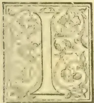

LAST addressed you in October when we were expecting our *October rains* (or monsoon), and, as is ever the case, in fear and trembling lest they should be too heavy and cause a lot of damage by wash and landslips. I am thankful to say that the rains have been moderate and genial; they have much benefited the country without doing any harm; in fact there may be parts of the island where a larger fall would probably have been desirable.

As regards crops, those of the settlers, as I led you to expect, have, as a rule, been short in consequence of the very dry weather experienced from the end of November 1887 to the middle of April last, but the higher elevations benefiting from this continuous fine weather, gave very average crops last season, and now promise well for the coming spring crop of 1889. But Blue Mountain coffee proper is never more than a few thousand cwt. at any time and does not in any way influence the general market, ever maintaining its high character and consequently its high price. The estates on which it is grown might almost be reckoned on the fingers of a man's hands; they are under twenty in number, and some of them produce very scanty crops, most of the coffee having died out from neglect or abandonment.

The editor of the *St. James's Budget* had not the courtesy to publish my letter to that paper, in which I exposed the mistake of the French botanist Mr. Raoul, who was stated in that paper to have visited the principal coffee markets of the world, and to have said he had scarcely met with an estate that was not seriously affected with *Hemileia vastatrix* and that, in consequence, before very long coffee would be fetching four times its present value. I showed he could not have visited Brazil, Central America, or the West Indies, or he would not have made such an alarming statement, as Brazil itself had capabilities of nearly supplying the European and American markets if all continents well and emancipation does not affect crops to any large extent. I am of opinion that when a journalist has unwittingly been led into publishing an error in his paper, he should be the very first to acknowledge, and rectify his "misinformation."

I have just returned from the Agricultural Show held yearly on a cattle run, named "Cumberland Pen," about 10 miles by road out of Kingston, and six or seven by rail: it is the property of Mr. Verley, partner in the bakery manufactory of Verley & Robinson. During the Jubilee illuminations the letters "V. R." were very frequently to be met with, and the common people believed it was meant for Verley & Robinson. Anyhow Mr. Verley very kindly places his pen at the disposal of the Committee, and moreover does the host to a large number of favoured guests. The rail passes through the property and there is a platform for passengers; but hearing of the crush last year, after the Show was over, I elected to drive down; hired a well-horsed double buggy and had the pleasure of escorting two ladies who like myself had never visited such a Show in Jamaica.

The first part of the drive out of Kingston is very tame: first, one passes the May Pen Cemetery; then after a few miles the scenery changes and one passes through well timbered land and under immense cotton trees of fantastic shapes. Once off the main road to Spanish Town, one enters upon lovely park-like scenery, splendid trees—cotton and tamarind, the logwood, reminding one strongly of the English hawthorn, bamboos, ferns, etc., etc. A remarkable feature is the drive to Cumberland Pen is the fording of the "Rio Cobre" which, at times of flood is dangerous, and always exciting, fortunately it was not bad this year; still on the return journey we were glad to avail ourselves of the assistance of a riff-raff lot who had collected on the bank in order to earn an honest penny in "putting their shoulders to the wheel."

Cumberland Pen is very park-like, spread over with large trees which give a pleasant shade and

603------------------------------------------------

578THE TROPICAL AGRICULTURIST.[MARCH 1, 1889.

under which the cattle graze. Some parts are cultivated with guineagrass, irrigated from the Rio Cobre canal: such grass being sent to Kingston for sale. As to the Show itself. There is a very passable grandstand and a small ring for the riding, driving and hurdle competitions. Several very handsome turnouts were exhibited, also some very fine horses and cattle, ponies, mules and other live stock, including sheep, dogs and cats were very well represented. As for the agricultural produce, it was exhibited on a high narrow platform. The exhibits were very badly and untidily arranged and could not be viewed to the best advantage. Sugar, rum, coffee, pimento, cocoa, annatto, fruits and vegetable were fairly represented. The Show was very well attended; it is always a gala day for Kingston and the island generally: planters and pen-keepers congregated from all parts of the island, as also to be present at the races held soon after.

We are about to lose our Governor, Sir Henry Norman, about one year before his customary time is up: he has been appointed Governor of Queensland. At first he prayed to be allowed to remain in Jamaica until his six years were completed, as he was desirous to stay with us till the newly-elected Council members had been elected and the new Council was at work, for we are shortly to have a general election under the enlarged franchise; but it having been signified that Her Majesty wished he should go to Queensland he, of course, obeyed and is to quit our shores on the 2nd January.

Sir Henry has been a very popular Governor, except perhaps amongst the *haut-ton* of Half Way Tree (the fashionable suburbs of Kingston), who resented the Governor's tolerance to the colored members of Jamaica society, and for having them to his house as friends and guests. As a *bona fide* Governor he has been most popular, and deservedly so, and all the community will regret his having to move to another sphere of usefulness; probably many a *Quashie* would say of him, as I heard one of the churchwardens of Clopton Church had said to their pastor who was going away to another parish, "Oh, parson, you should not leave us; we were hoping that we should bury you." This, of course, was meant as a high compliment. As my letter is somewhat short I enclose an extract from the local *Gleaner*. It is an article by one Mrs. Kemp, of Ewings, Cayamans Estate; it is a very correct description of the manners and customs of Mr. and Mrs. Quashie, especially in that part of the Island in which that lady resides. I am sure it will interest and amuse your readers.

W. S.

#### WHY NOT A TEA SYNDICATE.

Our last issue contained a highly interesting communication from a London tea expert, one not only well acquainted with the trade, but of some experience in regard to the Ceylon article. His remarks on the changes that have come over the tea trade, wholesale and retail, owing to the appearance of large and yearly increasing quantities of British grown leaf, are much to the purpose, and will, no doubt, be read with attention by all interested in the industry.

So far as Ceylon growers are concerned, they do not look with disfavour on the large profits realised by the retailers, because the more gain to them the greater their inducements to push the article into consumption. Nor do they question the right of the retail dealer to sell any blend he chooses to offer his customers, but that to which they *do* object is the selling of blends incorrectly and improperly described on the packet. The writer of the interesting article to which we have alluded thinks the Public Prosecutor should step forward and take proceedings in all infringements of the

Trade Marks Act. The task has already been taken in hand by the Ceylon Association recently formed in London and though the first prosecution collapsed, owing to a break in the chain of evidence, it will undoubtedly be productive of good.

We are glad to see the new Association taking up this work, but to our mind a Tea syndicate is required for more extended action than the new body contemplates by its prospectus. There are salt syndicates, tallow syndicates, and copper syndicates for mutual help and mutual defence, and why not a tea syndicate? If for no other purpose it would be invaluable as a means of gradually regulating the bulk of tea to be thrown on the market by public auction, a matter in which there is much need for co-operation. Only brokers, perhaps, are fully sensible of the serious losses often incurred by "rushing" new landings of tea, when by a little mutual arrangement the market might be kept more evenly supplied, according to the trade requirements of the Week. We may be told that the project cannot be worked. Perhaps not just now, but we feel confident that the time will come when some plan of this sort will be a necessity, and will be found practicable.—"Ceylon Advertiser."

#### TOBACCO IN AMERICA.

One of the important points in the Senate tariff bill is the protection it proposes to the growers of tobacco. Great complaint is made that under the present law Sumatra tobacco grown by the cheapest labor in the world is brought in to compete with the brand of tobacco most largely grown in the North, that used for wrapper. The Senate law proposes a duty on this, if not stemmed, of 75 cents per pound, and if stemmed, a duty of \$1 per pound. Quite as important is the provision that if this leaf tobacco is imported mixed with other tobacco is paying a low rate of duty the whole shall pay the higher rate. This will stop what in practice has proved a great abuse. The duty on fillers tobacco is reduced so that Havana tobacco for fillers to cigars may be imported with advantage. This will assist the tobacco grower and the cigar manufacturer.—*American Farmer*.

#### DRUG TRADE REPORT.

LONDON, January 10th.

BAEL FRUIT.—Ten cases dried quarters sold at the low rate of 1d per lb; but for another lot of 10 bags of mouldy fragments only  $\frac{3}{4}$  d per lb could be obtained.

CALUMBA.—The quantity offered today was restricted to 100 bags of grey, medium to bold, slightly wormy root which was bought in at 25s to 30s per cwt.

CARDAMOMS sold at extreme prices today, the advance being about 3d to 4d on some lots. There were 138 cases offered, including several lots of fine quality, but nearly two-thirds of this supply was withdrawn, although buyers offered high prices for some lots. Ceylon Malabar, grey medium, dull appearance, sound sold at 1s 11d. Mysores, good pale medium to bold plump 2s 10d to 3s, smaller ditto 2s 5d. For good yellow medium to bold long 2s 6d was refused. Seed brought 1s 11d. Wild Ceylon 1s 7d to 1s 8d per lb. A new feature in this article was introduced by the sale of about 1,280 lb. of cardamoms grown in New Zealand, and imported here from Lyttelton, in the central part of that island. These cardamoms were apparently grown from Malabar seed, and of good quality, but badly cured and harvested. They were round, small to medium size, not very well bleached, badly clipped, and mostly damaged. From 1s to 1s 4d per lb was paid for the better lots, 8d to 9d for mouldy, thin, and shelly, and 1s 6d for seed. The shipments of cardamoms from Ceylon show a great falling-off this season. They have been, in the periods between October 1st and December 13th: 1888, 35,386 lb; 1887, 76,777 lb; 1886, 39,153 lb.

604------------------------------------------------

MARCH 1, 1889.]THE TROPICAL AGRICULTURIST.579

**CINCHONA.**—Flat Calisaya bark continues to be imported here in very heavy quantities, and there seems little doubt that sooner or later the market must decline. At the auction today about 180 packages of this variety were shown and only two sold at 1s 8d per lb for good bright sound. A few bales damaged "cultivated flat" Calisaya brought 10½d per lb. Ordinary grey Guayaquil realised 5d to 8½d per lb. Lima is partly held at 8d per lb., much beyond the value. For other varieties extremely high rates continue to be paid: Loxu, good bright fresh mossy to very small broken quill from 2s to 1s per lb; Huancoco 1s 1d to 1s 3d per lb. The shipments from Ceylon in the period between October 1st and December 13th have been:—1888, 3,023,319 lb; 1887, 1,803,726 lb; 1886, 2,954,055 lb. Up to the present the following quantities are advertised for sale next Tuesday:—Ceylon bark 2,014; East Indian 160; Java 319; South American 355; and Fiji, 3 packages; total 2,851 packages.

**COCA LEAVES.**—The 11 boxes crushed Java leaves of good appearance, of which we published the analysis in a recent report, were today disposed of at 7d per lb; and 3 packages small very badly-cured leaves, also from Java were withdrawn. Of South American leaves 10 bales were shown. For good bright green Bolivian 1s 1d was refused, the price being 1s 6d per lb; while a somewhat damaged parcel found abuyer at 1s per lb.

**CROTON SEED.**—Five robins East Indian seed of ordinary quantity brought 15s per cwt.

**KOLA NUTS.**—One box of good dried West Indian seeds sold dearly at 10d per lb; for a small and wormy lot 3½d per lb is asked.

**MATE (PARAGUAY TEA).**—An 80-lb cask of very good quality catalogued as "matico," is held for 1s per lb. The drug is hardly ever seen in the open market there.

**NUX VOMICA.**—At today's auctions 216 packages were offered, all of the inferior variety. The price for small, fairly silky seed from Bombay and Calcutta is 8s. Twenty-seven bags, partly damaged and small seed imported from Saigon (French Indo-China, sold at 6s 3d per cwt.

**COCONUT OIL.**—On the spot a moderate business is being done at £27 for good Ceylon in pipes £28 to £29 for good to fine Cochin, and £27 for Mauritius.

**PALM OIL.**—Fine Lagos remains exceedingly steady at £2s 10s.

**ESSENTIAL OILS.**—Citronella dull, at 7d to 15-16ths d. per oz. on the spot. The Ceylon exports are again very large this season. Nutmeg oil, "Fisher's," is quoted at 7d per oz.

**QUININE.**—Some slight improvement became apparent soon after the close of our last report, and sales of German bulk, including B & S at 1s 3½d to 1s 3½d per oz. for January-February and later delivery were reported. This business was followed during the present week by further transactions in B & S bulk, spot and February-April delivery at 1s 3½d, and Auerbach, April delivery at 1s 3½d per oz., and Whiffen's, in second hand, at 1s 4d per oz. Today the German makers quote 1s 4d per oz., and do not seem anxious to book orders, but we think 1s 3½d would still buy in second hand.

**VANILLA.**—The first shipments of new season's Mauritius beans were offered today, and sold with good competition at an advance of 1s 6d to 2s 6d per lb; fair small chocolate, slightly crystallised 3 to 7½ inch 5s 9d to 13s; good fresh 7½ to 9, 14s to 18s 6d; ordinary brownish 5s to 9s; common dry 2s to 4s 6d.—*Chemist and Druggist.*

#### BLACKMAN'S TEA WITHERER.

In Mr. Armstrong's paper on the manufacture of tea, read before the Maskeliya Planters' Association in August 1885, he there suggested the use of the Blackman's air propeller to draw up the hot air from the driers to the withering loft to aid in withering leaf in wet weather. Ceylon should not lose the credit of having made the suggestion first.—*Cor.*

#### MATALE COFFEE.

(From a Correspondent.)

Although "Matale" is a word of only six letters it comprises a very large district, and its weather is about as varied as its products. It is quite a mistake to suppose that a correspondent writing from the town of Matale, or Matale West, can give you a report of the weather experienced at this season of the year, as being that of Matale district. It is perhaps equally uncertain to report on the Matale coffee unless the correspondent has had the advantage of visiting or getting reports from the various divisions of the district.

With reference to the weather and its pranks, permit one illustration. Last week two visitors from Matale West were surprised to find we had been having so much rain: they left in the morning during a storm of wind and rain and had gone about two miles only, when they got out of it, and had fine weather for the rest of their journey, while the whole of that day was wet and windy here.

In support of the paragraph sent you the other day, in which mention was made that coffee seemed to be regaining strength, &c., allow me to add for the information of "Planter," that an old Matale planter who knows this portion of the district well, on seeing the coffee, remarked it was astonishing how well it was looking, full of spike, and only wanted dry weather to bring out and set the blossom. It may be and doubtless is too far gone to expect a revival of the old product, but it is surely not too much to expect to hear the rattle of the pulper as it removes the beans from the cherry gathered in the north end of Matale East.

#### CEYLON TEA AT THE EXHIBITIONS AND IN AMERICA.

(From a Planting Correspondent.)

I think you gave the home people a very proper rub up in your Thursday's article. It is too absurd of Messrs. Leake and Shand complaining of want of sympathy and information from this side. If there is one thing more than another which our Secretary prides himself on, it is prompt attention to matters requiring explanation &c. Mr. Shand is to blame for not giving details of the expenditure on the home side. We have a large expenditure on Brussels for which we get no return or precious little, and what is unexpended on our vote of R6,000 is required for Glasgow deficiency from which we were led to expect such a lot of benefit, and even profit. Then now Paris: "Look sharp," writes Mr. Shand, "or I'll treat with others for my corner of the Paris Exhibition." If the Ceylon Tea Fund Committee don't look sharp they will find themselves in for a big expenditure there. Now all this prevents our dealing with pushing our tea in America where they do drink tea. Let Dr. Duke's plan be tried in its entirety. Mr. McCombie Murray undertakes to do it exactly as Dr. Duke wants it done for .. .. \$1,200 including cost of pamphlets. The 6,000 lb. of tea would cost .. .. 2,000

Say \$3,200 or R8,000. I believe more would come of that than the French and Brussels Exhibitions, which will cost R10,000 at the very least.

If, however, we prefer Mr. McCombie Murray's elaborate plan of working New York and Philadelphia by interviews, pamphlets, &c., the cost will be \$1,000 Cost of 6,000 lb. tea and duty, for I see the freight is included .. .. 2,000

Total.. \$3,000

or, say, R7,500.

605------------------------------------------------

580THE TROPICAL AGRICULTURIST.[MARCH 1, 1889.

You say Ceylon cannot afford it. We have spent R25,000 quite in pushing tea in Great Britain. R10,000 would not be a large sum to push tea in America.

[We meant both schemes: most certainly Dr. Duke's proposal has a first claim, provided special attention is given by Mr. Murray to the Central and Western States.—Ed.]

#### PADDY CULTIVATION.

Your remarks upon the impolicy of continuing to treat paddy cultivation as if it afforded the most profitable, instead of its being one of the least remunerative, of any agricultural pursuit in Ceylon have been read with much appreciation. It is, of course, most difficult to change the customs of a people which have prevailed from time immemorial; but what you have written is likely, we believe, to awaken the Colonial Office to a sense of there being something more than weak in the representations by which it has hitherto been induced to acquiesce in the large expenditure annually incurred to foster the extension of what is, or ought to be, a stationery industry in Ceylon. Except in a few remote districts to which the cost of carriage of coast rice would make its consumption almost prohibitory, there exists no *raison d'être* for further endeavor to misdirect the energies of the natives of Ceylon. You lay much stress on the cultivation of the palmyra palm among the industries which you think might be usefully added to that of paddy growing. The chief difficulty as to the adoption of this cultivation seems to myself—who, for many years, resided among groves of such palms—to be the length of time required for them to come into profitable bearing. The man who plants them must do so for a succeeding generation.\* The virtue of self-denial, of thought for those who have to come afterwards, was, it is to be feared, much more inculcated and practised in days gone by than it is likely to be now, when the growth of population and facilities for ready movement to other fields of settlement have broken up the old conservative attachment to locality of birth. But the palmyra palm is a tree of so many useful purposes that it would be a thousand pities if it were allowed to die out in Ceylon. Your Forest Department might, we think, usefully direct its attention to the planting of wide areas of these trees, and it is certain that the Government of a future day would reap vast benefits from the adoption of such a course, for it—the Government—"goes on for ever, ever," while family ties and associations daily grow less strong and less binding to the soil. "Let posterity take care of itself" is now the universal motto, and the tendency now is rather to obtain the price for the palms as timber rather than to preserve them or extend their growth for the benefit of successors.—*London Cor.*

#### NORTH BORNEO NEWS.

(From the *North Borneo Herald*, Jan. 1st.)

PLANTING.—The great feature of the year is the wonderful impetus given to tobacco planting in the Territory, and the consequent rush of applications in the Land Department. The whole of the available land in Marudu Bay has been taken

up by various companies while large acreages have been located on the Sugut, Labuk, Kinabatangan and Segama Rivers, as also in the vicinity of Lahad Dato in Darvel Bay. So far, with two exceptions the Tobacco industry is in the hands of Dutch planters attracted to this Colony by the excellence of its climate and soil and the extreme facilities for the acquisition of land, facilities unknown in the countries administered by the Netherlands India authorities. So far the planting industry is almost entirely confined to Tobacco, with the exception of Mr. Christian's Liberian Coffee Estate near Kudat; but we understand it is the intention of the East Borneo Company to experiment in pepper planting on their estates on the Kinabatangan River. Mr. Mitchelson well known as a pepper planter in Johore is managing for the Company up the Kinabatangan in conjunction with Mr. Schuit late of the Rotterdam Borneo Company in Marudu Bay. Splendid specimens of leaf are reported from Banguay, Ranow, Mr. Stephen's estate in Darvel Bay and other places. One of the largest Companies floated during the year is the London Borneo Company inaugurated in London by Count Geloos d'Elslöo which bids fair to be one of the most powerful planting Companies in the Territory.

TIMBER.—Messrs. E. E. Abrahamson and Company have formed their timber business into a company entitled the China-Borneo Company Limited. Mr. E. E. Abrahamson will be the resident Manager in Sandakan. The Company was formed in Hongkong with a powerful Directorate and the Shares were most rapidly taken up. An event during the year was the opening of the large Saw Mill and plant belonging to the British Borneo Trading and Planting Company, a full account of which was given in our July number. The Resident Manager is Mr. F. R. Boulbee, M.I.C.E. The Company possess one steam launch for towing purposes.

COAL.—Thanks to the energy of Mr. Henry Walker, the Commissioner of Lands, it seems probable we are about to develop a payable Coal seam within two miles of the town of Sandakan. Samples of this coal have been brought to town and compared with Muara Coal, the experts unanimously giving the Sandakan specimens the preference.

COMMUNICATION.—Facilities for communication with Singapore have increased wonderfully. Mr. Bogaart on behalf of Messrs. W. Mansfield and Company has contracted with the Company for a coastal service and a through steamer from Singapore via North Borneo ports to Hongkong and back. The large steamer "Memnon" is at present running the Hongkong route and the "Mercury" which is commanded by Captain C. Griffin is running the coast trade. The Hongkong direct route has already proved a great boon to the country and will greatly facilitate the supply of coolies for the tobacco estates. In addition to these steamers we still have the "Paknam," "Hong Ann," "Spaniel" and "Royalist" running while Messrs. Behn Meyer and Company have sent two steamers on occasional trips, the "Parana" and "Provincia."

IMMIGRATION.—The number of Immigrants arriving in the Colony was 4,930 against 1,756, during 1887. The number of Departures 1,703 against 1,098, in 1887.

SHIPPING.—The aggregate Tonnage inwards and outwards from Sandakan amounts to 85,398 tons, against 63,987 in 1887.

PROGRESS.—The following return of the Revenue and Expenditure and Trade of the Territory since 1883, with an Estimate for 1889 will we trust be considered satisfactory by our readers whom in conclusion we wish a Happy and Prosperous New Year:—

\* Not at all: where well cultivated, 10 years should see a return; but we spoke of official encouragement.—ED.

606------------------------------------------------

MARCH 1, 1889.]THE TROPICAL AGRICULTURIST.581

Return shewing the Revenue and Expenditure,  
Imports and Exports and other information  
referring to British North Borneo for  
the undermentioned years.

<table border="1">
<thead>
<tr>
<th>Year.</th>
<th>Revenue (proper 1.)*</th>
<th>Expenditure. (proper 2.†)</th>
<th>Imports.</th>
<th>Exports.</th>
</tr>
</thead>
<tbody>
<tr>
<td>1883</td>
<td>$50,738 20</td>
<td>$274,892 94</td>
<td>$428,889 48</td>
<td>$159,127 23</td>
</tr>
<tr>
<td>1884</td>
<td>82,448 88</td>
<td>198,230 92</td>
<td>491,413 67</td>
<td>262,758 57</td>
</tr>
<tr>
<td>1885</td>
<td>110,452 94</td>
<td>208,298 89</td>
<td>648,318 52</td>
<td>401,640 97</td>
</tr>
<tr>
<td>1886</td>
<td>127,731 23</td>
<td>195,803 85</td>
<td>849,115 64</td>
<td>524,724 44</td>
</tr>
<tr>
<td>1887</td>
<td>142,687 20</td>
<td>186,839 64</td>
<td>959,624 76</td>
<td>535,267 09</td>
</tr>
<tr>
<td>1888</td>
<td>160,000 00</td>
<td>190,000 00</td>
<td>1,150,000 00</td>
<td>600,000 00</td>
</tr>
<tr>
<td>1889</td>
<td>180,000 00</td>
<td>178,000 00</td>
<td>1,500,000 00</td>
<td>800,000 00</td>
</tr>
</tbody>
</table>

Principal Products.—Beeswax, birdsnests (edible), blachan, brassware, bricks, camphor, coconuts, coffee, dammar, fish salted, fruits, gutta percha, hide, india rubber, ivory, live-stock, old jars, pepper, rattans, rice and paddy, sugo, seed pearls, sesik, tingeling, sharkskins, shells—tortoise and others, tobacco, trepang, billian, cedar and many varieties of other woods.

Area in square miles.—31,106.

Population.—150,000. Roughly estimated.

1. \* Exclusive of sums realised by land sales.

2. † Exclusive of sums spent on permanent Public Works.

3. ‡ Estimated.

ALEX. COOK, Treasurer-General.

The Treasury, Sandakan, 1st Jan. 1889.

The amount received by the Land office during 1888 is said to be \$200,000 and the lands sold during the year amount to 252,000 acres. The price of Land was raised on the 17th July to two Dollars per acre and was again raised on the 12th December to three Dollars per acre. We gather from the prospectuses of the many companies that have been formed, that the price obtained for land at second hand has been about five dollars per acre.

The number of tobacco Estates, large and small, planted during 1888 was six, and the number to be planted in 1889 is said to be sixteen. Mr. Christian's Liberian Coffee estate has been added to during the year and Mr. Lennard is now opening a Coffee estate on the Benkokoa River above the launch limit and on very fine soil. The East Borneo Company are opening a pepper plantation on the Kinabatangan.

## INDIAN TEA IN AMERICA.

An experienced tea planter sends us extracts, given below, from two of his letters, which were written in 1883 from America. He says, "These extracts will show you that all the time I was in America I opposed the current attempts, and endeavoured to get a change made ere too late.

"Your correspondent's ('P. P.') remarks I fully support, except so far as, in justice to myself, I wish to correct the impression as to who is the 'originator.' During the Indian and Colonial Exhibition I handed a syllabus of proposed operations to one representative assessor, and subsequently by request to another. More than one year afterwards Mr. Allies comes upon the scene with a similar scheme, but without any American experiences to back it. From the way the thing has been gone about here, in London, there is only one issue ahead, unless appearances deceive."

In a previous communication, statements were made and opinions offered by your correspondent on the subject of the introduction of Indian teas into the United States and Canada, and these deductions are the outcome of practical investigation and success, and not the ramblings of theoretical or sanguine possibility. A perusal of pages 285 to 299 of the "Ten Cyclopaedia" will convey an idea of the opinions offered by brokers and others on this side of the Atlantic. The path of these is, "that for Indian teas to become universally popular in America, they must be manufactured to imitate 'Japans' or teas of the 'Oolong' class. An opinion to the contrary is, however, here advanced. Indian teas are perfectly able to take their own stand as such, and under equal conditions maintain it, when once fairly obtained,

but any intention which will destroy its identity as "Indian tea," will simply repeat the old story of deception. To avoid "shoddy" imitations of other teas will be the surest means of establishing the reputation of "Indian" teas. Two years ago a large quantity of *Namuna* tea was made "for the American market," as assimilating to the "Oolong" teas so much in use in the States.

The cost of production of *Namuna* teas is in itself a barrier, while no "Oolong" that your correspondent has tasted in this country, could ever be mistaken for *Namunas* either in aroma, flavour, or strength. For Indian planters to endeavour to imitate Japan, or other teas, in order to induce the public into a liking for Indian teas, is an absurd anomaly, and can only lead to failure, as the interests of brokers and merchants in this country are too much centred in Japan and China for them to heartily co-operate in introducing an article whose superiority and excellence would eventually drive the product of those countries entirely out of the field, and bring certain ruin to them.

Brokers and merchants may assist to introduce Indian teas as an auxiliary towards passing off the rubbish imported from China and Japan, but they will never assist to cut their own throats by sharpening the knife, or introducing a supplanter. The old familiar trick of mixing pure Indian teas with trash, is as well known here as in England, and more largely practised; and while merchants here will purchase sufficient for "mixing" purposes, they will never aid in establishing a substitute whose success will prove disastrous to them. It is only by Indian growers and owners combining and determining to establish their products by their own hands, that they will succeed, and to do this they will have to do as others do in this country. If merchants or manufacturers in Europe want to push their goods forward to compete against others, they send their own agents out, choosing reliable men, whose sole interests are those of their employers, and tea owners will have to adopt a similar course, at least until a taste for Indian teas, pure and unmixed, is firmly imparted into the masses. Once this object is obtained the rest will follow, and merchants who now will buy sufficient for their own purposes, will then be obliged to meet the wants of the public. At present brokers and merchants rule the public taste, but it is possible and feasible to reverse this in course of time by educating public taste independent of, and unaided by, these gentlemen, entirely on your own merits and by your own means.

To illustrate and practically support these tenets, your indulgence is requested to a short account of operations demonstrating the same. Upwards of eighteen months since circumstances induced the writer to seek a home in America, and as a private personal enterprise it was determined to venture an attempt to place Indian teas before Americans in a pure, simple state, at first on a small scale. Accordingly arrangements were made to purchase some hundreds of pounds of tea for direct shipment to an American port.

I recently received a letter of enquiry from Kumaon (N.-W. P.) asking if "Namoonahs" are still in favour, what is their selling value, and if "Americans still want them, or have they taken to fermented teas?" For general information I reply—"Namunas still are wanted at American brokers' prices, not at planters' valuation though." If planters are willing to make Namunas at a loss to sell at 32 cents (say 10½ annas) per pound to oblige Yankee grocers and assist them to put some taste of tea into the rubbish imported from China as such, Namoonahs are still in favour. The Americans have not taken to drinking fermented teas because they cannot get them, and never will till Indian growers introduce and popularize them by means totally different from anything yet attempted on a mercantile scale in America. I know one ex-Indian tea planter, who supplies no less than about 20 different Agencies here with pure Assam teas. He sends supplies to Massachusetts, Pennsylvania, California, Georgia, York State, New Jersey and other places, asking no favours, giving no inducements but purity, and charging a price for every pound which

607------------------------------------------------

582THE TROPICAL AGRICULTURIST.[MARCH 1, 1889.

"pays the grower, his Agents, and himself handsomely (the grower of course least)." What is done, and has been done by him for over two years, could be done by others on a grander scale, for hundreds drink pure Assam daily in certain sections operated in, swear by it, and pay for it, and well too. In one city alone his three Agents and two grocers all sell "Assam," and make a good clear profit. Yet with this I am repeatedly told "Indian teas are so dear that people can't afford them." Whereas experience has taught that the poorer and most economical class are the very ones who do buy and appreciate "Assams" the most.—*Indian Planters' Gazette*, Jan. 8th.

#### THE PUSHING OF INDIAN TEA. (BY THE "PERIPATETIC PLANTER.")

The "Associated Indian Tea Planters, Limited," held their meeting, at which they were introduced to Mr. McGregor of New York; and it was, I understand, decided to draw up an Agreement with that gentleman for the "representation" of Indian teas in America. So there are more preliminaries yet, it appears, to be gone through before this vast mountain brings forth its mouse. Meanwhile, big rats are breeding galore, over there, to eat up this mouse's portion, ere it arrives.

The arrangements already referred to for placing Indian teas at the Paris Exhibition, have been completed, and the £2,000 have been subscribed. Mr. Walker, the Agent in charge, will start a depot in Paris simultaneously, for the sale of Indian tea over there. The I. T. D. A., or subscribers to the guarantee fund, had it proposed to them that Indian coffee should also be represented at their stalls, &c.; to this, however, the more conservative members objected, and the proposal was not accepted. The subscribers have reserved a right to take over the Paris depot at a valuation hereafter, if they so please; it is not however, thought likely that they will exert this power, but that they will be only too pleased if they receive back their £2,000 intact.—*Indian Planters' Gazette*, Jan. 8th.

#### COFFEE, TOBACCO AND PEPPER IN CEYLON.

Renewed interest in COFFEE AND COFFEE PLANTING is becoming a sign of the times. Our neighbours in Southern India show us a good example, for with the wonderfully steady crops from the Mysore and Coorg coffee plantations *under shade*, they feel strong encouragement in other districts to go on with old king coffee. From Wynada even, we have reports of grand appearances "in spike"; while we have also inquiries directed to us by gentlemen who are anxious over the way to try their luck again with "Liberian coffee." Our answer to the planter who has asked our opinion in respect of this disappointing variety will be found in another column and is very much the same as *Punch's* advice to those about to marry,—"*Don't*."

There is more to be said for the cultivation of Arabian coffee under shade wherever a soil and climate similar to that of Mysore can be secured. Uva is the district affording these most nearly in Ceylon and in view of the Haputale railway extension now under construction, we are very hopeful of seeing experiments in gardens, and clearings say up to 100 acres, attempted in the forest and chena reserves of that province.

Meantime as regards our remaining coffee fields in Uva, Udapussellawa, and parts of Dimbula and Dikoya, there is still great hope that "green bug" may disappear leaving the coffee to do some good yet under careful treatment. From some parts of Uva, we are bound to say that the opinions supplied to us by planters are of a very gloomy, desponding character; but these are counterbalanced by those of other planters who declare that bug has nearly disappeared from their fields and that

it looks as if Dr. Trimen's hope of a sudden collapse of this pest would be fulfilled. There is no doubt that everyone owning decent fields of coffee will endeavour to do them justice in view of this prospect, as also of the full assurance of very fine prices for their berries. There is no chance now of coffee being in excess supply, whatever may be said of tea.

The cultivation of TOBACCO, too, is likely to be undertaken energetically, under the auspices of a local Limited Company, mainly supported by planters of tried sagacity and prudence. A capital of £500,000 has been already subscribed, it is understood, and with Messrs. Rutherford, Christie, Armstrong and other gentlemen of their stamp on the directorate, successful results are generally looked for.

Still more widespread is the interest taken in PEPPER cultivation, since we have agitated for its revival among the natives and for its more general adoption by European colonists. We are very anxious to see Ceylon export a large and annually increasing quantity of pepper, for which there is certain to be a good market and we have reason to believe that the coming south-west monsoon will see an appreciable area planted with pepper vine cuttings in different districts. There is one great advantage in planting pepper, namely, that it is not likely to be overdone—considering that the demand is in excess of supply—which can hardly be said of tea.

#### HOW WATER WAS OBTAINED IN "THIRST- LAND."

At the meeting of the Geographical Society, a paper was read by Mr. F. S. Arnot, entitled "Journey from Natal to Bihe and Benguella, and thence across the central plateau of Africa to the sources of the Zambezi and Congo." The reader of the paper was led to make his expedition, which was that of a missionary character, from witnessing as a child a distribution of prizes in 1864 by Dr. Livingstone on his return from the Zambezi exploration. Mr. Arnot started from Natal in 1881, and made for the Transvaal with very slender resources. This, it appears, was not an unmixed evil, as he owed escape to that fact from some of the troubles that befall travellers furnished with a large stock of goods. This method of proceeding, however, was accompanied by many inconveniences. The travellers had to traverse the "thirst land" on Livingstone's route, and the only means of obtaining water was that adopted by the wandering bushmen of the Masaroa race. How Mr. Arnot obtained water may best be described in his own words: "A few wandering bushmen of the Masaroa race, however, came to our relief, and to their kindness we doubtless owed our lives. Digging pits in the sand, they sank long reeds to the bottom of these, and with an unusual power of suction, acquired by long practice, they slowly drew up the water from the sand, discharging it from their mouths into tortoise shells, and so great was our thirst that we eagerly drank the frothy liquid. Morning and evening we were sustained by a little of this turbid fluid." Mr. Arnot's oblique journey across Africa corresponded on the whole with that of Major Serpa Pinto. Mr. Arnot's object in going to Africa was to establish a healthy missionary station in the interior, and it was accomplished after seven years. Although he traveled without a white, or even a black companion, he never received any ill-treatment. Guns were carried by some of the party, but only for hunting purposes.

608------------------------------------------------

MARCH 1, 1889.]THE TROPICAL AGRICULTURIST.583ANNUAL TEA REPORT FOR 1888.

LONDON, Jan. 23rd, 1889.

In reviewing the course of the Tea Trade for the past year, the most satisfactory feature to notice is the increased Delivery compared with 1887, the total quantity amounting to 222 million lb.: Home Consumption showing an excess of  $3\frac{1}{2}$  millions, and the Export 3 millions. Another matter of considerable importance is the larger supply of Ceylon Teas, and the appreciation of the quality by the public, the Import and Consumption having nearly doubled during the year.

CHINA.—Notwithstanding 24 millions decrease in the Export last season, all common to fair grades continued to decline in value, and, before the arrival of the new crop by the end of June, had reached an extremely low point. The new Teas opened at very full rates, owing to the absence of any good Tea of the previous season remaining on the Market. The quality was pronounced inferior, attributable, perhaps, to the bad weather during the time of plucking. The Russian buyers in China held aloof from purchasing on account of this inferiority, which eventually led to large orders coming direct here, and further stimulating prices of Black Leaf Congous, the market becoming almost cleared of all desirable parcels of medium to finest grades. Foochow descriptions did not participate, and although a small portion of the first crop sold at paying rates to Importers, the general result has been unsatisfactory. Common classes have somewhat rallied from the lowest point, but still are selling under cost of production.

INDIAN AND CEYLON.—The year has been again marked by a further growth in supply and expansion of consumption, the Import of Indian being 7 millions larger, and the deliveries  $3\frac{3}{4}$  millions heavier than in 1887, while from Ceylon the receipts have increased 94 millions and the deliveries 8 millions, British-grown tea thus furnishing 105 millions towards the 184 millions taken for home consumption in the United Kingdom. An active market in the Spring was followed by dulness in the middle months and a heavy depreciation in the value of all grades over 1s. per lb., which lasted until the Autumn trade demand set in, when values for the finest sorts began to recover, the advance being stimulated by the small proportion of choice tea found in any of the various crops. Setting the abundant yield and reduced cost of manufacture against dearer freights, higher warehouse rates, and a slightly lower average sale price,—the Industry continues to occupy a strong position, and promises to yield a good result to growers both in India and Ceylon. Systematic action is now being taken on behalf of producers to bring the merits of British-grown tea more directly under the notice of the important markets of the United States and Canada; and it is anticipated that, as in the Australian Colonies, where consumption is steadily growing, so also in America the improved demand now visible may develop into trade of some dimensions.

JAVA.—Imports shew an increase, and improved quality has led to their receiving more attention from the Home Trade, values now standing close to currencies for Indian.

WM. JAS. & HY. THOMPSON.

TEA IN AMERICA.

At a time when India and Ceylon are making efforts to secure a slice at any rate of the tea trade of the United States, it is interesting to learn a few particulars of that trade. The total receipts of tea into the United States for the season 1886-7 amounted in value to 16,771,802 dols., of which 12,368,063 dols., or 63,462,268 lb. passed through the port of New York, or three-fourths of the whole. Of this 292,786 lb., valued at 75,638 dols., out of a total of 407,169 dols., or nearly three-fourths of the total of exports, was from New York. The receipts from Japan were 46,493,000 lb., and three-fourths of the year's supply came via the Pacific coast, which was an increase over the previous year. The course of trade is increasing in this direction, while the improved

steamer service on the Pacific and transcontinental railway facilities are gradually making this the probable route of the future. Japan tea is, in round numbers, about one-half of the United States tea consumption which has risen from 37,843,612 lb. in 1868 to 89,831,221 in 1887,\* being the lowest and highest years of the twenty. The Japan houses have all agents in New York, and these seek out the leading customers in the large cities, and consign to them direct instead of them buying in New York. In this way the direct trade between New York and Japan, especially by sea, is being largely reduced in volume. Of the total Japan trade, which amounted in the above year to 17,114,181 dols. imports, and 3,336,562 dols. exports, only 4,464,315 dols. imports and 1,458,455 dols. exports were entered via New York, being only one-fourth of the whole.

There is an article in the current number of the *gentleman* on the "Russian Tea Trade." It is signed "T. Brush," and deals with the subject at some length. In it the writer says:—Although Russia is a long way behind England as a tea-consuming country, still the tea trade is a most important branch of its commerce, and has a history fully as interesting as that of England. There is a great difference between the two countries in the style of tea used and in the method of its use. Indian and Ceylon teas have quite revolutionised the English market, but the character of the Russian tea market has remained almost the same since the commencement of its history. Some few parcels of Indian tea have found their way into Russia, and have been very highly spoken of. Their quality and strength have been so much appreciated that the semi-official *Kavkaz* says:—"What hinders us even now obtaining our tea from India, where it is prepared by machinery, and not as in China, by an objectionable use of the feet? Even if we were to conquer India, nobody would give us tea for nothing, and our countrymen would have to pay all the same for this national beverage." At the present time, however, China tea is alone used in general consumption; and as the taste of the Russian nation has been educated to this style of tea, it will be many years, perhaps never before Indians and Ceylons become important factors in the Russian trade. —*H. & C. Mail*, Jan. 11th.

OUR MANCHURIAN SILKWORMS.

(Continued from page 411.)

THE OAK-SILK INDUSTRY.—It used to be a traveller's tale that silk grew on trees, and the ancients pictured it to themselves as one of the pretty sights of nature. In reality there is not much to see in an oak shrub laden with cocoons. The genius of the spinner is occupied in great measure with the art of concealment. Sometimes a cocoon will be enclosed between two leaves as large as one's hands, so that a passer-by has no suspicion of its existence. At other times quite a ball is made of smaller leaves, and the cocoon is equally invisible. The spinner, of course, needs a base of operations, and can spin if it gets one or two convenient tags by which to form an outline in rough; but it glories in abundance and variety. It becomes an interesting study to compare a few bushes, and to see the power of adaptation to circumstances in the formation of the cocoons. Difficulties arise alike from dearth as from excess of material for extraneous support. On one occasion I saw no less than three twigs bound together by the suspending lines, while quite a group of leaves had to be dexterously manipulated so as not to obstruct the work of the spinner; nay, it was gratifying to notice the touches of instinct, one might say genius, by which hindrances were worked into helps. On another occasion, the cocoon of a rival was in the way, and had to be slewed about with silk ropes to see that it maintained its relative position. The suspending lines are the first consideration, as dealing here

\* Britain with little more than one-half the population consumes more than twice this quantity, but then the great beverage in the United States is coffee.—ED.

609------------------------------------------------

584THE TROPICAL AGRICULTURIST.[MARCH 1, 1886.]

with harder material there is no occasion for the long lines of the *Ailanthus* worm. Yet our spinner is not content to begin with the base of the leaf pedicle. The lines being at least one rung of leaves above the point of suspension, and thus cover the twig over a space of one or two inches, being very slender to being with but thickening towards the lower leaf pedicle, and then presenting the appearance of a stout cord from the leaf pedicle to the cocoon. The next work is with the leaf wrappings, and the formation of a nest as it were for the cocoon. The worm then gets into position and begins the cocoon proper. To follow it into its invisible world, we know that after the cocoon is formed there begins a period of lively commotion, in which the occupant is undergoing another change,—is, we might say, forming the shell in which it lies in its chrysalis state. So vigorous is this movement, especially when the cocoon is held in the warm hand, that an inexperienced native told me one day that one of the specimens put in his care had a most lively moth in it which was battling to get through; he argued it must be the wings which flapped so against the sides of the cocoon. The fact is this period of commotion must be past before the moth is formed. It takes from fifteen to twenty days to perfect the change from spinner to moth, though in exceptional circumstances the moth might appear in ten or twelve days. Being in want of specimens this year, I have tested the question whether moths can be got straightway from the autumn cocoons, regardless of the fact that they ought not to appear till spring. It may be safely said they are not to be got *ad libitum*. In the spring, but more particularly in the midsummer season, everything seems to come right to a day—the moths are panting to be out, there is no restraining them. Of the autumn cocoons it can only be said if you don't keep them in a cool place some of the moths may appear when you don't want them; and, if you nurse the cocoons carefully on a warm *k'ang*, you may be lucky enough to get a few specimens of moths if you desire to force an appearance. There seems to be no certainty in regard to autumn moths, save that they prefer to remain in their cocoons. But there are "early birds" strong specimens, which are easily tempted forth, and I have up to date obtained seven such, and have the hopes of more, though it would seem as if the difficulty increased as October advances. To my mind, if it once pass the twenty days, it will want a tropical heat or the first blush of spring to call them to activity. The proper terms for the appearance of moths are March and August. About the 20th of March, pains are taken to hasten the eclorion. A warm *k'ang* and a sunny exposure, or even a charcoal burner in cold seasons, are the only means resorted to. When the moths are too early, or the season exceptionally late, care must be taken with the eggs to see they are kept in a cool place. When immediate hatching is desirable the usual period is from ten to twelve days. The autumn moths should appear with the beginning of the summer heat. Alike in spring and autumn early comers are prized. Generally there is a great rush of first comers, and then a dropping fire which may last for fifteen or twenty days. But in summer, more particularly, these late comers are not wanted, anything after ten days from the first comer is doubtful, and in good husbandry would be thrown away. In some places there is a careful inspection of moths with a view to a healthy stock. Thus a long soft body, or belly, which "wiggle-waggles" is bad—wanted a firm round body, or, as the Chinaman says, belly. Again, where the excretion is bad the moth is rejected. The fluid should be of a dull whitish colour, but a high or a mixed colour is a sure indication of disease. Another sign of evil omen is when the fundament shows black. It is supposed there is an immediate connection between this and the disease which I translated "diarrhoea" in last paper. Perhaps a description of some of the moths I have seen may be of use for purposes of comparison. Not to describe from memory I limit myself to a few of the autumn moths above

referred to, and which are before me in their original freshness while I write. One, a large, perfect specimen, a female, said to be the common variety as seen in our parts, appeared without any prompting on the 5th October. The antennæ are yellow, half an inch in length, and very slender. The head is yellow with black-brown eyes which show very large, the head itself having a triangular look like some of the ancient visors one has seen figured in tournament times. The body is very hairy, especially on the space between the wings. The colour is a dark orange shading into redness under the belly. The greenish rings of the body sometimes shine through. The length of the body is one and a half inches when quite fresh, the girth at thickest being the same as the length; the span of the wings is five inches. The ground colour of the wings has a dash more of red in it than the body. Red appears also in three distinct groups of characteristic marks, viz., (1) over the *Attacus* eyes; (2) in certain veinings or bars across the wings; (3) and in a certain wash of colour all over the upper parts of the wings. A transverse bar divides the wings into two unequal parts, the space above the bar being the larger or over two-thirds of the whole. This red, then, scarcely appears in the lower space at all, which is characterised by a uniform colour difficult to describe. It is yellow, but it has that singular suspicion of green shining through it which seems to give such a peculiar shade to the brown of the *Ailanthus* worm. If the reddish tint appears in this lower border at all it is only in certain lights, and even then in the upper wing segment only. Looking at the upper and under surface of the wings the ground colour all through would seem to be this shade of yellow, which yet cannot be called yellow unless one be allowed to say it has a dash of green, or, as a friend suggests, *olive*, shining through it. The *Attacus* eyes are more distinctly marked in the lower wing segments than in the upper. The oval begins above by a broad red curve which is about one-fourth of the whole circle, and which is continued in a fine black line for the remaining three-fourths. On the right hand side, however, the black line always begins heavy. Inside of the red the second circle begins above with white, the under segment being continued in bright yellow—this being a very fine line. Inside of this again is a broader band of slightly reddish hue, very light as compared with the outer red segment, which is continued in a band slightly narrow of the same colour as the wing border. Inside of this last of all is a lively crescent of golden yellow framing the lower half of the transparency. In the upper wing segments the arrangement and the colours are the same, only the outer one-third segment of red is very fine, as the black line which continues it. The transverse bar which divides the wing as above described, and the sinewy nerve of the upper wings show the same colours, which perhaps are fairly described as darker and lighter shades of lavender. The wing nerve is as if a very light shade of lavender were powdered over a dark lavender ground. The transverse bar across the wings consists of an upper line of dark lavender bordered by a line of light lavender shading into white. The most strongly marked red lines are on the upper wing segments, going from the body in a zig-zag to the upper nerve of wing; and in a less distinct but much broader band which goes from the body right across both wing segments in a line with the upper half of the *Attacus* eyes. These are even more clearly marked on the under surface of the wing, showing there as wavy lines, the upper and narrower one retaining its dark shade of red, and the lower one toning down to a dark orange. The lavender of transverse bar shines clearly through on this side in the shape of small lavender patches, eight to each wing segment. Unfortunately, I have no male with which to compare this specimen. It may be accepted as a fact that the male moth always differs from the female in the colour of the transverse bar on the wings. If I am correct in describing the colour in this instance as lavender, the colour in the male would show rather some shade of red going into crimson. Mr. Fauvel speaks of rose or roseate for the *Shantung* variety. But rose can-

610------------------------------------------------

MARCH 1, 1889.]THE TROPICAL AGRICULTURIST.585

not possibly describe the shade as we have it here. From what I have seen, the shade of colour on the upper, *i.e.*, the darker, line of transverse bar, in the case of males, will always follow the dark crimson shade, which after all is perhaps the proper term for the colour of the outer curve over the Attacus eyes. This specimen is one of four females, which may be said to be for all practicable purposes absolutely alike. If there was any distinction it arose in one specimen, from the appearance of the so-called red colours invading and shining through the lower border of the wing, *i.e.*, under the transverse bar, and this in both wing segments, though to a less degree in the under one. Another set of moths, brought out in the same way towards the end of September and beginning of October, seemed to present some strikingly different features, and I was in hopes I had secured the moth of the yellow worm referred to in the preceding paper. From a similar promiscuous set of cocoons gathered last year over the same district I obtained three distinct varieties, two of which have been pronounced to be new species. One of them was a yellow moth, but I did not keep duplicates, and have no detailed description. The moths I have now to describe are not distinguished from the above red-tinted ones by the natives. The worm, as far as they know, is the ordinary green worm. Nor does the cocoon at all resemble the large and beautifully formed cocoons spun by the golden yellow worms, which also refuse to give up their moths, though they have been nursed and coaxed to the utmost. All that can be said is that these moths look yellow as compared with the four above described. The red veinings and red wash, so to say, are all the same as in the above. So is the transverse bar on the wings, so is the general appearance of the under surface of the wings. But the first look of the moth always makes one describe it as yellow. The body is quite yellow, and free from any suspicion of darker shading. The general ground colour of the wings is paler, and, save for one patch in each upper wing, is altogether free from that dash of red I have spoken of in the others, but which reminds some of "rust," of "copper," of "terra-cotta"—all of which terms I have heard used and dissented from, terra-cotta being especially objected to as not dark enough. Of this sort I have two males and a female. In the female the transverse bar on the wings seems indisputably lavender, and differs widely from that of the males, which show that contested colour springing from red as its base, which forms the upper curve over the Attacus eyes, and which, after all, is a rich shade of crimson. Weather experts will consider these as separate varieties remains to be seen. It is noteworthy that two sets of Walnut Moths seem to be distinguished in the same way as these, the one being the fac-simile of the other, save for this singular wash of red—which in the Walnut Moth may be accurately described as "rust," just as one sees it in very old rusty iron.—**JOHN MACINTYRE, Hai-ch'eng, 11th October, 1888.—Chinese Times.**

#### NEW PRODUCTS IN FIJI.

Here is something encouraging as well to large and small planters as to the Colony generally, and should at once set at rest any doubt which may exist as to markets being found for the fibrous material in which Fiji is so rich. By a late mail, the Governor has been applied to by the head of a wealthy firm whom his Excellency met in England, but the head quarters of whose business are in Victoria, asking whether the Colony could furnish 5000 tons per annum of paper-making material. We understand that the Governor proposes to take special measures for bringing this important question before the Chambers of Commerce and the Agricultural Association. Now is the time of all others when Suva should bestir itself and demonstrate that it has some commercial

men in its midst. The Chamber should be resuscitated. Plenty work can be found for those of its members who aspire to rank above the grade of more huckstering dealers. People should show that they can rise to the level of the position; and that, opportunity offering, they are equal to the demand legitimately made upon them to assist in the advancement of the Colony to which they owe their own progress and elevation.

We are informed that the Governor hopes to have by the end of the year about eight hundred young cocoa plants ready for distribution to such persons as may desire to begin the cultivation of this product, and who possess suitable soil and situation for that purpose. The varieties are the purest strains from Trinidad, selected by Mr. Prestoe, director of the Botanic Gardens there, by request of Lord Kimberley when Secretary of State for the Colonies. They comprise "Cundamar;" "Verdilico;" "Mixed Forestero;" "Longpointed Forestero;" "Fine grooved Prolific Yellow;" "Sangre Toro" and "Forastero." A considerable quantity of "Hevea" or Para rubber can also be availed of. In addition to the above, an excellent crop of the celebrated and valuable Delly (Sumatra) Tobacco seed has just been gathered, and his Excellency will be glad to send some to those who may desire to utilize it. Great attention is being given to this variety in Ceylon and elsewhere. All applications for these should be made to the Secretary of the Agricultural and Industrial Association. The cocoa plants will be securely planted in boxes for which applicants will have to pay five shillings each. It will be interesting to learn the number of practical men who will avail themselves of these means of adding to the value of the industries of the Colony.—*Fiji Times.*

#### CULTIVATION OF SESAMUM AND GROUND-NUTS IN CHINA.

Sesamum is best grown on high dry ground, and is most in danger from excess of moisture; it does not require watering, and dew alone is sufficient moisture to nourish it. In making beds, therefore, the centres should be higher than the sides, so as to allow the water to run off. In the first month of every year it is sown broadcast, not in lines, and whether thickly or sparsely is immaterial. In about ten days it puts forth shoots, in two months and a half it blooms, and in another two months and a half it is fit for harvesting. At harvest time the latest seeds are not yet ripe, but the harvest cannot wait, or the other pods would fall off, and the seeds drop out on the ground. The plants, root and all, are carefully taken out of the ground, put on a cement floor, and threshed with a flail. There are two kinds, black and white. Sesamum does not require manure generally, but in the worst soil ashes and ox manure may be used. About 27 ounces sown to an acre yield about 550 lb.

Ground-nuts are best grown in a soil of coarse sand and mud. They should be set deep, and the ground pressed down firmly over them. The ground is ploughed about April, and trenches dug about 10 inches apart, into which ashes, lime, and rubbish are thrown. The seeds are sown 10 inches apart, and as each is put in the sides of the trench are turned over it with the foot stamped down firm. Every ten days or so the ground is weeded, and in about two months the sprouts are sufficiently long, and are sprinkled with liquid manure. In four months they come into flower; the flower-stalk then bends over, and as the flower falls off, the flower-stalk buries itself in the ground, and produces seeds, ground nuts, which become ripe about the Shuang-chiang festival (October 23). When the harvest, however, takes place after this date more oil can be got, and a better price obtained for it. Ground-nuts are harvested by ploughing them up with an ox-plough, when the stalks and seeds clinging to the plough are gathered into a heap. For the remainder which are still left in the ground two men sift the earth with a large bamboo

74

611------------------------------------------------

586THE TROPICAL AGRICULTURIST.[MARCH 1, 1889.]

sieve. The pods are dried perfectly dry in the sun, until the thin skin which covers the seed can be broken by rubbing, when they can be stored. If they are not quite dry they shoot again, and are useless. Oil is pressed from ground-nuts; and the refuse made into ground-nut cakes; 40 lb. sown to an acre yield about 666 lb.—*Consular Report*.

### THE BRITISH AGRICULTURAL RETURNS FOR 1888.

**NURSERIES, WOODS, PLANTATIONS, &c.**—In the "Editorial Summary" it is stated under this head that in land used by nurserymen for the growth of trees, shrubs, &c., the returns show a slight decrease from the acreage of 1887. The land used by nurserymen in England amounts to 10,496 acres compared with 10,669 in 1887; Wales foots up 292 against 277 acres; and Scotland, 1,477 acres against 1,532 last year. Possibly that decrease is only temporary, owing to the rapid development of our larger cities and towns, and the rooting up of old concerns. Next year's figures will very likely tell a different tale. Of the average of woods and plantations a special return has been obtained for this year. The last return was made in 1880, in which certain corrections, due to subsequent inquiries, were made and inserted in the returns published in 1881. Since that date the acreage appears to have increased in Great Britain from 2,458,300 acres to 2,560,700 acres, or nearly 4 1/2 per cent. In many of the northern counties and in Scotland large additions are recorded. The increase in England has been nearly 52,300 acres; in Wales, 4,800 acres; and in Scotland 45,400. The total increase in Great Britain has been about 102,400 acres.

**SMALL FRUIT CULTURE.**—Under this heading we note that the extent of land returned as under the culture of small fruit, such as Gooseberries, Currants, Strawberries, &c., whether in orchards or in market gardens, amounts this year to 36,700 acres. In many countries the collecting officers report that the practice among farmers of appropriating land to the growth both of fruit and vegetables has further extended in order to meet the demand for them; and though the additional quantities of land may, as regards individual occupiers, be relatively small, in the aggregate they become considerable. It is stated in a report from the county of Norfolk that from only one small station on the Eastern and Midland Railway nearly 100 tons of fruit are sent weekly to Manchester and other towns in the North of England at certain periods of the year; and this is cited as a single illustration only of what is being done throughout that county.

**ORCHARDS, MARKET GARDENS, &c.**—A decrease is recorded this year of 3,056 acres in the area of orchards in Great Britain, it being now 199,178 acres; but the smaller extent shown must be considered in connection with the newly ascertained acreage of small fruit, the apparent deficiency having doubtless arisen from part of the land which should last year have been returned as growing small fruit having then in some cases been placed in the orchard column of the schedule sent out to occupiers, &c. The acreage now returned may, it is confidently believed, be taken to represent more accurately than in any preceding year, the actual area so covered; the land under grass, or upon which small fruit is grown, or which is left fallow in orchard, as may happen to be the case, being included under these several heads in the returns.—*Gardeners' Chronicle*.

### TOBACCO CULTURE: DELI AND NORTH BORNEO.

(Exchanges to 17th November.)

The rising fortunes of British North Borneo, and the rapid advance of tobacco cultivation there, have naturally aroused keen interest in Deli, hitherto so pre-eminent in the supply of that article. The Deli Courier has taken up the matter, and has sought to gain information at the fountain from a gentleman

who knows both countries well, and can speak dispassionately and authoritatively on the merits of the question. He spent several months in British North Borneo, and noted down his observation in a journal. The following extracts will give the gist of his experiences.

#### THE COUNTRY.

The territory of the B. N. B. Company takes in the north-east portion of Borneo with a coast line from Brunei Bay on the north to Santa Lucia or Sibuko Bay on the east. Its area is estimated at 31,000 square miles, but the boundaries have nowhere been accurately marked out. The Dutch Government lays claim to the S. E. portion of the dominion in the hands of the Company, and so far has made it good for the time being. The whole territory resembles a peninsula. It takes in the north-eastern mountain chain of Borneo with its branches and spurs, and the alluvial land lying between. The huge mountain mass of Kina Balu rises in the midst, visible to a long distance at sea. These mountains, viewed from the coast, present, for the most part, a gloomy appearance, slender trees with few leaves rise up from the steep, red, sandy hills.

#### THE HILLS.

Many hill tops are covered with lallang grass others with scrubby bush, some being quite bare. Three to four ridges of hills stretch out to the north of Kina Balu. The alluvial plains are very few in number. Great trouble was met with in finding ground for half a dozen more or less promising estates in Maruda Bay. Many small rivers fall into the sea in this portion of the coast after a short course. They generally run north, and are almost unknown, but it is believed they run through very narrow valleys liable to heavy floods from the high mountains close by. The mouths of these rivers present difficulties to navigation for the greater part of the year.

#### THE EAST TERRITORY.

The easterly portion of the Company's territory is flatter. Four ridges of hills separate the valleys of the five principal rivers of the north, namely, the Paitan, Sugut, Labuk, Kinabatangan, and Segaméh. All these rivers run east. The Paitan and Labuk fall into days bearing the same name. Further south is Sandakan Bay. South of the Segaméh river, one comes upon Darvel Bay. The rest of the east coast down to Sibuko river is almost unknown. The Company refuses to grant land in Santa Lucia Bay on the ground of the boundary difficulties with the Dutch Government.

#### THE TEACHINGS OF EXPERIENCE.

Experience gained in a whole range of estates has shown that the land on the Paitan river is too sandy and too liable to overflow for profitable cultivation. The land on the Sugut river is mostly of white clay mixed with white sand, a kind of soil which had yielded goods results at Maruda Bay. The Sugut tobacco company have thus a bright prospect before them. The Labuk soil seems to be good, judging from the specimens available.

#### SANDAKAN BAY.

A large portion of the country around Sandakan Bay consists of steep sandstone hills unsuitable for any kind of cultivation. The few alluvial flats are only a few thousands of acres in extent, and have mostly fallen into the hands of planters, timber dealers, or land speculators. The Kinabatangan soil mainly consists of soft white clay with a covering of humus. The same observation applies to the Segaméh soil. Of two estates on Darvel Bay, one is said to be a total failure. It is asserted that the yield, though of good quality, amounted to only 100 piculs from upwards of 50 fields. The other estate, Lahat Datu by name, presented a promising appearance in September last.

#### THE RAINFALL.

Very little is known about the rainfall and its distribution in B. N. Borneo, owing to the observations not extending over a sufficient number of years to admit of correct generalisation. The usual monsoon theories there did not hold good this year.—*Straits Times*.

612------------------------------------------------

MARCH 1, 1889.]THE TROPICAL AGRICULTURIST.587

MR. JAMES LABOUCHERE, the chairman of the Tambracherry Estates Company, Limited, says bark has been a great disappointment this year, and it is now selling at a price which no one contemplated. There is no certain indication of improvement in the next few months, but at present the price pays no one to plant or grow. The quinine value of the cinchona sent home is gradually increasing; the price of coffee is "a great disappointment"; and "mining," the original purpose of the company, there is no prospect of renewing."—*Times of India*.

NEW USES FOR MEXICAN FIBRE.—It is stated in the October number of the *Brushmaker*, that Mexican fibre, or Ixtle, (*Agave heteracantha*), which has of late been so largely used for scrubbing and nail-brushes, has, for many years past, been also used in the manufacture of corsets, principally in Norfolk, Suffolk, and Essex, especially in the very large factory at Haverhill in Essex. It is also said to be woven into cloth suitable for window-blinds, screens, &c., and in hot climates, when it is used to keep the doors and windows open at night, these blinds would be very useful. Quite recently the fibre has found favour in unexpected quarters, as it is now being very largely used in the manufacture of artificial flowers. Notwithstanding these uses, and others which may yet be found for it, the great demand for it is still for brushmaking—a demand that is increasing both in this country and in every part of Europe.—*Gardeners' Chronicle*.

THE PRODUCE OF CORK IN SPAIN.—The Cork trade in Spain seems to be in a flourishing state. The exportation to other parts of the Continent, as well as to England and America, was greater last year than it has been for several years past. It is stated that there has been the greatest demand for the superior kinds of corks, such as those for champagne bottles. Gerona is the most important centre in Spain for the production of cork, hundred of cork manufactories being scattered over the province. In the town of Palamos alone there are forty, and the exportation thence is considerable. From St Feñ de Guixols (Gerona), it is reported that the Cork trees have been suffering from the attacks of a pest which threatened to destroy them. A voracious caterpillar or worm has, it is reported, been attacking the Cork forests in millions during the past year or two. In a very short space of time it stripped the trees of all their leaves from the tips of the branches to the trunks. These worms are now in their turn said to be attacked and devoured "by another insect, a species of beetle of a dark green colour, and armed with a horn, with which it cuts the worms up. Another insect, in the form of a crab (*Canyrejo*), pursues the worms, and destroys them; and thirdly, when the caterpillar has passed through its metamorphosis, and the butterflies have deposited their eggs, another insect, until now unknown, attacks and pierces the bags containing the new genus, and destroys them; all of which will contribute, no doubt, to the complete extinction of these destructive caterpillars."—*Gardeners' Chronicle*.

SEEDLINGS OF SUGAR-CANE.—The Sugar-cane has been cultivated for so long a period that its native country is unknown. Bentham states that "we have no authentic record of any really wild station for the common Sugar-cane." Further, according to the *Kew Bulletin* for December, the Sugar-cane so rarely produces mature seeds that no one appears to have ever seen them. In botanical works the subject is often mentioned, but apparently only to restate the fact that observers in all countries "have never seen the seed of the Sugar-cane." The authorities at Kew have been working at this subject for several years. It was felt that if a Sugar-cane producing ripe seeds could be found, a most interesting and important line of inquiry would be opened for improving the saccharine qualities of the Sugar-cane in the same way as that so successfully adopted with regard to the Beet. Hitherto the Sugar-cane has

been produced under cultivation solely by means of buds and suckers. The improvement of the cane has therefore been restricted to chance variations occurring at wide intervals, and probably escaping altogether the observation of the planter. Now all this is likely to be changed. It appears that at Barbados seedlings of Sugar-canes have been successfully raised by Professor Harrison, and among these seedlings are several different kinds indicating hybridity of a definite sort, such as would be expected to arise from the crossing of different varieties. It is to be hoped this subject will be fully and clearly followed up as a definite field of investigation. In any case the possibility of improving so important and valuable a plant as the Sugar-cane possess general interest.—*Gardeners' Chronicle*.

WYNAAD NOTES.—The New Year cannot be said to have opened particularly brightly for those whose interests are connected with Coffee or Cinchona. On all sides the cry of "short crops" reaches us. The estimates have in almost every case been far above the results, although those estimates were pretty generally much below our usual average; seven or eight tons perhaps off places which might fairly give twenty or thirty. But, as far as I can gather, we, in Wynaad, are really not worse off, if so badly, as some of our Planting brethren. Failure of crop is the rumour from the Hille, the Ouchterlony Valley, and from Coorg, and, as if this disappointment were insufficient to damp our courage, "leaf" is breaking out with disastrous vigor in almost every district. Our sole small spark of comfort rests on the present apparently steady tone of the coffee market, and the undoubtedly healthy appearance of the estates wherever the leaf disease has not cropped up. There is a really splendid show of wood, and the spike, as far as we can at present judge, promises to be good; of course, it all depends upon the blossoming showers, and we have a most anxious heart-sickening time before us until our fate is decided. The low market for bark makes it hardly worth the harvesting, but, in spite of this discouragement, great quantities have been shipped from Wynaad this year,—a somewhat painful expedient with which to make up deficiency of coffee crop. Our next most severe trial has been a terrible epidemic amongst our cattle, which has fairly resisted our most strenuous efforts to treat it. It is difficult to say what the disease actually is. But it seems to be a sort of complication of ills. It quite puzzled the Government Cattle Doctor, who took great interest in the matter, and even our own remedy, usually so effective, i.e., liquid from the boiled-down meat of diseased animals, was quite useless. The symptoms were those of rinderpest, and also of pleura pneumonia, but the action of the disease was extraordinarily rapid. Animals, grazing comfortably in the morning, were dead before night, whilst those apparently well when penned at night would be found lying dead in the morning. It is supposed that the infection has been introduced from Mysore, principally by sheep. But it is, no doubt, mainly due to the utter carelessness of our cattle men, who for the smallest bribe will allow strange cattle to feed on the pasture with the herds in their own charge. The losses, in consequence, have been very severe, and we now hear of cases in which bullocks coming up for crop have been seized, and died on the road. Our coolies are being paid off on all sides much earlier than usual, as the crops are pretty nearly all finished, and strict economy is the order of the day. I am delighted to hear that sundry coffee thieves have been captured red handed; if they have been convicted is quite another affair. Probably not, the tender-heartedness of officials over these children of nature with a yearning for coffee berries, is quite phenomenal, and a never-ceasing riddle to those from whom the coffee has been stolen. Possibly there are two sides to the question, and we, on account of our private sufferings, are prone to see forcibly but one of them. Any way it's a sort of comfort to know that the police on these occasions have not lacked in energy.—*Madras Times*, Jan. 21st.

613------------------------------------------------

588THE TROPICAL AGRICULTURIST.[MARCH 1, 1889.

### THE BRITISH TEA TRADE OF 1888 AND THE OUTLOOK FOR THE FUTURE.

We call attention to the Annual Report on the Tea Market of Messrs. Stenning, Inskip & Co., which will be found on our back page. From this and other sources we gather that last year the imports of China tea into Britain were 105½ millions of lb. against 116½ in 1887, a decrease of 11 millions. The import of Indian was 92 millions against 85 millions, an increase of 7 millions. Ceylon tea was imported to the extent of 20½ millions against 11½, an increase of no less than 9½ millions. Java, Japan, &c., showed 4 millions imports, against 3, an increase of 1 million. The total imports of all kinds reached 222 millions, against 215, an increase of only 7 millions. Very curiously, the deliveries (for export as well as for home consumption,) last year are represented by exactly the same figures as the imports 222 millions, of which 184 were for home consumption and 38 for export. The total deliveries were 6 millions more than in 1887, the excess being 3½ millions for home consumption and 2½ for export. The deliveries of China tea were 113 millions, against 119½, a decrease of 6½ millions. The deliveries of Indian were 87 millions, against 83½, an increase of 3½ millions. In the case of Ceylon the deliveries were 18 millions, against 10, an increase of no less than 8 millions. Java, Japan, &c., showed 4 millions, against 3. Stocks of tea at the end of the year were 108 millions, against 106, an increase of only 2 millions. Stocks of China had gone down from 62½ millions to 59½; Indian had increased from 35½ to 42; Ceylon had risen to 5½ millions from 3½; while Java, Japan, &c., showed 1 million, against the same figures for stocks in 1887.—Let us hope that instead of a consumption of 184 millions of lb. in 1888, Britain will soon use 200 millions of pounds, the deliveries for exportation rising from 38 millions to 50 millions of pounds. Such an advance will be necessary at an early date to take off the extra supply from Ceylon and India while arresting the downward tendency of prices. The rise in home consumption in 12 years has been from 151 millions in 1877 to 184½ in 1888; but, whereas 123 millions were China and only 28 Indian and Ceylon tea twelve years ago, 1888 showed 105½ millions Indian and Ceylon, against only 78½ of China. The percentage of India and Ceylon rose in the 12 years from 18½ to 57½. China tea is being ousted, but what we desiderate is a largely increased consumption of tea in Britain and in the world generally. In the past five years the increase in consumption in Britain has been somewhat under 3 millions of pounds per annum. The increase of 1888 over 1887 was 3½ millions, which is so far encouraging, although it is largely due to lowered prices; but if consumption does not advance at a much more rapid rate in Britain, and if other nations do not become much more largely tea drinkers than they are at present, the outlook will be dark not merely for China, but for India and Ceylon. We hear on all sides, however, that on the Continent of Europe a taste for tea is advancing, especially furthered as it is by the adoption of the English institution of "Afternoon Tea."—The rate of consumption of tea per caput in Britain is 5 lb. per annum. If the Continental nations would use only 2 lb. per head, we should have nothing to fear from over-production.

Since writing the above, a local authority has sent us his opinion as follows:—

"In the present very general pessimist opinion

respecting the course of the tea market, it is worth while to inquire whether the statistics warrant it. There is no accounting for temporary fluctuations of the market, owing to the number of causes brought to bear upon it, and planters must in future be content with the year's averages and not the weekly ones.

It will be seen by the following figures that if the deliveries of tea generally in the U. K. do not exceed for the six months ending the 1st of June next, there will be an excess in the supply of just one per cent:—

<table>
<tbody>
<tr>
<td>Import of tea into London from 1st June</td>
<td>lb.</td>
</tr>
<tr>
<td>to 31st December 1888</td>
<td>173,363,388</td>
</tr>
<tr>
<td>Deliveries of tea do</td>
<td>do 130,943,991</td>
</tr>
<tr>
<td></td>
<td>lb. 43,420,397</td>
</tr>
<tr>
<td>Estimated import into London from 1st January to 31st May 1889</td>
<td>50,000,000</td>
</tr>
<tr>
<td>Total supply to 31st May</td>
<td>93,420,317</td>
</tr>
<tr>
<td>If the deliveries do not exceed those of last year between the 1st January and 31st May 1889, they will be</td>
<td>91,362,311</td>
</tr>
<tr>
<td>Excess</td>
<td>lb. 2,068,086</td>
</tr>
</tbody>
</table>

But as the deliveries for the 6 months ending the 31st Dec. are 4 millions of pounds over those of the preceding year, there is every probability that the excess production of 1 per cent will be converted into a deficiency, because it is almost a certainty that the estimated supply from China, India and Ceylon will not exceed the figures formerly given. It is probable that stocks may increase and deliveries fall off until the next Budget is introduced in anticipation of a reduction in the duties which the Chancellor of the Exchequer has in a way promised to entertain, if the increased expenditure on the national defences does not swallow up all the surplus. I am inclined to think that he will make posterity pay for the national defence by devoting the sinking fund of the National Debt, to provide the necessary expenditure. If he does this, then the tea duty will certainly be reduced to 4d per lb. with other relaxations of taxation. But this will do Indian and Ceylon tea planters little good, as it will reduce protection against low China teas."

### A NEW DEPARTURE IN THE SALE ROOM.

One of the reforms in the Indian tea trade suggested by "Negotiator" in the recent correspondence which has appeared in our columns on this subject, was initiated yesterday. Messrs. W. J. & H. Thompson offered for sale 846 packages of Indian tea under new conditions, the catalogue containing the announcement that "the ship mark and chest numbers will be given to the buyer only after the auction." Of course, the meaning of this is obvious. As Mr. Thompson, the selling broker, no doubt inferred in the few words with which he opened the sale, an impression prevails in the trade that the publicity hitherto given to chest and ship marks on tea enables subsequent buyers to trace the first transaction to the detriment of the original buyer. If we may judge by the cheers at the commencement and close of the sale, the new idea "caught on." The sale was a good one, and apparently the producer lost nothing by the change. It remains to be seen whether the new form of sale will be generally adopted, and how far this departure, which seems popular enough in the sale room, will please the planter and the merchant. We print a letter from a correspondent who thinks that the large wholesale dealers will benefit by the change at the expense of the small dealers, and that the producer may possibly suffer in consequence. We trust these fears are chimerical. There does not seem any harm in the new departure at present, and its development will be watched with interest.—*H. & C. Mail*, Jan. 18th.

614------------------------------------------------

MARCH 1, 1889.]THE TROPICAL AGRICULTURIST.589REVIEW OF THE CEYLON TEA TRADE  
FOR 1888.(Stenning, Inskipp & Co.'s Indian & Ceylon Tea  
Market Review for 1888.)

LONDON, 9 GREAT TOWER STREET, Jan. 1889.

**PRESENT PRICES.**—Compared with the position of a year ago, dusts are 2d and broken teas  $\frac{1}{2}$ d to 1d dearer, but souchongs and pekoe souchongs are slightly cheaper. medium pekoes and broken pekoes show the greatest variation, pekoes being 1d to 2d and broken pekoes 2d to 3d cheaper. Fine and finest are about 1d to 2d cheaper; but really choice liquoring parcels are on a level with values ruling at the end of 1887.

**THE SEASON.**—So far results are disappointing to many owners of gardens, more especially of those which, from causes probably beyond the control of the manager, do not turn out tea at a sufficiently reduced cost to compensate for the lower prices. On the other hand, a large number of estates more favourably situated, and yielding a larger outturn of fair quality, are still able to work to a good profit, though a diminished one compared with former years.

It seems to us that the safest course would be to keep to a moderately fine system of plucking, so as to avoid poor liquors, even at the expense of lessening, somewhat, the production, and thus aim at quality as well as quantity the general leaning now appearing to be too much towards quantity. Growers in India must keep in mind that, as Ceylon is not only likely to largely increase its output for many years to come, but is producing a good article, and one which is making great way in the estimation of consumers, there should be no relaxing of effort in the direction of quality if Indian tea is to maintain its supremacy.

The low point to which the average value of Indian tea has now fallen is due to several causes, namely: competition with Ceylon, pressure of supplies, and a falling off in quality. The first and last of these causes have just been referred to. The second point is one which is receiving anxious consideration from all concerned, but at present no practical solution of the problem how to more evenly distribute supplies over the season is forthcoming.

**RESULTS OF PURCHASES.**—So far, Teas bought in Calcutta have left disappointing results to importers, especially those coming under the category of medium and fine, but the extent of the heavy and continuous fall here could not have been foreseen. A few invoices of common grades, however, have left a profit. Some of the heaviest losses have been made in Darjeeling descriptions which on arrival have been found wanting in the full characteristic flavour of this district, while really good flavoured teas have covered cost and in some cases left a substantial profit.

**VALUE COMPARED WITH CHINA.**—A point which has attracted much notice during the year, and more especially in the autumn, when new China Teas were selling at high rates, is the extraordinary difference in value between them and teas of Indian growth. The latter at 8d to 10d being from 3d to 6d per lb cheaper than the former. As time goes on any existing prejudice in favour of China will no doubt give way, and should the China imports continue to fall off, both in quantity and quality, a reaction in favour of British grown Tea may be established. But it may be assumed that the Chinese will endeavour to avert this by making a better class of tea than that of recent years.

**COMPETITION OF CEYLON.**—The largely-increased supplies from Ceylon have had a very marked and depreciating effect on values of the medium and fine grades of India growth. Besides adding greatly to the total weight of tea, the continuous arrivals, more particularly in the spring and early summer, deprive buyers of that period of rest from public sales during which, in former years, they were enabled to substantially reduce their accumulated stock, and thus clear the way, so to speak, for the next new crop. The rapidly increasing supply from Ceylon must be reckoned with in the future.

**SORTING.**—The increasing demand for Tea for price, and the relatively low rates paid for medium grades

of Pekoe and Broken Pekoe, especially the former, would seem to call for some change in the present system of Sorting. The market for a long time past has been over weighted with medium Teas, the Pekoes in the great majority of cases being only Pekoe Souchong in appearance, and sometimes not throwing so good a liquor as the Pekoe Souchong of the same invoice. It is a question for managers to consider whether in order to better meet the requirements of the trade, they should not reduce somewhat the proportion of these descriptions by sorting a little differently and producing a fair percentage of *true* Pekoe and Broken Pekoe, and also improving the quality of the Pekoe Souchong. Broken Pekoes should be made as leafy as possible, and be quite free from Dust and coarse leaf. Attention should also be given to the production of a blackish leafy Broken Tea, a class which, if good in liquor, will probably command a large sale in future, owing to the comparative dearness of China Tea; breaks of from 100 to 200 chests would not be too large. The present very large consumption for good Souchong kinds seems likely to continue.

Finest descriptions may be expected to be saleable to a fair extent, but with the keen competition existing amongst retailers to sell cheaply, it is obvious that the demand for high priced Teas can be but limited.

On some gardens, we believe, it has been found possible to pluck the fine and coarse leaf separately, and where the labour force is sufficient to admit of this, the system is, no doubt, attended with great advantage. The foregoing remarks do not apply so much to true flavoured Darjeelings.

**AMERICAN MARKET.**—Steps have been taken with a view to more thoroughly introducing Indian Teas, whereby an additional outlet for the increasing production will be secured.

<table border="0">
<tr>
<td colspan="3">FIGURES.—INDIAN—Imports in 1888</td>
</tr>
<tr>
<td>Deliveries</td>
<td>were</td>
<td>7,000,000</td>
</tr>
<tr>
<td>Stocks</td>
<td>„</td>
<td>4,000,000</td>
</tr>
<tr>
<td></td>
<td></td>
<td>lb. more than</td>
</tr>
<tr>
<td>CEYLON—Imports</td>
<td>„</td>
<td>9,000,000</td>
</tr>
<tr>
<td>Deliveries</td>
<td>„</td>
<td>8,500,000</td>
</tr>
<tr>
<td>Stocks</td>
<td>„</td>
<td>2,000,000</td>
</tr>
<tr>
<td></td>
<td></td>
<td>in 1887</td>
</tr>
<tr>
<td>China—Imports</td>
<td>„</td>
<td>10,500,000</td>
</tr>
<tr>
<td>Deliveries</td>
<td>„</td>
<td>6,000,000</td>
</tr>
<tr>
<td>Stocks</td>
<td>„</td>
<td>6,000,000</td>
</tr>
<tr>
<td></td>
<td></td>
<td>lb. less than</td>
</tr>
<tr>
<td></td>
<td></td>
<td>in 1887</td>
</tr>
</table>

**BULKING IN INDIA.**—This process has been thoroughly done in many quarters but not in others. As we long ago pointed out, bulking should not be undertaken unless it can be so thoroughly done as to insure perfect uniformity of quality; an equal quantity of tea moreover must be given with each chest; nor would it be worth while to risk loss of quality through binning prior to bulking. The chief advantages of bulking in India are as follows:—

1st.—Saving of time in bringing tea to market.

2nd.—Saving of Warehouse charges to the extent of about 1s a chest.

3rd.—Prevention of risk of damage to leaf through bulking here.

4th.—Less liability to loss in weight, test packages only being weighed.

5th.—The superior condition in which the packages reach the buyer.

**WEIGHING NET.**—This system has made fair progress but there is still a want of accuracy in some quarters, the variations often much exceeding the limit of 2 lbs either way, i.e., above or below; and frequent instances of great irregularity in invoice weights have occurred, so much so, that buyers are agitating for a return to the old system of weighing each package gross and tare. It is to be hoped that no such retrograde step will be found necessary.

**WEIGHING INDIAN TEA.**—The following are the amended regulations which came into force November, 1885.

The weight of Indian Tea for duty may, if desired by the Importers, be ascertained under the following regulations:—

1.—The packages on arrival to be weighed to ascertain the gross weight of each package.

615------------------------------------------------

590THE TROPICAL AGRICULTURIST.MARCH 1, 1889.

2.—The importers to give with each entry a statement that the teas in each break have been bulked in India, and that the chests of each break contain even net weights.

3.—In order to test the accuracy of this statement, 10 per cent of each break to be turned out and weighed net, but in no case are less than three chests to be turned out.

4.—If the variation in weight of the test packages, from each other, be found to exceed 2 lb., the whole parcel is to be tared. For instance, if the test packages weigh net 79, 80 and 81 lb respectively, the variations would not exceed two pounds, but if one package be found to weigh 79 lb and any other 82 lb or more, then the whole break to be tared: unless the importer and surveyor consider that an average tare can equitably be given, in which case the tarers must not vary more than two pounds, as in the case of net weights.

5.—Duty is to be charged on the average weight of the packages weighed net, provided that, when the average of the packages weighed net amounts to so many pounds and a half or more, the half or more will be charged as a full pound; when the fraction is less than a half, it may be disregarded.

6.—All Indian teas bulked in this country are to be weighed gross, and each chest tared.

LOSS IN WEIGHT.—Much dissatisfaction has arisen from time to time on this point. The gross weight of the package should always be a few ounces—say four or five, over an even number of pounds. The empty package complete, with lead, nails, bands, &c., should be, on the contrary, just below an even number of pounds—say by about four ounces; in weighing here the gross weight is reduced to the even number of pounds, whilst the tare is increased to an even number of pounds. This method applies to teas not bulked at the garden, also to Calcutta bought teas.

With regard to garden bulked teas to pass the test for weighing net, as before remarked, it is imperatively necessary to put an equal quantity into each packages of the break, and this quantity should be an ounce or two over the desired weight of contents—viz., if the packages are invoiced to contain 100 lb tea, each, not less than 100 lb 2 oz. should be weighed in: test packages, proving here a fraction under 100 lb will be reckoned as 99 lb only, or a loss of 1 lb on each chest of the break. We fear when great pressure prevails at the London warehouses, some laxity as to weighing takes place, but the loss thereby incurred can be but small, compared with what may be caused by neglect of the foregoing precautions at the garden in weighing and filling the packages.

WEIGHT OF PACKAGES.—When a gross weight of 126 lb is exceeded there is an additional charge of 5d per chest up to 159 lb the following scale of charges fully explains this and deserves attention:—

Management rate per package, subject, to an uniform discount of 20 per cent:—

<table>
<tbody>
<tr>
<td>Gross</td>
<td>... 160 to 199 lb</td>
<td>130 to 159 lb</td>
<td>90 to 129 lb</td>
</tr>
<tr>
<td>do</td>
<td>... 80 to 89 lb</td>
<td>60 to 79 lb</td>
<td>45 to 59 lb</td>
</tr>
<tr>
<td>do</td>
<td>... 35 to 44 lb</td>
<td>17 to 34 lb</td>
<td>Under 16 lb</td>
</tr>
<tr>
<td></td>
<td>2s 9d</td>
<td>2s 3d</td>
<td>1s 10d</td>
</tr>
<tr>
<td></td>
<td>1s 8d</td>
<td>1s 5d</td>
<td>1s 2d</td>
</tr>
<tr>
<td></td>
<td>1s</td>
<td>7d</td>
<td>4d</td>
</tr>
</tbody>
</table>

MARKS ON CHESTS.—Nothing is wanted, or is of any service here beyond (1st) garden mark, (2nd) description of tea, (3rd) garden numbers, and (4th) bulked (if such be the case). Gross, tare or net, are not of the least use, and should be discontinued.

SIZE OF BREAKS.—We are glad to report a continuance of the improvement in this respect, and hope the increase in their size may be still further extended, and that no relaxation in the efforts to produce large breaks will be allowed by owners of gardens, especially as the forthcoming heavy import cannot be readily dealt with unless in large breaks which alone get properly tasted and valued by buyers.

HOME CONSUMPTION OF INDIAN, CEYLON AND CHINA.

<table>
<thead>
<tr>
<th>Indian &amp; Ceylon.</th>
<th>China.</th>
<th>Total.</th>
<th>Percentage of Indian &amp; Ceylon.</th>
</tr>
</thead>
<tbody>
<tr>
<td>1888..105,763,000..</td>
<td>78,574,000..</td>
<td>184,337,000..</td>
<td>57½</td>
</tr>
<tr>
<td>1887.. 93,054,000..</td>
<td>87,553,000..</td>
<td>180,607,000..</td>
<td>51½</td>
</tr>
<tr>
<td>1886.. 74,665,000..</td>
<td>100,000,000..</td>
<td>174,665,000..</td>
<td>42½</td>
</tr>
<tr>
<td>1885.. 68,894,000..</td>
<td>106,309,000..</td>
<td>175,203,000..</td>
<td>39½</td>
</tr>
<tr>
<td>1884.. 63,038,000..</td>
<td>106,918,000..</td>
<td>169,956,000..</td>
<td>37</td>
</tr>
<tr>
<td>1883.. 59,097,000..</td>
<td>114,953,000..</td>
<td>174,050,000..</td>
<td>34</td>
</tr>
<tr>
<td>1882.. 50,497,000..</td>
<td>115,569,000..</td>
<td>166,066,000..</td>
<td>30½</td>
</tr>
<tr>
<td>1881.. 48,836,000..</td>
<td>112,156,000..</td>
<td>160,992,000..</td>
<td>30½</td>
</tr>
<tr>
<td>1880.. 43,807,000..</td>
<td>111,307,000..</td>
<td>155,114,000..</td>
<td>28½</td>
</tr>
<tr>
<td>1879.. 35,243,000..</td>
<td>125,576,000..</td>
<td>160,819,000..</td>
<td>22</td>
</tr>
<tr>
<td>1878.. 36,776,000..</td>
<td>120,192,000..</td>
<td>156,968,000..</td>
<td>23½</td>
</tr>
<tr>
<td>1877.. 28,013,000..</td>
<td>123,012,000..</td>
<td>151,025,000..</td>
<td>18½</td>
</tr>
</tbody>
</table>

CEYLON.—The improving enquiry for Indian growths extended to Ceylons at the commencement of the year. The quality was not satisfactory, and the few fine lots sold at good rates. During February the imports were still inferior, and the demand became slow, except for a very few fine teas; this continued until the middle of March when larger and better supplies attracted more competition at improved prices. On the resumption of business after the Easter holidays in April, common and medium grades; sold at higher rates; the quality, too, was better. In May large arrivals took place, and, being inferior, values became irregular and lower; this position remained unaltered well into June with prices still falling; towards the end of the month the low rates attracted attention, and the market went higher. Broken Pekoes were at very low and uncertain values. Heavy sales took place in July, common were well supported, fine were scarce and became a little dearer. The reduced offerings in August consisted of better teas and values rose, but towards the end of the month and early in September auctions were large and prices fell; a little later a better enquiry sprung up which was more marked at the close. With moderate supplies and better quality in October the market further strengthened until the end of the month when a slacker tone prevailed for teas without noticeable quality. Early in November the dulness prevailing in Indians caused a slight decline, which, however, was arrested for a few days, but on heavy auctions taking place values for medium qualities went lower, especially for Broken Pekoes. During December the selection was not attractive, and business closed for the year with rates lower, except for a few parcels with good liquors.

The quality on the whole cannot be considered satisfactory; the proportion of really good liquoring invoices has been smaller, but the enquiry having been strengthened by the scarcity of medium and fine China tea (the character of which Ceylons more nearly approach than Indians) prevented prices from falling during the greater portion of the year.

Complaints are general that Ceylons teas do not "keep" well, and that after a few weeks they lose much of their freshness and flavour. We trust this may cause planters to seek a remedy, or this matter will be a serious one when supplies become as large as is anticipated.

Although the average price has shown a decided fall in the year it is much over that obtained for Indian teas.

<table>
<tbody>
<tr>
<td>1888</td>
<td>... 303,284 packages,</td>
<td>average 0s 11½d per lb.</td>
</tr>
<tr>
<td>1887</td>
<td>... 182,955 do</td>
<td>do 1s 0¾d "</td>
</tr>
<tr>
<td>1886</td>
<td>... 101,145 do</td>
<td>do 1s 1d "</td>
</tr>
<tr>
<td>1885</td>
<td>... 58,921 do</td>
<td>do 1s 3¼d "</td>
</tr>
<tr>
<td>1884</td>
<td>... 15,701 do</td>
<td>do 1s 2¾d "</td>
</tr>
</tbody>
</table>

(1st August to 31st December only).

We would direct attention to the remarks on the first and second pages of this review, under the heads of Sorting, Bulking, Weighing remarks, Size of Breaks, and Loss in Weight.

616------------------------------------------------

MARCH 1, 1889.]

THE TROPICAL AGRICULTURIST.

591

<table border="1">
<thead>
<tr>
<th rowspan="3">Month.</th>
<th colspan="4">IMPORTS. DELIVERIES, 1888.</th>
<th colspan="4">IMPORTS. DELIVERIES, 1887.</th>
<th colspan="4">PUBLIC SALES.</th>
</tr>
<tr>
<th colspan="2">1888.</th>
<th colspan="2">1887.</th>
<th colspan="2">1888.</th>
<th colspan="2">1887.</th>
<th colspan="2">1888.</th>
<th colspan="2">1887.</th>
</tr>
<tr>
<th>Import.</th>
<th>Delivery.</th>
<th>Import.</th>
<th>Delivery.</th>
<th>Import.</th>
<th>Delivery.</th>
<th>Import.</th>
<th>Delivery.</th>
<th>packages.</th>
<th>packages.</th>
<th>packages.</th>
<th>packages.</th>
</tr>
</thead>
<tbody>
<tr>
<td>January...</td>
<td>1,357,000</td>
<td>1,29,000</td>
<td>3,73,000</td>
<td>535,000</td>
<td>1,708,000</td>
<td>226,000</td>
<td>285,000</td>
<td>98,000</td>
<td>144,000</td>
<td>139,000</td>
<td>536,000</td>
<td>25,289</td>
</tr>
<tr>
<td>February...</td>
<td>1,261,000</td>
<td>1,091,000</td>
<td>3,874,000</td>
<td>495,000</td>
<td>1,922,000</td>
<td>394,000</td>
<td>295,000</td>
<td>11,200,000</td>
<td>146,000</td>
<td>122,000</td>
<td>574,000</td>
<td>17,273</td>
</tr>
<tr>
<td>March...</td>
<td>1,224,000</td>
<td>1,85,000</td>
<td>4,033,000</td>
<td>616,000</td>
<td>2,054,000</td>
<td>399,000</td>
<td>317,000</td>
<td>1,213,000</td>
<td>156,000</td>
<td>168,000</td>
<td>73,000</td>
<td>19,104</td>
</tr>
<tr>
<td>April...</td>
<td>1,108,000</td>
<td>1,38,000</td>
<td>3,401,000</td>
<td>637,000</td>
<td>2,076,000</td>
<td>705,000</td>
<td>316,000</td>
<td>1,602,000</td>
<td>364,000</td>
<td>194,000</td>
<td>73,000</td>
<td>18,885</td>
</tr>
<tr>
<td>May...</td>
<td>2,018,000</td>
<td>1,76,000</td>
<td>4,018,000</td>
<td>779,000</td>
<td>2,184,000</td>
<td>688,000</td>
<td>429,000</td>
<td>1,86,000</td>
<td>251,000</td>
<td>246,000</td>
<td>78,000</td>
<td>27,483</td>
</tr>
<tr>
<td>June...</td>
<td>2,139,000</td>
<td>1,71,000</td>
<td>5,064,000</td>
<td>781,000</td>
<td>2,737,000</td>
<td>624,000</td>
<td>570,000</td>
<td>1,015,000</td>
<td>323,000</td>
<td>339,000</td>
<td>829,000</td>
<td>36,179</td>
</tr>
<tr>
<td>July...</td>
<td>2,040,000</td>
<td>2,26,000</td>
<td>4,388,000</td>
<td>990,000</td>
<td>3,389,000</td>
<td>881,000</td>
<td>766,000</td>
<td>2,032,000</td>
<td>628,000</td>
<td>324,000</td>
<td>1,124,000</td>
<td>33,439</td>
</tr>
<tr>
<td>August...</td>
<td>2,412,000</td>
<td>2,417,000</td>
<td>5,33,000</td>
<td>1,342,000</td>
<td>3,226,000</td>
<td>814,000</td>
<td>818,000</td>
<td>2,032,000</td>
<td>362,000</td>
<td>493,000</td>
<td>908,000</td>
<td>38,474</td>
</tr>
<tr>
<td>September...</td>
<td>1,452,000</td>
<td>1,73,000</td>
<td>4,12,000</td>
<td>1,197,000</td>
<td>2,810,000</td>
<td>681,000</td>
<td>787,000</td>
<td>1,92,000</td>
<td>402,000</td>
<td>345,000</td>
<td>978,000</td>
<td>27,478</td>
</tr>
<tr>
<td>October...</td>
<td>1,692,000</td>
<td>1,85,000</td>
<td>4,117,000</td>
<td>1,004,000</td>
<td>2,816,000</td>
<td>427,000</td>
<td>684,000</td>
<td>1,6,000</td>
<td>368,000</td>
<td>356,000</td>
<td>1,031,000</td>
<td>26,562</td>
</tr>
<tr>
<td>November...</td>
<td>1,589,000</td>
<td>1,83,000</td>
<td>4,23,000</td>
<td>790,000</td>
<td>2,698,000</td>
<td>500,000</td>
<td>566,000</td>
<td>1,901,000</td>
<td>260,000</td>
<td>266,000</td>
<td>994,000</td>
<td>26,029</td>
</tr>
<tr>
<td>December...</td>
<td>2,015,000</td>
<td>1,88,000</td>
<td>5,189,000</td>
<td>742,000</td>
<td>3,149,000</td>
<td>530,000</td>
<td>471,000</td>
<td>1,690,000</td>
<td>300,000</td>
<td>265,000</td>
<td>1,025,000</td>
<td>23,027</td>
</tr>
<tr>
<td><b>Total</b></td>
<td><b>20,323,000</b></td>
<td><b>18,711,000</b></td>
<td><b>11,924,000</b></td>
<td><b>9,949,000</b></td>
<td><b>6,874,000</b></td>
<td><b>6,244,000</b></td>
<td><b>6,244,000</b></td>
<td><b>3,704,000</b></td>
<td><b>3,218,000</b></td>
<td><b>182,955</b></td>
<td><b>303,284</b></td>
<td></td>
</tr>
</tbody>
</table>

<table border="1">
<thead>
<tr>
<th colspan="2">SEASON 12 MONTHS.</th>
<th colspan="2">SEASON 7 MONTHS.</th>
</tr>
<tr>
<th colspan="2">1st JUNE to 31st MAY.</th>
<th colspan="2">1st JUNE to 31st DECEMBER only.</th>
</tr>
<tr>
<th>1888-89.</th>
<th>1887-88.</th>
<th>1888.</th>
<th>1887.</th>
</tr>
</thead>
<tbody>
<tr>
<td>Import</td>
<td>14,705,000</td>
<td>Import</td>
<td>13,340,000</td>
</tr>
<tr>
<td>Delivery</td>
<td>12,578,000</td>
<td>Delivery</td>
<td>12,853,000</td>
</tr>
</tbody>
</table>

THE STORAGE OF TEA IN BOND.

In the Queen's Bench Division of the High Court of Justice on Monday, the case of Barlow, and Brother v. The Proprietors of the City Bonded Tea Warehouses was concluded, before Mr. Justice Field and a special jury. The plaintiffs, Messrs. Thomas Barlow and Brother, are merchants of Manchester and London, with houses in India and China, and the action was brought to recover £257 for deterioration and damage sustained by a parcel of 261 packages of first arrival 1888 new season's tea, which was stored with the defendants on its arrival in London from Hankow on the 25th of June last. A counterpart parcel of the tea which arrived by the same vessel was also warehoused by the defendants, but in a different room to the tea in question, and sustained no damage. The plaintiffs' case was that the second parcel of tea was sold to a considerable extent on the first day at 1s 6d a pound, and an offer of 1s 5½d per lb. for the first parcel was refused. The tea remained with the defendants until the 22nd of August, when the selling broker took further samples, and it was discovered the tea had a foreign smell, which was described as a "winey" smell, and said by the plaintiffs to be due to impregnation with the fumes of wines or spirits stored in a vault below, and admitted into the tea warehouse through the ventilators. The tea was sold by auction on account of whom it might concern, and the plaintiffs claimed for the difference between the amount realised and the amount they realised for the duplicate parcel of the same tea. The defence was a denial of negligence, and a contention that the altered condition of the tea on August 22nd was due to a process going on in the tea ever since its despatch from China, caused by bad curing, careless packing, or bad weather at the time of packing. It was denied that the fumes of wines or spirits could have impregnated the tea, as none were about, and there was three feet of concrete between the tea warehouse and the basement. The ventilators, defendants said, were never opened while the tea was there. A number of the most eminent tea brokers in London were called on both sides. In the result the jury returned a verdict for the defendants, and his lordship gave judgment for the defendant with costs.—*H. & C. Mail*, Jan. 18th.

THE HAKGALA BOTANICAL GARDENS.  
(By a Visitor.)

With the kindly assistance of Mr. Nock, the Superintendent, and Mr. Alwis, his assistant, I was able to make a few notes, when on my visit to the Hakgala Gardens, and they are at your service. That "globe trotters" have been attracted to the place, is evident from the long list of names in the visitors' book. On the sixth of this month the Earl of Antrim and the Hon. J. Scott Montayer, and on the 9th Messrs. Arthur Appleby and G. de Laurister, visited the gardens, and the two renowned botanists, Messrs. Potter of Cambridge and Eugene Demarcay. The plants in the gardens represent 130 orders, 800 general, and 2,000 species and varieties. I was shown, in Mr. Nock's office room, the *Ullucas tuberosa*, which was brought from the Andes in South America. During the potato famine in Britain a large quantity of this tuber was imported into England for the relief of the famine-stricken people. It is a small tuber, with a green leathery pericarp, in shape it tends to be more or less elliptical than rounded as a potato; it is rather waxy when eaten, and so may not prove palatable to Europeans. Mr. Nock is endeavouring to distribute it among the natives, who, if they should take to it, will find it an excellent substitute for the potato. In the hothouses, as one enters, are seven varieties of English grape vine plants; then the *Bochmeria tenuissima*, a native of tropical America, the fibre of which is the finest known. I am informed that a reward of £3,000 or £1,000 has been offered to anyone who will invent a machine to manufacture this fibre. The musk tree from Tasmania attracted my curiosity, its leaves when bruised yield the odour of musk. Outside the *Echeveria* has a curious history: one plant was brought many years ago by Mr. Tilly, of Dimbula.

617------------------------------------------------

592THE TROPICAL AGRICULTURIST.[MARCH 1, 1889.]

in a cigar box from some part of the world, and now it has multiplied into thousands. It makes a splendid border for flower beds. *Begonias* seem to thrive remarkably well at Hakgala. One large leaf measured 26 inches across. The plant that struck me as the greatest curiosity, and at which I wondered most was the *Aspidium (Polystichum) anomalum*. It is an ordinary looking fern, but its spores are situated on the upper surface of the fronds and not on the under surface, as is the rule with all cryptogams: that was the anomalous thing about it. Another fern presented a sight worth looking at, and the *Adiantum gracillimum* can boast of being the finest of the maidenhair ferns. The *Abyssinian banana*\* grows very rapidly: a plant 15 months old attains the size of the largest native plantain; its leaves are very broad, and grow to the length of about 7 feet. The fruit is not eaten, but oil, which is used for machinery, is extracted from the seed. The next object was the Japan pine tree, about 30 years old, the wood of which makes good tea-boxes. Mr. Deane, I was told, uses this wood for his boxes. Another curiosity was a tree-fern with tree branches. A branched fern is as rare as the branched coconut trees which are met with in the Negombo and Galle districts. Of the old cinchona trees, there are only a few now left. One was shown me with its moss-grown stem of about 50 to 60 feet in height. Of the roses there are no less than 130 varieties. We were fortunate, however, of having a sight of the wedding flower, which flowers in Ceylon, I believe, only at the Hakgala Gardens. It is a beautiful white flower, borne upon a branched peduncle; it contains staminal bracts, and resembles the eucharis lily very much in form and beauty. The orchard, however, made up for all disappointments. The plum trees were in full bearing. Mr. Nock has successfully experimented in grafting branches of the good plum on to the common, and the result has been a good crop. There were a few pears, but not a single apple. The superintendent is not satisfied with the present size and condition of his orchard, and a new patch of land is being prepared for a new supply of plants, which he was expecting to arrive on the day of my visit, consisting of 24 varieties of fruit-plants. An improvement has been made in the cultivation of a herbaceous garden, which gives to the gardens a more scientific value. 30 to 40 long beds have been prepared, and these contain between 50 to 58 natural orders.

We spent a very pleasant day in the gardens, and I take this opportunity of thanking its kind and able superintendent, and his obliging assistant, for making our short stay both pleasant and instructive.

**INDIARUBBER PAVEMENT.**—The authorities of the city of Basle intend re-paving their principal thoroughfares, and are now considering the material best suited for the purpose. In one street a trial was given to wood pavement, but somehow it does not give satisfaction. The decision therefore turns upon asphalt or Indiarubber. The latter was invented by the German engineer Busse, in Linden, near Hanover, and was first practically used, about fifteen months ago, for paving the roadway over the Goethe bridge in Hanover, which required about 1,000 square metres of material. This first experiment proved so successful, that during the present year another street in Hanover was paved with Indiarubber, to the extent of 1,500 square metres. Berlin is already considering the advisability of availing itself of the same pavement, and has given it a fair trial by laying it down over a considerable distance near the Lutzow bank, which example is being followed by Hamburg. The Indiarubber pavement is said to combine great elasticity with the hardness of stone, to be completely noiseless and to suffer neither from cold nor hot weather. Moreover, it is not slippery like asphalt, and is more durable.—*Indiarubber and Guttapercha Journal*.

\* From actual measurement the plant is as follows:—Height to top of leaves 20 feet, circumference round the bole at base 8 feet. The head contains 21 leaves, and several of these are 15 feet long and 3 feet broad. The plant was only 6 inches high when planted out 16 months ago.—W. N.

OUR COFFEE planters are threatened with further rivalry: California is, it seems, "going in" for coffee growing. The country is said to be peculiarly favourable to the growth of the berry. A former president of Costa Rica, with a party of his countrymen, have purchased a tract of land near San Rafael, with the intention of forming a colony there: among other employments designed to be followed by the colonists is the cultivation of coffee.—*South of India Observer*, Jan. 5th.

PEACHES.—An enterprising planter of Coonoor, who has a number of choice Delaware peach trees on his estate, the fruit of which are exceedingly delicious, contemplates sending a consignment to Madras to be sold in the open market. We have no doubt that our brethren, sweltering in the heat of the capital city will be glad to assuage their thirst with the luscious fruit, and that rupees will drop into the pockets of the planter.—*South of India Observer*, Jan. 5th.

VINES.—At last there is good news for vignerons. The man who can effectually settle the phylloxera pest is as likely to make a fortune as if he got rid of Australian rabbits. Endless remedies have been advocated, but none of them can be said to have been effectual. A French chemist, M. Willot, now comes forward with a very simple remedy. He says that the phylloxera are killed by a solution of common salt, even though they are capable of resisting morphine, strychnine, curare, &c. It is well worth trying, only the chemist does not tell us whether salt would have an injurious effect upon the vines.—*Australasian*, Jan. 12th.

A PATENT FOR PREPARING TEA.—Patent has an Australian interest. You are a people of tea-drinkers. The "billy" can ought to be one of the charges on the national Australian shield in the distant future, when all the colonies are federated, and have arranged to live peaceably and neighbourly together. Tea ought to be an infusion, whereas many people make it a decoction. In other words they cook it. This extracts not only the theine—which is good and exhilarating—but the tannin, which is about as bad a thing as can be taken into the human stomach, particularly if you are partaking of animal food at the time. The patent in question is a new method of preparing tea, so as to avoid the tannin, and the process consists in neutralising the latter by spraying over the tea a solution of a suitable alkali.—*Australasian*, Jan. 12th. [Without a certain proportion of tannin tea would be "fusionless"; it is the excess of tannin brought out by boiling or long standing of water on the leaves which is injurious.—Ed.]

CEYLON TEA IN LONDON.—This is how "Peripatetic Planter," writing from London, in December, to the *Indian Planters' Gazette*, criticises our Ceylon staple:—

The heavy offerings of Ceylons appear to have been too much for the market under present circumstances, and prices have tumbled all along the line, except for lots with the special Ceylon character, which latter seems to be becoming rapidly anything but a characteristic of Ceylons. There is a marked weakness among teas between 10d. and 1s 3d, even at a penny decline on last week's rates. Teas for price are  $\frac{3}{4}$ d lower than last week. Though the finer grades are in small supply, the biddings for these have not been satisfactory. There has seldom been a more marked instance than this week offers, of teas being sacrificed on account of the particular date of the offerings. The general quality of the Ceylons offered was superior, as a rule, to much that has been brought forward of late, and in many cases it was voted "very desirable"; and yet the vision of X'mas ahead was two heavy a weight on buyers' spirits to tempt them to bid up to value.

618------------------------------------------------

MARCH 1, 1889.]THE TROPICAL AGRICULTURIST.593COFFEE PIONEERING IN CEYLON:

THE BAMBARABOTUWA LANDS.  
AN OLD COLONIST TO THE FRONT.

We had a call today from Mr. John Dent Young of Rosita, Dimbula, and formerly for some 27 years of the P. W. D., and who still retains all his bright intelligence with a wonderful degree of activity considering all he has passed through. A walk of 30 miles, albeit in the Dimbula climate, in a single day, is no small feat for a man of Mr. Young's age, considering that nearly all his life has been spent in the tropics, and a great part of it in trying unhealthy divisions of the island.

Mr. Young has had to come to Colombo on the present occasion through a fear that the Agent of the new Province and the Forest Department were bent on including the Bambarabotuwa forest-land—which he cut out and purchased on behalf of constituents, 45 or more years ago—in the Crown Reserve Forest forming in that division of Adam's Peak. The *Gazette* notice seemed, to say the least, "vara suspechious" in its language; but a visit to the Surveyor-General's Office showed clearly that the lands purchased by Mr. Young and others in the "forties" are carefully marked on the official plans as private property and cannot be included in any survey as Crown reserve. So far, good. In one case, we believe, a block of land at Gilimale belonging to the late W. G. Forbes, of the Civil Service, is to be taken up by the Crown, his representative to get in exchange an equal area of good land elsewhere. This enables a Crown boundary to be rounded off.

There is every chance of the Bambarabotuwa lands being found well suited for tea cultivation. Agar's Land and Dik Mukalane estates show how well the staple succeeds in that neighborhood.

Mr. Young's reminiscences of his promising work in the "Forties" is full of interest to the planters of the present day. How difficult it must be for the occupants of comfortable bungalows, or railway or even road travellers from Nawalapitiya upwards, to learn of Mr. Young and two other Europeans commencing their exploration for lan1, by starting from the Kandyman's headman's house in Kotmale valley and for ten days to a fortnight afterwards, never being out of forest, save when they climbed a hill or emerged on a patana, nor seeing a sign of life until after wandering through Lower Dimbula, all up Dikoya and Bogawantalawa and back over Horton Plains, they finally emerged at Wilson's Bungalow! From the top of Kotagala, they looked over the wilderness of the Peak, and one of the company a Rifle Officer and Surveyor, exclaimed to Mr. Young, "You can have as much of this as you please for 5s an acre." But although much taken with the Bogawantalawa forest and soil, as Major Rogers said to Mr. Young afterwards at Badulla:—"I know it well, have often been there, very fine but unapproachable, you might as well think of planting coffee on so many acres of the Indian Ocean!" The Major himself had begun planting on Kahagalla and Haputale estates above Haputale Pass, and he directed Mr. Young to look out for land in that neighborhood; but for the same reason of distance from roads and labour, as operated in the case of Mr. C. Shand, Mr. Young travelled on until above Balangoda he came on forest valleys that he thought more accessible. Here he cut out boundaries for 700 acres, then 2,000 acres; and with Robert Dawson 2,000 more acres, and all was purchased without competition at 5s an acre. He then be-thought him of getting for himself and principals a big slice over the hills towards Dikoya; but the Government just then raised the price to £1 an acre, and his capitalists would not pay that. He

began planting coffee, and cutting a road which eventually extended over 20 miles and which still exists as a good bridle-path if the wooden bridges were repaired. (There was no grant-in-aid system in those days.) The coffee grew apace, but very soon the grub made themselves manifest and to such deadly purpose as Mr. Young has never since seen or heard of in any other district. He fought with the enemy as long as he could, but trees without feeding roots could not bear profitable crops, even if the prices had not fallen and the bad times which brought widespread disaster arrived.

Among his visitors while at work under the shadow of Adam's Peak range, was the other Sabaragamuwa pioneer, Mr. Charles Shand, who was busy opening his land on the opposite Rakwana range; and it was while journeying with Mr. Young in the Bambarabotuwa forests, getting wet and hot, and again rashly bathing and sitting, exposed afterwards, that Mr. Shand got his first and last attack of rattling dysentery—such as, we have heard old medics describe, was common enough in the pioneering days, but is never seen now. Mr. Shand had to be carried in to Ratnapura where—with the aid of a friend's medicine chest fortunately just arrived from home,—he speedily recovered his usual good health. The Bambarabotuwa forest-land has never been touched since Mr. John Dent Young retired from the coffee experiment on 200 acres about 40 years ago.

We had a look at the region in 1872, when "Old Colonist" pointed out the scene of Young's and Cruwell's early labours, during our famous trip from Galle to Morawak Korale, Kolonia, Rakwana, Balangoda, on round the Uva districts and Dimbula. It is quite possible that ere long Bambarabotuwa may become the scene of active work again.

THE GREATEST HEIGHT OF A COCONUT PALM.

In our letters on the Bentota Railway Extension we referred to the great height of some of the coconut palms cut down, and mentioning 110 feet and upwards as having been measured by Mr. Cantrell, we asked if anyone had ever measured a tree of greater length. That challenge has, so far, met with no response, and we infer therefore that there is no authentic case of a taller palm in Ceylon. We have to announce that the record has just been beaten: Mr. Paton Gray, the Assistant Engineer, having measured a giant of 117 feet.

COFFEE IN WYNAAD.

We have received the following from a correspondent in South Wynaad:—"Spike is coming on nicely, and the white ants are swarming, which is a hopeful sign of coming rain. The leaf disease has almost disappeared, and, thank goodness! has not done us much harm. You could almost count on your fingers the estates that have *really* suffered anything, and they are all coming round again though when they had borne heavy crops the year before, and so had but little new wood, it was a severe pull on them of course. Although the weather is so hot and dry, the trees, both young and old, keep on growing and putting out new wood and blossom. When we have rain every estate will be white in forty-eight hours after the first shower. There is opening still going on, chiefly in this district, but some in North Wynaad also; nearly all the openings are by old planters and proprietors, which is a far more healthy sign than if they were mere speculations. I don't think the crops this year will be much more than a *good average*; young coffee seems likely to bear heavily, but the old trees don't appear inclined to distress themselves. Good average crops, at present prices, will pay very nicely. I can assure you: and as stocks seem low

75

619------------------------------------------------

594THE TROPICAL AGRICULTURIST.[MARCH 1, 1889.

at Home, and this year's supply is a short one, we hope the prices will keep up to next season too. An average of 85s for ordinary kinds, and 77s for triage allows a *margin* for profit! We are not getting much work out of Public Works Department just now, funds are said to be short. I hear that several basketfuls of earth have been thrown down at the approach to the Koonoob bridge, so that a bandy can get on or off it without jumping. Can yet any of your correspondents tell me where, on the hills, good tea seed, of Assam or hybrid trees, be procured? There is lots of China tea seed about, but the habit of the plant is not suitable to climate."—*South of India Observer*. [*Couleur de rose* we suspect about coffee.—Ed. T. A.]

#### THE CEYLON-AMERICAN TEA ASSOCIATION.

Mr. Whitham is good enough to send us the original circulars and to write to us in explanation of his tea scheme for America. It seems to be a right movement. Mr. Whitham says:—

"As far as my own idea goes, there is no intention of superseding the Tea Fund which might, on the contrary, help the Association or Company very much by acting as its avant-courier to a certain extent. There is a much better chance of getting a good scheme if we leave it for a general meeting to decide what it's to be. I don't believe in holding out hopes of a dividend which may possibly not arrive for some years, and, as an investment or speculation, there are many things I would sooner go in for. But we must sell a lot of our tea in America, and check the downward course of prices, or half our factories will be shut up in a year or two. Tea averaging 9d or even 9½d can only be made to pay in a few places."

The circular letters originally written, which it is well to publish for general information, are as follows:—

##### TO THE PLANTERS OF DOLOSAGE.

Gentlemen,—Everyone seems agreed as to the necessity for some steps to be taken to fully introduce our teas into the markets of the United States and Canada, but no one seems prepared to say exactly what should be done towards that end.

The idea of a Company was mooted some time ago, but has so far come to nothing, more, I believe, from individual unwillingness to take the initiative than from general objection to the scheme.

It is very clear that no sufficient impression can be made in America by private and individual enterprise, even if largely assisted by grants from the Tea Fund. What is wanted for the campaign is a Company or Association, which ought to include every tea grower in Ceylon, whether proprietor or superintendent. It is not my place to say what should be the exact aims and scope of such an Association. These must be settled by the subscribers or shareholders themselves. The scheme only requires starting, and will develop itself as it goes on from the collective ideas and experience of all who take part in it. And, as few districts are at present producing more tea than Dolosage, it might well be the first to set the ball rolling.

I do not ask you to commit yourselves at present to any actual undertaking. If you will put your names down as supporters of the general idea, and state to what extent you are prepared to take shares in a Company as constituted by yourselves and other subscribers, I shall send the list when complete to Mr. Rutherford, with whom I had a long conversation on the subject some weeks ago, who is quite prepared to help in the matter, and who too, no doubt, on receipt of a well-filled Dolosage list, will get some one to start a similar one in every district in the island. My only suggestion is that the total liability on each share should not exceed fifty rupees, in order that no one engaged in planting may be debarred from taking one at least.—I am gentlemen, yours obediently,  
HARRY WHITHAM.

Narayaka, Aranayaka, Jan. 8th, 1889.

Nuwara Eliya, 10th January 1889.

My dear Whitham,—I willingly subscribe to your scheme for a Ceylon Tea Growers' Company working

in America, and I am quite at one with you in thinking it is about the only way we will introduce our teas into that country. Such a Company ought to have the support of every proprietor and superintendent in Ceylon.

I think it is quite enough for our present purpose simply to get subscribers' names to the general idea of a Ceylon Tea Growers' Company for the purpose of pushing Ceylon tea in America.

The details of working the scheme must be settled by a general meeting of subscribers or by a Board of Directors. The capital should not be less than R300 000. If each of the 600 estates enrolled in the tea fund scheme invested R500 in the undertaking, the money would be found.

Please put my name down for R1,000. As I am going home in March, and will be away for about 8 months, I am sorry I will not be here to assist in your deliberations, but it cannot be in better hands than your own. I will be very pleased to do what I can in support of the scheme in England.

If your district meeting takes this matter up I would suggest printed circulars be sent out to each district, with the names of those who have already subscribed printed on the list, so as to give a start to the scheme.—Yours truly, H. K. RUTHERFORD.

#### COCONUT AND CINNAMON PLANTING IN THE WESTERN PROVINCE, CEYLON.

COCONUTS AND CINNAMON: SHORT CROPS—AVERAGE LIFE OF COCONUT TREES—EFFECT ON THE COCONUT TREE OF TODDY-DRAWING—TAPPING & FRUIT-YIELDING—INTERESTING ANALYSES.

Siyane Korale.

I very much fear that the drought in the year we are about to enter on will be a severe one. Except on lowlying flats on which coconut trees seem to benefit more than suffer during periods of rainlessness, crops of next year are likely to be short in numbers and in weight. From all I hear cinnamon crops too will be short everywhere this year. Not a very great calamity however, as the balance is likely to be restored in better prices for the spice. There are two marked periods during which the bushes grow, in July-August and in December-January. The bushes are then decked with all the glories of a leaf bud, ranging in color from a light rose pink to a crimson red: \* this is the period of the greatest vegetable activity. This year like the last the principal bud in July-August was a comparative failure and the cinnamon bushes have in consequence made very little growth.

In the interesting notices on the coconut palms occurring on the Bentota extension and in its neighbourhood, you incidentally ask for reliable information on the average life of coconut trees. This it is not quite possible to obtain, I believe; but was not the seacoast from Galle to Colombo planted with coconuts during the Dutch period? In the review of agriculture in the "Directory and Handbook" for 1878 it is said that Governor VanImhoff in 1740 "proposed surveying and distributing" the land between Kalutara and Colombo in limited blocks to "persons who are inclined to plant these with coconuts and to pay Government duties," so that the trees on this portion of the coast must be considerably over a century old even if allowance be made for a reasonable interval between Imhoff's proposal and its fulfilment. Simmonds says on the authority of the "Agricultural Gazette of India" that trees growing in fertile soils will live for a century. The natives of Ceylon limit the age of the tree to the same period, I believe. Porter in his "Tropical Agriculturist" limits the age of the tree from 80 to 85 years, but on what authority it is not stated. C.A.L. on "The Coconut Tree in the West Coast of India" says that a coconut tree on attaining the age of 70 years is cut down for its wood, while if it is allowed to grow on it will live for a century. Marshall says that a coconut tree bears fruit till it is 60 years

\* In some cases the flush varies from purest white to ruby red, and no language can exaggerate the beauty of an expanse of cinnamon clothed in its spring or summer tints.—Ed.

620------------------------------------------------

MARCH 1, 1889.]

THE TROPICAL AGRICULTURIST.

595

old and dies at from 90 to 100. In order that credit may not accrue to me for great research on this subject, I may say that I called all this information from "All About the Coconut Palm" compiled and published by the Messrs. Ferguson.

When paying a visit to the late Mr. Charles de Breard about 7 years ago in company with Mr. Frank Foenner, he pointed out to me a tree which he said was then 120 years old and was mentioned in the original title deeds of the property as growing on the boundary of it. His successor, Mr. Edward de Breard will be able to give information of the age of this tree after consulting the title deeds if it will be of any interest. At the time I saw it, the tree was bearing heavily owing no doubt to its proximity to the stables from which it received all the liquid excrements of the horses. The fertility of this tree is proof of coconut trees not being affected prejudicially by cultivation as to their longevity, an opinion for which you give credit to a well-known correspondent of yours, but which has not been called in question by anyone as far as I know. What has been repeatedly urged in your columns is that stimulating young plants into early bearing by the application of phosphatic manures is inconsistent with longevity. As to the height of the coconut palm, all the authorities I have quoted above give 100 ft. as an extreme height; thirty nuts per annum is certainly a high general average of yield for each tree.

In your article under notice you have raised a question which has puzzled me a good deal, and which I shall be glad to see authoritatively elucidated—the effect on the coconut tree of toddy-drawing. You say "at first sight it might seem that the constant abstraction of the juice would be the more exhausting process (than fruit-bearing), but we are bound to state that in the dense groves of the special arrack region near Kalutara, although fruits were few and far between, the trees themselves looked fresh and flourishing." What I cannot understand is why toddy drawing should be a more exhausting process than fruit-bearing? It is well-known that as fruit matures, it requires a greater quantity of mineral matter for its development than in its immature state. Coconuts can be no exception to the rule. In the process of toddy-drawing the trees are spared the woes and throes of a prolonged period of growing and maturing fruit, and yield the substances that go to form the fruit without further elaborating them. As far as I think, toddy-drawing will be more exhausting than fruit-bearing *only* if the process stimulates trees to yield more mineral matter in the toddy they yield than in an average fruit crop. This can be decided only by a competent chemist, and I unfortunately am not able to solve it. It is well-known that trees after a period of toddy-yielding bear fruit heavily. Why is this? According to my thinking it is owing to the rest they enjoyed—comparatively of course.\* I must confess, however, that the weight of authority is against my opinion. Simmonds is contradictory surely when he says in one paragraph that young trees as soon as they show spathes should be tapped for toddy for one season only, as the process helps the sap to flow freely and makes the fruit bunches more numerous, that toddy drawing for a few months is supposed to check the tendency in young trees of dropping their nuts, and that in some places trees are never allowed to bear fruit, but are made to yield toddy always; and in the next paragraph "overdrawing of toddy will cause luxuriant trees to dwindle away and acquire sickly habits," and that trees that have been tapped for 6 months should have a rest of 5 years before they be made to yield toddy again. If yielding toddy is an exhausting process, surely the first call upon a young tree should not be to yield toddy, and if it is exhausting, how comes it that young trees that have been made to yield toddy are said to bear heavily, and to give up the bad habit of dropping immature nuts? Porter says that "Toddies is drawn during 6 or 8 months of the

year, and the tree is allowed to recover its strength during the dry season." "C. A. L." quoted before says: "The first extraction is usually made when the tree is about 8 years old, and the issue, with daily attention, continues regularly 20 to 25 years," and here follows a contradiction "though young trees are only tapped as the constant bleeding tends to weaken them after some time." As I said before the weight of authorities is against my opinion, but no reasons are adduced in support of the bare assertion of the authorities I have quoted, and I will be pardoned if I fail to be convinced by them.

For the determination of this question of tapping vs. fruit yielding, I subjoin analyses of both products, so that you may call in the aid of a competent chemist, say Mr. Cochran, to decide which is the more exhausting. A coconut tree is supposed to yield on an average 258 litres\* of toddy per annum.

ANALYSIS OF TODDY.

<table border="1">
<thead>
<tr>
<th></th>
<th>Grammes†</th>
</tr>
</thead>
<tbody>
<tr>
<td>Sugar ... ..</td>
<td>1.460</td>
</tr>
<tr>
<td>Gum ... ..</td>
<td>.56</td>
</tr>
<tr>
<td>Oil ... ..</td>
<td>.04</td>
</tr>
<tr>
<td>Albumine ... ..</td>
<td>.12</td>
</tr>
<tr>
<td>Chloride of sodium, acetate and sulphate of potash, phosphate of soda and of lime, silex. ... ..</td>
<td>.26</td>
</tr>
<tr>
<td>Water ... ..</td>
<td>84.42</td>
</tr>
</tbody>
</table>

A Jaffna planter in years gone by reduced M. Lepine's figures to lb. troy and tabulated the amount of mineral matter drawn annually by an acre of 75 trees yielding 80 nuts per annum. The yield is excessive as an average and will be nearer the actual average if divided by 3. I however give his figures and leave the reduction to be made by whoever is going to make the investigation:—

<table border="1">
<thead>
<tr>
<th></th>
<th>Peduncle</th>
<th>Spathe</th>
<th>Husk</th>
<th>Shell</th>
<th>Kernel</th>
<th>Water</th>
<th>Total</th>
</tr>
</thead>
<tbody>
<tr>
<td>Chloride of Sodium</td>
<td>3.81,900</td>
<td>1.69,539</td>
<td>34.17,000</td>
<td>1.39,826</td>
<td>9.07,122</td>
<td>3.61,800</td>
<td>53.77,187</td>
</tr>
<tr>
<td>Salts of Potash</td>
<td>21.46,330</td>
<td>8.60,804</td>
<td>450.24,000</td>
<td>27.92,152</td>
<td>47.46,222</td>
<td>4.82,400</td>
<td>560.51,908</td>
</tr>
<tr>
<td>Phosphate of Lime</td>
<td>5.54,081</td>
<td>4.20,352</td>
<td>6.03,000</td>
<td>0.69,913</td>
<td>1.84,157</td>
<td>2.01,000</td>
<td>37.32,883</td>
</tr>
<tr>
<td>Salts of Lime</td>
<td>1.67,731</td>
<td>10.59,183</td>
<td>112.56,000</td>
<td>2.09,739</td>
<td>1.88,952</td>
<td>...</td>
<td>128.81,465</td>
</tr>
<tr>
<td>Salts of Magnesia</td>
<td>2.67,417</td>
<td>...</td>
<td>...</td>
<td>...</td>
<td>...</td>
<td>...</td>
<td>2.67,417</td>
</tr>
<tr>
<td>Silex</td>
<td>21,848</td>
<td>4.20,352</td>
<td>8.04,000</td>
<td>...</td>
<td>...</td>
<td>...</td>
<td>12.46,208</td>
</tr>
<tr>
<td><b>Total</b></td>
<td><b>35.39,347</b></td>
<td><b>29.30,230</b></td>
<td><b>611.04,000</b></td>
<td><b>32.11,630</b></td>
<td><b>76.76,453</b></td>
<td><b>10.45,200</b></td>
<td><b>745.07,059</b></td>
</tr>
</tbody>
</table>

\* Query: if it is not due to the shock of drawing the life-blood from the trees, followed by the instinctive tendency to preserve the species by plentious fruit-bearing?—Ed.

\* A litre=1.760.713 put.

† Gramme=15.435 grains troy.

621------------------------------------------------

556THE TROPICAL AGRICULTURIST.[MARCH 1, 1889.CEYLON FOR THE YOUNGER SON?PROSPECTS OF INVESTMENT:

"Good-bye John, good-bye; mak' money—honestly if ye can—but mak' it." Such is the advice attributed to the typical Northerner on sending his hopeful out to seek his fortune. Ideas of investing money vary considerably; but there can be no question that many men prefer investing other people's money, and calling property their own.

Enormous mischief has been done in Ceylon by working on borrowed money, and there is little or no doubt that many a man was sucked down by interest on mortgages during the coffee crisis, who, had he confined his operations to his own capital, might, and in many cases would, have pulled through, notwithstanding leaf disease, bug and low prices. Twelve years ago a proprietor told me that he was confident of the security of his position, because he based all his calculations on crops of 3 cwt. per acre, and the price of coffee at 70s per cwt. Coffee was then at 100s and 3 cwt. per acre was considered a low estimate. Leaf disease got stronger, coffee got weaker, seasons were unfavourable; 3 cwt. was never obtained, prices fell, and you might whistle for 70s. Meantime interest on mortgages was accumulating, and the end was grief! This case is only one of a thousand. But, you say, may not the same thing happen in tea? No, sir, no! but before giving reasons for the difference between the two cultivations, let me give an example or two which have come within my own experience, showing what was considered "prosperity" in the old coffee days. I was condoling with a man on being "sold up," i. e., his mortgages had foreclosed on him, and were taking over his places. "Yes," he said, "confound them! I did not owe them enough money. I only owed £30 an acre, so they can afford to sell me up; but look at my neighbour, he owes between £70 and £80 an acre, and they *aren't* take his place over. Ah! I was too easy with them when I *could* borrow money." Here was a man whose idea was to "carry on" on other people's money, no matter how big the amount of his indebtedness. As to ever paying off his mortgages and having his property clear, how many old-fashioned coffee proprietors ever dreamt of such a consummation? I trow not many. Yet another case. In company with another planter, I was discussing a man who had toiled for many years, and was now living quietly on a nice little property which was absolutely his own, his dreams never disturbed by "interest on mortgages." "Well," said my friend, "I never could understand that man; what would I have given for his opportunities! Credit, sir? He might have had the largest credit of any man in Ceylon, if he had only chosen, but he never would borrow." This last was said quite mournfully. Now *nous avons changé tout cela*. Money is still lent and borrowed, but not in the same happy-go-lucky style, and your agent generally looks askance when asked for a block loan, though willing enough to advance money against crops.

Now, before going further, let me state why I so confidently affirmed that tea would not suffer as coffee has done. The cultivation of the two plants is entirely different. Coffee was dependent for a crop on two, or at most three, months in the year. If, during the blossoming season, the weather was unpropitious, the labour of a whole year was thrown away, the crop was bound to be a short one, and the only thing to be done was to keep your estate in good order, and hope for a better season "next year"; and how often has "next year" proved delusive! The tea crop, on the contrary, goes the whole year round; and from the yield of one month a near estimate can be formed for the next, and so on from month to month throughout the year, the expenditure being checked or extended according to circumstances. It will, then, be seen that a great proportion of the year's expenditure on a coffee estate was laid out *in hope*, whereas in tea we have visible monthly returns to guide us, and money can be drawn against *actual* instead of *prospective* crop. Risk of indebtedness is thus avoided, and a man can tell his position any day in the year, instead of having to wait in fear and trembling for his agent's account which, in coffee, was never rendered until long after crop was

over. Again, in coffee there were so many charges to be paid between the time the produce left the estate and the time it was put on the market, and no means existing for telling within a reasonable margin how much these charges might amount to. In tea, the control of all expenditure is in the hands of the resident proprietor, or manager, as the case may be, and he can foretell to a cent what the charges will be between the estate and the market. But, after all, the main security is that it is a *leaf* and not a *fruit* crop. Coffee ran luxuriantly to leaf long after it had given up yielding fruit. The Indian tea *seed* crop failed almost entirely a short time ago, but their *leaf* crop was not affected! and—best hope of all—we are informed that the best China brands come from their oldest gardens, some of which are reported to be over 100 years old. And in Ceylon, who can foretell our future? What are our seasons? Two springs and two summers! Who, then, can wonder at the yields we have obtained, and shall continue to obtain?

I will now quote from the best authority on Ceylon, viz., Mr. John Ferguson's book, "Ceylon in the Jubilee Year." Mr. Ferguson says:—"For well-inclined young men of the right stamp, not afraid of hard work, Ceylon still presents an opening as planters of tea, cinchona, cacao, etc., provided the indispensable capital is available." Again, "Nowhere in the whole wide world can young men learn so thoroughly the mysteries of coffee, tea, cinchona planting, etc., or be so well equipped as *tropical* agriculturists as in Ceylon"; and, further on, "There is a wide extent of forest land well suited for tea, and, when sold by Government, it may be had for £2 or £3, and sometimes for £1 per acre, crown title freehold." Here, I think, Mr. Ferguson prices the land too low. The upset price is R10 (nominally £1) per acre; but the enormous increase of our teas, both in quantity and quality, has so stimulated the demand for land that for good blocks at Government land sales the competition is severe, and capitalists ought to be prepared to pay at least £5 per acre.

The land having been bought, I will quote from another authority, Mr. Rutherford's "Ceylon Teaplanters' Note-book." His estimate is that paying R50 per acre for jungle land, after six years' careful work there should be "capital R300 per acre, giving a profit, when in bearing, of 20 cents per pound, at 600 lb. per acre—R120 per acre profit, or 40 per cent on capital account, without interest."\*

This, *although it has been beaten*, is in my opinion too sanguine to be laid down as a return to be generally looked for throughout Ceylon. In the case of well-worked low-country properties, there is no reason why the above result should not be attained; but up-country land cannot be expected to give such large returns, though a residence in the almost perfect climate of the hills of the Central Province of Ceylon more than compensates for the smaller yield. And now a warning. Do not be in too great a hurry to invest. Take your time and look about you. Heaps of young fellows in the coffee days were so anxious to be proprietors, that they jumped at whatever was in the market, and regretted their bargain ever after. Learn your work thoroughly, and do it well. I have often heard a youngster grumble because his chief has sent him slaving after the coolies up and down the hills all day, while the chief himself spends a good portion of the day in the bungalow. Doubtless my own assistants have said the same of me. The youngster pictures his chief reclining in a long arm-chair, smoking a pipe, and enjoying a novel. Foolish youth! Have you ever seen your boss's tappal book? Eight, and sometimes twelve or more letters a-day. All these must be answered; your own stupid blunders in the accounts must be corrected; and, worst of all, the expenditure must not exceed the estimate. You know nothing of all this, and day after day your chief is in his office going into figures—a far more wearying thing than working the coolies—and trying how this or that item of expenditure can be reduced so as to

\*We have changed £ to R for rupees in this paragraph. The use of the £ made land on which £300 an acre was expended yield £120 per acre p. a.—Ed. T. A.

622------------------------------------------------

MARCH 1, 1889.]THE TROPICAL AGRICULTURIST.597

show the desired profit at the end of the year. The result of his labours in the office is his orders for your work in the field. He uses his head that he may direct your heels; so never dare to call your boss lazy again! The most successful planter I ever knew used to work out his expenditure daily, and as a consequence always worked cheaply.

Perhaps the intending investor in Ceylon is doubtful as to the chances of Ceylon tea in the face of competition from India and China. I think I can satisfy him on that score. The combined competition of India and Ceylon last year caused the China import into England to decrease 25,000,000 lb., as compared with the previous year; and this year a further decrease of 20,000,000 lb. is anticipated. In course of time, at this rate, China tea will practically fall out of consumption, and the market will be held by India and Ceylon. We in Ceylon have always the advantage over India, that we can put our produce in the market cheaper than the Indian planters can. But, for the comfort of the consumers, it should be mentioned that there is no prospect of prices rising—first, in consequence of the increased and increasing production, both in India and Ceylon, and secondly, because of the rivalry between the two countries. Both, however, have a grand future before them, while the ladies at home will always be able to rely upon a good cup of Ceylon tea.

CEYLON TEA PLANTER.

—*Land and Water*, Dec. 20th.

### DRUG TRADE REPORT.

LONDON, January 17th.

CINCHONA.—The first bark auctions of the new year were held on Tuesday, a very heavy quantity being catalogued for the occasion, viz.:

<table border="1">
<thead>
<tr>
<th></th>
<th>Packages</th>
<th>Packages</th>
</tr>
</thead>
<tbody>
<tr>
<td>Ceylon bark</td>
<td>2,805 of which 2,002 were sold</td>
<td></td>
</tr>
<tr>
<td>East India bark</td>
<td>125</td>
<td>59</td>
</tr>
<tr>
<td>Java bark</td>
<td>246</td>
<td>246</td>
</tr>
<tr>
<td>South American bark</td>
<td>1,437</td>
<td>194</td>
</tr>
<tr>
<td>Fiji bark</td>
<td>3</td>
<td>3</td>
</tr>
<tr>
<td>Total</td>
<td>4,616</td>
<td>2,504</td>
</tr>
</tbody>
</table>

The assortment offered consisted almost entirely of low and medium class barks, the South American varieties especially being a most exclusively made up of old Cupreas and Carthegenas, which were nearly all bought in. The bulk of the Java bark also was of inferior quality. The large quantity of light South American packages accounts for the fact that, though the number offered was so large, the aggregate weight of the bark was less than at the preceding sales.

The auctions opened very flatly, and with a manifest reluctance on the part of buyers to operate; gradually some improvement became noticeable, especially when sellers showed a good disposition to realise, but towards the close the interest flagged again. There is a general agreement that the auctions resulted in a heavy decline, which is variously estimated at from 10 to 15 per cent, but the smaller figure appears nearest the mark. The unit is now placed at 1½d to 1 11-d. per lb. The following are the approximate quantities of bark purchased by the principal buyers at the auctions:—

<table border="1">
<thead>
<tr>
<th></th>
<th>Lb.</th>
</tr>
</thead>
<tbody>
<tr>
<td>Agents for the Auerbach works</td>
<td>214,645</td>
</tr>
<tr>
<td>" the Brunswick works</td>
<td>115,176</td>
</tr>
<tr>
<td>" the American, French, &amp;c., works</td>
<td>84,274</td>
</tr>
<tr>
<td>Messrs. Howards &amp; Sons</td>
<td>53,211</td>
</tr>
<tr>
<td>Agents for the Frankfurt and Stuttgart works</td>
<td>44,530</td>
</tr>
<tr>
<td>Mr. Thomas Whiffen</td>
<td>19,071</td>
</tr>
<tr>
<td>Agents for the Mannheim &amp; Amsterdam works</td>
<td>5,236</td>
</tr>
<tr>
<td>Sundry buyers</td>
<td>32,390</td>
</tr>
<tr>
<td>Total quantity sold</td>
<td>568,533</td>
</tr>
<tr>
<td>Bought in or withdrawn</td>
<td>341,908</td>
</tr>
<tr>
<td>Total quantity catalogued</td>
<td>910,501</td>
</tr>
</tbody>
</table>

It is, of course, understood that the proportion of bark purchased is no criterion whatever to the amount of quinine represented by it.

The following were the prices paid:—

CEYLON BARK: Original Officialis, shavings, damaged, down to 1½d and 1¼d; sound 2½d to 5¼d; for ordinary to good from 7½d up to 9½d for fine rich; root 2d to 6d. Succiruba root 2d; dust 1½d; ordinary and dusty chips 2d to 3d; fair 4d. Hybrid, &c., chips 2d to 5½d; shavings 3d to 3½d; root 5½d per lb. Renewed Officialis, ordinary to good chips and shavings 4d to 7d; a few rich lots 8d to 9½d. Succiruba, ordinary to good rich shavings and chips 2d to 7d; fine up to 9d. Hybrid, &c. 6½d to 8d per lb.

EAST INDIAN BARK: Crown, small good fair bright shavings and quilly chips 2d to 4½d; renewed dusty shavings 4½d to 7½d. Ledger, good but dusty shavings 7½d; chips 7½d to 8d per lb.

JAVA BARK.—Officialis, bright chips mixed with quill 5d; bold mixed root 6½d. Ledgeriana, good rich root 11d; common dust and ground branch ¼d to ½d; root 1½d to 2½d; good quilly mixed branch chips 5½d. Succiruba, weak to fairly good druggists' quill, all more or less damaged 3d to 7½d per lb.

SOUTH AMERICAN BARK.—Of 172 packages cultivated Bolivian Calisaya, 40 serons sold at 8d to 10d for small split to good boldish silvery druggists' quill, and at 1s 2d per lb for an exceptionally fine silvery parcel. Cathagena (imported via Guayaquil), rather bold but partly damaged 3d to 4½d; for a lot of very bold pieces 10d per lb is asked. Forty-six packages Soft Columbia and 34 Hard Pitayo of old import were bought in, while for old Cuprea from 2d to 5d is asked.

FIJI BARK.—The first bark imported from this island was sold yesterday. The consignment consisted of 164 lb only, in three bags. The bark was of a Calisaya character, and brought the following prices:—Good but thin silvery yellow quill said to analyse the equivalent of 1.73 to 1.75 per cent q.s. at 4½d; weak twigs and chips (1.60 per cent q.s.) 3d per lb. A German firm bought the bark.

Via Lisbon we received this week 78 packages, presumably from San Thomé in Western Africa.

Coca LEAVES.—Reported cheaper from New York with a rather heavy stock of light green Truxillo at 9d "c.i.f." for quantities, and 1s per lb for Huanoco. The Hamburg market for coca leaves, which was a very considerable one two or three years ago, has lost much of its importance in 1889, as the German cocaine makers now all prefer to buy the South American cocaine direct from the makers there, who have now brought up the standard of their make to 99.25 per cent.

CUBES.—During the year 1888 1,095 bales cubes were imported into Holland, while 200 bales were left in stock from 1887. During the year the deliveries amounted to 1,105, leaving an unsold stock of 190 bales. The reports of shortage of the coming crop are again confirmed. The cultivation does not appear to be prosecuted on any large scale in Java, and the wild berries, owing to the high prices obtainable at present, are gathered before they have sufficiently matured. The small shrivelled berries are generally preferred on the Dutch market, though some buyers will only take the bold fruit, which is entirely rejected by others.

ESSENTIAL OILS.—Citronella remains very quiet at ¾d to 15th-16ths d. per oz. for native brands.

QUININE.—There has been a good deal of speculative business this week at low prices, some 40,000 oz. being sold on the spot at 1s 3d for Zimmer, Jobst, and Fabrica Lombarda, and 1s 3½d to 1s 3¾d for B & S bulk but this was all done by second-hand holders, the agents for the manufacturers refusing to quote a price at present. We have seen a statement this week in which the present London stock of quinine is estimated at about 2,000,000 oz., most of which is known to be held by speculators.

### THE AMSTERDAM CINCHONA AUCTIONS.

Telegram from our Correspondent.

AMSTERDAM, January 17th

At today's auctions, out of 2,974 packages of Java bark offered, 2,519 were sold at fairly steady prices, considering the fall at the London sales this week, the unit being on the average 10s per half-kilo, or 1 4-5ths d.

623------------------------------------------------

598THE TROPICAL AGRICULTURIST.[MARCH 1, 1889.

per lb. Druggists' barks in good bold sivery to small broken quills and chips sold at 12c to 110c par half-kilo. (equal to 2d to 1s 8d per lb.); druggists' root bark at 12c to 22c per half-kilo. (equal to 2d to 4d per lb.) For manufacturing barks of all varieties, good rich quills, chips, and shavings, the prices ranged from 7c to 79c per half-kilo., or 1½d to 1s 2½d per lb., and for manufacturers' root from 14c to 72c per half-kilo. (equal to 2½d to 1s 1d per lb.) The principal buyers were the Brunswick Factory and the Amsterdam Quinine Works.

The auctions held today at Amsterdam contained 2,575 bales and 399 cases Java cinchona, weighing together about 230 tons, of which about 185 tons are manufacturers' bark and 45 tons druggists' bark. The average test of the former was 4.3 per cent, and the quantity of sulphate of quinine in the bark about 315,000 oz. Eight tons contained 1 to 2 per cent sulphate of quinine; 27 tons, 2 to 3 per cent; 51 tons, 3 to 4 per cent; 40 tons, 4 to 5 per cent; 34 tons, 5 to 6 per cent; 6 tons, 6 to 7 per cent; 16 tons, 7 to 8 per cent; 2½ tons, 9 to 10 (9.38) per cent. The above-named 399 cases and 2,575 bales were divided as follows:—Ledgeriana, quills 4 cases; broken quills and chips 1,622 bales; root 484 bales. Officialis, broken quills and chips 126 bales; root 3 bales. Hybrid, broken quills and chips 81 bales; root 1 bale. Succirubra, quills 376 cases; broken quills and chips 14 cases and 167 bales; root 82 bales. Schuhkraft, quills 5 cases; broken quills and chips 9 bales.—*Chemist and Druggist.*

#### EXPORTS FROM JAVA.

(From the *Manchester Guardian* of 15th Jan. 1889.)

<table>
<thead>
<tr>
<th colspan="3">TEA.</th>
</tr>
</thead>
<tbody>
<tr>
<td>1887-88</td>
<td>...</td>
<td>3,427,781 kilos.</td>
</tr>
<tr>
<td>1886-87</td>
<td>...</td>
<td>3,329,004 "</td>
</tr>
<tr>
<td>1885-86</td>
<td>...</td>
<td>2,607,613 "</td>
</tr>
<tr>
<td>1884-85</td>
<td>...</td>
<td>2,998,967 "</td>
</tr>
<tr>
<th colspan="3">CINCHONA BARK.</th>
</tr>
<tr>
<th colspan="3">Government. Private.</th>
</tr>
<tr>
<td>1887-88</td>
<td>...</td>
<td>575,986 bales. 2,916,927 bales.</td>
</tr>
<tr>
<td>1886-87</td>
<td>...</td>
<td>660,433 " 1,569,842 "</td>
</tr>
<tr>
<td>1885-86</td>
<td>...</td>
<td>457,267 " 1,673,889 "</td>
</tr>
<tr>
<td>1884-85</td>
<td>...</td>
<td>419,460 " 776,510 "</td>
</tr>
<tr>
<th colspan="3">COFFEE.</th>
</tr>
<tr>
<td>1887-88</td>
<td>...</td>
<td>514,907 piculs.</td>
</tr>
<tr>
<td>1884-85</td>
<td>...</td>
<td>1,308,480 "</td>
</tr>
</tbody>
</table>

[I send you particulars of Java exports. Tea export is only 200,000 lb. ahead of last year, and only increased one million pounds (1,000,000 lb.) since 1884-85. I think a kilo is about 2 lb.: is it not? (2 1-5th lb. avoirdupois.)

The bark export is a different pair of boots: 1,400,000 private bales 1887-88 over the quantity in 1886-87. It is true the Government bark export is 90,000 bales less, but the private plantations seem to be going ahead very fast. Then their bark is so much better than ours.

Coffee.—Poor old coffee in Java just as in Ceylon  
 ... 514,907 piculs 1887-88  
 against ... 1,308,480 " 1884-85

Fall of ... 793,573 piculs in 3 years.—*Cor.*]

#### TEA IN RUSSIA.

In the Consular report for 1887 on the trade of St. Petersburg, Mr. John Michell writes:—

There was a greater supply of tea at the Nijni Novgorod fair than in 1886. The prices of teas brought overland through Siberia were considerably higher—from 5 r. to 10 r. for the lower qualities, and from 10 r. to 15 r. per box for the higher kinds of sea-borne teas; but Cauton and Hankow teas were not in equal request, and their sale showed a decrease of 10 per cent. as compared with 1886. This is ascribed to the bad qualities of the sea-borne tea, among which, according to local opinion, but there is but little of the superior kinds so highly esteemed in Russia to be found.—*H. and C. Mail.*

A NEW FIBRE FROM THE COTTON PLANT.—A manufacturing firm in New York has sent to the Department of Agriculture specimens of a new fibre they are making from the stalk of the cotton plant. The samples received strongly resemble hemp, and seem to be adapted to all the uses that hemp is put to. A few fibres of it twisted together in the hand show remarkable tensile strength, although no exact comparative tests with other fibres have yet been made. A collection of the fibres of hemp, flax, jute, ramie, etc., from all parts of the world is being made by the Department, and a new instrument has been invented by which it is expected that the tensile strength of each will be ascertained with great accuracy. If the cotton plant turns out to furnish as valuable a fibre as now seems possible, an important new source of profit will be afforded the cotton planters of the Southern States upon their crops.—*Science.*

TO SIAM AND MALAYA IN THE DUKE OF SUTHERLAND'S YACHT "SANS PEUR" by Mrs. Florence Caddy. (Hurst & Blackett.)—In a review of this work in the *Athenæum* of 12th Jan. we find the following reference:—

"In fact, the two most interesting passages in Mrs. Caddy's work are those in which the doings of the Italian army at Massowah and Dr. Trimen's botanical labours in Ceylon are respectively described." Further on we find that

"when describing Johore and the hospitalities enjoyed there the author observes: 'By all this it will be seen that Johore under its present Sultan affords a good field for enterprise to natives as well as Europeans.' It must not, however, be supposed that Europeans of the operative classes are meant—the climate is too hot for them; but there seems certainly some reason to think that Johore is one of the places where young men of a somewhat higher station, if possessed of industry and a little capital, might find an opening." We read the statement made on the succeeding page that guttah percha was first brought into use from Johore with surprise. 'Percha,' we had thought, was the Malay name for Sumatra, and guttah Percha we had understood to mean the gum from Sumatra, not Johore.'

DOSING TREES WITH MEDICINE.—Referring to the popular idea that sulphur placed in holes bored in the trunks of trees will be dissolved and carried by the sap to the foliage in such quantities as to render it offensive to insects, a recent *Bulletin* of the Massachusetts Agricultural College Experiment Station says that it has been found upon cutting down trees which have been plugged with sulphur that the material remains unchanged for many years. It is added that while we are spending so much effort to prevent injury to our trees from borers we certainly ought not to make holes in them many times larger than those made by any known species of insect. In order to ascertain whether sulphur in soluble form can be introduced into a tree so as to affect the fungus growths causing rusts, blights, and mildews, some large rose bushes, badly mildewed, were treated with saturated solutions of potassium sulphide, hydrogen sulphide, and ammonium sulphide. The liquid was forced into holes bored into the main stem with a small gimlet, and the orifice was plugged with grafting wax. At first a slight improvement in the amount of mildew upon the leaves was noticed, but in September all the bushes but one were dead, presumably from the effect of the holes. Until further trials are made, this experiment indicates that while there may be some promise that antiseptics introduced into the sap circulation may prevent the growth of fungi, some safer means of introducing solutions must be found. From the nature of the case it is hardly possible that any substance can be introduced into the circulation in sufficient quantities to affect insect life. Professor Maynard, who prepared the *Bulletin*, suggests that an inspection be made next season of the elms in Boston which were bored and filled with chemicals last spring to make the leaves distasteful to beetles. Careful weighing would determine how much of the powder had escaped from the hole, and analysis could detect the presence of any excess of sulphur in the leaves.—*Home Paper.*

624------------------------------------------------

MARCH 1, 1889.]THE TROPICAL AGRICULTURIST.599

THE HAMBURG MARKET is at present regularly supplied with African tobacco, coming from the Cameroons plantations at the West coast, and from Messrs. O'Swald and Co.'s Zanzibar plantations from the East coast. The produce of Cameroon is more actively demanded, the Zanzibar tobacco has a bad smell and taste, while the Cameroon's produce burns badly. In spite of this latter fact, the Cameroon produce has been paid with m.3 per lb., while the Zanzibar tobacco could realise but m.1.20 per lb.—*L. & C. Express*, Jan. 18th.

COTTON AND COAL IN INDIA are thus noticed in the *Indian, Colonial and Foreign Engineer and Builder* :—

Thirty years ago Indian cotton manufactures were at their lowest ebb; but it was not the manufacture itself, but the mode of conducting it that had become obsolete. The day of the hand-loom of India had passed away, but the industry was to arise in a new form. In 1854 a mill for the manufacture of cotton yarn and cloth was erected in Bombay, and by 1884 there were upwards of one hundred cotton and jute mills working in India, with 22,000 looms, 2,000,000 spindles, employing more than 110,000 people. This enormously rapid development, however, but the commencement of an industry of which the ultimate extent is impossible to forecast. The prosperity of industries consuming great quantities of power must depend largely upon the fuel-producing capacities of the country. In India coal mining is now being developed, and the difficulties in applying Indian coal have now been so far mastered that 95 per cent of the coal used in Bengal for its railway system and for its steam industries is raised in the country. It must not be thought that the jute and cotton industries will alone continue to improve; fresh industries will arise, and other commodities will be put upon the market. With growing improvements in the uses of fuels for obtaining power, and with the increasing capital which must follow upon increasing commerce, the actual progress of the next thirty years should be far greater than that of the past thirty. The capabilities of India as a producing country, in the widest sense of the term, may be regarded as immeasurable, their development being only limited by the means of conveyance and distribution available to those by whom her industries are directed.

LANTANA BUSHES KILLED BY KEROSENE.—From the *Honolulu Planters' Monthly* we quote as follows :—

The invasion of the lanana bush has become a matter for very serious consideration, in Koa, Hawaii, on some parts of Mani, in this island and on Kauai, it has grown very largely, and the impervious nature of its dense jungle renders it a formidable foe to both agriculturist and grazer. The seeds are spread by various birds, and take root in the thinnest soil; many rocky wastes have been covered with it, and in this respect, could it be kept within bounds, it might be a plant of some service, as forming soil and giving shade to permit small undergrowth. But as a forcible occupant of arable and grazing land, it is very undesirable. The young seedlings can readily be pulled up if they can be reached, but the roots are tough and woody, and full of vitality. The only successful plan so far, adopted for destroying the roots, other than the costly one of hauling them up, is reported by Messrs. Lowrie of Mani, and Gay and Robinson of Kauai. The latter gentlemen say as follows: "Lantana is destroying a great deal of the pasture land of this island and threatens in time to cover every spot of uncultivated land. For the last two years we have kept a gang of Chinamen digging it up by the roots, which costs us at the rate of \$2,000 per year. We are in hopes of preventing its increase; it is not likely that we will be able to thoroughly eradicate it, as it will always be spread by the birds. We have found that a little kerosene oil put on a large bush which has been cut will prevent its growing again." Mr. Lowrie says: "The small bushes we pull up, but the larger ones we saw off close to the ground and pour the oil on the stump. The result is good; every little rootlet is destroyed; and I wish others would try this remedy and clear the country of this pest."

TOBACCO COMPANIES seem to be all the rage in London at present, and more especially for the cultivation of this product in North Borneo. There are three Companies afloat with large amounts of capital, and there is besides an "Anglo-Dutch" Company started to work in Sumatra with a capital of £100,000.

A PRODUCE OF AFRICAN AGRICULTURE, viz., tobacco, has repeatedly been brought to our market, but with different success. The tobacco from the German settlements at the west coast of Cameroons is of valuable quality, and well adapted for cigar manufacture; last arrivals realised m. 3 per lb.; the tobacco from the plantings at Zanzibar has not found much favour, although its appearance is good; the intrinsic value of that produce being of no importance, while the taste is disagreeable, the future of that product is not said to be favourable, in spite of the care with which the packings are made up.—*L. & C. Express*, Jan. 11th.

COTTON CULTIVATION IN THE NORTH OF CEYLON.—We learn that His Honor Sir Edward Walker was surprised during his Jaffna trip to learn how great a hold of the people the cotton industry had got. Not only is the shrub grown, but cotton gins to separate the seeds seemed to be common. It must be remembered that not only the growing but the spinning and weaving of cotton were quite extensive industries 40 and 50 years ago in the North and East of the Island. There were then many thousands of looms in the Northern and Eastern Provinces, and when the senior of this journal was Sub-Collector at Point Pedro he made a report to Mr. Dyke, showing how imported thread was superseded that locally made. From experiments made at that time in Jaffna by the Messrs. Whitehouse and Hardy he became very sceptical about cotton growing in Ceylon, but a ready local market for the crop makes all the difference in the world.

MILLET AS A FODDER PLANT.—In the report of the Hawaiian Planters' Labor and Supply Company, we find the following notice of a plant which ought to be tried as fodder in Ceylon :—

An excellent substitute for imported hay has been found in the grass known under the common name of millet. The botanical name is *Panicum Spectabile*, called in California "Evergreen Millet," known in the Southern States as Johnson Grass, sometimes called "False Guinea Grass," which is *Panicum Maximum*. A book entitled "Select Extra Tropical Plants," by Baron Fred. Von Mueller, page 246, contains the following :—"*Panicum Spectabile*, the *Copim* of Angola from West Africa, transferred to many other tropical countries. A rather succulent, very fattening grass, attaining the height of about four feet. It may be assumed that at present about 300 well defined species of *Panicum* are known, chiefly tropical and subtropical; very few extending naturally to Europe or the United States of North America, Japan or the southern part of Australia. Though mostly from the hot zones, these grasses endure a cooler climate in many instances, and some of them would prove great acquisitions, particularly the perennial species. Numerous good kinds occur spontaneously in Queensland and North Australia. *Panicum* is the genus richest in species among grasses." Authorities upon the millets say that not less than 400,000,000 of the human race obtain their chief sustenance from the seed of these nutritious grasses. This article (evergreen millet) was introduced a few years since by His Honor Justice McCully, and has proved to be well adapted to our soil and climate. A cutting of millet lately made on the premises of Judge McCully, now occupied by the Woodlawn Dairy and Stock Company, gives about two and one-half tons to the acre—a growth of two months. Five crops can be taken off in the year. It proves to be an excellent article of feed. No doubt thousands of tons of this grass might be raised in these islands every year.

625------------------------------------------------

600THE TROPICAL AGRICULTURIST.[MARCH 1, 1889.]THE ANDAMAN ISLANDS.

Colonel T. Cadell, V. C., Chief Commissioner of the Andaman Islands, delivered a lecture on Jan. 15th on "Andamans and Andamanese" to the members of the Royal Scottish Geographical Society in the Freemasons' Hall, Edinburgh. In the course of his lecture, Colonel Cadell said that it was beyond his ability to describe the lovely scenery through which one passed when sailing among the Andaman Islands, covered as they were with luxuriant vegetation down to the water's edge. It was like fairyland; the water deep and clear as crystal; on either side, within a stone's throw, magnificent forest trees reaching to a height of 200 feet, the stems of some straight and white, like gigantic silver rods, with umbrella-like tops; others clothed from foot to summit with creepers in beautiful festoons; palms, rattans, and canes of many varieties interspersed among the forest trees, creating striking contrasts of form and colouring, while beneath the vessel were inconceivably beautiful coral gardens. The most gorgeous combination of vegetable and animal life afforded but a poor sub-terrestrial representation of these submarine gardens. Year after year in his cruises among the islands he saw a perceptible diminution in the number of the people, the principal causes of which were apparently syphilis and pneumonia. Hardly one woman in a dozen bore children, and the mortality was very great among the few children that were born. It was undoubtedly a moribund race, and probably none of them would be found alive some twenty or thirty years hence, except perhaps in Little Andaman, where the inhabitants had been kept free from the dire effects of contact with civilisation. They were merry little people, and it was very saddening to live among them and realise that they were so fast dying out. One could not imagine how taking they were. Every one who had to do with them fell in love with them. Contact with civilisation had not improved the morality of the natives. In their natural state they were truthful and honest, generous and self-denying. He had watched them sitting over their fires cooking their evening meal, and it was quite pleasant to notice the absence of greed and the politeness with which they picked off the tit-bits and thrust them into each other's mouths. The forest and sea abundantly supplied their wants, and it was therefore not surprising that the attempts to induce them to take to cultivation had been quite unsuccessful, highly though they appreciated the rice and Indian corn which were occasionally supplied to them. All was grist that came to their mill in the shape of food. The forest supplied them with edible roots and fruits. Bats, rats, flying foxes, iguanas, sea snakes, molluscs, wild pig, fish, turtle, and, last though not least, the larvae of beetles, formed welcome additions to their larder. He remembered one morning landing by chance at an encampment of theirs under the shade of a gigantic forest tree. On one fire was the shell of a turtle acting as its own pot, in which was simmering the green fat delicious to more educated palates; on another its flesh was being boiled together with some splendid fish; on a third a wild pig was being roasted, its drippings falling on wild yams, and a jar of honey stood close by—all delicacies fit for an alderman's table. The penal settlement at Port Blair, on the east coast of South Andaman, was probably the largest in the world, the number of convicts detained there generally numbering about 12,000. About three-fourths of them were under sentence of transportation for life, and the remainder for terms of seven years and upwards. About 65 per cent. were Hindoos, 25 per cent. Mahomedans, and the rest chiefly Buddhists from Burma. They came from all parts of India and Burma, the refuse of 250 millions of people, and in the diversities of castes and nationalities and languages among them lay a great safeguard, as it prevented any likelihood of combination.—*O. Mail*, Jan. 18th.

COFFEE AND "GREEN BUG."—An old planter advising a friend who also still holds by coffee writes:—"I say manure if you can find the money. The pest will go. Green bug is not so much to be dreaded as *Hemileia vastatrix* which no longer gives me or my coffee any trouble."

CEYLON TEA IN AMERICA.—Mr. McCombie Murray goes ahead too much altogether, in his proposals, for the purses of the poor Ceylon planters; and though personally flattered by the part he allots to us in his scheme, we feel we must all "bide a wee" for an attack so elaborate and costly.

A CORAL OR PETRIFIED TREE some 6 to 7 feet high and over 10 feet in circumference can be seen under the care of the clerk at Mount Lavinia station. It was brought ashore at Dehiwala; and with its delicate branches and twigs all glazed over, and root embedded in coral lime with oyster and other shells attached, it is one of the most perfect specimens of the kind we have seen. It ought to be secured for the Colombo Museum.

PEPPER CULTIVATION.—We call attention to some very useful practical hints given by our correspondent "Peppercorn" in his spicy as well as instructive contribution in another page. We have a couple of letters besides, from other planters, on the same subject in type. So far from interfering with our Manual, every such bit of information is welcome as an additional item worthy of record in the volume. "In the multitude of counsellors there is safety," and certainly we want to have the results of a diversity of experience.

THE CHOOMSALI TEA COMPANY, Limited, is registered with a capital of £20,000 in £5 shares. The stated object is to acquire and take over as and from January 1st, from the present owners the gardens, plantations, factories, lands, and property situate in the district of Gauhati, in the province of Assam, and known as Choomsali, Mudgooria, Bosisti, and Benderjan tea gardens, collectively worked as the Choomsali estate, with their dependencies, machinery, implements, utensils, live and dead stock, and all other property of whatever kind thereunto respectively belonging, at the price of £20,000, to be paid to the vendors, £13,335 in cash and the balance in paid up shares. It is provided that the number of directors shall not be less than three nor more than five, and the qualification of a director shall be the holding in his own right of at least £500 in the capital of the company. The remuneration of the directors is to be at the rate of £125 per annum, and whenever the company declare a dividend exceeding 10 per cent the directors are to be entitled to an additional £50 for every one per cent beyond 10 per cent.—*London Cor.*, *Times of India*.

HARD AND SOFT PALM OIL.—The staples of trade in the Benin river, in Western Africa, are palm oil and palm kernels. From 1872 to 1881 trade was stopped in kernels. The stoppage, says the *O. P. & D. Rep.*, was associated with the death of an old king of Benin, from which the people were led to believe that if they allowed the kernel trade their "big men" would die. The busy season in the trade is from April to July. On the Benin side of the river, that is the right bank, soft oil is the staple; whilst on the left bank, and eastward, hard oil is obtained, the difference of manufacture being that one—the hard oil—is the result of the cold process as regards manufacture, while soft oil is obtained by the boiling process. Palm oil is packed in casks holding from 225 to 240 gallons. Hard oil is not acceptable in the German markets; it has to be sold in England. The soft oil is said to be as good, if not the same, as Lagos oil; yet it rarely commands the same price. Kernels are bought by cask measures of half a ton each, used for the purpose. Hamburg offers no present sale for Benin hard oil; nor will Benin soft oil, although said to be equal to that of Lagos, fetch as much as the latter.—*Chemist & Druggist*, Jan. 5th.

626------------------------------------------------

MARCH 1, 1889.]THE TROPICAL AGRICULTURIST.601THE HYBRIDISATION OF CINCHONAS.

To the Editor, "Pharmaceutical Journal."

Sir,—The paper on the above subject, kindly read for me by Dr. Thresh at the Bath meeting of the Pharmaceutical Conference, met with some criticism, which requires a brief reply. The object of the paper was to point out, what does not seem to have been done before, that in each of the two species of cinchona, *sucirubra* and *officialis*, there is a characteristic arrangement of alkaloids, and that these characteristics are blended in the hybrids. Such an arrangement cannot be intelligibly represented by quoting the actual analysis of the barks with their varying totals, but only by giving the centesimal composition of the alkaloids, for whether the totals be high or low, the peculiarity of the arrangement is to a great extent preserved in each species. The fifty crown barks were nearly all taken under the supervision of the Director or myself from what are known as *pukka officialis* trees, growing on the Nilgiris, away from the *sucirubra*; barks of the richer species, as *angustifolia*, were purposely omitted, and it must be remembered that mossed and renewed barks are eliminated from the table. I must, therefore, ask Mr. Hodgkin to withdraw his statement that my crown barks were taken from hybrid trees. I thought the nomenclature of hybrids was now well understood by those who have anything to do with cinchona; since it is not, I may explain that "*robusta*" is a term applied in Ceylon to all forms between *officialis* and *sucirubra*, while on the Nilgiris two forms are specified as *pubescens* and *magnifolia*, and I prefer using these older terms given originally by Mr. McIvor.

I cannot answer for the Indian Government, but the Government of Madras has no desire to grow worthless barks. The useless varieties, such as *pahudiana*, *micrantha* and *nitida*, once cultivated so largely, are now exterminated; the whole of Doda-betta plantation, some 300 acres is extent, is under crown bark, a kind Dr. Paul himself recommends. At Naduvatam the *sucirubra* trees are giving way to hybrids raised from analysed seed of trees giving about 5 per cent. of sulphate of quinine in their bark. The ledger and its hybrid will not grow on the Government plantation, and much time has been wasted attempting its propagation. The hybrid of red and crown species not only gives a large outturn of bark per tree, but it also stands renewal better than other cinchonas. With such trees in the estates we do not consider the cultivation to have failed in producing barks fit for the manufacture of quinine.—D. HOOPER, Ootacamund.

THE MADRAS AGRICULTURAL DEPARTMENT

is to be the subject of inquiry. In an official paper we read

His Excellency the Governor in Council thinks it expedient that a comprehensive inquiry should be instituted into the constitution and operations of the Agricultural Department with the view of ascertaining what practical good it has done and is doing, and what good such a Department might do under other conditions. He has accordingly resolved to appoint a Committee consisting of the following official and non-official gentlemen, the latter having signified their willingness to give their services for the investigation:—

Official.—W. Wilson, Esq., Chairman; J. Grose, Esq.; F. A. Nicholson, Esq., Secretary.

Non-official.—Rajah Sir T. Madhava Row, K.C.S.I.; Hon'ble P. Chentul Row, C.K.; J. Adam, Esq.; Rai Bahadur A. Sabapathi Mudaliar Avaragal.

The Committee's inquiries should be directed to the following points, and the Government trust that they will be able to submit their report within a period of three months:—

1. What benefit has accrued or is likely to accrue to the cultivating classes from the Agricultural Department as at present constituted?

2. What improvement it has effected or is likely to effect in seeds, implements, breeds of cattle, sheep and horses and methods of cultivation throughout the Presidency?

3. What inducements does it hold out to ryots to improve their stock and mode of agriculture?

4. Its operations in regard to cattle disease, and the benefits resulting from those operations.

5. The operations in connection with, and the benefits derived from the stock farm administered by the Department—with financial results.

6. Whether the breeding of stock can be properly or economically carried on by Government.

7. The duties of the officers employed under the Department.

8. The best means of increasing the efficiency of the Department, having special reference to the benefit of the agricultural community.

9. The course of study pursued at the College of Agriculture.

10. The class of students at the College and the conditions under which they come to it.

11. Whether the students engage in agriculture after leaving the College?

12. Whether the College ought to remain under the control of the Director of Public Instruction?

13. Whether the Agricultural Department ought to continue to be administered by the Board of Revenue?

14. Whether the Agricultural Department ought to be restricted to matters connected with Agriculture?

ROYAL GARDENS, KEW.

(From the Bulletin of Miscellaneous Information.)

JOB'S TEARS.

(*Cox Lachryma*, *L. var. stenocarpa*.)

The round shining fruits of a grass widely distributed in tropical countries are familiarly known as Job's Tears. The fruits when young are supposed to have some resemblance to heavy drops of tears, and hence the fanciful name they bear. The plant, a native of the East Indies and Japan, belongs to the tribe *Maydea* of the natural order, Gramineæ. It is a tall growing grass, now commonly found in damp places in the tropics of both hemispheres. In many countries it is regarded as a troublesome weed and a source of annoyance, especially in rice fields. As far as we are aware, the fruit possesses no nutritive qualities, and, except in one instance which has come under the notice of Mr. O. B. Clarke, F.R.S., in the Naga Hills, Assam, it is not cultivated as a grain nor used in the wild state. The stem is stout, erect and smooth in all its parts. In favourable situations it often attains a height of three to five feet. The leaves are broad and flatish, about a foot long, with a distinct midrib. The flowers are monœcious, male and female in different parts of the same panicle. The female flowers are one or more in number at the bottom of each branch of the panicle. They are enclosed in a hard bottle-shaped or round white or grey involucre, from which the long stigmas protrude. The male flowers are in the upper spikelets, numerous and two-flowered. After flowering, the simple branches of the panicle break away above the female spikelets, so that when the fruit is ripe, the male spikelets have entirely disappeared.

The globular Job's Tears as commonly found in the tropics are used for necklaces, and in various ways as articles of ornamentation. The usual colour is white, but they are sometimes found slightly tinged with pink, and sometimes grey, or almost black.

The present variety of Job's Tears with long cylindrical involucre was brought into notice at the late Colonial and Indian Exhibition, 1886. In the ethnological collections in the Indian Court the clothing of Karens (a semi-aboriginal tribe inhabiting certain districts of Lower Burma) was prettily ornamented with these cylindrical involucre, and attracted considerable attention. As these were not represented in the Kew museums, application was made to the India Office for a small sample, which, at the request of Lord Cross, was lately forwarded to Kew by the Chief Commissioner of Burma. The involucre in this sample vary from five to nine lines in length.

76

627------------------------------------------------

602THE TROPICAL AGRICULTURIST.[MARCH 1, 1889.]

They are usually more or less fusiform, tapering at the ends to about one line in diameter. The mean thickest part is about  $1\frac{1}{2}$  line in diameter. For herbarium specimens of the plant yielding these fruits, we are indebted to Dr. George Watt, Scientific Assistant to the Director of Agriculture, Calcutta. There is a form with shorter involucre collected at Mergui by Mr. Griffith. In a note attached to pl. 1,764, in the *Icones Plantarum*, Vol. VIII., Professor Oliver states that the Kew Herbarium possesses, in addition to the packet of involucre from the India Office, a letter from Mr. R. Burce, of Balipara, Assam, to Mr. H. C. Read, of the British Museum, saying that the involucre are known to the Assamese and the Meris, and called by them the cowr-monee or crow bead, from the fondness of these birds for the berry."

In an office memorandum, dated Simla, 22nd December 1887, Dr. Watts states, that "the grain (of this variety of Job's Tears) is not likely to prove of any great economic value as a source of food, but it stands an admirable chance of being largely used in Europe in the construction of artificial flowers, laces, bugle trimmings, and other purposes for which glass beads are being used. If capable of being dyed a deep black colour, there might be a very extensive demand, since such beads would be infinitely more durable than glass. During the Exhibition, several gentlemen, especially from France, inquired after seeds suitable for the above purposes. The writer was not able at the time to furnish them with samples of the cylindrical form of Coix now under consideration, but showed them the ordinary spherical form. They seemed to think there was some prospect even of the common spherical form coming into use, but objected to its large size. This led the writer to show them the Karen garments with the cylindrical form of seeds used as decorations. This they were highly pleased with. In hopes of still further developing the matter, the writer drew Mr. Thistleton Dyer's attention to them, with the result that the present inquiry has now been instituted."

We are enabled, by permission of the Bentham Trustees, to add a plate of this variety of Job's Tears, from the current issue of the *Icones Plantarum* [Vol. VIII., pt. 3, pl. 1,764.]

#### RAMIE OR RHEEA.

(*Boehmeria nivea* var. *tenacissima*.)

The plant known under the several names of China Grass, Ramie, or Rhee, belongs to the natural order, *Urticaceæ*, and hence it is not a grass at all, but a species of nettle, somewhat resembling in appearance and habit of growth the common nettle of Europe.

The China Grass plant, first known and long cultivated by the Chinese under the name of Tchou Ma, is the *Boehmeria nivea* of botanists. The specific name, *nivea*, was given to it on account of the white appearance on the under-side of the leaves. A plant called in Assam, Rhee, and in the Malay Islands, Ramie, was believed by Roxburgh to be distinct from the Tchou Ma of the Chinese, and it was named by this botanist *Boehmeria* (*Urtica*) *tenacissima*. In this plant there is an absence of the white-felted appearance on the under-side of the leaves, so characteristic of the China Grass plant, but in all other respects the two plants are identical in their botanical characters.

For purposes of classification, the Tchou Ma, or China Grass plant, *Boehmeria nivea*, may be accepted as the typical species, and the Rhee or Ramie retained as a geographical variety of it, under the name of *Boehmeria nivea* var. *tenacissima*. This latter is sometimes known as the Green-leaved China Grass, a name which may be conveniently retained for it.

The fibre yielded by these plants has been long recognised as pre-eminent amongst vegetable fibres for strength, fineness, and lustre. Hence numerous attempts have been made to cultivate them, and to prepare the fibre in large quantities for commercial purposes. The plants are exceedingly easy of cultivation and thrive in all soils, but preference should be given to those of a light loamy character. It is essential

that the climate be moist and stimulating, in order to produce abundant and frequent crops of stems. The plants may be raised from seed, but the more ready method is by root or stem cuttings. The roots being perennial, the stools become stronger and more vigorous every year, and from these, fresh sets are easily obtained for extending the cultivation.

Numerous attempts have been made during the last 10 years to extract the valuable fibre which exists in this plant. The experimental processes hitherto employed may be briefly classed as either mechanical or chemical. In the first, it has been sought to extract the fibre from the green stems, by means of rapidly revolving beaters attached to a drum driven by steam power. In some cases, water is used to wash the fibre while under the beaters. The chief difficulty experienced in this method, is the small quantity of fibre cleaned per day. This has enhanced the cost to such an extent, as to render the process practically unremunerative. In the chemical processes, the Ramie stems are treated green or dry. The object sought is to treat the stems either under great pressure with steam or with chemicals, so as to dissolve the gum in which the individual fibres are immersed. After being thus treated, the fibres are easily detached from the stems by hand or by machinery, are sent to market in the form of ribbons. The question of cost is here also very important, and it is felt, under present circumstances, that China Grass can only be satisfactorily grown and prepared where there is an abundance of cheap labour.

It is a fact universally known, that the fibre of the China Grass is one of the finest and strongest known. If a process could be devised that would extract and clean the fibre at a cheap rate, the results would prove of the greatest possible interest to all our tropical colonies. The China Grass plant can be grown as easily as the sugar cane, but in spite of many years of continuous effort, the problem how to prepare the fibre on a large scale, and place it in the market at remunerative rates, is apparently still unsolved.\*

We gather from the numerous applications made to Kew for information, that interest is still maintained in the China Grass or Ramie, and under these circumstances it is felt to be desirable to place on record the latest facts that have been gleaned respecting the present position of the industry.

#### ROYAL GARDENS, KEW, TO FOREIGN OFFICE.

Royal Gardens, Kew, April 16, 1888.

Sir,—I am desired by Mr. Thistleton Dyer to inform you that considerable interest is being taken in British Colonies in the culture of the Ramie plant, known as Rhea and China Grass (*Boehmeria nivea*).

2. Hitherto the industry has not assumed large proportions anywhere, owing to the want of a thoroughly suitable machine to prepare the fibre.

3. In the Foreign Office Report, for the year 1887, on the agriculture of the Barcelona district [No. 275, Annual Series, 1888], Mr. Consul Wooldridge states, that in the province of Cataluña, "Machines are already in use, capable of decorticating the [Ramie] fibre on a profitable scale."

4. Mr. Thistleton Dyer is of opinion that it is very desirable to obtain from Mr. Wooldridge the names of the makers of the machines which appear to have successfully solved the problem of decorticating Ramie stems. Any particulars he could add as regards the cost of the machines, the power necessary to drive them, and the out-turn of clean fibre per day, would prove of the greatest possible interest to planters in our tropical countries. I have, &c.

Sir T. Villiers Lister, K.C.M.G. (Signed) D. MORRIS.

Mr. Consul WOOLDRIDGE to the Marquis of SALISBURY.

Barcelona, April 25, 1888.

My LORD MARQUIS,—I have the honour to acknowledge the receipt of Sir James Fergusson's des-

\* This is true and strangely true, considering the boasted progress of science. Even in the United States we suspect the difficulty has not been overcome.—ED. T. A.

628------------------------------------------------

MARCH 1, 1889.]THE TROPICAL AGRICULTURIST.603

patch, of the 19th instant, on the subject of the machines used in Cataluna for decorticating the stalks of the Ramie plant; and I am directed to report to your Lordship the names of the makers of the machines, and to give any further particulars which might prove of interest to planters in British tropical colonies.

Although the Ramie plant has been cultivated for many years in the north of Cataluna, it is only within the last two years that, through the invention of a decorticating machine by a Monsieur Favier, member of the "Société La Ramie Française," it has been brought before the public. M. Favier has a factory, called the "Fabrica Favier," at Torroella de Montgri, in Gerona, in the vicinity of the Ramie plantations, where his decorticating machines are at work.

These machines are used to decorticate the stalks in a dry state, after having been cut and exposed to the powerful rays of the sun for 48 hours, as experiments and practice show that the operation on the green Ramie is impracticable.

It appears that M. Favier has been the first to solve the problem of decorticating Ramie with success; and, according to Professor Obiols, his machine leaves nothing to be desired; and of this invention the "Centralblatt," of Berlin, in its number of January 23, 1883, says:—"Although the use of the Ramie, as a textile plant, dates from time immemorial, the separation of the fibre from the stalk has been found hitherto so surrounded with difficulties that no hope existed of any considerable extension in its use; however, since M. Favier has discovered a machine for the purpose of separating the fibre, a real revolution has been produced in the industrial world, and the cultivation of the Ramie plant has taken extraordinary proportions."

Another decorticating machine, similar to the Favier one, has, however, been invented by a Monsieur Billion, of Marseilles, who obtained a patent for it in Spain, but, being considered by M. Favier as a piracy, the latter prosecuted M. Billion, who eventually came out triumphant; and, although this machine has not been used in Spain, some persons consider it to be superior to the Favier one.

Full descriptions are given of these machines in Professor Obiols' pamphlet (in Spanish), and can be purchased for a few pesetas.

The Billion machine can produce 300 kilogrammes of fibre a day, showing an advantage over the Favier one.

The Favier machine is not for sale to the public, the inventor preferring to establish factories near the plantations and purchase the produce from the agriculturists, and decorticate and manufacture threads, &c., himself, as the "Société La Ramie Française" is doing at Torroella. Neither, I believe is the Billion machine to be acquired for money.

There is another machine, known as the "Agramadera (flax dresser) Kaulek," invented by M. Kaulek, of Paris. Its size is a cubic metre, and it requires half a horse-power to put it in motion, and can be worked by the arm, by a windmill, or by steam. It is portable, weighs 350 kilos., and its price is 2,000 fr. (80s.). It has been known to produce 175 kilos. of commercial Ramie, in ribbons, in 10 hours.

Another machine has been invented in Barcelona by Don Demetrio Prieto, for extracting fibre from textile plants, and many of his machines are in use, with success, in Mexico. The inventor is about to introduce certain modifications in this machine, in order to adapt it to the decorticating of the Ramie plant.

The personnel required to work the Favier machine, and the cost per diem (in Cataluna), are as follows:—

<table>
<thead>
<tr>
<th></th>
<th>Pesetas</th>
<th>c.</th>
</tr>
</thead>
<tbody>
<tr>
<td>Two men to separate the extremities of the stalks ...</td>
<td>0</td>
<td>75</td>
</tr>
<tr>
<td>One man to introduce the stalks ...</td>
<td>1</td>
<td>50</td>
</tr>
<tr>
<td>One man to receive the fibre ...</td>
<td>1</td>
<td>50</td>
</tr>
<tr>
<td>One man to supply the stalks to the introducer ...</td>
<td>0</td>
<td>75</td>
</tr>
<tr>
<td></td>
<td>5</td>
<td>25</td>
</tr>
</tbody>
</table>

or about 4s. per day for each machine; and for, say, a 1,000 kilos. of dry stalks the proportional out-turn would be as follows:—

- 50 kilos. of extremities, or 5 per cent. of the whole weight.
- 190 kilos. of fibre, or 20 per cent. of the whole weight.
- 370 kilos. of wood.
- 100 kilos. of pellicles, and
- 90 kilos. of loss.

Yet the wood, extremities, and pellicles may all be utilised.

Taking the working of 20 of Favier's machines, which would require about 10 horse-power of steam, the expenses and profits result as follows:—

Cost of installation, 120,000 pesetas, or francs, each machine costing 6,000 fr., with the necessary capital of 60,000 fr.

Actual cost of stalks of Ramie (in Spain), 100 pesetas per 1,000 kilos.; and each machine decorticating 216 kilos. per day.

*Expenses.*

<table>
<thead>
<tr>
<th></th>
<th>Pesetas</th>
<th>c.</th>
</tr>
</thead>
<tbody>
<tr>
<td>4,320 kilos. of stalks ...</td>
<td>432</td>
<td>00</td>
</tr>
<tr>
<td>Labour ...</td>
<td>108</td>
<td>00</td>
</tr>
<tr>
<td>Incidental expenses ...</td>
<td>122</td>
<td>00</td>
</tr>
</tbody>
</table>

*Products.*

<table>
<tbody>
<tr>
<td>Total ...</td>
<td>662</td>
<td>00</td>
</tr>
<tr>
<td>5 per cent. of extremities ...</td>
<td>10</td>
<td>80</td>
</tr>
<tr>
<td>20 per cent. of decorticated stalks, or 864 kilos. of fibre</td>
<td>864</td>
<td>00</td>
</tr>
<tr>
<td>57 per cent. of wood ...</td>
<td>61</td>
<td>50</td>
</tr>
<tr>
<td>10 per cent. of pellicles ...</td>
<td>17</td>
<td>20</td>
</tr>
<tr>
<td>9 per cent. of loss ...</td>
<td></td>
<td></td>
</tr>
</tbody>
</table>

<table>
<tbody>
<tr>
<td>Total ...</td>
<td>953</td>
<td>50</td>
</tr>
<tr>
<td>Total products ...</td>
<td>953</td>
<td>50</td>
</tr>
<tr>
<td>Total Expenses ...</td>
<td>662</td>
<td>00</td>
</tr>
</tbody>
</table>

Clear profit per day 291 50  
or 117,150 pesetas per annum of 300 days of labour, which represent approximately 48 per cent. of the capital.

The Favier machine has the advantage of extracting the fibre and making the threads clear of gum, for in the raw Ramie which comes from China and India, there is so much gum that it is most difficult to cleanse. These machines, as I said before, are not yet within the reach of agriculturists, that of M. Favier being used by the inventor, and that of M. Billion having ceased to work in Spain.

I have, &c.  
(Signed) FRANK WOOLDRIDGE.

BOTANICAL STATION AT LAGOS.

In the *New Bulletin* for the months of June and July 1887, there were discussed the details of a scheme of botanical stations for the West India Islands. These botanical stations are intended to supplement the operations of the botanic gardens already established in the larger islands, and are simple and inexpensive agencies, chiefly devoted to the work of raising and distributing useful economic plants, and to cultivating experimentally on a small scale such vegetable products as offer the most convenient and suitable means for improving local industries. Botanical stations, as distinct from botanical gardens, are intended to be supervised by working gardeners, native or European, who have been specially trained in the details of nursery work in the tropics.

Profiting by the experience gained in the West Indies, it has been sought to extend the system of botanic stations to the West African Colonies, which hitherto have been without a local botanical agency of any kind.

The prosperity of these colonies has chiefly depended on palm oil, ground nuts, and various forest products, more or less of a precarious character. These are just now in a depressed state, and hence it is felt that some effort should be made to encourage the growth of coffee, cacao, maize, indigo, rice, cotton, ginger, indin-rubber, cocoanuts, tobacco, and any other plants suited to the soil and climate.

629------------------------------------------------

604THE TROPICAL AGRICULTURIST.[MARCH 1, 1889.]

Captain Moloney, C.M.G., the present Governor of the Colony of Lagos, has given considerable attention to West African products. He has been in correspondence with Kew for many years, and contributed numerous specimens to the museums, as well as dried plants for purposes of determination. Recently, Captain Moloney has published a work on the forest products and economic plants of West Africa, which is a valuable summary of information relating to the flora of tropical Africa.\*

The principal West African Colonies are the Gambia, Sierra Leone, Gold Coast, and Lagos. The extent of these Colonies may be estimated from the fact that the coast line of the Gold Coast Colony alone is 350 miles, and that the total area of the British Protectorate is from 24,000 to 30,000 square miles. The staple products of this Colony are palm oil and palm kernels, but among other exports are copra (from the coconut palm), guinea grains, gum copal, camwood, and beniseed. If once the natives inhabiting magnificent lands in this Colony were taught to cultivate economic plants in a systematic manner for purposes of export, the material wealth of the Gold Coast might be enormously increased.

Sierra Leone is a settlement with a coast line of about 180 miles, and an area of about 3,000 square miles. Agriculture is generally neglected, and the inhabitants are mainly supported by the trade which passes through the Colony from the interior. An effort has been made to establish a botanical station and model farm near Freetown in connexion with a botanical society, of which the Hon. S. Lewis is secretary. The finances of the Colony appear not to justify direct action being taken by the Government, but it is evident that, without official support, the aid of a skilled gardener, and regular supplies of seeds and plants, the results attained will not have an appreciable effect upon the welfare of the settlement.

The Gambia is a comparatively small settlement, the total area being about 69 square miles. The chief exports are ground-nuts, rice, maize, palm kernels, and india-rubber.

The Colony and Protectorate of Lagos contains an area of about 1,071 square miles, and an estimated population of 100,000. It was separated from the Gold Coast Government in 1886, and erected into a separate Colony with Captain Moloney as the first Governor.

Lagos has unrivalled water communication with the interior, and a very extensive trade has therefore grown up, amounting to nearly a million and a quarter sterling annually. The exports are palm oil and kernels, gum copal, cotton and guinea grains. This Colony possessing excellent soil on the mainland, and good communication with the interior, offers every inducement to the extension of native cultures.

The first botanical station on the West Coast of Africa could not be better placed than at Lagos nor entrusted to more sympathetic hands than those of Captain Moloney. On the occasion of the latter's visit to this country last year, he prepared a memorandum on the subject for the approval of the Secretary of State. This memorandum was based on that already adopted for the West Indian Colonies, but modified to suit the special circumstances of West Africa.

[Then follows the Memorandum.]

At the request of the Secretary of State, the selection of a suitable man to take charge of the botanical station at Lagos was entrusted to Kew. The difficulty as regards the climate of West Africa and its unsuitability for laborious service on the part of a European gardener was sloved by obtaining a creole gardener trained by the botanical department of Jamaica. Mr. James MacNair, the man appointed, had been in charge of the Hope Nurseries in Jamaica for seven years, and was highly recom-

\* Sketch of the Forestry of West Africa, with Particular Reference to its Principal Commercial Products. By Alfred Moloney, C. M. G., of the Government of the Colony of Lagos. (London: Sampson Low, Marston, Searle and Rivington, 1887).

mended for his experience and knowledge of economic plants and the details of tropical agriculture. On his way from Jamaica to West Africa, he spent some time at Kew, and took out with him a Wardian case of plants and numerous packets of seeds with which to start operations at Lagos. In March of this year a further supply of seeds comprising 200 packages, obtained from the botanical gardens of Calcutta, Ceylon, and Jamaica was forwarded from Kew to Lagos.

As indicating the nature of the duties in which Mr. MacNair is engaged at Lagos, the following extract from a letter received from him on the 12th January last, will be read with interest:—

"I beg to say that a great many of the seeds from Jamaica and Kew, which I brought over with me, are doing well. I have them potted up in bamboo pots. I shall be very glad to get a further supply of all kinds of fruit and timber trees of the West Indies, such as Mahogany, Cedar, Juniper, &c. I am glad to inform you that I have succeeded in getting a few seeds of the No. 11 Mango and Black Mango, which I took with me from Jamaica to grow, and shall be able soon to propagate plants from them by grafts. I find that the Guinea Grass is very scarce; there are a few roots scattered about the country, but of a coarse kind, like the St. Mary's Grass of Jamaica, but not known in the country as a fodder for stock. Also the Guinea Corn is a very poor kind. I would like much to have some good seeds. The plants from Kew, which I have established in their permanent places, are doing well. They look quite healthy, especially the Logwood, Annatto, Divi-Divi, *Theobroma Cacao*, &c. I am still staying in the town of Lagos, the station-house being not yet completed."

Again, on the 6th March last, Mr. MacNair wrote as follows:—

"I have been engaged during the last two months making a road from the entrance to the Superintendent's house, seven feet in width, and planted out with a border of Bahama grass, three feet in width, and making up a couple of beds round the house for flowering and ornamental plants, which will give the place a neat appearance. The nursery is well sheltered with large fig trees, and in addition, I have put up a shed covered with palm leaves for protecting the younger plants. Our fence at present is a temporary one, made of palm leaves, but I expect soon to have a good fence put up. I have recommended a barbed-wire fence. My supply of water is no enough for irrigation purposes, and only just enough for watering plants. The river water cannot be used, as it is too salt, except in the rainy seasons, when it is fresh. The Governor has supplied me with a large quantity of Liberian coffee seeds, which have grown very nicely. I am now potting them, and expect to get over 15,000 plants, which the Governor intends to distribute amongst the principal native men of the country. I have planted out a few of all the different fruit trees which I have in stock, also a few Liberian coffee and cacao, about the place as an experiment. The plants from Kew are all in good condition, and doing well. The logwood is fully two feet in height, and I am now taking cuttings from it. Our quarterly report is not ready for this mail, and will not be for a couple of weeks.....I have got a good supply of botanical books on hand; also the *Kew Bulletin*, sent me by the Governor, which I am making use of. The wish of the Government is to encourage the growth of indigenous trees and plants of marketable value, so that they may serve as a visible means of instruction to the natives of the country."

MEDICINE FOR TREES.—Dosing trees with medicine is the latest novelty. Sulphur is placed in holes bored in the trunks of trees. This is dissolved and carried by the sap to the foliage in such quantities as to render it offensive to insects.—*Indian Agriculturist*. [The statement that the sulphur is really carried into the circulation of the tree requires proof.—Ed. T. A.]

630------------------------------------------------

MARCH 1, 1889.]THE TROPICAL AGRICULTURIST.605TEA CONSUMPTION, AND THE PROSPECTS OF PLANTERS:

IS THE IMPERIAL DUTY LIKELY TO BE REDUCED TO 4d  
BY MR. GOSCHEN?

A Colombo merchant calls our attention to a remark of Messrs. I. A. Rucker & Bencraft in their Market Report of Jan. 10th to the effect that "sometimes we almost feel we have reached the 'end of our tether as regards consuming power,' and thinks that it is important such an opinion should be duly considered in Ceylon. He adds:—"there should be no mincing of the position in Ceylon, 'unpalatable though it may be.' Most certainly there has been no shutting of our columns against unpalatable facts. We think we have put every side of the tea question very fully before our readers, and although we by no means accept the opinion of the Mincing Lane Brokers as correct or final, it is one that ought to be duly weighed especially by capitalists who feel inclined to extend the area now planted with tea.

And here, we may notice a remark made by Anglo-Indian tea-planting authorities, to the effect that Ceylon with 180,000 to 200,000 acres under tea may, at least be considered to have reached its maximum, as there was no more land available to plant. Never was a greater mistake! The gentlemen who—laying this "flattering unction to their souls"—would fain extend cultivation in Assam ought to be told that there is land in Ceylon sufficient to DOUBLE the present area of cultivation provided only that the margin of profit can be maintained at a rate to encourage the investment. Assam men should also know that large tea concerns in Ceylon now estimate the cost of their crop as low as 25 cents per lb. laid down at the shipping port, that is 4 annas, or we suppose at about 6½d per lb. in London. This, of course, is exceptionally favourable; but we suppose there are owners of a considerable area planted on virgin soil who are confidently aiming at keeping down outlay and charges to 7d or at most 8d delivered in London, and with large crops of leaf, there is a margin (one penny to twopence per lb.) sufficient, we suspect, to induce a certain area of planting of forestland every season. Unless, therefore, Anglo-Indian capitalists interested in Assam can compete at above rates *they had better not plant any more!* It is quite true as noticed by a London merchant ("Mercator") elsewhere, that hitherto a very large proportion of the tea planted in Ceylon has been on old coffee land, and it is certain that all this will not pay if the average for our teas falls to 9d or below; but in our last Directory we counted that even in private hands there were still as many as 100,000 acres reserve fit for tea.

Now as to Consumption, we do not see why in the case of the United Kingdom, we should not look for an increase until the same rate per head is attained as has already been reached in the Australian Colonies. This would mean an enormous increase. For Australasia, we have now about 8 lb. per head per annum of tea consumed: in the United Kingdom, the rate is still under 5 lb. per head. Why should it not go on progressively to 6, 7, and 8 lb. per head?—especially if coffee is to become a source and dear article, and great philanthropic and temperance agencies go on extending the popularity of

The cups

That cheer but not inebriate.

All this apart from the reasonable hope that in America especially, we ought to see the consumption

of tea annually increase while the Indian and Ceylon pure product both there and throughout Australasia, takes the place of the inferior and often adulterated, and "faced" China and Japanese article.

Returning, however, to the United Kingdom, there is another element to be counted on in considering the question of an increased consumption. It was referred to by a contributor the other day, and we have had the subject for some time under our attention. We refer to the possibility of a reduction of the imperial Customs tea-duty in March-April from 6d to 4d per lb. It will be remembered that Mr. Picton, the member for Leicester, in the last Budget discussion, moved to leave out "Clause 2 which imposes a duty of 6d per lb. on tea." This was a thoroughly radical proposition towards a free breakfast-table. In the debate which followed, after Messrs. Picton, Vincent, Gray, and Illingworth, Sir Geo. Campbell and others had spoken, the Chancellor of the Exchequer, in the course of a long reply, distinctly indicated his strong desire to reduce the duty on tea, although he could not consent to its total abolition; and Mr. Gladstone while declining to support Mr. Picton's amendment—"he had never given a vote 'which would reduce the income of the country 'below the expenditure and he never would'—said that if the proposal were to reduce the duty from 6d to 4d, it would have his ready support.

There is therefore a good deal of reason for the anticipation that the next imperial budget will provide for such a reduction. True, there is a great call for extra expenditure on Defences; but there are other means of providing for such special outlay and Mr. Goschen, we feel sure, will be strongly inclined to fulfil the implied promise in his speech last year. And it should be noted that the anticipation of such a result may possibly have an unsettling effect on the London Tea market during March.

It is argued however, that a reduction of the British tea duty would likely benefit the cheap China teas more in proportion, than the dearer produce of India and Ceylon. The higher the duty, the more are the cheaper teas supposed to be handicapped. We cannot accept this view as altogether correct, or anticipate that the benefit to China teas would be more than temporary; for, the cheaper the price of tea generally becomes, the more likely the working-classes are to ask for a really good article; and when once the taste for India or Ceylon tea is acquired, the hold of the poor China stuff will be gone for ever. At any rate, there is the plain inference that a reduction of the duty to 4d per lb. would mean an immense impetus to consumption in the United Kingdom, so that the total figures per annum, in place of being 184 million lb. as in 1888, would probably soon reach 250 million lb. We may well look forward therefore with special interest to Mr. Goschen's next budget in the hope that it may contain good news for all interested in tea.

NEXT SEASON'S TEA.

The following letter appears in the *N.-C. Daily News*—

To the Editor of the "North-China Daily News."

Dear Sir,—As there appears to be some danger of over-sanguine views being taken by both foreigners and natives (but especially the latter) as to the prospects for the next crop of Black Teas, I should be glad if you will kindly afford me space to give as concise a report as possible upon the exceptional influences which have caused the trade to be profitable during the past season. I find that not only natives, but home importers are beginning to believe that

631------------------------------------------------

606THE TROPICAL AGRICULTURIST.[MARCH 1, 1889.

the China tea trade is in a healthy state, and enquiries from home people who have not imported a leaf for some years as to probable prospects, lead me to think that mischief is brewing unless a clear statement of facts is grasped by every one.

The abnormal conditions of the past season were:—

First:—The astonishingly small crop of first-crop teas, say 300,000  $\frac{1}{2}$  cts. (equalling nearly 19,000,000 lb.) short of the previous season's yield from the north of China alone, which fact was telegraphed and made the most of by every one interested in the article.

Second:—The positive deficit of really fine pure-flavoured Teas in the crop, and consequent demand for them at extreme prices on account of their scarceness.

Third:—The closure of the Shanghai market for a whole month, which kept back supplies from the consuming markets. Last but not least, the totally unexpected rise in the value of the Russian rouble, which caused a demand for export in London that could not have taken place under any other circumstances.

These points have been used to eminent success by importers during the past season, and resulted in the London quotations being maintained for a long period at fully 2d per lb. higher than they were the previous season, but not one of these favourable circumstances is likely to occur again this year. What we have to look forward to is the complete reverse of our last season's experience.

Before going further I would point out that although the First crop showed such a remarkable deficit, the Second and Third crops have been so large as to make the total yield of black tea from the north of China within a very few millions of that of the previous year when the first crop was enormous. This proves conclusively the wonderful elasticity of the trade and the consequent danger of the consuming markets being glutted unless a very decided check to production is given early in the next season. I might also mention that since the Russian demand in London has ceased prices there have fallen fully 20 per cent. for all teas under 1/0 per lb., and many Teas costing Tls. 15 a 24 here are losing 3 to 5 taels a picul. Deliveries too have decreased to the lowest point known say 5 million pounds of China congou for the month of December.

Preparations are already on foot for making one of the largest first crops on record. In the Keemèn districts alone some 20 new curing hongs have been arranged for. In Ningchow there is not a curing hong to be had, and in Kiukiang all available places have been secured some time since. I have no accurate information from the Hankow districts, but the best-informed natives assure me that they will not be behind their Kiukiang competitors in their efforts. This is sufficiently alarming, and results will probably be disastrous unless we can impress upon the natives the absolute necessity of improving the article. The commonest tea shipped could be and should be much above the present standard. That China tea and especially good China tea has still a strong hold upon the tastes of all consumers is an undoubted fact, but it must be good to hold its own against Ceylon and India. The perishable nature of the raw leaf prevents foreigners from taking the curing into their own hands at a distance from the producing districts, as silk is done in the lately established filatures, but something may be done by continually impressing on the native the necessity of improving his teas. Their aim should be to make small chops, and make them well, rather than bring to market the gigantic quantities of ill-conditioned stuff which now often pass as a chop, and which give dissatisfaction to every one. The climate of China is not so bad, but that careful storage of leaf and proper manipulation would overcome all difficulties.

The Chinese have the finest raw leaf in the world to work on, and it is only their own cupidity and denseness that prevents them from making the finest tea in the world. The ordinary profits are so small that a native would sooner make 1,000 piculs on the chance

of gaining a quarter of a tael a picul on it, than make a small chop and make it as well as it is possible to do. Of course a year like last year when they made Tls. 7 to Tls. 20 a picul profit on large chops will militate against their making small good chops this season, but we may warn them, however without prophesying that ruin stares them in the face unless they make their teas very very good. A large first crop badly made will do more harm to makers and shippers of China tea than can be repaired in two or three favourable seasons.—Yours faithfully,  
Shanghai, 22nd January. G. T.

## TEA IN INDIA.

*Punjabaree Tea Company.*—The report of the directors shows that the outturn was 716 maunds against an estimate of 700 maunds and a crop in 1887 of 634 maunds. The average price realised was As. 9 $\frac{1}{2}$  against As. 9-1-79 last year, and the profit is Rs. 010. After paying a dividend of 5 per cent in September there is a sum of Rs. 1,375 at credit, which is carried forward.

*Mohargong Tea Company.*—The managing agent's report shows that the outturn was 1,285 maunds against an estimate of 1,200 maunds and a crop in 1887 of 1,183 maunds. The average price realised was As. 7 $\frac{1}{2}$  against As. 8-1 last year. The profit made was Rs. 12,219, making with the amount brought forward an available surplus of Rs. 12,434. An *ad interim* dividend of 5 per cent has exhausted Rs. 8,000, and it is now proposed to pay a final dividend of 2 $\frac{1}{2}$  per cent and to carry Rs. 434 forward. The area under tea is 221 acres.

*Singtom Tea Company.*—The director's report shows a net profit of Rs. 14,340, and adding the balance from 1887 a credit of Rs. 18,084. An *ad interim* dividend of 4 per cent paid in October absorbed Rs. 6,000, and a further dividend of 6 per cent is recommended, carrying forward Rs. 2,084. The total outturn was 114,777 lb against an estimate of 104,000 lb and crop in 1887 of 114,372 lb. The average price realised was As. 9-7 $\frac{1}{2}$  per lb against As. 9-2 $\frac{1}{2}$  last year. The estimates for the current season are for 1,500 maunds, the area under cultivation is 435 acres.—*Pioneer*. Feb. 5th.

## TOBACCO COMPANIES.

The Anglo-Dutch Tobacco Company (Limited) is a further new tobacco undertaking, with a capital of £100,000 in 100,000 shares of £1 each, of which the first issue is £60,000. Of these 15,750 shares will, it is stated, be allotted to the vendors; 24,250 shares have already been applied for by the directors and their friends, and will be allotted in full upon the terms of the prospectus, and the balance (20,000 shares) are now offered for subscription. The Union Bank of Scotland (Limited) and the Hong Kong and Shanghai Banking Corporation are authorised to receive applications. This company has been formed to purchase the Lobo Pakam and Potoembookan estates, of about 26,000 acres, situated in the province of Serdang, Sumatra, and to carry on and extend the cultivation of tobacco upon these estates. Eighteen thousand acres are virgin soil. The price to be paid is £15,750 in cash and a like amount in shares (as stated above), but these do not appear to be deferred and the profit on them contingent on the payment of divisions on the other capital.

The prospectus of another tobacco company in North Borneo has been issued during the week. The Sandakan (British North Borneo) Tobacco Company (Limited) has been formed for the purpose of planting and raising tobacco and pepper on an extensive tract of land situated on the Kinabatangan River, Sandakan Bay, North Borneo, 20,000 acres in extent. The capital is £100,000, in 20,000 shares of £5 each. The purchase money is £18,000 in cash and £12,000 in shares. The land has been selected by Mr. W. Flint though the special aptitude of that gentleman, who keeps a store in Sandakan, is not stated. It is esti-

632------------------------------------------------

MARCH 1, 1889.]THE TROPICAL AGRICULTURIST.607

mated that by planting 500 acres a profit of 25 per cent will be made in the first year. On an unfounded report that Colonel North of nitrate fame was in some way connected with the company, the shares were rushed to a premium of about 1½ before the application lists were closed. We are somewhat surprised at the title given the company, seeing that its land does not about at all on Sandakan Bay. The prospectus states that the land is on the Kinabatangan River, which does not flow into the bay, but finds its outlet to the sea farther to the south-east. In fact, it is separated from the bay by a range of hills which form the watershed for the streams and rivers discharging into Sandakan Bay on the one side, and the Kinabatangan on the other. However, this is a detail which does not deter any one when a rush is on as at the present moment.

The prospectus of the Suanlambah Borneo Tobacco Company, Limited, has been issued. The capital is £100,000 divided into 14,000 ordinary shares of £5 each, 5,990 deferred shares of like amount, and 10 Founder's shares of £5 each. The two latter descriptions are given in part payment to the vendor, but the deferred shares receive no dividend unless 10 per cent is paid on the ordinary shares until 400 per cent has been paid, when they rank equally. The founders shares receive no benefit until cumulative divisions of 100 per cent have been paid, but thereafter are entitled to a quarter of the profits after providing for a reserve fund. The company is formed to take over 14,452 acres of land which are virtually freehold, on a portion of which tobacco has been already grown, and given good results, from the British Borneo Trading and Planting Company. The price to be paid is £40,000, of which £10,000 is in cash and £30,000 in shares. This is the proper method of payment. Good water facilities are stated to exist.—*L. and C. Express*, Jan. 18th.

## STAPLE FOOD AND JAIL DIET.

*To the Editor, Madras Mail.*

Sir,—I desire to avail myself of the opportunity afforded by the death of the late Mr. Kuujen Menou and suggest the desirability of a slight change in the food supplied to native inmates of jails. Rice, as is well-known, is the staple food of the vast majority of Hindus, while it is only the lowest classes, and very poor Sudras, and these especially in the Telugu and Canarese countries, who live on ragi and rye. To the latter rice is a luxury that satisfieth not; but to the former ragi is a most unsavoury food and a fruitful source of disease. A sudden change of food often tells seriously on even robust constitutions. Some time ago I made a preaching tour in a neighbouring Taluq, and with greater valour than discretion threw myself entirely on the bounty of my countrymen. They treated me with the greatest kindness, but on the third of my tour diarrhoea set in, and was fast developing into dysentery when I had to hasten back to Madras. In this case it was not a change from rice to ragi food, but merely from one quality of rice to another. Now in all jails convicts of European extraction are allowed bread, which is very proper, that being their staple food, without any exception. But, as shown above, both rice and ragi are staple food for distinct classes of the native population, and the ends of justice would be amply met by giving rice to the rice-eater, and ragi to the ragi-eater. But I believe this is not done in South Indian jails. All the native inmates from the highest to the lowest, are (except once a week when curry and rice is served) daily treated to a coarse preparation of ragi, called *shunfi* or *kali*, which, though agreeable to many, must yet be unsafe to others to whom rice has for a whole lifetime been the chief means of subsistence. I once had the privilege of visiting the Central Jail at Vellore, and witnessed the preparation of this formidable food, resembling bricks actually cast in wooden moulds, and it is simply horrible to think that a man of Kuujen Menou's habits and ways of life should have been condemned to devour these 'bricks' for any

length of time. The punitive element in jail life should not be carried to such an extent as a sudden change of staple foods involving serious, and it may be fatal injury to the health of individuals condemned by the laws of the land.

Perambore, 24th Jan.

JNO. NAGAM.

[What is said about rice and ragi (kurakkan) is interesting with reference to the recent discussion here, but the element of depression, and let us hope remorse for his misdeeds, must be taken into account as hastening the death of the ex-judicial native. It is quite characteristic, that even the native Christian preacher writes as if the late sub-judge of Tellicherry was merely "unfortunate."—*Ed. T. A.*]

## SHOWS AND SHOWS.

A planter writes:—"I think you might publish the enclosed *re* flower shows *re* Kandy Agri-Horticultural." Aberdeen—The Use and Abuse of Flower Shows.—At the monthly meeting of the North of Scotland Horticultural Association, held in the Christian Institute on Wednesday, a paper was read by Mr. William Ogston, Peterhead, on "The Use and Abuse of Flower Shows." Mr. James Cocker, president, occupied the chair, and introduced the lecturer. Mr. Ogston said his remarks were to be applicable not so much to such societies as the Royal Horticultural as to those parochial societies which recently, with mushroom growth, had sprung up in the north, and especially in Aberdeenshire. He had no faith in the principle which actuated people to exhibit at these shows solely for the greed of gain. The greatest abuse of flower shows seemed to be the practice of exhibiting plants and flowers which were not *bona fide* the property of the exhibitor, and the rules at present in force in most associations made it difficult to detect impostors. He thought that Horticultural Associations should extend their operations and encourage more general attention to Horticulture before they embarked in undertakings which were foreign to the ostensible reason for their existence. He had no particular objection to poultry, rabbits, and even darned stockings forming part of a flower show any more than he had to horses, cattle, and pigs, but a pig and a pansy in competition for public approbation was a somewhat incongruous combination. He suggested several ways in which the science of Horticulture might be popularised, one of them being that nurserymen should not parade too much before the untutored mind those five-syllable botanical names, which created the impression that horticulture was such an occult science that it required a University training to master it. He advocates more encouragement being given to scholars in the collection of wild flowers, etc., and suggested that Horticultural Associations should give prizes for the best kept and most attractive cottage gardens in their district, the inspection to be periodically, in order that their beauty might be kept up during the whole season. He could suggest no direct cure for the abuses incident to flower shows, but was of opinion that as only unscrupulous persons would resort to these sinister practices, societies should make the possibility of gain less easy, and in this way remove the *raison d'être*. This could be done by substituting largely for prize money a system of merit tickets, and paying the prize-winners a sum calculated on the basis of the number of prizes won rather than on each prize. Societies which were unable in themselves to provide a respectable show—a show where there was something to see and from which something could be learned, as against an exhibition of a few dozen of badly grown plants—should amalgamate for show purposes with adjoining district societies and hold annual shows on the rotatory principle having in this combination shows parish competitions if need be. He also advocated making the subject of horticulture an all the year round pastime, by societies holding stated meetings through the winter for the discussion of horticultural subjects. Some discussions followed, the suggestions in the paper being gen-

633------------------------------------------------

608THE TROPICAL AGRICULTURIST.[MARCH 1, 1889.

rally approved of, and the paper was commended to the earnest consideration of all horticultural societies. A vote of thanks was accorded to Mr. Ogston. Afterwards Mr. James Grant, Crimonmogate, who has within the last few years made himself a name as a successful grower of chrysanthemums, and has taken some of the leading prizes at the Dundee show read a paper on the cultivation of that valuable flower. Mr. Grant was cordially thanked for the information he imparted, and it was agreed to print both papers in the Society's "Transactions."—*Aberdeen Free Press*, Jan. 13th, 1889.

#### COTTON IN CEYLON.

Having received a parcel of some Tinnevelly seed from the Hon. Mr. Mitchell, I dibbled it in rows towards the end of June 1888 in a piece of good average chena that had lately been cleared. The seeds were sown about a foot apart and the rows were about nine feet distant. There were a few light showers after planting and then a three months' drought set in, during which the cotton was roughly weeded twice. The plants came up well and began to show signs of blossom in about two months. During the wet north-east monsoon they went on fruiting freely, but because of the wet, and the smallness of the bolls and having other work to do, I only gathered a little and neglected the rest. It turned out very fair cotton but had a heavy percentage of seed. The plants attained a height of about three feet and under, and unless supporting one another by growing very close together, they had a tendency to fall over. When growing very close the bushes did not seem to suffer, but were very troublesome to pick; in that way, however, they kept down weeds. Field rats were much addicted to eating the seed. In December I cut down the bushes close to the ground. Since then they have grown suckers freely, and which now about the middle of February are beginning to blossom. A few seeds got washed down on the hard dry road, but they grew nearly as freely as the others. A few seeds were also thrown out with other rubbish on to a corner of the barbecue, and though nothing has ever been done to them they now form a fine clump, about four feet high, and have and are still fruiting freely.

There is no doubt this is a very hardy, quick, heavybearing kind, needing little rain or cultivation, and should be closely planted, but it is troublesome to pick and to clean.

From Messrs. Law & Co. I received a little Sea Island cotton seed, which, in November, I planted out about ten feet by ten feet at stake in an average chena clearing. The succeeding two months were very showery. The plants are growing more slowly and are evidently more delicate, and have suffered a little by being eaten off by grubs. This kind would need more careful weeding for at least the first half-year. Now in the middle of February on a few of the well-grown plants I have seen the beginnings of a blossom.

From experience I can give no further information regarding this kind of cotton.

The cotton found growing locally about Matale, Colombo, and elsewhere, seems to be a variety of the Sea Island. When full-grown it appears to be a very large bush, hardy and bearing well while the cotton is easily picked and cleaned, and of good quality. It bears during the greater part of the year.

As a field for the encouragement of native cotton cultivation probably no more suitable locality could be found than the vast tract of land stretching northwards from Matale to Jaffna and Mannar. In this region there is an immense extent of waste land with a suitable climate and a soil if anything

rather above the average of the lowcountry. The railway has its present terminus at Matale, but a cheap extension northward must come some day. Meanwhile there is the great north road having its connections with Trincomalee, Jaffna, Mannar and Puttalam, and many district roads if not quite fit for tavalams could easily and cheaply be made so.

I believe Government is willing to do all it can for the encouragement of the cultivation in this part of the country and its nearness to India makes it very suitable for a vast Indian immigration. Coolies could go and settle down there to their cotton fields in thousands, and from thence surplus labour could be obtained for our tea estates whenever required. The local rice demands of the population that would thus spring up would stimulate rice extension and find a use for our large irrigation works. For the present I would recommend:—

1st.—That Government should address the Madras authorities on the subject.

2nd.—That chena lands should be leased out at a nominal rental.

3rd.—That principal district roads should be converted into gravel cart road and minor ones be made suitable for tavalams.

4th.—That new products be carried at third class railway rates.

A. G. K. BORRON.

SALT FACTORY AT COCONADA.—Government has sanctioned the application of Messrs Hall Wilson & Co., for the opening of a Salt Factory at Cocanada, for the manufacture and export of salt to Calcutta, to compete with Liverpool salt. The lease of the waste land required for the works is to run for twenty years, renewable on the termination of the lease.—*M. Mail*, Feb. 1st.

CANADA.—A telegram from Winnipeg states that 600,000 acres of land were conveyed to 4,000 actual settlers in Manitoba last year, the population being thus increased by 17,000 souls. There are prospects of a larger growth of the population this year. The Evangelical Alliance of Canada have forwarded to Ottawa a long petition addressed to the Governor-General in Council, praying his Excellency to disallow the Jesuit Estates Act, passed by the Quebec Legislature last season.—*O. Mail*, Jan. 18th.

INDIAN TEA NOTES.—The weather has been cold in Cachar. Durrung has experienced fine weather. Charali, 21st January.—Weather dry, cold and windy. Rain much wanted for nurseries. Ranchi 24th January.—We had a sort of summer shower today—hardly enough to lay the dust. Dehra, Dun, 22nd Jan.—Rain is wanted badly. The days are much warmer than they were last week. Seasonable weather is the news from Sylhet, Goalpara, Kamroop, Nowgong, Sibsaugur and Luckimpore. Darjeeling, 25th Jan.—First rainfall for the year on the 24th, 0.27. Temperature much lower. Up till now having been above normal. Pruning well advanced throughout the district.—*Planters' Gazette*.

COTTON PULP.—According to the *Scientific American* several samples of pulp made from the hulls and stalks on the cotton plant have lately been on view at Atlanta, Georgia. The pulp is a white as snow, and it is said it can be converted into the finest writing paper. The ligneous substances of the hulls and stalks are removed by a new process. Fifty per cent of the fibres are extracted from the hull, which has hitherto been used either for fuel in the mills or for fertilising purposes, and 38 per cent is obtained from the stalks, which are generally allowed to rot in the fields. If the process proves successful, the value of these comparatively useless products will be increased tenfold.—*Fiji Times*, Dec. 5th.

634------------------------------------------------

MARCH 1, 1889.]THE TROPICAL AGRICULTURIST.609PLANTING IN THE LOWCOUNTRY OF CEYLON.

SCENERY FROM THE RAILWAY—NATIVE WEATHER PROPHETS—VARIOUS NEW PRODUCTS AND THEIR ENEMIES—VALUE OF THE JAK TREE—ORANGE AND OTHER FRUIT TREES—COTTON AND ITS FOES—SIROCCO VS. CHULAS—PEPPER—HAL TEA BOXES.

That heading to my notice of the shadows of the monarch Peak and his myrmidon mountains might lead readers to suppose that the sunrise and shadow phenomena were witnessed where my post-card was deposited. Such was not the case. Starting from the main (Colombo) station at 6 a.m. on Friday last, the sun was so far up the horizon by the time the train reached Henaratgoda, that only the ordinary terrestrial shadows of objects were possible. It was only a few minutes past 6 and when the train was a little beyond the Maradana junction that the semi-circle of shadows projected on the upper atmosphere was witnessed. Like many other things of beauty it was an evanescent joy. The ascending sun, to use popular language, would soon dissipate the shadows, in ordinary course, but the railway, as is the perverse fashion of railways, whisked us away beyond view of what we admired so much while there was only an interval of rosy dawn between the mountains and their shadows on the upper haze. What increased the beauty and impressiveness of the striking sight was the fact that while the pyramidal shadow of the Peak stood up perpendicularly in the centre, the shadows of the flanking hills on both sides went off, apparently, at descending angles until some of them appeared to stretch out almost horizontally. The idea of a whole system of volcanoes in action was due to the resemblance to reflected flame of the red light of dawn, while the shadows projected on the haze suggested volumes of smoke. "What a picture the wonderful scene would make," was our reflection, but we mentally added, what would be true of a representation of this sky effect as of others, "No one would believe the picture; they would charge the artist with exaggeration." But truth, even in meteorology, is often stranger than fiction.

The morning was crisply cool, but as the day advanced the temperature became hotter and hotter, until, by the time we looked out on the mountain system from the red granite rocks of Eilandhu, we saw its features of sharp peaks, massive mountains and rocky ridges only through a veil of diffused and shimmering haze. As a contrast to the distinctly pencilled dark-blue of the mountains against the sky in other conditions of the atmosphere, Friday's misty view, suggestive of mystery in the higher regions of the earth's surface, was interesting and impressive. After a heavy plump of rain at the commencement of the year a spell of hot, dry weather has prevailed, which has raised apprehensions of another season of drought, third in succession if it really occurs. But rain cannot be long delayed, for on Friday afternoon the sky clouded over and the cobalt blue colour which indicates saturation with moisture of the atmosphere became apparent. I was told that the natives predicted rain in twenty days,—one day short of three weeks. I was irreverent enough to scoff at this style of prediction as little better than the reply to a question so often put by English employers of native servants: "Appu, do you think it will rain to day?" "Sometimes it will; sometimes it won't." I believe it will rain long before the three weeks are rounded off, although certainly the leading characteristic of the climate in this region, from ten to thirty miles inland from Colombo, is the length of the periods

during which moisture remains suspended in the atmosphere, refusing to visit the thirsty earth. The actual rainfall is ample, from 110 to 120 inches, but it too often falls in torrents for a week, between intervals of drought prolonged to weeks and sometimes months. This is which makes planting with supplying and re-supplying so much more difficult in the low country than in the high, while fever often adds to the troubles of the planter and his labourers. The white-ants, too, are ubiquitous and sometimes destructive. The tea plants suffer not so much from direct attacks on them as from the eating up of the ferns used to shade young seedlings and supplies. But young coconut plants, or rather the nuts from which they spring and, up to a certain stage derive their sustenance, are objects of direct and pernicious attack. One of the best remedies seems to be ashes, and this substance taken from the furnaces of the tea factory not only circumvents the termites but has a most marked fertilizing effect on the coconut plants. Had I known what I now know, prudence would have dictated a commencement with coconuts instead of putting them in amongst the tea after that plant had become a fair success; unlike its predecessors, Liberian coffee, cacao, cassava, and indiarubber. But as a publicist I recognized the duty of initiating experiments and recording the results, which I have faithfully done, and, like Beau Brummel and the cravats, I can say of the plants named, "These are our failures."

Liberian coffee was a victim to *Hemicia vastatrix* beside giving only the equivalent of a pennyworth of bread (beans) to an intolerable quantity of sack (external covering); cacao was blown and eaten out of existence by wind and insects (little beetles breeding in the pods); cassava roots would not sell at a price to pay carriage to Colombo; and indiarubber trees here, as elsewhere, did not yield gum enough to pay for the gathering.\* By the way, some large survivors of the rubber groves near the bungalow showed in a curious manner the operations of the white-ants. At certain seasons these trees, which are deciduous, become ravaged in the surface bark. This rough outer bark the white-ants had disposed of, leaving the trees with the inner bark showing in patches light-coloured and polished. In like manner, felled trees of hard wood may be seen on the ground occasionally, white and polished like prepared specimens of bone, the white ants having eaten away all bark and decayed matter. Besides tea, which is an assured success now—300 to 400 lb. per acre in the face of failures from drought of plants and supplies—pepper has been added to the category of the survival of the fittest, and we hope ultimately to have our numerous and fantastic rocks in "the Necropolis," "the Castle," "the Fort," &c., covered with this product, although shade is in the first stages as necessary for pepper plants as for tea. We have to calculate on the dying off from prolonged hot weather of a considerable proportion of the cuttings, and the same fate will probably follow seedlings when we have them fit for "planting out." A good many seedlings are up in the nurseries, and I hope they will survive, so as to prove that growing pepper from seed, though a slow method of cultivation, is a fairly sure one.

It is this element of slowness in giving returns which has deterred so many Europeans especially from engaging in the coconut enterprise. The same reason, no doubt, accounts for the absence of experiments in growing forest trees for timber and firewood. But, looking

\* Not old enough?—Ed.

77

635------------------------------------------------

610THE TROPICAL AGRICULTURIST.[MARCH 1, 1889.

at the wonderful growth in six to ten years of jak trees scattered over Eilandhu, I believe, that better even than coconuts as an inheritance for my family would have been 100 acres of jak trees, planted when I began clearing about 8 x 8. This valuable tree yields not only fruit but forage for animals, while for general purposes of house- and boat-building and furniture it produces our most useful timber,—timber which is becoming scarce and dear; for the natives, naturally enough, object to cutting down a jak tree until it is beyond the fruit-bearing stage. Any young man, able and willing to wait ten to fifteen years for returns, would, I believe, do well, with a couple of hundreds of acres of jak, wa and lunumidella trees in the lowcountry and a similar or larger extent of Australian eucalypts, acacias and grevilleas in the higher mountain altitudes. Our danger now from tea is the very rapidity with which it yields returns. The region I visited yesterday, although it grows many products, from the mighty talipot palm to the minute-grained *amu* of the millet field, is, *par excellence*, the region of coconuts; and my neighbour of "Comillah" (a reminiscence of Eastern Bengal, near where the head-hunting aborigines are now giving trouble) is the happy possessor of some hundreds of acres rapidly advancing to the age of full bearing. But we were naturally more interested in his plants and trees imported from India. A very fine mahogany which flourishes in the bungalow grounds proves that the climate and soil are suitable for this prince of timber-yielding trees. Our readers know that Sylhet oranges have been here a great success, although Dr. Stork has discovered that the success would have been more pronounced had the holes for the plants been deeper and wider. Ground for orange orchards indeed should be trenched 4 feet deep. Lichee plants flourish exceedingly, but do not fruit. The loquats and lichees are indeed not successes generally in Ceylon. Experiments were being tried with half-a-dozen varieties of cotton. The poorest wool is the short-stapled Tinnevelly kind; New Orleans is good, but the best of all, in Dr. Stork's experience, is what he introduced from India as Fiji cotton. It looks like what we used to call Pernambuco cotton in Jaffna, where we reckoned Bourbon cotton the best. One great point seems to be to hit on the proper seasons for sowing the seed. The difficulty in Jaffna about 47 years ago was that the boles ripened, so that the cotton was battered by the rains of the north-east monsoon. The yield per acre, too, was small. I sincerely trust the experiments now making will be more successful than those of the Messrs. Whitehouse and Hardy were in 1842-43. There was an insect enemy in the shape of a little reddish beetle. There was then no local demand, except for the native looms, which were largely supplied with imported thread.

The success of cotton cultivation on a large scale in Ceylon would have the subsidiary advantage of securing a plentiful supply of good cattle feed in the shape of the seed. Some of the cotton wool produced and prepared at Comillah was utilized in an unexpected manner by a "tailor bird," which had sewn (actually stitched) large croton leaves together, putting the cotton wool inside for a soft warm nest in which an egg had been laid. We made closer acquaintance with a weaver bird, one of those that build long pendulous nests which they enter from below. One of these birds which had been caught young was amongst the numerous pets of the household, hopping about the drawing-room table with the utmost confidence and instinctively attempting to abstract pieces of thread and cloth from a lady's workbasket. Still tamer and more confident were several dear little

"paddy birds" which stood fearlessly on the outstretched fingers even of the stranger guests. This beautiful sight (the tameness of the birds was not shocking to me as it was to Alexander Selkirk) was the more pleasant, because on my own place war had been declared against and death, by means of a shot gun, dealt amongst some of "the tribes on our frontier" in the shape of crows and squirrels. Their crime was a raid on our fine large pineapples growing on plants the progeny of some originally introduced by Dr. Stork. The crows peck at the pineapples as they do at everything else, and although *Corvus impudens* is a good scavenger, we did not mourn so much over his kind as over the dead specimens of the lively "little mime and thief" immortalized by Miss Jewsberry. This long-tailed, active, vocal, arboreal rodent is, we know, omnivorous, for we saw specimens eating white-ants with gusto. That fact did not prejudice us against them. But what could we say when it was proved to us by the marks of their claws that they had scooped out and eaten the interiors of some of our best pineapples, leaving only the deceptive shell intact? We did not, in view of scooped out pineapples, intercede for the squirrels any more than we did for the crows, but that animal nature should be as depraved as human (men thieves have carried off pineapples bodily) "gave us pause." Of this I will take advantage to close these discursive notes, after bearing a tribute to the little bullock hackeries which convey us seven miles from the station to Eilandhu in two hours, and expressing the hope that if there is a new railway time-table it will embrace the stopping of the express train at Henaratgoda. There are many coconut estates in the neighbourhood, but above all there are the Tropical Gardens of Government, which many would like to visit if railway arrangements permitted.

The change in Eilandhu factory by the substitution of a handsome sirocco for *chulas* was pleasant to the eye as well as to the sense of feeling. The heat previously was almost unbearable. The two sets of trays were doing good work, the coolies being on a level with the top part of the machinery, which was sunk in a well-made pit. The thermometer attached to the sirocco indicated 230 degrees, which an experienced companion said was, in his opinion, too high by 10 degrees. This planter had appreciated Brown's Desiccator by supplying his own factory with one. "But," he said, "it needs power to work the fan, and the reason why so much fuel is burnt in the sirocco and the internal parts destroyed is, that planters heat it up to 270. The proper figure is 220 degrees." I think it right to record this opinion.

*N. B.*—Offers for pepper in store (a few bushels) have gone up from R7 to R12½ per bushel. Surely even this latter figure is low for a condiment so useful and so generally used? 2nd *N. B.*—That native carpenters are at work near the Henaratgoda station turning out *hal* tea boxes at prices lower than those sold in Colombo, whether locally made or imported. It will be curious if Sinhalese carpenters, with hand saws, chisels and adzes, are able successfully to compete with American machinery applied to the forests of Japan. The circumstances must be favourable to enable them to do so. F.

#### CINNAMON CROPS IN THE NEGOMBO DISTRICT.

KADIRANA, 8th Feb.—Very dry here: no rain since the 8th of last month. The "bud" with blossom, which began to show about the middle of

636------------------------------------------------

MARCH 1, 1889.]THE TROPICAL AGRICULTURIST.611

last month, stopped all peeling, and there is nothing doing but pruning and weeding. Owing to very unsatisfactory seasons for the last two years I anticipate a short crop of both cinnamon and coconuts this year, and a rise in the price of the latter; as for the former I despair of any marked improvement in prices. I am glad to observe by the Customs returns that the quantity of chips exported this year to date is only about half what it was at the same time last year. I wonder what can be the cause of this. Is it that the months of May and June last year were so favourable for peeling, that coarse wood, which in other years would have gone to swell the chips, was made into quill cinnamon? The health of the people is better than it was during December and January, when dysentery in many villages and fever in all prevailed to a serious extent. Colds and coughs are common, and a few cases of fever. A little rain would be welcome, as pastures are looking brown.

#### A PIONEER COLONIST: COFFEE AND COCONUTS IN THE EARLY DAYS.

We take to ourselves blame for not referring in our Overland Summary to the departure from our shores by the P. & O. S. S. "Rosetta" of one of the pioneers of coffee (and coconut) planting and the founder of a mercantile house in Colombo, Mr. Andrew Nicol. Mr. Nicol's career has been as varied and as racy of our planting soil as any one of his compeers in the "forties" and "fifties." His favorite district was Rangala, where he owned, or shared in, at one time, the majority of the coffee plantations in the district, and rich and most productive of the fragrant berry they were in his early days—the days of the "Knuckles bricks," but also of virgin crops and quick as well as big returns for capital invested. Need we say that Mr. Nicol revisited Rangala to find scarcely a coffee plant remaining, at any rate to see a crop which he could carry away in his pockets; while tea and cardamoms—unthought of in the days of old—had given new life to the district. Mr. Nicol in conjunction with his manager and partner, poor Sangster Martin, introduced some of the hardest-headed and most practical Scots, Banff and Aberdeen Shires ever sent to Ceylon; and a curious fact which we were the first to remind them of, as both pioneers met in our presence lately, was, that these Scots after giving a certain term to Mr. Nicol's estates north of Kandy, gradually but surely moved south (after true Scottish fashion) to take service under the then only laird in Rakwana, Mr. C. Shand, and eventually to carve out clearings and fortunes of their own in the forests of the Kolonna Korale. It had never struck Nicol during all these thirty years that he had a claim for "crimping" against his brother planter and merchant! Matale very early shared the attention of Mr. Nicol, along with Rangala. In the once famous Balakaduwa property he had an extensive interest with worthy Ned Mortimer (still to the fore), and to oblige a constituent friend who wanted urgently to sell, he took over Cabroosa Ella estate in Matale East—the estate on which "Young Scotchman"—afterwards "Old Colonist"—was said (by his friends) to have distinguished himself by cutting off all the *primaries* as his idea of pruning! When we lately questioned Mr. Nicol about this yarn, his characteristic answer was "All I know is that I got off the place—perhaps as the result of this pruning!—enough of crop in the one season to leave a profit equal to the total cost of the place!"

Mr. Nicol had many interesting experiences to relate of the early days and his trips into the lowcountry. One memorable ride through a region then unopened, via Northern Matale East, Laggala and away round by the back of the Knuckles and Nitre Cave, was in the company of Mr. George Christian of Messrs. Murray Robertson & Co., and hard work they had of it, being nearly famished before they got to food and rest. Mr. Nicol as a young man was one of the hardest and strongest among our proprietary planters, and having engaged in coconut planting in the Batticaloa district, the trip across from Medamahanuwara through the Bintenna and Vedda country—then little traversed by Europeans—became quite a common thing with him. At length he got tired of waiting for the returns from his palms and induced Mr. O'Grady—his manager—to buy the coconut plantations for R35,000 we believe; with the result that they now or of late years, have yielded nearly this amount in annual income.

Mr. Nicol founded in Colombo the firm of Nicol, Cargill & Co.—Mr. S. T. Richmond coming down from Bombay where Mr. Nicol had close connections with the great house of Wm. Nicol & Co., as well as with the corresponding Liverpool House of which Mr. Dyce Nicol, M. P., was the head. Mr. A. C. White became another partner in the Colombo firm, which assumed a leading estate agency position. We need scarcely relate how Mr. Nicol after this became a big Dimbula proprietor—as did also Mr. White, in taking over and dividing between them the properties on which the notorious Francis Hudson (then of Hudson & Chandler) had got advances. Here Mr. John Martin (following Mr. James Wright) took charge at a time when the estates in Dimbula did not count a dozen all told: half being grouped together below the Gap, and the others below Great Western approachable from Nuwara Eliya. When Mr. Nicol went home in the early "sixties," Mr. J. C. Fowlie—who following after Messrs. Shand, Darley and Alexander Gibson had made a fortune in Tinnevelly cotton, through the American blockade, took his place and the firm became Fowlie, Richmond & Co., to which house in due season there came in succession as young enterprising Assistants, now quite old residents in our midst, Messrs. W. Law, R. L. M. Brown and Wm. Somerville.

That after being away for some fifteen or more years, Mr. Nicol should return and "renew his youth" in watching the development of an entirely new planting enterprise in tea, adds to the romance of our history as a Colony. No young planter fresh to the island could take more interest in his tea fields and factory than did Mr. Nicol in everything appertaining to his fine Glassaugh property; and he used to tell with great gusto the story of his sending three samples of his tea to a leading London authority, and adding a fourth from the same tea to make his packet square, and getting a report back very favourable to the three samples, but that the tea in the fourth was *burnt*! Mr. Nicol was for a long time the subject of attack on account of a Rangala Church Subscription of which he had been Treasurer, but about which, it was maintained, no account could be got, after the proposal to build was given up. Of letters innumerable, Mr. Nicol characteristically took no heed; but before leaving the island this time, he voluntarily gave satisfactory explanations of how the subscriptions had been returned chiefly to the representatives of men now dead.

Latterly Mr. Nicol has suffered in health a good deal, being for some months under the care of Dr. Moir at Mount Lavinia, the winter preventing

637------------------------------------------------

612THE TROPICAL AGRICULTURIST.[MARCH 1, 1889.

his going home. Returning upcountry in December however, he regained better health, adding to his weight, and now goes to seek a thorough cure at a continental watering place.—Mr. J. R. Hughes (son-in-law of Mr. Nicol) from Galbodde takes charge of Glassaugh, and we are glad to learn that a further bond with the island is likely to be established for the old and enterprising Colonist who is the subject of our reminiscences, in the marriage of another daughter ere long, to a well-known Dimbula planter.

#### NOTES FROM UVA.

HAPUTALE, 11th February.

Many estates down the Pass are suffering from a virulent attack of green bug and the coffee bushes look woefully bare, the nakedness being increased by a new style of *pruning* tea which I had not seen before, that of cutting down the bushes to within a few inches of the ground and *stripping the stumps* of every leaf remaining on the decapitated tea bushes. Referring to green bug, I noticed that mainly those lowlying estates that were hacked and cut to pieces by "patent pruners" a few years ago into such shapes as cart-wheels and parrot-sticks were the first estates to give in or knock under to the disastrous effects of leaf-disease and green bug; weakened no doubt by *cropping* in every sense of the word. I still maintain that notwithstanding all these calamities of leaf-disease, green bug, and "patent pruners," that coffee is not on its last legs, and that above the Pass and on the Namunakula range there are estates such as Kabragalla, Old Hapootella in this district, and Old Nahavilla and Gowerakelle on the Badulla side, which are living evidence of what I assert. They are among the oldest estates in Uva, planted early in the "Forties" before Major Rogers, the then proprietor of Kahagalla and Hapootella, met with his lamentable end of being struck by lightning at the Pass in 1845; so part of these two estates are over 44 years old, and this old coffee is still to the fore bearing very good and remunerative crops and seem to have very good life in them yet, which, if nourished and well-looked after, will still pay better than tea.

#### TOBACCO AND TEA IN CEYLON.

Mr. Hugh Leward, who so recently wrote from Rome in a fashion so deprecatory of Ceylon, has again appeared in print with reference to the tobacco and tea industries of your colony. The following letter from him was published by *Colonies and India* during the week:—

##### TOBACCO AND TEA IN CEYLON.

To the Editor of *The Colonies and India*.

Sir,—In reference to the operations and ill-success of the German Tobacco Company in Ceylon, and the further trial about to be made in the southern district it appears to me they would have had success in either the extreme north of the island (where I shipped on one occasion 70,000r. worth) or in Dumbara, in the Central Province. But the two best localities for the growth of tobacco are in Sumatra (and North Borneo) and South Florida. Still, I would recommend the company not to abandon the matter in Ceylon until they have tried the two districts I have named—Jaffna Peninsula and Dumbara—since they are there. While on the subject of Ceylon, I would give a word of warning to tea planters to sell the *rubbish* to the natives and export only the decent tea, else the charm Ceylon tea has will be lost irretrievably, and the industry shattered. "Quality" must be kept up or "quantity" will be a delusion and snare.—I am, &c.,

Rome, Jan. 18.

HUGH LEDWARD.

We should say that Mr. Ledward's recommendations to your German colonists to try the districts he has named for the growth of tobacco might well be given weight to; but it is well-known that the red soil of the Jaffna peninsula only produces a very coarse tobacco. The late Mr. Dyke himself told me that he had tried the seeds of the finest

varieties he could procure, but that the resultant growth was always of a coarse character, the finer attributes of the tobaccos being wholly sacrificed. Mr. Ledward's reference to "rubbish" in the shape of tea being exported from Ceylon is in no degree supported by experts here, for Mr. Roberts has assured me that any disparaging term applied to Ceylon tea could only be relative, as, to his judgment, *all* Ceylon tea was *good*. Surely Mr. Ledward's experience with Ceylon tea for trading purposes must have been exceptionally unfortunate!

#### CEYLON PLANTING PRODUCTS: THEIR POSITION AND PROSPECTS.

We have often thought that it would be a good thing for the Government—and for the Colony at large,—if a report were officially called for once a year from the Inspectors of Estates—known generally as Visiting Agents—on the position and prospects of the several products and branches of agriculture which are the subjects of their attention. Of course these gentlemen could not be expected to draw up such annual Reports for the public benefit, without remuneration; but the fee in each case would, we are convinced, be revenue well invested: and probably few more valuable or suggestive papers would be found in the official volume—if they were included therein—than those which the gentlemen referred to, could send in if so inclined and invited. So far as it is possible for him and his staff, the Director of the Royal Botanic Gardens tries to supply a felt requirement, in the very valuable and interesting portion of his Administration Report, dealing with "Economic Products." But it is impossible for Dr. Trimen to gather the same amount of experience of planting products as the gentlemen who are constantly on the move from one end of the country to the other, inspecting, comparing, reporting, estimating, advising, and, as far as is possible, looking into the future of our plantations and their industries.

The subject introduced by "Mercator" and continued today by a couple of Planting Correspondents in our columns, is one we should like to see handled by Inspectors of Estates. They have the means of bringing the greatest variety of experience to bear upon such topics. The rates at which, for instance, tea in the different districts can be produced, or rather delivered in Colombo; the prospects of growth in the old and new districts; and means of inducing a coalition of forces between three or four neighbouring proprietors so as to make one factory serve all, and the most economic fittings for a well-equipped factory, are all subjects on which from a multitude of experienced counselors we ought to gather safety.

One such counselor recently favoured us with the opinion—a disinterested one—that there was perhaps no finer sheet of tea on an old coffee property in the island than was to be seen over Rothschild, once the far-famed coffee garden of Pussellawa. He considered that such tea was bound to yield well and give satisfactory returns. For cheap working on an old estate he considered a Maskeliya property—of between 200 and 300 acres—which last year sent its tea (200 lb. an acre) to Colombo at 35 cents per lb., covering all expenditure including salaries, as a fairly good model, with the prospect of further "economies" in working and larger crops, inducing an even lower rate. One of the most difficult tasks of Visiting Agents at present is to bring intending purchasers and would-be sellers of estates to the same mind: we have heard of an Inspector indeed who has valued as many as ten plantations for a capitalist without a sale resulting in any one case. Not only has the proprietor of 200 to 300 acres of tea, too exalted views of his property

638------------------------------------------------

MARCH 1, 1889.]THE TROPICAL AGRICULTURIST.613

sometimes, but when he is reasonable, it may be there is an unaccommodating mortgagee behind to prevent business. As for stopping the planting of tea in Ceylon at this stage of the Colony's existence, most Visiting Agents, we believe, are inclined to liken the attempt to limit the area cultivated—thus far shalt thou go and no farther—to Dame Partington trying to sweep back the Atlantic! As for the chance of another pest sweeping through Ceylon, this time on tea, we are either reminded that tea takes more naturally to our soil and climate, its own native habitat being near to us or that the means of fighting a persistent insect or a fungoid enemy on tea, by a thorough pruning, was never available in the case of coffee.

As to Coffee, there are Visiting Agents—old hands even—who do sincerely believe that "green bug" is on the wane, that there is a chance for a revival of prosperity with an old staple in certain quarters still. One cynical friend says he cannot help believing this if for no other reason than that the doom of coffee under "green bug" has been absolutely and publicly pronounced by a cock-sure ex-merchant and a resident Nuwara Eliya planter, "for," said he, "during the last twenty or thirty years I never yet found either of them right in "their assertions or predictions." On the other hand, we cannot disguise an admission made to us in a few instances, namely, that when coffee-bug appears to wane the fungus *Hemileia vastatrix* appears to revive. Is this a common experience? Dikoya coffee is, we believe, now free of bug; but how about leaf-disease? Upper Haputale and Kandapola, and some Badulla estates' coffee in its present state affords much cause for encouragement, while lower Uva estates are suffering. The fine Wariapola estate near Matale gave 4,700 bushels last year and thousands of bushels are still gathered on not a few other properties in the higher and Uva districts—so that we may be sure such fields will be cherished and cultivated with the utmost care considering the splendid market prospects. But what acreage of coffee may we expect to show in Ceylon five years hence?—that is unless we have new shade clearings opened with Coorg seed and cultivated Mysore fashion throughout Uva. Why not? Mysore coffee crops go on increasing even on old estates under shade, and there is Railway Extension to make Uva very accessible.

"What about Cinchona?" We have for an answer that "the man who may own any appreciable area under cinchona in Ceylon four years hence, will have a fortune." We have further a distinct challenge to the effect that no new cinchona has been grown, worth looking at, during the past six years, North of Nuwara Eliya or out of Uva! One Inspector says he will gladly travel 50 miles to see any clearing which may prove the exception to this rule. Further he denies that any such can be found in the region referred to. Seed from Java, the Nilgiris and Jamaica has all been tried, but in vain: the day for growing Cinchona in the Kandy districts is over. Even seed from Bolivia sold at the rate of R400 for ounce has proved a dead failure. On Ragalla, the proprietor says he plants out 100,000 plants every year; but that is within the Uva climate and soil, though even in Uva cinchona clearings do not now equal their original vigour. The more that experience and liberal expenditure and care and attention have been brought to bear on cinchona clearings, the greater has been the failure. The history of the Ramboda cinchona gardens opened by Mr. Traill vividly illustrates this proposition.

There are other Products to notice in connection with the views of Estate Inspectors, but we must stop for today.

#### A TEA SALE.

Gentle reader in India and Ceylon, you who take such infinite pains to make that delicate-flavoured Pekoe, have you ever been into the Commercial Sale Rooms, in Mincing Lane, where your tea is sold? If not, it is worth while visiting that hallowed spot on the first opportunity. If a Papuan savage were to visit the Commercial Sale Room while a sale is in progress, he would probably return from civilisation to the dark paths of cannibalism with eagerness and a very bad headache. The process of selling tea is a short one. The tea from your particular garden, friend, is disposed of in very quick time; but the sale of somebody's tea goes on each day from, say, 12 until 3 p.m., and broker after broker occupies the pulpit, and buyers come up smiling. The Tower of Babel, there is reason to believe, was not a quiet place. An auction sale of old clothes in Petticoat Lane is not without its murmur of gentle voices waited o'er Houndsditch; but the noise of a Mincing Lane sale-room is hard to beat. It would give a deaf mute a new sensation, and cause a man with "nerves," who had been brought up in a quiet and well-regulated family, to become a maniac in the shortest time on record.

The *modus operandi* is simple. A catalogue is printed, and the selling broker and the buyer meet in a room not unlike a church vestry or school room, in which there is a pulpit and several desks. The broker ascends the pulpit, the buyers are on the *qui vive* and the fun begins. A stranger, who had strayed into the place by accident, if such a thing were possible, would probably come to one of three conclusions. He might take the place for a chapel of ease, where the parson was not orthodox in the matter of his garb, and the congregation were given to vigorous disputes with him on points of doctrine; he might think he was in a lunatic asylum; or, if he were very imaginative, it would probably suggest itself to his mind that he was present at the opening meeting of a new society, whose object was the propagation and development of apoplexy.

To suddenly discover a cloud of gesticulating gentlemen shouting in unison at another amiable gentleman, who appears to have been guilty of no greater crime than speaking quickly and writing hurriedly, is a perplexing sight to the uninitiated, and requires explanation. These are earnest and enthusiastic members of the tea trade in various stages of commercial emotion. A few of them, apparently, madly anxious to secure certain parcels of tea, though they should perish in the attempt. This although alarming to the stranger, is merely the normal state of things. These widely excited gentlemen are only going through the daily round of hardy toil engendered of life in Mincing Lane; and they have no desire to break a blood vessel—they merely want to have their bids recognised by the selling broker in advance of their competitors. They are remarkably good-tempered people, and accept the dictum of the selling broker as to the actual purchaser of a much-desired parcel with urbanity. When not engaged in shouting at the top of their voices, they conduct themselves like other citizens. They are not given specially to riotous living nor rowdy behaviour. As there is no unanimity of opinion as to the necessity for any reform in the manner of bidding for teas, it may be presumed that the present method is the only feasible one yet discovered; but it would be interesting to learn the average length of life of those attending these sales, and whether there is such a thing as sale-room sore throat. One can readily understand that life is not all "beer and skittles" to men whose custom it is to attend the sale-room; and a spectator is inclined to think that those who grow the produce have a better chance of a healthy life even in the wilds of Assam than those who sell it or buy it in Mincing Lane.—*H. & C. Mail*.

#### NOTES ON PRODUCE AND FINANCE.

The Government finds tea the source of a very large and increasing revenue. The amount of duty derived from tea during 1888 was £4,638,905, being the

639------------------------------------------------

614THE TROPICAL AGRICULTURIST.[MARCH 1, 1889.

largest return ever made in a single year; and, as compared with what was raised in 1888, the gain is indicative of an extraordinary degree of activity and success in the home trade. Coffee is still a rather poor contributor to the national revenue, having furnished only £194,578, as compared with £187,869 in 1887, when the total duty payments were exceedingly light; and there does not seem to be much prospect of any material recovery in the future.

The Japanese tea crops show a considerable increase in this season, a wider area having been devoted to the plant, and the growth having been good. Generally, the weather last year was more favourable than in 1887, though in some districts the crops were damaged. In certain localities tea cultivation has given way to sericulture. The total production of Japan for 1888 is estimated at 193,420,696 lb., showing an increase of about 30,000,000 lb. against 1887. The prices obtained this season have not been so good as in the previous season.—*H. & C. Mail.*

#### COFFEE AND—COFFEE.

It is often said by captious critics that English people do not know how to make coffee, but according to a recently issued report from the British Council at St. Petersburg we are not only eclipsed by Continental rivals in the art of preparing the fragrant drink, but also in the art of adulterating the raw material. Here we are familiar enough, or rather much too familiar, with chicory as a substitute for coffee, and doubtless most of us have heard of the inventive American who brought out a machine for compressing chicory into the form of coffee berries. In Russia the wary purchaser has to be on the look out for other adulterants, such as burnt beans, roasted barley, and the like. The British Consul tells a story of an Odessa grocer who boldly offered a reward to any one who should discover chicory in the coffee he supplied. As a matter of fact a careful analysis did prove that the so-called coffee contained no chicory; but it proved more, namely, that all produce of the coffee plant was equally conspicuous by its absence. The stuff was really nothing more nor less than roast barley. In a similar way tea, which is usually supposed to be so good in Russia, is very often made the means of fraud. A common trick is to mix the good tea with other leaves which have been once used and then dried, a practice which has obvious advantages to those dealers who would thereby feel themselves at liberty to say that the mixture contained nothing but tea. But the most usual adulterant is the leaves of the common willow herb, which after drying, strongly resemble the true produce of China and India.—*Daily News.*

**SALT AS A PROPHYLACTIC.**—From careful observations and experiments conducted it has been found that the free use of common salt with animal food is an excellent prophylactic against the cattle plague, especially when given in rice gruel. Cattle thus fed stand a very good chance of recovery, if attacked, while those which are only allowed to graze succumb to the disease in the large majority of cases.—*Indian Agriculturist.*

**THE PADDY CROP** is nearly ripe for harvesting. It has proved to be neither the success our earlier hopes, nor the failure our later fears had led us to expect. There has been hardly any rain since the beginning of the year; but the crop is not quite the failure it was feared to be. Wherever practicable, the farmers have irrigated their fields. Irrigation in Jaffna is a most costly and troublesome process. Water does not flow from the tanks which are of a lower level than the surrounding fields. It has to be raised by the most laborious and primitive of methods; and it is on the crop which has cost so much in labor and money that the local husbandman has to pay a tax equally with those in more favored localities where an unlimited water supply is provided. The crop, we are glad to say, is almost everywhere better than was expected, that of Poonaryn, which generally suffers from floods, being about the best.—*"Ceylon Patriot,"* Feb. 8th.

ALL the foreigners (English and American) who had some few years back leased extensive lands at Goa for agricultural purposes have abandoned their estates owing to the unsuitability of the soil for the cultivation of coffee, opium, cinchona, &c., and the high rate of taxes demanded by the Portuguese Government and refusal to make roads in the interior, as had been originally promised to the planters.—*Pioneer,* Feb. 8th.

**CEYLON TEA AND THEIR KEEPING QUALITIES.**—After some months devoted to watching Ceylon teas at home and calling on a large number of the big retail houses for their opinions, Mr. Gordon Grinlinton has come to the conclusion that the great matter in order to secure a good keeping quality for Ceylon teas lies in the final firing before packing, and in the bulking with great care on the plantations, in place of allowing teas to be exposed while being bulked in the London warehouses.

**THE SEASON IN MADRAS.**—The weekly summary of the provincial reports on the weather and prospects of the crops is as follows:—Madras.—For week ending 26th January.—No rain. More rain wanted in Ganjam, Tinnevelly, Coimbatore, and Salem. Standing crops generally good, but withering in Coimbatore and parts of Bellary, and suffering from want of water in parts of Ganjam, Vizagapatam, Uddapah, Chingleput, and from disease in South Arcot. Pasture generally sufficient except in parts of Salem and Coimbatore. Agricultural operations progressing. Prices rising in nine districts, including five northern, falling in six, and stationary elsewhere. General prospect favourable except in Ganjam and Coimbatore.—*Pioneer.*

"TEA" AND DOMESTICITY.—There is a taking air of "domesticity" about the very name of "tea" which seems to make it the right thing that every tea planter should be a married man! Could anything be so attractive to mothers and daughters in England as to learn from the young wooer in answer to a needful enquiry:—"Oh, I'm in tea." It will not do for all and sundry after reading this to pack up and rush home "to see then mothers." Let each do a good spell of hard work first and get the "wattie" and factory—not forgetting the bungalow—into thorough order; and thus arrange for a well-earned holiday westward, if indeed it be necessary to go so far!

**HOW TO MAKE CEYLON TEA KNOWN.**—A Colombo merchant well says that every planter and resident interested in our staple industry should lay himself out, when travelling beyond the island by whatever line of steamers, to endeavour to make the virtues of Ceylon tea practically known. He says:—

When I went home in the "Bayern" I took two packets of Galboda tea and made it carefully every afternoon for the commander and officers. The commander said he had no idea there was such a lot to know about the way tea should be made. He and other German passengers greatly praised my infusions, and I was glad to see some months later a record that owing to some influence or other the North German Lloyd's steamers were all taking Ceylon tea for their tables. Moreover after showing the Chef, a rather swell Commissarie, how to make tea I made him a present of a packet (in lead) of Galboda on the promise that he would gather his friends together when in Germany and give them a taste of Ceylon tea. In this way Ceylon people passing away home in foreign steamers could do a vast amount of good if they liked to take the trouble. We trust that all Ceylon men going to Europe, India or Australia will take the hint and as true patriots provide themselves with a few packets of an approved brand of Ceylon tea, to help to promote the good name and prosperity of the colony!

640------------------------------------------------

MARCH 1, 1889.]THE TROPICAL AGRICULTURIST.615Correspondence.

To the Editor.

LIBERIAN COFFEE IN DUTCH GUIANA,  
SOUTH AMERICA.

Voorburg Estate, Surinam, Dutch Guiana,

28th Dec. 1888.

(To the Editors of the *Tropical Agriculturist*.)

GENTLEMEN,—Being one of the subscribers of your valuable journal, I take the liberty of putting before you a few questions on Liberian coffee machinery.

At present we are planting out on a very large scale the said coffee, which grows in the low impoldered lands of Surinam as luxurious as possible; samples of this coffee grown here have been declared in Holland and Germany as being valuably surpassing in strength and aroma the said coffee from other countries.

You are well aware that the Liberian coffee is much more difficult to clean or to hull than the coffee Arabica, and we are at present rather puzzled which machinery will answer the best to take off the fleshy part, and also the second or so-called parchment husk. In Semler's work we find recommended La Victoria and other machinery but Semler does not say if this kind of machinery will do the work for the Liberian coffee.

If I am not mistaken you have Liberian coffee also in Ceylon, and kindly put before you the following questions:—

1. 1. What machinery is used in Ceylon to clean and to husk Liberian coffee?
2. 2. Is Semler's machine La Victoria which does all the work, cleaning husking, polishing, etc., in Ceylon, at work? And will this machine do for the Liberian coffee?
3. 3. What method of preparing is followed? the dry or the W. T. process for the Liberian coffee? or what is your advice in this matter?
4. 4. Is the coffee dried artificially or naturally? And how are the drogery for the former constructed?

I know that Ceylon is advanced in coffee machinery perhaps more than any other country in the world, and hope you will give me full information with your well-known energy and liberty on such an important a subject as this, and hoping I am not intruding on your kindness and time.—I remain gentlemen, faithfully yours,

F. C. GEFKEN.

[Mr. Gefken will find our latest deliverance on Liberian Coffee in a current *T. A.* We are ashamed to say we have never heard of Semler, but we know that Messrs. John Walker & Co. of Colombo and Kandy are the foremost manufacturers of coffee-cleaning machinery in the world. On our referring this letter to them they write as below.—Ed.]

13th Feb.

Dear Sirs,—In reply to Mr. Gefken's letter we have pleasure in handing you copy of our circular regarding "Liberian Coffee Pulpers." We send a considerable number of these machines to the Straits Settlements, where this description of coffee is cultivated to a large extent. The machine most in demand is the double disc with sieve at £50 stig.; and we intend sending Mr. Gefken a photograph of the same. It can be worked either by hand or power. There is very little Liberian coffee grown in Ceylon now, but what is grown is cured by our machinery. We never heard of the "La Victoria" pulper. A separate machine for peeling, or "polishing" the coffee after it has been pulped, will be required, and we propose to send your correspondent particulars of the most suitable peeler. Thanking you for drawing our attention to this matter.

JOHN WALKER & Co.

The cultivation of Liberian coffee, both in Ceylon and other Colonies, has led us to devote considerable time and expense in carrying out exhaustive experiments with a view to satisfy the want for a machine that will satisfactorily pulp this coffee. We are therefore desirous to bring to your notice the fact that we have succeeded in making a pulper which we confidently predict will do for Liberian coffee what our other machines have so successfully done for Arabian coffee.

The following are a few of the advantages secured by our Liberian coffee pulpers:—

1st.—They are simple and all the working parts are easily got at.

2nd.—They are substantial; and are not likely to get out of order and can be driven either by hand or by power.

3rd.—They do their work thoroughly and without damage to good coffee.

These pulpers are made in the following sizes to suit requirements:—

1st.—Single machine to pulp about 10 bushels per hour. This pulper is suitable for a young estate. Price £18 sterling.

2nd.—Double machine to be driven by hand or power, fitted with sieve. When driven by hand this pulper will do about 20 bushels per hour; and by power about 30 bushels. Price £50 sterling.

3rd.—Same as No. 2 machine but fitted in addition with buckets for throwing back the skin from the service. Price £62-10sterling.

4th.—Large machine for power only, to pulp from about 60 to 80 bushels per hour. Price £130 sterling.

THE TEA TRADE AND A LEAF FROM  
THE PAST.

The Scottish Trust & Loan Company of Ceylon, Limited,  
Ingram House, 165, Fenchurch Street,  
London, 11th January 1889.

DEAR SIR,—I forward you a pamphlet on some suggested reforms in the tea trade, and you will perhaps look through it and give us the benefit of your opinion through your editorial remarks, and thus call forth the various opinions of the planters of Ceylon.

It is a subject which the Ceylon Association in London may well take in hand, and I shall bring it before them, and at the same time the Planters' Association might give its views, as the two institutions should work for one purpose.

I beg to tender you my best wishes for the New Year. It is over forty years since I first wrote in the *Observer* in the days of my old friend and neighbour, the late Dr. Elliott, then editor of the *Observer*, who shook his head at my venturing to commence estates in the Wilderness of the Peak, by opening up the Dunbar estate and others, after holding for self and others many thousand acres of what is now Dikoya at 5s to 7s 6d an acre.

Through those then pathless woods of Dimbula and Dikoya have I gone to hunt the elk on the great upland plains which lay beyond, with companions, mighty hunters—gone to their rest—Cruwell, "Mookum" Rose, Colonel Hood, Andrew Hunter, and others; and I killed my first elk, I think, in the stream near where Mr. Rollo has now his fine estate of Chaplton.—I am, yours faithfully,

THOMAS DICKSON.

[The pamphlet will receive our attention. Long may Mr. Dickson and other pioneers flourish to recall the "Days of Old."—Ed.]

CEYLON FIBRES WANTED.

The Brantford Cordage Company, Limited,  
Brantford, Canada, 11th January 1889.

DEAR SIR,—In conversation with Mr. Biggar, publisher "Canadian Journal Fabrics" Montreal, Canada, he mentioned the fact of a "new fibre" for cordage and twine purposes were being grown in your country, and if I wrote you, inquiring the name or names of those cultivating it, you would no doubt be able to supply them. Any information will be thankfully received, or request samples sent to our address at our expense.

FRED. CHALCRAFT, Brantford, Canada.

[Can Mr. Chalcraft refer to coir yarn? At any rate we best meet his wishes by publishing his letter, leaving some enterprising trader to send on samples of Ceylon fibres available.—Ed.]

641------------------------------------------------

616THE TROPICAL AGRICULTURIST.[MARCH 1, 1889.

THE YIELD OF ORDINARY TEA ON  
OLD COFFEE ESTATES IN CEYLON.

London, 18th Jan. 1889.

DEAR SIR,—Ceylon publications deal very fully with the cost of bringing tea gardens into cultivation when planted in forest land, and the returns to be expected at 200, 300, 500, and 550 lb. made tea per acre. As three-fourths of the tea estates in Ceylon were formerly coffee plantations with very varying soils, and in the case of the greater portion of which returns of 550, 500, or even 350 lb. tea per acre will be found unobtainable, and, as the figures of authentication referred to do not bear exactly on tea cultivation under these latter conditions, I write this letter in the hope of drawing forth expressions of opinion in your columns with regard to this matter.

I do not wish to show as a pessimist, or write anything to discourage capital from the colony; but a word of warning as to the extent to which tea is being planted in the island and the profit to be expected, will not be out of place.

I am afraid that, given 200 lb. to 300 lb. tea per acre from former coffee land, and an average of 9d to 10d per lb. (which seems to be what we are coming to) sold in London, the profit is not such as to induce a capitalist to invest his money in a tropical cultivation like tea, with its vicissitudes, wear and tear of mind as well as wear and tear of factory machinery.

You will doubtless have letters from fortunate planters owning exceptionally favoured gardens; but I would like to have the opinion of one or two good visiting agents giving their ideas of what they think will be the average yield per acre over all the tea gardens—once coffee estates—when the whole lot are say, 5 years old, and what the expense should be of putting free on board (not including freight or insurance) tea at a yield of 200, 300, or 350 lb. per acre from an estate with a factory and with no extraneous charges for young tea fields, and with an exchange calculated at 1s 5d per rupee?

Factory charges, I suppose, are pretty well known, and taking all items from delivery of leaf to f.o.b., Colombo, and including tea-makers' salary, coolie labour in factory, cost of chests, lead, solder, hoop-iron, &c., how many factories can do it under 8 cents per lb. and is not the average nearer 10 cents?

The cost of the factory and machinery should at least yield 10 per cent over and above the profit that should come from growing the leaf, but it seems to me that there is little margin left to those who buy leaf at 10 cents to sell the tea made from it at 9d to 10d per lb. in London, and with the quantity coming from India, Ceylon and Java, to say nothing of China, I doubt if a higher price can be calculated on for "tea for price" in the future, than the figures I have named.

The buyer of green leaf at 8, 9 or 10 cents per lb. must work out his own salvation, but let the planter inform us what profit he calculates on obtaining when he sells his leaf at 8, 9 or 10 cents from an average tea estate (formerly coffee) yielding 200 lb. to 350 lb. per acre.

Some recent Indian Tea Company dividends have been announced:—Luckimpore 2½ per cent, Moabund 2½ per cent, Dooars 4 per cent, although the crop of the latter for season 1888 was 1,038,400 lb. against 745,200 lb. for 1887.—I am, yours faithfully,  
MERCATOR.

[It is well to look at all sides of a case, and we should readily publish responses to the questions thus raised.—Ed.]

TEA-BULKING AND LOSS IN WEIGHT IN  
LONDON WAREHOUSES:—A PROTEST  
AGAINST STATEMENTS BY PLAN-  
TERS AND OTHERS.

London, 25th January 1889.

SIR,—Our clients, the representatives in London of several tea planters, called our attention to your paper of the 18th December, with reference to a letter from one of your correspondents on the subject of "tea bulking" and loss in weight between Ceylon and London, in which he states from information received that teas are plundered in the bonded warehouses. We think, before allowing such a statement to be made in your paper, some better authority should have been given than "a boy from a broker's office in the Lane." After many years' practical experience in the working of teas, we can safely say that the statement made is false, and further can show that it is impossible to plunder importers' tea.

On arrival of the ships in the docks the packages are landed and conveyed either by lighter or covered vans under *Customs lock*. When received in the warehouse (before the lids are removed) they are weighed gross by the *Customs officer* and the gross weight inscribed on each package, and the teas are not allowed in any case to be bulked, before the gross weights are taken, which at once secures the merchants' tea from being plundered; after being inspected by the broker, if found necessary to do so, they are bulked, the empty packages tared and refilled. After refilling they are again brought to the scale, regulated and made up to the full gross weight in the *presence* of the *Customs Officer*. In the case of netting they are likewise weighed gross before being netted. With regard to the other operations of taking off lids, turning out, &c., great care is taken and the tea immediately returned to the packages, papered (*not* with brown paper) carefully, and the lead drawn over the paper and then nailed down.

Mention is made about opening the packages with a crowbar: that is not the case, they are opened with a mallet and chisel, and your correspondent will admit that some force must be used to open the packages,\* which are securely nailed down in Ceylon. With regard to the loss in weight, which is accounted for by the Customs regulations, who weigh only to the pound, and if the packages are made up in Ceylon to meet the Customs regulations, there would not be any difference between Ceylon and London weights, except the pound draft allowed to the trade, over which we have no control.

We enclose name and address, and shall be pleased to furnish any gentleman connected with estates information on the making up of the packages to meet the regulations of the Customs.—Yours faithfully,

BONDED WAREHOUSE-KEEPERS.

[One obvious criticism on the above narrative is—why are the tin boxes when refilled not soldered down again? Again, we believe a well-known Ceylon planter saw a crowbar very unnecessarily used in the London warehouses, while the men walked on the tea with dirty, heavy, hobnailed boots. Just as we are writing, a Colombo merchant sends us a report of a case (in the *Grocer's Gazette*) where damages were claimed for negligent storage of China tea—so that the Bonded Tea Warehouses are by no means immaculate.—Ed.]

TEA LEAF PEST.

Jan. 31st, 1889.

DEAR SIR,—I enclose a few tea leaves affected with some disease, and shall be glad of your opinion on them. I have observed the disease for some time, and should like to know what it is. It is sufficiently serious

642------------------------------------------------

MARCH 1, 1889.]THE TROPICAL AGRICULTURIST.617

in its effects to deserve attention, as the bushes affected lose all their leaves, and are a long time in recovering. I have sent specimens to Dr. Trimen for his opinion.

PRO BONO PUBLICO.

[We shall be glad to learn what Dr. Trimen has to say to our correspondent; we are unable to report on the leaves here, though probably the attack is a mere passing one.—Ed.]

COTTON CULTIVATION IN DOLOSAGE DISTRICT.

DEAR SIR,—Returning from a trip to Dolosage, I have visited "Jack Tree Hill" estate, the property of Mr. Blackett, on which may be seen successfully grown several varieties of the cotton bush of commerce (separately planted in fields), parts of which are now bearing ripe pods.

Cotton planting here is beyond the experimental stage and presents a pleasing sight: some bushes are between seven and eight feet in height, and the cotton lint gathered therefrom silky and long in staple as well as strong and good in quality for upcountry-grown cotton. I will not send you a sample, just now, as Mr. Blackett informed me it is his intention to forward about a hundredweight to Colombo, and he is testing the bushes by counting the number of pods or bolls, with a view to estimating whether cotton will pay to cultivate on a larger scale than at present. The conductor told me he had picked 130 (one hundred and thirty) pods or bolls off one bush.

Mr. Blackett will probably write you further, on this interesting subject of cotton growing in Ceylon.

H. COTTAM.

CEYLON TEA IN AMERICA.

February 9th.

SIR,—Under date of 7th January 1889, Mr. May writes:—"I could hardly be expected to do anything more in regard to references than I did when you were in New York, and as the Association would not take your word I concluded to drop the whole matter of tea for the present."

In a circular that came with his letter I find a notice as follows:—"Owing to the large and rapid growth of our business we were obliged to remove our factory to a more commodious building containing forty rooms which we happened to own in Nyack, and as we shall occupy the entire building we feel confident we can give your orders prompt attention."

I venture to remark that a man who can afford to pay rent of offices at 58, 60 and 62 Broadway, who has also a warehouse at 53 Cedar Street and a huge factory in Nyack, might be a good one to push Ceylon tea in America.—I am, &c.,

R. E. PINEO.

PEPPER CUTTINGS V. SEED.

DEAR SIR,—*In re* pepper cuttings v. pepper seedlings, I cannot be content with Mr. Martin's opinion, which is evidently founded on theory rather than practice. I don't want to know what "must be," but what is. However, Ceylon has learned too little from India and taught it too much to greatly appreciate what "friends on the Coast" say. So far as my limited experience goes I have found that when the climate is not of the best for planting, that seedlings age for age are more certain than cuttings, while I have read that though the seedling takes longer to come into bearing, yet when it does begin, it continues to bear much longer than will a cutting. I have also read that seedlings are extensively planted in Borneo and other lands thereabouts.

Surely Dr. Trimen at Peradeniya could settle the point.—Yours truly, B.

[Dr. Trimen ought certainly to be able to give valuable information from the experience gained at Henaratzga and elsewhere. Meantime we believe that the practice in the Straits, Java and Sumatra as well as on the Malabar Coast is to grow the pepper vine from cuttings.—Ed.]

TEA GROWING IN CEYLON ON OLD COFFEE ESTATES.

North of Kandy, 12th Feb. 1889.

Sir,—"*Mercator's*" letter in yours of 9th instant only describes what is constantly in the thought of every proprietor in and out of the island. Everyone is asking his neighbour (1) "Is tea going to pay to cultivate?" (2) "Are we again to pass through hard times, which we vainly thought were gone for ever?" (3) "Are all our hopes and labours to be brought to nought?"

These questions it will be found difficult to answer favourably to ourselves, for no one really knows what a day may bring forth.

In spite of favourable statistics the market persistently declines, and decline it will still further, while our margin of profit grows smaller every day, and everyone continues to madly open up more land and plant, plant, plant, as if there were no great hereafter. An Assam Co.'s director told me the other day that his company alone had sold enough seed within the last 25 years to reduce the average price of tea to 6d per lb. How much more emphasized his remarks will now be when the sale of the Assam Co.'s seed crop must be covered hundreds of times over by the sale from other gardens in India and Ceylon.

I believe myself that long before Ceylon reaches her maximum output, say in 1894-95, the price of tea will be reduced to 5d. or 6d. per lb. all-round average in London.

Then will follow a rigorous selection of the fittest, the weakest going to the wall, *i. e.* the Bankruptcy Court, and the survivors remaining to find that they can eventually make some money owing to the cheapness of tea having brought it within reach of the teeming millions of poor in all countries, a tremendous increase in consumption being the consequence.

1. (1) What is your yield per acre and acreage?
2. (2) What is your average price?
3. (3) What does your tea cost you to make?

The above 3 simple questions if answered will tell at once what an estate is doing, and no other need be asked.

*In re* factory expenditure from time leaf enters the door to f.o.b., "*Mercator*" wants to know "how many factories can do it under 8 cents per lb., and is not the average nearer 10 cents? It must be a poor and far distant factory that can't put its tea f. o. b. for less than 10 cents. I put last year's crop of nearly 200,000 lb. tea f. o. b. from factory door for less than five cents, and can do it again, and as long as my firewood lasts.

Let us take whatever comfort we can get and rest assured that, on a well-managed estate with a good factory and yield of 300 lb. per acre, teas need not cost more than thirty cents per lb. f.o.b., and at this figure Ceylon will take a lot of beating. India will have to look well to her expenditure if she desire to make ends meet satisfactorily. Her old days of palatial bungalows, huge establishments of horses and elephants, overpaid managers and assistants must be curtailed, or else her poorer and despised opponent, Ceylon, will give her the lead, not certainly in quantity, but most probably as to profit. Ceylon has passed through the fire of adversity and has learned to suit her cloth before this. She can do

75

643------------------------------------------------

618THE TROPICAL AGRICULTURIST.[MARCH 1, 1889.

so again, with a sigh doubtless, but without an effort India has got to learn all this by bitter experience and, in doing so, Ceylon can gain much and lose nothing. Let everyone make up their minds to a desperate battle with the giant, low prices, born of over-production. Let us not go into battle with a faint heart, but gird on the "buckler of determination," take up the "shield of careful management," and grasp the "sword of economy."

May He who watches over our destinies grant us favourable weather during the next decade, and stay the bloody European war with which we are now threatened and Ceylon planters can take "heart of grace." D.

#### No. 2.—ECONOMIES IN PREPARING TEA.

14th Feb. 1889.

DEAR SIR,— "Mercator" in your issue of 9th in putting the average factory charges at nearer 10 than 8 cents per lb. tea brings up the larger question of economies in tea manufacture, which does not always receive the consideration it demands, and which, in many cases, represents a difference of 2 to 3 cents per lb. in the cost of production.

Rolling and firing machines are to be seen in most factories with any pretension to the name, but there are green roll breakers, green roll sifters, tea sifters and tea cutters, all which tend to reduce to some extent the cost of manufacture, and I might hint to those of an inventive turn of mind that there is still room for additions to the machinery which simplify and cheapen the process of tea-making.

A factory fully equipped with all the newest labour-saving appliances will put the tea outside the building at a cost of from 4 to 5 cents per lb., including teamaker's pay, chests, lead, factory sundries &c. On the other hand a factory starting on a small scale will require from 7 to 8 cents for the same items: the wonder is that so many planters still deny themselves these necessary adjuncts to the factory—when—with the present low prices, every cent saved on the cost of producing the pound of tea is of vital importance. A study of the table on page 51 of Rutherford's Notebook opens one's eyes to the fact that with tea selling in London at 9d, exchange at 1s 5d, and cost of production at 35 cents, the profit to the grower is only 7 cents per lb. I have taken cost of production at 35 cents, but how many estates are there at the present time putting their teas f.o.b. at that figure? and how many sales lately have shown figures under 9d? There is indeed great need for strict economy in factory and field especially on estates composed of old coffee land.

#### OLD HAND AT TEA.

#### AGRICULTURAL WORK AT NIKAWERATIYA.

Office of the D.P.I., Colombo, 14th Feb. 1889.

SIR,—I am directed to forward for publication the enclosed copy of a report on the work of the Agricultural Instructor at Nikaweratiya,—I am, &c.

H. W. GREEN, Director.

Result of paddy cultivation by the Agricultural Instructor at Nikaweratiya.

Sir,—I have the honor to report that the following are the results of the cultivation of paddy for the recent harvest by the Agricultural Instructor at Nikaweratiya in the North Western Province:—

(1) SOWING BROADCAST.— $1\frac{1}{2}$  acres were sowed with 2-7 bushels of paddy, but without manure, and realised a crop of 80 bushels after using the improved plough. This is equivalent to rather over 53 bushels per acre (or, reckoning by folds) to 35 fold. The neighbours cultivating 2 acres in the native style realised a crop of 5-5-7 bushels per acre. The only difference in the mode of the cultivation was in the use of the improved plough by the Agricultural Instructor, and in its not being used by the natives, no manure was used in either case,

(2) PLANTING OUT.—By "planting out" after using the improved plough, 3 lieddas amounting to 14 perches planted with one-fourth of a seer gave 2-6-7 bushels, about 33 bushels to the acre, which is about 364 fold. By "planting out" without using the improved plough the same amount transplanted on 12 1-13 perches gave only 2-7 of a bushel, or 3 5-7 bushels per acre.

(3) The Government Agent reports that the Instructor's cotton is looking very well, but it is not yet cropped.—I am, &c.,  
(Signed) H. W. GREEN, Director.

THE CHINA TEA market unfortunately has fallen into much duller times. Though the majority of operators during the season now drawing to a close have—as we pointed out a few weeks since—done better than for the previous few seasons, the position has fallen away again somewhat. Soomoo seems to have given way considerably, and teas of this class have been sold during the week at public auction at 4d per lb. reduction on the rate prevailing last August. Hitherto teas of this description were noted for their make, but, like several other Foochow chops during this season, they have not been up to the usual mark, and dealers who got them from importers are said to have had much trouble in getting them off their hands.—L. & C. Express.

PROGRESS IN BRAZIL.—The *Economiste Français* publishes some very interesting figures showing that since the abolition of slavery, there has been a marked increase in the number of immigrants arriving in Brazil, and also points out several facts, such as the increase in the number of banks, which show that the financial condition of the Empire is rapidly improving. In the year 1887, previous to the abolition of slavery, the number of emigrants who landed in Southern Brazil—that is to say, in the temperate zone of the Empire, was 55,986, as against only 25,741 in 1886; but the total for last year at the two ports of Rio de Janeiro and Santos alone was 130,056. These immigrants all found immediate occupation upon the *fazendas* in the provinces of Bahia, Espírito Santo, Rio de Janeiro, San Paulo, Minas Geraes, Parana, Santo Catharina, and Rio Grande, where the coffee plant, the sugar cane, and tobacco plant are grown, and where there is a great abundance of live stock. It may be added that M. de Grelle, the Belgian Minister in Brazil, has addressed a very favourable report to the Belgian Foreign Office as to the condition of his compatriots who have emigrated of late years to Brazil, this report being to the effect that "the Belgians whom I have met with in the great colonial centres assure me that they have no complaint to make as regards their material condition. They dispose of sufficient resources for their subsistence and for the maintenance of their families. They have, moreover, the prospect before them of becoming in a few years' time owners of not less than 25 acres of land and of making a small fortune by the subsequent profits of the ground they till." The *Economiste Français* goes on to point out that in the three coffee-growing provinces of Brazil—Rio de Janeiro, San Paulo, and Minas Geraes—there are 19 banks, two of which are English and one German, with a subscribed capital of nearly £15,000,000, and that one of these banks last year paid a dividend of 15 per cent., another of 12 per cent., six more of 10 per cent., two of 9 per cent., four of 8 per cent., and three of 6 per cent. Moreover, the paper money, which six months ago was much below par, is now at a premium as compared with gold, and it is anticipated that the new law as to banks of issue, which came into force at the end of last year, will lead to the calling in of paper money and to the establishment of a fixed monetary standard.—London Times, Jan. 22nd.

644------------------------------------------------

MARCH 1, 1889.]THE TROPICAL AGRICULTURIST.619THE CANKER OF THE CINCHONA.

In a communication to the Botanical Society of Hamburg, Dr. O. Warburg describes the nature of the disease known as cancer, which attacks the cinchona plantations of Java. There are two kinds of cancer, one infesting the root, the other the stem. The former is found beneath the bark, immediately below the ground in the form of a white flocculent fungus mycelium, from whence it extends to both stem and root, causing cracking of the bark. The fungus appears to be a rhizomorph, very similar to that of *Agaricus melleus*. The cancer of the stem makes its appearance higher up in the trunk and branches. It is caused by a parasitic fungus, propagated by means of spores, resembling that which causes the cancer of the bark. The diseased trees were also found to be attacked by *Peziza Willkommii*, but it was not evident that this fungus was the cause of disease.

The only efficacious remedy suggested by the author is to cut out the diseased parts; also to choose those varieties which seem least liable to the disease. He states that *Cinchona succirubra* shows itself in this respect a more desirable variety than *C. Ledyeriana*.—*Pharmaceutical Journal*.

THE FRENCH VANILLA TRADE.

Bordeaux, which is one of the principal centres of the Vanilla trade, imports, it is stated, over 50,000 lb. annually. Most of the Vanilla imported comes from the French colony of Réunion, where the culture is of comparatively recent date. The annual exports from that island previous to 1845 amounted to only 6 or 8 kilos per annum, while the total exports from the French colonies of Réunion, Mayotti, Tahiti, St. Marie, Madagascar, and Guadeloupe for 1880 were 78,243 kilos, and in 1886, 180,671 kilos. By the local dealers Vanilla is classified into four qualities; the pods of the first or *primera* measure from 7 to 9 inches long; they possess the characteristic perfume in a greater degree than the other sorts. The Vanilla vine, it is stated, is at times covered with efflorescence of a silvery brilliance, producing a crystallisation similar to that found in the pod, and which in good specimens covers the outside of the pod. This is called Vanilla vine, and is in great demand in the Bordeaux market.

Two different methods prevail for preparing the pods for market, which are described as follows:—The first consists of harvesting the capsules after they have lost their green tint. Woollen sheets are spread upon the ground, and when thoroughly heated by the sun the pods are spread upon the sheets and exposed to the sun for a certain period; they are then put into boxes, covered by a cloth and exposed to the sun. The fruit should assume a coffee colour in twelve or fifteen hours after this last exposure. If this colour is not obtained, the Vanilla is again submitted to the heat of the sun. This process occupies about two months, at the expiration of which the Vanilla is packed in tin boxes containing about fifty pods each, and securely packed.

The second process consists of tying together about a thousand pods and plunging them into boiling-water to bleach them, after which they are exposed to the sun for several hours and then coated with oil or wrapped in oiled cotton to prevent the pod from bursting. During the drying the pod exudes a sticky liquid, the flow of which is promoted by gentle pressure of the pods two or three times a day. In the course of preparation for market the capsule loses about one quarter its original size.

Regarding the trade in Vanilla in the London market for the week ending November 3 last, it is stated that the latest mail reports from Mauritius estimate that the outturn of the coming crop in that island will be a small one, and will probably not exceed 34,000 lb.

The present market price in London for Vanilla is very good, ranging from 8s. per pound for common, to 25s. for fine sorts.—*Gardeners' Chronicle*.

FIGS IN THE OPEN AIR IN THE EAST OF ENGLAND.

Some of the finest flavoured Figs and the most fruitful Fig trees that I have ever met with in the open air have been in East Anglia. The dry and frequently semi-arid climate, and probably also the saline constituents of the atmosphere, seem to suit the Fig. In regard to the latter, it does not seem to be generally known that the Fig is one of the limited number of trees that thrive well by the sea. Only last summer, cool a summer as it was, very good Figs were ripened within touch of the sea-spray on the east coast, alike on standards, walls, and fences.

The chief conditions of success in Fig culture in the open are a dry base, firm soil, and natural treatment. Without a dry bottom success in the open air is almost impossible; and this is the rock upon which not a few of those only or chiefly conversant with the culture of the Fig under glass, split. With abundance of heat at command, the Fig during its growing and fruiting stages may almost be treated as a semi-aquatic. Its rapid growth, and its spreading and copiously perspiring or elaborating leaves, enable it to utilise or dissipate enormous quantities of water; but in the open air there is little or no fire—that is, heat or motive, or water-using power in the grate, so that as the atmosphere is full of moisture, the plant and its workshop or food warehouse gets water-logged. Nor is this all. Any excess of water still further lowers the temperature, chills the activity, and paralyses the functions of life and growth. A dry base means a warm one, and for such a gross-growing plant as the Fig drought and heat are the two essential conditions of healthy growth and full fertility. The next essential is poor calcareous soil. Poverty is the first point, though chalk seems also important. But better, poor sand, hungry gravel, mere brickbats, mortar rubbish, or hard roadway, than root-runs of fat black vegetable mould or brown loam, enriched with further additions of stable-yard or other stimulating manure. These may force Fig shoots like walking-sticks or fishing-rods, but not those firm short branches from 3 to 9 inches long, studded with from three to seven embryo figlets apiece. No; such fruitful form can only be forced home on our Figs in the open air in England under the constant threat of starvation. Like many another amongst us, the Fig in the open air has to lose to win; it loses full meals of food, to be clothed with fertility; and the latter, under this starving *regimen*, may be trusted to reproduce itself. That is, however, if the Fig has its own way, or, in other words, is subjected to natural treatment. The genius has not arisen who could do justice in thrilling poetry or telling prose to the miseries of the Fig tree in the open air in our climate, and the tortures it has been subjected to in our frantic efforts to cram, cut, and coddle it into health and fertility. The first two are correlative, if not absolutely cause and effect. The more freely they were crammed, the more savagely they were cut—and so on, and on for ever. And the coddling also became the more inoperative, as the product of cramming and cutting was tenderness, such as could by no possibility face our cold without covering. And so these threefold processes repeated themselves with cast-iron regularity, the only thing always lacking being edible or luscious Figs. At last aridity of base and sterility of root-run were called in to arrest grossness of growth, and the pruning-knives were left to sleep in their cases. There was so little wood made that it seemed a folly to prune off any. Still the coddling and covering went on, with the result of so weakening the embryo fruit and the wood that the fruit too often dropped, and the wood got hardly hit by the late spring frost, when the covering was at last removed. Finally the coddling system was abandoned, and now that the natural system of producing only sufficient wood for fruit-growing purposes, and seeing to it that such wood is sufficiently matured to bear our ordinary winters with impunity, have been adopted, luscious

645------------------------------------------------

620THE TROPICAL AGRICULTURIST.[MARCH 1, 1889.

Figs in the open air in East Anglia, and in other favourable localities in the open air, are almost as common or—as our climate has run of late years—are even more constant than Peaches.—D. T. Fish.—*Gardeners' Chronicle*.

### A DELI PLANTER IN BRITISH NORTH BORNEO.

The planter whose experiences in the territories of the British North Borneo Company, as set forth in the *Deli Courant*, have been noticed in our columns, thus sums up his verdict on the evidence before him, so far as it bears upon cultivation there.

#### THE SOIL.

The soil generally consists of white clay with an intermixture of humus in a thin layer above. On the shores of Maruda Bay and on the Banks of the Sugut river, the soil is somewhat sandy and has need of irrigation. The planters on the spot deem that the rainfall will meet requirements in ordinary years. The Deli planters who have seen the country for themselves generally think highly of the soil. The ground is less heavily timbered than in Deli. Building materials abound on all sides. Where timber fit for posts happens to be scarce, the "Nibong" may be had in any quantity. Nipa for thatch is everywhere available.

#### CLIMATIC ADVANTAGES.

Notwithstanding the fact that, on many estates, the mortality has been enormously high, the climate is as healthy as in Deli, if not more so. The tobacco grown, which, so far, has been brought to market only in small quantities, seems to suit admirably the wants of customers in Europe. This is said to be especially the case with the Suan Lamba tobacco. The only uncertain element to be reckoned with in planting adventure arises from the little knowledge of how the monsoons set, and how it stands with the rainfall.

#### LABOUR.

Another element of difficulty lies in the coolie question. Chinese labour may easily be counted upon. In securing it from China or Singapore, the difficulties are hardly any greater than those met with in Deli. There is, however, greater risk of Singapore coolies absconding, especially at Labuan. The greatest hindrances lie in the way of finding suitable native coolies. It is well known what bad characters Singapore Javanese and Malays usually turn out to be. Owing to direct coolie immigration from Java being impracticable under existing conditions, the refuse of China and the Straits will long find a ready market for their labour in Borneo. The Kadyans, a tribe from Brunei territory, and some Brunei Malays settled in Labuan, are preferable to them in every way. The latter seldom enter into contracts for more than 6 or 8 months in duration. They get 8 to 9 dollars per month, and work sometimes only eight hours a day. Years will have to pass away before the native population of North Borneo will feel any inclination to labour on the estates. What has been done in this respect by the Acting Resident on the West Coast calls for the warmest thanks of the planters. The sudden extension of planting enterprise has resulted in a heavy demand for coolies, who prove hard to get, even with the utmost efforts to secure success. There are not even men in the land able to make thatch from the nipa palm, which abounds in the country. As may readily be imagined, the position of the pioneer planters has been greatly affected for the worse by these difficulties, and by the great distances to be traversed at sea, &c.

#### COFFEE.

We will now glance at the prospects of coffee cultivation. The hills suitable for cultivating are not high enough, and have too hot a climate to agree with Java coffee. Even, however, if coffee did grow luxuriantly there are no men to gather in the crop. In the eastern districts, the country has hardly any inhabitants. The people on the

north coast are either too shy or too hostile towards Europeans to be at all helpful in the next few years. The other planters cannot naturally spare their own coolies, not for a day even. The chances are that most of the coffee crop will remain unplucked. It is only on Maruda Bay that the co-operation of the people may in some degree be reckoned upon.

#### OTHER ARTICLES.

Sugar and pepper have been experimented with, but no sensible planter will as yet begin with them as mainstay. These articles cannot at present be grown there on a scale to pay expenses. Gambier hemp, and other produce articles have not come into prominence, and have been subjects of experiment only. Success in planting there depends upon prudence and foresight carried out with sound judgment and on intelligent principles.—*Straits Times*.

### ROCKS AND SOILS.

*Rocks and Soils: their Origin, Composition, and Characteristics.* By Horace Edward, Stockbridge, Ph.D., Professor of Chemistry and Geology in the Imperial College of Agriculture, Sapporo, Japan; Chemist to the Hokkaido Cho. (New York: John Wiley and Sons. London: Trübner, 1888.)

Chemist to the Hokkaido Cho! It is not the least striking feature of our time that there should be an Imperial College of Agriculture at Sapporo whose Professors publish researches in New York and London. This is not exactly a novel experience, for events crowd upon us thick and fast in these days; but those of us who can look back forty years must be struck when confronted with the Chemist of the Hokkaido Cho. Dr. Stockbridge is not, be it understood, the alchemist to an Eastern potentate, nor yet one of the astrologers, Chaldeans, or soothsayers of a modern Belshazzar, but an agricultural chemist and geologist discoursing upon rocks and soils, nitrates and microbes, and suggesting processes by which atmospheric nitrogen is fixed in the soil by the action of living organisms. The great Mikado, "virtuous man," has, we know, transplanted full-grown and fully-equipped knowledge from the West to his remote dominions; and so successfully, that it has rooted, and now is become an article for exportation—as witness the volume before us. To some of our readers it may appear unnecessary to dilate upon a fact which springs naturally out of the most recent developments of civilization. We need not now despair of openings for aspiring young chemists under the protection and pay of the King of Dahomey or of Ashantee, or of an Imperial Institute at Khartoum or some other part of the Dark Continent; and truly the missionaries of science are in a fair way to rival those of religion in their ubiquity.

The volume before us is of attractive appearance. It is, however, hard upon the reader who takes it up in order to learn something about rocks and soils to be carried through the entire history of the planet on which his lot is cast. Deeply interesting as are the cosmic questions bearing upon the original nebulous mist, "in glowing gaseous condition," they scarcely affect even scientific agriculture. Besides, it is open to doubt whether an agricultural chemist and geologist is within his province in explaining the differences between white stars, red stars, and habitable planets which have gone through phases thus indicated. Such information belongs to the domain of the astronomer and the physicist, and the agricultural study of rocks and soils should be taken up at a later date of the earth's history. It is not our object to criticize Dr. Stockbridge's book severely, but it appears to us that if he had cut out 100 pages at the beginning, and added 100 pages at the end in harmony with his concluding sections, his work would have been more useful.

The two features of this book which seem to us the most important are, first, Dr. Stockbridge's views as to the "fixation of atmospheric nitrogen independent of ammoniacal condensation and of nitrification."

646------------------------------------------------

MARCH 1, 1889.]THE TROPICAL AGRICULTURIST.621

The compounds thus formed in the soil are, we are told, complex insoluble amides resembling those existing in living organisms, and must have resulted through the vital activity of the micro-organisms present in the soil. If soils have the power of fixing atmospheric nitrogen through the action of living organisms, they possess a means of recruiting fertility independent of plant action, and of so fundamental a nature that, supposing such action to take place, the question of the source of nitrogen and the supply of nitrogen in soils would be set at rest. Another novel view is that propounded with reference to dew-formation. Here, we have a subject which is not very clearly related to that of rocks and soils. So far as the soil is a vehicle of plant nutrition, its conditions as related to moisture are of course important, and it is in this connection that the theory of dew as propounded by Dr. Stockbridge finds a place in his work. It is not necessary here to explain Dr. Wells's explanation of the fall of dew. It is sufficient to state that it is unsatisfactory to our author, who holds that dew on the leaves of plants is (we presume he means occasionally and not universally) derived from the plant itself rather than from condensation from the atmosphere. Dew on growing vegetables is produced by the condensation of the transpired moisture from the plant on its own leaves. This explanation is proved by direct experiment, and we are not disposed to deny its truth. It is probable, and, in fact, more than probable, that plants which are giving off large quantities of water into a cold or overcharged atmosphere should have a portion of their own moisture thrown back upon them. This fact is asserted in Marshall Ward's translation of Sachs's "Physiology of Plants," when he says, "Much of the water we find early in the morning on the margin of the leaves of many field and garden plants in the form of large drops, and which are generally taken for drops of dew, is really water excreted from the plants themselves." That the air is really the cooling medium by which the moisture rising from the warm soil or the growing plant is condensed is no doubt often true. The mist which stretches over the meadows at sundown is moisture condensed in the cool air, and thus becomes precipitated upon vegetation, and not only on vegetation, but upon everything else. Where we think Dr. Stockbridge has overstated his case is when he writes in italics, "*The declaration is here made that dew is the condensed exhalation of the plant.*" The statement is too general, and the assertion has too much of the character of a supposed new discovery on the part of the author. The real facts of the case are, that dew is produced in some cases from condensed exhalations from the plant, or from condensed moisture rising from the soil; but also from the precipitation of moisture from higher sections of the air during the night; especially when the sky is clear. The collection of water in the form of hoar frost upon leafless trees or lawns must be derived from the condensation of atmospheric moisture upon the tree, or upon the grass, cooled by radiation; and we have no doubt that grass radiates heat on a moonlight night more rapidly than does bare ground. Dr. Stockbridge lays too much stress on the fact that the earth is warmer than the air when dew is falling. This he asks us to believe is fatal to the theory that the earth condenses or can condense atmospheric moisture. The radiating power of the earth is very great, and exceeds that of the air, which, in fact, absorbs and retains much heat which otherwise would be immediately lost in space. Dr. Stockbridge argues that the surface of the earth is invariably warmer than the air at the dew point, but this is not likely to be the case. Even the temperature of grass land is affirmed to be always warmer than the air, and hence it is contended that in no instance can the earth or vegetation be the condenser. We are disposed to think that observation will throw more light on this point than such experiments as are quoted or were made by Dr. Stockbridge.

It is probable that dew may be precipitated at times by a colder air on a warmer surface, and at other times by a cold soil or cold expanse of leaf from a warm atmo-

sphere. Whether the leaf of a grass or the air above it acts the part of "the cold pitcher" is not always to be predicated, but in either case dew would be the result. We may point out that, while Dr. Stockbridge is disposed to assert that the soil is always warmer than the air, other authorities are of opinion that the surface, especially of grass, is colder by many degrees than the air. A thermometer laid upon grass would, we believe, recede further and record a lower minimum than one suspended 2 feet above the grass. The freezing of dew on grass during summer nights, which is always an unpleasant sight to gardeners and farmers, appears to be accounted for by radiation of heat from the grass surface, while the substance of the grass cuts off radiated heat from below. The absence of dew under shade also is apparently due to radiation from the earth being checked, and the cooling process of the surface of the earth or its vegetable covering being prevented.

Dr. Stockbridge's book suffers from careless reading of the proofs. This work, the author tells us, he was compelled to depute to others. In one place (p. 183) the word "soil" is evidently used instead of air, thereby reversing the author's obvious meaning, and the word "not" is interpolated, which further confuses the sentence hopelessly. Names of authors quoted are mis-spelt in several cases. The book, especially in the earlier pages, is somewhat bombastic and provincial in its style, and, as we have before stated, many of the earlier pages might have been omitted with advantage. The tone of the writing becomes more modest, precise, and student-like as the author approaches the topics which we are informed upon the title-page he professes.—JOHN WRIGHTSON.—*Nature*.

#### DIVERSIFIED FARMING.

This phrase has been used so much and printed so often that it often causes a smile calling up disappointments similar to those that succeeded the era of "mineral resources" soon after the war. The truth is, our people will have to get out of the old ruts, for what now goes by the plain name of trucking receives commendation and makes money has been severely ridiculed by the old planters and farmers. In the days of ridicule down South they called it "dude farming," and we make an extract from a humorous speech of Col. W. H. Dudley, of Mississippi, on the subject.

About four years ago I was doing well as a cotton planter. I was raising cotton that cost me ten cents a pound, and was selling it for nine cents. I was getting rich so fast that I concluded I would retire and make way for those who were more needy. About this time I read of a man down at Crystal Springs, Miss., who had sold \$1,000 worth, gross, from an acre planted in tomatoes. My ambition was fired. What one man could do another could. Why not plant 200 acres in tomatoes, make \$200,000 and retire? I was not greedy. I did not want so much money. I thought \$5,000 would be about enough for one year's work. So I settled on five acres as the amount of ground I would plant in tomatoes. I knew I should be near the depot, so I rented my land and moved into Canton, Miss., on the Illinois Central Railroad. As it was a new business, of course it became the town talk. Everybody discovered suddenly that it was a big thing, and promised fortunes to those who went into it. There was soon a tomato craze in the town. Before I planted a seed I found out that everybody was going to plant tomatoes. Some wild man proposed to organize a society. Everybody jumped at the idea. The society was formed with a great burst of enthusiasm. There was high old scuffling and log-rolling for positions. By much man covering I sailed in as secretary and raised the dust with an extempore speech of thanks for the unexpected honor conferred upon me. I had worked for it like a ward bumper. Our meetings were frequent and very interesting. Every man was told what he knew and a great deal more. One man told about a vine in a rich spot in his garden which grew up over his kitchen, on up over his two-story residence to the top of an oak tree, but he did not get any tomatoes. It

647------------------------------------------------

622THE TROPICAL AGRICULTURIST.[MARCH 1, 1889.

was voted by the society that rich land would not do for tomatoes. Another man told about a little vine on a poor red spot in his garden from which he had gathered a peck of nice red ones. He did not tell about having buried a dead cow on that spot a year before. It was voted by the society that poor, red ground, the redder the better, to give a fine color, was the kind of soil for tomatoes.

Of course there were many skeptical cusses in our town who snickered at our enterprise and laughed at our society. One old negro politician, in a speech, went so far as to use this language: "What's all dis I hear 'bout raisin vegetables to sell? Now dat will do for dese ha'r-pin-legged dudes 'bout town to be carryin' on dis dude farmin', raisin' Tom Thum peas and permattuses, but it won't do for de genewine farmer." It was too good a thing for the boys to miss, so they dubbed us dude farmers and it stuck. But I was not intimidated by jeers or ridicule. I pushed along with my work, built extensive hot-houses, covered my land with cold-frames until it looked like a Bulgarian army was camped upon it. I thought I had better study up a little on gardening, so I got a quantity of books. I had not read more than half through before I learned that I would have to know a great many things. In fact, I would have to become a scientist. I found out I would have to study botany and learn the functions of the stamens and pistils—I supposed to keep the pistils from going off and hurting something; that I would have to study etymology and become personally acquainted with bugs and worms, though I could never see what the Lord made them for, except in the case of crickets and redworms for fish bait. I found out I would have to study biology to know what to buy, chronology to know how to keep the crows off, astrology to know when the moon was in the right place for the seed, geology to know how to guide a mule, and pathology to know how to make the business pay. I crammed like a sophomore trying to grease through a commencement examination.

During the time I was going through these scientific researches I noticed every day a poor man passing my place, driving a dump cart, hauling manure. He was going to "truck-farm," as he vulgarly called it. I was sorry for that man. He was very poor, with a large family—sixteen children, all boys, but fifteen. I thought it would be an act of Christian charity in me to disuade him. So one day I stopped him and said: "John, is it not rather a hazardous business for you, with your large family, to undertake a scientific occupation like this? Why, my dear fellow, you do, not know the difference between a rhynchopores (*curculio imperialis*) and a trilobite of the early zoic era." He said: "No, I don't. But I tell you what I does know. If you puts plenty of manure on the ground and works it right, it always brings truck." Of course, I reasoned no longer with such gross ignorance.

Well, time flew on. I had a world of beautiful plants. April came at last. I got a regiment of negroes and put them in the field, and such a field. It was a lovely, red, stiff clay, that might have sprouted a pea if the pea had not first opened its eye to see what kind of soil it was in. Toward the last of April I saw a little yellow, sickly bloom. I struck a stick up by it and walked round and round it every day, putting in my botany. Would even go out at night to see if the "sweet influence of the Pleiades" was doing it any good. About the fourth night a remorseless worm came up out of the earth and it was no more. But the amount of entomological satisfaction I had in dissecting that worm fully repaid me. A drought came on in May. The plants got sick. So did I. By the middle of July I was through with the crop, or rather it was through with me. For my six months' labor I realized the magnificent sum \$1.60.

In that day of tribulation I found out there was the one ology I had not studied, but which I needed more than any—that was theology. If my wife had not been a Methodist I would have "cussed." I heard that many did "cuss," but it was mostly me,

for all had followed my advice and example. There was one man who did not know the difference between a rhynchopores (*curculio imperialis*) and a trilobite of the early zoic era. He made money. But I had one year's experience. I made this entry in my memorandum book: "Tomatoes need rich ground and plenty of water." I determined to try again. The next year I put a ton of cotton-seed meal to the acre, harrowed the ground flat and dammed up every place where the water could be held. I then waited for the rains. They came in the greatest abundance. It was the spring when the people of Cincinnati took to the tree tops to get out of the way of the Ohio River. I was happy. I waded out to see my plants swim. They looked nice for about five days, but when the waters subsided and the sun came out hot they got sick. So did I. When I gathered and shipped the crop I balanced my book and found I had lost \$200. But I had another year's experience. I was getting a little shaky, but I determined to try again. I dared not quit. I stood appalled before the storm of ridicule which I saw gathering in the eyes of the ungodly jesters. If I failed again I would have more time to prepare to skip the town. I made another entry in my memorandum. It was this: "Make a garden of your land; drain well; treat as you would a garden and plant many things."

The third year I moved as cautiously as a kitten in paper shoes. I put one acre in tomatoes, about the same in cucumbers, a smaller area in beans, cantaloupes, Irish potatoes, radishes, spinach, etc. I succeeded beyond my expectations. I found money in every crop. The cucumbers brought about \$150 to the acre; the cantaloupes at the rate of \$250; the beans about \$130, and from the one acre in tomatoes I sold over \$900 gross. They were shipped mostly to Chicago and Minneapolis. I was satisfied now. I need not fly to the frontiers an exile. I had saved my reputation and demonstrated the fact that there was money in dude farming.—*Southern Planter*.

[We reprint the above as an amusing caricature of pretended science in farming. But we add a Paper which shews what books and newspapers have done for farmers.—*Ed. T. A.*]

#### AGRICULTURAL READING.

Many of our practical farmers think that time spent in reading newspapers is lost. Even papers devoted to the special work of the farmer are considered of little avail. "Book-farming," if not as much decried as formerly, is still neglected, and many men still think that it takes little education and intelligence to make a farmer. A successful farmer cannot be made by the education of the schools alone but it will also take a long time and much crude thinking to make a successful farmer without education, reading and books. To make a thoroughly well-informed, skillful, successful farmer, requires as much brains and study as the most technical trade or highest profession. The world is full of ignorant, slipshod actors in all occupations, from the pulpit to the field, and each has its share of pretenders and shysters. When, from want of ability or opportunity to get early and systematic agricultural training, the farmer feels, as he ought, his deficiency, the newspaper, and especially the agricultural paper, offers the cheapest and most successful means of securing sufficient agricultural information for a sensible farmer to secure fair success in his business. Continual and careful reading of current agricultural literature and sound thinking and thorough examination of what is read, will enable a reasonably intelligent farmer to gather much of the scientific and practical relating to his farm and crops. The editors of agricultural papers will collect, examine and prepare for their less educated readers all that is absolutely necessary to understand about the land crops and stock of the section where they circulate. In this way, the intelligent, but uneducated farmer may arm himself against deception, and at the same time take advantage of the knowledge gained by others in years of study, prepared by the editor to be received understandingly, and acted upon in his fields and on his crops. We know an unlettered man who was

648------------------------------------------------

MARCH 1, 1889.]THE TROPICAL AGRICULTURIST.623

lamenting the destruction of a fine cabbage crop, by the early caterpillar, when the village newspaper had been publishing for six months a remedy that saved the crop of his more distant neighbors. He did not take the paper, or read it, though it cost but a dollar. The world moves swiftly now; everybody must read or be left, and the farmer must read more than most men, if he would keep up with his occupation in all its branches.

We copy an article on this subject, prepared by Hon. J. W. Lang, member of the Maine Board of Agriculture in 1873, telling what the newspapers had done for the farmers. If the newspapers will take proper interest in this great industry, it will be as true here to-day as it was in Maine then:

#### WHAT THE NEWSPAPER HAS DONE FOR THE FARMER.

It needs but a glance over the past to see the advance that has been made in farming. Improvements of all sorts meet us wherever we turn. And perhaps in no class of the wide community is the improvement so manifest as in the agricultural masses of the country. As a promoter of knowledge, the newspaper holds no secondary rank. Its weekly visits ever bring something new—some fact in science, some better method of doing things, some experiment or experience teeming with usefulness; and, further than this, its language, its tone, and its spirit, inducing a habit of reading and inquiry, acts beneficially upon the thousands who read and come under its influence. Go back thirty years and see the state of the country when agricultural papers were almost unknown; the status of the rural population, and general information among them. We find the farmer without very many of the comforts he now enjoys, pursuing the time-honored practices of his ancestors, without ambition to excel that now actuates the farmer of to-day. We see him following superstitions that are now exploded, firm in his limited acquirements as the rocks about him, plodding on in old beaten ruts without using efforts to get out of them, content to let "well enough" alone. He was satisfied if his children got little education, enough to read and write and "cipher" respectably, seeing no use for those higher branches he did not understand, and supposed had no use for. All this was perhaps well enough for their day and generation, when muscle was called for to subdue the wilderness and break down the stubborn soil. They served well the purpose of their day. Now, progress, restless Yankee energy, has urged the former state of things out of the way, and inaugurated a new programme.

The newspaper has been greatly instrumental in this work. There is in human nature a groping for better things. With knowledge of their existence comes a desire to possess, and efforts for possession. So with knowledge of improved methods in farming came their application to practice. Improved breeds of cattle were heralded by the press, their points discussed, and farmers enlightened as to their merits; this led to their introduction. We see no slab-sided, long-eared rail-splitter in the farmer's hog-pen. They have become obsolete through knowledge and possession of better breeds. They do not pay, hence are not kept. The farmer of the present is a snug calculator. He has learned from his paper that farm accounts are beneficial, and has adopted them. They help systematize his business, and from system and order arises thrift. The old "native" breed of cattle have nearly all disappeared, their places been filled with thoroughbreds and grades of the same. The good and bad points of the various breeds have been so thoroughly discussed through the papers that almost every farmer is well posted in regard to them. It has come to such a pass that every paper maintains its agricultural column, even our religious sheets, made, perhaps, more especially for sabbath reading. This general inclination toward farming and farmers, shows the tendencies of the times, and speaks volumes for agricultural progress. Most farmers have some idea of the mineral construction and elements of the soil, the elements contained in plants and fertilizers, which were almost wholly unknown thirty

years ago. They are becoming somewhat acquainted with agricultural chemistry, and better understand how to adapt fertilizers to soils and crops.

The newspaper has discussed these topics, and the farmer has learned them and been led thereby to seek other sources of information. Instead of orchards with fruit fitted for little else than cider, we find now the choicest kinds. Small fruits are cultivated where before unknown, unless they grew wild and uncared for. The better varieties have taken the places of the old, and the garden presents an attraction hitherto unknown. The home has been adorned by shade trees, shrubbery and flowers outside, while inside books and pictures lend their charms. There is something deeper, pleasanter, and better in that family circle at the farmer's fireside than before.

The newspaper, especially the agricultural newspaper, has left the impress of refinement and progress in many a household, and yet its mission is just begun. The future is a broad field in which it will move on to new triumphs, new heights, and new usefulness. We all poorly realize what we owe the newspaper and public journal for the advancement science, agriculture and civilization have made. Take them away—blot them out, and we retrograde more rapidly than we have ever advanced. Let them be well supported, and they will turn in and support us.—*Maine Agricultural Report.*

#### FORESTS, RAINFALL AND CLIMATE.

The continued cutting down of the forests in this section of the country, and the unusual rainfall of the present season, suggests a few thoughts on the subject of forest influence on rainfall and climate. Surely grave responsibilities rest upon those pretended scientists who can regulate the rainfall, the flow of the rivers and the temperature of the climate by cutting down or setting out trees, as the case may be.

Here in New Hampshire, where, in spite of the fearful warnings and the positive predictions of terrible droughts through the speeches and writings of weather experts, we have cut down and destroyed much timber and wood, yet in September, 1885, we had 1097 inches of rain, and in October it also poured down upon us in immense quantities. At the West, however, strange as it may appear to these scientists and weather regulators, where there has been more forests planted, according to statistics, than there has ever been on any other part of the globe, we have advices of terrible droughts prevailing throughout the Summer of 1888. Last year the West suffered greatly for want of rain, and in September of the same year we people of New England had but 80 of an inch of rainfall.

I have been over the State of New Hampshire to a considerable extent, yet I am ignorant as to whom the guilt should be charged for setting out such a number of trees since September, 1887, as to increase our rainfall in 1888, from the 82 of an inch last year to 1097 inches this year, or 7.51 inches above the annual average of a term of years. The papers inform us that it is relatively as wet and cold this year in old England as in New England, while it is unusually hot and dry in the South and dry in the West. Ben Jonson wrote something as follows:

Of all the ills which human life endures,

How few are they which kings can cause or cure?

Far otherwise is it in the case of our friends, the tree theorists and weather regulators; to judge by their publications and orations, most of the ills to which human life is heir lies within their jurisdiction. If any one doubts this statement let him turn to the *North American Review* of recent date, and learn from one of these scientists how much of the earth has already been made a desert, and see how soon at the present rate of forest destruction the whole earth will be one vast Sahara. The picture is one of the most appalling desolation, and one which, according to the scientists, may be entirely avoided by growing forest trees.

649------------------------------------------------

624THE TROPICAL AGRICULTURIST.[MARCH 1, 1889.]

In theory it seems true that one may shake the solar system by stamping upon the earth. Man may to a greater degree modify the climate and possibly affect the rainfall by his operations in agriculture and forestry, yet I fail to find proof of such supremacy over the subject as many theorists claim.

Let us look at a few sound practical facts with a historical backing. Plymouth Colony, Mass., was settled on the easterly side of what I take to be the largest forest on the globe at the time, and again, by the Atlantic Ocean. According to modern theory, how it should have rained upon the poorly housed heads of our Pilgrim fathers and mothers! What were the facts? The first fact which was recorded in Plymouth Colony was held to pray for rain. Let us quote again from history, to see what effect this vast forest had upon the rainfall in Plymouth Colony.

I give a list herewith of the droughts the colony endured, also a list of the subsequent droughts in the same section of the country, as published in the early records and subsequent papers. Recorded as above, I find the number of successive days without rain in the year 1621 to have been 24; in the Summer of 1630 there were 41 successive days without rain; in the Summer of 1657, 75 days; in 1692, 80 days; in 1674, 45 days; in 1680, 31 days; in 1694, 62 days; in 1705, 40 days; in 1715, 45 days; in 1728, 61 days; in 1730, 92 days; in 1741, 72 days; in 1749, 108 days; in 1755, 42 days; all successive days without rain.

In the Summer of 1762 we have a remarkable record of 123 successive days without rain; in fact, there was no rain from the first of May to the first of September, and many were obliged to send to England to import from that country their supplies of hay and grain to sustain life. In the Summer of 1801 there were 32 successive days without rain; in 1802, 23 days; in 1812, 28 days; in 1856, 24 days; in 1875, 26 days, and in the Summer of 1876 we have a record of 27 successive days without rain.

These facts are certainly very suggestive, and are perhaps as reliable as the fanciful theories evolved in the brains of weather and forestry scientists.—JOHN D. LYMAN, Exeter, N. H., in *American Cultivator*.

[There are good reasons for objecting to the reckless destruction of forest and for planting trees, apart from the pseudo-scientific nonsense about the cutting down of forest diminishing rainfall.—ED. T. A.]

AUSTRALIA is building a fence of wire netting 8,000 miles long to keep jack rabbits out of Queensland.—*Southern Planter*.

IF SHEEP-RAISING in Queensland, Australia, will justify buying the wire and stretching 8,000 miles of fencing to keep out the jack rabbits, why will it not pay in Virginia, where we only have to deal with the dogs?—*Ibid.* [Of course the marmot-like creature called "the prairie dog" must be meant.—ED. T. A.]

TAKE in the tools. Don't leave your hoes in the trees and your plough by the side of the road. This carelessness with tools is one of the little leaks that makes it necessary to mortgage the farm.—*Ibid.*

POTATO CULTURE.—The potato will grow on a great variety of soils, but will give the best results as regards quantity and quality if planted in a rich, warm, sandy soil. The ground should be naturally rich, and if a large crop is wanted old stable manure should be used at the rate of ten or fifteen tons to the acre. The method we practised some twelve or fifteen years ago in planting and cultivating the potato has always been successful and is quite simple. We selected a sandy soil, strongly inclining to clay, naturally rich. Old manure was hauled to the lot in winter, at the rate of twenty loads to the acre, and spread evenly over the surface. As soon as the soil could be worked we started the plough, turning the soil to a depth of eight inches and pulverizing it as much as possible. The furrows were set up on edge and not turned top side down. The surface was made fine with an old fashioned harrow, and the potatoes planted in the shallow drills some three feet apart

and the tubers eight inches apart in the rows. The seed was covered two to three inches deep with fine soil. After planting we spread a half inch coat of ashes over the rows, raking the surface thoroughly with a fine steel rake and mixing the ashes with the surface soil. As soon as the plants begin to show here and there we spread a coating of rotten straw over the rows to the depth of an inch and covering the entire row with a stripe of straw about eighteen inches wide. We put a single shovel plough to work, running once only between the rows and throwing the soil as far over the straw as possible. With a long shovel, some eight inches wide, and sunk to a good depth, the soil would be thrown over the entire surface, covering and holding the straw in place. The coat of straw will keep down the weeds, and nothing more need be done until the plants are well up. We then run through the rows again with the single shovel sunk as deep as possible, and continued to cultivate near the plants with a small three shovel plough. Care was taken not to disturb the straw and rake it out from the potato plants. Late in the season only the surface soil was stirred, and in a careful manner, so as not to break the roots. From long experience we find that the potato requires a good deal of sunshine and also a good deal of moisture. A cold, wet season will not suit them, and for the best results we always prefer a warm and rather dry Summer. To get the proper amount of moisture we use the straw mulch. It is quite important to get a strong, healthy growth early in the season.—*Farm, Herd and Home*.

EGGS.—The *N. Y. World* gives the average production and weight of eggs from some of the most important varieties of domestic fowls, as follows:—Light brahmas lay from 80 to 100 eggs per annum averaging about seven to the pound; dark brahmas, about 70 per annum, eight to the pound; Plymouth rocks, 100, eight to the pound; Honduras and black Spanish, 150 per annum, the eggs of the former running eight and of the latter seven to the pound; leghorns, from 150 to 200 per annum, nine to the pound; turkeys lay from 30 to 60 eggs per annum, weighing about six to the pound; and ducks' eggs vary from five to six the pound; according to the species.—*Natal Mercury*.

SCAB ON ORANGE TREES.—In the Cape Colony *Agricultural Journal* Professor MacOwen writes as follows, with reference to scab on orange trees:—"Now for this plague there is nothing to be done but cleaning down with alkaline and soapy syringing. A powerful syringe, or rather force pump, with a portable reservoir, is used to swish every part of the foliage from the inside. After the soap lye has been on the tree for 24 hours in dry, or say 36 hours in cool damp weather, the syringing is repeated with plain water to get rid of both soap and the dead scale insects. If the water is as hot as the hand can bear, say 95°—100°, it will be all the better. By this means, perseveringly kept up, Mr. W. W. Dickson, of Ceres Road, starting with a plantation of neglected trees covered with scale, soon got them all as clean as the palm of my hand, and good growth followed straight away. Now as to the wash. For a first application, supposing scale to be badly developed take 4lb soft soap and a full quart of paraffin oil rub into the soap, little by little, a gallon of hot water, and when emulsionized into a uniform oily mass, add the oil the same way. Dilute this down for use with 9 gallons of warm water, and keep thoroughly mixed while using with the force pump. Mr. Dickson used the soapy liquor of the wool-wash, and thus utilised an otherwise useless lye-product. For a subsequent application, the lye may be somewhat weaker. A good force pump mounted on a barrel to hold lye, or the subsequent wash-water, may cost £3 or £4, and is worth every penny of the money. The delivery hose should be mounted on a tube 3½ or 4 ft. long, and the labourer, dressed in a sack with holes for head and arms, gets up inside the spread of the tree, if it be large, and with the pump going swishes the back of the leaves, i. e., take the enemy in the rear. It is next to useless to spray the tree from the outside.—*Natal Mercury*.

650------------------------------------------------

MARCH 1, 1889.]THE TROPICAL AGRICULTURIST.625TEA IN AMERICA: THE FIRST ANGLO-INDIAN COMPANY.

The prospectus is issued of the Associated Tea Planters, Limited, which has been registered with Sanderson, Holland, and Adkin, with a capital of £50,000 in shares of £1 each.

The object is to establish markets in the United States of America and elsewhere for the sale of tea grown on plantations in the East Indies or elsewhere, and to promote the demand for such tea in those places. The first subscribers are:—R. Lyell, 138, Leadenhall-street, E.C., 1 share; J. B. Boyson, 4, East India-avenue, E.C., 1; J. B. White, Waltham Abbey, 1; W. L. Watson, 34, Leadenhall-street, E.C., 1; W. Roberts, 138, Leadenhall-street, E.C., 1; R. B. Magor, 138, Leadenhall-street, E.C., 1; A. Thompson, 38, Mincing-lane, 1. The number of directors shall not be less than three nor more than five, and the qualification shall be the holding of at least £100 in the capital of the company. The remuneration of the directors for their services shall be £300 per annum.—*L. & C. Express*.

The *Home and Colonial Mail* says:—

The prospectus of the Associated Tea Planters, Limited, an extract from which, together with the names of the directors, we published six weeks since, is now formally issued, and the project for pushing Indian tea in America is fairly before the public. The prospectus states that "The directors have entered into an agreement with Mr. W. Macgregor, a gentleman extensively connected with the tea trade in New York, who has for some time been engaged in specially introducing Indian teas to the public there. He is, therefore, thoroughly qualified to become the agent and representative of this association, and he is so satisfied that, with systematic support from this side, the trade can be rapidly developed, that he is prepared to accept a scale of remuneration based upon the results of the undertaking. Under such an arrangement as this, the Association will begin its operations on the foundation of a going business, with a connection already formed. Special teas, suitable for the trade which it is intended to open out, will be selected on the London market, according to advices received from the agent of the Association; and it is believed that, with an adequate amount of working capital, and by eventually promoting a retail trade through shops or agents, or in any other way that may seem desirable, a large and remunerative business will result." As some of the most energetic among the London representatives of the Indian tea industry are connected with the project, it commends itself to all those who wish well to Anglo-Indian enterprise. The prospectus of the company appears on page vii.

THE CEYLON TEA FUND.

The following report of the Standing Committee of The Ceylon Tea Fund was presented at the annual general meeting of the Planters' Association of Ceylon on Saturday last:—

Members will remember that at the beginning of the year the Ceylon Chamber of Commerce, who, jointly with the Association, had conferred and arranged for the organization and development of the "Tea Fund" (launched in November 1887) intimated that the Chamber desired to leave the matter entirely in the hands of the Association, but would be glad to know from time to time what was being done. In terms of this decision, at the annual general meeting held at Nuwara Eriya on the 17th February 1888 you appointed a Standing Committee to manage the "Fund" consisting of the Chairman and Secretaries of the several district Associations, the members of Committee for Kandy, and your Chairman and Secretary, a few other names being subsequently added during the year. Your Standing Committee now begs to submit a short report of progress. Eight meetings have been held. A good deal of the business transacted has had reference to the arrangements for the representation and advertisement of Ceylon tea at Glasgow International Exhibition 1888, Melbourne Centennial

International Exhibition 1888, Brussels International Exhibition 1888, and Paris Universal Exhibition 1889. It may be convenient to offer a few remarks regarding each.

GLASGOW INTERNATIONAL EXHIBITION 1888.

By resolution passed on the 15th November 1887 the sum of rupees six thousand was voted towards the Exhibition. This grant of R6,000 has been paid in full to your Glasgow Exhibition Committee, and your Standing Committee was gratified to find that, through the exertions of Messrs. Reid Cargill, and Shand, several of the leading London firms and companies, interested in Ceylon, subscribed to form a Glasgow Exhibition Guarantee Fund, which by March had reached the sum of £740 sterling. The result of the exertions made was the formation of a very creditable and successful "Ceylon Court" as well as the erection and equipment of a "Ceylon Tea House," at which, from the month of May to Nov. 1888, 134,512 cups of Ceylon tea were sold. A small handbook descriptive of Ceylon and its industries with special reference to tea was also distributed gratuitously, and undoubtedly a good opportunity was availed of, as no fewer than 4,570,229 persons had been admitted to the Exhibition up to 10th October. Ceylon, the Planters' Association of Ceylon, and the Glasgow Committee were honoured by the visit of Her Majesty the Queen, in the Jubilee year of her reign, to your unofficial "Ceylon Court," while it is worthy of special record that the Queen's interest in the Ceylon tea planting enterprise was personally shown by her gracious acceptance of a cup of Ceylon tea courteously offered and by subsequent inquiries regarding it. It will doubtless be matter for your consideration in what way you may yet commemorate your appreciation of the circumstance in connection with your permanent memorial of the Jubilee of Her Majesty Queen Victoria still to be erected. Pending receipt of a detailed report from Mr. J. L. Shand with connected statements of accounts, your Standing Committee feels it cannot usefully add anything to his own words respecting the success of your efforts at the Glasgow International Exhibition. He wrote: "I can only say that, if the Planters' Association and the Tea Fund, and the Ceylon public had spent twenty times the money in Glasgow they might be congratulated on having made a splendid advertisement."

Memo. showing payments made in Ceylon on account of the Glasgow International Exhibition 1888, R6,000.

MELBOURNE CENTENNIAL EXHIBITION 1888.

A sum of rupees six thousand was voted for the representation of Ceylon tea at the Melbourne Exhibition, as it was felt that it presented a great opportunity of bringing Ceylon tea within the knowledge and appreciation of Australians and the vast numbers of visitors of all nationalities that would be drawn together at the time. The greatest difficulty unfortunately was experienced in making preliminary arrangements, as with the exception of Mr. H. Mackenzie none of the gentlemen asked to form themselves into a Melbourne Committee were able to act, and it was not until the end of June that space was secured in the minor Courts for the erection of a Ceylon tea-house. No time was, however, lost in the construction of a suitable kiosk, the building being completed and furnished shortly after the official opening of the Exhibition. The decorations of the Ceylon Court and tea-house consisted chiefly of a large, varied and very fine collection of Ceylon photographs framed in sets of nine fitted into suitable positions in the building. These alone have been a source of great attraction and have been much admired. Mr. Hugh Mackenzie deserves, as he will doubtless receive, your very cordial thanks for his share in making your representation of Ceylon tea at Melbourne Exhibition a success. You will, it is expected, ere long be in possession of his report with statements of expenditure, &c., &c.: meantime it may be mentioned that the disbursements made on this side at date aggregate Rs. 617.44. The notice in such leading Australian newspapers as the *Argus* and the *Age* demonstrate that your efforts and those of your representatives have

79

651------------------------------------------------

626THE TROPICAL AGRICULTURIST.[MARCH 1, 1889.]

been appreciated, and have created interest as well as attention. One sentence from the articles in the *Argus* and *Aye* may be noted. The *Argus* states that the invitation of your Committee to try a cup of genuine Ceylon tea free of charge "is a privilege," as may be imagined; "largely made use of, and every afternoon numbers of visitors are to be seen enjoying the refreshments provided for them." The *Aye* remarks that your "Ceylon Tea House" is "unique in character, and the place is thronged all the afternoon with persons anxious to avail themselves of the open invitation given. It is novel to many visitors to be waited upon by two natives, one a Sinhalese, the other a Tamil from the Southern portion of Hindustan," adding that the great novelty is in the tea itself, that "there is some fascination about it for a second trial begets a desire for a third and many visitors eventually order cases protesting that they cannot drink the ordinary tea again." Altogether your Standing Committee sent down for use or sale at the Melbourne Exhibition 2,880 lb. of fine Ceylon pekoe tea of its high character and quality; there is no doubt your best thanks are due to Messrs. J. M. Robertson & Co., of Colombo, for much courteous attention to your interests in this important matter as regards selection and shipment. From the Exhibition "Jury Awards" as published in the *Argus* of Tuesday, the 15th January 1889, your Committee extracts the following:—

#### CEYLON TEAS.

First—Ceylon Planters' Association, Ceylon: and special mention for having the finest collection of teas that the jury have seen.

#### GREEN COFFEE.

##### PARCHMENT.

First—J. K. Burnett, Mooloolah, Queensland; C. F. Chubb, Ipswich, Queensland.

Second—Ceylon Planters' Association, Ceylon.

Third—D. Hart, Mosman River, Queensland.

##### PEABERRY.

First—Ceylon Planters' Association, Ceylon.

##### GREEN COFFEE.

First—Ceylon Planters' Association, Ceylon.

Memo. showing payments made in Ceylon on account of the Melbourne Centennial Exhibition 1888, R8,617.44.

##### BRUSSELS EXHIBITION.

The arrangements as regards this Exhibition were somewhat different from those of Glasgow and Melbourne, and members are referred to the recent correspondence published for full particulars. Up to date the actual disbursements made amount to R5,781.67. Briefly stated, a Ceylon tea-house was fitted up opening out on each side to gardens where tables and chairs were provided, a little pamphlet in French was distributed gratuitously giving a short account of Ceylon and its tea industry. Three native servants were sent as attendants, and your thanks are due to Sir Graeme H. D. Elphinstone for the kind trouble he took in connection with them and for his report dated 25th May 1888, which will be printed with the proceedings. Both Mr. Shand and Mr. Haldane also gave interesting accounts of their visit to the Exhibition, but until final reports with accounts are received, it is difficult for your Standing Committee to say much as to the results achieved looked at as a special opportunity and medium for pushing the sale of and making known Ceylon tea on the Continent of Europe.

Memo. showing payments made in Ceylon on account of the Brussels International Exhibition 1888, R5,240.42.

Memo. showing payments made in Ceylon on account of Mr. J. L. Shand, suspense account, R541.25.

##### PARIS UNIVERSAL EXHIBITION, 1889.

It is the hope of the Standing Committee that an unprecedented good opportunity will be afforded by the forthcoming Paris Exhibition for successfully drawing attention to Ceylon tea and making it known not merely throughout the Continent of Europe but in a sense to the whole world, if, as is expected, the Exhibition attracts an enormous concourse of visitors from

all quarters of the globe. Deeply impressed with the importance of having Ceylon tea efficiently represented on this great occasion at Paris, your Standing Committee at once responded to the overtures made through the good offices of Mr. J. L. Shand, and unanimously agreed to a vote of R6,000 from the "Tea Fund" for the purposes and on the conditions indicated. Writing on 7th August last, Mr. J. L. Shand thus mentions the terms of agreement concluded (*vide* letter), and, as regards the site of the Ceylon tea-house, remarks: "We have got the very best site in the whole Exhibition." For further information your Standing Committee invites attention to the correspondence that has taken place and reproduces for your information a tracing of the space allotted at Paris. Some time ago a resolution was passed by your Committee inviting Mr. Whittall and Mr. Leake to associate themselves with Mr. Shand in carrying out arrangements for the tea-room at the Paris Exhibition. Both gentlemen have kindly taken active steps in the matter, and have formed an influential Committee including Sir W. H. Gregory, Sir Roper Lethbridge, Mr. Smither, and themselves, to safeguard the interests represented and to facilitate active preparations in connection with the undertaking.

Memo. showing payments made in Ceylon on account of the Paris Exhibition, R90.96.

#### CEYLON TEA IN AMERICA.

SHIPMENT OF CEYLON TEA TO MR. J. McCOMBIE MURRAY, PHILADELPHIA.—In accordance with resolution, through the good offices of Messrs. J. M. Robertson & Co. a shipment of 2,840 lb. of Cey-

652------------------------------------------------

MARCH 1, 1889.]THE TROPICAL AGRICULTURIST.627

lon pekoe tea costing R1,871.54 was made to Mr. Murray, Philadelphia, for free distribution in America in 2 oz. packets on condition that he should report to the Planters' Association how and where the tea was distributed. Your Standing Committee gathered from Mr. Murray's letter to the Association that he proposed to commence by issuing invitations to people in Philadelphia to accept samples of Ceylon tea, and to taste it in the cup. Your Committee appears so far to have received no formal report as to the result of these efforts to make known Ceylon tea, but from later correspondence Mr. Murray indicates having established agencies for the sale of Ceylon tea at New York, with five special agencies in New York State, one in Wisconsin, and two in California. Through these some 12,000 samples had been given away, which, it is to be presumed, led to further business.

MR. PINEO'S SCHEME.—The next scheme for pushing Ceylon tea in America, that engaged the attention of your Committee was brought under notice by Mr. R. E. Pineo, and gave rise to considerable discussion. Briefly stated Mr. Pineo informed the Association on behalf of his principal, Mr. S. Elwood May, merchant and manufacturer of New York City, that he, Mr. May, had decided to take up and push the sale of Ceylon tea in America on condition that he was permitted to announce himself as the accredited representative agent of the Planters' Association of Ceylon, and that the Association made him a grant of 6,000 lb. of tea for free distribution in a few of the principal cities of the United States. Your Committee was very desirous of opening up satisfactory relations in America, and unanimously resolved that Mr. Pineo's scheme should receive the immediate support of the "Tea Fund" to the extent of giving him on account of Mr. May 6,000 lb. of tea for free distribution in America on condition that he shipped for sale in America simultaneously with the grant 12,000 lb. of Ceylon tea. Much to the surprise of your Standing Committee, who had made the necessary arrangements to carry out their part of the scheme, Mr. May declined to accept this liberal offer on the alleged ground that a purchase of tea by him would be premature. The next move was again on Mr. May's part, who, in a letter dated 22nd June, said: "I have again looked over this tea question most thoroughly. The main thing to get from the Tea Planters' Association is the accredited agency for the United States," adding that with that he "could readily enlist the largest capitalists," and take "the American public by storm so to speak." On this renewed assurance your Standing Committee transmitted the following resolution through Mr. Pineo to Mr. May: "That, on receiving satisfactory references, the Standing Committee of the 'Ceylon Tea Fund' do report to a general meeting of the Planters' Association of Ceylon in favour of Mr. S. Elwood May obtaining from the Association their accredited agency for pushing the sale of Ceylon tea in the United States of America," and had hoped for a reply. It appears, however, that though duly communicated with by Mr. Pineo no notice whatever has been taken of the matter by Mr. May; your Committee feels sure that though some natural disappointment was felt at the time that the unanimous opinion is that the motion exercised by your Standing Committee has been fully justified.

DR. DUKE'S SCHEME.—Next in order and in importance is Dr. Duke's scheme submitted for the first time at the end of September, and which at once secured general attention. Your Standing Committee gave the matter its careful consideration, having in view the interests with which the Committee is charged and resolved that the proposal should be forwarded to Mr. J. McCombie Murray, Philadelphia, for his suggestions as to the carrying out of the scheme and what steps he would take to supply any demand that might arise from the proposed distribution of Ceylon tea among editors of the American newspapers. This was done, and a letter in reply received from Mr. McCombie Murray has been received. It was read at a meeting of your Standing Committee held last month, and has since been published for general information. The great importance of devising suitable means for pushing the sale of Ceylon tea in America is still urgent, and will continue to receive the earnest

attention of your Committee.

Memo. showing payments made in Ceylon on account of shipment of Ceylon tea to Mr. J. McCombie Murray, Philadelphia, U. S. A., R1,871.54.

CEYLON TEA IN NEW ZEALAND.

Mr. J. Fenton Wingate, a well-known Ceylon planter, having intimated his intention of proceeding to New Zealand for a few months, and having offered to take the opportunity to push any samples of Ceylon tea entrusted to him for distribution. Your Standing Committee arranged for the purchase shipment, packing, &c., of 600 lb. of tea costing R495.94 for the purposes indicated. A copy of the resolution passed was transmitted to Mr. Wingate, who in acknowledging it stated that he hoped in due course to give a satisfactory report of his three months in New Zealand. Your Committee has no doubt that ere long you will be placed in possession of Mr. Wingate's views and the results of his mission. In addition to the above several other applications have been considered by your Standing Committee. At the request of Mr. Geo. D. Jamieson, who has shipped large quantities of Ceylon tea to New Zealand, the Committee of the Association gave him 500 copies of the "Tea Pamphlet" (prepared in connection with Colonial and Indian Exhibition) for circulation along with the pure Ceylon tea shipped through him. The money value of the pamphlets may be put at about R60, but as an efficient means of inviting attention to, and making known "Ceylon Tea," its importance is of course out of all proportion.

Memo. showing payments made in Ceylon on account of shipment of Ceylon tea to Mr. J. Fenton Wingate, New Zealand, R495.94.

GRANT OF TEA FOR FREE DISTRIBUTION AS SAMPLES IN THE ARGENTINE REPUBLIC.

On the application of Mr. T. C. Anderson of Maskeliya who established a good claim by having personally, before the institution of the "Tea Fund," circulated Ceylon tea in small packets to a considerable extent in Montevideo with good results, your Standing Committee resolved to accede to the proposal made and arranged also through the good offices of Messrs. J. M. Robertson & Co., Colombo, for the purchase and shipment on Mr. Anderson's account of 460 lb. of Ceylon tea costing R261.86 for free distribution as samples on the usual conditions as to special reports to the Standing Committee of the "Tea Fund" in reference to the progress and result of his efforts. Your Standing Committee awaits a report from Mr. Anderson, which will doubtless be of considerable value and interest.

Memo. showing payments made in Ceylon on account of shipment of Ceylon tea per Mr. T. C. Anderson to the Argentine Republic R261.86.

PROSECUTIONS IN LONDON BY MR. W. MARTIN LEAKE UNDER THE MERCHANDISE MARKS ACT 1887.

You will recollect that in May last Mr. Leake directed your attention to certain fraudulent practices in regard to the sale of "Ceylon Tea" in London, and your Committee authorised him to prosecute the tea dealers referred in his letter dated 18th May and from time to time to take whatever steps might in his opinion be necessary in any similar cases. A sum not exceeding £50 sterling was placed at his disposal, and, as requested by him, £25 sterling has been remitted to Mr. Leake. From the annexed account just received from Mr. Leake it would appear that subject to a probable refund of £7 7s the law expenses incurred amount to £31 18 5d doubtless chiefly if not wholly incurred in connection with the case *Regina v. Ellin*, the proceedings in which were fully published in the newspapers lately. It will be matter for future consideration whether you desire to take further action in the same direction.

PLANTERS' ASSOCIATION OF CEYLON IN ACCOUNT WITH MR. W. MARTIN LEAKE.

<table border="1">
<thead>
<tr>
<th>1888</th>
<th>Dr.</th>
<th>£</th>
<th>s</th>
<th>d</th>
</tr>
</thead>
<tbody>
<tr>
<td>April 27—To printing account</td>
<td>...</td>
<td>1</td>
<td>7</td>
<td>0</td>
</tr>
<tr>
<td>To paid Colonies and India and Ceylon Advertisers</td>
<td>...</td>
<td>5</td>
<td>10</td>
<td>0</td>
</tr>
<tr>
<td>Dec. 31—To Postages</td>
<td>...</td>
<td>2</td>
<td>18</td>
<td>9</td>
</tr>
<tr>
<td>To Stationery</td>
<td>...</td>
<td>0</td>
<td>5</td>
<td>0</td>
</tr>
<tr>
<td>To Samples of Tea</td>
<td>...</td>
<td>0</td>
<td>9</td>
<td>0</td>
</tr>
<tr>
<td>To Law costs</td>
<td>...</td>
<td>34</td>
<td>1</td>
<td>5</td>
</tr>
</tbody>
</table>

E 14 11 3

653------------------------------------------------

628THE TROPICAL AGRICULTURIST.[MARCH 1, 1889.

<table border="0">
<tr>
<td>1889</td>
<td></td>
<td></td>
<td></td>
<td></td>
<td></td>
</tr>
<tr>
<td>Jan'y. 1—To Balance</td>
<td>...</td>
<td>...</td>
<td>44</td>
<td>11</td>
<td>2</td>
</tr>
<tr>
<td></td>
<td>Cr.</td>
<td></td>
<td>£</td>
<td>s</td>
<td>d</td>
</tr>
<tr>
<td>1888</td>
<td></td>
<td></td>
<td></td>
<td></td>
<td></td>
</tr>
<tr>
<td>Dec. 31—By Balance</td>
<td>...</td>
<td>...</td>
<td>44</td>
<td>11</td>
<td>2</td>
</tr>
<tr>
<td>Jan. 11, 1889—By Draft remitted</td>
<td>...</td>
<td>...</td>
<td>25</td>
<td>0</td>
<td>0</td>
</tr>
<tr>
<td colspan="6" style="text-align: center;">(Signed) WM. MARTIN LEAKE.</td>
</tr>
<tr>
<td colspan="6" style="text-align: center;">London, 17th January 1889.</td>
</tr>
<tr>
<td colspan="6">E. &amp; O. E.</td>
</tr>
</table>

Memo. showing payments made in Ceylon on account of Mr. Wm. Martin Leake, London. 1888, Dec. 20.—To paid cost of demand draft on London for £25 sterling at exchange of 1/4 11-32 being remittance in connection with Merchandize Marks Act prosecutions—R367-11.

#### CEYLON TEA SYNDICATE.

When the accounts of the "Colonial and Indian Exhibition" (*vide p.* LXXX. selected correspondence, book of proceedings for the year ending 17th Feb. 1888) were made up, a sum of R1,923-43 was paid over to the "Ceylon Tea Syndicate," whose operations, though small, did good work at the time in extending the knowledge of Ceylon tea. By resolution of your Committee it was decided to close the "Tea Syndicate" and to devote the working capital sum above referred to as liquidated towards the expenses of advertising Ceylon tea at the Glasgow International Exhibition. In the meantime the large "Tea Fund" was launched, and your Standing Committee is glad to report that it has received up to 31st December 1888 the whole sum of R1,923-43 from the "Syndicate." There are still a few packets of "Syndicate" tea to be disposed of, and against them some charges to be recovered, but it is possible that a small further contribution may yet be made to the "Tea Fund." In any case it is satisfactory to report that no money loss whatever has attended the "Ceylon Tea Syndicate," and that it has merely been absorbed in the large and more comprehensive "Ceylon Tea Fund" scheme. It should be noted that the "Syndicate" tea wrappers supplied in England were taken over by the "Tea Fund" at cost price, viz. R277-66, and will, it is expected, be utilized to advantage hereafter.

Memo. showing payments made in Ceylon on account of "Tea Wrappers"—R277-66.

#### SUMMARY.

The principal items of expenditure having been given in the memos. annexed, it remains only to mention that the subscriptions, Government grants, and "Ceylon Tea Syndicate" working capital received up to 31st December 1888 on account of the "Tea Fund," have aggregated with interest R25,074-96. Since that date the sum of R4,653 has been collected on account of leaf plucked during the six months ended 31st Dec. 1888, but it must be kept in view that a considerable number of large subscriptions having been paid in advance last year, the amount still to come in for the preceding six months will not be so large, as it would otherwise appear that it should be. Some estates have, your Standing Committee much regret to say, withdrawn their subscriptions when they are particularly wanted, and when many important engagements have to be fulfilled. Your Committee ventures to urge on all such a consideration of the motto of your Association, *Unitas salus nostra*, and trusts that increased support will be accorded in every possible way to "The Ceylon Tea Fund" by all in any way interested in or connected with the industry.

#### THE TALGASWELA TEA COMPANY, LIMITED.

At the annual general meeting of this Company this afternoon, the following report of the directors was submitted:—

##### REPORT FOR THE YEAR 1888.

The directors have pleasure in placing before the shareholders their annual report accompanied by duly audited account of expenditure, and a financial statement of the above Company's position as on 1st January 1889.

Out of a total of 2,017a. 2r. 6p. five hundred and ten acres (510) have been opened and successfully planted

with tea during the past year, and from the Visiting Agents Reports we are pleased to state that the growth of the tea is most satisfactory.

The early planted bushes, it is proposed to top in July so that some tea manufacture may be looked for in October, November, and December of this year.

The raingauge returns for 1888 show 178-20 in. as having fallen on 164 days; this promises well for the production of leaf.

A further addition (200 two hundred acres of very fine land) is now being opened for tea, which will bring the total under cultivation of this product up to seven hundred and ten (710) acres.

After completing the supplies of the large clearings in October it was found that a very large number of plants were left in the nurseries, which had been unusually successful, and it was also found that work of all kinds had been and could be done in the locality for far less than was at first supposed. Under these circumstances your Directors felt that they could safely add a further 200 acres this year to the area under tea, without any increase in the capital to be subscribed by the shareholders, and they trust that this increase of the cultivated acreage will give satisfaction to all interested, and materially strengthen the position of the Company.

An estimate for the current year has been framed for opening the 200 acres already alluded to, as also for erecting a permanent superintendent's bungalow, and carrying on the necessary works on 510 acre, opened in 1888.

After making a liberal allowance for these items, there will be a large available balance for the putting up of factory and other buildings, after the last call of R30 per share is made in 1890.

Yours Directors congratulate the shareholders on having in prospect 710 instead of 500 acres under tea, which it was originally proposed to open, as they consider the large area more calculated to give paying returns.

It is to be regretted that the railway authorities are not in a position to purchase timber from Talgaswela, which could be supplied in large quantities. It is however hoped that later on communication with Bentotte will be established, when a sale may be expected for casks, staves, &c.

Your Directors are now considering the question of a factory which will be needed towards the end of this year. A plan has been decided on and timber is now being cut for it. Before deciding on the future site, your Directors arranged for a visit from Messrs. Walker's engineer, the result of that visit showed that though the water supply at the old mill house site would probably not suffice for all requirements when the 700 acres, or a larger area are in full bearing; still it appeared that for some time it might be expected to yield all the power required, and this however can be supplanted at a future period when necessary by steam in the dry months.

Messrs. Ross and Rollo, retire from the Directorate and offer themselves for re-election.

#### CINCHONA OR QUININE BARK: REVIEW OF THE YEAR 1888.

LONDON, 22nd Jan. 1889.

Our supplies of Bark in the year just terminated did not greatly vary from those of the year that preceded it. Importations of cultivated Calisaya were again a little larger: as were also our total receipts from the East, mainly Ceylon and Java: The importations of Central American Quinine Bark (other than Calisaya) have practically ceased for some time. It was long since demonstrated that it could not be cut, gathered, packed, sent to the coast and shipped to the consuming countries at any such price as 1/3d or 2d the unit. Our total stock (in pounds) on the 31st December shows a slight accession on the year. But in reference to the great question of supply, it is most import to bear in mind a very novel and material fact. The enormous quantity of German Sulphate of Quinine which has accumulated in second hands, to an extent beyond all precedent, is probably equal to from one third to one half of our total annual supplies of the Bark from

654------------------------------------------------

MARCH 1, 1889.]

THE TROPICAL AGRICULTURIST.

629

which that Sulphate of Quinine is produced! It is true that so far the bulk of this exceptional quantity has been held with absolute firmness. Never in the whole course of the year did the value of Bark exceed 2½d per unit per lb., very rarely indeed 2¾d, and the general range was only 1¾d a 2¾d. At the close of the year it was 1¾d a 2d per unit. Nevertheless, bark was brought upon the market with more or less abundance throughout the year, always in quantities fully equal to requirements, and the auctions in London were constantly supplemented by sale of Java bark, mostly of rich yield, in Holland, where ten sales were held during the year. From time to time parcels of soft Columbian, Cuprea, and such like varieties, of old import, were offered at auction, but only to be withdrawn, or forced off at disastrous prices; sellers being always ready to accept the terms current for Ceylon.

The following is a brief monthly record:—

January.—Market dull with excessive supplies; unit about 2¾d.

February.—Very flat at the beginning of the month—some improvement towards the close of it; unit still about 2¾d.

March.—An advance of 5 per cent, in the Eastern varieties; the market at the close of the month not quite so firm as at its opening.

April.—All the improvement lost. The unit back to 2d all round.

May.—Tone better: demand equal to supply, and unit up to 2¾d.

June.—Less favourable market: reduced demand; unit back to 2d.

July.—Little: the end of the month better than the beginning.

August.—Large trade: the unit of 2d fully maintained.

September.—Again a good extent of business, and prices the turn higher; unit may be quoted 2d a 2¾d.

October.—Scarcely so firm or active as the previous month.

November.—Market firm, and previous currency fully maintained, with a fair volume of trade.

December.—This month opened with firmness, but because dull towards the close, and the unit receded to 1¾d @ 2d.

As regards the supplies of last year, it will be observed that from Ceylon there has been again a falling of in the "season's" shipments of nearly 2,700,000 lb. (We estimate the percentage of Quinine was about 2½ per cent).

<table border="0">
<tr>
<td>The shipments being</td>
<td>... 11,705,000 lb.</td>
<td>in 1887-8</td>
</tr>
<tr>
<td>Against</td>
<td>... 14,440,004 "</td>
<td>in 1886-7</td>
</tr>
<tr>
<td>Do.</td>
<td>... 15,365,000 "</td>
<td>in 1885-6</td>
</tr>
<tr>
<td>Do.</td>
<td>... 11,678,360 "</td>
<td>in 1884-5</td>
</tr>
<tr>
<td>Do.</td>
<td>... 11,500,000 "</td>
<td>in 1883-4</td>
</tr>
<tr>
<td>Do.</td>
<td>... 7,000,000 "</td>
<td>in 1882-3</td>
</tr>
<tr>
<td>Do.</td>
<td>... 3,100,000 "</td>
<td>in 1881-2</td>
</tr>
</table>

The supplies of Java Bark on the other hand again shew an increase upon the receipts of the previous season, present increase being 1,120,700 lb. (We estimate the percentage of Quinine was about 4 per cent).

<table border="0">
<tr>
<td>In 1882-1883 they were</td>
<td>... 735,381 lb.</td>
</tr>
<tr>
<td>1883-1884 "</td>
<td>... 289,158 "</td>
</tr>
<tr>
<td>1884-1885 "</td>
<td>... 1,321,569 "</td>
</tr>
<tr>
<td>1885-1886 "</td>
<td>... 1,771,420 "</td>
</tr>
<tr>
<td>1886-1887 "</td>
<td>... 2,651,719 "</td>
</tr>
<tr>
<td>1887-1888 "</td>
<td>... 3,772,451 "</td>
</tr>
</table>

The following are the imports of the last seven years:—

<table border="0">
<thead>
<tr>
<th></th>
<th>South American.</th>
<th>Ceylon and India.</th>
<th>Total.</th>
</tr>
</thead>
<tbody>
<tr>
<td>1882 packages</td>
<td>95,910</td>
<td>21,630</td>
<td>117,570</td>
</tr>
<tr>
<td>1883 "</td>
<td>53,780</td>
<td>31,930</td>
<td>85,110</td>
</tr>
<tr>
<td>1884 "</td>
<td>21,076</td>
<td>37,300</td>
<td>58,375</td>
</tr>
<tr>
<td>1885 "</td>
<td>5,290</td>
<td>50,410</td>
<td>55,700</td>
</tr>
<tr>
<td>1886 "</td>
<td>10,500</td>
<td>59,700</td>
<td>70,200</td>
</tr>
<tr>
<td>1887 "</td>
<td>9,270</td>
<td>60,600</td>
<td>69,870</td>
</tr>
<tr>
<td>1888 "</td>
<td>9,010</td>
<td>61,460</td>
<td>70,500</td>
</tr>
</tbody>
</table>

Last year our deliveries again exceeded our receipts by more than 2,000 packages. The official dock and wharf returns of all medicinal barks actually warehoused between the 1st January and the 31st December render the following:—

<table border="0">
<thead>
<tr>
<th></th>
<th>Landed</th>
<th>Delivered pkgs.</th>
<th></th>
</tr>
</thead>
<tbody>
<tr>
<td>1885 ...</td>
<td>55,343</td>
<td>74,094</td>
<td>18,751 more delivered than imported</td>
</tr>
<tr>
<td>1886 ...</td>
<td>70,195</td>
<td>68,986</td>
<td>1,209 less delivered than imported</td>
</tr>
<tr>
<td>1887 ...</td>
<td>69,782</td>
<td>72,614</td>
<td>2,832 more do do</td>
</tr>
<tr>
<td>1888 ...</td>
<td>70,509</td>
<td>72,758</td>
<td>2,249 do do</td>
</tr>
</tbody>
</table>

The said docks and wharves return the stock of all sorts of medicinal bark, at the end of each of the last three years, as follows:—

<table border="0">
<tr>
<td>1885 ...</td>
<td>...</td>
<td>...</td>
<td>62,117 packages</td>
</tr>
<tr>
<td>1886 ...</td>
<td>(stock corrected)</td>
<td>...</td>
<td>62,350 "</td>
</tr>
<tr>
<td>1887 ...</td>
<td>...</td>
<td>...</td>
<td>59,232 "</td>
</tr>
<tr>
<td>1888 ...</td>
<td>...</td>
<td>...</td>
<td>56,754 "</td>
</tr>
</table>

We commenced the past year with the following extraordinary low and unremunerative prices for fine qualities, viz:—

<table border="0">
<tr>
<td>Calisaya Quill (say 5 per cent Bark)</td>
<td>1s 0d</td>
</tr>
<tr>
<td>Cuprea ...</td>
<td>0s 6d</td>
</tr>
<tr>
<td>Ceylon ...</td>
<td>0s 2¾d per unit.</td>
</tr>
</table>

We closed the year at the still further reduced quotations for fine qualities:—

<table border="0">
<tr>
<td>Calisaya Quill (say 5 per cent Bark)</td>
<td>per lb.</td>
</tr>
<tr>
<td>Cuprea ...</td>
<td>0s 10d</td>
</tr>
<tr>
<td>Ceylon ...</td>
<td>0s 5d</td>
</tr>
<tr>
<td>Ceylon ...</td>
<td>0s 2d per unit.</td>
</tr>
</table>

SULPHATE OF QUININE.—At the commencement of the past year the following were the manufacturers, prices, viz: English, Howards' 2s 4d; French 2s 2d; German 1s 10d; Italian 1s 11d per oz. Low as were the rates of 1887, they were destined to fall still lower in 1888. They fell 2d per oz. in the first two months of the year; Howards' price down to 2s 2d; German in second hands selling as low as 1s 8d per oz. From this point there was a slight and brief recovery. March was weak; and by the end of April prices (after some slight fluctuations) went further back, and German was sold as low as 1s 4d per oz. In May Howards' price was put down to 1s 10d, but the German market became a little stronger. June was very flat with slightly receding prices, and by the end of the month the quotation for German was only 1s 3¾d. In May a large business was done in German and prices hardened a little, but by the end of August the improvement was lost and the price of German again fell to 1s 3¾d. Howards' price was reduced to 1s 8d and it remained at 1s 7d a 1s 8d to the end of the year. In September there was some speculation; German was dealt in largely and prices recovered to 1s 7d, but by the end of the month had again gone back to 1s 4¾d. In October large transactions in German took place, but the price fell to 1s 3d (the lowest price of the year, and indeed of any former period) and then speculative demand caused a rally to 1s 5d per oz. In November German touched 1s 6d, but afterwards gradually, but surely, fell back to 1s 3¾d, which price continued to rule through December, the year closing heavily.

Fluctuations in manufacturer's prices were as follows:—

<table border="0">
<thead>
<tr>
<th></th>
<th>Highest.</th>
<th>Lowest.</th>
</tr>
</thead>
<tbody>
<tr>
<td>English...2s 4d per oz. in bulk.</td>
<td>1s 7d per oz. in bulk.</td>
</tr>
<tr>
<td>French...2s 2d "</td>
<td>1s 8d "</td>
</tr>
<tr>
<td>German...1s 10½d "</td>
<td>1s 3¾d "</td>
</tr>
<tr>
<td>Italian...1s 11d "</td>
<td>1s 4d "</td>
</tr>
</tbody>
</table>

The following table shews the fluctuations in manufacturers prices for the month—in bulk; 2d per oz. more in bottles:—

<table border="0">
<thead>
<tr>
<th></th>
<th>ENGLISH.</th>
<th></th>
<th>FRENCH.</th>
</tr>
</thead>
<tbody>
<tr>
<td>January ...2s 4d</td>
<td>per oz...</td>
<td>2s 2d</td>
<td>per oz.</td>
</tr>
<tr>
<td>February ...2s 2d</td>
<td>" ...2s 2d</td>
<td>"</td>
<td>"</td>
</tr>
<tr>
<td>March ...2s 2d</td>
<td>" ...2s 2d</td>
<td>"</td>
<td>"</td>
</tr>
<tr>
<td>April ...2s 2d</td>
<td>" ...1s 10½ a 2s 2½</td>
<td>"</td>
<td>"</td>
</tr>
<tr>
<td>May ...1s 10½ a 1s 11d</td>
<td>" ...1s 8½ a 1s 10½</td>
<td>"</td>
<td>"</td>
</tr>
<tr>
<td>June ...1s 10d</td>
<td>" ...1s 8½ a 1s 10½</td>
<td>"</td>
<td>"</td>
</tr>
<tr>
<td>July ...1s 9½ a 1s 10d</td>
<td>" ...1s 8½ a 1s 10½</td>
<td>"</td>
<td>"</td>
</tr>
<tr>
<td>August ...1s 8½ a 1s 9½</td>
<td>" ...1s 8½ a 1s 10½</td>
<td>"</td>
<td>"</td>
</tr>
<tr>
<td>September ...1s 7½ a 1s 8½</td>
<td>" ...1s 8½ a 1s 10½</td>
<td>"</td>
<td>"</td>
</tr>
<tr>
<td>October ...1s 7½ a 1s 8½</td>
<td>" ...1s 8½</td>
<td>"</td>
<td>"</td>
</tr>
<tr>
<td>November...1s 7½ a 1s 8½</td>
<td>" ...1s 8½</td>
<td>"</td>
<td>"</td>
</tr>
<tr>
<td>December...1s 7½ a 1s 8½</td>
<td>" ...1s 8½</td>
<td>"</td>
<td>"</td>
</tr>
</tbody>
</table>

655------------------------------------------------

630

THE TROPICAL AGRICULTURIST.

[MARCH 1, 1889.

<table border="1">
<thead>
<tr>
<th rowspan="2"></th>
<th colspan="2">GERMAN.</th>
<th colspan="2">ITALIAN.</th>
<th rowspan="2">IMPORTS OF BARK.</th>
<th rowspan="2">DELIVERIES.</th>
<th rowspan="2">STOCK AT END OF YEAR.</th>
<th rowspan="2">PRICE OF</th>
<th rowspan="2">PER LB.</th>
<th rowspan="2">PER OZ.</th>
<th rowspan="2">PER 100</th>
</tr>
<tr>
<th>January</th>
<th>...1s 10d</th>
<th>per oz.</th>
<th>...1s 11d</th>
<th>per oz.</th>
</tr>
</thead>
<tbody>
<tr>
<td>February</td>
<td>...1s 9d</td>
<td>a 1s 10½d</td>
<td>"</td>
<td>...1s 10d</td>
<td>"</td>
<td>"</td>
<td>"</td>
<td>"</td>
<td>"</td>
<td>"</td>
<td>"</td>
</tr>
<tr>
<td>March</td>
<td>...1s 8½d</td>
<td>a 1s 10½d</td>
<td>"</td>
<td>...1s 11d</td>
<td>"</td>
<td>"</td>
<td>"</td>
<td>"</td>
<td>"</td>
<td>"</td>
<td>"</td>
</tr>
<tr>
<td>April</td>
<td>...1s 7d</td>
<td>a 1s 9½d</td>
<td>"</td>
<td>...1s 7½d</td>
<td>a 1s 9½d</td>
<td>"</td>
<td>"</td>
<td>"</td>
<td>"</td>
<td>"</td>
<td>"</td>
</tr>
<tr>
<td>May</td>
<td>...1s 4d</td>
<td>a 1s 5½d</td>
<td>"</td>
<td>...1s 5s</td>
<td>"</td>
<td>"</td>
<td>"</td>
<td>"</td>
<td>"</td>
<td>"</td>
<td>"</td>
</tr>
<tr>
<td>June</td>
<td>...1s 3½d</td>
<td>a 1s 4½d</td>
<td>"</td>
<td>...1s 4d</td>
<td>a 1s 4½d</td>
<td>"</td>
<td>"</td>
<td>"</td>
<td>"</td>
<td>"</td>
<td>"</td>
</tr>
<tr>
<td>July</td>
<td>...1s 5d</td>
<td>"</td>
<td>"</td>
<td>...1s 5d</td>
<td>"</td>
<td>"</td>
<td>"</td>
<td>"</td>
<td>"</td>
<td>"</td>
<td>"</td>
</tr>
<tr>
<td>August</td>
<td>...1s 4d</td>
<td>a 1s 5d</td>
<td>"</td>
<td>...1s 4d</td>
<td>a 1s 5d</td>
<td>"</td>
<td>"</td>
<td>"</td>
<td>"</td>
<td>"</td>
<td>"</td>
</tr>
<tr>
<td>September</td>
<td>1s 4d</td>
<td>a 1s 7d</td>
<td>"</td>
<td>...1s 4d</td>
<td>a 1s 6d</td>
<td>"</td>
<td>"</td>
<td>"</td>
<td>"</td>
<td>"</td>
<td>"</td>
</tr>
<tr>
<td>October</td>
<td>...1s 4½d</td>
<td>a 1s 6d</td>
<td>"</td>
<td>...1s 5d</td>
<td>a 1s 6d</td>
<td>"</td>
<td>"</td>
<td>"</td>
<td>"</td>
<td>"</td>
<td>"</td>
</tr>
<tr>
<td>November</td>
<td>...1s 5d</td>
<td>a 1s 5½d</td>
<td>"</td>
<td>...1s 5d</td>
<td>a 1s 5½d</td>
<td>"</td>
<td>"</td>
<td>"</td>
<td>"</td>
<td>"</td>
<td>"</td>
</tr>
<tr>
<td>December</td>
<td>..1s 4½d</td>
<td>"</td>
<td>"</td>
<td>...1s 4½d</td>
<td>a 1s 5d</td>
<td>"</td>
<td>"</td>
<td>"</td>
<td>"</td>
<td>"</td>
<td>"</td>
</tr>
<tr>
<td>Calisaya</td>
<td>1888</td>
<td>1887</td>
<td>1886</td>
<td>1885</td>
<td>1884</td>
<td>1883</td>
<td>1882</td>
<td>1881</td>
<td>1880</td>
<td>1879</td>
<td>1878</td>
</tr>
<tr>
<td>Soft varieties, Columbian, Carthageña, &amp;c.</td>
<td>7790</td>
<td>7200</td>
<td>4000</td>
<td>2600</td>
<td>2600</td>
<td>2770</td>
<td>6310</td>
<td>7020</td>
<td>6580</td>
<td>9190</td>
<td>7835</td>
</tr>
<tr>
<td>Hard varieties, New Granadian, Cuprea, Pitayo, &amp;c.</td>
<td>1250</td>
<td>2070</td>
<td>6500</td>
<td>55760</td>
<td>53100</td>
<td>82340</td>
<td>111250</td>
<td>108340</td>
<td>71670</td>
<td>49480</td>
<td>37415</td>
</tr>
<tr>
<td>Ceylon and East Indian...</td>
<td>61460</td>
<td>60600</td>
<td>59700</td>
<td></td>
<td></td>
<td></td>
<td></td>
<td></td>
<td></td>
<td></td>
<td></td>
</tr>
<tr>
<td>Calisaya</td>
<td>8030</td>
<td>4475</td>
<td>4350</td>
<td>3140</td>
<td>2070</td>
<td>6170</td>
<td>4310</td>
<td>6720</td>
<td>4005</td>
<td>8585</td>
<td>7865</td>
</tr>
<tr>
<td>Hard and Soft varieties</td>
<td>6780</td>
<td>12085</td>
<td>64650</td>
<td>71960</td>
<td>77400</td>
<td>60770</td>
<td>80160</td>
<td>97620</td>
<td>60285</td>
<td>44965</td>
<td>35910</td>
</tr>
<tr>
<td>Ceylon and East Indian</td>
<td>57920</td>
<td>54955</td>
<td></td>
<td></td>
<td></td>
<td></td>
<td></td>
<td></td>
<td></td>
<td></td>
<td></td>
</tr>
<tr>
<td>Calisaya</td>
<td>3720</td>
<td>3970</td>
<td>2600</td>
<td>3089</td>
<td>3630</td>
<td>3100</td>
<td>6500</td>
<td>4500</td>
<td>4200</td>
<td>1625</td>
<td>1025</td>
</tr>
<tr>
<td>Hard and Soft varieties</td>
<td>29400</td>
<td>34935</td>
<td>59700</td>
<td>56700</td>
<td>75730</td>
<td>97370</td>
<td>65800</td>
<td>34700</td>
<td>23970</td>
<td>12580</td>
<td>8065</td>
</tr>
<tr>
<td>Ceylon and East Indian</td>
<td>22220</td>
<td>18690</td>
<td></td>
<td></td>
<td></td>
<td></td>
<td></td>
<td></td>
<td></td>
<td></td>
<td></td>
</tr>
</tbody>
</table>

Our imports for the past seven years were thus made up—

<table border="1">
<thead>
<tr>
<th></th>
<th>1888</th>
<th>1887</th>
<th>1886</th>
<th>1885</th>
</tr>
</thead>
<tbody>
<tr>
<td>Calisaya ..</td>
<td>7,790</td>
<td>7,200</td>
<td>4,000</td>
<td>2,600 a</td>
</tr>
<tr>
<td>Soft Columbian</td>
<td></td>
<td></td>
<td></td>
<td></td>
</tr>
<tr>
<td>New Granadian</td>
<td>1,250</td>
<td>2,070</td>
<td>6,500</td>
<td>2,690 b</td>
</tr>
<tr>
<td>&amp; Hard Pitayo</td>
<td></td>
<td></td>
<td></td>
<td></td>
</tr>
<tr>
<td>Carthageña ..</td>
<td>nil</td>
<td>nil</td>
<td>nil</td>
<td>nil b</td>
</tr>
<tr>
<td>Ceylon † and East Indian ..</td>
<td>61,460</td>
<td>60,600</td>
<td>59,700</td>
<td>50,410 c</td>
</tr>
<tr>
<td></td>
<td>1884</td>
<td>1883</td>
<td>1882</td>
<td>1881</td>
</tr>
<tr>
<td>Calisaya ..</td>
<td>2,600</td>
<td>2,770</td>
<td>6,310</td>
<td>7,020 a</td>
</tr>
<tr>
<td>Soft Columbian</td>
<td></td>
<td></td>
<td></td>
<td></td>
</tr>
<tr>
<td>New Granadian</td>
<td>16,960</td>
<td>49,830*</td>
<td>84,150</td>
<td>87,200 b</td>
</tr>
<tr>
<td>&amp; Hard Pitayo</td>
<td></td>
<td></td>
<td></td>
<td></td>
</tr>
<tr>
<td>Carthageña ..</td>
<td>1,510</td>
<td>1,180</td>
<td>5,470</td>
<td>5,720 b</td>
</tr>
<tr>
<td>Ceylon † and East Indian ..</td>
<td>37,300</td>
<td>31,330</td>
<td>21,630</td>
<td>15,400 c</td>
</tr>
</tbody>
</table>

a Serons and cases. b Serons and bales. c Packages.  
 † The imports from Ceylon in 1886 as in 1885 and 1884 contain many very large packages.  
 \* These totals for 1885, 1884, 1883, 1882, and 1881 also include Cuprea, the imports of which were, in 1885 about 440 packages against in 1884 about 11,600 packages against in 1883 about 40,000 packages, against in 1882, about 67,000 packages, and in 1881, about 60,000 packages. The 2,070 packages imports in 1887 were almost exclusively Cuprea.  
 The direct shipments to America continue to be very unimportant, as is shown in following figures:—

<table border="1">
<thead>
<tr>
<th></th>
<th>1888</th>
<th>1887</th>
<th>1886</th>
<th>1885</th>
<th>1884</th>
<th>1883</th>
</tr>
</thead>
<tbody>
<tr>
<td>Packages..</td>
<td>2,701</td>
<td>4,872</td>
<td>2,700</td>
<td>3,900</td>
<td>8,150</td>
<td>11,25</td>
</tr>
<tr>
<td></td>
<td>1882</td>
<td>1881</td>
<td>1880</td>
<td>1879</td>
<td>1878</td>
<td>1877</td>
</tr>
<tr>
<td>Packages..</td>
<td>28,000</td>
<td>31,400</td>
<td>32,800</td>
<td>46,700</td>
<td>41,000</td>
<td>23,400</td>
</tr>
</tbody>
</table>

The American stocks at the end of the last six years were as follows:—

<table border="1">
<thead>
<tr>
<th></th>
<th>1888</th>
<th>1887</th>
<th>1886</th>
<th>1885</th>
<th>1884</th>
<th>1883</th>
</tr>
</thead>
<tbody>
<tr>
<td>Pkgs.</td>
<td>276</td>
<td>2878</td>
<td>930</td>
<td>1500</td>
<td>2600</td>
<td>6200</td>
</tr>
</tbody>
</table>

Imports into France continue to be small; they were, packages.

<table border="1">
<thead>
<tr>
<th></th>
<th>Last year, of all sorts,</th>
<th>5,368</th>
</tr>
</thead>
<tbody>
<tr>
<td>Against in</td>
<td>1887</td>
<td>3,614</td>
</tr>
<tr>
<td>do</td>
<td>86</td>
<td>2,272</td>
</tr>
<tr>
<td>do</td>
<td>85</td>
<td>2,417</td>
</tr>
<tr>
<td>do</td>
<td>84</td>
<td>9,270</td>
</tr>
<tr>
<td>do</td>
<td>83</td>
<td>39,660</td>
</tr>
</tbody>
</table>

<table border="1">
<thead>
<tr>
<th></th>
<th>Calisaya, pkg.</th>
<th></th>
</tr>
</thead>
<tbody>
<tr>
<td>do</td>
<td>82</td>
<td>10,680 &amp; about 28,977*</td>
</tr>
<tr>
<td>do</td>
<td>81</td>
<td>9,915 "</td>
</tr>
<tr>
<td>do</td>
<td>80</td>
<td>8,590 "</td>
</tr>
<tr>
<td>do</td>
<td>79</td>
<td>8,030 "</td>
</tr>
<tr>
<td>do</td>
<td>78</td>
<td>7,120 "</td>
</tr>
<tr>
<td>do</td>
<td>77</td>
<td>4,800 "</td>
</tr>
</tbody>
</table>

\*Of these imports about 12,000 were Cuprea.  
 The stocks in France on the 31st December were as follows:—

<table border="1">
<thead>
<tr>
<th></th>
<th>1888</th>
<th>1887</th>
<th>1886</th>
<th>1885</th>
<th>1884</th>
<th>1883</th>
<th>1882</th>
</tr>
</thead>
<tbody>
<tr>
<td>pkg.</td>
<td>pkg.</td>
<td>pkg.</td>
<td>pkg.</td>
<td>pkg.</td>
<td>pkg.</td>
<td>pkg.</td>
<td>pkg.</td>
</tr>
<tr>
<td>9,843</td>
<td>7,537</td>
<td>7,403</td>
<td>8,567</td>
<td>11,200</td>
<td>18,280</td>
<td>15,780</td>
<td></td>
</tr>
</tbody>
</table>

LEWIS & PEAT, Brokers.

THE COTTON-GROWING ENTERPRISE.—Mr. Blackett has brought his first samples to Colombo today of the American, Egyptian, and Tinnevelly cotton grown in his Dolosbage fields. Of the first-named, the specimens shown are as fine as could be desired and have been valued by practical men as high as 1s per lb.; the Egyptian is not so good; and the Tinnevelly is much inferior, though very little of the last has grown, the seed being a failure. Altogether, these samples are extremely interesting as indicating the beginning of a new enterprise which is of much importance to the people over a considerable area. Mr. Blackett deserves the thanks for leading the way as a pioneer in cultivation. Mr. Henry Lee, late M. P. for Southampton, saw the cotton Ceylon is growing today, and pronounced it of splendid quality, and his opinion is that the Cotton Spinning and Weaving Company will be a great success and must pay well. He is a cotton spinner and manufacturer himself.

656------------------------------------------------

MARCH 1, 1889.]THE TROPICAL AGRICULTURIST.631PLANTING IN BURMA.

(By an ex Ceylon Planter.)

OLD FRIENDS TO THE FRONT—TEA-DRIERS CONDEMNED BY AN OLD TEA TASTER FOR WANT OF THE KEEPING QUALITIES OF TEA CURED BY THEM; AND TEA-ROLLERS RECOMMENDED—PLENTIFUL SUPPLY OF SPLENDID TEA BOXES IN BURMA OF DIFFERENT DIMENSIONS AND TIMBER OF VARIOUS DESCRIPTIONS AVAILABLE FOR SHIPMENT BY BRITISH INDIA STEAMERS—A SUCCESSFUL CROP OF ANNATTO READY FOR PICKING.

Tavoy, Burma, 28th Jan. 1889.

I was much interested in the budget of T. A.'s. you sent me just in time at the New Year. I am glad to find some of my old friends to the front, viz. Thomas Mackie, R. B. Lawrance, James H. Barber, and many others, but not a word about the Laird of Logie. I had an old tea planter here and also a tea taster, a man that knows his work and the wants of tea qualities at home. He was down very much on your great tea driers; said they were a delusion and a snare to Ceylon men, and that they did not dry the tea thoroughly, and tea cured by them did not keep, except it was dried over again at home. Tea rollers, he said, were perfection, and sifters best; your expensive driers he would certainly break down and pitch out of the tea-house, as tea ought to be dried to the very letter and those driers did not meet the desired end, and he recommended the old plan for a thorough good standing keeping tea. Take this for what it is worth and go on and prosper. Ceylon men are keen enough to find out this themselves, and I wish them every success.

I see you want tea boxes by the thousand: that is a good sign for Burma. I have got thirty thousand ready seasoned for the last five months, inside measurement 23" by 20" by 18". The wood is perfect for tea-boxes, same kind taken and recommended by Calcutta agents, and the timber cut and allowance made for seasoning, so that the boxes are perfect when made up, and the timber is the only thing required for the trade. I am prepared to supply fifty thousand more boxes within five months at the rate of ten thousand per month. Sizes as follows:—

<table border="0">
<tr>
<td>6</td>
<td>24</td>
<td>by</td>
<td>6</td>
<td>by</td>
<td rowspan="3">} 66 boxes to a ton. Inside measurement 23 in. by 2 in. by 18. No. 1.</td>
</tr>
<tr>
<td>6</td>
<td>24</td>
<td>by</td>
<td>7</td>
<td>by</td>
</tr>
<tr>
<td>4</td>
<td>18</td>
<td>by</td>
<td>10</td>
<td>by</td>
</tr>
</table>

<table border="0">
<tr>
<td>16</td>
<td>24</td>
<td>by</td>
<td>5</td>
<td>by</td>
<td rowspan="3">} Inside measurement 23 in. by 19 in. by 17. 71 boxes to a ton. No. 2.</td>
</tr>
<tr>
<td>6</td>
<td>24</td>
<td>by</td>
<td>6</td>
<td>by</td>
</tr>
<tr>
<td>4</td>
<td>24</td>
<td>by</td>
<td>7</td>
<td>by</td>
</tr>
<tr>
<td>4</td>
<td>17</td>
<td>by</td>
<td>9½</td>
<td>by</td>
<td></td>
</tr>
</table>

<table border="0">
<tr>
<td>16</td>
<td>17</td>
<td>by</td>
<td>4½</td>
<td>by</td>
<td rowspan="3">} Inside measurement. 16 in. by 16 in. by 13½. 117 boxes to a ton.</td>
</tr>
<tr>
<td>2</td>
<td>17</td>
<td>by</td>
<td>5</td>
<td>by</td>
</tr>
<tr>
<td>4</td>
<td>17</td>
<td>by</td>
<td>6</td>
<td>by</td>
</tr>
<tr>
<td>4</td>
<td>17</td>
<td>by</td>
<td>6½</td>
<td>by</td>
<td></td>
</tr>
</table>

Free on board, packed with hoop iron, British India steamers going direct to Colombo. I wish inquiring friends to let me know by letter what rate they could pay for each size, namely:—23" by 20" by 18", 23" by 19" by 17", 16" by 16" by 13½". I shall be glad to hear from any of the firms in Colombo and also Mr. Edmund Woodhouse and Messrs. D. Edwards & Co., Hatton, and anyone requiring good, sound and well-seasoned tea-boxes. To save time telegraph me direct to Tavoy, and I shall make arrangements to prepare any amount.\* Mills in Moulmein and Tavoy, and

\* All this is a regular advertisement, and yet "J. D. W." delays his recognition of, and remittance for, the printer!—Ed.

B. I. S. N. steamers going direct for Colombo weekly, can also supply other timber for buildings and sleepers for railways: the very best ironwood (Burmese *pingodoo*, Sinhalese *nagas*, Tamil *erembu maram*):\* samples of different kinds of timber can be sent for inspection.

I have a great crop of annatto now on the trees nearly ready for picking, and have got about a ton of produce of sorts ready for London. I am shipping on to Thomas Christy, London, direct this year; sent on my last shipping to W. Martin Leake; he sold my little crop of coffee very well and took great trouble with such a small lot, and my only reason for changing this year is because I am sending on several drugs of sorts, which is scarcely in an old planter's line of business.

J. D. W.

A VISIT TO THE RANI OF SIKKIM: SUCH TEA!

The Calcutta *Englishman* prints a letter from a military correspondent who relates the incidents of a visit to the Rani and Rani of Sikkim. \* \* \* After bowing to one another, it was the Rani who asked us to sit down; in fact, it is she who seems to do everything and who is, I fancy, quite the most important personage in that household. Tea was then brought—such tea! May Heaven defend me from ever drinking it again! Thibetan tea is made out of the coarsest tea-leaves, which are partly fermented and then made into bricks. This is boiled with a lot of butter, salt, and some very pungent spices. I tried to get out of drinking the tea by talking hard, hoping that the Rani would not notice that I was not drinking it; but not a bit of it; she was far too sharp to be taken in like that, and politely suggested that I was not drinking my tea. So, rather than offend her, I went at it like a man and took a good gulp! The worst medicine was a joke to that mouthful! I could not resist it, and made an awful face that fetched them both. The Raja roared, and I thought would never stop laughing. The Raja seemed to appreciate the tea very highly, and simply poured it down. The Rani hardly touched hers, but still would not allow that she did not like it. After this they brought in a plate of salad, everything chopped up very fine; then came a dish of macaroni with highly spiced mince meat on the top. This was evidently the Raja's favourite dish, for he had several helpings of it.—*L. & C. Express*, Jan. 25th.

THE MARKET FOR CINCHONA BARK AND QUININE IN 1888.

We take the following extracts from the Price List, January 1889 of C. F. Boehringer & Sohne, Waldhof near Mannheim:—

QUININE.—The year 1888 has been remarkable for an exceptionally large consumption of Sulphate of Quinine, in fact we do not remember the demand for actual consumption in the U. S. A. ever being so great and so well sustained as during last summer and autumn. In addition to this, speculation interested itself repeatedly in the article and secured large quantities, with the result that important transactions took place, and we were extremely busy throughout the year. Prices, however, have been very unsatisfactory. The rise in the value of Bark and Quinine which occurred in November and December 1887 induced holders to offer the unusually large quantity of 7,704 packages of bark at the first public auction last year, at which lower prices were established. Quinine dropped from 2s 1d to 1s 8d in the course of January, but warlike rumours on the Continent caused an advance of 2d about the middle of February, and when at the auction of Bark on the 25th of that month higher prices were realized, manufacturers raised their quotation to 2s. During the whole of March,

\* Ironwood has been tried in Ceylon and found wanting.—Ed.

657------------------------------------------------

632THE TROPICAL AGRICULTURIST.[MARCH 1, 1889.

Quinine was dull except near the end of the month, when some large sales were made at 1s 9d. From this period a decided downward turn was given to the market by the increased exports from Ceylon. In April prices dropped from 1s 8d to 1s 6d, at which figure business to some extent was done, and gradually declined to 1s 5d to 1s 4d. From May to December prices have varied but little, ranging from 1s 4d to 1s 6d, with a few sales of second-hand lots at 1s 3½d and 1s 3d. During the first days of the new year a somewhat better tone prevailed, and there are now buyers at 1s 3½d in the market but no sellers. The Ceylon exports from 1st October to 31st December which were feared to exceed those of 1887, have remained within the same limits.

Last year has taught again the old lesson that an increase in the exports of Cinchona bark is invariably followed by a decrease in its value. If in the face of this established fact planters continue to send over more bark than is required, they must not wonder at bad returns. Extraordinary eventualities, such as war etc. excepted, the quinine market will be chiefly ruled for some time to come by the exports of bark from Ceylon and Java.

EXPORT FROM JAVA during the season, viz. from 1st July to 30th June:—

<table>
<tbody>
<tr>
<td>1887-88</td>
<td>...</td>
<td>...</td>
<td>3,492,913</td>
<td>Amsterdam lb.</td>
</tr>
<tr>
<td>1886-87</td>
<td>...</td>
<td>...</td>
<td>2,230,275</td>
<td>„</td>
</tr>
<tr>
<td>1885-86</td>
<td>...</td>
<td>...</td>
<td>1,531,156</td>
<td>„</td>
</tr>
<tr>
<td>1884-85</td>
<td>...</td>
<td>...</td>
<td>1,195,976</td>
<td>„</td>
</tr>
<tr>
<td>1883-84</td>
<td>...</td>
<td>...</td>
<td>1,104,534</td>
<td>„</td>
</tr>
<tr>
<td>1882-83</td>
<td>...</td>
<td>...</td>
<td>420,668</td>
<td>„</td>
</tr>
</tbody>
</table>

EXPORTS FROM THE MALABAR COAST during the season, viz. from 1st July to 30th June:—

<table>
<tbody>
<tr>
<td>1887-88</td>
<td>...</td>
<td>...</td>
<td>1,070,160</td>
<td>lb.</td>
</tr>
<tr>
<td>1886-87</td>
<td>...</td>
<td>...</td>
<td>272,048</td>
<td>„</td>
</tr>
<tr>
<td>1885-86</td>
<td>...</td>
<td>...</td>
<td>1,070,160</td>
<td>„</td>
</tr>
</tbody>
</table>

On account of its high standard Java Bark is gaining more and more importance. The efforts made by some London merchants and brokers to draw thither a greater part of the shipments from Java have not been successful so far, the quantity offered at the London sales during last year being 900 packages less than in 1887.

The foregoing figures show:—1. An increase in the shipments from Java (though same did not turn out quite as large as anticipated). 2. A decrease in the exports from Ceylon, and in the London stocks. In order to form as clear an idea as possible about the course Quinine is likely to pursue in future, one must take into consideration that a great number of trees in Ceylon has been and is being cut down to make room for tea, and that the consumption of Sulphate of Quinine is steadily growing. On the other hand it ought to be remembered that Java and Bolivia send over increasing quantities of bark, and that large stocks of Quinine are in the hands of speculators in London. Ol late there has been some talk again about shilling (25 cents) Quinine. Speaking for ourselves, we fail to see how bark and quinine can be produced at such a price; we are however, always ready to bow before superior knowledge, and if the promoters of this idea will be good enough to show us the way to carry it out we shall feel much obliged. In their calculations these prophets must bear in mind that planters of bark would have to accept fully forty per cent less than they are getting now, in order to enable manufacturers to sell at 1s, without losing money.

CINCHONA DRUGGIST'S BARK.—Genuine flat Calisaya continues scarce and dear at 2s to 2s 6d. Other varieties were offered more freely at 1s 8d to 1s 10d. Some trial shipments of cultivated flat Bolivian Calisaya which came to Hamburg, did not find favour with druggists, though they contained about 4 per cent Sulphate of Quinine, the strips being too thin and badly shaped. —Of SUCCIRUBRA (Red bark), there was always plenty of good to fine quills on hand, and especially at the Amsterdam sales.

LOXA and HUANO which are nearly out of use in Germany, are still much sought after by French buyers and command good prices.

FLAT YELLOW BARK MARACAIBO and PUERTO CABELLO obtainable in spring 1887 at 5d has since gone up to

8d to 8½d, and up to the present has maintained this high price which is utterly out of proportion to its intrinsic value. Hamburg is the principal market, and every parcel on arrival found ready buyers, sometimes even before being landed.

TEA NOTES FROM INDIA.—Tea pruning is progressing in Durrung. The weather has been cold in Cachar and Sibsaugor. Seasonable weather is reported from Sylhet, Goalpara, Kamroop, Durrung, Nowgong, and Luckimpoore. DEHRA DUN, 29th Jan.—Since I wrote last we have had 1.14 rainfall, and it is still raining. Rain was much wanted both for the tea and crops. DARJEELING, 2nd Feb.—Heavy fall of rain on to 30th—2.20 in. Very beneficial for nurseries, very cold—*Indian Planters' Gazette*.

THE EMPLOYMENT OF SUGGER FISH IN TURTLE-FISHING.—Professor A. C. Haddon from Thursday Island, Torres Straits, has been sending some interesting notes to *Nature*. One series of observations had reference to a remarkable fish which largely respires by means of its caudal fin rather than its gills.—But of most general interest is an account of the employment of the sucker-fish in turtle-fishing as follows:—

In the Straits there are two periods of turtle-fishing, the one during October and November, which is the pairing season, and when turtle are easily speared owing to their floating on the surface of the water the other, during the remaining months of the year when the turtle frequent the deeper water and the channels between the reefs. It is then that the sucker-fish—or, as the natives term it, "Gapu,"—is utilized. I have, at present, no means of determining the species of *Echeneis* common in the Straits. I believe it to be *E. naucrata*, as the species here attains a greater length than *E. remora*. When going out turtle-fishing, a Gapu is caught, and the more experienced natives have no great difficulty in procuring one when it is required. A hole is made at the base of the caudal fin by means of a turtle-bone, and the end of a very long piece of string is inserted in the hole and made fast. The end of a second, quite short, piece of string, is passed through the mouth and out by the gills. By means of these two strings the fish is retained, while slung over the sides of the canoe, in the water. When a turtle is sighted deep down in the water, the front piece of string is withdrawn, plenty of slack being allowed for the hind string. The Gapu on perceiving the turtle immediately swims towards it, and attaches itself to the reptile's carapace. A man, with a long rope attached to an upper arm, dives into the water and is guided to the turtle by the line fastened to the Gapu's tail. On reaching the turtle, the man gets on its back, and passes his arms behind and below the fore-flappers, and his legs in front and below the hind-flappers. The man is then rapidly drawn up to the surface of the water bearing the turtle with him. On the arrival of the diver the Gapu usually shifts its position from the carapace to the plastron of the turtle. At the end of the day's fishing the Gapu is eaten. The natives have a great respect for the Gapu, and firmly believe the fish possesses supernatural powers. For example, when there is something the matter with the bow of the canoe, the Gapu is said to attach itself to the neck or the nuchal plate of the turtle; when the lashings of the outrigger to the thwart poles are insecure, the Gapu is believed not to stick fast to the turtle, but to continually shift its position; if the strengthening ties in the centre of the hold of the canoe are faulty, the Gapu is stated to attach itself to the turtle, and then immediately to swim away. More than once I was told, "Gapu savvy all the same as man; I think him half devil." The sucker-fish is not used to haul in the large green turtle. I was repeatedly told that it would be pulled off, as the turtle was too heavy. The above information was gathered from several sources, and checked by means of much questioning.

Can anyone say if a similar practice is followed by any of the Ceylon fishermen?

658------------------------------------------------

MARCH 1, 1889.]THE TROPICAL AGRICULTURIST.633

PROSPECTS AND CONDITIONS OF TEA,  
COFFEE, CINCHONA, CACAO AND  
OTHER PRODUCTS.

We now resume our notes on this subject, and first we give prominence to the following comments on our editorial on page 612, as full of interest:—

"The tea estate referred to in Maskeliya is 250 acres all more or less in bearing. Estimate of crop this year 50,000 lb., expenditure will be R17,500, or say 35 cents per lb. in Colombo. Kindly note that these figures refer to the *present* season, not last.

"Dikoya coffee is now *very* free of bug, but not perfectly so. It was the year *before* last that Warriapolla did so well, not *last* year, but it is again to the front this season with a yield of 2,600 bushels of all sorts. The crop the year before last was 4,900 of all sorts not 4,700.

"The observations about cinchona applied to *new* land, but it may be safely asserted that *nowhere* on the Kandy side of the country is it possible to grow the fine cinchona we did 10 and 15 years ago. Deterioration of stock is the explanation generally given and accepted, but the fact that imported seed does no better than that of local growth is one which rather upsets this theory.

"I think the Bolivian seed referred to cost R60 per ounce, but I am not quite sure of this; nor am I certain that it *all* failed."

As regards Cinchona on new and old land, we learn that even in Uva it is scarcely possible to get cinchona trees to flourish a second time on the same land, so that we suppose planting up the same clearing a second time is unheard of north of Kandy?

Before passing away from TEA we may refer to the revival it has afforded at least in one case of a planting district that was supposed to have disappeared finally from the roll long before "Ichabod" had been written generally on coffee in the Kandy districts. We refer to Kadugannawa.

"Why has Kadugannawa been struck out of the Association roll?" asked Forrest Harper at the first Planters' meeting after his return. "It has not been struck out—it has *gone out!*" was the reply. Alas then for poor old Kadugannawa, where Harper worked for years, on Franklands, at the time that the present Acting District Judge of Colombo was the happy proprietor of Roslin. For many years, the word *abandoned* has been the distinctive mark in the Directory opposite most Kadugannawa properties. But tea has brought a change. We have, for example the well-known extensive Gona Adika property which under Mr. Wm. Macgregor's management, gives promise of becoming a very fine tea estate for the "Gona Adika Tea Co. Limited." So with Mr. A. H. Thomas's good work on Mr. Harper's old diggings, Franklands, where there are now 100 acres of fine tea; again Mr. Shelton Agar is reviving the glory of Alpitty Kandy—where Donald Macgregor lived and laboured so long—and he is trying not only tea but cacao, arecanuts and coconuts. Again Kakunagalla, a property of 300 acres, has just been purchased by Messrs. Nicol of Dimbula and Haputale, who are sure to turn it to good use, while we need scarcely refer to the well-known revival of Sinnapitie, Mercantile, Kirinda, and other properties. There is encouragement to tea planters in Kadugannawa, it seems, from the favourable reports given of the teas as yielding a specially strong liquor due to the prevalence of ironstone in the soil. So much for old Kadugannawa *redivivus*.

In discussing the future of "tea" there can be no doubt that the planter who has least capital outlay per acre for average-yielding estates, can stand the battle of competition longest. A profit

of a penny a pound is equal to a return of 10 per cent for, we suppose, the majority of Ceylon tea plantations, while the capital outlay on Assam properties being, it is said, over, rather than hundred R500 per acre, the percentage of profit would be much less from the same penny.

Cacao cultivation is described by Visiting Agents as a whole, judging by their Ceylon experience, as about the most uncertain of any of our new products. But is this not generalising from rather too limited an experience. The Dutch writer on Cacao in Dutch Guiana agrees exactly with the above experience up to the tenth year of the tree: he says in effect, nothing can be more unsatisfactory or troublesome to the planter than a "Cacao Walk" up to ten years of age, but then from that point on to a hundred years, few products give less trouble or more regular crops. We trust yet to see the "Cacao Walks" in our own Dumbara, Matale and Uva valleys verify this experience. So far, there have been some woeful disappointments about crops: we hear of one case where after the pods were fully set, indeed well on growing, 1000 cwt. was considered a very safe estimate, but the actual result only gave 290 cwt.!

A curious circumstance is mentioned to us in connection with an experiment in PEPPER vine cultivation on Warriapolla estate, Matale. The crop in many cases was a disappointment; but there was no chance of picking what did mature, for the birds effectually disposed of the berries!—Fortunately, or unfortunately, few places are so highly-favoured with "songsters of the grove" as Warriapolla.

We now turn to CARDAMOMS, and it is the opinion of more than one expert—that is, experienced estate inspector—that this spice has in many cases given a handsomer return than any other tropical product touched during the past ten years. We are assured of 15 acres giving 660 lb. each, or a total crop of 10,600 lb. of cardamoms (worth from 2s to 2s 6d per lb.) and again of 50 acres giving 28,600 lb. The famous Kandanewera crop excited much attention one year when even the pleasant-spoken pessimist of the North was disappointed, in returns beyond his belief, in prices also above his expectation, although finally he found consolation in the anticipation that after so big a crop, short ones must follow! Now-a-days, however, cardamoms clearings do not come on quite so well as some years ago and the Malabar variety is almost entirely discarded in favour of the Mysore kind.

As regards TOBACCO, the question is started as to whether the finer varieties will succeed as freely in Ceylon as is expected. There can be no question of the ready growth of the coarse country variety, but plants from seed from Havana, Virginia &c. are not so easily raised. The Tobacco Company Limited are, it is understood, to employ a practical man of special experience in tobacco in Sumatra or some equally well-known tobacco growing country.

Meantime with reference to the fear that other exotics—for even the coconut palm is not reckoned indigenous!—are going out we are assured that *lantana* is not what it was: in many places it seems dying out in place of flourishing and running over fresh waste ground; then Spanish needle, in many districts such a pest for long years, is almost a thing of the past; and, we suppose, "white weed" is not what it was! All this reminds us of the story told by Dr. Donald Fraser when here the other day: we were reminding him of his ministry in Inverness where we often heard him preach a generation ago, and he referred to an old elder of the High Church there, who was always be-

80

659------------------------------------------------

634THE TROPICAL AGRICULTURIST.[MARCH 1, 1889.]

moaning "the good old times." When leaving for London, the reverend Doctor ventured at last to tackle his elder insisting on knowing wherein the difference lay: "Weel," was the reply, "the Gaelic preaching is no what it was, and the *whuskie* is no what it was!" And so if it comes to the degradation of *lantana* and *ageratum*, we do not feel that there is much cause for grief!

#### NEW PRODUCTS.

(From the Annual Report of the Badulla Planters' Association, held 13th Feb. 1889.)

**COFFEE.**—Crops of coffee on most estates during the past year have been very short, and your Committee are not hopeful of the future of this product. The green scale bug continues its ravages, and some of the poor coffee has succumbed to its repeated attacks.

**CINCHONA.**—This product unlike coffee is suffering from excess of crop throughout the island, the latter causing a glut of bark in the home market and a consequent depression in prices. Your Committee are firmly convinced that the stocks of bark in the country generally are being rapidly exhausted, and even in the Uva districts the output of bark is decreasing year by year. Your Committee are therefore hopeful that exports of this product will very soon show more moderate dimensions and that a reaction in prices will occur. Your Committee would strongly urge upon all the advantage of curtailing the harvesting of bark as far as possible, until the home markets are in a more healthy state.

**TEA.**—Another year's valuable experience has been gained in the cultivation of this product which now occupies so large and rapidly increasing a proportion of our acres, and we are now in a position to lay before you ideas which are the outcome of a more matured experience and a wider range of observation, that your Committee had the opportunity of bringing to bear upon the subject, when called upon to frame their last reports. A more severely trying season than that which comprised the twelve months ending 30th June last, there is not on record; for out of a total rainfall of 120 inches registered in some parts of the district represented by your Association, more than half that quantity appears against December. Were such seasons the rule, instead of the exception, the cultivation of tea would by no means form a tempting investment for capital; but fortunately we have before us a long record of seasons which will bear the strictest scrutiny and whose analysis will work out a vote in favor of tea in Uva, wherever the other conditions of soil &c. are suitable. Notwithstanding the unfavorable season, your Committee are happy in being able to report that tea has successfully passed this most severe of ordeals, in a manner which is alike surprizing and gratifying, furnishing evidence that Uva is likely at no distant date, to occupy that pre-eminence with regard to tea which she has held with coffee in the past. Your Committee has further the pleasure to report that the only prejudicial effect of the unfavorable season, so far as we are able to judge, was that a shorter crop was realized than would otherwise have been the case, but this may be by no means an unqualified evil, for it is highly probable that the strength of the young bushes was very materially conserved, and that they will yield compensatory results later on. Indeed this would seem to be the case, judging by the manner in which pruned and unpruned teas are now flushing. Some very large estimates of made tea for the current year give every promise of being fully realized.

A great amount of useful knowledge with regard to the field and factory treatment of tea has been gained and is being disseminated in that characteristically generous spirit for which the Ceylon planter has so justly earned a title. Of the quality of our produce little needs to be said. The London reports testify to our being able to produce teas second to none in the market.

Altogether your Committee congratulate you on the success of tea, and think they are fully justified in predicting that this cultivation will restore a measure of prosperity to Uva, surpassing even that which she enjoyed in the best days of the coffee industry.

**CACAO.**—It is satisfactory to note that the appearance of this product continue healthy, and that the teas have been entirely free from *helopeltis* and other pests. The crop gathered has fallen short of that of the preceding year, due mainly to the abnormal season and the continuous drought of January, February and March, but the December blossoms have set successfully and a fair crop is confidently looked for on all estates.

**CARDAMOMS** have generally given fair returns. The high prices ruling during the year have induced cultivators to increase their average.

#### LOQUATS AND PEPPER.

A Matale East planter writes:—"By the way, the senior (in 'Notes from Henaratgoda') is mistaken about loquats. In Ceylon, at an elevation of about 3,000, they bear splendidly, but fail below 1,500. [In Dimbula, the late Mr. Heelis got a fine crop once at 4,600 feet above the sea, but that was a rare exception,—a crop once in seven years being about the rule with him.—Ed. T. A.] As regards pepper, I once had a rock most magnificently covered with a fine bearing vine, but the dry season two years ago quite killed it out, while those on trees escaped. There is nothing like a dead tree for pepper to secure vigorous growth and crop; but, of course, it does not last. Growing on the ground without support I found the vines had a reluctance to bear."

#### DANGER OF THE HIDE TRADE OF INDIA (AND CEYLON?) BEING RUINED.

(Madras Official Paper.)

Read—the following letter from Messrs. W. J. Eales and Co., to the Chief Secretary to Government.

We have the honor to report, for information of His Excellency the Governor in Council, that it has recently come to our knowledge that many tanners, both of skins as well as hides, have resorted to the means of weighting their produce by the artificial employment of sugar and of jaggery. As you fully know the leather trade is one of the main industries, and certainly the chief staple exports of this Presidency, and it is with a view of endeavouring to prevent its ruination (which will in all probability happen should this sugar process continue), that we venture to address Government.

We do not for a moment imagine that it is competent for Government to legislate as to how a man should prepare or tan his raw produce, but seeing how much actually depends upon a straightforward use of those customary materials only necessary for tanning, we would respectfully submit that His Excellency in Council might cause some expression of dissatisfaction to be communicated to the various mofussil tanners through the Collectors of the different districts. The districts in which we have and still find sugar being used to a very large extent are the North and South Arcot districts, but we have also noticed that it is being commenced in Bangalore. For the information of Government we annex two certificates from the Chemical Examiner—that marked A is an analysis of a skin from the Ambur or North Arcot district, and B, from a skin tanned in Bangalore. We have no doubt that many other tanners in Trichinopoly, Dindigul, Madura, Salem or other districts are also using the like, as we received by last mail information from one of the largest German manufacturers that a parcel of Salem skins received contained on analysis 20-25 per cent of oil and sugar.

660------------------------------------------------

MARCH 1, 1889.]THE TROPICAL AGRICULTURIST.635

We earnestly request Government to take speedy action so that the trade may not become paralyzed and ruined, which at the moment would really seem to be the case, as foreign manufacturers and dealers will not buy here unless the Natives desist, and that too speedily, from this pernicious and unnatural means of manufacture. We have taken the liberty of addressing you direct as we are not members of the Chamber of Commerce, and considered, further, that no time should be lost in communicating our knowledge to Government.

Order—dated 18th August 1888. The Government regret that they are unable to render any assistance in the matter, except by way of giving publicity to the practice complained of and warning those concerned in the trade of the evil effects likely to arise therefrom. With this object, the Commissioner of Revenue Settlement and the Director of Land Records and Agriculture will be requested to draw up a circular for publication in the District Gazettes and for distribution as a handbill, as was done in the case of the adulteration of indigo.

The Government, however, consider that the most effectual remedy against the evil complained of is for the buyers to refuse skins not properly tanned. When the tanners find that skins weighted with jaggery and oil do not find a ready sale in the market, they will soon be led to give up the practice.

#### FORESTRY IN THE SOUTHERN CIRCLE MADRAS PRESIDENCY.

We have often drawn attention to the importance of Ceylon forest officers in the northern portions of Ceylon paying attention to the reproduction of the valuable leaf, fruit, sugar, and timber yielding palmyra palms. The following extract shows how these and other trees were objects of attention in Southern India in 1886-87:—

*Cultural operations.*—The area under cultural operations at the commencement of the year was 2,536 acres and 100 miles of channel banks costing R28,460. The area and cost added during the year were acres 436 and R4,201, respectively, the result at the close of the year being 2,972 acres and 100 miles of channel banks costing R32,661 in all.

133 acres costing R148 in South Arcot and 114 acres costing R190 in Tinnevelly omitted in the previous year's returns owing to the charges having been adjusted under A-VIII (f) are now included in the area and cost added during the year. The actual additions during the year under report therefore consisted of only 38 acres in South Arcot [cost not given but adjusted under VIII (f)], 119 acres in Tinnevelly (the cost of the latter, viz., R229, was also debited to VIII (f), but shown in Form No. 60 also) and 32 acres cardamom in Malabar (Wynaad).

The cost during the year also includes R1,141 paid on account of cost of Persian date-palms imported and R784 paid to Mr. Ferguson of Calicut for rubber experiments as per Board's Proceedings, dated 22nd April 1886, Forest No. 124, Mis.

The 38 acres in South Arcot were ploughed and sown with cashew and babul seeds, but the results were poor owing to the partial failure of north-east monsoon.

In Tinnevelly the operations were chiefly confined to the Kudiraimalai teri reserved land in which 96 acres were sown with 75,000 palmyra nuts. Several herds of goats were penned in another 23 acres and fed for five or six days upon the full pods of *Acacia planifrons*, and the reproduction from the seed which passed through the stomach of these animals was, the District Forest-officer says, all that could be desired. Some of the seedlings produced died away owing to the unusual drought which ensued, but a sufficient number remains to produce a fully-stocked forest.

The palmyra nuts sown have commenced to show their cotyledons above the surface of the soil. The seedlings produced from sowings since 1879 are, on the whole, in a satisfactory condition, but those from sowings previous to that year are not progressing so favorably owing to the unfavorable situation of the sites chosen.

There were small cultural operations in a few other districts also, viz., in Chingleput about 900 plants of mahogany, nagai, sissu and cork were transplanted and 15,000 palmyra seeds sown along the boundary lines (5 miles) of Tirukalikundram reserve. In North Arcot seeds were sown broadcast in some of the fuel and fodder reserves, and in a few others small pits were made and three or four seeds put in each. In Trichinopoly the gaps along the Coleroon padugais were filled up. In Tanjore about 2,000 pinnai seeds were put down and eighteen jack seedlings and sissu cuttings were planted, besides a few other seedlings of mango, tamarind, &c. In Malabar (Wynaad) 30lb. of *Ficus elastica* seeds from Assam were sown in the beds in the botanical garden and in the nurseries at Kanot. In the latter 1,100 plants were successfully raised and are on an average 3 feet high. The plants are quite healthy and vigorous. 2,000 mahogany seeds were sown in Kanot and 800 plants raised, but only 400 of these were alive at the close of the year. The site is probably too high and exposed. Mr. Morgan, the District Forest-officer, writes "Both in the case of *Ficus elastica* and mahogany the loss of young plants from insects was very great. Caterpillars attacked the seedlings of the former when in their earlier stages and mowed them down in thousands. These caterpillars were the larvæ of a small grey moth and nocturnal in their habits, only feeding at night and burying themselves by day. They were searched for and destroyed. In the case of mahogany, the young plants were cut down in the seed beds by a gryllus, and thus no less than 400 of those raised were destroyed." Some *Beesha Travancorica* bamboo seedlings we raised from seed and planted in the nursery. A few of them were destroyed by white-ants and monkeys and the rest are growing vigorously, the plants being over 3½ feet high. Seventeen cuttings of giant bamboo (*Dendrocalamus Brandisii*) were successfully struck and planted out at Kanot, but only eight have survived. One cutting of the golden Burman bamboo planted out is doing well. A considerable area was sown broadcast with teak seeds in Kanot tuckles (old clearings). In the Periya range about 32 acres were planted up with cardamoms, but only 50 per cent of the plants put out are now alive.

In Malabar (Nilambur) 1,039 mahogany seedlings were planted in Panangode in addition to those planted with the teak, and 500 seedlings of Burma bamboos (*Cephalostachyum Pergracile* and *Dendrocalamus Longispathus*) were planted along the river banks.

#### EDUCATING CONSUMERS.

The character of a retail grocer's patronage may be accurately judged by the character of the goods in stock. Cheap goods means a common class of patrons; fine goods, a class that live well and pay well; an average stock, an average class of customers. The grocer should always lead his trade, and constantly endeavor to increase the wants of his patrons by tempting them to use a greater variety of food products. He can do much to bring consumers to appreciate distinctions in flavor and quality, and make them willing to pay for the best. How shall we do it? is the question thousands will ask, and to which no better answer can be given than to show how one of the most successful grocers in Philadelphia makes trade. Here is a sample of how he introduces a new tea to their notice:—

##### THE COMING TEA FOR AMERICANS.

The almost universal use of tea in England, and the general preference which is given to that beverage over coffee, fills many Americans with astonishment. But there is a cause for it. Instead of the "wisky-washy" liquid which the average American has been taught to regard as tea, our English cousins have been treated to a beverage whose richness, strength and fragrance have furnished that refreshment and invigoration which

661------------------------------------------------

636THE TROPICAL AGRICULTURIST.[MARCH 1, 1889.

Americans look for in coffee alone. The nearer Americans approach the English in the selection of tea, the greater will be its consumption.

Ceylon tea is remarkable for its purity, its strength, its freedom from artificial coloring, its richness and its fragrance.

But it has been demonstrated that plain Ceylon tea does not please the average American. It is too distinctive. Recognizing this fact, we endeavored to combine the choicest Ceylon flowery pekoe tea with pure and uncolored China and Japan teas in such exact proportions, and of such particular flavors, as would modify the distinctive Ceylon character, so as to please the American taste. After many careful experiments we succeeded. The tea is known as Blank's Ceylon Tea. It is richer, heavier and more fragrant than ordinary teas. It has now been thoroughly tested in many localities and the almost universal verdict is, that "it is perfect."—*American Grocer*, Nov. 7th.

#### TEA SALES:—THE NEW AND OLD SYSTEM.

THE NEW SYSTEM.—To enable our readers at a distance to understand the position of both sides in the arguments *pro* and *con* what is called the New System of selling tea, we must as briefly as possible state what are the dealers' principal objections to the old method. For many years all brokers' catalogues have been issued with full marks, with the ships' name and date of import, so that anyone who took the trouble to turn up a file of catalogues, could see for himself, or inform any interested party exactly what price was paid for any particular parcel. The dealers have for a long time felt this work to their advantage for various reasons. The advantages of capital, and great experience and judgment in buying teas have, owing to the universal knowledge of the price bid, practically disappeared. The merest tyro in the Lane is able to compete with the best judge of the article, and has not been slow to injure his rival's sale of teas in the country, by informing the buyers for whose custom he was competing, exactly what so-and-so had given for such-and-such a tea. In this way the tendency towards lower and lower prices has been greatly accelerated. The teas have not been sold on their merits, but on what was paid or bid in the rooms. Customers come in and "claim" from the dealers teas they have just bought, at a nominal profit of  $\frac{1}{2}$ d to  $\frac{3}{4}$ d per lb., and the London dealer has thus drifted into the position of a Banker for the country buyer, never able to benefit by his judgment or experience when teas are cheap, and quite unable to get rid of his teas when they were dear, except at great loss. This is in great measure owing to the fact that the price bid in the rooms "ear-marks" a tea. Consequently if a dealer or speculator wants to sell his recent purchase by auction, the "Room" will hardly look at it, and will in all likelihood bid 3d to 6d per lb less than it had previously sold for. "Oh" they say, "Second-hand tea."

Another objection to the old system and this from certain points of view perhaps not so much an objection, is that owing to the public knowledge of cost, and boycotting of second-hand parcels, speculation in tea is almost eliminated from the trade. We are fully aware of the various considerations which lead many to say "so much the better," but on the other hand speculation, or perhaps to soften the term "Buying ahead," on the part of a large operator, would often come to the rescue of a falling market, if the purchaser knew that in due time he could get a fair market value for his stock on its merits.

The advantages of the new system are claimed by its advocates to be as follows:—By printing the mark without the ship-name, or the ship-name without the mark, or by printing the teas with both ship and mark left blank, the trade can buy and sell tea on its merits, quite apart from what was bid in the rooms. Its cost cannot be traced in the country. Travellers can then boldly ask a good price for a good tea, and judgment and discretion play their proper part in business. The

dealers say that if they find they can make the consumer pay a little more on an average for his tea, they, in turn can afford to pay more in the auction rooms, and that the merchant or importer will thus benefit.

They say the old plan works thus: suppose a country traveller in town for samples tells them that if they can buy a certain pekoe in sale at 1s 1d, he can sell it at 1s  $\frac{2}{4}$ d or so. The dealer is prepared to go up to 1s 1d. The tea may be sold for 11d—perhaps at a profit to the merchant, perhaps at a loss. Then, the price being thus fixed, the dealer cannot get over 11 $\frac{1}{2}$ d for it. Nine out of ten of his customers would be annoyed with him did he hold out for what he considered its value. With this the merchant has nothing to do. But the result is that this particular pekoe, when next offered at auction, is only valued at 10 $\frac{3}{4}$ d, and worse still, all other teas of about the same quality suffer to some extent.

It is alleged by those who object to the change that it will eliminate a certain amount of competition; that the small and inexperienced buyer will, so to speak, be "out of it;" and that the large dealers will have things all their own way; that they will get larger profits, while the importer has to take just the same or less for his teas. In forming an opinion as to the future effect of so great a departure from the old lines, it is most important to keep an open mind. While we endeavour to do so as much as possible, probably many of our friends would like to see the new system get a fair trial. It may be a strengthening of the broker's hands, enabling him to get his valuations for teas instead of having the "value" fixed in the room by a sporting offer from some one who perhaps has scarcely looked at them. The difficulty of getting an advance after sale, when a low price has been bid in the rooms, is too well known to require further remark. The new system would remove that difficulty, for until the tea is actually sold, the ship and numbers do not transpire, and the buyer does not know whether a tea has been offered before or no. He will buy on the merits of the tea without bias. As brokers we conceive it to be a part of our duty to lay these matters fully before our friends for their consideration. When we have seen more of the practical working of the New System we shall be able more strongly to express our opinion one way or another. So radical and vast a change cannot be made all at once without opposition from some quarters, nor can we anticipate objections which have not arisen in actual practice.—*I. A. Rucker and Bencraft*, London, Jan. 24th.

YAMS.—We have received from Dr. Stork a sample of "kush-kush yams, grown at Comillah," about 10 miles south of Henaratgoda station. These tubers are, we suppose, an introduction from India? In any case their quality is superior. They are of the ordinary size, but they have the purplish-pink tint of the famous gigantic Jaffna roots. Well boiled they are tender and nice, and with a little butter, salt and pepper quite tasty. Roots like these come in well, when, as lately good potatoes have been difficult to procure, and, with sweet potatoes and breadfruit, they are ever welcome changes of vegetable diet.

LORD HAMPDEN's model diary at Glynde, near Lewes, is undergoing extensive alterations. At present the dairy is capable of dealing with 800 gallons of milk per day, but last summer the local farmer were anxious to dispose of a much larger quantity. With the new machinery that is being laid down, the additional utensils with which the dairy is being provided, and the measures that are being taken to improve the water supply, it is expected that 2,000 gallons of milk can be received every day. The rapid growth of his undertaking is the more gratifying to the late Speaker, inasmuch as when it was first started, nearly two years ago, the farmers quite failed to realize its usefulness.—*P. M. Budget*.

662------------------------------------------------

MARCH 1, 1889.]THE TROPICAL AGRICULTURIST.637PLANTING REPORTS FROM THE HILL-COUNTRY OF CEYLON :

▲ SOLITARY RHODENDRON TREE—BOTANICAL SPECIMENS  
—VARIEGATED FOLIAGE.

NANUOYA, Feb. 15th.

The scenery along both routes is grand and beautiful exceedingly, but in some respects that seen from the road which starts from Nanuoya bears away the palm. At the commencement nearly three miles pass through estates, of which only one mile is woodland, likely to be soon cleared, alas! In one bit of transitional forest, the opening of the service road has revealed the novelty on the western side of the Nuwara Eliya range of a rhododendron tree. It is in a ravine, close to a stream, at an altitude of about 5,400 feet, and seems a solitary specimen. It was, when discovered, in fine flower, the blossoms being apparently larger and of a darker crimson colour than the flowers of those which so abundantly adorn the grass lands and line the streams on the eastern side of the range. The leaves of our specimen are certainly much longer and more acute than those of the ordinary variety. A specimen of this rhododendron was sent to Dr. Trimen, together with branches in blossom (lovely white and sweet-scented flowers) of that fine-leafed *symplocos*, the roots of which when rotting in the ground produce a fungus that poisons numbers of tea bushes to death, generally when such bushes are in their prime. There went to the eminent botanist, in addition, a specimen of the large myrtle-like flowers and the peculiar seed-vessels of a very handsome Australian eucalypt, which in shape and colouring of foliage differs much from its congeners. We have failed to identify it with any of the species figured in Von Mueller's "Eucalyptographia." A conspicuous tree now in full flower in the jungle is one which we popularly distinguish as "the wild toon." The foliage resembles that of *Cedrela toona*, but the timber is said to be poor. But far beyond any floral beauties of the mountain forests, striking as some of them must be pronounced, are the exquisitely rich and varied tints which the leafage is now assuming: ruby red, light pink, orange, yellow, bronze, mauve, shading away to pure white in the case of the "flush" on some trees. The curious feature in our tropical forests is that they choose the spring to put on the livery which the woods of temperate climates wear in autumn. The effect is occasionally so rich that even lengthened experience does not prevent a traveller from fancying that a particular tree has clothed itself fully in flowers of blood-red, scarlet or pink. It is, however, the young foliage which after the lapse of some months deepens into green, of lighter or darker shades. The rounded crowns of the keena trees are everywhere conspicuous from their perfectly circular shape, their predominance in height and the colouring of the dense, minute foliage. But no one who has not seen the spring glories of our upland forests can appreciate the wonderful beauty of some special hillsides and ravines. A curious effect is sometimes noticed, the forest on the side of a hill range appearing to be terraced: one set of trees rising over another set. This is no doubt due to subsidence of the soil from the existence of springs or diffused moisture.

COCOA CULTIVATION IN COLOMBIA.\*

Cocoa is one of the most important articles of production in Colombia. It is in daily use in every household, rich and poor, in every district of the country,

\* From a Consular Report on the Agricultural Condition of Colombia.

to quite as great an extent as tea is in England. The departments of Tolima and Cauca produce the greatest quantity, but it is more or less grown in every part of the hot country. It is mostly planted on newly-disforested land, on the slopes of the mountains, at an elevation of from 1000 to 3500 feet. The variety chiefly grown in Colombia is different to that of Venezuela, which produces the Caracás cocoa, the pods being much larger and containing a greater number of beans; but as the number of pods produced by a tree is smaller, it is probable that on the whole the Venezuelan variety is the more productive of the two. The quality of the Colombia cocoa is little, if at all, inferior to that of the Venezuelan, but it is little known in commerce, as only an insignificant amount is exported, the supply scarcely satisfying the demand of the country. It is cultivated here in much the same way as in Venezuela, though perhaps less care is generally taken here to keep the plantations in proper order. It is a crop which requires constant care and labour to weed and clean the ground, and free the trees from the numerous insects, especially caterpillars, which infest them. A most destructive disease has lately attacked the cocoa trees in the south of the Tolima, which is one of the richest districts of Colombia. One plantation of 12,000 trees near Chaparral, produced only 175 pounds of cocoa in 1887, instead of some 18,000 pounds, which at 1½ pounds a tree would be a fair average crop, according to the general calculation here. These trees were sixteen years old, and therefore in their prime; some cocoa trees, if healthy, bear for from sixty to eighty years. No investigations seem to have been made into the nature of this disease, and no remedy has been suggested. Meanwhile, the cocoa industry over a large portion of the most productive district of the country seems to be threatened with entire ruin. The cocoa tree begins to bear in three and a half years in the hottest districts, and in five years at an altitude of 3500 feet. It is carefully shaded for the first year; plantains, or more rarely sugar cane, being planted for the purpose. Trees are also planted, which as they grow up give permanent shade to the plantations; a species of *Erythrina* is most commonly used for this purpose on account of its rapid growth. Cocoa is one of the most, perhaps the most, paying crop grown in the country when once it is established; but the initial cost of planting it and keeping the plantation in good order for the first four or five years deters many people from growing it. As compared with coffee, a plantation of cocoa of a given number of trees costs nearly twice as much to establish; but once in full bearing, it has the great advantage that no machinery and very little labour is required for preparing the beans for the market, so that the profits are much greater. If land, however, were not so cheap as it is in most of the cocoa districts, coffee would have a great advantage, since four times as many coffee trees can be planted to the acre as cocoa trees, and the value of the produce of a given number of cocoa trees is only from two to two and a half times as great as that of the same number of coffee trees; but as the value of land is merely nominal, cocoa is the more profitable crop of the two.—*Pharmaceutical Journal*.

THE POTATO DISEASE.

For many years past the potato disease has curtailed the cultivation of the tuber on the Nilgiris, and there appears little prospect of the complete extirpation of the epidemic. The present custom of storing the seed is at the root of the matter, as far as a general epidemic is concerned. It is well known to fungologists that fungi have their times and seasons as well as other plant growths, and that certain spores exist, which are called "resting spores," from their custom of biding their time and coming to maturity when the season for their development is present, remaining uninjured by changes of temperature and by considerable changes of their physical state, and which are not destroyed unless an actual chemical change is

663------------------------------------------------

638THE TROPICAL AGRICULTURIST.[MARCH 1, 1889.]

produced in them. These "resting spores" are produced in abundance in the places in which seed potatoes are ordinarily stored; they bury themselves in the eye of the potato, and are planted with it. These spores will not produce mycelium or spawn unless the proper juices are ready for their development, and not then unless the physical agencies are also at hand, such as a proper degree of moisture, heat, and the proper kind of exhalations from damp, unventilated ground, with some disturbed magnetic state of the earth and air. The tuber is planted with the "resting spore" in its eye; it sends up its haulm with the spore in its tissue. Just about the time of flowering the juices in the plant are matured sufficiently for the "resting spore" to develop; if then, there should be the conjunction of circumstances we have mentioned viz. moisture, undrained ground, and electric disturbances, with luxuriant tops to the plants, the fungus is developed in the most marvellous manner, and millions of spores are wafted over the field, not resting, but immediately growing, sending their mycelium into the stomata, or breathing pores upon the plant, and in a few hours poisoning the whole of the crop by interfering with the proper maturation of the juices. Every potato receiving juice from a diseased haulm will suffer. The growth of the fungus arises from its abstracting an important part of the juice of the plant, so that the character of the circulating fluid is quite altered; and a similar result happens as is the case when a human being is deprived of the oxygen required for active respiration, or if some other gas is respired. The blood is altered, and if the alteration continues long enough death results. No doubt highly manured lands and crops dressed with artificial manures beyond measure more easily succumb to the disease, just as is the case with highly fed, richly seasoned human beings: whenever fever gets hold of them they rot most rapidly. So also if plants are infested with insects, such as the *Eupteryx picta*, they will more easily yield to the disease because they contain less mineral matter in their tissues; but such are not causes for the disease. The cause is the fungus *Botrytis infestans*. The remedy is to destroy the germ before planting, and so to treat the seed—that no fungoid growth shall be possible while stored away. Care should be taken to pick out the best specimens for seed, middle-sized, underformed, and clear-skinned tubers, which is so often contrary to the general custom. These should then be treated with a dressing of some material which prohibits fungoid growths, such as chloralum, preparations of carbolic acid, or creosote, and then stored in a dry, well-ventilated chamber, where the temperature shall range between 35 degrees and 45 degrees. If they show signs of sprouting they should be immediately planted, for the removal of the early sprouts takes away much of the mineral matter out of the tuber. Common sense will dictate the measures which should be taken for the proper ventilation and drainage of the soil in which they are planted. We write these suggestions in the belief that one law governs the action of disease, whether in plants or in human beings, and that it is easier to destroy the "resting germs" than to stay their effects. It may be urged against this view that the tubers used for seed could be destroyed by the germ in the eye, but it is one of the points in the natural history of the *Botrytis infestans* that it feeds upon the juices of the growing plant, and the matured potato is not growing, therefore the concurrent circumstances requisite for its fertile development are not present. The "resting spore" continues such until all the circumstances are favourable for its growth. It is carried upwards in the haulm until its proper season arrives. This may not come; it may be too dry, or there may be no magnetic disturbances, or these changes may come too late, then no epidemic. We should mention that after the tuber has been infested by the *Botrytis*, its destruction is completed by another fungus, the *Fusisporium Solani*, which changes its form as the work of destruction proceeds, hardening some portion of the tissue of the potato, but changing the major part into a gelatinous, stinking mass, by means of which the starch is destroyed,

while the gluten and the juices proper appear to be the food upon which the *Botrytis* flourishes. If, therefore, it is intended to save the starch, it must be done before the *Fusisporium* is developed.—*South of India Observer*.

DRUG TRADE REPORT.

LONDON, January 31st.

CINCHONA.—The number of packages offered at today's auctions was rather smaller than shown at the first sales of the year, but the deficiency was more apparent than real, being caused exclusively by the absence of the less valuable South American barks. The fourteen catalogues comprised:—

<table border="1">
<thead>
<tr>
<th></th>
<th>Packages</th>
<th>Packages</th>
</tr>
</thead>
<tbody>
<tr>
<td>Ceylon bark</td>
<td>2,560 of which 1,665 were sold</td>
<td></td>
</tr>
<tr>
<td>East India bark</td>
<td>505</td>
<td>152</td>
</tr>
<tr>
<td>South American bark</td>
<td>397</td>
<td>178</td>
</tr>
<tr>
<td>Java bark</td>
<td>283</td>
<td>283</td>
</tr>
<tr>
<td>Jamaica bark</td>
<td>14</td>
<td>14</td>
</tr>
<tr>
<td>African bark</td>
<td>39</td>
<td>7</td>
</tr>
<tr>
<td>Total</td>
<td>3,798</td>
<td>2,299</td>
</tr>
</tbody>
</table>

The sales opened very languidly indeed, and, with the exception of a few parcels which were competed for with some slight flickering of animation, dulness reigned throughout. A very large proportion of the parcels offered was bought in, the figures obtainable falling generally considerably short of the limits placed upon the goods, and some of the brokers withdrew several lots at the time without going through the formality of soliciting bids. It is generally agreed that the prices paid were rather lower than at the previous auctions, the average unit being placed at 1½d to 1¾d per lb. The following are the approximate quantities purchased by the principal buyers:—

<table border="1">
<thead>
<tr>
<th></th>
<th>Lib.</th>
</tr>
</thead>
<tbody>
<tr>
<td>Agents for the Mannheim &amp; Amsterdam works</td>
<td>175,992</td>
</tr>
<tr>
<td>Agents for the Brunswick works</td>
<td>119,705</td>
</tr>
<tr>
<td>Agents for the American, French, &amp;c., makers</td>
<td>101,965</td>
</tr>
<tr>
<td>Agents for the Auerbach works</td>
<td>58,014</td>
</tr>
<tr>
<td>Agents for the Frankfurt and Stuttgart works</td>
<td>39,965</td>
</tr>
<tr>
<td>Mr. Thomas Whiffen</td>
<td>38,705</td>
</tr>
<tr>
<td>Messrs. Howards &amp; Sons</td>
<td>14,607</td>
</tr>
<tr>
<td>Sundry buyers</td>
<td>15,013</td>
</tr>
<tr>
<td>Total sold</td>
<td>563,166</td>
</tr>
<tr>
<td>Bought in or withdrawn</td>
<td>276,713</td>
</tr>
</tbody>
</table>

Total quantity catalogued ... 839,879

It is understood that the mere weight of bark purchased affords no guide whatever to the quinine yield presented by it, firms who buy a small quantity of bark by weight frequently taking the richest lots, and *vice versa*.

SOUTH AMERICAN BARK: The auctions were noticeable for the absence of the heavy parcels of old Cuprea and Pitayo barks, which are generally included in the catalogues. On this occasion nearly the whole of the supply consisted of cultivated Bolivian Calisaya quills, of which 144 packages were sold at cheap rates. The following prices were paid: Yellow varieties: Bolivian quill, good strong silvery to thin, rather broken 10d to 6½d; a fine parcel from the Cusilluni plantation, Yungas, being held at 11d per lb. Red varieties: common damaged pieces 2d to 8d thin colourless quill 2d to 3d; dark druggists' quill (one bale) 2s 7d per lb.

JAMAICA BARK.—Fourteen bags of grey character, mostly dust, root, and broken branch quill, sold at 1d to 2½d per lb. The whole lot weighed only 828 lb.

AFRICAN BARK.—Thirty-nine packages were offered, imported via Lisbon, and grown in the island of San Thomé. There were altogether 5,547 lb., but only 7 packages were sold, subject to approval, at 2d per lb for long, partly broken, thin, red quill. The rest included some fairly good strong red quill.

QUININE.—Early in the week the price of Howards' brand was reduced 2d per oz by the makers who now quote 1s 8d for bottles, and 1s 6d for bulk in quantities. Whiffens' is quoted at 1s 5d for bulk. There has been a rather important business (so, at

664------------------------------------------------

MARCH 1, 1889.]THE TROPICAL AGRICULTURIST.639

least, it is reported) in German brands in bulk, several transaction of 10,000 and 20,000 oz lots each being talked about. The B & S agents are said to have been the principal sellers, and the quotations accepted by them have declined from 1s 3½d for May-June delivery to 1s 3d for February, and on Wednesday to 1s 2½d per oz., the lowest official price on record, at which they are said to have sold 20,000 oz for February-March delivery, another 10,000 oz being reported sold by them today at the same figure. Brunswick is said to have sold for August delivery at 1s 3d, and Auerbach for April-May, also at 1s 3d per oz at the beginning of the week, but the agents will now also take 1s 2½d Jobst's and Zimmer's brands have sold at 1s 4½d lately; these makers do not take part in the speculative moment.

SPICES.—Cloves have sold privately at 9d per lb for Zanzibar, both on spot and for arrival, but at auction little attention was paid to the small supply offered. Exceptionally fine bold bright selected Ceylon sold at 1s 3½d per lb; ditto Penang at 1s 3½d per lb., and fair medium at 11½d. Black pepper has remained quiet, with transactions at 7½d to 7¾d for grey to good washed Singapore on the spot; Atcheen, slightly dusted, 5¾d; sifted Penang 5¾d; bright washed Ceylon 7d per lb.

#### THE AMERICAN MARKETS.

NEW YORK, January 19th.

QUININE has been unsettled, though the tendency of the market has been towards a stronger basis. For the greater portion of the period under review there has been a hesitancy to meet buyers of round lots, but occasionally sellers would relax, and, with assistance of foreign agents, full advantage was taken of the opportunities as presented, and the result has been a considerable business completed. The transactions aggregate 75,000 oz. German in large bulk, brands including "Gold and Silver," Brunswick, and B & S for which 29¾c to 31c was paid. A moderate portion of this quality consisted of store stock, but the larger percentage was contracted for during January, February, and March. The market closed with the feeling decidedly stronger. P & W have shown a disposition to lower their ideas to a point nearer the market, and have revised quotations so that they now stand 38c for large bulk 40c for 5-oz. tins and 45c for vials.—*Chemist and Druggist.*

BOTANICAL.—With reference to specimens referred to in the communication on page 638, Dr. Trimen writes:—"The *rhododendron* is interesting as being from a new and isolated spot, and in differing slightly from the type of the higher regions. The plant you think a *eucalyptus*\* does not belong to that genus of *myrtaceæ*, but to an allied one called from its combined head of fruit *syncarpia*. Its full name is *Syncarpia laurifolia*. I remember it at Abbotsford on my only visit there at the time of the gum-tree blight. It is, of course, Australian (Queensland and N. S. Wales), but I am not aware that it possesses any valuable properties but ornamental ones." And most ornamental it is in leafage and flower. But that is not all. Von Mueller, quoting Hartmann and MacDowall, states that "the wood is very durable, mostly used for flooring and cabinet-making, as it takes a high polish (Hartmann); extremely durable, of excellent qualities" (A. MacDowall). The vernacular name is turpentine tree (why, we fail to see, for the scent of the leaves is delicate); it attains a height of 200 feet, with a stem of great thickness, to 30 feet in girth; rather of quick growth; well adapted to shade roanides. The seed which is now being freely produced on Abbotsford will, therefore, be valuable. Alternated with grevilleas, casuarinas and some of the handsome eucalypti, this tree would help to make a beautiful avenue. *Cryptomeria japonica* and *Cedrela toona* would add to the effect of such an avenue.

\* We indicated our doubt by a?—the combined fruithead as well as the leaves, which are silvery on the underside, having puzzled us.

AGRAS, 20th Feb.—We have a fine blossom in spike on some of the estates in this district, where the trees are healthy and especially where cultivation has been kept up and the green bug kept down. We want a few light "blossom showers" after all this hot sultry weather. If not much it will do the coffee good, and simply make the tea jump again. A good many cinchonas have died out the last month or two, but it seems to make very little difference on some places, and the estimate for next year is as good as ever.

THE DEHRA DOON FORESTRY SCHOOL is thus noticed in the *Indian Forester*:—"In India itself a very important improvement was introduced in the system of instruction at the Dehra Doon School in 1885. The course originally consisted of only two terms held in two successive years from 1st July to 31st October, the interval of eight months being spent by the students in various divisions where they either learnt a little administration or were employed in counting trees in enumeration surveys. Now that interval and also the five month succeeding the second Rainy Season term are passed in camp with the Deputy Director of the School and other Instructors who carry on a course of combined indoor and outdoor work thus making the teaching as practical as possible."

THE CEYLON TOBACCO COMPANY—whose prospectus has just been advertised—is already so well supported, there being quite a rush for shares, that it scarcely requires any further words from us, unless the Directors are prepared to double their capital! A meeting of the Directors is to take place in Kandy on Saturday next when we have no doubt everything will be found ready to warrant a commencement of business. In our last notice of the Company, when we mentioned the names of Mr. Rutherford, Christie, Armstrong, and Hill as inspiring confidence, we omitted the name of the gentleman who is the very heart of the enterprise, the Managing Director and Secretary Mr. Hugh Fraser. The only suggestion we would venture to make to the Directors, is whether apart from growing the finer, but more delicate, tobaccos chiefly in request in the European market, they should not devote some acreage to the coarser but more easily grown tobaccos for local and Indian use. One enthusiast declares there is 400 per cent to be made by supplying tobacco leaf to the Ceylon and Indian bazaars. *Verb. sap.*

FOREST PRODUCE AND MOVABLE TRAMWAYS.—There is abundance of good timber trees still in the forests of Ceylon, but they are often unavailable at anything like ordinary cost in consequence of remoteness from consuming centres and absence of proper means of carriage. The following extract from a review in the *Indian Forester* of operations during Lord Dufferin's period of Government is suggestive of a remedy:—"The quantity of produce exported from the forests has increased very considerably. This is due to the opening out of new forest tracts, but is also, to a great extent, the result of improved means of transport. In this latter connection it is interesting to note that Lord Dufferin has urged the advisability of employing moveable tramways, which would be available in time of war or famine. The realisation of this project is on'y awaiting a further extension of the general railway system and its nearer approach to some of the more important forest areas. The increase in the exports of forest produce is also a consequence of the growing prosperity of the country, which is clearly indicated by the use, in many localities, of sawn scantlings in place of the rough unwrought poles that were formerly put into buildings."

665------------------------------------------------

640THE TROPICAL AGRICULTURIST.[MARCH 1, 1889.

## A TRIP THROUGH COCHIN AND TRAVANCORE.

By DAVID HOOVER, F.C.S., Quinologist to the Madras Government.

Leaving the Madras Railway at Shoranur station, a ride of twenty miles takes the traveller to Trichoor, a convenient place to engage a boat for a journey down the back-water of the western coast. The ride is accomplished in a country bullock-cart or in a vehicle called a "tonga." The latter was chosen as being more expeditious, but to be in something like a large packing-case placed on four wheels without springs, carried along by two rat-tailed ponies going at their fastest pace, is not, even on the best of roads, a comfortable mode of transport. The whole distance we passed under an avenue of Ficus and Portia trees (*Thespesia populnea*), from which hung festoons of ipomoeas with their blue flowers, and creepers of *Trichosanthes palmata* with their scarlet fruits. Hedges of jatropha, occasionally relieved by the attractive inflorescence of curcumas and wild ginger, lined the way and bordered the small gardens of the natives. Beyond these the broad fields of freshly-transplanted paddy, bright and green in the mid-day sun, told of the industry of the agriculturist in preparing the new season's crop of staple food.

Trichoor is a town in Cochin territory noted for its large Hindu temple. The surrounding country is well cultivated, and the green lanes leading to neighbouring villages recall many a picture of English scenery. From this town a succession of lagoons or backwaters, connected by artificial canals, extend southwards to the principal ports of Travancore. A cabin-boat with ten oarsmen and a *marakan*, or captain, had been sent to the landing-stage to meet me, and I embarked late in the afternoon for the town of Cochin, forty-five miles off. The boat was soon in the middle of a wide channel, and banks of vegetation fringed the rippling sheet of water as it reflected the rich, ruddy hues thrown on the western sky by the setting sun; the horizon was defined by a long row of coconut palms, to which divers birds betook themselves to rest; the darkness hastened over the eastern heavens, but its progress was arrested by the evening star, shortly followed by a four days' moon, taking up their position to guard the first watch of the night.

Cochin, a quaint little town, a relic of Portuguese and Dutch history, was reached next morning at daybreak, and here I enjoyed the hospitality of Mr. A. F. Sealy, the Director of Public Instruction to the State. The town is remarkable from an industrial point of view for its coconut produce. The fibre from the husk is being sorted, pressed, and baled, and merchants' yards are stored with coir matting, twine, rope, and cables. The copra, or dried fleshy portion of the nut, is pressed for its oil, the residue, if fresh, is food for animals and the poorer class of natives; if stale, it is used for manure. Barrels of oil were waiting for shipment. On account of the temperature the oil is always in a liquid state, colourless and transparent, different to the white fat usually met with in England. Cochin is known by druggists all over the world for its large exports of nux vomica. The firm of Messrs. Volkart Bros. are the principal dealers in the seed, and I was interested in visiting their premises, especially this month (October), when the season for collecting was at its height. The tree grows in the dry deciduous forests at the foot of the hills and sometimes at 2,000 feet elevation. The wood is hard, close grained, and bitter, and is not attacked by white ants. It is not, however, adapted for timber, as it warps and cracks. The root is used by the natives as a febrifuge. The nux vomica is sold by the collectors at a low price to small native dealers, who send it in to the merchants. A large quantity of seed is brought round from the eastern coast of the Madras Presidency to mix with the better kind obtained from the Travancore and Cochin forests. This is known as Cocanada nux vomica, and is much smaller than the Cochin. From whatever source they come, the seeds are thoroughly washed with water, to remove the mud and other impurities, and are

laid in the sun to dry for a few hours; they are then sorted by women into bags of about a cwt. each, the larger nuts being separated from the small Cocanada variety. The exports of nux vomica from Cochin are generally sent direct to Europe and New York, but in 1885-6—an unusually heavy season—out of 10,787 cwt., 2,498 cwt. were sent to Bombay, Burma, and Arabia. It is probable that the small nux vomica from Cocanada forms the bulk of the Madras seed, as the latter is not only inferior in appearance, but also gives a lower yield of alkaloids than other commercial samples of Indian seeds. There is such a sharp distinction between those from the eastern and these from the western coasts that it is still an open question whether they are yielded by different species or varieties of *strychnos*.

Ginger is dealt in under the names of white and black. White ginger is the rhizome, scraped, dried, and bleached in sulphur vapour. Black ginger is that collected in the monsoon when the sun is not available for drying purposes, and dried artificially in hot ashes; this kind shows a charring on the surface which slightly diminishes its value in the trade. Turmeric is an important article of commerce on the coast, and a considerable portion is exported from Cochin. The finger turmeric is richer in aromatic and colouring matters than the sliced roots, or bulb turmeric, as it is called, and commands a higher price in the market. The trade in turmeric is somewhat declining on the western coast. Of the shipments from Cochin only about half reach European ports, owing to the large consumption in Asiatic countries. An arrowroot made in the country from one or more species of curcuma is used by the Malayalums, and occasionally sent to Bombay. A large trade is carried on in verbena or lemon-grass oil, distilled from *Andropogon citratus*. The oil is obtained in a rough-and-ready way by means of small portable stills which are carried out to the lower slopes of the hills where the grass is abundant. The oil is sent out in flat square boxes containing a dozen bottles, each guaranteed to contain at least 23 oz. The trade in lemon-grass oil is decidedly on the increase, as is shown by comparing the exports of the past four years:—In 1884-5, 228 cases of 1-doz. bottles; in 1885-6, 497 cases; in 1886-7, 1,158 cases, and in 1887-8, 1,756 cases. London and New York received nearly the whole of these shipments. This oil is not very liable to adulteration. Coconut oil is occasionally mixed with it, but this is detected by the smell. Fixed oils, as a rule, interfere with its brightness, a defect which cannot be remedied by filtration.

Among the domestic medicines used by the inhabitants of Cochin are the sliced roots of *Kamferia rotunda*, a favourite aromatic stimulant, called *Kutcholum* in the bazaars. This little plant is often seen in the gardens, throwing up a delicate spray of pink flowers, which dies down, and is followed by the appearance of large radical heart-shaped leaves. The roots of *Curculigo orchoides* are used both in a fresh and dried state as a diuretic and demulcent, under the name of *nelapanna*. The *Samadera indica* is a fine tree, the wood of which is made into sandals; the bark is bitter and tonic. It belongs to the same natural order as the quassia, and the bitter principle is similar to quassin. The oil of the seeds is used for rheumatism. The herb *Anisomeles malabarica* makes a tea for patients suffering from fever; it is called *Carintumba Vyambu*, a fragrant species of acorns, keeps off fleas and other small insects when placed in clothes.

I left Cochin by cabin-boat in the afternoon of Oct. 12 for a row of 30 miles to Alleppy, the chief port of Travancore. During the night the Cochin-Travancore boundary was passed, and the custom-house officer waded out to the boat to ascertain if any contraband goods were on board; but his suspicions were at once removed on seeing a sleepy *sahib* the sole occupant of the cabin. The boat reached the *ghāts* of the Alleppy canal early next morning, and in making my way to the public bungalow I found all the town was *en fête*. This happened to be a very important day in the Dussera festival, and was kept religiously by all Hindus. Offices were closed, trade was suspended

666------------------------------------------------

MARCH 1, 1889.]THE TROPICAL AGRICULTURIST.641

tom-toms were beating, and the people were dressed in their best attire. From the Alleppy lighthouse, 85 feet high, a good view was obtained. Looking out towards the sea, ships could be seen passing down the coast, and nearer land a few fishermen in their small canoes were diligently playing their trade. The custom-house and port-offices were the chief buildings on the sea-front, and near them were the cardamom and salt stores, kept under a military guard. The canal ran into the town at right angles to the shore, stopping short by about two hundred yards, and forming a *cul de sac*. Along the canal for two miles lay the town, the seven principal streets crossing it by as many bridges. Forests of coconuts trees stretched north and south as far as the eye could reach. Eastward, the broadest part of the backwater looked like a silver lake, and behind it rose the well-wooded hills of Travancore.

Alleppy is the depot for the forest products of the State, and is pre-eminently known for its exports of pepper and cardamoms. The Malabar and neighbouring hills are the home of the pepper-vine, and for centuries the commodity has been supplied from this coast to western nations. In January 1798, a peculiar agreement was made between the Rajah of Travancore and the English, by which he was to supply a large quantity of pepper to the Bombay Government in return for arms, ammunition, and European goods; this was known as the pepper contract. Pepper is a special department of the Travancore State, and it is compulsory that all the spice pass out of the ports of Alleppy and Quilon, or by certain routes on the backwater, or by land. The enormous trade done in pepper is seen by the exports, which show, as an average of the past five years, that 3,000 candies—each equal to 500 English lbs.—leave the country, and this brings in to the State an annual sum of about 6 lakhs of rupees, or 60,000/.

Cardamoms are a monopoly of the State, and a source of considerable revenue to Travancore. A special forest officer is deputed to superintend the cultivation of the plant and the collection of the spice in the Cardamom Hills. These hills are situated south of the Anamullies, with an elevation of 2,000 to 4,000 feet above the sea. They are divided roughly into two tracts, known as Margari Alun and Kunni Alun. Both these districts are very malarial, but the latter, influenced by the sea-breeze, has a better climate. The export of cardamoms is about 60 tons annually, worth about 30,000/. The Government impose an export duty on coconut produce, arecanuts, ginger, galangal, tamarinds, arrowroot, turmeric, kutcholum, pepper, laurel nuts, and laurel-nut oil; the duty has been reduced on lemon-grass oil, and has been abolished on gingelli seed and oil, and on castor seed and oil. The export returns and official books throughout Travancore are kept according to the chronology of the Malabar era—for instance, the present year, from August 16, 1888, to August 15, 1889, is represented as M. E. 1064. Unless this were explained the unconscious possessor of some of these documents might fancy himself perusing records of Anglo-Saxon times.

The port of Alleppy was left the same day in a boat called a "wallum," a kind of large canoe 20 feet long and 6 feet wide, cut out of the wood of Anjelly (*Artocarpus hirsutus*). A gentle wind favoured a sail for the first part of the voyage, but as it afterwards turned contrary, the boatmen had to take to their bamboo poles and push the craft along at the rate of two miles an hour. Cottayam was reached after sunset, and here I spent two days in one of the prettiest stations of the backwater. The town is seated upon several small hills, and the bungalows of the residents overlook well-watered and fertile valleys. The Peermand plateau of the Travancore mountains, about fifty miles distant, is devoted to the cultivation of coffee, tea, and cinchona, and beyond are the Cardamom Hills. The latter crop was beginning to come in, and every week a quantity was brought under an escort of native soldiers to Cottayam for transport to Alleppy. Here the bael and wood-apple were in full fruit; the Indian cork-tree (*Rhynchosia suberosa*) was perfuming the atmosphere with its flowers; the pepper-vine was clasping

the tree, loaded with its green berries; and *Hamregania alata* and *Plumbago rosea* sheltered themselves under the hedges.

A journey in a wallum of two days and one night brought me to the ancient town of Quilon, where I stayed with Mr. Verneke, Conservator of the Forest Department. Quilon is the Coilum of Marco Polo, and was once the greatest port on the Malabar coast. It was an emporium for pepper, Brazil wood, and ginger, the best kind of which was known till late in the middle ages as Columbino ginger. The canals about here were lined with the graceful *Cerbera odalum*, with white and fragrant flowers, and rounded green fruits somewhat similar to a mango. The fruits are extremely poisonous, and every year cases of severe illness, and sometimes death, are reported to the medical officers as a consequence of eating them.

During the journey from Quilon to Trevandrum I passed the little town of Anjengo, where was born Robert Orme, the historian, and where lived Eliza Draper, the lady of Sterne's affections. Lemon-grass oil usually bears a label stating that it comes from this town, but I have before mentioned that it is obtained from the lower slopes of the hills. At Trevandrum my host was Mr. Mateer, of the London Mission, who have interested himself in introducing economic plants into the country, and who has a veritable botanic garden around his house, laid out with great taste, and containing some valuable plants.

At Neyoor, a few miles from Cape Comorin, a very important market is held every week, and it appears to be the centre of the laurel-nut trade. The laurel-nut tree, or Alexandrian laurel (*Catophyllum inophyllum*), is extensively grown in this part of Travancore, and hundred-weights of the round green fruits were being brought into Neyoor by women. A few hours after collection they shrivel and turn black, when they are cracked open, and the white kernels are dried in the sun. The kernels are pressed in mills, similar to those used for making castor-oil, and yield a thick greenish-yellow oil, having an odour of melilot, and used for rheumatism and for burning. The price of this oil is about half that of coconut oil, and fetches a high price in Burma. Laurel-nut oil, called *Puna-Kai*, brings in a revenue of about 60,000 rupees a year to the Travancore Government.

After a visit to the head-quarters of the London Mission at Nagercoil, I continued my journey to Tinnevelly, then entered the Aramboly pass, and crossed the Travancore frontier into British territory. —*Chemist and Druggist*.

PINE-APPLES.—A correspondent writing of the cultivation of the above in the West Indies, states that "When grown for fibre the plants should be set in a shady situation inside a wall on the side of a house where the sun cannot get at them. The new growths attain a length of 2 feet in about ten days, when they are cut and soaked in water for several days. They are then spread out on boards and scraped with broken earthenware to remove the skin. If the plants are grown for the sake of their fruits they are planted in the full glare of the sun, when the leaves attain only a few inches in length. Pines bloom about April, and are ready for picking about September."—*Gardeners' Chronicle*.

"REVIEW OF THE PLANTING AND AGRICULTURAL INDUSTRIES OF CEYLON."—Mr. John Ferguson has reprinted in the form of a small octavo volume a series of articles that appeared in the *Tropical Agriculturist* and in the *Ceylon Handbook*. The papers refer to the staple products of the Island—Tea, Coffee, Cocoa, Cinchona bark, Rubber, and other economic plants. We are pleased to get so much authentic information in so handy and accessible a form; and those who, like ourselves, have frequent occasion to consult work on tropical cultivation, will acknowledge that this little volume is a boon to them. It may be had from Messrs. John Haddon & Co., 3, Bouverie Street, E. C.—*Ibid.*

81

667------------------------------------------------

642THE TROPICAL AGRICULTURIST.[MARCH 1, 1889.Correspondence.

To the Editor.

TREATING LEAF DISEASE AND OTHER EVILS THROUGH THE BARK.

Coonoor, 6th February 1889.

DEAR SIR,—Has any planter yet tried treatment of the bark for the leaf-disease in coffee. I have a few orange trees which 18 months ago commenced withering. By the advice of a friend (Mr. Nather) I coated the bark with a composition, made up of fresh cow dung, ashes and common salt, and sprinkled the leaves (which were covered with a whitish blight) with a weaker solution; in a few weeks the trees began to recover, the bark to grow rapidly, cankered portions scale off, new leaves came out, and the fruit afterwards produced was the finest I have ever seen on these hills. Since then I have tried the solution on tea for red spider, bug and lichen, with splendid results. The solution helps the formation of new bark and enables the bush to throw off its enemies. For lichen the solution is simply magnificent.

Owing to continual hard cutting of tea, and the exposure of the bark, the bark becomes hardened and lichen readily takes root. This lichen continues to grow and defies attempts to rub it off (to say nothing of the cost of rubbing of) till it finally kills the tree. A few applications of the solution cleans the bark quite and causes dead-looking parts to burst out in bud.

But tally ho! be patient of results. Don't expect to conquer in 3 weeks the enemies you have allowed to grow for years, for quarter of a century perhaps!

I see shade is advocated for coffee leaf-disease; and it has just struck me that this composition is equal to shade, while it adds to and does not take nutriment from the already exhausted soil. Make the composition thick and it will stick on for 12 months, at least it does with a rainfall of 50 inches.

I have examined coffee suffering with leaf-disease and find that the bark is almost quite gone. I do not want to say that the dead bark results in leaf-disease, on the contrary the obverse is more likely to be true, but I think that anything that will cause renewal of the bark will help the tree to throw off its enemies.

I am not a chemist nor yet a scientist, so the idea I have formed that chlorine gas is liberated from the composition may be wrong, but let some learned planter work it out for us! Chlorine gas is inimical to animal life and will certainly not agree with the constitution of Mr. Bug or Mr. Spider. Has anyone yet started the idea of an indurated pan at point of application of manure for years, to the coffee tree? Such a formation is well-known to the English armer, and the remedy he applies is deep ploughing. The remedy for the planter would be manure at another point and fork bottom of the pan.

T. B.

N. B.—Composition  $\frac{1}{2}$  quart dung,  $\frac{1}{2}$  quart ashes,  $\frac{1}{4}$  ounce salt, water a sufficient quantity. Apply like lime wash with a brush.

[We have very little faith in treatment of coffee trees through the bark, and especially so for leaf-disease; and Dr. Trimen is good enough to give his opinion as follows on the above:—"It is well-known that bark, if injured, renews better under cover, but I never noticed the connection here spoken of between loss of bark and leaf-disease.

An agricultural quack who was in Ceylon some 6 or 7 years ago professed to be able to cure leaf-disease by carbolic acid applied to the stem of the coffee tree, believing that it would be 'absorbed' by the bark!"—Ed.]

DEFECTIVE COFFEE BERRIES.

Siddra Bunnoo Estate, Koppa, Mysore, 31st Jan. 1889.

DEAR SIR,—I should be very much obliged to you if you would give me your opinion on the sample of coffee I am today sending you. The berry, as you will see, has all the appearance of containing well-formed beans, but on opening the same, the inside seems to have rotted. On my estate this year I have a little of this kind of coffee, but only on parts of my tote that got some unusually early blossoming showers (early in February). Estates that early in February got from 1 to 2 inches of rain have a large proportion of this kind of coffee, which, as you will see, is quite worthless. It seems to be owing to the unusually early showers; but, if so, can you explain how the blossom must have set, the beans began to form, and yet the result be only an outside shell? Information on this subject from perhaps some of your numerous readers would greatly oblige.—Yours faithfully.

ROBERT BUCHANAN.

[The sample is of a dry withered cherry, which, when opened, proves to have no substance. Debility of bushes, no doubt, is the main cause, but we daresay Mr. Buchanan is right about the early, partial, forcing rains having to do with the abortive beans. Such coffee has however sometimes been plucked off bushes in Ceylon which have suffered from want of nutrition through soil being washed away, or from extreme drought when the ends of the primaries begin to die and the berries cease to grow, giving only a shell.—Ed.]

FOOD-STUFFS: KURAKKAN AND RICE.

Kandy, 14th February 1889.

SIR,—The relative nutritive powers of *kurakkan* and *rice* cannot be fairly judged by the appearance of the consumer. Whereas rice will make one fat, *kurakkan* or wheat will make one strong and will increase his weight. It is no wonder that a change of diet from rice to *kurakkan* causes dysentery and death. Similar results have followed from Tamil coolies using cooked raw rice in Wynad. Tamils who are not used to European ways cannot entirely subsist on wheat. They say that unless they eat rice they are not satisfied. In the Central Province where there are Canarese coolies there is found *kurakkan* in the next market. They exchange for one measure of rice to two measures of *kurakkan*. It is to be noted that the Canary coolies consume about two measures or more of legumes every week in the shape of curries, whereas the Tamil coolies evince a strong partiality for dry fish, because their stomachs cannot digest legumes except in very small quantities. *Varagu* is one of the grains cultivated in Jaffna, ranking next to paddy with regard to the quantity produced. Persons who suffer from diabetes are recommended either to live on wheat or *varagu*.—Yours truly,

K. S. K. M. MURUGASUE.

THE CULTIVATION OF COFFEE UNDER SHADE IN CEYLON.

Haputale, 14th Feb. 1889.

DEAR SIR,—Just as Brazil was the immense cloud hanging over coffee planters, so China is the immense cloud hanging over Indian and Ceylon tea planters; and I think too much attention is not paid to this fact. We are told China is going, in fact *has begun*, to make an effort; and with her immense resources, climate, and knowledge of the tea-plant she can not only command the world'

668------------------------------------------------

MARCH 1, 1889.]THE TROPICAL AGRICULTURIST.643

markets but positively swamp them. With this in view we find Ceylon being hurried along on the tea-wave, with most of the coffee cut out, and the remaining fields slowly dying from neglect and disease. A most vital question now arises. Cannot coffee under new conditions, such as shade, change of seed, digging, limited areas under improved treatment—I say cannot coffee still remain an important product; or is it entirely to disappear?

With my experience in India and Ceylon I can confidently affirm that coffee, the most lucrative and simple product we know, can be cultivated with advantage and profit. Other countries have tried new methods and conditions and are reaping the reward. Coose left the evergreen Ghaut forests and cultivated in deciduous bamboo country with planted shade. Mysore gave up their exhausted Munjarabad trees and planted Coorg coffee with improved shade. Both those districts are reaping their rewards.

I fear on the steep "Ghaut" estates in Ceylon the soil has been destroyed by weeding contractors and surface drains. It is common to say in Ceylon that surface drains save wash. Yes, but they do not save soil, because where does the soil go to that is taken out of the drains? It is passed down and finds its way to the next drain and the next, and so on. The system was all right so long as coffee paid its way; but now it is different. What is wanted is land on the foot-hills, on the spurs and hollows below the mountains, or on flat land. I mention two estates as examples—Roseberry in Haputale, and Lankabarony in Balangoda. These are but samples. I maintain, that if shade such as *Ficus glomerata*, *Ficus indica*, jak, sau tree (*Albizia stipulata*), and other trees, were planted, and digging and manuring incorporated with weeding, and small acreages thoroughly cultivated, then green-bug and leaf-disease could be combatted successfully. There are many in Ceylon who feel this to be true; but who among them have first the capital, and second the faith? First the means, second the faith, third the knowledge, fourth the perseverance and energy. Some day China will snuff out your decreasing yields and falling market. Lucky will be the man then, who has his eggs in another basket.

W. A. TYTLER.

[All this is worthy of consideration, although it can yield but small comfort to possessors of old coffee land. We suppose conditions of climate, especially long periods of drought, must account for shade being so great a success in Southern India and so dubious a benefit in Ceylon. It became almost articles of religion amongst Ceylon planters to avoid low positions and shade in coffee culture. Our correspondent, therefore, is correct in desisting much faith and spare capital as prerequisites for the experiments he recommends. At the same time there are the undoubted facts that coffee culture is still a success in Mysore and Coorg, and that in Uva similar conditions ought even now to be found.—Ed.]

#### THE LOSSES ON CEYLON TEA IN LONDON:

MR. DEANE'S FIGURES.

Kintyre, Maskeliya, 20th Feb. 1889.

SIR,—In your report of what I said at the Planters' Association meeting, it should read "that he had never averaged a loss of over 2 per cent," the amount of tea also should read over half a million pounds, and further down it should read "He had sometimes had 2.80 and 2.90 when he had shipped in half-chests"—and last of all "and varied from 2 oz. to 8 oz. according to the gross tare of his packages." These small alterations alter

the sense considerably. My belief is that the first steps that should be taken to reduce loss in weight would be to get the draft allowance altered to say 1 lb. per cent, instead of, as at present, at 1 lb. per package. This latter charge tells most heavily on those estates already handicapped by being far from a cart-road, who have on account of transport to use half-chests, which at once makes their loss in weight a trifle over 2 per cent. With reference to the remaining loss in weight, which we will say averages at present from 80 to 90 per cent. I notice that, however large the break, the proportion remains the same, which should not be the case; as it is obvious that if the loss is only caused by fair sampling, a large break say of 50 packages would only require the same number of samples to be distributed as a break of 20 packages. For instance, the last invoice I sold consisted of 186 packages, and the draft allowance was 186 lb. The balance loss was 109 lb., this being presumably necessary for sampling purposes. Another invoice (containing the same number, viz., 4 breaks) consisting of 84 packages had the usual draft allowance of 84 lb. and the balance loss 12 lb.

96 lb.

so that in the one case, while 12 lb. was only considered necessary for samples on the 4 breaks, in the other case we have a loss of 109 lb. for the 4 breaks—or say 3 lb. per break, against 27 lb. per break. The morality of the Lane evidently being "the larger the invoice the more scope for plunder," provided the average loss in weight is nothing out of common.—Yours, &c.,

H. D. DEANE.

[Our reporter failed to catch what Mr. Deane said, and asked him for his exact figures and words after the meeting was over, but being anxious to get away Mr. Deane could not stay to give him the required information.—Ed.]

#### "BLUE" AND "GREEN" GRAM: A DANIEL TO THE RESCUE.

Colombo, 22nd February 1889.

SIR,—I hasten to correct an error with regard to "ulundu" appearing in the February number of the *Tropical Agriculturist*.

Your correspondent Mr. Cinnas Tamby writes that "uluntu" is blue in colour, and you correcting him add in a footnote that you have always known "blue gram" as "green gram." Allow me to say that the pea is neither blue nor green but black, and is called "black gram." Green gram is the "mun" of the Sinhalese and "payaru" of the Tamils. There is a thing known as Daltonism or colour blindness, and we must not suppose that Editors and their correspondents may not be altogether free from this disease.—Yours faithfully,  
ABA.

"RANDOM THOUGHTS ABOUT TEA."—We call attention to a clever and amusing contribution under this heading on another page, which ought to be an especially curious production in the eyes of lady housekeepers inasmuch as it comes from a rather confirmed bachelor! Probably however, the old home, rather than colonial experiences deserve the credit of the sensible remarks offered to housewives and all others interested on the proper way of "making" and "keeping" their tea. The author does not insist on "copyright," to that the Planters' Association and Chamber of Commerce will be at liberty to reprint the valuable advice and circulate it with boxes of Ceylon tea far and wide!

669------------------------------------------------

644THE TROPICAL AGRICULTURIST.[MARCH 1, 1889.RANDOM THOUGHTS ABOUT TEA.

HINTS FOR HOUSEWIVES FROM A BACHELOR !

HINTS ALSO TO PRODUCERS AND DEALERS IN TEA.

(Written in a long-arm chair.)

The late Dean of Bangor was assuredly not far wrong, when, a few years ago, he fearlessly asserted there was "Death in the Tea-pot,"—the hubbub made about this *really kind* remark no doubt tended to shorten the worthy Dean's days.

If only from a "Tea" point of view, Carlyle's sneering assertion that the population of the United Kingdom consisted of so many millions "mostly fools" seems not altogether to have been undeserved. His equally cynical prayer to the "great god of shoddy," too, seems also very much to the point.

That the Chelsea philosopher had any sufficiently good grounds for his sweeping contempt for and condemnation of the average brains of his fellow-creatures may be open to question, but *from a tea point of view at all events* he was not far wrong.

Why is it that nothing has ever been done by the leading Indian and Ceylon Tea Associations to attempt to teach not only the people of the United Kingdom but the people of the world, how best to preserve the good qualities of the tea they may buy periodically, and seeing how very little the art is understood, how best to prepare it for the table? How many people still use the quaint old tea caddies left to them as heirlooms by their grandmothers. The *boiling* of the leaves (as one would cook a cabbage) is still persevered in! To foster the taste for our RICH and DELICATE Ceylon teas in *all countries* some education would seem to be necessary, seeing that the methods now in vogue for *keeping* and *making tea* in the largest tea-consuming country in the world are so very much at fault.

HOW TO BUY AND "PRESERVE" TEA FOR MONTHS.

The immense strides made in the consumption of strong (because pure) teas from India and Ceylon during the past decade may shortly react against any further development (if not actually to throw it back), if some steps are not taken to assist the brains of the millions now using these teas in preference to the wishy-washy because impure China teas. These latter have assuredly but too often been subjected to the palates of the Chinese themselves *before* they were refined and sent to the "foreigners"! Not much harm, therefore, could come upon those who boiled and stewed such worthless teas, in order to extract from them the little strength they retained. Today however, everything is changed. India and Ceylon, aided by tea machinery and railways and the Suez Canal, are now enabled to put their teas in various markets of the world in a few weeks, where formerly it took months. *Really good China (virgin) tea can, I know, be kept intact like wine for years* with considerable advantage; the same is well-known is the case with coffee. This is done today by the few who can afford to buy tea and store it as they would port wine, but they are very few. Indian and Ceylon teas, it is stated, will not keep for an indefinite time—this may be however—and I for one think it is—open to question, but it is *not necessary* that they should be kept an indefinite time. It is very necessary, however, that *these* teas should be kept, not in open caddies or drawers but in airtight canisters. I put them in the plural, for no wise housewife would dream of putting all her summer-prepared plum-jam in *one huge pot*; and tea, to be carefully preserved, should be treated in a similar commonsense fashion, even to the gumming over of the junction (not wider than a crown-piece) of the almost mathematically correct fitting of the round tin tops to the canisters, which before *we* should be *well seasoned*. This can be best done by subjecting them a few times to hot water in which *spent* tea leaves have been *boiled*.

I have been speaking so far of tea bought in chests or half-chests reaching the consumer with the lead *intact*. If the lead is not intact, then the teas will most probably have absorbed some moisture. Anyway the risk of the tea having done so should be at once

guarded against by the careful housewife who means to keep the tea for months. (Here according to *present practice* would come in aptly and appropriately Carlyle's spiteful statement *ie* "fools.") She would seize an opportunity, after her half-dozen or dozen *seasoned* canisters were ready and placed near the fire, to throw out upon a large cotton sheet the *whole of the tea*, the aroma of which she wished to "preserve." Turning the tea over for an hour or so before a glowing kitchen-fire, the moisture would soon fly up the chimney, and then the filling of the warm airtight canisters would begin in earnest—say canisters containing about 8 lb. each, which when once seasoned and used would last from one generation to another; so the *expense* could not be an objection. (The *trouble* might be one insuperable objection, and here Carlyle's prayer to the "great god of shoddy" might come in.) Let English wives bestow as much trouble upon the tea *they buy* as their husbands do upon the *wines they buy*, and we should hear less about "*bad tea to keep*," assuming, of course, that really good tea was purchased. As a rule the middle classes buy the *dearer* teas; the lower classes would also do the same if they could get them at a fair price, but they cannot. The richer the people are the poorer the teas they buy as a rule: this is no empty statement. I will now proceed to point out how CONSUMERS OF BRITISH-GROWN TEAS would be doing themselves and others, many of whom may be engaged in *tea-growing*, a GOOD TURN by listening to a few words more upon *tea-making*—a department so distinctly held to be the "ladies' own" that they would keenly resent any attempt that should be made to oust them out of it, as in my opinion too many of them richly deserve to be.

THRIFT VERSUS PRUDENCE.

With regard to "thrift," &c.—"Thrift" generally accepted to be one of the great virtues becomes a very DEMON when looked down upon and *prudently* considered in the many millions of teapots, now the pride of every English and Australian housewife, and soon it is to be hoped to become equally the pride of every continental one, for, aided by countless British matrons it is due to the *positively, harmful* exercise of this virtue at the present time that is unquestionably not only arresting the progress of the grandest crusade of modern time, ever engaged in waging war with alcohol, but is actually threatening to block the further progress of the vast battalions of tea until now unceasingly moving to the attack in front—an advance that has hitherto, in fact, been by "leaps and bounds"—and this too at a time when the cost of marshalling such a tremendous force is not one-half what it was twenty years ago, when tea was selling at about double its present (now almost unremunerative) price. Pamphlets printed in English, French, German, and Italian, should by the agency of the countless church and chapel and other temperance societies in the countries mentioned be sown broadcast and (wherever, of course, Indian and Ceylon teas were being pushed) giving brief directions for *preserving tea until it is used*, and giving also equally brief and plain instructions for *making it*—of which more anon—ending up by giving extracts from the opinions of the leading London and Continental physicians proving that ill-considered lengthened infusions, boiling and stewing of the leaves, were calculated to work harm *eventually* to the drinkers. Such cautions, carefully worded, should no more alarm the people than if they were told that drinking raw immature spirits would be harmful, while mature spirits, well diluted, might if taken in moderation probably have a beneficial effect. Many doctors at home are now forbidding the drinking of tea to many of their fair patients, because by their unfair treatment of the fragrant leaf they have brought themselves into such a state that they can no longer take it with that benefit they would *always* have enjoyed had they but prepared it from the first in a commonsense sort of way.

HOW TO INFUSE AND DRINK TEA.

To make tea:—1. The water to be boiled should be *fresh and pure*.

670------------------------------------------------

MARCH 1, 1889.]THE TROPICAL AGRICULTURIST.645

2. It should be boiled in a perfectly clean kettle; until steam is emitted through the kettle-spout the water should not be deemed to be boiling—*most important is this.*

3. The tea-pot to receive this water should first be made hot; then the fresh boiling water should be poured into it, and then—and not until then—the tea should be strewn on the top of the water, leaving the steam to saturate it, thus causing it slowly to sink—in this way the tea leaves will not be scalded and the fragrance will be kept at its best.

4. Maximum time of infusion to be five minutes, but better four or three minutes, *adding tea in proportion.* The sooner the water is availed of after boiling the better.

5. With such rapid infusions one can well afford to be generous with the tea, it should not be stinted. This is, after all, as recorded by travellers in China and Japan, *the great secret of good tea making.*

6. As soon as the time fixed upon has elapsed the infusion (*not decoction*) should be decanted into another tea-pot, *first made hot for its reception.* Prepared in this way tea will remain hot and pleasant and *wholesome for more than double the time than if cold tea-pots were employed*—this stands to reason—and if the tea-cups are heated or warmed so much the better.

7. *Lastly and most important.*—Even newly imported teas infused in this way cannot injure the *weakest stomach.* Instantly, for mercy's sake, treat the spent tea leaves as so much *poison* and cast them aside. To give them even to a beggar to infuse a second time would be cruelty indeed, not to speak of the feelings of the "POOR PLANTER."

TRY IT FOR YOURSELVES, but deal not niggardly with the CREAM.

TEA (especially British-grown tea), having in its manufacture been subjected to very great heat and afterwards packed, *still heated*, in well-soldered lead-lined cases, thus rendering them, practically, hermetically sealed, is, nevertheless, owing to its extreme tendency to absorb moisture, and foreign flavors, carefully packed away by itself in holds of steamers, so that it may, in these respects, receive no damage on the voyage home. On its arrival there it is treated in a similar sensible fashion in the Great Bonded Warehouses prepared specially to receive it.

The good housewife (?) in her innocent way lets it lie for days nay even weeks at a time in an open or half open state in her pantry next to hams, bacon, cheese, spices, &c. &c. !

In time the elevation at which tea is grown will be asked for. The higher it is grown the better it is for invalids: vide statements published in the *Ceylon Observer* about a year ago by the Analyst Mr. John Hughes. *Less "tannin"* being the reason of this.

Buyers of tea in fact will no doubt eventually become as fastidious as buyers of wines.

The better the class of tea is the less of it is required to a good infusion. Given good tea say at 2s 6d per lb., what is the price per cup? About ¼d per cup, I should think. Really good tea is now so to speak "dirt cheap"!!!

Australian squatters in the bush—what can they know about pure tea? They have for years had to be content with China (li?) tea: a good deal of which has perhaps already paid the toll of a first *blush of an infusion* in some swell China tea-drinking saloon. They soon found out that to extract the shadow of a flavor they had to *boil the leaves* in a pannikin adding more tea and more water and rarely brewing freshly. They would be savages indeed to adopt this vile plan in dealing with pure and strong and still delicate (if carefully infused) Ceylon virgin teas.

In conclusion and in regard to PURE TEA. I would say ADVANCE not only AUSTRALIA, but every other country, including those described by the fashionable boy, at the mizen-top, in that never-to-be forgotten "Split Pea" song of Thackeray's, viz., "North and South America."—I am, yours truly, D. L. G.

Since writing the above, my attention has been drawn to the result of experiments by Dr. Hale White of Guy's Hospital on the quantity of tannin extracted from tea by short and long infusion, and also as to the percentage of tannin in different teas. The result

is what might have been expected, as tannin is very soluble in hot water, and nobody who has drunk Assam or any other Indian tea and the choicest China would require any scientific analysis to tell him which would be most likely to disorder the stomach and nerves. It is of course true that any tea which has been infused for some time has a more marked effect than tea which has been infused a shorter time: but this difference is due not so much to the tannin as to strength. The moral, therefore, for persons with weak digestion is to select the best China tea they can get, and not to drink it strong; to be satisfied with flavor and not to desire intoxication. They must be particularly careful, also, to see that the tea is not blended.

After ten years tanning of their stomachs no wonder of a revolt against East India teas should take place. Many medical men denounce today East India teas as positively injurious.

The attention of Dr. Hale White should be called to our more delicate highgrown Ceylon teas and also to the importance of proper infusion, so as to get him and other medical authorities to remove their ban, at least, against 'Ceylon' as compared even with the poorest China.

BADLY WANTED.—The World's MODEL TEA CANISTER, for daily use (say 1 and 2 lb.), lettered in black on bronze ground now so beautifully and cheaply done on tin, and so always readable as long as the canister lasts, on its four sides with brief instructions in the four principal European languages. —Yours, D. L. G.

7TH FEB. 1889.

P.S.—HOW THE "MILLION" SHOULD BUY TEA.

These smaller canisters (after being first SEA-SONED) to be replenished from the larger canisters by those who may buy their Tea in chests; and to be also availed of by the buyers of a pound or two by being SENT TO THE GROCER to be filled from his TEA BINS—a la "Wines from the Wood," thus saving the fragrance of the TEAS through the streets en route HOME. Damp railways, damp omnibuses, and damp streets simply murder TEA packed only in paper in damp climates. About a year ago I made my brother in LANCASHIRE—a damp enough spot as probably everyone knows—a present of a half-chest of Imboolpittia broken pekoe and at my suggestion it was placed in 8 lb. seasoned canisters. When afterwards the GREAT ROW about Tea in the LONDON "Standard" was going on, my brother wrote to me spontaneously to say that he had no complaints to make about his Tea. Each canister as it was opened up being equal to if not superior to the preceding one. Of course the canisters were stored in a DRY place in the kitchen. D. L. G.

## TUNISIAN DATES AND THE PRODUCE OF THE CORK FORESTS.

The British Consul at Tunis describes the Dates of that country as much superior to those produced in any other part; "and yet," he says, "they are little known in England. Their great abundance and their cheapness make it difficult to understand why a large commerce is not carried on in this fruit. They are the produce of the extensive oases in the south of Tunis, those of Jerid and Tuzour being the most extensive. The Date Palm grows all over the Regency, but the few trees met with in the north do not ripen their fruit from want of the requisite heat. Even the Palm Trees of the oasis of Gabes, situated in lat. 34°, produce an indifferent fruit, owing to its proximity to the sea, which reduces the temperature of the air. The Arab saying is that the Date Palm loves to have its feet in the water and its head in the fire, which graphically expresses the craving of this tree for moisture and heat. The best quality of Date is that known by the name of Degla, which is large, tender, very sweet, with skin unwrinkled, and of a golden brown. These are exported chiefly to France. In the market at Tunis this quality sells retail at 3d. a pound.

671------------------------------------------------

646THE TROPICAL AGRICULTURIST.[MARCH 1, 1889.]

As steamers coming direct for Liverpool call at Gabes for Alfa, it is surprising that a more extensive trade is not carried on in this fruit. It constitutes the principal food of the Arabs, the Oasis of Tuzeur alone producing annually about 16,000,000 lb. The average annual exportation does not exceed a value of £12,000."

Referring to the Cork forests of Tunis, it is stated that these forests, situated in the north, near the Algerian frontier, have only recently been taken in hand by the government. The surface covered by the forests amounts to 300,000 acres, and forms part of the State domain. The sale of trees last year, it is said, realised as much as £15,000. The duty formerly imposed on this product has just been removed. In the course of a few years a considerable revenue will be derived from the cork, which, as the trees have only recently been begun to be stripped of the virgin bark is not yet of mercantile value.—*Gardeners' Chronicle*.

## THE CEYLON COCONUT OIL V. COCHIN OIL.

The School of Agriculture, 28th January.

TO THE EDITOR OF THE "EXAMINER."

DEAR SIR,—It is a known fact that Cochin oil always fetches a higher price than Ceylon oil in the London market. Referring to the mercantile telegrams just published, we note Ceylon oil at £27 5s. and Cochin oil at £30. It is clear, therefore, that Cochin oil is far superior to Ceylon oil, and it will be interesting to account for this superior quality.

During a conversation I had, some time ago, with a gentleman from Malabar, we happened to talk about this subject, and I gathered that this difference in the quality of the oil is owing to the difference in the methods of drying copperah for extracting the oil. In Malabar, copperah is prepared by drying the fruit whole with the husk, over a fire. For this purpose, big pandals have been constructed in which coconuts are stored after they are plucked and smoked by burning coconut leaves, husks, &c., underneath. After the fruits have been smoked in this way for about three months, the water inside the fruit dries up and the kernel is converted into copperah. The husks of the fruits are then removed and the copperah is extracted by the usual process of splitting the shell. A few coconuts which are not properly dried might be found which of course when split are carefully dried in the sun.

Coconuts dried over fire in the above way are called in Sinhalese "kottapol," and a few such fruits are sometimes found in native houses. They are used for eating, and they are dried by being kept on the wooden structure or pandal over the fire place in the kitchen.

It can now be clearly seen, that the oil extracted from copperah dried according to the Malabar method, must necessarily be cleaner and far superior in quality to the Ceylon oil which, as everybody knows, is extracted from copperah prepared by splitting the coconuts and drying the kernels in the sun or over fire.

I hope our coconut growers will gather some useful hints from this letter regarding the method of drying copperah.—Yours truly,

H. D. LEWIS.

[This is certainly the first time we have seen this explanation of the superiority of Cochin oil. Have any of our readers ever heard of the method of making copperah described above? We were told that the higher price of Cochin oil was due partly to its being richer stearin, and partly to commercial jugglery; but we did not know that the water was allowed to be absorbed by the kernel.—Ed. Ex.]

[We have always understood that the superiority of Cochin oil was due to the fact that in the long spells of dry weather all copperah there is sun-dried, while in our moist climate it is fired and smoked.—Ed. T. A.]

## PLANTING PRODUCTS.

(From the Thirty-fifth Annual Report of the Ceylon Planters' Association, held 16th Feb. 1889.)

**Coffee.**—Your Committee regrets that it has little to say about this product. Green Bug still asserts its sway, though, in some of the districts threatened, it has not made the headway expected. There are still fields of coffee in Uva, Dimbula and Dikoya which will repay care and cultivation. Your Committee learns that the cultivation of coffee raised from Coorg seed is now being tried in some districts, and trusts that the attempt may prove successful. The exports for the year ending 31st December 1888 were 137,793 cwts., value R7,729,241, as against 179,490 cwts., value R11,428,945, for the year ending 31st December, 1887.

**Tea.**—The cultivation of this product has made extraordinary strides during the past year. The area under plant is estimated to be 187,000 acres and is still being extended. Your Committee regrets to have to record a considerable fall in price for this staple product during the year, the average being 11½d per lb against 1s 1½d per lb for the previous year. It is to be hoped, however, that with the opening out of new markets and the falling-off in the supply of China teas to the London market the downward tendency of prices will be stayed. Still, as was noted last year, the prices for Ceylon tea as compared with Indian tea are satisfactory, while the reported falling-off in the quality of the tea shipped may be accounted for by the severe drought early in the year. Your Committee observes with pleasure that markets other than the United Kingdom have taken 869,681½ lb. The exports for the year ending 31st December 1888 were 23,820,472 lb, value R12,624,850, as against 13,834,057 lb, value R8,300,434, for the year ending 31st December, 1887.

**Cinchona.**—The falling-off in exports noticed by your Committee in last year's report still continues, the exports during 1888 being 630,250 lb less than during 1887. There can be no doubt that there will be a much larger falling-off in 1889. The exports for the year ending 31st December 1888 were 12,482,817 lb, value R1,804,011 as against 13,113,067 lb, value R2,440,212 for the year ending 31st December, 1887.

**Cacao.**—The drought of 1888 following that of 1887 has told on the exports and condition of the trees, though your Committee reports a continued cessation of the attacks of *Helopeltis*. The cultivation is no doubt a remunerative and cheap one when the soil and rainfall are favorable. The exports for the year ending 31st December 1888 were 12,231 cwt. value R580,975 as against 17,460 cwt. value R838,097 for the year ending 31st December, 1887.

**Cardamoms.**—The cultivation of this product has recently been much less remunerative than formerly. There has accordingly been a considerable decrease in the cultivated area causing a heavy falling-off in shipments. The exports for the year ending 31st December, 1888, were 281,925 lb value R265,843 as against 384,015 lb and 55 packages value R416,450 for the year ending 31st December, 1888.

**Tobacco.**—It is with pleasure your Committee reports serious attention being paid to this profitable product, and from the experiments made and results obtained it appears that good prospects can reasonably be held out for the success of this new industry when the intelligence, energy, and capital of European planters are brought to bear on its cultivation and manufacture. The exports of unmanufactured tobacco for the year ending 31st December 1888 were 57,282 cwt. value R1,236,307.

**Liberian Coffee.**—The exports for the year ending 31st December, 1888, were 1,316 cwt., value R59,255 as against 3,419 cwt., value R153,897 for the year ending 31st December, 1887.

**Cotton.**—Your Committee is glad to observe that a stimulus is being given to the cultivation of Cotton, which though hitherto confined to natives, may assume larger proportions hereafter.

672------------------------------------------------

MARCH 1, 1889.]

THE TROPICAL AGRICULTURIST.

647

**FELLING TREES.**—Hitherto machines for felling trees have been driven by steam power, but this is sometimes inconvenient, especially in thick woods, and electric power has recently been adopted in the Galician forests. Usually in such machines the trunk is sawn, but in this case it is drilled. When the wood is of a soft nature the drill has a sweeping motion and cuts into the trunk by means of cutting edges on its sides. The drill is actuated by an electric motor mounted on a carriage, which is brought up close to the tree and shackled to it. The motor is capable of turning round its vertical axis; and the drill is geared to it in such a manner that it can turn through an arc of a circle and make a sweeping cut into the trunk. The first cut made, the drill is advanced a few inches and another section of the wood removed in the same way until the trunk is half severed. It is then clamped to keep the cut from closing, and the operation continued until it would be unsafe to go on. The remainder is finished by a handsaw or an axe. The current is conveyed to the motor by insulated leads brought through the forest from a generator placed in some convenient site.—*O. Mail.*

**WYNAA D NOTES.** Feb. 12th.—Our hot weather has set in betimes, or rather before time, and the days are exceedingly sultry, though we are lucky in still having deliciously cool nights and mornings. There has been an unusually long spell without rain. The last shower, I think, fell on the 7th of December, and there are no signs at present of any more coming, so that, as you may suppose, the country begins to look terribly dried up. Fortunately, the spike is generally backward, and we have had very little land wind to parch it. The weather-wise say that early showers may be expected, and should they prove true prophets, and should the fall be sufficient, we have every prospect of fine crops in the coming season. And really we deserve some such encouragement, for "Times," so far as the last crops are concerned, have been very hard with us. We hear most dismal accounts from all sides, not only of the disastrous shortness of crops, but of the bad quality of the coffee and that in many cases it never ripened at all and had to be stripped green off the trees in December. It is surprising that, with so much uncertainty attending coffee, more is not done in Wynaad in the cultivation of tea. We know that it thrives magnificently, and that the one plantation in the District which is being regularly worked is paying handsomely, and that large new openings will be the probable result of this present success. The secret possibly is the want of capital. If we were like our brethren in Ceylon, whose enterprises are backed up by the large Banking Interests which, it is well known, rule planting affairs in that spicy Isle, we should probably alter the appearance of Wynaad in a very few years, and add comfortably to our present limited incomes. But to start tea profitably requires considerable acreage under cultivation, and a large outlay in the erection of factories and machinery. Few of us at present are in a position to tackle these difficulties singlehanded, and so we drift on and yearn for possibilities as yet impossible to us. If any one were inclined to invest capital in a planting venture, tea would be, I imagine, as safe as anything, and there is no doubt that the soil and climate of Wynaad are exceedingly suitable to the growth and produce of that industry. I hear that very large extensions are shortly to be made in the Ouchterlony Valley for tea. We were much interested in a paragraph which lately, appeared in your columns anent the adulteration of coffee. It is a great pity that the matter is not more urgently pressed upon the notice of Government by planters and others. It is a crying evil, which calls for strict redress; and it is wonderful that, in this inopportune age, the subject is not more persistently kept before the consideration of the proper authorities.—*Madras Times.*

DISTRIBUTION 1888-9.

<table border="1">
<thead>
<tr>
<th rowspan="2">COUNTRIES.</th>
<th colspan="2">Coffee, Cwt.</th>
<th colspan="2">Cinchona.</th>
<th colspan="2">Tea.</th>
<th colspan="2">Cocoa.</th>
<th colspan="2">Cardamoms.</th>
<th colspan="2">Cinnamon.</th>
<th colspan="2">Coco-nut Oil.</th>
<th colspan="2">Copro-Poonac.</th>
<th colspan="2">Coco-nuts.</th>
<th colspan="2">Plumbago.</th>
<th colspan="2">Coir Cwt.</th>
<th>Deer Horns.</th>
<th>Span-wood.</th>
<th>Orchella.</th>
<th>Kitool Fibre.</th>
<th>Citron-ella.</th>
<th>China-mon Oil.</th>
</tr>
<tr>
<th>Plantation</th>
<th>N°ive Total.</th>
<th>Branch &amp; Trunk lbs.</th>
<th>lbs.</th>
<th>lb.</th>
<th>lb.</th>
<th>lbs.</th>
<th>lb.</th>
<th>lb.</th>
<th>lb.</th>
<th>Chips lb.</th>
<th>cwt.</th>
<th>cwt.</th>
<th>cwt.</th>
<th>cwt.</th>
<th>cwt.</th>
<th>Rope.</th>
<th>Yarn</th>
<th>Fibre.</th>
<th>cwt.</th>
<th>cwt.</th>
<th>cwt.</th>
<th>cwt.</th>
<th>cwt.</th>
<th>cwt.</th>
<th>cwt.</th>
<th>oz.</th>
<th>oz.</th>
</tr>
</thead>
<tbody>
<tr>
<td>To United Kingdom</td>
<td>28,47</td>
<td>539</td>
<td>484,511</td>
<td>1097,763</td>
<td>6523</td>
<td>70994</td>
<td>50815</td>
<td>83538</td>
<td>52005</td>
<td>7724</td>
<td>486</td>
<td>1214933</td>
<td>54901</td>
<td>19823</td>
<td>7560</td>
<td>1110</td>
<td>282</td>
<td>1244</td>
<td>1803300</td>
<td>6392</td>
</tr>
<tr>
<td>» Marseilles</td>
<td>29</td>
<td>29</td>
<td>...</td>
<td>759</td>
<td>...</td>
<td>...</td>
<td>53500</td>
<td>448</td>
<td>300</td>
<td>...</td>
<td>...</td>
<td>...</td>
<td>...</td>
<td>180</td>
<td>120</td>
<td>...</td>
<td>...</td>
<td>...</td>
<td>...</td>
<td>...</td>
</tr>
<tr>
<td>» Genoa</td>
<td>2</td>
<td>...</td>
<td>...</td>
<td>128</td>
<td>...</td>
<td>...</td>
<td>37500</td>
<td>30300</td>
<td>402</td>
<td>...</td>
<td>...</td>
<td>...</td>
<td>...</td>
<td>1108</td>
<td>...</td>
<td>...</td>
<td>...</td>
<td>...</td>
<td>...</td>
<td>...</td>
</tr>
<tr>
<td>» Venice</td>
<td>802</td>
<td>700</td>
<td>68721</td>
<td>...</td>
<td>...</td>
<td>...</td>
<td>2000</td>
<td>1120</td>
<td>301</td>
<td>...</td>
<td>...</td>
<td>...</td>
<td>...</td>
<td>2050</td>
<td>...</td>
<td>...</td>
<td>...</td>
<td>...</td>
<td>...</td>
<td>...</td>
</tr>
<tr>
<td>» Trieste</td>
<td>7070</td>
<td>769</td>
<td>...</td>
<td>90</td>
<td>...</td>
<td>...</td>
<td>40700</td>
<td>1042</td>
<td>7117</td>
<td>...</td>
<td>...</td>
<td>...</td>
<td>...</td>
<td>410</td>
<td>...</td>
<td>...</td>
<td>...</td>
<td>...</td>
<td>...</td>
<td>...</td>
</tr>
<tr>
<td>» Odessa</td>
<td>4</td>
<td>405</td>
<td>...</td>
<td>214</td>
<td>...</td>
<td>...</td>
<td>...</td>
<td>...</td>
<td>6211</td>
<td>12000</td>
<td>33536</td>
<td>41165</td>
<td>4419</td>
<td>5326</td>
<td>147</td>
<td>...</td>
<td>...</td>
<td>...</td>
<td>...</td>
<td>...</td>
</tr>
<tr>
<td>» Hamburg</td>
<td>...</td>
<td>...</td>
<td>...</td>
<td>20584</td>
<td>...</td>
<td>...</td>
<td>...</td>
<td>...</td>
<td>...</td>
<td>...</td>
<td>7361</td>
<td>...</td>
<td>3086</td>
<td>525</td>
<td>...</td>
<td>...</td>
<td>...</td>
<td>...</td>
<td>...</td>
<td>...</td>
</tr>
<tr>
<td>» Antwerp</td>
<td>...</td>
<td>...</td>
<td>...</td>
<td>100</td>
<td>...</td>
<td>...</td>
<td>...</td>
<td>...</td>
<td>3050</td>
<td>...</td>
<td>...</td>
<td>...</td>
<td>659</td>
<td>...</td>
<td>...</td>
<td>...</td>
<td>...</td>
<td>...</td>
<td>...</td>
<td>...</td>
</tr>
<tr>
<td>» Bremen</td>
<td>5</td>
<td>...</td>
<td>...</td>
<td>2705</td>
<td>...</td>
<td>...</td>
<td>...</td>
<td>...</td>
<td>2222</td>
<td>...</td>
<td>...</td>
<td>...</td>
<td>...</td>
<td>...</td>
<td>...</td>
<td>...</td>
<td>...</td>
<td>...</td>
<td>...</td>
<td>...</td>
</tr>
<tr>
<td>» Havre</td>
<td>5</td>
<td>1602</td>
<td>65843</td>
<td>...</td>
<td>...</td>
<td>...</td>
<td>...</td>
<td>...</td>
<td>...</td>
<td>...</td>
<td>...</td>
<td>...</td>
<td>...</td>
<td>...</td>
<td>...</td>
<td>...</td>
<td>...</td>
<td>...</td>
<td>...</td>
<td>...</td>
</tr>
<tr>
<td>» Rotterdam &amp; Amsterdam</td>
<td>2</td>
<td>...</td>
<td>...</td>
<td>894</td>
<td>...</td>
<td>...</td>
<td>...</td>
<td>...</td>
<td>...</td>
<td>...</td>
<td>...</td>
<td>...</td>
<td>...</td>
<td>...</td>
<td>...</td>
<td>...</td>
<td>...</td>
<td>...</td>
<td>...</td>
<td>...</td>
</tr>
<tr>
<td>» Africa</td>
<td>2</td>
<td>242</td>
<td>...</td>
<td>1399</td>
<td>...</td>
<td>...</td>
<td>...</td>
<td>...</td>
<td>...</td>
<td>...</td>
<td>...</td>
<td>...</td>
<td>...</td>
<td>...</td>
<td>...</td>
<td>...</td>
<td>...</td>
<td>...</td>
<td>...</td>
<td>...</td>
</tr>
<tr>
<td>» Mauritius</td>
<td>...</td>
<td>16</td>
<td>...</td>
<td>2556</td>
<td>...</td>
<td>...</td>
<td>...</td>
<td>...</td>
<td>...</td>
<td>...</td>
<td>...</td>
<td>...</td>
<td>...</td>
<td>...</td>
<td>...</td>
<td>...</td>
<td>...</td>
<td>...</td>
<td>...</td>
<td>...</td>
</tr>
<tr>
<td>» India and Eastward</td>
<td>608</td>
<td>1649</td>
<td>...</td>
<td>103</td>
<td>61138</td>
<td>...</td>
<td>18336</td>
<td>5772</td>
<td>1156</td>
<td>9133</td>
<td>6981</td>
<td>77400</td>
<td>88</td>
<td>4494</td>
<td>2203</td>
<td>1632</td>
<td>...</td>
<td>...</td>
<td>...</td>
<td>...</td>
</tr>
<tr>
<td>» Australia</td>
<td>5669</td>
<td>41</td>
<td>...</td>
<td>14556</td>
<td>...</td>
<td>...</td>
<td>...</td>
<td>...</td>
<td>...</td>
<td>...</td>
<td>...</td>
<td>...</td>
<td>...</td>
<td>...</td>
<td>...</td>
<td>...</td>
<td>...</td>
<td>...</td>
<td>...</td>
<td>...</td>
</tr>
<tr>
<td>» America</td>
<td>1262</td>
<td>6931</td>
<td>...</td>
<td>501030</td>
<td>...</td>
<td>...</td>
<td>...</td>
<td>...</td>
<td>...</td>
<td>...</td>
<td>...</td>
<td>...</td>
<td>...</td>
<td>...</td>
<td>...</td>
<td>...</td>
<td>...</td>
<td>...</td>
<td>...</td>
<td>...</td>
</tr>
<tr>
<td>» Barcelona</td>
<td>380</td>
<td>510</td>
<td>161536</td>
<td>40</td>
<td>2463</td>
<td>...</td>
<td>58840</td>
<td>280</td>
<td>53224</td>
<td>...</td>
<td>...</td>
<td>...</td>
<td>...</td>
<td>...</td>
<td>...</td>
<td>...</td>
<td>...</td>
<td>...</td>
<td>...</td>
<td>...</td>
</tr>
<tr>
<td></td>
<td>...</td>
<td>...</td>
<td>...</td>
<td>24100</td>
<td>...</td>
<td>...</td>
<td>10000</td>
<td>...</td>
<td>...</td>
<td>...</td>
<td>...</td>
<td>...</td>
<td>...</td>
<td>...</td>
<td>...</td>
<td>...</td>
<td>...</td>
<td>...</td>
<td>...</td>
<td>...</td>
</tr>
<tr>
<td>Total Exports from 1st October 1888 to 28th February 1889</td>
<td>5141711</td>
<td>5464</td>
<td>47024</td>
<td>11544338</td>
<td>79971</td>
<td>149596</td>
<td>751237</td>
<td>125800</td>
<td>149051</td>
<td>23857</td>
<td>51426</td>
<td>1539150</td>
<td>122233</td>
<td>36922</td>
<td>12156</td>
<td>1110</td>
<td>100</td>
<td>252</td>
<td>1294</td>
<td>7032138</td>
</tr>
</tbody>
</table>

673------------------------------------------------

648

THE TROPICAL AGRICULTURIST.

[MARCH 1, 1889]

MARKET RATES FOR OLD AND NEW PRODUCTS.

(From Lewis & Peat's London Price Current, 14th February 1888.)

<table border="1">
<thead>
<tr>
<th colspan="2">FROM MALABAR COAST, COCHIN, CEYLON, MADRAS, &amp;c.</th>
<th>QUALITY.</th>
<th>QUOTATIONS.</th>
<th colspan="2">FROM BOMBAY AND ZANZIBAR.</th>
<th>QUALITY.</th>
<th>QUOTATIONS.</th>
</tr>
</thead>
<tbody>
<tr>
<td colspan="2">BEES' WAX, White</td>
<td>Slightly softish to good hard bright</td>
<td>£6 a £6 10s</td>
<td colspan="2">CLOVES, Zanzibar and Pemba, per lb</td>
<td>Good and fine bright</td>
<td>8½d a 8½d</td>
</tr>
<tr>
<td colspan="2">Yellow</td>
<td>Do. drossy &amp; dark ditto...</td>
<td>85s a 10s</td>
<td colspan="2">" Stems...</td>
<td>Common dull to fair</td>
<td>7½d a 8d</td>
</tr>
<tr>
<td colspan="2">CINCHONA BARK--Crown</td>
<td>Renewed ...</td>
<td>6d a 1s 6d</td>
<td colspan="2">COCULUS INDICUS</td>
<td>Common to good</td>
<td>2d a 2½d</td>
</tr>
<tr>
<td colspan="2">" Red</td>
<td>Medium to fine Quill</td>
<td>4d a 1s</td>
<td colspan="2">GALLS, Bussorah &amp; Turkey &amp; cwt.</td>
<td>Fair</td>
<td>5s a 9s</td>
</tr>
<tr>
<td colspan="2"></td>
<td>Spoke shavings ...</td>
<td>4d a 9d</td>
<td colspan="2">Fair to fine dark blue</td>
<td>55s a 60s</td>
<td></td>
</tr>
<tr>
<td colspan="2"></td>
<td>Branch ...</td>
<td>2d a 1s 6d</td>
<td colspan="2">Good white and green...</td>
<td>45s a 53s</td>
<td></td>
</tr>
<tr>
<td colspan="2"></td>
<td>Renewed ...</td>
<td>3d a 1s 6d</td>
<td colspan="2">Blocky to fine clean</td>
<td>10s a 36s</td>
<td></td>
</tr>
<tr>
<td colspan="2"></td>
<td>Medium to good Quill</td>
<td>4d a 9d</td>
<td colspan="2">Picked fine pale in sorts, part yellow and mixed</td>
<td>£16 a £15 10s</td>
<td></td>
</tr>
<tr>
<td colspan="2"></td>
<td>Spoke shavings ...</td>
<td>3d a 7d</td>
<td colspan="2">Bean &amp; Pea size ditto</td>
<td>£12 a £15</td>
<td></td>
</tr>
<tr>
<td colspan="2"></td>
<td>Branch ...</td>
<td>2d a 4d</td>
<td colspan="2">amber and red bold</td>
<td>£7 10s a £10 10s</td>
<td></td>
</tr>
<tr>
<td colspan="2"></td>
<td>Twig ...</td>
<td>1d a 1½d</td>
<td colspan="2">Medium &amp; bold sorts</td>
<td>£11 a £13</td>
<td></td>
</tr>
<tr>
<td colspan="2">CARDAMOMS Malabar and Ceylon</td>
<td>Clipped, bold, bright, fine</td>
<td>2s 4d a 3s 4d</td>
<td colspan="2">scraped...</td>
<td>£5 a £7</td>
<td></td>
</tr>
<tr>
<td colspan="2">Alleppe</td>
<td>Middling, stalky &amp; lean</td>
<td>1s 4d a 2s 6d</td>
<td colspan="2">ARABIC, E.I. &amp; Aden per cwt.</td>
<td>65s a 100s</td>
<td></td>
</tr>
<tr>
<td colspan="2">Tellicherry</td>
<td>Fair to fine plump clipped</td>
<td>1s 10d a 2s 10d</td>
<td colspan="2">Ghatti</td>
<td>30s a 100s</td>
<td></td>
</tr>
<tr>
<td colspan="2"></td>
<td>Good to fine</td>
<td>1s 9d a 2s 9d</td>
<td colspan="2">Amrad cha</td>
<td>75s a £6</td>
<td></td>
</tr>
<tr>
<td colspan="2">Mangalore</td>
<td>Brownish</td>
<td>1s a 1s 6d</td>
<td colspan="2">ASSAFOETIDA, per cwt.</td>
<td>34s a 79s</td>
<td></td>
</tr>
<tr>
<td colspan="2">Long Ceylon</td>
<td>Good &amp; fine, washed, bgt.</td>
<td>2s a 3s 6d</td>
<td colspan="2">Fair to fine pale</td>
<td>35s a 40s</td>
<td></td>
</tr>
<tr>
<td colspan="2">CINNAMON</td>
<td>Middling to good...</td>
<td>1s 6d a 2s 4d</td>
<td colspan="2">Slightly stony and foul</td>
<td>25s a 30s</td>
<td></td>
</tr>
<tr>
<td colspan="2">1sts</td>
<td>Ord. to fine pale quill</td>
<td>6d a 1s 3d</td>
<td colspan="2">KINO, per cwt.</td>
<td>28s a 30s</td>
<td></td>
</tr>
<tr>
<td colspan="2">2nds</td>
<td>" " " "</td>
<td>7½d a 1s 2d</td>
<td colspan="2">Fair to fine bright</td>
<td>£6 a £7 10s</td>
<td></td>
</tr>
<tr>
<td colspan="2">3rds</td>
<td>" " " "</td>
<td>6d a 1s</td>
<td colspan="2">MYRRH, picked ,, Aden sorts</td>
<td>80s a 100s</td>
<td></td>
</tr>
<tr>
<td colspan="2">4ths</td>
<td>Woody and hard...</td>
<td>5d a 11d</td>
<td colspan="2">Middling to good</td>
<td>40s a 55s</td>
<td></td>
</tr>
<tr>
<td colspan="2">Chips</td>
<td>Fair to fine plant...</td>
<td>1½d a 6½d</td>
<td colspan="2">OLIBANUM, drop per cwt.</td>
<td>27s 6d a 35s</td>
<td></td>
</tr>
<tr>
<td colspan="2">COCO, Ceylon</td>
<td>Bold to fine bold</td>
<td>76s a 95s</td>
<td colspan="2">Reddish to middling</td>
<td>12s a 20s</td>
<td></td>
</tr>
<tr>
<td colspan="2"></td>
<td>Medium ...</td>
<td>80s a 85s</td>
<td colspan="2">Middling to good pale</td>
<td>10s a 15s</td>
<td></td>
</tr>
<tr>
<td colspan="2"></td>
<td>Trisge to ordinary</td>
<td>50s a 75s</td>
<td colspan="2">Slightly foul to fine</td>
<td>1s 6d a 1s 10d</td>
<td></td>
</tr>
<tr>
<td colspan="2">COFFEE Ceylon Plantation</td>
<td>Bold to fine bold colory</td>
<td>106s a 114s</td>
<td colspan="2">Indiarubber Mozambi per lb.</td>
<td>Ball &amp; Sausage } red hard</td>
<td>1s 2d a 1s 7d</td>
</tr>
<tr>
<td colspan="2"></td>
<td>Middling to fine mid.</td>
<td>94s a 105s</td>
<td colspan="2">unripe root</td>
<td>4d a 1s</td>
<td></td>
</tr>
<tr>
<td colspan="2"></td>
<td>Low mid. and Low grown</td>
<td>85s a 92s 6d</td>
<td colspan="2">liver</td>
<td>9d a 1s 6d</td>
<td></td>
</tr>
<tr>
<td colspan="2">Native</td>
<td>Smalls ...</td>
<td>88s a 91s 6d</td>
<td colspan="2">FROM CALCUTTA AND CAPE OF GOOD HOPE.</td>
<td></td>
<td></td>
</tr>
<tr>
<td colspan="2">Liberian</td>
<td>Good ordinary ...</td>
<td>80s a 85s</td>
<td colspan="2">CASTOR OIL, 1sts per oz.</td>
<td>Nearly water white</td>
<td>3½d a 4½d</td>
</tr>
<tr>
<td colspan="2">East Indian</td>
<td>Small to bold ...</td>
<td>75s a 80s</td>
<td colspan="2">2nds ,,</td>
<td>Fair and good pale</td>
<td>2½d a 2 15-16d</td>
</tr>
<tr>
<td colspan="2"></td>
<td>Bold to fine bold...</td>
<td>98s a 115s</td>
<td colspan="2">3rds ,,</td>
<td>Brown and brownish</td>
<td>2d a 2½d</td>
</tr>
<tr>
<td colspan="2"></td>
<td>Medium to fine ...</td>
<td>7s a 96s</td>
<td colspan="2">INDIARUBBER Assam, per lb.</td>
<td>Good to fine</td>
<td>1s 6d a 2s 2d</td>
</tr>
<tr>
<td colspan="2"></td>
<td>Small ...</td>
<td>85s a 90s</td>
<td colspan="2">Rangoon ...</td>
<td>Common foul and mixed</td>
<td>9d a 1s 6d</td>
</tr>
<tr>
<td colspan="2">Native</td>
<td>Good to fine ordinary</td>
<td>80s a 85s</td>
<td colspan="2">Madagascar</td>
<td>Fair to good clean</td>
<td>1s 6d a 1s 10d</td>
</tr>
<tr>
<td colspan="2">COIR ROPE, Ceylon &amp; Cochin</td>
<td>Mid. coarse to fine straight</td>
<td>£16 a £22</td>
<td colspan="2">SAFFLOWER</td>
<td>Good to fine pinky &amp; white</td>
<td>1s 11d a 2s 2d</td>
</tr>
<tr>
<td colspan="2">FIBRE, Brush</td>
<td>Ord. to fine long straight</td>
<td>£18 a £32</td>
<td colspan="2"></td>
<td>Fair to good black</td>
<td>1s 5d a 1s 8½d</td>
</tr>
<tr>
<td colspan="2">Stuffing ...</td>
<td>Coarse to fine ...</td>
<td>£10 a £20</td>
<td colspan="2">TAMARINDS</td>
<td>Good to fine pinky</td>
<td>65s a 105s</td>
</tr>
<tr>
<td colspan="2">COIR YARN, Ceylon</td>
<td>Ordinary to superior</td>
<td>£17 a £36</td>
<td colspan="2"></td>
<td>Middling to fair</td>
<td>55s a 80s</td>
</tr>
<tr>
<td colspan="2">Cochin</td>
<td>Ordinary to fine ...</td>
<td>£17 a £44</td>
<td colspan="2">FROM CAPE OF GOOD HOPE.</td>
<td>Inferior and pickings</td>
<td>15s a 25s</td>
</tr>
<tr>
<td colspan="2">Do</td>
<td>Roping fair to good</td>
<td>£17 a £22</td>
<td colspan="2">ALOES, Cape, per cwt.</td>
<td>Mid. to fine black not stony</td>
<td>7s 6d a 10s</td>
</tr>
<tr>
<td colspan="2">COLOMBO ROOT, sifted ...</td>
<td>Middling wormy to fine...</td>
<td>15s a 40s</td>
<td colspan="2"></td>
<td>Stony and inferior</td>
<td>4s a 6s</td>
</tr>
<tr>
<td colspan="2">CROTON SEEDS, sifted ...</td>
<td>Fair to fine fresh...</td>
<td>8s 6d a 15s</td>
<td colspan="2">ARROWROOT Natal per lb.</td>
<td>Fair dry to fine bright</td>
<td>18s 6d a 20s</td>
</tr>
<tr>
<td colspan="2">GINGER, Cochin, Cut</td>
<td>Good to fine bold...</td>
<td>40s a 60s</td>
<td colspan="2"></td>
<td>Common &amp; middling soft</td>
<td>10s a 17s 6d</td>
</tr>
<tr>
<td colspan="2">" Rough</td>
<td>Small and medium</td>
<td>22s a 34s</td>
<td colspan="2">Natal</td>
<td>Fair to fine</td>
<td>none here</td>
</tr>
<tr>
<td colspan="2">" "</td>
<td>Fair to fine bold ...</td>
<td>18s a 30s</td>
<td colspan="2">ARROWROOT Natal per lb.</td>
<td>Middling to fine</td>
<td>1½d a 3d</td>
</tr>
<tr>
<td colspan="2">" "</td>
<td>Small ...</td>
<td>14s a 17s</td>
<td colspan="2">FROM CHINA, JAPAN &amp; THE EASTERN ISLANDS.</td>
<td></td>
<td></td>
</tr>
<tr>
<td colspan="2">GUM ARABIC, Madras...</td>
<td>Dark to fine pale</td>
<td>20s a 90s</td>
<td colspan="2">CAMPHOR, China, &amp; cwt.</td>
<td>Good, pure, &amp; dry white</td>
<td>85s a 90s</td>
</tr>
<tr>
<td colspan="2">NUX VOMICA</td>
<td>Fair to fine bold fresh</td>
<td>11s a 12s</td>
<td colspan="2">Japan</td>
<td>pink</td>
<td></td>
</tr>
<tr>
<td colspan="2"></td>
<td>Small ordinary and fair...</td>
<td>7s a 10s</td>
<td colspan="2">GAMBIER, Cubes, cwt.</td>
<td>Ordinary to fine free</td>
<td>37s a 42s 6d</td>
</tr>
<tr>
<td colspan="2">MYRABOLANES Pale, ...</td>
<td>Good to fine picked</td>
<td>7s a 8s 6d</td>
<td colspan="2"></td>
<td>Pressed (none here)</td>
<td>30s a 35s</td>
</tr>
<tr>
<td colspan="2"></td>
<td>Common to middling</td>
<td>5s a 6s</td>
<td colspan="2">Block [per lb.</td>
<td>Good</td>
<td>27s 6d a 28s</td>
</tr>
<tr>
<td colspan="2">Pickings</td>
<td>Fair Coast...</td>
<td>5s 9d a 6s 3d</td>
<td colspan="2">GUTTA PERCHA, genuine</td>
<td>Fine clean Banj &amp; Maca-</td>
<td>2s 4d a 3s 8d</td>
</tr>
<tr>
<td colspan="2">OIL, CINNAMON</td>
<td>Burnt and defective</td>
<td>8s 6d a 4s 3d</td>
<td colspan="2">Sumatra...</td>
<td>Barky to fair</td>
<td>6d a 2s 3d</td>
</tr>
<tr>
<td colspan="2">CITRONELLE</td>
<td>Fair to fine heavy</td>
<td>1s a 2s 6d</td>
<td colspan="2">Reboiled...</td>
<td>Common to fine clean</td>
<td>3d a 1s 4d</td>
</tr>
<tr>
<td colspan="2">LEMON GRASS</td>
<td>Bright &amp; good flavour</td>
<td>3d a 5d</td>
<td colspan="2">White Borneo</td>
<td>Good to fine clean</td>
<td>11d a 1s 3d</td>
</tr>
<tr>
<td colspan="2">ORCHELLA WEED</td>
<td>Mid. to fine, not woody...</td>
<td>1½d a 1½d</td>
<td colspan="2"></td>
<td>Inferior and barky</td>
<td>1d a 8d</td>
</tr>
<tr>
<td colspan="2">PEPPER, Malabar, blk. sifted</td>
<td>Fair to bold heavy</td>
<td>25s a 30s</td>
<td colspan="2">NUTMEGS, large, per lb.</td>
<td>57's a 80's, garbled</td>
<td>2s 7d a 4s</td>
</tr>
<tr>
<td colspan="2">Alleppe &amp; Cochin ,,</td>
<td>" good "</td>
<td>7½d a 7½d</td>
<td colspan="2">Medium</td>
<td>83's a 95's</td>
<td>2s 4d a 2s 6d</td>
</tr>
<tr>
<td colspan="2">Tellicherry, White</td>
<td>" "</td>
<td>1s a 1s 6d</td>
<td colspan="2">Small</td>
<td>100's a 160's</td>
<td>1s 9d a 2s 4d</td>
</tr>
<tr>
<td colspan="2">PLUMBAGO Lump</td>
<td>Fair to fine bright bold...</td>
<td>12s a 16s</td>
<td colspan="2">MACE, per lb.</td>
<td>Pale reddish to fine pale</td>
<td>2s 4d a 2s 6d</td>
</tr>
<tr>
<td colspan="2">Chips</td>
<td>Middling to good small...</td>
<td>7s a 12s 6d</td>
<td colspan="2"></td>
<td>Ordinary to fair</td>
<td>2s a 2s 3d</td>
</tr>
<tr>
<td colspan="2">dust</td>
<td>Slight foul to fine bright</td>
<td>9s a 11s 6d</td>
<td colspan="2">RHUBARB, Sun dried, per lb.</td>
<td>Chips and dark</td>
<td>1s 10d a 2s</td>
</tr>
<tr>
<td colspan="2">RED WOOD</td>
<td>Ordinary to fine bright...</td>
<td>7s 6d a 10s 6d</td>
<td colspan="2"></td>
<td>Good to fine sound</td>
<td>1s 4d a 4s</td>
</tr>
<tr>
<td colspan="2">SAPAN WOOD</td>
<td>Fair and fine bold</td>
<td>4d 15s a £5</td>
<td colspan="2">High dried ...</td>
<td>Dark ordinary &amp; middling</td>
<td>6d a 1s 3d</td>
</tr>
<tr>
<td colspan="2">SANDAL WOOD, logs</td>
<td>Middling coated to good</td>
<td>£6 a £8</td>
<td colspan="2"></td>
<td>Good to fine</td>
<td>8½d a 11d</td>
</tr>
<tr>
<td colspan="2">Do. chips</td>
<td>Fair to good flavor</td>
<td>£20 a £44</td>
<td colspan="2">SAGO, Pearl, larger, per cwt.</td>
<td>Dark, rough &amp; middling</td>
<td>3d a 7d</td>
</tr>
<tr>
<td colspan="2">SENNA, Tinnevelly</td>
<td>Inferior to fine ...</td>
<td>£5 10s a £22</td>
<td colspan="2"></td>
<td>Fair to fine</td>
<td>11s 6d a 13s 6d</td>
</tr>
<tr>
<td colspan="2"></td>
<td>Good to fine bold green...</td>
<td>8½d a 1s 3d</td>
<td colspan="2">Flour [per lb.</td>
<td>" " "</td>
<td>11s 6d a 12s 6d</td>
</tr>
<tr>
<td colspan="2"></td>
<td>Fair middling medium...</td>
<td>4½d a 8d</td>
<td colspan="2">Singapore</td>
<td>" " "</td>
<td>11s a 12s</td>
</tr>
<tr>
<td colspan="2"></td>
<td>Common dark and small</td>
<td>3d a 4d</td>
<td colspan="2">Flour</td>
<td>Good pinky to white</td>
<td>2½d a 2½d</td>
</tr>
<tr>
<td colspan="2">TURMERIC, Madras</td>
<td>Finger fair to fine bold</td>
<td>8s a 8s 6d</td>
<td colspan="2">Penang Flake</td>
<td>Fair to fine</td>
<td>2d a 2½d</td>
</tr>
<tr>
<td colspan="2">Do.</td>
<td>Mixed middling [bright</td>
<td>8s 6d a 7s 6d</td>
<td colspan="2">Singapore</td>
<td>" "</td>
<td>2½d a 2½d</td>
</tr>
<tr>
<td colspan="2">Do.</td>
<td>Bulbs ...</td>
<td>5s a 6s 6d</td>
<td colspan="2">Flour</td>
<td>" "</td>
<td>15s a 18s</td>
</tr>
<tr>
<td colspan="2">Cochin</td>
<td>Finger ...</td>
<td>9s a 9s 6d</td>
<td colspan="2">Pearl</td>
<td>Bullet, per cwt.</td>
<td>21s a 22s 6d</td>
</tr>
<tr>
<td colspan="2">VANILLOES, Mauritius &amp; Bourbon, 1sts</td>
<td>Fine crystallised 6 a 9inch</td>
<td>17s a 25s</td>
<td colspan="2"></td>
<td>Medium "</td>
<td>20s a 21s 6d</td>
</tr>
<tr>
<td colspan="2">2nds</td>
<td>Foxy &amp; reddish 5 a 8 "</td>
<td>12s a 19s</td>
<td colspan="2"></td>
<td>Seed</td>
<td>20s a 21s 6d</td>
</tr>
<tr>
<td colspan="2">3rds</td>
<td>Lean &amp; dry to middling under 6 inches</td>
<td>10s a 12s</td>
<td colspan="2"></td>
<td></td>
<td></td>
</tr>
<tr>
<td colspan="2">4ths</td>
<td>Low, foxy, inferior and [pickings</td>
<td>2s 6d a 8s</td>
<td colspan="2"></td>
<td></td>
<td></td>
</tr>
<tr>
<td colspan="2">FROM BOMBAY AND ZANZIBAR.</td>
<td></td>
<td></td>
<td colspan="2"></td>
<td></td>
<td></td>
</tr>
<tr>
<td colspan="2">ALOES, Socotrine and Hepatic...</td>
<td>Good and fine dry</td>
<td>£4 10s a £7</td>
<td colspan="2"></td>
<td></td>
<td></td>
</tr>
<tr>
<td colspan="2"></td>
<td>Common and good</td>
<td>40s a £5 10s</td>
<td colspan="2"></td>
<td></td>
<td></td>
</tr>
<tr>
<td colspan="2">CHILLIES, Zanzibar</td>
<td>Fair to fine bright</td>
<td>35s a 37s</td>
<td colspan="2"></td>
<td></td>
<td></td>
</tr>
<tr>
<td colspan="2"></td>
<td>Ordinary and middling...</td>
<td>30s a 35s</td>
<td colspan="2"></td>
<td></td>
<td></td>
</tr>
</tbody>
</table>

674------------------------------------------------

# THE TROPICAL AGRICULTURIST MONTHLY.

Vol. VIII.]

COLOMBO, APRIL 1ST, 1889.

[No. 10.

## SALTPANS RESIDUUM, SALT AND ITS BY-PRODUCTS AS MANURES.

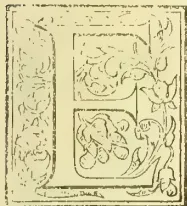

EXCEPT in the case of coconuts and that not to any large extent, the manurial value of salt and its by-products is not, we believe high. Salt is no doubt good for killing white-ants and weeds, and its associated products in "bitterns"—Glauber's salts or the sulphate of soda and Epsom salts or the sulphate of magnesia, especially the latter,—may be good as antidotes to fungi. But we question whether the fertilizing properties of salt are so great as some imagine. The late Mr. David Wilson raised the whole question, and the subsidiary one of denaturalizing salt (in the interests of the monopoly revenue which cannot be dispensed with) was settled in the negative, the late Dr. Charsley showing, that, even when adulterated with nightsoil, salt could be restored in pure clean crystals by the use of charcoal. If salt is of real manurial value, we repeat what we said once before, that it exists largely in kainit, which, is, admitted free here as a manure. The potash which is associated with common salt in this mineral is undoubtedly beneficial to tea, so that, if kainit could be obtained at a moderate price, it would meet the wants of those who believe in the valuable manurial qualities of chloride of sodium. That "salt is good" we know on the highest authority, but its valuable properties as a component in the food of man and animals do not seem to be so apparent in the promotion of vegetable life. On the other hand salt can be seriously injurious and even fatal to vegetable life. During the specially inclement south-west monsoon of 1882, we had proof, as we ventured to assert at the time and still believe, of the mischief which salt in excess in the atmosphere can work on vegetation. No one can doubt that on the wings of the monsoon winds, and in the globules of moisture with which they are laden, some portions of saline matter captured from the

ocean spray are diffused. In such ordinary proportion the presence of the great antiseptic and purifying substance is valuable. But like other good things, such as fire and water and even the blessed sunshine, salt in excess is capable of becoming a curse instead of a blessing. The records of meteorology contain accounts of salt storms which have inflicted great injury on vegetation, in some cases fatal injury on orchard and forest trees. The stems and limbs of trees exposed to this destructive agency have swelled and festered after the fashion of a diseased human limb. With these facts within our knowledge, we did not hesitate to express the conviction that in the course of the specially inclement south-west monsoon of 1882, when it seemed as if the wind and rain increased in force and quantity day by day, salt storms reached and affected vegetation growing on the higher mountain regions of the island. We did not hear of any special effect on coffee in addition to the effects of the chronic fungous disease, and tea did not suffer much, although the smallpox-like spots which marked the leaves of such exotics as cinchona and the eucalypti created alarm by spreading in some cases to the tea leaves. But it was on the tall, unprotected stems of the Australian "gum" trees, especially the blue gum, that the storms carrying excess of saline matter, we believe, when specially violent and long-continued, told with chief virulence. The stems, at various altitudes, swelled and bulged out, the skin cracked and blackened, the portions of the trees above the swelled part put on a sickly appearance, or died, and there was an instinctive attempt at renewed existence in the shape of the curious primitive foliage coming out below the diseased part.

Mr. J. Mackenzie, a Nilgiri planter, who is a subscriber to the *Tropical Agriculturist*, had seen this theory of ours, and seems to have arrived at the conclusion that what was evil in excess must be specially beneficial in moderation. Accordingly we are in possession, almost simultaneously, of the opinion of a former Haputale planter that exposure to sea breezes is likely to prevent the success of tea in the more eastern portions of Uva and of Mr. Mackenzie's opinion, imparted to the Madras Government, that the superiority of the Ceylon tea, which he admits, is due to the presence of salt diffused in our atmosphere. He, therefore, suggests that the residuary matter in salt "bitterns" would be a valuable application to tea in the Madras Presidency. This suggestion, which Mr. Mackenzie seems to have taken no step to carry practically into effect, although he was offered the chance, led to a most interesting correspondence, which has reached us from the Madras Government. Mr. Bliss, the very able Commissioner of Salt Revenue, on

675------------------------------------------------

650THE TROPICAL AGRICULTURIST.[APRIL 1, 1889.

being referred to, quoted Dr. Rattron's valuable Handbook of Salt (a mine of useful information on the subject) showing that from the chemical constituents of the residual matter left after the concentration of salt, such substances if applied directly to tea were likely to have not beneficial but deadly effects. Various opinions were elicited, generally to the effect that the only really valuable constituent of salt residuum was potash, the expense of eliminating which was prohibitory. Costly refrigerators would be necessary. Finally Messrs. Hall, Wilson & Co. of Cocanada stated their intention, with the sanction of Government, to give a full trial to the preparation of the by-products of salt, in connection with the manufacture of the main product. Government are also ready to facilitate experiments for obtaining gypsum (of considerable value as a manure) and magnesium sulphate from the bitters and the condensers. We may, therefore, hear more about the value of salt and its by-products as manures. Meantime we quote the main portions of the paper on the subject which has reached us from the Government of Madras. First comes Mr. Mackenzie's curious letter, in which he states:—

You are doubtless aware that tea planters in India are unable to compete with the planters of Ceylon as regards the quality and the quantity of tea produced as evidenced by the very high prices commanded in the market by Ceylon teas. In explanation of this generally accepted fact, planting authorities have come to the conclusion that the climate of Ceylon must be unusually favourable for the cultivation of tea. After consideration I venture to say that I believe I can account for this advantage enjoyed by Ceylon as follows. The sea-breezes from surrounding ocean play freely over the whole of the island, so much so indeed that many accounted for the late disease of the *Eucalyptus globulus* trees in Ceylon as being produced by the excessive saline deposits carried over the island by the monsoon winds.\* You are well aware that these saline particles, latent in the ocean breezes, consist of ordinary salt, and that salt is chiefly composed of chloride and various salts of soda. Chloride of sodium and salts of soda, you are also aware, are next in importance to potash and phosphoric acid in the composition of the tea leaf. The superiority then of Ceylon teas I attribute to the presence of these wind-borne saline deposits, and if planters in India could in any way obtain salt as manure, the production of tea in India would be immensely improved both as regards quantity and quality. I have the honor to ask whether there is any deposit or scum of the salt-pans which, useless in a culinary sense, might not be utilised as manure. With regard to using the ordinary culinary salt as a manure, of course the price of that article is utterly prohibitive. I have further the honor to request whether you will be pleased to give this suggestion consideration and a fair trial. If a quantity of useless deposit from the salt-pans was supplied to me at a nominal rate, I should be most happy to give it a careful trial, and I do not wish this suggestion to be made public until a trial has been given it. I beg to invite your attention to a letter I am addressing to the *Madras Mail* on "Functional exhaustion of plant life."

Mr. Bliss, the Salt Commissioner, on being referred to, remarked:—

The concentrated residual brine (better known as "mother liquor" or "bitters") left in the pans after the manufacture of salt would not, in my opinion,

\* That was our theory, and we have no doubt that many intelligent observers agreed with us. The Planters' Association attempted, through the help of Mr. John Hughes, the eminent chemist, to test the amount of salt in the monsoon rainwater. But the use of contaminated vessels for transmission rendered the experiment nugatory. It might well be repeated.

—Ed.

serve as manure and would, I imagine, soon kill any vegetation with which it might be brought into contact. 2. A reference to page 235 of Rattron's handbook of common salt shows that at 30° Beaumé, at which strength the bitters should be discharged, they contain in 100 parts—

<table border="0">
<tr>
<td>16.6</td>
<td>parts of</td>
<td>Magnesium chloride,</td>
</tr>
<tr>
<td>4.6</td>
<td>"</td>
<td>Sodium do.</td>
</tr>
<tr>
<td>2.0</td>
<td>"</td>
<td>Magnesium sulphate,</td>
</tr>
</table>

a composition which (I speak under correction) is not adapted as manure to any form of vegetable life. 3. I would suggest that Mr. McKenzie should turn his attention to the residual brine available in the fish-curing yards on the West Coast, which would probably form a most excellent manure for tea as well as for other plants. 4. This residual brine is composed not only of a very strong solution of salt, but also of fish-blood, entrails, &c., expressed during the process of curing. 5. At present this brine is either thrown away or is applied to coconut trees, the yield of which, I am told, is enormously increased by such application. 6. Under suitable arrangements large quantities of this brine could be put into casks or other receptacles and sealed up in the yards for despatch to the Wynaad or elsewhere, and I have no doubt the fish-curers would hail such an arrangement with satisfaction as they would thereby recover a portion of their original outlay on the salt they purchase for curing purposes. 7. If Mr. McKenzie, or any one else desires to try the experiment, I shall be glad to do all that lies in my power to further his views. 8. Another possible source from which a supply of salt for manure could be cheaply obtained is the saltpetre factories at Coimbatore and elsewhere. At Coimbatore alone over 3,000 maunds of impure salt is annually educed in the refineries situate at that place and at present there is much difficulty in getting rid of it. Arrangements could probably be made by which persons desiring to have this salt for manure could obtain it on payment of the cost of denaturalisation at the refineries by the admixture of *poudrette* from the municipal latrines, added, perhaps, to a nominal sum paid to the refiners, who will be only too glad to be spared the expense of destroying the salt as they have to do at present.

Agricultural readers will appreciate the practical value of the suggestion to utilize the refuse of the fish-curing yards, and coconut planters will make a special note of the good effects attributed to this material as an application to their staple product. When fish-curing yards in Ceylon increase in number, the practical value of salt and fish refuse will doubtless be fully tested. The only objection we can think of, the breeding of insect life in the fish refuse, would probably be obviated by the proportion of salt present. The correspondence we have quoted took place in 1885. On 4th May 1888 the Board of Revenue recorded a resolution, portion of which we quote:—

In the following year considerable further correspondence followed between this department and Mr. McKenzie on the question of the use of "bitters" as manure, in which he urged the value of salt as a manure for leaf crops and therefore for tea, and the advisability of utilising the "bitters" to furnish it. In the course of this discussion Mr. Benson, the Assistant Director of Agriculture, pointed out that young leaf crops required potassium and not sodium salts, and that the "bitters" in addition to the solids mentioned by Rattron, probably contain a considerable amount of the former salts; and that, though it was not advisable to use the bitters as a manure direct, they might be utilised for mixing with manure heaps, if the cost of carriage were not prohibitive; and noted that the question whether the separation of the different bye-products could be profitably carried out in India could not be answered. In subsequent letters Mr. McKenzie, though still contending for the general use of "bitters" as a manure, admitted that the difficulty in dealing with them was the cost of carriage, and agreed with Mr. Benson as to the difficulty in extracting the bye-products.

676------------------------------------------------

APRIL 1, 1889.]THE TROPICAL AGRICULTURIST.651

After this the correspondence ceased. In a letter, however, which appeared in the *Madras Mail* of the 26th April last, signed "Novice," the subject is again alluded to. In that letter the writer states that an artificial freezing chamber to provide the requisite low temperature for the extraction of the bye-products could be cheaply and profitably set up in India, and that a few years ago he had some correspondence with the Salt Department with reference to the use of "bitterns" for agricultural purposes but that after the matter had been handed over to the Assistant Commissioner of the Central Division he heard no more of it. The Commissioner of Separate Revenue will be asked whether he can favor the Board with any further information on the points alluded to above. viz.—

(1) Whether Mr. McKenzie actually obtained any "bitterns" in 1885 for experimental use as manure.

(2) Whether the extraction of the bye-products from bitterns is as feasible as the correspondent of the *Mail* seems to think it is.

Mr. Benson's suggestion of mixing the "bitterns" with manure heaps is, like those of Mr. Bliss, good and practical. Diffused in large masses of manure, the chemical substances would be useful and not harmful. The Wynaad Planters' Association decided in Oct. 1888 that

Bitterns would be of no practical value for any of the products in Wynaad.

Major-General Morgan, on behalf of the Nilgiri Miners' and Planters' Association, made such safe general statements as these:—

Speaking generally, the use of bitterns, when mixed with farm-yard manure, would be decidedly efficacious in killing grubs and in strengthening the straw of grain crops, especially if mixed with quicklime and used in inland districts.

It is difficult to point out its special use unless the price at the salt depots is known. If quicklime is mixed with the bitterns, sulphate of lime is produced, which is very valuable for agriculture.

Mr. MacNab, Chairman of the Chamber of Commerce of Coconada, stated that

In the opinion of this Chamber, bitterns, as such, could serve no useful purpose as manure; on the contrary, it is considered that they would be injurious, if not fatal, to any form of plant life, while the cost of carriage would be prohibitive. Of the ingredients of the mother liquor, as already pointed out in these Proceedings, gypsum is readily obtainable from other sources, while magnesium sulphate is valueless; and as regards the potassium salts, which are alone of substantial value, it is feared that the expense of refrigeration in this country, combined with the uncertainty of success and of finding a market even if the salts were successfully evolved, would probably deter any private firm or individual from undertaking the experiment. The improvements yearly being made in refrigerating apparatus may materially modify the risk involved, and there can be no question of the economic value to the leaf crops of the country of a cheap form of potash for use as manure. It appears to the Chamber, however, to be very doubtful, whether, potassium salts obtained by artificial refrigeration in the intense heat of an Indian salterne in the manufacturing season could compete with the imported article manufactured in the natural winter cold of Europe. I am however placing the papers before Messrs. Hall, Wilson and Co., who are already interested in salt manufacture, and I shall ask them to address you in the matter, if they find themselves able to offer any contribution to your consideration of the subject.

The Firm referred to accordingly wrote:—

We have been engaged in the manufacture of salt (at Karassa near Vizagapatam) for the past six years, and from time to time we have had under consideration the feasibility of securing the residual salts contained in the mother liquor, which at present runs to waste. Of these, the only ingredients of appreciable commercial value are the potassium salts, and we have hitherto been deterred from attempting to

rescue them by the condition of artificial refrigeration, which is necessary to their extraction. Refrigerating apparatus is costly, and in our experience it is always (except when applied on a large scale under skilled European supervision) very uncertain in operation in this country. There is also a considerable element of doubt as to whether we could find a market at paying prices for our potassium chloride, even if we were successful in extracting it, and on that point we can form no definite opinion until we know the cost of production, which can only be ascertained in actual working.

We have now before Government, however, an application to be allowed to lay out a new salt factory here at Oocanada immediately adjoining our own premises, and, if this is granted to us, our intention is to irrigate by steam-pumping machinery. We should thus have on the spot the steam power, which, next perhaps to skilled supervision, is the most expensive item in the cost of refrigerating in India, and we should have the inestimable advantage of conducting under our own immediate eye experiments which we should not think of attempting on other conditions. Amongst other experiments which we had already had in contemplation was the extraction of these residual salts, and we are now in correspondence with manufacturers of refrigerators in Europe with a view to finding an economic but efficient apparatus, which would fulfil the requirements necessary to give the thing a fair trial. We have yet to learn, however, whether our proposal will receive the sanction of Government, and we are of course unwilling to commit ourselves to the experiment, until we see clearly what the cost will be. If that, however, should promise to be moderate, we should be fully disposed to give the extraction of these residual salts a fair and exhaustive trial, and in that case we need not say we shall most gladly give you in the fullest possible form the results of our experiment. We will merely add here that there seems to us to be a degree of fitness in selecting Oocanada for the extraction of these residual salts, in that it already produces so largely, probably the best manure in India, castor-seed poonac, combination of which with potassium chloride might give a resultant manure of great value to such of the higher classes of agriculture (tea, coffee, sugar, tobacco, &c.) as could bear the cost.

Mr. Lechler, Hon. Secretary, Shevaroy Planters' Association, wrote:—

The Shevaroy Planters' Association are much interested in the subject of the use of bitterns for agricultural purposes. No experiments appear to have been attempted with bitterns as manure for coffee, and the association are anxious to give them a trial if a small quantity can be secured, so as to place the matter beyond doubt. With this object in view, I write to ask you to be so good as to obtain for me a small quantity, say 2 cwt., packed in 56 lb. bags, for distribution to members of the association, who have guaranteed to make experiments and report results.

Messrs. Binny & Co. wrote:—

Referring to memorandum, dated the 20th November 1888, requesting a report on the use of bitterns for agricultural purposes, we have the honor to state that the manager of our coffee works writes as follows:—

"With reference to the Board of Revenue's memorandum, dated 20th ultimo, which I return under separate cover with the accompanying copies of proceedings, I now beg to inform you that I have made inquiry regarding the use of bitterns as a manure for coffee; but I cannot suggest any means of employing same. I assume that that the bitterns could only be condensed into gypsum and magnesium sulphate at a comparatively costly expense, and as these salts are only occasionally asked for by planters, I do not think it would be worth while to undertake any experiments in producing them from the bitterns."

We have nothing to add to the above, and would suggest that an opinion be taken of the Chemical Analyst sent out by Messrs. Matheson & Co. to their estates in Mercara. His address is c/o E. Meynell, Esq. As, however, the papers have already been

677------------------------------------------------

652THE TROPICAL AGRICULTURIST.[APRIL 1, 1889.

submitted to the Coorg Planters' Association, it is possible this analyst's opinion has already been given through that medium.

Mr. Pringle's opinion, conveyed to Mr. Meynell, ran thus :—

Your memorandum of 31st December and correspondence *re* bitters, asking for my opinion upon that substance duly received.

2. I do not think it would be worth while experimenting with ; it is said to be :—

16.6 parts of magnesium chloride.

4.6 „ of sodium chloride.

2.0 „ of magnesium sulphate.

Neither magnesium nor sodium are essential constituents of any manure, as there is in almost every case sufficient present in the soil ; and nearly every manure, contains them, though they are not often determined, being such unimportant factors.

The mother liquor from the brine springs of Cheshire has been boiled down to dryness and applied, at the rate of one ton per acre ploughed in, the land being left fallow for a year ; it effectually killed all the weeds. Mangolds did well after it, but other crops not so well. It is very soluble, and would be washed out by the monsoon rains. It therefore might be useful to clean very weedy land that could be left fallow for a monsoon. It would be best applied at the beginning of the hot weather. The gypsum would in many cases be useful as a substitute for lime, in some cases it would give better results ; its value would be about the same as that of lime. If superphosphate is used as a manure, plenty of gypsum is applied with it, as it is a natural constituent of the manure ; and it is in that form that it will be most valuable ; accompany a phosphatic manure.

On 25th Jan. 1889, the Madras Board of Revenue summed up the above opinions and added :—

A consideration of the foregoing papers points to the conclusion that Mr. Benson's opinions noticed in paragraph 2 of Board's Proceedings, No. 192, date 4th May 1888, regarding the manurial value of bitters and the possibility of profitably recovering the bye-products are correct, viz. :—

(1) that bitters might be used for mixing with manure heaps, if the cost of carriage is not prohibitive ;

(2) that whether the bye-products can be profitably extracted in India cannot yet be stated. The solution of the last-mentioned problem will probably be materially advanced, if not completely attained by the experiments which Messrs. Hall, Wilson and Co. propose to undertake at the salt factory near Cocanada, the establishment of which by them has been recently sanctioned by Government.

A separate set of proceedings ends with the following declaration :—

Agriculturally the potassium salts are the only ones which it is desirable to secure from the brine ; natural gypsum is easily obtainable in the Trichinopoly district, and magnesium sulphate is an undesirable substance.

#### SALT AND SALINE SUBSTANCES AS MANURES FOR COCONUT PALMS.

After we had written what appears on page 649 on the question of the suitability of salt and its by-products mainly as a manure for leaf-yielding plants, our attention was attracted to a paper in the "Examiner" on the use of salt in the cultivation of a plant famous for many products, but especially renowned for highly developed fruits equally rich, at different stages of their existence, in saccharine and oleaginous properties, and which in the transition stage constitute a large portion of the food of the inhabitants of Ceylon : the littoral-loving coconut tree. Why does it especially love littoral formations and

flourish in the ocean breezes? Is it solely for the sake of a soil and atmosphere largely impregnated with salt? We take leave to qualify to some extent this very popular belief. The sea-side zone which the coconuts chiefly affect, on the south-west shores of our island, possesses the two great advantages of a rainfall ample, but not excessive, such as the palm desiderates, chiefly for the sake of those portions of it which stand above ground ; while, owing to the great prevalence of swamps and backwaters a few miles inland and the gentle slope of the land, there is a constant supply of fresh water, percolating through the soil and sand towards the sea. The brackish fluid from the backwaters doubtless part gradually with their saline particles as they pass through the great earth filter and so the soil is permeated with diffused salt. Not in large quantities or in aggregated deposits, however, but widely spread and constantly and largely qualified by the rainwater which sinks into the soil. With reference to Emerson Tennent's theory, when discussing the coral wells of Jaffna, that sea water can percolate inland and sink into the soil below sea-level as fresh water, we may state that it was impeached by the late Dr. Buist of Bombay as contrary to all dynamical laws. Dr. Buist's protest was published in one of the editions of Tennent's great work, but there is no mention made of it in the fifth and final edition, in which the percolation theory of sea-water flowing inland and downwards is stated without qualification ! Our own inclination is to believe that "all the waters run into the sea," and find their way back to the land only in the shape of evaporated moisture or wind-caught particles which are both deposited from the air. Of course we do not forget the more or less sensible action of tides, and doubtless the natural formations of salt on the sides of marine streams in the Jaffna peninsula and elsewhere prove that sea water projected inland and spread thinly over wide surfaces is compelled to part with much of the substances held by it in solution. But what we do not think probable (is it at all possible?) is, that sea water flowing up the land sinks to the lower strata filtered into freshness, or that, apart from tides, sea water can gravitate shorewards through the earth and sink below the level of the great ocean reservoir.

When we talk, too, of coconut palms flourishing where their roots are actually washed by the sea-waves, we must remember the grand difference between the amount of salt diffused in sea water and that concentrated in the concreted crystals. Salt in its ordinary state is fatal, in any large quantity, to vegetable and animal life, and is used to get rid of weeds and worms, parasites and fungi. Applied in very large quantities we are perfectly certain it would prove equally fatal to coconut plants as to any others. Residence close to the seaside at Colombo for thirty years has afforded us ample opportunity of observing the positive struggle for existence which coconut plants in the early years of their existence have to wage with the fierce salt-laden winds of the south-west monsoon. We have seen their foliage after a succession of salt-storms blackened as if a fierce fire had passed over them, even the well-grown trees which flourish in an ordinarily saline atmosphere showing signs of distress. We can assert from experience that young trees sheltered from the monsoon storms by fences of cadjans make far better progress than those compelled to expend their energies in renewing foliage periodically salted to death by the south-west monsoon winds. But over-ground shelter is prohibitively expensive, and so the natives in our neighbourhood resort to the expedient of digging very deep holes for the reception of their plants, which are thus largely sheltered up to the second

678------------------------------------------------

APRIL 1, 1889.]THE TROPICAL AGRICULTURIST.653

or third year. The trees have then to fight for life every south-west monsoon until they are seven or eight years old. One reason why the foliage of the young trees suffers so much more than the leaves of the older trees is that, of course the lower strata of the rapidly moving atmosphere are more heavily laden than the higher with saline particles caught in the shape of spray from the tops of the sea waves; those particles being fewer and fewer in the loftier atmospheric altitudes. Some at least of all the salt spray carried by the monsoon storms ought to reach the coconuts at Veyangoda, whence "B." writes rather wildly, we think, for a man so generally sane and sensible, advocating the application of salt in almost unlimited quantities to coconuts. He laments the lapse of the old practice of depositing a quantity of salt with each coconut plant put into the ground. It is all the fault of a backward kind of progress, and he quotes with approval the non-progressive character of coconut cultivators in China, who continue the practice which he laments as obsolete in Ceylon. We would suggest as possible that the main reason for the deposit of salt round a coir-covered nut well able to resist the corrosive effects of the mineral was the destruction of those great enemies of young coconut plants, white-ants? No doubt salt is valuable in absorbing moisture, and, as it stiffens the straw of cereals, we can understand its value to a plant like the coconut, the stem and branches of which require so much siliceous matter which the salt renders soluble for their outside covering. In moderation too, and properly diluted and diffused, salt cannot but be beneficial to coconut palms grown inland. But we must enter a mild protest against such statements as that "salt can never be present in too large quantities in a soil on which coconuts thrive." Of course in one sense this is true: where coconuts thrive, salt cannot be present in excess. But what "B." obviously meant was that no possible quantity of salt can be excessive as an application to soil on which coconuts are expected to thrive. "B." for the moment forgot his Bible lesson about the effects of "sowing with salt." Such a process was and still is death to *all* vegetation. In the interests of moderation, too, and in view of what may not in the abstract be best, but of what is possible in dealing with an Oriental people, we would qualify the dictum of Liebig as to the evils of a tax on salt. Taxes on food and on a condiment so essential as salt ought, if possible, to be avoided, and so ought customs imposts, all save a few. But if we gave up grain taxes (the inland and import taxes in Ceylon stand or fall together) and the salt monopoly in this island, Government in the interests of the people would be as impossible as is an income tax (the fairest of all taxes in the abstract) in a country such as this. Beside which, the salt tax falls very lightly on the people; salt is issued at an exceptionally cheap rate for fish-curing, and we cannot doubt that a similar course would be pursued in issues for agricultural purposes, were there any virtues in salt, as a separate application, which cannot be secured by the use of substances more generally valuable, such as potash sulphate, or kainit. We certainly have, as yet, no proof, from actual experiment, that pure salt is so valuable as a fertilizing matter that the undoubted risk of injury to an important branch of revenue ought to be incurred in order to place it, at exceptionally cheap rates, at the disposal of agriculturists generally. If "B." knows of any such experiments in coconut culture, he will doubtless quote them and state their results. If not, it will be his obvious duty now

to institute a series of exhaustive experiments, for which, we doubt not, Government will be ready, under proper precautions and pledges, to supply a few tons of salt at cost price. For ourselves, we remain sceptical as to any special manurial value in salt pure and simple, while we can easily understand why the refuse of fish-curing yards, consisting of offal mixed with salt, should be rapidly and largely beneficial in coconut culture. As an application to tea, we should say that such refuse ought to be mixed with at least an equal weight, perhaps a doubled weight, of castor cake and bones or superphosphate.

Meantime, what have Haputale planters to say to the theory that tea in the eastern part of that district is affected injuriously by the salt carried on the sea-breezes?

As to the DISEASE IN THE COCONUT LEAVES, (spots probably of chemical origin), against which "B." wishes to fight with ammunition composed of salt, we do not think it need cause much anxiety, an opinion which we share with experienced coconut planters. Coconut palms, like other trees, have their enemies, the most formidable of which are beetles, lightning and protracted droughts. These are fatal to a certain proportion of trees in all groves or topes of coconuts. The late Mr. W. Ferguson described a visitation of moths some years ago, by which the foliage of the coconut trees in Slave Island was devoured; and at one time we heard much of locusts near Negombo. But the attacks were, in these cases, local and circumscribed, and we never heard of any trees being killed by such visitations. One of the chief benefits of saline applications would be their destructive effect on insect and fungous life, care being taken that the quantity was not such as to endanger the life of the palm.

Dr. Trimen, we imagine, will be scarcely able to appreciate the distinction between his diagnosis "suffering from innutrition" and that substituted, "suffering from a disease caused by innutrition." When we say that people are suffering from famine, we mentally include all the diseases which are the result of famine, prominently debility. Just as the skin of human beings in Ceylon indicates the effects of innutrition by the loathsome affection of "parangi," so the coconut leaves make signals of distress by blotches in tissue, such blotches being really dead matter in which the circulation of the juices has ceased. A stiff soil, absence of moisture near the surface, and a droughty atmosphere, ever produce such effects, sometimes in an aggravated form. The main remedy is tillage, and to the stirred soil a moderate application of salt is likely to do good, but with the chloride of sodium, which is a condiment more than a food, we submit that it would be wise to mix fish or fish offal if it can be procured, or else ground bones and crushed castor-cake. If plenty of salt fish or fish offal were available, and we trust the multiplication of fish-curing yards may ultimately produce this result, it is obvious that pure or impure salt crystals might be dispensed with. Our experience with hemileia on coffee has taught us that there are some peculiar and specific affections, which even the richest supplies of nutritive matter, phosphatic or nitrogenous, cannot combat effectually; but, happily, there is no suspicion that the coconut, or any other of our cultivated products, is likely to suffer from anything equivalent to the deadly coffee fungus.

In this connection we call attention to the letters on page 654-5 of two of the most experienced coconut planters in the country—Messrs. Lamont and Jardine—with their remarks on the so-called new disease on the coconut palm.

679------------------------------------------------

654THE TROPICAL AGRICULTURIST.[APRIL 1, 1889.

## COCONUT PLANTING IN THE LOW-COUNTRY.

HAPITIGAM KORALE.

**WEATHER.**—We have the usual weather of the season,—a cloudless sky, a burning sun with fierce gusts of dry wind for six or seven hours daily, close evenings and cool almost cold mornings. We have been rather better off for rain than last year, having had two good showers on the 7th and 8th January, and another of about a quarter of an inch on 13th instant.

**CROPS.**—The crop on the trees is an unusually small one, on most estates in the valley. During the third quarter of last year the most favoured spots in the district had only about two inches of rain, and in consequence the two second best bunches in normal seasons will be wanting; while those of the last quarter's flowers are hardly more than the average. The young fields, however, are worse than the old ones in this respect.

**GROWTH.**—The last year has been very trying to one and two years old plants; they have generally dropped more leaves than they have developed, and, except for increased length of leaf, are nothing advanced during last year.

**PRICES.**—In sympathy with the recent small gatherings prices have gone up about 30 per cent on those of six months ago. From this district they are wanted for the upcountry trade.

**THE LEAF DISEASE.**—The leaf disease is not a new thing so far as I am able to judge; it is neither insect nor fungus, and is not infectious. It only differs in degree from what happens to the leaves of old bearing trees, when they begin to lose their hold on the stem, and the supply of sap that keeps them green fails. There are the same dark specks that in the same way become centres of grey rot. In old trees it is only the mature outer leaves that become so affected, but on the two to six year old plants now suffering, the whole of the leaves in some cases even to the half-developed centre shoot are affected, and the dark specks appear not only on the leaflets but on the leaf-stem itself. During the past year we had two long droughts and two spells of heavy rain. The drought penetrated deep into the soil, and could hardly fail, to dry up the more superficial roots, and weaken them, perhaps destroy their vitality altogether; or where any life was left the saturation by the soil, for six weeks together, may have finished up what the drought began, and thus the plant suffers, till it produces new roots from the common centre to restore the growth. In my own case about 2½ per cent are affected, on a field of grey sandy loam, but with insufficient sand to prevent it from becoming as hard and impenetrable as a stone in dry weather. On the cabook land many young plants died, but not one was or is affected with this disease. The remedy I propose to use is to trench in a cool load of cattle manure round each, when the weather serves.

## THE SUPPOSED DISEASE IN THE COCONUTS.

CEYLON vs. COCHIN OIL.

Kadirana, 16th Feb. 1889.

In reply to your inquiry as to whether I have noticed anything of the coconut leaf-disease mentioned by the "Examiner"'s Veyangoda correspondent as prevailing in that district; I may state directly that I have not. Since that letter appeared I have been on the lookout for signs of the disease, but neither upon young plants nor old trees have I observed any. At this time of the year there is always a larger number of leaves spotted and brown than during rainy weather, but they are not more numerous now than is usual, nor are any young fronds attacked in the way described by the "Examiner"'s correspondent. The nearest approach to the disease was observed on a few leaves on five plants about 8 years old growing on a cabook hill; the leaves were well up in the trees and were reddish and blotchy in appearance and evidently dying. I must state

however that these trees were not good well-nourished specimens, but were small for their age, and others of the same age in their immediate vicinity were healthy and had no diseased leaves. Till I see trees attacked with the disease I cannot venture an opinion as to the cause. Has this peculiar feature of disease on the leaves been observed anywhere else in Ceylon? I am inclined to think however that something local will be found to be the cause. Possibly weakening of the stamina of the tree inducing insect attacks, as was the case with cacao a few years ago.

I notice from time to time a good deal of discussion in the local papers as to the cause of the higher price of Cochin oil than is paid for the Ceylon article. I really do not know what the climate of Cochin is like, but have always had the idea that it is much drier than that of our Western and Southern Provinces, and that to this dryness it owes its superiority. I have also been of opinion that the well cured copra of the Northern and Eastern Provinces if extracted alone, would yield oil quite equal to that of Cochin. This is only an opinion and can only be decided by actual experiment. Is there not an oil-mill somewhere in Jaffna? If there is, the prices realized by the oil made there if shipped to and sold in London should decide this question. When I began life as a coconut planter in Jaffna in 1856 to 1859 I remember that large quantities of Jaffna copra used to be shipped to the Coast of India. Did it find its way to Cochin and help to make Cochin oil? Where is the market today for all the Jaffna and Batticaloa copra? I see that some writers deny that any change takes place in the kernels of the coconuts after they are plucked and heaped. Now why should there not? If a very material and important change takes place in cereals after they are stacked, why should it be unreasonable that a change should take place in the constituents of the coconut kernel? Manufacturers of copra will seldom husk coconuts till they have lain one month at least after gathering; and owners of chekkus will tell you that they can extract more oil from copra, the nuts of which had been lying two or more months, than from copra made from freshly gathered nuts. There are many things we do, for which we cannot give a philosophic reason, yet experience teaches us that the custom is a sound and good one; and this of keeping coconuts for some months before converting them into copra seems to be one of them.

W. J.

[The climate of Cochin is very wet at one season,—the S.-W. monsoon—and very dry for many months together, and we suppose the copra is cured in the dry months. The philosophy of keeping nuts for a prolonged period is probably to give time for the conversion of saccharine into oleaginous matter in the kernels. It is not likely that any Ceylon copra went to Cochin. Our information indicated that it went to Bombay and Calcutta, and that rich baboos and native merchants and officials who wished to attain the dignity associated with obesity used the finer kernels as a portion of their food.—Ed.]

## THE DIFFERENCES BETWEEN CEYLON AND COCHIN COPRA.

A merchant of great experience in this line is good enough to favour us with his opinion as follows:—

"The reason of Cochin copra being better than Ceylon I believe to be the difference of climate. Then there is more dry weather during the year

680------------------------------------------------

APRIL 1, 1889.]THE TROPICAL AGRICULTURIST.655

than we have in Ceylon, and the most of the Cochin copra is, I believe, made in their fine weather when it can be sun-dried, and very great care is taken in drying the copra and towards keeping it free from all impurities, thus producing an article superior to that of Ceylon."

#### SALT IN COCONUT CULTIVATION.

[The following is the contribution by "B." to the local "Examiner" alluded to in our article on the manual value of salt and its by-products.—Ed.]

It cannot be too often repeated that for the successful growth of any product, it is essentially necessary that we conform as nearly as is possible to the natural condition under which it grows. The natural home of the coconut palm is the sea-coast. On the sea-coast salt and moisture are ever present. When we extend the cultivation further inland, although we may meet with better soil and in many instances situations where moisture is ever present at the roots, yet one of the conditions under which the palm flourishes is absent—a soil largely impregnated with salt.

Observation shows us that salt can never be present in too large quantities in a soil on which coconuts thrive. On the sea-shore, the trees seem none the worse for the salt-laden waves that break at their very roots. Indeed, salt does not seem to be able to hurt even the delicate germ in the nut. The spread out of coconut cultivation is due primarily to natural agencies. Trees growing on the sea-shore dropped their nuts into the sea and these have been carried by currents for thousands of miles and thrown upon some coast by the force of the waves, there to strike roots and sow the seed of future topos; and yet though the nuts must have been immersed for long periods in salt water, the tender and delicate germ did not lose its vitality, but developed into a tree. We who have to do with coconut cultivation know how delicate the germ is, and how liable it is to be destroyed. The fact that salt water does not affect its vitality speaks volumes, in my opinion, for the absolute necessity of using salt in all stages of its growth, so as to approach as nearly as possible its growth in a state of nature. Every authority who has written on coconut cultivation, not only in our Island, but in all parts of the world where it is cultivated, speaks of the practice of throwing in a handful of salt into the hole at the time of planting. Some speak of it as a superstitious practice. This is owing to a want of proper appreciation of its value. Why has this very useful and necessary practice been given up? The answer is simple. Every succeeding generation deludes itself with the belief that it knows more than its predecessor about agriculture, and thus it comes about that very useful and very necessary practices are gradually given up as useless. This is observable in all branches of agriculture. Our ancestors cultivated small areas at a time, and were actuated by the belief that what was worth doing was worth doing well. At the present day the boast is, not of the quality of the work one does, but of its quantity and cheapness. This latter word is supposed to be synonymous with low cost. Experience shows it is not. Careless and slovenly work is perhaps more noticeable in coconut cultivation than in any other branch of our Island agriculture. I feel almost tempted to enumerate all the works that are thus slovenly prepared, but I will be travelling out of my subject.

The latest reference I find to the use of salt in coconut cultivation is in the *Tropical Agriculturist* for February. In a report on agriculture in Hainan, it is said that coconuts do best near salt water. Salt is thrown into each hole with a coconut plant. "If they do not flourish salt is again put to the roots." Why, it may be asked, is this necessary practice kept up in Hainan? For the simple reason that the Chinese are a non-progressive people!

It is an axiom in Agricultural Chemistry that, although a soil may abound in all the mineral constituents of the plant food of a certain tribe on plants, and has only one in insufficient quantity, that tribe of plants cannot flourish upon that soil. While if the soil is wholly devoid of one constituent, it refuses to grow

or to come to perfection. What observation shows, analyses have established—that salt plays a no unimportant part in the composition of every part of the coconut tree. From this it will naturally follow, that coconuts grown in a soil where salt occurs in insufficient quantity cannot flourish, and in soils devoid of it will refuse to come to perfection. The latter class of soils it is difficult to imagine as occurring in our Island, exposed as it is to violent monsoon storms. Not so with the former class of soils.

However well coconut trees may bear in certain inland districts far removed from the influence of salt-laden breezes, I do not think their warmest admirers can say that they attain perfection there in the face of the annual experience of wholesale dropping of bunches and branches. This unpleasant experience contrasts very strikingly with coconut trees nearer the sea and with water always within reach of their roots. It must not be forgotten that the dropping of fruit and fronds is a very severe strain on a coconut tree. Leaves play a very important part in the economy of plant life. All the food a plant takes up by the roots is elaborated in its leaves, and is from them distributed for use in its every part. It is through them that carbonic acid is taken up by plants. Drooping leaves are an indication that the roots are not able to supply moisture to them as fast as it is evaporated from their surface. The supply being unequal to the demand gives a severe shock to the vital energies of the trees. How to balance this inequality should be the aim of the skilful agriculturist. As I said before, it is not possible for everyone to apply water to his whole plantation; but it is possible for all to apply salt. Salt has a value all its own. It is not only a manure, but has the valuable property of attracting moisture from the air and keeping the soil to which it is applied quite moist. In works on Agricultural Chemistry we are told that the application of salt to soils devoid of it has been known to produce striking results. I do not think it needs repetition that salt is an essential constituent in the growth of the coconut palm. I shall now chiefly confine myself to the more valuable properties it possesses. It renders available valuable constituents in the soil and is spoken of as a digester of food, it stiffens the straw of cereals, and it has a great affinity for moisture. The latter property is what will most commend it to the notice of coconut planters. In seasons of drought like the present, it will attract moisture from the atmosphere and make it available to the roots of coconut trees.

At the present moment, a disease affecting the fronds of coconut trees is exercising the minds of planters. The causes of diseases affecting plants are generally complex, and often baffle the research of professionals. Opinions as to its cause are divided. For me, with no aspirations to a knowledge of the mysteries of Agricultural Chemistry, to express an opinion as to the cause of this particular disease, will be the height of presumption, if not of folly. All I dare to do is to make a guess as to its cause, and so put professional men on the scent. Dr. Trimen hazards a guess as to its cause. He says the trees must be suffering from innutrition. Innutrition is possible in two ways. 1. Absence in the soil of a necessary constituent of plant food. 2. Inability of the plant to take up nutriment either from want of roots or the absence of moisture in the soil. I suppose, it is too well known to be repeated that plants can absorb food only in a liquid state. It is well known that any disease finds its first victims in weakly constitutions. Infection or contagion then communicates it to healthy subjects. The theory I put forward in the coconut leaf disease is that the trees are possibly suffering from the absence in the soil of salt, or from its presence in too small quantities, and I humbly present it to the consideration of Dr. Trimen.

Many are doubtless under the impression that so soluble a substance as salt, will be washed out of the soil by our violent monsoon rain storms before it can be of any benefit to the coconut tree. They may make their minds easy on that score, for the upland soils on which coconuts are grown are mostly clayey or have a clayey subsoil. One valuable property of such soils is

681------------------------------------------------

656THE TROPICAL AGRICULTURIST.[APRIL 1, 1889.]

its ability to absorb and retain all the soluble salts of manures. If even our upland soils did not possess this property, salt washed deep into the subsoil will be absorbed by those roots of the tree that go down deep into the soil to pump up water for its use.

Salt is also said to have the property of favourably affecting natural herbage, making coarse grasses sweet. No animal can exist without it, and its presence in the dietary of cattle has a beneficial effect on their health and condition. If the soils of coconut estates be treated with salt, it is not unreasonable to hope for an improvement in the condition, health and even growth of our cattle.

There is every reason to hope that the application of salt to coconut trees will prove a financial success. Planters know what a cause of anxiety the nuts on their trees are to them during this period of the year. From lack of moisture bunches come down bodily and have to be propped up, a practice said to be unknown all along the sea beach. As forests recede before the operations of the planter, props are becoming scarcer every year. Even with props, experience shows that a large proportion of our crops is lost during the annual droughts. One gentleman with very large proprietary interests told me that on a property of his bounded by the Maha Oya, 3-4ths of his crops were lost during the first quarter of the year. He either made his estimate when suffering with a fit of the "lows": or his experience is exceptional. Still the fact remains, that a large proportion of our crop is lost which good husbandry ought to induce us to attempt to save by growing coconuts as nearly under natural conditions as is possible.

To obtain salt for agricultural purposes Native Agriculturists ought in a body to petition Government to issue it at the same rate as to renters. They ought not to be discouraged by a refusal, which ought to act as an incentive to renewed exertion. Success can be attained only by determination and persistency. I shall conclude this in the words of Liebig. "The impost of salt is of all taxes that which is the most odious, the most unnatural, and the most disgraceful to human reason." B.

#### CONSUMPTION OF CEYLON TEAS IN THE LONDON CUSTOMS.

City Chambers, 65, Fenchurch Street, London, 25th Jan. 1889.

A. Philip, Esq., Secretary, Planters' Association, Kandy, Ceylon.

Dear Sir,—I have the pleasure to enclose for the information of your Association copies of correspondence with H. M. Customs Commissioners.—I am, &c.,  
(Signed) WM. MARTIN LEAKE.

Ceylon Association in London, 65, Fenchurch Street, London, 9th Jan. 1889.

The Secretary to the Commissioners of Customs, London.

Sir,—I shall be much obliged if you can furnish me with a copy of the Commissioners' General Order dated 27th ult. with reference to the classification of teas taken for Home Consumption. This order was mentioned in the City Article of *The Times* of yesterday.—I am, sir, your obedient servant,  
(Signed) WM. MARTIN LEAKE, Secy.

Custom House, London, 11th Jan. 1889.

Sir,—In reply to your letter of the 9th instant, I am directed by the Commissioners of Her Majesty's Customs to enclose two copies of their General Order to which you refer on the subject of the classification of teas taken for Home Consumption.—I am, sir, your obedient servant,  
(Signed) R. T. PROWSE.

W. Martin Leake, Esq., Secretary to the Ceylon Association in London.

Notice is hereby given that on and after the 1st January, 1889, Merchants and others passing Entries for tea will be required to state upon each Import Entry (whether Prime Entry or Warehousing Entry,) and also upon the Home Consumption, Removal and Export Warrants, the Country of Production or origin of the tea. By Order,  
E. GOODWYN.

Custom House, London, 27th Dec. 1888.

#### CLASSIFICATION OF TEA FOR STATISTICAL PURPOSES.

The Lords of the Treasury having been pleased to approve of Tea for Home Consumption being classified in the Monthly Account of Trade in the same manner as Tea imported, under the separate heads of

Tea from British Indies,

China (including Hong Kong and Macao),

other Countries,

the Board direct that, with the view of obtaining correct information for the Statistical Accounts, the Registrars in London and the Collectors at the Outports, on the receipt of each Import Entry for Tea (whether Prime Entry or Warehousing Entry) do require the name of the Country of production or origin to be stated on such entry. The Board further direct that the Officers employed in keeping the Warehousing Accounts do require the Merchants to specify the country of origin of the Tea in their Home Consumption, Removal and Export Warrants; this detail is to be checked by the Officers, the Country of origin being indicated on the cover of the Landing Book in which the deliveries are recorded. Separate Landing Books are to be kept for each class of Tea above mentioned in the event of more than one class being imported by the same ship.

The net weights of Tea entered under the proper heads as above specified are to be recorded in columns appropriated to that purpose in the Warrant Book, and Returns are to be made monthly from the Several Stations in London and at the Outports in the Form 534 "Return of Tea and Tobacco delivered for Home Consumption," showing the quantity, &c., of Tea of each class delivered.

It has been observed that Tea from China is frequently transshipped at Colombo to vessels proceeding from the latter Port to this Country. The Board direct the Officers to exercise great care in such cases to prevent Tea produced in China from being taken to account as Tea from Ceylon or British East Indies.

The Stock of Form 534 "Return of Tea and Tobacco delivered for Home Consumption" hitherto used, is, after the Account for December, 1888, has been transmitted, to be immediately returned from each Port and Station to the Storekeeper, Custom House, London, to be treated as waste paper, and an application for a supply of the Revised Form which is to be used for the month of January, and subsequently, is to be forwarded to Division IV. of the Secretary's Office in the usual manner. By Order, E. GOODWYN.

Ceylon Association in London, 65 Fenchurch Street, London, 16th January 1889.

Sir,—I beg to thank you for your letter No. 1,239 of 1889 dated 11th instant, enclosing copies of General Order 145 of 1888 dated 27th ult.

May I ask with reference to the order in question, whether, of the tea for Home Consumption classified in the monthly account of trade under the head of "Tea from British East Indies," the quantity from Ceylon will be given separately from that from India? and in any case whether it could be so given separately in future?

The annual consumption of Ceylon tea is already very large and is increasing rapidly each year. And it will be matter of great interest in future to compare the growth of the consumption of tea from Ceylon with that of tea from India.—I am, sir, your most obedient servant,

(Signed) WM. MARTIN LEAKE, Secretary.

The Secretary, Customs Commissioners, London.

Custom House, London, 23rd January 1889.

Sir,—I am directed by the Commissioners of Her Majesty's Customs to inform you, in reply to your letter dated the 16th instant, that the quantities of Ceylon tea imported into the United Kingdom and delivered for Home Consumption will not be given this year in the accounts of trade separately from those of Indian tea; but that the question of making the separation in future years will be considered.—I am, your obedient servant, (Signed) R. T. PROWSE.

The Secretary, Ceylon Association in London.

682------------------------------------------------

APRIL 1, 1889.]THE TROPICAL AGRICULTURIST.657HOW TEA SHOULD BE PACKED.

From Court's "Instructions to WILLIAM JOHNSON, Esquire, Supracargo of the Ship "Westworth" bound for CANTON in CHINA, and Mr. JOHN HILLER, Merchant, his Assistant." Dated 10th Nov. 1699.

"10. Tea is a Commodity of that general use here, and so nicely to be managed is its Package to preserve its flavour and virtue, that you can't be too careful in putting it up. Take special care therefore it be well closed in *Tootenague*, then wrapt up in Leaves and so put up in good Tubs of dry well-season'd Wood, made tite and close enough to preserve it from all manner of Scents, which it is very Subject to imbibe, and thereby become of no Value here. But you must be sure that the wood of your tubs have no Scent, whether sweet or unsavoury, that will Spoil the Tea, So will Camphire and other strong Scented Commodities, wherefore no such Smell must come into the Ship: For the like reason put up no Tea in Potts or Tootenague, till the smell of the Soldering Oyl or other like smells be perfectly cured, Be sure the Tea you buy be very new and the best of its sort, Remembering that in this and every other Commodity, the worst pays as much freight as the best, and many times the same Custom, Keep the Tea in the Coolest places of the Ship, for otherwise the greatest Care in its Choice and package will be rendered ineffectual, and therefore what is put in the Hold open the Hatches in fair Weather to give it air as often as you have Opportunity. But you will see by the Captain's Instructions We have required that our Tea be stow'd between Decks abatt the after hatchway with a bulk head and a little gang way made for Passage, which do you see done accordingly. It being now peace, We being resolv'd to dispense with our old order in this particular of stowing no Goods between Decks, when so great an advantage will accrue, as the preserving the Tea, a very considerable Article in the profit or Loss of the Cargo."—*Diary of William Hedges, ed. by Col. Yule, vol. II.*

TOBACCO AND RAINFALL AT KITUL-BOKKE.

We stated recently that the German Tobacco Syndicate had some thoughts of trying the vicinity of the Kittulbokke Irrigation Works for tobacco cultivation, and with that object in view Mr. Schappe recently paid a visit to the Kolonna korale, but gave up the idea when he ascertained that the rainfall experienced there chiefly fell in the N. E. monsoon. Maduwawella Ratamahatmeya has kept the rainfall return since February last, and it has been kindly placed at our disposal, and reads as follows:—

<table>
<tbody>
<tr>
<td>February ...</td>
<td>0.90</td>
<td>August ...</td>
<td>0.42</td>
</tr>
<tr>
<td>March ...</td>
<td>7.24</td>
<td>September ...</td>
<td>3.27</td>
</tr>
<tr>
<td>April ...</td>
<td>2.22</td>
<td>October ...</td>
<td>19.07</td>
</tr>
<tr>
<td>May ...</td>
<td>4.44</td>
<td>November...</td>
<td>9.75</td>
</tr>
<tr>
<td>June ...</td>
<td>5.04</td>
<td>December...</td>
<td>13.02</td>
</tr>
<tr>
<td>July ...</td>
<td>0.32</td>
<td></td>
<td></td>
</tr>
<tr>
<td></td>
<td></td>
<td>Total ...</td>
<td>65.69</td>
</tr>
</tbody>
</table>

This is only for eleven months of the year, but January is a month with but a very small fall, and the total for the year is not likely to be raised very much when it is included. It will thus be seen that almost all the rain falls in the North-east monsoon, and as the German Syndicate refuse to have anything to do with land when this is the case, they have abandoned all idea of taking up land in this locality.

We firmly believe they are grievously mistaken in thus laying down such absurdly hard and fast rules regarding tobacco or any other cultivation in Ceylon. To start with the assumption that land must be secured on this or that side of the island, and that in any case it must be under the influence of the south-west monsoon, seems to us absurd, and for two good reasons. First, because if a certain dry season be required, this can only be secured in districts where the N. E. monsoon chiefly prevails, and secondly, because tobacco so far has always been found to grow best in Ceylon in such districts. The

Jaffna and the Trincomalee districts both grow tobacco very successfully, and they get little or no south-west monsoon. We believe that of the Planting districts, Dumbara, Matale, and Badulla will be found to grow tobacco the most profitably.—"Local Times."

THE POSITION OF COCONUT OIL.

Holders of coconut oil are surprised that large consumers of Ceylon coconut oil are not disposed to anticipate their wants some distance ahead and take advantage of present prices, as various circumstances seem to favor a higher range of values. The fact is that soap makers have been covering their future wants, as recent large transactions in goods on the way would indicate, but that there are many consumers in the interior who are not acquainted with the true situation of the market, is evident from the requests that come to us for information and the slow movement of spot goods is no doubt attributable to a lack of confidence and desire of some prospective buyers to continue their policy of purchasing oil as needed. Every feature of the market seems to favor a higher tendency, and the hardening of tallow values is assisting the upward movement.

There is a diversity of opinion concerning the actual amount of Ceylon coconut oil on spot. Holders decline to give information on that point, and estimates therefore can only be based on guess-work. The highest estimate is placed at eight hundred tons, but the majority of dealers believe that the total amount will not reach over five hundred tons, while others place the amount at three hundred tons. The next arrival is the "Reporter," due early in January with six hundred tons, all of which has been taken out of first hands, and the "Mohur" is due in February with five hundred tons, a considerable portion of which is sold. Then comes the "Gloaming" a month later, with five hundred tons. If the average consumption is four hundred tons per month, the visible supply would be sufficient to last five months, but in case of accident or leakage, which is a common occurrence among vessels from Ceylon and Cochin, the trade would be in a dilemma. During the year considerable damage and delay were caused by disasters to such vessels, but stocks happened to be in better condition than at present to withstand the consequences.

There is another feature of the market which should not be overlooked, and that is the effect of tallow prices on the movement of coconut oil. It is acknowledged that since the important advance in tallow, there has been more demand for oil which would indicate the substitution of one for the other by soap makers. As the position of tallow favors still higher figures and the market is now in a very sensitive condition, the outlook for coconut oil is correspondingly improved. During the reign of high values, therefore, no accurate estimate of the amount consumed can be formed. English oil on spot is quoted at a higher price than the product of Ceylon, but the outlet in this market is small, being limited to about five hundred tons per annum.—*Oil, Paint and Drug Reporter.*

PLANTING IN THE ANDAMANS.

The area of cleared land is some 17,000 acres, of which 10,000 are under cultivation, and 4,000 used for grazing; the remainder consists of roads, tanks, and village sites. About 500 acres are under tea, in charge of a European manager and an assistant. The tea is excellent in quality and has great strength and body, and when mixed with a small proportion of high class hill tea, for flavouring, it cannot be surpassed. Teagrowing is now an assured success in the Andamans; and it is to be regretted that these fertile islands cannot as yet be thrown open to private enterprise; for it is doubtless a State necessity to keep the Penal Settlement as isolated as possible.

83

683------------------------------------------------

658THE TROPICAL AGRICULTURIST.[APRIL 1, 1889.

Not only is tea a success, but Liberian coffee thrives admirably, and its cultivation is being extended. Cacao is also very promising; all the seed hitherto grown has been planted out; and the *musa textilis* bids fair to become an important local product ere long. Nutmegs, ceara-rubber, arrowroot, the Otaheite potato, and tapioca have been introduced. The mangosteen thrives, and has been planted pretty extensively; the trees, however, are slow growing, and will take some years to come to maturity. Varieties of the nutmeg, tapioca, arrowroot, and vanilla are to be found wild in the jungles. The chief cereals grown are Indian-corn and paddy. Tobacco, though given a full and fair trial under an experienced European grower, appears to have failed.

It is curious that the coconut, which is indigenous at the Cocoa Islands in the north and at the Nicobars to the south, had to be introduced into the Andamans. There are now some 116,000 coconut trees at Port Blair, and in time they will no doubt yield an excellent revenue. The betel-nut palm has been extensively planted; but there seems some difficulty in finding a market for the crops.

Native vegetables, such as the bhindi, pumpkins, brinjal, gourds of sorts, &c., thrive well, and are largely grown for supply to the labouring convicts and for sale. The cold weather is too mild to admit of European vegetables thriving. Tomatoes, lettuce, French beans, celery, parsley, and mint do well, and those are about all.

The author, who paid several official visits to Port Blair between the years 1883 and 1885, noticed a great falling off in the quality of two very important items of food, viz., mutton and bread. The settlement was, in past times, famed for its fat sheep, so much so that vessels calling at the port often begged a sheep or two as a favour. Now the animals may be classed with the proverbial "Leau kine." The bread also is very inferior and gritty; and it surely should not be difficult to start a station bakery on sound principles, using Californian flour and yeast instead of Cocoa toddy. The cost would be somewhat greater, but the extra expense would be compensated by immunity from dyspepsia, which is a common complaint here.

Among the products of these islands are the edible birds' nests and the *beche de mer*; they are exported to the Straits, being dainties peculiar to the Celestials.

The forests are full of valuable timber, such as *Padawk*, satin wood, marble wood, and *guyon*. Teak has been introduced, and bids fair to become of great value in the course of time.

The jungles are for the most part almost impenetrable, owing to the dense undergrowth, matted and tangled as it is with canes and creepers. The foliage affords few varieties of tint; but here and there, during the dry months, one sees a tree with its leaves of flaming red, adding great beauty to the forest.

The pillar palm, the traveller's tree, and other ornamental varieties have been introduced; and a plant of the palm—which yields palm oil—that important product of the Gold Coast—which was introduced from the Royal Botanical Gardens in 1878 by Mr. Horace Man, has thriven, and is now seeding.

Many trees are abundant, but the fruit would probably be much improved if a regular system of wintering were adopted. The litchi, papaya, and plantain do well, and of course the pineapple, which loves a moist heat.

The chief attraction in gardens lies in the lovely flowering shrubs and crotons. The latter produce seed freely; and Doctor Reid, a former resident, succeeded in raising a number of hybrids, one of which is a superb variety and has been named Croton Reidii. Tropical flower gardening is, however, not very advanced, and even at Government House, which possesses an Indian conservatory, the collection of foliage plants, ferns, and orchids is poor, considering what is possible in that direction in this climate.

Orchids abound in the jungles, but only a few varieties are worthy the notice of the horticulturist.

Among the good sorts may be named *Phalenopsis tetraspis* and *Aërides Emericii*, both peculiar to these islands; also *Dendrobium formosum*, *Aërides odovatum*, *Vanda teres*, and a variety of vanilla. Ferns are equally abundant, and many of them exceedingly beautiful. Kurz details 13 species and 31 varieties. The most striking is the birds' nest fern, *Asplenium Nidus*, which grows to an enormous size. The *Davallias*, too, are very beautiful with their delicate fronds gracefully depending from the trunks of forest trees.

Fish, as may be supposed, is excellent, though not too abundant. The best are soles and mullet, and the rock oysters are very good. Occasionally enormous fish are caught in the harbour. Not long ago the men of the S. S. *Kwangtung* hauled in a rock-cod which weighed 165 pounds and measured over five feet in length; and quite recently a 62lb. fish jumped into the station horse-boat as it was crossing the harbour. Sharks are, of course, numerous. Whales are far from rare. The dugong, a species of seal some five to eight feet long, is sometimes captured by the Andamanese, who regard its flesh as a great delicacy. This creature is a mammalian; a female, suckling her young, is said to appear particularly human, and probably gave rise to the mythical mermaid. The saw fish is also caught at times; the largest recorded was 17 feet in length, of which the saw measured six-and-a-half feet. Andaman shells and corals are famous for their variety and beauty. The shells of the large varieties are washed ashore in considerable numbers, but it is very unusual to obtain one inhabited by the living fish; only three are known to have been found since the settlement was started. There are several varieties of the oysters some of which yield pearls of sorts. Black pearls are occasionally found, in a species of *Pinna*, popularly known as the "bouquet holder." It is said that the true pearl oyster exists here, but as it is a deep water variety, and there are no appliances for dredging, pearl fishing is not followed as an industry.

Sea weeds, so common on our British coasts, are conspicuous by their absence on these shores. Two or three lovely varieties of coralline are, however, occasionally met with, and after storms, masses of green bladder sea weed drift to land.—*Englishman*.

#### AGRI-HORTICULTURAL SOCIETY OF MADRAS: SKETCH OF THE SOCIETY'S HISTORY.

Almost coeval with the reign of Her Most Gracious Majesty, and fostered and encouraged by the peace which has shared her throne in the Carnatic, has been the prosperous career of the Madras Agri-Horticultural Society. To the enthusiasm of Dr. Robert Wight,—the eminent botanist, and author of *Icones Plantarum India Orientalis*, which is to this day the standard work of the kind, and a monument that will endure while libraries exist,—the Society to a great extent owes its being. On the 15th of July, 1835, at a well-attended meeting of Native and European gentlemen held at the College Hall, it was inaugurated. Two days later the first Committee of twelve met, and it was announced that Sir Frederick Adam, the Governor, had accepted the invitation of the Society to become its first Patron, the Honourable Mr. John Sullivan, the Junior Member of Council, being its first President, and Mr. Baynes its first Secretary. A little later the Nabob of the Carnatic and Sir R. Palmer, the Chief Justice, were invited to become Vice-Patrons. In 1836 the Society was in occupation of the land which now forms the larger portion of the Ornamental Garden on the Mount Road, Madras. "This was then," we read in Dr. Bidie's Report, "the only spot available; it was very ill-suited for horticultural experiments, and the Society was long embarrassed by expenses connected with its improvement." The Society has once or twice since been embarrassed,

684------------------------------------------------

APRIL 1, 1889.]THE TROPICAL AGRICULTURIST.659

notably ten years ago, when the shed in which the Office and Committee business was conducted was turned into what it is now,—a house filled with beautiful and luxuriant ferns; the Office was transferred to what was till then the Superintendent's house; a comfortable house was built for the Superintendent in the Experimental Garden on the other side of the Cathedral Road; and the Red Hills water was carried through the Gardens to the native huts beyond. All pecuniary difficulties were, however, from time to time tided over by a small extra grant from Government; by the liberality of the Society's bankers; or by the zeal of the Secretary for the time being enabling the Society to save the pay of a professional Superintendent, and to let his house at a monthly rent.

In 1837, at the time of Her Majesty's Accession, the work of the Society was in full swing, and very successful efforts were being made to improve by the distribution of better seed the class of cotton grown in the various districts of the Presidency,—efforts which ripened their fruit when the American War closed the ports of the Southern states to the buyers at Liverpool, Manchester, and elsewhere. In the same year some tea plants received from China were forwarded by the Society to Mysore and the Neilgherry Hills, and it is believed that some of these very plants still survive in the neighbourhood of Coonoor, so that Neilgherry tea, one of the most important products of Southern India of the present day, is now also celebrating its jubilee. The following year a supply of Mauritius sugar-cane was obtained through the Board of Revenue, propagated, and subsequently distributed. Prior to, and during the year 1840, when Mr. Glasson opened the first coffee plantation in Wynnaad, the Society struggled to grow coffee profitably in Madras, and freely distributed it in plants and seeds to more favourably situated places. During the next few years records are found of the introduction of European and West Indian fruit trees, some of which doubtless still thrive, or have been displaced by their descendants, or by superior varieties. More than one species of mulberry was introduced to feed and improve the silkworms, and wonderful strides were made in the cultivation of indigenous and foreign culinary vegetables now classed generally, and consumed even by the poor, as "country vegetables." In 1844 an attempt was made to introduce the use of guano as manure, and a valuable collection of Australian seeds reached the Society. In 1850 the Society successfully sent a case of grafted mango plants to Sir William Hooker at Kew; and seeds of the valuable hurrialee grass, the staple food of Madras horses, was transmitted to Australia and the Cape of Good Hope. In 1853 the Society was largely engaged in raising and distributing vast numbers of the Casuarina for planting on the sand dunes on the coast north and south of Madras, now the source of almost the whole fuel supply of town—the power which moves the railway engine and the spinning mill, cooks the rich man's banquet, and the poor man's rice.

It is possibly invidious to select a few items of good work such as those mentioned above, but it is necessary, as to do more than mention the Society's experiments with cinchona and spices, fruits and flowers, drugs and tanning materials, fibre, plants and dye stuffs, cereals and forage plants, would fill many pages. The Society's Nurseries now contain thousands of such plants for distribution. The work of the Society is borne in upon the senses from every garden and hedgerow in the area as large as Paris which goes by the name of Madras Town; and many of the commonest plants of the roadside are foreigners that were distributed, if not originally introduced by the Society, within the last five years. A stroll round the Society's Garden, limited in extent though they are, is one of unceasing interest. On every side are hundreds of species of the most useful and beautiful of tropical flora; creepers, and herbaceous plants in such rampant growth and luxuriance of leaf and flower as are seen only amidst the warmth of the tropics; indigenous plants, which though doubtless abundant fifty years ago in the immediate neighbourhood,

are now, owing to the needs of the wood-cutter, to the scarcity of fuel, to the enormous increase of population, and to the voracity of goats, rarely to be seen within many a mile of the town, are carefully preserved and propagated. Every step in the Ornamental Garden will unfold some new beauty to the tree-lover. The noble mahogany, from the West Indies; the lichee and the diospyros from China; the Moreton Bay chestnut; the elegant araucaria from Australia; the giant talipot from Ceylon; the graceful date from Arabia; the stately cabbage palm from Brazil; the huge baobab, and endless others are to be seen. Shrubs too are not forgotten, such as the handsome South Sea Islands croton, with its quaint forms and variegations; the butter-cup-like ochna, once common but now rare in the jungles round Madras; jasmines and begonias of many sorts, and the sweet-scented gardenias and carissas.

Of the illustrious names that have been connected with the Society much might be said. Since the Society was founded each successive Governor has accepted the position of Patron, and in later years Patron and President; Commanders-in-Chief, Chief Justices, and Members of Council have often borne office; high officers of State have served on its Committees; and distinguished botanists have worked as its Secretaries. Wallich, Royle, Wight, Roxburgh, Lindley, Thwaites, the Hookers, Trimen, Schomburgh, Von Müller, Cleghorn, and many others have been its contributors. Nor should the services of the professional gardeners, who from time to time have been in charge of the gardens be forgotten. In 1853 Mr. Jaffrey was sent out to the Society from the Caledonian Horticultural Garden, Edinburgh, and did good work for four years until he obtained a better engagement at Bangalore, after he had contributed to the science of gardening his well-known booklet, *Hints to Amateur Gardeners in Madras*. He was succeeded by Mr. Robert H. Brown, the author of the useful *Handbook of the Trees, Shrubs, and Herbaceous Plants growing in the Society's Gardens and the Neighbourhood of Madras*. Mr. Denham, Mr. Henry, Mr. Storey, and some others came out from England in their turn, and, after doing faithful work, left the service for better-paid appointments. The Society has for the last four years had the benefit of the assistance of Mr. J. M. Gleeson, who was sent out by the Secretary of State in 1869 to work at the Government cotton experiments in Central India, and who, besides the regular duties which he has loyally discharged, has compiled and published an admirable *Catalogue of Plants in the Agai-Horticultural Society's Gardens, Madras*, and is now engaged on other useful literary work.—(Extracted from the *Narrative of the Celebration of the Jubilee of H. M. the Queen Empress in the Presidency of Madras*).

“Kew BULLETIN.”—The January number of this periodical contains a valuable article on the Coca, *Erythroxylon Coca*, whose leaves are spoken of by many travellers for their valuable property of allaying the effects of fatigue after prolonged exertion, and which contain the alkaloid cocaine now used as a local anaesthetic. The experiments made by the late Sir Robert Christison may be alluded to as confirmatory of the statements here repeated. Other articles refer to beetles destructive to Rice crops in Burmah, to fibre procured from *Honckenya ficifolia*, a Tiliaceous plant from West Africa, to the Yam Bean, *Pachyrhizus tuberosus*, to *Puya edulis*, a starch-yielding Bromeliad, reported to have saved the lives during periods of famine of many people (especially Indian); and other plants. It will be seen that the *Bulletin* is mainly confined to economic botany, and to the work of Kew as the head-centre of Colonial botany. It is to be wished that some addition could be made to it, so as to have a record of matters relating to the current work of the garden and of interest to home gardeners and botanists. A resumption of the publication of authentic lists and synonyms of certain orders and genera is also much to be desired.—*Gardeners' Chronicle*.

685------------------------------------------------

660THE TROPICAL AGRICULTURIST.[APRIL 1, 1889.

**FORESTRY.**—Professor Boulger will deliver a course of ten lectures on this subject on Friday evenings at 8 p. m., commencing on January 11, at the City of London College, White Street, Moorfields, with special reference to the examinations of the Surveyors' Institution. Practical demonstrations in the country will be given during the spring. Text-books recommended:—Hough's *Elements of Forestry*—Orosby Lockwood. Brown's *Forester*—Blackwood & Son. Bagnier's *Elements of Sylviculture* (translated by Fernandez and Smythies)—W. Rider & Sons. Syllabus: Climate and Trees—Land suitable for Arboriculture—The Draining and other preparation of the Land—Nurseries and their management—Planting Operations—Thinning and Maintenance—Felling and Barking—Timber Measurement—Exploitation and management of Coppice—The Distinctive Characters of the various British Timber Trees. Free for the course 10s. 6d.—*Gardeners' Chronicle*.

**SULPHATE OF COPPER AS A REMEDY FOR FUNGUS MOULDS.**—The value of sulphate of copper for the destruction of fungus moulds is so great when properly applied, but may be so injurious to the plant if carelessly employed, that we think we may be doing our readers a service by calling attention to the method of preparing the mixture as described in the *Revue Horticole*, December, 1883. "One method of preparing this remedy is by dissolving 6 kilograms of sulphate of copper in about 88 litres of water, using for the purpose a wooden or stone basin. Another way is by placing in a separate vessel 6 kilograms of quicklime, and pouring upon it, little by little, and very slowly, 12 litres of water. It forms a milky liquid, which should be stirred with a stick, care being taken to break up any lumps which may be formed. The lime in mixing with the water gives off much heat. When this milky stuff is quite cool, it may be gently mixed in the solution of sulphate of copper, care being taken that the mixture is well stirred. Thus a rather thin liquid is obtained, which, if the copper employed is pure, should be of a beautiful sky-blue colour. In the formation of this preparation of sulphate of copper and lime, there is formed a sulphate of lime (gypsum), and a hydrated oxide of copper, in such proportions as are not dangerous to plants, but which kill the microscopic fungi on the Potato (*Peronospora infestans*). Finally, the plants must not be watered with the water-can, or the solution will reach the roots and kill the plants. It is only necessary to spray the foliage with the solution."—*Gardeners' Chronicle*.

**CALIFORNIA.**—After many unsuccessful trials after my landing in this country in 1887 (says a correspondent) I entered the service of the University, and have been appointed Superintendent Botanist of the Agricultural Experiment Station at Jackson, Amador County, in the foot-hills of the Sierra. My area comprises 34 acres in the most wonderful location, on the gently sloping hills now covered with *Quercus agrifolia*, *Douglasii*, *lobata*, *Ceanothus crassifolius*, *Arctostaphylos Andersoniana*, *Eschulus californica*, after the grand forests of *Pinus Lambertiana*, *ponderosa*, *Sabineana*, *Libocedrus decurrens*, *Tsuga Douglasii* have all been cut down. The people up here cannot forget the days of old and their hydraulic mining, and they are consequently slow in utilising their beautiful soil of Vines, Olives, Peaches, &c., in the thermal belts at 1500—2000 feet elevation! The mild winters seem to turn all the native sons of the Golden West lazy, and newcomers, the "tender feet" from the East, or the boys from the Old Countries, seem to get easily ahead of them. It is a great pity, though, that even situations like mine seem to be dependent upon the changes in the administration of the civil service. I have done very little scientific work indeed. It takes a long time for a foreigner to make his way; but I am thoroughly convinced that I have chosen the right country, and I took my oath of naturalisation with full faith. My samples of work have secured me the position I fill, and I trust I am on the right track.—*Gardeners' Chronicle*.

**ANTHRACITE COAL.**—I notice in the last volume of the *Gardeners' Chronicle*, your correspondent, Thos. Christy, on p. 766, highly recommends this fuel for horticultural purposes, and invites some of the large consumers to give their experience of its saving over other fuel. As I am a rather large consumer of this fuel, perhaps it may not be out of place for me to give my experience, which is as follows, I will give one week's comparisons. It takes 7 tons of coke, at 16s. per ton, which amounts to £5 12s. 2d., or 6 tons of the ordinary steam coal, at 15s. 6d. per ton, which amounts to £4 13s., or 4 tons of diamond anthracite, at 17s. 8d. per ton, which amounts to £3 10s. 8d.; so, that by using anthracite I save £2 1s. 6d. per week over coke, or £1 2s. 4d. per week over steam coal. Of course the prices vary very much in different parts of the country, but I am sure if anyone gives it a fair trial, he will be more than satisfied with the results. I may add that there are several spurious kinds of anthracite offered to the public under the name of horticultural anthracite, and which only end in the disappointment and disaster to the purchasers, and I would advise anyone who has not as yet given the best quality of anthracite coal a trial, to avail himself of the offer of Mr. Pascoe, Swansea, to supply coal (from his own colliery), which is very important, as you can always depend upon having the same uniform good quality, and who offers to send to any gardener or nurseryman a sample bag, free of cost and carriage, for trial before ordering the coal in great quantity.—F. L. JENNINGS, The Gardens, Roselands, Woolston.—*Gardeners' Chronicle*.

**HORTICULTURAL INSTRUCTION.**—The course in horticulture of the Michigan State Agricultural College includes four general topics:—Pomology, vegetable gardening, floriculture, and seed-growing. The instruction is given both by lectures and by practical operations in the field. Of the two methods of instruction, it is intended that the field-work shall be the more important. The juniors are given instruction by the Professor, so far as possible, in sections or squads, in budding, grafting, pruning, tilling, harvesting, marketing and storing fruits and vegetables. All vegetables which are suited to the climate are grown in the vegetable garden, and all desirable small fruits in the fruit garden. Apple, Pear, Plum, and Cherry orchards, and two vineyards, are invaluable aids to the observing students. Students who desire to follow fruit growing and vegetable gardening can secure here the necessary practical training. The class-room lectures also cover the practical points of the subjects, and enable the student to enter at once upon his field-work. The lectures also treat of the principles of plant-growth and their relations to cultivation of the classification and nomenclature of fruits and vegetables, of hybridisation and cross-fertilisation, and of plant diseases. Instruction is given in the care of hedges, ornamental trees and flowers, and upon the characters and values of native wild fruits. A few lectures are also given upon the history and literature of horticulture when time permits. A large horticultural laboratory is to be completed by the opening of the spring term, 1889. This will make possible the teaching of the higher phases of horticulture. Landscape gardening is treated as a fine art, and its study is introduced by a discussion of the principles of art in general. Unity, harmony, and variety are discussed at length, and abundant illustrations are drawn from the views and plants upon the college premises. The principles of the art of ornamental gardening once understood, they are applied to the ornamentation of parks, cemeteries, and large estates, after which practice the student is able to discriminate the features which can be judiciously applied to the embellishment of highways, school grounds, and country homes. In practical rural embellishment the subject finds its greatest expansion. Finally, the student is given instruction in rural architecture, in the making of walks and drives, in sodding, grading, &c.—*Gardeners' Chronicle*.

686------------------------------------------------

APRIL 1, 1889.]THE TROPICAL AGRICULTURIST.661CLEANING PARCHMENT COFFEE IN LONDON.

Colonial Secretary's Office, Colombo, 25th Feb. 1889.

SIR,—With reference to my letter of the 21st June last, I am directed to transmit to you a further copy of a despatch from the Secretary of State for the Colonies forwarding a letter from Messrs. Lewis and Peat on the subject of cleaning parchment coffee in London.—I am, sir, your obedient servant,

A. M. ASHMORE, for Colonial Secretary.

(Circular) Downing Street, 10th January 1889.

SIR,—In continuation of my circular despatch of the 9th of May last, I have the honour to transmit to you, for publication, a copy of a letter from the Royal Gardens, Kew, enclosing a copy of a further letter from Messrs. Lewis and Peat, on the subject of cleaning parchment coffee in London.—I have the honor to be, sir, your most obedient humble servant,

KNUTSFORD.

KEW GARDENS TO COLONIAL OFFICE.

Royal Gardens, Kew, 21st December, 1888.

SIR,—In continuation of my letters of 11th April and 23rd April of this year, I am desired by Mr. Thiselton Dyer to forward a copy of a further letter received from Messrs. Lewis and Peat, on the subject of cleaning parchment coffee in London.

2. It appears that, acting on the suggestions contained in the letters above quoted, which Lord Knutsford was good enough to communicate to the Governors of the West Indian and other Colonies interested in the production of coffee, shipments of coffee in parchment have been made, and, as regards Jamaica coffee, have produced very encouraging results. A small shipment made from Dominica has not proved so satisfactory, as the parchment coffee in the first instance was not sufficiently dried before it was shipped. The brokers draw particular attention to the fact that imperfectly dried shipments are useless.—I am, &c., (Signed) D. MORRIS.

Edward Wingfield, Esq.

MESSRS. LEWIS AND PEAT TO ROYAL GARDENS, KEW.

6, Mincing Lane, E. C., 20th December, 1888.

Dear Sir,—We beg to draw your attention to the sale of Some Jamaica coffee sent home in the parchment and cleaned here, and recommend it to the notice of shippers generally.

The parcel D-Br. per "Nile" sold as follows:—

<table>
<tr>
<td>5 bags bold colory</td>
<td>at 90s per cwt.</td>
</tr>
<tr>
<td>5 ,, medium-size colory</td>
<td>at 87s ,,</td>
</tr>
<tr>
<td>1 ,, small</td>
<td>at 76s ,,</td>
</tr>
<tr>
<td>1 ,, peaberry</td>
<td>at 84s ,,</td>
</tr>
</table>

which is very encouraging result.

We also sold two bags Dominica, but the coffee was not sufficiently dried on the other side, bringing only 76s per cwt. Imperfectly dried shipments are useless.—We are, &c., (Signed) LEWIS & PEAT.

D. Morris, Esq., Royal Gardens, Kew.

TRADE-MARK LAW:—TOWER TEA.

An important decision in regard to trade names was given in the Chancery Division of the High Court of Justice on Tuesday, by Mr. Justice North. The case was the Great Tower Street Tea Company *v.* Hedley Smith, and the evidence submitted occupied the Court for 11 days. The question at issue had reference to the use of the title "Tower" as applied to packed teas. The plaintiff company were incorporated by registration in 1879 to take over the business in the sale of packet tea of Messrs. Lough & Walker, of 41 Great Tower Street. They alleged that shortly after that time their tea became known as, and has ever since been recognised as, "Tower Tea." In 1885 they registered two trade-marks—one for tea and coffee, consisting of the design of a tower or castle, with the word "Strength" connected with it and surrounded by the name of the company in a garter; the other simply of the two words "Tower Tea." The defendant is the successor to a tea business carried on, first at Muscovy Court by one Holland, later at Harp Lane. This business was commenced in 1878. Since the action was brought the defendant has moved his packet business to Leadenhall Street and his loose tea business to Fenchurch Street. The words

"Tower Tea Company" had been used in connection with the defendant's business by both himself and his predecessors. The plaintiff company attempted to make out that the defendant had either never had, or had lost his right to use, the title "Tower Tea Company," and that he had so used it as to pass his goods off as their goods, and claimed an injunction to restrain his using that style, using the fancy name of "Tower Tea," or passing his goods off as those of the plaintiff company; and the defendant moved to erase from the register of trade-marks the plaintiffs' registered trade-mark of "Tower Tea" on the ground that it was not subject-matter capable of registration within the Patents, Designs, and Trade Marks Act, 1883. It was attempted on behalf of the plaintiffs to bring the mark within marks allowed to be registered as enumerated in section 64, subsection 1 (c) of the Act,—namely, "A distinctive device, mark, brand, heading, label, ticket, or fancywords not in common use." No objection was taken to the other registered trade-mark of the plaintiffs.

Mr. Aston, Q.C., and Mr. Carpmael appeared for the plaintiffs, and Mr. Napier Higgins, Q.C., and Mr. Solomon for the defendant.

Mr. Justice North, in giving judgment, said it would be most convenient in the first place to deal with the motion. Mr. Carpmael had argued that the expression was a "fancy word" within the meaning of the subsection. Upon this point his lordship cited the definitions of "fancy words" given by the several Lords Justices, Cotton, Lindley, and Lopes in the leading cases on the subject ("Re Van Duzer's Trade-mark," 34 Ch.D., 623,) relating to the word "Melrose" as applied to a "Hair Restorer"; the word "Electric" as applied to "Velveteen," and adopted by Lord Justice Fry in a still more recent case. Lord Justice Cotton said in respect of a fancy word:—"It must be a word which obviously cannot have reference to any description or designation of where the article is made or what its character is. Lord Justice Lopes said:—"I think a word, to be a fancy word, must be obviously meaningless as applied to the article in question." Mr. Justice North considered both from the nature of the case, and the evidence before him as to the use of the word "Tower" in respect to other articles sold in the neighbourhood and other kinds of business carried on in the same neighbourhood the word "Tower" was obviously descriptive; and therefore "Tower Tea" was not a fancy word. The motion, therefore, to have the trade-mark expunged must succeed. As to the action, his Lordship came to the conclusion on the evidence that the defendant and his predecessors had *bona-fide* used the trade-mark before the plaintiffs; that he had never used it for the purpose of passing off his goods as those of the plaintiffs; and that, in fact, whatever he might have thought without evidence, the evidence clearly established, to his mind, that the two names were not likely to be confused by purchasers; and he dismissed the action with costs, and allowed costs on the higher scale.—*Chemist and Druggist*, Feb. 2nd.

H. A. HERTZ & CO.'S REVIEW OF THE TEA MARKET FOR 1888.

This is a very comprehensive broadsheet giving the year's history of the different qualities of China teas, and of Indian, Ceylon and Java kinis, with monthly details of imports, sales, prices, &c. The lowest price for China is frequently quoted at what must be the entirely unremunerative figure of 3d. per lb.

687------------------------------------------------

662THE TROPICAL AGRICULTURIST.[APRIL 1, 1889.

The History of Ceylon Teas for each month of 1888 is thus given:—

January:—Ceylon Teas.—Weak and drooping for all average grades. Finest descriptions, Bro. Teas, and Dust in good demand and firm. Quality poor; public sales Ceylon, 24,738, import, 1,356,784, delivery, 1,029,318, stock, 3,673,192.

February:—Ceylon Teas.—The tone of the market is strong for parcels of quality, which are in small supply, but continues weak for all other grades. Quality poor; public sales Ceylon, 17,309, import, 1,261,250, delivery, 1,060,546, stock, 3,873,896.

March:—Ceylon Teas.—Prices generally show hardening more decidedly for all Good Teas. Quality shows improvement; public sales Ceylon, 19,464, import, 1,243,963, delivery, 1,084,850, stock, 4,033,012.

April:—Ceylon Teas.—Are advancing in value accompanied by better demand. Improvement in quality maintained; public sales Ceylon, 19,173, import, 1,106,462, delivery, 1,238,420, stock, 3,901,054.

May:—Ceylon Teas.—All but really Fine kinds Bro. Teas and Dust suffer a severe decline. Quality shows again falling off; public sales Ceylon, 27,665, import, 2,015,920, delivery, 1,305,960, stock, 4,617,594.

June:—Ceylon Teas.—Improve during latter part of month, and close firmer with better enquiry. Quality remains indifferent; public sales Ceylon, 35,389, import, 2,139,242, delivery, 1,594,208, stock, 5,163,540.

July:—Ceylon Teas.—The better tone is fully maintained, prices continue to harden, and demand is active. Quality slightly improved; public sales Ceylon, 35,360, import, 2,040,094, delivery, 2,266,106, stock 4,937,528.

August:—Ceylon Teas.—Prices generally advance and competition is brisk. Quality improved; public sales Ceylon, 34,079, import, 2,412,362, delivery 2,116,702 stock, 5,283,188.

September:—Ceylon Teas.—Prices remain strong for Fine and Common grades; intermediate descriptions in less good demand, and slightly irregular. Quality good to very good; public sales Ceylon, 27,180, import, 1,452,403, delivery, 1,873,396, stock, 4,312,200.

October:—Ceylon Teas.—Supplies are very moderate, and prices rule higher. Quality well maintained; public sales Ceylon, 25,576, import, 1,691,792, delivery, 1,885,440, stock, 4,616,530.

November:—Ceylon Teas.—Gradual weakening of prices for all Medium grades. Quality declining; public sales Ceylon, 22,463, import, 1,588,964, delivery, 1,689,480, stock, 4,522,650.

December:—Ceylon Teas.—Further distinct decline in prices, and languid demand, except for Finest lines. Quality indifferent to poor; public sales Ceylon, 22,331, import, 2,015,462, delivery, 1,408,134, stock, 5,129,978.

### INDIAN TEA CROPS.

Indian Tea Association, Chamber of Commerce,  
Calcutta, Feb. 15th, 1889.

DEAR SIRS,—In their circular of the 3rd November last the General Committee gave a revised estimate of the probable outturn of the Indian Tea Crop of 1888, based almost entirely upon actual results up to the 30th September, and showing the following figures:—

Revised Estimate of Crop of 1888.

<table>
<thead>
<tr>
<th></th>
<th>lb.</th>
</tr>
</thead>
<tbody>
<tr>
<td>Assam ... ..</td>
<td>41,869,554</td>
</tr>
<tr>
<td>Cachar and Sylhet ... ..</td>
<td>28,731,581</td>
</tr>
<tr>
<td>Darjeeling, Terai and Dooars ... ..</td>
<td>17,508,714</td>
</tr>
<tr>
<td>Chittagong and Chota-Nagpore ... ..</td>
<td>1,348,379</td>
</tr>
<tr>
<td>Dehra Doon, Kumaon and Kangra ... ..</td>
<td>4,000,000</td>
</tr>
<tr>
<td>Private and Native Gardens ... ..</td>
<td>2,000,000</td>
</tr>
<tr>
<td></td>
<td>95,758,228</td>
</tr>
</tbody>
</table>

The Committee have now the pleasure to hand you the undermentioned figures giving the actual outturn of the crop of 1888 from the returns they have been able to collect from Agents of Tea Gardens and from an estimate of the production of the North-West and of private and native gardens. The figures showing the crop of 1887 are also given for comparison:—

<table>
<thead>
<tr>
<th rowspan="2">Actual Outturn of Crops.</th>
<th>1888.</th>
<th>1887.</th>
</tr>
<tr>
<th>lb.</th>
<th>lb.</th>
</tr>
</thead>
<tbody>
<tr>
<td>Assam ... ..</td>
<td>41,865,499</td>
<td>37,849,202</td>
</tr>
<tr>
<td>Cachar and Sylhet ... ..</td>
<td>27,343,505</td>
<td>27,156,589</td>
</tr>
<tr>
<td>Darjeeling, Terai and Dooars ... ..</td>
<td>18,950,822</td>
<td>14,997,805</td>
</tr>
<tr>
<td>Chittagong and Chota-Nagpore ... ..</td>
<td>1,148,458</td>
<td>1,538,249</td>
</tr>
<tr>
<td>Dehra Doon, Kumaon and Kangra ... ..</td>
<td>4,000,000</td>
<td>3,750,000</td>
</tr>
<tr>
<td>Private and Native Gardens ... ..</td>
<td>3,000,000</td>
<td>1,500,000</td>
</tr>
<tr>
<td></td>
<td>96,308,284</td>
<td>86,791,845</td>
</tr>
</tbody>
</table>

The exports to Australia, America and other places to the end of January exceed  $\frac{3}{4}$  million lb., and if to this quantity be added the requirements of Northern India, estimated at  $\frac{1}{2}$  million lb., there should remain about 91 million lb. for shipment to Great Britain, if the exports during February, March and April should be equal to those of last year.

—Yours faithfully, G. M. BARTON, Asst. Secy.

### THE CHINA TEA MARKET EXPORT AND PROSPECTS.

We quote as follows from a Tea Report dated Foochow, 2nd February:—

Now that the Chinese holidays have arrived, little more business is to be expected. Those Teamen who hold the Stock, which is large for the time of year, are much disappointed, that the stoppage of supplies, should not have created sufficient demand to enable them to quit their holdings. Throughout the season the Natives have done well with all good to fine teas while they have learned that even at low prices, common is not wanted: they are now quite alive to the fact that they must improve the quality of the tea. The resolution of the Kung Yeh Tong to stop supplies in the middle of September last, presents a new feature in the Trade of the Port. The tea Honga so far, have acted loyally in the matter; and there is no doubt, that, if supported by the foreign buyers, this tea Guild must exercise a very powerful control over the future of the Foochow tea trade. Without some such restraining influence, the supply of tea, even at the low prices lately ruling would be practically unlimited. With the departure of the "Ching Wo," and "Gleneare," as given below, the Export to Great Britain and the Continent is virtually closed for the season; and shows a decline as compared with last season to same date of 10,221,730 lb.

The total Export to Great Britain and the Continent of Europe compares with last year as follows:—

<table>
<thead>
<tr>
<th></th>
<th>1888-89.</th>
<th>1887-88.</th>
</tr>
</thead>
<tbody>
<tr>
<td>For London, by steamer</td>
<td>33,653,692 lb.</td>
<td>43,512,101 lb.</td>
</tr>
<tr>
<td>For the Continent, by steamer</td>
<td>619,090 "</td>
<td>982,411 "</td>
</tr>
<tr>
<td>Total</td>
<td>34,272,782 lb.</td>
<td>44,494,512 lb.</td>
</tr>
</tbody>
</table>

The following are comparative Exports to the different Ports of Australia and New Zealand:—

<table>
<thead>
<tr>
<th></th>
<th>1888-89.</th>
<th>1887-88.</th>
</tr>
<tr>
<th></th>
<th>lb.</th>
<th>lb.</th>
</tr>
</thead>
<tbody>
<tr>
<td>Sydney,.....</td>
<td>6,466,400</td>
<td>6,139,511</td>
</tr>
<tr>
<td>Melbourne,.....</td>
<td>12,302,544</td>
<td>12,902,738</td>
</tr>
<tr>
<td>Adelaide,.....</td>
<td>1,317,355</td>
<td>1,234,680</td>
</tr>
<tr>
<td>Out-Ports,.....</td>
<td>1,138,249</td>
<td>1,235,209</td>
</tr>
<tr>
<td>New Zealand,.....</td>
<td>2,746,592</td>
<td>3,042,729</td>
</tr>
<tr>
<td>Total.....</td>
<td>23,971,140</td>
<td>24,554,867</td>
</tr>
</tbody>
</table>

### THE STORAGE OF TEA. IMPORTANT ACTION AGAINST TEA WAREHOUSEMEN.

EVIDENCE OF EXPERTS IN THE TEA TRADE.

In the Queen's Bench Division last Saturday, the case of Barlow & Brother v. The Proprietors of the City Bonded Tea Warehouses came before Mr. Justice Field and a special jury. This was an action to recover damages for negligent storage of a parcel of tea, and the defence was a denial of negligence

688------------------------------------------------

APRIL 1, 1889.]THE TROPICAL AGRICULTURIST.663

and of damage to the tea. Mr. R. B. Finlay, Q.C., M.P., and Mr. Hollams were counsel for the plaintiffs; while Mr. R. T. Reid, Q.C., M.P., and Mr. Stuart Sankey were counsel for the defendants.

Mr. FINLAY, in opening the case, said the plaintiffs, Messrs. Thomas Barlow & Brother, were merchants carrying on business in Fenchurch-street, E.C., and at Manchester, and they had also houses in China and India. The defendants were tea warehousemen, and the action was brought to recover £257 as the loss on a certain parcel of tea which was stored by plaintiffs with defendants, and which, owing to the condition of defendants' premises, or some other cause, was damaged while under defendants' care. The tea in question was consigned from Hankow on May 29th, 1888, by the plaintiffs in China to their house in England. The tea was in two parcels, the first parcel being that in respect of which the action was brought. This first parcel was described on the invoice as A. 1. 2, and consisted of 261 packages of Ningchow congo chopped with the words "Tsing-sing." These parcels, which were identical in quality and counterparts of one another, were stored with defendants on their arrival in England on June 25th. The second parcel was not stored in the same part of the warehouse as the first and this accounted for the fact that while the first parcel was damaged the second was not. Plaintiffs had arranged with Messrs. Ripley, Howse & Co., tea brokers, to sell the first parcel of tea; while the second parcel was confided to other brokers. When the tea arrived the defendants sent samples from the two first chests in each parcel to the importers, and the brokers were supplied on application with their samples to sell from. Mr. Mitchell, the representative of plaintiffs' house in London, inspected samples of both parcels, and found that they were of a very fine quality and absolutely identical, and he also found they were identical with the samples sent to Messrs. Ripley, Howse & Co., the selling brokers. The second parcel was speedily sold to a considerable extent, and fetched the high price of 1s 6d per lb., and the plaintiffs wished to get the same price for the first parcel, as the quality was identical to the second.

His LORDSHIP:—Was this a Mincing-lane sale?

Mr. FINLAY said the tea was not sold by auction but by private contract. Plaintiffs expected to realise the same price for this other parcel, but for some reason they did not succeed. An offer of 1s 5½d was made and refused. The result was the tea remained in defendants' warehouse until after the 22nd August, when the discovery was made that the tea was damaged. On the 2nd August, there being a demand for this tea, Messrs. Ripley, Howse & Co. sent to take further samples of it, and it was then found that during its stay in defendants' warehouse the tea had acquired what was known in the trade as a foreign smell—a damp, apple-cheesy smell. Plaintiffs believed that the tea acquired this smell through being impregnated with the fumes arising from wines and spirits stored in the vaults below. Everyone in the trade knew that tea quickly acquired the smell of various things near it, and it would readily acquire a fine orange flavour if placed beside oranges. The capacity of tea to take up odours of this kind varied at different times, but everyone knew that there was great danger of tea acquiring smells, and that it must be kept in a place where there was no possibility of this contagion. The discovery of the foreign smell considerably surprised the brokers' and plaintiffs' agent, Mr. Mitchell, and the defendants were at once informed of the fact that the tea had deteriorated. The manager to the defendants, Mr. Buchanan, a good judge of tea, admitted that this tea was "rather flat." This gentleman went with Mr. Mitchell and the brokers to the warehouse and took further samples, but they all had the same smell. They also took four samples from the second parcel of tea, which had been kept in a different part of the warehouse. These latter samples did not show the least deterioration from the quality exhibited on their arrival. On Mr. Howse suggesting that the deterioration was due to impregnation with the fumes

of wines and spirits, Mr. Buchanan said: "Oh, that is impossible, as there is three feet of concrete between these warehouses and the vaults below." The brokers were then instructed to sell the tea on behalf of those whom it might concern, and it was sold "according to brokers' marks."

His LORDSHIP:—I suppose the parties agree as to the amount of damages?

Mr. REID:—I am afraid we cannot, because the market fell 2d a lb. in the two months.

Mr. MITCHELL, London manager of plaintiffs' firm, then deposed that part of plaintiffs' business consisted in exporting home manufactures to China, and in remitting home the proceeds in tea. One of these shipments came by a vessel called the "Moyune," which arrived in England on June 25th. On its arrival the defendants received these two parcels of tea, as had been previously arranged, and Messrs. Ripley, Howse & Co. had instructions to act as selling brokers. This was the first arrival of that season's tea. On taking the goods into the warehouse defendants forwarded witness samples of both parcels of the tea. He inspected the samples and found them exactly identical in quality. He had been in the tea trade as a taster nearly twenty years. [Samples of the teas were then handed to the jury for inspection.] It was tea of a very fine quality.

His LORDSHIP: What is "chopping" the tea?

WITNESS said it was probably the name the tea went by, or the merchant's or seller's name.\* The second parcel of tea was sold at 1s 6d. per lb. He sold 120 half-chests on the first day. Fresh samples of the first parcel were taken on the 22nd August to see if it had changed, and it was found that it had a foreign smell, and had very seriously deteriorated. He saw Mr. Howse, the selling broker, and they went together to the defendants' office, and afterwards to the warehouse. They went into the room where the tea was stored, and he immediately noticed a very strong smell in the room, which seemed to him exactly the same as the smell on the samples. On that occasion he took four fresh samples from four different packages and found the same smell in each. These packages were stored one upon another in the ordinary way. He complained to Mr. Buchanan, and more samples were drawn from this tea and from the other parcel. It was found that the second parcel, which was stored in another part of the warehouse, was in perfect condition, while the other was damaged, and felt warm to the hand. The temperature of the room in which the damaged tea was stored was very hot, and that might account for the tea being warm. This damaged tea was sold on September 4th by "broker's marks final at public auction on account of whom it might concern," and notice was given to the defendants. Witness had an account of the sale showing a loss to the plaintiffs of £257 9s. 5d. The counterpart of the tea having sold for 1s 6d. per lb., witness took 1s 6d. as the basis of the claim, and the difference between that and the actual price realised for the damaged tea was the amount of the loss without reference to market.

Cross-examined by Mr. REID, Q.C.: This was the first ship that arrived of this season's tea, and as a rule the first shipment fetches the highest price.

His LORDSHIP: Don't you give a thousand pounds to the shippers for the first arrival?

WITNESS said that practice had quite gone out of date. The first portion of the second parcel was sold for 1s. 6d., but they could not get that price for all of it. Some of it was sold at 1s. 5½d., and some was not sold at all. Between June 25th and August 22nd the market price had fallen a little—it might have fallen 1d., but not 2d. When this lot of first parcel was sold at public auction it averaged 1s. 1¾d. per pound. It was the practice to put two sample packages, representing each parcel in the ship, on the top of the bulk. Sample chests might be carried in the cabin separate from the bulk. The samples taken on the 25th or 26th of June were taken from the sample chests. From the first parcel of tea samples were drawn on several occasions between June 25th and August 22nd by the selling brokers.

\* Surely a "chop" of tea is a lot of identical quality?—ED.

689------------------------------------------------

664THE TROPICAL AGRICULTURIST.[APRIL 1, 1889.]

HIS LORDSHIP: How do you describe this smell on the tea?

WITNESS said it was exactly the smell proceeding from a wine or spirit vault. He admitted writing to his principals on the 23rd August saying the samples had a smell resembling apples and cheese. It was not exactly a fruity smell.

MR. REID: Are you a judge of smells in particular?

WITNESS: I hope not. (Laughter.) The marks on the tea "II" meant that it was in fairly good condition, while "I" signified that it was going off, but "A" meant that it was quite gone off. This tea came from Hankow. Before being sent to England tea had to be cured, and if carelessly cured or packed it had a tendency to go off. When cured or packed in damp weather it was more likely to go off. The season of 1888 was very damp in England. He was not in China, so could not say what the weather was there. He had not heard on the market that it was a damp season in China. His firm bought none of this tea.

MR. HOWSE, a member of the firm of Messrs. Ripley, Howse & Co., of 24, Eastcheap, E. C., tea brokers, said he saw samples which were drawn when the tea arrived on June 25th. It was then perfectly sound, and of very fine quality. The tea remained with the defendants until August, and six or eight samples were drawn between June 25th and August 22nd. The samples were 1 lb. samples. A sample drawn on July 6th was all right, but the samples of August 22nd had a peculiar smell, which was something quite different to smells due to bad curing or damp.

MR. REID said it might shorten the case if he stated the defendant's case at once. His first proposition was that whatever was wrong with this tea was the result of improper treatment or negligence abroad, and that would be supported by skilled evidence. His second point was that the counterpart parcel of tea was exactly the same, and that if one parcel was damaged, so was the other. If the plaintiffs said the ventilators admitted foreign smells into the warehouse, his third proposition was that the ventilators had not been opened during the time the tea was in the warehouse.

MR. HOWSE, in further evidence, said the quality of the tea was impaired between June 25th and August 22nd, from a well-known process going on in the tea itself. The difference between this tea and tea which had "gone off" through bad curing, bad packing, or a damp season was that this tea was perfectly crisp to handle, while tea which had been badly cured in China would be quite spongy and soft, with a peculiar sort of rotten smell.

MR. FINLAY: Did this tea present that spongy appearance which characterises tea badly cured?

MR. HOWSE: Certainly not. I have been in the tea trade for 26 years, and I am perfectly familiar with the appearance of tea that has gone off through bad curing. This tea had not that appearance.

MR. ARTHUR CAPEL, tea broker, of Mincing-lane, E. C., said his experience in the trade extended over something like 50 years. In September he saw 12 or 14 samples of this tea. He tested them by tasting and smelling and found them different to the original samples. The samples were more or less out of condition. In his report he stated that he was unable from the examination to state what caused the deterioration in the tea. He saw some further samples the day before yesterday. They were also out of condition and worse than the samples he saw previously. They had a "winey" smell.—Was the condition of the tea due to bad curing or bad packing? Decidedly not.

HIS LORDSHIP: To what was the condition of the tea due, in your opinion? To heat in the warehouse.

CROSS-EXAMINED by MR. REID: The term "winey smell" was common in the trade. He had experience of tea coming from China with this peculiar smell. He remembered some tea ex "Wild Deer" having this winey smell, but he did not know the cause of the smell.

MR. HERTZ, tea broker, Mincing-lane, gave evidence that he had had 22 years' experience in the

tea trade, and last September he examined samples of this tea. He drew samples from our packages and made a report as to the condition. He was acquainted with the condition of tea which had gone off in consequence of bad curing, or careless packing, or packed in bad weather. The term "O. S." mentioned in his report, meant that the tea was not in a sound condition. In his opinion the condition of this tea was not due to careless or bad curing.—Cross-examined by MR. REID: He had heard the evidence of Mr. Capel, and agreed that the term "winey" smell was common in the trade. The term meant that the tea had a smell similar to that of wine.

MR. ODELL (Fergusson & Odell, tea brokers) said he had been a broker for 15 years. On Dec. 8th he inspected the defendants' warehouse, where the tea was stored. He saw the ventilator open. He had since examined samples of the tea in dispute, and found they had an odd smell about them.—Was that smell due to bad curing or bad packing in China? It was due to the particular smell in the room where the tea was stored. The smell was particularly noticeable at the ventilator. The smell was a "winey" smell. The cause of the smell was the fumes from the wines or spirits that came into the room through the ventilators.

MR. FINLAY said he would be satisfied if Mr. Reid admitted that if the ventilators were open the fumes from the wines and spirits could enter the warehouse.

MR. REID said he was desirous of shortening the enquiry, and therefore would make the admission asked for.

At this point the hearing was adjourned until Monday, when Mr. HAZLEHURST, a surveyor, gave evidence.—This closed the case for the plaintiffs.

MR. REID, for the defence, said his case was that the tea in question was not damaged by these fumes or by any fumes, that there was nothing the matter with the tea, except that it had more or less gone off. The jury might be interested to know that the ventilator was not opened during the whole of the time that this tea was in the defendant's warehouse, and he would call the man who opened the ventilator after the tea left to prove that.

MR. THOMAS WILLIAM LEWIS, manager of the inspecting and sampling departments of Messrs. W. & H. Thompson, tea brokers, said that he had acted nearly 26 years in that capacity. On the 3rd September last he went to the defendants' warehouse and inspected this tea. He inspected about three-fourths of the whole 261 packages which composed this parcel. He took tea out of different parts of several packages and took it to his office to test. He put the whole of the tea to a very severe test in this way. He had the first 25 out of each break of 100 chests brought to him, and he had them drawn from the corners and middle. At the conclusion of the examination his opinion was that the teas were in a gradual state of decay, or "going off."—What do you attribute that to? My impression was that the tea had been hastily prepared, and that the time of firing had not been sufficient to destroy the vegetable moisture.—In your opinion was there any defect in this tea due to the impregnation of fumes of wines or spirits? Not the slightest.—Do you think it was due to heat in the warehouse? Not at all.—On the 9th of January this year did you draw samples from both parcels: the parcel in question we will call A, and the second parcel D? Yes.—Mr. Reid explained that these were the four samples handed to Mr. Howse.—Witness, continuing, said there were two samples of D taken from chests which he had opened at the bottom. The first one opened, chest No. 353, was decidedly out of condition. The other, No. 359, was out of condition, but not so bad as the other. He then had two packages of A opened in the same way, and they were also found to be out of condition.—When you say samples of D were out of condition, was it from the same or a different case as parcel A? Precisely the same.

MR. FINLAY: In lot A was the tea crisp? Witness: Moderately so.—When tea goes off from bad curing is it crisp? It depends upon the nature of the tea; tea of a high quality like this would largely retain its crispness.

MR. WM. THOMPSON (Messrs. W. J. & H. Thompson, tea brokers, Mincing-lane) gave evidence that the last

690------------------------------------------------

APRIL 1, 1889.]THE TROPICAL AGRICULTURIST.665

witness brought to him samples of their tea. He examined the samples carefully twice. He saw samples both in September and in January.—What was the condition of parcel A? It was gone off or going off.—In your judgment was there any defect in that tea caused either by fumes of wines or spirits or by heat? Certainly not.—Do you agree with the last witness as to the cause? Yes, I do.—Does the tea arriving in England first sell better or worse than later shipments? Generally better, if sold at once.

HIS LORDSHIP: What is the usual time for first arrivals? Witness: Quite the end of June or the beginning of July. The 25th of June was very early, and shipments are seldom received before that time.—If a first shipment sells at once, how much more will it fetch than shipments a week later? Probably 1d a lb., because there is nothing like it on the market.—Between June 25th and August 22nd how much did the market fall for tea of this description? I should say 2d or more.—I observe from the catalogue that this tea was put up “brokers marks final,” what does that mean? It means that the seller does not guarantee the marks placed on the tea by the broker, and the purchaser buys the tea with that notice.—Does “brokers marks final” in the catalogue diminish the price? Of course; it throws a doubt upon the quality.

Cross-examined by Mr. FINLAY: I think you have some interest in these warehouses, Mr. Thompson? None whatever, Mr. Finlay.—Have you had anything to do with the correspondence about this tea? No.—With regard to selling “by brokers marks final,” does that influence the sale?

HIS LORDSHIP: Of course it does. It is like selling a broker a horse with all faults. I daresay you have done that, Mr. Finlay. (Laughter.)

Mr. FINLAY. I cannot say that I have. Your lordship has been more fortunate in that respect than myself. (Laughter.)

HIS LORDSHIP (to witness): You heard what was said by the last witness as to the condition of the tea. Did he tell us great stories? Certainly not, my lord.

Mr. REID said it would save time if Mr. Finlay would take it from him that Mr. Buck and Mr. Grant Scott agreed with the evidence given by Mr. Thompson.

Mr. CRAVEN, examined by Mr. REID, said that for twelve consecutive seasons he had been a buyer of tea at Hankow, where this identical tea was bought.—What do you say in reference to the teas of season 1888? It was the worst season out of the twelve that I have been in China as regards weather.—Would the effect of the bad weather be to make the tea go off? The effect of the weather was to make a great many teas go off, especially in the district where this tea came from. This was due to damp.

Mr. JOHN MURPHY, foreman at defendant's warehouse, also gave evidence.

This was the case for the defendants. Mr. Reid and Mr. Finlay having addressed the jury,

HIS LORDSHIP, in summing up the case to the jury, said they must show by their verdict whether the plaintiffs had satisfied them that the damage was due to want of care on the part of defendants. If they were satisfied from the evidence that the plaintiffs had established the fact that the defendants had been guilty of some neglect of duty or want of care of the plaintiffs' goods, then the plaintiffs were entitled to a verdict, with damages. On the other hand, if the case was not established to their satisfaction, they must find for the defendants.

The JURY left the box and retired for about half an hour. On their return into court they found a verdict for the defendants.

HIS LORDSHIP gave judgment for the defendants accordingly, with costs.—*Grocers' Gazette*, Jan. 19th.

#### CUSTOM IN THE TEA TRADE.

Yesterday (18th inst.), in the Lord Mayor's Court, the case of Hodgson *v.* Caffin came on for hearing. It was an action brought by the plaintiffs, Messrs. Hodgson & Eckett, tea brokers, carrying on business at 59, Eastcheap, against the de-

fendants, Messrs. Caffin & Co., tea brokers, of Rood-lane, E. C., to recover the sum of £22 16s 4d, which plaintiffs alleged they had lost by reason of the defendants refusing to carry out a contract to purchase a certain quantity of Indian tea.—Mr. J. Hodgson, one of the plaintiffs, stated that on the 30th of April last the defendants purchased from his firm at a sale by auction 27 chests of pekoe tea at 9½d per lb. Prior to that the tea had been bulked and samples were sent to the defendants, who afterwards wrote to the plaintiffs declining to complete their contract on the ground that the tea was inferior. The plaintiffs wrote back stating that the tea had been sold by auction, and the defendants would have to complete. The plaintiffs had to resell by auction. The 27 chests of tea were sold to the defendants for £108 6s, but on the 1st of August were resold, the price realised making a loss of £22 16s 4d, which was now sought for. Cross-examined by Mr. Fullerton: It is not the custom of the tea trade that if you sell for an unpaid prompt, the tea must be sold for cash.—His Lordship: Supposing the jury find that the tea was inferior, the plaintiffs' only remedy was to resell for cash.—Mr. Fullerton: This action is brought against us to recover damages for a resale, but according to the custom of the tea trade, the plaintiffs cannot succeed. I am going to prove by one of the best tea experts in London that if the plaintiffs take the tea and sell it as they have done they cannot sue, as they had no right to resell, because the tea was our property after the auctioneer's hammer had fallen. The plaintiffs must abide by the usual custom of the tea trade.—Witness stated that when the notice came from the defendants that the tea was defective he went to the docks and sampled the bulk of the tea himself. Evidence having been given as to the bulking and mixing of the tea, Mr. Fullerton, for the defence, contended that the first sale was one by sample, but the bulk was inferior to sample, so they were justified in refusing to carry on their contract.—Mr. Edward Caffin deposed that he had known the tea trade since 1861. He received in April the notice from the plaintiffs of the sale of the Indian teas in question. On the day previous to the sale one of his clerks went and drew a sample, no doubt from the show chest. A Mr. Hayley attended the sale on behalf of the witness, and after the sale on the 1st of May samples of tea were drawn from the bulk. In consequence of what was found more samples were drawn on the 4th of May. They were bad, and witness refused to pay the deposit and returned the weight notes. About the 14th of June Mr. Hodgson called on witness and said that as he was a new merchant with witness he did not wish to reopen the case, but the tea would fall on his hands. Witness told him that in that case he would do everything in his power to help him, but refused to complete his contract, stating that the cause was irregularity in the different chests of tea. Mr. Hodgson demurred, but partly admitted that. The next heard was this action.—Mr. Lewis, secretary of the Tea Brokers' Association, and Mr. Walter Odell having given evidence as to the custom, the jury stopped the case, and found a verdict for the plaintiffs for the full amount claimed. Judgment for the plaintiffs for £22 16s 4d with costs.—*Grocers' Gazette*, Jan. 19th.

#### WHITE-ANTS AND LIVING PLANTS.

The following paragraph occurs in the *Indian Agriculturist*—

A controversy is going on in Southern India as to the probability of white-ants destroying plants. A correspondent writing to a contemporary says that such is the fact, which is borne out by native gardeners who are of opinion that these pests are injurious to vegetable life. They say that a plant is seen to be sickly and out of sorts and at last dies; when the dead stock is pulled up it is found that white-ants are entangled in its roots. The point however to be ascertained is whether the ants attack the plants *before* or *after* they have withered away. The insects as is well known attack dead wood and not living plants which are fresh,

\* Mr. A. M. Gepp is connected with this gentleman.—ED.

84

691------------------------------------------------

666THE TROPICAL AGRICULTURIST.[APRIL 1, 1889.]

green, and juicy. The latter would have little attraction for an appetite that is gratified by a post or part of a gate. They would certainly attack wood that is already dry and their presence under the circumstances mentioned might lead casual observers to conclude that they would subsist on dry wood. But until more careful experiments are made, it would be idle to hazard an opinion.

We long contended that white-ants did not attack living tissues, but only dead matter. We were confirmed in the conviction that the termites spared living plants by a very interesting sight which may any day be seen in the Cinnamon Gardens near Colombo,—a cinnamon bush flourishing while growing in the centre of the pyramidal nest, 3 to 6 feet high, of the white-ants. But the Indian tea planters found that the insects paid no such respect to tea bushes, and accordingly they cleared away all dead wood, instead of allowing it to decay and form fertilizing matter, because the white-ants attracted by the decaying wood proceeded to feed on the living tea plants. On lowcountry estates in Ceylon too, white-ants have proved troublesome, while coconut planters have to apply ashes to their young plants and take great care to preserve them from the attacks of the destructive termites. It remains true, however, that the white-ants generally choose dead matter as their food.

#### CEYLON UPCOUNTRY PLANTING REPORT.

COFFEE—CACAO—TEA—TOBACCO.

25th February 1889.

As to vegetation, good blossoms should be roasted out, and COFFEE looks as if it intended to do it if it got any kind of chance in the shape of a shower.

CACAO is various. The trees that have just borne a big crop are resting: no sign of blossom whatever, whereas those that did little during the autumn crop are well to the front with a fair show of fruit set. On the whole I think it is looking well.

TEA is all but shut up. We all say "if we only had rain." That too will come; meanwhile everything is parched, and weakly supplies are finding life not worth the living and giving up the struggle.

The numbers of those who intend to make a fortune by TOBACCO go on increasing. I fancy when published there should be a considerable run on your *Tobacco Manual*, where the knowledge will be definite, instead of what obtains at present, which consists pretty much of nods and winks. All the same it is quite astonishing how satisfied a man is with this kind of indefinite information, and how he is prepared to build a happy future on it.

PEPPERCORN.

#### INDIAN TEA IN AMERICA.

We hear that the project for establishing markets for tea in the United States has been received with favour. Shareholders in tea concerns, as well as brokers and dealers in the Lane, are supporting it in the belief that it is likely to prove a great success. Mr. Macgregor, who has control of the arrangement in America, is very sanguine as to the results, and he is prepared to back his opinion. The directors mean business, and all concerned are firm in the belief that before very long the American market will absorb a large quantity of Indian tea.—*H. & C. Mail*.

#### THE DEMAND FOR CEYLON TEA INCREASING RAPIDLY.

*The Colonies and India* says:—The Ceylon Chamber of Commerce export figures from October 1st, 1888, to January 3rd, 1889, are as follows:—Coffee, 20,630 cwt.; cinchona, 3,354,521 lb.; tea, 6,983,686 lb.; cocoa, 1,464 cwt.; cardamoms, 55,761 lb. Over 3,000 tons of tea for a single quarter is not by any means a bad sign for this industry. The demand for Ceylon tea is increasing rapidly on this side, and as the planters appear to be going in pluckily for its production, we may expect to see these figures rapidly rising.

#### THE YATADERIA TEA COMPANY, LIMITED.

The first annual general meeting of the Yataderia Tea Company, Limited, was held at the offices, 21 Baillie Street, Colombo, yesterday (Feb. 28th) afternoon, Mr. H. K. Rutherford, Managing Director, in the chair.

The following shareholders were represented, viz:—Messrs. H. V. Masefield, J. H. Starey, J. R. Fairweather, S. L. Harries, H. Tarrant, W. Mackenzie, D. Fairweather, A. P. Crawley-Boevey, W. Church, and G. J. Jameson (by attorney), and the acting Secretary, Mr. T. Wright.

Notice convening the meeting having been read the report and accounts for 1888 were laid before the meeting and taken as read.

The CHAIRMAN said that he trusted the shareholders would adopt the report which the Directors had submitted to them, and he congratulated the shareholders on the favourable position of the Company and strongly advocated their support in keeping the capital outlay per acre at as low a limit as possible, as it was only by having a low capital charge per acre that Ceylon or Indian tea companies could hope to show satisfactory dividends in the future if the price of tea continued to fall as it had so markedly done during the past year. He attributed the low prices of the Company's teas in a great measure to the temporary arrangements for manufacture, but it was to be hoped when the new factory was completed and the machinery installed that the Company's teas would not be below the Ceylon average price. Mr. Michie, the Engineer, had visited the property in the dry season and reported that there was sufficient water with a fall of 250 feet to drive the machinery necessary. A few of the shareholders had lately visited the Company's property, and he was glad to learn from these gentlemen, that they considered the growth of the tea and the condition of the estate in every way encouraging for the future prospects of the Company.

Mr. STAREY said he considered the report satisfactory, and asked if its acceptance involved adopting the policy proposed by the Directors to develop the estate out of profits. The Chairman pointed out that it did so as far as the past year was concerned.

Mr. STAREY then moved and Mr. MASEFIELD seconded—"That the report and accounts of the Directors be adopted."—Carried.

Report of the Directors to be submitted at the First Annual General Meeting of Shareholders, to be held at the offices of the Company on 28th February 1889.

The Directors have the pleasure to submit the General Balance Sheet and Profit and Loss Account for the year ending 31st December 1888, duly audited.

The net profit on the year's working, as shown by the account, is R2,957.46, and the Directors propose that this Cr. balance be carried forward to the working account for 1889.

Owing, in a large degree, to the imperfect Factory accommodation for manufacturing the teas, and the depressed state of the Tea Market, the Directors regret the price realized for the Company's teas fell short of their expectations. The amount of tea crop, however, exceeded the estimate by 9,940 lb.

692------------------------------------------------

APRIL 1, 1889.]

THE TROPICAL AGRICULTURIST.

667

The total crop was 69,940 lb., and the plucking area 172 acres of tea, 3½ years old. The yield per acre was 404 lb. This yield is encouraging, and the new lands opened should, the Directors are confident, yield much heavier crops than the 172 acres.

As no prospectus was issued at the formation of the Company, it is considered advisable in this report to inform the Shareholders as to the prospects which may reasonably be looked for in the future.

The Company's property consists of:—

<table border="0">
<tr>
<td>172 acres tea in bearing, planted in 1885.</td>
<td></td>
</tr>
<tr>
<td>208 " " do 1887.</td>
<td></td>
</tr>
<tr>
<td>100 " " do 1888.</td>
<td></td>
</tr>
<tr>
<td>70 " " being opened.</td>
<td></td>
</tr>
<tr>
<td>293 " " Forest.</td>
<td></td>
</tr>
</table>

843 acres Total.

The amount of uncalled capital is R10,000 and in order to construct the necessary buildings and New Tea Factory, and equip the same with Machinery, it will probably be necessary to expend R15,000 over and above this sum.

The Directors propose to develop the estate to the extent of bringing 550 acres of tea into bearing and build and equip the Factory entirely out of profits.

By adopting this course the Company would place itself in a very strong position, as it would then possess 550 acres of tea, with Factory and Machinery, and 293 acres of forest at a capital rate of R350, (or say £25 sterling,) per cultivated acres.

The property, the Directors estimate, would thus be capable of yielding gradually increasing dividends up to 20 per cent. and they base this statement on the following calculations:—

<table border="0">
<tr>
<td>A yield of 600 lb. per acre (when the 550 acres are in bearing) with the selling price of tea in Colombo ... .. at cents 40</td>
<td></td>
</tr>
<tr>
<td>and cost of production ... .. " 28</td>
<td></td>
</tr>
</table>

Profit per lb. ... .. cents 12  
would yield a return of R72 per acre, which equals 20 per cent on a capital outlay of R350 per acre.

The Directors would therefore strongly advocate the support of the Shareholders to the policy they propose.

It will be necessary for the Shareholders to elect a new Board of Office-bearers and fix the remuneration to Directors.

H. K. RUTHERFORD, Managing Director. DAVID FAIRWEATHER, A. P. CRAWLEY-BOEVEY, Directors.  
16th February, 1889.

CAPITAL AND LIABILITIES.

I. CAPITAL.

<table border="0">
<tr>
<td>Dr.</td>
<td>R.</td>
<td>c.</td>
</tr>
<tr>
<td>1,700 Shares of R100 fully paid up</td>
<td>170,000</td>
<td>00</td>
</tr>
<tr>
<td>200 " " on which R50 paid ...</td>
<td>10,000</td>
<td>00</td>
</tr>
<tr>
<td></td>
<td>180,000</td>
<td>00</td>
</tr>
</table>

II. DEBTS OWING BY THE COMPANY.

<table border="0">
<tr>
<td>To balance due Superintendent for salary &amp; Coolies wages ... ..</td>
<td>1,240</td>
<td>02</td>
</tr>
<tr>
<td>To Chetty for Rice supplies ... ..</td>
<td>6,806</td>
<td>48</td>
</tr>
<tr>
<td>To Sundry supplies of Tea Seed, &amp;c.</td>
<td>6,042</td>
<td>22</td>
</tr>
<tr>
<td>To Carson &amp; Co., for sundries ... ..</td>
<td>1,932</td>
<td>23</td>
</tr>
<tr>
<td>To Auditors's Fees ... ..</td>
<td>52</td>
<td>50</td>
</tr>
<tr>
<td></td>
<td>16,073</td>
<td>45</td>
</tr>
</table>

VI. PROFIT AND LOSS.

<table border="0">
<tr>
<td>Per balance ... ..</td>
<td>2,957</td>
<td>46</td>
</tr>
<tr>
<td></td>
<td>R199,030</td>
<td>91</td>
</tr>
</table>

PROPERTY AND ASSETS.

III. PROPERTY (IMMOVEABLE)—HELD BY THE COMPANY.

<table border="0">
<tr>
<td>Dr.</td>
<td>R.</td>
<td>c.</td>
</tr>
<tr>
<td>Purchase of Northbrook, Matalawa, Yataderia Estates ... ..</td>
<td>140,000</td>
<td>00</td>
</tr>
<tr>
<td>Land since purchased ... ..</td>
<td>2,077</td>
<td>81</td>
</tr>
<tr>
<td>Improvements on Estates ... ..</td>
<td>10,152</td>
<td>71</td>
</tr>
<tr>
<td>Cultivation of 208 acres not in bearing</td>
<td>5,120</td>
<td>00</td>
</tr>
<tr>
<td>Buildings ... ..</td>
<td>3,575</td>
<td>46</td>
</tr>
<tr>
<td></td>
<td>160,925</td>
<td>98</td>
</tr>
</table>

<table border="0">
<tr>
<td>PROPERTY (MOVEABLE)—HELD BY THE COMPANY.</td>
<td></td>
</tr>
<tr>
<td>Machinery... ..</td>
<td>3,119 33</td>
</tr>
<tr>
<td>Tea Nurseries ... ..</td>
<td>5,489 83</td>
</tr>
<tr>
<td></td>
<td>8,609 21</td>
</tr>
</table>

IV. DEBTS OWING TO THE COMPANY—CONSIDERED GOOD.

<table border="0">
<tr>
<td>Advances (Coast) ... ..</td>
<td>3,514 94</td>
</tr>
<tr>
<td>Other Advances... ..</td>
<td>144 67</td>
</tr>
<tr>
<td>Estimated value of Shipments sold but not yet accounted for ... ..</td>
<td>3,733 31</td>
</tr>
<tr>
<td>Estimated value of Tea in Colombo or enroute ... ..</td>
<td>3,811 10</td>
</tr>
<tr>
<td></td>
<td>11,504 02</td>
</tr>
<tr>
<td>Disbursements on account crop 1889</td>
<td>2,797 80</td>
</tr>
<tr>
<td>V. CASH—In Bank ... ..</td>
<td>15,189 02</td>
</tr>
<tr>
<td>In hand ... ..</td>
<td>4 83</td>
</tr>
<tr>
<td></td>
<td>15,193 90</td>
</tr>
</table>

R199,030 91

PROFIT AND LOSS ACCOUNT.

<table border="0">
<tr>
<td>Dr.</td>
<td>R.</td>
</tr>
<tr>
<td>To Cultivation expenses</td>
<td>R 4,808 47</td>
</tr>
<tr>
<td>" Manufacturing expenses</td>
<td>11,536 86</td>
</tr>
<tr>
<td>" Generalcharges, supervision, &amp;c.</td>
<td>9,098 46</td>
</tr>
<tr>
<td></td>
<td>25,443 79</td>
</tr>
<tr>
<td>" Legal Expenses—formation of Coy.</td>
<td>1,445 50</td>
</tr>
<tr>
<td>" Stationary, Postages and Petties</td>
<td>249 85</td>
</tr>
<tr>
<td>" Auditor's Fees ... ..</td>
<td>52 50</td>
</tr>
<tr>
<td>" Interest ... ..</td>
<td>9 61</td>
</tr>
<tr>
<td>" Balance ... ..</td>
<td>2,957 46</td>
</tr>
</table>

R30,158 71

Audited and found correct—JOHN GUTHRIE, 15th February 1889. Auditor.

<table border="0">
<tr>
<td>By local Sales of Made Tea 42,202 lb.</td>
<td>R c</td>
</tr>
<tr>
<td>" " " 21,068 lb. Green Leaf = Made Tea</td>
<td></td>
</tr>
<tr>
<td>" " " 5,267 lb. = 47,469 lb.</td>
<td>13,923 91</td>
</tr>
<tr>
<td>" Shipments of Tea .. 22,471 lb.</td>
<td>11,207 30</td>
</tr>
<tr>
<td></td>
<td>30,131 21</td>
</tr>
<tr>
<td>" Transfer fees ..</td>
<td>27 50</td>
</tr>
</table>

R30,158 71

H. K. RUTHERFORD, Managing Director,  
DAVID FAIRWEATHER,  
A. P. CRAWLEY-BOEVEY,  
GEORGE J. JAMESON, Secretary.

Colombo, 15th February 1889.

Mr. MACKENZIE begged to point out to the meeting that as the Company was a small one, it was absolutely necessary to curtail expenditure of establishments as much as possible, as it could not stand the drain in that respect like much larger companies; he therefore proposed that the office of Managing Director and Secretary be held by one person, and thought the Company could not do better than appoint Mr. J. H. Starey for this work, as the present Managing Director was proceeding to England.—This was seconded by Mr. D. Fairweather and unanimously carried.

The CHAIRMAN then proposed and Mr. A. P. CRAWLEY-BOEVEY seconded the resolution:—"That Mr. H. V. Masefield be elected a Director in place of Mr. A. P. Crawley-Boevey and that Mr. D. Fairweather retain his seat on the board as Director."—Carried.

Proposed by Mr. W. MACKENZIE:—"That the Directors' and Secretary's remuneration for the year 1889 be covered by the sum of R1,600, the amount to be apportioned by the directors themselves."—Carried.

Proposed by Mr. J. R. FAIRWEATHER and seconded by Mr. J. H. STAREY:—"That Mr. J. Guthrie be appointed auditor for the year and that his fee be fixed at R52.50."—Carried.

Proposed by Mr. MASEFIELD and seconded by Mr. TABRANT:—"That the retiring directors be remunerated for their services during the past year as follows, viz: The Managing Director R500 and the other two directors at R150 each."—Carried.

693------------------------------------------------

668THE TROPICAL AGRICULTURIST.[APRIL 1, 1889.]

Proposed by Mr. H. K. RUTHERFORD and seconded by Mr. J. R. FAIRWEATHER:—"That the balance of the Company's capital of R 10,000 be called upon the 1st of May next, say R 50 per share on 200 shares."

A vote of thanks to the chair terminated the proceedings.

#### EFFECT OF SALT ON COCONUT PALMS.

A correspondent writes:—

"I had charge of an estate in Kurunegala on which there were a few coconut trees growing near the bungalow—some eight of them I think. They were in a most disreputable state: leaves all beetle-eaten, and generally out of condition. I applied  $\frac{3}{4}$  of a bushel of salt to them and the effect was quite *magical*, in a few weeks they had put out new leaves and flower. The elevation was about 1,800 feet above the sea."

Was the ground well stirred, was the salt well-spread or put close to the roots, and was any other application made?

#### NETHERLANDS INDIA NEWS.

##### WELCOME RAINS.

A long drought which had prevailed in Java for months did not break up till last month, when the long delayed monsoon rains fairly set in. In several districts, the welcome showers fell too late to save the rice crop. The *Java Bode* points out under this head the remissness of the Government in laying out irrigation works in the island. The protracted drought has proved a benefit to coffee planters by ensuring them an abundant crop on high lying estates.

##### SUGAR.

The sugar planters on the other hand have every reason to feel uneasiness. A canker called "sereh" has become of late widely prevalent in west Java among sugar estates, where it attacks the roots of the cane. East Java has so far been exempt from its ravages. But the disease has been conveyed thither in plant cane from the stricken districts. Now that the rains are fairly on, it remains to be seen whether the dreaded disease has gained a permanent footing in that part of the island.

##### REMEDY FOR BERI BERI.

The *Batavia Newsblad*, calls attention to the fact that Mr. Ross, the proprietor of the Cocos islands, a dependency of the Straits Settlements, owns a spring there which possesses medical properties of high value in curing beri beri patients. This fact has long been known in the islands. Mr. Ross has decided upon giving the spring water a fair test. Ten thousand bottles of it have been forwarded by him to Batavia for experimenting with beri beri patients. The *Newsblad* doubts very much the success of the experiment, unless it be conducted under conditions similar to those prevailing in the Cocos. There beri beri patients are taken by boat to the islet where the spring is. The taste of the water is none of the pleasantest, and nobody would drink it for pleasure. But there is no other water on the islet, and the patients must drink it, so that they soon get accustomed to the flavour. Besides, the atmosphere and the soil of the islet are quite different from those to be found in insanitary Batavia, and may form important factors in the cure.—*Straits Times*, Feb. 18th.

[If the water cures beri-beri, it must be by killing the organisms which produce the disease.—ED.]

#### DELI NEWS.

(From Exchanges to the 9th Feb.)

##### ASSAHAN.

From all appearances, Assahan is coming into marked favour for tobacco growing purposes. In that line, it ranks next after Deli and Langkat, and evidently has a bright future. Two other districts, Padang and Pegurawan, have come under notice as

fields for planting enterprise, but the estates opened up there have not turned out satisfactorily, and the small area of available land tends only for discouragement. The average price realised for the 1887 tobacco crop from Assahan has proved highly satisfactory compared with Deli. The crop for last year looks very promising, both in quantity and quality. Experts in Europe have a high opinion of the latter, judging from samples shown them. The consequence is a wide extension of tobacco cultivation in Assahan. Last year's tobacco crop there averages  $7\frac{1}{2}$  piculs per field. It is manifest that Assahan tobacco now attracts more attention than formerly, and that the quality improves year after year. It can now hardly be distinguished from the Deli article as regards the general appearance of the leaf. Just as is the case in that settlement, Assahan turns out much dark-coloured tobacco which burns below the mark, but that showing clear brown colour cannot, it is said, be improved upon. This year there is every prospect of 2,000 fields being under cultivation, from which, should weather permit, one and a half million pounds of tobacco may be raised. Steps have been also taken to extend still further the cultivation of the leaf. Should the next tobacco sales strengthen the above-mentioned favourable opinion, the future of Assahan will be ensured, and Deli have a formidable competitor to reckon with.

##### ESTATE SPECULATION IN LONDON.

In London recently, fifteen thousand shares, value one pound sterling each, of the Sumatra Tobacco Plantations Company have been offered for allotment. The company has been set up to buy eighty-two thousand acres of land in Serdang to carry on cultivation and trade in tobacco.

##### TABACCO CULTIVATION IN SUMATRA AND BORNEO.

M. Charlier, the Belgian Consul General at Batavia, has brought out an interesting report on an investigation tour he lately made in the Netherlands East Indies. He especially calls attention to the steadily increasing cultivation of tobacco both in Sumatra and Borneo, and turns this fact to account by endeavouring to arouse his younger compatriots to try their luck in these parts of the world.—*Straits Times*, Feb. 18th.

#### COLOMBO COMMERCIAL COMPANY, LIMITED.

Directors.—John Brown, Esq. Chairman; Edward Conder, Esq.; H. H. Potts, Esq.; L. Famin, Esq.; Norman Stewart, Esq.

Report.—Presented to the Fourteenth Ordinary General Meeting of the Company, on Wednesday, the 13th day of February last.

The following Annual Accounts are now presented to shareholders, viz.:

Profit and Loss Account for the year ending 30th September, 1888.

Balance Sheet made up to 30th September, 1888.

From these it will be seen that, after writing up the sum of £807 16s 11d to Machinery Account, the year's operations have resulted in a Profit of £1,156 18s 11d, which, with the Balance of £11 2s brought forward from last year, gives a total of £1,168 0s 11d at the credit of Profit and Loss.

The Directors propose that the sum of £1,089 be now devoted to the payment of the Dividend in full on the 6 per cent Preference Shares for the year ending 30th September last, and the balance of £79 0s 11d be carried forward to next account.

The sum of £807 16s 11d now debited to Machinery Account, as above stated, is on account tea appliances erected on the Company's estates during the year. This account now stands in the Company's books at £2,408 4s 1d, a portion of which will be written off yearly out of profits as may be deemed desirable by the Board.

During the past year new Debentures to the extent of £2,800 have been issued, bringing the total Debenture Issue up to £10,200.

694------------------------------------------------

APRIL 1, 1889.]THE TROPICAL AGRICULTURIST.669

The planting operations of the Company, so far as the result obtained is concerned, have again proved disappointing to the Board, and it is on this account that the net profit shown on the year's working is less than was anticipated, as the Board have every reason to be satisfied with the progress of the Company's general mercantile business. The Directors fully anticipate that this latter will steadily continue to increase with the improving prosperity of Ceylon, which is yearly being brought about by the maturing of the large areas of tea planted in the island.

The unlooked for result of the planting operations of the Company during the past year was due to circumstances which no foresight could control, and which in a more or less degree affected the whole planting community of Ceylon. During the early part of the past year, Ceylon was visited by a drought of unprecedented severity and duration, and for some three and a half months many of the Company's own and their constituents' Estates were practically without a drop of rain; such a want of moisture would of necessity have a marked effect on a crop like Tea, where the yield is dependent on the bushes constantly throwing out new leaves, and the result was that on very many Estates the yield of Tea fell far short of estimated returns, in several cases resulting in a loss instead of a profit.

The Company, moreover, incurred considerable expenditure during the past year on Tea Factories, Planting, Nurseries, &c., and as only a small portion of the Tea on their properties is in full bearing, it was impossible that the crop secured during such an untoward season could cover expenditure; although the Board are glad to say that some of their Estates gave better yields than they had looked for under the circumstances.

So far as the year has gone the present season has been a favourable one for the growth of Tea, and on the Company's Estates, where there is now a total area of 1,092 acres under Tea, the yield has been very satisfactory and largely in excess of the past season; and as during the present year there is no necessity for the expenditure of any considerable sum on Factories, &c., the Board look forward with confidence to a greatly improved result in the Company's planting operations.

The Board would briefly refer to the other products in which the Company is in a minor degree interested. Coffee, formerly the mainstay of Ceylon, is more and more becoming a thing of the past, and it is unsafe to base any calculations on the future of this product. The Board are, therefore, glad to say that the future prosperity of the Company depends almost entirely upon tea, which product is gradually supplanting coffee on nearly the whole area of their estates.

The Company still has a considerable area of cinchona bark, which is growing well; but the price which this article at present realises in the London market does not warrant the Directors in looking to it for any considerable profit during the year. The supply from Ceylon will now no doubt rapidly decrease, tea having been planted where cinchona formerly stood, and a more paying range of price may then be looked for.

The following figures show the total exports of coffee, tea, and estimates for the cinchona from Ceylon for a series of years and the current season. It will be seen from the latter that a very large increase in the production of tea is expected, and that there will again be a large falling off in the coffee crop as compared with previous years.

Total Shipments of Coffee, Tea, and Cinchona from Ceylon, for the year ending 30th September,

<table border="1">
<thead>
<tr>
<th></th>
<th>Coffee cwt.</th>
<th>Tea lb.</th>
<th>Cinchona lb.</th>
</tr>
</thead>
<tbody>
<tr>
<td>1877</td>
<td>943,000</td>
<td>1,775</td>
<td>56,500</td>
</tr>
<tr>
<td>1884</td>
<td>323,000</td>
<td>2,263,000</td>
<td>11,493,000</td>
</tr>
<tr>
<td>1885</td>
<td>314,000</td>
<td>3,797,000</td>
<td>11,678,000</td>
</tr>
<tr>
<td>1886</td>
<td>223,000</td>
<td>7,170,000</td>
<td>15,365,000</td>
</tr>
<tr>
<td>1887</td>
<td>180,400</td>
<td>12,000,000</td>
<td>14,400,000</td>
</tr>
<tr>
<td>1888</td>
<td>136,300</td>
<td>20,756,000</td>
<td>11,700,000</td>
</tr>
</tbody>
</table>

Estimate for the year ending 30th September,  
1889 ... 80,000 35,000,000 9,000,000  
Mr. John Brown, Chairman of the Board, left for

Ceylon in December, and will inspect the properties in which the Company is interested.

Mr. H. H. Potts, a member of the Board, retires from office on this occasion, and being eligible offers himself for re-election.

Messrs. Deloitte, Dever, Griffiths & Co., the Auditors, also offer themselves for re-election.

By order, J. ALEC. ROBERTS,  
London, 5th February 1889. Secretary.

BALANCE SHEET, 30TH SEPTEMBER, 1888.

<table border="1">
<thead>
<tr>
<th>Dr.</th>
<th>£</th>
<th>s.</th>
<th>d.</th>
<th>£</th>
<th>s.</th>
<th>d.</th>
</tr>
</thead>
<tbody>
<tr>
<td>Capital Authorised—</td>
<td></td>
<td></td>
<td></td>
<td></td>
<td></td>
<td></td>
</tr>
<tr>
<td>10,000 Ordinary Shares of £10 each ...</td>
<td>100,000</td>
<td>0</td>
<td>0</td>
<td></td>
<td></td>
<td></td>
</tr>
<tr>
<td>20,000 6 per cent. Preference Shares of £5 each</td>
<td>100,000</td>
<td>0</td>
<td>0</td>
<td></td>
<td></td>
<td></td>
</tr>
<tr>
<td></td>
<td><u>£200,000</u></td>
<td><u>0</u></td>
<td><u>0</u></td>
<td></td>
<td></td>
<td></td>
</tr>
<tr>
<td>To Capital issued—</td>
<td></td>
<td></td>
<td></td>
<td></td>
<td></td>
<td></td>
</tr>
<tr>
<td>10,000 Ordinary Shares, £7 paid ...</td>
<td>70,000</td>
<td>0</td>
<td>0</td>
<td></td>
<td></td>
<td></td>
</tr>
<tr>
<td>3,630 Preference Shares, £5 paid ...</td>
<td>18,150</td>
<td>0</td>
<td>0</td>
<td></td>
<td></td>
<td></td>
</tr>
<tr>
<td>Do Debentures ...</td>
<td></td>
<td></td>
<td></td>
<td>83,150</td>
<td>0</td>
<td>0</td>
</tr>
<tr>
<td>Do Bills Payable ...</td>
<td></td>
<td></td>
<td></td>
<td>10,200</td>
<td>0</td>
<td>0</td>
</tr>
<tr>
<td>Do Loans, Ceylon...</td>
<td></td>
<td></td>
<td></td>
<td>8,904</td>
<td>15</td>
<td>1</td>
</tr>
<tr>
<td>Do Loans, London...</td>
<td></td>
<td></td>
<td></td>
<td>6,400</td>
<td>0</td>
<td>0</td>
</tr>
<tr>
<td>Do Sundry Creditors, Ceylon...</td>
<td></td>
<td></td>
<td></td>
<td>2,000</td>
<td>0</td>
<td>0</td>
</tr>
<tr>
<td>Do Sundry Creditors, London...</td>
<td></td>
<td></td>
<td></td>
<td>4,266</td>
<td>3</td>
<td>5</td>
</tr>
<tr>
<td>Do Profit and Loss Balance...</td>
<td></td>
<td></td>
<td></td>
<td>1,796</td>
<td>14</td>
<td>9</td>
</tr>
<tr>
<td></td>
<td></td>
<td></td>
<td></td>
<td>1,168</td>
<td>0</td>
<td>11</td>
</tr>
<tr>
<td></td>
<td></td>
<td></td>
<td></td>
<td><u>£122,885</u></td>
<td><u>14</u></td>
<td><u>2</u></td>
</tr>
<tr>
<td>Cr.</td>
<td></td>
<td></td>
<td></td>
<td></td>
<td></td>
<td></td>
</tr>
<tr>
<td>By Colombo Establishment—</td>
<td></td>
<td></td>
<td></td>
<td></td>
<td></td>
<td></td>
</tr>
<tr>
<td>Freehold Premises, Buildings, Machinery, &amp;c. ...</td>
<td>20,000</td>
<td>0</td>
<td>0</td>
<td></td>
<td></td>
<td></td>
</tr>
<tr>
<td>Do Estates ...</td>
<td>70,000</td>
<td>0</td>
<td>0</td>
<td></td>
<td></td>
<td></td>
</tr>
<tr>
<td>As per last Account...</td>
<td></td>
<td></td>
<td></td>
<td>£90,000</td>
<td>0</td>
<td>0</td>
</tr>
<tr>
<td>Do Machinery, &amp;c., as per last account ...</td>
<td>1,600</td>
<td>7</td>
<td>2</td>
<td></td>
<td></td>
<td></td>
</tr>
<tr>
<td>Do Amount added during the year ...</td>
<td>807</td>
<td>16</td>
<td>11</td>
<td></td>
<td></td>
<td></td>
</tr>
<tr>
<td></td>
<td><u>2,408</u></td>
<td><u>4</u></td>
<td><u>1</u></td>
<td></td>
<td></td>
<td></td>
</tr>
<tr>
<td>Do Advances against Crops...</td>
<td>16,779</td>
<td>6</td>
<td>11</td>
<td></td>
<td></td>
<td></td>
</tr>
<tr>
<td>Do Sundry Debtors, Ceylon</td>
<td>9,032</td>
<td>18</td>
<td>1</td>
<td></td>
<td></td>
<td></td>
</tr>
<tr>
<td>Do Stock of Bones, Stores, Furniture, &amp;c., in Ceylon</td>
<td>10,313</td>
<td>15</td>
<td>1</td>
<td></td>
<td></td>
<td></td>
</tr>
<tr>
<td>Do Cash at Bankers and in hand, Ceylon ...</td>
<td>811</td>
<td>14</td>
<td>2</td>
<td></td>
<td></td>
<td></td>
</tr>
<tr>
<td></td>
<td></td>
<td></td>
<td></td>
<td>39,345</td>
<td>18</td>
<td>4</td>
</tr>
<tr>
<td></td>
<td></td>
<td></td>
<td></td>
<td><u>129,345</u></td>
<td><u>18</u></td>
<td><u>4</u></td>
</tr>
<tr>
<td>Less Exchange ...</td>
<td></td>
<td></td>
<td></td>
<td>13,376</td>
<td>18</td>
<td>9</td>
</tr>
<tr>
<td></td>
<td></td>
<td></td>
<td></td>
<td><u>115,968</u></td>
<td><u>19</u></td>
<td><u>7</u></td>
</tr>
<tr>
<td>Do Sundry Debtors, London...</td>
<td></td>
<td></td>
<td></td>
<td>1,400</td>
<td>5</td>
<td>9</td>
</tr>
<tr>
<td>Do Produce in London and afloat</td>
<td></td>
<td></td>
<td></td>
<td>3,566</td>
<td>4</td>
<td>10</td>
</tr>
<tr>
<td>Do Office Furniture, London</td>
<td></td>
<td></td>
<td></td>
<td>150</td>
<td>0</td>
<td>0</td>
</tr>
<tr>
<td>Do Cash at Bankers and in hand, London ...</td>
<td></td>
<td></td>
<td></td>
<td>1,800</td>
<td>4</td>
<td>0</td>
</tr>
<tr>
<td></td>
<td></td>
<td></td>
<td></td>
<td><u>£122,885</u></td>
<td><u>14</u></td>
<td><u>2</u></td>
</tr>
</tbody>
</table>

Audited and found correct,

DELOITTE, DEVER, GRIFFITHS & Co.,  
Chartered Accountants, 4, Lothbury, London, E. C.  
4th February, 1889.

1887-88. PROFIT AND LOSS ACCOUNT FOR YEAR  
ENDING 30TH SEPTEMBER, 1888.

<table border="1">
<thead>
<tr>
<th>Dr.</th>
<th>£</th>
<th>s.</th>
<th>d.</th>
</tr>
</thead>
<tbody>
<tr>
<td>To Salaries and Office Expenses, Colombo</td>
<td></td>
<td></td>
<td>1,761 12 10</td>
</tr>
<tr>
<td>To Rent, Salaries and Office Expenses, London ...</td>
<td></td>
<td></td>
<td>303 5 0</td>
</tr>
<tr>
<td>To Directors' Fees ...</td>
<td>£100</td>
<td>0</td>
<td>0</td>
</tr>
<tr>
<td>To Managing Directors' Fee to Mr. Brown, which includes expenses of his present visit to Ceylon ...</td>
<td>200</td>
<td>0</td>
<td>0</td>
</tr>
<tr>
<td></td>
<td></td>
<td></td>
<td><u>300 0 0</u></td>
</tr>
</tbody>
</table>

695------------------------------------------------

670THE TROPICAL AGRICULTURIST.[APRIL 1, 1889.]

<table border="0">
<tr>
<td>To Audit Fee</td>
<td>..</td>
<td>..</td>
<td>..</td>
<td>26 5 0</td>
</tr>
<tr>
<td>To Income Tax</td>
<td>..</td>
<td>..</td>
<td>..</td>
<td>29 19 0</td>
</tr>
<tr>
<td>To Interest on Debentures</td>
<td>..</td>
<td>..</td>
<td>..</td>
<td>448 10 0</td>
</tr>
<tr>
<td>To Balance carried down—Profit</td>
<td>..</td>
<td>..</td>
<td>..</td>
<td>1,156 18 11</td>
</tr>
<tr>
<td></td>
<td></td>
<td></td>
<td>£4,026 10 9</td>
<td></td>
</tr>
<tr>
<td>To balance carried to Balance Sheet</td>
<td>..</td>
<td>..</td>
<td>..</td>
<td>1,168 0 11</td>
</tr>
<tr>
<td></td>
<td></td>
<td></td>
<td>£1,168 0 11</td>
<td></td>
</tr>
<tr>
<td>Cr.</td>
<td></td>
<td></td>
<td>£</td>
<td>s. d.</td>
</tr>
<tr>
<td>By Profit on Curing, Milling, and General Trading Account</td>
<td>..</td>
<td>..</td>
<td>..</td>
<td>4,026 10 9</td>
</tr>
<tr>
<td></td>
<td></td>
<td></td>
<td>£4,026 10 9</td>
<td></td>
</tr>
<tr>
<td>By Balance brought down—Profit 1887-88</td>
<td>..</td>
<td>..</td>
<td>..</td>
<td>1,156 18 11</td>
</tr>
<tr>
<td>By Balance from last Account</td>
<td>..</td>
<td>..</td>
<td>..</td>
<td>£600 19 6</td>
</tr>
<tr>
<td>Less Dividend paid Feb., 1888</td>
<td>..</td>
<td>..</td>
<td>..</td>
<td>589 17 6</td>
</tr>
<tr>
<td></td>
<td></td>
<td></td>
<td></td>
<td>11 2 0</td>
</tr>
<tr>
<td></td>
<td></td>
<td></td>
<td>£1,168 0 11</td>
<td></td>
</tr>
</table>

DRUG TRADE REPORT.

LONDON, February 7th.

ANNATTO.—Eight cases good Paste from Ceylon are limited at 2s 6d per lb., a price which is far above the current market rates. Five packages Ceylon Seed sold at 1d for dark to 2½d per lb for good bright; and thirteen bags slightly brown mixed Java seed realised 2d per lb. Of sixteen baskets fairly good Brazilian Roll annatto, six were disposed of at 10d per lb.

CARDAMOMS.—Notwithstanding the rather heavy supply offered today, the first lots sold at very steady prices, and several parcels were practically withdrawn, being held much above market value. Gradually the demand improved, as a rather heavy quantity was bought for American account, and prices advanced irregularly from 2d to occasionally 5d per lb. The following rates were obtained; Ceylon Malabar, good heavy round, pale, slightly warty 3s 1d to 3s 2d; mixed sizes and shapes, pale bleached 2s 9d; fair small to medium round 2s 6d; small yellow round 2s 3d; rather shelly pale 2s; small to medium to very small grey 1s 7d to 1s 5d; specky and brownish mixed 1s 4d. Mysore medium to bold round pale 3s 3d to 3s 5d; long, very pale, but rather light 2s 8d to 2s 9d; medium to bold pale round 3s to 3s 2d; smaller 2s 8d; medium round and long mixed, brownish 2s 4d to 2s 5d. True Malabar good even, medium-sized, round yellow 2s 6d; smaller 2s 4d; grey medium, partly mouldy 2s; shells and pickings 6d per lb. Wild Ceylon, fine bold strong to small 2s 2d to 9d. Seeds 1s 7d to 2s per lb for good dark. The shipments of cardamoms from Ceylon during the latter half of December and the commencement of January were rather heavy, and nearly the whole of these exports has been consigned to London; but still the shipments are very far below last season's. The figures for the periods between Oct. 1st and Jany. 10th are: 1888-89, 66,719 lb; 1887-8, 108,963 lb; 1886-7, 66,154 lb.

CINCHONA.—There was a good supply of flat Calisaya bark as today's auctions, but only a few packages sold at 1s 9d to 10d per lb for good yellow quality. The following are the figures relating to the shipments from Ceylon in the periods between October 1st and January 10th, 1888-89, 3,506,677 lb; 1887-88, 2,609,122 lb; 1886-87, 4,156,160 lb. Up to the present a quantity equal to 636,160 lb of Java bark is advertised for auction at the next Amsterdam sales, on February 21st. The greater part of this has now been analysed, the average equivalent of quinine sulphate being 3½ percent.

CROTON SEED.—Five bags good bright Ceylon seed sold at 14s per cwt. very cheaply.

ESSENTIAL OIL.—Citronella remains dull and neglected at ¾d to 1s-16ths d. per oz. for native brands. The enormous quantity of 636,274 oz left Galle on December 17th for Hamburg, per steamer "Nyanza"; and the shipments now exceed the total of any previous corresponding period. A lot of Cinnamon oil of very dark colour and acrid taste was bought in at 8d per oz. Oil of lemon reported firmer in Italy. Of Fingers

Nutmeg oil three cases were bought in at 7d per oz., and the same brand of Patchouly oil at 1s 9d per oz.

QUININE has been very quiet this week. Sales of the Brunswick brand at 1s 3d per oz for distant delivery in first hand, and 1s 2½d per oz in second hand, are reported; but otherwise the article has been stagnant.

VANILLA.—The demand continues unabated, though fine beans did not appear to sell quite so well today and must be quoted as a shade easier, but medium and common grades were full up. The whole of the supply offered sold as follows:—Good to fine chocolate slightly crystallised 5½ to 9 inches, 15s to 24s; very fine 8 to 9, 24s to 26s 6d; one lot 7½, 29s; good dark chocolate 6 to 7½, 14s to 18s 6d; 4½ to 5½ ditto 10s 6d to 12s 6d; fair dry brownish 4½ to 8, 8s to 15s; foxy 6s 6d to 8s 6d per lb.—*Chemist and Druggist*.

THE AMERICAN MARKETS.

New York, January 26th.

QUININE for consumptive purposes has sold quite liberally during the past week, but speculative interest has in a great measure subsided. Spot German, in large bulk, is held, and selling in small quantities at 30c to 31c, but for February-March shipment there are sellers at 29c; but this latter figure fails to arouse any special attention from those who are usually looked to as large buyers.—*Chemist and Druggist*.

COMPARATIVE CONSUMPTION OF TEA BY THE LEADING NATIONS OF THE WORLD :NECESSITY OF CULTIVATING NEW MARKETS.

Well may Messrs. GOW, Wilson & Stanton say, in the diagram-illustrated circular they have just issued, that production has already overtaken consumption, and that the necessity of opening and pushing new markets is urgent. It will be small comfort to Indian and Ceylon planters if, in ousting China teas from the British market, they do so by bringing down the prices of their own superior produce to an unremunerative level. That level has surely nearly been touched, notwithstanding all economies in production, for medium Indian pekoe and souchong have gone down respectively to 9d and 8d per lb. in 1888 against 1s 3d for each in 1879. The present low prices ought to encourage the consumption of Indian teas in Continental and other markets, but we scarcely think there is much margin for further reductions. The heavy duties on tea, in almost all cases heavier than those on coffee, tell against the leaf in many places. But this is not the case in the United States, where both are equally free. So strongly, however, have the cheap coffees of Brazil and the "mild" coffees of Java got hold of the public taste, that America is but little behind Holland in the consumption of the fragrant berry, per caput. And, although the consumption of tea has, of late years, increased in the United States, yet with no duty there, instead of 6d per lb. in Britain and with fully one-third more population, the great republic consumes less than half the quantity of tea used in the British isles, the figures being 90 millions only to 185½ millions in Britain. Apart from the Chinese, many of whom, however, are too poor to drink tea, the British race are by far the greatest consumers of tea of any race in the world. The more recent off shoots from Britain have improved upon the mother-country and the colony which has been called "the Britain of the South," New Zealand, has the proud distinction of using more tea per head of the population than any country in the world, not excepting China, where the rich and the fairly well-to-do drink tea largely, but the poorer millions none at all. The Australian colonies

696------------------------------------------------

APRIL 1, 1889.]THE TROPICAL AGRICULTURIST.671

run New Zealand close, the classification of Britain and her colonies standing in order of pre-eminence thus:—

<table border="1">
<thead>
<tr>
<th>COUNTRIES.</th>
<th>CONSUMPTION OF TEA PER CAPUT.</th>
</tr>
</thead>
<tbody>
<tr>
<td>New Zealand</td>
<td>7.65 lb.</td>
</tr>
<tr>
<td>Australian Colonies</td>
<td>7.50 "</td>
</tr>
<tr>
<td>Tasmania</td>
<td>5.40 "</td>
</tr>
<tr>
<td>Great Britain</td>
<td>4.95 "</td>
</tr>
<tr>
<td>Newfoundland</td>
<td>4.35 "</td>
</tr>
<tr>
<td>Canada</td>
<td>3.80 "</td>
</tr>
<tr>
<td>Bermuda</td>
<td>3.46 "</td>
</tr>
<tr>
<td>Cape Colony</td>
<td>0.80 "</td>
</tr>
<tr>
<td>Natal (produces some tea)</td>
<td>0.76 "</td>
</tr>
<tr>
<td>Mauritius</td>
<td>0.70 "</td>
</tr>
</tbody>
</table>

Considering the preponderance of the negro race in Bermuda, the figures for that colony are extraordinary. Pity that those for Jamaica and the other West India Islands and for British Guiana and the West African settlements are not compared. The consumption per head in the United States is only 1.46 per head, while Russia, with her enormous population, shows a rate per caput of only 0.70 lb. Holland, although the greatest consumer of coffee per head in the world, comes near the United States in tea consumption, the rate for each head of the population being 1.20 lb. Most of the other countries show miserable figures: Italy, indeed being represented by ciphers! Austria-Hungary, Roumania and Spain are each represented by 0.02! France, Belgium and Sweden by 0.03. Switzerland and Morocco by 0.08. Germany and Norway by 0.09. Portugal 0.12. Persia by 0.13. Then come more respectable fractions: the Argentine Republic (which grows its own maté) 0.30; Uruguay 0.34; and Denmark 0.37. It will thus be seen that there is much room for the introduction of India and Ceylon teas, not only where China kinds have already possession of the field, as in the United States and Canada, Russia and the Australian colonies, but where tea is not used at all or only to a fragmentary extent as a high-priced luxury or a medicine, having, as in South America to compete with a formidable antagonist in mate, not to speak of herb teas elsewhere. Tea missionaries are wanted, men who can conscientiously advocate the use of teas which are absolutely pure against not only alcoholic beverages, but infusions of inferior China, or vegetable substitutes. The idea to form a Company for pushing our teas amongst consumers in the southern hemisphere, could not have been started at a more opportune moment. There is also room for similar combinations to attack the markets of America and of Russia (if that miserably narrow power permits) and the continent of Europe generally, while there is room for action in South and Central America and in parts of Africa. If peace can only be preserved, the Paris Exhibition ought to help our staple: and so much besides that depends on the nations refusing to allow the enormous armaments they have provided to be used.—In the imposition of duties on tea, positive enmity to the article as a competitor with coffee seems sometimes to be shown. Greece has the bad eminence of the highest duty is 1½d on tea and only 2¾d on coffee. France comes next with 9d to 11½d against 6¾d to 9d. Austria-Hungary has 9d against 4½d to 5¾d. Germany 5¾d against 2d to 2¾d and Holland (whose own chief colony grows tea) 2½d while coffee is free. Curiously enough the greatest consumer of tea per head, New Zealand, exacts a duty of 6d on tea.

#### "GAMBIER."

"Gambier" forms the subject of correspondence in today's issue. From the Eastern Archipelago we carried away vivid impression of the devastating effect on the soil of two pursuits: the

culture of tobacco in Java and the manufacture of the astringent substance called gambir from the leaves of *Uncaria gambir* (a plant belonging to the same natural order as the cinchona) in Singapore. The result in both cases has been the same: large tracts of once fertile land so impoverished, that they can now grow only the *lalang* or *alang-alang* grass,—the *iluk* of Ceylon,—or the ubiquitous *lantana*, although in most cases, "the survival of the fittest" principle has given the coarse grass the victory. We saw some of the remaining gambir plants, straggling and shabby, in portions of Singapore island, which the Chinese squatters had been permitted to devastate, and we believe we have seen similar plants in Ceylon. They are, probably enough, indigenous to Ceylon, but we think not abundant, and with our impression carried away from Singapore, we must express the trust that the culture and manufacture of gambir,—or the manufacture rather,—may be left to the inhabitants of the Riouw group of islands belonging to the Dutch, where there is abundance of the plant in the form of jungle, and where land for other purposes is neither scarce nor valuable. We have small ambition to see Ceylon add the manufacture of one of the most powerful astringents in the world to her large production of a nut, the areca, only second in astringent properties to the leaves of *Uncaria gambir*. The nuts of our graceful palm require no preparation, save drying and decorticating,\* while the leaves of the gambir plant have to be stewed and the juice inspissated by fire or sun heat, the processes being somewhat complicated. Besides being used as an astringent in medicine, gambir is largely employed as a tanning and dyeing agent. Before the vegetable origin of this and cognate substances were known, they received the popular name of *Terra japonica*, Japan earth. A substance similar to gambir in its astringent and other properties is obtained from the wood of certain acacias, which are chopped into small pieces and boiled, the juice being subsequently evaporated. The names of the trees are *A. catechu* and *A. suma*. Of catechu from this source the average import into the United Kingdom seems to be about 5,000 tons, while of the superior preparation from the leaves and young twigs of the two plants *Uncaria gambir* and *U. acida*, the import is equal to 20,000 tons. If the cultivation of the gambir plants or the preparation of the product from jungle plants is really taken up in Ceylon, we trust it may be in the secondary and low jungle of portions of the country not suited for less exhausting crops. We hope to have Dr. Trimen's opinion on the question. But even if the plant abounded, we question if labour sufficient and of the right kind would be available. But the enterprise must be left to the decision of small capitalists. The correspondence referred to is as follows:—

Colombo Museum, 4th March 1889.

GENTLEMEN,—I have the honour to enclose a copy of a letter addressed to the Director of the Museum by Mr. W. N. Evans, the publication of which may, I hope, be of use to agriculturists and merchants in Ceylon.

2. As far as I can ascertain from Dr. Trimen's "Catalogue of Flowering Plants and Ferns" published in the Journal of the C. B. R. A. S. for 1885, and from Dr. Thwaites's "Enumeratio Plantarum Zeylanice," it seems that *Uncaria gambir* (or, according to Dr. Trimen, *Uncaria dasyonemra* var. *Thwaitesii*), which belongs to the order *Rubiaceae*, is indigenous to Ceylon.

\* *Areca catechu* is, we know, obtained from the nuts by boiling, but we have no information of this process being carried on in Ceylon.

697------------------------------------------------

672THE TROPICAL AGRICULTURIST.[APRIL 1, 1889.]

3. Dr. Thwaites states that the habitat of the plant is the Deltota district, at an elevation of 3,000 feet; but he adds, on the authority of Mr. William Ferguson, that it grows near Colombo also.

4. The late Director of the Royal Botanic Gardens tells us that, so far as he could learn, the Sinhalese make no use of the plant.

5. A copy of Mr. Evans' letter shall be sent to Dr. Trimen, to whom it will probably be of interest.—Your obedient servant, F. H. M. CORBET,  
for Director.

[Copy referred to]

66 Stackpole Road, Bristol, Feb. 8th 1889.

W. N. Evans, F.C.S.

Sir,—I take the liberty of writing to enquire, if among your many tropical plants, the *Uncaria gambir* and *U. acida* are indigenous, as we are now supplied (the dried extract) of same in large quantities from Rhio near Singapore. The Chinese as growers and merchants have the trade in their hands, and manufacture it in a very crude fashion, also adulterate it badly. We as tanners are desirous of encouraging its growth elsewhere, and of growing it largely, or at least dealing direct with the growers. We should need from 8 to 10,000 tons yearly at the least if we can get the article pure. Are there any facilities for growing it on your island, in labour, land &c.? Could you furnish me with the necessary information, and could you put me into communication with any respectable or trustworthy firms, who would be prepared to treat with us in the matter?

Any help you may be able to render we shall be thankful to receive. Awaiting the favour of your reply, Yours faithfully, (Signed) W. N. EVANS,

Technological Medallist 1884, Late Editor of "Leather," Technical Teacher and Adviser in Tanning.

COFFEE IN HAPUTALE.—There is good news of coffee from this district: one report speaks of a fine blossom coming out, and another of very good spike, the best seen for some years.

SPONGES.—Professor Oscar Schmidt, of Gratz, in Styria, has suggested that sponges could be propagated by fixing pieces detached from living sponges to sandy coasts by means of wooden skewers, and leaving them to grow. The Austro-Hungarian Government has recently taken steps to protect the sponge industry on the shores of Dalmatia, reckless gathering having threatened extermination.—*Standard*.

COFFEE IN DIMBULA.—The special telegram of Monday from Hatton was intended to indicate that a planter in Dimbula had last year what we suppose is the unique experience during the year of making £3,600 profit by coffee. But this was on an estate which had been always liberally manured. In another district the same planter is rapidly converting what was once a fine coffee plantation into a tea estate, and all the profits on coffee were spent for this purpose. The planter in question makes light of green bug in comparison with leaf disease as an enemy of coffee.

TEA.—The Lahore paper writes:—"We have referred to the efforts which the Kangra Valley tea-planters are now making to help themselves; and it would be well if the Punjab Government could see its way to help them a little also. The Government of the North-West Provinces and Oudh, as we stated in a recent issue are endeavouring to popularise tea by abolishing the octroi duty on the article in all municipalities. Now, this is undoubtedly a step in the right direction; and we consider that the same thing ought certainly to be done in the Punjab, where the natives use, we believe, more tea than in Oudh or the North-West Provinces. The Government requires, we fear, occasional reminders of the existence of the little band of adventurous spirits who have struggled so long against reverses in the Kangra Valley."

—*Pioneer*.

LEMON-GROWING in Florida is so successful that the industry is enormously spreading, and the results are affecting Sicily in a very high degree. It is feared that lemon-growing in the latter country will soon become extinct. Moreover, the Florida lemons attain a size far beyond those grown in Sicily. They are not popular, however, in the States because they don't fit the lemon-squeezer.—*Australasian*.

AGRICULTURAL COMPANIES IN NETHERLANDS INDIA.—The Amsterdam correspondent of the *London and China Express* wrote on Feb. 6th:—"Several new agricultural undertakings connected with India have been established. The Cinchona agricultural company Langan Ardjo, has been established at the Hague with a capital of 250,000 guilders in shares of 500 guilders. Another, styled "Toengkal" Tobacco company at the Hague, proposes working certain lands in the district of Palembang (Sumatra.) The capital is fixed for 600,000 guilders, divided in 5,000 shares each of 120 guilders, 2,500 of which have been fully paid by transferring the estate, while on the remaining shares a provisionally 20 per cent. will be payable.

CUDRANIA TRILOBA AS A SILKWORM PLANT.—This is the Silkworm Thorn, known in China as the "Tsa" tree. It is evidently of wide distribution in China. Dr. Henry says it is common about Tchaung, where "it is considered to be as good for silkworms as the Mulberry, but is not used so long as Mulberry leaves can be got, because the tree is thorny, and it is troublesome to pick off the leaves. It is hence given chiefly to adult silkworms, and as Mulberry leaves soon become finished, it is much used." The tree belongs to the Artocarpææ, and attains a height of about 20 feet. The leafy shoots, probably more especially from near the base, are often armed with strong, stout, straight-pointed axillary spines. It is figured in the October number of Hooker's *Icones Plantarum*, 1888, t. 1792.—*Gardeners' Chronicle*.

SCHWEINFURTH'S METHOD FOR PRESERVING PLANTS.—H. Schenck (in *Bot. Centralbl.*, vol. xxxv., p. 175) calls the attention of collectors, especially those travelling in the tropics, to a method of preserving plants for the herbarium recommended by Schweinfurth, and which he found exceedingly convenient and efficient during his travels in Brazil. The plants when collected are at once put between the sheets of a leather portfolio. On his return from the excursion the collector places the specimens between single sheets of common grey, unsized paper (to be had in every "venda" in Brazil), which are firmly held together between two pieces of stout pasteboard by means of a strap. There the bundle is set upright in a tin box, and strong Sugar-cane brandy or common alcohol is poured on the sheets from above, until the paper and the plants are thoroughly moistened and the liquid begins to run off below. The bundle or bundles are kept in the tightly-covered tin box until a quantity of them has accumulated. Then the straps and boards are removed, the single packages are wrapped up in paper and packed as closely and firmly as possible in a tin box about 2 feet high, which, finally is tightly closed by soldering a flat cover to it. Several such boxes are packed in a wooden case for shipping. Some small tin boxes ought to be taken on more extended excursions. The preservation of plants after this method requires very little time (an advantage of the utmost importance for a traveller), for it is not necessary to arrange the specimens carefully between the sheets. The plants remain in good order, soft, pliable, and moist, for years, and may be dried for the herbarium at the collector's convenience, after his return from his travels. They also remain in good condition for anatomical examination, and all kinds of flowers, as well as thick-leaved plants—such as many species of Orchids, Cactaceæ, &c.—will arrive at home in excellent order. Besides, plants may be collected and placed between the sheets in rainy weather.—*Gardeners' Chronicle*.

698------------------------------------------------

APRIL 1, 1889.]THE TROPICAL AGRICULTURIST.673Correspondence.

To the Editor.

CEYLON TEA IN THE UNITED STATES.

Philadelphia, 29th Jan. 1889.

DEAR SIR,—I am awaiting reply to my letter to the Secretary of the Planters' Association *re* Dr. Duke's scheme.

In the meantime I am considering the matter in case I am asked to carry out the project. I have come to the conclusion that hotels, that is the largest and most fashionable hotels, ought to be presented with a caddy of tea, provided they agree to put the tea on their bill of fare. I have been speaking to several managers lately, and not without success, but a special effort should be made when pamphlets are circulated and tea given away. I hope this suggestion will be considered by the Association.

I enclose two or three views of my store. It is very deep and rather dark, which makes it rather hard to take, but it will suffice to show that I am in harness. Mr. Vere Millington, late planter of Ceylon, sits in the foreground. Two outdoor salesmen and the young lady who sells over the counter are represented. I think these photos will interest you as being exact representations of what was going on when the photographer put in his appearance.

About the end of February a great Pure Food exposition takes place. I have taken one of the best spaces in the hall, and will endeavour to bring Ceylon tea prominently before the public. I have written for an extra supply of samples from London and will put in a good show.

A shipment of Ceylon oolong and green tea has arrived from Mr. Martin, through Messrs. Darley, Butler & Co. I have seen samples and sent them to New York, and am having them taken to the leading firms of Philadelphia. A full report will be sent later. I may say of them that they are fair teas *resembling* an oolong and a moyune with retaining their individuality as Ceylons. The green appears to me to be like a moyune with a little Ceylon pekoe added; the oolong like a Ceylon souchong with a pretty liberal dash of oolong. Both teas good blenders, and, if not a great success, certainly not a failure, considering it is a first experiment. I shall send reports from different brokers etc. to Messrs. Darley, Butler & Co., who will no doubt show them to you.

As I will be exhibiting a good deal next year, I wonder if it would be possible to secure a perfect model of a Ceylon tea store. Anything like this would attract attention. I am going to lecture in St. George's Hall next month on Ceylon, and if I had such means of illustration, I could make it doubly interesting. As long as I remember, would you mind asking Messrs. Skeen & Co. to send me one of their large photographs of the wild elephants in the kraal, and I will remit whatever may be the cost. They used to have them in very large size as an advertisement, and I would like one to attract attention here.

I have a young man from Galle working with me. His name is *Wouters*, son of Deputy Fiscal, a nice steady young fellow. He does not appear in the photo, as he was out at the time. I received the *Observer* with Mr. Shand's and my own letters. Mr. Shand is of course quite right in a way. I have hope of making a living, and, if possible, a fortune in Ceylon tea. If I do so I will have succeeded in doing good service to myself and to Ceylon as well. If money was my *only* object I would not make Ceylon tea my business. Had I

taken the advice of 99 out of 100 advisers, and 100 out of 100 of such as are *in* the trade, I would have put Ceylon tea out of sight until it had made its own way and was marketable. As I did *not* do that, but for nearly two years put every other tea out of sight, I consider, I did justice to Ceylon at the risk of ruining myself. I have lost money and made a name, which, if I hold out, will be capital to me. As for the little assistance I ask, I will certainly not forget it, and if I am fortunate in making my business (which, if made at all, must eventually be very large), I will most assuredly lend others the aid which has been afforded me.

I am inquiring about Denver, and will try and make some arrangement for the representation of Ceylon tea there. I have never been there myself, but I cannot get anyone to recommend the South and West for Ceylon tea. If I have asked one I have asked twenty who have travelled south and west, and they all tell me the same thing. I do not mean to be a *clam* however. I am willing to send teas there if I can get any one to sell them. I never refuse a willing hand a case or two of tea and as much advertising matter as they want, and never require returns until the goods are sold, if I have their assurance that they will push the sale of the teas. I can do no more, but what I *can* do I do willingly.

I had sent the following advertisement to the leading newspaper of Denver:—"Wanted to correspond with gentlemen of business with regard to pushing Ceylon tea in Denver as sole agent for the Ceylon Pure Tea & Coffee Co., Philadelphia, Pa. Best references required."

Will let you know if I am successful in forming good connexions there.

No winter here as yet. Scarcely seen snow. Weather quite mild. This is, I understand, unprecedented and inexplicable. We will no doubt have it pretty severe when winter does come.

I do hope Ceylon will turn its attention to America in real earnest. I would be glad to see two or three planters with a little capital come over here and join me, or a good, substantial company formed in Ceylon. Any man with £5,000 can establish a big business now, for Ceylon tea is now becoming a subject of interest. Send a few such over and you will hear of great things. —Yours very truly, J. McCOMBIE MURRAY.

[The photos, which can be seen at our office, are very interesting, especially that which represents a gentleman apparently taking advantage of a notice which is prominent, thus: "FREE! Sample Cup of Ceylon Kootee Tea."]

TOBACCO AND OTHER PRODUCTS IN CEYLON: PAST AND PRESENT.

Ingram House, 165, Fenchurch Street,

London, 13th Feb. 1889.

DEAR SIR,—As I have read your paper regularly for 40 years, your account of Mr. Barber's lecture at Matale as detailed in your issue of 19th ult. has not escaped me. As the lecturer called on the Government to prohibit lands being sold for tobacco growing and thus deter capital from going into the island for this most profitable cultivation, I have thought it my duty to write the Planters' Association communicating my views, which are not those of Mr. Barber, and I now write you a few lines on the same subject.

Ceylon is a land of fallacies, many of which rise up before me. Opening up the "Wilderness of the Peak" with Dunbar estate and 2,000 acres beyond, pronounced a wild venture at the time, and the

85

699------------------------------------------------

674THE TROPICAL AGRICULTURIST.[APRIL 1, 1889.]

district is now Dikoya! A wild voyage I took in 1851 in the "Calder," brig of 220 tons, to New York with a sample of everything the island produced, — ship full on my own account. Ceylon coffee unknown there, ditto plumbugo,\* coir and coconut oil, especially citronella oil. It was thought a sort of 'Sindbad' business, but mark you the exports from Ceylon to America now? Cardamoms could not be got in Ceylon, wouldn't grow, only wild ones in Sabaragamuwa, so I got some from the coast of India. Now! what about Ceylon cardamoms? Cinchona, it was said, would not grow in Ceylon; wanted the Andes lava soil, &c. What about cinchona now? Tombs writes a book. Tea won't grow in Ceylon; wants Chinamen, &c. What about tea now? I began to tar my barbaccues (about 1850) in Colombo. Want them to dry soon after rain. Get threatening letters from planters. "Will give tarry flavour to bean," &c. For a long time I used big wood wheel peelers pushed round by coolies. I think I will try steam, but suspicious planter says: "Motion too quick. Will break the beans and destroy bloom." There are many more I could give; and now comes Mr. Barber tabooing tobacco. We want every help the island can give us, and it is a fine island with exactly the climate suited for tobacco growing, and no one wants the reserve mountain forest to grow tobacco, but there are thousands of acres in the lowcountry and in the hands of planters along the lines of our railways (Uva would grow as good tobacco as Sumatra) which is fit for tobacco and need never go into tea (let us halt where we are with tea, or the price will be down to sixpence), and if the natives get encouragement as well as the European planter, there should be as fine a tobacco business as anywhere. Granted that tobacco is an exhausting crop, yet it pays hand over fist, and with our railways and roads we should get plenty of bones and other manure such as they apply in America where a farmer has regular tobacco fields in rotation†.

Our great advantage is the climate, 3 to 7 north latitude is the very best for fine tobacco.

The drawback in Ceylon is want of skilled curers and a complete tobacco factory where the tobacco planter—European or native—can find a market for his leaf.

I am now doing my best to inaugurate this.—I am, yours faithfully,  
THOMAS DICKSON.

#### TEA BOX TIMBER FROM BURMA: VARIETIES OF THE TEA PLANT, &c.

DEAR SIR,—I am sending you two boards, to show you what kind of timber the tea boxes are made from. You will see that the boards are the best red cedar wood and fine-grained with no aroma, at the same time a beautiful timber that can be brought up to a splendid polish, and I may inform you that the old boxes are much in request in London for the purpose of making of fancy boxes of all sorts, also cigar boxes, and sell in London after being used as tea boxes for more than their original cost in Burma. Indian planters use Burma boxes for this reason, and besides tea shipped in these valuable timber boxes sells much higher in price, as the quality is known not to affect the tea in any way. Planters and merchants will understand what I mean. Will you, Mr. Editor, be so kind as show the sample of timber to anyone who

may wish to see the quality of timber, which speaks for itself and will recommend itself in the market.

I had a splendid blossom out on my coffee, could not have been heavier, some trees bearing at the rate of one ton per acre. "Coffee Liberian" is to succeed well and no mistake with a little shade. Tea is in crop; I want seed for planting up more land. (Tea is to thrive well in Burma.) Of course you know that Burma is the native home of the tea plant of three different varieties indigenous tea. The China tea on the borders of the Shan States near China proper and the eating tea is quite a different variety (*Lee pet Chow*). *Lee Pet Chow* is the wet tea or the eating tea and grows into a large tree with small seeds like mustard. The seeds are in or on the under sides of the leaf something like a fern bearing its seeds in a most peculiar fashion in nature, and the leaves are exactly marked like the small China bush. And another curious thing is that the red ants are always to be found on the trees in great numbers. I fancy there must be some saccharine or a certain percentage of sugar thrown out of the tree. I have a fine tree in the vicinity of my bungalow, and several more up on the ridge of my *Saba Dong* hill. I may mention that the proper name of my place in Burmese is *Shewie Chung*, which means the golden river, and when the Shans owned Tavoy they employed themselves here in mining for gold. There are, sure enough, a great many old pits, some of them from 20 to over 30 feet deep, and I have counted more mines than one hundred in number. But gold, Oh! *Observer*, I have not seen the colour of the precious metal. However, there must be something, or those Chinese Shans would not have taken the trouble to go to get much labour for nothing, that is certain, and I live in hopes some day when I get some mining experience on the ground to make a trial to bring the valuable metal to the light; and if I am so fortunate, I shall retire and go home to Ireland and buy a farm.

I had the pleasure of seeing Dr. David Sinclair and Mrs. Sinclair here; they came up to see me and took me by storm. I was much pleased to see them. I nearly run wild when I see any one from Aberdeen here. I was so proud to find that they took the trouble to look me up. Mrs. Sinclair is a very nice lady and cheerful and speaks her mind. She thought I resembled a Chinaman alone by myself. Of course it is rather lonely, and I wish some more planters would come and see Tavoy district and see for themselves what can be done in Burma. I had also a call from Mr. Fryer, the Financial Commissioner, and Mrs. Fryer. Mrs. Fryer takes a great interest in plants and knows a good deal about plants and also their botanical names,—a very nice lady indeed. I had also a call from Mr. Hall, the Director of Agriculture, and Mrs. Hall. Mr. Hall had just returned from Penang from the mining districts. He went down to get information about mining and mining labour, labour laws, etc., and also brought specimens of tin and tin made from the indigenous tin and samples of all kinds of ore. He told me you sent him the *T. A.*, and he said he read it with great interest. Mrs. Hall is very pretty with red cheeks and altogether a very handsome lady. It does one good sometimes to see a lady: it brings back kind recollections of mother and sisters, aye and sweethearts left behind us. You will be thinking there's a *bee* in my bonnet if I go on like this, so I shall say *adieu* for the present.—Yours most respectfully,

JAMES D. WATSON.

[The specimens of timber sent are of fine "red cedar," the product of *Cedrela toona*, which I

\* A mistake: Ceylon plumbugo was known in the United States long prior to 1851. Mr. Joseph Dixon, the founder of the Great American Crucible Company, obtained a shipment of Ceylon plumbugo in 1829.—Ed.

† If this were enforced, it would obviate the objection which "the Senior Editor" shares with Mr. Barber.—Ed.

700------------------------------------------------

APRIL 1, 1889.]THE TROPICAL AGRICULTURIST.675

only too valuable for tea boxes.—No doubt the tea plant is indigenous in Burma as well as Assam, but the “eating tea” as described, with seeds on the lower sides of the leaves, cannot be a tea or anything allied to tea. As to the “bee in the bonnet,” there can be no possible mistake, but as the Scotch say “Lat be.”—ED.]

#### WHITE-ANTS AND GUMS.

DEAR SIR,—With reference to your paragraph re white-ants, I have seen fine young gums, a tree white-ants are particularly fond of, flourishing one day and beginning to wither the next: on examination found roots being eaten by white-ants. This happens not once, but a hundred times, a clearing of mine being absolutely spoilt by them.—Yours faithfully,

TIMBER TREES.

[That white-ants attack the Australian eucalypti was a fact quite new to us until this letter and the one we published yesterday reached us. At the elevations at which we have observed these trees, white-ants are non-existent. At what elevation has our correspondent had his experience? And has anyone else suffered similarly?—ED.]

#### THE CUSH-CUSH YAM AND THE NEW POTATO-LIKE TUBER FROM PERU.

The Nurseries, Nuwara Eliya, 26th Feb. 1889.

DEAR SIR,—In your issue of the 22nd instant I note your paragraph in reference to the “*kush-kush*” yams sent to you by Dr. Stork, and grown in the Henaratgoda district.

Your remarks on this most delicate of ground roots are of much interest to me. You say “These tubers are, we suppose, an introduction from India,” and you go on to remark how tender and nice and tasty they are.

These yams were introduced by me 12 years ago from the Island of Grenada, West Indies, along with other varieties of yams, bananas (plantains), edoes, &c., and you gave a very favourable report in the *Observer* on some of the first roots raised at Kandy, stating that you found them “more flowery and light than the best Australian potatoes.”

We cannot, of course, expect even the editors of the *Observer* and *Tropical Agriculturist* to remember the history of all the numerous new products tried of late years. That is but a small matter however, and I am very glad to learn that these delicious ground roots are being successfully grown near Henaratgoda. To my own knowledge, they have been raised in some quantity in the Dumbara and Veyangoda districts for years back, and the wonder is they are not regularly obtainable in the Colombo and Kandy markets. I should have cultivated them to a much greater extent, but our Kandy garden is too limited to do so. We got however splendid returns from the small spaces planted,—as much as at the rate of 14 tons per acre, and we still keep up the cultivation at Kandy, where plants are now available. I am sorry we cannot manage them up here, in Nuwara Eliya. If they could be grown at the higher elevations, they would be a great boon, now that potatoes are such a risky crop. The latter are almost invariably attacked with the disease or fungus, as soon as the blossoms appear.

While on the subject of edible ground roots, a few notes on the new tuber from the elevated regions of the Peruvian Andes may be of interest to some of your readers. I have just taken up the tubers from a small patch devoted to this plant, the *Ullucus tuberosus*, and I send you a small lot of them as a sample. I feel sure this introduction

might be of great value to the poor villagers in many parts of Ceylon, and its cultivation is of the most simple description. It throws out rootlets at the joints of its procumbent stems, and on these crowds of small tubers are formed, from the size of a pea to that of a hen's egg. The plot in question was 40 square feet in extent, and the crop we gathered weighed 42 lb., or say 1 lb. to the square foot. The ground was ordinary garden soil, not manured, and no attention was given to the bed beyond giving it a single weeding. With good cultivation and manure I should think that from 8 to 9 tons per acre could be harvested. Mr. Nock of the Hakgala Gardens remarks in the last report, that tubers were raised there to the weight of  $\frac{3}{4}$  oz. Among those sent you will be found some of the weight of 1 oz., and we may therefore conclude that with good cultivation they will increase in size, and very probably improve in quality.—Yours faithfully,

ALEXANDER WHYTE,  
Florist and Naturalist.

[We are sorry that Mr. Whyte's claim to credit for the introduction should have been for a moment forgotten, but we were misled by reading the name given by Dr. Stork as *kusle-kusle*. The Andean tubers are not floury, but have a good deal the taste of nuts.—ED.]

#### THE GAMBIER PLANT.

Peradeniya, 8th March.

SIR,—The letter from Mr. Corbet printed on page 671 requires correction on one point: the true gambier plant does not grow in Ceylon. The species—we have but one—of *Uncaria* found here was, it is true, supposed by Thwaites to be *U. Gambier*, and was published as such in his “*Enumeratio*” in 1859, but Sir Joseph Hooker has since shown (Fl. Brit. India, iii, 31) that it is not that species, but is to be referred as a variety, var. *Thwaitesii*, Hk.f., to *U. dasyonera*, Korth., the type of which is also native to the Malay Peninsula, and it is so entered in my Systematic Catalogue of Ceylon Plants, p. 41. It is a common enough plant in the moist region of our lowcountry up to about 2,000 feet, climbing by hooks (whence its name) over bushes and trees, but I am not aware that it possesses any Sinhalese name, or is of use in any way. It affords no gambier; at least, I have been unable to produce from it anything like that substance. In reference to this I may quote here a portion of a letter which I wrote to the Director of Kew Gardens on the subject in Sept. 1880, which was published in the Report of that institution for the same year, p. 37:—“In the urgent demand for ‘new products’ here one of the first things I tried was to make some gambier from our plant. It grows commonly not far from the Garden. I followed the account given in the books, but could not succeed in producing the correct article. A very excellently astringent extract is easily obtained, but it is black like liquorice or the *Acacia catechu* extract and not at all like ‘*terra japonica*.’ Whether this substance would have any economic value, only a trial of the market could determine. The real gambier plant (*U. Gambier*, Roxb.) appears to be confined, in the wild state, to portions of the Malay Peninsula and Sumatra. I have on several occasions endeavoured to introduce it here from Singapore where it is so largely cultivated. The result of the last attempt is given in my report for 1887, p. 14. We have now no specimen in the Gardens.—I am, yours faithfully.

HENRY TRIMEN.

701------------------------------------------------

676THE TROPICAL AGRICULTURIST.[APRIL 1, 1889.]

### THE LAST OF THE CEYLON TEA-HOUSE AT THE MELBOURNE EXHIBITION.

(By "Old Colonist.")

On Friday, February the 8th, I stood and saw the last of the Ceylon tea-house in the Melbourne Exhibition. The inevitable auctioneer was there, with all his train of truckling brokers, heartless demolishers of homes; how I hate the whole pack of them!

For six months this bamboo hut has daily been the pleasant rendezvous of many hundreds who never before heard of Ceylon. Unpretentious as the structure was, there has been no more popular meeting-place under the 36 acres of roofing. Dear old ladies dying for a mutual "greet" sought the snug corner in which a drop from the fragrant leaf soothed the pent-up feelings, stimulated speech, and merged the dismal head-shakings into a quiet confab. Gents whose heads racked with recent land booms, or last night's potions, rushed hurriedly in and asked for it pretty strong, while later in the afternoon many a fair stall-keeper cleverly contrived to keep her tryst; here, the whole, however, always mixed with a goodly sprinkling of the *bona fide* raw material ready to carry the fame of Ceylon tea into the distant bush. Little indeed does the P. A. wot what unlooked for results may follow this free cup of tea. Thousands may bless the day they drank here, while it is pleasing to think none are likely to have cause to curse the drink.

But rap goes the hammer, and only think! Those costly cups so often kissed by the fairest lips of this and other lands, by titled ladies of noble birth down to the smirking young larkiness who serves up "nobblers" at yonder bar. Collectors of curious china, where are you that these dainty dishes should pass for a few shillings into the possession of a greasy pawnbroker? Mr. Foulkes saved the photographs from a similar fate, and now for the tea-house—5, 10, 15, £17, and down it goes. "I 'll remove it for £25," says a keen artizan with an eye to business; and "I 'll do it for £22," says another, "but not a farthing less." Verily this is a paradise for working men. An hour more all is chaos, and the Centennial tea-house provided by the Ceylon planters in a fair way to be forgotten—*commercially*. Well may the planter now ask, what practical results are to follow all this expenditure? Are the favourable impressions undoubtedly made to be followed up by a growing well-organized and remunerative trade, the demand unmistakably created at once and continuously supplied, or as in 1880 is this the most promising tea-consuming country in H. M.'s dominions to be practically abandoned by Ceylon? It is quite clear that no provision for the contingency has, as yet, been made in Melbourne, and it remains for Ceylon men to at once move in the matter. I do not presume to think that anything I can say on the subject can carry much weight with the Ceylon men of 1889, though the proper course to pursue is to myself clear as daylight, viz., to meet directly the wants of the consumer, and cease to treat with the established middle men whose sole interests lie in fostering the China trade. This can only be efficiently accomplished by a well-organized "Ceylon Tea Distributing Co." I have studied this matter for over two years and had frequent discussions with leading tea merchants of Melbourne, who candidly declare, one and all, that they see no object in—nor have they the remotest intention of—pushing Ceylon teas. "Create the demand," they say, "educate the public taste, and with liberal concessions we are quite ready to deal," which simply means "We will take the profits if you take all the trouble and risks" (if any).

Curiously enough several of these gentlemen added: "If it is any satisfaction for you to know, we invariably use Ceylon tea in our own household."

"It is certainly very nice," was the oft-repeated comment in the Exhibition; "but where can it be purchased?" The reply usually was: "There is a grocer somewhere in Swanson Street, supplies the public in the meantime, but we hope by-and-by to make other arrangements," at which the tea drinker looks mystified and wonders what is the real meaning of this strange freak of the Ceylon planter.

As an advertisement appealing directly to the public, the tea-house was as I have said, an undoubted success. Mr. McKenzie deserves every credit for the great amount of trouble he has voluntarily undertaken, and especially are the thanks of the P. A. due to Mrs. Alex. McKenzie whose admirable taste and tact did so much to win the public favour. All the more is it to be regretted in the interests of Ceylon and tea drinkers of Australia that no provision has been made to follow up the favourable impression made.

The Exhibition, as a whole, can scarcely, I fear, be looked upon by anyone as a success; indeed, the great majority of exhibitors pronounce it a *huge failure*. Mismangement and extravagance has prevailed in every department. The judging has simply been deplorable; of course in a community where noble selves bulk so largely in the front, it is difficult to arrive at an unbiased judgment; indeed our artizan masters in their present temper would not for a moment permit of anything so absurdly unselfish. Take the case of coffee as an instance: a comparison of the poor immature tail parchment from Queensland with the well-matured and beautifully cured beans from Ceylon will prove that one of the most remarkable things in connection with the Exhibition has been the singularly elastic conscience of the judges!

I have brought away both samples of coffee, to which 1st and 2nd prizes were awarded, and shall have pleasure in handing the curiosities to the P. A.\*

Financially the result of the Exhibition would be disastrous to any country whose powers of borrowing were less ample than Victoria. English exhibitors complain bitterly of having to pay 25 per cent duty on anything they sell and declare they will never again exhibit in a protective country.

Twenty years it is thought must elapse before Melbourne ventures upon another such show, by which time it is hoped the people may have become sane and unselfish enough to adopt *Free Trade*.

### NATIVE PAPERS ON THE CHINA TEA TRADE OF 1888.

We take the following from the *N.-C. Daily News*:—Our two native contemporaries, the *Shen-pao* and *Hu-pao*, have both published reviews of the native trade of Shanghai during 1888, and the facts they record will be read with interest, crude as some of their deductions and considerations of causes are. The more complete one of the two appears in the *Shen-pao*, which begins with the complaint which will have little novelty in Western ears, that "the old solid Chinese system of business is becoming sapped by the growing speculative ness and extravagance of the Chinese merchants, a large proportion of whom in these latter days are people with very little capital at command." Praisers of the past have become a proverb in the west, and Confucius is their prototype in China; at the same time we may well believe it at contact with foreigners, their speculative ness and

\* In the elaborate Essay on the Mackay district distributed over the Queensland Court, I find it gravely stated that "the famous peaberry variety of coffee has been successfully introduced!"

702------------------------------------------------

APRIL 1, 1889.]THE TROPICAL AGRICULTURIST.677

their systems of trading on credit, cannot have been without its effect on the native traders in the settlements. The *Shen-pao* allows that the black tea merchants have done better than in many previous years, the diminution of demand in the country having kept down the prices paid to the growers, while the foreign demand has continued good. The green tea merchants have also done well, though the profits have not been so large as on black teas, while *Ping-sueys*, the *Shen-pao* says, have been unfortunate. The *Hu-pao* contents itself with saying that 1888 was a brilliant year for the Chinese tea-merchants, and went far to redeem their losses in preceding years.—*Hong Kong Daily Press*, Feb., 6th.

#### ROYAL BOTANIC GARDENS, PERADENIYA, CEYLON.

A Classified Catalogue of the Library of the Royal Botanic Gardens, Peradeniya, Ceylon. December, 1888. Compiled by Henry Trimen, M. B., F. R. S., B. T. C., Director.

We have received a copy of this very interesting and useful publication from Dr. Trimen. It is prefaced by the following introductory note:—

In this catalogue the books in the Garden Library are classified on a plan which it is believed will be found practically useful to such Botanists, Horticulturists, Planters, Foresters, &c., as may have occasion to consult it. The classification, being based on the actual contents of the books themselves rather than their mere titles, becomes to some extent (so far as the Library goes) a guide to the literature available for inquirers on any particular subject. The adoption of more frequent cross-references would have increased its usefulness in this direction, but added to the bulk of the catalogue.

The many *desiderata* of the Library are only too conspicuously evident, and there are also many imperfect works. My own private library at present supplies and fills up many of these gaps, but any donations of botanical books wanting in this catalogue, especially of volumes needed to complete series, will be very thankfully received and gratefully acknowledged.

HENRY TRIMEN.

The value of the Library, although it is not so complete as the worthy Director wishes and naturally hopes to see it, is great, as may be seen by the following table of contents:—

I.—General Systematic Botany (post-Linnean); II.—Partial Systematic Botany, Monographs, &c. (Phanerogamic); III.—Floras (Phanerogamic):—1. Asia, 2. Australia and the Pacific, 3. Africa and Islands, 4. Europe, 5. America; IV.—Cryptogamic Botany (Monographs and Floras); V.—Structural and Physiological Botany; VI.—Economic Botany and Planting; VII.—Periodical Publications; VIII.—Publications of Societies; IX.—Reports and Catalogues of Botanic Gardens, &c.; X.—Forestry and Forest Reports; XI.—Gardening and Agriculture; XII.—Miscellaneous Botany:—1. Pre-Linnean Botany (General), 2. Biographical, &c., 3. Topographical and Travels, 4. Fossil; 5. Bibliographical; XIII.—Other subjects than Botany.

Those wishing to consult books on our leading products—coffee, tea, cinchona, &c.—will find them under the proper sub-headings. To the young Foresters of Ceylon, such a Library of reference ought to be especially valuable.

#### TEA IN NATAL.

The *Morning Post* has an interesting article on the cultivation of tea in Natal, from which it appears that if all turns out as well as is generally expected there is every probability that before the end of the present year samples of the first crop of bohea ever gathered in South Africa will find their way to the London market. The writer says:—The climate there is warm and moist, there is, too, an abundance of sunshine, in which the shrub delights, and which is moreover needful for the full development of flavour and strength in the leaves, for in China it is noticed that

the tea made from plants grown in the shade, and not fully exposed, is invariably watery and tasteless. Recently no less than four companies were formed in Natal to test the capabilities of the colony in the matter of tea-growing. Since the Natal Company acquired its estate the colonists have pushed on the work of plantation apace, so that there are now over one hundred acres under cultivation. Thirty acres are planted as a nursery, one of the largest, it is stated, ever laid out in connection with tea-growing and forty acres are ready for seed. Over two million seeds have been planted, and upwards of a million and a-half young plants are already in such forward condition that they are expected to yield a first picking early this year. But Natal is not the only new country in which tea-growing has been commenced in late years with good prospects of success. In the Malay Peninsula the tea-shrub seems to thrive even better than in India or its native place, China. The temperature and rainfall of Johore varies so slightly all the year round that "flushing" goes on every month without intermission. The yield of tea is therefore greater than in India, Ceylon, or China; and as to the quality, it appears to be equal to the very best products of Assam and Ceylon, since it fetches as high a price as either in the open market. What may be the result of the introduction of the *thea sinensis* in the Malay Peninsula, where cheap labour is readily to be obtained,\* cannot, of course, as yet be said; but the success that has, it seems, so far attended the efforts made to acclimatise the plant in Natal suggest the reflection that India and Ceylon are not the only rivals which China may, in the future, have to compete with in the tea markets of the world.—*L. & C. Express*, Feb. 15th.

#### DRUG TRADE REPORT.

LONDON, 14th February 1889.

THE COMMENCEMENT OF THE CINCHONA AUCTIONS this week suffered some delay in consequence of the absence at the time fixed for the opening of the sale of the representative of one of the foreign manufacturers. The brokers first on the list declined to proceed with their sale until competition should be completed by the arrival of this gentleman, and the other buyers were thus kept waiting for exactly seventeen minutes, sundry suggestions, complimentary and otherwise, being advanced regarding the reasons of the delay. At last the missing gentleman hurried in, and the sale proceeded. His absence was caused, it is said, by the receipt, just before the commencement of the auctions, of a telegram from his principals revoking or altering certain limits. But when once the sale had commenced it proceeded with remarkable dispatch, one catalogue of 957 packages being disposed of in the space of twenty-eight minutes.

ANNATTO.—A large consignment (125 baskets) has arrived from Pará this week.

CARDAMOMS.—The cultivation of cardamoms is being much extended, it is said, in the north-eastern parts of Ceylon, where the best qualities are produced. Some of the Ceylon-grown Mysore cardamoms yield as much as 600 lb per acre of dried fruit; and a shipment of this variety recently sold in London at 2s 5d per lb paid the owners better than any other crop, barring the best qualities of tea, could have done. The boxes are carried to Kandy (30 miles) on the heads of Sinhalese villagers, leaving the estate the morning of one day and catching next morning's train for Colombo, whereby the minimum of risk of injury to the cardamoms is incurred.

CINCHONA.—At the fortnightly auctions held on Tuesday a rather smaller supply was offered than at the previous sales of the present year, the catalogues on this occasion including only

<table border="1">
<thead>
<tr>
<th></th>
<th>Packages</th>
<th>Packages</th>
</tr>
</thead>
<tbody>
<tr>
<td>Ceylon bark</td>
<td>... 1,234</td>
<td>of which 1,001 were sold</td>
</tr>
<tr>
<td>East Indian bark</td>
<td>... 1,217</td>
<td>" 1,204 "</td>
</tr>
<tr>
<td>Java bark</td>
<td>... 22</td>
<td>" 22 "</td>
</tr>
<tr>
<td>South American bark</td>
<td>203</td>
<td>" 37 "</td>
</tr>
<tr>
<td>Total</td>
<td>... 2,676</td>
<td>" 2,264 "</td>
</tr>
</tbody>
</table>

\* This is new to us, and will be in the Straits, we suspect.—ED.

703------------------------------------------------

678THE TROPICAL AGRICULTURIST.[APRIL 1, 1889.

The deficiency of Ceylon bark was almost balanced, as will be seen by the exceptionally large supply of Indian-grown cinchona, including a large portion of succiruba bark, mostly renewed from the Nilgiri Hill plantations. The offerings of American bark were again confined to Bolivian calisaya quills, which are firmly held by the owners, though the manufacturers seemed prepared to pay a slight advance on the last auction rates. The auctions commenced with a steady tone, and when the principal catalogue was reached the bidding became occasionally lively, but towards the finish competition again flagged a little. There was no decided improvement in the prices paid, but a better feeling prevailed throughout the sales, and the unit may be placed at an average of 1½d per lb. for good parcels. The following are the approximate quantities purchased by the principal buyers:—

<table border="1">
<thead>
<tr>
<th></th>
<th>Lb.</th>
</tr>
</thead>
<tbody>
<tr>
<td>Agents for the Mannheim &amp; Amsterdam works</td>
<td>126,080</td>
</tr>
<tr>
<td>Agents for the Brunswick works</td>
<td>105,754</td>
</tr>
<tr>
<td>Agents for the American, French, &amp;c., works</td>
<td>90,103</td>
</tr>
<tr>
<td>Agents for the Auerbach works</td>
<td>55,870</td>
</tr>
<tr>
<td>Agents for the Frankfurt O/M and Stuttgart works</td>
<td>48,717</td>
</tr>
<tr>
<td>Messrs. Howards &amp; Sons</td>
<td>34,301</td>
</tr>
<tr>
<td>Mr. Thomas Whiffen</td>
<td>24,750</td>
</tr>
<tr>
<td>Sundry druggists...</td>
<td>46,859</td>
</tr>
<tr>
<td>
</td>
<td></td>
</tr>
<tr>
<td>Total sold</td>
<td>582,434</td>
</tr>
<tr>
<td>Bought in or withdrawn</td>
<td>83,616</td>
</tr>
<tr>
<td>
</td>
<td></td>
</tr>
<tr>
<td>Total quantity catalogued</td>
<td>616,050</td>
</tr>
</tbody>
</table>

It is understood that the mere weight of bark purchased affords no guide whatever to the quinine yield represented by it, firms who buy a small quantity of bark by weight frequently taking the richest lots, and *vice versa*. The auctions included a somewhat unusual quantity druggists' barks, which accounts for the rather large quantity purchased by various buyers other than manufacturers. An analysis of the catalogues shows that the following prices were paid for sound bark:—

**CEYLON BARK:** Original: Yellow varieties: Chips, poor thin to fair branchy 1d to 1¼d; fair to good bright mixed with shavings 2d to 4¼d; shavings mixed with branch 3d to 3¾d; fine bold chips and quill 10d; good but rather papery brown druggists' quill 7d; bold silvery ditto 7½; root 6½d per lb. Red varieties, weak chips 1¼d to 1¾d; weak to good branchy chips 2¼d to 4d; weak to good bright spoke shavings 2d to 4½d per lb; grey root 2¾d to 6½d per lb. Renewed: Yellow varieties fair to good bright strong chips 4¾d to 7¾d; shavings dull weak 2½d; good 5½d to 7½d; one parcel 10¾d per lb. Red varieties chips 2½d to 6d; dusty small to good spoke shavings 2½d to 6½d per lb. Grey chips and shavings 2½d to 5d per lb.

**EAST INDIAN BARK:** Original: Yellow varieties, thin twigs and chips 2½d to 4d; fair to fine quilly mossy chips to 8½d; shavings fair to fine rich 3d to 8½d; druggists' quill, good brown to fine bold rich mossy 7d to 1s 4d per lb. Red varieties, thin to good bright chips 2d to 4d; spoke shavings 3d to 4½d; long mossy quill 8½d to 10½d per lb. Grey chips 4½d per lb. Renewed: Yellow varieties, spoke shavings 4½d; fine bold chips and quill 1s per lb. Grey chips 7d per lb. Red chips, fair quilly to good bold stem chips 3½d to 7d; shavings 5d to 7½d; broken to good bold mossy druggists' quill 7d to 10d per lb.

**JAVA BARK.**—Grey chips mixed with branch quill 5d per lb.

**SOUTH AMERICAN BARK.**—For brown papery to fine heavy silvery Calisaya quill from 7d to 1s 1½d per lb. was offered and refused. About 3,972 lb. of rather irregular quill sold at 7d to 9½d per lb. Nine serons very bold flat orange, rather dark on the reverse were bought in at 1s 6d per lb. One bale bold Cuprea bought 2½d per lb.

**ESSENTIAL OIL.**—Citronella, neglected at ¾d to 1s 16ths d. per oz.

**QUININE** has been almost a dead letter this week. A limited business has been done in German bulk at 1s 3d per oz first hand, and we hear that the H & S agents have refused to submit an offer of 1s 2½d per oz.

## THE DUTCH MARKET.

AMSTERDAM, February 12th.

**CINCHONA BARK.**—The second periodical auction will be held on February 21st, and will include 3,215 bales and 177 cases, or about 250 tons weight, of which 389 bales and 17 cases are Government crop. Of the lot 228 tons are manufacturers' bark and 52 tons druggists' bark. The analysis of the former is as follows:—About 16 tons contain 1 to 2 per cent quinine sulphate; 48, 2 to 3; 68, 3 to 4; 44, 4 to 5d; 30, 5 to 6d; 11, 6 to 7; 6, 7 to 8; 5, 8 to 9— or on the average 3.9 per cent; 228 tons, containing 9,097 kilos. (nearly 9 tons) sulphate of quinine. The bark is divided as follows:—Succiruba quills 109 cases; broken 228 bales, 10 cases; root 176 bales C. Schuhkroft quills 18 cases; broken 90 bales, 11 cases; root 1 bale, 2 cases. O. Officialis quills, broken 73 bales; root 24 bales. O. Ledgeriana quills 20 cases; broken 2,043 bales, 7 cases; root 536 bales. Hybrids broken quills 27 bales; root 17 bales—3,215 bales, 177 cases.—*Chemist and Druggist*.

## PLANTING IN JAVA.

AMSTERDAM, Jan. 9.

According to a statement published lately, the exports from Java from July 1, 1887, till June 30, 1888, compared with the three former years, were as follows:—

<table border="1">
<thead>
<tr>
<th></th>
<th>Coffee. Govt.</th>
<th>Sugar.</th>
<th>Tobacco.</th>
<th>Rice.</th>
</tr>
<tr>
<th></th>
<th>Private.</th>
<th></th>
<th></th>
<th></th>
</tr>
<tr>
<th></th>
<th>Piculs.</th>
<th>Piculs.</th>
<th>Piculs.</th>
<th>Piculs.</th>
</tr>
</thead>
<tbody>
<tr>
<td>1887-88</td>
<td>228,368</td>
<td>286,639</td>
<td>6,641,568</td>
<td>207,361 1,174,494</td>
</tr>
<tr>
<td>1886-87</td>
<td>676,893</td>
<td>486,478</td>
<td>5,993,923</td>
<td>160,300 992,972</td>
</tr>
<tr>
<td>1885-86</td>
<td>399,929</td>
<td>305,936</td>
<td>6,027,474</td>
<td>154,018 461,685</td>
</tr>
<tr>
<td>1884-85</td>
<td>924,216</td>
<td>384,264</td>
<td>6,166,197</td>
<td>182,006 158,809</td>
</tr>
<tr>
<th></th>
<th>Indigo. Amsterdam.</th>
<th></th>
<th></th>
<th>Tea. Kilos.</th>
</tr>
<tr>
<td>1887-88</td>
<td>1,750,393</td>
<td></td>
<td></td>
<td>3,427,781</td>
</tr>
<tr>
<td>1886-87</td>
<td>1,666,598</td>
<td></td>
<td></td>
<td>3,329,004</td>
</tr>
<tr>
<td>1885-86</td>
<td>1,510,957</td>
<td></td>
<td></td>
<td>2,607,613</td>
</tr>
<tr>
<td>1884-85</td>
<td>1,780,002</td>
<td></td>
<td></td>
<td>2,998,967</td>
</tr>
<tr>
<th></th>
<th>Cinchona Bark. Government</th>
<th>Private.</th>
<th></th>
<th></th>
</tr>
<tr>
<th></th>
<th>Bales.</th>
<th>Bales.</th>
<th></th>
<th></th>
</tr>
<tr>
<td>1887-88</td>
<td>575,986</td>
<td>2,916,927</td>
<td></td>
<td></td>
</tr>
<tr>
<td>1886-87</td>
<td>660,433</td>
<td>1,569,843</td>
<td></td>
<td></td>
</tr>
<tr>
<td>1885-86</td>
<td>457,267</td>
<td>1,673,889</td>
<td></td>
<td></td>
</tr>
<tr>
<td>1884-85</td>
<td>419,460</td>
<td>776,510</td>
<td></td>
<td></td>
</tr>
</tbody>
</table>

This statement shows an increase of almost all article except coffee, of which the crop has suffered much from the disease of the leaves, and it is to be hoped that the measures taken to check it may lead to satisfactory results towards the maintenance and extension of this cultivation, which is a principal source of revenue for the Java population. Regarding Java sugar, the president of the Java bank, Mr. Van den Berg, has written an interesting article, in which he arrives at the conclusion that the average price of production for the 1885 crop could be estimated at f.8 per picul, and for the 1886 crop at f.7½ per picul, a difference too small to enable to express an opinion about the further existence of the cultivation. However, it may be observed that the general expectation was that the difference in the cost price between the 1886 and 1887 crop would be much larger, and this opinion has now been fully confirmed. According to the reports received there is scarcely any manufacturing which has not worked more economically in 1887 than in the two preceding years, and, calculating the cost price without adding interest on working capital and debts, f.6.63 per picul may be taken as the price for 1887. This favourable result has been obtained by the abolition of the excise duty of fl. 25 per bouw for the manufactories working under Government contracts in December, 1886; but there is also another reason, which is to be found in the energetic endeavours made by the manufacturers to introduce a more economical system of working. These results evidently show that the existence of the Java sugar industry may be considered as secured; but a great danger threatens the cultivation in the sereh disease, which has caused already a decrease of 181,413 piculs in the province of

704------------------------------------------------

APRIL 1, 1889.]THE TROPICAL AGRICULTURIST.679

Djokjakarta, or about 27 per cent. compared with the crop of 1887. If the production becomes less as a consequence of this fearful disease the cost of production will be, of course, comparatively higher, and the existence of the sugar industry more uncertain. However, the Government will have to give all its attention to the checking of the sereh disease, as the welfare of Java is principally dependent on this cultivation.—*London and China Express.*

### COCA LEAVES.

Sir,—I notice your remarks based upon a short paper introducing some of the exhibits that were made at the Linnean Society meeting of December 20, relating to the coca plants of the different varieties by Mr. D. Morris, of Kew. I had to differ from Mr. Morris in many particulars. He brought forward a plant which he wished to name "*novogranatense*," and a quantity of leaves collected from different sources, and stated that the plant with the largest leaf known existed in Paris, and was the only known specimen in Europe. I promised to send him specimens from some of my plants at Sydenham, as I had there four distinct varieties, and as the trees were large it was quite easy to see the difference in the habit, growth, and size of the leaf. I sent him the specimen, and he replied on December 31, as follows—

I have to thank you for the specimens of coca which arrived while I was away last week.

"I should say that No. 1 comes nearest to the Huanuco leaves, and to the plant in Ceylon, which yielded such good results in crystallizable cocaine. No. 2 is apparently the variety I have just described under the name of *novogranatense*."

"No. 3 comes near, but is not quite identical with the Bolivian type. It approaches more than any other to the leaves of the plant received from Dr. Treub, from the Botanical Gardens at Java.

"No. 4 is a very well-marked plant, and appears to be the one figured by Ruiz and Pavon. These leaves I have not notice before.

"We should be glad of a cutting or plant of Nos. 1 and 4 if you could spare them.

(Signed) D. MORRIS."

As Mr. Morris attached great importance to the yield of cocaine, and got Mr. Ernest Howard to support him in his opinion, I stated that in regard to the variety of coca leaves shown being the largest in Europe, even my largest variety of leaf in no way compared in size to the leaves which yield the largest amount of cocaine that comes from Brazil, and which were certainly 3 to 4 inches long.

I referred to Mr. Howard, who was in the room, and he admitted at once that the fact of his having tested these large leaves had entirely slipped his memory. He believed that they could find some of these specimens at their works. This variety is certainly the richest, but we have never seen but the one shipment of Brazilian leaves of this size.

Mr. Morris further put forward the great value of the Java variety, the details of which you give in your Journal. It was a singular coincidence that the very day Mr. Morris made these remarks at the Linnean Society, a quantity of Java coca leaves were offered in Mincing Lane, and the highest bid for them was 2½*d.* per pound.

I am informed that they cannot get this leaf in its natural form, as it is so brittle that it breaks up into almost powder. Some of the similar shipment of these leaves fetched 7*d.* per pound, but there is much remaining unsold.

In regard to the variety of coca leaves from the U. S. Columbia, I mentioned that there were two or three varieties that came from that part of the world, and some that had been tested by Messrs. Howards and Sons, of Stratford, when cocaine was worth 20*s.* per gram, which were entirely neglected for their value of yielding cocaine.

I would call your attention to page 68, No. 9, 'New Commercial Plants,' and you will there see that I

give information and particulars of an analysis, made by Messrs. Howards and Sons, of *Erythroxylon monogyrum*.

I think it will be a great pity if Mr. Morris's conclusions go forth to the world, that one of the most valuable varieties of coca plants known at the present time is that coming from the U. S. Columbia, and is best suited for growing to yield cocaine.

In opposition to this fact I find that those drugists and the houses making preparations of wine mixed with coca find that they have made a great mistake in purchasing only the thin green leaves, and now they are asking for the Bolivian varieties, which are larger, clearer and rounder in form. Therefore it shows it is not only the flavour that medical men think necessary; they require, as do the makers of the alkaloid, the action of the cocaine in the wines they order.—THOS. CHRISTY.—*Pharmaceutical Journal.*

### TOBACCO AND BEETROOT SUGAR IN NETHERLANDS INDIA.

The Tobacco Company Arensburg will, it is said, declare a dividend of 120 per cent. on the preceding year. At the meeting of shareholders of the Siak Tobacco Company Holland, held at Rotterdam on the 15th inst., the directors have given information that in view of the present position of the tobacco market the cultivation of tobacco on the Company's estate had not yet commenced, and that it was the intention not to commence with it at any rate before 1890. After a prolonged debate, during which the idea of a liquidation of the company was proposed, it was decided to await further information, and to authorise the directors, in the meantime, to make an investigation with regard to the results of other tobacco companies in Siak, and to convoke the shareholders again within six months. Considering the bad results of the working of lands in Siak by the East Sumatra Tobacco Company, and the doubtful results of the above-named company, it seems that the soil of Siak does not possess those excellent qualities for the cultivation of tobacco as Sumatra, and precaution is necessary before investing money in tobacco companies. The Samarang Trading Company, in liquidation, has been converted into the Samarang Agricultural Company. The purpose of this company is the working of agricultural undertakings in general, and especially those possessed by the former company. The capital, 1,000,000 guilders, is divided in 2,000 shares, each of 500 guilders, to be divided again in 10 shares, each of 50 guilders. As full payment for 1,975 shares brought in by the liquidators of the Samarang Trading Company, all its assets and claims will be transferred to the new company. Some other limited companies purposing the cultivation of produce in Java have been established during the last few days. The Kenteng Agricultural Company, established at Haarlem, intends to cultivate coffee and other produce in the district of Kedirie (Java). The capital amounts to 190,000 guilders, divided in 76 shares each of 2,500 guilders, which have all been taken. The directors have received authority to increase the capital to 200,000 guilders if necessary, by issuing four shares each of 2,500 guilders. The Agricultural Company Ngoesrie, established at the Hague, purposes working certain lands in Blitar (Java) for the cultivation exclusively of coffee. The capital is 240,000 guilders, in 240 shares each of 1,000 guilders, which have also been taken.

The protection rendered to the Beetroot industry by the various Governments have, no doubt, facilitated the speedy increase of this industry, but without the assistance of chemists and engineers it would never have come to that degree of development which it possesses now. Not only the industry but also agriculture has been benefited by the elucidations of the chemists. People in Java begin now to understand that without these elucidations the agriculture and industry will not be able to develop itself at such a degree as these—both branches in Europe—have done.

705------------------------------------------------

680THE TROPICAL AGRICULTURIST.[APRIL 1, 1889.

Some companies of manufacturers have already established experimental stations, where the development of the sugar-cane was exactly followed in order that it might be possible to improve the cane, and where the manufacturers could make experiments on behalf of their cultivation and industry. But although this is a step in the right direction, these experimental stations cannot satisfy all wants.

The Netherlands Indian Agricultural Company in this city therefore took a resolution, which cannot fail to be profitable. It has engaged some young Dutchmen, who will go to Java in the month of March, and there employ their knowledge and energy for the improvement of agriculture and industry. They will be conducted by Mr. Carp, a clever, technical person, who has already assisted during several years in beetroot manufactures. The company by preference takes such technicals, in order that they may also be of service in the manufactories. These chemists are appointed with the view of examining the soil and the stuffs with which it must be charged, whereas they have also control in the manufactories. The principal object is the improving of the cane, increase of the production of cane per como, improvement of the manufacturing, and thus a larger production per 100 kilos cane.—*London and China Express*.

**LIBERIAN COFFEE IN COLOMBO.**—Another fine blossom out this morning on Liberian coffee trees in Turret Road. Promise of good crop from former blossom.—*Cor*.

**CINCHONA PLANTING IN JAVA** has lost a great authority in the person of Mr. G. W. Eeckhout, of Soekaboemie, the president of the Planters' Association. This able man is supposed to have been a relative of the great Belgian artist Eeckhout, of Brussels, formerly president of the Academy of Painting at the Hague, who died in Paris some years ago.—*Burgoyne's Monthly Export*.

**NORFOLK ISLAND.**—In a recent American consular report an account is given of the isolated British settlement on Norfolk Island, in the South-Western Pacific, about midway between the north cape of New Zealand and New Caledonia, and about 380 miles from each. The island is about 5 miles long by 3 broad, with a total area of 8,600 acres. It is just outside the tropics, the extremes of temperature are never reached, the climate is most equable, and the thermometer never ranges higher than 84° in summer and never lower than 46° in winter. At one time the island was densely wooded with the native Pine (*Araucaria excelsa*) and other trees, but now it is covered with open, park-like downs, interspersed with groups of this Pine. Originally used as a penal settlement it was in 1856 made over to the descendants of the famous mutineers of the "Bounty," who had increased and multiplied beyond the sustaining power of Pitcairn Island, and who were presented with Norfolk Island. The soil is exceedingly fertile, being composed of a dark chocolate loam, or decomposed basalt. There is a complete absence of frost, and almost every temperate and sub-tropical plant grows in luxuriance. But three plants or weeds are so destructive to all other vegetation that a portion of every year is given by the whole community to their destruction; but, in spite of this, they are steadily increasing. These are two *Solanums* and the *Cassia levigata*. The whole island is parcelled out into 50 acre lots, held at a peppercorn rent; the original immigrants received 50 acres each, and for some years each married couple received the same grant; this was reduced to 25 acres. The native vegetation of the island is wholly peculiar; besides the famous Norfolk Island Pine already mentioned there is a Tree Fern (*Alsophilla excelsa*) and a Palm (*Areca Baueri*); there are besides upwards of thirty different kinds of Ferns.—*Gardeners' Chronicle*.

**GREEN BUG AND LONDON PURPLE.**—A London correspondent writes to a Colombo firm as follows:—"Many thanks for your sample of green bug, and the coffee leaves. As you will see in our letter to your firm, we are sending out to you a trial consignment of 'London Purple' to be experimented with on Broughton and I hope sincerely that it will prove a success. Mr. Hemingway guarantees it to kill the green bug, but of course it won't touch leaf-disease. It must be carefully handled, as it is a deadly poison, but I don't suppose it will affect the berry itself."

**INSECTS.**—The authorities of the Cornell University, Ithaca, New York, have established in connection with their Agricultural Department an "Insectary." The object of this novel feature in agricultural education is to afford means for the study of the life-history of insects in their several stages, so as to ascertain their manners and customs, modes of increase, and the like, to discover what insects are injurious and which beneficial to the farmer, and to devise means for preventing the attacks or of palliating the evil results of insect pests. The establishment is under the direction of Professor Comstock. Were such an establishment suggested here the proposal would in all probability be received with ridicule, but it does not appear in that light to our eminently practical cousins.—*Gardeners' Chronicle*.

**FELLING TREES BY ELECTRICITY.**—Hitherto machines for felling trees have been driven by steam-power, but this is sometimes inconvenient, especially in thick woods, and electric power has recently been adopted in the Galician forests. Usually in such machines the trunk is sawn, but in this case it is drilled. When the wood is of a soft nature the drill has a sweeping motion, and cuts into the trunk by means of cutting edges on its sides. The drill is actuated by an electric motor mounted on a carriage, which is brought up close to the tree and shackled to it. The motor is capable of turning round its vertical axis; and the drill is geared to it in such a manner that it can turn through an arc of a circle and make a sweeping cut into the trunk. The first cut made, the drill is advanced a few inches and another section of the wood removed in the same way until the trunk is half-severed. It is then clamped, to keep the cut from closing, and the operation continued until it would be unsafe to go on. The remainder is finished by a hand-saw or an axe. The current is conveyed to the motor by insulated leads brought through the forest from a generator placed in some convenient site.—*Times*.

**HORTICULTURE IN CARACAS.**—We, *Garden and Forest*, have already referred to Dr. Ernst's first article, published in the *Gartenflora*, on "Horticulture in Caracas." It has been followed by a second chapter that contains much interesting information with regard to the plants which flourish in the Venezuelan climate, and those which, upon trial, have been found ill-suited to it. The cultivation of useful plants, he tells us, has lagged so far behind that of flowering and ornamental plants, that it is no exaggeration to say, not a single new fruit or vegetable has been introduced into the country during the last fifty years. On the other hand, the prices paid for flowers are enormous, running so high in the case of native Orchids, that their re-importation from England may prove profitable. A specimen of *Cattleya Wagneriana*, with twelve leaves and eight blossoms, had recently been offered to the author for 45 dols., and he attributes such demands to the fact, that collectors for English firms have given such enormous sums for white-flowering *Cattleyas*, that the natives in consequence have "lost their heads" to a degree which can only be cured by a persistent abstention from purchase on the part of local customers. That they have by no means lost their cunning is shown by the statement that they treat the common *Cattleya Mossia* with sulphur fumes so as to make it look like *C. Reineckiana*, bring the plants bearing these blanché blossoms to unsuspecting amateurs in twilight hours, and often receiving high prices for them.—*Gardeners' Chronicle*.

706------------------------------------------------

APRIL 1, 1889.]THE TROPICAL AGRICULTURIST.681MANURES FOR TEA.

The following information interesting to Tea Planters is extracted from the proceedings of the A. H. Society of India:—

From Messrs. Williamson, Magor & Co., forwarding a circular from the Director, Department of Land Records and Agriculture, Assam, and asking for an opinion on the suggestion it contains. The circular deals with green manuring with mustard and its applicability to Tea gardens, and advocates a trial. Without an actual trial it is difficult to form an opinion as to the practicability of green manuring a Tea garden; one of the difficulties which presents itself, and which the Director also notes, is that the portion of the garden so treated would have to be left alone till the crop would be big enough to be dug into the ground; to derive the full benefit of the system the crop should be allowed to grow until it comes into flower, and should be dug into the ground before the seeds swell, a large area could not therefore be easily dealt with unless labor were very plentiful; digging in a crop requires much deeper hoeing than that ordinarily given, and in fact approaches to trenching; as this operation would be undertaken say two months after pruning, and when the bushes would be making new growth, it seems probable that the growth would be checked, as by the treatment many of the roots would be cut, and some of the new growth might be further injured in clearing the bushes of plants growing close to the stems. It is also difficult to say what effect on the growth of the bushes the young and vigorous crop of mustard in the land would have; and another consideration is, whether the shelter thus given would cause an increase of insect pests. Without practical trial it is almost impossible to say whether, on the whole, green manuring could be beneficially done on a Tea garden. The experiment is simple and easy to make.

Messrs. Davenport & Co. wrote:—We notice from our copy of the "Proceedings of the Society for last month, that our offer to assist in obtaining samples of Tea soil for analysis had been accepted. We shall therefore feel obliged if you will send us instructions regarding the obtaining and forwarding of samples, and shall be very glad to give all information and any assistance we can in this matter." Recorded with thanks: the instructions required were sent to Messrs. Davenport & Co.

From Messrs. Barry & Co., forwarding samples of Tea bushes from Dooloo, Cachar, and an extract from Mr. Aitchinson's letter respecting analysis of Tea garden soils:—"I think what is equally of importance with the analysis of the soil and Tea plant, is the means whereby a Tea planter may know the relative value of oil-cakes and all other manures. All kinds of oil-cake are good manures, and so are all kinds of manure I may say; but I should like to be able to say what I should pay for such and such an oil-cake or other manure. A poor oil-cake would require to be laid on in extra quantity, and so on."

The relative value of different manures can only be found when it is shown what is necessary in the first place for the support of the plant, and in the next, which of the constituents happen to be deficient in the soil. In this connection the following will be interesting: it is an extract from a paper read before the Royal Horticultural Society at Chiswick, at their meeting on the 17th of October last, by Edmond Tonks, Esq., B. C. L. of Knowle, Wariokshire: the paper is on *cancker* in fruit trees, which Mr. Tonks traces to the want of suitable nourishment in the soil, and he narrates the result of his experiments with artificial manures on *canckered* trees, which seem to have been eminently satisfactory. He says:—"The food required by a planter is a complicated mixture of many elements, all of which are necessary for its well-being. The complete absence of one of them would be fatal; a deficient supply of one would arrest its development, and render it subject to disease. Nothing is more instructive and conclusive on this point than the copies of photographs of plants grown for the purpose of testing the effect of manures more

or less complete, to be found in treatises on the subject. That of "*Ville on Artificial Manures*," published by Longmans, contain many such illustrations, which clearly show that when the soil contains every element of fertility but one, it remains absolutely barren. For instance, in a soil without potash, the vine makes no growth. It remains to say that the manures necessary to restore a tree to health vary as the soils: although the ashes of the wood of the apple tree contains 71 per cent. of lime—an exceptionally large quantity—it would not be necessary to supply this element on a lime formation; nor would soda be required in a soil near the sea, although, in other geological formations or situations, a deficiency of one or both may be the cause of *cancker*. Like conditions apply to the other elements. Various soils require such manures as will supply their various deficiencies; but as it is most difficult to ascertain, even by analysis, what may be the deficiencies of a soil, the practical way of dealing with the subject is to study the analysis of the ashes of the plant in question, and to use a manure which is composed of these elements."

WHITE-ANTS.

The following very curious details are from the proceedings of the A. & H. Society of India:—

From Mr. J. Cleghorn, Balasore. "By today's dak I am sending you preserved specimens of three Queens of White ants taken this day out of one of the ant hills so common in this district. On previous occasions I had tried to preserve specimens in very strong spirits of wine, but the subjects become discoloured and not recognizable. The specimens now forwarded have been preserved in a solution of Honey, Borax and Boracic acid, which I expect will keep them fresh for 10 or 12 days only, so they should be sent over to the museum to be treated by some proper preservative. The three specimens were removed by me this morning from one nest; the three were found lying extended side by side on a horizontal platform of smooth clay, of about six inches in diameter, domed over. By the natives it is considered a royal find to discover three in one nest, and when so found they are considered to comprise King, Queen and Prime Minister. It is usual to always find two in one nest, King and Queen, as the natives designate them. These grubs are totally distinct species to those found in the district of Shahabad; there the Queens are found singly enclosed in a hollow spherical ball of mud of about two inches outside diameter, the diameter of the cavity being about one and three quarter inches, which cavity is filled up by the Queen grub being doubled up, in which position she lives. White ant hills are very numerous in this district: they sometimes attain a height of 10 or 12 feet above ground level. I have formed an opinion, which may be premature, that the white ants here do not consume the wood and vegetation they attack, but that the material is carried away and formed into combs, which combs are made to produce fungoid spores, and on these spores the ants live and feed their young. These spores on being exposed to light, produce very handsome fungoid growths. In the combs which I have spoken about, the young are found of all sizes crawling about, and the absence of eggs appears to me to be very remarkable. The white ant introduces itself to every trade and profession, and it would be very difficult to calculate the annual money value of the loss it causes to the country. I have been induced to send you these specimens by seeing that Mr. W. J. Simmons of the Microscopical Society has taken up the subject, and as every one in India is daily more or less acquainted with this destructive creature, I hope that a controversy will be started, and that the opinions of many observers may be recorded, so that the natural history of this animal may be discovered, and that these creatures may yet be made to give a return for their depredations."

Several letters on the same subject have been received from Mr. Cleghorn; as he is continuing his researches, and will probably embody the result in paper, they are not reproduced at present.

86

707------------------------------------------------

682THE TROPICAL AGRICULTURIST.[APRIL 1, 1889.

### THE SUPPLY OF TEA ON THE LONDON MARKET.

TO THE EDITOR OF THE HOME AND COLONIAL MAIL.

Sir,—Some few weeks ago you published a letter signed “G. S.,” containing a suggestion that importers should arrange among themselves to regulate the supplies put on the market, with a view to preventing the collapse in prices which occurs whenever there is undue pressure to sell.

It was clear, from the manner in which “G. S.” handled the subject, that he is a practical man, and alive to the great difficulty of arriving at such a general agreement among sellers as would be necessary to effect what he advocated. The hindrances to such a policy are; (1) that some of the larger agency firms do not feel at liberty to hold back the consignments of one set of clients while realising the shipments of other clients; (2) that some of the principal producers elect, as they have a right to do, to choose their own time for selling, and to keep their hands free; (3) that the bulk of the trade in tea—i.e., the operations of the retailers—being transacted during the eight months between August and March, it is not a wise policy to keep out of the market during those months. While, if these objections were overruled, the fact would remain that the value of the crop in the main is regulated by the amount of total supply in relation to the probable requirements of the year.

But allowing for all these arguments, in theory adverse to the policy suggested, there remains the certain fact that whenever sellers have regulated the supply a solid benefit has resulted; not always immediately perceptible in prices realised, but, without question, eventually strengthening the hands of sellers, and imparting a little of the confidence so much needed to the buyers.

I have chosen this opportunity for supporting “G. S.,” because it is tolerably plain to all who have an inside view of the position of the market, that sellers (for the next six months at least) hold the key to the position. During the last few weeks there has been a general recognition of the absence of any reason for forcing sales. Supplies have consequently been reduced, and now the effect is beginning to be felt. It is known within 10,000 chests what the total available for the market is to the end of July; and it is found that this is not much more than half the quantity which, in the ordinary course, the trade will take delivery of. Still, with the reduced supplies, importers are now quitting their stocks at the rate of the actual delivery; surely an unnecessary proceeding.

With a little patience, and a better understanding between the six or eight large firms in whose hands stocks are mainly concentrated, a substantial gain to the whole body of the trade could be secured.

I am not aiming at a corner—far from it; but I know that the dealers like nothing so well as a strong market with an upward tendency; and it goes without saying that this is to the advantage of sellers, rather than an irregular market depressed at one time, unduly inflated at another.

I pen these observations in the hope that as time goes on the subject of co-operation amongst producers may receive more attention than it has done in the past.—Yours, faithfully,

A SELLER.

Feb. 20th, 1889.

### REPORT ON THE GOVERNMENT CINCHONA ENTERPRISE IN THE PREANGER REGENCIES, JAVA, FOR THE YEAR 1887.

BY R. VAN ROMUNDE, DIRECTOR OF THE GOVERNMENT CINCHONA ENTERPRISE.

(Translated for the “Tropical Agriculturist.”)

1. *Weather*.—The year 1887 was distinguished by much and continuous rain. Of a real east monsoon there was scarcely any to speak of. From the middle of June to about the middle of August the weather continued pretty dry, though even during these two

months some rainy days were also recorded. From the beginning to about the middle of the month of February severe storms were experienced, which caused considerable damage to buildings and nurseries as well as to plants, especially at Nagrak on the Tangkoeban-Prahoe mountains. About the middle of October a severe storm from the south-east, which lasted only a single day, caused considerable damage to the plantations on the Malabar mountains, especially to the graft plantation at Tirtasari. Some night-frosts were experienced during the month of July, which however did no harm, as they took place on flat and cup-shaped portions of land, which in former years also had been exposed to the influence of night-frosts and had not been replanted. On the whole the weather was favorable for the nurseries and the young plants, but the great and continuous rains after the pretty wet year 1886 were not favorable for the growth of old plants, and did not exercise a favorable influence on the harvest of 1887.

2. *Increase*.—The number of plants standing in the open at the end of the year amounted to 1,665,500. In spite of the considerable additional planting through the extension of the Tirtasari establishment and the replanting of uprooted portions of the other establishments, the abovementioned figure shows a slight decrease as compared with the figure at the end of 1886, a decrease that cannot be the result solely of the thinning out of close plantations and the uprooting of some bounts of inferior varieties of cinchona, but must be attributed to the counting of the number of plants standing in the open which has since been ordered. A much smaller figure was found in the case of the Nagrak establishment, where the number of plants standing in the open was ascertained by counting. It is to be expected that on other establishments also, in spite of the writings-off during recent years, a smaller number of plants in the open will be found than is shown by the figures recently given. There are in the nurseries under shade 1,595,500 ledgeriana and 680,000 succirubra plants. These figures are very general, as among them are included the still very small plants in beds, the number of which cannot be given even approximately. Among the ledgerianas are included 45,500 graft plants, for the most part intended for the extension of the Tirtasari establishment, of which number about half will be transplanted into the open during the first quarter of 1888. Among the number of plants in the nurseries are not included the recently formed grafts in various stages of development, the number of which amounts to about 25,000. For graft slips use was chiefly made of twigs of the rich ledgeriana, a descendant of the mother tree No. 38, known as No. 38f, which contains some 12.5 p. c. of quinine. Graft slips were also obtained from the finest specimens of the grafts which have been placed in the open during the last three years, from descendants of the mother trees Nos. 23 and 38, which on analysis showed about 11 p. c. in the bark of 6 to 7 year old plants. There were also used for graft slips twigs of a nine year old descendant of the mother tree No. 23, which was analysed during the year under notice and appeared to contain 13 p. c. of quinine. The grafts thus obtained will be treated with special care in order that graft slips may be got from them speedily. The grafts obtained from a pair of rich hybrid of *C. ledgeriana* and *C. succirubra*, which were referred to in the previous report, were planted out in uprooted portions of land at Tjuijiroean. The experiments of grafting *C. ledgeriana* upon *C. succirubra* in the open air, which had been abandoned for some years on account of the unfavorable result, were renewed during the year under notice. At first these experiments again gave no favorable results. On being repeated however and performed with greater care the results were pretty satisfactory. Very great care continued to be paid to the raising of ledgeriana and succirubra seedlings. The rich crop of seed especially from the graft plantations at Tirtasari at the end of 1886 enabled us to raise a large number of plants of typical appearance, which however for the most part will not be utilized before the end of 1888 for putting out in the open. A commencement was made at the

708------------------------------------------------

APRIL 1, 1889.]THE TROPICAL AGRICULTURIST.683

end of the past year with the replanting of fields of inferior varieties uprooted during 1887. Insofar as the replanting was carried on with *C. ledgeriana*, exceptionally typical forms were used, and only very well-grown plants were put out in the open ground. For planting out only the tallest plants were removed from the nurseries, by which means the rest had the opportunity, on account of more light and space, of fuller growth. By the strict observance of this rule well-grown plants continue to be obtained without extending the nurseries unnecessarily. The planting out of grafts at Tirtasari was continued even in the driest part of the year. The grafts raised in pots suffer little from being transplanted, and, as two feet deep holes are dug beforehand, there was also no danger that by the setting in of a severe east monsoon the soil should be dried up and the plants consequently die off. Thus the planted grafts, the operation being performed in the driest season of the year, have grown well, and supplies were scarcely needed. In consequence of the mild east monsoon of 1886 the blossoming of ledgerianas and succirubras was very small, so that in the course of 1887 it was possible to hold but a single sale of seed. By means of the large quantities of excellent ledgeriana seed sold at public auction in the latter part of 1886, most of the cinchona planters, at least in the Preanger Regencies, obtained supplies of seed at very moderate prices, so that there was scarcely any need of extending the seed nurseries. In consequence of the diminished confidence in cinchona cultivation only 20 grams of ledgeriana seed found buyers at the sale of 30th December 1887 at the fixed upset price of £1 per gram. A batch of seven hundred grams of succirubra seed was sold at the auction at the upset price of £0.20 per gram. The method (more and more practised) of grafting in the open air is certainly a reason why succirubra seed found more buyers. Of the ledgeriana grafts offered not a single one was sold at the fixed upset price of £10 each. The total result of the sale of seed was £160 gross. Small quantities of ledgeriana and succirubra seed were applied for by botanists and representatives of scientific institutions or foreign Governments. The applications of foresters for succirubra seed were also of little consequence. The extensive seed-beds laid out on the Government gardens in the latter part of 1886 will be able to yield sufficient plants for another couple of years, so that it was not necessary to lay out beds from the small seed crop of 1887. At the end of the past year many original ledgerianas, and also many grafts, began to blossom at Tirtasari, so that in 1888 a tolerable crop of cinchona seed may be expected.

3. *Clearing and Upkeep.*—During 1887 twenty bous of jungle land were cleared, intended for the putting in of graft plants. Near the Tinjireoan establishment also some bous of jungle land were felled and cleared insofar as the pieces of land happened to come within the new roads which were formed for the rounding off of the establishment. This establishment did not however undergo a regular extension, because an equally large extent has to be considered which after the rooting out of the plants therein will not be replanted on account of the difficult position of the land. The planting up of the fields at Tirtasari was commenced as soon as a sufficient number of well-grown grafts was available, whilst a beginning was made during November 1887 with the replanting of the uprooted portions. These operations are being carried out regularly as often as the nurseries yield well-grown plants, and will be brought to a conclusion during the first quarter of 1888. At Tirtasari, where grafts raised in pots were exclusively planted out, which suffered little or nothing from the transporting and planting out, the plantations formed in the latter part of the west monsoon gave the best results. At Nagrak on the Tangkoeban-Prahoe mountains, where the subsoil is very hard and not very rich, the soil also for some depth scarcely allows the rain-water to percolate, and the plants, especially the young ones, suffer from root disease, important alterations in the mode of cultivation were adopted. On the uprooted portions of land no terraces were formed, and the washing away of the

surface soil was prevented by horizontal rows of weeds, which allowed the superfluous rainwater to flow slowly above ground, but to retain all portions of soil. Plant-holes in these plantations were made not larger than was absolutely necessary for the reception of the plants, whilst working of the soil was, to commence with, practised only extremely superficially. The results, insofar as can be judged after the brief practise of this altered method, give every prospect of success: the young plants have grown better and have suffered from root disease to a far less degree than those that in former years were placed in terraces. From the results obtained it appears to be very evident how difficult it is to fix universally applicable rules for the laying out of plantations and stirring of the soil. Whilst in the sandy soil of the Malabar mountains deep plant-holes make their influence on the growth of the plants strongly felt at the end of two or three years, at Nagrak on the Tangkoeban-Prahoe mountains they give rise to nothing but disappointment. Great care was bestowed during the past year also on the upkeep of the plantations. The young gardens were superficially dug with the *patjoel* [hoe] as soon as the plants came in conflict with the upspringing weeds, whilst when the plants developed properly the soil was dug deeper. It is specially the pieces of land that have been replanted for the second or third time that require a continued and often a repeated stirring of the soil, since the plants put into such lands at first grow less vigorously, and less hurtful weeds, consisting chiefly of varieties of grass, which spread by means of rhizomes, usually make their appearance there. In older plantations, where the plants have already finished their warfare with the upspringing weeds, the grounds were dug deep several times, in order to allow the air to obtain free access to the soil, to expose the lower strata of earth to the influence of the air and thus to extend the surface of the soil. On account of the great and continuous fall of rain the stirring of the soil by means of trenches was practised less than in previous years, principally because the excavated earth, consisting for a large part of light clay, was covered by the heavy and continued rain with a less pervious layer, whereby the penetration of the air to the soil was prevented. Trenches were dug principally on those places where the washing away of the surface soil was feared. In consequence of the great pains bestowed on the stirring of the soil the plants as a rule have grown well, less however than in 1886, apparently in consequence of the mild east monsoon of 1886, in which year the surface soil had, owing to the great amount of rain, less opportunity of weathering. Satisfactory though are the results obtained from the manuring of the plantations, the small quantities of manure that are to be obtained on or in the neighbourhood of the establishments were the cause of its being possible only moderately to utilize this means of improving the plantations. At Nagrak and Lembang manurial substances were bought from the population in the neighbourhood of the establishments mentioned. As in previous years the formation and continuance of dense plantations was aimed at. The favorable results, both with regard to crop and economical upkeep of the plantations, obtained with close planting, the chemical and physical improvement of the soil, which is a result thereof, are so many reasons for as closely as possible adhering to the methods of operation practised of late years. In the annual report for 1886 mention was made of the adoption of a system of pruning having for its object the obtaining of single-stemmed trees. The experiments made immediately gave such good results, that the method of pruning was more generally adopted. Sanguine as were the anticipations found regarding it, the results even exceeded anticipations, and it is therefore now universally adopted. In the execution of the directions given, which at first certainly left somewhat to be desired, there was during the past year a manifest improvement, and a body of men is being gradually formed who are accustomed to the practice of a rational system of pruning. The young plants have now generally

709------------------------------------------------

684THE TROPICAL AGRICULTURIST.[APRIL 1, 1889.

the pyramidal form and the older pruned trees are also gradually acquiring this much desired form. The method of pruning followed since the middle of 1886 not only has the advantage, that in pruning only those branches are removed which are borne down by those higher up and thus are of no more use for the further growth of the plants, but it also manifests itself in an increased production, both of manufacturers' and of pharmaceutical barks. The measurements of ledgerianas, begun in 1879, were continued. The mean height of the nine years old plants at Tjibeureum raised from seed was now 5.94 meters with a circumference of 0.40 meter. The maximum height was 6.71, the maximum circumference 0.51 meter. At Tirtasari the measurements of the eight years old grafts and plants grown from cuttings gave a mean height of 5.92 and 4.41 meters, with a mean circumference of 0.36 and 0.31 meters, whilst the maxima of height and circumference respectively were 6.61 and 5.37, 0.56 and 0.47 meter. The *Helopeltis antonii* continued to make its present felt on all the establishments with the exception of Kawah Tjiwidi. In the young plantations the insect was pursued as soon as it manifested itself; and thus the plants did not suffer harm therefrom. At Tirtasari the insect made a pretty severe attack upon some portions of older plantations, which had been very roughly treated by the storm during October and had received a check in their growth by the breaking off of their branches. As the capture of the insect is impossible in the case of the older trees, in the affected portions of the plantations a repeated and thorough stirring of the soil was made use of with a view to furthering the formation of leaf and as far as possible to counteract the damage done by the insect. Little or no damage was caused during the past year to the plantations by caterpillars, and only slight injury was done at Tirtasari to young plants by the larvae of chafers, which gnawed off the roots of the trees. More damage than by insects was caused at Nagrak by the root disease of the cinchona trees which was experienced in greater or less degree on most of the estates in the Residency of the Preanger Regencies. From an inquiry instituted by us by order of the Government, the result of which is given in a separate report, we appear to be able to draw the conclusion, that the conditions for the existence and propagation of the disease must be sought in excessive moisture in and incomplete access of air to the soil. The altered mode of operation practised at Nagrak in the preparation and upkeep of the plantations is a consequence of the result of the inquiry instituted.

4. *Crop of Bark.*—The crop of 1887 amounted to 703,313 half kilograms of bark, which was dispatched to the Netherlands for sale. No bark was applied for by the Military Medical Service. The bark was obtained principally by the thinning out of dense plantations of ledgerianas and succirubra. At Nagrak three boughs of *C. josephiana* and two boughs of *C. calisaya anglica* were rooted out, the plantations having begun to exhibit a sickly appearance; at Tjinjiroean, josephianas that were met with as scattered trees over some ten boughs were dug out and harvested. On the remaining establishments the uprooting of plants was confined to a couple of boughs of *C. succirubra*, a bough of *C. calisaya anglica*, and a bough of *C. lancifolia*. The bark consisted of:—

<table border="1">
<thead>
<tr>
<th rowspan="2">Varieties of Cinchona.</th>
<th colspan="2">Numbers.</th>
<th rowspan="2">Net weight in half-kilos.</th>
</tr>
<tr>
<th>Bales.</th>
<th>Chests.</th>
</tr>
</thead>
<tbody>
<tr>
<td><i>C. succirubra</i>.. ..</td>
<td>770</td>
<td>250</td>
<td>154,145</td>
</tr>
<tr>
<td><i>C. josephiana</i> (<i>C. calisaya schuhkraft</i>) ..</td>
<td>398</td>
<td>114</td>
<td>84,761</td>
</tr>
<tr>
<td><i>C. calisaya</i> (<i>C. calisaya javanica</i>) ..</td>
<td>43</td>
<td>2</td>
<td>7,343</td>
</tr>
<tr>
<td><i>C. calisaya anglica</i> ..</td>
<td>139</td>
<td>20</td>
<td>25,197</td>
</tr>
<tr>
<td><i>C. caloptera</i> ..</td>
<td>16</td>
<td>9</td>
<td>3,648</td>
</tr>
<tr>
<td><i>C. ledgeriana</i>.. ..</td>
<td>2,285</td>
<td>15</td>
<td>369,713</td>
</tr>
<tr>
<td><i>C. officinalis</i> ..</td>
<td>344</td>
<td>3</td>
<td>51,113</td>
</tr>
<tr>
<td><i>C. lancifolia</i> ..</td>
<td>45</td>
<td>5</td>
<td>7,393</td>
</tr>
<tr>
<td><b>Total</b> .. ..</td>
<td><b>4,040</b></td>
<td><b>418</b></td>
<td><b>703,313</b></td>
</tr>
</tbody>
</table>

From these figures it appears, that the crop of 1887 exceeded that of the previous year by 177,615 half-kilograms. The increase is chiefly due to the outturn of *C. ledgeriana*, the crop of which in 1886 amounted to 238,764 half-kilograms. The remarkable increase of ledgeriana bark, the crop of which in 1886 amounted to only 155,287 half-kilograms, is partly due to the larger area of plants, which for the first time during the past year yielded any bark; to the plants being older; but especially to the universally practised thorough stirring of the soil and rule strictly adhered to during the last couple of years: to harvest seasonably, often and moderately. The ledgeriana bark was obtained chiefly by the thinning out of trees that were being or were likely to be weighed down, whilst only those branches were removed and stripped, which were pressed down by higher branches. Very remarkable as is the increase of bark, in connection therewith the fact is worthy of note, that in consequence of the severe depression in the prices of cinchona bark, less and less thin pieces of stem and root were harvested, so that under normal conditions the crop would have been much larger. Finally it may be noted, that by the method of harvesting pursued the formation of a capital of bark remains the chief object, so that the increase of bark in the plants is still left out of view. How great is this increase of bark in the plants, can be judged in some measure from the increasing production, which, inasmuch as it is obtained exclusively by thinning out, may be considered as the interest on the capital. The favorable influence of the generally adopted intensive method of cultivation is also seen by the outturn of the graft and cutting plantation at Tirtasari, where 30 boughs of plants of an average of five years of age gave in 1886 a crop of 36,246 half-kilograms, whilst the same plantation and some five boughs of younger plants in 1887 produced a crop of 53,483 half-kilograms. That the future of cinchona cultivation must be sought for chiefly in the creation and continuance of old plantations, is moreover proved by the fact, that from the original ledgeriana plantation at Tjinjiroean, some four boughs in size and about 21 years old, there was obtained in 1887 by thinning out a crop of 10,465 half-kilograms, consisting of:—

2,976 half-kil. bkn. quill containing 7.14 p. c. quin.

1,861 " " " " 6.63 " "

2,334 " small pieces " 3.87 " "

3,294 " root bark " 6.59 " "

Total: 10,465 half-kil. bark containing an average of 6.15 p. c. quin.

and giving 8.27 quinine sulphate. Deserving of notice also is the fact, that the ledgeriana mother tree No. 89, which had to be dug out on account of disease, produced a crop of 146 half-kilograms of wet and 72 half-kilograms of dry bark. For the artificial drying of the bark a Davidson's T Sirocco was erected at the beginning of 1887 at Tirtasari, which has succeeded very well and answers requirements better than the drying furnaces at Tjinjiroean and Nagrak, which however continued to render good services. On all the establishments on the southern ranges buildings have now been erected for the placing therein of six new drying machines like that at Tirtasari, which have been indented for, whereby harvesting, which under the present method of cultivation must experience no check, can be carried on uninterrupted independently of the weather. The crop of 1886 was sold in Amsterdam in 1887 at eight public auctions. The average price realized at the various sales amounted to f0.542 per half-kilogram and the gross return to f285,359.66. The prices of the manufacturers' barks *C. ledgeriana* and *C. officinalis* varied from 108 to 29, those of pharmaceutical barks from 180 to 16 cents per half-kilogram. The high prices which have been paid during the last few years for calisaya quill barks were an inducement to return once more as far as possible to the harvesting of ledgeriana in quills and the packing of it in chests. There is the more inducement thereto, in that the bark of *C. calisaya*

710------------------------------------------------

APRIL 1, 1889.]THE TROPICAL AGRICULTURIST.685

and allied varieties of cinchona will in a few years belong to the past, or at least will be restricted to a minimum. By way of experiment 15 chests of *ledgeriana* bark in quills out of the crop of 1887 were sent to Amsterdam. From July 1888 the bark from the Government gardens will be dispatched direct to Tandjong Priok instead of to Batavia. During the later months of the year the crop was sent as inland produce, that is to say, the carriage by rail was no longer debited to paragraph 191 of the budget for 1887.

5. *Staff; Finances.*—Among the European staff there were no changes of importance. A second-class overseer was allowed to retire honorably from his post, in consequence of which a third-class overseer was appointed to the second class and a probationer overseer was promoted to the third class. The vacancy caused by the death of a probationer overseer was speedily filled up. The fixed native staff consisted at the end of December 1887 of 5 carpenters, 1 packing house *mandoor* (also postman), 29 *mandoors*, 236 *boedjangs*, and a servant for the chemical laboratory. There was no cause of complaint on account of want of labor. Even during the *sawah* [wet land] working season, when the supply of men for work is limited, there was no break in the regular course of operations, since the plantations have arrived at and are kept in such a condition, that a temporary cessation of field operations, especially those of stirring of the soil and upkeep, has little or no influence. Under the system of harvesting adopted, whereby women and children are required continuously for the stripping of the bark, the lack of these during the coffee-picking was indeed at one time felt, the harvesting having been on this account, though not entirely stopped, yet considerably retarded in some cases. The expenditure on account of the enterprise amounted in 1887 to:—

<table>
<tr>
<td>Salaries of the Director, the Asst. Director, and the other European staff</td>
<td>f32,700.00</td>
</tr>
<tr>
<td>Stationery .. .. .</td>
<td>360.00</td>
</tr>
<tr>
<td>Travelling and halting expenses .. .. .</td>
<td>1,225.75</td>
</tr>
<tr>
<td>Planting, gathering, dispatched and sale if cinchona seed and grafts, with expenses connected therewith ..</td>
<td>96,882.27</td>
</tr>
</table>

f131,168.02

being f6,628.02 more than was estimated in the budget for 1887. As has been stated under the heading of "Harvesting," part of the produce was sent direct to Tandjong Priok instead of to Batavia, and the crop of the later months of the year was sent as inland produce, whereby a comparison of the expenditure with former years must be restricted to the collective cost of management and working with the dispatch of the produce to the railway stations at Bandoeng and Tjimahi. For 1886 the expenditure amounted per half-kilogram of bark to .. .. . f0.2201 for 1887 .. .. . 0.1725 being thus a saving of 4766 per half-kilogram, which saving is chiefly a result of the so much greater crop. According to their annual report for 1886 the collective expenditure including the dispatch of the produce to Batavia amounted during the year to f124,368.40. The collective cost of the dispatch of the produce to the Netherlands beside that of sale &c. amounted to .. 40,841.96

Total.. f165,210.36

The gross return of the sales held at Amsterdam in 1887 amounted to f285,359.66; so that from the crop of 1886 a bargain was realized of f120,149.30, not reckoning a sum of f1,885, which was produced by the sale of grafts and seed. The pecuniary results of the enterprise for the year 1886 are thus again smaller than those for 1885 in consequence of the great fall in prices of cinchona bark during the year 1887. The collective expenses reckoned per half-kilogram bark including dispatch to Batavia amounted in 1886 to f0.2365; those of the dispatch to Europe beside those of sale of the produce &c. f0.0765: total 0.3145. The gross return per half-kilogram of bark averaged f0.5428, so that the gain per half-kilogram amounted to f0.228.

6. *Information regarding the Varieties of Cinchona Grown in Java.*—The plants obtained from the seed received in 1880 from the late Mr. Schuhkraft were during 1887 subjected to a chemical analysis. From the appended statement of the analyses obtained, it appears that the bark of these trees at five years old contained an average of 2.53 p. c. of quinine. These plants therefore are not worth consideration for purposes of cultivation. Far less still are the plants raised from seed received in 1882 under the names of Fine and Finest *Calisaya* of Mapiri, *Calisaya* of Inquisivi, *Zamba meroda*, *Durasmilo* and *Cocola*, the bark of which was analysed during 1887. Satisfactory on the other hand were the results of the analysis of the bark of *C. pitayensis*. At five years old the average content of plants raised from seed was 4.85 p. c. quinine. Although in the composition of the bark coming behind *C. ledgeriana*, yet the cultivation of this plant promises to be not unprofitable. The bark has in appearance much resemblance to that of *C. officinalis*. In chemical composition it does not fall behind the latter, in fact has a remarkable agreement therewith, but its growth is considerably stronger. The cultivation of *C. pitayensis* therefore is deserving of recommendation on the higher lands, where the *ledgeriana* does not succeed at all or but poorly. As the few unisolated trees will yield no seed, from which typical plants can be raised, it is intended to form a graft plantation of *C. pitayensis* for obtaining seed later on. Now that the planting of *officinalis* is continually decreasing on account of the all-powerful *ledgeriana*, and the quill barks of *C. officinalis*, so such in demand in trade, known under the name of Loxa or crown bark, threaten to disappear from the market, the planting of *C. pitayensis* promises very well for the future, and may be of great value for high-lying plantation.

7. *Chemical Analyses.*—The bark of the 1886 crops was as in former years chemically analysed at the Quinological Laboratory of Moens, van der Sleen, Hekmeyer. The results are given in appendix B. The analysis of the barks of the crop of 1887 was also for the most part entrusted to the same laboratory. Since September 1887 the analyses of the bark gathered since that date have been performed by the Assistant Director of the Government Cinchona Enterprise, to whom also the analyses in the interest of the culture continue to be entrusted. The analyses made in the interest of the culture and of the preparation of the bark are given in appendix C. Their objection the first place was to obtain more descendants of the plants raised from seed of the richest mother-trees, in order to reserve these for artificial propagation and create seed plantations therefrom. Of the analysed trees one was found with a yield of 13 per cent quinine, which may be regarded as a valuable acquisition. From the analysis of renewed *succirubra* bark 6 years after the application of the McIvor system, it appears, that bark still continues to maintain its composition unchanged, and shows as yet no return to its original composition of *succirubra* bark. Specially noteworthy are the analyses 29-37, made in connection with the question, to what temperature cinchona bark may be exposed in drying. From the analysis it appears, that a temperature of 105° Celsius can be reached without danger, but that with a temperature of 110° C. a slight diminution in the alkaloids is to be noticed, whilst the decrease is considerably augmented by drying the bark at a temperature of 115° C. The bark intended for experiment was first dried in the sun and then for 24 hours exposed to temperatures of 70° to 120° Celsius. The question whether the influence of these temperatures is the same when practised on freshly gathered bark remains yet to be answered.

8. *Condition and Prospects.*—In the annual report for 1886 it was shown, on the basis of figures which were also given in that report, that no proper relation existed between the cost of production and the prices obtained at sale, and on this ground a considerable reduction in the selling price of cinchona bark was prophesied. Not only has the prophecy been

711------------------------------------------------

686

THE TROPICAL AGRICULTURIST.

[April 1, 1889.

fulfilled, but the fall in prices in 1887 was even greater than could have been anticipated. Whilst the average price at the sales of 1886 amounted to f0.7065 per half-kilogram, that of 1887 went down to f0.5428. The cinchona bark market reached its lowest stage at the sale of 20th Oct. 1887, when the average price fell to 43c per half-kilogram. And moreover at this sale also the high average price was due to the relatively high prices which were paid for special lots of pharmaceutical bark, prices which are not regulated according to the quantity of alkaloid present in the bark, but are determined by the form and appearance of the bark. Let us leave these prices out of view and restrict ourselves to the prices obtained at the sale for ledgeriana bark, which varied from 63c to 22c per half-kilogram with an average price of 3910c, and it then appears therefrom that even the lowest price paid gave a large return for the cost of harvesting, drying, packing and sale, which altogether amounted to 15c per half-kilogram, and thus exercised a favorable influence on the financial results of the enterprise, whilst the average price obtained yielded a direct profit of 361c, even if all the expenses, such as those of management, the erection of buildings, laying out and upkeep of nurseries, opening of new land, upkeep of plantations, &c. &c., be taken into consideration. The unit price (by which is understood the price per cent of sulphate of quinine which can be prepared from the bark, and which is found by increasing the percentage of quinine by 1.346) amounted at the sale of 20th Oct. to 81/2 cents. The average content of the bark therefore amounted to only 3.42 p. c. quinine. It would be a hazardous attempt to forecast, whether the prices of cinchona bark will undergo an appreciable reduction in the near future. The price must rule according to demand and supply, but it is also true, that the market price of satisfactorily productive land (if which alone in Java

there is no lack) is in the end regulated according to the expense of production, added to an appreciable profit for the planter. And on these grounds we should venture to prophesy a regular decline in the market price of cinchona bark, if not in the near future, at any rate certainly in the course of a longer or shorter period. The returns of the far from ideal original ledgeriana plantation at Tinjiroean may give an idea of what an estate can be and yield, even though such high returns may not be obtained every year through thinning out. But at the same time we do not forget, that the growth of cinchona bark, the increase of bark in the plantations is here left out of consideration. We refrain from speculations as to what unit price cinchona bark may fall, to but simply remark, that the estimate of expenditure of the enterprise may be still largely reduced, when new extensions shall be things of the past, and the expenses of laying out and upkeep of plantations shall have been reduced to a minimum. Even less than any private concern has the Government enterprise come to the maximum of its yield. That maximum, insofar as the market prices exercise no influence thereupon, will not be reached in a quarter of a century. If we have ventured to append these remarks to our report, the simple and sole aim thereof is to show, that, even if the cultivation of cinchona has not, after a few years of trial, answered the expectation that was based on the high prices which were given a few years ago for cinchona bark, the complaint of low prices and the distrust in the culture are not entirely justified. On the contrary, we consider, that, from the facts recorded in this report, we may draw the conclusion, that with continued intensive cultivation and rational working the growing of cinchona can become a rich source of income, both for the proprietor and for the people engaged in the culture.

Tirtasari, 20th March 1888.

APPENDIX A.—Statement of the condition of the Government Cinchona Plantations in Java for the year 1887.

<table border="1">
<thead>
<tr>
<th rowspan="2">Situation and mean height above sea-level of the plantations. (The height expressed in meters.)</th>
<th rowspan="2">At the end of</th>
<th colspan="4">Plants in the nurseries.</th>
<th colspan="4">Plants in the open.</th>
<th rowspan="2">Grand Total of Plants.</th>
</tr>
<tr>
<th>Ledgeriana.</th>
<th>Succirubra.</th>
<th>Officialis.</th>
<th>Ledgeriana.</th>
<th>Calisaya Haskarlina.</th>
<th>Succirubra and Caloptera.</th>
<th>Officialis.</th>
<th>Lanceifolia.</th>
</tr>
</thead>
<tbody>
<tr>
<td>Lembang ... ..</td>
<td>1251 1885</td>
<td>...</td>
<td>30,000</td>
<td>...</td>
<td>5,000</td>
<td>8,000</td>
<td>100,000</td>
<td>...</td>
<td>...</td>
<td>143,000</td>
</tr>
<tr>
<td>Tangkoeban Prahoe Mountain</td>
<td>1886</td>
<td>...</td>
<td>100,000</td>
<td>...</td>
<td>4,700</td>
<td>6,000</td>
<td>130,000</td>
<td>...</td>
<td>...</td>
<td>240,700</td>
</tr>
<tr>
<td>...</td>
<td>1887</td>
<td>20,000</td>
<td>100,000</td>
<td>...</td>
<td>2,000</td>
<td>5,000</td>
<td>120,000</td>
<td>...</td>
<td>...</td>
<td>247,000</td>
</tr>
<tr>
<td>Nagrak ... ..</td>
<td>1825 1885</td>
<td>180,000</td>
<td>...</td>
<td>...</td>
<td>200,000</td>
<td>40,000</td>
<td>24,000</td>
<td>40,000</td>
<td>...</td>
<td>484,000</td>
</tr>
<tr>
<td>Tangkoeban Prahoe Mountain</td>
<td>1886</td>
<td>300,000</td>
<td>...</td>
<td>...</td>
<td>230,000</td>
<td>10,000</td>
<td>18,000</td>
<td>25,000</td>
<td>...</td>
<td>583,000</td>
</tr>
<tr>
<td>...</td>
<td>1887</td>
<td>230,000</td>
<td>...</td>
<td>...</td>
<td>140,000</td>
<td>3,000</td>
<td>19,000</td>
<td>17,000</td>
<td>...</td>
<td>409,000</td>
</tr>
<tr>
<td>Tjibitoeng ... ..</td>
<td>1527 1885</td>
<td>80,000</td>
<td>160,000</td>
<td>...</td>
<td>50,000</td>
<td>...</td>
<td>140,000</td>
<td>20,000</td>
<td>...</td>
<td>450,000</td>
</tr>
<tr>
<td>Wajang Mountain</td>
<td>1886</td>
<td>200,000</td>
<td>300,000</td>
<td>...</td>
<td>60,000</td>
<td>...</td>
<td>200,000</td>
<td>14,000</td>
<td>...</td>
<td>774,000</td>
</tr>
<tr>
<td>...</td>
<td>1887</td>
<td>250,000</td>
<td>300,000</td>
<td>...</td>
<td>65,000</td>
<td>...</td>
<td>200,000</td>
<td>7,000</td>
<td>...</td>
<td>832,000</td>
</tr>
<tr>
<td>Tjibeureum ... ..</td>
<td>1560 1885</td>
<td>200,000</td>
<td>...</td>
<td>...</td>
<td>150,000</td>
<td>...</td>
<td>18,000</td>
<td>...</td>
<td>...</td>
<td>363,000</td>
</tr>
<tr>
<td>Malawar Mountain</td>
<td>1886</td>
<td>200,000</td>
<td>...</td>
<td>...</td>
<td>170,000</td>
<td>...</td>
<td>15,000</td>
<td>...</td>
<td>...</td>
<td>385,000</td>
</tr>
<tr>
<td>...</td>
<td>1887</td>
<td>200,000</td>
<td>...</td>
<td>...</td>
<td>220,000</td>
<td>...</td>
<td>12,000</td>
<td>...</td>
<td>...</td>
<td>432,000</td>
</tr>
<tr>
<td>Tinjiroean ... ..</td>
<td>1566 1885</td>
<td>500,000</td>
<td>100,000</td>
<td>...</td>
<td>160,000</td>
<td>35,000</td>
<td>55,000</td>
<td>4,000</td>
<td>8000</td>
<td>862,000</td>
</tr>
<tr>
<td>Malawar Mountain</td>
<td>1886</td>
<td>600,000</td>
<td>200,000</td>
<td>...</td>
<td>160,000</td>
<td>30,000</td>
<td>60,000</td>
<td>3,000</td>
<td>8000</td>
<td>1,061,000</td>
</tr>
<tr>
<td>...</td>
<td>1887</td>
<td>650,000</td>
<td>200,000</td>
<td>...</td>
<td>180,000</td>
<td>15,000</td>
<td>60,000</td>
<td>2,000</td>
<td>4000</td>
<td>1,111,000</td>
</tr>
<tr>
<td>Rioeng Goenoeng ... ..</td>
<td>1625 1885</td>
<td>50,000</td>
<td>30,000</td>
<td>...</td>
<td>80,000</td>
<td>12,000</td>
<td>94,000</td>
<td>2,000</td>
<td>...</td>
<td>263,000</td>
</tr>
<tr>
<td>Tiloe Mountain</td>
<td>1886</td>
<td>10,000</td>
<td>80,000</td>
<td>...</td>
<td>79,000</td>
<td>10,000</td>
<td>100,000</td>
<td>500</td>
<td>...</td>
<td>229,500</td>
</tr>
<tr>
<td>...</td>
<td>1887</td>
<td>...</td>
<td>20,000</td>
<td>...</td>
<td>110,000</td>
<td>9,000</td>
<td>100,000</td>
<td>500</td>
<td>...</td>
<td>239,500</td>
</tr>
<tr>
<td>Kawah Tjiwidei ... ..</td>
<td>1950 1885</td>
<td>20,000</td>
<td>5,000</td>
<td>...</td>
<td>1,000</td>
<td>...</td>
<td>30,000</td>
<td>210,000</td>
<td>...</td>
<td>266,000</td>
</tr>
<tr>
<td>Kendeng-Patoeha Mountain</td>
<td>1886</td>
<td>70,000</td>
<td>45,000</td>
<td>...</td>
<td>1,000</td>
<td>...</td>
<td>50,000</td>
<td>180,000</td>
<td>...</td>
<td>348,000</td>
</tr>
<tr>
<td>...</td>
<td>1887</td>
<td>200,000</td>
<td>60,000</td>
<td>...</td>
<td>...</td>
<td>...</td>
<td>80,000</td>
<td>145,000</td>
<td>...</td>
<td>485,000</td>
</tr>
<tr>
<td>Tirtasari ... ..</td>
<td>...</td>
<td>35,000</td>
<td>...</td>
<td>...</td>
<td>90,000</td>
<td>...</td>
<td>...</td>
<td>...</td>
<td>...</td>
<td>125,000</td>
</tr>
<tr>
<td>Malawar Mountain</td>
<td>...</td>
<td>53,000</td>
<td>...</td>
<td>...</td>
<td>122,000</td>
<td>...</td>
<td>...</td>
<td>...</td>
<td>...</td>
<td>175,000</td>
</tr>
<tr>
<td>...</td>
<td>...</td>
<td>45,500</td>
<td>...</td>
<td>...</td>
<td>150,000</td>
<td>...</td>
<td>...</td>
<td>...</td>
<td>...</td>
<td>195,000</td>
</tr>
<tr>
<td>Total of different varieties</td>
<td>...</td>
<td>1,065,000</td>
<td>325,000</td>
<td>...</td>
<td>736,000</td>
<td>95,000</td>
<td>461,000</td>
<td>276,000</td>
<td>8000</td>
<td>2,966,500</td>
</tr>
<tr>
<td>...</td>
<td>...</td>
<td>1,433,000</td>
<td>675,000</td>
<td>...</td>
<td>826,700</td>
<td>56,000</td>
<td>573,000</td>
<td>222,500</td>
<td>8000</td>
<td>3,794,000</td>
</tr>
<tr>
<td>...</td>
<td>...</td>
<td>1,595,500</td>
<td>680,000</td>
<td>...</td>
<td>867,000</td>
<td>32,000</td>
<td>591,000</td>
<td>171,500</td>
<td>4000</td>
<td>4,041,000</td>
</tr>
<tr>
<td></td>
<td></td>
<td>(a)</td>
<td></td>
<td></td>
<td>(b)</td>
<td></td>
<td></td>
<td></td>
<td></td>
<td></td>
</tr>
<tr>
<td>Grant total of all varieties</td>
<td>...</td>
<td>1,390,000</td>
<td>...</td>
<td>...</td>
<td>...</td>
<td>...</td>
<td>1,576,000</td>
<td>...</td>
<td>...</td>
<td>...</td>
</tr>
<tr>
<td>...</td>
<td>...</td>
<td>2,108,000</td>
<td>...</td>
<td>...</td>
<td>...</td>
<td>...</td>
<td>1,686,200</td>
<td>...</td>
<td>...</td>
<td>...</td>
</tr>
<tr>
<td>...</td>
<td>...</td>
<td>2,275,500</td>
<td>...</td>
<td>...</td>
<td>...</td>
<td>...</td>
<td>1,665,500</td>
<td>...</td>
<td>...</td>
<td>...</td>
</tr>
</tbody>
</table>

(a) Under these are included 45,500 grafts.

(b) Under these are included 180,000 cuttings and grafts (besides the more or less 3,000 original Ledgerianas).

712------------------------------------------------

APRIL 1, 1889.]THE TROPICAL AGRICULTURIST.687

APPENDIX B.—Description of 732 chests and 2,723 bales of Cinchona Bark, of the crop of 1886, sold in Amsterdam at eight sales. The Analysis was performed at the Quinological Laboratory of Moens, van der Sleen, Hekmeyer.

<table border="1">
<thead>
<tr>
<th rowspan="2">VARIETIES OF CINCHONA.</th>
<th rowspan="2">PLACE OF GROWTH.</th>
<th rowspan="2">Number of chests and bales.</th>
<th rowspan="2">Numbers and marks of the lots.</th>
<th rowspan="2">Netcontents in kilogr.</th>
<th colspan="5">COMPOSITION.</th>
</tr>
<tr>
<th>Quinine.</th>
<th>Cinchonidine.</th>
<th>Quinidine.</th>
<th>Cinchonine and amorph. alkaloid.</th>
<th>Total.</th>
<th>Sulphate of Quinine.</th>
</tr>
</thead>
<tbody>
<tr>
<td colspan="10" style="text-align: center;">Sale of 27th January 1887.</td>
</tr>
<tr>
<td>C. Succirubra stem bark 1st qual.</td>
<td>Malawar</td>
<td>3 chests</td>
<td>M N° 1—3</td>
<td>204</td>
<td>2.06</td>
<td>2.22</td>
<td>—</td>
<td>2.12</td>
<td>6.40 2.77*</td>
</tr>
<tr>
<td>Do do do</td>
<td>Kendeng</td>
<td>2 do</td>
<td>K do 1—2</td>
<td>130</td>
<td>1.53</td>
<td>2.12</td>
<td>—</td>
<td>2.30</td>
<td>5.95 2.08†</td>
</tr>
<tr>
<td>Do do do</td>
<td>Tangkoeb. Prahoe</td>
<td>40 do</td>
<td>PN n° 1—8 15—26, 39—40 PN n° 9—14 27—38.</td>
<td>2908</td>
<td>1.64</td>
<td>1.86</td>
<td>—</td>
<td>2.20</td>
<td>5.70 2.21*</td>
</tr>
<tr>
<td>Do do 2nd qual.</td>
<td>Malawar</td>
<td>6 do</td>
<td>M n° 1—5</td>
<td>362</td>
<td>1.72</td>
<td>2.68</td>
<td>—</td>
<td>2.32</td>
<td>6.72 2.31</td>
</tr>
<tr>
<td>Do do do</td>
<td>Kendeng</td>
<td>5 do</td>
<td>K do 1—5</td>
<td>395</td>
<td>1.32</td>
<td>2.40</td>
<td>—</td>
<td>2.41</td>
<td>6.13 1.78</td>
</tr>
<tr>
<td>Do do do</td>
<td>Tangkoeb. Prahoe</td>
<td>5 do</td>
<td>PN do 1—5</td>
<td>303</td>
<td>1.70</td>
<td>2.65</td>
<td>—</td>
<td>2.02</td>
<td>6.37 2.28</td>
</tr>
<tr>
<td>Do do do</td>
<td>do</td>
<td>4 do</td>
<td>PL do 1—4</td>
<td>220</td>
<td>1.39</td>
<td>1.65</td>
<td>—</td>
<td>2.38</td>
<td>5.42 1.87</td>
</tr>
<tr>
<td>Do do renewed do</td>
<td>do</td>
<td>25 bales</td>
<td>PN do 1—25</td>
<td>2188</td>
<td>2.12</td>
<td>1.19</td>
<td>—</td>
<td>2.44</td>
<td>5.75 2.85</td>
</tr>
<tr>
<td>Do do broken quills</td>
<td>Kendeng</td>
<td>3 do</td>
<td>K do 1—3</td>
<td>222</td>
<td>1.86</td>
<td>2.04</td>
<td>—</td>
<td>2.81</td>
<td>6.71 2.50</td>
</tr>
<tr>
<td>Do do do</td>
<td>Tangkoeb. Prahoe</td>
<td>3 do</td>
<td>PL do 1—3</td>
<td>228</td>
<td>1.29</td>
<td>1.17</td>
<td>—</td>
<td>2.74</td>
<td>5.20 1.74</td>
</tr>
<tr>
<td>Do do scrap</td>
<td>Kendeng</td>
<td>16 do</td>
<td>K do 1—16</td>
<td>1071</td>
<td>1.40</td>
<td>1.77</td>
<td>—</td>
<td>2.45</td>
<td>5.62 1.88</td>
</tr>
<tr>
<td>Do root bark</td>
<td>Malawar</td>
<td>7 do</td>
<td>M do 1—7</td>
<td>556</td>
<td>1.86</td>
<td>1.36</td>
<td>—</td>
<td>4.35</td>
<td>7.57 2.50</td>
</tr>
<tr>
<td>Do do do</td>
<td>Kendeng</td>
<td>7 do</td>
<td>K do 1—7</td>
<td>542</td>
<td>1.96</td>
<td>2.20</td>
<td>—</td>
<td>4.14</td>
<td>8.30 2.64</td>
</tr>
<tr>
<td>Do do do</td>
<td>Tangkoeb. Prahoe</td>
<td>20 do</td>
<td>PN do 1—20</td>
<td>1712</td>
<td>2.04</td>
<td>1.28</td>
<td>—</td>
<td>5.37</td>
<td>8.69 2.74</td>
</tr>
<tr>
<td>C. Calisaya Schuhkraft root bark</td>
<td>Malawar</td>
<td>1 bale</td>
<td>M do 1</td>
<td>86</td>
<td>1.35</td>
<td>0.53</td>
<td>0.27</td>
<td>2.19</td>
<td>4.34 1.82</td>
</tr>
<tr>
<td>Do do do</td>
<td>Tangkoeb. Prahoe</td>
<td>12 bales</td>
<td>PL do 1—12</td>
<td>1135</td>
<td>1.79</td>
<td>0.62</td>
<td>0.76</td>
<td>2.17</td>
<td>5.34 2.41</td>
</tr>
<tr>
<td>Do stem bark scraps</td>
<td>do</td>
<td>4 do</td>
<td>PN do 1—4</td>
<td>328</td>
<td>—</td>
<td>—</td>
<td>—</td>
<td>—</td>
<td>1.80</td>
</tr>
<tr>
<td>Do do 2nd qual.</td>
<td>do</td>
<td>12 chests</td>
<td>PL do 1—12</td>
<td>691</td>
<td>0.52</td>
<td>0.15</td>
<td>0.43</td>
<td>1.59</td>
<td>2.69 0.70</td>
</tr>
<tr>
<td>Do Javanica do</td>
<td>Kendeng</td>
<td>1 chest</td>
<td>K do 1</td>
<td>60</td>
<td>0.66</td>
<td>0.98</td>
<td>0.08</td>
<td>0.59</td>
<td>2.77 0.89</td>
</tr>
<tr>
<td>Do do scrap</td>
<td>do</td>
<td>3 bales</td>
<td>K do 1—3</td>
<td>230</td>
<td>—</td>
<td>—</td>
<td>—</td>
<td>—</td>
<td>1.56</td>
</tr>
<tr>
<td>Do Anglica do</td>
<td>do</td>
<td>7 do</td>
<td>K do 1—7</td>
<td>545</td>
<td>—</td>
<td>—</td>
<td>—</td>
<td>—</td>
<td>1.99</td>
</tr>
<tr>
<td>Do do root bark</td>
<td>do</td>
<td>2 do</td>
<td>K do 1—2</td>
<td>152</td>
<td>2.06</td>
<td>1.17</td>
<td>0.45</td>
<td>2.34</td>
<td>6.02 2.77</td>
</tr>
<tr>
<td>Do Caloptera st. b. br. quills</td>
<td>Malawar</td>
<td>1 bale</td>
<td>M do 1</td>
<td>60</td>
<td>—</td>
<td>—</td>
<td>—</td>
<td>—</td>
<td>2.03</td>
</tr>
<tr>
<td>Do do scrap</td>
<td>do</td>
<td>1 do</td>
<td>M do 1</td>
<td>62</td>
<td>—</td>
<td>—</td>
<td>—</td>
<td>—</td>
<td>2.28</td>
</tr>
<tr>
<td>Do root bark</td>
<td>do</td>
<td>1 do</td>
<td>M do 1</td>
<td>70</td>
<td>1.81</td>
<td>1.25</td>
<td>—</td>
<td>2.63</td>
<td>5.69 2.44</td>
</tr>
<tr>
<td>Do stem bark 1st qual.</td>
<td>do</td>
<td>2 chests</td>
<td>M do 1—2</td>
<td>117</td>
<td>1.52</td>
<td>1.14</td>
<td>—</td>
<td>1.65</td>
<td>4.31 2.05†</td>
</tr>
<tr>
<td>Do do 2nd qual.</td>
<td>do</td>
<td>2 do</td>
<td>M do 1—2</td>
<td>96</td>
<td>1.81</td>
<td>1.23</td>
<td>—</td>
<td>1.20</td>
<td>4.24 2.44†</td>
</tr>
<tr>
<td>C. Ledgeriana stem bark renewed</td>
<td>Kendeng</td>
<td>12 bales</td>
<td>K do 1—12</td>
<td>926</td>
<td>—</td>
<td>—</td>
<td>—</td>
<td>—</td>
<td>5.13</td>
</tr>
<tr>
<td>Do do broken quills</td>
<td>Malawar</td>
<td>12 do</td>
<td>M do 1—12</td>
<td>907</td>
<td>—</td>
<td>—</td>
<td>—</td>
<td>—</td>
<td>6.36</td>
</tr>
<tr>
<td>Do do do</td>
<td>Tangkoeb. Prahoe</td>
<td>30 do</td>
<td>PN do 1—30</td>
<td>2524</td>
<td>—</td>
<td>—</td>
<td>—</td>
<td>—</td>
<td>6.47</td>
</tr>
<tr>
<td>Do root bark</td>
<td>do</td>
<td>24 do</td>
<td>PN do 1—24</td>
<td>2130</td>
<td>4.19</td>
<td>0.80</td>
<td>0.32</td>
<td>1.85</td>
<td>7.16 5.64</td>
</tr>
<tr>
<td>Do do</td>
<td>Malawar</td>
<td>24 do</td>
<td>M do 1—24</td>
<td>1912</td>
<td>4.45</td>
<td>0.56</td>
<td>0.42</td>
<td>2.60</td>
<td>8.03 5.99</td>
</tr>
<tr>
<td>C. Lancifolia stem bark br. quills</td>
<td>do</td>
<td>8 do</td>
<td>M do 1—8</td>
<td>650</td>
<td>—</td>
<td>—</td>
<td>—</td>
<td>—</td>
<td>1.12</td>
</tr>
<tr>
<td>Do root bark</td>
<td>do</td>
<td>4 do</td>
<td>M do 1—4</td>
<td>315</td>
<td>2.08</td>
<td>1.06</td>
<td>0.23</td>
<td>2.37</td>
<td>5.74 2.80</td>
</tr>
<tr>
<td>C. Officinalis stem bark scrap</td>
<td>do</td>
<td>12 do</td>
<td>M do 1—12</td>
<td>843</td>
<td>—</td>
<td>—</td>
<td>—</td>
<td>—</td>
<td>4.88</td>
</tr>
<tr>
<td>Do do do</td>
<td>Kendeng</td>
<td>24 do</td>
<td>K do 1—24</td>
<td>1617</td>
<td>—</td>
<td>—</td>
<td>—</td>
<td>—</td>
<td>3.66</td>
</tr>
<tr>
<td>Do do do</td>
<td>Tangkoeb. Prahoe</td>
<td>6 do</td>
<td>PN do 1—6</td>
<td>456</td>
<td>—</td>
<td>—</td>
<td>—</td>
<td>—</td>
<td>3.70</td>
</tr>
<tr>
<td>Do do 1st qual.</td>
<td>Kendeng</td>
<td>3 chests</td>
<td>K do 1—3</td>
<td>149</td>
<td>4.59</td>
<td>0.96</td>
<td>0.10</td>
<td>1.07</td>
<td>6.72 6.18</td>
</tr>
<tr>
<td colspan="10" style="text-align: center;">Sale of 10th March 1887.</td>
</tr>
<tr>
<td>C. Succirubra st. bark 1st qual.</td>
<td>Tangkoeb. Prahoe</td>
<td>41 chests</td>
<td>{PN n° 41—45} do 46—81</td>
<td>2904</td>
<td>1.92</td>
<td>2.74</td>
<td>—</td>
<td>1.99</td>
<td>6.65 2.58§</td>
</tr>
<tr>
<td>Do do 2nd qual.</td>
<td>do</td>
<td>25 do</td>
<td>do 6—30</td>
<td>1633</td>
<td>1.97</td>
<td>2.58</td>
<td>—</td>
<td>2.79</td>
<td>7.34 2.65||</td>
</tr>
<tr>
<td>Do do renewed</td>
<td>do</td>
<td>25 bales</td>
<td>do 26—50</td>
<td>2312</td>
<td>2.—</td>
<td>1.78</td>
<td>—</td>
<td>2.72</td>
<td>6.50 2.69</td>
</tr>
<tr>
<td>Do do broken quills</td>
<td>do</td>
<td>25 do</td>
<td>do 1—25</td>
<td>2173</td>
<td>1.66</td>
<td>1.73</td>
<td>—</td>
<td>2.41</td>
<td>5.83 2.23</td>
</tr>
<tr>
<td>Do root bark</td>
<td>do</td>
<td>30 do</td>
<td>do 21—50</td>
<td>2706</td>
<td>1.72</td>
<td>1.42</td>
<td>—</td>
<td>4.71</td>
<td>7.85 2.32</td>
</tr>
<tr>
<td>C. Calisaya Schuhk. st. b. 1st ql.</td>
<td>do</td>
<td>6 chests</td>
<td>PL 1—6</td>
<td>388</td>
<td>0.98</td>
<td>0.24</td>
<td>0.65</td>
<td>1.67</td>
<td>3.54 1.32</td>
</tr>
<tr>
<td>Do do 2nd qual.</td>
<td>do</td>
<td>6 do</td>
<td>do 13—18</td>
<td>366</td>
<td>0.76</td>
<td>0.19</td>
<td>0.62</td>
<td>1.74</td>
<td>3.31 1.02</td>
</tr>
<tr>
<td>C. Ledgeriana st. bark renewed</td>
<td>do</td>
<td>30 bales</td>
<td>PN 1—30</td>
<td>2532</td>
<td>—</td>
<td>—</td>
<td>—</td>
<td>—</td>
<td>4.23</td>
</tr>
<tr>
<td>Do do scrap</td>
<td>do</td>
<td>30 do</td>
<td>do 1—30</td>
<td>2411</td>
<td>—</td>
<td>—</td>
<td>—</td>
<td>—</td>
<td>4.03</td>
</tr>
<tr>
<td>Do root bark</td>
<td>Malawar</td>
<td>30 do</td>
<td>M 25—54</td>
<td>2292</td>
<td>—</td>
<td>—</td>
<td>—</td>
<td>—</td>
<td>5.99</td>
</tr>
<tr>
<td>C. Lancifolia stem bark scrap</td>
<td>do</td>
<td>14 do</td>
<td>do 1—14</td>
<td>987</td>
<td>—</td>
<td>—</td>
<td>—</td>
<td>—</td>
<td>1.71</td>
</tr>
<tr>
<td>Do do 1st qual.</td>
<td>do</td>
<td>2 chests</td>
<td>do 1—2</td>
<td>138</td>
<td>1.13</td>
<td>0.16</td>
<td>—</td>
<td>1.73</td>
<td>3.02 1.52</td>
</tr>
<tr>
<td>C. Officinalis do scrap</td>
<td>Kendeng</td>
<td>40 bales</td>
<td>K 25—64</td>
<td>2674</td>
<td>—</td>
<td>—</td>
<td>—</td>
<td>—</td>
<td>2.85</td>
</tr>
<tr>
<td>Do root bark</td>
<td>do</td>
<td>8 do</td>
<td>do 1—8</td>
<td>568</td>
<td>—</td>
<td>—</td>
<td>—</td>
<td>—</td>
<td>4.42</td>
</tr>
<tr>
<td colspan="10" style="text-align: center;">Sale of 21st April 1887.</td>
</tr>
<tr>
<td>C. Succirubra stem bark 1st qual.</td>
<td>Tangkoeb. Prahoe</td>
<td>16 chests</td>
<td>PN n° 82—89 106—113</td>
<td>1122</td>
<td>2.23</td>
<td>2.60</td>
<td>—</td>
<td>2.61</td>
<td>7.49 3.07</td>
</tr>
<tr>
<td>Do do 1st qual.</td>
<td>do</td>
<td>16 do</td>
<td>do 90—105</td>
<td>1122</td>
<td>2.01</td>
<td>2.—</td>
<td>—</td>
<td>2.82</td>
<td>6.83 2.70*</td>
</tr>
<tr>
<td>Do do 2nd qual.</td>
<td>do</td>
<td>30 do</td>
<td>do 31—60</td>
<td>1850</td>
<td>1.80</td>
<td>1.94</td>
<td>—</td>
<td>2.54</td>
<td>6.28 2.42</td>
</tr>
</tbody>
</table>

REMARKS.—\* Long quills. † No. 2 Long quills. ‡ No. 1 Long quills. § No. 1—2 Long quills.

|| No. 46—81 Long quills.

(Continued over.)

713------------------------------------------------

688

THE TROPICAL AGRICULTURIST.

[APRIL 1, 1889.

(Continued.)

<table border="1">
<thead>
<tr>
<th rowspan="2">VARIETY OF CINCHONA.</th>
<th rowspan="2">PLACE OF GROWTH.</th>
<th rowspan="2">Number of chests and bales.</th>
<th rowspan="2">Number and marks of the lots.</th>
<th rowspan="2">Net contents in Kilo-gr.</th>
<th colspan="6">COMPOSITION.</th>
</tr>
<tr>
<th>Quinine.</th>
<th>Cinchonidine.</th>
<th>Quinidine.</th>
<th>Cinchonine and amorph. alkaloid.</th>
<th>Total.</th>
<th>Quinine Sulphate.</th>
</tr>
</thead>
<tbody>
<tr>
<td>C. Succirubra stem bark renewed</td>
<td>Tangkoeb. Prahoe</td>
<td>30 bales</td>
<td>P N 51—80</td>
<td>2802</td>
<td>2.05</td>
<td>1.55</td>
<td>—</td>
<td>2.43</td>
<td>6.03</td>
<td>2.76</td>
</tr>
<tr>
<td>Do do broken quills</td>
<td>do</td>
<td>30 do</td>
<td>do 26—55</td>
<td>2540</td>
<td>2.08</td>
<td>2.32</td>
<td>—</td>
<td>3.03</td>
<td>7.43</td>
<td>2.80</td>
</tr>
<tr>
<td>Do root bark</td>
<td>do</td>
<td>20 do</td>
<td>do 51—70</td>
<td>1726</td>
<td>1.78</td>
<td>1.51</td>
<td>—</td>
<td>4.95</td>
<td>8.24</td>
<td>2.39</td>
</tr>
<tr>
<td>Do stem bark scrap</td>
<td>Malawar</td>
<td>15 do</td>
<td>M 1—15</td>
<td>1044</td>
<td>1.59</td>
<td>1.78</td>
<td>—</td>
<td>2.24</td>
<td>5.61</td>
<td>2.14</td>
</tr>
<tr>
<td>C. Calisaya Schuhk. s. b. 1st ql.</td>
<td>Tangkoeb. Prahoe</td>
<td>12 chests</td>
<td>P L 7—18</td>
<td>763</td>
<td>0.83</td>
<td>0.26</td>
<td>0.94</td>
<td>1.95</td>
<td>3.98</td>
<td>1.12</td>
</tr>
<tr>
<td>Do do 2nd do</td>
<td>do</td>
<td>12 do</td>
<td>do 19—39</td>
<td>710</td>
<td>0.71</td>
<td>0.21</td>
<td>0.42</td>
<td>1.70</td>
<td>3.04</td>
<td>0.96</td>
</tr>
<tr>
<td>Do do broken ql.</td>
<td>do</td>
<td>18 bales</td>
<td>do 1—18</td>
<td>1510</td>
<td>0.89</td>
<td>0.19</td>
<td>0.11</td>
<td>2.28</td>
<td>3.47</td>
<td>1.20</td>
</tr>
<tr>
<td>Do do scrap</td>
<td>do</td>
<td>18 do</td>
<td>P N 5—22</td>
<td>1454</td>
<td>0.68</td>
<td>0.27</td>
<td>0.13</td>
<td>1.48</td>
<td>2.56</td>
<td>0.92</td>
</tr>
<tr>
<td>Do Anglica 1st quality</td>
<td>Kendeng</td>
<td>12 chests</td>
<td>K 1—12</td>
<td>700</td>
<td>2.59</td>
<td>0.86</td>
<td>0.08</td>
<td>2.50</td>
<td>6.03</td>
<td>3.49*</td>
</tr>
<tr>
<td>Do do root bark</td>
<td>do</td>
<td>10 bales</td>
<td>do 3—12</td>
<td>763</td>
<td>2.62</td>
<td>1.20</td>
<td>0.49</td>
<td>2.91</td>
<td>7.22</td>
<td>3.53</td>
</tr>
<tr>
<td>C. Ledgerina stem bark bn. ql.</td>
<td>do</td>
<td>23 do</td>
<td>do 1—23</td>
<td>1937</td>
<td>—</td>
<td>—</td>
<td>—</td>
<td>—</td>
<td>—</td>
<td>6.40</td>
</tr>
<tr>
<td>Do root bark</td>
<td>do</td>
<td>30 do</td>
<td>do 1—30</td>
<td>2232</td>
<td>—</td>
<td>—</td>
<td>—</td>
<td>—</td>
<td>—</td>
<td>6.75</td>
</tr>
<tr>
<td>Do stem bark scrap</td>
<td>do</td>
<td>30 do</td>
<td>do 1—30</td>
<td>2345</td>
<td>—</td>
<td>—</td>
<td>—</td>
<td>—</td>
<td>—</td>
<td>6.71</td>
</tr>
<tr>
<td>Do do renewed</td>
<td>Malawar</td>
<td>25 do</td>
<td>M 1—25</td>
<td>1882</td>
<td>—</td>
<td>—</td>
<td>—</td>
<td>—</td>
<td>—</td>
<td>6.12</td>
</tr>
<tr>
<td>C. Officinalis do do</td>
<td>Kendeng</td>
<td>20 do</td>
<td>K 1—20</td>
<td>1396</td>
<td>—</td>
<td>—</td>
<td>—</td>
<td>—</td>
<td>—</td>
<td>6.08</td>
</tr>
<tr>
<td>Do do scrap</td>
<td>do</td>
<td>36 do</td>
<td>do 65—100</td>
<td>2444</td>
<td>—</td>
<td>—</td>
<td>—</td>
<td>—</td>
<td>—</td>
<td>3.56</td>
</tr>
<tr>
<td>Do root bark</td>
<td>do</td>
<td>21 do</td>
<td>do 9—29</td>
<td>1598</td>
<td>—</td>
<td>—</td>
<td>—</td>
<td>—</td>
<td>—</td>
<td>5.73</td>
</tr>
<tr>
<td>Mixed bark</td>
<td>do</td>
<td>3 chests</td>
<td>M 1—3</td>
<td>100</td>
<td>—</td>
<td>—</td>
<td>—</td>
<td>—</td>
<td>—</td>
<td>2.74</td>
</tr>
</tbody>
</table>

Sale of 2nd June 1887.

<table border="1">
<tbody>
<tr>
<td>C. Succirubra stem bark 1st qual</td>
<td>Tangkoeb. Prahoe</td>
<td>40 chests</td>
<td>P N no 114—138, 145—159</td>
<td>2692</td>
<td>2.17</td>
<td>2.74</td>
<td>—</td>
<td>2.96</td>
<td>7.87</td>
<td>2.92†</td>
</tr>
<tr>
<td>Do do do</td>
<td>Do</td>
<td>10 do</td>
<td>P N no 139—144, 160—183</td>
<td>673</td>
<td>1.99</td>
<td>2.40</td>
<td>—</td>
<td>3.01</td>
<td>7.40</td>
<td>2.68‡</td>
</tr>
<tr>
<td>Do do bken. quill</td>
<td>Do</td>
<td>28 bales</td>
<td>do 56—83</td>
<td>2452</td>
<td>1.54</td>
<td>1.46</td>
<td>—</td>
<td>2.43</td>
<td>5.43</td>
<td>2.07</td>
</tr>
<tr>
<td>Do do renewed</td>
<td>Do</td>
<td>18 do</td>
<td>do 81—98</td>
<td>1661</td>
<td>2.27</td>
<td>1.73</td>
<td>—</td>
<td>2.80</td>
<td>6.80</td>
<td>3.06</td>
</tr>
<tr>
<td>Do root bark</td>
<td>Do</td>
<td>22 do</td>
<td>do 71—92</td>
<td>1890</td>
<td>1.70</td>
<td>2.34</td>
<td>—</td>
<td>5.51</td>
<td>9.55</td>
<td>2.29</td>
</tr>
<tr>
<td>C. Calisaya Schuhkr st. bk. 1 ql.</td>
<td>Do</td>
<td>21 chests</td>
<td>P L 19—39</td>
<td>1402</td>
<td>0.87</td>
<td>0.31</td>
<td>0.82</td>
<td>2.15</td>
<td>4.15</td>
<td>1.17†</td>
</tr>
<tr>
<td>Do do 2</td>
<td>Do</td>
<td>19 do</td>
<td>P N 1—19</td>
<td>1191</td>
<td>0.62</td>
<td>0.41</td>
<td>0.48</td>
<td>1.81</td>
<td>3.32</td>
<td>0.83</td>
</tr>
<tr>
<td>Do do st. bk. b. q.</td>
<td>Malawar</td>
<td>8 bales</td>
<td>M 1—8</td>
<td>706</td>
<td>0.96</td>
<td>0.29</td>
<td>0.06</td>
<td>2.51</td>
<td>3.82</td>
<td>1.29</td>
</tr>
<tr>
<td>Do do do scrap</td>
<td>Tangkoeb. Prahoe</td>
<td>16 do</td>
<td>P N 23—38</td>
<td>1298</td>
<td>0.73</td>
<td>0.33</td>
<td>0.11</td>
<td>1.95</td>
<td>3.12</td>
<td>0.98</td>
</tr>
<tr>
<td>Do do root bark</td>
<td>Malawar</td>
<td>13 do</td>
<td>M 2—14</td>
<td>1165</td>
<td>1.40</td>
<td>0.73</td>
<td>0.53</td>
<td>2.76</td>
<td>5.42</td>
<td>1.88</td>
</tr>
<tr>
<td>C. Ledgeriana st. bk. brkn. ql.</td>
<td>Tangkoeb. Prahoe</td>
<td>51 do</td>
<td>P N 31—81</td>
<td>4478</td>
<td>—</td>
<td>—</td>
<td>—</td>
<td>—</td>
<td>—</td>
<td>6.54</td>
</tr>
<tr>
<td>Do do scrap</td>
<td>Kendeng</td>
<td>53 do</td>
<td>K 31—83</td>
<td>2652</td>
<td>—</td>
<td>—</td>
<td>—</td>
<td>—</td>
<td>—</td>
<td>4.34</td>
</tr>
<tr>
<td>Do do do</td>
<td>Do</td>
<td>38 do</td>
<td>K 84—121</td>
<td>1900</td>
<td>—</td>
<td>—</td>
<td>—</td>
<td>—</td>
<td>—</td>
<td>4.57</td>
</tr>
<tr>
<td>Do do do</td>
<td>Malawar</td>
<td>6 do</td>
<td>M 1—6</td>
<td>425</td>
<td>—</td>
<td>—</td>
<td>—</td>
<td>—</td>
<td>—</td>
<td>4.70</td>
</tr>
<tr>
<td>Do do do</td>
<td>Do</td>
<td>5 do</td>
<td>M 7—11</td>
<td>354</td>
<td>—</td>
<td>—</td>
<td>—</td>
<td>—</td>
<td>—</td>
<td>3.70</td>
</tr>
<tr>
<td>Do do do</td>
<td>Do</td>
<td>29 do</td>
<td>M 12—40</td>
<td>2053</td>
<td>—</td>
<td>—</td>
<td>—</td>
<td>—</td>
<td>—</td>
<td>2.69</td>
</tr>
<tr>
<td>Do do renewed</td>
<td>Do</td>
<td>8 do</td>
<td>M 26—33</td>
<td>655</td>
<td>—</td>
<td>—</td>
<td>—</td>
<td>—</td>
<td>—</td>
<td>6.51</td>
</tr>
<tr>
<td>Do do root bark</td>
<td>Kendeng</td>
<td>17 do</td>
<td>K 31—47</td>
<td>1404</td>
<td>—</td>
<td>—</td>
<td>—</td>
<td>—</td>
<td>—</td>
<td>7.—</td>
</tr>
<tr>
<td>C. Calisaya Anglica st. bk. 2 ql.</td>
<td>Do</td>
<td>5 chests</td>
<td>K 1—5</td>
<td>284</td>
<td>0.89</td>
<td>0.49</td>
<td>0.41</td>
<td>2.15</td>
<td>3.94</td>
<td>1.20‡</td>
</tr>
<tr>
<td>Do do scrap</td>
<td>Do</td>
<td>25 bales</td>
<td>K 8—32</td>
<td>1743</td>
<td>—</td>
<td>—</td>
<td>—</td>
<td>—</td>
<td>—</td>
<td>2.24</td>
</tr>
<tr>
<td>C. Officinalis stem bark bkn. qts.</td>
<td>Do</td>
<td>1 bale</td>
<td>K 1—</td>
<td>86</td>
<td>—</td>
<td>—</td>
<td>—</td>
<td>—</td>
<td>—</td>
<td>5.14</td>
</tr>
<tr>
<td>Do do scrap</td>
<td>Malawar</td>
<td>28 bales</td>
<td>M 13—40</td>
<td>2016</td>
<td>—</td>
<td>—</td>
<td>—</td>
<td>—</td>
<td>—</td>
<td>4.48</td>
</tr>
</tbody>
</table>

Sale of 14th July 1887.

<table border="1">
<tbody>
<tr>
<td>C. Succirubra st. bk. 1 ql. round</td>
<td>Malawar</td>
<td>13 chests</td>
<td>M 1—7</td>
<td>865</td>
<td>1.63</td>
<td>1.95</td>
<td>—</td>
<td>2.78</td>
<td>6.36</td>
<td>2.19†</td>
</tr>
<tr>
<td>do do 1 do</td>
<td>Do</td>
<td>12 do</td>
<td>M 8—11</td>
<td>799</td>
<td>1.78</td>
<td>2.06</td>
<td>—</td>
<td>3.40</td>
<td>7.24</td>
<td>2.40</td>
</tr>
<tr>
<td>do do 1 do</td>
<td>Do</td>
<td>9 do</td>
<td>M 26—34</td>
<td>599</td>
<td>1.62</td>
<td>1.99</td>
<td>—</td>
<td>4.03</td>
<td>7.64</td>
<td>2.18</td>
</tr>
<tr>
<td>do do 1</td>
<td>Kendeng</td>
<td>2 do</td>
<td>K 3—4</td>
<td>123</td>
<td>1.92</td>
<td>2.88</td>
<td>—</td>
<td>3.67</td>
<td>8.47</td>
<td>2.58||</td>
</tr>
<tr>
<td>do do 2</td>
<td>Tangkoeb. Prahoe</td>
<td>5 do</td>
<td>P N 6—165</td>
<td>294</td>
<td>1.75</td>
<td>1.37</td>
<td>—</td>
<td>2.33</td>
<td>5.45</td>
<td>2.36</td>
</tr>
<tr>
<td>do do brkn. quills</td>
<td>Malawar</td>
<td>36 bales</td>
<td>M —136</td>
<td>3050</td>
<td>2.05</td>
<td>2.08</td>
<td>—</td>
<td>2.95</td>
<td>7.08</td>
<td>2.76</td>
</tr>
<tr>
<td>do do renewed</td>
<td>Tangkoeb. Prahoe</td>
<td>18 do</td>
<td>P N 99—116</td>
<td>1594</td>
<td>2.03</td>
<td>1.13</td>
<td>—</td>
<td>2.64</td>
<td>5.80</td>
<td>2.73</td>
</tr>
<tr>
<td>do root bark</td>
<td>Kendeng</td>
<td>9 do</td>
<td>K 8—16</td>
<td>680</td>
<td>1.84</td>
<td>2.18</td>
<td>—</td>
<td>4.17</td>
<td>8.19</td>
<td>2.48</td>
</tr>
<tr>
<td>C. Calisaya Sch. stem bk. 1 qual.</td>
<td>Tangkoeb. Prahoe</td>
<td>34 chests</td>
<td>P N 1—34</td>
<td>2262</td>
<td>0.84</td>
<td>0.56</td>
<td>0.74</td>
<td>2.11</td>
<td>4.25</td>
<td>1.13†</td>
</tr>
<tr>
<td>do do brkn. ql.</td>
<td>Do</td>
<td>20 do</td>
<td>P L 19—38</td>
<td>1689</td>
<td>0.49</td>
<td>0.33</td>
<td>0.47</td>
<td>1.66</td>
<td>2.95</td>
<td>0.66</td>
</tr>
<tr>
<td>do do root bark</td>
<td>Do</td>
<td>20 do</td>
<td>P L 13—32</td>
<td>1799</td>
<td>1.32</td>
<td>0.60</td>
<td>0.65</td>
<td>2.15</td>
<td>5.22</td>
<td>2.45</td>
</tr>
<tr>
<td>C. Ledgeriana stem bk. brkn ql.</td>
<td>Malawar</td>
<td>38 do</td>
<td>M 13—50</td>
<td>2945</td>
<td>—</td>
<td>—</td>
<td>—</td>
<td>—</td>
<td>—</td>
<td>6.27</td>
</tr>
<tr>
<td>do do scrap</td>
<td>Tangkoeb. Prahoe</td>
<td>7 do</td>
<td>P N 31—37</td>
<td>553</td>
<td>—</td>
<td>—</td>
<td>—</td>
<td>—</td>
<td>—</td>
<td>4.60</td>
</tr>
</tbody>
</table>

\* No. 1, 2, 4—11 Long quills. † Long quills. ‡ Short quills. § Kav. 5—6 Long quills. || Kav. 9 Long quills. ¶ Kav. 25—28 Long quills.

(Continued up.)

714------------------------------------------------

APRIL 1, 1889.]THE TROPICAL AGRICULTURIST.689

(Continued.)

<table border="1">
<thead>
<tr>
<th rowspan="2">VARIETY OF CINCHONA.</th>
<th rowspan="2">PLACE OF GROWTH.</th>
<th rowspan="2">Number of chests and bales.</th>
<th rowspan="2">Number and marks of the lots.</th>
<th rowspan="2">Net contents in kilogr.</th>
<th colspan="6">COMPOSITION.</th>
</tr>
<tr>
<th>Quinine.</th>
<th>Cinchonidine.</th>
<th>Quinidine.</th>
<th>Cinchonine and amorph. alkaloid.</th>
<th>Total.</th>
<th>Quinine Sulphate.</th>
</tr>
</thead>
<tbody>
<tr>
<td>C. Ledgeriana stem bark scrap</td>
<td>Tangkoeb. Prahoe</td>
<td>17 bales</td>
<td>P N 38—54</td>
<td>1344</td>
<td>—</td>
<td>—</td>
<td>—</td>
<td>—</td>
<td>—</td>
<td>3.65</td>
</tr>
<tr>
<td>do do do</td>
<td>Do</td>
<td>24 do</td>
<td>P N 35—78</td>
<td>1898</td>
<td>—</td>
<td>—</td>
<td>—</td>
<td>—</td>
<td>—</td>
<td>4.22</td>
</tr>
<tr>
<td>do do do</td>
<td>Malawar</td>
<td>43 do</td>
<td>M 41—83</td>
<td>3098</td>
<td>—</td>
<td>—</td>
<td>—</td>
<td>—</td>
<td>—</td>
<td>2.83</td>
</tr>
<tr>
<td>do do do</td>
<td>Do</td>
<td>17 do</td>
<td>M 84—100</td>
<td>1213</td>
<td>—</td>
<td>—</td>
<td>—</td>
<td>—</td>
<td>—</td>
<td>4.15</td>
</tr>
<tr>
<td>do do do</td>
<td>Do</td>
<td>9 do</td>
<td>M 101—109</td>
<td>642</td>
<td>—</td>
<td>—</td>
<td>—</td>
<td>—</td>
<td>—</td>
<td>3.56</td>
</tr>
<tr>
<td>do do do</td>
<td>Do</td>
<td>5 do</td>
<td>M 110—114</td>
<td>357</td>
<td>—</td>
<td>—</td>
<td>—</td>
<td>—</td>
<td>—</td>
<td>3.93</td>
</tr>
<tr>
<td>do do do</td>
<td>Do</td>
<td>36 do</td>
<td>M 115—150</td>
<td>2568</td>
<td>—</td>
<td>—</td>
<td>—</td>
<td>—</td>
<td>—</td>
<td>4.65</td>
</tr>
<tr>
<td>do do renewed</td>
<td>Tangkoeb. Prahoe</td>
<td>21 do</td>
<td>P N 31—39</td>
<td>1761</td>
<td>—</td>
<td>—</td>
<td>—</td>
<td>—</td>
<td>—</td>
<td>6.10</td>
</tr>
<tr>
<td></td>
<td></td>
<td></td>
<td>41,43—53</td>
<td></td>
<td></td>
<td></td>
<td></td>
<td></td>
<td></td>
<td></td>
</tr>
<tr>
<td>C. Ledgeriana stem bark renewed</td>
<td>Tangkoeb. Prahoe</td>
<td>29 bales</td>
<td>P N n° 40.42</td>
<td>2432</td>
<td>—</td>
<td>—</td>
<td>—</td>
<td>—</td>
<td>—</td>
<td>4.70</td>
</tr>
<tr>
<td></td>
<td></td>
<td></td>
<td>54—80</td>
<td></td>
<td></td>
<td></td>
<td></td>
<td></td>
<td></td>
<td></td>
</tr>
<tr>
<td>C. Calisaya Anglica st. bk. 1 ql.</td>
<td>Kendeng</td>
<td>14 chests</td>
<td>K n° 13—26</td>
<td>876</td>
<td>2.51</td>
<td>1.07</td>
<td>0.09</td>
<td>2.84</td>
<td>6.51</td>
<td>3.38*</td>
</tr>
<tr>
<td>C. Officinalis stem bark scrap</td>
<td>Do</td>
<td>40 bales</td>
<td>do 101—140</td>
<td>2713</td>
<td>—</td>
<td>—</td>
<td>—</td>
<td>—</td>
<td>—</td>
<td>3.96</td>
</tr>
<tr>
<td colspan="11" style="text-align: center;">Sale of 8th September 1887.</td>
</tr>
<tr>
<td>C. Succirubra stem bark 1st qual</td>
<td>Tangkoeb. Prahoe</td>
<td>12 chests</td>
<td>P N n° 169—173, 208—214</td>
<td>849</td>
<td>1.39</td>
<td>1.72</td>
<td>—</td>
<td>2.07</td>
<td>5.18</td>
<td>1.81†</td>
</tr>
<tr>
<td>Do do 1st do</td>
<td>Do</td>
<td>28 do</td>
<td>P N n° 174—181, 188—207</td>
<td>1981</td>
<td>1.47</td>
<td>1.46</td>
<td>—</td>
<td>1.73</td>
<td>4.66</td>
<td>1.98†</td>
</tr>
<tr>
<td>Do do 1st do</td>
<td>Do</td>
<td>18 do</td>
<td>P N n° 164—182, 187—215—221</td>
<td>1273</td>
<td>1.56</td>
<td>1.64</td>
<td>—</td>
<td>1.75</td>
<td>4.95</td>
<td>2.10†</td>
</tr>
<tr>
<td>Do do broken ql.</td>
<td>Malawar</td>
<td>35 bales</td>
<td>M n° 37—71</td>
<td>2866</td>
<td>1.18</td>
<td>1.18</td>
<td>—</td>
<td>1.79</td>
<td>4.15</td>
<td>1.59</td>
</tr>
<tr>
<td>Do do scrap</td>
<td>Kendeng</td>
<td>19 do</td>
<td>K 17—35</td>
<td>1336</td>
<td>1.05</td>
<td>1.36</td>
<td>—</td>
<td>1.75</td>
<td>4.16</td>
<td>1.41</td>
</tr>
<tr>
<td>Do do root bark</td>
<td>Tangkoeb. Prahoe</td>
<td>22 do</td>
<td>P N 93—114</td>
<td>1734</td>
<td>1.52</td>
<td>1.62</td>
<td>—</td>
<td>4.11</td>
<td>7.25</td>
<td>2.05</td>
</tr>
<tr>
<td>C. Calisaya Schuhkr st. bk. 2 ql.</td>
<td>Do</td>
<td>30 chests</td>
<td>P L 31—60</td>
<td>1724</td>
<td>0.40</td>
<td>0.32</td>
<td>0.18</td>
<td>1.61</td>
<td>2.51</td>
<td>0.54†</td>
</tr>
<tr>
<td>Do do scrap</td>
<td>Do</td>
<td>21 bales</td>
<td>do 1—21</td>
<td>1618</td>
<td>0.35</td>
<td>0.29</td>
<td>0.21</td>
<td>1.76</td>
<td>2.61</td>
<td>0.47</td>
</tr>
<tr>
<td>C. Ledgeriana st. bk. brkn. ql.</td>
<td>Kendeng</td>
<td>9 do</td>
<td>K 24—32</td>
<td>752</td>
<td>—</td>
<td>—</td>
<td>—</td>
<td>—</td>
<td>—</td>
<td>7.31</td>
</tr>
<tr>
<td>Do do do</td>
<td>Malawar</td>
<td>48 do</td>
<td>M 51—98</td>
<td>4018</td>
<td>—</td>
<td>—</td>
<td>—</td>
<td>—</td>
<td>—</td>
<td>6.02</td>
</tr>
<tr>
<td>Do do do scrap</td>
<td>Tangkoeb. Prahoe</td>
<td>19 do</td>
<td>P N 79—97</td>
<td>1537</td>
<td>—</td>
<td>—</td>
<td>—</td>
<td>—</td>
<td>—</td>
<td>2.69</td>
</tr>
<tr>
<td>Do do do</td>
<td>Do</td>
<td>6 do</td>
<td>do 98—103</td>
<td>486</td>
<td>—</td>
<td>—</td>
<td>—</td>
<td>—</td>
<td>—</td>
<td>5.34</td>
</tr>
<tr>
<td>Do do do</td>
<td>Do</td>
<td>23 do</td>
<td>do 104—126</td>
<td>1861</td>
<td>—</td>
<td>—</td>
<td>—</td>
<td>—</td>
<td>—</td>
<td>3.27</td>
</tr>
<tr>
<td>Do do do</td>
<td>Malawar</td>
<td>27 do</td>
<td>M 152—178</td>
<td>2070</td>
<td>—</td>
<td>—</td>
<td>—</td>
<td>—</td>
<td>—</td>
<td>2.50</td>
</tr>
<tr>
<td>Do do do</td>
<td>Do</td>
<td>8 do</td>
<td>do 151, 179—185</td>
<td>613</td>
<td>—</td>
<td>—</td>
<td>—</td>
<td>—</td>
<td>—</td>
<td>4.35</td>
</tr>
<tr>
<td>Do do do</td>
<td>Do</td>
<td>10 do</td>
<td>do 186—195</td>
<td>767</td>
<td>—</td>
<td>—</td>
<td>—</td>
<td>—</td>
<td>—</td>
<td>2.30</td>
</tr>
<tr>
<td>Do do do</td>
<td>Do</td>
<td>5 do</td>
<td>do 196—200</td>
<td>383</td>
<td>—</td>
<td>—</td>
<td>—</td>
<td>—</td>
<td>—</td>
<td>2.57</td>
</tr>
<tr>
<td>Do do do</td>
<td>Do</td>
<td>46 do</td>
<td>do 201—246</td>
<td>3526</td>
<td>—</td>
<td>—</td>
<td>—</td>
<td>—</td>
<td>—</td>
<td>1.88</td>
</tr>
<tr>
<td>Do do do</td>
<td>Do</td>
<td>19 do</td>
<td>do 247—265</td>
<td>1457</td>
<td>—</td>
<td>—</td>
<td>—</td>
<td>—</td>
<td>—</td>
<td>3.89</td>
</tr>
<tr>
<td>Do root bark</td>
<td>Tangkoeb. Prahoe</td>
<td>38 do</td>
<td>P N 25—62</td>
<td>3163</td>
<td>—</td>
<td>—</td>
<td>—</td>
<td>—</td>
<td>—</td>
<td>4.13</td>
</tr>
<tr>
<td>C. Calisaya Ang. stem bk. brkn. ql.</td>
<td>Kendeng</td>
<td>15 do</td>
<td>K 1—15</td>
<td>1252</td>
<td>1.18</td>
<td>0.60</td>
<td>0.19</td>
<td>1.38</td>
<td>3.35</td>
<td>1.59</td>
</tr>
<tr>
<td>C. Officinalis root bark</td>
<td>Malawar</td>
<td>9 do</td>
<td>M 1—9</td>
<td>693</td>
<td>—</td>
<td>—</td>
<td>—</td>
<td>—</td>
<td>—</td>
<td>3.94</td>
</tr>
<tr>
<td colspan="11" style="text-align: center;">Sale of 20th October 1887.</td>
</tr>
<tr>
<td>C. Succirubra stem bark 1st qual</td>
<td>Malawar</td>
<td>15 chests</td>
<td>M n° 4, 13—25, 30</td>
<td>938</td>
<td>1.10</td>
<td>1.91</td>
<td>—</td>
<td>2.98</td>
<td>5.99</td>
<td>1.48†</td>
</tr>
<tr>
<td>Do do 1 do</td>
<td>Do</td>
<td>22 do</td>
<td>M n° 5—12, 26—29, 31—40</td>
<td>1375</td>
<td>1.52</td>
<td>1.45</td>
<td>—</td>
<td>2.69</td>
<td>5.66</td>
<td>2.05†</td>
</tr>
<tr>
<td>Do do 2 mossed</td>
<td>Do</td>
<td>2 do</td>
<td>M n° 1—2</td>
<td>122</td>
<td>1.61</td>
<td>1.51</td>
<td>—</td>
<td>2.67</td>
<td>5.79</td>
<td>2.17†</td>
</tr>
<tr>
<td>Do do 2</td>
<td>Kendeng</td>
<td>19 do</td>
<td>K do 6—24</td>
<td>1078</td>
<td>1.36</td>
<td>1.72</td>
<td>—</td>
<td>1.95</td>
<td>5.03</td>
<td>1.83†</td>
</tr>
<tr>
<td>Do do brkn. quills</td>
<td>Malawar</td>
<td>4 bales</td>
<td>M do 1—4</td>
<td>296</td>
<td>1.92</td>
<td>2.30</td>
<td>—</td>
<td>2.83</td>
<td>7.05</td>
<td>2.58</td>
</tr>
<tr>
<td>Do do renewed sp.</td>
<td>Do</td>
<td>28 do</td>
<td>do 1—28</td>
<td>2247</td>
<td>1.66</td>
<td>1.06</td>
<td>—</td>
<td>2.17</td>
<td>4.89</td>
<td>2.23</td>
</tr>
<tr>
<td>Do do root bark</td>
<td>Do</td>
<td>30 do</td>
<td>do 8—37</td>
<td>2361</td>
<td>1.23</td>
<td>1.64</td>
<td>0.13</td>
<td>4.98</td>
<td>7.98</td>
<td>1.66</td>
</tr>
<tr>
<td>C. Calisaya Schuhkr. s. b. 1st ql.</td>
<td>Tangkoeb. Prahoe</td>
<td>23 chests</td>
<td>P N 35—57</td>
<td>1526</td>
<td>0.45</td>
<td>0.25</td>
<td>0.21</td>
<td>2.25</td>
<td>3.16</td>
<td>0.61†</td>
</tr>
<tr>
<td>Do do 1st do</td>
<td>Do</td>
<td>11 do</td>
<td>do 58—68</td>
<td>730</td>
<td>—</td>
<td>—</td>
<td>—</td>
<td>—</td>
<td>—</td>
<td>—</td>
</tr>
<tr>
<td>Do do broken quill</td>
<td>Do</td>
<td>19 bales</td>
<td>do 1—19</td>
<td>1574</td>
<td>0.39</td>
<td>0.32</td>
<td>0.18</td>
<td>1.10</td>
<td>1.99</td>
<td>0.52†</td>
</tr>
<tr>
<td>Do do root bark</td>
<td>Do</td>
<td>28 bales</td>
<td>P N n° 1—28</td>
<td>2316</td>
<td>1.13</td>
<td>0.62</td>
<td>0.32</td>
<td>2.13</td>
<td>4.20</td>
<td>1.52</td>
</tr>
<tr>
<td>C. Ledgeriana stem bark bn. qls.</td>
<td>Malawar</td>
<td>25 do</td>
<td>M do 99—123</td>
<td>2202</td>
<td>—</td>
<td>—</td>
<td>—</td>
<td>—</td>
<td>—</td>
<td>6.22</td>
</tr>
<tr>
<td>Do do do</td>
<td>Do</td>
<td>31 do</td>
<td>do 124—154</td>
<td>2732</td>
<td>—</td>
<td>—</td>
<td>—</td>
<td>—</td>
<td>—</td>
<td>7.48</td>
</tr>
<tr>
<td>Do do scrap</td>
<td>Tangkoeb. Prahoe</td>
<td>48 do</td>
<td>P N n° 127—174</td>
<td>3927</td>
<td>—</td>
<td>—</td>
<td>—</td>
<td>—</td>
<td>—</td>
<td>4.20</td>
</tr>
<tr>
<td>Do do do</td>
<td>Malawar</td>
<td>34 do</td>
<td>M do 266—299</td>
<td>2500</td>
<td>—</td>
<td>—</td>
<td>—</td>
<td>—</td>
<td>—</td>
<td>2.90</td>
</tr>
<tr>
<td>Do do do</td>
<td>Do</td>
<td>3 do</td>
<td>do 300—301</td>
<td>147</td>
<td>—</td>
<td>—</td>
<td>—</td>
<td>—</td>
<td>—</td>
<td>3.83</td>
</tr>
<tr>
<td>Do do do</td>
<td>Do</td>
<td>74 do</td>
<td>do 302—375</td>
<td>5439</td>
<td>—</td>
<td>—</td>
<td>—</td>
<td>—</td>
<td>—</td>
<td>2.84</td>
</tr>
</tbody>
</table>

\* Lots 78 and 80 Long quills † Long quills. ‡ Short quills.

(Continued up.)

87

715------------------------------------------------

690

THE TROPICAL AGRICULTURIST.

[APRIL 1, 1889.

(Continued.)

<table border="1">
<thead>
<tr>
<th rowspan="2">VARIETIES OF CINCHONA.</th>
<th rowspan="2">PLACE OF GROWTH.</th>
<th rowspan="2">Number of chests and bales.</th>
<th rowspan="2">Numbers and marks of the lots.</th>
<th rowspan="2">Net contents in kilogram.</th>
<th colspan="6">COMPOSITION.</th>
</tr>
<tr>
<th>Quinine.</th>
<th>Cinchonidine.</th>
<th>Quinidine.</th>
<th>Cinchonine and amorph. alkaloid.</th>
<th>Total.</th>
<th>Sulphate of Quinine.</th>
</tr>
</thead>
<tbody>
<tr>
<td>C. Ledgeriana root bark</td>
<td>Malawar</td>
<td>40 bales M</td>
<td>55-94</td>
<td>3452</td>
<td>—</td>
<td>—</td>
<td>—</td>
<td>—</td>
<td>6.91</td>
</tr>
<tr>
<td>C. Calisaya Anglica st. bk. scp.</td>
<td>Kendeng</td>
<td>24 do K</td>
<td>33-56</td>
<td>1739</td>
<td>1.13</td>
<td>0.66</td>
<td>0.14</td>
<td>1.69</td>
<td>3.62</td>
</tr>
<tr>
<td colspan="10" style="text-align: center;">Sale of 8th December 1887.</td>
</tr>
<tr>
<td>C. Succirubra stem bark 1st ql.</td>
<td>Malawar</td>
<td>24 chests M</td>
<td>43-42</td>
<td>1598</td>
<td rowspan="3">1.95</td>
<td rowspan="3">2.40</td>
<td rowspan="3">—</td>
<td rowspan="3">3.03</td>
<td rowspan="3">7.38</td>
</tr>
<tr>
<td>Do</td>
<td>do</td>
<td>12 do</td>
<td>52-63, 69-73</td>
<td>1598</td>
</tr>
<tr>
<td>Do</td>
<td>do</td>
<td>12 do</td>
<td>51, 64, 68, 74, 76</td>
<td>799</td>
</tr>
<tr>
<td>Do</td>
<td>do</td>
<td>2nd do</td>
<td>30 do M</td>
<td>7-36</td>
<td>1823</td>
<td>1.91</td>
<td>2.36</td>
<td>—</td>
<td>2.69</td>
<td>6.96</td>
<td>2.57</td>
</tr>
<tr>
<td>Do</td>
<td>do</td>
<td>scrap do</td>
<td>50 bales do</td>
<td>16-65</td>
<td>3341</td>
<td>1.58</td>
<td>1.57</td>
<td>—</td>
<td>2.75</td>
<td>5.90</td>
<td>2.13</td>
</tr>
<tr>
<td>Do</td>
<td>do</td>
<td>root bark do</td>
<td>19 do do</td>
<td>38-56</td>
<td>1448</td>
<td>1.74</td>
<td>1.77</td>
<td>—</td>
<td>5.16</td>
<td>8.67</td>
<td>2.34</td>
</tr>
<tr>
<td>Do</td>
<td>do</td>
<td>do do</td>
<td>2 do do</td>
<td>57-58</td>
<td>153</td>
<td>2.93</td>
<td>1.69</td>
<td>—</td>
<td>5.01</td>
<td>9.63</td>
<td>3.94</td>
</tr>
<tr>
<td>C. Calisaya Schuhkr. st. bk. 1 q.</td>
<td>do</td>
<td>7 chest do</td>
<td>1-2, 4-8</td>
<td>468</td>
<td>0.50</td>
<td>0.35</td>
<td>0.28</td>
<td>1.67</td>
<td>2.80</td>
<td>0.67</td>
</tr>
<tr>
<td>Do</td>
<td>do</td>
<td>do do</td>
<td>7 do do</td>
<td>3.9-14</td>
<td>468</td>
<td>—</td>
<td>—</td>
<td>—</td>
<td>—</td>
<td>—</td>
<td>—</td>
</tr>
<tr>
<td>Do</td>
<td>do</td>
<td>2nd qual do</td>
<td>2 do do</td>
<td>1-2</td>
<td>125</td>
<td>0.43</td>
<td>0.26</td>
<td>0.19</td>
<td>2.19</td>
<td>3.07</td>
<td>0.58</td>
</tr>
<tr>
<td>Do</td>
<td>do</td>
<td>do Tangkoeb. Prahoe.</td>
<td>23 do P L</td>
<td>61-83</td>
<td>1432</td>
<td>0.69</td>
<td>0.22</td>
<td>0.37</td>
<td>1.94</td>
<td>3.22</td>
<td>0.93</td>
</tr>
<tr>
<td>Do</td>
<td>do</td>
<td>scrap Malawar</td>
<td>21 bales M</td>
<td>1-21</td>
<td>1684</td>
<td>0.72</td>
<td>0.41</td>
<td>0.23</td>
<td>1.38</td>
<td>2.74</td>
<td>0.97</td>
</tr>
<tr>
<td>C. Ledgeriana stem bark bku. q.</td>
<td>do</td>
<td>18 do</td>
<td>do 155-172</td>
<td>1487</td>
<td>—</td>
<td>—</td>
<td>—</td>
<td>—</td>
<td>—</td>
<td>6.92</td>
</tr>
<tr>
<td>Do</td>
<td>do</td>
<td>do do</td>
<td>18 do do</td>
<td>173-190</td>
<td>1486</td>
<td>—</td>
<td>—</td>
<td>—</td>
<td>—</td>
<td>—</td>
<td>7.52</td>
</tr>
<tr>
<td>Do</td>
<td>do</td>
<td>do do</td>
<td>18 do do</td>
<td>191-208</td>
<td>1486</td>
<td>—</td>
<td>—</td>
<td>—</td>
<td>—</td>
<td>—</td>
<td>6.09</td>
</tr>
<tr>
<td>Do</td>
<td>do</td>
<td>scrap Tangkoeb. Prahoe.</td>
<td>24 do PN</td>
<td>175-198</td>
<td>1918</td>
<td>—</td>
<td>—</td>
<td>—</td>
<td>—</td>
<td>—</td>
<td>3.03</td>
</tr>
<tr>
<td>Do</td>
<td>do</td>
<td>do do</td>
<td>20 do do</td>
<td>199-218</td>
<td>1599</td>
<td>—</td>
<td>—</td>
<td>—</td>
<td>—</td>
<td>—</td>
<td>2.85</td>
</tr>
<tr>
<td>Do</td>
<td>do</td>
<td>do Malawar</td>
<td>55 do M</td>
<td>376-430</td>
<td>3932</td>
<td>—</td>
<td>—</td>
<td>—</td>
<td>—</td>
<td>—</td>
<td>3.50</td>
</tr>
<tr>
<td>Do</td>
<td>do</td>
<td>do do</td>
<td>20 do do</td>
<td>431-450</td>
<td>1448</td>
<td>—</td>
<td>—</td>
<td>—</td>
<td>—</td>
<td>—</td>
<td>7.10</td>
</tr>
<tr>
<td>Do</td>
<td>do</td>
<td>do do</td>
<td>39 do do</td>
<td>451-489</td>
<td>2824</td>
<td>—</td>
<td>—</td>
<td>—</td>
<td>—</td>
<td>—</td>
<td>3.10</td>
</tr>
<tr>
<td>Do</td>
<td>do</td>
<td>root bark do</td>
<td>39 do do</td>
<td>95-133</td>
<td>3420</td>
<td>—</td>
<td>—</td>
<td>—</td>
<td>—</td>
<td>—</td>
<td>5.73</td>
</tr>
<tr>
<td>Ci saya Anglica root bark.</td>
<td>Kendeng</td>
<td>14 do K</td>
<td>13-26</td>
<td>1084</td>
<td>1.82</td>
<td>0.72</td>
<td>0.13</td>
<td>4.23</td>
<td>6.90</td>
<td>2.45</td>
</tr>
<tr>
<td>Officinalis stem bark scrap</td>
<td>do</td>
<td>18 do do</td>
<td>141-158</td>
<td>1300</td>
<td>—</td>
<td>—</td>
<td>—</td>
<td>—</td>
<td>—</td>
<td>3.83</td>
</tr>
</tbody>
</table>

\*Long quills. † Short quills.

The alkaloid is calculated from air-dried bark.

APPENDIX C.

<table border="1">
<thead>
<tr>
<th>Number.</th>
<th>Variety of Cinchona.</th>
<th>Place of Growth.</th>
<th>Quinine.</th>
<th>Cinchonidine.</th>
<th>Quinidine.</th>
<th>Cinchonine and amorph. alkaloid.</th>
<th>Total.</th>
<th>REMARKS.</th>
</tr>
</thead>
<tbody>
<tr>
<td>1</td>
<td>C. Ledgeriana</td>
<td>Rioeng-Goenoeng</td>
<td>10.13</td>
<td>1.09</td>
<td>0</td>
<td>0.83</td>
<td>12.05</td>
<td>Ltr. A. Decendant of mother tree No. 22.</td>
</tr>
<tr>
<td>2</td>
<td>do</td>
<td>do</td>
<td>10.97</td>
<td>trace</td>
<td>0</td>
<td>0.70</td>
<td>11.67</td>
<td>do do do</td>
</tr>
<tr>
<td>3</td>
<td>do</td>
<td>do</td>
<td>6.56</td>
<td>1.97</td>
<td>0</td>
<td>0.92</td>
<td>9.45</td>
<td>do do do</td>
</tr>
<tr>
<td>4</td>
<td>do</td>
<td>do</td>
<td>10.91</td>
<td>0</td>
<td>0</td>
<td>0.66</td>
<td>11.57</td>
<td>do do do</td>
</tr>
<tr>
<td>5</td>
<td>do</td>
<td>do</td>
<td>7.78</td>
<td>0.45</td>
<td>0</td>
<td>0.80</td>
<td>9.03</td>
<td>do do do</td>
</tr>
<tr>
<td>6</td>
<td>do</td>
<td>do</td>
<td>13.00</td>
<td>0</td>
<td>0</td>
<td>0.80</td>
<td>13.80</td>
<td>do do do</td>
</tr>
<tr>
<td>7</td>
<td>do</td>
<td>do</td>
<td>11.09</td>
<td>0</td>
<td>0</td>
<td>0.51</td>
<td>11.60</td>
<td>do do do</td>
</tr>
<tr>
<td>8</td>
<td>do</td>
<td>do</td>
<td>10.12</td>
<td>trace</td>
<td>0</td>
<td>0.43</td>
<td>10.55</td>
<td>do do do</td>
</tr>
<tr>
<td>9</td>
<td>do</td>
<td>do</td>
<td>10.56</td>
<td>0</td>
<td>0</td>
<td>0.75</td>
<td>11.31</td>
<td>do do No. 38.</td>
</tr>
<tr>
<td>10</td>
<td>do</td>
<td>do</td>
<td>8.28</td>
<td>0.31</td>
<td>0</td>
<td>0.80</td>
<td>9.39</td>
<td>do do do</td>
</tr>
<tr>
<td>11</td>
<td>do</td>
<td>do</td>
<td>10.60</td>
<td>0.24</td>
<td>0</td>
<td>0.87</td>
<td>11.71</td>
<td>do do do</td>
</tr>
<tr>
<td>12</td>
<td>do</td>
<td>do</td>
<td>8.59</td>
<td>1.05</td>
<td>0</td>
<td>0.98</td>
<td>10.62</td>
<td>do do do</td>
</tr>
<tr>
<td>13</td>
<td>do</td>
<td>do</td>
<td>9.93</td>
<td>1.37</td>
<td>0</td>
<td>0.90</td>
<td>12.20</td>
<td>do do do</td>
</tr>
<tr>
<td>14</td>
<td>do</td>
<td>do</td>
<td>8.26</td>
<td>0</td>
<td>0</td>
<td>0.50</td>
<td>8.76</td>
<td>do do do</td>
</tr>
<tr>
<td>15</td>
<td>Succirubra</td>
<td>Lembang</td>
<td>4.14</td>
<td>0.92</td>
<td>0</td>
<td>3.83</td>
<td>8.89</td>
<td>Renewed bark 6 years old from 4 trees mixed.</td>
</tr>
<tr>
<td>16</td>
<td>Ledgeriana</td>
<td>Tjinjiroean</td>
<td>6.59</td>
<td>0.35</td>
<td>0.42</td>
<td>1.33</td>
<td>8.69</td>
<td>Root bark</td>
</tr>
<tr>
<td>17</td>
<td>do</td>
<td>do</td>
<td>6.63</td>
<td>0.42</td>
<td>0.20</td>
<td>0.61</td>
<td>7.86</td>
<td>Renewed bark</td>
</tr>
<tr>
<td>18</td>
<td>do</td>
<td>do</td>
<td>7.14</td>
<td>0.36</td>
<td>0.18</td>
<td>0.54</td>
<td>8.22</td>
<td>Original do</td>
</tr>
<tr>
<td>19</td>
<td>do</td>
<td>do</td>
<td>3.87</td>
<td>0.18</td>
<td>0.11</td>
<td>0.70</td>
<td>4.86</td>
<td>Branch do</td>
</tr>
<tr>
<td>20</td>
<td>C. Ledgerian (hybrid)</td>
<td>Nagrak</td>
<td>5.56</td>
<td>1.57</td>
<td>0</td>
<td>1.96</td>
<td>9.09</td>
<td>Hybrid of 5 years old at Nagrak</td>
</tr>
<tr>
<td>21</td>
<td>C. Calis. or Map. (finest)</td>
<td>Tjinjiroean</td>
<td>1.74</td>
<td>1.20</td>
<td>0.22</td>
<td>1.81</td>
<td>4.97</td>
<td>25 different trees mixed.</td>
</tr>
<tr>
<td>22</td>
<td>Do do (fine)</td>
<td>do</td>
<td>1.26</td>
<td>1.66</td>
<td>0.12</td>
<td>1.30</td>
<td>4.54</td>
<td></td>
</tr>
<tr>
<td>23</td>
<td>Do do Inquisivi.</td>
<td>do</td>
<td>0.44</td>
<td>0.81</td>
<td>0</td>
<td>4.79</td>
<td>6.04</td>
<td></td>
</tr>
<tr>
<td>24</td>
<td>C. Zamba Merada</td>
<td>do</td>
<td>1.05</td>
<td>0.12</td>
<td>1.44</td>
<td>2.04</td>
<td>4.65</td>
<td></td>
</tr>
<tr>
<td>25</td>
<td>C. Durasimila</td>
<td>do</td>
<td>1.53</td>
<td>1.30</td>
<td>0.13</td>
<td>1.89</td>
<td>4.85</td>
<td></td>
</tr>
<tr>
<td>26</td>
<td>C. Cacola</td>
<td>do</td>
<td>0.10</td>
<td>1.47</td>
<td>0</td>
<td>3.15</td>
<td>4.72</td>
<td></td>
</tr>
<tr>
<td>27</td>
<td>C. Pitayensis</td>
<td>do</td>
<td>4.85</td>
<td>1.60</td>
<td>0.21</td>
<td>1.05</td>
<td>7.71</td>
<td>[1880 from Mr. Schuhkraft.</td>
</tr>
<tr>
<td>28</td>
<td>C. Calisaya</td>
<td>do</td>
<td>2.53</td>
<td>2.04</td>
<td>0.07</td>
<td>1.27</td>
<td>5.91</td>
<td>Bark of varieties of calisaya from seed received in</td>
</tr>
<tr>
<td>29</td>
<td>C. Ledgeriana</td>
<td>Nagrak</td>
<td>5.86</td>
<td>0.69</td>
<td>—</td>
<td>0.54</td>
<td>7.09</td>
<td>Bark dried in the air. [to a temperature of 70° C.</td>
</tr>
<tr>
<td>30</td>
<td>Do</td>
<td>do</td>
<td>5.88</td>
<td>0.66</td>
<td>—</td>
<td>0.56</td>
<td>7.10</td>
<td>Bark exposed, after drying in the air, for 24 hours</td>
</tr>
<tr>
<td>31</td>
<td>Do</td>
<td>do</td>
<td>5.87</td>
<td>0.58</td>
<td>—</td>
<td>0.62</td>
<td>7.07</td>
<td>do do do 80</td>
</tr>
<tr>
<td>32</td>
<td>Do</td>
<td>do</td>
<td>5.83</td>
<td>0.57</td>
<td>—</td>
<td>0.63</td>
<td>7.03</td>
<td>do do do 90</td>
</tr>
<tr>
<td>33</td>
<td>Do</td>
<td>do</td>
<td>5.81</td>
<td>0.51</td>
<td>—</td>
<td>0.70</td>
<td>7.02</td>
<td>do do do 100</td>
</tr>
<tr>
<td>34</td>
<td>Do</td>
<td>do</td>
<td>5.79</td>
<td>0.51</td>
<td>—</td>
<td>0.74</td>
<td>7.04</td>
<td>do do do 105</td>
</tr>
<tr>
<td>35</td>
<td>Do</td>
<td>do</td>
<td>5.68</td>
<td>0.50</td>
<td>—</td>
<td>0.54</td>
<td>6.72</td>
<td>do do do 110</td>
</tr>
<tr>
<td>36</td>
<td>Do</td>
<td>do</td>
<td>4.80</td>
<td>0.36</td>
<td>—</td>
<td>0.51</td>
<td>5.67</td>
<td>do do do 115</td>
</tr>
<tr>
<td>37</td>
<td>Do</td>
<td>do</td>
<td>2.93</td>
<td>0.12</td>
<td>—</td>
<td>0.47</td>
<td>3.52</td>
<td>do do do 120</td>
</tr>
</tbody>
</table>

The alkaloid of the analyses Nos. 1-15 and 21-37 is calculated from perfectly, that of the rest from air-dried bark.

716------------------------------------------------

APRIL 1, 1889.]THE TROPICAL AGRICULTURIST.691

APPENDIX.—D. Prices of Cinchona Bark of the crop of 1886 sold in Amsterdam at public sale in 1887.

Sale of

January 27. March 10. April 21. June 2. July 14. September 8. October 20. December 8.

<table border="1">
<thead>
<tr>
<th rowspan="2">Variety of Cinchona.</th>
<th colspan="3">January 27.</th>
<th colspan="3">March 10.</th>
<th colspan="3">April 21.</th>
<th colspan="3">June 2.</th>
<th colspan="3">July 14.</th>
<th colspan="3">September 8.</th>
<th colspan="3">October 20.</th>
<th colspan="3">December 8.</th>
</tr>
<tr>
<th>Highest price</th>
<th>Lowest price</th>
<th>Average price</th>
<th>Highest price</th>
<th>Lowest price</th>
<th>Average price</th>
<th>Highest price</th>
<th>Lowest price</th>
<th>Average price</th>
<th>Highest price</th>
<th>Lowest price</th>
<th>Average price</th>
<th>Highest price</th>
<th>Lowest price</th>
<th>Average price</th>
<th>Highest price</th>
<th>Lowest price</th>
<th>Average price</th>
<th>Highest price</th>
<th>Lowest price</th>
<th>Average price</th>
<th>Highest price</th>
<th>Lowest price</th>
<th>Average price</th>
</tr>
</thead>
<tbody>
<tr>
<td>C. Succirubra</td>
<td>106</td>
<td>34</td>
<td>5577</td>
<td>79</td>
<td>29</td>
<td>5275</td>
<td>90</td>
<td>23</td>
<td>4540</td>
<td>99</td>
<td>25</td>
<td>5729</td>
<td>159</td>
<td>25</td>
<td>5655</td>
<td>79</td>
<td>22</td>
<td>5213</td>
<td>166</td>
<td>16</td>
<td>4883</td>
<td>140</td>
<td>26</td>
<td>5382</td>
</tr>
<tr>
<td>C. Josephiana</td>
<td>63</td>
<td>26</td>
<td>4720</td>
<td>71</td>
<td>70</td>
<td>7050</td>
<td>65</td>
<td>19</td>
<td>4073</td>
<td>76</td>
<td>16</td>
<td>4183</td>
<td>150</td>
<td>28</td>
<td>4742</td>
<td>70</td>
<td>26</td>
<td>5257</td>
<td>96</td>
<td>28</td>
<td>5082</td>
<td>117</td>
<td>23</td>
<td>5147</td>
</tr>
<tr>
<td>C. Calisaya</td>
<td>39</td>
<td>27</td>
<td>30</td>
<td>—</td>
<td>—</td>
<td>—</td>
<td>—</td>
<td>—</td>
<td>—</td>
<td>—</td>
<td>—</td>
<td>—</td>
<td>—</td>
<td>—</td>
<td>—</td>
<td>—</td>
<td>—</td>
<td>—</td>
<td>—</td>
<td>—</td>
<td>—</td>
<td>—</td>
<td>—</td>
<td>—</td>
</tr>
<tr>
<td>C. Calisaya Anglica</td>
<td>36</td>
<td>27</td>
<td>2944</td>
<td>—</td>
<td>—</td>
<td>—</td>
<td>131</td>
<td>30</td>
<td>7786</td>
<td>79</td>
<td>27</td>
<td>4033</td>
<td>180</td>
<td>83</td>
<td>13757</td>
<td>38</td>
<td>36</td>
<td>3667</td>
<td>28</td>
<td>28</td>
<td>23</td>
<td>35</td>
<td>35</td>
<td>35</td>
</tr>
<tr>
<td>C. Caloptera</td>
<td>88</td>
<td>21</td>
<td>5014</td>
<td>—</td>
<td>—</td>
<td>—</td>
<td>—</td>
<td>—</td>
<td>—</td>
<td>—</td>
<td>—</td>
<td>—</td>
<td>—</td>
<td>—</td>
<td>—</td>
<td>—</td>
<td>—</td>
<td>—</td>
<td>—</td>
<td>—</td>
<td>—</td>
<td>—</td>
<td>—</td>
<td>—</td>
</tr>
<tr>
<td>C. Ledgeriana</td>
<td>108</td>
<td>82</td>
<td>100</td>
<td>90</td>
<td>56</td>
<td>6858</td>
<td>95</td>
<td>62</td>
<td>8074</td>
<td>102</td>
<td>34</td>
<td>6638</td>
<td>81</td>
<td>40</td>
<td>5617</td>
<td>86</td>
<td>24</td>
<td>4848</td>
<td>63</td>
<td>22</td>
<td>3913</td>
<td>108</td>
<td>32</td>
<td>6137</td>
</tr>
<tr>
<td>C. Officialis</td>
<td>91</td>
<td>50</td>
<td>6127</td>
<td>85</td>
<td>51</td>
<td>57</td>
<td>92</td>
<td>51</td>
<td>6951</td>
<td>61</td>
<td>58</td>
<td>5838</td>
<td>55</td>
<td>44</td>
<td>5085</td>
<td>61</td>
<td>61</td>
<td>61</td>
<td>—</td>
<td>—</td>
<td>—</td>
<td>51</td>
<td>48</td>
<td>49</td>
</tr>
<tr>
<td>C. Lancifolia</td>
<td>40</td>
<td>30</td>
<td>3466</td>
<td>82</td>
<td>21</td>
<td>2894</td>
<td>—</td>
<td>—</td>
<td>—</td>
<td>—</td>
<td>—</td>
<td>—</td>
<td>—</td>
<td>—</td>
<td>—</td>
<td>—</td>
<td>—</td>
<td>—</td>
<td>—</td>
<td>—</td>
<td>—</td>
<td>—</td>
<td>—</td>
<td>—</td>
</tr>
</tbody>
</table>

Average price of the different varieties of Cinchona at each sale.

6672                      5742                      5980                      5777                      5679                      4984                      43                      5634

**ARTIFICIAL COFFEE.**—The machines for the preparation of artificial coffee beans of which I gave some particulars a short time ago seem to be in operation. At any rate some of the artistic "berries" were recently confiscated in a shop at Dortmund by the police in the presence of an official analyst.—*Berlin Correspondent, Chemist and Druggist*, Feb. 9th.

**COFFEE IN AMERICA.**—It will be interesting to Brazilian producers to know that one of the large roasted coffee firms of the United States, located in Boston, advertises its merchandise as "Warranted not to contain a single Rio bean." The Brazilian planter should see to it that his coffee hereafter is so well prepared that no one can safely make use of an advertisement of this character. Rio coffee has deservedly suffered much from bad preparation, but there is no need of permitting this reputation to continue any longer.—*Rio News*, Feb. 11th.

**BLACK AND GREEN TEA FROM DIFFERENT TREES!**—The old standing Ceylon joke of the proprietor at home who wrote to his manager out here to grow only the peaberry variety of coffee has given place under the reign of the new king to other not less amusing ones. We have heard of the man who refused to take *broken pekoe* from the dealer, and insisted on being supplied with *pekoe*, saying: "None of your broken stuff for me!" We have have also had the old story served up again, with the substitution of "*broken pekoe*" for "*peaberry*." But the height (or depth) of ignorance and impudence is reached in an advertisement which we notice in a home paper, where a certain "*blender of good tea only*," who calls the stuff he sells (at 2s per lb.) "*liquid joy*," illustrates his advertisement with representations of "*Liquid Joy Tea Plant Black*" and "*Liquid Joy Tea Plant Green*!" Unfortunately the illustration is on too small a scale for us to detect the differences between the two plants; and unfortunately also Dr. Trimen has just left the island, or he might have been able to solve the difficulty. We may add that the illustration is "*registered*!"

**TOBACCO IN CEYLON AND BORNEO.**—Curiously enough, coincidentally with the appearance in our columns of correspondence between Mr. Thomas Dickson and the Chairman of the Planters' Association, on the subject of tobacco cultivation in Ceylon, we have had a visit today from Mr. van Gogh, the well-known Java and Borneo planter, who is returning from Europe by French mail steamer after witnessing the successful floating of the London and Amsterdam Borneo Tobacco Co., Ltd.,

a prospectus of which has reached us by this mail from Mr. Thomas Dickson, who has written on it "*Why not Ceylon?*" The objects of the company are set forth in the following paragraph which we take from the *London and China Express*—

The prospectus has been issued of the London and Amsterdam Borneo Tobacco Company (Limited) which has been formed to purchase eight valuable tracts of land, on which to cultivate tobacco, in the East Coast district of British North Borneo, each tract containing an area of 5,000 acres, 40,000 acres in all, namely, 20,000 acres situate on or near the Labuk River, and the other 20,000 on or near the Kinabatangan River. The lands to be acquired will be for 999 years free of quit rent, from the British North Borneo Company, subject to an export duty of one cent of a dollar per pound avoirdupois, on the tobacco grown on the land, to begin to be paid after Jan. 1st, 1892. The capital of the company is £150,000, in 14,990 shares of £10 each, and 10 founders' shares of £10 each, and 8,700 shares are now offered for public subscription. Of the remaining 6,290 shares 1,300 fully paid shares will be allotted to the vendors in part payment of the purchase money (£40,000) of the properties to be acquired by the company. The directors are all practical men, and the prospectus has evidently been drawn with great care. One of the leading features we desire to call attention to is that the profit to the vendors is made subservient to the profit of the general shareholders. Thus the 1,300 shares allotted to the vendors only receive a dividend when 10 per cent. has been paid on the other shares, and provision made for the reserve fund. When 100 per cent. in dividends has been paid on the ordinary shares, these 1,300 shares have equal rights. Similarly the 10 founders' shares receive no profit until 100 per cent. has been paid on the shares issued to the public, but then they are entitled to one-fourth of the profits after a 20 per cent. dividend has been paid, and provision made for the reserve. We desire to point this out, as on these matters the prospectus entirely coincides with remarks that we have made of late on more than one occasion.

Mr. van Gogh (who was introduced to us by Mr. W. W. Martyn, who has returned to Ceylon by the same steamer) was anxious to stay a week or so in Ceylon, in order to judge of the prospects of tobacco cultivation in the island, but he is unable to do so. However, he took with him a copy of our new book "*All about Tobacco*," and we supplied him with information as to rainfall &c. With such influential direction and experienced managers as it has, the new Borneo Tobacco Company ought to succeed.

717------------------------------------------------

692THE TROPICAL AGRICULTURIST.[APRIL 1, 1889.

THE REPORT FOR 1888 ON THE  
BOTANICAL GARDENS OF CEYLON.

ECONOMIC PRODUCTS :—COTTON, TOBACCO, LIBERIAN  
COFFEE, INDIARUBBER, PEPPER, &c.

As usual the principal portions of Dr. Trimen's report are circulated as a *Supplement* with this number of the *Tropical Agriculturist*. The report is specially interesting on this occasion as dealing fully with the two "new products" which are at present engaging special attention: tobacco and cotton. It will be seen that Dr. Trimen quite supports our views as to the exhausting nature of the first, while as regards the second he points out, that, if objections as to damage from monsoon rains and insects can be obviated and good crops obtained realizing profitable prices, the area over which cotton can be cultivated in Ceylon is very wide indeed, embracing vast tracts in our hot lowlands, while Mr. Blackett's experiments have shown how well suited the medium hill zones are for the culture of the better species of *gossypium*. The extension and success of the cotton enterprise amongst Europeans as well as natives, we have all good reason earnestly to desire, for the danger is imminent now that before new markets for tea can be opened up, that product will be almost as much overdone in Ceylon as cinchona has been. There are so many varieties of cotton scattered over Ceylon, while seed of the best kinds is being introduced, that we cannot doubt the fulfilment of Dr. Trimen's hope that a kind or kinds suitable specially for our climate as affected by monsoons may be discovered and widely cultivated. The early working in our midst of a spinning and weaving factory places the cotton enterprise in Ceylon on a very different and a much more favourable footing than ever before, and we are now sanguine of success in the case of a product, the permanent establishment of which will prevent that exclusive devotion to one culture which, having been our bane in the past, is likely to be our peril in the future. Such being the state of the case, Dr. Trimen's utterances on cotton, tobacco, tea and other cultures will be read, as they deserve, with special attention. The good doctor's surprise, however, that Liberian coffee is not more grown would probably disappear if he had the trying experience of many of us regarding the refusal of a large portion of the fruits of this coffee to ripen, the enormous proportion of waste matter and the difficulty of pulping it off, and finally the liability of the gigantic leaves to leaf disease in proportion to their size. The market for vanilla is not large and could be easily overdone. The culture seems to suit our neighbours in Mauritius and Réunion.

A very interesting account of an experiment with large indiarubber trees is given, from which the conclusion is drawn that forests of *Hevea* rubber trees may yet be sources of great profit in Ceylon. The want of success in previous experiments was due largely to the immaturity of the trees and probably to wrong modes of obtaining the gum. Dr. Trimen recommends gutta percha and rubber cultivation to the attention of the Forest Department, and he might well have added the Australian eucalypts and acacias. Planters who have preserved

their rubber trees will now wait till they are well-grown. The prospects of ordinary pepper are good, but the official variety or species called cubeb has not yet been introduced into Ceylon. The cultivation of ippecacuanha, the great remedy for dysentery promises to be successful.

Both Peradeniya and Hakgala gardens have been greatly improved and beautified, and it is now likely that in the latter a large number of other European fruits in addition to superior grafted plums, already established, will be successfully cultivated. It is curious that both at Peradeniya and Hakgala the great want is a perennial water supply. Last year there was deficient rainfall at Peradeniya and a period of fifty-five days' drought at Hakgala. We commend to the notice of our readers the description of the new form of cheap conservatory for ferns and foliage plants, so successful at Peradeniya, the roof being not glass, but coconut netting over wire. The only disadvantage is that such a conservatory will not afford shelter to persons desiring to escape from rain. For such a purpose there is a glass-roofed conservatory. Our only regret in reading this Report is that all the botanical gardens of Ceylon are so far away from the capital. Pains should be taken to supply Victoria Park with all possible ornamental trees and flowers: and we are glad to learn there is a chance of seeing the Victoria Regia in the basin of Sir Arthur Gordon's fountain in the Fort. Dr. Trimen suggests the provision of a Government resthouse at Henaratgoda for the convenience of visitors, the train arrangements involving so much delay. Anuradhapura and Badulla gardens both suffered from want of rain, but the former can now receive the benefits of irrigation from tanks filled by the Yodacla with water from the grand lake of Kalawewa. White-ants are a great pest at all the gardens except Hakgala, which is too elevated for the termites. "White" ants is a name now scarcely appropriate as a black variety of termites exists in the island: "black white-ants"! The interchange of seeds and plants goes briskly on; the herbarium has been very greatly improved; there is the nucleus of a good library and careful drawings of plants are being constantly added to the already large collection. Finally there is a new and important departure in the provision at Peradeniya of a botanical laboratory, in which Mr. Potter, M.A., F.L.S., of Cambridge, is at work, we cannot doubt with great prospective advantage to the science of vegetable physiology

THE BOTANIC GARDENS AND CINCHONA  
PLANTATION OF NORTHERN AND  
SOUTHERN INDIA.

The Reports for 1887-88 have, with many other documents, been waiting for a convenient season which we must now make. The contents are of considerable interest, for the importance of the great febrifuge-yielding plants to humanity has increased instead of decreasing with the fall in price which has told so disastrously on the enterprise in Ceylon. The interest of the report of our good friend Mr. Gammie on the Sikkim Cinchona Plantations centres in the progress made, first in the preparation from the bark, where it is grown, of a useful febrifuge of mixed alkaloids, and then the discovery of a cheap and effectual mode of separating pure sulphate of quinine. The whole narrative of the triumph of

718------------------------------------------------

APRIL 1, 1889.]THE TROPICAL AGRICULTURIST.693

intelligent perseverance in this matter reads like a lomanse. In recent plantings only the quinine-yielding ledgerianas and hybrids have been put out. The replanting of a piece of land which had rain fallow for ten years after the original cinchonas had been uprooted promises to be a great success. Several new species of cinchona promised well, but trials with the plants yielding cuprea bark had proved a failure. Except for their botanical interest we do not see why trouble should be taken with these plants, which are not cinchonas at all. The issues of febrifuges in the year had exceeded 8,000 lb. The plants, including nursery stock, numbered 5,335,000, of which nearly 3 millions were ledgerianas and superior hybrids. Counting sales of medicine, the plantations have yielded large profits; and as the Lt.-Governor of Bengal was to bring Mr. Gammie's services to the notice of the Government of India, we hope soon to hear that besides a more substantial reward Mr. Gammie will receive the C. S. I.

The giant lily, *Victoria regia*, had flowered in several of the lakes in the Calcutta Botanical Gardens, which leads us to express surprise that all experiments in this more genial climate of ours have failed. No doubt we have beyond comparison the largest flower in the world in the grand spike of the talipot (a specimen of which is now in fruit in Peradeniya), but the great lily ought to be amongst the attractions of Peradeniya and also of Victoria Park, Colombo, as well as of the Fort Fountain tank. The "rain tree" (*Pithecolobium saman*) has flourished exceedingly in Ceylon, but we have never heard that here, as in Calcutta, cattle greedily eat the nutritious pods. We surely cannot afford to despise any form of forage. In noticing the Lloyd Botanic Gardens at Darjiling the disastrous effects of the potato disease are remarked on and the recommendation made that fresh seed be introduced from Malta or Australia. The correspondence of Dr. Wallich from 1794 to 1849 had been transferred from Kew to the Library of the Calcutta Gardens.

The Madras Cinchona reports indicate considerable damage and destruction of plants by severe frosts in January and February 1888, over 3,000 cinchona plants having been killed outright. Such frosts are very rare in the Nuwara Eliya plateau. Drought and strong winds are also reported as damaging the Nilgiri plantations, the first plot of succirubras planted at Naduvatam, and to which special interest attached, being described as so shaken as to be doomed. Wind is bad enough in some parts of Ceylon, but if any one wants to see evidence of the destructive fury of the north-east wind, he must go to the edges of the Nilgiri plateau. Manure, cattle, haystacks, silos, deep tillage are all mentioned in connection with the Nilgiri cinchona plantations. Mr. Hooper had visited Darjeeling and obtained all information from Mr. Gammie, so that now quinine will be manufactured in Southern India as well as in the North. In Mr. Hooper's report it is shown that in the case of ledgers as well as other cinchonas the covering of the bark leads to a large increase of quinine. It was proved that while cattle-manure increased the proportion of quinine lime led to an increase in the inferior alkaloids. Cattle-manure gave an increase of 48.8 per cent in quinine over the bark of unmanured trees. Poonac also led to a large increase in quinine. Manure and renewing both lessen the amount of the most inferior alkaloid, cinchonine. A great deal of interesting information is given regarding the value of robust hybrids, which will be reprinted in detail in the *Tropical Agriculturist*. The approximate number of plants at the end of the year was 1,740,000. This does not include plants in nurseries as in the case of the Bengal report.

## PLANTING IN THE LOWCOUNTRY OF THE WESTERN PROVINCE.

A SIYANE KORALE CORRESPONDENT ON THE TREATMENT OF COCONUT TREES—RICH MANURE A STIMULANT OF THE GROWTH OF PLANTS—THE TREATMENT OF THE ORCHARDS OF EUROPE AND THE ROOTS OF COCONUT TREES—THE FORCING OF YOUNG TREES TO EARLY BEARING BY DIGGING AND MANURING—THE DISASTROUSLY LOW PRICE OF ANATTO—NONBEARING DIVIDI TREES—HEAVY SHADE AND SUPERABUNDANT MOISTURE AS A CHECK TO RIPENING OF PEPPER.

The paper that called forth so much indignation on the part of a Siyane Korale correspondent some time ago was not all in opposition to him. I there stated and opposed views on the treatment of coconut trees, that I am not aware be held, even in his most benighted days, but that are still held and defended by some who pretend to a knowledge of coconuts, but do not assert themselves in the *T. A.*, and who never obtain greater light from our discussions of the principles of agricultural chemistry, so that some of the tardest hits in that article were not aimed at him.

It is evident that on more than one of my views my young critic has not understood my meaning, no doubt from want of precision of statement. I never thought of denying the patent fact that a rich manure stimulates the growth of plants. What I did say, or at least meant to say, is, that the growth of plants is not governed by the abundance of some of those constituent elements in the soil, but by such of those elements as are least abundant. The specific sap of a plant is composed of its constituent elements, in definite proportions derived from earth and air, and in the case of any of those elements being deficient in the soil, the plant will only thrive in proportion to the success of the roots in observing the specific proportion of the deficient element. If the roots take up indiscriminately the soluble elements of the soil, how comes it, that many of those elements are not found in the tissues of the plant? By what organs is the final selection made? and how is the rejected matter disposed of? To my mind it seems much more consistent with the simplicity of nature, that the power of selection should be in the roots than in any other organ. There is no transmutation of elements either in nature or art, and no plant is known to accept a substitute for a deficient element.

The S. K. writer seeks for analogy in the treatment of the orchards of Europe. He is no doubt aware that most of the fruits cultivated in Europe are exogenous, but even in that case occasional ploughing of orchard grounds is by no means an unfrequent practice in England. The roots of most exogenous plants are few in number near their origin, but ramify below ground, much as the branches do above, waxing in girth as the stem and branches wax. To cut those large roots would be very injurious to the tree that was fed through them, and in some species would as surely kill the tree as ringing the stem. The roots of indigenous plants are very different in character. In the case of the coconut the main roots radiate from the common centre in all directions and in uncountable numbers, and all about an inch in girth from origin to extremity. To a plant thus furnished there is no hardship in the loss of such main roots as intrude on the space reserved for the operations of cultivation: so far indeed from suffering by the loss of superficial roots I have never seen a tree so treated that did not respond gratefully and almost immediately.

As regards the forcing of young trees, I am not half so sanguine as some other planters I hear of, who propose to have their trees in flower in the fourth year, a feat beyond my experience and my knowledge; I would do the same if I knew how, but I believe on specially suitable soil with liberal cultivation a large percentage may be brought into bearing by the seventh year, and the balance before the end of the tenth. I have elsewhere stated my opinion that coconut trees do not suffer from over-bearing, as they drop all the crop that is beyond

719------------------------------------------------

694THE TROPICAL AGRICULTURIST.[APRIL 1, 1889.

their power of ripening. I have never seen a coconut tree produce a fertile flower with a head of less than twenty green leaves, and the most vigorous often have a head of thirty before they show a spathe. That early maturity is inconsistent with longevity is one of those closet maxims that is not confirmed by experience in the field. The earliest bearers, so far as my observation extends, continue to keep a foremost place for twenty years on a line, and in all probability throughout their whole period of life. My young critic may object that this may be true of natural but not of forced plants. Let us clearly understand what meaning we respectively attach to the word forcing. If he holds that digging and manuring is forcing, then we are at one and understand each other. There are spots of land that are topographically, mechanically, and chemically perfect. Did any man ever object to plant coconuts on such land because of its forcing qualities? I think not. To break up and manure land of inferior quality is only a feeble and imperfect endeavour to supply some part of those qualities that the other has by nature. If the introduction of a limited supply of fertilizing elements into a poor soil is so adverse to the staying power of the coconut tree, it seems to me to follow that a soil naturally rich beyond all that art can do for a poor one will be much more adverse to longevity than the poor one that can only be kept up to the mark by repeated applications of manure. If it has been observed as a rule, that trees on naturally rich soil die off early, then I am shut up, and will confess my error. If, however, it should be proved that the trees on such land yield larger crops at fifty than they did at twenty years, I will hold to my system of digging and manuring inferior soil up to the measure of my means, without the fear of those operations promoting premature defunction. I could not sit down content with an annual average yield of 20 nuts from a mature tree after having seen the yield of such trees increased five-fold at a cost that left a handsome profit.

It is matter for regret that the price of annatto has come so low, that to anyone paying for the small amount of labour it demands a loss would accrue. A few great bushes of this *Bixa orellana* near my bungalow are breaking down under the weight of their crop, though thousands of the bunches of pods, have rotted before they ripened in all this wet weather.

I have a couple of divi-divi trees, six year old, that each shade a circle of twenty feet in diameter, and for the last three years have been periodically covered with flowers, yet give no fruit; I begin to fancy that that they are more ornamental than useful.

There is a good crop of pepper on a few vines, I have growing on forest trees, but it obstinately refuses to ripen, though the succeeding crop is already well forward, the heavy shade, and the superabundant moisture being the culprit.

#### PALMYRA TIMBER.

We have repeatedly advocated in this journal a more extended cultivation of the palmyra palm and have pointed out how many useful purposes may thereby be served. We have been inclined to lay the greater stress on this recommendation, because, owing to many causes, there has of late years been an absence of effort to replace by planting the vast number of these trees which have from time to time been destroyed, either in the course of road extension or for the sake of the price which can be obtained for their timber for construction purposes, locally and for export. It is not, perhaps, generally recognised that this timber is possessed of a strength surpassing that of nearly every other wood. A good many years ago now,

very full experiments were made by Mr. Byrne of the Public Works Department to test the relative strength of the varied descriptions of timber either grown in, or imported into this island from abroad. The *modus operandi* of these experiments was as follows:—From the soundest wood obtainable, pieces two feet long and of a square inch in section were cut. These were supported in such a way that each piece tried had a bearing of one inch at either end. A special hook of iron exactly fitting on the section, and so made that the trial weight applied hung exactly below its centre, was placed on the wood, and from this was suspended gradually increasing weight until the breaking point was reached. The result was to establish the fact that palmyra was possessed of a pre-eminence in strength even over the finest procurable specimens of Moulmein teak, and, indeed, beyond that of any other of the several woods experimented with. We have heard it stated that the fracturing of the palmyra was attended by a curious circumstance which would doubtless add a value to the use of it for constructive purposes. It invariably gave audible warning of approaching fracture some little time before finally yielding. As is the case with all palms, the structure of the timber is composed of independent fibres, these being embedded in a sort of pith which hardens as the tree approaches maturity until it acquires almost the density of the fibres themselves. These last, in the case of the palmyra palm, look exceedingly like magnified elephant hairs. They are unbroken in their course from the top of the tree to the root, and are laid spirally with a slow twist throughout their whole length. Some of these fibres are naturally weaker than the others, and in every case some of these broke during the experiment cited with a loud and sharp report some time before the mass of them gave way. From this cause it is always possible to learn when timber is being unduly strained before the final rupturing factor is reached, so affording a warning which might in very many presumable cases prevent serious accident.

In the southern parts of Ceylon this timber has been but little used, for it is comparatively scarce within them;\* but in the north of the island it has for centuries been used for roof and bridge construction almost to the entire exclusion of any other timber. The old Dutch residences of Jaffna have roofs framed with it, and unsupported by trusses, of a span which is quite unknown in practice among us here in the South. The adoption of such unsupported space is, of course, to be condemned, as the outward thrust upon the walls is very dangerously increased; but the fact that roofs constructed of them have stood safely for a century and more evidences how great is the strength of palmyra and how lasting its high qualities are. For purposes for which additional strength beyond that obtained from single scantlings is desired, such as the bearers of bridge platforms, &c., two or more such scantlings are trenailed together, and if these be of sound timber and are closely joined they are as free from internal decay as any beam of other timber cut from the solid can be. There is, however, one disqualification to this timber which to some extent militates against its employment for certain purposes, and that is

\* We were glad to notice recently that a large quantity of seeds had been obtained for trial in the Hambantota district.

720------------------------------------------------

APRIL 1, 1889.]THE TROPICAL AGRICULTURIST.695

that it cannot be employed with iron in connection with it. There seems to be a mutual reaction between this metal and the timber. Iron nails inserted in it rapidly waste away, while at the same time the fibre of the wood around them decays; so that a very few months suffices to loosen the attachment by such nails. Trennailing—or trennelling, to employ the usual term,—has therefore always to be resorted to, because of this mutually antagonistic action.

But on the other hand, no wood known to us so successfully resists the attack of white-ants as does palmyra—always supposing that matured wood is used. It does not, as does jak, contain an acid which is repellent to the taste of these destructive insects, but it simply resists their attack by the hardness of its fibre and its structure generally. In a country therefore like Ceylon, in which timber of nearly every kind soon succumbs to the ravages of the white-ant, this timber must be exceptionally useful for constructive purposes. The same qualification would make it admirably adapted for use as railway sleepers, were it not for the repugnance it exhibits against contact with metal. For ages past the high qualities of this timber have been duly appreciated in Southern India, and there has existed a large export trade of it from the ports of the Jaffna peninsula to those of the Madras provinces. We have before suggested that the food products of this tree, the value of its leaves for thatching, and the many other useful purposes which it serves during its life,—purposes which have been the theme of Tamil poetical effusions,—might well direct the attention of our Forestry Department to its cultivation in many localities unsuited to ordinary forest growth. The high value of it as a timber-producing tree should surely be a further and strong inducement to the Government to extend its cultivation. Altogether, as an economic question likely to affect the future of our timber supplies, our Forestry officers should, it seems to us, make every effort to propagate its growth, for it will flourish in soils and under conditions of climate which are inimical to the growth of any other tree known to us.

#### ANNUAL REVIEW OF THE CEYLON TEA TRADE.

We call attention to our Special Supplement containing a reprint of the very valuable and elaborate Report of Messrs. Wilson, Smithett & Co. on the course of trade in Ceylon teas in the London market during 1888. As usual, a table is compiled, showing, with as much accuracy as is possible,

the total quantity of tea sold under each mark and the average realized, for the whole year. It is important in looking at this return to make allowance for the quantity as well as the prices. Thus, if reference be made to successive issues of our Directory, a fair idea can be formed, from the acreage planted, of the instances in which extremely fine plucking—with an unduly small yield of crop—has been practised in order to get up a name for a high average. It would be manifestly unfair to rank K. A. W. with its 500,000 lb. of tea, or even marks with 200,000 or 100,000 lb. against

estates which have realized fancy prices for a total of 17,000 to 30,000 lb. of tea all told in 1888.

The next table, summarizing the sales as respects districts, will excite a good deal of attention, as also the interesting statistics which follow. In the course of their Report it will be observed that Messrs. Wilson, Smithett & Co. are very outspoken in their advice to Ceylon planters. They call on the managers of high estates to do all in their power to try and rival the fine teas, with delicate flavor, that are typical of the finest Darjeelings and Kangra Valleys. In finer plucking generally, they at present—pending the opening of new markets—can alone see the antidote to low prices, and as a further aid they deprecate the tendency to “over-sorting.” We have no doubt that the whole of the remarks of this eminent London Broking Firm will receive that careful consideration at the hands of our planting community which they deserve, and we trust that 1889 may witness both the opening of new markets and the despatch of finer teas from Ceylon, resulting in a general improvement in the average prices realized.

#### THE TRUEST BENEFACTORS OF CEYLON IN THE PRESENT DAY.

It has been said that he is the truest benefactor of his country, who has made two blades of grass to grow where only one grew before. Henceforward it may emphatically be said that he is one of the greatest benefactors of this colony who causes two cups of Ceylon tea to be drunk where only one was drunk before! How both native and European interests are bound up in “tea” we need not point out. Every day makes plainer the duty which is most pressing before all well-wishers to the prosperity of the general community of the island. The production of tea has reached such a point that it may be said they are no benefactors of the common weal who after this season, go on adding to the planted acreage, unless indeed they simultaneously do equal work in endeavouring to extend the demand for, and consumption of our teas. There is, in fact, no other question before the local public equal to this in practical importance.

The problem of Railway Extension to the north and to the south, skins into absolute insignificance when compared with the means of disposing profitably of the 15 to 20 millions lb. of Ceylon tea which will shortly be added to our present annual export. Indeed, we may say that there is no piece of legislation engaging the attention of Sir Arthur Gordon and his Councils which concerns the material welfare of the general community in any degree proportionate to that of our tea problem! Under these circumstances it behoves the Ceylon public, and especially our tea planters, to regard with special gratitude all agencies established for the advertising and sale of locally-produced teas. The men who have quitted our shores, even from among the planters themselves, in order to start and push such a trade must be regarded as benefactors of the Colony albeit that their ruling motive may have been a purely selfish one. The lines may be applied to them which were originally written for a very different class of exiles:—

True patriots they, for be it understood,  
They left their country for their country's good!  
All interested in Ceylon tea property must feel  
that they are bound by the very law of self-preservation to give their very best support to any

721------------------------------------------------

696THE TROPICAL AGRICULTURIST.[APRIL 1, 1889.

certain quarters as to the wisdom guiding the distribution of this fund, we trust there will be no owners of estates so shortsighted, or unpatriotic, as to withhold their support during the current year. The Board of Management is a widely representative one, and it should be easy for any proprietor to get a hearing at that Board for his criticism or advice.

There is moreover every reason to desire that adequate support may be extended to such schemes as Mr. Whitham's Ceylon-American, and Mr. Sinclair's Ceylon-Australian, Tea Companies. We earnestly trust that both these projects may not only be successfully floated, but steadfastly prosecuted to the creation of a very considerable and independent demand for our Ceylon teas. We feel sure that there is room both in America and Australasia for a very important trade in teas from Ceylon. Some of the reasons for anticipating financial success for the shareholders have already been fully discussed in these columns. It remains now only to add that the success of such Companies must always depend mainly on "judicious management." Now in this all-important respect, very seldom have shareholders been so fortunate as in the present instances. Mr. Pineo knows the American people well and has had special experience of the American tea market, while he is recognized by his brother planters to be a careful and shrewd man of business. Of Mr. Sinclair and our Ceylon Australian tea trade, we can speak in equally confident terms. His special experience added to his well-known native caution and shrewdness should inspire a general feeling of trust in any commercial proposal made by him and one with which his own interests would be as largely identified as those of the other shareholders. We conclude therefore by pressing on all who have an interest in Ceylon tea to do everything in their power to give the necessary support to such new Tea Trading Companies. For the present, the American Company is the only one before the public claiming support, and we trust to hear that all the shares are taken up, before Mr. Sinclair returns from London to conclude his arrangements on behalf of an extension of the tea trade between Ceylon and the Southern Colonies.

### THE TEA TRADE.

(From the *H. and C. Mail*, Feb. 22nd.)

There has been some slight modification of the new departure in the Indian tea sale room, Mincing Lane, in some cases the garden marks are now given, but not those of the ship. The new method of selling meets with but little opposition, the idea amongst importers being that the tea is now sold on its merits rather than on any fancy reputation it may have acquired. On the other hand, where teas have hitherto commanded a high price by reason of some imaginary superiority attaching to the mark, the new plan tells against the owner of such tea.

The attempt to establish an independent tea market in Glasgow has entered upon its first phase, viz., a public auction of tea. Prices were not wildly high, but perhaps the teas were not of the sort to induce high prices. A noticeable improvement has taken place of late in regard to the supply of Indian and Ceylon tea in the London market. The supply is now regulated with some view to the eternal fitness of things, and not let loose upon the market like a flood. Prices are not high enough to permit a glut to tea. It is evident that importers have seen the error of their ways in this respect, and that there is a judicious holding back when occasion requires.

The position of the various Indian tea companies in London merits some comment at the hands of city editors. We are glad to find that the *Standard* isavourably impressed with the comparative statement

showing the working of twenty-two of the leading companies in the season 1887, drawn up by Mr. Henry Earrshaw, and printed on page vii. It says:—"Out of the varied information given in this statement, the most striking feature seems to be the remarkable manner in which the British tea planter in India has managed to reduce the expenses of working, so as to meet the very serious drop in prices which his produce has had to bear. All these companies made profits ranging from 2-38 to 18-67 per cent., or an average of 10½ per cent., but only 8 per cent. was the average divided among the shareholders, the different payments being—one company, 16 per cent.; two, 15 per cent.; one, 12 per cent.; six, 10 per cent.; six, 7 to 84 per cent.; two 5 per cent.; one, 1 per cent and three, nil. Among the nil companies, however, is the Land Mortgage Bank of India, whose losses and commitments in other directions in years gone by swallow up the profits of tea growing. The largest tea company of all, and one of the oldest—viz., the Assam, gave its shareholders 10 per cent., which was not a better yield than that of new companies like the Jokai."

We have heard so much of the excellence of tea in Russia that it is quite a startling change to be told how the adulteration of that and other articles of produce thrives in that country. A large proportion of the cheaper kind of tea is "rubbish," notwithstanding the romantic stories told of the peasant and his Samovar. The adulterants employed are tea which has already been used, but principally the willow herb, *Epipobium angustifolium*, which grows in profusion in some parts of Russia. Coffee is also made the subject of fraudulent manipulation, being mixed with chicory, burnt beans, barley, and other substances. In a recent case at Odessa, a retail dealer promised a reward of £30 to anyone who would find a trace of chicory in the coffee he offered for sale. When analysed, the coffee in question was certainly found not to contain a single particle of chicory, but at the same time it was equally innocent of coffee, the mass consisting entirely of ground burnt barley.

"SPATHODEA CAMPANULATA."—Have we this flowering tree in Ceylon? Noticing one which had been destroyed in the November cyclone, Mr. Gleeson of the A.-H. Gardens, Madras, states:—"When in flower it was a really glorious sight, and far superior in richness of colour to the famed 'gold mohur' tree (*Poinciana regia*)."

A NOVEL CONTRIVANCE.—A contemporary reports that:—"Mr. W. Bull has planned a coolie baffler, and it may be seen at work at Allahabad by any one with a turn for inspecting ingenious contrivances. The lazier a coolie is, the harder his work; he has but to do justice to his employer, and his labour is child's play." Our contemporary apparently also possesses a turn for planning "bafflers," of which the foregoing specimen will no doubt be as much appreciated by its readers as Mr. Bull's contrivance is by the coolies.—*Indian Engineer*, March 6th.

THE CHEMISTS' TEA TRADE.—It will be seen from an announcement made in this issue by Messrs. J. Watson & Co., of 14 Jewry Street, E.C., that the trade is now to have opportunity of obtaining tea in unlabelled packets. The advantages of this are apparent. A chemist's shop is not a good place to stack tea in chests, because the many odours present in the atmosphere would soon find their way to the tea, and the resulting "cup" would not be so cheering as desired. Hence the packet tea trade only is possible for chemists. Yet there are many who prefer to label the teas with their own names, so that they may secure any reputation which the quality might engender. It is for such that Messrs. Watson & Co. will cater, and we commend their scheme to those interested. It will be noticed that they supply labels at a small additional charge.—*Chemist and Druggist*, Jan. 26th.

"The more the merrier," and we only hope the publicans may take to selling tea, provided it is the best,—that is Ceylon produce.—[E.]

722------------------------------------------------

APRIL 1, 1889.]THE TROPICAL AGRICULTURIST.697THE BITTERNESS OF COMPETITION.

We do not pretend to feel any surprise that those whose interests have become affected by the active measures taken to push the consumption of Ceylon tea feel sore at the success which those measures have achieved. It is, however, going beyond what is legitimate criticism when, in the endeavour to check that success, the growers of Indian and importers of China tea apply terms of disparagement to that of Ceylon. Only very recently our London correspondent stated that in a conversation had by him with Sir Alfred Dent, that gentleman, who is one of the chief traders in the productions of China, stated his view that a taste for Ceylon tea, as compared with one for that in which he is himself interested, must be vitiated. Now, we have in our London Letter by this mail the opinions expressed by a gentleman largely interested in the growth and marketing of Indian tea. According to this authority, not only is Ceylon tea far inferior to the growths of Darjeeling and Assam, but there is no guarantee for the permanence of its production. In his view, apparently, every cultivation undertaken in Ceylon is destined to comparative extinction after a certain cycle of years. He specially instanced to our correspondent in support of that view the cases of coffee, cinchona, cinnamon and nutmegs. We have scarcely ever seen a weaker argument put forward than this employed by a gentleman who, we are assured, holds a high status in connexion with one of the largest tea-growing concerns of India. According to him no cultivation of any kind undertaken in Ceylon is assured of permanence. It is comforting no doubt, to our rivals to be able to lay this "flattering unction to their souls," but let us just see upon what sort of basis such an assurance rests.

Taking the first instance named, that of coffee, we would ask whether the failure that has occurred has been confined to Ceylon? Has it not spread throughout, in a greater or lesser degree, every coffee-producing country of the Eastern tropics? And has it not been experienced with a severity almost if not quite equal in intensity to that felt by ourselves, in the very country, India, with which Ceylon has been compared to the disparaging of the latter? In this instance, therefore, the ground of objection taken cannot be of true application. Then as to cinchona, it is true that our exports have diminished, but this has been due solely to the fact that it has not paid our planters to prepare their full yields of bark for export. One critic asserts, apparently of the whole cultivation in this island of cinchona, that after a certain growth the roots of the trees reach unsuitable soil, and that this has produced a canker fatal to the tree. While we may admit that in the early days of cinchona planting many sites may have received adoption for its growth which have proved to be unsuitable, and that this may have led to a proportion of diseased trees, those who know the circumstances are fully able to deny the wholesale conclusions adopted by this Indian pessimist. It is quite certain that, were the price of quinine to rise tomorrow to a paying level, it would not be long before our planters could furnish a full refutation of the allegation made against this particular form of our cultivation. Strong, however, as our case is in relation to the two foregoing products, it is even stronger as regards the remaining two which were cited to our correspondent, viz. cinnamon and nutmegs. We must say it argues either a very prejudiced prepossession, or a very remarkable degree of ignorance, on the part of anyone who may state that the cultivation of cinnamon has died out in Ceylon owing to unsuitability of

the soil to longer maintain it. As fine cinnamon can be and is grown now in Ceylon as was ever exported from it, the cause of the falling off in production has been the enormous yield obtained in our own and other eastern countries, which has caused prices to fall to an extent which has removed inducement to continue the planting of cinnamon to any large extent. The growth of nutmegs, as of many other spices, has also fallen into desuetude here from a similar cause, the strength of outside competition; though we fully believe that the tide in this respect has so far turned that the growth of many descriptions of spice plants—especially that of the nutmeg—might be again undertaken to advantage among us. It is simply shooting very wide of the mark to assume that several of our past industries have failed owing to natural disqualifications rather than from economic causes.

We make every allowance, of course, for the very natural dislike in certain quarters to see Ceylon coming in first in the race. When the winner of a race nears the post, we may be certain those who ride horses making a bad second and third will have no amiable feelings towards their more advanced rival. Such feelings, however, should not cause them to attempt to "put the saddle on the wrong horse." We may be quite certain of this, that if Ceylon tea were not what it is represented to be, no amount of advertisement would insure its winning the race any more than any amount of punishment will make a bad horse reach the goal first. Of course, we can recognize that these sweeping disparagements of our local industries must have in some degree an ill-effect. The fact that they are circulated should stimulate our making every endeavour to prove their falsity; and if all of them are based on such fallacious grounds as those we have above dealt with, we may be sure that this ill-effect cannot but prove to be transient.

COTTON CULTIVATION.

MR. F. H. PRICE, ASSISTANT GOVERNMENT AGENT,  
KEGALLA, TO THE HON. W. W. MITCHELL, M. L. C.  
Kegalla Kachcheri, 28th Feb. 1889.

Sir,—I have the honor to annex for your information a copy of rules for cotton cultivation in the district of Kegalla which I propose to print and distribute among the villagers.

2. I drew up these rules after a visit to Jacktree Hill with Mr. Blackett, who agrees with their tenor.

3. It would be well, I think, if the promoters of the cotton industry would collect information from everybody in Ceylon who possesses either practical experience, or is able to speak with authority on the subject, with the view of publishing a pamphlet of instructions in as simple a form as possible in English and the vernacular languages.

4. Some of the results obtained by Mr. Blackett and myself are noted below for your information.

(1) The uncleaned cotton of 612 pods (American variety) weighed 3 lb. 8 oz. It was then separated from the seed: the weight of the seed was 2 lb. 12 oz. while the weight of the cotton was 12 oz: therefore (deducting 12 pods for wastage) 50 pods produce 1 oz. clean cotton.

(2) 4,433 seeds (American variety) weighed 1 lb. (one acre planted 3 ft.  $\times$  4 ft. two seeds in each place requires 7,200 seeds) therefore two pounds seed are sufficient to plant one acre.

(3) The largest number of pods counted on one tree was 130. The largest number of pods counted on two trees planted in one hole was  $128 \times 104 = 232$ .

(4) Mr. Blackett and I consider 30 pods to be very low and safe estimate of the average produce of each tree. Assuming that on one acre planted  $3 \times 4$ , two seeds in each hole, only one out of every two seeds grows. We have 3,600 plants  $\times$  30 pods = 108,000 pods = 2,160 oz. = 135 lb clean cotton.

88

723------------------------------------------------

698THE TROPICAL AGRICULTURIST.[APRIL 1, 1889.]

You are better informed than I am as to the market value of cotton, but this crop at the lowest price cannot fail to be remunerative. The profit on seed (which would in this case weigh about 400 lb) has to be added.

(5) You will observe that Tinnevelly seed is entirely excluded from the purview of this letter and of its annexure.

(6) I think that it would be well to endeavour to induce tea planters at low elevations to plant cotton in their clearings. It would be useful, as shade would almost certainly be profitable on its own account and would serve to bring the industry under the notice of the neighbouring villagers.—I am, sir, your obedient servant,  
(Signed) F. H. PRICE,  
Actg. Asst. Govt. Agent.

The Hon. W. W. Mitchell, Colombo.

#### COTTON.

HINTS FOR THE CULTIVATION OF THE AMERICAN AND EGYPTIAN VARIETIES IN THE DISTRICT OF KEGALLA.

I.—The richer the soil the better. Avoid shade. Chena land, even though steep and rocky, is suitable.

II.—The seed being very oily, loses its vitality quickly. Do not allow it to become damp, but keep it spread out in a cool place. Sow as soon as possible after its receipt, but wait for a wet day.

III.—It is of primary importance to sow at such a time as will result in the crop being ready for picking in dry weather.

Secondarily, the seed must be planted on a showery day.

IV.—Two pounds of seed are sufficient to sow one acre.

V.—Plant the seed in places 3 ft.  $\times$  3 ft. or 3  $\times$  4 apart. Before planting break up each place with a fork or mamoti, 4 to 5 inches deep and 6 to 8 inches square. Plant 2 seeds, 3 to 4 inches apart, in each place, at a depth of not more than an inch.

VI.—If one out of every two seeds grows, there will then be 4,800 plants to an acre, if planted 3 ft.  $\times$  3 ft. 3,600 plants to an acre, if planted 3 ft.  $\times$  4 ft.

VII.—The season for sowing is approximately from 1st July to 15th August. The crop will be ready from 1st January onwards. The American variety ripens 2 or 3 weeks earlier than the Egyptian.

VIII.—Pick the cotton when the capsules burst, leaving the capsules on the tree.

IX.—Thoroughly dry the cotton in the sun, clean it and separate it from the seed.

X.—The cotton should be separated from the seed by a gin which is easily worked and very cheap.

#### CEYLON UPCOUNTRY PLANTING REPORT.

THE WEATHER AND VEGETATION—BLOSSOMS ON COFFEE

—HIGH PRICES OF COFFEE AND A REVIVAL OF PLANTING

—FUEL FOR TEA FACTORIES AND THE IMPECUNIOSITY OF

THE NATIVES : THE DEVASTATION OF JAK TREES—RAIL-

WAY WEEKLY RETURNS AND COCOA—THE LOW PRICES

AND THE CONSUMPTION OF TEA ON THE CONTINENT

OF EUROPE—LAND FOR TOBACCO CULTIVATION.

11th March 1889.

The rain we had about ten days ago was very welcome, but we want more. There are signs however that it may be back soon, which would be cheery enough, for there is no big rush of flush or small rush either. The trees are pretty much at a standstill, and what is willing to lead a forlorn hope and show the way has to struggle with the cold wind, and does not come to much. All the same it has been a very much better season than last year.

The rain brought out a blossom on the coffee, which however is not so good as one would like, especially with the price at the 100s. From higher up I hear of really good blossoms, refreshing to the eye, and filling the heart with hope. If they but set well, there should be a good me in store for the fortunate possessors. It is no

wonderful that the high prices ruling for coffee is creating a desire to try the planting again, and already there are several who purpose making the experiment on a small scale. One company, I hear, has received instructions from home, to have a fair-sized bit planted up with coffee as a trial, and to extend if there be any kind of promise of success. The planting is to be done under shade, and the seed to be imported. Doubtless there is a good deal of risk in a venture of this kind, but when it is spread over the many, the loss should not be very heavy if it be a failure; while it has the advantage that several districts will be tried, and in some perhaps the fates may be favourable.

One thing is pretty clear,—that the coffee which abides at present but poorly represents the vigour of the old: neither will it stand the invigorating treatment of the days of yore. It would be easy enough to stimulate it into over-bearing and snuff it out. Indeed, even a very moderate crop sadly tries it, and those who may be tempted by the high prices to indulge in high cultivation will doubtless get a return, for coffee is very willing, but the effort may prove like the song of the dying swan, sweetest, just before it expires. The chance to be run is that it may over-bear itself and go out. Still, who that has any coffee left does not want to see it do well; all the same there is the fear that it may be killed with kindness?

The need of fuel for our factories and the impecuniosity of the native are bringing about rather an unfortunate state of things in the villages of those districts where wood is scarce. You don't like to see and hear of jak trees being cut down for the furnace, for the fruit forms a part of the food of the people; and although the ready money which is got for the fuel means for the time being a season of plenty, still there are the lean years in store when a jak-fruit would prove a godsend and when it won't be got. Later on this unthinking devastation will, without doubt, have very unpleasant results; in the meantime Appuhami hears how Thinappu has made so much a yard for firewood, and at very little trouble, save that of felling a tree in the ancestral eighth of an acre, and piling it up. As he too is in need of money and has been ever since he can remember, he also goes in for the cutting of fuel; as his domain has none of the princely proportions of Thinappu's, there is no room for choice, and so if the money is to be got the jak has to come down, and alas! does come down. The Sinhalese villager has lots of patience, but it tries him waiting for another jak to grow. Until then he helps himself to his neighbour's, with the usual results.

How is it that in the different classes of goods of which the railway authorities give us, regular weekly returns of cacao is omitted? We have tea and coffee, cinchona and rice, coconuts and plumbago, but cacao is nowhere.

Travellers on the Continent of Europe tell us that the low prices for which good tea can now be got is very much stimulating the consumption, and is likely to continue to do so. Coffee is said to have got its hold there when tea was at a prohibitive price, but now that it is getting come-at-able by all, through tea approximating to coffee in value, and tending as if it were to be the cheaper of the two, it stands a fair chance of running a successful race with the old favourite. In foreign hotels there is no difficulty now to get a good cup of tea, and as the ease with which it is made gives it a marked advantage over coffee, the prospects of its mor

724------------------------------------------------

APRIL 1, 1889.]THE TROPICAL AGRICULTURIST.699

general use are decidedly good. When tea was selling at 6s a lb. on the Continent and coffee could be bought at 2s, hotel-keepers and others were willing enough to take the extra trouble to prepare the coffee; but now, the heavy fall in tea and the rise in coffee having altered the old conditions, we may hopefully look forward to a considerable expansion in the tea trade of the Continent of Europe.

The hunt for land for tobacco cultivation goes on. I hear that the local company has decided not to take up any below the big tank, but to try elsewhere.

PEPPERCORN.DRUG TRADE REPORT.

LONDON, February 21st.

**ANNATTO.**—Fair Brazilian Roll annatto is selling privately, we hear, at 9d per lb. Ceylon Seeds of good appearance bought 2½d per lb in sale today.

**ARECA NUTS.**—An offer of 14s per cwt. was refused for a lot in sale today.

**CARDAMOMS.**—A rather heavy supply of 263 packages was offered at today's auctions. The finer qualities were well represented, but a large quantity of the highly-esteemed Mangalore variety did not reach the hammer at all, the whole being withdrawn. A pretty good competition prevailed, but most of the brokers were not at all eager to sell, and altogether only 101 packages were disposed of at very full rates to an occasional slight advance for the better grades. The prices realized ran as follows:—Mysore, fine bold long well bleached 3s 4d to 3s 5d; good heavy pale 3s 3d, rising to 3s 6d; bold heavy yellow 3s 3d; medium-sized pale round 2s 9d to 2s 10d; small 2s 8d; medium long yellow 2s 6d; small ditto 1s 9d to 2s; small pale round 1s 9d; medium to bold brown mixed and split 1s 9d per lb. Ceylon-Malabar, good round medium grey 2s 4d; fair small to medium pale 2s; good heavy brown 2s 3d; round small to medium yellow 1s 4d to 1s 10d. Wild Ceylon, good heavy bold 1s 10d. Aleppy, brown, shelly, and badly clipped 10d, seeds 1s 8d to 1s 10d per lb. The following quantities were exported from Ceylon in the periods between October 1st and January 24th:—1888-9, 91,810 lb; 1887-8, 123,662 lb; 1886-7, 103,056 lb.

**CINCHONA.**—Very high prices were paid today for some of the better grades of South American druggists' barks:—Loxa, good bright silvery to thin brown quill 2s 2d to 1s 7d; broken and damaged 10½d to 1s 6d. Huanoco, brown to fair 9d to 1s 4d per lb. Guayaquil 7d to 1s 4d per lb. Fifty bales good bright Lima were bought in at 4d per lb. Of Soft Columbian and Pitayo barks a parcel of 51 serons, mostly imported in 1873 sold at ¾d to ¾d per lb., the whole lot (about 7,600 lb) realising less than 16%. Calisaya, good bold flat orange, sold at 1s 4d; damages at 1s to 1s 2d per lb; spurious Calisaya quill 2½d to 4d per lb. For next Tuesday's auctions 2,149 packages are at present declared, composed of 700 Ceylon, 711 East Indian, 475 Java, and 263 South American bark. The arrivals this week have been rather heavy, both from British India and from Ceylon. The shipments of bark from Java during the second half of the year have been:—

<table border="1">
<thead>
<tr>
<th></th>
<th>1888 lb.</th>
<th>1887 lb.</th>
<th>1886 lb.</th>
<th>1885 lb.</th>
</tr>
</thead>
<tbody>
<tr>
<td>Private plant</td>
<td>1,854,888</td>
<td>1,635,729</td>
<td>282,105</td>
<td>429,879</td>
</tr>
<tr>
<td>Government plant</td>
<td>335,433</td>
<td>381,477</td>
<td>359,591</td>
<td>253,062</td>
</tr>
</tbody>
</table>

Total 2,190,321 2,017,206 641,696 682,941

The shipments from Ceylon between October 1st and January 24th have been:—1888-9, 3,846,843 lb; 1887-8, 2,990,041 lb; 1886-7, 4,999,055 lb.

**OROTON SEED.**—Five robbins rather dark seed from Bombay sold at 11s 6d per cwt.

**CUTTLEFISH.**—Ten cases good bold and fairly white bone sold cheaply at 5½d per lb. Sixteen cases very common damaged bone from Ceylon are held at 1½d per lb., and it is said that that price is being privately paid for the quality.

**PLUMBAGO.**—Prices have been advanced.

**VANILLA.**—Of 114 tins offered today nearly the whole was sold at an advance of 1s 6d to 2s per lb on fine lots, of which a good proportion existed: Fair uncrystallised chocolate 5½ to 7½ inch, 13s 6d to 17s; 7½ to 8½, 18s 6d to 19s 6d; fair rather brownish 5½ to 8, 11s 6d to 14s 6d; common 5 to 7, 8s to 8s 9d; low foxy 2s 6d; and fine crystallised 7½ to 8, 23s to 24s 6d per lb.

THE AMSTERDAM CINCHONA AUCTIONS.

Telegram from our Correspondent.

AMSTERDAM, February 21st.

At the public auctions of cinchona bark held here today 2,982 packages, out of a total of 3,392 catalogued, were disposed of at lower rates, the unit not averaging over 8s per ½ kilo, or say, 1½d to 1¾d per lb. For manufacturers' barks, in shavings, chips, and quills 11s to 107s per ½ kilo (equal to 2d to 1s 7d per lb) was paid; ditto root brought from 12s to 29s (equal to 2½d to 5d per lb); druggists' barks, chips and quills, broken and long, from 4s to 75s (equal to ¾d to 1s 1½d per lb); and druggists' root bark from 35s to 56s, or 6½d to 10d per lb. The principal purchasers were the Brunswick Quinine Works, the Amsterdam Factory, and Messrs. C. L. Schepp & Zonen, of Rotterdam. The manufacturing bark which was sold alone contained an equivalent of 285,000 oz. of sulphate of quinine.—*Chemist and Druggist*.

TRAVANCORE PLANTERS' ASSOCIATION.

Minutes of proceedings of the annual general meeting, held at the Club, Trivandrum, on Wednesday 20th Feb. 1889.

Present:—Messrs. D. G. Cameron, J. Fraser, Wm. Marshall, R. T. Miller, J. P. Mackay, B. Nelson, J. S. Valentine, and E. C. Chisholm, Honorary Secretary.

The resignation of Mr. John Cox as Chairman having been laid on the table, Mr. James Fraser was asked to occupy the chair till the new office-bearers were elected. The Hon. Secretary then read the report for last year, which showed that the members who had paid their subscriptions were 19, as against 18 in 1887. Finances were also in a satisfactory state, there being a large balance in the hands of the Secretary. Very liberal grants had been given by H. H. Government to construct new roads and for maintenance of the district roads, and in this respect the Government has not been unmindful of the interests of the planters. The application for a further grant of land where desired, to the extent of 10 per cent on present holdings, is still before Government; as is also the question of timber on private property, the planters considering themselves hardly treated in this matter.

At the request of the Dewan a paper on the cultivation of tea was drawn up by Mr. Clarke, and forwarded to Government, who, in reply, requested the Secretary to communicate the thanks of Government to the members of the Association, who so readily complied with the request.

The subject of destruction of insectivorous birds had been brought to the notice of the Association by the Board of Revenue, and the Secretary replied that, "As far as can be found out, there is not a very great slaughter of insectivorous birds in Travancore either by gun-men or trappers, yet from the knowledge of the immense evil carried on in other countries by the destruction of these birds, the Association consider that it would be very desirable to take further steps to protect these useful creatures."

The Secretary then having resigned, the following office-bearers were elected for the coming year, viz.:—Messrs. D. G. Cameron, Chairman, and J. S. Valentine, Honorary Secretary.

The following resolutions were then put before the meeting and carried:—

I.—"That the attention of H. H. Government be called to resolution III. passed at last general meeting, asking for grant to the holders of land under

725------------------------------------------------

700THE TROPICAL AGRICULTURIST.[APRIL 1, 1889.

the 'Coffee Waste Lands Regulations,' extension of property at a fair valuation, not to exceed in extent 10 per cent of original grant."

II.—"That application be made to H. H. Government for a grant on account of planters' roads."

III.—"That a vote of thanks be conveyed to Mr. John Cox for the great services he has rendered to the Association."

Mr. JAMES FRASER, in proposing this resolution, spoke as follows:—"I feel sure that in rising to propose a vote of thanks to our retiring Chairman, I only express the sentiments of every member of the Association, when I say, how deeply we regret the resignation of Mr. John Cox, who has devoted more of his time and trouble, for the benefit of the planters, than any other man in Travancore. The frequent occasions on which he has been elected Chairman, testify to the sincere respect and esteem, in which he is held, and to the great value the planters placed on his experience and guidance. It is more especially in looking back upon the vicissitudes of the last few years, that we realized how greatly indebted the planting community is to Mr. Cox. The many concessions and grants obtained from Government are ample proofs of his influence and position, which he always placed so readily at the disposal of the Association. I therefore propose that a vote of thanks be conveyed to Mr. John Cox for the great services he has rendered to this Association."

The meeting then terminated with a vote of thanks to the retiring Secretary.

J. S. VALENTINE, Honorary Secretary, T. P. A.

WHITE-ANTS AND BLUE GUMS, &c.—The elevation of the estate referred to in my former letter was from 3,000 to 4,000 ft. in Uva Province. The white-ants did an immense amount of damage, eating the young plants until they got a few feet high. They did not attack *Grevillea robusta* or *Cedrela toona*, but the jarrah, *Eucalyptus marginata*, suffered a great deal from them. "Jak" seemed the only wood we could get about there that they did not care for much in buildings. Above 4,000 to 5,000 ft. they have not yet got.—TIMBER TREES.

COTTON IN CEYLON.—We suppose the cotton plant is as much indigenous to Ceylon as it is to Continental India. But America, which originally received the plant from India, has, in the course of nearly three centuries of intelligent cultivation, developed species or varieties so valuable, that our hopes of a revived cotton enterprise in our island must rest largely on the success of seed introduced from the United States. And looking at the tendency to degeneration of the plants in this climate, fresh supplies of such seed must be periodically available. Mr. Mitchell, who is the leading spirit of the enterprise, knows all this and has made arrangements accordingly. Meantime, Mr. Blackett is ready to supply seed, which being only one remove from American must be of high quality. We hope the time will soon come when large supplies of cotton seed will be available, not merely for sowing, but for use as good cattle food, thus supplying one of the greatest wants in Ceylon. The letter from Mr. Price, the Assistant Agent of Kegalla, to Mr. Mitchell, which we publish elsewhere is largely encouraging, and we trust that ere long not merely European planters but natives generally in all parts of the island will take up the new culture heartily, so rendering certain the success of the spinning and weaving manufacture now in progress of erection. We may mention as a curious fact that the best Sea Islands cotton resembles the coconut palm by flourishing in the saline breezes which have passed over the ocean.

IMPORTS OF PARA RUBBER.—From a report of the quantity of caoutchouc brought into this country during the year 1888, it seems that the Para crop from *Hevea brasiliensis* for the half year ending June 30 showed an exceptionally large increase over the previous one, this increase amounting to 2200 tons, or equal to about 17 per cent. The large surplus in the market in the previous year almost entirely disappeared this year, owing to the heavy consumption in the United States and a decided increase in the European wants. The quantity of Para rubber imported into London and Liverpool during 1888 amounted to 5,080 tons.—Gardeners' Chronicle.

OAK TREES FOR FUEL.—A difficulty is now being felt for fuel in some of the Tea Gardens in Darjeeling, and a good tree will soon be sought for to plant for fuel. Mr. Gammie, the Superintendent of the Cinchona Plantation at Mungpoo, was written to respecting the fuel plantations there. He wrote:—"We have two species of Oak in our fuel plantation, *Quercus Griffithii* and *Quercus semiserrata*, both natives of the Khasia hills. Of *Q. Griffithii* we have a score of trees eighteen years old, now bearing acorns \* \* \* our oldest trees of *Q. semiserrata* are only seven years of age, and will not be bearing acorns for many years to come. It is a stronger and quicker grower than *Q. Griffithii*. For its introduction to these parts we are indebted to Mr. G. Mann, Conservator of Forests, Assam, who I have no doubt would readily arrange for a supply of acorns for you." Mr. Mann was accordingly written to and responded very courteously, and a quantity of seed of *Q. semiserrata* will shortly be received from him; this, as well as the seed of *Q. Griffithii* already received from Mr. Gammie, will be made over to Messrs. Davenport & Co. for distribution amongst the Darjeeling gardens in their agency.

[The above is from the proceedings of the Horticultural Society of India. We should think the Oaks referred to might flourish in and around Nuwara Eliya?—Ed.]

TEA CHESTS.—I have already informed you of the success which has attended a trial shipment of Ceylon and Indian teas packed in the "Stanley-Wrightson" papier mâché tea chests. The packages from Ceylon were shipped by Messrs. C. Strachan & Co., on the "Coromandel" and proved an undoubted success, as evidenced by reports on the condition of the packages and their contents by four of the leading tea brokers of this city, viz., Messrs. Arthur Capel & Co., Messrs. W. J. and H. Thompson, Messrs. George White & Co., and Messrs. Wilson, Smithett & Co. The latter firm say they had seen the packages of tea in question and write to the patentees to say that in their opinion they have arrived in excellent condition, and show scarcely any signs of the knocking about attendant on shipping and discharging. The tea in the packages they found to be quite brisk and fresh. This patented package has several very obvious advantages over the old style of chest. In the first place a considerable saving in freight is effected, as about 30 per cent more tea can be packed in these chests having the same outside measurement as wooden ones: again, greater uniformity in the tares is obtainable; in appearance they are extremely neat; and the ease with which they are opened does away with the necessity of having recourse to the chisel and hammer; and the packages in consequence do not afterwards require to be packed and coopered. Messrs. George White & Co., add to the above, "The scribing (cut since their arrival in the warehouse) and the garden marks are legible, and the special lining used in lieu of the ordinary lead appears to answer well, as there is no soldering required." In all these reports I do not find a single drawback to their complete success; at the same time nothing is said as to their price as compared with the cost of wooden packages, but of that we shall no doubt be fully advised by-and-by by the promoters of the proposed Company which, I am informed, is in a fair way of being floated, some of the directors being already named. Mr. W. M. Leake will be connected with the enterprise, and specimens of the "S. W." chests will in a few days be seen in this office at 65, Fenchurch Street.—London Cor. "Times of Ceylon."

726------------------------------------------------

APRIL 1, 1889.]THE TROPICAL AGRICULTURIST.701Correspondence.

To the Editor.

THE COCONUT LEAF DISEASE.

Negombo, March 8th, 1889.

SIR,—The coconut leaf disease, which is causing much alarm in the Veyangoda district, has induced me to go over many districts and see for myself, as I am greatly interested in coconuts. I have seen much of the Negombo and Ekala districts, and have not found any trees infested with the disease. The trees in these districts are in a most flourishing condition, especially that of Ekala. I was surprised to see the Veyangoda district. Even though the drought is almost at its beginning, the sight of the trees with their drooping branches and bunches of nuts propped up by sticks is a sad sight. The drought seldom or never affects coconut trees in the Negombo or Ekala districts or those bordering the sea-coast. As you go further inland the trees seem to grow worse. I am of opinion that the coconut trees in the higher districts will not thrive for long. They flourish at the beginning, but you will find that after 20 years or more they gradually go down and do not last long. In the Veyangoda and Henaratgoda districts and higher up as you go as far as Ambepussa, there is no depth of soil. After a certain depth the roots reach a slab rock and the trees suffer. The leaves look yellow and as if they are scorched by fire. I witnessed this 10 or 12 years ago and expressed my opinion to a friend. An estate in Jaela belonging to the late Mr. David Wilson is suffering in similar manner to the Veyangoda trees. The soil is hard and does not take in moisture. The late owner terraced the grounds and drilled holes near about the trees, so that they may take in moisture, but it was of no avail, as the roots had reached the slab rock. I believe Mr. Jardine of Golua Pokuna was in charge of this estate many years ago. Any amount of ashes or manure will not benefit the trees, as the soil is hard and stiff like concrete and will not take in manure. I fully agree with Dr. Trimen and Mr. Jardine to feed up trees, but on the above-mentioned soil nothing will have effect. I saw a place in Katana, Negombo district, with the leaves affected like the Veyangoda trees. This place has been neglected, I believe nothing has been done to improve it for the last 25 years, but the soil unlike Veyangoda is not stiff and with proper cultivation perhaps may be brought round. I have seen Mr. Drieberg of Ekala, and he is of opinion that the trees in such soil as of Veyangoda ought to be worked up during the heavy monsoons. Applying manure in dry weather is a wastage of money and labour, and will have no effect in the trees.

PLANTER.

[This correspondent talks of slab rock and stiff subsoil as if they were the equivalents of each other, which they certainly are not. We observed no evidences of slab rock, but hard subsoil, which can be ameliorated, does prevail.—Ed.]

THE NEED FOR A CEYLON-AUSTRALIAN TEA COMPANY LIMITED, AND THE GOOD OPPORTUNITY NOW PRESENTED FOR FORMING ONE.

Naseby, Nuwara Eliya, 12th March 1889.

DEAR SIR,—Resting here awhile as a preparation for another spell of close unremitting labour in newspaper editing and "book-building," it is not difficult even in a few days to lose touch with topics attracting public attention and challenging opinion. How far, therefore, the thought has entered the mind of the community that the opportunity

presented by Mr. A. Sinclair of making a new departure in the Ceylon-Australian tea trade should be availed of, I am not able to judge. But I feel constrained, as a private individual, to say how great will be the pity, if not the blunder, if our tea planters ignore what seems one of the most practical and businesslike proposals yet suggested for increasing the consumption of Ceylon teas.

There are no tea drinkers in the world in whom Ceylon planters should take a greater interest than in our fellow-subjects throughout Australasia. They are well-known, individually, to be the largest consumers of tea in the world. They afford us the nearest market for our staple. Ceylon is not unknown to them. To the more intelligent and travelling portion, our island is ever an object of interest and they are ready to be influenced in its favour or in favour of its products. To show that an article comes from Ceylon, is likely to secure its acceptance by a large proportion of Australians.

There is moreover, the other evident and grand fact that unlike the United States and the Continent of Europe, Australasia is already a tea-drinking country. The Ceylon planter in canvassing Australians has not to create a taste for tea *per se*, nor for the particular brands he is ready to bring to market. The population of America and Europe (always excepting the United Kingdom) are emphatically coffee and cocoa rather than tea drinkers; and it is uphill, though very commendable, work trying to supersede the taste for "green" and artificially "faced" Chinese and Japanese teas, by one for the pure and more robust and refreshing Ceylon or Indian product. But as already said, the people of Australia and New Zealand are in exactly the same position as those of the United Kingdom were, say ten years ago, in 1879, when 127 million lb. of China teas were consumed against some 27 millions of Indian, the latter being chiefly used in blending. They are as ready to reverse the positions as have been the drinkers in the mother-country when the better, purer teas were brought to their markets and to their very doors in a businesslike and persistent way that commands their attention and ensures a constant steady supply. We have precisely the same class of tea-drinkers to deal with as in the mother country; only a population in the mass far better able to afford, and to appreciate a really good class of teas. Can a single reason of any weight be advanced why if a systematic and adequate attempt be made to push our teas into every distributing town and centre of trade in Australasia, in five years (or less) from this date, the position of China, and Indian and Ceylon, teas in the Southern Colonies should not be entirely reversed—and twenty to thirty millions lb. of our tea be annually shipped thither against one or two cargoes, four or five millions lb. of China teas?

Is there anything in the relations subsisting between the Australian Colonies and Celestial Empire to justify the adherence of the former to a China, rather than a Ceylon, tea trade? Is there a reciprocal trade, or any other compensating advantage, or even any bond of union between the peoples? Our tea planters must know well that on every head an emphatic negative answer can be given. As the Melbourne *Argus* said only a few months ago in discussing the Ceylon tea at the Exhibition, the Chinese do not buy £1,000 worth of Australian produce in return for the large amount of Australian gold annually paid for China teas; while Ceylon and India are ready to deal increasingly in Australian meat, frozen, or in live stock, in horses, in wines, fruits, &c., &c. There are no reciprocal advantages whatever to the Australians from the China trade; and moreover there has sprung up

727------------------------------------------------

702THE TROPICAL AGRICULTURIST.[APRIL 1, 1889.

lately, and still exists, such an antipathy to the Chinese as settlers, or even traders and temporary servants, within Australia, as must make the Colonists more anxious than ever before to cease all commercial connection with China and do business in British-grown teas. (I am not expressing sympathy with Colonial treatment of the Chinese, nor discussing this subject one way or the other, I am merely stating a fact which has a most important bearing on the question of pressing Ceylon teas at this juncture, on the notice of consumers in every one of the Southern Colonies.) It is a case therefore at present for "striking while the iron is hot" if Ceylon tea planters wish to take advantage of the anti-Chinese feeling prevailing throughout Australasia.

But it will at once be asked, in the face of this picture, how is it that the China-Australian tea trade continues to flourish—the shipments from Foochow &c. to the Colonies being larger for the current, than the previous, season—while commercial reports from Melbourne and Sydney represent an over-stocked market for Indian, and it may be for Ceylon teas? How is it in the face of all that was done at the Melbourne Exhibitions of 1881 and 1888 to advertise the pure quality of Ceylon teas, and in the former year, to expose—by a series of analyses and discussions in the press—the inferiority, nay the absolute impurity and unwholesomeness of much of the China supplies,—that the demand for our own and Indian teas continues so limited and that shippers dare not send Ceylon teas to the Australian market on chance of a profitable sale? There are, I believe, plain and satisfactory answers which can be given to these questions.

In the first place, I am not at all inclined to blink the fact that China teas undersell those of India and Ceylon in the auction rooms and wholesale markets of Melbourne and Sydney—and that, in consequence, the Australian tea importers, dealers and distributors can make far more profit out of the cheap China teas they import from Foochow than out of Ceylon and Indian teas. No doubt there is a certain quantity of highclass tea imported thence and sold at a high price to the wealthy who, it may be, have to be educated to appreciate the taste and flavour of our Ceylon Pekoes. But the large proportion of imports is of cheap inferior stuff which, however, *does not reach the mass of the consumers, save at a price which would well cover the cost of average Ceylon teas after leaving a fair profit to the shippers and distributors.* There-in lies the whole secret of the maintenance of the China Tea Trade with Australia. Why should tea importers and wholesale dealers, down south, trouble themselves, to buy or encourage an article on which they cannot do much business with a profit of more than 5 to 10 per cent to divide, when by going on in the established groove, they may have 15, 20 or even 30 per cent to divide. But how is it, the Ceylon planter will ask, that the people who have learned of, perhaps tasted, the superiority of Ceylon teas, do not by asking for the same create a demand which must be supplied—what in fact have the Exhibitions and all the outlay thereon from our exchequer and purses done for us? In the large towns, it may be answered, a certain limited demand in select circles has been created which has to be met; but outside, the householder, the farmer, the shepherd who may enquire for another tea is no doubt met by the statement that there is none in stock, that it is much dearer and altogether a fancy article unknown to minor or country grocers. It is quite true too that even in the supply to the Melbourne market, Ceylon teas in consequence of difficulties about freight for small quantities, have

gone forward very irregularly; while as the result of practical experience and enquiry, "Old Colonist" went so far in one of his letters some months ago from the south, as to say that for Ceylon teas at 1s per lb. in bond at Melbourne, there should be an unlimited demand in the Australian Colonies.

It is plain in fact that the vast mass of the consumers do not know how to get, or anything about the price at which they should be able to buy, good pure Ceylon teas. No Exhibition, or discussion in the press, can take the place of actual *commercial distribution, advertising and canvassing.* The China-Australian tea trade has been built up, and is maintained, year by year, in this way. The utmost business energy and enterprise are displayed by the men mainly interested in its maintenance. Let me illustrate from my own experience. I travelled to Marseilles in 1887 with two gentlemen largely engaged in the China tea trade: one mainly buying for the Russian, the other for the Australian, market. The latter reckoned to spend several months every year, or at least, every second year in the Colonies, booking his orders, canvassing, seeking new constituents and generally making himself agreeable while maintaining and promoting the trade in China teas. He was not alone; there are perhaps half-a-dozen or more shipping firms at Foochow that send partners or responsible agents to spend three or four months in the Australian colonies to canvass and book orders for China teas. What can the Indian or Ceylon tea merchants or planters be said to have done to push a trade in contrast with this systematic business arrangement? Almost nothing.

I have not met Mr. Sinclair yet, and am not acquainted with the details of any scheme he may have mentally formulated, or put on paper, in connection with the establishment of what I may call a "Ceylon-Australian Tea Trading Company." But, I understand that part of his plan would be the establishment of depôts in the principal towns where supplies of Ceylon teas could always be obtained by the suburban and country dealers on terms almost as advantageous as those allowed for China teas after satisfying the different superior middlemen. The large land-owners, squatters and others, who send their employees big supplies of tea among other rations from town, would find that they could get at such depôts a greatly superior article at, perhaps, as favorable a price—considering how much further a lb. of Ceylon tea will go—than was paid for China "posts and rails," the tea stuff which has made "bush tea" so often the subject of satire. Mr. Sinclair would also, no doubt, recommend the Company's supporters to canvass and advertise freely at the outset, assured of a due, if not handsome return. It would, moreover, be to the interest of every Ceylon tea planter to make the Company's work and depôts known to friends or to the friends of friends in the Colonies. With a steadily increasing tea trade, we might well expect other branches of commerce between Ceylon and Australia to develop and to find bonds of union in many ways which would gradually bring this little island into closer, and even more beneficial relations with these splendid Austral countries.

But leaving the future prospect alone, and returning to the problem now I venture to lay before the Ceylon tea planting community, it may be asked, how is this Tea Trading Company to be formed. Already I regret to understand that in one quarter cold water has been thrown on the idea of a local formation. It has been said that Mr. Sinclair must go to London for the shareholders and capital. No doubt indirectly, some of the capital may come from home from owners of

728------------------------------------------------

APRIL 1, 1889.]THE TROPICAL AGRICULTURIST.703

Ceylon tea estates. But it seems to me that a Company of the kind can scarcely in the first instance be publicly floated in London with the object of, at least to some extent, diverting trade from that port any more that it can among the tea importers and distributors of Melbourne or Sydney. The Company must be started and mainly supported here, in Ceylon, or the whole proposal will fall to the ground. And it seems strange that at a time when shareholders and capital have so readily come to establish a local Cotton-spinning, and a tobacco-growing, Company—and when indeed, apparently, the promoters of a Company to sell Ceylon teas in far distant America, have met with ample encouragement—and I wish such projects every success,—that there should be doubt as to a sufficiency of local support for a Company to promote the sale of our teas among our fellow-subjects, next door to us and who are already noted as the biggest tea-drinkers in the world! I have heard that Mr. Sinclair proposes a capital for the Company at first of £5,000, a sum which is surely within the compass of the “Ceylon tea community” in order to promote their own immediate interests.

It has been truly said that the tea-planting industry of Ceylon differs from any other agricultural pursuit under the sun in giving “a ready money” return all the year round, there being no month of the year here in which there is not some leaf to be plucked and manufactured on most plantations where pruning properly is distributed. In the same way it may be said that the proposed Company would do a “ready money” business in Ceylon teas and ought therefore to make early and regular returns to its shareholders. There can be no doubt of a large and promising field of operations, and it is not likely that a better Managing Director could be secured than Mr. Sinclair, if he will accept the office, with his recent experience of the Colonies and their tea trade, as well as his acquaintance with the general conditions of planting in Ceylon.

Already it is gratifying to learn that not a few Colombo tea estate proprietors and agents have expressed themselves as favourable to the project. Among the resident planters, perhaps, Mr. Wm. Mackenzie is the one who could give the weightiest opinion, from his acquaintance with Australia and his special interest in tea. It may be said that Ceylon planters have (like poor Goldsmith) “the knack of hoping” in reference to each new proposal in connection with their products; but at least in regard to tea the need of doing all in their power to create new markets must be patent to our estate proprietors; and it is because it seems to me that the present offers an exceptionally good and timely opening that I venture to place the above remarks before our planting community.—I am, &c. J. F.

#### POLGHAKANDE TEA.

Polghakande Estate, Neboda, 13th March 1889.

DEAR SIR,—In regard to the Polghakande tea sale at an average of 8d per lb. in Messrs. Gow, Wilson & Stanton's catalogue of the 15th of Feb., in justice to myself, as already misapprehension has been created, which, if left uncorrected, will do me injury, I beg to state, although the leaf was plucked on this estate (Polghakande), the tea was made on an adjoining estate, and I had nothing whatever to do with the curing.

MILO MACMAHON.

#### COTTON CULTIVATION IN CEYLON.

Colombo, 14th March 1889.

SIR,—Mr. Price's letter in your last night's issue is very interesting because it contains a good deal of valuable information, especially as to the time

of sowing. I have been laughed at for suggesting August as the best time for sowing cotton, but as the suggestion now comes from a European, I am glad to know that it will be quietly accepted. Thank you, Mr. Price, very much. The great point in cotton cultivation is that the crop should be ready for picking in dry weather, otherwise the staple gets damaged.\*

My own experience, both in India and Ceylon, is that the crop should be ready for picking in January onwards, and this cannot be brought about unless the sowing is done in August or towards the end of July.

It is not generally known that cotton cultivation once flourished and that cloth was woven in the island, before the introduction of Manchester cotton goods. But the native looms were unable to compete with the spinning jenny and the Arkwright machinery, yet this ancient industry still lingers in far-off villages where a coarse but useful kind of cloth is manufactured from chena-grown cotton.

The cotton which grows in native villages is commercially known as the “Pernambuco.” The peculiarity of this variety is that the seeds adhere in conical masses. Before introducing the American and Egyptian cottons into the villages I should like to see the cultivation of the native plant encouraged, because it is as good as if not better than any imported variety, and it has the further advantage of not degenerating in the climate as the imported varieties would.

The planting may be done according to V of Mr. Price's valuable hints, but the seed must be put out 4 feet by 4 feet, as the plant grows very large. Turn over the soil 3 times during the growth of the crop each year either by hoeing or by ploughing. The plants should last 4 or 5 years. After each yearly picking all the green wood should be pruned off and the land manured.

The success of the Americans is largely due to the high cultivation they adopt on their lands. Therefore Ceylon cotton planters please plough, and then manure as Cato of old days.—Yours faithfully, ABA.

[With this letter came three specimens of cotton wool, viz:—Egyptian, fine but with a yellowish “nankin” tinge; Pernambuco, fine and beautifully white; and Tinnevelly, short-stapled but capable of improvement and valued by the natives of Southern India not merely for the wool, but for the large quantity of seed yielded as food for cattle.—Ed.]

#### TOBACCO CULTIVATION IN CEYLON.

Mutwal Lodge, 18th March, 1889.

DEAR SIR,—Tobacco may with some degree of truth claim to be the *burning* question of the day, and though sceptics may not hesitate to tell us jestingly that it is all sure to end in smoke, we are continuing to receive daily assurances of its probable success in Ceylon.

Among those who have espoused the sacred cause of tobacco it is gratifying to notice the name of the old colonist, Mr. Thomas Dickson, whom I had the pleasure of meeting at London in 1886 on the memorable occasion when Mr. J. L. Shand read a paper on British-grown teas, to a deeply interested London audience. On this occasion too, I remember a theory being advanced by one of the Indian visitors, Dr. Watt, to the effect that our teas were hastily manufactured, on which a discussion ensued, when some of us took part in combatting his views.

But Mr. Dickson does himself and me injustice

\* In Ceylon, with two heavy monsoons, this is the great danger to be avoided.—Ed.

729------------------------------------------------

704THE TROPICAL AGRICULTURIST.[APRIL 1, 1889.]

in supposing for a moment that I endeavoured to influence the Ceylon Government against the grant of lands for tobacco. On the contrary I have myself acquired lands in Matale, part of which I hope to see in tobacco at no distant date, and I hold shares in the Tobacco Company, floated by Messrs. Rutherford, Fraser, and others. Mr. Dickson labours under the disadvantage of having read only a review of the lecture and confessedly not the paper itself.

What I pointed out as mischievous in its ultimate and permanent result to the colony was the system of cultivation said to be adopted by the tobacco growers of Sumatra and the thriftless grain cultivators of Ceylon on the hills. Entire ranges of hill and stretches of beautiful flat land on which the *lantana* and *iluk* are now struggling for existence where luxuriant forests stood before, demonstrate to us amply the permanent evils resulting from a reckless use of land in the past, not to tolerate it in the island in the future.

The husbandry of the Sinhalese which recognised neither drainage to prevent wash nor fertilizers to restore the losses to the soil is answerable for the existing state of things. And the tobacco planter of Sumatra is said to be converting forests primeval into ready money in this fashion, abandoning the lands after a crop or two. Have I spoken too soon or out of place, in sounding a note of warning on the eve of the enterprise in Ceylon? While forest land was abundant and the country was unopened this system of cultivation may have been permitted or tolerated. But one can hardly say it is to be desired in the Ceylon of today. It may be remembered that about the time I read my paper in Matale a German syndicate, as it was stated, had applied for land in the neighbourhood, for tobacco growing: so that while I was discussing the suitability of our soil for this product among others grown in Ceylon, from tea down to arecanut and pepper, I incidentally referred to the destruction in Sumatra of magnificent forests, only for the sake of securing one or two crops; and I expressed a hope that we may take to heart the lesson before us, taught by the chena cultivators of Ceylon. It will be seen on reference to my lecture that I pointed out on the contrary with approval the very intelligent methods adopted by the tobacco growers of Ceylon, who regularly and systematically manured their fields; and the editor describing in a footnote his own experience indorsed my views then, as he even now says in a footnote to Mr. Dickson's letter: 'If this were enforced it would obviate the objection which the senior editor shares with Mr. Barber.' Mr. Dickson's argument also is nothing more nor less in the end. This is what he says himself: "Granted that tobacco is an exhausting crop, yet it pays hand over fist; and with our railways and roads we should get plenty of bones and other manure such as they apply in America." Precisely. We have then only differed to agree in the end.

I will now add as we are seriously contemplating cotton in Ceylon that we shall be able to follow up with cotton such fields as may be found unsuitable for repeated crops of tobacco. And the cotton seed will afford us, found on the spot, without any cost of transport, one of the best known fertilizers in the world for our tobacco.

Mr. Dickson has referred to American farming; and I now enclose extract from the 1885 Report of the Commissioner of Agriculture for the United States, also a table by Sir J. B. Lawes showing the value of cotton seed as a fertilizer.

In conclusion, I confess, I am in no way sorry for the little misapprehension which led to this corres-

pondence, as it has brought into our concern the hearty support of so earnest and influential a colleague as Mr. Thomas Dickson.

You have good-humouredly recommended me, Mr. Editor, to consign the correspondence of Mr. Dixon to the bowl of a tobacco pipe, and dispel it into thin air.\*

Let us now all join in smoking the calumet of peace, and singing the praises of tobacco. It is no bad thing to ring a change on the hackneyed *Tea Deum Laudamus*.—Yours faithfully,

JAS. H. BARBER.

(Extract referred to.)

### COTTON SEED.

As the most indispensable requirement for the commencement of civilization of a people has been fertile soil, it ought to follow that a people possessing, in a product of agriculture—from a source therefore, inexhaustible—the most valuable fertilizing material, should be capable of the greatest progress. It is well said, "the more manure the more crop," but to no country can the reverse of the saying, "the mere crop the more manure," be applied with as much force as to these United States of America. No crop is less exhaustive of the fertility of the soil than cotton, and none yields as a secondary product, a material so valuable and so rich in all the elements of plant-food as cotton seed. It naturally follows, however, as the valuable elements contained in this estimable product must have been derived from the soil, it devolves upon every patriotic, intelligent, and economic southern farmer to see to it that they be returned to it in order to prevent the exhaustion of its fertility. Chemists have demonstrated by analyses and farmers have corroborated the fact, that it is the most concentrated food for stock known, and after having been fed to animals, that the manure is richer in fertilizing matter than that resulting from any other food.

<table border="1">
<thead>
<tr>
<th>Food.</th>
<th>Total dry matter per ct.</th>
<th>Total mineral matter (ash). per ct.</th>
<th>Phosphoric acid reckoned as phosphate of lime. per ct.</th>
<th>Potash. per ct.</th>
<th>Nitrogen. per ct.</th>
<th>Value of manure from 1 ton (200 pounds) of feed.</th>
</tr>
</thead>
<tbody>
<tr>
<td>Cotton-Seed</td>
<td></td>
<td></td>
<td></td>
<td></td>
<td></td>
<td></td>
</tr>
<tr>
<td>Cake ...</td>
<td>89.0</td>
<td>8.00</td>
<td>7.00</td>
<td>3.12</td>
<td>6.50</td>
<td>$27.86</td>
</tr>
<tr>
<td>Linseed Cake</td>
<td>88.0</td>
<td>7.00</td>
<td>4.92</td>
<td>1.65</td>
<td>4.75</td>
<td>19.72</td>
</tr>
<tr>
<td>Rape Cake...</td>
<td>89.0</td>
<td>8.00</td>
<td>5.75</td>
<td>1.76</td>
<td>5.00</td>
<td>21.01</td>
</tr>
<tr>
<td>Beans ...</td>
<td>84.0</td>
<td>3.00</td>
<td>2.20</td>
<td>1.27</td>
<td>4.00</td>
<td>15.75</td>
</tr>
<tr>
<td>Peas ...</td>
<td>84.5</td>
<td>2.40</td>
<td>1.84</td>
<td>0.96</td>
<td>3.40</td>
<td>13.38</td>
</tr>
<tr>
<td>Corn-Meal...</td>
<td>88.0</td>
<td>1.30</td>
<td>1.13</td>
<td>0.35</td>
<td>1.80</td>
<td>6.65</td>
</tr>
<tr>
<td>Wheat ...</td>
<td>85.0</td>
<td>1.70</td>
<td>1.87</td>
<td>0.50</td>
<td>1.80</td>
<td>7.08</td>
</tr>
<tr>
<td>Oats ...</td>
<td>86.0</td>
<td>2.85</td>
<td>1.17</td>
<td>0.50</td>
<td>2.00</td>
<td>7.70</td>
</tr>
<tr>
<td>Wheat Bran</td>
<td>86.0</td>
<td>6.60</td>
<td>7.95</td>
<td>1.45</td>
<td>2.55</td>
<td>14.59</td>
</tr>
<tr>
<td>Clover Hay..</td>
<td>84.0</td>
<td>7.50</td>
<td>1.25</td>
<td>1.30</td>
<td>2.50</td>
<td>9.64</td>
</tr>
<tr>
<td>Meadow Hay</td>
<td>84.0</td>
<td>6.00</td>
<td>0.88</td>
<td>1.50</td>
<td>1.50</td>
<td>6.43</td>
</tr>
<tr>
<td>Wheat Straw</td>
<td>84.0</td>
<td>5.00</td>
<td>0.55</td>
<td>0.65</td>
<td>0.60</td>
<td>2.68</td>
</tr>
<tr>
<td>Oat Straw...</td>
<td>83.0</td>
<td>5.50</td>
<td>0.48</td>
<td>0.93</td>
<td>0.80</td>
<td>2.90</td>
</tr>
<tr>
<td>Rutabagas .</td>
<td>11.0</td>
<td>0.68</td>
<td>0.13</td>
<td>0.18</td>
<td>0.22</td>
<td>0.91</td>
</tr>
<tr>
<td>Common Tur- nips ...</td>
<td>8.0</td>
<td>0.68</td>
<td>0.11</td>
<td>0.29</td>
<td>0.18</td>
<td>0.86</td>
</tr>
<tr>
<td>Irish Pota- toes ...</td>
<td>24.0</td>
<td>1.00</td>
<td>0.32</td>
<td>0.43</td>
<td>0.35</td>
<td>1.50</td>
</tr>
</tbody>
</table>

[Go ahead with tobacco, if we are assured, that the land, when exhausted, is duly manured.—Ed.]

\* If that were all, smoking would be a comparatively unobjectionable practice to non-smokers. But the smoke is inhaled, rolled round the smoker's salivary glands, and after touching the gullet and windpipe (possibly diseased) is ejected with the vitiated air from the lungs, to be breathed again by innocent non-smokers, including ladies! Analyze the practice and see. Of the value of tobacco as a soothing narcotic most valuable in certain forms of disease, we have the highest opinion. But gentlemen do not usually take their medicine in public or force their neighbours to share it with them.—Ed.

730------------------------------------------------

APRIL 1, 1889.]THE TROPICAL AGRICULTURIST.705SALT IN THE MADRAS PRESIDENCY  
AND IN CEYLON.

We refer again to the interesting papers from Madras discussing the results, actual and possible, of the adoption of the excise system.

Although the substitution of the excise system in the Madras Presidency in lieu of the absolute monopoly, under which Government officers were responsible for the quality of salt purchased from the manufacturing ryots, was brought about by the influence of parties interested in the Cheshire brine salt, yet the result has not been and is not likely to be the substitution of English for Indian salt in Southern India, for however much purer the former may be the natives have a prejudice against it, and its introduction would not pay unless the price of the indigenous article rose to 12 annas per maund,—nearly four times the old monopoly price and fully twice the average under the excise and license system, by which the purchase and distribution of salt has fallen to middlemen. And in the interests of the poor natives amongst whom the operations connected with internal salt manufacture, storage, carriage and distribution spreads a great deal of very welcome money in the shape of wages, cart hire, &c., it is not desirable, in either Madras or Ceylon, that foreign salt should supersede the native product, whether naturally formed, or manufactured by a complicated system of brine channels, evaporating "pans," composed of mud lined with sand, bunds, platforms and stores. We trust that English reformers, who view all economic as well as political questions through the media of western ideas, will keep their hands off our Ceylon salt monopoly (under which the people get better and cheaper salt than if all restrictions were removed) and our grain and cotton cloth taxes, without which irrigation works, roads, railways, and similar improvements would have but a poor chance, if any. There is a great deal of general information scattered over the Madras minutes, reports and orders, from which we can advantageously quote. Mr. Garstin, for instance, stated that

In making the salt, the crystals that first form are the purest, that is, most free from the magnesium and calcium salts which crystallise more slowly, so that there may be a good deal of difference in chemical purity between the salt scraped one day and that scraped two or three days afterwards out of the same crystallising bed. There is also a considerable difference in dampness between salt which is free of magnesium chloride and that in which it is present in any quantity; while as to dit, no one who has had any practical experience of salt-making is ignorant of what a difference there may be between the cleanliness of salt scraped when the land winds are not blowing, and salt scraped while they are blowing and much dust is flying over the beds.

This question of wind-blown dust as injuring the manufactured salt was noticed by the Ceylon Salt Commissioners of 1857, Messrs. Lee and Braybrooke, and they recommended that in seasons of drought water should be pumped up to keep a portion of the great plain near Puttalam, where the salt manufacture is chiefly carried on, in a moist state. The influence of the weather on salt is

very considerable, but our readers will scarcely be prepared to learn that at Hambantota and at Puttalam also, the removal of salt to the permanent stores has to be delayed until the rainy weather has produced grass to afford food for the cart cattle. Irrigation grass fields and ensilage would be most valuable in such places as also in the north-western, north-central, eastern and northern portions of the island generally; and we trust the Superintendent of the Agricultural School will bring his Cirencester training to bear on a series of experiments in this direction. We may notice that under the monopoly system as it formerly prevailed in Madras and as it still prevails and as we hope it will continue to prevail in Ceylon, it was a principle which guided the respective Governments, that, to provide against the contingency of seasons when salt could not be manufactured, the great obstacle being persistent rains, a quantity equal to two years' consumption should be always kept in store. One of the great complaints made against the excise system is that the licensees do not feel bound to observe any such condition, and by an inexplicable omission in the agreements made with them, are not really so bound. Mr. Garstin wrote again:—

Not the least serious objection, however, to the excise system is the absence of all control on the part of Government over the stocks in the hands of the licensees and the consequent possibility of a salt famine. Indeed, the stocks during the last year have been so low that at some factories they are exhausted,—a state of affairs which has distinctly tended to raise the price of salt. The Salt Commission of 1876 feared that this result might ensue, though they consider that any shortness of supply would probably right itself; but under the monopoly system, though failures of supply at particular factories occasionally occurred, it was generally from causes beyond the control of Government; and, as a rule, there was always a good reserve of about a year's supply at all the large factories,—a provision which there is no means of securing under the excise system.

As regards the leading constituents of salt, the committee already mentioned reported:—

The ordinary impurities of bay-salt may be divided into those which are (1) soluble and (2,) insoluble in water.

The soluble impurities consist principally of calcium sulphate and of the salts of the bitter—magnesium and calcium chlorides and magnesium sulphate—with a small proportion of other salts which are of no practical importance as impurities.

Magnesium sulphate is not likely to exist in any quantity in salts manufactured on the coasts of India, a low temperature being required for its separation in presence of sodium chloride. Calcium sulphate in excessive proportion indicates insufficient concentration of the brine in the condensers; and the magnesium salts and calcium chloride are indicative of over-concentration in the crystallising beds, or of insufficiently frequent or imperfect removal of mother-liquor, or other faults in manufacture. The deliquescent salts of the bitter are a cause of dampness and of wastage in a salt.

The insoluble impurities are earthy and organic matters derived mainly from the salt-beds. Their presence in excessive proportion may be due to faulty construction of the beds, improper gathering or insufficient washing of the salt, storms and other causes.

Water is an impurity which always exists in salt and may account for as much as 10 per cent of its weight. The presence of the deliquescent bitter salts in large proportion tends to keep a salt moist; but there exists no constant proportion between the amount of these salts and of water. These deliquescent salts absorb moisture from the air, and a salt becomes naturally purified, with some wastage, as they drain away after the salt is stored.

39

731------------------------------------------------

766THE TROPICAL AGRICULTURIST.[APRIL 1, 1889.

What is regarded as an ordinary sample of a good Madras salt will analyze thus:—

<table border="1">
<thead>
<tr>
<th></th>
<th></th>
<th>per cent.</th>
</tr>
</thead>
<tbody>
<tr>
<td>Moisture...</td>
<td>...</td>
<td>1.769</td>
</tr>
<tr>
<td rowspan="2">Insoluble matter {</td>
<td>inorganic ...</td>
<td>4.090</td>
</tr>
<tr>
<td>organic ...</td>
<td>0.300</td>
</tr>
<tr>
<td>Sodium chloride ...</td>
<td>...</td>
<td>92.702</td>
</tr>
<tr>
<td>Magnesium do ...</td>
<td>...</td>
<td>0.899</td>
</tr>
<tr>
<td>Calcium do ...</td>
<td>...</td>
<td>1.301</td>
</tr>
<tr>
<td>Calcium sulphate ...</td>
<td>...</td>
<td>4.539</td>
</tr>
</tbody>
</table>

Of course it would be desirable that all the salts save chloride of sodium should be eliminated, but that cannot be managed by the present mode of manufacture and it remains to be seen if steam and other machinery can, at any expenditure leaving a profit, produce perfectly pure salt. Meanwhile a mixture of 6 to 7 per cent of salts of magnesia and lime does not appreciably detract from the wholesomeness of the Indian and Ceylon salt. Europeans and well-to-do people generally, of course, use refined English salt for their tables, and into Bengal foreign salt to the amount of 400,000 tons is imported, of which 300,000 tons are from England. The Committee stated:—

The question of a test to determine the relation between the volume and weight of salts was also considered. An examination of the table (enclosure No. 2 of report) showing the weights per cubic foot of the forty-one salts analysed for the Committee proves that such a test would afford no reliable indication of purity. It is true that the best salts are generally heavy; but exceptions to this rule are numerous, and good light salts and bad heavy ones are not uncommon.

The Board of Revenue in a resolution of August 1887 stated:—

It is unnecessary to recount the history of the introduction of the excise system into Madras, as all the facts must be fresh in the recollection of the Secretary of State and Government of India; it is sufficient to say that, owing to the agitation of the Salt Chamber of Commerce of Cheshire and Worcestershire, based on the results of the observations of their President taken during a hurried tour through India in 1874, a Commission was appointed to make full inquiry into the Salt Administration of the Presidency, one of the points to which their attention was specially directed being the desirability of substituting a system of excise for the monopoly which then subsisted. The result of the exhaustive investigation which was held in 1876 was to show that, although the Madras salt was in some respects capable of improvement, the picture of it drawn by Mr. Falk was altogether exaggerated; certain administrative changes were recommended to which effect has since been given, and as regards the question of Excise versus Monopoly, the following conclusion was arrived at:—

“To sum up, then, we are of opinion that there are no insuperable practicable difficulties in the way of change from monopoly to excise, and that the measure is not likely to prove injurious to the interests either of the consumers of salt, or of the Imperial revenue. We regard it as the most hopeful means of bringing about the improvement which is desirable in the quality of the salt, and of giving to the Madras Presidency the share in the trade for the supply of other parts of India and of Burmah and adjacent countries which its natural advantages and geographical situation should enable it to command. We, therefore, recommend that steps be taken for the introduction of excise.”

The following paragraph is interesting as showing the danger of neglecting certain principles, under the license system, essential to the manufacture of pure salt:—

Although the experiments of the committee have established the fact that there is no absolute relation between the weight of a salt and its purity, there is no doubt that chemical impurities are more or less associated with physical defects and that much of the light salt which finds favor with the trade is of very indifferent quality. This inferiority is due to haste and want of care in the manufacture. The

brine is let into the pans before it is sufficiently concentrated, and in some few places the use of condensers has even been abandoned so as to utilise the space for crystallizing beds; hence the large quantity of calcium sulphate which is noticeable, the bitters are not removed with sufficient frequency, and hasty crystallization under the forcing action of residual salts is the rule; hence the undue proportion of magnesium chloride and consequent excess of moisture, the deliquescent properties being generally attributable to the presence of magnesium salts. Magnesium sulphate is noticeable to a greater extent than formerly, probably owing to the scraping commencing in the early morning instead of being carried on during the heat of the day. Dirt at present in large quantities owing to hasty scraping. The defects in physical properties are mainly attributable to the shallow irrigations adopted according to the prevailing method of manufacture. As long as the licensees can get rid of their salt irrespective of quality, they are not likely to devote much attention to improvement of quality, as that involves not only trouble, but some expense in laying out their pans afresh so as to provide an adequate condensing area, and the means of discharging the bitters. As has been frequently pointed out the demand is for light salt, and to quote the remarks of the Salt Commission (paragraph 360) “the same measures which will produce a chemically pure salt will also tend to improve its physical qualities, *i.e.*, make it heavy,” which is not to the advantage of the manufacturers, seeing that light salt, owing to the fact of its being purchased by weight at the factory and retailed by measurement in the bazaar, finds most favor with their customers.

Again:—

There has been no attempt to introduce any improvement in the method of manufacture except in the case of two European firms who have made a trial of steam pumps for raising the brine, Messrs. Stuart, Hall and Co. at Karasa near Vizagapatam, and Messrs. Best and Co. at Manambadi near Porto Novo. It is believed that the experiment has not proved a success financially owing to the fact that the machinery has not been worked up to its full capability; a much larger area might have been irrigated at little additional cost; as worked at present the use of steam pumps does not appear to have been productive of any saving of cost.

The Board calculate the consumption of salt per head in the Madras Presidency at 15 lb. per annum, and we believe the rate of consumption in Ceylon is very much the same. In the report of 1857 it was calculated that the cost to the consumer in Ceylon, with all monopoly charges added, was only 3d per lb. or say 3d retail price; so that the annual cost per head was 7½d, a fair average day's wages for an adult male. It is curious to note that the commissioners of 1857, estimated the population of Ceylon at 1,750,000. If this was an approximation to the truth, the population of the island has increased by a full million in the 32 years, a little short of the usual estimate of a generation. Our inclination is to believe that next census will show, a population of three millions for Ceylon, or only a little less than that of the whole of the great Australian colonies. The estimate of 1857 was probably too low. We cannot accept the figures supplied to us by a friend, who estimates the population at only 2½ millions, and the consumption of salt at so high a figure, deduced from the other, as 17½ lb. We have reason to believe he is equally out in his information that the average consumption per head in British India is less than half the Ceylon rate. In Indian jails, however, 7 lb. per head of salt has been found more than sufficient. But let us quote the words of the gentleman referred to:—

“My opinion with regard to the Ceylon salt monopoly is simply this, that although it is objectionable in principle, yet it is an unhappy necessity in an oriental country. The tax is easily collected and it is not felt by the people.

732------------------------------------------------

APRIL 1, 1889.]THE TROPICAL AGRICULTURIST.707

"Sir Emerson Tennant, who was Colonial Secretary in 1846, said that 'the policy of raising an income from this source, however it may be repugnant to the opinions and habits of those at home, is neither opposed to the feelings of the population of Ceylon nor felt to press unduly on their pecuniary means. Amongst every eastern people and in many countries of Europe a tax upon salt has been a favorite source of revenue from time immemorial. It exists among the vast population of China; it was inherited by the East India Company from the Muhammadan sovereigns of Hindustan, where it universally prevails, and from a conviction of its accordance with the habits of an oriental people it has been adopted by the Dutch in their flourishing colony of Java.'

"The present consumption of salt is about 400,000 cwt. annually, which, being issued to a population, say of two and half millions, allows 17½ lb. for each inhabitant in Ceylon.

"The average annual consumption of salt in the three Presidencies, viz. Bengal, Madras, and Bombay, is about 694,000 tons, on which the duty collected is £4,878.665. In Ceylon the averages have been 16,250 tons and £74,734 (our population being say 2½ millions). We have therefore a consumption of nearly 7 tons per 1,000 heads; while India averages only about 3½ tons per 1,000. We may, therefore, fairly conclude that the people of Ceylon are much better off as regards salt than their neighbours in India.

"On the 6th January 1857, Sir Henry Ward, the ablest Governor that Ceylon ever saw, appointed a Committee for inquiry into the various points noticed in a Minute drawn by His Excellency, with relative to the salt question. The Committee consisted of Messrs. George Lee and P. W. Braybrooke, who made strict enquiries into all matters concerning the manufacture, collection, and sale of salt, and stated elaborately their views generally on the whole question of the management of the salt system in Ceylon.

"They were of opinion that the salt monopoly as then constituted did not afford much room for practical objection. Salt of good quality was abundantly supplied by the Government at a moderate fixed price; and they added what is perfectly true, that the same amount of revenue could not be raised so cheaply and with so little inconvenience to the community in any other manner.

"The manufacturers contract to furnish salt at a fixed rate, and the Government dispose of the salt also at a fixed price (R2.36 per cwt.) through their own agents, to the dealers and others who resort to the Government stores for their supplies; but beyond the first sale, the Government do not meddle. The manufacturer can only make for Government, and the purchaser, in the first instance, must buy from Government, but afterwards he may sell his salt where, and as he pleases, without further interference.

"With regard to the question put by the Government of India whether weightment cannot be substituted for measurement in the sale of salt I may observe that in Ceylon salt is received into Government stores by weight, and the sale therefrom to wholesale dealers is also by weight. But in retail sale transactions the measurement by seers and bushels still continues. It is a difficult task to induce orientals to give up their long cherished customs and predilections."

So far our correspondent, but there are some points in the report of 1857 to which we must subsequently advert. Meantime we return to the Madras papers. The Board of Revenue truly stated:—

The salt-tax is justified by State necessity, and in many respects has much to recommend it; by its means a very large revenue is collected at a moderate cost with the least possible risk of peculation and without any inquisitorial interference with the people: it reaches every individual and cannot be evaded if preventive measures are efficient; it is capable of immediate adjustment to meet State necessity or the varying conditions of the people, and if properly worked, it need not be burdensome to the poorest in the land, but it behoves Government to take such measures as will prevent not only any failure of

supply, but anything approaching to a scarcity as well as any rise in price which is not due to enhanced taxation. The interest of the people generally for whose benefit the tax is raised require that as large a proportion as possible of what is paid for the salt consumed should reach the public exchequer, and as far as the public are concerned, the interception of any portion of the price by new intermediaries is just as injurious as peculation in the course of collection would be. If it were certain that the people would eventually benefit by the change, it might be desirable to run a certain amount of risk; but even then care should be taken that during the transition period no serious consequences would be likely to ensue; so far the outlook is not hopeful, and it would appear necessary to take some measures for recovering the control which Government have lost. As to heavy and light salt, the following is interesting:—

Mr. Bliss reverted to the subject again in his letter recorded in Board's Proceedings, dated 18th September 1883, No. 2,819. Meanwhile the Collector of Tanjore had pointed out, in connection with the proposal to force Vedarniem swamp salt on the market, that such a course would be unwise. His remarks may be quoted as in this passage attention was first drawn to the fact that light salt need not necessarily be bad salt and that the reason for the preference where it exists may be that such salt is better suited to the conditions of the trade.

The fact is that the spontaneous salt is a kind not suited to the conditions of the Madras trade. That trade does not require a very dense, heavy or very perfectly crystallized salt,—at any rate in the Southern districts. These qualities in a salt are valuable as enabling it to stand a long and rough transit, breaking of bulk and prolonged storage at depots at great distances from the coast; and where these are the conditions of the trade, as in the supply of the Central Provinces and Hyderabad from the Northern factories, we find that the qualities named are highly appreciated by the traders, who are ready to go far out of their way to get salt of the right kind. In the Southern districts, however, the salt is carried to a great extent by rail, the trade goes on all the year round, the salt is carried on the average for short distances only, and passes through very few hands—(See paragraphs 493—496 of the Salt Commission Report.) In a trade of this kind, the relative advantages of heavy and well-crystallized salt disappear, and I should not quarrel with a salt on the sole ground that it is light, provided that it is pure and dry. These are almost synonymous terms; for the presence of water in a salt largely depends on the presence of magnesium salts. In salts equally free from such impurities, it is of no consequence whether the merchants make their profit on sale by weight by a direct addition to the price in the case of a heavy and dense salt, or on sale by measures. The prices in both cases may be left to adjust themselves; and Government officers should, it seems to me, make no attempts to force the sale of heavy salt as such, but should direct their endeavours to the production of salt as nearly chemically pure as possible.

The Government accepted this view and disposed of the reference in the Proceedings above quoted as follows:—

"Here it may be observed that in his remarks regarding quality of salt, Mr. Bliss attaches the chief importance to the physical properties, size, and hardness of crystals, which are obtained by slow crystallization. These, however, Government regard as of minor consequence compared with chemical purity. Light may be as pure as heavy salt; and if the traders prefer the former, it is no doubt because it better suits the conditions of the trade, especially in the Southern districts."

The following notice of principles to be observed in the manufacture of salt is interesting:—

The causes of the impurities present in Bay salt are known, and they can be reduced to a minimum by the observance of the following precautions, the importance of which has already been impressed on all officers of the department:—

733------------------------------------------------

708THE TROPICAL AGRICULTURIST.[APRIL 1, 1889.

Concentrate the brine in reservoirs, and do not let it into the crystallizing beds until it reaches 25 dg. Beaumé or as near thereto as may be. The calcium compounds will thus be almost completely excluded from the crystallizing beds and from the salt there made.

Scrape the salt when the brine reaches 30 dg Beaumé. No magnesium compounds will then be deposited with the salt, for the least soluble of them (Magnesium sulphate) does not crystallize until the brine reaches 32 dg. Beaumé, unless after several irrigations and evaporations.

To prevent the concentration in the bitters or mother liquor of the deleterious residuum of consecutive irrigations and scrapings and the consequent incorporation thereof with the salt and the coating of the salt crystals, therewith, discharge the bitters after, at the very most, every fifth scraping, better after every fourth or third.

It might be well if such rules were possible of enforcement in Ceylon. One of the final conclusions of the Madras Board of Revenue was:—

In the peculiar circumstances of the salt-tax a monopoly system is justifiable; it is the duty of Government in levying a heavy tax on a necessary of life to see that supplies are ample, prices moderate, and that as large a proportion as possible out of that price reaches the Public Exchequer; the necessary control can only be exercised by a reversion to monopoly partially, if not entirely.

But the Government of Madras did not accept this doctrine. They want to give the excise system a further trial, with a fair warning to the licensees that if good salt is not by them supplied to the people at a moderate price, the excise system will be abolished and the absolute monopoly of Government reverted to.

In one more article we shall deal with the supply of salt generally in India, including rock salt from mines in the Punjab and the product of the enormous inland Sambhar Lake in Rajputana; while further details will be given of salt manufacture and collection and its distribution in Ceylon.

#### SALT AS A MONOPOLY AND A SOURCE OF REVENUE IN INDIA AND CEYLON.

Mr. P. L. Simmonds in an article on salt in the *Journal of the Society of Arts*, which we have seen while writing this series of articles, suggested by the Madras papers on monopoly and excise, gives the rates of consumption in India at

<table>
<thead>
<tr>
<th></th>
<th>Per head per annum</th>
</tr>
</thead>
<tbody>
<tr>
<td>Madras</td>
<td>13 lb.</td>
</tr>
<tr>
<td>Bengal</td>
<td>13 "</td>
</tr>
<tr>
<td>Bombay</td>
<td>10<math>\frac{1}{2}</math> "</td>
</tr>
</tbody>
</table>

The average would be a little over 12, but of recent years much salt has been used in the Madras Presidency, especially for the curing of fish. So, to some extent in Ceylon. The consumption of salt in India for 1887 is given at 33 $\frac{1}{2}$  millions of maunds. The imports of salt into India had increased in quantity from 274,000 tons in 1879 to 424,000 tons in 1888, but the average value per ton had fallen from £3 to £1.10. English salt goes chiefly to Bengal as ballast. The export of salt from India to bordering states is 50,000 tons annually. Mr. Simmonds's account of the manufacture of salt in Ceylon is as follows:—

In Ceylon, salt is a considerable source of revenue, and is carried on as a monopoly of the Government, the manufacture is mainly conducted by two Government establishments on the west and south coast of the island. The salt water is drawn from an extensive lagoon, about 28 miles long, and from 4 to 8 miles broad. The water within this lagoon evaporates under the influence of the sun and wind, so that it becomes considerably denser and more concentrated than sea water. The collection of salt usually takes place twice in the year, the first operation is to enclose

a certain area of the lagoon by means of a dam, so as to exclude the influence of the tides, while encouraging evaporation, and enabling the organic impurities to settle in the pure water. After a certain time, the water is drawn off into shallower and smaller basins, when the evaporation is still more rapid, and subsequently into the crystallizing beds, where the salt is deposited in crusts, varying from one to two inches in thickness, and is then drawn out. At the factory on the west coast the outturn varies from 50,000 to 500,000 cwt. yearly. The work is carried on by contractors who own the land, and under the supervision of Government officials.

The southern formations of salt in Ceylon are of course those in the "lewayas" or lagoons near Hambantota. It is a curious fact that as Ceylon has drawn on Dravidian sources for architects, sculptors and tank builders, so in the manufacture of salt in Ceylon natives of the Madras Presidency, hereditary salt makers, are employed to a considerable extent.

An extract from the discussion which followed the reading of Mr. Simmonds' paper shows the correctness of our statement that no means of denaturalizing salt for agricultural purposes had been discovered:—

Some years ago the Indian Government offered a reward of £25,000 to anyone who would suggest a means by which salt could be so far treated as to render it unfit for human food, and at the same time acceptable for cattle and fit for manure, but up to the present time no one had claimed this reward. In France they mixed the salt with various kinds of earth, making it into the shape of a brick, the object being to evade the duty, but the addition of earth added considerably to the cost of transport.

We quote some interesting information regarding salt and salt revenue in India:—

The principal sources of salt production in India are the salt range in the Punjab, the salt Lakes of Rajputana, a few other scattered salt lakes in various parts of the country (such as the Chilka Lake in Orissa), sea water, and the European imports of about 400,000 tons. Salt is sold from  $\frac{3}{4}$  to 1d a pound, according to the distance it has to be taken, on an average it retails at  $\frac{3}{4}$  a pound,\* of which two-thirds go to the Government as duty. The total consumption is now about 1,100,000 tons, of which 700,000 tons is obtained locally. The annual consumption per head in Bombay is 10 $\frac{1}{2}$  lb., and in Sind 8 lb. The duty charged is two rupees per maund (of 82 lb.), which brings in a net revenue of over £6,000,000 sterling to the Government.

From figures quoted, it would appear that the Indian revenue from salt had risen so high in 1882 as £7,305,000, but a reduction in the duty had sent the figures down to £6,624,000 in 1887. To quote again from Mr. Simmonds' paper:—

There are four kinds of country salt met with in the bazaars of India:—

1. 1. Rock salt, regarded by the natives as the best, mainly, because it has not been boiled. It is obtained from the Cis-Indus and trans-Indus salt mines.
2. 2. Sea salt, extensively manufactured in the Madras Presidency under a system of Government supervision, the revenue obtained being over a million and a half pounds sterling.
3. 3. Lake salt, procured from the Ajmer salt lakes, the water naturally evaporating during the hot season.
4. 4. Earth salt, which is common salt of a very impure quality, obtained by washing certain soils. †

In the Madras Presidency a small quantity of spontaneous salt is obtained at Kistna (Masulipatam), Tanjore, and Madura, but the quantity made is declining.

Figures are given to show that the collection of "spontaneous" salt had gone down from 6 mil-

\* Exactly the figure for Ceylon in 1857, while better means of communication must have lowered the price since then.—Ed.

† Now forbidden.—Ed.

734------------------------------------------------

APRIL 1, 1889.]THE TROPICAL AGRICULTURIST!709

lions of maunds in 1884 to 2 millions in 1887. The truth is that in many cases natural salt formations give such poor returns in quality as well as quantity, that in the interests of the consumer as well as the revenue such formations are destroyed and it was doubtless some of the recommendations of the Ceylon Commission of 1857 which the "Examiner" editor had in his mind when he recently stated as a proof of the iniquity of a salt monopoly that collections of salt were destroyed. Messrs. Lee and Braybrooke wrote in 1857:—

**ODOPANCARRE.**—Should supply the retail store at Chilaw, and all the Salt should be removed thither as soon after the collection as possible. The manufacture at Poolibancolom should be discontinued, and immediate steps taken by the Assistant Agent, to prevent the formation of Salt there in future. This, we believe, can very easily be done, as the Salt pans lie on the very margin of a large lake, called Moondane Kalapoo, which would afford every facility for destroying the Salt works.

**CARATIVOE.**—Should supply the Calpentyn stores, and no issue of Salt should, on any account, be allowed at the former place. The collection of the naturally formed Salt of Tiliady (Calpentyn) should be entirely discontinued, and sea water should be let in at the proper periods, to destroy the formation of Salt. That place yielded 111 cwt. last year, and its ordinary produce is from 120 to 130 cwt. only.

On the Island of Carativoe also, where Salt forms naturally, and where, on account of its remoteness from superintendence, plunder extensively takes place, which has sometimes led to collisions with the Government officers, care should be taken to prevent the Salt from forming. It is of an inferior description and never gathered by Government. Fishermen from Negombo and other places, resort thither in the fishing season to cure their fish, and to evade the monopoly.

**THE HAMBANTOTTE** Stores are supplied from three Leways in the immediate vicinity of the town, and a sufficient quantity is sent to Tangalle by sea, for the retail trade of that portion of the Province, with little expense and trouble.

A quantity of 4,919 cwt. of Salt was collected last year from the Jamboorokalla Leway in the Girraway pattoo, situated about midway between Hambantotte and Tangalle; because the stock of Salt on hand was low, and the prospects of collection elsewhere very unpromising. The cost of this Salt was very high (7½d. a cwt.) and its quality is so inferior that no purchasers can be found to take it. A portion of it was sent to the Tangalle store, for retail consumption; and there the people complained of its being very impure and unwholesome. We found that 1,482 cwt. had been already sold with an admixture of good Salt, but even this did not prevent the outcry against it; and this was not to be wondered at, as it was largely impregnated with sand and mud, and deficient in grain. We consequently advised the Assistant Agent to discontinue its issue, and to apply for leave to strike the quantity remaining off his returns, as we felt satisfied from personal inspection, that it was not fit for use, either for culinary purposes or curing fish. This salt would probably have been suitable as manure, judiciously mixed with other substances or with the soil. But for the existence of the monopoly, and government supervision it would probably have been used for curing fish. To quote again from Simmonds:—

The mines of Mandi and Kohat, in Northern India, produce about 550,000 to 600,000 maunds (says 2,000 tons), Kohat producing four-fifths of this.

About 1,500 tons of salt are brought into India by Thibet; but, though imported free of duty, it is not profitable to bring it down to the plains in competition with Indian salt, which has to pay the duty of two rupees a maund of 82 lb.

The Indian export trade in salt is large and increasing, averaging now about 50,000 cwt. It is sent principally to Upper Burma, Nepal, and Kashmir.

That taken by Kashmir and Nepal has to pay the Government duty of two rupees per maund. That which goes Kashmir is Punjab rock salt; that exported to Nepal is mostly, if not altogether, Sambhar lake salt, and in either case the duty is paid at the mines or the lake before removal. The salt sent to Kabul and Bajaur is the great salt of the Trans-Indus districts, which for political reasons, pays only half the duty, or eight annas the maund.

The salt taken to Upper Burma is all either Che-shire, Italian, or Sicilian salt, which pays a duty of three annas per maund, when taxed for consumption in British Burma; and of one per cent, *ad valorem*, at Rangoon, when forwarded to Upper Burma. It is sent up the Irrawaddy in the flats of the Flotilla Company.

The imports of salt into India have increased in quantity from 274,000 tons in 1879, to 424,000 tons in 1888; but the average value per ton has fallen from £3 to £1 10s.

The only noticeable feature of the Indian trade is the commencement of large imports from Aden, where, under concessions granted by the local administration, an Italian company has commenced to manufacture on an extensive scale.

The Ceylon Commission of 1857 was constituted by Sir Henry Ward, who, in one of his able minutes, exposed serious defects in the system then in operation, which were subsequently cured. The result of the full inquiry, however, was to show that absolute fraud was by no means so prevalent as the Governor had been led to believe. From Sir Henry Ward's Minute we quote as follows:—

The justification of a monopoly of this kind, is its productiveness. The more it yields, the greater is the return, which the Government is enabled to make for it, in Public Works, or useful Institutions, and the less the necessity for other taxation. It should, therefore, be strictly, but equally enforced; and the Government, which undertakes this responsibility, is bound to see that there be no temptation to fraud, in its own arrangements,—that the people shall not be taxed for the benefit of the illicit dealer, but that it shall have the entire fruit of the sacrifice, which, it is called upon to make, by foregoing the use of an article, which the soil produces spontaneously, but the value of which is raised by law, from three pence three-eighths of a penny, to 4s and 8d per cwt.

The value of the Natanda Canal and "Brodie's Road" was dwelt upon in 1857, but what we now want is railway construction bringing the salt pans of Puttalam into connection with the system of land and sea carriage which radiates from Colombo. When the seaside railway has reached Matara, it will be time to agitate for its extension to the other great source of salt supply in Ceylon, the "leways" of Hambantota. The evaporating pans at Puttalam are private property: the leways at Hambantota are the sole property of Government and convicts are now employed to collect the southern salt. Regarding the monopoly, which some decry so much, we quote as follows from the report of 1857 by Messrs. Lee and Braybrooke:—

It is, of course, generally known that a Government Monopoly exists in Ceylon with regard to Salt; and as far as that Monopoly itself is concerned, we cannot express our own opinion on the subject more forcibly than by quoting the words used by Mr. Plowden "the Commissioner appointed to inquire into and report upon the manufacture and sale of, and tax upon, Salt, in British India." In his Report laid before Parliament in 1856, with respect to the Salt Monopoly under the Madras Presidency, he says: "Regarded simply as a plan for the realization of an indispensable revenue, the Salt Monopoly under the Madras Presidency, as at present constituted, does not, it must be admitted, afford much room for practical objection. Salt of good quality is abundantly supplied by the Government at a moderate fixed price, and the Revenue is easily and cheaply collected; the exportation of Salt

735------------------------------------------------

710THE TROPICAL AGRICULTURIST.[APRIL 1, 1889.

by sea is now free from duty, and all restrictions. \* \* \* Only the manufacture and the first sale of Salt are a Government Monopoly ;" and he adds, that "the same amount of revenue could not be raised so cheaply and with so little inconvenience to the community in any other manner."

These observations apply, in our opinion, most fully to the Salt Monopoly in Ceylon; the article is abundant, the price most reasonable, the revenue derived from it considerable, and the tax on the people is moderate in the extreme, and easily collected.

Here, as at Madras, the manufacture or collection of Salt is conducted exclusively on account of the Government. The manufacturers contract to furnish Salt at a fixed price, and the Government dispose of the Salt also at a fixed price, through their own Agents, to the dealers and others who resort to the Government stores for their supplies; but beyond the first sale the Government do not meddle. The manufacturer can only make for Government, and the purchaser, in the first instance, must buy from Government, but afterwards he may sell his Salt where, and as he pleases, without further interference.

Some of our readers may be interested in the details of the manufacture and collection of salt, which are as follows:—

The Proprietors of Pans at Putlam engage Natives of India, as well as residents of the District, to prepare the pans, making advances of money to them. Each of these pans requires two or three labourers, never more than three. At the end of May, after the rains, they begin to prepare the beds, which process occupies about a month and a half; first of all, the water is let in from the lake upon the beds, and allowed to remain a sufficient time thoroughly to soak the ground. It is then drawn off to the adjoining pans, and the mud is all removed from the beds, which are then finally prepared by stamping and a coating of white sand, when the water is let in again upon them, and the Salt is produced in due course by evaporation. As soon as the first crop is gathered fresh water is let in for a second formation, and thus the process is repeated three times, and sometimes, though rarely, four times in a season. A kind of rake with iron teeth is used for breaking up the Salt, and a wooden scraper for gathering it. The Salt is thus collected without the slightest admixture of mud, and is left for two or three days on the dividing dams to dry, when it is removed to the kottoos by labourers especially engaged for the purpose by the proprietors the manufacturers not being required to perform this service. At the termination of the Salt-harvest, the residents depart to their villages, and the natives of India return to their homes.

The system of collection and storage pursued at Jaffna, as detailed in the papers received from Mr. Dyke, is as follows.

As soon as the formation of salt in the pans at Seviaterrue is sufficiently advanced to admit of its being gathered, the manufacturers commence operations; the Salt collected each day is heaped on the high grounds, or bunds, which divide the rows of Salt-pans; here it is allowed to remain exposed to the sun, for 5 or 6 days, in order that it may go through a process of sweating, and become dry enough to be stored. At the expiration of this time, it is weighed and received over from the manufacturers, who are generally paid on the spot, but sometimes at the Cutcherry, the sums due to them. Under any circumstances no delay takes place in settling with them, as soon as the Salt is sufficiently dry to be received into the stores on the margin of the Salt-pans, or removed at once to the stores of issue; and no delay is allowed to take place in the removal of the Salt left at the pans, to the stores, whence alone it is issued on sale.

The cost of weighing at the pans at Seviaterrue, is 8d. per 100 cwts. The Salt is weighed in the presence of a person nominated by the storekeeper, and is then removed in carts, under his charge, to the stores, where it is received over by the Storekeeper, without any further verification.

The cost of weighing and transporting the Salt is entirely borne by the Government, the manufacturer

being required simply to carry it from the dams or bunds, where it is heaped, to the margin of the pans, where it is weighed and taken over from them, at 11s lb. the cwt., for which they are paid 3½d.

In addition to the large produce of the artificial manufacture, considerable quantities of naturally formed Salt are obtained from the Leways at Karnavay and Velliparaway. Here the labourers, who work from 6 a.m. to 3, p.m., deliver the Salt collected each day, at the rate of 11s lb. to the cwt., for which they receive 3½d. After being weighed, the Salt is made up into heaps on the high ground near the Leways, and properly secured against the weather, until it can be removed to the permanent stores at Tondamanaar. The removal is effected both by carts and coolies; the latter carrying on an average, 75 lb. each.

At Hambantotte, where only naturally formed Salt is produced, the system, as ascertained in the course of our enquiry, is somewhat different. The Salt is carried by labourers to the margin of the Leway, where it is measured the same day in bushel measures, and the weight of a few bushels having been taken, an average is struck by which to calculate the total weight of the day's collection. The labourers are paid at a daily rate of hire, varying from 9d to 1s 3d, and sometimes 1s 6d per diem, and are required to collect a certain number of bushels, according to the nature of the formation, and the difficulty of collection. It would not be practicable to take the account by weight at the Leways, on account of the strength of the wind, to which they are greatly exposed; and also because it would cause great delay in receiving over each day's collection from the gatherers. The Salt is formed into heaps at the Leways, each heap containing from 1,000, to 2,000 cwt. or more. The heaps are covered with cadjans, so as to be properly protected against damage by rain. There is always a reduction of from 9 to 12 per cent. on the estimated quantity, when it comes to be weighed and received into store, owing to the drying and draining process which the Salt undergoes, whilst lying at the Leways: for, of course, as the Salt is measured the same day that it is collected, it is heaped in a very moist state. As soon as the weather permits, that is after the rains of October and November have ceased, the removal of the Salt into store commences. This is effected by carts employed on contract, at a certain fixed price per cwt. according to the distance at which the heaps are from the stores. It is carried on with the utmost expedition, not only to save the cost of watching the Salt at the Leways, and to diminish the chance of loss by peculation, but also to complete operations before the dry weather sets in, and destroys the pasturage for the Bullocks in the neighbourhood of the Leways.

With some modifications in the direction of better storage and the employment of convicts at Hambantota, the processes of manufacture and collection are still, we believe, much the same as they are above described.

The result of our reading and reflection is, that, except the Pearl Fishery monopoly, which, Miss Martineau's nonsense to the contrary notwithstanding, is beyond question, there is no monopoly more justifiable, innocent and beneficial than that of salt as it exists in Ceylon. Relaxations have taken place in favour of fish curing and we have no doubt a similar course would be pursued in regard to agriculture were a good case made out.

#### BRITISH BORNEO TRADING AND PLANTING COMPANY.

An extraordinary general meeting of the British Borneo Trading and Planting Company (Limited) was held at Cannon-street Hotel yesterday, for the purpose of sanctioning an agreement for the sale of 15,878 acres to a company entitled the Segaliud (Borneo) Tobacco Company (Limited.)

The Chairman, in moving the resolution, stated that it would be in the recollection of the shareholders that at the ordinary general meeting held on January

736------------------------------------------------

APRIL 1, 1889.]THE TROPICAL AGRICULTURIST.711

14th last he had stated that their estates, amounting to 100,000 acres, were far larger than they could cultivate with their own capital, and that he then and now recommended the forming of subsidiary companies as the best means of obtaining the necessary capital to develop them on a large scale. Out of the 100,000 acres, they had two estates which had been proved by actual planting to be capable of growing tobacco equal to the best Sumatra. They therefore, were justified in asking people to subscribe capital for the purpose of developing these two estates on a large scale. One of the estates, as they were aware, had been formed into a company, under the title of the Suanlambah (Borneo) Tobacco Company (Limited), the capital of which had been over-subscribed. It was now proposed to deal with the Segalind Estate in a similar way. In discussing the future prospects of the company, and comparing them with companies which have been in operation for some years in Sumatra, and who are paying heavy dividends of over 100 per cent., the Chairman said: We have to bear in mind that the question of tobacco cultivation is very little understood in this country, and therefore its importance is not appreciated as it should be by merchants here. The class of tobacco called wrappers has hitherto been almost a monopoly of the Dutch colony of Sumatra, and the Dutch have not only realised profits of 100 per cent. on its cultivation, but have also developed a large and profitable business to their merchants in Holland by the sale there of the tobacco so grown. Their land in Sumatra, however, has become played out, and from lack of virgin soil the quality their tobacco is deteriorating while it has been proved that the virgin soil of British North Borneo produces a better quality of tobacco than if now produced by Sumatra, and that consequently it fetches a higher price. It is not surprising, therefore, that the Dutch should view the possible destruction of their monopoly with the greatest alarm, and in order to avoid it have themselves commenced planting in British North Borneo. Large numbers of Dutchmen have already gone to North Borneo. This is a very significant fact, and means that the Dutch anticipate that as soon as sufficient tobacco is produced by North Borneo it will not be worth while cultivating their estates in Sumatra, which does not produce such a good quality. Another consideration is that the working expenses in North Borneo are about 25 per cent less than in Sumatra. I think it is important that English merchants and capitalists should turn their attention to the matter, and see if they cannot follow the example of the Dutch by undertaking the cultivation of tobacco, so as to bring the market for that product to this country. The subject is, perhaps, worthy of the attention of the London Chamber of Commerce.

The Chairman then formally moved the resolution, which was seconded by Mr. Travers, and carried unanimously.

The proceedings then terminated.—*L. and C. Express*, March 1st.

#### A DELI PLANTER IN BRITISH NORTH BORNEO.

The planter whose experiences in the territories of the British North Borneo Company are set forth in the *Deli Courant* thus sums up to his verdict on the evidence before him, so far as it bears upon cultivation there.

##### THE SOIL.

The soil generally consists of white clay with an intermixture of humus in a thin layer above. On the shores of Marudu Bay and on the banks of the Sugut river, the soil is somewhat sandy and has need of irrigation. The planters on the spot deem that the rainfall will meet requirements in ordinary years. The Deli planters who have seen the country for themselves generally think highly of the soil. The ground is less heavily timbered than in Deli. Building materials abound

on all sides. Where timber fit for posts happens to be scarce, the "Nibong" may be had in any quantity. Nipa for thatch is everywhere available.

##### CLIMATIC ADVANTAGES.

Notwithstanding the fact that, on many estates, the mortality has been enormously high, the climate is as healthy as in Deli, if not more so. The tobacco grown, which so far, has been brought to market only in small quantities, seems to suit admirably the wants of customers, in Europe. This is said to be especially the case with the Suan-Lamba tobacco. The only uncertain element to be reckoned with in planting adventure arises from the little knowledge of how the monsoon sets, and how it stands with the rainfall.

##### LABOUR.

Another element of difficulty lies in the coolies question. Chinese labour may easily be counted upon. In securing it from China or Singapore, the difficulties are hardly any greater than those met with in Deli. There, is, however, greater risk of Singapore coolies absconding, especially at Labuan. The greatest hindrances lie in the way of finding suitable native coolies. It is well known what bad characters Singapore, Javanese and Malays usually turn out to be. Owing to direct coolie immigration from Java being impracticable under existing conditions the refuse of China and the Straits will long find a ready market for their labour in Borneo. The Kadyans, a tribe from Brunei territory, and some Brunei Malays settled in Labuan, are preferable to them in every way. The latter seldom enter into contracts for more than 6 or 8 months in duration. They get 8 to 9 dollars per month, and work sometimes only eight hours a day. Years will have to pass away before the native population of north Borneo will feel any inclination to labour on the estates. What has been done in this respect by the Acting Resident on the West Coast calls for the warmest thanks of planters. The sudden extension of planting enterprise has resulted in a heavy demand for coolies, who prove hard to get, even with the utmost efforts to secure success. There are not even men in the land able to make thatch from the nipa palm,\* which abounds in the country. As may readily be imagined, the position of the pioneer planters has been greatly affected for the worse by these difficulties, and by the great distances to be traversed at sea, &c.

##### COFFEE.

We will now glance at the prospects of coffee cultivation. The hills suitable for cultivating are not high enough, and have too hot a climate to agree with Java coffee. Even, however, if coffee did grow luxuriantly, there are no men to gather in the crop. In the eastern districts, the country has hardly any inhabitants. The people on the north coast are either too shy or too hostile towards Europeans to be at all helpful in the next few years. The other planters cannot naturally spare their own coolies, not for a day even. The chances are that most of the coffee crop will remain unplucked. It is only in Marudu Bay that the co-operation of the people may in some degree be reckoned upon.

##### OTHER ARTICLES.

Sugar and pepper have been experimented with, but no sensible planter will as yet begin with them as a mainstay. These articles cannot at present be grown there on a scale to pay expenses. Gambier, hemp, and other produce articles have

\* This is what is called the 'water coconut' in Ceylon. It is curious that, while it is so largely utilized in the Eastern Archipelago as a superior thatch, it seems to be turned to no useful purpose in Ceylon.—ED.

737------------------------------------------------

712THE TROPICAL AGRICULTURIST.[APRIL 1, 1889.

not come into prominence, and have been subjects of experiment only. Success in planting there depends upon prudence and foresight carried out with sound judgment and on intelligent principles.—*Hongkong Telegraph*, Dec. 18th, 1888.

### DRUG TRADE REPORT.

LONDON, 28th February 1889.

CINCHONA.—The auctions held on Tuesday included a rather large aggregate of bark, although the supplies from Ceylon were smaller than usual. This deficiency was made good, however, by a large number of packages from India, nearly all *Succirubra* bark, and by a good assortment of Java cinchona. The following is the number of packages offered:—

<table border="1">
<thead>
<tr>
<th></th>
<th>Packages</th>
<th>Packages</th>
</tr>
</thead>
<tbody>
<tr>
<td>Ceylon bark ...</td>
<td>1,522</td>
<td>of which 1,068 were sold</td>
</tr>
<tr>
<td>East Indian bark ...</td>
<td>1,072</td>
<td>819 "</td>
</tr>
<tr>
<td>Java bark ...</td>
<td>475</td>
<td>475 "</td>
</tr>
<tr>
<td>South American bark</td>
<td>315</td>
<td>217 "</td>
</tr>
<tr>
<td>West African bark</td>
<td>22</td>
<td>22 "</td>
</tr>
<tr>
<td>Sundry odd lots ...</td>
<td>132</td>
<td>132 "</td>
</tr>
<tr>
<td>Total ...</td>
<td>3,538</td>
<td>2,733 "</td>
</tr>
</tbody>
</table>

A very quiet tone prevailed at the auctions, and there was a marked absence of competition, while a good many parcels had to be bought in because the limits placed upon them were unobtainable. The unit value may be placed at 1½d per lb for good bark, with an occasional lapse to 1¼d for inferior grades. This shows an all round decline upon the previous London auctions, but certainly no decline upon the prices obtained at Dutch sales last week.

The following are the approximate quantities purchased by the principal buyers:—

<table border="1">
<thead>
<tr>
<th></th>
<th>Lb.</th>
</tr>
</thead>
<tbody>
<tr>
<td>Agents for the Mannheim &amp; Amsterdam works</td>
<td>133,588</td>
</tr>
<tr>
<td>Agents for the Brunswick works</td>
<td>116,399</td>
</tr>
<tr>
<td>Agents for the Auerbach works</td>
<td>81,676</td>
</tr>
<tr>
<td>Agents for the American, French, &amp;c., works</td>
<td>67,145</td>
</tr>
<tr>
<td>Agents for the Frankfurt o/M and Stuttgart works</td>
<td>61,262</td>
</tr>
<tr>
<td>Messrs. Howards &amp; Sons</td>
<td>42,688</td>
</tr>
<tr>
<td>Mr. Thomas Whiffen</td>
<td>26,770</td>
</tr>
<tr>
<td>Sundry druggists...</td>
<td>30,847</td>
</tr>
<tr>
<td>Total sold</td>
<td>560,375</td>
</tr>
<tr>
<td>Bought in or withdrawn</td>
<td>197,612</td>
</tr>
<tr>
<td>Total quantity catalogued</td>
<td>757,987</td>
</tr>
</tbody>
</table>

It should be well understood that the mere weight of bark purchased affords no guide whatever to the quinine yield represented by it, firms who buy a small quantity of bark by weight frequently taking the richest lots, and *vice versa*. An analysis of the catalogues gives the following prices for sound bark:—

CEYLON CINCHONA.—Original: Yellow varieties: Chips, weak and dull, 1½d to 2½d; fair to good 3d to 5d; fine branchy mixed stem chips 5½d to 6d; shavings, ordinary dusty to fair 3d to 4d; fine rich spoke shavings 8d; broken papery and dull druggist's quill 4d per lb. Red varieties: weak dull twigs ¾d per lb refused, the price being 1d; ordinary weak to fine bold spoke shavings 2d to 5½d; ordinary chips mixed with branch 2½d to 4d, one lot 1¼d; fair to good bold stem chips 2d to 5½d; root 2½d to 4½d; per lb. Grey and hybrid varieties: root 3½d; ordinary thin twigs 1½d; chips 4d per lb. Renewed: Yellow varieties, fair chips to good branchy stem chips 2½d to 5½d; fine bold chips 7½d to 8d; shavings 5½d to 6d per lb. Red varieties, dusty weak to fine bold branchy chips 2½d to 5½d; good to fine shavings 5½d to 7½d per lb. Grey and hybrid varieties, chips 7½d per lb.

EAST INDIAN CINCHONA.—Original: Yellow varieties, root 5d; spoke shavings 5d; branchy chips 2½d to 3½d. Red varieties, twigs and twigs mixed with chips 1½d to 1¾d ordinary to fair chips 2½d to 3½d; bold ditto mixed with branch 5d; shavings 1½d to 3½d; root 1½d 3d. Grey and hybrid varieties, root 2d to 5½d; shavings 2d to 2½d; chips 2½d to 3½d per lb. Renewed: Yellow varieties, shavings 3½d to 4d; chips

5d. Red varieties, ordinary weak to fair spoke shavings 2½d to 4½d; good ditto 5d to 6d; dull small chips 1½d to 2½d; medium to good 4d to 6½d. Grey and hybrid varieties, chips 3d to 7½d, shavings 3½d to 4½d per lb.

JAVA CINCHONA.—Yellow varieties, fine broken chips 9d to 10d; damaged ditto 8½d; branchy chips 4d to 7½d; good bold root 4½d to 7½d; ordinary chips 2d to 3½d; thin twigs 1½d; broken and damaged but fairly good silvery druggists' quill 3d to 5d; bold and long heavy druggists' quill, partly rather brown and thin, and all damaged 5½d to 7d; red chips 3d per lb.

SOUTH AMERICAN CINCHONA.—The whole quantity of cultivated Bolivian *Calisaya* quills offered, viz. 116 packages, about, 11,920 lb. was disposed of at 7½d to 8d for rather thin to fair sound quill. Eight bales newly-imported *Courea* sold at 2½d per lb; while parcels of Soft Colombian and Pitayo bark were bought in. Three serons spurious and damaged *Calisaya* quill sold at 3½d; and one bale common colourless flat Red bark at 1s 7d per lb. Fifteen bales fair *Carthagena* realised 4d per lb.

WEST AFRICAN CINCHONA.—Twenty-two bales of *Succirubra* from the island of San Thomé, ordinary brown papery broken quills, partly damaged, sold at 2d to 5d per lb.

A quantity of different varieties of cinchona, partly mixed and of old import, said to be the stock of a firm whose experience has led them to relinquish the cinchona trade, was sold without reserve at very low prices from ½d to 1s 2d per lb. The exports from Ceylon between the periods from October 1st to January 24th have been: 1888-9, 4,377,188 lb; 1887-8, 3,176,093 lb 1886-7, 5,354,190 lb.

CINNAMON.—A fairly heavy quantity, viz. 2,105 bales, Ceylon cinnamon was offered for sale on February. Nearly the whole of this was sold at a trifling decline on medium grades, of which the bulk consisted, while low-class quills brought steady rates, and a few parcels of very fine brands sold with good competition at 2d to 4d per lb. advance. Chips were lower. Prices now range as follows: Superior 1s 4d to 1s 7d; firsts 8d to 1s 3d; seconds 7d to 1s 4d; thirds 6d to 1s 3d; fourths 5½d to 11d; broken 5d to 6½d; chips 2½d to 6½d per lb.

ESSENTIAL OIL.—Citronella, very dull at ¾d to 1s-16ths d. per oz. for native brands.

QUININE.—A rather large speculative business is reported in Brunswick and B & S bulk quinine at 1s 2½d from the agents for forward delivery up to October. On the spot 1s 2d per oz. would probably buy.

VANILLA.—According to the latest mail advices from Mauritius (January 23rd) the crop of vanilla for the season is only estimated at about 27,500 lb. The shipments from Réunion also are very small this season, having been, from its opening until January 10th, 25,600 lb., against 90,000 lb. in 1888, and 48,000 lb. in 1887.—*Chemist and Druggist*.

COCA AND COCAINE.—The *Hospital Gazette* has the following:—"When the discovery of the anæsthetic properties of cocaine first created an enormous demand for the leaves, it was fondly hoped that the cultivation of the plant might prove a source of revenue to our subtropical colonies. As a matter of fact, however, the normal production of the leaves in South America alone is so enormous that an eightieth part of the yield would 'swamp the coca markets of the world. The leaves are now no longer exported, it having been found much more economical to extract the crude alkaloids *in situ*, the purification only being carried on in this country. Apart from the cost of freight when leaves were imported, a notable loss in the total quantity of alkaloids was remarked as taking place in transit." This is not good news for planters who have been trying to cultivate coca in Ceylon,

738------------------------------------------------

APRIL 1, 1889.]THE TROPICAL AGRICULTURIST.713Correspondence.

To the Editor.

THE GREEN BUG AND "LONDON PURPLE."

60, Mark Lane, E.C., London, 5th March 1889.

DEAR SIR,—Our attention has been called to some recent articles and letters in your journal inquiring whether our "London Purple," which is so largely used in America for the cotton worm, potato beetle, canker worm and similar pests, would be of any avail against the green scale bug. We may mention that some years ago inquiries were addressed to us as to the likelihood of its being of use in Ceylon for the coffee-leaf disease, for which purpose we were unable to recommend it, though doubtless if used as a paint for the stems of the trees it would prevent the fungus creeping up, but we felt sure that if once the fungus got on to the leaf the quantity of "London Purple" required to kill it would certainly harm the leaf itself. For the green bug however we are confident that our insecticide will be found of the greatest assistance if used with only ordinary intelligence. The poison should be applied to the leaves as soon as the eggs are hatched and before the young insect assumes the scale form. It would probably be wise to begin spraying as soon as the young leaves are sufficiently matured to afford food for the bug.

Any force-pump can be used for spraying, but the finer the spray the stronger the solution can be used, the object being to insure a very light coating on every leaf. We have known an acre of cotton plants covered with a quarter of a pound of "London Purple."

We should also recommend that the stems of the coffee plant should be painted with a mixture of "London Purple" and water applied pretty thickly like a whitewash, and for this purpose a much stronger dose could be employed than on the tender leaves. This would not only attack the scale bugs, but also prevent the borers and put a stop to any fungoid growth creeping up the stem.

In his letter to you we think that Dr. Trimen lays too much stress on the dangerous nature of the remedy. With ordinary care no danger need be apprehended, the lime in the combination will attack the nostrils and warn the operator long before any harm can be done by the arsenic. Of course, if used in the dry method, care should be taken to keep out of the dust as much as possible. Its colour proclaims its presence and shows which trees have been treated with it. During all the eleven years that "London Purple" has been in use in America we have not heard of a single accident; but should such occur the proper antidote is oxide of iron such as is produced by adding ammonia to a solution of green copperas—sulphate of protoxide of iron.

In conclusion we have learnt from experience that it is of little use looking for the dead insects. After eating the poison nature evidently prompts them to hide themselves away to die. The efficacy of "London Purple" will best be proved by the cleanliness of the plants and the increased crops resulting from its use.—We are, sir, your obedient servants,

HEMINGWAYS "LONDON PURPLE" CO., LD.

HOW TO PUSH CEYLON TEAS.

9th March 1889.

DEAR SIR,—I sometimes think that, notwithstanding the great efforts made by Ceylon men engaged in this now truly immense enterprise, say in pushing their teas in the great International Ex-

hibitions, not only in their own country, but elsewhere, many other equally grand (but much less expensive) means of making their teas known to the whole world are left neglected. As far as my own experience goes I find it is today almost impossible to buy a small leaded packet of 1 or 2 lb. of enjoyable tea even in Colombo itself! The good tea is all shipped home; if any really good tea is sold locally at auction, it is at once packed off either to the United Kingdom or to Australia or elsewhere. A thought here strikes me with regard to really fine Ceylon teas. How is it in the much talk we have heard lately of a Tea Syndicate that no company has ever been formed to corner all the really good teas, say a syndicate working secretly at the Mincing Lane, Calcutta and Colombo auction-rooms? Such a thing is feasible, for unfortunately the required capital would not be very large owing to the great dearth of really fine teas to be bought just now, and considering present low prices for even really splendid tea, consumers who were determined to have them would not mind paying even 6d per lb. more than they do at present in order to get them. If in Colombo it is so difficult for a resident who has time at his disposal to procure really good tea, what must the experience be of the multitude of passengers who on their way to and from all countries pass and repass our port? Well one can imagine what it probably is. Now why not change all this and take advantage of this great advertising medium especially as it would probably result in a handsome profit rather than a loss. And what is easier than that—every estate proprietor or agent should permit his superintendent to send small lots of tea once or twice a year to the, say, "Ceylon Tea Growers' Island Distributing and Advertising Company, Limited," worked under the auspices of the Ceylon Planters' Association and managed in Colombo by three or more heads of firms representing large tea interests. Samples of the teas to be first submitted for approval (of course, only tea out of the best breaks would be sent, say to the extent of 100 or 200 lb., for some limit to each estate must be fixed upon). If approved of the Colombo representatives would assess its value and give the estate credit for the value. No estate would be permitted to advertise its own brand, but the teas, if kept separate and blended or strictly speaking *bulked*, would be sold in 1 lb. and 2 lb. packets under one brand, viz., the "Ceylon Planters' Tea Distributing and Local Advertising Company's brand." A boat and a small hand van or vans nicely painted and bearing in large letters the style of the Company would, on the arrival of passenger steamers, be sure to attract the attention of tens of thousands of passengers either on board or on shore in the course of a year, and the sales would, I have no doubt, soon mount up very considerably, as the reliability of the teas thus sold became more and more known. Carried east and west and north and south, such teas would eventually make themselves a name in probably every quarter of the globe. A uniform rate of R1 per lb. would be readily paid, and this would leave a margin of profit to the company after all expenses were paid, for the latter could not amount to much after the cost of the tea boats and tea vans had once been recovered.

This may seem to be a very strange idea and interfering with shopkeepers' privileges; but even storekeepers' privileges are bound up in the general prosperity of our great tea industry, and they should not complain. Some of them no doubt do retail very fair teas at a moderate price; but how many do not?—and what

90

739------------------------------------------------

714THE TROPICAL AGRICULTURIST.[APRIL 1, 1889.]

is the effect? A large city like Colombo drinking almost vile Ceylon tea and passengers by the thousand leaving our shores with withering contempt expressed everywhere with regard to the much vaunted rich and delicate Ceylon teas! I submit the idea for what it may be worth.—Yours,

A BELIEVER IN GREAT RESULTS FROM APPARENTLY INSIGNIFICANT MEANS.

P. S.—Talking of the bad quality of tea at present to be had in Colombo, a very great authority on, and one of the largest engaged in the tea enterprise, and who has just gone home (H. K. R.), gave his reason for it thus. He said there was a great deal in the water used. Tea that might not taste very pleasant in Colombo might prove to be very pleasant tea upcountry; it was more or less a question of water. The Colombo shopkeepers might be able to get some special teas made for them in such a manner that they would give good results with Labugama water. Any way it is worth the trying, for there ought to spring up a large demand for tea in the district of Colombo ere long, seeing that coffee is likely to prove too dear soon for the natives to buy even if the berry does not disappear altogether from our midst, as some assert it will before many more years are past. An effort should be made to supply coolies at the wharf in the Fort with good wholesome tea at a trifling cost; thousands of Tamil immigrants might be tempted to try it at the coolies' stall and to carry away a fondness for the beverage when they return to India, where a large local consumption of tea must eventually take place. Suitable premises for coolies where they could get cheap and good refreshments, and not too far distant might help to free our streets of objectionable and insanitary coolie eating shops in our midst proving themselves offensive in every possible way. What cannot apparently be effected legally may perhaps be effected philanthropically: even at Home it has been proved quite recently that dinners for the poor can be made for an infinitesimal sum. How much cheaper here with rice and fish!

#### BOURBON COTTON.

Mutwal Lodge, 14th March 1889.

DEAR SIR,—Can you inform me whether the cotton I now send you, along with a flower and leaf from the tree, is a variety worthy of our attention? If so, it is a perennial, and grows from sea-level to an elevation of 2,500. That is as far as I have seen; but it may flourish higher. If it is a worthless cotton, commercially, we should know it, in order to avoid the danger of cultivating a useless variety. If as good as the American and the Egyptian in staple and quality, then it is a variety best suited to the Sinhalese, whatever its merits and recommendations to the European planter, from the circumstance that it is a perennial.

You will notice also that the seed can be taken out clean, without any loss arising from cotton adhering to it.—Yours truly, JAS. H. BARBER.

[The cotton is beautifully fine, and we recognize it as Bourbon cotton, a superior variety, which is, as our correspondent remarks, a perennial. In cultivation, however, it is found generally advisable to treat all cotton plants as annuals. It is better also to grow plants from introduced seeds.—ED.]

#### THE PROPOSED CEYLON-AMERICAN TEA CO., LTD.

DEAR SIR,—While waiting for the issue of the prospectus of the company proposed to be formed to

trade with our teas in America, I amused myself with drafting a few clauses I thought such a document should contain. The prospectus has since appeared, and is all that is good and necessary; but as "every little helps," I may, perhaps, be allowed to put some of the ideas I then set down in the form of a letter.

The necessity that exists for the "speedy opening up of new markets" is a fact for which our pockets vouch. Such new markets we find in Germany, the Argentine Republic, France, the Australian Colonies, and America. The principle of "companies" to work each of these separately is a good one, and ought to be forthwith put into practice: a separate company for each country. America is in the field first, let it, therefore, have the start; then Australia, and the others in the order in which the "right man" to work them may turn up. For America we have Mr. Pineo; for Australia Mr. Sinclair, and I know that a German firm in Colombo is working earnestly for Germany; and Ceylon is about to have a tea-room in Paris.

At the low average of THREE pounds a head of the population the United States would at once jump into the position of being the greatest consumer in the world. The people spread over its vast extent do not drink our teas because they cannot get them. Let these be made known and the supply be kept up, and they may be trusted to make their own way everywhere as they have in Britain. Let them only be brought into competition with the cheap, low grades from China, and their success is assured, as proved by the decision of the discriminating tea-drinkers of Great Britain.

But for the purposes of a "company" there are other reasons why America offers inducements to operate on a large scale, boldly, and with confidence. The absence of "duty" and the low purchasing power of the American dollar will enable the company's agent in America to nett a price per pound for all he sells that could not be obtained elsewhere in the world. This will put the "agent" in his mettle, but he can be trusted for that.

It would be useless to form a company at all if the "working capital" is not large, and pluckily employed. The profits will, undoubtedly, be very large, and the secondary advantages springing from the company's operations will also redound to the prosperity of the supporters as well as to the general good.

Those large estate owners first in the field, who, for so many years have reaped the profits arising from high prices, should now take the lead in this and all kindred efforts, and small thanks to them seeing how profitable such investment is sure to be.—Yours faithfully, R. W. J.

#### THE COCONUT LEAF DISEASE.

Veyangoda, March 20th, 1889.

DEAR SIR,—All interested in coconut cultivation will hail with pleasure anything that will throw light on the above subject. The letter of a Negombo planter in your issue of the 18th, though it pretends to, gives us no information on leaf disease, though it certainly does give one an insight into the qualifications of the writer to form an opinion. The communication under notice is distinguished for rash assertions, hasty generalizations, and a hazy idea of manuring and its effects.

First, as to rash assertion. What are the means your correspondent had for forming so damaging an opinion of the depth of soil of the districts between

740------------------------------------------------

APRIL 1, 1889.]THE TROPICAL AGRICULTURIST.715

Henaragoda and Ambepussa? Has he travelled through the length and breadth of these districts and examined their soil and found everywhere slab rock underlying the surface soil? I venture to think he has not, and because he perhaps has seen an occasional slab rock peep out of the soil, therefore he indulges in hasty generalizations and says that slab rock underlies all these districts. What authority is there for the statement that slab rock underlies the whole of the late Mr. Wilson's estate at Jaela?

What is the meaning of the statement that the soil of the above estate is so hard that it "will not take in manure"? What is done by it to the manure applied to the soil? Sent back to Colombo? Mr. Jardine or Dr. Trimen said nothing about "feeding up" trees. Indeed, Dr. Trimen recommended nothing. He only threw out the suggestion that perhaps a basket or two of manure to the affected trees may do good. About working up soils during the "heavy monsoons" I have a very decided opinion, but I do not feel called upon to discuss it just now. Why I wonder is it a "wastage of money and labour to apply manure during dry weather," and why will it not have effect on the trees? What I wonder becomes of manure applied during dry weather? Spirited away? I suppose your correspondent meant to say the effect of such application will not be immediate. Well, if he did, it perhaps would have been better if he said it instead of leaving it to be guessed.

It is no new discovery that the drought affects coconut trees in the upland districts more than those on low-lying lands on the sea-borde. The cause is not far to seek. Water is within easy reach of the roots of trees in the latter localities. A coconut tree is a huge pumping machine. It requires a large lot of water to mature its fruit and to make good the loss by evaporation from its leaves. When the supply is unequal to the demand, as a natural consequence the leaves droop. As to the cause of the bunches requiring to be propped I have a theory. It is owing to an insufficiency of salt in the soil, for propping becomes necessary in inland districts even when trees grow in moist situations, while on the sea-borde the stems are strong enough to support the fruit without the aid of a prop. It is very kind of "Planter" to give his opinion without being asked for it that "trees in the higher districts will not thrive for long," and that "after 20 years they go down." On the contrary my observation goes to show that the older the tree grows the higher will it go up. If he refers to the roots it is true; they are constantly going down, and my observation goes to show that the lower they (the roots mind you) go down, the better the chance for the tree resisting the effects of drought and being more fruitful. In the district from which I write the oldest trees are the best. No district suffers more from drought than the Mahaoya valley, and yet it is the district with the best soil among upland districts. I hope your correspondent will excuse my presuming to place the opinion of so inexperienced a man as Mr. Jardine against his. Mr. Jardine thinks we can go on for years without manure if we only unlock the vast stores of manure present in the soil.

Let it not be noised abroad that all the proprietors of coconut estates in the condemned districts are in hot haste to part with their properties for what they will fetch. There is to be a general exodus and all are going to invest in coconut properties in the district from which your correspondent dates his letter. —Truly yours, B.

#### SALT FOR COCONUTS.

Veyangoda, 22nd March 1889.

DEAR SIR,—A grand mistake is made by those who say that because authorities rate low the manural value of salt therefore the benefits of its application to coconut trees are problematical. The fact is lost sight of that every available authority speaks of salt only in relation to the cultivation of cereals, roots and grasses. Now all the salt these crops require (a very small quantity) is found in the soil, being carried to it by natural agencies. The case is

different with the coconut, the home of which is the sea-shore, the soil of which is impregnated with salt and where the atmosphere must be heavily charged with saline particles. When extending the cultivation of this palm inland, none of the natural conditions under which it grows and flourishes is present. In the place of the free sandy soil of the seashore we grow it in a hard stiff soil, often with a hard gravelly bottom. On the sea-coast the vertical roots have free access to water—an element that plays a no unimportant part in its growth and development. Inland though the vertical roots are in a permanently damp soil, yet it is only the roots of the older trees that have access to sufficient water to mature their nuts and to replace what is lost by the leaves by evaporation. Last though not least the soil inland has perhaps about a hundredth part of the salt present in the soil on which the palm naturally grows. Actual analysis does not show I admit that a large quantity of salt is present in the ashes of the tree, but, as the late Mr. Davidson of Jaffna says, a property belongs to salt which chemical analysis cannot take cognizance of. I do not say that the soil in the inland districts is devoid of salt, for that would be nonsense in the face of the monsoon storms that sweep across the island. All I say is that perhaps it does not exist in quantities sufficient for the requirements of the tree, not only to be taken up as food, but also to play another important part, to which I shall presently advert. Now agricultural chemistry teaches us that if the soil is deficient in *one* constituent of the food of a certain tribe of plants, that tribe of plants cannot flourish on that particular soil. I have given the habit of coconut trees in the inland districts, unlike those on the sea-coast, being unable unaided to support their bunches of fruit, a good deal of anxious thought. I am of opinion that this want of stamina is entirely due to an insufficiency of salt in the soil. In addition to salt being a direct fertilizer, it possesses two very valuable attributes: one is its action as a solvent, the other its hygroscopic properties. Salt, we read, sets free in the soil its inherent store of phosphoric acid, nitrogen and potash. In addition to this it renders silica soluble. So much for its great chemical value. It exerts as I said a great mechanical influence as well. Its affinity for moisture is well known. Its application to a soil keeps it free and moist, and salt-saturated soil will absorb much moisture at night. This will be condensed during the day, and the vapour moving in the soil will naturally be condensed on the coolest substance it will come in contact with—the roots. Experiments have proved that roots absorb moisture in dry weather in the form of tiny drops of dew deposited on their surface.

Now as to the proper dose of salt per acre, a correspondent in your columns spoke of having applied  $\frac{3}{4}$  bushel per tree to a few trees with wonderful results. At 70 lb. per bushel this will be 52 lb. per tree or 1 ton 14 cwt. 92 lb. per acre of 75 trees. This seems an enormous dose—does n't it? But I have an entry in my notebook that from one to two tons of salt per acre is injurious to vegetation. This refers presumably to cereals, root crops and grasses; but no sane man is likely to experiment with too large doses of salt and kill his trees. Half a ton per acre scattered broadcast over the whole surface of the soil after ploughing or working with the mamoty will, I am sure, not be considered an overdose. One difficulty in the way of asking that Mr. Drieberg, the Superintendent of the School of Agriculture, experiment with salt, is that the School is situate within the full influence of salt-laden breezes. If there be any effect on the trees then it will not be so marked as inland and on soils inclined to be stiff and clayey. I would apply salt not exclusively with other manures, but also as a top dressing to the soil to ameliorate its mechanical condition. Salt is said to act as a prophylactic against cattle disease. Why not kill two birds with one stone by applying it to land and thus give it to them in the herbage? B.

[We, of course, never meant that Mr. Drieberg should confine his experiments to the seashore. —Ed.]

741------------------------------------------------

716THE TROPICAL AGRICULTURIST.[APRIL 1, 1889.

RECENT CRITICISM ON COCONUT ESTATES  
AND DISTRICTS SATISFACTORILY  
DISPOSED OF BY ONE OF THE  
OLDEST PLANTERS IN  
THE ISLAND.

23rd March 1889.

DEAR SIR,—The writer of the letter on coconut estates and coconut leaf disease, signed "Planter," which appeared in the Supplement to your issue of the 18th instant, seems to me to make very sweeping assertions; and with the coolest *non-chalance* condemns individual estates and whole districts as utterly unsuited to grow coconuts, and the plantations already in existence in those districts as likely to speedy decay and death, for he says: "I am of opinion that the coconut trees in the higher districts [what does this mean?] will not thrive for long; they flourish at the beginning, but you will find that after 20 years or more [how many more?] they gradually go down and do not last long." He then enumerates Henaratgoda, Veyangoda, and Ambepussa as coming under this designation, and says they have no depth of soil, and that after a certain depth the roots reach slab rock and the trees suffer. This is really an alarming picture, and, if true, should call forth our sincere pity for the unfortunate owners of estates in those districts. Poor people! Surely they are on the brink of despair at the ghastly prospects before them thus suddenly brought to light by the *ex-cathedra* judgment of this new Daniel. I would counsel them however not to be too much cast down, as this opinion is only that of one person who, whatever his claims may be (and we know nothing as to them except what we may infer from his letter) to pass a judgment, is not infallible. I dispute his verdict.\* I know somewhat of the districts in question and have met with some very good soil in them. True there is much stiff and clay soil too, but this is only a drawback so long as cultivation is neglected, and the no system of cultivation ordinarily pursued by the ignorant native prevails. When enlightened, fearless and judicious working of such soils is taken in hand they prove that as a rule they are richer and more lasting than the free sandy soils of the sea-borde and its vicinity. The stiff and clay lands should be broken and turned over in clods to a depth of full 18 inches by means of strong steel-bladed tramp picks, and afterwards treated with 30 to 40 bushels of *freshly* slaked coral lime to the acre, scattered broadcast and allowed to be washed in by the rains. The clods would permit of free aeration, and all the rain would be absorbed and percolate through the soil instead of, as at present, more than one-half being lost owing to the impervious condition of the soil. In about six months the clods will disintegrate and the soil will be friable and easily worked, and should after this be kept in this condition by ploughing once a year, for the more clay soil is exposed to cosmic influences the more available fertilizing elements will there be for the roots to take up, and the easier will it be for the roots to travel in search of what they want. "Take care of the roots, and the stem will take care of itself," is a sound agricultural maxim. Lime in addition to tending the soil friable acts on the silicates in it, and potash, so necessary to most plants, and particularly to coconuts, is set free. The cost of digging and liming would probably be from R30 to R35 per acre to do *thoroughly*. I emphasize the word *thoroughly*, as I consider it would be a

\* So did we.—ED.

great squandering of money if the work were done perfunctorily. Much supervision would be needed to get the required depth done by the labourers. Should anyone demur to the expense I would beg to remind him that R25 to R30 per acre is the cost once in two years on well cultivated estates for manuring, and it pays handsomely, the directors of the Horrekelly Company to the contrary notwithstanding.

Today I saw one of the unfortunate owners of land in the condemned districts alight from a railway carriage not a hundred miles from Ambepussa. He looked a determined man, and possibly in the box a servant was carrying, there lay hid a divining rod and a geologist's hammer, to be used in his search for that slab rock spoken of by "Planter." From the fierce set of his moustache I could see that "wild cats" were awake, and I would not give much for "Planter's" cuticle if he fell into his clutches. What the owner of the estate near Jaela will do to him I should be sorry to think. Poor "Planter"—what a hornet's nest you have disturbed! I have learned by experience that it is awkward to dogmatize, particularly when you don't know. I still hold to the innutritive theory as the cause of the so-called leaf-disease, while I am bound to confess that there are some circumstances which seem to point dead against it. I hope for the sake of all concerned that someone competent to give an authoritative opinion will soon be forthcoming to investigate the matter and relieve our minds of the present suspense.—Yours truly, W. J.

COTTON CULTIVATION IN LOWER  
DUMBARA.

Colombo, 23rd March 1889.

DEAR SIR,—The following particulars regarding the experiments made by me in the cultivation of Cotton in Lower Hewaheta are sent in the hope that they will be considered as of sufficient interest to your readers:—

<table border="1">
<thead>
<tr>
<th rowspan="2">Description.</th>
<th rowspan="2">When planted 1888.</th>
<th colspan="2">Age:</th>
<th rowspan="2">Distance.</th>
<th rowspan="2">Avg. height in inches.</th>
<th rowspan="2">Avg. plants in blossom.</th>
<th rowspan="2">Avg. blossoms for plant.</th>
<th rowspan="2">Ht. tallest plant in inches.</th>
<th rowspan="2">Largest no. blos. on plant.</th>
</tr>
<tr>
<th>mos.</th>
<th>days.</th>
</tr>
</thead>
<tbody>
<tr>
<td>Egyptian</td>
<td>Nov. 10th</td>
<td>5.15</td>
<td>4 × 2½</td>
<td>25</td>
<td>88</td>
<td>15</td>
<td>45</td>
<td>32</td>
</tr>
<tr>
<td>Tinnevell</td>
<td>„ 14th</td>
<td>3.11</td>
<td>3 × 2½</td>
<td>18</td>
<td>100</td>
<td>10</td>
<td>24</td>
<td>15</td>
</tr>
<tr>
<td>American</td>
<td>„ 28th</td>
<td>2.29</td>
<td>4 × 2½</td>
<td>16</td>
<td>60</td>
<td>8</td>
<td>46</td>
<td>12</td>
</tr>
</tbody>
</table>

From the above it will be observed that three varieties of cotton were planted, the seeds of which were obtained from Messrs. Darley, Butler & Co., the secretaries of the Ceylon Spinning and Weaving Co., Ltd. Of these the American has been considered the best in growth, the tallest plant of which was 46 inches in height at the age of three months. The Egyptian seed germinated in 6 days. 4 seeds were planted in each hole and the vacancies were 37 per cent for the Egyptian and 24 per cent for the American. The Tinnevell seed unfortunately got damaged in transit. Mylepitiya in Lower Hewaheta has reddish sticky soil, in some parts containing loamy subsoil. It is supposed to contain mica.—Yours faithfully,

p. p. C. H. DE SOYSA, S. PETER SOYSA.

TODACCO.—It is expected that not over 1,000,000 pounds of tobacco will be raised in Egypt this year, although the average crop is 13,000,000 pounds. The light crop is owing to the excessive tax lately laid on tobacco land.—*Florida Dispatch*.

742------------------------------------------------

APRIL 1, 1889.]THE TROPICAL AGRICULTURIST.717THE SPICE TRADE OF NEW YORK.

The trade in ginger is very large. The importations here last year were 18,855 bags of Calcutta, 8,880 bags of African, 6,246 bags of white Cochinchina and 3,535 barrels of Jamaica. These figures are given in detail because they are not generally known, even among importers. The total was 4,286,160 pounds. The ginger plant is a native of India and Southern China, but is extensively cultivated in tropical America and West Africa, as well as in its native soil. Most of the ginger of commerce comes from Calcutta, but is also exported considerably from Jamaica. There are likewise large exports of preserved ginger from China and the East and West Indies. This consists of the young roots preserved in sugar after being boiled. What is known as black ginger is first scalded and then dried; it is scalded to prevent sprouting, since it is only the root of the plant which is used as a spice. White ginger is the root scraped and washed, and sometimes bleached with chloride of lime. White and black ginger are merely relative terms; the white is not perfectly so, nor is the black perfectly black. The ginger plant either lasts two years or else considerably longer, according to the particular species. It is herbaceous, with creeping and somewhat tuberous roots, and is generally three or four feet high, with smooth, arrow-shaped leaves, and flowers about the size of a man's thumb, of a whitish color, with the tip streaked with purple. In a suitable climate it is an easy plant to cultivate, and is seen at an altitude of 5,000 feet in moist soil on the Himalaya Mountains of India. Ginger is used as a flavoring for food and medicines; it has valuable medicinal properties. It generally reaches the consumer in a powdered state, and said to be considerably adulterated. Various compounds are prepared from it. For example, essence of ginger, much used for flavoring; syrup of ginger used chiefly by druggists; ginger tea, and infusion of ginger in boiling water, a domestic remedy for flatulence; ginger beer, a far-famed beverage, which, like another famous plant of Asia, "cheers but not inebriates;" lastly, there is ginger wine, a cheap liquor, to which alcohol is often added. Ginger comes to New York in bags holding from 110 to 120 pounds, and in barrels containing 130 pounds. Vessels regularly engaged in the West India trade bring Jamaica ginger to New York. English steamers bring the other kinds.

Many of the spice vessels stop at Calcutta on the way to New York, and there they take on what is termed in the trade "Calcutta" ginger. It is a great city of the East Indies, with a population of nearly 900,000. In a single year 658 sailing vessels and 301 steamers have arrived in its harbor. Its exports are numerous and large, and the city is the headquarters of the Governor-General of India. The name is derived from two words, Kali-Ghatta, signifying the landing-place of the Goddess Kali. It has had an eventful history, and is identified with the rise of the British East India Trading Company and the establishment of British supremacy over a wide tract of India. It is sometimes called the "City of Palaces," because it has so many fine buildings. The Government edifices are especially imposing. The dwellings of the English residents are spacious and attractive, but most of the large native population live in houses built of mud or bamboo.

Last year, mace was imported to the extent of 175,890 pounds, in boxes containing sixty-six pounds each. Mace is obtained from the fleshy part which envelopes the nutmeg. It is the second coat or aril, a thin, yellow substance, of waxlike texture, which covers the nutmeg, and is very fragrant and aromatic, and has a strong but agreeable taste. It is raised mostly in the Spice Islands, but Penang and Singapore are the largest shipping markets. It comes to New York on the ships bringing general cargoes of East Indian merchandise. Part of our supply of mace comes from the Banda Isles, a group in the Molucca Archipelago. The Moluccas, or Spice Islands, as they are generally called, are of volcanic

formation and very fertile. They produce cloves, nutmegs, mace and other spices, not to mention sago, decorative woods and fruits, while the pearl and trepang fisheries have long been well known. The Banda Isles were produced by some fearful convulsion of nature, perhaps ages before man appeared on the globe, and are among the loftiest of the group. The Island of Goonong-Apee rises 7,880 feet above the sea. The four larger of these fruitful volcanic isles are devoted to the production of nutmegs and mace. The group is in constant danger of earthquakes, and the lofty island already mentioned is known as one of the most active volcanoes in the archipelago. The islands are little more than an open conservatory bearing odorous spices, with volcanic heat to stimulate the growth of the wonderful vegetation. The houses are mostly of wood, roofed with leaves, owing to the danger of earthquakes. Spices from the Banda Isles often find their way to New York by way of London, whence they are shipped on the regular steamers.

Mustard is a popular condiment, and has been known for many centuries. California raises a large crop. The mustard tree of the Scriptures still abounds in the East, and though the seed has no aromatic pungency, it is used like ordinary mustard. The most important spices known to commerce are black mustard and white mustard. The plants are natives of all parts of Europe, and are also cultivated in gardens. The white and the black seeds are ground together. Mustard is not only useful as a condiment, but is valuable as a medicine. It has stimulating properties, known to every household, and it is beneficial in some cases of indigestion. In England, white mustard, in the seed leaf, is sometimes used as a small salad, having an agreeable pungency. In India, the oil of mustard-seed is much used for lamps. In China, a species is cultivated as greens for the table, as we use spinach.

The bran of ordinary European and American seed is used in making French mustard, which is very popular. The finest mustard-seed is the black, or, as the brokers term it, the brown, which is received from Trieste. The next in point of quality is the English brown, and then comes the Dutch seed, though of the two last-named descriptions very little is received here. Large quantities of the white, or more properly, yellow, California seed, are used annually by the spice-mills of New York. It is cheap, and it makes itself felt. The Trieste sells at 7 to 8 cents a pound at wholesale, and the English and Dutch from 5½ to 6 cents, but the California is obtainable at 4½ to 4¾ cents. When there is an especially brisk market, the California seed is sent overland by rail to New York, but usually it comes in sailing vessels that go around Cape Horn, as in the "good old days" before regular mail steamers to the Isthmus and the Panama railroad were ever dreamed of on the Pacific Coast. It takes from 80 to 150 days for these ships to make the Cape Horn voyage, according to the wind, and, besides mustard-seed, they bring wool, raw sugar, wine, and the salmon of the Oregon, which assuredly hears something besides its own dashings in these days of feverish activity in trade and commerce. The foreign seed is often sent from the Mediterranean to London, and then transshipped to New York, though it also comes direct from Sicily. Some comes from Bombay. The fruit-steamers from Sicily bring considerable quantities.

Curry-powder is a preparation borrowed from India. It is composed of turmeric and various spices. In India and elsewhere it is largely used as a seasoning for a large variety of dishes. It often consists of turmeric powder, coriander-seed powder, black pepper, fenugreek, ginger, Cayenne pepper and cumin-seed. Sometimes the recipes include scorched mustard, mace, cinnamon and cardamoms. This agreeably stimulating preparation is largely manufactured by the various spice companies of New York.

Sweet marjoram is extensively used as a seasoning in cookery. The plant is a native of Greece and the East. Thyme is a half-shrubby plant long known

743------------------------------------------------

718THE TROPICAL AGRICULTURIST.[APRIL 1, 1889.]

as a flavoring for various dishes. The garden thyme is the most fragrant. It grows in all parts of Europe and in the north of Asia, but is not indigenous in this country. "I know a bank where the wild thyme grows" is a familiar line from Shakespeare. It is an humble plant, but grateful to the smell and the taste. Wholesale houses here sell it in powdered form in boxes and barrels. Savory is largely sold here. The plant has lilac or white flowers. It has a strong and agreeable aromatic taste and smell, and is used for flavoring dishes. Winter savory and summer savory are used for the same purposes. Sage in powdered form flavors not a few dishes, and it is also used in the leaf. It grows wild, and is also cultivated. The whole plant has an aromatic smell, penetrating and peculiar, somewhat like that of camphor; and it has also an aromatic taste, rather bitter, but nevertheless agreeable, and is more generally known in the household kitchen than other sweet herbs. It is much used in flavoring meats and sauces. Italian sage is sold here by the bale.

Pickles are really a condiment, and are therefore worth a word in passing. If used judiciously, they stimulate the appetite; properly made, they are not unwholesome, and are often, indeed, decidedly agreeable additions to the table. There is the celebrated Spanish pickle; it is a mixture of the red cabbage and slices of the large Spanish onion. Gherkins are very young cucumbers prepared with especial care to preserve their green color. Sometimes in cabbage pickles, in which the red vegetable is always employed, a few slices of beet-root are added. Cochineal is sometimes used to improve the color and ginger, mace and white and black peppercorns are used as spices. French beans, onions, eschalots, walnuts, mushrooms, nasturtiums, cauliflowers, capers and other vegetables and fruits are extensively used in pickling, and the trade requires large quantities of spices annually. Pickles are sometimes colored by boiling the vinegar in copper vessels, and thus forming the green-colored acetate of copper, or even by directly adding that poison—a fact that has led to serious results; but this baneful practice is believed to be much less prevalent than formerly.

Capers are the delight of the *gourmand*, and have long been used as a condiment and as an ingredient in sauces. It is more particularly used with boiled mutton, though also employed with other meats. They are simply the pickled flowers of the caper-bush, of a slightly bitter and yet agreeably pungent taste. The caper-bush is a native of Southern Europe and of other countries near the Mediterranean Sea. It is found on Mount Sinai. It decorates ancient ruins, clothing them in a trailing garment of green as beautiful as the English ivy. It is a rambling shrub, in other words, that flourishes most in dry places and it is often found growing on rocks and the walls of ruins. It flowers from early summer till winter. The caper, which contributes so much to the satisfaction of the epicure, is simply the half-opened buds of the caper-bush. They are gathered every morning, and at once put into vinegar and salt. At the end of the season they are sorted according to their size and color. The larger buds are packed in small barrels, but the smaller and greener, being the most prized, are sent to market in bottles after having again been put in vinegar. The fruit of the bush is a small berry, and that is also pickled in some parts of Italy. Sometimes acetate of copper has been used to change the grayish-green color of the pickled capers to a brighter or more emerald-like hue, and this, of course, makes them dangerous. The presence of copper in a jar of capers can be detected by thrusting a polished iron rod into the vessel. If copper is present the rod will soon become coated with it. The English and French steamers annually bring large quantities of various spices, condiments and sweet herbs to New York to gladden the epicure and satisfy the popular demand for stimulants, which is unquestionably very great in a nation of such restless energy as ours.

Olive is a condiment highly esteemed after a

taste for them has been acquired, but at first they are not especially agreeable. Large quantities are imported every year. The consumption in New York is large, partly by reason of the cosmopolitan population. The olive-tree is indissolubly connected with sacred history. The Mount of Olives is a name as familiar as that of Jerusalem. The tree itself is so hardy that the olives now standing in what is termed the Garden of Gethsemane at Jerusalem are alleged to be identical with those named in tax-rolls as existing a thousand years ago, and there is a tradition—regarded by many as not altogether improbable—which makes them date back to the time of Christ. The tradition as to the extreme longevity of these trees still to be seen in the neatly-kept Garden of Gethsemane, and carefully watched by a sacred Order, is undoubtedly based on the wellknown fact that the olive-tree is the hardest fruit tree that grows. It survives the severest frosts, even sharp scorching by fire, and almost any degree of mutilation. It sprouts from the roots if everything else is dead. It is known to survive for centuries after the heart and all but the outer layer of young wood are gone. Often a large trunk is not only hollow, but split lengthwise into several distinct stems, all healthy and bearing fruit. Olive oil was known to the writers of the Old Testament, in whose time it was used for sacrificial libations, for illumination, for food, and for anointing the hair and body. Homer mentions the olive-tree. It was conspicuous in Roman agricultural literature. The Romans used olive oil in the kitchen and at the table instead of butter, which was scarcely used in the Roman *cuisine*.

In Palestine, and in some of the Mediterranean islands, the olive tree is as lofty as the tallest oak, but in Europe it does not often exceed twenty feet in height, being kept down by pruning for the sake of convenience in gathering the fruit. It grows in Asia-Minor, Syria, Northern Africa, Southern Europe, the Greek Islands, Spain, Portugal, France, Italy, California, and even to some extent in the Crimea. Olive trees are planted from fifteen to twenty-five feet apart, and with careful husbandry, will bear every year. Italy produces an enormous supply of olives and olive oil, and the crop in California is steadily increasing. The olives are gathered when fully grown but still green; they are first steeped for a day in weak limewater or lye of wood ashes; then in fresh water changed every day for four or five days, or until they have lost their bitter flavor. Then they are salted or pickled in a strong brine. This is the practice when the harvest is simply for the olives themselves. When it is for olive oil, the fruit is allowed to remain on the tree until it is of a dark wine color. Then the olives are dried a little, and then compressed for the oil. The best oil is from unground fruit, but it is also ground and subjected to repeated pressure, sometimes with the aid of hot water.

Olive oil is adulterated with lard oil and cottonseed oil. There are large exports of the American oils mentioned, and they come back from Europe, notably from Marseilles, travelling under the disguise of the best oil of Italy or Provence, really being largely an extract of American lard and cotton-seed, which unscrupulous French and Italian merchants foist upon us with smirking complacency. In the fiscal year ending June 30, 1887, no less than 744,766 gallons of olive oil, valued at \$662,197, were imported into the United States, mostly at New York. Olives and olive oil come to this port in the English, French and Italian steamers.

The total importations of spices into the United States in the fiscal year ended June 30th, 1887, were 30,980,725 pounds, valued at \$3,431,412. Pepper is the most extensively used of any of these spices known to commerce, and nearly \$2,000,000 worth is consumed in this country every year. Spices are admitted free of duty except when ground.

But it is well known that spices are much adulterated. Burnt crackers, buckwheat and ground cocoa-shells are used to adulterate pepper. Ground almond shells are mixed with cassia and cinnamon. Flour is mixed with mace. Meal and starch help to mak

744------------------------------------------------

APRIL 1, 1889.]THE TROPICAL AGRICULTURIST.719

full weight and good measure of ginger. Pimento is too cheap to make adulteration profitable. Nutmegs have never been adulterated except in Connecticut, where a very successful imitation is said to have been made many years ago by some of the thrifty deacons who happened to keep country stores.

There are no wooden nutmegs now in market. Cloves are adulterated with clove-stems, which are very cheap. At one time they cost only one and a-half cents a pound at wholesale. Mustard is adulterated with flour and tumeric, which is yellow in color, and gives it its pungent taste. Tumeric itself is the root of a plant found in the East Indies and in Cochinchina. It is sold in the form of dried root or powder, and besides being used so extensively in coloring mustard, it is employed in the dyeing of silks and wool, as well as in medicine and chemical analyses. As originally used in Europe, mustard was simply the finely ground seed, but in time a demand arose for an improved yellow color, the natural tint being rather dull and unattractive, and then the flour of mustard was introduced, this merely being the interior portion of the seed, the bran being rejected as in the case of wheat in making flour. The result was a loss of the pungent taste peculiar to mustard, which is largely due to the presence of a bitterish oil in the husk of the seed, and to supply this deficiency the next step was to introduce tumeric, Cayenne pepper and other foreign ingredients, with wheat flour to increase the bulk and lightness of color. There is little or no pure mustard to be had anywhere; it is practically a druggist's compound, and in New York mustard-seed is sold by drug brokers.

But the shipping element of the mighty commerce of New York is always more interesting than its formal array of statistics. Here at a wharf on the East River, near old Rutgers Slip, is a ship with big tan-colored spars and a brave array of rigging, pulleys, ratlines, cordage, chains and white decks. Her sides are barked and rusty with the long voyage from Hong Kong. A companionway is lowered to the wharf, and a notice close by announces that there is no admittance to the ship, though this warning is but slightly regarded. A queer little floating house on one side of the ship contains the steam winch, by which the cargo is hoisted from the depths of the sombre hold to a slanting skid, down which the merchandise is sent to a platform supported by wooden horses. From the platform the men take the bales of rich goods and pile them up, according to their marks, further along the wharf, or else put them on trucks to be taken to various parts of the city. On the dusty and splintered wharf are bales of cassia, bags of ginger, boxes of preservers, china-ware, rattans and curios, bales of straw braid and rolls of matting, bearing such labels as "Kee Ning," "Hong Kong Fancy" and "Mandarin," packed in bales of native grass. There are boxes of soya, a kind of sauce or flavoring made in China from a small native bean; there are cases of lacquerware, such as cups, saucers, trays, pots and dishes. The cargo contains no less than 500 cases of native preservatives, and nearly 5,000 pounds of ginger. There is china-ware consigned to a Chinese firm in New York, Lin, Fong & Co. besides rattan chairs. In all, the big ship will yield up more than 18,000 rolls of the matting, which is so much neater and better than carpets for certain rooms of the dwelling, and so much superior to the cheaper carpets or the chilling oilcloth for halls. Big red trucks are being loaded with this merchandise from the far East, and every few minutes a team of stout horses, with flanks and harness glistening in the afternoon sun, rumble along the wharf out into noisy South Street, where the stout lunged driver is speedily reveling in wordy and profane warfare with the driver of a horsecar, whose observations on the truckman's parentage, physical appearance and mental characteristics call forth a vituperative deluge in response from that maligned but fluent individual. Truckmen, as a class, are probably the same all the world over, as profane and abusive at times as parrots with a bad "bringing up."

Most of the steamers in the East Indian trade take their cargoes to London or Liverpool, and consignments for America are there transshipped in the regular steamers plying to New York. A new line of steamers between New York and Calcutta was established some months ago, and cargoes of East Indian merchandise are now more frequently brought hither direct. Some of these steamers also go to Bombay, Madras and Colombo in Ceylon. They bring cinnamon, ginger, coffee, indigo, jute, cinchona bark and other products. Seven steamers of 4,000 tons each are in the trade. They usually make the trip from Calcutta to New York in about thirty-five days, though occasionally it takes longer. The steamers have a great advantage in this trade, as they always go and come by way of the Suez Canal, that wonderful engineering feat that connects the Red Sea with the Mediterranean, whereas the sailing vessels, by reason of the high tolls on the canal, are obliged to go around by the Cape of Good Hope—certainly a commercial misnomer in this case. Every Anchor Line steamer pays four hundred pounds sterling or two thousand dollars, to go through to India, and the same amount coming back, making four thousand dollars in canal tolls for the round trip. The famous Peninsula and Oriental pay even more—four thousand dollars each way.

"There is one interesting fact about the spice trade," said a large importer, "and that is, the consumption of spices is increasing in this country out of all proportion to the increase of population. This is true not only of the staple spices, but of all kinds of fancy condiments. The increasing wealth of the country accounts for the enormous demand. Another thing: it would be a very important matter to us if the Prohibitionists should be more generally successful. In States where the Prohibitionists have the strongest hold, it is a curious fact that the consumption of spices is proportionately the largest. There is a certain class of persons who are determined to have some to warm them up."—*Frank Leslie's Popular Monthly*.

COFFEE IN SOUTH INDIA.—It is stated that the quality of last year's plantation coffee, sent to the London market, with "Coonoor" and "Nilgiri" marks, is spoken of as having been superior to the generality of Wynad coffee; the comparatively inferior quality of the latter being attributed to exceptional circumstances, such as unfavourable weather for picking, and the setting in of the monsoon on the Malabar coast, before many of the crops could be shipped. Fortunately the demand for coffee at home, has been good for almost all kinds, and high prices have been realised.—*South of India Observer*, Feb. 28th.

THE ALOE AND ITS USES.—A few years ago the discovery was reported in these columns of the singular property which the juice of the Mexican Agave plant has of half-digesting meat, or of converting it into peptone, and it was pointed out at the time how valuable from a commercial point of view would be this cheap and cleanly method of peptonizing, compared to the ordinary methods of extracting the peptonizing ferment from the stomachs of pigs and other animals. The discoverer, M. Marcano, announces that the method has been in industrial use in Venezuela by pharmacists for three years, during which it has worked perfectly. He finds now that if the crushed tissue of the leaves is added, as well as the juice, the whole process can be completed at blood heat in six hours, instead of 36, as it takes with the juice alone. The discovery is a very singular one, and one which ought to have received more attention from physiologists and physicians than it has so far. It is quite remarkable that the cells of the clumsy Mexican plant should be able to perform so easily the most important function of the human stomach.—*Australasian*.

745------------------------------------------------

720

THE TROPICAL AGRICULTURIST.

[APRIL 1, 1889.

A NEW GIN.—Messrs. Shallis and Henderson have invented a new gin which is in every are way-markable improvement on any of the older machines in use. It dispenses with many of the weaving parts of the present class of cotton gin, which minimises driving power, and cost for repair, and renewals. This invention underwent its first public trial last week at Khamgaum, West Berar, when it gained 60 per cent. more *kuppas* than any other machine, while experts, who witnessed the trial, pronounced the cotton equal in quality to any class of ginned cotton yet introduced.—*Indian Agriculturist*, Feb. 9th.

COFFEE IN WYNAAD.—Yercaud, 16th February.—There is nothing more pleasing to the mind of man than variety, and planters have a lot of this in their work. Most of us have just done with our crops and are now busy with pruning and manuring, the felling having been done early in January. The "oldest resident" after surveying the present state of things might well say he is puzzled to know his country again. Forests which have shaded paths and given refuge to the feathered friends have been felled for planting, all because the present high prices have given high hopes to the planter. Coffee is now selling at R14 per struck bushel of parchment. Owing to the small crops last year most of the estates have already put on a new flush of wood, and lots of it. There are few who are taking it off and many leaving it. Both ways can hardly be right.—*S. I. Observer*, Feb. 19th.

THE JAVA CINCHONA ENTERPRISE.—While the Quarterly Reports of Mr. Van Romunde, Director of the Java Government Cinchona Gardens, reach us with commendable promptitude, the Annual Reviews seem to be as much behind as are some of the Ceylon Administration Reports. Thus, only a few weeks ago did Mr. Van Romunde's Report for 1887 reach us, and the full translation thereof specially made for the *Tropical Agriculturist* will appear on page 682. Though some of the information is anticipated in the quarterly issues; yet a good deal of much value for reference will be found embodied. Full details of the crop harvested in 1887 are given, from which we learn that of a total of 703,313 half-kilograms (each 1 & 110th lb.) of bark, *ledgeriana* made up rather more than half, *sucirubra* less than one-fourth, and *officinalis* 1-12th, the rest being made up by bark of *C. Josephiana*, *Calisaya anglica* and other *calisaya* varieties. Here is an extract of special practical value:—

That the future of cinchona cultivation must be sought for chiefly in the creation and continuance of old plantations, is moreover proved by the fact, that from the original *ledgeriana* plantation at Tjinjiroean, some four bousws in size and about 21 years old, there was obtained in 1887 by thinning out a crop of 10,465 half-kilograms, consisting of:—

- 2,976 half-kil. bkn. quill containing 7-14 p. c. quin.
- 1,861 " " " " 6-63 " "
- 2,334 " small pieces " 3-87 " "
- 3,294 " root bark " 6-59 " "

Total: 10,465 half-kil. bark containing an average of 6-15 p. c. quin. and giving 8-27 quinine sulphate. Deserving of notice also is the fact, that the *ledgeriana* mother tree No. 89, which had to be dug out on account of disease, produced a crop of 146 half-kilograms of wet and 72 half kilograms of dry bark. For the artificial drying of the bark a Davidson's T Sirocco was erected at the beginning of 1887 at Tirtsari, which has succeeded very well and answers requirements better than the drying furnaces at Tjinjiroean and Nagra, which however continued to render good services. The Report itself should be consulted, for the valuable statistics afforded, by all Ceylon proprietors still interested in the future of cinchona.

CEYLON EXPORTS AND DISTRIBUTION 1888-9.

<table border="1">
<thead>
<tr>
<th rowspan="2">COUNTRIES.</th>
<th rowspan="2">Plan-tation</th>
<th colspan="2">Coffee, Cwt.</th>
<th rowspan="2">Cinchona.</th>
<th rowspan="2">Tea.</th>
<th rowspan="2">Cocoa.</th>
<th rowspan="2">Carca-moms.</th>
<th colspan="2">Cinnamon.</th>
<th rowspan="2">Cocoa-nuts.</th>
<th rowspan="2">Plum-bago.</th>
<th colspan="2">Coir Cwt.</th>
<th rowspan="2">Ebony.</th>
<th rowspan="2">Deer Horns.</th>
<th rowspan="2">Sapan wood.</th>
<th rowspan="2">O'beli Wood.</th>
<th rowspan="2">Kooli fibre.</th>
<th rowspan="2">Citron-ella.</th>
<th rowspan="2">China-mon Oil.</th>
</tr>
<tr>
<th>N°tive</th>
<th>Total</th>
<th>Branch &amp; Trunk lbs.</th>
<th>lb.</th>
<th>cwt.</th>
<th>lb.</th>
<th>Bales</th>
<th>Chits</th>
<th>cwt.</th>
<th>Rope.</th>
<th>Yarn</th>
<th>Fibre</th>
<th>cwt.</th>
<th>cwt.</th>
<th>cwt.</th>
<th>oz.</th>
</tr>
</thead>
<tbody>
<tr>
<td>United Kingdom</td>
<td>539</td>
<td>30073</td>
<td>560388</td>
<td>1333371</td>
<td>7206</td>
<td>95384</td>
<td>604831</td>
<td>947806</td>
<td>5251</td>
<td>8349</td>
<td>486</td>
<td>1441513</td>
<td>77254</td>
<td>23950</td>
<td>5545</td>
<td>1277</td>
<td>162</td>
<td>425</td>
<td>1520</td>
<td>1929650</td>
<td>9539</td>
</tr>
<tr>
<td>Marseilles</td>
<td>29</td>
<td>2</td>
<td>...</td>
<td>759</td>
<td>...</td>
<td>...</td>
<td>73500</td>
<td>448</td>
<td>300</td>
<td>...</td>
<td>...</td>
<td>...</td>
<td>...</td>
<td>337</td>
<td>120</td>
<td>...</td>
<td>...</td>
<td>...</td>
<td>...</td>
<td>...</td>
<td>...</td>
</tr>
<tr>
<td>Genoa</td>
<td>2</td>
<td>...</td>
<td>...</td>
<td>428</td>
<td>...</td>
<td>...</td>
<td>42500</td>
<td>56000</td>
<td>402</td>
<td>...</td>
<td>...</td>
<td>...</td>
<td>...</td>
<td>1108</td>
<td>...</td>
<td>...</td>
<td>...</td>
<td>...</td>
<td>...</td>
<td>...</td>
<td>...</td>
</tr>
<tr>
<td>Venice</td>
<td>802</td>
<td>700</td>
<td>68721</td>
<td>...</td>
<td>...</td>
<td>...</td>
<td>2500</td>
<td>1120</td>
<td>301</td>
<td>...</td>
<td>...</td>
<td>...</td>
<td>...</td>
<td>2509</td>
<td>10</td>
<td>...</td>
<td>...</td>
<td>...</td>
<td>...</td>
<td>...</td>
<td>...</td>
</tr>
<tr>
<td>Trieste</td>
<td>7767</td>
<td>769</td>
<td>8536</td>
<td>...</td>
<td>...</td>
<td>...</td>
<td>2000</td>
<td>...</td>
<td>7117</td>
<td>...</td>
<td>...</td>
<td>...</td>
<td>...</td>
<td>410</td>
<td>...</td>
<td>...</td>
<td>...</td>
<td>...</td>
<td>...</td>
<td>...</td>
<td>...</td>
</tr>
<tr>
<td>Odessa</td>
<td>31</td>
<td>405</td>
<td>...</td>
<td>23554</td>
<td>61</td>
<td>14406</td>
<td>...</td>
<td>47850</td>
<td>12528</td>
<td>...</td>
<td>...</td>
<td>...</td>
<td>...</td>
<td>5256</td>
<td>147</td>
<td>...</td>
<td>...</td>
<td>...</td>
<td>...</td>
<td>...</td>
<td>...</td>
</tr>
<tr>
<td>Hamburg</td>
<td>...</td>
<td>...</td>
<td>...</td>
<td>100</td>
<td>100</td>
<td>...</td>
<td>5000</td>
<td>3050</td>
<td>...</td>
<td>...</td>
<td>...</td>
<td>...</td>
<td>...</td>
<td>525</td>
<td>...</td>
<td>...</td>
<td>...</td>
<td>...</td>
<td>...</td>
<td>...</td>
<td>...</td>
</tr>
<tr>
<td>Antwerp</td>
<td>7</td>
<td>...</td>
<td>...</td>
<td>2806</td>
<td>...</td>
<td>...</td>
<td>11800</td>
<td>...</td>
<td>...</td>
<td>...</td>
<td>...</td>
<td>...</td>
<td>...</td>
<td>307</td>
<td>...</td>
<td>...</td>
<td>...</td>
<td>...</td>
<td>...</td>
<td>...</td>
<td>...</td>
</tr>
<tr>
<td>Bremen</td>
<td>...</td>
<td>...</td>
<td>...</td>
<td>...</td>
<td>...</td>
<td>...</td>
<td>15000</td>
<td>...</td>
<td>...</td>
<td>...</td>
<td>...</td>
<td>...</td>
<td>...</td>
<td>...</td>
<td>...</td>
<td>...</td>
<td>...</td>
<td>...</td>
<td>...</td>
<td>...</td>
<td>...</td>
</tr>
<tr>
<td>Havre</td>
<td>...</td>
<td>...</td>
<td>...</td>
<td>894</td>
<td>...</td>
<td>750</td>
<td>...</td>
<td>...</td>
<td>...</td>
<td>...</td>
<td>...</td>
<td>...</td>
<td>...</td>
<td>...</td>
<td>...</td>
<td>...</td>
<td>...</td>
<td>...</td>
<td>...</td>
<td>...</td>
<td>...</td>
</tr>
<tr>
<td>Rotterdam &amp; Amsterdam</td>
<td>242</td>
<td>...</td>
<td>65943</td>
<td>2619</td>
<td>...</td>
<td>...</td>
<td>...</td>
<td>...</td>
<td>...</td>
<td>...</td>
<td>...</td>
<td>...</td>
<td>...</td>
<td>...</td>
<td>...</td>
<td>...</td>
<td>...</td>
<td>...</td>
<td>...</td>
<td>...</td>
<td>...</td>
</tr>
<tr>
<td>Africa</td>
<td>...</td>
<td>...</td>
<td>...</td>
<td>16342</td>
<td>333</td>
<td>65931</td>
<td>16836</td>
<td>5772</td>
<td>12767</td>
<td>3330</td>
<td>...</td>
<td>...</td>
<td>...</td>
<td>2330</td>
<td>90</td>
<td>...</td>
<td>...</td>
<td>...</td>
<td>...</td>
<td>...</td>
<td>...</td>
</tr>
<tr>
<td>Mauretius</td>
<td>16</td>
<td>...</td>
<td>...</td>
<td>558071</td>
<td>41</td>
<td>2463</td>
<td>5840</td>
<td>2800</td>
<td>199</td>
<td>5</td>
<td>...</td>
<td>...</td>
<td>...</td>
<td>412</td>
<td>...</td>
<td>...</td>
<td>...</td>
<td>...</td>
<td>...</td>
<td>...</td>
<td>...</td>
</tr>
<tr>
<td>India and Eastward</td>
<td>364</td>
<td>1561</td>
<td>...</td>
<td>25283</td>
<td>1650</td>
<td>666</td>
<td>58800</td>
<td>3280</td>
<td>70414</td>
<td>...</td>
<td>...</td>
<td>...</td>
<td>...</td>
<td>6398</td>
<td>824</td>
<td>...</td>
<td>...</td>
<td>...</td>
<td>...</td>
<td>...</td>
<td>...</td>
</tr>
<tr>
<td>Australia</td>
<td>130</td>
<td>7627</td>
<td>...</td>
<td>...</td>
<td>...</td>
<td>...</td>
<td>...</td>
<td>...</td>
<td>...</td>
<td>...</td>
<td>...</td>
<td>...</td>
<td>...</td>
<td>...</td>
<td>...</td>
<td>...</td>
<td>...</td>
<td>...</td>
<td>...</td>
<td>...</td>
<td>...</td>
</tr>
<tr>
<td>America</td>
<td>447</td>
<td>136</td>
<td>161536</td>
<td>...</td>
<td>...</td>
<td>...</td>
<td>10000</td>
<td>...</td>
<td>...</td>
<td>...</td>
<td>...</td>
<td>...</td>
<td>...</td>
<td>...</td>
<td>...</td>
<td>...</td>
<td>...</td>
<td>...</td>
<td>...</td>
<td>...</td>
<td>...</td>
</tr>
<tr>
<td>Barcelona</td>
<td>...</td>
<td>...</td>
<td>...</td>
<td>...</td>
<td>...</td>
<td>...</td>
<td>...</td>
<td>...</td>
<td>...</td>
<td>...</td>
<td>...</td>
<td>...</td>
<td>...</td>
<td>...</td>
<td>...</td>
<td>...</td>
<td>...</td>
<td>...</td>
<td>...</td>
<td>...</td>
<td>...</td>
</tr>
<tr>
<td>Total Exports from 1st October to Do 1888</td>
<td>46425</td>
<td>5787</td>
<td>52212</td>
<td>1446781</td>
<td>9391</td>
<td>177600</td>
<td>895997</td>
<td>211256</td>
<td>181062</td>
<td>296</td>
<td>4</td>
<td>1785340</td>
<td>165475</td>
<td>5016</td>
<td>43572</td>
<td>15341</td>
<td>1632</td>
<td>1250</td>
<td>1570</td>
<td>769360</td>
<td>26187</td>
</tr>
<tr>
<td>Do 1887</td>
<td>77939</td>
<td>3349</td>
<td>81288</td>
<td>7713120</td>
<td>8379</td>
<td>203088</td>
<td>693774</td>
<td>363256</td>
<td>171904</td>
<td>88373</td>
<td>57835</td>
<td>2546291</td>
<td>117819</td>
<td>2986</td>
<td>39938</td>
<td>13912</td>
<td>7869</td>
<td>1250</td>
<td>829</td>
<td>43228</td>
<td>4692</td>
</tr>
<tr>
<td>Do 1886</td>
<td>99309</td>
<td>3660</td>
<td>102968</td>
<td>4219746</td>
<td>12474</td>
<td>193211</td>
<td>693805</td>
<td>387349</td>
<td>111292</td>
<td>32210</td>
<td>51454</td>
<td>...</td>
<td>...</td>
<td>1011</td>
<td>36068</td>
<td>8486</td>
<td>...</td>
<td>...</td>
<td>45</td>
<td>70</td>
<td>381261</td>
</tr>
<tr>
<td>Do 1885</td>
<td>152775</td>
<td>4918</td>
<td>157694</td>
<td>2337904</td>
<td>6261</td>
<td>142426</td>
<td>775370</td>
<td>426257</td>
<td>128811</td>
<td>52709</td>
<td>22254</td>
<td>...</td>
<td>...</td>
<td>3895</td>
<td>44636</td>
<td>10571</td>
<td>12412</td>
<td>627</td>
<td>1638</td>
<td>6881636</td>
<td>369329</td>
</tr>
</tbody>
</table>

746------------------------------------------------

# THE TROPICAL AGRICULTURIST MONTHLY.

Vol. VIII.]

COLOMBO, MAY 1ST, 1889.

[No. 11.

## MR. J. G. LEAR AND TEA AT NUWARA ELIYA.

WHEN we ("senior editor") arrived in Ceylon in November 1837, Mr. J. G. Lear was already some months in the island as a plant collector for Mr. Knight, the great Chelsea nurseryman. On the death

of Mr. Watson Mr. Lear acted for a time in charge of the Peradeniya Gardens. He was subsequently connected with coffee planting and subsidiary pursuits, until ill-health drove him from the island. Then we heard of him in connection with the establishment at Malvern, but for a long time we had lost sight of our good old friend, and we thought it possible he had gone over to the majority. But he is still to the fore, as a letter recently received from another former Ceylon resident shows:—

"I occasionally see some old Ceylon residents. During the summer I had a visit from a very old gentleman named Mr. J. G. Lear. He says he was one of the pioneers of the coffee enterprise in your island, having opened the first coffee estates in Hunasgiriya. In 1837 he planted at Nuwara Eliya the first tea bushes that were ever planted in Ceylon. He was subsequently Curator of the Peradeniya Gardens. On my asking him if he knew Mr. A. M. Ferguson, his reply was: 'As well as my own brother.' He also mentioned Dr. Elliott. I enclose a note he wrote me after his return to Malvern. His wife was also with him; they are two dear old people, and it was a real pleasure to chat with them. They must be very old, but they look hale and hearty, and good for another ten years."

In this letter came a note to the writer from Mr. Lear, who, we gather from the heading of the paper, had established a business with his son, at Malvern, as auctioneers, house and land agents, assurance agents, &c. Mr. Lear wrote:—

"I beg to return you the 4 copies of the Ceylon paper you have been kind enough to lend me; I

have been much interested in reading them, the whole country being so changed since I was familiar with it. Please don't forget to remember me very kindly to Mr. Ferguson when you write him."

On receiving the above letters we wrote to Dr. Trimen, telling him our recollections of our old friend, Mr. Lear, and asking if the tea plants put down in Nuwara Eliya could be traced. It will be seen that Dr. Trimen answered in the negative (that is our reading of his note), and we would now ask if any members of the Cotton or Kellow families, or any other old residents in Nuwara Eliya, remember anything of the matter, or whether any of the tea bushes are still in existence. The following is Dr. Trimen's interesting response to our inquiries:—

"I am quite surprised to learn that J. G. Lear is still in the land of the living. Your reminiscences of him are correct. He was sent out as collector by Knight, the then great Chelsea nurseryman; and after Watson's death in 1838, he was appointed officiating Superintendent of the Botanic Gardens in September of that year and continued to act till the arrival of Normansell in Jan. 1840.

"Lear left his mark on the Gardens by planting the fine grove of palms at the entrance.

"The handsome convolvulaceous plant named after him, *Ipomœa Learii*, appeared in Knight's houses and was supposed to have been the produce of seeds sent from Ceylon by Lear. This was, however, probably an error, as the plant is South American and not known here.

"All I know about the introduction of tea in Nuwara Eliya is given in my report for 1886. It appears that in May 1840 some Assam plants were put out there and a man placed in charge. He may have been Lear.

"I am sorry to have disturbed your mind as to the giant bamboo,\* but I am not easy myself. The fact is it seems there are two giant bamboos, and I am not quite clear as to which we have. I have however this year obtained the 'other one,' *Dendrocalamus Brandisii*, the true Burma one, and shall see in due course whether it be really different to what we have already (*D. giganteus*)."

We remember hearing that Mr. Lear got £50 from Knight for introducing the creeper referred to, the blossoms of which are so beautiful that a lady visiting Knight's garden and seeing it in bloom burst into tears at the sight of such exquisite loveliness. Lear opened land in Hunasgiriya for a company got up by Messrs. Crowe & Co.

\* We had expressed our surprise that in the Handbook of the Peradeniya Gardens, Malacca and not Burma should have been given as the habitat of the great bamboo.—Ed.

747------------------------------------------------

722THE TROPICAL AGRICULTURIST.[MAY 1, 1889.]COCONUT PLANTING.

HAPITIGAM KORALE, 28th March 1889.

We have had lots of rain this month: beginning on the first day, it has up to date rained on 12 days with an aggregate of 9.72 inches.

The grass is once more green and abundant, and the coconuts have taken a fresh start. Many of those that suffer from the disease have developed centre leaves without a speck, but we must not hollow till we are out of the wood. This seems to be exactly the same as the Jamaica disease, but there every tree attacked is said to die ultimately; whereas here, so far as I can learn, no tree has absolutely died yet and Dr. Stork tells me that under his treatment of trenching and manuring some of his trees have perfectly recovered.

The price of coconuts last gathering has run to R30 and over per 1,000. It is however the fate of the coconut planter to have only the smallest gatherings for the highest prices; I have sold the February gathering for R40 when the rupee was more valuable than now, and have sold that of the April following for R25.

NOTES ON PEPPER CULTIVATION.

(By an Old Planter.)

Seven or eight years ago I discovered that branches of the pepper vine, sometimes under favourable conditions, struck root and became plants; but that such plants never threw out running vines was an after discovery. Still it did not strike me, that this could be turned to account in cultivation, till about a year ago, when one of those branch plants came into bearing, and produced a very decent crop. It then occurred to me that to cultivate the plant in the form of a low bush, would be more convenient than any of the methods in common use. In growing the plant on living trees you can only put a plant where there is a tree, at irregular distances, not more than about 100 to the acre, fighting with the old established tree that supports it for a share of the plant food, and suffering from too much shade. Again, if posts be set up for the vine to run on, they are in the first place expensive, and in the second the most durable only last for a few years, when the whole affair tumbles down, and is not easily set up again. The branch plants can be put out at regular distances, say 6 x 6 feet, they can be easily cultivated and manured, can be pruned back as required, and the only other work needed is a few pegs and a piece of coir yarn to keep the branches from trailing on the ground. The chief difficulty is at the beginning to get the branch to strike root, but that can no doubt be overcome by proper arrangements to be taught by experience, even the vine is by no means a ready rooter.

That pepper requires shade is a common error; I have found it much more fruitful in the open than in the shade, but in or out of shade its cultivation will only be satisfactory on tolerably good soil. I understand that many of both natives and Europeans are trying this plant. It is one of the things that will pay, and pay well, under proper conditions of soil, climate, and cultivation, and I wish them all success.

[A modification of the bush system might be tried after the viticulture which we saw in the neighbourhood of Stuttgart. One or two branches only of a vine were allowed to grow, and all the strength of the plant went into these. When the branches had attained the length desired and the proper season had arrived, they were curled round so as to resemble a hoop and then tied so as to compel them to retain this position. Those who understand the physiological laws of plants will understand how the branches, with the flow of their juices thus checked, put forth blossom and fruit at every pore. What gave the maximum of fruit in the case of grape vines might be equally successful in the case of pepper vines.—Ed.]

Another practical planter reporting for a small clearing writes:—

PEPPER.—It was, I believe, decided to plant the remaining forest land, about 12 acres, with this product; all the undergrowth and small trees should be cut down so as to admit abundance of light, at the same time affording a moderate degree of shade. Trees to support from 250 to 300 vines to the acre should be retained. The stuff cut should, before becoming too dry, be piled in small heaps and burnt, care being taken to do as little harm as possible to the standing trees. This work can be done in January and February, and in the meantime a space of about one acre should at once be cleared in the above way, the ground dug about a mammoth deep and all small and fibrous roots removed: stumps need not be touched. In this space pepper cuttings should be laid down about an inch apart—12 inches buried under the soil and six inches exposed thus:—

the cuttings should be about 18 inches long and the branches cut from off the portions to be buried, but not from the portions exposed; for the 12 acres about 15,000 cuttings will be necessary. By May next year these should all have made roots and shoots, and be less liable to fail when planted out than if put out as simple cuttings; another consideration is that there will be no time lost in searching for vines, which might be the case where so many are required. After the undergrowth has been cut down and burnt, holes should be dug at the root of each tree close up to the stem: one on each side, if the tree is large in girth, but only one if small. The holes should be 18 inches long, 12 inches broad and 9 to 10 inches deep, all stones and roots removed and filled in with surface soil, any ashes near being mixed with it. In planting out all that portion that was underground in the nursery should be buried and the exposed portion laid close up to the stem of the tree; two cuttings should be placed in each hole, a few inches apart and about 4 inches deep and the earth firmly trodden down. If these directions are carefully attended to failures will be few. I cannot too strongly urge the necessity for tramping down all the soil round plants freshly planted and of beating down the soil over seeds as soon as sown, it is not necessary here to give the scientific reason for this; let it suffice that experience teaches that when this is not done many plants are sacrificed and much seed wasted.

PEPPER CULTIVATION IN JOHORE.

(From an old Resident.)

Black pepper is grown in Johore by the Chinese gambier planters who utilise the spent gambier leaves to manure the pepper vines. Some Europeans are planting pepper in Johore. The high price now obtainable for this article has induced Chinese and Europeans in British North Borneo, Malacca, Perak, Selangor, Sunjui Ujong and on the island of Singapore to plant extensively. A few years ago it could be bought for \$7 per picul (133½ lb.), today it fetches \$20 85-100ths per picul. It flourishes in Johore, both soil and climate seems to suit the plant excellently. In the year 1886 98,074 piculs valued at \$1,329,220 of black pepper was sent to Singapore from Johore and 313 piculs valued at \$3,630 was also sent to that port. This value must be a mistake because the manufactured white pepper fetches nearly as much again as the natural black. At present it is \$36 per picul. The above statistics are taken from the Straits Settlements Blue Book for 1886. Singapore Exchange Market Report states that in 1883 89,936 piculs black and 25,955 piculs white were exported from that port and in the year 1888 72,864 piculs of black and 19,172 piculs white were exported. As long as the war between the Dutch and the Atchinese lasts prices of pepper will keep up.—March, 1889.

748------------------------------------------------

MAY 1, 1889.]THE TROPICAL AGRICULTURIST.723

### THE FUTURE OF COFFEE AND OF JAVA PLANTATIONS.

A well-known Bogawantalawa proprietor, now in Europe, sends us a copy of the *Morning Post* with the following article on coffee, chiefly referring to Java and Sumatra, which he rightly judges is worth reading, if only to afford amusement, in Ceylon:—

A matter of considerable interest to coffee drinkers all over the world is just now engaging the attention of the Dutch Government. For some years past there has been a great falling-off in the quality and quantity of the coffee produced in the Dutch East Indies, where the berry is cultivated; and latterly the decline has become so serious that a Commission has been appointed, under the presidency of M. Canne, to consider the decadence of the Government plantations in Java and Sumatra, and suggest means for improving them. Our principal supply of coffee, as most people are aware, is derived, not from the islands of the Eastern Archipelago, held by Holland, but from Brazil, which, indeed, grows nearly as much as all other coffee-growing countries combined. But the quality of that produced everywhere in the New World is greatly inferior to the growth of the East; and since genuine Mocha is almost unobtainable now-a-days, and the coffee gardens of Ceylon are being grubbed up to make room for the more profitable tea plantations it is to Java and Sumatra that coffee drinkers must look in the future for a supply of really good beans at a reasonable price, and these, as every householder has no doubt discovered, have been dearer and more and more difficult to obtain in the last two or three years. Allowing for the effects of the disease which has attacked the coffee shrub in many parts of the East, where it has long been successfully grown, it is still difficult to account for the extraordinary decadence of the Dutch plantations, bearing in mind the peculiar conditions under which coffee culture is carried on in both Java and Sumatra.\* It is not, as in any other part of the world, an industry in which people may or may not engage just as they please. Coffee cultivation is compulsory in the two islands. Every head of a family, every villager, is obliged to cultivate a specified number of trees each year. He is compelled, moreover, to plant a certain number of young shrubs every season, to replace old ones no longer profitable, or in bearing, and a large staff of Dutch inspectors supervises the culture, and sees that due compliance is made with the several prescriptions of the law. And neglect in any particular is punished with the utmost rigour and severity.

And not only does the Dutch Government prescribe to the Javan and Sumatran peasant how many coffee-shrubs he must cultivate, and in what way they are to be planted, but it compels him to sell the produce to the authorities at their own price. In fact coffee is a strict Government monopoly, with the notable addition that every family is compulsorily engaged in it for the benefit of the State. For the convenience of cultivators small store-houses are constructed all over the islands wherever coffee is grown, and thither the cultivator carries the beans as soon as he has gathered and ripened them. From these local depôts they are transferred to the larger towns and sea ports of the coast. Padang is the great centre of the Sumatra coffee trade and the shipping port for Europe, as Batavia is for Java. The so-called Padang coffee is the product of the Western portions of the island of Sumatra and the highlands of the south. The shrub, curiously enough, objects to low-lands and an excess of heat, so that none is grown in the low-lying regions near Padang. The plant thrives at an altitude of eighteen hundred to two thousand feet, and does best on the declivities of mountains and hilly terraces, in soil where forest trees have formerly grown, and where the woods have been cut down in such a way as to leave a certain number standing at intervals to shelter the tender young

coffee plants. In Sumatra the yield of the coffee bush is exceptionally heavy owing to the favourable climatic conditions of the island. The bush is covered all the year round\* with the small snowwhite blossoms that precede the fruit, while ripe and unripe berries are found on the stem at the same time. Picking is, therefore, always going on at regular intervals and the cherry-like little fruit is dried, removed from its thick outer covering, and then laid out in the sun until the husk enveloping the berry can be rubbed off. In Sumatra the fruits are just thrown down upon the ground and left where they are until the husk is loosened, hence Padang coffee often contains many small stones mingled with the beans when they have been carelessly gathered from the drying heaps on the bare earth. This is never the case with the finer produce of Java. The Javanese are rather particular in the matter of drying their coffee-berries, and spread them with the greatest care upon straw mats, which are then placed in the sunshine. The shrub in the Dutch Indies begins to yield in its third year, and continues in bearing condition until it is about twelve years old. After this time the plant assumes its mantle of moss, precursor of decay, and slowly dies off.† The natives of Java and Sumatra make use of the leaves of the coffee plant in exactly the same way as we do tea. They make an infusion of them—of course, after first drying them, and this is not only as good as coffee in the opinion of many connoisseurs, but actually contains a greater proportion of caffeine, the active constituent of the berry, on which its exhilarating and stimulating effects entirely depend.

The coffee berry is not only a favourite with a large section of mankind, but many members of the animal world show a strange predilection for it. The red envelope in which the bean is contained is a favourite edible of a notable proportion of the wild creatures of the forest in all coffee growing lands. In Java and Sumatra the "mussang," better known as the "musk cat," visits the nearest plantations night after night in search of this vegetable delicacy, though it is notable that the creature is unable to digest or assimilate the brown berry itself. So, too, the "kolong," a huge Sumatran bat, with wings four feet across, commits its nocturnal raids for the purpose of securing the dainty, which it appears to highly appreciate. It is, however, not the depredations of such and similar creatures, or even the leaf disease to which the plant has become subject, which is wholly responsible for decadence of the coffee plantations of the Dutch East Indies. If fine Java and Sumatra coffee is now expensive, comparatively speaking, and difficult to obtain, it is because the antiquated system of compulsory cultivation in vogue in the islands, the expense entailed by method of storage, and the army of officials required to superintend the industry combine to make it so. This is the more to be regretted as there is good reason to believe that the falling-off in the consumption of coffee, in England especially, is due rather to the fact that really good and well prepared coffee is so rarely to be had, than to any lack of appreciation on the part of Englishmen of the merits of the genuine berry. Somehow few people in this country can discriminate between ordinary and inferior qualities of tea, while the coarsest palates seem readily to distinguish good from bad coffee, and will, therefore, have none of it. It is a pity that coffee is not more generally consumed, for it is an undoubted fact that those who are habitual coffee drinkers very seldom care for spirits. Indeed, it has been pointed out that in those parts of South America where coffee is the recognised beverage drunkenness is extremely rare, and even emigrants who have brought with them a love of alcohol abandon it and take to coffee in preference, owing to its stimulating effect upon the brain and nerve centres. Still, in spite of our insular preference for tea, the number of people who

\* Certainly not: often the blossom and flower are only seen for a few days.—Ed.

† Absurd: the coffee tree bears for 30 up to 50 or 60 years under favorable conditions.—Ed.

\* The leaf fungus is quite enough to account for the falling-off.—Ed.

749------------------------------------------------

724THE TROPICAL AGRICULTURIST.[MAY 1, 1889.]

appreciate really good coffee is by no means insignificant here, and on their account it is to be hoped that the attempt of the Dutch Government to prevent the further decay of its East Indian plantations may prove as successful as the Hollanders themselves would desire.

#### CULTIVATION OF COFFEE UNDER SHADE.

The cultivation of coffee under shade is, we believe, an experiment well worth trying at a suitable elevation and under judicious management in Ceylon. We have already referred to the subject and urged that there are some reserves of good soil in Uva which might well be devoted to such coffee clearings. If there are no individual proprietors prepared to take the risk, in this era of Companies might not a limited Company be organized to give coffee a fair trial?

We refer to the matter again, in view of the receipt of the following communication from Mr. Alex. Primrose of Mercara, Coorg, who will be remembered in Ceylon when he held a responsible post in the office of Messrs. Alstons, Scott & Co. By the use of carefully selected seed from Mysore, and the cultivation of the proper shade trees, we do not see why Ceylon—the Uva districts especially—should not have clearings of coffee as free from disease as the fields referred to by Mr. Primrose as follows:—

Chickmaglur, 20th March 1889.—In the Coorg and Mysore districts (the latter I am now going through) shade is universal, and by it the coffee and the planter have been saved from ruin. In Wynad where it was not adopted the coffee has gone to the bad just as in Ceylon. The article is selling at unheard-of prices here. Ungarbled native R68 per cwt. Parchment R80. The season is just closing. There is little jungle in these districts that has not been taken up, and the yield has been greatly increased by the introduction of new plants.

Since writing the above we have had a visit from well-known estate proprietors—Messrs. W. H. Wright and Akbar—in reference to the alleged coconut disease of which more anon, and we have pressed the subject of coffee on their notice with the result that Mr. Akbar will probably try 50 acres with plants grown from Mysore seed and interspersed with suitable shade on his Kadugannawa property; while Mr. Wright is confident that coffee will yet come to the front. When his coconut plantation is fully established, Mr. Wright will probably look out for land suited for coffee under shade between 1,500 and 3,500 feet above sea level. There can be no doubt that coffee is to be one of the scarcest and dearest of tropical products within the next five years.

#### THE MONARAGALA PLANTING DISTRICT.

PROSPERING WITHOUT TEA—HOW TO GET TO MONARAGALA—THE NEW ROAD TRACE—CACAO—LIBERIAN COFFEE—PEPPER—TOBACCO—COOLIES—RICE.

It is refreshing in these days of everlasting tea when *toujours tea* is becoming as monotonous at *toujour perdrix* to visit estates which are doing well without the assistance of that ubiquitous product.

Such may still be found here and there throughout our planting districts and amongst other places at Monaragala, in the extreme east of Uva. Although the cart road from Wellawaya at the foot of the Haputale range is only two-thirds completed, and it is necessary to ride by tavalam and bridle roads for the last few miles of the journey, this is now probably the easiest way of approaching the district. Some 150 pioneers are now engaged on the road near the 15th milepost, and it is hoped the work will be completed to Mupane, 21 miles, before the close of the year.

The country traversed on the first part of the journey cannot be called fertile, but after leaving Buttala, an oasis in the great Sahara, which stretches from the Uva coffee districts to the sea-coast, the soil improves and the road passes through heavy jungle with signs of a little rainfall.

It may be said, in passing, that the road, a gravelled one, appears to have been well traced and well cut throughout, and this, including several heavy culverts at a cost of about R3,000 per mile. At present the terminus will be Mupane, but there is some idea, scarcely one would imagine, yet "within the range of practical politics" of carrying it on to the sea-coast.

Cultivation on the corner part of "The Hill," and on this occasion the higher estates were not visited, is chiefly confined to the following products:—cacao under the shade of *jak*, *dadap*, *Albizia stipulata* and *moluccana* (the latter for choice), *bois immortelle*, &c., &c.—Liberian coffee decreasing, but still remunerative, *pepper* and *tobacco*.

The *cacao* is looking particularly well just now with no sign of *helopeltis* or other pests and a very fair crop set all over. But surely the cacao tree must be of the feminine gender, so fickle is she and yet, sometimes, so true. Else why is it that one tree should be loaded with fruit (on a 4½ year old tree I counted 80 well-grown pods), while the next of equal vigour and appearance without a sign of crop?

The short rainfall of 1888, bad especially as regards distribution, naturally resulted in a poor crop, but with a return to the wet seasons of 1880-1885 satisfactory results cannot fail to be secured.

*Pepper* is here a very promising product and is far more likely to do well in this soil and climate than in the moist lowcountry of the Southern Province and Kegalla district with when all is said, has a poor soil and a leaf forming climate. The older vines are now coming into bearing and the cultivation is being considerably extended.

*Tobacco* of the Havana variety is being tried on Sirigalla, and the progress of this experiment will be watched with the greatest interest. The plants when seen by the present writer had been in the ground about 9 weeks and were growing in an old cardamom nursery of rather poor soil. This notwithstanding they averaged 2½ to 4 feet in height, some of the leaves measuring 30 in. × 18 in. In the growth therefore there is nothing wanting, and if the curing is equally successful it should lead, and that before long, to the opening up of a large acreage under the most paying of products. It is indeed surprising that the hill has not been already visited by some of those enterprising capitalists now prospecting for tobacco land, for there must be close on 1,000 acres of virgin soil available for the nicotian weed. It should be remembered that the chances of failure, such as that experienced in Kurunegala, are here minimized, the N.-E. monsoon being practically a certainty, and as regards curing the fact that Mr. Sparkes's cacao fetched an average last year of R54 net goes far to show that his tobacco also is likely to take a high position. "Uva," said a recent writer, "will grow as good tobacco as Sumatra;" and I know of no land in Uva which would grow it better than Monaragala.

It is satisfactory to note that the health of the coolies on the estates is much improved. Whether this is only to the opening up of land and the establishment of a dispensary, or, as a cynical friend remarked, is merely an example of the "survival of the fittest," cannot here be argued; but the fact remains, that the experience, so common in the western tea district, of 30 or 40 per cent of one's labour force down with fever, is here unknown.

750------------------------------------------------

MAY 1, 1889.]THE TROPICAL AGRICULTURIST.725

It is curious too that rice (from Batticaloa) can be supplied to coolies at a lower price than in Haputale, and rates for transport of crop, now moderate enough, will soon be further reduced on the completion of the cart-road. B.

### THE CULTIVATION OF PADDY (RICE).

EXHAUSTION OF SOILS—MEANS OF IMPROVING—MANURING—TILLAGE—SEED PADDY—ITS SELECTION—ADVANTAGES.  
28th March 1889.

There are many simple means to improve materially the produce of the chief article of food in this country. It is no easy task to remove the long inflated prejudices of a people, but still it is not impossible. Much has been said about improved tillage, transplanting &c., and now their benefits are proved beyond question, and if they are brought before the cultivators and generally adopted they would in time improve the health and wealth of the cultivators bringing most of the starving to share in plenty.

There are some who think that it is not wise to change the present native forms of cultivation because they have adopted those from long experience according to the requirements and nature of the country. There is nothing to change in the ordinary methods of cultivation if they have proved successful. Has it been so? is the question which comes before us. The fact is plainly seen daily that though the present methods are adopted from long practice, they cannot fight with the lands of nature. Any goiya would tell that his field is not producing as it did long ago. The reasons for its not being so are, first the exhaustion of the soil by the continuous growth of the same crop, with hardly any manure or proper form of tillage, and secondly the degeneration of the seeds used.

Manure, if judiciously applied, can prevent the exhaustion of soils, but for the goiyas to adopt a judicious system of manuring is out of the question until they are versed in the principles of agriculture. But still there are means and forms of manuring, by which the exhaustion of soils could be prevented to a certain extent within the means of the poorest cultivator. Cattle droppings, chaff, straw, leaf refuse, ashes &c. are easily obtained and if applied with a mixture of bones at least would form a good manure. Another most important branch which the cultivators should have recourse to for preventing the exhaustion of their fields is a proper system of breaking up the soils and bringing its hidden treasures to the surface. To work up the soil well, we require better implements and by the use of such we have seen the produce of paddy fields doubled and trebled in many cases. Closely connected with improved implements comes the question of cattle which requires serious attention. Under the head degeneration of seed opens a large question on which very little attention has been paid in Ceylon. Ceylon cultivators should pay more regard to the selection of seed in the cultivation of paddy than they do at present. In European countries a great deal of attention is paid to this subject and hence they have improved their seed grains to a great extent. I have read in the Continental letter of agriculture in one of your issues that they have passed an Act in France to guide the sellers of seed, so that a good seed might be obtained. The chief point to be observed in improving seed grains is to make the plants grow well and obtain only good seed for replanting, and when this principle is continued an excellent seed might be obtained in time. To make the plants grow healthier for obtaining a supply of good seed the following are essential, viz:—The proper preparation of the seed-bed and the putting in the seed at the proper season with a due supply of fertilizing matter. But if the seeds are allowed to grow of their own accord it would tend to spoil the kind by degeneration. Good seeds always grow better and yield heavy crops. It is the duty of every cultivator when he finds a good characteristic seed to improve and preserve it from degenerating. Several experiments lately carried on in

England to test the value of good seeds have shown its advantages. Though it was not with paddy, we can infer the same for our grain too. Professor Tanner cites the following:—

“Two crops were grown upon similar land under like circumstances as regards climate, &c.; in the one case good and suitable seed was used, and in the other case the selection and improvement of the seed had been neglected. The results were:—1012 lb of grain from good seed  $37\frac{1}{2}$  lb only from the other. This shows that the selection of good seeds increased the produce by three times.”

“There are no doubts about our being able to increase the yield of paddy by selection of good seed, and so this branch of the cultivation should not be neglected.

W. A. D. S.

[Our correspondent has laid down excellent general principles which few of our readers will dispute. Good tilling implements, good tillage, judicious manuring, good selected seed properly treated, a good supply of cattle, would vastly improve the crops of paddy and the condition of the goiyas. But what is wanted is that the goiyas should be induced (induced meaning the compulsion which native headmen can apply) to adopt improved methods of improved culture. But how, for instance, can good seed be selected by people so provident that most of them have to borrow (at 50 per cent!) such seed as the lender may find it convenient to give? And how can plenty of good cattle be provided by people too lazy to prevent the grass which grows on fallow paddy fields and the neighbouring uplands from being overwhelmed by weeds and such shrubs as *lantana*, which flourish on the doctrine of the survival of the fittest? What is wanted is that the Agricultural Instructors scattered about the country should make all possible efforts to induce the native cultivators to carry into practice the great principles of husbandry which the Instructors have learned so aptly and which they can repeat so clearly. See the article we quote below from the *Indian Agriculturist*.—ED.]

### FOOD-GRAINS AND THEIR TREATMENT.

The report of a late interview with Sir J. B. Lawes in respect to the results of his experiments in agricultural science which, in conjunction with Dr. J. H. Gilbert, he is known to have been carrying on for nearly half a century at Rothamstead, a little town in Hertfordshire, has brought to public notice some facts which cannot be too widely made known among agriculturists and the classes whose material prosperity is closely bound up with the successful prosecution of agriculture. These facts are of special value to India, where the tillage of the earth is the staple industry of the overwhelming majority of the population and the annual produce of the crops is the gauge of the prosperity or otherwise of the country. But it is in the food-crops that agricultural enterprise is centred in all parts of the world. Any new knowledge of the conditions, under which their cultivation can be improved and extended, should therefore, be disseminated as widely as possible; and the knowledge derived from Sir John Lawes' experiments at Rothamstead, may without any hesitation, be accepted, in most cases, as representing the certainty of a mathematical demonstration. Among other information, which Sir John Lawes communicated at this interview, the following remarks of special value. “Five years ago” he is reported to have said “we left the upper end of this wheat-field uncropped; allowing the corn to fall when ripe. In three years there was scarcely a single ear of corn left; those which I could find were short in the stalk and with perhaps a single grain. Now there is not one. This shows that food products are almost entirely artificial; and that in a few years the land would be a perfect wilderness, if uncultivated. But I myself was surprised at the rapidity with which the wheat disappeared.” Sir John Lawes continued; “The weeds were stronger and killed out the artificial grain. Weeds are hardy and it is really ‘the survi-

751------------------------------------------------

726THE TROPICAL AGRICULTURIST.[MAY 1, 1889]

val of the fittest' or the hardest. The same thing I can show you in the turnip field, where the unmanured plot is almost barren; the plants having scarcely in any case formed a bulb. It is the starch we want as food. Cultivation and fertilization give that starch." This truth cannot be too forcibly impressed on the minds of our Indian peasantry who are apt in too many cases to leave nature to its unaided resources, when their ignorance or their want of means prompts them to take things as they come. It may be said that it is a perfect truism that cultivation is an indispensable condition to the production, propagation and maintenance of the more delicate and frail forms of vegetable life. But the Indian peasantry are unfortunately apt almost as a rule to trust to the chance that are a minimum of cultivation in a soil, originally fertile, but now generally exhausted, may secure for them a maximum of results. Doubtless, they do not neglect carrying through in their due time the several processes which are considered essential to the successful prosecution of agriculture. But, then, there are two ways of doing a thing; that is a thorough way and a partial way, and the latter is, we fear, very generally followed in most parts of India. Again it is not that the more valuable food grains are wanting in vitality. It is matter of notoriety that some grains of peas or corn disinterred with a mummy from an Egyptian pyramid and put into the ground after more than two thousand years' seclusion from the outer air, freely germinated and fruited abundantly, showing thereby that under favorable conditions vegetable life in its humblest forms possess an amount of vitality inconceivable as to any part of the animal world. Putting these two facts together we arrive at the natural conclusion that careful culture under the most favorable conditions is calculated to secure an outturn of food-grains, such as is beyond the conception of our Indian agriculturists with their primitive implements and processes struggling with a soil of failing fertility and a climate liable to startling changes, such as we are constantly observing. If Sir John Lawes' experiments teach any lesson of the least value it is this, that, while neglect of cropping gradually leads from the deterioration to the absolute failure of food-grains, their careful cultivation must by party of reasoning, contribute to their progressive development into the most improved forms.—Sir John Lawes has declared it as his opinion, founded on his experience of fifty years, that weeds are harder than wheat and that when both are left to themselves, the weeds kill out the corn. This truth was revealed nineteen centuries ago in that beautiful parasite of the wheat and the tares familiar to all; but it was left to our time to be demonstrated by practical experiments, conducted with special care and ability by men whose whole hearts and minds have been and are in their work. The necessities of the country leave no choice to the peasantry if they really wish to escape from the present condition of abject poverty, but that they should use their utmost efforts to secure for their crops not only a much larger outturn than is now obtained, but produce of a quality that will enable them to compete on equal terms with other agricultural countries. The rapid and progressive increase of population is in most parts of India treading closely on or even outstripping the normal pace of its production; and the demands of a largely expanding export trade which is the only source whence we can reasonably hope to derive the means of promoting the material prosperity of the country cannot possibly be neglected or ignored. In order to adapt it to the altered requirements of the times, agriculture must obviously be carried on under improved conditions. Better ploughs, that will go lower down than the surface of the soil, should be brought into use; stronger breeds of cattle, or the present breeds fed up, should be employed in the field; seed of the best quality only should be selected for sowing; and every process of cultivation should be carried out carefully with a view to the complete and absolute elimination of weeds from amidst the growing crops. In a previous issue we have pointed out how natural manures can be set free for use in the fields, if the cultivation of fuel bearing trees is systematic-

cally introduced and maintained. These things, the ryot cannot, almost as a rule, do, and the zemindar will not ordinarily do; but as the State can largely reinforce its present revenue from land through a fuller development of its agricultural produce, it is for the Government with its larger interests and larger resources to engage in and carry out measures which the poverty of the ryot and the insouciance of the zemindar have hitherto prevented them from undertaking.

## DRUG TRADE REPORT.

LONDON, March 7th.

SAMPLING OF CASCARILLA.—At today's drug Auctions some discussion arose with regard to the alleged habitual unreliability of the samples of cascarilla which are shown in the brokers' sale rooms, and which serve as guide to buyers of that article in making their purchases. At present one sample is made to do duty for a whole "pile" of goods; thus, at today's auctions one sample was drawn to represent 48 bales, and another 62 bales. Mr. Ziegele complained that sometime ago he purchased ten packages of cascarilla for shipment to the continent, and when they arrived there it was found that five of them contained dust only while the sample represented good quality bark. Mr. Charles Christy, the presiding broker, said that the fault did not lie with his firm, but with the dock company who drew the samples. Mr. Richard Barron asked why every bale of cascarilla offered should not be separately sampled, to which Mr. Christy replied that the expense would be too heavy. Mr. Ziegele, however, formally proposed, and Mr. Horner seconded, that in future a sample should be shown of every bale of cascarilla offered for sale. This was put to the vote, and carried by about 25 votes, no one voting on the other side.

ANNATTO.—None was offered at today's auctions. In Liverpool good Cayenne annatto is held at 1s to 1s 2d per lb, good brands of Guadalupe selling in a small way at 2½d per lb.

CARDAMOMS are rather freely offered, and at today's auctions 118 cases, out of a total shown of 211 were sold at very irregular rates, the better grades being generally dearer, but medium and ordinary qualities experiencing a decline of from 2d to 3d per lb. Ceylon Malabar, medium to bold heavy pale, 3s to 3s 1d; good pale, slightly warty and specky 2s 11d; good medium round pale yellow to brownish 2s 7d to 2s 4d; medium sized brown 2s; small brown mixed and rather skinny to very specky 1s 9d to 1s 6d; very small 1s 2d.

CINCHONA.—A rather large quantity of flat Calisaya bark was offered for sale today, but only a few packages sold cheaply, bold but thin 1s 4d per lb; damaged 1s 3d per lb. Guayaquil in good grey | silvery quills sold at 1s 3d; damaged rusty brown to stout 7½d to 10d. Good mossy Loza 1s 11d per lb. Fine bold bright Maracaibo, via Hamburg 7d to 8½d per lb. From Java the exports during the last three years have been:—

<table border="1">
<thead>
<tr>
<th></th>
<th>1888</th>
<th>1887</th>
<th>1886</th>
<th>1885</th>
</tr>
</thead>
<tbody>
<tr>
<td>Amst. lb.</td>
<td>Amst. lb.</td>
<td>Amst. lb.</td>
<td>Amst. lb.</td>
<td>Amst. lb.</td>
</tr>
<tr>
<td>Private plant.</td>
<td>3,136,086</td>
<td>2,223,466</td>
<td>1,626,115</td>
<td>849,551</td>
</tr>
<tr>
<td>Government plant.</td>
<td>529,942</td>
<td>682,319</td>
<td>546,279</td>
<td>436,977</td>
</tr>
</tbody>
</table>

Total 3,666,028 2,905,785 2,172,394 1,286,528  
At the Amsterdam auctions, on March 21st, about 171 tons Java bark, representing about 205,000 oz. quinine sulphate will be offered.

CUBEB.—Nine bales bold spurious berries were bought in at 28/- per cwt. today. The shipments from Java in 1888 were 148 piculs.

ESSENTIAL OIL.—Of Cinnamon oil 1 case, much adulterated with leaf oil, sold at 2½d per oz.; fair quality is held at 1s 2d per lb. Citronella, dull with enormously heavy exports from Ceylon. At auction today 20 cases were reported sold at ¾d per oz.

QUININE, slowly but steadily easing off in price. At the close of last week the Brunswick agents accepted 1s 2d per oz. for forward delivery in bulk, and since then numerous transactions by second-hand holders of the same brand are reported at 1s 1½d to 1s 1d per oz. On Wednesday a firm of speculators are reported

752------------------------------------------------

MAY 1, 1889.]THE TROPICAL AGRICULTURIST.727

have bought 30,000 oz. Brunswick from a second-hand holder at 1s 1d, March delivery, and all kinds of reports are current with regard to the quantities—some say 250,000 oz—which this second-hand holder is credited with intending to throw upon the market. The B & S agents ask 1s 2½d per oz.; they might perhaps sell at 1s 2d per oz. Two thousand oz. Zimmer's quinine in bottles are reported sold at 1s 4d per oz. A firm, who are placed in a position to know the market very well indeed, write us today:—"It may interest you to know that it is said some of the very low prices at which quinine is stated to have been sold lately are forfeits paid to avoid delivery.—*Chemist and Druggist.*"

#### A BATCH OF INDIAN TEA COMPANIES.

The following summary from the Calcutta correspondent of the *Pioneer* shows the profits and losses in tea, though on the whole the companies here mentioned have done fairly well:—

**TEA: MOTHOLA COMPANY.**—The report of the directors shows a profit on the season of R16,083, and adding the balance from last season a credit balance at Profit and Loss of R16,590. An *ad-interim* dividend of 8 per cent has already been declared, and it is now proposed to pay a final dividend of 4 per cent and to carry R30 forward. The crop weighed out 1,734 maunds against 1,488½ maunds in 1887, and the net average realised was As. 9.7 against As. 11 last year. The area under cultivation is 335 acres. The estimates for 1889 are for 1,900 maunds.

**CHANDYPORE TEA COMPANY.**—The report of the directors discloses a further loss of R7,241 and a debit balance of R35,535. The outturn was 186,111 lb. against 156,355 lb. in 1887, and the average price realised As. 6.8½ against As. 7.7. The estimates for 1889 are for a crop of 208,000 lb. at an expenditure of R83,000.

**BANNOCKBURN TEA COMPANY.**—The report of the managing agents discloses a profit of R3,869, but interest and depreciation and a previous balance of R8,558 reduce it to a debit of R9,895. The crop weighed out 1,077 maunds against an estimate of 1,054 maunds and a crop in 1887 of 1,050 maunds. It was sold in London at an average of 9½d or As. 7.6 locally. The estimate for 1889 is for a crop of 92,000 lb.

**PHOENIX TEA COMPANY.**—The report of the directors discloses a profit R4,509. Depreciation, however, reduces this to R3,457, and adding the balances from last year the amount at credit of Profit and Loss is R32,705. The crop weighed out 278,890 lb., against an estimate of 358,400 lb. and a yield in 1887 of 339,973 lb. The unfavourable result is attributed to hail, blight and prolonged bad weather. The estimates for 1889 are for 348,800 lb.

**ARCUTTIPORE TEA COMPANY.**—The report of the directors shows that the net profits were R3,407 and the amount at credit of Profit and Loss is R4,858, which it is recommended should be carried forward. The outturn was 217,392 lb. against 221,611 lb. last year, and the average price realised As. 7.5½ against As. 8.2½. The estimates for 1889 are for a crop of 2,942 maunds at a local outlay of R67,865. The area under plant is 933½ acres. The season has been very unfavourable, cold and sunless, with an excessive rainfall, and as a consequence the quantity and quality of the tea were seriously affected.

**AMLUCKIE TEA COMPANY.**—The report of the managing agents shows that the season closed with an outturn of 3,622 maunds, against an estimate of 3,000 maunds and a crop in 1887 of 2,615½ maunds. The average price realised was As. 8.2 against As. 10.8½ last year. The accounts show a profit of R34,844 and a credit at Profit and Loss, including last year's balance of R67,451. An *ad-interim* dividend of 5 per cent has exhausted R22,285, and a final dividend of 2 per cent is recommended, carrying forward the balance. The estimates for 1889 are for a crop of 3,500 maunds. The area under tea is 900 acres.

**DHUNSIRI TEA COMPANY.**—The report of the managing agents show a loss of R5,362, and there is altogether a total deficiency of R19,034. Debentures for R1,00,000 have been issued at 7 per cent. The

Saw Mill showed a profit of R2,472. The outturn was 708 maunds of tea against an estimate of 1,000 maunds and a crop in 1887 of 872 maunds. The estimate for 1889 is for 800 maunds. The average price realised was As. 7 against As. 9.3 last year. The area under tea is 368 acres.

**KORNAFULI ASSOCIATION.**—The report of the managing agents shows a net balance of R46,454 at credit of Profit and Loss, which it is proposed should be transferred to working capital account with a view to writing down the value of block. The crop reached 4,139 maunds, against an estimate of 3,910 maunds and a yield in 1887 of 3,906 maunds. The average price was As. 9.8 against As. 9.6 last year. The estimates for 1889 are for 4,200 maunds at a cost R1,60,000. The area of the gardens is 1,075 acres.

**HOLTA TEA COMPANY.**—The result of the working is a loss of R8,592, and there is now a balance of R4,011 at credit of Profit and Loss which it is proposed to carry forward. The outturn was 98,020 lb., against an estimate of 110,000 lb. and a crop in 1887 of 104,908 lb. The average price realised was As. 9.4 against As. 12.1½ in 1887. The company's retail sales have fallen from 40,473 lb. to 23,666 lb., and this has affected the profits. The estimate for 1889 are for 100,000 lb.

**COCHEELA TEA COMPANY.**—The report of the directors discloses a loss of R4,721 and the debit balance at Profit and Loss is increased to R9,566. Unfavourable weather, deficient rainfall and so forth account for this. The outturn was 103,145 lb. against a crop in 1887 of 102,505 lb. and the average price realised was As. 6.5½ against As. 6.10. The estimates for 1889 are for 114,000 lb. at a cost of R47,533, and unless a better price is realised this means a further loss. The area under tea is 481 acres.

**SECOND MUTUAL TEA COMPANY.**—The report of the managing agents shows that the outturn was 1,666 maunds against 1,930 maunds last year, and the average price As. 7.9½ against As. 9.4. The result of the working is a loss of R851 and a debit balance of R142. The estimate for 1889 is for 1,500 maunds fine and 600 maunds coarse tea for an outlay of R84,999, including R11,588 for new extension, &c. The area of the gardens is 725 acres under plant.

#### ANTHELIA.

I have been following with much interest your notices of anthelia, and was about to add my mite to the information given, when, by the mail just in, I have your issue of October 25th last, wherein is a notice of the phenomenon as observed in Ceylon. I have witnessed it there scores and scores of times in my early tramps bird collecting, and I have also seen it at the Cape, in Brazil, on the Amazon, in Fiji, and in this island. On turning up my dear old friend Sir E. Tennent's book on Ceylon, I find that at p. 73, vol. i., he gives a very fair figure of the effect produced. It may be, as he says, that the Buddhists took from it the idea of a "halo" or "flame" for the head of Buddha, but there is one peculiarity about these flames that always struck me. In whatever position you find the Buddha, the flame is invariably in a straight line with the body even if the figure is recumbent. In form it always resembles the "tongues of fire" depicted by old painters as falling on the apostles on the Day of Pentecost.

I have seen many instances of what I suppose may be called "anthelia" in calm water, but the appearance is usually more *rayed*. I have an exquisite engraving in my print collection of the "Madonna and Dead Christ" by Aldegrever (1502-58.) It has often occurred to me, in looking at it, that the artist has taken his idea of the halo round the Virgin's head from the appearance presented by the "anthelia" in water. There is the same luminous centre, and then the divergent rays. The halo round the head of the dead Christ in her lap is a four-cornered luminous star, issuing rays, of which three points only are visible—like nothing in nature with which I am acquainted.

E. L. LAYARD.

British Consulate, Noumea, January 3rd.  
—Nature.

753------------------------------------------------

728THE TROPICAL AGRICULTURIST.[MAY 1, 1889.

**FIJI TEA.**—The year 1887 was the first in which the export of tea attained to any dimensions, the figures having been as follows:—1884, 236 lb.; 1885, 968 lb.; 1886, 220 lb.; 1887, 20,950 lb. The local consumption is also considerable, the tea being considered of excellent quality. The population of Fiji is 124,658, of which 2,105 are Europeans.—*Chemist and Druggist*, March 9th.

**CHEAP QUININE.**—It is, perhaps, worth recording says the *Gardeners' Chronicle*, that at the drug sales during the week ending February 23rd, 15,000 oz. of German manufactured quinine were sold at 1s 1d per ounce—the lowest price on record. Quinine at 1s an ounce seems to be not far off—a very rapid decline, when it is remembered that less than twenty years ago it sold for a guinea an ounce.

"**TABLE TALK**," a monthly periodical published in Philadelphia, contains in its January number a short paper on the "Cultivation of Coffee" by Mr. J. McCombie Murray. It is written after an interesting fashion and winds up with an exhortation to Americans to see above all things that they get pure unadulterated coffee and tea for their household use. Finlay Ackers & Co. in the same issue have a whole page advertisement on "the coming tea for Americans,"—namely, Ceylon tea.

**KOLA NUTS FROM SIERRA LEONE.**—The Governor of Sierra Leone, writing from Cassie on the Cassah Lake, reports that there is a considerable trade between the colony and Germany, as well as France, in dried kola nuts. Observing a quantity of rotten kola nuts drying in the sun, he asked the owner, who is the largest trader in the village, for what purpose they were intended, and he replied that when dried he sent them to Freetown, where he got 2d per lb. for them, for shipment to Germany and France, to be made into cocoa.—He added that the trade commenced two years ago.—*Chemist and Druggist*, March 9th.

**FIBRE OF HIBISCUS ESCULENTUS.**—Besides rhea or ramie, the aloes, pineapple and bananas, there are scores of plants in India and Ceylon which yield fibre excellent for textile purposes and the manufacture of paper. The one great difficulty is to obtain the substances, in sufficient quantity in convenient localities, and to secure their preparation, so that the fibre may remain clean and undiminished in strength, while the cost of the decorticating and retting processes is moderate. A few years ago a Mr. de Renzy, who trades largely in Indian products in Melbourne, made a journey specially to India with reference to fibrous plants other than cotton and jute. He called on us when returning, and stated that he was most hopeful of good results from a variety of *Hibiscus esculentus*, well known in India and Ceylon as *bandekai*, the edible fruits (glutinous pods with pea-like seeds, exceedingly wholesome) being called by the English "ladies' fingers." In America the plant is known as okra, and some time ago a characteristic Yankee hoax went the round of the papers, about a wonderful cotton which had resulted from a cross between the okra plant and one of the gossypiums. A few days ago Mr. Foenander of the Survey-General's Department brought some *bandekai* fibre to our office, where it may be seen. We sent it to Mr. W. W. Mitchell with the query whether this and other fibres might not, by a process of teazeling and carding, be fitted for textile use. The reply is as follows:—

"I put the sample of *bandekai* fibre before Mr. Atherton and the directors at their meeting yesterday, and it was examined with interest, but nothing could be done with it I fear in connection with cotton or with cotton machinery. It is more akin to jute, and could probably be manipulated by machinery adopted for jute. The fibre, I believe, to be splendid, and I remember De Renzy spoke to me about it

when here, but nothing seemed to be practicable. I cannot help thinking that if anything could have been made of it, it would have been done already."

**GUM: A CHANCE FOR CEYLON GUM "ARABIC" (?)**—The Mahdi has had a good deal to answer for, but the users of Indian postage stamps will be astonished to hear that he is indirectly responsible for the inconvenience they complain of in the matter of labels which will not adhere to envelopes. Such, however, appears to be the case. Messrs. De la Rue have explained to the Secretary of State that in consequence of the supply of gum from Khartoum and the Upper Nile having failed, they have been compelled to fall back upon an artificial composition for their stamps and envelopes. This has not withstood the effects of a tropical climate, and hence the outcry against the innocent Indian Post Office. We may add that in more than one Club in this country the envelopes supplied by the great London stationery firm have been found to be as badly gummed as the postage stamps.—*Pioneer*, March, 23rd.

**COCONUT LEAF DISEASE.**—Veyangoda, 21st March.—I had the unexpected pleasure this morning of a visit from Mr. M. C. Potter, the lecturer on Botany at Cambridge, who has been residing for the last three months with Dr. Trimen at Peradeniya, studying tropical flora. He came to have a look at the coconut leaf disease, a subject in which he seems to take very great interest. The disease he says is present at Kadugannawa. As he was on his way to Colombo en route for England, he unfortunately had not his microscope with him. Considering that there is hardly a tree that has not more or less of the disease, he seems to think it a matter for serious consideration. No decided opinion could be given without the microscope whether the attack was due to insects or to a fungus. All he saw inclined him to attribute it to the latter. He took away with him specimens of leaves from trees of different ages, with the disease in its various stages, and promised to put them in spirits directly he reached Colombo and examine them as soon as he reached Cambridge, and also submit them to Mr. Marshall Ward, the Mycologist, who investigated coffee leaf disease here about 10 years ago. He took away as well roots from a diseased tree, which to all appearance were healthy. I also gave him specimens of cinnamon and other leaves attacked with fungus.—*Cor.*, Local "Examiner."

**RUBBER PAVEMENTS.**—Ordinary caoutchouc seems very capable of being applied to an extraordinary variety of purposes. A glance at the patent records would surprise one at the many useful parts this valuable gum play. In various Continental towns, we learn, rubber street pavement is being introduced with a great deal of success. It appears, however that this application of rubber is not a novelty in this country, for we are told that Messrs. Charles Macintosh & Co., the original patentees of vulcanised india-rubber, supplied the Midland Railway Company 13 years ago with large slabs of rubber, which were laid down on the roadway underneath the hotel at St. Pancras on the arrival side of the station to prevent the objectionable noise and tremor caused by the constant heavy vehicular traffic. This pavement has answered so admirably that other slabs were laid down in another roadway the same station, and in 1881, we understand this example was followed by the London and North-Western Railway Company. This rubber pavement has been found to be of great durability, and whilst it retains its elasticity it is neither affected by heat nor cold. This kind of pavement, being supplied in slabs, can readily be removed or replaced if necessary. More enterprise is now being shown on the Continent for the adoption of this class of rubber pavement than in this country. This is probably due to the fact that its advantages are very imperfectly known.—*Mechanical World*.

754------------------------------------------------

MAY 1, 1889.]THE TROPICAL AGRICULTURIST.729Correspondence.

To the Editor.

COTTON CULTIVATION IN CEYLON.

[The following letter sent originally to a local paper, has been forwarded to us by Mr. Barber.—Ed. L. R.]

Mutwal Lodge, 22nd March 1889.

DEAR SIR,—It gave me great pleasure to learn from your article of last morning, that the cotton I sent you, found in this garden, is probably different from the cotton found in many parts of the Island, as it only goes to establish, that, instead of one, we have two good varieties of proved excellence already flourishing in Ceylon, and both of which can be cultivated as perennials. The cotton, of the sample I sent you, has been declared to be Bourbon; and I shall have occasion to refer to it fully later on. The plant is about 8 feet high, and about 9 feet across, where it is widest, and judging from its wood, it seems to have flourished here for some years. The soil is ordinary, but the crop is a heavy one. Since writing my last letter to you, I had the opportunity of utilising my leisure in Colombo, in making myself acquainted with the growth of the several varieties of cotton found in Colombo. I have been shewn by Mr. John Auwardt, in his garden at Slave Island, four different varieties growing close to each other under similar conditions:—the Tinnevelly, an insignificant slender plant; the American, and the Egyptian of luxuriant habit, resembling each other very much, and finally, the robust Pernambuco or Peruvianum, (which is found in many parts of the Island,) asserting itself above all others in luxuriance and crop.

This last with conglomerated seed cannot easily be mistaken for any of the other varieties. Its vigour and wealth of crop point to its suitability for general cultivation among the natives, in common with the Bourbon variety; I have also visited the experimental garden in connection with the School of Agriculture, and I am indebted to the courtesy of Mr. Drieberg and his assistants, for another opportunity of ascertaining the comparative merits of the varieties grown in these grounds. I found the same varieties here; and the Pernambuco was again found to flourish and crop best. So that, while we are left to select for ourselves such varieties as we may find best suited to our elevations and different climates on estates, the native agriculturists may find it, perhaps, safest to keep to the cotton already found in his garden.

It may be convenient to refer your readers to some literature on cotton in this connection. The Bourbon and the Pernambuco or Peruvianum count among the six valuable varieties given by Wheeler in his "Cotton Cultivation in the Madras Presidency," Para. 21:—"Six leading varieties of cotton, viz., Indian, Bourbon, New Orleans, Pernambuco, Egyptian and Sea Island."

To keep to the two that we are dealing with at present. "Bourbon," so named from having been grown "in the Isle of Bourbon, where it is supposed to have been introduced by the French from the West Indies. "It was first cultivated in India during the latter part of "the last century and commencement of the present. "Pernambuco or Brazilian, upon which some experiments are still being made by private individuals. "This cotton is marked by the peculiarity of its seeds, "which adhere together in conglomerations." This simplifies identification for this variety, although with cotton generally it is not so easy a matter. Isaac Watts, Secretary to the Cotton Supply Association, in his paper to the British Manufacturing Industries, declares that "the Botany and plant history of cotton has ever been a perplexing and difficult question. The proper classification, though it has received much careful attention, and been made the subject of frequent discussions, has not yet by any means been authoritatively settled."

"The real points of difference are so slight that the systematic botanist has scarcely ground to go upon in the determination of species and affinities."

Baron Von Mueller, however, in his "Select Extra-Tropical Plants" describes these varieties as follows:—

"*Gossypium, religiosum*, Linné. (*G. peruvianum*, Cavan.), Tropical South America, Kidney Cotton, Peruvian or Brazilian Cotton. Leaves long-lobed, Petals yellow. Seeds black connected. The cotton is of a very long staple, white somewhat silky, and easily seceding from the seeds. A tawny variety occurs. This is the tallest of all cotton bushes, and is probably this species which occurs in the valleys of the Andes as a small tree bearing its cotton, while frosts whiten the ground around."

"*Gossypium Barbadense*, Linné, West India, Sea Island Cotton. Leaves long-lobed. Petals yellow. Seeds disconnected, black, after the removal of the cotton. Fibre naked. The cotton of this species is very long, easily separable and of a silky lustre. This species requires low-lying coast tracts for attaining to perfection. Perennial, and yielding like the rest a crop in the first season. Cultivated largely in the Southern States of N. America, also in South Europe, North Africa, Queensland and various other countries. M. Delchevalerie has drawn attention to a new and almost branchless plant of tall size and exceedingly prolific in bearing, raised in Egypt, called *Bamia* cotton, which Sir Joseph Hooker regards as a variety of *G. Barbadense*. The *Bamia* cotton bush grows 8 to 10 feet high, ripens (at Galveston) fruit in four or five months, and produces 2,500 lb. cotton and seed per acre. It is remarkable for its long simple branches, heavily fruited from top to bottom. Its cotton is pale yellow."

The New Orleans Cotton (*G. Sanguineum*, Hassk.) is here classified under the head *G. arboreum*. We need not enter into further botanical details. It is sufficient for all practical purposes to know that cotton went to Bourbon from the West Indies, and that we have what is called "Bourbon" in Ceylon flourishing luxuriantly and yielding a beautiful cotton.

But it may be of importance as regards crop to notice that Baron Von Mueller, who was interested in Australia, speaks of as many as 700 pods from a single plant at one time; 12 to 20 capsules yielding an ounce of Mercantile Cotton. "Intense heat," he further observes, "under which even maize will suffer, does not injuriously affect cotton." "Dry years produce the best returns, yet aqueous vapour in the air is necessary for the best yield." "Porous soils, resting on limestones and metamorphic rocks are eminently adapted for cotton culture." He also tells us the statistical fact, that the area under cultivation in the Southern States of North America came to 7 million acres before the civil war, cultivated by 1½ million negroes.

India had 14 million acres at the date of the publication of this edition of his work, 1880.

To return to our inquiries regarding the Bourbon Cotton, it appears to have owed its introduction into Southern India to Dr. Anderson, and its subsequent reputation in the Liverpool market to Mr. Hughes, a planter in Tinnevelly, (Royle's Memoirs Parl. Returns 1847) Wheeler. According to the eminent botanist, Dr. Wight, who in 1842 succeeded Capt. Hughes as Superintendent of the American planters in India, and who for eleven years watched the cotton plant through the experimental stages, says, speaking of the comparative merits of the varieties, "The Indian cotton plant is of slower growth than the American, and takes deeper root. The American root penetrating so deeply into the soil, thrives best on the lowlying portions of the Redland towards which the moisture of the upper ones is drawn; and again, it thrives well in alluvial soils, which from their position are naturally laden with moisture."

The Bourbon again takes very deep root and bears the climate even better than the Indian plant! "Dr. Wight treated the cotton plant as an annual, that is, he had annually rooted out the old plants of the preceding year, then resown the ground. He found, however, that the Bourbon variety was constantly treated as a biennial in India, as was also the Sea Island in Egypt. Accordingly, he proposed to try the experiment with New Orleans cotton, of pruning the plants nearly down to the ground, and leaving the roots to yield a crop of fresh wood for the 2nd year. By this

92

755------------------------------------------------

730THE TROPICAL AGRICULTURIST.[MAY 1, 1889.

method, he believed that during the second year, the roots would penetrate much deeper into the ground, than they did the first. The roots would thus pass to an unexhausted soil, and would therefore be better nourished; whilst a considerable saving would be effected in the expenses of cultivation during the second year. This experiment however ultimately turned out a failure."—Wheeler. It remains to be seen, whether the Bourbon fared better in intelligent hands, Mr. Hughes of Tinnevelly has been referred to already. His cultivation of the Bourbon cotton is mentioned as a triumph. "For more than twenty years, Hughes's cotton continued to be quoted in the Liverpool market, as the best in India."

Mr. Hughes had ascertained that the plant would continue many years, that is, that the plant might be cultivated as a perennial. Here is his method:—"The plants should be sown 8 feet apart in rows which should be again 8 feet asunder, in order to afford facility for ploughing and hoeing, and for a free circulation of air.

Pruning should be practised twice in the year; the first and most important pruning should take place between the 15th and 31st December, when the shrub is cut down to 2 feet high and 2 feet wide, only the free firm wood being left with a strong white and brown bark. In January, during the five days, the plantation should be ploughed three or four times. In less than two months, the whole of the plants will be again in the finest foliage and full blossom, and continue in full bearing throughout the months of March, April and May. Early in June, a good many pods still remain, and a second pruning should be practised of the long, straggling, twisted, soft shoots with diminutive pods. Subsequently, from July to September, good produce may be obtained unless the plants are damaged by rain. Cleaning was practised on Mr. Hughes's plantation in a most careful manner, the wool being cleaned by hand."

The foregoing mode of cultivation as practised by Mr. Hughes cannot fail to be of value to those who may hereafter cultivate cotton as a perennial in suitable districts. But whether it would pay at the present prices to adopt this mode of cultivation, or whether the native cultivator, who has any command of land, would prefer his time-honoured practice of taking all he can get out of a clearing, and then abandoning it for fresh fields and pastures new, is yet to be seen. At any rate, the Assistant Government Agents in the future cotton-growing districts, will no doubt see to it, that the cotton industry of Ceylon, after it has been properly developed, will carry with it the conditions necessary for its permanence; and not merely what is comprehended in the three words, clearing, harvesting and abandoning: the Alpha, and the Omega of the *chena* cultivator's creed.

I must not dismiss this subject without a further reference to the Sea Island variety, which, being the most costly, would naturally create some inquiry. I could do no better than refer to a speech made on the 13th day of August 1862 by Mr. J. Cheetham, President of the Cotton Supply Association of Manchester, at a Conference in the Council room of the Horticultural Society, South Kensington. London, between a deputation from the Cotton Supply Association of Manchester and the Commissioners and other representatives of countries showing cotton samples, in the International Exhibition of that year. Referring to Australia, he said, "There is an immense opening for our colonists in Australia. There is one hint I wish to give them. Probably influenced by the high rate of labour they have to pay, they have selected at their commencement the very finest quality—the Sea Island quality. They should remember, though they have been successful in producing it, the consumption is only one per cent of the whole cotton consumed in the world, so that if they mean to employ their energies upon that quality, they will very soon overdo the market. Of course we shall not object as consumers to take in their fine Sea Island qualities at 6d. per lb.; but I am quite convinced from what they have achieved in the cultivation in the Sea Island quality, if they would only take American seed and produce the ordinary American

quality, probably, though it is sold at a less price, the increased quantity per acre would make it quite as profitable."

Report of proceedings published by the committee, Cotton Association, Manchester:—

The cottons of 35 different countries of the globe were exhibited on this occasion, and the discussion in which the growers took their full share of responsibility, is full of instruction on matters pertaining to cotton culture generally, and which cannot fail to be of value to Ceylon growers. In conclusion, it may be added, if the question be asked, whether the cotton would pay in Ceylon, that the area under cultivation in America, as reported by the Commissioner of Agriculture, was at the beginning of 1886 in excess of eighteen millions of acres, and that active extension was then going on beyond the Mississippi, so that there can be no reason why, with the cheap labour at command of Ceylon, it should not become an established industry here at no distant date. We have not thought of it because of the more paying products which we grew. The European planter, who betook himself to the hills with a climate that suited him best, kept to coffee, cinchona, and tea, with a little cocoa and cardamom as well; the native, meanwhile, stuck to the lowcountry, which suited him best, with coconut and cinnamon. But cinchona and coffee are all but gone, and tea alone remains, though with a downward tendency, and occasionally threatening us with the maximum of anxiety and the minimum of profits; while cinnamon with a limited consumption, and with slender returns, is not the "fine thing" it was once upon a time.

Cotton is the very thing suited for the country about and beyond Matale, Kurunegala, and Anuradhapura, if taken in hand energetically and intelligently.

Not the perfunctory cultivation by a few headmen to satisfy their immediate superiors, but a systematic cultivation, such as was done in India, in the Madras Presidency, under the Government of Lord Elphinstone and his successors during the infancy of the enterprise. Yours truly, JAMES H. BARBER.

COFFEE IN SOUTH INDIA.—It is stated that the quality of last year's plantation coffee, sent to the London market, with "Coonor" and "Nilgiri" marks, is spoken of as having been superior to the generality of Wynnaad coffee; the comparatively inferior quality of the latter being attributed to exceptional circumstances, such as unfavourable weather for picking, and the setting in of the monsoon on the Malabar coast, before many of the crops could be shipped. Fortunately the demand for coffee at home, has been good for almost all kinds, and high prices have been realised.—*South of India Observer*, Feb. 28th.

THE ALOE AND ITS USES.—A few years ago the discovery was reported in these columns of the singular property which the juice of the Mexican Agave plant has of half-digesting meat, or of converting it into peptone, and it was pointed out at the time how valuable from a commercial point of view would be this cheap and cleanly method of peptonizing, compared to the ordinary methods of extracting the peptonizing ferment from the stomachs of pigs and other animals. The discoverer, M. Marcano, announces that the method has been in industrial use in Venezuela by pharmacists for three years, during which it has worked perfectly. He finds now that if the crushed tissue of the leaves is added, as well as the juice, the whole process can be completed at blood heat in six hours, insisted of 36, as it takes with the juice alone. The discovery is a very singular one, and one which ought to have received more attention from physiologists and physicians than it has so far. It is quite remarkable that the cells of the clumsy Mexican plant should be able to perform so easily the most important function of the human stomach.—*Australasian*.

756------------------------------------------------

MAY 1, 1889.]THE TROPICAL AGRICULTURIST.731TAR IN CHINA TEA.(To the Editor of the *London and China Express*.)

Sir,—The following, gathered from Northern Chinese teams whose knowledge and experience are reliable, may perhaps, interest your readers, as well as dispel some of the over-refined prejudice exhibited both by the trade and exporters to the mis-called "tarry" teas this season. Nearly all these last have now been disposed of with great difficulty, and at severe losses to the owners, whilst intrinsically far inferior quality, but considered "pure" by London buyers, has throughout been taken readily for home consumption, the Continent and Russia.

The fault of "tar" lies mainly in the curing. In the larger districts where fine teas are produced "tar" is pretty well unknown, because the teas are fired over charcoal. In smaller and inferior districts the natives cannot afford charcoal, and must use wood more or less green. If the weather be bad, damp, and the leaf not picked on a sunny day more firing is required, and upon the character of the wood used depends the question of "tar" more or less. In some of the teas from the interior districts "tar" is constantly present—"Oanfas" and "Tow Yuens" are almost always more or less "tarry," "Pingkongs," "Lyelings," and "Lowyongs" are always "tarry," excepting the best head chops. "Tar" is caused, not by anything in the leaf itself, but—although it may in a measure depend upon the weather during which the leaf is picked—there seems little doubt that the characteristic arises in the firing.

As, therefore, the virtue or the defect of "tar" seems to have existed since above-named districts were known—about 1865, we believe—it appears somewhat hypercritical to proscribe it now, nearly a quarter of a century subsequently. Tea which is inherently pure, although "tarry," must be quite as wholesome as the self-styled "pure" descriptions, which probably owe their absolute more to the accident of dry weather than to having been "cured" solely over charcoal instead of wood "firing."—We are, sir, yours faithfully,

VERBATIM ET LITERATIM.

London, Feb. 21st.

HOW WE RID OUR VINES OF MEALY-BUG.

With the exception of *Phylloxera* this is the worst pest the Grape grower has to contend with. When I took charge of these gardens I found two vineries very badly infested, and the Vines were also in very bad condition, and most of the bunches of Grapes were full of the bug. I had been told it was impossible to clear Vines of bug, but I determined to try what could be done with those in one house. A few of the bunches were not affected, and by tying pieces of wadding round the stalks of these the fruit was kept clear until it was ripe. When the fruit had been consumed the laterals were shortened back, and the spurs, which were only 9 inches apart on each side of the rods, were thinned out to about 18 inches apart; the Vines were then heavily sprayed with warm water in which 1 oz. of soft-soap and one tablespoonful of paraffin per gallon was mixed, taking care to keep it well stirred. This operation was repeated several times until the leaves had fallen, and it reduced the numbers of the insects considerably. As soon as possible after the fall of the leaf the Vines were pruned, the loose bark pulled off, and the crevices and spurs scraped with a knife; the glass, woodwork, and iron trellis thoroughly washed with hot water and soft-soap, and the wood and iron painted all over with paraffin. Finally the houses were filled with fumes of sulphur, and the walls were scraped and then dressed with hot lime-wash in which some sulphur and carbolic acid had been mixed. The top soil was taken off the border to a depth of 3 inches, the Vines were scrubbed with hot water and soft-soap at the rate of 9 oz. to the gallon, and were then painted over with a mixture of gas-tar and stiff blue clay, the latter being dried and rubbed into a powder before being well mixed with the tar, the whole forming a stiff paste, with which the Vines were coated all over, care being taken not to injure the buds. Some fresh loam was put on the border, and we thought that the last of the

mealy-bugs was killed; meanwhile steps were taken to assist the roots by renewing the outside border which had got into a very bad state. The Vines having started gently on January 5, all went well, and on traces of bug were found: but as the sap began to rise the coating of clay and tar expanded, and no examining the Vines, just as the buds were breaking, three or four young bugs were discovered—a proof that not as yet were all killed. As a last resource a gallon of boiling water was procured, and into which were put five wineglasses full of paraffin, five of carbolic acid, and half a pound of soft soap; this was carefully applied all over the rods, with the exception of the growing buds, and decided the fight in our favour, as we have not had any bug on the Vines since that time. This last application may appear to be too strong to be safely applied generally, and I have no doubt it would have injured the Vines had they not have been partially protected by the previous application of clay and tar, which formed a hard coating all over them.—W. H. Divers, Ketton Hall, Stamford.—*Gardeners' Chronicle*.

COFFEE GROWING AND CURING.

The recent effort which has been made to enlist public interest in coffee-growing by the formation of a chartered company to engage in it on a large scale, under the patronage and supervision of the Government, has unfortunately terminated in failure by the refusal of the King to approve the bill providing the sum which was deemed necessary by its friends to ensure its success. That the finest coffee in the world can be grown here is a fact that is patent to everyone; but how to grow it on a large scale in a manner to make it profitable remains yet to be demonstrated. It was the same formerly with sugar and rice; every venture in either of these staples resulted in embarrassment and failure, and, prior to 1876, there was never a plantation of sugar or rice that paid a profit to its owner from its earnings. It was only after the Government took the matter in hand and secured from the United States what is tantamount to a bounty of two cents per pound on every pound of sugar and rice produced here, that a reasonable profit was secured, which may in time lead to our plantations being placed on such a solid basis as to continue to pay small profits after the termination of the treaty, which must eventually cease. All that was sought in the recent effort to secure legislative aid was, that the Government should co-operate with private parties and endeavor, by the introduction of new and improved machinery and the service of competent coffee-growers, to make a trial on a scale which it was thought would ensure success. It might have proved a failure; but if so, it would have been a satisfaction to know that with every advantage that could be secured by Government aid and patronage, the fact was demonstrated that Hawaii could not compete with Brazil, where liberal Government aid is given, or any other country in growing coffee and that the thousands of acres on Hawaii, supposed to be adapted to it, must still be allowed to run waste to lantana weeds and forest.

Coffee-growing is a branch of agriculture that holds out greater inducements in Hawaii than any other product, except sugar and rice. The duty of three cents a pound levied on coffee imported here amounts really to a bonus of three cents on every pound grown in the country, and to this extent is a protective duty, as may be seen by the present price, which fluctuates in Honolulu according to quality from 18 to 22 cents a pound. Even at the first-named figure it ought to pay any person or company engaging in its cultivation after the enterprise fairly becomes established. For this reason we regret very much the failure of the recent effort to aid coffee-growing on such a basis as might have given a permanent impulse to a new and profitable industry, which seems to need only national help to demonstrate that it may become a successful industry, in which native and foreign labor can be advantageously combined, and Hawaii receive the credit and profit derived from a product which is incomparably superior to that grown in any other country.—*Planters' Monthly*.

757------------------------------------------------

732THE TROPICAL AGRICULTURIST.[MAY 1, 1889.]

## LOWCOUNTRY NATIVE PRODUCTS IN CEYLON.

WEATHER—THE CHARACTER OF THE GOIYA AS  
REGARDS IMPROVEMENTS—COTTON AND INDIAN CORN.

January 1889.—This year we are not likely to experience any bad weather as was the case during this season of 1888. In most places slight showers have fallen and the sky is laden with clouds.

In regard to the cultivation of the two main products of the lowcountry natives, viz., rice and coconuts, various methods prevail in different districts, some of which are far behind and primitive for the present day. In several parts of the Colombo and Negombo districts, where intelligent planters have set to work coconut estates, we see a great deal of improvement among the villagers in its cultivation. We find most of the gardens there planted in lines, regularly weeded and manuring carried on to some extent. We find a vast difference when we compare the coconut gardens of other districts with them. In some districts, notably in the southern parts, there is no regular cultivation at all, the trees stand so close that we may compare them to nurseries. There is hardly any care bestowed on the plants when they are past the damages of cattle. On account of this want of a systematic cultivation the produce is comparatively low when the favourable conditions of soils and climate are taken into consideration.

When we come to reason why some of our goiyas in one district do better than the others, we see that they have followed the example of some of their intelligent neighbours. We cannot possibly accuse our poor goiyas of indolence for not adopting improved systems at once; they are in most cases ignorant and hence follow their time-honoured customs. Not only ignorance but there is another thing which stands on their way; that is the want of capital. On account of this want, they try to do their work with as little capital as possible sacrificing the efficiency of the work done. We can hardly expect our goiyas under such circumstances to go in for new ventures and far from experiments; because of their meagre means, they wouldn't like to lay it out without being perfectly sure that they are to get their profits in return. But when they see that improved forms of cultivation and new products are paying, they would watch the benefits patiently and would go in for those after being perfectly sure of their being successful. Such is the case in the districts mentioned before; they have observed with care the results of the various improved systems and when perfectly assured of their success, have begun to follow it.

Though there is some want of spirit in not going in for new things owing to their ignorance, we should in one sense praise their patience and discretion in not risking their small capitals without being sure of success. Instances are common enough where the sanguine expectations from various new products have proved futile. And if the poor goiya devoted his lands and means in those and made a rush at them he would have been a ruined man. It is not the case with his well-to-do brothers who when they fail in one will still have means to carry on other works. Such are the main aspects of our goiya's character so far as I have observed, and the means that should be employed to improve them in their cultivations should be according to the requirements of their character. Example would be the best and most suitable for such an end; whether be it in the cultivation of rice, coconuts or other new products. A knowledge of the simple facts and principles of agriculture spread among the growing set of goiyas to whom when young it can easily be imparted, will also in the end go towards the improvement of agriculture. The establishment of model gardens as you have ably advocated in different districts and the successful cultivation of various products in such will have a healthful effect on the goiyas, but to ensure a proper success these model gardens should be continued for some length of time till all the doubts in the sceptical neighbours have been put down.

It is encouraging to see that the cotton grown in most of the lowcountry districts as an experiment have thrived well, and many individuals going in for the same in their village gardens. Out of the several varieties experimented upon the Egyptian has by this time carried off the palm as best suited to the soil and climate; whilst the Tinnevelly which is grown extensively in Southern India has stood back for want of a suitable soil. Tinnevelly cotton requires a black deep soil and such soils are very rare in the lowcountry of Ceylon. Indian-corn, one of the easily cultivated cereals, could be grown very easily together with cotton. And if the cultivation of this product is extended not only will the cultivator get a crop of cotton and corn but he will get a large supply of fodder in the form of Indian-corn stalks and leaves, which at the same time will prove to be a great boon for his stock.

W. A. D. S.

## COCA AND COCAINE.

The 'Bulletin of Miscellaneous Information' periodically issued by the authorities of the Royal Gardens, Kew, is a publication that has probably a very limited circulation as compared with the value of its contents, though it frequently contains matter that is not only in the highest degree interesting, but also very useful. The number for January, for instance, contains an excellent article upon the coca plant, which has lately become of importance as the source of material from which cocaine is manufactured, and as it gives some useful chemical information bearing upon the cultivation of the coca plant we have extracted that portion which will be found at page 569 of the present number. In the article referred to the early history of the coca plant is briefly given, and it is curious to note that it has been known to and described by European botanists and travellers for more than three hundred years. The original home of the coca plant in South America has not, according to de Candolle, been very clearly defined; he states that most of the authors who examined it had only seen cultivated specimens, and there is some doubt about those supposed to be wild by Peppig and Andre, while Triana does not admit the species is wild in New Granada. At present coca is cultivated to a very large extent in the Andes of the Argentine Republic of Bolivia, Peru, Ecuador and New Granada. It is also cultivated in the mountainous part of Brazil. The largest plantations, called locally *cocals*, are said to be in the province of La Paz in Bolivia. In a good harvest the yield of coca leaves is estimated by Weddell to be about 900 pounds per acre. The total production is stated to amount to something like 40,000,000 pounds. There are many points of difference between the coca plants grown in different parts of South America, resulting no doubt from seminal variation and the influences of soil and climate. Similar differences appear to obtain in regard to the amount of cocaine in the leaves, as will be seen from the chemical report on coca in the present number. Thus, for instance, it is there suggested that the plant yielding small-pointed pale green leaves is the best to cultivate at high elevations and if the object be to obtain a large yield of crystallizable cocaine. On the contrary, the variety yielding leaves rounded at the apex thrives at the sea level in the tropics, but a large proportion of the alkaloid they contain is uncrystallizable.

In the Andes the coca plant succeeds best in the mild but very moist climate of the lower mountains, at an elevation of from 2000 to 5000 feet. Like coffee, it thrives best on slopes where the soil is rich in humus and the drainage good. Shade is said to be unfavourable to the development of alkaloid in the leaves. In Peru the plants yield the first crop of leaves three years after planting, but in poor soils they are often left until the fifth year. The full-grown shrub yields a harvest every 13 or 14 months, but in many plantations the collection of leaves goes on throughout the year, since the ripeness of the leaf depends much upon the soil and

758------------------------------------------------

MAY 1, 1889.]THE TROPICAL AGRICULTURIST.733

situation as well as the age of the plant. In some localities two or three good crops are gathered in the year. The ripeness of the leaf is proved by its breaking when bent in the hand, and the largest as well as most mature leaves are sought for as containing most of the alkaloid which renders coca leaves a marketable product. The leaves are usually dried in the sun and then allowed to undergo a slight sweating in heaps. When the drying is rapid the leaves have a beautiful bright green colour and are quite smooth. Such leaves fetch a high price in South America, while the brown leaves that are more slowly dried are cheaper. But it is important to bear in mind that the estimate of value formed by the South American Indians may be based upon facts very different from those which would influence the manufacturing chemist. Thus Dr. Rusby points out that the amount of cocaine probably forms no element of the Indian's estimate of the quality of coca any more than the percentage of nicotine would establish the quality of tobacco. It is probable therefore that sufficient attention has not yet been given to ascertaining the conditions of drying that would be most favourable to the production of a good raw material for the manufacturer of cocaine. This is a point that is eminently deserving of careful inquiry and the very irregular quality of the crude cocaine imported from South America proves that there is great need of better knowledge of this matter. Some of the best samples of this crude product will yield as much as 70 per cent. of true cocaine, but others yield very much less and some scarcely any. Since the manufacture of this crude product in South America the demand for coca leaves has fallen off so much that it is doubtful whether there is any inducement to cultivate coca in any of the tropical colonies for export to this country, but the question is one that can scarcely be decided in the present state of knowledge as to the means by which a good yield of cocaine of good quality is best to be ensured.—*Pharmaceutical Journal*.

#### CEYLON UPCOUNTRY PLANTING REPORT.

"ALL ABOUT TOBACCO" NOTICED, AND COMMENTS ON TOBACCO-GROWING—MR. ARTHUR SINCLAIR'S SCHEME FOR PUSHING CEYLON TEA IN AUSTRALIA—THE FINE WEATHER.

26th March 1889.

In your new manual *All About Tobacco*, there is certainly a wide sweep of the net; and the haul that has been landed for the benefit and profit of the tobacco planter of Ceylon is multifarious.

Since tobacco growing has come into such public favour as it has of late, the men who had any definite knowledge on culture and curing possessed a very considerable advantage over the multitude. But then little could be made of them; these local oracles were, as a rule, dumb oracles; or if they did speak, the tale they told as to the expense and risk was most depressing. If there was another and a brighter side of the shield, its glitter was studiously withheld.

Now that the new Manual is out, the table are completely turned; and instead of suffering from a lack of knowledge the fear is that the fulness of information which is now accessible to any man who likes to try his luck as a tobacco grower, is somewhat likely to embarrass. To have "too much of a good thing," is, however, a kind of perplexity which is easier borne and remedied than having too little; and the various methods of culture and curing, which the reader of the new Manual will find fully explained in its pages, will doubtless be all tried by someone or another and their merits tested. Certainly there is choice and to spare.

You can learn how tobacco is cured in Australia, in Burma, in Ceylon, in Connecticut, in Cuba, in England, in India, in Japan, in Java, in Maryland, in Persia, in Sumatra, and in Virginia; and the various sources of knowledge which have been drawn from to enrich the pages of the manual are simply world-wide; touching the *Encyclopaedia Britannica* at the one extreme, and the local press at the other.

As an Appendix, there is a special paper written by a practical man for Ceylon planters. It is a pity that the writer has withheld his name, for it would have added much to the weight of what he has to say. He is second to none in his knowledge of Ceylon, and as a cultivator he has had a wider and more varied experience than any other half-dozen planters rolled into one.

In a perplexity the appendix can always be a court of appeal, and the planter who goes there can rest assured that its ruling will have the grit of experience in it, and be safe enough to follow.

The "All About Tobacco" Manual is like a box of colours, which, in different hands, will produce different results. If you have brains to mix with them the outcome cannot but be satisfactory, but without that admixture it is quite possible to conceive the reverse. The mere wealth of suggestion may prove a stumbling-block and the choice of methods a snare.

The compilers and publishers may congratulate themselves on having added another to the many useful Manuals they have issued from time to time and have placed within reach of the planters of Ceylon and elsewhere.

The thirst for tobacco land is still keen, and the intending growers are very hopeful. One man, I know, has made up his mind to plant 100 acres at once. Whether he may modify this when he reads Dr. Trimen's opinion that tobacco-growing is essentially for the garden, remains to be seen. Certainly there is pluck and enterprise enough in Ceylon to upset any established rule. Before the year is out we are likely to know a good deal more about tobacco than we do, and those who are coying with it will have made or lost. Growing it has all the excitement of a revolution. Events hurry: if success is yours the reward is great and grasped at once, but a reverse means "sudden death" pretty much, and no room left for repentance.

It is a pity that Mr. Sinclair left the island without being more explicit about his scheme of pushing teas in Australia, for it is a good scheme, and would likely have got substantial support from many of the tea planters. Mr. Sinclair knows well what he is about, and the three years he has spent in the Colonies of the South have put him quite abreast of things there. One fact he is convinced of is, that unless we push our own teas nobody else will. In Australia there is more profit dealing with the thriftless China; besides it has the field, and needs no introduction. Mr. Sinclair's scheme, as I understand it, is a modest one to begin with. A capital of R50,000 in R10 shares, and the campaign which is to end in winning the continent of Australia is to be opened in the towns of Melbourne and Ballarat. From these centres it is hoped there will in time radiate to every township in the empire of the south a branch of the new Company of Ceylon Tea Growers and Sellers. Mr. Sinclair's idea was to start two places in Melbourne, and one in Ballarat, and employ one or two travellers in pushing the tea outside. In time the capital would be increased, as well as the range of the business field. Mr. Sinclair is quite sanguine of success, and feels pretty confident that a fair dividend will be de-

759------------------------------------------------

734THE TROPICAL AGRICULTURIST.[MAY 1, 1889.]

clared even the first year, and that as an investment, not to speak of it at all as a means of opening up thoroughly the Australian market, it can be recommended to the public. Mr. Sinclair would launch the craft himself, and take the helm. That fact alone should inspire confidence, for he is not a man who has never sailed before. I fancy the public will hear more from Mr. Sinclair by and by in regard to his new Company: meanwhile, instead of issuing a prospectus and calling for local support, we learn from a paragraph in the *Observer* that he is off home, to consult some London company.

I cannot close this letter without a word in regard to the fine weather we have been enjoying. As compared with last year, it is a striking contrast, and everything seems to be doing well. The frequent showers of rain keep nature green and growing, and although the sun is hot enough and the atmosphere muggy enough, life is more worth living than it usually is in the hot season.

#### PEPPERCORN.

### TIN AND COPPER IN PERAK.

From the Administration Report on the Hwetta district for 1888 we quote as follows:—

Mr. Pike, the Inspector of Mines in Kinta, recently collected at the tin mines of Lahat a large specimen of what was thought to be grey copper ore; and, at the request of the British Resident, sent it to the Museum. On examination it was found to be the mineral known as stannine, or bell metal ore, so called from its being a combination of the sulphides of tin, copper, and iron, and yielding, when smelted, an alloy much resembling that used in the manufacture of bells.

Mr. Taylor, the Manager of the Lalang Mine near Gopeng, in Kinta, also reports the finding of some masses of copper ore in the *karang* or "wash-dirt" at that mine; while a sample of tin-sand from Kinta, assayed as far back as 1883, was found to contain 2 per cent of copper: a result which, was, however, discredited at the time, the presence of the copper being attributed to accidental causes. But in the light of the two cases above mentioned there seems to be every probability of the copper having been a natural constituent of this sample of tin-sand. The remarkable way in which tin and copper ores are associated in the great mineral lodes of Cornwall is well-known, and the discovery of a like association in the mines of Perak is an encouraging one, as it points to the similarity existing between the tin deposits here and the celebrated ones of Cornwall, and leads to the hope that some day real tin-mining will be established and so continue the prosperity of the State, after the best of the alluvial deposits have been worked out.

### DIMBULA "AS SEEN BY A STRANGER" FOR THE FIRST TIME.

From paragraphs in the newspapers and the sad lamentations about the unnatural end of old King Coffee, somehow one gets the impression that the acreage under coffee cultivation must be very small, and when you travel through a district like this, where you find hundreds and hundreds of acres of coffee trees looking healthy and vigorous, you are apt to think that you must have been misled by some of those despondent souls with which society everywhere is so liberally sprinkled. The old favorite seems good for many a long day yet, at least that's the hope of those who are interested and have anything at stake, and the hope has been considerably deepened by the very promising blossom of the last few days. It is said to be the best for many a long year and to further give confidence the weather has been all that could be desired. The few showers have rather helped than hindered the "setting." The anxiety is past, and the fortunate ones are confidently counting on 1 cannot tell how many, bushels of parchment to an acre. Tea also looks well and the "flush" is suffi-

cent to keep the coolies going. Should the showers we are having daily continue for a week or two longer, all hands will have to be mustered to overtake the rush of leaf, but this is a prospect, although pleasing, scarcely expected.

### COCONUT PLANTING BEYOND CHILAW.

(From a Correspondent.)

You will be interested to hear that another European is buying land for coconuts in this vicinity. I now hope to see a few more Europeans place confidence in our much despised but productive palm. Surely tea can spare a few of the many now engaged in cultivating it, with benefit to both. Nowhere have I seen trees growing and thriving so well as in the Rajakadaluwa district.

### PLANTING IN WYNAAD:

TERRIBLE DROUGHT—COFFEE SUFFERING—SERIOUS FIRES ON ESTATES—POOSHOLAH ESTATE BURNT OUT.

WYNAAD, March 16th.—Every year is bad at this season, but we cannot help thinking that this "hot weather" surpasses all former experiences. The sky is like brass, not a cloud to be seen, and the country reeking with smoke, and dismal with blackened ashes; we are in a really terrible state of anxiety. The spike is fortunately very backward on most places this year, but this frightful heat is a great trial to it, and, unless the rain comes soon, I fear much of our promised "bumpers" will be lost to us. This is especially distressing, as we really had a splendid promise of crop. Prices are so encouraging also that we dared to hope for better times. The drought is so excessive that the cattle are at starvation point, and the nullahs are nearly dried up. But the worst result of the excessive heat is the disastrous fires which it has been a great means of causing. Last Monday, a fire broke out in the Poosholah Estate, the property of Mr. Hockin, and, in a few hours, a really magnificent estate, of about 129 acres, was reduced to a heap of ashes. The flames were blown over from a neighbouring clearing, which had just fired. Unfortunately, there was a large quantity of felled timber, very dry, lying amongst the Poosholah coffee, and this took light like so much tinder. The coolies had been lately paid off, so but little assistance was available. A crop of 50 tons was expected this year off the place, which made it all the more distressing. Of course, the neighbours were only too anxious to express their deep sympathy with Mr. Hockin, by rendering all the assistance in their power, and I was very glad to learn that it is hoped that a large proportion of the trees may be saved by sawing them down at once. But, of course, the loss *must* be considerable, and, in a planter's eyes, the catastrophe is a most lamentable one. The same day Mr. Castle Stuart's office just escaped destruction, and would probably have been burnt down but for the presence of mind of our Munsiff, who, seeing the flaming jungle, rode out with all his subordinates, and energetically assisted in beating out the fire. It must have been rather nervous work, as the building contains all Mr. Stuart's Settlement Records and Title Deeds, etc. The Belliaparah Bungalow was also burnt, and a new cattle pen on another estate, and I have just heard of yet another estate which barely escaped the fate of Poosholah, last night, the coolies having been obliged to work all night to keep the fires down.—*Madras Times*.

### THE PLANTING AGRICULTURAL INDUSTRIES OF CEYLON.

*Review of the Planting and Agricultural Industries of Ceylon, and Statistics of the Planting Enterprises in India and the Colonies.* By J. Ferguson. Pp. 16s. (Colombo: A. M. and J. Ferguson, 1888.)

This is a reprint, in a form of a small octavo volume, of information contained in "Ferguson's

760------------------------------------------------

MAY 1, 1889.]THE TROPICAL AGRICULTURIST.735

Ceylon Handbook and Directory," specially relating to the tropical cultures of Ceylon. It affords much authentic information in a handy and accessible form, and is a valuable summary of the results attained in the cultivation of most economic plants suited to a tropical country. Ceylon itself is a singularly interesting island. It is usually described as the largest, most populous, and most important of the Crown Colonies of Great Britain. It has in recent years become the seat of planting industries which have in one or two instances almost monopolized the markets of the world. It is six times the size of Jamaica, and about five-sixths the size of Ireland. Of its sixteen million acres, at present only about three millions are under cultivation, and these support a population of exactly the same number. The value of the imports and exports amounts to about ten millions sterling. The total number of European residents in Ceylon is under five thousand, while the mixed or coloured population called Eurasians or Burghers amounted to about nineteen thousand. The bulk of the population, amounting to nearly two million souls, is composed of Sinhalese—a remarkably tractable and inoffensive people—while the remainder is made up of Tamils, Moormen, Malays, and Veddhas. The latter are an aboriginal race, comparatively few in number, inhabiting the forests of the north-east.

Although the number of the Sinhalese is relatively so large, they contribute very little to the labour supply of the European plantations. Plantation labour is furnished by Tamil coolies from Southern India. According to a report published by the Government of Madras, out of a population of thirty-five millions of human beings in that Presidency there are sixteen millions whose annual earnings do not average more than £3 12s, or a little over 2½d per day. Thus it is that the plantations of Ceylon, paying about 6d or 9d per day, are abundantly supplied with cheap free labour.

The purely European enterprises consist of tea, coffee—both Arabian and Liberian—cacao, cardamoms, rubber, annatto, vanilla, pepper, fibres, nutmeg, cloves, dyeplants. In these is invested English capital to the amount of about eight millions sterling. The native industries are associated with the cultivation of the coconut palm—yielding oil, coir, and copra—rice, cinnamon, palmyra palm, kitul or jaggery palm, areca palm, citronella and lemon grass, tobacco, cotton, sugar-cane, dry grains such as kollu, millet, kurakkan, maize, and numerous vegetables and fruits. It is estimated that there are nearly fifty million cocoa-nut palms in Ceylon, and the yearly yield cannot be less than about 500 million nuts. Next to the cocoa-nut palm, the palmyra palm (*Borassus flabelliformis*) is regarded as one of the richest plants known. According to a Tamil proverb "It lives for a lac of years after planting, and lasts for a lac of years when felled." Jaggery sugar is made from the sap, and in the dry, arid regions of the north-east of Ceylon more than seventy million nuts are annually produced. The young sprouting nuts are used as a vegetable. The kitul (*Caryota urens*) is another sugar-palm, which, in addition, yields a coarse black fibre used in broom-making. Cinnamon is essentially a native industry. The island has been famous for this spice "from the dawn of historical records." There is a Sinhalese caste of cinnamon peelers, and these, the Chaliyas, hold practically a monopoly in preparing the bark for the market. The dry grain cultivation is associated with that baneful *chena* practice of recklessly cutting down and burning virgin forests—now, we are glad to notice, in

course of being kept within proper bounds. The natives of Ceylon have imitated the Europeans in many industries, but by far the greater number are content to follow in the footsteps of their ancestors, and cultivate only such plants as cocoa-nuts, rice, fruits, and vegetables, necessary to supply their daily wants.

For many years the chief European industry was that of coffee. From 1825, when Sir Edward Barnes started the first upland coffee plantation near Kandy, to 1875, when Ceylon exported nearly a million hundredweights, "coffee was king." In 1869, a microscopic fungus (*Hemileta vastatrix*) made its appearance on the leaves of the coffee-plant. This spread with such rapidity, and with such destructive effect, that within a few years the Ceylon coffee plantations were doomed. The disease extended also to Southern India, to Sumatra, and Java; it invaded Mauritius, Madagascar, and Natal, and reached even the young and promising plantations of Fiji. After twenty years' experience of this pest, the Ceylon coffee plantations have so dwindled that the present exports are only one-tenth of what they once were. Fortunately the decline of coffee was accompanied by the extension of cultivation of cinchona, cardamoms, cacao, and tea. Ceylon cinchona has been produced in such quantities that the markets have been completely glutted. In consequence the price of bark has fallen so low that the cultivation is unremunerative. The attention of Ceylon planters is now being concentrated, with their accustomed energy, on the cultivation of tea. Coffee, cinchona, and everything not immediately remunerative are being uprooted to give place to the new staple. Although the industry is not more than ten or twelve years old, Ceylon tea is already being exported to the value of £600,000. Tea therefore bids fair to take the place of coffee, and thus the cloud which has overshadowed the prosperity of the island during the last few years is gradually passing away. Ceylon cacao is excellent, but the industry is small and apparently stationary. It is doubtful whether the island possesses any really large extent of land suitable for the growths of the cacao-plant. The rubber industry in Ceylon, as elsewhere, is mysteriously unproductive, while the cultivation of vanilla, pepper, and fibres, is only in the experimental stage. The total areas under the various cultivations at present are: tea, 183,000 acres; coffee (Arabian), 77,000 acres; coffee (Liberian), 916 acres; cinchona, 36,000,000 trees over two years old; cacao, 12,000 acres; cardamoms, 5,000 acres; rubber-trees, 386 acres; croton, castor-oil, aloes, cinnamon, vanilla, pepper, cloves, plantains, and citronella grass, 7,400 acres; gum-trees, fruit-trees, sapan, sapu, cocoa-nuts, areca-nuts, nutmegs, 4,600 acres.

Such are a few of the gleanings from this useful account of the planting and agricultural industries of Ceylon. Mr. Ferguson is favourably known as a successful journalist, and as the author or joint-author of numerous publications connected with the island in which he has spent the greater part of his life. Indeed, it would not be too much to say that Mr. Ferguson and his uncle have contributed by their writings in no small degree to promote the various industries upon which the prosperity of Ceylon depends. To those whose interest or whose business is connected with tropical cultures this summary will prove most useful. It covers a wide field, but, so far as Ceylon is concerned it contains information available in no other way. The historical and statistical facts, no less than the points respecting the treatment of tropical plants, are collected from trustworthy sources, and

761------------------------------------------------

736THE TROPICAL AGRICULTURIST.[MAY 1, 1889.]

are of interest wherever such plants are cultivated, and we may add scarcely a single tropical product, is passed unnoticed. D. M.

—*Nature*, London, Feb. 14th.

**COTTON CULTIVATION.**—It is a bad sign when—as reported by a Chilaw correspondent yesterday,—cotton plants of from 6 to 12 inches in height begin to “flower profusely.” They ought to be 3 to 4 feet or more before this result came about. Poverty of soil or prolonged drought can alone explain the premature flowering, and the crop will not be worth gathering we should say.

**PROSCRIBED MEDICINES.**—The police authorities of the City of London have just now published a list of about 200 patent medicines which are no longer to be publicly advertised. Among them we find a number of well-known ones, as, for instance, American Consumption Cure, Barella's Powder, Brandt's Schweizer Pillen, Haarlem Drops, St. Jacob's Drops, Richter's Pain Expeller, Shaker Extract, Simpson's Lotion, Warner's Safe Cure, Dr. Bock's Pectoral, &c.—*Chemist and Druggist*.

**CEYLON TEA IN WESTERN AUSTRALIA.**—We are glad to learn that Mr. H. Persenne, who recently passed through Colombo from London, has established himself as an agent for the sale of Ceylon teas in Albany, the steamer port of Western Australia, and now a rising township as well as connected by rail with the capital, Perth, 250 miles distant. Mr. Persenne has already had considerable encouragement in business, and was the first to establish a Ceylon Tea Agency in Western Australia. He ought certainly to be the recipient of a grant from our “Tea Fund,” so soon as there are funds or teas to spare.

**ARTIFICIAL TEETH.**—The number of artificial teeth made in America last year by three of the largest business houses engaged in the trade was nearly 20,000,000, and this was not more than half the actual production of the country. One peculiar feature of the business is that the houses which do the most extensive export trade are obliged to prepare teeth of different colours for different countries. In Canada, for instance, the demand is for molars as white as snow, while in South America no such teeth could be sold. There they require teeth that are almost yellow, and the trade from China, which is a lucrative one, is for nothing but black teeth.—*Pioneer*.

**TEA NOTES.**—Rain is wanted for tea in Kamroop.—In Cachar the days are warm and the nights cool.—The weather has been warmer than usual in Luckimpore.—Seasonable weather is the news from Sylhet, Goalpara, Durrung, and Sibsangor.—Weather in Golaghat and Jorehat District very hot, rain wanted. Moriani district manufacturing from 1st of month.—Dehra Dun, 12th March.—We are having lovely weather, although a bit warm for this time of year. All the gardens are looking very well, and there is every hope of a good spring crop.—Nagrakata, 15th March.—The weather here is very dry and beginning to get rather warm. No rain has fallen for a month but we are two inches ahead of last year. One or two gardens have commenced manufacture and others thinking of doing so during the next week. Leaf coming out well, and labour plentiful. Sootea, 11th March.—Weather begins to get hot during the day time, but the mornings and nights are still cool and pleasant. Rain is much wanted, and if the drought which has lasted since the 20th ultimo continues new nurseries and transplants must suffer. The tea season, however, has opened rather earlier than that of last year.—*Indian Planters' Gazette*.

**KOLAR GOLD FIELD, MYSORE.**—We have received from the Madras authorities a very elaborate Report on the “Kolar Gold Field and its Southern Extension, in which the Auriferous Rocks are Traced from the Mysore State into the Madras Presidency, with Maps and Sketches, by P. Bosworth-Smith, Esq., F.G.S. Associate of the Royal School of Mines (Bessemer Medalist), and Government Mineralogist to the Madras Presidency.” The Report deals with the Topography, Geology, Petrology, Mining (lodes and old native workings, old implements &c., supposed modes of working, modern mining and milling), Prospects of the Kolar Gold Field and its Southern Extension into the Madras presidency, Mineralogy, Washings and Assays, and Maps. This summary will indicate the very elaborate nature of the report; but the most practically interesting portion is that which deals with the future prospects, from which we quote as follows:—

There can be no doubt that the Kolar gold field has a future before it. But that the expectations that were first started when gold mining in India was revived in 1880 will ever be realized in this (or any other gold field in any other part of the globe) is very doubtful. Some of the mines are now paying expenses, and there can be no doubt that managed economically and under scientific supervision several others should easily pay their way at an early date. If regular dividends are to be paid, it will be found that prospecting work must be kept going side by side with the more pleasant task of stamping and crushing what pay stone has already been found. It will not do, after finding a pay shoot, to concentrate all the energies of the mine on getting out that shoot and rushing it through the stamps to find, after taking all its quartz that has been left by the old men above 400 feet, that the rich shoot is getting out of your control and that it must practically remain untouched whilst a new shaft is sunk to cut the shoot lower down.

It would be invidious to take each mine separately and write on its merits and demerits, but it can do no harm to mention the names of some of the best mines. That the oldest mines are the best is due to the fact that they have been more thoroughly prospected, and that, when the field was started, the number of old workings on a block were taken (and very rightly too) as an indication of its value. The Oorgaun and Mysore mines as will be seen from the map contain a great number of large old workings, and without doubt these are the pick of the mines. Balaghat has a rich shoot opened out for over 200 feet and Nundydrug has been returning an average of about 400 oz. per month for some time past. The mines that have crushed and sent home gold are the Nine Reefs, Balaghat, Nundydrug, Oorgaun, Mysore, Incian Consolidated (Kolar Section) Mining Companies, and the South-East Mysore Company is expected to crush very shortly. Good shows of gold are certainly to be found in the Baramahal on the Madaipalle and Karikuppam folds, but I should never advise the expenditure of money here on deep mining. If, however, such were tried, the pit Bangarunguta would be the best spot to try at. Mining on the Adakonda hills or at Malapankonda I should not advise, there being very few quartz veins, and all of them poor. Better prospects are found at Chigaragunta, Gulagunta (Gulguntur) and Nundymadugu, but not so good as to warrant the expenditure of much money. Certainly here the expenses would be smaller; drainage could be done to some extent by tunnels, and water-power could be used to some extent, but with large tracts of auriferous country practically unknown, there could no doubt be found better places for mining enterprise than the central fold of schistose rocks, south of Malapankonda; and this remark applies well to the whole of the extension of the field, south of Yerrakonda. From this, it may be judged that gold mining in Southern India, as nearly everywhere else, is a great lottery.

762------------------------------------------------

MAY 1, 1889.]THE TROPICAL AGRICULTURIST.737THE HAKGALA GARDENS, NUWARA ELIYA.

Apart from the references to these Gardens in Dr. Trimen's annual report, they deserve some more particular notice in view of recent improvements, and especially at this season of the year when they constitute the most popular place of resort to the many visitors now at Nuwara Eliya.

A special feature in the Hakgala Gardens, is the new fruit-garden, which is about 100 feet long by 80 wide, and is laid out in beds 4 feet wide, with paths 2 feet wide between. The soil has been stirred to a depth of 3 feet and thoroughly drained, good drainage being essential to the successful cultivation of fruit trees. The bad soil was removed and replaced by that of a suitable nature. The work was expensive, but it was thought best to give the plants the full advantage of the most favourable conditions in order that the trial might be as perfect as possible. All the plants were supplied by Messrs. Richard Smith & Sons of Worcester, were brought out by Mr. Nock on his return from furlough, and were planted at the end of February. They are set at a distance of 6 feet apart every way. There are altogether 112 plants in 71 varieties; and the full lists of the varieties runs as follows:—Pears 14, plums 7, apples 14, peaches 6, nectarines 3, apricots 3, cherries 4, raspberries 3, figs 3, damsons 3, crabs 3, quinces 3, nuts 2, hop 1, bilberry 1, gooseberry 1; total 71. Nearly everyone has started well and the young trees look very healthy. The raspberries are in flower, and there is some fruit on the cherries. In the vacant spaces between the trees are planted a few sets of 20 different kinds of potatoes which Mr. Nock brought out from England for trial. All the sets were counted and weighed, so that he may be able to compare their yields, the one against the other.

The grubs have been troublesome, but on the whole, the plants look very promising. The sorts on trial are:—Magnum Bonum, Vicar of Laleham, White Rose, White Elephant, Myatt's Prolific, Mona's Pride, Adirondack, Weber's early white Beauty, Racehorse, Tom Price's Black Prince, Reece's Kidney, Cheswick Favourite, Bowyer's Kidney, Imperator, Premier, Beauty of Hebron, Cosmopolitan, Yorkshire Hero, Myatt's Ashleaf and Sutton's Seedling.

In the propagating house, there is a large number of recently introduced things, both ornamental and economic, such as camellias, azaleas, fuchsias and the grape vine. Of the latter there are now specimens of nine varieties. The young plants are all healthy, but they are not expected to do much good at this elevation, except under glass, and are here more for propagating than for anything else.

Some plants have been sent to the Badulla Gardens for trial there. There is also a pan of healthy plants recently raised from seed brought from Port Said grapes.

A couple of young plants of the Adiantum tree—*Salisburya adiantifolia* promise to do well here. The foliage of the tree is exactly of the same shape as that of the maiden-hair fern, but of course larger. The tree is a native of China and Japan and grows to a height of 60 or 80 feet,

The kernels of the fruits are thought by the Chinese to promote digestion and oil is extracted from them.

Another interesting plant, the snowberry tree *Symphoricarpus racemosus*, looks quite at home; and *Deutzia gracilis*, the plant which bears the long white flowers so much used in England for bouquets.

*Sapageria rosea*, a lovely rose-colored creeper, several variegated shrubs, and a fine batch of rooted cuttings of the new fuchsias, &c., are looking healthy.

Outside are nice plants of variegated euonymas, golden leaved privet, gent azaleas, golden and Irish yews and the silver holly, variegated box, Lauristinus, double-flowered peach, double-flowered gorse, *Cryptomeria elegans* and several other interesting conifers which have lately been introduced.

A nice bed of *Stachys tuberifera*, the Chinese or Japanese artichoke, is just beginning to grow, and being a vegetable of easy culture and nice flavour, no doubt it will prove a very useful addition to the vegetables of the hill country. The yield is said to be above 5 tons the acre. The crop of *Ullucus tuberosus* (a plant from the Andes, of Peru and Bolivia) has just been lifted and the yield is equal to about 6 or 7 tons to the acre. One small plot of fairly good soil yielded at the rate of 9 tons to the acre.

NOTES FROM AUSTRALIA.

A RAILWAY TRIP ON THE NEW SOUTH WALES SOUTH COAST LINE—PICTURESQUE SCENERY—INTERESTING VILLAGES AND TOWNS—THE OVERLAND JOURNEY TO BRISBANE—THE GREAT COALING SEAPORT—THE DEPRESSED COAL TRADE—RACE HORSES—MORE TOWNS AND VILLAGES—THE LARGE DEMAND FOR KANGAROO SKINS AND THE PROBABLE EXTINCTION OF THE ANIMALS—SNAKES—QUEENSLAND—THE NARROW GAUGE RAILWAY—BRISBANE, ITS BANKS AND BOTANIC GARDENS—MACKAY AND ITS SUGAR PLANTATION—WANT OF CHEAP LABOUR AND CAPITAL—PLANTERS' BUNGALOWS—GARDEN VEGETABLES—BLACK LABOURERS FROM THE NEW HEBRIDES—THE SUGAR COMMISSION—DESTRUCTIVE FIRES—THE WEATHER AND THE FOLIAGE—TOWNSVILLE AND ITS NEIGHBOURHOOD—ROCKHAMPTON AND MOUNT MORGAN GOLD MINES.

Rockhampton, North Queensland, March 6th, 1889.

On my return from the Blue Mountains a couple of days were devoted to a run down the south coast line as far as Kiama. For the first 20 miles the railway passes through poor uninteresting country, already largely taken up by speculating land companies who hope some day to dispose of the small allotments marked out. Shortly, however, the scenery becomes more picturesque and hilly, there being no less than eight tunnels in the space of ten miles. As we gradually approach the sea the stratification in the numerous cuttings indicate the presence of coal and at Clifton, 35 miles from Sydney, we pass a thriving colliery, the coal being drawn from under the mountain range and carried down to the sea close by for shipment, very little being sent by rail on account of the high rates charged. The train now makes frequent stoppages as we are passing through a more populous district which owes its prosperity to the coal measures. Wollongong, 48 miles out, is a rising place with its harbour full of shipping, waiting for coal; it is also the centre of a large dairy and grazing district, its annual Agricultural Show being perhaps the best in the whole colony. The fresh green fields were a pleasant sight after the burden upcountry travelled through in the western districts, and there was an English look about the homes; eads that suggested its being a favourite locality for settlement. Indeed the line for the remainder of the distance to Kiama, 70 miles, passes through excellent dairy country, and large quantities of milk are daily sent into Sydney. Had time permitted the return

92

763------------------------------------------------

738THE TROPICAL AGRICULTURIST.[MAY 1, 1889.]

journey would have been made by coach to Illawara and Mossvale (the latter the country residence of the Governor,) but in order to catch the evening train to Newcastle it was necessary to return direct to Sydney.

The overland journey to Brisbane is a long one, 723 miles, and in order to fully appreciate the scenery it is necessary to devote at least three or four days. The seven iron-girder bridge across the Hawkesbury river not being completed, we have to leave the train at Mullet Creek and take the stern-wheel ferryboat and as we have the English mail the delay in transshipping is considerable and allows time for a substantial meal, and one has to take advantage of such opportunities, as on these long main lines they are not too numerous. The great coaling seaport has been very appropriately named Newcastle, for the combined effects of a strong sea-breeze and plenty of spare coal dust gives the town a dirty appearance not usual in Australia, but the air is dry and the people seem full of energy and anxious to oblige and at the railway station there were several lads offering to carry your luggage, whereas in Sydney and still more in Melbourne one has to wait some time before the services of a porter can be obtained. The coal trade was very dull and work scarce on account of the recent strike, and instead of the harbour being full of ships waiting their turn to come alongside the cranes, it was the other way about and the latter were waiting for ships. It is feared that it will be some time before Newcastle recovers its former prosperity, as shippers will be very loath to send ships there as long as a strike may spring up at any time, and keep them waiting cargo for weeks. That the miners were badly off was forcibly shown the following day by the poor attendance at the race meeting, notwithstanding that the rain had made the course in excellent condition, and the temperature delightful for outdoor exercise. The horses with their long tails at first appear singular and different to what we should expect in a racehorse at home; also the custom of removing all the shoes immediately before the race is quite new; but one soon sees that plenty of speed is got out of them, and the public clock with its large face divided into 60 spaces enables one to note the time, and also indicates the importance attached to the time occupied; much more so than in England where the state of the weather varies and causes the ground to be light or heavy, so that the actual time occupied would not be of importance in forming an estimate of a horse's powers.

Resuming my journey north on the following morning the line passes through some fine agricultural land, about Hamilton, Lochinvar and Allandale. At Greta the coal measures crop up, and trucks of coal are added to our train, in fact the country round is full of coal waiting development. About Singleton the country opens out into immense plains, capital grazing ground in good seasons, but now looking bare and dried up. Musclebrook, a nice clean town on rising ground with a large market enclosure, seems an important centre, but appears to be suffering severely still from the drought, the grass in the country round having been not only eaten down to the ground, but the roots pulled up out of the soil, so that it must be some weeks before there can be any substantial feed for stock. Here and there one sees the bones of a sheep or ox, and other remains still more recent were the flesh has not been removed by birds and dogs. At Aberdeen a large advertisement intimates that Messrs. Moffin & Co., Sydney, require 1,000 dozen kangaroo skins per week, which, if complied with, must soon exterminate these curious

animals, which, in many parts, are already getting scarce.

As we leave the station a large dead snake thrown across the wire fencing warns us to be careful in our walks; and makes one regret that at present snakes' skins have no commercial value.

Scone is a poor looking township and the cattle in the fields are awfully lean and miserable in appearance, though the land is good. The morning had been dull and gloomy, and at last we fairly steamed into heavy rain and running mountain streams, the temperature falling, so that a thick overcoat and rug were very acceptable. At Murrurandi we leave the valley and slowly ascend the range, the railway winding round the hillside and finally passing through a tunnel over the highest portion, the rocks having a distinctly volcanic appearance. The scenery is very grand, the rain having stopped, and the sun again shining, we are able to enjoy the view of the hills covered with trees as the evening closes in, and we find ourselves at Tamworth with its rich red soil and famous crops of maize.

Here the night is spent and the temperature being quite cold the mosquitoes, usually such a nuisance, did not annoy one, and we slept in peace. Next morning the through mail train was taken, and after passing through the fertile and well watered New England districts we arrived at Wallangarra in the evening, and enter Queensland through a very wild bit of country where kangaroo are still to be seen from the train. The result of protection is felt in the extra charge for refreshment as soon as we cross the border, while the oscillation of the carriage at once tells the effect of the change of gauge from 4 feet 8½ inches New South Wales to the miserable 3 feet 8½ inches Queensland. With such a narrow gauge and gradients sometimes as great as 1 in 33 smaller wheels are necessary to get a better grip of the rails, and the speed is consequently reduced, so that travelling in this young colony is much slower than in the older ones. Thus the 233 miles from Wallangarra to Brisbane took upwards of 12 hours, and it was 6-15 a.m. before we reached our destination. Being night time there was no opportunity of seeing the famous Darling Downs which have suffered greatly from the drought, many of the farmers being utterly ruined in consequence of loss of stock and failure of corn crops.

Brisbane with its 70,000 inhabitants is a busy dusty town on the banks of the river whence it takes its name, some 25 miles up from Moreton Bay. The houses are chiefly of mud, but there are several large banks built of stone, notably the Queensland National Bank with its handsome Italian columns of solid stone brought from New Zealand, facing the London Chartered Bank, both being in the same street (Queen). Indeed in all Australian towns the banks are among the best buildings, far surpassing most of the Government offices. The Botanical and Acclimatisation Society Gardens are interesting and well kept and members of the latter who pay an annual subscription of a guinea can obtain any reasonable number of plants of various kinds, as they may require them for their new gardens, which appears an excellent way of introducing new flowers and shrubs at a very moderate expense, as the intelligent Director has better opportunities of ascertaining whether a plant not indigenous, will or will not be induced to flourish in this climate.

After a few days' stay, and having received many kind hospitalities from friends and fellow-passengers the journey north was continued in one of the A. U. S. steamers to Mackay, one of the great sugar districts of Queens-

764------------------------------------------------

MAY 1, 1889.]THE TROPICAL AGRICULTURIST.739

land. Here ten days were spent visiting estates, riding or being driven to some new place every day, walking of course being out of the question, as the managers and superintendents always ride, many of the estates are several thousand acres in extent. It was an agreeable change to find oneself in a country where all looked so green and flourishing, for Mackay is specially well favoured with rain compared to many other districts, and the canes far along the plains were shooting up rapidly under the influence of recent rain and present hot days with a gentle breeze which sets in from the sea about ten o'clock and lasts till near sundown about seven. And yet the canes had suffered very severely, I was told, from the drought before Christmas and the crops for the next crushing season commencing in July, was likely to be a very poor one and on several plantations would not be worth cutting at all.

In fact, for the last two or three years, the seasons have been quite different from what is required to produce good sugar returns. There has been too little rain, and when the rain did come, it was at the wrong time to suit the requirements of the cane. Then frost on certain spots lying far back from the sea nipped the growth and produced artificial ripening, so that the crop had to be hastily crushed to avoid complete loss. Sugar planters have had other difficulties than the climate, thus the great fall in the price of sugar, which occurred some few years back, changed the profits in many cases into an absolute loss, as owing to the opposition to the importation of cheap black labour, which the democratic element of the late Government used to the fullest extent, the planters were compelled to fall back upon expensive white labour which for field operations in certain months in the year, is totally unsuitable in sugar growing countries. On the other hand a judicious combination of white and black labour would make Australian sugar growing a most profitable investment for capital. At the present moment the two things most required by Queensland are *capital and cheap labour*, and both of these are being effectually kept out of the colony by the strong democratic elements aided by manhood suffrage, where the vote of the loafing larkin of the street counts as much as that of the man who has spent the best years of his life in opening up the country in attracting capital and finding employment for the surplus population of other lands.

With cheap labour, irrigation and manuring would be possible; but without it the sugar interest must come to a *standstill*; in fact, I saw hundreds of acres of abandoned cane fields which had been allowed to go back to grass. How can it be otherwise: sugar must have plenty of water either naturally or artificially supplied? With good soil and sufficient water, canes may be grown for many years without manure, as I had a proof on one estate, the soil of which was submitted to me for analysis some fifteen years ago by the late Mr. R. Daintree, then Agent-General in London for the colony. On this estate crops of cane are still being grown, but it is only on the best soil successive crops can be taken without manure. In Demerara, Mauritius, Barbadoes and the South of Spain manure of some kind is largely used; the planters like the farmers at home knowing full well that to obtain good crops manure must be applied.

The sugar planter's house is much like that of the coffee or tea planters' bungalow of Ceylon, except that the dwelling rooms are all on the first floor, there being a space of eight feet between it and the ground which is used as a shelter for his buggy and other traps. With a broad verandah running round the house, more air is obtained, also a good view over the

surrounding cane fields, while one is farther removed from the heavy dew, which, in the early morning may be seen hanging just over the tops of the canes. The roofs are always made of corrugated galvanized iron and large round tanks made of the same material and capable of holding several thousand gallons are fixed at the four corners, if a large supply of water is required. By this arrangement sufficient water for all domestic purposes can be obtained to last all the year through in ordinary seasons, and is greatly to be preferred to the well water, which, on the rich vegetable soils where cane flourishes best, is largely charged with organic impurities. As in Ceylon the planter here, too, often has no vegetable garden whatever, everything being given up to canes, which are grown quite close up to the house, affording ample accommodation to mosquitoes, which are a sad torment to the workers during the day time, to the master's folk in the evening when there is no breeze. At a few estates, however, it was pleasant to see the canes kept at a respectable distance, and in the immediate locality of the house a well stocked fruit and vegetable garden, so that at every meal there was something besides meat, bread and potatoes to partake of. As a rule however, where green vegetables are obtained, they are purchased from the poor Chinaman, who, whatever defects he may have as regards his personal habits, possesses the ability to produce an abundant supply of excellent vegetables for the table of the white man, who shows his gratitude by endeavouring to turn him out of the country. Jealousy however is always a sign of weakness, and as time fights ever on the side of truth, the period must come, if Australia is to act up to her motto and *advance*, when there shall be freedom of labour as well as freedom in trade throughout this great Continent. At present next year will be the last during which the black Kanakas can be brought over from the New Hebrides and the adjoining islands under a three years' agreement with the planter who has to pay £30 to Government for each man, while to the labourer he gives an abundant supply of food, good lodgings and clothes, also six pounds wages per annum, which latter must be paid half-yearly in the presence of a Government official. At the end of the three years he will be sent back free of cost, or he may be re-engage at a higher rate of wages. I have seen hundreds of these black men who seem perfectly satisfied and well in appearance, and yet these are the men that the white emigrant wants to keep out, though he is physically quite unable to take their place in field operations. The Sugar Commission, however, now travelling about taking evidence, will doubtless see that a stop to such useful black labour shall not be allowed to come into force in 1890, and if so with favourable seasons a new era of prosperity may be opened up for the sugar industry. During my stay a large fire occurred in the town of Mackay, three miles distant, which resulted in the complete destruction of the principal hotel and 15 wooden houses in about 2 hours' time. As usual the fire originated in a small house heavily insured, while many of the others were only partially insured, as the rates for wooden houses have of late become very high in consequence of the numerous fires, and the almost impossibility of procuring an immediate large supply of water. The weather is still very hot, the temperature, while these lines have been written, being 96° F. in the shade of a verandah, supplemented by two beautiful *Ponciana* trees with their fernlike leaves, which furnish an excellent shade tree for gardens in North Queensland, while the *Hibiscus grandiflora* with its rich red flowers and luxuriant

765------------------------------------------------

740THE TROPICAL AGRICULTURIST.[MAY 1, 1889.

green leaves contribute an effectual boundary hedge between the dusty road Townsville, 400 miles further north of Mackay, reminds one of Aden except that instead of the arid black hills, there are grass-covered mountain slopes at the back with patches of trees here and there, but the heat is nearly as great. Charters Towers, 82 miles distant by rail, takes four hours to reach, the gradients being heavy and the stoppages long, but the total elevation of the Towers is only 1,000 feet and during the day the heat is great, though as usual with its elevation the nights are cool, and during the winter months fires are acceptable. The mines are of course the only object of interest, as the country mud is dried up and barren, so that after visiting a few of them, such as the Day Dawn Freehold, the Pyrites mines and the large town crushing works where auriferous stone from different openings is treated by the old amalgam process with mercury, one is glad to return to the sea breezes of Townsville to await the steamer for Brisbane on my homeward journey.

A few days were spent at Rockhampton, a thriving township on the Fitzroy river, in order to visit the celebrated Mount Morgan Gold Works, distant 25 miles. The first ten miles are done by train, and after breakfast at Kabra we take the coach and have a delightful drive, everything looking so fresh and green. There is the full number of passengers, twelve with the driver, and five horses, three as leaders together, and the first few miles being flat, we go at full gallop, as the mails have to be delivered by a fixed time. The road, however, is simply a track through the bush with only just room between the trees to pass, and suddenly one of the leaders takes the wrong side of a tree and gets swung round in a second, while the other horses are thrown all of a heap together, and the pole narrowly escaped being broken. We were all soon on our legs and glad to find no serious damage had been done. The remainder of the journey was done more quietly, the track getting both hilly and rough and one part the razor-back so steep that we all had to walk up. We passed numerous waggons with twelve horses, carting stores and huge casks to the Mount. In a few years the railway already surveyed, will be made and cause a great saving in horse flesh, for at present the state of the road is a disgrace to the Company which pays away something like a million a year in dividends.

Arrived at the Mount we present our passes, and are shown over the works commencing with the quarry on the top of the hill whence the stone is removed in cuttings 35 feet deep extending over an area of about ten acres each cubic yard of rock weighing about  $1\frac{1}{2}$  tons.

In this manner the top of the hill is being sliced away, and the stone which evidently varies greatly in composition, is mixed together and sent down by a nice tramway to the old works  $\frac{1}{2}$  mile off, while trains run down an incline to the new works. From assays made daily on the works the quality of the stone varies greatly from less than an ounce of gold per ton to upwards of seven or more ounces. At present the shares are falling rapidly in value, a few months since they fetched £17 each and now they may be purchased for £7 10s each. All mining speculation is paralysed in consequence, the public not knowing what is going to happen. The works themselves are most complete, the machinery of the most improved pattern, all covered in under good sheds which with their tall substantial smoke stacks, gives an idea of a well arranged and prosperous industry, which has evidently been put up with a view to being also a permanent one.

All depends upon the average quality of the stone continuing equal to what it has proved up to the present time.

More water must be available before the works can be enlarged, as a good supply of water is absolutely necessary for the new chlorination process, and the present supply is being fully employed.

Mount Morgan as a township is prettily situated on a series of small hills surrounded by larger ones covered with timber with a green undergrowth of fresh grass, and is far more picturesque than dusty Charters. Moreover, although the total inhabitants does not exceed 4,000, the output in auriferous metal fully equals the total output of the Towers with its 12,000 inhabitants, plainly indicating that the proportion spent in wages must be less and that in dividends far more. After calling at Bundaberg and Maryborough to see a few more sugar estates I return south to Sydney in order to catch the P. & O. "Valetta" on the 16th March for England. JOHN HUGHES.

#### "ALL ABOUT SPICES."

To aid us in making this Manual as complete as possible, we shall be obliged if any of our planting or other readers who may have special information by them in respect of Pepper, Nutmegs, Cloves, Cinnamon, Vanilla, or other spice, will give us a reference to the same. Our own Library of works on sub-tropical Products—apart from our *Observer* and *T. A.* files for a long series of years,—is a very full one; but it is just possible there may be useful authorities outside our lists, and the names of any in our readers' possession might aid in making the Manual the more useful.

#### JAFFNA NOTES.

Jaffna, 27th March 1889.

**TOBACCO.**—The superintendent of Ayanaghi coconut estate (Mr. Koch), who has been trying tobacco planting, has been successful. I have just heard from Mr. S. F. Toussaint, the proprietor of Ayanaghi that Mr. Koch only tried about 2 acres, and the half profit he expects will be about £600. The other half goes to the working people. This is not bad for a trial.

**COTTON.**—I send by post under separate cover a specimen of cotton which grows in my garden, and should like to have your opinion about it.\* I have never manured or taken notice of the plants, but they are full of blossom at the proper time.

#### THE TEA TREE IN CHINA.

The history of the tea tree in China shews that it became famous first for the qualities of the leaf when infused, and some centuries later was accepted as a national beverage. The native herbalists found out that the infusion of tea leaves was not only bitter in taste, but has the power of preventing sleep. The first mention of it is in

\* We submitted this specimen to Mr. W. Atherton of the Colombo Cotton Mills, and he kindly reports as follows:—"The sample of cotton sent has all the characteristics of Tinnevelly except one:—the fibre leaves the seed more easily and cleaner, and would be less trouble to gin. It may be deteriorated American, but it is difficult to say, unless I saw the tree itself. The cotton is quite suitable for our work, and I think would be valued by Messrs. Darley, Butler & Co. at 20 cents per lb. free from seed."

766------------------------------------------------

MAY 1, 1889.]THE TROPICAL AGRICULTURIST.741

the *Er-ya* or about a thousand years before Christ. It is then only spoken of as bitter. Medical books began to be written about B. C. 600, and from that time to B. C. 200 there was much study of natural history undertaken to learn the tastes and healing qualities of plants and minerals. The herbalists of that time must have known that tea leaf infusion tends to keep from sleeping, but the first plain statement of this which is now accessible is in the *Kwang-ya* of the third century, a useful dictionary where many of the results of research in the properties of plants are briefly recorded. This was the time when Buddhism was spreading its monasteries rapidly throughout the country, when Hindoo medical knowledge was at the disposal of the Chinese, and medical plants were more than ever cultivated. Alchemy was flourishing, having sprung up in the third century before Christ and having been much favoured by the Han dynasty emperors. Alchemy always embraced two departments, botanical alchemy and mineral alchemy, and it was the former that favoured the examination of the properties of all plants. All through the five centuries of the Han dynasty and the Three Kingdoms, the physicians of China were busy in experimenting on the cure of disease by vegetable and mineral medicines under the fictitious light of the theories of alchemy. Of this we see the result in the book of Ko-hung belonging to the fourth century of our era. He is the most voluminous author in alchemy the Chinese had ever had, and his very audacity of statement leads the reader to lose all confidence in his veracity. But his book is lively in style, plain-spoken in dogma, and rich in contemporary facts and stories, so that it constitutes a living picture of the time. In this book tea is only spoken of as a bitter plant, and the physicians and alchemists had evidently not directed much of their attention to it, nor had they foreseen that in a short time it was to become the universal beverage of the Chinese nation. Yet in western China along the Yangtse in Hupeh and Szechuen on both sides of the Gorges the people in the third century made cakes of rice and tea leaves, the first form of the brick tea of which modern Russia is so fond. The old account says that these cakes were ground to a powder and boiling water was poured on the powder for drinking. There seems to be no doubt then that brick tea infusion was drunk in China in the third century after Christ to freshen the mental faculties. There is no instance mentioned earlier than this, though the plant being well-known long before it is very likely to have taken place. As to the habits of the Han dynasty, occupying the four preceding centuries, we only know of broth and wine being the common beverages of the Chinese. The wine was never distilled, nor was it made of grapes. It was in fact brewed from glutinous rice.

In regard to the part of China where tea was first introduced as a beverage there is no question that it was Kiangnan. The tea of the hill in Kiangnan has an extremely good flavour and many celebrated kinds are produced there. The accounts say that it was in the third and fourth centuries that the practice of drinking tea began to extend in that region. It was used occasionally in place of wine in the Imperial court of Nanking in the time of the Woo kingdom, as we know from the History of the Three Kingdoms. Yet in the novel of that name tea is not mentioned. The author being aware apparently that tea was not commonly used in China till the Tang dynasty, has not, it is believed, made any of his many heroes on any occasion drink tea. It was, however, occasionally drunk then at Nanking as history shews. If however it be asked why tea drinking spread in Kiangnan it may be

answered that the monks on the hills planted trees and among them medical plants in the near neighbourhood of their monasteries. Very likely it was in this way that tea drinking originated. The Buddhist monks are teetotallers and abstain from animal food. On both these accounts they seek refined kinds of food and drink, such as are furnished by the vegetable kingdom in abundance. The excellent gustatory qualities of the Buddhist *cuisine* in monasteries are well-known. They cultivate vegetables largely both for their own use and to send to market. Their avoidance of pork and wine is not without its compensations. We know from other grounds how Buddhism flourished in Kiangnan in the third century, and to the fact that tea was first used as a substitute for wine in that province, we may add as a likely hypothesis that the priests of that religion had much to do in the early spread there of the habit of tea drinking, which by the sixth century had probably extended throughout China.

In the China of Confucius broth made of animal flesh was very commonly used, as was rice wine. But probably the staple beverage in the absence of wine was hot water in which vegetables or animal food had been boiled. They then had neither carrots, nor cabbages, but they had plenty of fish, of fowls, and of the other domestic animals. Beef was not prescribed at that time by sovereigns controlled by Buddhist superstition. Milk might be used as a beverage when cows were more numerous in proportion to the population than now. Altogether the ancient Chinese were not badly off in those days, although the delicate flavours of a hundred choice kinds of tea leaf infusion brought from as many mountains, were still unknown.—*N.-C. Herald.*

#### DRUG TRADE REPORT.

LONDON, 14th March 1889.

CINCHONA.—At Tuesday's auctions a moderate quantity of bark was offered for sale, the East Indian varieties again being almost equal in bulk to the offerings from Ceylon. The catalogues comprised:—

<table border="1">
<thead>
<tr>
<th></th>
<th>Packages</th>
<th>Packages</th>
</tr>
</thead>
<tbody>
<tr>
<td>Ceylon bark ...</td>
<td>1,273 of which 1,135 were sold</td>
<td></td>
</tr>
<tr>
<td>East Indian bark ...</td>
<td>1,206</td>
<td>1,161</td>
</tr>
<tr>
<td>Java bark ...</td>
<td>54</td>
<td>54</td>
</tr>
<tr>
<td>South American bark</td>
<td>119</td>
<td>12</td>
</tr>
<tr>
<td>West African bark</td>
<td>7</td>
<td>7</td>
</tr>
<tr>
<td>Total ...</td>
<td>2,659</td>
<td>2,369</td>
</tr>
</tbody>
</table>

Nearly the whole of the supply was disposed of, if not with much competition, at least without a further reductions from the previous auctions' rates, the unit being generally placed at 1½d per lb.

The following are the approximate quantities purchased by the principal buyers:—

<table border="1">
<thead>
<tr>
<th></th>
<th>Lb.</th>
</tr>
</thead>
<tbody>
<tr>
<td>Agents for the Mannheim &amp; Amsterdam works</td>
<td>157,907</td>
</tr>
<tr>
<td>Agents for the Auerbach works</td>
<td>86,926</td>
</tr>
<tr>
<td>Agents for the Brunswick works</td>
<td>72,295</td>
</tr>
<tr>
<td>Agents for the American, French, &amp;c., works</td>
<td>63,232</td>
</tr>
<tr>
<td>Agents for the Frankfurt o/M and Stuttgart works</td>
<td>56,044</td>
</tr>
<tr>
<td>Messrs. Howards &amp; Sons</td>
<td>48,568</td>
</tr>
<tr>
<td>Mr. Thomas Whiffen</td>
<td>31,476</td>
</tr>
<tr>
<td>Sundry druggists...</td>
<td>18,122</td>
</tr>
<tr>
<td>Total sold</td>
<td>534,570</td>
</tr>
<tr>
<td>Bought in or withdrawn</td>
<td>89,102</td>
</tr>
</tbody>
</table>

Total quantity catalogued ... 623,672

It should be well understood that the mere weight of bark purchased affords no guide whatever to the quinine yield represented by it, firms who buy a small quantity of bark by weight frequently taking the richest lots, and *vice versa*.

JAVA BARK.—Yellow chips, fair to good bright 2½d to 5d; root 7d; grey chips 3½d per lb.

767------------------------------------------------

742THE TROPICAL AGRICULTURIST.[MAY 1, 1889.]

**SOUTH AMERICAN BARK.**—Of 58 bales Carthagenabark only 6 were sold at 3½d to 4d for partly damaged to sound. A supply of 59 packages cultivated Oalisaya quills was nearly all bought in, 6 bales, of 100 lb each being sold by private contract.

**WEST AFRICAN BARK.**—Seven bales, together about 930 lb, from the island of San Thomé, fair medium to stout brown quill of Succirubra character, partly damaged, brought from 4d to 5½d per lb; weak ditto 3d per lb.

**QUININE.**—It is reported that at the end of last week very considerable transactions were made in some German brands at 1s 2d per oz, for forward delivery, but we have reason to believe that the quantities named as having changed hands are much exaggerated. At present the market is firm at 1s 2d for forward delivery for German bulk, B & S Brunswick or Auerbach. On the spot second-hand lots could no doubt be had at 1s 1d per oz. Howards' brand has been reduced to 1s 6d for bulk and 1s 7d per oz. for vials for large quantities, and Whiffen's to 1s 5d and 1s 6d per oz. respectively. The Oil, Paint, and Drug Reporter, which has been interviewing the American dealers on the quinine situation, with the usual result of eliciting a number of irreconcilably different opinions, is responsible for the statement that the Brunswick factory declared a dividend of 40 per cent last year, and that the owners of another quinine works have expressed themselves as being "perfectly satisfied with the situation." It is understood that the dividend in the first case was made from quinine, and this alleged fact has caused considerable comment in certain circles, where the belief is firmly fixed that all makers are constantly losing money. It is stated that the two bark auctions held this year in Amsterdam represented together about 550,000 oz. quinine sulphate, against about 900,000 oz. for the four corresponding London auctions.

#### THE DUTCH MARKET.

AMSTERDAM, March 12th.

**CINCHONA BARK.**—The sales to be held at Amsterdam on March 21st will consist of 1,856 bales and 227 cases; total about 169 tons, made up as follows:—Java bark, from Government plantations 368 bales and 33 cases; about 33½ tons. From private plantations 1,434 bales and 194 cases; about 131 tons. British India bark 54 bales; about 4½ tons. There are of Druggists' Bark—Succirubra, quills 10 bales 119 cases; broken quills and chips 316 bales 14 cases; root 90 bales. O. Schuhkraft, quill 15 cases; broken quills and chips 29 bales; root 27 bales. Manufacturers' Bark (about 137 tons): Officialis, broken quills and chips 34 bales; root 9 bales. Ledgeriana, broken quills and chips 952 bales 68 cases; root 265 bales 11 cases. Hybrids, broken quills and chips 84 bales; root 40 bales. The manufacturers' bark contains about 54 tons of sulphate of quinine, or 3.82 per cent on the average. About 16 tons contain from 1 to 2 per cent of sulphate of quinine; 33 tons, 2 to 3 per cent; 47 tons 3 to 4 per cent; 12 tons 4 to 5 per cent; 11 tons 5 to 6 per cent; 7 tons 6 to 7 per cent; 7 tons 7 to 8 per cent; 4 tons 8 to 9 per cent.

**CUBERS.**—A small lot of 4 bales good genuine berries, recently imported, was sold today at 3.25s. per ½-kilo. equal to 27l. per cwt. The new crop has been bought up in Java for American account at very high prices and it is generally believed that this year's crop will again be a small one.—*Chemist and Druggist*.

#### THE SEASON IN MADRAS.

The following is a summary of reports for the week ending 16th March: Rainfall very slight in Madura and Salem; *nil* elsewhere. Rain wanted in Ganjam, Vizagapatam, Trichinopoly, Tinnevelly and Coimbatore. Standing crops generally good; withering in parts Cuddapah, Trichinopoly, Coimbatore; affected by disease in parts Bellary. Stock suffering very badly, chiefly from rinderpest, in South Arcot and Tinnevelly and badly in Cuddapah, Kistna, Anantapur, Trichinopoly, Tanjore and Madura. Pasture deficient in Ganjam, Coimbatore, Bellary, Salem, and Tinnevelly. Prices, rising in eight districts, falling in six, and stationary in others. General prospects favorable, except in Ganjam; improving in Coimbatore.—*Madras Mail*.

#### THE PROSPECTS OF CEYLON AND INDIAN TEA FROM THE DEALERS' POINT OF VIEW.

We make no apology to our readers for occupying a considerable space with a wholesale quotation from the able review issued by Messrs. Reinach's Nephew & Co. We consider this circular of such interest to Ceylon and India that we transfer it bodily to our present report. Some idea of the importance of such a frank and full recognition by such an authority of the altered position of China, as compared with Ceylon and Indian, tea may be formed by those who are not familiar with the Messrs. Reinach's Circular, when we point out that China has been always the prominent feature in their quotations.

In the present circular the prices of seventy-five qualities of China tea are quoted, as compared with five qualities of Ceylon, five Assam, and four Java.

The following is the text of the circular we refer to:—

"We have no change to report in the tone of our market for China cargoes, as the depressed feeling we signalled during the past months is still the main feature. Better grades of Foochows have again declined in value and the market seems to be quite disorganised, fine Soomoo costing 1s 5d in China selling at 1s, and 1s 3d tea realising 9d in public sale. This may, as is argued in some quarters be partially attributed to the very poor crop and owing to so-called fine teas having been driven out of consumption by the high prices paid for them; but we are inclined to think that whatever the quality might have been, the result would not have been very different. The chief cause must be looked for in the change in the taste of the public which evidently prefers the flavour of fine Assams and Ceylons to that of China tea. This opinion is substantiated by the fact that although the Hankow teas were fully up to the average of late years, the consumption of fine Monings in England has fallen off nearly as much as that of Kaisows, and had it not been for the unexpected Russian demand, we should probably see at the present moment fine Monings in a very similar position to that of fine Foochow teas. If we compare Indian and Ceylon growths with China teas we can only come to the conclusion, taking the intrinsic value of the article, that the public are right, and although we hear of the wonderful teas China used to produce in the old East India Company's days, we are somewhat sceptical on that point. The teas were fine because there was no other standard to gauge them by, and as China produces at the present moment as fine Oolongs and as fine green teas as we have ever seen, there is no tangible reason why black teas should have so much deteriorated. We are not in a position to judge whether the climate and soil in India and Ceylon are more favourable to the growth of the tea plants than the respective districts in China, but it is evident to the least initiated that the difference in the handling of the leaves after they are gathered must be of paramount influence.

"As we have on previous occasions pointed out there are no large tea gardens in China, very small grower gathering his own leaves, which are left uncared for and exposed to the inclemency of the weather till they are collected by middle men. When they finally reach the Hongs where they are prepared, they have often lost the best part of their quality; and if we compare this to the manner in which teas are prepared in India or Ceylon and the careful way in which the leaves are gathered, sorted, protected against rain and damp, it is not surprising that the result is shown by a more desirable article.

"But we go further, and believe that even if China Teas were as fine as India or Ceylons, the latter, through the nature of the cultivation, have a marked advantage. Although the consumer is the final judge of the article the caterer who provides it to the consumer is a very important factor. We all know by experience that teas—particularly fine teas—are generally at their best within two, say the outside, three months, after they have been prepared. In China fine teas are gathered and prepared within one month of the opening of the China season, and arrive all on this market nearly simultaneously. We have for three months crisp fresh China teas and during the remainder of the year a more or less stale article, whilst with Indian or Ceylon teas we have gathering and preparing of fine teas for fully six months during the year.\* The distributing trade naturally buys the freshest and most fragrant article it can get, and it stands to reason that for many months in the year their choice falls on Indian or Ceylon in preference to China tea.

"We do not pretend that the days of Foochow teas are passed, we only mean to prove that unless the Chinese entirely change their mode of making teas, they must be satisfied to supply the English market at least with common to medium sorts. With regard to fine Hankow teas the position is very different, the London market having become of secondary importance. Russia so far has not taken to Indian or Ceylon teas, and Russian buyers, will particularly if the exchange keeps so high, continue to compete keenly for all fine teas.

\* In the case of Ceylon, all the year round practically.—*Eu*

768------------------------------------------------

MAY 1, 1889.]THE TROPICAL AGRICULTURIST.743

TEA FOR AMERICA:  
ANOTHER GRAND SCHEME.

(By the "Peripatetic Planter.")

It is too early yet to report progress *re* the "Associated Tea Planters" (American Scheme); but I am now at liberty to be more precise in reference to that rival enterprise which I hiiuted at in your issue of the 25th December last, as being *already planted* upon information *already* carefully collected by a special prospecting tour in the United States; whilst the Syndicate here have been busy attending to prospectuses in lieu of "prospecting."

Mr. S. O. Davidson of Sirocco renown, is the enterprising spirit, inspiring, directing, and financing this rival, and *senior* venture. For a long time Mr. Davidson has been employing a special representative in collecting all the necessary preliminary information, and in making his preparations. These are most detailed and complete, as goes without saying when Mr. Davidson is the responsible chief. The head Depôt is in Holland house, No. 1436, Broadway, New York, and the complete fittings for that Depôt have been constructed under Mr. Davidson's personal supervision—to measurements and plane in Belfast, and these fittings are in that Oriental style which makes his depôts in Belfast, &c., such a special feature of that and other towns. These fittings have even been erected in Belfast, exactly as they will be in the Depôt itself, in New York, to make sure of every detail. Mr. Arthur, the Manager, is an old planter, not a New-Yorker, either by birth or adoption. He sails tomorrow, with every point at his fingers' ends concerning the start and the carrying on of the "Sirocco Crusade" over in America. The campaign is to be conducted as a Planter's effort, not a Trade one, and Mr. Davidson has hopes that he may be able to hold his own even among the sharp New Yorkers. As the preparation, for this start have been going on for more than a year it will be evident that this enterprise takes precedence in rank of priority, to that of the "Associated Planters." It will also be evident that a year spent in judicious prospecting and planting is a year's start well spent. To most people it will also appear that an enterprise, managed by one capable chief, unhampered by any distant and only partially informed Directorate, stands a good chance of distancing any hampered rival, even had the start been equally well organized. Moreover, Mr. Davidson has special facilities for landing his tea in New York at a rate considerably below that of any rival, which facilities he has taken infinite trouble to obtain, but I have not received his permission to mention what they are. Suffice it, that knowing what they are, I can attest, that except by purchasing *exceptionally* cheap lines in London—which Mr. Davidson is equally in a position to do—I do not see how a rival can acquire the equivalent of these special advantages, without taking an amount of pains and trouble scarcely to be looked for from a Directorate. "Sirocco Tea" will be purchasable in New York (to start with) in any quantity from lb. to chests, next month. Thus, it will be seen, that once again has Mr. Davidson come forward in the interests of Indian tea, which already owes so much to him for the success with which he has popularized it all over the North of Ireland, parts of Scotland, and the North of England. It is devoutly to be hoped that similar success may attend his new departure in America, as a much needed relief to the London market. It will be very interesting indeed, to watch the comparative success and progress of the two methods of opening new markets; the one governed by a multitude of councillors, the other by one chief. May they both live long and prosper, in friendly emulation.—*Indian Planters' Gazette*.

TEA LOOSENS DR. TALMAGE'S TONGUE.

(From the *New York Observer*.)

The bottle rules the sensual world, but the tea-cup is queen in all the fair dominions. Once this leaf was very rare, and fifty dollars a pound; and when the East India Company made a present to the king of two pounds and two ounces, it was

considered worth a mark in history. But now Uncle Sam and his wife every year pour thirty-four million pounds of it into their saucers. Twelve hundred years ago, a Chinese scholar by the name of Lo Yu wrote of tea, "It tempers the spirits and harmonizes the mind, dispels lassitude and relieves fatigue, awakens thought and prevents drowsiness, lightens and refreshes the body and clears the perceptive faculties." Our own observation is that there is nothing that so loosens the hinge of the tongue, soothes the temper, exhilarates the diaphragm, kindles sociality and makes the future promising. Like one of the small glasses in the wall of Barnum's old museum, through which you could see mountains bathed in sunshine, so as you drink from the tea-cup, and get on towards the bottom so that it is sufficiently elevated, you can see anything glorious that that you want to. We had a great aunt who used to come from town with the pockets of her bombazine dress standing way out with nice things for the children, but she would come in looking as black as a thunder-cloud until she had got through with her first cup of tea, when she would empty her right pocket of sugar-plums, and having finished her second cup would empty the other pocket, and after she had taken an extra third cup, because she felt so very chilly, it took all the sitting room and the parlor and kitchen to contain her exhilaration. Be not surprised if, after your friends are seated at the table, the conversation depends very much on the kind of tea that the housewife pours for the guests. If it be genuine Young Hyson, the leaves of which are gathered early in the season, the talk will be fresh and spirited, and sunshiny. If it be what the Chinese call pearl tea, but our merchants have named gunpowder, the conversation will be explosive, and somebody's reputation will be killed before you get through. If it be green tea, prepared by large infusion of Prussian blue and gypsum, or black tea, mixed with pulverized black lead, you may expect there will be a poisonous effect in the conversation and the moral health damaged. The English Parliament found that there had come into that country two million pounds of what the merchants call "lie tea," and, as far as I can estimate, about the same amount has been imported into the United States; and when the housewife pours into the cups of her guests a decoction of this "lie tea," the group are sure to fall to talking about their neighbours, and misrepresenting everything they touch. One meeting of a "sowing society" up in Canada where this tea was served resulted in two lawsuits for slander, four black eyes that were not originally of that color, the expulsion of the minister, and the abrupt removal from the top of the sexton's head of all capillary adornment.

The above from Dr. Talmage is characteristic of the man, and his method of preaching. If this tendency to exaggeration is due to tea we trust the distinguished clergyman will soon substitute therefore cocoa shells or milk. According to Dr. Battershall, United States chemist, charged with examining teas imported into the United States, "lie-tea" is seldom met with in this country, and we therefore absolve Dr. Talmage from any suspicion that he has been drinking that sort. Why couldn't he have told us what sort he used? for there are countless thousands who would gladly buy that kind, an infusion of which "makes the future promising."—*American Grocer*.

INSECT PESTS.

An important initiative experiment towards combating the various insect pests that from time to time cause such devastation to our crops is, we believe, occupying the serious attention of the local Agricultural Department. A vast number of laborious experiments have been carried out in America under the auspices of the "Bureau of Economic Entomology" of the Department of Agriculture in that State, with the result that certain preparations have been perfected, and methods and appliances for applying them with success invented. But what concerns this country more immediately is that the insect pests

769------------------------------------------------

744THE TROPICAL AGRICULTURIST.[MAY 1, 1889.]

of India have been found, or are believed to be, almost without exception, allied to American ones—in some cases being almost identical with them; so that there is every reason to presume that insecticides that have been found valuable in America will be also applicable in India. The castor oil plantations in one of the districts of this Presidency were found infested with certain “caterpillars,” specimens of which were furnished to the Madras Central Museum for identification, where, in consultation with the Indian Museum, Calcutta, they were identified as the *pupe* and *larve* of a moth *achaea melicerta*, which, being a leaf-feeder, it is believed, will be probably destroyed easily by spraying on an insecticide, such as “London Purple,” a refuse obtained in the manufacture of aniline dyes, and consisting of lime, arsenious acid, and carbonaceous matter, a compound combining cheapness with efficacy. The Agricultural Department have received, through the Agency of the Central Museum, a supply of the “London Purple” and an American Force Pump for applying it, and we shall watch with interest the results of the experiments that the Department may carry out with these appliances.—*Madras Times*, March 26th.

---

### MAURITIUS.

(From the *Commercial Gazette*, 11th March.)

Port Louis, 9th March.

**VANILLA.**—The market is firm and the demand very brisk for best qualities. We have to quote the sale of 300 kilos fine quality above 6 inches at R22 per kilo. A lot of 400 kilos from Seychelles, was offered for sale this week and sold at R20 per kilo. The heavy rains, we have experienced since last month were very unfavourable to the plantations. As we mention in our last the outturn of the coming crop will be inferior in quality to that of last year.

**COFFEE.**—Only 10 bags from Colombo have arrived since our last. Good quality continues to sell at R50 to R52 per 50 kilos, and mixed “trio” qualities are worth R30 to R40 per 50 kilos, according to quality.

**TOBACCO.**—No arrival of Coringhy leaf to report and this description is selling according to quality from R120 to R130 per 50 kilos. Calcutta continues to fetch R105 to R106 per 50 kilos, according to quality. Cavendish “Kobinoor” has somewhat advanced and is worth today R200 to R204 and other descriptions are selling at from R180 to R192 per 50 kilos according to quality. Imports are 180 bales from Calcutta, 10 cases from Marseilles and 46 cases and 10 bales from Reunion.

---

**PAPER FROM SUGARCANE.**—The *Revue Scientifique* states that it has long been known that the stalk of the sugar cane might be used in the production of a paper of the best quality. It is therefore surprising that with the constant decline in the value of sugar owing to over-production, and the steadily increasing use of paper, it has never occurred to sugar planters to embark in the manufacture of paper as a supplement to sugar producing. The fibres of the cane give an excellent paper, and the necessary mechanical processes are easily carried out. A correspondent of the French National Acclimatisation Society reports that Mr. Walter Forbes, of New Orleans, has lately exhibited there a dozen samples of white paper made from the sugar-cane which were pronounced very good. The first quality costs 21 frs. per 100 kilogrammes; 500,000 kilos of the stalk would produce 10,000 kilos of paper worth 2,100 frs. The *Revue Scientifique* concludes by recommending the planters in the French sugar-producing colonies to introduce paper-making.—*O. Mail*, Feb. 22nd.

**ALOES AND THE CASTOR OIL PLANT** are two plants of which much more might be made in Ceylon for commercial purposes. Gardens and fields of the castor-oil shrub are very common in India and it grows like a weed over large districts in Ceylon yielding seed full of oil, in abundance. So again with aloes: look at the latest report from Mauritius:—

**ALOE FIBRE.**—This product continues to draw great attention, and the manufacture is pushed to the extreme. The last sales made for good qualities were at R390 to 400 and for inferior qualities from R350 to 374 per ton.

**COCONUT OIL.**—It is not generally known amongst pharmacists that Liverpool presses and refines the greater part of the fine coconut oil used in England and on the Continent. Dried coconuts arrived here in cargoes of 600 or 700 tons from the South Sea Islands, and more recently from Java and Singapore, and are taken mostly by one firm. Smith's coconut oil is quoted as the standard for quality and price in the Liverpool, London and Continental markets. The pressed cake is ground into meal, and is sold as a nutritious cattle-food.—*Chemist and Druggist*, March 16th.

**CEYLON TEA AND COFFEE IN PHILADELPHIA.**—We read in the Philadelphia, *Times* of February 26th:—Huyler's cocoa has a show adjoining, and then comes a great array of Rae's olive oil from Leghorn. Just across is an array of Dutch cocoa, and adjoining it a pyramid of salt bags from Alex. Kerr, Bros. & Co. The Favorite Cooking Extracts, including all the flavors ever heard of, make a handsome exhibit, and hundreds of bottles were given away. At the end of the aisle the Ceylon Pure Tea and Coffee exhibit is very attractive, and cups of the beverages are handed around.

**THE CINCHONA PLANTATIONS.**—When it was urged by the Chamber of Commerce two years ago, that the Government should divest themselves of their cinchona plantations, in order that they might not be open to the charge of interference with private enterprise, one of the side issues of the question was, whether anybody could be found with capital sufficient to pay for the plantations at their full value in the present depressed state of the cinchona market. This difficulty was removed when a Syndicate at Madras offered recently to take all the estates off the hands of Government at a fair valuation. Government, however, declined the offer on the ground so often put forward before, viz., that there are many problems in cinchona cultivation still unsolved, and that it would be premature therefore to part with the estates which offer such excellent opportunities and facilities for experiment.—*S. I. Observer*.

**RUBIES AND RASCALITY.**—The *Pioneer* states:—In the discussion which followed the reading of Mr. Streeter's paper on the Burma Ruby Mines at the Society of Arts recently, Sir Charles Bernard told a curious story of the way the mines of India are sometimes “cooked.” Before Mr. Streeter visited the mines at Mogok, he had met with a Shan trader who had come to London to dispose of some rubies. The rubies were sold, and Mr. Streeter, curious to know what the Shan did with his money in England, had his movements watched. The first thing he did was to go to Birmingham and lay out a considerable share in glass stones to take out to Siam and Burma for the purpose of “salting” the mines. When Mr. Streeter visited the Ruby Valley he found some of these identical stones being offered to British soldiers and officers as the genuine article. The trust of Thomas in human nature must have sustained a rude shock when he discovered that the gems got in so outlandish a spot as Mogok were nothing more than Birmingham glass.

770------------------------------------------------

MAY 1, 1889.]THE TROPICAL AGRICULTURIST.745Correspondence.

To the Editor.

COFFEE AND THE TREATMENT OF FUNGOID DISEASES :  
AN OLD INDIAN COFFEE PLANTER TO THE RESCUE OF HIS BRETHREN.

Lausanne, Switzerland, 13th March 1889.

DEAR SIR,—It is nearly five years since I saw the last of my little coffee plantation, "Benhope," on the Coonoor Ghaut, Nilgiri Hills. During this period mine has been no exception to the general experience of coffee planters of most serious loss from *hemileia*. Matters seem also from late accounts to be far from improving in this respect. As to anything in the way of palliatives, not to speak of remedies against it, I have heard nothing from India.

However, since I have, in God's providence, been led here, I have, within the last two or three months, learnt of methods of treatment, which are in general use for combating a very serious form of fungoid disease known as mildew. This was introduced a few years back from America, and has caused very great damage to the vines grown on the Continent of Europe. These remedies as a preventive treatment against the ravages of the said fungus are found to be positively efficacious. Though I am no botanist, I understand mildew is a parasitic fungus, which feeds on the leaves of the vine known as *Peronospora viticola*, and that it is quite distinct from our too well-known fungus *Hemileia vastatrix*, which feeds on the leaves of the coffee tree. But it takes no special *acumen* to note—that mildew and *hemileia* are of the same vegetable order—that they are both propagated and developed in a like manner, that their destructive action is of the same kind, and that the enormous power of rapid reproduction of spores is a like feature. When we further bear in mind that the organic structure of the spores of the *hemileia* are known to be of a very delicate nature, it is but a natural conclusion that what would be inimical to the growth of the one mildew would be equally as to that of the other *hemileia*. The preventive treatment against mildew on the vines, consists in short of spreading over the leaves of the vine in the form of minute drops, by means of spraying machines made for the purpose, of a chemical substance which without damaging the leaves, destroy the action of the spores and prevent their entering the leaves. Seeing that these remedies have succeeded so well in the case of mildew on the vines, why should not we have great reason for hoping that like treatment will prevail over the *hemileia* or over coffee trees?

I am so far impressed with this view, that I have forwarded the information I have acquired to the manager of my plantation, and also sent him ten spraying machines, that he may put the treatment at once to a practical test.

I do not introduce this treatment to your notice with any claim to full confidence in it, and my first thoughts were to test it quietly and to refrain from publicity till I could come forward with some authoritative information based on practical demonstration. But I have subsequently concluded it would be better to endeavour to make it generally known, that, as much interest as possible might be awakened, and investigations made from as many quarters as possible, in the hope of thus arriving more speedily at confirmed results. Besides as the matter is one of such supreme importance to coffee planters, I feel unwilling to keep it back, as there is to my mind a way of hope in it, and some fellow-planters now hopeless and possibly thinking of sacrificing if not abandoning their plantations may be led to stay from such a course on hearing of this, and if the remedy prove a real one their properties will be saved to them by hearing of it in time. Knowing well your purpose of mind, I do not hesitate in applying to you for your kind help in dealing with this information for the public good,

94

which, unless my manager has forestalled me I believe will be new to you. So I forward to you by this mail Mr. J. Dufour's pamphlet on mildew, and a literal translation in English from which you will get all information on mildew and its treatment, and be able to form some first impressions of its likelihood in dealing successfully against *hemileia* or not. Though difficulties and objections may present themselves, I would say do not let these stand in the way of practical experiment, which however cannot be done without the aid of spray producers. I have seen Mons. J. Dufour, who is the Professor in the School of Viticulture here, and he has expressed great interest in our proposed application of the treatment against *hemileia*. If you seek any further information I shall be glad to help in obtaining it. And if you or any other planters should wish for pulverisation or spray machines I can procure these here of the Japy make, which I understand is as good as any other, and if funds are provided I can order them to be sent out at the retail price of 371 francs each plus transport charges and packing.—I am, dear sir, yours faithfully,  
J. G. C.-H.

[We are much obliged to our correspondent and shall hope to hear from his Coonoor Manager of the result of his experiment. Meantime we shall give in full detail in the *Tropical Agriculturist* the very interesting report by Mr. Dufour of Lausanne, on "Mildew and its treatment," see page 761.—There is much in it which we can commend very earnestly to the consideration of our coffee planters.—Ed.]

IRRIGATING COFFEE.

S. India, 29th March 1889.

SIR,—I shall be much obliged if any of your correspondents who have the means of irrigating coffee, will give me a few details.

My district has a rainfall of 85 inches; altitude 3,800 feet. No rain falls after end of December till the casual showers of April.

When should irrigation commence? and for how long continued and how often?

Is irrigation considered such an advantage, that with water available the process should be undoubtedly adopted?—Yours obediently, N. T.

THE CEYLON-AMERICAN TEA COMPANY AND THE FALL IN PRICE OF TEA.

31st March 1889.

DEAR SIR,—The fall in tea is becoming so serious that I hope every brother planter will see the necessity of giving his support to the Ceylon Planters' American Tea Company. Those who cannot take two or more shares are encouraged and invited to take *one share*, to prove that they have really an interest in the prosperity of the country. The object of the Company is to push the sale of Ceylon tea in one of the largest markets in the world, and if the Company is supported as it ought to be by every proprietor, agent, and superintendent, it is bound to succeed in making our teas known; and once they are known the demand for them will increase. If prices do not rise, the increased demand may help to spare us from these falling below a figure, at which tea cannot be manufactured to pay. Meantime we are in a very critical position, and Mr. H. Whitham and other gentlemen at much expense and trouble have organized a company to help us out of our difficulty, but, however willing these gentlemen may be, they cannot carry on without funds, and it is to each and every individual they look for support.

The object in view is of so vital importance to Ceylon, that Chairmen of district Associations should lay the prospectus of the company before their Associations, and take as much interest in advocating the benefits to the country of such a company as they did in advocating the Elwood May scheme.

771------------------------------------------------

746THE TROPICAL AGRICULTURIST.[MAY 1, 1889.]

The "Tea Fund" has done as much as lay within its means, but these means were the contributions of a few estates, for many have yet to be enrolled, but this company is the "Ceylon Planters' American Tea Co.;" and as planters we should acknowledge how hartily we support the company, by at once communicating with Mr. Harry Whitham, who will be pleased to enroll all who have not yet taken one or more shares.—Yours faithfully,

A MATALE SUPERINTENDENT.

A NEW CEYLON TOBACCO COMPANY.

Colombo, 4th April 1889.

DEAR SIR,—Mr. Thomas Dickson, whose letter advocating the cultivation of tobacco in our colony you recently published, has not been long in giving effect to a project in that direction which he had in view, for we learn from him by the last mail that he has formed and registered a Company, the prospectus of which we hope shortly to lay before the public with the usual forms of application for shares.

In the meantime we are informed that it is called the Ceylon Tobacco Company, Ltd., with the following office-bearers:—

*Directors*:—Thomas Dickson, Esq., Ingram House, 165 Fenchurch, Street E.C., (Director, Scottish Trust and Loan Co. of Ceylon, Ltd.); J. Wilson, Esq., 64 Chester Square, S.W.; F. Shaw, Esq., Rochester House, Surbiton (Managing Director, Anglo Dutch Tobacco Company, Ltd.); D. Brown, Esq., 46 Lancaster Gate, W. (Managing Director, Lankat Plantations Company, Ltd.; Sumatra).

*Bankers*:—Royal Bank of Scotland, Bishopsgate Street, and the New Oriental Bank Corporation, Ltd., Colombo.

*Solicitors*:—Messrs. Hollams, Son Coward & Hawksley, Mincing Lane, E.C.

*Agents in Ceylon*:—Messrs. Cumberbatch & Co.

With the exception of £2,000 reserved for issue in Ceylon the whole capital of £20,000 has been subscribed in London, and is divided into 19,950 shares of £1 each and 10 founders' shares of £5 each, one shilling is payable on application and two on allotment; further calls will be made as required of which one month's notice will be given.

The Company has been formed for purchasing and curing tobacco in Ceylon both for local sale and for export and also to further develop the business and cultivation of tobacco commenced by planters and native growers in the island. The business will be carried on at the Ambewatte Mills, part of which extensive premises will be made available for a factory, and operations will be commenced as soon as the services of European overseers experienced in all the branches of tobacco manufacture have been secured.—We are, dear sir, yours faithfully,

CUMBERBATCH & CO.

[This letter was received at too late an hour last evening for insertion: the prospectus, when fully developed, will no doubt find a place in our advertisement columns as usual.—ED.]

COCONUT LEAF DISEASE:—CONTRA TO MESSRS. WRIGHT AND AKBAR.

Veyangoda, 4th April 1889.

DEAR SIR.—Just as I was thinking of sending you a few lines on the further development of the coconut leaf disease, my attention was arrested with the report of an interview Messrs. W. H. Wright and M. S. J. Akbar had with you on the above subject. You have perhaps unconsciously unmasked the real object of their visit to proclaim "as full confidence as ever in coconut plantations." They seem to think that to acknowledge the presence of a disease affecting coconuts, is to depreciate the value of their valuable properties.

Personally I have unbounded respect for both Messrs. Wright and Akbar, and I wish there were many more Wrights and Akbars in our varied community. It is for this reason that I regret to see them make themselves ridiculous by crediting a "certain quarter"—presumably me, for I have been the only person who has kept the subject before the public—with a statement I never made and characterizing it as "unmitigated bosh." It would not have detracted at all from the reputation of these estimable gentlemen had they taken the trouble to inform themselves of what I really did write before they formed a deputation to an editor to refute my statements. I have repeatedly stated that this is no new disease, but an aggravation of what had been noticed for years back. I said this more particularly when forwarding for publication Dr. Trimen's view that the affection was but an exaggeration of what is always noticed in palms. With these gentlemen I have noticed this disease before, but on isolated trees. In December-January when trenching a young plantation I noticed more of the disease than before, and thought nothing of it even then, till at the end of January when in Colombo, a gentleman interested in coconut properties asked me if my trees were affected with a disease which seemed to be general. That was what first alarmed me and induced me to draw public attention to it.

Mr. Wright's statement that "there is no appearance of any disease throughout the Hapitugam Korale" is directly contradicted by your correspondent from that Korale. In a very recent issue of the *Observer* he said that the rain had done the trees good in that the young fronds are not affected, but that it was not safe to cry out till we were well out of the wood. Whose statement do you give credence to: Mr. Wright's or Mr. Lamont's? Perhaps Mr. Wright spoke only for himself and of himself.

Before Mr. Wright's or Mr. Akbar's opinions on the soil of the Veyangoda district can be accepted, it will be interesting to know the opportunities they had for forming an opinion of the district as a whole. It was particularly unfortunate for them of all others to say that this district is "peculiarly liable to suffer from drought," for it is notorious that no region suffers more from droughts than the Mahaoya Valley, where both these gentlemen own their valuable properties.

My object in keeping this subject before the public is not to pose as an alarmist, but because having a lively recollection of the spread and effect of leaf disease on coffee, I wish those interested in coconuts to be on the alert. I have not forgotten that when the late Dr. Thwaites gave his opinion on leaf disease, it was looked upon as the utterances of an old croaker and was pooh-poohed. The natural buoyancy of the planter caused him to look at the disease as nothing serious. Wasn't he acquainted with black bug before, and did not Dr. Gardner predict in the same way the extermination of coffee? No; these scientific gentlemen always look at these questions through darkly colored spectacles. We, as practical planters, know that after a disease has run its appointed course it must die out. I have not forgotten how Mr. George Wall as Chairman of the Planters' Association repeatedly challenged anyone to show him a coffee tree killed by leaf disease, nor have I forgotten the attack on Sir William Gregory led by the *Observer* and sustained by the planters for venturing to state his opinion on leaf disease and its effects. And to come to more recent times, I have not forgotten how persistently Mr. William Mackenzie was attacked for saying that coffee was doomed and what hard names were showered on him. Why was all this? Because planters were buoyed up by "eternal hope" and tightly shut their eyes to patent facts. Year after year they saw their coffee becoming more and more enfeebled and yet their condition of mind was such that they steadily and consistently refused to believe that leaf disease was slowly but surely sapping the constitution of their coffee bushes. We ought not to forget that disease had done serious damage to coconut plantations in the West Indies, so that

772------------------------------------------------

MAY 1, 1889.]THE TROPICAL AGRICULTURIST.747

it behoves us to be up and doing betimes. To be forewarned is to be fore-armed, and if we know what our enemy is and with what weapons he can be exterminated, half the battle will be gained when the fight really begins. So far the disease has not been serious.

The first disease I drew attention to was in its first stages similar in appearance to *Hemileia vastatrix*. We have a new development of it now. The leaf discolors along its entire length and eventually withers. I was at first inclined to attribute it to the action of the sun, but it is spreading with the rains. We have scaly bug too, the disease that has proved fatal to the palm in the West Indies, but happily its attack is limited. Herewith samples. See whether it is "unmitigated bosh."—Truly yours, B.

["B." begins by saying:—"I have repeatedly stated that this is no new disease, but an aggravation of what had been noticed for years back." Well, that makes all the difference between it and the coffee-leaf fungus which was never known in connection with coffee anywhere the world over, either to scientists or planters, before it appeared in Madulsuma, Ceylon, in 1869. That was Dr. Thwaites' opinion and it has never been disproved.—It is of no use for editors or even scientists to interfere in the present instance, until old coconut planters settle the point whether the present "development" has not been one familiar to them off and on at intervals for many years back and whether it has always followed a bad drought and disappeared again after a time. In some cases, attacks by "poochies" and fungi seem to have followed on the drought, but in Mr. Akbar's experience, good cultivation and a change of conditions have resulted in the disappearance of the trouble. The case as now presented is just one where the "Ceylon Agricultural Association"—if in existence—might well have been asked to appoint a Committee of coconut planters to inspect, take evidence and draw up a report.—Ed.

#### CEYLON TEAS AND HOW TO PUSH THEM: NO. II.

DEAR SIR,—If Mr. Rutherford has not inserted in his note book (and I see no mention of it in the published index) a list of duties levied on tea in all countries he has omitted, I think, a very valuable table. Now what, for instance, is the import duty on tea levied in France? I leave you to inform your readers.\*

This is what Mr. J. L. Shand, our great tea prophet in the world's wilderness of Exhibitions, proclaims it to be, in his attempt to prepare the way in the forthcoming Paris Fair of all nations:—"The duty on tea imported from Ceylon direct is £208 per 100 kilos, say 2s 3d per lb., and sent from England it is £268 per 100 kilos, say 2s 9d per pound, more, so a considerable saving is effected by importing direct."

In a local print I find it given:—"The duty on tea imported from Ceylon direct is £208 per 100 kilos, say 9s 3d per lb., and sent from England it is £268 per 100 kilos." Duty on tea if sent direct from grower to France 2s 3d per lb. and if sent via England 2s 9d per lb.!! (Mr. Shand says 2s 9d per lb. "more", but this is evidently a slip). No wonder that France is not yet a tea drinking country! A "miracle" of some sort will have to be performed by some one before it is, and that will be no doubt done in time by "the people," seeing that the years of the "lean kine" are now about setting in with respect to the Frenchman's much beloved coffee. He must either fly to tea

\*To our inquiry today the French Consul (M. Ruinat) is good enough to reply as follows:—"At present, duty on tea in France is £208 per kilogram. It has been reduced from £350 which was paid for many years before. Of course this means (£208) duty from foreign ports. A kilogram being 2 1/5th lb. we make this 9s 3d per lb.—Ed.

or cocoa as a subsistence. The barriers to tea should be broken down from within at once if France is to be saved from becoming one of the greatest alcoholic drinking people of the world as already there are signs in the afternoon teas of the Parisians. But if I give Mr. J. L. Shand credit for sending to the Ceylon Planters' Association true information re duty on teas in France, what am I to do with Messrs. Gow, Wilson & Stanton, the great creators of tea diagrams, statistical tables, &c. &c.? Their offices lie nearly opposite to Mr. Shand's in Rood Lane, E.C.; well they must be left to fight out among themselves any rudeness that this question of duty on tea in France may engender. This is what Messrs. G., W. & S. say it is:—

<table border="0">
<tr>
<td></td>
<td>Tea.</td>
<td>Coffee.</td>
</tr>
<tr>
<td>France</td>
<td>Duty.. 9d to 11s 3d</td>
<td>6s 3d to 9d</td>
</tr>
</table>

Now who can make head or tail of these two statements. One man distinctly has "won the kettle."

Again G., W. & S. in their latest pyramidal diagram, showing the world's consumption of tea, accord 4 blocks, each representing one million of lb. to Germany. How can this be reconciled with their figures given in their table attached to the diagram? Here they are, say for Germany. Comparative quantities of tea (in lb.) exported from Great Britain during 1884-85 and 1887:—

<table border="0">
<tr>
<td></td>
<td colspan="2">Average exports during</td>
</tr>
<tr>
<td></td>
<td>1884 &amp; 1885.</td>
<td>1887.</td>
</tr>
<tr>
<td>Germany</td>
<td>17,879,000</td>
<td>8,617,648</td>
</tr>
</table>

So much for our great authorities on tea!

Again in G., W. & S.'s diagram they place the consumption of tea in that country (France) at 0 03 per head. If such a country still taxes its people at the rate of 2s 9d per lb. per duty on tea, the sooner that the head of the country is changed the better.

A baker or butcher would certainly know better how to administer the revenues of France to the benefit of the people, but "the people" must be a poor lot to stand such nonsense; they evidently require waking up! Well, send Ceylon emissaries into the poorer quarters of Paris, Lyons, and all the great manufacturing towns. Here is a grand mission for Ceylon planters who know the "lingo." Clad in blouses during the day and appearing as "Mashers," not of tea, but after the manner of not Arabian, but of Ceylon (k)nights, armed with thousands of packets of Ceylon tea, they would open if necessary—in the poorest quarters small shops or boutiques (one active man might easily supervise a dozen) where they could get at the MILLIONS and with pamphlets printed in French (and assisted by G. W. S.'s grand diagrams—war maps they would be) they would preach the great gospel of tea to the people, who would soon begin to open their eyes and to ask why they were longer to be debarred from a beverage so much enjoyed in England by the working man there and at so cheap a rate? France is a perfectly free country and the people would soon assert their rights as regards tea at all events, moreover, they would if assailed, no doubt protect their teachers who would sell good tea to them without profit and at the lowest possible price. British tea growers must, in fact, get in amongst the teeming millions of the world—anywhere and everywhere. If the tea planters will not attempt this great work (and every great reformation has sprung from the people, due perhaps at first to a few apparently, at the time, insignificant leaders), then let them form an alliance with the Temperance Societies whose organization everywhere is already complete. This new means of doing good would, no doubt, be hailed by them with enthusiasm. These Despised World's Reformers at the present day are doing an incalculable amount of good!—Yours,

A CITIZEN OF THE WORLD.

P. S.—In Lancashire manufacturing towns today

773------------------------------------------------

748THE TROPICAL AGRICULTURIST.[MAY 1, 1889.]

may be found men doing a profitable business in cups of hot coffee, cocoa or tea outside the factory and foundry gates when the workpeople are out for meals, or are leaving work for a long trudge home. The men engaged in this work have rather handsomely got up big barrow-shaped carts and the steaming cans are resplendently bright and adorned with brass, each vendor vying with his fellow caterer in the business in making his display as attractive as possible. In some such way the millions of the toiling poor of France, Belgium and other countries might be taught to appreciate a beverage they have probably never yet tasted in its purity, so it is all nonsense to say they don't like it. Certainly our nearest neighbours require attention equally with our own race in countries far distant. The difficulty in getting people to take to tea who have never tasted it, may not be so great as getting others to change the tea they have been accustomed to—  
C. OF W.

#### COFFEE—TEA—AND STRONG DRINK.

Colombo, 6th April 1889.

SIR,—I extract from the *Ceylon Observer*, 21st March 1889, giving S. Rucker & Co.'s Circular of 28th Feb. 1889, with statistics *re* coffee:—"The world's consumption of the berry for 1888-89 is estimated at 671,500 tons or 1,504,160,000 lb." The average selling price per lb. of the world's production of coffee *today* is probably about 84s per cwt., or say 9d per lb. The average selling price per lb. of the world's production of tea *today* is probably just about the same, say 9d per lb. But the world's estimated consumption of TEA for 1888-89, (rapid as the increase has lately been) is estimated at only 1,357,500,000 lb.\*

So that the disparity between the world's consumption of coffee and of tea today is still something enormous; I imagine much more so than most British tea growers and others think, and if so the above figures may assist to open their eyes!

Of course, a few years hence we may see vast reductions in the world's annual consumption of coffee, owing to coffee disease spreading, but we ought not to reckon on this. Messrs. S. Rucker & Co., I see, put down their probable reduction from lessened crops of coffee for 1889-90, at no less than 100,700 tons or 225,568,000 lb. These latter figures should cause a slight access of joy in the desponding hearts of British tea growers, but they must not relax their efforts to spread throughout the whole world a taste for their pure teas. There is without the shadow of a doubt, ample room for all the tea, coffee and cocoa the world can produce, for the population of the world is ever increasing at a greater speed than the production of these, soon to become universally indulged in necessities, *not* luxuries. The following extract, too, is calculated to put the spurs on to both tea planters and parsons!—Yours, C. T. W.

#### LAST YEAR'S NATIONAL DRINK BILL.

The following novel calculations have been made by Mr. John Cook, District Secretary of the West Cumberland District Lodge of Good Templars, for the purpose of enabling the public to gain a better conception of the large amount expended each year in drink. Last year's drink bill, as taken from Parliamentary returns, was £124,611,439. This amount would give £3 7s per head to the estimated population of the nation; and £16 16s for each average family. Its weight in sovereigns would be 976 tons, while it would cover a space of 628 acres with sovereigns laid edge to edge. If the coins were placed face to face they would reach 115½ miles, or make a golden cord

\* See Ferguson's *Ceylon Handbook and Directory*.

reaching from Carlisle to Liverpool or Manchester. Placed edge to edge they would extend a distance of 1,720 miles. To count these coins at one sovereign per second would take four years less a fortnight. For each letter in the Bible the amount last year expended in liquor is set down at £34 18s 9d.

#### COCONUT AND COFFEE LEAF-DISEASE.

Veyangoda, 7th April 1889.

DEAR SIR,—In your foot-note to my letter you state that as the "coffee leaf fungus was never known in connection with coffee anywhere the world over either to scientists or planters before it appeared in Madulsuma in 1869," therefore it makes all the difference between it and the coconut leaf-disease. You are right when you state that the fungus was unknown to scientists before 1869. For on its making its appearance in Madulsuma in a virulent form Dr. Thwaite's attention was called to it, and he not being able to identify it, referred the fungus to Messrs. Berkeley and Broom who found it quite a new fungus and not included in the list of "more than a thousand species of fungi" from Ceylon. But the fact that *hemileia-vastatrix* was unknown to scientists is not conclusive proof that it did not attack coffee before 1869. All it proves is that it was not noticed before then by scientists.

You are in error when you state that the fungus was unknown to planters as well, before 1869. Planters have borne testimony in your columns that they were acquainted with it for many years before it attracted attention. Amongst other Mr. Halliley, the famous advocate of weeds, wrote that he and his coolies came out of the coffee years before covered with yellow dust of which nothing was thought, as it did no harm then. In your Directory for 1873 in page 200 Mr. Nietner says he knew the disease for 15 or 20 years, but he did not include it in the list of his enemies of the coffee tree as it did no material harm till recently. So that I am right that coffee leaf-disease like the coconut leaf-disease was in existence long before it attracted attention.

Now that Mr. Potter has taken specimens of the affected leaves to be submitted to Mr. Marshall Ward we may look out for an authoritative opinion as to what the disease really is.—Truly yours, B.

[B. quotes planting opinions given in 1873, which were afterwards set aside as untenable: *Hemileia vastatrix* existed in the jungles of Ceylon before 1869, but never touched cultivated coffee; so decided both Thwaites and Marshall Ward, and even Nietner was deceived in supposing that what he had seen on coffee before was the same fungus. Of course this fact can be used the other way in reference to B's coconut trouble, but we took him at his own word. Meantime it is satisfactory to know that Marshall Ward is to have specimens of the coconut leaf with the alleged fungus or discoloration laid before him.—Ed.]

#### COFFEE—TEA—AND STRONG DRINK.

April 10th, 1889.

SIR,—The world's consumption of tea *versus* coffee? The figures for tea you have introduced in my letter of last evening have been inserted by you without due reflection; they are altogether misleading, and have, in fact, destroyed altogether the point I sought, to make, viz. the great disparity between the two staples. This should be corrected at once, of course. So take S. Rucker & Co.'s lines showing how they arrived at their figures for the world's consumption of coffee for 1888-1889, and place against them in parallel lines the figures for the so-called world's consumption of tea. If you do this then the immense disparity will be clearly seen. S. Rucker & Co.'s figures for coffee have reference, of course, only to the consumption going on in countries importing coffee and do not include imaginary figures representing assumed consumption in the countries producing coffee *not* being on parallel lines with S. Rucker's for coffee. Kindly correct and oblige, C. T. W.

774------------------------------------------------

MAY 1, 1889.]THE TROPICAL AGRICULTURIST.749

ONE OF THE RESULTS OF THE FALL in the price of cinchona bark and its products has been that the manufacturers are endeavouring to enter into closer relations with the bark producers, and thus to avoid the commissions now paid to middlemen. At a recent meeting of the Soekaboemi Agricultural Association in Java, for instance, a letter was read from Messrs. Zimmer & Co., of Frankfort-on-Main, in which that firm expressed its desire to enter into negotiations with cinchona growers for the purchase of their entire production of bark outright, in order to save charges.—*Chemist and Druggist*, March 16th.

A PATENT has been applied for here which seems worthy of investigation. It is a portable drying ground for coffee, and consists in a combination of large sieves made of wire on which the coffee may be exposed to the sun. The advantages are evident, for the coffee may be exposed to the sun as fast as gathered, whereas under the present system it is carried to the *terreiro*, called in Ceylon *barbaccus*, and there dried. The new invention would also be more readily covered over in case of rain, and if the ventilation is good, there should be no danger of fermentation, which constantly threatens coffee dried on the old fashioned *terreiros*.—*Rio News*, Feb. 11th.

MADRAS PRESIDENCY DIAMOND FIELDS.—Mr. Bateman Smith's report for the fortnight ending the 31st December is as follows:—"I am glad to be able to report that the winding engine has been started and is working very well. I shall now be able to get on quicker with the sinking of the shaft. The stuff I am going through is very hard in some parts of the shaft and will require blasting. This I will do as soon as I get a license from the Collector of the district. Depth from surface 23 feet. The washing machine is being erected, and I hope soon to have it at work. The bore hole is still in blue ground and down 106 ft. 6 in. I may mention that all the people who have been here have told me that I ought to put through the washing machine every bit of stuff that comes out of the shaft and all the surface soil on the property; and all say that diamonds must be here, but wants finding. Several very fine ones have been found here lately. Labour employed on the above and miscellaneous work. This being the festive season we have been taking a little rest."—*Indian Agriculturist*, March 9th.

TEA CULTIVATION ON THE BORDERS OF BURMA.—The *Rangoon Times* of 28th Feb., in an article on "Wild Tribes adjoining Burma," says:—

Between the plains of Yunan and the plains of Keing Hung and other Shan States there are apparently wide belts of hills which none but savages care to live in. As long as they confine themselves to their hills, and do not interfere or molest their more civilised neighbours, we are not likely to interfere with them, and we must hope that they will be eventually tamed and acted upon by the example of the Shans and others in the Shan States, who will, we may be sure, in a very few years, reach a high stage of prosperity. The savage races are said to grow maize and hill rice as well as opium and gauja. Tea is also cultivated by some of them, which looks as if the Chinese had been settling near them. The tea grown in Ngwan Lon is said to be in great request in China, going overland to Jehan, and thence down the Yangtsee to Shanghai. By the time it reaches Pekin it is so expensive that none but the wealthiest classes can buy it. The Shans do not like the variety, saying it is too bitter. Mr. Hildebrand points out that if it were carried west to Rangoon, the carriage would not amount to a tithe of the present amount.

We presume that the tea referred to is the celebrated Puerh tea spoken of by Mr. Colquhoun and other writers.

THE CHINESE TEA MERCHANTS of Kiukiang are said to be much elated at the success of Chinese teas last season, giving good hopes that the tide has turned, and that the competition of the Indian leaf will be less and less keenly felt. We hear that contracts of from Tls. 700,000 to Tls. 800,000 have been already settled with up-country growers for the ensuing season.—*Shen Pao*, in *China Mail*, Mar. 27th.

COIR FIBRE ROOFING FOR FERNERIES.—In an account of the effects of the November cyclone on the Gardens of the Madras Agri-Horticultural Society, we find the following passage:—

Proceeding onwards we come to our large Fern House which was entirely unroofed, the bare rafters only remaining. However, by the assistance of a few extra coolies we re-roofed it before nightfall with the new plant shade material made of coir fibre introduced into the garden by Lieut.-Colonel H. W. H. Cox, but which was not largely adopted before, as it was thought probable that squirrels, &c., would help themselves to the fibre, and thus leave very dangerous holes through which the severe tropical sun might spoil any unique specimens that were underneath. Such happily has not been the case, and it remains untouched save by the omnivorous white-ant which can however be well guarded against by either having stone pillars to support the roof of the house, or what is perhaps better though more expensive, iron supports.

We suppose this is the open coir matting such as is in use in the Perademya Gardens?

NETHERLANDS INDIA SUMATRA TOBACCO Co.—With a capital of 125,000*l.* in 1*l.* shares, the Netherlands India Sumatra Tobacco Company has been formed to purchase and further develop about 33,000 acres of land in the province of Serdang on the east coast of Sumatra. Of this property 28,500 acres belong to Messrs. Huttenbach and Co. of Deli, Sumatra, who have since the year 1883 been engaged in the cultivation of tobacco upon portions of it. Of the capital 123,000 shares are ordinary, and 2,000 founders', which latter will be allotted to the vendors, as also 41,000 ordinary shares fully paid as part payment for the properties sold to the company. The remaining 82,000 shares are now offered for public subscription. After payment of a dividend in any year of 10 per cent. on the ordinary shares, one moiety of the surplus net profits will be set aside to form a reserve fund until such fund reaches 10,000*l.*, the other moiety being distributed as an increased dividend to ordinary shareholders. After the reserve fund has reached the above limit the surplus net profits will be distributed as follows—namely 25 per cent. on the founders' and 75 per cent. on the ordinary shares.—*O. Mail*, March 15th.

THE PROSPECTS OF CEYLON AND INDIAN TEA are dealt with after an interesting fashion from the dealers' point of view by Messrs. Reinack's, Nephew & Co. in a review quoted by Messrs. Rucker & Benecraft. We shall give the review in full in an early issue, but meantime may mention that the prices of 75 qualities of China tea are compared with 5 qualities of Ceylon, 5 Assam and 4 Java. It is fully admitted that the public taste in England has changed and the flavour of fine Assams and Ceylons is now preferred to that of China tea. One advantage India and Ceylon are said to have over China is that while for the last there are "fresh crisp teas" for but three months of the year, and for the rest only a stale article, in the case of India and Ceylon fine teas are gathered and prepared "for fully six months during the year." We need scarcely say that Ceylon has a great advantage over India in this respect; for it may be said that tea is being gathered and prepared at the different elevations in Ceylon, "fresh and crisp" for ten if not twelve months, in the year, though not over the same acreage continuously.

775------------------------------------------------

750THE TROPICAL AGRICULTURIST.[MAY 1, 1889.

**MANUAL OF INDIAN AGRICULTURE.**—We have to acknowledge the receipt today of a copy of a volume just published by Messrs. Higginbotham & Co. of Madras entitled "A Manual of Indian Agriculture" by that indefatigable compiler, Dr. John Shortt. From a glance at the volume, which covers some 320 pages with illustrations, we can see that it contains a good deal of useful information covering in some cases that taken up by our "All about" Manuals, but including besides indigo, date palm, plantains, castor oil, millets, arrowroot, vegetables, &c.

**COFFEE GROWING IN ENGLAND.**—At the meeting of the Royal Botanic Society on March 9th, a branch of coffee, thickly set with ripe fruit, from a plant growing in the Society's conservatory, was shown. Dr. Prior mentioned as a curious fact that in parts of Abyssinia the fleshy outside husk only was eaten, the part we use being thrown away as worthless. [Dr. Prior is a veteran Botanist: we met him at a Linnæan Society-anniversary and talking about the palmyra palm, he felt some difficulty in identifying it unless we could give him the scientific name. On rolling out: "Borassus flabelliformis," he at once said, "oh yes, I know exactly what you mean!"—Ed.]

**INDIAN TEA NOTES.**—The weather has been warmer in Cachar. The days are becoming warmer in Durung. On the 22nd South Sylhet had the first rain for 5 months. Seasonable weather is the news from Sylhet, Goalpara, Nowgong, Sibsaugor and Luckimpore. **DEBRA DUN, 19th March.**—We are having rather hot weather now for this time of year. The flush is coming on well. **MUCHEKANDY, 20th March.**—Lushkerpore, South Sylhet.—Gardens are now beginning to suffer from drought. "Tipping" has not yet been commenced and it is likely the season will open later than last. **DEBRA DUN, 18th March.**—The weather is fine and warm, the bushes in the whole of the district are full of young leaf. Manufacturing will commence much earlier than last year, and we look for a bumper spring crop of a real good quality and a pretty tea. It is cloudy. If we get a good shower gardens will indeed look up in real earnest. **DARJEELING, 17th March.**—Slight thunder showers accompanied by hail have occurred during the week. There was very good muster of "A" Company Volunteers at Inspection Parade. The warm weather has commenced without doubt. **22nd March.**—"Tipping" commenced on some factories. Hot; rain would do good.—*Indian Planters' Gazette*.

**COCONUT LEAF-DISEASE AND THE VALUE OF SALT AS A REMEDY.**—We have been reading two notices of the disease which affects the leaves of coconut trees near Veyangoda, one addressed to the "Examiner" and another to ourselves. The latter which appeared in our columns recently seems inclined to trace the disease to slab rock or hardness of subsoil generally. The "Examiner" correspondent believes in salt as a remedy, as is evident by a paper which we quote, and, in view of differences of opinion on this important subject, we would suggest that Mr. Drieberg, the new Superintendent of the Agricultural School, should institute an exhaustive series of experiments so as to test the value of salt as a manure for coconuts and other products. We never said that salt had no manurial value, but that its value was exaggerated, and we held and hold still that to say that there cannot be too much salt in a soil even for coconuts, is a dangerous error. There are vast tracts in India rendered barren by a saline inflorescence. Both papers and a good deal more will be given in the *Tropical Agriculturist*. We call attention today, to two letters from Veyangoda on the subject, as also the valuable advice given by "W. J." in disposing of the superficial criticism in a letter signed "Planter" published last week.

**COCONUT BEETLES.**—The Superintendent of the Forest Department in the Straits Settlements is engaged in investigating the life history of the coconut beetles, which, it seems, are very destructive at the Straits. He mentions the fact in applying for a copy of "All about Coconuts."

**RAMIE OR RHEA FIBRE.**—On the recent trials of machines and processes at Paris, a broker arrives at the following general conclusions:—"An eminent firm of brokers recently informed me:—There is no doubt that ramie is exciting great interest in many parts of the world, and many people are experimenting with various processes for extracting the fibre cheaply and quickly. We cannot say that any results submitted to us up to the present time are quite satisfactory. The fibre is either imperfectly freed from gummy matter, or the process breaks down in the matter of cost, or owing to the local conditions under which it must be carried on. We consider that no system of preparation which cannot produce the clean, unbleached fibre under £30 per ton is likely to succeed in establishing this article firmly in the estimation of English textile manufacturers." This opinion expresses very briefly and clearly the conclusion at which I have arrived in connection with the preparation of the ramie fibre. It is quite possible that some machine or process will eventually solve the problem, but the exploitation of ramie, in spite of years of labour and the expenditure of large sums of money upon it, cannot be said to have yet emerged from the experimental stage."

**PRICE OF PADDY** has fallen very low in Rangoon. An upcountry correspondent writes to a contemporary that paddy which cost there R90 was sold at R80 at Rangoon. This is generally the case after the first two months of the year are over; but the tightness of the money market and the high rate of interest charged by the local banks have also had something to do with it. The Chinese merchants, who have exported rice to the Straits Settlements from Rangoon during last month, have made a good thing out of the business inasmuch as consignments of rice from Java and Siam which find their way to Penang, Singapore &c. have been short this season. In Rangoon itself the time honoured custom of purchasing rice according to the number of baskets has given place to the more rational system of buying by weight. This induces sellers to bring good grain into the market, instead of the rubbish brought in previous years, that gave a very poor return in the shape of rice.—*Indian Agriculturist*, March 16th.

**SIR ALFRED DENT ON CEYLON TEAS.**—Some time ago in one of our London letters there was a statement to the effect that Sir Alfred Dent—who has very extensive interests in Ceylon—had made remarks disparaging to Ceylon teas in comparison with China kinds. We could not help at the time, thinking there was some confusion, and we now learn from a correspondent who writes with authority that Sir Alfred Dent's interference was in a very different direction:—

In connection with the recent prosecution, Sir A. Dent has stated "that he thought great caution should be exercised in any prosecuting, as if dealers get to fancy that an Association had been started with the object of worrying everybody who chooses to mix Ceylon and China tea together, there is some risk of Ceylon tea being tabooed altogether amongst a set of men who might hitherto have been doing their best to introduce the new tea to their customers." Sir A. Dent therefore seems really to have been moved by a desire to do the Ceylon tea industry a good turn, and there is much in his statement requiring the careful consideration of the London-Ceylon Committee.

776------------------------------------------------

MAY 1, 1889.]THE TROPICAL AGRICULTURIST.751

**TEA IN SINGAPORE.**—Mr. A. Annamalai brings us a sample tin of Singapore grown tea from his plantation on the Bukit Timah Road, and the tea will be duly tried. It is intended to sell it in tins, retail, at a dollar a pound.—*Straits Times*, 1st April.

**THE PROSPECTS OF COFFEE** in respect of high prices in the markets of the world, probably never were so good as at the present time. Stocks are comparatively low, and Brazil can only show short crops while there is no other coffee country to make up the deficiency.

**CINCHONA BARK PROSPECTS.**—While the anticipated increase in the supply of Java bark this year, is by no means formidable at 838,268 lb. (even if this averages 4 to 5 per cent sulphate of quinine) and while the Ceylon exports really seem at last to have received a check,—there is a new feature to be considered in the increasing supply from Continental India. The planters of Southern India following those of Ceylon appear to have begun to cut down rather recklessly, and as a consequence, at recent London sales, Indian bark has been offered almost as freely as Ceylon. The consumption of quinine, however, is steadily on the increase and there is good reason to anticipate a better market for bark ere long.

**ANOTHER CEYLON TOBACCO COMPANY.**—Mr. Thomas Dickson made it plain by his letters in our columns, that tobacco growing in Ceylon was engaging the attention of home capitalists, and Messrs. Cumberbatch & Co., now afford us definite information on the subject. Our compilation "All about Tobacco" has evidently appeared in the nick of time, for one effect of the working of two strong Companies in our midst will undoubtedly be to encourage careful garden cultivation—many planters and farmers who would not think of preparing and curing themselves, being ready to cultivate 5 to 20 or 30 acres with tobacco if they know that their crop is likely to be bought off their hands at a remunerative rate. It will be very satisfactory if the new enterprise brings life and activity into one or more of our almost deserted Colombo mill establishments.

Dr. TALMAGE, the popular American preacher, has been lecturing on "tea" in a way that ought to help the movement for an increased consumption in America. His utterances are quoted by the *American Grocer* which characteristically takes exception—see page 743—to the reverend Doctor's depreciation of green and other similar teas. Now we maintain in the face of our contemporary, that all the Japanese teas, to the amount of 45 millions lb., imported into America, are artificially "faced." We have it on the authority of the largest American buyer with whom we travelled from Yokohama to San Francisco in 1884. The tea-drinking people of the United States, he said, will have their teas from Japan and largely from China, specially treated; the treatment and substances added (prussian blue, &c.) being distinctly deleterious. Now in the case of Ceylon teas, their absolute purity and freedom from all artificial matter can be guaranteed. We shall take care that copies of this *Observer* reach both Dr. Talmage and the *American Grocer*.

**CINCHONA IN JAVA.**—The Secretary of the Soekaboemi Agricultural Association, Java, sends us several copies of a sheet of "Statistics of the Java Cinchona Bark Crop" prepared by that Association. A list of 114 estates, with their managers, is given, the various Residencies being specified. Then come the headings:—1888: estimated crop in kilograms, content of sulphate of quinine, sulphate of quinine in kilograms; actual crop in kilograms, content of sulphate of quinine, and sulphate of quinine in kilograms. The estimates for 1889 follow in the

same manner. Out of the 114 estates 32 sent no returns, some had been abandoned, others had not yet come into bearing, and one had replaced the cinchona with tea and another with coffee. The totals are as follows:—

<table border="1">
<thead>
<tr>
<th></th>
<th>1888 crop.</th>
<th>1889 crop.</th>
</tr>
<tr>
<th></th>
<th>Content Sulph. of quin. in kilos.</th>
<th>Estima- ted crop tent quin. in sulph. kilos.</th>
</tr>
<tr>
<th></th>
<th>per cent.</th>
<th>per cent.</th>
</tr>
</thead>
<tbody>
<tr>
<td>Total..</td>
<td>1,326,687</td>
<td>1,605,900</td>
</tr>
<tr>
<td>Govt. cinchona enterprise*</td>
<td>4 14 54,861</td>
<td>4 20 67,509</td>
</tr>
<tr>
<td></td>
<td>350,000</td>
<td>450,000</td>
</tr>
<tr>
<td></td>
<td>4</td>
<td>4</td>
</tr>
<tr>
<td></td>
<td>14,000</td>
<td>18,000</td>
</tr>
</tbody>
</table>

Grand total ..1,676,687 4 11 68,861 2,055,900 4 16 85,509  
\* The content of sulphate of quinine is here given *approximately*, as the Association have received no reply from the Director of the Government cinchona enterprise to their request for statistics.—*Secretary*.

We shall be happy to send a copy of the circular to anyone wishing for it.—It will be observed that at 2,055,900 kilogrammes, the Java Cinchona Bark Crop for 1889 is estimated at 4,522,980 lb. or an increase of 838,268 lb. on that of 1888.

**THE SO-CALLED COCONUT DISEASE.**—We had a call yesterday from Messrs. W. H. Wright and Akbar—the well-known, enterprising estate proprietors, the former looking as hardy and well as if he were still coffee pioneering in Haputale, in place of coconut-planting in the lowcountry of Hapitigam Korale. But Mr. Wright does nothing by halves: he takes care of himself, his family and his coolies, by building thoroughly comfortable well-ventilated quarters, and then he takes special care about the water supply. Half the fever and dysentery among coolies in the Kelani Valley, Mr. Wright considers, is due to bad water: "now I do not allow my men drink poisonous surface water: I have a good deep pukka cemented well for them and they keep as healthy as coolies in Colombo." We commend the plan to estate owners in the Kelani Valley.—Mr. Wright is as full of confidence as ever in his coconut plantations, and both he and Mr. Akbar simply pronounce the outcry in a certain quarter about a palm leaf disease never seen before as unmitigated "bosh"! Mr. Wright says, that fifteen years ago the late Mr. Wm. Ferguson showed him in Kollupitiya a big group of coconut palms with drooping dying leaves, the result of the work of a small fly, appearing after prolonged drought. Very frequently since he has seen patches and trees similarly affected for a time. In 1884, a year of drought, Mr. Akbar had a number of trees in one of his Negombo fields affected, but by fumigation and manuring he speedily brought them round. The Veyangoda district, these gentlemen affirm, has, as a rule, a hard dry soil, and palms there are peculiarly liable to suffer from drought; but there is nothing new nor serious in the whole business. Mr. Akbar's Irrigation works continue to do splendid service, and the result in dry months such as have been experienced of late, is peculiarly satisfactory. The Mirigama district where Mr. Wright is located is the scene of greatly extended and successful cultivation of late years and throughout the Korale (Hapitigam), there is no appearance of any disease. Mr. Wright and other residents speak in high terms of the energy and public spirit of the Korale Mudaliyar (Dissanayake) whom we have long known as one of the most intelligent as well as experienced headmen in Mr. Saunders' Province. There is no question of low-caste folk being oppressed in Hapitigam Korale: all are treated fairly in coming before Mudaliyar Dissanayake. Belonging to an old and renowned family and with a long roll of good service of his own, this gentleman may possibly be selected by a new Governor as successor to the Maha Mudaliyar when the time comes for the latter to retire.

777------------------------------------------------

752THE TROPICAL AGRICULTURIST.[MAY 1, 1889.]

MR. W. B. HUDSON, Secretary of the Behar Planters' Association, has gone on a voyage of discovery to Burmah, to find out if that rising young country can provide a means of livelihood for the numerous embryo planters who are now overcrowding Behar with precious little chance of ever obtaining enough to keep them decently. More power to your elbow, Paddy.—*Indian Planters' Gazette*.

THE CEYLON PLANTERS' AMERICAN TEA COMPANY.—We call attention to the Prospectus and Circular of this Company issued as a *Supplement* today and have to urge on all who are interested in the opening of new markets for our teas to do their best to support the Company. Possibly many of our readers may have already taken shares, but as we urge in our Overland Summary, it is the concern of all connected with our Tea Industry to wish well and, if possible, take part in the Company. The prospects of a remunerative business seem very good, apart from the indirect benefits.

THE AMERICAN TEA COMPANY.—A planter writes:—"Now is our time to show that we have the interests of Ceylon at heart, and in advocating the enrolment of the whole planting body as members of this Company is it not to the interest of every individual member that our teas should be better known and demand for same increased?"

OUR EXPORTS this week do not show much movement in coffee, cocoa, cardamoms, coconut oil, coir, or other palm produce, plumbago, ebony and minor exports, the additions being very trifling or nil. The only shipments worth speaking of have been about 157,000 lb. cinchona bark; over 680,000 lb. tea; 30,000 lb. cinnamon (bales) and 28,136 chips. The total of cinchona bark is now only 700,000 lb. in excess of last year at same date and much below previous years.

THE WORLD'S CONSUMPTION OF COFFEE AND TEA COMPARED.—There was an error in the figures given in a letter on this subject yesterday, inasmuch as our correspondent gave the consumption for coffee in non-producing countries, while we added that for tea all over the world. Taking the figures given in our estimates in Directory—as correct we believe as any to be got,—the comparison will run as follows:—

<table>
<tbody>
<tr>
<td>Total consumption of coffee throughout the world including that in producing countries...</td>
<td>1,917,440,000 lb.</td>
</tr>
<tr>
<td>Do. do. of tea...</td>
<td>1,357,500,000 lb.</td>
</tr>
</tbody>
</table>

Excess of coffee ... 559,940,000 lb.

We may be quite sure that the proportions will by-and-by be reversed.

UPCOUNTRY COWS.—We heard a very good and authentic story the other day, as illustrating the advance of civilization and the presence of native cuteness in our planting districts. In one of these not 100 miles from Nawalapitiya, a Colombo lady with young children took up residence in an estate bungalow and one of the first enquiries was about the milk supply. The appu went off on an exploring expedition and returned with a bottle of milk saying a man near boutiques on the roadside below, said he could supply any number of bottles 'missis' wanted and for 20 cents a bottle too. The milk was different from the Colombo article—put down to different feeding of the cow, &c.—but it seemed wholesome enough and the children got on all right for some days, until it struck the 'missis' that she ought to know more about the cows that yielded so freely, where they were kept, how fed, &c. The appu went down again with strict orders to spy out the land and he returned ere long with the news that "there were no cows at all: the bottles of milk were prepared from preserved tin milk, of which there was an unlimited supply in the boutiques." Tableau!

THE AUERBACH QUININE FACTORY, we understand has just secured an important contract from the Austrian Government for the supply of quinine. This contract was allotted to the factory in question after a thorough and most careful comparative examination of the purity of its quinine, and the Vienna agent for the Auerbach Works was informed by the authorities charged with the analyses that the samples submitted by him had given complete satisfaction. The Auerbach Factory has also secured contracts from the Russian and Dutch Governments this season.—*Chemist and Druggist*, March 23rd.

WE UNDERSTAND THAT APPARENT SUCCESS has attended the application to trees affected with GREEN BUG of a spray of carbolic soap and water followed immediately by a powdering of lime. Our informant says that neither the soap and water nor the powdered lime used separately acts so satisfactorily as the two together. He puts half a coconut shell of soft carbolic soap to an ordinary bucket of water and applies the liquid with an ordinary garden syringe to the under part of leaves upwards from beneath. The powdered lime is likewise thrown upwards from below and adheres to the wet undersides of the leaves. We can vouch for the bona fides of our informant, though neither he nor ourselves can vouch for the recipe as a certain remedy, but he is sufficiently satisfied with the effect hitherto obtained to persevere with the treatment. Considering the fatal nature of the pest where it has had undisturbed possession of the trees, we think our planting friends would do well to try the remedy. The cost of soft carbolic soap is about £35 per ton.—*Independent*.

COFFEE IN MYSORE AND COORG.—Mr. J. S. Middleton has just passed through Colombo on one of his periodical visits, this time on his way home after spending some time on his big property in Mysore. Mr. Middleton has on this occasion paid special attention to his coffee—some 300 acres of which are doing very well. He maintains that throughout Coorg and Mysore, coffee continues to flourish most satisfactorily, and he strongly advises Ceylon men—he is an old Ceylon planter of the "fifties" himself—with "coffee," not to lose heart, but to do their best for the old staple in the full hope of a good return. We know there are some fair coffee crops to be gathered this year in Ceylon. One lucky proprietor in a high district expects 4,000 bushels, a crop which will fully justify his reluctance to supplant the coffee with tea. To plant coffee with fresh seed after the Mysore fashion, in Ceylon, Mr. Middleton considers "an experiment well worth trying."

SALT FOR FARMERS.—As we are only anxious to ascertain the truth regarding the value of salt as a manure, we readily copy the following paragraph:—

The increase of the salt tax affects our meals and our industries. Salt is required for the formation of blood and various animal genies. Salt is given to cattle to prevent rot, scabid, intestinal worms and other diseases. It improves their appetite and promotes the power of digestion and modifies their natural timidity. It can be given in moderate quantities twice or thrice a week. Although salt is beneficial to the higher animals, it is decidedly pernicious to the lower orders. It operates fatally on cold-blooded animals, and it is therefore used to destroy worms, newts, and insects. Common salt is largely applied as manure for cereals and some of the root crops. Salt is also a good manure for coconut plants. The antiseptic properties which common salt possesses regulate the decomposition of farmyard manure. It is therefore a farming economy to cover the ready-made or sufficiently fermented heaps of dung with a layer of salt when the dung cannot be carted at once, in order to prevent the loss of valuable fertilizing constituents of this dung by too prolonged a fermentation, and at the same time adding salt itself to the value of the manure.—*Industrialist*. What we now want is a series of careful experiments in Ceylon.

778------------------------------------------------

MAY 1, 1889.]THE TROPICAL AGRICULTURIST.753

"BENEFACTORS OF THE CEYLON  
TEA INTEREST!"

With reference to our remarks on the immense importance of multiplying Agencies all over the world for the sale of Ceylon teas, it is of some interest to place on record the names of those who have already opened Establishments: *pour encourager les autres!*

*Special Agencies for the sale of Ceylon Teas:—*

London:—Messrs. Shand and Haldane.

" " John Tyndall & Co.

" " Buchanan Bois & Co.

" Mr. W. A. Massingham.

Bournemouth:—Mr. F. J. Horsfall.

Sheffield:—Mr. J. A. Robertson.

Glasgow:—Messrs. Jas. Wight & Co.

" " Rogers & Bett.

Edinburgh:—(?)

Aberdeen:—Mr. Wm. Westland.

Dublin:—(?)

Philadelphia:—Messrs. J. McCombie Murray & Co.

Melbourne (Victoria):—Mr. S. W. Foulkes.

Adelaide (S. A.):—Messrs. Drummond Brothers.

Sydney (N. S. W.):—Messrs. D. W. Campbell & Co.

Albany (W. A.):—Mr. H. Piersonne.

New Zealand:—Mr. J. F. Wingate.

Tasmania:—Mr. Geo. Finlayson.

The above are apart from a great body of selling agencies which blend Ceylon with other teas. There are some blanks in our list and no doubt many other names to be added which we shall be glad to learn. A member of the mercantile community remarks:—"I cannot add to the enclosed list. There are many people like myself who try their best to get people to take Ceylon tea and who do get them and their friends to take a fair quantity, but there are no other special agencies I know of. But I do think that the Clan Line of steamers, and I think the Norddeutscher also, take nothing but Ceylon tea, and by doing so do spread the taste for Ceylon tea far and wide." Another member says:—"I think I might also claim to be a 'benefactor' in view of the many thousands of pounds of Ceylon tea I have disposed of direct to the consumer in all parts of the U. K. ever since 1883, *vide* my advertisement in your *Overland* issue. I might almost say that I set the ball a rolling in this line."

TEA IN RAKWANA.

Ratnapura, April 3rd.

The veteran planter and merchant, Mr. O. Shand, looking hale and hearty, has escaped from Colombo heat to the hills of Rakwana where he intends to stay a month for a change. He could not have arrived at a better time to see what Rakwana tea can do in the way of flushing, for the late rains have sent out flush after flush, faster than it can be secured.

Several natives have got tea properties in Rakwana, and one specially enterprising man named Nicholas has got 50 acres of fine jât in full bearing, and he is going in for every European appliance for curing, even to a Jackson's hand roller, which is being erected in a fine new iron-roofed store, now almost finished.

The villagers from the surrounding lowcountry make 50 lb tea boxes, from the jungle mango wood, and deliver them at the tea stores for 75 cts. each, and transport to Colombo only costs 1 ct. per lb, which rates cannot be complained of, and ought to help to make Rakwana tea a paying investment, should prices keep up.

95

Spring Vale estate was sold by Fiscal last Friday, at the instance of the mortgager, who let it go for R9,000, about  $\frac{1}{3}$  of the mortgage amount. Mr. Justice Dias' superintendent of Depedene, the adjoining estate, purchased for his chief, who is lucky to get nearly 150 acres of fine tea almost all in bearing for such a low figure.—*Cor.*

WOMEN AS DEALERS IN TEA.

20th March 1889.

(Extract from "Ceylon Observer.")

WHAT SHALL WE DO WITH OUR SURPLUS WOMEN?

"I am very patriotic and I cannot understand why America should be so much to the fore just now; why American newspapers should take offices and publish themselves in the Strand, without even changing their names, or why American women should secure so many prizes in the English matrimonial market, when we are left with a superabundance of spinsters in our midst. It made me sad to be told, too, on good authority by an English official, that at a recent declaration by the Government of thirty vacancies for female clerks in the Post Office, all of whom must be educated young women, able to pass a somewhat difficult examination, there were 8,600 applicants. What are we to do with our surplus women? This is, I think, one of the most important questions of the day! *How can we help to solve it?*"

PENELOPE."

DREAMY THOUGHTS INDUCED BY THE ABOVE MOMENTOUS QUESTION—BY A KNIGHT OF THE CEYLON TEA BUSH.

"The women then began  
To quarrel with the men."

(Old English song.)

What has been the *net* result of the heap of nonsense that has been written of late years upon the still vexed questions, "women's rights" and "what shall we do with our daughters?"

Well! assuming that, with regard to the first question, women *have* "rights," why do they not combine and set about vigorously to exercise them; if they would carry out thoroughly the following suggestion, they would at once solve the second question "what shall we do with our daughters?"

My plan is simply (?) this. As probably not one man in a thousand cares, or, if even he did, *dares*, to interfere with the tea department of his household, why should not the ladies make this department distinctly their own? It only requires a good leader and my proposed transformation would speedily be accomplished. One has only to consider the thousands of women at present employed by the Post Office, and the thousands more employed as clerks, to see that "want of organization and business habits" could scarcely be the causes which would result in the failure of my scheme, supposing it were taken up with something like the enthusiasm it deserves. From the buying of tea in Mincing Lane, or even its importation direct from India and Ceylon, down to its final distribution amongst *all classes* of the community, why should not the grand enterprise be conducted throughout (excepting of course the "haulage" where men's services must be employed) by women and women alone?

How many gentlemen of the present day, retired officers of the Army and Navy, men from our universities, &c. &c., find profitable employment in establishing themselves as agents for the sale and distribution of products which closely concern their sex and in which business women, as a rule, do not care to interfere. I refer, of course, to the enormous business done in the supplying of wines, spirits, cigars, tobacco, &c., &c. &c.—a far vaster business than the tea trade could be ever expected to become!—Well, let the gentlemen keep o this class of business and *as gentlemen* leave the tea business to the *ladies*! Surely there is no

779------------------------------------------------

754THE TROPICAL AGRICULTURIST.[MAY 1, 1889.

great hardship in this proposition, seeing that men have for years past very ungallantly pocketed vast profits from tea and yet all this time marriage has assuredly been going slowly more and more "out of fashion"! Let these profits out of tea go in future to the ladies, and who can tell in how short a space of time the prospects of the marriage market may not become improved? What article of commerce so well suits women to administer as tea? It is, in this respect, without an equal. The demand for tea is ever on the increase, the supply never fails, but is always augmenting, and prices have now got down to so low a level that losses in the retailing of tea would seem wellnigh impossible. Fashion in tea changes not: unless tea is absolutely unmerchantable, a customer for every ounce of it can eventually be found, as we poor tea planters know to our cost. One can hardly suppose that, seeing they are the principal drinkers of it, women would be as guilty as men have been in foisting off worthless rubbish on their sisters. But in the struggle for "hawbees" perhaps there would not be a pin to choose between some of them in this respect! I might comment on the anomaly of men administering ladies' dress departments. Anyway we men would consider it an anomaly if the ladies were to take up our tailors' rôle! but I would not attempt to interfere here or the ladies will all be up in arms for my daring to interfere with their rights!!!

Well let the fiat go forth, after the "Ladies' Tea Rose League" has been floated, and let the women of England for ever afterwards carry out their determination never again to buy tea except from women, and the boycotting of the men will be complete! Victory would speedily be proclaimed all along the line and (well! surely not!) the men would, or rather could, not dare to complain. Women of all classes of the community would be enrolled. Unless women administered the tea departments in the Army and Navy and other large household stores, women would at once cease to buy their teas there. The same down to the smallest shops in old England; and women of every degree would be free to enter upon the business without let or hindrance. Their success would be assured from the moment that their millions of sisters carried out their resolve to purchase tea only from women. If only to secure the fortunes thus made, men would soon be found bowing the knee, as of old, to women! This is how I would solve the above question put by your London correspondent "Penelope."

#### MIND YOU MY SUGGESTION REFERS ONLY TO TEA.

Honors (of various grades) à la "Primrose League," would of course be annually distributed by the annually installed Worshipful Mistresses to the most deserving dames and spinsters. *Secrecy*, fortunately, not being required; my scheme could be safely worked on FREEMASONRY lines as regards its organization and ramifications. Women dealing in tea would be free to buy it wherever they liked and of any quality (or absence of it) as best suited to their particular circle of customers; there would be no interference here. But in time no doubt we should witness a revolution even in this, for why should not special "tea trade mark brands of the League" be eventually established, the names becoming just as much "household words" as Epps, Fry and Cadbury for cocoa, Huntley, Palmer & Co. for biscuits, or even greater examples still Bass, Allsopp and Guinness? The retailing of tea in a loose state will soon be confined to those who cannot afford to buy even the smallest leaden packet; thus the trade will become in everyway

more and more suitable to women. The time is ripe for the change,

#### AND HALF-MEASURES WOULD BE SIMPLY FATAL.

#### SALE OF ESTATES.

Wilton estate, Kelani Valley, the property of Mr. A. J. Thackwell, has been sold, we are told, to a native for R17,000, while according to our Directory, the property covers 145 acres of which 100 are planted and plucking is going on over 80 acres we believe. The advertisement stated a total of 183 acres and 80 planted. This is an extraordinary bargain and the more strange because we heard that there would be brisk competition on the auction day. It has been sold though by private arrangement; although specially advertised for sale on the 11th at 2-30 p.m., nothing being said about "unless sold privately." Now, gentlemen who have inspected the property calculating on an auction sale will have cause to complain if not a claim for expenses?

Another sale is of Chertsey estate in Kelani Valley by Mr. Ross-Wright to Mr. Fyler: this is a small place of 55 acres, 50 planted.

Ittaliadde estate, the property of the late Mr. Luke F. Kelly, was put up, says the Kandy correspondent of a contemporary, for sale at Queen's Hotel, Kandy, last Saturday, at 1 p.m., by Messrs. Jansen & Co. The estate is  $1\frac{1}{2}$  miles from the town of Matale, and it is said to be well adapted for tea, tobacco or cocoa cultivation, and is 60 acres in extent. There were two gentlemen competing at the sale. Mr. A. M. Hurst's bids ranged from R1,000 to R2,150, and Mr. J. H. Barber's from R1,000 to R2,500. The estate was finally bought in by the administrator, Mr. L. H. Kelly, after Mr. Barber's bid. Mr. F. A. Prins, the administrator's lawyer, was also present during the sale.

#### HOW TO PUSH CEYLON TEA.

Every little effort helps. No suggestion tending to promote a demand for British-grown teas should be despised. And accordingly we would direct attention to one possible means of moving a certain considerable section of good people in the old country to give up entirely patronising China tea, in favour of the Ceylon or Indian article. When last in England, in the interests of our cinchona planters we addressed the editor of the *Friend of China*—the organ of the Anti-Opium Society which has Sir Joseph Pease at its head—a long letter which he was good enough to publish, demonstrating that the best possible means of checking the craving for opium in large districts of the Celestial Empire, as of the drinking of laudanum in the low flat malarious Fen districts of England, would be to promote the distribution of quinine which had fallen to a price that might enable philanthropists to distribute it among thousands if not millions of poor people.

Our present appeal to the good friends who raise a big cry every year in England, over the opium iniquity, would be on different grounds, and it is an appeal in fact that might be supported, if not forwarded, with practical effect by our Planters' Association. Perhaps some of our readers may have heard how in the days of the great anti-Slavery agitation, sixty years ago or so,—in many homes in England, slave-grown sugar was forbidden to be used and the greatest care was taken, even at enhanced prices, to buy only sugar grown through free labour. That was one means adopted by earnest opponents of slavery to try and check its influ-

780------------------------------------------------

MAY 1, 1889.]THE TROPICAL AGRICULTURIST.755

ence. In the present session of Parliament a notice of motion has been given as follows:—

Sir Joseph Pease will move at an early day.— That this House is of opinion that the system by which a large portion of the Indian Opium Revenue is raised is financially unsound and morally indefensible, and would urge upon the Indian Government that they should cease to grant licenses for the cultivation of the poppy, except to supply the legitimate demand for opium for medical purposes. We would now venture to call on all good people in the United Kingdom who earnestly desire to see no Indian-grown opium imported into China, to remember that there is one way in which they can practically check such importation. The only means by which the Chinese can get the money to pay for the opium imported is by selling their products to be exported, the greatest of which exports by far is tea. Let every member of the Anti-Opium Society then give up drinking China tea, and do all in his power to influence others to give up drinking such tea, and to take to the pure Ceylon or British-grown article only, and each one so doing may depend upon it that a decided step will be taken to check the opium traffic with China. In fact, this will be giving a direct blow at a trade which is considered accursed by so many good people in the old country. As regards Ceylon tea, we need scarcely say that while it is a thoroughly pure, wholesome article in itself, it is grown and prepared by free labour.

#### TEA BENEFACTORS.

Our contemporary of the local "Times" in taking over our list of Ceylon tea Agencies, makes a regular muddle in his attempt to add to it by including all the "Sirocco" Agencies of Mr. Davidson, Belfast, although that gentleman has never set himself up specially to sell Ceylon, but rather Indian, teas. We do not suppose that even Mr. Garioch in Aberdeen nor Mr. R. B. Arthur in New York devote their chief attention to the Ceylon product. Mr. Davidson is known to get a great deal of the tea he sells from his own gardens in Assam. We attract attention to an extract on page 743 from the *Indian Planters' Gazette* giving an account of the New York Sirocco Agency.

Our list was specially confined to Agencies which had been established primarily for Ceylon teas and the business of which was chiefly confined to our product. If we went in for Tea Agencies generally, such as the Sirocco, our list could be made to cover some columns. The only names properly added by the local "Times" are T. Gray & Co., London; the Ceylon Teagrowers Company, Limited; Mr. N. D. Galbraith, Ontario (?). Since writing the above we have been favoured with the following additional and full list from a well-informed quarter:—

##### CEYLON TEA FIRMS IN LONDON AND ELSEWHERE (ADDITIONAL.)

- The Ceylon Tea Growers, Ltd., Basinghall Street, London.
- The Ceylon Tea and Coffee Co., Ltd., (Ames's) Golden Lane, London.
- The Ceylon Tea Co., Mincing Lane, London.
- The Ceylon Tea Co., (Hewetson's), Mark Lane.
- The Ceylon Tea Agency, Lower Thames Street, London.
- The Ceylon Tea Producing Agency, (J. R. Tyer's), Seething Lane, London.
- The Ceylon Planters' Stores and Agency, (W. H. Davies & Co.), Catherine Street, London.
- The Pure Ceylon Produce Co., Seething Lane, London (J. M. Robertson).
- West End Agency (Mr. Tranchell, junr.)
- William Ronald (and brother), King's Road, London.

Reginald Sparkes, Goldalming.  
Do. do., W. Brompton, London.  
Frank Davies, (W. H. Davies & Co.), Wolverhampton.  
T. Luker, Senr., Stroud.

Many of the above commenced doing business in Ceylon tea when the exports were counted by thousands and not millions of lb.—Cor.

A Merchant writes:—

"The local 'Times' gives credit to Sirocco Tea Co. as being exclusively sellers of Ceylon tea, but this is not so. Davidson has his own estates in India, but he does occasionally buy Ceylons. You should suggest that Davidson should take at least half and half (India and Ceylon). They do a good business, and are very enterprising. R. B. Arthur will, I'm sure, have the greatest possible pleasure in pushing pure Ceylon teas if Davidson permits him to do so."

#### AGRICULTURE IN INDIA.\*

The globe trotter that scampers round the world in three months more or less, has the chance of picking up a great deal of knowledge of the lands he visits and of the customs of the people who inhabit them,—social, political, and commercial. Many of those who make the grand tour in those work-a-day times, condescend to enlighten the stay-at-home world, with the facts and fancies they have gathered by the way; in newspapers, magazines, and pretentious volumes of four or five hundred pages. As the bare facts that have come under the notice of the writer would be but dry fodder for the reading public of Britain to make the article interesting or the book saleable, he must draw on his imagination; he must extend his notes into something more interesting than facts. "Travellers' tales" have ages ago passed into a proverb, so that intelligent readers take their fare with a grain of salt, but they often salt the wrong mouthful and swallow unseasoned the least wholesome morsels. The power of disseminating crude and hastily formed opinions among the untravelling public is in proportion to the social standing and the literary ability of the writer. Not the least misleading of those travelling story-tellers is the man who has acquired some reputation as a specialist, who has on scanty evidence formulated certain opinions on subjects in his own department connected with a foreign land, and goes abroad to collect evidence in support of them.

Robert Wallace, Professor of Agriculture in the University of Edinburgh, seems to be one of this latter class, a man of amazing energy and boundless self-confidence, who came out two years ago to study Indian Agriculture on the spot. During the 126 days of his visit, he travelled at the average rate of over 100 miles a day, exclusive of a sea voyage to Ceylon. One would imagine that it was hardly possible for even the most powerful and voracious intellect to master the details of a subject so large and complicated as Indian Agriculture under such circumstances, especially as he seems not to have gone always to the most trustworthy sources of information. With such facts as he collected in the course of his rapid movements, he proceeded on reaching home to promulgate very decided views in his lecture room in agricultural journals, and finally in a volume of some considerable dimensions.

Mr. Benson of the Madras Agricultural Department, has just published in pamphlet form a review of this work, which is well worthy of per-

\* "India in 1887 as seen by Robert Wallace:—A Brief Reply by C. Benson, M.R.A.G., Assistant Director of the Department of Land Records and Agriculture, Madras. [Addison & Co., Madras, 1889.]

781------------------------------------------------

756THE TROPICAL AGRICULTURIST.[MAY 1, 1889.]

rusal by all who take an interest in the subject. Only a few in Ceylon have probably seen the Professor's book, and those who read Mr. Benson's review are not likely to purchase a copy, as it is heavily discredited by one who has had all the advantages of the special education that the Professor himself enjoyed, to which however he has added fifteen years of Indian experience in his department.

The matters dealt with in this pamphlet are quite as important to Ceylon as India, and the opinions of a man of Mr. Benson's attainments and experience is worthy of full consideration.

#### INDIAN TEA COMPANIES.

On page 757 we have reproduced a table which cannot fail to receive attention from our tea planters who want to form some idea of the working of the great Indian Tea Industry. The statistics given by Mr. Henry Earnshaw are very full and apparently compiled with the greatest care. We proceed to remark on the more prominent facts.

This table of results is for some of the large Indian Tea Companies (registered in London) in season 1887 and it reads unpleasantly in April 1889, for a fall of at least 2d or more per lb. in the interval, in the selling price at home, seems to sweep away the bulk of the profits mentioned in line A. "Commission to managers," we see, ranges (reckoning exchange,) at from  $1\frac{1}{2}$  to  $3\frac{1}{2}$  Ceylon cents per lb. These commissions to managers will also be in danger of being swept away, we should imagine.

The two largest Companies mentioned are the "Assam Company" yielding 2,118,106 lb., and the "Land Mortgage Bank of India, Ltd.," yielding 1,969,168 lb. The first (costing £23-10-8 capital value per cultivated acre) is said to have a reserve fund (on capital of £187,160) of 20-62 per cent, or say roughly £37,432. The gross proceeds of the tea in 1887 are stated to have averaged 1s 1-41d per lb. yielding a profit to the shareholders of 1-86d per lb. Now the average price of 1,787 packages of this estate's tea for week ending 22nd Feb. 1889 was but 11-4d per lb., or a loss of fully 2d per lb. compared with 1887. At this rate of loss on an annual crop of, say 2,000,000 lb. of tea, it will take only about two years to swallow up the reserve fund. In the case of the second Company (the Land Mortgage Bank of India, Ltd.) instanced, there appears to be no reserve fund to fall back upon and as the capital paid up is said to be rather more than £344,000 representing capital cost £42-15-11 per cultivated acre and the profit in 1887 was only 1-76d per lb., it seems impossible for such a huge Company, yielding nearly two millions lb. of tea in 1887, to go on many years longer, unless indeed prices improve.

The Borokai Tea Company, Ltd., with a paid-up capital of £43,560 and 1,038 acres cultivated costing about £42 per acre—(say roughly R630)—the yield being 331 lb. per acre giving a crop in 1887 of 310,800 lb., average cost of which is stated at 9-82d per lb. seems to have yielded a profit in 1887 to the shareholders of 6-27d per lb., the average gross proceeds per lb. being 1s 4-09d. Ceylon men might gather some useful hints from the factories and mode of plucking adopted on this estate. Where is it situated and what is the distance from the shipping port, and what is the mode of transport? Perhaps some of our correspondents and readers in India can give us this information. Notwithstanding the high cost per acre of tea the shareholders' profit per cent on capital in 1887 is placed at 18-67 per cent (D)—topping in this respect every other Company.

The British Indian Tea Company deserves notice, because the cost per acre of tea is put down at no

less than £119 8s 9d, say 2,039 cultivated acres representing a paid-up capital of £243,300: this estate must be well managed; for, over its 688,886 lb. the average total cost per lb. was apparently only 7-02d although the gross proceeds average per lb. was only 9-15d per lb. After giving 0-11d per lb. to the manager in commission, it left a profit to the shareholders of 2-02d per lb., the yield per acre being 396 lb. shareholders' profit in capital being very low only 2-38 per cent. But before long, where will be the capital representing £119 odd per acre cost of tea? The table in its fullness is an extremely interesting statement to lay before Ceylon tea planters at the present moment, as it clearly proves, we think, that they have much to be thankful for. Indeed, unless Indian tea gardens can afford to work much cheaper than they appear to have been doing, many of them it is evident must soon be snuffed out.

#### THE FISH-CURING INDUSTRY IN MADRAS AND CEYLON.

We have received a copy of the proceedings of the Madras Board of Revenue submitting to the Government a report on the fish-curing operations in that Presidency during the year 1887-88. It appears that the number of yards on the Madras coast actually worked during the year, was 145 against 141 in the previous year, and the weight of fish brought to be cured was 37,495 tons against 30,373 tons in the previous year, so that 23-4 per cent increase was shown on 1886-87.

The figures given for fish-curing in Ceylon look insignificant, indeed, when compared with the above. In 1887-88 there were only three yards worked even at Hambantota and Gandara in the Southern, and at Udappa in the North-Western, Province. The fish cured in these three yards was only 524-4 tons against 37,495 tons in Madras.

The financial results of the operations in the opposite Presidency during 1887-88 were also very satisfactory. The receipts during the year amounted to R100,378, and the charges to R86,325, resulting in a net profit to the Government of R14,053. Whereas in Ceylon the total receipts were R3,726-56 The expenditure being 2,862-45

leaving a net gain of R864-14. Nevertheless, if we calculate the percentage of gain upon the amount expended, we get the following results:—

<table>
<tr>
<td>Madras..</td>
<td>..</td>
<td>..</td>
<td>16-1 per cent.</td>
</tr>
<tr>
<td>Ceylon ..</td>
<td>..</td>
<td>..</td>
<td>30-4 per cent.</td>
</tr>
</table>

The reason for this great difference is apparent. The expenditure incurred in Madras for buildings, clerical establishments and contingencies is on the whole rather considerable, whereas in Ceylon the yards are cheaply constructed and a very small amount is expended for establishments.

The Hon. Mr. Ravenscroft, Auditor-General, who has devoted much of his time and attention to this subject, properly observes that the ordinary rule "will it pay?" should not be too strictly applied to the fish-curing experiment at least while it is still in its infancy. In this opinion the Board of Revenue in the Madras Presidency seem to concur. They say any increase in price beyond what is necessary to secure the Government from loss is to be deprecated as likely to check the growth of the industry. The tendency, therefore, to make a profit by increasing the price of salt should not, we think, be encouraged.

We agree with Mr. Ravenscroft when he says that the fish cured in the Government yards is far

782------------------------------------------------

MAY 1, 1889.]

THE TROPICAL AGRICULTURIST.

757

Comparative Table of INDIAN TEA COMPANIES (Registered in London.)

Showing the Results of Working, &c., in Season 1887.

<table border="1">
<thead>
<tr>
<th></th>
<th>Assam Com-pany.</th>
<th>Jorehant Tea Com-pany, Id.</th>
<th>Jhantze Tea Association Id.</th>
<th>Tiphook Tea Company, Id.</th>
<th>Noakabharre Tea Com-pany, Id.</th>
<th>Scottish As-sam Tea Company, Id.</th>
<th>Jokai (As-sam) Tea Company, Id.</th>
<th>Pantola Tea Company, Id.</th>
<th>Jokai and Pantola Companies combined.</th>
<th>Wilton Tea Company of Assam, Id.</th>
<th>Doona Tea Company, Id.</th>
<th>Upper As-sam Tea Company, Id.</th>
<th>British Indi-an Tea Com-pany, Id.</th>
<th>Brabmaputra Tea Com-pany, Id.</th>
<th>Moabound Tea Com-pany, Id.</th>
<th>Borelli Tea Company, Id.</th>
<th>Attaree Khat Tea Company, Id.</th>
<th>Dejo Tea Company, Id.</th>
<th>Doors Tea Company, Id.</th>
<th>Lebong Tea Company, Id.</th>
<th>Land Mort-gage Bank of India, Id.</th>
<th>Darjeeling Tea Company, Id.</th>
<th>Borokei Tea Company, Id.</th>
</tr>
</thead>
<tbody>
<tr>
<td>Capital Paid up</td>
<td>£287,160</td>
<td>£100,000</td>
<td>£25,000</td>
<td>£26,000</td>
<td>£70,000</td>
<td>£79,580</td>
<td>£60,750</td>
<td>£65,830</td>
<td>£126,580</td>
<td>£28,000</td>
<td>£116,100</td>
<td>£204,224</td>
<td>£243,300</td>
<td>£114,500</td>
<td>£35,007</td>
<td>£78,170</td>
<td>£41,280</td>
<td>£43,580</td>
<td>£126,252</td>
<td>£52,070</td>
<td>£344,035</td>
<td>£135,420</td>
<td>£443,560</td>
</tr>
<tr>
<td>Total area of Cultivation acres...</td>
<td>7,952 a.</td>
<td>4,570 a.</td>
<td>1,535 a.</td>
<td>830 a.</td>
<td>2,220 a.</td>
<td>778 a.</td>
<td>2,150 a.</td>
<td>1,253 a.</td>
<td>5,363 a.</td>
<td>755 a.</td>
<td>1,683 a.</td>
<td>2,575 a.</td>
<td>2,037 a.</td>
<td>2,655 a.</td>
<td>621 a.</td>
<td>1,023 a.</td>
<td>760 a.</td>
<td>745 a.</td>
<td>3,046 a.</td>
<td>1,442 a.</td>
<td>8,039 a.</td>
<td>1,906 a.</td>
<td>1,038 a.</td>
</tr>
<tr>
<td>Do. mature do.</td>
<td>7,432 a.</td>
<td>4,096 a.</td>
<td>1,243 a.</td>
<td>740 a.</td>
<td>1,900 a.</td>
<td>689 a.</td>
<td>1,722 a.</td>
<td>1,004 a.</td>
<td>2,726 a.</td>
<td>705 a.</td>
<td>1,615 a.</td>
<td>2,655 a.</td>
<td>1,740 a.</td>
<td>2,314 a.</td>
<td>545 a.</td>
<td>805 a.</td>
<td>645 a.</td>
<td>549 a.</td>
<td>885 a.</td>
<td>970 a.</td>
<td>6,857 a.</td>
<td>1,737 a.</td>
<td>938 a.</td>
</tr>
<tr>
<td>Yield—per mature acre</td>
<td>lbs.</td>
<td>285</td>
<td>320</td>
<td>218</td>
<td>285</td>
<td>337</td>
<td>456</td>
<td>647</td>
<td>526</td>
<td>439</td>
<td>579</td>
<td>430</td>
<td>395</td>
<td>483</td>
<td>513</td>
<td>641</td>
<td>467</td>
<td>432</td>
<td>829</td>
<td>383</td>
<td>287</td>
<td>305</td>
<td>331</td>
</tr>
<tr>
<td>Outturn (Account Sales weight)</td>
<td>2,118,106</td>
<td>1,202,303</td>
<td>398,518</td>
<td>184,050</td>
<td>541,833</td>
<td>232,206</td>
<td>785,046</td>
<td>649,934</td>
<td>1,454,980</td>
<td>309,372</td>
<td>836,762</td>
<td>1,143,255</td>
<td>688,886</td>
<td>1,118,461</td>
<td>279,699</td>
<td>515,899</td>
<td>301,094</td>
<td>236,990</td>
<td>733,946</td>
<td>371,303</td>
<td>1,969,168</td>
<td>545,362</td>
<td>310,800</td>
</tr>
<tr>
<td>Loss in '87 per cent.</td>
<td>96 p.c.</td>
<td>104 p.c.</td>
<td>235 p.c.</td>
<td>14 p.c.</td>
<td>126 p.c.</td>
<td>101 p.c.</td>
<td>84 p.c.</td>
<td>124 p.c.</td>
<td>102 p.c.</td>
<td>44 p.c.</td>
<td>62 p.c.</td>
<td>107 p.c.</td>
<td>130 p.c.</td>
<td>93 p.c.</td>
<td>11 p.c.</td>
<td>36 p.c.</td>
<td>48 p.c.</td>
<td>135 p.c.</td>
<td>182 p.c.</td>
<td>111 p.c.</td>
<td>102 p.c.</td>
<td>102 p.c.</td>
<td>102 p.c.</td>
</tr>
<tr>
<td>Capital Value—per acre of Total Cultivation</td>
<td>£23 10 s</td>
<td>£21 17 s</td>
<td>£34 9 7</td>
<td>£31 6 6</td>
<td>£31 10 9</td>
<td>£102 6 0</td>
<td>£30 6 1</td>
<td>£53 7 9</td>
<td>£37 12 10</td>
<td>£38 11 11</td>
<td>£68 18 0</td>
<td>£71 0 8</td>
<td>£119 8 9</td>
<td>£42 9 9</td>
<td>£56 7 5</td>
<td>£76 8 3</td>
<td>£54 6 4</td>
<td>£58 10 0</td>
<td>£41 9 0</td>
<td>£56 18 3</td>
<td>£42 15 11</td>
<td>£71 1 0</td>
<td>£41 19 3</td>
</tr>
<tr>
<td colspan="24" style="text-align: center;">Results per lb. &amp;c., on the Working Season, 1887.</td>
</tr>
<tr>
<td>Total Cost* [average per lb.]</td>
<td>d.</td>
<td>s.</td>
<td>d.</td>
<td>s.</td>
<td>d.</td>
<td>s.</td>
<td>d.</td>
<td>s.</td>
<td>d.</td>
<td>s.</td>
<td>d.</td>
<td>s.</td>
<td>d.</td>
<td>s.</td>
<td>d.</td>
<td>s.</td>
<td>d.</td>
<td>s.</td>
<td>d.</td>
<td>s.</td>
<td>d.</td>
<td>s.</td>
<td>d.</td>
<td>s.</td>
</tr>
<tr>
<td>Commission to Managers [average per lb.]</td>
<td>0 11 35</td>
<td>0 9 72</td>
<td>0 10 18</td>
<td>0 9 04</td>
<td>0 10 77</td>
<td>0 9 83</td>
<td>0 8 01</td>
<td>0 8 66</td>
<td>0 8 31</td>
<td>0 8 31</td>
<td>0 8 05</td>
<td>0 9 54</td>
<td>0 7 02</td>
<td>0 7 92</td>
<td>0 10 23</td>
<td>0 8 83</td>
<td>0 7 68</td>
<td>0 10 12</td>
<td>0 7 59</td>
<td>0 9 75</td>
<td>0 9 02</td>
<td>0 9 26</td>
<td>0 9 52</td>
</tr>
<tr>
<td>Profit for Shareholders</td>
<td>0 0 20</td>
<td>0 0 56</td>
<td>0 0 44</td>
<td>0 0 56</td>
<td>0 0 28</td>
<td>—</td>
<td>0 0 51</td>
<td>0 0 38</td>
<td>0 0 45</td>
<td>0 0 37</td>
<td>0 0 25</td>
<td>0 0 26</td>
<td>0 0 11</td>
<td>—</td>
<td>0 0 42</td>
<td>0 0 19</td>
<td>0 0 40</td>
<td>0 0 17</td>
<td>—</td>
<td>0 0 34</td>
<td>—</td>
<td>0 0 59</td>
<td>—</td>
</tr>
<tr>
<td>Gross Proceeds average per lb.</td>
<td>1 1 41</td>
<td>1 1 40</td>
<td>1 1 38</td>
<td>1 1 91</td>
<td>1 1 10</td>
<td>1 2 90</td>
<td>1 1 55</td>
<td>1 0 23</td>
<td>1 1 86</td>
<td>1 1 54</td>
<td>1 1 07</td>
<td>1 1 25</td>
<td>1 0 95</td>
<td>1 1 66</td>
<td>1 2 42</td>
<td>1 1 70</td>
<td>1 0 85</td>
<td>1 0 64</td>
<td>1 0 73</td>
<td>1 2 38</td>
<td>1 0 78</td>
<td>1 2 03</td>
<td>1 4 09</td>
</tr>
<tr>
<td>Shareholders' Profit per mature acre</td>
<td>£2 4 2</td>
<td>£3 16 s</td>
<td>£3 13 s</td>
<td>£4 9</td>
<td>£2 8</td>
<td>£7 2</td>
<td>5 £5 15</td>
<td>2 £8 12</td>
<td>0 £9 16</td>
<td>2 £5 4</td>
<td>9 £6 13</td>
<td>11 £8 3</td>
<td>6 £3 6</td>
<td>6 £7 10</td>
<td>6 £8 1</td>
<td>0 £7 2</td>
<td>10 £9 5</td>
<td>6 £4 4</td>
<td>8 £9 16</td>
<td>3 £6 16</td>
<td>9 £2 2</td>
<td>1 £5 6</td>
<td>5 £8 13</td>
</tr>
<tr>
<td>Shareholders' Profit—per cent. on Capital</td>
<td>16 11 p.c.</td>
<td>32 06 p.c.</td>
<td>26 83 p.c.</td>
<td>47 70 p.c.</td>
<td>19 02 p.c.</td>
<td>51 55 p.c.</td>
<td>37 82 p.c.</td>
<td>36 80 p.c.</td>
<td>37 35 p.c.</td>
<td>34 43 p.c.</td>
<td>34 41 p.c.</td>
<td>36 22 p.c.</td>
<td>28 74 p.c.</td>
<td>47 15 p.c.</td>
<td>43 25 p.c.</td>
<td>30 40 p.c.</td>
<td>78 07 p.c.</td>
<td>23 25 p.c.</td>
<td>35 82 p.c.</td>
<td>43 97 p.c.</td>
<td>19 55 p.c.</td>
<td>45 21 p.c.</td>
<td>63 85 p.c.</td>
</tr>
<tr>
<td>Dividend Paid on Capital</td>
<td>9 11 p.c.</td>
<td>15 62 p.c.</td>
<td>8 25 p.c.</td>
<td>12 72 p.c.</td>
<td>6 60 p.c.</td>
<td>6 18 p.c.</td>
<td>16 32 p.c.</td>
<td>1 12 p.c.</td>
<td>14 65 p.c.</td>
<td>13 09 p.c.</td>
<td>9 33 p.c.</td>
<td>8 05 p.c.</td>
<td>2 38 p.c.</td>
<td>15 21 p.c.</td>
<td>12 53 p.c.</td>
<td>7 35 p.c.</td>
<td>14 50 p.c.</td>
<td>5 33 p.c.</td>
<td>6 88 p.c.</td>
<td>8 08 p.c.</td>
<td>4 20 p.c.</td>
<td>7 02 p.c.</td>
<td>18 67 p.c.</td>
</tr>
<tr>
<td>Reserve Fund on Capital</td>
<td>10 p.c.</td>
<td>15 p.c.</td>
<td>10 p.c.</td>
<td>12 p.c.</td>
<td>Nil.</td>
<td>5 p.c.</td>
<td>10 p.c.</td>
<td>10 p.c.</td>
<td>10 p.c.</td>
<td>10 p.c.</td>
<td>8 1 p.c.</td>
<td>Nil.</td>
<td>1 p.c.</td>
<td>15 p.c.</td>
<td>7 50 p.c.</td>
<td>7 p.c.</td>
<td>10 p.c.</td>
<td>5 p.c.</td>
<td>7 p.c.</td>
<td>8 p.c.</td>
<td>Nil.</td>
<td>7 p.c.</td>
<td>16 p.c.</td>
</tr>
<tr>
<td></td>
<td>20 62 p.c.</td>
<td>15 70 p.c.</td>
<td>12 73 p.c.</td>
<td>12 06 p.c.</td>
<td>Nil.</td>
<td>1 88 p.c.</td>
<td>8 23 p.c.</td>
<td>3 04 p.c.</td>
<td>5 53 p.c.</td>
<td>4 82 p.c.</td>
<td>Nil.</td>
<td>Nil.</td>
<td>39 p.c.</td>
<td>5 56 p.c.</td>
<td>7 73 p.c.</td>
<td>5 38 p.c.</td>
<td>3 30 p.c.</td>
<td>4 73 p.c.</td>
<td>1 34 p.c.</td>
<td>35 34 p.c.</td>
<td>Nil.</td>
<td>4 43 p.c.</td>
<td>17 24 p.c.</td>
</tr>
</tbody>
</table>

Note.—Where blanks appear the figures are not shown in the Reports.

HENRY EARNSHAW, 14, ST. MARY AXE, E.C.

783------------------------------------------------

<!-- stage4: FAINT old-images-only -->

[Faint page: no legible print of its own could be verified; text withheld (stage 4 review list)]

This image shows a blank page with a light beige or cream-colored background. There are faint, vertical, slightly darker lines running down the page, which appear to be artifacts from the scanning process or the texture of the paper. A few small, dark specks are scattered across the surface, likely due to dust or imperfections in the paper. The overall appearance is that of an old, slightly worn piece of paper.

784------------------------------------------------

MAY 1, 1889.]THE TROPICAL AGRICULTURIST.759

superior to the preserved fish procurable at the bazaar; but the Madras Board of Revenue correctly observe that the fishermen evince little or no interest in these curing experiments. It is so also in Ceylon. This should not, however, discourage the officers in charge who, as in so many other instances, in dealing with orientals, must just systematically carry on their operations until their labour is at length crowned with some measure of success and native ignorance and apathy gradually overcome.

One question to be answered, however, seems to be, "Have we sufficient fish in Ceylon for curing purposes?" It is said that the fresh fish conveyed daily by the seaside railway to Colombo is by no means sufficient to meet the requirements of the population of the metropolis. During certain seasons of the year it is true fish is very plentiful, especially at the ports where the curing process is carried on at present. But as the railway is extended southwards, may we not find the available fish supply more and more drawn on for Colombo and the Central Province? One good result may be an increase in the number of fishermen and of fishing boats, and no doubt with so dense a population as occupies our South-western coast districts, a wider market for the "harvest of the seas" would lead more of the Sinhalese to turn their attention to the occupation of those who venture over the coral reefs in order to earn a livelihood.

## COCONUT CULTIVATION.

### FUMIGATION.

(By an Old Planter.)

In conversation with a recent pervert to the smoke bath theory, he said I was setting up my single opinion against the experience of many practical men, as well as the teaching of the local Agricultural School. I replied that I would always do my little best in battle with unscientific nonsense wheresoever I met it; that I had met very few practical coconut planters, who either observed facts accurately or reasoned logically. As for the Agricultural School, if it is really teaching us absurd and scientifically groundless theories as any it proposed to supersede, the sooner it was closed up the better for the interests of true knowledge.

When this smoke theory was first promulgated about eighteen years ago, its inventor claimed no more for it than that it drove the kurumina (beetle) out of the trees. That after a time the ravages of this insect was greatly moderated there is no doubt, but simultaneously with the application of the smoke cure a reward was offered for the delivery of grubs. It was a populous district with plenty of idle boys and soon every dung heap, every rotten tree, every heap of decaying vegetable matter in the neighbourhood was ransacked. Grubs were brought in thousands and the search continued till it became unprofitable. All the effect was ascribed to the smoke and nothing to the grub hunting to which it was really due.

The coconut field subsequently under the management of this gentleman, was of small extent under thirty acres. It was in good heart when he took charge, and its crops had been annually increasing for seven years; within or adjoining it were coolies, watch huts, cattle sheds, and cinnamon wāliyas. Here the smoke treatment was carried out in full swing, and to it was ascribed the fact, that mature coconut trees, on a specially suitable soil, continued not only to maintain their former rates of bearing, but occasionally exceeded it; all the sources of natural and artificial manuring were ignored and smoke alone was declared the one all-sufficient manure for coconut trees.

Those who have no tincture of agricultural science are easily led by any big mouthed charlatan, who puts forth a high sounding claim on their credulity. Who would go the trouble and expense of accumu-

lating dung heaps, manipulating the soil, and purchasing costly artificial fertilizers, if their credulity extended to the belief that an occasional smoke bath was all the coconut tree needed to flourish and yield large crops?

A fact that no one disputes is that in the vicinity of a set of lines, a bungalow, a watch hut, or any other building where men or animals dwell, young coconuts take an earlier start, and keep ahead of the outlying field. The old Sinhalese way of accounting for this fact is the assumption that the coconut plant loves the human voice and feels lonely and dejected when deprived of its music. A more rational theory is that wherever men and animals have their home a process of natural manuring is in constant action, quite equal to the effect in question.

I offered this solution of the problem to an esteemed friend, who gravely told me, that the small quantity of nitrogenous matter brought to the spot by the living creatures located there was quite inadequate to the effect produced, but that the smoke from time to time raised in or about the dwelling was the true cause.

Being a rather slow thinker, and not having the facts and arguments on which a long unchallenged opinion rested in battle array, I could on the instant only state my dissent from both my friend's propositions. Since that time, however, I have been frequently called on to turn my attention to this subject by information, that the belief in the efficacy of smoke, and the practice of raising it, was rapidly spreading and finally as above stated that it had been taken up by the teachers of the Agricultural School and thus likely to become a leading feature in the coconut cultivation of the future. I have therefore accepted it as a duty, to do what I can to refute an erroneous theory, and check a useless practice.

The standard authorities in such matters tell us that the food of plants consist of certain elements derived from the soil in a state of solution through the roots and of certain atmospheric elements absorbed by the leaves.

That more than nine-tenths of the bulk and weight of all vegetable tissues consist in varied specific proportions of the four elements,—carbon, oxygen, hydrogen, and nitrogen.

That the elements derived by plants directly from the atmosphere are only carbon and oxygen and that all their other specific component elements are derived from the soil.

That the conditions of the perfect healthy development of any given terrestrial plant are sufficient room above ground and an unfailing supply underground of its specific elements in a soluble state with water enough to solve them.

Oxygen and carbon being permanent constituents of the atmosphere there can be no question about their sufficiency for all the animal and vegetable wants of the globe. Were it possible for a deficiency of these elements, to take place, mankind would cease to care for the life of plants and seek only to save their own.

If it is believed that coconuts absorb smoke directly, such belief can only rest on the supposition that there is a deficiency of carbon in the air,—a proposition beyond the region of demonstrable facts. It has been ascertained that the proportion of carbon in the air differs at various times and in different places, but at no time and in no place has the question ever arisen as to its sufficiency for the wants of vegetation. It is more probable that the supply of carbon in the atmosphere is in excess of the wants of vegetable life, but if such should be the case plants will absorb no more than their due specific proportion of that or any other of their constituent elements.

I am reminded of an anecdote of Charles II. by the speculations of "Siyane Korale." At a *séance* of the Royal Society, H. M. proposed to the assembled savants the following problem:—

If you put a basin with water into one scale of a balance and a corresponding weight into the other, how, or by what law of nature is it that if you put a fish into the water in the basin it will not turn the beam?

785------------------------------------------------

760THE TROPICAL AGRICULTURIST.[MAY 1, 1889.]

The wise men went to work on the question and several explanations were offered, when his Majesty, turning to a member who had remained silent, demanded his opinion.

"I beg your Majesty's pardon, but I deny the fact," was the prompt reply.

"Od's fish man, you're right," cried the king.

S. K. is not prepared to admit that coconut trees gulp down smoke in mouthfuls like a hungry dog, but he is not prepared to deny that good may be done to the tree in some indirect way. It would have been easier to deny the fact like the sage who would not be humbugged even by a king.

To return to the original argument, a field of coconuts is planted and a watch hut erected in the midst of it. In the course of a few months the plants in the immediate vicinity of the hut take the lead of all other parts of the field, those nearest the hut being foremost; but the more rapid growth being more or less marked within a radius of one hundred feet. My friend and myself are in perfect agreement as to the fact, but we differ widely as to the cause: "Smoke," says he; "Manure," says I. "There is not sufficient manure made on the spot," says he. "No amount of smoke can produce any beneficial effect," say I. "I have seen the most wonderful results from occasional fires," says he. "I take you up on the proposition that the amount of manure, made on the spot, is not adequate to the effect," say I. The watchman establishes himself in his hut, in company with a dog; later on he adds to his stock a cock and three hens, and finally he buys or borrows a bullock. The annual manurial value of a single fowl has been authoritatively estimated at ten pence; let us say fifty cents. We cannot value the dog at less than two fowls, or the man and the bullock at less than six fowls each. The value of the whole annual produce of manure being thus R8.00. This sum will purchase and place on the spot nearly 300 lb. of castor cake, a manure, of which we know the market value and its measure of fertilizing matter. It contains everything that a young coconut requires from the soil; the quantity named will give each of 70 plants over 4 lb. yearly, thus supplying an amount of fertilizing matter much beyond the requirements of the plant, during the first three or four years. In natural manuring all the fertilizing matter being left on the surface, one half of its effect is wasted in weathering, so that the same amount of manure turned into the soil, three or four inches deep, will give a double result.

The advantages of manure in coconut cultivation are already fully established, scientifically and experimentally, but those of smoke have still to pass those ordeals, before they can meet with acceptance by any man with a tincture of scientific knowledge and a habit of scientific enquiry. Such an one will set no value on a loose assertion, but will probably ask you to select a tree whose stem has gradually dwindled from one foot to six inches with eight or ten leaves, six or eight feet in length and that has long ceased to produce even barren flowers. Restore this tree to a moderate measure of fertility within three or four years by the application of smoke without stint or limit, but *smoke alone*; the most sceptical will then be silenced, unless a flaw can be found in the experiment. It should always be kept in mind that when great results are claimed for an agent hitherto overlooked by practical men, and in which scientific men have not discovered any of the qualities necessary to the production of such results must be subjected to the severest tests before it can gain the confidence of any but the most ignorant and the most credulous of the people.

Those who believe in the manurial value of vapour—Fumists as they may be called—do not belong to the class of minds that need philosophic tests to base their opinions on. The last fumist with whom I conversed had nothing stronger to urge in its behalf than the naming of several parties that were practising smoke raising, and the teaching of the Agricultural School. These were in his view proofs positive. On the other hand, those who know that the claims put forward by the fumists are incompatible with well

settled facts, will probably allow it to run its course, and end as it began in smoke.

[Our old correspondent is, doubtless, justified in making light of the manurial value of smoke, which must, even if of good volume at starting, be largely attenuated by the time it reached the heads of the palm trees at an average altitude of say 70 feet; but we cannot help thinking that the smoking process must have a beneficial effect in clearing or keeping clear of insects, rats, &c., the fronds and spathes of the trees?—Ed.]

## COFFEE AND TEA CONSUMPTION.

We confess we did not realize the importance of the question started two days ago in our columns and referred to again yesterday, in regard to the relative consumption of tea and coffee throughout the world. The common belief probably is, that tea is in far more request and that the quantity grown and passing through the markets of the world is far greater of tea than coffee. This idea has no doubt been fostered as much by the figures used in statistics as by the fact that tea is so much the more popular beverage throughout Great Britain and its dependencies. Tea being always given in lb., while coffee is referred to in tons, bags, piculs or cwt., has, we think, made the totals of the former look the more formidable. But we think the comparison we afforded yesterday is enough to show our readers that there is actually, weight for weight, far more coffee than tea grown and consumed in the world.

Our correspondent, however, returns to the charge, and he asks, with much force and pertinence, 'what have we tea planters and dealers to do with the consumption of tea in China, Japan, Java or in any other producing country—what is the practical use of giving us a comparison which includes the home consumption of the tea producers?' What is wanted is a comparison between the quantities of coffee and tea actually thrown on the markets of the world; for it is out of these figures that a lesson of much practical importance at this time can be evoked for the benefit of those who fear for the future of tea.

We all know that the production of coffee is falling off, and that there is not a little risk of Brazil crops failing after the fashion which we have witnessed in the case of Java, Ceylon and a great part of India. Already the rule of alternate crops seems to be established in Brazil in a very marked degree, and we all remember how in our own case, within the leaf-disease era, a good crop, buoying up our faith in coffee, would be followed by a miserably short one, then by a decent gathering, and this by a still shorter alternation. Now, if Brazil is going to run down in this way, what are the enormous multitude of coffee drinkers—more especially in the United States and on the Continent of Europe—to do? Are they not bound to take to tea, and it is to show how large is the field for the aggression of tea on coffee that the comparative figures asked for by our correspondent are of interest. We have more faith in our own estimates of the production and consumption of our staples as given in the *Agricultural Review* prefixed to our Directory, than in any furnished by London Brokers, though the latter doubtless sometimes consult our, among

786------------------------------------------------

MAY 1, 1889.]THE TROPICAL AGRICULTURIST.761

other, statistics. But we give two sets of comparisons as follows:—

<table>
<thead>
<tr>
<th colspan="4">Consumption of COFFEE in non-producing countries (as per Ferguson's "Ceylon Handbook and Directory")</th>
</tr>
</thead>
<tbody>
<tr>
<td>Do.</td>
<td>do.</td>
<td>TEA...</td>
<td>do. do...</td>
</tr>
<tr>
<td>...</td>
<td>...</td>
<td>...</td>
<td>1,595,596,800 lb.</td>
</tr>
<tr>
<td>Do.</td>
<td>do.</td>
<td>TEA...</td>
<td>do. do...</td>
</tr>
<tr>
<td>...</td>
<td>...</td>
<td>...</td>
<td>503,101,000 lb.</td>
</tr>
</tbody>
</table>

<table>
<thead>
<tr>
<th colspan="4">Excess of coffee...</th>
</tr>
</thead>
<tbody>
<tr>
<td>Do.</td>
<td>do.</td>
<td>TEA (per Gow, Wilson &amp; Stanton's)</td>
<td>...</td>
</tr>
<tr>
<td>...</td>
<td>...</td>
<td>...</td>
<td>1,092,495,800 lb.</td>
</tr>
</tbody>
</table>

The enormous excess of coffee, is, of course, partly explained by the fact that a lb. of tea will go much further than 1 lb. of coffee in the quantity of refreshing beverage afforded; but making all such allowance, the excess of coffee sold through the markets of the world is still very great. Now, if, as we anticipate, the production of the berry is steadily falling off, may we not anticipate that the demand for tea to take its place will become a very important factor in the future of the world's requirements of what is not only the staple of China, but of Ceylon and a large part of India? For ourselves, we think there is enough in the figures we present to enable our tea planters to take courage and to go about their work with unabated confidence.

**GUM ARABIC.**—Formerly a large quantity of gum acacia was imported into and held in Liverpool. As far as can be ascertained there is not now a single case or seron here—the whole stock consisting of a few brokers' samples. The gum as it arrived from the Soudan was so dry that it paid to keep it for a time in warehouse. A seron of about 400 lb. would always increase in weight, sometimes to the extent of 15 lb. or 20 lb. No such increase results from keeping Brazilian and Indian gums. —*Chemist and Druggist*, March 23rd.

**VETERINARY LECTURE.**—A large assembly, including General Galbraith, c.b., Colonel Grant, c.b., 7th Dragoon Guards, the polo visitors, &c., took place at Umballa on Tuesday, the 12th instant to listen to Veterinary Surgeon J. H. Cox's lecture on "Practical Horse Judging." Several horses of various classes were submitted to critical examination. The lecture is said to have been highly instructive, and was much appreciated by all present. —*Pioneer*.

**CEYLON TEA FOR PERSIA.**—We are much interested in learning that as the result of a series of samples sent to Persia by a local banker, an order has been issued for 20,000 lb. of Ceylon Tea. We have always been aware of a considerable consumption of tea in Persia, a great part shipped from Bombay (of both Indian and China kinds) while some comes back from London. There is no reason why Ceylon should not get a big share in the supply and there is a wide field for extension; for Muhammadans of that region and adjacent countries very readily take to tea when they cannot readily get coffee.

**TEA NOTES.**—Plucking has begun in Sibsaugor. During has experienced hot weather. The weather has been warm in Cachar. Seasonable weather is the news from Goalpara, Nowgong. Luckimpore and Sibsaugor. **DARJEELING.**—Weather continues hot and dry with high winds—Bad lookout if no rain falls before long. Fair amount of leaf coming in on some factories. **SOUTH SYLHET**, 26th March.—During last week this district had over 4 inches of welcome rain, and the weather is at present unsettled, promising more. Prospects have therefore improved. **DEHRADUN** 26th March.—It is very hot here now. Some gardens have begun making tea, I expect we shall be all hard at work manufacturing in a few days. The

weather has been all that any planter could desire, and the bushes on all estates are looking most promising for a bumper Spring crop.—*Indian Planters' Gazette*, April 2nd.

A MEETING OF SUGAR AND COFFEE BROKERS in the Clearing House was held on Monday at the London Commercial Sale-rooms, when the two following resolutions were carried:—"That the members present form themselves into an association for concerted action in matters connected with the Clearing House, and that any broker joining the Clearing House shall be required to become a member of the association." "That the authorised brokers pledge themselves not to pass a contract in the Clearing House with any person acting in the double capacity of agent and broker, unless with the payment of the usual  $\frac{1}{2}$  per cent brokerage in any branch, sugar, coffee or otherwise. That this resolve be in force from and after Monday next."—*H. and C. Mail*, March 22nd.

**CEYLON AND CHINA TEA.**—MESSRS. Geo. White & Co. furnish a very elaborate annual report on Indian, Ceylon, and China Tea for 1888. It is accompanied by a very neat and convenient map showing the positions of the principal tea districts both in India and Ceylon. This affords a very good idea of the relative position and extent of the various large Indian districts as contrasted with the Tea country in Ceylon. The estimated acreage under tea in India is given at 307,500 acres and the outturn for 1888 at 93,000,000 lb. of which  $1\frac{1}{2}$  is, for local consumption and  $3\frac{1}{2}$  for Australia leaving 93 millions for Great Britain. Ceylon in the same way is put down at 180,000 acres, a large portion not in bearing, with 24 millions lb. of tea in 1888 of which 23 millions for Great Britain. Meantime we give here one passage of significance about Ceylon teas last year:—

The slightly better quality of some invoices prevented any further marked decline in the monthly average and imparted a stronger tone to the market for all fine grades, which has been well sustained to date. Poor liquoring parcels, on the other hand, continued to sell at prices in favour of buyers, as they are not considered to afford such good value as low-priced Indian teas which are stronger in cup.

**WYNNAAD NOTES**, 3rd April.—It is always pleasant to be the bearer of good tidings, and it is especially agreeable to be able to inform you that the terrible anxiety of the last fortnight has been relieved by an ample and very general rainfall. The spike all over the district is simply magnificent; and where the blossom has already opened, it has been exceptionally fine and healthy. At present our anxieties have veered round, and we are actually afraid of *too much rain*, that is to say, of extra heavy down-pours, destroying the open blossom. The next week will pretty well settle the fate of most of us, and if we can get through this without hail-storms, or too heavy rains, our outlook should be a more cheering one than has befallen us for many a year. I fear, however, that all have not been equally fortunate, and that here and there, where the estates were extra open and unshaded, the spikes must have suffered considerably from the lengthened drought. And lest we should get "above ourselves," we are judiciously kept down by your pleasing announcement of coffee flat, 95! However, those who ought to know still assert their belief in a probably strong market for some time to come, and already some of our coffee has sold at splendid prices—the sorrow of it being that there was so uncommonly little of it to sell. Cinchona is a thing we don't even mention in any gathering where good spirits (mental) are the desired object. We who planted coffee and cinchona together some years ago feel a sort of gentle pity for those who scorned our innovations. There is this, by way of consolation: Cinchona will keep—and its cultivation does not cost much; perhaps it will get its turn again, and when we think of the lovely plantations in the district, we very sincerely hope that this turn may exist in a near future.—*Madras Times*.

787------------------------------------------------

762THE TROPICAL AGRICULTURIST.[MAY 1, 1889.]

ANOTHER TEA PREPARING MACHINE.—We hear that "another Ceylon planter" has invented a little machine which is likely to be found in every Tea Factory ere long: it is pronounced perfect of its kind by competent judges. Steps are being taken to get the needful patent.

NETHERLANDS INDIA NEWS.—A disease among sugar-cane in Java, which strikes at the roots of the plants, has spread so alarmingly that the Government of the island has taken measures against it. Plant cane from the stricken districts is shut out from the unaffected ones, and its export from that island to lands beyond sea has also been forbidden. Heavy penalties are attached to breaches of the prohibition.—*Straits Times*, April 1st.

THE COTTON INDUSTRY.—The following is from the *Times of India*:—"News from the Lancashire cotton centres indicates that the depression in manufacturing continues, and that in many warehouses stocks are accumulating at a serious rate. A Manchester correspondent says that apart from the general depression—amounting in some cases to something approaching stagnation—several important questions are just now agitating the cotton trade. A petition to Government praying for legislation to prevent the oversizing of cotton warp and the blowing in of steam has been signed by almost a quarter of a million of people. Heavy sizing began during the cotton famine in 1862-3-4. Up to this period an ordinary Indian or Chinese shirting was made up of 7 lb. to 7½ lb. of cotton yarn (twist and weft) and 1 lb. to 1¼ lb. of size, composed of flour, farina and tallow, but of late years a kind of soft white clay, known as China clay, mixed with zinc, salts, alum, &c., has been used as a substitute. In order to enable this obnoxious size to be woven into the cloth, steam is blown into the sheds, and the operatives complain that their health is very seriously injured thereby. They allege that working in a steam-laden air, often at a very high temperature, and with the superadded evil of offensive odours, enervates and undermines health, directly inducing very many cases of consumption and bronchial affections, inflammations, rheumatism, &c. A good deal of interest has also been excited over the proposal to amend the Limited Liability Act so as to check the floating of bogus companies."

SHILLING (OR 25 CENTS) QUININE.—The American quinine dealers are greatly exercised at the prospect of quinine selling at 25 cents—a shilling—an ounce! The *Drug Reporter* of New York publishes a long series of opinions on the situation. One of the best-known in the trade, a gentleman interested in Bolivia plantations from whom we got a good deal of information in 1884, is reported as follows:—

Mr. John McKesson, Jr., of McKesson & Robbins.—As regards 25 cent quinine, I might reply in the words of Captain Bunsby—I think that is the name—"if so be, why not?" There seems to be no scarcity of quinine, but there is little chance for much lower prices because the margin left for a further decline is very slight. Irrespective of the cost of growing bark there are various charges which must be considered in arriving at the true value of bark and quinine, such as cutting bark, pressing it into bales, baling, transportation to vessel, freight and insurance, warehousing, commissions, sampling, testing, getting bark to factory, grinding, labor of preparing quinine, and cost of putting it upon the market, including vials, commissions, advertising, &c. If the bark was given away these charges would have to be paid, and they have something to do in fixing the price of quinine. Overproduction has caused the low prices, and I don't think manufacturers are making any money.

Another well-known firm, Messrs. Power & Weightman of Philadelphia, favor the imposition of a heavy import duty on foreign quinine entering America to counterbalance the greater dearliness of labour! Messrs. Keasbey & Matheson take credit for having prophesied "25 cents quinine" in their circular of December 1887. They now consider that,—

In the absence of speculation or syndicates, quinine will rule as follows: probably not below 20 cents per ounce, and probably never above 30 cents. Twenty-five cents, more or less may be taken as about the rate at which manufacturers in the absence of a "Convention" will supply their product to purchasers. When full of contracts for future delivery, they will be "firm" in their views. When they have stock to place, they will quote about 25c, and intimate that "possibly an offer of a shade lower may lead to business, if a round lot is wanted." \* \* \* The wholesale drug trade of the United States should carry a three months' supply of quinine at all times. When quinine advanced without other than speculative cause or false rumours of decreased bark supply, &c., they should steadfastly decline to buy, and by this means and at an expense of a small interest charge, they would keep the future in their own hands and get a small but sure profit in handling sulphate of quinine. Everyone connected with the trade in quinine should remember that through all the manipulation of both bark and quinine, the wonderful protoplasm engenders, diffuses and secretes quinine. Quinine! Quinine! Houses may come and go, trusts and speculators ditto, but the wonderful can keep steadily at its work storing up quinine, ready to put upon the market at any time when the price may be unjustifiably advanced.

SILK IN INDIA.—In another column we publish an interesting letter from Mr. Cunliffe Lister, the pioneer of silk cultivation on a large scale in the Eastern Dun. For years past Mr. Lister has been expending large sums in experimental sericulture at the Lister Grant; and as there has hitherto been no return, those who have been watching his persevering efforts have naturally begun to shake their heads. Of late, moreover, it has been specifically asserted by silk experts in this country that it is useless to attempt to rear the silkworm in India on a large scale by means of hired native labour; and that Mr. Lister was therefore doomed to failure from the first. It will be seen from the letter we print that the person chiefly interested takes a very different view. He writes in the most confident tone, and declares he is now, after years of trouble and expense, on the eve of a great success. Whether his hopes will be realised or not we shall have to wait till after the present year's crop to see; but meanwhile it is important to note that Mr. Lister considers two points already established by his experiments. In the first place disease, when the worms are properly fed and attended to, is unknown; and, in the second place, the seed of the Italian and French *Bombyx mori* reared in the Dun has, we are assured, produced as good cocoons as imported seed, so that Mr. Lister no longer finds it necessary to import any. This at once settles the question as to the possibility of raising good cocoons in this country, and so far the experiments in the Dun seem to have been eminently successful. It remains to see whether the European supervision and the hired native labour which Mr. Lister considers essential to successful sericulture, can be got at a price which will leave a profit sufficiently large to attract capital. On this point Mr. Lister's letter is clearly not conclusive. His capital has been attracted without any profit at all; but enterprise like this is rare, and though he is assured in his own mind of a profit in the near future, other capitalists will probably wait till it is actually realised before sharing his enthusiasm.—*Pioneer*.

788------------------------------------------------

MAY 1, 1889.]THE TROPICAL AGRICULTURIST.763MILDEW AND ITS TREATMENT.\*

NOTICE BY MONSIEUR J. DUFOUR OF LAUSANNE, 1888.

The question of mildew has for some years been of the highest importance for our vineyards. This new disease has spread with such rapidity, it has caused in many vineyards such great harm, that it is worth while to occupy oneself seriously about it, and to consider henceforth the application of sulphates as the foremost of the regular labours of the vineyard.

We wish to try and summarize in the following pages the opinions gathered so far on the disease and its treatment, and that in a manner as concise as possible without enlarging much on the scientific characteristics of mildew or of the theories given out on the subject of the application of sulphates. Our aim is essentially practical.

1.—NATURE OF THE DISEASE: ITS ORIGIN.—Mildew is a new disease introduced from America in the wake of so many others. It has only been known in Europe since 1878. At the beginning of this year, it made rapid progress in France, and ended by invading the greater part of the vine-growing countries of the Continent.

In Switzerland, it must have made its appearance already in 1880, but it was only some years later that attention was seriously drawn to this new enemy of our vineyards and to the means for combating it.

CHARACTERISTICS OF THE DISEASE.—Yellow spots, which appear first on isolated points of the leaf, constitute the first indications of the invasion of mildew. At the end of a short time, the spots become brown, and the tissue dries in the centre of the points of attack. When the disease declares itself severely, the isolated points unite, and soon the leaf is found attacked on the greater part of its surface. Then it dries and finally falls.

If one turns over the leaves attacked by mildew, one finds generally on the lower surface, on the parts which correspond with the yellow spots on the top of the leaf, a whitish powder, resembling finely-pulverised sugar.

THE PARASITE.—The characteristic spots which have just been described are due to the development of a parasitic fungus, the *Peronospora vitiicola*. This fungus penetrates into the leaf, and lodges itself even in the thickness of the tissue. It nourishes itself at the expense of the juices of the leaf, and soon it throws into the air white filaments which produce seeds (or spores) of ovoid form. These fructifications which appear in abundance, constitute precisely the whitish dust which is found on the lower face of the leaves attacked by mildew. The spores are easily carried by the wind, and germinate on other leaves of the vine; the fungus soon penetrates into the healthy leaf, and the attack propagates itself thus from vine to vine. At the end of autumn, the fungus may form other large seeds, the *winter spores*. It is often in this form that they live through the winter season, to reappear anew in the following year.

CONDITIONS OF THE DEVELOPMENT OF THE PARASITE.

—It has been calculated that a single vine attacked by mildew can produce on the surface of its leaves several millions of spores, of which each one is capable of infecting new vines. With a power of reproduction so enormous, it is not surprising to see the disease spread with extreme rapidity. It may even appear surprising that it is not more pernicious than it is in reality. But the development of mildew is happily limited by somewhat special conditions which the parasite requires in order to run through the different stages of its existence. It requires for its development heat, it requires also moisture. In order that the spores of mildew may germinate on the surface of the leaf, it is necessary that the latter should have been moistened either by rain or dew.

For the fungus to grow and propagate itself rapidly in the interior of the leaves, sufficient heat is required. When these two conditions are not found united, the disease does not develop in a manner sufficiently serious to compromise the growth.

TIMES WHEN THE DISEASE MAY APPEAR.—If the conditions of which we have just spoken, heat and mois-

\* Referred to in letter of "J. G. C. H" on page 745.—ED. L.R.

ture meet in the month of May, the disease will already appear at this time. This conjunction has not yet occurred with us, but it has in Algeria and in the south of France. In our country the mildew generally shows itself later. Last year, for example, the first leaves were found attacked towards the 10th July.

To foretell in advance the precise time of the invasion of the disease, is to expose oneself to disagreeable surprises. All depends on meteorological circumstances, impossible to foresee.

EFFECTS OF MILDEW.—Premature fall of the leaves; arrest of growth, incomplete maturity of the grapes, and vine-branches, such are the usual consequences of the disease. The vines are weakened in a sensible degree and resist frost less well in consequence.

A vine attacked with mildew is recognised from far off from its yellow and partly dried up foliage. In general it is the leaves at the bottom of the stock which are found first attacked; the vines throw off little by little those leaves which are precisely the most necessary to nourish and protect the grapes.

There exists besides a form of mildew which is manifested on the grapes themselves. The parasite develops in the clusters and denotes the appearance of the spots or rounded depressions, of a grey or violet colour, under which the pulp generally hardens. The alteration shows itself often in the first place in the neighbourhood of the peduncle (flower-stalk). The spore ends by shrivelling; it dries and falls.

This form of mildew has been often found in the Canton of Vaud. In America and France it is known under the names of "grey rot" or "brown rot," and has caused great loss in certain vineyards.

POSSIBLE CONFUSION WITH OTHER DISEASES.—When the vine commences to bud and develop to a certain extent, one finds very frequently on the leaves rounded spots, whitish below, often red or brown on the upper side of the organ. Many persons mistake these spots for the commencement of an attack of mildew, but these alterations are due to a quite different cause—to the prick (fly-blow) of a little insect of the order acarins, the *Phytophagus vitis*.

This disease known by the name of érinose is easily distinguished by the following characteristics: the leaves are swollen and crimped in the parts attacked, but they do not usually become yellow, and do not dry up rapidly as in the case in mildew. In the leaves attacked by mildew, the white powder comes off with the least friction. In érinose the whitish spots are strongly adherent to the tissues of the leaf. They recommend against érinose repeated applications of sulphur.

Another disease which may be confounded with mildew is *brillon*. Brown spots, round or of irregular forms, appear on the leaves and the tissue dries up rapidly in the parts attacked. These spots are in general distinctly defined: they are not yellow in their circumference, as are those caused by mildew. On the lower face of the leaf, one sees no appearance of white efflorescence. The *brillon* is due to the action of cold dews, and to the sudden changes of temperature. It is not a parasitic disease like mildew and érinose.

THE TREATMENT. AIM OF TREATMENT: ACTION OF SALTS OF COPPER.—Once installed in the interior of the leaf, the parasite is invulnerable. In order to destroy it, one must destroy equally the leaf which encloses it.

PREVENTIVE TREATMENT is then the only possible one. The spores of mildew must be prevented from germinating on the surface of the leaves: the parasite must be prevented from penetrating the plant. After numerous fruitless attempts, we have succeeded at last within the last few years, in discovering modes of treatment which are positively efficacious. It was in 1884 that attention was first drawn on several sides to the valuable property which salts of copper possess in acting energetically against the development of the parasite and in killing the spores, or at least in preventing their normal development.

The aim of the treatment is to spread on the leaves salts of copper in a soluble form before the arrival of the mildew. There remain thus on the leaves spots constituting true reservoirs of copper,

96

789------------------------------------------------

764THE TROPICAL AGRICULTURIST.[MAY 1, 1889.]

which yield to drops of water coming from rain or dew, small quantities of copper, sufficient to kill the parasite in its germ. Besides, the epidermis of the leaf absorbs a certain portion of the copper mixture, and when the germ of the fungus succeeds in forming, it is powerless to penetrate into the interior of the plant.

**CHOICE BETWEEN VARIOUS METHODS.**—The substances spread over the leaves of the vine must be adherent: they must be easy and economical of application.

When one has to treat vines far removed from springs or fountains, the employment of powders may be recommended, but they must be employed only under certain conditions which will be enumerated further on.

When the vine is near water there is advantage in using *bouillie bordelaise* or *eau céleste*. These two remedies have been tried last year in our country. They have both given good results. In places where the comparison could be established, the *bouillie bordelaise* has however been shown to be the more efficacious. It presents, it is true, the disadvantage of being a little longer, and more complicated in preparation than *eau céleste*.

A third very economical remedy, the preparation of which is very simple, is the mixture of blue vitriol and soda. It may supplant *eau céleste* and even *bouillie bordelaise* if the experience of this year are favourable. But this mixture has not yet been applied on as large a scale as the two remedies of which we have just spoken. As it is economical, we advise vine-growers to experiment with it on a part of their vineyards. They could also make a trial of the new *bouillies* of lime and vitriol in reduced doses.

**SULPHURIZED PROPS AND TIES.**—In former times they founded great hopes on the simple methods of the sulphurization of props and the straw used for attaching the vines. With our mode of culture these proceedings are certainly insufficient for combating mildew. The sulphurization of the props is however a very commendable practice with regard to the preservation of the wood.

**POWDERS AND THEIR APPLICATION.**—In later times we have heard a great number of powders cried up against mildew. The advantage of powders is to facilitate operations in vineyards where water is not available, their disadvantage is some uncertainty as to the efficacy of this treatment. There are powders which contain sulphur and sulphate of copper as essential parts. To them lime is added, quick-lime or other substances in various proportions. Such are the powders Podechard, Skawinski, Sulfatine Estève, sulphates of salts of copper (among others Sebastian powder). The sulphur contained in these powders may act at the same time on oidium (a vine disease): however the effect on this last malady is, it appears, more irregular than when the application of sulphur is made separately in hot and dry weather. Other powders do not contain sulphur, but sulphate of copper is fixed on a substance very finely pulverised, such as talc (Sulfostérte) or plaster (poudre Coignet). We find besides in trade, mixtures more complicated, such as fungivores or fungivores. In powders well prepared, what acts against mildew is the sulphate of copper which they contain. This substance can only exert its action when the powders are fine, adherent and spread over leaves moistened by rain or dew. Applied in dry weather, the effect of the powders is very unequal.

Several of the powders above named have not yet been experimented on in the Canton de Vaud. The sulphates of salt of copper and in particular the powder Sebastian have generally given good results. The fungivores (powders) have not always kept their promise in places where mildew has raged in a severe form.

The application of the powders must then be made by spray with a bellows or other appliance used for sulphurization against oidium.

**LIQUIDS.**—In the various remedies which we have passed in review, blue vitriol is found combined with lime (*bouillie bordelaise*) with ammonia (*eau céleste*) or with soda (Masson mixture). Finally, one may

employ, but under certain conditions only simple solutions of sulphate of copper.

The sulphate dissolves rather easily in hot water. One may accelerate its dissolution by placing the crystals in an old basket which may be steeped in the upper layer of the liquid. For the preparation of all these remedies, vessels of stone, glass, or copper should be used.

(A.) *Bouillie Bordelaise.*—This is the formula which we can recommend for general application:—

Dissolve 3 kilogrammes of blue vitriol in 10 litres of hot water.

Add 80 litres of water.

Take besides 2 kilogrammes of good pure quick lime. Measure 4 litres of water which add little by little to the lime, so as to make it dissolve first and then to transform it into a thick brew; this is to be poured slowly into the solution of sulphate of copper, stirring it carefully with a stick so as to render the mixture of the same consistency.

In the first formulas indicated by Mons. Millardet, the proportions of blue vitriol and of lime were very large: 8 kilogrammes of the first to 15 kgs. of lime. Latterly they have considerably reduced the doses and the present formulas experimented with much care and patience of method by Mons. Millardet are infinitely more simple.

The formula which we have indicated above is that which was generally employed in the Canton de Vaud last year. The excellent results which have been obtained by it induce us to reproduce it here, and to recommend it for the next season. For owners of vineyards who wish to make a trial of it, we will indicate besides two new formulas of *bouillie bordelaise* reduced.

(a) 2 kilogrammes blue vitriol, 1 kg. lime, 100 litres water.

(b) 1½ kg. vitriol, 750 g. lime, 100 litres water.

Some practical details on the fabrication of these three *bouillies*:—Take care to make the solution of blue vitriol and of milk of lime in two different vessels. Take lime (*grasse*) pure quick lime—in preference to lime *maigre*, i.e., weak and impure: avoid using lime which is exhausted or kept too long in store. Throw the milk of lime into the solution of sulphate of copper and not the contrary way. Wait to mix these until the solutions are cold.

Prepare the *bouillie bordelaise* at least some hours in advance.

(B.) *Eau céleste.*—One can make *eau céleste* oneself; one can only buy from tradesmen or chemists a concentrated solution to which you add a determined proportion of water.

This is the usual formula for those who wish to make the liquid for themselves.

Dissolve 1 kg. of sulphate of copper in 4 litres of hot water. AFTER COOLING add little by little to this solution, stirring with a stick 1½ litres of the ammonia of commerce at 22° Baume.

We obtain thus a limpid solution, dark blue, which attenuate to 200 litres. The addition of ammonia produces quite at the commencement a precipitate which should be bluish white, while the solution takes a fine blue tint. If the precipitate be greenish or yellowish, the sulphate of copper contains some sulphate of iron as an impurity, which lessens its value. Do not employ more ammonia than the quantity indicated, that the solution may not be too caustic.

It is necessary to weigh and measure carefully the substances employed. If this prescription is neglected, one runs the risk of seeing burns produced on the vine leaves.

If you buy *eau céleste* (azurine) concentrated, and it is a system which appears to us very practicable for vinegrowers, it is well to buy only of houses known and trusted. Ask exactly the quantity of water to add to the concentrated solution.

(C.) *Masson process.*—Instead of employing a mixture of blue vitriol and ammonia, M. Masson, Professor of the School of Vine-culture of Baumé, has proposed to add soda to the solution of blue vitriol. This substance is much less costly than ammonia, and the liquid obtained has given up to the present time good

790------------------------------------------------

MAY 1, 1889.]THE TROPICAL AGRICULTURIST.765

results. It will perhaps be well to await the result of the experiments of this year before employing it on a large scale, but if its efficacy is conformed, the Masson process is certainly called to play a great part in the struggle against mildew. They will also doubtless succeed in making up the mixture under a concentrated form as in the case with eau céleste.

The following is the mode of preparation:—

Dissolve hot and separately;

1 kg. of blue vitriol in 4 litres water;

1 kg. 300 grammes of soda (carbon of soda of commerce) in 4 litres water.

Allow these two solutions to cool. Throw the solution of soda into a receptacle containing about 90 litres water. Add gradually the blue vitriol, being careful to stir the liquid constantly, so as to facilitate the mixture of the two substances. One can prepare the two solutions at home, and mix the water only on the side of the vineyard. Avoid putting the sulphate of copper and the soda to dissolve together hot, for it produces a vivid reaction between the two salts.

(D.) *Simple solutions of blue vitriol.*—Solutions of sulphate of copper have often been employed at 3, 4, and 5 per mille, for combatting mildew, and that with a certain amount of success. But this simple process presents disadvantages: the copper fixes itself much less on the leaves than by the employment of the preceding remedies, and the treatment has in consequence to be repeated oftener. On the other hand there is a risk of burning the leaves, especially if the spray be applied under a hot sun and if the prescribed doses be repeated.

The solutions indicated may be applied when vines are being grown for furnishing grapes for the table. We thus avoid the disagreeable marks produced by bouillie bordelaise or eau céleste. But the solutions must be employed with precaution, and the treatment repeated from three to four times during the summer. The doses may be varied according to the growth, putting for example 300 grammes to 100 litres of water for the first aspersion, 400 grammes for the second, 500 grammes for the third.

ANTIPERONOSPORA.—A manufactory of German Switzerland offers for sale under this name a concentrated liquid, brown coloured, of which the pretended advantage is its not containing salts of copper. We see there on the contrary an especial drawback, and we cannot advise the employment of this substance, of which the efficaciousness is far from being demonstrated.

THE CHIEF INGREDIENTS.—The blue vitriol or sulphate of copper is the essential base of all the remedies against mildew. It is unfortunately a product relatively rather costly, and it happens sometimes that it is adulterated by the addition of different substances, especially sulphate of iron (green vitriol) or sulphate of zinc. It is well to examine carefully the blue vitriol which is delivered, which can be readily done in the following manner:—

Dissolve some crystals in a glass of pure water, then add a small quantity of milk of lime. It forms a blue precipitate if the sulphate of copper is pure,—bluish green or rusty blue when the matter contains green vitriol. If there is any sulphate of zinc the precipitate becomes of a dirty white.

The ammonia, for the manufacture of eau céleste must then be called 22° Baumé. That which one finds is often weaker, especially if it has been kept so long while in store.

The Lime for the bouillie bordelaise is the fresh pure lime, as we have indicated above.

The Soda (Masson process) is the carbonate of soda of commerce. It must be used in crystals.

PRACTICE OF SULPHURIZING.—Spread the copper liquids with the spray producer so that it may be found scattered as equally as possible on all the surface of the foliage of the vine, such is the end of the operation of sulphurization. The workmen must give all their care to this work: they must seek to reach all the leaves. Manipulating the tube of the pulvérisateur: A fine spray should fall on the leaves; they must not be sprinkled too near, nor too long, for then the little drops unite and fall on the ground. Walk through

the vines with a slow and even step. Sprinkle everywhere on the upper surface of the leaves: it is in effect on the leaf that the spores of mildew usually fall. The operation is dirty, the clothing must be in accordance. Two rows may be treated at once, but for persons who are not accustomed to use pulvérisateurs, it appears preferable to treat only one row at a time. The clothes are soiled much less if the tube of the pulvérisateur is held a little elevated, leaving always a row between oneself and the line of vines being treated.

As a general rule, one must avoid using the pulvérisateur under a very hot sun, especially with eau céleste and the simple solutions which readily produce burns.—A little rain succeeding the operation is not to be feared, for it aids in the dissemination of the copper on the entire surface of the leaves.—One need not therefore fear to spray in cloudy weather. On the other hand, a violent rain naturally exercises an unfavourable influence in washing the foliage too much.

TIME OF TREATMENT: QUANTITIES TO APPLY.—As the development of mildew depends essentially on meteorological conditions impossible to foresee, it is difficult to indicate beforehand, in a manner absolutely certain, when the treatment should be applied. Doubtless, the sulphurization must be preventive, but it must not be done too early for the numerous leaves which would develop after the operation would then not be protected against the attack. A little while before the "attachment of the vines" and the "raising" it becomes difficult to go about among the vines without doing damage. On the other hand, if the branches are freshly impregnated with blue vitriol, persons occupied in "raising" must use precautions not to have their hands burnt.

It seems to us then preferable, in our country, to delay the first treatment until after the "raising." But then it must be applied without delay before the leaves have retaken their normal position. That would bring us down to the end of June or the commencement of July. According to experiments made up to the present time, sulphurization can be applied immediately before or after the flowering (it is said even during the flowering) without injuring the development of the grapes in any sensible manner. Perhaps we may thus succeed in driving away the worms from the vines.

A second treatment must be made in August, a little earlier or a little later, according to the development of the disease. Finally, if the mildew declares itself strongly, apply the treatment again at the end of August or at the commencement of September.

What quantity of liquid must be applied at each application per pose (*i.e.*, 4,500 sq. metres)? According to the state of the vegetation, according to the number of workmen charged with the sulphurization and the apparatus which they employ, these quantities may be varied within certain limits. On an average we count about 15 to 20 litres per fissorier, (*i.e.*, 450 metres,) which amount to from 150 to 200 litres for an application.

A trained workman can treat one pose (4,500 metres) each day and even more. Here again it varies much according to the workman and their appliances.

The blue vitriol costs from 60 to 70 cents the kilogramme, the soda 15 cents, the lime 2 to 3 cents, the ammonia about 80 cents the litre.

We thus arrive approximately at the following figures for the price of substances required for the treatment of one pose, *i.e.*, 4,500 metres.

For the bouillie bordelaise 4 francs: eau céleste fr. 1 c. 85, the mixture of soda and vitriol fr. 1 c. 70.

THE SPRAYING MACHINES.—It is important to have a machine which is truly a spray producer, that is to say, which divides the liquids projected in five little drops which may cover the leaves equally on their entire surface. The appliance must be solidly constructed, easily transportable, not too heavy and simple in mechanism. The receiver should be of copper, in sheet iron leaded or in wood. Between the sheet iron leaded and the copper, the preference seems to us to be given to the latter metal. Receivers of elliptical section in the shape of "boilles" are more convenient to carry than apparatus with cylindrical reservoirs.

791------------------------------------------------

766THE TROPICAL AGRICULTURIST.[MAY 1, 1889.

Among the numerous new appliances of French origin, we have seen employed with advantage the spray producers Vermorel Japy, Albraud and Gastine. Certain constructors of Germany and Switzerland also deliver very practical instruments: we cite in particular the spray producers Sequin, Borman and Echolin.

**ASSOCIATIONS.**—The more general the struggle against mildew is, the more assured will be the results. Some communes have taken the happy initiative in making the treatment authoritative, dividing afterwards the expense among the proprietors, at the rate of the surfaces sprinkled. Elsewhere proprietors unite to purchase the spray producers in common, or the substances required for the preparation of the remedies. They thus succeed in sensibly diminishing the expense of operations.

**EFFECTS OF TREATMENT.**—In the vineyards sulphurized with care, the leaves remain green and fresh, even where the mildew causes the adjacent vineyards not treated to become yellow. The wood is riper, the grapes richer in sugar. As has been demonstrated in a preceding work the treatment exercises a positive influence on the quality of the crop. The must (crude juice of the grape) coming from vines treated are sweeter, the vines more alcoholic, and therefore better preserved.

**COPPER IN WINE.**—This question appears definitely settled. We only mention it as a reminder. It has been proved by numerous analyses that the wines of sulphurized vineyards contain no copper, or only excessively weak traces of this metal.—(Signed) J. Dufoux.

### THE ADULTERATION OF CITRONELLA OIL IN CEYLON.

A correspondent (evidently a native) reported as follows to a contemporary some little time ago:—

"A few weeks ago about 650 cases of kerosine oil were taken to the Weligama Custom-house by boat, either from Galle or Colombo. Of these about 500 cases were taken to Matara, Akurassa, Weligama and Kumburupitiya. It is highly improbable that such a large quantity of kerosine oil would be used for lighting purposes by the people of those districts. The reason for such a large consignment of kerosine oil is easily explained. Kerosine oil is now being largely used for adulterating citronella oil, and so there is now a large demand for it. Villagers in the places mentioned may be seen conveying kerosine oil to places where citronella oil is stored, the two oils are then mixed in certain proportions and sold to several European firms in Galle and Colombo as good citronella oil. If European merchants think that the citronella oil as supplied them by their contractors, and that supplied direct by the proprietors of citronella estates, are the same, they make a great mistake; for the oil supplied by proprietors and manufacturers is pure and free from any adulteration. It will now strike European merchants as strange that, in the contract which they entered into between themselves and the contractors, there is generally a conditional clause to the effect that the oil supplied by contractors will be *market oil*. If any dissatisfaction is ever expressed by a merchant as regards the oil thus supplied, the contractor's plea is that it is market oil and they are not responsible for its quality; but such an excuse could not be made by a proprietor."

We asked the opinion, on this subject, of perhaps one of the best authorities in the island, at least of those resident in citronella planting districts, and he reports as follows, adding an important remark about Ceylon tea:—

"Some five years ago I took a trip to the principal citronella producing district to investigate this very matter, and was much surprised on being told by one of the largest buyers of this oil that the great bulk of citronella was largely adulterated with kerosene. Indeed he said that up to 25 per cent, detection so far as he knew was impossible. The increase of cultivation since then has been out of all proportion to the increase of citronella exportations, while a large acreage of the old grass must by this time be decreasing in yield; therefore, I do not doubt that the adulteration is increasing in proportion.

"Lately at Nuwara Eliya I met a gentleman from England, who is a large buyer of Ceylon citronella oil, who informed me that he could not get it pure in the market. He also asked me if I could tell him where he could get some good tea. He said he and his friend wanted to take home 100 lb. each, and I was surprised to hear him say that they had not tasted a good cup of tea in Ceylon. I think the hotels should keep the very best tea. I recommended him to a Colombo firm."

### COFFEE CONSUMPTION.

Messrs. S. Rucker & Co. of London have been putting forward some very interesting figures by way of estimates for the coffee production and consumption of the world in 1888-89 and in 1889-90. The total production for the current season—1888-89—of coffee is made out to be 691,000 tons (against our maximum estimate of 719,000 tons); while the world's consumption is given at 671,500 tons, leaving a surplus of 47,500 tons; but next season, the total production is estimated not to exceed 495,600 tons in consequence of the great falling-off in Brazil! On August 1st, 1889, Messrs. Rucker & Co. estimate that the total stock of coffee in America and Europe will be 124,000 tons; add next crop 495,600 tons and we get 619,600 tons against which they put consumption (less by 100,000 tons than in 1888-89) at 570,800 tons, leaving for stock on August 1st, 1890, only 48,800 tons.—But the great fact brought out is that the world is to have 100,700 tons less of the fragrant berry to consume next season than in the current twelvemonth. Say that this makes room—3 lb. of coffee equalling 1 lb. of tea as a beverage—for even 30,000 additional tons of tea to go into consumption and the gain—67,200,000 lb.—would be enormous!

The following particulars, collected by Messrs. S. Rucker & Co., show the total production and consumption of the world for 1888, and the estimated amount for this year. If correct, it would appear that stocks, which are already exceptionally low, will be still further reduced:—

<table border="1">
<thead>
<tr>
<th colspan="2">PRODUCTION OF THE WORLD.</th>
<th colspan="2">CONSUMPTION OF THE WORLD.</th>
</tr>
<tr>
<th></th>
<th>1888-89.</th>
<th></th>
<th>1888-89.</th>
</tr>
<tr>
<th></th>
<th>Tons.</th>
<th></th>
<th>Tons.</th>
</tr>
</thead>
<tbody>
<tr>
<td>Brazils—</td>
<td></td>
<td>United States</td>
<td>232,000</td>
</tr>
<tr>
<td>Rio ...</td>
<td>270,000</td>
<td>Canada, &amp;c.</td>
<td>18,000</td>
</tr>
<tr>
<td>Santos ...</td>
<td>150,000</td>
<td>Germany ...</td>
<td>123,000</td>
</tr>
<tr>
<td>Bahia, &amp;c.</td>
<td>30,000</td>
<td>Austria and</td>
<td></td>
</tr>
<tr>
<td>Java, Govern-</td>
<td></td>
<td>Hungary</td>
<td>36,000</td>
</tr>
<tr>
<td>ment</td>
<td>33,800</td>
<td>France ...</td>
<td>66,000</td>
</tr>
<tr>
<td>Java, Private</td>
<td>18,000</td>
<td>Belgium ...</td>
<td>27,000</td>
</tr>
<tr>
<td>Sumatra ...</td>
<td>7,000</td>
<td>Holland ...</td>
<td>27,000</td>
</tr>
<tr>
<td>Macassar ...</td>
<td>7,200</td>
<td>England ...</td>
<td>15,000</td>
</tr>
<tr>
<td>Manila ...</td>
<td>5,700</td>
<td>Denmark ...</td>
<td>5,700</td>
</tr>
<tr>
<td>Ceylon ...</td>
<td>6,000</td>
<td>Norway and</td>
<td></td>
</tr>
<tr>
<td>East Indies</td>
<td>13,200</td>
<td>Sweden ...</td>
<td>21,000</td>
</tr>
<tr>
<td>Mocha and</td>
<td></td>
<td>Russia ...</td>
<td>16,500</td>
</tr>
<tr>
<td>African ...</td>
<td>6,900</td>
<td>Italy ...</td>
<td>16,500</td>
</tr>
<tr>
<td>British West</td>
<td></td>
<td>Switzerland ...</td>
<td>7,800</td>
</tr>
<tr>
<td>Indies ...</td>
<td>5,100</td>
<td>Portugal and</td>
<td></td>
</tr>
<tr>
<td>Cuba and Porto</td>
<td></td>
<td>Spain ...</td>
<td>6,600</td>
</tr>
<tr>
<td>Rico ...</td>
<td>21,000</td>
<td>Turkey and</td>
<td></td>
</tr>
<tr>
<td>St. Domingo</td>
<td>27,000</td>
<td>Levant ...</td>
<td>14,400</td>
</tr>
<tr>
<td>Costa Rica...</td>
<td>9,000</td>
<td>Balkan States</td>
<td>9,000</td>
</tr>
<tr>
<td>New Granada,</td>
<td></td>
<td>North Africa</td>
<td>10,500</td>
</tr>
<tr>
<td>Venezuela, La</td>
<td></td>
<td>Cape, Austria-</td>
<td></td>
</tr>
<tr>
<td>Guayara, Mara-</td>
<td>40,000</td>
<td>lia, &amp;c. ...</td>
<td>19,500</td>
</tr>
<tr>
<td>caibo, &amp;c.</td>
<td>42,000</td>
<td></td>
<td></td>
</tr>
<tr>
<td>Guatemala, Hon-</td>
<td></td>
<td></td>
<td></td>
</tr>
<tr>
<td>duras, Nicar-</td>
<td></td>
<td></td>
<td></td>
</tr>
<tr>
<td>agua, &amp;c. ....</td>
<td>36,000</td>
<td></td>
<td></td>
</tr>
<tr>
<td>Mexico ...</td>
<td>6,000</td>
<td></td>
<td></td>
</tr>
<tr>
<td></td>
<td>5,500</td>
<td></td>
<td></td>
</tr>
<tr>
<td></td>
<td>691,000</td>
<td></td>
<td>671,500</td>
</tr>
<tr>
<td></td>
<td>495,600</td>
<td></td>
<td></td>
</tr>
</tbody>
</table>

\* Most other estimates give the total production from the Brazils as only 200,000 tons.

792------------------------------------------------

MAY 1, 1889.]THE TROPICAL AGRICULTURIST.767

<table>
<thead>
<tr>
<th></th>
<th style="text-align: right;">Tons.</th>
</tr>
</thead>
<tbody>
<tr>
<td>Stock in United States and Europe, August, 1, 1888 ... ..</td>
<td style="text-align: right;">104,500</td>
</tr>
<tr>
<td>Add crops of 1888-89 ... ..</td>
<td style="text-align: right;">691,000</td>
</tr>
<tr>
<td></td>
<td style="text-align: right; border-top: 1px solid black;">795,500</td>
</tr>
<tr>
<td>Deduct total Consumption in the World, 1888-89 ... ..</td>
<td style="text-align: right;">671,500</td>
</tr>
<tr>
<td>Would leave Stock on August 1, 1889</td>
<td style="text-align: right;">124,000</td>
</tr>
<tr>
<td>Add estimated crops of 1889-90 ... ..</td>
<td style="text-align: right;">495,600</td>
</tr>
<tr>
<td></td>
<td style="text-align: right; border-top: 1px solid black;">619,600</td>
</tr>
<tr>
<td>Deduct total Consumption in the World for 1889-90, estimated at 100,700 tons less than for the preceding year...</td>
<td style="text-align: right;">570,800</td>
</tr>
<tr>
<td>Would leave estimated Stock August 1, 1890 ... ..</td>
<td style="text-align: right;">48,800</td>
</tr>
</tbody>
</table>

#### SUMATRA TOBACCO PLANTATIONS COMPANY.

The first ordinary meeting of the Sumatra Tobacco Plantations Company, Limited, was held on the 27th inst. at the Cannon-street Hotel, Mr. H. H. Nelson presiding.

Mr. W. M. Reeves (secretary) having read the notice convening the meeting, the Chairman said: I have very little that is new to you, because the prospectus has been quite recently in your hands, and the position as stated in the prospectus is very nearly the position today. There is just one little point I would like to mention, and that is, that in the prospectus it is stated that the amount of land that has been acquired by the company consists of about 8,200 acres. Well, now, it is a satisfactory circumstance that I am able to inform you that the amount of land we acquired has, upon measurement, turned out to be considerably more than this; that is to say, on the Pulu Kemiri estate we have 2,700 acres, of which only 300 have been cultivated. On the Soengie Besamit the survey is not yet completed, but we are pretty confident that that will turn out to be about 9,000 acres; so instead of 8,200 we shall possess somewhere near 12,000. In addition to that since the prospectus was issued we have purchased another estate, which we were in negotiation for at the time the company was brought out, but as nothing was settled it was not mentioned in the prospectus; but over and above those estates I have mentioned we are possessors of an estate called Kotosan, 3,500 acres, of which about a third—1,000 acres—have been cultivated. Hence we are, at the moment, owners of 15,300 acres, of which are 14,000 are virgin soil, and balance will, in due course, be ready for cultivation again. Now, virgin soil for tobacco-growing in Sumatra is not only valuable, but of increasing value, and that is so far satisfactory. The statements of our prospectus in this respect are fully confirmed, and I may say that any information that has come to hand since the company was floated confirms the knowledge we had then, that we are possessed of a large quantity of very good tobacco-growing land. (Cheers.) Now there is another very satisfactory circumstance which I may mention—that within three miles of Pulu Kemiri we have the railway station, and down to the railway station we have excellent roads and the consequence is, we are able to send our tobacco down by rail, saving time and saving a good deal of expense, inasmuch as the insurance, especially, is much less that way than by sending it down in boats. You know from the prospectus that by arrangement with the vendors a profit upon the 1888 crop was guaranteed of £5,000. Now, to obviate any misapprehension on this point, I may mention that this was not a part of the original bargain with the vendors; but upon Mr. Bernard, who was representing himself and the other vendors, arriving in England, he had no hesitation, at our request, apart from the bargain made by him, in entering into that guarantee, because, having seen the quantity and quality of the tobacco of the 1888 crop, he felt

perfectly justified in doing so, because he saw no chance of any possible loss. We hope, and we believe, that the amount of our profits over last year will be in excess of that £5,000; but at any rate, gentlemen, we know that we have that at our disposal; and, as by our arrangement with the vendors, our agreement leaves out the shares given to the vendors for the purchase of the estate, in any dividend divided during this year, this sum, whatever it may be, £5,000 or perhaps more—we know it will be somewhere in the neighbourhood of that—is available for the payment of dividend upon the £25,000 now paid up by the purchasing shareholders of the company. Therefore, gentlemen, you have the satisfaction of knowing that within the next few months, when the crops are realised, you have, at any rate, the certainty of a very handsome dividend of somewhere in the neighbourhood of 20 per cent upon the paid-up capital—that is to say, the paid-up capital by the purchasers of this company. (Cheers.) I may say that it would have been, perhaps, a little more satisfactory—to you, certainly, and, I think, to my co-directors—if we had been able to give you a little less than this, and put a portion of this to reserve, because a reserve is a very desirable thing to have in any company, and especially in a company newly started like this; but as the vendors' shares are not entitled to get any portion of this, if we had put it into reserve, of course, we, in a manner, should have given to the vendors what they are not entitled to receive. It was stated in the prospectus that we had a bargain with the vendors to pay them the cost of producing the crop—£3,000. This, I may tell you, gentlemen, and it is right you should know it, represents about \$19,000 of actual coin paid out by Mr. Bernard in working the estate. It does not fairly represent the cost of producing that tobacco upon the market, because there are additional charges for finishing and getting ready for shipment, and so on; and, moreover, Mr. Bernard was at that time his own administrator, which would reduce the cost; but, as a matter of fact, if we had been working this company in the way we are working now, it would have cost at least £1,000 more to produce that tobacco for the market. I may mention this, because those who understand tobacco-planting may have been astonished at the economy with which the thing had been worked, and might reproach us, a year hence, that our expenses for the production of tobacco had been increased. 160 acres will be cultivated this year. I can only hope that the result will be approximately satisfactory. There is no reason to suppose it will not. In the following year—that is to say, 1890—we do begin work in real earnest, and hope to have then about 500 acres under cultivation, which, it worked in as thoroughly satisfactory a manner, will show very handsome profits. It is impossible to exaggerate the very great importance of having a really first-rate man to look after our affairs out there. It is the life and soul of a company of this kind, and it is with great pleasure that I state that our own impression confirms what we have heard on all sides; that in A. P. Bernard we have secured as good a man as we possibly could have—a straightforward, hard-working, energetic man, who is thoroughly to be relied upon to work well and economically for the interests he has in his hands. The venture we are in, I think, we all believe a thoroughly good one. Without wishing to make disparaging comparisons between our shares and Consols, or even Goschens, we think we are embarked in a straight, honest undertaking, that has been acquired at a reasonable price, and will be worked well and thoroughly and faithfully for the interest of those who are shareholders; and we have every confidence that the results will be excellent, and possibly even brilliant. (Cheers.)

Mr. Drought (a director) stated that he had received a letter from the chairman of the United Lankat Tobacco Company, stating that the average price realised for shipment was 1 guilder 55 cents, 1888 crop, and it contained nearly 50 per cent. of broken leaf. It was satisfactory to know that the 1888 crop was turning out excellent. (Cheers.)—*L. & C. Express.*

793------------------------------------------------

768THE TROPICAL AGRICULTURIST.[MAY 1, 1889.]

GEO. WHITE & CO.'S ANNUAL INDIAN  
CEYLON AND JAVA TEA REPORT.

LONDON, 31, FENCHURCH STREET E.C.,

21st March, 1889.

INDIAN.

The market for Indian tea has not been subject to great fluctuations in value during the present season, and any changes that have occurred have been gradual. To continue from the date of our previous Annual Report, on the 19th March last. During the remainder of that month, after Easter and throughout April, an improvement took place in the value of all the lower grades, but the demand becoming slack, prices commenced to fall away, and continued weak and irregular, especially for the better descriptions, until the arrival of the new crop in June. The quality of first shipments was not liked, and having to compete with unusually large supplies of New Ceylons, opening rates were consequently low. Later on, when some improvement was apparent, the market strengthened, though, owing to the earlier and more rapid arrivals this season, any material rise was prevented, and occasionally, under heavy sales, weakness was shewn. Trade generally was quiet during the autumn and up to Christmas, but as importers refrained from unduly pressing their teas, a better tone was noticeable after the turn of the year—particularly for fine and finest—as it became evident that the excess in the outturn over the previous season had been already received, and the greater portion sold. During the first weeks of this month, however, sales were heavier, as importers were desirous of securing the improved prices established, and the quantity forced on the market proving too much for the trade, there was a general decline for all except choice parcels, country buyers, as is usual on “a fall,” holding off, and thus adding to the general depression.

Probably, owing chiefly to the crop as a whole, this season having been under the average, we have had a large proportion of the medium grades, composed principally of undesirable Pekoes and Broken Pekoes, to deal with, and a comparatively small supply of fine and good liquoring Teas. The latter have therefore generally been in request, but the former, throughout most of the period under review, have continued more or less depressed. A most noticeable feature was the unprecedentedly low range of prices ruling for medium Pekoes, say during September to December, sales having been made at only a little above the rates obtained for Pekoe Souchong, which, as well as Broken Teas, until after the turn of the year, were selling as fast as they arrived. Broken Pekoes from 8d to 1s per lb. were also unusually cheap, the Teas being much mixed in leaf and many of them thin in cup.

The total import for the season which ended 30th June, 1888, was 86,729,000 lb. against 78,632,000 lb. in the previous year, though, as deliveries were proportionately increased, being 85,381,000 lb. against 76,199,000 lb., the stock was not materially added to, as it stood at 20,150,000 lb. against 18,803,000 lb. on the 30th June, 1887. This season the trade has still further expanded, and we shall probably receive about 93 millions from all ports, while up to the present deliveries are nearly keeping pace with the increased supply. Considering the severe competition which exists, the position is not an unfavourable one, though, looking at the tendency to probable further shrinkage in values, it calls for continued effort on the part of those interested to endeavour to keep up the quality of their produce, and at the same time to exercise the strictest economy with regard to expenditure.

CEYLON.

The principal feature in the Ceylon Tea industry is the enormous stride which has been made in its development during the current season, the imports from 1st July, 1888, to 28th February, 1889, being 15,832,000 lb., against 9,109,000 lb. last year, while deliveries (15,099,000 lb. against 8,169,000 lb.) during the same period kept up so well with the increased supply that the bonded stock was not materially

added to, considering the large production, and stood at 5,901,000 lb. on the 28th February, against 3,874,000 lb. at the close of the same month in 1888. The total outturn for the season ending 30th September, 1889, is estimated at about 32 million lb., where as, ten years ago the crop was under 100,000 lb. After the issue of our Annual Circular last year the market improved for a time, but, consequent on heavier arrivals of inferior teas, there was a general decline in value, the lowest monthly average recorded to that date being 10½d per lb. for 35,500 packages in June. After that month some improvement in quality took place, with a proportionate rise in prices until October, when the average of 1s 0¾d per lb. was secured for 27,100 packages. A slack autumn and winter trade caused a dull market, with drooping and irregular rates for all except choice flavoured parcels. The largest monthly quantity yet brought to auction was in January, when 41,600 packages were sold at an average of 10¾d per lb. The slightly better quality of some invoices prevented any further marked decline in the monthly average and imparted a stronger tone to the market for all fine grades, which has been well sustained to date. Poor liquoring parcels, on the other hand, continued to sell at prices in favour of buyers, as they are not considered to afford such good value as low-priced Indian teas JAVA which are stronger in cup.

Shipments from Java to Great Britain, were rather larger than those of the previous season when the crop was short, but, as deliveries also increased, the stock on the 28th ult. was not much in excess of the same month last year, standing at 1,064,000 lb. against 861,000 lb. The quality, on the whole, was fully up to the average, and many of the teas were equal to, while others were little behind Indian, some descriptions to which they approach in character, being raised from seed introduced from that country. The low prices current for many grades of Indians and Ceylons throughout the season, adversely affected the value of common and medium Java teas, but at the same time their cheapness and improved quality no doubt rendered them useful, both for Home Trade and Export, and thus stimulated consumption.

It is noticeable that the average prices, ranging from 8½d to 9½d per lb., realised during August and September, for several large invoices, were comparatively good.

ALTERATION IN DAYS AND MODE OF SELLING.

An alteration was made in August last as to the days for selling Indian and Ceylon tea at auction—Monday and Wednesday being set apart for Indian, Tuesday for Ceylon, and Thursday being common to both. Javas follow either the Indian or Ceylon sales as heretofore. Since the middle of January the name of ship, date of import, and sometimes the marks, have been omitted from the sale catalogues, a change which has met with the approval of most of the trade, as it avoids publicity which formerly attached to sales by auction.

The average prices obtained this season have been—say, for Ceylon, 11½d. per lb. Indian, about 10¾d per lb. China, 8d per lb. as compared with 1s. 1d, 11d and 8d during 1887-8, and 1s 1¾d, 11d and 8¾d in 1886-7.

According to the Board of Trade returns, the total Home consumption of all Tea in the United Kingdom shewed an increase for the year 1888 of nearly 2 million lb. over that of 1887—the figures being 185,556,000 and 183,636,000 lb. respectively; while the export trade—including a small increase of Indian and Ceylon, also was expanded from 34,741,000 lb. in 1887 to 37,957,000 lb. in 1888, an excess of nearly ¾ millions—or say, a total addition to the deliveries of over 5 million lb. was made during the year 1888.

The China export for the current season will probably close at rather over 20 million lb. less than the previous one. This important reduction, together with a larger export to Russia than was anticipated, has enabled the market to take, without much inconvenience, the increased supplies from India and Ceylon, so that a larger business has been done, while the total bonded stock in the London warehouses remains much as in 1888—the figures on the 28th February being 107,805,000 lb., against 107,469,000 lb. at the close of the same month in 1887.

794------------------------------------------------

MAY 1, 1889.]THE TROPICAL AGRICULTURIST.769

With regard to probable requirements and supplies for the coming season we may estimate that

<table border="1">
<thead>
<tr>
<th></th>
<th>lb.</th>
</tr>
</thead>
<tbody>
<tr>
<td>Home Consumption will be increased to</td>
<td>190,000,000</td>
</tr>
<tr>
<td>Export demand will absorb, say ...</td>
<td>35,000,000</td>
</tr>
<tr>
<td>Total requirements, say ...</td>
<td>225,000,000</td>
</tr>
<tr>
<td>Shipments from India will be say</td>
<td>100,000,000</td>
</tr>
<tr>
<td>Ditto Ceylon and Java ...</td>
<td>45,000,000</td>
</tr>
<tr>
<td>Leaving China to send ...</td>
<td>80,000,000</td>
</tr>
<tr>
<td>Total supply .. ...</td>
<td>225,000,000</td>
</tr>
</tbody>
</table>

As the bulk of the Export trade is in China Tea, it will be seen that allowing, say, 7 millions for Green and other descriptions, the quantity required from this quarter for Home consumption will be reduced to 52 million lb.

Hitherto the Customs authorities have not distinguished between China and other growths in their returns, but as it is now under contemplation to do so more accuracy will be possible, an greater interest will attach to them in future.

#### PROSPECTS.

With regard to the coming season there is at present very little reliable information as to the outturn from India during 1889, but we may look for a steady increase with a probable export to this market of upwards of one hundred million lb.; while from Ceylon, taking the imports from 1st July 1889, to 30th June 1890, for better comparison with India, we may expect over forty million lb. From all accounts there will no lack of tea in China, as they point to a "bumper" crop in the north, and it remains to be seen whether merchants will ship to this market with some regard to our diminishing requirements from that quarter, or whether we are to be over-supplied, as has hitherto been the case. *Over-supply* has been the bane of the London market for years past, and has brought about the present low level of value, which there seems little probability of raising until a further marked falling off in China shipments is brought about, or fresh markets can be found for the sale of Indian and Ceylon growths. It is to be hoped that these latter will shew considerable improvement during the coming season, as it is evident that to a large extent the unsatisfactory results of Calcutta purchases, especially where they have been held, is to be attributed to the non-keeping qualities of the larger portion of the year's shipments. Added to this, the teas lose their identity when in mixed invoices, and it is patent to everyone on this market that they do not receive quite so much support from the trade as teas shipped on garden account, when dealers can count upon a regular supply of certain marks. Allowance should be made for this when estimating the laying down cost of teas for our market, or merchants should endeavour to secure entire invoices in the Calcutta sales, where they might be sold in one lot at an average price, as chops of green tea are dealt with in China.

#### MANUFACTURE.

In view of the increased supply from both India and Ceylon, and of the probable further development of these industries, it becomes a question as to whether some changes cannot be effected which will both lessen the labour of buyers here, and also be to the advantage of garden owners. During the current season, especially in the autumn months, when sales were heaviest, it was almost impossible for the trade to properly value the number of samples which represented the teas offered (one day 540 of Indian and Ceylon), and consequently many parcels were either sacrificed at the time, or taken out to meet a doubtful market later. This seems to suggest that, whenever practicable, the breaks should be made larger, which probably could be done on many gardens without much trouble or inconvenience. When Indian tea contributed only a small portion of the trade deliveries, breaks of a few packages were not objected to, but now, when it represents about one-half of the total consumed in Great Britain,

there is need of an alteration in this respect, and a growing wish among dealers to be able to purchase larger parcels, particularly of low priced teas. To the many who now make a speciality of "Blended Tea," an arrangement of this nature would be most welcome, and breaks of 300 to 400 chests of Pekoe Souchong, or Broken Pekoe Souchong would not be too large, as has been shown by those which have been offered realising quite as much as smaller breaks, and being well competed for. Throughout most part of the year, the difference between the prices ruling for Pekoe Souchongs and common Pekoes was very small. In many cases the former have been similar to the latter in cup, while the slightly better appearance of the Pekoe has not sufficed to command an appreciably higher price. If this condition is to continue, it becomes a question as to whether it will not pay growers to cease making the distinction which they have hitherto done between these grades, and to send them home under one classification, or, as "unassorted." In this way expenses might be lessened, the size of the breaks increased, and relief would be afforded to buyers, while the average price would probably be as good if not better than at present.

With regard to Ceylon, where, as a rule, the gardens are smaller than in India, it would perhaps not be possible to make very large breaks, although they might be increased when accommodation admitted of storing several days' manufacture. As the out-put grows it may also be feasible to centralise more even than at present, which would facilitate the making of larger breaks. In face of the expansion which has taken place in the export from Ceylon and the probable further development of the industry, it is well that those interested in the production of the leaf should consider the present situation. Two courses appear to be open, and it must be left to planters to decide which will remunerate them best. Will they go on increasing their production and compete with the heavy supplies from India and China with the certainty of a lower range of value, or will they find it more to their interest, provided climatic influences do not interfere with manufacture, to pluck finer and supply a better quality, selling at a higher average, for which there is nearly always a good market?

#### FRESH OUTLETS NECESSARY.

In consequence of the glut of Tea with which our Market is threatened from all the producing countries the need for action in the direction of opening up new channels for distribution, although for some time past recognised by a few, is now becoming patent to every one connected with the industry.

In addition to what has already been done in our Colonies by the Agents of both Indian and Ceylon growers, a syndicate, recently formed into a limited liability Company, has commenced operations from London, while a considerable effort is also being made by private enterprise, especially by one leading firm, largely representing the interests of garden owners, to expand the consumption of Indian Tea, not only in the United States and Canada, but also in South America, by educating the taste of the public in those countries where the produce of China and Japan has hitherto been chiefly used. At the same time, Ceylon planters, early recognising the need for fresh outlets, have taken an active part in the work. These efforts, at present meeting with varied success, have on the whole been productive of good, especially in the Australasian Colonies.

The demand for Indian and Ceylon on the Continent of Europe, although of slow development, is gradually increasing, and should ere long be of importance. If this can be attained it will be of special value, as it would sometimes relieve the London market in times of depression, as in the case of Javas for several years past, prices for which have not only been supported, but often stimulated by export orders.

The different Exhibitions in London, Liverpool, and Glasgow have contributed largely to familiarising consumers with British grown tea, while the exertions (almost amounting to friendly rivalry) already being made to bring it to the notice of the French nation

795------------------------------------------------

770THE TROPICAL AGRICULTURIST.[MAY 1, 1889.

and their foreign visitors at the forthcoming Paris Exhibition, deserve success. To thoroughly attain this however, experience in the past suggests that facilities should be provided for the purchase of the article afterwards, in a retail form, in convenient localities, or the trouble and expense incurred will be to a great extent thrown away.

It is somewhat surprising that, while such efforts are being made among Western nations and in the Colonies to increase the consumption, so little comparatively has yet been done towards utilising the vast field existing among the large native populations of India and other parts of Asia, where so many are already by their religion debarred from the use of alcohol, and would seem naturally constituted to regard tea as a beverage.

For instance, would it not be feasible to develop the trade with Thibet and adjacent countries, where in past years a fair business was carried on, and was a useful outlet for both black and green tea, mostly made in the North-West Provinces, though, owing to various causes, traders latterly have been forced to draw their chief supplies, as in times of yore, from China, principally in the form of brick tea. To meet this demand a considerable portion of common kinds, often unsuitable for this market, might be pressed by machinery into bricks, in the way for some time past adopted by the Russians in the North of China.

#### BULKING AND PACKING.

We referred at length to these subjects in our Annual Report last year, and it is gratifying to record that some progress has been made in this important part of the planters' work during the present season, both in India and Ceylon, and it is to be hoped that increasing facilities and gathered experience will bring about a still further advance in this direction. The saving in expense on this side and the depreciation in value caused by the damage done to the leaf in repacking are powerful inducements for garden managers to undertake the work themselves, and to do it so that no need may arise for incurring the cost here. The leaf must present as even an appearance as possible, and should not be "crushed" into the chest. It is desirable that the whole break, comprising one description of Tea, should be subjected to the same final firing, or bulked afterwards, otherwise the character will vary and the Tea require re-bulking in London. Care should also be taken to regulate the quantity in each chest so as to take advantage, as much as possible, of the scale of charges adopted by the London bonded warehouses. Except in the case of fine Teas, it is not desirable to send too many half-chests, as they cost more to pack, and the freight is heavier than for chests, while the price obtained often does not differ materially. Boxes of Pekoe and Pekoe Souchong (under 28 lb. gross to save draft), suitable for self drinking, often recoup the extra expenditure incurred.

In some districts there appears to be a scarcity of proper wood for making chests, and in them, especially, the patent packages will no doubt grow in favour. Several kinds of these are now in use, and as they offer many advantages, they may in time supersede the wooden chests to a great extent, being cheaper and effecting a considerable saving in freight.

#### MARKING.

Name of garden, description of Tea, and number is all that is required on the package. Weight and tare are superfluous, only lead to confusion, and can always be checked from the garden invoice.

#### NET-WEIGHING.

Notice has been given by the Wholesale Tea Dealers' Association that "net weighed" Teas will not be taken after the close of this season, the result of this system of weighing having been considered unsatisfactory, on account of the quantities in the packages being irregular. Whether this is carried out or no, care should be taken to make both weights and tares as even as possible.

#### DETAILS OF OUTTURN OF THE DIFFERENT DISTRICTS FOR THE PAST SEASON.

Assam, 113,000 acres under tea, outturn of 1888,

42,000,000 lb.—Inferior on the whole in liquor to last season, partly owing to unfavourable weather, even the best marks, with few exceptions, lacking quality until the last invoices, which were in some instances much better and sold well. Results of some gardens good, owing to large yield, notwithstanding reduced average price.

Cachar and Sylhet 92,000 acres under tea, outturn of 1888, 29,000,000 lb.—In some parts a heavy but poor out-turn from the majority of gardens. The one or two which made fine tea commanded high figures, but the averages for the two districts were low and disappointing.

Kursioug, Darjeeling, Terai and Dooars, large extensions recently made, but not yet in bearing, 70,000 acres under tea, outturn of 1888, 18,500,000 lb.—From the first three a very varied crop has been sent. At the commencement of the season, as is usual, thin in cup, then better for a time, afterwards inferior again, and finishing with some very poor and a few very choice Darjeelings. These Teas have to compete now-a-days, with Ceylons, and unless first-rate have been much out of favour this season. From Dooars some very useful Teas have been received, but the bulk has been poor. Some high prices were realised for a few closing invoices with full autumn flavour.

Kangra Valley, Kumaon, and Dehra Doon, 17,500 acres under tea, outturn of 1888, 4,600,000 lb. Chota Nagpore, 2,000 acres under tea, outturn of 1888, 700,000 lb.—A worse crop has hardly ever been seen, especially from the former, the percentage of fairly good being small and that of fine almost nil. Kumaon and Dehra Doon have been only sparsely represented, and the little received has been mostly of an undesirable character. Supplies from Chota Nagpore have also been unimportant, the chief produce of this and the two last-named districts going into consumption locally, so that the amount shipped to this country is small but the quality from the latter has shown some improvement.

Chittagong, 3,000 acres under tea, outturn of 1888, 950,000 lb.—Some fairly useful teas, but proportion of fine small, the bulk being only ordinary and lacking the distinctive merits of this district.

Neilgherries and Wynad, 6,000 acres under tea, outturn of 1888, 1,500,000 lb.—Unless all the choice-flavoured descriptions (similar to those received in former years) are disposed of on the spot, the yield generally this season has been more devoid of desirable characteristics even than that of the two previous ones, the teas on the whole being thin and wanting flavour.

Travancore.—Including land recently cleared and planted, but not yet in bearing, 4,000 acres under tea, outturn of 1888, 750,000 lb.—Some very useful parcels have come to hand, with a fair sprinkling, possessing fine full flavour, which have been much appreciated by the trade. Quality, on the whole, has been above that of most other districts.

Totals, 307,500 acres under tea, outturn of 1888, 93,000,000 lb.—From which, deducting, say  $1\frac{1}{2}$  million for local consumption and  $3\frac{1}{2}$  millions for export to Australia and America and elsewhere, will leave about 93 millions for Great Britain.

Ceylon.—Large portion planted, but not yet in bearing, 180,000 acres under tea, outturn of 1888 24,000,000 lb.—Of which 750,000 lb. exported to Colonies, &c., and 250,000 lb. used locally, leaving 23 million lb. for Great Britain. An increasing yield, with a decreasing proportion of really choice-flavoured invoices, has contributed to lower the average price. A larger quantity of overfired and burnt teas has been shipped to this country, which has not met with favour from buyers. Quality must be kept up if the prestige of these growths is to be maintained.

Java, 20,000 acres under tea, outturn of 1888, 4,500,000 lb.—Of which about 3 millions shipped to Great Britain. As compared with former years, these have held their own well, as regards style of leaf and liquor, there being less of that undesirable flavour which they used to have. Blenders now buy them in large quantities, whilst the enquiry for export has also been good.

GEO. WHITE & Co. TEA BROKERS.

796------------------------------------------------

MAY 1, 1889.]THE TROPICAL AGRICULTURIST.771CHEMICAL NOTES ON COCA.\*

As the value of coca leaves outside of South America depends almost entirely on the amount of cocaine yielded by them, it has been considered desirable to furnish such chemical information as bears directly upon the cultivation of the coca plant in various parts of the Colonies and India. In the preparation of this information we are indebted to Mr. Alfred G. Howard, F. C. S., F. L. S., grandson of the late Mr. John Elliott Howard, F. R. S., the well-known authority on cinchona. By the aid of correspondents in the West Indies, Ceylon, India and Java, numerous samples of coca leaves grown in those countries were obtained with full particulars as regards the circumstances under which the plants were cultivated and the methods adopted in drying the leaves. These leaves were carefully analysed by

Mr. Howard, and the results are of a very interesting character. They point out not only the best plants to grow, but also the circumstances best suited to produce a high percentage of alkaloids, and the best methods for gathering and curing the leaves.

It is important to point out that the percentages of alkaloids often quoted in regard to coca leaves cannot be compared with one another, owing to different methods pursued in dealing with them. Mr. Howard states that the alkaloid determined in all his analyses "is simply cocaine in a pure state which is split up into crystallizable and uncrystallizable cocaine as nearly as could be done when working with such small quantities."

The following analysis of coca leaves, for convenience of reference, have been divided into four series:—

Analyses of Leaves of Coca.

<table border="1">
<thead>
<tr>
<th>Localities.</th>
<th>Per cent. Crystallizable.</th>
<th>Per cent. Uncrystallizable.</th>
<th>Total Cocaine.</th>
<th>Elevation.</th>
<th>Remarks.</th>
</tr>
</thead>
<tbody>
<tr>
<td>A.—Ceylon ..</td>
<td>0.60</td>
<td>0.00</td>
<td>0.60</td>
<td>Feet. 2300</td>
<td>Dried in the sun.</td>
</tr>
<tr>
<td>" ..</td>
<td>0.60</td>
<td>0.00</td>
<td>0.60</td>
<td>1500</td>
<td>Dried in the shade } Grown at Botanic</td>
</tr>
<tr>
<td>" ..</td>
<td>0.47</td>
<td>0.00</td>
<td>0.47</td>
<td>1500</td>
<td>Dried in the sun } Gardens, Peradeniya.</td>
</tr>
<tr>
<td>British Guiana ..</td>
<td>0.22</td>
<td>0.33</td>
<td>0.55</td>
<td>Sea-level</td>
<td>Dried in the shade.</td>
</tr>
<tr>
<td>B.—Java ..</td>
<td>0.30</td>
<td>0.09</td>
<td>0.39</td>
<td>820</td>
<td>Grown at Buitenzorg.</td>
</tr>
<tr>
<td>" ..</td>
<td>0.34</td>
<td>0.09</td>
<td>0.43</td>
<td>3000</td>
<td>" " Sockaboemi.</td>
</tr>
<tr>
<td>" ..</td>
<td>0.24</td>
<td>0.08</td>
<td>0.32</td>
<td>5000</td>
<td>Dried in the sun.</td>
</tr>
<tr>
<td>C.—Jamaica ..</td>
<td>0.33</td>
<td>0.43</td>
<td>0.76</td>
<td>100</td>
<td>Dried in the shade } Plants 6 months old :</td>
</tr>
<tr>
<td>" ..</td>
<td>0.24</td>
<td>0.16</td>
<td>0.40</td>
<td>100</td>
<td>" " sun } grown at Spring Gardens Estate.</td>
</tr>
<tr>
<td>" ..</td>
<td>0.25</td>
<td>0.33</td>
<td>0.58</td>
<td>600</td>
<td>Dried in the sun } Plants 5-6 years old :</td>
</tr>
<tr>
<td>" ..</td>
<td>0.20</td>
<td>0.45</td>
<td>0.65</td>
<td>600</td>
<td>" " " } grown at Castleton Gardens.</td>
</tr>
<tr>
<td>St. Lucia ..</td>
<td>0.22</td>
<td>0.33</td>
<td>0.55</td>
<td>Sea-level</td>
<td>Dried in the shade.</td>
</tr>
<tr>
<td>D.—India ..</td>
<td>0.45</td>
<td>0.35</td>
<td>0.80</td>
<td>900</td>
<td>Darjeeling.</td>
</tr>
<tr>
<td>" ..</td>
<td>0.27</td>
<td>0.23</td>
<td>0.50</td>
<td>—</td>
<td>Bogracote.</td>
</tr>
<tr>
<td>" ..</td>
<td>0.23</td>
<td>0.20</td>
<td>0.43</td>
<td>—</td>
<td>Alipore: dried in shade 10 days.</td>
</tr>
<tr>
<td>" ..</td>
<td>0.30</td>
<td>0.23</td>
<td>0.53</td>
<td>2200</td>
<td>Ranchi, Chota, Nagpore.</td>
</tr>
<tr>
<td>" ..</td>
<td>0.41</td>
<td>0.17</td>
<td>0.58</td>
<td>2200</td>
<td>" " " dried in shade, then rolled and fermented like tea.</td>
</tr>
</tbody>
</table>

In the 'Annual Report of the Botanic Gardens,' Ceylon, for the year 1887, Dr. Trimen, F.R.S., states that the coca plants at Peradeniya, and possibly all the plants now in the colony, have been derived from a Kew plant received in 1870. As there has been only one coca at Kew, such plants would necessarily belong to the variety *novo-granatense* already described. The specimens of leaves received from Dr. Trimen for analysis with his letter of February 27, 1888, appear, however, to belong to the typical Peru plant. They are in some cases  $3\frac{1}{2}$  inches long and  $1\frac{1}{2}$  inch wide; they are oval-pointed, dark green, and correspond very nearly with specimens collected in Peru by Mr. Pearce. The analyses of the Ceylon leaves show exceptional richness in crystallizable cocaine; they have no uncrystallizable cocaine and the total yield is the highest, with two exceptions, of any received. Of the two specimens grown at the Botanic Gardens, Peradeniya, it will be noticed that the leaves dried in the shade yield .60 per cent. of cocaine, while the same leaves dried in the sun yield only .47 per cent. Leaves grown in Ceylon at 1,500 feet and 3,000 feet respectively show the same results. The difference of elevation has apparently not produced any effects on the yield in cocaine.

The leaves received from British Guiana are not distinguishable in general characters from the Ceylon leaves. They are perhaps less coriaceous, but have the same dark green colour on the upper surface and are quite as large. The yield of cocaine is somewhat less, but while in the Ceylon leaves there is no uncrystallizable cocaine, in the British Guiana leaves the amount is .33 per cent. If it should be proved that this is a highland plant it would not be likely

to be so productive in alkaloids at sea-level in the tropics.

The Java leaves represent cocoa grown at 800 feet, 3,000 feet, and 5,000 feet respectively. They belong to the intermediate forms provisionally classed as Bolivian with narrowly oblong leaves, pointed, dark green above and glaucous beneath. They contain chiefly crystallizable cocaine, the result of the most favourable sample yielding .34 per cent. crystallizable cocaine and .09 per cent. uncrystallizable cocaine. The leaves grown at an elevation of 5,000 feet show a less favourable result than those grown at either 800 feet or 3,000 feet. This may be owing in part at least to the fact that they were dried in the sun. Mr. Howard states that the Bolivian leaves which usually reach this country from South America contain .40 per cent. of crystallizable cocaine and .05 of uncrystallizable.

The plants grown at Jamaica and St. Lucia are characteristic of the variety *novo-granatense*. They are all apparently derived from the Kew plant. The leaves are obviate, blunt, or emarginate, and membranous, and of a light grassy green colour when dry. In one instance the total yield in cocaine is exceptionally high. This occurs in leaves forwarded by the Hon. W. B. Espuet grown at Spring Garden Estate. The larger proportion of the cocaine is, however, uncrystallizable. These leaves were from plants only six months old grown at nearly sea-level and dried in the shade. The same leaves dried in the sun appear to have lost .36 per cent. of cocaine. Leaves grown at the Castleton Gardens at an elevation of 600 feet, in perhaps less rich soil, yield .65 per cent. of cocaine, of which .45 per cent. is uncrystallizable. A good series of such leaves were obtained from Mr. W. Fawcett, F. L. S. There is apparently a considerable difference in the yield of

\* From the Kew 'Bulletin of Miscellaneous Information,' January, 1889.

97

797------------------------------------------------

772THE TROPICAL AGRICULTURIST.[MAY 1, 1889.]

cocaine in leaves gathered at different seasons in the year. This may account for the different yield of plants grown at sea-level in Jamaica and exactly similar plants grown at sea-level at St. Lucia. In the one case the yield is '76 per cent. of cocaine, in the other it is only '55 per cent. The general conclusion would point to the variety *novo-granatense* as being a lowland plant capable of growing in hotter conditions than those suitable to the type. Leaves taken from plants grown at Kew yielded '44 per cent. of cocaine, of which '10 per cent. was crystallizable. Of leaves grown in India one sample forwarded to Kew by Mr. Sackville Cresswell, grown at Darjeeling at an elevation of 900 feet, gave the highest percentage of total cocaine, but a large proportion was uncrystallizable. The other leaves forwarded by the Secretary of the Agricultural and Horticultural Society of India have been already very fully discussed by Dr. Warden, M. D., F. R. O. S., in a "Note on *Erythroxylon Coca* Grown in India," published in vol. viii., part III., new series of the Journal of the above Society. An interesting point connected with these leaves is brought out by Mr. G. Peppe, of Ranchi, Bengal. One set of leaves, dried in the sun, yielded '53 per cent. of cocaine, of which '23 per cent. was uncrystallizable. The same leaves "dried in the shade on cloth for twenty hours, then rolled by hand like tea, then fermented two and a half hours," dried over a charcoal fire and put in a closed tin box," yielded '58 per cent. of cocaine, of which only 17 per cent. was uncrystallizable. These latter leaves were obtained from plants imported from Paris; the other Indian leaves were from plants introduced by the Agricultural and Horticultural Society of India. In general character they are all very much alike, approaching the Bolivian form perhaps in shape and colour, but evidently possessing the characteristics of Truxillo coca in the high percentage of uncrystallizable cocaine contained in them.

The above results confirm the opinion already formed that there are several varieties of *Erythroxylon Coca* existing in South America, some of which have been now introduced into the Old World. These varieties have no doubt their own range of elevation at which they may be successfully cultivated, as well as characteristics more or less marked in the yield of crystallizable cocaine.

The typical plant appears to be the best plant to cultivate at higher elevations, and if the object is to obtain a large yield of crystallizable cocaine. The variety *novo-granatense* thrives at sea level in the tropics, and yields nearly, if not quite, as high a percentage total cocaine, but a large proportion of it under present chemical methods is uncrystallizable. The latter plant, judging from cultivated specimens in this country, appears to yield a large crop of leaves than the type, but fruits somewhat sparingly.

As regards yield of crystallizable cocaine we have apparently amongst coca plants very much similar conditions as amongst cinchona plants. In the latter, *Cinchona succirubra* yields a large proportion of total alkaloids like the variety *novo-granatense*, but only a small amount of crystallizable quinine. On the other hand, *Cinchona calisaya* (like the typical coca plant) yields a smaller total of mixed alkaloids, but a larger yield of crystallizable quinine.

#### OTHER SPECIES OF ERYTHROXYLON.

There are numerous other species of erythroxylon distributed throughout the inter-tropical regions of both hemispheres. The headquarters of the genus is in tropical America, whence more than one hundred species have been already described.

The important properties which exist in the leaves of *Erythroxylon Coca* have naturally drawn attention to other species, in the hope that their leaves might contain the same or similar principles. It is well known that the wood of numerous species is hard and yields a red dye. The young shoots of *Erythroxylon areolatum*, a native of Jamaica and of the northern parts of South America, are said to be a mild stimulant; the bark is a tonic, and the juice of the leaves is used externally against herpetic affections.

*Erythroxylon monogynum* (Sethia indica), a native of the East Indies, known under the Madras native

name of *Gadara*, possesses a timber that is slightly fragrant, and Ondaatje records that a creasotic oil has been prepared from it. The leaves of this plant were used by the natives of India to mix with their food during the last famine.\*

During the course of the present inquiry an effort has been made to procure as many samples as possible of leaves of various species of erythroxylon in order that they may be analysed by the same method as that adopted for the coca leaves. It might be naturally supposed that the two species already mentioned (*E. areolatum* and *E. monogynum*) which have gained a local reputation for medicinal properties would contain the larger amount of the characteristic coca alkaloids. The leaves of *Erythroxylon areolatum*, grown in Jamaica, received from Mr. Fawcett, and dried in the shade, contained '033 per cent. of cocaine, while similar leaves dried in the sun yielded '023 per cent. of cocaine. Leaves of *Erythroxylon coca* from the same island have already been shown to contain '76 per cent. of cocaine—so the quantity yielded by the indigenous plant is therefore only about one twenty-fourth part of that yielded by *E. Coca*.

No leaves of *E. monogynum* were obtainable for Mr. Howard, but reference may be made to an analysis undertaken by Dr. Warden of leaves obtained in Calcutta which "yielded '04 per cent. of a principle which, however, did not possess the physiological properties of cocaine."†

At the Botanical Gardens at Java, Mr. Eykman formerly Professor of Chemistry and Pharmacology at the University of Tokio, carried on researches into the properties of local species of erythroxylon, which are fully borne out by the analysis of Mr. Howard with similar leaves sent to Kew by Dr. Treub. Mr. Eykman analysed the leaves of *Erythroxylon montanum*, *E. laurifolium*, and *E. retusum*. The amount of alkaloids found in them was in no case higher than one-tenth of that contained in the leaves of *E. Coca*. The bark of *E. montanum* and *E. retusum* contained an inappreciable amount of alkaloids, while the fruit contained only a trace.‡ The Java leaves analysed by Mr. Howard contained the following percentages of alkaloids; *E. montanum* '03 per cent.§ The highest percentage reached by leaves of *E. Coca* received from Java (already noted) was '43 per cent. Hence, according to these figures, the indigenous species yielded only one-ninth to one-fourteenth of the alkaloids yielded by *E. Coca*. Leaves of *E. macrophyllum* received from Mr. Jenman, Botanic Gardens, British Guiana, contained not a trace of alkaloids, while the leaves of *E. ovatum* yielded '02 per cent. of alkaloids. The latter species is found in many of the West India Islands as well as in South America. It is known at Dominica as *Bois vinette*. A specimen in the Kew Herbarium, collected by Lechler in Peru in 1854 and named by Grisebach *E. ovatum*, was marked "culta sub-nomine coca, San Govan." From the character of this specimen there could be little doubt that it was only a form of *E. Coca*, and the amount of alkaloids contained in the leaves would have fully justified its being accepted as the true thing.

To summarise the results obtained from an examination of the leaves of local species of erythroxylon, it is pretty clear that no species yet examined yields alkaloids at all comparable in quantity to those found in *E. Coca*. The bark of these species appears to contain even less than the leaves, while the fruit and seed contain only a trace of alkaloids. The following table will show the results as far as they are now obtainable.

The yield of *E. Coca* is placed at the head of

\* Official papers of the Government of Madras Rev. Depart., 29th Sept., 1885. No. 1105.

† "Note on *Erythroxylon Coca* Grown in India," by C. J. H. Warden, M. D., F. R. O. S., reprinted from *Journal Agri.-Hort. Soc. India*, vol. viii., Part II.

‡ "Annales du Jardin Botanique de Buitenzorg," Dr. M. Treub, Directeur, vol. vii., Part II., pp. 224-229. Leide. E. J. Brill. 1888.

§ Mr. Howard states that these results are not quite free from doubt. They are however, very near those obtained by Mr. Eykman, and give almost identical proportions as compared with *E. Coca*.

798------------------------------------------------

MAY 1, 1889.]

THE TROPICAL AGRICULTURIST.

773

the list for comparison:—

<table border="1">
<thead>
<tr>
<th>Species.</th>
<th>Per-centage of Alkaloids.</th>
<th>Habitat.</th>
</tr>
</thead>
<tbody>
<tr>
<td><i>Erythroxylon Coca</i></td>
<td>0.760</td>
<td>Grown at Jamaica.</td>
</tr>
<tr>
<td>“ <i>areolatum</i> ...”</td>
<td>0.033</td>
<td>Jamaica; dried in shade.</td>
</tr>
<tr>
<td>“ ”</td>
<td>0.023</td>
<td>Jamaica; dried in sun.</td>
</tr>
<tr>
<td>“ <i>macrophyllum</i></td>
<td>0.000</td>
<td>British Guiana.</td>
</tr>
<tr>
<td>“ <i>ovatum</i></td>
<td>0.020</td>
<td>“ ”</td>
</tr>
<tr>
<td>“ <i>montanum</i></td>
<td>0.030 ?</td>
<td>Java.</td>
</tr>
<tr>
<td>“ <i>laurifolium</i></td>
<td>0.050 ?</td>
<td>“ ”</td>
</tr>
<tr>
<td>“ <i>retusum</i></td>
<td>0.030 ?</td>
<td>“ ”</td>
</tr>
<tr>
<td>“ <i>monogynum</i></td>
<td>0.040</td>
<td>India.*</td>
</tr>
</tbody>
</table>

—Pharmaceutical Journal.

### A VISITOR FROM NATAL.

Six years ago, Mr. A. H. Bisset of the Matala district left for Natal where his father General Sir John Bisset had taken up a wide extent of land on the banks of the largest river in the Colony about 100 miles south of Durban in order, as he hoped, to establish a planting colony. Mr. Walter Bisset, also a Ceylon planter, had preceded his brother. The latter is now manager of a gold-mine in the Transvaal with an income about equal to that of our best paid public officers next to the Governor. Mr. A. H. Bisset is still planter and farmer in the lowcountry, having communication twice a month by steamer round the coast with Durban. Mr. Bisset has come to Ceylon on a few weeks' visit by the S. S. "Pongola," and we heartily welcome him back here, hoping he will have a pleasant and profitable time, even to the extent of carrying away to Natal all the useful wrinkles he can pick up in reference to our tea cultivation and preparation, and the treatment of any other products suited to his plantation in the far south. The "Pongola" is one of two steamers now regularly running between Durban and Calcutta in the interests of cooly labour for the colony. They are likely always to call at Colombo or Galle *en route*, so that the means of getting to South Africa will be made very accessible, and few trips could be more pleasant to those who like a longer voyage than usual now-a-days, with some weeks of holiday in one of the finest countries under the sun. The return trip could then be made by the next steamer up. But it is possible that we may have passengers from Ceylon going off to the gold fields, rather than for visits or holiday trips; for there can be no doubt that there is a grand future before South Africa with its wealth of minerals of the most precious description. Already the Colonists talk of a thousand miles of rich gold-yielding reefs, besides (alas!) hills of silver and, apart from, apparently, exhaustless diamond fields. All this is pretty well realized by the outside world, and as a consequence Mr. Bisset reports that the amount of capital which has been, and is being, thrown into South Africa and especially the Transvaal is quite fabulous, and the population is also being rapidly increased through the influx of would-be miners of every grade. Mr. Bisset goes so far as to think that Durban may eventually become another Melbourne. At present though a very busy port with an enormously developed trade, a great many of the inhabitants have run away to the gold-fields and there seem only to be men enough left to look after the families! The railways are being rapidly extended inland, but South Africa is, of

\* Analysis of Dr. Warden.

course, a country of magnificent distances, and as yet there is much hard, expensive work in transport. For this reason, among others, to planters and farmers on the Coast whose cool labourers have been tempted away and for whose produce the market offered on the gold fields is far too distant, the rush after gold is by no means an unmitigated blessing. The farmers in the Transvaal, on the other hand, will be certain to reap a golden harvest through the mere sale of their produce and stock.

But on the whole, Mr. Bisset is well-pleased with his planting home in Natal, out of the tropics, being in 31° South, but with so mild a climate by the riverside that frost is never experienced, the temperature scarcely sinking below 42°. Coffee, tea and other sub-tropical products are cultivated, a good return being got by supplying the local markets. Labour is, of course, the drawback, but coolies from India are likely now to be more abundantly and regularly introduced; and where the Natal planter-farmer has the pull is in raising all the grain, vegetables and stock required by him and his staff on the property, as in the case of the Brazil planters. This makes the cost of cultivating the tropical products, wonderfully low. But again, Mr. Bisset says that he and others have so many strings to their bow; for instance his is one of the most successful fruit-growing countries in the world; the finest mangoes he has ever seen are growing close to grand strawberry beds; while oranges, bananas, apples, &c., &c., prosper amazingly and there is a good and steadily improving market at Durban for all the fruit that may be produced. The planting of orchard trees and garden cultivation generally constitute therefore a very important branch of the planter's work and property in Natal. The South African Colony has certainly suited Mr. Bisset in health; he never looked better although the voyage up has been a trying one through the great heat experienced, more especially in the Mozambique Channel. This heat affected the horses brought by the S. S. "Pongola" unfavourably; but no doubt they will soon get over this and there are some serviceable animals among them.

### TARRED PAVING.

Preparatory to again visiting the Australian colonies after an interval of eight years, our "senior" was engaged for some ten days in "redding up" (as the Scotch say), a vast heap of papers brought by him from Melbourne, and which he meant to deal with in that leisure time that never came! He felt special self-reproach for not earlier bringing to the notice of the Municipality and others, the process of the laying down of tar paving, which was so conspicuous and so useful in the (1881) Exhibition grounds as well as in Melbourne city. From the City Surveyor he received a paper of directions, from which we now quote:—

#### DESCRIPTION OF THE PROCESS OF LAYING DOWN TARRED PAVING, AS ADOPTED BY THE CITY COUNCIL.

In the first place all the metal and screenings must be thoroughly mixed with tar, turning it over and over again, until every particle of metal and screenings is coated with the tar, but not to such an extent as will admit of any tar running away from the bottom of the heaps.

The tar for the metal is applied cold; but for the screenings it is applied heated from an iron boiler. If the screenings are wet, they must be dried either by the sun or on iron plates by the fire. About 1½ gallons of tar are required to each superficial yard of paving.

Prepare the footpath (to receive the metal) by boxing out to a depth of three inches below the tow of the

799------------------------------------------------

774THE TROPICAL AGRICULTURIST.[MAY 1, 1889.]

kerb leaving an even surface, and on this prepared surface, lay down a coat of the prepared metal ( $2\frac{1}{2}$  in. gauge) three inches thick, and well rolled and consolidated same; on this spread a coat (about one inch thick of the prepared machine metal screenings (from which the fine screenings have been removed by sifting through a quarter-inch screen); on this spread a coat (about a half-inch thick) of the prepared screenings, which have been sifted from the first coat of screenings; and finish off with a light coat of sand.

Each coat (except the coat of sand) must be well and thoroughly rolled and consolidated as it is laid down. The weight of roller used is about fifteen hundred-weight. Well ram, with iron rammers, those parts which cannot be reached by roller.

The cost is about two shillings per square yard. It is advisable that the tarred metal and screenings should remain in heaps for a few days to drain, particularly if they are to be used for roadways for vehicles.

The following shows the quantity of tar required for each description of material used in the process, viz:—

<table>
<thead>
<tr>
<th></th>
<th>per cube yard.]</th>
</tr>
</thead>
<tbody>
<tr>
<td>Metal Screened...</td>
<td>7 gallons</td>
</tr>
<tr>
<td>Screenings as they come from the Machines ...</td>
<td>17 gallons</td>
</tr>
<tr>
<td>Screenings Screened ..</td>
<td>11 gallons</td>
</tr>
<tr>
<td>Screenings for Last Coat ..</td>
<td>28 gallons</td>
</tr>
</tbody>
</table>

The excellence of this paving (the screenings being of the lava rock known as "blue stone") was beyond question. The considerations in Colombo would be the expense and the influence of our hot, moist climate.

#### CEYLON UPCOUNTRY PLANTING REPORT.

THE CEYLON TEA PLANTERS AND THE LONDON BROKERS  
—TEA CIRCULARS—THE YEARLY REVIEW OF THE  
CEYLON TEA TRADE BY MESSRS. WILSON, SMITHE TT  
& CO.—"BOUGHT LEAF"—TEA SALES IN GLASGOW  
NOT A GREAT SUCCESS—QUALIFICATIONS OF A TEA-  
MAKER AS STATED BY HIMSELF—THE WEATHER AND  
TEA FLUSHES—BLOSSOM ON COFFEE AND THE RAINS.

8th April, 1889.

The Ceylon tea planter has been and still is the subject of much advice. It will not be for want of counsellors if he fails in the race of life. We are all very grateful to those big London BROKING HOUSES, who have taken us under their care, and who, besides the usual monthly hints, which make their circulars so valuable, have a big "round up" at the end of each year, when the past is reviewed, the future foreshadowed and the planter advised. These yearly efforts are evidently the result of much labour and trouble: they put prosaic trade into a handy and picturesque form ready for reference and redolent of ideas, and they have all the ring of complacent authority about them. The firm that gets up one of these documents is clearly entitled to something like gratitude on the part of the planter and the business public generally.

Human nature is however human nature, and the tendency of most teachers is to go beyond their text and often too beyond their knowledge. With an intelligent audience like the Ceylon planters such a temptation, however fascinating, should be at once resisted, as an indulgence in it is sure to lead to grief, and is apt to weaken the effect of what is otherwise valuable.

We have had an unhappy example of this lately in the yearly review of the Ceylon tea trade of Messrs. Wilson, Smithett and Co., dated February 1889; and although the London brokers are perhaps a trifle more sensitive to adverse comments on their circular wisdom, than the planter is on the qualities of his tea, still what is good to give can't

be bad to take. In the circular in question we are favoured with advice on dull, pointless teas and the causes. "Bought leaf" is one of the factors which the keen eye of the London man has marked down as tending towards that absence of individuality which is so much desired, and he wants us to make bought leaf "sit up" in this way:—

"As regards 'bought leaf,' we throw out the suggestion whether it would not be possible to have the leaf manufactured by hand in an unassorted form, or at any rate withered and fermented, undue fermentation being checked by 'panning' on the estate producing it, before purchasing."!!

I hardly know what to make out of a curiosity of planting literature of this kind, and which comes to us with the *imprimatur* of authority; for a more hopeless muddle could hardly be, or a clearer example of the folly of talking authoritatively about things of which one knows nothing. The writer of this extraordinary advice must be closely related to the man who maintained that it was Solomon who said in his Pilgrim's Progress that "A man's a man for a that." Anyhow that happy humble of authors and books does not appear more absurd to the literary student than does Messrs. Wilson, Smithett & Co.'s suggestions upon "bought leaf" to the Ceylon tea planter.

If Messrs. Wilson, Smithett & Co. should in the future condescend to instruct the Ceylon tea planter in regard to his work, I would throw out the suggestion that when a bright idea occurs to them in London in connection with "how to do it," before giving it a place in their valuable circular, they might submit it to a practical planter, so that they may avoid the pitfalls into which the uninstructed are sure to fall.

The TEA SALES in GLASGOW, however much they may suit the local grocers, don't seem from the prices obtained likely to enrich the tea grower much. I have before me the catalogue of 237 packages Indian teas which were put up for auction on the 15th Feb. by Messrs. Simons, Jacobs & Co., of that city and the prices got: Souchong highest is  $5\frac{1}{2}$ d and the lowest  $4\frac{1}{2}$ d; pekoe is better, highest  $9\frac{1}{2}$ d lowest  $8\frac{1}{2}$ d; broken pekoe there is but one lot,  $12\frac{1}{2}$  chests, and it attains into the magnificent figure of  $5\frac{1}{2}$ d. It got a farthing a pound more than some congo that was sold, which is better of course than, say a farthing less. It would want the charges in Glasgow to be very much less than those of London before we would take kindly to the new opening with its ideas of price.

It is well that a man should have a good opinion of himself; but perhaps with but eight months' experience of a tea factory the following from a tea maker's application may seem somewhat high:—

\* \* \* "I have been lately learning tea work for nearly eight months, and have thereby acquired a thorough knowledge of tea making, both Merchantile and Fancy.

"I possess a profound sense of the vast importance that is attached to the tea making, and accordingly my qualifications backing me, I can fulfil the respective duties most laudably, especially make tea—"fine leaves provided"—to meet the topmost market." &c., &c.

In case there should be a run on this chap, I beg to say that he is at present employed.

The WEATHER still continues all we can desire. It is a lively time we have been having with our flush, and although we have been doing our best to get full musters, there are always some who stay in and are a worry. All the same, labour is not scarce: we have just a big spurt on as is usual after the early rains, which makes us all feel for the time being as if we were shorthanded.

800------------------------------------------------

MAY 1, 1889.]THE TROPICAL AGRICULTURIST.775

The rain we are having every few days, although just what we want for tea, is killing our hope as far as another blossom on coffee is concerned. The first blossom seems to have set fairly well, but unless we got more, the crop will not be up to much, I fear.

PEPPERCORN.

### BARK AND DRUG TRADE REPORT.

LONDON, March 28th.

CINCHONA.—The periodical auctions held on Tuesday were lighter than they have been for some time, the aggregate catalogued weighing less than 500,000 lb. while the total equivalent of sulphate of quinine would probably show a still greater discrepancy, nearly all the bark offered being of very poor quality. Many holders are evidently keeping back their supplies in the hope of obtaining better prices in a few weeks' time, and during the auctions a parcel of about 100 bales of Ceylon bark was withdrawn upon the receipt of a telegram from Ceylon, which was hinted to convey strongly "bullish" views of the position of affairs there. The following are the quantities included in the catalogues:—

<table border="1">
<thead>
<tr>
<th></th>
<th>Pkgs.</th>
<th>Pkgs.</th>
</tr>
</thead>
<tbody>
<tr>
<td>Ceylon bark</td>
<td>1,237 of which 1,034 were sold</td>
<td></td>
</tr>
<tr>
<td>East Indian bark</td>
<td>608 "</td>
<td>520 "</td>
</tr>
<tr>
<td>Java bark</td>
<td>191 "</td>
<td>176 "</td>
</tr>
<tr>
<td>South American bark</td>
<td>295 "</td>
<td>295 "</td>
</tr>
<tr>
<td></td>
<td>2,331</td>
<td>2,025</td>
</tr>
</tbody>
</table>

It should be stated that the quantity of East Indian bark offered was less than might be supposed from the number of packages catalogued; one consignment of 165 bags from Mangalore, for instance, only weighed 40 lb. per bag. About three-fourths of the whole supply sold was imported in the course of the present year.

At the opening of the auctions prices were decidedly lower, nearly 200 packages South American Calisaya being cleared at 9d to 9½d. per lb.—for part of which, in a recent auction, offers of 11d to 11½d. per lb. had been refused. As the auctions proceeded the tone slightly improved, and the balance of opinion seems to indicate a fairly steady market, though we should not think that the unit averaged more than 1¼d. per lb.

The following are the approximate quantities purchased by the principal buyers:—

<table border="1">
<thead>
<tr>
<th></th>
<th>Lb.</th>
</tr>
</thead>
<tbody>
<tr>
<td>Agents for the Mannheim &amp; Amsterdam works</td>
<td>109,455</td>
</tr>
<tr>
<td>Agents for the American, French, &amp;c., works</td>
<td>87,810</td>
</tr>
<tr>
<td>Agents for the Brunswick works</td>
<td>85,101</td>
</tr>
<tr>
<td>Agents for the Auerbach works</td>
<td>65,946</td>
</tr>
<tr>
<td>Messrs. Howards &amp; Sons</td>
<td>36,220</td>
</tr>
<tr>
<td>Agents for the Frankfurt o/M and Mannheim works</td>
<td>16,090</td>
</tr>
<tr>
<td>Mr. Thomas Whiffen</td>
<td>9,000</td>
</tr>
<tr>
<td>Sundry druggists...</td>
<td>4,484</td>
</tr>
<tr>
<td>Total sold</td>
<td>414,106</td>
</tr>
<tr>
<td>Bought in or withdrawn</td>
<td>71,733</td>
</tr>
<tr>
<td>Total quantity catalogued</td>
<td>485,839</td>
</tr>
</tbody>
</table>

It should be well understood that the mere weight of bark purchased affords no guide whatever to the quinine yield represented by it, firms who buy a small quantity of bark by weight frequently taking the richest lots, and *vice versa*.

SOUTH AMERICAN BARK.—A quantity of 32,714 lb. of Calisaya quills from the Bolivian plantations sold cheaply at 6½d to 8d for dull and damaged lots; one lot bringing 5d; and 9d to 9½d (one lot 10d) for good silvery quill from the Yungas plantations. At last week's Amsterdam auctions the following equivalents of quinine sulphate were bought in bark by the principal buyers:—

<table border="1">
<thead>
<tr>
<th></th>
<th>Kilos.</th>
</tr>
</thead>
<tbody>
<tr>
<td>Gustav Briegleb, Amsterdam</td>
<td>1,450</td>
</tr>
<tr>
<td>Auerbach Quinine Works</td>
<td>1,120</td>
</tr>
<tr>
<td>Amsterdam and Mannheim Quinine Works</td>
<td>1,000</td>
</tr>
<tr>
<td>O. L. Schepp &amp; Zoon, Rotterdam</td>
<td>830</td>
</tr>
<tr>
<td>Brunswick Quinine Works</td>
<td>400</td>
</tr>
</tbody>
</table>

CUBERS.—Fine bold genuine cubers are held in Holland at £22 10s to £25 10s per cwt.

QUININE.—The speculative movement to which we referred in our article of last week as not unlikely to set in for a while after the 1s limit had once been touched seems to have actually taken place to some extent. If reports are to be believed, though there is nothing definite to substantiate them, about 80,000 oz. of German Quinine have been sold since our last report, commencing with B & S at 1s 0¼d to 1s 1d; Brunswick at 1s 1d, and Fabbria Lombarda at 1s 0½d per oz. on the spot, and closing at 1s 1d for B & S and Brunswick on the spot, and 1s 1d to 1s 1½d for forward delivery up to November.—*Chemist and Druggist*.

### CEYLON TEA IN NEW ZEALAND.

From Mr. J. F. Wingate we have received a file of New Zealand papers showing that he and Mr. Beckett are not idle in their work of introducing our teas into the Britain of the South. From the *Waimate Journal* we quote the following paragraph:—

Pure Ceylon Tea.—We have received, per favour of the Planters' Association of Ceylon, two samples of their Ceylon tea—pekoe and pekoe souchong. The association claims absolute purity for their teas, the cultivation and manufacture of which is fast becoming the most important branch of trade in the island of Ceylon. In 1873 the exports of tea from the island were only 23lb, while in 1886—thirteen years later—they had increased to nearly 10 million lb. Judging from the samples sent us, tue tea is most pleasant in flavour, especially the pekoe souchong, a better drinking tea than which could not be desired. Mr. W. H. Beckett, Crosby, is the agent for Waimate. In the Commercial Report of the *Lyttleton Times* of March 9th, we read:—

Sales of tea have been disappointing, while we can note a fair quittance of Indian and Ceylon sorts to the trade.

Mr. Wingate has been distributing a circular on "Tea in Ceylon" got up very neatly in Christchurch, with a good deal of information. We quote a few sentences:—

It has been said that, if to be an Englishman is to eat Beef, to be an Englishwoman is to drink Tea. True it is that the article which in the sixteenth century was a luxury, costing ten guineas a pound and consumed by a hundred people, has in the nineteenth century become a necessity, costing two shillings a pound and consumed by millions. Did the people of Britain thoroughly understand the difference between British-grown Tea—such as Ceylon's—and that of China or Japan, it is certain that those who could get the pure, clean, machine-prepared leaf which is turned out from the Planter's factory, would never touch the far from pure article prepared by the hands and feet of the unwashed Mongolian. In China and Japan Tea is mostly cultivated in small patches by the peasantry, who gather the leaves and prepare the Tea in their huts in a very unfastidious manner. The Tea, either in a half-manufactured or finished state, is sold to petty dealers who in turn sell to larger dealers. The larger dealer mixes and manipulates Teas, packs and sells them to the European Merchants for shipment to England, Australia, or America. The manipulation of Tea is an art in which the Chinaman excels, and in many of the inferior kinds the quality is infinitely deteriorated—thus "the dust of the leaf is mixed with clay and manipulated into the form of the ordinary leaf"—this is with appropriate philological coincidence termed "lie" Tea. "Tea leaves which have been already used are again manipulated and rolled into shape and sold as genuine Tea." The Teas of Japan, which are almost entirely consumed by our American cousins, are frequently and admittedly "faced" with a mixture of Prussian blue and soapstone.

The Ceylon estate cultivation and manufacture is very different, and it may not be uninteresting to give a brief account of how pure Tea is made. \* \*

801------------------------------------------------

776THE TROPICAL AGRICULTURIST.[MAY 1, 1889.

CEYLON TEA stands unrivalled for its combination of strength and flavour; and the pure Tea gives a beverage pleasant and beneficial to those who drink it. One cannot doubt that were the well-meaning evangelists in the cause of temperance to realize the difference between pleasantly-strong well-flavoured stimulating Tea and the "wishy-washy" decoction infused from the cheaper China Teas, their efforts to substitute "the cup which does not inebriate" for that which does, might be made much more successful.

In addition to the other good qualities Ceylon Tea possesses that of being economical; for it is generally admitted that two pounds of Ceylon will go as far as three pounds of China.

The Tea you drink should be—

1.—Pure. 3.—Pleasant.  
2.—Wholesome. 4.—Economical.

And CEYLON TEA justly claims pre-eminence on these grounds.

Would-be purchasers of Ceylon Tea must be warned that there is danger (just as there is with everything which has earned a good name and become popular) of a spurious or admixed article being sold instead of what is genuine.

### THE REAL WEALTH OF BURMA.

There can be no doubt that, although, we have in Burma abundant evidence of vast mineral wealth, we have also in the fertility of its soil a cause which has everywhere acted as a stimulus to human energy in the creation of wealth, and as a consequence civilisation. In Egypt, centuries ago, the periodical rising of the river Nile covered a narrow alluvial deposit which enabled cultivators of the soil to acquire a rich return for their labours. As a natural result wealth was accumulated and the country bordering the Nile became a contrast to the adjoining lands, whose inhabitants had not emerged from their pristine state of barbarism and ignorance. From the examples of all history we may learn how to take advantage of the fertility of most parts of Burma. Already in Lower Burma we find the Karens abandoning their old and barbarous methods of cultivating a hill for a few years, and then emigrating to another, when they found their returns decreasing. This interesting people encouraged by the American missionaries who have so long and successfully laboured among them, are now yearly in increasing numbers settling on the plains, and finding the advantages of doing so in their being able to obtain more leisure for the purpose of educating themselves and their children and rising higher in the standard of civilisation. We have room in the fertile parts of Burma and the Shan States for some millions more agriculturists, who will be able to derive from cultivation of the soil not only ample present subsistence for themselves and families, but a less precarious and more absolutely certain means of acquiring wealth than any afforded to the dwellers in our towns and cities. We must hope that under such favorable existing circumstances, agriculturists will be attracted to the country, and whether they are from India or China matters but little so long as they come. The opening out of the country by the extension of railways and the increase of river steamers is likely to afford increased facilities to settlers, and is therefore earnestly to be desired. With a few thousand more foreign settlers on the land, such lawlessness and anarchy as has prevailed in remote parts of Upper Burma, since the death of the King Mindoon, would be impossible, and thus the increased population we require in Burma would not only increase the wealth and happiness of the people engaged in cultivation, but would make pacification and good government easier and less expensive. Government therefore should do all that is possible to attract to Burma the settlers we so much require, and we hope that it will offer inducements to well behaved sepoys both of the native infantry and the military police, to remain on in Burma after their period of service has expired. This might be done either by

giving such settlers land on easy terms, or by granting free passages to a certain number of individuals of the families of each, to join them if they wished. The establishment here of such settlers,—men who have been drilled and disciplined would have the happiest effect, and the Burmese villagers, would we are sure, tired as they are of dacoity and lawlessness, be only too happy to have such colonies formed in or near their own settlements.—*Rangoon Times*.

### EXPERIMENTS IN MANURES.

Professor Kinch, of the Royal Agricultural College at Cirencester, has printed an account of some important experiments upon the value of manures. He deals only with barley and pasture. In each case a number of plots were treated with different manures, and the resulting crops were carefully compared. So far as the barley is concerned, it appears that on the average of four years the application of two hundredweight of nitrate of soda to each acre produced eleven and a quarter bushels of grain and eight and three-quarter hundredweights of straw more than the same soil would otherwise have yielded. The quality of the grain was less affected, but it was decidedly best from those plots which received both nitrate of soda and superphosphate. On the pasture plots the influence of manures differed widely. Thus kainit produced little or no effect, and superphosphate by itself was hardly better. Guano gave a good thick crop, but not so large a yield or so long a grass as either sodium nitrate or ammonium sulphate. These nitrogenous manures both yielded very heavy but somewhat rank crops, the ammonium salt seeming to be particularly advantageous to the growth of plants of the clover and vetch family. A mixture of superphosphate and nitrogenous manure gave the heaviest and rankest crop. It is curious to note that when superphosphate is mixed with ammonium sulphate one grass is specially abundant, while if it is mixed with sodium with nitrate the herbage chiefly consists of another. The promised continuation of these experiments ought to be very useful to the owners of pasture farms.—*Daily News*, March 15th,

### CEYLON TEA IN GERMANY AND RUSSIA.

The following is a brief summary of the article in a Stuttgart paper referred to in our correspondence column:—

"The island of Ceylon hitherto known by the production of the finest quality of coffee and spices, will soon attain an equal fame for producing the finest tea." Then follow statistics and general information on the preparation of tea and the superiority of our Ceylon manipulation, these being mainly called from "Ceylon in the Jubilee Year;" a clear woodcut of Tientsin in Bogawantalawa illustrates the letter press. "Every Ceylon planter," says the writer, "is willing to guarantee his tea as pure and unadulterated, as long as it is in its original packages.

"In Russia in the beginning of the year, out of 200 samples of tea examined, 40 were found to be mixed with *Epilobium* (French willow leaves or willow herb) in the proportion of 14 to 50 per cent.

"It has lately been ascertained through a lawsuit in Moscow and also by various testings in St. Petersburg that tea is abominably adulterated in Russia. Out of 44 samples officially examined, 4 consisted of a mixture of tea and 'Koporny' grass, 4 of Koporny grass alone and 5 of tea that had already been used. In Moscow, where there are regular methods of adulterating tea, the police have discovered a number of vessels containing sweepings which were destined to be mixed with tea. As tea contains considerably more oxide of iron and oxide of manganese than coffee, it is to be specially recommended to consumptive or anemic people. The owner of the plantation Tientsin, H. Sixtus, in Bonn, has begun introducing his tea into Germany, and is ready to grant samples," &c.

802------------------------------------------------

MAY 1, 1889.]

THE TROPICAL AGRICULTURIST.

777

SAPPHIRES (?) IN TASMANIA.

(The Anglo-Australian in London.)

We have, off and on, heard a good deal about precious stones from Australia, but hitherto nothing very grand in this direction has been realized. The South Australian "rubies" turned out to be garnets, and the Queensland opals were a disappointment. Now, however, Tasmania is apparently coming forward, and may possibly prove an exception to the rule in regard to Australian precious stones rarely being up to the expectation roused on the subject. Mr. Dobson, who is now over here (the solicitor to the Main Line Railway), has with him some specimens of sapphires from the eastern coast. I say sapphires provisionally, because that is still, I believe, a question for the "experts" to determine. I hope shortly to be able to report definitely on this matter. Should Mr. Dobson's gems prove to be genuine sapphires, the find may be of commercial importance, as I believe there are plenty of like stones to be had whence these samples came.—*European Mail*, March 29th.

COFFEE NOTES FROM BRAZIL.

Advises from the district of Bom Jesus de Itabapoana Rio de Janeiro, to a Campos journal, state that the drought has paralyzed the coffee trees for two years, for they are burnt into their very centre. The large receipts in Brazil have not ceased, and stocks are increasing. Revisions of their estimate of the present crop by Phipps & Co. place the yield higher than their former computations. The guess now is on the market. Another estimate is that of the *Journal of Commerce* of Rio, which places the figures at 5,000,000 for the present crop. Both these authorities also estimate the coming crop, the former at 3,250,000 bags, and the latter at 4,000,000.—*St. Louis Grocer*, Jan. 10th.

From a private letter received in this city, it is learned that in the province of Minas the panic is general throughout the entire population, over the alarming drought that rules in the interior. Generally the sun has burnt up the coffee beans; and the coffee orchards are almost entirely destroyed. The crop will not produce sufficient to cover the cost of preparing it. Cereals have also seriously suffered. Despondency has seized upon all the planters who have before them only the prospect of a total loss.—*Diario do Commercio*, 21st February. This is pretty good for a single letter from Minas; when others commence to come in their effect will be terrifying.—*Rio News*.

CINCHONA CULTIVATION IN COLOMBIA.\*

The cultivation of the cinchona tree on a large scale in Colombia is rather a dream of the future than an accomplished fact; though the eminent suitability of the soil and climate in those districts where it was originally found wild are almost a guarantee for its success when attempted. In 1884 the Government of the Republic passed a law for the purpose of promoting the plantation of cinchona, indiarubber, cacao, and eucalyptus trees. This law authorized the President to award prizes for the plantation of cinchona trees at the rate of 1,000 dollars for each 10,000 trees, to be payable when the trees had arrived at the age for cropping. The trees to be planted were required to be of certain species, namely, *C. Ledgeriana*, *C. officinalis*, *C. lancifolia*, and *C. pitayensis* (the two latter being the best indigenous sorts). Certain smaller prizes were also to be given for the plantation of caoutchouc trees, and especially of a native species called in this country "caucho virgen," which grows in the cold country from 6000 feet upwards. The President was also authorized to purchase up to 1,000,000 trees for distribution to intending planters. This law has remained a dead letter, however. No prize has been awarded under its provisions, and no new plantations have been made since it was passed.

There are three important cinchona plantations in Colombia at present. The oldest is near the village of Colombia, in the south of Tolima, belonging to the

\* From a Consular Report on the Agricultural Condition of Colombia.

Compañía de Colombia, a company which for many years exported large quantities of the bark of the native *C. lancifolia* whilst the supply of wild trees held out. Their plantation is composed of 80,000 trees, all *C. lancifolia*, and is situated exactly where the wild trees formerly grew. They have lately sent small quantities of the cultivated bark to Europe, and the quality is pronounced to be fine, with about 6 per cent. of quinine. Another plantation, also in Tolima, at Chaparral, on the Central Cordillera, has 450,000 trees from one and a half to five years old, many fit for cropping. The owners have secured the services of Mr. Robert Thomson, formerly Superintendent of the Botanical Gardens in Jamaica, to manage the plantation. The trees there are of various sorts, including *C. Ledgeriana*, *C. succirubra*, *C. officinalis*, etc., besides the native species. The following analyses of specimens of bark from the Chaparral Company's plantation, made by Mr. D. Howard, show that the barks cultivated in Colombia compare well with the average of those of any other country, excepting, perhaps, the choice Java Ledgerianas.

These analyses, considering the age of the trees, give very good promise.

<table border="1">
<thead>
<tr>
<th></th>
<th>Sulphate of Quinine.</th>
<th>Quinine.</th>
<th>Cinchonidine.</th>
<th>Cinchonine.</th>
<th>Quinidine.</th>
</tr>
</thead>
<tbody>
<tr>
<td>1. <i>C. Ledgeriana</i>, 3 years old, grown at 8,000 feet...</td>
<td>4.33</td>
<td>3.24</td>
<td>0.66</td>
<td>trace</td>
<td>0.20</td>
</tr>
<tr>
<td>2. <i>C. succirubra</i>, 3 years old, grown at 7,500 feet...</td>
<td>5.00</td>
<td>3.75</td>
<td>3.03</td>
<td>0.17</td>
<td>0.07</td>
</tr>
<tr>
<td>3. <i>C. succirubra</i>, 3½ years old, 8 months renewed without moss, grown at 7,500 feet</td>
<td>7.00</td>
<td>5.25</td>
<td>1.90</td>
<td>0.67</td>
<td>0.06</td>
</tr>
<tr>
<td>4. New species from Ecuador, not named...</td>
<td>5.70</td>
<td>4.28</td>
<td>0.43</td>
<td>—</td>
<td>—</td>
</tr>
<tr>
<td>5. <i>C. Thomsoniana</i> (named provisionally), 2 years old, 8 months renewed without moss ... ..</td>
<td>3.30</td>
<td>2.48</td>
<td>0.07</td>
<td>0.55</td>
<td>0.25</td>
</tr>
<tr>
<td>6. <i>C. officinalis</i>, 3½ years old, grown at 8,000 feet</td>
<td>4.66</td>
<td>3.49</td>
<td>0.21</td>
<td>0.06</td>
<td>0.05</td>
</tr>
<tr>
<td>7. <i>C. officinalis</i>, 8 months renewed with moss ...</td>
<td>4.30</td>
<td>3.22</td>
<td>0.23</td>
<td>0.07</td>
<td>0.07</td>
</tr>
<tr>
<td>8. Jamaica hybrid, 3½ years old, grown at 7,500 feet</td>
<td>3.12</td>
<td>2.34</td>
<td>2.46</td>
<td>0.62</td>
<td>0.02</td>
</tr>
<tr>
<td>9. <i>C. Ledgeriana</i>, 22 months old, grown at 7,500 feet</td>
<td>2.71</td>
<td>2.03</td>
<td>0.55</td>
<td>0.13</td>
<td>—</td>
</tr>
</tbody>
</table>

The third plantation is near Bogotá, but I have been able to procure no details respecting it. These companies have exported little cultivated bark as yet, owing to the low price of quinine in Europe, and are waiting in expectation of a possible rise in the price.

Of the two indigenous species, *C. lancifolia* and *C. pitayensis*, cultivated in the country, the former is the more valuable from the amount of quinine it contains, but it contains only a small quantity of other alkaloids. The *C. pitayensis*, on the contrary, is not very rich in quinine, but it is the richest known bark in the valuable alkaloid quinidine; it is, in fact, the only variety containing quinidine in anything like considerable quantities. Analyses made by Mr. Howard of Pitayo bark have shown from 2 to 3.75 per cent. The Chaparral plantation is close to the district in which the *C. pitayensis* tree originally grew.

The best altitude for the cultivation of the valuable barks in Colombia is from 6,000 to 8,500 feet, in a temperature of 56° to 62°. The tree producing the Cuprea bark (*Remijia purdicana*)\* and which grows as low as 2,000 feet, is not worth cultivating. The large exportation of this bark in 1881-83, which somewhat disturbed the minds of the planters in

\* The botanical names of these trees have evidently been transposed.—*Ed. Pharm. Journ.*

803------------------------------------------------

778THE TROPICAL AGRICULTURIST.[MAY 1, 1889.

India and Ceylon, has nearly ceased. It was profitable only so long as the tree existed wild in large quantities within easy reach of the Magdalena river, and whilst the price of quinine was high. The allied species, *Remijia pedunculata*,\* which is to be found in considerable quantities on the slopes of the mountains bordering the llanos, has not been largely exported, owing to the cost of transport.

Various sorts of trees producing caoutchouc, mostly castilloas, are indigenous to Colombia, but only one sort is cultivated, and that, at present, to a very small extent. This is a hitherto undescribed species of the family of the Euphorbiaceæ, allied to the Cearã and the Hevea of Brazil; but it grows at a greater elevation than any of the Brazilian species. In Chaparral there is a plantation of 70,000 trees, at 6500 feet, which are doing well. They are ready for tapping in six years from the time of planting.

Eucalyptus trees have been largely planted during the last twenty years in many parts of the country, especially on the savana of Bogota. *E. Globulus* is the species which has been most planted, though others, such as the *E. citriodora*, *E. rostrata*, and *E. saligna*, have been tried. Many attempts have been made to introduce some species of the tree into very hot districts, such as Carthagena and some parts of the Magdalena valley, but I believe without success.—*Pharmaceutical Journal*.

#### COFFEE &c. IN BRAZIL.

"The Municipalities of Cape Frio and Araruama have not, unfortunately, been spared by the great drought that has devastated the province of Rio de Janeiro. The plantations of maize made during the latter part of Oct. and in Nov. are completely lost; the coffee crop which would have been much smaller than last year is also lost. Fire has destroyed entire coffee orchards and sugar-cane fields. The Conceição and Papicú plantations have lost all their cane. In S. Matheus, Sapucaia, Aracá and other points of the two Municipalities, the destruction has been terrible; coffee-trees, pastures, manioc-fields, hedges, everything has been devastated by the terrible element of destruction. Many cattle have died from want of pasture, and water is scarce in some localities. The heat has been horrible, the thermometer marking 33dg. C. (91.4dg. F.) in the shade and there is no atmospheric appearance of rain. At night the sight that is presented to our eyes is horrible; in whatever direction one looks the glare of fires is seen; it appears as if we were in a great pot completely surrounded by flames. A veritable calamity."—*Gazeta de Notícias*, 12th Feb. [Quoted in *Rio News* of Feb. 18th.]

#### JAVA TEA COMING TO THE FRONT.

We have been favoured with the following copy of memorandum sent to a London firm by Messrs. Rucker & Benecraft, 37 Mincing Lane, on 26th March 1889:—

We send you three samples of a very desirable quality of "Pekoe Souchong." It possesses great strength as well as flavor and a bright infused leaf. It is a very useful class of tea and sold today for 9½d.

As showing to what perfection tea making is brought in Java we send a sample of fine Pekoe. It is rather destitute of flavor and strength, but realized 1s 6d per lb.

Hoolankande Pekoe made in same style realized 2s 6½d.

TEA. PROSPECTS IN BENGAL.—A correspondent writes to a Calcutta contemporary:—"The tea season has commenced in the Darjiling Hills. On account of the abundant rain in the cold weather it was supposed that the season would commence with an early bumper flush. I am sorry to say these prognostications are not verified. The flush is a very thin flush, in some places banji, and perhaps will not weigh more than half the flush of last year."—*Pioneer*.

\* The botanical names of these trees have evidently been transposed.—*Ed. Pharm. Journ.*

OPIUM.—Mr. W. J. Moore writing on the subject of opium, and Mr. Caine's resolution on the Indian trade in opium says:—"There are so many false impressions abroad with regard to the use and effects of opium that it will be well that a few facts on the subject should be plainly stated. The prevalent idea is that the person using opium descends from bad to worse, that he continually increases the amount of the drug consumed, that he cannot, having once taken to the habit, break it off, and that he becomes emaciated, decrepit, feeble, and physically and mentally incapacitated for all business. Now these are not the facts. No one denies that the immoderate use of opium is eventually most deleterious; but this may be said of the immoderate use of almost anything. The moderate use of opium—as it is consumed by the very great majority of those either eating or smoking it—is not prejudicial, and to very many persons, and in many positions, it is actually beneficial. Among the Rajpoots, for example, the majority use opium in one form or other—either swallowed in the shape of little pills, or drunk as 'umal pawnee,' or smoked as *chandul*. Yet the Rajpoots, speaking generally, are as fine a race of men as any to be found in the Eastern Hemisphere. I have known middle-aged men, hale and hearty, and capable of the greatest fatigue, who have used opium from their youth upwards. It is very rarely, these people exceed the accustomed quantum, and I have occasionally known individuals break off the habit. But, as a rule, finding it does them no harm, and that they are exhilarated and strengthened thereby, the habit is not left off. Again, in the more malarious districts of India, as, indeed, in some other malarious countries, opium eating is very prevalent. Opium has long been noted as an antiperiodic, and there is no manner of doubt that it is prophylactic against ague and malarious febrile diseases generally. If it were not for opium, the mortality from malarious fevers in India would be very much greater than it is. It is also an inestimable boon to the very poor, and especially in times of scarcity and famine, for it enables persons to exist upon less food than they otherwise could live on. Neither is the consumer of opium mentally incapacitated. I had for many years a Mussulman servant, who travelled with me thousands of miles, and whose duty was to rise in the early hours, prepare tea, and otherwise get ready for the march. Although a confirmed opium eater he never forgot anything, and was always at his post. A telling commentary on the assertion that opium dulls the mental faculties is the practice of the Chinese, who take their opium before business bargaining, and not like a Briton, who takes his glass after the business is concluded. All this, however, refers to a moderate use of the drug. An immoderate consumption will, doubtless, produce all that anti-opiumists assert; but, comparatively, the number taking opium to excess is not so great as the number taking liquor to excess. But opium has been ignorantly said to induce the very ailments for the relief of which it is resorted to. Travellers visit opium shops, and find therein people suffering from all kinds of maladies, and an erroneous inference is drawn that opium is the cause of such maladies, the fact being that individuals so afflicted resort to the opium shop for relief. Others of the poorer classes resort to the opium shop because they know opium will allay the pangs of hunger. I will not trespass longer on your valuable space, nor is it necessary, for any one desiring to learn something about opium may do so from my book, entitled 'The Other Side of the Opium Question,' and 'The Opium Shops of Bombay.'"—*H. & C. Mail*.

804------------------------------------------------

MAY 1, 1889.]THE TROPICAL AGRICULTURIST.779CEYLON TEA IN AMERICA.

One special reason for encouragement in the big campaign which may be said now to be fairly opened for the distribution and sale of Ceylon and Indian teas throughout the United States, is found in the very favorable rates of *Customs duty* on tea entering the ports of the Republic. The United States Customs tariff indeed shows that tea, coffee and chicory, pass in free of duty; but on any other substitute for coffee save chicory, a duty of 3 cents per lb. (equivalent to 1/3d or 2d) is imposed. It is rather hard on coffee to have even free chicory competing; but as regards tea, the product is too cheap to encourage substitutes and the encouragement which freedom of customs taxation affords, ought to act as a great spur to extension of business. But unfortunately as the United States Consul shows in a letter appended, exemption from duty depends on the produce being carried in American vessels, and even then produce coming from east of Suez has to pay 10 per cent *ad valorem*, while if carried in British ships another 10 per cent is levied. On our teas however, even 20 per cent *ad valorem* (or 15 cents on, say, 75 cents value) will be far less than the English duty of 6d per lb. while if the trade prospers as we hope it may, an American steamer might be got to take a load of Ceylon teas direct from Colombo to New York.

Remembering that in the year commencing July next, the supply of coffee—hitherto the great beverage of Americans—is to be very short, there could not be a more opportune time for bringing in and offering as a fitting substitute a liberal supply of good, pure teas,—teas, we venture to say, such as when properly infused, our American cousins have hitherto had little or no experience of. Coffee and tea seem to be free of duty in Canada save if they are imported from the United States when there is a levy of 10 per cent *ad valorem*. Canada however is already a free consumer of tea, the ratio being 3.80 lb. per head of population against only 1.46 lb. for the States. If the latter only came up to the standard of the Dominion, during 1889-90, it would mean an additional consumption for America of wellnigh 150 million lb. of tea! This is too much to expect all at once, but in the course of four or five years if coffee does not take a turn in Brazil, it is quite possible such result may be attained.

Meantime, we are glad to learn that "Oolong" tea has been very successfully prepared on well-known Ceylon estates, one invoice selling in London at 3d. per lb. above the average got for ordinary teas. A large shipment is now being prepared, and it is not unlikely that in order to suit the prevalent American taste, a good deal of "Oolongs" may ere long be sent from Colombo to New York. It is encouraging, moreover, to read in an article in the *American Grocer* "on developing trade":—"if the average buyer demands tea of ordinary quality go to work to induce him to use a higher grade that will better please his palate and at the same time afford the seller a more generous profit." Such is the advice tendered to American dealers in tea, and we trust they may try to put it in practice.—We append the useful letter with

which Mr. Morey has favoured us as follows:—

United States Consulate at Ceylon,  
Colombo, 18th April 1889.

Tea is free of duty in the United States when imported direct from the producing country in *American bottoms*.

All merchandize produced east of the Cape of Good Hope is liable to 10 per cent *ad valorem* duty if imported from a country west of the Cape of Good Hope. Therefore tea or any other product of the so-called East may become subject to 20 per cent duty in the United States as under-rated viz:—

If in a foreign bottom differential duty 10 per cent  
If from a country East of the Cape 10 "

20 per cent

A test case has been going on in the United States Courts for some years on the grounds that these duties were waived and abolished by the Tariff Act that placed tea and many other products on the free list. A judgment was got against the Government in the United States Circuit Court of New York, and the case went in appeal to the United States Supreme Court, where, I believe, it still remains unsettled.—Yours truly,  
W. MOREY.

P. S.—The duty would be levied on cost f. o. b. of the goods at port of shipment.—W. M.

United States Consulate at Ceylon,  
Colombo, 22nd April 1889.

SIR,—Please correct error in my letter of the 18th instant *re* duty on tea in the United States. The correction should read:—

"If from a country east of the Cape of Good Hope but shipped west of the Cape 10 per cent."

One salutary effect of this impost is, the prevention of intermediate manipulation of an article originally shipped pure from the producing country.

The Americans like good things, and won't have anything bad when they can help it. No tea could be sold there at a penny per lb. as has lately been done in London. Such stuff would not be considered lawful merchandize.

The laws of New York forbid its importation, and tea that is either spurious, adulterated, or seriously damaged, is condemned to destruction.

You are right about the feasibility of chartering an American steamer to take a cargo of tea to New York, thus securing its delivery there free of duty.

The American ship "South American" brought kerosene oil here two years ago, and was chartered back from Hongkong with a cargo of tea to New York. The same manoeuvre could be easily made in the case of an American steamer.

W. MOREY.

PROGRESSIVE CEYLON.

The rivalry that exists between the planters of Ceylon and of Southern India gives special interest to any sign of progress or retrogression on the part of either as compared with its competitor. In his report for 1888, the Director of the Royal Botanic Gardens throws much light upon the course of planting enterprise in that island. Dr. Trimen may fairly be regarded as a scientific guide and monitor, a man who suggests new ideas and weighs suggestions made by others, who experiments with the object of introducing novelties or making improvements, and who watches closely the progress made by the general run of planters. His report may be accepted as sound and impartial, based upon ample scientific knowledge, a close acquaintance with facts, and a keen desire to

98

805------------------------------------------------

780THE TROPICAL AGRICULTURIST.[MAY 1, 1889.

encourage the growth of the export trade of the island. In his "Notes on Economic Plants and Products," Dr. Trimen alludes to some products, which have but little interest for this Presidency, and we do not therefore purpose to comment upon all his remarks. There are some products, however, which are deserving of the notice of our planters, either on account of the rivalry already existing, or, where the plants are not now grown in Southern India, with a view to investigations being made as to their suitability, and the prospects of working them to advantage.

In view of the requirements of a Cotton mill to be erected in Colombo by the "Ceylon Spinning and Weaving Company," a vigorous effort is being made to increase the production of the plant, various descriptions of seed having been distributed on behalf of the Company for experimental culture. Tinnevelly seed soon showed itself only suitable for the dry region of Ceylon, where it grew vigorously, producing its usual rather scanty crop of pods in less than four months, *i.e.*, early in October. Egyptian is only fairly reported upon, and has not, like Tinnevelly, been free from the ravages of the insect world. The Fiji has fared similarly, and there has not yet been sufficient time to form any conclusion about Sea Island seed. Dr. Trimen is probably aware, though he makes no allusion to the fact, that exotic cottons are only too apt to deteriorate year after year. The supply of foreign seed need to be constantly replenished if the staple is to be maintained, and we have seen no reports yet that would justify our considering that Ceylon has already established her capacities as a cotton-growing country. We cannot altogether shake off an idea that Bombay, or even Madras, has little fear at present from the rivalry of Ceylon in this direction, but her progress will doubtless be watched with interest by the cotton cultivators and spinners of India, and perhaps our planters may also derive a useful suggestion or two from some of their neighbour's report of experiences or progress made in other classes of cultivation.—*Madras Times*, April 4th.

#### TEA-GROWING IN JAVA.

The Report for 1888 of the Planters' Association at Sukabumie in Java has just reached us. Sukabumie lies amid districts which afford ample scope to planting enterprise in many directions set forth in the Report. In that of tea cultivation, which of late years has been steadily extending the fall in prices has worked for good in enforcing economical management. Working expenses have been lessened, and improved machinery has come into greater favour. Tea plants from Assam are covering larger stretches on the estates, and ousting the other cultivated kinds. Planters look confidently to the time when these will enable them to meet successfully the keen competition of India and Ceylon. How increasingly the outturn of Assam tea in Java grows may be seen from the fact that on one estate alone the yield reached 150,000 Amsterdam pounds. Another encouraging sign lies in the indisputable fitness of West Java in soil and climate for this branch of cultivation, as proved by a quarter of a century's experience. That part of the island has the regularity of rainfall to which counts much in tea planting. Official discouragement bars the extension of it from the hindrances laid by the Government in the acquisition of waste land. Large tracts of the latter in West Java are kept out of the planters' hands. It only needs a reversal of this policy of looking the land up to draw capital and labour there so as to increase still further the productive wealth of the island. Taxation too weighs heavily on Java tea planters, and places them at a serious disadvantage with their rivals in Ceylon, who less handicapped, have shot a long way ahead of their Java fellows. The latter have to contend against

fiscal demands and official obstructiveness. Were Government to lend more readily a helping hand, tea cultivation would, in the opinion of the Association, soon advance with gigantic strides in Java. The tea shrub in that island has, however, a destructive enemy in the shape of an insect styled the *Helopeltis Antoni*, whose ravages cost the planters hundreds of thousands of guilders. No remedy for it has been found, so that, what with insects, fiscal burdens, and obstructive land laws tea planters in Java must, we fear, look forward to a hard struggle.—*Straits Times*, April 2nd.

#### CHINA TEA IN 1888.

A very comprehensive work has been issued by the Chinese Imperial Maritime Customs on the tea-trade of China, dealing chiefly with the causes which have contributed to the decline of this great trade. As we reported some time ago Sir Robert Hart addressed circulars to the Commissioners of Customs at the various treaty ports requesting full reports with regard to the position of the tea-trade, accompanied by whatever recommendations they might have to make for its improvement. The result is the issue of a bulky volume under the title 'Tea, 1888.' The work contains reports from the Commissioners at Hankow Kinkiang, Wuhu, Shanghai, Ningpo-Tamsui, Foochow, Amoy, and Canton, the ports most engaged in the tea trade. Appended also is correspondence between the Chamber of Commerce in China, the principal tea firms, experienced Chinese dealers. It is impossible of course to give anything like a summary of such a work, but we reproduce in full the report by Sir Robert Hart addressed to the Tsung-li Yamên, with which the book opens:—

*Report on Tea addressed to the Tsung-li Yamên by the Inspector General of Customs.*

Inspectorate General of Customs, Peking,  
31st August 1888.

1.—In 1885 and again in 1887 I submitted my views respecting the increasing demand for Indian tea, the deterioration of Chinese tea, and the suggestions that had been made regarding preparation and taxation; and having received the Yamên's order to instruct the Commissioners of Customs at the ports concerned to examine and report, I directed them to do so by my Circular No. 387 of the 30th August, 1887. The replies of the Commissioners at Hankow, Kinkiang, Wuhu, Shanghai, Ningpo, Tamsui, Foochow, Amoy, and Canton have arrived: that there are faults of preparation to be remedied, and that taxation ought to be reconsidered, is the general result of their inquiries. After a careful examination and comparison of what the Commissioners write from their several local standpoints, I have now the honour to submit this Report for the Yamên's consideration.

2.—Not only is China the native place of tea, but Chinese tea is superior in flavour to all other teas; and yet, although the export of Chinese tea has gone on increasing, a large proportion of the increasing number of tea-drinkers in England take Indian instead of China's black teas, and in America take Japanese instead of China's green teas. The cause of this is not that the raw product—the leaf—has deteriorated in China, but rather because India and Japan take so much greater pains to prepare their Teas well that not only do the Teas keep without changing, but they can be sold cheaper than Chinese Teas—so well, too, do their painstaking producers know how to save wisely. China's failure to take the same pains is partly because of the old reason—it was always so,— and partly because falling prices have disheartened producers: old conditions are, in fact, beaten by new methods. Thus the result is that every new advance gives competitors an additional hold on the market; and although China's export trade has not yet fallen off, it is widely asserted that in time it must cease to exist. That other Teas should be sold cheaper is explained in two ways:—

(a) *China's Teas are more heavily taxed.*—Although all Teas pay the same Import Duty at their destination they are differently taxed on departure; *e.g.*, while

806------------------------------------------------

MAY 1, 1889.]THE TROPICAL AGRICULTURIST.781

Japanese Teas pay only a fourth of what Chinese pay, Indian Teas pay no Export Duty whatever.

(b) *India's Teas are more economically prepared.*—In India the work of a large plantation is managed by one head from first to last, but it is not so in China; Tea growers on the hill-side own only a few shrubs each,—the pickers sell to the collectors,—the collectors to Chinese traders,—and the latter, again, to Foreign merchants; thus, expenses are greater, and Tea therefore dearer.

3.—The merchants' recommendations are that taxation ought to be reconsidered and defects remedied, but they are not all in accord respecting taxation. Some assert that if Likin and Duties are not entirely repealed, the Tea trade will be destroyed; while others are of opinion that to lighten taxation will be of no advantage to trade. A comparison of these views shows that while to lighten taxation would be of certain and immediate disadvantage to revenue, to do so would be, at best, of but uncertain advantage to trade. In the case of the Indian competition, for example, Indian Tea can be sold in England, and at a profit, for about 6d a pound, whereas Chinese Tea cannot even be sold at a profit for 9d; therefore, supposing the tax on Chinese Tea, viz., about 2d a pound, entirely abolished, Indian Tea would still undersell it 1d a pound. I am therefore of opinion it is useless to touch either Export Duty or ordinary Likin. But the Hankow Commissioner suggests that a certain tax named the *Shan-ti*, or 'hill tax,' collected from the owner; of the Tea plants, might be remitted with advantages it amounts to 760 cash, or Tl. 0.4.6.0 a picul, and its removal would encourage peasant growers and help them to take more care of their plants. I think it would be well to give effect to this suggestion; national revenue will not feel the loss, and the abolition of the tax will encourage that carefulness in tending the plant which is demanded at the very starting-point of any effective attempt to remove defects.

The opinion just expressed about taxation refers mainly to the Black Teas which go to England. As regards the Green Teas which go to America, the Amoy merchants point out that during the last ten years, although Chinese Green Teas have not gone forward in less quantity, there has been no increase; while, on the other hand, Japanese Teas have increased during the same period from 25,000,000 lb. to 42,000,000 lb. The Japanese duty on tea, they say, is only \$1 a picul, while the Chinese amounts to as much as 34 per cent. *ad valorem*; and they add that if the Chinese duty were made something like the Japanese, or, say, about  $\frac{1}{2}$  per cent. *ad valorem* the Chinese green teas they refer to would be sold in great quantities. The merchants are presumably quite right in their statistics; but as to the change they propose in the duty, I think the consideration of it may be deferred without danger, although I do not deny that it might result in larger sales.

4.—As regards what merchants allege respecting defects to be eradicated, British merchants point out that less tea is sold in London than formerly, and explain that the cause of that is deterioration in quality. It does not appear to me that this explanation can be accepted. Changes have taken place in the trade; for instance, the Russians used to buy in London but now buy in Hankow, and the result of the opening up of a sea route is not only that tea goes to Russia direct, instead of through London, but Russian buyers competing for tea have raised prices at Hankow and, disappearing from competition, have brought down prices in London, and thus English merchants, buying in a rising market while they send their tea to be sold in a falling one, naturally find also that their business is not what it was; but this falling off in quantity and its attendant badness of business result not so much from any deterioration in the quality of tea as from changes in the trade. Less tea arrives—less tea passes through England; but the cause of that is not that Chinese tea has deteriorated. And it must be remembered, too, that although a less quantity passes through England, the total quantity which leaves China has gone on increasing, and cannot yet be said to be decreasing.

5.—Quality, however, is a very important factor, and all that is said about it merits serious consideration. Although quality necessarily differs from year to year and with the producing localities, it is nevertheless true that preparation has much to do with it: care in preparation may possibly convert indifferent material into reasonably good tea, but carelessness will assuredly spoil the very best leaf. Comparing the tea of present and former times, the defects the merchants complain of are these:—

(a) Too long an interval is allowed to elapse between picking and firing; the firing is inadequate; and while the Tea is deficient in strength and loses its flavour, it also does not keep.

(b.) Spoiled leaves are not rejected but are packed with the good, and the consequence is that the good are also damaged. Too much Dust is put in each box, and the whole is sometimes further adulterated by the intermixture of the leaves of other plants.

(c.) The boxes in which Tea is packed are not strong enough or well enough made for its protection.

(d.) The Tea when delivered is often not up to muster.

6.—The remedies recommended are as follows:—

(a.) There ought to be a sufficient depth of soil where the Tea shrub is planted, and the ground ought to be weeded and manured.

(b.) The Tea shrub ought to be well cared for; pruning ought not to be neglected; aged shrubs ought to be removed, and young ones planted instead.

(c.) All the leaves should not be removed from the same shrub at the same time, but only such as are ready for gathering. The leaves which are ready ought to be picked from all the trees in the plantation at the same time, and each picking ought to form a separate chop. The leaf ought not to be picked too soon or too late; although a 10 days' overgrowth gives an increase of 25 per cent in weight, it causes a decrease of 35 per cent in value. In India there are as many as 16 pickings; that is, each shrub contributes to 16 chops.

(d.) After the leaves are picked, the subsequent processes—withering, rolling, fermentation, firing—ought to be at once proceeded with. The greatest care should be exercised at each step, and the leaf ought to be well protected from the weather, especially just after picking and while awaiting the other processes.

(e.) The inner and outer cases in which tea is packed ought to be more solidly made and more securely closed.

(f.) Musters ought not to be sent on ahead of the chops.

In this connection merchants add that Indian tea owes its success to the fact that the exact and faithful performance of all that these recommendations involve is there the rule, and that this is easy for India, where a single tea plantation means thousands of shrubs on the same plot, where picking, withering, rolling, firing, packing, and despatching are all proceeded with at once and under the same supervision and management, and whence the teas are forwarded to and sold in the London market, so that proper attention is given to each leaf at each stage, and while the tea produced is first-class tea, expenses are reduced to a minimum—only one profit is looked for, and consumers can purchase cheaply; whereas in China it is just the opposite that takes place, and the result is inferiority of quality and elevation of price.

The merchants further recommend the appointment of a joint Commission of intelligent experts to spend one season in Chinese tea districts and another among Indian tea plantations, to study in person the processes, practice and custom of each, and, after a proper comparison, advise as to what China ought to charge or drop or adopt.

It is also recommended that China should either open a Tea School, or establish a Model Plantation, or place a given Tea district under the supervision of properly appointed Government experts, or charter a Company to conduct the business of a Tea plantation on the Indian plan. I am of opinion that any or all of these would be beneficial to both trade and commodity; the idea is, of course, to provide a fitting pattern for all to study and imitate. In this connection the attention of the Yamen is more especially

807------------------------------------------------

782THE TROPICAL AGRICULTURIST.[MAY 1, 1889.]

requested for Mr. Hanneu's despatch, Foochow No. 588, and Mr. Chalmers' despatch, Tamsui No. 326, regarding the establishment of model plantations at Pak-ling and Tamsui.

7.—In conclusion, it is evident that there are causes for the representations put forward by merchants; nor am I the only one who has called attention to them. In the *Peking Gazette* I have noted what the Viceroy of the Min-Ché provinces said about the collapse of the Tea markets in a Memorial to the Emperor, and also what the Viceroy of the Two Kiang afterwards said in another Memorial about the success and cheapness of Indian and Japanese Teas and the losses of Chinese merchants, and how the Likin had been slightly reduced in consequence, in the hope of benefiting an industry of so much importance to China and the Chinese. An evil so widely known and recognised ought, of course, to be cured. It is true that at the start China alone produced Tea and everybody bought from China, and that while the ever-growing populations of Russia, America, and the Pacific prefer Chinese Tea and scarcely touch Indian, even England does not yet take less, although latterly buying more and more Indian Tea; in fact, so many places want Chinese Tea that no matter what quantity is produced there is but little fear of its finding a market. And moreover, Indian Tea, although possessing the good quality of strength, is now pronounced to be in some way harmful, while Chinese Tea is not harmful, and, although not so strong, possesses in a high degree another excellent quality—flavour,—in which Indian teas are deficient; as long as teas possess this flavour they will find purchasers. Accordingly, the important point to attend to is flavour: growers must take care of their plants and keep them in good condition, and those who conduct the various processes which fit the leaf for use, must exercise the utmost care at every step to ensure that the tea will keep and that its flavour will not be lost. The 'hill tax' apart—which ought to be repealed for the encouragement of growers,—I do not consider that any good will attend the reduction of ordinary Likin and Export Duty; but there is unquestionably room for improvement in every step and every process in growing and preparing tea, and it is most important that whatever can be done shall be done.

8.—Copies of the letters, and despatches received and issued connected with this question are submitted for the Yamen's consideration, and also some figures from the tea statistics of the last twenty years.

ROBERT HART,

*Inspector-General of Customs.*

—China Mail.

## BARK AND DRUG TRADE REPORT.

LONDON, March 21st.

**BAEL FRUIT.**—Two cases, together 3 cwt., of recently imported sliced fruit are held at 2½d per lb., a price which was not obtainable at auction.

**CARDAMOMS.**—Arrivals have been more plentiful lately and it was generally expected that some decline would be established at today's drug sales. Such, in fact, was the case, and only 93 out of the 372 packages catalogued were sold at an irregular fall in price, from 2d to 5d per lb. Nearly all the holders decided to hold back for higher rates, and some of them withdrew the whole of their supply without going through the form of offering it. The following prices were paid: Ceylon Malabar, medium to bold good pale but warty round 2s 7d; small to medium heavy round, rather dull in coat 2s 6d; pale and yellow, mixed sizes 2s 2d; fair medium size, brownish coat 1s 8d; good partly bleached unclipped, shelly and split 10½d per lb. Mysore, fine medium to bold and heavy, very well bleached 3s to 3s 2d; small to medium ditto 2s 8d; medium to bold good yellow 2s 10d; medium to small pale 2s 5d; small to medium yellow and pale mixed, good appearance 1s 8d to 1s 9d; small long yellow 1s 5d; very small pale 1s 3d

per lb. Mangalore, good pale M M M, at 2s 11d per lb., a very cheap lot. Wild Ceylon, bold heavy 1s 10d; ordinary thin 10d per lb. Dull seeds 1s 4d to 1s 6d per lb. The exports from Ceylon during the periods between October 1st and February 21st have been: 1888-9, 136,336 lb; 1887-8, 159,430 lb.; 1886-7, 148,147 lb.

**CINCHONA.**—Fine genuine loxa bark brings very high prices 2s 1d to 2s 2d per lb. being paid today for two lots. Two parcels, together 160 bales, flat yellow calisaya were shown, but bought in, there being no offers. Twenty-eight bales bold fine bright Maracaibo were bought in at 9d to 10d per lb. Guayaquil sold well at 1s 7d to 1s 8d for fine grey mossy quill, and from 4½d up to 1s 1d for common damaged to good brown silvery ditto. Fifty bales Lima good broken yellow quill were offered, and an offer of 2½d per lb. was refused.

**COCA LEAVES.**—Ten bales good fresh green, but broken, leaves are held at 1s per lb. but, there were no bids at 11d per lb. Two bales common brown leaves, from Java (?) sold at ½d per lb.

**CROTON SEED.**—Eleven bags fair brown Ceylon seed sold at 13s per cwt.

**CUBEB.**—Six bags bold spurious grey fruit imported from Singapore were bought in today at £23 10s per cwt.; genuine cubeb are held at £24 10s to £25, but scarcely any are here at present.

**OILS (ESSENTIAL).**—Fine Cinnamon oil sold today at 1s 6d to 1s 7d per oz., and Cinnamon leaf oil at 1½d per oz. Citronella oil is very neglected, and native brands on the spot cannot be quoted over ¾d to 1d per oz., according to quantity. At the auctions 150 cases Lemongrass sold cheaply at 1½d per oz.

**QUININE.**—Prices still continue to decline, and the week under review has witnessed the first transactions in shilling quinine, about 20,000 oz., including B. & S., Auerbach, and Brunswick, being reported sold at that price by second-hand holders. Today's auctions were looked forward to with considerable interest by the trade, 37,500 oz., being advertised for sale partly without reserve. There was not very much bidding, and 12,500 oz. B. & S. were sold to brokers at 1s 0¼d to 1s 0½d per oz. Another broker refused 1s 0½d for B. & S. 1s 1d being his limit. 5,000 oz. Jobst, 2,000 oz. Zimmer, and 2,000 oz. Italian quinine are all limited at 1s 1d per oz., and offers of 1s 0¼d to 1s 0½d were refused.

**VANILLA.**—At today's sales 96 cases met a pretty brisk demand, and sold at again higher rates: fine fresh chocolate, but without much flavour, 6 to 8 inches, 16s 6d to 20s; brown, 3½ to 6 inches, 10s 6d to 12s; good crystallised chocolate, 6½ to 9 inches, 16s 6d to 22s; 5½ to 6 inches, 14s 6d to 16s per lb. A case of 44 lb of varying lengths, partly mouldy, from Macassar, sold at 3s 8d per lb.

## THE AMSTERDAM CINCHONA AUCTIONS.

(Telegram from our Correspondent.)

AMSTERDAM, March 21st.

At today's bark auctions the whole of the supply offered, consisting of 2,083 packages bark, was sold at lower prices as compared with the last auctions, the average unit value being fully 7½c per half kilo, or 1½d per lb. Manufacturers' barks, chips and quills, realised from 7c to 60c per ¼ kilo (=1½d to 11d per lb.), ditto root from 14c to 18c (=2½d to 3½d per lb.) Druggists' barks, chips, broken quills, and quills sold at 9c to 71c (=1½d to 1s 1d per lb.), and druggists' root at 22c to 55c or 4d to 10d per lb. The principal buyers were the Auerbach quinine factory, Mr. Gustav Briegleb, of Amsterdam, and Messrs. C. L. Schepp & Zoon, of Rotterdam.

**TIN MINING IN JOHORE.**—The last mail from Singapore brought us news that Mr. E. A. Watson, the old Ceylon planter who is reported to be on the road to fortune in connection with some newly discovered tin mines in Johore is at present in the Native States along with his brother-in-law Mr. Gibson.

808------------------------------------------------

MAY 1, 1889.]THE TROPICAL AGRICULTURIST.783RECENT ADDITIONS TO THE COLOMBO MUSEUM.DREDGING EXPEDITION TO MANNAR.

We have been favoured by Mr. Haly, the Director of the Colombo Museum, with the following particulars respecting the recent additions to the Colombo Museum:—

Colombo Museum, April 13th, 1889.

In answer to your inquiries with regard to the success of my dredging expedition to Mannar, I am sorry to say that I have little information to give you. The specimens obtained were mostly small species which will require to be carefully looked through, and I have had as yet no time to do so.

I had two principal objects: 1st to obtain a second perfect species of the great star fish *Luidia maculata*, which I could mount in fluid (the Museum has a very fine dried specimen which I procured some years ago), and 2nd to compare the fauna of the great flat that runs from Colombo to Mannar with that of the strait between Karaitivu island and the mainland.

With regard to the first point, I was unsuccessful. This magnificent starfish is as far as I yet know only to be found on the beach in the south coast of Mannar. Here you may see fine specimens washed up; but nearly always in such a state as to be unfit for preservation as the creature has a habit of breaking itself into small pieces when uncomfortable. I never succeeded but once in getting a good specimen, and the handling and preservation of that was a work of much difficulty. On this occasion I took a cross between trawl and dredge of my own invention which does not collect the sand and mud in the way the ordinary dredge does; but I was most unfortunate. The star fish was caught in abundance of all sizes when the ordinary dredge was down; but I could never get on their ground when the trawl was down. Brought up buried in a heavy mass of sand the specimens were always broken to pieces and nothing could be done with them.

This may at first sight appear very extraordinary; but there is nothing remarkable about it to anyone accustomed to dredge on the coasts of Ceylon. Species of all classes of animals lie close together, the first haul of the dredge perhaps brings up three or four dozen corbeles (which by the bye are excellent eating), then a great quantity of sponges, then the net is full of some small crab; the next haul perhaps has a number of fine *Nudibranchiata* in it and so on all day long. Thus the chances against procuring a particular species in any given haul are very great.

With regard to the comparison of the fauna of the coast generally and of the Karaitivu strait, I was not so successful as I could have wished. The ship, a native brigantine manned or rather greatly overmanned with a Hindu crew, had no cargo and scarcely any ballast; the consequence was that it was only with the gentlest breeze that the dredger could be made to keep in the bottom, however much rope might be paid out. However the coast from Mannar to Tallaimannar was well explored and the coast south of Mannar to Karaitivu fairly well. We were nearly wrecked off Dutch Bay and in trying to dredge in the deep water off Kalpitiya all the nets were torn to pieces by coral rock, and I could not get them mended before I reached Negombo, and then our time was nearly up.

A glance at the Admiralty chart will show that a great plateau runs far out at sea off Colombo to within a mile or two of the coast of Kalpitiya; it then runs out in a deep curve towards the north

to Adam's Bridge, so that for twenty miles south off Tallaimannar it is impossible to get above 5 or 6 fathoms of water; between Colombo and Kalpitiya the water is not quite so shallow, 10 to 20 fathoms being about the ordinary depth at some miles from shore (I am open to correction not having the chart with me). I expected to find in these shallow northern waters a rich fauna allied to that of the Karaitivu strait. The peculiarity of this strait at least near the north point of Karaitivu is the abundance of two fine species of star fish *Oreaster turritus*, a species with strong vermilion coloured spines and *Oreaster orientalis*, a species so variable that it is almost impossible to find two specimens alike. Of the first *O. turritus* I only procured one specimen, and that was in 9 fathoms of water off Negombo. This shows how the dredger may miss good things, for it is abundant on the pearl banks off Arippu, Captain Donnan having sent me many from there. I also saw them at Dutch Bay in the pearl kottus. *Oreaster orientalis* is abundant all the way north of Karaitivu; but most so off Arippu; but it does not, I fancy, attain to the size of those in the very shallow water of the straits. I also found *comatulas* (feather stars), but not nearly in the abundance or of the beauty of those off Trincomalee. However, I learnt the art of preserving them, and am therefore prepared for the Trincomalee ones when I go there again. The *nudibranchiates* were of extraordinary size and beauty especially on a patch just south of Arippu; but it is only sketches from life by an artist that can give any idea of these lovely molluscs. As for the rest, small crabs of the family *Leucosiadæ* swarmed in the nets; in fact they were generally alive with them. Small fishes were also tolerably abundant. One of these, a species of *pegasus*, I believe, will prove to be new to science, and most of them I expect will be new to the Museum collection. Shells were not abundant, chanks were the commonest, and there were a few common olives; however, I have found nine or ten small species new to the collection already, and hope eventually to find more. The sponges are likely to prove of great interest, and are being reserved to be sent to some specialist. I also dried a number of specimens of mud and sand from various depths for Dr. Brady, who has lately presented the Museum with a beautiful series of *Foraminifera* mounted for the microscope which he procured from sand dredged of Kalpitiya some years ago.

THE USE OF OPIUM.

[The following letters in the *Standard* of 29th March bears out what we have so often said about the use of opium in the Fen and other malarious districts of England. If we could only get the good people suffering from ague to take to quinine instead. All planters and others who have friends in the Fen districts ought to make the value of cheap quinine known.—Ed.]  
To the Editor of the "Standard."

Srr,—With reference to Mr. W. J. Moore's letter in *The Standard* of today, it may interest your readers to know that there are many habitual opium-eaters much nearer than India. Opium has always been a favourite remedy for ague in the English Fen country, and, although malaria has very much diminished since the draining of the Fens the habit of opium-eating has remained with a great many people who are now getting into years.

I have occasion frequently to see professionally some of these English opium-eaters, and I cannot say that they are injured so much by the habit as one's reading on this subject would lead one to expect. Many of them are seventy and some over eighty years of age, and mentally they are not inferior

809------------------------------------------------

784THE TROPICAL AGRICULTURIST.[MAY 1, 1889.

to the average aged rustic. As Mr. Moore observes with regard to Indian opium-eaters, they do not appear to exceed their usual weekly quantity; but I do not think they ever give the habit up.

The usual method of taking the opium is chewing the crude drug; but, perhaps, taking it in the form of laudanum is nearly as frequent.

I am, Sir, your obedient servant,

M. B.

Wainfleet, Lincolnshire, March 26th.

### THE NEW DEPARTURE IN TEA SELLING.

(BY THE "PERIPATETIC PLANTER.")

The London Wholesale Tea Dealers' Association are not satisfied with the resolution recently come to by the Indian Tea Districts Association on the question of continuing the present system of selling Indian teas on nett weights. They desire a return to the old system of taking the tares; which meant the turning out of the teas here and exposure of the teas in a damp climate, in order that the boxes might be weighed, as well as tea, and a deduction made for the tare. Your readers will remember that this old system was abandoned in favour of taking the weight of tea in a few boxes out of an invoice, and upon these, an average for the whole invoice is struck. This plan was adopted both in the interest of the grower and of the dealer, inasmuch as the garden's reputation was less liable to suffer by its teas "going off" after exposure here in a more or less damp atmosphere; and the dealer obtained his tea with all the garden "freshness" upon it—or as much as possible of that "freshness." Now complaints have been heard that short weight is received by this system. The fact assumed by the importers is, that those people who have benefited by a slight excess obtained by the chances of averaging, and some of those who have received exact weight, say nothing; but some of those few, who, by the same changes of averaging, have received a trifle less than their old-fashioned "over-draft," which they had grown used to under the old system, and which have come to be looked upon as a right, or bonus (!) have raised an outcry against the change which has caused them this "loss." The I. T. D. Association did not think a case had been made out by the wholesale dealers of any loss of sufficient consequence, to justify a reversion to the old system, with its manifold drawbacks, now that planters had got used to the new plan. The I. T. D. A. nevertheless requested more detailed information of the losses experienced, as the wholesale dealers had not supported their case with any figures of weight. The wholesale dealers have now drawn up some figures showing claims made for some 800lb. short weight, or an aggregate of over 1,200 chests, divided among various invoices. It is a pity that even that much foundation should exist for their grievance, and planters will do well if they can prevent such claims happening; but the figures advanced now, are not likely to be deemed important enough by the I. T. D. Association to cause a change, back to the old system of taring the boxes. The London Wholesale Tea Dealers' Association, on the other hand, threaten that they will only buy teas which may be subjected to that ordeal! So if they stick to resolution, and if importers, on the other hand, support the views of the I. T. D. Association to the extent that they do now in this matter, then the London wholesale tea dealers will find that they will only have  $\frac{1}{2}$  to  $\frac{1}{3}$  of the Indian teas to select from! This shrinkage of their selection, will, it is assumed by importers, soon cause the wholesale dealers to abandon their decision.—*Indian Planters' Gazette*.

### A WHITE ANT POISON.

Sir,—In reply to your enquirer, who wanted to know a good white ant poison, I beg to tell him of a specific never known to fail when properly applied. Take of

common aloes (*aloe vulgaris*)—called by the natives thelethale—a quantity and extract the juice by passing the leaves through an old mangle, or any such contrivance, first having placed a trough to catch the juice in; now boil the substance so extracted to a creamy consistency, adding six ounces of pounded camphor to every gallon of juice; then, having excavated your white-ant hill to a depth of about a foot or two, pour in a quart of the stuff, taking care to cover as much space as possible; fill in the excavation and leave the ants to their fate. This preparation is extensively used in America for destroying various insects, and it is said that coffee borers and other vermin of that species that attack plants succumb to it marvellously. In these cases it is mixed largely with water and sprinkled on the leaves of the tree so attacked through a garden pump or watering can. Aloe juice is also used to preserve wood which has in any way to float or be submerged in water, by mixing it with the preparation of white lead used to paint the article. As an authority for this I quote a part of the article on aloes in the *Encyclopædia Americana*:—"The juice of the aloes was formerly used in eastern countries in embalming, to preserve dead bodies from putrefaction; and as the resinous part of the juice is not soluble in water, it is sometimes adopted, in hot climates, as a preservative to ship bottoms against the attacks of marine worms. One ounce of its mixed with turpentine, tallow and white lead is considered sufficient for covering about two superficial feet of plank and about 12lb. is sufficient for a vessel of 50 tons burthen. In proof of the efficacy of this method, two planks of equal thickness, and cut from the same tree, were placed under water, one of them in its natural state and the other smeared with this composition. They were suffered to continue in the water eight months and when, at the end of that time, they were taken out, the former was perforated in every part, and in a state of absolute decay, whilst the latter was as perfect as at first. In the East Indies, the juice of these plants is used as a varnish to preserve wood from the attacks of destructive insects; and skins and even living animals are sometimes smeared with it for the same purpose." COBRA DE CAPELLO.

—*Madras Mail*.

### PLANTING IN DELI.

The *Deli Courant* again calls attention to the prevalence of desertion among estate coolies there. The other day, on one estate in that quarter, the Controller of Serdang found no less than 69 coolies with doubtful or decidedly forged discharge certificates, who were at once taken into custody.

On the Kwala Bingei estate, an outbuilding containing 200,000 attaps has been burned down through incendiarism. The supposed fire-raiser, a Battak, has been arrested.

The "Deli and Langkat Tobacco Company Limited" has just been started in London with a capital of £230,000. It will take over three estates in Deli and Langkat, which have been eight years under planting management. A profit of 35,000 pounds sterling on last year's tobacco crop is counted upon, admitting of a dividend of 22 per cent. The working capital of the Company has been fixed at £75,000.

On the 29th March, riots took place among the Chinese coolies on Helvetia Estate, in which one of them was murdered.

The "Anglo Sumatra Tobacco Company" has been floated in London with £80,000 as capital, for buying the Pakan Barn estate in Siak.

The Netherlands Consul General at Singapore reports that in 1888 about 5,600 emigrants arrived there from different portions of Netherlands India, of whom some 2,700 went to the East Coast of Sumatra under contract, an increase of about 800 compared with the previous year. These figures rest upon returns by native recruiting agents. There can be no question that the extension of tobacco cultivation on the East Coast of Sumatra has materially furthered immigration thither.—*Straits Times*, 9th April.

810------------------------------------------------

MAY 1, 1889.]THE TROPICAL AGRICULTURIST.785THE ORIENTAL BANK ESTATES COMPANY, LIMITED.

The Company has been in operation since June, 1886, and has regularly paid dividends at the rate of seven and five per cent per annum respectively on the preferred and ordinary share capital, and through the economy now proposed to be effected by the issue of debentures, the prospects of the ordinary shareholders will be correspondingly improved.

The Company was formed to purchase from the Official Liquidator of the old Oriental Bank, the large estates and assets in Ceylon and Mauritius referred to in the Company's original prospectus. The Company has since purchased other valuable estates and assets, both from the Official Liquidator and other persons—the cost of their present holding being over £400,000, the whole of which has been paid, and the latest valuations of the properties are considerably in excess of this sum. It will be seen, therefore, that these properties alone—without taking into consideration the value of the crops—constitute ample security for the debenture issue.

ESTATES IN CEYLON AND MAURITIUS THE PROPERTY OF THE COMPANY.

Ceylon.—Bellwood, Craigie Lea, Dangkande, Darrawella, Delmar, Dene, Dodangalla, Donoughmore, Forest Creek, Glen Devon, Haviland, Haddington, Henagawelle, Hunugalla, Kondesalle, Kuda Oya, Lindupatina, Lonmay, Loolecondura, Mahabariatenne, Mahawatte, Narraghena, Newmarket, Niloomally 3ths, Sinnappittia, Stellenberg, St. Coombs, Summerhill Waloya, Wattewella.

Total acreage 12,953 acres.

<table border="1">
<thead>
<tr>
<th></th>
<th>acres.</th>
<th></th>
<th>acres.</th>
</tr>
</thead>
<tbody>
<tr>
<td>Under Tea ...</td>
<td>4,129</td>
<td>Under Cinchona ...</td>
<td>1,158</td>
</tr>
<tr>
<td>" Coffee ...</td>
<td>637</td>
<td>" Cardamoms</td>
<td>80</td>
</tr>
<tr>
<td>" Coco ...</td>
<td>604</td>
<td>Grass, Forest, &amp;c.</td>
<td>6,345</td>
</tr>
</tbody>
</table>

Mauritius.—Britannia, Cent Gaulettes.

Acreage 3,547 acres.

The Company is also interested in the following Estates:—Beau Sejour, Constance, La Paix Mon Choix, Mon Songe, Mont Piton, Bon Air, Highlands, Combo.

Acreage 9,572 acres.

The Company has thus become the owner of 30 free unencumbered properties in Ceylon, having a total area of over 12,500 acres, of which in round numbers over 4,000 acres are cultivated with tea of different ages, not all yet in full bearing; 600 acres with coffee 600 acres with cocoa; 1,000 acres cinchona, and 80 acres cardamoms, the rest being grass land, virgin forest, &c. The Mauritius Assests purchased from the Official Liquidator, comprise the Cent Gaulettes Estates, and large interests in the Beau Sejour Estates, and the Highlands Estates, also in the Bon Air Estate. The Company has since purchased and paid for the very valuable estate called Britannia, free and unencumbered. The factory on this estate has been entirely reorganized and fitted by the Company with the best modern appliances and the whole provided with an abundant water supply. These changes have greatly increased the value of the property. The total area of the Mauritius properties is about 13,000 acres.

The estates both in Ceylon and Mauritius are well cultivated, in excellent condition, and supplied with first class machinery and are within easy distance of the local railways which pass through or close to many of the properties.

The crop of Tea from the Company's estates for the present season is estimated at about one million lb. of made tea, and the yield is expected to increase annually as the properties come into full bearing. The Company's teas command a good price in the London market. Large quantities of Cinchona, Coffee, Cocoa and other produce are also grown on the Company's estates in Ceylon and sold in the London market. The Sugars are mostly sold a road. The total value of produce which the Company is selling annually, from its own estates and from those in which it is interested, is over £160,000, and the amount is expected to increase considerably.

AN IMPORTANT RULING IN COMMERCIAL LAW.

The opinion handed down Tuesday, March 5th, by the United States Supreme Court in the case of the Liverpool and Great Western Steamship Co. is one of paramount importance in commercial law and of special interest to the business world. The great question involved was whether a steamship company can limit its liability for its own negligence. The decision of the Court is that it cannot.

In this case the company had stipulated in its bills of lading that it should not be liable for the negligence, default or error in judgment of the navigators of the vessel. The vessel was stranded on the coast of Wales. On the trial in the lower court it was found that the stranding was due to negligence on the part of the vessel's officers. The company then claimed that even in that case it was exempt from liability by the express stipulation in its bills of lading.

The Supreme Court holds that the stipulation was not valid in law, for the reason that no steamship company nor any other common carrier has any right or power to make such a condition. The Court says: No public carrier is permitted by law to stipulate for an exemption from the consequences of negligence.

The fundamental principle upon which the law of common carriers was established was to secure the utmost care and diligence in the performance of their duties.

A carrier who stipulates not to be bound to the exercise of care and diligence seeks to put off the essential duties of his employment.

Nor can those duties be waived in respect of the servants of the common carrier, especially where the latter is incapable of acting except through others.

To admit such a proposition as that the law merely demanded abstract carefulness and diligence in proprietors and stockholders who take no active part in the business would be subversive of the very object of the law.

The Court further holds that English law cannot make such a stipulation valid in case of a contract made in this country, for in such case our own law governs. "The fact that the vessel went ashore on the coast of Great Britain is quite immaterial."

The far-reaching importance of this decision is apparent when it is considered that it settles, by the highest court of the nation, a vital point in the law governing not only ocean carriers but also all railway companies. In the case of land carriers the question has often been discussed, but not always with satisfactory or harmonious results. State courts have sometimes decided one way and sometimes the other—holding both that a common carrier can and cannot limit its liability for its own negligence by a stipulation to that effect in its bill of lading.

All controversy must now end, and all doubt is removed by the decision of the United States Supreme Court. This decision will have a revolutionary effect on both ocean and land bills of lading. It will make a dead letter of the clause exempting the company from liability for its own negligence.

That accords with justice. To permit common carriers to escape liability by a stroke of the pen would be to put shippers at their mercy. Merchants must ship goods by steamer and by rail. They are forced to accept the terms and conditions of the carrier unless protected by law. But the law as now interpreted by the Supreme Court imposes an important limitation on the power of the carrier. The carrier is not permitted to take an undue advantage of the shipper, is not allowed to force upon him a one-sided bill of lading.

It must use care and diligence in the transportation of goods. It must pay for losses due to its own negligence. It cannot escape that liability by a stipulation in its bills of lading.—*N. Y. Herald.*—[All this is sound commonsense and applicable to the Ceylon Government Railway.—ED.]

811------------------------------------------------

786THE TROPICAL AGRICULTURIST.[MAY 1, 1889.]TEA PROSPECTS.

We are fast approaching the very busiest time of the year both on the majority of our tea plantations and in the shipping port of Colombo. The months of May, June and July current may be expected to show unprecedented shipments of the product, and it is no wonder therefore though the gathering cloud of "low prices" should be viewed with discouragement in planting circles. But there are more than faint streaks of silver lining to this dark cloud and nowhere in the world can a band of agriculturists be pointed to who believe more thoroughly in the aphorism "God helps those who help themselves" than among the planters of Ceylon. They and their friends among merchants, bankers, editors, &c., have not been idle while all this gloom has been gathering in the London market, and we are able to point to several redeeming features which it would be well for friends of Ceylon at home to take to heart, before they begin to think that the tide of prosperity so lately welcomed through tea, has been arrested disastrously. We will endeavour to summarize as briefly as possible the reasons which seem to justify faith in the future of tea at this end:—

(1) Ceylon teas have admittedly acquired a very strong hold on the taste of a large body of British consumers.

(2) The maintenance of quality is alone required to continue this hold and secure an average of remunerative prices, and in accordance with the call from Mincing Lane, on a large proportion (at least) of our estates, "finer plucking" and careful manufacture are the order of the day.

(3) Possibly, the order to pluck fine, may affect the estimate of coming crops to the extent of some millions of lb.

(4) The local consumption of tea-dust, red leaf, &c. among the natives is rapidly extending in Ceylon.

(5) After the current planting season a check will probably be put on a further extension of the planted area.

(6.) The majority of Ceylon tea planters can undoubtedly hold their own in any contest with India or Java, while so long as the present "squeezes" are maintained, China cannot compete successfully.

(7.) The Ceylon planters are determined to make an impression on their own account on America: they have Messrs. Pineo and MacCombie Murray to represent them.

(8.) With the short supply of coffee from Brazil, there ought to be a consumption of 100 millions lb. of tea additional in the United States between 1st July 1889 and 30th June 1890.

(9.) The Ceylon planters and merchants are sanguine of making an impression in favour of their teas throughout Australasia, and of gradually superseding inferior China teas, more particularly as we are prepared to take payment of a good deal in Australian food products.

(10.) There is much to be done with Ceylon teas on the Continent of Europe. A direct trade with Germany and France should be developed; and also with Russia through Odessa, since a special Russian Agent has just established himself in Colombo.

(11.) A market for some of our teas is likely to be found in Persia, a beginning in trade having been already effected through the influence of the New O. B. O.

(12.) Nowhere else in tea growing countries, can the grower adapt himself more readily to his market and other circumstances than in Ceylon: if he finds that "plucking very fine" pays best, that system can speedily be adopted, even the abandonment of a field for a time will not affect its future, and in a good many cases, there are still other products to occupy attention and help the planter to pay his way till tea improves. The inference therefore is that the Ceylon tea planter is under no circumstances to give way altogether in the coming struggle; but rather that by the law of "the survival of the fittest"

he ought to be eventually well in front; although our hope is that increased consumption will take off all our Ceylon tea, as well the Indian and Java, and some China tea at remunerative prices.

THE ICERYA OF THE ORANGE PLANTATIONS.—In addition to the introduction of parasites to prey on the scale, Mr. Coquillet, after various experiments, finds that the vapour of hydrocyanic acid gas kills the insects without injuring the trees. The "dry gas" process consists in acting on the cyanide of potassium (5 lb.) dissolved in 1 gallon of boiling water, by sulphuric acid (one half ounce to every ounce of the cyanide solution), and passing the evolved gas through sulphuric acid. Violent action occurs as the acid is poured on the cyanide, and the gas is given off as a dense white vapour. It is obvious that such operations should not be entrusted to careless workmen.—*Gardeners' Chronicle*.

INSPECTION OF STEAM-BOILERS.—The annual report of the Commissioners for the inspection of steam-boilers and prime-movers in Bengal has just been issued. It states that during 1888 the total number of boilers examined was 1,100, and that the inspection in the newly added area fully justified the extension, boilers which were dangerous having been discovered. The qualification of those in charge appears to have been generally satisfactory, no certificates having had to be withdrawn on account of the incompetency of engine men, though in some cases certificates were withheld until a competent man was appointed. After providing for all expenses the fees realised yielded a surplus of over £15,000.—*Pioneer*.

EXTRACT OF TEA.—It would be useful to know in what form extract of tea is to be placed upon the market. A company, entitled the Santha Tea Company Limited, with a capital of £8,000 in £10 shares, has just been formed "to carry into effect an agreement intended to be made between G. Christopher and R. W. Leftwich of the one part, and the company of the other part, and to carry on the business of manufacturers of extract of tea. The first subscribers are:—P. Cooper Lane, 5, Shoe Lane, E.C., 1 share; A. R. Parkhouse, Hornsey House, Highgate, 1; T. B. Allison, West Hill Lodge, Highgate, 1; H. Lawford, 452, Camden Road, N., 1; R. W. Leftwich, 167, Brixton Road, S. W., 1; W. Leftwich, 20, Derrington Park, West Hampstead, 1; G. Christopher, 6, Barrow Road, Streatham, 1. The first directors are H. Davenport, G. Christopher, and R. W. Leftwich. Remuneration chairman £120, and £100 each other director.—*H. and C. Mail*, March 29th.

NEW COCA (AND TEA) PREPARATIONS.—Ceylon Tea is after all not unknown in France, witness the following:—The French Hygienic Society of London have for some time (says the *Chemist and Druggist*), made a specialty of preparations of the coca leaf, such as coca-tobacco, which were calculated to be used as articles of daily consumption; and they now add to their list several which are designed to maintain the popular use of the Peruvian invigorator. Coca tea—an excellent blend of the coca leaf and a choice Ceylon tea—is likely to be a favourite, for it makes a pleasant beverage of good aroma which is powerfully restorative. Their coca elixir is a good idea. It is intended for use along with any table wine, 15 to 20 drops of it making with a glass of sherry a good coca wine, possessing the full flavour of the leaf. This flavour is a marked characteristic of all the preparations especially the tablets and lozenges, and is an indication that care has been exercised in their manufacture. The tablets and lozenges may be used for throat troubles; and those without borax are a portable form of the restorative for use by athletes and pedestrians. All these specialties are put up in attractive style.

812------------------------------------------------

MAY 1, 1889.]THE TROPICAL AGRICULTURIST.787Correspondence.

To the Editor.

COFFEE AND TEA: A HINT TO LONDON BROKERS.

DEAR SIR,—If Mr. John Hamilton of Messrs. S. Rucker & Co. would publish for the year 1888 in pyramidal diagram (on the same lines as Messrs. Gow, Wilson & Stanton's diagram for tea) showing the so-called World's Consumption of Coffee as set forth in their statement for 1888 as included in their Coffee Trade Review dated 25th Feb. 1889, everyone would then be able to see at a glance how coffee and tea stood in relation to each other in regard to the so-called World's Consumption. Of course, in both diagrams the consumption of both staples in non-producing countries only would be included, for it is for instance simply impossible to gauge China's home consuming power for tea. Besides the question of most importance for British growers of tea and coffee to consider is in what proportion are these articles consumed in non-producing countries.

If Messrs. S. Rucker & Co. tried to build up a pyramidal coffee diagram in cubes of same size as Messrs. Gow, Wilson & Stanton's tea diagram, each cube representing one million of pounds weight only, then their coffee diagram would be thrice or quadruple the size, I am inclined to think. It would certainly be better to continue using the same size of cubes, so that when the tea and coffee pyramidal diagrams were laid side by side a glance would suffice to show in what relation they stood towards each other. The tea diagram would state as now that each cube represented one million lb. The coffee diagram would state how many pounds each of the same size of cubes represented in coffee.

Such diagrams on a large scale placed at the principal railway stations or conspicuous places in every great city in the world would attract universal attention and people who never perhaps and ever tasted British-grown tea might see for themselves, how it formed the everyday drink of millions in other countries, be tempted to give it a trial. That a few miles of sea between such important countries as Great Britain and France should today be the principal reason why tea is almost unknown in the latter country, is of itself extraordinary; it could be explained years ago when communication between these countries was so difficult and tedious, but now no such impediments exists. The French like the Germans only require to be educated, and they will all in time like British-grown tea; but they must be told to partake of it at least half-a-dozen times before finally declaring against it. O. T. W.

COCONUT CULTIVATION.

Colombo, 27th March 1889.

SIR,—“B.”’s letters in your issue of last night contains the following:—“As to the cause of the bunches requiring to be propped up, I have a theory. It is owing to an insufficiency of salt in the soil, for propping becomes necessary in inland districts even when trees grow in moist situations, while on the sea-borde the stems are strong enough to support the fruit without the aid of a prop.”

This is quite new to me as I have no doubt it will be to a great many practical men. “B.” seems to want a little salt in everything, but without staying to discuss the question of salt or no salt, may I venture to suggest that the bunches require to be propped up entirely owing to a physical cause, viz. the mode of growth of the branches upon the stem of the coconut tree. In young trees the branches are placed far apart on the stem and they allow the bunches to hang down between them necessitating artificial support, but in older trees the branches grow very close together in a whorl which support the bunches of fruit, and there are no spaces between the branches as in the case of young trees to allow the bunches to hang down. Further it is a mistake to suppose that trees growing in the sea-borde do not require artificial support to the bunches of fruit.

All young trees do require propping up whether they grow near the sea or otherwise, and where I own lands on the seacoast a cent or a cent and a half is usually paid per tree for propping up. I have been brought up under the genial shade of the coconut tree in the premier coconut growing district of Oeylon, and in the garden where our home is there are trees of different ages. There is the tall giant of more than a 100 years, while under it grow plants of two years and trees 10 to 15 years old, and I write with the experience of a life time so to say.

A. B. O.

RICE CULTIVATION IN CEYLON: THE NEED OF CHANGE OF SEED AND OF MAKING HEADMEN DIRECTLY RESPONSIBLE.

Galle, 3rd April 1889.

DEAR SIR,—My attention having been directed to a communication from “W. A. D. S.” on the subject of paddy cultivation, which appeared in the *Overland Observer* of the 1st inst., I beg to forward for publication copy of a report sent by me on the 3rd March 1887 to Mr. Elliott, the Government Agent.—I remain, dear sir, yours faithfully, WILLIAM JANSZ.

Galle, 3rd March 1887.

E. Elliott, Esq., Government Agent, Southern Province.

Sir,—Referring to previous correspondence on the subject of improving the cultivation of paddy in this Province by changing of seed, I have now the pleasure to send for your inspection a sample which grew in the field cultivated under my direction at Halpattota in Gangabodapattu, from seed imported from Batticaloa.

For want of a piece of land in a convenient locality, I was obliged to select a field on which a crop had been gathered scarcely a month previously, and which was therefore unsuited for immediate cultivation, the ground not having lain fallow for a sufficient time.

Besides this the season for sowing had advanced when the seed from Batticaloa arrived, and I had therefore no time to adopt any other but the ordinary appliances and the usual manure (bone dust) used by natives in cultivating their lands. This circumstance though much to be regretted has, I am glad to observe, tended to demonstrate more conclusively that without the aid of any extraordinary means change of seed alone is sufficient to give a good crop.

In addition to this impediment, another of a more serious nature occurred, which wellnigh threatened the success of the experiment. A considerable portion of the seed plants when they were about 5 or 6 weeks old, were injured by cattle trespassing on them during a great part of one night.

In spite of these disadvantages the crop would have been more than double the present yield, were it not for a most unfortunate mistake made by some one in having mixed up three different kinds of seed coming to maturity at three different periods. When one kind had ripened and was almost fit to be reaped, another of a more luxuriant kind made its appearance, the first crop was therefore allowed to stand till the second had ripened with the result of the former crop having been wasted and lost, and when the second had ripened a 3rd crop sprang up. Fearing that the 2nd would also be wasted if it were allowed to remain till the 3rd had ripened, it was reaped and gathered, and the crop amounted to 11.5 fold of the whole quantity of seed sown which is 3 or 4 fold more than the average native yield. But this figure is misleading as to the true proportionate yield, calculating the crop in proportion to the parent seed from which it was gathered I may safely count upon 25 to 30 fold.

People who looked on with stolid indifference to this new departure from their time-honored system of cultivation and who were sceptical as to the benefits occurring from what they believed to be an “unnecessary innovation” have been so thoroughly convinced of the success of my venture, that they have sent me letters addressed in Sinhalese acknowledging their error and complimenting me on my efforts to benefit them.

99

813------------------------------------------------

788THE TROPICAL AGRICULTURIST.[MAY 1, 1889.]

To ascertain the difference of grain in the new crop and the home grain, I had an equal quantity of both kinds converted into rice with the result that in every bushel there are 16 measures of rice in the imported seed, whilst there are only 14 in the home grain seed. Looking merely at the difference in figures it may perhaps be considered as a matter of no great importance, but when it is looked at with the eye of a political economist the difference would be startling, being no less than a gain of 6.25 per cent. Leaving aside the question of a better crop to be obtained from change of seed, the comparative difference in rice alone would be a sufficient inducement for agriculturists to cultivate imported seed.

Calculating the probable yield from imported grain to be 20 bushels and the average natives yield 8, there is a gain of 12 bushels in every bushel of paddy sown, and as there is a gain of 2 measures of rice in every bushel of imported seed, the whole question resolves itself as follows:—

1 bushel native sown paddy yields 8 bushels paddy, which is 112 measures rice at 14 per bushel.

1 bushel imported grain sown yields 20 bushels paddy, which is 320 measures of rice at 16 per bushel.

∴ on 1 bushel imported grain there is a gain of 320 - 112 or 208 measures rice.

∴ on 100 bushels imported grain there is a gain of 20,800 bushels = 650 i.e. a gain of 650 per cent in rice.

32  
Allowing a large margin for unforeseen and unavoidable circumstances, say of about 300 per cent, there is yet 350 per cent to be obtained from the cultivation by changing of seed, a matter which commends itself to the serious consideration of the people of the country, as well as of Government and others interested in the welfare of Ceylon.

I beg that the result of my experiment which you were the first to recognise and approve may be communicated to Government and my application for a supply of seed from Calcutta, Negapatam, and other approved centres of grain cultivation may be kindly recommended by you. I shall be prepared to meet the demand for the value of the seed whenever called upon to do so. I am convinced that any little capital I may invest in promoting the welfare of the people of my country would be well laid out.

Information on the following points should be obtained if the Government think my request worthy of consideration and encouragement:—

1. 1. The season in which the seed is sown?
2. 2. When those seasons begin and end?
3. 3. The time the crop takes to mature from the date it is sown to the time of reaping?
4. 4. The nature of soil best adapted for its growth?
5. 5. The length of time it may be preserved and found fit for seed?
6. 6. The length of time which the grain may be preserved without deteriorating in quality or quantity.
7. 7. If the land is manured what is the kind of manure used?

I have already overcome the prejudice of natives for change of seed and have drawn out from them a cheerful and a willing testimony as to its beneficial results, and my object now in wishing to experiment with foreign seed is to find out the seed of which country gives the largest yield and is best adapted to the climate and soil of Ceylon.

I enclose herewith for your perusal three letters in Sinhalese addressed to me by respectable and intelligent agriculturists of the neighbourhood in which my field was cultivated.—I remain, &c.

(Signed) WILLIAM JANSZ.

#### A CEYLON TEA PLANTER DISCRIMINATINGLY CRITICIZES THE ANNUAL CEYLON TEA REPORT OF MESSRS. WILSON,

SMITHE TT & CO.

8th April 1889.

DEAR SIR,—I have been looking over Messrs. Wilson, Smithett & Co.'s Tea Memoranda for 1888, which is for the most part very instructive and interesting.

We used to flatter ourselves that the advantage we had over India in price was due to our finer quality, but it is very evident it was not so, as that advantage is rapidly disappearing, and we can only hope that we may keep on a level with India in price and quality, and that together they will see Chinns out of the market.

I annex an analysis of quantities and prices from different estates which sent 100 000 lb. and over into the market during last year, and I think you will be struck with the uniformity in prices obtained. A few estates got exceptional prices, which may be for the most part accounted for either by their finer plucking (with perhaps a correspondingly short yield) or by their exceptionally favourable situation, as there is no doubt that some localities give a much finer flavoured tea than others. In other cases the credit undoubtedly belongs to the superintendent, especially where he is ahead of the general average both in quantity per acre and price obtained. The analyses would be much more interesting if one could add two more columns to it—"quantity per acre" and "profit per acre."

Almost every estate in Ceylon will eventually be giving about 100,000 lb. or over, so I consider that to take all estates over that figure gives a fairer idea of what Ceylon tea is and the position it will eventually hold than if all estates with smaller quantities and higher prices were included.

Messrs. Wilson, Smithett & Co. like other home authorities on tea always want us to pluck finer, and so keep up the quality, and we all agree with them that fine plucking would help to do so, and we also would, each of us, like to see all the rest plucking as fine as possible, though many of us would continue to go on as before and be quite content with average yield and average prices or better still heavy yield and prices slightly over the average.

I believe there is little doubt that the bulk of the best paying estates will be found amongst those giving 400 lb. (four hundred) per acre or over and fetching prices from the average 11½ to 1d or 1¼ above it.

The suggestions in the Memoranda as to the treatment of bought leaf will not recommend themselves to many. They are something on a level with the suggestions and hints given by Artemus Ward when he went temporarily to edit the *Agricultural Gazette*. Again as to sorting and size of breaks.

We can all understand that it is much more convenient for brokers and buyers to deal with large quantities, but we cannot help observing that most of the high prices are obtained by small invoices and small breaks: in fact in some instances the whole crop of some estates for 1888, which fetched the highest prices, would barely make one decent invoice from a broker's point of view. I think then that there is room for doubt whether it is for the interest of the grower to send very large breaks and that more particularly where the tea is of very high quality. If the small break does not get the attention of the largest buyers, I take it, it has a wider field amongst the smaller buyers, who are naturally more numerous and who perhaps are prepared to give quite as high a price for what they want as the larger dealers.

In conclusion, we are all much obliged to Messrs. Wilson, Smithett & Co. for their yearly statement, which must have cost them much time and trouble to work out, and if next year they would arrange it in some such way as below, I believe it would make it more interesting still to most of us here, and if we could only get the other two columns I spoke of above, filled in correctly, we

814------------------------------------------------

MAY 1, 1889.]THE TROPICAL AGRICULTURIST.789

would then be better able to give an opinion on the vexed question as to which is best for the grower,—  
QUALITY OR QUANTITY.

<table border="1">
<thead>
<tr>
<th rowspan="2">Estate,</th>
<th colspan="2">Over a quarter million lb.</th>
<th rowspan="2">Average. s. d.</th>
</tr>
<tr>
<th>Quantity.</th>
<th></th>
</tr>
</thead>
<tbody>
<tr>
<td>K A W</td>
<td>510,000</td>
<td>0 11<math>\frac{1}{2}</math></td>
<td></td>
</tr>
<tr>
<td>Mariawatte</td>
<td>302,000</td>
<td>0 11<math>\frac{1}{2}</math></td>
<td></td>
</tr>
<tr>
<td colspan="4">From 200,000 lb. to 250,000 lb.</td>
</tr>
<tr>
<td>Vellai Oya</td>
<td>233,000</td>
<td>1 0</td>
<td></td>
</tr>
<tr>
<td>Wallaha</td>
<td>219,000</td>
<td>1 0</td>
<td></td>
</tr>
<tr>
<td>Tillyrie</td>
<td>220,000</td>
<td>0 11<math>\frac{1}{2}</math></td>
<td></td>
</tr>
<tr>
<td colspan="4">From 150,000 lb. to 200,000 lb.</td>
</tr>
<tr>
<td>Darrawella</td>
<td>179,000</td>
<td>0 11<math>\frac{1}{2}</math></td>
<td></td>
</tr>
<tr>
<td>Inboolpittia</td>
<td>185,000</td>
<td>0 11<math>\frac{1}{2}</math></td>
<td></td>
</tr>
<tr>
<td>Waltrim</td>
<td>180,000</td>
<td>0 11<math>\frac{1}{2}</math></td>
<td></td>
</tr>
<tr>
<td>Gallamudena</td>
<td>170,000</td>
<td>0 11<math>\frac{1}{2}</math></td>
<td></td>
</tr>
<tr>
<td>Kandaloya</td>
<td>163,000</td>
<td>0 10<math>\frac{1}{2}</math></td>
<td></td>
</tr>
<tr>
<td>Lebanon</td>
<td>160,000</td>
<td>0 10<math>\frac{1}{2}</math></td>
<td></td>
</tr>
<tr>
<td>Pambagama</td>
<td>155,000</td>
<td>0 10<math>\frac{1}{2}</math></td>
<td></td>
</tr>
<tr>
<td colspan="4">From 125,000 lb. to 150,000 lb.</td>
</tr>
<tr>
<td>Ihope</td>
<td>141,000</td>
<td>1 2<math>\frac{1}{2}</math></td>
<td></td>
</tr>
<tr>
<td>Gallebodde</td>
<td>150,000</td>
<td>1 0</td>
<td></td>
</tr>
<tr>
<td>Westhall</td>
<td>150,000</td>
<td>0 11<math>\frac{1}{2}</math></td>
<td></td>
</tr>
<tr>
<td>Fordyce</td>
<td>145,000</td>
<td>0 11<math>\frac{1}{2}</math></td>
<td></td>
</tr>
<tr>
<td>Elbedde</td>
<td>141,000</td>
<td>0 11<math>\frac{1}{2}</math></td>
<td></td>
</tr>
<tr>
<td>Gt. Western</td>
<td>125,000</td>
<td>0 11<math>\frac{1}{2}</math></td>
<td></td>
</tr>
<tr>
<td>Blackwater</td>
<td>143,000</td>
<td>0 11<math>\frac{1}{2}</math></td>
<td></td>
</tr>
<tr>
<td>Rookwood</td>
<td>137,000</td>
<td>0 11<math>\frac{1}{2}</math></td>
<td></td>
</tr>
<tr>
<td>Dunedin</td>
<td>134,000</td>
<td>0 11</td>
<td></td>
</tr>
<tr>
<td>Elston</td>
<td>128,000</td>
<td>0 10<math>\frac{1}{2}</math></td>
<td></td>
</tr>
<tr>
<td>Abbotsford</td>
<td>134,000</td>
<td>0 10<math>\frac{1}{2}</math></td>
<td></td>
</tr>
<tr>
<td colspan="4">From 100,000 lb. to 120,000 lb.</td>
</tr>
<tr>
<td>Chapelton</td>
<td>100,000</td>
<td>1 1<math>\frac{1}{2}</math></td>
<td></td>
</tr>
<tr>
<td>Sogama</td>
<td>117,000</td>
<td>1 1<math>\frac{1}{2}</math></td>
<td></td>
</tr>
<tr>
<td>Labukelle</td>
<td>111,000</td>
<td>1 0</td>
<td></td>
</tr>
<tr>
<td>Adam's Peak</td>
<td>103,000</td>
<td>1 0</td>
<td></td>
</tr>
<tr>
<td>Penylan</td>
<td>109,000</td>
<td>0 11<math>\frac{1}{2}</math></td>
<td></td>
</tr>
<tr>
<td>Campion</td>
<td>107,000</td>
<td>0 11<math>\frac{1}{2}</math></td>
<td></td>
</tr>
<tr>
<td>Meddecoombara</td>
<td>119,000</td>
<td>0 11<math>\frac{1}{2}</math></td>
<td></td>
</tr>
<tr>
<td>Torrington</td>
<td>111,000</td>
<td>0 11<math>\frac{1}{2}</math></td>
<td></td>
</tr>
<tr>
<td>W A</td>
<td>111,000</td>
<td>0 11<math>\frac{1}{2}</math></td>
<td></td>
</tr>
<tr>
<td>Mipitilcande</td>
<td>103,000</td>
<td>0 11<math>\frac{1}{2}</math></td>
<td></td>
</tr>
<tr>
<td>Windsor Forest</td>
<td>106,000</td>
<td>0 11</td>
<td></td>
</tr>
<tr>
<td>Ynillefield</td>
<td>108,000</td>
<td>0 10<math>\frac{1}{2}</math></td>
<td></td>
</tr>
<tr>
<td>Dewalakande</td>
<td>101,000</td>
<td>0 10<math>\frac{1}{2}</math></td>
<td></td>
</tr>
</tbody>
</table>

#### FUMIGATION IN COCONUT CULTIVATION AND THE AGRICULTURAL SCHOOL.

Colombo, 10th April 1889.

SIR,—In a communication on fumigation in coconut cultivation on page 759, there are frequent references to the Agricultural School as recommending what the writer terms the "smoke bath theory." Let me at the outset deny that the efficacy of smoke as a manure (smoke-manure!) has ever formed part of the "teaching of the Agricultural School." A report of this nature on the authority of "An Old Planter," and given publicity in a paper of acknowledged weight in agricultural matters, cannot but reflect discreditably on the reputation of the school, and I could not expect less than that the writer of the article in question would, as a point of honour and from a sense of fair-spiritedness, retract the unfounded charge of our 'teaching' the absurd 'nonsense' he writes of.

The analogy which brings in the old story of wily King Charles and the members of the Royal Society is not complete. I am not inclined to deny *in toto*, like the sage referred to, the efficacy of burning at the base of the tree. In your footnote you mention the beneficial effect of smoke in ridding the palm of insect and animal pests. There is, moreover, the manurial value of the residual mineral ashes to be taken into account. Where the operation of paring and burning is carried on in clayey and peaty soils (and I am told it is practised in parts of the island), the improvement of the soil, both chemically and mechanically, is very great. The soil is thereby made open and porous, and is brought into a condition favourable for the absorption of moisture and ammonia from the

atmosphere. Potash is liberated, the proportion as shown by analysis increasing from '269 to '94. The old roots of tough grasses and weeds, together with their seeds, are destroyed where they exist. Insects and their eggs are also destroyed. Thus, where paring and smother-burning is properly carried out, I say there is much good derived.

There is some confusion when the subject of the sources of carbon in the plant is taken up. The leaves take in carbonic acid gas from the atmosphere, and not carbon, as your correspondent imagines. The former is a colourless transparent gas, and the volume of smoke rising from a fire bears no proportion to the volume of carbonic acid gas produced: in fact the denser the smoke the greater is the amount of unoxidized carbon atoms, and it has yet to be proved that plants take in particles of carbon through their leaves.

Again the writer says that "it is more probable that the supply of carbon (*sic*) in the atmosphere is in excess of the wants of vegetable life." It is not a probability, but a certainty. Prof. Roscoe estimates the weight of C10 in the atmosphere at three billions of tons. Prof. Crum Brown asserts that if all breathing ceased, plants would have a sufficient supply of CO2 in the atmosphere to flourish for "very many years": while Archibald McAlpine, the eminent agricultural botanist, fixes this period at about a thousand years. We must not lose sight of the many great sources of CO2 besides the expired breath of animals.

The whole performance entitled "Fumigation" reminds one of a favourite game among very little children, of setting up a dummy as an imaginary enemy and knocking it down with a great flourish. We may next expect to see two columns of an article written with the object of upsetting the theory that the coconut tree flourishes on the sound of the human voice—"the efficacy of voice-manure" might be the title of the article. There would be no objection to this, but let it not be said—and falsely said, mind—that the School of Agriculture taught the new theory.

I am a raid that the School is not likely to be closed on "Old Planter's" recommendation, and may I beg that it will not again be so carelessly misrepresented?—Yours faithfully, C. D.

#### CEYLON IN THE PARIS EXHIBITION:

Castlereagh, Dikoya, 15th April 1889.

DEAR SIR,—The enclosed copy of a letter from Mr. H. K. Rutherford is of such importance to all interested in tea, that I venture to ask you to publish it. With regard to his suggestion that agencies be established in Paris to sell pure Ceylon tea, I have written Mr. Leake our London representative, on the matter (one that the Tea Fund will attend to). All interested in Ceylon tea may rest assured that their interests are safe in the hands of the London Committee and Mr. Rutherford, the originator of the Tea Fund.—Yours truly,

L. H. KELLY,  
Chairman, Ceylon Planters' Association.

Paris, 23rd March 1889.

My dear Kelly,—I arrived in Paris from Ceylon yesterday, and a few hours after my arrival I was wandering through the "Exposition Universelle" courts and buildings under the guidance of Mons. Joubert, the constructor of the Ceylon tea-house, the Indian Palace and the Queensland Wine chalet.

I write you merely to give you my opinion of the site conceded to the Planters' Association of Ceylon for their tea-house.

In one word it is simply the most perfect that could have been given to us. It is close to the base of the great Eiffel tower, and at the end of a

815------------------------------------------------

790THE TROPICAL AGRICULTURIST.[MAY 1, 1889.

spacious terrace overlooking gardens, fountains, bandstands, &c.

If the tea-house is properly managed, I predict that thousands of people will crowd it daily and it will be found to be about five times too small.

The site is the envy of all refreshment caterers, and, should be worth to Mr. Shand, if taken full advantage of, several hundreds of pounds after refunding the Association the R6,000 voted in aid of the scheme.

The Indian Palace will have about 20 bazaars with a tea verandah and bar. The building is in an out-of-the-way place, and I fancy for every pound of tea consumed in the Indian tea-house there will be ten pounds in the Ceylon house.

M. Joubert who has had to do with previous Exhibitions in other countries informs me that without doubt the Paris Exhibition will eclipse everything. I can well believe it, for what I have seen of the various arrangements and structures &c. 6 weeks before the opening, has given me some idea of the magnitude and magnificence of the show when complete.

The fittings of the Ceylon tea house are being made by M. Joubert's firm in London and are expected here about 1st April and all will be in readiness by the opening day.

Some means ought to be taken to follow up the effects of the Ceylon tea-house, by providing for the sale of Ceylon tea in several shops in the city of Paris.

I have gone into several shops here which sell tea and enquired for *Ceylon tea*, but they never heard of it. Steady enquiries by all Ceylon friends during the Exhibition period for *Ceylon tea* in Paris will prove a good advertisement for us. It is a mistake to think there is very little tea drunk in Paris. There is a considerable quantity, but it is most vile stuff.

I do not suppose the Ceylon tea-house at the Exhibition should require more funds from the Association, but should it do so, I would strongly advise the Association not to hesitate for one moment in increasing the vote.

Being on the spot and having seen the site conceded to us, I can with almost absolute certainty predict that the tea-house will be a magnificent success.—Yours sincerely, H. K. RUTHERFORD.

#### THE REMEDY FOR THE TEA CRISIS.

DEAR SIR,—The suggestion to pluck fine and reduce our exports by 25 per cent is a good one, for not only would the shipments of Ceylon tea be appreciably reduced, but what went forward would probably meet with a ready sale on arrival—"a consummation devoutly to be wished"—in place of "hanging fire" as now. The tea would in fact go off like gunpowder or more vulgarly speaking "hot pies"! At the very low prices tea, even of good, rich quality, now is selling at, the working man would not hesitate to pay an extra 6d per lb. to obtain what best suits his palate. I believe that if 40,000,000 lb. of *really good Ceylon tea* were sent home it would all find buyers. Teas without any redeeming feature would, under such circumstances decline still further and these alone, and rightly so would continue to suffer. Listen to what the leading Mincing Lane Brokers say by the mail of 29th March, just to hand.

The production of tea as everyone connected with it unfortunately knows is ever increasing. In the good old days of King Coffee we used often to deplore bad blossoming seasons, causing short crops in Ceylon, the same experience often overtaking coffee planters in Brazil and elsewhere. There was in consequence in coffee prices, always an element of uncertainty prevailing, one year they would be down in the gutter and the next up in the skies! When we Ceylon planters took to growing tea it was pointed out how immensely the tea enterprise would be benefited by the absence of such crop fluctuations; but this picture seems

to have been overdrawn, and it is now shown only to be a pleasing one so long as consumption was equal to, or exceeded, the supply of tea. Today the tea markets open to us, are rapidly becoming glutted, and it takes no prophet to point out what this must end in unless new markets are speedily found. Mr. Chalmers (of 20 years' experience in the tea trade principally in China) foresaw this difficulty and warned Ceylon tea planters of it about a year ago and he urged them—nay *pleaded* with them—to make only good tea. Some of your correspondents accused him of writing as he did "from interested motives and in the interests of China." His advice was scoffed at and held up to derision. It is but due to Mr. Chalmers that they should now be brought back to the memory of some who were guilty of very "bad form" in combating Mr. Chalmers' views in the ungentlemanly way they did. One of your correspondents, I see, refers to TEA as the "burning question" of the day; to many it is certainly becoming a most serious question, especially to those who are shipping BURNT TEA.

#### FINANCIAL RESULTS OF FINE PLUCKING OF TEA: IMPORTANT CORRECTIONS.

DEAR SIR,—Allow me to point out to you an error in the letter signed "Quality," in your paper of 20th instant, and another in your second note appended to the letter.

100,000 is 25 per cent more than 80,000; not 20 per cent more. That is the error in the letter.

Your note is wrong in stating that the gain by selling 80,000 lb. at 1s 3d, instead of 100,000 at 1s, is, of course, in the less expense, not in larger receipts. If the word "receipts" do not mean money received by the grower, it is misleading. For 80,000 lb. sold in London at 1s 3d the grower would receive about R2,400 more than would accrue to him from the sale of 100,000 lb. at 1s; or 78 cents per lb. instead of 60 cents. The gain by "less expense" is actually not so large as that already shown, being R1,600 or the cost of manufacturing 20,000 lb. of tea, the cost of the whole of the raw leaf being about the same in each case. J. S.

[We are much obliged to our correspondent for his corrections, which tea planters will do well to note carefully.—Ed.]

#### FINE PLUCKING AND ITS CONSEQUENCE.

DEAR SIR,—I see your correspondents advise fine plucking; but don't you think, if we were all to go in for it that there is a possibility of the existing markets becoming overstocked with fine teas, and the prices of these will also fall? What keeps up the prices of the fine teas is their scarcity, as they are mostly used for mixing purposes; but when the article gets plentiful in the market, is it not likely to fall considerably in price? We have not far to go to seek for illustrations of the kind.

What we all must do is give every assistance in our power to suitable efforts now being made, and which must yet be adopted for the opening of new markets. It has been remarked with reference to the American Tea Company that a great mistake is that none of the Colombo gentlemen were placed on the Board of Directors by the shareholders at their meeting in Kandy last month. This was explained at the meeting. It being impossible to place any on the Board who were not shareholders, but at the shareholders' next meeting they will have no difficulty of the kind, let us hope, as they will have every influential member of the Colombo

816------------------------------------------------

MAY 1, 1889.]THE TROPICAL AGRICULTURIST.791

Community on the shareholders' list by that date to select from, to add to their Board of Directors.  
—Yours truly,  
PLANTER.

### THE LOSSES ON TEA AT THE LONDON WAREHOUSES.

DEAR SIR,—Since writing to you concerning the taring of tea packages, I have read what your London correspondent says on the subject. He quotes a gentleman as having assured him of "every endeavour being made...to prevent waste and to secure accuracy of weighing;" whilst in the same breath the same informant acknowledges that 1 lb. is allowed on every 50 lb. package of tea for the draft of scaling, equal to 2 per cent; and that the mode of taring resulted in another loss of 2 per cent. This then is the boasted accuracy of weighing! and is 4 per cent loss a mere trifle?

Let me put it in another way. Supposing an estate shipped 60,000 lb. of tea and netted 10d per lb.; this would be equal to £2,500 sterling. Now deduct this 4 per cent loss; the total is reduced to 57,600 lb. of tea, which at 10d per lb. means only £2,400 sterling, or in other words a loss of £100, and at exchange of about 1s 4½d, R1,432.83. Put in this way the loss is seen to be by no means insignificant.

I venture to say that your correspondent's informant would feel very aggrieved and would not speak so nonchalantly about it, if his money being invested, say in a concern yielding 5 per cent interest, the dividends were suddenly reduced to 1 per cent.

Again, is it legal on the part of the Custom House to allow the 1 lb. on every 50 lb. package of tea for the draft of scaling, or to ignore the fractions of a lb.? I doubt it. Custom is not legality, as planters have learnt to their cost in respect to monthly labourers. I would advocate a test case being instituted by the Ceylon Association in London. Let a few half-chiefs of tea be bought in Colombo and shipped by the Tea Fund Committee, and when the certain deduction is made, a case instituted in a court of law. The Committee would be using the funds to very good purpose, if thereby it succeeded in getting this impost done away with.

Your correspondent says, referring to the 4 per cent loss: "Of which, of course, the buyer obtains the advantage." Does not the buyer gain enough profit on his purchase, without this illegal one obtained at the cost of the producers' pockets? Why should he then have the advantage of it? I believe that planters as a body would be quite satisfied if quarters of a pound only were taken into consideration, and that they would not wish to push matters further; but the iniquitous allowance of 1 lb. per 50 lb. packet should be entirely done away with.—I am, sir, yours faithfully, D. G.

### CEYLON TEA IN WESTERN AMERICA.

DEAR SIR,—In reference to the correspondence between Mr. J. M. Murray, and the establishment of an agency for our Ceylon teas at Denver, Colorado, I am glad to hear of Mr. Murray's efforts to push our teas. Mr. Murray was my next door neighbour on Applewatte, in Dolosbage. I was on Malgolla at the time, and used to lend him my spare labour, and go down and work the coolies at Mr. Murray's request.

I also know his agent, Mr. H. N. Tod, whom he has appointed in Denver. And I should say a better and more likely person could not be found than Mr. Tod, and one who, I feel sure, will do his best for us. Mr. Tod and I were planters to-

gether in North Travancore, Peermaad. He was in charge of an estate and a store at the time, of my arrival in the district from Ceylon; this was in 1880. The store Mr. Tod was in charge of belonged to Mr. Probyn, who at the time had gone home on leave. And it was a general store, where you could get almost anything—coolies' coats, biscuits, liquor, &c.; so that Mr. Tod will be quite the business man wanted to handle and push our teas.

Mr. Tod says he is no doubt acquainted with 'some of your Ceylon friends', and so I write this, and trust he will make more friends soon, and shall always be glad to hear of his good fortune and success, which in his hands cannot fail.—Yours truly,  
JAMES GRAY.

### TEA: WHO MAKES THE PROFITS?

DEAR SIR,—In a letter received from home only by the last mail from a mater-familias, she writes:—"Tea has gone up in price since Christmas. I always make a point of asking for Ceylon tea, and now pay 1d to 1½d more than at the stores."!

Whom makes the money now lost by the planters at present wholesale prices? T. GROWER.  
[Echo answers, *Who?*—Ed.]

### COCONUT CULTURE: "OLD PLANTER" AND THE AGRICULTURAL SCHOOL.

The Jungle, 16th April, 1889.

DEAR SIR,—I think that instead of owing an apology to the teachers of the Agricultural School, I have laid them under an obligation in affording them an opportunity of officially contradicting a report injurious to their scientific reputation. I regret, however, that it did not occur to me to call on the head of the institution to plead to the indictment.

The thing happened exactly as stated, and the gentleman who appealed to the teaching of the A. S., assured me that he had it direct from a student of the institution. "C. D." can hardly be aware of the number of planters of no mean standing, who accept the smoke bath theory, and who have seen marvellous results from its use. It might not be so very far amiss to tackle the human voice theory in the event of a number of otherwise intelligent and well-informed gentlemen accepting and trusting to it.

The custom of burning rubbish and the suggested plan of paring and burning, are outside the smoke bath controversy, and stand or fall by their own merits.

Though I used the word "carbon" improperly, it was not in ignorance of the fact that plants take their carbon in the form of gas only; but my scientific education was neglected in my youth, and in picking up bits and scraps afterwards, I attended more to facts than forms. Self-teaching is not favourable to precision.

I sincerely hope that the Agricultural School may flourish, and grow in reputation and usefulness till the crack of doom. O. P.

[This letter has been delayed in transmission. We considered "C. D.'s" letter quite sufficient in defence of the Agricultural School, and we can find no room for the letters of "W. A. D. S." and "H. D. L." on much the same lines.—Ed]

### COCONUT CULTIVATION.

April 24th, 1889.

DEAR SIR,—I had almost forgotten "A. B. C.'s" letter attempting to controvert my theory that the inability of coconut trees in the inland districts to support their fruit bunches without artificial aid may be due to a

817------------------------------------------------

792THE TROPICAL AGRICULTURIST.[MAY 1, 1889.]

deficiency of salt in the soil. He says the habit is not peculiar to inland districts.

Without journeying with him to his ancestral home in "the premier coconut growing district of Ceylon" to see the mighty giants of 100 years old with their branches closely packed in a whorl so as to support the bunches of fruit or the trees from "2 to 10 years old" with their branches so well spaced out as not to afford support to the bunches the older trees bear, let us saunter down to a more accessible quarter—the Cinnamon Gardens of Colombo. "Well, what do you see here, 'A.B.O'?"

The large and in some cases enormous bunches with artificial supports? "No" you say. Why not? Has Dame Nature arranged the branches of the young trees here closely and in a whorl, foreseeing the difficulty people residing in the metropolis will have in receiving props? Will I be permitted to express my opinion? It is that a "little salt" I want in everything that has rendered soluble the silicates in the soil? These being taken up by the roots and assimilated by the tree have tended to stiffen and toughen the stems of the coconut bunches amongst other parts of the tree. At least that is my opinion.—Truly yours, B.

#### HOW TO AID THE CEYLON TEA PLANTER: A BUSINESS EXAMPLE WORTHY OF BEING COPIED.

DEAR SIR,—We have taken ten shares in the *Ceylon Planters' American Tea Company, Limited*. As business men we think all who can for the prosperity of Ceylon should do likewise more or less. Prosperity to the planting community means prosperity to us. We hope every firm in Ceylon will take shares, and make the Company a success. "Why not send the forms to every firm in the island."—Yours faithfully, W. J. & Co.

#### TEA PLUCKING: FINE AND OTHERWISE.

April 19th, 1889.

DEAR SIR,—There is no doubt that fine plucking, such as Mr. Armstrong advises, *i. e.*, two entire leaves and the tip (leaving on the shoot one full leaf for the next shoot and the seed leaf) pays best. By this method one gets three flushes the one month and four the next.\* If coarse plucking is gone in for, the shoot must be allowed to grow higher to take, say three leaves and the tip, leaving, as in fine plucking, one leaf and seed leaf. In the latter case, there are two flushes the one month and three the succeeding one; so that really the quantity of fine crops almost equals that of coarse tea. From my own experience the proportion is as near as possible as eight is to ten.

When manufacturing coarse plucked, the finer leaves get crushed to a certain extent by the coarser ones, and the firing is not so even; again in sifting, the fine teas get "grayed (*sic*)" by the coarser.

There is another objection to coarse leaves; I feel almost certain that they contain some objectionable chemical substances, which the softer ones do not possess, and these obnoxious juices, getting mixed with those of the finer leaves, deteriorate them.

Then again, the extra quantity of tea, though small necessitates more boxes, lead, solder, nails, fuel, withering-room, outlay on plucking, rolling, firing, sifting, transport, &c.

The wither of coarse is never so even as that of fine leaf.

As an experiment, let anyone pluck off the same field on the same day 100 lb. of two leaves and the tip, and make it against 100 lb. of three leaves it will be found that the finer grades of 2 leaves and the tip; compare the result in the cup, after sifting off B. Pekoes, Pekoes, and Pekoe Souchongs:

\* Is this fine enough? Most estates at present follow the "file" rule above quoted.—ED.

and tip lot will be far superior in appearance and liquor and fetch proportionately a much higher price, which price will more than make up for the loss in quantity.

To conclude, I may mention that with fine plucking on an estate I had charge of, the made teas fetched 1s 5d and 1s 6d per pound; but directly the proprietor instructed me to get in more leaf, that is to pluck coarser, the prices fell down to about 1s! and the quantity as near as I could make it (on comparison with previous year's return) over fine plucking, was only about 20 per cent. Compare 100,000 lb. coarse tea at 1s against 80,000 lb. fine tea at 1s 3d.\*

QUALITY.

#### MANUFACTURE OF "OOLONGS" AND GREEN TEAS IN CEYLON—AND THE AMERICAN MARKET.

DEAR SIR,—With reference to your editorial remarks regarding the sale of the little lot of "oolong" tea I made last Christmas when I visited the estate, the result was so far satisfactory as showing that that description can easily be made here if there is a market for it.

I have, however, been warned by a gentleman of great experience, that years ago the manufacture of oolongs was tried in Assam, and abandoned, because it was found when the tea got to England, there was no sale for it. It will not therefore do to raise hopes founded on a small experimental trial, which may have been competed for at the sale more as a curiosity than for its intrinsic value.

Last week we made a larger break, with the view of testing the market better, but for a variety of reasons the utmost caution will have to be exercised in making shipments, as we may easily fall out of the frying pan into the fire.

America is no doubt the proper market for green teas. The difficulty is to get American vessels to convey shipments, without sending them via Japan. Have the promoters of the Company formed to push the consumption of Ceylon tea in America taken this difficulty in hand?—Yours truly, C. S.

#### TEA INFUSION.

26th April 1889.

SIR,—I have tried tea with 3 minutes' infusion—"Glenugie" tea. It is simply beautiful and very different from a 5 minutes' infusion (of the same tea) which extracted too much of the "tannin." Of course a little more tea is necessary, but it is wiser to incur that trifling expense rather than by not doing so, to be made ill and have to pay doctor's fees. If the proper duration of infusion of British-grown tea was more generally known and acted upon, the makers of three minute sand glasses would, I opine, soon be doing a roaring business. The sooner it takes place the better for the stomachs of the millions now persistently poisoning themselves with TANNIN.

THE TRAVANCORE PAPER MILLS.—The construction of the Travancore Paper Mills at Poonaloor near Quilon has been suspended for a fortnight on account of cholera which was raging there in the coolies in very severe epidemic form. Although Mr. Lucas, the Superintendent, tried his utmost to allay the panic, yet he was reluctantly compelled to suspend work. Mr. Lucas is trying his best, assisted by his staff, to complete the Bund-works before the setting in of the monsoon. We think that Messrs. Cameron, Chisholm & Co. should insist on the Travancore Government to maintain an hospital or a Dispensary and a police Station at the mills.—*Madras Times*.

\* The gain is of course in the less expense, not in larger receipts.—ED.

818------------------------------------------------

MAY 1, 1889.]

THE TROPICAL AGRICULTURIST.

793

"PERSIAN INSECT POWDER."—A Russian journal devoted to the industrial interests of the Caucasus describes the cultivation of the pyrethrum plant in the Caucasus. Flowers of the pyrethrum (*pyrethrum roseum*) are used for making the powder, which is sold under various names—"insect powder," "Persian powder," "death to insects," &c. In Europe these flowers are only found in Dalmatia, but these are white, and not rose-violet, like those of the Caucasus. The Dalmatian pyrethrum is greatly appreciated, and when its crop is scarce the Caucasian flowers are eagerly sought for, and their price increases by from 20% to 300 per cent.; this was the case in 1837 and 1888. Prices, which had varied between three and seven roubles for the previous ten years, reached all at once, in 1887, 15 and 16 roubles at Tiflis. Formerly a certain quantity of pyrethrum in powder was exported from the Caucasus, but Europeans were not satisfied with receiving this delicate article in this form because it was discovered to be mixed with foreign substances, and growers in the Caucasus could not reduce it to the impalpable state requisite to preserve its efficacy. At the present time the flowers only are exported. It is necessary that they should be cut as short as possible at the stalk, gathered when ripe, dried in the shade and in a current of air, because in the sun the bloom and rose colour are lost, and, lastly, that they should not be mixed with other herbs when being gathered. Recently a fraud has been noticed in the packages of Caucasian flowers, other flowers resembling the pyrethrum, and dyed the same colour, being found. The exports amounted to between 175,000 and 200,000 kilograms last year; of those three-fourths were badly prepared, the season having been a very rainy one.

THE FUTURE OF CINCHONA BARK: ADVICE TO CEYLON PLANTERS.—Messrs. Brookes & Green, the well-known London Brokers, in their latest report offer some pointed advice to the cinchona planters of Ceylon, advice which is well borne out by the statistics of bark supply they append. We quote as follows:—

843 bales sold at yesterday's and the two previous auctions at 1d to 2d per lb.; these miserable unsatisfactory prices are worse than disappointing to everybody in the Trade, and yet these wretched qualities continue to be sent forward in quantity, scarcely covering charges and all the time damaging the market for better Barks the same owners hold. One-third of the year has gone, let Ceylon merchants limit the quantity they thought of shipping and get, by this means, a respectable figure for the Bark. If they will insist upon keeping up shipments, it is useless complaining of prices obtained; but it does seem a pity to see Cinchona Bark selling at 1½d per unit, when the merchants in Ceylon could quickly remedy it.

The total supply of Bark at the London auctions held this year:—

<table border="1">
<thead>
<tr>
<th rowspan="2">In Auction.</th>
<th colspan="3">South American.</th>
<th colspan="3">Ceylon.</th>
<th colspan="3">East India.</th>
</tr>
<tr>
<th>pkgs.</th>
<th>pkgs.</th>
<th>wg. tons.</th>
<th>pkgs.</th>
<th>pkgs.</th>
<th>wg. tons.</th>
<th>pkgs.</th>
<th>pkgs.</th>
<th>wg. tons.</th>
</tr>
</thead>
<tbody>
<tr>
<td>15th Jan., 1889.</td>
<td>1,438</td>
<td>2,638</td>
<td>300</td>
<td>125</td>
<td></td>
<td>8</td>
<td></td>
<td></td>
<td></td>
</tr>
<tr>
<td>29th do.</td>
<td>400</td>
<td>2,526</td>
<td>280</td>
<td>505</td>
<td></td>
<td>51</td>
<td></td>
<td></td>
<td></td>
</tr>
<tr>
<td>12th Feb. 1889.</td>
<td>202</td>
<td>1,235</td>
<td>143</td>
<td>1,217</td>
<td></td>
<td>120</td>
<td></td>
<td></td>
<td></td>
</tr>
<tr>
<td>26th do.</td>
<td>315</td>
<td>1,514</td>
<td>167</td>
<td>1,072</td>
<td></td>
<td>110</td>
<td></td>
<td></td>
<td></td>
</tr>
<tr>
<td>12th March 1889.</td>
<td>117</td>
<td>1,264</td>
<td>144</td>
<td>1,206</td>
<td></td>
<td>120</td>
<td></td>
<td></td>
<td></td>
</tr>
<tr>
<td>26th do.</td>
<td>295</td>
<td>1,237</td>
<td>135</td>
<td>608</td>
<td></td>
<td>50</td>
<td></td>
<td></td>
<td></td>
</tr>
</tbody>
</table>

<table border="1">
<thead>
<tr>
<th rowspan="2">In Auction.</th>
<th colspan="2">Java.</th>
<th colspan="2">Unit price realized.</th>
</tr>
<tr>
<th>pkgs.</th>
<th>wg. tons.</th>
<th></th>
<th></th>
</tr>
</thead>
<tbody>
<tr>
<td>15th January, 1889</td>
<td>246</td>
<td>13½</td>
<td>1½d</td>
<td>a 1½d</td>
</tr>
<tr>
<td>29th do.</td>
<td>272</td>
<td>18</td>
<td>1½d</td>
<td>a 1½d</td>
</tr>
<tr>
<td>12th February 1889</td>
<td>22</td>
<td>1½</td>
<td>1½d</td>
<td>" 1½d</td>
</tr>
<tr>
<td>26th do.</td>
<td>468</td>
<td>33</td>
<td>1½d</td>
<td></td>
</tr>
<tr>
<td>12th March 1889</td>
<td>54</td>
<td>2½</td>
<td>1½d</td>
<td></td>
</tr>
<tr>
<td>26th do.</td>
<td>191</td>
<td>15</td>
<td>1½d</td>
<td></td>
</tr>
</tbody>
</table>

The following are particulars of the Ceylon Bark sold at yesterday's sales:—

<table border="1">
<tbody>
<tr>
<td>At per lb...1d a 2d</td>
<td>2½d a 3d</td>
<td>3½d a 4d</td>
<td>4½d a 5d</td>
</tr>
<tr>
<td>Packages... 242</td>
<td>294</td>
<td>185</td>
<td>146</td>
</tr>
<tr>
<td>At per lb...5½d a 6d</td>
<td>7d</td>
<td>8d</td>
<td>8½d</td>
</tr>
</tbody>
</table>

CEYLON EXPORTS AND DISTRIBUTION 1888-9.

<table border="1">
<thead>
<tr>
<th rowspan="2">Coffee, Cwt.</th>
<th rowspan="2">Plan- tation</th>
<th rowspan="2">N°tive</th>
<th rowspan="2">Total</th>
<th colspan="2">Cinchona.</th>
<th rowspan="2">Tea.</th>
<th rowspan="2">Cocoa.</th>
<th rowspan="2">Carda- mons.</th>
<th colspan="2">Cinnamou.</th>
<th rowspan="2">Coco-nut Oil.</th>
<th rowspan="2">Copa- carya.</th>
<th rowspan="2">Poonac.</th>
<th rowspan="2">Coco-nuts.</th>
<th rowspan="2">Plum- ber g.</th>
<th colspan="2">Coir Cwt.</th>
<th rowspan="2">Deer Horns.</th>
<th rowspan="2">Deer Horns.</th>
<th rowspan="2">Saban wood.</th>
<th rowspan="2">Oella Wood.</th>
<th rowspan="2">Rheo- Rhubarb.</th>
<th rowspan="2">Citron- ella.</th>
<th rowspan="2">China- mon Oil.</th>
</tr>
<tr>
<th>Branch &amp; Trunk lbs.</th>
<th>lb.</th>
<th>Bales lb.</th>
<th>Chips lb.</th>
<th>cwt.</th>
<th>cwt.</th>
<th>Fibre</th>
<th>Rope. Yarn.</th>
<th>cwt.</th>
<th>cwt.</th>
</tr>
</thead>
<tbody>
<tr>
<td></td>
<td>30313</td>
<td>571</td>
<td>30884</td>
<td>6315028</td>
<td>16036384</td>
<td>7157</td>
<td>10220</td>
<td>122916</td>
<td>68253</td>
<td>8580</td>
<td>3365</td>
<td>1494813</td>
<td>86144</td>
<td>24884</td>
<td>11514</td>
<td>1345</td>
<td>162</td>
<td>445</td>
<td>1714</td>
<td>2127416</td>
<td>11035</td>
</tr>
<tr>
<td></td>
<td>38</td>
<td>58</td>
<td>2</td>
<td></td>
<td>759</td>
<td></td>
<td></td>
<td>448</td>
<td>309</td>
<td></td>
<td></td>
<td></td>
<td></td>
<td>327</td>
<td>120</td>
<td></td>
<td></td>
<td></td>
<td></td>
<td></td>
<td></td>
</tr>
<tr>
<td></td>
<td>802</td>
<td>1199</td>
<td>1995</td>
<td>68721</td>
<td>428</td>
<td></td>
<td></td>
<td>56000</td>
<td>409</td>
<td></td>
<td></td>
<td></td>
<td></td>
<td>1108</td>
<td>10</td>
<td></td>
<td></td>
<td></td>
<td></td>
<td></td>
<td></td>
</tr>
<tr>
<td></td>
<td>7784</td>
<td>769</td>
<td>8553</td>
<td></td>
<td>1312</td>
<td></td>
<td></td>
<td>1120</td>
<td>301</td>
<td></td>
<td></td>
<td></td>
<td></td>
<td>3111</td>
<td>410</td>
<td></td>
<td></td>
<td></td>
<td></td>
<td></td>
<td></td>
</tr>
<tr>
<td></td>
<td>31</td>
<td>405</td>
<td>436</td>
<td></td>
<td>214</td>
<td></td>
<td></td>
<td>75056</td>
<td>8211</td>
<td></td>
<td></td>
<td></td>
<td></td>
<td>2922</td>
<td></td>
<td></td>
<td></td>
<td></td>
<td></td>
<td></td>
<td></td>
</tr>
<tr>
<td></td>
<td>7</td>
<td></td>
<td></td>
<td></td>
<td>25554</td>
<td>61</td>
<td>14006</td>
<td></td>
<td>12000</td>
<td></td>
<td></td>
<td></td>
<td></td>
<td>44165</td>
<td>6206</td>
<td></td>
<td></td>
<td></td>
<td></td>
<td></td>
<td></td>
</tr>
<tr>
<td></td>
<td>7</td>
<td></td>
<td></td>
<td></td>
<td>100</td>
<td></td>
<td></td>
<td></td>
<td>8175</td>
<td></td>
<td></td>
<td></td>
<td></td>
<td>6097</td>
<td>650</td>
<td></td>
<td></td>
<td></td>
<td></td>
<td></td>
<td></td>
</tr>
<tr>
<td></td>
<td>2</td>
<td></td>
<td></td>
<td></td>
<td>2806</td>
<td>100</td>
<td></td>
<td></td>
<td>2222</td>
<td></td>
<td></td>
<td></td>
<td></td>
<td>650</td>
<td></td>
<td></td>
<td></td>
<td></td>
<td></td>
<td></td>
<td></td>
</tr>
<tr>
<td></td>
<td>2</td>
<td></td>
<td></td>
<td></td>
<td>1625</td>
<td></td>
<td></td>
<td></td>
<td>26028</td>
<td></td>
<td></td>
<td></td>
<td></td>
<td>437</td>
<td></td>
<td></td>
<td></td>
<td></td>
<td></td>
<td></td>
<td></td>
</tr>
<tr>
<td></td>
<td>242</td>
<td></td>
<td></td>
<td></td>
<td>894</td>
<td></td>
<td></td>
<td></td>
<td></td>
<td></td>
<td></td>
<td></td>
<td></td>
<td>163840</td>
<td></td>
<td></td>
<td></td>
<td></td>
<td></td>
<td></td>
<td></td>
</tr>
<tr>
<td></td>
<td>16</td>
<td></td>
<td></td>
<td></td>
<td>2519</td>
<td></td>
<td></td>
<td></td>
<td></td>
<td></td>
<td></td>
<td></td>
<td></td>
<td></td>
<td></td>
<td></td>
<td></td>
<td></td>
<td></td>
<td></td>
<td></td>
</tr>
<tr>
<td></td>
<td>246</td>
<td></td>
<td></td>
<td></td>
<td>2696</td>
<td></td>
<td></td>
<td></td>
<td></td>
<td></td>
<td></td>
<td></td>
<td></td>
<td></td>
<td></td>
<td></td>
<td></td>
<td></td>
<td></td>
<td></td>
<td></td>
</tr>
<tr>
<td></td>
<td>441</td>
<td>2887</td>
<td>11</td>
<td></td>
<td>17222</td>
<td>446</td>
<td>69687</td>
<td>5772</td>
<td>12541</td>
<td>3573</td>
<td>6351</td>
<td>79400</td>
<td>95</td>
<td>5032</td>
<td>2902</td>
<td>90</td>
<td>1632</td>
<td></td>
<td></td>
<td></td>
<td></td>
</tr>
<tr>
<td></td>
<td>1262</td>
<td>7668</td>
<td>13</td>
<td></td>
<td>573264</td>
<td>41</td>
<td>2463</td>
<td>2500</td>
<td>199</td>
<td>5</td>
<td></td>
<td></td>
<td></td>
<td>976</td>
<td>4491</td>
<td>111</td>
<td></td>
<td></td>
<td></td>
<td></td>
<td></td>
</tr>
<tr>
<td></td>
<td>6106</td>
<td>1462</td>
<td>19</td>
<td></td>
<td>25969</td>
<td>1750</td>
<td>665</td>
<td>3250</td>
<td>70414</td>
<td></td>
<td></td>
<td></td>
<td></td>
<td>61000</td>
<td>76340</td>
<td></td>
<td></td>
<td></td>
<td></td>
<td></td>
<td></td>
</tr>
<tr>
<td></td>
<td>508</td>
<td>638</td>
<td>130</td>
<td></td>
<td></td>
<td></td>
<td></td>
<td></td>
<td></td>
<td></td>
<td></td>
<td></td>
<td></td>
<td></td>
<td></td>
<td></td>
<td></td>
<td></td>
<td></td>
<td></td>
<td></td>
</tr>
<tr>
<td></td>
<td></td>
<td></td>
<td></td>
<td></td>
<td></td>
<td></td>
<td></td>
<td></td>
<td></td>
<td></td>
<td></td>
<td></td>
<td></td>
<td></td>
<td></td>
<td></td>
<td></td>
<td></td>
<td></td>
<td></td>
<td></td>
</tr>
<tr>
<td></td>
<td>43551</td>
<td>6389</td>
<td>54970</td>
<td>6837095</td>
<td>16692656</td>
<td>9855</td>
<td>196062</td>
<td>295420</td>
<td>182576</td>
<td>30158</td>
<td>67979</td>
<td>1846140</td>
<td>176182</td>
<td>5163</td>
<td>46318</td>
<td>17410</td>
<td>1622</td>
<td>443</td>
<td>1764</td>
<td>7558996</td>
<td>2763</td>
</tr>
<tr>
<td></td>
<td>3849</td>
<td>92198</td>
<td>1883</td>
<td>6369148</td>
<td>9521181</td>
<td>9152</td>
<td>221025</td>
<td>461663</td>
<td>230275</td>
<td>93063</td>
<td>66415</td>
<td>3649195</td>
<td>148920</td>
<td>3195</td>
<td>49338</td>
<td>16976</td>
<td>10774</td>
<td>933</td>
<td>890</td>
<td>473171</td>
<td>9645</td>
</tr>
<tr>
<td></td>
<td>118144</td>
<td>55600</td>
<td>124004</td>
<td>8674497</td>
<td>5047554</td>
<td>13007</td>
<td>23909</td>
<td>502138</td>
<td>370549</td>
<td>171018</td>
<td>33488</td>
<td>127275</td>
<td>127275</td>
<td>114</td>
<td>12158</td>
<td>10129</td>
<td>9352</td>
<td>4401</td>
<td>551</td>
<td>4334682</td>
<td>41070</td>
</tr>
<tr>
<td></td>
<td>140044</td>
<td>6339</td>
<td>172249</td>
<td>5016182</td>
<td>2899099</td>
<td>6603</td>
<td>160855</td>
<td>878846</td>
<td>467611</td>
<td>142548</td>
<td>60496</td>
<td></td>
<td></td>
<td>1413</td>
<td>50978</td>
<td>12425</td>
<td>14641</td>
<td>112</td>
<td>454</td>
<td>4446177</td>
<td>83827</td>
</tr>
</tbody>
</table>

C O U N T R I E S.

<table border="1">
<tbody>
<tr>
<td>To United Kingdom</td>
<td>...</td>
</tr>
<tr>
<td>Marsilles</td>
<td>...</td>
</tr>
<tr>
<td>Genoa</td>
<td>...</td>
</tr>
<tr>
<td>Venice</td>
<td>...</td>
</tr>
<tr>
<td>Trieste</td>
<td>...</td>
</tr>
<tr>
<td>Odessa</td>
<td>...</td>
</tr>
<tr>
<td>Hamburg</td>
<td>...</td>
</tr>
<tr>
<td>Antwerp</td>
<td>...</td>
</tr>
<tr>
<td>Bremen</td>
<td>...</td>
</tr>
<tr>
<td>Harre</td>
<td>...</td>
</tr>
<tr>
<td>Rotterdam &amp; Amsterdam</td>
<td>...</td>
</tr>
<tr>
<td>Africa</td>
<td>...</td>
</tr>
<tr>
<td>Mauritius</td>
<td>...</td>
</tr>
<tr>
<td>India and Eastward</td>
<td>...</td>
</tr>
<tr>
<td>Australia</td>
<td>...</td>
</tr>
<tr>
<td>America</td>
<td>...</td>
</tr>
<tr>
<td>Barcelona</td>
<td>...</td>
</tr>
</tbody>
</table>

<table border="1">
<thead>
<tr>
<th>Total Exports from 1st October</th>
</tr>
</thead>
<tbody>
<tr>
<td>Do 1887</td>
</tr>
<tr>
<td>Do 1888</td>
</tr>
<tr>
<td>Do 1889</td>
</tr>
<tr>
<td>Do 1885</td>
</tr>
<tr>
<td>Do 1886</td>
</tr>
</tbody>
</table>

819------------------------------------------------

<!-- stage4: ACCEPT_TABLE vsplitV/V_001:198+199+200+201+202 -->

794THE TROPICAL AGRICULTURIST.[MAY 1, 1889.]MARKET RATES FOR OLD AND NEW PRODUCTS.*(From Lewis & Peat's London Price Current, 11th April 1889.)*FROM MALABAR  
COAST, COCHIN,

QUALITY.

QUOTATIONS.

FROM BOMBAY

QUALITY.

QUOTATIONS

CEYLON, MADRAS, &c.

<table border="1">
<tbody>
<tr>
<td rowspan="2">BEES' WAX, White</td>
<td rowspan="2">...</td>
<td>∫ Slightly softish to good</td>
<td rowspan="2">...</td>
<td rowspan="2">£6 a £6 10s</td>
</tr>
<tr>
<td>hard bright</td>
</tr>
<tr>
<td>Yellow</td>
<td>...</td>
<td>Do. drossy &amp; dark ditto...</td>
<td>...</td>
<td>85s a 105s</td>
</tr>
<tr>
<td rowspan="6">CINCHONA BARK--Crown</td>
<td rowspan="6">...</td>
<td>Renewed ...</td>
<td>...</td>
<td>5d a 1s 6d</td>
</tr>
<tr>
<td>Medium to fine Quill</td>
<td>...</td>
<td>6d a 1s</td>
</tr>
<tr>
<td>Spoke shavings</td>
<td>...</td>
<td>4d a 9d</td>
</tr>
<tr>
<td>Branch</td>
<td>...</td>
<td>2d a 6d</td>
</tr>
<tr>
<td>Renewed</td>
<td>...</td>
<td>3d a 1s 6d</td>
</tr>
<tr>
<td>Medium to good Quill</td>
<td>...</td>
<td>4d a 9d</td>
</tr>
<tr>
<td rowspan="4">" Red</td>
<td rowspan="4">...</td>
<td>Spoke shavings</td>
<td>...</td>
<td>3d a 7d</td>
</tr>
<tr>
<td>Branch</td>
<td>...</td>
<td>2d a 4d</td>
</tr>
<tr>
<td>Twig</td>
<td>...</td>
<td>1d a 1½d</td>
</tr>
<tr>
<td>Clipped, bold, bright, fine</td>
<td>...</td>
<td>2s 4d a 3s 4d</td>
</tr>
<tr>
<td>CARDAMOMS Malabar</td>
<td rowspan="2">...</td>
<td>Middling, stalky &amp; lean</td>
<td>...</td>
<td>1s 4d a 2s 6d</td>
</tr>
<tr>
<td>and Ceylon</td>
<td>Fair to fine plump clipped</td>
<td>...</td>
<td>1s 10d a 2s 10</td>
</tr>
<tr>
<td>Alleppe</td>
<td rowspan="2">...</td>
<td>Good to fine</td>
<td>...</td>
<td>1s 9d a 2s 9d</td>
</tr>
<tr>
<td>Tellicherry</td>
<td>Brownish</td>
<td>...</td>
<td>1s a 1s 6d</td>
</tr>
<tr>
<td>Mangalore</td>
<td rowspan="2">...</td>
<td>Good &amp; fine, washed, bgt.</td>
<td>...</td>
<td>2s 6d a 3s 3d</td>
</tr>
<tr>
<td>Long Ceylon</td>
<td>Middling to good...</td>
<td>...</td>
<td>1s 6d a 2s 4d</td>
</tr>
<tr>
<td rowspan="5">CINNAMON</td>
<td rowspan="5">...</td>
<td>1sts Ord. to fine pale quill</td>
<td>...</td>
<td>8d a 1s 7d</td>
</tr>
<tr>
<td>2nds "</td>
<td>...</td>
<td>7½d a 1s 4d</td>
</tr>
<tr>
<td>3rds "</td>
<td>...</td>
<td>6½d a 1s 3d</td>
</tr>
<tr>
<td>4ths Woody and hard</td>
<td>...</td>
<td>5½d a 11d</td>
</tr>
<tr>
<td>Chips Fair to fine plant...</td>
<td>...</td>
<td>1¼d a 6½d</td>
</tr>
<tr>
<td rowspan="3">COCOA, Ceylon</td>
<td rowspan="3">...</td>
<td>Bold to fine bold</td>
<td>...</td>
<td>82s a 93s</td>
</tr>
<tr>
<td>Medium</td>
<td>...</td>
<td>73s a 78s</td>
</tr>
<tr>
<td>Triage to ordinary</td>
<td>...</td>
<td>50s a 70s</td>
</tr>
<tr>
<td rowspan="6">COFFEE Ceylon Plantation</td>
<td rowspan="6">...</td>
<td>Bold to fine bold colory</td>
<td>...</td>
<td>102s a 117s</td>
</tr>
<tr>
<td>Middling to fine mid.</td>
<td>...</td>
<td>94s a 98s</td>
</tr>
<tr>
<td>Low mid. and Low grown</td>
<td>...</td>
<td>90s a 97s</td>
</tr>
<tr>
<td>Smalls</td>
<td>...</td>
<td>89s a 94s</td>
</tr>
<tr>
<td>Native Good ordinary</td>
<td>...</td>
<td>82s a 88s</td>
</tr>
<tr>
<td>Liberian Small to bold</td>
<td>...</td>
<td>80s a 90s 6d</td>
</tr>
<tr>
<td>East Indian</td>
<td>...</td>
<td>Bold to fine bold...</td>
<td>...</td>
<td>100s a 110s</td>
</tr>
</tbody>
</table>

<table border="1">
<tbody>
<tr>
<td></td>
<td>Native</td>
<td>Medium to fine ...</td>
<td>94s a 100s</td>
</tr>
<tr>
<td></td>
<td></td>
<td>Small ...</td>
<td>88s a 94s</td>
</tr>
<tr>
<td></td>
<td></td>
<td>Good to fine ordinary ...</td>
<td>80s a 88s</td>
</tr>
<tr>
<td>COIR ROPE, Ceylon &amp; Cochin</td>
<td></td>
<td>Mid. coarse to fine straight</td>
<td>£16 a £22</td>
</tr>
<tr>
<td>FIBRE, Brush</td>
<td>...</td>
<td>Ord. to fine long straight</td>
<td>£18 a £32</td>
</tr>
<tr>
<td></td>
<td>Stuffing</td>
<td>Coarse to fine ...</td>
<td>£10 a £20</td>
</tr>
<tr>
<td>COIR YARN, Ceylon</td>
<td>...</td>
<td>Ordinary to superior ...</td>
<td>£17 a £36</td>
</tr>
<tr>
<td></td>
<td>Cochin</td>
<td>Ordinary to fine ...</td>
<td>£17 a £44</td>
</tr>
<tr>
<td></td>
<td>Do</td>
<td>Roping fair to good ...</td>
<td>£17 a £22</td>
</tr>
<tr>
<td>COLOMBO ROOT, sifted</td>
<td>...</td>
<td>Middling wormy to fine...</td>
<td>12s a 40s</td>
</tr>
<tr>
<td>CROTON SEEDS, sifted</td>
<td>...</td>
<td>Fair to fine fresh...</td>
<td>12s a 17s</td>
</tr>
<tr>
<td>GINGER, Cochin, Cut</td>
<td></td>
<td>Good to fine bold...</td>
<td>40s a 60s</td>
</tr>
<tr>
<td></td>
<td>"</td>
<td>Small and medium ...</td>
<td>22s a 34s</td>
</tr>
<tr>
<td></td>
<td>Rough</td>
<td>Fair to fine bold ...</td>
<td>18s a 30s</td>
</tr>
<tr>
<td></td>
<td>...</td>
<td>Small ...</td>
<td>14s a 17s</td>
</tr>
<tr>
<td>GUM ARABIC, Madras</td>
<td>...</td>
<td>Dark to fine pale ...</td>
<td>15s a 68s</td>
</tr>
<tr>
<td>NUX VOMICA</td>
<td>...</td>
<td>Fair to fine bold fresh ...</td>
<td>11s a 12s</td>
</tr>
<tr>
<td></td>
<td></td>
<td>Small ordinary and fair...</td>
<td>7s a 10s</td>
</tr>
<tr>
<td>MYRABOLANES Pale,</td>
<td>...</td>
<td>Good to fine picked ...</td>
<td>7s a 8s 6d</td>
</tr>
<tr>
<td></td>
<td></td>
<td>Common to middling ...</td>
<td>5s a 6s</td>
</tr>
<tr>
<td></td>
<td></td>
<td>Fair Coast...</td>
<td>5s 9d a 6s 3d</td>
</tr>
<tr>
<td></td>
<td>Pickings</td>
<td>Burnt and defective ...</td>
<td>3s 6d a 4s 3d</td>
</tr>
<tr>
<td>OIL, CINNAMON</td>
<td>...</td>
<td>Fair to fine heavy ...</td>
<td>1s a 2s 6d</td>
</tr>
<tr>
<td>CITRONELLE</td>
<td>...</td>
<td>Bright &amp; good flavour ...</td>
<td><math>\frac{5}{8}</math>d a <math>\frac{3}{4}</math>d</td>
</tr>
<tr>
<td>LEMON GRASS</td>
<td>...</td>
<td>" " " " ...</td>
<td><math>\frac{1}{2}</math>d a <math>1\frac{3}{4}</math>d</td>
</tr>
<tr>
<td>ORCHELLA WEED</td>
<td>...</td>
<td>Mid. to fine, not woody...</td>
<td>20s a 33s</td>
</tr>
<tr>
<td>PEPPER, Malabar, blk. sifted</td>
<td></td>
<td>Fair to bold heavy</td>
<td rowspan="2">} 7<math>\frac{1}{2}</math>d a 7<math>\frac{5}{8}</math>d</td>
</tr>
<tr>
<td>Alleppe &amp; Cochin "</td>
<td></td>
<td>" good "</td>
</tr>
<tr>
<td>Tellicherry, White</td>
<td>...</td>
<td>" " " ...</td>
<td>1s a 1s 6d</td>
</tr>
<tr>
<td>PLUMBAGO Lump</td>
<td>...</td>
<td>Fair to fine bright bold...</td>
<td>12s a 16s</td>
</tr>
<tr>
<td></td>
<td></td>
<td>Middling to good small...</td>
<td>7s a 12s 6d</td>
</tr>
<tr>
<td></td>
<td>Chips</td>
<td>Slight foul to fine bright</td>
<td>9s a 11s 6d</td>
</tr>
<tr>
<td></td>
<td>dust</td>
<td>Ordinary to fine bright ...</td>
<td>7s 6d a 10s 6d</td>
</tr>
<tr>
<td>RED WOOD</td>
<td>...</td>
<td>Fair and fine bold ...</td>
<td>£4 15s a £5</td>
</tr>
<tr>
<td>SAPAN WOOD</td>
<td>...</td>
<td>Middling coated to good</td>
<td>£5 a £8</td>
</tr>
<tr>
<td>SANDAL WOOD, logs</td>
<td>...</td>
<td>Fair to good flavor ...</td>
<td>£20 a £44</td>
</tr>
<tr>
<td></td>
<td>Do. chips</td>
<td>Inferior to fine ...</td>
<td>£5 10s a £22</td>
</tr>
<tr>
<td>SENNA, Tinnevelly</td>
<td>...</td>
<td>Good to fine bold green...</td>
<td>8<math>\frac{3}{4}</math>d a 1s 3d</td>
</tr>
<tr>
<td></td>
<td></td>
<td>Fair middling medium...</td>
<td>4<math>\frac{1}{2}</math>d a 8d</td>
</tr>
<tr>
<td></td>
<td></td>
<td>Common dark and small</td>
<td><math>\frac{1}{2}</math>d a 4d</td>
</tr>
<tr>
<td>TURMERIC, Madras</td>
<td>...</td>
<td>Finger fair to fine bold</td>
<td>8s a 8s 6d</td>
</tr>
<tr>
<td></td>
<td>Do.</td>
<td>Mixed middling [bright</td>
<td>6s 6d a 7s 6d</td>
</tr>
<tr>
<td></td>
<td>Do.</td>
<td>Bulbs ...</td>
<td>6s a 7s 6d</td>
</tr>
<tr>
<td></td>
<td>Cochin</td>
<td>Finger ...</td>
<td>9s a 9s 6d</td>
</tr>
<tr>
<td>VANILLOES, Mauritius &amp;</td>
<td></td>
<td></td>
<td></td>
</tr>
<tr>
<td>Bourbon, 1sts</td>
<td></td>
<td>Fine crystallised 6 a 9 inch</td>
<td>17s a 25s</td>
</tr>
<tr>
<td></td>
<td>2nds</td>
<td>Foxy &amp; reddish 5 a 8 ,,</td>
<td>12s a 19s</td>
</tr>
<tr>
<td></td>
<td>3rds</td>
<td rowspan="2">{ Lean &amp; dry to middling under 6 inches ...</td>
<td>10s a 12s</td>
</tr>
<tr>
<td></td>
<td>4ths</td>
<td>Low, foxy, inferior and [pickings 2s 6d a 8s</td>
</tr>
</tbody>
</table>

**FROM BOMBAY  
AND ZANZIBAR.**

<table border="1">
<tbody>
<tr>
<td>ALOES, Socotrine and</td>
<td>Good and fine dry ...</td>
<td>£4 10s a £7</td>
</tr>
<tr>
<td>Hepatic...</td>
<td>Common and good ...</td>
<td>40s a £5 10s</td>
</tr>
<tr>
<td>CHILLIES, Zanzibar</td>
<td>Fair to fine bright ...</td>
<td>33s a 35s</td>
</tr>
<tr>
<td></td>
<td>Ordinary and middling...</td>
<td>30s a 32s</td>
</tr>
</tbody>
</table>

AND ZANZIBAR.

<table border="1">
<tbody>
<tr>
<td>CLOVES, Zanzibar</td>
<td rowspan="3">} Good and fine bright ... 7d a 7½d</td>
</tr>
<tr>
<td>and Pemba, per lb</td>
</tr>
<tr>
<td>Stems...</td>
</tr>
<tr>
<td>COCULUS INDICUS</td>
<td>Common dull to fair ... 6½d a 6¾d</td>
</tr>
<tr>
<td>GALLS, Bussorah</td>
<td>Common to good ... 2d a 2½d</td>
</tr>
<tr>
<td>&amp; Turkey ♂ cwt.</td>
<td>Fair ... 8s a 9s</td>
</tr>
<tr>
<td>[cwt.</td>
<td>Fair to fine dark blue ... 55s a 60s</td>
</tr>
<tr>
<td>GUM AMMONIACUM per</td>
<td>Good white and green... 45s a 53s</td>
</tr>
<tr>
<td>ANIMI, washed, ♂ cwt.</td>
<td>Blocky to fine clean ... 10s a 36s</td>
</tr>
<tr>
<td></td>
<td>Picked fine pale in sorts, £16 a £18</td>
</tr>
<tr>
<td></td>
<td>part yellow and mixed £12 a £15</td>
</tr>
<tr>
<td></td>
<td>Bean &amp; Pea size ditto ... £7 10s a £10 10s</td>
</tr>
<tr>
<td></td>
<td>amber and red bold ... £11 a £13</td>
</tr>
<tr>
<td>scraped...</td>
<td>Medium &amp; bold sorts ... £5 a £7</td>
</tr>
<tr>
<td>ARABIC, E.I. &amp; Aden ..</td>
<td>Sorts ... 50s a 85s</td>
</tr>
<tr>
<td>per cwt. Ghatti ...</td>
<td>Sorts to fine pale ... 20s a 75s</td>
</tr>
<tr>
<td>Amrad cha</td>
<td>Good and fine pale ... 55s a 95s</td>
</tr>
<tr>
<td></td>
<td>Reddish to pale brown ... 25s a 52s 6d</td>
</tr>
<tr>
<td>ASSAFÆTIDA, per</td>
<td>Clean fair to fine ... 35s a 40s</td>
</tr>
<tr>
<td>cwt.</td>
<td>Slightly stony and foul ... 25s a 30s</td>
</tr>
<tr>
<td>KINO, per cwt.</td>
<td>Fair to fine bright ... 28s a 30s</td>
</tr>
<tr>
<td>MYRRH, picked ,,</td>
<td>Fair to fine pale ... £6 a £8</td>
</tr>
<tr>
<td>Aden sorts</td>
<td>Middling to good ... 80s a 100s</td>
</tr>
<tr>
<td>OLIBANUM, drop</td>
<td>Fair to fine white ... 37s 6d a 55s</td>
</tr>
<tr>
<td>per cwt. ,,</td>
<td>Reddish to middling ... 27s 6d a 35s</td>
</tr>
<tr>
<td>pickings...</td>
<td>Middling to good pale ... 12s a 20s</td>
</tr>
<tr>
<td>siftings ...</td>
<td>Slightly foul to fine ... 10s a 15s</td>
</tr>
<tr>
<td>INDIARUBBER Mozambi</td>
<td>que, } red hard ... 1s 8d a 1s 10d</td>
</tr>
<tr>
<td>per lb. Ball &amp; Saus</td>
<td>age } white softish ... 1s 2d a 1s 7d</td>
</tr>
<tr>
<td></td>
<td>unripe root ... 4½d a 1s</td>
</tr>
<tr>
<td></td>
<td>liver ... 9d a 1s 6d</td>
</tr>
</tbody>
</table>

FROM CALCUTTA AND CAPE OF GOOD HOPE.

<table border="1">
<tbody>
<tr>
<td>CASTOR OIL, 1sts per oz.</td>
<td>Nearly water white ... 3¼d a 4½d</td>
</tr>
<tr>
<td>2nds ,, ...</td>
<td>Fair and good pale ... 2½d a 3d</td>
</tr>
<tr>
<td>3rds ,, ...</td>
<td>Brown and brownish ... 2¼d a 2½d</td>
</tr>
<tr>
<td>INDIARUBBER Assam, per</td>
<td>Good to fine ... 1s 6d a 1s 11d</td>
</tr>
<tr>
<td>lb.</td>
<td>Common foul and mixed 7d a 1s 3d</td>
</tr>
<tr>
<td>Rangoon ...</td>
<td>Fair to good clean ... 1s 6d a 1s 10d</td>
</tr>
<tr>
<td>Madagascar</td>
<td>Good to fine pinky &amp; white 1s 10d a 2s 1d</td>
</tr>
<tr>
<td></td>
<td>Fair to good black ... 1s 4d a 1s 8d</td>
</tr>
<tr>
<td>SAFFLOWER</td>
<td>Good to fine pinky ... 85s a 105s</td>
</tr>
<tr>
<td></td>
<td>Middling to fair ... 55s a 80s</td>
</tr>
<tr>
<td></td>
<td>Inferior and pickings ... 15s a 25s</td>
</tr>
<tr>
<td>TAMARINDS</td>
<td>Mid. to fine black not stony 7s 6d a 10s</td>
</tr>
<tr>
<td></td>
<td>Stony and inferior ... 4s a 6s</td>
</tr>
</tbody>
</table>

FROM  
CAPE OF GOOD HOPE.

<table border="1">
<tr>
<td>ALOES, Cape, per cwt. ...</td>
<td>Fair dry to fine bright ...</td>
<td>18s 6d a 20s</td>
</tr>
<tr>
<td>" Natal ...</td>
<td>Common &amp; middling soft</td>
<td>10s a 17s 6d</td>
</tr>
<tr>
<td>ARROWROOT Natal per lb. ...</td>
<td>Fair to fine</td>
<td>none here</td>
</tr>
<tr>
<td></td>
<td>Middling to fine</td>
<td>1½d a 3d</td>
</tr>
</table>

FROM CHINA, JAPAN &  
THE EASTERN ISLANDS.

<table border="1">
<tr>
<td>CAMPHOR, China, ½ cwt. ...</td>
<td>Good, pure, &amp; dry white</td>
<td rowspan="2">} 90s a 92s 6d</td>
</tr>
<tr>
<td>Japan ...</td>
<td>" " pink</td>
</tr>
<tr>
<td>GAMBIER, Cubes, cwt. ...</td>
<td>Ordinary to fine free</td>
<td>40s a 43s</td>
</tr>
<tr>
<td></td>
<td>Pressed</td>
<td>30s a 35s</td>
</tr>
<tr>
<td>Block [per lb. ...</td>
<td>Good</td>
<td>26s a 26s 6d</td>
</tr>
<tr>
<td>GUTTA PERCHA, genuine</td>
<td>Fine clean Banj &amp; Maca-</td>
<td>2s 6d a 3s 6d</td>
</tr>
<tr>
<td>Sumatra... [sar</td>
<td>Barky to fair</td>
<td>8d a 2s 6d</td>
</tr>
<tr>
<td>Reboiled... ...</td>
<td>Common to fine clean</td>
<td>4d a 1s 8d</td>
</tr>
<tr>
<td>White Borneo ...</td>
<td>Good to fine clean</td>
<td>11d a 1s 6d</td>
</tr>
<tr>
<td></td>
<td>Inferior and barky</td>
<td>2d a 10d</td>
</tr>
<tr>
<td>NUTMEGS, large, per lb...</td>
<td>57's a 80's, garbled</td>
<td>2s 8½d a 4s</td>
</tr>
<tr>
<td>Medium ...</td>
<td>83's a 95's</td>
<td>2s 6d a 2s 8d</td>
</tr>
<tr>
<td>Small ...</td>
<td>100's a 160's</td>
<td>2s 1d a 2s 5d</td>
</tr>
<tr>
<td>MACE, per lb. ...</td>
<td>Pale reddish to fine pale</td>
<td>2s 7d a 2s 9d</td>
</tr>
<tr>
<td></td>
<td>Ordinary to fair</td>
<td>2s 3d a 2s 6d</td>
</tr>
<tr>
<td></td>
<td>Chips and dark</td>
<td>1s 10d a 2s 1d</td>
</tr>
<tr>
<td>RHUBARB, Sun dried, per lb. ...</td>
<td>Good to fine sound</td>
<td>1s 4d a 4s</td>
</tr>
<tr>
<td></td>
<td>Dark ordinary &amp; middling</td>
<td>8d a 1s 3d</td>
</tr>
<tr>
<td>High dried ...</td>
<td>Good to fine</td>
<td>8½d a 11d</td>
</tr>
<tr>
<td></td>
<td>Dark, rough &amp; middling</td>
<td>3d a 7d</td>
</tr>
<tr>
<td>SAGO, Pearl, large, ½ cwt. ...</td>
<td>Fair to fine</td>
<td>12s a 13s 6d</td>
</tr>
<tr>
<td>medium ...</td>
<td>" " "</td>
<td>12s a 13s</td>
</tr>
<tr>
<td>small ...</td>
<td>" " "</td>
<td>12s a 13s</td>
</tr>
<tr>
<td>Flour [per lb. ...</td>
<td>Good pinky to white</td>
<td>12s a 13s</td>
</tr>
<tr>
<td>TAPIOCA, Penang Flake</td>
<td>Fair to fine</td>
<td>2¼d a 2½d</td>
</tr>
<tr>
<td>Singapore ...</td>
<td>" "</td>
<td>2½d a 2¾d</td>
</tr>
<tr>
<td>Flour ...</td>
<td>" "</td>
<td>15s a 17s 6d</td>
</tr>
<tr>
<td>Pearl ...</td>
<td>Bullet, per cwt. ...</td>
<td>20s a 21s</td>
</tr>
<tr>
<td></td>
<td>Medium "</td>
<td>19s a 20s</td>
</tr>
<tr>
<td></td>
<td>Seed "</td>
<td>19s a 20s</td>
</tr>
</table>

820------------------------------------------------

# THE TROPICAL AGRICULTURIST MONTHLY.

Vol. VIII.]

COLOMBO, JUNE 1ST, 1889.

[No. 12.

## THE PROSPECTS OF TEA IN CEYLON, INDIA AND CHINA.

“**P**ROPRIETOR of Tea Plantation” in his letter on page 813, indulges in some rather lugubrious reflections, more or less justified however by the out look which he pictures. In addition to the news

of splendid “flushes” in Ceylon, we are bound to admit the fact that the tea-making season has begun under very favourable circumstances in many of the North Indian districts, while our latest report from South India shows that in Wynaad tea cultivation is rapidly extending. When in addition we know that in Java, planters are busy adding to the area under tea, while superseding China by Assam plants, and that the prospects in China are decidedly in favour of a larger quantity of tea being available for export than in 1888, it is impossible not to feel the seriousness of the position as regards the immediate future of the chief planting industry in Ceylon.

The key of the position our correspondent rightly judges will be found in the movements of “China” teas, and in this connection he asks some pointed questions. Sir Robert Hart’s Report, taken by itself,—it will be found in full elsewhere—does not at all lead to the conclusion that the China tea growers are about to make any new departure. On the contrary, as already mentioned, Sir Robert instead of taking up that part of the question peculiarly within his province and urging the Chinese authorities to abate some of the “squeezes” at present sadly interfering with fairplay to China tea exports, launches out into the question of how to improve the production and manufacture after the fashion adopted by the Indian and Ceylon planters. To use a homely expression common in Scotland, Sir Robert Hart might have spared his breath to “cool his parrich.” He gives some excellent advice of course which, how-

ever, will be quite thrown away on the conservative upcountry Chinaman, but he also writes egregious nonsense as when in one of his proposed remedies for existing defects, he says:—

*All the leaves should not be removed from the same shrub at the same time, but only such as are ready for gathering. The leaves which are ready ought to be picked from all the trees in the plantation at the same time, and each picking ought to form a separate chop. The leaf ought not to be picked too soon or too late: although a 10 days’ overgrowth gives an increase of 25 per cent in weight, it causes a decrease of 35 per cent in value. In India there are as many as 16 pickings; that is, each shrub contributes to 16 chops. The part we have italicized reads like a piece of sarcasm at the expense of John Chinaman, or else it shows gross ignorance on the part of Sir Robert Hart.*

His report has not passed scatheless of criticism through the hands of Anglo-China editors and merchants. These gentlemen can scarcely speak with authority on the subject of improved culture, but on other points they take the Inspector-General of Customs severely to task. His statement to the “Yamen” that China tea is superior in flavour to all other teas is challenged in the face of “Ceylon” superior kinds; and his figure of 9d a lb. as the lowest for which Chinese tea can be sold at a profit in England is condemned by a merchant who says that it is well-known that the commonest kinds can be laid down in England at 5½d and ordinary sound common about 6d (2d to 2½d of which about 40 per cent consists of the Chinese taxes). Sir Robert argued that as Indian tea could be sold profitably in England at 6d and China only at 9d, it was no use taking even 2d a lb. off the latter! One thing is certain now, namely that the Chinese Yamen will not take off any taxation—a policy they have been at all times disinclined to—in view of Sir Robert Hart’s opinion that a reduction would not benefit the producers or people of China. Two of the Inspector-General’s lieutenants—Mr. Hannen at Foochow and Mr. Chalmers at Tamsui—recommend the opening of model plantations on the Indian fashion; but as an experienced mercantile resident writes:—“The idea of inducing the innumerable peasant proprietors of China to change their ancient methods of cultivation in favour of Indian methods (involving large gardens, machinery, &c.) is too stupendous to come within the region of practical politics” (? economics). Nevertheless as mentioned above, the latest accounts from the China tea districts through the shipping ports seem to indicate a more abundant supply this coming season of good quality teas than came forward last year. But all agree that the lookout for “China” teas in the markets

821------------------------------------------------

796THE TROPICAL AGRICULTURIST.[JUNE 1, 1889.

of the world, is an exceedingly poor one in the face of the increasing competition offered by India and Ceylon not simply in England, but in America and Australia. One point of which Sir Robert Hart makes a good deal in his Report is, that Russia which formerly bought largely through London, now receives almost its total supply of teas direct from China, Russian merchants and agents having established themselves at the export ports. This suggests to us that Colombo merchants and some of our tea planters should make a special effort to secure a considerable portion of the valuable Russian tea trade. It is well-known that the Russians buy some of the most expensive teas, and superior "Ceylons" should be well-suited to their market. Possibly, some attempts may have been made, apart from those recorded in our columns by Sir Grame Elphinstone, to get a share of the Russian trade; but we ought not to be content until a local agency is established to ship tea direct from Colombo to Odessa.

No effort should be wanting at this end towards palliating the approaching crisis by endeavouring to divert as much of our Ceylon teas as possible to other than the London market. The American Company in this connection affords a most commendable agency in the interests of the Ceylon planter. So will the Australian Company when it begins business as we hope it may before the end of the year. No doubt of the teas sent from Colombo to London an appreciable and increasing proportion goes direct to special agencies and dealers without troubling the Mincing Lane market, and in this direction also there is probably room for Ceylon planters and other local residents to aid in development and extension. No more than "Proprietor" are we inclined to minimise the gravity of the approaching situation and the news that the average price of the Ceylon tea sold last week in London had fallen to 9½d will come upon our planters as a certain presage of truly trying times to follow. If the month of March showed tea shipments from Colombo exceeding 3½ million lb. what may be expected for June and July? We may see the export up to 5 or 6 million lb., and even this quantity exceeded later on, say in November or December. It behoves all concerned therefore to exert themselves in every way possible to aid in relieving the pressure on the London market; while planters ought to consider very seriously the question whether, after the present planting season, they should plan to add any more clearings—for the present at least—to the tea plantations or gardens of Ceylon.

#### PRECIOUS STONES.

The wonderful fact that the common charcoal is substantially the same material as the diamond has a parallel in the equally wonderful result of the chemical analysis of the ordinary red and yellow clay, so common and abundant, which is shown to have for its base the same material—alumina as the group of minerals to which the general name of corundum is applied, including the incomparable stones, the ruby and the sapphire, which have the highest rank among coloured gems. The various forms of corundum are found by the chemist to contain more than half their weight of that peculiar metal widely known as aluminium, which much resembles silver in colour and lustre, yet is very different from it in its extreme lightness. The oxide of this metal is called alumina, which in its natural state forms the mineral corundum. The transparent crystals of corundum present the alumina in a state of purity, with just a trace of certain metallic oxides, from which the exquisite tints of colour are derived. The name of each variety of the corundum

is determined by its colour—the red being known as the ruby, the blue as the sapphire, the yellow as yellow sapphire or Oriental topaz, the green as green sapphire or Oriental emerald, and the purple as Oriental amethyst. All varieties of the corundum can be scratched by the diamond, but by no other mineral, and its extreme hardness has suggested the theory that the *adamas* of the early Greek writers was not the true diamond, but a form of corundum. In such a passage as the following: "The sin of Juda is written with a pen of iron and with a point of diamond," the original word translated "diamond" no doubt refers to *emery* or some similar form of corundum, which has been used for ages as material for polishing other minerals. Although specimens of various colours have been found in many parts of the world, and during the last ten years in North Carolina especially, the chief source of supply is India. The red variety of corundum is known as the ruby. The kingdom of Burma furnishes the greatest number of rubies, and, by command of its king no Europeans are ever allowed to visit the mines. They are a royal monopoly, and the rarest and finest specimens are retained for the king's own use, and one of his titles is "Lord of Rubies." One of the former kings had a wonderful ruby of the size of a pigeon's egg, which he wore as an eardrop. By a law which compels, under the penalty of death, the giving up of all rubies of over a certain size to the financial department of the Government, many rubies of large size are lost, because the finder of them will break them up into smaller pieces in order to retain them. Very few persons are aware of the great value and rarity of really fine rubies. From the beginning of civilization to the present time the ruby has been the type of concentrated preciousness; "Her price is above rubies." About fifteen years ago the financial necessities of the Burmese Government caused the appearance in Europe of two of the finest rubies of their size ever seen. After being recut one weighed about 32 carats, and was sold for 50,000 dols., and the other weighing about 40 carats, found a purchaser at 100,000 dols. Two such stones were not to be found in any European regalia, and their sale caused intense excitement in Burma, a military guard being considered necessary to escort the persons conveying the packages to the vessel. Rubies vary in colour from the lightest rose tint to the deepest carmine, and are occasionally approached so closely, both in colour and general appearance, by the spinel as to render a close examination necessary to distinguish them apart. The spinel is composed of alumina and magnesia, and has a wide range of colour. The Rev. O. W. King states that "all the great historic rubies now extant are pronounced spinels by modern mineralogists." The blue variety of corundum is known as the sapphire, and differs from the ruby only in its colour. It is very slightly harder than the ruby, and occurs in much larger crystals. They were originally obtained from Arabia and Persia, but now come principally from Ceylon and Burma. The characteristic colour of the sapphire is a clear blue, very like to that of the blossom of the little "corn-flower," and the more velvety its appearance, the greater the value of the stone. The Oriental sapphire retains its exquisite colour by gas light, while that of the inferior specimens becomes dark. The ruby and sapphire forms a distinct class of the corundums by their being alumina in a pure and unmixed state crystallized, while the other varieties present the alumina in combination with other substances. The true chrysoberyl is alumina combined with glucina. The colours range from light asparagus green, brownish yellow, to columbine red. Of the three varieties the best known are the cymophane, or true Oriental catseye, and the alexandrite. The catseye is found in Ceylon, is always cut in highly convex form, and has a remarkable play of light in a certain direction, resembling a drop of water or the pupil of an eye moving about inside of it, or a band of light floating on its surface, ever shifting, like a restless spirit from side to side as the stone is turned. No wonder that an imaginative and superstitious people regard it with awe and wonder, and, believing it to be the

822------------------------------------------------

JUNE 1, 1889.]THE TROPICAL AGRICULTURIST.797

abode of some ganie, dedicate it to their gods as a sacred stone. The particular variety of chrysoberyl which was originally found in the Ural Mountains, and owes its celebrity to its remarkable transformation of colour from green to red as viewed by natural or artificial light, was named alexandrite after the former Czar of Russia.—*Kuhlou's Trade Review*.

### THE SEASON IN MADRAS.

The following is a summary of reports for the week ending 9th April:—Rainfall *nil*. Ganjam, Godavari, Nellore, Madras, Chingleput, South Arcot and South Canara; fair Nilgiris. Standing crops generally good, but suffering from want of rain in Ganjam, Vizagapatam, Bellary North Arcot, Trichinopoly, Tinnevelly and Coimbatore; wet crops withering in parts Cuddapah, Anantapur and Chingleput. Stock suffering very badly, chiefly from rinderpest in Tinnevelly, and badly in Anantapur, Tanjore, Cuddapah, Madura, and Malabar. Pasture deficient in Ganjam. Vizagapatam, Cuddapah, Bellary, North Arcot, Madura, Tinnevelly, Coimbatore, Nilgiris, Salem and Malabar. Prices, falling in Ganjam, Vizagapatam and seven other districts, rising in eight and stationary in others. General prospects favorable, except in Ganjam; improving in Coimbatore. Laborers employed last day of week, Rushikulya works 12,747 Gopalpuo canal 7,979, Taptapani road 408.—*Madras Times*.

### THE TEA DISTRICTS OF CHINA AND THE CULTIVATION AND MANUFACTURE OF TEA BY THE CHINESE.

(EXTRACTED FROM WILLIAMS' "MIDDLE KINGDOM.")

[Vol. I, p. 109.] The province of Nganhuin was so named by combining the first words in its two large cities, Nganking and Hwinchan. \*\*\* most of the GREEN TEA districts lie in the south eastern parts, particularly in the Sunglo range of hills in Hwinchaa prefecture.

[ "p. 111.] The province of Kiang-si (*i. e.*, West of the River) lies south of Nganhuin and Hupeh, between Chehkiang and Fukkien on the east and Hunan on the west, reaching from the Yangtze to the Meiling on the south. The soil generally is productive, and large quantities of rice, wheat, silk, cotton, indigo, TEA, and sugar are grown and exported.

[ "p. 114.] The maritime province of Chehkiang, the small-t of the eighteen, lies eastward of Kiangsi and Nganhuin, and between Kiangsu and Fukkien north and south, and derives its name from the river Cheh or "Crooked," which runs across its southern part. \*\*\* The whole province produces cotton, silk, TEA, rice, ground nuts, wheat, indigo, vegetable tallow (*stillingia*), and pulse in abundance.

[ "p. 127.] The province of Fukkien (*i. e.* happily established) is bounded on the north by Chehkiang, north-west and west by Kiangsi, south-west by Kwangtung, and east by the Channel of Formosa. \*\*\* BLACK TEA, camphor and other woods, sugar, Chinaware, and grass-cloth are the principal exports.

[ "p. 146.] The province of Hunan is bounded north by Hupeh, east by Kiangsi, south by Kwangtung and Kwangsi, west by Kweichan and Sz'chuen. \*\*\* The productions of Hunan do not represent a very high development of its soil or mines. TEA and Coal are the main exports: TEA-OIL, ground-nut and tung oils, hemp, tobacco, and rice, with iron, copper tin, and coarse paper make up the list.

[ "p. 154.] The province of Sz'chuen ("Four streams") \*\*\* is now one of the richest in its productions. It is bounded north by Kansuh and Shensi, east by Hupeh and Hunan, south by Kweichan and Yuunnau, west and north-west by Thibet and Kokonor. \*\*\* The exports consist of raw and woven silk, of which more is sent abroad than from any other province: salt, opium, musk, croton (*tung*) oil, gentian, rhubarb, TEA, coal, spelter, copper, iron, and

insect-wax, are all grown or made for other regions [Vol. I, p. 241.] (In Thibet) the food called jamba is prepared by cooking BRICK TEA during several hours, then adding butter and salt, and stirring the mixture until it becomes a thick broth. When eaten the stuff is served in wooden bowls, and a plentiful supply of roasted barley-meal poured in, the whole being kneaded by the hands and devoured in the shape of dough pellets.

[Vol. II, p. 39.] The subjects of TEA CULTURE AND THE PREPARATION OF ITS LEAF have engaged the attention of writers among the Chinese and Japanese; while its effects on the human system as a beverage have been discussed most carefully by eminent western chemists and pathologists. Its virtues in restoring the energies of the body and furnishing a drink of the gentlest and most salubrious nature has been fully tested in its native land for many centuries, and is rapidly becoming known the world over. The following are some of the leading facts relating to the plant and the preparation and nature of the leaf, derived from personal observation in the country or from the writings of competent observers:—

Tea does not grow in the northern provinces of China and Japan; its range lies between the twenty-third and thirty-fifth degrees of latitude, and reaching in longitude from Yedo to Assam. No accounts have come to us of the tea-shrub being cultivated for its infusion till A. D. 350. The people in different parts of China gave different names to the successive pickings of the leaves, which have now become disused. Our word *tea* is derived from the common sound of the character for the plant at the city of Amoy, where it is *tay*: at Canton and Peking it is *cha*, at Shanghai *dzo*, at Fuhchan *ta*. The Russians and Portuguese have retained the word *cha*, the Spanish is *te* or *tay*, and the Italians have both *te* and *cha*. Tea is so nearly akin to the various species of *camellia* that the Chinese have only one name for all. The principal difference to the common observer is in the thin leaf of the tea, and the leathery glabrous leaf of the beautiful *Camellia Japonica*. When allowed to grow they both become high trees. The tea flower is small, single, and white, has no smell, and soon falls, its petals are less erect than the *Camellia*. The seeds are three small nuts, like filberts in color, enclosed in a triangular shell which splits open when ripe, with valves between the seeds. Its taste is oily and bitter. Two species of *Camellia* are cultivated for their oily seeds, the oil being known as tea-oil among the natives: it is used for lamps and cooking. There is probably only one species of the tea plant, and all the varieties have resulted from culture; but the *Thea viridis* is most cultivated. The nuts are ripe in October. They are put in a mixture of sand and earth, dampened to keep them fresh till spring; they generate heat and spoil if not thus separated. In March they are sown in a nursery, and the thrifty shoots transplanted the next year in rows about four feet apart. Leaves are collected when the plant is three years old, and this process is continued annually to a greater or less extent according to the demand and strength, until the whole bush becomes so weak and diseased, that it is pulled up for firewood to give place to a new shoot. On the average this is about the eighth year. The plants seldom exceed three feet; most of them are half that height, straggling and full of twigs, often covered with lichens, but well-hoed and clean around their roots. All tea plantations are merely patches of the shrubs cared for by small farmers, who cultivate the plant and sell the leaves to middle-men, or more often pick the crop themselves if they can afford to do so. The great plantation or farm, with its landlord and the needy laborer, each class trying to get as much as possible out of the other, are unknown in China: the farmer has not there learned to employ skill, machinery, and capital all for his own advantage, but each farmstead is worked by the family, who rather emulate each other in the reputation of their tea. Tea is cultivated on the slopes or bases of hills, where the drainage is quick and the moisture unfailing. This is of more consequence than

823------------------------------------------------

798THE TROPICAL AGRICULTURIST.[JUNE 1, 1889.]

the ingredients of the soil, but plants so continually depauperated and stripped require rich manure to supply their waste. In Japan the tea shrubs are sometimes grown as a hedge around a garden lot, but such plants are not stripped in this way. In gathering the earliest leaves, the pickers are careful to leave enough foliage at the end of the twigs; and the spring rains are depended on to stimulate the second and full crop of leaves. When these are scant or fail the tea harvest diminishes, and the regularity of the rains is so essential to a profitable cultivation that it will be one of the causes of failure where everything else in soil, climate, manuring, and manufacture may be favourable.

The first gathering is the most carefully done, for it goes to make the best sorts of black and green tea; and as the greatest part of the leaves are still undeveloped, the price must necessarily be very much higher. Such tea has a whitish down, like that on young brick leaves, and is called *pecoe* or "white hair," and is most of it sent to England and Russia. In the last century the green tea known as Young Hyson was made of these half-opened leaves picked in April and named from two words meaning "rains before." The second gathering varies somewhat according to the latitude, May 15th to June, when the foliage is fullest. This season is looked forward to by women and children in the tea districts as their working time; they run in crowds to the middlemen, who have bargained for the leaves on the plants, or apply to farmers who have not hands. The average produce is from sixteen to twenty-two ounces of green leaves for the healthiest plants, down to ten and eight ounces. The tea when cured is about one-fifth of its first weight, and one thousand square yards will contain about three hundred and fifty plants, each two feet across. They strip the twigs in the most summary manner, and fill their baskets with healthy leaves, as they pick out the sticks and yellow leaves, for they are paid in this manner. Fifteen pounds is a good day's work, and six to eight cents is a day's wages. The time for picking lasts only ten or twelve days. There are curing houses where families who grow and pick their own leaves bring them for sale at the market rate. The sorting employs many hands, for it is an important point in connection with the purity of the various descriptions, and much care is taken by dealers, in maintaining the quality of their lots, to have them cured carefully as well as sorted properly. The management of this great branch of industry exhibits some of the best features of Chinese country life. It is only over a portion of each farm that the plant is grown, and its cultivation requires but little attention compared with rice and vegetables. The most delicate kinds are looked after and cured by priests in their secluded temples among the hills; these often have many acolytes who aid in preparing small lots to be sold at a high price.

When the leaves are brought in to the curers they are thinly spread on shallow trays to dry off all moisture by two or three hours' exposure. Meanwhile, the roasting pans are heating, and when properly warmed some handfuls of leaves are thrown on them, and rapidly moved and shaken up for four or five minutes. The leaves make a slight crackling noise, become moist and flaccid as the juice is expelled, and give off even a sensible vapour. The whole is then poured out upon the rolling table, where each workman takes up a handful and makes it into a manageable ball, which he rolls back and forth on the rattan table to get rid of the sap and moisture as the leaves are twisted. This operation chafes the hands even with great precaution. The balls are opened and shaken out, and then passed on to other workmen, who go through the same operation till they reach the headman, who examines the leaves to see if they have become curled. When properly done, and cooled, they are returned to the iron pans, under which a low charcoal fire is burning in the brickwork which supports them, and there kept in motion by the hand. If they need another rolling on the table it is now given them: an hour or more is spent in this manipulation, when they are dried to a dull green

colour, and can be put away to sifting and sorting. This colour becomes brighter after the exposure in sifting the cured leaves through sieves of various sizes; they are also winnowed to separate the dust, and afterward sorted into the various descriptions of green tea. Finally, the finer kinds are again fired three or four times, and the coarse kinds, as Twankay, Hyson, and Hyson skin, once. The others furnish the Young Hyson, Gunpowder, Imperial, etc. Tea cured in this way is called *luh cha*, or "green tea" by the Chinese, while the other, or black tea, is termed *hung cha* or "red tea," each name being taken from the tint of the infusion.

After the fresh leaves are allowed to lie exposed to the air on the bamboo trays over-night or several hours, they are thrown into the air and tossed about and patted till they become soft; a heap is made of these wilted leaves and left to lie for an hour or more, when they have become moist and dark in colour. They are then thrown on the hot pans for five minutes and rolled on the rattan table, previous to exposure out of doors for three or four hours on sieves, during which time they are turned over and opened out. After this they get a second roasting and rolling to give them their final curl. When the charcoal fire is ready a basket shaped something like a can hourglass is placed endwise over it, having a sieve in the middle on which the leaves are thinly spread. When dried five minutes in this way they undergo another rolling, and are then thrown into a heap until all the lot has passed over the fire. When this firing is finished, the leaves are opened out and are again thinly spread on the sieve in the basket for a few minutes, which finishes the drying and rolling for most of the heap, and makes the leaves a uniform black. They are now replaced in the basket in greater mass, and pushed against its sides by the hands in order to allow the heat to come up through the sieve and the vapor to escape; a basket over all retains the heat, but the contents are turned over until perfectly dry, and the leaves become uniformly dark.

It will be seen from this that green tea retains far more of the peculiar oil and sap in the leaves than the black, which undergo a partial fermentation and emit a sensibly warm vapor as they lie in heaps after the first roasting. They thus become oxidized by longer contact in a warm moist state with the atmosphere, and a delicate analysis will detect a greater amount of oxidized insoluble extract in an infusion of black than green tea. The same difference has been observed in drying medicinal plants, as hemlock, belladonna, &c, for the apothecary's shop.

Green teas are mostly produced in the region south of the Yangtze river and west of Ningpo among the hills as one goes toward the Poyang Lake in Chekiang and Nganwin. The black tea comes from Fuhkien in the south-east and Hupeh and Hunan in the central region: Kwangtung and Sz'chuen provinces produce black, green, and brick teas. While the leaves of each species of the shrub can be cured into either green or black tea, the workmen in one district are able, by practice, to produce one kind in a superior style and quality: those in another region will do better with another kind. Soil, too, has a great influence, as it has in grape culture, in modifying the produce. Though the natives distinguish only these three kinds, their varieties are far too numerous to remember, and the names are mostly unknown in commerce.

Of black teas, the great mass is called *Congou*, or the "well-worked," a name which took the place of the *Bohea* of one hundred and fifty years ago, and is now itself giving way to the term English Breakfast Tea. The finest sorts are either named from the place of their growth, or more frequently have fancy appellations in allusion to their color or form. Orange Pekoe is named "superior perfume;" pure Pekoe is "Lantsz' "eyebrows;" "carnation hair," "red plum blossom," "lotus kernel," "sparrow's-tongue," "dragon's pellet," "dragons' whiskers," "autumn dew," "pearl flower" or *Chu-lan*, are other names; Souchong and Powchong refer to the modes of packing.

824------------------------------------------------

JUNE 1, 1889.]THE TROPICAL AGRICULTURIST.799

In the trade, teas are more commonly classified by their locality than their names, as it is found that well-marked differences in the style of the produce continue year after year, all equally well-cured tea. These arise from diversities in soil, climate, age, and manufacturing, and furnish materials for still further multiplying the sorts by skilfully mixing them. Thus in black teas we have Hunan and Hupeh from two provinces, just as Georgia Uplands and Sea Island indicate two sorts of cotton; Ningyong, Kai-san, Ho-san, Sing-chuné'ki, &c, and many others, which are unknown out of China, are all names of places. One gentleman has given a list of localities, each furnishing its quota and peculiar product, amounting in all to forty-five for black and nine for green. The area of these regions, is about four hundred and seventy thousand square miles.

It will have been seen already that the color of green tea, as well as its quality, depends very much on rapid and expert drying. When this kind is intended for home consumption soon after it is made, the color is of little consequence; but when the hue influences the sale, then it is not to be overlooked by the manufacturer or the broker. The first tea brought to Europe was from Fuhkien and all black, but as the trade extended probably some of the delicate Hyson sorts were now and then seen at Canton, and their appearance in England and Holland appreciated as more and more was sent. It was found, however, to be very difficult to maintain a uniform tint. If cured too slightly, the leaf was liable to fermentation during the voyage: if cured too much it was unmarketable, which for the manufacturer was worse yet. Chinese ingenuity was equal to the call. Though no patent office was at hand to register the date when coloring green tea commenced, it is probably more than one hundred years since. The three hundred and forty-two chests and half chests which were so summarily offered on board the "Dartmouth," the "Eleonor," and the "Beaver," when their contents were thrown overboard in Boston harbor, on December 16, 1773, furnishes probably no index of the consumption of tea in New England at that time. It was all called Bohea by John Adams, who speaks of three cargoes, as if the vessels had nothing else of note in their holds.

Dr. Holmes, in his ballad on the Boston Tea Party at its centennial celebration, says in the last verse:—

The waters in the rebel bay  
Have kept the tea-leaf savor  
Our old North enters in their spray  
Still taste a Hyson flavor;  
And Freedom's teacup still o'erflows  
With ever fresh libations,  
To cheat of slumber all her foes  
And cheer the wakening nations.

It has been noticed that emigrants to Australia, who had seldom tasted green tea before leaving England, usually prefer it in their new homes, as new settlers do in this country. [United States.—Ed.] The prevailing notion that green tea is cured on copper arose, no doubt, from the conclusion that real verdigris was the only source of a verdigris color, and the astringent taste confirmed the wrong idea. A more difficult question to answer is the inquiry, why is it still believed?

The operation of giving green tea its color is a simple one. A quantity of Prussian blue is pulverized to a very fine powder, and kept ready at the last roasting. Pure gypsum is burned in the charcoal fire till it is soft and fit for easily triturating. Four parts are then thoroughly mixed with three parts of Prussian blue, making a light blue powder. About five minutes before finally taking off the dried leaves this powder is sprinkled on them, and instantly the whole panful of two or three pounds is turned over by the workman's hands till a uniform colour is obtained. His hands come out quite blue, but the compound gives the green leaves a brighter green hue. The quantity is not great, say half a pound in a hundred of tea: and as gypsum is not a dangerous or irritating substance, being constantly eaten by the Chinese, the other ingredient remains in an almost infinitesimal degree.

If foreigners preferred yellow teas no doubt they could be favored, for the Chinese are much perplexed to account for this strange predilection, as they never drink this colored or faced tea. Turmeric root has been detected too, in a very few analyses, but probably there were lots that needed to be refined at Canton to cover up mildew or supply a demand. The reasons for not drinking this tea are, however, owing more to the nature than to the color of the leaf. The kinds of green tea are fewer than the black, and the regions producing it are less in area. Gunpowder and Imperial are foreign-made terms; the teas are known as *sian chu* and *ta chu* by native dealers. The first is rolled to resemble shot or coarse gunpowder; the other is named "sore crab's eyes," "sesamum seeds," and "pearls." Hyson is a corruption of *yu-tsen* "before the rains," and of *hi-chun*, meaning "flourishing spring." The last is alleged to be the name of a maiden who suggested to her father as long ago as 1700, or thereabouts, a better mode of sorting tea, and his business increased so much as his fine Hyson became known, that he gave it her name. Members of this same family are still engaged in making this same tea, and the chop, known as the *Li yih-hing* or *Li's* extra perfume, is now in market and has maintained its reputation for nearly two hundred years. Oolong is obtained in Fuhkien—a black tea with a green tea flavor, named Black Dragon from a story that Su was struck with the fragrance of the leaf from a plant where a black snake was found coiled. The great mart for green tea is Twankay in Chekiang province.

A *chop* is a well-known name in the tea trade: it is derived from the Chinese word "chop" or "stamp" such as an official uses, and in the tea trade denotes a certain number of packages from the same place, and all of the same quality. In the course of years the uniform excellence of a certain chop, like that of a certain vineyard, gives it a marketable value. A lawsuit arose in 1873 between two American houses at Canton in regard to the right to a certain chop of tea, between two brokers, each of whom claimed to sell the genuine lot. Such chops range from fifty to one thousand two hundred chests, averaging six hundred. English tea tasters have learned that an admixture of scented teas in common sorts of Congou adds much to the flavor and sale. This is not often done for native drunk tea, and is chiefly practised at Canton. The flowers used are roses, olea fragrans, tuberose, orange, jasmine, gardenia, and azalea. The stems, calyx, and other parts are carefully sorted out, so that only the petals remain. When the tea is ready for packing, dry and warm, the fresh flowers are mixed with it (forty pounds to one hundred pounds for the orange), and left thus in a mass for twenty-four hours; it is then sifted and winnowed in a fanning mill till the petals are separated. If the odour is insufficient, the operation may be repeated with the jasmine or the orange. The proportion of jasmine is a little more than orange; of the azalea nearly half and half. The length of time required to obtain the proper smell from these flowers differs, and among them all tea scented with the azalea is said to keep its perfume the longest.

The mode of scenting tea differs somewhat according to the flower itself, for the small blossom of the olea cannot be separated by sifting as rose or jasmine leaves can. Tea thus perfumed is sent to England as Orange Pekoe and Scented Caper. It is mixed with fine teas: and there is much to commend in thus increasing the aroma and taste of this healthy beverage. The Scented Caper comes in the form of round pellets, which are made of black tea softened by sprinkling water on it for a good while till most of the quantity takes this form; as soon as perfumed it is packed for shipment. When rolled and dried, such tea needs only a facing to make it into Imperial and Gunpowder among the green teas. The Chinese have been charged with adulterating their tea by mixing in other leaves with the true tea-leaf, and adding other ingredients far worse than rose, jujube, and fern-leaves, and the cases

825------------------------------------------------

800THE TROPICAL AGRICULTURIST.[JUNE 1, 1889.

which have been proved of *lie-tea* being sent off have been applied to the entire export. The stimulus for some of this adulteration has come from the foreigner, who desires to get good pure tea at half its cost of manufacture. The foregoing details will plainly show that an article which has to go through so many hands before its infusion is poured out of the tea-pot on the other side of the world, and where the only machinery used is a farming mill and a roasting pan, cannot be furnished at much under twenty-five cents a pound for the common sorts. The villainous mixture known at Shang-hai as *ma-lu cha*, or "race course tea," was the answer on the part of the native manufacturer to the demand for cheap tea, until the consumers in Great Britain protested at the deception put on them, and its importation was prohibited. Which of the parties was most blameworthy may be left for them to settle, but in our own papers, of course, most of the blame rested on the tempted party. It is not to be inferred, however, that all cheap tea is adulterated. The process of manufacture leaves a large percentage of broken material, which can be worked into passable tea: the produce of many regions has not the flavor of the finest sorts, and, as it is with wines, will not bear so much cost in curing. The tea-brokers know this, and things equalize themselves. The dust, the leaf ribs, and the siftings are all consumed by the poor natives, who mix other leaves, too, with the real leaf. Tea can perhaps bear comparison with any other great staple of food in this respect; and when we can fairly estimate the consumption of tea sent out of China and Japan at more than three hundred millions of pounds, it must be conceded that it is a very pure article—not as much, probably, as even five per cent. of false leaf.

One mode of using tea known among Tibetans and Mongols remains to be noticed. The rich province of Sz'chuen in the west part of China, furnishes an abundance of good tea; much of which is exported to Russia by way of Si'-nganfu and Kansuh, to supply the inhabitants of Siberia. This brick tea is cured by pressing the damp leaves into the form of a brick or tile, varying in size and weight, eight to twelve inches long and one thick: in this form it is far more easily carried than in the leaf. In Tibet, as we have seen, it appears more as a soup than an infusion. The brick tea is composed of coarse leaves, or of stalks moistened by steaming over boiling water, and then pressed till dry and hard. When used, a piece is broken off and simmered with milk and butter and water, with a touch of vinegar or pepper. The dish is not inviting at first, but Abbé Huc endorses its refreshing qualities in restoring the failing energies. The pressing and drying is assisted by sprinkling the mass with rice water as it is forced into the moulds. The Chinese mix other leaves with real tea to eke it out, in districts where it is not commonly grown, but they do not regard this as adulteration. Willow leaves are common in such mixtures. Large caravans cross the plateau laden with brick tea.

Packing tea is mostly done in the interior where it is cured. The large dry leaves frequently found inside are usually furnished by a peculiar species of bamboo: the lead is made into thin sheets by pouring the melted lead on to a large, square brick, covered with several thicknesses of paper, and letting another brick drop down instantly on it. In order to test the honesty of the packing, the foreign merchant walks over the three hundred to six hundred chests which make a chop, and selects any four or five he may choose for examination. If they stand the inspection the whole is taken on their guarantee, and (they) are then weighed, papered, labelled, and mottled ready for shipping. In all these matters the Chinese are very expert. It is impossible to calculate the number of persons to whom the tea trade furnishes employment: nor could machinery well come into use to displace human labour.

The introduction of tea among western nations was slow at first. Marco Polo has no notice of its use. The Dutch brought it to Europe in 1591

according to some accounts; but a sample or two did not make a trade, and there would have been reference to it if it had been used. In 1660 Samuel Pepys writes, Sept. 28th:—I did send for a cup of tea (a China drink), of which I had never drunk before. Nearly seven years after he says: "Home, and there find my wife a making of tea, a drink which Mr. Pellin, the apothecary, tells her is good for her cold and deflexions." In 1670 the importation into England was 79 pounds: in 1685 it was 1,207 pounds: most of it came from Bactavia and sold for a long time between £10 and £5 a pound weight. In 1657 Mr. Garney [Garraway?] opened a shop in London to sell the infusion, and paid an excise of 8d. per gallon. \* \* \* Russia takes more good tea than any other nation and pays more for it, because the former overland trade to Siberia could not afford to transport poor tea. \* \* \* Tea is a native of Assam, but its discovery only dates from 1836 or thereabouts. It is cultivated in Java and Brazil,\* but there is not much to encourage the manufacturer in any country where coffee supplies a similar beverage and the price of labour makes it equal to the imported article.

The remarkable work on agriculture of Paul Sü, a convert to Christianity in 1620, contains a brief account and directions for cultivating tea. In concluding the chapter he urges the greater use of tea as against spirits. "Tea is of a cooling nature, and if drunk too freely will produce exhaustion and lassitude. Country people before drinking it add ginger and salt to counteract this cooling property. It is an exceedingly useful plant: cultivate it and the benefit will be widely spread; drink it and the animal spirits will be lively and clear. The chief rulers, lords, and great men esteem it: the lower people, the poor and beggarly, will not be destitute of it, all use it daily and like it."

The chemical analyses which have made known to us the components of the four or five substances used as warm beverages, viz., tea, coffee, mate, cocoa, guarana, and kola, indicate three constituents found in them, to which, no doubt, their virtues are owing.

A volatile oil is observed when tea is distilled with water; about one pound comes from one hundred pounds of dried tea,† possessing its peculiar aroma and flavor to high degree. Much of it is pressed from the leaves when rolled and cured, but little as still remains, its effects upon the human system are noticeable and sometimes powerful. Tea tasters who continually taste the quality of the various lots submitted by sample for their approval, do so by breathing upon a handful of leaves, and instantly covering the nose, so as to get this volatile aroma as one important test. They also examine the infusion in several different ways, by its taste, color, and strength. Long practice in this business is alleged to have deleterious influence upon their nervous systems. The other beverages we drink, as well as tea, derive their peculiar and esteemed flavor and aroma from chemical substances produced in them during the process of drying and roasting; at least nothing of them can be perceived in their natural state. Another substance in tea regarded as the chief inducement and reward in its effect on the system is the peculiar principle called theine. If a few finely-powdered leaves are placed on a watch glass covered with a paper cap and placed on a hot plate, a white vapor slowly rises and condenses in the cap in the form of colorless crystals. They exist in different proportions in the different kinds of tea, from one and one-half to five or six per cent in green tea. Theine has no smell and a slightly bitter taste, and does not therefore attract us to drink the infusion; but the chemists tell us that it contains nearly thirty per cent of nitrogen. The salts in other beverages, as coffee and cocoa, likewise contain much nitrogen, and all tend to repair the waste

\* Ceylon not deemed worth of mention in 1883, is, in 1887 likely to take rank far before Java as a tea-exporting country.—Ed.

† That is 1 per cent.—Ed.

826------------------------------------------------

JUNE 1, 1889.]THE TROPICAL AGRICULTURIST.801

going on in the human system, reduce the amount of solid food necessary, diminish too the wear and tear of the body and consequent lassitude of the mind, and maintain the vigor of both upon a smaller amount of food. Tea does this more pleasantly, perhaps than any of the others; but it does more than they do for old people in supplementing the impaired powers of digestion, and helping them to maintain their flesh, and uphold the system in health longer than they otherwise would. It is no wonder, therefore, that tea has become one of the necessaries of life; and the sexagenarian invalid, too poor to buy a bit of meat for her meal, takes her pot of tea with what she has, and knows that she feels lighter, happier, and better fitted for her toil, and enjoys life more than if she had no tea. Unconsciously she echoes what the Chinese said centuries ago, "Drink it and the animal spirits will be lively and clear."

The third substance (which is contained in tea more than in the other beverages mentioned) forms also an important ingredient in betel-nut and gambier, so extensively chewed in Southern Asia, viz., tannin or tannic acid. This gives the astringent taste to tea-leaves on their infusion, and is found to amount to seventeen per cent. in well-dried black tea, and much more than that in green tea, especially the Japan leaf. The effects of tannin are not clearly ascertained as apart from the oil and the theine, but Johnston considers them as conducing to the exhilarating, satisfying, and narcotic action of the beverage.

A remaining ingredient worthy of notice in tea, in common with other foods is gluten. This forms one-fourth of the weight of the leaves, but in order to derive the greatest good from it which proper methods of cooking might bring out, we must contrive a mode of eating the leaves. The nutritious property of the gluten accounts for the general use of brick tea throughout the Asiatic plateau. Huc says he drank the dish in default of something better, for he was unaccustomed to it, but his cameleers would often take twenty to forty cups a day. If the sanitary effects of tea upon the system are so great and wholesome, its influence since its general introduction among occidentals cannot be overlooked. The domestic, quiet life and habits of the Chinese owe much of their strength to their constant use of this beverage, for the weak infusion which they sip allows them to spend all the time they choose at the tea-table. If they were in the habit of sipping even their weak whiskey in the same way, misery, poverty, quarrels, and sickness would take the place of thrift, quiet, and industry. The general temperance seen among them is owing to the tea much more than any other cause. It has, moreover, won its way with us, till in the present generation the associations that cluster around the tea-table form an integral part of the social life among English-speaking peoples. One of the most likely means to restrict the use of spirits among them is to substitute the use of warm beverages of all kinds by those whose system has not become vitiated. Tea is one of the greatest benefits to the Chinese, Japanese, and Mongols, and its universal use for at least fifteen centuries throughout their territories has proven its satisfaction as a nervine, a stimulant, and a beverage. If one passing through the streets of Peking, Canton, or Ohsaka, and seeing the good-natured hilarity of the groups of laborers and loiterers around the *cha-kwan* and the *cha-ya* of those cities, doubts the value of tea as a harmonizer and satifier of human wants and passions, it must be taken as a proof of his own unsatisfied cravings.

It is a necessary of life to all classes of natives, and that its use is not injurious is abundantly evident from its general acceptance and increasing adoption: the prejudice against the beverage out of China may be attributed chiefly to the use of strong green tea, which is no doubt prejudicial. If those who have given it up on this account will adopt a weaker infusion of black tea, general experience is proof that it will do them no harm, and they may be sure that they will not be so likely to be deceived by a colored article. Neither the Chinese nor Japanese use milk or sugar in their tea, and the peculiar taste and aroma is much better perceived without those

additions. Tea, when clear, cannot be drunk so strong without tasting an unpleasant bitterness, which these diluents partly hide.

[p. 373. Vol. II.] The history of the culture and trade in tea by Samuel Ball of Canton in 1835, may yet be considered as an authority upon the subject. The growth in the use of tea is instructive too, rising from an importation of about eighty pounds into England in 1670, till it had so well vindicated its virtues and enlarged its use among that people, that in 1880 one hundred and eighty million lb. were required to supply them: and more than that was exported elsewhere from China.

Export of Tea from China during ten years.  
(Vol. II. p. 404.)

<table border="1">
<thead>
<tr>
<th>Year.</th>
<th>Black.</th>
<th>Green.</th>
<th>Leaf.</th>
<th>Dust.</th>
<th>Brick.</th>
<th>Total.</th>
</tr>
<tr>
<td></td>
<td><i>Peculs</i></td>
<td><i>Peculs</i></td>
<td><i>Peculs</i></td>
<td><i>Peculs</i></td>
<td><i>Peculs</i></td>
<td><i>Peculs</i></td>
</tr>
</thead>
<tbody>
<tr>
<td>1872</td>
<td>1,420,170</td>
<td>256,464</td>
<td>85</td>
<td>950</td>
<td>93,994</td>
<td>1,774,663</td>
</tr>
<tr>
<td>1873</td>
<td>1,274,232</td>
<td>235,413</td>
<td>372</td>
<td>416</td>
<td>107,330</td>
<td>1,617,763</td>
</tr>
<tr>
<td>1874</td>
<td>1,444,249</td>
<td>212,834</td>
<td>..</td>
<td>3,504</td>
<td>74,792</td>
<td>1,735,379</td>
</tr>
<tr>
<td>1875</td>
<td>1,438,611</td>
<td>210,282</td>
<td>..</td>
<td>2,594</td>
<td>166,900</td>
<td>1,818,387</td>
</tr>
<tr>
<td>1876</td>
<td>1,415,349</td>
<td>189,714</td>
<td>74</td>
<td>3,799</td>
<td>153,951</td>
<td>1,762,887</td>
</tr>
<tr>
<td>1877</td>
<td>1,552,174</td>
<td>197,522</td>
<td>36</td>
<td>12,158</td>
<td>147,810</td>
<td>1,909,700</td>
</tr>
<tr>
<td>1878</td>
<td>1,517,617</td>
<td>172,826</td>
<td>..</td>
<td>14,236</td>
<td>194,277</td>
<td>1,898,956</td>
</tr>
<tr>
<td>1879</td>
<td>1,523,419</td>
<td>183,234</td>
<td>..</td>
<td>5,270</td>
<td>275,540</td>
<td>1,987,463</td>
</tr>
<tr>
<td>1880</td>
<td>1,661,325</td>
<td>188,623</td>
<td>..</td>
<td>14,201</td>
<td>232,969</td>
<td>2,097,118</td>
</tr>
<tr>
<td>1881</td>
<td>1,636,724</td>
<td>238,064</td>
<td>..</td>
<td>15,186</td>
<td>247,498</td>
<td>2,137,472</td>
</tr>
</tbody>
</table>

(The Pecul weighs 133½ lb.)

[The import of tea from China into Britain alone, culminated in 1886, with 104,229,313 lb. In 1887 the quantity went down to 90,581,753 lb. in consequence of inferiority in the China article and the rapid advance in public favour of Indian and Ceylon tea of which the imports, in 1887 were: Indian 83,112,272 lb.; Ceylon 9,941,860 lb.; total 93,054,132 lb.—*Ed. T. A.*]

A TEA EXHIBITION IN JAPAN.—Says the *Japan Weekly Mail* of March 16th:—Arrangements are being made to open an exhibition of tea at Kobe during next month.

THE AMERICAN TEA COMPANY is the subject of reference in two very pointed letters in our columns today, and we see that Mr. Pineo is to canvas Uva on the Company's behalf. We have no doubt that a canvass of this kind will be specially successful.

MICA.—Messrs. Richard Baker & Co. the well-known brokers, of Mincing Lane, have recently drawn up a report on some samples of mica submitted to them. We give some extracts from this report, as it ought to be of considerable interest to our colonial readers, considering the discovery in mica recently made. Messrs. Richard Baker & Co. report that the sample submitted is the best and largest they have ever seen of Australian mica, and it certainly denotes a valuable deposit of sound, clear, and large slabs of merchantable mica. The sample brought in is from the surface, the clay and cracks about it proving this, but as one digs deeper better quality will be obtained. Regarding the shipment of mica from Australia, it is advised that small shipments should be sent at first of as good mica as can be obtained, the slabs to be as large, clear, and sound as possible, and to be well trimmed of waste and cracky mica. The kind of mica most desired are slabs so large that 3 inches by 4 inches, minimum sizes can be cut, and prices depend entirely on how much can be got out of a slab, and its size and quality, and freedom from cracks. The price ranges from 4s to 7s per lb. and upwards for cut mica, perfect quality and sizes, from 3 by 4 to 8 by 10 inches. It is no use shipping slabs that would cut less, perfectly sound, than 3 by 4 inches, —*Colonies & India.*

827------------------------------------------------

802THE TROPICAL AGRICULTURIST.[JUNE 1, 1889.

**RICE CULTIVATION IN CEYLON.**—There is too much truth in Mr. W. Jansz's contention that without official pressure on the headmen and indeed a mild form of "Rajakariya" it is useless expecting to improve or extend rice cultivation in Ceylon. It is all very well contending in long-winded columns where involved sentences simply serve to cloud meaning, that radical fiscal reforms would be the salvation of the Ceylon rice-grower. In other words, sweep away the food-taxes and leave the people alone?;—and the result we verily believe would be a reduced, in place of extended, area under cultivation. At any rate, it is a fact that this was the result of granting remission of taxation in a certain well-known district. But apart from this, everyone knows that the alternative to the abolition of the "food taxes" is a universal land-tax, one of the greatest curses which could fall on the natives, or the planters, of Ceylon.

**JAPAN AND THE COTTON TRADE.**—Now that attention to cotton culture in Ceylon has been revived, the following details by an Indian contemporary, are interesting:—

We have already in these columns dealt with the long and elaborate report by Mr. Longford, our Vice-Consul at Tokyo, collating all the facts and figures in regard to the native cotton industry in Japan. The subject, however, is of such interest, both to the country generally and to Bombay particularly, that it will bear reverting to. Mr. Longford gives some very curious information in regard to the cultivation of the cotton plant by the Japanese farmer. Though grown generally, cotton is only a secondary crop, the seed being sown in narrow trenches between rows of standing wheat or barley. The most suitable land for the crop is one of sandy soil, with the admixture of earth and sand, about the proportion of two parts earth to one of sand. The first manure applied is a combination in equal parts of chopped straw ashes, green grass, rice bran, and earth from the bottom of stagnant pools. This is liberally sprinkled by hand along the trenches about ten days before the actual sowing takes place. The seed is steeped in water for one night before being placed in the ground. It is then sown, slightly mixed with straw ashes, the seeds being placed at intervals of a few inches, covered with earth to the depth of half an inch, and gently trampled down by foot. The buds appear above the earth four or five days after sowing, and the standing wheat or barley is then ripe for the sickle. After this is harvested, the cotton buds are carefully thinned, five or six plants being left in each foot of length. There are three further manurings, and when the plant has reached a height of six or seven inches the head is pinched off by the fingers, with the object of checking the excessive growth of the stem and of directing the strength into the branches, which usually number five or six. All minor branches springing from these main ones are carefully pruned off as they appear, so as to prevent their impeding the full growth of the pod. When the pods are fully opened the field is constantly watched, and each plant is picked the moment it appears fit, the cotton not being allowed to fall to the ground, as this would detract from its value. The cotton is next spread out on mats, and allowed to dry and swell in the sun for two or three days. The Japanese farmer then, as a rule, puts it aside till leisure from other agricultural operations enables him to deal with it. The average yield from the best land is about 120 lb. per acre.

**TOBACCO CULTIVATION NEAR NEGOMBO AT THE BEGINNING OF THE 18TH CENTURY.**—The German traveller Heydt, who spent some years in Ceylon between 1730 and 1740, gives in his book an interesting account of tobacco cultivation near Negombo. After a description of the town and fort of Negombo he proceeds:—

Round about Negombo moreover there is a very good and fruitful stretch of land, and the Hollandish

soldiers are very willing to be stationed there on account of the plentiful supply of all kinds of provisions in spite of its being very lonely there, since the garrison is small and there are few European inhabitants there. They also cultivate round Negombo all kinds of the country fruits (of which the commonest is the coco tree), and also a great deal of tobacco, which grows in that region very readily and in superabundance, and is then sent in large quantities to Colombo and other adjacent places; for the natives also use it in their *Pynangh* [*i. e. betel*] chewing, and are everywhere accustomed to smoke it. But in order to do this they do not use any pipes, but they simply roll up a leaf slit in the middle, put one end into their mouth, and let the other stick out, and thus they smoke, until it begins to burn close to their mouth, when they throw it away. It is a clever contrivance, by which also the cost of pipes is saved. The Hollandish soldiers, in the absence of pipes, also make use of this method of smoking. And this is the common custom among the Portuguese, who, I believe, were the ones to introduce it. This tobacco is, as compared with ours, very light, and in smoking has a powerful drying effect: still, in the absence of European or Hollandish it is much used by the common folk, such as soldiers and sailors, as it can be had much cheaper than the latter. It is however of more value in other distant places, and is sent as a rarity not only as far as the Cape of Good Hope but even now and then to Holland to gratify this or that connoisseur.

It is amusing in these days to read of cheroot smoking as a novelty: but, as our readers may be aware, the very word *cheroot* is a corruption of the Tamil *suruttu* 'rolled.' (See Col. Yule's *Hobson-Jobson* s. v.)

**COOLIE DIFFICULTIES SEEM GATHERING IN PERAK.**—The collector of Matang reports that seventeen coolies have absconded from one estate, owing \$475, most of them old hands. Two of them were re-captured and sentenced to a rattaning. None of the Deli (Sumatra) coolies desert. The offenders were men picked up locally who got an advance and then bolted. The Chinese employers of labour are not inclined to contribute very liberally to the Famine Fund, giving as a reason the conduct of the Chinese Government in discouraging emigration to the estates here. From a humanitarian point of view says Mr. Welman this argument is, perhaps, hardly sound, but expresses what is felt to be a grievance by the sugar planters, who object to the Dutch Colonies being favoured at their expense. At Selama there were threatenings of trouble in consequence of increased hours of labour being demanded; a compromise, however, settled the question. Mr. Brewster, holding Court, had the Court-House filled with discontented coolies complaining of the additional hour; he advised them to return peacefully to work but they would not do so, for several days. Subsequently the employers discussed the matter with him and agreed only to employ such as would work seven hours, all has since gone on quickly. This is an advance on the English eight hours labour agitation which betokens much cunning on the part of the coolies. The Superintendent of the Intelligence Department says that during 1888 a greater number of coolies absconded than has ever yet been recorded; not one-fifth of those absconding have been arrested and the Discharge Ticket system has proved no protection. Crimping has been carried on with great activity and the men have been taken quite out of the colony to Deli, Selangor, Tongkah, Kedah and Pahang. There are now absconding 6,000 coolies a year and the system effects little if any good. Photographing coolies has become optional since the end of the year; it was never of any value (so says Mr. Wagner) so far as could be discovered.—*S. F. Press*, April 11th.

828------------------------------------------------

JUNE 1, 1889.]THE TROPICAL AGRICULTURIST.803

## CULTIVATION OF PEPPER AT 1,400 FEET ATTITUDE IN CEYLON.

[By a Practical Ceylon Planter.]

AS GROWN AT CRYSTAL HILL—VILLAGE CUTTINGS—MORTALITY IN DRY WEATHER—BEWARE WILD PEPPER—DIFFICULTY OF A NURSERY—A CUTTING DEFINED—NATIVE STYLE OF PLANTING—ADVANTAGE OF ROOTED CUTTINGS—THOSE WITH NO ROOTS KEPT 12 MONTHS IN THE NURSERY—DIFFERENT CONDITIONS OF GROWTH NOTHING TO DO WITH SO-CALLED VARIETIES—POOR SOIL—VINES ON DECIDUOUS TREES—DEAD PLANTS SHOOTING UP AGAIN—ITS SECRET—PLANTS FROM CUTTINGS AND FROM SEED—BRANCH CUTTINGS SHORT LIVED—PRUNING NOT SUITABLE TO CEYLON—TRAINING UP THE TREE—VINES ON FRUIT TREES DAMAGED BY COOLIES—PEPPER AT HALOYA 2000 FEET ELEVATION—CUTTINGS FROM NEGOMBO—ANOTHER SECRET REVEALED—EXPOSURE TO THE MORNING SUN AND SHELTER FROM AFTERNOON—PEPPER AT COTTA 100 FEET ELEVATION—BATTICALOA—TENDENCY OF THE PLANT TO GROW TOWARD THE EAST—CHANGE OF SEED NOT NEW VARIETIES—DEGENERATION OF NATIVE SPECIES TO IMPROVE BY A STRANGER—MALABAR VARIETY NOT STRONG AS NATIVE—LONG PEPPER.

Matale East, the district of my residence since 1879, I always thought to be about the best for the cultivation of pepper, seeing how freely it grew in the villages round about; but I could not make a beginning till 1884 when the management of Crystal Hill estate was handed over to me. Before my time pepper had been planted on the place by the proprietor, Mr. A. G. K. Borron, and by my time many of the vines were in full bearing. These were all under shade trees among the cacao; and encouraged by the progress they had made, it was resolved to plant pepper under all other trees, especially arecanuts with which we had about 30 acres planted 10 x 10 feet and 6 to 8 years old. The S.-W. monsoon was then just setting in and a start had to be made at once. This gave us no time to consider about raising plants in a nursery; in fact, we attached no importance to such considerations as cuttings from old vines were supposed to be all that was required and these could have been got in any quantity from the immediate neighborhood. Accordingly, as was the custom in the country (a practice evidently introduced by some planters) coolies were sent to purchase cuttings. These were usually 18 inches in length and cost from Rs 5 to Rs 10 per 1,000; and anything that came to hand in the shape of a pepper cutting was readily dibbled into the ground. About 20,000 plants were put out in this manner and the weather being all that could be desired, these were all of course expected to grow up satisfactorily. About a month elapsed and we were still being favoured with occasional showers; but what was my disappointment to find, after all that trouble and expense, about 50% of my plants completely destroyed—some rotted and some dried—and even out of those that were still keeping fresh only a few growing. A week or so after this, the weather had changed to a series of dry hot days, and fancy the magnitude of my horror when I beheld day after day that even those that were growing succumb to what we thought to be the effect of the rays of the sun. As the only remedy to save even those that were still remaining, resort was at once had to shading the plants with leaves. To a certain extent this proved to be successful. But notwithstanding all that shade and constant looking after, I made out about 80% of my plants to have failed before the next rainy season had set in.

It is not necessary to dwell on the various theories that had been advanced to account for the failures of our first attempt as the facts connected with our second attempt to supply those failures will show what they were.

Long before the N.-E. monsoon set in arrangements were made to get cuttings and have them kept in a nursery so as to be in readiness for planting out with the first rains. Nursery beds were prepared where water was easily accessible and cuttings obtained from the villages as before. But in obtaining these cuttings this time I had to be more cautious, for I found only when it was too late that a good many of the plants of my first planting were of a kind what we call wild pepper which use to grow in the jungles. The best method of detecting these whenever an attempt is made to palm them off as genuine, is to compare the leaves of both species: the leaf of the wild one is somewhat pubescent, while the other is glossy. By this means the best cuttings were collected, but a difficulty arose when they were to be put in the nursery: Which is the best way to place the cuttings in the bed? No one could say exactly, but still the differences of opinions on the subject were many. The inexhaustible *Tropical Agriculturist* which I consulted first could not help me at all. My native neighbours could tell me only how they planted a vine long ago, but did not know how to raise a nursery as they never heard of one. At last commonsense had to be relied upon, and one of our theories was (1) that, as they grew from every joint, the longer cuttings should be bent into a bow and both ends buried in the ground at least 6 inches deep; another (2) was to bury the middle of the cutting and have both ends jutting out a few inches above the ground; (3) cuttings which were shorter than 12 inches were put about three inches apart in the ordinary way six inches deep. All the beds were shaded with branches of trees except one bed which was sown with seeds, and were watered as was found to be necessary. But, alas, what was the result? When the time came for planting them out, hardly one-half of the cuttings were alive! Theory No. 1 was a complete failure, No. 2 partly so, but No. 3 so far a success, at least not so disappointing. On the whole, as the saying is, after many failures comes success, I was not discouraged by the failure of this experiment, for herein I conceived the idea how to raise a pepper nursery with any description of cuttings successfully. Here I must remark that by whomsoever the system had been introduced, a great blunder had been committed in regard to the manner pepper cuttings are bought and sold now-a-days. As the branch cuttings when grown do not prove to be good climbers but rather inclined to grow into a bush for some time and then die off, the cuttings from the root, or shoots growing out

from the parent vine and creep on the ground are always preferred for raising plants. These shoots are usually several yards in length with roots hanging down from almost every joint. The native style of planting was to pull out the whole of one of these shoots and bury it round a tree in two or three coils; they must therefore count each shoot as a plant. But according to the rule in vogue at present, a shoot will be cut into a dozen lengths and sold as a dozen plants. It does not concern us as to whether it is the practice in India or in the Straits Settlements: we should adhere to the rule which was in force here from time immemorial.

But to return to my cultivation. As might be expected we planted out all the surviving plants and made up the difference for supplying our failures by buying fresh lots of cuttings from the villages, but this time I insisted on getting and planting only the cuttings that had plenty of roots in them, as I found these to grow better than those without roots. The cuttings that came without roots, I cut into pieces of 9 inches in length so as to have three or more joints in each piece, and put them into a nursery over which I had a thatched roof, 6 feet high, so as to prevent the rays of the sun falling on its beds, but which at the same time gave it plenty of airy room and plenty of light. I felt that these two conditions were absolutely necessary for raising pepper plants in a nursery either from seed or cuttings. These plants I expected to leave in the nursery for at least 6 months before the next planting season. I am now of opinion that to leave them in the nursery for a whole year, 6 months under shade and 6 months exposed to the sun by removing the roof, would be so much the better for them as the sequel will show. The supplying of my first season's failures having been done during the first week of the regular N.-E. rains, the plants I put out from the nursery, as well as the rooted cuttings I so carefully selected and planted, had plenty of time to grow. The rains that year continued from October to January, and so far as my observation went, I found not a single failure for four months among any of my second season's planting. The dry season began in February and the heat was intense in March, and although I took the precaution to have all my plants shaded in good time, the drought at an elevation of 1,400 feet above the mean sea level was too much for even the growing plants to withstand, and consequently a large percentage died out again. It was very strange to observe the different conditions in which the plants that survived the drought had been placed; and when I compare them with the conditions of those that had succumbed were placed, my bewilderment became still greater. If one were to suppose that sufficient shade would keep a pepper plant alive in any dry weather, here then is an instance to prove the contrary, for I could have counted hundreds of them under trees with abundance of foliage which afforded them the best natural shelter, all dead, while in another more open situation hundreds might be seen to be growing satisfactorily. Here again is an open patch where the best plants had been put out, but now hardly one to be seen; while a few yards farther is a clump of shady trees under whose sombre foliage they are growing like common ferns. This strange anomaly as might be expected led me to the conclusion that there were different varieties of pepper growing in the island, and that of these some grew under shade and some exposed. If this was the case, surely cuttings can be chosen and planted according to the suitability of each locality. But the theory does not reconcile with the results of my nursery experiments where under a given condition all the plants thrive, till they are removed and planted out. If any of these plants had been of the variety that did not grow under shade there would have been a perceptible number of failures. But such was not the case, and so the failures outside could not be attributed to such a cause. Being then but a beginner as I was, my next impression was that the soil which had been an abandoned field of coffee was old and exhausted, and though some old vines growing thereon were growing luxuriantly and bear good crops, they had been planted when the soil was still fertile and new, but now the plants would not grow as the soil had lost its fertility. But I do not believe in this theory with the experience I have gained up to the present day, as I have reason to believe that pepper could be cultivated in any poor soil provided only the rules necessary to encourage its propensities be strictly observed; that is to say, we must allow the plant to grow as it will, when it will grow as we want.

Since beginning the cultivation I had two seasons for planting, both of which were taken advantage of as already stated. The survivors of the first season were now 12 months old, while those of the second were 6 months. The scarcity of rain still continued and by about the middle of April the drought had done its worst. What with soil, climate and elevation, here was the saddest picture to behold! So much money and labour absorbed and not a single plant of either the first or the second season to be seen alive! All hopes blasted and gone! Even the older vines that looked so lovely with their rich foliage and a promising crop were now quite bare and looked as if they were about to go off. This afforded me an opportunity to observe the influence which the trees on which the vines grew exercised over the vines. Those that grew on any deciduous trees as the Inga Saman, dadap or erabodda, kapok, &c. were the worse for it; while those which grew on jak, arecanut, kekuna, and such other trees which were not deciduous, were still holding on. Even these latter would doubtless have passed off like their companions of the vegetable world, but for the timely rains of the month of May and once more the drooping hearts of the poor Matale planters were cheered? June followed with more rain, and the ravages of the drought were to a considerable extent repaired. And it was then that I found out the advantage of having a plethora of roots in the pepper cutting or plants, before it is planted out and allowed to take care of itself; for wherever this had been the case I found the plant which was given up for dead during the drought, immediately after the rains spring up in beautiful suckers and those that sprang up in this manner were not a few, but thousands. Here then is one of the secrets of the pepper plant—if cuttings without roots are planted out, they die immediately those with a little root hold on for some time, and rot in the ground, but those with more root grow during the rains, and though a

829------------------------------------------------

304THE TROPICAL AGRICULTURIST.[JUNE 1, 1889.]

drought may follow and destroy all that is of the plant above, they keep alive under the surface, and spring up again. The advantage of planting well-rooted plants will now be quite obvious; and to get plants of this description as I have said before, it would be necessary to allow them to remain in the nursery for 12 months, treated in the same way as we did with cinchona under thatched roofs. These hints apply only to plants raised from cuttings. Where plants have been raised from seed (sown when fresh and ripe 5 or 6 inches apart) they should be kept in the nursery for at least 18 months, and then put out. I do not think there is any difference in longevity between plants raised from seed and plants from cuttings, and neither do I believe as to there being any difference in their fecundity or crop-producing powers. In fact, from thousands of old vines now flourishing in the district I cannot get anyone to point out which one has been grown from a cutting and which from a seed. It is said that seed plants take longer to bear; but I have not yet found an example, and neither an authority for supposing that it is true. I have already mentioned that branch cuttings are not much sought after for raising plants as they do not grow up the tree as a climber, but rather grow into a bush and soon die off. I have some plants of this description now four years old with a few bunches of crop on each. One of these is just beginning to throw out shoots, which are all climbing up an arecanut palm! So it would appear that after a time branch cuttings do grow up a tree. But, from this would again appear that its power of producing foliage and gaining new roots is really very slow, and that this is the cause of its short existence. The slightest drought deprives it of its nourishment owing to the paucity of its feeding roots. I do not therefore think that it is quite safe to try the experiment of growing pepper gooseberry fashion into small bushes by plants raised from branch cuttings, as has been suggested by some correspondents in the local newspapers recently. Hitherto it was thought sufficient simply to dibble the ground with a fork and put in a cutting. But since it is of paramount importance to afford the plant every facility for the development of its roots within the shortest space of time, I think the holes should be made large and freed from stones and other roots. For putting 12 months' old nursery plants the holes should be at least 9 x 12 inches. When planting out care will have to be taken not to allow the roots to bend upward; it would therefore be more advisable not to pull out the plant from the nursery with a ball of earth, but rather to thoroughly loosen the bed and then pick up the plants one by one doing as little injury to the small rootlets as possible and avoiding all chances of crushing or breaking the tender leaf-bud of the growing shoot.

The preceding remarks whether or not of practical interest to those who are about to embark in the cultivation of pepper under circumstances similar to those in which I was placed, refer only to experiences gained during a period of two successive planting seasons; and it must be mentioned that were I to enter into the details of going over more ground, as the cultivation was extended during several seasons, it would be simply repeating the same story again. But it would be expected from me to place on record any observations I may have made during my progress for the last five years; but in this I fear I would only qualify myself very poorly. Two years back when my oldest plant may be said to have been three years of age, and was only from 12 to 18 inches from the ground, where it happened to creep in a single shoot over an arecanut or a jak tree, or where it was spreading on the ground in several shoots round the trees, it was supposed that a top dressing or pruning would induce it to throw out more shoots and grow more vigorously, and this was accordingly done over a small area. But it may be remarked that the experiment was not a success; for about 12 months after when I expected to see them greatly improved, they were no better than they were before. It is therefore conclusive that the system is unsuitable to this climate. Instead of pruning, I have so found out that it is a greater help to the plant to train it up the tree by tying it with some bark of trees or soft strings as soon as the plants begin to grow, and great care should be taken to leave them unmolested till they have thrown out tendrils and taken hold of the tree. But there are great drawbacks to this being achieved. Jak trees bear fruit and the coolies are apt to climb upon them to pick, and thereby trample or otherwise injure the vine by breaking the shoots which retard its growth materially. Those growing on arecanut trees also share the same fate; it is however not the case with vines growing on other jungle trees. I have already stated that pepper can be grown on any poor soil, and will now go a step further and add that it can also be grown in any kind of climate within the tropics. When my oldest plants were four years (an age at which pepper usually begins to crop) the bulk of them were only from two to three feet from the ground, while the others had grown up from ten to fifteen feet high. At first it was supposed that the latter grew on richer soil than the former; but having found some of them to be growing on comparatively poor soil as well, the secret of their success still remained a mystery. Just about this time there appeared a notice in the local papers advertising pepper plants for sale at Lower Haloya estate near Peradeniya, the property of Mr. R. J. Farquharson, and it being desirable to try a change of cuttings, as agriculturists always try a change of seed I, visited that place about twenty months ago, and endeavoured to obtain some cuttings from some of the best pepper vines that I have seen growing in the Central Province. These I have now in a nursery which of itself is a thing of beauty to see. What impressed my mind most at Haloya was to see the ground shoots of the vines growing on rocks and bearing crop; and then the parent vines which were twelve months old would beat any of 8 years of age in Matale. With an elevation of 2,000 feet, the climate more moist, the pepper seems to have here just what it wants. But when Mr. Farquharson told me that he got his cuttings originally from Negombo in the Western Province, I had to look more about me to know the secrets of his success. I must therefore leave climate and elevation aside and look elsewhere for its cause; and I think I have got it—a secret which is very little thought of in this country, although the greatest importance is attached to it by cultivators in the Straits Settlements and countries about it. For growing pepper the Chinese and Malays always select a piece of land which faces the east and is sheltered from the west. If there was any virtue in this selection, it must be, I suspect, that the morning

sun is more essential to the plant than the hot afternoons. The situation of Haloya favours this idea; and when I say that most of the best growing plants on Crystal Hill are also to be found in situations facing the east, it would appear that there is some truth in the theory. On a recent visit to Cotta near Colombo I was greatly interested with a pepper vine shown to me in his garden by Mr. John Garth, which was then only 18 months old, but in height 10 feet from the ground with a fair promise of crop. The climate of Cotta with an elevation of perhaps 100 feet above the mean sea level, is, I think, more moist than it is in Matale, and its proximity to the sea in the west which is only five miles distant, always brings to it the frequent showers of rain which arise from the sea, but which as they reach higher regions is dispersed and carried away by different currents of wind. The soil of Cotta is the same as what may be seen in all parts of Colombo—cabook and red clay, and as Mr. Garth's property must have been cleared and planted with coconuts more than 15 years ago, I should think the best of its good qualities must by this time have been exhausted; and I cannot therefore admit that any special richness of the soil, combined with its more favourable rainfall to be the cause of the wonderful growth of the vine I had seen with hardly any attention paid to it, than the full exposure of the field where it grew to the morning sun, and its protection from the heat of the rest of the day. Now compare these facts with what has been said of pepper grown successfully at one time in Batticaloa in the Eastern Province, and the conclusion will be irresistible that it was chiefly due to its exposure to the east and shelter from the west. By advancing this theory of an "eastern situation" I do not mean to say that pepper would not grow in any other aspect of land, for I have seen vines growing without any trouble at all in diverse positions in native villages as well as in cultivated estates. But even then these are only few and far between and should be considered as exceptions. But then these exceptions will not fail to strike even a casual observer as to there being a certain tendency in the smallest plant as well as in the largest vine to incline all its growing powers to a point from whence it gets the most light, and a further glance will show that this light which exercises such a great influence over it, is not of the afternoon, but of the morning. The best specimen of a vine might be seen to be growing over a half decayed jak tree which is fully exposed to the sun blazing from the west; but if one would only examine as to which was the side it had originally struck root, crept along its support and covered itself with the richest foliage, it would invariably be seen that all this was done from the first of the four cardinal points. Now having said this much to the point under discussion, I arrive at the conclusion that where the plant is not afforded natural shelter, it would be always of some advantage to provide artificial shade from the side it gets the afternoon sun. This could always be obtained by putting out the plant always to the eastern side of the tree on which it is intended to grow, but where it could not be had other remedies will have to be adopted.

Unlike some other products of agriculture, I think, we must pay more attention to *change of seed* in pepper cultivation than to anything else. This should not be understood as if I am recommending the adoption of any distinct variety of pepper; in fact I do not believe that even where one could be distinguished from the other, any one variety would grow and bear better than another. If, however, any of my brother planters prefer the "Malabar variety," bought at such exorbitant prices as those recently advertised in the local newspapers, over what could be obtained in the country, they would do well to first see what has been the result of similar experiments with other products and satisfied that the money thus given away would be returned by larger crops, than the native indigenous variety is capable of producing. In my humble opinion any variety would grow in this country only if it could be made to grow, and be it exotic or indigenous, under careful cultivation it would bear crops as good as those of any other parts of the world. It should also be carefully noted that cuttings, plants or seeds for planting should always be procured from a district whose elevation is either higher or lower than that of the district in which it is intended to be planted. There is also another point which should not be lost sight of. History tells us that pepper was an item of fiscal revenue of the island more than four hundred years ago; and if we only consider the length of time the indigenous variety had been growing, multiplying its species up to this day throughout the island, the fact must be patent to every one, that by this time it must have greatly degenerated, and that it does not produce so much crop now as it did before. This is supposed to be also the case with paddy and other grains which in former times turned out from the same extent of land from sixty to seventy fold more crop than they do at the present day. With regard to the latter product we know that several attempts had been made to introduce seed paddy from foreign countries; but the results obtained when compared with those of the native sort, there was hardly any encouraging difference to be found. I think it was the same with coffee. Now all these facts tend to show that it is very unlikely that any foreign variety of pepper would ever supersede the native product; but at the same time I am inclined to believe in the theory that the introduction of a more robust stranger into the existing native family, would improve the blood and give new vigour to the latter; and on that consideration only would I recommend any of the so-called new varieties of pepper, but not as producers of larger crops in which I do not believe. At the Agri-Horticultural Show in Kegalla last year I saw some pepper corns of the Malabar variety exhibited, each grain about the size of a seed of the *Jalapa Merabilles* (4 o'clock flower). To the taste it was not so strong as our puny little native grain. The Indian variety of the Long Pepper (Tippily) also produce beans three or four times larger than those produced by our native creeper; but for medicinal purposes the latter is more sought after than the former.

In conclusion I must apologise for the disconnected style in which this essay is presented to the readers of "All About Pepper." A planter who is occupied with his work from the gray morn to the dewy eve can hardly be expected to give much time to writing—may therefore some indulgence be allowed him not as a privilege but as his right!

A. VAN STARREX.

830------------------------------------------------

JUNE 1, 1889.]THE TROPICAL AGRICULTURIST.805CEYLON UPCOUNTRY PLANTING REPORT

HOLIDAY-MAKING AND THE PRESERVATION OF PEACE AT NUWARA ELIYA—ADULTERATION OF CITRONELLA OIL AND THE INGENUITY OF THE PRODUCERS—FAVOURABLE WEATHER—BIG FLUSHES ANOTHER NAME FOR LOW PRICES OF TEA—EXTENSIVE MANUFACTURING OF TEA—MESSRS. VENN AND CO.'S AUSTRALIAN FRUIT TRADE AND PUSHING CEYLON TEA—PROSPECTS OF COCOA CROPS AND PLANTING OF CACAO AT STAKE—THE CHOLERA SCARE AND COAST ADVANCES.

23rd April 1889.

Judging by your Kandy correspondent's remarks in the *Observer* of the 15th inst., the holiday-seekers who resort at this time to Nuwara Eliya for rest and enjoyment, are rather a turbulent lot. He says:—"Considering the Sanatorium is full at this season, and so many more expected during the coming week, and rows and assaults are likely to take place, we are surprised an Inspector of Police has not yet been sent up." To the less fortunate who are unable to afford the time and the money for an outing at Nuwara Eliya, and who may be inclined to regard the lucky ones with the "green eye", the state of things revealed by your correspondent should calm their perturbed spirits. Clearly they have been mercifully preserved. It is rather rough, however, on the padres who assemble in such numbers at this time on the Nuwara Eliya Plain, to find that the place has a worse character when they are there than it has at any other time! This surely is worth looking into.

The adulteration of citronella oil, which is now going on from bad to worse, and has reached the point, that it is next to impossible to get a pure sample, is surely a style of things which will cease to pay in the long run. The ingenuity of the producer has long ago passed the rude stage when so much of foreign oil was simply mixed with the citronella. Now they distill the two together—kerosine being the principal adulterant—and the result of this is that unless the oil be subjected to a chemical test the detection is more difficult than formerly. I understand that kerosine which has been treated in this way, becomes very unlike kerosine, and fails to answer to some of the tests which the analyst usually applies. But at the same time its detection is easy enough. If the present style of things continues buyers of citronella oil will have to insist on a chemical analysis, and that the oil be sold as we sell cinchona bark. "It's an ill wind that blows nobody good," and it would seem as if our analytical chemists were to benefit by the rogery in the citronella oil trade.

The weather still keeps as favourable for the planter as ever, and its praise is in all our mouths. As to what tea is doing, you hear very little: we are getting rather ashamed of big flushes as being but another name for low prices; and these spicy little paragraphs in the newspapers relating to the rush of flush wherever the planter gives tongue, and puts the exuberance of his heart into words, are not nearly so common as they used to be. It has come to this that some of us hear of big returns with a sigh. In coffee days we came to grief from a failure of crop, and now it would seem as if we had a chance to be "choked off" with a plethora. However we may look at it, the tea goes on growing here as well as elsewhere; and when one hears that fourteen "Rapid" rollers have just been shipped from England—not to speak of the manufacture of local machines—to meet the present demand, an idea of the extent of the manufacturing of tea which is going on, can be realised in a rough way.

Of all the ingenious ways which have yet been devised to forward the interest of tea growers here

101

and check the glut of the tea market at home, the palm must be given to Messrs. Venn & Co. I can't say that at first the plan commended itself to me but when the "note for the editor" was read, and I saw it was proposed that each member of the Association was to be presented with a case of apples by the Chairman or Secretary, it at once won for itself my unqualified approval. I am bold enough to think that even the most cantankerous member of the P. A. would agree with me and accept the gift with thanks and when there is such unanimity of feeling abroad, for the officials in question to put themselves in antagonism would be a sorry spectacle indeed. It's a grand opening for the Chairman, Secretary, and, I fancy, the most unique in the annals of the Association. If they don't rise to the suggestion, what—but I spurn the base thought and live in hope that my R9 case of Ribstone pippins "all repicked," is now on the way, and that the coin paid for them has been invested in tea.

Cacao is looking wonderfully well, and ripe pods can be gathered every week or so. There is a splendid blossom bursting on those trees which bore heavily at the end of last year, and the prospects of the autumn crop are so far very fair indeed. The acreage of cacao is being increased in a small way here and there when suitable land can be found.

I have heard of a new dodge of planting cacao at stake, that of germinating the seed so as to be sure that the right end is put down. Just when the shoot is bursting is the proper time to plant, and the loss which is so common when the seed is turned upside down, is reduced to almost nothing. Those who have planted cacao at stake know how difficult it is at times to decide which is the upper or the lower end, and the cool planting, however confident he may be, is sure to be out time after time.

The cholera scare is being taken advantage of by kanganies who have sent, or are thought to have sent advances to the Coast, and who are not very sure how many coolies may come in. There will be delays they are sure, owing to the quarantine on the North Road, and worse still the recruits may desert. They tell you harrowing tales of the death-rate, the highest that I have heard was one hundred victims a day, and when you offer for their exaggerations a true statement of how things really are, they receive the information with becoming respect, but don't believe a word you say. Who would put the statement of a Government against bazaar rumour? This cholera dodge is a rough sort of touchstone; the kangani who has acted on "the square," is troubled, the other fellow is not, and by its means a side-light is thrown which often reveals things which you would be happier not to know.

PEPPERCORN.

KANGRA VALLEY TEA.

The apparent lethargy of Indian tea planters in matters affecting their own interests has more than once been commented upon, and the earlier arrangements in connection with the Paris Exhibition emphasised again the superior enterprise of the tea-growers of Ceylon. Strong remonstrances from commercial authorities at home, who are interested in the tea industry of India, were, however, lately published in the Anglo-Indian papers: and this gave rise to active correspondence and discussion, which are already producing excellent results. In this revival we are glad to see that the tea-planters of the Punjab participate, and active measures are in progress for bringing Kangra Valley tea directly to the front, as its quality undoubtedly deserves; and we may hope that all the planters concerned in this desirable consumption will come heartily forward to lend unity, which is strength

831------------------------------------------------

THE TROPICAL AGRICULTURIST.[JUNE 1, 1889.

plant above, they keep alive  
tage of planting well-rooted  
nts of this description as I  
m to remain in the nursery  
with cinchona under thatched  
in cuttings. Where plants  
ripe 5 or 6 inches apart)  
months, and then put out.  
between plants raised from  
ieve as to there being any  
s. In fact, from thousands  
ot get anyone to point out  
ch from a seed. It is said  
ot yet found an example,

I have already mentioned  
raising plants as they do  
into a bush and soon die  
r years old with a few bunn-  
ning to throw out shoots.  
it would appear that after  
rom this would again appear  
7 roots is really very slow,  
e slightest drought deprives  
eding roots. I do not there-  
ment of growing pepper  
d from branch cuttings, as  
local newspapers recently.  
the ground with a fork and  
portance to afford the plant  
n the shortest space of time,  
from stones and other roots.  
s should be at least 9 x 12  
aken not to allow the roots  
le not to pull out the plant  
o thoroughly loosen the bed  
ttle injury to the small root-  
ng or breaking the tender

tical interest to those who  
les circumstances similar to  
es gained during a period  
entioned that were I to enter  
ivation was extended during

same story again. But it  
bservations I may have made  
I fear I would only qualify  
plant may be said to have  
18 inches from the ground,  
1 arecanut or a jak tree, or  
ots round the trees, it was  
t to throw out more shoots  
ne over a small area. But  
cess; for about 12 months  
they were no better than  
system is unsuitable to this  
t it is a greater help to the  
ark of trees or soft strings  
ould be taken to leave them  
ken hold of the tree. But  
e trees bear fruit and the  
ereby trample or otherwise  
growth materially. Those  
; it is however not the  
already stated that pepper  
step further and add that  
n the tropics. When my  
usually begins to crop) the  
e ground, while the others  
was supposed that the latter  
some of them to be growing  
it success still remained a  
stice in the local papers  
a estate near Peradeniya,  
being desirable to try a  
ry a change of seed I,  
deavoured to obtain some

sun is more essential to the plant than the hot afternoons. The situation of  
Haloya favours this idea; and when I say that most of the best growing plants  
on Crystal Hill are also to be found in situations facing the east, it would appear  
that there is some truth in the theory. On a recent visit to Cotta near Colombo  
I was greatly interested with a pepper vine shown to me in his garden by  
Mr. John Garth, which was then only 18 months old, but in height 12 feet  
from the ground with a fair promise of crop. The climate of Cotta with an  
elevation of perhaps 100 feet above the mean sea level, is, I think, more moist  
than it is in Matale, and its proximity to the sea in the west which is only  
five miles distant, always brings to it the frequent showers of rain which arise  
rom the sea, but which as they reach higher regions is dispersed and carried  
away by different currents of wind. The soil of Cotta is the same as what may  
be seen in all parts of Colombo—cabook and red clay, and as Mr. Garth's property  
must have been cleared and planted with coconuts more than 15 years ago, I should  
think the best of its good qualities must by this time have exhausted; and  
I cannot therefore admit that any special richness of the soil, combined with  
its more favourable rainfall to be the cause of the wonderful growth of the  
vine I had seen with hardly any attention paid to it, than the full exposure of the  
field where it grew to the morning sun, and its protection from the heat of the rest  
of the day. Now compare these facts with what has been said of pepper grown  
successfully at one time in Batticaloa in the Eastern Province, and the con-  
clusion will be irresistible that it was chiefly due to its exposure to the east  
and shelter from the west. By advancing this theory of an "eastern situation" I do  
not mean to say that pepper would not grow in any other aspect of land, for  
I have seen vines growing without any trouble at all in diverse positions in  
native villages as well as in cultivated estates. But even then these are only  
few and far between and should be considered as exceptions. But then these  
exceptions will not fail to strike even a casual observer as to there being a  
certain tendency in the smallest plant as well as in the largest vine to incline  
all its growing powers to a point from whence it gets the most light, and a  
further glance will show that this light which exercises such a great influence  
over it, is not of the afternoon, but of the morning. The best specimen of a  
vine might be seen to be growing over a half decayed jak tree which is fully  
exposed to the sun blazing from the west; but if one would only examine as  
to which was the side it had originally struck root, crept along its support  
and covered itself with the richest foliage, it would invariably be seen that all  
this was done from the first of the four cardinal points. Now having said this  
much to the point under discussion, I arrive at the conclusion that where the  
plant is not afforded natural shelter, it would be always of some advantage to  
provide artificial shade from the side it gets the afternoon sun. This could  
always be obtained by putting out the plant always to the eastern side of  
the tree on which it is intended to grow, but where it could not be had other  
remedies will have to be adopted.

Unlike some other products of agriculture, I think, we must pay more  
attention to *change of seed* in pepper cultivation than to anything else. This  
should not be understood as if I am recommending the adoption of any distinct  
variety of pepper; in fact I do not believe that even where one could  
be distinguished from the other, any one variety would grow and bear better  
than another. If, however, any of my brother planters prefer the "Malabar  
variety," bought at such exorbitant prices as those recently advertised in the  
local newspapers, over what could be obtained in the country, they would do  
well to first see what has been the result of similar experiments with other  
products and satisfied that the money thus given away would be returned  
by larger crops, than the native indigenous variety is capable of producing.  
In my humble opinion any variety would grow in this country only if it  
could be made to grow, and be it exotic or indigenous, under careful culti-  
vation it would bear crops as good as those of any other parts of the  
world. It should also be carefully noted that cuttings, plants or seeds for  
planting should always be procured from a district whose elevation is either  
higher or lower than that of the district in which it is intended to be  
planted. There is also another point which should not be lost sight of.  
History tells us that pepper was an item of fiscal revenue of the  
island more than four hundred years ago; and if we only consider the  
length of time the indigenous variety had been growing, multiplying its species  
up to this day throughout the island, the fact must be patent to every one, that  
by this time it must have greatly degenerated, and that it does not produce so  
much crop now as it did before. This is supposed to be also the case with  
paddy and other grains which in former times turned out from the same extent  
of land from sixty to seventy fold more crop than they do at the present day.  
With regard to the latter product we know that several attempts had been made  
to introduce seed paddy from foreign countries; but the results obtained when  
compared with those of the native sort, there was hardly any encouraging  
difference to be found. I think it was the same with coffee. Now all these  
facts tend to show that it is very unlikely that any foreign variety of pepper  
would ever supersede the native product; but at the same time I am inclined  
to believe in the theory that the introduction of a more robust stranger into

832------------------------------------------------

JUNE 1, 1889.]THE TROPICAL AGRICULTURIST.805CEYLON UPCOUNTRY PLANTING REPORT

HOLIDAY-MAKING AND THE PRESERVATION OF PEACE AT  
NUWARA ELIYA—ADULTERATION OF CITRONELLA OIL  
AND THE INGENUITY OF THE PRODUCERS—FAVOUR-  
ABLE WEATHER—BIG FLUSHES ANOTHER NAME FOR  
LOW PRICES OF TEA—EXTENSIVE MANUFACTURING OF  
TEA—MESSRS. VENN AND CO.'S AUSTRALIAN FRUIT  
TRADE AND PUSHING CEYLON TEA—PROSPECTS OF  
COCOA CROPS AND PLANTING OF CACAO AT STAKE—  
THE CHOLERA SCARE AND COAST ADVANCES.

23rd April 1889.

Judging by your Kandy correspondent's remarks in the *Observer* of the 15th inst., the holiday-seekers who resort at this time to Nuwara Eliya for rest and enjoyment, are rather a turbulent lot. He says:—"Considering the Sanatorium is full at this season, and so many more expected during the coming week, and rows and assaults are likely to take place, we are surprised an Inspector of Police has not yet been sent up." To the less fortunate who are unable to afford the time and the money for an outing at Nuwara Eliya, and who may be inclined to regard the lucky ones with the "green eye", the state of things revealed by your correspondent should calm their perturbed spirits. Clearly they have been mercifully preserved. It is rather rough, however, on the padres who assemble in such numbers at this time on the Nuwara Eliya Plain, to find that the place has a worse character when they are there than it has at any other time! This surely is worth looking into.

The adulteration of citronella oil, which is now going on from bad to worse, and has reached the point, that it is next to impossible to get a pure sample, is surely a style of things which will cease to pay in the long run. The ingenuity of the producer has long ago passed the rude stage when so much of foreign oil was simply mixed with the citronella. Now they distill the two together—kerosine being the principal adulterant—and the result of this is that unless the oil be subjected to a chemical test the detection is more difficult than formerly. I understand that kerosine which has been treated in this way, becomes very unlike kerosine, and fails to answer to some of the tests which the analyst usually applies. But at the same time its detection is easy enough. If the present style of things continues buyers of citronella oil will have to insist on a chemical analysis, and that the oil be sold as we sell cinchoca bark. "It's an ill wind that blows nobody good," and it would seem as if our analytical chemists were to benefit by the rogery in the citronella oil trade.

The weather still keeps as favourable for the planter as ever, and its praise is in all our mouths. As to what tea is doing, you hear very little: we are getting rather ashamed of big flushes as being but another name for low prices; and these spicy little paragraphs in the newspapers relating to the rush of flush wherever the planter gives tongue, and puts the exuberance of his heart into words, are not nearly so common as they used to be. It has come to this that some of us hear of big returns with a sigh. In coffee days we came to grief from a failure of crop, and now it would seem as if we had a chance to be "choked off" with a plethora. However we may look at it, the tea goes on growing here as well as elsewhere; and when one hears that fourteen "Rapid" rollers have just been shipped from England—not to speak of the manufacture of local machines—to meet the present demand, an idea of the extent of the manufacturing of tea which is going on, can be realised in a rough way.

Of all the ingenious ways which have yet been devised to forward the interest of tea growers here

101

and check the glut of the tea market at home, the palm must be given to Messrs. Venn & Co. I can't say that at first the plan commended itself to me but when the "note for the editor" was read, and I saw it was proposed that each member of the Association was to be presented with a case of apples by the Chairman or Secretary, it at once won for itself my unqualified approval. I am bold enough to think that even the most cantankerous member of the P. A. would agree with me and accept the gift with thanks and when there is such unanimity of feeling abroad, for the officials in question to put themselves in antagonism would be a sorry spectacle indeed. It's a grand opening for the Chairman, Secretary, and, I fancy, the most unique in the annals of the Association. If they don't rise to the suggestion, what—but I spurn the base thought and live in hope that my R9 case of Ribstone pippins "all repicked," is now on the way, and that the coin paid for them has been invested in tea.

Cacao is looking wonderfully well, and ripe pods can be gathered every week or so. There is a splendid blossom bursting on those trees which bore heavily at the end of last year, and the prospects of the autumn crop are so far very fair indeed. The acreage of cacao is being increased in a small way here and there when suitable land can be found.

I have heard of a new dodge of planting cacao at stake, that of germinating the seed so as to be sure that the right end is put down. Just when the shoot is bursting is the proper time to plant, and the loss which is so common when the seed is turned upside down, is reduced to almost nothing. Those who have planted cacao at stake know how difficult it is at times to decide which is the upper or the lower end, and the cooly planting, however confident he may be, is sure to be out time after time.

The cholera scare is being taken advantage of by kanganies who have sent, or are thought to have sent advances to the Coast, and who are not very sure how many coolies may come in. There will be delays they are sure, owing to the quarantine on the North Road, and worse still the recruits may desert. They tell you harrowing tales of the death-rate, the highest that I have heard was one hundred victims a day, and when you offer for their exaggerations a true statement of how things really are, they receive the information with becoming respect, but don't believe a word you say. Who would put the statement of a Government against bazaar rumour? This cholera dodge is a rough sort of touchstone; the kangani who has acted on "the square," is troubled, the other fellow is not, and by its means a side-light is thrown which often reveals things which you would be happier not to know.

PEPPERCORN.

KANGRA VALLEY TEA.

The apparent lethargy of Indian tea planters in matters affecting their own interests has more than once been commented upon, and the earlier arrangements in connection with the Paris Exhibition emphasised again the superior enterprise of the tea-growers of Ceylon. Strong remonstrances from commercial authorities at home, who are interested in the tea industry of India, were, however, lately published in the Anglo-Indian papers; and this gave rise to active correspondence and discussion, which are already producing excellent results. In this revival we are glad to see that the tea-planters of the Punjab participate, and active measures are in progress for bringing Kangra Valley tea directly to the front, as its quality undoubtedly deserves; and we may hope that all the planters concerned in this desirable consummation will come heartily forward to lend unity, which is strength

833------------------------------------------------

806THE TROPICAL AGRICULTURIST.[JUNE 1, 1889.

to the undertaking. All that the Kangra Valley requires is a good firm of Calcutta merchants to take some interest in it. The total out turn of the Valley gardens is a mere flea-bite; and it is this, or the number of small gardens unable to place a fair-sized break of tea at a time on the market. This, in turn, leads to the low prices which they too often realize when compelled to go there with their rain crop; for very little if any, of their spring and autumn crop see the market. This year, however, a proposition has been made, confined at first to a few gardens to join together and blend, say, the produce of 12 gardens, and sell as "Kangra Valley Tea," without of course any garden name; and this measure, we feel sure, will do good to both sellers and buyers. It is a fact that *more* tea is sold in Fleet Street, Ludgate Hill, St. Paul's Church-yard and the Strand as Kangra Valley Tea than the Valley turns out altogether or ever can. There is one old house in the Strand which sells Kangra Valley Souchong as high as 5s. a lb.; but we fancy that the Kangra Valley planters would be glad if they got one-fifth of that price. Now, the proposal in question, which we hear from a gentleman in the Kangra Valley, emanates from Mr. Duncan MacBean of the Clachnaccuddin Tea estate, will, if heartily taken up, go a long way towards ensuring this or possibly a better result. We are pleased therefore, to learn that the meeting of the associated planters, held on the 6th instant, displayed an unanimous and decided to work in future for combination. This is all that is wanted to place the Valley's tea in the position at home it should have.—*C. & M. Gazette.*

#### CEYLON TEA PLANTATIONS COMPANY, LIMITED.

Directors.—David Reid, Esq., Thomanean, Kinross-shire, Chairman; Donald Mackay, Esq., Hereford; Henry Tod, Esq., 2d, Mincing Lane; David Reid, Esq., 7, Mincing Lane.

Secretary.—Sir W. Johnston, Bart.

Manager in Ceylon.—Henry Keer Rutherford, Esq. Report of the directors to be submitted at the second annual general meeting of shareholders to be held at the offices of the Company on Friday 12th April, at 2 p. m. The directors have the pleasure to submit the general balance sheet and profit and loss account for the year ending 31st December, 1888, duly audited

<table>
<thead>
<tr>
<th></th>
<th>£</th>
<th>s.</th>
<th>d.</th>
</tr>
</thead>
<tbody>
<tr>
<td>The net amount at credit of profit and loss account, including balance brought forward at 31st December, 1887, and after providing for the general expenses, directors' fees, income tax &amp;c., amounts to</td>
<td>11,987</td>
<td>3</td>
<td>5</td>
</tr>
<tr>
<td>An <i>ad ad interim</i> dividend of 6 per cent was paid on 17th September, 1888</td>
<td>4,571</td>
<td>8</td>
<td>0</td>
</tr>
<tr>
<td>A second <i>ad interim</i> dividend of 4 per cent was paid on 26th January, 1889</td>
<td>3,047</td>
<td>12</td>
<td>0</td>
</tr>
<tr>
<td>It is proposed to pay a final dividend of 5 per cent (making 15 per cent in all free of income tax) which will absorb</td>
<td>3,609</td>
<td>10</td>
<td>0</td>
</tr>
<tr>
<td>To write off an account of "preliminary expenses"</td>
<td>265</td>
<td>0</td>
<td>0</td>
</tr>
<tr>
<td>To write off for depreciation of office furniture</td>
<td>12</td>
<td>9</td>
<td>3</td>
</tr>
<tr>
<td>And to carry forward to next year a balance of</td>
<td>281</td>
<td>4</td>
<td>2</td>
</tr>
<tr>
<td></td>
<td>£11,987</td>
<td>3</td>
<td>5</td>
</tr>
</tbody>
</table>

It is a matter of satisfaction to the directors to be able again to declare a total dividend of 15 per cent and this, notwithstanding the great fall which has taken place in the selling price of tea during the past year. The gross average realised for the Company's crop of 1888, sold in London, was 10½d while the average for the previous year was 1s 1d per lb. The profit made, considering the low price of tea, is a substantial proof that the Company's affairs have been carefully and economically managed in Ceylon. In the annexed statement of acreages it will be observed that 1,635 acres of tea land have been added to the Company's estates, and this addition has been effected at a cost

of £45,500 and paid for by the issue of 4,550 fully paid up shares of the Company. Since the transfer of these properties the directors have received the Ceylon manager's estimates for the current year: these go to further strengthen the confidence of the board in the future of the Company's property. In view of the lower average rate of capital cost per cultivated acre brought about by the acquisition of the estates of Wallaha, Tillyrie, Scrubs, Aiton and Upcott; and further by reason of this purchase bringing in a new and important proprietary, the directors have decided practically to divide the whole available balance of profit amongst the shareholders interested in the results of the past year's working.

The Directors have again to record their appreciation of the faithful and zealous manner in which their Ceylon Manager, Superintendents, Assistants and Servants of the Company have discharged the duties entrusted to them during the past year.

Under Clause No. 69 of the Articles of Association, Mr. Donald Mackay retires from the Direction, and is not now resident in England.

It will be necessary to appoint an Auditor for 1889 and Mr. R. H. Miller again offers himself for the office.

DAVID REID,  
Chairman.

London, 5th April 1889.

#### BALANCE SHEET, 31ST DECEMBER, 1888.

<table>
<thead>
<tr>
<th>Dr.</th>
<th>£</th>
<th>s.</th>
<th>d.</th>
<th>£</th>
<th>s.</th>
<th>d.</th>
</tr>
</thead>
<tbody>
<tr>
<td>To Capital—</td>
<td></td>
<td></td>
<td></td>
<td></td>
<td></td>
<td></td>
</tr>
<tr>
<td>7,619 Shares of £ 10 each,</td>
<td></td>
<td></td>
<td></td>
<td></td>
<td></td>
<td></td>
</tr>
<tr>
<td>fully paid</td>
<td>...</td>
<td>...</td>
<td></td>
<td>76,190</td>
<td>0</td>
<td>0</td>
</tr>
<tr>
<td>To Bills Payable</td>
<td>...</td>
<td>...</td>
<td></td>
<td>36,061</td>
<td>10</td>
<td>0</td>
</tr>
<tr>
<td>To Sundry Creditors London</td>
<td>6,342</td>
<td>12</td>
<td>6</td>
<td></td>
<td></td>
<td></td>
</tr>
<tr>
<td>Do Ceylon</td>
<td>2,161</td>
<td>12</td>
<td>11</td>
<td></td>
<td></td>
<td></td>
</tr>
<tr>
<td></td>
<td></td>
<td></td>
<td></td>
<td>9,004</td>
<td>5</td>
<td>5</td>
</tr>
<tr>
<td>To Profit and Loss account</td>
<td></td>
<td></td>
<td></td>
<td>11,987</td>
<td>3</td>
<td>5</td>
</tr>
<tr>
<td></td>
<td></td>
<td></td>
<td></td>
<td>£133,242</td>
<td>18</td>
<td>10</td>
</tr>
<tr>
<td>Cr.</td>
<td></td>
<td></td>
<td></td>
<td>£</td>
<td>s.</td>
<td>d.</td>
</tr>
<tr>
<td>By Cost of estates (including land purchased, and machinery and new clearings in 1888)</td>
<td>...</td>
<td>...</td>
<td>...</td>
<td>75,890</td>
<td>15</td>
<td>0</td>
</tr>
<tr>
<td>By Value of produce unsold at 31st December 1888</td>
<td>...</td>
<td>...</td>
<td>...</td>
<td>6,442</td>
<td>15</td>
<td>7</td>
</tr>
<tr>
<td>By Office furniture London</td>
<td>...</td>
<td>...</td>
<td>...</td>
<td>127</td>
<td>9</td>
<td>3</td>
</tr>
<tr>
<td>By Preliminary Expenses</td>
<td>...</td>
<td>...</td>
<td>...</td>
<td>530</td>
<td>0</td>
<td>0</td>
</tr>
<tr>
<td>By Value of Tea chests in Ceylon on hand at 31st December 1883</td>
<td>...</td>
<td>...</td>
<td>...</td>
<td>575</td>
<td>13</td>
<td>8</td>
</tr>
<tr>
<td>By Advances to Coolies...</td>
<td>...</td>
<td>...</td>
<td>...</td>
<td>1,962</td>
<td>11</td>
<td>0</td>
</tr>
<tr>
<td>By Sundry Debtors:</td>
<td></td>
<td></td>
<td></td>
<td></td>
<td></td>
<td></td>
</tr>
<tr>
<td>London</td>
<td>...</td>
<td>...</td>
<td>£13,930</td>
<td>11</td>
<td>4</td>
<td></td>
</tr>
<tr>
<td>Ceylon</td>
<td>...</td>
<td>...</td>
<td>2,695</td>
<td>18</td>
<td>1</td>
<td></td>
</tr>
<tr>
<td></td>
<td></td>
<td></td>
<td></td>
<td>16,626</td>
<td>9</td>
<td>5</td>
</tr>
<tr>
<td>By Loans and advances in Ceylon</td>
<td></td>
<td></td>
<td></td>
<td>22,861</td>
<td>10</td>
<td>0</td>
</tr>
<tr>
<td>By Cash, viz:—</td>
<td></td>
<td></td>
<td></td>
<td></td>
<td></td>
<td></td>
</tr>
<tr>
<td>At Bankers, London</td>
<td>...</td>
<td>2,305</td>
<td>5</td>
<td>7</td>
<td></td>
<td></td>
</tr>
<tr>
<td>Do Ceylon</td>
<td>...</td>
<td>324</td>
<td>6</td>
<td>2</td>
<td></td>
<td></td>
</tr>
<tr>
<td>In Manager's hands Ceylon</td>
<td>...</td>
<td>173</td>
<td>8</td>
<td>0</td>
<td></td>
<td></td>
</tr>
<tr>
<td>In Superintendent's hands Ceylon</td>
<td>...</td>
<td>851</td>
<td>7</td>
<td>2</td>
<td></td>
<td></td>
</tr>
<tr>
<td></td>
<td></td>
<td></td>
<td></td>
<td>3,654</td>
<td>6</td>
<td>11</td>
</tr>
<tr>
<td>By Interim dividend paid 17th September</td>
<td>...</td>
<td></td>
<td></td>
<td>4,571</td>
<td>8</td>
<td>0</td>
</tr>
<tr>
<td></td>
<td></td>
<td></td>
<td></td>
<td>£133,242</td>
<td>18</td>
<td>10</td>
</tr>
</tbody>
</table>

#### PROFIT AND LOSS ACCOUNT, 31ST DECEMBER, 1888.

<table>
<thead>
<tr>
<th>Dr.</th>
<th>£</th>
<th>s.</th>
<th>d.</th>
<th>£</th>
<th>s.</th>
<th>d.</th>
</tr>
</thead>
<tbody>
<tr>
<td>To London Charges, including Rent, Salaries, Directors' Fees, Income Tax, &amp;c.</td>
<td>...</td>
<td>...</td>
<td>...</td>
<td>1,231</td>
<td>9</td>
<td>11</td>
</tr>
<tr>
<td>To Difference on Exchange</td>
<td>...</td>
<td>...</td>
<td>...</td>
<td>377</td>
<td>9</td>
<td>10</td>
</tr>
<tr>
<td>To Sundry Charges in Ceylon</td>
<td>...</td>
<td>...</td>
<td>...</td>
<td>174</td>
<td>18</td>
<td>6</td>
</tr>
<tr>
<td>To Loss on 1887 Unrealised Assets</td>
<td>...</td>
<td>...</td>
<td>...</td>
<td>49</td>
<td>13</td>
<td>5</td>
</tr>
<tr>
<td>To Balance</td>
<td>...</td>
<td>...</td>
<td>...</td>
<td>11,987</td>
<td>3</td>
<td>5</td>
</tr>
<tr>
<td></td>
<td></td>
<td></td>
<td></td>
<td>£13,961</td>
<td>15</td>
<td>1</td>
</tr>
<tr>
<td>Cr.</td>
<td></td>
<td></td>
<td></td>
<td>£</td>
<td>s.</td>
<td>d.</td>
</tr>
<tr>
<td>By Balance from 31st December 1887</td>
<td>...</td>
<td>...</td>
<td>...</td>
<td>1,729</td>
<td>1</td>
<td>7</td>
</tr>
<tr>
<td>By Net Profit on sale of Produce of estates</td>
<td>...</td>
<td>10,010</td>
<td>11</td>
<td>0</td>
<td></td>
<td></td>
</tr>
<tr>
<td>By Commissions, Interest, Transfer fees, &amp;c. earned in London</td>
<td>...</td>
<td>1,208</td>
<td>6</td>
<td>9</td>
<td></td>
<td></td>
</tr>
<tr>
<td>By Commissions and Interest earned in Ceylon</td>
<td>...</td>
<td>913</td>
<td>15</td>
<td>9</td>
<td></td>
<td></td>
</tr>
<tr>
<td></td>
<td></td>
<td></td>
<td></td>
<td>12,132</td>
<td>13</td>
<td></td>
</tr>
<tr>
<td></td>
<td></td>
<td></td>
<td></td>
<td>£13,961</td>
<td>15</td>
<td></td>
</tr>
</tbody>
</table>

834------------------------------------------------

JUNE 1, 1889.]

THE TROPICAL AGRICULTURIST.

807

THE CEYLON TEA PLANTATIONS COMPANY, LIMITED.

STATEMENT OF ACREAGES, YIELD, GRADES OF TEA, DISPOSAL OF TEA, DISPOSAL OF CROP, AND COST OF PRODUCTION FOR 1888.

<table border="1">
<thead>
<tr>
<th rowspan="3">ESTATES.</th>
<th colspan="10">ACREAGES.</th>
<th colspan="10">GRADES OF TEA.</th>
<th colspan="5">TEA MANUFACTURED.</th>
<th colspan="5">DISPOSAL OF CROP.</th>
<th colspan="2">Cost of Estate and Bought Tea, per lb f.o.b. Colombo in pence.</th>
</tr>
<tr>
<th rowspan="2">Tea in bearing, December, 1888.</th>
<th rowspan="2">Tea planted in 1887.</th>
<th rowspan="2">Tea planted in 1888.</th>
<th rowspan="2">Land being cleared for planting 1889.</th>
<th colspan="2">Coffee.</th>
<th rowspan="2">Jungle, Patena, Waste, &amp;c.</th>
<th rowspan="2">Total acreage.</th>
<th rowspan="2">Yield per bearing acre.</th>
<th rowspan="2">Bro. &amp; Or. Pekoe.</th>
<th rowspan="2">Pekoe.</th>
<th rowspan="2">Pekoe Souchong.</th>
<th rowspan="2">Dust.</th>
<th rowspan="2">Congou and Bro. Mixed.</th>
<th rowspan="2">Fannings and Red Leaf.</th>
<th rowspan="2">Tea made from Estate Leaf.</th>
<th rowspan="2">Tea made from Bought Leaf.</th>
<th rowspan="2">Total Tea made from Estate and Bought Leaf.</th>
<th rowspan="2">Tea made for others.</th>
<th rowspan="2">Total Tea made on Estates.</th>
<th rowspan="2">Shipped to London.</th>
<th rowspan="2">Shipped elsewhere.</th>
<th rowspan="2">Sold in Ceylon.</th>
<th rowspan="2">Gratis and Samples.</th>
<th rowspan="2">Total.</th>
<th rowspan="2">d.</th>
<th rowspan="2">s.</th>
</tr>
<tr>
<th>lb.</th>
<th>p. c.</th>
<th>lb.</th>
<th>p. c.</th>
<th>lb.</th>
<th>p. c.</th>
<th>lb.</th>
<th>p. c.</th>
</tr>
</thead>
<tbody>
<tr>
<td>Mariawatte ...</td>
<td>406</td>
<td>23</td>
<td>50</td>
<td>180</td>
<td>257</td>
<td>916</td>
<td>474</td>
<td></td>
<td></td>
<td>672</td>
<td>22</td>
<td>19</td>
<td>82</td>
<td>127</td>
<td>371</td>
<td>36</td>
<td>37</td>
<td>12</td>
<td>297</td>
<td>38</td>
<td>37</td>
<td>140</td>
<td>81</td>
<td>473</td>
<td>1149</td>
<td>0</td>
<td>3</td>
<td>6054</td>
<td>179</td>
<td>192</td>
<td>401</td>
<td>146770</td>
<td>339174</td>
<td>102906</td>
<td>442083</td>
<td>322190</td>
<td>10704</td>
<td>6086</td>
<td>194</td>
<td>339174</td>
<td>6.50</td>
<td>5.00</td>
</tr>
<tr>
<td>Dunedin ...</td>
<td>354</td>
<td>28</td>
<td>18</td>
<td>15</td>
<td>110</td>
<td>525</td>
<td>450</td>
<td></td>
<td></td>
<td>2897</td>
<td>18</td>
<td>50</td>
<td>956</td>
<td>80</td>
<td>61</td>
<td>70</td>
<td>26000</td>
<td>16</td>
<td>60</td>
<td>5947</td>
<td>3</td>
<td>80</td>
<td>152403</td>
<td>4202</td>
<td>156605</td>
<td>156605</td>
<td>146678</td>
<td>2000</td>
<td>7846</td>
<td>81</td>
<td>156605</td>
<td>4.75</td>
<td>4.60</td>
</tr>
<tr>
<td>Dewalakande ...</td>
<td>215</td>
<td>121</td>
<td>64</td>
<td>65</td>
<td>129</td>
<td>594</td>
<td>448</td>
<td></td>
<td></td>
<td>35434</td>
<td>25</td>
<td>56</td>
<td>61596</td>
<td>44</td>
<td>43</td>
<td>37691</td>
<td>27</td>
<td>18</td>
<td>3371</td>
<td>2</td>
<td>43</td>
<td>5510</td>
<td>40</td>
<td>96407</td>
<td>42236</td>
<td>138643</td>
<td>138643</td>
<td>101529</td>
<td>32860</td>
<td>4151</td>
<td>103</td>
<td>138543</td>
<td>6.50</td>
<td>5.60</td>
</tr>
<tr>
<td>Sembawatte ...</td>
<td>446</td>
<td></td>
<td>6</td>
<td></td>
<td>222</td>
<td>675</td>
<td>263</td>
<td></td>
<td></td>
<td>31987</td>
<td>28</td>
<td>28</td>
<td>41335</td>
<td>36</td>
<td>58</td>
<td>21999</td>
<td>19</td>
<td>46</td>
<td>2548</td>
<td>2</td>
<td>26</td>
<td>3896</td>
<td>3</td>
<td>44</td>
<td>11276</td>
<td>9</td>
<td>98</td>
<td>113021</td>
<td>113021</td>
<td>82612</td>
<td>30283</td>
<td>121</td>
<td>113021</td>
<td>6.44</td>
<td>6.44</td>
</tr>
<tr>
<td>Mudamana ...</td>
<td></td>
<td></td>
<td></td>
<td></td>
<td></td>
<td></td>
<td></td>
<td></td>
<td></td>
<td></td>
<td></td>
<td></td>
<td></td>
<td></td>
<td></td>
<td></td>
<td></td>
<td></td>
<td></td>
<td></td>
<td></td>
<td></td>
<td></td>
<td></td>
<td></td>
<td></td>
<td></td>
<td></td>
<td></td>
<td></td>
<td></td>
<td></td>
<td></td>
<td></td>
<td></td>
<td></td>
</tr>
<tr>
<td>ESTATES PURCHASED 1st Jan. 1889.</td>
<td>1421</td>
<td>172</td>
<td>251</td>
<td>647</td>
<td>1314</td>
<td>3805</td>
<td>394</td>
<td>1636</td>
<td>601</td>
<td>21</td>
<td>90</td>
<td>325582</td>
<td>43</td>
<td>61</td>
<td>208697</td>
<td>27</td>
<td>96</td>
<td>25947</td>
<td>3</td>
<td>47</td>
<td>5045</td>
<td>0</td>
<td>67</td>
<td>17881</td>
<td>2</td>
<td>39</td>
<td>554235</td>
<td>193208</td>
<td>747443</td>
<td>102909</td>
<td>850552</td>
<td>455009</td>
<td>45564</td>
<td>48371</td>
<td>499</td>
<td>747443</td>
<td>6.07</td>
<td>5.40</td>
</tr>
<tr>
<td>Tillyer ...</td>
<td>516</td>
<td></td>
<td></td>
<td></td>
<td></td>
<td></td>
<td></td>
<td></td>
<td></td>
<td></td>
<td></td>
<td></td>
<td></td>
<td></td>
<td></td>
<td></td>
<td></td>
<td></td>
<td></td>
<td></td>
<td></td>
<td></td>
<td></td>
<td></td>
<td></td>
<td></td>
<td></td>
<td></td>
<td></td>
<td></td>
<td></td>
<td></td>
<td></td>
<td></td>
<td></td>
</tr>
<tr>
<td>Wallaha ...</td>
<td>205</td>
<td></td>
<td></td>
<td></td>
<td></td>
<td></td>
<td></td>
<td></td>
<td></td>
<td></td>
<td></td>
<td></td>
<td></td>
<td></td>
<td></td>
<td></td>
<td></td>
<td></td>
<td></td>
<td></td>
<td></td>
<td></td>
<td></td>
<td></td>
<td></td>
<td></td>
<td></td>
<td></td>
<td></td>
<td></td>
<td></td>
<td></td>
<td></td>
<td></td>
<td></td>
</tr>
<tr>
<td>Alton ...</td>
<td>420</td>
<td></td>
<td></td>
<td></td>
<td></td>
<td></td>
<td></td>
<td></td>
<td></td>
<td></td>
<td></td>
<td></td>
<td></td>
<td></td>
<td></td>
<td></td>
<td></td>
<td></td>
<td></td>
<td></td>
<td></td>
<td></td>
<td></td>
<td></td>
<td></td>
<td></td>
<td></td>
<td></td>
<td></td>
<td></td>
<td></td>
<td></td>
<td></td>
<td></td>
<td></td>
</tr>
<tr>
<td>Scrubs ...</td>
<td>120</td>
<td></td>
<td></td>
<td></td>
<td></td>
<td></td>
<td></td>
<td></td>
<td></td>
<td></td>
<td></td>
<td></td>
<td></td>
<td></td>
<td></td>
<td></td>
<td></td>
<td></td>
<td></td>
<td></td>
<td></td>
<td></td>
<td></td>
<td></td>
<td></td>
<td></td>
<td></td>
<td></td>
<td></td>
<td></td>
<td></td>
<td></td>
<td></td>
<td></td>
<td></td>
</tr>
<tr>
<td>GRAND TOTAL</td>
<td>2662</td>
<td>172</td>
<td>251</td>
<td>647</td>
<td>64</td>
<td>1624</td>
<td>6440</td>
<td></td>
<td></td>
<td></td>
<td></td>
<td></td>
<td></td>
<td></td>
<td></td>
<td></td>
<td></td>
<td></td>
<td></td>
<td></td>
<td></td>
<td></td>
<td></td>
<td></td>
<td></td>
<td></td>
<td></td>
<td></td>
<td></td>
<td></td>
<td></td>
<td></td>
<td></td>
<td></td>
<td></td>
</tr>
</tbody>
</table>

For THE CEYLON TEA PLANTATIONS COMPANY, Limited,

H. K. RUTHERFORD,

Ceylon, 1st February, 1889.

Manager in Ceylon.

835------------------------------------------------

808THE TROPICAL AGRICULTURIST.[JUNE 1, 1889.]

### EXTENSION OF COFFEE PLANTING IN COORG AND MYSORE: AND OF OTHER ALLIED INDUSTRIES.

Not only do our neighbours, the coffee planters of Coorg and Mysore maintain their own against the enemies which have devastated the plantations of Wynaad, Travancore, Ceylon and Java; but they are absolutely adding to their acreage under coffee and increasing their exports! From the official Report on the Administration of Coorg for 1887-88, we take a couple of clauses under "Agriculture" which shew this very clearly:—

The area under coffee exhibits a further increase of 4,088 acres, the total extent of coffee land being now 84,658 acres, as compared with 72,334 acres in 1885-86. As shown in last year's report, coffee cultivation in *bonnes* was assessed for the first time in that year, and the increase in the past year consists chiefly of an area of 4,269 acres of *bone*, which though cultivated with coffee, is exempted from assessment under the rules, and on this account has been hitherto excluded from the returns.

The extent of assessed coffee land held by Europeans and natives respectively is as follows:—

<table>
<thead>
<tr>
<th></th>
<th style="text-align: right;">Acres.</th>
</tr>
</thead>
<tbody>
<tr>
<td>European estates</td>
<td style="text-align: right;">39,289</td>
</tr>
<tr>
<td>Native "</td>
<td style="text-align: right;">41,150</td>
</tr>
<tr>
<td></td>
<td style="text-align: right; border-top: 1px solid black;">80,389</td>
</tr>
<tr>
<td>Add <i>Bane</i> land cultivated but not assessed</td>
<td style="text-align: right;">4,269</td>
</tr>
<tr>
<td></td>
<td style="text-align: right; border-top: 1px solid black;">84,658</td>
</tr>
</tbody>
</table>

and further,—

The demand for labor on the coffee estates was well maintained during the year. The supply from the Mysore country is more uncertain than formerly, but labor is readily procured from Melabar and South Canara. The rates of wages have undergone no change.

It will surely come as a piece of astonishing news to all old coffee planters on Eastern lands to learn that in Coorg, no less than 12,300 acres have been added to the area planted with coffee between 1885-6 and 1887-8. Happy Coorg, and fortunate planters!—we cannot help exclaiming; for with the present prospects of the coffee market, there ought to be a great "financial success" if not a "fortune" before every man with, say, 200 acres of fairly bearing coffee of his own. There are proprietors and planters in Ceylon too, who ought to take heart of grace, to try once more clearings of coffee under shade. There are no advantages of climate or soil in Coorg which cannot be paralleled in many parts of Uva. There is no mystery about the seed or the mode of planting and cultivation adopted in Coorg. The district is close by us, almost at our doors, and can be inspected by any sceptic in our midst who gives himself a fortnight's holiday.

The best test of the position of coffee in Coorg would be the actual crop or export returns and these do shew very satisfactory figures for the latest year, although below those for a bumper crop in 1883-4. But on the other hand, it is stated that the statistics are probably below the real mark, as they are furnished by "toll-gate contractors." We quote as follows:—

EXPORTS: COFFEE.—The exports of coffee produced in Coorg for the past 5 years are as follows:—

<table>
<thead>
<tr>
<th></th>
<th style="text-align: right;">Tons.</th>
</tr>
</thead>
<tbody>
<tr>
<td>1883-84</td>
<td style="text-align: right;">5,109</td>
</tr>
<tr>
<td>1884-85</td>
<td style="text-align: right;">4,007</td>
</tr>
<tr>
<td>1885-86</td>
<td style="text-align: right;">3,377</td>
</tr>
<tr>
<td>1886-87</td>
<td style="text-align: right;">3,631</td>
</tr>
<tr>
<td>1887-88</td>
<td style="text-align: right;">4,662</td>
</tr>
</tbody>
</table>

These figures are obtained from the toll-gate contractors and are probably understated.

The average selling price locally being taken at R45 per cwt. as in the preceding year, the coffee crop for 1887-88 is valued at about 41½ lakhs.

The quotations of the coffee market were well maintained up to the end of January 1888, when the price showed a tendency to fall, and before the close of the official year it fell to R36½ per cwt., the result being heavy losses to the local traders.

As bearing on the seasons and crops, it is interesting to read:—

The rainfall registered during the year under report is as follows:—

<table>
<thead>
<tr>
<th></th>
<th style="text-align: right;">Inches.</th>
<th style="text-align: right;">Cents.</th>
</tr>
</thead>
<tbody>
<tr>
<td>At Mercara</td>
<td style="text-align: right;">138</td>
<td style="text-align: right;">42</td>
</tr>
<tr>
<td>" Somavarpet</td>
<td style="text-align: right;">95</td>
<td style="text-align: right;">98</td>
</tr>
<tr>
<td>" Anandapur (S. Coorg)</td>
<td style="text-align: right;">78</td>
<td style="text-align: right;">16</td>
</tr>
<tr>
<td>" Fraserpet..</td>
<td style="text-align: right;">40</td>
<td style="text-align: right;">22</td>
</tr>
<tr>
<td>On the Western Coast (Kadawakal)</td>
<td style="text-align: right;">255</td>
<td style="text-align: right;">12</td>
</tr>
</tbody>
</table>

The rainfall on the Mercara plateau was above the average, the mean for the past 10 years being 131.57 inches.

The "blossoming showers" usual in March failed throughout the province, and further mischief was done to the coffee crop by heavy showers which fell upon the blossom in April 1887.

There are other portions of the Coorg Administration Report of local planting and general interest and we give here what is said about products so closely allied to coffee, as cinchona and cardamoms:—

The practice exists of planting CINCHONA in coffee estates, but the plants are usually grown in localities where coffee does not thrive whether from excessive exposure or unsuitability of soil. Ordinarily the cinchona is cultivated as subsidiary to the coffee, but in the Manjakolli estate at the head of the Sampaji Ghat, the principal cultivation is cinchona, which thrives well at that altitude.

The area under cinchona is based on the computation of 800 trees to an acre. According to the returns furnished the area planted with cinchona during the year under report was 1,971½ acres. The outturn of bark amounted to 87,874 lb.

CARDAMOMS.—The cardamom crop was a small one, the outturn, as shown by the export returns, being 580 cwt. as compared with 940 cwt. in the previous year. The selling price, which was about R160 per cwt. at the close of 1886-87, fell to R40 per cwt. in June 1887, but rose again in January 1888 to R100. This commodity is subject to great fluctuations in price.

It will be observed that of cinchona trees, the total number in Coorg does not seem to exceed 1½ million, the crop of bark for the year in review being so moderate as 87,874 lb.—It is strange to find the cardamom crop given in cwt. and the price quoted accordingly. We suspect a great deal of the cardamoms raised do not get officially reported, but find a ready local market. Crops of from 60,000 to 120,000 lb. do not fulfil our idea of the production of so favorite a locality for cardamoms as Coorg has always been known to be.—Under the head of "Experimental Cultivation" we have the following:—

Favorable reports have been received of the "St. Michael Orange and Jamaica Lemon," plants which were obtained from the Government gardens and distributed in 1885 for experimental cultivation. The Rev. G. Richter at Mercara reports that a number of cuttings have been taken and established.

The "Erythroxylon Coca" plants supplied at the same time have also grown well, and from seeds of these plants 25 seedlings have been raised.

TUNISIAN DATE PALM.—On application from this office in compliance with the suggestions made by Doctor E. Bonavia, the Director, Botanical Department, Northern India, has supplied in March last, 3 lb. of the seed of the *Tunisian Date palm*, and it has been distributed to the Deputy Conservator and several gentlemen (European and native) in North and South Coorg for experimental cultivation.

836------------------------------------------------

JUNE 1, 1889.]THE TROPICAL AGRICULTURIST.809

Finally, for planters dependent on bullock transport there are few more important matters than the healthy condition of the cattle; but in this respect they seem to have had a very serious state of affairs in Coorg during 1887-8; for under the head of "Live Stock" we read:—

Cattle disease of a virulent type has prevailed throughout the province with disastrous results. The rinderpest, known locally as the "Doddā Rogā" (great disease) seems to have entered Coorg at the north eastern frontier from Mysore about December 1887, and caused great havoc among the large herds in the Ramaswamikanavī Hobli, where cattle breeding is carried on to a considerable extent. It rapidly spread and so fatal have been its effects that there is hardly a ryot in the country who has not suffered heavily by the loss of his cattle. It became necessary later, during the cultivating season, to apply and obtain the sanction of the Government of India to a sum of R10,000 being disbursed as advances to the ryots for the purchase of cattle. It was anticipated that with the first fall of the S. W. monsoon rains, the disease would rapidly disappear, but such unfortunately has not been the case.

A serious feature in this epidemic has been the want of any effective means for coping with it. In nearly all the cases which came under notice, segregation of the infected cattle had not been carried out, notwithstanding that this measure had been pressed upon the people. They represented, however, that the disease spread so rapidly that the herds were all infected and separation became useless. The remedies usually tried had failed, and indeed, on European estates, a large percentage of the infected cattle succumbed. In such circumstances the services of an Agricultural Inspector would have been of the greatest advantage; but while the same disease was prevailing in the Mysore and Madras Districts adjoining, it was hopeless to expect that the services of such an officer, if asked for, could have been spared.

The returns for the year under report give the mortality among cattle as 7,874, being 2,775 in excess of the number returned in the previous year. These figures are probably below the mark, for there was great mortality amongst cart bullocks engaged in the carrying trade, and not belonging to people of this District. These must have largely escaped enumeration.

#### MESSRS. J. R. & S. T. HOOD ON NORTH BORNEO.

(To the Editor "British North Borneo Herald.")

Dear Sir,—Thinking it may interest your readers to know whilst giving myself great pleasure to record, what our impressions are of such an out-of-the-way and so strange a land as North Borneo, I take the liberty of writing the same, and should you think them worthy of space in your *Herald* it may prove of some interest to your numerous readers. Having been so many years in Ceylon we felt great interest in New Ceylon, the more so that a relation of ours owns a large acreage in Sulu, and he having constantly asked us to go and make him a report upon it, we at last made up our minds to do so. We went to Sumatra first in order to see what tobacco cultivation really is. Well, it is useless one telling you that, but I may tell you, if you have not been there, that the hospitality of the planters is unequalled, and I shall never forget the kindness we received at their hands. Nothing was too good, no trouble too, great, to be taken on our half. The soil here was really magnificent and would grow anything tropical. The climate appears healthy, sickness, is of course, not unknown, but it is by no means prevalent. During our stay there it was delightfully cool, whilst at night it was actually cold. I do not like to say anything of our voyage on the "Spaniel." The very idea once more gives me *le mal de mer*! Ulysses never went through half the hardships and discomforts we did, or he would never

have lived to tell the tale. Another week and we should have succumbed, notwithstanding our planters' constitutions. Oh what horrors the whole thing was made up of! *horror, satis superque*!

We are at Kndat, with its two or three Europeans, its swampy city and its fever, but let us hurry on and see what we can for our time is short here.

Liberian coffee growing at sea level! Cocoa growing at the same elevation!!! *mirabile dictu*, nutmegs at the same great altitude! One really begins to wonder if the world is not upside down and wonder why we in Ceylon put everything on the mountain tops!

Mr. Christian has an estate here, but we had not time to visit him; glad as we should have been to meet a fellow-planter, we had to forego the pleasure. Judging from what we saw we should say he would do well on his venture, in which we wish him well.

After more horrors, we arrived at Silam, and if we were charmed with Sumatra and surprized at Kudat, Silam made us almost speechless.

What soil! what cocoa!! I had never seen anything like it. Oh Lanka, Lanka, hide your diminished head. How I weep for you, your day has gone and Borneo wrests your vaunted glories from you. Oh, Dumbera, oh Matale, you to boast of your soil and your cocoa; and we, who believed in you, how have we all been deceived! You don't know what soil is. Your cocoa isn't cocoa at all.

For real cocoa, for real soil, you must come to Silam. Here your cocoa really is "grateful and comforting," real Epps's, whilst the soil is soil, and "none other is genuine."

The resident here, Mr. Callaghan, an old Ceylon planter, gave us that hospitality for which Ceylon men are famous; to dispense which Ceylon men are so proud. I wonder if it was this great kindness which made us see everything in such a roseate light. I think so! This visit carries with it many reminiscences of kindness given, of hospitality shown.

The Arabian Coffee here, at sea level—mind you only 4 years old—was as thick in the stem as my arm and carrying 10 cwt. of coffee!!! Can you believe it? No! I should not, unless I had seen it, and it is one of those things at which one says, "Are things what they seem or are visions about?"

Then the Liberian Coffee is here too, side by side with its Arabian brother, healthy as healthy can be.

This Coffee you must understand is not growing on estates, but is here and there, and everywhere to all interests and purposes wild; perhaps it is wild. I don't know! Leaf disease is an unknown quantity here—long may it be so.

\* \* \* Sandakan strikes one very much at first sight as being a bit of Dimbulla, an abandoned bit, with its town growing up into jungle, its tumbled down buildings, its coffee estate roads with gradients of 1 in 8 &c., &c., but it improved on acquaintance. We met one or two Ceylon men here and they made us at home, as only Ceylon men can; it seems egotism, but there is something about a Ceylon man that no other man has, but they run us very close in Sumatra! Well, to return to Sandakan, which I should be loth to leave without saying a word as to its hotel, replete with every comfort, so clean that it becomes painful, so neat and natty that you feel inclined to speak in whispers, for fear of disturbing something, the boys do everything without a sound, all nature is hushed, everything is most chilling, even the food is cold! We were so sorry to leave it, now to get back to those palatial hotels so well described by S. U. K. E. in the *Ceylon Observer* at Singapore.

We found the officials in Sandakan extremely polite and kind, and they gave us every facility in business matters; doubtless they are very much interested in the welfare of the Company, the "Jeong" of which is identical with their own, which depends upon tobacco for its future. Should tobacco be a success the Company will be one, should the fragrant weed refuse to grow on Bornean soil, then collapse is inevitable; in short, you stand thus "*non fumum ex fulgore, sed ex fumo dare lucem*." Yes! that is exactly your position. We remain, yours faithfully, J. R. & S. T. HOOD.

837------------------------------------------------

810THE TROPICAL AGRICULTURIST.[JUNE 1, 1889.BARK AND DRUG TRADE REPORT.

London, April 4th.

**A SHELLAC CIRCULAR.**—A number of firms interested in the shellac trade received this morning a circular, marked "Private and confidential," and reading as follows:—

"Mincing Lane, London, April 3rd.

"The rash speculation that is now taking place in this article causes me to address a few lines of warning to many of my old clients. "When I see a 'ring' formed each afternoon, mostly composed of inexperienced young brokers and weak speculators, and thousands of cases during the week bought and sold, without any going to the consumer, experience tells me it must end in disaster. "The stock of shellac in the last four years, and the prices of 'ordinary orange' and garnet is as follows:—

<table border="1">
<thead>
<tr>
<th></th>
<th>April, 1889</th>
<th>April, 1888</th>
<th>April, 1887</th>
<th>April, 1886</th>
</tr>
</thead>
<tbody>
<tr>
<td>Stock</td>
<td>66,911</td>
<td>78,927</td>
<td>62,104</td>
<td>64,100</td>
</tr>
<tr>
<td>Fair</td>
<td></td>
<td></td>
<td></td>
<td></td>
</tr>
<tr>
<td>Orange</td>
<td>70s</td>
<td>45s</td>
<td>46s</td>
<td>50s</td>
</tr>
<tr>
<td>Garnet</td>
<td>57s</td>
<td>37s 6d</td>
<td>43s</td>
<td>47s</td>
</tr>
</tbody>
</table>

"The advance is great: what is there to justify this? The usual (false) report that the 'sticklac crop had failed,' whereas in the three months of this year the landings are 8,941 cases, and 17,130 cwt. arrived and on the water, having been shipped in February and March, not included in above figures, and a good quantity is being shipped to America. These are facts which speak for themselves, and plainly prove that buyers are being again deceived. "Even allowing that not so much sticklac has been collected—which I disbelieve—the makers in India are sending enough for trade requirements, leaving a large stock on hand, for it is plain from the falling off in the March deliveries that consumers will not stock at nearly double the price; and in six months hence a 'new crop will be collected,' which is nearly sure to be large at present enhanced prices. "If a 'ring' to advance the price of copper ends in disaster when supported by wealthy institutions, what must be the end of 'the shellac ring' speculators, who buy thousands of cases for months ahead and pay no deposit nor give any security to ensure fulfilment of the contracts they enter into? "To save many of my friends from ruin is why these remarks are addressed. "For obvious reasons I beg to subscribe myself, "AN OLD BROKER."

**ANNATTO.**—Four packages fair to good bright seed, from Jamaica, sold at 2½d to 3¼d today, and 13 packages good bright Ceylon seed at 3d per lb.

**CINCHONA.**—Only a small assortment of South American barks was offered today, and for these there was no demand. Guayaquil bark all bought in. Eighteen serons flat yellow Calisaya were also bought in at 1s 8d to 1s 10d per lb. For some old Carthagena bark an offer of ¾d per lb. was solicited without success. Forty-four packages hard Pitayo bought in, ¾d per lb. being unobtainable. For a parcel of 80 packages good bold Maracaibo 9d per lb. is asked. Two cases good bold East Indian druggists' quill natural succirubra sold at 1s per lb. and 4 packages thin ditto from Java at 8d per lb. The exports of cinchona bark from Java during the last three seasons in the periods between July 1st and January 31st have been as follows:—

<table border="1">
<thead>
<tr>
<th></th>
<th>1888-9</th>
<th>1887-8</th>
<th>1886-7</th>
</tr>
<tr>
<th></th>
<th>lb.</th>
<th>lb.</th>
<th>lb.</th>
</tr>
</thead>
<tbody>
<tr>
<td>Govt. plantations</td>
<td>Amst. 442,096</td>
<td>467,511</td>
<td>399,391</td>
</tr>
<tr>
<td>Private</td>
<td>" 2,213,960</td>
<td>1,808,880</td>
<td>1,063,221</td>
</tr>
<tr>
<td>Total</td>
<td>2,656,056</td>
<td>2,276,391</td>
<td>1,462,612</td>
</tr>
</tbody>
</table>

**COCA LEAVES.**—For 26 bales good fresh green but broken leaves 11d per lb. was said to be refused. Twelve bales good fresh Huanoco bought in at 1s per lb. Large havesupplies come to hand in Hamburg.

**PECACUANHA.**—Only 22 packages were offered for sale, but the whole quantity was promptly withdrawn when it was found that the trade would not be willing to pay the enhanced price of 8s per lb for fairly good partly thin root. An offer of 7s per lb for such quality was refused, and the owners hold firmly at 8s nominally an advance on the last auction rates of 1s per lb.

**JALAP.**—Prices still keep up, and at today's auction a bid of 6¾d per lb for good Vera Cruz was got.

**KOLA NUTS.**—Although several parcels were shown at today's auctions, none of them were sold. An offer of 2d per lb was made for a very common lot, but declined. A well-known importer of this drug writes to us with reference to the parcel above mentioned; "As one very much interested in the kolanut trade, and in the introduction of this food, I regret extremely that brokers, who ought at least to know whether a drug is simply rotten or not, should allow their rooms to be used to show such perfectly rotten and worm-eaten material as this. There are some nuts out of which the maggots are actually crawling over the boards."—*Chemist & Druggist*.

TEA PRICES, EXPORTS AND ESTIMATES.

The telegraphic report from London this morning is reassuring: "teas firm and dearer." It is possible that the news that the Indian crop was to be a late one, and possibly less in quantity than was anticipated, has something to do with this result, although additional briskness might ordinarily be expected after the Easter holidays.

It is of interest to remark that there is probably no article grown on the earth's surface, the total production of which is more accurately estimated than tea. This is mainly due to the fact, that the growth at present is practically confined to four countries:—China, India, Ceylon and Java. In the case of India, the statistics of the acreage under tea have always been carefully recorded and the work of estimating year by year under the auspices of the Calcutta Tea Association has been very carefully attended to, with less and less risk of error as increased knowledge and experience have been gained. In respect of Ceylon, our reputation for accurate planting statistics is established throughout the world. But neither for India or Ceylon, do the estimates seem to work out more closely than for Java and even China! In the case of the former, no doubt, with the limited cultivation hitherto London brokers have been able to get from their agents reliable information; but the marvel is that under the conditions affecting tea production in China, the estimates even though confined to actual exports, should be so near the mark year by year. For instance the estimate a year ago of the total tea exports from China and Japan to the United Kingdom for 1888-9 was given at 100,000,000 lb. and the result as we know now, is just one million lb. in excess, or 101,000,000 lb! This, it will be remembered, is 21 million lb. less than was sent in the previous year to the United Kingdom—1877-88 giving 122,000,000 lb. As regards the future, a great deal turns on the information which will be made available on the opening and start of the China market. We have made arrangements for Special Telegrams both from China and Calcutta during the busy season lasting over the next five or six months, and Ceylon planters will, in this way, be in a position to judge of the probable course of the tea market as affected by shipments from the great shipping ports at the earliest possible moment.

In publishing yesterday, the comparison drawn between highclass Indian and Ceylon teas through the prices which surprised a Colombo resident, we forgot to offer the all-sufficient explanation. It has been always acknowledged that there are estates in India, more particularly in Darjiling (and as Mr. Stanes showed not long ago, on the Nilgiris also) which produce teas equal to, or finer even than, the very best "Ceylons." "The finest Darjilings" have always been exceptional teas in the home market for delicacy and flavour; and although our own higher districts ought to compete, and in some cases do, yet the prestige of "Darjilings"

838------------------------------------------------

JUNE 1, 1889.]THE TROPICAL AGRICULTURIST.811

goes a long way. So much so that Mr. Arthur Thompson when in Ceylon intimated to the proprietors of tea plantations in the neighbourhood of Nuwara Eliya, that if there were only a sufficient quantity sent to London of distinctively delicate-flavoured high-grown teas from that neighbourhood to justify a separate classification as "Ceylon-Darjilings," the owners would probably be benefited considerably. Meantime, the test of the general superiority of Ceylon, over Indian, tea is afforded by the higher total average of prices for the former, and we trust the difference between these averages is to increase, rather than abate, in the future, of course in favour of the Ceylon planters.

### PUSHING CEYLON TEA DOWN SOUTH.

(Extract from the letter of an ex-Ceylon planter to an old chum in Ceylon.)

There is no wholesale sale of tea to be managed at all at invoice prices just now, but I am doing a little with the men who travel with the tea; not quite paying expenses yet, but still only a little short, and it will improve. This morning, however, one of the best men who had sold most, says that most of those who bought first won't buy again! So this is disappointing: one or two of the other men are doing very fairly. I am going to carry on this way of selling the tea for some time yet, and to try if I can get 10 men with sufficient perseverance to carry on until each sells 10 lb. a day. If they can sell 100 lb. per day at 2d per lb. to me profit, that won't be so bad, but they are not people who have perseverance, so I have my doubts, and perhaps this line of business may collapse altogether. I have got a Salvation Army chap started today; if I can get them to go in for it, it will be a good thing, for there are thousands of them here, and they do an immense deal of good. I sent the Colonel a present this morning of  $\frac{1}{2}$  lb., at all events he has stood security for one of their men who has started today.

### TEA-PLUCKING ON A HILL PLANTATION.

Up the hill-side see they go,  
Each along a track,  
Busy plucking up the leaf,  
A basket on each back;  
Silently advancing, see  
Gather they the flushing tea.  
Down along the slopes they come  
Both the hands at work—\*  
'Mid the band the conductor †  
Sees they shall not shirk;  
From the shrub the leaf they take  
That shall grateful liquor make.  
Round about each bush they go  
Picking all that's good;  
Plucking proper leaf, but not  
The hardened—as they should;  
Hearty work intelligent  
Yields a good return, as meant.  
So through life, or up or down,  
Shou'd we still endeavour  
Not a mere rich or great  
To become or clever;  
But with sober work and sure  
To build up what shall endure.

ALFRED G. NICHOLAS.

Portwood, Nuwara Eliya, April 11th, 1889.

### THE FORESTS OF CEYLON AND RAILWAY SLEEPERS.

We have been much struck by the announcement that the Egyptian Government has been negotiating with the Forest Department of

South Australia with reference to the supply by that colony of an enormous number of sleepers required for the railways of Egypt. If arrangements can be entered into for this supply, it is said that its provision will give employment to fully 300 men during the course of the next three years! It would seem to be manifest from this demand made upon a source so far distant, that difficulty is beginning to be felt in obtaining the number of sleepers required from the countries nearer to Egypt which have hitherto afforded the supply. If we are right in drawing this conclusion, it would appear to be certain that a similar difficulty must ere long be experienced by ourselves with regard even to the comparatively limited mileage of local railways. When we consider the enormous areas of forest that must have been annually cleared during the last thirty years or more in Norway, Sweden, and Canada, to meet the needs of railway repair and extension, we may feel no surprise that the drain upon them must be rapidly affecting the capacity of the forests in those countries to meet an annually increasing demand.

The day cannot be far distant, we should say, when a decision must be arrived at in Ceylon either to resort to metal sleepers or to accept reliance upon the products of our own forests. It does seem singular to those of us who, from some of the many commanding points of view which are furnished by our magnificent mountain ranges, have looked down upon the extended spread of forest covering our lowcountry, that with such abundant tree growth close to our hands, we should yet be compelled to draw our supplies of sleepers from far distant lands. Of course we are well aware of the reasons which have led to this arrangement and fully acknowledge their force; but the economic causes now seem likely to meet with reversal in the not far distant future. The weight of our island woods and difficulties of transport have hitherto been the main factors controlling this question in the matter of relative expense. Leaving out entirely several other considerations, it has been proved to be cheaper to obtain sleepers from Europe than to cut them in local reserve forests and transport them over jungle roads to any point as yet touched by our railway system. But, as we have said, this economic condition may shortly be reversed, and it behoves those charged with the conduct of railway affairs in this island to look forward and to consider, in good time, what may be done in advance of the difficulty we apprehend. We hear it constantly said that none of our more abundant timbers, such as pali or ironwood, or the almost equally common satinwood, can be utilized for the purpose of sleepers. The fibre of such woods, it is stated, is too close to admit of their being efficiently prepared by creosoting to resist the attacks of white-ants or the almost equally destructive effect of the damp climate of our higher lands.

If such be the case, would it not be wise for our Forest Department to turn their attention to propagating such trees as may be found suitable for railway purposes, in the several situations throughout the country which must be available for the planting of fresh growths? Experiment has already been made with many trees that are not indigenous to this island, and in many cases those experiments have resulted successfully, and there is no reason why the Forest Department should not institute experiments on an extended scale after the fashion set by the very South Australian authorities whose forests are expected to supply Egypt. On this point, see the official information given on page 812.

\* The pluckers here use both hands simultaneously, and are very smart at their work.

† I do not know what conductors generally are. The man here is the soul of honour and the essence of honesty—one who knows it to be true that work should be thorough.

839------------------------------------------------

812THE TROPICAL AGRICULTURIST.[JUNE 1, 1889.

"To be forewarned is to be forearmed." We can see that ere very many years a resort to our own forests for our supply of sleepers will be forced upon us unless our engineers can determine that the use of wood, may profitably be abandoned for that of iron or steel, sleepers. But as to this alternative we have repeatedly been told that the non-elastic character of such sleepers, and the diminished "tie" they afford to a railroad, render them particularly unfitted to mountain lines, the sharp curves upon which tend greatly to the disturbance of the permanent way. The matter is therefore one which we think, in view of present warnings, on many sides, calls for early and very attentive consideration, and we strongly recommend that this should be given to it without delay by the responsible local authorities. There is room indeed for a local Commission to consider the best means of supplying the Ceylon Railways locally with sleepers, and the Conservator of Forests, Director of Botanic Gardens, along with the Railway Engineer for Ways and Works, could not fail to furnish a very useful and suggestive Report on the subject if they were called to the duty by the Governor.

#### WEIGHING TEAS.

Ceylon Association in London, London 12th April 1889.

A. Philip Esq., Secretary, Planters' Association, Kandy, Ceylon.

DEAR SIR,—Referring to my letter of 5th instant, I omitted to mention therein that in weighing teas for trial shipments as suggested, care should be taken to weigh with beam scales only, and it will be well also that the weights of the packages should be made to conform to the custom of weighing here to pounds only. I was instructed by our Committee to mention these points.—I am, yours faithfully,

(Signed.) WM. MARTIN LEAKE, Secretary.

#### FORESTRY IN SOUTH AUSTRALIA.

The following note is officially communicated to the editor of the *Tropical Agriculturist* from Adelaide by this mail:—

Mr. J. E. Brown (the Conservator of Forests) has just returned from a trip to the north where he has been arranging for the planting operations of the coming season.

At Bundalur 770 acres were laid out for planting, upon which it is intended to put out 700,000 trees consisting chiefly of sugar mana, Tasmanian red and blue gums together with a fine collection of newly introduced forest trees from Queensland, which were presented to the Department by the Director of the Botanical Gardens at Melbourne.

The stock of trees in hand at Bundalur this year consists of about 1,200,000, so that the Conservator expects to have a few hundred thousand for distribution among farmers and others.

#### INDIAN V. CEYLON TEAS.

A Colombo merchant (not in tea as proprietor or agent) writes:—

"I am struck with the splendid prices obtained for Indian tea as compared with Ceylon. See Gow's last circular. I have been watching this for some time. It does not look as if India had much to fear from us. Any way she can lick us altogether in the matter of price."

(From Gow Wilson & Stanton's Indian, Ceylon and Java Tea Report.)

April 12th 1889.

INDIAN.—The recent low prices have at length promoted better competition, and a somewhat improved feeling has been manifested. The scarcity of Teas over 1s is now commencing to be felt, with the result that many teas of this class are being disposed of at rather higher rates. Some exceptionally fine teas from the "Chardwar" estate, realized high prices, the pekoe fetching 2s 8½d; the broken pekoe, 2s 7¼d; and the pekoe souchong 2s 1¼d.

CEYLON.—Sales have been very heavy, and in consequence some little irregularity has occurred, but only the lower and medium grades have suffered to any appreciable extent. Good liquoring and fine flavoured teas continue to meet with the chief attention, and realize steady rates. The quality is about on a par with last weeks. The following averages may be mentioned:—"Mayfield," 1s 1¼d; "Bukawan-talawa," 1s 1¼d; "Chapelton," 1s 1d; and "Waverley," 1s 1d. An average of 9¾d per lb. was obtained.

TEA IN AMERICA.—The *Hyogo News* of 1st inst. says:—Telegraphic information has been received here of a great fire in Chicago which destroyed thirty thousand packages of tea, about two-thirds of which were the produce of Japan. If this had happened shortly after the opening of the tea season it would have caused more excitement in the local market than is possible at present.—*China Mail*, April 17th.

THE KANGRA VALLEY, tea planters are doing one wise thing with a view to publish the sale of their tea at the Paris Exhibition. They have asked Lord Lytton to do what he can to bring it to notice for the Parisian afternoon tea—which, by the way, is a French verb now; "*je* afternoon tea, *nous* afternoon-teas," and so on, especially *elles* afternoon-teant—and to send out some hint as to the sort of blend most likely to catch Parisian taste.—*L. & C. Express*.

SALE OF TEA ESTATE SHARES.—It speaks well for the prospects before the shareholders of the Yatideriya Tea Company that shares in this Company should have changed hands at a premium so soon after its formation. A few days ago a number of shares of R100 each sold for R115, and there is every prospect of their going higher, seeing that the estate is likely to yield very handsome profits, notwithstanding the fall in the value of tea. The soil is exceptionally good, and the management of the estate all that could be desired. A substantial dividend is pretty sure to be declared on this year's working.—*Local "Times."*

THE COST OF MAKING QUININE.—One American "expert" in quinine declares on this question that,—"A great deal depends on good management and the location of the factory. However, there can be no question about the cost being in excess of present market values. I will say this much. If you take the price of bark at one and a half pence per unit, the same testing three per cent quinine or 48 ounces per hundred weight, the cost of quinine in the bark on the London docks would be 18-7c. per ounce, and, in addition, it costs 11c. per ounce to take the bark from the London docks until the quinine is delivered in New York. Thus you have 29-7c. as the actual cost of foreign quinine put on the New York market. It is not necessary to go into further details."—This information was given to a representative of the *Oil, Paint and Drug Reporter* during a long interview in which a great deal of useful information was afforded respecting quinine and cinchona bark generally: we are republishing the full report in the *Tropical Agriculturist*.

840------------------------------------------------

JUNE 1, 1889.]THE TROPICAL AGRICULTURIST.813Correspondence.

To the Editor.

CEYLON TEA IN SOUTH AUSTRALIA.

Adelaide, S. A., 30th March 1889.

DEAR SIR,—Enclosed please find copy of letter sent by us to Secretary, Ceylon Tea Fund, which kindly insert in your paper. Mr. Hughes called on us on his way back to Colombo and was quite in sympathy with our views.—We remain, yours faithfully,

DRUMMOND BRÖS.

Adelaide, S. A., 30th March 1889.

To the Secretary, Ceylon Tea Fund, Kandy, Ceylon.

Dear Sir,—We duly received yours of 28th January and note contents of resolution passed at Tea Fund meeting. We are now prepared to make a fresh application to the Committee and hope the matter will be settled with as little delay as possible. We do not wish for any grant of tea, but what we want is to represent the Planters' Association in South Australia, and be able to advertise to that effect. We feel quite confident the idea will prove quite a success, and while we have the privilege of using your honorable Association's name, it will cost them nothing and will be the means of making Ceylon tea more widely known. We may add we have had the interests of Ceylon at heart ever since we started business which proved a loss for some time after starting, and we only hope that your honorable Society will grant us a favourable reply.—We remain, dear sir, yours faithfully,

DRUMMOND BRÖS.

THE FUTURE OF OUR TEAS.

Colombo, 13th April 1889.

SIR,—The news now reaching Colombo from up-country tea districts are all full of the grand *flush* everywhere present. The news now reaching us from the Mincing Lane tea auctions is enough to make any ordinary tea planter's face turn *pale*. What of the future? Are we to see prices still further recede when the question will be asked again, "Watchman! what of the night?" who can tell. Meantime we wish "Godspeed" to the parties rescuing us and now about to enter the lists in the tea tournament in Australia and America. Every well-wisher to Ceylon will, no doubt, pin one of their favours to his or her breast in the shape of a *fully paid-up share*. But where, in conclusion, may I take, in your columns, the liberty to ask the editor of the leading Ceylon paper, is Sir Robert Hart's last words to the Chinese tea growers: his prophecies be they good or evil? The uncertain quantity in today's calculations is the Chinese prospective exports. Are they to continue to diminish, is the most momentous question of today as regards the future of tea prices. Parnell and Pigott and ruby mines have no such interest as this today to a Ceylon tea planter.—Yours truly,

PROPRIETOR OF TEA PLANTATION.

[In deference to the wish of our correspondent Sir Robert Hart's Report is given on page 780; a great deal of additional information and of the criticism in detail to which it has been subjected must be reserved for the *Tropical Agriculturist*. And this every tea merchant and estate proprietor should study.—Ed.]

THE "BURNING QUESTION" OF THE DAY!

Matale North-East, 14th April 1889.

DEAR SIR,—As a superintendent, whose means of livelihood depends on the success of the tea industry in Ceylon, permit me to appeal to my brother superintendents in other districts on what has now

become the 'Burning Question' of the day. The serious fall in price of our teas and the probable consequences, if new markets are not speedily opened to purchase the increased shipments of 1889-90. As to fall in price, everyone who has the manufacture of tea in his charge is fully aware, and will doubtless maintain that the fault is not in the manufacture, nor in the quality of the leaf, but in the overstocked markets to which he may add, but the fall in the market is not my lookout. On this latter point is the difference of opinion. Have we all done our best to obviate this evil by supporting the Tea Fund specially organized for making our teas better known? I don't know that anyone of us has contributed directly to this Fund, because we were not called upon to contribute, but the opportunity is now offered and every superintendent in Ceylon should avail himself of it, and join in the proposed Ceylon Planters' American Tea Company, the main object of which is the opening up of a new and wide field for the sale of our teas.

If there be any who argue:—this is not our duty, but the proprietor's, or let private enterprise take it up, we have got quite enough to do with the manufacture of the tea, without concerning ourselves about a market for it;—to the first my reply is, that, as we have not hitherto been called on to contribute to the Tea Fund, it is our duty in self-defence to avail ourselves of the opportunity now offered of becoming shareholders in the Company intended for our benefit as well as for that of proprietors. Private enterprise has already done much in the old country, but nearly ten years have elapsed since the first agency was opened and now in most towns it is as it deserves to be the popular tea. But the English market is over-stocked, and how are we to prevail on private enterprise to enter new fields where we do not care to go ourselves. Let us create a demand for our tea by the American public and the merchants now selling Chinas and Japans will very soon draw on our supplies, but until we do so, they are quite happy and contented with the handsome profits they are now making.

It is no matter of opinion, but a fact, that the present state of the tea market is of deep concern to us superintendents and only a few minutes' quiet consideration will be sufficient to prove to most minds the serious results which must follow if nothing is done towards opening new markets. What I therefore ask is that every estate superintendent, who has received a copy of the prospectus of the Ceylon Planters' American Tea Company, should become a shareholder in the Company, now formed for the purpose of making our teas known to a large and wealthy tea-drinking population, but who have not yet had our teas sufficiently brought before them, to enable them to see their vast superiority over the teas they have been accustomed to. The shares of the Company are only R50 of which R5 are payable on application to the C. M. B., R10 on allotment and the balance as required in calls of not more than R10 of which not less than three months will be given.—Yours truly,

AN APPLICANT FOR 2 SHARES.

THE FUTURE OF CEYLON TEA AND PRACTICAL CRITICISM OF A BROKER'S REPORT.

DEAR SIR,—Your correspondent "Quality or Quantity" makes some very sensible remarks, but surely he is indulging in a little hidden satire, when he suggests a column for 'profit per acre.' Had not Messrs. Wilson, Smithett & Co. better add one for 'loss per acre' too? No doubt they know a great deal, and think they know much more,

102

841------------------------------------------------

814THE TROPICAL AGRICULTURIST.[JUNE 1, 1889.]

about the working of Ceylon estates; but surely this is asking them to go a little too far. No doubt a column for 'acreage opened' (this would do better than 'quantity per acre') would be very handy and save a little trouble for those scanning the information; but I venture to say that most planters have one of your Handbooks and Directories, and if they wish to make such a comparison themselves, it would be very easy to do so. And again, those estates which make so much tea, are for the most part large buyers of green leaf; so any attempt at basing the yield per acre on the figures published would be very misleading and inaccurate.\*

And is all this trouble to be taken by brokers, for men who ridicule their remarks? "Quality or Quantity" apparently considers that all those estates "giving 400 lb. per acre or over, and fetching prices from an average 11½d to 1d or 1¼d above it," will ever and always continue to realize those prices. But when "almost every estate in Ceylon" is giving the "100,000 lb. or over," does he imagine that the home market will swallow all that, without a further reduction of prices?

May I point out, sir, that whilst in the year 1887 only 21 per cent of estates appearing in W., S. & Co.'s annual report realized averages below the shilling; in the year 1888 as many as 55 per cent realized below that figure.

No, sir, despite what men may say, it is imperative that what may be termed 'more careful plucking', not necessarily fine plucking, must be resorted to, to secure anything like paying prices, for good teas are selling now all out of proportion to medium ones.

But let not this be all; let every opportunity be taken to push Ceylon teas in new markets. No doubt "Quality or Quantity" has already taken several shares in the 'Ceylon Planters' American Tea Co."

And now for W., S. & Co.'s remarks, such as have not yet been criticized. Their hints about 'over sorting' are no doubt very valuable, but directly against their own appeal for fine teas. A few packages of good broken pekoe, selling well, will just put the result of the whole invoice in a good position; while if the lot is all sent home as 'unassorted,' the individuality and fine flavour of that broken pekoe is lost, and a miserable price is given for the whole. The same with regard to two grades only; the inferior mixed with the higher grade, reduces the whole lot to the catalogue of 'inferior,' or 'medium,' for which such disproportionately low prices are bid.

Again, what onesidedness is displayed by all the brokers in their remarks on 'loss in weight'! All the care and all the trouble and vexation is to fall upon the shoulders of the poor planter, and none whatever upon those who reap the most profits. Now, why cannot they relinquish, or cause others to relinquish, the allowance of 1 lb. per package, which falls to the share, I believe, of the brokers themselves, or if not of some equally undeserving individuals. In half-chests of an average say of 55 lb. each, this means at once a loss of nearly 2 per cent; and then comes the farther loss of the very astute mode of 'taring,' which they want us to correct. O tares and lamentations, look at this! We must get our gross just a little over the full pound, and the tare just under, to suit their convenience. What a nice calculation to look to! Lead, nails and hoop-iron, all to be nicely weighed, and boxes planed down till they weigh to the proper fraction of an ounce. O lukless planter!

\* We would have added acreage planted say in 1835 were it not for the number of factories in Ceylon now buying leaf.—Ed.

Why don't those who weigh, take into consideration the quarters of a pound? For instance, like this it is very easily done.

<table border="1">
<thead>
<tr>
<th></th>
<th>lb.</th>
<th>qr.</th>
<th></th>
<th>lb.</th>
<th>qr.</th>
</tr>
</thead>
<tbody>
<tr>
<td>Chest A</td>
<td>72</td>
<td>1 gross</td>
<td>12</td>
<td>1 tare</td>
</tr>
<tr>
<td>" B</td>
<td>72</td>
<td>2 "</td>
<td>12</td>
<td>2 "</td>
</tr>
<tr>
<td>" C</td>
<td>71</td>
<td>3 "</td>
<td>11</td>
<td>3 "</td>
</tr>
<tr>
<td>" D</td>
<td>71</td>
<td>2 "</td>
<td>11</td>
<td>2 "</td>
</tr>
</tbody>
</table>

Total 288 0 gross 48 0 tare

Average 72 0 gross 12 0 tare, which

makes 60 lb. nett, i. e., what it should be.

We should not grudge the fraction of a quarter of a pound at all, and the loss would be reduced to a minimum.

Failing this let the brokers (who are so ready with their advice) invent and supply us with chests of even tare, say all of 12½ lb. for half-chests (this would allow of ½ lb. of tea being 'thrown in' to make the gross all right), and which will make up quite airtight (which the metal chests fail to do, and planters will be content.—I am, sir, yours faithfully, G. D.

#### CHEMICAL CURE FOR COFFEE FUNGUS: IMPORTANT CORRECTION.

Coonoor, Madras, April 23rd, 1889.

DEAR SIR,—Thanks for copy of *Observer* of April 6th 1889, containing letter from "J. G. C. H." re cure for fungus on coffee. I write to say that by a typographical error the Sprayers are said to cost 371 francs each: this should be 37 francs only, on the Continent. As soon as information on the subject of this treatment is in my possession you shall have it. To date, however, the Sprayers have not reached me.

#### ESTATE MAN GER.

[We are obliged to our correspondent: the price of Sprayers being 37 in place of 371 francs, makes all the difference in the world. We shall hope in due course to hear of the result of the Coonoor experiment.—Ed.]

#### SPLENDID GROWTH OF TOBACCO IN BADULLA DISTRICT.

Badulla, April 27th.

DEAR SIR,—I enclose a letter written at my request concerning tobacco leaves grown up here. I was really amazed at it when passing through the estate, common hilllock soil too. Just try the measurement 32 × 18: it's simply enormous.—Yours, RESIDENT.

Badulla, April 25th, 1889.

"I have cut down tobacco leaves some time ago, and those were much larger than the ones growing now. I give the measurement of some of the latter:—

- No. 1 32 in. long 18 in. broad.
- No. 2 30 in. do 19 in. do.
- No. 3 27 in. do 18 in. do."

#### THE COLOMBO CLIMATE AND COTTON SPINNING AND WEAVING.

DEAR SIR,—With reference to the remarks in your "Special Correspondent's" letter of 10th April respecting the dampness of the Colombo climate and the question of its suitability for spinning and weaving operations, there must have been some misapprehension on the part of his fellow-passenger, for everyone acquainted with the great cotton industry is aware that a moist atmosphere greatly facilitates spinning and weaving, and you are quite correct in stating in your footnote that this is one of the many conditions that give us a distinct advantage over the mills in India.

842------------------------------------------------

JUNE 1, 1889.]THE TROPICAL AGRICULTURIST.815

The Spinning and Weaving Company are now issuing seed of the New Orleans and Fiji descriptions, which are so very suitable, and before this time next year, I expect to see Ceylon producing a large quantity of cotton, but a most encouraging feature about this product is, that it *cannot be overdone*.—Yours faithfully, W. W. MITCHELL.

[An interesting letter from Mr. Atherton, the Manager of the new Colombo Mills, on the "Climate and Spinning" question will appear further on.—Ed.]

#### COORG COFFEE SEED SUITED TO HAPUTALE ?

SIR,—Some correspondent of yours lately declared that it was no use planting Coorg coffee higher than 2,500 feet. In that case it is of no use to Haputale. Who *ought* to know if your correspondent is correct in what he says?

PROPRIETOR.

[We should certainly consider that Coorg coffee seed was well adapted for use in Haputale.—Ed.]

#### JAPAN, AND CEYLON, MADE TEA BOXES; AND TEA LEAD.

DEAR SIR,—In your issue of the 10th inst. your clever contributor "Peppercorn" in his happy and incisive style pointed out how easy it is to have too much advice and how the London brokers in particular are sometimes just a little too ready with their notes and comments on matters closely affecting the tea planter, but of which the brokers know very little.—Another instance of this occurs in the circular issued by Messrs. I. A. Rucker & Bencraft, dated London, 21st March, and which was copied into your issue of 16th inst. In this circular we are told that we should be wary in purchasing Japan tea boxes, because the Japanese are wily enough to make any wood do for exportation to Ceylon. This statement is incorrect and misleading. The facts are that the large numbers of Japan boxes which have been imported into Ceylon have consisted of two kinds of wood only, viz., so-called Cedar or Suji and Momi (the two last are the Japanese names of the woods.) The Cedar or Suji has no doubt a strong aromatic smell, and as far back as 1885 Messrs. Somerville & Co. in their Circular No. 9 of the 26th October mention that planters were then very nervous about using Japan cedar boxes, which at that time were the only kind imported.—Since then, however, boxes made of Momi, a white wood much resembling deal, have been imported and this wood has practically no smell, and is in every way well suited for tea packages.—Hundreds of thousands of cedar boxes have been used in Ceylon and India and are, I believe, used by the Japanese themselves and it is only now that attention is drawn to their strong aromatic smell.

On the 11th Dec. 1885 Messrs. J. M. Robertson & Co. sent you a letter, which you published, and in which they informed the public that Mr. A. Wilson, the senior partner of Messrs. Wilson and Smithett, had telegraphed out that the Japan boxes imported by Mr. Deane had proved a success, and that the smell of the cedar did not interfere with the tea.

Had Messrs. Rucker & Bencraft made their remarks apply *generally* to the woods used for tea boxes, they would have been more to the point, and I suspect that some of the woods which have no doubt come under their observation as unsuitable for tea, owing to the medicinal flavour imparted, were *not Japan, but Ceylon made boxes*.

Take a walk occasionally through the warehouses at the Wharf and through the merchants' godowns where tea is stored waiting sale and shipment, and you will very soon see that Ceylon made boxes are not ALL made of hal, though the supplier will no doubt try and persuade you that they are. I saw one lot only the other day actually made of *mango-wood*, which the London brokers may mistake for Japan pine? ! Another serious drawback to most Ceylon made boxes is that the wood is not seasoned. I have seen boxes at the wharf during the hot dry weather, the joints of which had opened out wide enough to admit the top of your finger. I was much amused in noticing one lot, sent without doubt from the hands of a canny Scot, which instead of being hooped all round had little bits of hoopiron about two inches long nailed over the joints in the sides and ends!

As "Peppercorn" pointed out planters will always be grateful for hints and advice founded on facts, but advice given in a loose way without first ascertaining facts is calculated to do more harm than good, particularly in the present instance when a check given to the use of Japan boxes would subject the planter to much difficulty and increasing expense.

Messrs. Rucker & Bencraft's remarks *re* Japan boxes have already been greedily seized upon by advertisers to puff the sale of their wares.

One word as to tea lead. Planters would do well to keep in mind the caution and advice given by the late Mr. Cameron (who gave Ceylon so much practical information on tea-making and packing) as to keeping up the thickness of *tea lead*. Owing to the rigid economy forced upon us the tendency is to adopt thin lead. I believe it is quite possible for fine tea to be affected by the taint of unsuitable wood through using thin lead. Some of the lead used for fine China teas, weigh as much as 7 oz. to the foot and seems to be of a particularly *tough* texture and of dark color. I can send you the notes you publish a few years ago on this subject, while Mr. Cameron was in the island if you would like to see them.

Can it be that the London brokers are interested in the manufacture or sale of patent packages?

I am curious to see the effect of sending away tea in a second, third or even fourth hand *papier maché* chest without lining of any kind.—Yours faithfully,

TEA BOX.

#### SALE OF CEYLON TEAS.

SIR,—All well-wishers of Ceylon tea-planters are anxious to find out markets for the sale of their teas. Mention has been made of America, Australia &c. But it strikes me that tea-drinking in Ceylon itself is very limited, and that it could be increased to an enormous extent in the thousands of villages far away from the tea estates. Coffee (and not tea) that is daily hawked about and sold to wa side boutique-keepers by the enterprising Tamil "copee-karan." No doubt in the ordinary course of time these Tamil men will take to selling tea. But don't you think it better not to wait, but to press them into the service by bringing tea within their reach. WELL-WISHER.

#### COFFEE: THE CULTIVATION OF COFFEE UNDER SHADE IN CEYLON.

April 30th, 1889.

DEAR SIR,—In your issue of the 29th instant a "Proprietor" says that some one has declared that "it is no use planting Coorg coffee higher than 2,500 feet." If he refers to my letter on the subject, I must point out that he has taken me up wrongly. *Shade* experiments with Coorg or any other coffee should be carried out at a low

843------------------------------------------------

816THE TROPICAL AGRICULTURIST.[JUNE 1, 1889.]

elevation to get the benefit of the forcing power of the climate and soil at that elevation. It must be obvious to all that *shade*, at a high elevation in a climate like Ceylon,\* would act deleteriously; and you generally get good soil "at the bottom of the mountain slopes among the foothills."

The "Ghaut" estates, or those on the steep mountain-sides, are so washed and worn that new experiments in coffee would not be worth trying. On the other hand estates like "Rosebury," which have suffered from fierce sun and drought and have good soil, would be just the places to try the beneficial effects of a cool cover, a thick litter, and digging combined with weeding and manuring; and shade would soon grow in the forcing climate.

W. A. TYTLER.

#### COCONUT CULTURE DISCUSSION.

Colombo, 30th April 1889.

SIR,—You are responsible for putting down "A.B.C." instead of "Aba" below my last communication. \*\*\* Do "B." emerge from wherever you are and visit Cambridge Place in the Cinnamon Gardens of a morning when the truth of what I say will be ocularly demonstrated to you. Have your good "B." ever travelled on the seaside line? and have you really failed to see the bunches of fruit propped up on the trees growing close to the sea at Wellewattha? "None are so blind," they say "as they who will not see." Another of your theories "B."—the "differing" and "toughening" of stems owing to silica—is a thing of the past, for it has been recently proved by carefully conducted experiments that stems may be "stiff" and "tough" without the aid of silica. Once more good "B," I adjure you by all the coconut trees to visit the Cinnamon Gardens and Wellewattha before you sit down to reply.—Yours faithfully,

ABA.

[This correspondence must now cease so far as our columns are concerned.—ED.]

#### TEA BOXES:—JAPAN AND OTHERWISE.

Colombo, 1st May 1889.

DEAR SIR,—Your correspondent "Tea Box" has the aroma—and a strong one too—of a Japan tea chest such as is condemned by Messrs. Rucker & Bencraft in their recent circular, and seeing he impugns their honesty of purpose, it is a pity he has not the courage to express his opinion over his own name instead of doing so anonymously. But instead of proving Messrs. Rucker & Bencraft wrong in their statement, "Tea Box" actually confirms exactly what the London brokers say, as will be seen by the following extract from his letter:—

"The facts are that the large numbers of Japan boxes which have been imported into Ceylon have consisted of two kinds of wood only, viz., so-called Cedar or Suji and Momi (the two last are the Japanese names of the woods.) The Cedar or Suji has no doubt a strong aromatic smell, and as far back as 1885 Messrs. Somerville & Co. in their Circular No. 9 of the 26th October mention that planters were then very nervous about using Japan cedar boxes, which at that time were the only kind imported. Hundreds of thousands of cedar boxes have been used in Ceylon and India and are, I believe, used by the Japanese themselves and it is only now that attention is drawn to their strong aromatic smell."

It is not "only now" that these boxes have been objected to, for they have long been condemned by one of the oldest and largest tea buying firms

\* "In a climate like Ceylon":—no one knows better than our correspondent that we have a large variety of "samples of climate" even within our coffee zone. Would "W. A. T." not agree that almost anywhere in the Uva districts up even to 4,000 to 4,500 feet, the shade experiment with coffee, on virgin or good soil, is worth trying?—ED.

in Colombo, some of whose purchases have failed to realize within 3d per lb of their value owing to the aromatic taint. Moreover, many of the Japan boxes are of such frail timber that notwithstanding hoops and a plentiful supply of nails, they will not stand a long journey. It was only a week or two ago we were invited by Messrs. Carson & Co. to inspect some chests in their godowns which were much damaged in transit, *direct by cart*, from one of their estates.

While speaking plainly of the worst features of some of the Japan boxes, we do not forget that for appearance and make-up they have been far in advance of Ceylon-made boxes; but now that improved appliances are being used in their manufacture, local boxes are steadily improving in both these respects. With regard to the "quality" we admit there are woods quite unsuitable for boxes, like Japanese cedar for instance; but your correspondent is very much mistaken in supposing *hal* is the only timber that can be used out of 148 kinds already well-known and largely used for a variety of purposes in Ceylon. If he will publish his name to his next communication on the subject in your columns ("as a guarantee of good faith") we shall have much pleasure in not only giving him a list of the woods but showing him these kinds on his calling at our office.

We notice "Tea Box" suggests that planters should use 7 oz. lead in place of 4 and 5 oz. to prevent the taint of cedar wood; but so long as inodorous boxes can be obtained there is no reason why the expense of packing should be so largely increased, particularly at this time when most men are striving to reduce cost of manufacture in every possible way.—Yours faithfully,

W. H. DAVIES & Co.

DEAR SIR,—Allow me to point out that Messrs. W. H. Davies & Co. have twisted and contorted my letter in an unwarrantable manner. Messrs. Rucker & Bencraft do not condemn Japan boxes *in toto*, but caution packers to reject those with a piney or cedary smell.

I do not impugn the honesty of purpose of Messrs. Rucker & Bencraft.

I do not say that *hal* is the only Ceylon wood suitable for tea boxes.

I do not suggest that planters should use 7 oz. lead to prevent the taint of cedar wood.—Yours faithfully,

TEA BOX.

Colombo, May 3rd 1889.

DEAR SIR,—"Tea Box" "greedily seized" (to use an expression of his own) an opportunity of anonymously casting innuendoes at Messrs. Rucker & Bencraft and ourselves, but now that he has been challenged to do so over his own name he says we have "twisted and contorted" his letter.

We reiterate that in the form of a question he suggested that Messrs. Rucker & Bencraft had an interest in the manufacture or sale of other tea packages, hence their condemnation of Japan boxes.

Secondly, he distinctly suggested that *hal* was the only Ceylon wood suitable for tea boxes, and implied that suppliers tried to palm off other woods for *hal*.

Thirdly, "Tea Box" believed it "quite possible for fine teas to be affected by the taint of unsuitable wood through using thin lead," and mentioned 7 oz. as being the weight used in China.

We leave you, sir, and others to judge whether we have "twisted and contorted" your correspondent's letter.—Yours faithfully,

W. H. DAVIES & CO.

844------------------------------------------------

JUNE 1, 1889.]THE TROPICAL AGRICULTURIST.817

Colombo, 3rd May 1889.

SIR,—As the principal importers of cedarwood tea packages from Japan, all of which are made and shipped by a first-class European firm there, we must deny the statement made by a correspondent in your issue of 1st instant that Japanese cedar is unsuitable for tea-boxes.

The trade in these Japan tea packages has existed over five years. During the three years in which we have imported them, we have not only not had any complaint from our clients of loss arising from taint in the wood, but London friends have written (on seeing Messrs. Rucker & Bencraft's remarks) that they have never noticed any taint or smell in the wood.

We are making enquiries with a view to trace the origin of the Japan chests referred to by Messrs. Rucker & Bencraft, and shall be glad to give the information when obtained.—Meanwhile, we are, yours faithfully,  
MACKWOOD & Co.

#### TEA CULTURE AND PREPARATION: ANSWER TO "PRACTICAL ENQUIRIES."

DEAR MR. EDITOR,—In answer to the queries of a practical man, though I am not experienced in the art of tea plucking, I have my opinions on the subject. I think the quality of tea is best from teas four or five months after pruning when the trees are in good heart. The teas from new pruned trees or those which have run too long without pruning, are, I think, always inferior. The application of manure undoubtedly improves the quality of tea in my opinion, as does anything else which will put the bush in good heart, but as manuring is an expensive stimulant, it should not be applied unless the yield has from poverty of soil or other causes fallen very low. Fields which yield with medium plucking 400 lb. of made tea, should not be manured, because it is like feeding an apoplectic man on turtle soup, turkey and ham, and deluging him with champagne and port. Moreover at present prices for medium plucked tea, unless manure can be got for nothing it will not pay to manure. Say that at present the profit on the cultivation to manufacture of tea is 2d per lb. which is the outside profit, and a very handsome one too, with an increase in the yield of 200 lb. per acre for two years, as the effect of manuring, you get £1 13s 4d, per acre. What manure can you purchase and apply at this cost?

There is now-a-days far too much grandmotherly advice given to tea producers; if every one accepted it and acted up to it, where would we be? In my opinion every sensible planter is the best judge of his own interests, and of his surroundings and circumstances and does his level best to promote them. It is not more than three months ago, when the run was altogether on teas for price, fair pekoe Souchong was 9½ per lb. As long as that was the case it was undoubtedly for the interest of the majority of planters to go in for quantity. I am of opinion that the test of what is the correct thing to do is the price of Pekoe Souchong. When the average price of P. S. falls to 6d or below planters will be forced to pluck fine, I think. I do not myself believe in planters chopping and changing the systems of plucking they have found best suited to their circumstances, to meet the whims and wants of London tea dealers, which vary from month to month.

When the supply of medium and low qualities of China, India, and Ceylon teas is excessive then there is a cry for fine and pungent teas to mix with them, but only a limited quantity of that description is wanted. If all the teas from India,

China and Japan were from some unexpected cause to turn out fine, would they sell for 2s per lb? It may soon be better for a great many planters either to pluck fine or to convert all their tea into dust or broken mixed: these are fetching 6d to 7d per lb!

#### A THEORETICAL PLANTER.

##### JAPAN TEA BOXES.

SIR,—Seeing that more than one Colombo firm have taken advantage of the paragraph in Messrs. Rucker & Bencraft's Circular to deery the Cedar or Suji packages as introduced by me from Japan, I would submit to the notice of your readers the following facts:—

1st.—Almost without exception (if not quite) the total crop of Japan teas is packed in packages made of this wood, and, in stating this, I state a fact of which I myself was an eye-witness when in Japan, having been through most of the large hongs in Kobe and Yokohama.

2nd.—That I myself have shipped at least 600,000 lb. of tea in these packages, and never had a complaint, though I have more than once had the packages praised by my brokers, Messrs. Wilson Smithett & Co.

3rd.—Though it is a fact that "Momie" woods have no smell at all I was forced to abandon the use of them as I found they cracked when exposed to heat.

I tried 500 of these packages, being the first to import them, but had to advise my agents, Messrs. Mackwood & Co., to have nothing to do with them except when specially ordered.

4th.—Though having nothing to say against well-seasoned Ceylon-made packages, it is a fact that at present anyhow, the supply of *good boxes* would not be equal to the demand were the importation of Japan packages to cease.

Hand-made Ceylon packages are of course out of the question, any supposed saving in the first instance being more than balanced by the loss in weight of tea caused by uneven taring in London. I annex a few testimonials as to the excellence of the cedar packages, and meanwhile shall endeavour to trace the packages complained of by Messrs. Rucker & Bencraft. It is more than likely the damaged packages may have been of "Momi" wood, which cracks easily, and the result in damaged tea ascribed to Japan packages generally, the London people not taking into consideration that more than one kind of packages comes from Japan.—Yours, &c., H. D. DEANE.

Kintyre, Maskeliya.

January 8th, 1886.

##### Japan Packages.

We confirm our remarks of 20th ultimo, on these packages, viz., that we have invariably found them arrive in excellent condition and the flavor and aroma of the tea fresh and brisk. We think that their lightness, durability and cheapness render them well worthy a trial in all tea factories. (Signed) WILSON, SMITHETT & CO.

CEYLON TEA IN MELBOURNE.—A specimen has been sent us of a neatly-printed post-card, issued by Mr. S. W. Foulkes, formerly of the Kalutara district, now of Melbourne, where he deals in "pure Ceylon tea." We quote as follows:—

The (Ceylon Tea Growers' Association, "Chief" Brand. S. W. Foulkes (Late of Ceylon, and the Ceylon Tea House, Exhibition). Begg to notify that he has opened an Agency in Melbourne for the above Association, and is prepared to supply pure Ceylon tea, in small or large parcels, to suit householders. As he deals in Ceylon tea alone, imported by himself, those kindly favouring him can depend on getting pure Ceylon, solely.

845------------------------------------------------

318THE TROPICAL AGRICULTURIST.[JUNE 1, 1889.BARK AND DRUG TRADE REPORT.

LONDON, 11th April 1889.

Cinchona at the weekly auctions sold at some slight advance, and quinine is also dearer. As regards other chemicals, we find higher prices asked for cocaine, quicksilver and mercurials, sulphate of copper, and cream of tartar. In the drug department proper we note some improvement in castor oil, orris root, rhubarb, and calabaz beans; and some falling off in insect flowers, ipacuanba, and caraway seed.

CINCHONA.—The auctions on Tuesday were of fair average extent as regards the quantity of bark offer, while the quality of the assortment was rather better on the whole than we have been accustomed to see at recent auctions, there being a fairly large number of lots averaging from 4 to 6 percent equivalent of quinine sulphate. The catalogues comprised:—

<table border="1">
<thead>
<tr>
<th></th>
<th>Packages</th>
<th>Packages</th>
</tr>
</thead>
<tbody>
<tr>
<td>Ceylon bark</td>
<td>1,895 of which 1,496 were sold</td>
<td></td>
</tr>
<tr>
<td>East Indian bark</td>
<td>497</td>
<td>412</td>
</tr>
<tr>
<td>Java bark</td>
<td>28</td>
<td>28</td>
</tr>
<tr>
<td>South American bark</td>
<td>276</td>
<td>187</td>
</tr>
<tr>
<td>Total</td>
<td>2,696</td>
<td>2,123</td>
</tr>
</tbody>
</table>

A better spirit pervaded the auctions, partly perhaps on account of the stronger tone of the quinine market, and partly also because no auctions will be held again until May 7th. Nearly all the manufacturers present bought freely, and occasionally there was a fair amount of competition for a desirable parcel. The consensus of opinion at the close of the sales pointed to a slight improvement in the unit price, which may we think, now be placed at fully  $1\frac{1}{2}$ d per lb.

The following are the approximate quantities purchased by the principal buyers:—

<table border="1">
<thead>
<tr>
<th></th>
<th>Lb.</th>
</tr>
</thead>
<tbody>
<tr>
<td>Agents for the American, French, &amp;c., works</td>
<td>104,861</td>
</tr>
<tr>
<td>Agents for the Mannheim &amp; Amsterdam works</td>
<td>96,456</td>
</tr>
<tr>
<td>Agents for the Auerbach works</td>
<td>93,079</td>
</tr>
<tr>
<td>Agents for the Brunswick works</td>
<td>80,997</td>
</tr>
<tr>
<td>Agents for the Frankfurt o/M and Stuttgart works</td>
<td>76,151</td>
</tr>
<tr>
<td>Messrs. Howards &amp; Sons</td>
<td>34,190</td>
</tr>
<tr>
<td>Mr. Thomas Whiffen</td>
<td>9,660</td>
</tr>
<tr>
<td>Sundry druggists...</td>
<td>14,741</td>
</tr>
<tr>
<td>Total sold</td>
<td>510,133</td>
</tr>
<tr>
<td>Bought in or withdrawn</td>
<td>117,012</td>
</tr>
</tbody>
</table>

Total quantity catalogued ... 628,145

It may or may not be a matter of any importance in connection with American rumours of a quinine combination, but it is a fact that the agents for the American quinine factories bought a larger quantity of bark at this auction than they have done for several months past.

It should be well understood that the mere weight of bark purchased affords no guide whatever to the quinine yield represented by it, firms who buy a small quantity of bark by weight frequently taking the richest lots, and *vice versa*.

SOUTH AMERICAN BARK.—Of 34,700 lb. Bolivian Calisaya 24,320 lb. were sold; good stout broken, but silvery, from Yungas plantations,  $9\frac{1}{2}$ d to  $10\frac{1}{2}$ d per lb. (against 9d to  $9\frac{1}{2}$ d per lb. at the previous auction); air to dull broken quill 7d to  $5\frac{1}{2}$ d. Two serons ordinary Lima quill sold cheaply at  $1\frac{1}{2}$ d per lb.

There was a rather large quantity of Ceylon and Indian root bark offered for sale, and disposed of at good prices. An offer of 9d per lb. was refused for a parcel of renewed crown chips, said to be equal to 6.40 per cent quinine sulphate, and 11d was declined for another parcel said to analyse 7.40 per cent.

COCAINE.—Higher prices are quoted for bulk, say, 14s 6d to 14s 9d per oz., and there are rumours that a portion of the recent coca crop has been packed in a damp state, and arrived at the ports of shipment almost valueless.

QUININE has been very firm this week, and prices on the spot have further hardened somewhat. Between 50,000 and 60,000 oz. German bulk are said to have been sold, mostly by the makers themselves, at 1s  $1\frac{1}{2}$ d to 1s  $1\frac{1}{4}$ d on the spot; while some now require 1s

2d in that position. Early delivery sold at 1s 2d per oz. (1s  $2\frac{1}{4}$ d is now asked), and for distant delivery 1s  $2\frac{1}{2}$ d per oz. is reported to have been paid. The Fabbrica Lombarda still quotes 1s  $1\frac{1}{2}$ d per oz. on the spot.—*Chemist and Druggist*.

TEA DRINKING.

We have received several letters on the subject of the remarks on Tea Drinking, given in our last issue. We observe, likewise, that one or two of our contemporaries have made a note on the subject. The matter is one that should not be allowed to drop, for it is high time that those interested in China tea should make some vigorous and far-reaching effort to maintain the splendid trade they have had in their hands. One correspondent who backs up our remarks writes:—"We (China) quietly sit down and let these Indian and Ceylon people push and puff their teas to the gullible public, and I consider we have ourselves to thank for losing our business through apathy when we really have a strong case." The strong case being the greater absence of tannin in China teas of good ordinary quality, as against the best Indian and Ceylon growths, which was shown by the figures published in our last issue. These strong Indian growths have undoubtedly a deleterious effect on the nervous system and digestive organs. The evil that is being wrought is not confined to one class or section of the community, for in drawing-room, factory, workshop and cottage, excessive tea drinking, particularly of Indian kinds, which brew out strong in the cup, and apparently give better value for money, as they stand more watering, is commencing to work considerable evil. There is, perhaps, some excuse for the poor classes in selecting Indian qualities for the reason stated in the preceding sentence, but there seems no reason why those in better circumstances should not indulge in something less deleterious to their constitution. In a discussion which took place a few months ago in the columns of a London daily newspaper on the tea we drink, it was pointed out and truly, we believe, that the richer classes paid less as a rule for their tea per lb. than the poorer people. A man who would be ashamed to set an inferior bottle of wine on his table would have tea at a ridiculously low price and of very inferior quality in his drawing-room.

Whenever this subject is being discussed, one frequently hears the remark, "But where can good pure tea be procured?" or to the effect that it was very difficult to find a retailer who kept a stock of pure China. Why should not shops exist which would make a speciality of selling pure China tea of a good quality? Such establishments exist for the Ceylon commodity. Surely those interested in the China trade might exhibit some of the push and go which distinguish their Ceylon conferees who circulate, open special depots, and otherwise force the article into consumption and make a valuable trade. One is bound to admire the energy that Ceylon planters and others interested have thrown into that product. Surely China might emulate its rivals, instead of sitting down and letting their trade be taken from them. They have a strong weapon in the matter of medical opinion, and they might use it effectively.—*L. and C. Express*, 12th April.

MAURITIUS.

Port Louis, 10th April 1889.

THE WEATHER AND THE CROP.

A few complaints reach us from certain quarters of the island with respect to the continued heavy rains that have fallen without scarcely any intermissions since December last. That the season has been a very wet one is universally admitted but on the other hand the majority of our plantations have profited, the plantations are very advanced, and next crop will exceed the present one considerably. For the last few days the weather has been warm and dry and the mills are running off all the syrups which could not be turbined on account of the persisted wet. It is es-

846------------------------------------------------

JUNE 1, 1889.]THE TROPICAL AGRICULTURIST.819

timated by our most competent experts that the present crop, which may be said to have terminated will exceed last year's by at least 15,000 tons, and this figure would have been higher if all the estates had been able to cut their canes at the most opportune moment. It is worthy of note that notwithstanding the unprecedented quantity of water that has fallen and which can be verified in our meteorological intelligence, the island has been free of all signs of cyclones at any rate of those signs which canes object to.

**VANILLA.**—Owing to favorable news received from Europe by last mail, the market is firm and the demand has been very brisk for fine qualities. We have to quote the sale of a few small lots, first quality at R24 per kilo above 6 inches. A lot of about 110 kilos fetched at auction from R18 to R24 per kilo according to quality and length. Green vanilla has been sold at R3 to R3.50 per kilo, but holders are unwilling to accept today this price and demand R4 per kil. As mentioned in our last the outturn of the coming crop will be inferior to that of last year.

**COFFEE.**—Prices for good qualities have improved and we quote these from last sales R58 to R60 per 50 kilos and mixed "triage" qualities R35 to R45 per 50 kilos, according to quality. From Bombay we received 80 bags, from Singapore 5 and from Pondichery 10.—*Commercial Gazette*.

### QUININE, COCAINE, &c.

Waldhof near Mannheim, 5th April 1889.

**QUININE** was extremely dull last month and only a few transactions in first hand took place. The second hand sold more freely though at prices which must have involved serious losses, some parcels being disposed of at the remarkably low figure of 1s per oz. Near the end of the month a better tone prevailed; the bark sale on the 25th ultimo went off at an advance of about 5 per cent and 1s 1/4d to 1s 2d was subsequently paid for Sulphate. Since there will be only one auction this month on account of the Easter Holidays we may expect the improvement to make further progress.

The reports on the manufacture of Sulphate of Quinine by the cold oil process, recently issued by Messrs. J. A. Gammie and Lawson, superintendents of the Sikkim and Nilgri Government Cinchona plantations respectively, are of considerable interest in more points than one. It is anticipated that the production of Quinine at the above places, after the erection of new machinery, will amount to 80,000 oz during the first year viz. from April 1889 to April 1890, all of which will be supplied to the Government hospitals and dispensaries. Rumours to the effect that certain quantities would be sold in the open market are contradicted by a private communication which we received from a reliable source. The Government purposes to charge this Quinine at 21 Rupees per lb or about 1s 9d per oz for the present.

There can be no doubt that the object H. M. Government has in view is a noble one, however, we may be permitted to ask: Are the English and Indian subjects really benefited by this new departure? These 80,000 oz could have been bought in London at any time this year at say 1s 4d per oz all packages free, delivered in India (we purposely do not take the lowest price) which compared with the above figure would have meant a saving of at least ... £1,667 0 0 to this has to be added the difference between income and expenditure according to the official estimate Rupees 33,400 ... £2,226 0 0

making a total of £3,893 0 0 which the Indian population has to pay "extra" for the privilege of being provided with "home made" Quinine. But the loss extends yet in another direction since the English merchants and manufacturers who have hitherto almost exclusively supplied the Indian market will find this outlet for their Quinine closed against them. We feel convinced that even the most strenuous advocate of the measure under discussion will be forced to admit that from a commercial point of view the enterprise must be regarded as a somewhat costly emancipation from European supplies.

**COCAINE.**—Our anticipation of an early reaction has been fully borne out by the recent events in the market. A very extensive business has been done in crude Cocaine, prices advancing at each sale, until they now have attained the figure at which a short time ago inferior brands of Hydrochlorate were offered. Having advantageously contracted for the raw material at the right moment we are pleased to give our friends the benefit of our foresight, and offer our superior brand below the figure justified by the value of Crude Cocaine.

**CAFFEINE.**—The "cutting" between the German and English manufacturers has led to ridiculous prices which however have not stimulated the demand. To those who did not know before it must have become clear by this time that the consumption of this article has been greatly overestimated. C. F. BOEHRINGER & SOHNE.

### CROP PROSPECTS IN MADRAS.

The following is a summary of the report on the state of the season and prospects of the Crops in the Madras Presidency for the week ending 13th instant:—No rain in Godavari, Kistna, Nellore, Cuddapah, Bellary, Anantapur, Kurnool Madras, and South Canara; very slight in Ganjam and Vizagapatam; fair in Travancore; and slight elsewhere; standing crops generally good; but suffering from want of rain in Ganjam, Vizagapatam, and parts of Bellary, North Arcot, South Arcot, Tinnevelly, and Coimbatore. Wet crops withering in parts of Cuddapah, Anantapur and Chingleput. Pasture deficient in Ganjam, Vizagapatam, Cuddapah, Bellary, North Arcot, Madura, Tinnevelly, Coimbatore, Nilgiris, Salem and Malabar. Prices almost stationary in Ganjam and seven other districts.

In Mysore and Coorg the state affairs for the week ending 17th is thus summed up:—No rain in Mysore. Crops in parts of the Kolar district are suffering from want of water. Elsewhere they are reported to be in good condition. Prospects generally favourable. Water-supply diminishing in parts of the Mysore and Kolar districts. No material change in prices. Rain wanted for coffee blossoms in Coorg.—*Madras Times*, April 27th.

### THE INDIAN GOLD MINES.

The prospects of the leading Indian gold mines were never more rosy than they are now. The four great Kolar properties are developing steadily and the results shown in the first two months of this year far surpass those of 1888, though these were extremely hopeful and satisfactory. The Mysore continues to show the way to its neighbours by progressing by leaps and bounds. Its returns for January and February were much better than any last year; for, though the January crushing produced 70 oz. less than that of last May, the yield in money was £9,283 as compared with £3,963 in the best month of last year. The steadily progressive nature of the work and the great improvement in the nature of the quartz now being milled is shown by a glance at the figures for the past four months, which were as follow:—

<table border="1">
<thead>
<tr>
<th></th>
<th>Tons.</th>
<th>Ounces.</th>
<th>Value.</th>
</tr>
</thead>
<tbody>
<tr>
<td>November ...</td>
<td>1,476 ...</td>
<td>1,335 ...</td>
<td>£4,923</td>
</tr>
<tr>
<td>December ...</td>
<td>1,634 ...</td>
<td>1,506 ...</td>
<td>5,850</td>
</tr>
<tr>
<td>January ...</td>
<td>2,066 ...</td>
<td>2,193 ...</td>
<td>9,283</td>
</tr>
<tr>
<td>February ...</td>
<td>2,023 ...</td>
<td>2,933 ...</td>
<td>—</td>
</tr>
</tbody>
</table>

These mines, to say nothing of the smaller properties which are making conspicuous headway, such as the Nine Reefs, the South-East Mysore, and others, prove the sound basis upon which the Indian gold industry stands, and the capacity of the Kolar Gold field to keep up a steady, if not a sensational, yield of the precious metal. The Indian gold mines are in an incomparably better position now than they have been for many a day.—*Financial News*.

### WOOD USED FOR TEA BOXES IN CALCUTTA.

We quote, as of local interest an article on the above subject from the *Indian Forester*:—

A dispute between certain Shipping Agents and Merchants in Calcutta regarding the quality of certain wood used for tea boxes was lately referred to the Director, Forest School, for decision as to the species of the wood, by Mr. Blechynden, the Secretary to the Agri-Horticultural Society of India.

The wood, which is locally called kauri; and comes from Moulmein, or Assam, resembles that of semal (*Bombax malabaricum*), but has a dark-brown but soft heartwood, which is said in Gamble's *Indian Timbers* not to exist in semal wood, and all the specimens

847------------------------------------------------

820THE TROPICAL AGRICULTURIST.[JUNE 1, 1889.]

in the Forest School Museum are free from such heartwood. The wood may be that of *B. pentandra*, or some other malvaceous species.

Mr. Blechynden states that the wood, especially the darker portion of it, has a decidedly unpleasant odour. It is improbable however, that if properly dried, any Indian wood would corrode the lead coating of tea boxes, such corrosion being generally due to the use of green wood still containing sap.

Almost any wood of moderate specific gravity will do for tea boxes, provided it is hard and the grain twisted enough to hold nails, and the common mango furnishes one of the best woods for the purpose.

The School Museum does not contain all Indian woods, but chiefly those given in the numbered catalogue of Indian woods, at the end of Gamble's Indian Timbers.

If Foresters all over India would kindly from time to time send to the Forest School well authenticated specimens of other woods not given in that catalogue, the collection there would be far more useful than at present, as the School Museum is apparently the only place in India where woods can be readily identified, and demands for such identification have recently arisen several times.

We may note that Gamble's book states that semal wood has no annual rings, this is not always the case however, and Mr. Angus Campbell, formerly of the Roorkee Workshops, states that semal when old has a very dark, almost black, heartwood, and that most of the semal trees from the Chandi forest, felled for well-curbs for the dam across the Ganges at Narora, had dark heartwood, which appeared strong and was hard, and used to puzzle people when planed and polished, and they were told it was the despised semal.

[*Bombax malabaricum*, or semal, is the red blossomed cotton tree.—E.D.]

CEDRELA TOONA (RED VARIETY.)—Plants planted in last December in a coconut plantation three miles from Mirigama railway station about 100 feet above sea-level are growing very rapidly, and they are now  $3\frac{1}{2}$  to  $4\frac{1}{2}$  feet high and healthy.

ROYAL GARDENS, KEW Bulletin for April is occupied with a list of new garden plants described and published during the year 1888. It has been extended to include the descriptions of new plants (and name alterations) which have appeared in several horticultural periodicals, that were not included in the former list. The number of new garden plants annually described in various English and foreign periodicals, renders it a matter of considerable difficulty to botanists and horticulturists to keep them in view.

REVIEW OF THE PLANTING AND AGRICULTURAL INDUSTRIES OF CEYLON. By J. Ferguson. (John Haddon and Co.)—Though these papers have appeared in print before, thanks are due to Mr. Ferguson for publishing them in a separate volume. The first item that any interested person will look for is undoubtedly coffee, and next, perhaps, tea. Coffee has never recovered from the blow which the leaf-disease and the removal of Protection struck. In 1874-77, the export of plantation and native coffee reached 988,328 cwt., the estimated crop for 1887-88 being 150,000 cwt. Cinchona, too, has seen its best days; the Ceylon bark is not good enough. Tea, of course, is the coming industry, 23 lb. being exported in 1873, and 22,000,000 lb. in 1887-88; at this rate, in five years the failure of coffee will be compensated,—that is to say, the value of the tea will be as much as the coffee was. Mr. Ferguson gives plenty of details and statistics relating to all the tropical as well as the three principal products, and the short history which he attaches to the accounts of each enterprise are exceedingly instructive and interesting.—London Spectator.

JAPAN TEA.—Favourable reports have been received in regard to the tea crop from several localities, and the prospects throughout Yamashiro are said to have very much improved.—*J. Mail*, March 13th.

COCHINEAL.—The cultivation of cochineal in the island of Teneriffe was commenced about sixty years ago, and in 1831 the first exports (about 19 lb.) were made. The shipment rapidly increased until 1869, when the maximum quantity of 1,888,708 lb. was exported. Since that time the cultivation has been on the wane, and the growing application of aniline dyes threatens to extinguish it in a few years.—*Chemist & Druggist*.

MR. GOSCHEN is fortunate with his budgets, but he is also emphatically the right man in the right place as an able and sound financier and his measures have tended greatly to strengthen Lord Salisbury's Ministry. We, in Ceylon, have no particular reason to regret that the duty on tea is not to be reduced this year, because such reduction would really tell more in favour of cheap China, than of Indian and Ceylon, teas. We call attention to the remarks in detail made by Mr. Goschen in reference to tea, coffee, and cacao.

THE CULTIVATION OF COFFEE under shade after the Coorg and Mysore fashion continues to be discussed and experiments in the Uva Province are likely to be made ere long, with seed got from the Indian districts referred to. The result will be watched with the greatest possible interest here.—In the meantime, not only are there good crops on a considerable area of old coffee upcountry, but we hear that such Liberian coffee as continues to be cultivated in Ceylon is, this season, bearing exceedingly well and in a year when the prices are so high, a profitable return may be anticipated.

UTILIZATION OF OLD RAILS.—The Government of India having issued instructions for the utilization of surplus old rails, sleepers, &c., belonging to the North-Western Railway, a question was raised of constructing a Feeder Railway line between Ludhiana and Ferozepore, on which it was thought that the old stores could be utilized as however it was represented that there would not be sufficient traffic to maintain this line, and as it would also tend to attract away traffic which, it is believed, will go to enhance the revenue of the Patiala-Bhatinda-Bhawalpur Railway, the question, for the time being, has been shelved.—*Indian Engineer*, April 17th.

CEYLINDO.—This word forms a big heading to a page advertisement of Messrs. Kearley & Tonge, Mitre Square, E.C., in the *Grocers' Gazette*. This advertisement says:—

All wishing to extend their tea trade must recognise this Ceylon, whose advance to the front as a tea-growing country is quite unique in the annals of the planting industries, possesses particular advantages for the successful cultivation of tea. Its teas are famous for their grand flavour and quality, and are invaluable for mixing purposes. Ceylon teas came with such a sudden rush into the market that they have somewhat detracted certain buyers from the Indian teas possess characteristics which are not and never can be found in Ceylons, and the point of perfection in tea is reached only by Pure Ceylon cannot for a moment compete with a skilfully blended Ceylon and Indian tea, the latter being the most economical, the finest, the strongest, and the most remunerative of all tea. We know that rubbish is sometimes pawned upon the Grocer under the misnomer of pure Ceylon and Indian tea, and, with a view to protect the interests of our customers and to give everybody the chance of getting the genuine thing, we have registered our Ceylon and Indian Blends—Ceylindo. Ceylindo is now the acme of perfection in tea blending.

848------------------------------------------------

JUNE 1, 1889.]THE TROPICAL AGRICULTURIST.321CEYLON VS. CHINA TEA.

CEYLON TEA down to an average for the week of 9 $\frac{1}{2}$ d per lb., while Fair Pekoe Souchong is quoted at 7 $\frac{1}{2}$ d is not very encouraging telegraphic news received today for our planters. It is evident that a big struggle is approaching. The China merchants and their London friends have already begun to lift their heads and raise a cry antagonistic to Indian and Ceylon, as compared with their own teas on their merits! They even talk of sending a specially engaged Lecturer all over the United Kingdom to teach the people the risks they run from drinking teas so much stronger in tannin than are the delicate-flavoured China product which has hitherto ruled the market. The *London and China Express* as the organ of Far East mercantile interests is specially loud in declaiming against the China merchants doing nothing to protect themselves. We quoted an extract on our back page two days ago which showed this very clearly and the way in which our contemporary goes to work may be judged from the following:—

All the sinister forecasts must be very unpleasant for those interested in the China product. But before those who stake all on India and Ceylon are satisfied that their cup is getting full, they may have to reckon with a force which has not yet been exerted, and which may prove potential. We refer to the question of medical opinion. For some time the profession has been setting its face somewhat against excessive tea-drinking, and in many ailments the patient is told to leave off tea altogether. Now, however, doctors are beginning to discriminate as to the class of tea that may be used, and instead of banning tea *in toto* they instruct that only China tea may be taken. This will be better exemplified from the following, which recently appeared in a medical contemporary:—

‘As there is some doubt as to the quantity of tannin extracted from tea by short and long infusion, and also as to the percentage of tannin in different teas, the following note of the result of some experiments on three samples, unblended, sent to us by Dr. Hale White, of Guy’s Hospital will be read with interest. A was the finest Assam; B the finest China; C common Congou; no green tea of any kind being used:—

<table>
<thead>
<tr>
<th rowspan="2">Mark of Sample.</th>
<th colspan="2">Percentage of tannin by weight extracted</th>
<th colspan="2">Percentage of tannin by weight extracted by infusion for 3 minutes.</th>
<th colspan="2">Percentage of tannin by weight extracted by infusion for 15 minutes.</th>
</tr>
<tr>
<th>by weight</th>
<th>by infusion</th>
<th>by weight</th>
<th>by infusion</th>
<th>by weight</th>
<th>by infusion</th>
</tr>
</thead>
</table>

<table>
<tbody>
<tr>
<td>A</td>
<td>11.30</td>
<td>7.77</td>
<td>17.73</td>
<td></td>
<td></td>
<td></td>
</tr>
<tr>
<td>B</td>
<td>7.77</td>
<td>9.37</td>
<td>11.15</td>
<td></td>
<td></td>
<td></td>
</tr>
<tr>
<td>C</td>
<td></td>
<td></td>
<td></td>
<td></td>
<td></td>
<td></td>
</tr>
</tbody>
</table>

The result, Dr. White adds, is what might have been expected, as tannin is very soluble in hot water, and nobody who has drunk Assam or any other Indian tea and the choicest China, would require any scientific analysis to tell him which would be most likely to disorder the stomach and nerves. It is, of course, true that any tea which has been infused for some time has a more marked effect than tea which has been infused a shorter time; but this difference is due not so much to the tannin as to the strength. The moral therefore, for persons with weak digestion is to select the best China tea they can get, and not to drink it strong; to be satisfied with flavour, and not to desire intoxication. They must be particularly careful also to see that the tea is not blended. Sample B is worth about five shillings a pound retail.’

To counteract action of the nature described above, it will be needful for the Planters’ Association and the Ceylon Association in London to go to work very energetically, and they have ample material to enable them to carry the war into the enemy’s camp. In this connection, good use can be made of the Melbourne analyses of China, India and Ceylon teas, showing the vast superiority of

the latter and how the China teas are frequently adulterated. We quote one passage as follows from the “Australian Tea Circular” compiled at this office:—

In total extract, which I take to be the real test of tea, the Indian average is 39.42, which is more than 10 per cent above the China congous. Our Ceylon average, even when lowered by including the congou is 42.20, or nearly 3 per cent higher than the Indian and 13 per cent over the China. But as no congou was included in the Indian teas, the fair course is to exclude it, and also the green, and to take the average of the teas common to both lists. We then get for Ceylon teas 42.95, or 3.53 higher than the Indian average (39.42), and 13.69 per cent above the China congou.

As to objections to the strength of, or the tannin in, our teas English householders can readily be shown that they have themselves to blame, first, in using too much tea at a time as compared with China, and, secondly, in not securing a proper infusion. The infusion should not extend over five,—and indeed one competent judge says three—minutes and if the instructions given on the slip we have issued as a Supplement are noted, no one ought to be ignorant of the best mode of preparing tea.

CINNAMON PLANTING REPORT FROM THE NEGOMBO DISTRICT.

SPLENDID WEATHER—FORTHCOMING CINNAMON CROPS AND FALL IN PRICE—PROPOSED COMBINATION OF CINNAMON GROWERS TO DISCONTINUE EXPORT FOGHES—OPINION OF A LONDON BROKER—CINNAMON DISEASE—COCONUT LEAF-DISEASE IN VEYANGODA AND DR. DRIEBERG’S REPORT.

NEGOMBO, 29th April 1889.

We are having splendid weather, with hot afternoons and wet nights. All vegetation looks as if fresh life has been put into them. Cinnamon has a splendid flush which will give it a good growth. Peeling operations will commence about the 25th of May. I do not think the crop this year will be a large one. Cinnamon has hardly grown and the bushes look very scanty. It will be advantageous to cinnamon planters if crops are small, as they may expect a rise in price. Mr. Jardine, the veteran planter of Goluapokuna, is agitating stopping the scraping of chips. He thinks that if chips are stopped from being exported there will be a rise in quills. I shall feel obliged if Mr. Jardine will get up a meeting of all cinnamon planters to discuss the matter. Some say that they will sell the scrapings to those who distill oil. I remember 20 years back old wood used to be cut down and dried and then sold as firewood. Planters were then so particular that they never sold the coarse wood fresh, as buyers would scrape them. The large quantity that swell the market is from the new districts. People were not particular as to what kind of seed they planted. Seed from coarse wood produce coarse, and unpeelable cinnamon, which helps to increase the large quantity of chips. There was such a demand for cinnamon seed at one time that people paid from R10 to R15 per bushel. Mr. Beven of Veyangoda should also agitate stopping the scraping of chips in his district, as a very large quantity of coarse cinnamon and chips are produced by natives of that district. Coconuts are looking its best in the Negombo district. I hope the disease in Veyangoda has disappeared after the present heavy rains, and we are anxiously waiting for Mr. Driemberg’s report on the coconut leaf-disease. I hope the report will be published in the local papers. I enclose a report from a leading London broker as regards cinnamon chips. I shall feel obliged if you will publish it with this letter.—Yours truly,

AGRICOLA.

“Regarding the proposed combination of cinnamon growers to cease shipping cinnamon chips from Ceylon,

103

849------------------------------------------------

822THE TROPICAL AGRICULTURIST.[JUNE 1, 1889.]

the question has been carefully considered and the opinion of our leading spice brokers is that provided the export of cinnamon chips from Ceylon be stopped, *not in part* but *wholly*, it would no doubt exercise an important influence over cane cinnamon sold in London; but there would always be the risk, of some growers breaking through the arrangement, induced by the advance in the value of chips which would probably take place if any small lots came forward. It is estimated that chips have been imported during the past few years to an extent equal in weight on the average to nearly 4,000 bales of cane cinnamon per annum, and there can be no doubt that a large portion has been used in place of quills."—*London Broker*.

## RATNAPURA AND RAKWANA NOTES.

April 28th.

I hardly know what to think about the weather. Have we been having the little monsoon since the middle of March I wonder, for it has scarcely ceased raining for about forty days and forty nights. I notice, however, that we are getting it up from the S.-W. now. I hear even tea planters are having too much heat and moisture, for they cannot get over their fields although the order of the day is "pluck fine."

### HOW TO MAKE TEA :

LESSONS FROM A COLOMBO BROKER.

The head of the firm of Messrs. A. H. Thompson & Co., tea brokers, was up in Rakwana during Easter week teaching the men of that "puckam" how to make tea. So we may expect to see some of their teas topping the list at no very distant date—at all events Barra estate, where some valuable lessons were given in the way of curing.

PROPOSED COMPANY FOR THE PURCHASE OF RAKWANA ESTATES.

It is rumoured that most of the estates in Rakwana are to be, or have been, already realized for the purpose of disposing of them to a Company about to be floated. May it prove as good an investment as the Ceylon Tea Plantation Company Limited, has done.

## AMBROSIAL TEA.

A gentleman who recently returned to Ceylon, says that when he came back he could not drink even half a cup of the vile tea made by his servants. It had gone off on account of its being kept loosely in the sea air, besides which the leaves were left in the pot and allowed to stew. A friend who always drank whisky, as he said that the tea in the morning always disagreed with him. Now, with his tea properly kept and infused, he drinks 2½ breakfast cups every morning as soon as he gets up, and it is really splendid.

## TEA CULTURE AND PREPARATION.

A FEW PRACTICAL ENQUIRIES BY A PRACTICAL MAN.

(1) Is not Mr. Armstrong responsible for the statement that the quality of the tea is best when the bushes flush most freely? My own observations lead me to rather an opposite conclusion, and it would be interesting to know what the general opinion on this subject is.

(2) Have you any information to indicate that the application of manure improves the flavour or strength of the tea? As regards *quantity*, several enterprising proprietors in Dikoya and Maskeliya can testify to the efficacy of both natural and artificial manures; but I have not yet been able to satisfy myself that highly cultivated estates produce teas of exceptional merit.

(3) A good deal is now being said about fine plucking and high prices, but surely the men whose success we should emulate are those who combine quantity with quality. These are the people who are making the money and not those who study quality only.

[We shall be glad to have the opinions of practical men on the above question and opinions, for the benefit of planters generally.—Ed.]

## NOTES ON TEA.

(By a Colombo Wallah.)

Here is a hint for any enterprising local firm with a big mill house and yard to utilise! I copy from "Rucker and Benecraft," 24th February 1887:—

"There will be room by and bye for a Public Blending Machine at Colombo like the enormous structure at Crutched Friar's warehouse, which planters at home should not fail to see in operation."

Big breaks must go forward or Dealers will not be able to contend with increased number of small ones—lower prices must come if larger breaks are not sent.

Then again, here is a paragraph worth reproducing from the same firm, over two years old:—

"Invalids and doctrinaires may here and there forsake tea for cocoa (until someone tells them they might drink tea with impunity if they did not insist on having it so strong), but the consumption of tea will in all probability continue to increase now that prices are so moderate."

Bad trade in the United Kingdom means always a large increase in the consumption of tea—good trade has quite an opposite effect!

## TEA NOTES.

Rain is wanted in Kamroop. Tea is doing well in Sibsaugur. Tea prospects are good in Durrung. The weather has been warm in Cachar. Tea plucking is in progress in Luckimpore. Hot weather with high winds is reported from Goalpara. Weather dry and warm is the news from Nowgong. Darjeeling, 19th April.—Heavy hail on the 14th and some gardens in upper portions suffered severely. Since then daily showers nearly 2 inches being gauged for the week. Dehra Dun, 16th April.—It is cool here for this time of year, rain has been threatening, but as yet we have not had any. We have made much more tea than last year. 17th April.—Weather splendid for all work on tea estate. The latest news from Muchikandi:—Good rain has fallen in this district and the prospects are now brighter.—*Indian Planters' Gazette*, April 23rd.

## COFFEE.

TO THE EDITOR OF THE LONDON "TIMES."

Sir,—One cogent reason why "coffee does not move" might have been mentioned by Mr. Goschen on Monday. I mean the adulteration of coffee which the law now permits, and under cover of which, as the annual reports of the Local Government Board's analysts show, the labelled "coffee mixtures" sometimes contain no more than 20 or even 10 per cent. of coffee. As long as the sale of these mixtures is allowed, or the proportions of coffee to the admixture are not required to be specified, so long will the revenue suffer, notwithstanding the equivalent duty on chicory, and coffee-growers be discouraged. Another result is that consumers, chiefly among the poorer classes, are shamefully defrauded, and large profits made by retailers and others; while probably 19 consumers out of 20 do not know the taste of genuine coffee, and believe it to be, when infused, a black, cloying liquid, thick in the mouth, insipid, and almost sickly, instead of the most refreshing, gently stimulating, aromatic drink which Nature supplies.

Of course people can protect themselves by buying their coffee and chicory separately. But they do not and will not, as experience proves; and the mixtures, which include much cheaper ingredients than chicory, flourish accordingly. Teetotalers might do good service in helping to make popular an eminently temperance beverage. Representatives of working men, again, might consider whether, by further legislation or otherwise, something could not be done to save working men's families from impudent frauds. I can speak for countrymen of ours, growers of coffee in Mysore, Coorg and Ceylon, who produce some of the finest coffee in the world, but are depressed by the facts to which Mr.

850------------------------------------------------

JUNE 1, 1889.]THE TROPICAL AGRICULTURIST.823

Goschen refers, and by the public preference (due in some measure to legislation) for grosser and less palatable drinks. A letter by last mail from the honorary secretary of the North Mysore Planters' Association informs me that they feel strongly, and are acting in concert with other associations of British planters on this question. Of all household beverages coffee, when pure and well made, is, by its properties, the most attractive substitute for spirituous liquors, and their most formidable rival. And now that public attention has been so pointedly called to it by the revenue returns, I hope that the Chancellor of the Exchequer, aided by the able officers of Excise, will consider whether something cannot be done to promote the consumption of coffee by stricter enactments regulating its sale.

Your obedient servant,  
FREDERICK OLIFFORD,  
Chairman of the Coffee Association,  
Plowden-buildings, Temple, April 16th,

#### JAPAN TEA BOXES.

Mr. H. D. Deane of Maskeliya has some reason to write with authority on the subject of tea boxes from Japan; for he was the originator of a trade which undoubtedly has conferred considerable benefit on the Ceylon tea planter. Apart from the merits of the boxes, it is clear that if it were not for the competition of Japan makers, the price of locally made boxes would rise considerably. On the merits however, there can be no question that Mr. Deane, and the present agents—Messrs. Mackwood & Co.—of the earliest Japan exporters to Ceylon, have an exceedingly strong argument in the fact that although within the experience of the latter some 12 to 14 million lb. of Ceylon tea have been shipped in their boxes, *not a single complaint has ever reached them of the tea so shipped, being tainted or in any way injured.* It would be well if the case referred to by Messrs. Rucker & Bencraft could be traced and steps are being taken to this end.

#### BURMAH: A GENERAL GLANCE AT—LOWER AND UPPER.

(Communicated.)

BUSY SCENE AT THE PORT OF RANGOON DURING RICE SEASON—AGRICULTURE AND RAINFALL IN UPPER BURMA—INTRODUCTION OF CAPITAL—ECONOMIC PRODUCTS AND RAILWAY COMMUNICATION—THE GOVERNMENT LAND GRANTS—REVENUE AND ANNEXATION TO INDIA—LABOUR—MINERALS.

The appearance of the port of Rangoon during the rice season—December to April—is suggestive of a high state of prosperity. The river is crowded with native boats of all sizes loaded with paddy, whilst large numbers of ocean-going steamers are continually passing up and down; those outward bound being laden up with rice for Europe, Asia, Africa, and America, not forgetting the Australian colonies. The rice husking mills by the bank of the river and along the creeks are working day and night, week days and Sundays, and the streets are thronged with Indian coolies, who having come over from the Coast to reap the paddy crops, remain to work in the mills. The bankers tell of so many lacs of rupees per day, paid out in silver currency only and the carts at the doors of the banks for transport of so much silver attest the truth of what they say. There is a lively air about the passers-by, as if to say "now we are making money—long may it last." Later on, however, the season will be closed, the mills shut up, and the steamers and coolies departed, and people will complain of the dulness of the times and want of business. Nevertheless, the timber trade, the necessities of Upper Burma and the supplies to our troops and police there and a number of other opera-

tions—export of cutch for instance,—keep things moving, and in spite of a few grumblers, who are never altogether wanting in the best regulated communities, it may be said with confidence that Rangoon is now in a flourishing condition.

There is a general idea abroad that Upper Burma, our latest annexation in that quarter, will develop into a great agricultural country, but I cannot help thinking there is a great mistake somewhere. The want of rain precludes any idea of cultivation of such products as tea coffee, cocoa, &c.; the fall at the capital (Mandalay) being only 30 inches, and in some localities in that quarter not more than half even of that small amount. All the hills that can be seen from the railway line or from the river, are very sparsely covered with trees standing amidst coarse grass, which is regularly burnt off by the natives, and the country left dry and denuded. True there are the Shan hills 40 or 50 miles away from Mandalay, which have more rain and a better description of jungle, but who wants to go 500 miles and more to grow these things where there are plenty of more favourably situated localities available close to a seaport? For such economic products as those mentioned above, it would be far preferable to cultivate them on the Pegu Yoman ranges comparatively close to the seaport, and clothed with dense jungle which incontestably proves the prevalence of plenty of rain, Rangoon itself getting from 75 to 90 inches yearly. It is only natural to suppose that the neighbouring ranges of hills would get considerably more. Moumein a little to the eastward of Rangoon, has from 150 to 200 inches per annum. It is difficult to say what could be grown to a profit in a large part of Upper Burma. Without resort to irrigation rice cultivation proves very precarious, Mandalay being only about 450 feet above sea-level, at a distance per rail of 386 miles. The only thing I know of just now would be cotton, and at present a considerable quantity is grown at no very great distance from Mandalay and shipped by boat to Bhamo, only a short distance from the frontier of China, and thence forwarded on pack mules and ponies to the interior of Western China. Whether Bhamo is to remain the chief frontier town for trade to Yunan and China seems rather problematical at present, our Government having cast eyes on another place, more approachable by rail from Mandalay and in some respects more adapted for a great caravan route than is Bhamo. Another product which might perhaps be made to pay in upper Burma would be tobacco for local consumption. Small patches of tobacco are now grown in some places and especially on the banks and islands of the Irrawaddy river when the water has fallen during the dry season. The rise and fall of the river averages some 30 feet, though in some places it is 60 feet, whilst in others where the bed widens out to 5 miles, of course it is not so much. Large areas of mud banks are consequently left exposed and the natives rent them from the Government and grow a number of different grains and variety of vegetables, gourds, melons, pumpkins, &c., &c., and a little tobacco. This tobacco is cut and dried in the sun without any fermentation and made into the enormous cheroots that are commonly smoked by the Burmese. That tea and coffee will grow well on the Karenee Hills has been amply proved by the success of an enterprising individual who established himself there some years ago, and produces both tea and coffee. But then this estate is a long way south, not far from Toungghoo, and only establishes what I have advanced above as to the necessity of settling nearer Rangoon and the sea coast. The railway so rapidly constructed from Teungghoo to Mandalay has been built for military purposes not for the development of an agricultural interest that cannot exist. There can be no doubt, however, that this line will be of the greatest possible benefit to the inhabitants of the country through which it passes, facilitating the petty local trades and general traffic of the country. There appears to be but little inclination on the part of the Indian Government to encourage European enterprise and the introduction of capital into Burma. True land is offered for a term of years without payment, but only for a term, and can then be re-

851------------------------------------------------

824THE TROPICAL AGRICULTURIST.[JUNE 1, 1889.]

sumed by the powers-that-be. In the meantime a fixed proportion must be cultivated, and should the officials opine that the cultivation is not as it ought to be, the land can be promptly resumed. The idea never seems to have been entertained of offering premiums for either discovery and working of metals and minerals, or the cultivation of economic products. In fact the other way would seem to obtain, for the great complaint of the people in Lower Burma is that although surplus revenue last year to the amount of about a million and a quarter sterling was transferred from Lower Burma to the coffers of the Indian Treasury, the Government had in addition imposed the income tax which was so strongly opposed, though ineffectually so, in India. True they say that Upper Burma shows at present a deficit of revenue, and that at least that the Indian Government could do would be to make the surplus of Lower Burma pay the deficit in the revenue of the upper province, and then there would still be a considerable sum in hand to expend for the benefit of Burma without the necessity for the imposition of the offensive income tax. As it now stands annexation to India, drains the coffers of Burma to the benefit of the former country. As for Burma being the country for a young man to go to just now, I fail to see what he can expect to do there. There are numbers of young men being continually drafted over from India to fill all vacancies in the Police Force and the Forestry Department. There are no agricultural operations in existence and no immediate prospect of any. The people themselves in Upper Burma have so long looked upon work as slavery, that they are only now beginning to realise that they will be paid for their work, and that when they are paid they may do as they like with the money. Under these conditions they are beginning to come forward when they are wanted, such as for construction of roads, railways, buildings, &c., &c. This will in time (a long time perhaps, but none the less sure to come) lead to the abandonment of the senseless waste of time, money, and skill now incurred in the construction of numberless pagodas and shrines of Gaudama, which are allowed to fall into decay as soon as completed, and which eventually perish without conferring the slightest benefit upon anyone.

The mineral wealth of the country has not as yet been gauged with any certainty. Gold and silver and precious stones exist without doubt, but to what extent is quite unknown, though parties are engaged prospecting. Coal also exists in considerable quantities, and it would appear that coal mining will be the first industry of that description that will be taken in hand, excepting of course the ruby mines.

#### THE CEYLON TEA MARKET IN COLOMBO AND LONDON.

A tea planter writes:—

"Is it not pitiful to see the present state of the London and Colombo tea market, and one feels inclined to ask—Is the art of tea making lost or forgotten in Ceylon? The fact that broken pekoes are selling for 7d., pekoes for 6d, and pekoe souchong for 5d in the Colombo market would make the late Wm. Cameron turn in his grave if he were only cognizant of it.

"I do not think the tea-house receives now the attention it used to, and too much is left in the hands of the teamaker. Then of course we have our meeting and our tennis and our cricket to look after and enjoy and how fares the manufacture then?—Of course I would raise a howl of indignation by suggesting such a reason for poor prices, but the fact remains and of that I am perfectly convinced that ignorance of or inattention to manufacture or both, are the principal causes of the extreme low prices which appear in every week's sale."

#### THE PROSPECTS OF A GEMMING COMPANY AT RATNAPURA.

AN UNWORKED RIVER PROLIFIC OF GEMS.

Writing from Ratnapura yesterday, a correspondent who has been studying the gemming industry, says:—

"Gemming is almost at a standstill for the present, owing to so much rain. The Sinhalese don't like to work in the open during rainy weather, and the water oozing into the pits makes the work very expensive. There is little or no doubt about the success of a Company if started. I am personally aware that there is hardly a pit opened by the natives that does not, at least, pay expenses. This I have learnt from careful inquiry and observation during the gemming season just past. The river—I am told by every native whom I have questioned, that is the Kaluganga—is even more prolific in gems of a very superior quality than the land; but gemming has been prohibited in it for the past 7 years, though doubtless if agitated for licenses could be again obtained as in former years, and were a Company started no doubt the concession would be granted by Government, as it would add much to the revenue I would not mind having shares in a Company if started."

#### TEA CULTURE AND PREPARATION:

IN ANSWER TO PRACTICAL ENQUIRIES BY A PRACTICAL MAN.

No I.—*Answer from the Kalutara District.*

1. 1. The best tea would likely be made from trees in good heart; but during dry weather. We only know results and it is impossible to put the cause in a nutshell in this way.
2. 2. No data; but neither are there data to shew deterioration of quality, and so increased quantity justifies the application. Cattle manure gives fine returns for several seasons.
3. 3. The medium course seems the best as in everything else. But fine plucking does not solve the difficulty. Manufacture even with the greatest care, may still be at fault. The best manufacture with fair plucking will no doubt give good results.

No II.—*Kelani Valley.*

4th May 1889.

1. 1. There is no doubt the best quality of tea should be obtained from a bush allowed to grow freely and plucked lightly every fortnight, but the yield would be infinitesimally small.
2. 2. Artificially manuring tea with bones, poonac, or castor-cake greatly increases the yield in the low-country. Mr. Megginson is my authority for saying that the liquor is poorer than from green leaf grown in unmanured fields.
3. 3. Medium plucking is certainly the best all round for proprietors and the estates. It will not ensure sensational averages, but will show a satisfactory balance sheet.

The present system of declaring monthly averages in tea brokers' catalogues is most misleading.

I recollect in 1885 two estates that averaged 2s and 1s 2d respectively per lb. of tea; yet their profit per acre were identical. W. FORSYTH.

#### CULTIVATION OF COFFEE UNDER SHADE.

An old planter writes:—

"You forget shade has been thoroughly taken in most districts and by putting in all kinds of coffee but with no good result. Get clear of leaf-disease and then the old king may have a lower step on the throne, not till then. Ask Mr. Ingleton or Mr. Milne of Matala North and see what they say."

But how does our correspondent explain coffee doing so well under shade in Coorg and Mysore?

852------------------------------------------------

JUNE 1, 1889.]THE TROPICAL AGRICULTURIST.825

Leaf-disease is not unknown there, but it takes no hold of the coffee cultivated under artificial shade. In the past history of Ceylon, the shade clearings with coffee were almost entirely made in the natural forest thinned out. Most certainly we consider a shade coffee clearing on the Coorg principle, an experiment well worth trying in Ceylon at present.

**PLANTING IN THE SEYCHELLES:** Mr. E. H. EDWARDS.—This old Rangala and Uva planter has not made his fortune in the Seychelles. So far from it, that after five years' work there in a letter just received, he reports his 'last state to be worse than his first.' Disease had killed nearly all the vanilla in which Mr. Edwards had an interest.

**TEA NOTES.**—The weather has been warm in Sylhet. Tea plucking has commenced in Luckimpore. The news from Sibsangor is, tea is doing well. In Nowgong the weather has been warm for the time of year. Stormy weather with light showers is reported from Durrung. Seasonable weather is the news from Goalpara, Kamroop and Luckimpore. DARJEELING, 13th April.—Promising for rain; without it, there will be a closing of manufacture all round. DEHRA DUN, 9th April.—So far we have had a very good season and most gardens are a long way ahead of last year. It looks rather like rain.—*Indian Planters' Gazette*.

**SYLHET ORANGE** trees are being acclimatised in the Lucknow gardens, but as they require some shade from sun-scorching which occurs immediately after the rains, as also in the month of April, May and June, it is proposed to supply the desideratum by planting some thinly branched trees of moderate height among the orange trees to protect them from the sun, without however exhausting the soil to any great extent. For the present a trial will be made with the cultivated baer (*Erythrus jujuba*) which is hardy and will stand frequent prunings. A good deal of attention has been given to the orange and lemon tribes and several experiments have been made with the old and new varieties, so also with peaches, baers, plum and Arabian date palms.—*Indian Agriculturist*.

**THE SEASON IN MADRAS.**—The following is the season telegram to the Government of India by the Board of Revenue for the week ending 20th ultimo:—"Rainfall slight in Ganjam, Vizagapatam, Madura, Tinnevelly, Coimbatore, Nilgiris, Salem and Malabar; none elsewhere. Standing crops generally good, but suffering from want of rain in Ganjam, Vizagapatam, Chingleput, North Arcot, Trichinopoly, and Tinnevelly; wet crops withering in parts of Cuddapah, Anantapur and Coimbatore. Pasture deficient in Ganjam, Vizagapatam, Cuddapah, Bellary, Kurnool, North Arcot, Madura, Tinnevelly and Coimbatore. No great fluctuations in prices; prices of rice and ragi falling in Ganjam. General prospects favourable, except in Ganjam; improving in Coimbatore. Labourers employed on last day of week,—on Rushikulya works, 5,618; on Gopalpore Canal, 2,570; decrease due to outbreak of cholera on Taptapani road 433."—*Madras Mail*.

**THE VICINITY OF NUWARA ELYA** seems to grow tea as well as it did cinchona, if not better. No one can go through the tea on Scrubs estate without being struck with its vigorous and healthy growth. There was none of that pinched-up appearance which one might expect to find at such an altitude. The trees were large and completely covered the ground, whilst the flush on them was a thing to be seen and remembered. I saw a heavy golden flush on tea which had not been pruned for two ye'rs and nine months! What do you think of that, ye Kani Valley planters! The tea was Horagalla jat, too, and the altitude 200 feet above Nuwara Elyya. It requires to be seen to be believed. But the Scrubs estate is very much sheltered. It remains to be seen how the land below—on the Nanuoya road—belonging to Mr. Robertson of the P. W. D., now in Australia, will come on, exposed as most of it is to the full force of the South-West monsoon."—Local "Times."

[Mr. James Robertson, P. W. D., is still in Ceylon.—Ed.]

**TEA ON OLD COFFEE LAND.**—Mr. A. F. Souter tells us that his oldest tea on Barcaple now about ten years of age, and on one of the poorest fields as regards soil, has never hitherto given more than 200 lb. of made tea per acre. But this season the trees have so much improved in growth and appearance—have the roots at length reached "the virgin subsoil"?!—that a crop of 300 lb. per acre is considered quite safe.

**THE GERMAN PLANTATIONS IN SAMOA.**—Mr. Sewell, the American Consul-General at Apia, in a report which has just been published and which is of special interest at this moment, says that the German plantations in Samoa comprise the greater part of the cultivated land on the north side of the Island of Upolu. The largest covers the entire western end of the island, and has an area of 3,260 acres and a sea frontage of more than six miles. The total area of these plantations is 9,260 acres. Their natural features are very diversified; from the sea they extend far up the mountain sides, down which flow numerous large streams. They have been laid out with great care; and in beauty of scenery and rich fertility the views among them cannot be surpassed. They are highly cultivated and are capable of producing anything that will grow in the tropics. They are mainly planted with coco-nuts, for the production of copra, the dried kernel of the nut. The annual production of this is between 500 and 600 tons. The clearing of the land for plantations is a laborious operation, for it is densely wooded with a tough native growth. There are also many rocks, which prevent ploughing. After clearing, cotton is planted, and this is grown for three years; then coco-nuts are planted and grass is sown, and until the trees are large enough to allow cattle to run among them, some cotton is still gathered. After six years cattle are admitted, for by this time the trees have grown so that cattle cannot injure them. The seventh year the trees begin to bear, and at 15 years after planting they attain their prime. The grass grows luxuriantly in Samoa, for drought is unknown there and cattle find among the coconut trees rich feeding ground. On the two largest plantations there are 1,600 head of cattle, many of them of good breed, imported from New Zealand and the Australian colonies. There are also some fine horses upon them. Next to coconuts and cotton, coffee is the most important product and its cultivation is being increased, for it is the best paying crop. It is of excellent quality, rivaling the finest Mocha, and commands a good price in the Hamburg market, where it is chiefly sent. These plantations are worked by imported labour, for the Samoans will not work. This labour is recruited chiefly from the islands to the west of Samoa, the New Hebrides, Solomon, New Britain, and New Ireland islands; also from the Ellice and Gilbert islands to the north. As a rule the labour trade is humanely conducted by the German labour vessels, yet it is not wholly robbed of its horrors. The labourers are under contract for three years service, at the expiration of which time they are to be returned to their homes. This, however, is sometimes not done, and the unfortunate people are landed among a hostile tribe who speedily kill or enslave them. Men, women, and children are recruited at wages of \$3 a month, paid in trade. On arrival at Samoa the labourers pass an examination before the Consul, and great care is taken that none come on shore against their will. They are well cared for on the plantations. A physician visits each plantation at least once a month. They are well-housed, and are fed on rice, biscuits, and yams. Their hours for work are regular, and Sunday is a holiday. There are about 750 of them upon different plantations.—*London Times*, April 16th.

853------------------------------------------------

826THE TROPICAL AGRICULTURIST.[JUNE 1, 1889.MR. GOSCHEN ON TROPICAL PRODUCTS AND DRINK.

The following *verbatim* report gives the part of Mr. Goschen's Budget speech in which we are most interested:—

Take the case of dried fruits. Raisins, figs, and plums are up to the Estimate, but currants are 33,000*l.* or ten per cent more than the estimate. This is one of those cases where it is true that is an ill wind that blows no one any good. France has been excluding Greek currants, and, in consequence of this, Greek currants have come in constantly-increasing quantities upon the English market (Opposition cheers), increasing the consumption and adding to the Revenue. Tobacco shows an increase of 145,000*l.*, but it fell short of the Estimate by 41,000*l.* The increase is  $1\frac{1}{2}$  per cent. We anticipated 2 per cent owing to the fact that the water clauses did not come into effect until last year. But there is a rather strange point to mention, and it shows the precariousness of some of these taxes. I thought that, with increasing trade, it would be possible to estimate an increase upon the yield on tobacco; but I am told that there was a very large crop of a particular kind of tobacco, which smokes more slowly than the other kinds (laughter.) Consequently, for the same amount of bought tobacco the smoker is able to enjoy himself for a longer time, and to get as much satisfaction out of his pipe (laughter.) Thus, the revenue suffers, but I trust that there is no diminution in the enjoyment afforded to the consuming classes by the tobacco crops. I now come to an interesting head—the great item of drink—and I will give the place of honour to the sober beverages in the first instance. Coffee maintains its character of dull uniformity; cocoa has yielded 6,000*l.* more than before, and that not on a very large revenue. But coffee is 2,000*l.* less. Coffee will not move (laughter); and here, again, some experts give an extraordinary and not uninteresting explanation. I give it for what it is worth. They say that cocoa has actually been puffed into its present more satisfactory condition by the energy of ambitious advertisers (laughter.) "Grateful and comforting" have had their effect (laughter.) Tea also enjoys with cocoa a vast amount of advertising. Somehow or other coffee has been neglected in that respect: coffee is dull, and never will yield even a small increase, if increase is taken in the estimate, notwithstanding the increase of population. But cocoa, coffee, and chicory give only a very small revenue compared with the great item of tea. The total yield is only 328,000*l.*, which is as nothing to the 4,628,000*l.* we get from tea. Yet, large as is this revenue from tea, it is again disappointing. There is an increase of only 15,000*l.* over the year before, which is one-third per cent., while the population has increased at the rate of one per cent., so that there is practically a decrease per head in the consumption of tea. Experts account for this by two circumstances. They suggest—though they do not rest at all strongly upon the point—that a certain amount of tea has been kept back owing to the expectation and possibility that the duty might be reduced; and secondly, there is the analogous case in tea with that which I quoted as regards tobacco. I explained last year—and I think my predecessors have done—that Indian tea is to a great extent superseding China tea; at all events, it is competing with it to a constantly greater extent. Indian tea is so much stronger than China tea, that again a pound of it goes further, and a larger number of cups of tea may be drunk, notwithstanding the falling off in the revenue and in the consumption of pounds of tea per head. That is an explanation which those who advise me insist is absolutely correct; and, while great benefit is derived by India from the export of tea, there is little doubt that it has an effect on our revenue. Thus, the sober beverages yield together 5,000,000*l.*, but they pay little as contributors to the revenue when compared with the 27,000,000*l.* which are given by spirituous drinks. But I have very good news for the friends of the temperance cause (cheers), though it has

made, and continues to make, a gap in the receipts of the Exchequer. The drink revenue does not increase with the growth of population (hear, hear.) I propose to place before the Committee some very interesting diagrams, which will show how during the last five-and-twenty years the consumption of drink has increased or decreased, as compared with the population, and as compared with the other great articles of consumption. While most of them keep near the line of population, there is a very material and striking fall in the consumption of spirituous drinks (hear, hear). But it might be thought that now that we are at a critical moment, and that a revival of trade would again lead to an increase in the revenue from drink. It has not been so (cheers) There are, however, most interesting facts from a statistical point of view which hon. members will see from these diagrams. There is a most curious relation between the consumption of wine and that of other spirituous beverages. The year which showed the high-water mark of spirits was 1875-76, and, curiously enough, that was the time when the wine revenue also reached its highest point. It rose up to that year, and it has continuously fallen since. The same year, when the mass of the population seemed to have rushed to bottled spirits, other classes seem to have rushed to the decanter of wine; and as the one became more sober the others followed their example. Wine yielded last year 1,210,000*l.* as against 1,0850,000*l.* in the preceding year. The increase is entirely due to the extra tax on sparkling wines, which gave 163,000*l.* (cheers.) Otherwise there would have been a decrease of 38,000*l.*, which is about the normal decrease. Since 1876 the total consumption has sunk from 17,000,000 gallons to 13,000,000 gallons; and that includes a larger consumption of lighter wines, which have risen from 6,000,000 to 8,000,000 gallons. Formerly, the lighter wines were only one-third of the whole; now they are one-half. Whatever be the cause—whether due to temperance, or, as some maintain, to the use of the cigarette immediately after dinner (laughter), which arrests the circulation of the decanter—the fact remains that there is this extraordinary decline in wine as an article of consumption.—Standard.

"THE FINEST DEER IN THE WORLD."

This is the title of an article which appears in the *National Review*. According to the writer, Mr. Seton-Karr, M.P., the finest deer in the world is the Wapiti stag of North America. Though not so large as the Canadian moose, he is infinitely more elegant and graceful, and carries a magnificent head. The following are some selections from Mr. Carr's article:—

THE WEIGHT OF A WAPITI STAG.

A fully-matured Wapiti stag will turn the scale at from 60 to 75 stone, and his antlers of from 12 to 18 tines (though anything over a 12 or 14 pointer is rare) will measure 60 inches and over along the curve. The following are the dimensions of a Wapiti, taken by myself. He was a 12-point stag of ordinary size, measured as he lay dead on the ground:—

<table>
<tr>
<td>Height at shoulder</td>
<td>...</td>
<td>...</td>
<td>5 ft. 4 in.</td>
</tr>
<tr>
<td>Girth behind shoulder</td>
<td>...</td>
<td>...</td>
<td>6 ft. 2 in.</td>
</tr>
</table>

The following are the authenticated measurements of the two best pair of Wapiti antlers shown amongst the "Sporting Trophies" of the American Exhibition of 1887:—

<table>
<tr>
<td>No. 1 (16 points). Length along curve</td>
<td>62<math>\frac{1}{2}</math> in.</td>
</tr>
<tr>
<td>Beam or circumference between bay and tray</td>
<td>8 in.</td>
</tr>
<tr>
<td>Span</td>
<td>45<math>\frac{1}{2}</math> in.</td>
</tr>
<tr>
<td>No. 2 (12 points). Length along curve</td>
<td>60<math>\frac{1}{2}</math> in.</td>
</tr>
<tr>
<td>Beam or circumference between bay and tray</td>
<td>7<math>\frac{1}{4}</math> in.</td>
</tr>
<tr>
<td>Span</td>
<td>52 in.</td>
</tr>
</table>

854------------------------------------------------

JUNE 1, 1889.]THE TROPICAL AGRICULTURIST.827

### A NEW COLONIAL INDUSTRY: THE SEASONING OF TIMBER.

A large number of influential gentlemen on Tuesday met at the hall of the City Bank to hear an explanation of the method of a patent now being introduced by Mr. Leon Resier, having for its object the seasoning of Australian timber. It has previously been the practice to pile timber and allow it to remain stored, but as this system occupies from a couple of months to several years the native timber industry has not hitherto been altogether a success. It is claimed that by Mr. Resier's process timber can be thoroughly seasoned and made fit for the most artistic woodwork in from six to eight days. The timber after being subjected to the process does not deteriorate, but rather improves, in quality, and after being put into use will not shrink, as does much of the timber at present used. Mr. Resier gave specimens of his efforts, and the professional and practical experts unhesitatingly pronounced the process to be a great success, Baron von Mueller, who was amongst those present examined the seasoned timber microscopically and tested it as to strength, subsequently expressing a very favourable opinion to the patentee. Baron von Mueller discussed the importance of the discovery to all the colonies, and said he believed an outlet which at present did not exist would be established through the means of the process in various parts of the world for Australasian timber. Mr. Resier was also complimented on his success by others of those present. Negotiations are pending to float a Company to work the patent on an extensive scale. As the manufacture of parquet requires the very best seasoned wood, several specimens of parquet, which were made in 10 days out of green timber, were shown. The new company is to be called the Australian Timber Seasoning and Parquet Manufacturing Company Limited, and the headquarters will be in Melbourne. Specimens of the wood can be seen at Garraway's Land Auction Rooms, Queen's-walk. Further information will be supplied by Mr. Resier, the patentee, or Messrs. A. D. Hunter and Co., Queen's-walk.—*Leader*.

### THE ADULTERATION OF THE ADULTERANTS.

A prosecution for adulteration lately disposed of by the Burton magistrates is far more suggestive than would at first sight appear. The defendant was a local grocer, whose "olive oil," under a little tender pressure, disclosed an indebtedness of 50 per cent. to the less suave product of the cotton-pod. The Bench appears to have been more or less satisfied with the retailer's personal *bona fides*, for it imposed only a nominal fine. But in the course of the proceedings the inspector who had instituted them gravely informed the magistrates that "it had come to the knowledge of the Government that cotton-seed oil was being imported into Italy on an extensive scale,"—of course for translation into the native growth of the olive-producing districts. As little more than eighteen months have elapsed since the British Consul at Leghorn reported exhaustively upon this fraud, the vigilance and activity of the authorities are worthy of commendation.

But while the official mind has been thus posting itself, the more nimble professors of adulteration have not been idle. The alliance between olive and cotton-seed oils is now complicated by the admission of "other and cheaper oils" to the compact. In the year 1883 two million and a half tons of cotton-seed (in excess of the amount required for planting) produced in the United States were practically wasted because the trade in the oil had not then been created. Today the demand for this product is so enormous that, even in the character of an adulterant it is itself

adulterated by the admixture of more questionable oils. In this respect cotton-seed oil has followed the exact course taken by chicory in its commercial connection with coffee. As soon as the English public had satisfied itself that coffee "as in France" was acceptable to the palate, and that a little chicory was perhaps an improvement, the demand for the addition speedily outran the supply. The chicory-root became too dear for profitable use, and one firm alone used several hundred tons of carrots and parsnips in adulterating it. But the public mind seems systematically unable to realize the fact of the second and far more serious substitution. It rests upon the old official platitude, "The public is cheated rather than poisoned." Reassured by analysis and reports upon the comparative innocence of the prime, or nominal, adulterant, it never occurs to many persons that this itself presently becomes the object of as much substitution as the original commodity. The principle involved will appear clearly in a tabulated form; though the following outline is given only by way of illustration, and not as being in any sense comprehensive even in respect of the articles mentioned:—

<table border="1">
<thead>
<tr>
<th>Estensible Commodity.</th>
<th>Nominal Adulterant.</th>
<th>Actual Ingredients.</th>
</tr>
</thead>
<tbody>
<tr>
<td>Olive oil....</td>
<td>Cotton-seed oil.....</td>
<td>Other and cheaper oils.</td>
</tr>
<tr>
<td>Coffee .....</td>
<td>Chicory .....</td>
<td>Carrots, parsnips, ground date-stones, burnt, maize, etc.</td>
</tr>
<tr>
<td>pepper ....</td>
<td>Ground olive-stones (<i>poivrete</i>)</td>
<td>Maize, flour, palm-kernel, dried potatoes, etc.</td>
</tr>
<tr>
<td>Butter .....</td>
<td>Animal fats and oils, justified as being made from the prime fat of heal- thy animals .....</td>
<td>Made from the refuse that cannot be more profitably disposed of.</td>
</tr>
<tr>
<td>Cheese .....</td>
<td>Cotton-seed and other oils and fats</td>
<td>Stearine and "many deleterious stuffs."</td>
</tr>
<tr>
<td>Lard.....</td>
<td>"Inferior fruits"...</td>
<td>Vegetables substitutes of various kinds, gingelly seeds, and "jam colouring."</td>
</tr>
<tr>
<td>Jams .....</td>
<td></td>
<td></td>
</tr>
<tr>
<td>Raspberry Jelly ....</td>
<td>"Fruit substitutes"....</td>
<td>"Oil of vitriol, impure glucose, algine, aniline and raspberry ether,"*</td>
</tr>
<tr>
<td>Honey ....</td>
<td>A syrup made from maize</td>
<td>Various stratches treated with oxalic acid.</td>
</tr>
</tbody>
</table>

The manufacture of wine and spirits is far too complicated to be thus dealt with. But it follows the principle laid down. The public, and even the authorities themselves, are cajoled with a few leading adulterants, admittedly innocuous; while these are supplemented by a host of more or less injurious accessories, the application of which belongs to the innermost chemical secrets of the several trades. In the matter of wine it is distressing to learn that the worst practices prevail with regard to so-called "health-wines." So outrageous have been the proceedings of Spanish wine growers, that the Ministry of Public Works in Madrid has lately ordered the erection of twenty chemical laboratories in as many of the chief wine-producing districts. At this moment it is not very reassuring to be told by a writer upon the marvellous products of coal, that we can by means of some of them obtain "wine without grapes, beer without malt, preserves without either fruit or sugar, perfumes without flowers, and dyes without the vegetable or animal substances from which they have been hitherto chiefly derived."

America has been charged with practising adulteration on a larger scale than any other country. But, truth to tell, there is not much to choose between the New World and the Old. A report upon the "falsification of foods," lately published in Germany, discloses practices which it is to be feared are not confined to any particular country.

\* "Hard to distinguish from a natural raspberry jelly."  
—*American Analyst*.

855------------------------------------------------

828THE TROPICAL AGRICULTURIST.[JUNE 1, 1889.

The Poles, it appears, are adepts in the art. Of forty different samples of tea tested this year by the analysts at Warsaw, twenty were found to contain no trace of any kind of tea whatever. In Russia also the adulteration of provisions is assuming enormous dimensions; and one of the chief Moscow merchants was lately sentenced to banishment to Siberia for life, for having adulterated tea with 50 per cent of an injurious grass known as "kaporkee." As contrasted with our own long-sleeping system, which only occasionally rouses itself to the imposition of petty fines and no imprisonment, this sentence is almost startling in its severity.

Wherever and in whatever form it is pursued, the world-wide system of adulteration is based upon the indifference, and thrives upon the mistaken economy, of the public. In spite of our lavish outlay upon the luxuries of life there is an existing rage for cheapness in its necessities, and the mere cheapness betrays us. The poor invalid who imagines that a bottle of "fine old crusted," of assured vintage and maturity, is to be bought for two shillings wrongs his neighbour almost as much as himself. He is an upholder of that vast system of fraud with which neither science nor personal vigilance seems at present able to cope.—*St. James's Budget.*

#### NOTES ON TEA.

(Home and Colonial Mail, April 18th.)

Later on this year, says the *Grecer*, the home trade will probably have to face the question of the non-arrival of common congous on other than a trivial scale, and the question for them to solve will be whether India and Ceylon are now able (whatever they may be in the future) to provide a substitute for the very decent clean Saryunes, Yonghows, Seumoos, and other sorts of teas, now selling from 4d to 4½ per lb. All these teas brew a very good cup of tea, and when mixed with some of the cheap Indian pekoe at 7d per lb they make a surprisingly good and cheap beverage. These teas are not to be confounded with the rubbish, with a glazy back leaf of the old common congou style, which we used to get some years ago, and which was worthless stuff, and of no use for our wants of the present day; but the common congous lately sold are, many of them, of sappy, clean fruity flavour very useful and low in price.

Foochow has this year shipped us 11,000,000 lb (eleven millions of pounds) less than in 1888, and the shortage mainly consists of these low-priced grades; so it is quite possible a pinch may come later on for this class. Last Oct. or Nov. with only a little enquiry, the above teas rapidly advanced nearly a penny per pound, and for those who have a trade for the descriptions named it would be well if they were to bear in mind the present extraordinary value obtainable for such kinds. The reduced prices that have been ruling must do more than anything to "kill" the production of the cheapest grades; and this state of affairs seems foreshadowed in the reports just received from China, to the effect that the teamen there will confine their efforts to making good teas, leaving alone all common sorts, on which for years past they have been sustaining ruinous losses. Supplies from China for the season 1888-89 are now complete, with the exception of one shipment, so that the stocks of this description of tea will soon rapidly diminish, and the market will thus be better prepared for the new Monings and Kaisows when they arrive here about their usual time.

According to the *Daily Telegraph*, one of the latest forms of fumatory indulgence is the smoking of tea made up in the form of cigarettes. Only the choicest, and consequently most expensive, "leaves" are used. The smell of the burning *Bohea* or *Souchong* is anything but pleasing, though the effect on the nerves of the smoker is described as being singularly

soothing for the time being, but afterwards to be exactly the reverse. Ladies are the principal supporters of the new departure." We do not think this indulgence will materially increase the consumption of tea, although, if people wish to smoke the leaf, they had better be sure and secure it pure and unadulterated, and here Indian and Ceylon will have the preference.

MEDICAL VALUE OF VEGETABLES.—Celery, according to the *Hospital*, acts upon the nervous system, and is a cure for rheumatism and neuralgia. Tomatoes stimulate the liver, and spinach and the common dandelion, prepared in the same way, have a direct effect on diseases of the kidney. Onions, garlic, and olives promote digestion by stimulating the circulatory system, with the consequent increase of the saliva and gastric juice. Raw onions are also regarded as a remedy for sleeplessness, and the French believe that onion soup is an excellent tonic in cases of debility of the digestive organs.

A POSSIBLE COCONUT-GROWING AND TRADING COMPANY.—Amongst the passengers by the S. S. "Oceane," which arrived here last Sunday, was Mr. Cecil Millen, a London gentleman who comes here on behalf of a London Syndicate to make enquiries concerning our coconut-growing and trade. Of course, at such an early stage as this, it would be unwise for Mr. Millen to divulge too much; but we gather from him that the Syndicate he represents is composed of English capitalists, who propose acquiring estates, growing their own coconuts, running oil mills, and shipping on their account straight to Europe. Mr. Millen is here to make the preliminary arrangements, and expects he will be in Ceylon from four to six months, during which time he will gather particulars as to value of estates, producing capabilities, &c.; while he will also judge as to whether or not the venture is likely to be successful. He also thinks it likely that his Syndicate may go in for coconut-growing.—Local "Times."

THE PLANTERS' AND TRADERS' ASSOCIATION LTD.—The *London Gazette* contains the following announcement—

The Planters and Traders' Association Limited.

At an Extraordinary General Meeting of the Members of the abovenamed Association, duly convened and held at 165, Fenchurch-street, in the city of London, on the 21st day of March, 1889, the following extraordinary Resolution was duly passed:—

"That it has been proved to the satisfaction of this Meeting that the Association, by reason of its liabilities, cannot continue its business, and that it is advisable to wind up the same, and accordingly that the Association be wound up voluntarily."

And at the same meeting, Mr. Walton Fitzjames Turner, of the firm of Messrs. Fox, Greig, and Turner, of 20, Great Winchester-street, E. C., was appointed Liquidator for the purposes of such winding up.

W. C. SEARLE, Chairman.

Sir Roper Lethbridge, M. P., was the Chairman of the Directors of this now defunct Company.

MADRAS SPONGES.—The last number to hand of the "Annals and Magazine of Natural History" contains an interesting account of a collection of Sponges from the Gulf of Manaar, obtained in the neighbourhood of the Tuticorin Pearl Banks, last year, by Dr. Thurston, the Superintendent of the Madras Central Museum. Mr. Arthur Dendy, a specialist in this branch of Natural History, who was entrusted with the description of the collection, speaks highly of its scientific value, which is enhanced by the fact that Dr. Thurston had carefully preserved portions of the species in spirit, and kept a record of their colors in the living state, precautions which proved of great service in distinguishing the species, and investigating their minute anatomy. The collection comprises 24 determinable species, of which 14 are new to science, and 2 are represented by new varieties. Amongst the old species, there are several forms of very great interest, one of them being *Axinella tubulata*, a species hitherto scarcely known at all, while among the new species the most important is *Spongionella Nigra*.—*Madras Times.*

856------------------------------------------------

JUNE 1, 1889.]THE TROPICAL AGRICULTURIST.829

## RICE CULTIVATION IN BRITISH GUIANA.

BY THE HON. W. RUSSELL.

It is scarcely necessary to dwell upon the importance of a cereal which feeds three-fourths. I think, of the entire population of the world, or to remind the members of this Society of the important part it plays in feeding a large bulk of the inhabitants of this colony, calling for no less a sum than £228,284.17.3 to be transferred from this colony to India in payment for this food supply. My purpose is to trace out the various steps taken to grow a home supply here, where both soil and climate are apparently more favourable for the plant than in any other part of the world.

In the year 1848 I first saw rice growing, in Berbice; and it affords the best illustration that I can give of rice cultivation on upland. I had been in pursuit of game on the 1st of August holiday, and the dogs gave tongue, indicating that the quarry was at bay in a high bullet tree reef; so with the "yackman," I made for the scene of yelping, and to my astonishment after struggling through a considerable distance of tangled bush I came upon an opening where a lovely green crop, something similar to an oat-field, met my view. The "yackman" himself, an African, at once pronounced it was rice, and told me that this was the labours of the "Timini" people, a race of Africans introduced by Messrs. Laing from New Providence, Nassau. Following up, we found a huge ant-eater backed up against a tree stump, keeping the dogs at bay. My companion soon made short work of the ant-eater, saying it was good meat. Everything is meat to the African huntsman. I now gave attention to the mode of planting this, to me, new plant; and in my after travels in the forests of the interior, I have seen ways of land tillage reminding me of those practised by the Timini rice growers. The forest is felled, all except the huge giants, and then after junking the branches and scattering them over the surface until they are dry, a fire is set, and the whole consumed except a few stumps and the larger pieces. The land in this condition is tickled with a pointed piece of hard-wood, or more generally by the never absent cutlass; a few grains of seed are dropped into holes, which are roughly covered up; and this is the whole work the husbandman bestows upon the land to cause it to produce an abundant crop of rice, maize, ochroes, pumpkins, and the various legumes, such as pea, bonavist, &c., &c. Such had evidently been the cultivation bestowed upon the rice fields in question, which must have been planted to gain the summer rains of June and July, and were then in August almost ready for the sickle.

Having reported my find to the managers—we had even then dual control—they were much interested in this work of industry on the part of the Africans, who had thus provided themselves with a food supply, at the cost of so little labour; and there was much talk about spreading the industry. The time came for reaping the rice, but unfortunately at the same time the cane fields required to be cut, and the rice cultivators could not be made to see that Massa's canes came before their rice. The consequence was that not only the rice growers, but the whole gang became disorganized. They stowed away the rice, tied in bundles over the collar beams to their cottages, until one or two fell in, and there was the mischief to play all round; and what was a short time previously considered a grand industry was now denounced as a perfect curse; for, African-like, while the rice held out, it was a case of pounding rice, and entirely neglecting the cane piece. I need not say that rice growing was put down, and the Timinians soon after removed to some new location.

I have gone somewhat fully into these my early recollections for two reasons. First it explains how rice may be induced on dry land to produce two crops per annum, by simply burning off rough herbage in the dry weather and sowing the seed with the first rain, say in May, in which case the

crop is ready for reaping in October; and in the same way, rice planted in first rains in November would be ready for the sickle in April. The rapidity of the rice growth chokes off all other indigenous weeds; hence there is no call for expensive weeding. Secondly, it shows what in my opinion has kept back the spread of rice cultivation, viz: sugar. While sugar commanded a high price in the markets of the world, the fact of this colony having unlimited room for the extension of sugar cultivation, and having a sparse population, most of whom preferred the planters' cash on the weekly pay day, to the insecurity and time required for rice or other food products to mature, besides risk of robbery, accounted for the small attention given to Minor Industries.

At the present time, with a supply of labourers more equal to the demand, and a dying-out of all gambling in connection with sugar, and when many of the introduced workers from India, China and Barbados, have been taught in this school of adversity that if they want to reap and eat, they must sow and labour, a new departure may be considered as having overtaken the colony.

The praiseworthy attempt made by Mr. Colving to grow rice on a large scale in Canal No I, and by the Company which started under such favourable circumstances at Vive-la-Force, both failed from similar causes—want of practical knowledge of the land and seasons, and also want of a water supply—to which I ought to add, the stubbornness and want of belief on the part of the labourer employed in carrying out details.

The next practical test came under my own observation and encouragement about 1865, when a couple of hill coolies asked me to allow them to have 16 acres in front of Edinburgh house for rice growing. Seeing the heavy work of breaking up the land, I suggested bullocks and the plough, to which they readily agreed, and when I thought I was doing a great thing in adding a couple of Yankee eagle ploughs to the oxen, they said in their looks "Poor buckra, he no sabe." Instead of my ploughs and harness, I found them with a mangrove root shaped into an Egyptain plough with a long stick leading up to the yoke, the latter being a straight courida stick with two holes bored at such distances from each end as to admit of two pins being driven through, one on each side of the bullock's neck; these were tied under the throat with a piece of string. When the team was ready to operate—and the way those coolies managed a pair of oxen direct out of the pasture was a sight worth seeing—they disturbed and worked up the surface of the land into such a puddle as would have disgusted an agriculturist from the old country, and made him think the land ruined for ever. Having reduced it into this state, a plank was set on edge, and with a pole extending to and fastened to the yoke, this blunt rake was hauled backwards and forwards until the surface was as smooth as a billiard table; water was of course admitted all through these operations. On a small paddock of about 4 square roods, was sown the seed rice, much as we see cabbage-seed planted in English gardening. By the time the land was reduced to the puddle above described, these seedlings were seven to eight inches high, and the seed bed being in a state of pulp, they were easily pulled up in handfuls of a dozen to each handful. These were conveyed to their final destination, and the operator separating a single stalk plunged his hand down some four or five inches into the puddle, and by a judicious turn of the hand, left the riceshoot firmly planted in the soil, each plant being set in squares nine by nine inches or thereabout. For the first few days the plants so pulled about looked drooping and seedy, but they did not remain long in this condition, for on the plant taking to its new position it began to throw out shoots more like leeks than a simple cereal. In a month's time the women and children went through and plucked out all indigenous weeds and grasses, and tying these into small handfuls, placed them under foot and firmly imbedded them in the soft soil, there to rot and form manure

104

857------------------------------------------------

830THE TROPICAL AGRICULTURIST.[JUNE 1, 1889]

for the rice crop. Water was let on from navigation canals at stated intervals, and when the water ran low, recourse was had to the basket with double strings, and the lift being next to nothing, it was astonishing how soon a couple of men could lay an acre under water. When the rice came into ear all the grain-eating birds flocked round the devoted patches, some of them sucking the milky fluid out of the embryo rice. The ryot was equal to the occasion, by planting a series of poles one at every 100 feet with the tops slightly bent, and a kerosine tin containing a few pebbles suspended to each pole; these were joined by an endless line to the outside of the field, and when an urchin gave a pull to the string, all the tin contents gave a sudden clatter, quite enough to dismay and frighten the most pert of the feathered tribe. While this was going on the two men betook themselves to preparing mortars and pestles and a barn aient harvest; the two span of bullocks having become so to say a part of the household, played with and caressed by the women and children.

Harvest arrived, with need of additional hands, to reap the crop while it was crisp and dry; and here came the first clash between manager and rice grower, the one wishing to keep his mill supplied, the other wanting to save his rice. I decided in favour of the rice grower, as the reaping was not likely to employ too long a time. The workers, with a small toothed reaping hook, smaller in size but much the same as the now obsolete tool formerly used for reaping in the old country, cut the head of grain off with about a foot of stalk, which being made into small sheaves after remaining in the sun for a time, were finally conveyed to the barn, a rough structure thatched with cane bands. A stake was driven into the ground at one end of the barn; by freely ramming the surrounding earth, a threshing floor was secured say about 12 feet in diameter. The bullocks were yoked close together and made to walk round this stake, while sheaf after sheaf was thrown under their feet and shaken up so as to bring every part under the tread of their feet. It was simply astonishing how quickly the grain was by this means separated from the straw, the paddy being from time to time swept into heaps and put into bags, for the winnowing operations. This was done in a clear space, exposed to the wind, by the well known ancient system of letting fall from a sieve. The paddy once ready for market, a ready sale for it was found on the estate.

Harvest over, water was let on, and a fine ratoon crop came up as by magic, little inferior to the first. After reaping this crop, the land was again treated in exactly the same way by puddling as at first, of course the work being much easier.

For want of labour, in 1872 the rice cultivation ended. The whole of the above description can be applied to the venture in rice cultivation which has been carried on for several seasons on Novar and Dundee, in the Abary district, by the coolie proprietors of those estates.

While I was watching the rice industry on the West Coast, the late Mr. Bascom at Anna Regina tried a most interesting experiment among the Chinese of that estate. To gain a reservoir supply of water for his gang and machinery, he constructed that grand reservoir, one of the sights of Anna Regina; a two feet earthenware pipe was placed, conducting the water from Quackabooka which stands at a high level, under ground and through the Chinese quarters. Now, Chin Chin was not slow to grasp the situation, and, unknown to Mr. Bascom, uncovered the pipe, drilled a hole in it, inserted a bamboo, and by that means secured a never-failing supply of water for his gardens which were then covered with eddoes and other vegetables. Having secured water, they set to work in true Chinese fashion, and reduced the height of the land, by digging out certain areas and raising others, making the garden ground what it remains to this day—a picture of Chinese rural scenery. The plants produce the most magnificent rice and have continued to do so for at least 13 years without rest; and a reason for this may be found in the following passage from De Bow's review:—"The Chinese, who pay the greatest attention to the cultivation of rice

manure their land with all sorts of filth, dung, &c. They preserve all the scrapings of pig's hair, the barbers carefully preserving the human hair, which is no small quantity where the head is shaved, and the cultivators of the soil readily purchase this compost at a penny per pound and barges are to be seen on the canals entirely laden with nothing else. The Chinese cultivators look upon hair, of whatever nature, as of extreme value in rice cultivation. It is not unusual for them to mix lime with the water of irrigation, which they consider draws off insects and gives warmth to the ground."

Those whose pass to the leeward of the Chinese gardens of Anna Regina in the spring time will readily recognise that this peculiar habit of conserving manurials has not been forgotten in British Guiana. Although the Chinese thus carry out their inborn habit of allowing no matter to go to waste, I do not think the rice plant in the deep rich soil of this colony really calls for manure. We see crop after crop raised on the same land, with a tendency towards improvement rather than a falling off; and when we see the luxuriant crops grown in the bottom of canals where the soil is far under atmospheric influence, this alone shows how well our soil is adapted for rice. By the way, there is a considerable area of fine rice grown in many districts of the colony in navigable canals, when these are out of use. Some planters object, because of the tendency of the sides of a dry canal to break in, and there is reason in this objection. The canal bottoms are specially suitable for a paddy garden because of the ease of irrigation.

These Anna Regina garden lands have been held rent free, being simply the garden grounds attached to the cottages. For several years past the industry has been spreading, the waters of the Quack-a-booka, a fresh water canal, having been laid under contribution; and on the coolies applying for land on which to grow rice on a sound tenure, Mr. Gilzean very readily acceded to their demands, and now there are over 200 acres—it will in a few months be 300—of grand paddy fields adding quite a charm to the surrounding scenery. Before explaining the mode of dealing with Anna Regina paddy fields, I must ask you to allow me to turn for a moment to what I shall denominate "Manna Rice," or that grown in a semi-wild state on the savannahs of the East Coast. The idea of a spontaneous spread of this growth from particles let fall by labourers when working on service canals might have been entertained had these people carried paddy, instead of rice prepared for the pot, which latter is the condition in which all rice is used as food, and is no longer in a condition to germinate. The fact is, small patches of rice have been grown on spots since the East Coast water scheme brought the savannahs into notice; and the fires of '82, '83, and, '84 having cleared off all the rough herbage, ferns, &c., &c., the state of the land naturally invited the rice growers to extend their operations, which they did to some effect.

The land behind the La Bonne Intention is very favourable for this wild system of cultivation, as the canal which I dug to gain water has a trunk or syphon underneath the main service canal by which the water behind that section of coast can be regulated. The water connection being continuous, by the navigable canals direct to the sea, to relieve the rice growers' lands throws no additional strain on the drainage of the estate, but rather does good, by keeping the channel open. In this way, every dry season, the water can be lowered to allow of harvesting and burning off the rough surface preparatory for another sowing. In the figures supplied by Mr. Imlach it must be clearly understood that they relate to semi-wild cultivation, as follows:—

<table>
<tbody>
<tr>
<td>A bag of rice for seed will plant about 4 acres, and costs</td>
<td>$ 2 40</td>
</tr>
<tr>
<td>Weeding and burning</td>
<td>8 00</td>
</tr>
<tr>
<td>Planting 1 day, 1 man</td>
<td>24</td>
</tr>
<tr>
<td>Reaping, 4 strong men, 6 days at 52c.</td>
<td>12 48</td>
</tr>
<tr>
<td>Threshing and cleaning</td>
<td>96</td>
</tr>
</tbody>
</table>

\$ 24 08

858------------------------------------------------

JUNE 1, 1889.]THE TROPICAL AGRICULTURIST.831

Gives in a good season 30 bags rice at \$2 40 72 00

or \$12 00 per acre, in 6 months, profit \$ 47 92

If they clean this rice it will give 15 bags and will cost:

<table>
<tr>
<td>Growing</td>
<td>...</td>
<td>...</td>
<td>...</td>
<td>...</td>
<td>$ 23 12</td>
</tr>
<tr>
<td>Oleaning</td>
<td>...</td>
<td>...</td>
<td>...</td>
<td>...</td>
<td>19 32</td>
</tr>
</table>

42 32

15 bags cleaned at 32 cents per gallon,  
equal to \$6.40 per bag, White Rice 96 00

Profit \$ 53 68

The cost for scaring birds in the savannah is nil, the only birds to be seen are a species of wader resembling at a distance "Negro Cop," and they are now harmless.

In putting a price on rice grown on the East Coast, the local selling value for paddy was given; the cleaned rice is white, such as you see on the table, which is sold retail at 36 cents per gallon. I may mention that the command of water to let off and on at pleasure is of vital importance, when attempting to grow anything in such pegass land, which burns up in dry weather to a cinder.

Turning now to Anna Regina, as the most perfect mode of cultivating rice, entirely by spade and hoe, that I have seen or read of, the arrangement is as follows:—As to the land, the abandoned cane fields, by preference in the lowest lying section of the properties, find most favour, as being the more readily put under water from the navigable canal. The arrangement is eight months rent free; at the expiration of that term \$23.04 annually is paid in monthly installments. An arrangement which refers more to the question of immigration is also entered into by which three days per week labour when called upon counts half rental, but for the object of this paper I confine myself to the ordinary tenants' agreement of \$23.04 per annum, of course, including water.

The rice farmer, having signed his agreement, enters upon possession, and when land carries sage, waaka-baki, and such like, it is preferred, as the land is in better heart than where simple nut and bahama grass forms a complete sod. The bush is now all chopped down with cutlass, and the cuttings when dry are partly carried away for fuel to cook food and the remainder is burned where it lies.

The beds are what are known as round ridged, the small drain in many cases forming a hollow 6 feet at surface, 2 feet at bottom and 4 feet deep. The workman begins by reversing the order of cane culture, and delves the entire surface with all its noxious grasses a foot deep, and buries all in the drains which cost the sugar planters so much to dig. This work at once gets rid of all grass, and the hoe is set to work to chop the ground quite fine to a depth of 4 to 5 inches; water is now let on, and the whole made into a puddle exactly as I have already described at Edinburgh; in fact, the after treatment is exactly the same, and in every way resembles the best system carried out in South Carolina.

The Anna Regina paddy farmers seldom grow a ratoon crop, being satisfied to reap 3 full crops in the year after the preparation and planting. In the eight months allowed rent free first year, they establish and reap one crop, and have another well established, which covers preliminary heavy work in leveling down, &c., &c.

Mr. McPhail, to whom I am indebted for the following figures, writes as follows:—"The first year when the beds have to be levelled, this process alone costing \$16 and \$20, they only secure one full crop, though the second is well established. It is fair to take up the working expenses at this stage, and I may add that the farmers who have prepared the land best are the most willing to pay rent punctually. The land with stubble is burnt off and hoed up, and converted into a proper puddle for receiving the rice plants, which are grown in a nursery. Such a nursery can be prepared for 82 cents. Nine strong women or very ordinary lads can dibble one acre in a day, and the same number can reap the grain

with ordinary grass knives. The birds are kept off by scarecrows, and children knock a tin pan, for which an allowance of \$1.20 per acre may be allowed; weeding and burying the grass and other stray plants, \$1.50 per acre; heading, carrying to barn, threshing and dressing for market, including sack, 15 cents per bag. Thus summing up 1 acre 1 crop:—

<table>
<tr>
<td><math>\frac{1}{2}</math> Bag rice, preparing nursery...</td>
<td>$ 0 82</td>
</tr>
<tr>
<td>Cutting and burning stubble</td>
<td>2 00</td>
</tr>
<tr>
<td>Hoeing up the seed bed</td>
<td>2 00</td>
</tr>
<tr>
<td>Dibbling from nursery, 9 women 24 cents</td>
<td>2 16</td>
</tr>
<tr>
<td>Weeding young crop</td>
<td>1 25</td>
</tr>
<tr>
<td>Driving birds, &amp;c.</td>
<td>1 47</td>
</tr>
<tr>
<td>Reaping, men at 24 cents</td>
<td>1 90</td>
</tr>
<tr>
<td>Heading to barn, threshing, dressing and bags, 20 boys at 15 cents</td>
<td>3 00</td>
</tr>
</table>

Cost on crop ... .. \$ 14 60

3 crops, one year's expenses ... .. \$ 43 80

Rent... .. 23 04

Total cost per acre ... .. \$ 66 84

By 3 crops, at 20 bags each, 60 at \$2 \$120 00

Clear gain ... .. \$ 53 16

This leaves a fair margin of profit for the labour expended and I feel well within the mark in all my prices.

I think these figures show that I was warranted in stating that "given water, rice can be grown in British Guiana to drive out the imported article." I have carefully studied the question of rice growing as far as I can find it laid down in books, and while 2 crops in a year is considered a wonderful yield in China, Japan, India, America and elsewhere, here we have well authenticated records of 3 crops in the year, and if ratoon crops were taken into account it would raise the return to 5 crops. Twenty-three dollars rent per annum is out of all proportion to the selling value of land. Multiply that sum by 75,000 acres in cane cultivation \$1,728,000? If the land owners could realize half that sum by their cane fields, there would be no cry of hard times.

Turning to improvements in threshing and dressing grain, my friend Mr. Cornish has suggested certain minor appliances to deal with the rice in small quantities for local consumption which I have sent for. There have been no end of patents for cleaning rice, but all seem to fail. I have myself introduced one machine by Wilson of London which played such havoc with the rice that it had to be given up. The late Mr. Oliver introduced a card machine shod with bent steel wire fixed into a band, which ran at a high velocity against a plain roller; but this also failed. So I am afraid there is no high road to rice cleaning. It must just be subjected to mill stones for breaking the rough crust and then to stamps, such as are in use in large rice cleaning factories in Europe; where by the way, all rice is received from the East in the paddy state, as the husk prevents destruction by weevils.

The following description of rice preparation is from De Bow's Review, and embraces the most complete treatment of the subject that I have come across:—

*Process of Preparation.*—The stones which are used for grinding rice should be five to six feet two inches, diameter, and eighteen inches thick at the centre.

"The whole process of preparation may be described as follows:—From a shed attached to the mill house the rough rice is taken by means of elevators up to the highest apartment in the building, to be passed through a sand screen revolving nearly horizontally, which in sifting out the grit and small grain rice, separates also all foreign bodies and such heads of rice as were not duly threshed.

"From the sand screen the sifted rough of large size is conveyed directly to the stones on the same floor, where the husk is broken and ground off, thence to a wind-fan below, where the chaff is separated and blown off. The grain is now deposited in a long tin placed over the pestle shaft, and corresponding in length with it, whence the ground rice is delivered by wooden-conductors into the mortars on the ground floor

859------------------------------------------------

832THE TROPICAL AGRICULTURIST.[JUNE 1, 1889.

These mortars are constructed of four pieces of the heart of pine seasoned. They are in figure a little more than a semi-ellipsoid and are made to contain four and a half bushels of ground rice each.

"The pestles, also constructed of the heart of pine and corresponding in number and position with the mortars, are sheathed at foot with sheet iron, partially perforated from within by some blunt instrument, so as to resemble the rough surface of a grater. They are intended to weigh each 240 to 280 lb or thereabout, are lifted by levers six feet long attached to the large pestle shaft and make about forty-five strokes in a minute. A mortar of rice is sufficiently pounded in one hour and forty minutes to two hours. The grain thus pounded is again elevated to the upper floor to be passed through a long horizontal rolling screen slightly depressed at one end, where by a system of grading wire-sieves, becoming coarser and coarser towards the lower end, are separated first the flour, second the small rice, third the middling rice, fourth and last the prime rice which falls through the largest web, and forthwith descends to the polishing or brushing screen below, whence it descends through a fan into the barrel on the first floor, where it is packed, and the preparation is completed. The head rice or largest grains of all, together with rough unbroken by the stones, passes off at the lower end of the screen to be pounded over.

"The brushing screen consist of a vertical cylinder or drum, two feet in diameter, by from four and a half to six feet in height, to the surface of which are attached, vertically, shred of sheepskin closely packed; this drum is made to revolve with great velocity within and lightly brushing a cylindrical frame of iron wire made into a fine sieve. In passing down spirally between this clothed drum and the exterior cylindrical wire sieve, the grains are relieved of the particles of flour, which still adhere to them, and which are brushed off by the wool and forced out through the meshes of the wire. The rice thus brushed clean and polished against the wire is packed into barrels constructed of pine staves to contain six cwt. net. The middling and small rice is passed through a fan which blows off from the flour into an apartment kept for that purpose."

In this colony the Chinese have introduced a sort of "quern" with stones, where such can be found; and when not they make a circular casting in clay similar in appearance to a centrifugal machine, letting in pieces of hardwood in such a way that when the centre revolves, rice falls between the outer casing and revolving centre, and the husk is partially broken. Then it is winnowed; the clean rice separated, and grain with husk only cracked is transferred to mortar and pestle, which is an ordinary foo-foo mortar sunk in the ground acted upon by a shod pestle with ferule projecting a little below the wood. The pestle is fixed into a solid beam and this is again fixed on a pivot with the determination of weight towards the mortar. A man or woman at the far end of this lever by means of the foot depresses that end, when the other end rises in like proportion and is then allowed to drop with force upon the rice. Another winnowing, and the rice is ready for market. When brown rice is the aim, the paddy is scalded with boiling water. This swells the grain, and in drying the skin cracks and leaves the kernel much easier to clean than when white rice is the aim. Of course the oil stains the grain, hence brown colour.

In a paper of this nature, treating of such an important agricultural product, it is proper that some allusion should be made to the area of land available for prosecuting the industry. I might spread my hands along the entire delta, from Corentyn to Barima, and say, wherever water can be stored against brought for purposes of irrigation, there rice can be grown to advantage.

The lower Essequibo coast may be now looked upon as the centre of the industry. Coming further up to that grand well-watered district embraced by the Itooribiscie and Supenaam Creeks, rice growing has already taken hold; but the want of water in times of drought causes it to languish. Place barrages across those two creeks, and cause the water to spread along the face of the district as now so well accom-

lished on the Boerasirie on the West Coast, and the Lama and its tributaries on the East Coast, and the finest rice fields in the world would be opened up. Huist-te-Dieren was selected for a coolie settlement, simply because of its proximity to the Itooribiscie, and the natural formation of the land along the whole of that estate, and that district, which is laid off in terraces by ancient tidal action, affording swamps suitable for rice cultivation, alternately with bands of high loamy land fit for the growth of vegetables calling for drained soil.

The districts embraced by Mahaicony and Abary Creeks are exactly the same; and allusion has already been made to the praiseworthy start made by the East Indian proprietors of Novar and Dundee.

The Canje Creek has long been noted for the superior quality of rice grown on its banks high up country. Within the last few years, the abandoned estate *Prospect* has been taken up by Indian rice growers, and considering the meagre supply of water at their command, they have done wonders, and now with a supply of fresh water from beyond the salt-water compartment of the creek, the whole of the abandoned estates on the right bank will be fit for rice.

From the valuable reports which are furnished to the Agricultural Bureau of the united States by their consular agents from all parts of the world, I cannot forbear transmitting the concise report of the Honorable Horace Capron, written in 1873 on rice culture in Japan, as it is so analogous in many respects to what one finds in the rice gardens of this colony, especially those belonging to the Chinese. I have not been to Hopetown, Camoonie Creek, for years now; but when last there the surface of the land and work done was exactly as described as prevailing in Japan.

The concluding paragraph of this report is so to the point that I copy it. There is nothing in all the agriculture of our country that can compare with Japan. The *grand secret* is, drainage, irrigation, economy and use of fertilizers, and thorough tillage.—

"Rice is the staple crop of Japan. In the present state of the census reports it is impossible to give the exact acreage of rice. The report of 1870 places the number of acres at 8,000,000. Whether the area devoted to cultivation is increasing or not, it is impossible to tell. The production has been controlled entirely in the past by the home demand. Now, that the Imperial edict forbidding its export has been repealed, the production will be stimulated by the world's demand.

"The last 'Red Book' of the Tycoon gives the total income of the Daimios, which was always paid in rice, at 6,000,000,000 pounds, or 111,000,000 bushels. This did not include the income of the Mikado's court at Kioto, for the support of which the income of the five richest provinces of the Empire was set apart. Thus the rice product was able to pay a tax of from seven to eight billions annually. Ninety five per cent. of the rice of Japan is low-land rice; almost the whole of the valley land is devoted to rice growing. It is the richest soil, and is the best adapted to irrigation. The land is divided into small lots, scarcely ever more than an acre in one lot, and often less than one quarter that amount, and banked. This is thoroughly levelled, so as to be entirely flooded. All the soil removed in levelling is put on a lesser space adjoining, which is planted in vegetables. The rice-ground is thoroughly flooded over several times, on different days, in April, after which it is dug up with a heavy hoe. This hoe or spud is unlike any civilized implement. The blade is about 16 inches long and 4 inches wide and will weigh from 6 to 8 pounds. The handle is 5 feet long. With a powerful blow it is sunk the full length of the blade into the soft soil, and with the long leverage of the handle a large amount of earth is lifted up and turned over. This process is slow, but it leaves the soil in a much better condition than can any plow. At 12½ cents as the whole cost of a day's labour, it does not cost much more to dig up an acre of *tilled land* to this depth than it does to plow an acre with us. In May, the seed-

860------------------------------------------------

JUNE 1, 1889.]THE TROPICAL AGRICULTURIST.833

rice—about one and a half bushels, is put upon an acre—is first sown upon a small piece of ground. The 5th day of June is the national thanksgiving (transplanting) day when these thickly sown stalks are pulled up and transplanted in the rice paddy, where it is grown, the soil having been prepared by thorough flooding, till it is completely saturated. After the transplanting it is again flooded, and while in this condition 800 pounds of rape seed oil cake, or sardine oil cake thoroughly pulverized, and costing \$8 to \$12, is sown to the acre. The water is then turned off, leaving this soaked fertilizer at the root of the rice stalks. After frequent flooding during the summer, it is harvested in October. It is cut with a sickle something like a corn-knife, bound in bundles, and carried to high grounds, dried, and threshed at leisure, or rather shelled by drawing the heads of a small handful through a crude heckle. The cleaning or winnowing is done by pouring the rice from a basket or bucket upon mats by one person, while another fans it with a large paper fan.

All this work of cutting, binding, shelling, and cleaning is done by women, who, while cutting and binding, stand bare-legged in the water 10 to 12 inches deep. The rice is then put into small straw bags, about 130 lb in each, and sent to the mills on the backs of men or horses, where it is hulled by water-power, or by the primitive mortar and pestle worked by the feet. From the interior, horses are used to carry the rice, 300 pounds being the average load to a horse. A good horse, with a man to lead him, will earn 50 cents a day, out of which the man is fed and the horse fed and shod.

The average yield is 50 bushels to the acre, and the average weight of lowland rice is  $55\frac{1}{2}$  pounds to the bushel, making 2,666 $\frac{2}{3}$  pounds to the acre. It requires 80 days' labour to each acre from the first flooding till the rice is marketed.

The result per acre of rice-raising can be stated as follows:—Labour: \$18; manure, \$8; interest on \$100 @ 10 per cent., \$10; total cost, \$36; 2,666 $\frac{2}{3}$  pounds of rice at  $2\frac{1}{2}$  cents, \$66,66 $\frac{2}{3}$ ; total profit, \$30.66 $\frac{2}{3}$ .

If the above was a real profit, the farmer could make a favourable showing; but the Government tax is claimed by the farmers to be 50 per cent. of this profit, leaving only \$17 to \$18 per acre.

As I remarked before, 10 acres is a large amount for one proprietor, and many have one acre or less. The upland rice is sown at the same time, and flooded and manured in the same manner; but the yield is far less and the profits proportionately small. The lowlands rest during the winter, but the uplands are immediately dug up and fertilized with rice, bran, or hulls, or horse-manure, rice-straw, or liquid manure from water closets, at a cost of about \$4. to the acre and shown in wheat or barley.

I trust that in this paper I have brought together trustworthy information to guide those who may throw their energies into rice. All the work required is of so light a nature that women and children may find employment at it; and I see no reason why bullocks may not be pressed into the service in the rougher manipulation of the land. In all my remarks, I allude to small cultivators, there being no restriction to the size of the plots; it may be a square rood, or an acre, or a company with a thousand acres.

I take this opportunity of thanking all the gentlemen who have assisted me with reliable information connected with the subject under consideration, especially Mr. Imlach of la Bonne Intention and Mr. McPhail of Anna Regina.

By A. R. GILZEAN.

Some twenty-two years ago an East Indian immigrant on Plantation *Leonora*, cultivated about twenty acres of the front lands of that estate for the growth of rice. He used a bullock-plough for the preparation of the land, and, as far as I can remember, he succeeded in raising good crops. After working for a couple of years he abandoned it, but for what reason

I do not know. I do know, however, that the proportion of the crop which he gave the estate, in the shape of paddy, as rent for the land, was not cleaned for use. Labour was so dear then that it did not pay to clean the rice. About the same time an experiment was made in rice-growing on a large scale at Plantation *Vive-la-Force*. It failed owing to the difficulty and expense of the cleaning operation. A machine was imported for the purpose, but like all the small rice-cleaning machines of which I have ever heard it was not a success.

The East Indian and Chinese immigrants in various parts of the colony, have from time to time planted rice in the estate's navigation trenches and the open savannahs, but with varying success, meeting with great discouragement through the loss of crops from floods and drought.

Sixteen years ago the Chinese on Plantation *Anna Regina* obtained leave from Mr. G. H. Bascom, the manager of the estate, to tap a pipe which supplied fresh water to the factory. With this means of irrigating five acres of low land adjoining their dwellings, they succeeded in raising excellent crops of rice; and, from that day to this, this piece of land has been diligently cultivated. It has yielded on an average three crops of rice a year; and with no rotation of crops and no rest, the land shews no falling off in yield after all these years. No rent has ever been charged for this plot, nor has any charge been made for the supply of water, so that the only deduction that could be made from the success of its cultivation, was, that such land with such a supply of water could be made to yield excellent crops of rice with the utmost regularity and perfectly independently of seasons.

In 1884 I induced two free East Indian immigrants to lease 30 acres of the adjoining land at a yearly rent of six dollars per acre. They sub-let the land in lots of a quarter of an acre upwards. The cultivation was so successful that applications for more land soon began to pour in; and although I raised the rent, including of course a continuous supply of fresh water, to twenty-four dollars per year an acre, I soon had nearly 300 acres taken up. Contracts were entered into with a large number of free immigrants living in the villages in front of the estates, giving each man half an acre, at half price, on condition that he worked on the estates, when called on, for 3 days in a week at current rates; and this arrangement worked most satisfactorily for some time. At the time that so much land was taken up, wages were very low, and they continued to be comparatively so until the very heavy season set in at the end of last year, when the sugar estates had to raise wages to attract labourers to re-establish the cane cultivation which was nearly drowned out. At the same time the rice-growers were suffering from a plague of rats which were doing great damage to their crops. The consequence was that the rice cultivation was practically suspended for about six months. When, however, wages became normal, the labourers again turned their attention to rice, and to-day over 100 acres are in full cultivation, while every day some more is being planted. Very little labour is required to re-establish the cultivation of a bed which has ever been prepared for rice, and the lease of such a bed although subject to rent, with no cultivation on it, is a marketable commodity.

Mr. Winter, the proprietor of *Coffee Grove*, has leased a good deal of his front lands to immigrants for rice cultivation, and it presents a very handsome and healthy appearance. I have heard of no other systematic, or comparatively permanent attempts at rice-growing on a large scale in the colony. No doubt a large quantity of rice is raised in the savannahs, and in some instances with good results; but the difficulty of regulating the supply of water must be ruinous in many cases.

Having given this sketch of the districts of the rice industry in the colony to the best of my knowledge, I now proceed to describe the mode of cultivation, with its cost. The front lands of *Anna Regina* and *Coffee Grove* on which rice is grown, are very low, their average level being 50 Georgetown Datum, or about 2 feet under

861------------------------------------------------

834THE TROPICAL AGRICULTURIST.[JUNE 1, 1889.

the level of the water in navigation trenches. The trenches are supplied with water from the Tapacooma lake, and the supply has never failed. The fields were formerly in cane cultivation, but the land was not suitable for it, as the canes used to suffer from the slightest drought. The preparation of the land for rice necessitated the filling up of the old drains, and the formation of little ridges or smouses, about 18 inches wide and 6 inches high, separating each man's lot from his neighbour's. This is done by agricultural forks and shovels, and costs about \$15 an acre. When a plot has been roughly levelled, water is let on to it from the navigation trench, and the whole surface is then thoroughly levelled and puddled, at a further cost of \$5 an acre. It is then allowed to remain covered with a few inches of water until all the grass and weeds are killed out. In some convenient corner, a patch of about 10 feet square is raised a few inches above the water level, and the ground is thoroughly pulverized; and to give plants for an acre, this patch is thickly sown with 6 gallons of paddy, costing 72 cents. In 4 weeks it gives a thick growth of young rice-plants about 12 inches high, having been carefully watered every day. The plants are then pulled up by the roots and tied into bundles. The seedlings from these bundles are stuck by hand into the mud in the levelled plots, two or three together, about 10 inches apart, with wonderful regularity, and they present the appearance of corn sown with machines in other countries. It takes a man 16 days to plant an acre, and a day's pay for this work is 32 cents. After the transplanting, no further care is given beyond attending to the supply of water which should cover the ground an inch in depth, until the grain ripens. This happens about 3 months after transplanting. When there were only a few acres in rice on *Anna Regina*, some one had to attend to each patch all day to keep off the birds while the grain was ripening; but since the cultivation has been extended, this has become unnecessary, as the birds do not seem to have increased in numbers—at all events, in no proportion to the cultivation. When the rice is ripe, the ears are picked with the top of the stalk, the straw being left standing. The cost of this operation is \$2.40 an acre. The yield of the first crop is more uncertain than the following ones, but the average may be safely put down at 20 bags of paddy, each weighing 100 lb. The grain is threshed out on a piece of levelled ground covered with hard mud, and it is separated from the husk by dropping it slowly from a height of 3 or 4 feet in a light breeze. This costs 4 cents a bag of paddy. Up to this time no rent is paid for the land, and the cost of the first levelling is capital which can always be recovered by the first occupant of a bed from the next one, so I take neither of these items into account in estimating the profit of the first crop.

The value of 20 bags of paddy is ... \$38 40

The cost of procuring them,

<table>
<tbody>
<tr>
<td>Final levelling and puddling ...</td>
<td>$5 00</td>
<td></td>
</tr>
<tr>
<td>Plants ... ..</td>
<td>0 72</td>
<td></td>
</tr>
<tr>
<td>Transplanting ... ..</td>
<td>5 12</td>
<td></td>
</tr>
<tr>
<td>Attending to water supply, &amp;c.</td>
<td>3 00</td>
<td></td>
</tr>
<tr>
<td>Reaping 20 bags at 12c. ...</td>
<td>2 40</td>
<td></td>
</tr>
<tr>
<td>Threshing &amp; winnowing ...</td>
<td>80</td>
<td>$17 04</td>
</tr>
</tbody>
</table>

Shewing a profit, on 3 months' work, of \$21 86

Sometimes the straw is cut down close to the ground, and a second crop allowed to come up from the old roots, but it gives a poor yield; and as a heavy rent has to be met after the first crop, this second crop is seldom taken. Instead of that, the straw is cut off, and the roots hoed up and puddled with the feet, the operation costing about the same sum as the final levelling for the first crop. The ground is now ready for the reception of fresh plants which have been grown in the nursery in anticipation; and the transplanting and following operations are the same as were those for the first crop. The monotony of these operations is never varied, and one crop succeeds another, as the years roll on. The return from an acre is about 20 bags of paddy from each crop; while three crops

can be grown comfortably in a year. As the rent for each crop would therefore be eight dollars, this would still leave a profit of \$13.36 a crop.

These calculations are made on the assumption that the land is worked by hired labour, whereas it is usually done by the lessee in his spare time. A good man can thoroughly cultivate half an acre of rice in 100 days a year. The work is very congenial to East Indian immigrants, and the regular supply of water is a great charm after their experience in this respect in India. For comparison with what I have written about their constant supply of water, I will quote what H. B. Proctor writes in a pamphlet on rice, reprinted from *The Miller*, 1882, with reference to the crop in Burmah:—

“Where so much depends upon rainfall it is no exaggeration to say that an inch or so of water, more or less, determines whether the receding flood shall leave a bright fertile plain full of promise, or a ruined waste of drowned and rotted crops. With a late and heavy monsoon, thousands of acres are sometimes submerged and the crops ruined; should the floods, however, not be too late in the season, the ground is replanted a second time, and sometimes a third time, and the cultivator possibly saves his harvest. In 1876-7 the crops were ruined by floods over no less than 171,000 acres, entailing great suffering on the people.”

In that country only one crop is raised in a year, and as all of the planting has to be done at one time, a great strain is thrown on the labour market. Here, as I have stated, three crops can be raised in a year, and no attention whatever has had to be paid to the seasons. It is not at all uncommon to see here one acre with four or five crops of different ages on it.

The limits of this article do not allow of my going very deeply into the question of rice-cleaning. It is done here by pounding the rice in a mortar, the pestle of which is attached to a lever worked by a man's foot. The cost of converting two bags of paddy into one of very well cleaned rice, is about two shillings. I have gone to a great deal of trouble in searching for a machine to clean rice on a comparatively small scale, but can hear of none that is working satisfactorily. Some idea of the difficulty of constructing such a machine may be gathered from the following list of separate and distinct machines used in a rice-cleaning mill in Liverpool: Sieve and Aspirator, Shelling Stones, Scouring Machines, Blower, Decorticators one or more in succession, Blower, Polishers in succession, Blower and Sieve. The Liverpool rice-mills are not constructed so as to be able to deal with paddy. What is cleaned there is called “cargo rice,” which is about four parts of clean rice and one part of paddy. All of the cargo rice is shelled and milled in large mills at the rice ports in Burmah, India, &c. When enough rice is grown in the colony to meet its consumption of 250,000 bags, there will be plenty of work for a good mill, but until then I fear we must keep to the primitive “stamper-pot,” as the rice mortar is called.

There are infinite varieties of rice (over 200 at all events) cultivated in different parts of the world. In England about 92 per cent. of the consumption is obtained from India, and last year it was worth about 6/6 a cwt. in the shape of cargo rice. The other 8 per cent. is obtained from Patna, Java and Japan, and was worth last year about 12/ a cwt. A sample of the rice grown on *Anna Regina*, which is the same as that grown almost universally in this part of the colony, was cleaned in Liverpool and shewn there in the Exhibition of last year. It closely resembled the finest samples of Java and Italian rice, which are considered the most desirable; and it was very highly thought of by the miller who reported on it. He thought it was wasted in feeding the labourers here who would not appreciate its value, as the English consumer would, at double that of ordinary rice. For some reason, which I have not been able to discover, this kind of rice cannot be grown in the great rice-producing parts of India. There is no difficulty whatever about growing it here, and this is a very great point in considering rice as a future industr

862------------------------------------------------

JUNE 1, 1889.]THE TROPICAL AGRICULTURIST.835

of the colony. When one considers the difficulties under which rice is made to pay in other places, it seems likely that it would succeed here on the low lands that have a supply of water for irrigation. Having seen the disappointment caused by the want of a sufficient supply of water, I should always be particular in ascertaining before giving out land for rice cultivation, that it was below the lowest level of the canal from which it is to be supplied with water.

Whether or not the cultivation of rice in this colony will ever stand as an industry by itself, there is no doubt whatever that it is a very desirable adjunct to cane cultivation. Now that there is a tendency to concentrate the season for reaping canes into a few months at the end of the year, there is some difficulty in finding employment for the gangs in the slack season. Rice-growing seems to be the very thing meets the difficulty, since a crop can be taken off in such a short time. As I have shewn, a good crop of rice can pay a heavy rent and give remunerative and congenial employment to the labourer; and the profit which is made on a good crop is quite sufficient to counterbalance the chance of a bad one.

Steam cultivation, and reaping and threshing machines, may be enlisted in the development of the industry, and it may some day become the great industry of the colony. The formation of the coast lands is eminently suited for it, and the only thing that is required is a constant supply of water for irrigation — *Timehri*.

### THE COCOA INDUSTRY AND INSECT PESTS.

One of the most pleasing and promising features in connection with the minor industries of the colony, has been the rapid development of, and advance in, an export trade in Cocoa. In 1886, which was the first year of export, the quantity amounted to less than 2,000 lb., while in 1887, it has amounted to more than 13,000 lb. The markedly high appreciation, by English experts, of the British Guiana cocoa and the prices realisable, give promise not only of a continuous successful development, but of a chance of ousting the hitherto more successful competitors from the first place in the market, when the best methods of preparation, on which its appreciation will really depend, have been adopted and become normally recognised. The Government Botanist has already, in his annual report, pointed out the special adaptability of this colony for the successful growth of cocoa—an opinion fully borne out by the quality of that which has been already produced and reported upon—and the special suitability of the industry for agriculturists of limited means; and it is to be hoped that the industry which has received such an impetus at its start will attract the attention which it deserves in the colony. That the cocoa plants are preyed upon by certain pests, is doubtless already well-known. Mr. Jenman, in the report referred to above, mentions a fungous disease, as occurring on plants from the Demerara river, though he was inclined to believe that the fungous growth was the result rather than the cause of the unhealthy condition of the trees. Some time ago Mr. R. J. Kelly shewed me a pod which had been eaten through on one side, and was infested within with flies, producing quite an unpleasant odour; but from the nature of the opening it seemed that some other being had eaten away a portion of the pod, and that the flies had but taken advantage of the opening to make themselves at home. A really serious pest to the cocoa plants, however, exists in certain forms of beetles, the young grubs or "worms" of which bite into the young shoots and bore along the pithy centre of the plants, gradually causing them to wither away until the tree is killed. This "disease" is, I have heard, extremely prevalent in the cocoa plantations in Surinam, and during this last year has been found, though not to any serious extent, in the Essequibo cocoa plantation belonging to Mr. William Smith. Through the kindness of Mr. Bosch-Reitz, through whom the matter was first brought under my notice, I have been supplied with the three stages of the insects which thus attack these

plants in Surinam, and from the resemblance of their grub-forms to those obtained from the Essequibo plantation, it is most probable that the adult forms are identical in the two cases; though as I have not yet been able to obtain adult forms from Essequibo, I cannot express any certainty in the matter. The method of operation in the two cases is at any rate the same. The young shoots or branches are primarily attacked; these wither away, and the death of the tree follows unless steps are taken to chop off the infected parts. When these damaged shoots are examined, it is found that the grubs, which are yellowish-brown or whitish, thick, maggot-like worms, from one to two inches in length, and with extremely strong biting jaws, have bored through the central delicate tissue, the point of access being generally situated towards the basal part of the shoot, where a scarcely visible gummy exudation indicates the puncture or perforation made. The adult forms brought for me by Mr. Bosch-Reitz from Surinam, belong to two species, and specimens of each of these have been exhibited before the Royal Agricultural and Commercial Society and are now exhibited in the Museum. They are both Longicorn beetles; that is, they possess long, jointed feelers or *antenne* on the head, and these are carried like horns. One form, the smaller, is black, rather short and broad, and with longitudinal lines or *striae*, like small ridges; the other is rather long, smooth, nearly black, but abundantly yellow-spotted, and provided with lateral spines on the thorax. They have been examined for me by Mr. C. O. Waterhouse, the Coleopterist of the British Museum of Natural History; and the smaller black specimens belong to the species *Stirastoma depressa*; while the yellow-spotted forms belong to the species *Teniotes farinosus*.

So far I have had no opportunity of tracing out the earlier stages in the life history of these forms; and until this is done it will be impossible to suggest any remedies that are likely to be really effectual. It is probable that the beetles deposit their eggs in the young bark bored out for the purpose or in the inequalities of the old bark, though it is possible that they may be placed about the roots of the tree. In all of these cases, the "kerosene emulsion" is likely to be advantageous. This insect-destroyer is prepared by dissolving  $\frac{1}{2}$  lb soap in one gallon of water and adding the mixture boiling-hot to two gallons of kerosene oil. The whole should be well churned by a force-pump, so as to ensure a perfect admixture, otherwise the constituents separate on cooling, and the stuff becomes unsuitable for application. Each gallon of the perfect admixture should then be diluted with nine gallons of water; and this strength is that which is generally applied to plants infected with blight and scale-disease or insect pests generally. The great recommendation of this mixture is found in the fact that while it is a most beneficial insect-destroyer, it has no deleterious influence on the tree, if the ingredients are thoroughly mixed. All parts of the tree on which eggs or young grubs are detected should be thoroughly syringed; though it would be advisable to test first the strength of the mixture, in case further dilution be necessary for the treatment of the tender shoot of cocoa plants.

It is obvious that, as the adult beetles are the real offenders since the grubs hatch out from the eggs deposited by them, they must be ruthlessly destroyed where possible; in fact the trees should be carefully watched so as to prevent as many of the insects as possible from laying. All affected young shoots which show signs of withering, should be cut off below the point at which the central perforation is visible; and these shoots should be burnt, not buried—so as to ensure the destruction of the grubs and pupæ. It is very advisable that those who have charge of cocoa plantations should observe carefully the method of egg-laying, and the incipient stages of the work of these insects; for not until this knowledge is at hand, will it be possible to know what is the most efficacious and advantageous method of warfare that can be adopted.—*Timehri*.

863------------------------------------------------

836THE TROPICAL AGRICULTURIST.[JUNE 1, 1889.

**CEYLON PRODUCTS IN AUSTRALIA.**—MESSRS. BROWN & Macdonald, of Brisbane, announce in our advertising columns today, that they are making an endeavour to open up the market in Australia for pure Ceylon tea. We believe this to be a good firm, and as Messrs. Brown & Macdonald's travellers are all over the colony, we think there is a good chance here for pushing our other Ceylon products, besides tea.

**FELLING TREES BY ELECTRICITY.**—Hitherto machines for felling trees have been driven by steampower, but this is sometimes inconvenient, especially in thick woods, and electric power has recently been adopted in the Galician forests. Usually in such machines the trunk is sawn, but in this case it is drilled. When the wood is of a soft nature the drill has a sweeping motion, and cuts into the trunk by means of cutting edges on its sides. The drill is actuated by an electric motor, mounted on a carriage, which is brought up close to the tree and shackled to it. The motor is capable of turning round its vertical axis; and the drill is geared to it in such a manner that it can turn through an arc of a circle and make a sweeping cut into the trunk. The first cut made, the drill is advanced a few inches and another section of the wood removed in the same way until the trunk is half-severed. It is then clamped, to keep the cut from closing, and the operation continued until it would be unsafe to go on. The remainder is finished by a hand-saw or an axe. The current is conveyed to the motor by insulated leads brought through the forest from a generator placed in some convenient site.—*Times*.

**HORTICULTURE IN CARACAS.**—We, *Garden and Forest*, have already referred to Dr. Ernst's first article, published in the *Gartenflora*, on "Horticulture in Caraccas." It has been followed by a second chapter that contains much interesting information with regard to the plants which flourish in the Venezuelan climate, and those which, upon trial, have been found ill-suited to it. The cultivation of useful plants, he tells us, has lagged so far behind that of flowering and ornamental plants, that it is no exaggeration to say, not a single new fruit or vegetable has been introduced into the country during the last fifty years. On the other hand, the prices paid for flowers are enormous, running so high in the case of native Orchids, that their re-importation from England may prove profitable. A specimen of *Cattleya Wagneriana*, with twelve leaves and eight blossoms, had recently been offered to the author for 45 dols., and he attributes such demands to the fact, that collectors for English firms have given such enormous sums for white-flowering *Cattleyas*, that the natives in consequence have "lost their heads" to a degree which can only be cured by a persistent abstention from purchase on the part of local customers. That they have by no means lost their cunning is shown by the statement that they treat the common *Cattleya Mossiae* with sulphur fumes so as to make it look like *C. Reineckiana*, bring the plants bearing these blached blossoms to unsuspecting amateurs in twilight hours, and often receiving high prices for them.—*Gardeners' Chronicle*.

**CLAY DRESSINGS FOR LIGHT SOILS.**—Few who have to do with light soils exclusively have any idea what good a dressing of clay does, especially if put on during the winter at a time of hard frost, when it can be got on the land easily, and the frost shivers it into powder. In the garden here we are able to tell to a yard, by the look of the crops, where the clay was put; and one quarter that has had several dressings always carries better Strawberries and culinary vegetables than either of the others, which have not had any. The land on the first-named quarter is more holding of moisture, the clay taking in moisture from dew and rain, and which it retains better, and absorbs more of the juices of the manures used than the undressed land. This winter I have dressed a large piece of ground with stiff blue clay, that is at this moment crumbled all to pieces. I wait for drying winds to

ender it less sticky, and render it fit to tread on and dig. Some years ago the Pear trees were in a bad state, and I treated them to about eighty cartloads of clay; and this was done by removing a commensurate portion of the gravelly subsoil, and trenching in the former, the trees being left standing on a base of about 3 feet square, and the roots were laid into the fresh mixture as the work went on. By so managing the work the trees were not disturbed sufficiently to check them much, and there was soon a great improvement visible in their appearance; and to-day they bear fine crops of clear-skinned fruit, where before, all of it used to crack, and be scarcely worth the gathering. Roses like it, too, as I have found on lifting them that they will bring it up on their roots. For mixing with light loam for potting Strawberries, clay is of great value, and so it is used in the same way with manure or leaf-mould for growing Melons, which like stiff soils, but in either case it should be such of it as has become ameliorated by exposure to the weather. Some gardeners, no doubt, have too stiff and unworkable a kind of clay, and long for the lighter material, but the remedy in their case lies the other way, and road scrapings, leaf-rakings, and rubbish-heap ingredients, properly and continuously employed, will soon effect an improvement in the staple.—J. S.—*Gardeners' Chronicle*.

**EXPORT OF BASIC SLAG TO GERMANY.**—The question might well be asked, "How is it that English agriculturists do not appreciate the fertilising qualities which lie in basic steel slag?" While in Germany the demand for this class of fertiliser cannot be sufficiently met, in England the call for it is extremely limited. The explanation would seem to lie, says the *Colliery Guardian*, in a want of education on the part of our agriculturists. Be that as it may, however, the fact remains that instead of keeping at home what is a valuable product, English basic steel works are compelled to export it if they are to find a sale. For a long time past great quantities of basic slag have been going away from the north-eastern steelworks and perhaps other northern basic steel establishments also, to the order of German importers, where it is ground to exceeding fineness and sold for manurial and other purposes. And now it is announced that the Staffordshire Steel and Ingot Iron Company (Limited), Wolverhampton, are taking the same course. Some time ago this company went to much expense to lay down grinding plant, but experience has proved that the demand from the English market has been insufficient to consume anything like the whole make, and now the company have obtained orders from Germany to export this product direct to the Fatherland in the raw state. It is intimated that the Germans will take pretty much all the company can produce, and at the present time a stock of 12,000 tons of unground slag and 900 tons of ground slag is about being dispatched from the Staffordshire Works. It is distinctly gratifying that if English steel makers cannot find a market in their own country for all their products a market can be found beyond their own shores; but it seems scarcely creditable to native appreciation of what is valuable that English agriculturists should allow the Germans to buy up our steelworks' waste in this manner. This country is compelled to part with what she should certainly keep at home for her own benefit. It is estimated that at the present time German is grinding up something like 500,000 tons of basic slag per annum. There seems to be hardly any end to the tale of the immense benefits which the discoveries of Messrs. Thomas and Gilchrist, Mr. Riley, and other English steel inventors have conferred upon the continental iron and steel industries.—*European Mail*.

864------------------------------------------------

JUNE 1, 1889.]THE TROPICAL AGRICULTURIST.837

"A MINE OF UNKNOWN WEALTH:"  
GEM-DIGGING IN SABARAGAMUWA:  
THE NATIVE "MODUS OPERANDI."

(From our "Special.")

Ratnapura, named as it is "the city of gems," makes one think that the town and its immediate surroundings alone contain the valuable mineral; but this is not so. The town is the centre of an expanse of country from 20 to 30 miles square, in almost the whole of which a strata of gravel exists varying from about 6 to 20 feet under the surface. Go where you like within the above radius, pits are to be seen near all the villages either being worked at the present moment or the remains of abandoned ones, proving conclusively that gems do exist.

Now the native of a speculative turn of mind forms a Company of say 6 or 8 men who obtain a license from the Kachcheri by paying R1 for each man for one month, and off they set out together to the Crown allotment where they begin by marking off a square of about 10 ft. After removing about 3 feet of soil, the sounding rod—a piece of iron about  $\frac{1}{2}$  an inch diameter and 6 feet long—is used to sound for the gravel. Should it not be found another foot or two are excavated, then the rod applied again. If successful—which I shall presume they are—the digging is begun in real earnest till about 4 feet deep. Then should the sides be inclined to fall in, the soil being of a frail nature, four jungle posts, one at each corner, are put down, then four cross beams round the sides; also two centre beams. After all have been lashed together inside, the side-beams are driven as stakes to support the sides and prevent them falling in, and as the digging proceeds they are driven deeper and deeper till the gravel is reached.

Usually on the second day the gravel is taken out (with many anxious eyes keeping watch) by means of baskets handed from one man to another, till all within the square is excavated. But should the miners find the soil fairly firm at the bottom of the pit they tunnel all round for about 2 ft., drawing out the gravel and sending it up also to be heaped with the rest, which usually completes the work of the second day, a watchman remaining near it all night.

On the third day it is all washed in wicker-baskets by a circular jerking motion which throws out all surplus light stone and rubbish till a good quantity of heavy gravel is left in the bottom, which is carefully examined. There is hardly a basketful that does not contain some gems of inferior value which are usually sold by the lb. for about R9 and are called "dallam" by the natives. Should no valuable stones be found another pit is sunk, and so on till one or perhaps two or three really valuable gems are unearthed, which of course satisfies our not too ambitious gamblers, and off they set for Ratnapura, abandoning all intention of further gemming for the present. If valuable, say worth a few thousand rupees, the gem or gems are kept secret, and only shown to one or two men of money, who make the owners an advance and look after the safe custody of the precious stones. Then they gamble and drink for some time till another advance becomes necessary, which is asked for, and, as assuredly given, and so on, till perhaps half the value is obtained. Then the party with the mortgage proceeds to Colombo or Kalutara, where rich Moor traders are summoned to purchase, and away goes the gems to London. Mind you, the general public know nothing about these transactions, and the valuable gems are never heard of in Ceylon, and, in fact, they hardly see the light of day till glittering in some shop in Bond Street.

105

The natives have a great fear of exposing their finds till they are sold, and they have other most extraordinary superstitious ideas about showing them. This narrow-minded system of gemming has been in vogue for centuries past. It is only occasionally one hears of any native having enterprise enough to dig a few feet below the first gravel to see if, by sounding, a second bed of gravel is within easy reach, for they fear the expense of baling out the water, which increases as the greater depth is attained, although the second gravel is well-known to be much richer than the first.

Considering that it is so well-known to the world that Ceylon possesses such wealth within a few feet of the surface in almost every low-lying part of Sabaragamuwa for many, many miles, the wonder is that no European enterprise and capital have been brought to bear upon the rich fields of "Serendib." Why can't a Company be floated in London? or even Colombo, for that matter? Local residents know very well that any amount of land can be bought from the Crown and villagers, rich in precious stones, which only require enterprise to bring to light.

From a few pits sunk on Mr. C. H. de Soysa's tea and cinnamon estates, 8 miles on the Colombo side of Ratnapura, in the usual primitive mode of the natives, without machinery (and abandoning after the first gravel) were found about R20,000 worth of gems, which were sold by auction a few months ago, leaving a handsome profit to the owner, our local millionaire, who only spent a few thousand rupees on them.

If I had money I would unearth every inch of "illan" in the Sabaragamuwa flats and ravines, where a mine of unknown wealth is stored.

INDIAN TEA CROPS AND EXPORTS.

(From William Moran & Co.'s Market Report.)

CALCUTTA, 30th April 1889.

A few private sales have been made during the fortnight, but arrivals are still too small for public auction to be held. The first sales will probably not be until the 16th May.

From most districts weather reports are all that could be desired. Chittagong is still very much in want of rain. Clearances of New Season's teas to date are about 120,000 lb., against 95,000 lb., last season.

The Indian Tea Association has favored us with the following circular giving the estimate for the current season:

"In their circular of the 15th February last, the General Committee published figures showing the Revised Estimate of the Indian tea crop of 1888 to have been 95,758,228 lb., which the actual outturn from returns received was 96,308,284 lb. against the outturn of 1887 of 86,791,845 lb.

"The Committee have now the pleasure to hand you the following estimate of the crop of 1889 taken from figures which they have been able to collect and from other sources:

<table>
<tbody>
<tr>
<td>Assam</td>
<td>...</td>
<td>...</td>
<td>44,953,400</td>
</tr>
<tr>
<td>Cachar and Sylhet</td>
<td>...</td>
<td>...</td>
<td>31,990,400</td>
</tr>
<tr>
<td>Darjeeling, Terai and Doors</td>
<td>...</td>
<td>...</td>
<td>20,460,620</td>
</tr>
<tr>
<td>Chittagong and Chota Nagpore</td>
<td>...</td>
<td>...</td>
<td>1,536,740</td>
</tr>
<tr>
<td>Dehra Dun, Kumaon and Kangra</td>
<td>...</td>
<td>...</td>
<td>4,500,000</td>
</tr>
<tr>
<td>Private and Native Gardens</td>
<td>...</td>
<td>...</td>
<td>3,500,000</td>
</tr>
<tr>
<td>Total</td>
<td>...</td>
<td>...</td>
<td>106,941,160</td>
</tr>
</tbody>
</table>

"The exports to Australia, America and other places (principally Bombay, Madras and Rangoon) during the past season have amounted to 4,096,191 lb., and if this quantity together with the requirements of Northern India, now calculated at half a million instead of one and a half million lb. as formerly, be deducted from the estimate there will remain about 102½ million lb. for shipment to Great Britain during the season of 1889."

"In the circular of the 15th February last, it was estimated that about 91 million lb. of the crop of 1888 would be available for shipment to Great Britain, but the actual exports to that market from the 1st May to the 31st March have been 92½ million lb. Such a discrepancy between the estimate for the present year and the actual outturn will no doubt be rectified by the reduction of the requirements of Northern India to the extent

865------------------------------------------------

838THE TROPICAL AGRICULTURIST.[JUNE 1, 1889.]

of one million lb. which have been included in the quantity available for export to Great Britain, say 102½ million lb."

Reuter's telegrams received during the fortnight report as follows:—

Indian Tea.

April 25th.—Auctions.—Offered about 15,000 packages. Sold 1,300 packages. Generally without material change.

TEA EXPORTS.

<table border="1">
<thead>
<tr>
<th></th>
<th>Great Britain.</th>
<th>Australia and New America.</th>
<th>Sundry Ports.</th>
<th>Sundry Ports.</th>
</tr>
<tr>
<th></th>
<th>lb.</th>
<th>lb.</th>
<th>lb.</th>
<th>lb.</th>
</tr>
</thead>
<tbody>
<tr>
<td>To date our last circular</td>
<td>92,677,799</td>
<td>2,746,176</td>
<td>173,165</td>
<td>1,038,051</td>
</tr>
<tr>
<td>April 2nd S. S. "Clan Grant"</td>
<td>12,154</td>
<td>...</td>
<td>...</td>
<td>...</td>
</tr>
<tr>
<td>April 2nd S. S. "Lawada"</td>
<td>...</td>
<td>...</td>
<td>...</td>
<td>14,541 Bombay.</td>
</tr>
<tr>
<td>April 4th S. S. "Golconda"</td>
<td>894</td>
<td>...</td>
<td>...</td>
<td>98,500 Madras.</td>
</tr>
<tr>
<td>April 4th S. S. "City of Venice"</td>
<td>1,891</td>
<td>...</td>
<td>...</td>
<td>...</td>
</tr>
<tr>
<td>April 5th S. S. "Loodiana"</td>
<td>...</td>
<td>...</td>
<td>...</td>
<td>19,151 Bombay.</td>
</tr>
<tr>
<td>April 6th S. S. "Nuddea"</td>
<td>...</td>
<td>10,685</td>
<td>...</td>
<td>...</td>
</tr>
<tr>
<td>April 9th S. S. "Fundua"</td>
<td>...</td>
<td>...</td>
<td>...</td>
<td>25,360 Bombay.</td>
</tr>
<tr>
<td>April 15th S.S. "India"</td>
<td>4,425</td>
<td>...</td>
<td>...</td>
<td>...</td>
</tr>
<tr>
<td>Vessels for Coast- ing Ports</td>
<td>...</td>
<td>...</td>
<td>...</td>
<td>5,865</td>
</tr>
<tr>
<td></td>
<td>92,697,073</td>
<td>2,756,861</td>
<td>173,165</td>
<td>1,201,408</td>
</tr>
<tr>
<td>Against last year</td>
<td>83,140,323</td>
<td>2,420,925</td>
<td>43,563</td>
<td>843,323</td>
</tr>
</tbody>
</table>

INDIAN TEA EXPORTS.

We call attention to the interesting information afforded above by Messrs. Wm. Moran & Co. of Calcutta, in respect of Indian tea. The total outturn of the Indian tea districts for the season (1888-9) now closing has been 96,303,284 lb. against 86,791,845 lb. for 1887-8, or an increase in round numbers of ten millions lb. The same proportion nearly holds good in regard to the export to Great Britain which was 92,697,073 lb. against 83,140,323 lb. But the great matter of interest now is the estimate for the new season 1889-90. This shows a total crop of 106,941,160 lb. or as nearly as possible another ten millions lb. in advance, and there is precisely the same increase in the quantity which is expected to be shipped to the United Kingdom. This is given at 102½ millions lb. against a little over 92½ millions for the past season.

With perhaps 42 millions of Ceylon tea to be sent in the same direction during the same period, there should be very little room for any 'China' or 'Java' teas in the London market. Last year, the home consumption, it will be remembered, exceeded 185,000,000 lb. of tea, of which India and Ceylon supplied about 105½ millions, leaving less than 80 millions for China and other kinds. This year, even allowing for an increase in the total consumption, there cannot be room for more than 45 millions lb. of China teas in the United Kingdom, excluding the re-export trade. This latter may dispose of some thirty millions lb. more of China and Java kinds. It must be very evident, however, that we are approaching the "beginning of the end" of the China Tea trade with the London market. In Australasia and America, the fight may be protracted longer; but even there, India and Ceylon teas are bound to clear all competitors out of the field before many seasons pass away.

TEA NOTES, April 30th.—Tea is doing well in Sibsaurgor. Tea prospects are good in Durrung. Seasonable weather is reported from Sylhet, Kamroop, Durrung, Sibsaurgor, and Luckimpore. Darjeeling, 26 April.—Violent thunderstorm accompanied by heavy rain—over an inch being registered on the evening of the 23rd, since the bright sunshine. First flush nearly over and more or less disappointing.—*Indian Planters' Gazette*

COCONUT CULTIVATION AND THE  
"KANDA PANUWA:"

BLACK AND RED BEETLES—HOW THEY CUT INTO THE STEM OF A TREE—THEIR PROPAGATION AND HOW TO DESTROY THEM—THE YOUNG GRUB—REMEDIAL PRECAUTIONS.

(Communicated.)

Those who had have no opportunities of observing the beetles injurious to the coconut tree, or who have made little use of such as they have had, are apt to be a little mixed in assigning their respective parts in the work of destruction to *kuruminiya* and *kandapanuwa*. Even Dr. Shortt in his monograph has figured the wrong beetle as the true *kuruminiya*—one endowed with a pair of horns longer than its body and which it would find a great inconvenience while eating into cabbage at the head of a coconut tree.

The true *kuruminiya* is a black beetle, one of the largest of the tribe nearly as broad as long and almost hornless. Furnished with powerful mandibles it easily penetrates to the centre of the undeveloped leaves and causes the clipped and rugged appearance that may be noticed on nearly all coconut fields. It seldom kills a tree outright, and that only a very young one before it has made stem. The grub, the biggest and ugliest of the race, dwells in dung heaps or in any mass of rotten vegetable matter.

The red beetle belongs to the coleopterian aristocracy. In its perfect form it is a pointed oval, one inch long with a strong frontal horn, and its dress a red coat with black facings. It needs no food and has in fact no feeding or digesting organs; in the perfect state its sole business is propagating its species. It might be supposed that the use of the frontal horn was to penetrate the outer fibrous shell of the coconut stem, but on examination it is found unequal to this undertaking: it might with its powers as well try to bore a hole in a tombstone, as the main stem and the stem of the green leaf are equally impervious to its unaided effort. It has to search for a weak point such as an accidental wound that has gone through the outer fibrous rind, the splitting of a green sappy leaf at its base by the swelling of the main stem or the breaking up of the shell at the surface by the push of new roots; but by far its most fruitful opportunities are those that arise from trimming the trees.

From the first appearance of the stem above ground till it reaches a height of six feet or upwards, the leaves do not detach themselves from the stem and drop as they wither and die, but continue to cling till they gradually rot and fall off piecemeal. This causes a ragged and untidy appearance disagreeable to the eye of taste and the tidy planter sets about remedying the blunder of nature, the fact being that the young expanding stem is tender and needs this imbricated cover till the fibrous rind becomes dense and hard enough to be safe in the open air. All young quickgrowing trees crack their rind more or less, but while they have the natural shield no harm happens. Remove that, the cracks become wider and deeper and the beetle can easily engineer a proper bed for its eggs. Besides this there is the danger of inflicting a wound on the stem which makes the entrance for the enemy the easier.

When a lodgement has once been made in a tree that suits them all, the beetles in the neighbourhood resort thither and multiply with great rapidity, the fall of the tree being generally the first indication of their presence. I have taken 150 grubs and beetles from a single fallen tree. When they are discovered before they have utterly destroyed the tree any attempt to save it is labour in vain. Chop it into chips, destroy the whole

866------------------------------------------------

JUNE 1, 1889.]THE TROPICAL AGRICULTURIST.839

colony great and small, and lest eggs should remain burn the chips or rather roast them, for they are not easily consumed.

As soon as the young grub is hatched he begins cutting his way inwards, making a crooked and still widening track. When half grown he turns towards the surface, where at his full growth he cuts so close that nothing thicker than a piece of packing paper is between him and the open air; then he wraps up in a cocoon of the fibre of the stem and awaits his transformation. The perfect insect easily bores its way out and begins life on a new footing. As they are night-flyers their habits are not to be traced further, but we may suppose with no great stretch of conjecture that they are very diligent in seeking convenient spots to deposit their eggs.

If the expansion of the stem bursts a strong succulent leaf at the base it should be removed at once, but the operation requires a sharp tool in a careful hand to avoid wounding the stem and making the remedy worse than the disease. If the stem be accidentally wounded the best thing I know is a daub of tar with as much fine sharp sand as it will hold. Notwithstanding all the precautions that can be taken a few trees will be lost wherever the beetle has obtained a footing, and the danger is greatest where the cultivation is highest and the growth consequently quickest. The danger begins with the first appearance of the stem and continues more or less till the flowering begins.

#### THE CEYLON TEA PLANTATIONS COMPANY, LIMITED.

The report and accounts submitted on Friday to the shareholders of the Ceylon Tea Plantations Company, Limited, were adopted. An interim dividend of 6 per cent. was paid in September last, and a second interim dividend of 4 per cent. was paid in January. On Friday a final dividend of 5 per cent was declared making 15 per cent. for the year.

In the course of his speech, Mr. David Reid, of Thomanean, Kinross, the chairman, said:—The shareholders will notice in looking through the accounts that nearly the whole of the amount at the credit of profit and loss account has been distributed as dividends. In this the directors had scarcely any option, because at the first of this year an issue of 4,550 shares became necessary to pay for the purchase of the estates to which I have alluded, and so a state of things was brought about analogous to the winding up of an old partnership and the inaugurating of a new one, and under such circumstances it became necessary as a mere matter of accounting that the balance at the credit of profit and loss account should be handed over to those shareholders to which it really belonged. But, gentlemen, although nearly the whole of the balance at the credit of profit and loss account has been divided, the directors have not lost sight of the very great importance of fortifying the position of this company to meet the attack that is being made upon all tea property by the fall in the price of tea; and in order to put clearly before you the way in which this has been done, it will be necessary for me again to refer to what I said to the shareholders when I addressed you at the first general meeting. It will be in your recollection that I said that, speaking in round numbers, the property consisted of 1,600 acres of jungle at £2 10s an acre, and 1,600 acres of tea land at £40 an acre. I am glad to be able to inform you that when we commenced business on Jan. 1st, 1889, taking the price of jungle land as before at £2 10s., the price that your tea land stands in the company's books is £35, instead of £40, a reduction of 12½ per cent. This I consider a most important point. I do not think it is possible for any shareholder to take an intelligent view of the value of his property without considering not merely dividends, but also the margin of profit per pound of tea, and the

margin of profit per acre that the property yields; for it is only by looking at it from that point of view that one can form any adequate opinion of the condition that the company is in to meet the possible fall in the price of tea. Now, I daresay it will be interesting to the shareholders—indeed, I may say it is my duty to explain to you how this has been brought about. In the first place, it has been brought about by the purchase of the estates, to which I have referred, at a much lower price per acre than the price at which the company's original acres stood in the books. And it has also been further brought about by the development of jungle land into tea-planted land of the old estates of the company at a very low cost. Now, I can well conceive that the shareholders will say it is very well to tell us that the price at which the estates stand in our books has been reduced 12½ per cent., but are the acres as good? Well, that is to a certain extent a matter of opinion, but in the opinion of myself—and I may say it is the unanimous opinion of the board—the average of the acres that we started business with on Jan. 1st 1889, is in all respects equal to the average of the acres that we began business with in 1888. I am not going on this occasion, as I did on the last, to describe to you in any detail—in fact, not at all—the condition of the estates, because I prefer that you should receive it at first hand from Mr. Rutherford, our manager in Ceylon who has within the last month come to this country. (Applause.) Now there is another striking feature in this report, which I would just allude to and that is the great fall in the price of tea. I believe that we have suffered in this very much in common with all tea companies. We hear a great many differences of opinion expressed upon the exact grades of tea which have suffered most and also as to whether the Ceylon, Indian, and China teas have fallen equally. So far as I have been able to arrive at an opinion, I think that nearly all teas have suffered, and I think it must be satisfactory to the shareholders that in spite of such a fall in price we can present so favourable a balance-sheet. Tea growers have, no doubt, an anxious time in front of them, but the directors have confidence in the future of the company, and recognising frankly and early that only the fittest will survive in the fierce competition that over-production is bringing about, they will spare no trouble to maintain efficient and economical management of the company's business.

Mr. David Reid (Mincing Lane) said that the shareholders would no doubt like to hear a few words from their Ceylon manager, Mr. Rutherford. (Applause.)

Mr. H. K. Rutherford: I have pleasure in a double sense in being present here today at the annual meeting of the shareholders; first, as a shareholder, in listening to the chairman's clear and explicit statement of the financial position of the company, and, secondly, as your manager in Ceylon, in knowing that the services of those in Ceylon who have taken an active part in bringing about the favourable results as shown in the directors' report are fully appreciated and recognised. (Applause.) The chairman has shown how the capital cost per cultivated acre has, by the purchase of new estates, been brought down from £40 to £35. Now, the fact of the properties standing at £35 per acre would have but little meaning if the statement was not supported by the other important fact that the properties are all in good condition and well worth the value at which they stand in the company's books. (Applause.) Tea estates, as you are aware, may be, from poverty of soil, unsuitability of climate, bad planting, and unproductive bushes, absolutely worthless. I am very pleased indeed to be able to tell the shareholders, from my intimate knowledge of the company's original properties, and those newly acquired, that they have potentialities in them which I am confident will carry them over the stormy waves of low prices; and when unseaworthy craft have sunk, the company's ship, I trust, will come annually into harbour, unloading its cargo of good dividends. (Applause.) The new estates acquired by the company have the following advantages:—They have good soil, some of them considerably above the average. They are all at

867------------------------------------------------

840THE TROPICAL AGRICULTURIST.[JUNE 1, 1889.

high altitudes, thus giving promise of a longer existence than low country estates, and they are giving a fair promise of producing teas of higher value, and yields equal to low country estates. They are all fully equipped with good factories and the latest type of tea machinery, and they are in possession of a large and profitable business in the purchase of green leaf; and the shareholders in this country have the testimony of the Ceylon shareholders and others, who know the estates thoroughly that the company has made an exceedingly good bargain in purchasing these properties. I shall be very pleased to answer any questions the shareholders may wish to put to me regarding the condition or working of the estates. I would desire, before resuming my seat, to thank the board, in the name of my Ceylon staff and my own, for the great consideration it has always shown to their views and wishes, and I trust the harmonious feeling which has obtained in the past between *employees* and *employed* will continue in the future, as such a feeling always conduces to efficient service. (Applause.)

Mr. Martin Leake said he was sure all the shareholders must be satisfied with the management of the Company, and still more with the extremely clear way in which the information had been put before them by the chairman. They were all gratified to hear the personal explanation of Mr. Rutherford.

Mr. Rutherford was subsequently elected a director of the Company.—*H. and C. Mail*, April 19th.

#### CEYLON UPCOUNTRY PLANTING REPORT.

THE DEPLORABLE STATE OF THE TEA MARKET AND HIGH PRESSURE OF COMPETITION—THE CHINA TEA BUYERS JUBILANT OVER THE DROP IN THE VALUE OF CEYLON TEAS—ANSWERS TO ENQUIRIES ON TEA CULTURE AND PREPARATION—THE CULTIVATION OF NUTMEGS—WEATHER AND COOLIES.

7th May 1889.

The present deplorable state of the tea market is certainly providing us with food for thought, and does not give us much room for fancying that we are special favourites of Providence. It is rather rough on Ceylon, that it has had hardly time to gird up its loins after the disastrous days of coffee, before it is plunged into a struggle, with a powerful interest like that of the China tea merchants, not to speak of India and other producing countries. But everywhere and in everything there is this high pressure of competition I fancy, and perhaps, after all it is the China folks who have most cause to complain, as it is their domain we have invaded, and have sat down in, determined not to be ousted.

We hear that the China tea buyers have gone out this season rather jubilant than otherwise; the drop in the value of Ceylon teas has given great satisfaction in that quarter, pretty much like what the shrinkage in the deliveries of Chinas have given to us, and it is said they are prepared for a tussle in tea, such as has not yet been seen. India and ourselves are to have our fill of it, and China is to be triumphant. It is well to know what is before us, but it is not safe to prophesy until you do know. Had anyone told us, say five years ago, that the consumption of British-grown teas, was to increase as it has done within the last few years we would have regarded it, somewhat in the light of a flattering tale; indeed the headway we have made against the established interests of China, is so encouraging, that although our way is becoming somewhat rough, and rougher may be in store, still we will persevere. China may flood the market, and prices may be ruinous, but the energy which developed the tea interest here, when the country was all but a wreck, will doubtless sustain it.

In fact, this is our first real check,—a serious enough one no doubt,—but very likely we incline to think more of it than we would have done, had

we been lagging in the race like Java and fighting an uphill battle instead of taking a first place, almost from the beginning. Our pride is offended almost as much as our pocket.

The practical enquiries on Tea Culture and Preparation, which a practical man has sent you, and to which you invite my attention, are for men with a wider experience of tea than I have. Still I am not so modest that I cannot reply to the extent of my knowledge. I agree with your practical man that the best tea is not made when the bushes flush most freely. The tea made from the rush of flush which appears after the early rains, never has seemed to me anything like so good as what was manufactured from the scantier pluckings of the drier weather.

As to the effect of manure on tea, that it increases the quantity there is no dispute; but although I had heard it stated that it also improved its flavour and strength, I cannot say from my own experience that this is so. Manure, I think takes longer to tell on tea than it does on coffee, unless it be that the regular plucking only makes us fancy this.

Everything that the manure added to the coffee tree remained and could be seen, whereas much that is added to the tea bush, is gathered and lost sight of, and a wrong conclusion may be deduced in consequence.

As to the last subject of your practical enquirer, no doubt, the man who can combine quantity with quality is the man we have to follow, but who is he? I know of estates that have been at the top of the market through fine plucking, and have dropped down immediately when the plucking was changed. To increase quantity, you have to take a leaf or half a leaf more, and every remove is a step further away from quality. The man who can produce as good a tea from two and a half leaves as he can from one and a half, is a man whose acquaintance I should like to make, and to learn his secret. I don't think he has arisen yet; but he may be coming, and when he does come there will be a big run on him.

The cultivation of Nutmegs goes on increasing in a small way. I hear of a place in the low-country where the matter has been tackled with energy and intelligence, and the proprietor is far from unsatisfied with the results. He has had to feel his way pretty much from the beginning, and has already gone dead in the face of established opinion, in so far that he manures his young plants with the happiest results. "Manure and 'Im" did much in the days of coffee; but manure and nutmegs are a combination which we have been taught, all along, would produce nothing but disastrous results. It has been found too, that without sufficient shade the young nutmeg plants suffer very considerably, but with it the failures are less, the growth is quicker, the prospects of a return are good, and the time about seven years. After that the cost of upkeep is next to nothing and except keeping the trees from parasites—to which they are very liable—hardly anything has to be done. On the hills the nutmeg grows more slowly than it does in the steamy plains of the low-country, but then I think the fruit is very much finer and larger in size, and there is compensation in that way.

We are still having very favourable weather for all kinds of vegetation from weeds upwards, and if close, hot, steamy days would make things grow, we have that now. Coolies, although not perhaps abundant, are still sufficient for our wants. The recruits from the Coast don't turn up yet, but it is said they may be expected this month.

PEPPERCORN.

868------------------------------------------------

JUNE 1, 1889.]THE TROPICAL AGRICULTURIST.341TEA CONSUMPTION AND INFUSION.

(From a Correspondent.)

With reference to the tannin in tea, your "Tea Slip" gave the substance of Dr. Hule White's statement *re* the harmful properties of Indian and Ceylon teas if injudiciously infused.

That the increase in home consumption of tea last year was only 1 per cent more than 1885 requires no comment! The stronger teas have without question been over brewed and stewed, and stewed again in order to extract *not tea* but tannin out of them. If this thing goes on, the stomachs of the people must suffer, and we shall experience without doubt, in time, a FALLING-OFF IN THE CONSUMPTION OF INDIAN tea; for medical men, as well as the late clear-headed Dean of Bangor, will protest against the use of such strong teas.

Mr. J. Fraser, who lately left for Carlsbad, is said to have owned that he is suffering from drinking strong tea, stewed to blackness, and that it has *tanned* his stomach! His doctor has told him that it would have been better for him if he had drunk whisky in place of such tea.

THE FUTURE OF TEA.

It may be well to summarize the figures we gave yesterday as follows:—

<table border="0">
<thead>
<tr>
<th></th>
<th>lb.</th>
</tr>
</thead>
<tbody>
<tr>
<td>Required for Home Consumption in the United Kingdom say ...</td>
<td>190,000,000</td>
</tr>
<tr>
<td>Required for re-export trade ...</td>
<td>35,000,000</td>
</tr>
<tr>
<td></td>
<td>lb. 225,000,000</td>
</tr>
<tr>
<td>U. K. will receive from India in 1889 say lb. 102,000,000</td>
<td></td>
</tr>
<tr>
<td>From Ceylon lb. 40,000,000</td>
<td>lb. 142,000,000</td>
</tr>
<tr>
<td>To be made up by } lb. 83,000,000</td>
<td></td>
</tr>
<tr>
<td>China, Java, &amp;c. } ... lb. 83,000,000</td>
<td></td>
</tr>
</tbody>
</table>

THE LONDON MARKET FOR CEYLON TEAS is by no means so unfavourable at present as has recently been supposed. The average of prices for the week reported today is 9½d, but the very heavy sales of Ceylon teas during the past two weeks, amounting to 29,000 packages or the equivalent of over two million lb. of tea, must be deemed eminently satisfactory. During the same two weeks of last year, the sales of Ceylon tea only equalled 10,200 packages. The advance is very gratifying and, we suspect, does not augur well for China teas being in great demand when the Far East market opens.

FINE PLUCKING OF TEA.

A planter with a big charge, writes:—

"I would like to pluck fine but 400 lb. tea at 10d=4,000 pence; 200 lb. tea at 15d=3,000 pence. It does not require much calculation to say which pays best." But supposing the price of the coarser falls to 9d or even 8d, while 200 lb. per acre tea realizes 1s 2d, how would the comparison be then, allowing for the saving in labour in the field, factory &c. in attending to the smaller quantity?

A proprietor asks, however, who is to guarantee that prices for fine teas will keep up in this proportion?—Another proprietor asks:—

"If London market can take off middling Ceylon Teas (bulk of which they strongly disapprove of) at the rate of one million lb. per week what would they probably take of teas of the quality of which they entirely approved."

A further remark made has reference to the strangeness of the fact that *three-fourths* of the Ceylon, of the India and of the China teas sent to London are "not approved of" by connoisseurs; that is, they may be classed as common teas. Now every manufacturer is supposed

to study the wishes and tastes of his customers, and why not so in respect of tea. This raises another question: if with medium plucking (the tip, leaf and a half), as much of leaf as will make 600 lb. tea per acre, can be gathered, and the quality depends mainly on its treatment in the factory, will it not pay the owner to increase the supervision, accommodation and machinery, until his 600 lb. receive as careful treatment as the 300 lb. of his neighbour on a less prolific estate? How often is the remark made:—"I could make better tea, if I had not such a rush or quantity of leaf, or if I had more time to give to its treatment, or if I had more accommodation, or another drier, &c." Certainly the circumstances in each case have to be studied, but generally a higher standard of preparation must be aimed at.

THE EASTERN PRODUCE AND ESTATES COMPANY, LIMITED.

DIRECTORS.—Norman W. Grieve, Esq.; C. J. Lindsay Nicholson, Esq.; David Reid, Esq.; Christopher B. Smith, Esq.; Charles H. Stewart, Esq.; Edward Whab, Esq. Ralph A. Cameron, Esq., Managing Director.

REPORT.—To be presented at the Second Ordinary General Meeting, to be held at the Offices of the Company, at 12 o'clock noon, on the 25th April, 1889.

The Directors herewith submit Report and Balance Sheet for the first year's working, ending 31st December, 1888, which it is satisfactory to find fairly accords with the expectations held out at the formation of the Company.

The profit for the year has enabled the Directors to provide for payment in full of the 6 per cent Debenture Interest and 5 per cent Preference Share Dividend, amounting to £11,741 19s 7d, and to carry to credit of Reserve Fund the balance of £435 13s 10d. It will be in the recollection of the shareholders that in terms of the Company's Articles of Association, such Reserve Fund is to be created to the amount of £10,000 for the purposes of ensuring payment of interest and dividend on above Debentures and Preference Shares, the profits of the Company to be devoted to the redemption of £3,000 Debentures yearly after such Reserve Fund has reached £10,000, and next to payment of dividend on the Ordinary Shares, such dividend not to exceed 3 per cent per annum until the Debenture debt is below £50,000.

The Company has now 8,635 acres in tea, of which about 3,600 acres are over four years old, and by end of current year the total tea acreage will be about 9,500 acres. The rapid decadence of the remaining coffee on the Company's Estates during the past year from the combined effects of green bug and leaf disease has prejudicially affected the year's Profit and Loss Account, and has necessitated a considerable acreage being interplanted with Tea earlier than would otherwise have been called for. The yield of tea in 1888 from the Company's estates was 986,800 lb., and the average gross price obtained, including purchased leaf, was 1s per lb., which compares favourably with the market average of 11½d for Ceylon Tea for the same period. The Directors have pleasure in recording their appreciation of the zeal and ability shown by the manager and staff in Ceylon, which has so largely contributed to this satisfactory result. The crop of tea for 1889 is estimated at 1,150,000 lb.

The Shareholders will observe a sum of £4,904 14s 2d standing at credit of Estate Reserve Account. This consists of the surplus arising on realisation of Produce at a value over and above that placed on it by the Liquidators of the Ceylon Company, Limited, and the proceeds of the sale of one Estate. In accordance with the Articles of Association, all the Directors retire from office, and, being eligible, offer themselves for re-election. In the exercise of their powers, under the Articles of Association, your Directors appointed Messrs. Welton, Jones & Co., Auditors of the Company for the past year. It will be for the Shareholders to elect Auditors for the current year, and to fix their remuneration.—C. J. L. NICHOLSON, Chairman.

869------------------------------------------------

842

THE TROPICAL AGRICULTURIST.

[JUNE 1, 1889.

SCHEDULE OF THE COMPANY'S ESTATES.—Arapolkande, Asgeria and Maddawella, Bulatwatte and Maddawella, Belgodde, Colonna (let on lease), Condegalla, Dandukelawa, Doombagastalawa, Dromoland, Gigran Ella, Hope, Ingurugalla and Berrewella, Kirrimitia, Koladenia, Kumaradola, Labookellie, Meddecoombra, Mennickwatte (one-half), Montefiore, Norwood, Rothschild, Sinnegodde and Belle Vue (let on lease), Sogamma, Vellai Oya, Vevekellie, and Woodslee.

TOTAL ACREAGE, 17,302 ACRES.

<table border="0">
<thead>
<tr>
<th></th>
<th style="text-align: right;">Acres.</th>
</tr>
</thead>
<tbody>
<tr>
<td>Under Tea</td>
<td style="text-align: right;">6,919</td>
</tr>
<tr>
<td>Do Tea (with some remaining Coffee)...</td>
<td style="text-align: right;">1,716</td>
</tr>
<tr>
<td>Do Coffee</td>
<td style="text-align: right;">647</td>
</tr>
<tr>
<td>Do Cocoa</td>
<td style="text-align: right;">656</td>
</tr>
<tr>
<td>Do Cinchona, Cardamoms and Sundries</td>
<td style="text-align: right;">523</td>
</tr>
<tr>
<td>Do Forest Grass and uncultivated Land</td>
<td style="text-align: right;">6,841</td>
</tr>
<tr>
<td></td>
<td style="text-align: right; border-top: 1px solid black;">3,302</td>
</tr>
</tbody>
</table>

BALANCE SHEET, AT 31ST DECEMBER 1888.  
Liabilities.

<table border="0">
<thead>
<tr>
<th>Dr.</th>
<th>£</th>
<th>s.</th>
<th>d.</th>
</tr>
</thead>
<tbody>
<tr>
<td>To Capital Stock—</td>
<td></td>
<td></td>
<td></td>
</tr>
<tr>
<td>    Nominal Capital, 60,600 Ordinary Shares, £5 each</td>
<td style="text-align: right;">£303,000</td>
<td></td>
<td></td>
</tr>
<tr>
<td>    4,000 Preferred Shares, £5 each</td>
<td style="text-align: right;">20,000</td>
<td></td>
<td></td>
</tr>
<tr>
<td>    Ordinary Shares allotted, 59,169 at £5</td>
<td style="text-align: right;">£295,845</td>
<td></td>
<td></td>
</tr>
<tr>
<td>    Ordinary Shares unclaimed, 658 at £5</td>
<td style="text-align: right;">3,290</td>
<td></td>
<td></td>
</tr>
<tr>
<td>    Preferred Shares, 753 issued, £1 per share called up</td>
<td style="text-align: right;">753</td>
<td></td>
<td></td>
</tr>
<tr>
<td></td>
<td style="text-align: right; border-top: 1px solid black;">299,888</td>
<td style="text-align: right;">0</td>
<td style="text-align: right;">0</td>
</tr>
<tr>
<td>To 6 per cent Debentures</td>
<td style="text-align: right;">£195,200</td>
<td style="text-align: right;">0</td>
<td style="text-align: right;">0</td>
</tr>
<tr>
<td>To Debenture Interest</td>
<td style="text-align: right;">5,645</td>
<td style="text-align: right;">2</td>
<td style="text-align: right;">3</td>
</tr>
<tr>
<td></td>
<td style="text-align: right; border-top: 1px solid black;">200,845</td>
<td style="text-align: right;">2</td>
<td style="text-align: right;">3</td>
</tr>
<tr>
<td>To Estates Reserve Account, Realizations and Recoveries</td>
<td style="text-align: right;">4,904</td>
<td style="text-align: right;">14</td>
<td style="text-align: right;">2</td>
</tr>
<tr>
<td>To Fire Insurance Account</td>
<td style="text-align: right;">186</td>
<td style="text-align: right;">8</td>
<td style="text-align: right;">10</td>
</tr>
<tr>
<td>To Sundry Creditors</td>
<td style="text-align: right;">7,738</td>
<td style="text-align: right;">9</td>
<td style="text-align: right;">8</td>
</tr>
<tr>
<td>To Bills payable</td>
<td style="text-align: right;">19,512</td>
<td style="text-align: right;">10</td>
<td style="text-align: right;">0</td>
</tr>
<tr>
<td>To Balance of Profit and Loss Account</td>
<td style="text-align: right;">465</td>
<td style="text-align: right;">13</td>
<td style="text-align: right;">5</td>
</tr>
<tr>
<td></td>
<td style="text-align: right; border-top: 1px solid black;">£533,540</td>
<td style="text-align: right;">18</td>
<td style="text-align: right;">4</td>
</tr>
</tbody>
</table>

<table border="0">
<thead>
<tr>
<th>Cr.</th>
<th>£</th>
<th>s.</th>
<th>d.</th>
</tr>
</thead>
<tbody>
<tr>
<td>By amount respecting Lauded and other property acquired at 1st January, 1888, under agreement dated 10th October, 1887</td>
<td style="text-align: right;">436,117</td>
<td style="text-align: right;">4</td>
<td style="text-align: right;">0</td>
</tr>
<tr>
<td>By Outlay on Tea extension</td>
<td style="text-align: right;">11,615</td>
<td style="text-align: right;">6</td>
<td style="text-align: right;">10</td>
</tr>
<tr>
<td>By Outlay on Machinery and Buildings</td>
<td style="text-align: right;">£3,834</td>
<td style="text-align: right;">13</td>
<td style="text-align: right;">0</td>
</tr>
<tr>
<td>By Less amount written off for depreciation</td>
<td style="text-align: right;">1,051</td>
<td style="text-align: right;">17</td>
<td style="text-align: right;">6</td>
</tr>
<tr>
<td></td>
<td style="text-align: right; border-top: 1px solid black;">2,783</td>
<td style="text-align: right;">15</td>
<td style="text-align: right;">6</td>
</tr>
<tr>
<td>By Produce on hand</td>
<td style="text-align: right;">16,981</td>
<td style="text-align: right;">12</td>
<td style="text-align: right;">7</td>
</tr>
<tr>
<td>By Advances against produce and supplies for Estates</td>
<td style="text-align: right;">9,156</td>
<td style="text-align: right;">2</td>
<td style="text-align: right;">0</td>
</tr>
<tr>
<td>By Furniture</td>
<td style="text-align: right;">111</td>
<td style="text-align: right;">19</td>
<td style="text-align: right;">6</td>
</tr>
<tr>
<td>By Sundry Debtors</td>
<td style="text-align: right;">21,738</td>
<td style="text-align: right;">9</td>
<td style="text-align: right;">7</td>
</tr>
<tr>
<td>By Bills receivable</td>
<td style="text-align: right;">967</td>
<td style="text-align: right;">12</td>
<td style="text-align: right;">8</td>
</tr>
<tr>
<td>By Cash on Deposit and at Bankers</td>
<td style="text-align: right;">34,019</td>
<td style="text-align: right;">15</td>
<td style="text-align: right;">8</td>
</tr>
<tr>
<td></td>
<td style="text-align: right; border-top: 1px solid black;">£533,540</td>
<td style="text-align: right;">18</td>
<td style="text-align: right;">4</td>
</tr>
</tbody>
</table>

PROFIT AND LOSS ACCOUNT FOR YEAR ENDED 31ST DECEMBER 1888.

<table border="0">
<thead>
<tr>
<th>Dr.</th>
<th>£</th>
<th>s.</th>
<th>d.</th>
</tr>
</thead>
<tbody>
<tr>
<td>To Expenditure—</td>
<td></td>
<td></td>
<td></td>
</tr>
<tr>
<td>    Ukeep of estates including cost of purchased tea leaf and allowance for depreciation on machinery and buildings</td>
<td style="text-align: right;">46,223</td>
<td style="text-align: right;">11</td>
<td style="text-align: right;">0</td>
</tr>
<tr>
<td>    Salaries, Office expenses, and General charges in London and Ceylon, including Directors and Managing Directors' remuneration</td>
<td style="text-align: right;">6,060</td>
<td style="text-align: right;">17</td>
<td style="text-align: right;">6</td>
</tr>
<tr>
<td>To Interest on Debentures</td>
<td style="text-align: right;">11,712</td>
<td style="text-align: right;">0</td>
<td style="text-align: right;">0</td>
</tr>
<tr>
<td>To Balance</td>
<td style="text-align: right;">465</td>
<td style="text-align: right;">13</td>
<td style="text-align: right;">5</td>
</tr>
<tr>
<td></td>
<td style="text-align: right; border-top: 1px solid black;">£64,462</td>
<td style="text-align: right;">1</td>
<td style="text-align: right;">11</td>
</tr>
<tr>
<td></td>
<td style="text-align: right; border-top: 1px solid black;">£</td>
<td style="text-align: right; border-top: 1px solid black;">s.</td>
<td style="text-align: right; border-top: 1px solid black;">d.</td>
</tr>
</tbody>
</table>

<table border="0">
<thead>
<tr>
<th>Cr.</th>
<th>£</th>
<th>s.</th>
<th>d.</th>
</tr>
</thead>
<tbody>
<tr>
<td>By Income—</td>
<td></td>
<td></td>
<td></td>
</tr>
<tr>
<td>    Proceeds of Produce sold and brought to account at 31st December 1888, and profits from Agency business, Interest, &amp;c.</td>
<td style="text-align: right;">47,480</td>
<td style="text-align: right;">9</td>
<td style="text-align: right;">4</td>
</tr>
<tr>
<td>    Estimated value of Produce on hand at 31st December 1888</td>
<td style="text-align: right;">16,981</td>
<td style="text-align: right;">12</td>
<td style="text-align: right;">7</td>
</tr>
<tr>
<td></td>
<td style="text-align: right; border-top: 1px solid black;">£64,462</td>
<td style="text-align: right; border-top: 1px solid black;">1</td>
<td style="text-align: right; border-top: 1px solid black;">11</td>
</tr>
</tbody>
</table>

COCONUT PALM DISEASE.

Colonial Secretary's Office, Colombo, 9th May 1889.  
To the Editor.

Sir,—I am directed to send for your information a copy of a report by the Superintendent of the School of Agriculture on the coconut palm disease.—I am, sir, your obedient servant,

A. M. ASHMORE, for Colonial Secretary.

Kandy, 20th April 1889.

I beg to report that I visited Veyangoda on the 27th March, spending part of the 27th and 28th in enquiring into the subject of the "disease" affecting the coconut palm. In certain areas in Veyangoda I observed that the trees were in a very backward condition, looking sickly and parched. I brought away with me leaves from affected fronds, and examined the discoloured portions of these leaves under the microscope at the School of Agriculture. (This instrument was neither complete in its fittings, nor powerful enough for the examination of minute fungi.) I was, however, able to discover a parasitic fungus in the specimens I brought away with me. I had hoped to be allowed sufficient time to carry on my enquiry into the subject more thoroughly than I have done, using what intervals of time I had to spare, and availing myself of extraneous aid offered me in the matter of getting at better microscopic appliances. I have, however, been able to visit districts where coconuts are cultivated both far from and near to, the coast, and to note the different modes of cultivation and treatment of the soil adopted in the various plantations; and I have no hesitation in saying that thorough cultivation is the surest way of combating the evil. Where the trees have been helped to maintain their vigour the affection was at a minimum, and in places where I would have expected to see the trees badly affected, but where as thorough cultivation as one would have expected to find in the best agricultural districts in England was adopted there was hardly any indication of the "disease" to be noticed. In areas where the attack was at its worst the soil was generally not in a condition favourable to luxuriant growth. A favourable chemical condition of soil is correlative to a good mechanical condition produced by working, liming, draining, &c. Thorough, deep cultivation must be adopted in soils inclined at all to be heavy even at the risk of temporary loss, followed by liming, and, if necessary, manuring. Deep draining is especially necessary for heavy soils. No one who has seen these operations carried out under necessary conditions, and seen their results, can doubt their efficacy in preventing those conditions in the crops grown which favour attack from fungoid and insect pests.

Now, in enquiring into the cause of a weakly growth, I would enquire first, whether good "seed," from a healthy and well-developed stock was used, whether the planting was properly done, and whether the crop has been well-treated. It is difficult in the case of a perennial like the coconut to get at the remote antecedents of the plant, but to anyone coming from a country where the art of agriculture is practised to perfection, the niggardly treatment of the soil, and especially coconut soils, in the generality is most striking. Where the advantages of a fallow or a rotation are shut out, it behoves cultivators of coconuts to use every artificial means of maintaining the fertility of the soil. As exceptions, I have seen coconut estates under a very perfect system of cultivation, and as I mentioned before they showed no indication of suffering from "disease," the plantations were moreover, on a comparatively stiff soil, and at a distance from the sea. I cannot agree that salt, and salt only, is necessary to raise the affected coconut tree to a healthy state, but I do not mean to under-rate the value of salt in coconut cultivation, and I may here state that a supply of salt under easier conditions, but with what precautions may be thought proper to preclude it from being used for culinary purposes, is a great desideratum. But it must be remembered that the use of manures must follow cultivation of

870------------------------------------------------

JUNE 1, 1889.]THE TROPICAL AGRICULTURIST.843

the soil; and in heavy soils, without thorough and deep draining the advantage of manuring are nullified. Then all these operations so necessarily to a soil continually growing the same crop, must be regularly and systematically carried out, not in patchwork style. No experimenting is required to prove their necessity. Results must be waited for: it will take time to undo the effects of previous ill-treatment. An outlay of capital is of course necessary, but the increased returns, and the resultant vigour of the tree, enabling it to withstand attack, will more than repay this outlay.

(Signed) C. DRIEBERG.

### LOSS IN TEA IN WEIGHT IN LONDON WAREHOUSES.

Planters' Association of Ceylon, Kandy, 2nd March 1889.

The Honorary Secretary, Association of Chambers of Commerce of the United Kingdom, London.

SIR,—I have the honor to invite your attention to the annexed copy of an important resolution unanimously passed at a recent general meeting of the Planters' Association of Ceylon on the subject of the loss in weight of tea at the London docks and warehouses and to request that you will lay it before your Association of Chambers of Commerce with a view to whatever action may be deemed desirable.—I am, &c., (Signed) A. PHILIP, Secretary.

Resolution referred to:

"That this Association views with alarm the serious losses sustained by Ceylon planters through bulking, weighing, or sampling of teas at the London docks or warehouses. That the Chamber of Commerce, and especially the London Committee of the Ceylon Association, be asked to co-operate with this Association with the object of gaining the fullest information as to the practices in vogue, for bulking, weighing, and sampling teas in London, and, if possible, checking any undue waste."

Association of Chambers of Commerce of the United Kingdom, 1, Great College Street, Westminster, S. W., 13th April 1889.

SIR,—Your letter was duly communicated to the London and India Docks Joint Committee, and I now beg to enclose the report of their tea superintendent thereon.—I am, yours, truly,

(Signed) JAMES HOLE.

The Secretary, Planters' Association, Kandy, Ceylon.

The Managers.—With reference to the allegation contained in the resolution of the Ceylon Planters' Association, that losses in tea occur in the operation of bulking, weighing, and sampling in the London bonded warehouses, I have to state that no losses arise through bulking or sampling. Both these operations take place after weighing which is carried out by the Customs and dock officers immediately on receipt of the goods, and the weights then taken are those on which the sale is made.

The loss complained of is no doubt that which cannot but occur in weighing and taring to the pound according to the London general practice, together with the trade allowance to the buyer of 1 lb per package weighing over 28 lb. gross. The attached statement shews in detail that the average net outturn will be 2 per cent in chests and 4 per cent in half-chests less than the country weight.

A few years ago some of the principal importers of Indian tea in the case of parcels not requiring bulking, obtained permission from the Customs to ascertain the net weight of tea without taring, by weighing the contents of 10 per cent of the packages of each break as an average so as to lessen the loss of the fractions which occurs as shewn in the statement attached. This plan reduces the loss from an average of 1 lb to  $\frac{1}{2}$  lb per package, but the buyers of tea regard the system with disfavour, and it is not likely to continue.

(Signed) A. CHAMP, 9th April 1889.

### CEYLON TEA.

#### Chests

<table border="1">
<thead>
<tr>
<th colspan="4">Actual weight.</th>
<th colspan="3">Recorded weight.</th>
</tr>
<tr>
<th colspan="2">Gross</th>
<th colspan="2">Tare</th>
<th colspan="2">Gross</th>
<th>Tare.</th>
</tr>
<tr>
<th>cwt</th>
<th>qr lb oz</th>
<th>lb oz</th>
<th>lb oz</th>
<th>cwt</th>
<th>qr lb</th>
<th>lb lb</th>
</tr>
</thead>
<tbody>
<tr>
<td>1</td>
<td>0 8 10</td>
<td>24 9</td>
<td>96 1</td>
<td>1</td>
<td>0 8</td>
<td>25 95</td>
</tr>
<tr>
<td>1</td>
<td>0 8 6</td>
<td>25 14</td>
<td>94 8</td>
<td>1</td>
<td>0 8</td>
<td>26 94</td>
</tr>
<tr>
<td>1</td>
<td>0 7 5</td>
<td>25 3</td>
<td>94 2</td>
<td>1</td>
<td>0 7</td>
<td>26 93</td>
</tr>
<tr>
<td>1</td>
<td>0 9 12</td>
<td>24 6</td>
<td>97 6</td>
<td>1</td>
<td>0 9</td>
<td>25 96</td>
</tr>
<tr>
<td colspan="4" style="text-align: right;">382 1</td>
<td colspan="3" style="text-align: right;">378</td>
</tr>
<tr>
<td colspan="4" style="text-align: right;">Draft 1 lb per chest</td>
<td colspan="3" style="text-align: right;">4</td>
</tr>
</tbody>
</table>

374

### LOSS 2 PER CENT.

#### Half Chests

<table border="1">
<thead>
<tr>
<th colspan="4">Actual weight</th>
<th colspan="3">Recorded weight</th>
</tr>
<tr>
<th colspan="2">Gross</th>
<th colspan="2">Tare</th>
<th colspan="2">Gross</th>
<th>Tare.</th>
</tr>
<tr>
<th>cwt</th>
<th>qr lb oz</th>
<th>lb oz</th>
<th>lb oz</th>
<th>cwt</th>
<th>qr lb</th>
<th>lb lb</th>
</tr>
</thead>
<tbody>
<tr>
<td>0 2</td>
<td>16 8</td>
<td>17 7</td>
<td>55 1</td>
<td>0 2</td>
<td>16</td>
<td>18 54</td>
</tr>
<tr>
<td>0 2</td>
<td>15 4</td>
<td>17 12</td>
<td>53 8</td>
<td>0 2</td>
<td>15</td>
<td>18 53</td>
</tr>
<tr>
<td>0 2</td>
<td>15 10</td>
<td>17 4</td>
<td>54 6</td>
<td>0 2</td>
<td>15</td>
<td>18 53</td>
</tr>
<tr>
<td>0 2</td>
<td>15 7</td>
<td>17 6</td>
<td>54 1</td>
<td>0 2</td>
<td>15</td>
<td>18 53</td>
</tr>
<tr>
<td colspan="4" style="text-align: right;">217 0</td>
<td colspan="3" style="text-align: right;">213</td>
</tr>
<tr>
<td colspan="4" style="text-align: right;">Draft 1 lb per half-chest</td>
<td colspan="3" style="text-align: right;">4</td>
</tr>
</tbody>
</table>

209

### LOSS 4 PER CENT.

In the case of Teas netted without taring the average loss would be  $1\frac{1}{2}$  and 3 per cent for chests and half-chests respectively.

(Signed) A. CHAMP.

3rd April 1889.

### "MOMI" WOOD TEA BOXES.

In sending us replies to the "practical enquiries" about tea,—in a note which will appear further on—Mr. C. S. Armstrong adds the following:—

"With regard to Japan boxes, I have used no other since their first introduction by Mr. Deane. All of "momi," if I except an invoice or two. I have never had a complaint. I consider a "momi" wood package the best we have in Ceylon at this date. Tares run even, chest is strong and neat-looking."

### HIGH-CLASS CEYLON CINCHONA BARK: BEATING THE RECORD.

The other day we were enabled to record the splendid analysis received for Cannavarella bark, a parcel of as much as 15,000 lb. being tested by sample up to 5.87 per cent. of sulphate of quinine. This high rate is beaten by a return with which we have been favoured today. It runs as follows:—

Analysis of Alnwick bark : s.c.  
74 bales say 18,000 lb. renewed Crown chips, 6.73 p. c.  
44 bales say 10,900 lb. renewed Crown shavings 7.40 p. c.  
The analyst in this case is the well-known Dr. Paul of London. The bark has not yet been sold. We suppose these analyses have never before been equalled in Ceylon—at any rate for large quantities of bark? To Udapusselawa district and Alnwick estate will therefore belong the honor, so far, of producing the richest cinchona bark yet seen in Ceylon.

### BULKING TEA.

(From a Planting Correspondent.)

I note that Mr. Street says—to turn over the tea with spades on the floor is not sufficient to entitle the tea to be called bulked. I fancy, however, that is the usual method in Ceylon. Throwing the tea into a high bin and taking the same out again for packing through a narrow door in the bottom goes a long way to mix up all together. If in addition to this the tea be turned over twice with the spades the same way as coffee used to be turned over and the bulking be not accepted

871------------------------------------------------

844THE TROPICAL AGRICULTURIST.[JUNE 1, 1889.]

in London, the fault is more likely to be in the packing of the chest than in the bulking. [Does this correspondent, and all other planters puzzled in matters of bulking, sifting, cutting, packing, &c, consult the pages of the *Tropical Agriculturist* through the annual index to find hints at a moment's notice? We are not aware of ever passing over a useful lesson or wrinkle for planters, of any kind, without giving it a place in the *T. A.* As we said before, every estate, and every estate agent's office should have a file of the *T. A.* and the time and writing this would save would pay the subscription ten times over.—ED.]

#### FIVE DAYS' WITHERING OF TEA LEAF.

(Communicated.)

We are credibly informed that certain planters know how to deal with leaf to advantage when, after 48 hours on the tats, it commences the first stage of becoming, if neglected further, a stinking rotten mass of, if not quite putrefactive, still leaf that should be sent down the stream rather than sent to the London market to work only discredit to Ceylon tea generally. Will those who know how to arrest the decay of leaf after the period mentioned give their knowledge to their brother planters? To do so would, of course, be to the general weal of Ceylon. Also their ideas with regard to availing of the sun for withering which, it is said, sets up a damaging chemical action. Surely the chimneys of siroccos properly protected can safely be run up through the factory withering lofts in place of outside the factory, and without increasing the risk of fire. On this point, too we should like to have experienced planters' ideas. Tea left on the tat for five days owing to bad withering weather must, of course, have become very much decomposed, perceptible even to those whose olfactory nerves are not of the keenest. As brewers send their bad beer down the gutters so should Ceylon planters their BAD TEA.

#### ESTATE BULKING OF TEA.

(By F. F. Street.)

Proper "Bulking" is so essential both for Teas sold locally and those shipped home on estate account, that a description of a cheap and effectual mode of bulking may be of service to your planting readers, especially as the material is within the reach of all.

Four square wooden posts grooved on two of the adjoining sides and several planks of say 18 inches in breadth are all that are required.

These should be made into a pit or large box, the posts forming the corners and the planks the sides. The pit should be built raised some 4 feet from the ground, the bottom inclining slightly towards the centre being made of wood, and having a sliding trap-door in the centre, so made that the outlet can be enlarged or reduced according to the size of the leaf to be bulked. When the pit is being filled with Tea the trap-door remaining closed.

The Tea to be bulked should be spread out in layers as thin as possible: one quality on top of another until all the Tea required to be bulked is inside the pit. Now open the trap-door and the Tea will run out from the top through the different layers of Tea, and out at the trap-door at the bottom taking a little from each layer on its downward course—the result being a perfect bulk. By means of a zinc tube the current of Tea leaf can be carried direct from the pit into the packages standing on a lever-scale, though perhaps the Tea would get still more mixed if allowed to fall a small distance on to the floor forming a cone-shaped pile of Tea, the packages being filled from the foot of the pile with a wooden or metal spade. The packages might be put all round the pile at a slight

distance from it, a little Tea being placed in each in order as they stand and filled gradually: this would ensure an equal proportion of dust and broken leaf to each package and render unevenness impossible.

A sand-glass will illustrate the principle of this mode of bulking. Watch the sand as it is running out, and you will find it is the top layer that runs and not the bottom near the exit.

TEA IN JAPAN.—The *Japan Weekly Mail* of April 13th says:—"Small quantities of Teas have been made to order, but no new leaf has yet been fired. The temperature in the Tea districts has been rather lower than usual, but this has only checked growth somewhat, no damage being reported from any quarter, and no anxiety is felt for the young leaf. A tencatty muster has been shown. Next week trustworthy information should be forthcoming."

COFFEE UNDER SHADE.—A correspondent writes:—"It is very amusing to see the leading Boss of a show replying to the letters of a 'correspondent' and denying that orders have been given to plant coffee again under shade in Dikoya. Planting coffee under shade or allowing a sucker to grow on each stump, is a distinction without a difference. It is well-known that seeds of the fig tree have been sent from an estate near Kandy to those upcountry estates for growing shade trees. This of itself is utterly absurd—to send a low-country tree to be grown upcountry for purposes of shade. What next!"

ARTIFICIAL COFFEE.—According to A. Stutzer, in the *Zeitschrift für angewandte Chemie*, the manufacture of artificial coffee from burnt flour or meal is carried on by certain firms in Cologne. The artificial beans are made in specially devised machines, and resemble closely in appearance the natural ones. They have been examined by O. Reitmair, who has shown that they consist of 34.6 per cent. of extract soluble in water, mixed with 56.25 per cent. of insoluble organic constituents. The amount of ash on ignition is small, amounting to 1.10 per cent. They can be readily distinguished from the natural beans by their property of sinking when immersed in ether, as genuine coffee beans float on that liquid. Strong oxidising agents do no decolourise the artificial product so rapidly as natural coffee.—Industries.

THE STEAM-PLOUGH IN INDIA.—In his paper on "the Mahratta plough" in the *Asiatic Quarterly* Sir George Birdwood made merry over the notion that steam-ploughs could ever be introduced with success in India, giving a comic description of a scene in Khandesh, where the attempt resulted in the plough sticking fast after a few futile snorts and being thereafter laid aside for good, to be presently transformed into an object of worship by the ignorant natives. Having some doubt about the general applicability of such a description, we forwarded Sir George's article to the manager of a large estate in the Dun on which the steam-plough was introduced last year, and received the following reply:—"As for the steam-plough the writer mentions, I consider it a creation of his own imagination. There was never a steam-plough made that corresponds to his graphic and 'funny' description, and I consider it wrong of him to endeavour to embellish an article by such an absurd imaginary sketch. No steam-plough goes 'snorting and hissing into work,' and then sinks into the furrow it has made. There is no such foolish implement constructed. I may tell you that the steam-plough is a great success here, and is doing capital work, rolling over the jungle lands in fine style, and we are rapidly clearing the lands." Clearly they did not know everything down in the Judee of Sir George.—Pioneer.

872------------------------------------------------

JUNE 1, 1889.]THE TROPICAL AGRICULTURIST.845

AN ENGLISH RUBY COMPANY FOR BURMA:—WHY NOT A LONDON GEM COMPANY FOR CEYLON?

NO. I.—INTRODUCTORY: HOW THE RUBIES IN BURMA ARE TREATED AT PRESENT.

(Communicated.)

The world-famed ruby mine district in Upper Burma which has so recently come into prominence by the concession to Streeter and the formation of a powerful Company for its more effectual working, lies about 100 miles to the north-west of Mandalay. The best route (in fact the only one at present available) by which to reach the mines is to embark at Mandalay on one of the Irrawaddy Flotilla Company's well-found steamers running between Mandalay and Bhamo. About a day's run, or perhaps a little longer according to the state of the river, will bring you to the point from which you have to ride or walk. This place is called in Wyld's Map of Burma Thabeit Kyuz, but the name we print is but little guide to the actual pronunciation by the natives. From this point there is a road to the mines which lie forty to fifty miles further up on the borders of the Shan hills. This is the only spot where anything systematic has been done in the way of mining and washing the gems, but rubies have been found over a very large area, and there is every reason to suppose that now that the despotic sway of the native king has been destroyed a large trade will be developed in other parts of the country. As a matter of fact from time to time valuable stones find their way to market from native hands which cannot reasonably be supposed to have been found within hundreds of miles of the so-called ruby mines. The area set down in the Government maps as containing rubies and sapphires is 60 miles square, of which Messrs. Streeter have obtained the concession of 30 miles. Until very lately this was one of the quietest districts in the newly-annexed country, but it has suddenly become one of the most disturbed, no European being allowed to visit it without an escort, and the British authorities just now are endeavouring to prevent visitors and prospectors from going there, and so being possibly the means of trouble. The present excitement amongst the natives does not appear to have any connection with the mines or their working, but took its rise more especially from some agreement our Government rashly made with one of the Chiefs relating to the road which forms the approach to the district, and which it now wishes to annul.

Messrs. Streeter have sent up a large quantity of washing machinery, which is being erected in a suitable spot, and the ground will now be thoroughly worked. It would seem that other than the Company's employees are allowed to work on the concession, but all rubies found are to be offered to Streeter's agents. If the finder of the gem accepts the agents' offer, it only remains for one-third of the purchase money to be handed over to Government as its share and the remaining two-thirds to the finder. Should, however, the finder feel disinclined to take the price which is offered him—the stone is handed over to the Government—which holds periodical sales at Mandalay. At the sale Streeter's agent has a right to bid, and generally, as may well be understood, has it pretty nearly all his own way, his position keeping other

wealthy experts and purchasers from taking the trouble to reside at Mandalay for the purpose of picking up what Streeter may reject. As regards the native population this arrangement is not likely to cause any discontent as it is a very considerable improvement upon the mode adopted in the time of the native kings. Under that régime all rubies above a certain size were absolutely the property of the king, and anyone found possessing such was promptly punished. As regards the smaller sized ones, the payments made to the Crown were very arbitrary and the finders were very much at the mercy of the local authorities. As far then as the monopoly of the ruby mines, the native population of Burma are not likely to trouble their minds, whatever may be the case with the gem merchants from India and other foreign countries. There is however in this connection another very prolific source of irritation and excitement which affects not only the newly-annexed provinces, but the whole of Burma and especially Rangoon and Mandalay. This is the Ruby Act recently enacted. In this act it is provided that all holders of rubies shall, within a specified period, make declaration of them to the authorities therein named, by whom they were to be registered, weighed, described, marked and a stamped certificate granted. This was to enable the Government to watch the sale, and to facilitate the collection of the duty. As may easily be imagined a semi-civilised race, with many almost savage tribes amongst them, were exceedingly suspicious of such an enactment, and instead of responding to the demand for registration they forthwith concealed their jewels and kept them carefully out of sight. It is supposed that the act was intended to refer only to rubies which were for sale, but no provision appears to have been made for this reading of the act, or for the possibility of people wishing to dispose of their gems at some future day.

Now that the country has been in our possession some three years or more, and the people have begun to gain confidence in our rule and perceive that we purpose retaining possession of the country, they begin to bring forward the gem for sale, when down come the authorities and seize them as *contraband*. The period given for registration has long ago elapsed, and now the rubies are confiscated. In Mandalay the authorities have already so confiscated gems, to the attempted sale of which their attention had been drawn by persons who can claim a reward as informers. This of course is a very unpleasant state of affairs and naturally causes great discontent. The authorities at Mandalay have been appealed to by influential dealers (some of them Europeans) to grant letters of indemnity on condition that the provisions of the ordinance are now complied with as regards stones which are in the market; or would be were such an arrangement made. But so recently as the middle of March, whilst admitting that they would be unable to work the Act as they stood, they were equally unable to make any such concession. And so the matter stands—owners ready to sell and pay the duty, dealers ready to buy, anxiously waiting with the money in their hands, and nothing done. And yet more than this. It has been brought to the notice of Government that the chetties at Rangoon had been sending over to India a large value of rubies by means of the registered parcel post, and an attempt has now been made by the Government to recover the duty amounting to a lac of rupees or thereabouts. It is not supposed that the authorities will be successful in this endeavour, but in the meantime it has caused considerable excitement, and put a stop to trading for the present.

106

873------------------------------------------------

846THE TROPICAL AGRICULTURIST.[JUNE 1, 1889.CEYLON TEA IN AMERICA.

The Ceylon-American Tea Company ought to have their share lists very quaklo filled up, if local tea proprietors or their agents realize the duty imposed on them by the present prospect of the London market. Everybody is agreed that something must be done to relieve the approaching pressure, but of all schemes of relief as yet started or shadowed forth, the American for the time alone "holds the field" and there is the strongest inducement for all planters to do what they can to see it floated on a full tide. Given a fully-subscribed share list, and his own interests thoroughly identified with those of the Company, Mr. Pineo is not the man we take him to be if he does not do justice to the important commission confided to him. Some are beginning to grumble that Mr. Pineo has not already started for New York; but probably he is wise not to move until he sees the required capital fully subscribed. Impatient proprietors—merchants and planters—have the power therefore in their own hands to fix the time of his departure, and we trust there may be no hesitation in coming to the support of the Company. The sooner, of course, Mr. Pineo does get away the better; for he must have a good deal of preliminary work in the United States, before he can fairly launch Ceylon teas on the market or among the dealers in the Central and Western States. Nevertheless, we trust the day is not far distant when Mr. Pineo and the Company may see their way to run a steamer regularly between Colombo and New York in the tea trade, the saving in duty alone being a consideration, while a market for American cargoes ought to be found between Ceylon and Southern India. We suppose Mr. Pineo will be on his guard against competing with Mr. McCombie Murray, or any other dealer in Ceylon teas now operating in America. From the letter of a gentleman specially interested in the American people being won over to drink Ceylon tea, we quote as follows:—

"If last Wednesday's local sale, and if the latest telegram about tea don't make people take shares in the American Tea Company, one would think nothing will! The worst of Ceylon men in matters of this kind is that they make an objection to one particular item in a scheme an excuse for having nothing to do with it. It cannot be sufficiently insisted upon that every intending shareholder was asked to assist in elaborating the scheme by sending his views in to the first meeting, or by attending it. And it is the height of rubbish to complain of the lack of the Colombo element on the board of directors, when at the time of meeting only one Colombo merchant had applied for shares, and that fact was not known to the meeting, which elected the directors. *Ceylon will not stand another crisis, and tea is the Old Guard which if broken, 'sauve qui peut!'*"

COTTON FOR CEYLON.

In addition to the interesting account of the progress made with the Colombo Cotton Spinning and Weaving Factory and the collateral information afforded,—see page 847—we include special encouragement for the intending Ceylon cotton planter in the Liverpool report and valuation on Mr. Blackett's samples of cotton (page 854). This cotton, it will be remembered, was grown on an old estate not far from Gampola which Mr. Blackett had cleared for tea, and into which in October last year he interspersed cotton seed with the tea. The rapidity with which the cotton plants appeared and grew up was an advantage in offering temporary shade to the young tea. The cotton was ripe for gathering in the dry spring months and Mr. Blackett had the bushes all out of his clearing before damage could

be done to the tea—indeed the latter may rather have profited by the subsidiary culture. But we suspect that the high valuations now afforded through the eminent London House of Messrs. Antony Gibbs, Sons & Co. will send planters and natives into the cultivation of cotton for its own sake as a permanent industry, so far as a shrub which is not perennial can be so called. There will be as much enquiry probably after good cotton—as after good tobacco—land, with this difference that the former is much more readily and widely available. There is every prospect in fact that the Ceylon growth of cotton will more than supply the demand of the local mills before they have been long at work.

TEA LEAF SELLING AT 7½ CENTS PER LB.!

"Leaf is being sold freely in the Kelani Valley I hear at 7½ cents.—*ИЧАВОД!*"

But probably the cause is found in the inability to overtake the tremendous "flush": better to sell leaf at 7½ cents than to abandon the clearing for a time for want of means to manufacture? It is pointed out however that 7½ to 8 cents with a proper allowance for manufacture is not far short of the equivalent of 47 cents per lb. of made tea in Colombo, which is rather more than equivalent to 9½d, the London average for last week.

COTTON, COFFEE AND TEA.

"Coffee and Cotton." Many besides tea planters may not grasp the immensity of the trade done in coffee. Well! looking at the figures given in the *Observer* of 11th April last, it is there stated that the coffee consuming power of the world in *non-producing countries* is between 1,500,000,000 lb.; and 1,600,000,000 lb. and now take the figures given in your contemporary the local "Times" of 9th inst., in the article asking the question "Can Ceylon swamp the cotton market?" and we find that the "imports of cotton into Great Britain" represent figures only about the same as those just given by me—in fact not so large! Truly the coffee trade is immense, viewed in this somewhat strange light, which is thrown only that we may the better grasp such enormous figures and also to show what a formidable opponent we have to tea in our once valued ally—coffee.—*Cor.*

HOW TO SECURE WELL-MADE TEAS.

(From a Practical Proprietor.)

About a year ago at Streatham I met T. G. of B., who was then complaining of the "drop in tay." I pointed out that many proprietors made too often this grand mistake. To save an assistant's or a second assistant's salary they too often murdered their tea and sacrificed their own interests. I said take an estate yielding yearly 100,000 lb. made tea. If made of a quality the dealers liked, it would command, say 1d more (more often 2d or 3d, but say 1d) over the average London price. Well 100,000 pennies meant quite £400 sterling, or R6,000, enough to pay for two or three extra assistants in the factory and field and enabling one to have nothing to do with unreliable volunteers. Every man should be well up to his work, and one of these may go on a trip in search of renewed health and wrinkles—no one overworked. The tea selling sharp on arrival at home, and if more than 1d per lb. extra was got, it went into the proprietor's pocket. Of course T. G. said good-bye and rather winked his eye. I hope he may see the point now.

874------------------------------------------------

JUNE 1, 1889.]THE TROPICAL AGRICULTURIST.847

CEYLON'S NEW INDUSTRY:  
COTTON SPINNING AND WEAVERING  
AT COLOMBO.  
A VISIT TO THE MILL.

Hitherto Ceylon's periods of prosperity and depression have depended almost entirely upon the state of agriculture in the country; a new era is about to be commenced—the era of an industry which has wrought so many changes wherever introduced. It is not very long ago since the idea of following in the train of Bombay and other Indian cities in respect to the manufacture of cotton goods was first mooted, but when the question was fairly put, and the various advantages Colombo would enjoy as a cotton manufacturing town fully set forth, a good many of the most practical and successful men in the island were not slow to show their interest and belief in the benefits that would result from the establishment of this industry. A Company was therefore floated, and after much careful inspection a site for the proposed mill was selected, and building operations commenced, Mr. W. Atherton,—a gentleman of great experience and good judgment, having been engaged in mill work 5 years in Bombay and 2½ in Madras, besides a long experience in Lancashire, being appointed manager. It was to see the progress that had been made with "the mill" that our representative journeyed down to Welwatta on Saturday afternoon, meeting Mr. Atherton, by appointment, on the spot.

THE SITE.

It would have been very difficult, if not impossible, to select a more suitable site for the mill than the one which has been decided upon. It is only after looking carefully round, and noticing all the various conditions that are required, that the wisdom and judgment exercised in the selection strike one the most forcibly. A plot consisting of about 29 acres has been purchased along the south side of the Welwatta canal, and close to its junction with the old Bambalapitiya road. The greater portion of this space has now been cleared of the cinnamon jungle that grows so thickly in this neighbourhood. The whole length of the building is intended to front the canal, so that it has not been quite possible to build from east to west as mills are generally built. A good cartroad has been made from the main-road to the site of the building operations. The scene is thoroughly a country one, and might be a hundred miles from Colombo, so very quite it is. From the mill a pleasant view is commanded over stretches of cinnamon and paddy fields and patches of thicker jungle and taller trees.

THE BUILDING.

With the building a good deal of progress has been made. The first sod in connection with the work was turned on February 5th last, and now, in fact, the walls are finished with the exception of the two end ones, which will be put in after the roof and pillars are fixed. These end walls when put up will, however, only be temporary ones, so that in case of extension being necessary they can either easily be pulled down, or allowed to remain as partition walls. The ground, of course, admits of extension almost indefinitely on all sides, except that on which the engine room is situated. The present length of the structure is 230 feet, with a width of 170 feet. The cinnamon soil has been found a substantial ground for building upon, though the walls have had to go down to a depth of 10 feet in some places. Under the

surface there is a red sandstone rock all through the cinnamon gardens, and they have gone down to that in all important places. In point of security Mr. Atherton evidently prefers to err on the safe side. The walls—which are of brick—are 17 feet high, and the top of the roof will be 22 feet 6 in.—i.e. the top of the ridging. As a matter of fact the average height of the building will be 17 feet, like the walls, for in some places the roof will be only 14 feet and in others 22 feet. The ridges are 22 feet 6 in. The roof will be of iron, and very little wood work will be used in any part of the building, which will be thoroughly fire proof, so that the rate of insurance will be very low indeed. The window frames even would have been of iron had it been possible to get them conveniently, but as it was not they will be of wood. Windows will be placed round the sides, and also in the roof, being made to open for ventilation. It might be thought that the sun shining upon the glass would make the place fearfully hot, but the windows in the roof will be so arranged that they will get scarcely any sun, being protected by the ridges. The chimney is already two or three feet above the surface of the ground, work on this important factor being only commenced on Friday. Below the brick-work a 3 feet thickness of concrete was placed—160 barrels. The base is 30 feet square, and the height of the chimney will be 100 feet, with a 5 feet opening. The contracts have all been placed in good hands. The supply of materials and the building have been taken by separate persons, Mr. Bastian Fernando having the former, and Mr. Joseph Fernando of Moratuwa the latter, and Messrs. John Walker & Co. of the Colombo Iron Works, will supply the roof. With respect to the latter it may be mentioned that part of the structure is now up, including the pillars and trusses. The foundations of all the pillars are completed. The spinning section will be divided from the weaving section by a rope alley, in which the ropes and pulleys communicating with the engine at the end will be placed.

A START IN AUGUST.

If all goes well, Mr. Atherton hopes to have made a start with the manufacture of cotton in Colombo in August next. Some of the machinery should be here early in July, if not in June. The engine arrived a month ago, and he is only waiting for the engine-room to be got ready. The roof is already on the ground, and will shortly be put up.

THE ENGINE.

The engine is a compound horizontal one, which was working at the Glasgow Exhibition, where it drove the dynamo machinery. Having been made for the exhibition it is altogether a very beautiful engine, of 300 horsepower, with all the latest improvements.

THE MACHINERY.

The first order is for 10,000 spindles, and 150 looms, all of which are to be of the best and latest pattern, the former being supplied by Messrs. Dobson & Barlow of Bolton, and the latter by Messrs. Wm. Dickinson & Sons of Blackburn. None of them have come yet, but the first portion of the spinning machinery is expected early in July, as it should be delivered in Liverpool on the 1st of June. Of all sorts there will be close upon 1,000 tons of machinery, and it will be rather a heavy undertaking getting it all down to Welwatta from the Colombo wharf. The site along the canal bank admits of so much extension as to accommodate 100,000 spindles, and the necessary looms. The spindles will always be well in advance

875------------------------------------------------

848THE TROPICAL AGRICULTURIST.[JUNE 1, 1889.

of the looms, so that the Company will have yarn as well as cloth to sell.

A VILLAGE OF THEIR OWN.

"But where will you get all your work-people from," Mr. Atherton was asked, for from the mill itself there is scarcely a habitation visible. "I suppose they will come tramping for miles like they used to do to the old coffee mills." "Oh, we don't fear any difficulty about getting plenty of work people," said Mr. Atherton; "they would doubtless come from a good distance, but it is our intention to build a village of our own close by. You see we have plenty of room. Just come and see the plan, and from it you will be able to see the extent of the ground at our disposal." Adjourning to the cadjan-covered mud-structure, with open sides, from which the manager at present directs the proceedings, and the plan being produced, it was seen how little in extent was the ground occupied by the present buildings compared to the area of the whole plot. This village will consist of decent cottages, both cabook walls and tiled roofs, which are likely to be much more comfortable than those to which the ordinary "working-classes" of Ceylon are accustomed.

THE CLASS OF GOODS TO BE MADE.

"Ah, that will be rather difficult to say," explained Mr. Atherton in reply to a question as to what kind of goods they would go in for manufacturing, "as there is such a variety of cotton—from Mr. Blackett's downwards. I want to begin with about 20's, and from that we would go up to the American drill, and in the course of time become producers of the finer qualities of yarn and cloth,—but that, of course, can only be after the workpeople have become sufficiently expert. Our start will be drills, sheetings, and the plain white cloths that the natives wear, towels, tablecloths, napkins, &c. All these things will be made on the premises. As far as I can see there will be a good demand for those honeycomb towels, as I find that they are not only used as towels, but as sheets and wrappers for the natives in colder parts of the island. From these qualities we shall seek to work our way to the finer quality of goods. The things to aim at producing in this country are camboys, which are made out of 40 yarn, but producing them means a dyeing establishment."

PUNKAHS PULLED BY STEAM.

In all the offices connected with the mill it is Mr. Atherton's intention to have punkahs, which will be worked from the engines. He has nearly completed a model of a little thing which he thinks is an almost perfect imitation of the motion of a punkah-puller's arm. Without this particular motion it is impossible to drive or pull a punkah properly. A straight pull would give a jerk to the punkah, and would not allow it to get back before the other jerk came.

WORKING HOURS.

The working hours in the new mill will be from daylight to dusk, no artificial lights ever being required. They will, however, only work six days a week, and not as in nearly all the Indian mills, and even for a beginning about 400 people will be employed altogether including men, women, boys and girls.

THE SUITABILITY OF THE CLIMATE:

ARTIFICIAL HEAT.

Referring to one of the Australian letters from the senior editor of the *Observer* in which he gave publicity to the fear of a gentleman engaged in the cotton-trade that Colombo would be too damp for the manufacture of cotton, Mr. Atherton said he could not understand what the gentleman referred to (whom he knew), could mean, unless he was thinking of the south-west monsoon season.

But the monsoon was no worse here than in India, and he thought the climate of Colombo was simply perfection. True, the heavy monsoon showers were not wanted for spinning, but they could overcome the difficulty thereby entailed. Although they were in a warm climate, and although they were putting on an iron roof, there were nights in the cold weather when they would have to have the place artificially heated! And very often in the day-time, too. There would be at least 600 lineal feet of steam-pipes in the spinning mill, which would answer the purpose of heating and drying the atmosphere. These steam-pipes will of course absorb the moisture.

THE WATER SUPPLY.

The great thing required about a mill is to have lots of water for condensing and boiler purposes, but freedom from floods. At Welwatta there is any amount of water for working purposes, but the highest known flood level could not come near the mill. In looking round for a suitable place, those engaged to select a site saw very many places that appeared suitable at first sight, but some fault was always to be found until the present one was discovered. The water required for the engines will be drawn from the canal, about 500 gallons per minute being used. It will not, of course, be absolutely used, but it will always be returned in a very hot state, and unless there was a very large supply it would soon get too hot for condensing purposes.

THE CANAL: MEANS OF TRANSPORT.

The canal has been widened and deepened by the Company as far as from its junction with the river to the bridge on the road, and the Government have in hand the portion from this place to the sea, so that when this is deepened it will be easy to get to the railway from the Mill, thus saving a lot of cartage. At Welwatta station there is already a siding running close to the canal. The canal is in communication with both rivers—the Kelaniganga on the one side, and the Kaluganga on the other, so that it is possible that some raw cotton may be brought down by the river to the mill itself. The canal, of course, will be of most use in enabling them to get fuel, which will consist solely of wood. It would cost four times more to burn coal than wood, the latter being so very cheap, and the whole of it being brought down by water. Close by the bridge the canal has been dammed, the sides having been walled in and landing piers built. A culvert will be made from the deepened part of the canal to the engines, and a road will be made to go right down to the landing place. The average depth of the canal from the dam to its junction with the river is 5 feet.

INDIA AND CEYLON AS RIVALS TO LANCASHIRE.

Seizing the opportunity of getting the opinion of a thoroughly practical man on the present Indian cotton trade in comparison and in rivalry to the Lancashire trade, our representative asked Mr. Atherton about the different conditions and prospects of both, and especially of Indian and Ceylon manufacturers. In reply to his remark that Lancashire must labour under a great disadvantage by reason of having to import all her raw material, pay far higher wages, and work fewer hours than was the case with the Indian mills, Mr. Atherton said:—"The hours in India are certainly longer, but labour is not cheaper, for my experience has been that it takes from  $\frac{3}{4}$  to  $\frac{1}{2}$  native workmen to do as much as one average Lancashire man. The pay is smaller individually, but when you come to reckon up the total, the amount is quite as much in an Indian as

876------------------------------------------------

JUNE 1, 1889.]THE TROPICAL AGRICULTURIST.849

in a Lancashire mill. In fact with the salaries of European managers, engineers &c., it almost comes to more. Taking it altogether labour is dearer in India than in Lancashire. I know that the people at home think differently, but it is quite a fallacy. If the hours were shortened, the cost of producing would be considerably higher than in Lancashire, for of course you could not shorten the people's pay at the same rate. Then the principal market for Indian manufactured cotton is India itself, and not only that, they have the raw cotton on the spot, which is another great advantage. Altogether the Indian mills have 1d per lb. of a local advantage—it costs  $\frac{3}{4}$ d per lb. to press and send cotton to England, and another  $\frac{3}{4}$ d per lb. to bring it back to India. That is an advantage the Indian mills have, and of course we shall have the same advantage here in Ceylon if cotton is grown in the island, as it undoubtedly will be. Neither the Manchester Chamber of Commerce nor any Act of Parliament can affect that 1d. And then exchange is another thing in favour of the Indian manufacturer. Supposing exchange were to go down it would be all the better for the Indian mills. The rupee in India itself, and as far as Indian goods go, buys as much now as it ever did."

"But nearly the whole of the cotton manufactured in Lancashire is obtained from America, is it not, and supposing the Americans are able to send it over 1d cheaper, would not that affect the prosperity of the Indian trade?"

"India sends about a million bales a year to Lancashire," replied Mr. Atherton, "and America sends three or four times that quantity, but the exchange is against the home trade in both cases. Poor England suffers tremendously in that way. China, Japan, and India are the great markets for cotton goods, and in all these the home manufacturer has to run the risk of exchange. Although the Indian mills do not make such profits now as they did a few years ago, it is more on account of their own opposition. I do not think there is any limit to mills in the East except the supply of cotton. Indian mills may go on extending and extending until they use up the whole of their cotton. Nearly all the existing mills are extending very rapidly, and there is now a tremendous number in Bombay. Already the Indian mills not only supply the local demand, but they send out large quantities to China, Japan, Aden, and the Red Sea ports, and a lot also goes to Zanzibar. In India they work from daylight to dark, and seven days a week.

Mr. Atherton has not the least doubt about the success of the cotton industry in Ceylon, and expresses his confidence in a practical way, for he is willing to risk every cent he is possessed of, and—as he puts it—every cent that he can "borrow or steal honestly."

#### COTTON GROWING BY EUROPEANS.

It is assuring to learn that there is every likelihood of European planters in the island taking to the cultivation of cotton. Many old firms such as Messrs. Geo. Stewart & Co., and Messrs. J. Murray Robertson & Co., have been making enquiries about seed from the agents—Messrs. Darley, Butler & Co. A number of experiments are being tried, and a lot of cotton will be planted from July to September. The only thing the agents fear is that they will not have enough seed to supply all the applicants. We understand that several books on the cultivation of cotton are in course of preparation. The Hon. W. W. Mitchell, who is an authority, informs us that he is greatly in favour of planting the native *kapu* or *kidney* kind of cotton, for, as it is a perennial, it will give the minimum of trouble, and bear all the year round, the staple besides being just what is wanted.

#### CEYLON TEA IN AMERICA.

(From a Correspondent.)

Keep pegging away about the Ceylon Planters' American Tea Company. We must not let it fall to the ground; our very existence will depend upon it, I believe. And rather than let it fall, Mr. ——— and I intend doubling our shares. When thoroughly understood I believe everyone in the country interested in tea, will join.

#### THE TOBACCO INDUSTRY AND BIG TOBACCO LEAVES.

We have received from the Badulla correspondent (Mr. E. Heanly) who wrote the other day about big tobacco leaves some specimens of the same in their green state. They certainly are "prodigious" measuring up to 2 ft. 4 in. in length by 1½ foot wide. The owner of the garden in which they grew, says: "these are not so large as the ones already harvested." Can any other district beat them for size? As regards the quality a Colombo authority to whom they have been shown, writes:—

"They are of a very good size, but with few exceptions coarse in proportion. I am sorry they are not cured in order to submit them to an expert." Could Mr. Heanly induce the owner to send a few of his best-cured leaves to refer to an expert?—We see that a Kandy correspondent of a contemporary reports as follows:—

The land known as Velate estate, midway between Kandy and Peradeniya, has been bought by Mr. Harrison, for the cultivation of tobacco. There are other lands for sale in the neighbourhood of Kandy, one being the property of the late Shroff of the Chartered Mercantile Bank, on the Halloluwa road near the ferry. This land, too, is said to be suitable for tobacco.

#### WITHERING TEA.

(From a Proprietor.)

Withering on tats accounts no doubts for a lot of bad tea, and, as the acreage and yield of tea increase, this evil of bad tea and consequent losses may also be expected to increase!

Leaf is often left in the tats for days together before a wither can be got. At ——— it has been on the tats for five days.

Bad withering weather is generally the best weather for flushing! so it does seem strange if no one can be found to cope with this peculiar state of things.

Even in tolerably fine weather, I believe, to avail of the direct rays of the sun is not at all good for the future flavor of the tea. So some think a safe artificial method of withering quickly by heated air will have to be discovered.

#### AN OLD CEYLON PLANTER IN CALIFORNIA.

There may be some still in Ceylon who remember Mr. Edward Llewellyn who was superintendent of Gilston estate, Ambagamuwa, somewhere in the "fifties." We believe too that Mr. Llewellyn had to do with importing tea seed from Assam which was put out on Penylan, some big trees grown therefrom being still to the fore. Last mail brought a long letter from him from California addressed to the Editor, *Observer*, from which we quote as follows:—

I am an old Ceylon coffee planter, a brother-in-law of Mr. Hy. Ritchie of Wilson, Ritchie & Co., a firm which existed in your city. I have often heard indirectly of the little country where I spent many of the happiest years of my life. I have been pretty well all over the world, and I have finally

877------------------------------------------------

850THE TROPICAL AGRICULTURIST.[JUNE 1, 1889.

settled down in this country, but my heart still clings in fond remembrance to the dear little spice island; it is a sunny spot to me, full of kindly associations; 'twas there a loved sister lived, and in whose company on Slave Island I spent many happy hours. I often sing that well-known song, "Oh would I were a boy again, when life seemed formed of sunny years," and tears well up in my eyes as I think of that little spot, and all the scenes pass in rapid succession through my mind. The last person I saw who came from there was Rev. Mr. Carter, Baptist Minister. I met this gentleman in Auckland, New Zealand, and you may be assured we had many hours of pleasant conversation over the place we both knew so well. How is the island prospering? Is coffee planting still the rage, or has it given place to tea? Please give me all the news. If you can manage it, I would be exceedingly obliged by your sending me a small packet of tea and coffee seeds; I am very anxious to try how it will succeed here; the climate is well-suited for it, the only drawback being want of rain, but they have irrigation, and that will answer the purpose. This is a grand country, and this part of it in particular (California) is very fine, the climate on the Pacific sea coast cannot be surpassed. You have a mild winter with a beautiful summer; where I am, it is about 100 miles inland, and hotter in the summer, the thermometer stands at 110 degrees in the shade most of that time; in the winter we have it down to 16 degrees above zero. There is another great advantage we possess, that is, that we have no heavy storms; now in the east part of this continent they are subject to terrible storms and snow blizzards, the thermometer in many places going down as low as 60 degrees below zero. This state is very favoured, is a splendid wheat country, and can grow all kinds of fruits. Railroads are being formed all over the country, and you can make the trip across the Continent from San Francisco to New York in 4 or 5 days, and in case you want to go to England steamers take you in between 7 and 9 days. I suppose you have railways pretty well over Ceylon now, and Colombo must be much improved by the erection of its breakwater. I am glad to find that the Government have restored those fine irrigation works, which had fallen into a ruinous condition; this will be the means of restoring that valley to its former prosperity.

#### TOBACCO COMPANY OF NORTH BORNEO.

In compliance with the provisions of section 39 of the Companies' Act of 1867 the first ordinary general meeting of the shareholders of the Tobacco Company of British North Borneo (Limited) was held at Winchester House, Old Broad-street, London, on the 17th inst. Mr. J. Guthrie Davidson was in the chair. There were also present Mr. E. Bunge, Mr. Frank Shaw, Mr. David Brown, Mr. L. R. Glass and Mr. J. A. H. Wrought.

The SECRETARY having read the notice convening the meeting,

The CHAIRMAN stated that the meeting had been called in compliance with the articles of association. There was absolutely no business to transact, but the directors were glad to meet the shareholders and to have the opportunity of communicating to them what had taken place since the company had started. The directors had first of all made arrangements for Mr. Menzies, a gentleman of large experience in tobacco planting, to visit the company's property and to report upon it. He was a gentleman of very large experience in opening tobacco plantations in Sumatra. Mr. Menzies was at Singapore, and left that day for Borneo. According to the latest advices they had received they had a staff on the plantation consisting of a manager and four European assistants, who were required for the purpose of selecting the ground. Operations for opening up the new estates would be commenced as soon as they had arranged for native labour. At present there were on the plantations about 200 Javanese and Malays and about the

same number of Chinese coolies. The Singapore agent was negotiating for the shipment of coolies direct from China. They could, of course, be put on the plantation much cheaper by direct shipment. All this, however, took time. The manager had reported that he was well in hand with the preparations for planting over 250 fields for the next crop. The weather had been unusually rainy, but nevertheless the work was well forward. A telegram from the agent at Singapore of the 12th inst. stated that fair progress was being made with the planting. Last year's crop, which was purchased along with the property, had yielded over 140 piculs, but it had not yet been shipped. According to advices from the manager, this was the produce of twenty fields. This crop, however, had been grown under considerable disadvantages. It was planted late, and had suffered from a very trying season, there being an unusual number of insects. Notwithstanding this the property gave a yield of 7 piculs per acre, which would doubtless be larger under more favourable circumstances. The quality of the tobacco was reported by the manager to be excellent. Indeed, they had received information, from the spot that the quality of the tobacco from the Segannan estate was equal to, if not finer, than that grown on the Lankat plantation. The following is an extract from Governor Creagh's despatch, dated Nov. 27th 1888:—"Mr. Callaghan, who is the Resident of the district, informs me that 100 bales will be exported from the Segannan estate, which is most satisfactory, having regard to the reverses of the company during the beginning of the season. One of the assistants of the Lahat Datu Estate told me that the Segannan tobacco is of finer quality than theirs, and as Count Geloes speaks in very high terms of Mr. Voorwik's crop, the 100 bales from Segannan may be expected to realise a high price." (Applause.) The demand for tobacco land in Borneo seems still to be increasing. The last news from Borneo with regard to tobacco is contained in a telegram, which states:—"The Arendtsberg Deli Company have taken up large concessions for tobacco. Planting prospects favourable." The manager of the North Borneo Company remarks in writing to the secretary:—"This is the company which paid 152 per cent last year, so that the fact of their going to Borneo for land should be reassuring to British investors in tobacco enterprises in our territory." Speaking of the prospects of the company, he said that the demand for land for tobacco cultivation in Borneo was increasing, and it was evident that this kind of property was much appreciated in this country. As evidence of this he alluded to the rapid manner in which shares of the recently formed tobacco companies had been taken up by the public, and argued from it a sound position for this company in the future. In conclusion, he said the directors would be glad to furnish the shareholders with any information they might desire that it was in the power of the board to give.

Mr. PYKE drew attention to the clause in the articles of association which gave the directors power to issue debentures to the extent of £50,000. He thought this too large a sum for the directors to be authorised to issue without consulting the general body of the shareholders. He asked the board if they would be prepared to take the matter into their consideration and refer to it at the next meeting?

The CHAIRMAN said he thought himself that the power of the directors in this particular was excessive, but it was not likely that they would ever exercise it, at any rate not in his time.

Mr. DAVID BROWN explained that the clause in question had been inserted from some old articles of association, and because it was the cheapest way to go to work with advances. £50,000 had been put in the articles to enable the company to work on the same system if they wished, instead of calling up a large amount of capital. The position of the company was that they had really more money than they required, because they were obliged to call up £3 in order to get the settlement, instead of £2 as they originally intended. If the majority considered it advisable, the directors were quite willing not to issue debentures

878------------------------------------------------

JUNE 1, 1889.]THE TROPICAL AGRICULTURIST.851

in this way. The matter, however, would receive the attention of the board, and no debentures would be issued without the sanction of the shareholders.

Another shareholder thought that the meetings of the company should be half-yearly. He thought twelve months was too long a time for the shareholders to hear nothing of the affairs of the company.

Mr. BROWN said there was only provision made for yearly meetings, but he thought they should be very glad to call a meeting when Mr. Menzies' report came. Mr. Menzies is a very skilful and experienced planter, and we were sorry we could not get him to go direct to our property; but he had an engagement to visit some estates in Sumatra. His report would say whether they could work on a very large scale or not. Mr. Menzies was the gentleman who selected the estates of the Lanka Plantation Company, which gave from the commencement over 100 per cent.

The CHAIRMAN intimated that another meeting would be called when the board received Mr. Menzies' report. He further stated, in reply to a shareholder, that nearly 37,000 had been applied for in shares.

The meeting then terminated.—*L. & C. Express.*

---

## TOBACCO.

AMSTERDAM, April 16.

Several companies have declared dividends during the past week. The Deli-Langkat Tobacco Company has issued its annual report, from which it appears that the crop harvested in 1887, from two undertakings, was 3,415 bales, which realised an average price of c. 132 per half kilo. The accounts were adopted, and the dividend was fixed on 730 guilders per share, f. 95,250 have been transferred to an extraordinary reserve fund, and f. 205,049 to the ordinary reserve fund. Besides the usual writing off on buildings, &c., required by the statutes, a further writing off f. 59,200 has been made on possession in land concessions. It also appears from the report that the 1888 crop of four undertakings will be about 1,000,000 half-kilos, the prospect for which seems to be satisfactory.

The Amsterdam-Deli Company has also issued its report, which is somewhat disappointing, the result being below expectation. A large quantity of the tobacco was decidedly of inferior quality, in consequence of which prices and commissions were lower this year. Moreover, the increase of the capital to 1,000,000 guilders has exercised its influence on the percentage of profit. The dividend for 1888 has been fixed at 25 per cent; the reserve fund amounts to f. 1,415,304. The 1888 crop—which will be sold this year—so far as quantity is concerned, is satisfactory, and more than that of the preceding year. As regards quality nothing can be reported as yet; but the first arrivals appear to be satisfactory. The report further refers to the emigration of Chinese coolies. The existing arrangements are to be improved. The managers also mention that in the beginning of this year two estates were purchased—one in Deli, and one in Lakat—and that the 1889 crop is already being worked on account of the company.—*L. and C. Express.*

---

## PLANTING IN NETHERLANDS INDIA.

(Exchanges to 24th April.)

The Surabaya *Courant* has been informed on good authority that leaf disease is spreading far and wide throughout the coffee growing districts in Java, but it has taken a less malignant form. The branches bearing the most heavily fair the worst.

The German New Guinea Company has some intention, so it is said, of choosing Surabaya as the terminal point for a line of steamers running to Finschhafen in German New Guinea via Macassar.

In different parts of Java, marble of excellent quality has been found. Specimens of the article have been taken to Batavia to be put into shape for transmission to the Paris Exhibition. Large consignments not only of Netherlands India products, but also of the people of the land, have been forwarded there.

In Acheen the enemy continue to harass the army of occupation, but cannot do them much harm owing to the strength of the lines. The losses they inflict in killed and wounded are slight. The evacuation of Acheen seems further off than ever during the sixteen years the war has been going on. Meanwhile negotiations are going on with the titular Sultan of Acheen with a view to end the war by restoring the Sultanate under Netherlands protection.

The German ship "Emma Romer," laden with copra, has been destroyed by fire at Macassar.

---

## "A SYMPOSIUM" ON TEA CULTURE AND PREPARATION

of a very practical and instructive kind, will be found begun on page 861, several instalments of considerable value having still to follow. Although the questions to which answers are more directly given refer mainly to the quality of the flush at different seasons, the effect of manuring and fine *versus* coarse plucking; yet, incidentally, opinions on the tea industry generally are afforded, and it is interesting to see how the majority of writers seem to adhere to the view that to shut out China teas from the London market, it is necessary that Ceylon planters should not pluck too fine. It is evident however that no general rule can be laid down, applicable to the great variety of elevation, climate, soil &c. appertaining to Ceylon tea plantations in different districts, and that managers in many cases are still only learning the peculiarities with which they have to deal. The Ceylon tea planters as a whole, in fact, may be said to be learning, season by season, more and more about the capabilities of their tea bushes, and the proper use of their factories and machinery. They are bound to become the best cultivators and makers of tea in the world: if we only give them a little more time. Of that our London friends may rest assured. The competition to make good teas compatible with a decent paying crop is very keen in most of our districts. The fact too that with the tea land already planted we are bound to go on increasing our exports until a hundred million lb. in one season are reached, ought to go forth as a warning to our Indian and Java neighbours. They cannot possibly compete with this moist tropical island and its very cheap ample supply of labour, in supplying Europe with tea at a low price. Ceylon is bound to be first in the race. Indian and Java planters had better not plant another acre with tea (any more than Ceylon planters) until they see what the next few years may bring forth. In India, a policy of contraction of the tea area cultivated rather than expansion, had much better be observed.

---

## NEW PRODUCTS: COTTON, TOBACCO, LIBERIAN COFFEE, &c.

Fortunately, at this crisis in Ceylon, there is a new product claiming attention under auspices sufficiently attractive to arrest the purpose of the irrespressible planter who may be bent on opening more land for tea. Mr. Blackett's experiment in cotton near Gampola on an old coffee estate, shows that cotton may be grown with advantage over a very considerable area of country in Ceylon by Europeans as well as natives. A number of experiments with cotton on established plantations are now to be made, so far relieving the pressure on tea and affording another string to the bow of the planter, against the day of trouble.

"Tobacco" is also the object of attention; but the difficulty of getting suitable land anywhere in

879------------------------------------------------

852THE TROPICAL AGRICULTURIST.[JUNE 1, 1889.

the Central Province for the operations of the local British Company is as great as it proved in the experience of the German Syndicate. A clearing intended to be opened near Matale after further inspection has been given up. The land offered by Mr. H. Fraser, by Mr. T. C. Owen, by Mr. Christie and others is all reported to be condemned as not up to the "tobacco" standard. It is very evident therefore that whatever may be done with the coarser kinds by natives, Ceylon is not to become a prominent tobacco grower under European auspices. Mr. Dickson's London Company, however, in place of looking to the Central Province, are reported to be in treaty with Government for a grant of lowcountry land. This may lead to more extended business if only a suitable location is taken up. Meantime in Dumbara, the gentleman who first gave the present start to the product continues to cultivate 40 to 50 acres of tobacco year by year with success.

Another product pointed out this week as once more worthy of attention at this time is our old friend "Liberian Coffee"! Alas how many planted it and after, what they deemed a full trial, gave it up; and yet, were they not premature, may now be asked? For undoubtedly there are cases where Liberian coffee in the lowcountry is doing fairly well for its owners in the present season. Coorg coffee under shade after Mysore fashion is likely to have more than one trial in Ceylon; but we regret to learn that coffee in and out of shade in Dumbara is not doing so well as usual this year.

Nutmegs too are being experimented with by several European planters, and it is claimed that remarkable success has attended their cultivation with manure added to the soil at an early date. Pepper must shortly come to the front in our exports: one parcel from a Ceylon plantation figured in a recent Mincing Lane sale.

**FUEL COMBUSTION.**—The following statement by a "bachelor of science" in an Australian contemporary is of practical interest to a large number of teamakers:—

In connection with the notorious waste of energy in even our best engines it is interesting to watch the strenuous efforts of scientific engineers to at least stop up every outlet within their power. Much attention is being given to the perfect combustion of fuel. The idea of using pulverized fuel is an old one, but till recently it has never been successfully carried out on a practical scale; but now Mr. McAuley, in the United States, has got into satisfactory working order a method by which powdered fuel can be perfectly burnt. The coal, coke, or anthracite is ground in the new and interesting cyclone pulverizer, which consists essentially of a small strong chamber in which two very strong screws revolve in opposite directions opposite one another. By their revolution they produce a terrific miniature cyclone in the space between. Any solid bodies dropped in are whirled about in such a fashion that they grind one another to the finest powder. The powdered fuel is fed in automatically to the furnace, into which only just the right amount of air to burn the fuel is admitted, thus no heat is wasted in heating useless air. The whole combustion of course is beautifully under control—a matter of importance to the metallurgist. A very large saving of fuel is said to have been effected in some American ironworks where the process has been applied. It is possible that before long we shall see all large consumers of fuel using coal sent out in the form of fine powder in bags. The idea of using powdered coal is only the logical outcome of the success than has attended the introduction of the two gaseous fuel producers, gas and water gas, and also the use of refuse petroleum oils. In some of the most recent oil-burning boilers steam for a four-horsepower engine can be got up in sixteen minutes.

**THE CULTIVATION OF TOBACCO IN ABERDEENSHIRE.**—Among the experiments conducted during the past year by Mr. Thomas Jamieson, Lecturer on Agriculture in Aberdeen University, on the experimental farm at Glasterberray, Cults, by Aberdeen, has been that of Tobacco culture. From the results of the experiments it has been proved that the soil of Aberdeen-shire will produce Tobacco of a quality which when manufactured meets with the appreciation of smokers. From the results obtained Professor Jamieson concludes that Tobacco might be easily grown, ripened, and cured in this country, and that with the skill that comes by experience, even the finer varieties might be successfully made. Plants were grown upon an experimental plot, and on a larger scale in the field; they were late in being planted, yet the produce is described as being heavy, and though not thoroughly matured, it was manufactured into three forms of tobacco and "smoked with appreciation." The trouble entailed to the grower and the Inland Revenue officers, however, by the frequent inspection of the crop, has led to the abandonment of the experiments.—W. K.—*Gardeners' Chronicle*.

**PLUM CULTURE IN BOSNIA.**—The most important product of Bosnia is Plums, and the food in a dried state is the principal article of export. The poorest peasant (says Mr. Consul E. B. Freeman, of Serajevo) has a few Plum trees by his hovel, wealthy landowners never think of planting any other kind of tree by their country houses, and on the result of the Plum crop, more than any other, depends the well-being of the agricultural population. Accurate statistics of the crop are not available, but in a good season about 40,000 tons of dried fruits are exported, representing a money value exceeding £200,000. The fruit is not only grown for dessert, however; a large quantity is consumed in the making of a spirit commonly drunk in the country, and known as Slibovitz. The Bosnians, moreover, are great makers of jam, and they prepare from the Plum a large quantity, which is manufactured without sugar. The export of dried fruit is almost entirely to Austria and Hungary; it does not appear that any of it comes to this country. Possibly, however, a market may hereafter be found for it in England; for the product is increasing, and the local Government has turned its attention to the establishment of drying ovens of a superior description to those hitherto in use. A large proportion of the crop of 1887 is said to have been lost, owing to the primitive and inefficient way in which the fruit was dried.—*Gardeners' Chronicle*.

**DRUG SALES.**—In the Mincing Lane reports during the past fortnight some interesting facts connected with vegetable products appear. Thus it is stated that six bales of Deer-tongue leaves (*Liatris odoratissima*) were offered for sale at 3*d.* per pound. Some time ago it is said they were becoming popular as a substitute for Tonquin Beans. In America the plant is known as Wild Vanilla and is used for scented cigars and Tobacco. If the plant is trodden upon the aroma is abundantly given off. This aroma is due to the same crystallizable odorous principle which is found in the Tonquin Bean and the sweet-scented Vernal-grass. It is stated that in America, many of the flavouring fruit essences and vegetable perfumes are obtained from the *Liatris* leaves. Under the head of Gum asafœtida, which our readers are aware is a fetid gum obtained from two or more species of *Ferula* from Kashmir and Per-ia, we read the following startling announcement:—"It is said that a peculiar adulteration of this article has recently been observed in Hamburg, where wholesale drug firms offered to their Swedish customers a gum from trees which was composed of crystallised gypsum coated with true asafœtida, the amount of adulteration varying from 20 to 80 per cent." Of *Strophanthus* seeds, it is reported that large quantities have recently been imported and that good greenish seeds have realised 4*s.* per pound. A good deal of uncertainty prevails as to the botanical identity of the species yielding the *Strophanthus* seeds of commerce, some kinds being more pointed than others or of different tints, or smooth or hairy.—*Gardeners' Chronicle*.

880------------------------------------------------

JUNE 1, 1889.]THE TROPICAL AGRICULTURIST.853Correspondence.

To the Editor.

THE CLIMATE OF COLOMBO AND THE NEW COTTON MILLS.

The Mill, Colombo, May 3rd, 1889.

SIR,—Referring to the remarks of your correspondent in his interesting account of his voyage in the "Parramatta," as to the suitability of this climate for spinning and weaving, will you permit me to correct the impression which my friend Mr. Hardman's opinion may create. We cannot hope to have perfection in this world, but the climate of Colombo, for our work, is a very near approach to it. For the spinning we could well dispense with the heavy monsoon rains, which we have to overcome by having a thoroughly waterproof building and a system of drying and heating for extreme occasions. For weaving we can scarcely have it too wet. It is well-known that in England steam jets are very generally used in weaving mills during dry weather, and in India the floors are kept continually watered. A very dry atmosphere does not suit for spinning either. During the dry hot winds in Indian upcountry mills, the atmosphere has to be artificially moistened. One of the most favourable conditions for the spinning and weaving industry here is the entire absence of such dry winds, and altogether, so far as I have yet seen, the climate of Colombo is all that could be desired.

As to cotton, our expectations have been exceeded. We did not dream of such beautiful cotton as Mr. Blackett has shown us. Our machinery is adaptable to any quality of cotton, and we shall produce such yarn and cloth as the cotton produced in the island may be suitable for, and we can use five or six different qualities at the same time. We hope to be at work in September, and are now quite ready to buy cotton of any quality, in any quantities.

Yours faithfully,

W. ATHERTON.

A WARNING TO CINCHONA PLANTERS NOT TO HARVEST BARK.

Colombo, 7th May 1889.

DEAR SIR,—Your notice in yesterday's issue of the probable turn for the better in the cinchona market will, it is feared, have the effect of inducing some planters to harvest and ship bark; and should this be the case, the anticipations of the London merchants, to which you allude, will not be realized.

There is, at present, a large quantity of bark, some of which has been held by some proprietors for 3 years (I know one who has held all harvests on his estates since November 1885) awaiting a rise in the market and until these large stocks are disposed of in London and the market has shown a decided improvement, it would be very unwise to harvest and ship bark, except that which must be harvested from dead and dying trees.

The remedy for the present exceedingly low and unprofitable prices is in the hands of Ceylon planters and merchants. All they have to do is to hold until present stocks go off, and then only to ship moderate quantities, when they will receive their reward in enhanced prices.—Yours faithfully,

A PROPRIETOR.

JAPAN (MOMI) TEA BOXES.

DEAR SIR,—As the largest and, I believe, the only importer of Momi Japan boxes, allow me to state that they are now used all over the island and

107

by several of the largest tea shippers in Colombo. One firm has just booked an order for 5,000 for this month. It is thus quite certain that they are excellent tea packages, and none of the firms have made any complaint as to their cracking. Mr. Deane says the cracking occurs when they are exposed to heat, but does not say what degree of heat. I fancy any tea box would crack when exposed to undue heat? I have a number of sample boxes in my office verandah, which have been there all through the present hot season and the sun shining on them, part of the day, but they show no sign of cracks. Anyhow as Mr. Deane says it is a fact that momi woods have no smell, and there is therefore no risk of taint from them.

As you truly remark in your editorial, if it were not for the importation of Japan boxes the price of locally-made boxes would rise considerably, and, again were there only one importer of Japan boxes, the prices would also rise considerably.

Mr. Deane goes out of his way and endeavours to decry momi boxes by mistaking recent occurrences. He says: "It is more likely the *damaged packages* may have been of momi wood." The truth is Messrs. Rucker & Benecraft do not write about damaged packages at all, but of *piney or cedary odour* imparted to the tea, and, as Mr. Deane states that momi has no smell, it is not possible that the tea referred to by Messrs. Rucker & Benecraft can have been tainted by momi boxes. No honor is due to Mr. Deane for trying to mislead? —Yours faithfully, E. B. CREASY.

TEA ROLLING AND THE WORKING OUT OF KADIELENA TEA CROP.

Colombo, May 8th, 1889.

DEAR SIR,—Some time ago Mr. D. Fairweather wrote to a local paper saying that he estimated the second size Barber roller as being "quite capable of meeting the requirements of an estate turning out 100,000 lb. tea per annum." We have now the pleasure to annex copy of a letter from Mr. James Gray, of Kadienlena Factory giving the outturn of his machine for six months, and the prices realized for his teas during that period—information that will no doubt be interesting to your planting readers. It will be noted that the prices realized were very satisfactory seeing there was no fine plucking.—Yours faithfully,

W. H. DAVIES & Co.

Kadienlena Estate, 6th May 1889.

Messrs. W. H. Davies & Co.—Dear Sirs,—I received yours of 30th ultimo in due time, and in answer I send you the true "canonack" done by "Barber's 25" Blackstone Roller during the course of six months on this estate.

<table border="1">
<thead>
<tr>
<th></th>
<th>Viz. B</th>
<th>Pekoe</th>
<th>Pekoe</th>
<th>P Souchg.</th>
<th>Con.</th>
<th>Total</th>
</tr>
</thead>
<tbody>
<tr>
<td>July 1888</td>
<td>2,464</td>
<td>2,399</td>
<td>2,059</td>
<td>...</td>
<td>6,922</td>
<td>67c 57c 51c</td>
</tr>
<tr>
<td>August</td>
<td>4,250</td>
<td>3,743</td>
<td>3,805</td>
<td>100</td>
<td>11,898</td>
<td>78c 59c 68c</td>
</tr>
<tr>
<td>Sept.</td>
<td>3,314</td>
<td>3,130</td>
<td>3,172</td>
<td>100</td>
<td>9,716</td>
<td>75c 65c 58c</td>
</tr>
<tr>
<td>Oct.</td>
<td>5,045</td>
<td>5,018</td>
<td>4,872</td>
<td>100</td>
<td>15,035</td>
<td>1s 1d 1s 0½d</td>
</tr>
<tr>
<td>Nov.</td>
<td>3,678</td>
<td>3,577</td>
<td>3,313</td>
<td>100</td>
<td>10,668</td>
<td>72c 55c 50c</td>
</tr>
<tr>
<td>Dec.</td>
<td>3,200</td>
<td>2,884</td>
<td>2,343</td>
<td>...</td>
<td>8,427</td>
<td>1s 10½d</td>
</tr>
<tr>
<td></td>
<td></td>
<td></td>
<td></td>
<td></td>
<td>9d</td>
<td>34c</td>
</tr>
<tr>
<td></td>
<td>21,951</td>
<td>20,751</td>
<td>19,564</td>
<td>400</td>
<td>62,666</td>
<td></td>
</tr>
</tbody>
</table>

Also the prices at the end in order. This included every thing. You will see that two of the invoices were sold at home; of course it was not sent away in "breaks" same as the monthly outturn; it was sometimes more or less. I had lots of night work; and could not have managed the dry six months, viz. from January 1889 on.—Yours faithfully,

(Signed) JAMES GRAY.

P.S.—No fine plucking.—J.G.

881------------------------------------------------

854THE TROPICAL AGRICULTURIST.[JUNE 1, 1889.

### A HINT TO THE TEA FUND COMMITTEE AND TO TEA FIRMS.

May 8th, 1889.

DEAR MR. EDITOR,—I think the “Tea Fund” would do a good thing for Ceylon, if they framed a treatise, and send it in a stereotyped form to all the provincial papers in England, Scotland, and Ireland, showing at what low rates Ceylon teas are being sold at present in Mincing Lane, and on the other hand the prices that are being paid by the consumer.

It is a wonder that no really large packet trade has been opened between Ceylon and the old country. What an opening for some firms with capital and go.—Yours faithfully,  
U. S. A.

### THE CEYLON TEA MARKET IN COLOMBO AND LONDON.

SIR,—If what a tea planter writes under the above heading in your issue of May 6th be correct, one would expect to find prices lowest when the tea was made by the votaries of cricket, tennis &c. But this is hardly the case, I fancy. I would rather say prove “inattention to manufacture” and let the blame and punishment fall on the guilty parties; but don’t forget that many good men and true, play both cricket and tennis. Until your correspondent gives soberer consideration to the subject and gets nearer the truth of the matter, he need not fear “howls of indignation.” People will just content themselves by observing that he is not very wise in his attempts at solving a difficulty which many feel as much as he.  
T. P. R.

### WEIGHING TEAS IN LONDON.

SIR,—It seems useless to moralize! For years a very loose way of conducting business to the disadvantage of the tea producers has been going on and now that the shoe begins to pinch, the planter’s foot is becoming more energetic than the Dock people like! Wait till the ship canal is opened and the produce business is started in Manchester for the whole of the districts of Lancashire and York, teeming with population and wealth beyond any other port of the United Kingdom. Then if worked on modern principles we shall see a rival to Mincing Lane opened up, and it is hoped all these aggravating allowances to the trade and deductions will be swept away as relics of a barbarous age! CRITIC.

### JAPAN TEA BOXES.

Kintyre, May 9th, 1889.

DEAR SIR,—Re Japan boxes, I can assure Mr. Creasy and your readers that I in no way wish to mislead them in their choice of Japan tea packages, but on the other hand would give them the benefit of experience, as I introduced both kinds of packages; in the first place to Mr. Creasy, and then to the public, and as I can import either kind of wood from my Japan friends, it will be obvious to the impartial reader that I have no personal interest to serve in declaring in favour of one sort or another.

In writing to Messrs. J. Murray Robertson & Co. on 15th January 1886 (who at that time were my agents) for Japan boxes Messrs. Fraser, Farley, and Vernum of Yokohama say:—“We find ‘Momi’ wood brittle and not suited for 8th boxes.” (They add also) “We call your attention to the fact that ‘Matsu’ or pine is not suitable for boxes; it warps and is ruinous and we should advise you not to book any orders of this wood.”

After hearing this I decided myself to give “Momi” wood a trial only in  $\frac{1}{2}$  inch packages; and accordingly on 21st May 1886, ordered through Messrs. J. Murray Robertson & Co. 1,000 packages for Christmas delivery, explaining that I gave the order so long beforehand to ensure seasoned wood being used. In due course the packages arrived and 60,000 lb. of tea was despatched in them, but I found the packages cracked and split after they were done up, and though I had no serious damage done, my London friends advised me they preferred the *Cryptomeria* boxes, and on 1st April 1887, I wrote to Messrs. Murray Robertson & Co. as follows:—“Kindly order me the following Japan boxes for June delivery, 500 chests  $\frac{1}{2}$  inch wood, 200 half-chests  $\frac{1}{2}$  inch wood, all of cedar. I find the ‘momi’ wood very apt to split in this dry weather, so return to the *Cryptomeria Japonica*.”

This then, sir, will prove that I had no animus against rival importers; but it was and is a true opinion whatever that may be worth, and at the time it was given Mr. Creasy was not importing “Momi” packages only as at present. Live and let live is a good maxim; and I am sure for my part the more competition there is in boxes the better for myself and other planters, as it is in the reduction of prices I look to for my profits and not in the sale of packages—my share of profits in which has been some 300 rupees after nearly five years’ work in getting the business which gives the tea planter (whether it be of “momi” or “cedar” wood) a better and a cheaper package than he had before or could have at present, and probably gives a regular income to those who import them for sale to the public. If the public are satisfied with the remarks of Messrs. Wilson & Smithett in their circulars of December 1885 and January 1886 and many other favorable notices that from time to time have been printed respecting boxes made of *Cryptomeria japonica*, then I advise their purchasing boxes of that wood, whether from Mr. E. B. Creasy or Messrs. Mackwood & Co. is immaterial, as I believe the wood to be tougher and stronger, and to also have a value in itself as a handsome wood in England; the small dealer probably getting a better price for it than for “momi” which resembles deal.

In conclusion I would ask you to add the notice given of the *Cryptomeria japonica* in the preface to the Tea Planters’ *Vade Mecum*, a valuable book, compiled by the late editor of the *Indian Tea Gazette*:-

(Extract from page XX of “Tea Planters’ *Vade Mecum*.)

It has long been notorious that our heavy and unsightly packages meet with much disfavour at home, although the trade have had, hitherto, to put up with them; but they like them none the better for that, and it should be borne in mind that a reform in this respect is being attempted in Ceylon by the use of a new wood obtained from Japan, of which tea boxes are now being manufactured. *Cryptomeria Japonica* bids fair to supersede all other woods now in use, and we strongly recommend a trial of it being made in India.

And I remain, sir, yours faithfully,

H. D. DEANE.

P. S.—In the same valuable work, sir, one of your articles on the same subject is given at length on page 217, headed *Cryptomeria japonica* as a timber for tea boxes.

### COTTON GROWING NEAR GAMPOLA.

Dotel Oya, Aranayaka, 11th May 1889.

Dear Sir,—I enclose copy of Report and Valuation of samples of my Jack Tree Hill estate cotton. They speak for themselves and must interest a large num-

882------------------------------------------------

JUNE 1, 1889.]THE TROPICAL AGRICULTURIST.855

ber of your readers.—Yours faithfully,

JAS. BLACKETT.

Liverpool, 15th April 1889.

Messrs. Antony Gibbs, Sons & Co.

Gentlemen,—In reply to your valued favour of 11th instant, handing us samples of two parcels of Ceylon cotton, we now beg to enclose description and value of same, if for sale in Liverpool today. In a very long experience these are the first samples we have seen of Ceylon cotton, we have therefore taken the liberty of showing them to several of the best judges of fine cotton in this market, and taken their opinion as to its merits generally compared with the established growths with which it would have to contend. The opinions confirm our own that both samples represent cotton which would be valuable additions to the growths now in common use and might always be relied upon, to realize a comparative value as follows, viz. :—

No. 1. Grown from American seed about  $\frac{3}{4}$  per lb. less than fine medium Sea Islands, grown in America.

No. 2. Grown from Egyptian seed, about the same value as good white Egyptian; or good fair rough Peruvian.

These are both well ginned and carefully cleaned cotton being free from dust, sand, leaf or neppy cut cotton, all of which is injurious, particularly in the fined qualities, with which these would rank. The No. 1 quality if white instead of creamy would be worth  $\frac{3}{4}$  per lb. more.—We are, gentlemen, yours very respectfully,  
(Signed) EDGAR MUSGROVE & Co.

REPORT AND VALUATION ON TWO SAMPLES OF CEYLON COTTON.

<table border="1">
<thead>
<tr>
<th>Quantity</th>
<th>Mark</th>
<th>Description</th>
<th>Staple</th>
<th>Classification</th>
<th>Value per lb</th>
</tr>
</thead>
<tbody>
<tr>
<td>Sample No. 1</td>
<td>Grown from Sea Island Amcan. Seed</td>
<td rowspan="2">Very long, fine and strong</td>
<td rowspan="2">Good</td>
<td rowspan="2">14d to 14<math>\frac{1}{2}</math>d*</td>
<td rowspan="2"></td>
</tr>
<tr>
<td>Sample No. 2</td>
<td>Grown from White Egyptian Seed</td>
<td>Fahly long but rather coarse and brittle</td>
<td>7<math>\frac{1}{2}</math>d†</td>
</tr>
</tbody>
</table>

General remarks :

\* Very clean, free from nep or cut cotton, but slightly creamy in color.

† Very clean, free from leaf, dust or sand.

(Signed) EDGAR MUSGROVE & Co.

Liverpool, 15th April 1889.

TEA : QUALITY AND QUANTITY.

DEAR SIR,—The replies so far published to the questions under 3 heads circulated by you are of very great interest and value, and are likely to do more to diffuse a knowledge of tea-growing and making than anything that has been published yet. While you were about it, it is a pity the questions were not better formulated and more in number. As it is the most valuable remarks are voluntary additions the occasion suggests to the various writers. I am making a careful abstract of all these replies and formulating the lessons they teach under various heads. For instance one only has touched on "pruning," as yet, and he says :— "For quantity prune low ; for quality prune high." Here is a lesson in nut-shell.

I notice that as yet none of the writers venture to speak authoritatively on "quality" as might have been expected—the words "I am of opinion" not being of much value. But against opinion let us set a recently published facts. See the Kadienlen return made to and published by Messrs. W. H. Davies & Co. as follows :—

<table border="1">
<thead>
<tr>
<th></th>
<th>Tea made. lb.</th>
<th>Pekoe sold for. c.</th>
</tr>
</thead>
<tbody>
<tr>
<td>July</td>
<td>6,922</td>
<td>57</td>
</tr>
<tr>
<td>Aug.</td>
<td>11,898</td>
<td>59</td>
</tr>
<tr>
<td>Sept.</td>
<td>9,716</td>
<td>65</td>
</tr>
<tr>
<td>Oct.</td>
<td>15,035</td>
<td>1 00<math>\frac{1}{4}</math></td>
</tr>
<tr>
<td>Nov.</td>
<td>10,668</td>
<td>55</td>
</tr>
<tr>
<td>Dec.</td>
<td>8,427</td>
<td>10<math>\frac{1}{4}</math></td>
</tr>
</tbody>
</table>

These figures show that the best flushing months produced a rather better quality of tea than the other months, in opposition to the generally expressed opinion. We have much yet to learn.  
A PLANTER.

JAPAN TEA BOXES.

DEAR SIR,—Kindly give me space for a few lines in reply to Mr. Deane's letter of 9th instant.

As Mr. Deane has only now mentioned that he can import either Momi or Suji wood boxes, I submit that it was by no means obvious to the impartial reader on seeing his first letter that he had no personal interest in cracking up cedarwood boxes.

Wood of  $\frac{3}{8}$  inch thickness, no matter whether Momi, Suji, Ceylon or any other kind, is quite unsuitable for chests, and in my opinion for half-chests also, but is excellent and sufficient for boxes of smaller sizes.

Live and let live—a most excellent motto—though I fear not well understood by the people of Ceylon in these degenerate days. It is evident Mr. Deane himself does not act up to it, for he tells us his share of the profits after working five years is R300 ! This scarcely fits in with "live." As his agent in 1885 "let live" worked out in the same proportion !

It is paradoxical to say that the more competition there is the better for Mr. Deane, although it certainly is for other planters, as also to say that he looks for his profits not in the sale of the boxes, but in the reduction of prices ! If this is really the case, why did he wait till I commenced regular imports before he came down in his prices, and why not now go lower and according to his calculation make more profit ?

For myself, it is also immaterial to me whether my constituents buy momi or cedar boxes. I am ready to import cedar boxes to any extent, for anyone who wants them at the same price that I charge for Momi. I contend however that Momi is better than Suji, as there is no risk of taint.

The question of taint can be easily tested and settled. Let those interested take a box of each kind of wood, fill them with tea, without lining, previously sampled and tasted. Keep the boxes closed for 24 hours and then retaste and note the result !—This should set the question at rest ?—Yours faithfully,  
E. B. CREASY.

THE PLANTING PESSIMIST PAR EXCELLENCE ONCE MORE ON "THE SITUATION."

DEAR SIR,—Whenever anything happens, such, for instance, as the fall of tea, it is pitiful to observe how straws are clutched at to prove every reason, but the right one, to be the cause. Tennis and cricket were made the leaf disease scapegoats and, now, they are, once more, called upon to do duty. Neither has the slightest connection with the present state of things, although those who see nothing in tennis and who regard tennis conversational "shop" as an unutterable bother, would not break their hearts, were it blamed, justly or unjustly. One would have thought it would have been within the competence of a fool to have foreseen that what is now happening was inevitable and that the present fall in prices is mere child's play, compared with what has still to follow. The real cause is that the supply is far beyond the demand, caused by a comparatively novel tea being rushed, to glut the market, years before it has been given sufficient time to be adapted by the multitude. The estimate for this season is only 34 million lb. and has already worked the damage which we see ; so that, what on earth is to happen, when 100 millions come in ? And there is enough tea planted in Ceylon to produce

883------------------------------------------------

856THE TROPICAL AGRICULTURIST.[JUNE 1, 1889.]

this huge amount. It might be argued that people are not to blame for this result, because, when coffee died, what else was there left for the land to be put under and what was there else to be done? To which the reply is, that there were plenty of other devices. Very little land when coffee died was worth R10 per acre, so that little or no sacrifice would have been made by abandonment.

Tea does not exactly cost nothing, and vast sums have been outlaid upon it: how much better it would now be, were these in safe English securities, instead of in their present great jeopardy. Or, if the money which tea has cost much needs have been invested abroad, why was not much of it taken to places offering more varied resources than only the one or two which Ceylon has reduced to the cheapness of dirt. Had tea but been left, as it stood, about 4 years ago, it would have been a splendid thing for the country and a fortune to those who owned it.

Even in Ceylon itself, large sums could have been diverted from the everlasting tea, by investments in the lowcountry for the cultivation of Liberian coffee, which is becoming very valuable, owing to coffee *Arabica* failing throughout the world. The coffee crisis of 1848 was brought about by the high prices paid for the first few limited arrivals and when the article was a *novelty*:—it was then extended and rushed, before it had properly established itself in the market, with this result: that estates were abandoned or parted with for sums which their store roofs had cost. A gentleman of great experiences, who recently visited the island, and who had gone through the 1848 crisis, since having made his fortune from coffee and possessing also now a splendid tea property, declared that tea was following the same identical course, and that in its case the coffee crisis of 1848 would be shortly repeated.

Wise and competent persons have made their preparations, based upon calculations; and it is computed that tea giving 300 lb. per acre will weather the storm; but that without other resources, anything giving less must be given over to the weeds. One thing, however, is that tea is only a jungle plant and unlike coffee takes no harm from abandonment; so that it would still always be available for re-opening when the time for safely doing so came.

The opinion is now very generally expressed by people who do not live upon the Uva side of Wilson's Bungalow, but who formerly thought differently, that under the altered conditions, the Government should be called upon to give compensation to the Haputale railway engineers and relieve them of their engagements leaving the line in abeyance, until it is seen what is going to happen. Because, were force of circumstances combined to stay the extension of tea throughout the Province of Uva, it would be a bad day and a bad business for the survivors attached to the fragments of a dilapidated enterprise to be called upon, in addition to their own necessities, to make good a huge debt standing to the account of a gigantic white elephant. The Government and the planting member should look this matter in the face without flinching; because by and bye, if disaster follows, they will have neglected a great responsibility. H. P. X.

#### WRINKLES FOR PLANTERS.

DEAR SIR,—Your remarks on your *T. A.* come very timely just now to merchants and planters; the former (now that tea has run down so low) are often pestered with inquiries which could be determined on the spot by the latter if they had as

they ought to have your "*Planting Encyclopædia*" (for such you well style your *T. A.* is) always ready for reference. The cost is absolutely infinitesimal and the value simply incalculable. At any rate such is my opinion and probably the opinion of very many others who have subscribed to it from its commencement.—Yours truly, PROPRIETOR.

#### FINE, MEDIUM AND COARSE PLUCKING.

May 13th, 1889.

DEAR SIR,—Will you kindly define "fine, medium, and coarse" plucking? Also say the probable increase in yield from "medium and coarse" plucking over fine plucking?—Yours faithfully, H.

[Has "H." been reading the answers to questions under the head of "*Tea Culture and Preparation*"? He will find his present question very nearly answered by "S. A."—a well-known tea proprietor with experience—who offers the following illustration:—

Fine plucking 100 to 120 lb. per acre.  
Medium ,, 400 to 500 lb. ,,

That is, we infer, on land capable of giving for coarse plucking (?) 700 to 800 lb. On old coffee land, perhaps the ratio should run (1) 70 to 80 lb. (2) 150 to 250 lb.; (3) 300 to 350 lb.—Ed.]

#### RE *ACACIA DECURRENS*' BARK.

Elephant Nook, Nuwara Eliya, 13th May 1889.

SIR,—Enclosed may be worth publishing in your columns and especially in *T. A.* The bark sent home was from trees over 40 feet in height, and just about  $2\frac{1}{2}$  years from seed grown here. The trees were planted about 4 feet apart and the yield averaged about  $\frac{1}{4}$  cwt. per tree. The balance of the bark I used for the bungalow stoves; the heat it gives out after it has ceased flaring and is in its red hot stage being intense. I shall be glad to give any further particulars.—Yours faithfully, WALTER TRINGHAM.

Colombo Commercial Company, Limited,  
Colombo, 6th Aug. 1888.

W. R. Tringham, Esq., Nuwara Eliya.

MIMOSA BARK.—(*Acacia decurrens*. [W. R. T.]

Dear Sir,—Referring to the sample of this we sent forward for you, our Secretary writes thus under date, London, 20th July 1888:—

"We tried all round the trade, to get a value on this without having it analyzed, but we were obliged to analyse it at a cost of £1 1s. 6d. It shows 34.35 per cent of tannin, and is therefore worth from £10 to £11 per ton. The old bark should be shipped, not the new. I have today posted to you a sample showing the size it must be sent home. This sample shows nothing, but size required." I now enclose the original certificate of analysis referred to in the above extract and under separate cover forward the sample our Secretary sent out for your guidance in harvesting. You will observe that we have incurred some expense in obtaining the above valuation &c. for you, and this we charge to your debit.—I am, dear sir, yours faithfully,  
JOHN G. WARDROP, Manager.

#### BULKING OF TEA.

SIR,—Tea planters are indebted to Mr. Street for his plan of obtaining a perfect bulk in the chests as they stand in the tea factories. But now comes a question, which deserves equal consideration and perhaps Mr. Street can further instruct tea planters what to do in the matter.

When chests of tea are despatched even a short distance by cart (not to mention a twenty days' journey to Colombo from Haputale), what becomes of all this trouble and cost in bulking? Some of the chests are packed perhaps one way and some another in the carts. Supposing however that

884------------------------------------------------

JUNE 1, 1889.]THE TROPICAL AGRICULTURIST.857

the chests are loaded carefully with their lids all uppermost, so that on opening the bulk shall appear all the same (notwithstanding the shaking they have had on the journey) WHICH SIDE OF A CHEST SHOULD BE MARKED so as to insure the top, *i. e.* the lid as it is put on in the factory, only being removed when the tea is inspected in London?—Yours,  
C. H. J.

#### YESTERDAY'S TEA SALES—THE CRISIS— AND GOOD ADVICE.

Colombo, May 16th, 1889.

DEAR SIR,—You cannot too seriously impress upon the planting community the imperative necessity of looking facts straight in the face and preparing for what may almost be termed a "crisis" in tea. Low as the rate may be at which many estates can lay down their produce in Colombo, you have only to glance at yesterday's sale list to see that the prices offered must leave, in a number of instances, been an *absolute loss* to the proprietors. Out of 140,214 lb. put up only 44,613 lb. were sold, and probably when the unsold teas reach the London market there will be a still further decline in price. London brokers have, for a very long time past, incessantly urged planters to go in for *quality*, not *quantity*, but how many men have acted upon their advice? Men who have secured high averages have been pointed to as "fine pluckers" who could not go on for long, but how do they stand now? They are not only getting a profitable return from their properties, and able to look with equanimity upon current prices, but have been the sole means of keeping up the average of Ceylon teas. Had every planter gone in for his 400 to 600 lb. per acre the average would probably now be 6d instead of 9½ per lb., and what then? Simply absolute ruin for many men. It is not too late to mend, and I hope you, sir, will use your powerful influence and persuade planters first, to go in for *quality* not *quantity*, and so materially curtail the output; secondly, to stop all further opening up of tea land; thirdly, to plant other products as auxiliaries to tea; fourthly, to economize more in estate and personal expenditure; where possible and lastly to assist in opening up new markets for their produce.

I am not a tea planter, but am closely connected with the planting community, and offer these remarks through being profoundly impressed with the present outlook of the tea market.—Yours faithfully,  
A COLOMBO MAN.

#### COTTON GROWING IN UVA.

Wilson's Bungalow, 13th May 1889.

SIR,—I send by today's post to your address a parcel of cotton grown by me at Welimada. Please let me know your opinion of the same.—I am, sir, yours faithfully,

HENRY E. DAMBAWINNE.

[We are pleased to be able to give Dambawinne Ratemaha maya a favourable report on his cotton. The Secretaries to the Cotton Spinning and Weaving Company are good enough to report follows:—"The cotton you send us sample of is the *rata-kapu* of the Sinhalese or *Peruvian* or *kidney*, but the natives know it by the first-mentioned name. It is excellent stuff, and we shall gladly buy all we can get at from 20 to 25 cents a lb. We had some exactly similar from Mr. Fisher, Badulla, a few days ago. It is not necessary to put it up in the 'finger lengths' as in the sample: we only require it as it comes from the pods. The *rata-kapu* is the kind

for the natives to extend the cultivation of."—There can be no doubt that Uva is well adapted to become a great cotton-growing country. The sample sent to us is very neatly put up and can be seen at this office.—ED.]

COFFEE.—A telegram from the Governor-General of Netherlands India, dated the 17th inst., mentions that the Government's coffee crop in Java for this year, it is estimated at 530,480 piculs.—*L. & C. Express*, April 26th.

THE MATCH INDUSTRY is flourishing in Japan. According to returns, issued at Kobe, there were no less than 8,007 cases exported from Hiogo-ken and Osaka-fu during last month. There was an increase of 2,465 cases.—*China Mail*.

TEA-BOXES.—Mr. F. Street has sent us for inspection one of the Scotch tea-boxes referred to in his advertisement today: it is certainly a very serviceable and workmanlike article as might be expected, from the country in which it was made. The package is of inodorous pinewood, good in quality, very strong but light and should we think compare favorably with any in the market. We can only add what Mr. Street himself says:—

"To show you how these packages were approved of I may mention that the first planter who saw them snapped 5-6ths of the whole trial consignment and has asked me to get out more. This speaks volumes from so good a planter as Mr. \_\_\_\_\_ of \_\_\_\_\_, Dikoya."

LIBERIAN COFFEE TO THE FRONT!—We are much pleased to learn from Mr. F. H. Shelley of Mousava estate, Madawalatenna district, that "the Liberian coffee on the estate, in spite of leaf disease, bug and neglect, gives good crops year after year. It is, in my opinion, a grand product, which, with cocoa, receives very poor treatment." *En passant*, we may recall the rumour that "Mousava" with its fine cacao and Liberian coffee was the estate, we believe, that Kandy Kachecheri officials under a previous *regime* wanted to take possession of under the ordinance for abandoned estates!—so much knowledge had they of a property in continuous cultivation. Mr. Shelley's present welcome news ought to encourage everyone who has still Liberian coffee trees, as well as cacao, to the fore, to do justice to these products. May we not see a renewal even of the planting of Liberian coffee in view of the approaching scarcity of the berry?

CHRISTMAS ISLAND—one of the most recently-acquired of British possessions—is about to be settled by the well-known Ross family, who have enjoyed possession of the Keeling Islands since 1825. It is not perhaps generally known that the Keelings—sometimes called the Cocos Island—possess the richest coconut plantations in the world and the output of copra from them is considerable. The nuts are of an excellent quality, and they have been introduced at various times in Fiji and other copra-producing countries with marked success. In 1857 the islands were taken possession of by the British Government, the father of the present owner, Mr. George Clunies Ross, being recognised as Superintendent. The colonising proclivities of the sturdy Scotsman who pioneered the Keelings over 60 years ago seems to animate the present representatives of the Ross family. Christmas Island lies some 200 miles to the south-west of Java and about 500 miles from the Keelings, and it was landed upon some time ago by Captain J. G. Clunies Ross. Shortly afterwards the Union Jack was hoisted upon it, and now we learn that the youngest of the Ross family, with his wife, and thirteen natives of the Keelings, have permanently settled there. We heartily wish them success in their new enterprise.—*Colonies and India*.

885------------------------------------------------

858THE TROPICAL AGRICULTURIST.[JUNE 1, 1889.]HELLRIEGEL'S THEORY : NITRATES.

(Communicated.)

How it is that leguminous crops which are so rich in nitrogenous matter yet do not leave the soil exhausted of its nitrates and other compounds of nitrogen, is a question that has long bothered the minds of Agricultural Chemists and Botanists. In fact, it has almost been given up as a problem without a solution. Hellriegel, a well-known continental authority and Director of the Experimental Station at Bernberg, propounds a theory to account for this peculiarity of the leguminous plants. In carrying out some experiments with regard to the amount of nitrogenous manuring required by different crops, he was struck by the fact that the application of these manures to leguminous crops gave results far short of what might have been expected. The cereals showed results varying almost proportionately with the supply of nitrogenous manure. On artificial soil devoid of any nitrogenous ingredients the cereals failed entirely, while the legumes thrived. This gave Hellriegel sufficient grounds for believing that the leguminous crops found a source of nitrogen elsewhere than in the soil. The roots of clovers, beans, &c. have wart-like protuberances, the functions of which have long remained a puzzle. The contents of these warts, when pressed out and subjected to microscopic examination, turn out to be of the nature of fungi, bacteria, or organisms like bacteria—bacterioids as they have been called. It is known to Agriculturists that certain bacteria, known as nitrifying germs, have the power of attacking the inert nitrogenous material in soil, and converting them into nitrates in which form they are more available as plant food. Hellriegel, however, claims for the bacterioids contained in the warts on leguminous roots, that they are able to work up the uncombined nitrogen of the air into valuable compounds. This is a very natural conclusion considering the fact that leguminous plants thrive on soils totally destitute of nitrogenous matter; and what is more, leave a store of nitrogenous plant food behind. What an opportunity there is for improving our sandy soils without the expense of manuring, on this theory!—Local "Examiner."

A TRIP TO BRITISH BURMA.THE BURMAH STATE RAILWAY—FOUR HUNDRED MILES OF PADDY FIELDS.

Of all the dreary uninteresting stretches of country to pass through by rail, I commend the tract of level land lying alone the course of the Sittang, with the Karennee Hills on the one side and the Pegue range on the other. This line of Railway, on the metre-gauge, passes Pegue, the ancient capital of that portion of Burma—now entirely destroyed—Tounghee, a large military station, and Yemethen, a new station rapidly increasing, and was opened into Mandalay on the 1st of March, being 386 miles in length.

At six o'clock on a cool, misty morning the train ran out of the busy, dusty port of Rangoon, with its hundred tall chimnies giving forth volumes of smoke from the paddy husks and sawdust which are used as fuel, out into the almost boundless stretch of paddy fields, as far as the eye can see on all sides—at this season dusty and dried up, and the stubble burnt off. A few little huts and heaps of straw, and a few small villages at lengthened distances, a buffalo here and there, and a few paddy stacks, a few hawks and crows, and a few vultures—such a dreary, dusty, arid waste I never saw before! But Burma dry and Burma wet are very different places, and I found it easy to conceive the difference when this plain is green with paddy, and everything looking lively, though where the population comes from, to bring the land under cultivation is, to a stranger, one of those things which "no fellar" can understand; the only solution being, I believe, the real one, that immense numbers of Indian

coolies come over and work for the proprietors of the fields, and, when the crop is reaped, find occupation at the mills and in the town, or return to their own country much in the same way as the Irish were accustomed to do before the introduction of steam machinery into the agricultural counties of England. For the first fifty miles or so the stations seem to be in very unpromising situations, where population is very scant at this season, and they rejoice in such elegant appellations too! For instance, Toggyaunggale, Pyinbouggi, Paungdawthe, Nyauungbyidaik, &c., &c., in fact—one might as well be in Wales as regards unpronounceable names. All manners and conditions of folks are to be noticed travelling by rail, and crowding the train to overflowing. Perhaps, after the extravagances in turbans and head-gear of the Indians, the most noticeable individuals are the Shans, the men with broad flapping straw hats, four feet wide, short jackets and loose, short, blue trousers; the women in long smocks, bedecked with bits of tassels and fringes, and the cloth reaching to the ankles, much after the representations of Jewesses in the old picture-Bible of childhood's happy days. Men and women alike carry on their backs funnel-shaped baskets, tied with a band round the forehead, and some of them carry about the children in the same way. Almost all the employees on the line—signal men, station coolies, &c., &c.,—are Indians, most of them wearing shoes or boots of some kind, and a few swells with stockings as well, mostly of a dull red color. By-and-bye we get up into rising lands where bamboo jungle prevails at intervals, or in clumps between the paddy fields, and again long stretches of plain, with a few trees dotting it, and a house or small village with its ruined dagoba or residence of the priests. In one place there were a few plants of manna grass apparently cultivated as a curiosity. Still further along the line, one hundred and fifty to two hundred miles from Rangoon, there are tracts of jungle, with tall grass rising to four or five feet in height, and still further a stretch of cactus, precisely similar to the cactus of Hambantota, with a broad oval-leaved species at one spot only. The rise above the sea-level is small and gradual, totalling so small an amount in the whole length that I am afraid to put it down. Everything is dry and dreary; the grass in some instances burning fiercely right up to the line; but the whole of this country is suitable for paddy (which is grown without help from artificial irrigation), having at one time been under water, and is many feet deep in the deposit brought down from the upper course of the rivers—probably the Irrawaddy, which now takes its course from Mandalay more to the west and runs down 600 miles to the sea. By casual observation, of course, errors are naturally fallen into, but there seems a happy-go-lucky system, or want of system, in dealing with the native passenger traffic which is amusing in the extreme. The carriages are entered at the end, and there is a short connecting platform with a step on each side. The natives often sit or stand on these for want of better accommodation, and there is nothing whatever to prevent them from getting out on the wrong side when the train stops and clearing off alone the line; and, when the engine is being watered, they do get down in numbers for various purposes and move about just as they like. By-and-bye more restrictions will have to be used in order to secure everyone paying for the use of the line. How they manage to stow away their goods and chattels is another matter. One sees a fellow with a pingoe and two large flat bamboo cages, each three to four feet in diameter; men with bundles of bamboos six to eight feet long; big boxes and bundles of all kinds; a woman moving through the crowd with a big baby and a great chatty containing a flowering plant with straggling branches two or three feet long getting into her own eyes and those of everyone else; everybody laughing and joking, and the railway people shouting in Hindustani or Tamil and letting the passengers take care of themselves. And, when everyone seems settled down—with water from the big jar on the platform, or tea from the

886------------------------------------------------

JUNE 1, 1889.]THE TROPICAL AGRICULTURIST.859

itinerant vendors, water melons and cucumbers, milk, sherb-t, cakes and sweetmeats, cigars an inch thick or more, and all the extraordinary compounds one sees hawked about—than somebody says the train might be moving, and a cooly seizes a hammer or piece of iron and strikes three times three on a bit of broken rail suspended by a wire, the engine gives a whistle, and off they go again. This scene is repeated at each of the 59 stations on the line. No wonder we are an hour and a half behind time when we reach Mandalay, and we have to pick up and pack up some hundreds of armed police who have been guarding the line during the construction of the last 200 miles or so during the past two or three years since the occupation of the country. The look of the country improves as the traveller reaches the neighborhood of Mandalay, but, as the last two or three hours are run in the dark, it is not possible to say much about it. The Karenee hills seen from the line are very bare and burnt, looking similar in contour to those of Uva near Fort Macdonald, and apparently rising up to 3,000 or 4,000 feet.—Ceylon "Times."

### TO THE NILGIRIS AND BACK.

[By Mr. T. FARR.]

THE NADUVATAM CINCHONA GARDENS—A FOREST OF CINCHONA—SAMBUR GALORE—PRIVATE ESTATES—ENTIRE ABSENCE OF CANKER—FUTURE PROSPECTS OF NILGIRI CINCHONA—TEA IN COONOOR.

The Nilgiri planters are sanguine about the prospects of cinchona, but its position commercially appears to me unsatisfactory, in view of the quantity of bark now being, and likely to be, produced in other countries. With regard to its growth and permanency, the Ceylon grower can form no idea, from the partial failure which has attended its cultivation here. How striking is the contrast with the cinchona estates in India! At Naduvatam the Government gardens are a great and palpable proof of the permanency of the tree on the Nilgiris, at an elevation of some 6,500 feet above sea-level. These gardens are, at the present time, forests of all varieties of cinchona. My road from Ootacamund to the Wynaad plateau led me through them, and I was able to appreciate in some measure their extent and age. Well-kept paths, bordered in some instances with thick hedges of "box," led in all directions, under the dense shade of succirubras and hybrids, whose thick foliage excluded almost every ray of sunlight.

Birds flitted about in this forest gloom, feeling security in the dense cover around them, and were it not for the strong wire-netting with which the gardens are protected, I can well imagine that sambur and red deer would seek the leafy shade in herds in the hot noontide hours. Gnarled and bent stems of officinalis, clothed with lichens and moss, indicated the age of this valuable forest, and continuous rows of succirubras, with but few vacancies, were a proof of the absence of root canker. I noted a few cases of stem canker, but this was not more common than obtains in any primeval forest.

Along the Government road running through the gardens tracks of sambur, where they had left the thick "nilloo" of the jungles to roam around this forbidden shelter, were abundant, and of a size to stir the heart of the Ceylon "elk" hunter. Many a grand old stag nightly rubs his thirty-six inch antlers against the posts to which the wire is attached, and in places one could see the netting bent and bulging, where probably some impatient stag had tried to remove the hated obstacle to his nocturnal roamings. These cinchona gardens lie on the very verge of the mountain range, which descends in bold, rocky precipices to the Wynaad and Mysore plateaux below. Later extensions, leaving the shelter of adjacent hills, have crept over towards the plains, braving the fierce winds which rage at some seasons amongst these rugged spurs. High above the cultivated lands are grassy ledges and peaks, the home of the Nilgiri ibex, and many an old patriarch "saddle back" makes his home in these inaccessible retreats.

There is a large acreage of cinchona in private hands in Naduvatam, of all ages, and the proprietors are to be congratulated on the agricultural success that has attended their enterprize. Through the courtesy and hospitality of the Manager of Liddelsdale, I was fortunate enough to be able to walk over a considerable portion of that magnificent property. Liddelsdale consists of some 800 acres, most of which is under cinchona cultivation, and a more perfectly even cover of any cultivated product it would be hard, if not impossible, to find. Planted 4 ft. x 4 ft. some seven to nine years ago, the estate presents a rich dark-green appearance from end to end; and, although rain had not fallen for some weeks, not a red leaf was visible. Here and there the somewhat sombre coloring of the foliage was relieved by the brilliant red blooms of rhododendrons, which, in sympathy with the beauties of nature, the ruthless hand of man had spared.

In the dense shade of these cinchona groves, weeds struggle for existence, but it is considered necessary to hoe occasionally. The cost per annum is trifling; indeed, expenditure generally, on the Naduvatam estates, is of the most moderate description. Harvesting operations are constantly going on in some form or another. Branch bark is taken from "loppings," and, as it is fairly rich in quinine, the annual revenue from this source probably covers the total expenditure of the year. I was much impressed with the great care bestowed by the Manager of the property upon shaving his trees. Of the many thousands I passed, I did not detect a single case of injury to the *cambium*, and the renewal of bark seemed perfect and healthy. Owing to the apparently entire absence of canker, the Naduvatam planters are enabled to confine their harvesting to "shaving" and "lopping," and in this they have a tremendous "pull" over us. They can afford to wait until the market may improve sufficient to make coppicing a really remunerative operation, when they will probably thin out their trees judiciously.

The remaining trees will quickly and gratefully respond to this in growth and vigor, and, so far as I can judge, there is a fairly substantial revenue derivable from shavings for years and years to come. The soil varies in quality as in Ceylon, but is all free from clay. In the sholas the growth of the trees is excellent, but on the slopes and ridges, which were originally patana land, it hardly reaches our standard here, even at the highest elevations. The absence of springs and running water generally was a very noticeable feature, and to this, coupled with a light rainfall, is probably due the immunity from canker which the trees enjoy.

It is estimated—by, I believe, competent authorities—that the annual yield from all India in the future is unlikely to exceed five millions of pounds of bark from shaving alone; but, in the event of a substantial rise in the value of quinine, there would doubtless be a great increase. Coppicing would be resorted to at once, which would again depress the market. The only natural enemies the cinchona planters have to contend against are "sambur" and frost. The former do incalculable harm to young clearings, and are, in fact, as destructive to young fields bordering forests as hares used to be to the corn-fields in England. Once the tree has reached the height of five feet or so, the damage by these nocturnal visitors is confined to barking the trees with their horns.

Young plants are sheltered from forest with ferns, but one, and even two-year-old trees suffer severely at times, and in some places are killed outright. On Liddelsdale estate, the bark is pressed, or baled, or in tea parlance, is "factory bulked," and as much as 400 lb. is put into a bale.

From what I observed, it appeared to me that far more attention is paid to cinchona cultivation on the Nilgiris than in Ceylon. The planters there make a study of it, as we in the old days made a study of coffee, and as it is their staple product this is only natural. The distinction between different varieties, as laid down by the late Mr. MacIvor, is

887------------------------------------------------

860THE TROPICAL AGRICULTURIST.[JUNE 1, 1889.

recognized, but, in these latter days, ceases to be of such absorbing interest as formerly. It is sufficient for the Nilgiri planters to know that they have on their properties a large number of healthy trees, representing so many thousands of pounds of bark sufficiently rich in alkaloids to be of great value when shipments from Ceylon shall have ceased to flood the world's markets.

Upon my suggesting further extensions, I was met with the remark that they had enough to satisfy them for many years to come. There is an immense acreage of patana and forest land around Naduvatam eminently suitable for the cultivation of cinchona, but it is improbable that much of it will be brought under cultivation, at any rate within the next ten years.

In dealing with the subject of tea on the Nilgiris, I am necessarily bound to confine myself to what I saw, which was little enough, and must, therefore, abstain from conjecture as much as possible. Taking Coonoor as the first locality in which I saw a tea bush in South India, I am inclined to think well of the prospects of that district in this product. The soil is doubtless well adapted for its vigorous growth, and the climate appeared in most respects favorable. I do not anticipate anything extraordinary in the way of yield, for lengthened periods of drought, and, at high elevations, cold nights, will prevent this. But I feel confident that the Coonoor planters have a safe resource to fall back upon should coffee fail them in the future. There is a considerable local demand for the Nilgiri teas, and this materially assists in making its cultivation a very profitable one. Upon two estates I visited the system of "panning," by which process green teas are made, yielded a very valuable article of commerce in "Oolongs," but I am not in a position to say whether it would be found to pay on a large scale. The teas I saw and tasted made by this process sold uncommonly well in London, and anyone having a Greig's Witherer in his Factory would, I think, do well to give it a trial.

Upon the higher slopes of the Nilgiris, around Naduvatam and Ootacamund for instance, I should not be inclined to put much faith in tea as a paying product. Forests are severe, and only a moderate yield can be looked for, but the flavour of the teas from Khotgiri and the Ouchterlory Valley is very marked and of a superior order.—Ceylon "Times."

**MORE ABOUT JAPAN TEA BOXES.**—We call attention to the letter of Mr. E. B. Creasy on the subject of Momi wood boxes. The original orders from leading local tea planting Agency and proprietary firms ordering supplies of these boxes have been placed in our hands, and it is quite evident that Momi wood must be all right in the estimation of some of the shrewdest men in tea in the place.

**COFFEA BENGALENSIS.**—An interesting free-flowering stove shrub, for many years cultivated at Kew, where it now flowers in one of the stoves. It is a yard high, copiously branched, deciduous, the new leaves developing with the flowers. These are in clusters at the ends of all the branchlets, and are formed like the flowers of a *Jasminum*, but much larger, being nearly 2 inches across the obovate lobes; they are pure white and sweet scented. This species, although of no value economically, is entitled to a place in all collections of stove plants. It was, according to Roxburgh, cultivated for some time in India under the idea of its being the real Coffee plants of Arabia. *C. travancorensis* and *C. myrtifolia* are also pretty flowered, fragrant stove plants, which are cultivated at Kew, where they flower annually. The last named is almost unknown in English gardens, but is not uncommon in Belgium. It is dwarf and compact in habit, the leaves are small, as in *Gardenia radicans*, and the flowers are clustered and pure white. It is catalogued by Makoy & Co., from whom the Kew plant was obtained several years ago.—*Gardeners' Chronicle*.

**COTTON-GROWING.**—Mr. Blackett, it seems, has not rooted out his cotton shrubs on Jack-tree-hill, as he at one time spoke of doing, and we learn they show signs of supplying another crop before long—in fact of becoming a perennial in place of a bi-ennial plant in Ceylon!

**ECONOMY IN TEA.**—A proprietor writes:—"Every planter who is worth his salt must now economize in his work so as to cut the cost of tea down to the lowest possible amount compatible with good work." Another adds:—"Every  $\frac{1}{4}$  d per lb. must now be saved; Street's tables on 'Freight and Dock Charges' alone as regards sizes of packages in order to save charges is worth a lot; and Ceylon men must see and attend to these matters now!"

**JAPAN BAMBOO.**—The following further particulars have been received from Mr. Sandford regarding the Japan bamboo alluded to by him (January Proceedings):—"You asked me some time ago to get you further particulars about the bamboo I had referred to, as growing vigorously at Somastipore in Tirhoot. Their name is *Kotong* Bamboo of Japan, I believe, and the seed was received from Gazipore from Mr. Schlich of the Forest Department. The *Kotong* is said to like a rather sandy alluvial soil, and it will also grow in ordinary black soil, and at Jubbulpore it has been planted with remarkable success. This variety is believed to have a life period of 55 years, and it grows to the height of 60 feet under favorable circumstances. It is probable, the name I have given will identify it as a comparatively well-known species, and I trust what I have said will at least put you in the way of getting fuller information." Copy of Mr. Sandford's letter has been sent on to Mr. Gamble, to whom the specimens obtained from Somastipore through the kindness of Mr. Gleadowe-Newcomen, had been forwarded. It seems probable that the bamboo is the Indian *Kattang*, (*B. arundinacea*) and that the Japanese origin of the seed is a mistake.—*A.H. Society of India*.

**CINNAMON.**—The trade in Ceylon Cinnamon, once a prosperous business, seems doomed to perpetual paralysis. The miserable prices obtained for the article in this market must be grievously felt in your island by growers and shippers. Looking at the figures of trade, from the Ceylon side, the cause is not far to seek. Enormous production fully accounts for current values, a very large proportion of your shipments being represented by chips. To this fact the present range of prices is largely due, more than which it is to be feared that the produce bought by merchants from dealers is not always genuine. Notwithstanding the large quantity which Ceylon sends to Continental ports direct, the still larger shipments to the United Kingdom are nearly all re-exported, the home consumption of the spice being infinitesimal. The figures for the past two years are as follows:—

<table>
<thead>
<tr>
<th></th>
<th>1887.</th>
<th>1888.</th>
</tr>
</thead>
<tbody>
<tr>
<td>Imports ...</td>
<td>1,109,973 lb.</td>
<td>1,351,990 lb.</td>
</tr>
<tr>
<td>Exports ...</td>
<td>1,222,500 lb.</td>
<td>1,121,324 lb.</td>
</tr>
</tbody>
</table>

Whatever difference of price exists between chips and baled Cinnamon, no doubt arises from the superiority of quality of the one over the other, yet in actual use a portion of a stick from a bale, and a chip of genuine spice of equal quality, do not differ as regards value for use. Looking at the course of the trade for years past, it would appear that the great decline in price has taken place since the shipments of ships from your island. Over and over again it has been pointed out to growers and shippers that, if they would see better prices, there must be a resolve amongst them to refrain from the export of chips in any quantity; but, so far, this advice has been disregarded, and instead of utilizing chips for the purpose of oil-making, they continue to be sent over here to weigh down prices by flooding our market beyond any hope of recovery.—*London Times*.

888------------------------------------------------

JUNE 1, 1889.]THE TROPICAL AGRICULTURIST.861TEA CULTURE AND PREPARATION.

FEW PRACTICAL INQUIRIES BY A PRACTICAL MAN.

1. Is not Mr. Armstrong responsible for the statement that the quality of the tea is best when the bushes flush most freely?

2. Have you any information to indicate that the application of manure improves the flavour or strength of the tea?

3. A good deal is now being said about fine plucking and high prices, but surely the men whose success we should emulate are those who combine quantity with quality?

(Answers to the above.)

[Four answers, including "Peppercorn"s, have already appeared—see pages 817, 824 and 840.]

No. V.

Agrapatana, May 5th, 1889.

1. I do not think quality so good in a heavy flush as in a moderate one.

2. Cattle manure has nearly doubled the yield in one field, i.e. the manured field is giving nearly double an unmanured field adjoining. I notice no difference in quality.

3. Where estates have little or no tea of their own and insist on their neighbours who sell them leaf, plucking fine, it pays undoubtedly. Personally I would rather get 400 lb. per acre and sell at 10d than 250 lb. and sell at 1s 1d. I do not believe in fine plucking.

R. W. W.

VI.

Hatale, May 5th, 1889.

1. Where has Mr. Armstrong made this statement? Your querist should give chapter and verse. I do not think that, as a rule, such good tea can be made from a free-growing sappy flush as from one of less vigorous growth. Apart from this, it is seldom possible to do full justice to the leaf during a rush.

2. The effect of manure on quality of tea is probably still a matter for experiment and investigation, though from the influence that various soils have on the quality of tea, it would appear probable that manure would have some effect. Manuring no doubt increases the quantity, but I much doubt its paying at present prices.

3. Where are the men who can combine quantity with quality under all circumstances. I fear that the two are not compatible except in a few cases when good jât, soil, and climate combined give a specially fine character to the leaf, and by good management a high class tea is made from apparently ordinary leaf. Under all circumstances as quality is aimed at, cost of production is increased and quantity diminishes, and the skill and experience of the manager must be directed to determining what is the most profitable system of working under his particular circumstances.

T. C. O.

VII.

May 5th, 1889.

1. I am not aware that Mr. Armstrong made this statement. I am of opinion that better tea is made when the bushes are not flushing freely.

2. Not having done any manuring I can give you no information under this head.

3. I believe in medium plucking, which should give quantity with quality.

A DIMBULA PLANTER.

VIII.

May 5th, 1889.

1. My experience (limited) is the same as "Armstrong": in fact I agree with him in most things.

2. As to quality of tea after manuring, I am not in a position to give any information owing to having done only a few acres, but there is no question as to quantity.

3. "Rather vague": a planter will not get quantity and quality if all circumstances are taken into consideration; at same time I believe should fine plucking be systematically carried out quality will be improved and quantity will not be much reduced. I could give instances (many) where fine plucking has

been laughed at, but the laugh is on the other side at the end of the year. At present when our teas are at such low prices, for P. and P.S., all should endeavour to get the prices up by fine plucking; by doing so your B. P. is not only better, but P. and P.S. and even your dust increases in price.

MASKELIYA PLANTER.

IX.

Hoolankande, Madulkele, 5th May 1889.

1. In reply to your inquiries, I most decidedly agree with your correspondent, that the quality of the tea is best when the bushes are not flushing freely. I find my own tea produces best quality during the coldest period of the North-East monsoon:—December, January, and February (the two former invariably) are my best quality months.

2. My experience in manuring tea is very limited; I have treated a few acres to farmyard compost, cowshed, and stable manure mixed with line sweepings and old thatch, forked in, one basket between 4 trees; some backward tea so treated 2½ years ago still flushes about 2 days in advance of the surrounding tea. Actual results I have not been able to ascertain, either as regards increase of yield or development of quality. It would be natural to suppose that manuring would show some result in quality favourable or otherwise, though probably only a very temporary result.

3. I imagine your correspondent when speaking of men who are successful in combining quantity and quality, means moderate quantity and moderate quality. If there are men who attain a maximum yield and a maximum value, these results do not appear to the public; but if it can be done I have no doubt the Ceylon planter will do it. I am at issue with your correspondent on this particular point of plucking, and think it would be well for each proprietor to study his own circumstances:—given a low elevation, rich soil, and even rainfall, let him consider well whether quantity alone would not pay him best. Given a medium elevation, the case becomes more complex, the jât, soil, climate must be considered and besides this any peculiarity of flavour which it may be worth while to stretch a point to still further develop: a medium plucking will probably be the best for the medium elevation. At the highest elevations the jât principally will decide the case; if good all round it will probably pay to pluck fine; if a mixed or poor jât the cost of fine plucking would be prohibitive. There are 4 qualities in tea,—strength, flavour, appearance and "keeping;" and perhaps the greatest of these is the "keeping." The first three may be gained by fine plucking; whenever the flavour is naturally present, and manufacture properly attended to; but alas, no system of plucking will cause Ceylon tea to keep, and it is useless and unprofitable to make fine teas which lose half their flavour on the voyage and the rest within another 3 months. The London dealer requires a tea of a certain character, viz. a tea that will keep for a year or even two years, and surely it will be profitable to estate proprietors to consider the requirements of the dealer to a greater extent. It has been the fashion of late to abuse the brokers, but all things considered, it is probable the broker knows best what is wanted; and concealed in those apparently dry and formal circulars, there is every now and again a hint well worth paying attention to, and moreover, worth having enforced in the factory.

E. G. R.

X.

(From Matala.)

I consider in answer to the first query, that tea is best when the bushes flush most freely, if the flush is taken in time, but the general experience is the flush runs away ahead of the pluckers, and the quality of course under these circumstances will be poor, compared with tea plucked, when one is up with his flush, say in the months when the bushes don't flush so freely.

Another cause of bad results in manufacture in the freely flushing months, is the invariable want of withering space to get a good wither. Then you get your leaf placed into the roller, over-withered, withered, and under-withered, making it impossible to make a first class tea. I consider the reason such a large concern as

108

889------------------------------------------------

862THE TROPICAL AGRICULTURIST.[JUNE 1, 1889.

Mariawatte has been getting such good averages during the recently lowering markets, is that they have ample withering accommodation.

2. Cattle manure in poor land certainly figs up the tree and produces a softer leaf where before it was generally of a poor nature and very bangy throughout. Inference, improvement in quality possessing both strength and flavour.

3. Quantity with quality is the only way to get returns in the face of these low prices.

XI.

"A Practical Man" should define more clearly what he means by "tea bushes flushing most freely." Does he mean the quantity of leaf each coolly averages from yields of such bushes, because that means flushes getting ahead of pluckers and the result *poor tea*. Bushes pruned low give you lots of leaf, but that leaf is not equal to that from trees pruned high.

Manure in my opinion only gives you a larger quantity of the leaf the bush would naturally give. You can't make a silk purse out of a sow's ear.

"Practical Man" hits the nail on the head when he writes: "Surely the men whose success we should emulate are those who combine quantity with quality." Let me beg of my brother planters to take up shares quickly in the Ceylon Planters American Tea Company for that means a large increase to purchasing power in local market. Colombo merchants, bankers, brokers, should also support it. What is the good of *Pineo* going to Uva or anywhere else. Let him go to America and start his business. If the Company are sure of R120,000 of capital, go ahead. Time is everything.

OLD HAND.

XII.

Madawalatenna, 5th May.

1. With regard to whether the quality of tea is better when the bushes flush freely I cannot say; it all depends on the weather. I have made better tea in one month than another, though in each the same quantity was obtained. I consider the best tea is made when the bushes are hardening up towards the end of season whether flushing freely or not; but this is such a changeable climate that one year is quite different from another.

2. I have not noticed any improvement in teas made from manured bushes, though I have tested to see; as to quantity there is no doubt that manure is efficacious.

3. What is fine plucking? Nearly all men pluck the same; ask half-a-dozen men "what do you take?" and they will reply tip, first leaf and  $\frac{1}{2}$  second, yet to get this one man has to wait 10 days, sometimes 12, whilst another finds that he gets this by going round every 6 days and sometimes he would like to go round in 5. Do any take more than the leaves I mention? Each man must pluck as he finds suitable to his bushes. Some men find by taking tip, first leaf and second leaf all in one, that their bushes go on flushing fast and well, whilst others lower their estimate and make no better tea. I have been in four different districts, and on each estate I have had to pluck in a different way; on one estate I could not pluck too close or too fine; on the other I attempted to pluck to the half leaf above the fish leaf I was left in the lurch and had to wait. Each planter must study his own estate. Pluck as much as you can and make as good tea as you can. Some soils will give good tea even if very coarse plucking is resorted to; others, however fine the plucking is, will give no better teas, though they may sell a little better for appearance. To explain all about plucking &c., would fill a volume, and yet in this island we would not be able to lay down a fast rule, as such might not suit the very next month. So many are the soils, such differences in climate, in such a little island: I don't think the vast Continent of India can come up to it. H.

XIII.

Old Coffee District.

1. QUALITY OF TEA.—My own firm conviction is that no ordinary unscientific planter can give any

opinion on this subject worth having. He may look back through his past accounts to ascertain if his largest flushes realized the highest or lowest prices making due allowance for the fluctuations of the market. This in my opinion, is all HIS information is worth. The Colombo tea experts only ought to answer this question.

2. The first part of query No. 2 belongs also to the question of quality. As regards QUANTITY: tea is no exception to the law established by universal experience, that cultivation, manuring and pruning judiciously done—promotes production.

3. This is not a matter of opinion, at all, but a matter of fact easily solved by the Rule of Three. IOTA.

XIV:—From a Shrewd Old Hand.

New and Old Districts.

1. I am not aware that Mr. Armstrong has committed himself to any such opinion. *Quality* generally speaking is gauged by the price, which again depends in a great measure on the caprice of the market, or of the buyer. At one time a bright outturn with weaker liquor is in request; a month after, a darker outturn with strength is demanded. Within the last month I saw a report from a leading tea taster and expert on two such teas, sent him at the same time. He gave the preference with great hesitation to the former, but added the strength of the latter was "very attractive." I think the conclusion arrived at by most planters is, that from this standard (one, by the way, which experts treat with scorn), the best liquoring teas are not made when the bushes are "running away" after the April rains set in.

2. No. Perhaps Mariawatte is the only estate where manuring has been carried for several years on the same field. The results in *quantity* we know. But it would probably be difficult even for the careful and experienced manager to give the results as regards quality; as large quantities of high grown and therefore flavouring teas made from the purchased leaf, get mixed with the homegrown tea. It would be interesting if Mr. Jamieson could give a definite answer to this question. But "*facts*" in a matter of this kind, unless perfectly accurate, are misleading and mischievous.

3. "Let each be convinced in his own mind," and work his garden as it pays him best. Men with plenty of water power and large reserves of firewood may make *quantity*, more profitably than their neighbours with engines, for which they have to purchase fuel. There can be no doubt which is the best thing to do, if your practical enquirer is correct in his concluding sentence, when he asserts: "These (the men who combine quantity and quality)" are the people who "are making money, and not those who study quality only." The truth about this question of alleged falling-off in quality is, that the teas, as a rule, are equal to those made one, lb two, or three years ago. But with a glutted market and trembling prices, buyers are getting more exacting, and harder to please. They want a better Pekoe at 8d than they bought 3 years ago at 1s 1d, and that seems to be admitted, in the following involved and illogical sentence contained in a recent report from London, published in our local papers:—"Though prices for all grades of Ceylon teas are not much quietly lower, yet better value seems to be obtained for each sale." In tea reports the language, as a rule, is made to conceal the thought; but if there be any meaning at all in the above extract, it must be that buyers get better value for their money at each sale. X

XV.

Bogawantalawa, 6th May 1889.

1. I think, other things equal, the quality of the leaf is best when the bushes flush most freely; but the quality of the tea is best when the atmospheric conditions at the time of withering and making are most favourable. What these conditions are I don't know, except that the best tea is made when the weather is fine with sufficient occasional showers to keep the air moist, i.e. hot and rather moist weather appears the

890------------------------------------------------

JUNE 1, 1889.]THE TROPICAL AGRICULTURIST.863

best. But even then, when the apparent conditions of the atmosphere are the same, tea will vary greatly on different days: on one day you can get an excellent fermentation and a liquor that clouds well; on another day you cannot do so. A continuous series of experiments by an analytical chemist, as suggested some time ago by Mr. Rutherford, would no doubt help us in these matters.

2. I have not yet experimented with manuring tea myself.

3. I think really fine plucking cannot pay as the yield obtained would be too small. Hoolankanda is the typical example of this at present, of fine plucking and high prices, I mean, and it would be interesting to have figures for that estate. The popular rumour is that the yield is only some 80 lb. an acre and the profits per acre only about £1 sterling. What requires more attention than is often given to it is *careful plucking*, in other words the carrying out more thoroughly in practice the system of plucking which most planters would adopt in theory, and this requires very constant supervision in the field. It is the hard leaves (whether large or small) that spoil the wither, and to a great extent the resulting tea; and if the green leaf is free from these, the quality of the tea is much improved, while the yield is not much lessened. Careful medium rather than fine plucking is what I advocate. I think the *Observer* is wrong in lending its countenance to fine plucking by quoting the prices of broken pekoes only. The highest priced of these are more often than not fancy teas. The truer test is the *average price*, though even this is not much guide unless we know at the same time the approximate yield per acre. G. F. W.

#### XVI. (From an Old Tea Planter.)

1. I do not think anything has been proved by analysis, and nothing more than opinions are available at present. My opinion is that the quality of the tea is *not* best when the bushes flush most freely, or when there are heavy flushes from manuring, but rather that the contrary is the case. Better looking tea may be made from the softer and more tender leaf, but I would expect that it would be deficient in "quality."

#### EXPERIENCE OF MANY DISTRICTS.

#### XVII.

St. George, 6th May 1889.

1. I really could not say whether or not Mr. Armstrong is responsible for the statement "that the quality of the tea is best when the bushes flush most freely." I am of opinion that there must be a free and healthy flush to give good quality of tea, but that any "rush" or excess of flush, is overstraining the bush and means deterioration in quality.

2. There is no doubt as to suitable manuring giving quality, and I think that where the soil is naturally good &c. it will *also* give quality or keep this up; but that where the soil on the other hand is poor and washed it is not likely to do this. I have some 100 acres on one estate two to three years old tea planted in land with naturally good soil and where the coffee had been regularly manured with bone and castor cake and occasionally with bulky manures, and this is giving some 250 to 300 lb made tea an acre this year and the tea has been specially valued at home for strength and flavour. All this for such young tea with an average expected at not less than 1s for the year, points to a good deal of it being due to the previous manuring. At any rate we have given the manure credit for part of this most exceptional result from two to three years old tea planted at stake under thick coffee.

3. I think the "happy medium" applies here as elsewhere. Too coarse leaf should be decidedly avoided, but on the other hand too fine plucking means much less in quantity, and I am of opinion works out to a loss in the end. W. J.

#### XVIII.

Haldummulla, 5th May.

No! Mr. Armstrong stated that the best flushes were the first, *good flushes after pruning*, but that though

the quantity of yield was then greater the quality was poorer.

2. I have not had any experience of the results of manuring tea.

3. I should certainly say that the loss of leaf caused by *very* fine plucking would not be made up for by the extra price. I should say a medium plucking which gave, say 60 to 65 per lb. of pekoes would pay best. Of course where tea is being purchased, the finer it is, the better it pays the purchaser, but in manufacturing one's own tea one has to look to the cheapness of plucking.

#### XIX.

Sogama, Pussellawa, May 7th, 1889.

I am not in a position to answer your first two questions. With regard to No. 3—I think fairly fine plucking to be necessary to good prices, but should be inclined to lay most stress on the regularity with which the plucking is conducted. J. G. C.

#### XX.

Dolosbage, May 7th.

1. Yes, when in full flush, but not till four months after pruning.

2. Yes, the better the soil, the better the quality of tea.

3. Yes, medium, but careful plucking, I find pays better than fine plucking—J. B.

#### XXI.

1. I cannot say whether Mr. Armstrong ever made any such statement; but I believe the quality of the tea is best when the bushes are flushing rather well (say an average of 12 lb per cooly). When they flush very freely, such as in April this year, the tea made is generally weak, wanting in flavour and often dull infusion.

2. Artificial manuring certainly increases the quantity, but so far as my experience has gone it affects the quality injuriously. I am writing of castorcake, and applied on good soil. Of course on poor land a high-class fertilizer ought to improve the quality, but I doubt if manuring any tea, at present prices, will pay.

3. In my opinion no rule can be laid down as to plucking, soil and climate decide the matter. To give an illustration, if I owned an estate in Kelebokka or Kandapola I would at any rate at present, if not always, pluck fine, but if I owned an estate in Kelani Valley, I would now as always pluck hard; all *practical* men know that if it is not in the soil, you cannot make a high-class tea, however fine you pluck. Any intelligent superintendent, who knows his work, can soon tell what his bushes are capable of doing, he should know best how to pluck them, under different fluctuations of the market.

#### WIDE EXPERIENCE OVER DIFFERENT DISTRICTS.

#### XXII.

Dikoya, 7th May.

1. I was once of the opinion that when the most tea was plucked the best tea was made, but since less frequent pruning has come into vogue I do not consider this now to be the rule. I obtain better leaf during the south-west monsoon (it is my wet season) than in the north-east. Perhaps in Uva it is the other way about. I undoubtedly get the best leaf when my tea has been pruned down, from about 7 to say 12 months, and if then the weather be favourable and free from dry winds the leaf is both plentiful and excellent. Later on when it is almost time for pruning, especially if this should happen towards November, December and January, the leaf is apt to be hard, the tea takes no form or appearance, breaks in rolling, and the flavour falls off. The liquor may be strong, but the whole lacks character; it is broken in appearance and brown in colour. Flavour seems now most in request at home, and this with me improves from June to September; strength prevails from September to January; and then from January to June the quality is very variable. It is often difficult to deal with leaf when it comes in abundantly: indeed there are so

891------------------------------------------------

864THE TROPICAL AGRICULTURIST.[JUNE 1, 1889.

many factors at work that it is hard to say what is best. I am very fond of a good wither, but even this gives weak tea with the first rains after February's dry weather. I think districts which flush the most evenly all the year round as a rule make the most even teas, all things considered.

2. I have not had sufficient experience in manuring, to answer this question, to my own satisfaction.

3. Upon plucking I am convinced as follows:—Fine plucking, pure and simple, if generally adopted would be providing pabulum for the China tea market; it would be simply an incentive to induce our London friends to mix as much China tea with it as it would stand. We cannot, to please these gentlemen, give them too much fine tea: "Give! give! give!" is their cry. The only way to shut out China is to pluck in our ordinary way; then their cheap teas have the smallest possible chance of competition, and there is a chance of our pekoes and souchongs again coming into demand. Increase our fine teas and we only make a channel to let in China. Also, inasmuch as we have to go over our estate plucking twice a month at least, the extra cost of what we pluck a little coarser is nothing compared to what we pay for trailing over the estate. So if we can oppose China so cheaply, I do not think the opportunity should be lost. Another view is, provided we acquiesced with the demand for fine teas, has anyone any idea to what limit it would extend? Our only ultimate chance is to crush in ourselves now and crush out others, and the strongest will survive.

W. F. L.

### XXIII.

1. February to July is generally accepted as the best flushing time for tea bushes; if one may judge by ruling market rates for tea, the quality is certainly not so good then, as later on in the year. Pruning is also one of our principal factors for producing heavy flushes, and it is a well-established fact, that weak liquor and poor teas are the result for some months afterwards.

2. I should certainly expect an "all round" improvement in tea that had been "manured and highly cultivated." I am not, however, in a position to offer a decided opinion as to whether the application of manure gives extra flavour and strength to tea, and I doubt if Ceylon planters have yet given the matter a reliable test, or that anyone will be found bold enough to say yea or nay to this query.

3. My experience of fine plucking and high prices are not so satisfactory, as quantity combined with a certain amount of quality. I mean by quantity 400 to 500 lb. of made tea per acre; and quality, an average of 1s sterling per lb. in London. The difference between fine plucking and quantity I take it to be

100 to 120 lb. per acre  
vs.

400 to 500 lb.

This is too great for fine plucking to pay. I quite agree with "A Practical Man;" those who can combine quantity with quality are the men one should emulate.

S. A.

### XXIV.

Haputale, 7th May.

1. I think the best teas are made in dry weather when the bushes are not flushing freely.

2. No.

3. Certainly.

### XXV.

Bogawantalawa.

1. My experience is, quality is best when the tea bush has plenty of moisture, whether it be the N.-E. or S.-W. When rains are on, the leaf is full of sap and liquor is good; in dry weather I find it next to impossible to make a good thick liquoring tea.

2. None; but I am inclined to think it does improve quality. Manure adds to yield of tea bushes largely. The mere forking-up of the soil does so, when no manure is added, to a certain extent.

3. I advocate medium plucking, never omitting to pluck round 3 times a month sometimes oftener.

I think these last months of March-April and so far of May have been perfect for tea, both for quality and quantity.

W. A.

### XXVI.

Kandapola, 7th May 1889.

1. I cannot say whether Mr. Armstrong is or is not responsible for the statement that the quality of the tea is best when the bushes flush most freely; but personally I am of opinion that such is the case.

2. I am strongly inclined to think that it will be found that the efficiency of either natural or artificial manures will stop short at increased yield. I have certainly never heard it advanced that strength or flavour was improved, nor have I known of an estate's prices running up after the application of manure.

3. I think there can be no doubt that on the great majority of estates in Ceylon finer plucking will have to be adopted, than rules at present. But again I think there is the happy medium between so-called 'fine' and 'coarse' plucking to be discovered, and the medium will vary according to altitude and climate. For instance, on Kandapola estate I formerly plucked around every 13 days. This was changed to 12 days, but no difference in quantity of leaf was noticeable. I then changed to 10 days, or plucking round the estate thrice a month. Still, I noticed no difference in quantity, though a material difference in quality. To pluck around in 9 days I find my quantity diminishes a good deal in the month. So I have determined that to pluck over every ten days (no matter how the flush looks) is my happy medium. In Upper Ramboda it is 9 days, and so on. By allowing the bud and two leaves to remain on the bush longer than every 10 days, I find I gain nothing in weight (unless a third leaf is taken which reduces quality), while by taking same bud and two leaves at the 10 days, they are still young and tender, and make a tea of much finer quality and flavour than if taken when tougher and older.

If attention were paid to this, I believe many men would find, as I have done, that by hitting off the right time (according to altitude and climate), within which to take in their flush, they would increase their quality without decreasing their quantity to any great extent. I am of opinion that this style of medium plucking, leaning towards fine perhaps rather than coarse, i.e., a day earlier rather than later in the round of plucking, will be found to give the best returns as regards an estate's annual profit.—T.

### XXVII.

Dikoya.

1. I think very rapid flushing detracts from both strength and flavour. Look at quality of tea most commonly made in April and May, when flushing is particularly rapid, and how it improves when the colder weather of June and July has slightly checked the luxuriance of the flush.

2. I believe manure if anything rather detracts from strength and flavour, but if it does the difference it makes is slight and is amply made up for by increase in quantity with tea at say 10d per lb.; but it is a matter I have not yet gone into. How will it pay shortly with manure going up and tea as steadily falling in price!

3. This is a matter that could only be satisfactorily decided by production of accounts from representative estates, and I think it would not be a bad idea if the Committee of the Planters' Association were to persuade Colombo agents and managers of Companies to show them in confidence accounts of two or three such estates from each firm or company when they could at once give an authoritative opinion that would be of use to planters and proprietors at large and save us all from a lot of gratuitous advice from people, who know very little about the subject. For myself I believe in medium plucking and making it as well as I can. This district will always give fully average rates and in quantity from 350 to lb. 500 lb. per acre according to the estate.—W. T.

892------------------------------------------------

JUNE 1, 1889.]THE TROPICAL AGRICULTURIST.865XXVIII.

Mahaoya, 8th May.

1. I find that at a medium elevation tea flushes best about 6 mos. from pruning. Quality is not obtainable in very wet weather, but I get the best teas immediately after a spell of wet weather, and usually the heaviest flushes. At a higher elevation on same estate I get the best results as far as quality is concerned 10-12 mos. from pruning. Plucking "fine" you get quality nearly all the year round, wet or fine, only if withering space is not stinted. I get better flavour in south-west than south-east monsoon.

2. A good many manuring experiments have been tried on this estate. During wet weather I could not find much improvement, if any, in the liquor of leaf, from a manured "field;" liquor again from an area where castor cake was applied was far ahead of that from an unmanured area, it was twice as thick; leaf in the latter instance was plucked during dry weather. I don't think that flavour can be added unless you pluck for it.

(3.) Where quantity and quality can be got go in for fine plucking.

On some estates quantity can be got without much quality: go in for medium plucking. There is quality enough in the teas, from off most old coffee soils, if we could afford to pluck fine enough for it; but we cannot, the best thing we can do under the circumstances is to pluck all we can. We may be able to pluck finer as the trees age. It is to be hoped there will be a smaller stock of "Heathen Chinee" at 4d per lb. in the London warehouses when that time comes round. The prices that are given at present for fine teas do not encourage growers of that staple to hold on as an ensample to others.

D. M. D.

XXIX.

7th May 1889.

1. Bushes flush most freely from 5 to 6 months after pruning (time varying according to elevation and season). If *strength* denotes *quality* of tea, then it is at its best at this time, but the *flavor* goes on improving up to 12 months; after this, unless the bushes have been assisted by manure or the soil is specially good, both strength and flavor fall off.

2. Application of manure, assuming that it is applied soon after pruning has exactly the same effect as a heavy pruning in producing a *gross sappy* leaf, and until this is worked off by frequent pluckings, the quality of the leaf is decidedly not improved. It possesses strength but not flavor. Applied at a later period, say 5 or 6 months after pruning, it then improves both the strength and flavor of the tea.

3. *Fine plucking.*—I am not at all satisfied on this point; but as far as my experience goes at present, I should say pluck all you can, so that you manufacture to secure a price for your teas equal to the London weekly average for all Ceylon teas sold. We must remember that it is not the first but the third class passenger traffic that *pays* on any railway.

3,000 FEET ELEVATION.

XXX.

Rookwood, 8th May 1889.

1. I think quality of tea (make and liquor) is best when (where) the bushes flush most freely on *good ripe wood*, and provided the weather is not too wet. Pruning, *when*, and *how done*, affects liquor, more perhaps than some people imagine.

2. Provided the soil is not impoverished, cattle manure improves the liquor and yield, and its effects last for several years. Castor cake tried in 1880-81 on *good soil improved yield*—I have no data for liquor,—and effects lasted for years.

3. As a general rule, medium. C. S. A.

XXXI.

Pundaloya, 9th May 1889.

1. I am not sure what Mr. Armstrong said; but I do recollect when a discussion was taking place some time ago—I think about this time last year—about bad prices, it was generally believed by those who kept

up the correspondence that our worst teas were made during the dry months. My own opinion is that the flush is best, and the teas made from it best when the bushes are in full flushing vigour. "Weakly begets weakly and strength begets strength." You will, I think, generally find a kind of standard worked up to on most estates, and where the plucking is always carried on the same, as a rule, the same quality of tea will be made, excepting for 4 months or so after pruning.

2. I cannot at present say whether manuring alters or affects the outturn of made teas, but that it increase the *quantity* there is no room for a doubt, and in some cases to a very extraordinary extent. In the case of cattle manure the result is permanent; in that of artificial one begins reaping the result in a few months.

3. "Exceptional merit" means "exceptional plucking," all other phases being equal, but of course high cultivation gives you more of it. H. L. E.

XXXII.

Lower Dikoya, 10th May.

1. On this point observation leads me to a middle opinion—my belief being that the best tea is made from freely flushed leaf; avoiding the two extremes of rank leaf, the product of excess moisture and heat, and feebly grown leaf, which is inclined to be tough.

2. That the quantity of crop can be greatly increased requires no proof; but for quality there is less data, as the leaf taken from manured fields is seldom kept separate. I have noticed, however, on an estate under my observation, where a considerable amount of manuring is done, that the teas made fully maintain their place on the market. Leaf produced by rich manure must surely contain greater strength and less moisture than leaf produced by moist forcing weather only. The probable overforcing of the trees and soil by strong artificial manure is, of course, another matter not to be treated of here.

3. Coarse plucking will never give a good average price; though no maker ever admits that he plucks fine. Medium plucking, varied according to weather, will give both quantity and quality. When the weather is open and leaf soft it may be taken a little large; but in high districts, where the young leaf is apt to be hardened prematurely by cold morning and evening winds, or, at another period, by the bleak burst of the monsoon, it is a matter of necessity either to pluck it somewhat fine or pluck it *bangy*. D. K.

XXXIII.

Pussellawa, 9th May 1889.

1. My experience is that *quality* of tea is best when bushes are in good heart and consequently flush freely. Being, however, in a district exposed to the cold hard N.-E. monsoon my worst flushing months are those early in the year when the leaf has very little juice, and anything but the gentlest rolling results in broken tea. No hard and fast rule can be laid down for Ceylon on the point in question. What suits one district is poison to another.

2. Have only tried cattle manure, the effect of which on tea good and bad is most encouraging. Pity it is so expensive. A neighbour of large experience as a tea planter has tried artificial manures, and his opinion is that though these without doubt increase yield; but he is sceptical as to their improving quality, is in fact inclined to think that they do the reverse. Someone of your correspondents suggested "bones"; surely these would give us seed.

3. Fine or coarse plucking or high prices vs. yield, as a rule, but not quite so, as some few soils won't give quality pluck you ever so fine, and some give good tea with coarser than medium plucking. It is sweet to see one's self high up in the Lane when that blue paper (you so kindly send us gratis) comes in, but does this pay the proprietor Mark the difference in prices from estates managed by their proprietors now and a year ago. It strikes

893------------------------------------------------

866THE TROPICAL AGRICULTURIST.[JUNE 1, 1889.

me that the proprietors of Blackstone, Agar's Land, Beaumont, Rookwood &c. are hard-headed men who know what they are about, and have an eye to the main chance, so "hit the happy medium," say I.

YOU KNOW WHO,

XXXIV.

Kaipooqalla, Puadaluoya, 10th May.

As I do not manufacture, having no factory here, I got what information I could from those that do, and the result is that the quality of the tea is worse when the bushes flush more freely. A quick flush gives weak tea; a slow flush strong tea. No one here has had experience with manured tea. They agree with No. 3 in the paragraph.

XXXV.

Maskeliya, 10th May.

1. Best tea is always made here in July in spite of wet leaf, and I believe that it is owing to the rapidity of the flushes having been checked by the rain which causes the increased strength in liquor; anyhow be that as it may July and August teas are generally speaking better than those made at any other time of the year unfavorable weather notwithstanding.

2. So far have not tested whether manure improves quality, but there is no doubt about its increasing the quantity largely.

3. Everyone must work out this problem for themselves, but quality can be got with fair medium plucking; *vide* Glenugie and Gorthie estates, also Ovoca and many others no doubt. On the three estates mentioned, the yield is a fine one and the plucking certainly not fine.

SHADOW OF THE PEAK.

TOBACCO IN THE EASTERN PROVINCE.

There is a great deal of "talk" and writing about tobacco now-a-days, and a little chat about it may not be uninteresting to your readers.

Jaffna tobacco is coarse and rank, thick ribbed and large leaved; and the generality of it makes execrable cheroots, as no one will deny who has ever passed to "windward" of a Jaffna Trader or Dhongman, in full blast! A very little of the Jaffna tobacco is of a better kind, more delicate in leaf, and of it is composed those cigars sold by Jaffna traders, in bundles of 10 cigars each, in all the post towns of Ceylon, as well as in the interior.

An Englishman, Mr. Hardy, grew and traded in tobacco in Jaffna many years ago, but failed to make a fortune by it. And a high caste Native, Muttu Velce Chettiar, used to supply Jaffna tobacco to the "Travancore Sirdar" under contract, but after many years he failed, and died in Benares as a pilgrim.

The late Henry Edward O'Grady, whose last appointment in the C. C. S. was that of G. A. of Trincomalee, was a great smoker and a first rate Judge, and he stated that the finest tobacco for smoking grew in Uva and Batticaloa, and that the finest tobacco in the E. Province was grown at Sengelady, which remains true to the present day.

The greater part of the Batticaloa tobacco is grown either in tobacco gardens or on high spots on paddy fields. Nearly every paddy field has its plot of tobacco, and all the best tobacco grown here is every season shipped off to Jaffna (and probably the Coast of India) by Jaffnese settled here, either as Government employés, traders, or agricultural residents, who advance sums on coming crops a long while before the plants have matured, and the eagerness with which it is snapped up is a plain proof of its superiority over Northern produce.

The soil at Sengelady and its neighbourhood is red with a very small percentage of small gravel and is exactly like the soil all round Manepy, Mallagam, and Copai, near Jaffna, called there the "Ohembatu-Poomi," and the neighbourhood is famous for its oranges, mangoes and jacks, and of the same kind is the Chavakuchcheri soil which produces the finest vegetables in the North Peninsula.

The Sengelady tobacco is small in leaf, thin in rib and varies from dark brown to pure black in colour. The seed is first sown broadcast then planted out in rows, slightly ridged, and plentifully watered, the young plants being carefully shaded at first start! The only manure applied to the plants is that of cattle.

When a place is selected for a tobacco garden, it is well fenced, and cattle-pennel on it for (say) 20 days in succession; (the more the better) and the ground having been well matted, and turned up, is prepared for the young plants, (which may afterwards get dry manure applied to them as a surfa ce, or top dressing). The plants are never allowed to run to flower, (except a few for seed) and the leaves in due gradation are picked as Nos. 1, 2 and 3 on the list, the lowest leaves being the least valuable.

They are then tied up in bundles of 16 leaves each, which are suspended under cover, and under a smouldering wood fire.

The last process is that of sweating, when the tobacco is fit for either sale or consumption. It sometimes happens that when too much sweated the tobacco gets rotted slightly, but some of those who chew tobacco among the Natives prefer it in that condition.

Tobacco is sold, either in bundles (of 16 leaves each) at the market place, or to wholesale purchaser by the talam, consisting each of 24 bundles, and is valued at 12s. 5d. the tulam, for chewing, and 6d. the tulam, for smoking tobacco. The intermediate kind sells for about 6s. a tulam, or even less.—R. A.—"Independent."

PLANTING IN JAVA AND SUMATRA:  
TOBACCO, CINCHONA AND COFFEE.

The Deli Tobacco Company held its annual meeting on the 30th April, at which the directors presented the report of the last year. The quantity brought to market was 21,162 bales tobacco grown on the company's own estates, and 47,879 bales shipped by consignment to the company. The average price realised for their own tobacco was c. 132, against c. 173 in the previous year. This unfavourable result is mainly owing to the unfavourable weather which diminished the quantity of the crop, while the quality was prejudiced to the extent that the late arrivals were difficult of sale. The balance sheet was approved, and a dividend declared of f. 452 per share. As regards the 1888 crop the weather has been more favourable, and the production larger than in 1887, and the quality seems also to be better. The possessions of the company in Deli and Langkat were increased by the purchase of two further estates known as Poengey and Paya Bacon, both of which are favourably situated, and besides these another estate will be opened up near the Batang Seranjan. The increase of capital sanctioned at the meeting of the shareholders in November last has now been accomplished, the shares being taken up at the rate of 200 per cent. This increase of capital has enabled the company to purchase the new estates referred to. With regard to the cooly difficulty it is expected that Deli will be able to provide its wants of Chinese coolies by direct immigration. The negotiations of the commission sent to British India for the purpose of regulating the Kling immigration seem to have had a good result. The ratification of this regulation, however, has met with some opposition on the part of the Dutch Government, but it is expected that a satisfactory agreement will be made, as the proper settlement of this matter is of much importance to the whole of Sumatra. The import of Javanese workmen has increased considerably of late. The Artesian well at Medan is so far unsatisfactory, as on a depth of 230 metres being reached no quantity of water was found.

From the report of the West Java Cinchona Agricultural Company for the year 1888 it appears that the condition of the estates was satisfactory, but as the market for cinchona has not been so good, the expectations at the beginning of the year have not

894------------------------------------------------

JUNE 1, 1889.]

THE TROPICAL AGRICULTURIST.

867

been fully realised. The cultivation of the four estates amounts to about 3,600,000 Ledgerianas and 150,000 Succiubras, making a total of about 3,750,000 cinchona trees. The coffee cultivation has been also enlarged, there being 940,000 trees, which is an increase of about 360,000 trees. The depressed condition of the Cinchona market has induced the directors to look out for other cultivations. The cinchona crop was estimated at about 140,000 kilos, while about 159,750 were received, which realised f.98,750. The crop of coffee was about 215 piculs, which were sold at f.45in Java. The profit and loss account shows a profit on goods and commission of f.90,326, including the balance of 1887, form which is to be deducted expenditure, and the sum for writing off purposes amounting to f.52,514, the balance being thus f.37,812, of which f.37,000 will be paid as a dividend being  $3\frac{1}{2}$  per cent. of the capital.

The Agricultural Company Solo has issued a prospectus for a subscription on 300 shares and 540 bonds. The purpose of the company is to continue working the following undertakings in Java:—Troetjock and Temoeles in the Vorstenlanden, and Djolong and Foenggal Woeloeng in Japara. As regards the production of these undertakings, the following information is given as to the results of the years 1883 to 1888. Troetjock delivered 7,694 bales tobacco; or net about 1,183,388 half kilos.; after a deduction of freight and all charges incurred on the sale, the proceeds were f. 409,484. Further 1,314 cases indigo or net 139,002 half kilos., the proceeds being f.465 743, or the total proceeds of tobacco and indigo f. 875,227, free on board at Samarang, amounting to f. 479,741. The net annual profit of this undertaking was f. 395,486, or f. 79,097. Temoeles yielded 3,549 bales tobacco, or net 568,687 half-kilos., the proceeds being f. 179,013, or a total of f. 365,565. After a deduction of rent, &c., amounting to f. 202,922, the net profit was f. 152,642, or f. 32,528 annually. For both estates there was thus annual profit of f. 111,625.

The coffee undertaking Djolong and Toenggal Woeloeng is situated in Japara, district Selowesi. The existing coffee estate consists of 300 bouws, on which were 470,500 trees old cultivation and 40,000 new cultivation (1888-89). Further, there are 3,500 nutmeg trees  $2\frac{1}{2}$  years old. The coffee production during the last five years has varied from 280 and 559 piculs per year, and has amounted to 2,018 bags, which, after a deduction of freight and all charges, have given a net profit of f. 87,972. The above mentioned estates are the property of Mr. J. van Blareum, to whom an amount will be paid of f. 830,000, f. 630,000 being in money, and 200,000 guilders in shares of the Agricultural Company Solo. The capital of this company is f. 500,000, in shares of 1,000 guilders each, and f. 600,000 in 5 per cent. bonds, each of 1,000 guilders.—London and China Express.

TEA IN INDIA.—The season for holding tea auctions has arrived, and the sales will commence by the midde of this month, but the quantity offered will probably be small. About 120,000 lb. have been exported to European owners' account, against 95,000 lb. at the corresponding period of last season. The reports from the districts are not altogether favourable, for while the weather has been abnormally cold in Assam rain is much wanted in Sylhet, the Terai, and Chittagong, and hail storms have done considerable damage to the plants in Cachar. To add to the planters' troubles, cholera has been raging in parts of the Dooras, and in some gardens great difficulty has been met with in persuading the coolies to work at all.—Indian Agriculturist, May 11th.

SOUTH AFRICAN AGRICULTURISTS' ALMANAC.—We have been favoured by Messrs. John Haddon & Co., 3 and 4 Bouverie Street, Fleet Street, London, with a copy of this very elaborate and interesting publication for the current year. Within nearly 300 pages of closely printed matter we find a great variety of useful and practical information on the subject of farming, stock-raising, cheese-making, cropping, farm buildings, &c. Though the almanac is prepared primarily for the wants of Cape farmers, still it is a capital shilling's worth for all engaged in the pursuit of agriculture, whether at home or abroad.

CEYLON EXPORTS AND DISTRIBUTION 1888-9.

<table border="1">
<thead>
<tr>
<th rowspan="2">Commodity</th>
<th colspan="2">Ceylon</th>
<th colspan="2">Ceylon</th>
<th colspan="2">Ceylon</th>
<th colspan="2">Ceylon</th>
<th colspan="2">Ceylon</th>
<th colspan="2">Ceylon</th>
<th colspan="2">Ceylon</th>
<th colspan="2">Ceylon</th>
<th colspan="2">Ceylon</th>
<th colspan="2">Ceylon</th>
<th colspan="2">Ceylon</th>
<th colspan="2">Ceylon</th>
<th colspan="2">Ceylon</th>
<th colspan="2">Ceylon</th>
<th colspan="2">Ceylon</th>
<th colspan="2">Ceylon</th>
<th colspan="2">Ceylon</th>
</tr>
<tr>
<th>Qts.</th>
<th>Value</th>
<th>Qts.</th>
<th>Value</th>
<th>Qts.</th>
<th>Value</th>
<th>Qts.</th>
<th>Value</th>
<th>Qts.</th>
<th>Value</th>
<th>Qts.</th>
<th>Value</th>
<th>Qts.</th>
<th>Value</th>
<th>Qts.</th>
<th>Value</th>
<th>Qts.</th>
<th>Value</th>
<th>Qts.</th>
<th>Value</th>
<th>Qts.</th>
<th>Value</th>
<th>Qts.</th>
<th>Value</th>
<th>Qts.</th>
<th>Value</th>
<th>Qts.</th>
<th>Value</th>
<th>Qts.</th>
<th>Value</th>
<th>Qts.</th>
<th>Value</th>
</tr>
</thead>
<tbody>
<tr>
<td>Cocoa</td>
<td>754</td>
<td>12116</td>
<td>183718</td>
<td>67506</td>
<td>183718</td>
<td>67506</td>
<td>183718</td>
<td>67506</td>
<td>183718</td>
<td>67506</td>
<td>183718</td>
<td>67506</td>
<td>183718</td>
<td>67506</td>
<td>183718</td>
<td>67506</td>
<td>183718</td>
<td>67506</td>
<td>183718</td>
<td>67506</td>
<td>183718</td>
<td>67506</td>
<td>183718</td>
<td>67506</td>
<td>183718</td>
<td>67506</td>
<td>183718</td>
<td>67506</td>
<td>183718</td>
<td>67506</td>
<td>183718</td>
<td>67506</td>
<td>183718</td>
</tr>
<tr>
<td>Cinnamon</td>
<td>448</td>
<td>67200</td>
<td>448</td>
<td>67200</td>
<td>448</td>
<td>67200</td>
<td>448</td>
<td>67200</td>
<td>448</td>
<td>67200</td>
<td>448</td>
<td>67200</td>
<td>448</td>
<td>67200</td>
<td>448</td>
<td>67200</td>
<td>448</td>
<td>67200</td>
<td>448</td>
<td>67200</td>
<td>448</td>
<td>67200</td>
<td>448</td>
<td>67200</td>
<td>448</td>
<td>67200</td>
<td>448</td>
<td>67200</td>
<td>448</td>
<td>67200</td>
<td>448</td>
<td>67200</td>
<td>448</td>
<td>67200</td>
</tr>
<tr>
<td>Cardamoms</td>
<td>224</td>
<td>14405</td>
<td>224</td>
<td>14405</td>
<td>224</td>
<td>14405</td>
<td>224</td>
<td>14405</td>
<td>224</td>
<td>14405</td>
<td>224</td>
<td>14405</td>
<td>224</td>
<td>14405</td>
<td>224</td>
<td>14405</td>
<td>224</td>
<td>14405</td>
<td>224</td>
<td>14405</td>
<td>224</td>
<td>14405</td>
<td>224</td>
<td>14405</td>
<td>224</td>
<td>14405</td>
<td>224</td>
<td>14405</td>
<td>224</td>
<td>14405</td>
<td>224</td>
<td>14405</td>
<td>224</td>
<td>14405</td>
</tr>
<tr>
<td>Tea</td>
<td>1934862</td>
<td>779468</td>
<td>1934862</td>
<td>779468</td>
<td>1934862</td>
<td>779468</td>
<td>1934862</td>
<td>779468</td>
<td>1934862</td>
<td>779468</td>
<td>1934862</td>
<td>779468</td>
<td>1934862</td>
<td>779468</td>
<td>1934862</td>
<td>779468</td>
<td>1934862</td>
<td>779468</td>
<td>1934862</td>
<td>779468</td>
<td>1934862</td>
<td>779468</td>
<td>1934862</td>
<td>779468</td>
<td>1934862</td>
<td>779468</td>
<td>1934862</td>
<td>779468</td>
<td>1934862</td>
<td>779468</td>
<td>1934862</td>
<td>779468</td>
<td>1934862</td>
</tr>
<tr>
<td>Cinchona</td>
<td>721798</td>
<td>80196</td>
<td>721798</td>
<td>80196</td>
<td>721798</td>
<td>80196</td>
<td>721798</td>
<td>80196</td>
<td>721798</td>
<td>80196</td>
<td>721798</td>
<td>80196</td>
<td>721798</td>
<td>80196</td>
<td>721798</td>
<td>80196</td>
<td>721798</td>
<td>80196</td>
<td>721798</td>
<td>80196</td>
<td>721798</td>
<td>80196</td>
<td>721798</td>
<td>80196</td>
<td>721798</td>
<td>80196</td>
<td>721798</td>
<td>80196</td>
<td>721798</td>
<td>80196</td>
<td>721798</td>
<td>80196</td>
<td>721798</td>
</tr>
<tr>
<td>Coffee, Cwt.</td>
<td>30905</td>
<td>64</td>
<td>30905</td>
<td>64</td>
<td>30905</td>
<td>64</td>
<td>30905</td>
<td>64</td>
<td>30905</td>
<td>64</td>
<td>30905</td>
<td>64</td>
<td>30905</td>
<td>64</td>
<td>30905</td>
<td>64</td>
<td>30905</td>
<td>64</td>
<td>30905</td>
<td>64</td>
<td>30905</td>
<td>64</td>
<td>30905</td>
<td>64</td>
<td>30905</td>
<td>64</td>
<td>30905</td>
<td>64</td>
<td>30905</td>
<td>64</td>
<td>30905</td>
<td>64</td>
<td>30905</td>
</tr>
</tbody>
</table>

COUNTRIES.

<table border="1">
<thead>
<tr>
<th>Country</th>
<th>Qts.</th>
<th>Value</th>
</tr>
</thead>
<tbody>
<tr>
<td>To United Kingdom</td>
<td>...</td>
<td>...</td>
</tr>
<tr>
<td>Marseille</td>
<td>...</td>
<td>...</td>
</tr>
<tr>
<td>Genoa</td>
<td>...</td>
<td>...</td>
</tr>
<tr>
<td>Venice</td>
<td>...</td>
<td>...</td>
</tr>
<tr>
<td>Trieste</td>
<td>...</td>
<td>...</td>
</tr>
<tr>
<td>Ossaki</td>
<td>...</td>
<td>...</td>
</tr>
<tr>
<td>Hamburg</td>
<td>...</td>
<td>...</td>
</tr>
<tr>
<td>Antwerp</td>
<td>...</td>
<td>...</td>
</tr>
<tr>
<td>Bremen</td>
<td>...</td>
<td>...</td>
</tr>
<tr>
<td>Havre</td>
<td>...</td>
<td>...</td>
</tr>
<tr>
<td>Rotterdam &amp; Amsterdam</td>
<td>...</td>
<td>...</td>
</tr>
<tr>
<td>Africa</td>
<td>...</td>
<td>...</td>
</tr>
<tr>
<td>Mauritius</td>
<td>...</td>
<td>...</td>
</tr>
<tr>
<td>India and Eastward</td>
<td>...</td>
<td>...</td>
</tr>
<tr>
<td>Australia</td>
<td>...</td>
<td>...</td>
</tr>
<tr>
<td>America</td>
<td>...</td>
<td>...</td>
</tr>
<tr>
<td>Barcelona</td>
<td>...</td>
<td>...</td>
</tr>
<tr>
<td>Total Exports from 1st October 1888 to 23rd May 1889</td>
<td>...</td>
<td>...</td>
</tr>
<tr>
<td>Do 1887</td>
<td>...</td>
<td>...</td>
</tr>
<tr>
<td>Do 1888</td>
<td>...</td>
<td>...</td>
</tr>
<tr>
<td>Do 1889</td>
<td>...</td>
<td>...</td>
</tr>
</tbody>
</table>

895------------------------------------------------

<!-- stage4: ACCEPT_TABLE vsplitV/V_001:203+204+205+206+207 -->

868THE TROPICAL AGRICULTURIST.[JUNE 1, 1889]

---

---

**MARKET RATES FOR OLD AND NEW PRODUCTS.**
*(From Lewis & Peat's London Price Current, 9th May, 1889.)*

---

---

 FROM MALABAR  
COAST. COCHIN.

QUALITY.

QUOTATIONS.

FROM BOMBAY

QUALITY.

QUOTATIONS

COAST, Ceylon,  
CEYLON, MADRAS, &c.

<table border="1">
<tbody>
<tr>
<td>BEES' WAX, White</td>
<td>...</td>
<td rowspan="2">{ Slightly softish to good hard bright</td>
<td>... £6 a £7 1</td>
</tr>
<tr>
<td>Yellow</td>
<td>...</td>
<td>Do. drossy &amp; dark ditto... 85s a 105s</td>
</tr>
<tr>
<td>CINCHONA BARK--Crown</td>
<td></td>
<td>Renewed ...</td>
<td>5d a 1s 6d</td>
</tr>
<tr>
<td></td>
<td></td>
<td>Medium to fine Quill</td>
<td>6d a 1s</td>
</tr>
<tr>
<td></td>
<td></td>
<td>Spoke shavings</td>
<td>4d a 9d</td>
</tr>
<tr>
<td></td>
<td></td>
<td>Branch</td>
<td>2d a 6d</td>
</tr>
<tr>
<td></td>
<td>Red</td>
<td>Renewed ...</td>
<td>3d a 1s 6d</td>
</tr>
<tr>
<td></td>
<td></td>
<td>Medium to good Quill</td>
<td>4d a 9d</td>
</tr>
<tr>
<td></td>
<td></td>
<td>Spoke shavings</td>
<td>3d a 7d</td>
</tr>
<tr>
<td></td>
<td></td>
<td>Branch</td>
<td>2d a 4d</td>
</tr>
<tr>
<td></td>
<td></td>
<td>Twig</td>
<td>1d a 1½d</td>
</tr>
<tr>
<td>CARDAMOMS Malabar</td>
<td></td>
<td>Clipped, bold, bright, fine</td>
<td>2s 2d a 3s</td>
</tr>
<tr>
<td>and Ceylon</td>
<td></td>
<td>Middling, stalky &amp; lean</td>
<td>1s 4d a 2s</td>
</tr>
<tr>
<td>Alleppe</td>
<td></td>
<td>Fair to fine plump clipped</td>
<td>1s 10d a 2s</td>
</tr>
<tr>
<td>Tellicherry</td>
<td></td>
<td>Good to fine</td>
<td>1s 6d a 2s</td>
</tr>
<tr>
<td></td>
<td></td>
<td>Brownish</td>
<td>1s a 1s 6d</td>
</tr>
<tr>
<td>Mangalore</td>
<td></td>
<td>Good &amp; fine, washed, bgt.</td>
<td>2s 6d a 3s</td>
</tr>
<tr>
<td>Long Ceylon</td>
<td></td>
<td>Middling to good...</td>
<td>1s 6d a 2s</td>
</tr>
<tr>
<td>CINNAMON</td>
<td>1sts</td>
<td>Ord. to fine pale quill</td>
<td>8d a 1s 7d</td>
</tr>
<tr>
<td></td>
<td>2nds</td>
<td>" " " "</td>
<td>7½d a 1s 4d</td>
</tr>
<tr>
<td></td>
<td>3rds</td>
<td>" " " "</td>
<td>6½d a 1s 3d</td>
</tr>
<tr>
<td></td>
<td>4ths</td>
<td>Woody and hard ...</td>
<td>5½d a 11d</td>
</tr>
<tr>
<td>Chips</td>
<td>...</td>
<td>Fair to fine plant...</td>
<td>1¼d a 6½d</td>
</tr>
<tr>
<td>COCOA, Ceylon</td>
<td>...</td>
<td>Bold to fine bold</td>
<td>82s a 92s 6</td>
</tr>
<tr>
<td></td>
<td>...</td>
<td>Medium ...</td>
<td>76s a 80s</td>
</tr>
<tr>
<td></td>
<td></td>
<td>Triage to ordinary</td>
<td>50s a 70s</td>
</tr>
<tr>
<td>COFFEE Ceylon Plantation</td>
<td></td>
<td>Bold to fine bold colory</td>
<td>102s a 108s</td>
</tr>
<tr>
<td></td>
<td></td>
<td>Middling to fine mid.</td>
<td>96s a 100s</td>
</tr>
<tr>
<td></td>
<td></td>
<td>Low mid. and Low grown</td>
<td>90s a 96s</td>
</tr>
<tr>
<td></td>
<td></td>
<td>Smalls ...</td>
<td>91s a 95s 6</td>
</tr>
<tr>
<td>Native</td>
<td></td>
<td>Good ordinary ...</td>
<td>85s a 92s 6</td>
</tr>
<tr>
<td>Liberian</td>
<td>...</td>
<td>Small to bold ...</td>
<td>80s a 90s 6</td>
</tr>
<tr>
<td>East Indian</td>
<td>...</td>
<td>Bold to fine bold...</td>
<td>103s a 115s</td>
</tr>
<tr>
<td></td>
<td></td>
<td>Medium to fine ...</td>
<td>94s a 100s</td>
</tr>
</tbody>
</table>

<table border="1">
<tbody>
<tr>
<td>COIR ROPE, Ceylon &amp; Cochin</td>
<td>Native</td>
<td>Small</td>
<td>... 88s a 94s</td>
</tr>
<tr>
<td></td>
<td>FIBRE, Brush</td>
<td>Good to fine ordinary</td>
<td>... 95s a 92s 6</td>
</tr>
<tr>
<td></td>
<td>Stuffing</td>
<td>Mid. coarse to fine straight</td>
<td>£16 a £22</td>
</tr>
<tr>
<td>COIR YARN, Ceylon</td>
<td>...</td>
<td>Ord. to fine long straight</td>
<td>£18 a £32</td>
</tr>
<tr>
<td></td>
<td>...</td>
<td>Coarse to fine</td>
<td>£10 a £20</td>
</tr>
<tr>
<td></td>
<td>...</td>
<td>Ordinary to superior</td>
<td>£17 a £36</td>
</tr>
<tr>
<td></td>
<td>Cochin</td>
<td>Ordinary to fine</td>
<td>£17 a £44</td>
</tr>
<tr>
<td></td>
<td>Do</td>
<td>Roping fair to good</td>
<td>£15 a £20</td>
</tr>
<tr>
<td>COLOMBO ROOT, sifted</td>
<td>...</td>
<td>Middling wormy to fine</td>
<td>12s a 40s</td>
</tr>
<tr>
<td>CROTON SEEDS, sifted</td>
<td>...</td>
<td>Fair to fine fresh</td>
<td>12s a 17s</td>
</tr>
<tr>
<td>GINGER, Cochin, Cut</td>
<td>...</td>
<td>Good to fine bold</td>
<td>40s a 60</td>
</tr>
<tr>
<td></td>
<td>...</td>
<td>Small and medium</td>
<td>23s 6d a 3</td>
</tr>
<tr>
<td></td>
<td>” Rough</td>
<td>Fair to fine bold</td>
<td>18s a 30s</td>
</tr>
<tr>
<td></td>
<td>...</td>
<td>Small</td>
<td>14s a 17s</td>
</tr>
<tr>
<td>GUM ARABIC, Madras</td>
<td>...</td>
<td>Dark to fine pale</td>
<td>15s a 68s</td>
</tr>
<tr>
<td>NUX VOMICA</td>
<td>...</td>
<td>Fair to fine bold fresh</td>
<td>11s a 12s</td>
</tr>
<tr>
<td></td>
<td>...</td>
<td>Small ordinary and fair</td>
<td>7s a 10s</td>
</tr>
<tr>
<td>MYRABOLANES Pale,</td>
<td>...</td>
<td>Good to fine picked</td>
<td>7s a 8s 6</td>
</tr>
<tr>
<td></td>
<td>...</td>
<td>Common to middling</td>
<td>5s a 6s</td>
</tr>
<tr>
<td></td>
<td>...</td>
<td>Fair Coast</td>
<td>5s 9d a 6s</td>
</tr>
<tr>
<td></td>
<td>Pickings</td>
<td>Burnt and defective</td>
<td>3s 6d a 4</td>
</tr>
<tr>
<td>OIL, CINNAMON</td>
<td>...</td>
<td>Fair to fine heavy</td>
<td>1s a 2s 6d</td>
</tr>
<tr>
<td>CITRONELLE</td>
<td>...</td>
<td>Bright &amp; good flavour</td>
<td><math>\frac{5}{8}</math>d a <math>\frac{3}{4}</math>d</td>
</tr>
<tr>
<td>LEMON GRASS</td>
<td>...</td>
<td>” ” ” ”</td>
<td><math>1\frac{1}{2}</math>d a <math>1\frac{3}{4}</math>d</td>
</tr>
<tr>
<td>ORCHELLA WEED</td>
<td>...</td>
<td>Mid. to fine, not woody</td>
<td>20s a 33s</td>
</tr>
<tr>
<td>PEPPER, Malabar, blk. sifted</td>
<td>...</td>
<td>Fair to bold heavy</td>
<td rowspan="2">{ 7<math>\frac{1}{2}</math>d a 7<math>\frac{5}{8}</math>d</td>
</tr>
<tr>
<td>Alleppe &amp; Cochin</td>
<td>”</td>
<td>” good ”</td>
</tr>
<tr>
<td>Tellicherry, White</td>
<td>...</td>
<td>” ” ”</td>
<td>1s a 1s 6d</td>
</tr>
<tr>
<td>PLUMBAGO Lump</td>
<td>...</td>
<td>Fair to fine bright bold</td>
<td>12s a 17s</td>
</tr>
<tr>
<td></td>
<td>...</td>
<td>Middling to good small</td>
<td>7s a 12s 6d</td>
</tr>
<tr>
<td></td>
<td>Chips</td>
<td>Slight foul to fine bright</td>
<td>9s a 11s 6d</td>
</tr>
<tr>
<td></td>
<td>dust</td>
<td>Ordinary to fine bright</td>
<td>7s 6d a 10</td>
</tr>
<tr>
<td>RED WOOD</td>
<td>...</td>
<td>Fair and fine bold</td>
<td>£4 15s a</td>
</tr>
<tr>
<td>SAPAN WOOD</td>
<td>...</td>
<td>Middling coated to good</td>
<td>£5 a £8</td>
</tr>
<tr>
<td>SANDAL WOOD, logs</td>
<td>...</td>
<td>Fair to good flavor</td>
<td>£20 a £4</td>
</tr>
<tr>
<td>Do. chips</td>
<td>...</td>
<td>Inferior to fine</td>
<td>£5 10s a</td>
</tr>
<tr>
<td>SENNA, Tinnevelly</td>
<td>...</td>
<td>Good to fine bold green</td>
<td>8<math>\frac{3}{4}</math>d a 1s 3</td>
</tr>
<tr>
<td></td>
<td>...</td>
<td>Fair middling medium</td>
<td>4<math>\frac{1}{2}</math>d a 8d</td>
</tr>
<tr>
<td></td>
<td>...</td>
<td>Common dark and small</td>
<td><math>\frac{1}{2}</math>d a 4d</td>
</tr>
<tr>
<td>TURMERIC, Madras</td>
<td>...</td>
<td>Finger fair to fine bold</td>
<td>9s a 10s</td>
</tr>
<tr>
<td>Do.</td>
<td>...</td>
<td>Mixed middling [bright</td>
<td>7s 6d a 8s</td>
</tr>
<tr>
<td>Do.</td>
<td>...</td>
<td>Bulbs</td>
<td>6s a 7s 6d</td>
</tr>
<tr>
<td>Cochin</td>
<td>...</td>
<td>Finger</td>
<td>9s a 6d</td>
</tr>
<tr>
<td>VANILLOES, Mauritius &amp;</td>
<td></td>
<td></td>
<td></td>
</tr>
<tr>
<td>Bourbon, 1sts</td>
<td></td>
<td>Fine crystallised 6 a 9 inch</td>
<td>17s a 25s</td>
</tr>
<tr>
<td>2nds</td>
<td></td>
<td>Foxy &amp; reddish 5 a 8</td>
<td>12s a 17s</td>
</tr>
<tr>
<td>3rds</td>
<td></td>
<td rowspan="2">{ Lean &amp; dry to middling under 6 inches</td>
<td>10s a 12s</td>
</tr>
<tr>
<td>4ths</td>
<td></td>
<td>Low, foxy, inferior and [pickings</td>
<td>2s 6d a 8</td>
</tr>
</tbody>
</table>

**FROM BOMBAY  
AND ZANZIBAR.**

<table border="1">
<tbody>
<tr>
<td>ALOES, Socotrine and</td>
<td>Good and fine dry</td>
<td>... £4 10s a</td>
</tr>
<tr>
<td>Hepatic...</td>
<td>Common and good</td>
<td>... 40s a £5 1</td>
</tr>
<tr>
<td>CHILLIES, Zanzibar</td>
<td>Fair to fine bright</td>
<td>... 31s a 33s</td>
</tr>
<tr>
<td></td>
<td>Ordinary and middling</td>
<td>28s a 30s</td>
</tr>
</tbody>
</table>

AND ZANZIBAR.

<table border="1">
<tbody>
<tr>
<td>CLOVES, Zanzibar</td>
<td>Good and fine bright</td>
<td>7½d a 7½d</td>
</tr>
<tr>
<td>and Pemba, per lb</td>
<td>Common dull to fair</td>
<td>7½d a 7½d</td>
</tr>
<tr>
<td>Stems...</td>
<td>Common to good</td>
<td>1¼d a 2d</td>
</tr>
<tr>
<td>COCULUS INDICUS</td>
<td>Fair</td>
<td>9s a 10s</td>
</tr>
<tr>
<td>GALLS, Bussorah</td>
<td>Fair to fine dark blue</td>
<td>55s a 60s</td>
</tr>
<tr>
<td>&amp; Turkey ♂ cwt.</td>
<td>Good white and green...</td>
<td>45s a 53s</td>
</tr>
<tr>
<td>[cwt.</td>
<td>Blocky to fine clean</td>
<td>10s a 36s</td>
</tr>
<tr>
<td>GUM AMMONIACUM per</td>
<td>Picked fine pale in sorts,</td>
<td>£16 a £18</td>
</tr>
<tr>
<td>ANIMI, washed, ♂ cwt.</td>
<td>part yellow and mixed</td>
<td>£12 a £15</td>
</tr>
<tr>
<td></td>
<td>Bean &amp; Pea size ditto</td>
<td>£7 10s a £10 10s</td>
</tr>
<tr>
<td></td>
<td>amber and red bold</td>
<td>£11 a £13</td>
</tr>
<tr>
<td>scraped...</td>
<td>Medium &amp; bold sorts</td>
<td>£5 a £7</td>
</tr>
<tr>
<td>ARABIC, E.I. &amp; Aden ..</td>
<td>Sorts ... ..</td>
<td>45s a 85s</td>
</tr>
<tr>
<td>per cwt. Ghatti ...</td>
<td>Sorts to fine pale</td>
<td>20s a 75s</td>
</tr>
<tr>
<td>Amrad cha</td>
<td>Good and fine pale</td>
<td>55s a 95s</td>
</tr>
<tr>
<td></td>
<td>Reddish to pale brown</td>
<td>25s a 52s 6d</td>
</tr>
<tr>
<td>ASSAFETIDA, per</td>
<td>Clean fair to fine</td>
<td>35s a 40s</td>
</tr>
<tr>
<td>cwt.</td>
<td>Slightly stony and foul</td>
<td>25s a 30s</td>
</tr>
<tr>
<td>KINO, per cwt.</td>
<td>Fair to fine bright</td>
<td>28s a 30s</td>
</tr>
<tr>
<td>MYRRH, picked ,,</td>
<td>Fair to fine pale</td>
<td>£6 a £8</td>
</tr>
<tr>
<td>Aden sorts</td>
<td>Middling to good</td>
<td>80s a 95s</td>
</tr>
<tr>
<td>OLIBANUM, drop</td>
<td>Fair to fine white</td>
<td>37s 6d a 55s</td>
</tr>
<tr>
<td>per cwt. ,,</td>
<td>Reddish to middling</td>
<td>27s 6d a 55s</td>
</tr>
<tr>
<td>pickings...</td>
<td>Middling to good pale</td>
<td>12s a 20s</td>
</tr>
<tr>
<td>siftings ...</td>
<td>Slightly foul to fine</td>
<td>10s a 15s</td>
</tr>
<tr>
<td>INDIARUBBER Mozambi</td>
<td>que, } red hard</td>
<td>1s 8d a 1s 10d</td>
</tr>
<tr>
<td>per lb. Ball &amp; Saus</td>
<td>age } white softish</td>
<td>1s 2d a 1s 7d</td>
</tr>
<tr>
<td></td>
<td>unripe root</td>
<td>4½d a 1s</td>
</tr>
<tr>
<td></td>
<td>liver</td>
<td>9d a 1s 6d</td>
</tr>
</tbody>
</table>

FROM CALCUTTA AND  
CAPE OF GOOD HOPE.

<table border="1">
<tr>
<td rowspan="3">CASTOR OIL, 1sts per oz.</td>
<td>Nearly water white</td>
<td>... 3½d a 4¼d</td>
</tr>
<tr>
<td>2nds ,, ... Fair and good pale</td>
<td>... 3d a 3 1-16d</td>
</tr>
<tr>
<td>3rds ,, ... Brown and brownish</td>
<td>... 2½d a 2¾d</td>
</tr>
<tr>
<td rowspan="4">INDIARUBBER Assam, per lb.</td>
<td>Good to fine</td>
<td>... 1s 6d a 1s 11d</td>
</tr>
<tr>
<td>Common foul and mixed</td>
<td>7d a 1s 3d</td>
</tr>
<tr>
<td>Rangoon ... Fair to good clean</td>
<td>... 1s 6d a 1s 10d</td>
</tr>
<tr>
<td>Madagascar ... Good to fine pinky &amp; white</td>
<td>... 1s 10d a 2s 2d</td>
</tr>
<tr>
<td rowspan="3">SAFFLOWER ...</td>
<td>Fair to good black</td>
<td>... 1s 4d a 1s 8d</td>
</tr>
<tr>
<td>Good to fine pinky</td>
<td>... 8s a 10s</td>
</tr>
<tr>
<td>Middling to fair</td>
<td>... 5s a 8s</td>
</tr>
<tr>
<td rowspan="3">TAMARINDS ...</td>
<td>Inferior and pickings</td>
<td>... 15s a 25s</td>
</tr>
<tr>
<td>Mid. to fine black not stony</td>
<td>7s 6d a 10s</td>
</tr>
<tr>
<td>Stony and inferior</td>
<td>... 4s a 6s</td>
</tr>
</table>

FROM  
CAPE OF GOOD HOPE.

<table border="1">
<tr>
<td>ALOES, Cape, per cwt. ...</td>
<td>Fair dry to fine bright</td>
<td>... 18s 6d a 21s</td>
</tr>
<tr>
<td>” ...</td>
<td>Common &amp; middling soft</td>
<td>10s a 17s 6d</td>
</tr>
<tr>
<td>Natal ...</td>
<td>Fair to fine</td>
<td>none here</td>
</tr>
<tr>
<td>ARROWROOT Natal per lb.</td>
<td>Middling to fine</td>
<td>... 1½d a 3d</td>
</tr>
</table>

FROM CHINA, JAPAN &  
THE EASTERN ISLANDS.

<table border="1">
<tr>
<td>CAMPHOR, China, ½ cwt.</td>
<td>Good, pure, &amp; dry white</td>
<td rowspan="2">} 95s a 102s</td>
</tr>
<tr>
<td>Japan ...</td>
<td>” ” pink</td>
</tr>
<tr>
<td rowspan="2">GAMBIER, Cubes, cwt. ...</td>
<td>Ordinary to fine free</td>
<td>40s a 43s</td>
</tr>
<tr>
<td>Pressed</td>
<td>30s a 35s</td>
</tr>
<tr>
<td>Block [per lb.</td>
<td>Good</td>
<td>26s a 27s</td>
</tr>
<tr>
<td rowspan="4">GUTTA PERCHA, genuine</td>
<td>Fine clean Banj &amp; Maca-</td>
<td>2s 6d a 3s 6d</td>
</tr>
<tr>
<td>Sumatra... Barky to fair [sar]</td>
<td>8d a 2s 6d</td>
</tr>
<tr>
<td>Reboiled... Common to fine clean</td>
<td>4d a 1s 8d</td>
</tr>
<tr>
<td>White Borneo ... Good to fine clean</td>
<td>11d a 1s 6d</td>
</tr>
<tr>
<td rowspan="4">NUTMEGS, large, per lb...</td>
<td>Inferior and barky</td>
<td>2d a 10d</td>
</tr>
<tr>
<td>57's a 80's, garbled</td>
<td>2s 8½d a 4s</td>
</tr>
<tr>
<td>Medium ... 83's a 95's</td>
<td>2s 6d a 2s 8d</td>
</tr>
<tr>
<td>Small ... 100's a 160's</td>
<td>2s 1d a 2s 5d</td>
</tr>
<tr>
<td rowspan="3">MACE, per lb. ...</td>
<td>Pale reddish to fine pale</td>
<td>2s 10d a 3s 3d</td>
</tr>
<tr>
<td>Ordinary to fair</td>
<td>2s 3d a 2s 6d</td>
</tr>
<tr>
<td>Chips and dark</td>
<td>1s 10d a 2s 1d</td>
</tr>
<tr>
<td rowspan="4">RHUBARB, Sun dried, per lb.</td>
<td>Good to fine sound</td>
<td>1s 4d a 4s</td>
</tr>
<tr>
<td>Dark ordinary &amp; middling</td>
<td>8d a 1s 3d</td>
</tr>
<tr>
<td>High dried ... Good to fine</td>
<td>8½d a 11d</td>
</tr>
<tr>
<td>Dark, rough &amp; middling</td>
<td>3d a 7d</td>
</tr>
<tr>
<td rowspan="3">SAGO, Pearl, large, ½ cwt.</td>
<td>Fair to fine</td>
<td>12s a 13s 6d</td>
</tr>
<tr>
<td>medium ... ” ” ”</td>
<td>12s a 12s 6d</td>
</tr>
<tr>
<td>small ... ” ” ”</td>
<td>12s 6d a 14s</td>
</tr>
<tr>
<td>Flour [per lb.</td>
<td>Good pinky to white</td>
<td>12s a 13s</td>
</tr>
<tr>
<td rowspan="4">TAPIOCA, Penang Flake</td>
<td>Fair to fine</td>
<td>2¾d a 2¾d</td>
</tr>
<tr>
<td>Singapore ... ” ”</td>
<td>2½d a 2¾d</td>
</tr>
<tr>
<td>Flour ... ” ”</td>
<td>15s a 17s 6d</td>
</tr>
<tr>
<td>Pearl ... Bullet, per cwt.</td>
<td>20s a 21s</td>
</tr>
<tr>
<td></td>
<td>Medium ”</td>
<td>19s a 20s</td>
</tr>
<tr>
<td></td>
<td>Seed ”</td>
<td>19s a 20s</td>
</tr>
</table>

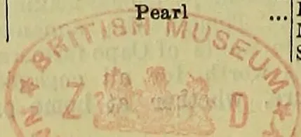

896------------------------------------------------

# COFFEE, TEA, CINCHONA, COCOA, AND CARDAMOM SALES.

No. 11.]

COLOMBO, June 19, 1888.

{ PRICE:—12½ cents each; 3 copies  
30 cents; 6 copies ¾ rupee.

## COLOMBO SALES OF TEA.

Mr. C. E. H. SYMONS put up for sale at the Chamber of Commerce Sale-room today, 23rd May, the undermentioned lots of Tea (5,347 lb.), which sold as under:—

<table border="1">
<thead>
<tr>
<th>Lot No.</th>
<th>Box No.</th>
<th>Pkgs</th>
<th>Description</th>
<th>Weight per lb.</th>
<th>c.</th>
</tr>
</thead>
<tbody>
<tr>
<td>1</td>
<td>Nahalma</td>
<td>29 chests</td>
<td>Pekoe</td>
<td>2755</td>
<td>50</td>
</tr>
<tr>
<td>2</td>
<td>Do</td>
<td>20 hf-chs</td>
<td>Bro Orange Pekoe</td>
<td>960</td>
<td>64 bid</td>
</tr>
<tr>
<td>3</td>
<td>Do</td>
<td>11 chests</td>
<td>Pekoe Sou</td>
<td>990</td>
<td>44</td>
</tr>
<tr>
<td>4</td>
<td>Do</td>
<td>5 hf-chs</td>
<td>Congou</td>
<td>250</td>
<td>37</td>
</tr>
<tr>
<td>5</td>
<td>Do</td>
<td>7 do</td>
<td>Pekoe Fans</td>
<td>350</td>
<td>36</td>
</tr>
<tr>
<td>5</td>
<td>F in square</td>
<td>1 do</td>
<td>Pekoe</td>
<td>42</td>
<td>56</td>
</tr>
</tbody>
</table>

Mr. J. D. ROBINSON put up for sale at the Chamber of Commerce Sale-room today, 23rd May, the undermentioned lots of Tea (14,099 lb.), which sold as under:—

<table border="1">
<thead>
<tr>
<th>Lot No.</th>
<th>Mark</th>
<th>Box Packages No.</th>
<th>Description</th>
<th>Weight per lb.</th>
<th>c.</th>
</tr>
</thead>
<tbody>
<tr>
<td>1</td>
<td>Dens-</td>
<td>35 53 hf-chs</td>
<td>Bro Pekoe</td>
<td>2915</td>
<td>46 bid</td>
</tr>
<tr>
<td>2</td>
<td>Do</td>
<td>36 51 do</td>
<td>Pekoe</td>
<td>2645</td>
<td>44 bid</td>
</tr>
<tr>
<td>3</td>
<td>Do</td>
<td>37 32 do</td>
<td>Pekoe Sou</td>
<td>1680</td>
<td>41</td>
</tr>
<tr>
<td>4</td>
<td>Do</td>
<td>38 7 do</td>
<td>Dust</td>
<td>525</td>
<td>20</td>
</tr>
<tr>
<td colspan="6" style="text-align: center;"><b>Hooped.</b></td>
</tr>
<tr>
<td>5</td>
<td>R</td>
<td>39 7 do</td>
<td>Bro Pekoe</td>
<td>350</td>
<td>36</td>
</tr>
<tr>
<td>6</td>
<td>R</td>
<td>40 5 chests</td>
<td>Pekoe</td>
<td>215</td>
<td>42</td>
</tr>
<tr>
<td>7</td>
<td>R</td>
<td>41 17 boxes</td>
<td>Pekoe Sou</td>
<td>289</td>
<td>46</td>
</tr>
<tr>
<td colspan="6" style="text-align: center;">Gross 25 lb.; Nett 17 lb.</td>
</tr>
<tr>
<td>8</td>
<td>R</td>
<td>42 2 hf-chs</td>
<td>Dust</td>
<td>120</td>
<td>21</td>
</tr>
<tr>
<td colspan="6" style="text-align: center;"><b>(Bulked.)</b></td>
</tr>
<tr>
<td colspan="6" style="text-align: center;"><b>Hooped.</b></td>
</tr>
<tr>
<td colspan="6" style="text-align: center;">Lavant</td>
</tr>
<tr>
<td>60</td>
<td>Do</td>
<td>43 12 chests</td>
<td>Bro Pekoe</td>
<td>1200</td>
<td>56</td>
</tr>
<tr>
<td>11</td>
<td>Do</td>
<td>44 21 do</td>
<td>Pekoe</td>
<td>1680</td>
<td rowspan="2">} 50</td>
</tr>
<tr>
<td>12</td>
<td>Do</td>
<td>45 4 do</td>
<td>do</td>
<td>320</td>
</tr>
<tr>
<td>13</td>
<td>Do</td>
<td>46 1 do</td>
<td>Pekoe Sou</td>
<td>100</td>
<td>47</td>
</tr>
<tr>
<td>13</td>
<td>Do</td>
<td>47 1 do</td>
<td>Dust</td>
<td>140</td>
<td>22</td>
</tr>
<tr>
<td colspan="6" style="text-align: center;"><b>Hooped.</b></td>
</tr>
<tr>
<td>14</td>
<td>K C</td>
<td>48 8 chests</td>
<td>Bro Pekoe Sou</td>
<td>640</td>
<td>45</td>
</tr>
<tr>
<td>15</td>
<td>Do</td>
<td>49 2 do</td>
<td>Bro Pekoe Dust</td>
<td>240</td>
<td>23</td>
</tr>
<tr>
<td colspan="6" style="text-align: center;"><b>(Bulked.)</b></td>
</tr>
<tr>
<td colspan="6" style="text-align: center;"><b>Hooped.</b></td>
</tr>
<tr>
<td>16</td>
<td>F</td>
<td>50 13 chests</td>
<td>Pekoe</td>
<td>1040</td>
<td>46 bid</td>
</tr>
</tbody>
</table>

Mr. E. JOHN put up for sale at the Chamber of Commerce Sale-room today, 23rd May, the undermentioned lots of Tea (12,225 lb.), which sold as under:—

<table border="1">
<thead>
<tr>
<th>Lot No.</th>
<th>Mark</th>
<th>Box Packages No.</th>
<th>Description</th>
<th>Weight per lb.</th>
<th>c.</th>
</tr>
</thead>
<tbody>
<tr>
<td>1</td>
<td>Kadien-</td>
<td>113 5 chests</td>
<td>Dust</td>
<td>625</td>
<td>21</td>
</tr>
<tr>
<td>2</td>
<td>Do</td>
<td>114 1 do</td>
<td>Congou</td>
<td>115</td>
<td>31</td>
</tr>
<tr>
<td>3</td>
<td>Labu-</td>
<td>115 10 hf-chs</td>
<td>Bro Pekoe</td>
<td>400</td>
<td>63</td>
</tr>
<tr>
<td>4</td>
<td>Do</td>
<td>117 20 do</td>
<td>Pekoe</td>
<td>800</td>
<td>49 bid</td>
</tr>
<tr>
<td>5</td>
<td>Do</td>
<td>119 3 do</td>
<td>Bro Mixed</td>
<td>150</td>
<td>36</td>
</tr>
<tr>
<td>6</td>
<td>Do</td>
<td>120 1 do</td>
<td>Pekoe Dust</td>
<td>50</td>
<td>25</td>
</tr>
<tr>
<td>7</td>
<td>Little</td>
<td>121 8 do</td>
<td>Bro Pekoe</td>
<td>440</td>
<td>63 bid</td>
</tr>
<tr>
<td>8</td>
<td>Do</td>
<td>123 22 do</td>
<td>Pekoe</td>
<td>1100</td>
<td>48</td>
</tr>
<tr>
<td>9</td>
<td>Rawreth</td>
<td>125 20 do</td>
<td>Unassorted</td>
<td>1000</td>
<td>39</td>
</tr>
<tr>
<td>10</td>
<td>Do</td>
<td>127 2 do</td>
<td>Bro Tea</td>
<td>100</td>
<td>19</td>
</tr>
<tr>
<td>11</td>
<td>Cocoa-</td>
<td>128 18 do</td>
<td>Unassorted</td>
<td>975</td>
<td>35</td>
</tr>
<tr>
<td>12</td>
<td>Do</td>
<td>130 6 do</td>
<td>Pekoe</td>
<td>283</td>
<td>44</td>
</tr>
<tr>
<td>13</td>
<td>Do</td>
<td>131 3 do</td>
<td>Bro Pekoe</td>
<td>145</td>
<td>65</td>
</tr>
<tr>
<td>14</td>
<td>Do</td>
<td>132 2 do</td>
<td>Red Leaf</td>
<td>62</td>
<td>19</td>
</tr>
<tr>
<td>15</td>
<td>Do</td>
<td>133 1 do</td>
<td>Pekoe Dust</td>
<td>29</td>
<td>32</td>
</tr>
<tr>
<td>16</td>
<td>Torring-</td>
<td>134 41 do</td>
<td>Orange Pekoe</td>
<td>2050</td>
<td>65</td>
</tr>
<tr>
<td>17</td>
<td>Do</td>
<td>136 29 do</td>
<td>Pekoe Sou</td>
<td>1450</td>
<td>48</td>
</tr>
<tr>
<td>18</td>
<td>Do</td>
<td>138 3 do</td>
<td>Dust</td>
<td>240</td>
<td>24</td>
</tr>
<tr>
<td>19</td>
<td>Do</td>
<td>139 1 do</td>
<td>Congou</td>
<td>47</td>
<td>32</td>
</tr>
<tr>
<td>20</td>
<td>Monrovia</td>
<td>140 7 do</td>
<td>Bro Pekoe</td>
<td>350</td>
<td>47 bid</td>
</tr>
<tr>
<td>21</td>
<td>Do</td>
<td>141 10 do</td>
<td>Pekoe</td>
<td>460</td>
<td>43</td>
</tr>
<tr>
<td>22</td>
<td>Do</td>
<td>143 13 do</td>
<td>Pekoe Sou</td>
<td>650</td>
<td>44</td>
</tr>
<tr>
<td>23</td>
<td>Do</td>
<td>146 4 do</td>
<td>Bro Mixed</td>
<td>200</td>
<td>32</td>
</tr>
<tr>
<td>24</td>
<td>Do</td>
<td>146 2 do</td>
<td>Dust</td>
<td>130</td>
<td>20</td>
</tr>
<tr>
<td>25</td>
<td>H M P</td>
<td>147 5 do</td>
<td>Unassorted</td>
<td>237</td>
<td>38</td>
</tr>
</tbody>
</table>

Messrs. FORBES & WALKER put up for sale at the Chamber of Commerce Sale-room today, 23rd May, the undermentioned lots of Tea (33,355 lb.), which sold as under:—

<table border="1">
<thead>
<tr>
<th>Lot No.</th>
<th>Mark</th>
<th>Box Pkgs No.</th>
<th>Description</th>
<th>Weight per lb.</th>
<th>c.</th>
</tr>
</thead>
<tbody>
<tr>
<td>1</td>
<td>Norton</td>
<td>149 4 hf-chs</td>
<td>Pekoe Fans</td>
<td>200</td>
<td>21</td>
</tr>
<tr>
<td>2</td>
<td>N</td>
<td>142 18 do</td>
<td>Bro Pekoe</td>
<td>1080</td>
<td>58</td>
</tr>
<tr>
<td>3</td>
<td>N</td>
<td>144 9 do</td>
<td>Pekoe</td>
<td>540</td>
<td>49</td>
</tr>
<tr>
<td>4</td>
<td>N</td>
<td>146 22 do</td>
<td>Pekoe Sou</td>
<td>1320</td>
<td>43</td>
</tr>
<tr>
<td>5</td>
<td>N</td>
<td>148 1 do</td>
<td>Congou</td>
<td>60</td>
<td>30</td>
</tr>
<tr>
<td>6</td>
<td>N</td>
<td>150 1 do</td>
<td>Dust</td>
<td>76</td>
<td>20</td>
</tr>
</tbody>
</table>

The Yatiyantota Tea Co., Limited.

<table border="1">
<tbody>
<tr>
<td>7</td>
<td>Polata-</td>
<td>152 52 hf-chs</td>
<td>Bro Pekoe</td>
<td>2600</td>
<td>56 bid</td>
</tr>
<tr>
<td>8</td>
<td>Do</td>
<td>154 57 do</td>
<td>Pekoe</td>
<td>2565</td>
<td>48 bid</td>
</tr>
<tr>
<td>9</td>
<td>Do</td>
<td>156 25 do</td>
<td>Pekoe Sou</td>
<td>1250</td>
<td>44 bid</td>
</tr>
<tr>
<td>10</td>
<td>Farnham</td>
<td>158 46 do</td>
<td>Bro Orange Pekoe</td>
<td>2900</td>
<td>50 bid</td>
</tr>
<tr>
<td>11</td>
<td>Do</td>
<td>160 19 do</td>
<td>Pekoe</td>
<td>950</td>
<td>47 bid</td>
</tr>
<tr>
<td>12</td>
<td>Do</td>
<td>162 12 do</td>
<td>Pekoe Sou</td>
<td>540</td>
<td>43</td>
</tr>
<tr>
<td>13</td>
<td>Do</td>
<td>164 4 do</td>
<td>Fannings</td>
<td>200</td>
<td>35</td>
</tr>
<tr>
<td>14</td>
<td>Do</td>
<td>166 1 do</td>
<td>Congou</td>
<td>45</td>
<td>33</td>
</tr>
<tr>
<td>15</td>
<td>Do</td>
<td>168 1 do</td>
<td>Dust</td>
<td>80</td>
<td>21</td>
</tr>
<tr>
<td>16</td>
<td>Middle-</td>
<td></td>
<td></td>
<td></td>
<td></td>
</tr>
<tr>
<td>17</td>
<td>ton</td>
<td>170 30 do</td>
<td>Bro Pekoe</td>
<td>1674</td>
<td>56</td>
</tr>
<tr>
<td>18</td>
<td>Do</td>
<td>172 43 do</td>
<td>Pekoe</td>
<td>2150</td>
<td>45</td>
</tr>
<tr>
<td>19</td>
<td>Norton</td>
<td>174 16 do</td>
<td>Bro Pekoe</td>
<td>800</td>
<td>55 bid</td>
</tr>
<tr>
<td>20</td>
<td>Do</td>
<td>176 22 do</td>
<td>Pekoe</td>
<td>1100</td>
<td>47 bid</td>
</tr>
<tr>
<td>21</td>
<td>Do</td>
<td>178 18 do</td>
<td>Pekoe Sou</td>
<td>720</td>
<td>45 bid</td>
</tr>
<tr>
<td colspan="6" style="text-align: center;">Gonde-</td>
</tr>
<tr>
<td></td>
<td>nawa</td>
<td>180 32 do</td>
<td>Bro Pekoe</td>
<td>1600</td>
<td>65</td>
</tr>
<tr>
<td>22</td>
<td>Do</td>
<td>182 65 do</td>
<td>Pekoe</td>
<td>2925</td>
<td>48 bid</td>
</tr>
<tr>
<td>23</td>
<td>Do</td>
<td>184 44 do</td>
<td>Pekoe Sou</td>
<td>1980</td>
<td>41 bid</td>
</tr>
<tr>
<td>24</td>
<td>Do</td>
<td>186 7 do</td>
<td>Unassorted</td>
<td>350</td>
<td>42</td>
</tr>
<tr>
<td>25</td>
<td>Do</td>
<td>188 9 do</td>
<td>Bro Mixed</td>
<td>450</td>
<td>34</td>
</tr>
<tr>
<td>26</td>
<td>Do</td>
<td>190 4 do</td>
<td>Dust</td>
<td>280</td>
<td>20</td>
</tr>
<tr>
<td>27</td>
<td>Clunes</td>
<td>192 8 do</td>
<td>Bro Pekoe</td>
<td>480</td>
<td>52 bid</td>
</tr>
<tr>
<td>28</td>
<td>Do</td>
<td>194 14 do</td>
<td>Pekoe</td>
<td>840</td>
<td>46</td>
</tr>
<tr>
<td>29</td>
<td>Do</td>
<td>196 13 do</td>
<td>Pekoe Sou</td>
<td>780</td>
<td>42</td>
</tr>
<tr>
<td>30</td>
<td>Waraka-</td>
<td></td>
<td></td>
<td></td>
<td></td>
</tr>
<tr>
<td></td>
<td>wa</td>
<td>198 16 do</td>
<td>Bro Pekoe</td>
<td>800</td>
<td>60</td>
</tr>
<tr>
<td>31</td>
<td>Do</td>
<td>200 12 do</td>
<td>Pekoe</td>
<td>540</td>
<td>51</td>
</tr>
<tr>
<td>32</td>
<td>Do</td>
<td>202 9 do</td>
<td>Bro Pekoe Sou</td>
<td>405</td>
<td>46</td>
</tr>
<tr>
<td>33</td>
<td>Agraoya</td>
<td>204 5 chests</td>
<td>Bro Pekoe</td>
<td>500</td>
<td>58 bid</td>
</tr>
<tr>
<td>34</td>
<td>Do</td>
<td>206 8 do</td>
<td>Pekoe</td>
<td>800</td>
<td>50 bid</td>
</tr>
<tr>
<td>35</td>
<td>Do</td>
<td>208 1 hf-cht</td>
<td>Dust</td>
<td>60</td>
<td>24</td>
</tr>
<tr>
<td>36</td>
<td>G T W</td>
<td>210 1 do</td>
<td>Pekoe</td>
<td>50</td>
<td>56</td>
</tr>
<tr>
<td>37</td>
<td>Do</td>
<td>212 1 do</td>
<td>Bro Mixed</td>
<td>55</td>
<td>37</td>
</tr>
<tr>
<td>38</td>
<td>Do</td>
<td>214 2 do</td>
<td>Dust</td>
<td>150</td>
<td>20</td>
</tr>
<tr>
<td>39</td>
<td>Agala-</td>
<td></td>
<td></td>
<td></td>
<td></td>
</tr>
<tr>
<td></td>
<td>watte</td>
<td>216 1 do</td>
<td>Pekoe</td>
<td>60</td>
<td>35</td>
</tr>
</tbody>
</table>

Messrs. SOMERVILLE & Co. put up for sale at the Chamber of Commerce Sale-room today, 23rd May, the undermentioned lots of Tea (30,209 lb.), which sold as under:—

<table border="1">
<thead>
<tr>
<th>Lot No.</th>
<th>Mark</th>
<th>Box Pkgs. No.</th>
<th>Description.</th>
<th>Weight per lb.</th>
<th>c.</th>
</tr>
</thead>
<tbody>
<tr>
<td>1</td>
<td>Yalta</td>
<td>52 2 hf-chs</td>
<td>Congou</td>
<td>98</td>
<td>39</td>
</tr>
<tr>
<td>2</td>
<td>Do</td>
<td>53 3 do</td>
<td>Dust</td>
<td>216</td>
<td>42</td>
</tr>
<tr>
<td>3</td>
<td>H H</td>
<td>54 1 do</td>
<td>Bro Pekoe</td>
<td>48</td>
<td>43</td>
</tr>
<tr>
<td>4</td>
<td>Do</td>
<td>55 1 do</td>
<td>Pekoe</td>
<td>50</td>
<td>39</td>
</tr>
<tr>
<td>5</td>
<td>Do</td>
<td>56 2 do</td>
<td>Souchong</td>
<td>97</td>
<td>34</td>
</tr>
<tr>
<td>6</td>
<td>Do</td>
<td>57 1 do</td>
<td>Congou</td>
<td>52</td>
<td>24</td>
</tr>
<tr>
<td>7</td>
<td>Do</td>
<td>58 1 do</td>
<td>Red Leaf</td>
<td>49</td>
<td>19</td>
</tr>
<tr>
<td>8</td>
<td>Do</td>
<td>59 1 do</td>
<td>Dust</td>
<td>77</td>
<td>19</td>
</tr>
<tr>
<td>9</td>
<td>A E</td>
<td>60 3 do</td>
<td>Pekoe Fans</td>
<td>150</td>
<td rowspan="2">} 549</td>
</tr>
<tr>
<td>10</td>
<td>Do</td>
<td>61 9 do</td>
<td>Fannings</td>
<td>549</td>
</tr>
<tr>
<td>11</td>
<td>Do</td>
<td>62 11 do</td>
<td>Dust</td>
<td>825</td>
<td rowspan="2">} not ard.</td>
</tr>
<tr>
<td>12</td>
<td>Do</td>
<td>64 24 do</td>
<td>Congou</td>
<td>1050</td>
</tr>
<tr>
<td>13</td>
<td>Do</td>
<td>66 6 do</td>
<td>Red Leaf</td>
<td>270</td>
<td></td>
</tr>
<tr>
<td colspan="6" style="text-align: center;">Orange</td>
</tr>
<tr>
<td></td>
<td>Field</td>
<td>67 2 do</td>
<td>Orange Pekoe</td>
<td>120</td>
<td>64</td>
</tr>
<tr>
<td>15</td>
<td>Do</td>
<td>68 19 do</td>
<td>Unassorted</td>
<td>950</td>
<td>42</td>
</tr>
<tr>
<td>16</td>
<td>Do</td>
<td>70 2 do</td>
<td>Congou</td>
<td>100</td>
<td>32</td>
</tr>
<tr>
<td>17</td>
<td>Do</td>
<td>71 1 do</td>
<td>Dust</td>
<td>57</td>
<td>20</td>
</tr>
<tr>
<td colspan="6" style="text-align: center;">Lauder-</td>
</tr>
<tr>
<td></td>
<td>dale</td>
<td>72 32 do</td>
<td>Bro Pekoe</td>
<td>1920</td>
<td>62 bid</td>
</tr>
<tr>
<td>18</td>
<td>Do</td>
<td>74 33 do</td>
<td>Pekoe</td>
<td>1650</td>
<td>52</td>
</tr>
<tr>
<td>20</td>
<td>Do</td>
<td>76 21 do</td>
<td>Pekoe Sou</td>
<td>1050</td>
<td>48</td>
</tr>
<tr>
<td>21</td>
<td>Do</td>
<td>78 2 do</td>
<td>Congou</td>
<td>100</td>
<td>31</td>
</tr>
<tr>
<td>22</td>
<td>Do</td>
<td>79 2 do</td>
<td>Dust</td>
<td>160</td>
<td>21</td>
</tr>
<tr>
<td>23</td>
<td>Invay</td>
<td>80 16 do</td>
<td>Bro Pekoe</td>
<td>880</td>
<td>74 bid</td>
</tr>
<tr>
<td>24</td>
<td>Do</td>
<td>82 14 chests</td>
<td>Pekoe</td>
<td>1260</td>
<td>62 bid</td>
</tr>
<tr>
<td>25</td>
<td>Do</td>
<td>84 15 hf-chs</td>
<td>Souchong</td>
<td>720</td>
<td>55</td>
</tr>
</tbody>
</table>

897------------------------------------------------

2

CEYLON PRODUCE SALES LIST.

<table border="1">
<thead>
<tr>
<th>Lot No.</th>
<th>Mark</th>
<th>Box No.</th>
<th>Packages</th>
<th>Description</th>
<th>Weight per lb.</th>
<th>c.</th>
</tr>
</thead>
<tbody>
<tr>
<td>26</td>
<td>Ossing-ton</td>
<td>86</td>
<td>8 hf-chs</td>
<td>Bro Pekoe</td>
<td>440</td>
<td rowspan="5">not ard.</td>
</tr>
<tr>
<td>27</td>
<td>Do</td>
<td>87</td>
<td>13 do</td>
<td>Pekoe</td>
<td>350</td>
</tr>
<tr>
<td>28</td>
<td>Do</td>
<td>89</td>
<td>12 do</td>
<td>Pekoe Sou</td>
<td>533</td>
</tr>
<tr>
<td>29</td>
<td>Do</td>
<td>91</td>
<td>1 do</td>
<td>Congou</td>
<td>59</td>
</tr>
<tr>
<td>30</td>
<td>Do</td>
<td>92</td>
<td>1 do</td>
<td>Dust</td>
<td>83</td>
</tr>
<tr>
<td>31</td>
<td>Lyndhurst</td>
<td>93</td>
<td>3 chests</td>
<td></td>
<td></td>
<td></td>
</tr>
<tr>
<td rowspan="2">32</td>
<td rowspan="2">Do</td>
<td rowspan="2">94</td>
<td>4 hf-chs</td>
<td>Orange Pekoe</td>
<td>500</td>
<td>50 bid</td>
</tr>
<tr>
<td>4 chests</td>
<td></td>
<td></td>
<td></td>
</tr>
<tr>
<td rowspan="2">33</td>
<td rowspan="2">Do</td>
<td rowspan="2">95</td>
<td>4 hf-chs</td>
<td>Bro Pekoe</td>
<td>600</td>
<td>51 bid</td>
</tr>
<tr>
<td>8 chests</td>
<td></td>
<td></td>
<td></td>
</tr>
<tr>
<td rowspan="2">34</td>
<td rowspan="2">Do</td>
<td rowspan="2">97</td>
<td>9 hf-chs</td>
<td>Pekoe</td>
<td>1105</td>
<td>50</td>
</tr>
<tr>
<td>15 chests</td>
<td></td>
<td></td>
<td></td>
</tr>
<tr>
<td>35</td>
<td>L</td>
<td>98</td>
<td>17 hf-chs</td>
<td>Pekoe Sou</td>
<td>2115</td>
<td>42</td>
</tr>
<tr>
<td>36</td>
<td>L</td>
<td>100</td>
<td>2 chests</td>
<td>Souchong</td>
<td>160</td>
<td>35</td>
</tr>
<tr>
<td>37</td>
<td>L</td>
<td>101</td>
<td>1 hf-cht</td>
<td>Bulk</td>
<td>45</td>
<td>39</td>
</tr>
<tr>
<td>38</td>
<td>L</td>
<td>102</td>
<td>1 chest</td>
<td>Fannings</td>
<td>100</td>
<td>30</td>
</tr>
<tr>
<td>39</td>
<td>L</td>
<td>103</td>
<td>2 1 do</td>
<td>Dust</td>
<td>132</td>
<td>21</td>
</tr>
<tr>
<td>40</td>
<td>Relugas</td>
<td>104</td>
<td>3 1 box</td>
<td>Red Leaf</td>
<td>20</td>
<td>28</td>
</tr>
<tr>
<td>41</td>
<td>Do</td>
<td>105</td>
<td>4 4 hf-chs</td>
<td>Bro Pekoe</td>
<td>232</td>
<td>67 bid</td>
</tr>
<tr>
<td>42</td>
<td>Do</td>
<td>106</td>
<td>5 6 do</td>
<td>Pekoe</td>
<td>300</td>
<td>54</td>
</tr>
<tr>
<td>43</td>
<td>G</td>
<td>107</td>
<td>6 13 chests</td>
<td>Pekoe Sou</td>
<td>1430</td>
<td>32</td>
</tr>
<tr>
<td>44</td>
<td>G</td>
<td>108</td>
<td>8 5 hf-chs</td>
<td>Bro Pekoe</td>
<td>259</td>
<td>51 bid</td>
</tr>
<tr>
<td>45</td>
<td>G</td>
<td>109</td>
<td>9 6 do</td>
<td>Pekoe</td>
<td>300</td>
<td>45 bid</td>
</tr>
<tr>
<td>46</td>
<td>M K</td>
<td>110</td>
<td>10 5 chests</td>
<td>Pekoe Sou</td>
<td>400</td>
<td>45</td>
</tr>
<tr>
<td>47</td>
<td>Do</td>
<td>111</td>
<td>6 do</td>
<td>Bro Mixed</td>
<td>560</td>
<td>37</td>
</tr>
<tr>
<td>48</td>
<td>Elchico</td>
<td>112</td>
<td>2 do</td>
<td>Dust</td>
<td>230</td>
<td>20</td>
</tr>
<tr>
<td>49</td>
<td>Do</td>
<td>113</td>
<td>15 27 hf-chs</td>
<td>Bro Pekoe</td>
<td>1620</td>
<td>61 bid</td>
</tr>
<tr>
<td>50</td>
<td>Do</td>
<td>114</td>
<td>15 25 do</td>
<td>Pekoe Sou</td>
<td>1500</td>
<td>46</td>
</tr>
<tr>
<td>51</td>
<td>Do</td>
<td>117</td>
<td>1 chest</td>
<td>Dust</td>
<td>86</td>
<td>21</td>
</tr>
<tr>
<td>52</td>
<td>Wewesse</td>
<td>118</td>
<td>14 hf-chs</td>
<td>Bro Pekoe</td>
<td>700</td>
<td>64</td>
</tr>
<tr>
<td>53</td>
<td>Do</td>
<td>120</td>
<td>26 do</td>
<td>Pekoe Sou</td>
<td>1300</td>
<td>49</td>
</tr>
<tr>
<td>53</td>
<td>C P</td>
<td>122</td>
<td>2 chests</td>
<td>Pekoe</td>
<td>191</td>
<td>32</td>
</tr>
<tr>
<td>54</td>
<td>Do</td>
<td>123</td>
<td>1 do</td>
<td>Souchong</td>
<td>98</td>
<td>24</td>
</tr>
<tr>
<td>55</td>
<td>Do</td>
<td>24</td>
<td>3 do</td>
<td>Bro Tea</td>
<td>440</td>
<td>21</td>
</tr>
<tr>
<td>56</td>
<td>Forest Hill</td>
<td>25</td>
<td>8 hf-chs</td>
<td>Bro Pekoe</td>
<td>480</td>
<td>58 bid</td>
</tr>
<tr>
<td>57</td>
<td>Do</td>
<td>26</td>
<td>12 chests</td>
<td>Pekoe Sou</td>
<td>1080</td>
<td>47</td>
</tr>
<tr>
<td>58</td>
<td>J B</td>
<td>11</td>
<td>11 hf-chs</td>
<td>Bro Pekoe</td>
<td>550</td>
<td>57</td>
</tr>
</tbody>
</table>

Mr. J. D. ROBINSON put up for sale at the Chamber of Commerce Sale-room today, 30th May, the undermentioned lots of Tea (6,435 lb.), which sold as under:—

<table border="1">
<thead>
<tr>
<th>Lot No.</th>
<th>Mark</th>
<th>Box No.</th>
<th>Packages</th>
<th>Description</th>
<th>Weight per lb.</th>
<th>c.</th>
</tr>
</thead>
<tbody>
<tr>
<td>1</td>
<td>D U</td>
<td>45</td>
<td>53 hf-chs</td>
<td>Bro Pekoe</td>
<td>2915</td>
<td>47</td>
</tr>
<tr>
<td>2</td>
<td>Do</td>
<td>47</td>
<td>51 do</td>
<td>Pekoe</td>
<td>2645</td>
<td>44</td>
</tr>
<tr>
<td>3</td>
<td>C O</td>
<td>49</td>
<td>18 do</td>
<td>Unassorted</td>
<td>875</td>
<td>35</td>
</tr>
<tr>
<td>4</td>
<td>A A</td>
<td>50</td>
<td>4 chests</td>
<td>Congou</td>
<td>320</td>
<td>30</td>
</tr>
<tr>
<td>5</td>
<td>Do</td>
<td>51</td>
<td>2 do</td>
<td>Dust</td>
<td>268</td>
<td>16</td>
</tr>
<tr>
<td>6</td>
<td>Do</td>
<td>52</td>
<td>1 do</td>
<td>Pekoe Dust</td>
<td>120</td>
<td>23</td>
</tr>
</tbody>
</table>

Mr. C. E. H. SYMONS put up for sale at the Chamber of Commerce sale-room today, 30th May, the undermentioned lots of Tea (6,076 lb.), which sold as under:—

<table border="1">
<thead>
<tr>
<th>Lot No.</th>
<th>Mark</th>
<th>Box No.</th>
<th>Packages</th>
<th>Description</th>
<th>Weight per lb.</th>
<th>c.</th>
</tr>
</thead>
<tbody>
<tr>
<td>1</td>
<td>Galla-watta</td>
<td>97</td>
<td>40 hf-chs</td>
<td>Pekoe</td>
<td>1600</td>
<td>43</td>
</tr>
<tr>
<td>2</td>
<td>Do</td>
<td>99</td>
<td>17 do</td>
<td>Bro Pekoe</td>
<td>765</td>
<td>50 bid</td>
</tr>
<tr>
<td>3</td>
<td>Do</td>
<td>1</td>
<td>8 do</td>
<td>Dust</td>
<td>50</td>
<td>20</td>
</tr>
<tr>
<td>4</td>
<td>Nahalma</td>
<td>3</td>
<td>19 chests</td>
<td>Pekoe</td>
<td>1805</td>
<td>52</td>
</tr>
<tr>
<td>5</td>
<td>Do</td>
<td>5</td>
<td>12 hf-chs</td>
<td>Bro Orange Pekoe</td>
<td>576</td>
<td>70</td>
</tr>
<tr>
<td>6</td>
<td>Do</td>
<td>7</td>
<td>8 chests</td>
<td>Pekoe Sou</td>
<td>720</td>
<td>43</td>
</tr>
<tr>
<td>7</td>
<td>Do</td>
<td>9</td>
<td>3 hf-chs</td>
<td>Congou</td>
<td>135</td>
<td>33</td>
</tr>
<tr>
<td>8</td>
<td>Do</td>
<td>11</td>
<td>5 do</td>
<td>Pekoe Fans</td>
<td>225</td>
<td>35</td>
</tr>
<tr>
<td></td>
<td>Pambagama</td>
<td>13</td>
<td>2 chests</td>
<td>Congou</td>
<td>200</td>
<td>35</td>
</tr>
</tbody>
</table>

Mr. E. JOHN put up for sale at the Chamber of Commerce Sale-room today, 30th May, the undermentioned lots of Tea (16,216 lb.), which sold as under:—

<table border="1">
<thead>
<tr>
<th>Lot No.</th>
<th>Mark</th>
<th>Box No.</th>
<th>Packages</th>
<th>Description</th>
<th>Weight per lb.</th>
<th>c.</th>
</tr>
</thead>
<tbody>
<tr>
<td>1</td>
<td>T F</td>
<td>147</td>
<td>2 chests</td>
<td>Dust</td>
<td>194</td>
<td>19</td>
</tr>
<tr>
<td>2</td>
<td>Do</td>
<td>148</td>
<td>1 hf-cht</td>
<td>Bro Mixed</td>
<td>33</td>
<td>37</td>
</tr>
<tr>
<td>3</td>
<td>O B</td>
<td>149</td>
<td>10 chests</td>
<td>Souchong</td>
<td>1000</td>
<td>34</td>
</tr>
<tr>
<td>4</td>
<td>Do</td>
<td>151</td>
<td>5 do</td>
<td>Dust</td>
<td>760</td>
<td>20</td>
</tr>
<tr>
<td>5</td>
<td>C L</td>
<td>152</td>
<td>1 do</td>
<td>Pekoe</td>
<td>88</td>
<td>48</td>
</tr>
<tr>
<td>6</td>
<td>Albiou</td>
<td>153</td>
<td>14 do</td>
<td>Bro Pekoe</td>
<td>1400</td>
<td>84</td>
</tr>
<tr>
<td>7</td>
<td>Do</td>
<td>155</td>
<td>23 hf-chs</td>
<td>Pekoe</td>
<td>1400</td>
<td>66</td>
</tr>
<tr>
<td>8</td>
<td>Do</td>
<td>157</td>
<td>23 do</td>
<td>Pekoe Sou</td>
<td>1150</td>
<td>55</td>
</tr>
<tr>
<td>9</td>
<td>Do</td>
<td>159</td>
<td>3 do</td>
<td>Dust</td>
<td>225</td>
<td>25</td>
</tr>
</tbody>
</table>

<table border="1">
<thead>
<tr>
<th>Lot No.</th>
<th>Mark</th>
<th>Box No.</th>
<th>Pkgs.</th>
<th>Description</th>
<th>Weight per lb.</th>
<th>c.</th>
</tr>
</thead>
<tbody>
<tr>
<td>10</td>
<td>Cruden</td>
<td>160</td>
<td>19 hf-chs</td>
<td>Orange Peke</td>
<td>1140</td>
<td>86 bid</td>
</tr>
<tr>
<td>11</td>
<td>Do</td>
<td>162</td>
<td>14 chests</td>
<td>Pekoe</td>
<td>1400</td>
<td>79</td>
</tr>
<tr>
<td>12</td>
<td>Do</td>
<td>164</td>
<td>26 do</td>
<td>Pekoe</td>
<td>2600</td>
<td>59 bid</td>
</tr>
<tr>
<td>13</td>
<td>Do</td>
<td>166</td>
<td>4 do</td>
<td>Bro Mixed</td>
<td>240</td>
<td>44</td>
</tr>
<tr>
<td>14</td>
<td>Do</td>
<td>167</td>
<td>2 do</td>
<td>Dust</td>
<td>140</td>
<td>23</td>
</tr>
<tr>
<td>15</td>
<td>Ivies</td>
<td>153</td>
<td>20 hf-chs</td>
<td>Bro Pekoe</td>
<td>1000</td>
<td>61</td>
</tr>
<tr>
<td>16</td>
<td>Do</td>
<td>170</td>
<td>30 do</td>
<td>Pekoe</td>
<td>1200</td>
<td>52</td>
</tr>
<tr>
<td>17</td>
<td>Salem</td>
<td>171</td>
<td>20 do</td>
<td>Orange Pekoe</td>
<td>760</td>
<td>60</td>
</tr>
<tr>
<td>18</td>
<td>Do</td>
<td>173</td>
<td>20 do</td>
<td>Pekoe</td>
<td>800</td>
<td>47</td>
</tr>
<tr>
<td>19</td>
<td>Do</td>
<td>175</td>
<td>2 boxes</td>
<td>Congou</td>
<td>36</td>
<td>30</td>
</tr>
<tr>
<td>20</td>
<td>Do</td>
<td>176</td>
<td>2 do</td>
<td>Pekoe Dust</td>
<td>60</td>
<td>21</td>
</tr>
<tr>
<td>21</td>
<td>A U</td>
<td>177</td>
<td>13 hf-chs</td>
<td>Pekoe Sou</td>
<td>650</td>
<td>44</td>
</tr>
</tbody>
</table>

Messrs. SOMERVILLE & Co. put up for sale at the Chamber of Commerce Sale-room today, 30th May the undermentioned lots of Tea (18,8c. lb.), which sold as under:—

<table border="1">
<thead>
<tr>
<th>Lot No.</th>
<th>Mark</th>
<th>Box No.</th>
<th>Pkgs.</th>
<th>Description</th>
<th>Weight per lb.</th>
<th>c.</th>
</tr>
</thead>
<tbody>
<tr>
<td>1</td>
<td>A E</td>
<td>29</td>
<td>3 hf-chs</td>
<td>Pekoe Fans</td>
<td>180</td>
<td>25</td>
</tr>
<tr>
<td>2</td>
<td>Do</td>
<td>30</td>
<td>9 do</td>
<td>Fannings</td>
<td>540</td>
<td>25</td>
</tr>
<tr>
<td>3</td>
<td>Do</td>
<td>31</td>
<td>11 do</td>
<td>Dust</td>
<td>825</td>
<td>17</td>
</tr>
<tr>
<td>4</td>
<td>Do</td>
<td>33</td>
<td>24 do</td>
<td>Congou</td>
<td>1080</td>
<td>33</td>
</tr>
<tr>
<td>5</td>
<td>Do</td>
<td>35</td>
<td>6 do</td>
<td>Red Leaf</td>
<td>270</td>
<td>22</td>
</tr>
<tr>
<td>6</td>
<td>Ossing-ton</td>
<td>36</td>
<td>8 do</td>
<td>Bro Pekoe</td>
<td>440</td>
<td>51 bid</td>
</tr>
<tr>
<td>7</td>
<td>Do</td>
<td>37</td>
<td>13 do</td>
<td>Pekoe</td>
<td>650</td>
<td>47</td>
</tr>
<tr>
<td>8</td>
<td>Do</td>
<td>39</td>
<td>12 do</td>
<td>Pekoe Sou</td>
<td>533</td>
<td>45</td>
</tr>
<tr>
<td>9</td>
<td>Do</td>
<td>41</td>
<td>1 do</td>
<td>Congou</td>
<td>50</td>
<td>25</td>
</tr>
<tr>
<td>10</td>
<td>Do</td>
<td>42</td>
<td>1 chest</td>
<td>Dust</td>
<td>83</td>
<td>18</td>
</tr>
<tr>
<td>11</td>
<td>Mincing Lane</td>
<td>43</td>
<td>15 do</td>
<td></td>
<td></td>
<td></td>
</tr>
<tr>
<td rowspan="2">12</td>
<td rowspan="2">Do</td>
<td rowspan="2">45</td>
<td>1 hf-ch</td>
<td>Bro Pekoe</td>
<td>1550</td>
<td>74</td>
</tr>
<tr>
<td>15 chests</td>
<td>Pekoe</td>
<td>1500</td>
<td>54</td>
</tr>
<tr>
<td>13</td>
<td>Do</td>
<td>47</td>
<td>15 do</td>
<td>Pekoe Sou</td>
<td>1500</td>
<td>50</td>
</tr>
<tr>
<td>14</td>
<td>Blair-avon</td>
<td>49</td>
<td>35 hf-chs</td>
<td>Bro Pekoe</td>
<td>2100</td>
<td>42 bid</td>
</tr>
<tr>
<td>15</td>
<td>Do</td>
<td>51</td>
<td>17 do</td>
<td>Pekoe</td>
<td>850</td>
<td>46</td>
</tr>
<tr>
<td>16</td>
<td>Do</td>
<td>53</td>
<td>36 do</td>
<td>Pekoe Sou</td>
<td>1800</td>
<td>45</td>
</tr>
<tr>
<td>17</td>
<td>Do</td>
<td>55</td>
<td>6 do</td>
<td>Souchong</td>
<td>300</td>
<td>38</td>
</tr>
<tr>
<td>18</td>
<td>Do</td>
<td>56</td>
<td>6 do</td>
<td>Bro Tea</td>
<td>480</td>
<td>1</td>
</tr>
<tr>
<td>19</td>
<td>Kurulu-galla</td>
<td>57</td>
<td>6 do</td>
<td>Bro Pekoe</td>
<td>290</td>
<td>62</td>
</tr>
<tr>
<td>20</td>
<td>Do</td>
<td>58</td>
<td>3 do</td>
<td>Pekoe</td>
<td>150</td>
<td>46 bid</td>
</tr>
<tr>
<td>21</td>
<td>Do</td>
<td>59</td>
<td>10 do</td>
<td>Pekoe Sou</td>
<td>500</td>
<td>43</td>
</tr>
<tr>
<td>22</td>
<td>Do</td>
<td>61</td>
<td>1 chest</td>
<td>Dust</td>
<td>75</td>
<td>22</td>
</tr>
<tr>
<td>23</td>
<td>Cooda-gama</td>
<td>62</td>
<td>5 hf-chs</td>
<td>Unassorted</td>
<td>250</td>
<td>41</td>
</tr>
<tr>
<td>24</td>
<td>Do</td>
<td>63</td>
<td>6 do</td>
<td>Congou</td>
<td>300</td>
<td>30</td>
</tr>
<tr>
<td>25</td>
<td>Do</td>
<td>64</td>
<td>1 chests</td>
<td>Red Deaf</td>
<td>100</td>
<td>23</td>
</tr>
<tr>
<td>26</td>
<td>Do</td>
<td>65</td>
<td>3 do</td>
<td>Dust</td>
<td>210</td>
<td>20</td>
</tr>
<tr>
<td>27</td>
<td>Hunu-galla</td>
<td>66</td>
<td>8 hf-chs</td>
<td>Souchong</td>
<td>400</td>
<td>37</td>
</tr>
<tr>
<td>28</td>
<td>P</td>
<td>67</td>
<td>3 do</td>
<td>Unassorted</td>
<td>165</td>
<td>46</td>
</tr>
<tr>
<td>29</td>
<td>L H</td>
<td>68</td>
<td>7 pkgs</td>
<td>Orange Pekoe</td>
<td>500</td>
<td>62</td>
</tr>
<tr>
<td>30</td>
<td>E</td>
<td>69</td>
<td>9 hf-chs</td>
<td>Bro Mixed</td>
<td>630</td>
<td>28</td>
</tr>
<tr>
<td>31</td>
<td>Laxapana-galla</td>
<td>70</td>
<td>6 do</td>
<td>Red Leaf</td>
<td>366</td>
<td>22</td>
</tr>
<tr>
<td>32</td>
<td>Fried-land</td>
<td>71</td>
<td>5 do</td>
<td>Souchong</td>
<td>220</td>
<td>36</td>
</tr>
</tbody>
</table>

Messrs. FORBES & WALKER put up for sale at the Chamber of Commerce Sale-room today, 30th May, the undermentioned lots of Tea (32,669 lb.), which sold as under:—

<table border="1">
<thead>
<tr>
<th>Lot No.</th>
<th>Mark</th>
<th>Box No.</th>
<th>Packages</th>
<th>Description</th>
<th>Weight per lb.</th>
<th>c.</th>
</tr>
</thead>
<tbody>
<tr>
<td>1</td>
<td>Maha-tenne</td>
<td>218</td>
<td>3 chests</td>
<td>Souchong</td>
<td>370</td>
<td>37</td>
</tr>
<tr>
<td>2</td>
<td>Do</td>
<td>220</td>
<td>6 do</td>
<td>Dust</td>
<td>450</td>
<td>21</td>
</tr>
<tr>
<td>3</td>
<td>F B</td>
<td>222</td>
<td>28 do</td>
<td>Souchong</td>
<td>2520</td>
<td>40</td>
</tr>
<tr>
<td>4</td>
<td>Do</td>
<td>224</td>
<td>1 hf-chs</td>
<td>Dust</td>
<td>60</td>
<td>16</td>
</tr>
<tr>
<td>5</td>
<td>Do</td>
<td>226</td>
<td>2 do</td>
<td>do</td>
<td>146</td>
<td>20</td>
</tr>
<tr>
<td>6</td>
<td>Citrus</td>
<td>228</td>
<td>3 do</td>
<td>Bro Pekoe</td>
<td>150</td>
<td rowspan="5">not ard.</td>
</tr>
<tr>
<td>7</td>
<td>Do</td>
<td>230</td>
<td>7 do</td>
<td>Pekoe</td>
<td>350</td>
</tr>
<tr>
<td>8</td>
<td>Do</td>
<td>232</td>
<td>13 do</td>
<td>Pekoe Sou</td>
<td>650</td>
</tr>
<tr>
<td>9</td>
<td>Do</td>
<td>234</td>
<td>3 do</td>
<td>do</td>
<td>150</td>
</tr>
<tr>
<td>10</td>
<td>Do</td>
<td>236</td>
<td>2 do</td>
<td>Souchong</td>
<td>100</td>
</tr>
<tr>
<td>11</td>
<td>Do</td>
<td>238</td>
<td>1 do</td>
<td>Congou</td>
<td>50</td>
<td rowspan="2">o</td>
</tr>
<tr>
<td>12</td>
<td>Do</td>
<td>240</td>
<td>2 do</td>
<td>Bro Mixed</td>
<td>100</td>
</tr>
<tr>
<td>13</td>
<td>Latmaha-ra</td>
<td>242</td>
<td>7 do</td>
<td>Bro Pekoe</td>
<td>350</td>
<td rowspan="2">o</td>
</tr>
<tr>
<td>14</td>
<td>Do</td>
<td>244</td>
<td>4 do</td>
<td>Pekoe</td>
<td>200</td>
</tr>
<tr>
<td>15</td>
<td>Glenzer-</td>
<td></td>
<td></td>
<td></td>
<td></td>
<td></td>
</tr>
</tbody>
</table>

898------------------------------------------------

CEYLON PRODUCE SALES LIST.

3

<table border="1">
<thead>
<tr>
<th>Lot No</th>
<th>Mark</th>
<th>Box No.</th>
<th>Packages</th>
<th>Description</th>
<th>Weight per lb.</th>
</tr>
</thead>
<tbody>
<tr>
<td>15</td>
<td>chy</td>
<td>246 33</td>
<td>do</td>
<td>Bro Pekoe</td>
<td>1815 64</td>
</tr>
<tr>
<td>16</td>
<td>Do</td>
<td>248 13</td>
<td>do</td>
<td>Pekoe</td>
<td>650 48</td>
</tr>
<tr>
<td>17</td>
<td>Do</td>
<td>250 27</td>
<td>do</td>
<td>Pekoe Sou</td>
<td>1350 49</td>
</tr>
<tr>
<td>18</td>
<td>Do</td>
<td>252 4</td>
<td>do</td>
<td>Dust</td>
<td>260 20</td>
</tr>
<tr>
<td>19</td>
<td>Holm-wood</td>
<td>254 26</td>
<td>do</td>
<td>Bro Pekoe</td>
<td>1170 53 bid</td>
</tr>
<tr>
<td>20</td>
<td>Do</td>
<td>256 26</td>
<td>do</td>
<td>Pekoe</td>
<td>1170 48 bid</td>
</tr>
<tr>
<td>21</td>
<td>Do</td>
<td>258 13 chests</td>
<td></td>
<td>Pekoe Sou</td>
<td>1235 45</td>
</tr>
<tr>
<td>22</td>
<td>Theber. ton</td>
<td>260 18 hf-chs</td>
<td></td>
<td>Bro Pekoe</td>
<td>900 not arid.</td>
</tr>
<tr>
<td>23</td>
<td>Do</td>
<td>262 33</td>
<td>do</td>
<td>Pekoe</td>
<td>1650</td>
</tr>
<tr>
<td>24</td>
<td>Do</td>
<td>264 28</td>
<td>do</td>
<td>Bro Pekoe Sou</td>
<td>1400</td>
</tr>
<tr>
<td>25</td>
<td>Do</td>
<td>266 16</td>
<td>do</td>
<td>Pekoe Dust</td>
<td>800</td>
</tr>
<tr>
<td>26</td>
<td>S C</td>
<td>268 4</td>
<td>do</td>
<td>Pekoe Sou</td>
<td>200 41</td>
</tr>
<tr>
<td>27</td>
<td>Do</td>
<td>270 1</td>
<td>do</td>
<td>Dust</td>
<td>60 25</td>
</tr>
<tr>
<td>28</td>
<td>Attabage</td>
<td>272 12 chests</td>
<td></td>
<td>Bro Pekoe</td>
<td>1080 66</td>
</tr>
<tr>
<td>29</td>
<td>Do</td>
<td>274 31</td>
<td>do</td>
<td>Pekoe</td>
<td>2635 55</td>
</tr>
<tr>
<td>30</td>
<td>Do</td>
<td>276 31</td>
<td>do</td>
<td>Pekoe Sou</td>
<td>2790 46</td>
</tr>
<tr>
<td>31</td>
<td>Do</td>
<td>278 2</td>
<td>do</td>
<td>Dust</td>
<td>280 22</td>
</tr>
<tr>
<td>32</td>
<td>G</td>
<td>280 1 hf-cht</td>
<td></td>
<td>Bro Mixed</td>
<td>50 42</td>
</tr>
<tr>
<td>33</td>
<td>G</td>
<td>282 2</td>
<td>do</td>
<td>Dust</td>
<td>140 23</td>
</tr>
<tr>
<td>34</td>
<td>Meddecom. bera</td>
<td>284 1 chest</td>
<td></td>
<td>Bro Pekoe</td>
<td>86 61</td>
</tr>
<tr>
<td>35</td>
<td>Do</td>
<td>286 1</td>
<td>do</td>
<td>Pekoe Sou</td>
<td>85 43</td>
</tr>
<tr>
<td>36</td>
<td>Poopras-sie</td>
<td>288 5</td>
<td>do</td>
<td>Bro Orange Pekoe</td>
<td>450 76</td>
</tr>
<tr>
<td>37</td>
<td>Do</td>
<td>290 14</td>
<td>do</td>
<td>Bro Pekoe</td>
<td>1280 65</td>
</tr>
<tr>
<td>38</td>
<td>Do</td>
<td>292 25</td>
<td>do</td>
<td>Pekoe</td>
<td>2000 57</td>
</tr>
<tr>
<td>39</td>
<td>Do</td>
<td>294 45</td>
<td>do</td>
<td>Pekoe Sou</td>
<td>3600 51</td>
</tr>
</tbody>
</table>

CEYLON COFFEE SALES IN LONDON LANE.

(From Our Commercial Correspondent.)

Marks and prices of CEYLON COFFEE sold in Mincing Lane up to 11th May 1888:—

- Ex "Indus"—Warleigh, 1c 101s 6d; 5c 89s 6d; 5c 75s; 2c 78s; 1c 72s; 2c 1t 92s.
- Ex "Capella"—Wangie Oya, 1t 99s; 3c 1t 89s; 2c 1t 76s 6d; 2c 74s; 2c 88s 6d. Denegama, 1c 81s; 1t 74s; 1b 68s; 1b 83s; 1b 92s 6d.
- Ex "Sarpedon"—Theresia, 1c 100s; 5c 88s 6d. 1c 1t 76s; 5c 76s; 6c 73s; 2c 1t 87s.
- Ex "Rome"—Theresia, 1c 101s; 5c 90s; 7c 77s; 1c 1t 73s 6d; 2c 87s.
- Ex "Indus"—Strathspey, 1b 98s; 1c 2t 84s 6d; 5c 1t 75s 6d; 2c 73s 6d; 1c 86s. Brownlow, 2c 88s; 4c 77s; 1c 73s; 1t 87s; 1b 103s. Mahanilu, 1t 73s 6d; 1t 86s; 2t 87s; 2c 1t 75s 6d.
- Ex "Glenavon"—Arnhall, 1b 85s; 1c 1b 79s 6d; 2c 72s 6d; 1b 65s; 1b 82s; 1b 63s 6d. Ampittiakande, 1b 88s; 1c 80s; 3c 76s; 1b 60s; 1b 84s; 1b 63s 6d.
- Ex "Valetta"—Del Rey, 1c 102s; 5c 93s; 1c 1b 92s 6d; 12c 77s, 3c 89s 6d.
- Ex "Rohilla"—Del Rey, 1b 73s; 1c 1t 70s; 1b 82s.
- Ex "Sarpedon"—Holmwood, 12c 73s.
- Ex "Bulimba"—Wattegodde, 1b 2c 70s; 1t 67s; 1b 78s.
- Ex "India"—Kew, 2b 3c 76s 6d; 1c 1b 68s 6d; 1b 78s.
- Ex "Sarpedon"—Poyston, 1c 80s; 2c 1t 74s; 1t 65s; 1t 80s.
- Ex "Sarpedon"—Kadienlena, 1b 95s; 2c 86s 6d; 6c, 1b 75s; 1t 70s 6d; 1c 85s.
- Ex "Dorunda"—Sutton, 2c 1b 96s 6d; 9c 79s; 10c 74s. 1c 68s; 2c 87s 6d; 1b 79s.
- Ex "Benartney"—Moonerakande, 2c 1t 71s 6d.
- Ex "Manora"—Gampaha, 2c 76s 6d; 1t 70s.
- Ex "India"—Ampittiakande X, 4c 76s.
- Ex "Ningchow"—Suduganga, 1b 75s; 1c 1b 74s; 2c 1t 1b 72s 6d; 1t 65s; 1t 77s.
- Ex "Gleneagles"—Gleneagles, 1b 79s; 1c 78s; 3c 77s; 1b 67s; 1t 86s.
- Ex "Persis"—Suduganga, 1b 74s; 1b 69s; 1b 82s.
- Ex "Glenorchy"—Kirklees, 1b 81s; 1t 1b 79s; 3c 1t 76s; 1t 1b 69s 6d; 2b 82s 6d. Gampaha, 2c 86s; 5c 77s 6d; 1c 1t 77s; 3c 1b 70s 6d; 1c 1b 84s 6d. Dam-

- meria, 1b 83s; 1c 1b 77s 6d; 3c 1b 74s 6d; 1t 66s; 1b 79s. Gleneagles, 1c 1b 86s 6d; 5c 76s 6d; 2c 72s; 1c 84s; 6c 67s; 1c 1b 76s 6d.
- Ex "Glenavon"—Abercairnney, 1t 82s; 2c 74s 6d; 1b 69s; 1b 83s; 1b 75s.
- Ex "India"—Kurawitta, 1b 80s; 2c 1t 74s 6d; 1c 69s; 1b 80s.
- Ex "Indus"—Hallowella, 1b 92s; 4c 85s 6d; 8c 76s; 2c 74s, 1c 1t 85s 6d.
- Ex "India"—Elbedde X, 1b 84s; 1t 1c 82s; 5c 73s; 1c 1b 71s 6d; 1b 1c 83s; 1b 76s.
- Ex "Roumania"—Moonerakanda, 3c 72s; 1c 68s; 1c 83s. Dambattenne, 3c 1b 78s 6d; 6c 73s; 2t 1c 68s 6d; 1c 1t 83s 6d. Laymastota, 1c 1b 81s; 2c 76s 6d; 3c 73s; 1c 68s; 1c 83s.
- Ex "Palamed"—Dalguise, 1t 86s; 3c 1b 76s; 1c 1b 70s 6d; 1b 84s.
- Ex "India"—Udahena, 1t 77s; 4c 1b 71s 6d; 1c 1b 66s; 1b 81s.
- Ex "Sarpedon"—Ferham, 1b 87s; 2c 82s; 8c 1b 74s; 2c 73s; 2c 81s. BBWG, 1b 84s; 2c 1b 80s; 5c 1t 72s; 1c 65s; 1c 1b 81s. Bunyan, 1b 66s; 1c 82s. Mocha, 1b 89s; 2c 1t 88s; 5c 75s 6d; 2c 76s; 1c 69s 6d; 1c 85s. Richlands O, 1c 83s; 1c 74s; 1b 66s.
- Ex "Bulimba"—Walton, 1b 78s; 4c 77s; 12c 2t 72s; 6c 2t 69s 6d; 1c 1t 1b 82s 6d.
- Ex "Indus"—Troup, 1b 94s; 2c 1t 89s 6d; 6c 77s; 2c 73s 2t 1c 87s.
- Ex "Sarpedon"—Nawanagalla, 1c 83s; 1c 75s; 1b 67s 6d; 1b 82s. Macduff, 2c 1b 86s; 5c 74s 6d; 3c 1t 74s 1c 85s. Meddecombra, 1b 86s; 6c 1t 82s 6d; 9c 75s 6d; 5c 1b 72s; 2c 1t 88s 6d. FSD, 30 bags 74s; 16 bags 69s; 11 bags 66s 6d; 6 bags 69s 6d.
- Ex "Bulimba"—Liberia XX, 20 bags 74s 6d; 20 bags 74s; 20 bags 75s; 13 bags 75s 6d; 8 bags 65s 6d; 11 bags 68s 6d.
- Ex "India"—Loinorn, 1b 79s; 4c 72s 6d; 1t 84s. Dotalla, 1c 79s; 1c 1b 71s 6d; 1b 68s; 1b 86s. Noupareil, 1b 86s; 1c 79s; 3c 78s; 1b 67s 6d; 1b 85s. Kondeselle (OBEQ), 7 bags 63s 6d; 3 bags 63s 6d. Kurawitta, 1b 80s; 2c 1t 74s 6d; 1c 69s; 1b 80s. Edinburgh, 2c 1b 77s 6d; 3c 1b 74s 6d. Gallebodde, 1c 1b 69s.

Marks and prices of CEYLON COFFEE sold in Mincing Lane up to 18th May 1888:—

- Ex "India"—Bogawanne, 1t 90s; 4c 82s 6d; 6c 75s 6d; 1c 69s 6d; 1c 1b 85s.
- Ex "Roumania"—Moonerakanda, 1c 80s.
- Ex "India"—Ratbnillokelle, 2b 71s; 1b 75s. Ragalla, 1b 73s; 1c 1b 70s; 1t 66s; 1b 81s. Ouvah GA, 1c 1b 79s 6d; 4c 1b 73s 6d; 1t 66s 6d; 1b 82s; 1t 81s. Beredewelle, 1b 69s; 1t 66s; 1b 64s; 1b 71s. Haputale, 1b 70s; 2c 69s; 1t 65s; 1b 78s.
- Ex "Capella"—Mausagalla, 1b 88s; 2c 88s; 3c 79s; 1c 70s 6d; 1c 87s.
- Ex "Vesta"—Middleton. Dimbula, 1b 94s; 9c 81s 6d; 3c 1b 74s 6d; 2c 85s 6d.
- Ex "Roumania"—Gorthie, 1c 97s; 4c 1t 92s 6d; 5c 1b 77s 6d; 1c 72s; 1c 1t 87s 6d.
- Ex "Sarpedon"—Grange (FHP), 2c 81s; 1t 79s; 1b 68s; 1b 77s.
- Ex "India"—Tynan, 2b 70s; 1b 65s.
- Ex "Dardanus"—(ACW), 1c 1t 84s 6d.
- Ex "Benlawers"—(ACW), 7c 81s.
- Ex "Ningchow"—Vernon (ACW), 1c 1b 95s 6d; 4c 90s 6d; 5c 77s 6d; 2c 1t 77s 6d; 1c 70s; 1c 1t 1b 87s 6d; 1c 93s.
- Ex "India"—Sheen, 1b 84s; 1c 1t 82s; 5c 74s 6d; 1t 69s 6d; 1c 79s. PDO, 1b 86s; 2c 1b 83s 6d; 6c 74s 6d; 1c 69s 6d; 1c 1b 82s. Ouregalla, 1b 1c 76s 6d; 1c 70s; 1b 62s; 1b 78s.
- Ex "Sarpedon"—Norwood, 1b 90s; 3c 1b 84s 6d; 5c 75s; 3c 76s; 5c 73s; 2c 84s.
- Ex "Glenavon"—Iona, 1b 86s; 3c 1b 84s 6d; 6c 75s 6d; 2c 1t 72s; 1c 1b 81s.
- Ex "Sarpedon"—Belgravia, 23c 77s; 3c 1b 71s 6d; 2c 1b 89s 6d; 3c 1b 85s 6d.
- Ex "Vega"—Dunsinane, 1c 96s; 6c 1t 90s; 10c 76s; 2c 71s. 2c 85s 6d.

899------------------------------------------------

4CEYLON PRODUCE SALES LIST.

Ex "India"—Venture, 1c 75s; 3c 70s 6d; 1t 63s 6d; 1b 78s. Glenugie, 1b 95s; 1c 1t 89s; 3c 1b 77s, 1c 70s 6d; 1c 90s.

Ex "Rohilla"—Venture, 21c 76s.

Ex "Bulimba"—Adam's Peak, 1t 81s; 1c 1b 74s; 1t 1b 69s 6d; 1b 81s.

Ex "Auchises"—Yihanside, 1c 86s; 2c 76s; 1t 70s 6d; 1t 85s. Oddington, 1c 1s 75s; 1c 72s; 1b 80s; 3c 76s 6d; 1c 1b 73s 6d; 2t 84s. Morar, 1b 100s; 1c 88s; 1c 1t 77s; 1b 72s; 1b 1c 84s.

Ex "Palamed"—Venture, 5c 1b 84s 6d.

Ex "Bulimba"—Forces, 1b 90s; 1c 1t 81s 6d; 4c 1 75s; 1c 1b 70s; 1c 85s.

Ex "Vega"—Kirimettia, 4 bags 60s; 1 bag 50s. Kumaradola, 4 bags 50s. Bulatwatte, 3 bags 46s.

Ex "Rewa"—Victoria, 63 bags 82s.

Ex "Capella"—Hylton, 12 bags 93s; 6 bags 83s; 2 bags 78s.

Ex "Glenavon"—Kobanella, 2 boxes 1s 5d; 8 boxes 1s 6d; 2 boxes 1s 7d; 1 box 1s 3d; 3 boxes 11½d; 1 box 1s 6d; 1 box 1s 3d; 1 bag 1s; 1 bag 1s 5d.

Ex "Strauss"—JNC, 1 box 1s 6d; 3 boxes 1s 6d; 1 box 1s 3d; 2 boxes 1s 4d; 4 boxes 1s 2d; 1 box 1s 1d.

Ex "India"—Maousava, 3 cases 1s 7d; 4 cases 1s 3d; 1 case 1s. Galaha, 8 cases 1s 10d; 7 cases 1s 4d; 4 cases 1s; 3 cases 1s 1d.

Ex "Sarpedon"—Gavattenne, 3 cases 1s 5d; 3 cases 1s 4d. Hattanwella, 5 cases 1s 1d; 1 case 11d; 1 bag 2d.

Marks and prices of CEYLON COFFEE sold in Mincing Lane up to 25th May 1888:—

Ex "Sarpedon"—Coslanda, 1b 82s; 1c 1b 77s 6d; 2c 72s 6d; 1b 57s; 1b 74s. Bridwell, 6c 69s 6d; 1c 1b 60s; 1c 1b 65s; 1c 1t 74s. Bunyan, 1c 84s; 2c 1t 77s.

Ex "Indus"—Needwood, 1c 83s; 2c 1b 77s; 1c 71s; 1b 84s. Fermoyle, 1c 83s; 2c 1b 77s 6d; 1t 70s 6d; 1b 83s; 1t 90s. Harrington, 1b 73s; 1b 85s; 6b 64s 6d; 1c 1b 78s 6d.

Ex "Valetta"—Kotiyagalla, 2c 84s 6d; 5c 1t 77s; 1c 75s; 1c 85s; 1c 1t 69s 6d.

Ex "Ballaarat"—Kotiyagalla, 1c 1t 91s; 4c 77s 6d; 2c 1t 75s; 1c 91s 6d; 1c 1b 69s 6d.

Ex "Auchises"—Galgawatte, 1b 92s; 1t 88s; 1c 79s; 1b 70s 6d; 1b 90s; 1b 65s 6d.

Ex "Vega"—Seaton, 1c 1t 63s; 1t 76s; 1t 60s.

Ex "Goorkha"—Ovavhkelie, 1b 78s; 1c 1b 75s 6d; 1c 1b 72s; 1b 82s.

Ex "Roumania"—(WHGP), 1c 1t 58s. Dambattenne, 2c 82s 6d.

Sales few on account of Whitsuntide holidays.

### CEYLON CINCHONA SALES IN LONDON.

41, MINCING LANE, May 11th 1888.

#### SUCCIRUBRA.

<table border="1">
<thead>
<tr>
<th>Mark.</th>
<th>Natural Stem.</th>
<th>Renewed.</th>
<th>Root.</th>
</tr>
</thead>
<tbody>
<tr>
<td>E H, K in diamond</td>
<td>3½d to 4d</td>
<td>6d</td>
<td>...</td>
</tr>
<tr>
<td>Bowlana</td>
<td>2½d</td>
<td>2½d</td>
<td>2½d</td>
</tr>
<tr>
<td>Hatale</td>
<td>...</td>
<td>4½d</td>
<td>2d to 2½d</td>
</tr>
<tr>
<td>ST &amp; LC, A in diamond</td>
<td>2½d to 3½d</td>
<td>5d to 7½d</td>
<td>...</td>
</tr>
<tr>
<td>O G</td>
<td>3d</td>
<td>3d to 5½d</td>
<td>2d</td>
</tr>
<tr>
<td>Nugagalla</td>
<td>2½d to 4½d</td>
<td>3½d</td>
<td>...</td>
</tr>
<tr>
<td>Amherst</td>
<td>2½d to 3d</td>
<td>5½d</td>
<td>...</td>
</tr>
<tr>
<td>Campden Hill</td>
<td>1½d</td>
<td>4½d</td>
<td>...</td>
</tr>
<tr>
<td>Nilambe</td>
<td>1½d to 2½d</td>
<td>3½d</td>
<td>4d</td>
</tr>
<tr>
<td>Rosalie</td>
<td>3½d</td>
<td>5½d</td>
<td>...</td>
</tr>
<tr>
<td>New Peacock</td>
<td>3½d to 4d</td>
<td>4d to 4½d</td>
<td>...</td>
</tr>
<tr>
<td>Gorthie</td>
<td>3d to 3½d</td>
<td>...</td>
<td>4d to 4½d</td>
</tr>
<tr>
<td>PHSP</td>
<td>3½d to 4d</td>
<td>5½d to 6d</td>
<td>...</td>
</tr>
<tr>
<td>Lemagastenue</td>
<td>...</td>
<td>4½d</td>
<td>...</td>
</tr>
<tr>
<td>Do Ledger</td>
<td>10d</td>
<td>...</td>
<td>11d</td>
</tr>
<tr>
<td>Vedehette</td>
<td>...</td>
<td>...</td>
<td>4d</td>
</tr>
<tr>
<td>Hauteville</td>
<td>5d</td>
<td>...</td>
<td>...</td>
</tr>
<tr>
<td>Freshwater, Hybrid</td>
<td>4½d</td>
<td>...</td>
<td>...</td>
</tr>
<tr>
<td>Wattalawa</td>
<td>3½d</td>
<td>4½d</td>
<td>3d</td>
</tr>
<tr>
<td>Gallamudina</td>
<td>3d to 3½d</td>
<td>...</td>
<td>...</td>
</tr>
<tr>
<td>Mattakellie</td>
<td>...</td>
<td>...</td>
<td>5d</td>
</tr>
<tr>
<td>Dotel Oya</td>
<td>3½d</td>
<td>...</td>
<td>3d to 3½d</td>
</tr>
<tr>
<td>Pen-y-lan</td>
<td>...</td>
<td>6½d</td>
<td>...</td>
</tr>
<tr>
<td>Ellagalla</td>
<td>2½d to 5d</td>
<td>5d</td>
<td>2½d</td>
</tr>
</tbody>
</table>

<table border="1">
<thead>
<tr>
<th rowspan="2">Mark</th>
<th colspan="3">OFFICINALIS.</th>
</tr>
<tr>
<th>Natural Stem</th>
<th>Renewed</th>
<th>Root.</th>
</tr>
</thead>
<tbody>
<tr>
<td>Beddegama, Ledger</td>
<td>7d to 11d</td>
<td>...</td>
<td>...</td>
</tr>
<tr>
<td>Dovedale</td>
<td>4d</td>
<td>7½d</td>
<td>8d</td>
</tr>
<tr>
<td>St. Leonards</td>
<td>2½d</td>
<td>5½d</td>
<td>6d to 5½d</td>
</tr>
<tr>
<td>Amherst</td>
<td>5d</td>
<td>7½d</td>
<td>...</td>
</tr>
<tr>
<td>G S, R in diamond, Hybrid</td>
<td>7½d</td>
<td>7½d</td>
<td>...</td>
</tr>
<tr>
<td>Rangbodde</td>
<td>4d to 4½d</td>
<td>8½d</td>
<td>9d</td>
</tr>
<tr>
<td>Gracelyn</td>
<td>...</td>
<td>7½d</td>
<td>9d</td>
</tr>
<tr>
<td>Campion</td>
<td>...</td>
<td>5½d</td>
<td>...</td>
</tr>
<tr>
<td>The Park</td>
<td>3d</td>
<td>6½d</td>
<td>8½d to 9d</td>
</tr>
</tbody>
</table>

41, Mincing Lane, May 25th, 1888.

#### SUCCIRUBRA.

<table border="1">
<thead>
<tr>
<th>Mark</th>
<th>Natural Stem</th>
<th>Renewed</th>
<th>Root.</th>
</tr>
</thead>
<tbody>
<tr>
<td>St. Andrews</td>
<td>3d</td>
<td>3½d to 5d</td>
<td>...</td>
</tr>
<tr>
<td>ROP in diamond</td>
<td>3½d</td>
<td>5d</td>
<td>2½d</td>
</tr>
<tr>
<td>Hatale</td>
<td>...</td>
<td>5d</td>
<td>...</td>
</tr>
<tr>
<td>Nugawella</td>
<td>3d</td>
<td>4d</td>
<td>2d</td>
</tr>
<tr>
<td>Agra Ouvah</td>
<td>2½d to 4d</td>
<td>5d to 5½d</td>
<td>...</td>
</tr>
<tr>
<td>Dunbar</td>
<td>...</td>
<td>...</td>
<td>4½d to 5d</td>
</tr>
<tr>
<td>Ancombra</td>
<td>3½d</td>
<td>4½d to 5d</td>
<td>3d to 3½d</td>
</tr>
<tr>
<td>Attabage</td>
<td>2d</td>
<td>...</td>
<td>...</td>
</tr>
<tr>
<td>MK in diamond</td>
<td>3d</td>
<td>...</td>
<td>3d</td>
</tr>
<tr>
<td>Wiharagalla</td>
<td>2½d to 3d</td>
<td>3½d</td>
<td>...</td>
</tr>
<tr>
<td>GH</td>
<td>3d to 3½d</td>
<td>...</td>
<td>3½d to 4d</td>
</tr>
<tr>
<td>Batgodde</td>
<td>3½d to 4d</td>
<td>5½d</td>
<td>...</td>
</tr>
<tr>
<td>Gavattenne</td>
<td>3d</td>
<td>...</td>
<td>...</td>
</tr>
<tr>
<td>NJR in diamond</td>
<td>2d</td>
<td>5½d to 6d</td>
<td>3½d</td>
</tr>
<tr>
<td>New Peacock</td>
<td>3½d to 5d</td>
<td>6d</td>
<td>...</td>
</tr>
<tr>
<td>PFH, K in dia.</td>
<td>3d</td>
<td>6d</td>
<td>3d</td>
</tr>
<tr>
<td>Mattakelle</td>
<td>4d</td>
<td>...</td>
<td>4d</td>
</tr>
<tr>
<td>Gallamudina</td>
<td>3½d to 5½d</td>
<td>3½d</td>
<td>...</td>
</tr>
<tr>
<td>Roeberry</td>
<td>...</td>
<td>8½d</td>
<td>...</td>
</tr>
<tr>
<td>Tulloes</td>
<td>2½d</td>
<td>5½d</td>
<td>3½d</td>
</tr>
<tr>
<td>Palmerston</td>
<td>3d</td>
<td>6½d to 7d</td>
<td>5d to 6d</td>
</tr>
<tr>
<td>Needwood</td>
<td>2½d</td>
<td>4d</td>
<td>...</td>
</tr>
<tr>
<td>St. George, Hybrid</td>
<td>...</td>
<td>9d to 9½d</td>
<td>...</td>
</tr>
<tr>
<td>Choisy</td>
<td>2½d</td>
<td>...</td>
<td>3d</td>
</tr>
<tr>
<td>Rollleston</td>
<td>3d</td>
<td>5d to 5½d</td>
<td>2½d</td>
</tr>
<tr>
<td>Ellagalla</td>
<td>4d to 5d</td>
<td>5½d</td>
<td>...</td>
</tr>
<tr>
<td>Hoonoo Ootua</td>
<td>2½d</td>
<td>3d</td>
<td>3½d to 4d</td>
</tr>
<tr>
<td>Henewelle</td>
<td>2d to 2½d</td>
<td>2d</td>
<td>2½d to 3d</td>
</tr>
</tbody>
</table>

#### CEYLON.

#### OFFICINALIS.

<table border="1">
<tbody>
<tr>
<td>Dambagastalawa</td>
<td>...</td>
<td>7½d</td>
<td>...</td>
</tr>
<tr>
<td>Dovedale</td>
<td>4d to 6d</td>
<td>9½d</td>
<td>8½d</td>
</tr>
<tr>
<td>Muhacudagalla</td>
<td>3d to 8½d</td>
<td>5d to 9½d</td>
<td>7½d to 8d</td>
</tr>
<tr>
<td>St. John's</td>
<td>4d</td>
<td>10½d</td>
<td>...</td>
</tr>
<tr>
<td>Ragalla</td>
<td>2d to 3½d</td>
<td>5½d</td>
<td>...</td>
</tr>
<tr>
<td>Wiharagalla</td>
<td>5½d</td>
<td>10d</td>
<td>...</td>
</tr>
<tr>
<td>Braemore</td>
<td>3½d</td>
<td>8d</td>
<td>9d</td>
</tr>
<tr>
<td>JGB</td>
<td>6d to 6½d</td>
<td>1s 2d to 1s 3d</td>
<td>11d</td>
</tr>
<tr>
<td>Tulloes</td>
<td>...</td>
<td>...</td>
<td>10d to 10½d</td>
</tr>
<tr>
<td>Oneygar</td>
<td>4d</td>
<td>5½d</td>
<td>7d</td>
</tr>
<tr>
<td>Needwood</td>
<td>5d to 5½d</td>
<td>...</td>
<td>...</td>
</tr>
<tr>
<td>Stafford</td>
<td>4d</td>
<td>6d</td>
<td>...</td>
</tr>
<tr>
<td>St. George</td>
<td>3½d to 6d</td>
<td>6½d to 7d</td>
<td>...</td>
</tr>
</tbody>
</table>

### CEYLON COCOA SALES IN LONDON.

(From Our Mincing Lane Correspondent.)

LONDON, May 11th, 1888.

Ex "Rewa"—Victoria, 63 bags 82s.  
 Ex "Capella"—Hylton, 12 bags 93s; 6 bags 83s; 2 bags 72s.  
 Ex "Pioneer"—Suduganga, 40 bags 72s; 11 bags 65s; 7 bags 72s 6d; 1 bag 67s.  
 Ex "Dardanus"—Rajawelle, 21 bags 70s 6d.  
 Ex "Indus"—Delgolla, 5 bags 87s; 1 bag 59s.  
 Ex "Jumna"—GW, 21 bags 86s 6d; 2 bags 66s; 20 bags 72s 6d. 2 bags 66s; 2 bags 28s 6d.  
 Ex "Glenavon"—GW, 14 bags 86s 6d; 8 bags 74s.

"CEYLON OBSERVER" PRESS, COLOMBO.

900------------------------------------------------

# COFFEE, TEA, CINCHONA, COCOA, AND CARDAMOM SALES.

No. 12.]

COLOMBO, July 2, 1888.

{ PRICE:—12½ cents each; 3 copies  
30 cents; 6 copies ½ rupee.

## COLOMBO SALES OF TEA.

Messrs. J. D. ROBINSON & Co. put up for sale at the Chamber of Commerce Sale-room today, 6th June, the undermentioned lots of Tea (2,741 lb.), which sold as under:—

(Factory Bulked.)

<table border="1">
<thead>
<tr>
<th>Lot No.</th>
<th>Mark</th>
<th>Box No.</th>
<th>Pkgs.</th>
<th>Description</th>
<th>Weight per lb.</th>
<th>c.</th>
</tr>
</thead>
<tbody>
<tr>
<td>1</td>
<td>E F</td>
<td>35 11</td>
<td>hf-chs</td>
<td>Pekoe Fans</td>
<td>605</td>
<td>29 bid</td>
</tr>
<tr>
<td>2</td>
<td>Do</td>
<td>36 1</td>
<td>do</td>
<td>Bro Mixed</td>
<td>51</td>
<td>22 bid</td>
</tr>
<tr>
<td>3</td>
<td>Do</td>
<td>37 3</td>
<td>do</td>
<td>Dust</td>
<td>255</td>
<td>18</td>
</tr>
</tbody>
</table>

(Bulked.)

<table border="1">
<tbody>
<tr>
<td>4</td>
<td>Lavant</td>
<td>38 18</td>
<td>chests</td>
<td>Pekoe</td>
<td>1440</td>
<td>52</td>
</tr>
<tr>
<td>5</td>
<td>Do</td>
<td>39 1</td>
<td>do</td>
<td>Pekoe Sou</td>
<td>100</td>
<td>40</td>
</tr>
<tr>
<td>6</td>
<td>Do</td>
<td>40 1</td>
<td>do</td>
<td>Dust</td>
<td>140</td>
<td>22</td>
</tr>
<tr>
<td>7</td>
<td>A</td>
<td>41 3</td>
<td>hf-chs</td>
<td>Bro Mixed</td>
<td>150</td>
<td>29</td>
</tr>
</tbody>
</table>

Mr. C. E. H. SYMONS put up for sale at the Chamber of Commerce Sale-room today, 6th June, the undermentioned lots of Tea (11,491 lb.), which sold as under:—

<table border="1">
<thead>
<tr>
<th>Lot No.</th>
<th>Mark</th>
<th>Box No.</th>
<th>Packages</th>
<th>Description</th>
<th>Weight per lb.</th>
<th>c.</th>
</tr>
</thead>
<tbody>
<tr>
<td>1</td>
<td>Nahalma</td>
<td>15 13</td>
<td>chests</td>
<td>Pekoe</td>
<td>1900</td>
<td>53</td>
</tr>
<tr>
<td>2</td>
<td>Do</td>
<td>17 9</td>
<td>hf-chs</td>
<td>Bro Pekoe</td>
<td>450</td>
<td>73</td>
</tr>
<tr>
<td>3</td>
<td>Do</td>
<td>19 7</td>
<td>chests</td>
<td>Pekoe Sou</td>
<td>700</td>
<td>41 bid</td>
</tr>
<tr>
<td>4</td>
<td>Do</td>
<td>21 3</td>
<td>hf-chs</td>
<td>Congou</td>
<td>150</td>
<td>33</td>
</tr>
<tr>
<td>5</td>
<td>Do</td>
<td>23 4</td>
<td>do</td>
<td>Pekoe Fans</td>
<td>200</td>
<td>33</td>
</tr>
<tr>
<td>6</td>
<td>H</td>
<td>25 4</td>
<td>do</td>
<td>Bro Mixed</td>
<td>272</td>
<td>25 bid</td>
</tr>
<tr>
<td>7</td>
<td>Kenning-ton</td>
<td>27 6</td>
<td>do</td>
<td>Pekoe Fans</td>
<td>300</td>
<td>32</td>
</tr>
<tr>
<td>8</td>
<td>M M</td>
<td>29 32</td>
<td>chests</td>
<td>Pekoe</td>
<td>2880</td>
<td>55</td>
</tr>
<tr>
<td>9</td>
<td>Do</td>
<td>31 50</td>
<td>hf-chs</td>
<td>Bro Pekoe</td>
<td>200</td>
<td>62 bid</td>
</tr>
<tr>
<td>10</td>
<td>Mousa Ella</td>
<td>33 24</td>
<td>do</td>
<td>Pekoe</td>
<td>1200</td>
<td>49</td>
</tr>
<tr>
<td>11</td>
<td>Do</td>
<td>35 19</td>
<td>do</td>
<td>Bro Pekoe</td>
<td>1064</td>
<td>50</td>
</tr>
<tr>
<td>12</td>
<td>Do</td>
<td>37 1</td>
<td>do</td>
<td>Dust</td>
<td>75</td>
<td>20</td>
</tr>
<tr>
<td>13</td>
<td>M W</td>
<td>39 6</td>
<td>do</td>
<td>Pekoe Sou</td>
<td>300</td>
<td>47</td>
</tr>
<tr>
<td>14</td>
<td>S</td>
<td>41 1</td>
<td>chest</td>
<td>Bro Mixed</td>
<td>100</td>
<td>36</td>
</tr>
</tbody>
</table>

Mr. E. JOHN put up for sale at the Chamber of Commerce Sale-room today, 6th June, the undermentioned lots of Tea (12,299 lb.), which sold as under:—

<table border="1">
<thead>
<tr>
<th>Lot No.</th>
<th>Mark</th>
<th>Box No.</th>
<th>Packages</th>
<th>Description</th>
<th>Weight per lb.</th>
<th>c.</th>
</tr>
</thead>
<tbody>
<tr>
<td>1</td>
<td>N B</td>
<td>178 3</td>
<td>hf-chs</td>
<td>Unassorted</td>
<td>145</td>
<td>34</td>
</tr>
<tr>
<td>2</td>
<td>Do</td>
<td>179 3</td>
<td>do</td>
<td>Dust</td>
<td>203</td>
<td>20</td>
</tr>
<tr>
<td>3</td>
<td>Do</td>
<td>180 1</td>
<td>do</td>
<td>Red Leaf</td>
<td>33</td>
<td>24</td>
</tr>
<tr>
<td>4</td>
<td>Panapitiya</td>
<td>181 3</td>
<td>do</td>
<td>Bro Pekoe</td>
<td>163</td>
<td>52</td>
</tr>
<tr>
<td>5</td>
<td>Do</td>
<td>182 10</td>
<td>do</td>
<td>Pekoe</td>
<td>490</td>
<td>46</td>
</tr>
<tr>
<td>6</td>
<td>Do</td>
<td>184 2</td>
<td>do</td>
<td>Pekoe Dust</td>
<td>104</td>
<td>26</td>
</tr>
<tr>
<td>7</td>
<td>K E N</td>
<td>185 7</td>
<td>do</td>
<td>Bro Pekoe</td>
<td>350</td>
<td>45 bid</td>
</tr>
<tr>
<td>8</td>
<td>Little Valley</td>
<td>186 7</td>
<td>do</td>
<td>Bro Pekoe</td>
<td>385</td>
<td>66</td>
</tr>
<tr>
<td>9</td>
<td>Do</td>
<td>187 25</td>
<td>do</td>
<td>Pekoe</td>
<td>1250</td>
<td>53</td>
</tr>
<tr>
<td>10</td>
<td>Do</td>
<td>189 2</td>
<td>do</td>
<td>Congou</td>
<td>100</td>
<td>35</td>
</tr>
<tr>
<td>11</td>
<td>Do</td>
<td>190 1</td>
<td>do</td>
<td>Dust</td>
<td>80</td>
<td>20</td>
</tr>
<tr>
<td>12</td>
<td>St. Clair</td>
<td>191 33</td>
<td>boxes</td>
<td>Bro Pekoe</td>
<td>660</td>
<td>77</td>
</tr>
<tr>
<td colspan="7" style="text-align: center;">Under 28 lb. Gross.</td>
</tr>
<tr>
<td>13</td>
<td>Do</td>
<td>193 18</td>
<td>chests</td>
<td>Pekoe</td>
<td>1620</td>
<td>65</td>
</tr>
<tr>
<td>14</td>
<td>Do</td>
<td>195 15</td>
<td>do</td>
<td>do</td>
<td>1350</td>
<td>60</td>
</tr>
<tr>
<td>15</td>
<td>Do</td>
<td>197 13</td>
<td>do</td>
<td>Pekoe Sou</td>
<td>975</td>
<td>49</td>
</tr>
<tr>
<td>16</td>
<td>D</td>
<td>199 2</td>
<td>do</td>
<td>Bro Mixed</td>
<td>200</td>
<td>31</td>
</tr>
<tr>
<td>17</td>
<td>Torrington</td>
<td>200 22</td>
<td>hf-chs</td>
<td>Orange Pekoe</td>
<td>1210</td>
<td>69</td>
</tr>
<tr>
<td>18</td>
<td>Do</td>
<td>12 18</td>
<td>do</td>
<td>Pekoe Sou</td>
<td>900</td>
<td>53</td>
</tr>
<tr>
<td>19</td>
<td>Kanan-gama</td>
<td>14 12</td>
<td>chests</td>
<td>Bro Mixed</td>
<td>1200</td>
<td>24 bid</td>
</tr>
<tr>
<td>20</td>
<td>B R</td>
<td>16 1</td>
<td>hf-cht</td>
<td>Congou</td>
<td>62</td>
<td>22</td>
</tr>
<tr>
<td>21</td>
<td>Ives</td>
<td>17 7</td>
<td>do</td>
<td>Bro Pekoe</td>
<td>350</td>
<td>68</td>
</tr>
<tr>
<td>22</td>
<td>Do</td>
<td>19 17</td>
<td>do</td>
<td>Pekoe</td>
<td>850</td>
<td>54</td>
</tr>
</tbody>
</table>

Messrs. SOMERVILLE & Co. put up for sale at the Chamber of Commerce Sale-room today, 6th June, the undermentioned lots of Tea (16,395 lb.), which sold as under:—

<table border="1">
<thead>
<tr>
<th>Lot No.</th>
<th>Mark</th>
<th>Box No.</th>
<th>Pkgs.</th>
<th>Description</th>
<th>Weight per lb.</th>
<th>c.</th>
</tr>
</thead>
<tbody>
<tr>
<td>1</td>
<td>D G</td>
<td>72 2</td>
<td>hf-chs</td>
<td>Bro Mixed</td>
<td>100</td>
<td>36</td>
</tr>
<tr>
<td>2</td>
<td>D B G</td>
<td>73 6</td>
<td>do</td>
<td>do</td>
<td>270</td>
<td>38</td>
</tr>
<tr>
<td>3</td>
<td>G B</td>
<td>74 10</td>
<td>chests</td>
<td>Bro Tea</td>
<td>1000</td>
<td>31</td>
</tr>
<tr>
<td>4</td>
<td>C</td>
<td>76 6</td>
<td>do</td>
<td>do</td>
<td>600</td>
<td>27</td>
</tr>
<tr>
<td>5</td>
<td>C</td>
<td>77 2</td>
<td>do</td>
<td>Dust</td>
<td>280</td>
<td>26</td>
</tr>
<tr>
<td>6</td>
<td>C T M</td>
<td>78 3</td>
<td>hf-chs</td>
<td>do</td>
<td>195</td>
<td>20</td>
</tr>
<tr>
<td>7</td>
<td>Do</td>
<td>79 3</td>
<td>do</td>
<td>Souchong</td>
<td>150</td>
<td>44</td>
</tr>
<tr>
<td>8</td>
<td>T T</td>
<td>80 12</td>
<td>do</td>
<td>Pekoe</td>
<td>600</td>
<td>45</td>
</tr>
<tr>
<td>9</td>
<td>Do</td>
<td>82 16</td>
<td>do</td>
<td>Pekoe Sou</td>
<td>800</td>
<td>47</td>
</tr>
<tr>
<td>10</td>
<td>S P</td>
<td>84 2</td>
<td>chests</td>
<td></td>
<td></td>
<td></td>
</tr>
<tr>
<td></td>
<td></td>
<td>1</td>
<td>hf-cht</td>
<td>Pekoe</td>
<td>233</td>
<td>40</td>
</tr>
<tr>
<td>11</td>
<td>L P G</td>
<td>85 5</td>
<td>do</td>
<td>Red Leaf</td>
<td>275</td>
<td>21</td>
</tr>
<tr>
<td>12</td>
<td>P</td>
<td>86 6</td>
<td>do</td>
<td>Congou</td>
<td>300</td>
<td>33</td>
</tr>
<tr>
<td>13</td>
<td>P</td>
<td>87 3</td>
<td>do</td>
<td>Red Leaf</td>
<td>162</td>
<td>21</td>
</tr>
<tr>
<td>14</td>
<td>O</td>
<td>88 8</td>
<td>do</td>
<td>Bro Pekoe</td>
<td>440</td>
<td>48</td>
</tr>
<tr>
<td>15</td>
<td>L B K</td>
<td>89 6</td>
<td>chests</td>
<td>Dust</td>
<td>900</td>
<td>21</td>
</tr>
<tr>
<td>16</td>
<td>Lauderdale</td>
<td>90 52</td>
<td>hf-chs</td>
<td>Bro Pekoe</td>
<td>3120</td>
<td></td>
</tr>
<tr>
<td>17</td>
<td>Do</td>
<td>92 66</td>
<td>do</td>
<td>Pekoe</td>
<td>3300</td>
<td></td>
</tr>
<tr>
<td>18</td>
<td>Do</td>
<td>94 16</td>
<td>do</td>
<td></td>
<td></td>
<td></td>
</tr>
<tr>
<td></td>
<td></td>
<td>4</td>
<td>chests</td>
<td>Pekoe Sou</td>
<td>1200</td>
<td></td>
</tr>
<tr>
<td>19</td>
<td>Do</td>
<td>96 5</td>
<td>hf-chs</td>
<td>Congou</td>
<td>250</td>
<td></td>
</tr>
<tr>
<td>20</td>
<td>Do</td>
<td>97 5</td>
<td>do</td>
<td>Dust</td>
<td>400</td>
<td></td>
</tr>
<tr>
<td>21</td>
<td>Kuru-witte</td>
<td>98 3</td>
<td>boxes</td>
<td>Orange Pekoe</td>
<td>60</td>
<td>not arrived</td>
</tr>
<tr>
<td>22</td>
<td>Do</td>
<td>99 1</td>
<td>chest</td>
<td>Flowery Orange Pek</td>
<td>75</td>
<td></td>
</tr>
<tr>
<td>23</td>
<td>Do</td>
<td>100 7</td>
<td>hf-chs</td>
<td>Bro Pekoe</td>
<td>350</td>
<td></td>
</tr>
<tr>
<td>24</td>
<td>Do</td>
<td>1 20</td>
<td>do</td>
<td>Pekoe Sou</td>
<td>1000</td>
<td></td>
</tr>
<tr>
<td>25</td>
<td>Do</td>
<td>3 4</td>
<td>do</td>
<td>Bro Tea</td>
<td>208</td>
<td></td>
</tr>
<tr>
<td>26</td>
<td>Do</td>
<td>4 1</td>
<td>do</td>
<td>Congou</td>
<td>50</td>
<td></td>
</tr>
<tr>
<td>27</td>
<td>Do</td>
<td>5 1</td>
<td>chest</td>
<td>Dust</td>
<td>77</td>
<td></td>
</tr>
<tr>
<td>28</td>
<td>Laxapana-galla</td>
<td>12</td>
<td>do</td>
<td>do</td>
<td>840</td>
<td>21</td>
</tr>
</tbody>
</table>

Messrs. FORBES & WALKER put up for sale at the Chamber of Commerce Sale-room today, 6th June, the undermentioned lots of Tea (16,352 lb.), which sold as under:—

<table border="1">
<thead>
<tr>
<th>Lot No.</th>
<th>Mark</th>
<th>Box No.</th>
<th>Pkgs.</th>
<th>Description</th>
<th>Weight per lb.</th>
<th>c.</th>
</tr>
</thead>
<tbody>
<tr>
<td>1</td>
<td>Citrus</td>
<td>2 2</td>
<td>hf-chs</td>
<td>Bro Mixed</td>
<td>100</td>
<td>24</td>
</tr>
<tr>
<td>2</td>
<td>Do</td>
<td>4 1</td>
<td>do</td>
<td>Congou</td>
<td>50</td>
<td>24</td>
</tr>
<tr>
<td>3</td>
<td>Do</td>
<td>6 2</td>
<td>do</td>
<td>Souchong</td>
<td>100</td>
<td>33</td>
</tr>
<tr>
<td>4</td>
<td>Do</td>
<td>8 3</td>
<td>do</td>
<td>Pekoe Sou</td>
<td>150</td>
<td>38</td>
</tr>
<tr>
<td>5</td>
<td>Do</td>
<td>10 13</td>
<td>do</td>
<td>do</td>
<td>650</td>
<td>40</td>
</tr>
<tr>
<td>6</td>
<td>Do</td>
<td>12 5</td>
<td>do</td>
<td>Pekoe</td>
<td>250</td>
<td>49</td>
</tr>
<tr>
<td>7</td>
<td>Do</td>
<td>14 3</td>
<td>do</td>
<td>Bro Pekoe</td>
<td>150</td>
<td>76</td>
</tr>
<tr>
<td>8</td>
<td>Ratmaha-ra</td>
<td>17 7</td>
<td>do</td>
<td>do</td>
<td>350</td>
<td>53</td>
</tr>
<tr>
<td>9</td>
<td>Do</td>
<td>18 4</td>
<td>do</td>
<td>Pekoe</td>
<td>200</td>
<td>47</td>
</tr>
<tr>
<td>10</td>
<td>C B</td>
<td>20 6</td>
<td>do</td>
<td>Congou</td>
<td>380</td>
<td>45</td>
</tr>
<tr>
<td>11</td>
<td>Do</td>
<td>22 2</td>
<td>do</td>
<td>Bro Mixed</td>
<td>120</td>
<td>34</td>
</tr>
<tr>
<td>12</td>
<td>Do</td>
<td>24 3</td>
<td>do</td>
<td>Dust</td>
<td>240</td>
<td>22</td>
</tr>
<tr>
<td>13</td>
<td>Mukel-oya</td>
<td>26 7</td>
<td>do</td>
<td>Bro Pekoe</td>
<td>350</td>
<td>65</td>
</tr>
<tr>
<td>14</td>
<td>Do</td>
<td>28 8</td>
<td>do</td>
<td>Pekoe</td>
<td>400</td>
<td>61</td>
</tr>
<tr>
<td>15</td>
<td>Do</td>
<td>30 15</td>
<td>do</td>
<td>Pekoe Sou</td>
<td>750</td>
<td>53</td>
</tr>
<tr>
<td>16</td>
<td>Esperanza</td>
<td>32 8</td>
<td>do</td>
<td>Bro Orange Pekoe</td>
<td>400</td>
<td>76</td>
</tr>
<tr>
<td>17</td>
<td>Do</td>
<td>34 26</td>
<td>do</td>
<td>Pekoe</td>
<td>1300</td>
<td>58</td>
</tr>
<tr>
<td>18</td>
<td>Walla Valley</td>
<td>36 18</td>
<td>chests</td>
<td>Bro Pekoe</td>
<td>1710</td>
<td>61</td>
</tr>
<tr>
<td>19</td>
<td>Do</td>
<td>38 21</td>
<td>do</td>
<td>Pekoe</td>
<td>1985</td>
<td>52</td>
</tr>
<tr>
<td>20</td>
<td>Farnham</td>
<td>40 20</td>
<td>hf-chs</td>
<td>do</td>
<td>1000</td>
<td>56</td>
</tr>
<tr>
<td>21</td>
<td>Lye-grove</td>
<td>42 6</td>
<td>do</td>
<td>Bro Pekoe</td>
<td>300</td>
<td>51 bid</td>
</tr>
<tr>
<td>22</td>
<td>Do</td>
<td>44 8</td>
<td>do</td>
<td>Pekoe</td>
<td>400</td>
<td>46</td>
</tr>
<tr>
<td>23</td>
<td>M K C</td>
<td>46 1</td>
<td>do</td>
<td>Bro Pekoe</td>
<td>56</td>
<td>47</td>
</tr>
<tr>
<td>24</td>
<td>Do</td>
<td>48 1</td>
<td>do</td>
<td>Pekoe</td>
<td>47</td>
<td>41</td>
</tr>
<tr>
<td>25</td>
<td>Do</td>
<td>50 1</td>
<td>chest</td>
<td>Pekoe Sou</td>
<td>83</td>
<td>40</td>
</tr>
<tr>
<td>26</td>
<td>Do</td>
<td>52 1</td>
<td>do</td>
<td>Fannings</td>
<td>85</td>
<td>30</td>
</tr>
<tr>
<td>27</td>
<td>Do</td>
<td>54 2</td>
<td>do</td>
<td>Dust</td>
<td>306</td>
<td>withd'u.</td>
</tr>
<tr>
<td colspan="7" style="text-align: center;">The Yatideriya Tea Co., Limited.</td>
</tr>
<tr>
<td>28</td>
<td>Polata-gama</td>
<td>56 33</td>
<td>hf-chs</td>
<td>Bro Pekoe</td>
<td>1650</td>
<td>70</td>
</tr>
<tr>
<td>29</td>
<td>Do</td>
<td>58 43</td>
<td>do</td>
<td>Pekoe</td>
<td>1935</td>
<td>58</td>
</tr>
<tr>
<td>30</td>
<td>Do</td>
<td>60 17</td>
<td>do</td>
<td>Pekoe Sou</td>
<td>765</td>
<td>47</td>
</tr>
</tbody>
</table>

901------------------------------------------------

2

CEYLON PRODUCE SALES LIST.

Mr. J. D. ROBINSON put up for sale at the Chamber of Commerce Sale-room today, 13th June, the undermentioned lots of Tea (8,624 lb.), which sold as under:—

<table border="1">
<thead>
<tr>
<th>Lot No.</th>
<th>Mark</th>
<th>Box No.</th>
<th>Pkgs.</th>
<th>Description</th>
<th>Weight per lb.</th>
<th>c.</th>
</tr>
</thead>
<tbody>
<tr>
<td colspan="7">In A Andrew's patent metal packages.</td>
</tr>
<tr>
<td>1</td>
<td>A</td>
<td>35</td>
<td>2 chests</td>
<td></td>
<td></td>
<td></td>
</tr>
<tr>
<td></td>
<td></td>
<td></td>
<td>1 hf-chs</td>
<td>Bro Mixed</td>
<td>248</td>
<td>out</td>
</tr>
<tr>
<td>2</td>
<td>A</td>
<td>36</td>
<td>2 chests</td>
<td>Bro Pekoe</td>
<td>211</td>
<td>do</td>
</tr>
<tr>
<td>3</td>
<td>Dens-</td>
<td>37</td>
<td>42 hf-chs</td>
<td>do</td>
<td>2175</td>
<td>48</td>
</tr>
<tr>
<td></td>
<td>worth</td>
<td></td>
<td></td>
<td></td>
<td></td>
<td></td>
</tr>
<tr>
<td>4</td>
<td>Do</td>
<td>38</td>
<td>41 do</td>
<td>Pekoe</td>
<td>1945</td>
<td>45</td>
</tr>
<tr>
<td>5</td>
<td>A</td>
<td>39</td>
<td>11 chests</td>
<td>Souchong</td>
<td>990</td>
<td rowspan="3">} not ard.</td>
</tr>
<tr>
<td>6</td>
<td>Do</td>
<td>40</td>
<td>2 do</td>
<td>Dust</td>
<td>280</td>
</tr>
<tr>
<td>7</td>
<td>Do</td>
<td>41</td>
<td>1 do</td>
<td>Fannings</td>
<td>115</td>
</tr>
<tr>
<td colspan="7">(Bulked.)</td>
</tr>
<tr>
<td>8</td>
<td>Amba-</td>
<td>42</td>
<td>13 chests</td>
<td>Pekoe</td>
<td>1300</td>
<td>67</td>
</tr>
<tr>
<td>9</td>
<td>Do</td>
<td>43</td>
<td>17 do</td>
<td>Pekoe Sou</td>
<td>1360</td>
<td>46</td>
</tr>
</tbody>
</table>

Mr. C. E. H. SYMONS put up for sale at the Chamber of Commerce Sale-room today, 13th June, the undermentioned lots of Tea (5,134 lb.), which sold as under:—

<table border="1">
<thead>
<tr>
<th>Lot No.</th>
<th>Mark</th>
<th>Box No.</th>
<th>Pkgs.</th>
<th>Description</th>
<th>Weight per lb.</th>
<th>c.</th>
</tr>
</thead>
<tbody>
<tr>
<td>1</td>
<td>Nahalma</td>
<td>43</td>
<td>19 chests</td>
<td>Pekoe</td>
<td>1900</td>
<td></td>
</tr>
<tr>
<td>2</td>
<td>Do</td>
<td>45</td>
<td>8 hf-chs</td>
<td>Bro Orange Pekoe</td>
<td>400</td>
<td rowspan="5">} not arrived</td>
</tr>
<tr>
<td>3</td>
<td>Do</td>
<td>47</td>
<td>6 chests</td>
<td>Pekoe Sou</td>
<td>600</td>
</tr>
<tr>
<td>4</td>
<td>Do</td>
<td>49</td>
<td>3 hf-chs</td>
<td>Congou</td>
<td>150</td>
</tr>
<tr>
<td>5</td>
<td>Do</td>
<td>51</td>
<td>7 do</td>
<td>Dust</td>
<td>420</td>
</tr>
<tr>
<td>6</td>
<td>Do</td>
<td>53</td>
<td>5 do</td>
<td>Fannings</td>
<td>240</td>
</tr>
<tr>
<td>7</td>
<td>D E</td>
<td>55</td>
<td>4 do</td>
<td></td>
<td></td>
<td></td>
</tr>
<tr>
<td></td>
<td></td>
<td></td>
<td>1 box</td>
<td>Pekoe</td>
<td>200</td>
<td>47</td>
</tr>
<tr>
<td>8</td>
<td>Do</td>
<td>57</td>
<td>2 pkgs</td>
<td>Souchong</td>
<td>70</td>
<td>36</td>
</tr>
<tr>
<td>9</td>
<td>G S M</td>
<td>59</td>
<td>1 hf-chs</td>
<td>Unassorted</td>
<td>68</td>
<td>30</td>
</tr>
<tr>
<td>10</td>
<td>E G K</td>
<td>61</td>
<td>17 do</td>
<td>Bro Pekoe</td>
<td>765</td>
<td>42 bid</td>
</tr>
<tr>
<td>11</td>
<td>W</td>
<td>63</td>
<td>2 chests</td>
<td>Pekoe</td>
<td>171</td>
<td>51</td>
</tr>
<tr>
<td>12</td>
<td>W</td>
<td>65</td>
<td>1 do</td>
<td></td>
<td></td>
<td></td>
</tr>
<tr>
<td></td>
<td></td>
<td></td>
<td>1 hf-cht</td>
<td>Bro Mixed</td>
<td>150</td>
<td>32</td>
</tr>
<tr>
<td>13</td>
<td>Pamba-</td>
<td>20</td>
<td>do</td>
<td>Dust</td>
<td>1200</td>
<td>21</td>
</tr>
<tr>
<td></td>
<td>gama</td>
<td></td>
<td></td>
<td></td>
<td></td>
<td></td>
</tr>
</tbody>
</table>

Mr. E. JOHN put up for Sale at the Chamber of Commerce Sale-room today, 13th June, the undermentioned lots of Tea (23,864 lb.), which sold as under:—

<table border="1">
<thead>
<tr>
<th>Lot No.</th>
<th>Mark</th>
<th>Box No.</th>
<th>Pkgs.</th>
<th>Description</th>
<th>Weight per lb.</th>
<th>c.</th>
</tr>
</thead>
<tbody>
<tr>
<td>1</td>
<td>L</td>
<td>21</td>
<td>9 hf-chs</td>
<td>Congou</td>
<td>450</td>
<td>34</td>
</tr>
<tr>
<td>2</td>
<td>L</td>
<td>22</td>
<td>3 do</td>
<td>Dust</td>
<td>225</td>
<td>19</td>
</tr>
<tr>
<td>3</td>
<td>L</td>
<td>23</td>
<td>2 do</td>
<td>Red Geaf</td>
<td>70</td>
<td>15</td>
</tr>
<tr>
<td>4</td>
<td>M R</td>
<td>24</td>
<td>4 chests</td>
<td>Congou</td>
<td>372</td>
<td>39</td>
</tr>
<tr>
<td>5</td>
<td>Do</td>
<td>25</td>
<td>2 do</td>
<td>Bro Mixed</td>
<td>224</td>
<td>30</td>
</tr>
<tr>
<td>6</td>
<td>Do</td>
<td>26</td>
<td>1 do</td>
<td>Red Leaf</td>
<td>94</td>
<td>26</td>
</tr>
<tr>
<td>7</td>
<td>Do</td>
<td>27</td>
<td>1 do</td>
<td>Dust</td>
<td>125</td>
<td>19</td>
</tr>
<tr>
<td>8</td>
<td>Agra</td>
<td>29</td>
<td>9 hf-chs</td>
<td>Bro Pekoe</td>
<td>540</td>
<td>46 bid</td>
</tr>
<tr>
<td>9</td>
<td>Do</td>
<td>31</td>
<td>24 do</td>
<td>Pekoe</td>
<td>1344</td>
<td>46</td>
</tr>
<tr>
<td>10</td>
<td>Do</td>
<td>33</td>
<td>13 do</td>
<td>Pekoe Sou</td>
<td>725</td>
<td>45</td>
</tr>
<tr>
<td>11</td>
<td>Do</td>
<td>35</td>
<td>2 do</td>
<td>Dust</td>
<td>178</td>
<td>18</td>
</tr>
<tr>
<td>12</td>
<td>Do</td>
<td>36</td>
<td>1 do</td>
<td>Red Leaf</td>
<td>57</td>
<td>20</td>
</tr>
<tr>
<td>13</td>
<td>Comer</td>
<td>37</td>
<td>9 do</td>
<td>Pekoe</td>
<td>450</td>
<td>46</td>
</tr>
<tr>
<td>14</td>
<td>Do</td>
<td>39</td>
<td>13 do</td>
<td>Bro Pekoe</td>
<td>650</td>
<td>50 bid</td>
</tr>
<tr>
<td>15</td>
<td>Do</td>
<td>41</td>
<td>15 do</td>
<td>Pekoe Sou</td>
<td>750</td>
<td>42</td>
</tr>
<tr>
<td>16</td>
<td>Do</td>
<td>43</td>
<td>7 do</td>
<td>Bro Mixed</td>
<td>350</td>
<td>29</td>
</tr>
<tr>
<td>17</td>
<td>Do</td>
<td>44</td>
<td>2 do</td>
<td>Dust</td>
<td>120</td>
<td>20</td>
</tr>
<tr>
<td>18</td>
<td>Kadien-</td>
<td>45</td>
<td>81 do</td>
<td>Bro Pekoe</td>
<td>4050</td>
<td>59</td>
</tr>
<tr>
<td>19</td>
<td>leca</td>
<td>45</td>
<td>13 chests</td>
<td>do</td>
<td>1300</td>
<td>59</td>
</tr>
<tr>
<td>20</td>
<td>Black-</td>
<td>47</td>
<td>20 do</td>
<td>do</td>
<td>2000</td>
<td>47 bid</td>
</tr>
<tr>
<td>21</td>
<td>Do</td>
<td>49</td>
<td>17 do</td>
<td>Pekoe</td>
<td>1530</td>
<td>46</td>
</tr>
<tr>
<td>22</td>
<td>Do</td>
<td>51</td>
<td>20 do</td>
<td>Pekoe Sou</td>
<td>1800</td>
<td>43</td>
</tr>
<tr>
<td>23</td>
<td>Do</td>
<td>53</td>
<td>4 do</td>
<td>Souchong</td>
<td>400</td>
<td>30</td>
</tr>
<tr>
<td>24</td>
<td>Do</td>
<td>54</td>
<td>2 do</td>
<td>Dust</td>
<td>280</td>
<td>18</td>
</tr>
<tr>
<td>25</td>
<td>G</td>
<td>55</td>
<td>4 hf-chs</td>
<td>Souchong</td>
<td>209</td>
<td>38</td>
</tr>
<tr>
<td>26</td>
<td>G</td>
<td>56</td>
<td>3 do</td>
<td>Dust</td>
<td>150</td>
<td>23</td>
</tr>
<tr>
<td>27</td>
<td>R E S</td>
<td>57</td>
<td>2 chests</td>
<td>Bro Mixed</td>
<td>200</td>
<td>19</td>
</tr>
<tr>
<td>28</td>
<td>Do</td>
<td>58</td>
<td>1 do</td>
<td>Souchong</td>
<td>90</td>
<td>30</td>
</tr>
<tr>
<td>29</td>
<td>Do</td>
<td>59</td>
<td>2 do</td>
<td>Dust</td>
<td>290</td>
<td>18</td>
</tr>
<tr>
<td>30</td>
<td>Sher-</td>
<td>60</td>
<td>7 hf-chs</td>
<td>Bro Pekoe</td>
<td>312</td>
<td>58</td>
</tr>
<tr>
<td>31</td>
<td>dale</td>
<td>61</td>
<td>13 do</td>
<td>Pekoe Sou</td>
<td>540</td>
<td>44</td>
</tr>
<tr>
<td>32</td>
<td>Ugieside</td>
<td>63</td>
<td>12 do</td>
<td>Bro Pekoe</td>
<td>600</td>
<td>66</td>
</tr>
<tr>
<td>33</td>
<td>Do</td>
<td>65</td>
<td>24 do</td>
<td>Pekoe</td>
<td>1200</td>
<td>49</td>
</tr>
<tr>
<td>34</td>
<td>Do</td>
<td>67</td>
<td>33 do</td>
<td>Pekoe Sou</td>
<td>1650</td>
<td>45</td>
</tr>
<tr>
<td>35</td>
<td>Do</td>
<td>69</td>
<td>4 do</td>
<td>Dust</td>
<td>280</td>
<td>24</td>
</tr>
<tr>
<td>36</td>
<td>Do</td>
<td>70</td>
<td>5 do</td>
<td>Congou</td>
<td>275</td>
<td>24</td>
</tr>
</tbody>
</table>

Messrs. SOMERVILLE & Co. put up for sale at the Chamber of Commerce Sale-room today, 13th June, the undermentioned lots of Tea (20,168 lb.), which sold as under:—

<table border="1">
<thead>
<tr>
<th>Lot No.</th>
<th>Mark</th>
<th>Box No.</th>
<th>Pkgs.</th>
<th>Description</th>
<th>Weight per lb.</th>
<th>c.</th>
</tr>
</thead>
<tbody>
<tr>
<td>1</td>
<td>EC</td>
<td>7</td>
<td>1 hf-cht</td>
<td>Pekoe Sou</td>
<td>60</td>
<td>40</td>
</tr>
<tr>
<td>2</td>
<td>R</td>
<td>8</td>
<td>1 do</td>
<td>Bro Mixed</td>
<td>50</td>
<td>36</td>
</tr>
<tr>
<td>3</td>
<td>R</td>
<td>9</td>
<td>1 chest</td>
<td>Dust</td>
<td>70</td>
<td>21</td>
</tr>
<tr>
<td>4</td>
<td>L P</td>
<td>10</td>
<td>6 do</td>
<td>Bro Tea</td>
<td>600</td>
<td>25</td>
</tr>
<tr>
<td>5</td>
<td>Leanga-</td>
<td></td>
<td></td>
<td></td>
<td></td>
<td></td>
</tr>
<tr>
<td></td>
<td>pella</td>
<td>11</td>
<td>3 hf-chs</td>
<td>do</td>
<td>150</td>
<td>16</td>
</tr>
<tr>
<td>6</td>
<td>Dambela-</td>
<td></td>
<td></td>
<td></td>
<td></td>
<td></td>
</tr>
<tr>
<td></td>
<td>galla</td>
<td>12</td>
<td>3 do</td>
<td>Dust</td>
<td>150</td>
<td>23</td>
</tr>
<tr>
<td>7</td>
<td>Brae</td>
<td>13</td>
<td>23 do</td>
<td>Bro Pekoe</td>
<td>1150</td>
<td>72 bid</td>
</tr>
<tr>
<td>8</td>
<td>Do</td>
<td>15</td>
<td>30 do</td>
<td>Pekoe</td>
<td>1500</td>
<td>56 bid</td>
</tr>
<tr>
<td>9</td>
<td>Do</td>
<td>17</td>
<td>24 do</td>
<td>Pekoe Sou</td>
<td>1200</td>
<td>52</td>
</tr>
<tr>
<td>10</td>
<td>B R</td>
<td>19</td>
<td>3 do</td>
<td>Mixed</td>
<td>150</td>
<td>31</td>
</tr>
<tr>
<td>11</td>
<td>Do</td>
<td>20</td>
<td>2 do</td>
<td>Bro Mixed</td>
<td>92</td>
<td>33</td>
</tr>
<tr>
<td>12</td>
<td>Do</td>
<td>21</td>
<td>2 do</td>
<td>Pekoe Dust</td>
<td>98</td>
<td>21</td>
</tr>
<tr>
<td>13</td>
<td>Do</td>
<td>22</td>
<td>1 do</td>
<td>Pekoe Fans</td>
<td>53</td>
<td>36</td>
</tr>
<tr>
<td>14</td>
<td>Do</td>
<td>23</td>
<td>1 do</td>
<td>Congou</td>
<td>45</td>
<td>37</td>
</tr>
<tr>
<td>15</td>
<td>Mincing</td>
<td></td>
<td></td>
<td></td>
<td></td>
<td></td>
</tr>
<tr>
<td></td>
<td>Lane</td>
<td>24</td>
<td>15 chests</td>
<td>Bro Pekoe</td>
<td>1500</td>
<td>out</td>
</tr>
<tr>
<td>16</td>
<td>Do</td>
<td>26</td>
<td>15 do</td>
<td>Pekoe</td>
<td>1350</td>
<td>53</td>
</tr>
<tr>
<td>17</td>
<td>Do</td>
<td>28</td>
<td>12 do</td>
<td>Pekoe Sou</td>
<td>1200</td>
<td>46 bid</td>
</tr>
<tr>
<td>18</td>
<td>Horagas-</td>
<td></td>
<td></td>
<td></td>
<td></td>
<td></td>
</tr>
<tr>
<td></td>
<td>kelle</td>
<td>34</td>
<td>2 hf-chs</td>
<td>Bro Pekoe</td>
<td>120</td>
<td>57</td>
</tr>
<tr>
<td>19</td>
<td>Do</td>
<td>35</td>
<td>4 do</td>
<td>Pekoe</td>
<td>200</td>
<td>51</td>
</tr>
<tr>
<td>20</td>
<td>Do</td>
<td>36</td>
<td>7 do</td>
<td>Pekoe Sou</td>
<td>340</td>
<td>42</td>
</tr>
<tr>
<td>21</td>
<td>Lauder-</td>
<td></td>
<td></td>
<td></td>
<td></td>
<td></td>
</tr>
<tr>
<td></td>
<td>dale</td>
<td>37</td>
<td>30 do</td>
<td>Bro Pekoe</td>
<td>1800</td>
<td rowspan="2">} 51 bid</td>
</tr>
<tr>
<td>22</td>
<td>Do</td>
<td>38</td>
<td>22 do</td>
<td>do</td>
<td>1320</td>
</tr>
<tr>
<td>23</td>
<td>Do</td>
<td>39</td>
<td>33 do</td>
<td>Pekoe</td>
<td>1650</td>
<td rowspan="2">} 49 bid</td>
</tr>
<tr>
<td>24</td>
<td>Do</td>
<td>40</td>
<td>33 do</td>
<td>do</td>
<td>1650</td>
</tr>
<tr>
<td>25</td>
<td>Do</td>
<td>41</td>
<td>16 do</td>
<td></td>
<td></td>
<td></td>
</tr>
<tr>
<td></td>
<td></td>
<td></td>
<td>4 chests</td>
<td>Pekoe Sou</td>
<td>1200</td>
<td>44 bid</td>
</tr>
<tr>
<td>26</td>
<td>Do</td>
<td>43</td>
<td>5 hf-chs</td>
<td>Congou</td>
<td>250</td>
<td>32</td>
</tr>
<tr>
<td>27</td>
<td>Do</td>
<td>44</td>
<td>5 chests</td>
<td>Dust</td>
<td>400</td>
<td>19</td>
</tr>
<tr>
<td>28</td>
<td>Kuru-</td>
<td></td>
<td></td>
<td></td>
<td></td>
<td></td>
</tr>
<tr>
<td></td>
<td>white</td>
<td>45</td>
<td>3 boxes</td>
<td>Flowery Orange Pekoe</td>
<td>60</td>
<td>1.36</td>
</tr>
<tr>
<td>92</td>
<td>Do</td>
<td>46</td>
<td>1 chests</td>
<td>Bro Orange Pekoe</td>
<td>75</td>
<td>74</td>
</tr>
<tr>
<td>30</td>
<td>Do</td>
<td>47</td>
<td>7 hf-chs</td>
<td>Bro Pekoe</td>
<td>350</td>
<td>73</td>
</tr>
<tr>
<td>31</td>
<td>Do</td>
<td>49</td>
<td>20 do</td>
<td>Pekoe Sou</td>
<td>1000</td>
<td>45</td>
</tr>
<tr>
<td>32</td>
<td>Do</td>
<td>50</td>
<td>4 do</td>
<td>Bro Tea</td>
<td>208</td>
<td>38</td>
</tr>
<tr>
<td>33</td>
<td>Do</td>
<td>51</td>
<td>1 do</td>
<td>Congou</td>
<td>50</td>
<td>33</td>
</tr>
<tr>
<td>34</td>
<td>Do</td>
<td>52</td>
<td>1 chest</td>
<td>Dust</td>
<td>77</td>
<td>29</td>
</tr>
</tbody>
</table>

Messrs. FORBES & WALKER put up for sale at the Chamber of Commerce Sale-room today, 13th June, the undermentioned lots of Tea (16,228 lb.), which sold as under:—

<table border="1">
<thead>
<tr>
<th>Lot No.</th>
<th>Mark</th>
<th>Box No.</th>
<th>Pkgs.</th>
<th>Description</th>
<th>Weight per lb.</th>
<th>c.</th>
</tr>
</thead>
<tbody>
<tr>
<td>1</td>
<td>B G A</td>
<td>62</td>
<td>2 chests</td>
<td>Pekoe Sou</td>
<td>180</td>
<td>41</td>
</tr>
<tr>
<td>2</td>
<td>Kirimet-</td>
<td></td>
<td></td>
<td></td>
<td></td>
<td></td>
</tr>
<tr>
<td></td>
<td>tia</td>
<td>64</td>
<td>10 hf-chs</td>
<td>Bro Pekoe</td>
<td>500</td>
<td rowspan="3">} not arrived</td>
</tr>
<tr>
<td>3</td>
<td>Do</td>
<td>66</td>
<td>12 do</td>
<td>Pekoe</td>
<td>600</td>
</tr>
<tr>
<td>4</td>
<td>Do</td>
<td>68</td>
<td>10 do</td>
<td>Souchong</td>
<td>500</td>
</tr>
<tr>
<td>5</td>
<td>Park</td>
<td>70</td>
<td>7 chests</td>
<td></td>
<td></td>
<td></td>
</tr>
<tr>
<td></td>
<td></td>
<td></td>
<td>1 hf-chs</td>
<td>Pekoe</td>
<td>933</td>
<td>41 bid</td>
</tr>
<tr>
<td>7</td>
<td>Do</td>
<td>72</td>
<td>1 do</td>
<td>do No. 2</td>
<td>125</td>
<td>39 bid</td>
</tr>
<tr>
<td>8</td>
<td>Do</td>
<td>74</td>
<td>9 do</td>
<td>Pekoe Sou</td>
<td>1072</td>
<td>42</td>
</tr>
<tr>
<td>9</td>
<td>H S</td>
<td>76</td>
<td>1 chest</td>
<td>Dust</td>
<td>185</td>
<td>20</td>
</tr>
<tr>
<td>10</td>
<td>Do</td>
<td>84</td>
<td>3 do</td>
<td>Pekoe</td>
<td>270</td>
<td>51</td>
</tr>
<tr>
<td>11</td>
<td>Do</td>
<td>86</td>
<td>7 do</td>
<td>Pekoe Sou No. 2</td>
<td>690</td>
<td>34</td>
</tr>
<tr>
<td>12</td>
<td>Do</td>
<td>88</td>
<td>5 do</td>
<td>Pekoe</td>
<td>450</td>
<td>47</td>
</tr>
<tr>
<td>13</td>
<td>Avisa-</td>
<td></td>
<td></td>
<td></td>
<td></td>
<td></td>
</tr>
<tr>
<td></td>
<td>wella</td>
<td>90</td>
<td>4 do</td>
<td>Fannings</td>
<td>400</td>
<td></td>
</tr>
<tr>
<td>13</td>
<td>Do</td>
<td>92</td>
<td>2 hf-chs</td>
<td>Unassorted</td>
<td>90</td>
<td>44</td>
</tr>
<tr>
<td>14</td>
<td>C H</td>
<td>94</td>
<td>3 do</td>
<td>Bro Pekoe</td>
<td>150</td>
<td>33</td>
</tr>
<tr>
<td>15</td>
<td>Do</td>
<td>96</td>
<td>3 do</td>
<td>Pekoe</td>
<td>135</td>
<td>38</td>
</tr>
<tr>
<td>16</td>
<td>Do</td>
<td>98</td>
<td>2 do</td>
<td>Pekoe Sou</td>
<td>100</td>
<td>33</td>
</tr>
<tr>
<td>17</td>
<td>Do</td>
<td>99</td>
<td>1 do</td>
<td>do</td>
<td>50</td>
<td>25</td>
</tr>
<tr>
<td>18</td>
<td>Middle-</td>
<td></td>
<td></td>
<td></td>
<td></td>
<td></td>
</tr>
<tr>
<td></td>
<td>ton</td>
<td>100</td>
<td>24 do</td>
<td>Bro Pekoe</td>
<td>1344</td>
<td>58</td>
</tr>
<tr>
<td>19</td>
<td>Do</td>
<td>102</td>
<td>33 do</td>
<td>Pekoe</td>
<td>1650</td>
<td>46</td>
</tr>
<tr>
<td>20</td>
<td>Do</td>
<td>104</td>
<td>2 do</td>
<td>Dust</td>
<td>150</td>
<td>20</td>
</tr>
<tr>
<td>21</td>
<td>Galbod-</td>
<td></td>
<td></td>
<td></td>
<td></td>
<td></td>
</tr>
<tr>
<td></td>
<td>da</td>
<td>106</td>
<td>8 do</td>
<td>Bro Pekoe</td>
<td>443</td>
<td>55</td>
</tr>
<tr>
<td>22</td>
<td>Do</td>
<td>108</td>
<td>24 do</td>
<td>Pekoe</td>
<td>1090</td>
<td>45</td>
</tr>
<tr>
<td>23</td>
<td>Do</td>
<td>110</td>
<td>2 do</td>
<td>Dust</td>
<td>124</td>
<td>21</td>
</tr>
<tr>
<td>24</td>
<td>Do</td>
<td>112</td>
<td>3 do</td>
<td>Congou</td>
<td>165</td>
<td>35</td>
</tr>
<tr>
<td>25</td>
<td>Nilam-</td>
<td></td>
<td></td>
<td></td>
<td></td>
<td></td>
</tr>
<tr>
<td></td>
<td>be</td>
<td>114</td>
<td>1 chest</td>
<td>Bro Pekoe</td>
<td>85</td>
<td>65</td>
</tr>
<tr>
<td>26</td>
<td>B</td>
<td>116</td>
<td>18 hf-chs</td>
<td>Pekoe</td>
<td>1080</td>
<td>53</td>
</tr>
<tr>
<td>27</td>
<td>B</td>
<td>118</td>
<td>30 do</td>
<td>Pekoe Sou</td>
<td>1500</td>
<td>53</td>
</tr>
<tr>
<td>28</td>
<td>B</td>
<td>120</td>
<td>1 chest</td>
<td>Dust</td>
<td>80</td>
<td>20</td>
</tr>
<tr>
<td>29</td>
<td>Waver-</td>
<td></td>
<td></td>
<td></td>
<td></td>
<td></td>
</tr>
<tr>
<td></td>
<td>ley</td>
<td>122</td>
<td>52 hf-chs</td>
<td>Bro Pekoe</td>
<td>3380</td>
<td>62 bid</td>
</tr>
<tr>
<td>30</td>
<td>Do</td>
<td>124</td>
<td>45 chests</td>
<td>Pekoe</td>
<td>4500</td>
<td>55 bid</td>
</tr>
<tr>
<td>31</td>
<td>W S A</td>
<td>126</td>
<td>2 do</td>
<td>Bro Mixed</td>
<td>226</td>
<td>32</td>
</tr>
<tr>
<td>32</td>
<td>Do</td>
<td>128</td>
<td>1 do</td>
<td>Dust</td>
<td>147</td>
<td>20</td>
</tr>
</tbody>
</table>

902------------------------------------------------

CEYLON PRODUCE SALES LIST.

3

<table border="1">
<thead>
<tr>
<th>Lot No.</th>
<th>Mark</th>
<th>Box No.</th>
<th>Packages</th>
<th>Description</th>
<th>Weight per lb.</th>
<th>c.</th>
</tr>
</thead>
<tbody>
<tr>
<td>33</td>
<td>Clunes</td>
<td>130</td>
<td>8 hf-chs</td>
<td>Bro Pekoe</td>
<td>480</td>
<td>50</td>
</tr>
<tr>
<td>34</td>
<td>Do</td>
<td>132</td>
<td>16 do</td>
<td>Pekoe</td>
<td>960</td>
<td>40</td>
</tr>
<tr>
<td>35</td>
<td>Do</td>
<td>134</td>
<td>8 do</td>
<td>Pekoe Sou</td>
<td>480</td>
<td>35</td>
</tr>
<tr>
<td>36</td>
<td>Do</td>
<td>136</td>
<td>31 do</td>
<td>Bro Mixed</td>
<td>2015</td>
<td>27</td>
</tr>
<tr>
<td>37</td>
<td>Ekol-</td>
<td></td>
<td></td>
<td></td>
<td></td>
<td></td>
</tr>
<tr>
<td></td>
<td>sund</td>
<td>138</td>
<td>8 chests</td>
<td>Bro Pekoe</td>
<td>840</td>
<td>62</td>
</tr>
<tr>
<td>38</td>
<td>Do</td>
<td>140</td>
<td>31 do</td>
<td>Pekoe</td>
<td>3100</td>
<td>47</td>
</tr>
<tr>
<td>39</td>
<td>Do</td>
<td>142</td>
<td>1 do</td>
<td>Pekoe Sou</td>
<td>100</td>
<td>37</td>
</tr>
</tbody>
</table>

Mr. J. D. ROBINSON put up for sale at the Chamber of Commerce Sale-room, today 20th June, the undermentioned lots of Tea (1,941 lb.), which sold as under :—

(Bulked.)

<table border="1">
<thead>
<tr>
<th>Lot No.</th>
<th>Mark</th>
<th>Box No.</th>
<th>Pkgs.</th>
<th>Description</th>
<th>Weight per lb.</th>
<th>c.</th>
</tr>
</thead>
<tbody>
<tr>
<td>1</td>
<td>A N I</td>
<td>39</td>
<td>11 chests</td>
<td>Souchong</td>
<td>990</td>
<td>30</td>
</tr>
<tr>
<td>2</td>
<td>Do</td>
<td>40</td>
<td>1 do</td>
<td>Fannigs</td>
<td>115</td>
<td>27</td>
</tr>
<tr>
<td>3</td>
<td>Do</td>
<td>41</td>
<td>2 do</td>
<td>Dust</td>
<td>280</td>
<td>16</td>
</tr>
<tr>
<td colspan="7" style="text-align:center;">(Bulked.)</td>
</tr>
<tr>
<td>4</td>
<td>Amba-</td>
<td>42</td>
<td>5 chests</td>
<td>Bro Tea</td>
<td>500</td>
<td>35</td>
</tr>
<tr>
<td>5</td>
<td>H K</td>
<td>43</td>
<td>1 hf-cht</td>
<td>Pekoe Sou</td>
<td>56</td>
<td>35</td>
</tr>
</tbody>
</table>

Mr. E. JOHN put up for sale at the Chamber of Commerce Sale-room, today 20th June, the undermentioned lots of Tea (36,669 lb.), which sold as under :—

<table border="1">
<thead>
<tr>
<th>Lot No.</th>
<th>Mark</th>
<th>Box No.</th>
<th>Pkgs</th>
<th>Description</th>
<th>Weight per lb.</th>
<th>c.</th>
</tr>
</thead>
<tbody>
<tr>
<td>1</td>
<td>G</td>
<td>71</td>
<td>1 chest</td>
<td>Bro Tea</td>
<td>112</td>
<td>38</td>
</tr>
<tr>
<td>2</td>
<td>G</td>
<td>72</td>
<td>1 do</td>
<td>Congou</td>
<td>100</td>
<td>37</td>
</tr>
<tr>
<td>3</td>
<td>G</td>
<td>73</td>
<td>4 hf-chs</td>
<td>Dust</td>
<td>300</td>
<td>22</td>
</tr>
<tr>
<td>4</td>
<td>Le Val-</td>
<td></td>
<td></td>
<td></td>
<td></td>
<td></td>
</tr>
<tr>
<td></td>
<td>lon</td>
<td>74</td>
<td>2 chests</td>
<td>do</td>
<td>245</td>
<td>20</td>
</tr>
<tr>
<td>5</td>
<td>K P E</td>
<td>75</td>
<td>9 hf-chs</td>
<td>Souchong</td>
<td>450</td>
<td>37</td>
</tr>
<tr>
<td>6</td>
<td>Do</td>
<td>76</td>
<td>9 do</td>
<td>Congou</td>
<td>450</td>
<td>31</td>
</tr>
<tr>
<td>7</td>
<td>Do</td>
<td>77</td>
<td>6 do</td>
<td>Dust</td>
<td>322</td>
<td>19</td>
</tr>
<tr>
<td>8</td>
<td>Temple-</td>
<td></td>
<td></td>
<td></td>
<td></td>
<td></td>
</tr>
<tr>
<td></td>
<td>stowe</td>
<td>78</td>
<td>8 do</td>
<td>Bro Mixed</td>
<td>480</td>
<td>not ard.</td>
</tr>
<tr>
<td>9</td>
<td>Do</td>
<td>79</td>
<td>6 do</td>
<td>Dust</td>
<td>480</td>
<td></td>
</tr>
<tr>
<td>10</td>
<td>Fordyce</td>
<td>80</td>
<td>15 do</td>
<td>Bro Pekoe</td>
<td>900</td>
<td>66 bid</td>
</tr>
<tr>
<td>11</td>
<td>Do</td>
<td>82</td>
<td>25 chests</td>
<td>Pekoe</td>
<td>2375</td>
<td>50 bid</td>
</tr>
<tr>
<td>12</td>
<td>Do</td>
<td>84</td>
<td>20 do</td>
<td>Pekoe Sou</td>
<td>2200</td>
<td>42</td>
</tr>
<tr>
<td>13</td>
<td>Lorne</td>
<td>86</td>
<td>31 hf-chs</td>
<td>Bro Pekoe</td>
<td>1860</td>
<td>58</td>
</tr>
<tr>
<td>14</td>
<td>Do</td>
<td>88</td>
<td>47 do</td>
<td>Pekoe</td>
<td>2350</td>
<td>46</td>
</tr>
<tr>
<td>15</td>
<td>Do</td>
<td>90</td>
<td>33 do</td>
<td>Pekoe Sou</td>
<td>1650</td>
<td>44</td>
</tr>
<tr>
<td>16</td>
<td>Torring-</td>
<td></td>
<td></td>
<td></td>
<td></td>
<td></td>
</tr>
<tr>
<td></td>
<td>ton</td>
<td>92</td>
<td>32 do</td>
<td>Orange Pekoe</td>
<td>1760</td>
<td>52 bid</td>
</tr>
<tr>
<td>17</td>
<td>Do</td>
<td>94</td>
<td>28 do</td>
<td>Pekoe Sou</td>
<td>1400</td>
<td>45</td>
</tr>
<tr>
<td>18</td>
<td>J T</td>
<td>97</td>
<td>8 boxes</td>
<td>Unassorted</td>
<td>40</td>
<td>40</td>
</tr>
<tr>
<td>19</td>
<td>Kadien-</td>
<td></td>
<td></td>
<td></td>
<td></td>
<td></td>
</tr>
<tr>
<td></td>
<td>lens</td>
<td>98</td>
<td>30 chests</td>
<td>Pekoe</td>
<td>2550</td>
<td>47</td>
</tr>
<tr>
<td>20</td>
<td>Do</td>
<td>99</td>
<td>28 do</td>
<td>do</td>
<td>2380</td>
<td>46 bid</td>
</tr>
<tr>
<td>21</td>
<td>Do</td>
<td>100</td>
<td>30 do</td>
<td>Pekoe Sou</td>
<td>2550</td>
<td>42</td>
</tr>
<tr>
<td>22</td>
<td>Clontari</td>
<td>102</td>
<td>11 hf-chs</td>
<td>Orange Pekoe</td>
<td>550</td>
<td>48</td>
</tr>
<tr>
<td>23</td>
<td>Do</td>
<td>104</td>
<td>16 do</td>
<td>Bro Pekoe</td>
<td>880</td>
<td>67</td>
</tr>
<tr>
<td>24</td>
<td>Do</td>
<td>106</td>
<td>12 chests</td>
<td>Pekoe</td>
<td>1080</td>
<td>44 bid</td>
</tr>
<tr>
<td>25</td>
<td>Chertsey</td>
<td>108</td>
<td>16 hf-chs</td>
<td>Bro Pekoe</td>
<td>720</td>
<td>45 bid</td>
</tr>
<tr>
<td>26</td>
<td>Do</td>
<td>110</td>
<td>37 do</td>
<td>Pekoe</td>
<td>1455</td>
<td>47</td>
</tr>
<tr>
<td>27</td>
<td>Do</td>
<td>112</td>
<td>4 do</td>
<td>Bro Mixed</td>
<td>180</td>
<td>25</td>
</tr>
<tr>
<td>28</td>
<td>Do</td>
<td>113</td>
<td>2 do</td>
<td>Pekoe Dust</td>
<td>110</td>
<td>24</td>
</tr>
<tr>
<td>29</td>
<td>Do</td>
<td>114</td>
<td>2 do</td>
<td>Dust</td>
<td>100</td>
<td>22</td>
</tr>
<tr>
<td>30</td>
<td>Albion</td>
<td>115</td>
<td>22 do</td>
<td>Bro Pekoe</td>
<td>1210</td>
<td>60 bid</td>
</tr>
<tr>
<td>31</td>
<td>Do</td>
<td>117</td>
<td>22 do</td>
<td>Pekoe</td>
<td>100</td>
<td>54</td>
</tr>
<tr>
<td>32</td>
<td>Do</td>
<td>119</td>
<td>13 do</td>
<td>Pekoe Sou</td>
<td>650</td>
<td>45</td>
</tr>
<tr>
<td>33</td>
<td>Do</td>
<td>121</td>
<td>2 do</td>
<td>Dust</td>
<td>150</td>
<td>22</td>
</tr>
<tr>
<td>34</td>
<td>Kanan-</td>
<td></td>
<td></td>
<td></td>
<td></td>
<td></td>
</tr>
<tr>
<td></td>
<td>gama</td>
<td>122</td>
<td>8 chests</td>
<td>Pekoe</td>
<td>800</td>
<td>40 bid</td>
</tr>
<tr>
<td>35</td>
<td>Do</td>
<td>124</td>
<td>9 do</td>
<td>Bro Mixed</td>
<td>900</td>
<td>29</td>
</tr>
<tr>
<td>36</td>
<td>Logan</td>
<td>125</td>
<td>40 hf-chs</td>
<td>Pekoe Sou</td>
<td>1800</td>
<td>41</td>
</tr>
</tbody>
</table>

Messrs. SOMERVILLE & Co put up for sale at the Chamber of Commerce Sale-room, today 20th June, the undermentioned lots of Tea (29,897 lb.), which sold as under :—

<table border="1">
<thead>
<tr>
<th>Lot No.</th>
<th>Mark</th>
<th>Box No.</th>
<th>Pkgs.</th>
<th>Description</th>
<th>Weight per lb.</th>
<th>c.</th>
</tr>
</thead>
<tbody>
<tr>
<td>1</td>
<td>Y Z</td>
<td>53</td>
<td>9 chests</td>
<td>Dust</td>
<td>1350</td>
<td>10</td>
</tr>
<tr>
<td>2</td>
<td>Do</td>
<td>54</td>
<td>10 do</td>
<td>Souchong</td>
<td>850</td>
<td>34</td>
</tr>
<tr>
<td>3</td>
<td>Do</td>
<td>56</td>
<td>11 do</td>
<td>Congou</td>
<td>1100</td>
<td>31</td>
</tr>
<tr>
<td>4</td>
<td>Do</td>
<td>58</td>
<td>24 do</td>
<td>Fannigs</td>
<td>3240</td>
<td>23</td>
</tr>
</tbody>
</table>

<table border="1">
<thead>
<tr>
<th>Lot No.</th>
<th>Mark</th>
<th>Box No.</th>
<th>Packages</th>
<th>Description</th>
<th>Weight per lb</th>
<th>c.</th>
</tr>
</thead>
<tbody>
<tr>
<td>5</td>
<td>Ossing-</td>
<td></td>
<td></td>
<td></td>
<td></td>
<td></td>
</tr>
<tr>
<td></td>
<td>ton</td>
<td>60</td>
<td>14 hf-chs</td>
<td>Bro Pekoe</td>
<td>770</td>
<td>37 bid</td>
</tr>
<tr>
<td>6</td>
<td>Do</td>
<td>62</td>
<td>12 do</td>
<td>Pekoe</td>
<td>540</td>
<td>37 bid</td>
</tr>
<tr>
<td>7</td>
<td>Do</td>
<td>64</td>
<td>19 do</td>
<td>Pekoe Sou</td>
<td>450</td>
<td>36</td>
</tr>
<tr>
<td>8</td>
<td>K T K</td>
<td>66</td>
<td>8 do</td>
<td>Bro Pekoe</td>
<td>520</td>
<td>48 bid</td>
</tr>
<tr>
<td>9</td>
<td>Do</td>
<td>67</td>
<td>9 do</td>
<td>Pekoe Sou</td>
<td>540</td>
<td>43</td>
</tr>
<tr>
<td>10</td>
<td>Do</td>
<td>68</td>
<td>1 do</td>
<td>Dust</td>
<td>92</td>
<td>18</td>
</tr>
<tr>
<td>11</td>
<td>Do</td>
<td>69</td>
<td>1 do</td>
<td>Congou</td>
<td>83</td>
<td>31</td>
</tr>
<tr>
<td>12</td>
<td>Relugas</td>
<td>70</td>
<td>12 do</td>
<td>Bro Pekoe</td>
<td>696</td>
<td>67</td>
</tr>
<tr>
<td>13</td>
<td>Do</td>
<td>72</td>
<td>9 do</td>
<td>Pekoe</td>
<td>450</td>
<td>59</td>
</tr>
<tr>
<td>14</td>
<td>Do</td>
<td>73</td>
<td>20 chests</td>
<td>Pekoe Sou</td>
<td>2000</td>
<td>45 bid</td>
</tr>
<tr>
<td>15</td>
<td>Rose-</td>
<td></td>
<td></td>
<td></td>
<td></td>
<td></td>
</tr>
<tr>
<td></td>
<td>neath</td>
<td>75</td>
<td>9 hf-chs</td>
<td>Bro Pekoe</td>
<td>432</td>
<td>40 bid</td>
</tr>
<tr>
<td>16</td>
<td>Do</td>
<td>76</td>
<td>9 do</td>
<td>Pekoe</td>
<td>378</td>
<td>30 bid</td>
</tr>
<tr>
<td>17</td>
<td>Do</td>
<td>77</td>
<td>8 chests</td>
<td>Pekoe Sou</td>
<td>840</td>
<td>30 bid</td>
</tr>
<tr>
<td>18</td>
<td>Lynd-</td>
<td></td>
<td></td>
<td></td>
<td></td>
<td></td>
</tr>
<tr>
<td></td>
<td>hurst</td>
<td>78</td>
<td>7 do</td>
<td>Bro Pekoe</td>
<td>670</td>
<td>49 bid</td>
</tr>
<tr>
<td>19</td>
<td>Do</td>
<td>79</td>
<td>11 do</td>
<td></td>
<td>1035</td>
<td>40</td>
</tr>
<tr>
<td>20</td>
<td>Do</td>
<td>81</td>
<td>8 chests</td>
<td></td>
<td></td>
<td></td>
</tr>
<tr>
<td></td>
<td></td>
<td></td>
<td>1 hf-cht</td>
<td>Pekoe</td>
<td></td>
<td></td>
</tr>
<tr>
<td>21</td>
<td>Do</td>
<td>82</td>
<td>2 chests</td>
<td>Souchong</td>
<td>770</td>
<td>36</td>
</tr>
<tr>
<td>22</td>
<td>Do</td>
<td>83</td>
<td>1 do</td>
<td>Bulk</td>
<td>160</td>
<td>17 bid</td>
</tr>
<tr>
<td>23</td>
<td>Do</td>
<td>84</td>
<td>1 do</td>
<td>Fannings</td>
<td>75</td>
<td>20</td>
</tr>
<tr>
<td>24</td>
<td>Hatdowa</td>
<td></td>
<td></td>
<td></td>
<td>134</td>
<td>16</td>
</tr>
<tr>
<td></td>
<td>H D</td>
<td>85</td>
<td>5 hf-chs</td>
<td>Unassorted</td>
<td>250</td>
<td>20 bid</td>
</tr>
<tr>
<td>25</td>
<td>Do</td>
<td>86</td>
<td>3 do</td>
<td>Bro Mixed</td>
<td>150</td>
<td>30</td>
</tr>
<tr>
<td>26</td>
<td>K P H D</td>
<td>87</td>
<td>1 do</td>
<td>do</td>
<td>50</td>
<td>20</td>
</tr>
<tr>
<td>27</td>
<td>B P L</td>
<td>88</td>
<td>1 chest</td>
<td>Dust</td>
<td>150</td>
<td>16 bid</td>
</tr>
<tr>
<td>28</td>
<td>C</td>
<td>89</td>
<td>1 hf-cht</td>
<td></td>
<td></td>
<td></td>
</tr>
<tr>
<td></td>
<td></td>
<td></td>
<td>2 boxes</td>
<td>Bro Mixed</td>
<td>79</td>
<td></td>
</tr>
<tr>
<td>29</td>
<td>C</td>
<td>90</td>
<td>1 hf-cht</td>
<td></td>
<td></td>
<td></td>
</tr>
<tr>
<td></td>
<td></td>
<td></td>
<td>2 boxes</td>
<td>Pekoe Dust</td>
<td>104</td>
<td>not ard.</td>
</tr>
<tr>
<td>30</td>
<td>C</td>
<td>91</td>
<td>3 hf-chs</td>
<td></td>
<td></td>
<td></td>
</tr>
<tr>
<td></td>
<td></td>
<td></td>
<td>1 box</td>
<td>Dust</td>
<td>230</td>
<td></td>
</tr>
<tr>
<td>31</td>
<td>C</td>
<td>92</td>
<td>1 hf-cht</td>
<td>Red Leaf</td>
<td>48</td>
<td></td>
</tr>
</tbody>
</table>

(Bulked.)

<table border="1">
<tbody>
<tr>
<td>32</td>
<td>St. Andrews</td>
<td></td>
<td></td>
<td></td>
<td></td>
<td></td>
</tr>
<tr>
<td></td>
<td>T N C</td>
<td>93</td>
<td>24 do</td>
<td>Bro Pekoe</td>
<td>1536</td>
<td>58</td>
</tr>
<tr>
<td>33</td>
<td>Do</td>
<td>95</td>
<td>10 do</td>
<td>Pekoe</td>
<td>620</td>
<td>47 bid</td>
</tr>
<tr>
<td>34</td>
<td>Do</td>
<td>97</td>
<td>14 do</td>
<td>Pekoe Sou</td>
<td>840</td>
<td>45 bid</td>
</tr>
<tr>
<td>35</td>
<td>Forest</td>
<td></td>
<td></td>
<td></td>
<td></td>
<td></td>
</tr>
<tr>
<td></td>
<td>Hill</td>
<td>99</td>
<td>6 do</td>
<td>Bro Pekoe</td>
<td>350</td>
<td>56 bid</td>
</tr>
<tr>
<td>36</td>
<td>Do</td>
<td>100</td>
<td>9 chests</td>
<td>Pekoe Sou</td>
<td>810</td>
<td>43</td>
</tr>
<tr>
<td>37</td>
<td>M L</td>
<td>1</td>
<td>12 do</td>
<td>do</td>
<td>1200</td>
<td>39 bid</td>
</tr>
<tr>
<td>38</td>
<td>Do</td>
<td>3</td>
<td>15 do</td>
<td>Bro Pekoe</td>
<td>1500</td>
<td>out</td>
</tr>
<tr>
<td>39</td>
<td>H H</td>
<td>5</td>
<td>1 hf-cht</td>
<td>Unassorted</td>
<td>47</td>
<td></td>
</tr>
<tr>
<td>40</td>
<td>Do</td>
<td>6</td>
<td>1 do</td>
<td>Souchong</td>
<td>49</td>
<td>not ard.</td>
</tr>
<tr>
<td>41</td>
<td>Do</td>
<td>7</td>
<td>1 do</td>
<td>Congou</td>
<td>49</td>
<td></td>
</tr>
<tr>
<td>42</td>
<td>Do</td>
<td>8</td>
<td>2 do</td>
<td>Dust</td>
<td>153</td>
<td></td>
</tr>
<tr>
<td>43</td>
<td>T V</td>
<td>9</td>
<td>8 chests</td>
<td>Bro Tea</td>
<td>896</td>
<td>36</td>
</tr>
<tr>
<td>44</td>
<td>Do</td>
<td>10</td>
<td>1 do</td>
<td></td>
<td></td>
<td></td>
</tr>
<tr>
<td></td>
<td></td>
<td></td>
<td>1 hf-cht</td>
<td>Souchong</td>
<td>145</td>
<td>31</td>
</tr>
<tr>
<td>45</td>
<td>Do</td>
<td>11</td>
<td>3 chests</td>
<td>Congou</td>
<td>270</td>
<td>29</td>
</tr>
<tr>
<td>46</td>
<td>Z Z Z</td>
<td>12</td>
<td>5 hf-chs</td>
<td>Souchong</td>
<td>200</td>
<td>29 bid</td>
</tr>
<tr>
<td>47</td>
<td>M K</td>
<td>13</td>
<td>15 chests</td>
<td>Pekoe Sou</td>
<td>1275</td>
<td>42</td>
</tr>
<tr>
<td>48</td>
<td>Do</td>
<td>15</td>
<td>12 do</td>
<td>Bro Mixed</td>
<td>1080</td>
<td>35</td>
</tr>
<tr>
<td>49</td>
<td>Do</td>
<td>17</td>
<td>3 hf-chs</td>
<td>Unassorted</td>
<td>162</td>
<td>30 bid</td>
</tr>
<tr>
<td>50</td>
<td>Do</td>
<td>18</td>
<td>4 chests</td>
<td>Dust</td>
<td>480</td>
<td>20</td>
</tr>
</tbody>
</table>

CEYLON COFFEE SALES IN LONDON LANE.

(From Our Commercial Correspondent.)

Marks and prices of CEYLON COFFEE sold in Mincing Lane up to 1st June 1888 :—

Ex "Vega"—Gowravilla, 1t 100s; 4c 90s; 8c 80s 6d; 3c 75s; 3c 91s 6d. Bogawanne, 1c 1t 95s 6d; 5c 89s; 2c 88s 6d; 5c 78s; 2c 1t 77s 6d; 1c 75s 6d; 2c 90s 6d.

Ex "Glenshiel"—Adam's Peak, 2c 1b 86s.

Ex "Goorkha"—Maskeliya, 2c 1t 91s 6d; 7c 1t 80s; 1c 1b 72s 6d; 1c 1b 92s 6d. Dimbula, 1c 87s; 5c 78s 6d; 2c 75s; 1c 1b 91s. Fetteresso, 1b 1c 77s; 1c 1t 72s 6d. Tillicountry, 1c 79s; 1c 75s 6d.

Ex "Karamania"—Dunsinane, 4c 89s; 4c 1t 79s; 1c 75s 6d.

Ex "City of Agra"—Wewesse, 2c 84s 6d; 7c 77s; 1c 1b 71s; 1c 80s. Maskeliya, 2c 1b 88s; 10c 78s; 4c 78s; 3c 75s; 2c 1b 90s 6d.

Ex "Victoria"—Choisy, 1b 73s; 1c 74s; 1b 69s 6d; 1b 80s.

Ex "Manora"—Kahagalla, 1c 80s; 3c 1b 76s; 1c 1t 71s 6d; 1t 82s 6d.

Sundry ships—Bambrakelly, 2c 92s. Morar, 1c 97s 6d.

903------------------------------------------------

4

CEYLON PRODUCE SALES LIST.

MINCING LANE, June 8th.

Marks and prices of CEYLON COFFEE sold in Mincing Lane up to 8th June 1888:—

- Ex "Parramatta"—Yapame, 2c 88s; 6c 80s; 3c 74s; 1b 64s; 1t 87s. Dynevor, 31 bags 74s; 8 bags 68s 6d; 5 bags 67s 6d; 7 bags 45s. Ouvah, 2c 1t 91s 6d; 7c 1b 80s 6d; 1c 73s; 1t 89s; 1c 88s. Ury, 1c 89s; 2c 1t 77s 6d; 1c 72s 6d; 1t 87s 6d; 2c 1b 87s 6d.
- Ex "Karamania"—Bittacy, 1b 98s; 1c 1b 85s 6d; 4c 1b 79s 6d; 2c 1b 75s 6d; 1c 88s.
- Ex "Duke of Argyll"—Devon, 3b 1c 60s; 2c 68s; 3c 3b 2t 57s 6d.
- Ex "Ballarat"—Derry Clare, 1c 85s.
- Ex "Manora"—Ouvah, 4c 1b 88s 6d; 5c 76s 6d; 5c 77s; 3t 77s; 2t 1c 72s 6d; 3b 91s 6d; 3b 89s.
- Ex "Roumania"—(GDHE), 1c 90s; 2c 1t 79s; 1c 74s; 1b 88s. Middleton, Dimbula, 2c 1b 83s 6d; 2t 74s; 7c 87s.
- Ex "Capella"—Nyanza, 1b 101s; 1c 92s; 3c 1b 78s; 1c 12s 6d; 1c 88s.
- Ex "Anchises"—Chapelton, 1b 89s; 1c 1b 77s 6d; 1t 72s 6d; 1b 88s.
- Ex "Duke of Argyll"—Morankande, 1c 1b 65s, 1b 60s. (WWW), 1c 84s; 1c 75s; 1c 72s; 1b 86s. Doomba, 1c 83s; 1t 75s; 1b 71s; 1b 81s.
- Ex "Duke of Argyll"—CCL ET, 5c 85s.

Additional Sales.

COFFEE.—Palli, 3c 1b 64s. Kataboola, 1c 79s; 2c 1t 75s; 1c 1b 71s 6d; 1b 83s. Redipane, 1c 1t 1b 67s 6d; 1c 1b 78s 6d. Dambatenne, 1c 77s. Poolbank 1c 75s 6d. Diyagama, 1c 1b 74s 6d. LMR, 10 bags 77s 6d. —Local "Times."

CEYLON CINCHONA SALES IN LONDON.

41, MINCING LANE, June 8th, 1888.  
SUCCIRUBRA.

<table border="1">
<thead>
<tr>
<th>Mark</th>
<th>Natural Stem</th>
<th>Renewed</th>
<th>Root.</th>
</tr>
</thead>
<tbody>
<tr>
<td>Black Forest Lanka Plantation Co. Limited</td>
<td>2½d to 3½d</td>
<td>5½d to 6d</td>
<td>3d to 3½d</td>
</tr>
<tr>
<td>Cranley</td>
<td>...</td>
<td>6d</td>
<td>...</td>
</tr>
<tr>
<td>Gallamudina</td>
<td>...</td>
<td>5½d to 6d</td>
<td>...</td>
</tr>
<tr>
<td>Mattakelle</td>
<td>...</td>
<td>...</td>
<td>3½d</td>
</tr>
<tr>
<td>Do Pubescens</td>
<td>4½d to 5d</td>
<td>8d to 8½d</td>
<td>3½d to 4d</td>
</tr>
<tr>
<td>Amblamana</td>
<td>3d to 3½d</td>
<td>5d to 7d</td>
<td>3½d to 9d</td>
</tr>
<tr>
<td>Osborne</td>
<td>3½d to 4½d</td>
<td>5½d</td>
<td>3d</td>
</tr>
<tr>
<td>Hylton</td>
<td>3d</td>
<td>...</td>
<td>2½d to 3d</td>
</tr>
<tr>
<td>Angroowelle</td>
<td>3d</td>
<td>...</td>
<td>...</td>
</tr>
<tr>
<td>Glenloch</td>
<td>3½d</td>
<td>2½d to 4½d</td>
<td>...</td>
</tr>
<tr>
<td>Ambagahene</td>
<td>3d to 3½d</td>
<td>...</td>
<td>...</td>
</tr>
<tr>
<td>Melrose</td>
<td>...</td>
<td>...</td>
<td>4½d</td>
</tr>
<tr>
<td>Rathillokelle</td>
<td>3d to 4d</td>
<td>...</td>
<td>...</td>
</tr>
<tr>
<td>Gonakelle</td>
<td>...</td>
<td>3½d</td>
<td>4½d</td>
</tr>
<tr>
<td>Kitoolmoola</td>
<td>4d</td>
<td>...</td>
<td>...</td>
</tr>
<tr>
<td>Mausakelle</td>
<td>...</td>
<td>7½d</td>
<td>...</td>
</tr>
<tr>
<td>Vedehette</td>
<td>...</td>
<td>5d</td>
<td>...</td>
</tr>
<tr>
<td>WDB</td>
<td>4d</td>
<td>...</td>
<td>2½d</td>
</tr>
<tr>
<td>Peacock Hill</td>
<td>2d</td>
<td>5d</td>
<td>2d</td>
</tr>
<tr>
<td>V B</td>
<td>...</td>
<td>2½d</td>
<td>...</td>
</tr>
<tr>
<td>R J T</td>
<td>3d</td>
<td>4d</td>
<td>2½d</td>
</tr>
<tr>
<td>Ouregalla, hybrid</td>
<td>3d</td>
<td>6d</td>
<td>3d</td>
</tr>
<tr>
<td>Monregalla</td>
<td>4d to 4½d</td>
<td>5d to 5½d</td>
<td>3d</td>
</tr>
<tr>
<td>Hatale</td>
<td>2½d</td>
<td>5d</td>
<td>3d</td>
</tr>
<tr>
<td>FS in diamond</td>
<td>3½d to 4d</td>
<td>7d</td>
<td>...</td>
</tr>
<tr>
<td>ACW in triangle, D</td>
<td>2½d to 3d</td>
<td>...</td>
<td>...</td>
</tr>
<tr>
<td>Lebanon</td>
<td>...</td>
<td>3½d</td>
<td>4d</td>
</tr>
<tr>
<td>S T &amp; L C, A in diamond</td>
<td>3d</td>
<td>6d to 9d</td>
<td>...</td>
</tr>
<tr>
<td>Fernlands</td>
<td>3d</td>
<td>5d</td>
<td>...</td>
</tr>
<tr>
<td>Newton Dickoya</td>
<td>...</td>
<td>6d</td>
<td>5d</td>
</tr>
<tr>
<td>Galkandewatte</td>
<td>2½d to 4½d</td>
<td>...</td>
<td>...</td>
</tr>
<tr>
<td>Cattarem</td>
<td>2d</td>
<td>4d</td>
<td>...</td>
</tr>
<tr>
<td>West Holyrood</td>
<td>3d</td>
<td>6d</td>
<td>...</td>
</tr>
<tr>
<td>Kitoolgalla</td>
<td>2d</td>
<td>4d</td>
<td>...</td>
</tr>
<tr>
<td>MCCCo, in diamond</td>
<td>...</td>
<td>5½d</td>
<td>...</td>
</tr>
</tbody>
</table>

OFFICINALIS.

<table border="1">
<tbody>
<tr>
<td>Lanka Plantations Co. Limited</td>
<td>4½d</td>
<td>1s 1d to 1s 2d</td>
<td>9d</td>
</tr>
<tr>
<td>Cranley</td>
<td>4d</td>
<td>7d to 7½d</td>
<td>...</td>
</tr>
<tr>
<td>Mattakelle Ledger</td>
<td>6d</td>
<td>9½d to 11d</td>
<td>...</td>
</tr>
<tr>
<td>Gonamotava</td>
<td>3½d</td>
<td>5½d to 6d</td>
<td>...</td>
</tr>
<tr>
<td>Mahacudagalala</td>
<td>3½d</td>
<td>6½d to 7d</td>
<td>...</td>
</tr>
<tr>
<td>Fairlawn</td>
<td>4d</td>
<td>...</td>
<td>...</td>
</tr>
</tbody>
</table>

CEYLON COCOA SALES IN LONDON.

(From Our Mincing Lane Correspondent.)

LONDON, June 1st, 1888.

- Ex "Chusan"—Dynevor, 35 bags 87s 6d; 38 bags 82s 6d; 5 bags 63s 6d.
- Ex "Goorkha"—Yattawatte, 12 bags 85s 6d; 59 bags 81s; 4 bags 72s 6d; 6 bags 71s 6d. Crystal Hill, 19 bags 86s; 2 bags 67s.
- Ex "Bulimba"—PE, 11 bags 40s.

LONDON, June 8th, 1888.

- Ex "Duke of Argyll"—Kepitigalla COC, 5 bags 79s; 1 bag 63s. Macoolussa COC, 4 bags 80s 6d; 1 bag 66s.
- Ex "Khedive"—Annewatte, 46 bags 87s 6d. SD, 11 bag 68s.
- Ex "Rohilla"—Rajawelle, 25 bags 70s.

CEYLON CARDAMOM SALES IN LONDON.

LONDON, June 1st, 1888.

- Ex "Goorkha"—Yattawatte, 1 case 1s 8d; 1 case 1s 5d; 1 case 1s 3d; 1 case 10d, (DG), 1 case 1s 6d; 2 cases 1s 8d; 1 case 1s 3d; 1 case 1s 1d.
- Ex "Manora"—VB, 5 cases 1s 2d.
- Ex "Karamania"—DPO, 1 case 2s 4d; 2 cases 2s 6d; 2 cases 1s 8d; 2 cases 1s 10d.

QUARTERLY CINNAMON SALES IN LONDON.

28th May 1888.

- VB Ekelle—20 bales 9½d; 6 bales 8½d; 6 bales 8d; 26 bales 7½d; 4 bales 6½d; 1 box 6d; 1 bale country mouldy 7½d; 4 bales 6d; 1 box 6d.
- CAM Ekelle—2 bales 7½d; 2 bales 6½d; 2 bales 6d; 1 bales 5½d; 1 bale 5d.
- O (in triangle) Ekelle—50 bales 8d; 2 bags 6½d.
- HOB—12 bales 9d; 6 bales 8d; 3 bales 8½d; 2 bales and 1 parcel 7½d; 18 bales 6d; 24 bales 6½d; 11 bales 6½d; 6 bales 5½d; 21 bales 6d; 5 bales 5½d.
- FB Franklands—4 bales and 1 parcel 1s; 3 bales and 1 parcel 11d; 4 bales 10d; 4 bales 8½d; 1 bale 7½d; 1 bag 6½d; 4 bags broken 6½d; 2 bags quillings 6d; 6 bales 1s; 2 bales 1s 1d; 12 bales 11d; 1 parcel 10d.
- Kaderane Plantation CAM—2 bales 6½d; 3 bales 5½d; 5 bales 5½d; 1 bale 5d; 1 bag 4½d.
- ASGP Kaderane—6 bales 1s 3d bid; 6 bales 1s 1d; 6 bales 11d bid; 1 bale 9d bid; 6 bales 8½d; 1 box 7d; 9 bags clippings 6½d.
- SDAR Kaderane—6 bales 1s bid; 1 box 6d; 7 bags 6½d.
- G (in triangle) Ekelle—1 bale 5½d; 1 box 5½d.
- CHdeS Ratmalane, 16 bales 8½d; 1 box 7d.
- AFJ (in heart) Ekelle—6 bales 7d.
- KS Ekelle—20 2½d.
- GDO Ekelle—24 bales 8d; 4 bags 5½d; 97 bags 2½d.
- FSWS Kaderane—1 bale 1s 4d; 31 bales 1s; 1 bale 1d; 25 bales 10½d; 1 bale 10½d; 11 bales 9½d; 6 bales 8½d 1 box 7½d.
- FSK Kaderane—8 bales 11½d; 11 bales 10½d; 10 bales 9½d; 6 bales 8½d; 1 box 7d; 2 bags clippings 7d; 4 bags clippings 7d; 9 bags clippings 6½d.
- JDSR (in diamond) Kadirane—3 bales 11d; 6 bales 10d; 1 bale and 1 parcel 9d; 2 bales 8½d; 1 parcel 7d; 1 parcel 6d; 1 bag pieces and 2 bags cuttings 7d; 9 bags chips 2½d; 6 bales 7d.
- MB&Co., Ekelle—5 bales and 1 parcel 6d; 6 bales 5½d; 1 bag 4½d; 6 bags 4d; 6 bags 4½d; 6 bales 6½d; 5 bales 5½d; 1 bale 5½d; 1 box broken 4½d; 5 bags 4d.
- MB&Co. Kaderane—14 bales 1½d.
- CHdeS Kandevalle—1 box 7d; 6 bags 7d.
- CHdeS Kuruvitte—1 box 7d.
- JDS Morotto—3 bags 6½d.
- CHdeS BO (in triangle) K—1 box 7d.—Local "Ex-aminer."

"CEYLON OBSERVER" PRESS, COLOMBO.

904------------------------------------------------

# COFFEE, TEA, CINCHONA, COCOA, AND CARDAMOM SALES.

No. 13.]

COLOMBO, July 17, 1888.

{ PRICE:—12½ cents each; 3 copies  
30 cents; 6 copies ½ rupee.

## COLOMBO SALES OF TEA.

Mr. C. E. H. SYMONS put up for sale at the Chamber of Commerce Sale-room, today 20th June, the undermentioned lots of Tea (7,172 lb.), which sold as under:—

<table border="1">
<thead>
<tr>
<th>Lot No.</th>
<th>Mark</th>
<th>Box No.</th>
<th>Pkgs.</th>
<th>Description</th>
<th>Weight per lb.</th>
<th>c.</th>
</tr>
</thead>
<tbody>
<tr>
<td>1</td>
<td>Nahalma</td>
<td>67</td>
<td>19 chests</td>
<td>Pekoe</td>
<td>1900</td>
<td>45 bid</td>
</tr>
<tr>
<td>2</td>
<td>Do</td>
<td>69</td>
<td>8 hf-chs</td>
<td>Bro Orange Pekoe</td>
<td>400</td>
<td>70</td>
</tr>
<tr>
<td>3</td>
<td>Do</td>
<td>71</td>
<td>6 chests</td>
<td>Pekoe Sou</td>
<td>600</td>
<td>38 bid</td>
</tr>
<tr>
<td>4</td>
<td>Do</td>
<td>73</td>
<td>3 hf-chs</td>
<td>Congou</td>
<td>150</td>
<td>31</td>
</tr>
<tr>
<td>5</td>
<td>Do</td>
<td>75</td>
<td>7 do</td>
<td>Dust</td>
<td>420</td>
<td>20</td>
</tr>
<tr>
<td>6</td>
<td>Do</td>
<td>77</td>
<td>5 do</td>
<td>Fannings</td>
<td>240</td>
<td>30</td>
</tr>
<tr>
<td>7</td>
<td>Kennington</td>
<td>79</td>
<td>3 chests</td>
<td></td>
<td></td>
<td></td>
</tr>
<tr>
<td></td>
<td></td>
<td></td>
<td>3 hf-chs</td>
<td>Pekoe</td>
<td>458</td>
<td>40</td>
</tr>
<tr>
<td>8</td>
<td>Do</td>
<td>81</td>
<td>9 do</td>
<td>Pekoe Sou</td>
<td>445</td>
<td>35</td>
</tr>
<tr>
<td>9</td>
<td>Sinngodde</td>
<td>83</td>
<td>3 do</td>
<td>Pekoe</td>
<td>150</td>
<td>out</td>
</tr>
<tr>
<td>10</td>
<td>Do</td>
<td>85</td>
<td>3 do</td>
<td>Bro Pekoe</td>
<td>150</td>
<td>out</td>
</tr>
<tr>
<td>11</td>
<td>Do</td>
<td>87</td>
<td>2 do</td>
<td>Pekoe Sou</td>
<td>100</td>
<td>16 bid</td>
</tr>
<tr>
<td>12</td>
<td>Do</td>
<td>89</td>
<td>1 do</td>
<td>Dust</td>
<td>43</td>
<td>16</td>
</tr>
<tr>
<td>13</td>
<td>Pati-gama</td>
<td>91</td>
<td>23 do</td>
<td>Pekoe</td>
<td>1172</td>
<td>45 bid</td>
</tr>
<tr>
<td>14</td>
<td>Do</td>
<td>93</td>
<td>13 do</td>
<td>Bro Pekoe</td>
<td>710</td>
<td>55 bid</td>
</tr>
<tr>
<td>15</td>
<td>Do</td>
<td>95</td>
<td>2 chests</td>
<td>Dust</td>
<td>142</td>
<td>21</td>
</tr>
<tr>
<td>16</td>
<td>Do</td>
<td>97</td>
<td>1 hf-chs</td>
<td>Red Leaf</td>
<td>32</td>
<td>27</td>
</tr>
<tr>
<td>17</td>
<td>W W</td>
<td>99</td>
<td>1 do</td>
<td>Pekoe Sou</td>
<td>45</td>
<td>40</td>
</tr>
<tr>
<td>18</td>
<td>W C W</td>
<td>101</td>
<td>1 box</td>
<td>do</td>
<td>15</td>
<td>26</td>
</tr>
</tbody>
</table>

Messrs. FORBES & WALKER put up for sale at the Chamber of Commerce Sale-room, to-day 20th June, the undermentioned lots of Tea (35,301 lb.), which sold as under:—

<table border="1">
<thead>
<tr>
<th>Lot No.</th>
<th>Mark</th>
<th>Box No.</th>
<th>Pkgs.</th>
<th>Description</th>
<th>Weight per lb.</th>
<th>c.</th>
</tr>
</thead>
<tbody>
<tr>
<td>1</td>
<td>H</td>
<td>144</td>
<td>6 hf-chs</td>
<td>Congou</td>
<td>300</td>
<td>30</td>
</tr>
<tr>
<td>2</td>
<td>Kirimettia</td>
<td></td>
<td></td>
<td></td>
<td></td>
<td></td>
</tr>
<tr>
<td></td>
<td>L M</td>
<td>146</td>
<td>10 do</td>
<td>Bro Pekoe</td>
<td>500</td>
<td>60</td>
</tr>
<tr>
<td>3</td>
<td>Do</td>
<td>148</td>
<td>12 do</td>
<td>Pekoe</td>
<td>600</td>
<td>42</td>
</tr>
<tr>
<td>4</td>
<td>Do</td>
<td>150</td>
<td>10 do</td>
<td>Souchong</td>
<td>500</td>
<td>38</td>
</tr>
<tr>
<td>5</td>
<td>N</td>
<td>152</td>
<td>13 do</td>
<td>Bro Pekoe</td>
<td>780</td>
<td>50 bid</td>
</tr>
<tr>
<td>6</td>
<td>N</td>
<td>154</td>
<td>8 do</td>
<td>Pekoe</td>
<td>480</td>
<td>46 bid</td>
</tr>
<tr>
<td>7</td>
<td>N</td>
<td>156</td>
<td>19 do</td>
<td>Pekoe Sou</td>
<td>1140</td>
<td>43</td>
</tr>
<tr>
<td>8</td>
<td>N</td>
<td>158</td>
<td>1 do</td>
<td>Pekoe Dust</td>
<td>84</td>
<td>17</td>
</tr>
<tr>
<td>9</td>
<td>Aigburth</td>
<td>160</td>
<td>20 do</td>
<td>Bro Pekoe</td>
<td>1100</td>
<td>55 bid</td>
</tr>
<tr>
<td>10</td>
<td>Do</td>
<td>162</td>
<td>22 chests</td>
<td>Pekoe</td>
<td>2200</td>
<td>45 bid</td>
</tr>
<tr>
<td>11</td>
<td>Do</td>
<td>164</td>
<td>19 hf-chs</td>
<td>Bro Pekoe Sou</td>
<td>950</td>
<td>41 bid</td>
</tr>
<tr>
<td>12</td>
<td>Craig</td>
<td>166</td>
<td>3 do</td>
<td>Congou</td>
<td>138</td>
<td>31</td>
</tr>
<tr>
<td>13</td>
<td>Do</td>
<td>168</td>
<td>1 do</td>
<td>Red Leaf</td>
<td>60</td>
<td>35</td>
</tr>
<tr>
<td>14</td>
<td>Do</td>
<td>170</td>
<td>1 do</td>
<td>Dust</td>
<td>70</td>
<td>22</td>
</tr>
<tr>
<td>15</td>
<td>K B</td>
<td>172</td>
<td>8 do</td>
<td>Bro Pekoe</td>
<td>360</td>
<td>50 bid</td>
</tr>
<tr>
<td>16</td>
<td>Do</td>
<td>174</td>
<td>6 do</td>
<td>Pekoe</td>
<td>210</td>
<td>43</td>
</tr>
<tr>
<td>17</td>
<td>Do</td>
<td>176</td>
<td>8 do</td>
<td>Pekoe Sou</td>
<td>320</td>
<td>43</td>
</tr>
<tr>
<td>18</td>
<td>Do</td>
<td>178</td>
<td>1 do</td>
<td>Dust</td>
<td>67</td>
<td>19</td>
</tr>
<tr>
<td>19</td>
<td>Theber-ton</td>
<td>180</td>
<td>50 do</td>
<td>Pekoe Sou</td>
<td>2500</td>
<td>33</td>
</tr>
<tr>
<td>20</td>
<td>Do</td>
<td>182</td>
<td>28 do</td>
<td>Bro Pekoe Sou</td>
<td>1400</td>
<td>29</td>
</tr>
<tr>
<td>21</td>
<td>Do</td>
<td>184</td>
<td>16 do</td>
<td>Pekoe Dust</td>
<td>800</td>
<td>19</td>
</tr>
<tr>
<td>22</td>
<td>Kalu-gaga</td>
<td>186</td>
<td>18 do</td>
<td>Bro Pekoe</td>
<td>900</td>
<td>60</td>
</tr>
<tr>
<td>23</td>
<td>Do</td>
<td>188</td>
<td>20 do</td>
<td>Pekoe</td>
<td>900</td>
<td>50</td>
</tr>
<tr>
<td>24</td>
<td>Do</td>
<td>190</td>
<td>12 do</td>
<td>Pekoe Sou</td>
<td>480</td>
<td>43</td>
</tr>
<tr>
<td>25</td>
<td>Do</td>
<td>192</td>
<td>3 do</td>
<td>Bro Sou</td>
<td>120</td>
<td>32</td>
</tr>
<tr>
<td>26</td>
<td>Do</td>
<td>194</td>
<td>1 do</td>
<td>Pekoe Dust</td>
<td>70</td>
<td>20</td>
</tr>
<tr>
<td>27</td>
<td>Middle-ton</td>
<td>196</td>
<td>20 do</td>
<td>Bro Pekoe</td>
<td>1120</td>
<td>52 bid</td>
</tr>
<tr>
<td>28</td>
<td>Do</td>
<td>198</td>
<td>21 do</td>
<td>Pekoe</td>
<td>1050</td>
<td>45 bid</td>
</tr>
<tr>
<td>29</td>
<td>Do</td>
<td>200</td>
<td>4 do</td>
<td>Congou</td>
<td>192</td>
<td>33</td>
</tr>
<tr>
<td>30</td>
<td>Monaco</td>
<td>202</td>
<td>1 chest</td>
<td>Bro Tea</td>
<td>105</td>
<td>20</td>
</tr>
<tr>
<td>31</td>
<td>De</td>
<td>203</td>
<td>2 do</td>
<td>Dust</td>
<td>300</td>
<td>19</td>
</tr>
<tr>
<td>32</td>
<td>Do</td>
<td>204</td>
<td>1 do</td>
<td>Red Leaf</td>
<td>108</td>
<td>17</td>
</tr>
<tr>
<td>33</td>
<td>Norwood</td>
<td>206</td>
<td>3 do</td>
<td>Bro Pekoe</td>
<td>285</td>
<td>58</td>
</tr>
<tr>
<td>34</td>
<td>Do</td>
<td>208</td>
<td>6 do</td>
<td>Pekoe Sou</td>
<td>546</td>
<td>45</td>
</tr>
<tr>
<td>35</td>
<td>S S S</td>
<td>210</td>
<td>2 do</td>
<td>Dust</td>
<td>300</td>
<td>20</td>
</tr>
<tr>
<td>36</td>
<td>Do</td>
<td>212</td>
<td>5 do</td>
<td>Red Leaf</td>
<td>600</td>
<td>20</td>
</tr>
<tr>
<td>37</td>
<td>Dromo-land</td>
<td>214</td>
<td>6 hf-chs</td>
<td>Bro Pekoe</td>
<td>276</td>
<td>55 bid</td>
</tr>
<tr>
<td>38</td>
<td>Do</td>
<td>216</td>
<td>19 do</td>
<td>Pekoe</td>
<td>950</td>
<td>42</td>
</tr>
<tr>
<td>39</td>
<td>Do</td>
<td>218</td>
<td>1 do</td>
<td>do</td>
<td>50</td>
<td>48</td>
</tr>
<tr>
<td>40</td>
<td>East Holy-wood</td>
<td>220</td>
<td>46 do</td>
<td>Bro Pekoe</td>
<td>2530</td>
<td>65</td>
</tr>
<tr>
<td>41</td>
<td>Do</td>
<td>222</td>
<td>17 chests</td>
<td>Pekoe</td>
<td>1700</td>
<td>49</td>
</tr>
<tr>
<td>42</td>
<td>Do</td>
<td>224</td>
<td>24 do</td>
<td>do</td>
<td>2160</td>
<td></td>
</tr>
</tbody>
</table>

<table border="1">
<thead>
<tr>
<th>Lot No.</th>
<th>Mark</th>
<th>Box No.</th>
<th>Pkgs.</th>
<th>Description</th>
<th>Weight per lb.</th>
<th>c.</th>
</tr>
</thead>
<tbody>
<tr>
<td>43</td>
<td>E W A H</td>
<td>226</td>
<td>4 do</td>
<td>Congou</td>
<td>400</td>
<td>37</td>
</tr>
<tr>
<td>44</td>
<td>Do</td>
<td>228</td>
<td>3 do</td>
<td>Fannings</td>
<td>420</td>
<td>21</td>
</tr>
<tr>
<td>45</td>
<td>Do</td>
<td>230</td>
<td>2 do</td>
<td>Dust</td>
<td>360</td>
<td>15</td>
</tr>
<tr>
<td>46</td>
<td>Theber-ton</td>
<td>232</td>
<td>54 hf-chs</td>
<td>Pekoe Sou</td>
<td>2700</td>
<td>35</td>
</tr>
<tr>
<td>47</td>
<td>Avisa-wella</td>
<td>234</td>
<td>2 chests</td>
<td>Fannings</td>
<td>200</td>
<td>24</td>
</tr>
<tr>
<td>48</td>
<td>Do</td>
<td>236</td>
<td>6 do</td>
<td>Dust</td>
<td>780</td>
<td>19</td>
</tr>
<tr>
<td>49</td>
<td>Do</td>
<td>238</td>
<td>4 hf-chs</td>
<td>Unassorted</td>
<td>160</td>
<td>40</td>
</tr>
<tr>
<td>50</td>
<td>K G</td>
<td>240</td>
<td>12 chests</td>
<td>Souchong</td>
<td>1080</td>
<td>36</td>
</tr>
</tbody>
</table>

Mr. J. D. ROBINSON put up for sale at the Chamber of Commerce Sale-room today, 27th June, the undermentioned lots of Tea (10,042 lb.), which sold as under:—

(Bulked.)

<table border="1">
<thead>
<tr>
<th>Lot No.</th>
<th>Mark</th>
<th>Box No.</th>
<th>Packages</th>
<th>Description</th>
<th>Weight per lb.</th>
<th>c.</th>
</tr>
</thead>
<tbody>
<tr>
<td>1</td>
<td>Lavant</td>
<td>20</td>
<td>15 chests</td>
<td>Bro Pekoe</td>
<td>1500</td>
<td>51</td>
</tr>
<tr>
<td>2</td>
<td>Do</td>
<td>21</td>
<td>32 do</td>
<td>Pekoe</td>
<td>2560</td>
<td>46</td>
</tr>
<tr>
<td>3</td>
<td>Do</td>
<td>22</td>
<td>1 do</td>
<td>Pekoe Sou</td>
<td>100</td>
<td>37</td>
</tr>
<tr>
<td>4</td>
<td>Densworth</td>
<td>23</td>
<td>24 hf-chs</td>
<td>Bro Pekoe</td>
<td>1200</td>
<td>46</td>
</tr>
<tr>
<td></td>
<td>Do</td>
<td>24</td>
<td>15 do</td>
<td>Pekoe</td>
<td>675</td>
<td>44</td>
</tr>
<tr>
<td>65</td>
<td>Do</td>
<td>25</td>
<td>9 chests</td>
<td>Pekoe Sou</td>
<td>900</td>
<td>36</td>
</tr>
<tr>
<td>7</td>
<td>Do</td>
<td>26</td>
<td>15 do</td>
<td>do</td>
<td>No. 410-424</td>
<td>1500 37</td>
</tr>
<tr>
<td>8</td>
<td>Cocoa-watte</td>
<td>27</td>
<td>10 hf-chs</td>
<td>Pekoe No. 1</td>
<td>500</td>
<td></td>
</tr>
<tr>
<td>9</td>
<td>Do</td>
<td>28</td>
<td>15 do</td>
<td>do No. 2</td>
<td>750</td>
<td></td>
</tr>
<tr>
<td>10</td>
<td>Do</td>
<td>29</td>
<td>5 do</td>
<td>Souchong</td>
<td>230</td>
<td>not ard.</td>
</tr>
<tr>
<td>11</td>
<td>Do</td>
<td>30</td>
<td>1 do</td>
<td>Congou</td>
<td>32</td>
<td></td>
</tr>
<tr>
<td>12</td>
<td>Do</td>
<td>31</td>
<td>2 do</td>
<td>Dust</td>
<td>95</td>
<td></td>
</tr>
</tbody>
</table>

Mr. C. E. H. SYMONS put up for sale at the Chamber of Commerce sale-room today, 27th June, the undermentioned lots of Tea (20,702 lb.), which sold as under:—

<table border="1">
<thead>
<tr>
<th>Lot No.</th>
<th>Mark</th>
<th>Box No.</th>
<th>Packages</th>
<th>Description</th>
<th>Weight per lb.</th>
<th>c.</th>
</tr>
</thead>
<tbody>
<tr>
<td>1</td>
<td>M M</td>
<td>3</td>
<td>29 chests</td>
<td>Bro Pekoe</td>
<td>2900</td>
<td>70</td>
</tr>
<tr>
<td>2</td>
<td>Nahalma</td>
<td>5</td>
<td>13 hf-chs</td>
<td>Bro Orange Pekoe</td>
<td>650</td>
<td>57 bid</td>
</tr>
<tr>
<td>3</td>
<td>Do</td>
<td>7</td>
<td>21 chests</td>
<td>Pekoe</td>
<td>2100</td>
<td>43</td>
</tr>
<tr>
<td>4</td>
<td>Do</td>
<td>9</td>
<td>19 do</td>
<td>do</td>
<td>1900</td>
<td>44</td>
</tr>
<tr>
<td>5</td>
<td>Do</td>
<td>11</td>
<td>9 do</td>
<td>Pekoe Sou</td>
<td>900</td>
<td>38</td>
</tr>
<tr>
<td>6</td>
<td>Do</td>
<td>13</td>
<td>6 do</td>
<td>do</td>
<td>600</td>
<td>38</td>
</tr>
<tr>
<td>7</td>
<td>Do</td>
<td>15</td>
<td>5 hf-chs</td>
<td>Congou</td>
<td>250</td>
<td>30</td>
</tr>
<tr>
<td>8</td>
<td>Do</td>
<td>17</td>
<td>5 do</td>
<td>Pekoe Fans</td>
<td>230</td>
<td>26</td>
</tr>
<tr>
<td>9</td>
<td>Sunny-croft</td>
<td>19</td>
<td>25 do</td>
<td>Bro Pekoe</td>
<td>1250</td>
<td>53 bid</td>
</tr>
<tr>
<td>10</td>
<td>Do</td>
<td>21</td>
<td>40 chests</td>
<td>Pekoe</td>
<td>3600</td>
<td>39 bid</td>
</tr>
<tr>
<td>11</td>
<td>Do</td>
<td>23</td>
<td>43 do</td>
<td>Pekoe Sou</td>
<td>3870</td>
<td>35 bid</td>
</tr>
<tr>
<td>12</td>
<td>Do</td>
<td>25</td>
<td>2 do</td>
<td>Unassorted</td>
<td>180</td>
<td>34</td>
</tr>
<tr>
<td>13</td>
<td>Do</td>
<td>27</td>
<td>5 do</td>
<td>Dust</td>
<td>600</td>
<td>20</td>
</tr>
<tr>
<td>14</td>
<td>Do</td>
<td>29</td>
<td>1 do</td>
<td>Congou</td>
<td>90</td>
<td>28</td>
</tr>
<tr>
<td>15</td>
<td>C C B</td>
<td>31</td>
<td>10 chests</td>
<td>Bro Tea</td>
<td>1000</td>
<td>30</td>
</tr>
<tr>
<td>16</td>
<td>D</td>
<td>33</td>
<td>2 do</td>
<td>Bro Mixed</td>
<td>200</td>
<td>25</td>
</tr>
<tr>
<td>17</td>
<td>H</td>
<td>35</td>
<td>4 hf-chs</td>
<td>do</td>
<td>272</td>
<td>22</td>
</tr>
<tr>
<td>18</td>
<td>S</td>
<td>37</td>
<td>1 chest</td>
<td>do</td>
<td>110</td>
<td>34</td>
</tr>
<tr>
<td>19</td>
<td>Kennington</td>
<td></td>
<td>3 hf-chs</td>
<td>Bro Pekoe</td>
<td>158</td>
<td>43</td>
</tr>
<tr>
<td>20</td>
<td>Do</td>
<td></td>
<td>3 do</td>
<td>Pekoe</td>
<td>150</td>
<td>29</td>
</tr>
<tr>
<td>21</td>
<td>Do</td>
<td></td>
<td>2 do</td>
<td>Pekoe Sou</td>
<td>94</td>
<td>37</td>
</tr>
<tr>
<td>22</td>
<td>G</td>
<td></td>
<td>1 box</td>
<td></td>
<td>20</td>
<td>27</td>
</tr>
</tbody>
</table>

Mr. E. JOHN put up for sale at the Chamber of Commerce Sale-room today, 27th June, the undermentioned lots of Tea (8,195 lb.), which sold as under:—

<table border="1">
<thead>
<tr>
<th>Lot No.</th>
<th>Mark</th>
<th>Box No.</th>
<th>Pkgs.</th>
<th>Description</th>
<th>Weight per lb.</th>
<th>c.</th>
</tr>
</thead>
<tbody>
<tr>
<td>1</td>
<td>A P K</td>
<td>127</td>
<td>14 hf-chs</td>
<td>Bro Mixed</td>
<td>840</td>
<td>24</td>
</tr>
<tr>
<td>2</td>
<td>Do</td>
<td>128</td>
<td>1 do</td>
<td>Fannings</td>
<td>70</td>
<td>26</td>
</tr>
<tr>
<td>3</td>
<td>Temple-stowe</td>
<td>9</td>
<td>6 do</td>
<td>Dust</td>
<td>480</td>
<td>16</td>
</tr>
<tr>
<td>4</td>
<td>Do</td>
<td>130</td>
<td>8 do</td>
<td>Bro Mixed</td>
<td>480</td>
<td>37</td>
</tr>
<tr>
<td>5</td>
<td>L B</td>
<td>131</td>
<td>20 chests</td>
<td>Bro Pekoe</td>
<td>2000</td>
<td>45</td>
</tr>
<tr>
<td>6</td>
<td>D</td>
<td>133</td>
<td>4 hf-chs</td>
<td>Dust</td>
<td>340</td>
<td>21</td>
</tr>
<tr>
<td>7</td>
<td>Ugieside</td>
<td>134</td>
<td>5 do</td>
<td>Bro Pekoe</td>
<td>250</td>
<td></td>
</tr>
<tr>
<td>8</td>
<td>Do</td>
<td>135</td>
<td>10 do</td>
<td>Pekoe</td>
<td>500</td>
<td></td>
</tr>
<tr>
<td>9</td>
<td>Do</td>
<td>137</td>
<td>11 do</td>
<td>Pekoe Sou</td>
<td>550</td>
<td>not ard</td>
</tr>
<tr>
<td>10</td>
<td>Do</td>
<td>139</td>
<td>3 do</td>
<td>Dust</td>
<td>150</td>
<td></td>
</tr>
<tr>
<td>11</td>
<td>Do</td>
<td>140</td>
<td>1 do</td>
<td>Congou</td>
<td>50</td>
<td></td>
</tr>
</tbody>
</table>

905------------------------------------------------

2CEYLON PRODUCE SALES LIST.

<table border="1">
<thead>
<tr>
<th>Lot No.</th>
<th>Mark</th>
<th>Box No.</th>
<th>Pkgs.</th>
<th>Description</th>
<th>Weight per lb.</th>
<th>c.</th>
</tr>
</thead>
<tbody>
<tr>
<td>12</td>
<td>Ravens-craig</td>
<td>141</td>
<td>1 do</td>
<td>Bro Pekoe</td>
<td>56</td>
<td>26</td>
</tr>
<tr>
<td>13</td>
<td>Do</td>
<td>142</td>
<td>2 do</td>
<td>Souchong</td>
<td>84</td>
<td>21</td>
</tr>
<tr>
<td>14</td>
<td>Ivies</td>
<td>143</td>
<td>11 do</td>
<td>Bro Pekoe</td>
<td>550</td>
<td>65</td>
</tr>
<tr>
<td>15</td>
<td>Do</td>
<td>145</td>
<td>10 do</td>
<td>Pekoe</td>
<td>500</td>
<td>52</td>
</tr>
<tr>
<td>16</td>
<td>Do</td>
<td>147</td>
<td>10 do</td>
<td>Pekoe Sou</td>
<td>500</td>
<td>45</td>
</tr>
<tr>
<td>17</td>
<td>Do</td>
<td>149</td>
<td>2 do</td>
<td>Dust</td>
<td>100</td>
<td>18</td>
</tr>
<tr>
<td>18</td>
<td>Torring-ton</td>
<td>150</td>
<td>do</td>
<td>do</td>
<td>240</td>
<td>18</td>
</tr>
<tr>
<td>19</td>
<td>Do</td>
<td>151</td>
<td>1 do</td>
<td>Orange Pekoe</td>
<td>55</td>
<td>47</td>
</tr>
<tr>
<td>20</td>
<td>B B B</td>
<td>152</td>
<td>2 do</td>
<td>Bro Pekoe No. 1</td>
<td>100</td>
<td>40</td>
</tr>
<tr>
<td>21</td>
<td>Do</td>
<td>153</td>
<td>3 do</td>
<td>do</td>
<td></td>
<td></td>
</tr>
<tr>
<td>22</td>
<td>Do</td>
<td>154</td>
<td>1 chest</td>
<td>do No. 2</td>
<td>250</td>
<td>34</td>
</tr>
<tr>
<td></td>
<td></td>
<td></td>
<td>1 hf-cht</td>
<td>Orange Pekoe</td>
<td>50</td>
<td>53</td>
</tr>
</tbody>
</table>

Messrs. SOMERVILLE & Co. put up for sale at the Chamber of Commerce Sale-room today, 27th June, the undermentioned lots of Tea (20,480 lb.), which sold as under:—

<table border="1">
<thead>
<tr>
<th>Lot No.</th>
<th>Mark</th>
<th>Box No.</th>
<th>Pkgs.</th>
<th>Description.</th>
<th>Weight per lb.</th>
<th>c.</th>
</tr>
</thead>
<tbody>
<tr>
<td>1</td>
<td>H H</td>
<td>19</td>
<td>1 hf-cht</td>
<td>Unassorted</td>
<td>47</td>
<td>35</td>
</tr>
<tr>
<td>2</td>
<td>Do</td>
<td>20</td>
<td>1 do</td>
<td>Souchong</td>
<td>49</td>
<td>34</td>
</tr>
<tr>
<td>3</td>
<td>Do</td>
<td>21</td>
<td>1 do</td>
<td>Congou</td>
<td>49</td>
<td>28</td>
</tr>
<tr>
<td>4</td>
<td>Do</td>
<td>22</td>
<td>2 do</td>
<td>Dust</td>
<td>153</td>
<td>18</td>
</tr>
<tr>
<td>5</td>
<td>Yalta</td>
<td>23</td>
<td>2 do</td>
<td>Dust</td>
<td>140</td>
<td></td>
</tr>
<tr>
<td>6</td>
<td>Do</td>
<td>24</td>
<td>1 do</td>
<td>Pekoe Dust</td>
<td>65</td>
<td rowspan="2">not ard.</td>
</tr>
<tr>
<td>7</td>
<td>Do</td>
<td>25</td>
<td>1 do</td>
<td>Congou</td>
<td>50</td>
</tr>
</tbody>
</table>

(Bulked.)

<table border="1">
<tbody>
<tr>
<td>8</td>
<td>L P G</td>
<td>26</td>
<td>16 do</td>
<td>Unassorted</td>
<td>880</td>
<td>41</td>
</tr>
<tr>
<td>9</td>
<td>Do</td>
<td>28</td>
<td>4 do</td>
<td>Dust</td>
<td>320</td>
<td>19</td>
</tr>
</tbody>
</table>

(Bulked.)

<table border="1">
<tbody>
<tr>
<td>10</td>
<td>P</td>
<td>29</td>
<td>2 do</td>
<td>Orange Pekoe</td>
<td>110</td>
<td>62 bid</td>
</tr>
<tr>
<td>11</td>
<td>P</td>
<td>30</td>
<td>4 do</td>
<td>Bro Pekoe</td>
<td>240</td>
<td>51 bid</td>
</tr>
<tr>
<td>12</td>
<td>P</td>
<td>31</td>
<td>9 do</td>
<td>Pekoe</td>
<td>450</td>
<td>45</td>
</tr>
<tr>
<td>13</td>
<td>P</td>
<td>32</td>
<td>18 do</td>
<td>Pekoe Sou</td>
<td>864</td>
<td>40</td>
</tr>
<tr>
<td>14</td>
<td>P</td>
<td>34</td>
<td>3 do</td>
<td>Congou</td>
<td>135</td>
<td>32</td>
</tr>
<tr>
<td>15</td>
<td>P</td>
<td>35</td>
<td>2 do</td>
<td>Unassorted</td>
<td>104</td>
<td>38 bid</td>
</tr>
<tr>
<td>16</td>
<td>P</td>
<td>36</td>
<td>2 do</td>
<td>Red Leaf</td>
<td>64</td>
<td>30</td>
</tr>
<tr>
<td>17</td>
<td>P</td>
<td>37</td>
<td>1 do</td>
<td>Dust</td>
<td>70</td>
<td>21</td>
</tr>
<tr>
<td>18</td>
<td>P</td>
<td>38</td>
<td>1 box</td>
<td>Bulk</td>
<td>20</td>
<td>22</td>
</tr>
</tbody>
</table>

(Bulked.)

<table border="1">
<tbody>
<tr>
<td>19</td>
<td>Penrith</td>
<td>39</td>
<td>20 do</td>
<td>Bro Pekoe</td>
<td>1000</td>
<td>59</td>
</tr>
<tr>
<td>20</td>
<td>Do</td>
<td>41</td>
<td>13 chests</td>
<td>Pekoe</td>
<td>1170</td>
<td>46</td>
</tr>
<tr>
<td>21</td>
<td>Do</td>
<td>43</td>
<td>10 do</td>
<td>Pekoe Sou</td>
<td>800</td>
<td>41</td>
</tr>
<tr>
<td>22</td>
<td>Do</td>
<td>45</td>
<td>3 do</td>
<td>Souchong</td>
<td>270</td>
<td>33</td>
</tr>
<tr>
<td>23</td>
<td>Do</td>
<td>46</td>
<td>1 do</td>
<td>Unassorted</td>
<td>100</td>
<td>35</td>
</tr>
<tr>
<td>24</td>
<td>Do</td>
<td>47</td>
<td>4 do</td>
<td>Fannings</td>
<td>550</td>
<td>22</td>
</tr>
<tr>
<td>25</td>
<td>Do</td>
<td>48</td>
<td>3 do</td>
<td>Bro Tea</td>
<td>330</td>
<td>28</td>
</tr>
</tbody>
</table>

(Bulked.)

<table border="1">
<tbody>
<tr>
<td>26</td>
<td>Mincing Lane</td>
<td>49</td>
<td>14 do</td>
<td>Bro Pekoe</td>
<td>1400</td>
<td>60 bid</td>
</tr>
<tr>
<td>27</td>
<td>Do</td>
<td>51</td>
<td>15 do</td>
<td>Pekoe</td>
<td>1350</td>
<td>45 bid</td>
</tr>
<tr>
<td>28</td>
<td>Do</td>
<td>53</td>
<td>13 do</td>
<td>Souchong</td>
<td>1300</td>
<td>40</td>
</tr>
<tr>
<td>29</td>
<td>Do</td>
<td>55</td>
<td>6 hf-chs</td>
<td>Bro Mixed</td>
<td>480</td>
<td>21</td>
</tr>
<tr>
<td>30</td>
<td>L</td>
<td>56</td>
<td>7 chests</td>
<td>Bro Pekoe</td>
<td>670</td>
<td>45</td>
</tr>
<tr>
<td>31</td>
<td>H D</td>
<td>57</td>
<td>5 hf-chs</td>
<td>Unassorted</td>
<td>250</td>
<td>27</td>
</tr>
<tr>
<td>32</td>
<td>L</td>
<td>58</td>
<td>2 chests</td>
<td>do</td>
<td>160</td>
<td>22</td>
</tr>
<tr>
<td>33</td>
<td>C</td>
<td>59</td>
<td>1 hf-cht</td>
<td>2 boxes Bro Mixed</td>
<td>79</td>
<td>38</td>
</tr>
<tr>
<td>34</td>
<td>C</td>
<td>60</td>
<td>1 hf-cht</td>
<td>2 boxes Pekoe Dust</td>
<td>104</td>
<td>29</td>
</tr>
<tr>
<td>35</td>
<td>C</td>
<td>61</td>
<td>3 hf-chs</td>
<td>1 box Dust</td>
<td>239</td>
<td>21</td>
</tr>
<tr>
<td>36</td>
<td>C</td>
<td>62</td>
<td>1 hf-cht</td>
<td>Red Leaf</td>
<td>48</td>
<td>34</td>
</tr>
<tr>
<td>37</td>
<td>Forest Hill</td>
<td>63</td>
<td>14 do</td>
<td>Bro Pekoe</td>
<td>840</td>
<td>61</td>
</tr>
<tr>
<td>38</td>
<td>Do</td>
<td>65</td>
<td>11 chests</td>
<td>Pekoe Sou</td>
<td>990</td>
<td>46</td>
</tr>
<tr>
<td>39</td>
<td>L P B</td>
<td>67</td>
<td>1 do</td>
<td>Dust</td>
<td>150</td>
<td>18</td>
</tr>
<tr>
<td>40</td>
<td>S T C</td>
<td>68</td>
<td>8 hf-chs</td>
<td>Bro Pekoe</td>
<td>440</td>
<td>57 bid</td>
</tr>
<tr>
<td>41</td>
<td>Do</td>
<td>69</td>
<td>8 do</td>
<td>Pekoe</td>
<td>400</td>
<td>46 bid</td>
</tr>
<tr>
<td>42</td>
<td>Do</td>
<td>70</td>
<td>10 do</td>
<td>Pekoe Sou</td>
<td>500</td>
<td>43</td>
</tr>
<tr>
<td>43</td>
<td>Do</td>
<td>72</td>
<td>1 do</td>
<td>Bro Pekoe Sou</td>
<td>55</td>
<td>36</td>
</tr>
<tr>
<td>44</td>
<td>Do</td>
<td>73</td>
<td>4 do</td>
<td>Bro Mixed</td>
<td>195</td>
<td>20 bid</td>
</tr>
<tr>
<td>45</td>
<td>Do</td>
<td>74</td>
<td>2 do</td>
<td>Dust</td>
<td>130</td>
<td>19</td>
</tr>
<tr>
<td>46</td>
<td>G L</td>
<td>75</td>
<td>15 do</td>
<td>Bro Mixed</td>
<td>750</td>
<td>25 bid</td>
</tr>
<tr>
<td>47</td>
<td>Do</td>
<td>77</td>
<td>4 do</td>
<td>Dust</td>
<td>320</td>
<td>17</td>
</tr>
<tr>
<td>48</td>
<td>Salawe</td>
<td>78</td>
<td>32 do</td>
<td>Unassorted</td>
<td>1600</td>
<td>39</td>
</tr>
<tr>
<td>49</td>
<td></td>
<td>7</td>
<td>do</td>
<td>Fannings</td>
<td>395</td>
<td>24 bid</td>
</tr>
<tr>
<td>50</td>
<td></td>
<td>1</td>
<td>do</td>
<td>Pekoe Fans Dust</td>
<td>55</td>
<td>17</td>
</tr>
<tr>
<td>51</td>
<td></td>
<td>o</td>
<td>do</td>
<td>Congou</td>
<td>40</td>
<td>16 bid</td>
</tr>
<tr>
<td>52</td>
<td></td>
<td>do</td>
<td>do</td>
<td>Unassorted</td>
<td>45</td>
<td>32 bid</td>
</tr>
</tbody>
</table>

Messrs. FORBES & WALKER put up for sale at the Chamber of Commerce Sale-room today, 27th June, the undermentioned lots of Tea (36,979 lb.), which sold as under:—

<table border="1">
<thead>
<tr>
<th>Lot No.</th>
<th>Mark</th>
<th>Box No.</th>
<th>Packages</th>
<th>Description</th>
<th>Weight per lb.</th>
<th>c.</th>
</tr>
</thead>
<tbody>
<tr>
<td>1</td>
<td>Glendon</td>
<td>242</td>
<td>1 chest</td>
<td>1 hf-cht Souchong</td>
<td>142</td>
<td>25</td>
</tr>
<tr>
<td>2</td>
<td>Do</td>
<td>244</td>
<td>1 chest</td>
<td>Bro Tea</td>
<td>90</td>
<td>22</td>
</tr>
<tr>
<td>3</td>
<td>Mool-oya</td>
<td>246</td>
<td>3 hf-chs</td>
<td>Pekoe</td>
<td>138</td>
<td>57</td>
</tr>
<tr>
<td>4</td>
<td>Do</td>
<td>248</td>
<td>4 do</td>
<td>Bro Mixed</td>
<td>192</td>
<td>36</td>
</tr>
<tr>
<td>5</td>
<td>Mukel-oya</td>
<td>250</td>
<td>7 do</td>
<td>Bro Pekoe</td>
<td>350</td>
<td>59</td>
</tr>
<tr>
<td>6</td>
<td>Do</td>
<td>252</td>
<td>8 do</td>
<td>Pekoe</td>
<td>400</td>
<td>49</td>
</tr>
<tr>
<td>7</td>
<td>Do</td>
<td>254</td>
<td>17 do</td>
<td>Pekoe Sou</td>
<td>850</td>
<td>46</td>
</tr>
<tr>
<td>8</td>
<td>West Haputale</td>
<td>256</td>
<td>16 do</td>
<td>Bro Pekoe</td>
<td>00</td>
<td>42</td>
</tr>
<tr>
<td>9</td>
<td>Do</td>
<td>258</td>
<td>72 do</td>
<td>Pekoe Sou</td>
<td>3600</td>
<td>42</td>
</tr>
<tr>
<td>10</td>
<td>Do</td>
<td>260</td>
<td>42 do</td>
<td>Souchong</td>
<td>2100</td>
<td>37</td>
</tr>
<tr>
<td>11</td>
<td>Agra Oya</td>
<td>262</td>
<td>5 chests</td>
<td>Bro Pekoe</td>
<td>450</td>
<td>55</td>
</tr>
<tr>
<td>12</td>
<td>Do</td>
<td>264</td>
<td>6 do</td>
<td>Pekoe</td>
<td>572</td>
<td>46</td>
</tr>
<tr>
<td>13</td>
<td>Do</td>
<td>266</td>
<td>2 hf-chs</td>
<td>Dust</td>
<td>120</td>
<td>20</td>
</tr>
<tr>
<td>14</td>
<td>Katu-galla</td>
<td>268</td>
<td>14 chests</td>
<td>Bro Pekoe</td>
<td>1400</td>
<td>55 bid</td>
</tr>
<tr>
<td>15</td>
<td>Do</td>
<td>270</td>
<td>11 do</td>
<td>Pekoe</td>
<td>1100</td>
<td>45</td>
</tr>
<tr>
<td>16</td>
<td>Do</td>
<td>272</td>
<td>12 do</td>
<td>do No. 2</td>
<td>1200</td>
<td>42</td>
</tr>
<tr>
<td>17</td>
<td>Do</td>
<td>274</td>
<td>13 do</td>
<td>Pekoe Sou</td>
<td>1300</td>
<td>40</td>
</tr>
<tr>
<td>18</td>
<td>A K</td>
<td>276</td>
<td>10 do</td>
<td>Souchong</td>
<td>900</td>
<td>40</td>
</tr>
<tr>
<td>19</td>
<td>Do</td>
<td>278</td>
<td>18 do</td>
<td>Bro Tea</td>
<td>1980</td>
<td>37</td>
</tr>
<tr>
<td>20</td>
<td>Do</td>
<td>280</td>
<td>4 do</td>
<td>Congou</td>
<td>360</td>
<td>24</td>
</tr>
<tr>
<td>21</td>
<td>Abamalla</td>
<td>282</td>
<td>5 hf-chs</td>
<td>Bro Mixed</td>
<td>300</td>
<td>34</td>
</tr>
<tr>
<td>22</td>
<td>Do</td>
<td>284</td>
<td>8 do</td>
<td>Dust</td>
<td>64</td>
<td>21</td>
</tr>
<tr>
<td colspan="7" style="text-align: center;">The Yatiyantota Tea Co., Limited.</td>
</tr>
<tr>
<td>23</td>
<td>Polata-gama</td>
<td>286</td>
<td>46 do</td>
<td>Bro Pekoe</td>
<td>2300</td>
<td>61 bid</td>
</tr>
<tr>
<td>24</td>
<td>Do</td>
<td>288</td>
<td>54 do</td>
<td>Pekoe</td>
<td>2450</td>
<td>51</td>
</tr>
<tr>
<td>25</td>
<td>Do</td>
<td>290</td>
<td>20 do</td>
<td>Pekoe Sou</td>
<td>900</td>
<td>42</td>
</tr>
<tr>
<td>26</td>
<td>Theber-ton</td>
<td>292</td>
<td>18 do</td>
<td>Bro Pekoe</td>
<td>900</td>
<td>50</td>
</tr>
<tr>
<td>27</td>
<td>Do</td>
<td>294</td>
<td>33 do</td>
<td>Pekoe</td>
<td>1650</td>
<td>43</td>
</tr>
<tr>
<td>28</td>
<td>Farnham</td>
<td>296</td>
<td>20 do</td>
<td>Bro Pekoe</td>
<td>1500</td>
<td>58</td>
</tr>
<tr>
<td>29</td>
<td>Do</td>
<td>298</td>
<td>30 do</td>
<td>Pekoe</td>
<td>1000</td>
<td>44 bid</td>
</tr>
<tr>
<td>30</td>
<td>Walla Valley</td>
<td>300</td>
<td>26 chests</td>
<td>Bro Pekoe</td>
<td>2470</td>
<td>66</td>
</tr>
<tr>
<td>31</td>
<td>Do</td>
<td>2</td>
<td>18 do</td>
<td>Pekoe</td>
<td>1710</td>
<td>49</td>
</tr>
<tr>
<td>32</td>
<td>Elfindale</td>
<td>4</td>
<td>12 hf-chs</td>
<td>Dust</td>
<td>600</td>
<td>20</td>
</tr>
<tr>
<td>33</td>
<td>Do</td>
<td>6</td>
<td>3 do</td>
<td>Red Leaf</td>
<td>120</td>
<td>24</td>
</tr>
<tr>
<td>34</td>
<td>Queen-wood</td>
<td>8</td>
<td>10 chests</td>
<td>Bro Pekoe</td>
<td>950</td>
<td>66</td>
</tr>
<tr>
<td>35</td>
<td>Do</td>
<td>10</td>
<td>11 do</td>
<td>Pekoe</td>
<td>1045</td>
<td>49</td>
</tr>
<tr>
<td>36</td>
<td>G</td>
<td>12</td>
<td>2 hf-chs</td>
<td>Bro Tea</td>
<td>100</td>
<td>25</td>
</tr>
<tr>
<td>37</td>
<td>Caledonia B M T</td>
<td>14</td>
<td>5 do</td>
<td>do</td>
<td>300</td>
<td>23</td>
</tr>
</tbody>
</table>

Mr. C. E. H. SYMONS put up for sale at the Chamber of Commerce Sale-room today, 4th July, the undermentioned lots of Tea (14,918 lb.), which sold as under:—

<table border="1">
<thead>
<tr>
<th>Lot No.</th>
<th>Mark</th>
<th>Box No.</th>
<th>Pkgs.</th>
<th>Description</th>
<th>Weight per lb.</th>
<th>c.</th>
</tr>
</thead>
<tbody>
<tr>
<td>1</td>
<td>Nahalma</td>
<td>47</td>
<td>29 chests</td>
<td>Pekoe</td>
<td>2900</td>
<td>47</td>
</tr>
<tr>
<td>2</td>
<td>Do</td>
<td>49</td>
<td>15 hf-chs</td>
<td>Bro Pekoe</td>
<td>750</td>
<td>61</td>
</tr>
<tr>
<td>3</td>
<td>Do</td>
<td>51</td>
<td>12 chests</td>
<td>Pekoe Sou</td>
<td>1200</td>
<td>44</td>
</tr>
<tr>
<td>4</td>
<td>Do</td>
<td>53</td>
<td>4 hf-chs</td>
<td>Congou</td>
<td>200</td>
<td>34</td>
</tr>
<tr>
<td>5</td>
<td>Do</td>
<td>55</td>
<td>8 do</td>
<td>Pekoe Fannings</td>
<td>368</td>
<td>33</td>
</tr>
<tr>
<td>6</td>
<td>Pamba-gama</td>
<td>57</td>
<td>13 do</td>
<td>Dust</td>
<td>780</td>
<td>21</td>
</tr>
<tr>
<td>7</td>
<td>Sunny-croft</td>
<td>59</td>
<td>40 chests</td>
<td>Pekoe</td>
<td>3600</td>
<td>44</td>
</tr>
<tr>
<td>8</td>
<td>Do</td>
<td>61</td>
<td>25 hf-chs</td>
<td>Bro Pekoe</td>
<td>1250</td>
<td>55</td>
</tr>
<tr>
<td>9</td>
<td>Do</td>
<td>63</td>
<td>43 chests</td>
<td>Pekoe Sou</td>
<td>3870</td>
<td>42</td>
</tr>
</tbody>
</table>

Mr. J. D. ROBINSON put up for sale at the Chamber of Commerce Sale-room today, 4th July, the undermentioned lots of Tea (3,647 lb.), which sold as under:—

<table border="1">
<thead>
<tr>
<th>Lot No.</th>
<th>Mark</th>
<th>Box No.</th>
<th>Pkgs.</th>
<th>Description</th>
<th>Weight per lb.</th>
<th>c.</th>
</tr>
</thead>
<tbody>
<tr>
<td>1</td>
<td>Cocoa-watte</td>
<td>25</td>
<td>10 hf-chs</td>
<td>Pekoe No. 1</td>
<td>500</td>
<td rowspan="5">not arrived</td>
</tr>
<tr>
<td>2</td>
<td>Do</td>
<td>26</td>
<td>15 do</td>
<td>do No. 2</td>
<td>750</td>
</tr>
<tr>
<td>3</td>
<td>Do</td>
<td>27</td>
<td>5 do</td>
<td>Souchong</td>
<td>230</td>
</tr>
<tr>
<td>4</td>
<td>Do</td>
<td>28</td>
<td>1 do</td>
<td>Congou</td>
<td>32</td>
</tr>
<tr>
<td>5</td>
<td>Do</td>
<td>29</td>
<td>2 do</td>
<td>Dust</td>
<td>95</td>
</tr>
<tr>
<td colspan="7" style="text-align: center;">(Bulked.)</td>
</tr>
<tr>
<td>6</td>
<td>Amba-tenne</td>
<td>30</td>
<td>10 chests</td>
<td>Orange Pekoe</td>
<td>1000</td>
<td>61</td>
</tr>
<tr>
<td>7</td>
<td>Do</td>
<td>31</td>
<td>13 do</td>
<td>Pekoe</td>
<td>1040</td>
<td>49</td>
</tr>
</tbody>
</table>

906------------------------------------------------

CEYLON PRODUCE SALES LIST.

3

Mr. E. JOHN put up for Sale at the Chamber of Commerce Sale-room today, 4th July, the undermentioned lots of Tea (13,732 lb.), which sold as under:—

<table border="1">
<thead>
<tr>
<th>Lot No.</th>
<th>Mark</th>
<th>Box No.</th>
<th>Pkgs.</th>
<th>Description</th>
<th>Weight per lb.</th>
<th>c.</th>
</tr>
</thead>
<tbody>
<tr>
<td>1</td>
<td>Whydon</td>
<td>155</td>
<td>2 chests</td>
<td>Dust</td>
<td>152</td>
<td>23</td>
</tr>
<tr>
<td>2</td>
<td>Ugie-side</td>
<td>156</td>
<td>5 hf-chs</td>
<td>Bro Pekoe</td>
<td>250</td>
<td>49 bid</td>
</tr>
<tr>
<td>3</td>
<td>Do</td>
<td>157</td>
<td>10 do</td>
<td>Pekoe</td>
<td>500</td>
<td>45</td>
</tr>
<tr>
<td>4</td>
<td>Do</td>
<td>159</td>
<td>10 do</td>
<td>Pekoe Sou</td>
<td>550</td>
<td>41</td>
</tr>
<tr>
<td>5</td>
<td>Do</td>
<td>161</td>
<td>3 do</td>
<td>Dust</td>
<td>150</td>
<td>22</td>
</tr>
<tr>
<td>6</td>
<td>Do</td>
<td>162</td>
<td>1 do</td>
<td>Congou</td>
<td>50</td>
<td>26</td>
</tr>
<tr>
<td>7</td>
<td>Orwell</td>
<td>163</td>
<td>37 chests</td>
<td>Bro Pekoe</td>
<td>3700</td>
<td>53 bid</td>
</tr>
<tr>
<td>8</td>
<td>Do</td>
<td>165</td>
<td>35 do</td>
<td>Pekoe</td>
<td>3150</td>
<td>50 bid</td>
</tr>
<tr>
<td>9</td>
<td>Do</td>
<td>167</td>
<td>49 do</td>
<td>Pekoe Sou</td>
<td>4410</td>
<td>48</td>
</tr>
<tr>
<td>10</td>
<td>Do</td>
<td>169</td>
<td>4 do</td>
<td>Souchong</td>
<td>400</td>
<td>31</td>
</tr>
<tr>
<td>11</td>
<td>Do</td>
<td>170</td>
<td>3 do</td>
<td>Dust</td>
<td>420</td>
<td>18</td>
</tr>
</tbody>
</table>

Messrs. SOMERVILLE & Co. put up for sale at the Chamber of Commerce Sale-room today, 4th July, the undermentioned lots of Tea (14,356 lb.), which sold as under:—

<table border="1">
<thead>
<tr>
<th>Lot No.</th>
<th>Mark</th>
<th>Box No.</th>
<th>Pkgs.</th>
<th>Description</th>
<th>Weight per lb.</th>
<th>c.</th>
</tr>
</thead>
<tbody>
<tr>
<td>1</td>
<td>Yalta</td>
<td>83</td>
<td>2 hf-chs</td>
<td>Dust</td>
<td>140</td>
<td rowspan="3">} not ard.</td>
</tr>
<tr>
<td>2</td>
<td>Do</td>
<td>84</td>
<td>1 do</td>
<td>Pekoe Dust</td>
<td>65</td>
</tr>
<tr>
<td>3</td>
<td>Do</td>
<td>85</td>
<td>1 do</td>
<td>Congou</td>
<td>50</td>
</tr>
<tr>
<td>4</td>
<td>C T M</td>
<td>86</td>
<td>7 do</td>
<td>do</td>
<td>315</td>
<td>33</td>
</tr>
<tr>
<td>5</td>
<td>Do</td>
<td>87</td>
<td>2 do</td>
<td>Unassorted</td>
<td>100</td>
<td>39</td>
</tr>
<tr>
<td>6</td>
<td>Do</td>
<td>88</td>
<td>3 do</td>
<td>Dust</td>
<td>195</td>
<td>18</td>
</tr>
<tr>
<td>7</td>
<td>D G</td>
<td>89</td>
<td>5 do</td>
<td>do</td>
<td>325</td>
<td>20</td>
</tr>
<tr>
<td>8</td>
<td>D P O</td>
<td>90</td>
<td>10 chests</td>
<td>Pekoe</td>
<td>1000</td>
<td>45 bid</td>
</tr>
<tr>
<td colspan="7" style="text-align:center;">(Bulked.)</td>
</tr>
<tr>
<td>9</td>
<td>L B K</td>
<td>92</td>
<td>8 chests</td>
<td>Souchong</td>
<td>800</td>
<td>33 bid</td>
</tr>
<tr>
<td>10</td>
<td>Alla-kolla</td>
<td>93</td>
<td>16 hf-chs</td>
<td>Bro Pekoe</td>
<td>1600</td>
<td>59</td>
</tr>
<tr>
<td>11</td>
<td>Do</td>
<td>95</td>
<td>9 chests</td>
<td>Pekoe</td>
<td>900</td>
<td>50</td>
</tr>
<tr>
<td>12</td>
<td>Do</td>
<td>96</td>
<td>7 do</td>
<td>Pekoe Sou</td>
<td>700</td>
<td>46</td>
</tr>
<tr>
<td>13</td>
<td>Comil-lah</td>
<td>97</td>
<td>5 hf-chs</td>
<td>Bro Pekoe</td>
<td>250</td>
<td>52 bid</td>
</tr>
<tr>
<td>14</td>
<td>Do</td>
<td>98</td>
<td>9 do</td>
<td>Pekoe</td>
<td>450</td>
<td>44</td>
</tr>
<tr>
<td>15</td>
<td>Do</td>
<td>99</td>
<td>9 do</td>
<td>Pekoe Sou</td>
<td>360</td>
<td>41</td>
</tr>
<tr>
<td>16</td>
<td>Charley Valley</td>
<td>100</td>
<td>5 boxes</td>
<td>Pekoe</td>
<td>25</td>
<td>80</td>
</tr>
<tr>
<td>17</td>
<td>Do</td>
<td>1</td>
<td>3 do</td>
<td>Bro Pekoe</td>
<td>15</td>
<td>105</td>
</tr>
<tr>
<td>18</td>
<td>Do</td>
<td>100</td>
<td>24 pkts. (2 lb.)</td>
<td rowspan="2">} Pekoe</td>
<td rowspan="2">73</td>
<td rowspan="2">80</td>
</tr>
<tr>
<td>19</td>
<td>Do</td>
<td>1</td>
<td>24 ,, (2 lb.)</td>
</tr>
<tr>
<td></td>
<td></td>
<td>35</td>
<td>,, (1 lb.)</td>
<td>Bro Pekoe</td>
<td>83</td>
<td>00</td>
</tr>
<tr>
<td colspan="7" style="text-align:center;">(Bulked.)</td>
</tr>
<tr>
<td>20</td>
<td>Ossington</td>
<td>2</td>
<td>14 hf-chs</td>
<td>Bro Pekoe</td>
<td>770</td>
<td>38 bid</td>
</tr>
<tr>
<td>21</td>
<td>Do</td>
<td>4</td>
<td>12 do</td>
<td>Pekoe</td>
<td>540</td>
<td>40</td>
</tr>
<tr>
<td>22</td>
<td>K T K</td>
<td>6</td>
<td>8 do</td>
<td>Bro Pekoe</td>
<td>520</td>
<td>48 bid</td>
</tr>
<tr>
<td>23</td>
<td>D</td>
<td>7</td>
<td>9 do</td>
<td>do</td>
<td>432</td>
<td>44</td>
</tr>
<tr>
<td>24</td>
<td>D</td>
<td>8</td>
<td>9 do</td>
<td>Pekoe</td>
<td>378</td>
<td>40</td>
</tr>
<tr>
<td>25</td>
<td>D</td>
<td>9</td>
<td>8 chests</td>
<td>Pekoe Sou</td>
<td>840</td>
<td>40</td>
</tr>
<tr>
<td>26</td>
<td>M L</td>
<td>10</td>
<td>15 do</td>
<td>Pekoe</td>
<td>1350</td>
<td>45 bid</td>
</tr>
<tr>
<td>27</td>
<td>Do</td>
<td>12</td>
<td>14 do</td>
<td>Bro Pekoe</td>
<td>1400</td>
<td>56 bid</td>
</tr>
<tr>
<td>28</td>
<td>A F L</td>
<td>14</td>
<td>7 hf-chs</td>
<td>Fannings</td>
<td>395</td>
<td>28 bid</td>
</tr>
<tr>
<td>29</td>
<td>Do</td>
<td>15</td>
<td>1 do</td>
<td>Congou</td>
<td>40</td>
<td>28</td>
</tr>
<tr>
<td>30</td>
<td>Do</td>
<td>16</td>
<td>1 do</td>
<td>Unassorted</td>
<td>45</td>
<td>39</td>
</tr>
<tr>
<td>31</td>
<td>Z Z</td>
<td>17</td>
<td>5 do</td>
<td>Souchong</td>
<td>200</td>
<td>31</td>
</tr>
</tbody>
</table>

Messrs. FORBES & WALKER put up for sale at the Chamber of Commerce Sale-room today, 4th July, the undermentioned lots of Tea (19,365 lb.), which sold as under:—

<table border="1">
<thead>
<tr>
<th>Lot No.</th>
<th>Mark</th>
<th>Box No.</th>
<th>Packages</th>
<th>Description</th>
<th>Weight per lb.</th>
<th>c.</th>
</tr>
</thead>
<tbody>
<tr>
<td>1</td>
<td>Gondewna</td>
<td>30</td>
<td>3 chests</td>
<td>Dust</td>
<td>420</td>
<td>19</td>
</tr>
<tr>
<td>2</td>
<td>Do</td>
<td>32</td>
<td>3 hf-chs</td>
<td>Unassorted</td>
<td>135</td>
<td>23</td>
</tr>
<tr>
<td>3</td>
<td>Do</td>
<td>34</td>
<td>4 chests</td>
<td>Bro Tea</td>
<td>360</td>
<td>30</td>
</tr>
<tr>
<td>4</td>
<td>Do</td>
<td>36</td>
<td>9 do</td>
<td>Bro Mixed</td>
<td>810</td>
<td>40</td>
</tr>
<tr>
<td>5</td>
<td>Do</td>
<td>38</td>
<td>50 hf-chs</td>
<td>Pekoe Sou</td>
<td>2000</td>
<td rowspan="2">} with'n:</td>
</tr>
<tr>
<td>6</td>
<td>Do</td>
<td>40</td>
<td>92 do</td>
<td>Pekoe</td>
<td>4140</td>
</tr>
<tr>
<td>7</td>
<td>Do</td>
<td>42</td>
<td>39 do</td>
<td>Bro Pekoe</td>
<td>1950</td>
<td></td>
</tr>
<tr>
<td>8</td>
<td>Lye Grove</td>
<td>44</td>
<td>19 do</td>
<td>do</td>
<td>950</td>
<td>64</td>
</tr>
<tr>
<td>9</td>
<td>Do</td>
<td>46</td>
<td>21 do</td>
<td>Pekoe</td>
<td>1050</td>
<td>50</td>
</tr>
<tr>
<td>10</td>
<td>Theber-on</td>
<td>48</td>
<td>15 do</td>
<td>Bro Pekoe</td>
<td>700</td>
<td>57</td>
</tr>
<tr>
<td>11</td>
<td>Do</td>
<td>50</td>
<td>10 do</td>
<td>Pekoe</td>
<td>750</td>
<td>49</td>
</tr>
<tr>
<td>12</td>
<td>Do</td>
<td>52</td>
<td>11 do</td>
<td>Pekoe Sou</td>
<td>550</td>
<td>44</td>
</tr>
</tbody>
</table>

<table border="1">
<thead>
<tr>
<th>Lot No.</th>
<th>Mark</th>
<th>Box No.</th>
<th>Packages</th>
<th>Description</th>
<th>Weight per lb.</th>
<th>c.</th>
</tr>
</thead>
<tbody>
<tr>
<td>13</td>
<td>Down-side</td>
<td>54</td>
<td>8 do</td>
<td>Bro Pekoe</td>
<td>440</td>
<td>65</td>
</tr>
<tr>
<td>14</td>
<td>Do</td>
<td>56</td>
<td>8 do</td>
<td>Pekoe</td>
<td>440</td>
<td>50</td>
</tr>
<tr>
<td>15</td>
<td>Do</td>
<td>58</td>
<td>1 do</td>
<td>Pekoe Sou</td>
<td>50</td>
<td>46</td>
</tr>
<tr>
<td>16</td>
<td>Do</td>
<td>60</td>
<td>22 do</td>
<td>Souchong</td>
<td>1100</td>
<td>46</td>
</tr>
<tr>
<td>17</td>
<td>Do</td>
<td>62</td>
<td>1 do</td>
<td>Congou</td>
<td>50</td>
<td>35</td>
</tr>
<tr>
<td>18</td>
<td>Do</td>
<td>64</td>
<td>5 chests</td>
<td>Pekoe Sou</td>
<td>500</td>
<td>46</td>
</tr>
<tr>
<td>19</td>
<td>Do</td>
<td>66</td>
<td>13 do</td>
<td>Souchong</td>
<td>1170</td>
<td>48</td>
</tr>
<tr>
<td>20</td>
<td>Do</td>
<td>68</td>
<td>3 do</td>
<td>Congou</td>
<td>270</td>
<td>35</td>
</tr>
<tr>
<td>21</td>
<td>Do</td>
<td>70</td>
<td>2 do</td>
<td>Bro Tea</td>
<td>180</td>
<td>33</td>
</tr>
<tr>
<td>22</td>
<td>W L</td>
<td>72</td>
<td>13 do</td>
<td>Bro Mixed</td>
<td>1300</td>
<td>38</td>
</tr>
</tbody>
</table>

Mr. J. D. ROBINSON put up for sale at the Chamber of Commerce Sale-room today, 11th July, the undermentioned lots of Tea (7,882 lb.), which sold as under:—

<table border="1">
<thead>
<tr>
<th>Lot No.</th>
<th>Mark</th>
<th>Box No.</th>
<th>Pkgs.</th>
<th>Description</th>
<th>Weight per lb.</th>
<th>c.</th>
</tr>
</thead>
<tbody>
<tr>
<td>1</td>
<td>Cocoa-watte</td>
<td>25</td>
<td>10 hf-chs</td>
<td>Pekoe No. 1</td>
<td>500</td>
<td>45 bid</td>
</tr>
<tr>
<td>2</td>
<td>Do</td>
<td>26</td>
<td>15 do</td>
<td>do No. 2</td>
<td>750</td>
<td>42</td>
</tr>
<tr>
<td>3</td>
<td>Do</td>
<td>27</td>
<td>5 do</td>
<td>Souchong</td>
<td>230</td>
<td>39</td>
</tr>
<tr>
<td>4</td>
<td>Do</td>
<td>28</td>
<td>1 do</td>
<td>Congou</td>
<td>32</td>
<td>1</td>
</tr>
<tr>
<td>5</td>
<td>Do</td>
<td>29</td>
<td>2 do</td>
<td>Dust</td>
<td>95</td>
<td>19</td>
</tr>
<tr>
<td colspan="7" style="text-align:center;">(Bulked.)</td>
</tr>
<tr>
<td>6</td>
<td>Lavant</td>
<td>30</td>
<td>19 hf-chs</td>
<td>Bro Pekoe</td>
<td>950</td>
<td>53</td>
</tr>
<tr>
<td>7</td>
<td>Do</td>
<td>31</td>
<td>18 do</td>
<td>Pekoe No. 1</td>
<td>720</td>
<td>55 bid</td>
</tr>
<tr>
<td>8</td>
<td>Do</td>
<td>32</td>
<td>14 chests</td>
<td>Pekoe</td>
<td>1120</td>
<td>47</td>
</tr>
<tr>
<td>9</td>
<td>Do</td>
<td>33</td>
<td>3 do</td>
<td>Pekoe Sou</td>
<td>270</td>
<td>39</td>
</tr>
<tr>
<td>10</td>
<td>Do</td>
<td>34</td>
<td>1 do</td>
<td>Dust</td>
<td>140</td>
<td>21</td>
</tr>
<tr>
<td colspan="7" style="text-align:center;">(Bulked.)</td>
</tr>
<tr>
<td>11</td>
<td>A</td>
<td>35</td>
<td>2 chests</td>
<td>Bro Tea</td>
<td>200</td>
<td>36</td>
</tr>
<tr>
<td>12</td>
<td>A</td>
<td>36</td>
<td>1 do</td>
<td>Bro Mixed</td>
<td>100</td>
<td>37</td>
</tr>
<tr>
<td>13</td>
<td>A</td>
<td>37</td>
<td>2 do</td>
<td>Dust</td>
<td>300</td>
<td>22</td>
</tr>
<tr>
<td>14</td>
<td>Yaha</td>
<td></td>
<td></td>
<td></td>
<td></td>
<td></td>
</tr>
<tr>
<td></td>
<td>Ella</td>
<td>38</td>
<td>20 hf-chs</td>
<td>Bro Pekoe</td>
<td>1000</td>
<td>54</td>
</tr>
<tr>
<td>15</td>
<td>Do</td>
<td>39</td>
<td>31 do</td>
<td>Pekoe Sou</td>
<td>1395</td>
<td>43</td>
</tr>
<tr>
<td>16</td>
<td>Do</td>
<td>40</td>
<td>1 do</td>
<td>Dust</td>
<td>80</td>
<td>17</td>
</tr>
</tbody>
</table>

Mr. E. JOHN put up for sale at the Chamber of Commerce Sale-room today, 11th July, the undermentioned lots of Tea (18,551 lb.), which sold as under:—

<table border="1">
<thead>
<tr>
<th>Lot No.</th>
<th>Mark</th>
<th>Box No.</th>
<th>Pkgs.</th>
<th>Description</th>
<th>Weight per lb.</th>
<th>c.</th>
</tr>
</thead>
<tbody>
<tr>
<td>1</td>
<td>L</td>
<td>171</td>
<td>3 chests</td>
<td>Bro Mixed</td>
<td>300</td>
<td>36</td>
</tr>
<tr>
<td>2</td>
<td>L</td>
<td>172</td>
<td>1 do</td>
<td>Pekoe Dust</td>
<td>70</td>
<td>25</td>
</tr>
<tr>
<td>3</td>
<td>N B</td>
<td>173</td>
<td>3 hf-chs</td>
<td>Unassorted</td>
<td>149</td>
<td>37</td>
</tr>
<tr>
<td>4</td>
<td>Do</td>
<td>174</td>
<td>1 do</td>
<td>Red Leaf</td>
<td>33</td>
<td>22</td>
</tr>
<tr>
<td>5</td>
<td>Do</td>
<td>175</td>
<td>3 do</td>
<td>Dust</td>
<td>202</td>
<td>20</td>
</tr>
<tr>
<td>6</td>
<td>Logan</td>
<td>176</td>
<td>14 do</td>
<td>Bro Pekoe</td>
<td>700</td>
<td>69 bid</td>
</tr>
<tr>
<td>7</td>
<td>Do</td>
<td>178</td>
<td>14 do</td>
<td>Pekoe</td>
<td>630</td>
<td>54</td>
</tr>
<tr>
<td>8</td>
<td>Do</td>
<td>180</td>
<td>4 do</td>
<td>Dust</td>
<td>260</td>
<td>20</td>
</tr>
<tr>
<td>9</td>
<td>Do</td>
<td>181</td>
<td>11 do</td>
<td>Bro Tea</td>
<td>550</td>
<td>37</td>
</tr>
<tr>
<td>10</td>
<td>L</td>
<td>182</td>
<td>3 do</td>
<td>Unassorted</td>
<td>135</td>
<td>36 bid</td>
</tr>
<tr>
<td>11</td>
<td>Little Valley</td>
<td>183</td>
<td>9 do</td>
<td>Bro Pekoe</td>
<td>495</td>
<td>58</td>
</tr>
<tr>
<td>12</td>
<td>Do</td>
<td>185</td>
<td>23 do</td>
<td>Pekoe</td>
<td>1150</td>
<td>45</td>
</tr>
<tr>
<td>13</td>
<td>Do</td>
<td>187</td>
<td>1 do</td>
<td>Dust</td>
<td>89</td>
<td>22</td>
</tr>
<tr>
<td>14</td>
<td>Kanan-gama</td>
<td>188</td>
<td>24 do</td>
<td>Bro Pekoe</td>
<td>1200</td>
<td>46</td>
</tr>
<tr>
<td>15</td>
<td>Do</td>
<td>190</td>
<td>13 chests</td>
<td>Pekoe</td>
<td>1300</td>
<td>43</td>
</tr>
<tr>
<td>16</td>
<td>Cruden</td>
<td>192</td>
<td>27 hf-chs</td>
<td>Orange Pekoe</td>
<td>1350</td>
<td>83</td>
</tr>
<tr>
<td>17</td>
<td>Do</td>
<td>194</td>
<td>15 chests</td>
<td>Pekoe</td>
<td>1500</td>
<td>68</td>
</tr>
<tr>
<td>18</td>
<td>Do</td>
<td>196</td>
<td>31 do</td>
<td>Pekoe Sou</td>
<td>3100</td>
<td>58</td>
</tr>
<tr>
<td>19</td>
<td>Do</td>
<td>198</td>
<td>3 do</td>
<td>Bro Mixed</td>
<td>270</td>
<td>41</td>
</tr>
<tr>
<td>20</td>
<td>Do</td>
<td>199</td>
<td>2 hf-chs</td>
<td>Dust</td>
<td>160</td>
<td>21</td>
</tr>
<tr>
<td>21</td>
<td>Rawreth</td>
<td>200</td>
<td>22 do</td>
<td>Unassorted</td>
<td>1100</td>
<td>42</td>
</tr>
<tr>
<td>22</td>
<td>Do</td>
<td>11</td>
<td>1 do</td>
<td>Bro Tea</td>
<td>50</td>
<td>24</td>
</tr>
<tr>
<td>23</td>
<td>R E S</td>
<td>12</td>
<td>6 do</td>
<td>Pekoe Fans</td>
<td>300</td>
<td>34</td>
</tr>
<tr>
<td>24</td>
<td>Do</td>
<td>13</td>
<td>3 chests</td>
<td>Bro Mixed</td>
<td>270</td>
<td>22</td>
</tr>
<tr>
<td>25</td>
<td>Do</td>
<td>14</td>
<td>7 do</td>
<td>Dust</td>
<td>440</td>
<td>19</td>
</tr>
<tr>
<td>26</td>
<td>Salem</td>
<td>15</td>
<td>2 boxes</td>
<td>Orange Pekoe No. 1</td>
<td>50</td>
<td rowspan="2">} not ard.</td>
</tr>
<tr>
<td>27</td>
<td>Do</td>
<td>16</td>
<td>11 hf-chs</td>
<td>Orange Pekoe</td>
<td>495</td>
</tr>
<tr>
<td>28</td>
<td>Do</td>
<td>18</td>
<td>20 do</td>
<td>1 box</td>
<td>825</td>
<td></td>
</tr>
<tr>
<td>29</td>
<td>Do</td>
<td>20</td>
<td>4 do</td>
<td>Pekoe Dust</td>
<td>120</td>
<td></td>
</tr>
<tr>
<td>30</td>
<td>Do</td>
<td>21</td>
<td>1 do</td>
<td>Congou</td>
<td>21</td>
<td></td>
</tr>
<tr>
<td>31</td>
<td>Ugieside</td>
<td>22</td>
<td>7 hf-chs</td>
<td>Bro Pekoe</td>
<td>350</td>
<td>47</td>
</tr>
<tr>
<td>32</td>
<td>Do</td>
<td>23</td>
<td>6 do</td>
<td>Pekoe</td>
<td>300</td>
<td>42</td>
</tr>
<tr>
<td>33</td>
<td>Do</td>
<td>24</td>
<td>12 do</td>
<td>Pekoe Sou</td>
<td>540</td>
<td>41</td>
</tr>
<tr>
<td>34</td>
<td>Do</td>
<td>25</td>
<td>1 do</td>
<td>Dust</td>
<td>60</td>
<td>22</td>
</tr>
</tbody>
</table>

907------------------------------------------------

4CEYLON PRODUCE SALES LIST.

Mr. C. E. H. Symons put up for sale at the Chamber of Commerce Sale-room today, 11th July, the undermentioned lots of Tea (4,490 lb.), which sold as under:—

<table border="1">
<thead>
<tr>
<th>Lot No.</th>
<th>Mark</th>
<th>Box No.</th>
<th>Packages</th>
<th>Description</th>
<th>Weight per lb.</th>
<th>c.</th>
</tr>
</thead>
<tbody>
<tr>
<td>1</td>
<td>Nahalma</td>
<td>65</td>
<td>12 chests</td>
<td>Pekoe</td>
<td>1200</td>
<td></td>
</tr>
<tr>
<td>2</td>
<td>Do</td>
<td>67</td>
<td>9 hf-chs</td>
<td>Bro Pekoe</td>
<td>300</td>
<td rowspan="5">not arl.</td>
</tr>
<tr>
<td>3</td>
<td>Do</td>
<td>69</td>
<td>7 chests</td>
<td>Pekoe Sou</td>
<td>700</td>
</tr>
<tr>
<td>4</td>
<td>Do</td>
<td>71</td>
<td>3 hf-chs</td>
<td>Congou</td>
<td>150</td>
</tr>
<tr>
<td>5</td>
<td>Do</td>
<td>73</td>
<td>11 do</td>
<td>Dust</td>
<td>660</td>
</tr>
<tr>
<td>6</td>
<td>Do</td>
<td>75</td>
<td>4 do</td>
<td>Pekoe Fans</td>
<td>184</td>
</tr>
<tr>
<td>7</td>
<td>L K</td>
<td>77</td>
<td>2 chests</td>
<td>Pekoe</td>
<td>200</td>
<td>withd'n.</td>
</tr>
<tr>
<td>8</td>
<td>Do</td>
<td>79</td>
<td>7 do</td>
<td>Dust</td>
<td>580</td>
<td>21</td>
</tr>
<tr>
<td>9</td>
<td>Do</td>
<td>81</td>
<td>3 hf-chs</td>
<td>Unassorted</td>
<td>180</td>
<td>30</td>
</tr>
<tr>
<td>10</td>
<td>Do</td>
<td>83</td>
<td>1 do</td>
<td>Congou</td>
<td>60</td>
<td>20</td>
</tr>
<tr>
<td>11</td>
<td>C</td>
<td>85</td>
<td>3 do</td>
<td>Pekoe</td>
<td>142</td>
<td>31 bid</td>
</tr>
<tr>
<td>12</td>
<td>C</td>
<td>87</td>
<td>3 do</td>
<td>Bro Pekoe</td>
<td>154</td>
<td>39</td>
</tr>
<tr>
<td>13</td>
<td>Mousa</td>
<td></td>
<td></td>
<td></td>
<td></td>
<td></td>
</tr>
<tr>
<td></td>
<td>Ella</td>
<td>17</td>
<td>do</td>
<td>Pekoe</td>
<td>850</td>
<td>44</td>
</tr>
<tr>
<td>14</td>
<td>Do</td>
<td>14</td>
<td>do</td>
<td>Bro Pekoe</td>
<td>784</td>
<td>54</td>
</tr>
<tr>
<td>15</td>
<td>Do</td>
<td>2</td>
<td>do</td>
<td>Congou</td>
<td>96</td>
<td>28</td>
</tr>
<tr>
<td>16</td>
<td>Do</td>
<td>1</td>
<td>do</td>
<td>Dust</td>
<td>75</td>
<td>21</td>
</tr>
</tbody>
</table>

### CEYLON COFFEE SALES IN LONDON.

(From Our Commercial Correspondent.)

Marks and prices of CEYLON COFFEE sold in Mincing Lane up to 15th June 1888:—

Ex "Parramatta"—Loolecondera (OBE), 2b 75s.  
 Ex "Rome"—Kotiyagalle, 1c 1t 79s 6d; 4c 1b 77s 6d; 1c 1t 73s; 1c 1b 85s; 1c 1b 67s 6d; 1 bag 70s 5c 77s; 2c 72s; 1t 84s; 2c 65s 6d.  
 Ex "Duke of Argyll"—Lesmoir, 2c 1t 73s; 1t 57s; 1 bag 65s.

Marks and prices of CEYLON COFFEE sold in Mincing Lane up to 22nd June 1888:—

Ex "Dacca"—Gowerakellie, 2c 83s; 3c 2t 94s; 1c 72s; 1c 85s 6d.

Ex "India"—Bogawinne, 3c 89s.

Ex "Clan Fraser"—Udapolla, 19 bags 71s 6d; 5 bags 70s 6d.

Ceylon coffee getting scarce, and commanding full prices.

### CEYLON CINCHONA SALES IN LONDON.

41, MINCING LANE, June 22nd, 1888.  
 SUCCIRUBRA.

<table border="1">
<thead>
<tr>
<th>Mark</th>
<th>Natural Stem</th>
<th>Renewed</th>
<th>Root.</th>
</tr>
</thead>
<tbody>
<tr>
<td>Queenswood</td>
<td>3½d</td>
<td>...</td>
<td>...</td>
</tr>
<tr>
<td>Meeriatene, Hybrid</td>
<td>3½d</td>
<td>...</td>
<td>...</td>
</tr>
<tr>
<td>Talawakellie</td>
<td>2½d to 4½d</td>
<td>3d to 6½d</td>
<td>2d to 2½d</td>
</tr>
<tr>
<td>Kehelwatte</td>
<td>3d</td>
<td>3½d</td>
<td>...</td>
</tr>
<tr>
<td>Yapime</td>
<td>2½d to 3d</td>
<td>...</td>
<td>...</td>
</tr>
<tr>
<td>Lanka Plantations</td>
<td></td>
<td></td>
<td></td>
</tr>
<tr>
<td>Co., Limited</td>
<td>1½d to 3½d</td>
<td>5½d</td>
<td>...</td>
</tr>
<tr>
<td>Hunugalla</td>
<td>2½d to 4d</td>
<td>...</td>
<td>...</td>
</tr>
<tr>
<td>Greymont</td>
<td>3½d</td>
<td>...</td>
<td>...</td>
</tr>
<tr>
<td>Cattarem</td>
<td>...</td>
<td>...</td>
<td>1½d</td>
</tr>
<tr>
<td>Lammermoor</td>
<td>4½d</td>
<td>5d</td>
<td>...</td>
</tr>
<tr>
<td>Raxawa</td>
<td>...</td>
<td>7½d</td>
<td>...</td>
</tr>
<tr>
<td>M C C Co. in diamond</td>
<td>...</td>
<td>8½d to 10½d</td>
<td>...</td>
</tr>
<tr>
<td>Kallibokka</td>
<td>3d</td>
<td>...</td>
<td>...</td>
</tr>
<tr>
<td>Wattakelle</td>
<td>4½d to 5d</td>
<td>4d</td>
<td>3½d</td>
</tr>
<tr>
<td>Mattakelle</td>
<td>3½d</td>
<td>6½d</td>
<td>...</td>
</tr>
<tr>
<td>Do Hybrid</td>
<td>...</td>
<td>7d</td>
<td>...</td>
</tr>
<tr>
<td>Meenagalla</td>
<td>...</td>
<td>4d</td>
<td>...</td>
</tr>
<tr>
<td>Dunkeld</td>
<td>3d</td>
<td>4½d</td>
<td>2d</td>
</tr>
<tr>
<td>D P O</td>
<td>3½d</td>
<td>...</td>
<td>...</td>
</tr>
<tr>
<td>Wariagalla</td>
<td>2½d</td>
<td>7d</td>
<td>3½d</td>
</tr>
<tr>
<td>Bargrove</td>
<td>3d</td>
<td>...</td>
<td>...</td>
</tr>
<tr>
<td>Haputale</td>
<td>4d to 4½d</td>
<td>4d</td>
<td>...</td>
</tr>
<tr>
<td>Deagalla</td>
<td>3d</td>
<td>7½d</td>
<td>...</td>
</tr>
<tr>
<td>Mahapahagalla</td>
<td>3d</td>
<td>4½d to 10d</td>
<td>...</td>
</tr>
<tr>
<td>Leangawelle</td>
<td>3d</td>
<td>...</td>
<td>4d</td>
</tr>
<tr>
<td>BL</td>
<td>3d</td>
<td>...</td>
<td>...</td>
</tr>
<tr>
<td>AW</td>
<td>...</td>
<td>4d</td>
<td>...</td>
</tr>
<tr>
<td>Attabage</td>
<td>2d</td>
<td>...</td>
<td>2½d</td>
</tr>
<tr>
<td>Kahagalla</td>
<td>4d</td>
<td>...</td>
<td>...</td>
</tr>
<tr>
<td>Dunbar</td>
<td>3½d</td>
<td>4½d</td>
<td>...</td>
</tr>
<tr>
<td>Hooloo</td>
<td>3d</td>
<td>...</td>
<td>4d</td>
</tr>
<tr>
<td>Gallantenne</td>
<td>3d</td>
<td>5d</td>
<td>...</td>
</tr>
<tr>
<td>Hatale</td>
<td>2½d to 3d</td>
<td>5d</td>
<td>3d to 3½d</td>
</tr>
<tr>
<td>Wannerajah</td>
<td>...</td>
<td>...</td>
<td>3d</td>
</tr>
<tr>
<td>Upper Cruden</td>
<td>2d</td>
<td>...</td>
<td>3d</td>
</tr>
</tbody>
</table>

<table border="1">
<thead>
<tr>
<th rowspan="2">Mark.</th>
<th colspan="2">OFFICIALS.</th>
<th rowspan="2">Root.</th>
</tr>
<tr>
<th>Natural</th>
<th>Renewed.</th>
</tr>
</thead>
<tbody>
<tr>
<td colspan="4">Stem.</td>
</tr>
<tr>
<td>R in diamond,</td>
<td></td>
<td></td>
<td></td>
</tr>
<tr>
<td>J A H</td>
<td>2½d</td>
<td>...</td>
<td>6d</td>
</tr>
<tr>
<td>Maria</td>
<td>...</td>
<td>6d to 6½d</td>
<td>...</td>
</tr>
<tr>
<td>Tillicoultry</td>
<td>...</td>
<td>6½d to 7d</td>
<td>...</td>
</tr>
<tr>
<td>Dunsinane</td>
<td>...</td>
<td>9½d</td>
<td>...</td>
</tr>
<tr>
<td>Lanka Plantations</td>
<td>...</td>
<td>...</td>
<td>...</td>
</tr>
<tr>
<td>Co. Limited</td>
<td>4½d</td>
<td>11½d</td>
<td>7½d</td>
</tr>
<tr>
<td>C H de S</td>
<td>5d to 5½d</td>
<td>...</td>
<td>...</td>
</tr>
<tr>
<td>Gracelyn</td>
<td>1½d</td>
<td>4½d</td>
<td>8d to 8½d</td>
</tr>
<tr>
<td>Gowerakelle</td>
<td>5½d to 6d</td>
<td>1s to 1s 1d</td>
<td>...</td>
</tr>
<tr>
<td>St. Johns</td>
<td>3½d to 4d</td>
<td>...</td>
<td>...</td>
</tr>
<tr>
<td>M O K</td>
<td>5½d</td>
<td>8d to 8½d</td>
<td>...</td>
</tr>
<tr>
<td>St. Leonards</td>
<td>2d to 2½d</td>
<td>6d</td>
<td>5½d</td>
</tr>
<tr>
<td>O K O</td>
<td>2d to 3½d</td>
<td>5d to 6d</td>
<td>...</td>
</tr>
<tr>
<td>Minna</td>
<td>...</td>
<td>...</td>
<td>5½d</td>
</tr>
<tr>
<td>Mahacudagalla</td>
<td>2½d to 3d</td>
<td>5½d</td>
<td>...</td>
</tr>
</tbody>
</table>

### CEYLON COCOA SALES IN LONDON.

(From Our Mincing Lane Correspondent.)

LONDON, June 15th, 1888.

Ex "Goorkha"—Delgolla, 20 bags 86s 6d; 24 bags 86s; 3 bags 67s; 8 bags 59s. Beredewelle COO, 1 bag 68s; 1 bag 32s; 1 bag 56s.

Ex "Roumania"—Amba, 3 bags 58s; 4 bags 73s 6d; 1 bag 60s.

Ex "Sarpedon"—Palli, 4 bags 62s 6d; 4 bags 78s; 1 bag 63s.

Ex "City of Bombay"—Sirigalla, 47 bags 85s; 17 bags 60s; 2 bags 57s 6d.

Ex "Parramatta"—Maragalla, 11 bags 83s.

Ex "Manora"—EAN, 6 bags 34s 6d.

Ex "Bulimba"—RE, 11 bags 34s 6d.

Ex "City of Bombay"—Wattagalla, 3 bags 61s 6d; 1 bag 47s.

Ex "Duke of Argyll"—Walton, 1 bag 66s; 1 bag 54s. Morankande, 5 bags 80s; 2 bags 56s; 2 bags 59s 6d; 1 bag 56s.

LONDON, June 22nd, 1888.

Ex "Vesta"—Bulatwatte, 13 bags 87s; 2 bags 63s 6d. Kumaradola, 13 bags 80s; 3 bags 60s.

Ex "Vega"—(WWW), 1 bag 50s.

Ex "Duke of Devonshire"—Maousava, 20 bags 87s; 1 bag 61s; 2 bags 54s 6d.

### CEYLON CARDAMOM SALES IN LONDON.

LONDON, June 15th, 1888.

Ex "Dacca"—(HS), 4 cases 8d. Deanstone, 2 cases 1s 9d; 2 bags 10½; 1 bag 9½; 1 bag 1s 3d.

Ex "Vesta"—Carragahatenne, 2 cases 1s 1½d; 4 cases 1s 6d; 3 cases 1s 7d; 2 cases 1s 4½; 1 case 1s 5d.

Ex "Duke of Argyll"—Kobanella, 6 cases 1s 7d; 3 cases 1s 3½; 2 cases 1s 3d; 1 case 1s 7d; 4 cases 10d; 2 cases 10½; 1 bag 11d; 1 bag 1s 2d. Dunkeld, 2 cases 1s 7d; 1 case 1s 6d; 4 bags 9d. Cabragalla, 1 case 1s 4d; 2 cases 1s 6d.

Ex "Sarpedon"—Hattanwella, 5 cases 1s 2d.

Ex "Agamemnon"—Kandanuwara, 4 cases 1s 5d.

Ex "Benartny"—Asgeria, 2 cases 2s 2d.

Ex "Durunda"—(A&C), 6 cases 1s 3½; 1 case 1s.

Ex "Vega"—OMG Mysore, 2 cases 1s 1½; 2 cases 1s 9d.

Ex "City of Bombay"—Oonoonagalla, 3 cases 1s 2d. Gallaheria, 3 cases 1s 2½; 2 cases 1s 3d; 1 case 1s 1d; 1 case 1s.

Ex "Suez"—AMM(St. M)BS&Co., 6 cases 2s 8d; 3 cases 2s 9d; 7 cases 1s 8d; 9 cases 1s 9d; 1 case 1s 3d; 3 cases 2s 1½d; 1 case 1s 1d; 3 cases 1s 2d.

Ex "Glenavon"—Gampaha, 1 case 1s 4d; 2 cases 1s 3d; 1 case 9d; 2 cases 6d. Kirklees, 3 cases 1s 5d; 1 case 10d; 1 bag 6d. Lemagastenne, 6 cases 1s 10d; 1 case 9d; 2 cases 1s 4d.

Ex "Bulimba"—Naranhena (OBE), 1 case 1s 7d; 1 case 1s 3d.

"CEYLON OBSERVER" PRESS, COLOMBO.

908------------------------------------------------

# COFFEE, TEA, CINCHONA, COCOA, AND CARDAMOM SALES.

No. 14.]

COLOMBO, AUGUST 2, 1888.

{ PRICE:—12½ cents each; 3 copies  
30 cents; 6 copies ½ rupee.

Messrs. SOMERVILLE & Co. put up for sale at the Chamber of Commerce Sale-room today, 11th July, the undermentioned lots of Tea (27,271 lb.), which sold as under:—

<table border="1">
<thead>
<tr>
<th>Lot No.</th>
<th>Mark</th>
<th>Box No.</th>
<th>Pkgs.</th>
<th>Description</th>
<th>Weight per lb.</th>
<th>c.</th>
</tr>
</thead>
<tbody>
<tr>
<td>5</td>
<td>Norton</td>
<td>82 14</td>
<td>do</td>
<td>do</td>
<td>700</td>
<td>48</td>
</tr>
<tr>
<td>6</td>
<td>Clunes</td>
<td>84 4</td>
<td>do</td>
<td>Bro Pekoe</td>
<td>240</td>
<td>57</td>
</tr>
<tr>
<td>7</td>
<td>Do</td>
<td>86 8</td>
<td>do</td>
<td>Pekoe</td>
<td>480</td>
<td>44</td>
</tr>
<tr>
<td>8</td>
<td>Do</td>
<td>88 7</td>
<td>do</td>
<td>Pekoe Sou</td>
<td>240</td>
<td>43</td>
</tr>
<tr>
<td>9</td>
<td>Esperanza</td>
<td>90 15</td>
<td>do</td>
<td>Bro Orange Pekoe</td>
<td>750</td>
<td>84</td>
</tr>
<tr>
<td>10</td>
<td>Do</td>
<td>92 29</td>
<td>do</td>
<td>Pekoe</td>
<td>1450</td>
<td>62</td>
</tr>
<tr>
<td>11</td>
<td>R</td>
<td>94 12</td>
<td>chests</td>
<td>Dust</td>
<td>900</td>
<td>20</td>
</tr>
<tr>
<td>12</td>
<td>R</td>
<td>96 2</td>
<td>do</td>
<td>Red Leaf</td>
<td>140</td>
<td>27</td>
</tr>
<tr>
<td>13</td>
<td>Attabage</td>
<td>93 10</td>
<td>do</td>
<td>Bro Pekoe</td>
<td>1000</td>
<td>67</td>
</tr>
<tr>
<td>14</td>
<td>Do</td>
<td>100 24</td>
<td>do</td>
<td>Pekoe</td>
<td>1920</td>
<td>54</td>
</tr>
<tr>
<td>15</td>
<td>Do</td>
<td>102 24</td>
<td>do</td>
<td>Pekoe Sou</td>
<td>2040</td>
<td>45</td>
</tr>
<tr>
<td>16</td>
<td>Do</td>
<td>104 2</td>
<td>do</td>
<td>Dust</td>
<td>280</td>
<td>22</td>
</tr>
<tr>
<td>17</td>
<td>Keenagahella</td>
<td>106 2</td>
<td>do</td>
<td>Souchong</td>
<td>133</td>
<td>25</td>
</tr>
<tr>
<td>18</td>
<td>Do</td>
<td>108 2</td>
<td>do</td>
<td>Fannings</td>
<td>192</td>
<td>32</td>
</tr>
<tr>
<td>19</td>
<td>Do</td>
<td>110 1</td>
<td>do</td>
<td>Dust</td>
<td>108</td>
<td>19 bid</td>
</tr>
<tr>
<td>20</td>
<td>Avisawella</td>
<td>112 4</td>
<td>do</td>
<td>Fannings</td>
<td>340</td>
<td>31</td>
</tr>
<tr>
<td>21</td>
<td>Do</td>
<td>114 5</td>
<td>do</td>
<td>Dust</td>
<td>625</td>
<td>22</td>
</tr>
<tr>
<td>22</td>
<td>H S</td>
<td>116 7</td>
<td>do</td>
<td>Fannings</td>
<td>680</td>
<td>25</td>
</tr>
<tr>
<td>23</td>
<td>Do</td>
<td>118 6</td>
<td>do</td>
<td>Dust</td>
<td>719</td>
<td>18</td>
</tr>
<tr>
<td>24</td>
<td>Do</td>
<td>120 2</td>
<td>do</td>
<td>Unassorted</td>
<td>137</td>
<td>36</td>
</tr>
<tr>
<td>25</td>
<td>Do</td>
<td>122 3</td>
<td>do</td>
<td>Pekoe Sou</td>
<td>270</td>
<td>46</td>
</tr>
<tr>
<td>26</td>
<td>Do</td>
<td>124 1</td>
<td>chest</td>
<td>Pekoe</td>
<td>90</td>
<td>52</td>
</tr>
<tr>
<td>27</td>
<td>Do</td>
<td>126 1</td>
<td>hf-cht</td>
<td>Bro Pekoe</td>
<td>50</td>
<td>66</td>
</tr>
<tr>
<td>28</td>
<td>Dromoland</td>
<td>128 4</td>
<td>do</td>
<td>do</td>
<td>176</td>
<td>85</td>
</tr>
<tr>
<td>29</td>
<td>Do</td>
<td>130 6</td>
<td>do</td>
<td>Pekoe</td>
<td>268</td>
<td>52</td>
</tr>
<tr>
<td>30</td>
<td>I G</td>
<td>132 7</td>
<td>chests</td>
<td>Red Leaf</td>
<td>720</td>
<td>36</td>
</tr>
<tr>
<td>31</td>
<td>Do</td>
<td>134 1</td>
<td>do</td>
<td>Bro Mixed</td>
<td>100</td>
<td>21</td>
</tr>
<tr>
<td>32</td>
<td>Do</td>
<td>136 1</td>
<td>do</td>
<td>Bro Tea</td>
<td>160</td>
<td>18</td>
</tr>
<tr>
<td>33</td>
<td>Do</td>
<td>138 7</td>
<td>do</td>
<td>Dust</td>
<td>875</td>
<td>22</td>
</tr>
<tr>
<td>34</td>
<td>T</td>
<td>140 8</td>
<td>do</td>
<td>Bro Tea</td>
<td>680</td>
<td>27</td>
</tr>
<tr>
<td>35</td>
<td>T</td>
<td>142 2</td>
<td>do</td>
<td>Dust</td>
<td>280</td>
<td>21</td>
</tr>
<tr>
<td>36</td>
<td>T</td>
<td>144 7</td>
<td>do</td>
<td>Bro Mixed</td>
<td>700</td>
<td>36</td>
</tr>
<tr>
<td>37</td>
<td>T</td>
<td>146 1</td>
<td>hf-cht</td>
<td>Bro Tea</td>
<td>40</td>
<td>27</td>
</tr>
<tr>
<td>38</td>
<td>H</td>
<td>148 2</td>
<td>do</td>
<td>Bro Pekoe</td>
<td>92</td>
<td>47</td>
</tr>
<tr>
<td>39</td>
<td>H</td>
<td>150 1</td>
<td>chest</td>
<td>Pekoe Sou</td>
<td>90</td>
<td>40</td>
</tr>
<tr>
<td>40</td>
<td>Thornfield</td>
<td>152 22</td>
<td>hf-chs</td>
<td>Pekoe Sou</td>
<td>1232</td>
<td rowspan="3">not ard.</td>
</tr>
<tr>
<td>41</td>
<td>Do</td>
<td>154 14</td>
<td>do</td>
<td>Pekoe</td>
<td>784</td>
</tr>
<tr>
<td>42</td>
<td>Do</td>
<td>156 11</td>
<td>do</td>
<td>Bro Pekoe</td>
<td>636</td>
</tr>
<tr>
<td>43</td>
<td>Torwood</td>
<td>158 14</td>
<td>do</td>
<td>do</td>
<td>700</td>
<td>80</td>
</tr>
<tr>
<td>44</td>
<td>Do</td>
<td>160 13</td>
<td>do</td>
<td>Pekoe</td>
<td>520</td>
<td>71</td>
</tr>
</tbody>
</table>

Messrs. J. D. ROBINSON & Co. put up for sale at the Chamber of Commerce Sale-room today, 18th July, the undermentioned lots of Tea (2,568 lb.), which sold as under:—

(Bulked.)

<table border="1">
<thead>
<tr>
<th>Lot No.</th>
<th>Mark</th>
<th>Box No.</th>
<th>Packages</th>
<th>Description</th>
<th>Weight per lb.</th>
<th>c.</th>
</tr>
</thead>
<tbody>
<tr>
<td>1</td>
<td>K C</td>
<td>40</td>
<td>8 chests</td>
<td>Pekoe Sou</td>
<td>878</td>
<td>49</td>
</tr>
<tr>
<td>2</td>
<td>P M</td>
<td>41</td>
<td>8 do</td>
<td>Pekoe</td>
<td>720</td>
<td>45</td>
</tr>
<tr>
<td>3</td>
<td>Do</td>
<td>42</td>
<td>6 do</td>
<td>Bro Mixed</td>
<td>600</td>
<td>37</td>
</tr>
<tr>
<td>4</td>
<td>Do</td>
<td>43</td>
<td>2 hf-chs</td>
<td>Unassorted</td>
<td>90</td>
<td>41</td>
</tr>
<tr>
<td>5</td>
<td>Do</td>
<td>44</td>
<td>2 chests</td>
<td>Dust</td>
<td>280</td>
<td>20</td>
</tr>
</tbody>
</table>

Mr. C. E. H. SYMONS put up for sale at the Chamber of Commerce Sale-room today, 18th July, the undermentioned lots of Tea (9,174 lb.), which sold as under:—

<table border="1">
<thead>
<tr>
<th>Lot No.</th>
<th>Mark</th>
<th>Box No.</th>
<th>Pkgs</th>
<th>Description</th>
<th>Weight per lb.</th>
<th>c.</th>
</tr>
</thead>
<tbody>
<tr>
<td>1</td>
<td>Nahalma</td>
<td>97</td>
<td>12 chests</td>
<td>Pekoe</td>
<td>1200</td>
<td>46</td>
</tr>
<tr>
<td>2</td>
<td>Do</td>
<td>99</td>
<td>6 hf-chs</td>
<td>Bro Pekoe</td>
<td>300</td>
<td>55 bid</td>
</tr>
<tr>
<td>3</td>
<td>Do</td>
<td>1</td>
<td>7 chests</td>
<td>Pekoe Sou</td>
<td>700</td>
<td>42</td>
</tr>
<tr>
<td>4</td>
<td>Do</td>
<td>3</td>
<td>3 hf-chs</td>
<td>Congou</td>
<td>150</td>
<td>32</td>
</tr>
<tr>
<td>5</td>
<td>Do</td>
<td>5</td>
<td>11 do</td>
<td>Dust</td>
<td>680</td>
<td>21</td>
</tr>
<tr>
<td>6</td>
<td>Do</td>
<td>7</td>
<td>4 do</td>
<td>Pekoe Fans</td>
<td>184</td>
<td>31</td>
</tr>
<tr>
<td>7</td>
<td>Pambagama</td>
<td>9</td>
<td>4 do</td>
<td>Dust</td>
<td>246</td>
<td>25</td>
</tr>
<tr>
<td>8</td>
<td>Aberdeen</td>
<td>11</td>
<td>5 do</td>
<td>Pekoe Fans</td>
<td>250</td>
<td>35</td>
</tr>
<tr>
<td>9</td>
<td>Do</td>
<td>13</td>
<td>16 do</td>
<td>Unassorted</td>
<td>800</td>
<td>47</td>
</tr>
<tr>
<td>10</td>
<td>Do</td>
<td>15</td>
<td>7 do</td>
<td>Red Leaf</td>
<td>350</td>
<td>22</td>
</tr>
</tbody>
</table>

Messrs. FORBES & WALKER put up for sale at the Chamber of Commerce Sale-room today, 11th July, the undermentioned lots of Tea (25,416 lb.), which sold as under:—

<table border="1">
<thead>
<tr>
<th>Lot No.</th>
<th>Mark</th>
<th>Box No.</th>
<th>Pkgs.</th>
<th>Description</th>
<th>Weight per lb.</th>
<th>c.</th>
</tr>
</thead>
<tbody>
<tr>
<td>1</td>
<td>Farnham</td>
<td>74</td>
<td>6 hf-chs</td>
<td>Pekoe Sou No. 2</td>
<td>272</td>
<td>45</td>
</tr>
<tr>
<td>2</td>
<td>Do</td>
<td>76</td>
<td>5 do</td>
<td>Pekoe No. 2</td>
<td>225</td>
<td>47</td>
</tr>
<tr>
<td>3</td>
<td>Do</td>
<td>73</td>
<td>46 do</td>
<td>Pekoe</td>
<td>2070</td>
<td>48</td>
</tr>
<tr>
<td>4</td>
<td>Do</td>
<td>80</td>
<td>24 do</td>
<td>Pekoe Sou</td>
<td>1080</td>
<td>43</td>
</tr>
</tbody>
</table>

909------------------------------------------------

2CEYLON PRODUCE SALES LIST.

<table border="1">
<thead>
<tr>
<th>Lot No.</th>
<th>Mark</th>
<th>Box No.</th>
<th>Packages</th>
<th>Description</th>
<th>Weight per lb.</th>
<th>c.</th>
</tr>
</thead>
<tbody>
<tr>
<td>11</td>
<td>S</td>
<td>17</td>
<td>1 chest</td>
<td></td>
<td></td>
<td></td>
</tr>
<tr>
<td></td>
<td></td>
<td></td>
<td>1 hf-chs</td>
<td>Bro Mixed</td>
<td>150</td>
<td>30</td>
</tr>
<tr>
<td>12</td>
<td>S</td>
<td>19</td>
<td>1 chest</td>
<td>Pekoe Dust</td>
<td>120</td>
<td>29</td>
</tr>
<tr>
<td></td>
<td></td>
<td></td>
<td>40 boxes</td>
<td>do</td>
<td>200</td>
<td></td>
</tr>
<tr>
<td>13</td>
<td>M K</td>
<td>21</td>
<td>2 hf-chs</td>
<td>No. 1 Dust</td>
<td>110</td>
<td></td>
</tr>
<tr>
<td>15</td>
<td>Do</td>
<td>23</td>
<td>1 do</td>
<td>Dust</td>
<td>75</td>
<td rowspan="2">not ard.</td>
</tr>
<tr>
<td>14</td>
<td>Do</td>
<td>25</td>
<td>2 do</td>
<td>Red Leaf</td>
<td>100</td>
</tr>
<tr>
<td>16</td>
<td>K C B</td>
<td>27</td>
<td>13 chests</td>
<td>Bro Pekoe</td>
<td>1360</td>
<td>55 bid</td>
</tr>
<tr>
<td>17</td>
<td>Pattia-gama</td>
<td>29</td>
<td>29 hf-chs</td>
<td>Pekoe</td>
<td>1453</td>
<td>45</td>
</tr>
<tr>
<td>18</td>
<td>Do</td>
<td>30</td>
<td>13 do</td>
<td>Bro Pekoe</td>
<td>708</td>
<td>56</td>
</tr>
<tr>
<td>19</td>
<td>Do</td>
<td>32</td>
<td>2 do</td>
<td>Dust</td>
<td>124</td>
<td>21</td>
</tr>
</tbody>
</table>

Mr. E. JOHN put up for sale at the Chamber of Commerce Sale-room today, 18th July, the undermentioned lots of Tea (24,437 lb.), which sold as under:—

<table border="1">
<thead>
<tr>
<th>Lot No.</th>
<th>Mark</th>
<th>Box No.</th>
<th>Pkgs.</th>
<th>Description</th>
<th>Weight per lb.</th>
<th>c.</th>
</tr>
</thead>
<tbody>
<tr>
<td>1</td>
<td>Bogahawatte</td>
<td>27</td>
<td>2 hf-chs</td>
<td>Dust</td>
<td>140</td>
<td>21</td>
</tr>
<tr>
<td>2</td>
<td>N</td>
<td>29</td>
<td>2 chests</td>
<td></td>
<td></td>
<td></td>
</tr>
<tr>
<td></td>
<td></td>
<td></td>
<td>2 hf-chs</td>
<td>Bro Tea</td>
<td>358</td>
<td>34</td>
</tr>
<tr>
<td>3</td>
<td>N</td>
<td>30</td>
<td>2 chests</td>
<td></td>
<td></td>
<td></td>
</tr>
<tr>
<td></td>
<td></td>
<td></td>
<td>3 hf-chs</td>
<td>Souchong</td>
<td>309</td>
<td>40</td>
</tr>
<tr>
<td>4</td>
<td>N</td>
<td>31</td>
<td>1 chest</td>
<td></td>
<td></td>
<td></td>
</tr>
<tr>
<td></td>
<td></td>
<td></td>
<td>1 hf-cht</td>
<td>Dust</td>
<td>219</td>
<td>21</td>
</tr>
<tr>
<td>5</td>
<td>N D C L</td>
<td>32</td>
<td>1 chest</td>
<td></td>
<td></td>
<td></td>
</tr>
<tr>
<td></td>
<td></td>
<td></td>
<td>1 hf-cht</td>
<td>Red Leaf</td>
<td>188</td>
<td>16</td>
</tr>
<tr>
<td>6</td>
<td>Fruit Hill</td>
<td>33</td>
<td>2 do</td>
<td>Dust</td>
<td>160</td>
<td>16</td>
</tr>
<tr>
<td>7</td>
<td>Pera-deniya</td>
<td>34</td>
<td>6 do</td>
<td>Souchong</td>
<td>480</td>
<td>40</td>
</tr>
<tr>
<td>8</td>
<td>Do</td>
<td>35</td>
<td>2 do</td>
<td>Dust</td>
<td>220</td>
<td>20</td>
</tr>
<tr>
<td>9</td>
<td>Wootton</td>
<td>36</td>
<td>1 do</td>
<td>Bro Mixed</td>
<td>45</td>
<td>29</td>
</tr>
<tr>
<td>10</td>
<td>Do</td>
<td>37</td>
<td>1 do</td>
<td>Dust</td>
<td>56</td>
<td>19</td>
</tr>
<tr>
<td>11</td>
<td>Salem</td>
<td>38</td>
<td>2 boxes</td>
<td>Orange Pekoe No. 1</td>
<td>50</td>
<td>82</td>
</tr>
<tr>
<td>12</td>
<td>Do</td>
<td>39</td>
<td>11 hf-chs</td>
<td>Orange Pekoe</td>
<td>495</td>
<td>46 bid</td>
</tr>
<tr>
<td>13</td>
<td>Do</td>
<td>41</td>
<td>20 do</td>
<td></td>
<td></td>
<td></td>
</tr>
<tr>
<td></td>
<td></td>
<td></td>
<td>1 box</td>
<td>Pekoe</td>
<td>825</td>
<td>47</td>
</tr>
<tr>
<td>14</td>
<td>Do</td>
<td>43</td>
<td>1 do</td>
<td>Congou</td>
<td>21</td>
<td>25</td>
</tr>
<tr>
<td>15</td>
<td>Do</td>
<td>44</td>
<td>4 do</td>
<td>Pekoe Dust</td>
<td>120</td>
<td>21</td>
</tr>
<tr>
<td>16</td>
<td>Torrington</td>
<td>45</td>
<td>24 hf-chs</td>
<td>Orange Pekoe</td>
<td>1320</td>
<td>63 bid</td>
</tr>
<tr>
<td>17</td>
<td>Do</td>
<td>47</td>
<td>22 do</td>
<td>Pekoe Sou</td>
<td>1100</td>
<td>48</td>
</tr>
<tr>
<td>18</td>
<td>Do</td>
<td>49</td>
<td>1 do</td>
<td>Dust</td>
<td>80</td>
<td>20</td>
</tr>
<tr>
<td>19</td>
<td>Ravens-craig</td>
<td>50</td>
<td>3 do</td>
<td>Pekoe Sou</td>
<td>143</td>
<td>40</td>
</tr>
<tr>
<td>20</td>
<td>Do</td>
<td>51</td>
<td>1 do</td>
<td>Dust</td>
<td>72</td>
<td>20</td>
</tr>
<tr>
<td>21</td>
<td>St. Clair</td>
<td>52</td>
<td>18 do</td>
<td>Orange Pekoe</td>
<td>900</td>
<td>79</td>
</tr>
<tr>
<td>22</td>
<td>Do</td>
<td>54</td>
<td>12 chests</td>
<td>do</td>
<td>1140</td>
<td>79</td>
</tr>
<tr>
<td>23</td>
<td>Do</td>
<td>56</td>
<td>37 boxes</td>
<td>Ero Pekoe (under 28 lb. gr.)</td>
<td>740</td>
<td>93</td>
</tr>
<tr>
<td>24</td>
<td>Do</td>
<td>58</td>
<td>14 chests</td>
<td>Pekoe</td>
<td>1358</td>
<td>56</td>
</tr>
<tr>
<td>25</td>
<td>Do</td>
<td>60</td>
<td>14 do</td>
<td>do</td>
<td>1260</td>
<td>56</td>
</tr>
<tr>
<td>26</td>
<td>Do</td>
<td>62</td>
<td>15 do</td>
<td>do</td>
<td>1350</td>
<td>57</td>
</tr>
<tr>
<td>27</td>
<td>Do</td>
<td>64</td>
<td>12 do</td>
<td>do</td>
<td>1184</td>
<td>56</td>
</tr>
<tr>
<td>28</td>
<td>Do</td>
<td>67</td>
<td>12 do</td>
<td>Pekoe Sou</td>
<td>984</td>
<td>46</td>
</tr>
<tr>
<td>29</td>
<td>Do</td>
<td>69</td>
<td>12 do</td>
<td>do</td>
<td>900</td>
<td>48</td>
</tr>
<tr>
<td>30</td>
<td>Do</td>
<td>71</td>
<td>8 do</td>
<td>do</td>
<td>656</td>
<td>48</td>
</tr>
<tr>
<td>31</td>
<td>H</td>
<td>73</td>
<td>1 do</td>
<td>Bro Tea</td>
<td>164</td>
<td>18</td>
</tr>
<tr>
<td>32</td>
<td>Do</td>
<td>74</td>
<td>1 do</td>
<td>Unassorted</td>
<td>123</td>
<td>19</td>
</tr>
<tr>
<td>33</td>
<td>Do</td>
<td>75</td>
<td>1 do</td>
<td>Pekoe Sou</td>
<td>103</td>
<td>42</td>
</tr>
<tr>
<td>34</td>
<td>Do</td>
<td>76</td>
<td>4 do</td>
<td>Congou</td>
<td>400</td>
<td>33</td>
</tr>
<tr>
<td>35</td>
<td>Do</td>
<td>77</td>
<td>8 do</td>
<td>Pekoe Dust</td>
<td>1080</td>
<td>25</td>
</tr>
<tr>
<td>36</td>
<td>S C</td>
<td>78</td>
<td>6 do</td>
<td>Bro Tea</td>
<td>568</td>
<td>34</td>
</tr>
<tr>
<td>37</td>
<td>Do</td>
<td>79</td>
<td>5 do</td>
<td>Fannings</td>
<td>600</td>
<td>25</td>
</tr>
<tr>
<td>38</td>
<td>Ravens-craig</td>
<td>80</td>
<td>1 hf-cht</td>
<td>Pekoe Sou</td>
<td>49</td>
<td>21</td>
</tr>
<tr>
<td>39</td>
<td>Dikoya</td>
<td>81</td>
<td>5 chests</td>
<td>Bro Mixed</td>
<td>500</td>
<td>36</td>
</tr>
<tr>
<td>40</td>
<td>Do</td>
<td>82</td>
<td>2 do</td>
<td>do</td>
<td>186</td>
<td>36</td>
</tr>
<tr>
<td>41</td>
<td>Do</td>
<td>83</td>
<td>7 do</td>
<td>Sou Dust</td>
<td>980</td>
<td>23</td>
</tr>
<tr>
<td>42</td>
<td>Do</td>
<td>84</td>
<td>2 do</td>
<td>do</td>
<td>280</td>
<td>22</td>
</tr>
<tr>
<td>43</td>
<td>Do</td>
<td>85</td>
<td>2 do</td>
<td>Pekoe Dust</td>
<td>300</td>
<td>22</td>
</tr>
<tr>
<td>44</td>
<td>D K O</td>
<td>86</td>
<td>2 do</td>
<td>Unassorted</td>
<td>100</td>
<td>41</td>
</tr>
<tr>
<td>45</td>
<td>Comer</td>
<td>101</td>
<td>8 hf-chs</td>
<td>Pekoe</td>
<td>400</td>
<td>84</td>
</tr>
<tr>
<td>46</td>
<td>Do</td>
<td>102</td>
<td>9 do</td>
<td>Bro Pekoe</td>
<td>450</td>
<td>48 bid</td>
</tr>
<tr>
<td>47</td>
<td>Do</td>
<td>103</td>
<td>6 do</td>
<td>Pekoe Sou</td>
<td>300</td>
<td>41</td>
</tr>
<tr>
<td>48</td>
<td>Do</td>
<td>104</td>
<td>6 do</td>
<td>Bro Mixed</td>
<td>300</td>
<td>29</td>
</tr>
<tr>
<td>49</td>
<td>Do</td>
<td>105</td>
<td>2 do</td>
<td>Dust</td>
<td>120</td>
<td>20</td>
</tr>
<tr>
<td>50</td>
<td>Kandaloya</td>
<td>106</td>
<td>11 do</td>
<td>Bro Tea</td>
<td>495</td>
<td>25</td>
</tr>
</tbody>
</table>

Messrs. SOMERVILLE & Co. put up for sale at the Chamber of Commerce Sale-room today, 18th July,

the undermentioned lots of Tea (24,437 lb.), which sold as under:—

<table border="1">
<thead>
<tr>
<th>Lot No.</th>
<th>Mark.</th>
<th>Box No.</th>
<th>Pkgs.</th>
<th>Description.</th>
<th>Weight per lb.</th>
<th>c.</th>
</tr>
</thead>
<tbody>
<tr>
<td>1</td>
<td>Hatale</td>
<td>88</td>
<td>4 hf-chs</td>
<td>Souchong</td>
<td>200</td>
<td>38</td>
</tr>
<tr>
<td>2</td>
<td>N P</td>
<td>89</td>
<td>5 chests</td>
<td>Red Leaf</td>
<td>500</td>
<td>22 bid</td>
</tr>
<tr>
<td>3</td>
<td>Cooda-gama</td>
<td>90</td>
<td>22 hf-chs</td>
<td>Bro Mixed</td>
<td>990</td>
<td>36</td>
</tr>
<tr>
<td>4</td>
<td>Do</td>
<td>92</td>
<td>3 chests</td>
<td>Dust</td>
<td>210</td>
<td>20</td>
</tr>
<tr>
<td>5</td>
<td>C</td>
<td>93</td>
<td>3 do</td>
<td>do</td>
<td>405</td>
<td rowspan="2">not ard</td>
</tr>
<tr>
<td>6</td>
<td>C</td>
<td>94</td>
<td>1 do</td>
<td>Bro Mixed</td>
<td>77</td>
</tr>
<tr>
<td>7</td>
<td>S T C</td>
<td>95</td>
<td>8 hf-chs</td>
<td>Pekoe</td>
<td>400</td>
<td>47</td>
</tr>
<tr>
<td>8</td>
<td>o</td>
<td>96</td>
<td>4 do</td>
<td>Bro Mixed</td>
<td>195</td>
<td>29</td>
</tr>
<tr>
<td>9</td>
<td>Lyndhurst</td>
<td>97</td>
<td>4 chests</td>
<td></td>
<td></td>
<td></td>
</tr>
<tr>
<td></td>
<td></td>
<td></td>
<td>1 hf-cht</td>
<td>Bro Pekoe</td>
<td>425</td>
<td>59</td>
</tr>
<tr>
<td>10</td>
<td>Do</td>
<td>98</td>
<td>11 chests</td>
<td></td>
<td></td>
<td></td>
</tr>
<tr>
<td></td>
<td></td>
<td></td>
<td>1 hf-cht</td>
<td>Pekoe</td>
<td>1040</td>
<td>49</td>
</tr>
<tr>
<td>11</td>
<td>Do</td>
<td>100</td>
<td>5 chests</td>
<td>Souchong</td>
<td>450</td>
<td>43</td>
</tr>
<tr>
<td>12</td>
<td>L</td>
<td>1</td>
<td>1 hf-cht</td>
<td>Bro Tea</td>
<td>45</td>
<td>32</td>
</tr>
<tr>
<td>13</td>
<td>L</td>
<td>2</td>
<td>1 do</td>
<td>Fannings</td>
<td>58</td>
<td>27</td>
</tr>
<tr>
<td>14</td>
<td>L</td>
<td>3</td>
<td>1 do</td>
<td>Dust</td>
<td>100</td>
<td>25</td>
</tr>
</tbody>
</table>

(Bulked.)

<table border="1">
<tbody>
<tr>
<td>15</td>
<td>Charley Valley</td>
<td>4</td>
<td>2 boxes</td>
<td>Flower Orange Pekoe</td>
<td>36</td>
<td>93 bid</td>
</tr>
<tr>
<td>16</td>
<td>Do</td>
<td>5</td>
<td>5 do</td>
<td>Bro Orange Pekoe</td>
<td>90</td>
<td>100</td>
</tr>
<tr>
<td>17</td>
<td>Do</td>
<td>6</td>
<td>36 hf-chs</td>
<td>Pekoe Sou</td>
<td>1800</td>
<td>61 bid</td>
</tr>
<tr>
<td>18</td>
<td>Do</td>
<td>8</td>
<td>2 do</td>
<td></td>
<td></td>
<td></td>
</tr>
<tr>
<td></td>
<td></td>
<td></td>
<td>1 box</td>
<td>Pekoe Dust</td>
<td>150</td>
<td>33</td>
</tr>
<tr>
<td>19</td>
<td>Do</td>
<td>9</td>
<td>2 hf-chs</td>
<td></td>
<td></td>
<td></td>
</tr>
<tr>
<td></td>
<td></td>
<td></td>
<td>9 boxes</td>
<td>Bro Mixed</td>
<td>139</td>
<td>47</td>
</tr>
<tr>
<td>20</td>
<td>Do</td>
<td>10</td>
<td>2 hf-chs</td>
<td></td>
<td></td>
<td></td>
</tr>
<tr>
<td></td>
<td></td>
<td></td>
<td>1 box</td>
<td>Dust</td>
<td>75</td>
<td>32</td>
</tr>
<tr>
<td>21</td>
<td>K T K</td>
<td>11</td>
<td>17 hf-chs</td>
<td>Bro Pekoe</td>
<td>1035</td>
<td>54</td>
</tr>
<tr>
<td>22</td>
<td>Do</td>
<td>13</td>
<td>8 do</td>
<td>Pekoe Sou</td>
<td>440</td>
<td>47</td>
</tr>
<tr>
<td>23</td>
<td>Do</td>
<td>14</td>
<td>1 do</td>
<td>Dust</td>
<td>85</td>
<td>18</td>
</tr>
<tr>
<td>24</td>
<td>O O O</td>
<td>15</td>
<td>2 chests</td>
<td>Bro Pekoe</td>
<td>140</td>
<td></td>
</tr>
<tr>
<td>25</td>
<td>Do</td>
<td>16</td>
<td>1 hf-cht</td>
<td>Unassorted</td>
<td>35</td>
<td>not ard.</td>
</tr>
</tbody>
</table>

(Bulked.)

<table border="1">
<tbody>
<tr>
<td>26</td>
<td>Mincing Lane</td>
<td>17</td>
<td>15 chests</td>
<td>Bro Pekoe</td>
<td>1590</td>
<td>57</td>
</tr>
<tr>
<td>27</td>
<td>Do</td>
<td>19</td>
<td>17 do</td>
<td>Pekoe</td>
<td>1530</td>
<td>49</td>
</tr>
<tr>
<td>28</td>
<td>Do</td>
<td>21</td>
<td>10 do</td>
<td>Pekoe Sou</td>
<td>900</td>
<td>45</td>
</tr>
<tr>
<td>29</td>
<td>Blair-avon</td>
<td>23</td>
<td>30 hf-chs</td>
<td>Bro Pekoe</td>
<td>1800</td>
<td></td>
</tr>
<tr>
<td></td>
<td></td>
<td></td>
<td>25 12 do</td>
<td>Pekoe</td>
<td>600</td>
<td></td>
</tr>
<tr>
<td>30</td>
<td>Do</td>
<td>27</td>
<td>30 do</td>
<td>Pekoe Sou</td>
<td>1500</td>
<td>not ard.</td>
</tr>
<tr>
<td>32</td>
<td>Do</td>
<td>29</td>
<td>2 do</td>
<td>Souchong</td>
<td>200</td>
<td></td>
</tr>
<tr>
<td>33</td>
<td>Do</td>
<td>30</td>
<td>6 do</td>
<td>Bro Mixed</td>
<td>470</td>
<td></td>
</tr>
<tr>
<td>34</td>
<td>C C</td>
<td>31</td>
<td>2 do</td>
<td>Bro Pekoe</td>
<td>100</td>
<td>40</td>
</tr>
<tr>
<td>35</td>
<td>Do</td>
<td>32</td>
<td>2 do</td>
<td>Pekoe</td>
<td>100</td>
<td>38</td>
</tr>
<tr>
<td>36</td>
<td>Do</td>
<td>33</td>
<td>1 do</td>
<td>Pekoe Sou</td>
<td>50</td>
<td>31</td>
</tr>
<tr>
<td>37</td>
<td>Do</td>
<td>34</td>
<td>2 do</td>
<td>Unassorted</td>
<td>80</td>
<td>30</td>
</tr>
<tr>
<td>38</td>
<td>Do</td>
<td>35</td>
<td>1 do</td>
<td>Pekoe Dust</td>
<td>38</td>
<td>21</td>
</tr>
<tr>
<td>39</td>
<td>R E W</td>
<td>36</td>
<td>21 do</td>
<td>Bro Pekoe</td>
<td>1260</td>
<td>51 bid</td>
</tr>
<tr>
<td>40</td>
<td>S K</td>
<td>38</td>
<td>19 do</td>
<td>do</td>
<td>1045</td>
<td>71</td>
</tr>
<tr>
<td>41</td>
<td>Do</td>
<td>40</td>
<td>46 do</td>
<td>Pekoe</td>
<td>2300</td>
<td>52</td>
</tr>
<tr>
<td>42</td>
<td>Do</td>
<td>42</td>
<td>13 do</td>
<td>Bro Pekoe</td>
<td>650</td>
<td>72</td>
</tr>
<tr>
<td>43</td>
<td>Do</td>
<td>44</td>
<td>25 do</td>
<td>Pekoe</td>
<td>1125</td>
<td>55</td>
</tr>
<tr>
<td>44</td>
<td>Charley Valley</td>
<td>1</td>
<td>1 do</td>
<td>Dust</td>
<td>75</td>
<td>20</td>
</tr>
</tbody>
</table>

Messrs. FORBES & WALKER put up for sale at the Chamber of Commerce Sale-room today, 18th July, the undermentioned lots of Tea (48,125 lb.), which sold as under:—

<table border="1">
<thead>
<tr>
<th>Lot No.</th>
<th>Mark</th>
<th>Box No.</th>
<th>Pkgs</th>
<th>Description</th>
<th>Weight per lb.</th>
<th>c</th>
</tr>
</thead>
<tbody>
<tr>
<td>1</td>
<td>Palie-watte</td>
<td>162</td>
<td>3 chests</td>
<td>Souchong</td>
<td>270</td>
<td>33</td>
</tr>
<tr>
<td>2</td>
<td>Do</td>
<td>164</td>
<td>1 do</td>
<td>Dust</td>
<td>110</td>
<td>16</td>
</tr>
<tr>
<td>3</td>
<td>Do</td>
<td>166</td>
<td>1 do</td>
<td>Pekoe Sou</td>
<td>100</td>
<td>33</td>
</tr>
<tr>
<td>4</td>
<td>Halpan-tanne</td>
<td>168</td>
<td>1 do</td>
<td>Souchong</td>
<td>90</td>
<td>35</td>
</tr>
<tr>
<td>5</td>
<td>Do</td>
<td>170</td>
<td>5 do</td>
<td>Pekoe Sou</td>
<td>500</td>
<td>39</td>
</tr>
<tr>
<td>6</td>
<td>Do</td>
<td>172</td>
<td>4 do</td>
<td>Bro Pekoe</td>
<td>400</td>
<td>45</td>
</tr>
<tr>
<td>7</td>
<td>Kurundu-watte</td>
<td>174</td>
<td>7 hf-chs</td>
<td>Souchong</td>
<td>350</td>
<td>33</td>
</tr>
<tr>
<td>8</td>
<td>Do</td>
<td>176</td>
<td>2 do</td>
<td>Fannings</td>
<td>100</td>
<td>29</td>
</tr>
<tr>
<td>9</td>
<td>C P H &amp; Co.</td>
<td>178</td>
<td>1 chest</td>
<td>Congou</td>
<td>100</td>
<td>33</td>
</tr>
<tr>
<td>10</td>
<td>Do</td>
<td>180</td>
<td>1 hf-cht</td>
<td>do</td>
<td>48</td>
<td>33</td>
</tr>
<tr>
<td>11</td>
<td>J</td>
<td>182</td>
<td>1 do</td>
<td>Bro Pekoe</td>
<td>59</td>
<td>37</td>
</tr>
<tr>
<td>12</td>
<td>J</td>
<td>184</td>
<td>2 do</td>
<td>Pekoe</td>
<td>100</td>
<td>37</td>
</tr>
<tr>
<td>13</td>
<td>J</td>
<td>186</td>
<td>2 do</td>
<td>Pekoe Sou</td>
<td>100</td>
<td>30</td>
</tr>
<tr>
<td>14</td>
<td>J</td>
<td>188</td>
<td>3 do</td>
<td>Souchong</td>
<td>150</td>
<td>25</td>
</tr>
</tbody>
</table>

910------------------------------------------------

CEYLON PRODUCE SALES LIST.

3

<table border="1">
<thead>
<tr>
<th>Lot No.</th>
<th>Mark No.</th>
<th>Box</th>
<th>Pkgs.</th>
<th>Description</th>
<th>Weight per lb.</th>
<th>c.</th>
</tr>
</thead>
<tbody>
<tr>
<td>15</td>
<td>Walahana-duwa</td>
<td>190</td>
<td>8 do</td>
<td>Bro Pekoe</td>
<td>400</td>
<td>68</td>
</tr>
<tr>
<td>16</td>
<td>Do</td>
<td>192</td>
<td>9 do</td>
<td>Pekoe</td>
<td>450</td>
<td>48</td>
</tr>
<tr>
<td>17</td>
<td>Do</td>
<td>194</td>
<td>14 do</td>
<td>Pekoe Sou</td>
<td>700</td>
<td>45</td>
</tr>
<tr>
<td>18</td>
<td>Do</td>
<td>196</td>
<td>37 do</td>
<td>Souchong</td>
<td>1850</td>
<td>40</td>
</tr>
<tr>
<td>19</td>
<td>A B</td>
<td>198</td>
<td>6 do</td>
<td>Mixed</td>
<td>300</td>
<td>22</td>
</tr>
<tr>
<td>20</td>
<td>Do</td>
<td>200</td>
<td>2 do</td>
<td>Red Leaf</td>
<td>100</td>
<td>19</td>
</tr>
<tr>
<td>21</td>
<td>Wera-goda</td>
<td>202</td>
<td>1 do</td>
<td>Bro Pekoe</td>
<td>49</td>
<td>52</td>
</tr>
<tr>
<td>22</td>
<td>Do</td>
<td>204</td>
<td>1 do</td>
<td>Pekoe</td>
<td>46</td>
<td>41</td>
</tr>
<tr>
<td>23</td>
<td>Do</td>
<td>206</td>
<td>1 do</td>
<td>Pekoe Sou</td>
<td>50</td>
<td>40</td>
</tr>
<tr>
<td>24</td>
<td>Do</td>
<td>208</td>
<td>3 do</td>
<td>Souchong</td>
<td>150</td>
<td>35</td>
</tr>
<tr>
<td>25</td>
<td>Kirimettia L M</td>
<td>210</td>
<td>7 do</td>
<td>Bro Pekoe</td>
<td>350</td>
<td>51</td>
</tr>
<tr>
<td>26</td>
<td>Do</td>
<td>212</td>
<td>14 do</td>
<td>Pekoe</td>
<td>700</td>
<td>41</td>
</tr>
<tr>
<td>27</td>
<td>Do</td>
<td>214</td>
<td>7 do</td>
<td>Souchong</td>
<td>350</td>
<td>37</td>
</tr>
<tr>
<td>28</td>
<td>A K</td>
<td>216</td>
<td>13 chests</td>
<td>do</td>
<td>1170</td>
<td>41</td>
</tr>
<tr>
<td>29</td>
<td>Do</td>
<td>218</td>
<td>1 do</td>
<td>Congou</td>
<td>90</td>
<td>31</td>
</tr>
<tr>
<td>30</td>
<td>Katugalla</td>
<td>220</td>
<td>8 do</td>
<td>Bro Pekoe</td>
<td>800</td>
<td>56</td>
</tr>
<tr>
<td>31</td>
<td>Do</td>
<td>222</td>
<td>3 do</td>
<td>Pekoe</td>
<td>300</td>
<td>46</td>
</tr>
<tr>
<td>32</td>
<td>Do</td>
<td>224</td>
<td>12 do</td>
<td>do No. 2</td>
<td>1200</td>
<td>43</td>
</tr>
<tr>
<td>33</td>
<td>Do</td>
<td>226</td>
<td>3 do</td>
<td>Pekoe Sou</td>
<td>270</td>
<td>41</td>
</tr>
<tr>
<td>34</td>
<td>N</td>
<td>228</td>
<td>10 hf-chs</td>
<td>Bro Pekoe</td>
<td>600</td>
<td>63</td>
</tr>
<tr>
<td>35</td>
<td>N</td>
<td>230</td>
<td>6 do</td>
<td>Pekoe</td>
<td>360</td>
<td>53</td>
</tr>
<tr>
<td>36</td>
<td>N</td>
<td>232</td>
<td>16 do</td>
<td>Pekoe Sou</td>
<td>960</td>
<td>44</td>
</tr>
<tr>
<td>37</td>
<td>Tharn-field</td>
<td>234</td>
<td>11 do</td>
<td>Bro Pekoe</td>
<td>638</td>
<td>66</td>
</tr>
<tr>
<td>38</td>
<td>Do</td>
<td>236</td>
<td>14 do</td>
<td>Pekoe</td>
<td>784</td>
<td>57</td>
</tr>
<tr>
<td>39</td>
<td>Do</td>
<td>238</td>
<td>22 do</td>
<td>Pekoe Sou</td>
<td>1232</td>
<td>50</td>
</tr>
<tr>
<td>40</td>
<td>Glenorchy</td>
<td>240</td>
<td>31 do</td>
<td>Bro Pekoe</td>
<td>1705</td>
<td>67</td>
</tr>
<tr>
<td>41</td>
<td>Do</td>
<td>242</td>
<td>8 do</td>
<td>Pekoe</td>
<td>400</td>
<td>55</td>
</tr>
<tr>
<td>42</td>
<td>Do</td>
<td>244</td>
<td>1 do</td>
<td>Pekoe Sou</td>
<td>50</td>
<td>47</td>
</tr>
<tr>
<td>43</td>
<td>Ekol-sund</td>
<td>246</td>
<td>8 chests</td>
<td>Bro Pekoe</td>
<td>800</td>
<td>58</td>
</tr>
<tr>
<td>44</td>
<td>Do</td>
<td>248</td>
<td>22 do</td>
<td>Pekoe</td>
<td>2200</td>
<td>48</td>
</tr>
<tr>
<td>45</td>
<td>Do</td>
<td>250</td>
<td>1 do</td>
<td>Pekoe Sou</td>
<td>100</td>
<td>31</td>
</tr>
<tr>
<td>46</td>
<td>Do</td>
<td>252</td>
<td>1 do</td>
<td>Unassorted</td>
<td>118</td>
<td>36</td>
</tr>
<tr>
<td>47</td>
<td>Do</td>
<td>254</td>
<td>4 do</td>
<td>Dust</td>
<td>640</td>
<td>21</td>
</tr>
<tr>
<td colspan="7">The Yatiyantota Tea Co., Limited.</td>
</tr>
<tr>
<td>48</td>
<td>Polata-gama</td>
<td>256</td>
<td>39 hf-chs</td>
<td>Bro Pekoe</td>
<td>1950</td>
<td>66</td>
</tr>
<tr>
<td>49</td>
<td>Do</td>
<td>258</td>
<td>48 do</td>
<td>Pekoe</td>
<td>1720</td>
<td>54</td>
</tr>
<tr>
<td>50</td>
<td>Park</td>
<td>260</td>
<td>1 chest</td>
<td>do No. 2</td>
<td>125</td>
<td>38</td>
</tr>
<tr>
<td>51</td>
<td>Do</td>
<td>262</td>
<td>7 do</td>
<td>1 box Pekoe</td>
<td>933</td>
<td>46 bid</td>
</tr>
<tr>
<td>52</td>
<td>Do</td>
<td>264</td>
<td>5 chests</td>
<td>2 hf-chs do</td>
<td>739</td>
<td>out</td>
</tr>
<tr>
<td>53</td>
<td>Do</td>
<td>266</td>
<td>10 chests</td>
<td>1 hf-chs Pekoe Sou</td>
<td>1250</td>
<td>41</td>
</tr>
<tr>
<td>54</td>
<td>Do</td>
<td>268</td>
<td>1 chest</td>
<td>Dust</td>
<td>85</td>
<td>20</td>
</tr>
<tr>
<td>55</td>
<td>Do</td>
<td>270</td>
<td>1 hf-cht</td>
<td>Congou</td>
<td>44</td>
<td>26</td>
</tr>
<tr>
<td>56</td>
<td>Do</td>
<td>272</td>
<td>1 do</td>
<td>Red Leaf</td>
<td>48</td>
<td>16</td>
</tr>
<tr>
<td>57</td>
<td>Middle-ton</td>
<td>274</td>
<td>28 do</td>
<td>Pekoe</td>
<td>1456</td>
<td>59</td>
</tr>
<tr>
<td>58</td>
<td>S</td>
<td>276</td>
<td>1 chest</td>
<td>Bro Tea</td>
<td>130</td>
<td>34</td>
</tr>
<tr>
<td>59</td>
<td>S</td>
<td>278</td>
<td>8 do</td>
<td>do</td>
<td>520</td>
<td>35</td>
</tr>
<tr>
<td>60</td>
<td>S</td>
<td>280</td>
<td>10 do</td>
<td>Dust</td>
<td>800</td>
<td>21</td>
</tr>
<tr>
<td>61</td>
<td>Monaco</td>
<td>282</td>
<td>1 chest</td>
<td>1 hf-cht Bro Pekoe</td>
<td>146</td>
<td>57</td>
</tr>
<tr>
<td>62</td>
<td>Do</td>
<td>284</td>
<td>3 chests</td>
<td>Pekoe</td>
<td>294</td>
<td>51</td>
</tr>
<tr>
<td>63</td>
<td>Do</td>
<td>286</td>
<td>1 hf-cht</td>
<td>Bro Tea</td>
<td>75</td>
<td>23</td>
</tr>
<tr>
<td>64</td>
<td>Dromo-land</td>
<td>288</td>
<td>3 do</td>
<td>Bro Pekoe</td>
<td>132</td>
<td>83</td>
</tr>
<tr>
<td>65</td>
<td>Do</td>
<td>290</td>
<td>4 do</td>
<td>Pekoe</td>
<td>168</td>
<td>55</td>
</tr>
<tr>
<td>66</td>
<td>K M</td>
<td>292</td>
<td>1 do</td>
<td>Dust</td>
<td>50</td>
<td>21</td>
</tr>
<tr>
<td>67</td>
<td>Do</td>
<td>294</td>
<td>1 do</td>
<td>Red Leaf</td>
<td>45</td>
<td>23</td>
</tr>
<tr>
<td>68</td>
<td>V O</td>
<td>296</td>
<td>9 chests</td>
<td>Bro Mixed</td>
<td>900</td>
<td>31</td>
</tr>
<tr>
<td>69</td>
<td>Do</td>
<td>298</td>
<td>1 do</td>
<td>Congou</td>
<td>100</td>
<td>21</td>
</tr>
<tr>
<td>70</td>
<td>Gamma-dua</td>
<td>300</td>
<td>1 hf-cht</td>
<td>Red Leaf</td>
<td>45</td>
<td>15</td>
</tr>
<tr>
<td>71</td>
<td>C B</td>
<td>2</td>
<td>2 do</td>
<td>Congou</td>
<td>120</td>
<td>41</td>
</tr>
<tr>
<td>72</td>
<td>Do</td>
<td>3</td>
<td>3 do</td>
<td>Bro Mixed</td>
<td>180</td>
<td>39</td>
</tr>
<tr>
<td>73</td>
<td>Do</td>
<td>6</td>
<td>3 do</td>
<td>Dust</td>
<td>240</td>
<td>22</td>
</tr>
<tr>
<td>74</td>
<td>Mukel-oya</td>
<td>8</td>
<td>6 do</td>
<td>Bro Pekoe</td>
<td>300</td>
<td>69</td>
</tr>
<tr>
<td>75</td>
<td>Do</td>
<td>10</td>
<td>7 do</td>
<td>Pekoe</td>
<td>350</td>
<td>54</td>
</tr>
<tr>
<td>76</td>
<td>Do</td>
<td>12</td>
<td>10 do</td>
<td>Pekoe Sou</td>
<td>500</td>
<td>47</td>
</tr>
<tr>
<td>77</td>
<td>Poapras-sie</td>
<td>14</td>
<td>24 do</td>
<td>Bro Pekoe</td>
<td>1580</td>
<td>68</td>
</tr>
<tr>
<td>78</td>
<td>Do</td>
<td>16</td>
<td>24 do</td>
<td>Pekoe</td>
<td>1445</td>
<td>61</td>
</tr>
<tr>
<td>79</td>
<td>Do</td>
<td>18</td>
<td>55 do</td>
<td>Pekoe Sou</td>
<td>3025</td>
<td>50</td>
</tr>
<tr>
<td>80</td>
<td>Holm-wood</td>
<td>20</td>
<td>20 do</td>
<td>Bro Pekoe</td>
<td>900</td>
<td>63</td>
</tr>
<tr>
<td>81</td>
<td>Do</td>
<td>22</td>
<td>22 do</td>
<td>Pekoe</td>
<td>990</td>
<td>61</td>
</tr>
<tr>
<td>82</td>
<td>Do</td>
<td>24</td>
<td>13 chests</td>
<td>Pekoe Sou</td>
<td>1235</td>
<td>50</td>
</tr>
<tr>
<td>83</td>
<td>Radella</td>
<td>26</td>
<td>10 do</td>
<td>Bro Pekoe</td>
<td>1000</td>
<td>68</td>
</tr>
<tr>
<td>84</td>
<td>Do</td>
<td>28</td>
<td>10 do</td>
<td>Pekoe</td>
<td>800</td>
<td>54</td>
</tr>
<tr>
<td>85</td>
<td>Do</td>
<td>30</td>
<td>15 do</td>
<td>Pekoe Sou</td>
<td>1125</td>
<td>48</td>
</tr>
</tbody>
</table>

undermentioned lots of Tea (6,040 lb.), which sold as under:—

<table border="1">
<thead>
<tr>
<th>Lot No.</th>
<th>Mark</th>
<th>Box No.</th>
<th>Pkgs.</th>
<th>Description</th>
<th>Weight per lb.</th>
<th>c.</th>
</tr>
</thead>
<tbody>
<tr>
<td>1</td>
<td>A</td>
<td>30</td>
<td>1 chest</td>
<td>Bro Tea</td>
<td>100</td>
<td>30</td>
</tr>
<tr>
<td>2</td>
<td>A</td>
<td>31</td>
<td>1 hf-cht</td>
<td>Bro Mixed</td>
<td>50</td>
<td>28</td>
</tr>
<tr>
<td colspan="7" style="text-align: center;"><i>(Bulked.)</i></td>
</tr>
<tr>
<td>3</td>
<td>F</td>
<td>32</td>
<td>18 hf-chs</td>
<td>Pekoe No. 1</td>
<td>720</td>
<td>60</td>
</tr>
<tr>
<td>4</td>
<td>Dens-worth</td>
<td>33</td>
<td>34 do</td>
<td>Bro Pekoe</td>
<td>1700</td>
<td>59</td>
</tr>
<tr>
<td>5</td>
<td>Do</td>
<td>34</td>
<td>16 do</td>
<td>do</td>
<td></td>
<td></td>
</tr>
<tr>
<td>6</td>
<td>Do</td>
<td>35</td>
<td>8 chests</td>
<td>Pekoe</td>
<td>1520</td>
<td>54</td>
</tr>
<tr>
<td>7</td>
<td>C</td>
<td>36</td>
<td>9 do</td>
<td>Pekoe Sou</td>
<td>900</td>
<td>47</td>
</tr>
<tr>
<td></td>
<td></td>
<td>36</td>
<td>10 hf-chs</td>
<td>Pekoe No. 1</td>
<td>500</td>
<td>48</td>
</tr>
<tr>
<td colspan="7" style="text-align: center;"><i>(Factory Bulked.)</i></td>
</tr>
<tr>
<td>8</td>
<td>E F</td>
<td>37</td>
<td>11 hf-chs</td>
<td>Bro Tea</td>
<td>550</td>
<td>35</td>
</tr>
</tbody>
</table>

MESSRS. SOMERVILLE & Co. put up for sale at the Chamber of Commerce Sale-room today, 25th July the undermentioned lots of Tea (28,701 lb.), which sold as under:—

<table border="1">
<thead>
<tr>
<th>Lot No.</th>
<th>Mark</th>
<th>Box No.</th>
<th>Pkgs.</th>
<th>Description</th>
<th>Weight per lb.</th>
<th>c.</th>
</tr>
</thead>
<tbody>
<tr>
<td>1</td>
<td>Blair-avon</td>
<td>47</td>
<td>6 hf-chs</td>
<td>Bro Tea</td>
<td>470</td>
<td>21</td>
</tr>
<tr>
<td>2</td>
<td>Do</td>
<td>48</td>
<td>2 do</td>
<td>Souchong</td>
<td>100</td>
<td>37</td>
</tr>
<tr>
<td>3</td>
<td>Do</td>
<td>49</td>
<td>31 do</td>
<td>Pekoe Sou</td>
<td>1550</td>
<td>46</td>
</tr>
<tr>
<td>4</td>
<td>Do</td>
<td>51</td>
<td>12 do</td>
<td>Pekoe</td>
<td>600</td>
<td>47</td>
</tr>
<tr>
<td>5</td>
<td>Do</td>
<td>53</td>
<td>29 do</td>
<td>Bro Pekoe</td>
<td>1740</td>
<td>49</td>
</tr>
<tr>
<td>6</td>
<td>Aadne-even</td>
<td>55</td>
<td>23 do</td>
<td>do</td>
<td>1150</td>
<td>57 bid</td>
</tr>
<tr>
<td>7</td>
<td>Do</td>
<td>57</td>
<td>53 do</td>
<td>Pekoe</td>
<td>2385</td>
<td>48</td>
</tr>
<tr>
<td>8</td>
<td>Do</td>
<td>59</td>
<td>15 do</td>
<td>Bro Tea</td>
<td>650</td>
<td>41</td>
</tr>
<tr>
<td>9</td>
<td>Do</td>
<td>61</td>
<td>3 do</td>
<td>Dust</td>
<td>225</td>
<td>23</td>
</tr>
<tr>
<td>10</td>
<td>Penrith</td>
<td>62</td>
<td>20 chests</td>
<td>Pekoe</td>
<td>1500</td>
<td>52</td>
</tr>
<tr>
<td>11</td>
<td>Do</td>
<td>64</td>
<td>26 hf-chs</td>
<td>Bro Pekoe</td>
<td>1300</td>
<td>63 bid</td>
</tr>
<tr>
<td>12</td>
<td>Ossington</td>
<td>66</td>
<td>27 do</td>
<td>Pekoe</td>
<td>1215</td>
<td>42</td>
</tr>
<tr>
<td>13</td>
<td>Do</td>
<td>68</td>
<td>24 do</td>
<td>Pekoe Sou</td>
<td>960</td>
<td>41</td>
</tr>
<tr>
<td>14</td>
<td>A E</td>
<td>70</td>
<td>1 do</td>
<td>do Fans</td>
<td>60</td>
<td>30</td>
</tr>
<tr>
<td>15</td>
<td>Do</td>
<td>71</td>
<td>2 do</td>
<td>Fannings</td>
<td>1260</td>
<td>25</td>
</tr>
<tr>
<td>16</td>
<td>Do</td>
<td>73</td>
<td>27 do</td>
<td>Congou</td>
<td>945</td>
<td>29</td>
</tr>
<tr>
<td>17</td>
<td>Do</td>
<td>75</td>
<td>34 do</td>
<td>Bro Mixed</td>
<td>1530</td>
<td>23</td>
</tr>
<tr>
<td>18</td>
<td>Do</td>
<td>77</td>
<td>12 do</td>
<td>Dust</td>
<td>900</td>
<td>16</td>
</tr>
<tr>
<td>19</td>
<td>N</td>
<td>79</td>
<td>4 do</td>
<td>Pekoe</td>
<td>216</td>
<td>66</td>
</tr>
<tr>
<td>20</td>
<td>Do</td>
<td>80</td>
<td>1 do</td>
<td>Souchong</td>
<td>405</td>
<td>51</td>
</tr>
<tr>
<td>21</td>
<td>C</td>
<td>81</td>
<td>3 chests</td>
<td>Dust</td>
<td>44</td>
<td>25</td>
</tr>
<tr>
<td>22</td>
<td>C</td>
<td>82</td>
<td>1 do</td>
<td>Bro Mixed</td>
<td>77</td>
<td>26</td>
</tr>
<tr>
<td colspan="7" style="text-align: center;"><i>(Bulked.)</i></td>
</tr>
<tr>
<td>23</td>
<td>L B K</td>
<td>83</td>
<td>5 do</td>
<td>Souchong</td>
<td>500</td>
<td>43</td>
</tr>
<tr>
<td>24</td>
<td>Do</td>
<td>84</td>
<td>3 do</td>
<td>Dust</td>
<td>450</td>
<td>22</td>
</tr>
<tr>
<td>25</td>
<td>L G E</td>
<td>85</td>
<td>2 hf-chs</td>
<td>do</td>
<td>100</td>
<td>23</td>
</tr>
<tr>
<td>26</td>
<td>Do</td>
<td>86</td>
<td>2 do</td>
<td>Bro Tea</td>
<td>100</td>
<td>19</td>
</tr>
<tr>
<td>27</td>
<td>T V</td>
<td>87</td>
<td>2 chests</td>
<td>Bulk</td>
<td>160</td>
<td>with'd'n.</td>
</tr>
<tr>
<td>28</td>
<td>Do</td>
<td>88</td>
<td>4 do</td>
<td>Bro Mixed</td>
<td>240</td>
<td>24 bd</td>
</tr>
<tr>
<td>29</td>
<td>Do</td>
<td>89</td>
<td>1 do</td>
<td>Pekoe Sou</td>
<td>102</td>
<td>21 bd</td>
</tr>
<tr>
<td>30</td>
<td>Do</td>
<td>90</td>
<td>1 hf-chs</td>
<td>Souchong</td>
<td>40</td>
<td>with'd'n</td>
</tr>
<tr>
<td>31</td>
<td>Do</td>
<td>91</td>
<td>1 do</td>
<td>Bro Mixed</td>
<td>50</td>
<td>do</td>
</tr>
<tr>
<td>32</td>
<td>T</td>
<td>92</td>
<td>1 do</td>
<td>Orange Pekoe</td>
<td>44</td>
<td>do</td>
</tr>
<tr>
<td>33</td>
<td>T</td>
<td>93</td>
<td>1 do</td>
<td>Pekoe</td>
<td>55</td>
<td>do</td>
</tr>
<tr>
<td>34</td>
<td>T</td>
<td>94</td>
<td>2 chests</td>
<td>Bro Mixed</td>
<td>187</td>
<td>34</td>
</tr>
<tr>
<td>35</td>
<td>T</td>
<td>95</td>
<td>1 hf-cht</td>
<td>do</td>
<td>28</td>
<td>25</td>
</tr>
<tr>
<td>36</td>
<td>O O O</td>
<td>96</td>
<td>2 chests</td>
<td>Bro Pekoe</td>
<td>140</td>
<td>not ard.</td>
</tr>
<tr>
<td>37</td>
<td>Do</td>
<td>97</td>
<td>1 hf-cht</td>
<td>Unassorted</td>
<td>35</td>
<td></td>
</tr>
<tr>
<td>38</td>
<td>I P</td>
<td>98</td>
<td>9 chests</td>
<td>Bro T e</td>
<td>810</td>
<td>23</td>
</tr>
<tr>
<td>39</td>
<td>Do</td>
<td>99</td>
<td>4 do</td>
<td>Bro Miel</td>
<td>440</td>
<td>31</td>
</tr>
<tr>
<td>40</td>
<td>Do</td>
<td>100</td>
<td>3 do</td>
<td>Unassorted</td>
<td>240</td>
<td>33</td>
</tr>
<tr>
<td>42</td>
<td>Do</td>
<td>1</td>
<td>5 do</td>
<td>Dust</td>
<td>350</td>
<td>20</td>
</tr>
<tr>
<td>42</td>
<td>D G</td>
<td>2</td>
<td>5 hf-chs</td>
<td>Bro Mixed</td>
<td>225</td>
<td>34</td>
</tr>
<tr>
<td>43</td>
<td>Do</td>
<td>3</td>
<td>2 do</td>
<td>1 chest Dust</td>
<td>258</td>
<td>21</td>
</tr>
<tr>
<td>44</td>
<td>E C</td>
<td>4</td>
<td>2 hf-chs</td>
<td>Congou</td>
<td>119</td>
<td>30</td>
</tr>
<tr>
<td>45</td>
<td>G B</td>
<td>5</td>
<td>7 chests</td>
<td>Bro Tea</td>
<td>700</td>
<td>31</td>
</tr>
<tr>
<td>46</td>
<td>R</td>
<td>6</td>
<td>4 hf-chs</td>
<td>Bro Mixed</td>
<td>200</td>
<td>34</td>
</tr>
<tr>
<td>47</td>
<td>R</td>
<td>7</td>
<td>4 do</td>
<td>Dust</td>
<td>240</td>
<td>22</td>
</tr>
<tr>
<td>48</td>
<td>C T M</td>
<td>8</td>
<td>9 do</td>
<td>Congou</td>
<td>360</td>
<td>40</td>
</tr>
<tr>
<td>49</td>
<td>P</td>
<td>9</td>
<td>5 chests</td>
<td>Dust</td>
<td>355</td>
<td>26</td>
</tr>
<tr>
<td colspan="7" style="text-align: center;"><i>tins-</i></td>
</tr>
<tr>
<td>51</td>
<td>Do</td>
<td>10</td>
<td>8 hf-chs</td>
<td>Bro Pekoe</td>
<td>400</td>
<td>not ard.</td>
</tr>
<tr>
<td>52</td>
<td>G W</td>
<td>11</td>
<td>17 do</td>
<td>Pekoe Sou</td>
<td>680</td>
<td></td>
</tr>
<tr>
<td>53</td>
<td>Do</td>
<td>13</td>
<td>5 chests</td>
<td>Dust</td>
<td>350</td>
<td>23</td>
</tr>
<tr>
<td>54</td>
<td>G L</td>
<td>14</td>
<td>6 hf-chs</td>
<td>Red Leaf</td>
<td>288</td>
<td>25</td>
</tr>
<tr>
<td>55</td>
<td>Do</td>
<td>15</td>
<td>6 do</td>
<td>Bro Mixed</td>
<td>300</td>
<td>not ard.</td>
</tr>
<tr>
<td>56</td>
<td>Fried-land</td>
<td>16</td>
<td>5 do</td>
<td>Dust</td>
<td>375</td>
<td></td>
</tr>
<tr>
<td>57</td>
<td>Do</td>
<td>17</td>
<td>2 do</td>
<td>Souchong</td>
<td>90</td>
<td>39 bid</td>
</tr>
<tr>
<td></td>
<td>Do</td>
<td>18</td>
<td>1 do</td>
<td>Dust</td>
<td>78</td>
<td>24 bid</td>
</tr>
</tbody>
</table>

Mr. J. D. ROBINSON put up for sale at the Chamber of Commerce Sale-room today, 25th July, the

911------------------------------------------------

4

CEYLON PRODUCE SALES LIST.

Messrs. FORBES & WALKER put up for sale at the Chamber of Commerce Sale-room today, 25th July, the undermentioned lots of Tea (29,559 lb.), which sold as under:—

<table border="1">
<thead>
<tr>
<th>Lot No.</th>
<th>Mark</th>
<th>Box No.</th>
<th>Packages</th>
<th>Description</th>
<th>Weight per lb.</th>
<th>c.</th>
</tr>
</thead>
<tbody>
<tr>
<td>1</td>
<td>S</td>
<td>32</td>
<td>2 chests</td>
<td>Souchong</td>
<td>180</td>
<td>21</td>
</tr>
<tr>
<td>2</td>
<td>S</td>
<td>34</td>
<td>4 do</td>
<td>Bro Tea</td>
<td>410</td>
<td>31</td>
</tr>
<tr>
<td>3</td>
<td>S</td>
<td>36</td>
<td>2 do</td>
<td>do</td>
<td>170</td>
<td>27</td>
</tr>
<tr>
<td>4</td>
<td>S</td>
<td>37</td>
<td>2 do</td>
<td>Red Leaf</td>
<td>160</td>
<td>21</td>
</tr>
<tr>
<td>5</td>
<td>S</td>
<td>38</td>
<td>7 do</td>
<td>Dust</td>
<td>560</td>
<td>21</td>
</tr>
<tr>
<td>6</td>
<td>O</td>
<td>40</td>
<td>5 do</td>
<td>Bro Mixed</td>
<td>500</td>
<td>36</td>
</tr>
<tr>
<td>7</td>
<td>A A D</td>
<td>42</td>
<td>1 box</td>
<td>Bro Pekoe</td>
<td>20</td>
<td>50</td>
</tr>
<tr>
<td>8</td>
<td>Do</td>
<td>44</td>
<td>1 do</td>
<td>Pekoe</td>
<td>15</td>
<td>45</td>
</tr>
<tr>
<td>9</td>
<td>Do</td>
<td>46</td>
<td>2 do</td>
<td>Pekoe Sou</td>
<td>46</td>
<td>35</td>
</tr>
<tr>
<td>10</td>
<td>Do</td>
<td>48</td>
<td>2 do</td>
<td>Souchong</td>
<td>60</td>
<td>34</td>
</tr>
<tr>
<td>11</td>
<td>M K B</td>
<td>50</td>
<td>1 hf-cht</td>
<td>Unassorted</td>
<td>52</td>
<td>45</td>
</tr>
<tr>
<td>12</td>
<td>Do</td>
<td>52</td>
<td>1 chest</td>
<td>Bro Tea</td>
<td>107</td>
<td>30</td>
</tr>
<tr>
<td>13</td>
<td>Do</td>
<td>54</td>
<td>3 do</td>
<td>Dust</td>
<td>446</td>
<td>20</td>
</tr>
<tr>
<td>14</td>
<td>R</td>
<td>56</td>
<td>4 hf-chs</td>
<td>Bro Mixed</td>
<td>200</td>
<td>27</td>
</tr>
<tr>
<td>15</td>
<td>Katu-galla</td>
<td>58</td>
<td>3 chests</td>
<td>Bro Pekoe</td>
<td>300</td>
<td></td>
</tr>
<tr>
<td>16</td>
<td>Do</td>
<td>60</td>
<td>3 do</td>
<td>Pekoe</td>
<td>300</td>
<td></td>
</tr>
<tr>
<td>17</td>
<td>Do</td>
<td>62</td>
<td>4 do</td>
<td>do No. 2</td>
<td>400</td>
<td>not ard.</td>
</tr>
<tr>
<td>18</td>
<td>Do</td>
<td>64</td>
<td>3 do</td>
<td>Pekoe Sou</td>
<td>300</td>
<td></td>
</tr>
<tr>
<td>19</td>
<td>Do</td>
<td>66</td>
<td>2 do</td>
<td>Souchong</td>
<td>180</td>
<td></td>
</tr>
<tr>
<td>20</td>
<td>Do</td>
<td>68</td>
<td>3 do</td>
<td>Bro Tea</td>
<td>330</td>
<td></td>
</tr>
<tr>
<td>21</td>
<td>Kalu-ganga</td>
<td>70</td>
<td>33 hf-chs</td>
<td>Bro Pekoe</td>
<td>1650</td>
<td>64</td>
</tr>
<tr>
<td>22</td>
<td>Do</td>
<td>72</td>
<td>28 do</td>
<td>Pekoe</td>
<td>1260</td>
<td>57</td>
</tr>
<tr>
<td>23</td>
<td>Do</td>
<td>74</td>
<td>14 do</td>
<td>Pekoe Sou</td>
<td>560</td>
<td>50</td>
</tr>
<tr>
<td>24</td>
<td>Do</td>
<td>76</td>
<td>8 do</td>
<td>Bro Pekoe</td>
<td>400</td>
<td>63</td>
</tr>
<tr>
<td>25</td>
<td>Do</td>
<td>78</td>
<td>9 do</td>
<td>Pekoe</td>
<td>405</td>
<td>54</td>
</tr>
<tr>
<td>26</td>
<td>Do</td>
<td>80</td>
<td>4 do</td>
<td>Pekoe Sou</td>
<td>160</td>
<td>45</td>
</tr>
<tr>
<td>27</td>
<td>Do</td>
<td>82</td>
<td>5 do</td>
<td>Bro Sou</td>
<td>250</td>
<td>39</td>
</tr>
<tr>
<td>28</td>
<td>K</td>
<td>84</td>
<td>5 do</td>
<td>do</td>
<td>250</td>
<td>37</td>
</tr>
<tr>
<td>29</td>
<td>K</td>
<td>86</td>
<td>3 do</td>
<td>Fannings</td>
<td>130</td>
<td>28</td>
</tr>
<tr>
<td>30</td>
<td>K</td>
<td>88</td>
<td>2 do</td>
<td>Dust</td>
<td>140</td>
<td>22</td>
</tr>
<tr>
<td>31</td>
<td>W O</td>
<td>90</td>
<td>10 chests</td>
<td>Pekoe Fans</td>
<td>1100</td>
<td>24</td>
</tr>
<tr>
<td>32</td>
<td>Do</td>
<td>92</td>
<td>7 do</td>
<td>Bro Mixed</td>
<td>677</td>
<td>25</td>
</tr>
<tr>
<td>33</td>
<td>W P S</td>
<td>94</td>
<td>5 do</td>
<td>Pekoe Sou</td>
<td>450</td>
<td>39</td>
</tr>
<tr>
<td>34</td>
<td>Waverley</td>
<td>96</td>
<td>40 hf-chs</td>
<td>Bro Pekoe</td>
<td>2400</td>
<td>69</td>
</tr>
<tr>
<td>35</td>
<td>Do</td>
<td>98</td>
<td>39 chests</td>
<td>Pekoe</td>
<td>3900</td>
<td>57</td>
</tr>
<tr>
<td>36</td>
<td>Hillside</td>
<td>100</td>
<td>4 do</td>
<td>Pekoe Sou No. 2</td>
<td>340</td>
<td>34</td>
</tr>
<tr>
<td>37</td>
<td>Do</td>
<td>102</td>
<td>1 do</td>
<td>Dust</td>
<td>65</td>
<td>16</td>
</tr>
<tr>
<td>38</td>
<td>Do</td>
<td>104</td>
<td>1 do</td>
<td>Unassorted</td>
<td>41</td>
<td>30</td>
</tr>
<tr>
<td>39</td>
<td>Do</td>
<td>106</td>
<td>2 hf-chs</td>
<td>Bro Mixed</td>
<td>95</td>
<td>13</td>
</tr>
<tr>
<td>40</td>
<td>Avisa-wella</td>
<td>108</td>
<td>2 chests</td>
<td>Dust</td>
<td>260</td>
<td>26</td>
</tr>
<tr>
<td>41</td>
<td>Do</td>
<td>110</td>
<td>3 do</td>
<td>Unassorted</td>
<td>315</td>
<td>41</td>
</tr>
<tr>
<td>42</td>
<td>Do</td>
<td>112</td>
<td>5 do</td>
<td>Fannings</td>
<td>450</td>
<td>33</td>
</tr>
<tr>
<td>43</td>
<td>Queens-land</td>
<td>114</td>
<td>6 do</td>
<td>Bro Mixed</td>
<td>600</td>
<td>37</td>
</tr>
<tr>
<td>44</td>
<td>Middle-ton</td>
<td>116</td>
<td>20 hf-chs</td>
<td>Bro Pekoe</td>
<td>1160</td>
<td>83</td>
</tr>
<tr>
<td>45</td>
<td>Do</td>
<td>118</td>
<td>31 do</td>
<td>Pekoe</td>
<td>1612</td>
<td>63</td>
</tr>
<tr>
<td>46</td>
<td>Do</td>
<td>120</td>
<td>19 do</td>
<td>Pekoe Sou</td>
<td>150</td>
<td>57</td>
</tr>
<tr>
<td>47</td>
<td>Do</td>
<td>122</td>
<td>2 do</td>
<td>Dust</td>
<td>150</td>
<td>25</td>
</tr>
<tr>
<td>48</td>
<td>M</td>
<td>124</td>
<td>3 do</td>
<td>Bro Pekoe</td>
<td>168</td>
<td>46</td>
</tr>
<tr>
<td>49</td>
<td>M</td>
<td>126</td>
<td>4 do</td>
<td>Pekoe</td>
<td>200</td>
<td>39</td>
</tr>
<tr>
<td>50</td>
<td>G T W</td>
<td>128</td>
<td>5 do</td>
<td>Bro Mixed</td>
<td>250</td>
<td>38</td>
</tr>
<tr>
<td>51</td>
<td>Do</td>
<td>130</td>
<td>4 do</td>
<td>Dust</td>
<td>340</td>
<td>24</td>
</tr>
<tr>
<td>52</td>
<td>E M L</td>
<td>132</td>
<td>3 chests</td>
<td>Pekoe</td>
<td>270</td>
<td>37</td>
</tr>
<tr>
<td>53</td>
<td>Do</td>
<td>134</td>
<td>2 do</td>
<td>Bro Tea</td>
<td>180</td>
<td>20</td>
</tr>
<tr>
<td>54</td>
<td>G</td>
<td>136</td>
<td>3 hf-chs</td>
<td>Bro Mixed</td>
<td>235</td>
<td>41</td>
</tr>
<tr>
<td>55</td>
<td>G</td>
<td>138</td>
<td>4 do</td>
<td>Dust</td>
<td>280</td>
<td>25</td>
</tr>
<tr>
<td>56</td>
<td>G</td>
<td>140</td>
<td>2 do</td>
<td>Red Leaf</td>
<td>90</td>
<td>34</td>
</tr>
<tr>
<td>57</td>
<td>T W G</td>
<td>142</td>
<td>14 do</td>
<td>Pekoe Fans</td>
<td>700</td>
<td></td>
</tr>
<tr>
<td>58</td>
<td>Do</td>
<td>144</td>
<td>4 do</td>
<td>Pekoe Dust</td>
<td>200</td>
<td>not ard.</td>
</tr>
<tr>
<td>59</td>
<td>Do</td>
<td>146</td>
<td>43 do</td>
<td>Red Leaf</td>
<td>2150</td>
<td></td>
</tr>
<tr>
<td>60</td>
<td>Glendon</td>
<td>148</td>
<td>1 chest</td>
<td>Bro Tea</td>
<td>90</td>
<td>24</td>
</tr>
</tbody>
</table>

CEYLON COFFEE SALES IN LONDON.

(From Our Commercial Correspondent.)

Marks and prices of CEYLON COFFEE sold in Mincing Lane up to 29th June 1888:—

Ex "Clan Lamont"—Gonamotava, 1c 79s; 2c 72s; 1c 87s 6d; 5c 1b 75s 6d.  
 Ex "Brindisi"—Midlothian, 2b 80s; 1b 77s 6d; 2c 71s 6d; 1c 68s 6d. Walton, 1b 76s; 1t 74s; 4c 72s; 1t 1b 69s; 1b 78s; 1c 1t 62s 6d; 1 bag 59s; 1 bag 56s.

Marks and prices of CEYLON COFFEE sold in Mincing Lane up to 6th July 1888:—

Ex "Mira"—Alnwick, 3c 1b 90s; 5c 1b 76s 6d; 2c 1b 71s 6d; 1c 87s 6d; 1c 1b 67s 6d.

Ex "Roumania"—Middleton, Dimbula, 2c 1b 82s. Coffee market very steady all the week, Ceylon very scarce.

CEYLON CINCHONA SALES IN LONDON.

41, MINCING LANE, July 6th, 1888.  
 SUCCIRUBRA.

<table border="1">
<thead>
<tr>
<th>Mark</th>
<th>Natural Stem</th>
<th>Renewed</th>
<th>Root.</th>
</tr>
</thead>
<tbody>
<tr>
<td>ST &amp; LC in diamond</td>
<td>2½d</td>
<td>3½d</td>
<td></td>
</tr>
<tr>
<td>Tillicultry</td>
<td>...</td>
<td>5d</td>
<td>4d</td>
</tr>
<tr>
<td>Harmony</td>
<td>1½d to 2d</td>
<td>...</td>
<td>...</td>
</tr>
<tr>
<td>Langdale</td>
<td>2½d to 4½d</td>
<td>...</td>
<td>...</td>
</tr>
<tr>
<td>Glenugie</td>
<td>3½d</td>
<td>...</td>
<td>...</td>
</tr>
<tr>
<td>Talawakellie</td>
<td>3d</td>
<td>4d</td>
<td>...</td>
</tr>
<tr>
<td>Wariagalla</td>
<td>2½d to 6½d</td>
<td>4½d to 5½d</td>
<td>2½d</td>
</tr>
<tr>
<td>Roeberry</td>
<td>...</td>
<td>6½d to 7d</td>
<td>...</td>
</tr>
<tr>
<td>Moragahagalla</td>
<td>4d</td>
<td>5d</td>
<td>...</td>
</tr>
<tr>
<td>Stonycliff</td>
<td>2½d to 3d</td>
<td>...</td>
<td>3d</td>
</tr>
<tr>
<td>Hanipha</td>
<td>3½d to 4d</td>
<td>6½d</td>
<td>...</td>
</tr>
<tr>
<td>Waitalawa</td>
<td>2½d</td>
<td>5d</td>
<td>...</td>
</tr>
<tr>
<td>Cottaganga</td>
<td>3d</td>
<td>...</td>
<td>...</td>
</tr>
<tr>
<td>Katooloya</td>
<td>...</td>
<td>4d</td>
<td>...</td>
</tr>
<tr>
<td>Fernlands</td>
<td>3½d</td>
<td>4½d</td>
<td>...</td>
</tr>
<tr>
<td>Ardlaw, Hybrid</td>
<td>...</td>
<td>6d</td>
<td>...</td>
</tr>
<tr>
<td>Amherst</td>
<td>3½d</td>
<td>8d</td>
<td>...</td>
</tr>
<tr>
<td>WW, W in triangle</td>
<td>...</td>
<td>2d to 2½d</td>
<td>...</td>
</tr>
<tr>
<td>M C C Co. in diamond, Hybrid</td>
<td>3½d to 4½d</td>
<td>...</td>
<td>...</td>
</tr>
<tr>
<td>" Ledger</td>
<td>10d</td>
<td>...</td>
<td>...</td>
</tr>
<tr>
<td>Leangawelle</td>
<td>3d</td>
<td>5½d</td>
<td>...</td>
</tr>
<tr>
<td>Rathilokelle</td>
<td>...</td>
<td>4½d</td>
<td>...</td>
</tr>
<tr>
<td>Gonakelle</td>
<td>2d to 2½d</td>
<td>...</td>
<td>...</td>
</tr>
<tr>
<td>S W R in diamond</td>
<td>3d to 5d</td>
<td>...</td>
<td>3½d</td>
</tr>
<tr>
<td>Mahakanda</td>
<td>3½d</td>
<td>...</td>
<td>...</td>
</tr>
<tr>
<td>H S in diamond</td>
<td>2½d</td>
<td>7d</td>
<td>3½d</td>
</tr>
<tr>
<td>Middleton-Dimbula</td>
<td>2d</td>
<td>4d</td>
<td>...</td>
</tr>
<tr>
<td>Penylau</td>
<td>2d to 2½d</td>
<td>...</td>
<td>2½d</td>
</tr>
<tr>
<td>ROP in diamond</td>
<td>3½d</td>
<td>3d</td>
<td>...</td>
</tr>
<tr>
<td>Rambodde</td>
<td>3½d</td>
<td>8d</td>
<td>...</td>
</tr>
<tr>
<td>Wannerajah</td>
<td>...</td>
<td>...</td>
<td>3½d</td>
</tr>
<tr>
<td colspan="4" style="text-align: center;">OFFICIALIS.</td>
</tr>
<tr>
<td>Eskdale</td>
<td>4d to 4½d</td>
<td>8d to 9½d</td>
<td>...</td>
</tr>
<tr>
<td>ST &amp; LC, A dia.</td>
<td>3½d</td>
<td>11d</td>
<td>...</td>
</tr>
<tr>
<td>Upper Cranley</td>
<td>3d to 3½d</td>
<td>6d</td>
<td>...</td>
</tr>
<tr>
<td>C H de S, C V</td>
<td>5d to 6d</td>
<td>...</td>
<td>...</td>
</tr>
<tr>
<td>Ettrick, Calisaya</td>
<td>3½d to 4d</td>
<td>4½d</td>
<td>...</td>
</tr>
<tr>
<td>Campion</td>
<td>3½d</td>
<td>6d</td>
<td>...</td>
</tr>
<tr>
<td>Hauteville</td>
<td>...</td>
<td>6d to 8½d</td>
<td>...</td>
</tr>
<tr>
<td>G S, R in diamond</td>
<td>...</td>
<td>...</td>
<td>...</td>
</tr>
<tr>
<td>Amanadowa, M C C, Co. in diamond</td>
<td>1½d</td>
<td>3d to 3½d</td>
<td>...</td>
</tr>
<tr>
<td>Melrose, Ledger</td>
<td>...</td>
<td>1s</td>
<td>8d</td>
</tr>
<tr>
<td>Ragalla</td>
<td>3½d</td>
<td>7½d to 8d</td>
<td>...</td>
</tr>
<tr>
<td>H S in diamond</td>
<td>3½d</td>
<td>...</td>
<td>...</td>
</tr>
<tr>
<td>ST &amp; L C, B in diamond</td>
<td>3½d to 5d</td>
<td>7½d</td>
<td>...</td>
</tr>
<tr>
<td>Mahacudagalla</td>
<td>3d to 3½d</td>
<td>6½d</td>
<td>7d to 8d</td>
</tr>
</tbody>
</table>

CEYLON COCOA SALES IN LONDON.

(From Our Mincing Lane Correspondent.)

LONDON, June 29th, 1888.

Ex "Bulimba"—Mahaberia OBE, 10 bags 79s; 27 bags 84s; 31 bags 77s 6d; 10 bags 42s 6d.

Ex "Clan Fraser"—Kondesalle, 5 bags 82s; 2 bags 35s; 3 bags 80s.

CEYLON CARDAMOM SALES IN LONDON.

LONDON, June 29th, 1888.

Ex "Clyde"—(S), 1 cases 2s 4d.  
 Ex "Pekin"—(S), 1 case 2s.  
 Ex "Merionethshire"—Laxapanagalla, 3 cases 2s.  
 Ex "Clan Mackay"—Wattagalla, 3 cases 1s 5d.  
 Ex "Glencoe"—Wattagalla, 1 case 1s 5d; 2 cases 2s.  
 Ex "Clan Macdonald"—DPO, 2 cases 1s 5d.  
 Ex "Telemachus"—Wagalla 4 cases 1s 9.  
 Ex "Polamed"—Dambalagalla, 2 cases 2s 4d;  
 Ex "Shannon"—W F (140) 2 cases 1s 2d; 2 bags 5d; 1 bag 1s; 1 bag 9d.  
 Ex "Duke of Devonshire"—Gallantenne; 5 cases 1s 5d; 5 cases 1s 4d; 1 case 11d; 1 case 10d.  
 Ex "Vesta"—Asgeria, 4 cases 1s 8d; 3 cases 1s 3d; 2 cases 1s 9d; 2 cases 1s 7d; 1 case 7d; 2 cases 1s 3d; Med-decombra, 1 case 1s 9d; 1 case 1s 6d; 3 cases 1s 1d; 2 cases 10d. Lebanon, Middleton, Leangalla; 1 case 1s 8d; 1 case 1s 5d;  
 Ex "City of Bombay"—Leangapella, 1 case 1s 6d. allahera, 2 cases 1s 3d;  
 Ex "Jason"—Meddecombra, Mysore, 2 case 1s 4d; 3 ses 1s 3d.  
 Ex "Ulysses"—Tarifa, 3 cases 2s 2d.

"CEYLON OBSERVER" PRESS, COLOMBO.

912------------------------------------------------

# COFFEE, TEA, CINCHONA, COCOA, AND CARDAMOM SALES.

No. 15.]

COLOMBO, AUGUST 21, 1888.

{ PRICE:—12½ cents each; 3 copies 30 cents; 6 copies ½ rupee.

## COLOMBO SALES OF TEA.

Mr. C. E. H. SYMONS put up for sale at the Chamber of Commerce Sale-room today, 25th July, the undermentioned lots of Tea (11,312 lb.), which sold as under:—

<table border="1">
<thead>
<tr>
<th>Lct No.</th>
<th>Mark No.</th>
<th>Pkgs.</th>
<th>Description</th>
<th>Weight per lb.</th>
<th>c.</th>
</tr>
</thead>
<tbody>
<tr>
<td>1</td>
<td>Sunny-croft</td>
<td>35 3</td>
<td>chests Pekoe</td>
<td>270</td>
<td>45</td>
</tr>
<tr>
<td>2</td>
<td>Do</td>
<td>37 7</td>
<td>do Pekoe Sou</td>
<td>630</td>
<td>42</td>
</tr>
<tr>
<td>3</td>
<td>Do</td>
<td>39 5</td>
<td>hf chs Bro Pekoe</td>
<td>250</td>
<td>51</td>
</tr>
<tr>
<td>4</td>
<td>Do</td>
<td>41 1</td>
<td>chest Congou</td>
<td>90</td>
<td>29</td>
</tr>
<tr>
<td>5</td>
<td>Do</td>
<td>43 1</td>
<td>do Dust</td>
<td>100</td>
<td>22</td>
</tr>
<tr>
<td>6</td>
<td>Nahama</td>
<td>45 24</td>
<td>do Pekoe</td>
<td>2400</td>
<td>52</td>
</tr>
<tr>
<td>7</td>
<td>Do</td>
<td>47 10</td>
<td>do Pekoe Sou</td>
<td>1000</td>
<td>46</td>
</tr>
<tr>
<td>8</td>
<td>Do</td>
<td>49 12</td>
<td>hf-chs Bro Pekoe</td>
<td>600</td>
<td>62 bid</td>
</tr>
<tr>
<td>9</td>
<td>Do</td>
<td>51 6</td>
<td>do do</td>
<td>300</td>
<td>55</td>
</tr>
<tr>
<td>10</td>
<td>Do</td>
<td>53 3</td>
<td>do Congou</td>
<td>150</td>
<td>38</td>
</tr>
<tr>
<td>11</td>
<td>Do</td>
<td>55 5</td>
<td>do Pekoe Fans</td>
<td>230</td>
<td>36</td>
</tr>
<tr>
<td>12</td>
<td>M K</td>
<td>57 2</td>
<td>do No. 1 Dust</td>
<td>110</td>
<td>23</td>
</tr>
<tr>
<td>13</td>
<td>Do</td>
<td>59 1</td>
<td>do Dust</td>
<td>75</td>
<td>20</td>
</tr>
<tr>
<td>14</td>
<td>Do</td>
<td>61 2</td>
<td>do Red Leaf</td>
<td>100</td>
<td>30</td>
</tr>
<tr>
<td>15</td>
<td>Kotia-galla</td>
<td>63 7</td>
<td>do Souchong</td>
<td>392</td>
<td>37</td>
</tr>
<tr>
<td>16</td>
<td>S H</td>
<td>65 4</td>
<td>chests Bro Tea</td>
<td>360</td>
<td>25</td>
</tr>
<tr>
<td>17</td>
<td>M M</td>
<td>67 39</td>
<td>hf-chs Pekoe</td>
<td>1755</td>
<td>55 bid</td>
</tr>
<tr>
<td>18</td>
<td>Do</td>
<td>69 50</td>
<td>do Bro Pekoe</td>
<td>2500</td>
<td>68</td>
</tr>
</tbody>
</table>

Mr. E. JOHN put up for Sale at the Chamber of Commerce Sale-room today, 25th July, the undermentioned lots of Tea 32, (195 lb.), which sold as under:—

<table border="1">
<thead>
<tr>
<th>Lot No.</th>
<th>Mark No.</th>
<th>Box No.</th>
<th>Pkgs.</th>
<th>Description</th>
<th>Weight per lb.</th>
<th>c.</th>
</tr>
</thead>
<tbody>
<tr>
<td>1</td>
<td>K B G</td>
<td>107 8</td>
<td>hf-chs</td>
<td>Congou</td>
<td>300</td>
<td>36</td>
</tr>
<tr>
<td>2</td>
<td>Do</td>
<td>108 7</td>
<td>do</td>
<td>Red Leaf</td>
<td>385</td>
<td>27</td>
</tr>
<tr>
<td>3</td>
<td>M R</td>
<td>109 2</td>
<td>chests</td>
<td>Congou</td>
<td>145</td>
<td>42</td>
</tr>
<tr>
<td>4</td>
<td>Do</td>
<td>110 1</td>
<td>do</td>
<td>Bro Mixed</td>
<td>86</td>
<td>27</td>
</tr>
<tr>
<td>5</td>
<td>Do</td>
<td>111 1</td>
<td>do</td>
<td>Dust</td>
<td>83</td>
<td>26</td>
</tr>
<tr>
<td>6</td>
<td>Do</td>
<td>112 1</td>
<td>hf-chs</td>
<td>Red Leaf</td>
<td>50</td>
<td>25</td>
</tr>
<tr>
<td>7</td>
<td>Do</td>
<td>113 1</td>
<td>do</td>
<td>Pekoe</td>
<td>42</td>
<td>62</td>
</tr>
<tr>
<td>8</td>
<td>Logan</td>
<td>114 30</td>
<td>do</td>
<td>Pekoe Sou</td>
<td>1350</td>
<td>51</td>
</tr>
<tr>
<td>9</td>
<td>Albion</td>
<td>116 12</td>
<td>chests</td>
<td>Bro Pekoe</td>
<td>1200</td>
<td>74</td>
</tr>
<tr>
<td>10</td>
<td>Do</td>
<td>118 13</td>
<td>do</td>
<td>Pekoe</td>
<td>1170</td>
<td>61</td>
</tr>
<tr>
<td>11</td>
<td>Do</td>
<td>120 14</td>
<td>hf-chs</td>
<td>Pekoe Sou</td>
<td>700</td>
<td>49</td>
</tr>
<tr>
<td>12</td>
<td>Do</td>
<td>122 1</td>
<td>do</td>
<td>Souchong</td>
<td>51</td>
<td>37</td>
</tr>
<tr>
<td>13</td>
<td>Do</td>
<td>123 2</td>
<td>do</td>
<td>Dust</td>
<td>120</td>
<td>23</td>
</tr>
<tr>
<td>14</td>
<td>Tarif</td>
<td>124 2</td>
<td>do</td>
<td>Bro Orange Pekoe</td>
<td>140</td>
<td>60</td>
</tr>
<tr>
<td>15</td>
<td>Do</td>
<td>125 36</td>
<td>do</td>
<td>Bro Pekoe</td>
<td>1800</td>
<td>80</td>
</tr>
<tr>
<td>16</td>
<td>Do</td>
<td>127 20</td>
<td>do</td>
<td>Pekoe</td>
<td>1000</td>
<td>67</td>
</tr>
<tr>
<td>17</td>
<td>Do</td>
<td>129 31</td>
<td>do</td>
<td>Pekoe Sou</td>
<td>1550</td>
<td>58</td>
</tr>
<tr>
<td>18</td>
<td>Do</td>
<td>131 2</td>
<td>do</td>
<td>Congou</td>
<td>100</td>
<td>40</td>
</tr>
<tr>
<td>19</td>
<td>Do</td>
<td>132 7</td>
<td>do</td>
<td>Dust</td>
<td>490</td>
<td>29</td>
</tr>
<tr>
<td>20</td>
<td>Kadian-lene</td>
<td>133 56</td>
<td>chests</td>
<td>Bro Pekoe</td>
<td>5040</td>
<td>67</td>
</tr>
<tr>
<td>21</td>
<td>Do</td>
<td>135 43</td>
<td>do</td>
<td>Pekoe</td>
<td>3655</td>
<td>57</td>
</tr>
<tr>
<td>22</td>
<td>Do</td>
<td>137 34</td>
<td>do</td>
<td>Pekoe Sou</td>
<td>2890</td>
<td>51</td>
</tr>
<tr>
<td>23</td>
<td>Do</td>
<td>139 1</td>
<td>do</td>
<td>Congou</td>
<td>100</td>
<td>31</td>
</tr>
<tr>
<td>24</td>
<td>Do</td>
<td>140 2</td>
<td>do</td>
<td>Dust</td>
<td>240</td>
<td>22</td>
</tr>
<tr>
<td>25</td>
<td>Kotie-galla</td>
<td>141 8</td>
<td>hf-chs</td>
<td>Bro Pekoe</td>
<td>400</td>
<td>105</td>
</tr>
<tr>
<td>26</td>
<td>Do</td>
<td>143 12</td>
<td>chests</td>
<td>Pekoe</td>
<td>960</td>
<td>75</td>
</tr>
<tr>
<td>27</td>
<td>Do</td>
<td>145 10</td>
<td>hf-chs</td>
<td>Pekoe Sou</td>
<td>450</td>
<td>58</td>
</tr>
<tr>
<td>28</td>
<td>Do</td>
<td>147 3</td>
<td>do</td>
<td>Pekoe Fans</td>
<td>150</td>
<td>49</td>
</tr>
<tr>
<td>29</td>
<td>Do</td>
<td>148 1</td>
<td>do</td>
<td>Pekoe Dust</td>
<td>60</td>
<td>23</td>
</tr>
<tr>
<td>30</td>
<td>Ivies</td>
<td>149 20</td>
<td>do</td>
<td>Bro Pekoe</td>
<td>990</td>
<td>67</td>
</tr>
<tr>
<td>31</td>
<td>Do</td>
<td>151 17</td>
<td>do</td>
<td>Pekoe</td>
<td>850</td>
<td>58</td>
</tr>
<tr>
<td>32</td>
<td>Do</td>
<td>153 19</td>
<td>do</td>
<td>Pekoe Sou</td>
<td>800</td>
<td>50</td>
</tr>
<tr>
<td>33</td>
<td>Do</td>
<td>155 1</td>
<td>do</td>
<td>Dust</td>
<td>70</td>
<td>23</td>
</tr>
<tr>
<td>34</td>
<td>Do</td>
<td>156 1</td>
<td>do</td>
<td>Congou</td>
<td>50</td>
<td>33</td>
</tr>
<tr>
<td>35</td>
<td>Sherdale</td>
<td>157 9</td>
<td>do</td>
<td>Bro Pekoe</td>
<td>405</td>
<td>58</td>
</tr>
<tr>
<td>36</td>
<td>Do</td>
<td>159 18</td>
<td>do</td>
<td>Pekoe Sou</td>
<td>756</td>
<td>48</td>
</tr>
<tr>
<td>37</td>
<td>Bolla-galla</td>
<td>161 10</td>
<td>chests</td>
<td>Bro Pekoe</td>
<td>900</td>
<td>50</td>
</tr>
<tr>
<td>38</td>
<td>Do</td>
<td>163 11</td>
<td>do</td>
<td>Pekoe</td>
<td>800</td>
<td>49</td>
</tr>
<tr>
<td>39</td>
<td>Do</td>
<td>165 14</td>
<td>do</td>
<td>Pekoe Sou</td>
<td>1120</td>
<td>not arrived</td>
</tr>
<tr>
<td>40</td>
<td>Do</td>
<td>167 1</td>
<td>do</td>
<td>Bro Tea</td>
<td>50</td>
<td>49</td>
</tr>
<tr>
<td>41</td>
<td>B</td>
<td>168 4</td>
<td>hf-chs</td>
<td>Unassorted</td>
<td>225</td>
<td>49</td>
</tr>
<tr>
<td>42</td>
<td>Kandal-oya</td>
<td>169 3</td>
<td>do</td>
<td>Bro Tea</td>
<td>135</td>
<td>20</td>
</tr>
<tr>
<td>43</td>
<td>Laxa-pana</td>
<td>170 2</td>
<td>chests</td>
<td>Bro Mixed</td>
<td>180</td>
<td>31</td>
</tr>
<tr>
<td>44</td>
<td>V</td>
<td>171 1</td>
<td>hf-chs</td>
<td>Dust</td>
<td>77</td>
<td>21</td>
</tr>
</tbody>
</table>

Mr. J. D. ROBINSON put up for sale at the Chamber of Commerce Sale-room today, 1st Aug., the undermentioned lots of Tea (6,952 lb.), which sold as under:—

<table border="1">
<thead>
<tr>
<th>Lot No.</th>
<th>Mark No.</th>
<th>Box No.</th>
<th>Pkgs.</th>
<th>Description</th>
<th>Weight per lb.</th>
<th>c.</th>
</tr>
</thead>
<tbody>
<tr>
<td>1</td>
<td>A</td>
<td>30</td>
<td>1 chest</td>
<td>Dust</td>
<td>150</td>
<td>20</td>
</tr>
<tr>
<td>2</td>
<td>A</td>
<td>31</td>
<td>1 hf-cht</td>
<td>Bro Mixed</td>
<td>62</td>
<td>24</td>
</tr>
<tr>
<td colspan="7" style="text-align: center;"><i>(Factory Bulked.)</i></td>
</tr>
<tr>
<td>3</td>
<td>Amba-tenne</td>
<td>32 10</td>
<td>chests</td>
<td>Orange Pekoe</td>
<td>1000</td>
<td>66</td>
</tr>
<tr>
<td>4</td>
<td>Do</td>
<td>33 14</td>
<td>do</td>
<td>Pekoe</td>
<td>1120</td>
<td>54</td>
</tr>
<tr>
<td colspan="7" style="text-align: center;"><i>(Bulked.)</i></td>
</tr>
<tr>
<td>5</td>
<td>Lavant</td>
<td>34 13</td>
<td>chests</td>
<td>Bro Pekoe</td>
<td>1300</td>
<td>58</td>
</tr>
<tr>
<td>6</td>
<td>Do</td>
<td>35 18</td>
<td>hf-chs</td>
<td>Pekoe No. 1</td>
<td>720</td>
<td>63</td>
</tr>
<tr>
<td>7</td>
<td>Do</td>
<td>36 25</td>
<td>chests</td>
<td>Pekoe</td>
<td>2000</td>
<td>54</td>
</tr>
<tr>
<td>8</td>
<td>Do</td>
<td>37 6</td>
<td>do</td>
<td>Pekoe Sou</td>
<td>480</td>
<td>46</td>
</tr>
<tr>
<td>9</td>
<td>Do</td>
<td>38 1</td>
<td>do</td>
<td>Dust</td>
<td>120</td>
<td>22</td>
</tr>
</tbody>
</table>

Mr. C. E. H. SYMONS put up for sale at the Chamber of Commerce Sale-room today, 1st Aug., the undermentioned lots of Tea (4,014 lb.), which sold as under:—

<table border="1">
<thead>
<tr>
<th>Lot No.</th>
<th>Mark No.</th>
<th>Box No.</th>
<th>Packages</th>
<th>Description</th>
<th>Weight per lb.</th>
<th>c.</th>
</tr>
</thead>
<tbody>
<tr>
<td>1</td>
<td>Nahalma</td>
<td>71 15</td>
<td>chests</td>
<td>Pekoe</td>
<td>1500</td>
<td>56</td>
</tr>
<tr>
<td>2</td>
<td>Do</td>
<td>73 9</td>
<td>hf-chs</td>
<td>Bro Orange Pekoe</td>
<td>450</td>
<td>70</td>
</tr>
<tr>
<td>3</td>
<td>Do</td>
<td>75 9</td>
<td>chests</td>
<td>Pekoe Sou</td>
<td>900</td>
<td>46</td>
</tr>
<tr>
<td>4</td>
<td>Do</td>
<td>77 2</td>
<td>hf-chs</td>
<td>Congou</td>
<td>100</td>
<td>38</td>
</tr>
<tr>
<td>5</td>
<td>Do</td>
<td>79 4</td>
<td>do</td>
<td>Pekoe Dust</td>
<td>240</td>
<td>26</td>
</tr>
<tr>
<td>6</td>
<td>Do</td>
<td>81 4</td>
<td>do</td>
<td>Pekoe Fans</td>
<td>184</td>
<td>37</td>
</tr>
<tr>
<td>7</td>
<td>Pamba-gama</td>
<td>83 9</td>
<td>do</td>
<td>Dust</td>
<td>540</td>
<td>27</td>
</tr>
<tr>
<td>8</td>
<td>Rangalla</td>
<td>85 1</td>
<td>chest</td>
<td>Bro Tea</td>
<td>100</td>
<td>32</td>
</tr>
</tbody>
</table>

Mr. E. JOHN put up for sale at the Chamber of Commerce Sale-room today, 1st Aug., the undermentioned lots of Tea (8,787 lb.), which sold as under:—

<table border="1">
<thead>
<tr>
<th>Lot No.</th>
<th>Mark No.</th>
<th>Box No.</th>
<th>Pkgs.</th>
<th>Description</th>
<th>Weight per lb.</th>
<th>c.</th>
</tr>
</thead>
<tbody>
<tr>
<td>1</td>
<td>O O</td>
<td>172</td>
<td>2 chests</td>
<td></td>
<td></td>
<td></td>
</tr>
<tr>
<td></td>
<td></td>
<td></td>
<td>1 hf-chs</td>
<td>Red Leaf</td>
<td>252</td>
<td>22</td>
</tr>
<tr>
<td>2</td>
<td>Do</td>
<td>173</td>
<td>3 chests</td>
<td></td>
<td></td>
<td></td>
</tr>
<tr>
<td></td>
<td></td>
<td></td>
<td>1 hf-cht</td>
<td>Bro Congou</td>
<td>352</td>
<td>32</td>
</tr>
<tr>
<td>3</td>
<td>Maha-Ella</td>
<td>174</td>
<td>6 chests</td>
<td>Pekoe Fans</td>
<td>660</td>
<td>28</td>
</tr>
<tr>
<td>4</td>
<td>Do</td>
<td>175 3</td>
<td>do</td>
<td></td>
<td></td>
<td></td>
</tr>
<tr>
<td></td>
<td></td>
<td></td>
<td>1 hf-cht</td>
<td>Dust</td>
<td>448</td>
<td>18</td>
</tr>
<tr>
<td>5</td>
<td>Bolla-galla</td>
<td>176</td>
<td>1 chest</td>
<td>Pekoe</td>
<td>80</td>
<td>51</td>
</tr>
<tr>
<td>6</td>
<td>Do</td>
<td>177 14</td>
<td>do</td>
<td>Pekoe Sou</td>
<td>1120</td>
<td>48</td>
</tr>
<tr>
<td>7</td>
<td>Do</td>
<td>179 1</td>
<td>do</td>
<td>Bro Tea</td>
<td>50</td>
<td>24</td>
</tr>
<tr>
<td>8</td>
<td>Kanan-gama</td>
<td>180 12</td>
<td>do</td>
<td>Bro Mixed</td>
<td>1200</td>
<td>34</td>
</tr>
<tr>
<td>9</td>
<td>B</td>
<td>181 2</td>
<td>hf-chs</td>
<td>Red Leaf</td>
<td>110</td>
<td>25</td>
</tr>
<tr>
<td>10</td>
<td>B</td>
<td>182 4</td>
<td>do</td>
<td>Dust</td>
<td>300</td>
<td>23</td>
</tr>
<tr>
<td>11</td>
<td>B</td>
<td>183 1</td>
<td>do</td>
<td>Congou</td>
<td>55</td>
<td>38</td>
</tr>
<tr>
<td>12</td>
<td>Clontarif</td>
<td>184 8</td>
<td>do</td>
<td>Bro Pekoe</td>
<td>440</td>
<td>84</td>
</tr>
<tr>
<td>13</td>
<td>Do</td>
<td>186 6</td>
<td>do</td>
<td>Orange Pekoe</td>
<td>300</td>
<td>68</td>
</tr>
<tr>
<td>14</td>
<td>Do</td>
<td>188 8</td>
<td>chests</td>
<td>Pekoe</td>
<td>720</td>
<td>56</td>
</tr>
<tr>
<td>15</td>
<td>Do</td>
<td>190 3</td>
<td>hf-chs</td>
<td>Bro Mixed</td>
<td>195</td>
<td>21</td>
</tr>
<tr>
<td>16</td>
<td>Chertsey</td>
<td>191 10</td>
<td>do</td>
<td>Bro Pekoe</td>
<td>450</td>
<td>61</td>
</tr>
<tr>
<td>17</td>
<td>Do</td>
<td>193 26</td>
<td>do</td>
<td>Pekoe</td>
<td>1040</td>
<td>47</td>
</tr>
<tr>
<td>18</td>
<td>L</td>
<td>195 4</td>
<td>chests</td>
<td>Bro Mixed</td>
<td>400</td>
<td>41</td>
</tr>
<tr>
<td>19</td>
<td>L</td>
<td>196 1</td>
<td>do</td>
<td>Pekoe Dust</td>
<td>70</td>
<td>25</td>
</tr>
<tr>
<td>20</td>
<td>L</td>
<td>197 1</td>
<td>hf-cht</td>
<td>Congou</td>
<td>40</td>
<td>30</td>
</tr>
<tr>
<td>21</td>
<td>C</td>
<td>198 7</td>
<td>do</td>
<td>Bro Mixed</td>
<td>315</td>
<td>27</td>
</tr>
<tr>
<td>22</td>
<td>C</td>
<td>199 1</td>
<td>do</td>
<td>Dust</td>
<td>60</td>
<td>29</td>
</tr>
<tr>
<td>23</td>
<td>Bolla-galla</td>
<td>200 2</td>
<td>do</td>
<td>Dust</td>
<td>130</td>
<td>19</td>
</tr>
</tbody>
</table>

Messrs. SOMERVILLE & Co. put up for sale at the Chamber of Commerce Sale-room today, 1st Aug., the undermentioned lots of Tea (21,461 lb.), which sold as under:—

<table border="1">
<thead>
<tr>
<th>Lot No.</th>
<th>Mark No.</th>
<th>Box No.</th>
<th>Pkgs.</th>
<th>Description</th>
<th>Weight per lb.</th>
<th>c.</th>
</tr>
</thead>
<tbody>
<tr>
<td>1</td>
<td>O O O</td>
<td>19 2</td>
<td>chests</td>
<td>Bro Pekoe</td>
<td>140</td>
<td>47</td>
</tr>
<tr>
<td>2</td>
<td>Do</td>
<td>20 1</td>
<td>hf-cht</td>
<td>Unassorted</td>
<td>35</td>
<td>31</td>
</tr>
<tr>
<td>3</td>
<td>L P</td>
<td>21 3</td>
<td>do</td>
<td>Bro Orange Pekoe</td>
<td>150</td>
<td>60</td>
</tr>
<tr>
<td>4</td>
<td>Do</td>
<td>22 4</td>
<td>do</td>
<td>Pekoe</td>
<td>200</td>
<td>49</td>
</tr>
<tr>
<td>5</td>
<td>W O</td>
<td>23 5</td>
<td>chests</td>
<td>Bro Mixed</td>
<td>689</td>
<td>22</td>
</tr>
<tr>
<td>6</td>
<td>Do</td>
<td>24 1</td>
<td>do</td>
<td>Dust</td>
<td>144</td>
<td>19</td>
</tr>
</tbody>
</table>

913------------------------------------------------

2CEYLON PRODUCE SALES LIST.

<table border="1">
<thead>
<tr>
<th>Lot No.</th>
<th>Mark</th>
<th>Box No.</th>
<th>Packages</th>
<th>Description</th>
<th>Weight per lb.</th>
<th>c.</th>
</tr>
</thead>
<tbody>
<tr>
<td>7</td>
<td>Penrith</td>
<td>25</td>
<td>14 hf-chs</td>
<td>Bro Pekoe</td>
<td>700</td>
<td>71</td>
</tr>
<tr>
<td>8</td>
<td>Do</td>
<td>27</td>
<td>12 chests</td>
<td>Pekoe</td>
<td>1080</td>
<td>56</td>
</tr>
<tr>
<td>9</td>
<td>Do</td>
<td>29</td>
<td>12 do</td>
<td></td>
<td></td>
<td></td>
</tr>
<tr>
<td>10</td>
<td>Do</td>
<td>20</td>
<td>hf-chs</td>
<td>Pekoe Sou</td>
<td>1860</td>
<td>49</td>
</tr>
<tr>
<td></td>
<td></td>
<td>31</td>
<td>3 chests</td>
<td>Bro Tea</td>
<td>360</td>
<td>32</td>
</tr>
<tr>
<td></td>
<td></td>
<td></td>
<td></td>
<td>(Bulked)</td>
<td></td>
<td></td>
</tr>
<tr>
<td>11</td>
<td>Mincing Lane</td>
<td>32</td>
<td>13 chests</td>
<td>Bro Pekoe</td>
<td>1300</td>
<td>71</td>
</tr>
<tr>
<td>12</td>
<td>Do</td>
<td>34</td>
<td>14 do</td>
<td>Pekoe</td>
<td>1400</td>
<td>59</td>
</tr>
<tr>
<td>13</td>
<td>Do</td>
<td>36</td>
<td>6 do</td>
<td></td>
<td></td>
<td></td>
</tr>
<tr>
<td></td>
<td></td>
<td>14</td>
<td>hf-chs</td>
<td>Pekoe Sou</td>
<td>1370</td>
<td>49</td>
</tr>
<tr>
<td>14</td>
<td>Digana-kelley</td>
<td>33</td>
<td>2 do</td>
<td>Bro Pekoe</td>
<td>120</td>
<td>75</td>
</tr>
<tr>
<td>15</td>
<td>Do</td>
<td>39</td>
<td>7 do</td>
<td>Pekoe</td>
<td>350</td>
<td>60</td>
</tr>
<tr>
<td>16</td>
<td>Do</td>
<td>40</td>
<td>4 do</td>
<td>Pekoe Sou</td>
<td>200</td>
<td>55</td>
</tr>
<tr>
<td>17</td>
<td>Do</td>
<td>41</td>
<td>4 do</td>
<td>Bro Mixed</td>
<td>232</td>
<td>39</td>
</tr>
<tr>
<td>18</td>
<td>Alla-kolla</td>
<td>42</td>
<td>6 hf-chs</td>
<td>Bro Pekoe</td>
<td>360</td>
<td>70</td>
</tr>
<tr>
<td>19</td>
<td>Do</td>
<td>43</td>
<td>6 chests</td>
<td>Pekoe</td>
<td>600</td>
<td>56</td>
</tr>
<tr>
<td>20</td>
<td>Do</td>
<td>44</td>
<td>4 do</td>
<td>Pekoe Sou</td>
<td>400</td>
<td>50</td>
</tr>
<tr>
<td>21</td>
<td>Stinsford</td>
<td>45</td>
<td>8 hf-chs</td>
<td>Bro Pekoe</td>
<td>400</td>
<td>65</td>
</tr>
<tr>
<td>22</td>
<td>Do</td>
<td>46</td>
<td>17 do</td>
<td>Pekoe Sou</td>
<td>686</td>
<td>48</td>
</tr>
<tr>
<td>23</td>
<td>G L</td>
<td>48</td>
<td>6 do</td>
<td>Bro Mixed</td>
<td>300</td>
<td>34</td>
</tr>
<tr>
<td>24</td>
<td>Do</td>
<td>49</td>
<td>5 do</td>
<td>Dust</td>
<td>375</td>
<td>24</td>
</tr>
<tr>
<td>25</td>
<td>Lauder-dale</td>
<td>50</td>
<td>10 do</td>
<td>Bro Pekoe</td>
<td>500</td>
<td>57</td>
</tr>
<tr>
<td>26</td>
<td>Do</td>
<td>52</td>
<td>13 do</td>
<td>Pekoe</td>
<td>650</td>
<td>52</td>
</tr>
<tr>
<td>27</td>
<td>Do</td>
<td>54</td>
<td>20 do</td>
<td>Pekoe Sou</td>
<td>1000</td>
<td>47</td>
</tr>
<tr>
<td>28</td>
<td>R W</td>
<td>56</td>
<td>4 do</td>
<td>Bro Mixed</td>
<td>200</td>
<td>31</td>
</tr>
<tr>
<td>29</td>
<td>Do</td>
<td>57</td>
<td>3 do</td>
<td>Dust</td>
<td>180</td>
<td>22</td>
</tr>
<tr>
<td>30</td>
<td>N</td>
<td>58</td>
<td>8 do</td>
<td>Bro Pekoe</td>
<td>440</td>
<td>53 bid</td>
</tr>
<tr>
<td>31</td>
<td>St. M.</td>
<td>59</td>
<td>5 do</td>
<td>Pekoe</td>
<td>250</td>
<td>not ard.</td>
</tr>
<tr>
<td>32</td>
<td>Salawe</td>
<td>60</td>
<td>1 do</td>
<td>Bro Orange Pekoe</td>
<td>37</td>
<td>1.01</td>
</tr>
<tr>
<td>33</td>
<td>Do</td>
<td>61</td>
<td>4 do</td>
<td>Bro Pekoe</td>
<td>183</td>
<td>84</td>
</tr>
<tr>
<td>34</td>
<td>Do</td>
<td>62</td>
<td>2 do</td>
<td>Pekoe</td>
<td>100</td>
<td>54</td>
</tr>
<tr>
<td>35</td>
<td>Do</td>
<td>63</td>
<td>7 do</td>
<td>Pekoe Sou</td>
<td>350</td>
<td>48</td>
</tr>
<tr>
<td>36</td>
<td>Do</td>
<td>64</td>
<td>5 do</td>
<td>Unassorted</td>
<td>233</td>
<td>45</td>
</tr>
<tr>
<td>37</td>
<td>Do</td>
<td>65</td>
<td>3 do</td>
<td>Dust</td>
<td>203</td>
<td>27</td>
</tr>
<tr>
<td>38</td>
<td>Forest Hill</td>
<td>66</td>
<td>6 do</td>
<td>Bro Pekoe</td>
<td>360</td>
<td>70</td>
</tr>
<tr>
<td>39</td>
<td>Do</td>
<td>67</td>
<td>11 chests</td>
<td>Pekoe Sou</td>
<td>990</td>
<td>49</td>
</tr>
<tr>
<td>40</td>
<td>Do</td>
<td>69</td>
<td>4 hf-chs</td>
<td>Pekoe Dust</td>
<td>270</td>
<td>22</td>
</tr>
<tr>
<td>41</td>
<td>Orange Field</td>
<td>70</td>
<td>20 do</td>
<td>Pekoe</td>
<td>1000</td>
<td>44</td>
</tr>
<tr>
<td>42</td>
<td>Do</td>
<td>72</td>
<td>12 do</td>
<td>Pekoe Sou</td>
<td>600</td>
<td>45</td>
</tr>
<tr>
<td>43</td>
<td>Do</td>
<td>74</td>
<td>2 do</td>
<td>Red Leaf</td>
<td>94</td>
<td>22</td>
</tr>
<tr>
<td>44</td>
<td>Do</td>
<td>75</td>
<td>1 do</td>
<td>Dust</td>
<td>61</td>
<td>32</td>
</tr>
<tr>
<td>6</td>
<td>E</td>
<td>76</td>
<td>6 do</td>
<td>do</td>
<td>390</td>
<td>30</td>
</tr>
</tbody>
</table>

Messrs. FORBES & WALKER put up for sale at the Chamber of Commerce Sale-room today, 1st Aug., the undermentioned lots of Tea (28,309 lb.), which sold as under:—

<table border="1">
<thead>
<tr>
<th>Lot No.</th>
<th>Mark</th>
<th>Box No.</th>
<th>Packages</th>
<th>Description</th>
<th>Weight per lb.</th>
<th>c.</th>
</tr>
</thead>
<tbody>
<tr>
<td>1</td>
<td>T N G</td>
<td>150</td>
<td>4 hf-chs</td>
<td>Pekoe Dust</td>
<td>200</td>
<td>15</td>
</tr>
<tr>
<td>2</td>
<td>Do</td>
<td>152</td>
<td>14 do</td>
<td>Pekoe Faus</td>
<td>700</td>
<td>21</td>
</tr>
<tr>
<td>3</td>
<td>Do</td>
<td>154</td>
<td>43 do</td>
<td>Red Leaf</td>
<td>2150</td>
<td>25</td>
</tr>
<tr>
<td>4</td>
<td>C R D</td>
<td>156</td>
<td>4 do</td>
<td>Bro Tea</td>
<td>240</td>
<td>23</td>
</tr>
<tr>
<td>5</td>
<td>Lye-grove</td>
<td>158</td>
<td>14 do</td>
<td>Bro Pekoe</td>
<td>700</td>
<td>67</td>
</tr>
<tr>
<td>6</td>
<td>Do</td>
<td>160</td>
<td>17 do</td>
<td>Pekoe</td>
<td>880</td>
<td>53</td>
</tr>
<tr>
<td>7</td>
<td>Katu-galla</td>
<td>162</td>
<td>3 chests</td>
<td>Bro Pekoe</td>
<td>300</td>
<td>56</td>
</tr>
<tr>
<td>8</td>
<td>Do</td>
<td>164</td>
<td>3 do</td>
<td>Pekoe</td>
<td>300</td>
<td>53</td>
</tr>
<tr>
<td>9</td>
<td>Do</td>
<td>166</td>
<td>4 do</td>
<td>do No. 2</td>
<td>400</td>
<td>49</td>
</tr>
<tr>
<td>10</td>
<td>Do</td>
<td>168</td>
<td>3 do</td>
<td>Pekoe Sou</td>
<td>300</td>
<td>43</td>
</tr>
<tr>
<td>11</td>
<td>Do</td>
<td>170</td>
<td>2 do</td>
<td>Souchong</td>
<td>180</td>
<td>41</td>
</tr>
<tr>
<td>12</td>
<td>Do</td>
<td>172</td>
<td>3 do</td>
<td>Bro Tea</td>
<td>330</td>
<td>32</td>
</tr>
<tr>
<td>13</td>
<td>Citrus</td>
<td>174</td>
<td>10 hf-chs</td>
<td>Pekoe</td>
<td>500</td>
<td>62</td>
</tr>
<tr>
<td>14</td>
<td>Do</td>
<td>176</td>
<td>15 do</td>
<td>Pekoe Sou</td>
<td>750</td>
<td>46</td>
</tr>
<tr>
<td>15</td>
<td>Do</td>
<td>178</td>
<td>3 do</td>
<td>Souchong</td>
<td>120</td>
<td>35</td>
</tr>
<tr>
<td>16</td>
<td>Do</td>
<td>180</td>
<td>4 do</td>
<td>Mixed</td>
<td>200</td>
<td>36</td>
</tr>
<tr>
<td>17</td>
<td>Frog-more</td>
<td>182</td>
<td>23 chests</td>
<td>Bro Pekoe</td>
<td>1955</td>
<td>86</td>
</tr>
<tr>
<td>18</td>
<td>Do</td>
<td>184</td>
<td>22 do</td>
<td>Pekoe Sou</td>
<td>1650</td>
<td>53</td>
</tr>
<tr>
<td>19</td>
<td>Do</td>
<td>186</td>
<td>3 do</td>
<td>Pekoe Dust</td>
<td>225</td>
<td>28</td>
</tr>
<tr>
<td>20</td>
<td>Clunes</td>
<td>188</td>
<td>3 hf-chs</td>
<td>Bro Pekoe</td>
<td>180</td>
<td>63</td>
</tr>
<tr>
<td>21</td>
<td>Do</td>
<td>190</td>
<td>12 do</td>
<td>Pekoe</td>
<td>720</td>
<td>57</td>
</tr>
<tr>
<td>22</td>
<td>Do</td>
<td>192</td>
<td>10 do</td>
<td>Pekoe Sou</td>
<td>600</td>
<td>46</td>
</tr>
<tr>
<td>23</td>
<td>Glenorchy</td>
<td>194</td>
<td>14 do</td>
<td>Bro Pekoe</td>
<td>770</td>
<td>70</td>
</tr>
<tr>
<td>24</td>
<td>Do</td>
<td>196</td>
<td>20 do</td>
<td>Pekoe</td>
<td>1000</td>
<td>60</td>
</tr>
<tr>
<td>25</td>
<td>Do</td>
<td>198</td>
<td>4 do</td>
<td>Dust</td>
<td>260</td>
<td>23</td>
</tr>
<tr>
<td colspan="7">The Yatiyantota Tea Company, Limited.</td>
</tr>
<tr>
<td>26</td>
<td>Polata-gama</td>
<td>200</td>
<td>22 do</td>
<td>Bro Pekoe</td>
<td>1100</td>
<td>75</td>
</tr>
<tr>
<td>27</td>
<td>Do</td>
<td>202</td>
<td>55 do</td>
<td>Pekoe</td>
<td>2200</td>
<td>62</td>
</tr>
<tr>
<td>28</td>
<td>Do</td>
<td>204</td>
<td>29 do</td>
<td>Pekoe Sou</td>
<td>1305</td>
<td>50</td>
</tr>
<tr>
<td>29</td>
<td>G</td>
<td>206</td>
<td>12 do</td>
<td>Pekoe</td>
<td>600</td>
<td>60</td>
</tr>
<tr>
<td>30</td>
<td>G</td>
<td>208</td>
<td>2 do</td>
<td>Dust</td>
<td>93</td>
<td>24</td>
</tr>
</tbody>
</table>

<table border="1">
<thead>
<tr>
<th>Lot No.</th>
<th>Mark</th>
<th>Box No.</th>
<th>Pkgs.</th>
<th>Description</th>
<th>Weight per lb.</th>
<th>c.</th>
</tr>
</thead>
<tbody>
<tr>
<td>31</td>
<td>Glencoe</td>
<td>210</td>
<td>4 do</td>
<td>Bro Mixed</td>
<td>280</td>
<td>26</td>
</tr>
<tr>
<td>32</td>
<td>Do</td>
<td>212</td>
<td>4 do</td>
<td>Dust</td>
<td>280</td>
<td>24</td>
</tr>
<tr>
<td>33</td>
<td>Dromo-land</td>
<td>214</td>
<td>2 do</td>
<td>Bro Pekoe</td>
<td>92</td>
<td>66</td>
</tr>
<tr>
<td>34</td>
<td>V O</td>
<td>216</td>
<td>1 chest</td>
<td>Bro Mixed</td>
<td>125</td>
<td>23</td>
</tr>
<tr>
<td>35</td>
<td>Do</td>
<td>218</td>
<td>1 do</td>
<td>Bro Tea</td>
<td>110</td>
<td>23</td>
</tr>
<tr>
<td>36</td>
<td>A L</td>
<td>220</td>
<td>2 do</td>
<td>Congou</td>
<td>173</td>
<td>35</td>
</tr>
<tr>
<td>37</td>
<td>Do</td>
<td>222</td>
<td>1 do</td>
<td>Red Leaf</td>
<td>111</td>
<td>22</td>
</tr>
<tr>
<td>38</td>
<td>Torwood</td>
<td>224</td>
<td>9 do</td>
<td>Pekoe Sou</td>
<td>720</td>
<td>51</td>
</tr>
<tr>
<td>39</td>
<td>Do</td>
<td>226</td>
<td>8 do</td>
<td>Bro Mixed</td>
<td>800</td>
<td>45</td>
</tr>
<tr>
<td>40</td>
<td>Do</td>
<td>228</td>
<td>1 do</td>
<td>Dust</td>
<td>140</td>
<td>23</td>
</tr>
<tr>
<td>41</td>
<td>Farnham</td>
<td>230</td>
<td>51 hf-chs</td>
<td>Pekoe</td>
<td>2295</td>
<td>59</td>
</tr>
<tr>
<td>42</td>
<td>Do</td>
<td>232</td>
<td>20 do</td>
<td>Pekoe Sou</td>
<td>900</td>
<td>51</td>
</tr>
<tr>
<td>43</td>
<td>Do</td>
<td>234</td>
<td>12 do</td>
<td>Fannings</td>
<td>780</td>
<td>27</td>
</tr>
<tr>
<td>44</td>
<td>Do</td>
<td>236</td>
<td>5 do</td>
<td>Dust</td>
<td>400</td>
<td>20</td>
</tr>
<tr>
<td>45</td>
<td>Do</td>
<td>238</td>
<td>5 do</td>
<td>Unassorted</td>
<td>225</td>
<td>29</td>
</tr>
</tbody>
</table>

Mr. J. D. ROBINSON put up for sale at the Chamber of Commerce Sale-room today, 8th Aug., the undermentioned lots of Tea (2,938 lb.), which sold as under:—

<table border="1">
<thead>
<tr>
<th>Lot No.</th>
<th>Mark</th>
<th>Box No.</th>
<th>Packages</th>
<th>Description</th>
<th>Weight per lb.</th>
<th>c.</th>
</tr>
</thead>
<tbody>
<tr>
<td>1</td>
<td>W</td>
<td>31</td>
<td>2 hf-chs</td>
<td>Pekoe Sou</td>
<td>88</td>
<td>44</td>
</tr>
<tr>
<td>2</td>
<td>E P W</td>
<td>32</td>
<td>5 do</td>
<td>do</td>
<td>160</td>
<td>out</td>
</tr>
<tr>
<td></td>
<td>Yaha</td>
<td></td>
<td></td>
<td></td>
<td></td>
<td></td>
</tr>
<tr>
<td></td>
<td>Ella</td>
<td>33</td>
<td>18 do</td>
<td>Bro Pekoe</td>
<td>900</td>
<td>59</td>
</tr>
<tr>
<td>4</td>
<td>Do</td>
<td>34</td>
<td>22 do</td>
<td>Pekoe Sou</td>
<td>990</td>
<td>52</td>
</tr>
<tr>
<td>5</td>
<td>Do</td>
<td>35</td>
<td>2 do</td>
<td>Dust</td>
<td>140</td>
<td>21</td>
</tr>
<tr>
<td>6</td>
<td>D M</td>
<td></td>
<td></td>
<td></td>
<td></td>
<td></td>
</tr>
<tr>
<td></td>
<td>N G</td>
<td>36</td>
<td>4 do</td>
<td>Bro Pekoe</td>
<td>200</td>
<td>72</td>
</tr>
<tr>
<td>7</td>
<td>Do</td>
<td>37</td>
<td>9 do</td>
<td>Pekoe Sou</td>
<td>405</td>
<td>54</td>
</tr>
<tr>
<td>8</td>
<td>Do</td>
<td>38</td>
<td>1 do</td>
<td>Bro Mixed</td>
<td>55</td>
<td>38</td>
</tr>
</tbody>
</table>

Mr. E. JOHN put up for sale at the Chamber of Commerce Sale-room today, 8th Aug., the undermentioned lots of Tea (12,734 lb.), which sold as under:—

<table border="1">
<thead>
<tr>
<th>Lot No.</th>
<th>Mark</th>
<th>Box No.</th>
<th>Pkgs.</th>
<th>Description</th>
<th>Weight per lb.</th>
<th>c.</th>
</tr>
</thead>
<tbody>
<tr>
<td></td>
<td>G</td>
<td>10</td>
<td>2 hf-chs</td>
<td>Bro Tea</td>
<td>130</td>
<td>42</td>
</tr>
<tr>
<td></td>
<td>G</td>
<td>11</td>
<td>4 do</td>
<td>Dust</td>
<td>300</td>
<td>27</td>
</tr>
<tr>
<td></td>
<td>G</td>
<td>12</td>
<td>1 do</td>
<td>Red Leaf</td>
<td>60</td>
<td>30</td>
</tr>
<tr>
<td>4</td>
<td>Temple-stowe</td>
<td>13</td>
<td>1 do</td>
<td>Bro Mixed</td>
<td>60</td>
<td>42</td>
</tr>
<tr>
<td></td>
<td>Do</td>
<td>14</td>
<td>1 do</td>
<td>Dust</td>
<td>80</td>
<td>23</td>
</tr>
<tr>
<td>6</td>
<td>M</td>
<td>15</td>
<td>3 chests</td>
<td>do</td>
<td>240</td>
<td>27</td>
</tr>
<tr>
<td>7</td>
<td>M</td>
<td>16</td>
<td>1 box</td>
<td>Congou</td>
<td>28</td>
<td>37</td>
</tr>
<tr>
<td>8</td>
<td>Lagan</td>
<td>17</td>
<td>10 hf-chs</td>
<td>Bro Pekoe</td>
<td>500</td>
<td>76</td>
</tr>
<tr>
<td>5</td>
<td>Do</td>
<td>19</td>
<td>15 do</td>
<td>Pekoe</td>
<td>765</td>
<td>62</td>
</tr>
<tr>
<td>10</td>
<td>Do</td>
<td>21</td>
<td>35 do</td>
<td>Pekoe Sou</td>
<td>1575</td>
<td>54</td>
</tr>
<tr>
<td>11</td>
<td>Do</td>
<td>23</td>
<td>5 do</td>
<td>Dust</td>
<td>325</td>
<td>26</td>
</tr>
<tr>
<td>12</td>
<td>Do</td>
<td>24</td>
<td>5 do</td>
<td>Bro Tea</td>
<td>250</td>
<td>43</td>
</tr>
<tr>
<td>13</td>
<td>Longdale</td>
<td>25</td>
<td>13 do</td>
<td>Bro Pekoe</td>
<td>650</td>
<td>50 bid</td>
</tr>
<tr>
<td>14</td>
<td>Do</td>
<td>27</td>
<td>26 do</td>
<td>Pekoe</td>
<td>1300</td>
<td>45 bid</td>
</tr>
<tr>
<td>15</td>
<td>Do</td>
<td>30</td>
<td>1 do</td>
<td>Dust</td>
<td>75</td>
<td>23</td>
</tr>
<tr>
<td>16</td>
<td>Do</td>
<td>31</td>
<td>2 do</td>
<td>Congou</td>
<td>100</td>
<td>35</td>
</tr>
<tr>
<td>17</td>
<td>Do</td>
<td>32</td>
<td>1 do</td>
<td>Red Leaf</td>
<td>35</td>
<td>21</td>
</tr>
<tr>
<td>18</td>
<td>Y</td>
<td>33</td>
<td>1 chest</td>
<td>do</td>
<td>90</td>
<td>27</td>
</tr>
<tr>
<td>19</td>
<td>Kanan-gama</td>
<td>34</td>
<td>19 hf-chs</td>
<td>Bro Pekoe</td>
<td>950</td>
<td>60</td>
</tr>
<tr>
<td>20</td>
<td>Do</td>
<td>36</td>
<td>17 chests</td>
<td>Pekoe</td>
<td>1700</td>
<td>48</td>
</tr>
<tr>
<td>21</td>
<td>W K</td>
<td>38</td>
<td>18 hf-chs</td>
<td>Bro Pekoe</td>
<td>756</td>
<td>67 bid</td>
</tr>
<tr>
<td>22</td>
<td>Do</td>
<td>40</td>
<td>32 do</td>
<td>Pekoe</td>
<td>1440</td>
<td>47 bid</td>
</tr>
<tr>
<td>23</td>
<td>Do</td>
<td>42</td>
<td>1 box</td>
<td>Congou</td>
<td>14</td>
<td>34</td>
</tr>
<tr>
<td>24</td>
<td>Do</td>
<td>43</td>
<td>2 chests</td>
<td>Dust</td>
<td>178</td>
<td>23</td>
</tr>
<tr>
<td>25</td>
<td>Rawreth</td>
<td>44</td>
<td>19 hf-chs</td>
<td>Pekoe</td>
<td>950</td>
<td>44</td>
</tr>
<tr>
<td>26</td>
<td>Do</td>
<td>45</td>
<td>1 do</td>
<td>Dust</td>
<td>83</td>
<td>19</td>
</tr>
<tr>
<td>27</td>
<td>Do</td>
<td>47</td>
<td>2 do</td>
<td>Bro Tea</td>
<td>100</td>
<td>28</td>
</tr>
</tbody>
</table>

Messrs. FORBES & WALKER put up for sale at the Chamber of Commerce Sale-room today, 8th Aug., the undermentioned lots of Tea (23,456 lb.), which sold as under:—

<table border="1">
<thead>
<tr>
<th>Lot No.</th>
<th>Mark</th>
<th>Box No.</th>
<th>Pkgs.</th>
<th>Description</th>
<th>Weight per lb.</th>
<th>c.</th>
</tr>
</thead>
<tbody>
<tr>
<td>1</td>
<td>G H O</td>
<td>240</td>
<td>1 hf-cht</td>
<td>Dust</td>
<td>80</td>
<td>23</td>
</tr>
<tr>
<td>2</td>
<td>Do</td>
<td>242</td>
<td>1 box</td>
<td>do</td>
<td>35</td>
<td>21</td>
</tr>
<tr>
<td>3</td>
<td>Do</td>
<td>244</td>
<td>1 hf-cht</td>
<td>Congou</td>
<td>50</td>
<td>35</td>
</tr>
<tr>
<td>4</td>
<td>Do</td>
<td>246</td>
<td>1 box</td>
<td>do</td>
<td>22</td>
<td>34</td>
</tr>
<tr>
<td>5</td>
<td>Aig-burth</td>
<td>248</td>
<td>22 hf-chs</td>
<td>Bro Pekoe</td>
<td>1210</td>
<td>61 bid</td>
</tr>
<tr>
<td>6</td>
<td>Do</td>
<td>250</td>
<td>34 do</td>
<td>Pekoe</td>
<td>1700</td>
<td>51 bid</td>
</tr>
<tr>
<td>7</td>
<td>Do</td>
<td>252</td>
<td>23 do</td>
<td>Bro Pekoe Sou</td>
<td>1150</td>
<td>47</td>
</tr>
<tr>
<td>8</td>
<td>Do</td>
<td>254</td>
<td>20 do</td>
<td>Bro Pekoe</td>
<td>1100</td>
<td>61 bid</td>
</tr>
<tr>
<td>9</td>
<td>Do</td>
<td>256</td>
<td>22 chests</td>
<td>Pekoe</td>
<td>2200</td>
<td>59</td>
</tr>
<tr>
<td>10</td>
<td>Do</td>
<td>258</td>
<td>19 hf-chs</td>
<td>Bro Pekoe Sou</td>
<td>950</td>
<td>50</td>
</tr>
</tbody>
</table>

914------------------------------------------------

CEYLON PRODUCE SALES LIST.

3

<table border="1">
<thead>
<tr>
<th>Lot No.</th>
<th>Mark</th>
<th>Box No</th>
<th>Packages</th>
<th>Description</th>
<th>Weight per lb</th>
<th>c.</th>
</tr>
</thead>
<tbody>
<tr>
<td>11</td>
<td>Theber-ton</td>
<td>260 8</td>
<td>do</td>
<td>Bro Pekoe</td>
<td>400</td>
<td>62</td>
</tr>
<tr>
<td>12</td>
<td>Do</td>
<td>262 5</td>
<td>do</td>
<td>Pekoe</td>
<td>250</td>
<td>53</td>
</tr>
<tr>
<td>13</td>
<td>Do</td>
<td>264 10</td>
<td>do</td>
<td>Pekoe Sou</td>
<td>500</td>
<td>50</td>
</tr>
<tr>
<td>14</td>
<td>Do</td>
<td>266 2</td>
<td>do</td>
<td>Bro Sou</td>
<td>100</td>
<td>42</td>
</tr>
<tr>
<td>15</td>
<td>Do</td>
<td>268 3</td>
<td>do</td>
<td>Pekoe Dust</td>
<td>150</td>
<td>22</td>
</tr>
<tr>
<td>16</td>
<td>O</td>
<td>270 1</td>
<td>do</td>
<td>Congou and Red Leaf</td>
<td>30</td>
<td>39</td>
</tr>
<tr>
<td>17</td>
<td>H S</td>
<td>272 8</td>
<td>do</td>
<td>Bro Pekoe</td>
<td>400</td>
<td>78</td>
</tr>
<tr>
<td>18</td>
<td>P G</td>
<td>274 32</td>
<td>do</td>
<td>do</td>
<td>1600</td>
<td>64</td>
</tr>
<tr>
<td>19</td>
<td>Tor-wood</td>
<td>276 6</td>
<td>cheats</td>
<td>Orange Pekoe</td>
<td>510</td>
<td>89</td>
</tr>
<tr>
<td>20</td>
<td>Do</td>
<td>278 6</td>
<td>do</td>
<td>Bro Pekoe</td>
<td>600</td>
<td>79</td>
</tr>
<tr>
<td>21</td>
<td>Do</td>
<td>280 6</td>
<td>do</td>
<td>Pekoe</td>
<td>480</td>
<td>66</td>
</tr>
<tr>
<td>22</td>
<td>Do</td>
<td>282 20</td>
<td>do</td>
<td>Pekoe Sou</td>
<td>1700</td>
<td>56</td>
</tr>
<tr>
<td>23</td>
<td>Semba-watte</td>
<td>284 9</td>
<td>do</td>
<td>Red Leaf</td>
<td>720</td>
<td>27</td>
</tr>
<tr>
<td>24</td>
<td>Do</td>
<td>286 12</td>
<td>do</td>
<td>Pekoe Fans</td>
<td>1380</td>
<td>28</td>
</tr>
<tr>
<td>25</td>
<td>Hora-goda Mu-kalane</td>
<td>288 5</td>
<td>hf-chs</td>
<td>Bro Pekoe</td>
<td>280</td>
<td>59 bid</td>
</tr>
<tr>
<td>26</td>
<td>Do</td>
<td>290 8</td>
<td>do</td>
<td>Pekoe</td>
<td>360</td>
<td>50 bid</td>
</tr>
<tr>
<td>27</td>
<td>Do</td>
<td>292 8</td>
<td>do</td>
<td>Pekoe Sou</td>
<td>360</td>
<td>44 bid</td>
</tr>
<tr>
<td>28</td>
<td>N</td>
<td>294 10</td>
<td>do</td>
<td>Bro Orange Pekoe</td>
<td>600</td>
<td>80</td>
</tr>
<tr>
<td>29</td>
<td>N</td>
<td>296 9</td>
<td>do</td>
<td>Pekoe</td>
<td>540</td>
<td>63</td>
</tr>
<tr>
<td>30</td>
<td>N</td>
<td>298 24</td>
<td>do</td>
<td>Pekoe Sou</td>
<td>1440</td>
<td>52</td>
</tr>
<tr>
<td>31</td>
<td>N</td>
<td>300 1</td>
<td>do</td>
<td>Congou</td>
<td>64</td>
<td>36</td>
</tr>
<tr>
<td>32</td>
<td>Clunes</td>
<td>2 23</td>
<td>do</td>
<td>Bro Mixed</td>
<td>1495</td>
<td>42</td>
</tr>
</tbody>
</table>

Messrs. FORBES & WALKER put up for sale at the Chamber of Commerce Sale-room today, 15th Aug., the undermentioned lots of Tea (28,445 lb.), which sold as under :—

<table border="1">
<thead>
<tr>
<th>Lot No.</th>
<th>Mark</th>
<th>Box No.</th>
<th>Pkgs</th>
<th>Description</th>
<th>Weight per lb.</th>
<th>c</th>
</tr>
</thead>
<tbody>
<tr>
<td>1</td>
<td>D D M</td>
<td>4 1</td>
<td>chest</td>
<td>Congou</td>
<td>100</td>
<td>40</td>
</tr>
<tr>
<td>2</td>
<td>Do</td>
<td>6 1</td>
<td>do</td>
<td>Dust</td>
<td>125</td>
<td>22</td>
</tr>
<tr>
<td>3</td>
<td>Do</td>
<td>8 1</td>
<td>do</td>
<td>Red Leaf</td>
<td>95</td>
<td>31</td>
</tr>
<tr>
<td>4</td>
<td>Wood-cote</td>
<td>10 3</td>
<td>do</td>
<td>Bro Mixed</td>
<td>270</td>
<td>40</td>
</tr>
<tr>
<td>5</td>
<td>Do</td>
<td>12 1</td>
<td>do</td>
<td>Red Leaf</td>
<td>90</td>
<td>27</td>
</tr>
<tr>
<td>6</td>
<td>Do</td>
<td>14 2</td>
<td>hf-chs</td>
<td>Dust</td>
<td>150</td>
<td>22</td>
</tr>
<tr>
<td>7</td>
<td>Kirimetia L M</td>
<td>16 11</td>
<td>do</td>
<td>Bro Pekoe</td>
<td>550</td>
<td>62</td>
</tr>
<tr>
<td>8</td>
<td>Do</td>
<td>18 20</td>
<td>do</td>
<td>Pekoe</td>
<td>1000</td>
<td>48</td>
</tr>
<tr>
<td>9</td>
<td>Do</td>
<td>20 10</td>
<td>do</td>
<td>Souchong</td>
<td>500</td>
<td>44</td>
</tr>
<tr>
<td>10</td>
<td>Do</td>
<td>22 1</td>
<td>do</td>
<td>Unassorted</td>
<td>50</td>
<td>32</td>
</tr>
<tr>
<td>11</td>
<td>Thorn-field</td>
<td>24 11</td>
<td>do</td>
<td>Bro Pekoe</td>
<td>638</td>
<td>70 bid</td>
</tr>
<tr>
<td>12</td>
<td>Do</td>
<td>26 16</td>
<td>do</td>
<td>Pekoe</td>
<td>896</td>
<td>57 bid</td>
</tr>
<tr>
<td>13</td>
<td>Do</td>
<td>28 18</td>
<td>do</td>
<td>Pekoe Sou</td>
<td>1003</td>
<td>48</td>
</tr>
<tr>
<td>14</td>
<td>Do</td>
<td>30 2</td>
<td>do</td>
<td>Pekoe Dust</td>
<td>156</td>
<td>26</td>
</tr>
<tr>
<td>15</td>
<td>East Holy-wood</td>
<td>32 33</td>
<td>do</td>
<td>Bro Pekoe</td>
<td>2046</td>
<td>80 bid</td>
</tr>
<tr>
<td>16</td>
<td>Do</td>
<td>34 29</td>
<td>cheats</td>
<td>Pekoe</td>
<td>2900</td>
<td>57</td>
</tr>
<tr>
<td>17</td>
<td>Norton</td>
<td>36 11</td>
<td>hf-chs</td>
<td>Bro Pekoe</td>
<td>550</td>
<td>63</td>
</tr>
<tr>
<td>18</td>
<td>Do</td>
<td>38 11</td>
<td>do</td>
<td>Pekoe</td>
<td>550</td>
<td>54</td>
</tr>
<tr>
<td>19</td>
<td>Do</td>
<td>40 6</td>
<td>do</td>
<td>Pekoe Sou</td>
<td>300</td>
<td>48</td>
</tr>
<tr>
<td>20</td>
<td>Do</td>
<td>42 7</td>
<td>do</td>
<td>Pekoe Fans</td>
<td>350</td>
<td>23</td>
</tr>
<tr>
<td>21</td>
<td>P B</td>
<td>44 10</td>
<td>do</td>
<td>Pekoe Sou</td>
<td>600</td>
<td>46</td>
</tr>
<tr>
<td>22</td>
<td>S B</td>
<td>46 15</td>
<td>do</td>
<td>do</td>
<td>750</td>
<td>46</td>
</tr>
<tr>
<td>23</td>
<td>Theber-ton</td>
<td>48 7</td>
<td>do</td>
<td>Bro Pekoe</td>
<td>350</td>
<td>72</td>
</tr>
<tr>
<td>24</td>
<td>Do</td>
<td>50 6</td>
<td>do</td>
<td>Pekoe</td>
<td>300</td>
<td>55</td>
</tr>
<tr>
<td>25</td>
<td>Do</td>
<td>52 8</td>
<td>do</td>
<td>Pekoe Sou</td>
<td>400</td>
<td>51</td>
</tr>
<tr>
<td>26</td>
<td>K B</td>
<td>54 4</td>
<td>do</td>
<td>Dust</td>
<td>265</td>
<td>23</td>
</tr>
<tr>
<td>27</td>
<td>Mukel-oya</td>
<td>56 4</td>
<td>do</td>
<td>Bro Pekoe</td>
<td>200</td>
<td>73</td>
</tr>
<tr>
<td>28</td>
<td>Do</td>
<td>58 16</td>
<td>do</td>
<td>Pekoe Sou</td>
<td>800</td>
<td>55</td>
</tr>
</tbody>
</table>

The Yatiyantota Tea Co., Limited.

<table border="1">
<tbody>
<tr>
<td>29</td>
<td>Polata-gama</td>
<td>60 24</td>
<td>do</td>
<td>Bro Pekoe</td>
<td>1200</td>
<td>78</td>
</tr>
<tr>
<td>30</td>
<td>Do</td>
<td>62 60</td>
<td>do</td>
<td>Pekoe</td>
<td>2400</td>
<td>61</td>
</tr>
<tr>
<td>31</td>
<td>Do</td>
<td>64 19</td>
<td>do</td>
<td>Pekoe Sou</td>
<td>855</td>
<td>53</td>
</tr>
<tr>
<td>32</td>
<td>Esper-anza</td>
<td>66 14</td>
<td>do</td>
<td>Bro Orange Pekoe</td>
<td>700</td>
<td>83</td>
</tr>
<tr>
<td>33</td>
<td>Do</td>
<td>68 32</td>
<td>do</td>
<td>Pekoe</td>
<td>1600</td>
<td>64</td>
</tr>
<tr>
<td>34</td>
<td>C R D</td>
<td>70 2</td>
<td>do</td>
<td>Bro Pekoe</td>
<td>100</td>
<td>47</td>
</tr>
<tr>
<td>35</td>
<td>Do</td>
<td>72 7</td>
<td>do</td>
<td>Pekoe Sou</td>
<td>321</td>
<td>45</td>
</tr>
<tr>
<td>36</td>
<td>P</td>
<td>74 1</td>
<td>do</td>
<td>Dust</td>
<td>70</td>
<td>23</td>
</tr>
<tr>
<td>37</td>
<td>Poopras-sie</td>
<td>76 15</td>
<td>do</td>
<td>Bro Pekoe</td>
<td>975</td>
<td>75</td>
</tr>
<tr>
<td>38</td>
<td>Do</td>
<td>78 37</td>
<td>do</td>
<td>Pekoe</td>
<td>2035</td>
<td>62</td>
</tr>
<tr>
<td>39</td>
<td>Do</td>
<td>80 40</td>
<td>do</td>
<td>Pekoe Sou</td>
<td>2200</td>
<td>54</td>
</tr>
</tbody>
</table>

Mr. J. D. ROBINSON put up for sale at the Chamber of Commerce Sale-room today, 15th Aug., the undermentioned lots of Tea (4,450 lb.), which sold as under :—

(Bulked.)

<table border="1">
<thead>
<tr>
<th>Lot No.</th>
<th>Mark.</th>
<th>Box No.</th>
<th>Pkgs.</th>
<th>Description.</th>
<th>Weight per lb.</th>
<th>c.</th>
</tr>
</thead>
<tbody>
<tr>
<td>1</td>
<td>Lavant</td>
<td>6 12</td>
<td>cheats</td>
<td>Bro Pekoe</td>
<td>1200</td>
<td>64</td>
</tr>
<tr>
<td>2</td>
<td>Do</td>
<td>7 12</td>
<td>do</td>
<td>Pekoe No. 1</td>
<td>1630</td>
<td>61</td>
</tr>
<tr>
<td>3</td>
<td>Do</td>
<td>8 16</td>
<td>do</td>
<td>Pekoe</td>
<td>1280</td>
<td>51</td>
</tr>
<tr>
<td>4</td>
<td>Do</td>
<td>9 2</td>
<td>do</td>
<td>Pekoe Sou</td>
<td>160</td>
<td>48</td>
</tr>
<tr>
<td>5</td>
<td>Do</td>
<td>10 1</td>
<td>do</td>
<td>Pekoe Dust</td>
<td>130</td>
<td>22</td>
</tr>
</tbody>
</table>

Mr. C. E. H. SYMONS put up for sale at the Chamber of Commerce sale-room today, 15th Aug., the undermentioned lots of Tea (5,522 lb.), which sold as under :—

<table border="1">
<thead>
<tr>
<th>Lot No.</th>
<th>Mark</th>
<th>Box No.</th>
<th>Packages</th>
<th>Description</th>
<th>Weight per lb.</th>
<th>c.</th>
</tr>
</thead>
<tbody>
<tr>
<td>1</td>
<td>Deaella</td>
<td>1 22</td>
<td>hf-chs</td>
<td>Pekoe</td>
<td>1100</td>
<td>48</td>
</tr>
<tr>
<td>2</td>
<td>Do</td>
<td>2 10</td>
<td>do</td>
<td>Bro Pekoe</td>
<td>550</td>
<td>50 bid</td>
</tr>
<tr>
<td>3</td>
<td>Do</td>
<td>3 22</td>
<td>do</td>
<td>Pekoe Sou</td>
<td>990</td>
<td>47</td>
</tr>
<tr>
<td>4</td>
<td>Do</td>
<td>4 2</td>
<td>do</td>
<td>Dust</td>
<td>140</td>
<td>20</td>
</tr>
<tr>
<td>5</td>
<td>Do</td>
<td>5 3</td>
<td>do</td>
<td>Red Leaf</td>
<td>111</td>
<td>30</td>
</tr>
<tr>
<td>6</td>
<td>M D</td>
<td>6 18</td>
<td>do</td>
<td>Pekoe</td>
<td>890</td>
<td>59</td>
</tr>
<tr>
<td>7</td>
<td>Do</td>
<td>7 23</td>
<td>do</td>
<td>Pekoe Sou</td>
<td>1150</td>
<td>51</td>
</tr>
<tr>
<td>8</td>
<td>Do</td>
<td>8 1</td>
<td>do</td>
<td>Bro Mixed</td>
<td>50</td>
<td>37</td>
</tr>
<tr>
<td>9</td>
<td>Do</td>
<td>9 1</td>
<td>do</td>
<td>Congou</td>
<td>44</td>
<td>32</td>
</tr>
<tr>
<td>10</td>
<td>Do</td>
<td>10 1</td>
<td>do</td>
<td>Dust</td>
<td>69</td>
<td>21</td>
</tr>
<tr>
<td>11</td>
<td>Aber-foyle</td>
<td>11 5</td>
<td>do</td>
<td>Bro Pekoe</td>
<td>250</td>
<td>62</td>
</tr>
<tr>
<td>12</td>
<td>S</td>
<td>12 1</td>
<td>chest</td>
<td>Bro Mixed</td>
<td>75</td>
<td>37</td>
</tr>
<tr>
<td>13</td>
<td>S</td>
<td>13 1</td>
<td>do</td>
<td>Dust</td>
<td>103</td>
<td>37</td>
</tr>
</tbody>
</table>

Messrs. SOMERVILLE & Co. put up for sale at the Chamber of Commerce Sale-room today, 8th Aug., the undermentioned lots of Tea (16,288 lb.), which sold as under :—

<table border="1">
<thead>
<tr>
<th>Lot No.</th>
<th>Mark</th>
<th>Box No.</th>
<th>Pkgs.</th>
<th>Description</th>
<th>Weight per lb.</th>
<th>c</th>
</tr>
</thead>
<tbody>
<tr>
<td>1</td>
<td>G</td>
<td>77 1</td>
<td>chest</td>
<td>Souchong</td>
<td>94</td>
<td>40</td>
</tr>
<tr>
<td>2</td>
<td>P</td>
<td>78 6</td>
<td>hf-chs</td>
<td>Pekoe</td>
<td>325</td>
<td>50</td>
</tr>
<tr>
<td>3</td>
<td>St. M</td>
<td>79 5</td>
<td>do</td>
<td>do</td>
<td>250</td>
<td>52</td>
</tr>
<tr>
<td>4</td>
<td>K</td>
<td>80 10</td>
<td>do</td>
<td>Bro Mixed</td>
<td>500</td>
<td>41</td>
</tr>
<tr>
<td>5</td>
<td>K</td>
<td>82 3</td>
<td>do</td>
<td>Dust</td>
<td>180</td>
<td>25</td>
</tr>
<tr>
<td>6</td>
<td>A C W</td>
<td>83 14</td>
<td>do</td>
<td>Bro Pekoe</td>
<td>700</td>
<td>71 bid</td>
</tr>
<tr>
<td>7</td>
<td>Do</td>
<td>84 6</td>
<td>do</td>
<td>Pekoe</td>
<td>309</td>
<td>53</td>
</tr>
<tr>
<td>8</td>
<td>Do</td>
<td>85 4</td>
<td>cheats</td>
<td>Pekoe Sou</td>
<td>400</td>
<td>45</td>
</tr>
<tr>
<td>9</td>
<td>Lippa-kelle</td>
<td>86 8</td>
<td>do</td>
<td>Bro Pekoe</td>
<td>656</td>
<td>67 bid</td>
</tr>
<tr>
<td>10</td>
<td>Do</td>
<td>87 15</td>
<td>do</td>
<td>Pekoe</td>
<td>1170</td>
<td>59</td>
</tr>
<tr>
<td>11</td>
<td>Do</td>
<td>89 5</td>
<td>do</td>
<td>do No. 2</td>
<td>390</td>
<td>46</td>
</tr>
<tr>
<td>12</td>
<td>Do</td>
<td>90 1</td>
<td>do</td>
<td>Dust</td>
<td>113</td>
<td>28</td>
</tr>
<tr>
<td>13</td>
<td>Lauder-dale</td>
<td>91 11</td>
<td>hf-chs</td>
<td>Bro Pekoe</td>
<td>550</td>
<td>60 bip</td>
</tr>
<tr>
<td>14</td>
<td>Do</td>
<td>93 11</td>
<td>do</td>
<td>Pekoe</td>
<td>550</td>
<td>52</td>
</tr>
<tr>
<td>15</td>
<td>Do</td>
<td>95 22</td>
<td>do</td>
<td>Pekoe Sou</td>
<td>1100</td>
<td>52</td>
</tr>
<tr>
<td>16</td>
<td>R W</td>
<td>97 6</td>
<td>do</td>
<td>Fannings</td>
<td>330</td>
<td>38</td>
</tr>
<tr>
<td>17</td>
<td>Do</td>
<td>98 2</td>
<td>do</td>
<td>Dust</td>
<td>120</td>
<td>19</td>
</tr>
<tr>
<td>18</td>
<td>Do</td>
<td>99 1</td>
<td>do</td>
<td>Bro Mixed</td>
<td>50</td>
<td>28</td>
</tr>
<tr>
<td>19</td>
<td>Dambula-galla</td>
<td>100 44</td>
<td>boxes</td>
<td>Bro Orange Pekoe</td>
<td>880</td>
<td>82</td>
</tr>
<tr>
<td>20</td>
<td>L</td>
<td>2 1</td>
<td>hf cht</td>
<td>Fannings</td>
<td>70</td>
<td>30</td>
</tr>
<tr>
<td>21</td>
<td>B G</td>
<td>3 1</td>
<td>do</td>
<td>Dust</td>
<td>65</td>
<td>23</td>
</tr>
<tr>
<td>22</td>
<td>M K</td>
<td>4 2</td>
<td>do</td>
<td>Bro Pekoe</td>
<td>120</td>
<td>70</td>
</tr>
<tr>
<td>23</td>
<td>Do</td>
<td>5 3</td>
<td>cheats</td>
<td>Pekoe</td>
<td>270</td>
<td>52</td>
</tr>
<tr>
<td>24</td>
<td>Do</td>
<td>6 2</td>
<td>hf-chs</td>
<td>Pekoe Sou</td>
<td>90</td>
<td>48</td>
</tr>
<tr>
<td>25</td>
<td>Do</td>
<td>7 3</td>
<td>do</td>
<td>Unassorted</td>
<td>162</td>
<td>31 bid</td>
</tr>
<tr>
<td>26</td>
<td>H H</td>
<td>8 3</td>
<td>do</td>
<td>Pekoe</td>
<td>155</td>
<td></td>
</tr>
<tr>
<td>27</td>
<td>Do</td>
<td>9 3</td>
<td>do</td>
<td>Souchong</td>
<td>160</td>
<td></td>
</tr>
<tr>
<td>28</td>
<td>Do</td>
<td>10 5</td>
<td>do</td>
<td>Red Leaf</td>
<td>258</td>
<td>not ard.</td>
</tr>
<tr>
<td>29</td>
<td>Do</td>
<td>11 2</td>
<td>do</td>
<td>Congou</td>
<td>99</td>
<td></td>
</tr>
<tr>
<td>30</td>
<td>Do</td>
<td>12 3</td>
<td>do</td>
<td>Dust</td>
<td>230</td>
<td></td>
</tr>
<tr>
<td>31</td>
<td>Relugas</td>
<td>13 1</td>
<td>chest</td>
<td>do</td>
<td>75</td>
<td>20</td>
</tr>
<tr>
<td>32</td>
<td>Morning-side</td>
<td>14 9</td>
<td>hf-chs</td>
<td>Bro Pekoe</td>
<td>485</td>
<td>62 bid</td>
</tr>
<tr>
<td>33</td>
<td>Do</td>
<td>15 12</td>
<td>do</td>
<td>Pekoe</td>
<td>655</td>
<td>54</td>
</tr>
<tr>
<td>34</td>
<td>Do</td>
<td>17 6</td>
<td>do</td>
<td>Pekoe Sou</td>
<td>315</td>
<td>47</td>
</tr>
<tr>
<td>35</td>
<td>Do</td>
<td>18 2</td>
<td>do</td>
<td>Pekoe Fans</td>
<td>120</td>
<td>26</td>
</tr>
<tr>
<td>36</td>
<td>Do</td>
<td>19 1</td>
<td>do</td>
<td>Bro Tea</td>
<td>60</td>
<td>36</td>
</tr>
<tr>
<td>37</td>
<td>G H</td>
<td>20 10</td>
<td>do</td>
<td>Pekoe</td>
<td>491</td>
<td>52</td>
</tr>
<tr>
<td>38</td>
<td>Do</td>
<td>22 15</td>
<td>do</td>
<td>Pekoe Sou</td>
<td>720</td>
<td>39</td>
</tr>
<tr>
<td>39</td>
<td>Detana-galla</td>
<td>24 10</td>
<td>do</td>
<td>Bro Pekoe</td>
<td>500</td>
<td>79</td>
</tr>
<tr>
<td>40</td>
<td>Do</td>
<td>25 18</td>
<td>do</td>
<td>Pekoe Sou</td>
<td>810</td>
<td>60</td>
</tr>
<tr>
<td>41</td>
<td>L F</td>
<td>28 4</td>
<td>cheats</td>
<td>Souchong</td>
<td>340</td>
<td>39</td>
</tr>
<tr>
<td>42</td>
<td>Do</td>
<td>29 3</td>
<td>do</td>
<td>Bro Mixed</td>
<td>199</td>
<td>31</td>
</tr>
<tr>
<td>43</td>
<td>Do</td>
<td>30 9</td>
<td>do</td>
<td>Dust</td>
<td>614</td>
<td>25</td>
</tr>
<tr>
<td>44</td>
<td>Horagas-kelle</td>
<td>31 1</td>
<td>do</td>
<td>Bro Pekoe</td>
<td>72</td>
<td>40</td>
</tr>
<tr>
<td>45</td>
<td>Do</td>
<td>32 3</td>
<td>do</td>
<td>Pekoe</td>
<td>165</td>
<td>41</td>
</tr>
<tr>
<td>46</td>
<td>Do</td>
<td>33 6</td>
<td>do</td>
<td>Pekoe Sou</td>
<td>330</td>
<td>37</td>
</tr>
</tbody>
</table>

915------------------------------------------------

4

CEYLON PRODUCE SALES LIST.

CEYLON COFFEE SALES IN LONDON.

(From Our Commercial Correspondent.)

Marks and prices of CEYLON COFFEE sold in Mincing Lane up to 13th July 1888:—

- Ex "Rewa"—Amherst, 1t 97s; 3c 1b 90s; 6c 1b 77s; 1c 72s; 1t 89s. Kahagalla, 2c 1b 96s; 5c 1b 85s 6d; 1c 75s; 1t 94s. Haputale, 4c 96s 6d; 14c 84s 6d; 3c 2b 75s; 1c 1b 95s. Sherwood, 1c 100s; 2c 1t 88s 6d; 1c 74s; 1t 94s 6d.
- Ex "Clan Alpine"—Haputale, 1c 58s; 4c 1t 82s; 1c 1b 73s; 1t 91s 6d.
- Ex "Rewa"—Keenakelle, 1c 1b 85s; 4c 79s; 4c 73s; 1b 65s; 1c 86s 6d.
- Ex "India"—Macoulusa, 1b 76s; 1t 71s; 1c 68s; 1b 81s. Lunugala, 1c 81s; 1c 73s 6d; 1b 69s 6d; 1b 84s.
- Ex "Mira"—Lunugala, 1t 87s; 2c 82s; 2c 1b 76s 6d; 1c 72s; 1b 88s 6d.
- Ex "Clan Alpine"—Hanipha, 1c 1t 83s; 3c 97s; 1b 69s 6d; 1b 89s 6d.
- Ex "Rewa"—Ettrick, 1c 1t 100s; 3c 85s; 1t 71s 6d; 1b 92s. Sarnia, 1c 69s; 1c 86s; 1c 1t 66s 6d; 2 bags 87s 6d. Needwood, 1c 95s; 2c 1b 84s; 1c 72s; 1c 88s. Mahakanda, 1c 1t 96s; 3c 1t 83s 6d; 1c 73s 6d; 3 bags 63s 6d. Tulloes, 1c 89s 6d; 1c 1b 74s; 1b 87s 6d; 1 bag 89s; 1c 1b 79s 6d; 1t 73s; 1b 87s. Niabedda, 1c 74s; 1c 1t 66s; 1 bag 76s.
- Ex "Vesta"—ACW WN, 2c 1b 103s; 5c 95s 6d; 14c 80s 6d; 2c 1t 77s; 2c 1t 91s; 3c 68s; 5 bags 83s; 1b 85s; 1b 66s.
- Ex "Mirzapore"—Mt. Vernon ACW, 2c 1t 103s; 4c 94s; 9c 81s 6d; 1c 76s; 1c 1t 94s 6d; 2c 68s; 4 bags 85s.
- Ex "Dardanus"—CW, 2c 1b 69s.
- Ex "Clan Alpine"—Forest Hill, 2c 1b 82s 6d; 6c 1b 76s; 1c 1b 73s; 1c 87s; 6 bags 63s 6d.
- Ex "Mira"—Golconda, 5c 90s; 3c 1b 76s 6d; 1b 72s; 1c 92s; 1c 1b 67s; 2 bags 72s. G, 1b 76s; 1b 64s.
- Ex "Dorunda"—Aadneven, 4c 1t 80s.

Marks and prices of CEYLON COFFEE sold in Mincing Lane up to 20th July 1888:—

- Ex "Alvah"—Bengalla, 2c 90s 6d; 5c 81s; 1c 51s; 1b 70s; 1t 89s.
- Ex "Clan Alpine"—Amanadowa MCCO., 2c 1t 75s 6d; 1b 83s.
- Ex "Clan Drummond"—Gampaha, 2c 85s.
- Ex "Clan Maclean"—Pen-y-lan, 1t 74s. GHM FG, 20 bags 71s 6d; 20 bags 70s 6d.
- Ex "Rewa"—Macaldenia, 8c 91s 6d; 5c 1b 77s; 1c 1b 73s; 1c 1b 90s; 2c 65s.
- Ex "Glenorchy"—New Hopewell, 2c 1t 83s 6d.
- Ex "Vega"—Redipane, 1c 1b 84s.
- Ex "Rome"—ACW, 1t 2c 1b 70s; 1b 2c 1t 68s; 1t 76s.
- Ex "Agamemnon"—Mt. Vernon ACW, 1c 104s; 2c 95s; 8c 81s 6d; 1c 1t 75s; 1c 1b 88s 6d.

Marks and prices of CEYLON COFFEE sold in Mincing Lane up to 27th July 1888:—

- Ex "Coromandel"—Annewelle, 1c 1t 86s 6d; 1c 1b 78s; 1b 72s; 1b 83s.
- Ex "Clan Ranald"—Ouvah, 2c 1t 100s; 6c 81s 6d; 1c 74s 6d; 1t 91s; 1t 88s; 5c 96s 6d; 1c 1t 96s 6d; 5c 79s; 6c 79s 6d; 1c 72s 6d; 1c 89s 6d; 1c 88s; 2c 68s 6d.
- Ex "Mira"—Pittarat Malle, 1b 101s; 1b 94s; 4c 1b 83s; 1c 75s; 1b 85s; 1t 69s; 2b 81s 6d.
- Ex "Coromandel"—RWA, 1b 67s; 1b 84s; 1b 81s; 1c 66s 6d.
- Ex "Clan Drummond"—Mt. Vernon ACW, 1t 103s 1c 1t 94s 6d; 4c 1t 82s 6d; 1c 74s 6d; 1c 89s; 1c 67s 6d; 1 bag 83s.
- Ex "Valetta"—Mt. Vernon ACW, 2b 83s; 3c 1b 74s; 2c 72s; 2c 1t 84s 6d; 2 bags 72s. Doragalla, 1b 96s; 1t 83s; 1b 73s; 1b 85s; 1 bag 62s.
- Ex "Clan Ranald"—Mausagalla, 1t 100s; 6c 95s; 6c 81s 6d; 2c 72s 6d; 1c 89s. WWW, 5 bags 74s; 2 bags 67s 6d.

CEYLON CINCHONA SALES IN LONDON.

41, MINCING LANE, July 20th, 1888. SUCCIRUBRA.

<table border="1">
<thead>
<tr>
<th>Mark</th>
<th>Natural Stem</th>
<th>Renewed</th>
<th>Root.</th>
</tr>
</thead>
<tbody>
<tr>
<td>Ythanside</td>
<td>3d</td>
<td>...</td>
<td>...</td>
</tr>
<tr>
<td>Tillicoultry</td>
<td>...</td>
<td>7d</td>
<td>...</td>
</tr>
<tr>
<td>Black Forest</td>
<td>2½d to 3d</td>
<td>...</td>
<td>...</td>
</tr>
<tr>
<td>Queenwood</td>
<td>...</td>
<td>6d</td>
<td>...</td>
</tr>
<tr>
<td>Talawakellie</td>
<td>3d</td>
<td>4½d</td>
<td>...</td>
</tr>
<tr>
<td>Meeriatenne, Hybrid</td>
<td>4½d</td>
<td>...</td>
<td>...</td>
</tr>
<tr>
<td>C H de S</td>
<td>2½d to 3½d</td>
<td>...</td>
<td>...</td>
</tr>
<tr>
<td>Chapelton</td>
<td>3d</td>
<td>6 d to 6½d</td>
<td>4½d</td>
</tr>
<tr>
<td>Kataboola, Hyd.</td>
<td>3½d to d</td>
<td>7d</td>
<td>5d</td>
</tr>
<tr>
<td>A C W in triangle</td>
<td>...</td>
<td>...</td>
<td>...</td>
</tr>
<tr>
<td>D</td>
<td>2½d to 3d</td>
<td>...</td>
<td>...</td>
</tr>
<tr>
<td>Mattakelle</td>
<td>...</td>
<td>...</td>
<td>4½d</td>
</tr>
<tr>
<td>Fairieland</td>
<td>...</td>
<td>4d</td>
<td>2½d</td>
</tr>
<tr>
<td>NWE</td>
<td>2½d</td>
<td>5½d</td>
<td>...</td>
</tr>
<tr>
<td>Kobo</td>
<td>2½d to 3d</td>
<td>4d to 4½d</td>
<td>...</td>
</tr>
<tr>
<td>Rangalla</td>
<td>2½d to 3d</td>
<td>...</td>
<td>...</td>
</tr>
<tr>
<td>Tellisagalla</td>
<td>2½d to 3d</td>
<td>3½d (Mixed)</td>
<td>3½d</td>
</tr>
<tr>
<td>Rangbodde</td>
<td>4d</td>
<td>4d to 6½d</td>
<td>...</td>
</tr>
<tr>
<td>Stamford Hill</td>
<td>3d</td>
<td>4d</td>
<td>...</td>
</tr>
<tr>
<td>Hantane</td>
<td>3d</td>
<td>4½d</td>
<td>...</td>
</tr>
<tr>
<td colspan="4" style="text-align: center;">OFFICINALIS.</td>
</tr>
<tr>
<td>Dambagastalawa</td>
<td>3½d to 3½d</td>
<td>...</td>
<td>...</td>
</tr>
<tr>
<td>C H de S</td>
<td>5d to 6½d</td>
<td>...</td>
<td>...</td>
</tr>
<tr>
<td>Albion</td>
<td>4d</td>
<td>7½d</td>
<td>...</td>
</tr>
</tbody>
</table>

CEYLON COCOA SALES IN LONDON.

(From Our Mincing Lane Correspondent.)

LONDON, July 13th, 1888.

Ex "Rohilla"—Udapolla, 23 bags 87s 6d; 8 bags 78s; 1 bags 37s.

LONDON, July 20th, 1888.

- Ex "Alvah"—Razawa, 2 bags 76s 6d; 6 bags 49s. Kandanewera, 2 bags 60s. Narangalla, 3 bags 60s.
- Ex "Clan Maclean"—EANO, 17 bags 39s. Wariapolla, 10 bags 90s. SD, 1 bag 66s 6d; 5 bags 66s 6d; 29 bags 90s; 3 bags 63s. SD, 1 bag 43s.

LONDON July, 27th.

Ex "Clan Maclean"—Lesmoir, 1 bag 67s. Suduganga, 25 bags 90s. SD, 2 bags 65s; 1 bag 65s; 3 bags 61s.

CEYLON CARDAMOM SALES IN LONDON.

LONDON, July 13th, 1888.

- Ex "Clan Lamont"—Havilland OBE, 2 cases 1s 5d.
- Ex "Persia"—Elfindale, 4 boxes 1s 9d.
- Ex "Clan Alpine"—Tynan, 3 cases 1s 4d; 1 case 9d; 1 bag 8d; 1 bag 1s 3d.
- Ex "Mira"—Poengalla, 2 cases 1s 6d; 1 case 1s 7d; 3 cases 1s 5d; 1 bag 1s 3d.
- Ex "Rewa"—Nellaoola, 14 cases 1s 9d; 1 case 1s 5d; 2 cases 1s 4d.
- Ex "Kerbela"—CCC, 3 cases 1s 3d. MMM, 1 bag 1s; 1 bag 1s 5d.
- Ex "Dacca"—Wariagalla, 2 cases 1s 11d; 1 case 1s 6d; 3 cases 1s 5d.
- Ex "City of Bombay"—Oonoogalla, 1 case 1s 0¼d; 1 case 1s 0¼d. Wattagalla, 3 cases 2s 2d; 5 cases 2s 4d; 1 case 1s 5d; 6 cases 1s 6d; 5 cases 1s; 1 case 1s 4d.
- Ex "Alvah"—Dooromadella, 2 cases 1s 7d; 3 cases 1s 2d; 1 case 1s 4d.
- Ex "Rewa"—Elkadua, 2 cases 1s 6d; 7 cases 1s; 1 case 1s 3d; 2 cases 1s 2d; 1 case 9d.

LONDON, July 27th.

- Ex "Britannia"—Dotel Oya, 2 cases 1s 8d; 2 cases 1s 9d; 1 case 1s 5d.
- Ex "Clan Maclean"—Ellagalla SD and rep'kd, 5 cases 1s; 2 cases 1s 2d. Gt. Valley, 8 cases 1s 4d; 2 cases 1s 4d; 1 case 1s 3d.
- Ex "Clan Lamont"—Laxapanagalla, 4 cases 1s 9d.
- Ex "Rewa"—Kobanella, 1 case 9d; 1 case 1s 4d.
- Various ships—Tunisgalla, 2 cases 1s 6d; 2 cases 1s 7d. Ellagalla, 1 case 1s 3d. Woodslee, 1 case 1s.

"CEYLON OBSERVER" PRESS, COLOMBO.

916------------------------------------------------

# COFFEE, TEA, CINCHONA, COCOA, AND CARDAMOM SALES.

No. 16.]

COLOMBO, SEPTEMBER 11, 1888.

PRICE:—12½ cents each; 3 copies 30 cents; 6 copies ½ rupee.

## COLOMBO SALES OF TEA.

Mr. E. JOHN put up for sale at the Chamber of Commerce Sale-room today, 15th Aug., the undermentioned lots of Tea (21,009 lb.), which sold as under:—

<table border="1">
<thead>
<tr>
<th>Lot No.</th>
<th>Mark</th>
<th>Box No.</th>
<th>Packages</th>
<th>Description</th>
<th>Weight per lb.</th>
<th>c.</th>
</tr>
</thead>
<tbody>
<tr><td>1</td><td>W H</td><td>48</td><td>1</td><td>hest Dust</td><td>109</td><td>22</td></tr>
<tr><td>2</td><td>Do</td><td>49</td><td>1</td><td>hf-cht Congou</td><td>37</td><td>40</td></tr>
<tr><td>3</td><td>B B B</td><td>50</td><td>4</td><td>do Bro Pekoe</td><td>200</td><td>43</td></tr>
<tr><td>4</td><td>Do</td><td>51</td><td>1</td><td>do Orange</td><td>50</td><td>50</td></tr>
<tr><td>5</td><td>Do</td><td>52</td><td>1</td><td>do Dust</td><td>75</td><td>19</td></tr>
<tr><td>6</td><td>Do</td><td>53</td><td>1</td><td>do Fannings</td><td>60</td><td>25</td></tr>
<tr><td>7</td><td>Cruden</td><td>54</td><td>23</td><td>do Orange Pekoe</td><td>1150</td><td>87</td></tr>
<tr><td>8</td><td>Do</td><td>56</td><td>13</td><td>chests Pekoe</td><td>1300</td><td>69</td></tr>
<tr><td>9</td><td>Do</td><td>58</td><td>18</td><td>do Pekoe Sou</td><td>1800</td><td>60</td></tr>
<tr><td>10</td><td>Do</td><td>60</td><td>2</td><td>hf-chs Dust</td><td>100</td><td>25</td></tr>
<tr><td>11</td><td>Do</td><td>61</td><td>2</td><td>do Bro Mixed</td><td>200</td><td>48</td></tr>
<tr><td>12</td><td>Kadien- lena</td><td>62</td><td>18</td><td>chests Bro Pekoe</td><td>1620</td><td>78</td></tr>
<tr><td>13</td><td>Do</td><td>64</td><td>17</td><td>do Pekoe</td><td>1445</td><td>69</td></tr>
<tr><td>14</td><td>Do</td><td>66</td><td>17</td><td>do Pekoe Sou</td><td>1445</td><td>56</td></tr>
<tr><td>15</td><td>Black- burn</td><td>68</td><td>12</td><td>do Bro Pekoe</td><td>1200</td><td>60 bid</td></tr>
<tr><td>16</td><td>Do</td><td>70</td><td>9</td><td>do Pekoe</td><td>810</td><td>52</td></tr>
<tr><td>17</td><td>Do</td><td>72</td><td>15</td><td>do Pekoe Sou</td><td>1270</td><td>47</td></tr>
<tr><td>18</td><td>J T</td><td>74</td><td>8</td><td>boxes Pekoe</td><td>40</td><td>47</td></tr>
<tr><td>19</td><td>Kanan- gama</td><td>75</td><td>18</td><td>hf-chs Bro Pekoe</td><td>900</td><td>70</td></tr>
<tr><td>20</td><td>Do</td><td>77</td><td>19</td><td>do Pekoe</td><td>760</td><td>60</td></tr>
<tr><td>21</td><td>Do</td><td>79</td><td>28</td><td>do Pekoe Sou</td><td>1120</td><td>49</td></tr>
<tr><td>22</td><td>Loxa</td><td>80</td><td>9</td><td>do Bro Pekoe</td><td>450</td><td>55</td></tr>
<tr><td>23</td><td>Do</td><td>82</td><td>20</td><td>do Pekoe</td><td>1000</td><td>50</td></tr>
<tr><td>24</td><td>Do</td><td>84</td><td>1</td><td>do Congou</td><td>50</td><td>36</td></tr>
<tr><td>25</td><td>Do</td><td>85</td><td>1</td><td>do Dust</td><td>75</td><td>23</td></tr>
<tr><td>26</td><td>Do</td><td>86</td><td>2</td><td>do Red Leaf</td><td>70</td><td>21</td></tr>
<tr><td>27</td><td>Comer</td><td>87</td><td>7</td><td>do Bro Pekoe</td><td>350</td><td>55</td></tr>
<tr><td>28</td><td>Do</td><td>88</td><td>6</td><td>do Pekoe</td><td>300</td><td>48</td></tr>
<tr><td>29</td><td>Do</td><td>89</td><td>4</td><td>do Pekoe Sou</td><td>200</td><td>44</td></tr>
<tr><td>30</td><td>De</td><td>101</td><td>2</td><td>do Bro Mixed</td><td>100</td><td>29</td></tr>
<tr><td>31</td><td>Do</td><td>102</td><td>1</td><td>do Dust</td><td>60</td><td>22</td></tr>
<tr><td>32</td><td>A</td><td>104</td><td>5</td><td>chests Bro Mixed</td><td>623</td><td>26</td></tr>
<tr><td>33</td><td>Ugie- side</td><td>105</td><td>12</td><td>hf-chs Bro Pekoe</td><td>600</td><td>57</td></tr>
<tr><td>34</td><td>Do</td><td>107</td><td>9</td><td>do Pekoe Sou</td><td>405</td><td>48</td></tr>
<tr><td>35</td><td>Do</td><td>108</td><td>23</td><td>do do</td><td>1035</td><td>50</td></tr>
</tbody>
</table>

Messrs. SOMERVILLE & Co. put up for sale at the Chamber of Commerce Sale-room today, 15th Aug., the undermentioned lots of Tea (11,894 lb.), which sold as under:—

<table border="1">
<thead>
<tr>
<th>Lot No.</th>
<th>Mark</th>
<th>Box No.</th>
<th>Pkgs.</th>
<th>Description</th>
<th>Weight per lb.</th>
<th>c.</th>
</tr>
</thead>
<tbody>
<tr><td>1</td><td>H H</td><td>1</td><td>3</td><td>hf-chs Pekoe</td><td>155</td><td>51</td></tr>
<tr><td>2</td><td>Do</td><td>2</td><td>3</td><td>do Souchong</td><td>160</td><td>43</td></tr>
<tr><td>3</td><td>Do</td><td>3</td><td>5</td><td>do Red Leaf</td><td>258</td><td>27</td></tr>
<tr><td>4</td><td>Do</td><td>4</td><td>2</td><td>do Congou</td><td>99</td><td>35</td></tr>
<tr><td>5</td><td>Do</td><td>5</td><td>3</td><td>do Dust</td><td>230</td><td>22</td></tr>
<tr><td>6</td><td>N</td><td>6</td><td>5</td><td>do do</td><td>325</td><td>21</td></tr>
<tr><td>7</td><td>N</td><td>7</td><td>4</td><td>do Red Leaf</td><td>160</td><td>37</td></tr>
<tr><td>8</td><td>B H G</td><td>8</td><td>1</td><td>chest Congou</td><td>100</td><td>33</td></tr>
<tr><td>9</td><td>Do</td><td>9</td><td>1</td><td>do Dust</td><td>70</td><td>22</td></tr>
<tr><td>10</td><td>D P O</td><td>10</td><td>3</td><td>hf-chs Pekoe Sou</td><td>145</td><td>not ard.</td></tr>
<tr><td>11</td><td>Troy</td><td>11</td><td>7</td><td>chests do</td><td>720</td><td>40</td></tr>
<tr><td>12</td><td>Do</td><td>12</td><td>3</td><td>do Dust</td><td>440</td><td>22</td></tr>
<tr><td>13</td><td>Do</td><td>13</td><td>5</td><td>do Red Leaf</td><td>550</td><td>31</td></tr>
<tr><td>14</td><td>Hakuru- galla</td><td>14</td><td>5</td><td>hf-chs Bro Pekoe</td><td>240</td><td>69</td></tr>
<tr><td>15</td><td>Do</td><td>15</td><td>12</td><td>do Pekoe</td><td>600</td><td>52</td></tr>
<tr><td>16</td><td>K T K</td><td>17</td><td>16</td><td>do Bro Pekoe</td><td>960</td><td>69</td></tr>
<tr><td>17</td><td>Do</td><td>19</td><td>11</td><td>do Pekoe Sou</td><td>605</td><td>52</td></tr>
<tr><td>18</td><td>Do</td><td>21</td><td>1</td><td>do Dust</td><td>70</td><td>15</td></tr>
<tr><td>19</td><td>Lynd- hurst</td><td>22</td><td>4</td><td>chests Bro Pekoe</td><td>375</td><td>70</td></tr>
<tr><td>20</td><td>Do</td><td>23</td><td>10</td><td>do Pekoe</td><td>900</td><td>51</td></tr>
<tr><td>21</td><td>Do</td><td>25</td><td>5</td><td>do Souchong</td><td>450</td><td>47</td></tr>
<tr><td>22</td><td>L</td><td>26</td><td>1</td><td>hf-cht Red Leaf</td><td>33</td><td>22</td></tr>
<tr><td>23</td><td>L</td><td>27</td><td>1</td><td>do Bro Tea</td><td>47</td><td>41</td></tr>
<tr><td>24</td><td>L</td><td>28</td><td>1</td><td>do Fannings</td><td>52</td><td>37</td></tr>
<tr><td>25</td><td>L</td><td>29</td><td>1</td><td>chest Dust</td><td>82</td><td>23</td></tr>
<tr><td>26</td><td>L P</td><td>30</td><td>3</td><td>hf-chs Pekoe Sou</td><td>105</td><td>36</td></tr>
<tr><td>27</td><td>Do</td><td>31</td><td>1</td><td>do Pekoe</td><td>50</td><td>42</td></tr>
<tr><td>28</td><td>Morning- side</td><td>32</td><td>14</td><td>do Bro Pekoe</td><td>770</td><td>64</td></tr>
</tbody>
</table>

<table border="1">
<thead>
<tr>
<th>Lot No.</th>
<th>Mark</th>
<th>Box No.</th>
<th>Packages</th>
<th>Description</th>
<th>Weight per lb.</th>
<th>c.</th>
</tr>
</thead>
<tbody>
<tr><td>29</td><td>Do</td><td>34</td><td>14</td><td>do Pekoe</td><td>770</td><td>54</td></tr>
<tr><td>30</td><td>Do</td><td>36</td><td>11</td><td>do Pekoe Sou</td><td>605</td><td>47</td></tr>
<tr><td>31</td><td>Do</td><td>38</td><td>2</td><td>do do Fans</td><td>120</td><td>26</td></tr>
<tr><td>32</td><td>Do</td><td>39</td><td>1</td><td>do Bro Tea</td><td>60</td><td>36</td></tr>
<tr><td>33</td><td>S K</td><td>40</td><td>8</td><td>do Bro Pekoe</td><td>400</td><td>85</td></tr>
<tr><td>34</td><td>Do</td><td>41</td><td>8</td><td>do Pekoe</td><td>365</td><td>65</td></tr>
<tr><td>35</td><td>Do</td><td>42</td><td>11</td><td>do Pekoe Sou</td><td>495</td><td>54</td></tr>
<tr><td>36</td><td>Do</td><td>44</td><td>3</td><td>do Dust</td><td>180</td><td>25</td></tr>
<tr><td>37</td><td>Do</td><td>45</td><td>2</td><td>do Bro Mixed</td><td>100</td><td>36</td></tr>
</tbody>
</table>

Mr. J. D. ROBINSON put up for sale at the Chamber of Commerce Sale-room today, 22nd Aug., the undermentioned lots of Tea (2,245 lb.), which sold as under:—

<table border="1">
<thead>
<tr>
<th>Lot No.</th>
<th>Mark</th>
<th>Box No.</th>
<th>Pkgs.</th>
<th>Description</th>
<th>Weight per lb.</th>
<th>c.</th>
</tr>
</thead>
<tbody>
<tr><td>1</td><td>Agra- kande</td><td>11</td><td>17</td><td>hf-chs Unassorted</td><td>935</td><td>59</td></tr>
<tr><td>2</td><td>Do</td><td>12</td><td>3</td><td>do Souchong</td><td>150</td><td>49</td></tr>
<tr><td>3</td><td>Do</td><td>12</td><td>1</td><td>do Dust</td><td>70</td><td>25</td></tr>
<tr><td colspan="7" style="text-align: center;">(Bulked.)</td></tr>
<tr><td>4</td><td>Amba- tenner</td><td>14</td><td>1</td><td>chest Bro Pekoe</td><td>100</td><td></td></tr>
<tr><td>5</td><td>Do</td><td>15</td><td>3</td><td>do Pekoe</td><td>270</td><td rowspan="3">not rived,</td></tr>
<tr><td>6</td><td>Do</td><td>16</td><td>5</td><td>do Pekoe Sou</td><td>400</td></tr>
<tr><td>7</td><td>Do</td><td>17</td><td>4</td><td>do Souchong</td><td>320</td></tr>
</tbody>
</table>

Mr. O. E. H. SYMONS put up for sale at the Chamber of Commerce Sale-room, today 22nd Aug., the undermentioned lots of Tea (15,934 lb.), which sold as under:—

<table border="1">
<thead>
<tr>
<th>Lot No.</th>
<th>Mark</th>
<th>Box No.</th>
<th>Pkgs.</th>
<th>Description</th>
<th>Weight per lb.</th>
<th>c.</th>
</tr>
</thead>
<tbody>
<tr><td>1</td><td>Nahalma</td><td>14</td><td>21</td><td>chests Pekoe</td><td>2100</td><td>55</td></tr>
<tr><td>2</td><td>Do</td><td>16</td><td>18</td><td>hf-chs Bro Pekoe</td><td>864</td><td>73</td></tr>
<tr><td>3</td><td>Do</td><td>18</td><td>14</td><td>chests Pekoe Sou</td><td>1400</td><td>50</td></tr>
<tr><td>4</td><td>Do</td><td>20</td><td>5</td><td>hf-chs Congou</td><td>250</td><td>40</td></tr>
<tr><td>5</td><td>Do</td><td>22</td><td>7</td><td>do Pekoe Fans</td><td>322</td><td>38</td></tr>
<tr><td>6</td><td>Pamba- gama</td><td>24</td><td>7</td><td>chests Pekoe</td><td>630</td><td>42</td></tr>
<tr><td>7</td><td>Do</td><td>26</td><td>4</td><td>do Pekoe Sou</td><td>380</td><td>38</td></tr>
<tr><td>8</td><td>Do</td><td>28</td><td>2</td><td>do Dust</td><td>480</td><td>25</td></tr>
<tr><td>9</td><td>Balmo- ral</td><td>30</td><td>27</td><td>do Pekoe</td><td>2565</td><td>56 bid</td></tr>
<tr><td>10</td><td>Do</td><td>32</td><td>24</td><td>do Bro Pekoe</td><td>2400</td><td>71 bid</td></tr>
<tr><td>11</td><td>Do</td><td>34</td><td>25</td><td>do Pekoe Sou</td><td>2500</td><td>55</td></tr>
<tr><td>12</td><td>Patia- gama</td><td>36</td><td>26</td><td>hf-chs Pekoe</td><td>1316</td><td>59</td></tr>
<tr><td>13</td><td>Do</td><td>38</td><td>13</td><td>do Bro Pekoe</td><td>727</td><td>67</td></tr>
</tbody>
</table>

Messrs. SOMERVILLE & Co. put up for sale at the Chamber of Commerce Sale-room today, 22nd Aug., the undermentioned lots of Tea (19,473 lb.), which sold as under:—

<table border="1">
<thead>
<tr>
<th>Lot No.</th>
<th>Mark</th>
<th>Box No.</th>
<th>Pkgs.</th>
<th>Description</th>
<th>Weight per lb.</th>
<th>c.</th>
</tr>
</thead>
<tbody>
<tr><td>1</td><td>D P O</td><td>46</td><td>3</td><td>hf-chs Pekoe Sou</td><td>145</td><td>44</td></tr>
<tr><td>2</td><td>G K</td><td>47</td><td>1</td><td>do Red Leaf</td><td>52</td><td>30</td></tr>
<tr><td>3</td><td>D G</td><td>48</td><td>2</td><td>do Bro Pekoe</td><td>82</td><td>60</td></tr>
<tr><td>4</td><td>Do</td><td>49</td><td>1</td><td>do Fannings</td><td>64</td><td>32</td></tr>
<tr><td>5</td><td>Do</td><td>50</td><td>5</td><td>do Dust</td><td>285</td><td>28</td></tr>
<tr><td>6</td><td>Do</td><td>51</td><td>1</td><td>chest Bro Mixed</td><td>90</td><td>43</td></tr>
<tr><td>7</td><td>G D</td><td>52</td><td>3</td><td>hf-chs Dust</td><td>162</td><td>18</td></tr>
<tr><td>8</td><td>New Tunis- galla</td><td>53</td><td>16</td><td>do Unassorted</td><td>800</td><td>52</td></tr>
<tr><td>9</td><td>Blair- avon</td><td>55</td><td>15</td><td>do Bro Pekoe</td><td>900</td><td>70 bid</td></tr>
<tr><td>10</td><td>Do</td><td>57</td><td>9</td><td>do Pekoe</td><td>495</td><td>57</td></tr>
<tr><td>11</td><td>Do</td><td>58</td><td>23</td><td>do Pekoe Sou</td><td>1150</td><td>51</td></tr>
<tr><td>12</td><td>Do</td><td>60</td><td>5</td><td>do Bro Tea</td><td>350</td><td>25</td></tr>
<tr><td>13</td><td>Burn- side</td><td>61</td><td>20</td><td>do Pekoe</td><td>1000</td><td>48 bid</td></tr>
<tr><td>14</td><td>Pen- rith</td><td>63</td><td>18</td><td>do Bro Pekoe</td><td>900</td><td>72</td></tr>
<tr><td>15</td><td>Do</td><td>65</td><td>12</td><td>chests Pekoe</td><td>1080</td><td>60</td></tr>
<tr><td>16</td><td>Do</td><td>67</td><td>20</td><td>hf-chs Pekoe Sou</td><td>900</td><td>51</td></tr>
<tr><td>17</td><td>Invery</td><td>69</td><td>12</td><td>chests Pekoe</td><td>1050</td><td>66</td></tr>
<tr><td>18</td><td>Rose- neath</td><td>71</td><td>10</td><td>hf-chs Bro Pekoe</td><td>520</td><td>70 bid</td></tr>
<tr><td>19</td><td>Do</td><td>73</td><td>3</td><td>chests Pekoe</td><td>315</td><td>58</td></tr>
<tr><td>20</td><td>Do</td><td>74</td><td>7</td><td>do Pekoe Sou</td><td>714</td><td>53</td></tr>
<tr><td>21</td><td>Ovoca</td><td>75</td><td>1</td><td>do Bro Mixed</td><td>120</td><td>31</td></tr>
<tr><td>22</td><td>L P</td><td>76</td><td>2</td><td>hf-chs Pekoe Sou</td><td>102</td><td>35</td></tr>
</tbody>
</table>

917------------------------------------------------

2CEYLON PRODUCE SALES LIST.

<table border="1">
<thead>
<tr>
<th>Lot No.</th>
<th>Mark</th>
<th>Box No.</th>
<th>Pkgs.</th>
<th>Description</th>
<th>Weight per lb.</th>
<th>c.</th>
</tr>
</thead>
<tbody>
<tr>
<td>23</td>
<td>Stinsford</td>
<td>77 7</td>
<td>do</td>
<td>Bro Pekoe</td>
<td>350</td>
<td>not arrived</td>
</tr>
<tr>
<td>24</td>
<td>Do</td>
<td>78 8</td>
<td>do</td>
<td>Pekoe</td>
<td>320</td>
<td></td>
</tr>
<tr>
<td>25</td>
<td>Do</td>
<td>79 10</td>
<td>do</td>
<td>Pekoe Sou</td>
<td>450</td>
<td></td>
</tr>
<tr>
<td>26</td>
<td>Salawe</td>
<td>81 1</td>
<td>do</td>
<td>Bro Orange Pekoe</td>
<td>56</td>
<td>1.00</td>
</tr>
<tr>
<td>27</td>
<td>Do</td>
<td>82 4</td>
<td>do</td>
<td>Bro Pekoe</td>
<td>220</td>
<td>75</td>
</tr>
<tr>
<td>28</td>
<td>Do</td>
<td>83 4</td>
<td>do</td>
<td>Pekoe</td>
<td>199</td>
<td>65</td>
</tr>
<tr>
<td>29</td>
<td>Do</td>
<td>84 14</td>
<td>do</td>
<td>Pekoe Sou</td>
<td>700</td>
<td>52</td>
</tr>
<tr>
<td>30</td>
<td>Do</td>
<td>86 1</td>
<td>do</td>
<td>Bro Mixed</td>
<td>56</td>
<td>44</td>
</tr>
<tr>
<td>31</td>
<td>Do</td>
<td>87 1</td>
<td>do</td>
<td>Dust</td>
<td>75</td>
<td>31</td>
</tr>
<tr>
<td>32</td>
<td>Chetnole</td>
<td>88 17</td>
<td>do</td>
<td>Bro Pekoe</td>
<td>680</td>
<td>73</td>
</tr>
<tr>
<td>33</td>
<td>Do</td>
<td>90 21</td>
<td>do</td>
<td>Pekoe Sou</td>
<td>840</td>
<td>52</td>
</tr>
<tr>
<td>34</td>
<td>Do</td>
<td>92 7</td>
<td>do</td>
<td>Bro Pekoe</td>
<td>250</td>
<td>73 bid</td>
</tr>
<tr>
<td>35</td>
<td>Do</td>
<td>93 18</td>
<td>do</td>
<td>Pekoe</td>
<td>720</td>
<td>60</td>
</tr>
<tr>
<td>36</td>
<td>Do</td>
<td>95 20</td>
<td>do</td>
<td>Pekoe Sou</td>
<td>800</td>
<td>53</td>
</tr>
<tr>
<td>37</td>
<td>Do</td>
<td>97 8</td>
<td>do</td>
<td>Dust</td>
<td>400</td>
<td>26 bid</td>
</tr>
<tr>
<td>38</td>
<td>Ossington</td>
<td>98 3</td>
<td>do</td>
<td>Congou</td>
<td>126</td>
<td></td>
</tr>
<tr>
<td>39</td>
<td>Do</td>
<td>99 3</td>
<td>do</td>
<td>Dust</td>
<td>216</td>
<td>not arrived</td>
</tr>
<tr>
<td>40</td>
<td>Do</td>
<td>100 11</td>
<td>do</td>
<td>Pekoe Sou</td>
<td>438</td>
<td></td>
</tr>
<tr>
<td>41</td>
<td>Do</td>
<td>2 5</td>
<td>do</td>
<td>Pekoe</td>
<td>225</td>
<td></td>
</tr>
<tr>
<td>42</td>
<td>Do</td>
<td>3 17</td>
<td>do</td>
<td>Bro Pekoe</td>
<td>850</td>
<td></td>
</tr>
<tr>
<td>43</td>
<td>Charley Valley</td>
<td>5 20</td>
<td>pkts.</td>
<td>Bro Pekoe, 2 lb.</td>
<td>40</td>
<td>68 bid</td>
</tr>
<tr>
<td>44</td>
<td>Do</td>
<td>6 38</td>
<td>do</td>
<td>do 1 lb.</td>
<td>38</td>
<td></td>
</tr>
<tr>
<td>45</td>
<td>Do</td>
<td>7 24</td>
<td>do</td>
<td>Pekoe Sou 2 lb.</td>
<td>48</td>
<td></td>
</tr>
<tr>
<td>46</td>
<td>Do</td>
<td>8 40</td>
<td>do</td>
<td>do 1 lb.</td>
<td>40</td>
<td>61</td>
</tr>
</tbody>
</table>

Mr. E. JOHN put up for sale at the Chamber of Commerce Sale-room today, 22nd Aug., the undermentioned lots of Tea (15,144 lb.), which sold as under:—

<table border="1">
<thead>
<tr>
<th>Lot No.</th>
<th>Mark</th>
<th>Box No.</th>
<th>Pkgs.</th>
<th>Description</th>
<th>Weight per lb.</th>
<th>c.</th>
</tr>
</thead>
<tbody>
<tr>
<td>1</td>
<td>L</td>
<td>109 2</td>
<td>chests</td>
<td>Bro Mixed</td>
<td>200</td>
<td>41</td>
</tr>
<tr>
<td>2</td>
<td>L</td>
<td>110 2</td>
<td>hf-chs</td>
<td>Congou</td>
<td>80</td>
<td>39</td>
</tr>
<tr>
<td>3</td>
<td>E W</td>
<td>111 4</td>
<td>do</td>
<td>Pekoe Dust</td>
<td>248</td>
<td>27</td>
</tr>
<tr>
<td>4</td>
<td>Do</td>
<td>112 6</td>
<td>do</td>
<td>Congou</td>
<td>270</td>
<td>36</td>
</tr>
<tr>
<td>5</td>
<td>Do</td>
<td>113 8</td>
<td>do</td>
<td>Dust</td>
<td>458</td>
<td>24</td>
</tr>
<tr>
<td>6</td>
<td>Whydon</td>
<td>114 21</td>
<td>do</td>
<td>Pekoe</td>
<td>945</td>
<td>58 bid</td>
</tr>
<tr>
<td>7</td>
<td>Do</td>
<td>116 12</td>
<td>chests</td>
<td>Pekoe Sou</td>
<td>1080</td>
<td>54</td>
</tr>
<tr>
<td>8</td>
<td>Do</td>
<td>118 2</td>
<td>do</td>
<td>Dust</td>
<td>142</td>
<td>25</td>
</tr>
<tr>
<td>9</td>
<td>Salem</td>
<td>119 15</td>
<td>hf-chs</td>
<td>Orange Pekoe No. 1</td>
<td>624</td>
<td>53</td>
</tr>
<tr>
<td>10</td>
<td>Do</td>
<td>121 3</td>
<td>do</td>
<td>do</td>
<td>75</td>
<td>81</td>
</tr>
<tr>
<td>11</td>
<td>Do</td>
<td>122 15</td>
<td>hf-chs</td>
<td>Pekoe</td>
<td>600</td>
<td>49</td>
</tr>
<tr>
<td>12</td>
<td>Do</td>
<td>124 2</td>
<td>boxes</td>
<td>Congou</td>
<td>42</td>
<td>33</td>
</tr>
<tr>
<td>13</td>
<td>Do</td>
<td>125 2</td>
<td>do</td>
<td>Pekoe Dust</td>
<td>60</td>
<td>24</td>
</tr>
<tr>
<td>14</td>
<td>Monrovia</td>
<td>126 20</td>
<td>hf-chs</td>
<td>Pekoe</td>
<td>1000</td>
<td>48</td>
</tr>
<tr>
<td>15</td>
<td>Do</td>
<td>128 3</td>
<td>do</td>
<td>Bro Mixed</td>
<td>150</td>
<td>42</td>
</tr>
<tr>
<td>16</td>
<td>Do</td>
<td>129 1</td>
<td>do</td>
<td>Dust</td>
<td>70</td>
<td>28</td>
</tr>
<tr>
<td>17</td>
<td>Mocha</td>
<td>130 27</td>
<td>do</td>
<td>Bro Pekoe</td>
<td>1350</td>
<td></td>
</tr>
<tr>
<td>18</td>
<td>Do</td>
<td>132 15</td>
<td>chests</td>
<td>Pekoe</td>
<td>1425</td>
<td></td>
</tr>
<tr>
<td>19</td>
<td>Do</td>
<td>134 12</td>
<td>do</td>
<td>Pekoe Sou</td>
<td>1080</td>
<td>not arrived.</td>
</tr>
<tr>
<td>20</td>
<td>Do</td>
<td>136 7</td>
<td>do</td>
<td>Fannings</td>
<td>770</td>
<td></td>
</tr>
<tr>
<td>21</td>
<td>Do</td>
<td>137 7</td>
<td>do</td>
<td>Dust</td>
<td>910</td>
<td></td>
</tr>
<tr>
<td>22</td>
<td>Do</td>
<td>138 13</td>
<td>do</td>
<td>Congou</td>
<td>1085</td>
<td></td>
</tr>
<tr>
<td>23</td>
<td>Logan</td>
<td>140 40</td>
<td>hf-chs</td>
<td>Pekoe Sou</td>
<td>1880</td>
<td>52</td>
</tr>
<tr>
<td>24</td>
<td>S H S</td>
<td>142 3</td>
<td>pkgs.</td>
<td>Congou</td>
<td>120</td>
<td>40</td>
</tr>
<tr>
<td>25</td>
<td>Do</td>
<td>143 5</td>
<td>do</td>
<td>Red Leaf</td>
<td>140</td>
<td>23</td>
</tr>
<tr>
<td>26</td>
<td>Do</td>
<td>144 2</td>
<td>do</td>
<td>Dust</td>
<td>120</td>
<td>22</td>
</tr>
<tr>
<td>27</td>
<td>Do</td>
<td>145 5</td>
<td>do</td>
<td>Pekoe Dust</td>
<td>300</td>
<td>25</td>
</tr>
</tbody>
</table>

Messrs. FORBES & WALKER put up for sale at the Chamber of Commerce Sale-room today, 22nd Aug., the undermentioned lots of Tea (29,173 lb.), which sold as under:—

<table border="1">
<thead>
<tr>
<th>Lot No.</th>
<th>Mark</th>
<th>Box No.</th>
<th>Packages</th>
<th>Description</th>
<th>Weight per lb.</th>
<th>c.</th>
</tr>
</thead>
<tbody>
<tr>
<td>1</td>
<td>West Haptale</td>
<td>82 3</td>
<td>hf-chs</td>
<td>Bro Pekoe</td>
<td>180</td>
<td>51</td>
</tr>
<tr>
<td>2</td>
<td>Do</td>
<td>84 19</td>
<td>do</td>
<td>Pekoe Sou</td>
<td>950</td>
<td>48</td>
</tr>
<tr>
<td>3</td>
<td>Do</td>
<td>86 11</td>
<td>do</td>
<td>Souchong</td>
<td>550</td>
<td>40</td>
</tr>
<tr>
<td>4</td>
<td>Torwood</td>
<td>88 3</td>
<td>chests</td>
<td>Orange Pekoe</td>
<td>255</td>
<td>84</td>
</tr>
<tr>
<td>5</td>
<td>Do</td>
<td>90 3</td>
<td>do</td>
<td>Bro Pekoe</td>
<td>300</td>
<td>76</td>
</tr>
<tr>
<td>6</td>
<td>Do</td>
<td>92 6</td>
<td>do</td>
<td>Pekoe</td>
<td>480</td>
<td>72</td>
</tr>
<tr>
<td>7</td>
<td>Do</td>
<td>94 12</td>
<td>do</td>
<td>Pekoe Sou</td>
<td>960</td>
<td>57</td>
</tr>
<tr>
<td>8</td>
<td>Gondenawa</td>
<td>96 40</td>
<td>hf-chs</td>
<td>Bro Pekoe</td>
<td>2000</td>
<td>68</td>
</tr>
<tr>
<td>9</td>
<td>Do</td>
<td>88 32</td>
<td>do</td>
<td>Pekoe</td>
<td>1440</td>
<td>59</td>
</tr>
<tr>
<td>10</td>
<td>Do</td>
<td>100 50</td>
<td>do</td>
<td>Pekoe Sou</td>
<td>2000</td>
<td>52</td>
</tr>
<tr>
<td>11</td>
<td>Do</td>
<td>102 6</td>
<td>do</td>
<td>Dust</td>
<td>450</td>
<td>25</td>
</tr>
<tr>
<td>12</td>
<td>Do</td>
<td>104 3</td>
<td>chests</td>
<td>Bro Mixed</td>
<td>270</td>
<td>43</td>
</tr>
<tr>
<td>13</td>
<td>Do</td>
<td>106 3</td>
<td>do</td>
<td>Bro Tea</td>
<td>270</td>
<td>36</td>
</tr>
<tr>
<td>14</td>
<td>Do</td>
<td>108 3</td>
<td>do</td>
<td>Unassorted</td>
<td>300</td>
<td>42</td>
</tr>
</tbody>
</table>

<table border="1">
<thead>
<tr>
<th>Lot No.</th>
<th>Mark</th>
<th>Box No.</th>
<th>Packages</th>
<th>Description</th>
<th>Weight per lb.</th>
<th>c.</th>
</tr>
</thead>
<tbody>
<tr>
<td>15</td>
<td>Attabage</td>
<td>110 11</td>
<td>do</td>
<td>Bro Pekoe</td>
<td>1045</td>
<td>78</td>
</tr>
<tr>
<td>16</td>
<td>Do</td>
<td>112 25</td>
<td>do</td>
<td>Pekoe</td>
<td>2000</td>
<td>62</td>
</tr>
<tr>
<td>17</td>
<td>Do</td>
<td>114 24</td>
<td>do</td>
<td>Pekoe Sou</td>
<td>2040</td>
<td>52</td>
</tr>
<tr>
<td>18</td>
<td>Do</td>
<td>116 3</td>
<td>do</td>
<td>Red Leaf</td>
<td>285</td>
<td>32</td>
</tr>
<tr>
<td>19</td>
<td>Do</td>
<td>118 2</td>
<td>do</td>
<td>Dust</td>
<td>280</td>
<td>28</td>
</tr>
<tr>
<td>20</td>
<td>T N G</td>
<td>120 12</td>
<td>hf-chs</td>
<td>Pekoe Sou</td>
<td>600</td>
<td>38</td>
</tr>
<tr>
<td>21</td>
<td>Do</td>
<td>122 4</td>
<td>do</td>
<td>Fannings</td>
<td>200</td>
<td>28</td>
</tr>
<tr>
<td>22</td>
<td>W O</td>
<td>124 4</td>
<td>chests</td>
<td>do</td>
<td>500</td>
<td></td>
</tr>
<tr>
<td>23</td>
<td>Do</td>
<td>126 3</td>
<td>do</td>
<td>Bro Tea</td>
<td>270</td>
<td>not arrived.</td>
</tr>
<tr>
<td>24</td>
<td>Do</td>
<td>128 2</td>
<td>do</td>
<td>Pekoe Fans</td>
<td>250</td>
<td></td>
</tr>
<tr>
<td>25</td>
<td>Do</td>
<td>130 2</td>
<td>hf-chs</td>
<td>Bro Orange Pekoe</td>
<td>130</td>
<td></td>
</tr>
<tr>
<td>26</td>
<td>Park</td>
<td>132 12</td>
<td>chests</td>
<td>Pekoe</td>
<td>1672</td>
<td>48</td>
</tr>
<tr>
<td>27</td>
<td>Waverley</td>
<td>134 28</td>
<td>do</td>
<td>Bro Pekoe</td>
<td>1736</td>
<td>87</td>
</tr>
<tr>
<td>28</td>
<td>Do</td>
<td>136 29</td>
<td>chests</td>
<td>Pekoe</td>
<td>2900</td>
<td>65</td>
</tr>
<tr>
<td>29</td>
<td>W S A</td>
<td>138 3</td>
<td>do</td>
<td>Souchong</td>
<td>324</td>
<td>43</td>
</tr>
<tr>
<td>30</td>
<td>Do</td>
<td>140 1</td>
<td>do</td>
<td>Red Leaf</td>
<td>78</td>
<td>34</td>
</tr>
<tr>
<td>31</td>
<td>Do</td>
<td>142 1</td>
<td>hf-cht</td>
<td>Dust</td>
<td>83</td>
<td>21</td>
</tr>
<tr>
<td>32</td>
<td>Stony-cliff</td>
<td>144 13</td>
<td>do</td>
<td>Pekoe Sou</td>
<td>650</td>
<td>49</td>
</tr>
<tr>
<td>33</td>
<td>Do</td>
<td>146 1</td>
<td>do</td>
<td>Dust</td>
<td>60</td>
<td>25</td>
</tr>
<tr>
<td>34</td>
<td>Farnham</td>
<td>148 42</td>
<td>do</td>
<td>Pekoe</td>
<td>1890</td>
<td>64</td>
</tr>
<tr>
<td>35</td>
<td>Do</td>
<td>150 21</td>
<td>do</td>
<td>Souchong</td>
<td>945</td>
<td>49</td>
</tr>
<tr>
<td>36</td>
<td>Bentura</td>
<td>152 8</td>
<td>chest</td>
<td>Pekoe</td>
<td>720</td>
<td>54</td>
</tr>
<tr>
<td>37</td>
<td>Do</td>
<td>154 1</td>
<td>do</td>
<td>Bro Mixed</td>
<td>110</td>
<td>43</td>
</tr>
</tbody>
</table>

Messrs. SOMERVILLE & Co. put up for sale at the Chamber of Commerce Sale-room today, 29th Aug., the undermentioned lots of Tea (16,581 lb.), which sold as under:—

<table border="1">
<thead>
<tr>
<th>Lot No.</th>
<th>Mark</th>
<th>Box No.</th>
<th>Pkgs.</th>
<th>Description</th>
<th>Weight per lb.</th>
<th>c.</th>
</tr>
</thead>
<tbody>
<tr>
<td>1</td>
<td>Stinsford</td>
<td>9 7</td>
<td>hf-chs</td>
<td>Bro Pekoe</td>
<td>350</td>
<td>69</td>
</tr>
<tr>
<td>2</td>
<td>Do</td>
<td>10 8</td>
<td>do</td>
<td>Pekoe</td>
<td>320</td>
<td>57</td>
</tr>
<tr>
<td>3</td>
<td>Do</td>
<td>11 10</td>
<td>do</td>
<td>Pekoe Sou</td>
<td>450</td>
<td>50</td>
</tr>
<tr>
<td>4</td>
<td>Ossington</td>
<td>13 17</td>
<td>do</td>
<td>Bro Pekoe</td>
<td>850</td>
<td>44</td>
</tr>
<tr>
<td>5</td>
<td>Do</td>
<td>15 5</td>
<td>do</td>
<td>Pekoe</td>
<td>225</td>
<td>46</td>
</tr>
<tr>
<td>6</td>
<td>Do</td>
<td>16 11</td>
<td>do</td>
<td>Pekoe Sou</td>
<td>438</td>
<td>47</td>
</tr>
<tr>
<td>7</td>
<td>Do</td>
<td>18 3</td>
<td>do</td>
<td>Dust</td>
<td>216</td>
<td>20</td>
</tr>
<tr>
<td>8</td>
<td>Do</td>
<td>19 3</td>
<td>do</td>
<td>Congou</td>
<td>126</td>
<td>21</td>
</tr>
<tr>
<td>9</td>
<td>Mincing Lane</td>
<td>20 37</td>
<td>do</td>
<td>Bro Pekoe</td>
<td>1850</td>
<td>77</td>
</tr>
<tr>
<td>10</td>
<td>Do</td>
<td>22 36</td>
<td>do</td>
<td>Pekoe</td>
<td>1620</td>
<td>62</td>
</tr>
<tr>
<td>11</td>
<td>Do</td>
<td>24 25</td>
<td>do</td>
<td>Pekoe Sou</td>
<td>1250</td>
<td>55</td>
</tr>
<tr>
<td>12</td>
<td>Castle</td>
<td>26 2</td>
<td>do</td>
<td>do</td>
<td>80</td>
<td>37</td>
</tr>
<tr>
<td>13</td>
<td>Do</td>
<td>27 2</td>
<td>do</td>
<td>Pekoe</td>
<td>90</td>
<td>44</td>
</tr>
<tr>
<td>14</td>
<td>Yalta</td>
<td>28 2</td>
<td>do</td>
<td>Dust</td>
<td>136</td>
<td>26</td>
</tr>
<tr>
<td>15</td>
<td>R W</td>
<td>29 13</td>
<td>do</td>
<td>Souchong</td>
<td>650</td>
<td>51</td>
</tr>
<tr>
<td>16</td>
<td>Do</td>
<td>31 14</td>
<td>do</td>
<td>Bro Mixed</td>
<td>700</td>
<td>40</td>
</tr>
<tr>
<td>17</td>
<td>Do</td>
<td>33 4</td>
<td>do</td>
<td>Fannings</td>
<td>220</td>
<td>44</td>
</tr>
<tr>
<td>18</td>
<td>Do</td>
<td>34 3</td>
<td>do</td>
<td>Dust</td>
<td>180</td>
<td>27</td>
</tr>
<tr>
<td>19</td>
<td>Suriahands</td>
<td>35 10</td>
<td>do</td>
<td>Bro Pekoe</td>
<td>600</td>
<td>79</td>
</tr>
<tr>
<td>20</td>
<td>Do</td>
<td>37 9</td>
<td>do</td>
<td>Pekoe</td>
<td>495</td>
<td>61</td>
</tr>
<tr>
<td>21</td>
<td>Do</td>
<td>38 8</td>
<td>do</td>
<td>Pekoe Sou</td>
<td>440</td>
<td>53</td>
</tr>
<tr>
<td>22</td>
<td>Ederpolls</td>
<td>39 4</td>
<td>do</td>
<td>Bro Pekoe</td>
<td>220</td>
<td>55</td>
</tr>
<tr>
<td>23</td>
<td>Do</td>
<td>40 5</td>
<td>do</td>
<td>Pekoe</td>
<td>260</td>
<td>52</td>
</tr>
<tr>
<td>24</td>
<td>Do</td>
<td>41 10</td>
<td>do</td>
<td>Pekoe Sou</td>
<td>480</td>
<td>45</td>
</tr>
<tr>
<td>25</td>
<td>Do</td>
<td>43 19</td>
<td>do</td>
<td>Dust</td>
<td>1235</td>
<td>23</td>
</tr>
<tr>
<td>26</td>
<td>Lauderdale</td>
<td>45 12</td>
<td>do</td>
<td>Bro Pekoe</td>
<td>600</td>
<td>68</td>
</tr>
<tr>
<td>27</td>
<td>Do</td>
<td>47 16</td>
<td>do</td>
<td>Pekoe</td>
<td>800</td>
<td>56</td>
</tr>
<tr>
<td>28</td>
<td>Do</td>
<td>49 34</td>
<td>do</td>
<td>Pekoe Sou</td>
<td>1700</td>
<td>53</td>
</tr>
</tbody>
</table>

Mr. C. E. H. SYMONS put up for sale at the Chamber of Commerce Sale-room today, 29th Aug., the undermentioned lots of Tea (1,285 lb.), which sold as under:—

<table border="1">
<thead>
<tr>
<th>Lot No.</th>
<th>Mark</th>
<th>Box No.</th>
<th>Packages</th>
<th>Description</th>
<th>Weight per lb.</th>
<th>c.</th>
</tr>
</thead>
<tbody>
<tr>
<td>1</td>
<td>Pambagama</td>
<td>40 5</td>
<td>chests</td>
<td>Pekoe</td>
<td>450</td>
<td>with drawn.</td>
</tr>
<tr>
<td>2</td>
<td>Do</td>
<td>42 5</td>
<td>do</td>
<td>Pekoe Sou</td>
<td>475</td>
<td></td>
</tr>
<tr>
<td>3</td>
<td>Do</td>
<td>44 6</td>
<td>hf-chs</td>
<td>Dust</td>
<td>380</td>
<td></td>
</tr>
</tbody>
</table>

918------------------------------------------------

CEYLON PRODUCE SALES LIST.

3

Mr. J. D. ROBINSON put up for sale at the Chamber of Commerce Sale-room today, 29th Aug., the undermentioned lots of Tea (10,134 lb.), which sold as under:—

<table border="1">
<thead>
<tr>
<th colspan="6">(Bulked.)</th>
</tr>
<tr>
<th>Lot No.</th>
<th>Mark</th>
<th>Box No.</th>
<th>Pkgs.</th>
<th>Description</th>
<th>Weight per lb. c.</th>
</tr>
</thead>
<tbody>
<tr>
<td>1</td>
<td>W A</td>
<td>14</td>
<td>28</td>
<td>chests Bro Pekoe</td>
<td>2520 69</td>
</tr>
<tr>
<td>2</td>
<td>Do</td>
<td>15</td>
<td>12</td>
<td>do Pekoe</td>
<td>1200 83</td>
</tr>
<tr>
<th colspan="6">(Bulked.)</th>
</tr>
<tr>
<td>3</td>
<td>Brunswick</td>
<td>16</td>
<td>30</td>
<td>chests Bro Pekoe</td>
<td>2700 70</td>
</tr>
<tr>
<td>4</td>
<td>Do</td>
<td>17</td>
<td>12</td>
<td>do Pekoe</td>
<td>1200 60</td>
</tr>
<tr>
<th colspan="6">(Bulked.)</th>
</tr>
<tr>
<td>5</td>
<td>Ambattenne</td>
<td>18</td>
<td>1</td>
<td>chests Bro Pekoe</td>
<td>100 60</td>
</tr>
<tr>
<td>6</td>
<td>Do</td>
<td>19</td>
<td>3</td>
<td>do Pekoe</td>
<td>270 62</td>
</tr>
<tr>
<td>7</td>
<td>De</td>
<td>20</td>
<td>5</td>
<td>do Pekoe Sou</td>
<td>400 55</td>
</tr>
<tr>
<td>8</td>
<td>Do</td>
<td>21</td>
<td>4</td>
<td>do Souchong</td>
<td>320 52</td>
</tr>
<tr>
<td>9</td>
<td>Cocoa-watte</td>
<td>22</td>
<td>18</td>
<td>hf-chs Pekoe No. 1</td>
<td>900 47 bid</td>
</tr>
<tr>
<td>10</td>
<td>Do</td>
<td>23</td>
<td>7</td>
<td>do do No. 2</td>
<td>350 46</td>
</tr>
<tr>
<td>11</td>
<td>Do</td>
<td>24</td>
<td>3</td>
<td>do Souchong</td>
<td>150 40</td>
</tr>
<tr>
<td>12</td>
<td>Do</td>
<td>25</td>
<td>1</td>
<td>box Congou</td>
<td>24 23</td>
</tr>
</tbody>
</table>

Mr. E. JOHN put up for Sale at the Chamber of Commerce Sale-room today, 29th Aug., the undermentioned lots of Tea (14,681 lb.), which sold as under:—

<table border="1">
<thead>
<tr>
<th>Lot No.</th>
<th>Mark</th>
<th>Box No.</th>
<th>Pkgs.</th>
<th>Description</th>
<th>Weight per lb. c.</th>
</tr>
</thead>
<tbody>
<tr>
<td>1</td>
<td>Varalapattana</td>
<td>146</td>
<td>2</td>
<td>hf-chs Red Leaf</td>
<td>140 33</td>
</tr>
<tr>
<td>2</td>
<td>Do</td>
<td>147</td>
<td>7</td>
<td>do Fannings</td>
<td>350 35</td>
</tr>
<tr>
<td>3</td>
<td>Do</td>
<td>148</td>
<td>2</td>
<td>do Dust</td>
<td>178 22</td>
</tr>
<tr>
<td>4</td>
<td>Do</td>
<td>149</td>
<td>1</td>
<td>do Congou</td>
<td>23 36</td>
</tr>
<tr>
<td>5</td>
<td>Little Valley</td>
<td>150</td>
<td>6</td>
<td>do Bro Pekoe</td>
<td>330 63</td>
</tr>
<tr>
<td>6</td>
<td>Do</td>
<td>151</td>
<td>19</td>
<td>do Pekoe</td>
<td>950 59</td>
</tr>
<tr>
<td>7</td>
<td>Mocha</td>
<td>153</td>
<td>27</td>
<td>do Bro Pekoe</td>
<td>1350 92</td>
</tr>
<tr>
<td>8</td>
<td>Do</td>
<td>155</td>
<td>15</td>
<td>chests Pekoe</td>
<td>1425 72</td>
</tr>
<tr>
<td>9</td>
<td>Do</td>
<td>157</td>
<td>12</td>
<td>do Pekoe Sou</td>
<td>1680 63</td>
</tr>
<tr>
<td>10</td>
<td>Do</td>
<td>159</td>
<td>7</td>
<td>do Fannings</td>
<td>770 38</td>
</tr>
<tr>
<td>11</td>
<td>Do</td>
<td>160</td>
<td>7</td>
<td>do Dust</td>
<td>910 28</td>
</tr>
<tr>
<td>12</td>
<td>Do</td>
<td>161</td>
<td>13</td>
<td>do Congou</td>
<td>1085 52</td>
</tr>
<tr>
<td>13</td>
<td>Ivies</td>
<td>163</td>
<td>9</td>
<td>hf-chs Bro Pekoe</td>
<td>450 70</td>
</tr>
<tr>
<td>14</td>
<td>Do</td>
<td>165</td>
<td>13</td>
<td>do Pekoe</td>
<td>650 60</td>
</tr>
<tr>
<td>15</td>
<td>Do</td>
<td>167</td>
<td>11</td>
<td>do Pekoe Sou</td>
<td>550 55</td>
</tr>
<tr>
<td>16</td>
<td>R E S</td>
<td>169</td>
<td>11</td>
<td>do Pekoe Dust</td>
<td>720 20</td>
</tr>
<tr>
<td colspan="6">The Yatideria Tea Company, Limited.</td>
</tr>
<tr>
<td>17</td>
<td>Yatideria</td>
<td>171</td>
<td>11</td>
<td>hf-chs Bro Tea</td>
<td>550 37</td>
</tr>
<tr>
<td>18</td>
<td>Do</td>
<td>172</td>
<td>14</td>
<td>do Pekoe Fans</td>
<td>840 22</td>
</tr>
<tr>
<td>19</td>
<td>R B B</td>
<td>173</td>
<td>8</td>
<td>do Bro Pekoe</td>
<td>400 67</td>
</tr>
<tr>
<td>20</td>
<td>Do</td>
<td>174</td>
<td>11</td>
<td>do Pekoe</td>
<td>495 58</td>
</tr>
<tr>
<td>21</td>
<td>Do</td>
<td>176</td>
<td>13</td>
<td>do Pekoe Sou</td>
<td>585 54</td>
</tr>
<tr>
<td>22</td>
<td>Logan</td>
<td>178</td>
<td>8</td>
<td>do Bro Pekoe</td>
<td>400 77</td>
</tr>
<tr>
<td>23</td>
<td>Do</td>
<td>179</td>
<td>10</td>
<td>do Pekoe</td>
<td>450 60</td>
</tr>
</tbody>
</table>

Messrs. FORBES & WALKER put up for sale at the Chamber of Commerce Sale-room today, 29th Aug., the undermentioned lots of Tea (26,191 lb.), which sold as under:—

<table border="1">
<thead>
<tr>
<th>Lot No.</th>
<th>Mark</th>
<th>Box No.</th>
<th>Packages</th>
<th>Description</th>
<th>Weight per lb. c.</th>
</tr>
</thead>
<tbody>
<tr>
<td>1</td>
<td>Gikiyana-kanda</td>
<td>156</td>
<td>3</td>
<td>chests Bro Mixed</td>
<td>250 37</td>
</tr>
<tr>
<td>2</td>
<td>Do</td>
<td>158</td>
<td>3</td>
<td>do Dust</td>
<td>315 22</td>
</tr>
<tr>
<td>3</td>
<td>Walahan-duwa</td>
<td>160</td>
<td>8</td>
<td>hf-chs Bro Pekoe</td>
<td>400 87</td>
</tr>
<tr>
<td>4</td>
<td>Do</td>
<td>162</td>
<td>8</td>
<td>do Pekoe</td>
<td>400 60</td>
</tr>
<tr>
<td>5</td>
<td>Do</td>
<td>164</td>
<td>6</td>
<td>do Pekoe Sou</td>
<td>390 50</td>
</tr>
<tr>
<td>6</td>
<td>Do</td>
<td>166</td>
<td>37</td>
<td>do Souchong</td>
<td>1850 45</td>
</tr>
<tr>
<td>7</td>
<td>A B</td>
<td>168</td>
<td>4</td>
<td>do Bro Mixed</td>
<td>200 32</td>
</tr>
<tr>
<td>8</td>
<td>Do</td>
<td>170</td>
<td>2</td>
<td>do Red Leaf</td>
<td>100 28</td>
</tr>
<tr>
<td>9</td>
<td>Wevaga-goda</td>
<td>172</td>
<td>2</td>
<td>do Bro Pekoe</td>
<td>100 70</td>
</tr>
<tr>
<td>10</td>
<td>Do</td>
<td>174</td>
<td>2</td>
<td>do Pekoe</td>
<td>80 56</td>
</tr>
<tr>
<td>11</td>
<td>Do</td>
<td>176</td>
<td>2</td>
<td>do Pekoe Sou</td>
<td>120 47</td>
</tr>
<tr>
<td>12</td>
<td>Do</td>
<td>178</td>
<td>6</td>
<td>do Souchong</td>
<td>300 37</td>
</tr>
<tr>
<td>13</td>
<td>Do</td>
<td>180</td>
<td>4</td>
<td>do Mixed</td>
<td>200 19</td>
</tr>
<tr>
<td>14</td>
<td>Galdola</td>
<td>182</td>
<td>1</td>
<td>do Pekoe</td>
<td>50 56</td>
</tr>
<tr>
<td>15</td>
<td>Do</td>
<td>184</td>
<td>1</td>
<td>do Pekoe Sou</td>
<td>50 43</td>
</tr>
<tr>
<td>16</td>
<td>Do</td>
<td>186</td>
<td>3</td>
<td>do Souchong</td>
<td>150 38</td>
</tr>
<tr>
<td>17</td>
<td>Do</td>
<td>188</td>
<td>1</td>
<td>do Mixed</td>
<td>50 1</td>
</tr>
<tr>
<td>18</td>
<td>Ratmahara</td>
<td>190</td>
<td>6</td>
<td>do Bro Pekoe</td>
<td>300 } not ard.</td>
</tr>
<tr>
<td>19</td>
<td>Do</td>
<td>192</td>
<td>8</td>
<td>do Pekoe</td>
<td>400</td>
</tr>
<tr>
<td>20</td>
<td>Do</td>
<td>194</td>
<td>10</td>
<td>do Pekoe Sou</td>
<td>950</td>
</tr>
<tr>
<td>21</td>
<td>Do</td>
<td>196</td>
<td>13</td>
<td>do Souchong</td>
<td>650</td>
</tr>
</tbody>
</table>

<table border="1">
<thead>
<tr>
<th>Lot No.</th>
<th>Mark</th>
<th>Box No.</th>
<th>Packages</th>
<th>Description</th>
<th>Weight per lb. c.</th>
</tr>
</thead>
<tbody>
<tr>
<td>22</td>
<td>Down-side</td>
<td>198</td>
<td>3 chests</td>
<td></td>
<td></td>
</tr>
<tr>
<td>23</td>
<td>Do</td>
<td>200</td>
<td>1 hf-cht</td>
<td>Bro Pekoe</td>
<td>355 66</td>
</tr>
<tr>
<td></td>
<td></td>
<td></td>
<td>3 chests</td>
<td></td>
<td></td>
</tr>
<tr>
<td>24</td>
<td>Do</td>
<td>202</td>
<td>1 hf-cht</td>
<td>Pekoe</td>
<td>355 53</td>
</tr>
<tr>
<td></td>
<td></td>
<td></td>
<td>3 chests</td>
<td></td>
<td></td>
</tr>
<tr>
<td>25</td>
<td>Do</td>
<td>204</td>
<td>11 hf-chs</td>
<td>Pekoe Sou</td>
<td>355 52</td>
</tr>
<tr>
<td></td>
<td></td>
<td></td>
<td>13 chests</td>
<td></td>
<td></td>
</tr>
<tr>
<td>26</td>
<td>Do</td>
<td>206</td>
<td>2 chests</td>
<td>Souchong</td>
<td>1775 45</td>
</tr>
<tr>
<td></td>
<td></td>
<td></td>
<td>1 hf-cht</td>
<td></td>
<td></td>
</tr>
<tr>
<td>27</td>
<td>Do</td>
<td>208</td>
<td>1 hf-cht</td>
<td>Bro Tea</td>
<td>230 27</td>
</tr>
<tr>
<td></td>
<td></td>
<td></td>
<td>1 chest</td>
<td></td>
<td></td>
</tr>
<tr>
<td>28</td>
<td>A N E</td>
<td>210</td>
<td>3 do</td>
<td>Bro Mixed</td>
<td>150 27</td>
</tr>
<tr>
<td>29</td>
<td>Do</td>
<td>212</td>
<td>1 do</td>
<td>Congou</td>
<td>165 39</td>
</tr>
<tr>
<td>30</td>
<td>Do</td>
<td>214</td>
<td>2 do</td>
<td>Dust</td>
<td>75 27</td>
</tr>
<tr>
<td>31</td>
<td>Do</td>
<td>216</td>
<td>1 do</td>
<td>Congou</td>
<td>110 36</td>
</tr>
<tr>
<td>32</td>
<td>Pan-mure</td>
<td>218</td>
<td>1 do</td>
<td>Dust</td>
<td>70 32</td>
</tr>
<tr>
<td></td>
<td></td>
<td></td>
<td>224 3 do</td>
<td>Pekoe Sou</td>
<td>48 48</td>
</tr>
<tr>
<td>33</td>
<td>S</td>
<td>226</td>
<td>1 do</td>
<td>Souchong</td>
<td>195 25</td>
</tr>
<tr>
<td>34</td>
<td>S</td>
<td>228</td>
<td>2 do</td>
<td>Red Leaf</td>
<td>45 35</td>
</tr>
<tr>
<td>35</td>
<td>S</td>
<td>230</td>
<td>1 do</td>
<td>Red Leaf</td>
<td>130 31</td>
</tr>
<tr>
<td>36</td>
<td>S</td>
<td>230</td>
<td>1 do</td>
<td>Bro Tea</td>
<td>40 31</td>
</tr>
<tr>
<td>37</td>
<td>R</td>
<td>232</td>
<td>12 chests</td>
<td>Pekoe Sou</td>
<td>960 52</td>
</tr>
<tr>
<td>38</td>
<td>R</td>
<td>234</td>
<td>10 do</td>
<td>Bro Tea</td>
<td>1050 49</td>
</tr>
<tr>
<td>39</td>
<td>R</td>
<td>236</td>
<td>1 do</td>
<td>Dust</td>
<td>140 23</td>
</tr>
<tr>
<td>40</td>
<td>R</td>
<td>238</td>
<td>6 do</td>
<td>Bro Mixed</td>
<td>540 36</td>
</tr>
<tr>
<td>41</td>
<td>Middle-ton</td>
<td>240</td>
<td>21 hf-chs</td>
<td></td>
<td></td>
</tr>
<tr>
<td></td>
<td></td>
<td></td>
<td>242 45 do</td>
<td>Bro Pekoe</td>
<td>1218 76</td>
</tr>
<tr>
<td>42</td>
<td>Do</td>
<td>244</td>
<td>1 do</td>
<td>Pekoe</td>
<td>2340 60</td>
</tr>
<tr>
<td>43</td>
<td>Do</td>
<td>246</td>
<td>2 do</td>
<td>Dust</td>
<td>75 33</td>
</tr>
<tr>
<td>44</td>
<td>Do</td>
<td>248</td>
<td>3 chests</td>
<td>Congou</td>
<td>96 40</td>
</tr>
<tr>
<td>45</td>
<td>Park</td>
<td>248</td>
<td>3 chests</td>
<td>Bro Pekoe</td>
<td>402 59</td>
</tr>
<tr>
<td>46</td>
<td>Do</td>
<td>250</td>
<td>7 do</td>
<td>Pekoe</td>
<td>910 52</td>
</tr>
<tr>
<td>47</td>
<td>Do</td>
<td>252</td>
<td>6 do</td>
<td></td>
<td></td>
</tr>
<tr>
<td></td>
<td></td>
<td></td>
<td>1 hf-cht</td>
<td>Pekoe Sou</td>
<td>743 49</td>
</tr>
<tr>
<td>48</td>
<td>Do</td>
<td>254</td>
<td>1 chest</td>
<td>Congou</td>
<td>91 35</td>
</tr>
<tr>
<td>49</td>
<td>Do</td>
<td>256</td>
<td>1 hf-cht</td>
<td>Dust</td>
<td>76 21</td>
</tr>
<tr>
<td>50</td>
<td>Do</td>
<td>258</td>
<td>1 do</td>
<td>Red Leaf</td>
<td>30 22</td>
</tr>
<tr>
<td>51</td>
<td>W O</td>
<td>260</td>
<td>4 chests</td>
<td>Bro Tea</td>
<td>500 39</td>
</tr>
<tr>
<td>52</td>
<td>Do</td>
<td>262</td>
<td>3 do</td>
<td>Pekoe Fans</td>
<td>270 41</td>
</tr>
<tr>
<td>53</td>
<td>Do</td>
<td>264</td>
<td>2 do</td>
<td>Bro Orange Pekoe</td>
<td>250 42</td>
</tr>
<tr>
<td>54</td>
<td>Do</td>
<td>266</td>
<td>2 do</td>
<td></td>
<td>130 43</td>
</tr>
<tr>
<td>55</td>
<td>Goorokelle</td>
<td>268</td>
<td>10 hf-chs</td>
<td>Unassorted</td>
<td>500 52</td>
</tr>
<tr>
<td>56</td>
<td>Pala-watte</td>
<td>270</td>
<td>2 chests</td>
<td>Bro Pekoe</td>
<td>200 57</td>
</tr>
<tr>
<td>57</td>
<td>Do</td>
<td>272</td>
<td>2 do</td>
<td>Pekoe</td>
<td>180 49</td>
</tr>
<tr>
<td>58</td>
<td>Do</td>
<td>274</td>
<td>7 do</td>
<td>Pekoe Sou</td>
<td>700 45</td>
</tr>
<tr>
<td>59</td>
<td>Do</td>
<td>276</td>
<td>1 do</td>
<td>Dust</td>
<td>118 22</td>
</tr>
<tr>
<td>60</td>
<td>Do</td>
<td>278</td>
<td>1 do</td>
<td>Souchong</td>
<td>90 45</td>
</tr>
<tr>
<td>61</td>
<td>Semba-watte</td>
<td>280</td>
<td>13 do</td>
<td>Bro Mixed</td>
<td>1430 40</td>
</tr>
<tr>
<td>62</td>
<td>Do</td>
<td>282</td>
<td>5 do</td>
<td>Dust</td>
<td>750 21</td>
</tr>
<tr>
<td>63</td>
<td>Gal-bodde</td>
<td>284</td>
<td>5 hf-chs</td>
<td>Bro Pekoe</td>
<td>252 61</td>
</tr>
<tr>
<td>64</td>
<td>Do</td>
<td>286</td>
<td>15 do</td>
<td>Pekoe</td>
<td>693 47</td>
</tr>
<tr>
<td>65</td>
<td>Do</td>
<td>288</td>
<td>1 do</td>
<td>Congou</td>
<td>47 40</td>
</tr>
<tr>
<td>66</td>
<td>Do</td>
<td>290</td>
<td>1 do</td>
<td>Pekoe Dust</td>
<td>49 22</td>
</tr>
<tr>
<td>67</td>
<td>Do</td>
<td>292</td>
<td>1 do</td>
<td>Fannings</td>
<td>49 37</td>
</tr>
</tbody>
</table>

Mr. E. JOHN put up for sale at the Chamber of Commerce Sale-room today, 5th Sept., the undermentioned lots of Tea (13,328 lb.), which sold as under:—

<table border="1">
<thead>
<tr>
<th>Lot No.</th>
<th>Mark</th>
<th>Box No.</th>
<th>Pkgs.</th>
<th>Description</th>
<th>Weight per lb. c.</th>
</tr>
</thead>
<tbody>
<tr>
<td>1</td>
<td>LeVallon</td>
<td>181</td>
<td>4 chests</td>
<td>Dust</td>
<td>456 23</td>
</tr>
<tr>
<td>2</td>
<td>S K B</td>
<td>182</td>
<td>3 do</td>
<td>Unassorted</td>
<td>326 49</td>
</tr>
<tr>
<td>3</td>
<td>N H B J N</td>
<td>183</td>
<td>4 hf-chs</td>
<td>Bro Pekoe</td>
<td>220 63</td>
</tr>
<tr>
<td>4</td>
<td>Do</td>
<td>184</td>
<td>3 do</td>
<td>Pekoe</td>
<td>150 47</td>
</tr>
<tr>
<td>5</td>
<td>Do</td>
<td>185</td>
<td>7 do</td>
<td>Souchong</td>
<td>350 46</td>
</tr>
<tr>
<td>6</td>
<td>Do</td>
<td>186</td>
<td>1 do</td>
<td>Dust</td>
<td>56 24</td>
</tr>
<tr>
<td>7</td>
<td>Halloo-wella</td>
<td>187</td>
<td>8 do</td>
<td>Org Pekoe</td>
<td>400 79</td>
</tr>
<tr>
<td>8</td>
<td>Do</td>
<td>189</td>
<td>7 chests</td>
<td>Pekoe</td>
<td>630 67</td>
</tr>
<tr>
<td>9</td>
<td>Do</td>
<td>191</td>
<td>6 do</td>
<td>Pekoe Sou</td>
<td>480 63</td>
</tr>
<tr>
<td>10</td>
<td>T V</td>
<td>193</td>
<td>1 hf-chs</td>
<td>Bro Pekoe</td>
<td>50 67</td>
</tr>
<tr>
<td>11</td>
<td>Do</td>
<td>194</td>
<td>3 do</td>
<td>Bro Tea</td>
<td>142 13 bid</td>
</tr>
<tr>
<td>12</td>
<td>Do</td>
<td>195</td>
<td>8 chests</td>
<td rowspan="2">Bro Mixed</td>
<td rowspan="2">1112 22 bid</td>
</tr>
<tr>
<td></td>
<td></td>
<td></td>
<td>7 hf-chs</td>
</tr>
<tr>
<td>13</td>
<td>St. Clair</td>
<td>196</td>
<td>16 chests</td>
<td>Bro Pekoe</td>
<td>992 97</td>
</tr>
<tr>
<td>14</td>
<td>Do</td>
<td>198</td>
<td>16 do</td>
<td>Orange Pek</td>
<td>1440 91</td>
</tr>
<tr>
<td>15</td>
<td>Do</td>
<td>200</td>
<td>29 do</td>
<td>Pekoe</td>
<td>2610 78</td>
</tr>
<tr>
<td>16</td>
<td>Do</td>
<td>11</td>
<td>12 do</td>
<td>do</td>
<td>1164 72</td>
</tr>
<tr>
<td>17</td>
<td>Do</td>
<td>13</td>
<td>12 do</td>
<td>Pekoe Sou</td>
<td>900 66</td>
</tr>
<tr>
<td>18</td>
<td>Do</td>
<td>15</td>
<td>12 do</td>
<td>do</td>
<td>900 66</td>
</tr>
<tr>
<td>19</td>
<td>A W G</td>
<td>17</td>
<td>22 hf-chs</td>
<td>Pekoe Sou</td>
<td>880 54</td>
</tr>
<tr>
<td>20</td>
<td>Do</td>
<td>19</td>
<td>1 hf-cht</td>
<td>Dust</td>
<td>70 37</td>
</tr>
</tbody>
</table>

919------------------------------------------------

4

CEYLON PRODUCE SALES LIST.

Mr. J. D. ROBINSON put up for sale at the Chamber of Commerce Sale-room today, 5th Sept., the undermentioned lots of Tea (11,165 lb.), which sold as under :—

<table border="1">
<thead>
<tr>
<th>Lot No.</th>
<th>Mark</th>
<th>Box No.</th>
<th>Pkgs.</th>
<th>Description</th>
<th>Weight per lb.</th>
<th>c.</th>
</tr>
</thead>
<tbody>
<tr>
<td>1</td>
<td>A</td>
<td>26</td>
<td>2 hf-chs</td>
<td>Bro Tea</td>
<td>100</td>
<td>33</td>
</tr>
<tr>
<td>2</td>
<td>Yahaella</td>
<td>27</td>
<td>14 do</td>
<td>Bro Pekoe</td>
<td>700</td>
<td>64</td>
</tr>
<tr>
<td>3</td>
<td>Do</td>
<td>28</td>
<td>15 do</td>
<td>Pekoe Sou</td>
<td>675</td>
<td>53</td>
</tr>
<tr>
<td>4</td>
<td>Do</td>
<td>29</td>
<td>1 do</td>
<td>Bro Tea</td>
<td>50</td>
<td>34</td>
</tr>
<tr>
<td>5</td>
<td>Densworth</td>
<td>30</td>
<td>48 hf-chs</td>
<td>Bro Pekoe</td>
<td>2640</td>
<td>70</td>
</tr>
<tr>
<td>6</td>
<td>Do</td>
<td>31</td>
<td>38 do</td>
<td>Pekoe</td>
<td>1900</td>
<td>58</td>
</tr>
<tr>
<td>7</td>
<td>Do</td>
<td>32</td>
<td>16 do</td>
<td>Pekoe Sou</td>
<td>1600</td>
<td>57</td>
</tr>
<tr>
<td>8</td>
<td>Bloomfield</td>
<td>33</td>
<td>20 chests</td>
<td>Bro Pekoe</td>
<td>1800</td>
<td>71</td>
</tr>
<tr>
<td>9</td>
<td>Do</td>
<td>34</td>
<td>15 do</td>
<td>Pekoe</td>
<td>1500</td>
<td>59</td>
</tr>
<tr>
<td>10</td>
<td>Do</td>
<td>35</td>
<td>2 do</td>
<td>Bro Mixed</td>
<td>100</td>
<td>36</td>
</tr>
</tbody>
</table>

Mr. C. E. H. SYMONS put up for sale at the Chamber of Commerce sale-room today, 5th Sept., the undermentioned lots of Tea (13,035 lb.), which sold as under :—

<table border="1">
<thead>
<tr>
<th>Lot No.</th>
<th>Mark</th>
<th>Box No.</th>
<th>Pkgs</th>
<th>Description</th>
<th>Weight per lb.</th>
<th>c.</th>
</tr>
</thead>
<tbody>
<tr>
<td>1</td>
<td>Pambagama</td>
<td>40</td>
<td>5 chests</td>
<td>Pekoe</td>
<td>450</td>
<td>40</td>
</tr>
<tr>
<td>2</td>
<td>Do</td>
<td>42</td>
<td>5 do</td>
<td>Pekoe Sou</td>
<td>475</td>
<td>38</td>
</tr>
<tr>
<td>3</td>
<td>Do</td>
<td>44</td>
<td>6 hf-chs</td>
<td>Dust</td>
<td>360</td>
<td>34</td>
</tr>
<tr>
<td>4</td>
<td>Nabalma</td>
<td>46</td>
<td>29 chests</td>
<td>Pekoe</td>
<td>2700</td>
<td>53</td>
</tr>
<tr>
<td>5</td>
<td>Do</td>
<td>48</td>
<td>19 hf-chs</td>
<td>Bro Pekoe</td>
<td>912</td>
<td>73</td>
</tr>
<tr>
<td>6</td>
<td>Do</td>
<td>50</td>
<td>13 chests</td>
<td>Pekoe Sou</td>
<td>1300</td>
<td>50</td>
</tr>
<tr>
<td>7</td>
<td>Do</td>
<td>52</td>
<td>4 hf-chs</td>
<td>Congou</td>
<td>200</td>
<td>41</td>
</tr>
<tr>
<td>8</td>
<td>Do</td>
<td>54</td>
<td>4 do</td>
<td>Fannings</td>
<td>184</td>
<td>36</td>
</tr>
<tr>
<td>9</td>
<td>M M</td>
<td>56</td>
<td>36 do</td>
<td>Pekoe</td>
<td>1620</td>
<td>64</td>
</tr>
<tr>
<td>10</td>
<td>Do</td>
<td>58</td>
<td>38 do</td>
<td>Bro Pekoe</td>
<td>1900</td>
<td>72</td>
</tr>
<tr>
<td>11</td>
<td>Do</td>
<td>60</td>
<td>18 do</td>
<td>Pekoe Sou</td>
<td>810</td>
<td>58</td>
</tr>
<tr>
<td>12</td>
<td>Galla-watta</td>
<td>62</td>
<td>26 do</td>
<td>Pekoe</td>
<td>1170</td>
<td>53</td>
</tr>
<tr>
<td>13</td>
<td>Do</td>
<td>64</td>
<td>13 do</td>
<td>Bro Pekoe</td>
<td>654</td>
<td>65</td>
</tr>
<tr>
<td>14</td>
<td>Do</td>
<td>66</td>
<td>2 do</td>
<td>Dust</td>
<td>100</td>
<td>25</td>
</tr>
</tbody>
</table>

Messrs. SOMERVILLE & Co. put up for sale at the Chamber of Commerce Sale-room today, 5th Sept., the undermentioned lots of Tea (19,351 lb.), which sold as under :—

<table border="1">
<thead>
<tr>
<th>Lot No.</th>
<th>Mark</th>
<th>Box No.</th>
<th>Pkgs</th>
<th>Description</th>
<th>Weight per lb.</th>
<th>c.</th>
</tr>
</thead>
<tbody>
<tr>
<td>1</td>
<td>OT M</td>
<td>51</td>
<td>5 chests</td>
<td>Unassorted</td>
<td>475</td>
<td>48</td>
</tr>
<tr>
<td>2</td>
<td>Do</td>
<td>52</td>
<td>2 hf-chs</td>
<td>Dust</td>
<td>140</td>
<td>22</td>
</tr>
<tr>
<td>3</td>
<td>D G</td>
<td>53</td>
<td>6 do</td>
<td>Bro Tea</td>
<td>300</td>
<td>43</td>
</tr>
<tr>
<td>4</td>
<td>Do</td>
<td>54</td>
<td>4 do</td>
<td>Dust</td>
<td>245</td>
<td>28</td>
</tr>
<tr>
<td>5</td>
<td>Wewesse</td>
<td>55</td>
<td>19 do</td>
<td>Bro Pekoe</td>
<td>950</td>
<td>65</td>
</tr>
<tr>
<td>6</td>
<td>Do</td>
<td>57</td>
<td>24 do</td>
<td>Pekoe</td>
<td>1200</td>
<td>52</td>
</tr>
<tr>
<td>7</td>
<td>Do</td>
<td>59</td>
<td>7 do</td>
<td>Dust</td>
<td>420</td>
<td>23</td>
</tr>
<tr>
<td>8</td>
<td>Kuruwitty</td>
<td>60</td>
<td>8 do</td>
<td>Bro Pekoe</td>
<td>368</td>
<td>75 bid</td>
</tr>
<tr>
<td>9</td>
<td>Do</td>
<td>61</td>
<td>28 do</td>
<td>Pekoe Sou</td>
<td>1280</td>
<td>51</td>
</tr>
<tr>
<td>10</td>
<td>Do</td>
<td>63</td>
<td>4 do</td>
<td>Souchong</td>
<td>180</td>
<td>47</td>
</tr>
<tr>
<td>11</td>
<td>Do</td>
<td>64</td>
<td>4 do</td>
<td>Bro Tea</td>
<td>204</td>
<td>43</td>
</tr>
<tr>
<td>12</td>
<td>Do</td>
<td>65</td>
<td>2 do</td>
<td>Congou</td>
<td>98</td>
<td>37</td>
</tr>
<tr>
<td>13</td>
<td>Do</td>
<td>66</td>
<td>2 chests</td>
<td>Dust</td>
<td>150</td>
<td>37</td>
</tr>
<tr>
<td>14</td>
<td>Weergalla</td>
<td>67</td>
<td>30 hf-chs</td>
<td>Bro Pekoe</td>
<td>1200</td>
<td>78</td>
</tr>
<tr>
<td>15</td>
<td>Do</td>
<td>69</td>
<td>49 do</td>
<td>Pekoe</td>
<td>1960</td>
<td>58</td>
</tr>
<tr>
<td>16</td>
<td>Do</td>
<td>71</td>
<td>46 do</td>
<td>Pekoe Sou</td>
<td>1840</td>
<td>50</td>
</tr>
<tr>
<td>17</td>
<td>S T C</td>
<td>73</td>
<td>11 do</td>
<td>Bro Pekoe</td>
<td>605</td>
<td>70 bid</td>
</tr>
<tr>
<td>18</td>
<td>Do</td>
<td>75</td>
<td>10 do</td>
<td>Pekoe</td>
<td>500</td>
<td>56</td>
</tr>
<tr>
<td>19</td>
<td>Do</td>
<td>77</td>
<td>9 do</td>
<td>Pekoe Sou</td>
<td>450</td>
<td>50</td>
</tr>
<tr>
<td>20</td>
<td>Do</td>
<td>78</td>
<td>4 do</td>
<td>Bro Mixed</td>
<td>210</td>
<td>32</td>
</tr>
<tr>
<td>21</td>
<td>Do</td>
<td>79</td>
<td>2 do</td>
<td>Pekoe Dust</td>
<td>130</td>
<td>23</td>
</tr>
<tr>
<td>22</td>
<td>Allakolla</td>
<td>80</td>
<td>9 do</td>
<td>Bro Pekoe</td>
<td>549</td>
<td>70</td>
</tr>
<tr>
<td>23</td>
<td>Do</td>
<td>81</td>
<td>10 chests</td>
<td>Pekoe</td>
<td>1000</td>
<td>60</td>
</tr>
<tr>
<td>24</td>
<td>Do</td>
<td>83</td>
<td>8 do</td>
<td>Pekoe Sou</td>
<td>800</td>
<td>56</td>
</tr>
<tr>
<td>25</td>
<td>Do</td>
<td>84</td>
<td>3 do</td>
<td>Bro Tea</td>
<td>340</td>
<td>31</td>
</tr>
<tr>
<td>26</td>
<td>Do</td>
<td>85</td>
<td>1 do</td>
<td>Congou</td>
<td>100</td>
<td>36</td>
</tr>
<tr>
<td>27</td>
<td>Detanagalla</td>
<td>86</td>
<td>16 hf-chs</td>
<td>Bro Pekoe</td>
<td>800</td>
<td>75 bid</td>
</tr>
<tr>
<td>28</td>
<td>Do</td>
<td>88</td>
<td>19 do</td>
<td>Pekoe Sou</td>
<td>945</td>
<td>62</td>
</tr>
<tr>
<td>29</td>
<td>Cheinoie</td>
<td>90</td>
<td>12 do</td>
<td>Bro Pekoe</td>
<td>480</td>
<td>81</td>
</tr>
<tr>
<td>30</td>
<td>Do</td>
<td>92</td>
<td>12 do</td>
<td>Pekoe</td>
<td>480</td>
<td>65</td>
</tr>
<tr>
<td>31</td>
<td>Do</td>
<td>94</td>
<td>14 do</td>
<td>Pekoe Sou</td>
<td>560</td>
<td>54</td>
</tr>
<tr>
<td>32</td>
<td>Do</td>
<td>96</td>
<td>3 do</td>
<td>Dust</td>
<td>150</td>
<td>23</td>
</tr>
<tr>
<td>33</td>
<td>Do</td>
<td>97</td>
<td>1 hf-cht</td>
<td>Bro Mixed</td>
<td>65</td>
<td>34</td>
</tr>
<tr>
<td>34</td>
<td>Do</td>
<td>98</td>
<td>1 do</td>
<td>Pekoe Fags</td>
<td>70</td>
<td>31 bid</td>
</tr>
<tr>
<td>35</td>
<td>Do</td>
<td>99</td>
<td>1 do</td>
<td>Pekoe Dust</td>
<td>65</td>
<td>29 bid</td>
</tr>
<tr>
<td>36</td>
<td>Do</td>
<td>100</td>
<td>1 do</td>
<td>Dust</td>
<td>75</td>
<td>27</td>
</tr>
</tbody>
</table>

CEYLON COFFEE SALES IN LONDON.

(From Our Commercial Correspondent.)

Marks and prices of OEBYON COFFEE sold in Mincing Lane up to 3rd August 1888 :—

- Ex "Glenorchy"—Deyanillekelle, 5c 83s 6d.
- Ex "Bulimba"—Wattegodde, 1b 81s.
- Ex "Benarty"—Goomerakande, 1c 86s; 2c 78s.
- Ex "Bengal"—Roehampton, 1b 103s; 4c 1t 96s; 9c 1b 83s 6d; 1c 1b 92s.
- Ex "Rewa"—Del Rey, 1t 102s; 6c 1b 98s; 13c 1b 85s; 2c 75s 6d; 2c 1b 93s; 1c 1b 71s 6d. Alnwick, 3c 1b 98s; 5c 83s; 2c 83s 6d; 2c 74s 6d; 1c 91s.
- Ex "Clyde"—Kotiyagalla, 2c 87s; 4c 80s; 2c 1t 72s 6d; 1c 86s; 1c 65s.
- Ex "Bengal"—Sirigalla, 29 bags 69s; 16 bags 63s 6d; 2 bags 60s 6d; 7 bags 45s.

CEYLON CINCHONA SALES IN LONDON.

41, MINCING LANE, August 3rd, 1888.

<table border="1">
<thead>
<tr>
<th rowspan="2">Mark.</th>
<th colspan="3">SUCCURUBA.</th>
</tr>
<tr>
<th>Natural Stem.</th>
<th>Renewed.</th>
<th>Root.</th>
</tr>
</thead>
<tbody>
<tr>
<td>Tillicoutry</td>
<td>3d to 4d</td>
<td>...</td>
<td>5½d</td>
</tr>
<tr>
<td>Dambagastalawa</td>
<td>3d</td>
<td>...</td>
<td>...</td>
</tr>
<tr>
<td>Queenwood</td>
<td>2½d to 4d</td>
<td>...</td>
<td>...</td>
</tr>
<tr>
<td>Marguerita</td>
<td>4d</td>
<td>...</td>
<td>...</td>
</tr>
<tr>
<td>Torrington</td>
<td>4d to 5d</td>
<td>6d to 7½d</td>
<td>...</td>
</tr>
<tr>
<td>DS, F N in diamond</td>
<td>4d</td>
<td>...</td>
<td>4d</td>
</tr>
<tr>
<td>CS, K in do</td>
<td>2½d to 4d</td>
<td>3½d to 5½d</td>
<td>...</td>
</tr>
<tr>
<td>Wavahena</td>
<td>3d</td>
<td>3½d</td>
<td>...</td>
</tr>
<tr>
<td>Lower Haloya</td>
<td>2d to 3½d</td>
<td>...</td>
<td>...</td>
</tr>
<tr>
<td>Agra Hybrid</td>
<td>3½d</td>
<td>4½d to 5½d</td>
<td>...</td>
</tr>
<tr>
<td>Ekolsund</td>
<td>...</td>
<td>...</td>
<td>3½d to 4d</td>
</tr>
<tr>
<td>Meddecombra</td>
<td>2½d to 5d</td>
<td>4d to 6½d</td>
<td>...</td>
</tr>
<tr>
<td>Gallantenne</td>
<td>2½d to 4d</td>
<td>6d to 8d</td>
<td>...</td>
</tr>
<tr>
<td>Dotel Oya</td>
<td>4d</td>
<td>...</td>
<td>3½d</td>
</tr>
<tr>
<td>Warigalla</td>
<td>3½d to 5d</td>
<td>3½d to 4d</td>
<td>...</td>
</tr>
<tr>
<td>Thornfield</td>
<td>4½d</td>
<td>...</td>
<td>4½d</td>
</tr>
<tr>
<td>Uvakellie</td>
<td>3½d</td>
<td>4½d to 6½d</td>
<td>...</td>
</tr>
<tr>
<td>Mattakelle</td>
<td>3½d to 5½d</td>
<td>6½d to 9d</td>
<td>...</td>
</tr>
<tr>
<td>Do Ledgeriana</td>
<td>7d to 7½d</td>
<td>9d</td>
<td>...</td>
</tr>
<tr>
<td>Do Hybrid</td>
<td>5d</td>
<td>3½d to 9½d</td>
<td>...</td>
</tr>
<tr>
<td>Fermoyle</td>
<td>...</td>
<td>6½d</td>
<td>...</td>
</tr>
<tr>
<td>Meddegodde Calisaya</td>
<td>2d</td>
<td>...</td>
<td>...</td>
</tr>
<tr>
<td>Angroowelle</td>
<td>4d</td>
<td>3½d to 4d</td>
<td>...</td>
</tr>
<tr>
<td>Mahakanda</td>
<td>3d</td>
<td>4½d to 5d</td>
<td>...</td>
</tr>
<tr>
<td>Ammanadowa</td>
<td>4½d to 5d</td>
<td>...</td>
<td>...</td>
</tr>
<tr>
<td>MCCCo. in dia. Ledger</td>
<td>1s</td>
<td>...</td>
<td>...</td>
</tr>
<tr>
<td>Hopton</td>
<td>3d to 4½d</td>
<td>4d</td>
<td>...</td>
</tr>
<tr>
<td>Uva</td>
<td>7½d</td>
<td>5d</td>
<td>...</td>
</tr>
<tr>
<td>Maskeliya</td>
<td>2½d to 3d</td>
<td>...</td>
<td>...</td>
</tr>
<tr>
<td>Newera Eliya</td>
<td>2½d</td>
<td>...</td>
<td>...</td>
</tr>
<tr>
<td>Diyagama</td>
<td>3d</td>
<td>4½d</td>
<td>...</td>
</tr>
<tr>
<td>Annandale</td>
<td>3d to 3½d</td>
<td>5½d</td>
<td>...</td>
</tr>
<tr>
<td>Bulatwatte</td>
<td>3d to 3½d</td>
<td>3½d</td>
<td>...</td>
</tr>
<tr>
<td>WW, W in triangle</td>
<td>1½d to 3d</td>
<td>...</td>
<td>2d to 3½d</td>
</tr>
<tr>
<td>Galgawatte</td>
<td>3d</td>
<td>4d</td>
<td>4d</td>
</tr>
<tr>
<td>Narangalla</td>
<td>...</td>
<td>3½d</td>
<td>...</td>
</tr>
<tr>
<td>Poonagalla Hybrid</td>
<td>3d</td>
<td>5½d to 6d</td>
<td>...</td>
</tr>
<tr>
<th colspan="4">OFFICIALIS.</th>
</tr>
<tr>
<td>Esdkale</td>
<td>4½d</td>
<td>8½d</td>
<td>...</td>
</tr>
<tr>
<td>Dunsinane</td>
<td>4d to 5½d</td>
<td>4½d to 10d</td>
<td>...</td>
</tr>
<tr>
<td>Dambagastalawa</td>
<td>...</td>
<td>2d</td>
<td>...</td>
</tr>
<tr>
<td>R in diamond JHA</td>
<td>3d to 5d</td>
<td>...</td>
<td>6d</td>
</tr>
<tr>
<td>Maria</td>
<td>5d</td>
<td>...</td>
<td>...</td>
</tr>
<tr>
<td>Torrington</td>
<td>4½d</td>
<td>7½d</td>
<td>...</td>
</tr>
<tr>
<td>L in diamond</td>
<td>3½d to 4d</td>
<td>6½d</td>
<td>4d</td>
</tr>
<tr>
<td>Dovedale</td>
<td>3½d</td>
<td>8½d</td>
<td>8d</td>
</tr>
<tr>
<td>OKO</td>
<td>2½d</td>
<td>5½d</td>
<td>...</td>
</tr>
<tr>
<td>Ury</td>
<td>3½d</td>
<td>8d Hybrid</td>
<td>...</td>
</tr>
<tr>
<td>Mahacudagalla</td>
<td>4d</td>
<td>6d to 8½d</td>
<td>...</td>
</tr>
<tr>
<td>Thornfield</td>
<td>3d to 6½d</td>
<td>...</td>
<td>...</td>
</tr>
<tr>
<td>Oliphant</td>
<td>3d to 3½d</td>
<td>4d</td>
<td>...</td>
</tr>
<tr>
<td>Lauriston</td>
<td>2½d</td>
<td>5½d</td>
<td>...</td>
</tr>
<tr>
<td>The Park</td>
<td>...</td>
<td>10½d to 11d</td>
<td>7d</td>
</tr>
<tr>
<td>Stafford</td>
<td>4½d to 5½d</td>
<td>...</td>
<td>...</td>
</tr>
<tr>
<td>St. John</td>
<td>3½d to 10d</td>
<td>10½d</td>
<td>...</td>
</tr>
<tr>
<td>MCCCo. in dia. Hyd.</td>
<td>6d to 6½d</td>
<td>...</td>
<td>...</td>
</tr>
<tr>
<td>Ammanadowa</td>
<td>2½d to 3d</td>
<td>...</td>
<td>...</td>
</tr>
<tr>
<td>Gowerakelle</td>
<td>7d</td>
<td>...</td>
<td>...</td>
</tr>
<tr>
<td>Diyagama</td>
<td>3d to 3½d</td>
<td>4½d</td>
<td>...</td>
</tr>
<tr>
<td>Coneygar</td>
<td>2½d</td>
<td>6½d to 7½d</td>
<td>...</td>
</tr>
<tr>
<td>Albion</td>
<td>3½d</td>
<td>...</td>
<td>9d to 9½d</td>
</tr>
<tr>
<td>Clarendon</td>
<td>...</td>
<td>...</td>
<td>...</td>
</tr>
<tr>
<td>RCB, P in diamond</td>
<td>...</td>
<td>6d</td>
<td>...</td>
</tr>
<tr>
<td>Loinorn</td>
<td>4d</td>
<td>...</td>
<td>...</td>
</tr>
</tbody>
</table>

"CEYLON OBSERVER" PRESS, COLOMBO.

920------------------------------------------------

# COFFEE, TEA, CINCHONA, COCOA, AND CARDAMOM SALES.

No. 17.]

COLOMBO, SEPTEMBER 24, 1888.

{ PRICE:—12½ cents each; 3 copies  
30 cents; 6 copies ½ rupee.

## COLOMBO SALES OF TEA.

Messrs. FORBES & WALKER put up for sale at the Chamber of Commerce Sale-room today, 5th Sept., the undermentioned lots of Tea (30,827 lb.), which sold as under:—

<table border="1">
<thead>
<tr>
<th>Lot No.</th>
<th>Mark</th>
<th>Box No., Packages</th>
<th>Description</th>
<th>Weight per lb.</th>
<th>c.</th>
</tr>
</thead>
<tbody>
<tr>
<td>1</td>
<td>Bogahagodawatta</td>
<td>294 1 hf-chs</td>
<td>Bro Pekoe</td>
<td>58</td>
<td>50</td>
</tr>
<tr>
<td>2</td>
<td>Do</td>
<td>296 2 do</td>
<td>Pekoe</td>
<td>88</td>
<td>35</td>
</tr>
<tr>
<td>3</td>
<td>Do</td>
<td>298 6 do</td>
<td>Pekoe Sou</td>
<td>210</td>
<td>29</td>
</tr>
<tr>
<td>4</td>
<td>Do</td>
<td>300 1 do</td>
<td>Bro Tea</td>
<td>38</td>
<td>22</td>
</tr>
<tr>
<td>5</td>
<td>Do</td>
<td>2 1 do</td>
<td>Red Leaf</td>
<td>35</td>
<td>21</td>
</tr>
<tr>
<td>6</td>
<td>Ratmahara</td>
<td>4 6 do</td>
<td>Bro Pekoe</td>
<td>300</td>
<td>82</td>
</tr>
<tr>
<td>7</td>
<td>Do</td>
<td>6 8 do</td>
<td>Pekoe</td>
<td>400</td>
<td>61 bid</td>
</tr>
<tr>
<td>8</td>
<td>Do</td>
<td>8 19 do</td>
<td>Pekoe Sou</td>
<td>950</td>
<td>50</td>
</tr>
<tr>
<td>9</td>
<td>Do</td>
<td>10 13 do</td>
<td>Souchong</td>
<td>650</td>
<td>43</td>
</tr>
<tr>
<td>10</td>
<td>Ivaenoe</td>
<td>12 16 chests</td>
<td>Dust</td>
<td>1280</td>
<td>23</td>
</tr>
<tr>
<td>11</td>
<td>Do</td>
<td>14 3 do</td>
<td>Congou</td>
<td>270</td>
<td>36</td>
</tr>
<tr>
<td>12</td>
<td>Glendon</td>
<td>16 1 chest</td>
<td>Bro Tea</td>
<td>70</td>
<td>27</td>
</tr>
<tr>
<td>13</td>
<td>Do</td>
<td>18 1 do</td>
<td>Souchong</td>
<td>75</td>
<td>36</td>
</tr>
<tr>
<td>14</td>
<td>Do</td>
<td>20 1 do</td>
<td>Dust</td>
<td>90</td>
<td>23</td>
</tr>
<tr>
<td>15</td>
<td>Kurundu-watte</td>
<td>22 2 hf-chs</td>
<td>Bro Pekoe</td>
<td>140</td>
<td>52</td>
</tr>
<tr>
<td>16</td>
<td>Do</td>
<td>24 3 do</td>
<td>Pekoe</td>
<td>180</td>
<td>49</td>
</tr>
<tr>
<td>17</td>
<td>Do</td>
<td>26 3 do</td>
<td>Pekoe Sou</td>
<td>145</td>
<td>48</td>
</tr>
<tr>
<td>18</td>
<td>Do</td>
<td>28 5 do</td>
<td>Souchong</td>
<td>227</td>
<td>45</td>
</tr>
<tr>
<td>19</td>
<td>Do</td>
<td>30 1 do</td>
<td>Mixed</td>
<td>60</td>
<td>38</td>
</tr>
<tr>
<td colspan="6" style="text-align: center;">The Yatiyantota Tea Co., Limited.</td>
</tr>
<tr>
<td>20</td>
<td>Polata-gama</td>
<td>32 35 hf-chs</td>
<td>Bro Pekoe</td>
<td>175</td>
<td>78</td>
</tr>
<tr>
<td>21</td>
<td>Do</td>
<td>34 84 do</td>
<td>Pekoe</td>
<td>3560</td>
<td>59</td>
</tr>
<tr>
<td>22</td>
<td>Do</td>
<td>36 25 do</td>
<td>Pekoe Sou</td>
<td>1125</td>
<td>55</td>
</tr>
<tr>
<td>23</td>
<td>Warakawa</td>
<td>38 9 do</td>
<td>Bro Pekoe</td>
<td>450</td>
<td>68</td>
</tr>
<tr>
<td>24</td>
<td>Do</td>
<td>40 9 do</td>
<td>Pekoe</td>
<td>405</td>
<td>59</td>
</tr>
<tr>
<td>25</td>
<td>Do</td>
<td>42 6 do</td>
<td>Bro Pek Sou</td>
<td>270</td>
<td>51</td>
</tr>
<tr>
<td>26</td>
<td>Do</td>
<td>44 2 do</td>
<td>Dust</td>
<td>117</td>
<td>23</td>
</tr>
<tr>
<td>27</td>
<td>Do</td>
<td>46 1 chest</td>
<td>Red Leaf</td>
<td>50</td>
<td>29</td>
</tr>
<tr>
<td>28</td>
<td>Dromoland</td>
<td>50 4 hf-chs</td>
<td>Bro Pekoe</td>
<td>176</td>
<td>85</td>
</tr>
<tr>
<td>29</td>
<td>Do</td>
<td>52 5 do</td>
<td>Pekoe</td>
<td>215</td>
<td>66</td>
</tr>
<tr>
<td>30</td>
<td>Do</td>
<td>54 2 do</td>
<td>Bro Tea</td>
<td>100</td>
<td>39</td>
</tr>
<tr>
<td>31</td>
<td>Monaco</td>
<td>56 1 chest</td>
<td>Dust</td>
<td>150</td>
<td>27</td>
</tr>
<tr>
<td>32</td>
<td>S S S</td>
<td>58 1 do</td>
<td>Pekoe Fans</td>
<td>114</td>
<td>35</td>
</tr>
<tr>
<td>33</td>
<td>Do</td>
<td>60 1 do</td>
<td>Bro Tea</td>
<td>104</td>
<td>37</td>
</tr>
<tr>
<td>34</td>
<td>Do</td>
<td>62 3 chests</td>
<td>Red Leaf</td>
<td>279</td>
<td>27</td>
</tr>
<tr>
<td>35</td>
<td>Mukeloya</td>
<td>64 8 hf-chs</td>
<td>Bro Pekoe</td>
<td>400</td>
<td>52</td>
</tr>
<tr>
<td>36</td>
<td>Do</td>
<td>66 14 do</td>
<td>Pekoe</td>
<td>700</td>
<td>67</td>
</tr>
<tr>
<td>37</td>
<td>Do</td>
<td>68 8 do</td>
<td>Pekoe Sou</td>
<td>400</td>
<td>59</td>
</tr>
<tr>
<td>38</td>
<td>Agra Oya</td>
<td>70 2 chests</td>
<td>Bro Pekoe</td>
<td>200</td>
<td>67</td>
</tr>
<tr>
<td>39</td>
<td>Do</td>
<td>72 2 hf-chs</td>
<td>do</td>
<td>100</td>
<td>66</td>
</tr>
<tr>
<td>40</td>
<td>Do</td>
<td>74 2 chests</td>
<td>Pekoe</td>
<td>200</td>
<td>57</td>
</tr>
<tr>
<td>41</td>
<td>Do</td>
<td>76 1 hf-ch</td>
<td>Dust</td>
<td>60</td>
<td>29</td>
</tr>
<tr>
<td>42</td>
<td>Semba-watte</td>
<td>78 11 chests</td>
<td>Bro Mixed</td>
<td>1100</td>
<td>not ard.</td>
</tr>
<tr>
<td>43</td>
<td>Kurulugalla</td>
<td>80 2 do</td>
<td>Bro Pekoe</td>
<td>200</td>
<td>67</td>
</tr>
<tr>
<td>44</td>
<td>Do</td>
<td>82 2 do</td>
<td>Pekoe</td>
<td>200</td>
<td>53</td>
</tr>
<tr>
<td>45</td>
<td>Do</td>
<td>84 4 do</td>
<td>Pekoe Sou</td>
<td>400</td>
<td>49</td>
</tr>
<tr>
<td>46</td>
<td>Do</td>
<td>86 2 do</td>
<td>Souchong</td>
<td>180</td>
<td>42</td>
</tr>
<tr>
<td>47</td>
<td>F F B</td>
<td>88 7 do</td>
<td>Bro Pekoe</td>
<td>700</td>
<td>73</td>
</tr>
<tr>
<td>48</td>
<td>Do</td>
<td>90 5 do</td>
<td>Pekoe</td>
<td>500</td>
<td>58</td>
</tr>
<tr>
<td>49</td>
<td>Do</td>
<td>92 10 do</td>
<td>Pekoe No. 2</td>
<td>1000</td>
<td>56</td>
</tr>
<tr>
<td>50</td>
<td>Do</td>
<td>94 10 do</td>
<td>Pekoe Sou</td>
<td>1000</td>
<td>53</td>
</tr>
<tr>
<td>51</td>
<td>A K</td>
<td>96 16 do</td>
<td>Souchong</td>
<td>1440</td>
<td>45</td>
</tr>
<tr>
<td>52</td>
<td>Do</td>
<td>98 7 do</td>
<td>Bro Tea</td>
<td>770</td>
<td>38</td>
</tr>
<tr>
<td>53</td>
<td>C H P</td>
<td>100 1 hf-chs</td>
<td>Congou</td>
<td>50</td>
<td>28</td>
</tr>
<tr>
<td>54</td>
<td>Do</td>
<td>102 2 do</td>
<td>Dust</td>
<td>150</td>
<td>16</td>
</tr>
<tr>
<td>55</td>
<td>M P</td>
<td>104 4 do</td>
<td>Bro Pekoe</td>
<td>200</td>
<td>50</td>
</tr>
<tr>
<td>56</td>
<td>Do</td>
<td>106 1 do</td>
<td>Pekoe Sou</td>
<td>50</td>
<td>45</td>
</tr>
<tr>
<td>57</td>
<td>Kurulu-galla</td>
<td>108 2 chests</td>
<td>Bro Pekoe</td>
<td>200</td>
<td>68</td>
</tr>
<tr>
<td>58</td>
<td>Do</td>
<td>110 3 do</td>
<td>Pekoe</td>
<td>300</td>
<td>54</td>
</tr>
<tr>
<td>59</td>
<td>Do</td>
<td>112 5 do</td>
<td>Pekoe Sou</td>
<td>500</td>
<td>51</td>
</tr>
<tr>
<td>60</td>
<td>M N</td>
<td>114 22 hf-chs</td>
<td>do</td>
<td>990</td>
<td>46</td>
</tr>
<tr>
<td>61</td>
<td>Q S</td>
<td>116 5 chests</td>
<td>Bro Mixed</td>
<td>438</td>
<td>34</td>
</tr>
<tr>
<td>62</td>
<td>B K</td>
<td>118 1 chest</td>
<td>Dust</td>
<td>60</td>
<td>22</td>
</tr>
<tr>
<td>63</td>
<td>H</td>
<td>120 9 chests</td>
<td>Unassorted</td>
<td>699</td>
<td>48</td>
</tr>
<tr>
<td>64</td>
<td>M K</td>
<td>122 1 chest</td>
<td>Congou</td>
<td>69</td>
<td>38</td>
</tr>
<tr>
<td>65</td>
<td>Avisavella</td>
<td>124 18 boxes</td>
<td>Bro Or Pekoe</td>
<td>360</td>
<td>81</td>
</tr>
<tr>
<td>66</td>
<td>Do</td>
<td>126 19 hf-chs</td>
<td>Bro Pekoe</td>
<td>950</td>
<td>75</td>
</tr>
<tr>
<td>67</td>
<td>Do</td>
<td>128 13 chests</td>
<td>Pekoe Sou</td>
<td>1170</td>
<td>57</td>
</tr>
<tr>
<td>68</td>
<td>Do</td>
<td>130 2 hf-chs</td>
<td>Unassorted</td>
<td>90</td>
<td>45</td>
</tr>
<tr>
<td>69</td>
<td>Do</td>
<td>132 1 do</td>
<td>Bro Tea</td>
<td>50</td>
<td>43</td>
</tr>
<tr>
<td></td>
<td></td>
<td>1 do</td>
<td>do</td>
<td>50</td>
<td>36</td>
</tr>
<tr>
<td>70</td>
<td>Do</td>
<td>134 4 chests</td>
<td>Dust</td>
<td>520</td>
<td>28</td>
</tr>
<tr>
<td>71</td>
<td>Do</td>
<td>136 5 do</td>
<td>Fannings</td>
<td>450</td>
<td>38</td>
</tr>
</tbody>
</table>

Mr. C. E. H. SYMONS put up for sale at the Chamber of Commerce Sale-room, today 12th Sept., the undermentioned lots of Tea (6,478 lb.), which sold as under:—

<table border="1">
<thead>
<tr>
<th>Lot No.</th>
<th>Mark</th>
<th>Box No., Pkgs.</th>
<th>Description</th>
<th>Weight per lb.</th>
<th>c.</th>
</tr>
</thead>
<tbody>
<tr>
<td>1</td>
<td>Nahalma</td>
<td>68 24 chests</td>
<td>Pekoe</td>
<td>2400</td>
<td>53</td>
</tr>
<tr>
<td>2</td>
<td>Do</td>
<td>70 17 hf-chs</td>
<td>Bro Pekoe</td>
<td>816</td>
<td>73</td>
</tr>
<tr>
<td>3</td>
<td>Do</td>
<td>72 10 chests</td>
<td>Pekoe Sou</td>
<td>1000</td>
<td>50</td>
</tr>
<tr>
<td>4</td>
<td>Do</td>
<td>74 5 hf-chs</td>
<td>Congou</td>
<td>250</td>
<td>39</td>
</tr>
<tr>
<td>5</td>
<td>Do</td>
<td>76 4 hf-chs</td>
<td>Pekoe Fags</td>
<td>192</td>
<td>37</td>
</tr>
<tr>
<td>6</td>
<td>L</td>
<td>78 3 do</td>
<td>Dust</td>
<td>150</td>
<td>not ard.</td>
</tr>
<tr>
<td>7</td>
<td>S</td>
<td>89 1 do</td>
<td>Bro Mixed</td>
<td>50</td>
<td>39</td>
</tr>
<tr>
<td>8</td>
<td>S</td>
<td>82 1 chest</td>
<td>Dust</td>
<td>120</td>
<td>36</td>
</tr>
<tr>
<td>9</td>
<td>Aberfoyle</td>
<td>84 25 hf-chs</td>
<td>Pekoe</td>
<td>1250</td>
<td>57</td>
</tr>
<tr>
<td>10</td>
<td>Do</td>
<td>86 5 do</td>
<td>Br Pekoe</td>
<td>250</td>
<td>68</td>
</tr>
<tr>
<td>11</td>
<td>Pamba-gama</td>
<td>9 hf-chs</td>
<td>Dust</td>
<td>540</td>
<td>24</td>
</tr>
</tbody>
</table>

Mr. J. D. ROBINSON put up for sale at the Chamber of Commerce Sale-room today, 12th Sept., the undermentioned lots of Tea (14,228 lb.), which sold as under:—

<table border="1">
<thead>
<tr>
<th>Lot No.</th>
<th>Mark</th>
<th>Box No., Pkgs.</th>
<th>Description</th>
<th>Weight per lb.</th>
<th>c.</th>
</tr>
</thead>
<tbody>
<tr>
<td>1</td>
<td>Cocoa-watte</td>
<td>100 13 hf-chs</td>
<td>Pekoe No. 1</td>
<td>900</td>
<td>50</td>
</tr>
<tr>
<td>2</td>
<td>Do</td>
<td>102 6 do</td>
<td>Pekoe</td>
<td>297</td>
<td>47</td>
</tr>
<tr>
<td>3</td>
<td>Do</td>
<td>104 3 do</td>
<td>Pekoe Sou</td>
<td>136</td>
<td>45</td>
</tr>
<tr>
<td>4</td>
<td>Do</td>
<td>106 1 hf-cht &amp; 1 Box Sou</td>
<td></td>
<td>70</td>
<td>39</td>
</tr>
<tr>
<td>5</td>
<td>Amba-tenne</td>
<td>108 1 chest</td>
<td>Or Pekoe</td>
<td>110</td>
<td>76 bid</td>
</tr>
<tr>
<td>6</td>
<td>Do</td>
<td>110 2 chests</td>
<td>Bro Pekoe</td>
<td>200</td>
<td>55</td>
</tr>
<tr>
<td>7</td>
<td>Do</td>
<td>112 5 do</td>
<td>Pekoe</td>
<td>450</td>
<td>62</td>
</tr>
<tr>
<td>8</td>
<td>Do</td>
<td>114 9 do</td>
<td>Pekoe Sou</td>
<td>765</td>
<td>53</td>
</tr>
<tr>
<td>9</td>
<td>Do</td>
<td>116 2 do</td>
<td>Bro Tea No. 1</td>
<td>200</td>
<td>46</td>
</tr>
<tr>
<td>10</td>
<td>Do</td>
<td>118 9 do</td>
<td>Bro Tea</td>
<td>900</td>
<td>48</td>
</tr>
<tr>
<td>11</td>
<td>Do</td>
<td>120 2 do</td>
<td>Bro Mixed</td>
<td>190</td>
<td>43</td>
</tr>
<tr>
<td>12</td>
<td>Do</td>
<td>122 2 do</td>
<td>Dust</td>
<td>280</td>
<td>23</td>
</tr>
<tr>
<td>13</td>
<td>F</td>
<td>124 1 chest</td>
<td>Bro Tea</td>
<td>96</td>
<td>34</td>
</tr>
<tr>
<td colspan="6" style="text-align: center;">(Bulked.)</td>
</tr>
<tr>
<td>14</td>
<td>Lavant</td>
<td>126 24 chests</td>
<td>Bro Pekoe</td>
<td>2400</td>
<td>66</td>
</tr>
<tr>
<td>15</td>
<td>Do</td>
<td>128 43 do</td>
<td>Pekoe</td>
<td>3440</td>
<td>54</td>
</tr>
<tr>
<td>16</td>
<td>Do</td>
<td>130 19 do</td>
<td>Pekoe Sou</td>
<td>1520</td>
<td>53</td>
</tr>
<tr>
<td>17</td>
<td>Do</td>
<td>132 3 do</td>
<td>Pekoe Dust</td>
<td>360</td>
<td>25</td>
</tr>
<tr>
<td>18</td>
<td>Do</td>
<td>133 1 box</td>
<td>Dust</td>
<td>7</td>
<td>16</td>
</tr>
<tr>
<td colspan="6" style="text-align: center;">(Factory Bulked.)</td>
</tr>
<tr>
<td>19</td>
<td>Kintyre</td>
<td>134 13 hf-chs</td>
<td>Pekoe</td>
<td>585</td>
<td rowspan="2">} not ard.</td>
</tr>
<tr>
<td>20</td>
<td>Do</td>
<td>136 2 do</td>
<td>Fangs</td>
<td>105</td>
</tr>
<tr>
<td>21</td>
<td>Do</td>
<td>138 6 do</td>
<td>Dust</td>
<td>540</td>
<td></td>
</tr>
<tr>
<td colspan="6" style="text-align: center;">(Bulked.)</td>
</tr>
<tr>
<td>22</td>
<td>K-C</td>
<td>140 7 chests</td>
<td>Bro Pek Sou</td>
<td>560</td>
<td>45</td>
</tr>
<tr>
<td>23</td>
<td>Do</td>
<td>141 1 chests</td>
<td>Dust</td>
<td>120</td>
<td>22</td>
</tr>
</tbody>
</table>

Messrs. SOMERVILLE & Co. put up for sale at the Chamber of Commerce Sale-room today, 12th Sept., the undermentioned lots of Tea (13,505 lb.), which sold as under:—

<table border="1">
<thead>
<tr>
<th>Lot No.</th>
<th>Mark</th>
<th>Box No., Pkgs.</th>
<th>Description</th>
<th>Weight per lb.</th>
<th>c.</th>
</tr>
</thead>
<tbody>
<tr>
<td>1</td>
<td>B H G</td>
<td>1 1 chest</td>
<td>Dust</td>
<td>130</td>
<td>24</td>
</tr>
<tr>
<td>2</td>
<td>Do</td>
<td>2 1 hf-chs</td>
<td>Fannings</td>
<td>60</td>
<td>33</td>
</tr>
<tr>
<td>3</td>
<td>Do</td>
<td>3 1 do</td>
<td>Congou</td>
<td>50</td>
<td>38</td>
</tr>
<tr>
<td>4</td>
<td>H H</td>
<td>4 7 do</td>
<td>Souchong</td>
<td>349</td>
<td rowspan="2">} not ard.</td>
</tr>
<tr>
<td>5</td>
<td>Do</td>
<td>5 5 do</td>
<td>Congou</td>
<td>245</td>
</tr>
<tr>
<td>6</td>
<td>Do</td>
<td>6 1 do</td>
<td>Dust</td>
<td>76</td>
<td rowspan="2">} not ard.</td>
</tr>
<tr>
<td>7</td>
<td>Do</td>
<td>7 1 do</td>
<td>Red Leaf</td>
<td>48</td>
</tr>
<tr>
<td>8</td>
<td>C C</td>
<td>8 3 do</td>
<td>Pekoe Sou</td>
<td>150</td>
<td>47</td>
</tr>
<tr>
<td>9</td>
<td>Do</td>
<td>9 2 do</td>
<td>Pekoe</td>
<td>100</td>
<td>54</td>
</tr>
<tr>
<td>10</td>
<td>Do</td>
<td>10 1 do</td>
<td>Unassorted</td>
<td>50</td>
<td>44</td>
</tr>
<tr>
<td>11</td>
<td>L</td>
<td>11 1 chest</td>
<td>Souchong</td>
<td>100</td>
<td>41</td>
</tr>
<tr>
<td>12</td>
<td>L</td>
<td>12 1 do</td>
<td>Dust</td>
<td>87</td>
<td>25</td>
</tr>
<tr>
<td>13</td>
<td>L</td>
<td>13 1 hf-chs</td>
<td>Fannings</td>
<td>30</td>
<td>43</td>
</tr>
<tr>
<td>14</td>
<td>Lyndhurst</td>
<td>14 {2 chests</td>
<td>Bro Pekoe</td>
<td>246</td>
<td>67</td>
</tr>
<tr>
<td></td>
<td></td>
<td>{1 hf-chs</td>
<td></td>
<td></td>
<td></td>
</tr>
<tr>
<td>15</td>
<td>Do</td>
<td>15 4 chests</td>
<td>Pekoe</td>
<td>340</td>
<td>55</td>
</tr>
<tr>
<td>16</td>
<td>Do</td>
<td>16 {6 chests</td>
<td>Pekoe Souchong</td>
<td>585</td>
<td>47</td>
</tr>
<tr>
<td></td>
<td></td>
<td>{1 hf-chs</td>
<td></td>
<td></td>
<td></td>
</tr>
<tr>
<td>17</td>
<td>Hakuru-galla</td>
<td>17 5 do</td>
<td>Bro Pekoe</td>
<td>240</td>
<td>63</td>
</tr>
<tr>
<td>18</td>
<td>Do</td>
<td>18 11 do</td>
<td>Pekoe</td>
<td>545</td>
<td>50</td>
</tr>
<tr>
<td>19</td>
<td>K T K</td>
<td>20 13 hf-chs</td>
<td>Bro Pekoe</td>
<td>780</td>
<td>60 bid</td>
</tr>
<tr>
<td>20</td>
<td>Do</td>
<td>22 10 do</td>
<td>Pekoe</td>
<td>550</td>
<td>62</td>
</tr>
<tr>
<td>21</td>
<td>Do</td>
<td>24 22 do</td>
<td>Pekoe Sou</td>
<td>1210</td>
<td>54</td>
</tr>
<tr>
<td>22</td>
<td>Do</td>
<td>26 1 chest</td>
<td>Dust</td>
<td>70</td>
<td>20</td>
</tr>
</tbody>
</table>

921------------------------------------------------

2

CEYLON PRODUCE SALES LIST.

<table border="1">
<thead>
<tr>
<th>Lot No</th>
<th>Mark</th>
<th>Box No</th>
<th>Packages</th>
<th>Description</th>
<th>Weight per lb.</th>
<th>c</th>
</tr>
</thead>
<tbody>
<tr>
<td>23</td>
<td>Penrith</td>
<td>27</td>
<td>12 hf-chs</td>
<td>Bro Pekoe</td>
<td>600</td>
<td>74</td>
</tr>
<tr>
<td>24</td>
<td>Do</td>
<td>29</td>
<td>10 chests</td>
<td>Pekoe</td>
<td>900</td>
<td>61</td>
</tr>
<tr>
<td>25</td>
<td>Do</td>
<td>31</td>
<td>14 hf-chs</td>
<td>Pekoe Sou</td>
<td>630</td>
<td>52</td>
</tr>
<tr>
<td>26</td>
<td>Columbia</td>
<td>33</td>
<td>21 do</td>
<td>Bro Pekoe</td>
<td>1050</td>
<td rowspan="2">not ard.</td>
</tr>
<tr>
<td>27</td>
<td>Do</td>
<td>35</td>
<td>21 do</td>
<td>Pekoe</td>
<td>1050</td>
</tr>
<tr>
<td>28</td>
<td>Do</td>
<td>37</td>
<td>1 do</td>
<td>Pekoe Sou</td>
<td>54</td>
<td></td>
</tr>
<tr>
<td>29</td>
<td>Do</td>
<td>38</td>
<td>2 do</td>
<td>Dust</td>
<td>140</td>
<td></td>
</tr>
<tr>
<td>30</td>
<td>Harmony</td>
<td>39</td>
<td>12 chests</td>
<td>Bro Pekoe</td>
<td>1200</td>
<td>60 bid</td>
</tr>
<tr>
<td>31</td>
<td>Chetnole</td>
<td>41</td>
<td>8 hf-chs</td>
<td>Bro Pekoe</td>
<td>320</td>
<td>80</td>
</tr>
<tr>
<td>32</td>
<td>Do</td>
<td>42</td>
<td>13 do</td>
<td>Pekoe</td>
<td>520</td>
<td>66</td>
</tr>
<tr>
<td>33</td>
<td>Do</td>
<td>44</td>
<td>20 do</td>
<td>Pekoe Sou</td>
<td>800</td>
<td>52</td>
</tr>
<tr>
<td>34</td>
<td>Do</td>
<td>46</td>
<td>4 do</td>
<td>Dust</td>
<td>200</td>
<td>26</td>
</tr>
</tbody>
</table>

Mr. E. JOHN put up for sale at the Chamber of Commerce Sale-room today, 12th Sept., the undermentioned lots of Tea (50,192 lb.), which sold as under:—

<table border="1">
<thead>
<tr>
<th>Lot No</th>
<th>Mark</th>
<th>Box No</th>
<th>Packages</th>
<th>Description</th>
<th>Weight per lb.</th>
<th>c.</th>
</tr>
</thead>
<tbody>
<tr>
<td>1</td>
<td>R E S</td>
<td>20</td>
<td>3 chests</td>
<td>Bro Mixed</td>
<td>270</td>
<td>31</td>
</tr>
<tr>
<td>2</td>
<td>Do</td>
<td>21</td>
<td>1 chest</td>
<td>Souchong</td>
<td>90</td>
<td>38</td>
</tr>
<tr>
<td>3</td>
<td>Do</td>
<td>22</td>
<td>4 chests</td>
<td>Dust</td>
<td>320</td>
<td>20</td>
</tr>
<tr>
<td>4</td>
<td>Maria</td>
<td>23</td>
<td>30 boxes</td>
<td>Souchong</td>
<td>520</td>
<td>53 bid</td>
</tr>
<tr>
<td>5</td>
<td>Do</td>
<td>24</td>
<td>1 chest</td>
<td>Bro Mixed</td>
<td>85</td>
<td>38</td>
</tr>
<tr>
<td>6</td>
<td>Do</td>
<td>25</td>
<td>1 do</td>
<td>Dust</td>
<td>70</td>
<td>25</td>
</tr>
<tr>
<td>7</td>
<td>M</td>
<td>26</td>
<td>1 box</td>
<td>Bro Mixed</td>
<td>26</td>
<td>26</td>
</tr>
<tr>
<td>8</td>
<td>N</td>
<td>27</td>
<td>1 do</td>
<td>Orange Pekoe</td>
<td>15</td>
<td>66 bid</td>
</tr>
<tr>
<td>9</td>
<td>N</td>
<td>29</td>
<td>5 chests</td>
<td>Pekoe Sou</td>
<td>450</td>
<td>53</td>
</tr>
<tr>
<td>10</td>
<td>N</td>
<td>30</td>
<td>1 box</td>
<td>Dust</td>
<td>20</td>
<td>22</td>
</tr>
<tr>
<td>11</td>
<td>J M Y</td>
<td>31</td>
<td>6 hf-chs</td>
<td>Bro Pekoe</td>
<td>270</td>
<td>55 bid</td>
</tr>
<tr>
<td>12</td>
<td>Do</td>
<td>32</td>
<td>13 do</td>
<td>Pekoe</td>
<td>520</td>
<td>47</td>
</tr>
<tr>
<td>13</td>
<td>Do</td>
<td>34</td>
<td>2 do</td>
<td>Bro Mixed</td>
<td>90</td>
<td>35</td>
</tr>
<tr>
<td>14</td>
<td>Kadien-</td>
<td></td>
<td></td>
<td></td>
<td></td>
<td></td>
</tr>
<tr>
<td></td>
<td>lena</td>
<td>35</td>
<td>42 chests</td>
<td>Bro Pekoe</td>
<td>3780</td>
<td>75</td>
</tr>
<tr>
<td>15</td>
<td>Do</td>
<td>37</td>
<td>37 do</td>
<td>Pekoe</td>
<td>3145</td>
<td>65</td>
</tr>
<tr>
<td>16</td>
<td>Do</td>
<td>39</td>
<td>38 do</td>
<td>Pekoe Sou</td>
<td>3230</td>
<td>56</td>
</tr>
<tr>
<td>17</td>
<td>Do</td>
<td>41</td>
<td>1 chest</td>
<td>Congou</td>
<td>100</td>
<td>33</td>
</tr>
<tr>
<td>18</td>
<td>Temple-</td>
<td></td>
<td></td>
<td></td>
<td></td>
<td></td>
</tr>
<tr>
<td></td>
<td>stowe</td>
<td>42</td>
<td>25 hf-chs</td>
<td>Orange Pekoe</td>
<td>1400</td>
<td>85</td>
</tr>
<tr>
<td>19</td>
<td>Do</td>
<td>44</td>
<td>20 do</td>
<td>Pekoe</td>
<td>1080</td>
<td>64</td>
</tr>
<tr>
<td>20</td>
<td>Do</td>
<td>46</td>
<td>18 do</td>
<td>Pekoe Sou</td>
<td>972</td>
<td>59</td>
</tr>
<tr>
<td>21</td>
<td>Do</td>
<td>48</td>
<td>1 do</td>
<td>Bro Mixed</td>
<td>70</td>
<td>36</td>
</tr>
<tr>
<td>22</td>
<td>Do</td>
<td>49</td>
<td>1 do</td>
<td>Dust</td>
<td>84</td>
<td>22</td>
</tr>
<tr>
<td>23</td>
<td>Ardlaw</td>
<td>50</td>
<td>4 do</td>
<td>Bro Pekoe</td>
<td>228</td>
<td>70</td>
</tr>
<tr>
<td>24</td>
<td>Do</td>
<td>51</td>
<td>2 do</td>
<td>Pekoe</td>
<td>114</td>
<td>46</td>
</tr>
<tr>
<td>25</td>
<td>Do</td>
<td>52</td>
<td>4 do</td>
<td>Pekoe Sou</td>
<td>212</td>
<td>50</td>
</tr>
<tr>
<td>26</td>
<td>Kanagama</td>
<td>53</td>
<td>15 chests</td>
<td>Bro Mixed</td>
<td>1500</td>
<td>37</td>
</tr>
<tr>
<td>27</td>
<td>Whyddon</td>
<td>54</td>
<td>17 hf-chs</td>
<td>Bro Pekoe</td>
<td>935</td>
<td>63</td>
</tr>
<tr>
<td>28</td>
<td>Do</td>
<td>56</td>
<td>13 chests</td>
<td>Pekoe</td>
<td>1235</td>
<td>53</td>
</tr>
<tr>
<td>29</td>
<td>Comer</td>
<td>58</td>
<td>9 hf-chs</td>
<td>Pekoe</td>
<td>450</td>
<td>49</td>
</tr>
<tr>
<td>30</td>
<td>Do</td>
<td>59</td>
<td>13 do</td>
<td>Bro Pekoe</td>
<td>650</td>
<td>57</td>
</tr>
<tr>
<td>31</td>
<td>Do</td>
<td>61</td>
<td>6 do</td>
<td>Pekoe Sou</td>
<td>300</td>
<td>46</td>
</tr>
<tr>
<td>32</td>
<td>Do</td>
<td>62</td>
<td>3 do</td>
<td>Bro Mixed</td>
<td>150</td>
<td>34</td>
</tr>
<tr>
<td>33</td>
<td>Do</td>
<td>63</td>
<td>1 do</td>
<td>Dust</td>
<td>60</td>
<td>22</td>
</tr>
<tr>
<td>34</td>
<td>Ugieside</td>
<td>64</td>
<td>34 do</td>
<td>Bro Pekoe</td>
<td>1700</td>
<td>56 bid</td>
</tr>
<tr>
<td>35</td>
<td>Do</td>
<td>66</td>
<td>45 do</td>
<td>Pekoe Sou</td>
<td>2025</td>
<td>49</td>
</tr>
<tr>
<td>36</td>
<td>Torrington</td>
<td>68</td>
<td>21 do</td>
<td>Bro Pekoe</td>
<td>1260</td>
<td>84</td>
</tr>
<tr>
<td>37</td>
<td>Do</td>
<td>70</td>
<td>32 do</td>
<td>Pekoe Sou</td>
<td>1600</td>
<td>58</td>
</tr>
<tr>
<td>38</td>
<td>Do</td>
<td>72</td>
<td>18 do</td>
<td>Pekoe</td>
<td>900</td>
<td>65</td>
</tr>
<tr>
<td>39</td>
<td>Agra</td>
<td></td>
<td></td>
<td></td>
<td></td>
<td></td>
</tr>
<tr>
<td></td>
<td>Ouvah</td>
<td>74</td>
<td>40 do</td>
<td>Bro Pekoe</td>
<td>2400</td>
<td rowspan="2">not ard.</td>
</tr>
<tr>
<td>40</td>
<td>Do</td>
<td>76</td>
<td>56 do</td>
<td>Pekoe</td>
<td>3136</td>
</tr>
<tr>
<td>41</td>
<td>Albion</td>
<td>78</td>
<td>23 chests</td>
<td>Bro Pekoe</td>
<td>2530</td>
<td>71 bid</td>
</tr>
<tr>
<td>42</td>
<td>Do</td>
<td>80</td>
<td>26 do</td>
<td>Pekoe</td>
<td>2340</td>
<td>59 bid</td>
</tr>
<tr>
<td>43</td>
<td>Do</td>
<td>82</td>
<td>24 hf-chs</td>
<td>Pekoe Sou</td>
<td>1200</td>
<td>55</td>
</tr>
<tr>
<td>44</td>
<td>Do</td>
<td>84</td>
<td>3 do</td>
<td>Dust</td>
<td>210</td>
<td>26</td>
</tr>
<tr>
<td>45</td>
<td>Lorne</td>
<td>85</td>
<td>42 do</td>
<td>Bro Pekoe</td>
<td>2520</td>
<td rowspan="2">not ard.</td>
</tr>
<tr>
<td>46</td>
<td>Do</td>
<td>87</td>
<td>66 do</td>
<td>Pekoe</td>
<td>3400</td>
</tr>
<tr>
<td>47</td>
<td>Do</td>
<td>89</td>
<td>33 do</td>
<td>Pekoe Sou</td>
<td>1650</td>
<td></td>
</tr>
<tr>
<td>48</td>
<td>Do</td>
<td>102</td>
<td>4 do</td>
<td>Red Leaf</td>
<td>200</td>
<td></td>
</tr>
<tr>
<td>49</td>
<td>Do</td>
<td>103</td>
<td>7 do</td>
<td>Dust</td>
<td>560</td>
<td></td>
</tr>
<tr>
<td>50</td>
<td>Do</td>
<td>104</td>
<td>2 do</td>
<td>Congou</td>
<td>120</td>
<td></td>
</tr>
</tbody>
</table>

Messrs. FORBES & WALKER put up for sale at the Chamber of Commerce Sale-room today, 12th Sept., the undermentioned lots of Tea (56,839 lb.), which sold as under:—

<table border="1">
<thead>
<tr>
<th>Lot No</th>
<th>Mark</th>
<th>Box No</th>
<th>Packages</th>
<th>Description</th>
<th>Weight per lb.</th>
<th>c.</th>
</tr>
</thead>
<tbody>
<tr>
<td>1</td>
<td>Semba-</td>
<td></td>
<td></td>
<td></td>
<td></td>
<td></td>
</tr>
<tr>
<td></td>
<td>watte</td>
<td>138</td>
<td>11 chests</td>
<td>Bro Mixed</td>
<td>1100</td>
<td rowspan="2">not ard.</td>
</tr>
<tr>
<td>2</td>
<td>Do</td>
<td>104</td>
<td>19 do</td>
<td>Red Leaf</td>
<td>1701</td>
</tr>
<tr>
<td>3</td>
<td>M</td>
<td>142</td>
<td>3 do</td>
<td>do</td>
<td>285</td>
<td>30</td>
</tr>
<tr>
<td>4</td>
<td>M</td>
<td>144</td>
<td>2 do</td>
<td>do</td>
<td>124</td>
<td>30</td>
</tr>
<tr>
<td>5</td>
<td>M</td>
<td>146</td>
<td>1 do</td>
<td>Dust</td>
<td>91</td>
<td>20</td>
</tr>
<tr>
<td>6</td>
<td>N</td>
<td>148</td>
<td>8 hf-chs</td>
<td>Orange Pekoe</td>
<td>480</td>
<td>80</td>
</tr>
<tr>
<td>7</td>
<td>N</td>
<td>150</td>
<td>9 do</td>
<td>Pekoe</td>
<td>540</td>
<td>66</td>
</tr>
<tr>
<td>8</td>
<td>N</td>
<td>152</td>
<td>19 do</td>
<td>Pekoe Sou</td>
<td>1140</td>
<td>55</td>
</tr>
<tr>
<td>9</td>
<td>N</td>
<td>154</td>
<td>1 do</td>
<td>Bro Mixed</td>
<td>64</td>
<td>33</td>
</tr>
<tr>
<td>10</td>
<td>Norton</td>
<td>156</td>
<td>10 do</td>
<td>do</td>
<td>500</td>
<td>63</td>
</tr>
<tr>
<td>11</td>
<td>Do</td>
<td>158</td>
<td>13 do</td>
<td>Pekoe</td>
<td>650</td>
<td>54</td>
</tr>
</tbody>
</table>

<table border="1">
<thead>
<tr>
<th>Lot No</th>
<th>Mark</th>
<th>Box No</th>
<th>Packages</th>
<th>Description</th>
<th>Weight per lb.</th>
<th>c.</th>
</tr>
</thead>
<tbody>
<tr>
<td>12</td>
<td>Do</td>
<td>160</td>
<td>11 do</td>
<td>Pekoe Sou</td>
<td>440</td>
<td>62</td>
</tr>
<tr>
<td>13</td>
<td>Do</td>
<td>162</td>
<td>2 do</td>
<td>Bro Pekoe Fans</td>
<td>100</td>
<td>35</td>
</tr>
<tr>
<td>14</td>
<td>Do</td>
<td>165</td>
<td>3 do</td>
<td>Pekoe Fannings</td>
<td>150</td>
<td>27</td>
</tr>
<tr>
<td>15</td>
<td>Glen-</td>
<td></td>
<td></td>
<td></td>
<td></td>
<td></td>
</tr>
<tr>
<td></td>
<td>orchy</td>
<td>166</td>
<td>20 do</td>
<td>Bro Pekoe</td>
<td>1100</td>
<td>68</td>
</tr>
<tr>
<td>16</td>
<td>Do</td>
<td>168</td>
<td>38 do</td>
<td>Pekoe</td>
<td>1900</td>
<td>58</td>
</tr>
<tr>
<td>17</td>
<td>Waverley</td>
<td>170</td>
<td>33 do</td>
<td>Bro Pekoe</td>
<td>2145</td>
<td>86</td>
</tr>
<tr>
<td>18</td>
<td>Do</td>
<td>172</td>
<td>33 chests</td>
<td>Pekoe</td>
<td>3564</td>
<td>68</td>
</tr>
<tr>
<td>19</td>
<td>East Holy-</td>
<td></td>
<td></td>
<td></td>
<td></td>
<td></td>
</tr>
<tr>
<td></td>
<td>road</td>
<td>174</td>
<td>36 hf-chs</td>
<td>Bro Pekoe</td>
<td>2232</td>
<td>80</td>
</tr>
<tr>
<td>20</td>
<td>Do</td>
<td>176</td>
<td>32 chests</td>
<td>Pekoe</td>
<td>3200</td>
<td>60</td>
</tr>
<tr>
<td>21</td>
<td>E W A H</td>
<td>178</td>
<td>3 do</td>
<td>Fannings</td>
<td>420</td>
<td>30</td>
</tr>
<tr>
<td>22</td>
<td>Do</td>
<td>180</td>
<td>2 do</td>
<td>Congou</td>
<td>220</td>
<td>39</td>
</tr>
<tr>
<td>23</td>
<td>Do</td>
<td>182</td>
<td>1 do</td>
<td>Dust</td>
<td>180</td>
<td>20</td>
</tr>
<tr>
<td>24</td>
<td>Walla Val-</td>
<td></td>
<td></td>
<td></td>
<td></td>
<td></td>
</tr>
<tr>
<td></td>
<td>ley</td>
<td>184</td>
<td>3 do</td>
<td>do</td>
<td>420</td>
<td>24</td>
</tr>
<tr>
<td>25</td>
<td>Frotoft</td>
<td>186</td>
<td>7 hf-chs</td>
<td>Bro Pekoe Fans</td>
<td>385</td>
<td>41</td>
</tr>
<tr>
<td>26</td>
<td>Do</td>
<td>188</td>
<td>1 do</td>
<td>Dust</td>
<td>75</td>
<td>24</td>
</tr>
<tr>
<td>27</td>
<td>E</td>
<td>190</td>
<td>15 chest</td>
<td>Bro Pekoe</td>
<td>1425</td>
<td>64 bid</td>
</tr>
<tr>
<td>28</td>
<td>E</td>
<td>192</td>
<td>35 do</td>
<td>Pekoe Sou</td>
<td>3150</td>
<td>63</td>
</tr>
<tr>
<td>29</td>
<td>J M K</td>
<td>194</td>
<td>4 do</td>
<td>Dust</td>
<td>560</td>
<td>26</td>
</tr>
<tr>
<td>30</td>
<td>Middleton</td>
<td>196</td>
<td>14 do</td>
<td>Pekoe Souchong</td>
<td>1400</td>
<td>50</td>
</tr>
<tr>
<td>31</td>
<td>Farnham</td>
<td>198</td>
<td>20 hf-chs</td>
<td>Bro Or. Pekoe</td>
<td>1000</td>
<td>72</td>
</tr>
<tr>
<td>32</td>
<td>Do</td>
<td>200</td>
<td>16 do</td>
<td>Bro Pekoe</td>
<td>800</td>
<td>72</td>
</tr>
<tr>
<td>33</td>
<td>Do</td>
<td>202</td>
<td>32 do</td>
<td>Pekoe</td>
<td>1440</td>
<td>59</td>
</tr>
<tr>
<td>34</td>
<td>Do</td>
<td>204</td>
<td>34 do</td>
<td>Pekoe Souchong</td>
<td>1530</td>
<td>52</td>
</tr>
<tr>
<td>35</td>
<td>Kalu-</td>
<td></td>
<td></td>
<td></td>
<td></td>
<td></td>
</tr>
<tr>
<td></td>
<td>ganga</td>
<td>206</td>
<td>24 do</td>
<td>Bro Pekoe</td>
<td>1200</td>
<td>69</td>
</tr>
<tr>
<td>36</td>
<td>Do</td>
<td>208</td>
<td>25 do</td>
<td>Pekoe</td>
<td>1000</td>
<td>56</td>
</tr>
<tr>
<td>37</td>
<td>Do</td>
<td>210</td>
<td>16 do</td>
<td>Pekoe Souchong</td>
<td>640</td>
<td>50</td>
</tr>
<tr>
<td>38</td>
<td>Do</td>
<td>212</td>
<td>1 do</td>
<td>Dust</td>
<td>70</td>
<td>21</td>
</tr>
<tr>
<td>39</td>
<td>Lyegrove</td>
<td>214</td>
<td>26 do</td>
<td>Bro Pekoe</td>
<td>1300</td>
<td>64</td>
</tr>
<tr>
<td>40</td>
<td>Do</td>
<td>216</td>
<td>34 do</td>
<td>Pekoe</td>
<td>1700</td>
<td>57</td>
</tr>
<tr>
<td>41</td>
<td>Do</td>
<td>218</td>
<td>4 do</td>
<td>Dust</td>
<td>260</td>
<td>23</td>
</tr>
<tr>
<td>42</td>
<td>K R</td>
<td>220</td>
<td>1 box</td>
<td>Bro Pekoe</td>
<td>50</td>
<td>48</td>
</tr>
<tr>
<td>43</td>
<td>Theberton</td>
<td>222</td>
<td>12 hf-chs</td>
<td>do</td>
<td>690</td>
<td>72</td>
</tr>
<tr>
<td>44</td>
<td>Do</td>
<td>224</td>
<td>9 do</td>
<td>Pekoe</td>
<td>450</td>
<td>60</td>
</tr>
<tr>
<td>45</td>
<td>Do</td>
<td>226</td>
<td>12 do</td>
<td>Pekoe Souchong</td>
<td>600</td>
<td>54</td>
</tr>
<tr>
<td>46</td>
<td>Do</td>
<td>228</td>
<td>1 do</td>
<td>Bro Pekoe Sou</td>
<td>50</td>
<td>45</td>
</tr>
<tr>
<td>47</td>
<td>Do</td>
<td>230</td>
<td>3 do</td>
<td>Pekoe Dust</td>
<td>150</td>
<td>23</td>
</tr>
<tr>
<td>48</td>
<td>Agraoya</td>
<td>232</td>
<td>6 chests</td>
<td>Unassorted</td>
<td>580</td>
<td>53</td>
</tr>
<tr>
<td>49</td>
<td>Do</td>
<td>234</td>
<td>1 hf-chs</td>
<td>Dust</td>
<td>56</td>
<td>26</td>
</tr>
<tr>
<td>50</td>
<td>Horagoda</td>
<td>236</td>
<td>10 do</td>
<td>Bro Pekoe</td>
<td>555</td>
<td>63</td>
</tr>
<tr>
<td>51</td>
<td>Do</td>
<td>238</td>
<td>20 do</td>
<td>Pekoe</td>
<td>912</td>
<td>52</td>
</tr>
<tr>
<td>52</td>
<td>Do</td>
<td>240</td>
<td>17 do</td>
<td>Pekoe Souchong</td>
<td>765</td>
<td>49</td>
</tr>
<tr>
<td>53</td>
<td>Do</td>
<td>42</td>
<td>1 do</td>
<td>Dust</td>
<td>55</td>
<td>24</td>
</tr>
<tr>
<td>54</td>
<td>Clunes</td>
<td>244</td>
<td>6 do</td>
<td>Bro Pekoe</td>
<td>360</td>
<td>60</td>
</tr>
<tr>
<td>55</td>
<td>Do</td>
<td>246</td>
<td>18 do</td>
<td>Pekoe</td>
<td>1080</td>
<td>59</td>
</tr>
<tr>
<td>56</td>
<td>Do</td>
<td>243</td>
<td>19 do</td>
<td>Pekoe Souchong</td>
<td>1140</td>
<td>49</td>
</tr>
<tr>
<td>57</td>
<td>Torwood</td>
<td>250</td>
<td>4 chests</td>
<td>Orange Pekoe</td>
<td>380</td>
<td>91</td>
</tr>
<tr>
<td>58</td>
<td>Do</td>
<td>252</td>
<td>9 do</td>
<td>Pekoe</td>
<td>720</td>
<td>70</td>
</tr>
<tr>
<td>59</td>
<td>Do</td>
<td>254</td>
<td>21 do</td>
<td>Pekoe Souchong</td>
<td>1890</td>
<td>57</td>
</tr>
<tr>
<td>60</td>
<td>Do</td>
<td>256</td>
<td>1 hf-chs</td>
<td>Flowery Pekoe</td>
<td>50</td>
<td>1.08</td>
</tr>
<tr>
<td>61</td>
<td>Do</td>
<td>258</td>
<td>2 chests</td>
<td>Pekoe Fannings</td>
<td>240</td>
<td>55</td>
</tr>
<tr>
<td>6</td>
<td>Rat-</td>
<td></td>
<td></td>
<td></td>
<td></td>
<td></td>
</tr>
<tr>
<td></td>
<td>mahara</td>
<td>260</td>
<td>34 boxes</td>
<td>Pekoe Souchong</td>
<td>340</td>
<td>49</td>
</tr>
<tr>
<td>63</td>
<td>Do</td>
<td>262</td>
<td>32 do</td>
<td>Souchong</td>
<td>320</td>
<td>46</td>
</tr>
<tr>
<td>64</td>
<td>M N</td>
<td>264</td>
<td>57 hf-chs</td>
<td>Pekoe Souchong</td>
<td>2565</td>
<td>50</td>
</tr>
<tr>
<td>65</td>
<td>Kiri</td>
<td></td>
<td></td>
<td></td>
<td></td>
<td></td>
</tr>
<tr>
<td></td>
<td>mettia</td>
<td>266</td>
<td>14 do</td>
<td>Bro Pekoe</td>
<td>700</td>
<td>61</td>
</tr>
<tr>
<td>66</td>
<td>Do</td>
<td>268</td>
<td>21 do</td>
<td>Pekoe</td>
<td>1050</td>
<td>53</td>
</tr>
<tr>
<td>67</td>
<td>Do</td>
<td>270</td>
<td>10 do</td>
<td>Souchong</td>
<td>500</td>
<td>46</td>
</tr>
</tbody>
</table>

Mr. J. D. ROBINSON put up for sale at the Chamber of Commerce Sale-room today, 19th Sept., the undermentioned lots of Tea (10,298 lb.), which sold as under:—

<table border="1">
<thead>
<tr>
<th>Lot No</th>
<th>Mark</th>
<th>Box No</th>
<th>Pkgs.</th>
<th>Description</th>
<th>Weight per lb.</th>
<th>c.</th>
</tr>
</thead>
<tbody>
<tr>
<td>1</td>
<td>Kintyre</td>
<td>142</td>
<td>13 hf-chs</td>
<td>Pekoe</td>
<td>585</td>
<td>58</td>
</tr>
<tr>
<td>2</td>
<td>Do</td>
<td>144</td>
<td>2 do</td>
<td>Fannings</td>
<td>108</td>
<td>37</td>
</tr>
<tr>
<td>3</td>
<td>Do</td>
<td>146</td>
<td>6 do</td>
<td>Dust</td>
<td>540</td>
<td>24</td>
</tr>
<tr>
<td>4</td>
<td>W A</td>
<td>148</td>
<td>41 chests</td>
<td>Bro Pekoe</td>
<td>3690</td>
<td>64 bid</td>
</tr>
<tr>
<td>5</td>
<td>Do</td>
<td>150</td>
<td>18 do</td>
<td>Pekoe</td>
<td>1710</td>
<td>53 bid</td>
</tr>
<tr>
<td>6</td>
<td>Brun-</td>
<td></td>
<td></td>
<td></td>
<td></td>
<td></td>
</tr>
<tr>
<td></td>
<td>wick</td>
<td>152</td>
<td>27 chests</td>
<td>Bro Pekoe</td>
<td>2430</td>
<td>62 bid</td>
</tr>
<tr>
<td>7</td>
<td>Do</td>
<td>154</td>
<td>13 do</td>
<td>Pekoe</td>
<td>1235</td>
<td>53 bid</td>
</tr>
</tbody>
</table>

Mr. C. E. H. SYMONS put up for sale at the Chamber of Commerce Sale-room today, 19th Sept., the undermentioned lots of Tea (12,211 lb.), which sold as under:—

<table border="1">
<thead>
<tr>
<th>Lot No</th>
<th>Mark</th>
<th>Box No</th>
<th>Packages</th>
<th>Description</th>
<th>Weight per lb.</th>
<th>c.</th>
</tr>
</thead>
<tbody>
<tr>
<td>1</td>
<td>Nahalma</td>
<td>88</td>
<td>16 chests</td>
<td>Pekoe</td>
<td>1600</td>
<td>53</td>
</tr>
<tr>
<td>2</td>
<td>Do</td>
<td>90</td>
<td>16 do</td>
<td>Bro Pekoe</td>
<td>768</td>
<td>58</td>
</tr>
<tr>
<td>3</td>
<td>Do</td>
<td>92</td>
<td>8 do</td>
<td>Pekoe Sou</td>
<td>800</td>
<td>47</td>
</tr>
</tbody>
</table>

922------------------------------------------------

CEYLON PRODUCE SALES LIST.

3

<table border="1">
<thead>
<tr>
<th>Lot No.</th>
<th>Mark</th>
<th>Box No.</th>
<th>Pkgs.</th>
<th>Description</th>
<th>Weight per lb.</th>
<th>c.</th>
</tr>
</thead>
<tbody>
<tr>
<td>4</td>
<td>Do</td>
<td>94 3</td>
<td>do</td>
<td>Congou</td>
<td>150</td>
<td>37</td>
</tr>
<tr>
<td>5</td>
<td>Do</td>
<td>96 6</td>
<td>do</td>
<td>Pekoe Fans</td>
<td>288</td>
<td>37</td>
</tr>
<tr>
<td>6</td>
<td>Sunny-croft</td>
<td>98 2</td>
<td>hf-chs</td>
<td>Unassorted</td>
<td>89</td>
<td>25</td>
</tr>
<tr>
<td>7</td>
<td>Do</td>
<td>100 8</td>
<td>chests</td>
<td>Bro Tea</td>
<td>720</td>
<td>33</td>
</tr>
<tr>
<td>8</td>
<td>Do</td>
<td>2 1</td>
<td>do</td>
<td>Red Leaf</td>
<td>90</td>
<td>29</td>
</tr>
<tr>
<td>9</td>
<td>Do</td>
<td>4 9</td>
<td>hf-chs</td>
<td>Dust</td>
<td>522</td>
<td>29</td>
</tr>
<tr>
<td>10</td>
<td>Balmoral</td>
<td>6 (1-24)</td>
<td>24 chests</td>
<td>Pekoe</td>
<td>2160</td>
<td>out</td>
</tr>
<tr>
<td>11</td>
<td>Do</td>
<td>8 (889-900)</td>
<td>12 do</td>
<td>Bro Pekoe</td>
<td>1200</td>
<td>do</td>
</tr>
<tr>
<td>12</td>
<td>Do</td>
<td>10 (25-36)</td>
<td>12 do</td>
<td>do</td>
<td>1200</td>
<td>do</td>
</tr>
<tr>
<td>13</td>
<td>Do</td>
<td>14 (37-48)</td>
<td>12 do</td>
<td>Pekoe Sou</td>
<td>1200</td>
<td>do</td>
</tr>
<tr>
<td>14</td>
<td>Do</td>
<td>16 (49-60)</td>
<td>12 do</td>
<td>Pekoe</td>
<td>1080</td>
<td>do</td>
</tr>
<tr>
<td>15</td>
<td>L</td>
<td>18 3</td>
<td>hf-chs</td>
<td>Dust</td>
<td>150</td>
<td>17</td>
</tr>
<tr>
<td>16</td>
<td>Rambodda</td>
<td>20 4</td>
<td>do</td>
<td>Bro Tea</td>
<td>194</td>
<td>25</td>
</tr>
</tbody>
</table>

Messrs. SOMERVILLE & Co. put up for sale at the Chamber of Commerce Sale-room today, 19th Sept., the undermentioned lots of Tea (26,372 lb.), which sold as under:—

<table border="1">
<thead>
<tr>
<th>Lot No.</th>
<th>Mark</th>
<th>Box No.</th>
<th>Pkgs.</th>
<th>Description</th>
<th>Weight per lb.</th>
<th>c.</th>
</tr>
</thead>
<tbody>
<tr>
<td>1</td>
<td>R W</td>
<td>41 20</td>
<td>hf-chs</td>
<td>Souchong</td>
<td>1000</td>
<td>46</td>
</tr>
<tr>
<td>2</td>
<td>Do</td>
<td>43 10</td>
<td>do</td>
<td>Bro Mixed</td>
<td>500</td>
<td>33</td>
</tr>
<tr>
<td>3</td>
<td>Do</td>
<td>45 2</td>
<td>do</td>
<td>Fannings</td>
<td>120</td>
<td>40</td>
</tr>
<tr>
<td>4</td>
<td>Do</td>
<td>46 2</td>
<td>chests</td>
<td>Dust</td>
<td>160</td>
<td>21</td>
</tr>
<tr>
<td>5</td>
<td>CTM</td>
<td>47 7</td>
<td>hf-chs</td>
<td>Congou</td>
<td>315</td>
<td>37</td>
</tr>
<tr>
<td>6</td>
<td>I P</td>
<td>48 13</td>
<td>chests</td>
<td>Bro Tea</td>
<td>1300</td>
<td>31</td>
</tr>
<tr>
<td>7</td>
<td>Do</td>
<td>50 6</td>
<td>do</td>
<td>Fannings</td>
<td>720</td>
<td>34</td>
</tr>
<tr>
<td></td>
<td>Column-bia</td>
<td>51 21</td>
<td>hf-chs</td>
<td>Bro Pekoe</td>
<td>1050</td>
<td>1.01</td>
</tr>
<tr>
<td>9</td>
<td>Do</td>
<td>53 21</td>
<td>do</td>
<td>Pekoe</td>
<td>1050</td>
<td>87</td>
</tr>
<tr>
<td>10</td>
<td>Do</td>
<td>55 1</td>
<td>do</td>
<td>Pekoe Sou</td>
<td>54</td>
<td>86</td>
</tr>
<tr>
<td>11</td>
<td>Do</td>
<td>56 2</td>
<td>do</td>
<td>Dust</td>
<td>140</td>
<td>21</td>
</tr>
<tr>
<td>12</td>
<td>Blair-avon</td>
<td>57 22</td>
<td>do</td>
<td>Bro Pekoe</td>
<td>1292</td>
<td>65</td>
</tr>
<tr>
<td>13</td>
<td>Do</td>
<td>59 26</td>
<td>do</td>
<td>Pekoe Sou</td>
<td>1288</td>
<td>51</td>
</tr>
<tr>
<td>14</td>
<td>Do</td>
<td>61 5</td>
<td>do</td>
<td>Bro Tea</td>
<td>359</td>
<td>25</td>
</tr>
<tr>
<td>15</td>
<td>Horagas-kelle</td>
<td>62 2</td>
<td>do</td>
<td>Bro Pekoe</td>
<td>88</td>
<td>69</td>
</tr>
<tr>
<td>16</td>
<td>Do</td>
<td>63 3</td>
<td>do</td>
<td>Pekoe</td>
<td>174</td>
<td>50</td>
</tr>
<tr>
<td>17</td>
<td>Do</td>
<td>64 7</td>
<td>do</td>
<td>Pekoe Sou</td>
<td>403</td>
<td>46</td>
</tr>
<tr>
<td>18</td>
<td>Do</td>
<td>65 1</td>
<td>do</td>
<td>Congou</td>
<td>31</td>
<td>20</td>
</tr>
<tr>
<td>19</td>
<td>Logan</td>
<td>66 35</td>
<td>do</td>
<td>Pekoe Sou</td>
<td>1575</td>
<td>53</td>
</tr>
<tr>
<td>20</td>
<td>B S</td>
<td>68 20</td>
<td>do</td>
<td>Pekoe</td>
<td>1000</td>
<td>50</td>
</tr>
<tr>
<td>21</td>
<td>Guruoya</td>
<td>70 2</td>
<td>do</td>
<td>do</td>
<td>100</td>
<td>40</td>
</tr>
<tr>
<td>22</td>
<td>Pearith</td>
<td>71 6</td>
<td>chests</td>
<td>Bro Tea</td>
<td>780</td>
<td>31</td>
</tr>
<tr>
<td>23</td>
<td>Do</td>
<td>72 2</td>
<td>do</td>
<td>Souchong</td>
<td>200</td>
<td>43</td>
</tr>
<tr>
<td>24</td>
<td>V P</td>
<td>73 1</td>
<td>hf-cht</td>
<td>Pekoe</td>
<td>45</td>
<td>34</td>
</tr>
<tr>
<td>25</td>
<td>Do</td>
<td>74 1</td>
<td>do</td>
<td>Souchong</td>
<td>45</td>
<td>27</td>
</tr>
<tr>
<td>26</td>
<td>Comil-lah</td>
<td>75 4</td>
<td>do</td>
<td>Bro Pekoe</td>
<td>200</td>
<td>57</td>
</tr>
<tr>
<td>27</td>
<td>Do</td>
<td>76 6</td>
<td>do</td>
<td>Pekoe</td>
<td>300</td>
<td>49</td>
</tr>
<tr>
<td>28</td>
<td>Do</td>
<td>77 7</td>
<td>do</td>
<td>Pekoe Sou</td>
<td>315</td>
<td>44</td>
</tr>
<tr>
<td>29</td>
<td>Lauder-dale</td>
<td>78 9</td>
<td>do</td>
<td>Bro Pekoe</td>
<td>495</td>
<td>65 bid</td>
</tr>
<tr>
<td>30</td>
<td>Do</td>
<td>79 12</td>
<td>do</td>
<td>Pekoe</td>
<td>600</td>
<td>56</td>
</tr>
<tr>
<td>31</td>
<td>Do</td>
<td>81 18</td>
<td>do</td>
<td>Pekoe Sou</td>
<td>900</td>
<td>50</td>
</tr>
<tr>
<td>32</td>
<td>Glassel</td>
<td>83 16</td>
<td>do</td>
<td>Bro Pekoe</td>
<td>800</td>
<td>78</td>
</tr>
<tr>
<td>33</td>
<td>Do</td>
<td>85 24</td>
<td>do</td>
<td>Pekoe</td>
<td>1080</td>
<td>57</td>
</tr>
<tr>
<td>34</td>
<td>Do</td>
<td>87 29</td>
<td>do</td>
<td>Pekoe Sou</td>
<td>1305</td>
<td>50</td>
</tr>
<tr>
<td>35</td>
<td>Stins-ford</td>
<td>89 9</td>
<td>do</td>
<td>Bro Pekoe</td>
<td>450</td>
<td>64 bid</td>
</tr>
<tr>
<td>36</td>
<td>Do</td>
<td>90 11</td>
<td>do</td>
<td>Pekoe</td>
<td>440</td>
<td>50</td>
</tr>
<tr>
<td>37</td>
<td>Do</td>
<td>92 7</td>
<td>do</td>
<td>Pekoe Sou</td>
<td>315</td>
<td>48</td>
</tr>
<tr>
<td>38</td>
<td>H H</td>
<td>93 7</td>
<td>do</td>
<td>Souchong</td>
<td>349</td>
<td>47</td>
</tr>
<tr>
<td>39</td>
<td>Do</td>
<td>94 5</td>
<td>do</td>
<td>Congou</td>
<td>245</td>
<td>45</td>
</tr>
<tr>
<td>40</td>
<td>Do</td>
<td>95 1</td>
<td>do</td>
<td>Dust</td>
<td>76</td>
<td>23</td>
</tr>
<tr>
<td>41</td>
<td>Do</td>
<td>96 1</td>
<td>do</td>
<td>Red Leaf</td>
<td>48</td>
<td>28</td>
</tr>
<tr>
<td>42</td>
<td>Suria-kaude</td>
<td>97 16</td>
<td>do</td>
<td>Bro Pekoe</td>
<td>960</td>
<td>78</td>
</tr>
<tr>
<td>43</td>
<td>Do</td>
<td>99 15</td>
<td>do</td>
<td>Pekoe</td>
<td>825</td>
<td>64</td>
</tr>
<tr>
<td>44</td>
<td>Do</td>
<td>1 11</td>
<td>do</td>
<td>Pekoe Sou</td>
<td>660</td>
<td>54</td>
</tr>
<tr>
<td>45</td>
<td>Naran-goda</td>
<td>3 8</td>
<td>do</td>
<td>Pekoe</td>
<td>400</td>
<td>56 bid</td>
</tr>
<tr>
<td>46</td>
<td>Do</td>
<td>4 11</td>
<td>do</td>
<td>Pekoe Sou</td>
<td>550</td>
<td>48</td>
</tr>
<tr>
<td>47</td>
<td>L P G</td>
<td>6 7</td>
<td>do</td>
<td>Dust</td>
<td>530</td>
<td>21</td>
</tr>
<tr>
<td>48</td>
<td>Do</td>
<td>7 3</td>
<td>do</td>
<td>Bro Tea</td>
<td>165</td>
<td>36</td>
</tr>
<tr>
<td>49</td>
<td>Do</td>
<td>8 4</td>
<td>do</td>
<td>Red Leaf</td>
<td>205</td>
<td>29</td>
</tr>
<tr>
<td>50</td>
<td>SD</td>
<td>9 4</td>
<td>chests</td>
<td>Bro Tea</td>
<td>400</td>
<td>28</td>
</tr>
</tbody>
</table>

CEYLON COFFEE SALES IN LONDON.

LONDON, Aug. 10th 1888.

Broughton, 1c 2t 98s 6d; 10c 1b 98s 6d; 2c 1t 74s; 1c 1t 92s 6d.  
 Eltofts, 4c 1t 91s. Haldamulla, 4c 97s; 5c 63s 6d; 3c 84s; 2c 75s; 1c 93s.  
 Haldamulla, 4c 97s; 5c 63s 6d; 3c 84s; 2c 75s; 1c 93s.  
 Kahagalla, 4c 99s 6d; 2c 75s 6d; 1c 1b 93s.  
 Mahapahagalla, 3c 1b 86s 6d; 1c 89s 6d; 1 bag 7 7s; 5c 77s 6d; 1c 1t 78s; 2c 1b 73s 6d.  
 MPGT, 8 bags 66s. Needwood, 2c 98s 6d; 3c 1b 85s 6d; 1t 74s 6d; 1t 92s; 1 bag 79s; 1 bag 76s.  
 Needwood, 1c 1b 99s 6d; 2c 87s; 1c 75s; 1b 91s.  
 Ragalla, 1b 84s; 5b 74s 6d; 1c 1t 74s 6d; 1c 88s.  
 Roeberry, 1c 83s; 3c 78s; 1c 71s 6d; 1b 87s. Mount Vernon, 5c 94s.  
 Roehampton, 1c 90s 6d. Amherst, 1b 89s. Palli, 1t 86s.  
 Rappahannock, 1c 91s. MVPH, 1b 82s. Glencairn, 1c 85s; 1c 87s.  
 Nawanagalla, 1c 88s. Bon Accord, 1b 83s. Ellengowan, 2b 84s. Melton, 1c 1b 89s 6d.  
 PBNS, 1c 88s 6d. Bluefields, 1t 92s; 1b 81s.  
 Delmar, 1c 91s. Lynford, 2c 90s 6d. Alawick 4c 82s; 1t 90s 6d.  
 Telbedde, 1b 88s. Somerset, 1c 1b 91s. Galgama, 1b 89s.  
 BT, 1c 1t 67s; 3c 1b 55s; 1b 90s. Mausagalla 2c 90s.  
 Pingarawa, 3b 90s. Badullawatte, 1t 88s; 1c 86s 6d.  
 GNE, 1c 63s 6d. Baragalla, 1t 87s 6d; 1b 87s 1c 89s 6d.  
 Poolbank, 1c 90s 6d. Powysland, 1c 1b 91s. Hylton, 1c 92s.—Local "Times."

From Our Commercial Correspondent.)

Marks and prices of CEYLON COFFEE sold in Mincing Lane up to 17th August 1888:—

Ex "Capella"—Mausagalla, 1b 99s; 3c 96s; 3c 1t 85 6d; 1t 78s; 1t 93s; 1t 61s; 2 bags 80s.

Ex "Bengal"—Kelburne, 8c 1t 85s 6d; 1c 75s; 1c 69s 6d. URY, 1b 89s; 3c 86s; 4c 79s; 1c 1t 74s 6d; 1t 88s; 1c 60s. JNK, 1c 66s; 1t 6 6s; 1b 71s; 1b 2 61s 6d. Craig, 4c 91s; 2c 79s 6d; 1b 90s 6d; 1t 71s; 2c 1t 79s 6d; 1c 1b 74s; 1b 87s 6d; 1t 66s; 1 bag 75s.

Ex "Navarino"—SLR, 1c 1b 59s 6d; 1b 66s; 2b 4 6d.  
 Ex "Clan Maclean"—Gampaha, 1c 96s; 5c 90s; 10c 79s; 2c 74s 6d; 1t 87s. Kirklees, 1t 94s; 3c 1b 90s; 5c 1b 97s 6d; 1b 86s; 1c 73s 6d.

Ex "Jumna"—Macaldenia, 6c 1b 84s 6d; 5c 1b 77s; 1c 73s 6d; 1c 1t 90s 6d. Alnwick, 2c 91s 6d; 7c 84s; 3c 75s; 1c 87s.

Ex "Bengal"—Ouvah, 2c 100s; 5c 85s 6d; 1c 75s; 1c 1b 85s 6d; 1b 90s; 1t 88s 6d, 1c 69s 6d; 3 bags 85 6d.

Ex "Chusan"—Rajawelle, 1b 1t 68s 6d; 2b 1 bag 62s 6 bags 68s 6d; 3 bags 63s; 2 bags 83s. Ouvah, 5c 89s 9c 1b 83s; 1c 1b 75s 6d; 1b 90s 6d; 1b 88s 6d; 2b 69s 6d; 5 bags 83s 6d; 2 bags 93s; 5 bags 81s 6d; 1c 1b 75. 6d; 1b 92s; 1t 93s; 1t 69s; 3 bags 81s. Berragalla, 1c 1b 96s; 1t 74s; 1t 94s. Gonamotava, 3c 1b 102s 6d; 15c 86s 6d; 3c 87s; 5c 1t 77s; 2c 1b 94s.

Ex "Jumna"—Broughton, 1c 1t 102s 6d; 5c 88s; 2c 88s 6d; 1c 75s 6d; 1c 94s. Amherst, 1b 101s; 2c 1b 93s 6d; 7c 1b 80s; 1c 74s; 1c 91s. Wiharagalla, 1c 1t 103s 5c 94s 6d; 2c 94s; 5c 1b 84s 6d; 1c 75s 6d; 1c 1b 96s 6d Seaton, 5c 1b 79s; 3c 1b 73s 6d; 1c 97s; 1c 1t 66s 6d.

Ex "Arabia"—Gowerakellie, 1c 103s; 5c 1b 96s 6d; 4c 1b 84s 6d; 1c 75s; 1c 96s.

Marks and prices of CEYLON COFFEE sold in Mincing Lane up to 24th August 1888:—

Ex "Chusan"—Kelburne, 2t 99s; 7c 1t 87s; 2c 1b 76s; 2t 92s; 1c 1t 68s.

Ex "Bengal"—Kelburne, 2c 1t 99s 6d. Craig, 1b 100s; 11c 1t 91s 6d; 2c 94s; 5c 80s 6d; 1c 1b 81s; 2c 1b 72s. Broughton, 1t 105s; 4c 1b 89s; 1c 1b 76s; 1c 66s.

Ex "India"—Ragalla, 1t 83s; 5c 1b 77s; 12c 75s 6d; 1t 86s; 1b 72s; 1b 66s. Blackwood, 2c 1t 98s; 7c 86s; 1c 1b 76s 6d; 1c 97s; 1c 84s. Fermoyle, 1c 1t 95s; 1c 1t 81s 6d; 1b 73s; 1b 87s; 1 bag 84s. Forest Hill, 5c 1t 83s; 1c 76s 6d; 1t 90s. Stafford, 1b 88s; 3c 83s; 2c 76s; 1b 88s. Delmar OBEC, 1b 62s; 1c 97s 6d; 10c 87s; 1c 85s 6d; 5c 1b 76s 6d; 1b 93s; 1c 89s 6d; 2c 1t 67s 6d.

Ex "Chusan"—Gordon, 1b 97s; 4c 1b 82s; 1c 1t 74s 6d; 1b 92s; 2c 68s.

923------------------------------------------------

4

CEYLON PRODUCE SALES LIST.

Various ships—Thornfield, 4c 85s. Kolapatna, 4c 84s 6d. Idulgashena, 5c 82s 6d.

Mrks and prices of CEYLON COFFEE sold in Mincing Lane up to 31st August 1888:—

- Ex "Port Augusta"—Rappahannoek, 1b 98s; 4c 93s; 14c 2t 82s; 3c 1b 78s; 1t 1c 1b 94s 6d. Ury, 2c 1b 99s; 4c 1b 87s 6d; 2c 76s; 1c 95s.
- Ex "Hesperia"—Ougaldowa, 1b 112s; 2c 106s 6d; 2c 1t 97s; 2c 80s 6d; 1b 99s. Uvakellie, 2c 1b 93s; 4c 86s; 2c 1t 78s 6d; 1c 74s 6d; 1c 96s.
- Ex "Port Augusta"—Sarnia, 8c 93s; 5c 1b 83s 6d; 1t 74s; 1c 1b 93s 6d. St. Leonards, 2c 1b 79s; 5c 79s; 1b 84s 6d.
- Ex "Parramatta"—Massy, 1b 95s; 3c 91s 6d; 5c 83s; 4c 76s 6d; 1c 95. Kelburne, 1b 91s; 7c 1b 86s 6d; 2c 9c 97s; 1c 1t 95s. DO, 2c 1b 80s 6d; 2c 74s 6d; 1b 84s.
- Ex "Jumna"—Hanipha, 1c 93s; 2c 84s; 1t 74s 6d; 3 bags 90s. Mahakanda, 3c 98s; 5c 1t 86s 6d; 1c 1t 76s; 1c 1b 95s 6d.
- Ex "India"—Ettrick, 2c 1b 103s 6d; 4c 1t 93s 6d; 1c 78s; 1t 95s.
- Ex "Hesperia"—Verelapatna, 3c 90s; 1c 1b 76s; 1c 1t 82s; 1c 92s.
- Ex "Victoria"—Verelapatna, 1b 100; 3c 96s 6d; 5c 87s; 2c 86s 6d; 1c 1b 77s; 1c 96s.
- Ex "India"—Haputale, 18c 83s 6d.

CEYLON CINCHONA SALES IN LONDON.

LONDON, Aug. 17th, 1888.

<table border="1">
<thead>
<tr>
<th rowspan="2">Mark</th>
<th colspan="3">SUCCIRUBRA.</th>
</tr>
<tr>
<th>Natural Stem</th>
<th>Renewed</th>
<th>Root.</th>
</tr>
</thead>
<tbody>
<tr>
<td>Wattegodde (Hybrid)</td>
<td>3½d to 4d</td>
<td>5d</td>
<td>4½d</td>
</tr>
<tr>
<td>Meeriatenne (Hybrid)</td>
<td>4½d</td>
<td>...</td>
<td>...</td>
</tr>
<tr>
<td>Tillicoultry</td>
<td>3½d to 4d</td>
<td>8d</td>
<td>...</td>
</tr>
<tr>
<td>Galata</td>
<td>2½d</td>
<td>2½d to 3d</td>
<td>2d</td>
</tr>
<tr>
<td>ST &amp; LC, S in diamond</td>
<td>2½d</td>
<td>5d</td>
<td>3½d</td>
</tr>
<tr>
<td>Barnagalla</td>
<td>3½d</td>
<td>6d</td>
<td>...</td>
</tr>
<tr>
<td>Doomba</td>
<td>2½d</td>
<td>...</td>
<td>...</td>
</tr>
<tr>
<td>Wavahena</td>
<td>3½d</td>
<td>4d</td>
<td>...</td>
</tr>
<tr>
<td>Roeberry</td>
<td>4½d</td>
<td>7½d to 8d</td>
<td>...</td>
</tr>
<tr>
<td>BN in diamond (Hybrid)</td>
<td>3d</td>
<td>4½d</td>
<td>3½d to 4d</td>
</tr>
<tr>
<td>Agrakande</td>
<td>3d</td>
<td>...</td>
<td>...</td>
</tr>
<tr>
<td>Norwood</td>
<td>3½d to 4½d</td>
<td>6d</td>
<td>4d to 4½d</td>
</tr>
<tr>
<td>Wannerajah</td>
<td>3½d</td>
<td>...</td>
<td>...</td>
</tr>
<tr>
<td>CNN in diamond</td>
<td>2½d</td>
<td>4d to 4½d</td>
<td>...</td>
</tr>
<tr>
<td>Uvakellie</td>
<td>3d</td>
<td>4d to 6½d</td>
<td>...</td>
</tr>
<tr>
<td>Wariagalla</td>
<td>2½d to 3d</td>
<td>4½d</td>
<td>3½d</td>
</tr>
<tr>
<td>Narangolla</td>
<td>1½d</td>
<td>...</td>
<td>...</td>
</tr>
<tr>
<td>TJEJ, D in diamond</td>
<td>2½d to 3d</td>
<td>5d</td>
<td>...</td>
</tr>
<tr>
<td>Cobe</td>
<td>...</td>
<td>6d to 6½d</td>
<td>...</td>
</tr>
<tr>
<td>Beauvais</td>
<td>3d</td>
<td>6½d</td>
<td>...</td>
</tr>
<tr>
<td>Manickwatte</td>
<td>4d to 5d</td>
<td>...</td>
<td>5d</td>
</tr>
<tr>
<td>Tellisgalla</td>
<td>2½d</td>
<td>...</td>
<td>...</td>
</tr>
<tr>
<td>Wevakellie</td>
<td>3½d to 4d</td>
<td>...</td>
<td>...</td>
</tr>
<tr>
<td>Hatherleigh</td>
<td>2½d to 3d</td>
<td>...</td>
<td>...</td>
</tr>
<tr>
<td>St. Mary's</td>
<td>2½d to 3d</td>
<td>...</td>
<td>...</td>
</tr>
<tr>
<td>Sanquhar</td>
<td>3d to 3½d</td>
<td>3½d to 5½d</td>
<td>2½d</td>
</tr>
<tr>
<td>Forres</td>
<td>...</td>
<td>4½d to 5d</td>
<td>...</td>
</tr>
<tr>
<td>Yarrow</td>
<td>...</td>
<td>...</td>
<td>3½d</td>
</tr>
<tr>
<td>Hylton</td>
<td>2½d</td>
<td>...</td>
<td>..</td>
</tr>
<tr>
<td colspan="4" style="text-align: center;">OFFICINALIS.</td>
</tr>
<tr>
<td>Eskdale</td>
<td>3d to 3½d</td>
<td>7½d to 11d</td>
<td>8½d</td>
</tr>
<tr>
<td>Barnagalla (Ledger)</td>
<td>½d to 7d</td>
<td>7½d</td>
<td>...</td>
</tr>
<tr>
<td>Hope</td>
<td>4d</td>
<td>...</td>
<td>...</td>
</tr>
<tr>
<td>Labukellie</td>
<td>4d to 4½d</td>
<td>...</td>
<td>...</td>
</tr>
<tr>
<td>Holmwood</td>
<td>3½d</td>
<td>7d</td>
<td>8½d</td>
</tr>
<tr>
<td>Do (Hybrid)</td>
<td>3½d</td>
<td>6½d to 7d</td>
<td>8½d</td>
</tr>
<tr>
<td>Hanipha (Ledger)</td>
<td>1s 6d</td>
<td>...</td>
<td>...</td>
</tr>
<tr>
<td>Excelsior</td>
<td>3d</td>
<td>6½d to 7d</td>
<td>8½d</td>
</tr>
<tr>
<td>Troup (Hybrid)</td>
<td>4d to 4½d</td>
<td>...</td>
<td>...</td>
</tr>
<tr>
<td>OHde S (mixed)</td>
<td>...</td>
<td>5½d to 6½d</td>
<td>...</td>
</tr>
</tbody>
</table>

LONDON, Aug. 31st 1888.

<table border="1">
<thead>
<tr>
<th rowspan="2">Mark.</th>
<th colspan="3">SUCCIRUBRA.</th>
</tr>
<tr>
<th>Natural Stem.</th>
<th>Renewed.</th>
<th>Root.</th>
</tr>
</thead>
<tbody>
<tr>
<td>Wewesse</td>
<td>2½d to 4½d</td>
<td>3d to 7d</td>
<td>...</td>
</tr>
<tr>
<td>Hatton</td>
<td>3d to 5d</td>
<td>4d</td>
<td>2½d</td>
</tr>
<tr>
<td>Logie</td>
<td>3d to 4½d</td>
<td>5d to 8½d</td>
<td>4½d</td>
</tr>
<tr>
<td>Poolbank</td>
<td>3½d</td>
<td>6d</td>
<td>4d to 4½d</td>
</tr>
<tr>
<td>S T &amp; L C, A in dia.</td>
<td>3½d</td>
<td>4½d</td>
<td>...</td>
</tr>
<tr>
<td>Erismere</td>
<td>3½d</td>
<td>...</td>
<td>...</td>
</tr>
<tr>
<td>Mousaheria</td>
<td>...</td>
<td>5d</td>
<td>...</td>
</tr>
<tr>
<td>Kerrimattia</td>
<td>...</td>
<td>6½d</td>
<td>3d</td>
</tr>
<tr>
<td>JJH</td>
<td>3d to 3½d</td>
<td>...</td>
<td>...</td>
</tr>
<tr>
<td>V</td>
<td>2½d</td>
<td>...</td>
<td>...</td>
</tr>
<tr>
<td>Spring Valley</td>
<td>4d to 4½d</td>
<td>6½d to 7d</td>
<td>...</td>
</tr>
<tr>
<td>Hindagalla</td>
<td>...</td>
<td>6½d to 7d</td>
<td>...</td>
</tr>
<tr>
<td>Pittarat Malle</td>
<td>3d to 3½d</td>
<td>5d</td>
<td>...</td>
</tr>
<tr>
<td>Glenalpin</td>
<td>3½d</td>
<td>6½d</td>
<td>...</td>
</tr>
<tr>
<td>Hopton</td>
<td>2½d to 3d</td>
<td>4½d</td>
<td>...</td>
</tr>
<tr>
<td>Uva Estate</td>
<td>...</td>
<td>7d to 8d</td>
<td>...</td>
</tr>
<tr>
<td>Nichola-oya</td>
<td>3d</td>
<td>...</td>
<td>...</td>
</tr>
<tr>
<td>Acton</td>
<td>3d</td>
<td>6d</td>
<td>...</td>
</tr>
<tr>
<td>Bangbodde</td>
<td>3d</td>
<td>5d to 8½d</td>
<td>...</td>
</tr>
<tr>
<td>Meanagalla</td>
<td>5d</td>
<td>10d</td>
<td>3d to 3½d</td>
</tr>
<tr>
<td>Mattakelle, Hybrid</td>
<td>2½d to 3d</td>
<td>5d</td>
<td>...</td>
</tr>
<tr>
<td>DPO</td>
<td>...</td>
<td>6½d to 7d</td>
<td>...</td>
</tr>
<tr>
<td>Pingarawe</td>
<td>...</td>
<td>7½d</td>
<td>...</td>
</tr>
<tr>
<td>Esperanze</td>
<td>2d</td>
<td>5½d</td>
<td>...</td>
</tr>
<tr>
<td>Gangawatte</td>
<td>3d</td>
<td>5d</td>
<td>4½d</td>
</tr>
<tr>
<td>C H de S</td>
<td>3d to 4d</td>
<td>...</td>
<td>...</td>
</tr>
<tr>
<td>" Hybrid</td>
<td>4d</td>
<td>...</td>
<td>...</td>
</tr>
<tr>
<td>Tyersall</td>
<td>2½d</td>
<td>2½d</td>
<td>2½d</td>
</tr>
<tr>
<td>Diyanellakelle</td>
<td>3½d</td>
<td>9d</td>
<td>4d</td>
</tr>
<tr>
<td>Vedehette</td>
<td>...</td>
<td>4½d to 5d</td>
<td>...</td>
</tr>
<tr>
<td>Katooloya</td>
<td>3d</td>
<td>...</td>
<td>...</td>
</tr>
<tr>
<td>Raxawa</td>
<td>3½d to 4½d</td>
<td>4½d</td>
<td>4½d</td>
</tr>
<tr>
<td>Lynford, Hybrid</td>
<td>4½d</td>
<td>8d</td>
<td>...</td>
</tr>
<tr>
<td>Newton Dikoya</td>
<td>4d</td>
<td>...</td>
<td>...</td>
</tr>
<tr>
<td colspan="4" style="text-align: center;">OFFICINALIS.</td>
</tr>
<tr>
<td>Eskdale</td>
<td>3½d to 4d</td>
<td>8d</td>
<td>10d</td>
</tr>
<tr>
<td>Poolbank</td>
<td>5d</td>
<td>9d</td>
<td>...</td>
</tr>
<tr>
<td>Erismere</td>
<td>4d</td>
<td>...</td>
<td>...</td>
</tr>
<tr>
<td>Tillicoultry</td>
<td>2½d to 4d</td>
<td>6d to 6½d</td>
<td>...</td>
</tr>
<tr>
<td>Glenalpin</td>
<td>5½d to 7½d</td>
<td>9½d</td>
<td>...</td>
</tr>
<tr>
<td>Mattakelle</td>
<td>...</td>
<td>7d</td>
<td>...</td>
</tr>
<tr>
<td>" Ledger</td>
<td>9½d to 1s</td>
<td>...</td>
<td>...</td>
</tr>
<tr>
<td>Pingarawe</td>
<td>...</td>
<td>9d</td>
<td>...</td>
</tr>
<tr>
<td>Mahacudagalla</td>
<td>...</td>
<td>6½d</td>
<td>7d</td>
</tr>
<tr>
<td>Gallantenne</td>
<td>5½d</td>
<td>11½d</td>
<td>...</td>
</tr>
</tbody>
</table>

CEYLON COCOA SALES IN LONDON.

(From Our Commercial Correspondent.)  
41, MINCING LANE, August 17th, 1888.

Ex "Bengal"—Yattawatte, 13 bags 66s; 1 bag 32s 2 bags 69s.

MINCING LANE, Aug. 31st, 1888.

- Ex "Jumna"—North Matale, 60 bags 85s.
- Ex "Bengal"—Yattawatte, 28 bags 85s; 17 bags 87s 6d.
- Ex "Arabia"—Alloowiharie, 17 bags 88s; 18 bags 85s 3 bags 68s 6d. SD, 3 bags 33s; 2 bags 30s.

CEYLON CARDAMOM SALES IN LONDON.

LONDON, Aug. 19th, 1888.

- Victoria, 2 cases 1s 9d; 1 case 1s 10d; 5 cases 1s 11d; 2 cases 1s 3d; 1 bag 1s 2d.
- PL, 2 cases 1s 2d. Cattaratenne, 2 cases 1s 10d; 4 cases 1s 4d; 2 cases 1s 2d.
- Osborne, 7 cases 1s 4d; 5 cases 1s.—Local "Times."

(From our Mincing Lane Correspondent.)  
LONDON, Aug. 24th, 1888.

- Ex "Jumna"—Old Madegama, 8 cases 1s 7d; 8 cases 1s 8d; 2 cases 1s 4d. Galaha, 1 case 1s 9d; 2 cases 1s 7d; 2 cases 1s 3d; 4 cases 1s. Kitoolmoola, 2 cases 1s 7d; 2 cases 1s 3d; 1 case 1s.
- Ex "Rewa"—Elkadua, 4 cases 1s 6d; 7 cases 1s 7d.
- Ex "Duke of Devonshire"—Gallantenne. 1 case 2s; 7 cases 1s 10d; 2 cases 1s 11d.
- Ex "Victoria"—A(J)A, 1 case 1s 4d.

"CEYLON OBSERVER" PRESS, COLOMBO.

924------------------------------------------------

# COFFEE, TEA, CINCHONA, COCOA, AND CARDAMOM SALES.

No. 18.]

COLOMBO, OCTOBER 12, 1888.

PRICE:—12½ cents each; 3 copies 30 cents; 6 copies ¾ rupee.

## COLOMBO SALES OF TEA.

Mr. E. JOHN put up for sale at the Chamber of Commerce Sale-room today, 19th Sept., the undermentioned lots of Tea (31,745 lb.), which sold as under:—

<table border="1">
<thead>
<tr>
<th>Lot No.</th>
<th>Mark No.</th>
<th>Box No.</th>
<th>Pkgs.</th>
<th>Description.</th>
<th>Weight per lb.</th>
<th>c.</th>
</tr>
</thead>
<tbody>
<tr>
<td>1</td>
<td>D</td>
<td>105</td>
<td>2 chests</td>
<td>Bro Mixed</td>
<td>200</td>
<td>29</td>
</tr>
<tr>
<td>2</td>
<td>G</td>
<td>106</td>
<td>1 hf-chs</td>
<td>Congou</td>
<td>49</td>
<td>24</td>
</tr>
<tr>
<td>3</td>
<td>S C</td>
<td>107</td>
<td>5 chests</td>
<td>Bro Tea</td>
<td>434</td>
<td>31</td>
</tr>
<tr>
<td>4</td>
<td>Do</td>
<td>108</td>
<td>2 do</td>
<td>Fannings</td>
<td>160</td>
<td>23</td>
</tr>
<tr>
<td>5</td>
<td>Agra</td>
<td></td>
<td></td>
<td></td>
<td></td>
<td></td>
</tr>
<tr>
<td></td>
<td>Ouvah</td>
<td>109</td>
<td>40 hf-chs</td>
<td>Bro Pekoe</td>
<td>2400</td>
<td>62 bid</td>
</tr>
<tr>
<td>6</td>
<td>Do</td>
<td>111</td>
<td>56 do</td>
<td>Pekoe</td>
<td>3136</td>
<td>53 bid</td>
</tr>
<tr>
<td>7</td>
<td>Lorne</td>
<td>113</td>
<td>42 do</td>
<td>Bro Pekoe</td>
<td>2520</td>
<td>65 bid</td>
</tr>
<tr>
<td>8</td>
<td>Do</td>
<td>115</td>
<td>68 do</td>
<td>Pekoe</td>
<td>3400</td>
<td>50 bid</td>
</tr>
<tr>
<td>9</td>
<td>Do</td>
<td>117</td>
<td>33 do</td>
<td>Pekoe Sou</td>
<td>1650</td>
<td>46</td>
</tr>
<tr>
<td>10</td>
<td>Do</td>
<td>119</td>
<td>4 do</td>
<td>Red Leaf</td>
<td>200</td>
<td>35</td>
</tr>
<tr>
<td>11</td>
<td>Do</td>
<td>120</td>
<td>3 do</td>
<td>Tea Dust</td>
<td>240</td>
<td rowspan="2">28</td>
</tr>
<tr>
<td>12</td>
<td>Do</td>
<td>121</td>
<td>4 do</td>
<td>Dust</td>
<td>320</td>
</tr>
<tr>
<td>13</td>
<td>Do</td>
<td>122</td>
<td>2 do</td>
<td>Congou</td>
<td>120</td>
<td>36</td>
</tr>
<tr>
<td>14</td>
<td>Kanan-gama</td>
<td>123</td>
<td>22 do</td>
<td>Bro Pekoe</td>
<td>1100</td>
<td>64 bid</td>
</tr>
<tr>
<td>15</td>
<td>Do</td>
<td>125</td>
<td>16 chests</td>
<td>Pekoe</td>
<td>1600</td>
<td>54 bid</td>
</tr>
<tr>
<td>16</td>
<td>Do</td>
<td>127</td>
<td>21 do</td>
<td>Pekoe Sou</td>
<td>2100</td>
<td>48</td>
</tr>
<tr>
<td>17</td>
<td>North Cove</td>
<td>129</td>
<td>26 do</td>
<td>Pekoe</td>
<td>2340</td>
<td>68</td>
</tr>
<tr>
<td>18</td>
<td>Sherdale</td>
<td>131</td>
<td>12 hf-chs</td>
<td>Bro Pekoe</td>
<td>540</td>
<td rowspan="2">not arrived</td>
</tr>
<tr>
<td>19</td>
<td>Do</td>
<td>133</td>
<td>20 do</td>
<td>Pekoe Sou</td>
<td>846</td>
</tr>
<tr>
<td>20</td>
<td>Do</td>
<td>135</td>
<td>5 do</td>
<td>Unassorted</td>
<td>218</td>
<td>46</td>
</tr>
<tr>
<td>21</td>
<td>Ottery</td>
<td>136</td>
<td>12 chests</td>
<td>Bro Pekoe</td>
<td>1320</td>
<td>68 bid</td>
</tr>
<tr>
<td>22</td>
<td>Do</td>
<td>138</td>
<td>25 do</td>
<td>Pekoe</td>
<td>2250</td>
<td>55</td>
</tr>
<tr>
<td>23</td>
<td>Do</td>
<td>140</td>
<td>5 do</td>
<td>Souchong</td>
<td>450</td>
<td>41</td>
</tr>
<tr>
<td>24</td>
<td>Do</td>
<td>141</td>
<td>1 do</td>
<td>Dust</td>
<td>150</td>
<td>23</td>
</tr>
<tr>
<td>25</td>
<td>Do</td>
<td>142</td>
<td>1 do</td>
<td>Red Leaf</td>
<td>86</td>
<td>30</td>
</tr>
<tr>
<td>26</td>
<td>Dale</td>
<td>143</td>
<td>1 hf-chs</td>
<td>Dust</td>
<td>70</td>
<td rowspan="2">not arrived</td>
</tr>
<tr>
<td>27</td>
<td>Do</td>
<td>144</td>
<td>1 do</td>
<td>Red Leaf</td>
<td>43</td>
</tr>
<tr>
<td>28</td>
<td>Logan</td>
<td>145</td>
<td>32 do</td>
<td>Pekoe Sou</td>
<td>1440</td>
<td>52</td>
</tr>
<tr>
<td>29</td>
<td>Maria</td>
<td>147</td>
<td>30 boxes</td>
<td>Bro Pekoe</td>
<td>583</td>
<td>59 bid</td>
</tr>
<tr>
<td>30</td>
<td>Do</td>
<td>148</td>
<td>33 do</td>
<td>Pekoe</td>
<td>540</td>
<td>out</td>
</tr>
<tr>
<td>31</td>
<td>Do</td>
<td>149</td>
<td>30 do</td>
<td>Pekoe Sou</td>
<td>520</td>
<td>do</td>
</tr>
<tr>
<td>32</td>
<td>Torrington</td>
<td>150</td>
<td>2 hf-chs</td>
<td>Bro Tea</td>
<td>130</td>
<td rowspan="2">not arrived</td>
</tr>
<tr>
<td>33</td>
<td>Do</td>
<td>151</td>
<td>1 do</td>
<td>Congou</td>
<td>51</td>
</tr>
<tr>
<td>34</td>
<td>R E S</td>
<td>152</td>
<td>3 chests</td>
<td>Bro Mixed</td>
<td>270</td>
<td>29</td>
</tr>
<tr>
<td>35</td>
<td>Do</td>
<td>153</td>
<td>3 do</td>
<td>Dust</td>
<td>180</td>
<td>21</td>
</tr>
<tr>
<td>36</td>
<td>Do</td>
<td>154</td>
<td>1 do</td>
<td>Souchong</td>
<td>90</td>
<td>34</td>
</tr>
</tbody>
</table>

Messrs. FORBES & WALKER put up for sale at the Chamber of Commerce Sale-room today, 19th Sept., the undermentioned lots of Tea (32,162 lb.), which sold as under:—

<table border="1">
<thead>
<tr>
<th>Lot No.</th>
<th>Mark No.</th>
<th>Box Packages No.</th>
<th>Description</th>
<th>Weight per lb.</th>
<th>c.</th>
</tr>
</thead>
<tbody>
<tr>
<td>1</td>
<td>S</td>
<td>272</td>
<td>3 chests Red Leaf</td>
<td>276</td>
<td>28</td>
</tr>
<tr>
<td>2</td>
<td>S</td>
<td>274</td>
<td>1 do Bro Mixed</td>
<td>100</td>
<td>36</td>
</tr>
<tr>
<td>3</td>
<td>S</td>
<td>276</td>
<td>1 do Mixed</td>
<td>110</td>
<td>37</td>
</tr>
<tr>
<td>4</td>
<td>S</td>
<td>278</td>
<td>7 hf-chs Dust</td>
<td>355</td>
<td>22</td>
</tr>
<tr>
<td>5</td>
<td>Torwood</td>
<td>280</td>
<td>9 chests Bro Tea</td>
<td>990</td>
<td>44</td>
</tr>
<tr>
<td>6</td>
<td>Do</td>
<td>282</td>
<td>4 do Bro Mixed</td>
<td>340</td>
<td>37</td>
</tr>
<tr>
<td>7</td>
<td>Poopras-sie</td>
<td>284</td>
<td>41 hf-chs Pekoe Sou</td>
<td>2255</td>
<td>50</td>
</tr>
<tr>
<td>8</td>
<td>K</td>
<td>286</td>
<td>1 do Bro Tea</td>
<td>50</td>
<td>44</td>
</tr>
<tr>
<td>9</td>
<td>K</td>
<td>288</td>
<td>1 chests do</td>
<td>150</td>
<td>44</td>
</tr>
<tr>
<td>10</td>
<td>Holm-wood</td>
<td>290</td>
<td>18 hf-chs Bro Pekoe</td>
<td>810</td>
<td>65 bid</td>
</tr>
<tr>
<td>11</td>
<td>Do</td>
<td>292</td>
<td>18 do Pekoe</td>
<td>810</td>
<td>54</td>
</tr>
<tr>
<td>12</td>
<td>Do</td>
<td>294</td>
<td>13 chests Pekoe Sou</td>
<td>1235</td>
<td>49</td>
</tr>
<tr>
<td>13</td>
<td>Walla</td>
<td></td>
<td></td>
<td></td>
<td></td>
</tr>
<tr>
<td></td>
<td>Valley</td>
<td>296</td>
<td>11 do Bro Pekoe</td>
<td>1045</td>
<td>70</td>
</tr>
<tr>
<td>14</td>
<td>Do</td>
<td>298</td>
<td>14 do Pekoe</td>
<td>1330</td>
<td>52</td>
</tr>
<tr>
<td>15</td>
<td>R L</td>
<td>300</td>
<td>38 do Red Leaf</td>
<td>3610</td>
<td>16</td>
</tr>
<tr>
<td>16</td>
<td>Queen-wood</td>
<td>302</td>
<td>12 do Bro Pekoe</td>
<td>1140</td>
<td>68</td>
</tr>
<tr>
<td>17</td>
<td>Do</td>
<td>304</td>
<td>9 do Pekoe</td>
<td>855</td>
<td>53</td>
</tr>
<tr>
<td>18</td>
<td>Do</td>
<td>306</td>
<td>1 do Souchong</td>
<td>98</td>
<td>37</td>
</tr>
<tr>
<td>19</td>
<td>Do</td>
<td>308</td>
<td>1 do Dust</td>
<td>140</td>
<td>23</td>
</tr>
<tr>
<td>20</td>
<td>T N G</td>
<td>310</td>
<td>15 hf-chs Pekoe Sou</td>
<td>750</td>
<td rowspan="3">not arid.</td>
</tr>
<tr>
<td>21</td>
<td>Do</td>
<td>312</td>
<td>7 do Fannings</td>
<td>350</td>
</tr>
<tr>
<td>22</td>
<td>Do</td>
<td>314</td>
<td>2 do Pekoe Dust</td>
<td>100</td>
</tr>
<tr>
<td>23</td>
<td>Esper-anza</td>
<td>316</td>
<td>13 do Bro Orange Pekoe</td>
<td>650</td>
<td>68 bid</td>
</tr>
<tr>
<td>24</td>
<td>Do</td>
<td>318</td>
<td>30 do Pekoe</td>
<td>1500</td>
<td>70 bid</td>
</tr>
</tbody>
</table>

<table border="1">
<thead>
<tr>
<th>Lot No.</th>
<th>Mark No.</th>
<th>Box No.</th>
<th>Pkgs.</th>
<th>Description</th>
<th>Weight per lb.</th>
<th>c.</th>
</tr>
</thead>
<tbody>
<tr>
<td>25</td>
<td>G T W</td>
<td>320</td>
<td>2 do</td>
<td>do</td>
<td>100</td>
<td>55</td>
</tr>
<tr>
<td>26</td>
<td>Do</td>
<td>322</td>
<td>1 do</td>
<td>Bro Mixed</td>
<td>50</td>
<td>45</td>
</tr>
<tr>
<td>27</td>
<td>Do</td>
<td>324</td>
<td>1 do</td>
<td>Dust</td>
<td>85</td>
<td>25</td>
</tr>
<tr>
<td>28</td>
<td>Nirola-ya</td>
<td>326</td>
<td>4 chests</td>
<td>Bro Pekoe</td>
<td>400</td>
<td>70</td>
</tr>
<tr>
<td>29</td>
<td>Do</td>
<td>328</td>
<td>8 do</td>
<td>Pekoe</td>
<td>800</td>
<td>53</td>
</tr>
<tr>
<td>30</td>
<td>C B</td>
<td>330</td>
<td>2 hf-chs</td>
<td>Congou</td>
<td>120</td>
<td>42</td>
</tr>
<tr>
<td>31</td>
<td>Do</td>
<td>332</td>
<td>2 do</td>
<td>Bro Mixed</td>
<td>120</td>
<td>36</td>
</tr>
<tr>
<td>32</td>
<td>Mukel-oya</td>
<td>334</td>
<td>4 do</td>
<td>do</td>
<td>200</td>
<td>37</td>
</tr>
<tr>
<td>33</td>
<td>Do</td>
<td>336</td>
<td>6 do</td>
<td>Dust</td>
<td>450</td>
<td>22</td>
</tr>
<tr>
<td>34</td>
<td>B V A</td>
<td>338</td>
<td>2 do</td>
<td>Souchong</td>
<td>110</td>
<td>39</td>
</tr>
<tr>
<td>35</td>
<td>Avisa-walla</td>
<td>340</td>
<td>18 do</td>
<td>Pekoe</td>
<td>810</td>
<td>58 bid</td>
</tr>
<tr>
<td>36</td>
<td>Do</td>
<td>342</td>
<td>12 chests</td>
<td>Pekoe Sou</td>
<td>1080</td>
<td>49</td>
</tr>
<tr>
<td>37</td>
<td>Ville-kelle</td>
<td>344</td>
<td>1 do</td>
<td>Bro Pekoe</td>
<td>110</td>
<td>54 bid</td>
</tr>
<tr>
<td>38</td>
<td>Do</td>
<td>346</td>
<td>1 do</td>
<td>Pekoe</td>
<td>100</td>
<td>48 bid</td>
</tr>
<tr>
<td>39</td>
<td>Do</td>
<td>348</td>
<td>1 do</td>
<td>Pekoe Sou</td>
<td>90</td>
<td>45</td>
</tr>
<tr>
<td>40</td>
<td>O K</td>
<td>350</td>
<td>2 do</td>
<td>Bro Pekoe</td>
<td>220</td>
<td>55 bid</td>
</tr>
<tr>
<td>41</td>
<td>Do</td>
<td>352</td>
<td>4 do</td>
<td>Pekoe</td>
<td>400</td>
<td>50 bid</td>
</tr>
<tr>
<td>42</td>
<td>Do</td>
<td>354</td>
<td>3 do</td>
<td>Pekoe Sou</td>
<td>270</td>
<td>45</td>
</tr>
<tr>
<td>43</td>
<td>B K</td>
<td>356</td>
<td>1 do</td>
<td>Dust</td>
<td>95</td>
<td>17</td>
</tr>
<tr>
<td>44</td>
<td>Do</td>
<td>358</td>
<td>1 hf-cht</td>
<td>Congou</td>
<td>42</td>
<td>36</td>
</tr>
<tr>
<td>45</td>
<td>C H</td>
<td>360</td>
<td>12 boxes</td>
<td>Dust</td>
<td>240</td>
<td>21</td>
</tr>
<tr>
<td>46</td>
<td>F H</td>
<td>362</td>
<td>4 hf-chs</td>
<td>Bro Pekoe</td>
<td>240</td>
<td>61</td>
</tr>
<tr>
<td>47</td>
<td>Do</td>
<td>364</td>
<td>8 chests</td>
<td>Pekoe</td>
<td>610</td>
<td>51</td>
</tr>
<tr>
<td>48</td>
<td>Do</td>
<td>366</td>
<td>12 do</td>
<td>Pekoe Sou</td>
<td>1200</td>
<td>47</td>
</tr>
<tr>
<td>49</td>
<td>C L</td>
<td>368</td>
<td>6 hf-chs</td>
<td>Bro Pekoe</td>
<td>360</td>
<td>87</td>
</tr>
<tr>
<td>50</td>
<td>Do</td>
<td>370</td>
<td>9 do</td>
<td>Pekoe</td>
<td>450</td>
<td>63</td>
</tr>
<tr>
<td>51</td>
<td>Do</td>
<td>372</td>
<td>14 do</td>
<td>Pekoe Sou</td>
<td>700</td>
<td>56</td>
</tr>
<tr>
<td>52</td>
<td>Do</td>
<td>374</td>
<td>2 do</td>
<td>Unassorted</td>
<td>106</td>
<td>50</td>
</tr>
<tr>
<td>53</td>
<td>Do</td>
<td>376</td>
<td>1 do</td>
<td>Bro Tea</td>
<td>55</td>
<td>48</td>
</tr>
<tr>
<td>54</td>
<td>Do</td>
<td>378</td>
<td>2 do</td>
<td>Dust</td>
<td>124</td>
<td>26</td>
</tr>
<tr>
<td>55</td>
<td>Aik-burth</td>
<td>380</td>
<td>23 boxes</td>
<td>Bro Pekoe</td>
<td>437</td>
<td></td>
</tr>
<tr>
<td>56</td>
<td>Do</td>
<td>382</td>
<td>21 hf-chs</td>
<td>Pekoe</td>
<td>1050</td>
<td></td>
</tr>
<tr>
<td>57</td>
<td>Do</td>
<td>384</td>
<td>22 do</td>
<td>Bro Pekoe Sou</td>
<td>1100</td>
<td rowspan="2">not arid.</td>
</tr>
<tr>
<td>58</td>
<td>F F</td>
<td>386</td>
<td>6 do</td>
<td>Bro Mixed</td>
<td>259</td>
</tr>
<tr>
<td>59</td>
<td>Do</td>
<td>388</td>
<td>6 do</td>
<td>Dust</td>
<td>476</td>
<td></td>
</tr>
</tbody>
</table>

Mr. C. E. H. SYMONS put up for sale at the Chamber of Commerce Sale-room, today 26th Sept., the undermentioned lots of Tea (5,678 lb.), which sold as under:—

<table border="1">
<thead>
<tr>
<th>Lot No.</th>
<th>Mark No.</th>
<th>Box Pkgs</th>
<th>Description</th>
<th>Weight per lb.</th>
<th>c.</th>
</tr>
</thead>
<tbody>
<tr>
<td>1</td>
<td>Nahalma</td>
<td>22 17 chests</td>
<td>Pekoe</td>
<td>1700</td>
<td></td>
</tr>
<tr>
<td>2</td>
<td>Do</td>
<td>24 10 hf-chs</td>
<td>Bro Pekoe</td>
<td>480</td>
<td></td>
</tr>
<tr>
<td>3</td>
<td>Do</td>
<td>26 9 chests</td>
<td>Pekoe Sou</td>
<td>900</td>
<td rowspan="2">not arid</td>
</tr>
<tr>
<td>4</td>
<td>Do</td>
<td>28 3 hf-chs</td>
<td>Congou</td>
<td>150</td>
</tr>
<tr>
<td>5</td>
<td>Do</td>
<td>30 3 do</td>
<td>Pekoe Fags</td>
<td>141</td>
<td></td>
</tr>
<tr>
<td>6</td>
<td>A T E</td>
<td>32 2 do</td>
<td>Unassorted</td>
<td>94</td>
<td>46</td>
</tr>
<tr>
<td>7</td>
<td>Pattie-gama</td>
<td>34 25 do</td>
<td>Pekoe</td>
<td>1247</td>
<td>52 bid</td>
</tr>
<tr>
<td>8</td>
<td>Do</td>
<td>36 13 do</td>
<td>Bro Pekoe</td>
<td>727</td>
<td>58 bid</td>
</tr>
<tr>
<td>9</td>
<td>Do</td>
<td>38 2 chests</td>
<td>Dust</td>
<td>145</td>
<td>25</td>
</tr>
<tr>
<td>10</td>
<td>S</td>
<td>40 1 do</td>
<td>Pekoe</td>
<td>91</td>
<td>35</td>
</tr>
</tbody>
</table>

Mr. J. D. ROBINSON put up for sale at the Chamber of Commerce Sale-room today, 26th Sept., the undermentioned lots of Tea (11,226 lb.), which sold as under:—

<table border="1">
<thead>
<tr>
<th>Lot No.</th>
<th>Mark No.</th>
<th>Box No.</th>
<th>Pkgs.</th>
<th>Description</th>
<th>Weight per lb.</th>
<th>c.</th>
</tr>
</thead>
<tbody>
<tr>
<td>1</td>
<td>E F</td>
<td>156</td>
<td>5 hf-chs</td>
<td></td>
<td>250</td>
<td>38</td>
</tr>
<tr>
<td>2</td>
<td>Dens-worth</td>
<td>158</td>
<td>15 do</td>
<td>Bro Pekoe</td>
<td>750</td>
<td>66</td>
</tr>
<tr>
<td>3</td>
<td>Do</td>
<td>160</td>
<td>3 do</td>
<td>Dust</td>
<td>210</td>
<td>24</td>
</tr>
<tr>
<td>4</td>
<td>Lanka</td>
<td>162</td>
<td>10 do</td>
<td>Bro Pekoe</td>
<td>500</td>
<td>75</td>
</tr>
<tr>
<td>5</td>
<td>Do</td>
<td>164</td>
<td>9 chests</td>
<td>Pekoe</td>
<td>810</td>
<td>53</td>
</tr>
<tr>
<td>6</td>
<td>Agra-kande</td>
<td>166</td>
<td>31 hf-chs</td>
<td>Unassorted</td>
<td>1550</td>
<td>60</td>
</tr>
<tr>
<td>7</td>
<td>Do</td>
<td>168</td>
<td>3 do</td>
<td>Pekoe Sou</td>
<td>150</td>
<td>47</td>
</tr>
<tr>
<td>8</td>
<td>Do</td>
<td>170</td>
<td>1 do</td>
<td>Pekoe Dust</td>
<td>58</td>
<td>24</td>
</tr>
<tr>
<td>9</td>
<td>Do</td>
<td>171</td>
<td>1 do</td>
<td>Dust</td>
<td>58</td>
<td>17</td>
</tr>
<tr>
<td>10</td>
<td>Lavant</td>
<td>172</td>
<td>14 chests</td>
<td>Bro Pekoe</td>
<td>1400</td>
<td>64</td>
</tr>
<tr>
<td>11</td>
<td>Do</td>
<td>174</td>
<td>29 do</td>
<td>Pekoe</td>
<td>2320</td>
<td>57</td>
</tr>
<tr>
<td>12</td>
<td>Do</td>
<td>176</td>
<td>2 do</td>
<td>Pekoe Dust</td>
<td>260</td>
<td>26</td>
</tr>
<tr>
<td>13</td>
<td>Caskie-ben</td>
<td>178</td>
<td>19 do</td>
<td>Bro Pekoe</td>
<td>1710</td>
<td>62 bid</td>
</tr>
<tr>
<td>14</td>
<td>Do</td>
<td>180</td>
<td>12 do</td>
<td>Pekoe</td>
<td>1200</td>
<td>52 bid</td>
</tr>
</tbody>
</table>

925------------------------------------------------

2CEYLON PRODUCE SALES LIST.

Mr. E. JOHN put up for sale at the Chamber of Commerce Sale-room today, 26th Sept., the undermentioned lots of Tea (16,263 lb.), which sold as under:—

<table border="1">
<thead>
<tr>
<th>Lot No.</th>
<th>Mark</th>
<th>Box No.</th>
<th>Packages</th>
<th>Description</th>
<th>Weight per lb.</th>
<th>c.</th>
</tr>
</thead>
<tbody>
<tr>
<td>1</td>
<td>L</td>
<td>155 4</td>
<td>4 chests</td>
<td>Bro Mixed</td>
<td>400</td>
<td>41</td>
</tr>
<tr>
<td>2</td>
<td>L</td>
<td>156 2</td>
<td>2 do</td>
<td>Pekoe Dust</td>
<td>100</td>
<td>23</td>
</tr>
<tr>
<td>3</td>
<td>Dale</td>
<td>157 1</td>
<td>1 hf-cht</td>
<td>Dust</td>
<td>70</td>
<td>27</td>
</tr>
<tr>
<td>4</td>
<td>Do</td>
<td>158 1</td>
<td>1 do</td>
<td>Red Leaf</td>
<td>43</td>
<td>33</td>
</tr>
<tr>
<td>5</td>
<td>Raw- reth</td>
<td>161 17</td>
<td>4 do</td>
<td>Pekoe</td>
<td>850</td>
<td>48</td>
</tr>
<tr>
<td>6</td>
<td>Do</td>
<td>162 4</td>
<td>4 do</td>
<td>Unassorted</td>
<td>200</td>
<td>37</td>
</tr>
<tr>
<td>7</td>
<td>Do</td>
<td>163 1</td>
<td>1 do</td>
<td>Bro Tea</td>
<td>50</td>
<td>24</td>
</tr>
<tr>
<td>8</td>
<td>Sher- dale</td>
<td>164 12</td>
<td>4 do</td>
<td>Bro Pekoe</td>
<td>540</td>
<td>52 bid</td>
</tr>
<tr>
<td>9</td>
<td>Do</td>
<td>166 20</td>
<td>2 do</td>
<td>Pekoe Sou</td>
<td>840</td>
<td>51 bid</td>
</tr>
<tr>
<td>10</td>
<td>Torring- ton</td>
<td>168 19</td>
<td>4 do</td>
<td>Bro Pekoe</td>
<td>1140</td>
<td>69 bid</td>
</tr>
<tr>
<td>11</td>
<td>Do</td>
<td>170 14</td>
<td>4 do</td>
<td>Pekoe</td>
<td>700</td>
<td>56</td>
</tr>
<tr>
<td>12</td>
<td>Do</td>
<td>172 29</td>
<td>4 do</td>
<td>Pekoe Sou</td>
<td>1450</td>
<td>52</td>
</tr>
<tr>
<td colspan="7">The Yatideria Tea Company, Limited.</td>
</tr>
<tr>
<td>13</td>
<td>Yatide- ria</td>
<td>174 15</td>
<td>15 hf-chs</td>
<td>Pekoe Sou</td>
<td>900</td>
<td>40</td>
</tr>
<tr>
<td>14</td>
<td>Do</td>
<td>176 7</td>
<td>7 do</td>
<td>Bro Tea</td>
<td>378</td>
<td>32</td>
</tr>
<tr>
<td>15</td>
<td>Do</td>
<td>177 5</td>
<td>5 chests</td>
<td>Pekoe Fans</td>
<td>440</td>
<td>22</td>
</tr>
<tr>
<td>16</td>
<td>Clon- tarf</td>
<td>178 12</td>
<td>12 hf-chs</td>
<td>Orange Pekoe</td>
<td>600</td>
<td>65</td>
</tr>
<tr>
<td>17</td>
<td>Do</td>
<td>180 14</td>
<td>4 do</td>
<td>Bro Pekoe</td>
<td>770</td>
<td>88</td>
</tr>
<tr>
<td>18</td>
<td>Do</td>
<td>182 14</td>
<td>4 chests</td>
<td>Pekoe</td>
<td>1260</td>
<td>61</td>
</tr>
<tr>
<td>19</td>
<td>Do</td>
<td>184 1</td>
<td>1 do</td>
<td>Bro Mixed</td>
<td>100</td>
<td>40</td>
</tr>
<tr>
<td>20</td>
<td>Do</td>
<td>185 2</td>
<td>2 do</td>
<td>Dust</td>
<td>230</td>
<td>26</td>
</tr>
<tr>
<td>21</td>
<td>Ivies</td>
<td>186 12</td>
<td>12 hf-chs</td>
<td>Bro Pekoe</td>
<td>600</td>
<td>62 bid</td>
</tr>
<tr>
<td>22</td>
<td>Do</td>
<td>188 16</td>
<td>4 do</td>
<td>Pekoe</td>
<td>800</td>
<td>56</td>
</tr>
<tr>
<td>23</td>
<td>Do</td>
<td>190 14</td>
<td>4 do</td>
<td>Pekoe Sou</td>
<td>700</td>
<td>50</td>
</tr>
<tr>
<td>24</td>
<td>Do</td>
<td>192 1</td>
<td>1 do</td>
<td>Congou</td>
<td>56</td>
<td>31</td>
</tr>
<tr>
<td>25</td>
<td>Do</td>
<td>193 1</td>
<td>1 do</td>
<td>Red Leaf</td>
<td>34</td>
<td>25</td>
</tr>
<tr>
<td>26</td>
<td>BBB</td>
<td>194 5</td>
<td>5 do</td>
<td>Bro Pekoe No. 1</td>
<td>250</td>
<td>51</td>
</tr>
<tr>
<td>27</td>
<td>Do</td>
<td>195 4</td>
<td>4 do</td>
<td>do No. 2</td>
<td>200</td>
<td>48</td>
</tr>
<tr>
<td>28</td>
<td>Do</td>
<td>196 1</td>
<td>1 do</td>
<td>Red Leaf</td>
<td>50</td>
<td>23</td>
</tr>
<tr>
<td>29</td>
<td>Black- burn</td>
<td>199 4</td>
<td>4 chests</td>
<td>Bro Pekoe</td>
<td>400</td>
<td>60</td>
</tr>
<tr>
<td>30</td>
<td>Do</td>
<td>200 7</td>
<td>7 do</td>
<td>Pekoe</td>
<td>630</td>
<td>54</td>
</tr>
<tr>
<td>31</td>
<td>Do</td>
<td>11 11</td>
<td>11 do</td>
<td>Pekoe Sou</td>
<td>880</td>
<td>51</td>
</tr>
<tr>
<td>32</td>
<td>Do</td>
<td>13 3</td>
<td>3 do</td>
<td>Souchong</td>
<td>300</td>
<td>35</td>
</tr>
<tr>
<td>33</td>
<td>Do</td>
<td>14 1</td>
<td>1 do</td>
<td>Dust</td>
<td>140</td>
<td>21</td>
</tr>
<tr>
<td>34</td>
<td>O W B T</td>
<td>15 2</td>
<td>2 do</td>
<td>Unassorted</td>
<td>168</td>
<td>29</td>
</tr>
</tbody>
</table>

Messrs. SOMERVILLE & Co. put up for sale at the Chamber of Commerce Sale-room today, 26th Sept. the undermentioned lots of Tea (16,789 lb.), which sold as under:—

<table border="1">
<thead>
<tr>
<th>Lot No.</th>
<th>Mark</th>
<th>Box No.</th>
<th>Pkgs.</th>
<th>Description</th>
<th>Weight per lb.</th>
<th>c.</th>
</tr>
</thead>
<tbody>
<tr>
<td>1</td>
<td>L B K</td>
<td>10 9</td>
<td>9 chests</td>
<td>Souchong</td>
<td>900</td>
<td>43</td>
</tr>
<tr>
<td>2</td>
<td>Do</td>
<td>11 6</td>
<td>6 do</td>
<td>Red Leaf</td>
<td>600</td>
<td>34</td>
</tr>
<tr>
<td>3</td>
<td>Aadne- ven</td>
<td>12 20</td>
<td>20 hf-chs</td>
<td>Bro Pekoe</td>
<td>1000</td>
<td>58</td>
</tr>
<tr>
<td>4</td>
<td>Do</td>
<td>14 32</td>
<td>32 do</td>
<td>Pekoe</td>
<td>1440</td>
<td>49</td>
</tr>
<tr>
<td>5</td>
<td>Kuru- witty</td>
<td>16 8</td>
<td>8 do</td>
<td>Bro Pekoe</td>
<td>360</td>
<td>71</td>
</tr>
<tr>
<td>6</td>
<td>Glenceo</td>
<td>17 8</td>
<td>8 do</td>
<td>Bro Mixed</td>
<td>560</td>
<td>30</td>
</tr>
<tr>
<td>7</td>
<td>Do</td>
<td>18 4</td>
<td>4 do</td>
<td>Dust</td>
<td>300</td>
<td>26</td>
</tr>
<tr>
<td>8</td>
<td>St. An- drew's</td>
<td>19 2</td>
<td>2 chests</td>
<td>Dust</td>
<td>160</td>
<td>not ard.</td>
</tr>
<tr>
<td>9</td>
<td>Mutho- liya</td>
<td>20 1</td>
<td>1 hf-cht</td>
<td>Pekoe</td>
<td>35</td>
<td>47</td>
</tr>
<tr>
<td>10</td>
<td>Do</td>
<td>21 12</td>
<td>12 do</td>
<td>Pekoe Sou</td>
<td>632</td>
<td>44</td>
</tr>
<tr>
<td>11</td>
<td>Do</td>
<td>23 4</td>
<td>4 do</td>
<td>Congou</td>
<td>185</td>
<td>40</td>
</tr>
<tr>
<td>12</td>
<td>Stins- ford</td>
<td>24 4</td>
<td>4 do</td>
<td>Fannings</td>
<td>248</td>
<td>23</td>
</tr>
<tr>
<td>13</td>
<td>Morning- side</td>
<td>25 9</td>
<td>9 do</td>
<td>Bro Pekoe</td>
<td>450</td>
<td>61</td>
</tr>
<tr>
<td>14</td>
<td>Do</td>
<td>26 10</td>
<td>10 do</td>
<td>Pekoe</td>
<td>500</td>
<td>52</td>
</tr>
<tr>
<td>15</td>
<td>Do</td>
<td>28 4</td>
<td>4 do</td>
<td>Pekoe Sou</td>
<td>200</td>
<td>45</td>
</tr>
<tr>
<td>16</td>
<td>Do</td>
<td>29 4</td>
<td>4 do</td>
<td>Bro Tea</td>
<td>200</td>
<td>30</td>
</tr>
<tr>
<td>17</td>
<td>Do</td>
<td>30 1</td>
<td>1 do</td>
<td>Dust</td>
<td>50</td>
<td>22</td>
</tr>
<tr>
<td>18</td>
<td>A</td>
<td>31 2</td>
<td>2 chests</td>
<td>Bro Pekoe</td>
<td>189</td>
<td>40</td>
</tr>
<tr>
<td>19</td>
<td>A</td>
<td>32 3</td>
<td>3 do</td>
<td>Pekoe</td>
<td>247</td>
<td>28</td>
</tr>
<tr>
<td>20</td>
<td>A</td>
<td>33 1</td>
<td>1 do</td>
<td>Pekoe Sou</td>
<td>112</td>
<td>out</td>
</tr>
<tr>
<td>21</td>
<td>A</td>
<td>34 4</td>
<td>4 do</td>
<td>Congou</td>
<td>369</td>
<td>20</td>
</tr>
<tr>
<td>22</td>
<td>A</td>
<td>35 8</td>
<td>8 do</td>
<td>Bro Mixed</td>
<td>1078</td>
<td>23</td>
</tr>
<tr>
<td>23</td>
<td>A</td>
<td>37 3</td>
<td>3 do</td>
<td>Bro Tea</td>
<td>142</td>
<td>20</td>
</tr>
<tr>
<td>24</td>
<td>A</td>
<td>38 2</td>
<td>2 chests</td>
<td>Dust</td>
<td>290</td>
<td>20</td>
</tr>
<tr>
<td>25</td>
<td>Laxapana- galla</td>
<td>39 9</td>
<td>9 hf-chs</td>
<td>do</td>
<td>495</td>
<td>24</td>
</tr>
<tr>
<td>26</td>
<td>Do</td>
<td>40 5</td>
<td>5 do</td>
<td>Red Leaf</td>
<td>180</td>
<td>24</td>
</tr>
<tr>
<td>27</td>
<td>C</td>
<td>41 20</td>
<td>20 pkts</td>
<td>Bro Pekoe, 1 lb.</td>
<td>20</td>
<td>1.05</td>
</tr>
<tr>
<td>28</td>
<td>C</td>
<td>42 32</td>
<td>32 do</td>
<td>Pekoe, 1 lb.</td>
<td>32</td>
<td>75</td>
</tr>
<tr>
<td>29</td>
<td>C</td>
<td>43 6</td>
<td>6 do</td>
<td>Pekoe Sou, 2 lb.</td>
<td>12</td>
<td>57</td>
</tr>
<tr>
<td>30</td>
<td>C</td>
<td>44 14</td>
<td>14 do</td>
<td>do 1 lb.</td>
<td>14</td>
<td>57</td>
</tr>
</tbody>
</table>

<table border="1">
<thead>
<tr>
<th>Lot No.</th>
<th>Mark</th>
<th>Box No.</th>
<th>Pkgs.</th>
<th>Description</th>
<th>Weight per lb.</th>
<th>c.</th>
</tr>
</thead>
<tbody>
<tr>
<td>31</td>
<td>C</td>
<td>45 2</td>
<td>2 hf-chs</td>
<td>Bro Mixed</td>
<td>74</td>
<td>48</td>
</tr>
<tr>
<td>32</td>
<td>C</td>
<td>46 1</td>
<td>1 do</td>
<td>Pekoe Dust</td>
<td>54</td>
<td>31</td>
</tr>
<tr>
<td>33</td>
<td>C</td>
<td>47 3</td>
<td>3 do</td>
<td>Dust</td>
<td>174</td>
<td>26</td>
</tr>
<tr>
<td>34</td>
<td>Salawe</td>
<td>48 5</td>
<td>5 do</td>
<td>Bro Pekoe</td>
<td>281</td>
<td>73</td>
</tr>
<tr>
<td>35</td>
<td>Do</td>
<td>49 6</td>
<td>6 do</td>
<td>Pekoe</td>
<td>298</td>
<td>51</td>
</tr>
<tr>
<td>36</td>
<td>Do</td>
<td>50 9</td>
<td>9 do</td>
<td>Pekoe Sou</td>
<td>450</td>
<td>46</td>
</tr>
<tr>
<td>37</td>
<td>Mincing Lane</td>
<td>51 25</td>
<td>25 do</td>
<td>Bro Pekoe</td>
<td>1250</td>
<td rowspan="3">not ard.</td>
</tr>
<tr>
<td>38</td>
<td>Do</td>
<td>53 21</td>
<td>21 do</td>
<td>Pekoe</td>
<td>1050</td>
</tr>
<tr>
<td>39</td>
<td>Do</td>
<td>55 23</td>
<td>23 do</td>
<td>Pekoe Sou</td>
<td>1150</td>
</tr>
<tr>
<td>40</td>
<td>Blair- avon</td>
<td>57 13</td>
<td>13 do</td>
<td>Pekoe</td>
<td>650</td>
<td>54 bid</td>
</tr>
<tr>
<td>41</td>
<td>G L</td>
<td>59 4</td>
<td>4 do</td>
<td>Bro Tea</td>
<td>200</td>
<td>37</td>
</tr>
<tr>
<td>42</td>
<td>Do</td>
<td>60 2</td>
<td>2 do</td>
<td>Dust</td>
<td>150</td>
<td>23</td>
</tr>
</tbody>
</table>

Messrs. FORBES & WALKER put up for sale at the Chamber of Commerce Sale-room today, 26th Sept., the undermentioned lots of Tea (43,318 lb.), which sold as under:—

<table border="1">
<thead>
<tr>
<th>Lot No.</th>
<th>Mark</th>
<th>Box No.</th>
<th>Packages</th>
<th>Description</th>
<th>Weight per lb.</th>
<th>c.</th>
</tr>
</thead>
<tbody>
<tr>
<td>1</td>
<td>A A D</td>
<td>390 1</td>
<td>1 box</td>
<td>Bro Pekoe</td>
<td>16</td>
<td>48</td>
</tr>
<tr>
<td>2</td>
<td>Do</td>
<td>392 2</td>
<td>2 do</td>
<td>Pekoe</td>
<td>36</td>
<td>38</td>
</tr>
<tr>
<td>3</td>
<td>Do</td>
<td>394 2</td>
<td>2 do</td>
<td>Pekoe Sou</td>
<td>62</td>
<td>36</td>
</tr>
<tr>
<td>4</td>
<td>Do</td>
<td>396 2</td>
<td>2 do</td>
<td>Souchong</td>
<td>55</td>
<td>33</td>
</tr>
<tr>
<td>5</td>
<td>Glen- don</td>
<td>398 1</td>
<td>1 do</td>
<td>do</td>
<td>58</td>
<td>36</td>
</tr>
<tr>
<td>6</td>
<td>Do</td>
<td>400 1</td>
<td>1 chest</td>
<td>Dust</td>
<td>78</td>
<td>18</td>
</tr>
<tr>
<td>7</td>
<td>Do</td>
<td>2 1</td>
<td>1 do</td>
<td>Bro Tea</td>
<td>78</td>
<td>30</td>
</tr>
<tr>
<td>8</td>
<td>Semba- watte</td>
<td>4 19</td>
<td>19 do</td>
<td>Red Leaf</td>
<td>1701</td>
<td>33</td>
</tr>
<tr>
<td>9</td>
<td>Do</td>
<td>6 11</td>
<td>11 do</td>
<td>Bro Mixed</td>
<td>1100</td>
<td>38</td>
</tr>
<tr>
<td>10</td>
<td>Aig- burth</td>
<td>8 23</td>
<td>23 boxes</td>
<td>Bro Pekoe</td>
<td>437</td>
<td>69 bid</td>
</tr>
<tr>
<td>11</td>
<td>Do</td>
<td>10 21</td>
<td>21 hf-chs</td>
<td>Pekoe</td>
<td>1050</td>
<td>50 bid</td>
</tr>
<tr>
<td>12</td>
<td>Do</td>
<td>12 22</td>
<td>22 do</td>
<td>Bro Pekoe Sou</td>
<td>1100</td>
<td>43</td>
</tr>
<tr>
<td>13</td>
<td>F F</td>
<td>14 6</td>
<td>6 do</td>
<td>Bro Mixed</td>
<td>259</td>
<td>27</td>
</tr>
<tr>
<td>14</td>
<td>Do</td>
<td>16 6</td>
<td>6 do</td>
<td>Dust</td>
<td>476</td>
<td>22</td>
</tr>
<tr>
<td>15</td>
<td>Gonde- nawa</td>
<td>18 30</td>
<td>30 do</td>
<td>Bro Pekoe</td>
<td>1500</td>
<td>69 bid</td>
</tr>
<tr>
<td>16</td>
<td>Do</td>
<td>20 46</td>
<td>46 do</td>
<td>Pekoe</td>
<td>2070</td>
<td>52 bid</td>
</tr>
<tr>
<td>17</td>
<td>Do</td>
<td>22 36</td>
<td>36 do</td>
<td>Pekoe Sou</td>
<td>1440</td>
<td>50</td>
</tr>
<tr>
<td>18</td>
<td>Do</td>
<td>24 6</td>
<td>6 do</td>
<td>Dust</td>
<td>450</td>
<td>23</td>
</tr>
<tr>
<td>19</td>
<td>Do</td>
<td>26 3</td>
<td>3 chests</td>
<td>Bro Mixed</td>
<td>270</td>
<td>43</td>
</tr>
<tr>
<td>20</td>
<td>Do</td>
<td>28 2</td>
<td>2 do</td>
<td>Unassorted</td>
<td>180</td>
<td>49</td>
</tr>
<tr>
<td>21</td>
<td>Do</td>
<td>30 1</td>
<td>1 do</td>
<td>Bro Tea</td>
<td>90</td>
<td>33</td>
</tr>
<tr>
<td>22</td>
<td>Citrus</td>
<td>32 5</td>
<td>5 hf-chs</td>
<td>Pekoe</td>
<td>250</td>
<td>60</td>
</tr>
<tr>
<td>23</td>
<td>Do</td>
<td>34 8</td>
<td>8 do</td>
<td>Pekoe Sou</td>
<td>400</td>
<td>42</td>
</tr>
<tr>
<td>24</td>
<td>Do</td>
<td>36 2</td>
<td>2 do</td>
<td>Souchong</td>
<td>100</td>
<td>37</td>
</tr>
<tr>
<td>25</td>
<td>Do</td>
<td>38 2</td>
<td>2 do</td>
<td>Mixed</td>
<td>120</td>
<td>27</td>
</tr>
<tr>
<td>26</td>
<td>O O O O</td>
<td>40 3</td>
<td>3 chests</td>
<td>Bro Pekoe</td>
<td>300</td>
<td>69</td>
</tr>
<tr>
<td>27</td>
<td>Do</td>
<td>42 17</td>
<td>17 do</td>
<td>Pekoe Sou</td>
<td>1700</td>
<td>50</td>
</tr>
<tr>
<td>28</td>
<td>Agraoya</td>
<td>44 2</td>
<td>2 do</td>
<td>1 hf-cht</td>
<td>250</td>
<td>69</td>
</tr>
<tr>
<td>29</td>
<td>Do</td>
<td>46 3</td>
<td>3 chests</td>
<td>Pekoe</td>
<td>300</td>
<td>50</td>
</tr>
<tr>
<td>30</td>
<td>Thorn- field</td>
<td>48 17</td>
<td>17 hf-chs</td>
<td>Bro Pekoe</td>
<td>986</td>
<td>69 bid</td>
</tr>
<tr>
<td>31</td>
<td>Do</td>
<td>50 24</td>
<td>24 do</td>
<td>Pekoe</td>
<td>1344</td>
<td>57 bid</td>
</tr>
<tr>
<td>32</td>
<td>Do</td>
<td>52 24</td>
<td>24 do</td>
<td>Pekoe Sou</td>
<td>1392</td>
<td>50 bid</td>
</tr>
<tr>
<td>33</td>
<td>Atta- bage</td>
<td>54 12</td>
<td>12 chests</td>
<td>Bro Pekoe</td>
<td>1140</td>
<td>71</td>
</tr>
<tr>
<td>34</td>
<td>Do</td>
<td>56 29</td>
<td>29 do</td>
<td>Pekoe</td>
<td>2465</td>
<td>59</td>
</tr>
<tr>
<td>35</td>
<td>Do</td>
<td>58 23</td>
<td>23 do</td>
<td>Pekoe Sou</td>
<td>1955</td>
<td>53</td>
</tr>
<tr>
<td>36</td>
<td>Do</td>
<td>60 2</td>
<td>2 do</td>
<td>Dust</td>
<td>280</td>
<td>27</td>
</tr>
<tr>
<td>37</td>
<td>Do</td>
<td>62 1</td>
<td>1 do</td>
<td>Red Leaf</td>
<td>85</td>
<td>26</td>
</tr>
<tr>
<td>38</td>
<td>L</td>
<td>64 1</td>
<td>1 hf-chs</td>
<td>Pekoe</td>
<td>35</td>
<td>47</td>
</tr>
<tr>
<td>39</td>
<td>L</td>
<td>66 1</td>
<td>1 do</td>
<td>Pekoe Sou</td>
<td>32</td>
<td>41</td>
</tr>
<tr>
<td>40</td>
<td>T N G</td>
<td>68 12</td>
<td>12 do</td>
<td>Pekoe Sou</td>
<td>600</td>
<td>not ard.</td>
</tr>
<tr>
<td>41</td>
<td>Do</td>
<td>70 15</td>
<td>15 do</td>
<td>do</td>
<td>750</td>
<td>40</td>
</tr>
<tr>
<td>42</td>
<td>Do</td>
<td>72 7</td>
<td>7 do</td>
<td>Pekoe Fans</td>
<td>350</td>
<td>25 bid</td>
</tr>
<tr>
<td>43</td>
<td>Do</td>
<td>74 2</td>
<td>2 do</td>
<td>Dust</td>
<td>100</td>
<td>19</td>
</tr>
<tr>
<td>44</td>
<td>Middle- ton</td>
<td>76 22</td>
<td>22 do</td>
<td>Bro Pekoe</td>
<td>1276</td>
<td>70</td>
</tr>
<tr>
<td>45</td>
<td>Do</td>
<td>78 41</td>
<td>41 do</td>
<td>Pekoe</td>
<td>2132</td>
<td>64</td>
</tr>
<tr>
<td>46</td>
<td>St. Vige- ans</td>
<td>80 20</td>
<td>20 do</td>
<td>Bro Pekoe</td>
<td>1100</td>
<td>out.</td>
</tr>
<tr>
<td>47</td>
<td>Do</td>
<td>82 21</td>
<td>21 chests</td>
<td>Pekoe</td>
<td>1780</td>
<td>48 bip</td>
</tr>
<tr>
<td>48</td>
<td>Do</td>
<td>84 10</td>
<td>10 do</td>
<td>Pekoe Sou</td>
<td>900</td>
<td>49 bid</td>
</tr>
<tr>
<td>49</td>
<td>Do</td>
<td>86 1</td>
<td>1 do</td>
<td>Dust</td>
<td>80</td>
<td>21</td>
</tr>
<tr>
<td colspan="7">The Yatiantota Tea Co., Limited.</td>
</tr>
<tr>
<td>50</td>
<td>Polata- gama</td>
<td>88 43</td>
<td>43 hf-chs</td>
<td>Bro Pekoe</td>
<td>2150</td>
<td>79</td>
</tr>
<tr>
<td>51</td>
<td>Do</td>
<td>90 90</td>
<td>90 do</td>
<td>Pekoe</td>
<td>3600</td>
<td>63</td>
</tr>
<tr>
<td>52</td>
<td>Do</td>
<td>92 31</td>
<td>31 do</td>
<td>Pekoe Sou</td>
<td>1385</td>
<td>54</td>
</tr>
<tr>
<td>53</td>
<td>Amballa</td>
<td>94 5</td>
<td>5 do</td>
<td>Bro Mixed</td>
<td>300</td>
<td>39</td>
</tr>
<tr>
<td>54</td>
<td>Do</td>
<td>96 8</td>
<td>8 do</td>
<td>Dust</td>
<td>680</td>
<td>20</td>
</tr>
<tr>
<td>55</td>
<td>Hardenhuish &amp; Lammer- moor</td>
<td>98 12</td>
<td>12 chests</td>
<td>Dust</td>
<td>1044</td>
<td>19</td>
</tr>
<tr>
<td>56</td>
<td>Do</td>
<td>100 2</td>
<td>2 do</td>
<td>Red Leaf</td>
<td>116</td>
<td>25</td>
</tr>
<tr>
<td>57</td>
<td>G H O</td>
<td>102 2</td>
<td>2 boxes</td>
<td>do</td>
<td>38</td>
<td>24</td>
</tr>
</tbody>
</table>

926------------------------------------------------

CEYLON PRODUCE SALES LIST.

3

<table border="1">
<thead>
<tr>
<th>Lot No.</th>
<th>Mark</th>
<th>Box No.</th>
<th>Packages</th>
<th>Description</th>
<th>Weight per lb.</th>
<th>c.</th>
</tr>
</thead>
<tbody>
<tr>
<td>58</td>
<td>Do</td>
<td>104</td>
<td>3 do</td>
<td>Congou</td>
<td>60</td>
<td>39</td>
</tr>
<tr>
<td>59</td>
<td>Do</td>
<td>106</td>
<td>3 do</td>
<td>Dust</td>
<td>90</td>
<td>21</td>
</tr>
<tr>
<td>60</td>
<td>G</td>
<td>108</td>
<td>1 hf-cht</td>
<td>Bro Mixed</td>
<td>50</td>
<td>46</td>
</tr>
<tr>
<td>61</td>
<td>G</td>
<td>110</td>
<td>1 do</td>
<td>Dust</td>
<td>70</td>
<td>26</td>
</tr>
<tr>
<td>62</td>
<td>Mukel- oya</td>
<td>112</td>
<td>5 chests</td>
<td>Bro Pekoe</td>
<td>250</td>
<td>74</td>
</tr>
<tr>
<td>63</td>
<td>Do</td>
<td>114</td>
<td>12 hf-chs</td>
<td>Pekoe</td>
<td>600</td>
<td>59</td>
</tr>
<tr>
<td>64</td>
<td>Do</td>
<td>116</td>
<td>7 do</td>
<td>Pekoe Sou</td>
<td>350</td>
<td>49</td>
</tr>
<tr>
<td>65</td>
<td>J M K</td>
<td>118</td>
<td>3 do</td>
<td>Dust</td>
<td>210</td>
<td></td>
</tr>
<tr>
<td>66</td>
<td>(Tea chest mark)</td>
<td>120</td>
<td>19 chests</td>
<td>Bro Pekoe</td>
<td>1045</td>
<td rowspan="2">} not ard.</td>
</tr>
<tr>
<td>67</td>
<td>Do</td>
<td>122</td>
<td>18 do</td>
<td>Pekoe Sou</td>
<td>1622</td>
</tr>
</tbody>
</table>

Mr. J. D. ROBINSON put up for sale at the Chamber of Commerce Sale-room today, 3rd Oct., the undermentioned lots of Tea (1,920 lb.), which sold as under:—

<table border="1">
<thead>
<tr>
<th>Lot No.</th>
<th>Mark</th>
<th>Box No.</th>
<th>Pkgs.</th>
<th>Description</th>
<th>Weight per lb.</th>
<th>c.</th>
</tr>
</thead>
<tbody>
<tr>
<td>1</td>
<td>W</td>
<td>182</td>
<td>1 hf-chs</td>
<td>Pekoe</td>
<td>50</td>
<td>48</td>
</tr>
<tr>
<td>2</td>
<td>W</td>
<td>184</td>
<td>2 do</td>
<td>Pekoe Sou (Bulked.)</td>
<td>80</td>
<td>40</td>
</tr>
<tr>
<td>3</td>
<td>Amba- tenne</td>
<td>186</td>
<td>14 chests</td>
<td>Pekoe Sou</td>
<td>1190</td>
<td>49</td>
</tr>
<tr>
<td>4</td>
<td>Do</td>
<td>188</td>
<td>6 do</td>
<td>Bro Tea</td>
<td>600</td>
<td>46</td>
</tr>
</tbody>
</table>

Mr. C. E. H. SYMONS put up for sale at the Chamber of Commerce Sale-room today, 3rd Oct., the undermentioned lots of Tea (7,084 lb.), which sold as under:—

<table border="1">
<thead>
<tr>
<th>Lot No.</th>
<th>Mark</th>
<th>Box No.</th>
<th>Packages</th>
<th>Description</th>
<th>Weight per lb.</th>
<th>c.</th>
</tr>
</thead>
<tbody>
<tr>
<td>1</td>
<td>Nahalma</td>
<td>42</td>
<td>17 hf-chs</td>
<td>Pekoe</td>
<td>1700</td>
<td>50</td>
</tr>
<tr>
<td>2</td>
<td>Do</td>
<td>40</td>
<td>10 do</td>
<td>Bro Pekoe</td>
<td>480</td>
<td>64</td>
</tr>
<tr>
<td>3</td>
<td>Do</td>
<td>44</td>
<td>9 do</td>
<td>Pekoe Sou</td>
<td>900</td>
<td>46</td>
</tr>
<tr>
<td>4</td>
<td>Do</td>
<td>46</td>
<td>3 do</td>
<td>Congou</td>
<td>150</td>
<td>38</td>
</tr>
<tr>
<td>5</td>
<td>Do</td>
<td>48</td>
<td>3 do</td>
<td>Pekoe Fans</td>
<td>144</td>
<td>36</td>
</tr>
<tr>
<td>6</td>
<td>Pamba- gama</td>
<td>50</td>
<td>8 do</td>
<td>Dust</td>
<td>480</td>
<td>28</td>
</tr>
<tr>
<td>7</td>
<td>Aber- fcyle</td>
<td>52</td>
<td>26 do</td>
<td>Pekoe</td>
<td>1300</td>
<td>49</td>
</tr>
<tr>
<td>8</td>
<td>Do</td>
<td>54</td>
<td>5 do</td>
<td>Bro Pekoe</td>
<td>250</td>
<td>62</td>
</tr>
<tr>
<td>9</td>
<td>Balmo- ral</td>
<td>56</td>
<td>5 do</td>
<td>Pekoe Sou</td>
<td>475</td>
<td>46</td>
</tr>
<tr>
<td>10</td>
<td>Do</td>
<td>58</td>
<td>4 do</td>
<td>Souchong</td>
<td>360</td>
<td>42</td>
</tr>
<tr>
<td>11</td>
<td>Do</td>
<td>60</td>
<td>5 do</td>
<td>Dust</td>
<td>665</td>
<td>25</td>
</tr>
<tr>
<td>12</td>
<td>G</td>
<td>62</td>
<td>1 hf-cht</td>
<td>Bro Mixed</td>
<td>60</td>
<td>24</td>
</tr>
<tr>
<td>13</td>
<td>S</td>
<td>64</td>
<td>1 do</td>
<td>Dust</td>
<td>120</td>
<td>25</td>
</tr>
</tbody>
</table>

Messrs. FORBES & WALKER put up for sale at the Chamber of Commerce Sale-room today, 3rd Oct., the undermentioned lots of Tea (36,172 lb.), which sold as under:—

<table border="1">
<thead>
<tr>
<th>Lot No.</th>
<th>Mark</th>
<th>Box No.</th>
<th>Packages</th>
<th>Description</th>
<th>Weight per lb.</th>
<th>c.</th>
</tr>
</thead>
<tbody>
<tr>
<td>1</td>
<td>Sorubs</td>
<td>124</td>
<td>5 hf-chs</td>
<td>Bro Tea</td>
<td>300</td>
<td>43</td>
</tr>
<tr>
<td>2</td>
<td>Do</td>
<td>126</td>
<td>5 do</td>
<td>Dust</td>
<td>375</td>
<td>28</td>
</tr>
<tr>
<td>3</td>
<td>Down- side</td>
<td>128</td>
<td>3 chests</td>
<td>Bro Pekoe</td>
<td>300</td>
<td>61</td>
</tr>
<tr>
<td>4</td>
<td>Do</td>
<td>130</td>
<td>3 do</td>
<td>Pekoe</td>
<td>300</td>
<td>51</td>
</tr>
<tr>
<td>5</td>
<td>Do</td>
<td>132</td>
<td>3 do</td>
<td>Pekoe Sou</td>
<td>300</td>
<td>47</td>
</tr>
<tr>
<td>6</td>
<td>Do</td>
<td>134</td>
<td>6 do</td>
<td>Souchong</td>
<td>600</td>
<td>45</td>
</tr>
<tr>
<td>7</td>
<td>F F B</td>
<td>136</td>
<td>8 do</td>
<td>Bro Pekoe</td>
<td>300</td>
<td>63</td>
</tr>
<tr>
<td>8</td>
<td>Do</td>
<td>138</td>
<td>4 do</td>
<td>Pekoe</td>
<td>400</td>
<td>54</td>
</tr>
<tr>
<td>9</td>
<td>Do</td>
<td>140</td>
<td>7 do</td>
<td>do No.</td>
<td>700</td>
<td>51</td>
</tr>
<tr>
<td>10</td>
<td>Do</td>
<td>142</td>
<td>9 do</td>
<td>Souchong</td>
<td>900</td>
<td>48</td>
</tr>
<tr>
<td>11</td>
<td>A K</td>
<td>144</td>
<td>11 do</td>
<td>do</td>
<td>990</td>
<td>45</td>
</tr>
<tr>
<td>12</td>
<td>Do</td>
<td>146</td>
<td>2 do</td>
<td>Bro Tea</td>
<td>220</td>
<td>37</td>
</tr>
<tr>
<td>13</td>
<td>Do</td>
<td>148</td>
<td>1 do</td>
<td>Congou</td>
<td>90</td>
<td>36</td>
</tr>
<tr>
<td>14</td>
<td>Do</td>
<td>150</td>
<td>6 do</td>
<td>Red Leaf</td>
<td>540</td>
<td>29</td>
</tr>
<tr>
<td>15</td>
<td>O O O</td>
<td>152</td>
<td>3 do</td>
<td>Bro Pekoe</td>
<td>300</td>
<td>76</td>
</tr>
<tr>
<td>16</td>
<td>Do</td>
<td>154</td>
<td>17 do</td>
<td>Pekoe Sou</td>
<td>1700</td>
<td>64</td>
</tr>
<tr>
<td>17</td>
<td>Morton</td>
<td>156</td>
<td>8 hf-chs</td>
<td>Bro Pekoe</td>
<td>376</td>
<td>60</td>
</tr>
<tr>
<td>18</td>
<td>Do</td>
<td>158</td>
<td>22 do</td>
<td>Pekoe</td>
<td>1034</td>
<td>45</td>
</tr>
<tr>
<td>19</td>
<td>Do</td>
<td>160</td>
<td>10 do</td>
<td>Bro Mixed</td>
<td>500</td>
<td>33</td>
</tr>
<tr>
<td>20</td>
<td>(Tea chest mark)</td>
<td>162</td>
<td>19 chests</td>
<td>Bro Pekoe</td>
<td>1045</td>
<td>66 bid</td>
</tr>
<tr>
<td>21</td>
<td>Do</td>
<td>164</td>
<td>18 do</td>
<td>Pekoe Sou</td>
<td>1620</td>
<td>53</td>
</tr>
<tr>
<td>22</td>
<td>West Hapu- tale</td>
<td>166</td>
<td>7 hf-chs</td>
<td>Bro Pekoe</td>
<td>420</td>
<td>48</td>
</tr>
<tr>
<td>23</td>
<td>Do</td>
<td>168</td>
<td>10 do</td>
<td>Pekoe</td>
<td>500</td>
<td>56</td>
</tr>
<tr>
<td>24</td>
<td>Do</td>
<td>170</td>
<td>48 do</td>
<td>Pekoe Sou</td>
<td>2400</td>
<td>47</td>
</tr>
<tr>
<td>25</td>
<td>Faru- ham</td>
<td>172</td>
<td>30 do</td>
<td>Pekoe</td>
<td>1350</td>
<td>59</td>
</tr>
<tr>
<td>26</td>
<td>Do</td>
<td>174</td>
<td>20 do</td>
<td>Pekoe Sou</td>
<td>900</td>
<td>52</td>
</tr>
<tr>
<td>27</td>
<td>J M K</td>
<td>176</td>
<td>3 do</td>
<td>Dust</td>
<td>210</td>
<td>28</td>
</tr>
<tr>
<td>28</td>
<td>Clunes</td>
<td>178</td>
<td>14 do</td>
<td>Bro Mixed</td>
<td>910</td>
<td>40</td>
</tr>
<tr>
<td>2</td>
<td>Do</td>
<td>180</td>
<td>3 do</td>
<td>Dust</td>
<td>225</td>
<td>24</td>
</tr>
</tbody>
</table>

<table border="1">
<thead>
<tr>
<th>Lot No.</th>
<th>Mark</th>
<th>Box No.</th>
<th>Packages</th>
<th>Description</th>
<th>Weight per lb.</th>
<th>c.</th>
</tr>
</thead>
<tbody>
<tr>
<td>30</td>
<td>Waraka- wa</td>
<td>182</td>
<td>11 do</td>
<td>Bro Pekoe</td>
<td>550</td>
<td>59</td>
</tr>
<tr>
<td>31</td>
<td>Do</td>
<td>184</td>
<td>11 do</td>
<td>Pekoe Sou</td>
<td>495</td>
<td>51</td>
</tr>
<tr>
<td>32</td>
<td>Do</td>
<td>186</td>
<td>6 do</td>
<td>Bro Pekoe Sou</td>
<td>270</td>
<td>46</td>
</tr>
<tr>
<td>33</td>
<td>Do</td>
<td>188</td>
<td>1 do</td>
<td>Congou</td>
<td>56</td>
<td>36</td>
</tr>
<tr>
<td>34</td>
<td>Frog- more</td>
<td>190</td>
<td>27 chests</td>
<td>Bro Pekoe</td>
<td>2295</td>
<td>76 bid</td>
</tr>
<tr>
<td>35</td>
<td>Do</td>
<td>192</td>
<td>25 do</td>
<td>Pekoe Sou</td>
<td>1875</td>
<td>55</td>
</tr>
<tr>
<td>36</td>
<td>Do</td>
<td>194</td>
<td>2 do</td>
<td>Pekoe Dust</td>
<td>150</td>
<td>37</td>
</tr>
<tr>
<td>37</td>
<td>T N G</td>
<td>196</td>
<td>12 hf-chs</td>
<td>Pekoe Sou</td>
<td>600</td>
<td>39</td>
</tr>
<tr>
<td>38</td>
<td>Theber- ton</td>
<td>198</td>
<td>9 do</td>
<td>Bro Pekoe</td>
<td>450</td>
<td>67</td>
</tr>
<tr>
<td>39</td>
<td>Do</td>
<td>200</td>
<td>7 do</td>
<td>Pekoe</td>
<td>350</td>
<td>54</td>
</tr>
<tr>
<td>40</td>
<td>Do</td>
<td>202</td>
<td>10 do</td>
<td>Pekoe Sou</td>
<td>500</td>
<td>53</td>
</tr>
<tr>
<td>41</td>
<td>Frotoft</td>
<td>204</td>
<td>4 do</td>
<td>Fannings</td>
<td>220</td>
<td>42</td>
</tr>
<tr>
<td>42</td>
<td>Do</td>
<td>206</td>
<td>3 do</td>
<td>Dust</td>
<td>225</td>
<td>22</td>
</tr>
<tr>
<td>43</td>
<td>G T W</td>
<td>208</td>
<td>2 do</td>
<td>Bro Mixed</td>
<td>120</td>
<td>41</td>
</tr>
<tr>
<td>44</td>
<td>Do</td>
<td>210</td>
<td>2 do</td>
<td>Congou</td>
<td>90</td>
<td>43</td>
</tr>
<tr>
<td>45</td>
<td>Do</td>
<td>212</td>
<td>2 do</td>
<td>Dust</td>
<td>156</td>
<td>31</td>
</tr>
<tr>
<td>46</td>
<td>Bentu- ra</td>
<td>214</td>
<td>13 chests</td>
<td>Pekoe</td>
<td>1235</td>
<td>55</td>
</tr>
<tr>
<td>47</td>
<td>Do</td>
<td>216</td>
<td>2 do</td>
<td>Bro Mixed</td>
<td>210</td>
<td>45</td>
</tr>
<tr>
<td>48</td>
<td>Do</td>
<td>218</td>
<td>1 do</td>
<td>Pekoe Dust</td>
<td>120</td>
<td>28</td>
</tr>
<tr>
<td>49</td>
<td>N</td>
<td>220</td>
<td>8 hf-chs</td>
<td>Unassorted</td>
<td>480</td>
<td>36</td>
</tr>
<tr>
<td>50</td>
<td>Poopras- sie</td>
<td>222</td>
<td>10 do</td>
<td>Orange Pekoe</td>
<td>700</td>
<td>76</td>
</tr>
<tr>
<td>51</td>
<td>Do</td>
<td>224</td>
<td>8 chests</td>
<td>Bro Pekoe</td>
<td>720</td>
<td>68</td>
</tr>
<tr>
<td>52</td>
<td>Do</td>
<td>226</td>
<td>15 do</td>
<td>Pekoe</td>
<td>1200</td>
<td>67</td>
</tr>
<tr>
<td>53</td>
<td>Do</td>
<td>228</td>
<td>35 do</td>
<td>Pekoe Sou</td>
<td>2800</td>
<td>54</td>
</tr>
</tbody>
</table>

Messrs. SOMERVILLE & Co. put up for sale at the Chamber of Commerce Sale-room today, 3rd Oct., the undermentioned lots of Tea (16,126 lb.), which sold as under:—

<table border="1">
<thead>
<tr>
<th>Lot No.</th>
<th>Mark</th>
<th>Box No.</th>
<th>Packages</th>
<th>Description</th>
<th>Weight per lb.</th>
<th>c.</th>
</tr>
</thead>
<tbody>
<tr>
<td>1</td>
<td>T N C</td>
<td>67</td>
<td>2 chests</td>
<td>Dust</td>
<td>160</td>
<td>25</td>
</tr>
<tr>
<td>2</td>
<td>Cooda- gama</td>
<td>68</td>
<td>3 do</td>
<td>do</td>
<td>210</td>
<td>24</td>
</tr>
<tr>
<td>3</td>
<td>Do</td>
<td>69</td>
<td>2 hf-chs</td>
<td>Pekoe Fans</td>
<td>160</td>
<td>32</td>
</tr>
<tr>
<td>4</td>
<td>Do</td>
<td>70</td>
<td>3 do</td>
<td>Bro Tea</td>
<td>135</td>
<td>29</td>
</tr>
<tr>
<td>5</td>
<td>Do</td>
<td>71</td>
<td>5 do</td>
<td>Unassorted</td>
<td>225</td>
<td>42</td>
</tr>
<tr>
<td>6</td>
<td>Do</td>
<td>72</td>
<td>7 do</td>
<td>Souchong</td>
<td>315</td>
<td>38</td>
</tr>
<tr>
<td>7</td>
<td>Do</td>
<td>73</td>
<td>10 do</td>
<td>Pekoe</td>
<td>450</td>
<td>46</td>
</tr>
<tr>
<td>8</td>
<td>Guru- oya</td>
<td>75</td>
<td>1 do</td>
<td>Pekoe</td>
<td>50</td>
<td>38</td>
</tr>
<tr>
<td>9</td>
<td>Do</td>
<td>76</td>
<td>1 do</td>
<td>Congou</td>
<td>50</td>
<td>36</td>
</tr>
<tr>
<td>10</td>
<td>Do</td>
<td>77</td>
<td>1 do</td>
<td>Pekoe Dust</td>
<td>63</td>
<td>23</td>
</tr>
<tr>
<td colspan="7" style="text-align: center;">(Bulked.)</td>
</tr>
<tr>
<td>11</td>
<td>Mincing Lane</td>
<td>78</td>
<td>25 do</td>
<td>Bro Pekoe</td>
<td>1250</td>
<td>76 bid</td>
</tr>
<tr>
<td>12</td>
<td>Do</td>
<td>80</td>
<td>21 do</td>
<td>Pekoe</td>
<td>1050</td>
<td>60</td>
</tr>
<tr>
<td>13</td>
<td>Do</td>
<td>82</td>
<td>23 do</td>
<td>Pekoe Sou</td>
<td>1150</td>
<td>51</td>
</tr>
<tr>
<td colspan="7" style="text-align: center;">(Bulked.)</td>
</tr>
<tr>
<td>14</td>
<td>Broad- oak</td>
<td>84</td>
<td>10 do</td>
<td>Bro Pekoe</td>
<td>550</td>
<td>60 bid</td>
</tr>
<tr>
<td>15</td>
<td>Do</td>
<td>86</td>
<td>9 do</td>
<td>Pekoe</td>
<td>495</td>
<td>49 bid</td>
</tr>
<tr>
<td>16</td>
<td>Do</td>
<td>87</td>
<td>12 do</td>
<td>Pekoe Sou</td>
<td>600</td>
<td>48</td>
</tr>
<tr>
<td>17</td>
<td>Invery</td>
<td>89</td>
<td>18 do</td>
<td>Bro Pekoe</td>
<td>990</td>
<td>75 bid</td>
</tr>
<tr>
<td>18</td>
<td>Do</td>
<td>91</td>
<td>1 chests</td>
<td>Pekoe</td>
<td>88</td>
<td>41</td>
</tr>
<tr>
<td>19</td>
<td>Do</td>
<td>92</td>
<td>18 hf-chs</td>
<td>Souchong</td>
<td>810</td>
<td>50</td>
</tr>
<tr>
<td>20</td>
<td>Do</td>
<td>94</td>
<td>3 chests</td>
<td>Dust</td>
<td>225</td>
<td>27</td>
</tr>
<tr>
<td>21</td>
<td>Yalta Forest</td>
<td>95</td>
<td>1 do</td>
<td>do</td>
<td>119</td>
<td>30 bid</td>
</tr>
<tr>
<td>22</td>
<td>Hill</td>
<td>96</td>
<td>12 hf-chs</td>
<td>Bro Pekoe</td>
<td>706</td>
<td>80 bid</td>
</tr>
<tr>
<td>23</td>
<td>Do</td>
<td>98</td>
<td>15 chests</td>
<td>Pekoe Sou</td>
<td>1350</td>
<td>58</td>
</tr>
<tr>
<td>24</td>
<td>Annun- dale</td>
<td>100</td>
<td>20 hf-chs</td>
<td>Bro Pekoe</td>
<td>1100</td>
<td>73 bid</td>
</tr>
<tr>
<td>25</td>
<td>Do</td>
<td>2</td>
<td>25 do</td>
<td>Pekoe</td>
<td>2625</td>
<td>55</td>
</tr>
<tr>
<td>26</td>
<td>Do</td>
<td>4</td>
<td>21 do</td>
<td>Pekoe Sou</td>
<td>1260</td>
<td>50</td>
</tr>
</tbody>
</table>

CEYLON COFFEE SALES IN LONDON.

(From Our Commercial Correspondent.)

Marks and prices of CEYLON COFFEE sold in Mincing Lane up to 7th September 1888:—

Ex "Parramatta"—Ouvah, 2c 1b 100s; 5c 87s; 1c 75s 6d; 1b 98s; 1b 95s; 1c 69s 6d; 2 bags 85s 6d; 3c 98s 6d; 5c 1b 86s; 1c 75s; 1b 98s; 1b 92s; 1c 69s 6d; 3 bags 84s 6d.

927------------------------------------------------

4

CEYLON PRODUCE SALES LIST.

Ex "Jumna"—Seaton, 1b 98s; 3c 90s; 1b 61s.  
 Ex "Pekin"—Wiharagama, 8 bags 69s 6d; 2 bags 55s; 2 bags 51s 6d; 1 bag 55s; 1 bag 44s; 9 bags 67s; 1 bag 46s; 2 bags 55s.  
 Ex "Gleneearn"—Battenwella, 1b 81s; 4c 81s 6d.  
 Ex "Port Augusta"—Oosanda, 1b 100s; 2c 98s; 2c 1t 83s 6d; 1b 73s 6d; 1t 93s. Thotulagalla, 1c 87s; 6c 1t 84s 6d; 2c 76s 6d; 1c 97s.  
 Ex "Palinurus"—Beauvais, 1b 105s; 1c 1t 99s 6d; 3c 87s; 1b 76s; 1t 96s 6d; 1t 71s; 1b 74s 6d.  
 Ex "Victoria"—Badullawatte, 3c 1t 1b 99s; 1 bag 90s; 14c 2b 87s; 2c 2t 76s; 1t 98s 6d; 1c 1t 94s; 3b 1c 69s.  
 Ex "Port Augusta"—Pingarawe, 2c 98s; 1b 88s; 5c 83s 6d; 1t 1b 96s; 1c 1b 69s.  
 Ex "Brindisi"—Walton, 4c 77s.

COFFEE:—Excited market 2s to 3s up. Good sorts in demand.

Marks and prices of CEYLON COFFEE sold in Mincing Lane up to 14th September 1888:—

Ex "Goorkha"—Meeriabedde, 2c 98s; 5c 1t 88s; 2c 73s 6d; 1c 98s; 1 bag 85s. Needwood, 1c 1b 97s; 10c 87s 6d; 5c 78s 6d; 2c 79s; 1c 1b 99s. Mahapahagalla, 1c 92s; 4c 85s; 1c 1b 74s 6d; 1b 93s. Deagalla, 2c 1b 90s; 7c 83s; 3c 77s; 1t 93s. Tulloes, 1b 101s; 3c 89s; 2c 77s 6d; 1b 95s; 18 bags 70s 6d.  
 Ex "Victoria"—Ouvah JB, 3c 94s; 13c 1t 84s; 5c 1b 70s 6d. Ouvah WG, 2c 97s 6d; 4c 86s 6d; 1b 98s  
 Ex "Goorkha"—Kahagalla, 3c 1b 101s; 9c 1t 80s 6d; 14c and 1b 91s; 2c 100s.

ADDITIONAL COFFEE SALES.

Delmar, 2b 102s 6d; 5c 89s 6d; 2c 77s; 2b 95s; 1c 1b 71s 6d; 1 bag 87s.  
 Mahabarietenne, 2b 81s 6d; 1b 76s; 1b 1 bag 65s.  
 Leangawelle, 8c 1b 97s; 5c 86s; 5c 87s. 4c 86s 6d; 3c 1b 76s 6d; 2c 97s 6d.  
 Amanadowa, 4c 1t 95s 6d; 12c 86s; 4c 76s 6d; 1c 1b 95s 6d.  
 Roehampton, 2c 93s 6d; 12c 86s 6d; 4c 76s 6d; 1c 1b 94s 6d.  
 Palli, 1b 77s; 1c 1b 69s; 1c 67s 6d; 1b 64s; 1b 75s. (Liberian), 1t 63s; 1b 59s 6d; 1b 54s  
 Amherst, 1b 89s; 1c 1b 85s; 8c 78s; 2c 73s; 1c 85s.  
 Roehampton, 1b 102s; 3c 99s; 4c 88s; 1c 76s 6d; 1c 1b 94s.  
 Gonamotava, 1t 98s; 5c 93s 6d; 3c 79s; 1c 95s.  
 Galloola, 1t 92s; 4c 1b 89s; 6c 75s 6d; 1c 1b 74s 6d; 1c 95s.  
 Azra, 1c 1t 74s; 1c 1t 72s; 2b 84s.  
 Alnwick, 1b 86s; 4c 83s 6d; 3c 75s 6d; 1t 87s 6d.  
 Balagolla Ella, 1b 86s; 3c 1b 88s 6d; 5c 1t 81s; 1c 74s 6d; 1c 94s.  
 Liddesdale, 1c 1b 77s; 2c 1t 71s; 1b 85s 6d.  
 North Matale (Liberian), 16 bags 73s 6d; 25 bags 71s; 10 bags 69s.  
 Ross (Liberian), 1c 1b 68s 6d; 1c 1b 61s 6d; 1b 60s.  
 Mahakande, 3c 98s; 5c 1b 86s 6d; 1c 1t 76s; 1c 1b 95s 6d.  
 Mausagalla, 1b 95s; 3c 91s 6d; 4c 76s 6d; 1c 95s.  
 Leangawelle, 1 bag 64s.—Local "Times."

CEYLON CINCHONA SALES IN LONDON.

LONDON, Sept. 14th, 1888.

SUCCIRUBRA.

<table border="1">
<thead>
<tr>
<th>Mark</th>
<th>Natural Stem</th>
<th>Renewed</th>
<th>Root.</th>
</tr>
</thead>
<tbody>
<tr>
<td>Hadley</td>
<td>4d</td>
<td>4d</td>
<td>5d</td>
</tr>
<tr>
<td>Meeriatenne, Hybrid</td>
<td>4d</td>
<td>...</td>
<td>...</td>
</tr>
<tr>
<td>S T &amp; L C, A in diamond</td>
<td>3d to 4d</td>
<td>4½d</td>
<td>...</td>
</tr>
<tr>
<td>Wavaheria</td>
<td>...</td>
<td>4d to 4½d</td>
<td>...</td>
</tr>
<tr>
<td>Wariagalla Robusta</td>
<td>7d</td>
<td>...</td>
<td>...</td>
</tr>
<tr>
<td>Mortlake</td>
<td>...</td>
<td>4½d</td>
<td>...</td>
</tr>
<tr>
<td>Tonacombe</td>
<td>3d</td>
<td>4½d to 7d</td>
<td>4d</td>
</tr>
<tr>
<td>Waitalawa</td>
<td>4½d</td>
<td>7½d</td>
<td>...</td>
</tr>
<tr>
<td>Chalmers</td>
<td>3d</td>
<td>...</td>
<td>...</td>
</tr>
<tr>
<td>Mousheria</td>
<td>4d</td>
<td>5d</td>
<td>3½d to 4d</td>
</tr>
</tbody>
</table>

<table border="1">
<thead>
<tr>
<th>Mark</th>
<th>Natural Stem</th>
<th>Renewed</th>
<th>Root.</th>
</tr>
</thead>
<tbody>
<tr>
<td>Angroewelle</td>
<td>4d</td>
<td>5d</td>
<td>...</td>
</tr>
<tr>
<td>BWM, JJJH</td>
<td>4d to 4½d</td>
<td>6d</td>
<td>...</td>
</tr>
<tr>
<td>Stamford Hill</td>
<td>5½d</td>
<td>7½d</td>
<td>...</td>
</tr>
<tr>
<td>Hattanwelle</td>
<td>4d</td>
<td>5d</td>
<td>...</td>
</tr>
<tr>
<td>Ancombra</td>
<td>3½d</td>
<td>4½d</td>
<td>3½d</td>
</tr>
<tr>
<td>W W, W in triangle</td>
<td>3d</td>
<td>4d</td>
<td>2½d</td>
</tr>
<tr>
<td>Tellisagalla</td>
<td>3½d</td>
<td>...</td>
<td>...</td>
</tr>
<tr>
<td>D C in Diamond</td>
<td>3½d to 6½d</td>
<td>9d to 11d</td>
<td>...</td>
</tr>
<tr>
<td>Middleton Dimbula</td>
<td>3d to 5d</td>
<td>5½d to 9d</td>
<td>...</td>
</tr>
<tr>
<td>Ellagalla</td>
<td>3d to 4½d</td>
<td>6½d</td>
<td>...</td>
</tr>
<tr>
<td>MK in diamond</td>
<td>3½d</td>
<td>...</td>
<td>3½d</td>
</tr>
<tr>
<td>Fermoyle</td>
<td>3d to 3½d</td>
<td>...</td>
<td>...</td>
</tr>
<tr>
<td>MOS, C in dia.</td>
<td>3½d to 4d</td>
<td>5½d</td>
<td>...</td>
</tr>
<tr>
<td colspan="4" style="text-align: center;">OFFICINALIS.</td>
</tr>
<tr>
<td>Eskdale</td>
<td>4d</td>
<td>8d</td>
<td>8½d</td>
</tr>
<tr>
<td>Dambagastalwa</td>
<td>4d</td>
<td>...</td>
<td>...</td>
</tr>
<tr>
<td>S T &amp; L L C, A in diamond</td>
<td>4½d</td>
<td>1s 1d</td>
<td>8½d</td>
</tr>
<tr>
<td>Dunsinane</td>
<td>...</td>
<td>7d</td>
<td>...</td>
</tr>
<tr>
<td>Do Hybride</td>
<td>...</td>
<td>7d to 7½d</td>
<td>...</td>
</tr>
<tr>
<td>Beaumont Ledger</td>
<td>...</td>
<td>8d</td>
<td>...</td>
</tr>
<tr>
<td>Glentilt</td>
<td>7d</td>
<td>...</td>
<td>...</td>
</tr>
<tr>
<td>Belmont</td>
<td>3½d</td>
<td>8d</td>
<td>8d</td>
</tr>
</tbody>
</table>

CEYLON COCOA SALES IN LONDON.

(From Our Commercial Correspondent.)

41, MINCING LANE, Sept. 7th, 1888.

Ex "Clan Maclean"—Beredewelle, 1 bag 74s 6d; 1 bag 66s 6d; 3 bags 29s.  
 Ex "Parramatta"—Victoria, 30 bags 82s; 1 bag 69s; 4 bags 48s. Hunasgeria, 2 bags 20s 6d.  
 Ex "Nepaul"—Hapugahalande, 2 bags 65s. Arduthie, 32 bags 82s 6d; 2 bags 29s; 3 bags 30s 6d.  
 Ex "Capella"—Palli SD, 2 bags 52s 6d; 5 bags 25s. Amba SD, 8 bags 58s; 2 bags 52s 6d; 2 bags 25s.  
 Ex "Bengal"—Palli, 3 bags 25s; 2 bags 76s; 1 bag 25s; 3 bags 76s.  
 Ex "Hesperia"—Amba SD, 6 bags 71s; 2 bags 67s; 1 bag 30s; 1 bag 75s 6d; 6 bags 21s; 3 bags 16s.  
 Ex "Port Augusta"—Palli SD. 10 bags 75s; 8 bags 67s; 1 bag 75s 6d; 6 bags 71s 6d; 3 bags 30s; 1 bag 21s.  
 Ex "Parramatta"—KK, 11 bags 60s 6d. DAB, 16 bags 35s. Wariagalla, 1 bag 61s. Suduganga, 17 bags 80s 6d. SD, 2 bags 68s; 9 bags 68s; 1 bag 60s; 7 bags 55s.  
 Ex "Hesperia"—Ross, 4 bags 45s.  
 Ex "Victoria"—Wariapolla, 6 bags 80s; 30 bags 77s; 12 bags 62s 6d.  
 Ex "India"—Alloowiharie, 2 bags 62s 6d. Wiharagalla, 9 bags 62s.  
 Ex "Bengal"—Rajawelle, 1 bag 78s; 26 bags 65s.  
 Ex "Arabia"—Hylton, 20 bags 89s 6d; 2 bags 72s 6d; 3 bags 75s 6d; 3 bags 73s. SD, 2 bags 64s.  
 Ex "Navarino"—Beredewelle, 3 bags 86s. 16 bags 65s; 2 bags 74s 6d; 2 bags 29s; 4 bags 66s 6d.  
 Ex "India"—Beredewelle, 8 bags 86s; 1 bag 74s 6d; 1 bag 29s; 3 bags 66s 6d.

CEYLON CARDAMOM SALES IN LONDON.

LONDON, Sept. 7th, 1888.

Ex "Hesperia"—Ellagalla, 1 bag 1s 7d; 1 bag 1s 3d.  
 Ex "Vega"—DBG, 2 cases 1s 2d.  
 Ex "Clan Drummond"—WR(KSN)BS&Co., 1 case 1s 3d.  
 Ex "Port Augusta"—Hattanwella, 2 bags 1s 1d.  
 Gavattenne, 1 case 1s 6d; 1 case 1s 2d; 1 case 1s 3d; 3 cases 1s 4d.  
 Ex "India"—Amblamana, 1 case 1s 10d; 2 cases 1s 7d; 2 cases 1s; 4 cases 1s; 1 case 1s 2d; 2 cases 11ds 2 cases 9d.  
 MNO, 2 cases 1s 6d. Kitoolmoola, 1 case 1s 5d.  
 Terifa, 2 cases 1s. Wattagalla, 3 bases 1s 10d.—Local "Times."

"CEYLON OBSERVER" PRESS, COLOMBO.

928------------------------------------------------

# COFFEE, TEA, CINCHONA, COCOA, AND CARDAMOM SALES.

No. 19.]

COLOMBO, OCTOBER 25, 1888.

PRICE:—12½ cents each; 3 copies 30 cents; 6 copies ½ rupee.

## COLOMBO SALES OF TEA.

Mr. E. JOHN put up for Sale at the Chamber of Commerce Sale-room today, 3rd Oct., the undermentioned lots of Tea (33,246 lb.), which sold as under:—

<table border="1">
<thead>
<tr>
<th>Lot No.</th>
<th>Mark</th>
<th>Box No.</th>
<th>Pkgs.</th>
<th>Description</th>
<th>Weigh per lb.</th>
<th>c.</th>
</tr>
</thead>
<tbody>
<tr>
<td>1</td>
<td>N</td>
<td>16</td>
<td>5 hf-chs</td>
<td>Dust</td>
<td>375</td>
<td>28</td>
</tr>
<tr>
<td>2</td>
<td>N</td>
<td>17</td>
<td>2 do</td>
<td>Congou</td>
<td>107</td>
<td>49</td>
</tr>
<tr>
<td>3</td>
<td>Torrington</td>
<td>18</td>
<td>2 do</td>
<td>Bro Tea</td>
<td>130</td>
<td>30</td>
</tr>
<tr>
<td>4</td>
<td>Do</td>
<td>19</td>
<td>1 do</td>
<td>Congou</td>
<td>51</td>
<td>40</td>
</tr>
<tr>
<td>5</td>
<td>Bollagalla</td>
<td>20</td>
<td>6 chests</td>
<td>Bro Pekoe</td>
<td>540</td>
<td>57</td>
</tr>
<tr>
<td>6</td>
<td>Do</td>
<td>21</td>
<td>7 do</td>
<td>Pekoe</td>
<td>560</td>
<td>51</td>
</tr>
<tr>
<td>7</td>
<td>Do</td>
<td>22</td>
<td>11 do</td>
<td>Pekoe Sou</td>
<td>880</td>
<td>50</td>
</tr>
<tr>
<td>8</td>
<td>Cruden</td>
<td>24</td>
<td>47 hf-chs</td>
<td>Orange Pekoe</td>
<td>2350</td>
<td>75 bid</td>
</tr>
<tr>
<td>9</td>
<td>Do</td>
<td>26</td>
<td>18 chests</td>
<td>Pekoe</td>
<td>1800</td>
<td>60 bid</td>
</tr>
<tr>
<td>10</td>
<td>Do</td>
<td>29</td>
<td>28 do</td>
<td>Pekoe Sou</td>
<td>2800</td>
<td>55 bid</td>
</tr>
<tr>
<td>11</td>
<td>Do</td>
<td>31</td>
<td>3 do</td>
<td>Unstd Bro Mixed</td>
<td>300</td>
<td>46</td>
</tr>
<tr>
<td>12</td>
<td>Do</td>
<td>32</td>
<td>1 do</td>
<td>Dust</td>
<td>120</td>
<td>23</td>
</tr>
<tr>
<td>13</td>
<td>Mocha</td>
<td>33</td>
<td>50 hf-chs</td>
<td>Bro Pekoe</td>
<td>2500</td>
<td>89</td>
</tr>
<tr>
<td>14</td>
<td>Do</td>
<td>35</td>
<td>17 chests</td>
<td>Pekoe</td>
<td>1615</td>
<td>72</td>
</tr>
<tr>
<td>15</td>
<td>Do</td>
<td>37</td>
<td>13 do</td>
<td>Pekoe Sou</td>
<td>1170</td>
<td>62</td>
</tr>
<tr>
<td>16</td>
<td>Do</td>
<td>39</td>
<td>9 do</td>
<td>Souchong</td>
<td>720</td>
<td>52</td>
</tr>
<tr>
<td>17</td>
<td>Pera-deniya</td>
<td>41</td>
<td>1 do</td>
<td>do</td>
<td>80</td>
<td>45</td>
</tr>
<tr>
<td>18</td>
<td>Do</td>
<td>42</td>
<td>1 do</td>
<td>Pekoe Fans</td>
<td>100</td>
<td>30</td>
</tr>
<tr>
<td>19</td>
<td>Do</td>
<td>43</td>
<td>1 do</td>
<td>Dust</td>
<td>110</td>
<td>26</td>
</tr>
<tr>
<td>20</td>
<td>Salem</td>
<td>44</td>
<td>18 hf-chs</td>
<td>Orange Pekoe</td>
<td>720</td>
<td>60 bid</td>
</tr>
<tr>
<td>21</td>
<td>Do</td>
<td>46</td>
<td>20 do</td>
<td>Pekoe</td>
<td>800</td>
<td>49</td>
</tr>
<tr>
<td>22</td>
<td>Do</td>
<td>48</td>
<td>1 box</td>
<td>Congou</td>
<td>21</td>
<td>29</td>
</tr>
<tr>
<td>23</td>
<td>Do</td>
<td>49</td>
<td>3 boxes</td>
<td>Pekoe Dust</td>
<td>90</td>
<td>22</td>
</tr>
<tr>
<td>24</td>
<td>Longan</td>
<td>50</td>
<td>18 hf-chs</td>
<td>Bro Pekoe</td>
<td>900</td>
<td>75</td>
</tr>
<tr>
<td>25</td>
<td>Do</td>
<td>52</td>
<td>20 do</td>
<td>Pekoe</td>
<td>900</td>
<td>69</td>
</tr>
<tr>
<td>26</td>
<td>Do</td>
<td>54</td>
<td>20 do</td>
<td>Pekoe Sou</td>
<td>900</td>
<td>53</td>
</tr>
<tr>
<td>27</td>
<td>Do</td>
<td>56</td>
<td>4 do</td>
<td>Dust</td>
<td>240</td>
<td>25</td>
</tr>
<tr>
<td>28</td>
<td>Do</td>
<td>57</td>
<td>11 do</td>
<td>Souchong</td>
<td>550</td>
<td>45</td>
</tr>
<tr>
<td>29</td>
<td>Do</td>
<td>59</td>
<td>1 do</td>
<td>Unassorted</td>
<td>45</td>
<td>46</td>
</tr>
<tr>
<td>30</td>
<td>A U</td>
<td>60</td>
<td>7 do</td>
<td>Pekoe Sou</td>
<td>392</td>
<td>45</td>
</tr>
<tr>
<td>31</td>
<td>Do</td>
<td>61</td>
<td>3 do</td>
<td>Dust</td>
<td>231</td>
<td>16</td>
</tr>
<tr>
<td>32</td>
<td>Do</td>
<td>62</td>
<td>2 do</td>
<td>Red Leaf</td>
<td>106</td>
<td>39</td>
</tr>
<tr>
<td>33</td>
<td>Monrovia</td>
<td>63</td>
<td>16 do</td>
<td>Pekoe</td>
<td>800</td>
<td>45</td>
</tr>
<tr>
<td>34</td>
<td>Do</td>
<td>65</td>
<td>3 do</td>
<td>Bro Mixed</td>
<td>160</td>
<td>40</td>
</tr>
<tr>
<td>35</td>
<td>Do</td>
<td>66</td>
<td>1 do</td>
<td>Dust</td>
<td>60</td>
<td>22</td>
</tr>
<tr>
<td>36</td>
<td>Chertsey</td>
<td>67</td>
<td>9 do</td>
<td>Bro Pekoe</td>
<td>450</td>
<td></td>
</tr>
<tr>
<td>37</td>
<td>Do</td>
<td>69</td>
<td>23 do</td>
<td>Pekoe</td>
<td>920</td>
<td>not ard.</td>
</tr>
<tr>
<td>38</td>
<td>Do</td>
<td>71</td>
<td>6 do</td>
<td>Bro Mixed</td>
<td>270</td>
<td></td>
</tr>
<tr>
<td>39</td>
<td>Do</td>
<td>72</td>
<td>1 do</td>
<td>Dust</td>
<td>60</td>
<td></td>
</tr>
<tr>
<td>40</td>
<td>Albion</td>
<td>73</td>
<td>16 chests</td>
<td>Bro Pekoe</td>
<td>1600</td>
<td>70 bid</td>
</tr>
<tr>
<td>41</td>
<td>Do</td>
<td>75</td>
<td>17 do</td>
<td>Pekoe</td>
<td>1360</td>
<td>60 bid</td>
</tr>
<tr>
<td>42</td>
<td>T</td>
<td>77</td>
<td>1 hf-cht</td>
<td>Unassorted</td>
<td>50</td>
<td></td>
</tr>
<tr>
<td>43</td>
<td>B</td>
<td>78</td>
<td>1 do</td>
<td>do</td>
<td>40</td>
<td></td>
</tr>
<tr>
<td>44</td>
<td>Tarif</td>
<td>79</td>
<td>26 chests</td>
<td>Bro Pekoe</td>
<td>2320</td>
<td></td>
</tr>
<tr>
<td>45</td>
<td>Do</td>
<td>81</td>
<td>19 hf-chs</td>
<td>Pekoe</td>
<td>950</td>
<td>not ard.</td>
</tr>
<tr>
<td>46</td>
<td>Do</td>
<td>83</td>
<td>26 do</td>
<td>Pekoe Sou</td>
<td>1300</td>
<td></td>
</tr>
<tr>
<td>47</td>
<td>Do</td>
<td>85</td>
<td>2 do</td>
<td>Congou</td>
<td>90</td>
<td></td>
</tr>
<tr>
<td>48</td>
<td>Do</td>
<td>86</td>
<td>8 do</td>
<td>Dust &amp; Fannings</td>
<td>560</td>
<td></td>
</tr>
</tbody>
</table>

Mr. J. D. ROBINSON put up for sale at the Chamber of Commerce Sale-room today, 10th Oct., the undermentioned lots of Tea (10,310 lb.), which sold as under:—

(Bulked.)

<table border="1">
<thead>
<tr>
<th>Lot No.</th>
<th>Mark</th>
<th>Box No.</th>
<th>Pkgs.</th>
<th>Description</th>
<th>Weigh per lb.</th>
<th>c.</th>
</tr>
</thead>
<tbody>
<tr>
<td>1</td>
<td>Lavant</td>
<td>190</td>
<td>16 chests</td>
<td>Bro Pekoe</td>
<td>1900</td>
<td>62</td>
</tr>
<tr>
<td>2</td>
<td>Do</td>
<td>192</td>
<td>34 do</td>
<td>Pekoe</td>
<td>2720</td>
<td>54</td>
</tr>
<tr>
<td>3</td>
<td>Do</td>
<td>194</td>
<td>18 do</td>
<td>Pekoe Sou</td>
<td>1440</td>
<td>50</td>
</tr>
<tr>
<td>4</td>
<td>Do</td>
<td>196</td>
<td>2 do</td>
<td>do Dust</td>
<td>260</td>
<td>24</td>
</tr>
<tr>
<td>5</td>
<td>Deusworth</td>
<td>198</td>
<td>24 hf-chs</td>
<td>Bro Pekoe</td>
<td>1200</td>
<td>67</td>
</tr>
<tr>
<td>6</td>
<td>Do</td>
<td>200</td>
<td>16 do</td>
<td>Pekoe</td>
<td>720</td>
<td>56</td>
</tr>
<tr>
<td>7</td>
<td>Do</td>
<td>2</td>
<td>8 chests</td>
<td>do Sou</td>
<td>800</td>
<td>51</td>
</tr>
<tr>
<td>8</td>
<td>Cocowatte</td>
<td>4</td>
<td>14 hf-chs</td>
<td>Bro Pekoe</td>
<td>700</td>
<td></td>
</tr>
<tr>
<td>9</td>
<td>Do</td>
<td>6</td>
<td>7 do</td>
<td>Pekoe</td>
<td>350</td>
<td>not ard.</td>
</tr>
<tr>
<td>10</td>
<td>Do</td>
<td>8</td>
<td>3 do</td>
<td>do Sou</td>
<td>150</td>
<td></td>
</tr>
<tr>
<td>11</td>
<td>Do</td>
<td>10</td>
<td>1 do</td>
<td>Dust</td>
<td>70</td>
<td></td>
</tr>
</tbody>
</table>

Mr. C. E. H. SYMONS put up for sale at the Chamber of Commerce sale-room today, 10th Oct., the undermentioned lots of Tea (16,017 lb.), which sold as under:—

<table border="1">
<thead>
<tr>
<th>Lot No.</th>
<th>Mark</th>
<th>Box No.</th>
<th>Pkgs.</th>
<th>Description</th>
<th>Weight per lb.</th>
<th>c.</th>
</tr>
</thead>
<tbody>
<tr>
<td>1</td>
<td>M M</td>
<td>66</td>
<td>154-</td>
<td></td>
<td></td>
<td></td>
</tr>
<tr>
<td>2</td>
<td>Do</td>
<td>68</td>
<td>52 hf-chs</td>
<td>Pekoe</td>
<td>2340</td>
<td>54 bid</td>
</tr>
<tr>
<td>3</td>
<td>Do</td>
<td>70</td>
<td>150 42</td>
<td>do Bro Pekoe</td>
<td>2100</td>
<td>63 bid</td>
</tr>
<tr>
<td>4</td>
<td>Do</td>
<td>72</td>
<td>238 29</td>
<td>do Pekoe Sou</td>
<td>1305</td>
<td>50 bid</td>
</tr>
<tr>
<td>5</td>
<td>A</td>
<td>74</td>
<td>294 56 boxes</td>
<td>do</td>
<td>1008</td>
<td>50 bid</td>
</tr>
<tr>
<td>6</td>
<td>Galla-</td>
<td></td>
<td>1 hf-cht</td>
<td>Dust</td>
<td>58</td>
<td>19</td>
</tr>
<tr>
<td>7</td>
<td>watta</td>
<td>76</td>
<td>29 do</td>
<td>Pekoe</td>
<td>1305</td>
<td>48</td>
</tr>
<tr>
<td>8</td>
<td>M H M</td>
<td>78</td>
<td>16 do</td>
<td>Bro Pekoe</td>
<td>800</td>
<td>59 bid</td>
</tr>
<tr>
<td>9</td>
<td>Nahal-</td>
<td>80</td>
<td>3 boxes</td>
<td>do</td>
<td>75</td>
<td>46</td>
</tr>
<tr>
<td>10</td>
<td>ma</td>
<td>82</td>
<td>27 chests</td>
<td>Pekoe</td>
<td>2700</td>
<td>48</td>
</tr>
<tr>
<td>11</td>
<td>Do</td>
<td>84</td>
<td>30 hf-chs</td>
<td>Bro Pekoe</td>
<td>1800</td>
<td>61 bid</td>
</tr>
<tr>
<td>12</td>
<td>Do</td>
<td>86</td>
<td>17 chests</td>
<td>Pekoe Sou</td>
<td>1700</td>
<td>41</td>
</tr>
<tr>
<td>13</td>
<td>Do</td>
<td>88</td>
<td>5 hf-chs</td>
<td>Congou</td>
<td>250</td>
<td>36</td>
</tr>
<tr>
<td>14</td>
<td>Do</td>
<td>90</td>
<td>12 do</td>
<td>Pekoe Fans</td>
<td>376</td>
<td>36</td>
</tr>
<tr>
<td>15</td>
<td>D</td>
<td>92</td>
<td>2 do</td>
<td>Pekoe Sou</td>
<td>97</td>
<td>out.</td>
</tr>
<tr>
<td>16</td>
<td>D</td>
<td>94</td>
<td>3 do</td>
<td>Congou</td>
<td>138</td>
<td>36</td>
</tr>
</tbody>
</table>

Mr. E. JOHN put up for sale at the Chamber of Commerce Sale-room today, 10th Oct., the undermentioned lots of Tea (33,124 lb.), which sold as under:—

<table border="1">
<thead>
<tr>
<th>Lot No.</th>
<th>Mark</th>
<th>Box No.</th>
<th>Pkgs.</th>
<th>Description</th>
<th>Weight per lb.</th>
<th>c.</th>
</tr>
</thead>
<tbody>
<tr>
<td>1</td>
<td>T</td>
<td>87</td>
<td>1 hf-cht</td>
<td>Unassorted</td>
<td>50</td>
<td>43</td>
</tr>
<tr>
<td>2</td>
<td>B</td>
<td>88</td>
<td>1 do</td>
<td>do</td>
<td>40</td>
<td>65</td>
</tr>
<tr>
<td>3</td>
<td>Chartsey</td>
<td></td>
<td></td>
<td></td>
<td></td>
<td></td>
</tr>
<tr>
<td>4</td>
<td>J M Y</td>
<td>89</td>
<td>9 hf-chs</td>
<td>Bro Pekoe</td>
<td>450</td>
<td>53 bid</td>
</tr>
<tr>
<td>5</td>
<td>Do</td>
<td>102</td>
<td>23 do</td>
<td>Pekoe</td>
<td>920</td>
<td>45</td>
</tr>
<tr>
<td>6</td>
<td>Do</td>
<td>104</td>
<td>6 do</td>
<td>Bro Mixed</td>
<td>270</td>
<td>34</td>
</tr>
<tr>
<td>7</td>
<td>Do</td>
<td>105</td>
<td>1 do</td>
<td>Dust</td>
<td>60</td>
<td>25</td>
</tr>
<tr>
<td>8</td>
<td>Tarif</td>
<td>106</td>
<td>26 chests</td>
<td>Bro Pekoe</td>
<td>2320</td>
<td>81</td>
</tr>
<tr>
<td>9</td>
<td>Do</td>
<td>108</td>
<td>19 hf-chs</td>
<td>Pekoe</td>
<td>950</td>
<td>70</td>
</tr>
<tr>
<td>10</td>
<td>Do</td>
<td>110</td>
<td>26 do</td>
<td>Pekoe Sou</td>
<td>1300</td>
<td>60</td>
</tr>
<tr>
<td>11</td>
<td>Do</td>
<td>112</td>
<td>2 do</td>
<td>Congou</td>
<td>90</td>
<td>51</td>
</tr>
<tr>
<td>12</td>
<td>Do</td>
<td>113</td>
<td>8 do</td>
<td>Dust</td>
<td>560</td>
<td>29</td>
</tr>
<tr>
<td>13</td>
<td>Kadien-</td>
<td></td>
<td></td>
<td></td>
<td></td>
<td></td>
</tr>
<tr>
<td>14</td>
<td>lena</td>
<td>114</td>
<td>39 chests</td>
<td>Bro Pekoe</td>
<td>3510</td>
<td>66 bid</td>
</tr>
<tr>
<td>15</td>
<td>Do</td>
<td>116</td>
<td>41 do</td>
<td>Pekoe</td>
<td>3485</td>
<td>56 bid</td>
</tr>
<tr>
<td>16</td>
<td>Do</td>
<td>118</td>
<td>40 do</td>
<td>Pekoe Sou</td>
<td>3400</td>
<td>51</td>
</tr>
<tr>
<td>17</td>
<td>Kanan-</td>
<td>120</td>
<td>1 do</td>
<td>Congou</td>
<td>100</td>
<td>38</td>
</tr>
<tr>
<td>18</td>
<td>Agra</td>
<td></td>
<td></td>
<td></td>
<td></td>
<td></td>
</tr>
<tr>
<td>19</td>
<td>Ouvah</td>
<td>121</td>
<td>15 do</td>
<td>Bro Mixed</td>
<td>1500</td>
<td>37</td>
</tr>
<tr>
<td>20</td>
<td>Do</td>
<td>122</td>
<td>34 hf-chs</td>
<td>Bro Pekoe</td>
<td>1904</td>
<td>67 bid</td>
</tr>
<tr>
<td>21</td>
<td>Comer</td>
<td>124</td>
<td>48 do</td>
<td>Pekoe</td>
<td>2400</td>
<td>53 bid</td>
</tr>
<tr>
<td>22</td>
<td>Do</td>
<td>126</td>
<td>10 do</td>
<td>do</td>
<td>500</td>
<td>48</td>
</tr>
<tr>
<td>23</td>
<td>Do</td>
<td>128</td>
<td>15 do</td>
<td>Bro Pekoe</td>
<td>750</td>
<td>58</td>
</tr>
<tr>
<td>24</td>
<td>Do</td>
<td>130</td>
<td>8 do</td>
<td>Pekoe Sou</td>
<td>400</td>
<td>46</td>
</tr>
<tr>
<td>25</td>
<td>Do</td>
<td>131</td>
<td>2 do</td>
<td>Bro Mixed</td>
<td>100</td>
<td>28</td>
</tr>
<tr>
<td>26</td>
<td>Do</td>
<td>132</td>
<td>2 do</td>
<td>Dust</td>
<td>120</td>
<td>26</td>
</tr>
<tr>
<td>27</td>
<td>V</td>
<td>133</td>
<td>5 do</td>
<td>Fannings</td>
<td>300</td>
<td>34</td>
</tr>
<tr>
<td>28</td>
<td>V</td>
<td>134</td>
<td>2 do</td>
<td>Congou</td>
<td>105</td>
<td>38</td>
</tr>
<tr>
<td>29</td>
<td>Ugie-</td>
<td>135</td>
<td>3 do</td>
<td>Red Leaf</td>
<td>150</td>
<td>30</td>
</tr>
<tr>
<td>30</td>
<td>side</td>
<td></td>
<td></td>
<td></td>
<td></td>
<td></td>
</tr>
<tr>
<td>31</td>
<td>Do</td>
<td>136</td>
<td>38 do</td>
<td>Bro Pekoe</td>
<td>1900</td>
<td>59</td>
</tr>
<tr>
<td>32</td>
<td>Do</td>
<td>138</td>
<td>44 do</td>
<td>Pekoe Sou</td>
<td>1880</td>
<td>43</td>
</tr>
<tr>
<td>33</td>
<td>North</td>
<td></td>
<td></td>
<td></td>
<td></td>
<td></td>
</tr>
<tr>
<td>34</td>
<td>Cove</td>
<td>140</td>
<td>33 chests</td>
<td>Pekoe</td>
<td>3300</td>
<td>67</td>
</tr>
<tr>
<td>35</td>
<td>Do</td>
<td>142</td>
<td>1 do</td>
<td>Congou</td>
<td>90</td>
<td>45</td>
</tr>
<tr>
<td>36</td>
<td>Do</td>
<td>140</td>
<td>1 do</td>
<td>Dust</td>
<td>120</td>
<td>28</td>
</tr>
</tbody>
</table>

MESSRS. FORBES & WALKER put up for sale at the Chamber of Commerce Sale-room today, 10th Oct., the undermentioned lots of Tea (28,395 lb.), which sold as under:—

<table border="1">
<thead>
<tr>
<th>Lot No.</th>
<th>Mark</th>
<th>Box No.</th>
<th>Pkgs.</th>
<th>Description</th>
<th>Weight per lb.</th>
<th>c.</th>
</tr>
</thead>
<tbody>
<tr>
<td>1</td>
<td>Loona-</td>
<td></td>
<td></td>
<td></td>
<td></td>
<td></td>
</tr>
<tr>
<td>2</td>
<td>galla</td>
<td>230</td>
<td>3 hf-chs</td>
<td>Bro Mixed</td>
<td>150</td>
<td>41</td>
</tr>
<tr>
<td>3</td>
<td>Do</td>
<td>232</td>
<td>4 do</td>
<td>Dust</td>
<td>320</td>
<td>22</td>
</tr>
<tr>
<td>4</td>
<td>F F</td>
<td>234</td>
<td>9 chests</td>
<td>Souchong</td>
<td>810</td>
<td>35</td>
</tr>
<tr>
<td>5</td>
<td>Glendon</td>
<td>236</td>
<td>3 hf-chs</td>
<td>Orange Pekoe</td>
<td>139</td>
<td>68</td>
</tr>
<tr>
<td>6</td>
<td>Do</td>
<td>238</td>
<td>4 do</td>
<td>Pekoe</td>
<td>200</td>
<td>56</td>
</tr>
<tr>
<td>7</td>
<td>Do</td>
<td>240</td>
<td>3 do</td>
<td>Pekoe Sou</td>
<td>135</td>
<td>47</td>
</tr>
<tr>
<td>8</td>
<td>Do</td>
<td>242</td>
<td>1 do</td>
<td>Bro Tea</td>
<td>30</td>
<td>32</td>
</tr>
</tbody>
</table>

929------------------------------------------------

2

CEYLON PRODUCE SALES LIST.

<table border="1">
<thead>
<tr>
<th>Lot No.</th>
<th>Mark</th>
<th>Box No.</th>
<th>Pkgs.</th>
<th>Description</th>
<th>Weight per lb.</th>
<th>c.</th>
</tr>
</thead>
<tbody>
<tr>
<td>8</td>
<td>Agra Oya</td>
<td>244</td>
<td>3 chests</td>
<td></td>
<td></td>
<td></td>
</tr>
<tr>
<td></td>
<td></td>
<td></td>
<td>1 hf-cht</td>
<td>Bro Pekoe</td>
<td>350</td>
<td>58</td>
</tr>
<tr>
<td>9</td>
<td>Do</td>
<td>246</td>
<td>5 chests</td>
<td>Pekoe</td>
<td>500</td>
<td>49</td>
</tr>
<tr>
<td>10</td>
<td>Do</td>
<td>248</td>
<td>1 hf-chs</td>
<td>Dust</td>
<td>60</td>
<td>25</td>
</tr>
<tr>
<td>11</td>
<td>R</td>
<td>250</td>
<td>9 chests</td>
<td>do</td>
<td>630</td>
<td>25</td>
</tr>
<tr>
<td>12</td>
<td>R</td>
<td>252</td>
<td>2 hf-chs</td>
<td>Red Leaf</td>
<td>100</td>
<td>30</td>
</tr>
<tr>
<td>13</td>
<td>Clunes</td>
<td>254</td>
<td>9 do</td>
<td>Bro Pekoe</td>
<td>540</td>
<td>60</td>
</tr>
<tr>
<td>14</td>
<td>Do</td>
<td>256</td>
<td>15 do</td>
<td>Pekoe</td>
<td>900</td>
<td>51</td>
</tr>
<tr>
<td>15</td>
<td>Do</td>
<td>258</td>
<td>23 do</td>
<td>Pekoe Sou</td>
<td>1380</td>
<td>47</td>
</tr>
<tr>
<td>16</td>
<td>East Holy-</td>
<td></td>
<td></td>
<td></td>
<td></td>
<td></td>
</tr>
<tr>
<td></td>
<td>rood</td>
<td>260</td>
<td>30 do</td>
<td>Bro Pekoe</td>
<td>1800</td>
<td>80</td>
</tr>
<tr>
<td>17</td>
<td>Do</td>
<td>262</td>
<td>33 chests</td>
<td>Pekoe</td>
<td>3300</td>
<td>57</td>
</tr>
<tr>
<td>18</td>
<td>Waver-</td>
<td></td>
<td></td>
<td></td>
<td></td>
<td></td>
</tr>
<tr>
<td></td>
<td>ley</td>
<td>264</td>
<td>34 hf-chs</td>
<td>Bro Pekoe</td>
<td>2142</td>
<td>87</td>
</tr>
<tr>
<td>19</td>
<td>Do</td>
<td>266</td>
<td>39 chests</td>
<td>Pekoe</td>
<td>4173</td>
<td>68</td>
</tr>
<tr>
<td>20</td>
<td>W S A</td>
<td>268</td>
<td>3 hf-chs</td>
<td>Souchong</td>
<td>138</td>
<td>52</td>
</tr>
<tr>
<td>21</td>
<td>Do</td>
<td>270</td>
<td>3 do</td>
<td>Dust</td>
<td>246</td>
<td>21</td>
</tr>
<tr>
<td>22</td>
<td>Do</td>
<td>272</td>
<td>1 do</td>
<td>Red Leaf</td>
<td>30</td>
<td>35</td>
</tr>
<tr>
<td>23</td>
<td>Tor-</td>
<td></td>
<td></td>
<td></td>
<td></td>
<td></td>
</tr>
<tr>
<td></td>
<td>wood</td>
<td>274</td>
<td>4 chests</td>
<td>Pekoe Sou</td>
<td>360</td>
<td>49</td>
</tr>
<tr>
<td>24</td>
<td>T</td>
<td>276</td>
<td>6 do</td>
<td>do</td>
<td>540</td>
<td>48</td>
</tr>
<tr>
<td>25</td>
<td>Holm-</td>
<td></td>
<td></td>
<td></td>
<td></td>
<td></td>
</tr>
<tr>
<td></td>
<td>wood</td>
<td>278</td>
<td>22 hf-chs</td>
<td>Bro Pekoe</td>
<td>990</td>
<td>71</td>
</tr>
<tr>
<td>26</td>
<td>Do</td>
<td>280</td>
<td>36 do</td>
<td>Pekoe</td>
<td>1620</td>
<td>54 bid</td>
</tr>
<tr>
<td>27</td>
<td>Do</td>
<td>282</td>
<td>10 chests</td>
<td>Pekoe Sou</td>
<td>950</td>
<td>48 bid</td>
</tr>
<tr>
<td>28</td>
<td>H S</td>
<td>284</td>
<td>10 hf-chs</td>
<td>Pekoe</td>
<td>500</td>
<td>51 bid</td>
</tr>
<tr>
<td>29</td>
<td>R H</td>
<td>286</td>
<td>4 do</td>
<td>do</td>
<td>200</td>
<td>47 bid</td>
</tr>
<tr>
<td>30</td>
<td>Do</td>
<td>288</td>
<td>1 do</td>
<td>Pekoe Sou</td>
<td>45</td>
<td>44</td>
</tr>
<tr>
<td>31</td>
<td>Kolapat-</td>
<td></td>
<td></td>
<td></td>
<td></td>
<td></td>
</tr>
<tr>
<td></td>
<td>na</td>
<td>290</td>
<td>10 do</td>
<td>Bro Pekoe</td>
<td>518</td>
<td>53</td>
</tr>
<tr>
<td>32</td>
<td>Do</td>
<td>292</td>
<td>7 do</td>
<td>Pekoe Sou</td>
<td>364</td>
<td>46</td>
</tr>
<tr>
<td>33</td>
<td>Do</td>
<td>294</td>
<td>2 do</td>
<td>Dust</td>
<td>150</td>
<td>20</td>
</tr>
<tr>
<td>34</td>
<td>Radella</td>
<td>296</td>
<td>12 chests</td>
<td>Bro Pekoe</td>
<td>1200</td>
<td>69 bid</td>
</tr>
<tr>
<td>35</td>
<td>Do</td>
<td>298</td>
<td>10 do</td>
<td>Pekoe</td>
<td>800</td>
<td>56</td>
</tr>
<tr>
<td>36</td>
<td>Do</td>
<td>300</td>
<td>10 do</td>
<td>Pekoe Sou</td>
<td>750</td>
<td>49</td>
</tr>
<tr>
<td>37</td>
<td>S C</td>
<td>302</td>
<td>7 hf-chs</td>
<td>do</td>
<td>350</td>
<td>44</td>
</tr>
<tr>
<td>38</td>
<td>Tomma-</td>
<td></td>
<td></td>
<td></td>
<td></td>
<td></td>
</tr>
<tr>
<td></td>
<td>gong</td>
<td>304</td>
<td>4 do</td>
<td>Bro Pekoe</td>
<td>200</td>
<td>84</td>
</tr>
<tr>
<td>39</td>
<td>Do</td>
<td>306</td>
<td>5 do</td>
<td>Pekoe</td>
<td>225</td>
<td>74</td>
</tr>
<tr>
<td>40</td>
<td>Do</td>
<td>308</td>
<td>8 do</td>
<td>Pekoe Sou</td>
<td>360</td>
<td>65</td>
</tr>
<tr>
<td>41</td>
<td>Do</td>
<td>310</td>
<td>1 do</td>
<td>Bro Tea</td>
<td>50</td>
<td>60</td>
</tr>
<tr>
<td>42</td>
<td>Do</td>
<td>312</td>
<td>2 do</td>
<td>Dust</td>
<td>150</td>
<td>28</td>
</tr>
</tbody>
</table>

Messrs. SOMERVILLE & Co. put up for sale at the Chamber of Commerce Sale-room today, 10th Oct., the undermentioned lots of Tea (22,100 lb.), which sold as under:—

<table border="1">
<thead>
<tr>
<th>Lot No.</th>
<th>Mark</th>
<th>Box No.</th>
<th>Pkgs.</th>
<th>Description</th>
<th>Weight per lb.</th>
<th>c.</th>
</tr>
</thead>
<tbody>
<tr>
<td>1.</td>
<td>Ossing-</td>
<td></td>
<td></td>
<td></td>
<td></td>
<td></td>
</tr>
<tr>
<td></td>
<td>on</td>
<td>6</td>
<td>1 hf-cht</td>
<td>Bro Pekoe</td>
<td>40</td>
<td>54</td>
</tr>
<tr>
<td>2</td>
<td>Do</td>
<td>7</td>
<td>2 do</td>
<td>Pekoe</td>
<td>80</td>
<td>45</td>
</tr>
<tr>
<td>3</td>
<td>Do</td>
<td>8</td>
<td>6 do</td>
<td>Pekoe Sou</td>
<td>259</td>
<td>42 bid</td>
</tr>
<tr>
<td>4</td>
<td>Do</td>
<td>9</td>
<td>3 do</td>
<td>Bro Tea</td>
<td>121</td>
<td>32</td>
</tr>
<tr>
<td>5</td>
<td>Relu-</td>
<td></td>
<td></td>
<td></td>
<td></td>
<td></td>
</tr>
<tr>
<td></td>
<td>gas</td>
<td>10</td>
<td>7 do</td>
<td>Bro Pekoe</td>
<td>385</td>
<td>73 bid</td>
</tr>
<tr>
<td>6</td>
<td>Do</td>
<td>11</td>
<td>6 do</td>
<td>Pekoe</td>
<td>300</td>
<td>62</td>
</tr>
<tr>
<td>7</td>
<td>Do</td>
<td>12</td>
<td>11 chests</td>
<td>Pekoe Sou</td>
<td>1500</td>
<td>52</td>
</tr>
<tr>
<td>8</td>
<td>K T K</td>
<td>14</td>
<td>12 hf-chs</td>
<td>Bro Pekoe</td>
<td>720</td>
<td>54</td>
</tr>
<tr>
<td>9</td>
<td>Do</td>
<td>16</td>
<td>13 do</td>
<td>Pekoe</td>
<td>715</td>
<td>56 bid</td>
</tr>
<tr>
<td>10</td>
<td>Do</td>
<td>18</td>
<td>26 do</td>
<td>Pekoe Sou</td>
<td>1430</td>
<td>48</td>
</tr>
<tr>
<td>11</td>
<td>L H</td>
<td>20</td>
<td>2 chests</td>
<td>Red Leaf</td>
<td>160</td>
<td>26</td>
</tr>
<tr>
<td>12</td>
<td>do</td>
<td>21</td>
<td>1 do</td>
<td>Dust</td>
<td>130</td>
<td>28</td>
</tr>
<tr>
<td>13</td>
<td>C</td>
<td>22</td>
<td>1 do</td>
<td>do</td>
<td></td>
<td></td>
</tr>
<tr>
<td></td>
<td></td>
<td></td>
<td>3 hf-chs</td>
<td>Bro Mixed</td>
<td>236</td>
<td>30</td>
</tr>
<tr>
<td>14</td>
<td>F B</td>
<td>23</td>
<td>6 chests</td>
<td>do</td>
<td>450</td>
<td>17</td>
</tr>
<tr>
<td>15</td>
<td>Penrith</td>
<td>24</td>
<td>18 hf-chs</td>
<td>Bro Pekoe</td>
<td>900</td>
<td>66 bid</td>
</tr>
<tr>
<td>16</td>
<td>Do</td>
<td>26</td>
<td>15 chests</td>
<td>Pekoe</td>
<td>1350</td>
<td>55 bid</td>
</tr>
<tr>
<td>17</td>
<td>Do</td>
<td>28</td>
<td>20 hf-chs</td>
<td>Pekoe Sou</td>
<td>900</td>
<td>49 bid</td>
</tr>
<tr>
<td>18</td>
<td>Do</td>
<td>30</td>
<td>1 chest</td>
<td>Bro Tea</td>
<td>120</td>
<td>37 bid</td>
</tr>
<tr>
<td>19</td>
<td>Hakuru-</td>
<td></td>
<td></td>
<td></td>
<td></td>
<td></td>
</tr>
<tr>
<td></td>
<td>galla</td>
<td>31</td>
<td>5 hf-chs</td>
<td>Bro Pekoe</td>
<td>250</td>
<td>63</td>
</tr>
<tr>
<td>20</td>
<td>Do</td>
<td>32</td>
<td>12 do</td>
<td>Pekoe</td>
<td>600</td>
<td>53</td>
</tr>
<tr>
<td>21</td>
<td>B H G</td>
<td>34</td>
<td>1 chest</td>
<td>Congou</td>
<td>90</td>
<td>40</td>
</tr>
<tr>
<td>22</td>
<td>Do</td>
<td>35</td>
<td>1 do</td>
<td>Red Leaf</td>
<td>90</td>
<td>27</td>
</tr>
<tr>
<td>23</td>
<td>Do</td>
<td>36</td>
<td>1 hf-cht</td>
<td>Dust</td>
<td>50</td>
<td>25</td>
</tr>
<tr>
<td>26</td>
<td>D</td>
<td>37</td>
<td>4 do</td>
<td>Bro Tea</td>
<td>200</td>
<td>36</td>
</tr>
<tr>
<td>27</td>
<td>C</td>
<td>38</td>
<td>3 do</td>
<td>Dust</td>
<td>180</td>
<td>26</td>
</tr>
<tr>
<td>28</td>
<td>T M</td>
<td>39</td>
<td>2 do</td>
<td>do</td>
<td>140</td>
<td>23</td>
</tr>
<tr>
<td>29</td>
<td>Do</td>
<td>40</td>
<td>4 chests</td>
<td>Bro Mixed</td>
<td>360</td>
<td>40</td>
</tr>
<tr>
<td>30</td>
<td>R</td>
<td>41</td>
<td>2 hf-chs</td>
<td>Dust</td>
<td>120</td>
<td>23</td>
</tr>
<tr>
<td>31</td>
<td>Ram-</td>
<td></td>
<td></td>
<td></td>
<td></td>
<td></td>
</tr>
<tr>
<td></td>
<td>bodde</td>
<td>42</td>
<td>13 do</td>
<td>Bro Pekoe</td>
<td>650</td>
<td>66 bid</td>
</tr>
<tr>
<td>32</td>
<td>Do</td>
<td>44</td>
<td>13 do</td>
<td>Pekoe</td>
<td>598</td>
<td>50 bid</td>
</tr>
<tr>
<td>33</td>
<td>Alla-</td>
<td></td>
<td></td>
<td></td>
<td></td>
<td></td>
</tr>
<tr>
<td></td>
<td>kolla</td>
<td>45</td>
<td>17 do</td>
<td>Bro Pekoe</td>
<td>1020</td>
<td>66 bid</td>
</tr>
<tr>
<td>34</td>
<td>Do</td>
<td>48</td>
<td>5 boxes</td>
<td>Orange Pekoe</td>
<td>100</td>
<td>54 bid</td>
</tr>
<tr>
<td>35</td>
<td>Do</td>
<td>49</td>
<td>11 chests</td>
<td>Pekoe</td>
<td>1100</td>
<td>54 bid</td>
</tr>
<tr>
<td>36</td>
<td>Do</td>
<td>51</td>
<td>14 do</td>
<td>Pekoe Sou</td>
<td>1400</td>
<td>48</td>
</tr>
<tr>
<td>37</td>
<td>Do</td>
<td>53</td>
<td>1 do</td>
<td>Bro Tea</td>
<td>130</td>
<td>28</td>
</tr>
<tr>
<td>38</td>
<td>Do</td>
<td>54</td>
<td>1 hf-cht</td>
<td>Congou</td>
<td>50</td>
<td>20</td>
</tr>
</tbody>
</table>

<table border="1">
<thead>
<tr>
<th>Lot No.</th>
<th>Mark</th>
<th>Box No.</th>
<th>Pkgs.</th>
<th>Description</th>
<th>Weight per lb.</th>
<th>c.</th>
</tr>
</thead>
<tbody>
<tr>
<td>37</td>
<td>C</td>
<td>55</td>
<td>4 do</td>
<td>Bro Pekoe</td>
<td>200</td>
<td>59</td>
</tr>
<tr>
<td>38</td>
<td>Fried-</td>
<td></td>
<td></td>
<td></td>
<td></td>
<td></td>
</tr>
<tr>
<td></td>
<td>land</td>
<td>56</td>
<td>15 do</td>
<td>do</td>
<td>750</td>
<td>83 bid</td>
</tr>
<tr>
<td>39</td>
<td>Do</td>
<td>58</td>
<td>28 do</td>
<td>Pekoe</td>
<td>1176</td>
<td>59 bid</td>
</tr>
<tr>
<td>40</td>
<td>Detena-</td>
<td></td>
<td></td>
<td></td>
<td></td>
<td></td>
</tr>
<tr>
<td></td>
<td>galla</td>
<td>60</td>
<td>12 do</td>
<td>Bro Pekoe</td>
<td>600</td>
<td rowspan="2">not ard.</td>
</tr>
<tr>
<td>41</td>
<td>Do</td>
<td>62</td>
<td>16 do</td>
<td>Pekoe Sou</td>
<td>720</td>
</tr>
<tr>
<td>42</td>
<td>A F L</td>
<td>64</td>
<td>2 do</td>
<td>Congou</td>
<td>95</td>
<td></td>
</tr>
<tr>
<td>43</td>
<td>Do</td>
<td>65</td>
<td>1 chest</td>
<td>Dust</td>
<td>65</td>
<td></td>
</tr>
<tr>
<td>44</td>
<td>Stins-</td>
<td></td>
<td></td>
<td></td>
<td></td>
<td></td>
</tr>
<tr>
<td></td>
<td>ford</td>
<td>66</td>
<td>9 hf-chs</td>
<td>Bro Pekoe</td>
<td>450</td>
<td>58 bid</td>
</tr>
<tr>
<td>45</td>
<td>Do</td>
<td>67</td>
<td>11 do</td>
<td>Pekoe</td>
<td>440</td>
<td>52 bid</td>
</tr>
<tr>
<td>46</td>
<td>Do</td>
<td>69</td>
<td>8 do</td>
<td>Pekoe Sou</td>
<td>360</td>
<td>45 bid</td>
</tr>
<tr>
<td>47</td>
<td>Castle</td>
<td>70</td>
<td>6 do</td>
<td>Unassorted</td>
<td>290</td>
<td>not ard.</td>
</tr>
</tbody>
</table>

Mr. C. E. H. SYMONS put up for sale at the Chamber of Commerce Sale-room, today 17th Oct., the undermentioned lots of Tea (7,602 lb.), which sold as under:—

<table border="1">
<thead>
<tr>
<th>Lot No.</th>
<th>Mark</th>
<th>Box No.</th>
<th>Pkgs.</th>
<th>Description</th>
<th>Weight per lb.</th>
<th>c.</th>
</tr>
</thead>
<tbody>
<tr>
<td>1</td>
<td>Nahalma</td>
<td>96</td>
<td>22 chests</td>
<td>Pekoe</td>
<td>2090</td>
<td>48 bid</td>
</tr>
<tr>
<td>2</td>
<td>Do</td>
<td>98</td>
<td>18 hf-chs</td>
<td>Bro Pekoe</td>
<td>1044</td>
<td>63</td>
</tr>
<tr>
<td>3</td>
<td>Do</td>
<td>100</td>
<td>30 do</td>
<td>do</td>
<td>1800</td>
<td>61</td>
</tr>
<tr>
<td>4</td>
<td>Do</td>
<td>2</td>
<td>8 chests</td>
<td>Pekoe Sou</td>
<td>760</td>
<td>45 bid</td>
</tr>
<tr>
<td>5</td>
<td>Do</td>
<td>4</td>
<td>2 hf-chs</td>
<td>Congou</td>
<td>120</td>
<td>39</td>
</tr>
<tr>
<td>6</td>
<td>Do</td>
<td>6</td>
<td>4 do</td>
<td>Pekoe Fags</td>
<td>232</td>
<td>37</td>
</tr>
<tr>
<td>7</td>
<td>Pamba-</td>
<td></td>
<td></td>
<td></td>
<td></td>
<td></td>
</tr>
<tr>
<td></td>
<td>gama</td>
<td>8</td>
<td>3 chests</td>
<td>Dust</td>
<td>640</td>
<td>23</td>
</tr>
<tr>
<td>8</td>
<td>Galla-</td>
<td></td>
<td></td>
<td></td>
<td></td>
<td></td>
</tr>
<tr>
<td></td>
<td>watta</td>
<td>10</td>
<td>16 hf-chs</td>
<td>Bro Pekoe</td>
<td>800</td>
<td>55 bid</td>
</tr>
<tr>
<td>9</td>
<td>A D</td>
<td>12</td>
<td>2 do</td>
<td>Bro Tea</td>
<td>116</td>
<td>27</td>
</tr>
</tbody>
</table>

Mr. J. D. ROBINSON put up for sale at the Chamber of Commerce Sale-room today, 17th Oct., the undermentioned lots of Tea (16,300 lb.), which sold as under:—

<table border="1">
<thead>
<tr>
<th>Lot No.</th>
<th>Mark</th>
<th>Box No.</th>
<th>Pkgs.</th>
<th>Description</th>
<th>Weight per lb.</th>
<th>c.</th>
</tr>
</thead>
<tbody>
<tr>
<td>1</td>
<td>Cocoa-</td>
<td></td>
<td></td>
<td></td>
<td></td>
<td></td>
</tr>
<tr>
<td></td>
<td>watte</td>
<td>4</td>
<td>14 hf-chs</td>
<td>Bro Pekoe</td>
<td>350</td>
<td rowspan="4">not ard.</td>
</tr>
<tr>
<td>2</td>
<td>Do</td>
<td>6</td>
<td>7 do</td>
<td>Pekoe</td>
<td>700</td>
</tr>
<tr>
<td>3</td>
<td>Do</td>
<td>8</td>
<td>3 do</td>
<td>Pekoe Sou</td>
<td>150</td>
</tr>
<tr>
<td>4</td>
<td>Do</td>
<td>10</td>
<td>1 do</td>
<td>Dust</td>
<td>70</td>
</tr>
<tr>
<td></td>
<td></td>
<td></td>
<td></td>
<td>(Bulked.)</td>
<td></td>
<td></td>
</tr>
<tr>
<td>5</td>
<td>W</td>
<td>12</td>
<td>26 chests</td>
<td>Bro Pekoe</td>
<td>2210</td>
<td>61 bid</td>
</tr>
<tr>
<td></td>
<td></td>
<td></td>
<td></td>
<td>(Bulked.)</td>
<td></td>
<td></td>
</tr>
<tr>
<td>6</td>
<td>W A</td>
<td>14</td>
<td>26 chests</td>
<td>Bro Pekoe</td>
<td>2340</td>
<td>61 bid</td>
</tr>
<tr>
<td>7</td>
<td>Do</td>
<td>16</td>
<td>8 do</td>
<td>Pekoe</td>
<td>800</td>
<td>55 bid</td>
</tr>
<tr>
<td>8</td>
<td>Dens-</td>
<td></td>
<td></td>
<td></td>
<td></td>
<td></td>
</tr>
<tr>
<td></td>
<td>worth</td>
<td>18</td>
<td>32 hf-chs</td>
<td></td>
<td></td>
<td></td>
</tr>
<tr>
<td></td>
<td></td>
<td></td>
<td>3 chests</td>
<td>Bro Pekoe</td>
<td>1730</td>
<td>66</td>
</tr>
<tr>
<td>9</td>
<td>Do</td>
<td>20</td>
<td>25 hf-chs</td>
<td>Pekoe</td>
<td>1250</td>
<td>58</td>
</tr>
<tr>
<td>10</td>
<td>Do</td>
<td>22</td>
<td>6 chests</td>
<td>Pekoe Sou</td>
<td>600</td>
<td>49</td>
</tr>
<tr>
<td>11</td>
<td>Do</td>
<td>24</td>
<td>2 do</td>
<td>Dust</td>
<td>300</td>
<td>27</td>
</tr>
<tr>
<td></td>
<td></td>
<td></td>
<td></td>
<td>(Bulked.)</td>
<td></td>
<td>bid</td>
</tr>
<tr>
<td>12</td>
<td>W</td>
<td>26</td>
<td>16 chests</td>
<td>Pekoe</td>
<td>1440</td>
<td>55</td>
</tr>
<tr>
<td>13</td>
<td>W A</td>
<td>28</td>
<td>7 do</td>
<td>do</td>
<td>700</td>
<td>55</td>
</tr>
<tr>
<td>14</td>
<td>Bloom-</td>
<td></td>
<td></td>
<td></td>
<td></td>
<td></td>
</tr>
<tr>
<td></td>
<td>field</td>
<td>30</td>
<td>24 do</td>
<td>Bro Pekoe</td>
<td>2160</td>
<td>63 bid</td>
</tr>
<tr>
<td>15</td>
<td>Do</td>
<td>32</td>
<td>13 do</td>
<td>Pekoe</td>
<td>1300</td>
<td>55 bid</td>
</tr>
<tr>
<td>16</td>
<td>Do</td>
<td>34</td>
<td>2 do</td>
<td>Bro Mixed</td>
<td>200</td>
<td>36</td>
</tr>
</tbody>
</table>

Mr. E. JOHN put up for sale at the Chamber of Commerce Sale-room today, 17th Oct., the undermentioned lots of Tea (24,057 lb.), which sold as under:—

<table border="1">
<thead>
<tr>
<th>Lot No.</th>
<th>Mark</th>
<th>Box No.</th>
<th>Pkgs.</th>
<th>Description</th>
<th>Weight per lb.</th>
<th>c.</th>
</tr>
</thead>
<tbody>
<tr>
<td>1</td>
<td>A U</td>
<td>146</td>
<td>11 hf-chs</td>
<td>Pekoe Sou</td>
<td>550</td>
<td>45</td>
</tr>
<tr>
<td>2</td>
<td>Do</td>
<td>147</td>
<td>2 do</td>
<td>Dust</td>
<td>160</td>
<td>19</td>
</tr>
<tr>
<td>3</td>
<td>Temple-</td>
<td></td>
<td></td>
<td></td>
<td></td>
<td></td>
</tr>
<tr>
<td></td>
<td>stowe</td>
<td>148</td>
<td>20 do</td>
<td>Orange Pekoe</td>
<td>1120</td>
<td>79</td>
</tr>
<tr>
<td>4</td>
<td>Do</td>
<td>150</td>
<td>20 do</td>
<td>Pekoe</td>
<td>1080</td>
<td>70</td>
</tr>
<tr>
<td>5</td>
<td>Do</td>
<td>152</td>
<td>24 do</td>
<td>Pekoe Sou</td>
<td>1296</td>
<td>59</td>
</tr>
<tr>
<td>6</td>
<td>Do</td>
<td>154</td>
<td>1 do</td>
<td>Bro Mixed</td>
<td>70</td>
<td>40</td>
</tr>
<tr>
<td>7</td>
<td>Do</td>
<td>155</td>
<td>2 do</td>
<td>Dust</td>
<td>180</td>
<td>26</td>
</tr>
<tr>
<td></td>
<td></td>
<td></td>
<td></td>
<td>The Yatideria Tea Company, Limited.</td>
<td></td>
<td></td>
</tr>
<tr>
<td>8</td>
<td>Yatide-</td>
<td></td>
<td></td>
<td></td>
<td></td>
<td></td>
</tr>
<tr>
<td></td>
<td>ria</td>
<td>156</td>
<td>24 hf-chs</td>
<td>Bro Pekoe</td>
<td>1344</td>
<td>43</td>
</tr>
<tr>
<td>9</td>
<td>Do</td>
<td>158</td>
<td>37 do</td>
<td>Pekoe</td>
<td>1850</td>
<td>44</td>
</tr>
<tr>
<td>10</td>
<td>B</td>
<td>160</td>
<td>1 do</td>
<td>do</td>
<td>60</td>
<td>63</td>
</tr>
<tr>
<td>11</td>
<td>B</td>
<td>161</td>
<td>1 do</td>
<td>Pekoe Sou</td>
<td>50</td>
<td>47</td>
</tr>
</tbody>
</table>

930------------------------------------------------

CEYLON PRODUCE SALES LIST.

3

<table border="1">
<thead>
<tr>
<th>Lot No.</th>
<th>Mark</th>
<th>Box No.</th>
<th>Packages</th>
<th>Description</th>
<th>Weight per lb.</th>
<th>c.</th>
</tr>
</thead>
<tbody>
<tr>
<td>12</td>
<td>Black-burn</td>
<td>162</td>
<td>7 chests</td>
<td>Bro Pekoe</td>
<td>700</td>
<td>51 bid</td>
</tr>
<tr>
<td>13</td>
<td>Do</td>
<td>164</td>
<td>5 do</td>
<td>Pekoe</td>
<td>450</td>
<td>50</td>
</tr>
<tr>
<td colspan="7" style="text-align:center;">(In Metal packages.)</td>
</tr>
<tr>
<td>14</td>
<td>Do</td>
<td>165</td>
<td>9 chests</td>
<td>Pekoe Sou</td>
<td>810</td>
<td>45</td>
</tr>
<tr>
<td>15</td>
<td>Do</td>
<td>167</td>
<td>1 do</td>
<td>Dust</td>
<td>150</td>
<td>24</td>
</tr>
<tr>
<td>16</td>
<td>Ottery</td>
<td>168</td>
<td>12 do</td>
<td>Bro Pekoe</td>
<td>1320</td>
<td>75 bid</td>
</tr>
<tr>
<td>17</td>
<td>Do</td>
<td>170</td>
<td>24 do</td>
<td>Pekoe</td>
<td>2160</td>
<td>60 bid</td>
</tr>
<tr>
<td>18</td>
<td>Torrington</td>
<td>172</td>
<td>27 hf-chs</td>
<td>Bro Pekoe</td>
<td>1620</td>
<td>67 bid</td>
</tr>
<tr>
<td>19</td>
<td>Do</td>
<td>174</td>
<td>20 do</td>
<td>Pekoe</td>
<td>1000</td>
<td>58</td>
</tr>
<tr>
<td>20</td>
<td>Do</td>
<td>176</td>
<td>35 do</td>
<td>Pekoe Sou</td>
<td>1750</td>
<td>54</td>
</tr>
<tr>
<td>21</td>
<td>Langdale</td>
<td>177</td>
<td>12 do</td>
<td>Bro Pekoe</td>
<td>568</td>
<td>50 bid</td>
</tr>
<tr>
<td>22</td>
<td>Do</td>
<td>179</td>
<td>23 do</td>
<td>Pekoe</td>
<td>1198</td>
<td>50 bid</td>
</tr>
<tr>
<td>23</td>
<td>Do</td>
<td>181</td>
<td>1 do</td>
<td>Dust</td>
<td>80</td>
<td>24</td>
</tr>
<tr>
<td>24</td>
<td>Do</td>
<td>182</td>
<td>2 do</td>
<td>Congou</td>
<td>100</td>
<td>40</td>
</tr>
<tr>
<td>25</td>
<td>L</td>
<td>183</td>
<td>1 do</td>
<td>Bro Mixed</td>
<td>41</td>
<td>31</td>
</tr>
<tr>
<td>26</td>
<td>M R</td>
<td>184</td>
<td>1 chests</td>
<td>Dust</td>
<td>132</td>
<td>23</td>
</tr>
<tr>
<td>27</td>
<td>Do</td>
<td>185</td>
<td>1 do</td>
<td>Congou</td>
<td>91</td>
<td>49</td>
</tr>
<tr>
<td>28</td>
<td>Do</td>
<td>186</td>
<td>1 do</td>
<td>Bro Mixed</td>
<td>112</td>
<td>41</td>
</tr>
<tr>
<td>29</td>
<td>Do</td>
<td>187</td>
<td>2 hf-chs</td>
<td>Pekoe</td>
<td>172</td>
<td>56</td>
</tr>
<tr>
<td>30</td>
<td>Glen-tilt</td>
<td>188</td>
<td>26 do</td>
<td>Pekoe</td>
<td>1139</td>
<td>65</td>
</tr>
<tr>
<td>31</td>
<td>Do</td>
<td>109</td>
<td>19 chests</td>
<td>Pekoe Sou</td>
<td>1277</td>
<td>53</td>
</tr>
<tr>
<td>32</td>
<td>Do</td>
<td>192</td>
<td>17 do</td>
<td>Bro Mixed</td>
<td>1597</td>
<td>47</td>
</tr>
</tbody>
</table>

Messrs. FORBES & WALKER put up for sale at the Chamber of Commerce Sale-room today, 17th Oct., the undermentioned lots of Tea (31,054 lb.), which sold as under:—

<table border="1">
<thead>
<tr>
<th>Lot No.</th>
<th>Mark</th>
<th>Box No.</th>
<th>Packages</th>
<th>Description</th>
<th>Weight per lb.</th>
<th>c.</th>
</tr>
</thead>
<tbody>
<tr>
<td>1</td>
<td>O</td>
<td>314</td>
<td>3 chests</td>
<td>Bro Mixed</td>
<td>300</td>
<td>32</td>
</tr>
<tr>
<td>2</td>
<td>K V I</td>
<td>316</td>
<td>14 do</td>
<td>Fannings</td>
<td>1260</td>
<td>43</td>
</tr>
<tr>
<td>3</td>
<td>Do</td>
<td>318</td>
<td>5 do</td>
<td>Bro Tea</td>
<td>450</td>
<td>38</td>
</tr>
<tr>
<td>4</td>
<td>Do</td>
<td>320</td>
<td>5 do</td>
<td>Dust</td>
<td>600</td>
<td>24</td>
</tr>
<tr>
<td>5</td>
<td>Semba-watte</td>
<td>322</td>
<td>13 do</td>
<td>Bro Mixed</td>
<td>1365</td>
<td>35</td>
</tr>
<tr>
<td>6</td>
<td>Alton and Upcot</td>
<td>324</td>
<td>15 do</td>
<td>Pekoe</td>
<td>750</td>
<td>not ard.</td>
</tr>
<tr>
<td>7</td>
<td>Kirimettia</td>
<td></td>
<td></td>
<td></td>
<td></td>
<td></td>
</tr>
<tr>
<td>8</td>
<td>L M</td>
<td>326</td>
<td>3 hf-chs</td>
<td>Bro Pekoe</td>
<td>150</td>
<td>75</td>
</tr>
<tr>
<td>9</td>
<td>Do</td>
<td>328</td>
<td>6 do</td>
<td>Pekoe</td>
<td>300</td>
<td>55</td>
</tr>
<tr>
<td>10</td>
<td>Do</td>
<td>330</td>
<td>8 do</td>
<td>Pekoe Sou</td>
<td>460</td>
<td>48</td>
</tr>
<tr>
<td>11</td>
<td>Do</td>
<td>332</td>
<td>7 do</td>
<td>Souchong</td>
<td>315</td>
<td>44</td>
</tr>
<tr>
<td>12</td>
<td>Do</td>
<td>334</td>
<td>2 do</td>
<td>Fannings</td>
<td>106</td>
<td>41</td>
</tr>
<tr>
<td>13</td>
<td>Do</td>
<td>336</td>
<td>1 do</td>
<td>Red Leaf</td>
<td>48</td>
<td>38</td>
</tr>
<tr>
<td>14</td>
<td>Pala-watte</td>
<td>338</td>
<td>2 chests</td>
<td>Bro Pekoe</td>
<td>200</td>
<td></td>
</tr>
<tr>
<td>15</td>
<td>Do</td>
<td>340</td>
<td>2 do</td>
<td>Pekoe</td>
<td>210</td>
<td>not arrived</td>
</tr>
<tr>
<td>16</td>
<td>Do</td>
<td>342</td>
<td>4 do</td>
<td>Pekoe Sou</td>
<td>390</td>
<td></td>
</tr>
<tr>
<td>17</td>
<td>Do</td>
<td>344</td>
<td>1 do</td>
<td>Souchong</td>
<td>110</td>
<td></td>
</tr>
<tr>
<td></td>
<td></td>
<td>346</td>
<td>1 do</td>
<td>Unassorted</td>
<td>90</td>
<td></td>
</tr>
<tr>
<td colspan="7" style="text-align:center;">The Yatiantota Tea Co., Limited.</td>
</tr>
<tr>
<td>18</td>
<td>Polata-gama</td>
<td>348</td>
<td>39 hf-chs</td>
<td>Bro Pekoe</td>
<td>1950</td>
<td>76</td>
</tr>
<tr>
<td>19</td>
<td>Do</td>
<td>350</td>
<td>74 do</td>
<td>Pekoe</td>
<td>2960</td>
<td>61</td>
</tr>
<tr>
<td>20</td>
<td>Do</td>
<td>352</td>
<td>32 do</td>
<td>Pekoe Sou</td>
<td>1440</td>
<td>54</td>
</tr>
<tr>
<td>21</td>
<td>Glenor-chy</td>
<td>354</td>
<td>1 do</td>
<td>Orange Pekoe</td>
<td>60</td>
<td>79</td>
</tr>
<tr>
<td>22</td>
<td>Do</td>
<td>356</td>
<td>16 do</td>
<td>Bro Pekoe</td>
<td>300</td>
<td>61</td>
</tr>
<tr>
<td>23</td>
<td>Do</td>
<td>358</td>
<td>27 do</td>
<td>Pekoe</td>
<td>1350</td>
<td>56</td>
</tr>
<tr>
<td>24</td>
<td>Teachest (mark)</td>
<td>360</td>
<td>4 chests</td>
<td>Sou Dust</td>
<td>300</td>
<td>22</td>
</tr>
<tr>
<td>25</td>
<td>Do</td>
<td>362</td>
<td>1 do</td>
<td>Pekoe Dust</td>
<td>75</td>
<td>22</td>
</tr>
<tr>
<td>26</td>
<td>Tor-wood</td>
<td>364</td>
<td>2 do</td>
<td>Flowery Pekoe</td>
<td>210</td>
<td>1.11</td>
</tr>
<tr>
<td>27</td>
<td>Do</td>
<td>366</td>
<td>5 do</td>
<td>Orange Pekoe</td>
<td>500</td>
<td>82</td>
</tr>
<tr>
<td>28</td>
<td>Do</td>
<td>368</td>
<td>7 do</td>
<td>Pekoe</td>
<td>630</td>
<td>56</td>
</tr>
<tr>
<td>29</td>
<td>Do</td>
<td>370</td>
<td>12 do</td>
<td>Pekoe Sou</td>
<td>1080</td>
<td>47</td>
</tr>
<tr>
<td>30</td>
<td>Do</td>
<td>372</td>
<td>2 do</td>
<td>Pekoe Fans</td>
<td>220</td>
<td>45</td>
</tr>
<tr>
<td>31</td>
<td>Wakwal-la</td>
<td>374</td>
<td>1 hf-cht</td>
<td>Bro Pekoe</td>
<td>50</td>
<td>41</td>
</tr>
<tr>
<td>32</td>
<td>Do</td>
<td>376</td>
<td>1 do</td>
<td>Pekoe</td>
<td>50</td>
<td>41</td>
</tr>
<tr>
<td>33</td>
<td>Do</td>
<td>378</td>
<td>1 do</td>
<td>Pekoe Sou</td>
<td>54</td>
<td>36</td>
</tr>
<tr>
<td>34</td>
<td>Middle-ton</td>
<td>380</td>
<td>23 do</td>
<td>Bro Pekoe</td>
<td>1288</td>
<td>69</td>
</tr>
<tr>
<td>35</td>
<td>Do</td>
<td>382</td>
<td>36 do</td>
<td>Pekoe</td>
<td>1800</td>
<td>68</td>
</tr>
<tr>
<td>36</td>
<td>Do</td>
<td>384</td>
<td>12 do</td>
<td>Pekoe Sou</td>
<td>1152</td>
<td>48</td>
</tr>
<tr>
<td>37</td>
<td>T N G</td>
<td>386</td>
<td>12 do</td>
<td>do</td>
<td>600</td>
<td>37</td>
</tr>
<tr>
<td>38</td>
<td>Do</td>
<td>388</td>
<td>6 do</td>
<td>Pekoe Fans</td>
<td>300</td>
<td>30</td>
</tr>
<tr>
<td>39</td>
<td>Do</td>
<td>390</td>
<td>2 do</td>
<td>Red Leaf</td>
<td>100</td>
<td>25</td>
</tr>
<tr>
<td>40</td>
<td>Frotoft</td>
<td>392</td>
<td>1 do</td>
<td>Dust</td>
<td>75</td>
<td>22</td>
</tr>
<tr>
<td>41</td>
<td>Do</td>
<td>394</td>
<td>3 do</td>
<td>Bro Tea</td>
<td>165</td>
<td>40</td>
</tr>
<tr>
<td>42</td>
<td>Agra Oya</td>
<td>396</td>
<td>3 chests</td>
<td></td>
<td></td>
<td></td>
</tr>
<tr>
<td>3</td>
<td>Do</td>
<td>398</td>
<td>1 hf-cht</td>
<td>Bro Pekoe</td>
<td>380</td>
<td>69</td>
</tr>
<tr>
<td>4</td>
<td>Do</td>
<td>400</td>
<td>5 chests</td>
<td>Pekoe</td>
<td>500</td>
<td>57</td>
</tr>
<tr>
<td>5</td>
<td>R</td>
<td>2</td>
<td>7 chests</td>
<td>Fannings</td>
<td>735</td>
<td>24</td>
</tr>
<tr>
<td>6</td>
<td>R</td>
<td>4</td>
<td>3 do</td>
<td>Bro Mixed</td>
<td>300</td>
<td>42</td>
</tr>
<tr>
<td>7</td>
<td>R</td>
<td>6</td>
<td>1 do</td>
<td>Dust</td>
<td>140</td>
<td>23</td>
</tr>
<tr>
<td>8</td>
<td>Norton</td>
<td>8</td>
<td>19 hf-chs</td>
<td>Bro Pekoe</td>
<td>950</td>
<td>67</td>
</tr>
</tbody>
</table>

<table border="1">
<thead>
<tr>
<th>Lot No.</th>
<th>Mark</th>
<th>Box No.</th>
<th>Packages</th>
<th>Description</th>
<th>Weight per lb.</th>
<th>c.</th>
</tr>
</thead>
<tbody>
<tr>
<td>49</td>
<td>Do</td>
<td>10 19</td>
<td>do</td>
<td>Pekoe</td>
<td>950</td>
<td>63</td>
</tr>
<tr>
<td>50</td>
<td>Do</td>
<td>12 12</td>
<td>do</td>
<td>Pekoe Sou</td>
<td>600</td>
<td>52</td>
</tr>
<tr>
<td>51</td>
<td>Do</td>
<td>14 2</td>
<td>do</td>
<td>Souchong</td>
<td>80</td>
<td>44</td>
</tr>
<tr>
<td>52</td>
<td>Do</td>
<td>16 8</td>
<td>do</td>
<td>Pekoe Fans</td>
<td>400</td>
<td>30</td>
</tr>
<tr>
<td>53</td>
<td>Keenagaha</td>
<td></td>
<td></td>
<td></td>
<td></td>
<td></td>
</tr>
<tr>
<td>54</td>
<td>Ella</td>
<td>18 5</td>
<td>do</td>
<td>Bro Orange Pekoe</td>
<td>367</td>
<td>66</td>
</tr>
<tr>
<td>55</td>
<td>Do</td>
<td>20 18</td>
<td>do</td>
<td>Pekoe</td>
<td>1156</td>
<td>55</td>
</tr>
<tr>
<td></td>
<td>Do</td>
<td>22 1</td>
<td>do</td>
<td>Souchong</td>
<td>66</td>
<td>40</td>
</tr>
</tbody>
</table>

Messrs. SOMERVILLE & Co. put up for sale at the Chamber of Commerce Sale-room today, 17th Oct. the undermentioned lots of Tea (20,995 lb.), which sold as under:—

<table border="1">
<thead>
<tr>
<th>Lot No.</th>
<th>Mark</th>
<th>Box No.</th>
<th>Pkgs.</th>
<th>Description.</th>
<th>Weight per lb.</th>
<th>c.</th>
</tr>
</thead>
<tbody>
<tr>
<td>1</td>
<td>F E G C</td>
<td>70</td>
<td>2 hf-chs</td>
<td>Pekoe</td>
<td>100</td>
<td>46</td>
</tr>
<tr>
<td>2</td>
<td>Do</td>
<td>71</td>
<td>3 do</td>
<td>Pekoe Sou</td>
<td>150</td>
<td>40</td>
</tr>
<tr>
<td>3</td>
<td>Do</td>
<td>72</td>
<td>1 do</td>
<td>Bro Tea</td>
<td>40</td>
<td>29</td>
</tr>
<tr>
<td>4</td>
<td>P</td>
<td>73</td>
<td>8 do</td>
<td>Unassorted</td>
<td>450</td>
<td>47</td>
</tr>
<tr>
<td>5</td>
<td>L P</td>
<td>74</td>
<td>1 do</td>
<td>Pekoe</td>
<td>50</td>
<td>40</td>
</tr>
<tr>
<td>6</td>
<td>Do</td>
<td>75</td>
<td>2 do</td>
<td>Unassorted</td>
<td>100</td>
<td>43</td>
</tr>
<tr>
<td>7</td>
<td>A E</td>
<td>76</td>
<td>19 do</td>
<td>Congou</td>
<td>855</td>
<td>39</td>
</tr>
<tr>
<td>8</td>
<td>Do</td>
<td>78</td>
<td>3 do</td>
<td>Fannings</td>
<td>180</td>
<td>26</td>
</tr>
<tr>
<td>9</td>
<td>Do</td>
<td>79</td>
<td>7 do</td>
<td>Bro Mixed</td>
<td>315</td>
<td>26</td>
</tr>
<tr>
<td>10</td>
<td>Do</td>
<td>80</td>
<td>3 chests</td>
<td>Dust</td>
<td>225</td>
<td>20</td>
</tr>
<tr>
<td>11</td>
<td>Detenagalla</td>
<td>81</td>
<td>12 hf-chs</td>
<td>Bro Pekoe</td>
<td>600</td>
<td>73 bid</td>
</tr>
<tr>
<td>12</td>
<td>Do</td>
<td>83</td>
<td>16 do</td>
<td>Pekoe Sou</td>
<td>720</td>
<td>57</td>
</tr>
<tr>
<td>13</td>
<td>Columbia</td>
<td>85</td>
<td>10 do</td>
<td>Pekoe</td>
<td>400</td>
<td>84</td>
</tr>
<tr>
<td>14</td>
<td>Do</td>
<td>87</td>
<td>1 do</td>
<td>Bro Pekoe</td>
<td>56</td>
<td>62</td>
</tr>
<tr>
<td>15</td>
<td>Werea-galla</td>
<td>88</td>
<td>12 do</td>
<td>do</td>
<td>540</td>
<td>75</td>
</tr>
<tr>
<td>16</td>
<td>Do</td>
<td>90</td>
<td>17 chests</td>
<td>Pekoe</td>
<td>1530</td>
<td>51 bid</td>
</tr>
<tr>
<td>17</td>
<td>Do</td>
<td>92</td>
<td>15 do</td>
<td>Pekoe Sou</td>
<td>1350</td>
<td>45 bid</td>
</tr>
<tr>
<td>18</td>
<td>Lyndhurst</td>
<td>94</td>
<td>4 do</td>
<td>Bro Pekoe</td>
<td>400</td>
<td>6 bid</td>
</tr>
<tr>
<td>19</td>
<td>Do</td>
<td>95</td>
<td>6 do</td>
<td>Pekoe</td>
<td>540</td>
<td>52</td>
</tr>
<tr>
<td>20</td>
<td>Do</td>
<td>96</td>
<td>14 do</td>
<td>Pekoe Sou</td>
<td>1250</td>
<td>46</td>
</tr>
<tr>
<td>21</td>
<td>L H</td>
<td>98</td>
<td>2 do</td>
<td>Souchong</td>
<td>163</td>
<td>39</td>
</tr>
<tr>
<td>22</td>
<td>Do</td>
<td>99</td>
<td>1 do</td>
<td>Dust</td>
<td>115</td>
<td>27</td>
</tr>
<tr>
<td>23</td>
<td>Do</td>
<td>100</td>
<td>1 do</td>
<td>Fannings</td>
<td>72</td>
<td>40</td>
</tr>
<tr>
<td>24</td>
<td>Do</td>
<td>1</td>
<td>1 hf-cht</td>
<td>Red Leaf</td>
<td>45</td>
<td>31</td>
</tr>
<tr>
<td>25</td>
<td>D P O</td>
<td>2</td>
<td>18 boxes</td>
<td>Bro Orange Pekoe</td>
<td>306</td>
<td>61 bid</td>
</tr>
<tr>
<td>26</td>
<td>Do</td>
<td>4</td>
<td>22 hf-chs</td>
<td>Pekoe</td>
<td>1100</td>
<td>56</td>
</tr>
<tr>
<td>27</td>
<td>Do</td>
<td>6</td>
<td>4 do</td>
<td>Pekoe Dust</td>
<td>260</td>
<td>24</td>
</tr>
<tr>
<td>28</td>
<td>Lauder-dale</td>
<td>7</td>
<td>10 do</td>
<td>Bro Pekoe</td>
<td>550</td>
<td>70</td>
</tr>
<tr>
<td>29</td>
<td>Do</td>
<td>9</td>
<td>15 do</td>
<td>Pekoe</td>
<td>750</td>
<td>60</td>
</tr>
<tr>
<td>30</td>
<td>Do</td>
<td>11</td>
<td>19 do</td>
<td>Pekoe Sou</td>
<td>950</td>
<td>50</td>
</tr>
<tr>
<td>31</td>
<td>Suria-kande</td>
<td>13</td>
<td>15 do</td>
<td>Bro Pekoe</td>
<td>900</td>
<td>73 bid</td>
</tr>
<tr>
<td>32</td>
<td>Do</td>
<td>15</td>
<td>15 do</td>
<td>Pekoe</td>
<td>825</td>
<td>65</td>
</tr>
<tr>
<td>33</td>
<td>Do</td>
<td>17</td>
<td>7 do</td>
<td>Pekoe Sou</td>
<td>420</td>
<td>53</td>
</tr>
<tr>
<td>34</td>
<td>Do</td>
<td>18</td>
<td>2 do</td>
<td>Dust</td>
<td>110</td>
<td>23</td>
</tr>
<tr>
<td>35</td>
<td>Do</td>
<td>19</td>
<td>1 do</td>
<td>Bro Mixed</td>
<td>65</td>
<td>36</td>
</tr>
<tr>
<td>36</td>
<td>A F L</td>
<td>20</td>
<td>2 do</td>
<td>Congou</td>
<td>95</td>
<td>42</td>
</tr>
<tr>
<td>37</td>
<td>Do</td>
<td>21</td>
<td>1 chest</td>
<td>Dust</td>
<td>65</td>
<td>27</td>
</tr>
<tr>
<td>38</td>
<td>R W</td>
<td>22</td>
<td>27 hf-chs</td>
<td>Souchong</td>
<td>1350</td>
<td>49</td>
</tr>
<tr>
<td>39</td>
<td>Do</td>
<td>24</td>
<td>10 do</td>
<td>Bro Mixed</td>
<td>500</td>
<td>36</td>
</tr>
<tr>
<td>40</td>
<td>Do</td>
<td>26</td>
<td>3 do</td>
<td>Pekoe Fans</td>
<td>180</td>
<td>45</td>
</tr>
<tr>
<td>41</td>
<td>Do</td>
<td>27</td>
<td>1 chest</td>
<td>Dust</td>
<td>68</td>
<td>27</td>
</tr>
<tr>
<td>42</td>
<td>P</td>
<td>28</td>
<td>1 hf-cht</td>
<td>Orange Pekoe</td>
<td>63</td>
<td>57</td>
</tr>
<tr>
<td>43</td>
<td>P</td>
<td>29</td>
<td>5 do</td>
<td>Bro Pekoe</td>
<td>300</td>
<td>47 bid</td>
</tr>
<tr>
<td>44</td>
<td>P</td>
<td>30</td>
<td>8 do</td>
<td>Pekoe</td>
<td>440</td>
<td>43 bid</td>
</tr>
<tr>
<td>45</td>
<td>P</td>
<td>31</td>
<td>21 do</td>
<td>Pekoe Sou</td>
<td>1050</td>
<td>41</td>
</tr>
<tr>
<td>46</td>
<td>P</td>
<td>33</td>
<td>3 do</td>
<td>Congou</td>
<td>135</td>
<td>35</td>
</tr>
<tr>
<td>47</td>
<td>P</td>
<td>34</td>
<td>4 do</td>
<td>Red Leaf</td>
<td>180</td>
<td>33</td>
</tr>
<tr>
<td>48</td>
<td>P</td>
<td>35</td>
<td>1 do</td>
<td>Dust</td>
<td>65</td>
<td>23</td>
</tr>
</tbody>
</table>

CEYLON COFFEE SALES IN LONDON.

(From Our Commercial Correspondent.)

Marks and prices of CEYLON COFFEE sold in Mincing Lane up to 21st Sept. 1888:—

Ex "Victoria"—Pittarat Malle, 1b 99s; 5c 91s 6d; 3c 1b 80s 6d; 1c 98s; 1t 74s. Ambawelle, 1c 88s; 5c 1b 82ss 6d; 4c 1t 80s; 1t 98s.

Ex "Khedive"—Ambawelle, 2c 1b 87s 6d; 7c 1t 82s 6d; 1t 80s; 1c 92s 6d. Goodwood, 1b 95s; 4c 86s; 8c 83s; 2c 81s; 1c 1b 75s 6d. Galella 1b 1t 88s 6d; 2c 70s; 1 bag 70s. RWA, 1b 99s; 11b 88s 6d; 11c 1b 83s; 2c 1b 81s; 1c 1b 98s; 3c 78s. Wellekelle, 4c 83s 6d; 1t 90s; 1c 1t 74s 6d.

Ex "Dacca"—Fassifern, 1t 81s; 1b 86s; 1b 74s. Ver-lapatna, 1b 99s; 3c 1t 95s; 9c 86s 6d; 2c 1b 80s 6d; 1c 1t 103s; 2c 1t 71s 6d; 5 bags 86s 0d.

931------------------------------------------------

4

CEYLON PRODUCE SALES LIST.

Ex "Goorkha"—Ettrick, 1c 106s; 3c 97s 6d. 1c 82s 6d; 1b 103s; 1b 86s. Mahakanda, 1c 95s; 6c 1b 86s; 3c 79s; 1c 100s; 8 bags 72s 6d. Mahadova (MCCCo.), 4c 97s; 13c 88s; 4c 1b 77s 6d. 1c 100s; 10 bags 73s. Sherwood, 1c 1t 103s 6d; 8c 93s; 4c 1b 81s 6d; 1c 101s; 3c 73s.

Ex "Jumna"—Ragalla, 5c 83s 6d.

Ex "Parramatta"—(DC), 2c 1b 85s 6d.

Ex "Goorka"—Gampaha, 1c 95s 6d; 10c 1t 86s; 5c 78s; 1c 1b 101s; 2c 72s 6d. Battawatte, 1b 102s; 2c 96s; 2c 79s.

Ex "Dacca"—Wiharagalla, 1b 103s; 4c 1t 100s 6d; 5c 1t 90s 6d; 2t 79s; 1c 103s; 1c 1b 73s 6d; 2 bags 85s. Gowarakellie, 1b 101s; 3c 97s; 8c 1t 87s 6d; 3c 80s; 2t 102s; 2c 1b 73s 6d. Niabedde, 1b 104s; 2c 98s 6d; 5c 92s; 3c 1t 91s 6d; 4c 84s 6d; 1c 1b 100s; 2c 1 4s; 4 bags 89s.

Ex "Dacca"—Ongaldowa, 1 b 100s; 2c 1b 92s; 1c 1t 80s 6d; 1b 91s; 1b 73s; 1b 74s. St. Leonards, 7c 85s; 1t 78s; 2c 94s 6d; 1t 88s 1t 90s; 2c 1b 76s 6d.

Ex "Khedive"—O. K. O., 1b 94s; 1t 84s; 3c 1b 81s 6d; 1b 86s; 1t 75s.

Ex "Bulimba"—Kotiyagalla, 1b 97s; 2c 1b 97s; 5c 83s 6d; 1c 1b 97s; 1c 98s; 1c 1b 73s.

Ex "Goorkha"—Kotiyagalla, 1t 87s; 1b 77s; 1b 96s; 1b 74s; 4c 1t 69s 6d; 2c 1t 89s.

Ex "Jumna"—Ouvah, 3c 103s 6d; 5c 93s; 1t 78s; 1t 102s; 4t 101s; 1c 75s; 2 bags 94s 6d; 1c 80s; 1c 68s.

Marks and prices of CEYLON COFFEE sold in Mincing Lane up to 28th September 1888:—

Ex "Bengal"—Del Rey, 1b 102s; 4c 1t 99s; 4b 2c 63s 6d; 11c 1b 90s 6d; 1c 1b 77s 6d; 2c 1b 103s 6d; 2c 1b 62s 6d; 1b 83s.

Ex "Karamania"—Alnwick, 1b 85s; 4c 83s; 6c 1b 81s 6d; 1c 92s; 1c 71s 6d; 2 bags 82s 6d.

Ex "Dacca"—FC, 2c 1b 76s 6d; 1b 90s; 1b 66s. Wavekelle, 1b 89s; 2c 84s 6d; 2c 1b 75s 6d; 1c 1b 73s; 1t 89s; 1c 64s 6d.

Ex "Khedive"—Freshwater, 1t 86s; 3c 80s 6d; 2b 87s; 2b 70s. Mousava, 20 bags 69s 6d; 11 bags 69s.

Ex "Manora"—Amherst, 1b 87s; 2c 1t 83s; 4c 81s; 1t 83s. Ragalla, 5c 1t 1b 85s; 5c 82s; 5c 83s 6d; 50c 84s; 6c 1t 84s 6d; 2b 1c 90s.

Ex "Karamania"—Amherst, 1b 87s; 5c 85s; 5c 1b 82s 6d; 1t 88s. Ouvah GA, 2c 100s; 3c 92s; 3c 1b 91s 6d; 4c 82s; 1t 79s 6d; 1b 101s; 1c 98s.

Ex "Port Augusta"—Thotulagalla, 6c 1t 86s 6d. Pingarawe, 5c 86s. Denegama, 1t 96s, 2c 1t 87s 6d; 1b 73s; 1b 102s.

Ex "India"—Blackwood, 7c 90s.

Ex "Victoria"—Ballagalla Ella, 5c 1t 86s.

ADDITIONAL SALES.

Lunugalle—2 cks 85s 6d. Kelbourne—5 cks 81s. Poyston—1 ck 96s. Mount Vernon—2 cks 1 tre 80s. Logie 2 cks 1 brl 85s. Craig—2 cks 94s 6d; 13 cks 88s; 1 tre 90s. Amhurst—3cks 87s; 2cks 77s 6d.—Local "Times."

CEYLON CINCHONA SALES IN LONDON.

41, MINCING LANE, Sept. 23th, 1888.  
SUCCIRUBRA.

<table border="1">
<thead>
<tr>
<th>Mark</th>
<th>Natural Stem</th>
<th>Renewed</th>
<th>Root.</th>
</tr>
</thead>
<tbody>
<tr>
<td>Brechin</td>
<td>3½d</td>
<td>6d</td>
<td>...</td>
</tr>
<tr>
<td>Rickarton</td>
<td>3½d to 4½d</td>
<td>5½d to 8d</td>
<td>4d to 6d</td>
</tr>
<tr>
<td>Stair</td>
<td>...</td>
<td>3½d</td>
<td>...</td>
</tr>
<tr>
<td>Pallerakelle</td>
<td>3½d to 4d</td>
<td>5½d to 6½d</td>
<td>...</td>
</tr>
<tr>
<td>Pine Hill</td>
<td>4d to 4½d</td>
<td>5½d to 10½d</td>
<td>...</td>
</tr>
<tr>
<td>Do Hybrid</td>
<td>...</td>
<td>...</td>
<td>...</td>
</tr>
<tr>
<td>O B E C, Watta-welle</td>
<td>3½d</td>
<td>5d</td>
<td>4d</td>
</tr>
<tr>
<td>Do Cragie Lea</td>
<td>1½d to 2d</td>
<td>...</td>
<td>...</td>
</tr>
<tr>
<td>Do Delmar</td>
<td>2½d</td>
<td>...</td>
<td>...</td>
</tr>
<tr>
<td>Bellwood</td>
<td>...</td>
<td>5d</td>
<td>...</td>
</tr>
<tr>
<td>Do Naranghena</td>
<td>...</td>
<td>...</td>
<td>3½d</td>
</tr>
<tr>
<td>Do Looleondura</td>
<td>...</td>
<td>7½d</td>
<td>...</td>
</tr>
<tr>
<td>Do Nilloomally</td>
<td>3d to 3½d</td>
<td>5½d</td>
<td>...</td>
</tr>
<tr>
<td>Devon</td>
<td>3d</td>
<td>...</td>
<td>...</td>
</tr>
<tr>
<td>Kolapatna</td>
<td>3½d</td>
<td>5½d</td>
<td>3d</td>
</tr>
<tr>
<td>Tillyrie</td>
<td>...</td>
<td>5½d to 7½d</td>
<td>...</td>
</tr>
</tbody>
</table>

<table border="1">
<thead>
<tr>
<th>Mark</th>
<th>Natural Stem</th>
<th>Renewed</th>
<th>Root.</th>
</tr>
</thead>
<tbody>
<tr>
<td>MCCCo. in diamond, Hybrid</td>
<td>...</td>
<td>5d</td>
<td>...</td>
</tr>
<tr>
<td>CB</td>
<td>...</td>
<td>5½d</td>
<td>...</td>
</tr>
<tr>
<td>Melfort</td>
<td>3d</td>
<td>4½d</td>
<td>3d to 3½d</td>
</tr>
<tr>
<td>Sheen</td>
<td>3d</td>
<td>4d</td>
<td>...</td>
</tr>
<tr>
<td>PDO</td>
<td>3½d</td>
<td>4d to 4½d</td>
<td>...</td>
</tr>
<tr>
<td>Coslanda</td>
<td>2½d to 4d</td>
<td>...</td>
<td>...</td>
</tr>
<tr>
<td>Nicholaoya</td>
<td>2½d to 3d</td>
<td>4d</td>
<td>...</td>
</tr>
<tr>
<td>Rambodde</td>
<td>3d</td>
<td>...</td>
<td>...</td>
</tr>
<tr>
<td>Badulla</td>
<td>3d</td>
<td>...</td>
<td>...</td>
</tr>
<tr>
<td>Dickoya</td>
<td>3d</td>
<td>...</td>
<td>...</td>
</tr>
<tr>
<td>Aldourie</td>
<td>3d to 3½d</td>
<td>6d</td>
<td>...</td>
</tr>
<tr>
<td>Meeribedde</td>
<td>4d to 4½d</td>
<td>5½d to 6d</td>
<td>...</td>
</tr>
<tr>
<td>Niabedde</td>
<td>3½d</td>
<td>10½d</td>
<td>...</td>
</tr>
<tr>
<td>Lynford</td>
<td>3d to 3½d</td>
<td>5½d</td>
<td>5½d</td>
</tr>
<tr>
<td>Lethenty</td>
<td>5½d</td>
<td>6d</td>
<td>...</td>
</tr>
<tr>
<td>Cabragalla</td>
<td>3d to 4d</td>
<td>4½d</td>
<td>3½d</td>
</tr>
<tr>
<td>Shawlands</td>
<td>3d to 3½d</td>
<td>5½d</td>
<td>...</td>
</tr>
<tr>
<td>Hapugastenne</td>
<td>4½d</td>
<td>...</td>
<td>3½d</td>
</tr>
<tr>
<td>Wangie Oya</td>
<td>2½d</td>
<td>6½d</td>
<td>...</td>
</tr>
<tr>
<td>Mossend</td>
<td>3d to 4d</td>
<td>4d</td>
<td>...</td>
</tr>
<tr>
<td>Do Hybrid</td>
<td>3½d</td>
<td>...</td>
<td>...</td>
</tr>
<tr>
<td>West Holyrood</td>
<td>4½d</td>
<td>8½d to 9d</td>
<td>...</td>
</tr>
<tr>
<td>Wattagalla</td>
<td>...</td>
<td>5d</td>
<td>...</td>
</tr>
<tr>
<td>Poonagalla</td>
<td>3d</td>
<td>3½d</td>
<td>...</td>
</tr>
<tr>
<td>Waritagalla</td>
<td>3½d to 5½d</td>
<td>4d</td>
<td>3½d</td>
</tr>
<tr>
<td>Do Hybrid</td>
<td>...</td>
<td>6d</td>
<td>...</td>
</tr>
<tr>
<td>CH de S</td>
<td>3d</td>
<td>...</td>
<td>...</td>
</tr>
<tr>
<td>Abercainney</td>
<td>...</td>
<td>4½d</td>
<td>4d</td>
</tr>
</tbody>
</table>

OFFICINALIS.

<table border="1">
<tbody>
<tr>
<td>Stair</td>
<td>4d to 5d</td>
<td>11½d to 1s 1d</td>
<td>8½d to 11½d</td>
</tr>
<tr>
<td>Pine Hill, Ledger</td>
<td>5½d</td>
<td>11d</td>
<td>...</td>
</tr>
<tr>
<td>O B E C, Glen-devon</td>
<td>3½d to 4d</td>
<td>7d</td>
<td>8½d</td>
</tr>
<tr>
<td>O B E C, Lool-condura</td>
<td>6d to 6½d</td>
<td>...</td>
<td>...</td>
</tr>
<tr>
<td>Kolapatna, Hyd.</td>
<td>6d</td>
<td>...</td>
<td>...</td>
</tr>
<tr>
<td>Melfort, Leiger</td>
<td>3d</td>
<td>7½d to 8d</td>
<td>7½d to 8d</td>
</tr>
<tr>
<td>Rookwood</td>
<td>2½d to 4½d</td>
<td>10d</td>
<td>7½d</td>
</tr>
<tr>
<td>Mahakanda</td>
<td>6½d to 7d</td>
<td>...</td>
<td>...</td>
</tr>
<tr>
<td>Lynford</td>
<td>3½d</td>
<td>6½d to 7d</td>
<td>7½d</td>
</tr>
<tr>
<td>Loinorn</td>
<td>...</td>
<td>7½d</td>
<td>...</td>
</tr>
<tr>
<td>Ritnageria</td>
<td>3d</td>
<td>5½d</td>
<td>...</td>
</tr>
<tr>
<td>Thornfield</td>
<td>4½d</td>
<td>6½d to 7d</td>
<td>...</td>
</tr>
<tr>
<td>Wangie Oya</td>
<td>2d to 2½d</td>
<td>5½d</td>
<td>6½d</td>
</tr>
<tr>
<td>Mahacudaralla</td>
<td>...</td>
<td>6d to 7d</td>
<td>6½d</td>
</tr>
<tr>
<td>St. Leonards</td>
<td>2d to 3½d</td>
<td>7½d</td>
<td>7d</td>
</tr>
</tbody>
</table>

CEYLON COCOA SALES IN LONDON.

(From Our Commercial Correspondent.)

LONDON, Sept. 21st, 1888.

Ex "Goorkha"—Yattawatta, 58 bags 87s; SD 8 bags 1s; 10 bags 64s; 1 bag 21s; 1 bag 76s; 4 bags 66s; 2 bags 46s. Crystal Hill, 18 bags 76s.

Ex "Port Augusta"—OBEC, Mahaberia, Ceylon, 6 bags 90s; 60 bags 87s; 40 bags 80s; 18 bags 53.

CEYLON CARDAMOM SALES IN LONDON.

(From Our Commercial Correspondent.)

LONDON, Sept. 21st, 1888.

Ex "Palinurus"—Tonacombe, 1 case 1s 8d; 1 case 1s 7d; 1 case 1s 2d; 3 cases 1s 3d. Malvern, 2 cases 1s 5d; 1 case 1s.

Ex "Dacca"—Eikadua, 1 case 1s 7d; 2 cases 1s 9d; 1 case 1s 2d; 3 cases 1s 3d; 1 case 1s 11d. Kandanewra, 1 case 2s 2d; 2 cases 1s 11d; 1 case 1s 6d; 1 case 1s; 1 case 1s 1d; 1 case 1s 7d. DPC, 3 cases 2s 7d; 5 case, 1s 9d; 1 case 2s; 1 case 1s 2d. Nagalla, 3 cases 1s 8ds 2 cases 2s; 1 case 1s; 2 bags 1s 6d; 1 bag 1s. Nellaoola; 1 case 1s.

Ex "Kaisow"—Angroowelle, 7 cases 1s 9d.

Ex "Manora"—SW, 1 case 1s 6d.

Ex "Almora"—New Peacock, 1 case 1s 11d. Hunas-geria, 6 cases 1s 5d.

Ex "Quetta"—Nagalla, 2 cases 1s 1d.

Ex "Olan Lamont" and "Ningchow"—Ballagalla, 2 case 1s 1d; 1 case 1s.

C C C—2 cases 2s 4d. Warriagalla—2 cases 1s 11d. Deanstone—1 case 1s 6d; 1 case 1s 10d; 1 case 1s 6d. St. M—1 case 9d. Hooloo—1 case 3d. ORP 1 bag 3d.—Local "Times."

"CEYLON OBSERVER" PRESS, COLOMBO.

932------------------------------------------------

# COFFEE, TEA, CINCHONA, COCOA, AND CARDAMOM SALES.

No. 20.]

COLOMBO, NOVEMBER 13, 1888.

} PRICE:—12½ cents each; 3 copies  
30 cents; 6 copies ¾ rupee.

## COLOMBO SALES OF TEA.

Mr. C. E. H. SYMONS put up for sale at the Chamber of Commerce Sale-room today, 24th Oct., the undermentioned lots of Tea (6,046 lb.), which sold as under:—

<table border="1">
<thead>
<tr>
<th>Lot No.</th>
<th>Mark No.</th>
<th>Box No.</th>
<th>Packages Description</th>
<th>Weight per lb.</th>
<th>c.</th>
</tr>
</thead>
<tbody>
<tr>
<td>1</td>
<td>Nahalma</td>
<td>14 22</td>
<td>chests Pekoe</td>
<td>2090</td>
<td>50</td>
</tr>
<tr>
<td>2</td>
<td>Do</td>
<td>16 18</td>
<td>hf-chs Bro Pekoe</td>
<td>1008</td>
<td>60</td>
</tr>
<tr>
<td>3</td>
<td>Do</td>
<td>18 9</td>
<td>chests Pekoe Sou</td>
<td>855</td>
<td>43</td>
</tr>
<tr>
<td>4</td>
<td>Do</td>
<td>20 2</td>
<td>hf-chs Unassorted</td>
<td>112</td>
<td>29</td>
</tr>
<tr>
<td>5</td>
<td>Do</td>
<td>22 3</td>
<td>do Fannings</td>
<td>163</td>
<td>34</td>
</tr>
<tr>
<td>6</td>
<td>Pambagama</td>
<td>24 10</td>
<td>do do</td>
<td>600</td>
<td>28</td>
</tr>
<tr>
<td>7</td>
<td>D</td>
<td>26 1</td>
<td>do Bro Mixed</td>
<td>50</td>
<td>22</td>
</tr>
<tr>
<td>8</td>
<td>Balmoral</td>
<td>28 6</td>
<td>chests Pekoe</td>
<td>540</td>
<td>out.</td>
</tr>
<tr>
<td>9</td>
<td>Do</td>
<td>30 6</td>
<td>do Pekoe Sou</td>
<td>600</td>
<td></td>
</tr>
<tr>
<td>10</td>
<td>M</td>
<td>32 1</td>
<td>box do</td>
<td>23</td>
<td>30</td>
</tr>
</tbody>
</table>

Mr. J. D. ROBINSON put up for sale at the Chamber of Commerce Sale-room today, 24th Oct., the undermentioned lots of Tea (8,045 lb.), which sold as under:—

<table border="1">
<thead>
<tr>
<th colspan="6" style="text-align: center;">(Bulked.)</th>
</tr>
<tr>
<th>Lot No.</th>
<th>Mark No.</th>
<th>Box No.</th>
<th>Pkgs. Description</th>
<th>Weight per lb.</th>
<th>c.</th>
</tr>
</thead>
<tbody>
<tr>
<td>1</td>
<td>Lavant</td>
<td>36 16</td>
<td>chests Bro Pekoe</td>
<td>1600</td>
<td>55</td>
</tr>
<tr>
<td>2</td>
<td>Do</td>
<td>38 29</td>
<td>do Pekoe</td>
<td>2320</td>
<td>53</td>
</tr>
<tr>
<td>3</td>
<td>Do</td>
<td>40 7</td>
<td>do Pekoe Sou</td>
<td>560</td>
<td>51</td>
</tr>
<tr>
<td>4</td>
<td>Do</td>
<td>42 2</td>
<td>do Pekoe Dust</td>
<td>280</td>
<td>26</td>
</tr>
<tr>
<td>5</td>
<td>Cocoa-watte</td>
<td>44 14</td>
<td>hf-chs Bro Pekoe</td>
<td>700</td>
<td>46</td>
</tr>
<tr>
<td>6</td>
<td>Do</td>
<td>46 7</td>
<td>do Pekoe</td>
<td>350</td>
<td>44</td>
</tr>
<tr>
<td>7</td>
<td>Do</td>
<td>48 3</td>
<td>do Pekoe Sou</td>
<td>150</td>
<td>40</td>
</tr>
<tr>
<td>8</td>
<td>Do</td>
<td>50 1</td>
<td>do Dust</td>
<td>70</td>
<td>24</td>
</tr>
<tr>
<td colspan="6" style="text-align: center;">(Factory Bulked.)</td>
</tr>
<tr>
<td>9</td>
<td>Ambatenne</td>
<td>52 3</td>
<td>chests Orange Pekoe</td>
<td>300</td>
<td>72</td>
</tr>
<tr>
<td>10</td>
<td>Do</td>
<td>54 2</td>
<td>do Bro Pekoe</td>
<td>220</td>
<td>56</td>
</tr>
<tr>
<td>11</td>
<td>Do</td>
<td>56 3</td>
<td>do Pekoe</td>
<td>285</td>
<td>56</td>
</tr>
<tr>
<td>12</td>
<td>Do</td>
<td>58 7</td>
<td>do Pekoe Sou</td>
<td>630</td>
<td>45</td>
</tr>
<tr>
<td>13</td>
<td>Do</td>
<td>60 4</td>
<td>do Bro Tea</td>
<td>440</td>
<td>44</td>
</tr>
<tr>
<td>14</td>
<td>Do</td>
<td>62 1</td>
<td>do Dust</td>
<td>140</td>
<td>26</td>
</tr>
</tbody>
</table>

Mr. E. JOHN put up for sale at the Chamber of Commerce Sale-room today, 24th Oct., the undermentioned lots of Tea (35,420 lb.), which sold as under:—

<table border="1">
<thead>
<tr>
<th>Lot No.</th>
<th>Mark No.</th>
<th>Box No.</th>
<th>Packages Description</th>
<th>Weight per lb.</th>
<th>c.</th>
</tr>
</thead>
<tbody>
<tr>
<td>1</td>
<td>N H B J</td>
<td>194 3</td>
<td>hf-chs Bro Pekoe</td>
<td>141</td>
<td>60</td>
</tr>
<tr>
<td>2</td>
<td>Do</td>
<td>195 3</td>
<td>do Pekoe</td>
<td>135</td>
<td>49</td>
</tr>
<tr>
<td>3</td>
<td>Do</td>
<td>196 4</td>
<td>do Souchong</td>
<td>208</td>
<td>41</td>
</tr>
<tr>
<td>4</td>
<td>Raw-reth</td>
<td>197 14</td>
<td>do Pekoe</td>
<td>700</td>
<td>43</td>
</tr>
<tr>
<td>5</td>
<td>Do</td>
<td>199 9</td>
<td>do Unassorted</td>
<td>450</td>
<td>40</td>
</tr>
<tr>
<td>6</td>
<td>Do</td>
<td>200 1</td>
<td>do Dust</td>
<td>60</td>
<td>23</td>
</tr>
<tr>
<td>7</td>
<td>Do</td>
<td>11 1</td>
<td>do Bro Tea</td>
<td>50</td>
<td>28</td>
</tr>
<tr>
<td>8</td>
<td>Kandewera</td>
<td>13 4</td>
<td>do Bro Pekoe</td>
<td>240</td>
<td>76</td>
</tr>
<tr>
<td>9</td>
<td>Do</td>
<td>14 7</td>
<td>do Orange Pekoe</td>
<td>350</td>
<td>75</td>
</tr>
<tr>
<td>10</td>
<td>Do</td>
<td>15 5</td>
<td>chests Pekoe Sou</td>
<td>450</td>
<td>52 bid</td>
</tr>
<tr>
<td>11</td>
<td>Whydon</td>
<td>16 13</td>
<td>hf-chs Bro Pekoe</td>
<td>720</td>
<td>55 bid</td>
</tr>
<tr>
<td>12</td>
<td>Do</td>
<td>18 15</td>
<td>do Pekoe</td>
<td>825</td>
<td>60</td>
</tr>
<tr>
<td>13</td>
<td>Do</td>
<td>20 17</td>
<td>chests Pekoe Sou</td>
<td>1615</td>
<td>53</td>
</tr>
<tr>
<td>14</td>
<td>Do</td>
<td>22 6</td>
<td>hf-chs Dust</td>
<td>450</td>
<td>24</td>
</tr>
<tr>
<td>15</td>
<td>Mocha</td>
<td>23 39</td>
<td>do Bro Pekoe</td>
<td>1950</td>
<td rowspan="3">not ard.</td>
</tr>
<tr>
<td>16</td>
<td>Do</td>
<td>25 21</td>
<td>chests Pekoe</td>
<td>1995</td>
</tr>
<tr>
<td>17</td>
<td>Do</td>
<td>27 14</td>
<td>do Pekoe Sou</td>
<td>1260</td>
</tr>
<tr>
<td>18</td>
<td>North Cove</td>
<td>30 22</td>
<td>do Pekoe</td>
<td>2200</td>
<td>54 bid</td>
</tr>
<tr>
<td>19</td>
<td>Do</td>
<td>32 1</td>
<td>do Dust</td>
<td>147</td>
<td>34</td>
</tr>
<tr>
<td>20</td>
<td>Do</td>
<td>33 2</td>
<td>do Congou</td>
<td>200</td>
<td>29</td>
</tr>
<tr>
<td>21</td>
<td>St. Clair</td>
<td>34 17</td>
<td>do Bro Pekoe</td>
<td>1020</td>
<td rowspan="5">not ard.</td>
</tr>
<tr>
<td>22</td>
<td>Do</td>
<td>36 16</td>
<td>do Orange Pekoe</td>
<td>1408</td>
</tr>
<tr>
<td>23</td>
<td>Do</td>
<td>38 26</td>
<td>do Pekoe</td>
<td>2258</td>
</tr>
<tr>
<td>24</td>
<td>Do</td>
<td>40 23</td>
<td>do do</td>
<td>2024</td>
</tr>
<tr>
<td>25</td>
<td>Do</td>
<td>42 23</td>
<td>do Pekoe Sou</td>
<td>1679</td>
</tr>
<tr>
<td>26</td>
<td>Albion</td>
<td>44 18</td>
<td>do Bro Pekoe</td>
<td>1800</td>
<td>65 bid</td>
</tr>
<tr>
<td>27</td>
<td>Do</td>
<td>46 22</td>
<td>do Pekoe</td>
<td>1760</td>
<td>63</td>
</tr>
</tbody>
</table>

<table border="1">
<thead>
<tr>
<th>Lot No.</th>
<th>Mark No.</th>
<th>Box No.</th>
<th>Packages Description</th>
<th>Weight per lb.</th>
<th>c.</th>
</tr>
</thead>
<tbody>
<tr>
<td>28</td>
<td>Do</td>
<td>48 39</td>
<td>hf-chs Pekoe Sou</td>
<td>1950</td>
<td>65</td>
</tr>
<tr>
<td>29</td>
<td>Do</td>
<td>50 4</td>
<td>chests Dust</td>
<td>340</td>
<td>27</td>
</tr>
<tr>
<td>30</td>
<td>Clontarf</td>
<td>51 12</td>
<td>hf-chs Bro Pekoe</td>
<td>660</td>
<td>51</td>
</tr>
<tr>
<td>31</td>
<td>Do</td>
<td>53 10</td>
<td>chests Pekoe</td>
<td>900</td>
<td>57</td>
</tr>
<tr>
<td>32</td>
<td>Do</td>
<td>55 5</td>
<td>do Orange Pekoe</td>
<td>475</td>
<td>76</td>
</tr>
<tr>
<td>33</td>
<td>Do</td>
<td>56 1</td>
<td>do Bro Mixed</td>
<td>65</td>
<td>40</td>
</tr>
<tr>
<td>34</td>
<td>N</td>
<td>57 1</td>
<td>do Dust</td>
<td>75</td>
<td>29</td>
</tr>
<tr>
<td>35</td>
<td>N</td>
<td>58 1</td>
<td>hf-cht Congou</td>
<td>44</td>
<td>49</td>
</tr>
<tr>
<td>36</td>
<td>N</td>
<td>59 1</td>
<td>do Red Leaf</td>
<td>39</td>
<td>28</td>
</tr>
<tr>
<td>37</td>
<td>Comar</td>
<td>60 7</td>
<td>do Pekoe</td>
<td>350</td>
<td>50</td>
</tr>
<tr>
<td>38</td>
<td>Do</td>
<td>61 10</td>
<td>do Bro Pekoe</td>
<td>500</td>
<td>53</td>
</tr>
<tr>
<td>39</td>
<td>Do</td>
<td>63 4</td>
<td>do Pekoe Sou</td>
<td>200</td>
<td>42</td>
</tr>
<tr>
<td>40</td>
<td>Do</td>
<td>64 2</td>
<td>do Bro Mixed</td>
<td>100</td>
<td>30</td>
</tr>
<tr>
<td>41</td>
<td>Do</td>
<td>65 2</td>
<td>do Dust</td>
<td>120</td>
<td>24</td>
</tr>
<tr>
<td colspan="6" style="text-align: center;">The Yatideria Tea Company, Limited.</td>
</tr>
<tr>
<td>42</td>
<td>Yatideria</td>
<td>66 7</td>
<td>hf-chs Orange Pekoe</td>
<td>350</td>
<td>70</td>
</tr>
<tr>
<td>43</td>
<td>Do</td>
<td>69 15</td>
<td>chests Pekoe</td>
<td>1320</td>
<td>46</td>
</tr>
<tr>
<td>44</td>
<td>Do</td>
<td>71 25</td>
<td>hf-chs do</td>
<td>1200</td>
<td>49</td>
</tr>
<tr>
<td>45</td>
<td>Do</td>
<td>73 3</td>
<td>chests Pekoe Sou</td>
<td>255</td>
<td>42</td>
</tr>
<tr>
<td>46</td>
<td>Do</td>
<td>74 4</td>
<td>do Pekoe Fans</td>
<td>352</td>
<td>24</td>
</tr>
</tbody>
</table>

Messrs. SOMERVILLE & Co. put up for sale at the Chamber of Commerce Sale-room today, 24th Oct., the undermentioned lots of Tea (26,022 lb.), which sold as under:—

<table border="1">
<thead>
<tr>
<th>Lot No.</th>
<th>Mark No.</th>
<th>Box No.</th>
<th>Packages Description</th>
<th>Weight per lb.</th>
<th>c.</th>
</tr>
</thead>
<tbody>
<tr>
<td>1</td>
<td>Mincing Lane</td>
<td>36 27</td>
<td>hf-chs Bro Pekoe</td>
<td>1485</td>
<td>70 bid</td>
</tr>
<tr>
<td>2</td>
<td>Do</td>
<td>37 26</td>
<td>do Pekoe</td>
<td>1300</td>
<td>65</td>
</tr>
<tr>
<td>3</td>
<td>Do</td>
<td>38 27</td>
<td>do Pekoe Sou</td>
<td>1485</td>
<td>51</td>
</tr>
<tr>
<td>4</td>
<td>Invery</td>
<td>39 22</td>
<td>do Bro Pekoe</td>
<td>1210</td>
<td>75 bid</td>
</tr>
<tr>
<td>5</td>
<td>Do</td>
<td>40 26</td>
<td>chests Pekoe</td>
<td>2340</td>
<td>61 bid</td>
</tr>
<tr>
<td>6</td>
<td>Do</td>
<td>41 16</td>
<td>do Souchong</td>
<td>1408</td>
<td>45 bid</td>
</tr>
<tr>
<td>7</td>
<td>Aadnev</td>
<td>42 20</td>
<td>hf-chs Bro Pekoe</td>
<td>1035</td>
<td>53 bid</td>
</tr>
<tr>
<td>8</td>
<td>Do</td>
<td>43 13</td>
<td>chests Pekoe</td>
<td>1170</td>
<td>46 bid</td>
</tr>
<tr>
<td>9</td>
<td>Ravens-craig</td>
<td>44 30</td>
<td>boxes Bro Pekoe</td>
<td>600</td>
<td>54 bid</td>
</tr>
<tr>
<td>10</td>
<td>Do</td>
<td>45 20</td>
<td>hf-chs Pekoe</td>
<td>1000</td>
<td>53</td>
</tr>
<tr>
<td>11</td>
<td>Do</td>
<td>46 9</td>
<td>do Pekoe Sou</td>
<td>450</td>
<td>44</td>
</tr>
<tr>
<td>12</td>
<td>Do</td>
<td>47 6</td>
<td>do Pekoe Fans</td>
<td>390</td>
<td>30</td>
</tr>
<tr>
<td>13</td>
<td>Do</td>
<td>48 3</td>
<td>do Dust</td>
<td>66</td>
<td>31</td>
</tr>
<tr>
<td>14</td>
<td>K</td>
<td>49 5</td>
<td>do Congou</td>
<td>240</td>
<td>39</td>
</tr>
<tr>
<td>15</td>
<td>K</td>
<td>50 3</td>
<td>do Dust</td>
<td>170</td>
<td>26</td>
</tr>
<tr>
<td>16</td>
<td>Rose-neath</td>
<td>51 8</td>
<td>do Bro Pekoe</td>
<td>520</td>
<td>62 bid</td>
</tr>
<tr>
<td>17</td>
<td>Do</td>
<td>52 7</td>
<td>do Pekoe</td>
<td>420</td>
<td>48</td>
</tr>
<tr>
<td>18</td>
<td>Do</td>
<td>53 7</td>
<td>chests Pekoe Sou</td>
<td>735</td>
<td>49</td>
</tr>
<tr>
<td>19</td>
<td>Do</td>
<td>54 1</td>
<td>hf-cht Dust</td>
<td>75</td>
<td>21</td>
</tr>
<tr>
<td>20</td>
<td>D G</td>
<td>55 5</td>
<td>do Bro Mixed</td>
<td>225</td>
<td>33</td>
</tr>
<tr>
<td>21</td>
<td>B Torwood</td>
<td>56 8</td>
<td>chests Fannings</td>
<td>880</td>
<td>39</td>
</tr>
<tr>
<td>22</td>
<td>Do</td>
<td>57 2</td>
<td>do Pekoe Fans</td>
<td>220</td>
<td>39</td>
</tr>
<tr>
<td>23</td>
<td>Do</td>
<td>58 1</td>
<td>do 1 hf-cht Dust</td>
<td>226</td>
<td>26</td>
</tr>
<tr>
<td>24</td>
<td>Do</td>
<td>59 4</td>
<td>chests Bro Mixed</td>
<td>400</td>
<td>31</td>
</tr>
<tr>
<td>25</td>
<td>H J P</td>
<td>60 8</td>
<td>hf-chs Pekoe</td>
<td>440</td>
<td>41 bid</td>
</tr>
<tr>
<td>26</td>
<td>Do</td>
<td>61 5</td>
<td>do Bro Pekoe</td>
<td>300</td>
<td>44 bid</td>
</tr>
<tr>
<td>27</td>
<td>Horagas-kelle</td>
<td>62 2</td>
<td>do do</td>
<td>110</td>
<td>63</td>
</tr>
<tr>
<td>28</td>
<td>Do</td>
<td>63 3</td>
<td>do Pekoe</td>
<td>180</td>
<td>48</td>
</tr>
<tr>
<td>29</td>
<td>Do</td>
<td>64 8</td>
<td>do Pekoe Sou</td>
<td>447</td>
<td>40</td>
</tr>
<tr>
<td>30</td>
<td>Do</td>
<td>65 1</td>
<td>do Congou</td>
<td>34</td>
<td>26</td>
</tr>
<tr>
<td>31</td>
<td>P K</td>
<td>66 28</td>
<td>do Bro Pekoe</td>
<td>1400</td>
<td rowspan="3">not ard.</td>
</tr>
<tr>
<td>32</td>
<td>Do</td>
<td>67 38</td>
<td>do Pekoe</td>
<td>1900</td>
</tr>
<tr>
<td>33</td>
<td>Do</td>
<td>68 7</td>
<td>do Dust</td>
<td>350</td>
</tr>
<tr>
<td>34</td>
<td>Wilmalu-wa</td>
<td>69 3</td>
<td>do Bro Pekoe</td>
<td>150</td>
<td>50</td>
</tr>
<tr>
<td>35</td>
<td>Do</td>
<td>70 1</td>
<td>do do</td>
<td>34</td>
<td>45</td>
</tr>
<tr>
<td>36</td>
<td>Do</td>
<td>71 2</td>
<td>do Pekoe</td>
<td>96</td>
<td rowspan="2">43</td>
</tr>
<tr>
<td>37</td>
<td>Do</td>
<td>72 1</td>
<td>do Pekoe Sou</td>
<td>33</td>
</tr>
<tr>
<td>38</td>
<td>Do</td>
<td>73 1</td>
<td>do Congou</td>
<td>30</td>
<td>36</td>
</tr>
<tr>
<td>39</td>
<td>Mary-mount</td>
<td>75 5</td>
<td>do Pekoe</td>
<td>200</td>
<td>40 bid</td>
</tr>
<tr>
<td>40</td>
<td>Do</td>
<td>76 1</td>
<td>box Bro Tea</td>
<td>20</td>
<td>25</td>
</tr>
<tr>
<td>41</td>
<td>Orion</td>
<td>77 9</td>
<td>hf-chs Bro Pekoe</td>
<td>522</td>
<td>66</td>
</tr>
<tr>
<td>42</td>
<td>Do</td>
<td>78 8</td>
<td>do Pekoe Sou</td>
<td>484</td>
<td>51</td>
</tr>
<tr>
<td>43</td>
<td>E</td>
<td>79 2</td>
<td>chests Dust</td>
<td>240</td>
<td>21</td>
</tr>
<tr>
<td>44</td>
<td>Salawe</td>
<td>80 1</td>
<td>hf-cht Bro Orange Pekoe</td>
<td>52</td>
<td>75</td>
</tr>
<tr>
<td>45</td>
<td>Do</td>
<td>81 3</td>
<td>do Bro Pekoe</td>
<td>173</td>
<td>63</td>
</tr>
<tr>
<td>46</td>
<td>Do</td>
<td>82 3</td>
<td>do Pekoe</td>
<td>125</td>
<td>55</td>
</tr>
<tr>
<td>47</td>
<td>Do</td>
<td>83 10</td>
<td>do Pekoe Sou</td>
<td>500</td>
<td>50</td>
</tr>
<tr>
<td>48</td>
<td>Do</td>
<td>84 1</td>
<td>do do Fans</td>
<td>35</td>
<td>39</td>
</tr>
<tr>
<td>49</td>
<td>Do</td>
<td>85 1</td>
<td>do Bro Mixed</td>
<td>54</td>
<td>36</td>
</tr>
<tr>
<td>50</td>
<td>Do</td>
<td>86 1</td>
<td>do Dust</td>
<td>66</td>
<td>25</td>
</tr>
</tbody>
</table>

933------------------------------------------------

2

CEYLON PRODUCE SALES LIST.

Messrs. FORBES & WALKER put up for sale at the Chamber of Commerce Sale-room today, 24th Oct., the undermentioned lots of Tea (37,836 lb.), which sold as under:—

<table border="1">
<thead>
<tr>
<th>Lot No.</th>
<th>Mark</th>
<th>Box No.</th>
<th>Packages</th>
<th>Description</th>
<th>Weight per lb.</th>
<th>c.</th>
</tr>
</thead>
<tbody>
<tr>
<td>1</td>
<td>Pala-</td>
<td></td>
<td></td>
<td></td>
<td></td>
<td></td>
</tr>
<tr>
<td></td>
<td>watte</td>
<td>24</td>
<td>2 chests</td>
<td>Bro Pekoe</td>
<td>200</td>
<td>54</td>
</tr>
<tr>
<td>2</td>
<td>Do</td>
<td>26</td>
<td>2 do</td>
<td>Pekoe</td>
<td>210</td>
<td>47</td>
</tr>
<tr>
<td>3</td>
<td>Do</td>
<td>28</td>
<td>4 do</td>
<td>Pekoe Sou</td>
<td>390</td>
<td>42</td>
</tr>
<tr>
<td>4</td>
<td>Do</td>
<td>30</td>
<td>1 do</td>
<td>Souchong</td>
<td>110</td>
<td>38</td>
</tr>
<tr>
<td>5</td>
<td>Do</td>
<td>32</td>
<td>1 do</td>
<td>Unassorted</td>
<td>90</td>
<td>33</td>
</tr>
<tr>
<td>6</td>
<td>Alton Up-</td>
<td></td>
<td></td>
<td></td>
<td></td>
<td></td>
</tr>
<tr>
<td></td>
<td>cot</td>
<td>34</td>
<td>15 hf-chs</td>
<td>Pekoe</td>
<td>750</td>
<td>68</td>
</tr>
<tr>
<td>7</td>
<td>Tor-</td>
<td></td>
<td></td>
<td></td>
<td></td>
<td></td>
</tr>
<tr>
<td></td>
<td>wood</td>
<td>36</td>
<td>6 chests</td>
<td>do</td>
<td>600</td>
<td>60</td>
</tr>
<tr>
<td>8</td>
<td>Do</td>
<td>38</td>
<td>11 do</td>
<td>Pekoe Sou</td>
<td>990</td>
<td>47</td>
</tr>
<tr>
<td>9</td>
<td>Atta-</td>
<td></td>
<td></td>
<td></td>
<td></td>
<td></td>
</tr>
<tr>
<td></td>
<td>bage</td>
<td>40</td>
<td>15 do</td>
<td>Bro Pekoe</td>
<td>1425</td>
<td>65 bid</td>
</tr>
<tr>
<td>10</td>
<td>Do</td>
<td>42</td>
<td>32 do</td>
<td>Pekoe</td>
<td>2720</td>
<td>59</td>
</tr>
<tr>
<td>11</td>
<td>Do</td>
<td>44</td>
<td>31 do</td>
<td>Pekoe Sou</td>
<td>2635</td>
<td>48</td>
</tr>
<tr>
<td>12</td>
<td>Do</td>
<td>46</td>
<td>2 do</td>
<td>Dust</td>
<td>289</td>
<td>27</td>
</tr>
<tr>
<td>3</td>
<td>Do</td>
<td>48</td>
<td>1 do</td>
<td>Unassorted</td>
<td>73</td>
<td>25</td>
</tr>
<tr>
<td>14</td>
<td>Moss-</td>
<td></td>
<td></td>
<td></td>
<td></td>
<td></td>
</tr>
<tr>
<td></td>
<td>ville</td>
<td>50</td>
<td>32 hf-chs</td>
<td>Bro Pekoe</td>
<td>1600</td>
<td>60 bid</td>
</tr>
<tr>
<td>15</td>
<td>Do</td>
<td>52</td>
<td>33 do</td>
<td>Pekoe</td>
<td>1485</td>
<td>56</td>
</tr>
<tr>
<td colspan="7" style="text-align:center;">The Yatiyantota Tea Company, Limited.</td>
</tr>
<tr>
<td>16</td>
<td>Polata-</td>
<td></td>
<td></td>
<td></td>
<td></td>
<td></td>
</tr>
<tr>
<td></td>
<td>gama</td>
<td>54</td>
<td>32 hf-chs</td>
<td>Bro Pekoe</td>
<td>1600</td>
<td>74</td>
</tr>
<tr>
<td>17</td>
<td>Do</td>
<td>56</td>
<td>89 do</td>
<td>Pekoe</td>
<td>3560</td>
<td>65</td>
</tr>
<tr>
<td>18</td>
<td>Do</td>
<td>58</td>
<td>37 do</td>
<td>Pekoe Sou</td>
<td>1665</td>
<td>56</td>
</tr>
<tr>
<td>19</td>
<td>H S</td>
<td>60</td>
<td>7 chests</td>
<td>Pekoe Sou No. 2</td>
<td>630</td>
<td>37</td>
</tr>
<tr>
<td>20</td>
<td>Do</td>
<td>62</td>
<td>3 do</td>
<td>Bulk</td>
<td>258</td>
<td>38</td>
</tr>
<tr>
<td>21</td>
<td>Do</td>
<td>64</td>
<td>1 do</td>
<td>Red Leaf</td>
<td>86</td>
<td>withd'n.</td>
</tr>
<tr>
<td>22</td>
<td>Q D</td>
<td>66</td>
<td>2 do</td>
<td>Bro Mixed</td>
<td>200</td>
<td>33</td>
</tr>
<tr>
<td>23</td>
<td>B K</td>
<td>68</td>
<td>1 do</td>
<td>Pekoe Dust</td>
<td>190</td>
<td>24</td>
</tr>
<tr>
<td>24</td>
<td>Do</td>
<td>70</td>
<td>1 do</td>
<td>Congou</td>
<td>90</td>
<td>36</td>
</tr>
<tr>
<td>25</td>
<td>Waver-</td>
<td></td>
<td></td>
<td></td>
<td></td>
<td></td>
</tr>
<tr>
<td></td>
<td>ley</td>
<td>72</td>
<td>21 hf-chs</td>
<td>Bro Pekoe</td>
<td>1302</td>
<td>70 bid</td>
</tr>
<tr>
<td>26</td>
<td>Do</td>
<td>74</td>
<td>23 chests</td>
<td>Bro Tea</td>
<td>2461</td>
<td>60 bid</td>
</tr>
<tr>
<td>27</td>
<td>D D M</td>
<td>76</td>
<td>1 hf-cht</td>
<td>Dust</td>
<td>75</td>
<td>23</td>
</tr>
<tr>
<td>28</td>
<td>Wangie</td>
<td></td>
<td></td>
<td></td>
<td></td>
<td></td>
</tr>
<tr>
<td></td>
<td>Oya</td>
<td>78</td>
<td>5 chests</td>
<td>Fannings</td>
<td>625</td>
<td>37</td>
</tr>
<tr>
<td>29</td>
<td>Do</td>
<td>80</td>
<td>4 do</td>
<td>Bro Tea</td>
<td>360</td>
<td>44</td>
</tr>
<tr>
<td>30</td>
<td>Park</td>
<td>82</td>
<td>8 chests</td>
<td>Bro Pekoe</td>
<td>1152</td>
<td>49 bid</td>
</tr>
<tr>
<td>31</td>
<td>Do</td>
<td>84</td>
<td>10 do</td>
<td></td>
<td></td>
<td></td>
</tr>
<tr>
<td></td>
<td></td>
<td></td>
<td>1 hf-cht</td>
<td>Pekoe</td>
<td>1387</td>
<td>46 bid</td>
</tr>
<tr>
<td>32</td>
<td>Do</td>
<td>86</td>
<td>10 chests</td>
<td>Pekoe Sou</td>
<td>1270</td>
<td>42</td>
</tr>
<tr>
<td>33</td>
<td>Do</td>
<td>88</td>
<td>1 do</td>
<td>Congou</td>
<td>105</td>
<td>41</td>
</tr>
<tr>
<td>34</td>
<td>Do</td>
<td>90</td>
<td>1 hf-cht</td>
<td>Red Leaf</td>
<td>23</td>
<td>26</td>
</tr>
<tr>
<td>35</td>
<td>Craig</td>
<td>92</td>
<td>2 do</td>
<td>Congou</td>
<td>92</td>
<td>40</td>
</tr>
<tr>
<td>36</td>
<td>Do</td>
<td>94</td>
<td>2 do</td>
<td>Dust</td>
<td>140</td>
<td>25</td>
</tr>
<tr>
<td>37</td>
<td>Do</td>
<td>96</td>
<td>1 do</td>
<td>Red Leaf</td>
<td>57</td>
<td>38</td>
</tr>
<tr>
<td>38</td>
<td>Esperan-</td>
<td></td>
<td></td>
<td></td>
<td></td>
<td></td>
</tr>
<tr>
<td></td>
<td>za</td>
<td>98</td>
<td>30 do</td>
<td>Bro Orange Pekoe</td>
<td>1500</td>
<td>not ard.</td>
</tr>
<tr>
<td>39</td>
<td>Do</td>
<td>100</td>
<td>37 do</td>
<td>Pekoe</td>
<td>1850</td>
<td></td>
</tr>
<tr>
<td>40</td>
<td>Theber-</td>
<td></td>
<td></td>
<td></td>
<td></td>
<td></td>
</tr>
<tr>
<td></td>
<td>ton</td>
<td>102</td>
<td>12 do</td>
<td>Bro Pekoe</td>
<td>600</td>
<td>48</td>
</tr>
<tr>
<td>41</td>
<td>Do</td>
<td>104</td>
<td>14 do</td>
<td>Pekoe</td>
<td>700</td>
<td>61</td>
</tr>
<tr>
<td>42</td>
<td>Do</td>
<td>106</td>
<td>13 do</td>
<td>Pekoe Sou</td>
<td>650</td>
<td>51</td>
</tr>
<tr>
<td>43</td>
<td>Do</td>
<td>108</td>
<td>3 do</td>
<td>Bro Pekoe Sou</td>
<td>150</td>
<td>46</td>
</tr>
<tr>
<td>44</td>
<td>Do</td>
<td>110</td>
<td>4 do</td>
<td>Pekoe Dust</td>
<td>200</td>
<td>24</td>
</tr>
<tr>
<td>45</td>
<td>T N G</td>
<td>112</td>
<td>9 do</td>
<td>Pekoe Sou</td>
<td>450</td>
<td>38</td>
</tr>
<tr>
<td>46</td>
<td>Mukel-</td>
<td></td>
<td></td>
<td></td>
<td></td>
<td></td>
</tr>
<tr>
<td></td>
<td>oya</td>
<td>114</td>
<td>3 do</td>
<td>Bro Pekoe</td>
<td>150</td>
<td>67</td>
</tr>
<tr>
<td>47</td>
<td>Do</td>
<td>116</td>
<td>7 do</td>
<td>Pekoe</td>
<td>350</td>
<td>65</td>
</tr>
<tr>
<td>48</td>
<td>Do</td>
<td>118</td>
<td>4 do</td>
<td>Pekoe Sou</td>
<td>200</td>
<td>53</td>
</tr>
<tr>
<td>49</td>
<td>Do</td>
<td>120</td>
<td>3 do</td>
<td>Bro Mixed</td>
<td>150</td>
<td>40</td>
</tr>
</tbody>
</table>

Mr. J. D. ROBINSON put up for sale at the Chamber of Commerce Sale-room today, 31st Oct., the undermentioned lots of Tea (2,050 lb.), which sold as under:—

<table border="1">
<thead>
<tr>
<th>Lot No.</th>
<th>Mark</th>
<th>Box No.</th>
<th>Pkgs.</th>
<th>Description</th>
<th>Weight per lb.</th>
<th>c.</th>
</tr>
</thead>
<tbody>
<tr>
<td>1</td>
<td>Yaha Ella</td>
<td>50</td>
<td>19 hf-chs</td>
<td>Bro Pekoe</td>
<td>950</td>
<td>58 bid</td>
</tr>
<tr>
<td>2</td>
<td>Do</td>
<td>52</td>
<td>20 do</td>
<td>Pekoe Sou</td>
<td>900</td>
<td>47</td>
</tr>
<tr>
<td>3</td>
<td>Do</td>
<td>54</td>
<td>1 chest</td>
<td>Dust</td>
<td>80</td>
<td>24</td>
</tr>
<tr>
<td></td>
<td>C M</td>
<td>56</td>
<td>2 do</td>
<td>Souchong</td>
<td>120</td>
<td>31</td>
</tr>
</tbody>
</table>

Mr. C. E. H. SYMONS put up for sale at the Chamber of Commerce Sale-room, today 31st Oct., the undermentioned lots of Tea (2,603 lb.), which sold as under:—

<table border="1">
<thead>
<tr>
<th>Lot No.</th>
<th>Mark</th>
<th>Box No.</th>
<th>Pkgs</th>
<th>Description</th>
<th>Weight per lb.</th>
<th>c.</th>
</tr>
</thead>
<tbody>
<tr>
<td>1</td>
<td>D M</td>
<td>34</td>
<td>20 hf-chs</td>
<td>Bro Pekoe</td>
<td>1100</td>
<td>56</td>
</tr>
<tr>
<td>2</td>
<td>Do</td>
<td>36</td>
<td>23 do</td>
<td>Pekoe Sou</td>
<td>1285</td>
<td>48</td>
</tr>
<tr>
<td>3</td>
<td>Do</td>
<td>38</td>
<td>1 do</td>
<td>Mixed Tea</td>
<td>60</td>
<td>38</td>
</tr>
<tr>
<td>4</td>
<td>Do</td>
<td>40</td>
<td>1 do</td>
<td>Dust</td>
<td>87</td>
<td>24</td>
</tr>
<tr>
<td>5</td>
<td>G</td>
<td>42</td>
<td>1 chest</td>
<td>Pekoe</td>
<td>91</td>
<td>32</td>
</tr>
</tbody>
</table>

Messrs. SOMERVILLE & Co. put up for sale at the Chamber of Commerce Sale-room today, 31st Oct., the undermentioned lots of Tea (29,464 lb.), which sold as under:—

<table border="1">
<thead>
<tr>
<th>Lot No.</th>
<th>Mark</th>
<th>Box No.</th>
<th>Pkgs.</th>
<th>Description</th>
<th>Weight per lb.</th>
<th>c.</th>
</tr>
</thead>
<tbody>
<tr>
<td>2</td>
<td>Relugas</td>
<td>87</td>
<td>11 hf-chs</td>
<td>Bro Pekoe</td>
<td>572</td>
<td>70 bid</td>
</tr>
<tr>
<td>3</td>
<td>Do</td>
<td>88</td>
<td>5 do</td>
<td>Pekoe</td>
<td>240</td>
<td>58</td>
</tr>
<tr>
<td>4</td>
<td>Do</td>
<td>89</td>
<td>14 chests</td>
<td>Pekoe Sou</td>
<td>1400</td>
<td>49</td>
</tr>
<tr>
<td>5</td>
<td>P K</td>
<td>90</td>
<td>1 do</td>
<td>Dust</td>
<td>71</td>
<td>25</td>
</tr>
<tr>
<td>6</td>
<td>Do</td>
<td>91</td>
<td>28 hf-chs</td>
<td>Bro Pekoe</td>
<td>1400</td>
<td>45</td>
</tr>
<tr>
<td>7</td>
<td>Do</td>
<td>92</td>
<td>38 do</td>
<td>Pekoe</td>
<td>1900</td>
<td>40</td>
</tr>
<tr>
<td>8</td>
<td>Do</td>
<td>93</td>
<td>7 do</td>
<td>Dust</td>
<td>350</td>
<td>24</td>
</tr>
<tr>
<td>9</td>
<td>H H</td>
<td>94</td>
<td>1 do</td>
<td>Souchong</td>
<td>50</td>
<td>41</td>
</tr>
<tr>
<td>10</td>
<td>Do</td>
<td>95</td>
<td>2 do</td>
<td>Congou</td>
<td>95</td>
<td>40</td>
</tr>
<tr>
<td>11</td>
<td>Do</td>
<td>96</td>
<td>2 do</td>
<td>Red Leaf</td>
<td>103</td>
<td>33</td>
</tr>
<tr>
<td>12</td>
<td>A N E</td>
<td>97</td>
<td>13 chests</td>
<td>Pekoe</td>
<td>1170</td>
<td>46 bid</td>
</tr>
<tr>
<td>13</td>
<td>Do</td>
<td>98</td>
<td>20 hf-chs</td>
<td>Bro Pekoe</td>
<td>1035</td>
<td>54 bid</td>
</tr>
<tr>
<td>14</td>
<td>Suria-</td>
<td></td>
<td></td>
<td></td>
<td></td>
<td></td>
</tr>
<tr>
<td></td>
<td>kande</td>
<td>99</td>
<td>26 do</td>
<td>do</td>
<td>1560</td>
<td>72 bid</td>
</tr>
<tr>
<td>15</td>
<td>Do</td>
<td>100</td>
<td>26 do</td>
<td>Pekoe</td>
<td>1430</td>
<td>57 bid</td>
</tr>
<tr>
<td>16</td>
<td>Do</td>
<td>1</td>
<td>13 do</td>
<td>Pekoe Sou</td>
<td>780</td>
<td>51</td>
</tr>
<tr>
<td>17</td>
<td>U C S</td>
<td>2</td>
<td>1 chest</td>
<td>Souchong</td>
<td>100</td>
<td>41</td>
</tr>
<tr>
<td>18</td>
<td>Do</td>
<td>3</td>
<td>10 hf-chs</td>
<td>Bro Mixed</td>
<td>500</td>
<td>28</td>
</tr>
<tr>
<td>19</td>
<td>Stinsford</td>
<td>4</td>
<td>3 chests</td>
<td>Dust</td>
<td>240</td>
<td>26</td>
</tr>
<tr>
<td>20</td>
<td>Do</td>
<td>5</td>
<td>12 hf-chs</td>
<td>Pekoe Sou</td>
<td>540</td>
<td></td>
</tr>
<tr>
<td>21</td>
<td>Do</td>
<td>6</td>
<td>17 do</td>
<td>Pekoe</td>
<td>680</td>
<td>not ard.</td>
</tr>
<tr>
<td>22</td>
<td>Do</td>
<td>7</td>
<td>17 do</td>
<td>Bro Pekoe</td>
<td>850</td>
<td></td>
</tr>
<tr>
<td>23</td>
<td>Chetnole</td>
<td>8</td>
<td>38 do</td>
<td>do</td>
<td>1520</td>
<td>75</td>
</tr>
<tr>
<td>24</td>
<td>Do</td>
<td>9</td>
<td>44 do</td>
<td>Pekoe</td>
<td>1760</td>
<td>58 bid</td>
</tr>
<tr>
<td>25</td>
<td>Do</td>
<td>10</td>
<td>39 do</td>
<td>Pekoe Sou</td>
<td>1560</td>
<td>49 bid</td>
</tr>
<tr>
<td>26</td>
<td>Do</td>
<td>11</td>
<td>4 do</td>
<td>Dust</td>
<td>200</td>
<td>28</td>
</tr>
<tr>
<td>27</td>
<td>Y Y</td>
<td>12</td>
<td>5 do</td>
<td>Pekoe</td>
<td>800</td>
<td>41 bid</td>
</tr>
<tr>
<td>28</td>
<td>Do</td>
<td>13</td>
<td>1 do</td>
<td>Congou</td>
<td>41</td>
<td>34</td>
</tr>
<tr>
<td>29</td>
<td>Do</td>
<td>14</td>
<td>1 do</td>
<td>Dust</td>
<td>59</td>
<td>25</td>
</tr>
<tr>
<td>30</td>
<td>K T K</td>
<td>15</td>
<td>14 hf-chs</td>
<td>Bro Pekoe</td>
<td>840</td>
<td>54</td>
</tr>
<tr>
<td>31</td>
<td>Do</td>
<td>16</td>
<td>21 do</td>
<td>Pekoe Sou</td>
<td>1155</td>
<td>47</td>
</tr>
<tr>
<td>32</td>
<td>Depe-</td>
<td></td>
<td></td>
<td></td>
<td></td>
<td></td>
</tr>
<tr>
<td></td>
<td>dene</td>
<td>17</td>
<td>3 do</td>
<td>Bro Pekoe</td>
<td>150</td>
<td>63</td>
</tr>
<tr>
<td>33</td>
<td>Do</td>
<td>18</td>
<td>3 do</td>
<td>Pekoe</td>
<td>150</td>
<td>46</td>
</tr>
<tr>
<td>34</td>
<td>Do</td>
<td>19</td>
<td>6 do</td>
<td>Pekoe Sou</td>
<td>270</td>
<td>42</td>
</tr>
<tr>
<td>35</td>
<td>H D</td>
<td>20</td>
<td>10 do</td>
<td>Bro Sou</td>
<td>500</td>
<td>39</td>
</tr>
<tr>
<td>36</td>
<td>Do</td>
<td>21</td>
<td>8 do</td>
<td>Unassorted</td>
<td>400</td>
<td>41</td>
</tr>
<tr>
<td>37</td>
<td>Do</td>
<td>22</td>
<td>3 do</td>
<td>Bro Mixed</td>
<td>150</td>
<td>26</td>
</tr>
<tr>
<td>38</td>
<td>Do</td>
<td>23</td>
<td>1 chest</td>
<td>Dust</td>
<td>80</td>
<td>23</td>
</tr>
<tr>
<td>39</td>
<td>A</td>
<td>24</td>
<td>7 hf-chs</td>
<td>Pekoe</td>
<td>343</td>
<td>46 bid</td>
</tr>
<tr>
<td>40</td>
<td>A</td>
<td>25</td>
<td>6 chests</td>
<td>Dust</td>
<td>450</td>
<td>27</td>
</tr>
<tr>
<td>41</td>
<td>Allakolla</td>
<td>26</td>
<td>24 do</td>
<td>Bro Pekoe</td>
<td>1440</td>
<td>64 bid</td>
</tr>
<tr>
<td>42</td>
<td>Do</td>
<td>27</td>
<td>15 do</td>
<td>Pekoe</td>
<td>1500</td>
<td>50</td>
</tr>
<tr>
<td>43</td>
<td>Do</td>
<td>28</td>
<td>15 do</td>
<td>Pekoe Sou</td>
<td>1500</td>
<td>45</td>
</tr>
<tr>
<td></td>
<td>Do</td>
<td>29</td>
<td>1 do</td>
<td>Bro Tea</td>
<td>130</td>
<td>32</td>
</tr>
</tbody>
</table>

Mr. E. JOHN put up for sale at the Chamber of Commerce Sale-room today, 31st Oct., the undermentioned lots of Tea (45,027 lb.), which sold as under:—

<table border="1">
<thead>
<tr>
<th>Lot No.</th>
<th>Mark</th>
<th>Box No.</th>
<th>Pkgs.</th>
<th>Description</th>
<th>Weight per lb.</th>
<th>c.</th>
</tr>
</thead>
<tbody>
<tr>
<td>1</td>
<td>Ampittia</td>
<td>75</td>
<td>2 hf-chs</td>
<td>Dust</td>
<td>117</td>
<td>42</td>
</tr>
<tr>
<td>2</td>
<td>Do</td>
<td>76</td>
<td>2 do</td>
<td>Bro Mixed</td>
<td>100</td>
<td>42</td>
</tr>
<tr>
<td>3</td>
<td>Do</td>
<td>77</td>
<td>1 do</td>
<td>Fannings</td>
<td>50</td>
<td>37</td>
</tr>
<tr>
<td>4</td>
<td>N</td>
<td>78</td>
<td>1 chest</td>
<td>Dust</td>
<td>165</td>
<td>28</td>
</tr>
<tr>
<td>5</td>
<td>N</td>
<td>79</td>
<td>2 do</td>
<td>Bro Tea</td>
<td>261</td>
<td>37</td>
</tr>
<tr>
<td>6</td>
<td>N</td>
<td>80</td>
<td>1 do</td>
<td>Souchong</td>
<td>108</td>
<td>41</td>
</tr>
<tr>
<td>7</td>
<td>Florence</td>
<td>81</td>
<td>3 do</td>
<td>Bro Mixed</td>
<td>300</td>
<td>27</td>
</tr>
<tr>
<td>8</td>
<td>Do</td>
<td>82</td>
<td>1 do</td>
<td>Dust</td>
<td>130</td>
<td>23</td>
</tr>
<tr>
<td>9</td>
<td>Mocha</td>
<td>83</td>
<td>39 hf-chs</td>
<td>Bro Pekoe</td>
<td>1950</td>
<td>80</td>
</tr>
<tr>
<td>10</td>
<td>Do</td>
<td>85</td>
<td>21 chests</td>
<td>Pekoe</td>
<td>1995</td>
<td>65</td>
</tr>
<tr>
<td>11</td>
<td>Do</td>
<td>87</td>
<td>14 do</td>
<td>Pekoe Sou</td>
<td>1260</td>
<td>55</td>
</tr>
<tr>
<td>12</td>
<td>Oodewelle</td>
<td>89</td>
<td>26 do</td>
<td>do</td>
<td>2080</td>
<td>48</td>
</tr>
<tr>
<td>13</td>
<td>Do</td>
<td>101</td>
<td>8 do</td>
<td>Pekoe</td>
<td>640</td>
<td>55</td>
</tr>
<tr>
<td>14</td>
<td>Do</td>
<td>103</td>
<td>16 hf-chs</td>
<td>Bro Pekoe</td>
<td>800</td>
<td>63</td>
</tr>
<tr>
<td>15</td>
<td>B O</td>
<td>105</td>
<td>12 do</td>
<td>do</td>
<td>540</td>
<td>57</td>
</tr>
<tr>
<td>16</td>
<td>Chertsey</td>
<td>106</td>
<td>11 do</td>
<td>Pekoe</td>
<td>550</td>
<td>44</td>
</tr>
<tr>
<td>17</td>
<td>Do</td>
<td>108</td>
<td>4 do</td>
<td>Bro Mixed</td>
<td>200</td>
<td>28</td>
</tr>
<tr>
<td>18</td>
<td>Do</td>
<td>109</td>
<td>1 do</td>
<td>Dust</td>
<td>60</td>
<td>28</td>
</tr>
<tr>
<td>19</td>
<td>B</td>
<td>110</td>
<td>4 do</td>
<td>do</td>
<td>300</td>
<td>50</td>
</tr>
<tr>
<td>20</td>
<td>B</td>
<td>111</td>
<td>1 do</td>
<td>Congou</td>
<td>55</td>
<td>37</td>
</tr>
<tr>
<td>21</td>
<td>B</td>
<td>112</td>
<td>1 do</td>
<td>Red Leaf</td>
<td>100</td>
<td>27</td>
</tr>
<tr>
<td>22</td>
<td>Logan</td>
<td>113</td>
<td>20 do</td>
<td>Pekoe Sou</td>
<td>900</td>
<td>48 bid</td>
</tr>
<tr>
<td>23</td>
<td>N</td>
<td>115</td>
<td>1 do</td>
<td>Pekoe</td>
<td>45</td>
<td>36</td>
</tr>
<tr>
<td>24</td>
<td>St. Clair</td>
<td>116</td>
<td>17 chests</td>
<td>Bro Pekoe</td>
<td>1020</td>
<td>71 bid</td>
</tr>
<tr>
<td>25</td>
<td>Do</td>
<td>118</td>
<td>16 do</td>
<td>Orange Pekoe</td>
<td>1408</td>
<td>71 bid</td>
</tr>
<tr>
<td>26</td>
<td>Do</td>
<td>120</td>
<td>26 do</td>
<td>Pekoe</td>
<td>2298</td>
<td>62</td>
</tr>
<tr>
<td>27</td>
<td>Do</td>
<td>122</td>
<td>23 do</td>
<td>do</td>
<td>2024</td>
<td>61 bid</td>
</tr>
<tr>
<td>28</td>
<td>Do</td>
<td>124</td>
<td>23 do</td>
<td>Pekoe Sou</td>
<td>1679</td>
<td>55</td>
</tr>
<tr>
<td>29</td>
<td>Halloo-</td>
<td></td>
<td></td>
<td></td>
<td></td>
<td></td>
</tr>
<tr>
<td></td>
<td>wella</td>
<td>126</td>
<td>6 do</td>
<td>Bro Pekoe</td>
<td>600</td>
<td>67 bid</td>
</tr>
<tr>
<td>30</td>
<td>Do</td>
<td>128</td>
<td>12 do</td>
<td>Pekoe</td>
<td>1200</td>
<td>55 bid</td>
</tr>
<tr>
<td>31</td>
<td>Do</td>
<td>130</td>
<td>10 do</td>
<td>Pekoe Sou</td>
<td>1000</td>
<td>50</td>
</tr>
<tr>
<td>32</td>
<td>D</td>
<td>132</td>
<td>10 hf-chs</td>
<td>Dust</td>
<td>500</td>
<td>27</td>
</tr>
<tr>
<td>33</td>
<td>Ivies</td>
<td>133</td>
<td>15 do</td>
<td>Bro Pekoe</td>
<td>750</td>
<td>66</td>
</tr>
</tbody>
</table>

934------------------------------------------------

CEYLON PRODUCE SALES LIST.

3

<table border="1">
<thead>
<tr>
<th>Lot No.</th>
<th>Mark</th>
<th>Box No.</th>
<th>Packages</th>
<th>Description</th>
<th>Weight per lb.</th>
<th>c.</th>
</tr>
</thead>
<tbody>
<tr><td>34</td><td>Do</td><td>135</td><td>20 do</td><td>Pekoe</td><td>1000</td><td>52</td></tr>
<tr><td>35</td><td>Do</td><td>137</td><td>19 do</td><td>Pekoe Sou</td><td>855</td><td>48</td></tr>
<tr><td>36</td><td>Do</td><td>139</td><td>2 do</td><td>Dust</td><td>140</td><td>22</td></tr>
<tr><td>37</td><td>Torrington</td><td>140</td><td>28 do</td><td>Bro Pekoe</td><td>1680</td><td>64</td></tr>
<tr><td>38</td><td>Do</td><td>142</td><td>19 do</td><td>Pekoe</td><td>950</td><td>53 bid</td></tr>
<tr><td>39</td><td>Do</td><td>144</td><td>43 do</td><td>Pekoe Sou</td><td>2150</td><td>48</td></tr>
<tr><td>40</td><td>C D L</td><td>145</td><td>11 do</td><td>Bro Pekoe</td><td>550</td><td>42</td></tr>
<tr><td>41</td><td>Do</td><td>147</td><td>10 do</td><td>Pekoe</td><td>400</td><td>36</td></tr>
<tr><td>42</td><td>Do</td><td>149</td><td>3 do</td><td>Pekoe Sou</td><td>120</td><td>24</td></tr>
<tr><td>43</td><td>Do</td><td>150</td><td>1 chest</td><td>Dust</td><td>120</td><td>24</td></tr>
<tr><td>44</td><td>Lorne</td><td>151</td><td>9 do</td><td>Bro Pekoe</td><td>1080</td><td>56</td></tr>
<tr><td>45</td><td>Do</td><td>153</td><td>17 do</td><td>Pekoe</td><td>1700</td><td>64</td></tr>
<tr><td>46</td><td>Do</td><td>155</td><td>9 do</td><td>Pekoe Sou</td><td>900</td><td>46</td></tr>
<tr><td>47</td><td>B K</td><td>157</td><td>5 hf-chs</td><td>Bro Orange Pekoe</td><td>300</td><td>61</td></tr>
<tr><td>48</td><td>Do</td><td>158</td><td>5 do</td><td>Pekoe</td><td>250</td><td>50</td></tr>
<tr><td>49</td><td>Do</td><td>159</td><td>10 chests</td><td>Bro Pekoe Sou</td><td>1000</td><td>44</td></tr>
<tr><td>50</td><td>Do</td><td>161</td><td>5 hf-chs</td><td>Bro Tea</td><td>325</td><td>39</td></tr>
<tr><td>51</td><td>Do</td><td>162</td><td>15 chests</td><td>Dust</td><td>1350</td><td>25</td></tr>
<tr><td>52</td><td>M</td><td>163</td><td>2 hf-chs</td><td>Bro Mixed</td><td>96</td><td>44</td></tr>
<tr><td>53</td><td>M</td><td>164</td><td>3 do</td><td>Congou</td><td>109</td><td>45</td></tr>
<tr><td>54</td><td>M</td><td>165</td><td>1 box</td><td>Red Leaf</td><td>16</td><td>24</td></tr>
<tr><td>55</td><td>W H</td><td>166</td><td>3 hf-chs</td><td>Pekoe Fans</td><td>144</td><td>37</td></tr>
<tr><td>56</td><td>Do</td><td>167</td><td>1 do</td><td>Congou</td><td>73</td><td>38</td></tr>
<tr><td>57</td><td>Do</td><td>168</td><td>1 do</td><td>Dust</td><td>99</td><td>25</td></tr>
<tr><td>58</td><td>Ottery</td><td>169</td><td>12 chests</td><td>Pekoe</td><td>1080</td><td>55</td></tr>
<tr><td>59</td><td>Do</td><td>171</td><td>12 do</td><td>Souchong</td><td>1080</td><td>49</td></tr>
<tr><td>60</td><td>Ugieside</td><td>173</td><td>25 hf-chs</td><td>Bro Pekoe</td><td>1250</td><td>55</td></tr>
<tr><td>61</td><td>Do</td><td>175</td><td>23 do</td><td>Pekoe Sou</td><td>1035</td><td>45</td></tr>
</tbody>
</table>

Messrs. FORBES & WALKER put up for sale at the Chamber of Commerce Sale-room today, 31st Oct., the undermentioned lots of Tea (48,137 lb.), which sold as under :—

<table border="1">
<thead>
<tr>
<th>Lot No.</th>
<th>Mark</th>
<th>Box No.</th>
<th>Pkgs.</th>
<th>Description</th>
<th>Weight per lb.</th>
<th>c.</th>
</tr>
</thead>
<tbody>
<tr><td>1</td><td>Nyanza</td><td>122</td><td>5 hf-chs</td><td>Bro Pekoe</td><td>250</td><td>70</td></tr>
<tr><td>2</td><td>Do</td><td>124</td><td>21 chests</td><td>Pekoe</td><td>2100</td><td>52 bid</td></tr>
<tr><td>3</td><td>Do</td><td>126</td><td>2 do</td><td>Pekoe Sou</td><td>200</td><td>48</td></tr>
<tr><td>4</td><td>Do</td><td>128</td><td>1 do</td><td>Unassorted</td><td>142</td><td>34</td></tr>
<tr><td>5</td><td>Do</td><td>130</td><td>1 do</td><td>Dust</td><td>150</td><td>22</td></tr>
<tr><td>6</td><td>Thornfield</td><td>132</td><td>12 hf-chs</td><td>Bro Pekoe</td><td>720</td><td>68 bid</td></tr>
<tr><td>7</td><td>Do</td><td>134</td><td>25 do</td><td>Pekoe</td><td>1400</td><td>59</td></tr>
<tr><td>8</td><td>Do</td><td>136</td><td>21 do</td><td>Pekoe Sou</td><td>1176</td><td>51</td></tr>
<tr><td>9</td><td>Do</td><td>138</td><td>1 do</td><td>Pekoe Dust</td><td>78</td><td>28</td></tr>
<tr><td>10</td><td>Esperanza</td><td>140</td><td>30 do</td><td>Bro Orange Pekoe</td><td>1500</td><td>73 bid</td></tr>
<tr><td>11</td><td>Do</td><td>142</td><td>37 do</td><td>Pekoe</td><td>1850</td><td>56 bid</td></tr>
<tr><td>12</td><td>Weidegode</td><td>144</td><td>4 boxes</td><td>Bro Pekoe</td><td>43</td><td>71</td></tr>
<tr><td>13</td><td>Do</td><td>146</td><td>3 do</td><td>Pekoe</td><td>56</td><td>46</td></tr>
<tr><td>14</td><td>Do</td><td>148</td><td>2 do</td><td>Souchong</td><td>65</td><td>40</td></tr>
<tr><td>15</td><td>Ratmahara</td><td>150</td><td>4 hf-chs</td><td>Bro Pekoe</td><td>200</td><td>72</td></tr>
<tr><td>16</td><td>Do</td><td>152</td><td>5 do</td><td>Pekoe</td><td>250</td><td>54 bid</td></tr>
<tr><td>17</td><td>Do</td><td>154</td><td>19 do</td><td>Pekoe Sou</td><td>950</td><td>47 bid</td></tr>
<tr><td>18</td><td>Do</td><td>156</td><td>15 do</td><td>Souchong</td><td>750</td><td>43</td></tr>
<tr><td>19</td><td>Do</td><td>158</td><td>1 do</td><td>Congou</td><td>40</td><td>35</td></tr>
<tr><td>20</td><td>Do</td><td>160</td><td>1 do</td><td>Dust</td><td>72</td><td>26</td></tr>
<tr><td>21</td><td>Do</td><td>162</td><td>2 do</td><td>Mixed</td><td>70</td><td>25</td></tr>
<tr><td>22</td><td>Agra Oya</td><td>164</td><td>7 chests</td><td>Bro Pekoe</td><td>700</td><td>62</td></tr>
<tr><td>23</td><td>Do</td><td>166</td><td>11 do</td><td>1 hf-cht Pekoe</td><td>1150</td><td>50 bid</td></tr>
<tr><td>24</td><td>Do</td><td>168</td><td>1 chest</td><td>Dust</td><td>100</td><td>26</td></tr>
<tr><td>25</td><td>Horagoda</td><td>170</td><td>11 hf-chs</td><td>Bro Pekoe</td><td>616</td><td>not arrived.</td></tr>
<tr><td>26</td><td>Do</td><td>172</td><td>20 do</td><td>Pekoe</td><td>920</td><td></td></tr>
<tr><td>27</td><td>Do</td><td>174</td><td>10 do</td><td>Pekoe Sou</td><td>460</td><td></td></tr>
<tr><td>28</td><td>Do</td><td>176</td><td>1 do</td><td>Dust</td><td>77</td><td></td></tr>
<tr><td>29</td><td>F F B</td><td>178</td><td>5 chests</td><td>Bro Pekoe</td><td>500</td><td></td></tr>
<tr><td>30</td><td>Do</td><td>180</td><td>3 do</td><td>Pekoe</td><td>300</td><td>do</td></tr>
<tr><td>31</td><td>Do</td><td>182</td><td>6 do</td><td>do No. 2</td><td>600</td><td></td></tr>
<tr><td>32</td><td>Do</td><td>184</td><td>8 do</td><td>Pekoe Sou</td><td>800</td><td></td></tr>
<tr><td>33</td><td>A K</td><td>186</td><td>9 do</td><td>Souchong</td><td>810</td><td>do</td></tr>
<tr><td>34</td><td>Do</td><td>188</td><td>2 do</td><td>Bro Tea</td><td>220</td><td></td></tr>
<tr><td>35</td><td>Doonevale</td><td>190</td><td>10 hf-chs</td><td>Bro Pekoe</td><td>500</td><td></td></tr>
<tr><td>36</td><td>Do</td><td>192</td><td>16 do</td><td>Pekoe</td><td>720</td><td>do</td></tr>
<tr><td>37</td><td>Do</td><td>194</td><td>13 chests</td><td>Pekoe Sou</td><td>1300</td><td></td></tr>
<tr><td>38</td><td>Do</td><td>196</td><td>4 do</td><td>Congou</td><td>400</td><td></td></tr>
<tr><td>39</td><td>Kurulugalla</td><td>198</td><td>3 do</td><td>Bro Pekoe</td><td>300</td><td></td></tr>
<tr><td>40</td><td>Do</td><td>200</td><td>4 do</td><td>Pekoe</td><td>400</td><td>do</td></tr>
<tr><td>41</td><td>Do</td><td>202</td><td>6 do</td><td>Pekoe Sou No. 1</td><td>600</td><td></td></tr>
<tr><td>42</td><td>Do</td><td>204</td><td>2 do</td><td>do No. 2</td><td>200</td><td></td></tr>
<tr><td>43</td><td>Aigburth</td><td>206</td><td>23 boxes</td><td>Bro Pekoe</td><td>437</td><td>out</td></tr>
<tr><td>44</td><td>Do</td><td>208</td><td>21 hf-chs</td><td>Pekoe</td><td>1050</td><td>55</td></tr>
<tr><td>45</td><td>Holmwood</td><td>210</td><td>19 do</td><td>Bro Pekoe</td><td>950</td><td>70</td></tr>
<tr><td>46</td><td>Do</td><td>212</td><td>16 chests</td><td>Pekoe</td><td>1600</td><td>56</td></tr>
<tr><td>47</td><td>Do</td><td>214</td><td>11 do</td><td>Pekoe Sou</td><td>1045</td><td>51</td></tr>
<tr><td>48</td><td>Lyegrove</td><td>216</td><td>20 hf-chs</td><td>Bro Pekoe</td><td>1000</td><td>56 bid</td></tr>
<tr><td>49</td><td>Do</td><td>218</td><td>17 do</td><td>Pekoe</td><td>850</td><td>49 bid</td></tr>
<tr><td>50</td><td>Do</td><td>220</td><td>2 do</td><td>Dust</td><td>23</td><td></td></tr>
</tbody>
</table>

<table border="1">
<thead>
<tr>
<th>Lot No.</th>
<th>Mark</th>
<th>Box No.</th>
<th>Pkgs.</th>
<th>Description</th>
<th>Weight per lb.</th>
<th>c.</th>
</tr>
</thead>
<tbody>
<tr><td>51</td><td>G H O</td><td>222</td><td>6 boxes</td><td>Congou</td><td>120</td><td>32</td></tr>
<tr><td>52</td><td>Do</td><td>224</td><td>3 do</td><td>Dust</td><td>90</td><td>23</td></tr>
<tr><td>53</td><td>Do</td><td>226</td><td>1 do</td><td>Red Leaf</td><td>25</td><td>25</td></tr>
<tr><td>54</td><td>Wakwella</td><td>228</td><td>2 hf-chs</td><td>Pekoe</td><td>96</td><td>43</td></tr>
<tr><td>55</td><td>Do</td><td>230</td><td>2 do</td><td>Pekoe Sou</td><td>80</td><td>36</td></tr>
<tr><td>56</td><td>Gonewawa</td><td>232</td><td>38 do</td><td>Bro Pekoe</td><td>1900</td><td>58 bid</td></tr>
<tr><td>57</td><td>Do</td><td>234</td><td>36 do</td><td>Pekoe</td><td>1620</td><td>50 bid</td></tr>
<tr><td>58</td><td>Do</td><td>236</td><td>52 do</td><td>Pekoe Sou</td><td>2080</td><td>44 bid</td></tr>
<tr><td>59</td><td>Do</td><td>238</td><td>5 do</td><td>Bro Mixed</td><td>225</td><td>43</td></tr>
<tr><td>60</td><td>Do</td><td>240</td><td>3 do</td><td>Unassorted</td><td>150</td><td>43</td></tr>
<tr><td>61</td><td>Do</td><td>242</td><td>3 do</td><td>Bro Tea</td><td>120</td><td>40</td></tr>
<tr><td>62</td><td>N P</td><td>244</td><td>2 chests</td><td>1 hf-cht Congou</td><td>270</td><td>34</td></tr>
<tr><td>63</td><td>Frotoft</td><td>246</td><td>1 do</td><td>Fannings</td><td>55</td><td>39</td></tr>
<tr><td>64</td><td>Do</td><td>248</td><td>2 do</td><td>Dust</td><td>150</td><td>24</td></tr>
<tr><td>65</td><td>Nyanza</td><td>250</td><td>6 do</td><td>Bro Pekoe</td><td>300</td><td></td></tr>
<tr><td>66</td><td>Do</td><td>252</td><td>5 chests</td><td>Pekoe</td><td>500</td><td></td></tr>
<tr><td>67</td><td>Do</td><td>254</td><td>10 do</td><td>Pekoe Sou</td><td>1000</td><td>not arid.</td></tr>
<tr><td>68</td><td>Do</td><td>256</td><td>1 do</td><td>Dust</td><td>160</td><td></td></tr>
<tr><td>69</td><td>Do</td><td>258</td><td>1 do</td><td>Unassorted</td><td>128</td><td></td></tr>
<tr><td>70</td><td>I G</td><td>260</td><td>5 do</td><td>Bro Tea</td><td>630</td><td>35</td></tr>
<tr><td>71</td><td>Dromo-land</td><td>262</td><td>5 hf-chs</td><td>Bro Pekoe</td><td>220</td><td>71 bid</td></tr>
<tr><td>72</td><td>Do</td><td>264</td><td>5 do</td><td>Pekoe</td><td>210</td><td>57</td></tr>
<tr><td>73</td><td>Do</td><td>266</td><td>8 do</td><td>Bro Tea</td><td>400</td><td>44</td></tr>
<tr><td>74</td><td>V O</td><td>268</td><td>5 chests</td><td>do</td><td>550</td><td>33</td></tr>
<tr><td>75</td><td>Farnham</td><td>270</td><td>22 hf-chs</td><td>Bro Pekoe</td><td>1100</td><td>67</td></tr>
<tr><td>76</td><td>Do</td><td>272</td><td>42 do</td><td>Pekoe</td><td>1890</td><td>56</td></tr>
<tr><td>77</td><td>Do</td><td>274</td><td>18 do</td><td>Pekoe Sou</td><td>810</td><td>48</td></tr>
<tr><td>78</td><td>Do</td><td>276</td><td>8 do</td><td>Dust</td><td>520</td><td>27</td></tr>
<tr><td>79</td><td>J M K</td><td>278</td><td>3 chests</td><td>do</td><td>390</td><td></td></tr>
<tr><td>80</td><td>Avisa-wella</td><td>280</td><td>5 do</td><td>do</td><td>650</td><td>28 bid</td></tr>
<tr><td>81</td><td>Do</td><td>282</td><td>4 do</td><td>Fannings</td><td>360</td><td>35</td></tr>
<tr><td>82</td><td>Do</td><td>284</td><td>2 hf-chs</td><td>Unassorted</td><td>100</td><td>46</td></tr>
<tr><td>83</td><td>Hillside</td><td>286</td><td>10 do</td><td>Pekoe</td><td>500</td><td>46 bid</td></tr>
</tbody>
</table>

Mr. C. E. H. SYMONS put up for sale at the Chamber of Commerce sale-room today, 7th Nov., the undermentioned lots of Tea (10,908 lb.), which sold as under :—

<table border="1">
<thead>
<tr>
<th>Lot No.</th>
<th>Mark</th>
<th>Box No.</th>
<th>Pkgs.</th>
<th>Description</th>
<th>Weight per lb.</th>
<th>c.</th>
</tr>
</thead>
<tbody>
<tr><td>1</td><td>Nahalma</td><td>44</td><td>31 chests</td><td>Pekoe</td><td>2790</td><td>41</td></tr>
<tr><td>2</td><td>Do</td><td>46</td><td>27 hf-chs</td><td>Bro Pekoe</td><td>1512</td><td>48</td></tr>
<tr><td>3</td><td>Do</td><td>48</td><td>15 chests</td><td>Pekoe Sou</td><td>1350</td><td>37</td></tr>
<tr><td>4</td><td>Do</td><td>50</td><td>12 hf-chs</td><td>Pekoe Fans</td><td>504</td><td>34</td></tr>
<tr><td>5</td><td>Do</td><td>52</td><td>4 do</td><td>Congou</td><td>180</td><td>34</td></tr>
<tr><td>6</td><td>Pambagama</td><td>54</td><td>5 chests</td><td>Dust</td><td>400</td><td>26</td></tr>
<tr><td>7</td><td>Pattigama</td><td>56</td><td>25 hf-chs</td><td>Pekoe</td><td>1233</td><td>51</td></tr>
<tr><td>8</td><td>Do</td><td>58</td><td>15 do</td><td>Bro Pekoe</td><td>824</td><td>59</td></tr>
<tr><td>9</td><td>Gallawatta</td><td>60</td><td>24 do</td><td>Pekoe</td><td>1080</td><td>46</td></tr>
<tr><td>10</td><td>Do</td><td>62</td><td>14 do</td><td>Bro Pekoe</td><td>700</td><td>57</td></tr>
<tr><td>11</td><td>Do</td><td>64</td><td>2 do</td><td>Dust</td><td>100</td><td>24</td></tr>
<tr><td>12</td><td>S</td><td>66</td><td>1 chest</td><td>Bro Mixed</td><td>85</td><td>36</td></tr>
<tr><td>3</td><td>S</td><td>68</td><td>1 do</td><td>Pekoe Dust</td><td>150</td><td>26</td></tr>
</tbody>
</table>

CEYLON COFFEE SALES IN LONDON.

(From Our Commercial Correspondent.)

Marks and prices of CEYLON COFFEE sold in Mincing Lane up to 5th October 1888 :—  
 Ex "Clan Cameron"—Doomoo, 1b 95s; 4c 91s 6d; 5c 84s 6d; 2c 77s; 1t 102s; 1c 72s 6d; 2 bags 84s 6d.  
 Ex "Manora"—North Matale, 1c 1b 77s; 1c 72s; 1t 46s; 1b 76s; 1b 64s. Allooowiharie, 15 bags 69s; 17 bags 77s 6d; 6 bags 65s; 2 bags 61s; 3 bags 50s.  
 Ex "Diomed"—Lunugalla, 1b 100s 6d; 1b 70s.  
 Ex "Victoria"—North Matale, 5c 65s.  
 Ex "Karamania"—Lunugalla, 1c 97s; 11c 1b 89s; 4c 1t 81s 6d; 2c 102s; 2c 72s 6d; 1c 1t 68s; 1b 75s; 3b 74s; 4bags 86s 6d.  
 Ex "Jumna"—Lunugalla, 5c 93s; 5c 86s; 4c 87s; 1c 79s; 1c 103s; 1c 73s 6d; 1b 68s; 2 bags 87s 6d.  
 Ex "Manora"—Cocagalla MOOCO., 2c 90s; 6c 84s 6d; 2c 77s; 1c 100s 6d.  
 Ex "Diomed"—Berragalla, 1c 100s; 8c 90s 6d; 2c 1t 83s 6d; 1c 104s 6d. Gonamotava, 1t 102s; 5c 1b 92s; 1c 101s. Hiralouvah, 1t 106s; 5c 97s; 1c 1t 86s; 1t 105s. Laymastota, 1c 104s. Monerakande, 2c 81s; 1t 104s.

935------------------------------------------------

4

CEYLON PRODUCE SALES LIST.

MINCING LANE, October 12th.

Marks and prices of CEYLON COFFEE sold in Mincing Lane up to 12th October 1888.—

Ex "Diomed"—Wiharagalla, 1b 101s; 3c 98s; 11c 89s 6d; 3c 1b 83s 6d; 2c 1b 105s 6d; 2b 74s 6d; 4 bags 87s 6d; 1 bag 89s; 1 bag 82s. Gowerakelle, 1b 96s; 4c 1t 89s; 4c 84s; 1t 105s; 1c 75s; 2 bags 88s 6d. Niabedda, 1b 102s; 3c 1t 90s 6d; 10c 1t 84s; 1c 104s. WHR, 1c 80s; 1t 58s; 1t 63s. Udapolla, 5 bags 73s 6d; 17 bags 71s 6d; 10 bags 67s; 5 bags 69s 6d; 6 bags 59s. Catton, 1b 78s; 2c 89s; 1c 82s; 1b 104s 6d; 1t 75s; 1b 74s; 1 bag 75s. Ampittiakande, 1b 98s; 1c 94s; 5c 89s 6d; 1c 1t 89s; 1c 1t 81s; 1c 106s 6d.  
 Ex "Copernic"—Blackwood, 1c 1t 94s; 7c 1t 89s 6d; 4c 1b 83s 6d; 1t 100s. Haldamulla, 1c 1t 98s; 6c 91s; 4c 84s 6d; 1c 105s; 11 bags 74s 6d. Pillamulla, 1b 100s; 3c 1b 88s 6d; 4c 85s; 1b 100s.  
 Ex "Capella"—Mahaouvah, 1c 1b 106s; 9c 95s; 2c 84s; 1c 105s; 2t 76s; 1c 1t 75s 6d; 1b 74s; 1b 89s.  
 Ex "Arcadia"—Mahaouvah, 5c 1b 95s 6d; 5c 1b 1c 104s 6d; 2c 78s.  
 Ex "Diomed"—Delmar OBEC, 1c 85s; 3c 86s; 1b 99s; 1t 75s; 1c 2b 5 bags 75s. Newton, 1c 81s; 1c 80s; 1b 77s; 1b 96s.  
 Ex "Dacca"—Gordon, 2c 1b 91s 6d; 10c 1t 88s 6d; 1t 103s; 2c 1b 78s 6d.  
 Ex "Manora"—Roeberry, 1c 1b 92s 6d; 5c 89s; 2c 88s 6d; 2c 1b 83s; 1b 104s. Tulloes, 1c 1t 76s 6d; 3c 86s 6d; 1b 105s.  
 Ex "Mira"—Baduallwatte, 1t 1b 82s; 1t 1b 79s; 1b 93s; 1b 65s; 1c 1b 56s 6d. EBW, 13 bags 69s.  
 Ex "Arcadia"—Ouvah GA, 8c 103s; 16c 1t 1b 90s 6d; 4c 1b 82s 6d; 1c 1t 81s; 1c 1t 105s; 2c 1b 75s; 9 bags 90s. Ouvah JB, 2c 103s 6d; 8c 1b 90s; 3c 1b 83s; 1c 81s; 1b 102s; 1c 98s; 1c 75s; 4 bags 90s 6d.  
 Ex "Diomed"—Greymont, 1t 1b 86s 6d. 3c 1b 82s; 1b 103s; 1b 73s 6d.

ADDITIONAL COFFEE SALES,

St. George, 1b 71s; 1b 74; 1b 67s 6d; 1 bag 67s. Morar, 2t 82s; 1b 100s 6d; 1b 70s. New Cornwall, 6c 1b 84s; 5c 1b 82s; 1c 1b 81s 6d; 1c 1b 101s; 1c 1t 73s. Brookside, 1c 85s; 12c 83s 6d; 1b 99s; 1c 1b 73s 6d. Poonagalla, 1c 91s; 4c 89s; 4c 1t 83s; 1c 75s 6d; 1c 1t 103s 6d; 3c 72s; 2 bags 80s; 1 bag 68s. St. Leonard's, 5c 1b 83s 6d. Veredapatna, 5c 89s. CAV, 1b 69s; 3c 65s 6d; 1t 1b 64s; 1b 32s; 2 bags 80s; 1 bag 67s. Roehampton, 1c 86s 6d; 1c 81s 6d; 1b 93s; 1b 71s. GSR (in diamond), 1b 80s; 1c 1t 77s 6d; 1t 71s; 1c 68s; 1b 68s; 1c 68s; 2c 62s 6d; 1c 66s; 1c 64s. Happagahalande, 6 bags 74s 6d. Arduthie, 5 bags 75s. Sherwood, 1 bag 64s. Uvakellie, 1c 1b 94s 6d; 2c 1t 90s; 5c 85s 6d; 2c 80s; 1c 102s; 1t 68s 6d; 2 bags 90s. Mount Vernon, 1c 1b 82s; 1c 1b 75s 6d; 1b 89s; 1b 66s. Kelburne, 3c 1t 80s; 1c 1b 102s 6d; 1c 1b 74s. KB, 2c 1b 69s 6d; 2c 65s; 1t 1c 1b 65s; 3c 1b 67s 6d.—Local "Times."

CEYLON CINCHONA SALES IN LONDON.

41, MINCING LANE, Oct. 12th, 1888.  
SUCCIRUBRA.

<table border="1">
<thead>
<tr>
<th>Mark</th>
<th>Natural Stem</th>
<th>Renewed</th>
<th>Root.</th>
</tr>
</thead>
<tbody>
<tr>
<td>Del Rey</td>
<td>3d</td>
<td>5d</td>
<td>...</td>
</tr>
<tr>
<td>OBEC, Kuda Oya</td>
<td>3½d to 5d</td>
<td>4d to 5d</td>
<td>4d</td>
</tr>
<tr>
<td>" Bellwood</td>
<td>3d</td>
<td>...</td>
<td>3d to 3½d</td>
</tr>
<tr>
<td>" Loolcondura</td>
<td>3½d</td>
<td>...</td>
<td>...</td>
</tr>
<tr>
<td>" Naraughena</td>
<td>3½d to 4d</td>
<td>7½d</td>
<td>...</td>
</tr>
<tr>
<td>Yapame</td>
<td>4d</td>
<td>7d</td>
<td>...</td>
</tr>
<tr>
<td>Lanka Plantations Co. Limited</td>
<td>5½d to 4d</td>
<td>7d to 10½d</td>
<td>3½d</td>
</tr>
<tr>
<td>G B in diamond</td>
<td>3d</td>
<td>...</td>
<td>...</td>
</tr>
<tr>
<td>Kitukelly, mixed</td>
<td>4d</td>
<td>...</td>
<td>...</td>
</tr>
<tr>
<td>Gigranelle</td>
<td>...</td>
<td>5½d</td>
<td>...</td>
</tr>
<tr>
<td>Promoland</td>
<td>...</td>
<td>5d</td>
<td>...</td>
</tr>
</tbody>
</table>

<table border="1">
<thead>
<tr>
<th>Mark</th>
<th>Natural Stem</th>
<th>Renewed</th>
<th>Root.</th>
</tr>
</thead>
<tbody>
<tr>
<td>Keerryclare</td>
<td>4d</td>
<td>...</td>
<td>4d</td>
</tr>
<tr>
<td>Eriagastenne</td>
<td>3½d</td>
<td>5½d</td>
<td>...</td>
</tr>
<tr>
<td>Hagalla</td>
<td>...</td>
<td>4½d</td>
<td>...</td>
</tr>
<tr>
<td>Mahaouvah</td>
<td>4d</td>
<td>...</td>
<td>...</td>
</tr>
<tr>
<td>MCC Co. in diamond</td>
<td>...</td>
<td>8½d</td>
<td>...</td>
</tr>
<tr>
<td>Keenakelle</td>
<td>2½d to 3½d</td>
<td>7½d</td>
<td>...</td>
</tr>
<tr>
<td>Ambalangoda</td>
<td>1½d to 2d</td>
<td>3d</td>
<td>2d to 2½d</td>
</tr>
<tr>
<td>Wewehena</td>
<td>...</td>
<td>3½d to 4d</td>
<td>...</td>
</tr>
<tr>
<td>Derby</td>
<td>2d to 3½d</td>
<td>4d to 4½d</td>
<td>6½d</td>
</tr>
<tr>
<td>HCSC, P in diamond</td>
<td>...</td>
<td>6½d to 7d</td>
<td>...</td>
</tr>
<tr>
<td>Amickwatte</td>
<td>3½d to 6d</td>
<td>...</td>
<td>...</td>
</tr>
<tr>
<td>Dunbar</td>
<td>...</td>
<td>...</td>
<td>5d</td>
</tr>
<tr>
<td>Angroowelle</td>
<td>3½d</td>
<td>4½d</td>
<td>...</td>
</tr>
<tr>
<td>Upper Peak</td>
<td>3d</td>
<td>...</td>
<td>...</td>
</tr>
<tr>
<td>OG</td>
<td>2d to 3½d</td>
<td>4½d</td>
<td>...</td>
</tr>
<tr>
<td>S K in diamond</td>
<td>2½d to 3d</td>
<td>4½d</td>
<td>...</td>
</tr>
<tr>
<td>CPC, G in do</td>
<td>5d</td>
<td>...</td>
<td>...</td>
</tr>
<tr>
<td>KTK</td>
<td>3d to 4d</td>
<td>...</td>
<td>...</td>
</tr>
<tr>
<td>Fassifern West</td>
<td>2½d to 4d</td>
<td>4½d</td>
<td>...</td>
</tr>
<tr>
<td>Dewatura, mixed</td>
<td>2½d to 4½d</td>
<td>3d to 3½d</td>
<td>3d</td>
</tr>
<tr>
<td>Park, BFF</td>
<td>3d to 5d</td>
<td>6½d to 7d</td>
<td>...</td>
</tr>
<tr>
<td>Pingarawe</td>
<td>4d to 4½d</td>
<td>7d to 7½d</td>
<td>4d</td>
</tr>
<tr>
<td>N W E, Gonavy, Hybrid</td>
<td>4d</td>
<td>...</td>
<td>...</td>
</tr>
<tr>
<td colspan="4" style="text-align: center;">OFFICIALIS.</td>
</tr>
<tr>
<td>Del Rey</td>
<td>5d</td>
<td>...</td>
<td>...</td>
</tr>
<tr>
<td>Kehelwatte</td>
<td>3½d</td>
<td>5½d</td>
<td>...</td>
</tr>
<tr>
<td>Maria</td>
<td>4d</td>
<td>...</td>
<td>...</td>
</tr>
<tr>
<td>Beddegama, Ledger</td>
<td>9d to 1s</td>
<td>...</td>
<td>...</td>
</tr>
<tr>
<td>Lanka Plantations Co. Limited</td>
<td>4½d</td>
<td>8½d to 1s 2d</td>
<td>...</td>
</tr>
<tr>
<td>Hope</td>
<td>...</td>
<td>8d</td>
<td>4½d</td>
</tr>
<tr>
<td>Gigranella</td>
<td>3d to 3½d</td>
<td>...</td>
<td>...</td>
</tr>
<tr>
<td>Doomba</td>
<td>4½d</td>
<td>...</td>
<td>...</td>
</tr>
<tr>
<td>Goonambil, Ledger</td>
<td>8d</td>
<td>9d</td>
<td>...</td>
</tr>
<tr>
<td>MCCCo. in diamond</td>
<td>4½d</td>
<td>...</td>
<td>...</td>
</tr>
<tr>
<td>" Ledger</td>
<td>...</td>
<td>6½d</td>
<td>...</td>
</tr>
<tr>
<td>Keenakelle</td>
<td>3½d to 4d</td>
<td>9½d</td>
<td>4d</td>
</tr>
<tr>
<td>Edinburgh</td>
<td>6d</td>
<td>9d</td>
<td>...</td>
</tr>
<tr>
<td>Aldourie</td>
<td>3d to 3½d</td>
<td>8½d</td>
<td>...</td>
</tr>
<tr>
<td>Upper Peak, Led.</td>
<td>3d to 3½d</td>
<td>...</td>
<td>5½d</td>
</tr>
<tr>
<td>S K in diamond, Ledger</td>
<td>11d</td>
<td>...</td>
<td>...</td>
</tr>
<tr>
<td>Cobo, Ledger</td>
<td>3d</td>
<td>6½d</td>
<td>...</td>
</tr>
<tr>
<td>Fassifern West</td>
<td>4d</td>
<td>6½d to 7d</td>
<td>...</td>
</tr>
<tr>
<td>St. George</td>
<td>4½d</td>
<td>6½d</td>
<td>...</td>
</tr>
<tr>
<td>Baduallwatte</td>
<td>5d</td>
<td>...</td>
<td>...</td>
</tr>
</tbody>
</table>

CEYLON COCOA SALES IN LONDON.

(From Our Commercial Correspondent.)

LONDON, Oct. 12th, 1888.

Ex "Arcadia"—Sirigalla, 40 bags 84s 6d; 10 bags 88s 2 bags 70s.  
 Ex "Clan Cameron"—Woodslee S D, 2 bags 41s 4 bags 2s 6d.  
 Ex "Goorkha"—Keenakelle, 1 bag 59s; 1 bag 74s.  
 Ex "Valetta"—Mahaberia, 17 bags 67s 6d.  
 Ex "Karamania"—Lesmoir, 1 bag 74s. 4 bags 50s.  
 Ex "Clan Cameron"—Kondesalle OBEC, 2 bags 96s 6d; 15 bags 90s. SD, 1 bag 75s; 3 bags 72s; 2 bags 51s. Dodangalla, 2 bags 96s, 14 bags 89s 6d; 4 bags 71s 2 bags 51s.

CEYLON CARDAMOM SALES IN LONDON.

(From Our Commercial Correspondent.)

LONDON, Oct. 5th, 1888.

Ex "Clan Cameron"—AW(St.M)BS&Co., 6 cases 1s 8d; 7 cases 1s 9d; 2 cases 1s 2d; 2 cases 1s 11d; 4 cases 1s 5d; 1 case 1s 3d. Kobanella, 6 cases 1s 8d; 1 case 1s. 3 cases 7d; 1 case 1s 7d.  
 Ex "Karamania"—Hunasgeria, 3 cases 1s 1d; 1 case 1s 3d; 1 case 1s 1d.  
 Ex "Manora"—Sherwood, 6 cases 1s 9d; 4 cases 1s 7d; 4 cases 1s 1d; 9 cases 1s 6d; 4 cases 1s 2d.  
 Ex "Clan Grant"—Wariagalla, 1 case 2s; 2 cases 1s 6d; 2 cases 1s 2d; 1 case 1s 8d; 1 case 1s.

Gallantenne, 10 cases 1s 10d; 6 cases 1s 4d; 1 case 1s 3d; 2 cases 1s 1d; 5 cases 1s 4d.  
 LM (seeds), 10 cases 1s 6d.—Local "Times."

"CEYLON OBSERVER" PRESS, COLOMBO.

936------------------------------------------------

# COFFEE, TEA, CINCHONA, COCOA, AND CARDAMOM SALES.

No. 21.]

COLOMBO, DECEMBER 3, 1888.

PRICE:—12½ cents each; 3 copies  
30 cents; 6 copies 1/2 rupee.

## COLOMBO SALES OF TEA.

Mr. J. D. ROBINSON put up for sale at the Chamber of Commerce Sale-room today, 7th Nov., the undermentioned lots of Tea (1,973 lb.), which sold as under:—

<table border="1">
<thead>
<tr>
<th colspan="6" style="text-align: center;">(Bulked.)</th>
</tr>
<tr>
<th>Lot No.</th>
<th>Mark</th>
<th>Box No.</th>
<th>Pkgs.</th>
<th>Description</th>
<th>Weight per lb. c.</th>
</tr>
</thead>
<tbody>
<tr>
<td>1</td>
<td>A K</td>
<td>58 32</td>
<td>hf-chs</td>
<td>Pekoe</td>
<td>1600 51</td>
</tr>
<tr>
<td>2</td>
<td>Do</td>
<td>60 5</td>
<td>do</td>
<td>Pekoe Sou</td>
<td>250 51</td>
</tr>
<tr>
<td>3</td>
<td>Do</td>
<td>61 1</td>
<td>do</td>
<td>Congou</td>
<td>50 37</td>
</tr>
<tr>
<td>4</td>
<td>Do</td>
<td>62 1</td>
<td>do</td>
<td>Pekoe Dust</td>
<td>73 25</td>
</tr>
</tbody>
</table>

Messrs. FORBES & WALKER put up for sale at the Chamber of Commerce Sale-room today, 7th Nov., the undermentioned lots of Tea (46,170 lb.), which sold as under:—

<table border="1">
<thead>
<tr>
<th>Lot No.</th>
<th>Mark</th>
<th>Box No.</th>
<th>Packages</th>
<th>Description</th>
<th>Weight per lb. c.</th>
</tr>
</thead>
<tbody>
<tr>
<td>1</td>
<td>F F B</td>
<td>288 5</td>
<td>3 chests</td>
<td>Bro Pekoe</td>
<td>500 55</td>
</tr>
<tr>
<td>2</td>
<td>Do</td>
<td>290 3</td>
<td>do</td>
<td>Pekoe</td>
<td>300 55</td>
</tr>
<tr>
<td>3</td>
<td>Do</td>
<td>292 6</td>
<td>do</td>
<td>do No. 2</td>
<td>600 50</td>
</tr>
<tr>
<td>4</td>
<td>Do</td>
<td>294 8</td>
<td>do</td>
<td>Pekoe Sou</td>
<td>800 47</td>
</tr>
<tr>
<td>5</td>
<td>A K</td>
<td>296 9</td>
<td>do</td>
<td>Souchong</td>
<td>810 41</td>
</tr>
<tr>
<td>6</td>
<td>Do</td>
<td>298 2</td>
<td>do</td>
<td>Bro Tea</td>
<td>220 37</td>
</tr>
<tr>
<td>7</td>
<td>Doonevale</td>
<td>300 10</td>
<td>hf-chs</td>
<td>Bro Pekoe</td>
<td>500 52</td>
</tr>
<tr>
<td>8</td>
<td>Do</td>
<td>302 16</td>
<td>do</td>
<td>Pekoe</td>
<td>720 47</td>
</tr>
<tr>
<td>9</td>
<td>Do</td>
<td>304 13</td>
<td>chests</td>
<td>Pekoe Sou</td>
<td>1300 46</td>
</tr>
<tr>
<td>10</td>
<td>Do</td>
<td>306 4</td>
<td>do</td>
<td>Congou</td>
<td>400 39</td>
</tr>
<tr>
<td>11</td>
<td>Kurulu-galla</td>
<td>308 3</td>
<td>do</td>
<td>Bro Pekoe</td>
<td>300 53 bid</td>
</tr>
<tr>
<td>12</td>
<td>Do</td>
<td>310 4</td>
<td>do</td>
<td>Pekoe</td>
<td>400 49</td>
</tr>
<tr>
<td>13</td>
<td>Do</td>
<td>312 6</td>
<td>do</td>
<td>Pekoe Sou No. 1</td>
<td>600 47</td>
</tr>
<tr>
<td>14</td>
<td>Do</td>
<td>314 2</td>
<td>do</td>
<td>do No. 2</td>
<td>200 42</td>
</tr>
<tr>
<td>15</td>
<td>Nyanza</td>
<td>316 6</td>
<td>hf-chs</td>
<td>Bro Pekoe</td>
<td>300 65</td>
</tr>
<tr>
<td>16</td>
<td>Do</td>
<td>318 5</td>
<td>chests</td>
<td>Pekoe</td>
<td>500 48 bid</td>
</tr>
<tr>
<td>17</td>
<td>Do</td>
<td>320 10</td>
<td>do</td>
<td>Pekoe Sou</td>
<td>1000 43</td>
</tr>
<tr>
<td>18</td>
<td>Do</td>
<td>322 1</td>
<td>do</td>
<td>Dust</td>
<td>109 26</td>
</tr>
<tr>
<td>19</td>
<td>Do</td>
<td>324 1</td>
<td>do</td>
<td>Unassorted</td>
<td>128 40</td>
</tr>
<tr>
<td>20</td>
<td>Torwood</td>
<td>326 7</td>
<td>do</td>
<td>Orange Pekoe</td>
<td>700 75</td>
</tr>
<tr>
<td>21</td>
<td>Do</td>
<td>328 9</td>
<td>do</td>
<td>Pekoe</td>
<td>720 55</td>
</tr>
<tr>
<td>22</td>
<td>Do</td>
<td>330 20</td>
<td>do</td>
<td>Pekoe Sou</td>
<td>1860 45</td>
</tr>
<tr>
<td>23</td>
<td>Do</td>
<td>332 3</td>
<td>do</td>
<td>Fannings</td>
<td>300 37</td>
</tr>
<tr>
<td>24</td>
<td>N</td>
<td>334 16</td>
<td>hf-chs</td>
<td>Unassorted</td>
<td>960 36</td>
</tr>
<tr>
<td>25</td>
<td>Kalu-ganga</td>
<td>336 10</td>
<td>do</td>
<td>Bro Pekoe</td>
<td>500 49 bid</td>
</tr>
<tr>
<td>26</td>
<td>Do</td>
<td>338 12</td>
<td>do</td>
<td>Pekoe</td>
<td>480 47 bid</td>
</tr>
<tr>
<td>27</td>
<td>Do</td>
<td>340 14</td>
<td>do</td>
<td>Pekoe Sou</td>
<td>560 44 bid</td>
</tr>
<tr>
<td>28</td>
<td>Do</td>
<td>342 2</td>
<td>do</td>
<td>Bro Sou</td>
<td>100 38</td>
</tr>
<tr>
<td>29</td>
<td>K</td>
<td>344 5</td>
<td>hf-chs</td>
<td>Pekoe Sou</td>
<td>200 39</td>
</tr>
<tr>
<td>30</td>
<td>K</td>
<td>346 5</td>
<td>do</td>
<td>Bro Sou</td>
<td>225 39</td>
</tr>
<tr>
<td>31</td>
<td>K</td>
<td>348 4</td>
<td>do</td>
<td>Fannings</td>
<td>180 32</td>
</tr>
<tr>
<td>32</td>
<td>K</td>
<td>350 2</td>
<td>do</td>
<td>Dust</td>
<td>140 25</td>
</tr>
<tr>
<td>33</td>
<td>Norton</td>
<td>352 18</td>
<td>do</td>
<td>Bro Pekoe</td>
<td>900 62</td>
</tr>
<tr>
<td>34</td>
<td>Do</td>
<td>354 15</td>
<td>do</td>
<td>Pekoe</td>
<td>750 49 bid</td>
</tr>
<tr>
<td>35</td>
<td>Do</td>
<td>356 11</td>
<td>do</td>
<td>Pekoe Sou</td>
<td>550 44 bid</td>
</tr>
<tr>
<td>36</td>
<td>Do</td>
<td>358 1</td>
<td>do</td>
<td>Souchong</td>
<td>40 41</td>
</tr>
<tr>
<td>37</td>
<td>Do</td>
<td>360 5</td>
<td>do</td>
<td>Dust</td>
<td>250 27</td>
</tr>
<tr>
<td>38</td>
<td>Kosgah-heena</td>
<td>362 2</td>
<td>do</td>
<td>Bro Pekoe</td>
<td>100 not arid.</td>
</tr>
<tr>
<td>39</td>
<td>Do</td>
<td>364 2</td>
<td>do</td>
<td>Pekoe</td>
<td>100</td>
</tr>
<tr>
<td>40</td>
<td>Do</td>
<td>366 3</td>
<td>do</td>
<td>Pekoe Sou</td>
<td>150</td>
</tr>
<tr>
<td>41</td>
<td>Do</td>
<td>368 3</td>
<td>do</td>
<td>Souchong</td>
<td>150</td>
</tr>
<tr>
<td>42</td>
<td>Tea chest mark</td>
<td>370 22</td>
<td>chests</td>
<td>Pekoe Sou</td>
<td>1980 50 bid</td>
</tr>
<tr>
<td>43</td>
<td>Middleton</td>
<td>372 26</td>
<td>hf-cht</td>
<td>Bro Pekoe</td>
<td>1456 59 bid</td>
</tr>
<tr>
<td>44</td>
<td>Do</td>
<td>374 46</td>
<td>do</td>
<td>Pekoe</td>
<td>2300 54</td>
</tr>
<tr>
<td>45</td>
<td>Do</td>
<td>376 8</td>
<td>do</td>
<td>Congou</td>
<td>288 40</td>
</tr>
<tr>
<td>46</td>
<td>Walla Valley</td>
<td>378 20</td>
<td>chests</td>
<td>Bro Pekoe</td>
<td>1900 68</td>
</tr>
<tr>
<td>47</td>
<td>Do</td>
<td>380 14</td>
<td>do</td>
<td>Pekoe</td>
<td>1330 54</td>
</tr>
<tr>
<td>48</td>
<td>Horagoda</td>
<td>382 11</td>
<td>hf-chs</td>
<td>Bro Pekoe</td>
<td>616 55 bid</td>
</tr>
<tr>
<td>49</td>
<td>Do</td>
<td>384 20</td>
<td>do</td>
<td>Pekoe</td>
<td>920 47 bid</td>
</tr>
<tr>
<td>50</td>
<td>Do</td>
<td>386 10</td>
<td>do</td>
<td>Pekoe Sou</td>
<td>460 43</td>
</tr>
<tr>
<td>51</td>
<td>Do</td>
<td>388 1</td>
<td>do</td>
<td>Dust</td>
<td>77 25</td>
</tr>
<tr>
<td>52</td>
<td>Queenwood</td>
<td>390 16</td>
<td>chests</td>
<td>Bro Pekoe</td>
<td>1520 67</td>
</tr>
<tr>
<td>53</td>
<td>Do</td>
<td>392 12</td>
<td>do</td>
<td>Pekoe</td>
<td>1140 53</td>
</tr>
<tr>
<td>54</td>
<td>Poo-prassie</td>
<td>394 19</td>
<td>do</td>
<td>Bro Pekoe</td>
<td>1710 58 bid</td>
</tr>
<tr>
<td>55</td>
<td>Do</td>
<td>396 58</td>
<td>do</td>
<td>Pekoe</td>
<td>4648 52</td>
</tr>
<tr>
<td>56</td>
<td>East Holy-wood</td>
<td>398 40</td>
<td>hf-chs</td>
<td>Bro Pekoe</td>
<td>2400 72</td>
</tr>
<tr>
<td>57</td>
<td>Do</td>
<td>400 39</td>
<td>chests</td>
<td>Pekoe</td>
<td>3900 53 bid</td>
</tr>
</tbody>
</table>

Mr. E. JOHN put up for Sale at the Chamber of Commerce Sale-room today, 7th Nov., the undermentioned lots of Tea (46,297 lb.), which sold as under:—

<table border="1">
<thead>
<tr>
<th>Lot No.</th>
<th>Mark</th>
<th>Box No.</th>
<th>Pkgs.</th>
<th>Description</th>
<th>Weight per lb. c.</th>
</tr>
</thead>
<tbody>
<tr>
<td>1</td>
<td>Bogahawatte</td>
<td>177</td>
<td>2 hf-chs</td>
<td>Dust</td>
<td>160 23</td>
</tr>
<tr>
<td>2</td>
<td>SK R</td>
<td>178 1</td>
<td>do</td>
<td>Bro Orange Pekoe</td>
<td>40 55</td>
</tr>
<tr>
<td>3</td>
<td>Do</td>
<td>179 1</td>
<td>do</td>
<td>Pekoe Sou</td>
<td>40 47</td>
</tr>
<tr>
<td>4</td>
<td>K G</td>
<td>180 12</td>
<td>chests</td>
<td>Unassorted</td>
<td>1200 52</td>
</tr>
<tr>
<td>5</td>
<td>Do</td>
<td>182 2</td>
<td>do</td>
<td>Pekoe Fans</td>
<td>230 41</td>
</tr>
<tr>
<td>6</td>
<td>Do</td>
<td>183 1</td>
<td>do</td>
<td>Dust</td>
<td>120 25</td>
</tr>
<tr>
<td>7</td>
<td>Glentilt</td>
<td>184 19</td>
<td>do</td>
<td>Pekoe Sou</td>
<td>1248 50</td>
</tr>
<tr>
<td>8</td>
<td>Do</td>
<td>186 23</td>
<td>hf-chs</td>
<td>Pekoe</td>
<td>1008 56 bid</td>
</tr>
<tr>
<td>9</td>
<td>Lorne</td>
<td>180 8</td>
<td>chests</td>
<td>Bro Pekoe</td>
<td>960 63</td>
</tr>
<tr>
<td>10</td>
<td>Do</td>
<td>190 15</td>
<td>do</td>
<td>Pekoe</td>
<td>1500 52</td>
</tr>
<tr>
<td>11</td>
<td>Do</td>
<td>192 8</td>
<td>do</td>
<td>Pekoe Sou</td>
<td>800 48</td>
</tr>
<tr>
<td>12</td>
<td>Do</td>
<td>194 1</td>
<td>do</td>
<td>Congou</td>
<td>100 37</td>
</tr>
<tr>
<td>13</td>
<td>Do</td>
<td>195 1</td>
<td>do</td>
<td>Dust</td>
<td>220 25</td>
</tr>
<tr>
<td>14</td>
<td>Do</td>
<td>196</td>
<td>1 hf-cht</td>
<td>Dust</td>
<td>220 25</td>
</tr>
<tr>
<td></td>
<td></td>
<td></td>
<td>1 chest</td>
<td>Red Leaf</td>
<td>120 26</td>
</tr>
<tr>
<td>15</td>
<td>Sherdale</td>
<td>197 8</td>
<td>do</td>
<td>Bro Pekoe</td>
<td>400 57</td>
</tr>
<tr>
<td>16</td>
<td>Do</td>
<td>198 14</td>
<td>do</td>
<td>Pekoe Sou</td>
<td>618 48</td>
</tr>
<tr>
<td>17</td>
<td>Salem</td>
<td>200 20</td>
<td>do</td>
<td>Bro Pekoe</td>
<td>800 57</td>
</tr>
<tr>
<td>18</td>
<td>Do</td>
<td>202 20</td>
<td>do</td>
<td>Pekoe</td>
<td>800 46</td>
</tr>
<tr>
<td>19</td>
<td>Do</td>
<td>204 1</td>
<td>box</td>
<td>Congou</td>
<td>21 31</td>
</tr>
<tr>
<td>20</td>
<td>Do</td>
<td>205 2</td>
<td>boxes</td>
<td>Dust</td>
<td>61 24</td>
</tr>
<tr>
<td>21</td>
<td>Kanam-gama</td>
<td>206 15</td>
<td>chests</td>
<td>Bro Mixed</td>
<td>1500 38</td>
</tr>
<tr>
<td>22</td>
<td>Sau-marez</td>
<td>207 5</td>
<td>hf-chs</td>
<td>Bro Pekoe</td>
<td>250 not arrived</td>
</tr>
<tr>
<td>23</td>
<td>Do</td>
<td>208 6</td>
<td>do</td>
<td>Pekoe</td>
<td>300</td>
</tr>
<tr>
<td>24</td>
<td>Do</td>
<td>209 5</td>
<td>chests</td>
<td>Pekoe Sou</td>
<td>500</td>
</tr>
<tr>
<td>25</td>
<td>Do</td>
<td>210 7</td>
<td>do</td>
<td>Unassorted</td>
<td>700</td>
</tr>
<tr>
<td>26</td>
<td>Do</td>
<td>212 1</td>
<td>do</td>
<td>Dust</td>
<td>75</td>
</tr>
<tr>
<td>27</td>
<td>Ginnidominie</td>
<td>213 4</td>
<td>do</td>
<td>Unassorted</td>
<td>400 do</td>
</tr>
<tr>
<td>28</td>
<td>Kadien-lena</td>
<td>214 47</td>
<td>do</td>
<td>Bro Pekoe</td>
<td>4230 do</td>
</tr>
<tr>
<td>29</td>
<td>Do</td>
<td>216 41</td>
<td>do</td>
<td>Pekoe</td>
<td>3485 55</td>
</tr>
<tr>
<td>30</td>
<td>Do</td>
<td>218 41</td>
<td>do</td>
<td>Pekoe Sou</td>
<td>3425 50</td>
</tr>
<tr>
<td>31</td>
<td>Little Valley</td>
<td>220 4</td>
<td>hf-chs</td>
<td>Bro Pekoe</td>
<td>220 60</td>
</tr>
<tr>
<td>32</td>
<td>Do</td>
<td>221 1</td>
<td>do</td>
<td>Orange Pekoe</td>
<td>55 51 bid</td>
</tr>
<tr>
<td>33</td>
<td>Do</td>
<td>222 10</td>
<td>do</td>
<td>Pekoe</td>
<td>500 51</td>
</tr>
<tr>
<td>34</td>
<td>Do</td>
<td>224 2</td>
<td>do</td>
<td>Pekoe Sou</td>
<td>100 46</td>
</tr>
<tr>
<td>35</td>
<td>Do</td>
<td>225 1</td>
<td>do</td>
<td>Dust</td>
<td>89 25</td>
</tr>
<tr>
<td>36</td>
<td>Albion</td>
<td>226 20</td>
<td>do</td>
<td>Bro Pekoe</td>
<td>1100 66</td>
</tr>
<tr>
<td>37</td>
<td>Do</td>
<td>228 16</td>
<td>chests</td>
<td>Pekoe</td>
<td>1250 52 bid</td>
</tr>
<tr>
<td>38</td>
<td>Do</td>
<td>236 17</td>
<td>do</td>
<td>Pekoe Sou</td>
<td>1530 49 bid</td>
</tr>
<tr>
<td>39</td>
<td>Lo</td>
<td>232 2</td>
<td>do</td>
<td>Dust</td>
<td>160 27</td>
</tr>
<tr>
<td>40</td>
<td>G</td>
<td>233 3</td>
<td>hf-chs</td>
<td>Pekoe Fans</td>
<td>126 37</td>
</tr>
<tr>
<td>41</td>
<td>Do</td>
<td>234 3</td>
<td>do</td>
<td>Congou</td>
<td>90 36</td>
</tr>
<tr>
<td>42</td>
<td>Do</td>
<td>235 2</td>
<td>do</td>
<td>Dust</td>
<td>138 25</td>
</tr>
</tbody>
</table>

### The Yatideria Tea Co., Limited.

<table border="1">
<tbody>
<tr>
<td>43</td>
<td>Yatideria</td>
<td>236 6</td>
<td>chests</td>
<td>Bro Pekoe No. 1</td>
<td>612</td>
</tr>
<tr>
<td>44</td>
<td>Do</td>
<td>238 6</td>
<td>do</td>
<td>do No. 2</td>
<td>570</td>
</tr>
<tr>
<td>45</td>
<td>Do</td>
<td>240 14</td>
<td>do</td>
<td>Pekoe</td>
<td>1288</td>
</tr>
<tr>
<td>46</td>
<td>Do</td>
<td>243 3</td>
<td>do</td>
<td>Peko Sou</td>
<td>246 not arid.</td>
</tr>
<tr>
<td>47</td>
<td>Do</td>
<td>243 7</td>
<td>do</td>
<td>Bro Tea</td>
<td>644</td>
</tr>
<tr>
<td>48</td>
<td>Do</td>
<td>244 4</td>
<td>hf-chs</td>
<td>Orange Pekoe Fans</td>
<td>240</td>
</tr>
<tr>
<td>49</td>
<td>Do</td>
<td>245 21</td>
<td>do</td>
<td>Souchong</td>
<td>1176</td>
</tr>
<tr>
<td>50</td>
<td>Templestowe</td>
<td>247 18</td>
<td>do</td>
<td>Orange Pekoe</td>
<td>936 86</td>
</tr>
<tr>
<td>51</td>
<td>Do</td>
<td>249 19</td>
<td>do</td>
<td>Pekoe</td>
<td>950 67</td>
</tr>
<tr>
<td>52</td>
<td>Do</td>
<td>251 21</td>
<td>do</td>
<td>Pekoe Sou</td>
<td>1134 59</td>
</tr>
<tr>
<td>53</td>
<td>Do</td>
<td>253 1</td>
<td>do</td>
<td>Bro Mixed</td>
<td>70 43</td>
</tr>
<tr>
<td>54</td>
<td>Do</td>
<td>254 2</td>
<td>do</td>
<td>Dust</td>
<td>180 26</td>
</tr>
<tr>
<td>55</td>
<td>Monrovia</td>
<td>255 19</td>
<td>do</td>
<td>Pekoe</td>
<td>950 42</td>
</tr>
<tr>
<td>56</td>
<td>Do</td>
<td>257 2</td>
<td>do</td>
<td>Dust</td>
<td>130 23</td>
</tr>
<tr>
<td>57</td>
<td>Do</td>
<td>258 2</td>
<td>do</td>
<td>Bro Mixed</td>
<td>100 32</td>
</tr>
<tr>
<td>58</td>
<td>M R A</td>
<td>259 1</td>
<td>do</td>
<td>do</td>
<td>60 31</td>
</tr>
<tr>
<td>59</td>
<td>Do</td>
<td>260 3</td>
<td>do</td>
<td>Pekoe</td>
<td>150 38</td>
</tr>
<tr>
<td>60</td>
<td>S C</td>
<td>261 4</td>
<td>chests</td>
<td>Souchong</td>
<td>332 39</td>
</tr>
<tr>
<td>61</td>
<td>Do</td>
<td>262 2</td>
<td>do</td>
<td>Fannings</td>
<td>232 27</td>
</tr>
<tr>
<td>62</td>
<td>Logan</td>
<td>263 20</td>
<td>hf-chs</td>
<td>Bro Pekoe</td>
<td>1000 71</td>
</tr>
<tr>
<td>63</td>
<td>Do</td>
<td>265 20</td>
<td>do</td>
<td>Pekoe</td>
<td>900 56 bid</td>
</tr>
<tr>
<td>64</td>
<td>Do</td>
<td>267 20</td>
<td>do</td>
<td>Pekoe Sou</td>
<td>900 47 bid</td>
</tr>
<tr>
<td>65</td>
<td>Do</td>
<td>269 4</td>
<td>do</td>
<td>Dust</td>
<td>240 27</td>
</tr>
<tr>
<td>66</td>
<td>Do</td>
<td>270 6</td>
<td>do</td>
<td>Souchong</td>
<td>270 40</td>
</tr>
<tr>
<td>67</td>
<td>J T</td>
<td>272 8</td>
<td>boxes</td>
<td>Pekoe</td>
<td>40 38 bid</td>
</tr>
<tr>
<td>68</td>
<td>F L</td>
<td>273 22</td>
<td>chests</td>
<td>do</td>
<td>2200 50</td>
</tr>
</tbody>
</table>

937------------------------------------------------

2

CEYLON PRODUCE SALES LIST.

Messrs. SOMERVILLE & Co. put up for sale at the Chamber of Commerce Sale-room today, 7th Nov., the undermentioned lots of Tea (21,817 lb.), which sold

as under:—

<table border="1">
<thead>
<tr>
<th>Lot No.</th>
<th>Mark</th>
<th>Box No. Pkgs.</th>
<th>Description.</th>
<th>Weight per lb.</th>
<th>c.</th>
</tr>
</thead>
<tbody>
<tr>
<td>1</td>
<td>Stinsford</td>
<td>30 12 hf-chs</td>
<td>Pekoe Sou</td>
<td>540</td>
<td>43</td>
</tr>
<tr>
<td>2</td>
<td>Do</td>
<td>31 17 do</td>
<td>Pekoe</td>
<td>680</td>
<td>48 bid</td>
</tr>
<tr>
<td>3</td>
<td>Do</td>
<td>32 17 do</td>
<td>Bro Pekoe</td>
<td>850</td>
<td>57 bid</td>
</tr>
<tr>
<td>4</td>
<td>Hiralouvah</td>
<td>33 4 do</td>
<td>Bro Pekoe</td>
<td>202</td>
<td>80</td>
</tr>
<tr>
<td>5</td>
<td>Do</td>
<td>34 18 do</td>
<td>Pekoe Sou</td>
<td>900</td>
<td>52 bid</td>
</tr>
<tr>
<td>6</td>
<td>Penrith</td>
<td>35 22 do</td>
<td>Bro Pekoe</td>
<td>1100</td>
<td>63 bid</td>
</tr>
<tr>
<td>7</td>
<td>Do</td>
<td>36 13 chests</td>
<td>Pekoe</td>
<td>1170</td>
<td>50 bid</td>
</tr>
<tr>
<td>8</td>
<td>Do</td>
<td>37 18 hf-chs</td>
<td>Pekoe Sou</td>
<td>810</td>
<td>42 bid</td>
</tr>
<tr>
<td>9</td>
<td>Do</td>
<td>38 1 chest</td>
<td>Bro Tea</td>
<td>130</td>
<td>27</td>
</tr>
<tr>
<td>10</td>
<td>Hunugalla</td>
<td>39 5 hf-chs</td>
<td>Souchong</td>
<td>225</td>
<td>37 bid</td>
</tr>
<tr>
<td>11</td>
<td>Wereagalla</td>
<td>40 23 do</td>
<td>Bro Pekoe</td>
<td>1035</td>
<td rowspan="2">not ard.</td>
</tr>
<tr>
<td>12</td>
<td>Do</td>
<td>41 30 chests</td>
<td>Pekoe</td>
<td>2700</td>
</tr>
<tr>
<td>13</td>
<td>Do</td>
<td>42 24 do</td>
<td>Souchong</td>
<td>2160</td>
<td></td>
</tr>
<tr>
<td>14</td>
<td>D</td>
<td>43 24 do</td>
<td>Unassorted</td>
<td>2400</td>
<td>46 bid</td>
</tr>
<tr>
<td>15</td>
<td>S T C</td>
<td>44 14 hf-chs</td>
<td>Bro Pekoe</td>
<td>770</td>
<td>50</td>
</tr>
<tr>
<td>16</td>
<td>Do</td>
<td>45 12 do</td>
<td>Pekoe</td>
<td>600</td>
<td>46 bid</td>
</tr>
<tr>
<td>17</td>
<td>Do</td>
<td>46 16 do</td>
<td>Pekoe Sou</td>
<td>800</td>
<td>45</td>
</tr>
<tr>
<td>18</td>
<td>Do</td>
<td>47 5 do</td>
<td>Bro Mixed</td>
<td>250</td>
<td>25</td>
</tr>
<tr>
<td>19</td>
<td>Do</td>
<td>48 4 do</td>
<td>Dust</td>
<td>245</td>
<td>5</td>
</tr>
<tr>
<td>20</td>
<td>M A H</td>
<td>49 7 chests</td>
<td>Bro Tea</td>
<td>770</td>
<td>32</td>
</tr>
<tr>
<td>21</td>
<td>Harmony</td>
<td>50 19 do</td>
<td>Bro Pekoe</td>
<td>1900</td>
<td>44 bid</td>
</tr>
<tr>
<td>22</td>
<td>Detenagalla</td>
<td>51 16 hf-chs</td>
<td>Bro Pekoe</td>
<td>800</td>
<td>57 bid</td>
</tr>
<tr>
<td>23</td>
<td>Do</td>
<td>52 18 do</td>
<td>Pekoe Sou</td>
<td>780</td>
<td>50 bid</td>
</tr>
</tbody>
</table>

Mr. C. E. H. SYMONS put up for sale at the Chamber of Commerce Sale-room, today 14th Nov., the undermentioned lots of Tea (2,924 lb.), which sold as under:—

<table border="1">
<thead>
<tr>
<th>Lot No.</th>
<th>Mark</th>
<th>Box No. Pkgs.</th>
<th>Description.</th>
<th>Weight per lb.</th>
<th>c.</th>
</tr>
</thead>
<tbody>
<tr>
<td>1</td>
<td>Sunnycroft</td>
<td>70 19 hf-chs</td>
<td>Dust</td>
<td>1064</td>
<td>27</td>
</tr>
<tr>
<td>2</td>
<td>Do</td>
<td>72 7 do</td>
<td>Bro Tea</td>
<td>630</td>
<td>33</td>
</tr>
<tr>
<td>3</td>
<td>W G</td>
<td>74 4 do</td>
<td>Bro Mixed</td>
<td>240</td>
<td>29</td>
</tr>
<tr>
<td>4</td>
<td>Do</td>
<td>76 4 do</td>
<td>Pek Fans</td>
<td>200</td>
<td>36</td>
</tr>
<tr>
<td>5</td>
<td>Do</td>
<td>78 7 do</td>
<td>Red Leaf</td>
<td>335</td>
<td>32</td>
</tr>
<tr>
<td>6</td>
<td>Do</td>
<td>80 7 do</td>
<td>Pek Dust</td>
<td>455</td>
<td>25</td>
</tr>
</tbody>
</table>

Mr. E. JOHN put up for sale at the Chamber of Commerce Sale-room today, 14th Nov., the undermentioned lots of Tea (20,986 lb.), which sold as under:—

<table border="1">
<thead>
<tr>
<th>Lot No.</th>
<th>Mark</th>
<th>Box No. Pkgs.</th>
<th>Description.</th>
<th>Weight per lb.</th>
<th>c.</th>
</tr>
</thead>
<tbody>
<tr>
<td>1</td>
<td>Kadienlena</td>
<td>10 1 chest</td>
<td>Congou</td>
<td>100</td>
<td>37</td>
</tr>
<tr>
<td>2</td>
<td>F</td>
<td>11 8 do</td>
<td>Red Leaf</td>
<td>960</td>
<td>30</td>
</tr>
<tr>
<td>3</td>
<td>F</td>
<td>12 5 do</td>
<td>Unassorted</td>
<td>500</td>
<td>39</td>
</tr>
<tr>
<td>4</td>
<td>A U</td>
<td>13 13 hf-chs</td>
<td>Pek Sou</td>
<td>650</td>
<td>48</td>
</tr>
<tr>
<td>5</td>
<td>Do</td>
<td>15 2 do</td>
<td>Congou</td>
<td>90</td>
<td>41</td>
</tr>
<tr>
<td>6</td>
<td>Do</td>
<td>16 2 do</td>
<td>Dust</td>
<td>255</td>
<td>24</td>
</tr>
<tr>
<td>7</td>
<td>Saumarez</td>
<td>17 5 do</td>
<td>Bro Pek</td>
<td>250</td>
<td>62</td>
</tr>
<tr>
<td>8</td>
<td>Do</td>
<td>18 6 do</td>
<td>Pekoe</td>
<td>300</td>
<td>56</td>
</tr>
<tr>
<td>9</td>
<td>Do</td>
<td>19 5 chests</td>
<td>Pek Sou</td>
<td>500</td>
<td>47</td>
</tr>
<tr>
<td>10</td>
<td>S Z</td>
<td>20 7 do</td>
<td>Unassorted</td>
<td>700</td>
<td>46</td>
</tr>
<tr>
<td>11</td>
<td>Do</td>
<td>22 1 do</td>
<td>Dust</td>
<td>75</td>
<td>24</td>
</tr>
<tr>
<td>12</td>
<td>C L C P C</td>
<td>23 4 do</td>
<td>Unassorted</td>
<td>400</td>
<td>43</td>
</tr>
</tbody>
</table>

The Yatideria Tea Company, Limited.

<table border="1">
<tbody>
<tr>
<td>13</td>
<td>Yatideria</td>
<td>24 6 chests</td>
<td>Bro Pek No. 1</td>
<td>612</td>
<td>49</td>
</tr>
<tr>
<td>14</td>
<td>Do</td>
<td>26 6 do</td>
<td>do No. 2</td>
<td>570</td>
<td>46</td>
</tr>
<tr>
<td>15</td>
<td>Do</td>
<td>29 14 do</td>
<td>Pekoe</td>
<td>1238</td>
<td>44</td>
</tr>
<tr>
<td>16</td>
<td>Do</td>
<td>31 3 do</td>
<td>Pekoe Sou</td>
<td>246</td>
<td>41</td>
</tr>
<tr>
<td>17</td>
<td>Do</td>
<td>32 7 do</td>
<td>Bro Tea</td>
<td>644</td>
<td>37</td>
</tr>
<tr>
<td>18</td>
<td>Do</td>
<td>33 4 hf-chs</td>
<td>Orange Pek Fans</td>
<td>240</td>
<td>37</td>
</tr>
<tr>
<td>19</td>
<td>Do</td>
<td>34 21 do</td>
<td>Souchong</td>
<td>1176</td>
<td>39</td>
</tr>
<tr>
<td>20</td>
<td>Kanangama</td>
<td>36 20 do</td>
<td>Bro Pek</td>
<td>1000</td>
<td>69</td>
</tr>
<tr>
<td>21</td>
<td>Do</td>
<td>38 15 chests</td>
<td>Pekoe</td>
<td>1500</td>
<td>55</td>
</tr>
<tr>
<td>22</td>
<td>Do</td>
<td>40 15 do</td>
<td>Pekoe Sou</td>
<td>1500</td>
<td>45</td>
</tr>
<tr>
<td>23</td>
<td>Torrington</td>
<td>43 22 hf-chs</td>
<td>Bro Pek</td>
<td>1320</td>
<td>64</td>
</tr>
<tr>
<td>24</td>
<td>Do</td>
<td>45 18 do</td>
<td>Pekoe</td>
<td>900</td>
<td>55</td>
</tr>
<tr>
<td>25</td>
<td>Do</td>
<td>47 36 do</td>
<td>Pekoe Sou</td>
<td>1800</td>
<td>46</td>
</tr>
<tr>
<td>26</td>
<td>Eilandhu</td>
<td>49 14 chests</td>
<td>Orange Pek</td>
<td>1260</td>
<td>57</td>
</tr>
<tr>
<td>27</td>
<td>Do</td>
<td>51 20 hf-chs</td>
<td>Pekoe Sou</td>
<td>1000</td>
<td>48</td>
</tr>
<tr>
<td>28</td>
<td>Conar</td>
<td>53 9 do</td>
<td>Pekoe</td>
<td>450</td>
<td>58</td>
</tr>
<tr>
<td>29</td>
<td>Do</td>
<td>55 8 do</td>
<td>Bro Pek</td>
<td>400</td>
<td>65</td>
</tr>
<tr>
<td>30</td>
<td>Do</td>
<td>56 5 do</td>
<td>Pek Sou</td>
<td>250</td>
<td>48</td>
</tr>
<tr>
<td>31</td>
<td>Do</td>
<td>57 1 do</td>
<td>Bro Mixed</td>
<td>50</td>
<td>34</td>
</tr>
</tbody>
</table>

Mr J. D. ROBINSON put up for sale at the Chamber of Commerce Sale-room today, 14th Nov., the undermentioned lots of Tea (13,355 lb.), which sold as under:—

<table border="1">
<thead>
<tr>
<th>Lot No.</th>
<th>Mark</th>
<th>Box No. Pkgs.</th>
<th>Description</th>
<th>Weight per lb.</th>
<th>c.</th>
</tr>
</thead>
<tbody>
<tr>
<td>1</td>
<td>Cocoawatte</td>
<td>64 3 hf-chs</td>
<td>Bro Pek</td>
<td>145</td>
<td>44</td>
</tr>
<tr>
<td>2</td>
<td>Do</td>
<td>66 10 do</td>
<td>Pek</td>
<td>475</td>
<td>43</td>
</tr>
<tr>
<td>3</td>
<td>Do</td>
<td>68 3 do</td>
<td>do Sou</td>
<td>125</td>
<td>45</td>
</tr>
<tr>
<td colspan="6" style="text-align:center;">(Bulked.)</td>
</tr>
<tr>
<td>4</td>
<td>Brunswick</td>
<td>70 47 chests</td>
<td>Bro Pek</td>
<td>4230</td>
<td>67</td>
</tr>
<tr>
<td>5</td>
<td>Do</td>
<td>72 26 do</td>
<td>Pekoe</td>
<td>2600</td>
<td>53 bid</td>
</tr>
<tr>
<td colspan="6" style="text-align:center;">(Bulked.)</td>
</tr>
<tr>
<td>6</td>
<td>Lavant</td>
<td>74 19 chests</td>
<td>Bro Pek</td>
<td>1900</td>
<td>67</td>
</tr>
<tr>
<td>7</td>
<td>Do</td>
<td>76 33 do</td>
<td>Pekoe</td>
<td>2640</td>
<td>54</td>
</tr>
<tr>
<td>8</td>
<td>Do</td>
<td>78 12 do</td>
<td>do Sou</td>
<td>960</td>
<td>49</td>
</tr>
<tr>
<td>9</td>
<td>Do</td>
<td>80 2 do</td>
<td>do Dust</td>
<td>280</td>
<td>31</td>
</tr>
</tbody>
</table>

Messrs. SOMERVILLE & Co put for sale, at the Chamber of Commerce Sale-room, today 14th Nov., the undermentioned lots of Tea (26,941 lb.), which sold as under:—

<table border="1">
<thead>
<tr>
<th>Lot No.</th>
<th>Mark</th>
<th>Box No. Pkgs.</th>
<th>Description</th>
<th>Weight per lb.</th>
<th>c.</th>
</tr>
</thead>
<tbody>
<tr>
<td>1</td>
<td>Wereagalla</td>
<td>53 33 hf-chs</td>
<td>Bro Pek</td>
<td>1485</td>
<td>70</td>
</tr>
<tr>
<td>2</td>
<td>Do</td>
<td>54 34 chests</td>
<td>Pekoe</td>
<td>3060</td>
<td>49</td>
</tr>
<tr>
<td>3</td>
<td>Do</td>
<td>55 28 do</td>
<td>Pekoe Sou</td>
<td>2520</td>
<td>44</td>
</tr>
<tr>
<td>4</td>
<td>Dambulagalla</td>
<td>56 21 hf-chs</td>
<td>Bro Orange Pek</td>
<td>1050</td>
<td>59 bid</td>
</tr>
<tr>
<td>5</td>
<td>Do</td>
<td>57 43 do</td>
<td>Bro Pek</td>
<td>2150</td>
<td>51</td>
</tr>
<tr>
<td>16</td>
<td>Do</td>
<td>58 32 do</td>
<td>Pekoe</td>
<td>1600</td>
<td>46</td>
</tr>
<tr>
<td>17</td>
<td>Ossington</td>
<td>59 2 do</td>
<td>Bro Pek</td>
<td>98</td>
<td>53</td>
</tr>
<tr>
<td>18</td>
<td>Do</td>
<td>60 4 do</td>
<td>Pekoe</td>
<td>165</td>
<td>46</td>
</tr>
<tr>
<td>19</td>
<td>Do</td>
<td>61 11 do</td>
<td>Pekoe Sou</td>
<td>495</td>
<td>41</td>
</tr>
<tr>
<td>10</td>
<td>Do</td>
<td>62 1 do</td>
<td>Dust</td>
<td>60</td>
<td>24</td>
</tr>
<tr>
<td>11</td>
<td>C C</td>
<td>63 3 do</td>
<td>Bro Pek</td>
<td>120</td>
<td>45</td>
</tr>
<tr>
<td>12</td>
<td>Do</td>
<td>64 4 do</td>
<td>Pekoe</td>
<td>190</td>
<td>54</td>
</tr>
<tr>
<td>13</td>
<td>M &amp; H</td>
<td>65 4 do</td>
<td>Unassorted</td>
<td>177</td>
<td>39</td>
</tr>
<tr>
<td>14</td>
<td>C</td>
<td>66 2 do</td>
<td>Pekoe</td>
<td>82</td>
<td>39</td>
</tr>
<tr>
<td>15</td>
<td>C</td>
<td>67 3 chests</td>
<td>Dust</td>
<td>405</td>
<td>25</td>
</tr>
<tr>
<td>16</td>
<td>Hakuragalla</td>
<td>68 6 hf-chs</td>
<td>Bro Pekoe</td>
<td>300</td>
<td>59</td>
</tr>
<tr>
<td>17</td>
<td>Do</td>
<td>69 14 do</td>
<td>Pekoe</td>
<td>700</td>
<td>50</td>
</tr>
<tr>
<td>18</td>
<td>Do</td>
<td>70 2 do</td>
<td>Unassorted</td>
<td>100</td>
<td>40</td>
</tr>
<tr>
<td>19</td>
<td>B H G</td>
<td>71 1 do</td>
<td>Dust</td>
<td>65</td>
<td>23</td>
</tr>
<tr>
<td>20</td>
<td>Do</td>
<td>72 1 do</td>
<td>Red Leaf</td>
<td>54</td>
<td>25</td>
</tr>
<tr>
<td>21</td>
<td>H</td>
<td>73 18 do</td>
<td>Pekoe Sou</td>
<td>900</td>
<td>49 bid</td>
</tr>
<tr>
<td>22</td>
<td>D G</td>
<td>74 5 do</td>
<td>Bro Tea</td>
<td>350</td>
<td>38</td>
</tr>
<tr>
<td>23</td>
<td>Do</td>
<td>75 3 do</td>
<td>Bro Mixed</td>
<td>150</td>
<td>36</td>
</tr>
<tr>
<td>24</td>
<td>Do</td>
<td>76 4 do</td>
<td>Dust</td>
<td>240</td>
<td>25</td>
</tr>
<tr>
<td>25</td>
<td>Wewesse</td>
<td>77 24 do</td>
<td>Bro Pek</td>
<td>1320</td>
<td>57 bid</td>
</tr>
<tr>
<td>26</td>
<td>Do</td>
<td>78 33 do</td>
<td>Pekoe</td>
<td>1815</td>
<td>52</td>
</tr>
<tr>
<td>27</td>
<td>Do</td>
<td>79 4 do</td>
<td>Dust</td>
<td>260</td>
<td>26</td>
</tr>
<tr>
<td>28</td>
<td>Lauderdale</td>
<td>80 14 do</td>
<td>Bro Pek</td>
<td>770</td>
<td>67</td>
</tr>
<tr>
<td>29</td>
<td>Do</td>
<td>81 6 do</td>
<td>Pekoe</td>
<td>300</td>
<td>53</td>
</tr>
<tr>
<td>30</td>
<td>Do</td>
<td>82 14 do</td>
<td>Pekoe Sou</td>
<td>700</td>
<td>45 bid</td>
</tr>
<tr>
<td>31</td>
<td>R W</td>
<td>83 19 do</td>
<td>Souchong</td>
<td>950</td>
<td>43</td>
</tr>
<tr>
<td>32</td>
<td>Do</td>
<td>84 10 do</td>
<td>Unassorted</td>
<td>500</td>
<td>43</td>
</tr>
<tr>
<td>33</td>
<td>Do</td>
<td>85 8 do</td>
<td>Bro Mixed</td>
<td>400</td>
<td>35</td>
</tr>
<tr>
<td>34</td>
<td>Do</td>
<td>86 2 do</td>
<td>Dust</td>
<td>160</td>
<td>25</td>
</tr>
<tr>
<td>35</td>
<td>L G E</td>
<td>87 2 do</td>
<td>Bro Tea</td>
<td>100</td>
<td>27</td>
</tr>
<tr>
<td>36</td>
<td>Salawe</td>
<td>88 5 do</td>
<td>Bro Pek</td>
<td>242</td>
<td>65</td>
</tr>
<tr>
<td>37</td>
<td>Do</td>
<td>89 3 do</td>
<td>Pekoe</td>
<td>124</td>
<td>52</td>
</tr>
<tr>
<td>38</td>
<td>Do</td>
<td>90 9 do</td>
<td>Pekoe Sou</td>
<td>450</td>
<td>47</td>
</tr>
<tr>
<td>39</td>
<td>Do</td>
<td>91 2 do</td>
<td>do</td>
<td>112</td>
<td>40</td>
</tr>
<tr>
<td>40</td>
<td>Do</td>
<td>92 4 do</td>
<td>Bro Mixed</td>
<td>190</td>
<td>40</td>
</tr>
<tr>
<td>41</td>
<td>Do</td>
<td>93 1 do</td>
<td>Fannings</td>
<td>47</td>
<td>38</td>
</tr>
<tr>
<td>42</td>
<td>Ravenscraig</td>
<td>94 5 do</td>
<td></td>
<td></td>
<td></td>
</tr>
<tr>
<td colspan="4">20 boxes</td>
<td>650</td>
<td>54 bid</td>
</tr>
<tr>
<td>43</td>
<td>Do</td>
<td>95 24 hf-chs</td>
<td>Pekoe</td>
<td>1200</td>
<td>47 bid</td>
</tr>
<tr>
<td>44</td>
<td>Do</td>
<td>96 1 chest</td>
<td>Pekoe Fans</td>
<td>70</td>
<td>36</td>
</tr>
<tr>
<td>45</td>
<td>Do</td>
<td>97 1 do</td>
<td>Dust</td>
<td>65</td>
<td>33</td>
</tr>
</tbody>
</table>

Messrs. FORBES & WALKER put up for sale at the Chamber of Commerce Sale-room today, 14th Nov., the undermentioned lots of Tea (32,920 lb.), which sold as under:—

<table border="1">
<thead>
<tr>
<th>Lot No.</th>
<th>Mark</th>
<th>Box No. Packages</th>
<th>Description</th>
<th>Weight per lb.</th>
<th>c.</th>
</tr>
</thead>
<tbody>
<tr>
<td>1</td>
<td>Kosgahabeena</td>
<td>2 2 hf-chs</td>
<td>Bro Pek</td>
<td>100</td>
<td>45</td>
</tr>
<tr>
<td>2</td>
<td>Do</td>
<td>4 2 do</td>
<td>Pekoe</td>
<td>100</td>
<td>43</td>
</tr>
<tr>
<td>3</td>
<td>Do</td>
<td>6 3 do</td>
<td>Pekoe Sou</td>
<td>150</td>
<td>37</td>
</tr>
<tr>
<td>4</td>
<td>Do</td>
<td>8 3 do</td>
<td>Souchong</td>
<td>150</td>
<td>36</td>
</tr>
<tr>
<td>5</td>
<td>Agraoya</td>
<td>10 5 chests</td>
<td></td>
<td></td>
<td></td>
</tr>
<tr>
<td>6</td>
<td>Do</td>
<td>12 6 chests</td>
<td>Bro Pek</td>
<td>550</td>
<td>62</td>
</tr>
<tr>
<td colspan="4">1 hf-cht</td>
<td>856</td>
<td>51</td>
</tr>
<tr>
<td>7</td>
<td>Do</td>
<td>14 1 chest</td>
<td>Dust</td>
<td>100</td>
<td>28</td>
</tr>
<tr>
<td>8</td>
<td>C H</td>
<td>16 5 do</td>
<td>do</td>
<td>400</td>
<td>23</td>
</tr>
<tr>
<td>9</td>
<td>Torwood</td>
<td>18 12 do</td>
<td>Pekoe Sou</td>
<td>1020</td>
<td>48</td>
</tr>
<tr>
<td>10</td>
<td>Do</td>
<td>20 2 do</td>
<td>Bro Mixed</td>
<td>180</td>
<td>36</td>
</tr>
<tr>
<td>11</td>
<td>Do</td>
<td>22 4 do</td>
<td>Pekoe Fans</td>
<td>400</td>
<td>44</td>
</tr>
<tr>
<td>12</td>
<td>Do</td>
<td>24 5 do</td>
<td>Fannings</td>
<td>500</td>
<td>38</td>
</tr>
</tbody>
</table>

938------------------------------------------------

CEYLON PRODUCE SALES LIST.3

<table border="1">
<thead>
<tr>
<th>Lot No.</th>
<th>Mark</th>
<th>Box No.</th>
<th>Packages</th>
<th>Description</th>
<th>Weight per lb.</th>
<th>c.</th>
</tr>
</thead>
<tbody>
<tr>
<td>13</td>
<td>Waverley</td>
<td>26 30</td>
<td>hf-chs</td>
<td>Bro Pek</td>
<td>1860</td>
<td>75 bid</td>
</tr>
<tr>
<td>14</td>
<td>Do</td>
<td>28 32</td>
<td>chests</td>
<td>Pekoe</td>
<td>3424</td>
<td>60 bid</td>
</tr>
<tr>
<td colspan="7" style="text-align:center;">The Yatiyantota Tea Company, Limited.</td>
</tr>
<tr>
<td>15</td>
<td>Polatakama</td>
<td>30 59</td>
<td>hf-chs</td>
<td>Bro Pek</td>
<td>2950</td>
<td>66</td>
</tr>
<tr>
<td>16</td>
<td>Do</td>
<td>32 95</td>
<td>do</td>
<td>Pekoe</td>
<td>3800</td>
<td>55</td>
</tr>
<tr>
<td>17</td>
<td>Do</td>
<td>34 40</td>
<td>do</td>
<td>Pekoe Sou</td>
<td>1800</td>
<td>45</td>
</tr>
<tr>
<td>18</td>
<td>Ambamilla</td>
<td>36 7</td>
<td>do</td>
<td>Bro Mixed</td>
<td>455</td>
<td>37</td>
</tr>
<tr>
<td>19</td>
<td>Do</td>
<td>38 8</td>
<td>do</td>
<td>Dust</td>
<td>640</td>
<td>25</td>
</tr>
<tr>
<td>20</td>
<td>Mossville</td>
<td>40 51</td>
<td>do</td>
<td>Pekoe Sou</td>
<td>2244</td>
<td>47</td>
</tr>
<tr>
<td>21</td>
<td>A P K</td>
<td>42 4</td>
<td>chests</td>
<td>Bro Tea</td>
<td>480</td>
<td>33</td>
</tr>
<tr>
<td>22</td>
<td>Do</td>
<td>44 2</td>
<td>do</td>
<td>Dust</td>
<td>252</td>
<td>26</td>
</tr>
<tr>
<td>23</td>
<td>Dromolanl</td>
<td>46 2</td>
<td>hf-chs</td>
<td>Bro Pek</td>
<td>100</td>
<td>68</td>
</tr>
<tr>
<td>24</td>
<td>Do</td>
<td>48 6</td>
<td>do</td>
<td>Pekoe</td>
<td>280</td>
<td>55</td>
</tr>
<tr>
<td>25</td>
<td>Beaumont</td>
<td>50 1</td>
<td>chest</td>
<td></td>
<td></td>
<td></td>
</tr>
<tr>
<td></td>
<td></td>
<td>1</td>
<td>hf-cht</td>
<td>Bro Tea</td>
<td>235</td>
<td>23</td>
</tr>
<tr>
<td>26</td>
<td>N</td>
<td>52 4</td>
<td>chests</td>
<td>Unassorted</td>
<td>380</td>
<td>46</td>
</tr>
<tr>
<td>27</td>
<td>S S S</td>
<td>54 2</td>
<td>do</td>
<td>Bro Tea</td>
<td>281</td>
<td>36</td>
</tr>
<tr>
<td>28</td>
<td>Do</td>
<td>56 1</td>
<td>do</td>
<td>Dust</td>
<td>150</td>
<td>23</td>
</tr>
<tr>
<td>29</td>
<td>T</td>
<td>58 1</td>
<td>hf-cht</td>
<td>Unassorted</td>
<td>31</td>
<td>42</td>
</tr>
<tr>
<td>30</td>
<td>T Y E</td>
<td>60 1</td>
<td>do</td>
<td>Pekoe</td>
<td>59</td>
<td>46</td>
</tr>
<tr>
<td>31</td>
<td>Park</td>
<td>62 3</td>
<td>chests</td>
<td></td>
<td></td>
<td></td>
</tr>
<tr>
<td></td>
<td></td>
<td>1</td>
<td>hf-cht</td>
<td>Bro Pek</td>
<td>474</td>
<td>48</td>
</tr>
<tr>
<td>32</td>
<td>Do</td>
<td>64 4</td>
<td>chests</td>
<td>Pekoe</td>
<td>460</td>
<td>47</td>
</tr>
<tr>
<td>33</td>
<td>Do</td>
<td>66 4</td>
<td>do</td>
<td>Pekoe Sou</td>
<td>444</td>
<td>44</td>
</tr>
<tr>
<td>34</td>
<td>Do</td>
<td>68 1</td>
<td>do</td>
<td>Dust</td>
<td>124</td>
<td>25</td>
</tr>
<tr>
<td>35</td>
<td>Do</td>
<td>70 1</td>
<td>hf-cht</td>
<td>Congou</td>
<td>47</td>
<td>40</td>
</tr>
<tr>
<td>36</td>
<td>Pansalatenna</td>
<td>72 4</td>
<td>do</td>
<td>Bro Tea</td>
<td>220</td>
<td>40</td>
</tr>
<tr>
<td>37</td>
<td>P D M</td>
<td>74 2</td>
<td>chests</td>
<td>Congou</td>
<td>194</td>
<td>43</td>
</tr>
<tr>
<td>38</td>
<td>Do</td>
<td>76 1</td>
<td>do</td>
<td>Dust</td>
<td>135</td>
<td>29</td>
</tr>
<tr>
<td>39</td>
<td>Theberton</td>
<td>78 19</td>
<td>hf-chs</td>
<td>Bro Pek</td>
<td>950</td>
<td>64 bid</td>
</tr>
<tr>
<td>40</td>
<td>Do</td>
<td>80 19</td>
<td>do</td>
<td>Pekoe</td>
<td>950</td>
<td>57</td>
</tr>
<tr>
<td>41</td>
<td>Do</td>
<td>82 28</td>
<td>do</td>
<td>Pekoe Sou</td>
<td>1400</td>
<td>48</td>
</tr>
<tr>
<td>42</td>
<td>Do</td>
<td>84 4</td>
<td>do</td>
<td>Bro Sou</td>
<td>200</td>
<td rowspan="2">} not arid.</td>
</tr>
<tr>
<td>43</td>
<td>Do</td>
<td>86 3</td>
<td>do</td>
<td>Pek Dust</td>
<td>150</td>
</tr>
<tr>
<td>44</td>
<td>St. Leonards</td>
<td>88 1</td>
<td>chest</td>
<td>Dust</td>
<td>120</td>
<td>25</td>
</tr>
<tr>
<td>45</td>
<td>B K</td>
<td>90 1</td>
<td>do</td>
<td>Congou</td>
<td>95</td>
<td>37</td>
</tr>
<tr>
<td>46</td>
<td>H S</td>
<td>92 6</td>
<td>do</td>
<td>Pekoe Sou</td>
<td>540</td>
<td>37</td>
</tr>
<tr>
<td>47</td>
<td>R B B</td>
<td>94 21</td>
<td>hf-chs</td>
<td>Bro Pek</td>
<td>1050</td>
<td>68</td>
</tr>
<tr>
<td>48</td>
<td>Do</td>
<td>96 18</td>
<td>do</td>
<td>Pekoe</td>
<td>810</td>
<td>59</td>
</tr>
<tr>
<td>49</td>
<td>Do</td>
<td>98 14</td>
<td>do</td>
<td>Pekoe Sou</td>
<td>630</td>
<td>48</td>
</tr>
</tbody>
</table>

CEYLON COFFEE SALES IN LONDON.

(From Our Commercial Correspondent.)

Marks and prices of CEYLON COFFEE sold in Mincing Lane up to 19th Oct. 1888:—

Ex "Rewa"—Coperuic, 2c 106s 6d; 2c 1b 95s 6d; 8c 91s 6d; 5c 87s; 1c 105s; 1b 78s 6d; 2 bags 89s 6d.

Ex "Diomed"—Gracelyn, 1b 92s; 3c 88s 5d; 1b 97s; 1c 77s; 1 bag 87s.

Ex "Coperuic"—Rappahannock, 1b 88s; 3c 1b 86s 6d; 2c 1b 87s; 1t 97s; 1t 76s 6d; 1c 1b 1t 76s 6d; 1b 83s 6d; 1b 74s; 1c 1b 69s 6d; 1b 77s; 1c 85s; 1 bag 70s.

Ex "Rewa"—Forest Hill, 1c 1b 95s; 4c 88s; 1c 1t 81s 6d; 1t 103s. Needwood, 1b 99s; 3c 1b 91s; 3c 86s 6d; 1b 104s. Fermeyle, 1c 1t 102s; 2c 1b 94s; 1b 81s; 1b 103s. Roseberry, 1b 88s; 1c 1b 86s; 1t 79s; 1b 96s; 13 bags 74s. Ravenswood, 3c 1t 100s; 4c 1b 92s; 1c 83s; 1t 98s; 1 bag 86s.

Ex "Manora"—Idulgashena, 1c 101s; 5c 1b 86s 6d; 1c 101s; 1 bag 87s.

Ex "Hispania"—Verelapatna, 1b 92s; 4c 1t 85s 6d; 2c 70s; 2c 1b 73s; 2 bags 83s.

Ex "Rewa"—RWA, 4c 1b 85s; 1c 85s 6d; 1b 95s; 1b 79s 6d. Braemore, 6 bags 79s; 1 bag 80s.

Ex "Hispania"—Ury, 1c 95s; 2c 1b 88s 6d; 2c 83s 6d; 1b 92s; 1t 75s. St. Leonards, 1b 89s; 4c 1b 85s 6d; 1b 98s; 1b 73s; 3c 1t 1b 62s.

Ex "Dardanus"—Mount Vernon ACW, 2c 1b 74s.

Ex "Diomed"—NM, 9c 73s 6d; 4c 69s 6d.

Ex "Karamania"—Lesmoir, 2c 68s 6d; 1c 56s. Fellside, 1t 87s; 1c 1t 85s; 1b 80s; 1b 96s; 1t 76s 6d; 4 bags 72s 6d; 1 bag 83s.

Ex "Clan Cameron"—Carlabeck, 2c 1b 76s 6d; 1 bag 72s.

Ex "Coperuic"—Haputale, 1c 1t 95s 6d; 10c 1t 88s; 8c 84s 6d; 1c 1b 102s; 2 bags 86s 6d; 10 bags 76s 6d; 45 bags 77s 6d. Mahadowa MCCOo., 3c 96s 5c 91s 6d; 4c 91s; 3c 1t 85s; 1c 105s; 2 bags 90s; 6 bags 76s 6d.

Ex "Rewa"—Ragalla, 8c 88s 6d; 6c 1t 88s; 1c 1b 94s; 1b 84s; 1c 1b 79s; 4c 79s; 1c 86s; 10 bags 78s; 1 bag 79s.

Various ships—Ury, 2c 81s 6d; Oungaldowa, 2c 83s 6d. Verlapattena, 1c 1t 80s 6d. Ballagolla Ella, 1c 82s. Gallabodde, 1c 78s 6d. OKO, 1b 102s. DW, 1t 90s. Ragalla, 1b 82s. Niabedda, 1t 105s. Coslanda, 1b 103s. Gampaha, 1c 98s. Verlapattene, 1b 103s.

Marks and prices of CEYLON COFFEE sold in Mincing Lane up to 26th October 1888:—

Ex "Hispania"—Yapame, 1c 93s; 4c 1b 90s; 6c 85s; 1c 1b 81s 6d; 1c 103s; 2c 1b 74s 6d; 1b 75s; 2 bags 84s 6d; 1 bag 72s.

Ex "Bengal"—Abbotsford, Dimbula, 2c 1b 88s 6d.

Ex "Manora"—O&T GSR, 3c 68s. North Mattale, 1c 1b 78s; 1c 76s 6d; 1t 74s 6d; 1b 84s 6d.

Ex "Diomed"—Morar, 2t 85s. Gonagalla, 1c 88s 6d; 1t 83s.

Ex "Hispania"—ACJ, 3b 84s; 1b 98s; 1b 74s; 1c 1b 74s 6d. Liddesdale, 1b 86s; 1b 92s; 2c 1b 75s 6d 1b 79s.

Ex "Rewa"—Brookside, 1t 84s; 8c 85s 6d; 1b 98s; 2c 78s; 1 bag 82s.

Ex "Dacca"—Gowerakelle, 5c 89s 6d; 3c 1t 70s 6d.

Ex "Rewa"—Sherwood, 1b 100s; 3c 91s 6d; 3c 86s; 1t 102s; 2 bags 77s.

Ex "Anchises"—Theresis S, 1c 82s 6d.

Ex "Victoria"—Ouvah JB, 8c 89s.

Ex "Glenroy"—MGC, 1c 68s.

Ex "Glenavon"—Mausagalla, 1t 95s; 4c 88s 6d; 5c 86s; 2c 85s 6d; 1c 100s 6d; 1c 75s 6d; 2 bags 89s.

Marks and prices of CEYLON COFFEE sold in Mincing Lane up to 2nd November 1888:—

Ex "Clan Grant"—Dammeria, 1c 1b 85s 6d; 1b 79s; 1b 89s; 1b 75s; 3 bags 68s.

Ex "Dioned"—Kirklees, 1c 86s; 2c 1b 83s; 1t 79s; 1b 86s; 1t 74s; 1t 69s 6d; 1b 74s; 1c 69s 6d; 1 bag 83s; 1 bag 67s. Gampaha, 1b 91s; 6c 1b 84s; 1c 1b 96s; 1c 75s 6d; 3c 73s; 1t 77s; 4c 73s 6d; 1 bag 81s; 1 bag 72s; 1 bag 79s; 1 bag 74s.

Ex "Glenavon"—Kotekelle, 1c 79s; 3c 1t 87s; 1 bag 88s; 1b 79s; 1b 96s; 2c 1b 76s 6d; 1b 71s; 1b 75s. Battawatte, 1t 75s 6d; 1b 86s; 1c 63s 6d; 1b 70s; 1b 85s; 1c 1t 82s; 1 bag 82s.

Ex "Oceana"—Niabedda, 1t 88s; 2c 87s 6d; 7c 87s; 1c 77s 6d; 2 bags 86s.

Ex "Glaucus"—WHG, 1t 83s; 2c 1b 88s. 1b 72s; 1t 80s; 3c 1b 68s 6d; 2c 70c 6d; 1 bag 74s; 1 bag 76s. Gowerakelle, 5c 77s; 2t 70s; 1c 1b 80s; 5c 74s 6d; 1c 1b 74s 6d; 1 bag 77s; 1 bag 65s; 1b 74s; 1b 67s. Liddesdale, 2b 87s; 6c 1b 85s; 1b 88s; 2t 77s, 1 bag 83s. Galloola, 1b 90s; 2c 89s 6d; 7c 85s 6d; 2c 80s 6d; 1t 99s; 2c 1b 74s 6d; 1c 1b 66s 6d. 1t 66s; 1 bag 85s; 1 bag 72s. Concordia, 2 bags 84s 6d; 1b 75s.

Ex "Goorkha"—Mahapahagalla, 4c 86s 6d. Deagalla, 2c 1b 89s.

Ex "Khedive"—Galella, 4c 1b 88s.

Ex "Bengal"—Elmshurst, 1c 76s 6d; 1t 74s.

Ex "Parramatta"—Mausagalla, 3c 91s 5d; 1c 1b 75s.

Ex "Glaucus"—Kalupahani, 1c 95s; 2c 87s 6d; 1b 81s; 1b 95s; 1b 76s; 1b 68s; 1 bag 87s. Ormiston, 1b 90s; 1c 1b 87s 6d; 5c 85s; 1c 81s; 1c 93s; 1c 74s 6d; 1t 68s; 2 bags 85s 6d; 1 bag 71s. Arnhall, 1b 99s; 1c 1t 91s 6d; 2c 87s; 1b 80s 6d; 1b 90s; 1b 74s; 1b 69s; 1c 73s 6d; 1 bag 87s; 1 bag 72. Thotulagalla, 1b 93s; 2c 87s; 1c 1b 83s; 1b 92s; 1b 77s. 1t 71s 6d; 1 bag 84s; 1 bag 69s. Ouvah, 3c 1b 100s; 9c 89s; 2c 1b 83s; 1c 82s; 1c 101s; 1c 98s; 1c 77s; 5 bags 86s; 1 bag 76s; 5c 1t 101s; 5c 90s; 5c 1t 90s; 2c 85s; 1b 83s; 1c 105s; 1c 100s; 1c 79s; 5 bags 91s.

Ex "Rewa"—Ouvah, 5c 1t 101s; 6c 86s 6d; 3c 1t 84s 6d; 1c 83s; 1t 104s; 1c 99s; 1c 78s 6d; 3 bags 88s 6d; 1 bag 75s.

Ex "Glaucus"—Hillside, 1b 87s; 5c 86s; 5c 86s 6d; 5c 1t 86s 6d; 1b 99s; 1c 1b 77; 2 bags 85s 6d. Bramley, 1c 1b 86s; 5c 1b 94s; 1b 91s; 2c 77s; 1 bag 81s.

Ex "Victoria"—Pittarar Malle, 3c 1b 86s.

Ex "City of Khios"—Ouragalla, 2c 1t 82s.

Ex "Glenavon"—Elemane, 1c 92s; 2c 87s; 1c 81s; 1b 96s; 1t 77s; 1 bag 86s; 1b 2c 82s; 1b 83s; 1b 74s.

939------------------------------------------------

4

CEYLON PRODUCE SALES LIST.

Ex "Glaucus"—Amunamulle, 1b 87s; 1t 84s: 1c 1t 83s 6d; 1b 95s; 1b 76s 6d.

Marks and prices of CEYLON COFFEE sold in Mincing Lane up to 9th November 1888.—

Ex "Glaucus"—Concordia, 11c 85s withdrawn.

Ex "Hesperia"—Keenakelle, 6c 83s withdrawn.

CEYLON CINCHONA SALES IN LONDON.

41, MINCING LANE, Oct. 26th, 1888.

SUCCIRUBRA.

Mark. Natural Renewed. Root.

<table border="1">
<thead>
<tr>
<th>Mark.</th>
<th>Natural</th>
<th>Renewed</th>
<th>Root.</th>
</tr>
</thead>
<tbody>
<tr>
<td>Nahaveena</td>
<td>2½d to 4½d</td>
<td>4d to 7½d</td>
<td>...</td>
</tr>
<tr>
<td>Elchico</td>
<td>2½d to 4½d</td>
<td>6d to 6½d</td>
<td>...</td>
</tr>
<tr>
<td>OBEC, Bellwood</td>
<td>...</td>
<td>4d to 2d</td>
<td>...</td>
</tr>
<tr>
<td>Do Kuda Oya</td>
<td>3d to 6d</td>
<td>5d</td>
<td>3½d</td>
</tr>
<tr>
<td>Do Naranghena</td>
<td>...</td>
<td>6d</td>
<td>3d</td>
</tr>
<tr>
<td>Concordia</td>
<td>5d</td>
<td>4½d</td>
<td>...</td>
</tr>
<tr>
<td>Maddakelle</td>
<td>...</td>
<td>6d</td>
<td>...</td>
</tr>
<tr>
<td>CTM in diamond</td>
<td>2½d</td>
<td>3d</td>
<td>2½d</td>
</tr>
<tr>
<td>Belgravia</td>
<td>4d</td>
<td>7d</td>
<td>2½d</td>
</tr>
<tr>
<td>New Tunisgallia</td>
<td>2d</td>
<td>3d</td>
<td>...</td>
</tr>
<tr>
<td>Kallugalla</td>
<td>2½d</td>
<td>3d</td>
<td>2½d</td>
</tr>
<tr>
<td>SK in diamond</td>
<td>3d</td>
<td>5d to 6½d</td>
<td>4d</td>
</tr>
<tr>
<td>Amblamana</td>
<td>3d</td>
<td>5d to 6½d</td>
<td>4d</td>
</tr>
<tr>
<td>GH, C, mixed</td>
<td>3½d to 4d</td>
<td>...</td>
<td>3d to 3½d</td>
</tr>
<tr>
<td>Idulgashena</td>
<td>...</td>
<td>...</td>
<td>3d to 3½d</td>
</tr>
<tr>
<td>Haldemulle</td>
<td>3½d</td>
<td>6d</td>
<td>3½d</td>
</tr>
<tr>
<td>Gowerakelle, Hybrid</td>
<td>3d to 4½d</td>
<td>...</td>
<td>...</td>
</tr>
<tr>
<td>Tellisgalla</td>
<td>3d</td>
<td>6d</td>
<td>...</td>
</tr>
<tr>
<td>Dunbar</td>
<td>3½d to 4d</td>
<td>...</td>
<td>...</td>
</tr>
<tr>
<td>Elmshurst</td>
<td>2½d to 3d</td>
<td>5d to 6½d</td>
<td>2½d</td>
</tr>
<tr>
<td>DC in diamond</td>
<td>4½d to 5½d</td>
<td>5½d to 8d</td>
<td>...</td>
</tr>
<tr>
<td>Kobo</td>
<td>3½d</td>
<td>...</td>
<td>3d</td>
</tr>
<tr>
<td>Eltofts</td>
<td>2½d to 3d</td>
<td>6d</td>
<td>...</td>
</tr>
<tr>
<td>Denegama</td>
<td>3d</td>
<td>4½d</td>
<td>4d</td>
</tr>
<tr>
<td>Derby</td>
<td>4d</td>
<td>2½d to 4½d</td>
<td>2d to 3½d</td>
</tr>
<tr>
<td>Amblangoda</td>
<td>1½d to 2½d</td>
<td>3d to 6d</td>
<td>2d to 3d</td>
</tr>
<tr>
<td>A W O</td>
<td>2½d</td>
<td>4½d to 5d</td>
<td>...</td>
</tr>
<tr>
<td>Mattakelle, Hybrid</td>
<td>2½d</td>
<td>5d to 7d</td>
<td>6d</td>
</tr>
<tr>
<td>Tulloes</td>
<td>3d to 3½d</td>
<td>6½d to 7d</td>
<td>...</td>
</tr>
<tr>
<td>Vedehette</td>
<td>3d</td>
<td>5d</td>
<td>...</td>
</tr>
</tbody>
</table>

OFFICINALIS.

<table border="1">
<tbody>
<tr>
<td>Eskdale</td>
<td>4d to 4½d</td>
<td>7½d</td>
<td>8½d</td>
</tr>
<tr>
<td>Concordia</td>
<td>3½d to 6d</td>
<td>8d to 10d</td>
<td>...</td>
</tr>
<tr>
<td>Mahaouvah</td>
<td>3d</td>
<td>7d</td>
<td>...</td>
</tr>
<tr>
<td>Mahavelle</td>
<td>3d to 3½d</td>
<td>...</td>
<td>...</td>
</tr>
<tr>
<td>Ottery, mixed</td>
<td>4½d</td>
<td>5½d</td>
<td>6½d</td>
</tr>
<tr>
<td>Niabedda</td>
<td>5d</td>
<td>...</td>
<td>...</td>
</tr>
<tr>
<td>Glasgow, Hybrid</td>
<td>4d</td>
<td>6d to 6½d</td>
<td>6½d</td>
</tr>
<tr>
<td>Maha Ella</td>
<td>2½d to 3d</td>
<td>...</td>
<td>...</td>
</tr>
<tr>
<td>Eltofts</td>
<td>4½d</td>
<td>6½d</td>
<td>...</td>
</tr>
<tr>
<td>Lauriston</td>
<td>2½d to 4d</td>
<td>5½d</td>
<td>...</td>
</tr>
<tr>
<td>Mattakelle</td>
<td>3½d to 5½d</td>
<td>6d</td>
<td>...</td>
</tr>
<tr>
<td>The Park</td>
<td>...</td>
<td>6d to 6½d</td>
<td>8½d</td>
</tr>
<tr>
<td>Hauteville</td>
<td>3d to 3½d</td>
<td>...</td>
<td>...</td>
</tr>
</tbody>
</table>

41, Mincing Lane, Nov. 9th 1888.

SUCCIRUBRA.

Mark. Natural Stem. Renewed. Root.

<table border="1">
<tbody>
<tr>
<td>Maria</td>
<td>..</td>
<td>3½d to 4d</td>
<td>—</td>
<td>—</td>
</tr>
<tr>
<td>Galloola</td>
<td>..</td>
<td>3d to 3½d</td>
<td>—</td>
<td>—</td>
</tr>
<tr>
<td>Morar</td>
<td>..</td>
<td>4½d to 5d</td>
<td>8d</td>
<td>—</td>
</tr>
<tr>
<td>Lanka Plantations Co.</td>
<td>..</td>
<td>...</td>
<td>...</td>
<td>...</td>
</tr>
<tr>
<td>Limited..</td>
<td>..</td>
<td>4½d</td>
<td>6d to 10d</td>
<td>4d to 4½d</td>
</tr>
<tr>
<td>ENHL</td>
<td>..</td>
<td>3½d to 6d</td>
<td>—</td>
<td>—</td>
</tr>
<tr>
<td>Kirkoswald</td>
<td>..</td>
<td>4d</td>
<td>7½d</td>
<td>—</td>
</tr>
<tr>
<td>Bridwell, Hybrid</td>
<td>..</td>
<td>3d to 3½d</td>
<td>5½d</td>
<td>4d</td>
</tr>
<tr>
<td>Watagodde</td>
<td>..</td>
<td>3d</td>
<td>5½d</td>
<td>—</td>
</tr>
<tr>
<td>Waragalla</td>
<td>..</td>
<td>3d to 3½d</td>
<td>4½d</td>
<td>—</td>
</tr>
<tr>
<td>CHdeS, Hybrid</td>
<td>..</td>
<td>3d</td>
<td>—</td>
<td>—</td>
</tr>
<tr>
<td>Niagara</td>
<td>..</td>
<td>3d to 3½d</td>
<td>—</td>
<td>—</td>
</tr>
<tr>
<td>Niagara</td>
<td>..</td>
<td>3½d</td>
<td>6½d</td>
<td>—</td>
</tr>
<tr>
<td>Clydesdale</td>
<td>..</td>
<td>2½d to 3½d</td>
<td>4½d</td>
<td>—</td>
</tr>
<tr>
<td>St. Margarets</td>
<td>..</td>
<td>2½d</td>
<td>—</td>
<td>3d</td>
</tr>
<tr>
<td>Melfort</td>
<td>..</td>
<td>2½d to 3d</td>
<td>5d</td>
<td>3½d to 4d</td>
</tr>
<tr>
<td>Rookwood</td>
<td>..</td>
<td>3½d to 5½d</td>
<td>6½d</td>
<td>—</td>
</tr>
<tr>
<td>Verelapatna</td>
<td>..</td>
<td>...</td>
<td>...</td>
<td>...</td>
</tr>
</tbody>
</table>

<table border="1">
<thead>
<tr>
<th>Mark</th>
<th>Natural Stem.</th>
<th>Renewed</th>
<th>Root.</th>
</tr>
</thead>
<tbody>
<tr>
<td>TJEJ, D in diamond</td>
<td>.. 4d</td>
<td>7d to 7½d</td>
<td>—</td>
</tr>
<tr>
<td>GPC, G</td>
<td>.. 3d to 5½d</td>
<td>7½d</td>
<td>—</td>
</tr>
<tr>
<td>SWB, G</td>
<td>.. 2½d</td>
<td>—</td>
<td>—</td>
</tr>
<tr>
<td>ROP</td>
<td>.. 4½d</td>
<td>6d</td>
<td>—</td>
</tr>
<tr>
<td>BC</td>
<td>.. —</td>
<td>4d to 4½d</td>
<td>5d</td>
</tr>
<tr>
<td>Roeberry</td>
<td>.. 1½d to 3½d</td>
<td>8d</td>
<td>—</td>
</tr>
<tr>
<td>OS, R in diamond</td>
<td>.. —</td>
<td>5d to 5½d</td>
<td>—</td>
</tr>
<tr>
<td>Tellisgalla</td>
<td>.. 5d to 5½d</td>
<td>5d</td>
<td>—</td>
</tr>
<tr>
<td>St. Johns</td>
<td>.. 2½d to 3d</td>
<td>8d</td>
<td>7d</td>
</tr>
<tr>
<td>Diyagam</td>
<td>.. 3d to 4d</td>
<td>5½d to 6d</td>
<td>5d</td>
</tr>
<tr>
<td>Amblangoda</td>
<td>.. —</td>
<td>—</td>
<td>2½d</td>
</tr>
<tr>
<td>Ferndale</td>
<td>.. 3d</td>
<td>—</td>
<td>—</td>
</tr>
<tr>
<td>Park, BFF</td>
<td>.. 3d to 5d</td>
<td>5d to 6d</td>
<td>4½d</td>
</tr>
<tr>
<td>Chapelton</td>
<td>.. 4d</td>
<td>7½d</td>
<td>5d</td>
</tr>
<tr>
<td>Malvern</td>
<td>.. 6d</td>
<td>8d</td>
<td>—</td>
</tr>
<tr>
<td colspan="4" style="text-align:center;">OFFICINALIS.</td>
</tr>
<tr>
<td>Eskdale</td>
<td>.. 4½d to 5d</td>
<td>9d to 1/2</td>
<td>—</td>
</tr>
<tr>
<td colspan="4" style="text-align:center;">Lanka Plantations Co.</td>
</tr>
<tr>
<td>Limited</td>
<td>.. 4½d to 5d</td>
<td>1/1</td>
<td>—</td>
</tr>
<tr>
<td>Kirkoswald</td>
<td>.. 5d</td>
<td>8½d</td>
<td>—</td>
</tr>
<tr>
<td>CHdeS</td>
<td>.. 5d to 5½d</td>
<td>—</td>
<td>—</td>
</tr>
<tr>
<td>Tulloes</td>
<td>.. —</td>
<td>7½d to 8d</td>
<td>—</td>
</tr>
<tr>
<td>Forest Hill</td>
<td>.. —</td>
<td>6½d</td>
<td>—</td>
</tr>
<tr>
<td>BN in diamond</td>
<td>.. 5d to 5½d</td>
<td>7d to 7½d</td>
<td>—</td>
</tr>
<tr>
<td>The Park</td>
<td>.. —</td>
<td>8d</td>
<td>—</td>
</tr>
<tr>
<td>Niagara</td>
<td>.. 3½d</td>
<td>—</td>
<td>—</td>
</tr>
<tr>
<td>BJ</td>
<td>.. —</td>
<td>7½d</td>
<td>—</td>
</tr>
<tr>
<td>Clydesdale</td>
<td>.. 2½d to 4d</td>
<td>5d to 7d</td>
<td>—</td>
</tr>
<tr>
<td>Dovedale</td>
<td>.. 4½d</td>
<td>9½d</td>
<td>8d</td>
</tr>
<tr>
<td>Ury</td>
<td>.. 5d to 7d</td>
<td>8d</td>
<td>—</td>
</tr>
<tr>
<td>Ragalla</td>
<td>.. 3d to 4½d</td>
<td>6½d</td>
<td>—</td>
</tr>
<tr>
<td>St. Johns</td>
<td>.. 3½d</td>
<td>9½d</td>
<td>10d</td>
</tr>
<tr>
<td>MCC Co. in diamond</td>
<td>.. —</td>
<td>10½d to 11d</td>
<td>—</td>
</tr>
<tr>
<td>—, — Hybrid</td>
<td>.. —</td>
<td>6d to 9½d</td>
<td>—</td>
</tr>
<tr>
<td>Diyagama</td>
<td>.. 4d to 5d</td>
<td>5½d to 6½d</td>
<td>—</td>
</tr>
<tr>
<td>Park, BFF, Ledger</td>
<td>.. 5½d</td>
<td>7½d to 8d</td>
<td>—</td>
</tr>
<tr>
<td>Malvern</td>
<td>.. 5d</td>
<td>9d</td>
<td>—</td>
</tr>
</tbody>
</table>

CEYLON COCOA SALES IN LONDON.

(From Our Commercial Correspondent.)

41, MINCING LANE, Oct. 19th, 1888.

Ex "Khedive"—Kandewatte, 10 bags 78s; 2 bags 71s; 1 bag 45s; 1 bag 74s.

LONDON, Nov. 2nd, 1888.

Ex "Hesperia"—AA, 3 bags 25s 6d.

LONDON, Nov. 2nd, 1888.

Ex "Glenavon"—Kumaradola, 12 bags 73s; 2 bags 65s 6d; 1 bag 49s.

Ex "Diomed"—Udapolla, 5 bags 77s; 2 bags 85s; 1 bag 37s.

CEYLON CARDAMOM SALES IN LONDON.

(From Our Commercial Correspondent.)

MINCING LANE, Nov. 2nd, 1888.

Ex "Glenshiel"—Seaforth, 1 bag 1s 4d.  
 Ex "Diomed"—Gampaha, 1 case 1s 8d; 1 case 7d; 1 case 10d. Kirklees, 2 cases 1s 5d; 1 case 5d; 1 case 1s 8d; 1 case 9d; 1 case 1s 2d.  
 Ex "India"—Deanstone, 1 case 1s.  
 Ex "Clan Macarthur"—OMG, 2 cases 1s 6d.  
 Ex "Glenavon"—Kobanella, 2 cases 1s 9d; 1 case 1s 2d; 1 bag 1s 5d; 1 case 1s 10d. Elkadua, 2 cases 1s 9d.  
 Ex "Rewa"—Kobanella, 1 case 1s.  
 Ex "Capella"—Vicarton, 2 cases 2s.

"CEYLON OBSERVER" PRESS, COLOMBO.

940------------------------------------------------

# COFFEE, TEA, CINCHONA, COCOA, AND CARDAMOM SALES.

No. 22.]

COLOMBO, DECEMBER 18, 1888.

PRICE:—12½ cents each; 3 copies 30 cents; 6 copies ½ rupee.

## COLOMBO SALES OF TEA.

Mr. J. D. ROBINSON put up for sale at the Chamber of Commerce Sale-room today, 21st Nov., the undermentioned lots of Tea (18,250 lb.), which sold as under:—

<table border="1">
<thead>
<tr>
<th>Lot No.</th>
<th>Mark</th>
<th>Box No.</th>
<th>Pkgs.</th>
<th>Description</th>
<th>Weight per lb.</th>
<th>c.</th>
</tr>
</thead>
<tbody>
<tr>
<td>1</td>
<td>Yaha Ella</td>
<td>82</td>
<td>18 hf-chs</td>
<td>Bro Pekoe</td>
<td>900</td>
<td>52</td>
</tr>
<tr>
<td>2</td>
<td>Do</td>
<td>84</td>
<td>13 do</td>
<td>Pekoe Sou</td>
<td>585</td>
<td>43</td>
</tr>
<tr>
<td>3</td>
<td>Do</td>
<td>86</td>
<td>1 do</td>
<td>Dust</td>
<td>80</td>
<td>24</td>
</tr>
</tbody>
</table>

(Bulked.)

<table border="1">
<tbody>
<tr>
<td>4</td>
<td>K C</td>
<td>88</td>
<td>8 chests</td>
<td>Bro Pek Sou</td>
<td>640</td>
<td>42</td>
</tr>
</tbody>
</table>

(Bulked.)

<table border="1">
<tbody>
<tr>
<td>5</td>
<td>W A</td>
<td>90</td>
<td>58 chests</td>
<td>Bro Pek</td>
<td>5220</td>
<td rowspan="2">not ard.</td>
</tr>
<tr>
<td>6</td>
<td>Do</td>
<td>92</td>
<td>41 do</td>
<td>Pekoe</td>
<td>4100</td>
</tr>
<tr>
<td>7</td>
<td>Do</td>
<td>94</td>
<td>2 do</td>
<td>Bro Mixed</td>
<td>200</td>
<td></td>
</tr>
<tr>
<td>8</td>
<td>New Cornwall</td>
<td>96</td>
<td>2 hf-chs</td>
<td>Bro Pekoe</td>
<td>120</td>
<td>47</td>
</tr>
<tr>
<td>9</td>
<td>Do</td>
<td>98</td>
<td>2 do</td>
<td>Pekoe</td>
<td>120</td>
<td>47</td>
</tr>
<tr>
<td>10</td>
<td>Do</td>
<td>100</td>
<td>10 do</td>
<td>Pekoe Sou</td>
<td>550</td>
<td>47</td>
</tr>
<tr>
<td>11</td>
<td>Do</td>
<td>102</td>
<td>1 do</td>
<td>Bro Mixed</td>
<td>60</td>
<td>28</td>
</tr>
<tr>
<td>12</td>
<td>Densworth</td>
<td>104</td>
<td>51 do</td>
<td>Bro Pekoe</td>
<td>2975</td>
<td>56</td>
</tr>
<tr>
<td>13</td>
<td>Do</td>
<td>106</td>
<td>23 do</td>
<td>Pekoe</td>
<td>1150</td>
<td>51</td>
</tr>
<tr>
<td>14</td>
<td>Do</td>
<td>108</td>
<td>14 do</td>
<td></td>
<td></td>
<td></td>
</tr>
<tr>
<td></td>
<td></td>
<td></td>
<td>4 chests</td>
<td>Pekoe Sou</td>
<td>1100</td>
<td>44</td>
</tr>
<tr>
<td>15</td>
<td>Do</td>
<td>110</td>
<td>3 do</td>
<td>Dust</td>
<td>450</td>
<td>25</td>
</tr>
<tr>
<td>16</td>
<td>Elendale</td>
<td>111</td>
<td>3 hf-chs</td>
<td>Red Leaf</td>
<td>120</td>
<td>26</td>
</tr>
<tr>
<td>17</td>
<td>Do</td>
<td>112</td>
<td>7 do</td>
<td>Dust</td>
<td>350</td>
<td>25</td>
</tr>
</tbody>
</table>

Mr. C. E. H. SYMONS put up for sale at the Chamber of Commerce Sale-room today, 21st Nov., the undermentioned lots of Tea (16,268 lb.), which sold as under:—

<table border="1">
<thead>
<tr>
<th>Lot No.</th>
<th>Mark</th>
<th>Box No.</th>
<th>Packages</th>
<th>Description</th>
<th>Weight per lb.</th>
<th>c.</th>
</tr>
</thead>
<tbody>
<tr>
<td>1</td>
<td>M M</td>
<td>82</td>
<td>40 boxes</td>
<td>Pekoe Sou</td>
<td>720</td>
<td>47</td>
</tr>
<tr>
<td>2</td>
<td>Do</td>
<td>84</td>
<td>79 hf-chs</td>
<td>Bro Pek</td>
<td>3950</td>
<td>53 bid</td>
</tr>
<tr>
<td>3</td>
<td>Do</td>
<td>86</td>
<td>52 do</td>
<td>Pekoe</td>
<td>2340</td>
<td>49 bid</td>
</tr>
<tr>
<td>4</td>
<td>Do</td>
<td>88</td>
<td>26 do</td>
<td>Pekoe Sou</td>
<td>1170</td>
<td>46</td>
</tr>
<tr>
<td>5</td>
<td>M K</td>
<td>90</td>
<td>9 do</td>
<td>Unassorted</td>
<td>450</td>
<td rowspan="4">not arrived.</td>
</tr>
<tr>
<td>6</td>
<td>Do</td>
<td>92</td>
<td>4 do</td>
<td>Souchong</td>
<td>180</td>
</tr>
<tr>
<td>7</td>
<td>Do</td>
<td>94</td>
<td>2 do</td>
<td>Dust</td>
<td>110</td>
</tr>
<tr>
<td>8</td>
<td>Do</td>
<td>96</td>
<td>2 do</td>
<td>Red Leaf</td>
<td>100</td>
</tr>
<tr>
<td>9</td>
<td>M F S.</td>
<td>98</td>
<td>32 chests</td>
<td>Pekoe</td>
<td>2880</td>
<td>34</td>
</tr>
<tr>
<td>10</td>
<td>Do</td>
<td>100</td>
<td>16 do</td>
<td>Bro Pek</td>
<td>1680</td>
<td>44</td>
</tr>
<tr>
<td>11</td>
<td>Do</td>
<td>2</td>
<td>16 do</td>
<td>Pekoe Sou</td>
<td>1440</td>
<td>32</td>
</tr>
<tr>
<td>12</td>
<td>Do</td>
<td>4</td>
<td>2 do</td>
<td>Congou</td>
<td>200</td>
<td>37</td>
</tr>
<tr>
<td>13</td>
<td>Do</td>
<td>6</td>
<td>2 do</td>
<td>Pek Fans</td>
<td>168</td>
<td>28</td>
</tr>
<tr>
<td>14</td>
<td>Pambagama</td>
<td>8</td>
<td>12 hf-chs</td>
<td>Dust</td>
<td>780</td>
<td>25</td>
</tr>
<tr>
<td>15</td>
<td>T</td>
<td>19</td>
<td>2 do</td>
<td>Red Leaf</td>
<td>100</td>
<td>28</td>
</tr>
</tbody>
</table>

Mr. E. JOHN put up for sale at the Chamber of Commerce Sale-room today, 21th Nov., the undermentioned lots of Tea (21,186 lb.), which sold as under:—

<table border="1">
<thead>
<tr>
<th>Lot No.</th>
<th>Mark</th>
<th>Box No.</th>
<th>Packages</th>
<th>Description</th>
<th>Weight per lb.</th>
<th>c.</th>
</tr>
</thead>
<tbody>
<tr>
<td>1</td>
<td>M R</td>
<td>58</td>
<td>1 chest</td>
<td>Congou</td>
<td>88</td>
<td>41</td>
</tr>
<tr>
<td>2</td>
<td>Do</td>
<td>59</td>
<td>1 do</td>
<td>Bro Mixed</td>
<td>101</td>
<td>41</td>
</tr>
<tr>
<td>3</td>
<td>Heron</td>
<td>60</td>
<td>3 do</td>
<td>Unassorted</td>
<td>300</td>
<td>41</td>
</tr>
<tr>
<td>4</td>
<td>Mocha</td>
<td>61</td>
<td>34 hf-chs</td>
<td>Bro Pekoe</td>
<td>1700</td>
<td rowspan="6">not ard.</td>
</tr>
<tr>
<td>5</td>
<td>Do</td>
<td>63</td>
<td>17 chests</td>
<td>Pekoe</td>
<td>1615</td>
</tr>
<tr>
<td>6</td>
<td>Do</td>
<td>65</td>
<td>12 do</td>
<td>Pekoe Sou</td>
<td>1080</td>
</tr>
<tr>
<td>7</td>
<td>Do</td>
<td>67</td>
<td>14 do</td>
<td>Souchong</td>
<td>1120</td>
</tr>
<tr>
<td>8</td>
<td>Do</td>
<td>69</td>
<td>6 do</td>
<td>Dust</td>
<td>780</td>
</tr>
<tr>
<td>9</td>
<td>Ottery</td>
<td>70</td>
<td>28 do</td>
<td>Pekoe</td>
<td>2520</td>
<td>52</td>
</tr>
<tr>
<td>10</td>
<td>Do</td>
<td>72</td>
<td>19 do</td>
<td>Souchong</td>
<td>1710</td>
<td>45 bid</td>
</tr>
<tr>
<td>11</td>
<td>Gonamotava</td>
<td>73</td>
<td>1 hf-cht</td>
<td>Bro Pek</td>
<td>60</td>
<td>52</td>
</tr>
<tr>
<td>12</td>
<td>Do</td>
<td>74</td>
<td>3 do</td>
<td>Pekoe</td>
<td>120</td>
<td>57</td>
</tr>
<tr>
<td>13</td>
<td>Do</td>
<td>75</td>
<td>2 do</td>
<td>Pekoe Sou</td>
<td>70</td>
<td>44</td>
</tr>
<tr>
<td>14</td>
<td>Do</td>
<td>76</td>
<td>1 box</td>
<td>Congou</td>
<td>22</td>
<td>34</td>
</tr>
<tr>
<td>15</td>
<td>Do</td>
<td>77</td>
<td>1 do</td>
<td>Dust</td>
<td>9</td>
<td>29</td>
</tr>
</tbody>
</table>

The Yatideria Tea Company, Ltd.

<table border="1">
<tbody>
<tr>
<td>16</td>
<td>Yatideria</td>
<td>78</td>
<td>12 chests</td>
<td>Bro Pek</td>
<td>1200</td>
<td>48</td>
</tr>
<tr>
<td>17</td>
<td>Do</td>
<td>80</td>
<td>15 do</td>
<td>Pekoe</td>
<td>1274</td>
<td>41</td>
</tr>
<tr>
<td>18</td>
<td>Do</td>
<td>82</td>
<td>6 do</td>
<td>Pekoe Sou</td>
<td>480</td>
<td>41</td>
</tr>
<tr>
<td>19</td>
<td>Do</td>
<td>83</td>
<td>3 hf-chs</td>
<td>Pek Fans</td>
<td>255</td>
<td>27</td>
</tr>
<tr>
<td>20</td>
<td>Labugama</td>
<td>84</td>
<td>14 do</td>
<td>Pekoe</td>
<td>560</td>
<td>50</td>
</tr>
<tr>
<td>21</td>
<td>Do</td>
<td>85</td>
<td>5 chests</td>
<td>Bro Mixed</td>
<td>600</td>
<td>39</td>
</tr>
</tbody>
</table>

<table border="1">
<thead>
<tr>
<th>Lot No.</th>
<th>Mark</th>
<th>Box No.</th>
<th>Pkgs</th>
<th>Description</th>
<th>Weight per lb.</th>
<th>c.</th>
</tr>
</thead>
<tbody>
<tr>
<td>22</td>
<td>Labugama</td>
<td>86</td>
<td>2 do</td>
<td>Pek Dust</td>
<td>240</td>
<td>25</td>
</tr>
<tr>
<td>23</td>
<td>Do</td>
<td>87</td>
<td>1 hf-cht</td>
<td>Congou</td>
<td>40</td>
<td>31</td>
</tr>
<tr>
<td>24</td>
<td>North Cove</td>
<td>88</td>
<td>50 do</td>
<td>Pekoe</td>
<td>2500</td>
<td rowspan="6">not ard.</td>
</tr>
<tr>
<td>25</td>
<td>Do</td>
<td>90</td>
<td>11 chests</td>
<td>do</td>
<td>1100</td>
</tr>
<tr>
<td>26</td>
<td>Do</td>
<td>92</td>
<td>4 do</td>
<td>do</td>
<td>360</td>
</tr>
<tr>
<td>27</td>
<td>Do</td>
<td>93</td>
<td>1 do</td>
<td>do</td>
<td>85</td>
</tr>
<tr>
<td>28</td>
<td>Do</td>
<td>94</td>
<td>2 do</td>
<td>Congou</td>
<td>180</td>
</tr>
<tr>
<td>29</td>
<td>Do</td>
<td>95</td>
<td>1 do</td>
<td>Dust</td>
<td>140</td>
</tr>
<tr>
<td>30</td>
<td>Torrington</td>
<td>101</td>
<td>9 hf-chs</td>
<td>do</td>
<td>720</td>
<td>27</td>
</tr>
<tr>
<td>31</td>
<td>Do</td>
<td>102</td>
<td>3 do</td>
<td>Bro Tea</td>
<td>201</td>
<td>33</td>
</tr>
<tr>
<td>32</td>
<td>Do</td>
<td>103</td>
<td>1 do</td>
<td>Congou</td>
<td>55</td>
<td>35</td>
</tr>
</tbody>
</table>

Messrs. SOMERVILLE & Co. put up for sale at the Chamber of Commerce Sale-room today, 21st Nov., the undermentioned lots of Tea (25,411 lb.), which sold as under:—

<table border="1">
<thead>
<tr>
<th>Lot No.</th>
<th>Mark</th>
<th>Box No.</th>
<th>Packages</th>
<th>Description</th>
<th>Weight per lb.</th>
<th>c.</th>
</tr>
</thead>
<tbody>
<tr>
<td>1</td>
<td>V P</td>
<td>98</td>
<td>4 boxes</td>
<td>Pekoe</td>
<td>80</td>
<td>45</td>
</tr>
<tr>
<td>2</td>
<td>Relugas</td>
<td>99</td>
<td>11 hf-chs</td>
<td>Bro Pek</td>
<td>605</td>
<td>67 bid</td>
</tr>
<tr>
<td>3</td>
<td>Do</td>
<td>100</td>
<td>10 do</td>
<td>Pekoe</td>
<td>500</td>
<td>56</td>
</tr>
<tr>
<td>4</td>
<td>Do</td>
<td>1</td>
<td>14 chests</td>
<td>Pekoe Sou</td>
<td>1400</td>
<td>46</td>
</tr>
<tr>
<td>5</td>
<td>K T K</td>
<td>2</td>
<td>6 hf-chs</td>
<td>Bro Pek</td>
<td>360</td>
<td>44</td>
</tr>
<tr>
<td>6</td>
<td>Do</td>
<td>3</td>
<td>5 do</td>
<td>Pekoe Sou</td>
<td>275</td>
<td>46</td>
</tr>
<tr>
<td>7</td>
<td>Do</td>
<td>4</td>
<td>1 chest</td>
<td>Dust</td>
<td>100</td>
<td>24</td>
</tr>
<tr>
<td>8</td>
<td>Penrith</td>
<td>5</td>
<td>18 hf-chs</td>
<td>Bro Pekoe</td>
<td>900</td>
<td>61 bid</td>
</tr>
<tr>
<td>9</td>
<td>Do</td>
<td>6</td>
<td>20 do</td>
<td>Pekoe</td>
<td>1000</td>
<td>50</td>
</tr>
<tr>
<td>10</td>
<td>Do</td>
<td>7</td>
<td>12 do</td>
<td>Pekoe Sou</td>
<td>540</td>
<td>44</td>
</tr>
<tr>
<td>11</td>
<td>Mincing Lane</td>
<td>8</td>
<td>21 do</td>
<td>Bro Pek</td>
<td>1155</td>
<td>69 bid</td>
</tr>
<tr>
<td>12</td>
<td>Do</td>
<td>9</td>
<td>21 do</td>
<td>Pekoe</td>
<td>1050</td>
<td>53 bid</td>
</tr>
<tr>
<td>13</td>
<td>Do</td>
<td>10</td>
<td>26 do</td>
<td>Pekoe Sou</td>
<td>1300</td>
<td>46</td>
</tr>
<tr>
<td>14</td>
<td>Horagaskelle</td>
<td>11</td>
<td>2 do</td>
<td>Bro Pek</td>
<td>110</td>
<td>53</td>
</tr>
<tr>
<td>15</td>
<td>Do</td>
<td>12</td>
<td>4 do</td>
<td>Pekoe</td>
<td>213</td>
<td>46</td>
</tr>
<tr>
<td>16</td>
<td>Do</td>
<td>13</td>
<td>7 do</td>
<td>Pekoe Sou</td>
<td>393</td>
<td>45</td>
</tr>
<tr>
<td>17</td>
<td>Do</td>
<td>14</td>
<td>1 do</td>
<td>Congou</td>
<td>40</td>
<td>30</td>
</tr>
<tr>
<td>18</td>
<td>D G</td>
<td>15</td>
<td>21 do</td>
<td>Bro Pek</td>
<td>1050</td>
<td>56</td>
</tr>
<tr>
<td>19</td>
<td>R</td>
<td>16</td>
<td>5 do</td>
<td>do</td>
<td>250</td>
<td>43</td>
</tr>
<tr>
<td>20</td>
<td>R</td>
<td>17</td>
<td>24 do</td>
<td>Pekoe</td>
<td>1200</td>
<td>47</td>
</tr>
<tr>
<td>21</td>
<td>Suriakanda</td>
<td>19</td>
<td>18 do</td>
<td>Bro Pek</td>
<td>1080</td>
<td>62 bid</td>
</tr>
<tr>
<td>22</td>
<td>Do</td>
<td>20</td>
<td>18 do</td>
<td>Pekoe</td>
<td>990</td>
<td>51</td>
</tr>
<tr>
<td>23</td>
<td>Do</td>
<td>21</td>
<td>6 do</td>
<td>Pekoe Sou</td>
<td>360</td>
<td>44</td>
</tr>
<tr>
<td>24</td>
<td>W</td>
<td>22</td>
<td>34 chests</td>
<td>Pekoe</td>
<td>3060</td>
<td>42 bid</td>
</tr>
<tr>
<td>25</td>
<td>Allakolla</td>
<td>23</td>
<td>20 hf-chs</td>
<td>Bro Pek</td>
<td>1200</td>
<td>45 bid</td>
</tr>
<tr>
<td>26</td>
<td>Do</td>
<td>24</td>
<td>12 chests</td>
<td>Pekoe</td>
<td>1200</td>
<td>46</td>
</tr>
<tr>
<td>27</td>
<td>Do</td>
<td>25</td>
<td>10 do</td>
<td>Pekoe Sou</td>
<td>1000</td>
<td>43</td>
</tr>
<tr>
<td>28</td>
<td>A K</td>
<td>26</td>
<td>24 hf-chs</td>
<td>Bro Pekoe</td>
<td>1440</td>
<td>52 bid</td>
</tr>
<tr>
<td>29</td>
<td>Chetnole</td>
<td>27</td>
<td>27 do</td>
<td>Pekoe Sou</td>
<td>1680</td>
<td>47</td>
</tr>
<tr>
<td>30</td>
<td>Do</td>
<td>28</td>
<td>19 do</td>
<td>Pekoe</td>
<td>760</td>
<td>52 bid</td>
</tr>
<tr>
<td>31</td>
<td>Do</td>
<td>29</td>
<td>16 do</td>
<td>Bro Pek</td>
<td>720</td>
<td>64 bid</td>
</tr>
</tbody>
</table>

Messrs. FORBES & WALKER put up for sale at the Chamber of Commerce Sale-room today, 21st Nov., the undermentioned lots of Tea (23,453 lb.), which sold as under:—

<table border="1">
<thead>
<tr>
<th>Lot No.</th>
<th>Mark</th>
<th>Box No.</th>
<th>Pkgs</th>
<th>Description</th>
<th>Weight per lb.</th>
<th>c.</th>
</tr>
</thead>
<tbody>
<tr>
<td>1</td>
<td>M</td>
<td>100</td>
<td>2 chests</td>
<td>Red Leaf</td>
<td>180</td>
<td>28</td>
</tr>
<tr>
<td>2</td>
<td>M</td>
<td>101</td>
<td>5 do</td>
<td>do</td>
<td>430</td>
<td>25</td>
</tr>
<tr>
<td>3</td>
<td>M</td>
<td>102</td>
<td>2 do</td>
<td>Dust</td>
<td>300</td>
<td>23</td>
</tr>
<tr>
<td>4</td>
<td>Clunes</td>
<td>104</td>
<td>19 hf-chs</td>
<td>Bro Pek</td>
<td>950</td>
<td>55</td>
</tr>
<tr>
<td>5</td>
<td>Do</td>
<td>106</td>
<td>37 do</td>
<td>Pekoe</td>
<td>1850</td>
<td>50</td>
</tr>
<tr>
<td>6</td>
<td>Do</td>
<td>108</td>
<td>29 do</td>
<td>Pek Sou</td>
<td>1450</td>
<td>44</td>
</tr>
<tr>
<td>7</td>
<td>Mahattenne</td>
<td>110</td>
<td>20 chests</td>
<td>Bro Pek</td>
<td>1000</td>
<td>63 bid</td>
</tr>
<tr>
<td>8</td>
<td>Aigburch</td>
<td>112</td>
<td>26 hf-chs</td>
<td>Pekoe</td>
<td>1300</td>
<td>59 bid</td>
</tr>
<tr>
<td>9</td>
<td>Do</td>
<td>114</td>
<td>14 do</td>
<td>Bro Pek Sou</td>
<td>700</td>
<td>45 bid</td>
</tr>
<tr>
<td>10</td>
<td>F F</td>
<td>116</td>
<td>1 do</td>
<td>Dust</td>
<td>66</td>
<td>25</td>
</tr>
<tr>
<td>11</td>
<td>P W</td>
<td>118</td>
<td>1 chest</td>
<td>Pekoe</td>
<td>100</td>
<td>39</td>
</tr>
<tr>
<td>12</td>
<td>Torwood</td>
<td>120</td>
<td>10 do</td>
<td>Bro Pek</td>
<td>1000</td>
<td>66</td>
</tr>
<tr>
<td>13</td>
<td>Do</td>
<td>122</td>
<td>14 do</td>
<td>Pekoe</td>
<td>1120</td>
<td>53</td>
</tr>
<tr>
<td>14</td>
<td>Do</td>
<td>124</td>
<td>22 do</td>
<td>Pekoe Sou</td>
<td>1870</td>
<td>47</td>
</tr>
<tr>
<td>15</td>
<td>Frogmore</td>
<td>126</td>
<td>34 do</td>
<td>Bro Pek</td>
<td>2890</td>
<td rowspan="3">withd'n.</td>
</tr>
<tr>
<td>16</td>
<td>Do</td>
<td>128</td>
<td>28 do</td>
<td>Pek Sou</td>
<td>2100</td>
</tr>
<tr>
<td>17</td>
<td>Do</td>
<td>130</td>
<td>3 do</td>
<td>Pekoe Dust</td>
<td>210</td>
</tr>
<tr>
<td>18</td>
<td>S</td>
<td>132</td>
<td>2 hf-chs</td>
<td>Bro Mixed</td>
<td>110</td>
<td>33</td>
</tr>
<tr>
<td>19</td>
<td>S</td>
<td>134</td>
<td>1 do</td>
<td>Dust</td>
<td>65</td>
<td>25</td>
</tr>
<tr>
<td>20</td>
<td>S</td>
<td>136</td>
<td>1 do</td>
<td>Mixed</td>
<td>51</td>
<td>36</td>
</tr>
<tr>
<td>21</td>
<td>S</td>
<td>138</td>
<td>1 do</td>
<td>Red Leaf (Metal package)</td>
<td>82</td>
<td>27</td>
</tr>
<tr>
<td>22</td>
<td>Kirimettia</td>
<td></td>
<td></td>
<td></td>
<td></td>
<td></td>
</tr>
<tr>
<td></td>
<td>L M</td>
<td>140</td>
<td>5 do</td>
<td>Bro Pek</td>
<td>245</td>
<td>65</td>
</tr>
</tbody>
</table>

941------------------------------------------------

2CEYLON PRODUCE SALES LIST.

<table border="1">
<thead>
<tr>
<th>Lot No.</th>
<th>Mark</th>
<th>Box No.</th>
<th>Packages</th>
<th>Description</th>
<th>Weight per lb.</th>
<th>c.</th>
</tr>
</thead>
<tbody>
<tr>
<td>23</td>
<td>Kirimettia</td>
<td></td>
<td></td>
<td></td>
<td></td>
<td></td>
</tr>
<tr>
<td></td>
<td>L M</td>
<td>142</td>
<td>7 do</td>
<td>Pekoe</td>
<td>350.</td>
<td>50</td>
</tr>
<tr>
<td>24</td>
<td>Do</td>
<td>144</td>
<td>8 do</td>
<td>Pek Sou</td>
<td>400</td>
<td>46</td>
</tr>
<tr>
<td>25</td>
<td>Do</td>
<td>146</td>
<td>8 do</td>
<td>Souchong</td>
<td>400</td>
<td>41</td>
</tr>
<tr>
<td>26</td>
<td>Do</td>
<td>148</td>
<td>2 do</td>
<td>Fannings</td>
<td>120</td>
<td>37</td>
</tr>
<tr>
<td>27</td>
<td>Do</td>
<td>150</td>
<td>2 do</td>
<td>Mixed</td>
<td>100</td>
<td>36</td>
</tr>
<tr>
<td>28</td>
<td>Do</td>
<td>152</td>
<td>1 do</td>
<td>Red Leaf</td>
<td>50</td>
<td>32</td>
</tr>
<tr>
<td>29</td>
<td>Theberton</td>
<td>154</td>
<td>4 do</td>
<td>Bro Pek Sou</td>
<td>200</td>
<td>41</td>
</tr>
<tr>
<td>30</td>
<td>Do</td>
<td>156</td>
<td>3 do</td>
<td>Pekoe Dust</td>
<td>150</td>
<td>24</td>
</tr>
<tr>
<td>31</td>
<td>Frotoft</td>
<td>158</td>
<td>2 do</td>
<td>Bro Tea</td>
<td>110</td>
<td>41</td>
</tr>
<tr>
<td>32</td>
<td>Do</td>
<td>160</td>
<td>2 do</td>
<td>Dust</td>
<td>150</td>
<td>25</td>
</tr>
<tr>
<td>33</td>
<td>Mossville</td>
<td>162</td>
<td>32 do</td>
<td>Bro Pekoe</td>
<td>1600</td>
<td>58</td>
</tr>
<tr>
<td>34</td>
<td>G T W</td>
<td>164</td>
<td>4 do</td>
<td>Pek Sou</td>
<td>200</td>
<td>45</td>
</tr>
<tr>
<td>35</td>
<td>Do</td>
<td>166</td>
<td>2 do</td>
<td>Bro Fans</td>
<td>110</td>
<td>42</td>
</tr>
<tr>
<td>36</td>
<td>Do</td>
<td>168</td>
<td>1 do</td>
<td>Dust</td>
<td>55</td>
<td>38</td>
</tr>
<tr>
<td>37</td>
<td>Do</td>
<td>170</td>
<td>1 chest</td>
<td>do</td>
<td>85</td>
<td>29</td>
</tr>
<tr>
<td>38</td>
<td>L</td>
<td>172</td>
<td>1 hf-cht</td>
<td>Pekoe</td>
<td>33</td>
<td>51</td>
</tr>
<tr>
<td>39</td>
<td>L A</td>
<td>174</td>
<td>1 do</td>
<td>Pekoe Sou</td>
<td>32</td>
<td>41</td>
</tr>
<tr>
<td>40</td>
<td>K</td>
<td>176</td>
<td>1 do</td>
<td>Pekoe No. 1</td>
<td>40</td>
<td>44</td>
</tr>
<tr>
<td>41</td>
<td>K</td>
<td>177</td>
<td>1 do</td>
<td>do No. 2</td>
<td>50</td>
<td>40</td>
</tr>
<tr>
<td>42</td>
<td>C R D</td>
<td>178</td>
<td>3 do</td>
<td>Red Leaf</td>
<td>150</td>
<td>24</td>
</tr>
<tr>
<td>43</td>
<td>Do</td>
<td>180</td>
<td>3 do</td>
<td>Dust</td>
<td>150</td>
<td>25</td>
</tr>
<tr>
<td>44</td>
<td>B K</td>
<td>182</td>
<td>1 chest</td>
<td></td>
<td></td>
<td></td>
</tr>
<tr>
<td></td>
<td></td>
<td></td>
<td>1 hf-cht</td>
<td>do</td>
<td>276</td>
<td>25</td>
</tr>
<tr>
<td>45</td>
<td>Do</td>
<td>184</td>
<td>1 chest</td>
<td></td>
<td></td>
<td></td>
</tr>
<tr>
<td></td>
<td></td>
<td></td>
<td>1 hf-cht</td>
<td>Fannings</td>
<td>202</td>
<td>25</td>
</tr>
<tr>
<td>46</td>
<td>Do</td>
<td>186</td>
<td>1 do</td>
<td>Red Leaf</td>
<td>51</td>
<td>27</td>
</tr>
<tr>
<td>47</td>
<td>Do</td>
<td>188</td>
<td>2 chests</td>
<td>Congou</td>
<td>220</td>
<td>32</td>
</tr>
<tr>
<td>48</td>
<td>Q L</td>
<td>190</td>
<td>1 do</td>
<td>Bro Mixed</td>
<td>100</td>
<td>33</td>
</tr>
</tbody>
</table>

Mr. J. D. ROBINSON put up for sale at the Chamber of Commerce Sale-room today, 28th Nov., the undermentioned lots of Tea (10,995 lb.), which sold as under:—  
(Bluked.)

<table border="1">
<thead>
<tr>
<th>Lot No.</th>
<th>Mark</th>
<th>Box Pkgs.</th>
<th>Description</th>
<th>Weight per lb.</th>
<th>c.</th>
</tr>
</thead>
<tbody>
<tr>
<td>1</td>
<td>W A</td>
<td>112 58 chests</td>
<td>Bro Pek</td>
<td>5220</td>
<td>5 bid</td>
</tr>
<tr>
<td>2</td>
<td>Do</td>
<td>114 41 do</td>
<td>Pekoe</td>
<td>4100</td>
<td>50 bid</td>
</tr>
<tr>
<td>3</td>
<td>Do</td>
<td>116 2 do</td>
<td>Bro Mixed</td>
<td>200</td>
<td>33</td>
</tr>
<tr>
<td>4</td>
<td>Cocoawatte</td>
<td>118 7 hf-chs</td>
<td>Bro Pek</td>
<td>325</td>
<td>46</td>
</tr>
<tr>
<td>5</td>
<td>Do</td>
<td>120 19 do</td>
<td>Pekoe</td>
<td>950</td>
<td>40</td>
</tr>
<tr>
<td>6</td>
<td>Do</td>
<td>122 4 do</td>
<td>Pekoe Sou</td>
<td>200</td>
<td>36</td>
</tr>
</tbody>
</table>

Mr. C. E. H. SYMONS put up for sale at the Chamber of Commerce Sale-room, today 28th Nov., the undermentioned lots of Tea (4,857 lb.), which sold as under:—

<table border="1">
<thead>
<tr>
<th>Lot No.</th>
<th>Mark</th>
<th>Box No.</th>
<th>Pkgs</th>
<th>Description</th>
<th>Weight per lb.</th>
<th>c.</th>
</tr>
</thead>
<tbody>
<tr>
<td>1</td>
<td>M K</td>
<td>12</td>
<td>9 hf-chs</td>
<td>Unassorted</td>
<td>450</td>
<td>out.</td>
</tr>
<tr>
<td>2</td>
<td>Do</td>
<td>14</td>
<td>4 do</td>
<td>Souchong</td>
<td>160</td>
<td>37</td>
</tr>
<tr>
<td>3</td>
<td>Do</td>
<td>16</td>
<td>2 do</td>
<td>Dust</td>
<td>110</td>
<td>out.</td>
</tr>
<tr>
<td>4</td>
<td>Do</td>
<td>18</td>
<td>2 do</td>
<td>Red Leaf</td>
<td>100</td>
<td>31</td>
</tr>
<tr>
<td>5</td>
<td>M F S</td>
<td>20</td>
<td>18 chests</td>
<td>Pekoe</td>
<td>1620</td>
<td>37</td>
</tr>
<tr>
<td>6</td>
<td>Do</td>
<td>22</td>
<td>11 do</td>
<td>Bro Pek</td>
<td>1155</td>
<td>41</td>
</tr>
<tr>
<td>7</td>
<td>Do</td>
<td>24</td>
<td>11 do</td>
<td>Pekoe Sou</td>
<td>990</td>
<td>33</td>
</tr>
<tr>
<td>8</td>
<td>Do</td>
<td>26</td>
<td>2 do</td>
<td>do Fans</td>
<td>160</td>
<td>26</td>
</tr>
<tr>
<td>9</td>
<td>Do</td>
<td>28</td>
<td>1 do</td>
<td>Congou</td>
<td>92</td>
<td>25</td>
</tr>
</tbody>
</table>

Messrs. SOMERVILLE & Co. put up for sale at the Chamber of Commerce Sale-room today, 28th Nov., the undermentioned lots of Tea (27,055 lb.), which sold as under:—

<table border="1">
<thead>
<tr>
<th>Lot No.</th>
<th>Mark</th>
<th>Box No.</th>
<th>Pkgs.</th>
<th>Description</th>
<th>Weight per lb.</th>
<th>c.</th>
</tr>
</thead>
<tbody>
<tr>
<td>1</td>
<td>Ettapolla</td>
<td>30</td>
<td>10 hf-chs</td>
<td>Bro Pek</td>
<td>550</td>
<td>61</td>
</tr>
<tr>
<td>2</td>
<td>Do</td>
<td>31</td>
<td>17 do</td>
<td>Pek Sou</td>
<td>850</td>
<td>47</td>
</tr>
<tr>
<td>3</td>
<td>M A Y</td>
<td>32</td>
<td>12 chests</td>
<td>Bro Pek</td>
<td>1200</td>
<td>46 bid</td>
</tr>
<tr>
<td>4</td>
<td>Iuvery</td>
<td>33</td>
<td>25 hf-chs</td>
<td>do</td>
<td>1540</td>
<td>77 bid</td>
</tr>
<tr>
<td>5</td>
<td>Do</td>
<td>34</td>
<td>36 chests</td>
<td>Pekoe</td>
<td>3240</td>
<td>56</td>
</tr>
<tr>
<td>6</td>
<td>Do</td>
<td>35</td>
<td>18 do</td>
<td>Souchong</td>
<td>1584</td>
<td>46</td>
</tr>
<tr>
<td>7</td>
<td>Relugas</td>
<td>36</td>
<td>7 hf-chs</td>
<td>Bro Pek</td>
<td>385</td>
<td>64 bid</td>
</tr>
<tr>
<td>8</td>
<td>Do</td>
<td>37</td>
<td>9 do</td>
<td>Pekoe</td>
<td>450</td>
<td>53 bid</td>
</tr>
<tr>
<td>9</td>
<td>Do</td>
<td>38</td>
<td>8 chests</td>
<td>Pek Sou</td>
<td>800</td>
<td>46</td>
</tr>
<tr>
<td>10</td>
<td>Aadneyen</td>
<td>39</td>
<td>20 hf-chs</td>
<td>Bro Pek</td>
<td>1100</td>
<td>43</td>
</tr>
<tr>
<td>11</td>
<td>Do</td>
<td>40</td>
<td>12 chests</td>
<td>Pekoe</td>
<td>1080</td>
<td>40</td>
</tr>
<tr>
<td>12</td>
<td>Elchico</td>
<td>41</td>
<td>5 hf-chs</td>
<td>Orange Pek</td>
<td>300</td>
<td>61</td>
</tr>
<tr>
<td>13</td>
<td>Do</td>
<td>42</td>
<td>4 do</td>
<td>Pekoe</td>
<td>240</td>
<td>47</td>
</tr>
<tr>
<td>14</td>
<td>Do</td>
<td>43</td>
<td>14 do</td>
<td>do Sou</td>
<td>840</td>
<td>44</td>
</tr>
<tr>
<td>15</td>
<td>Do</td>
<td>44</td>
<td>7 do</td>
<td>Unassorted</td>
<td>420</td>
<td>36</td>
</tr>
<tr>
<td>16</td>
<td>Do</td>
<td>45</td>
<td>1 do</td>
<td>Congou</td>
<td>65</td>
<td>33</td>
</tr>
<tr>
<td>17</td>
<td>R</td>
<td>46</td>
<td>3 do</td>
<td>Bro Mixed</td>
<td>150</td>
<td>36</td>
</tr>
<tr>
<td>18</td>
<td>R</td>
<td>47</td>
<td>3 do</td>
<td>Dust</td>
<td>180</td>
<td>24</td>
</tr>
<tr>
<td>19</td>
<td>C T M</td>
<td>48</td>
<td>2 do</td>
<td>do</td>
<td>140</td>
<td>4</td>
</tr>
<tr>
<td>20</td>
<td>Stinsford</td>
<td>49</td>
<td>5 do</td>
<td>Pek Fans</td>
<td>335</td>
<td>6</td>
</tr>
<tr>
<td>21</td>
<td>Mutholiya</td>
<td>50</td>
<td>2 do</td>
<td>Pekoe</td>
<td>100</td>
<td>43</td>
</tr>
<tr>
<td>22</td>
<td>Do</td>
<td>51</td>
<td>6 do</td>
<td>do Sou</td>
<td>00</td>
<td>38</td>
</tr>
<tr>
<td>23</td>
<td>Do</td>
<td>52</td>
<td>4 do</td>
<td>Unassorted</td>
<td>200</td>
<td>37</td>
</tr>
</tbody>
</table>

<table border="1">
<thead>
<tr>
<th>Lot No.</th>
<th>Mark</th>
<th>Box No.</th>
<th>Packages</th>
<th>Description</th>
<th>Weight per lb.</th>
<th>c.</th>
</tr>
</thead>
<tbody>
<tr>
<td>24</td>
<td>Orion</td>
<td>53</td>
<td>3 chests</td>
<td>Dust</td>
<td>225</td>
<td>22</td>
</tr>
<tr>
<td>25</td>
<td>D G</td>
<td>54</td>
<td>2 hf-chs</td>
<td>Bro Mixed</td>
<td>90</td>
<td>29</td>
</tr>
<tr>
<td>26</td>
<td>Do</td>
<td>55</td>
<td>4 do</td>
<td>Dust</td>
<td>0</td>
<td>23</td>
</tr>
<tr>
<td>27</td>
<td>Roseneth</td>
<td>56</td>
<td>9 do</td>
<td>Bro Pek</td>
<td>585</td>
<td>52 bid</td>
</tr>
<tr>
<td>28</td>
<td>Do</td>
<td>57</td>
<td>6 chests</td>
<td>Pekoe</td>
<td>600</td>
<td>47 bid</td>
</tr>
<tr>
<td>29</td>
<td>Do</td>
<td>58</td>
<td>6 do</td>
<td>do Sou</td>
<td>660</td>
<td>42 bid</td>
</tr>
<tr>
<td>30</td>
<td>Do</td>
<td>59</td>
<td>1 do</td>
<td>Congou</td>
<td>88</td>
<td>33</td>
</tr>
<tr>
<td>31</td>
<td>Lyndhurst</td>
<td>60</td>
<td>7 do</td>
<td>Bro Pek</td>
<td>700</td>
<td>57 bid</td>
</tr>
<tr>
<td>32</td>
<td>Do</td>
<td>61</td>
<td>22 do</td>
<td>Pek Sou</td>
<td>1980</td>
<td>43 bid</td>
</tr>
<tr>
<td>33</td>
<td>Do</td>
<td>62</td>
<td>4 do</td>
<td>Bro Tea</td>
<td>353</td>
<td>38</td>
</tr>
<tr>
<td>34</td>
<td>Do</td>
<td>63</td>
<td>1 do</td>
<td>Fannings</td>
<td>63</td>
<td>35</td>
</tr>
<tr>
<td>35</td>
<td>Do</td>
<td>64</td>
<td>2 do</td>
<td>Dust</td>
<td>210</td>
<td>25</td>
</tr>
<tr>
<td>36</td>
<td>H</td>
<td>65</td>
<td>19 do</td>
<td>Bro Pek</td>
<td>1900</td>
<td>43</td>
</tr>
<tr>
<td>37</td>
<td>Narangoda</td>
<td>66</td>
<td>14 hf-chs</td>
<td>Pekoe</td>
<td>700</td>
<td>58</td>
</tr>
<tr>
<td>38</td>
<td>Do</td>
<td>67</td>
<td>17 do</td>
<td>do Sou</td>
<td>850</td>
<td>47 bid</td>
</tr>
<tr>
<td>39</td>
<td>M K</td>
<td>68</td>
<td>4 do</td>
<td>Bro Pek</td>
<td>210</td>
<td>62</td>
</tr>
<tr>
<td>40</td>
<td>Do</td>
<td>69</td>
<td>6 chests</td>
<td>Pekoe</td>
<td>600</td>
<td>46 bid</td>
</tr>
<tr>
<td>41</td>
<td>Do</td>
<td>70</td>
<td>4 do</td>
<td>Pek Sou</td>
<td>380</td>
<td>42</td>
</tr>
<tr>
<td>42</td>
<td>Do</td>
<td>71</td>
<td>4 do</td>
<td>Bro Mixed</td>
<td>400</td>
<td>39</td>
</tr>
<tr>
<td>43</td>
<td>Do</td>
<td>72</td>
<td>3 do</td>
<td>Dust</td>
<td>210</td>
<td>23</td>
</tr>
</tbody>
</table>

Mr. E. JOHN put up for sale at the Chamber of Commerce Sale-room today, 28th Nov., the undermentioned lots of Tea (33,633 lb.), which sold as under:—

<table border="1">
<thead>
<tr>
<th>Lot No.</th>
<th>Mark</th>
<th>Box No.</th>
<th>Pkgs.</th>
<th>Description</th>
<th>Weight per lb.</th>
<th>c.</th>
</tr>
</thead>
<tbody>
<tr>
<td>1</td>
<td>G</td>
<td>104</td>
<td>2 hf-chs</td>
<td>Bro Tea</td>
<td>120</td>
<td>33</td>
</tr>
<tr>
<td>2</td>
<td>G</td>
<td>105</td>
<td>7 do</td>
<td>Dust</td>
<td>500</td>
<td>25</td>
</tr>
<tr>
<td>3</td>
<td>G</td>
<td>106</td>
<td>1 do</td>
<td>Red Leaf</td>
<td>47</td>
<td>29</td>
</tr>
<tr>
<td>4</td>
<td>Le Vallon</td>
<td>107</td>
<td>5 chests</td>
<td>Dust</td>
<td>662</td>
<td>26</td>
</tr>
<tr>
<td>5</td>
<td>Moneragalla</td>
<td>108</td>
<td>1 do</td>
<td>do</td>
<td>180</td>
<td>16</td>
</tr>
<tr>
<td>6</td>
<td>Sherdale</td>
<td>109</td>
<td>10 hf-chs</td>
<td>Bro Pek</td>
<td>510</td>
<td>not arrived.</td>
</tr>
<tr>
<td>7</td>
<td>Do</td>
<td>110</td>
<td>18 do</td>
<td>Pek Sou</td>
<td>810</td>
<td>73</td>
</tr>
<tr>
<td>8</td>
<td>Mocha</td>
<td>111</td>
<td>34 do</td>
<td>Bro Pek</td>
<td>1700</td>
<td>48</td>
</tr>
<tr>
<td>9</td>
<td>Do</td>
<td>113</td>
<td>17 chests</td>
<td>Pekoe</td>
<td>1615</td>
<td>56</td>
</tr>
<tr>
<td>10</td>
<td>Do</td>
<td>115</td>
<td>12 do</td>
<td>do Sou</td>
<td>1080</td>
<td>50</td>
</tr>
<tr>
<td>11</td>
<td>Do</td>
<td>117</td>
<td>14 do</td>
<td>Souchong</td>
<td>1120</td>
<td>45</td>
</tr>
<tr>
<td>12</td>
<td>Do</td>
<td>119</td>
<td>6 do</td>
<td>Dust</td>
<td>780</td>
<td>29</td>
</tr>
<tr>
<td>13</td>
<td>North Core</td>
<td>120</td>
<td>50 hf-chs</td>
<td>Pekoe</td>
<td>2500</td>
<td>60 bid</td>
</tr>
<tr>
<td>14</td>
<td>Do</td>
<td>122</td>
<td>11 chests</td>
<td>do</td>
<td>1100</td>
<td>50 bid</td>
</tr>
<tr>
<td>15</td>
<td>Do</td>
<td>124</td>
<td>4 do</td>
<td>do</td>
<td>360</td>
<td>out</td>
</tr>
<tr>
<td>16</td>
<td>Do</td>
<td>125</td>
<td>1 do</td>
<td>do</td>
<td>85</td>
<td>51</td>
</tr>
<tr>
<td>17</td>
<td>Do</td>
<td>126</td>
<td>2 do</td>
<td>Congou</td>
<td>180</td>
<td>36</td>
</tr>
<tr>
<td>18</td>
<td>Do</td>
<td>127</td>
<td>1 do</td>
<td>Dust</td>
<td>140</td>
<td>25</td>
</tr>
<tr>
<td>19</td>
<td>Ivies</td>
<td>128</td>
<td>18 hf-chs</td>
<td>Bro Pek</td>
<td>900</td>
<td>52 bid</td>
</tr>
<tr>
<td>20</td>
<td>Do</td>
<td>129</td>
<td>18 do</td>
<td>Pekoe</td>
<td>810</td>
<td>48</td>
</tr>
<tr>
<td>21</td>
<td>Do</td>
<td>130</td>
<td>18 do</td>
<td>Pek Sou</td>
<td>810</td>
<td>48</td>
</tr>
<tr>
<td>22</td>
<td>Do</td>
<td>131</td>
<td>2 do</td>
<td>Congou</td>
<td>100</td>
<td>37</td>
</tr>
<tr>
<td>23</td>
<td>Do</td>
<td>132</td>
<td>3 do</td>
<td>Dust</td>
<td>195</td>
<td>25</td>
</tr>
<tr>
<td>24</td>
<td>Panapittia</td>
<td>133</td>
<td>2 do</td>
<td>Bro Pek</td>
<td>116</td>
<td>42</td>
</tr>
<tr>
<td>25</td>
<td>Do</td>
<td>134</td>
<td>5 do</td>
<td>Pekoe</td>
<td>250</td>
<td>37</td>
</tr>
<tr>
<td>26</td>
<td>Do</td>
<td>135</td>
<td>1 do</td>
<td>Dust</td>
<td>54</td>
<td>26</td>
</tr>
<tr>
<td>27</td>
<td>Glentilt</td>
<td>136</td>
<td>32 do</td>
<td>Pekoe</td>
<td>1401</td>
<td>57 bid</td>
</tr>
<tr>
<td>28</td>
<td>Do</td>
<td>138</td>
<td>21 chest</td>
<td>do Sou</td>
<td>1351</td>
<td>48 bid</td>
</tr>
<tr>
<td>29</td>
<td>Do</td>
<td>140</td>
<td>9 do</td>
<td>Bro Mixed</td>
<td>841</td>
<td>43</td>
</tr>
<tr>
<td>30</td>
<td>Albion</td>
<td>141</td>
<td>30 hf-chs</td>
<td>Bro Pek</td>
<td>1650</td>
<td>63</td>
</tr>
<tr>
<td>31</td>
<td>Do</td>
<td>143</td>
<td>22 chests</td>
<td>Pekoe</td>
<td>1760</td>
<td>56</td>
</tr>
<tr>
<td>32</td>
<td>Do</td>
<td>145</td>
<td>26 do</td>
<td>do Sou</td>
<td>2210</td>
<td>49</td>
</tr>
<tr>
<td>33</td>
<td>Do</td>
<td>147</td>
<td>1 do</td>
<td>Souchong</td>
<td>90</td>
<td>37</td>
</tr>
<tr>
<td>34</td>
<td>Do</td>
<td>148</td>
<td>2 hf-chs</td>
<td>Dust</td>
<td>170</td>
<td>28</td>
</tr>
<tr>
<td>35</td>
<td>Tarf</td>
<td>149</td>
<td>42 do</td>
<td>Bro Pek</td>
<td>2310</td>
<td>66 bid</td>
</tr>
<tr>
<td>36</td>
<td>Do</td>
<td>151</td>
<td>26 do</td>
<td>Pekoe</td>
<td>1040</td>
<td>56</td>
</tr>
<tr>
<td>37</td>
<td>N O</td>
<td>153</td>
<td>2 do</td>
<td>Congou</td>
<td>140</td>
<td>40</td>
</tr>
</tbody>
</table>

The Yatideria Tea Company, Limited.

<table border="1">
<tbody>
<tr>
<td>38</td>
<td>Yatideria</td>
<td>154</td>
<td>15 chests</td>
<td>Bro Pek</td>
<td>1500</td>
<td>48</td>
</tr>
<tr>
<td>39</td>
<td>Do</td>
<td>156</td>
<td>16 do</td>
<td>Pekoe</td>
<td>1380</td>
<td>44</td>
</tr>
<tr>
<td>40</td>
<td>Do</td>
<td>158</td>
<td>6 do</td>
<td>do Sou</td>
<td>480</td>
<td>39</td>
</tr>
<tr>
<td>41</td>
<td>Do</td>
<td>159</td>
<td>9 do</td>
<td>do Fans</td>
<td>756</td>
<td>26</td>
</tr>
</tbody>
</table>

Messrs. FORBES & WALKER put up for sale at the Chamber of Commerce Sale-room today, 28th Nov., the undermentioned lots of Tea (51,646 lb.), which sold as under:—

<table border="1">
<thead>
<tr>
<th>Lot No.</th>
<th>Mark</th>
<th>Box No.</th>
<th>Packages</th>
<th>Description</th>
<th>Weight per lb.</th>
<th>c.</th>
</tr>
</thead>
<tbody>
<tr>
<td>1</td>
<td>Doonevale</td>
<td>192</td>
<td>7 hf-chs</td>
<td>Bro Pek</td>
<td>350</td>
<td>56</td>
</tr>
<tr>
<td>2</td>
<td>Do</td>
<td>194</td>
<td>4 do</td>
<td>Pekoe</td>
<td>160</td>
<td>47</td>
</tr>
<tr>
<td>3</td>
<td>Do</td>
<td>196</td>
<td>3 chests</td>
<td>do</td>
<td>300</td>
<td>45</td>
</tr>
<tr>
<td>4</td>
<td>Do</td>
<td>198</td>
<td>7 do</td>
<td>Pek Sou</td>
<td>700</td>
<td>43</td>
</tr>
<tr>
<td>5</td>
<td>Do</td>
<td>200</td>
<td>1 do</td>
<td>Dust</td>
<td>136</td>
<td>23</td>
</tr>
<tr>
<td>6</td>
<td>F F B</td>
<td>202</td>
<td>3 do</td>
<td>Bro Pek</td>
<td>300</td>
<td>54</td>
</tr>
<tr>
<td>7</td>
<td>Do</td>
<td>204</td>
<td>2 do</td>
<td>Pekoe</td>
<td>200</td>
<td>51</td>
</tr>
<tr>
<td>8</td>
<td>Do</td>
<td>206</td>
<td>5 chests</td>
<td>do No. 2</td>
<td>500</td>
<td>50</td>
</tr>
<tr>
<td>9</td>
<td>Do</td>
<td>208</td>
<td>6 do</td>
<td>Pek Sou</td>
<td>600</td>
<td>45</td>
</tr>
<tr>
<td>10</td>
<td>A K</td>
<td>210</td>
<td>10 do</td>
<td>Souchong</td>
<td>900</td>
<td>41</td>
</tr>
<tr>
<td>11</td>
<td>H</td>
<td>212</td>
<td>8 do</td>
<td>Unassorted</td>
<td>400</td>
<td>28</td>
</tr>
</tbody>
</table>

942------------------------------------------------

CEYLON PRODUCE SALES LIST.

3

<table border="1">
<thead>
<tr>
<th>Lot No.</th>
<th>Mark</th>
<th>Box No.</th>
<th>Pkgs.</th>
<th>Description</th>
<th>Weight per lb.</th>
<th>c.</th>
</tr>
</thead>
<tbody>
<tr><td>12</td><td>N</td><td>214</td><td>8</td><td>hf-chs Orange Pek</td><td>480</td><td>60</td></tr>
<tr><td>13</td><td>N</td><td>216</td><td>9</td><td>do Pekoe</td><td>540</td><td>52</td></tr>
<tr><td>14</td><td>N</td><td>218</td><td>28</td><td>do do Sou</td><td>1680</td><td>47</td></tr>
<tr><td>15</td><td>N</td><td>220</td><td>1</td><td>do Congou</td><td>60</td><td>23</td></tr>
<tr><td>16</td><td>Pantiya</td><td>222</td><td>11</td><td>chests Pekoe</td><td>104555</td><td>bid</td></tr>
<tr><td>17</td><td>Do</td><td>224</td><td>17</td><td>do do Sou</td><td>1360</td><td>45</td></tr>
<tr><td>18</td><td>Do</td><td>226</td><td>4</td><td>do Bro Tea</td><td>440</td><td>38</td></tr>
<tr><td>19</td><td>Do</td><td>228</td><td>2</td><td>do Dust</td><td>170</td><td>26</td></tr>
<tr><td>20</td><td>Attabage</td><td>230</td><td>15</td><td>do Bro Pek</td><td>1425</td><td>67</td></tr>
<tr><td>21</td><td>Do</td><td>232</td><td>36</td><td>do Pekoe</td><td>2380</td><td>50</td></tr>
<tr><td>22</td><td>Do</td><td>234</td><td>33</td><td>do do Sou</td><td>2640</td><td>45</td></tr>
<tr><td>23</td><td>Do</td><td>236</td><td>2</td><td>do Dust</td><td>80</td><td>24</td></tr>
<tr><td>24</td><td>Do</td><td>238</td><td>2</td><td>do Unassorted</td><td>18</td><td></td></tr>
<tr><td>25</td><td>B K</td><td>240</td><td>28</td><td>hf-chs Pekoe</td><td>1401</td><td>47</td></tr>
<tr><td>26</td><td>Torwood</td><td>242</td><td>12</td><td>chests do Sou</td><td>960</td><td>44</td></tr>
<tr><td>27</td><td>Do</td><td>244</td><td>5</td><td>do Bro Mixed</td><td>500</td><td>39</td></tr>
<tr><td>28</td><td>Do</td><td>246</td><td>4</td><td>do Dust</td><td>560</td><td>26</td></tr>
<tr><td>29</td><td>Lyegrove</td><td>248</td><td>3</td><td>hf-chs Bro Pek</td><td>150</td><td>41 bid</td></tr>
<tr><td>30</td><td>Do</td><td>250</td><td>6</td><td>do do</td><td>300</td><td>46 bid</td></tr>
<tr><td>31</td><td>Do</td><td>252</td><td>8</td><td>do Pekoe</td><td>400</td><td>45</td></tr>
<tr><td>32</td><td>Do</td><td>254</td><td>13</td><td>do do</td><td>650</td><td>45</td></tr>
<tr><td>33</td><td>Do</td><td>256</td><td>3</td><td>do Bro Pek</td><td>135</td><td>40 bid</td></tr>
<tr><td>34</td><td>Do</td><td>258</td><td>17</td><td>do do</td><td>850</td><td>45 bid</td></tr>
<tr><td>35</td><td>Do</td><td>260</td><td>1</td><td>do Dust</td><td>65</td><td>24</td></tr>
<tr><td>36</td><td>Park</td><td>262</td><td>7</td><td>chests</td><td></td><td></td></tr>
<tr><td></td><td></td><td>1</td><td>hf-cht</td><td>Bro Pek</td><td>1051</td><td>42 bid</td></tr>
<tr><td>37</td><td>Do</td><td>264</td><td>5</td><td>chests</td><td></td><td></td></tr>
<tr><td></td><td></td><td>1</td><td>hf-cht</td><td>Pekoe</td><td>660</td><td>42 bid</td></tr>
<tr><td>38</td><td>Do</td><td>266</td><td>11</td><td>chests do Sou</td><td>1221</td><td>40</td></tr>
<tr><td>39</td><td>Do</td><td>268</td><td>1</td><td>hf-cht Dust</td><td>88</td><td>23</td></tr>
<tr><td>40</td><td>Do</td><td>270</td><td>1</td><td>do Red Leaf</td><td>38</td><td>24</td></tr>
<tr><td>41</td><td>Do</td><td>272</td><td>1</td><td>chest Congou</td><td>114</td><td>28</td></tr>
<tr><td>42</td><td>T N G</td><td>274</td><td>22</td><td>hf-chs Pek Sou</td><td>1100</td><td>35</td></tr>
<tr><td>43</td><td>Do</td><td>276</td><td>22</td><td>do Bro Tea</td><td>1100</td><td>34</td></tr>
<tr><td>44</td><td>Do</td><td>278</td><td>19</td><td>do Pannings</td><td>950</td><td>32</td></tr>
<tr><td>45</td><td>Do</td><td>280</td><td>4</td><td>do Pek Dust</td><td>200</td><td>23</td></tr>
<tr><td>46</td><td>Bogahagoda-</td><td></td><td></td><td></td><td></td><td></td></tr>
<tr><td></td><td>watta</td><td>282</td><td>2</td><td>do Bro Pek</td><td>100</td><td>47</td></tr>
<tr><td>47</td><td>Do</td><td>284</td><td>3</td><td>do Pekoe</td><td>150</td><td>35</td></tr>
<tr><td>48</td><td>Do</td><td>286</td><td>10</td><td>do Pek Sou</td><td>400</td><td>33</td></tr>
<tr><td>49</td><td>Do</td><td>288</td><td>1</td><td>do Bro Tea</td><td>40</td><td>27</td></tr>
<tr><td>50</td><td>Mossville</td><td>290</td><td>19</td><td>chests Bro Pek</td><td>1900</td><td>54</td></tr>
<tr><td>51</td><td>Do</td><td>292</td><td>17</td><td>do Pekoe</td><td>1615</td><td>50</td></tr>
<tr><td>52</td><td>Do</td><td>294</td><td>17</td><td>do do Sou</td><td>1530</td><td>44</td></tr>
<tr><td>53</td><td>Do</td><td>296</td><td>7</td><td>do Bro Mixed</td><td>700</td><td>34</td></tr>
<tr><td>54</td><td>Do</td><td>298</td><td>10</td><td>do Dust</td><td>700</td><td>25</td></tr>
<tr><td colspan="7"><b>The Yatiantota Tea Company, Limited.</b></td></tr>
<tr><td>55</td><td>Polatagama</td><td>300</td><td>44</td><td>hf-chs Bro Pek</td><td>2200</td><td>61</td></tr>
<tr><td>56</td><td>Do</td><td>302</td><td>63</td><td>do Pekoe</td><td>2520</td><td>51</td></tr>
<tr><td>57</td><td>Do</td><td>304</td><td>17</td><td>do do Sou</td><td>765</td><td>45</td></tr>
<tr><td>58</td><td>Middleton</td><td>306</td><td>30</td><td>do Bro Pek</td><td>1680</td><td>57</td></tr>
<tr><td>59</td><td>Do</td><td>308</td><td>46</td><td>do Pekoe</td><td>2300</td><td>56</td></tr>
<tr><td>60</td><td>Do</td><td>310</td><td>12</td><td>chests do Sou</td><td>1152</td><td>46</td></tr>
<tr><td>61</td><td>Udabage</td><td>312</td><td>25</td><td>hf-chs Bro Pek</td><td>1375</td><td>49 bid</td></tr>
<tr><td>62</td><td>Do</td><td>314</td><td>35</td><td>do Pekoe</td><td>1750</td><td>45 bid</td></tr>
<tr><td>63</td><td>Do</td><td>316</td><td>2</td><td>do Bro Mixed</td><td>120</td><td>36</td></tr>
<tr><td>94</td><td>Do</td><td>318</td><td>8</td><td>do Dust</td><td>410</td><td>24</td></tr>
</tbody>
</table>

Mr. C. E. H. SYMONS put up for sale at the Chamber of Commerce Sale-room, today 5th Dec., the undermentioned lots of Tea (12,353 lb.), which sold as under:—

<table border="1">
<thead>
<tr>
<th>Lot No.</th>
<th>Mark</th>
<th>Box No.</th>
<th>Pkgs.</th>
<th>Description</th>
<th>Weight per lb.</th>
<th>c.</th>
</tr>
</thead>
<tbody>
<tr><td>1</td><td>Nahalma</td><td>30</td><td>40</td><td>chests Pekoe</td><td>3600</td><td>46 bid</td></tr>
<tr><td>2</td><td>Do</td><td>32</td><td>32</td><td>hf-chs Bro Or Pekoe</td><td>1536</td><td>51 bid</td></tr>
<tr><td>3</td><td>Do</td><td>34</td><td>19</td><td>chests Pekoe Sou</td><td>1710</td><td>42</td></tr>
<tr><td>4</td><td>Do</td><td>36</td><td>3</td><td>hf-chs Congou</td><td>168</td><td>37</td></tr>
<tr><td>5</td><td>Do</td><td>38</td><td>3</td><td>do Pekoe Fans</td><td>150</td><td>34</td></tr>
<tr><td>6</td><td>Pambagama</td><td>40</td><td>10</td><td>chests Dust</td><td>800</td><td>25</td></tr>
<tr><td>7</td><td>Gallawatta</td><td>42</td><td>27</td><td>hf-chs Pekoe</td><td>1350</td><td>42</td></tr>
<tr><td>8</td><td>Do</td><td>44</td><td>15</td><td>do Bro Pekoe</td><td>750</td><td>51</td></tr>
<tr><td>9</td><td>Pettiagama</td><td>46</td><td>26</td><td>do Pekoe</td><td>1297</td><td>45</td></tr>
<tr><td>10</td><td>Do</td><td>48</td><td>12</td><td>do Bro Pekoe</td><td>645</td><td>50 bid</td></tr>
<tr><td>11</td><td>Do</td><td>50</td><td>2</td><td>do Congou</td><td>107</td><td>35</td></tr>
<tr><td>12</td><td>S</td><td>52</td><td>2</td><td>do Bro Mixed</td><td>100</td><td>34</td></tr>
<tr><td>13</td><td>Do</td><td>54</td><td>1</td><td>do Pekoe Dust</td><td>140</td><td>25</td></tr>
</tbody>
</table>

Mr. J. D. ROBINSON put up for sale at the Chamber of Commerce Sale-room today, 5th Dec., the undermentioned lots of Tea (14,004 lb.), which sold as under:—

<table border="1">
<thead>
<tr>
<th>Lot No.</th>
<th>Mark</th>
<th>Box No.</th>
<th>Pkgs.</th>
<th>Description</th>
<th>Weight per lb.</th>
<th>c.</th>
</tr>
</thead>
<tbody>
<tr><td>1</td><td>W</td><td>124</td><td>1</td><td>hf-chs Pekoe</td><td>43</td><td>35</td></tr>
<tr><td>2</td><td>Do</td><td>126</td><td>4</td><td>do Pekoe Sou</td><td>184</td><td>37</td></tr>
<tr><td>3</td><td>Do</td><td>128</td><td>1</td><td>do Congou</td><td>43</td><td>25</td></tr>
<tr><td>4</td><td>T B</td><td>130</td><td>4</td><td>chest do</td><td>400</td><td>35</td></tr>
<tr><td>5</td><td>Do</td><td>132</td><td>4</td><td>do Bro Tea</td><td>448</td><td>34</td></tr>
<tr><td>6</td><td>Do</td><td>134</td><td>9</td><td>do &amp; 1 hf-chs Dust</td><td>1100</td><td>24</td></tr>
</tbody>
</table>

<table border="1">
<thead>
<tr>
<th>Lot No.</th>
<th>Mark</th>
<th>Box No.</th>
<th>Packages</th>
<th>Description</th>
<th>Weight per lb.</th>
<th>c.</th>
</tr>
</thead>
<tbody>
<tr><td>7</td><td>WA</td><td>136</td><td>18</td><td>do Bro Pekoe</td><td>1620</td><td>64 bid</td></tr>
<tr><td>8</td><td>Do</td><td>138</td><td>27</td><td>do Pekoe</td><td>2700</td><td>53 bid</td></tr>
<tr><td>9</td><td>Lanka</td><td>140</td><td>15</td><td>do Bro Pekoe</td><td>1425</td><td>71</td></tr>
<tr><td>10</td><td>Do</td><td>142</td><td>25</td><td>do Pekoe</td><td>2000</td><td>56</td></tr>
<tr><td>11</td><td>Do</td><td>144</td><td>1</td><td>hf-chs Bro Tea</td><td>51</td><td>23</td></tr>
<tr><td>12</td><td>Do</td><td>146</td><td>2</td><td>chests Dust</td><td>160</td><td>25</td></tr>
<tr><td>13</td><td>Densworth</td><td>148</td><td>34</td><td>hf-chs Bro Pekoe</td><td>1970</td><td>58</td></tr>
<tr><td>14</td><td>Do</td><td>148</td><td>28</td><td>do Pekoe</td><td>1260</td><td>50</td></tr>
<tr><td>15</td><td>Do</td><td>150</td><td>4</td><td>chests Dust</td><td>600</td><td>26</td></tr>
</tbody>
</table>

Messrs. SOMERVILLE & Co put up for sale at the Chamber of Commerce Sale-room, today 5th Dec., the undermentioned lots of Tea (13,817 lb which,) sold as under:—

<table border="1">
<thead>
<tr>
<th>Lot No.</th>
<th>Mark.</th>
<th>Box No.</th>
<th>Pkgs.</th>
<th>Descriptions.</th>
<th>Weight per lb.</th>
<th>c.</th>
</tr>
</thead>
<tbody>
<tr><td>1</td><td>Orange Field</td><td>73</td><td>14</td><td>hf-chs Bro Pekoe</td><td>700</td><td>40 bid</td></tr>
<tr><td>2</td><td>Do</td><td>74</td><td>36</td><td>do Pekoe</td><td>1800</td><td>40</td></tr>
<tr><td>3</td><td>Do</td><td>75</td><td>5</td><td>do Bro Tea</td><td>250</td><td>30 bid</td></tr>
<tr><td>4</td><td>Do</td><td>76</td><td>2</td><td>do Bro Mixed</td><td>100</td><td>27</td></tr>
<tr><td>5</td><td>Do</td><td>77</td><td>1</td><td>chest Dust</td><td>70</td><td>20</td></tr>
<tr><td>6</td><td>R</td><td>78</td><td>6</td><td>chests Pekoe Sou</td><td>660</td><td>41</td></tr>
<tr><td>7</td><td>A</td><td>79</td><td>7</td><td>do Bro Mixed</td><td>630</td><td>22</td></tr>
<tr><td>8</td><td>Do</td><td>80</td><td>2</td><td>hf-chs do</td><td>100</td><td>24</td></tr>
<tr><td>9</td><td>Do</td><td>81</td><td>1</td><td>chest Dust</td><td>80</td><td>22</td></tr>
<tr><td>10</td><td>P</td><td>82</td><td>1</td><td>hf-chs do</td><td>65</td><td>23</td></tr>
<tr><td>11</td><td>Do</td><td>83</td><td>1</td><td>Box do</td><td>12</td><td>22</td></tr>
<tr><td>12</td><td>Stinsford</td><td>84</td><td>36</td><td>hf-chs Bro Pek e</td><td>1800</td><td>45 bid</td></tr>
<tr><td>13</td><td>Do</td><td>85</td><td>23</td><td>do Pekoe</td><td>920</td><td>39 bid</td></tr>
<tr><td>14</td><td>Do</td><td>86</td><td>15</td><td>do Pekoe Sou</td><td>675</td><td>30 bid</td></tr>
<tr><td>15</td><td>Chitnole</td><td>87</td><td>33</td><td>do Bro Pekoe</td><td>1485</td><td>57 bid</td></tr>
<tr><td>16</td><td>Do</td><td>88</td><td>37</td><td>do Pekoe</td><td>1480</td><td>45 bid</td></tr>
<tr><td>17</td><td>Do</td><td>89</td><td>28</td><td>do Pekoe Sou</td><td>1120</td><td>41 bid</td></tr>
<tr><td>18</td><td>Z Z Z</td><td>90</td><td>6</td><td>do Congou.</td><td>240</td><td>38</td></tr>
<tr><td>19</td><td>Do</td><td>91</td><td>6</td><td>do Dust</td><td>300</td><td>24</td></tr>
<tr><td>20</td><td>Laxapana-galla</td><td>92</td><td>9</td><td>do Pekoe</td><td>495</td><td></td></tr>
<tr><td>21</td><td>Do</td><td>93</td><td>3</td><td>do Dust</td><td>260</td><td rowspan="2">} not ard.</td></tr>
<tr><td>22</td><td>Do</td><td>94</td><td>2</td><td>do Red Leaf</td><td>100</td></tr>
<tr><td>23</td><td>H J P</td><td>95</td><td>3</td><td>do Bro Pekoe</td><td>165</td><td>53 bid</td></tr>
<tr><td>24</td><td>Do</td><td>96</td><td>4</td><td>do Pekoe</td><td>200</td><td>43</td></tr>
<tr><td>25</td><td>Do</td><td>97</td><td>7</td><td>do Pekoe Sou</td><td>315</td><td>38 bid</td></tr>
<tr><td>26</td><td>Do</td><td>98</td><td>3</td><td>do Bro Mixed</td><td>135</td><td>28</td></tr>
<tr><td>27</td><td>Do</td><td>99</td><td>3</td><td>do Congou</td><td>120</td><td>35</td></tr>
<tr><td>28</td><td>Do</td><td>100</td><td>1</td><td>chest Dust</td><td>72</td><td>23</td></tr>
<tr><td>29</td><td>Y</td><td>1</td><td>5</td><td>hf-chs Bro Pekoe</td><td>300</td><td>41 bid</td></tr>
<tr><td>30</td><td>Do</td><td>2</td><td>6</td><td>do Pekoe</td><td>330</td><td>39 bid</td></tr>
<tr><td>31</td><td>Do</td><td>3</td><td>10</td><td>do Pekoe Sou</td><td>500</td><td>38 bid</td></tr>
<tr><td>32</td><td>Depedede</td><td>4</td><td>7</td><td>do Bro Pekoe</td><td>350</td><td>44 bid</td></tr>
<tr><td>33</td><td>Do</td><td>5</td><td>7</td><td>do Pekoe</td><td>350</td><td>40 bid</td></tr>
<tr><td>34</td><td>Do</td><td>6</td><td>15</td><td>do Pekoe Sou</td><td>675</td><td>35 bid</td></tr>
<tr><td>35</td><td>H D</td><td>7</td><td>19</td><td>do Pekoe Sou</td><td>950</td><td>34</td></tr>
<tr><td>36</td><td>Do</td><td>8</td><td>6</td><td>do Bro Mixed</td><td>300</td><td>28</td></tr>
<tr><td>37</td><td>Do</td><td>9</td><td>11</td><td>do Unassorted</td><td>550</td><td>35</td></tr>
<tr><td>38</td><td>Do</td><td>10</td><td>2</td><td>chests Dust</td><td>163</td><td>20</td></tr>
</tbody>
</table>

Mr. E. JOHN put up for sale at the Chamber of Commerce Sale-room today, 5th Dec., the undermentioned lots of Tea (27,205 lb.), which sold as under:—

<table border="1">
<thead>
<tr>
<th>Lot No.</th>
<th>Mark</th>
<th>Box No.</th>
<th>Packages</th>
<th>Description</th>
<th>Weight per lb.</th>
<th>c.</th>
</tr>
</thead>
<tbody>
<tr><td>1</td><td>M A</td><td>160</td><td>2</td><td>chests Bro Mixed</td><td>185</td><td>36</td></tr>
<tr><td>2</td><td>Do</td><td>161</td><td>2</td><td>do Dust</td><td>225</td><td>24</td></tr>
<tr><td>3</td><td>B T</td><td>162</td><td>6</td><td>hf-chs Bro Pekoe</td><td>330</td><td>46</td></tr>
<tr><td>4</td><td>Do</td><td>163</td><td>8</td><td>do Pekoe</td><td>344</td><td>41</td></tr>
<tr><td>5</td><td>T F</td><td>164</td><td>5</td><td>do Pek Fans</td><td>226</td><td>43</td></tr>
<tr><td>6</td><td>Do</td><td>165</td><td>3</td><td>do Congou</td><td>139</td><td>44</td></tr>
<tr><td>7</td><td>Do</td><td>166</td><td>5</td><td>do Dust</td><td>327</td><td>26</td></tr>
<tr><td>8</td><td>Chertsey</td><td>167</td><td>14</td><td>do Bro Pek</td><td>670</td><td>40 bid</td></tr>
<tr><td>9</td><td>Do</td><td>169</td><td>23</td><td>do Pekoe</td><td>1120</td><td>36 bid</td></tr>
<tr><td>10</td><td>Do</td><td>171</td><td>5</td><td>do Mixed</td><td>200</td><td>25</td></tr>
<tr><td>11</td><td>Rawreth</td><td>172</td><td>34</td><td>do Pekoe</td><td>1700</td><td>35 bid</td></tr>
<tr><td>12</td><td>Do</td><td>174</td><td>24</td><td>do Unassorted</td><td>1300</td><td>36 bid</td></tr>
<tr><td>13</td><td>Do</td><td>176</td><td>1</td><td>do Dust</td><td>72</td><td>23</td></tr>
<tr><td>14</td><td>Do</td><td>177</td><td>5</td><td>do Bro Tea</td><td>250</td><td>27</td></tr>
<tr><td>15</td><td>Ugieside</td><td>178</td><td>40</td><td>do Bro Pekoe</td><td>2000</td><td>44 bid</td></tr>
<tr><td>16</td><td>Do</td><td>180</td><td>40</td><td>do Pekoe Sou</td><td>1800</td><td>39</td></tr>
<tr><td>17</td><td>Ottery</td><td>182</td><td>13</td><td>chests Bro Pekoe</td><td>1430</td><td>69 bid</td></tr>
<tr><td>18</td><td>Do</td><td>184</td><td>19</td><td>do Pekoe</td><td>1710</td><td>54 bid</td></tr>
<tr><td>19</td><td>Do</td><td>186</td><td>15</td><td>do Souchong</td><td>1350</td><td>44 bid</td></tr>
<tr><td>20</td><td>B N</td><td>188</td><td>18</td><td>hf-chs Bro Pekoe</td><td>990</td><td>51</td></tr>
<tr><td>21</td><td>Sherdale</td><td>190</td><td>10</td><td>do Bro Pekoe</td><td>510</td><td>53 bid</td></tr>
<tr><td>22</td><td>Do</td><td>191</td><td>18</td><td>do Pek Sou</td><td>810</td><td>45</td></tr>
<tr><td>23</td><td>Kanagama</td><td>193</td><td>40</td><td>do Bro Mixed</td><td>1600</td><td>34</td></tr>
<tr><td>24</td><td>Logan</td><td>158</td><td>19</td><td>do Bro Pekoe</td><td>900</td><td>60 bid</td></tr>
</tbody>
</table>

943------------------------------------------------

4

CEYLON PRODUCE SALES LIST.

<table border="1">
<thead>
<tr>
<th>Lot No.</th>
<th>Mark</th>
<th>Box No.</th>
<th>Pkgs</th>
<th>Description</th>
<th>Weight per lb</th>
<th>c</th>
</tr>
</thead>
<tbody>
<tr>
<td>25</td>
<td>Logan</td>
<td>197</td>
<td>18 do</td>
<td>Pekoe</td>
<td>810</td>
<td>58</td>
</tr>
<tr>
<td>26</td>
<td>Do</td>
<td>199</td>
<td>37 do</td>
<td>Pek Sou</td>
<td>1665</td>
<td>45 bid</td>
</tr>
<tr>
<td>27</td>
<td>Do</td>
<td>201</td>
<td>7 do</td>
<td>Souchong</td>
<td>350</td>
<td>37</td>
</tr>
<tr>
<td>28</td>
<td>Ampittiya</td>
<td>202</td>
<td>2 do</td>
<td>Dust</td>
<td>120</td>
<td>25</td>
</tr>
<tr>
<td>29</td>
<td>Do</td>
<td>203</td>
<td>1 do</td>
<td>Bro Mixed</td>
<td>50</td>
<td>39</td>
</tr>
<tr>
<td>30</td>
<td>Do</td>
<td>204</td>
<td>1 do</td>
<td>Fannings</td>
<td>50</td>
<td>33</td>
</tr>
<tr>
<td>31</td>
<td>Temple-stowe</td>
<td>205</td>
<td>25 do</td>
<td>Or Pekoe</td>
<td>1300</td>
<td>84</td>
</tr>
<tr>
<td>32</td>
<td>Do</td>
<td>207</td>
<td>22 do</td>
<td>Pekoe</td>
<td>1100</td>
<td>67</td>
</tr>
<tr>
<td>33</td>
<td>Do</td>
<td>209</td>
<td>30 do</td>
<td>Pek Sou</td>
<td>1440</td>
<td>57</td>
</tr>
<tr>
<td>34</td>
<td>Do</td>
<td>211</td>
<td>2 do</td>
<td>Bro Mixed</td>
<td>132</td>
<td>39</td>
</tr>
<tr>
<td>35</td>
<td>Do</td>
<td>212</td>
<td>2 do</td>
<td>Dust</td>
<td>190</td>
<td>30</td>
</tr>
</tbody>
</table>

Messrs. FORBES & WALKER put up for sale at the Chamber of Commerce Sale-room today, 5th Dec., the undermentioned lots of Tea (28,469 lb.), which sold as under:—

<table border="1">
<thead>
<tr>
<th>Lot No.</th>
<th>Mark</th>
<th>Box No.</th>
<th>Pkgs</th>
<th>Description</th>
<th>Weight per lb</th>
<th>c</th>
</tr>
</thead>
<tbody>
<tr>
<td>1</td>
<td>W</td>
<td>320</td>
<td>4 hf-cht</td>
<td>Pekoe</td>
<td>224</td>
<td>37</td>
</tr>
<tr>
<td>2</td>
<td>Do</td>
<td>322</td>
<td>3 do</td>
<td>Bro Tea</td>
<td>174</td>
<td>36</td>
</tr>
<tr>
<td>3</td>
<td>Do</td>
<td>324</td>
<td>2 do</td>
<td>Dust</td>
<td>160</td>
<td>29</td>
</tr>
<tr>
<td>4</td>
<td>JF</td>
<td>326</td>
<td>9 chests</td>
<td>Bro Pekoe</td>
<td>900</td>
<td rowspan="2">not ard.</td>
</tr>
<tr>
<td>5</td>
<td>Do</td>
<td>328</td>
<td>10 do</td>
<td>Pekoe</td>
<td>900</td>
</tr>
<tr>
<td>6</td>
<td>Do</td>
<td>330</td>
<td>12 do</td>
<td>Pekoe Sou</td>
<td>995</td>
<td></td>
</tr>
<tr>
<td>7</td>
<td>Do</td>
<td>332</td>
<td>2 do</td>
<td>Bro Pekoe Sou</td>
<td>160</td>
<td></td>
</tr>
<tr>
<td>8</td>
<td>Norton</td>
<td>334</td>
<td>3 hf-chs</td>
<td>Bro Orange Pekoe</td>
<td>150</td>
<td>37</td>
</tr>
<tr>
<td>9</td>
<td>Do</td>
<td>336</td>
<td>26 do</td>
<td>Bro Pekoe</td>
<td>1300</td>
<td>48 bid</td>
</tr>
<tr>
<td>10</td>
<td>Do</td>
<td>338</td>
<td>17 do</td>
<td>Pekoe</td>
<td>850</td>
<td>44 bid</td>
</tr>
<tr>
<td>11</td>
<td>Do</td>
<td>340</td>
<td>15 do</td>
<td>Pekoe Sou</td>
<td>750</td>
<td>40 bid</td>
</tr>
<tr>
<td>12</td>
<td>Do</td>
<td>342</td>
<td>2 do</td>
<td>Bro Sou</td>
<td>80</td>
<td>25</td>
</tr>
<tr>
<td>13</td>
<td>Do</td>
<td>344</td>
<td>10 do</td>
<td>Fannings</td>
<td>500</td>
<td>28</td>
</tr>
<tr>
<td>14</td>
<td>Do</td>
<td>346</td>
<td>3 do</td>
<td>Dust</td>
<td>180</td>
<td>15</td>
</tr>
<tr>
<td>15</td>
<td>Do</td>
<td>348</td>
<td>1 do</td>
<td>Souchong</td>
<td>40</td>
<td>36</td>
</tr>
<tr>
<td>16</td>
<td>W S</td>
<td>350</td>
<td>4 do</td>
<td>Bro Pekoe</td>
<td>200</td>
<td>67</td>
</tr>
<tr>
<td>17</td>
<td>Do</td>
<td>352</td>
<td>4 do</td>
<td>Pekoe</td>
<td>192</td>
<td>71</td>
</tr>
<tr>
<td>18</td>
<td>Do</td>
<td>354</td>
<td>14 do</td>
<td>Pekoe Sou</td>
<td>672</td>
<td>46</td>
</tr>
<tr>
<td>19</td>
<td>Do</td>
<td>356</td>
<td>2 do</td>
<td>Pekoe Dust</td>
<td>103</td>
<td>30</td>
</tr>
<tr>
<td>20</td>
<td>West Hapa-tale</td>
<td>358</td>
<td>4 do</td>
<td>Pekoe Sou</td>
<td>1152</td>
<td>46</td>
</tr>
<tr>
<td>21</td>
<td>Radella</td>
<td>360</td>
<td>15 chests</td>
<td>Bro Pekoe</td>
<td>1500</td>
<td>71</td>
</tr>
<tr>
<td>22</td>
<td>Do</td>
<td>362</td>
<td>13 do</td>
<td>Pekoe</td>
<td>1040</td>
<td>55 bid</td>
</tr>
<tr>
<td>23</td>
<td>Do</td>
<td>364</td>
<td>8 do</td>
<td>Pekoe Sou</td>
<td>600</td>
<td>44</td>
</tr>
<tr>
<td>24</td>
<td>Thornfield</td>
<td>366</td>
<td>14 hf-chs</td>
<td>Bro Pekoe</td>
<td>840</td>
<td>76</td>
</tr>
<tr>
<td>25</td>
<td>Do</td>
<td>368</td>
<td>29 do</td>
<td>Pekoe</td>
<td>1682</td>
<td>63</td>
</tr>
<tr>
<td>26</td>
<td>Do</td>
<td>370</td>
<td>18 chests</td>
<td>Pekoe Sou</td>
<td>1836</td>
<td>45</td>
</tr>
<tr>
<td>27</td>
<td>T N G</td>
<td>372</td>
<td>15 hf-chs</td>
<td>do</td>
<td>750</td>
<td>36</td>
</tr>
<tr>
<td>28</td>
<td>Do</td>
<td>374</td>
<td>14 do</td>
<td>Bro Tea</td>
<td>700</td>
<td>34</td>
</tr>
<tr>
<td>29</td>
<td>Do</td>
<td>376</td>
<td>8 do</td>
<td>Pek Fans</td>
<td>400</td>
<td>28</td>
</tr>
<tr>
<td>30</td>
<td>Do</td>
<td>378</td>
<td>2 do</td>
<td>Dust</td>
<td>100</td>
<td>21</td>
</tr>
<tr>
<td>31</td>
<td>Fernham</td>
<td>380</td>
<td>52 do</td>
<td>Pekoe</td>
<td>2340</td>
<td>47</td>
</tr>
<tr>
<td>32</td>
<td>Do</td>
<td>382</td>
<td>19 do</td>
<td>Peko Sou</td>
<td>855</td>
<td>42</td>
</tr>
<tr>
<td>33</td>
<td>X</td>
<td>384</td>
<td>1 chest</td>
<td>do No. 2</td>
<td>90</td>
<td>26</td>
</tr>
<tr>
<td>34</td>
<td>Y</td>
<td>386</td>
<td>1 do</td>
<td>do No. 2</td>
<td>90</td>
<td>30</td>
</tr>
<tr>
<td>35</td>
<td>Z</td>
<td>388</td>
<td>3 chests</td>
<td>Red Leaf</td>
<td>270</td>
<td>23</td>
</tr>
<tr>
<td>36</td>
<td>A</td>
<td>390</td>
<td>5 do</td>
<td>Unassorted</td>
<td>450</td>
<td>35</td>
</tr>
<tr>
<td>37</td>
<td>Mukeloya</td>
<td>392</td>
<td>8 hf-chs</td>
<td>Bro Pekoe</td>
<td>400</td>
<td>56 bid</td>
</tr>
<tr>
<td>8</td>
<td>Do</td>
<td>394</td>
<td>17 do</td>
<td>Pekoe</td>
<td>850</td>
<td>45 bid</td>
</tr>
<tr>
<td>39</td>
<td>Do</td>
<td>396</td>
<td>10 do</td>
<td>Pekoe Sou</td>
<td>500</td>
<td>42</td>
</tr>
<tr>
<td>40</td>
<td>Keenagaha</td>
<td></td>
<td></td>
<td></td>
<td></td>
<td></td>
</tr>
<tr>
<td>41</td>
<td>Ella</td>
<td>398</td>
<td>1 do</td>
<td>Bro Orange Pekoe</td>
<td>73</td>
<td>50 bid</td>
</tr>
<tr>
<td>42</td>
<td>Do</td>
<td>400</td>
<td>4 do</td>
<td>Pekoe</td>
<td>256</td>
<td>41</td>
</tr>
<tr>
<td>43</td>
<td>Downside</td>
<td>2</td>
<td>2 chest</td>
<td>Bro Pekoe</td>
<td>255</td>
<td>53</td>
</tr>
<tr>
<td>44</td>
<td>Do</td>
<td>3</td>
<td>1 chest</td>
<td>Pekoe</td>
<td>265</td>
<td>43</td>
</tr>
<tr>
<td>45</td>
<td>Do</td>
<td>6</td>
<td>2 chests</td>
<td>Pekoe Sou</td>
<td>310</td>
<td>41</td>
</tr>
<tr>
<td>46</td>
<td>Do</td>
<td>8</td>
<td>7 chests</td>
<td>Souchong</td>
<td>1180</td>
<td>39</td>
</tr>
<tr>
<td>47</td>
<td>Do</td>
<td>10</td>
<td>6 hf-chs</td>
<td>Bro Tea</td>
<td>330</td>
<td>28</td>
</tr>
<tr>
<td>48</td>
<td>Do</td>
<td>12</td>
<td>2 do</td>
<td>Congou</td>
<td>90</td>
<td>0</td>
</tr>
<tr>
<td>49</td>
<td>N</td>
<td>14</td>
<td>12 do</td>
<td>Unassorted</td>
<td>720</td>
<td>3</td>
</tr>
</tbody>
</table>

Mr. C. E. H. SYMONS put up for sale at the Chamber of Commerce sale-room today, 12th Dec., the undermentioned lots of Tea (12,447 lb.), which sold as under:—

<table border="1">
<thead>
<tr>
<th>Lot No.</th>
<th>Mark</th>
<th>Box No.</th>
<th>Pkgs</th>
<th>Description</th>
<th>Weight per lb</th>
<th>c</th>
</tr>
</thead>
<tbody>
<tr>
<td>1</td>
<td>Nahalma</td>
<td>56</td>
<td>13 chests</td>
<td>Pekoe</td>
<td>1170</td>
<td>45 bid</td>
</tr>
<tr>
<td>2</td>
<td>Do</td>
<td>58</td>
<td>10 hf-chs</td>
<td>Bro Pek</td>
<td>600</td>
<td>55</td>
</tr>
<tr>
<td>3</td>
<td>Do</td>
<td>60</td>
<td>7 chests</td>
<td>Pek Sou</td>
<td>630</td>
<td>40</td>
</tr>
<tr>
<td>4</td>
<td>M M</td>
<td>62</td>
<td>61 hf-chs</td>
<td>Pekoe</td>
<td>2745</td>
<td>50</td>
</tr>
<tr>
<td>5</td>
<td>Do</td>
<td>64</td>
<td>62 do</td>
<td>Bro Pek</td>
<td>3100</td>
<td>53</td>
</tr>
<tr>
<td>6</td>
<td>Do</td>
<td>66</td>
<td>29 do</td>
<td>Pek Sou</td>
<td>1305</td>
<td>43</td>
</tr>
<tr>
<td>7</td>
<td>D M</td>
<td>68</td>
<td>18 do</td>
<td>Pekoe</td>
<td>978</td>
<td>49</td>
</tr>
<tr>
<td>8</td>
<td>Do</td>
<td>70</td>
<td>21 do</td>
<td>Orange Pek</td>
<td>1155</td>
<td>50</td>
</tr>
<tr>
<td>9</td>
<td>Do</td>
<td>72</td>
<td>1 do</td>
<td>Bro Mixed</td>
<td>40</td>
<td>31</td>
</tr>
<tr>
<td>10</td>
<td>Do</td>
<td>74</td>
<td>1 do</td>
<td>Congou</td>
<td>35</td>
<td>31</td>
</tr>
<tr>
<td>11</td>
<td>St. H</td>
<td>76</td>
<td>4 chests</td>
<td>Bro Tea</td>
<td>360</td>
<td>27</td>
</tr>
<tr>
<td>12</td>
<td>A D</td>
<td>78</td>
<td>5 hf-chs</td>
<td>Red Leaf</td>
<td>329</td>
<td>21</td>
</tr>
</tbody>
</table>

Mr J. D. ROBINSON put up for sale at the Chamber of Commerce Sale-room today, 12th Dec., the undermentioned lots of Tea (16,324 lb.), which sold as under:—

<table border="1">
<thead>
<tr>
<th>Lot No.</th>
<th>Mark</th>
<th>Box No.</th>
<th>Pkgs</th>
<th>Description</th>
<th>Weight per lb</th>
<th>c</th>
</tr>
</thead>
<tbody>
<tr>
<td>1</td>
<td>A A</td>
<td>152</td>
<td>31 hf-chs</td>
<td>Unassorted</td>
<td>1550</td>
<td>47</td>
</tr>
<tr>
<td>2</td>
<td>Do</td>
<td>154</td>
<td>6 do</td>
<td>Pek Sou</td>
<td>300</td>
<td>42</td>
</tr>
<tr>
<td>3</td>
<td>Brunswick</td>
<td>156</td>
<td>13 chests</td>
<td>Bro Pek</td>
<td>1170</td>
<td>56 bid</td>
</tr>
<tr>
<td>4</td>
<td>Do</td>
<td>158</td>
<td>19 do</td>
<td>Pekoe</td>
<td>1900</td>
<td>52 bid</td>
</tr>
<tr>
<td>5</td>
<td>T</td>
<td>160</td>
<td>18 chests</td>
<td>Souchong</td>
<td>1440</td>
<td>36</td>
</tr>
<tr>
<td>6</td>
<td>E F</td>
<td>162</td>
<td>6 hf-chs</td>
<td>Pek Fans</td>
<td>324</td>
<td>34</td>
</tr>
<tr>
<td>7</td>
<td>Lavant</td>
<td>164</td>
<td>23 chests</td>
<td>Bro Pek</td>
<td>2800</td>
<td>50 bid</td>
</tr>
<tr>
<td>8</td>
<td>Do</td>
<td>166</td>
<td>56 do</td>
<td>Pekoe</td>
<td>4450</td>
<td>46</td>
</tr>
<tr>
<td>9</td>
<td>Do</td>
<td>168</td>
<td>22 do</td>
<td>Pek Sou</td>
<td>1760</td>
<td>39 bid</td>
</tr>
<tr>
<td>10</td>
<td>F</td>
<td>170</td>
<td>4 do</td>
<td>Pek Dust</td>
<td>520</td>
<td>25</td>
</tr>
<tr>
<td>11</td>
<td>F</td>
<td>171</td>
<td>1 do</td>
<td>Bro Tea</td>
<td>80</td>
<td>27</td>
</tr>
</tbody>
</table>

CEYLON COFFEE SALES IN LONDON.

(From Our Commercial Correspondent.)

Marks and prices of CEYLON COFFEE sold in Mincing Lane up to 16th November 1888:—

Ex "Iraouaddy"—Haputale, 7c 1b 8s 6d bid, 91s withdrawn.

Ex "Hispania"—Yapame, 6c withdrawn 8s.

Ex "Parramatta"—Galloola S, 1c 1b 82s. Ouvah JB, 1c 82s; 1c 81s.

Ex "Bengal"—Rochampton, 1t 80s. Gallabodde, 1b 78s. Elmshurst, 1b 78s.

Ex "Hesperia"—Keenakelle, 1t 78s 6d. VPT, 1c 76s 6d.

Ex "Jumna"—Hanipha, 1t 80s.

Ex "India"—Fermoyle, 1b 79s 6d.

Ex "Goorkha"—BJWT, 2c 1b 75s.

Ex "Rosetta"—Victoria, 1c 1t 73s.

Ex "Port Augusta"—Rappahannock, 1c 1b 75s.

Ex "Roumania"—Middleton, Dimbula, 1c 85s.

Ex "Diomed"—Newton, 1c 85s.

Ex "Manora"—Bramley, 1c 1t 81s.

Ex "Hispania"—Brookside, 1c 87s; 1b 81s; 1b 90s;

1 bag 80s; 4c 1b 81s; 5 bags 84s 6d.

Ex "India"—Craig, 1c 87s; 6c 86s; 1t 90s; 1c 78s 6d;

5 bags 75s; 31 bags 73s 6d; 20 bags 71s; 9 bags 69s 6d;

2c 1b 66s, 1c 61s; 1c 45s.

Ex "Clan Lamont"—MGO, 1c 66s 6d; 1c 54s; 1c 40s; 1t 40s.

CEYLON COCOA SALES IN LONDON.

(From Our Commercial Correspondent.)

MINCING LANE, Nov. 16th, 1888.

Ex "Dacca"—Nellaoolla, 19 bags 84s 6d; 3 bags 65s.

Ex "Diomed"—Daa Ella, 4 bags 82s 6d; 1 bag 62s.

Delgolla, 3 bags 78s; 2 bags 50s.

Ex "Parramatta"—Delgolla, 9 bags 88s; 2 bags 73s;

2 bags 73s 6d.

CEYLON CARDAMOM SALES IN LONDON.

(From Our Commercial Correspondent.)

LONDON, Nov. 16th, 1888.

Ex "Arabia"—Wariagalla, 2 cases 1s 11d.

Ex "Glengarry"—DKE, 1 case 1s 5d; 1 case 1s.

Ex "Rome"—TO VB, 2 cases 6d.

Ex "Rewa"—Kobonella, 9 cases 2s 5d; 1 case 1s 4d.

Ex "Glanous"—St. Valley, 2 cases 1s 9d; 6 cases 1s 7d; 8 cases 1s 8d; 3 cases 1s 10d.

Ex "Glenavon"—Kirklees, 3 cases 1s 9d.

Ex "Duke of Devonshire"—Gavattenne, 2 cases 1s 11d.

Ex "Sutley"—SM, 1 case 1s 4d; 3 cases 1s 5d; 5 cases 1s 6d.

"CEYLON OBSERVER" PRESS, COLOMBO.

944------------------------------------------------

# COFFEE, TEA, CINCHONA, COCOA, AND CARDAMOM SALES.

No. 1.]

COLOMBO, JANUARY 9, 1889.

{ PRICE:—12½ cents each; 3 copies  
30 cents; 6 copies ½ rupee.

## COLOMBO SALES OF TEA.

Mr. E. JOHN put up for Sale at the Chamber of Commerce Sale-room today, 12th Dec., the undermentioned lots of Tea (53,004 lb.), which sold as under:—

<table border="1">
<thead>
<tr>
<th>Lot No.</th>
<th>Mark</th>
<th>Box No.</th>
<th>Pkgs</th>
<th>Description</th>
<th>Weight per lb.</th>
<th>c.</th>
</tr>
</thead>
<tbody>
<tr><td>1</td><td>Eilandhu</td><td>213</td><td>12</td><td>chests Orange Pek</td><td>1080</td><td>44 bid</td></tr>
<tr><td>2</td><td>Do</td><td>215</td><td>18</td><td>hf-chs Pek Sou</td><td>900</td><td>39 bid</td></tr>
<tr><td>3</td><td>Do</td><td>217</td><td>3</td><td>do Bro Tea</td><td>150</td><td>34</td></tr>
<tr><td>4</td><td>Kotagala</td><td>218</td><td>19</td><td>do Bro Pek</td><td>855</td><td>76 bid</td></tr>
<tr><td>5</td><td>Do</td><td>220</td><td>12</td><td>do Pekoe</td><td>480</td><td>withdn.</td></tr>
<tr><td>6</td><td>Do</td><td>222</td><td>13</td><td>chests Pek Sou</td><td>1170</td><td>49 bid</td></tr>
<tr><td>7</td><td>Lorne</td><td>224</td><td>39</td><td>hf-chs Bro Pek</td><td>1950</td><td>60 bid</td></tr>
<tr><td>8</td><td>Do</td><td>226</td><td>25</td><td>do Pek Sou</td><td>1000</td><td>43</td></tr>
<tr><td>9</td><td>Do</td><td>228</td><td>34</td><td>chests Pekoe</td><td>2720</td><td>45 bid</td></tr>
<tr><td>10</td><td>Whyddon</td><td>230</td><td>21</td><td>do do</td><td>2310</td><td>52 bid</td></tr>
<tr><td>11</td><td>Do</td><td>232</td><td>11</td><td>hf-chs Bro Pek</td><td>660</td><td>53 bid</td></tr>
<tr><td>12</td><td>Do</td><td>234</td><td>19</td><td>do Pek Sou</td><td>1045</td><td>45 bid</td></tr>
<tr><td>13</td><td>Do</td><td>236</td><td>3</td><td>do Dust</td><td>225</td><td>24</td></tr>
<tr><td>14</td><td>Mossville</td><td>237</td><td>11</td><td>do Bro Pek</td><td>550</td><td>57</td></tr>
<tr><td>15</td><td>Do</td><td>239</td><td>5</td><td>chests Pekoe</td><td>475</td><td>49</td></tr>
<tr><td>16</td><td>Do</td><td>241</td><td>15</td><td>do Pek Sou</td><td>1350</td><td>42 bid</td></tr>
<tr><td>17</td><td>Do</td><td>243</td><td>6</td><td>hf-chs Bro Mixed</td><td>300</td><td>36</td></tr>
<tr><td>18</td><td>Do</td><td>244</td><td>2</td><td>do Dust</td><td>140</td><td>24</td></tr>
<tr><td>19</td><td>Torrington</td><td>245</td><td>34</td><td>do Bro Pek</td><td>2040</td><td>62 bid</td></tr>
<tr><td>20</td><td>Do</td><td>247</td><td>26</td><td>do Pekoe</td><td>1300</td><td>50</td></tr>
<tr><td>21</td><td>Do</td><td>249</td><td>58</td><td>do Pek Sou</td><td>2900</td><td>46</td></tr>
<tr><td>22</td><td>J T</td><td>251</td><td>9</td><td>boxes Pekoe</td><td>45</td><td>41</td></tr>
<tr><td colspan="7"><b>The Yatideria Tea Company, Limited.</b></td></tr>
<tr><td>23</td><td>Yatideria</td><td>252</td><td>27</td><td>hf-chs Bro Pek</td><td>1620</td><td>44</td></tr>
<tr><td>24</td><td>Do</td><td>254</td><td>20</td><td>do Pekoe</td><td>1200</td><td>41</td></tr>
<tr><td>25</td><td>Do</td><td>256</td><td>5</td><td>do Pek Sou</td><td>250</td><td>39</td></tr>
<tr><td>26</td><td>Do</td><td>257</td><td>7</td><td>chests Souchong</td><td>644</td><td>35</td></tr>
<tr><td>27</td><td>Do</td><td>258</td><td>15</td><td>hf-chs do</td><td>900</td><td>35</td></tr>
<tr><td>28</td><td>Do</td><td>259</td><td>3</td><td>chests Pek Fans</td><td>285</td><td>21</td></tr>
<tr><td>29</td><td>St. Clair</td><td>260</td><td>13</td><td>hf-cht Bro Pek</td><td>780</td><td>77</td></tr>
<tr><td>30</td><td>Do</td><td>262</td><td>9</td><td>chests Orange Pek</td><td>792</td><td>62 bid</td></tr>
<tr><td>31</td><td>Do</td><td>264</td><td>23</td><td>do Pekoe</td><td>2024</td><td>51 bid</td></tr>
<tr><td>32</td><td>Do</td><td>266</td><td>12</td><td>do do</td><td>1056</td><td>withdn.</td></tr>
<tr><td>33</td><td>Do</td><td>268</td><td>18</td><td>do Pek Sou</td><td>1314</td><td>49 bid</td></tr>
<tr><td>34</td><td>Kadienleua</td><td>270</td><td>39</td><td>do Bro Pek</td><td>3510</td><td>54 bid</td></tr>
<tr><td>35</td><td>Do</td><td>272</td><td>51</td><td>do Pekoe</td><td>4335</td><td>47 bid</td></tr>
<tr><td>36</td><td>Do</td><td>274</td><td>47</td><td>do Pek Sou</td><td>3995</td><td>43 bid</td></tr>
<tr><td>37</td><td>Do</td><td>276</td><td>1</td><td>do Congou</td><td>100</td><td>34</td></tr>
<tr><td>38</td><td>Blackburn</td><td>277</td><td>13</td><td>do Bro Pek</td><td>1300</td><td>50</td></tr>
<tr><td>39</td><td>Do</td><td>279</td><td>12</td><td>do Pekoe</td><td>1080</td><td>46 bid</td></tr>
<tr><td>40</td><td>Do</td><td>281</td><td>27</td><td>do do Sou</td><td>2430</td><td>39 bid</td></tr>
<tr><td>41</td><td>Do</td><td>283</td><td>2</td><td>do Souchong</td><td>180</td><td>34</td></tr>
<tr><td>42</td><td>Do</td><td>284</td><td>3</td><td>do Dust</td><td>390</td><td>25</td></tr>
<tr><td>43</td><td>Agra Ouvah</td><td>285</td><td>18</td><td>hf-chs Pek Sou</td><td>900</td><td>45</td></tr>
<tr><td>44</td><td>Do</td><td>287</td><td>3</td><td>do Dust</td><td>225</td><td>22</td></tr>
<tr><td>45</td><td>Do</td><td>288</td><td>1</td><td>do Congou</td><td>49</td><td>38</td></tr>
</tbody>
</table>

Messrs. SOMERVILLE & Co. put up for sale at the Chamber of Commerce Sale-room today, 12th Dec., the undermentioned lots of Tea (24,446 lb.), which sold as under:—

<table border="1">
<thead>
<tr>
<th>Lot No.</th>
<th>Mark</th>
<th>Box No.</th>
<th>Pkgs.</th>
<th>Description</th>
<th>Weight per lb.</th>
<th>c.</th>
</tr>
</thead>
<tbody>
<tr><td>1</td><td>D P O</td><td>11</td><td>20</td><td>hf-chs Bro Pek</td><td>1000</td><td rowspan="2">not ard.</td></tr>
<tr><td>2</td><td>Do</td><td>12</td><td>20</td><td>do Pek Sou</td><td>900</td></tr>
<tr><td>3</td><td>Do</td><td>13</td><td>1</td><td>chest Dust</td><td>65</td><td></td></tr>
<tr><td>4</td><td>Lauderdale</td><td>14</td><td>5</td><td>hf-chs Bro Pek</td><td>250</td><td>55 bid</td></tr>
<tr><td>5</td><td>Do</td><td>15</td><td>13</td><td>do Unassorted</td><td>650</td><td>43</td></tr>
<tr><td>6</td><td>Do</td><td>16</td><td>2</td><td>chests Dust</td><td>160</td><td>21</td></tr>
<tr><td>7</td><td>Allakolla</td><td>17</td><td>20</td><td>hf-chs Bro Pek</td><td>1200</td><td>55 bid</td></tr>
<tr><td>8</td><td>Do</td><td>18</td><td>19</td><td>do do</td><td>1140</td><td>55 bid</td></tr>
<tr><td>9</td><td>Do</td><td>19</td><td>10</td><td>chests Pekoe</td><td>1000</td><td>44 bid</td></tr>
<tr><td>10</td><td>Do</td><td>20</td><td>11</td><td>do do Sou</td><td>1100</td><td>41</td></tr>
<tr><td>11</td><td>Castle</td><td>21</td><td>3</td><td>hf-chs Bro Pek</td><td>150</td><td rowspan="2">not ard</td></tr>
<tr><td>12</td><td>Do</td><td>22</td><td>1</td><td>do Pekoe</td><td>50</td></tr>
<tr><td>13</td><td>Do</td><td>23</td><td>2</td><td>do Pek Sou</td><td>100</td><td></td></tr>
<tr><td>14</td><td>Yalta</td><td>24</td><td>1</td><td>chest Congou</td><td>90</td><td>38</td></tr>
<tr><td>15</td><td>Do</td><td>25</td><td>1</td><td>do Dust</td><td>130</td><td>26</td></tr>
<tr><td>16</td><td>Troy</td><td>26</td><td>9</td><td>do Pek Sou</td><td>900</td><td>34</td></tr>
<tr><td>17</td><td>Do</td><td>27</td><td>4</td><td>do Red Leaf</td><td>400</td><td>25</td></tr>
<tr><td>18</td><td>Do</td><td>28</td><td>4</td><td>do Pek Dust</td><td>600</td><td>21</td></tr>
<tr><td>19</td><td>I P</td><td>29</td><td>3</td><td>do Bro Tea</td><td>800</td><td>26</td></tr>
<tr><td>20</td><td>H D</td><td>30</td><td>7</td><td>hf-chs Pekoe</td><td>350</td><td>44</td></tr>
<tr><td>21</td><td>Do</td><td>1</td><td>7</td><td>do Bro Pek</td><td>350</td><td>48</td></tr>
<tr><td>22</td><td>Laxapana-galla</td><td>32</td><td>9</td><td>do Pek Dust</td><td>495</td><td>25</td></tr>
<tr><td>23</td><td>Do</td><td>33</td><td>4</td><td>do Dust</td><td>260</td><td>18</td></tr>
<tr><td>24</td><td>Do</td><td>34</td><td>2</td><td>do Red Leaf</td><td>100</td><td>24</td></tr>
</tbody>
</table>

<table border="1">
<thead>
<tr>
<th>Lot No.</th>
<th>Mark</th>
<th>Box No.</th>
<th>Pkgs</th>
<th>Description</th>
<th>Weight per lb.</th>
<th>c.</th>
</tr>
</thead>
<tbody>
<tr><td>26</td><td>Ravenscraig</td><td>35</td><td>5</td><td>chests Bro Pek</td><td>500</td><td></td></tr>
<tr><td>27</td><td>Do</td><td>36</td><td>10</td><td>boxes do</td><td>200</td><td></td></tr>
<tr><td>28</td><td>Do</td><td>37</td><td>9</td><td>chests Pekoe</td><td>900</td><td rowspan="4">notard</td></tr>
<tr><td>29</td><td>Do</td><td>38</td><td>2</td><td>do Pek Sou</td><td>200</td></tr>
<tr><td>30</td><td>Do</td><td>39</td><td>3</td><td>do Pek Fans</td><td>360</td></tr>
<tr><td>31</td><td>Do</td><td>40</td><td>2</td><td>do Bro Tea</td><td>182</td></tr>
<tr><td>32</td><td>Do</td><td>41</td><td>1</td><td>do Dust</td><td>143</td><td></td></tr>
<tr><td colspan="7"><b>Hakuru-galla.</b></td></tr>
<tr><td>33</td><td>Do</td><td>42</td><td>6</td><td>hf-chs Bro Pek</td><td>300</td><td>52</td></tr>
<tr><td>34</td><td>Do</td><td>43</td><td>14</td><td>do Pekoe</td><td>700</td><td>40</td></tr>
<tr><td>35</td><td>Guruoya</td><td>44</td><td>1</td><td>chest Congou</td><td>95</td><td>32</td></tr>
<tr><td>36</td><td>Do</td><td>45</td><td>3</td><td>hf-chs Pek Fans</td><td>150</td><td>35</td></tr>
<tr><td>37</td><td>Suriakande</td><td>46</td><td>2</td><td>do Pek Sou</td><td>110</td><td>38</td></tr>
<tr><td>38</td><td>Do</td><td>47</td><td>12</td><td>chests Bro Pek</td><td>1200</td><td>65 bid</td></tr>
<tr><td>39</td><td>Do</td><td>48</td><td>12</td><td>do Pekoe</td><td>1200</td><td>50</td></tr>
<tr><td>40</td><td>Do</td><td>49</td><td>10</td><td>do do Sou</td><td>1000</td><td>44</td></tr>
<tr><td>41</td><td>G L</td><td>50</td><td>5</td><td>hf-chs Bro Tea</td><td>250</td><td>35</td></tr>
<tr><td>42</td><td>Do</td><td>51</td><td>2</td><td>do Dust</td><td>160</td><td>25</td></tr>
<tr><td>43</td><td>Penrith</td><td>52</td><td>20</td><td>do Bro Pek</td><td>1000</td><td>60 bid</td></tr>
<tr><td>44</td><td>Do</td><td>53</td><td>24</td><td>do Pekoe</td><td>1200</td><td>49 bid</td></tr>
<tr><td>45</td><td>Do</td><td>54</td><td>20</td><td>do Pek Sou</td><td>900</td><td>45</td></tr>
<tr><td>46</td><td>Do</td><td>55</td><td>2</td><td>do Souchong</td><td>120</td><td>34</td></tr>
<tr><td>47</td><td>Do</td><td>56</td><td>3</td><td>chests Fannings</td><td>340</td><td>25</td></tr>
<tr><td>48</td><td>Do</td><td>57</td><td>1</td><td>do Pek Dust</td><td>60</td><td>25</td></tr>
<tr><td>49</td><td>Salawe</td><td>58</td><td>1</td><td>box Bro Orange Pek</td><td>16</td><td>65 bid</td></tr>
<tr><td>50</td><td>Do</td><td>59</td><td>3</td><td>hf-chs Bro Pek</td><td>157</td><td>50 bid</td></tr>
<tr><td>51</td><td>Do</td><td>60</td><td>4</td><td>do Pekoe</td><td>164</td><td>40 bid</td></tr>
<tr><td>52</td><td>Do</td><td>61</td><td>9</td><td>do Pek Sou</td><td>447</td><td>39 bid</td></tr>
<tr><td>53</td><td>Do</td><td>62</td><td>1</td><td>do Bro Mixed</td><td>56</td><td>33</td></tr>
<tr><td>54</td><td>Do</td><td>63</td><td>1</td><td>do Fannings</td><td>31</td><td>34</td></tr>
<tr><td>55</td><td>Do</td><td>64</td><td>1</td><td>chest Dust</td><td>76</td><td>24</td></tr>
</tbody>
</table>

Messrs. FORBES & WALKER put up for sale at the Chamber of Commerce Sale-room today, 12th Dec., the undermentioned lots of Tea (42,506 lb.), which sold as under:—

<table border="1">
<thead>
<tr>
<th>Lot No.</th>
<th>Mark</th>
<th>Box No.</th>
<th>Pkgs</th>
<th>Description</th>
<th>Weight per lb.</th>
<th>c.</th>
</tr>
</thead>
<tbody>
<tr><td>1</td><td>B I</td><td>16</td><td>2</td><td>chests Pekoe No. 1</td><td>170</td><td>36</td></tr>
<tr><td>2</td><td>J F</td><td>18</td><td>9</td><td>do Bro Pek</td><td>900</td><td>42</td></tr>
<tr><td>3</td><td>Do</td><td>20</td><td>10</td><td>do Pekoe</td><td>900</td><td>37</td></tr>
<tr><td>4</td><td>Do</td><td>22</td><td>12</td><td>do Pek Sou</td><td>995</td><td>34</td></tr>
<tr><td>5</td><td>Do</td><td>24</td><td>2</td><td>do Bro Pek Sou</td><td>160</td><td>25</td></tr>
<tr><td>6</td><td>Citrus</td><td>26</td><td>8</td><td>hf-chs Bro Pek</td><td>400</td><td>57</td></tr>
<tr><td>7</td><td>Do</td><td>28</td><td>7</td><td>do Pekoe</td><td>350</td><td>43</td></tr>
<tr><td>8</td><td>Do</td><td>30</td><td>11</td><td>do Pek Sou</td><td>550</td><td>41</td></tr>
<tr><td>9</td><td>Do</td><td>32</td><td>1</td><td>do Dust</td><td>50</td><td>31</td></tr>
<tr><td>10</td><td>Do</td><td>34</td><td>1</td><td>do Fannings</td><td>47</td><td>32</td></tr>
<tr><td>11</td><td>Do</td><td>36</td><td>1</td><td>do Mixed</td><td>50</td><td>36</td></tr>
<tr><td>12</td><td>M</td><td>38</td><td>3</td><td>chests Unassorted</td><td>255</td><td>16 bid</td></tr>
<tr><td>13</td><td>M</td><td>40</td><td>5</td><td>do Red Leaf</td><td>450</td><td>25</td></tr>
<tr><td>14</td><td>C L</td><td>42</td><td>4</td><td>hf-chs Bro Pek</td><td>240</td><td>73</td></tr>
<tr><td>15</td><td>Do</td><td>44</td><td>8</td><td>do Pekoe</td><td>400</td><td>60</td></tr>
<tr><td>16</td><td>Do</td><td>46</td><td>10</td><td>do Pek Sou</td><td>500</td><td>47</td></tr>
<tr><td>17</td><td>Do</td><td>48</td><td>2</td><td>do Congou</td><td>100</td><td>40</td></tr>
<tr><td colspan="7"><b>Semba-watte</b></td></tr>
<tr><td>19</td><td>Ivanhoe</td><td>50</td><td>15</td><td>chests Rek Fans</td><td>1500</td><td>not ard</td></tr>
<tr><td>20</td><td>A P K</td><td>52</td><td>10</td><td>do Dust</td><td>860</td><td>21</td></tr>
<tr><td>21</td><td>N</td><td>54</td><td>10</td><td>do Congou</td><td>880</td><td>30</td></tr>
<tr><td>22</td><td>V O</td><td>56</td><td>5</td><td>do Unassorted</td><td>475</td><td>46</td></tr>
<tr><td>23</td><td>Torwood</td><td>58</td><td>3</td><td>do Bro Tea</td><td>330</td><td>29</td></tr>
<tr><td>24</td><td>Do</td><td>60</td><td>18</td><td>do Pekoe</td><td>1440</td><td>51</td></tr>
<tr><td>25</td><td>Do</td><td>62</td><td>32</td><td>do do Sou</td><td>2720</td><td>43</td></tr>
<tr><td>26</td><td>Do</td><td>64</td><td>7</td><td>do Fannings</td><td>700</td><td>35</td></tr>
<tr><td>27</td><td>Do</td><td>66</td><td>4</td><td>do Bro Mixed</td><td>400</td><td>35</td></tr>
<tr><td>28</td><td>R P S V</td><td>68</td><td>3</td><td>boxes Orange Pek</td><td>24</td><td rowspan="2">40</td></tr>
<tr><td>29</td><td>Do</td><td>70</td><td>3</td><td>do Pekoe</td><td>34</td></tr>
<tr><td>30</td><td>Do</td><td>72</td><td>8</td><td>do do Sou</td><td>56</td><td></td></tr>
<tr><td>31</td><td>L</td><td>74</td><td>1</td><td>hf-cht do do</td><td>32</td><td>36</td></tr>
<tr><td>32</td><td>D D M</td><td>76</td><td>1</td><td>chests Red Leaf</td><td>96</td><td>31</td></tr>
<tr><td>33</td><td>Do</td><td>78</td><td>1</td><td>do Dust</td><td>87</td><td>22</td></tr>
<tr><td>34</td><td>Attabage</td><td>80</td><td>11</td><td>do Bro Pek</td><td>1045</td><td>65</td></tr>
<tr><td>35</td><td>Do</td><td>82</td><td>28</td><td>do Pekoe</td><td>2240</td><td>48 bid</td></tr>
<tr><td>36</td><td>Do</td><td>84</td><td>25</td><td>do do Sou</td><td>2000</td><td>42</td></tr>
<tr><td>37</td><td>Do</td><td>86</td><td>1</td><td>do Dust</td><td>140</td><td>25</td></tr>
<tr><td>38</td><td>Do</td><td>88</td><td>1</td><td>do Red Leaf</td><td>80</td><td>28</td></tr>
<tr><td>39</td><td>Clunes</td><td>90</td><td>8</td><td>hf-chs Dust</td><td>560</td><td>22</td></tr>
<tr><td>40</td><td>Do</td><td>92</td><td>21</td><td>do Bro Mixed</td><td>1050</td><td>35</td></tr>
<tr><td>41</td><td>Glenorchy</td><td>94</td><td>32</td><td>do Bro Pek</td><td>1760</td><td>52 bid</td></tr>
<tr><td>42</td><td>Do</td><td>96</td><td>45</td><td>do Pekoe</td><td>2300</td><td>45 bid</td></tr>
<tr><td>43</td><td>G O</td><td>98</td><td>1</td><td>do Congou</td><td>50</td><td>38</td></tr>
<tr><td>44</td><td>G O</td><td>100</td><td>6</td><td>do Dust</td><td>420</td><td>22</td></tr>
<tr><td>45</td><td>G O</td><td>102</td><td>1</td><td>do Red Leaf</td><td>50</td><td>28</td></tr>
<tr><td>46</td><td>Bismark</td><td>104</td><td>2</td><td>chests Fannings</td><td>266</td><td>27</td></tr>
</tbody>
</table>

945------------------------------------------------

2

CEYLON PRODUCE SALES LIST.

<table border="1">
<thead>
<tr>
<th>Lot No.</th>
<th>Mark</th>
<th>Box No.</th>
<th>Pkgs.</th>
<th>Description</th>
<th>Weight per lb.</th>
<th>c.</th>
</tr>
</thead>
<tbody>
<tr><td>46</td><td>Do</td><td>106</td><td>1</td><td>do Dust</td><td>150</td><td>21</td></tr>
<tr><td>47</td><td>Do</td><td>108</td><td>2</td><td>do Congou</td><td>92</td><td>35</td></tr>
<tr><td>48</td><td>Needwood</td><td>110</td><td>1</td><td>do Bro Mixed</td><td>90</td><td>37</td></tr>
<tr><td>49</td><td>Theberton</td><td>112</td><td>19</td><td>hf-chs Bro Pek</td><td>950</td><td>61</td></tr>
<tr><td>50</td><td>Do</td><td>114</td><td>21</td><td>do Pekoe</td><td>1050</td><td>47</td></tr>
<tr><td>51</td><td>Do</td><td>116</td><td>25</td><td>do do Sou</td><td>1250</td><td>42</td></tr>
<tr><td>52</td><td>Do</td><td>118</td><td>4</td><td>do Bro Pek Sou</td><td>200</td><td>38</td></tr>
<tr><td>53</td><td>Do</td><td>120</td><td>3</td><td>do Pek Dust</td><td>150</td><td>22</td></tr>
<tr><td>54</td><td>Middleton</td><td>122</td><td>18</td><td>do Pekoe</td><td>900</td><td>48</td></tr>
<tr><td>55</td><td>Do</td><td>124</td><td>4</td><td>do Dust</td><td>300</td><td>23</td></tr>
<tr><td>56</td><td>Beardwell</td><td>126</td><td>26</td><td>do Bro Pek</td><td>1430</td><td>62</td></tr>
<tr><td>57</td><td>Do</td><td>128</td><td>13</td><td>do Pekoe</td><td>650</td><td>48</td></tr>
<tr><td>58</td><td>Do</td><td>130</td><td>10</td><td>chests Pek Sou</td><td>850</td><td>42</td></tr>
<tr><td>59</td><td>C B</td><td>132</td><td>3</td><td>hf-chs Bro Mixed</td><td>180</td><td>35</td></tr>
<tr><td>60</td><td>C B</td><td>134</td><td>2</td><td>do Congou</td><td>120</td><td>36</td></tr>
<tr><td>61</td><td>C B</td><td>136</td><td>3</td><td>do Dust</td><td>240</td><td>24</td></tr>
<tr><td>62</td><td>B V A</td><td>138</td><td>1</td><td>do Souchong</td><td>60</td><td>33</td></tr>
<tr><td>63</td><td>Do</td><td>140</td><td>1</td><td>do Dust</td><td>90</td><td>22</td></tr>
<tr><td>64</td><td>Walla</td><td></td><td></td><td></td><td></td><td></td></tr>
<tr><td></td><td>Valley</td><td>142</td><td>44</td><td>do Bro Pek</td><td>2006</td><td>63</td></tr>
<tr><td>65</td><td>Do</td><td>144</td><td>32</td><td>do Pekoe</td><td>1600</td><td>50</td></tr>
<tr><td>66</td><td>Kelaneiya</td><td>146</td><td>1</td><td>chest Red Leaf</td><td>105</td><td>26</td></tr>
<tr><td>67</td><td>J M K</td><td>148</td><td>3</td><td>do Dust</td><td>390</td><td>25</td></tr>
<tr><td>68</td><td>S</td><td>150</td><td>11</td><td>do Pekoe</td><td>1045</td><td>44 bid</td></tr>
</tbody>
</table>

Mr. C. E. H. SYMONS put up for sale at the Chamber of Commerce sale-room today, 19th Dec., the undermentioned lots of Tea (5,220 lb.), which sold as under :—

<table border="1">
<thead>
<tr>
<th>Lot No.</th>
<th>Mark</th>
<th>Box No.</th>
<th>Pkgs.</th>
<th>Description</th>
<th>Weight per lb.</th>
<th>c.</th>
</tr>
</thead>
<tbody>
<tr><td>1</td><td>Nahalma</td><td>80</td><td>21</td><td>chests Pekoe</td><td>1890</td><td>46</td></tr>
<tr><td>2</td><td>Do</td><td>82</td><td>15</td><td>hf-chs Bro Pek</td><td>900</td><td>54</td></tr>
<tr><td>3</td><td>Do</td><td>84</td><td>11</td><td>chests Pek Sou</td><td>990</td><td>41</td></tr>
<tr><td>4</td><td>Do</td><td>86</td><td>3</td><td>hf-chs Pek Fans</td><td>165</td><td>36</td></tr>
<tr><td>5</td><td>Traquhair</td><td>88</td><td>20</td><td>do Unassorted</td><td>800</td><td>32</td></tr>
<tr><td>6</td><td>D</td><td>90</td><td>1</td><td>chest do</td><td>105</td><td>41</td></tr>
<tr><td>7</td><td>D</td><td>92</td><td>2</td><td>do Fannings</td><td>200</td><td>29</td></tr>
<tr><td>8</td><td>D</td><td>94</td><td>2</td><td>hf-chs Dust</td><td>170</td><td>22</td></tr>
</tbody>
</table>

Mr J. D. ROBINSON put up for sale at the Chamber of Commerce Sale-room today, 19th Dec., the unmentioned lots of Tea (14,686 lb.), which sold as under :—

(Bulked.)

<table border="1">
<thead>
<tr>
<th>Lot No.</th>
<th>Mark</th>
<th>Box No.</th>
<th>Pkgs.</th>
<th>Description</th>
<th>Weight per lb.</th>
<th>c.</th>
</tr>
</thead>
<tbody>
<tr><td>1</td><td>Elfindale</td><td>172</td><td>3</td><td>hf-chs Red Leaf</td><td>120</td><td>27</td></tr>
<tr><td>2</td><td>Do</td><td>174</td><td>4</td><td>do Dust</td><td>200</td><td>23</td></tr>
<tr><td>3</td><td>W A</td><td>176</td><td>24</td><td>chests Bro Pek</td><td>2160</td><td>63 bid</td></tr>
<tr><td>4</td><td>Do</td><td>178</td><td>4</td><td>do Pekoe</td><td>4100</td><td>50 bid</td></tr>
<tr><td>5</td><td>E N</td><td>180</td><td>7</td><td>boxes Or Pek</td><td>35</td><td>60</td></tr>
</tbody>
</table>

(Bulked.)

<table border="1">
<tbody>
<tr><td>6</td><td>Ambatenne</td><td>182</td><td>16</td><td>chests Pekoe</td><td>1520</td><td>45</td></tr>
<tr><td>7</td><td>Do</td><td>184</td><td>19</td><td>do Pek Sou</td><td>1615</td><td>41</td></tr>
<tr><td>8</td><td>Cocoawatte</td><td>186</td><td>3</td><td>hf-chs Bro Pek</td><td>125</td><td></td></tr>
<tr><td>9</td><td>Do</td><td>188</td><td>8</td><td>do Pekoe</td><td>383</td><td>not ard.</td></tr>
<tr><td>10</td><td>Do</td><td>190</td><td>3</td><td>do Pek Sou</td><td>150</td><td></td></tr>
<tr><td>11</td><td>Mohedin</td><td>192</td><td>5</td><td>do Pekoe</td><td>233</td><td>39</td></tr>
<tr><td>12</td><td>Yaha Ella</td><td>194</td><td>25</td><td>do Bro Pek</td><td>1250</td><td>47</td></tr>
<tr><td>13</td><td>Do</td><td>196</td><td>23</td><td>do Pek Sou</td><td>1035</td><td>41</td></tr>
</tbody>
</table>

(Bulked.)

<table border="1">
<tbody>
<tr><td>14</td><td>F</td><td>198</td><td>22</td><td>chests Pek Sou</td><td>1760</td><td>40 bid</td></tr>
</tbody>
</table>

Mr. E. JOHN put up for sale at the Chamber of Commerce Sale-room today, 19th Dec., the undermentioned lots of Tea (22,849 lb.), which sold as under :—

<table border="1">
<thead>
<tr>
<th>Lot No.</th>
<th>Mark</th>
<th>Box No.</th>
<th>Package</th>
<th>Description</th>
<th>Weight per lb.</th>
<th>c.</th>
</tr>
</thead>
<tbody>
<tr><td>1</td><td>B B B</td><td>10</td><td>11</td><td>hf-chs No. 1 Bro Pek</td><td>550</td><td>50</td></tr>
<tr><td>2</td><td>Do</td><td>12</td><td>8</td><td>do No. 2 do</td><td>400</td><td>41</td></tr>
<tr><td>3</td><td>Do</td><td>13</td><td>1</td><td>do Dust</td><td>50</td><td>24</td></tr>
</tbody>
</table>

The Yatideria Tea Company, Limited.

<table border="1">
<tbody>
<tr><td>4</td><td>Yatideria</td><td>14</td><td>14</td><td>hf-chs Bro Pek</td><td>840</td><td>43</td></tr>
<tr><td>5</td><td>Do</td><td>16</td><td>15</td><td>do Pekoe</td><td>870</td><td>46</td></tr>
<tr><td>6</td><td>Do</td><td>18</td><td>4</td><td>do Pek Sou</td><td>216</td><td>41</td></tr>
<tr><td>7</td><td>Do</td><td>19</td><td>5</td><td>do Souchong</td><td>480</td><td>38</td></tr>
<tr><td>8</td><td>Lo</td><td>20</td><td>3</td><td>do Pek Fans</td><td>180</td><td>28</td></tr>
<tr><td>9</td><td>W M</td><td>21</td><td>31</td><td>do Pekoe</td><td>1395</td><td>41</td></tr>
<tr><td>10</td><td>Do</td><td>23</td><td>10</td><td>do Pek Sou</td><td>500</td><td>37</td></tr>
<tr><td>11</td><td>Do</td><td>24</td><td>2</td><td>do Dust</td><td>130</td><td>23</td></tr>
</tbody>
</table>

<table border="1">
<thead>
<tr>
<th>Lot No.</th>
<th>Mark</th>
<th>Box No.</th>
<th>Pkgs.</th>
<th>Description</th>
<th>Weight per lb.</th>
<th>c.</th>
</tr>
</thead>
<tbody>
<tr><td>12</td><td>Mocha</td><td>25</td><td>42</td><td>do Bro Pek</td><td>2100</td><td></td></tr>
<tr><td>13</td><td>Do</td><td>27</td><td>18</td><td>chests Pekoe</td><td>1620</td><td rowspan="2">} with'd'n.</td></tr>
<tr><td>14</td><td>Do</td><td>30</td><td>12</td><td>do Pek Sou</td><td>1020</td></tr>
<tr><td>15</td><td>M</td><td>32</td><td>12</td><td>hf-chs Bro Pek</td><td>660</td><td>43 bid</td></tr>
<tr><td>16</td><td>M</td><td>34</td><td>26</td><td>do Pekoe</td><td>1300</td><td>44</td></tr>
<tr><td>17</td><td>M</td><td>36</td><td>1</td><td>do Congou</td><td>50</td><td>37</td></tr>
<tr><td>18</td><td>Albion</td><td>37</td><td>25</td><td>do Bro Pek</td><td>1375</td><td>76</td></tr>
<tr><td>19</td><td>Do</td><td>39</td><td>34</td><td>do Pekoe</td><td>1700</td><td>55</td></tr>
<tr><td>20</td><td>Do</td><td>41</td><td>6</td><td>do Pek Sou</td><td>1300</td><td>47</td></tr>
<tr><td>21</td><td>Do</td><td>43</td><td>2</td><td>do Dust</td><td>150</td><td>28</td></tr>
<tr><td>22</td><td>M R</td><td>44</td><td>2</td><td>chests Bro Mixed</td><td>208</td><td>36</td></tr>
<tr><td>23</td><td>Do</td><td>45</td><td>1</td><td>do Dust</td><td>144</td><td>22</td></tr>
<tr><td>24</td><td>Chertsey</td><td>46</td><td>28</td><td>hf-chs Pekoe</td><td>1120</td><td>40</td></tr>
<tr><td>25</td><td>Comar</td><td>48</td><td>16</td><td>do Bro Pek</td><td>800</td><td>50 bid</td></tr>
<tr><td>26</td><td>Do</td><td>50</td><td>11</td><td>do Pekoe</td><td>550</td><td>48 bid</td></tr>
<tr><td>27</td><td>Do</td><td>52</td><td>8</td><td>do Pek Sou</td><td>400</td><td>46</td></tr>
<tr><td>28</td><td>Do</td><td>53</td><td>2</td><td>do Bro Mixed</td><td>100</td><td>33</td></tr>
<tr><td>29</td><td>Do</td><td>54</td><td>2</td><td>do Dust</td><td>120</td><td>25</td></tr>
<tr><td>30</td><td>Salem</td><td>55</td><td>27</td><td>do Bro Pek</td><td>1080</td><td>45 bid</td></tr>
<tr><td>31</td><td>Do</td><td>57</td><td>28</td><td>do Pekoe</td><td>1120</td><td>42</td></tr>
<tr><td>32</td><td>Do</td><td>59</td><td>2</td><td>do Congou</td><td>76</td><td>35</td></tr>
<tr><td>33</td><td>Do</td><td>60</td><td>2</td><td>do Pek Dust</td><td>130</td><td>24</td></tr>
</tbody>
</table>

Messrs. SOMERVILLE & Co. put up for sale at the Chamber of Commerce Sale-room today, 19th Dec., the undermentioned lots of Tea (39,076 lb.), which sold as under :—

<table border="1">
<thead>
<tr>
<th>Lot No.</th>
<th>Mark</th>
<th>Box No.</th>
<th>Pkgs.</th>
<th>Descriptions.</th>
<th>Weight per lb.</th>
<th>c.</th>
</tr>
</thead>
<tbody>
<tr><td>1</td><td>DOP</td><td>65</td><td>20</td><td>hf-chs Bro Pek</td><td>1000</td><td>54</td></tr>
<tr><td>2</td><td>Do</td><td>66</td><td>20</td><td>do Pek Sou</td><td>900</td><td>41</td></tr>
<tr><td>3</td><td>Do</td><td>67</td><td>1</td><td>chest Dust</td><td>65</td><td>23</td></tr>
<tr><td>4</td><td>Castle</td><td>68</td><td>3</td><td>hf-chs Bro Pek</td><td>150</td><td>45</td></tr>
<tr><td>5</td><td>Do</td><td>69</td><td>1</td><td>do Pekoe</td><td>50</td><td>41</td></tr>
<tr><td>6</td><td>Do</td><td>70</td><td>2</td><td>do Pek Sou</td><td>100</td><td>37</td></tr>
<tr><td>7</td><td>Ravensraig</td><td>71</td><td>5</td><td>chests Bro Pek</td><td>500</td><td>46 bid</td></tr>
<tr><td>8</td><td>Do</td><td>72</td><td>10</td><td>boxes do</td><td>200</td><td>43, dib</td></tr>
<tr><td>9</td><td>Do</td><td>73</td><td>9</td><td>chests Pekoe</td><td>900</td><td>41</td></tr>
<tr><td>10</td><td>Do</td><td>74</td><td>2</td><td>do Pek Sou</td><td>209</td><td>37</td></tr>
<tr><td>11</td><td>Do</td><td>75</td><td>3</td><td>do do Fans</td><td>360</td><td>30</td></tr>
<tr><td>12</td><td>Do</td><td>76</td><td>2</td><td>do Bro Tea</td><td>182</td><td>29</td></tr>
<tr><td>13</td><td>Do</td><td>77</td><td>1</td><td>do Dust</td><td>143</td><td>26</td></tr>
<tr><td>14</td><td>Ferandale</td><td></td><td></td><td></td><td></td><td></td></tr>
<tr><td></td><td>Rangala</td><td>78</td><td>14</td><td>do Orange Pek</td><td>1540</td><td>50</td></tr>
<tr><td>15</td><td>Do</td><td>79</td><td>26</td><td>do Pekoe</td><td>2600</td><td>41</td></tr>
<tr><td>16</td><td>Invery</td><td>80</td><td>28</td><td>hf-chs Bro Pek</td><td>1540</td><td>66 bid</td></tr>
<tr><td>17</td><td>Do</td><td>81</td><td>32</td><td>chests Pekoe</td><td>2380</td><td>55</td></tr>
<tr><td>18</td><td>Do</td><td>82</td><td>15</td><td>do Souchong</td><td>1320</td><td>45</td></tr>
<tr><td>19</td><td>Wereagalla</td><td>83</td><td>25</td><td>hf-chs Bro Pek</td><td>1000</td><td></td></tr>
<tr><td>20</td><td>Do</td><td>84</td><td>23</td><td>do Pekoe</td><td>2070</td><td rowspan="2">} not ard.</td></tr>
<tr><td>21</td><td>Do</td><td>85</td><td>25</td><td>chests Pek Sou</td><td>2250</td></tr>
<tr><td>22</td><td>Guruoya</td><td>86</td><td>5</td><td>hf-chs Bro Pekoe</td><td>250</td><td>37 bid</td></tr>
<tr><td>23</td><td>Do</td><td>87</td><td>6</td><td>chests Red Leaf</td><td>540</td><td>18</td></tr>
<tr><td>24</td><td>Do</td><td>88</td><td>3</td><td>hf-chs Dust</td><td>150</td><td>12</td></tr>
<tr><td>25</td><td>S</td><td>89</td><td>9</td><td>do Pek Sou</td><td>446</td><td>40</td></tr>
<tr><td>26</td><td>S</td><td>90</td><td>4</td><td>do Pekoe</td><td>164</td><td>41 bid</td></tr>
<tr><td>27</td><td>S</td><td>91</td><td>3</td><td>do Bro Pek</td><td>157</td><td>7 bid</td></tr>
<tr><td>28</td><td>L H</td><td>92</td><td>2</td><td>chests Red Leaf</td><td>180</td><td>25</td></tr>
<tr><td>29</td><td>Horagaskellie</td><td>93</td><td>2</td><td>hf-chs Bro Pek</td><td>117</td><td>44</td></tr>
<tr><td>30</td><td>Do</td><td>94</td><td>3</td><td>do Pekoe</td><td>180</td><td>39</td></tr>
<tr><td>31</td><td>Do</td><td>95</td><td>7</td><td>do Pek Sou</td><td>370</td><td>39</td></tr>
<tr><td>32</td><td>S T C</td><td>96</td><td>13</td><td>do Bro Pek</td><td>715</td><td>46</td></tr>
<tr><td>33</td><td>Do</td><td>97</td><td>12</td><td>do Pekoe</td><td>600</td><td>44</td></tr>
<tr><td>34</td><td>Do</td><td>98</td><td>12</td><td>do Pek Sou</td><td>600</td><td>40</td></tr>
<tr><td>35</td><td>Do</td><td>99</td><td>11</td><td>do Bro Tea</td><td>550</td><td>27</td></tr>
<tr><td>36</td><td>M K</td><td>100</td><td>4</td><td>chests Dust</td><td>280</td><td>23</td></tr>
<tr><td>37</td><td>Barnagalla</td><td>1</td><td>6</td><td>do Bro Mixed</td><td>600</td><td>35</td></tr>
<tr><td>38</td><td>W V T</td><td>2</td><td>38</td><td>hf-chs Pekoe</td><td>1900</td><td>49 bid</td></tr>
<tr><td>39</td><td>Do</td><td>3</td><td>60</td><td>do Pek Sou</td><td>3000</td><td>39 bid</td></tr>
<tr><td>40</td><td>Do</td><td>4</td><td>6</td><td>do Dust</td><td>420</td><td>23</td></tr>
<tr><td>41</td><td>Forest Hill</td><td>5</td><td>7</td><td>hf-chs 1 chest Bro Pek</td><td>537</td><td>54 bid</td></tr>
<tr><td>42</td><td>Do</td><td>6</td><td>14</td><td>do Pek Sou</td><td>1284</td><td>23</td></tr>
<tr><td>43</td><td>Do</td><td>7</td><td>2</td><td>do Dust</td><td>176</td><td>36 bid</td></tr>
<tr><td>44</td><td>Harmony</td><td>8</td><td>24</td><td>do Bro Pek</td><td>2400</td><td>38</td></tr>
<tr><td>45</td><td>Do</td><td>9</td><td>10</td><td>do Pek Sou</td><td>900</td><td>25</td></tr>
<tr><td>46</td><td>Do</td><td>10</td><td>4</td><td>do Bro Tea</td><td>470</td><td>23</td></tr>
<tr><td>47</td><td>Do</td><td>11</td><td>1</td><td>do Dust</td><td>145</td><td>31</td></tr>
<tr><td>48</td><td>A F L</td><td>12</td><td>3</td><td>hf-chs Fannings</td><td>171</td><td></td></tr>
<tr><td>49</td><td>Friedland</td><td>13</td><td>5</td><td>do Souchong</td><td>210</td><td rowspan="2">} not ard.</td></tr>
<tr><td>50</td><td>Do</td><td>14</td><td>1</td><td>do Dust</td><td>54</td></tr>
<tr><td>51</td><td>Diganakelle</td><td>15</td><td>14</td><td>do Unassorted</td><td>672</td><td rowspan="2">} 42 bid</td></tr>
<tr><td>52</td><td>Do</td><td>16</td><td>3</td><td>do do</td><td>138</td></tr>
<tr><td>53</td><td>Do</td><td>17</td><td>2</td><td>do Pek Sou</td><td>90</td><td>41</td></tr>
<tr><td>54</td><td>Do</td><td>18</td><td>1</td><td>do Dust</td><td>70</td><td>24</td></tr>
<tr><td>55</td><td>Mount Pleasant</td><td>19</td><td>8</td><td>do 1 box Bro Pek</td><td>422</td><td></td></tr>
<tr><td>56</td><td>Do</td><td>20</td><td>2</td><td>hf-chs Pek Sou</td><td>88</td><td>not</td></tr>
<tr><td>57</td><td>Do</td><td>21</td><td>1</td><td>do Congou</td><td>42</td><td>arrived.</td></tr>
<tr><td>58</td><td>Do</td><td>22</td><td>1</td><td>do Dust</td><td>38</td><td></td></tr>
</tbody>
</table>

946------------------------------------------------

CEYLON PRODUCE SALES LIST.

3

Messrs. FORBES & WALKER put up for sale at the Chamber of Commerce Sale-room today, 19th Dec., the undermentioned lots of Tea (54,820 lb.), which sold as under:—

<table border="1">
<thead>
<tr>
<th>Lot No.</th>
<th>Mark</th>
<th>Box No.</th>
<th>Packages</th>
<th>Description</th>
<th>Weight per lb.</th>
<th>c.</th>
</tr>
</thead>
<tbody>
<tr>
<td>1</td>
<td>Sembawatte</td>
<td>166</td>
<td>15 chests</td>
<td>Pek Fans</td>
<td>1500</td>
<td>30</td>
</tr>
<tr>
<td>2</td>
<td>Do</td>
<td>168</td>
<td>20 do</td>
<td>do</td>
<td>2900</td>
<td>28</td>
</tr>
<tr>
<td>3</td>
<td>Do</td>
<td>170</td>
<td>6 do</td>
<td>Dust</td>
<td>870</td>
<td>22</td>
</tr>
<tr>
<td>4</td>
<td>Doonevale</td>
<td>172</td>
<td>4 do</td>
<td>Bro Pekoe</td>
<td>400</td>
<td>49</td>
</tr>
<tr>
<td>5</td>
<td>Do</td>
<td>174</td>
<td>6 do</td>
<td>Pekoe</td>
<td>600</td>
<td>41</td>
</tr>
<tr>
<td>6</td>
<td>Do</td>
<td>176</td>
<td>13 do</td>
<td>Pek Sou</td>
<td>1300</td>
<td>41</td>
</tr>
<tr>
<td>7</td>
<td>Do</td>
<td>178</td>
<td>3 do</td>
<td>Congou</td>
<td>300</td>
<td>34</td>
</tr>
<tr>
<td>8</td>
<td>Do</td>
<td>180</td>
<td>2 do</td>
<td>Red Leaf</td>
<td>200</td>
<td>22</td>
</tr>
<tr>
<td>9</td>
<td>C P H &amp; Co.</td>
<td>182</td>
<td>14 hf-chs</td>
<td>Bro Pek</td>
<td>700</td>
<td>42</td>
</tr>
<tr>
<td>10</td>
<td>Do</td>
<td>184</td>
<td>42 do</td>
<td>Pekoe</td>
<td>2100</td>
<td>37</td>
</tr>
<tr>
<td>11</td>
<td>Do</td>
<td>186</td>
<td>14 do</td>
<td>Pek Sou</td>
<td>690</td>
<td>33</td>
</tr>
<tr>
<td>12</td>
<td>Do</td>
<td>188</td>
<td>2 do</td>
<td>Congou</td>
<td>100</td>
<td>26</td>
</tr>
<tr>
<td>13</td>
<td>Do</td>
<td>190</td>
<td>7 do</td>
<td>Dust</td>
<td>525</td>
<td>21</td>
</tr>
<tr>
<td>14</td>
<td>Walbandus</td>
<td>192</td>
<td>11 do</td>
<td>Bro Pek</td>
<td>550</td>
<td>60</td>
</tr>
<tr>
<td>15</td>
<td>Do</td>
<td>194</td>
<td>8 do</td>
<td>Pekoe</td>
<td>400</td>
<td>50</td>
</tr>
<tr>
<td>16</td>
<td>Do</td>
<td>196</td>
<td>17 do</td>
<td>do Sou</td>
<td>850</td>
<td>42</td>
</tr>
<tr>
<td>17</td>
<td>Do</td>
<td>198</td>
<td>39 do</td>
<td>Souchong</td>
<td>1950</td>
<td>37</td>
</tr>
<tr>
<td>18</td>
<td>A B</td>
<td>200</td>
<td>3 do</td>
<td>Mixed</td>
<td>150</td>
<td>33</td>
</tr>
<tr>
<td>19</td>
<td>Do</td>
<td>202</td>
<td>3 do</td>
<td>Fannings</td>
<td>150</td>
<td>31</td>
</tr>
<tr>
<td>20</td>
<td>Do</td>
<td>204</td>
<td>1 do</td>
<td>Dust</td>
<td>80</td>
<td>22</td>
</tr>
<tr>
<td>21</td>
<td>No Mark</td>
<td>206</td>
<td>5 do</td>
<td>Souchong No. 2</td>
<td>250</td>
<td>34</td>
</tr>
<tr>
<td>22</td>
<td>Do</td>
<td>208</td>
<td>3 do</td>
<td>Red Leaf</td>
<td>150</td>
<td>17</td>
</tr>
<tr>
<td>23</td>
<td>Wevegoda</td>
<td>210</td>
<td>2 do</td>
<td>Bro Pek</td>
<td>100</td>
<td>56</td>
</tr>
<tr>
<td>24</td>
<td>Do</td>
<td>212</td>
<td>2 do</td>
<td>Pekoe</td>
<td>100</td>
<td>44</td>
</tr>
<tr>
<td>25</td>
<td>Do</td>
<td>214</td>
<td>6 do</td>
<td>do Sou</td>
<td>300</td>
<td>39</td>
</tr>
<tr>
<td>26</td>
<td>Do</td>
<td>216</td>
<td>9 do</td>
<td>Souchong</td>
<td>450</td>
<td>36</td>
</tr>
<tr>
<td>27</td>
<td>Do</td>
<td>218</td>
<td>1 do</td>
<td>Fannings</td>
<td>50</td>
<td>27</td>
</tr>
<tr>
<td>28</td>
<td>Do</td>
<td>220</td>
<td>1 do</td>
<td>Red Leaf</td>
<td>50</td>
<td>16</td>
</tr>
<tr>
<td>29</td>
<td>Kirimettia</td>
<td>222</td>
<td>10 do</td>
<td>Bro Pek</td>
<td>400</td>
<td>53</td>
</tr>
<tr>
<td>30</td>
<td>Do</td>
<td>224</td>
<td>8 do</td>
<td>Pekoe</td>
<td>400</td>
<td>43</td>
</tr>
<tr>
<td>31</td>
<td>Do</td>
<td>226</td>
<td>24 do</td>
<td>do Sou</td>
<td>1200</td>
<td>39</td>
</tr>
<tr>
<td>32</td>
<td>Do</td>
<td>228</td>
<td>2 do</td>
<td>Fannings</td>
<td>120</td>
<td>25</td>
</tr>
<tr>
<td>33</td>
<td>Do</td>
<td>230</td>
<td>1 do</td>
<td>Red Leaf</td>
<td>50</td>
<td>35</td>
</tr>
<tr>
<td>34</td>
<td>D A</td>
<td>232</td>
<td>14 chests</td>
<td>Pekoe</td>
<td>1330</td>
<td>43 bid</td>
</tr>
<tr>
<td>35</td>
<td>Do</td>
<td>234</td>
<td>14 hf-chs</td>
<td>Unassorted</td>
<td>700</td>
<td>45 bid</td>
</tr>
<tr>
<td>36</td>
<td>Do</td>
<td>236</td>
<td>1 chest</td>
<td></td>
<td></td>
<td></td>
</tr>
<tr>
<td></td>
<td></td>
<td></td>
<td>1 hf-cht</td>
<td>Soucheng</td>
<td>130</td>
<td>37</td>
</tr>
<tr>
<td>37</td>
<td>Do</td>
<td>238</td>
<td>1 chest</td>
<td>Dust</td>
<td>100</td>
<td>23</td>
</tr>
<tr>
<td>38</td>
<td>Clunes</td>
<td>240</td>
<td>18 hf-chs</td>
<td>Bro Pek</td>
<td>1080</td>
<td>45</td>
</tr>
<tr>
<td>39</td>
<td>Do</td>
<td>242</td>
<td>40 do</td>
<td>Pekoe</td>
<td>2000</td>
<td>43</td>
</tr>
<tr>
<td>40</td>
<td>Do</td>
<td>244</td>
<td>21 do</td>
<td>Pek Sou</td>
<td>1050</td>
<td>41</td>
</tr>
</tbody>
</table>

The Yatiyantota Tea Company, Limited.

<table border="1">
<tbody>
<tr>
<td>41</td>
<td>Polatagama</td>
<td>246</td>
<td>31 do</td>
<td>Bro Pek</td>
<td>1550</td>
<td>61</td>
</tr>
<tr>
<td>42</td>
<td>Do</td>
<td>248</td>
<td>50 do</td>
<td>Pekoe</td>
<td>2000</td>
<td>51</td>
</tr>
<tr>
<td>43</td>
<td>Do</td>
<td>250</td>
<td>16 do</td>
<td>do No. 2</td>
<td>640</td>
<td>46</td>
</tr>
<tr>
<td>44</td>
<td>Do</td>
<td>252</td>
<td>29 do</td>
<td>Pek Sou</td>
<td>1050</td>
<td>45</td>
</tr>
<tr>
<td>45</td>
<td>Do</td>
<td>254</td>
<td>33 do</td>
<td>Bro Mixed</td>
<td>1485</td>
<td>40</td>
</tr>
<tr>
<td>46</td>
<td>R B B</td>
<td>256</td>
<td>6 do</td>
<td>Bro Pek</td>
<td>300</td>
<td>45 bid</td>
</tr>
<tr>
<td>47</td>
<td>Do</td>
<td>258</td>
<td>10 do</td>
<td>Pekoe</td>
<td>450</td>
<td>45</td>
</tr>
<tr>
<td>48</td>
<td>Do</td>
<td>260</td>
<td>3 do</td>
<td>Pek Sou</td>
<td>135</td>
<td>42</td>
</tr>
<tr>
<td>49</td>
<td>Do</td>
<td>262</td>
<td>1 do</td>
<td>Red Leaf</td>
<td>50</td>
<td>17</td>
</tr>
<tr>
<td>50</td>
<td>Do</td>
<td>264</td>
<td>4 do</td>
<td>Dust</td>
<td>264</td>
<td>25</td>
</tr>
<tr>
<td>51</td>
<td>Mukeloya</td>
<td>266</td>
<td>6 do</td>
<td>Bro Mixed</td>
<td>300</td>
<td>36</td>
</tr>
<tr>
<td>52</td>
<td>Do</td>
<td>268</td>
<td>2 do</td>
<td>Dust</td>
<td>150</td>
<td>22</td>
</tr>
<tr>
<td>53</td>
<td>Torwood</td>
<td>270</td>
<td>5 chests</td>
<td>Orange Pek</td>
<td>500</td>
<td>60</td>
</tr>
<tr>
<td>54</td>
<td>Do</td>
<td>272</td>
<td>2 do</td>
<td>Bro Pek</td>
<td>200</td>
<td>56</td>
</tr>
<tr>
<td>55</td>
<td>Do</td>
<td>274</td>
<td>11 do</td>
<td>Pek Sou</td>
<td>880</td>
<td>43</td>
</tr>
<tr>
<td>56</td>
<td>Do</td>
<td>276</td>
<td>2 do</td>
<td>Fannings</td>
<td>200</td>
<td>35</td>
</tr>
<tr>
<td>57</td>
<td>S</td>
<td>278</td>
<td>3 do</td>
<td>Red Leaf</td>
<td>220</td>
<td>23</td>
</tr>
<tr>
<td>58</td>
<td>S</td>
<td>280</td>
<td>1 do</td>
<td>Bro Mixed</td>
<td>127</td>
<td>31</td>
</tr>
<tr>
<td>59</td>
<td>S</td>
<td>282</td>
<td>4 do</td>
<td>Dust</td>
<td>240</td>
<td>24</td>
</tr>
<tr>
<td>60</td>
<td>T N G</td>
<td>284</td>
<td>11 hf-chs</td>
<td>Pek Sou</td>
<td>550</td>
<td>34</td>
</tr>
<tr>
<td>61</td>
<td>Do</td>
<td>286</td>
<td>14 do</td>
<td>Bro Tea</td>
<td>700</td>
<td>32</td>
</tr>
<tr>
<td>62</td>
<td>Do</td>
<td>288</td>
<td>9 do</td>
<td>Pek Fans</td>
<td>450</td>
<td>26</td>
</tr>
<tr>
<td>63</td>
<td>Kaluganga</td>
<td>290</td>
<td>20 do</td>
<td>Bro Pek</td>
<td>1000</td>
<td>42 bid</td>
</tr>
<tr>
<td>64</td>
<td>Do</td>
<td>292</td>
<td>20 do</td>
<td>Pekoe</td>
<td>800</td>
<td>49</td>
</tr>
<tr>
<td>65</td>
<td>Do</td>
<td>294</td>
<td>16 do</td>
<td>Pek Sou</td>
<td>640</td>
<td>44</td>
</tr>
<tr>
<td>66</td>
<td>Do</td>
<td>296</td>
<td>3 do</td>
<td>do</td>
<td>150</td>
<td>35</td>
</tr>
<tr>
<td>67</td>
<td>K</td>
<td>298</td>
<td>1 do</td>
<td>Fannings</td>
<td>40</td>
<td>30</td>
</tr>
<tr>
<td>68</td>
<td>K</td>
<td>300</td>
<td>2 do</td>
<td>Pek Dust</td>
<td>140</td>
<td>26</td>
</tr>
<tr>
<td>69</td>
<td>Glenorchy</td>
<td>302</td>
<td>32 do</td>
<td>Bro Pek</td>
<td>1760</td>
<td>49 bid</td>
</tr>
<tr>
<td>70</td>
<td>Do</td>
<td>304</td>
<td>46 do</td>
<td>Pekoe</td>
<td>2300</td>
<td>44 bid</td>
</tr>
<tr>
<td>71</td>
<td>R S V P</td>
<td>306</td>
<td>6 boxes</td>
<td>Orange Pek</td>
<td>44</td>
<td>46</td>
</tr>
<tr>
<td>72</td>
<td>Mukeloya</td>
<td>308</td>
<td>8 hf-chs</td>
<td>Bro Pek</td>
<td>400</td>
<td>53</td>
</tr>
<tr>
<td>73</td>
<td>Do</td>
<td>310</td>
<td>17 do</td>
<td>Pekoe</td>
<td>850</td>
<td>46</td>
</tr>
<tr>
<td>74</td>
<td>Pooprasie</td>
<td>312</td>
<td>16 chests</td>
<td>Bro Pek</td>
<td>1520</td>
<td>51 bid</td>
</tr>
<tr>
<td>75</td>
<td>Do</td>
<td>314</td>
<td>25 do</td>
<td>Pekoe</td>
<td>2125</td>
<td>46 bid</td>
</tr>
<tr>
<td>76</td>
<td>Do</td>
<td>316</td>
<td>40 do</td>
<td>Pek Sou</td>
<td>3200</td>
<td>45</td>
</tr>
<tr>
<td>77</td>
<td>Kurulugalla</td>
<td>318</td>
<td>3 chests</td>
<td>Bro Pek</td>
<td>300</td>
<td>35 bid</td>
</tr>
<tr>
<td>78</td>
<td>Do</td>
<td>320</td>
<td>4 do</td>
<td>Pekoe</td>
<td>400</td>
<td>38</td>
</tr>
<tr>
<td>79</td>
<td>Do</td>
<td>322</td>
<td>7 do</td>
<td>Pek Sou No. 1</td>
<td>700</td>
<td>36</td>
</tr>
<tr>
<td>80</td>
<td>Do</td>
<td>324</td>
<td>4 do</td>
<td>do No. 2</td>
<td>400</td>
<td>34</td>
</tr>
<tr>
<td>81</td>
<td>Do</td>
<td>326</td>
<td>1 do</td>
<td></td>
<td></td>
<td></td>
</tr>
<tr>
<td></td>
<td></td>
<td></td>
<td>1 hf-cht</td>
<td>Pek Fans</td>
<td>150</td>
<td>26</td>
</tr>
<tr>
<td>82</td>
<td>Do</td>
<td>328</td>
<td>1 do</td>
<td>Dust</td>
<td>70</td>
<td>23</td>
</tr>
</tbody>
</table>

Mr. J. D. ROBINSON put up for sale at the Chamber of Commerce Sale-room today, 4th Jan., the undermentioned lots of Tea (1,078 lb.), which sold as under:—

<table border="1">
<thead>
<tr>
<th>Lot No.</th>
<th>Mark</th>
<th>Box No.</th>
<th>Pkgs.</th>
<th>Description</th>
<th>Weight per lb.</th>
<th>c.</th>
</tr>
</thead>
<tbody>
<tr>
<td>1</td>
<td>Lethenty</td>
<td>2</td>
<td>7 hf-chs</td>
<td>Dust</td>
<td>420</td>
<td>24</td>
</tr>
<tr>
<td>2</td>
<td>Cocawatte</td>
<td>4</td>
<td>3 do</td>
<td>Bro Pek</td>
<td>125</td>
<td>42</td>
</tr>
<tr>
<td>3</td>
<td>Do</td>
<td>6</td>
<td>8 do</td>
<td>Pekoe</td>
<td>383</td>
<td>27</td>
</tr>
<tr>
<td>4</td>
<td>Do</td>
<td>8</td>
<td>3 do</td>
<td>Pekoe Sou</td>
<td>150</td>
<td>30</td>
</tr>
</tbody>
</table>

Mr. C. E. H. SYMONS put up for sale at the Chamber of Commerce Sale-room today, 4th Jan., the undermentioned lots of Tea (6,255 lb.), which sold as under:—

<table border="1">
<thead>
<tr>
<th>Lot No.</th>
<th>Mark</th>
<th>Box No.</th>
<th>Packages</th>
<th>Description</th>
<th>Weight per lb.</th>
<th>c.</th>
</tr>
</thead>
<tbody>
<tr>
<td>1</td>
<td>Nahalma</td>
<td>96</td>
<td>22 chests</td>
<td>Pekoe</td>
<td>1980</td>
<td>45 bid</td>
</tr>
<tr>
<td>2</td>
<td>Do</td>
<td>98</td>
<td>13 hf-chs</td>
<td>Bro Pek</td>
<td>780</td>
<td>54</td>
</tr>
<tr>
<td>3</td>
<td>Do</td>
<td>100</td>
<td>11 chests</td>
<td>Pek Sou</td>
<td>990</td>
<td>44</td>
</tr>
<tr>
<td>4</td>
<td>Do</td>
<td>2</td>
<td>4 hf-chs</td>
<td>Congou</td>
<td>240</td>
<td>33</td>
</tr>
<tr>
<td>5</td>
<td>Y</td>
<td>4</td>
<td>11 do</td>
<td>Pekoe</td>
<td>660</td>
<td>47</td>
</tr>
<tr>
<td>6</td>
<td>Y</td>
<td>6</td>
<td>10 do</td>
<td>Bro Pek</td>
<td>600</td>
<td>53</td>
</tr>
<tr>
<td>7</td>
<td>Y</td>
<td>8</td>
<td>5 do</td>
<td>Pek Sou</td>
<td>280</td>
<td>41</td>
</tr>
<tr>
<td>8</td>
<td>Y</td>
<td>10</td>
<td>4 do</td>
<td>Bro Tea</td>
<td>240</td>
<td>33</td>
</tr>
<tr>
<td>9</td>
<td>Y</td>
<td>12</td>
<td>4 do</td>
<td>Pek Fans</td>
<td>360</td>
<td>25</td>
</tr>
<tr>
<td>10</td>
<td>S</td>
<td>14</td>
<td>1 do</td>
<td>Bro Mixed</td>
<td>55</td>
<td>30</td>
</tr>
<tr>
<td>11</td>
<td>S</td>
<td>16</td>
<td>1 do</td>
<td>Pek Dust</td>
<td>70</td>
<td>25</td>
</tr>
</tbody>
</table>

CEYLON COFFEE SALES IN LONDON.

(From Our Commercial Correspondent.)

Marks and prices of CEYLON COFFEE sold in Mincing Lane up to 23rd November 1888:—

Ex "Carthage"—NB, 1c 1b 77s 6d; 1c 77s; 1b 76s; 6c 74s; 2c 1b 76s 6d; 2 bags 77s 6d.

Ex "India"—Gordon B, 1b 91s; 3c 1b 89s 6d; 1b 95s; 1t 79s; 1c 1t 78s; 4c 1b 70s 6d.

Ex "Clan Lamont"—Delmar OBEC, 1b 89s; 4c 1b 85s; 1b 95s; 1b 76s; 3c 1b 86s. Glendevon, 2 bags 82s 6d. Kondesalle, 2 bags 81s; 6d; 3 bags 63s 6d; 1 bag 66s. Alnwick, 2b 1c 85s; 2c 1b 84s; 1b 93s; 1c 1b 75s; 1bag 80s. ST&LC A, 10 bags 10 bags 74s 6d; 4 bags 59s 6d; 20 bags 73s 6d. Manickwatte, 1t 1b 80s; 1b 85s; 5b 70s. Doomoo, 1c 1b 84s; 4c 1t 82s 6d; 3c 80s; 1t 88s; 1c 1b 74s; 1 bag 71s; 2 bags 81s.

Ex "Carthage"—Balagolla Ella, 1t 1b 84s; 1b 89s; 1b 78s. Ex "Glaucus"—Gowerakellie, 1c 87s 6d withdrawn; Niabedde, 3 bags 77s.

Ex "Diomed"—Berragalla, 8c 91s; 2c 1b 85s. Ex "Khedive"—Wellekellie, 4c 84s 6d.

Ex "Oceana"—Gonakelle, 1b 89s; 2cases 83s withdrawn. Ex "Rewa"—Kalupahani 1b 97s.

Ex "Robilla"—Kirkoswald PB, 1b 101s. Ex "Dacca"—Alnwick PB, 4c 86s.

Ex "India"—Ragalla, 5c 1b 81s 6d. Ex "Arcadia"—Ouvah GA, 4c 1b 83s.

Ex "Glaucus"—Liddesdale, 2 bags 75s 6d. Amunamulle, 1 bag 77s.

Ex "Clan Lamont"—Milnathort, 5c 1t 86s; 1c 81s; 1b 79s; 1t 74s; 1c 96s; 2 bags 82s 6d; 1 bag 67s. EM, 5 bags 67s; 20 bags 77s 6d; 1b 74s; 1b 75s. Ouvah JB, 4c 1b 98s 6d; 9c 1b 88s 6d; 2c 2b 84s 6d; 2b 84s; 2b 105s; 2t 101s 6d; 2c 78s 6d; 6 bags 87s 6d. Ouvah GA, 2c 99s 6d; 5c 89s; 1c 1b 89s; 3c 85s; 1c 85s 6d; 1b 105s; 1c 101s; 1c 78s, 3 bags 89s. Dambattenne, 1b 101s; 1c 96s; 4c 90s; 3c 1b 85s 6d; 1c 104s; 1b 79s; 1b 80s; 2 bags 90s. Gracelyn, 1b 84s; 1 bag 86s; 1 bag 91s; 1 bag 78s. Ragalla, 1b 85s. 2c 83s; 1b 100s; 2 bags 77s 6d.

Marks and prices of CEYLON COFFEE sold in Mincing Lane up to 30th Nov. 1888:—

Ex "India"—Cocagalla, 1t 94s; 5c 88s 6d; 1c 1t 89s; 3c 86s; 1t 106s. MOCCO., 1 bag 85s; 1 bag 78s 6d; 9 bags 77s 6d.

Ex "Clan Lamont"—EM, 18 bags 78s 6d. Ex "Pallas"—Ouvah JB, 4c 99s 6d; 10c 89s 6d; 2c 89s; 4c 1b 86s; 1c 1b 86s 6d; 2b 104s 6d; 1c 1t 105s 6d;

2c 81s; 7 bags 90s; 1 bag 78s. Ouvah GA, 3c 1b 100s 6d; 9c 92s; 3c 1b 86s 6d; 1c 87s 6d; 1t 107s 6d; 1c 107s; 1c 81s; 5 bags 92s; 1 bag 78s; 2c 1b 100s 6d; 5c 90s; 1c 1b 86s; 1t 87s; 1b 1t 107s; 1c 80s 6d; 3 bags 90s; 3c 1b 100s 6d; 6c 91s; 1c 1b 1t 86s 6d; 1t 107s; 1t 108s;

947------------------------------------------------

4

CEYLON PRODUCE SALES LIST.

1c 82s; 3 bags 91s 6d; 2c 1b 100s 6d; 1c 1b 91s; 1c 2b 86s 6d; 1b 86s; 1t 107s; 1t 80s; 3 bags 91s.  
 Ex "Moyune"—Rajawelle, 1b 89s; 4c 87s 6d; 1t 81s 6d; 1t 101s; 1c 1t 77s 6d; 1 bag 81s.  
 Ex "India"—GBP, 1c 87s.  
 Ex "Hispania"—Yapame S, 1c 1b 82s 6d.  
 Ex "Glaucus"—Woodcote, 1t 87s; 2c 1b 86s; 1b 95s; 1t 79s; 1 bag 76s.  
 Ex "Pallas"—Lauriston, 1c 87s; 2c 86s; 1c 1b 86s; 1b 93s; 1b 80s.  
 Ex "Coromandel"—RWA, 1b 08s; 1b 86s; 1b 87s; 1b 81s; 2b 83s 6d; 1b 82s. Goodwood, 1c 1b 89s; 2c 1b 87s; 1c 87s 6d; 1t 102s; 1b 81s; 1c 1t 80s 6d; 1c 80s; 1b 83s.  
 Ex "Glaucus"—Ambawella, 1c 1b 90s; 2c 1t 87s 6d; 1b 86s; 1b 100s; 1b 81s; 1b 87s.  
 Ex "Clan Lamont"—Orion O, 12 bags 86s; 28 bags 81s 6d; 6 bags 77s 6d; 4 bags 83s; 10 bags 76s 6d; 4 bags 70s; 2 bags 78s 6d; 1 bag 77s. Pittarat Lille, 1c 91s; 1t 86s 6d; 1b 95s; 1b 81s; 1 bag 78s; 2 bags 69s.  
 Ex "Moyune"—Palli, 1b 88s 6d; 3c 1t 86s 6d; 14c 84s; 1c 77s; 2c 1b 83s 6d; 1t 73s; 3c 99s; 2b 78s; 3c 77s; 1t 74s; 1 bag 80s; 1 bag 85s; 2 bags 79s 6d; 1 bag 76s.  
 Ex "Coromandel"—Broughton, 1b 95s; 2c 89s 6d, 2c 86s 6d; 1b 100s; 1t 80s; 2b 80s 6d; 1c 93s; 1c 80s; 1 bag 86s. Berragalla, 1t 99s; 3c 1b 91s 6d; 2c 86s 6d; 1b 105s; 1b 81s; 2b 84s; 1t 100s; 1b 80s 6d; 1 bag 84s 6d. Gonamotava, 1c 1b 93s; 5c 89s; 1c 85s; 1b 104s; 1t 82s; 1c 1b 84s; 1c 1b 100s; 1c 1b 80s 6d; 1b 86s; 1b 80s.  
 Ex "Arcadia"—KB, 1c 79s.

Marks and prices of CEYLON COFFEE sold in Mincing Lane up to 7th December 1888:—  
 Ex "Moyune"—Suduganga, 1b 1t 88s; 1c 87s 6d; 1b 99s; 1t 80s.  
 Ex "Iraouaddy"—Haputale, 1c 1t 98s withdrawn.  
 Ex "Oceana"—Niabedde, 1c 104s.  
 Ex "Glaucus"—Niabedde, 1c 104s.  
 Ex "Navarino"—Concordia, 19c 88s 6d; 2 bags 87s 6d; 1b 92s; 1t 82s 6d; 1c 1t 83s.  
 Ex "Moyune"—GOP, 1c 1b 71s.  
 Ex "Clan Lamont"—Alnwick, 1 bag 80s.  
 Ex "Khedive"—Ambawelle, 7c 1t 89s.  
 Ex "Iraouaddy"—Kahagalla, 7c 1b 94s 6d.  
 Ex "Goorkha"—Kahagalla"—5c 94s 6d.  
 Ex "Diomed"—Ampittiakande, 6c 1t 93s 6d.  
 Ex "Iraouaddy"—Leangawelle, 25c 93s.  
 Ex "India"—Leangawelle, 5c 98s 6d; 1c 1b 98s.  
 Ex "Port Augusta"—Pingarawe, 1c 1t 87s.  
 Ex "Chusan"—Gordon C, 1c 1t 87s.  
 Ex "Moyune"—SDG, 1t 76s 6d; 1b 71s.  
 Ex "Manora"—Cocagalla MOOCO., 2c 92s 6d.  
 Ex "Victoria"—Ouvah JB, 3c 99s; 5c 92s.  
 Ex "Widdrington"—OKO, 2c 1b 89s 6d; 1b 82s; 1 bag 87s; 1b 89s; 2c 87s; 1c 1b 85s 6d; 1b 96s 6d; 1b 81s.  
 Ex "Clan Lamont"—Sarnia, 1c 92s; 2c 1b 88s; 1b 82s; 1b 95s; 1b 79s. ST&LC SO, 2b 2t 78s 6d; 12 bags 82s; 2 bags 81s; 1 bag 88s.  
 Ex "India"—JMK 1 bag 41s.  
 Ex "Diomed"—Wiharagalla, 5c 95s withdrawn.  
 Ex "Clan Lamont"—Craig ST&LC S MK, 6 bags 77s 6d.  
 Ex "Glaucus"—Hillside, 1 bag 79s.  
 Ex "Coromandel"—Broughton, 1 bag 79s. Berragalla, 1 bag 79s. Gonamotava, 1 bag 79s.  
 Ex "Clan Grant"—DMR EP, 3 bags 72s.

CEYLON CINCHONA SALES IN LONDON.

41, MINCING LANE, Nov. 23rd, 1888.  
 SUCCIRUBRA.

<table border="1">
<thead>
<tr>
<th>Mark.</th>
<th>Natural</th>
<th>Renewed</th>
<th>Root.</th>
</tr>
</thead>
<tbody>
<tr>
<td>Verelapatna</td>
<td>3d to 7d</td>
<td>...</td>
<td>...</td>
</tr>
<tr>
<td>Scarborough</td>
<td>3d</td>
<td>6d</td>
<td>...</td>
</tr>
<tr>
<td>Annandale</td>
<td>3d</td>
<td>...</td>
<td>...</td>
</tr>
<tr>
<td>Dambattenne, hybrid</td>
<td>4d</td>
<td>7d</td>
<td>...</td>
</tr>
<tr>
<td>Laymastotte</td>
<td>3d to 4d</td>
<td>...</td>
<td>...</td>
</tr>
<tr>
<td>Moonerakanda, hybrid</td>
<td>3d to 4d</td>
<td>...</td>
<td>...</td>
</tr>
<tr>
<td>DBG, Pubescens</td>
<td>...</td>
<td>6d to 7d</td>
<td>...</td>
</tr>
<tr>
<td>Ledger</td>
<td>11d to 1s</td>
<td>...</td>
<td>1s to 1s 1d</td>
</tr>
<tr>
<td>Forres</td>
<td>3d to 4d</td>
<td>...</td>
<td>...</td>
</tr>
<tr>
<td>King's Grange, Ledger</td>
<td>1s</td>
<td>...</td>
<td>...</td>
</tr>
<tr>
<td>Dabragalla</td>
<td>3d</td>
<td>...</td>
<td>...</td>
</tr>
</tbody>
</table>

<table border="1">
<thead>
<tr>
<th>Mark</th>
<th>Natural</th>
<th>Renewed</th>
<th>Root.</th>
</tr>
</thead>
<tbody>
<tr>
<td>Gavattenne</td>
<td>Stem. 4d</td>
<td>3d</td>
<td>3d</td>
</tr>
<tr>
<td>Caledonia</td>
<td>3d</td>
<td>4d to 5d</td>
<td>...</td>
</tr>
<tr>
<td>Midlothian</td>
<td>3d</td>
<td>5d</td>
<td>...</td>
</tr>
<tr>
<td>Bellongalla, Ledger</td>
<td>2d to 4d</td>
<td>4d to 6d</td>
<td>...</td>
</tr>
<tr>
<td>Langowan</td>
<td>3d</td>
<td>5d</td>
<td>...</td>
</tr>
<tr>
<td>Stubton</td>
<td>3d</td>
<td>6d</td>
<td>...</td>
</tr>
<tr>
<td>Agrakande</td>
<td>3d</td>
<td>5d</td>
<td>...</td>
</tr>
<tr>
<td>K, V in diamond</td>
<td>3d</td>
<td>6d</td>
<td>3d</td>
</tr>
<tr>
<td>I, M in do</td>
<td>2d</td>
<td>...</td>
<td>2d</td>
</tr>
<tr>
<td colspan="4" style="text-align: center;">OFFICIALIS.</td>
</tr>
<tr>
<td>Verelapatna</td>
<td>3d</td>
<td>...</td>
<td>...</td>
</tr>
<tr>
<td>Gonakelle</td>
<td>7d</td>
<td>...</td>
<td>...</td>
</tr>
<tr>
<td>Moonerakanda</td>
<td>4d to 6d</td>
<td>5d to 9d</td>
<td>...</td>
</tr>
<tr>
<td>MCC Co. in diamond</td>
<td>5d</td>
<td>...</td>
<td>...</td>
</tr>
<tr>
<td>Hybrid</td>
<td>4d</td>
<td>...</td>
<td>...</td>
</tr>
<tr>
<td>Goatfell</td>
<td>4d</td>
<td>6d</td>
<td>...</td>
</tr>
</tbody>
</table>

LONDON, Dec. 7th, 1888.

SUCCIRUBRA.

<table border="1">
<thead>
<tr>
<th>Mark</th>
<th>Natural</th>
<th>Renewed</th>
<th>Root.</th>
</tr>
</thead>
<tbody>
<tr>
<td colspan="4" style="text-align: center;">Stem</td>
</tr>
<tr>
<td>Dedugalla</td>
<td>3d</td>
<td>5d</td>
<td>...</td>
</tr>
<tr>
<td>Horogalla</td>
<td>3d to 3d</td>
<td>4d</td>
<td>...</td>
</tr>
<tr>
<td>Meeritenne, hyd.</td>
<td>4d to 5d</td>
<td>...</td>
<td>...</td>
</tr>
<tr>
<td>Lye Grove</td>
<td>2d to 2d</td>
<td>4d</td>
<td>...</td>
</tr>
<tr>
<td>Mayfield</td>
<td>3d</td>
<td>6d</td>
<td>...</td>
</tr>
<tr>
<td>Elemane</td>
<td>5d</td>
<td>5d to 1s</td>
<td>...</td>
</tr>
<tr>
<td>Laxapana, hybrid</td>
<td>3d</td>
<td>...</td>
<td>...</td>
</tr>
<tr>
<td>KOBO</td>
<td>3d to 4d</td>
<td>...</td>
<td>...</td>
</tr>
<tr>
<td>Warleigh</td>
<td>4d to 5d</td>
<td>...</td>
<td>...</td>
</tr>
<tr>
<td>Tulloes</td>
<td>4d</td>
<td>9d</td>
<td>...</td>
</tr>
<tr>
<td>OG</td>
<td>3d to 4d</td>
<td>...</td>
<td>...</td>
</tr>
<tr>
<td>Luougalla</td>
<td>4d to 4d</td>
<td>4d to 7d</td>
<td>...</td>
</tr>
<tr>
<td>Belle Vue</td>
<td>6d to 6d</td>
<td>...</td>
<td>...</td>
</tr>
<tr>
<td>Dunsinane, hyd</td>
<td>5d to 10d</td>
<td>...</td>
<td>...</td>
</tr>
<tr>
<td>MC Co. in diamond</td>
<td>6d</td>
<td>...</td>
<td>...</td>
</tr>
<tr>
<td>Elldalua</td>
<td>3d to 4d</td>
<td>3d to 6d</td>
<td>...</td>
</tr>
<tr>
<td>Hopton, Pubescens</td>
<td>3d</td>
<td>7d</td>
<td>...</td>
</tr>
<tr>
<td>Mahapahagalla</td>
<td>4d to 5d</td>
<td>7d</td>
<td>...</td>
</tr>
<tr>
<td>Ravenswood</td>
<td>2d to 3d</td>
<td>4d to 4d</td>
<td>...</td>
</tr>
<tr>
<td>Palamotta</td>
<td>2d</td>
<td>...</td>
<td>2d</td>
</tr>
<tr>
<td>Tellisagalla</td>
<td>4d</td>
<td>5d</td>
<td>...</td>
</tr>
<tr>
<td>JJH</td>
<td>...</td>
<td>4d to 5d</td>
<td>...</td>
</tr>
<tr>
<td>Wiharagalla, hyd.</td>
<td>4d to 6d</td>
<td>...</td>
<td>...</td>
</tr>
<tr>
<td>Niabedde</td>
<td>4d to 7d</td>
<td>...</td>
<td>...</td>
</tr>
<tr>
<td>Diyagama</td>
<td>3d</td>
<td>...</td>
<td>...</td>
</tr>
<tr>
<td>Wevabedde</td>
<td>5d</td>
<td>7d</td>
<td>...</td>
</tr>
<tr>
<td colspan="4" style="text-align: center;">OFFICIALIS.</td>
</tr>
<tr>
<td>Elemane</td>
<td>6d</td>
<td>10d to 11d</td>
<td>...</td>
</tr>
<tr>
<td>Wangie Oya</td>
<td>5d to 6d</td>
<td>...</td>
<td>...</td>
</tr>
<tr>
<td>Craig</td>
<td>4d</td>
<td>5d to 6d</td>
<td>...</td>
</tr>
<tr>
<td>Catton</td>
<td>5d</td>
<td>...</td>
<td>...</td>
</tr>
<tr>
<td>Oliphant</td>
<td>...</td>
<td>4d to 6d</td>
<td>...</td>
</tr>
<tr>
<td>Tulloes</td>
<td>4d to 4d</td>
<td>...</td>
<td>...</td>
</tr>
<tr>
<td>Belle Vue</td>
<td>3d</td>
<td>...</td>
<td>...</td>
</tr>
<tr>
<td>Dunsinane</td>
<td>6d to 9d</td>
<td>...</td>
<td>...</td>
</tr>
<tr>
<td>MC Co. in diamond, hybrid</td>
<td>4d</td>
<td>6d to 10d</td>
<td>...</td>
</tr>
<tr>
<td>Niabedde</td>
<td>5d to 7d</td>
<td>...</td>
<td>...</td>
</tr>
<tr>
<td>Diyagama</td>
<td>5d</td>
<td>6d to 6d</td>
<td>...</td>
</tr>
<tr>
<td>Ragalla</td>
<td>7d</td>
<td>6d</td>
<td>...</td>
</tr>
<tr>
<td>Gonakelle</td>
<td>3d to 6d</td>
<td>...</td>
<td>...</td>
</tr>
<tr>
<td>Wevabedde, hybrid</td>
<td>...</td>
<td>9d</td>
<td>...</td>
</tr>
</tbody>
</table>

CEYLON COCOA SALES IN LONDON.

(From Our Commercial Correspondent.)

MINCING LANE, Dec. 7th, 1888.

Ex "Parramatta"—RR, 11 bags 72s.  
 Ex "Sarpedon"—AA, 1 bag 22s. Palli, 4 bags 72s.  
 Ex "Capella"—Hylton, 2 bags 71s.  
 Ex "Anchises"—S 1, 7 bags 60s.

CEYLON CARDAMOM SALES IN LONDON.

(From Our Commercial Correspondent.)

MINCING LANE, Nov. 30th 1888.

Ex "Pallas"—New Peacock, 3 boxes 1s 7d.  
 Various ships—Elkadua, 3 boxes 1s 10d. SM, 1 box 1s 5d; 1 box 1s 7d. Elkhill, 2 boxes 1s 8d. New Pea; cock, 1 box 11d. AN(SM)BS&Co., 1 box 2s 11d; 2 boxes 2s 5d. Wattagalla, 1 box 1s 11d. Boss, 1 box 1s 8d. Kerimathal, 3 boxes 1s 6d. DB&Co, 1, 2 boxes 2s 5d. Elkadua, 2 boxes 2s 3d. (1)&4, 2 boxes 1s 5d; 2 boxes 11d; 1 box 9d; 1 box 1s 3d; 1 box 4d. KB &Co., 7 bags 21s 2d.

"CEYLON OBSERVER" PRESS, COLOMBO.

948------------------------------------------------

# COFFEE, TEA, CINCHONA, COCOA, AND CARDAMOM SALES.

No. 2.]

COLOMBO, JANUARY 19, 1889.

PRICE:—12½ cents each; 3 copies 30 cents; 6 copies ½ rupee.

## COLOMBO SALES OF TEA.

Mr. E. JOHN put up for sale at the Chamber of Commerce Sale-room today, 4th Jan., the undermentioned lots of Tea (8,323 lb.), which sold as under:—

<table border="1">
<thead>
<tr>
<th>Lot No.</th>
<th>Mark</th>
<th>Box No.</th>
<th>Pkgs.</th>
<th>Description</th>
<th>Weight per lb.</th>
<th>c.</th>
</tr>
</thead>
<tbody>
<tr>
<td>1</td>
<td>Sherdale</td>
<td>61</td>
<td>21</td>
<td>hf-chs Bro Pek</td>
<td>1005</td>
<td>51 bid</td>
</tr>
<tr>
<td>2</td>
<td>Do</td>
<td>63</td>
<td>13</td>
<td>do Pek Sou</td>
<td>546</td>
<td>43</td>
</tr>
<tr>
<td>3</td>
<td>Dale</td>
<td>65</td>
<td>1</td>
<td>box Bro Pek</td>
<td>25</td>
<td rowspan="2">27 bid</td>
</tr>
<tr>
<td>4</td>
<td>Do</td>
<td>66</td>
<td>1</td>
<td>hf-cht Congou</td>
<td>45</td>
</tr>
<tr>
<td>5</td>
<td>Do</td>
<td>67</td>
<td>1</td>
<td>do Red Leaf</td>
<td>40</td>
<td></td>
</tr>
<tr>
<td>6</td>
<td>B K</td>
<td>68</td>
<td>15</td>
<td>chests Pek Sou</td>
<td>1350</td>
<td>43 bid</td>
</tr>
<tr>
<td>7</td>
<td>L H A</td>
<td>70</td>
<td>24</td>
<td>hf-chs Bro Pek</td>
<td>1320</td>
<td>36 bid</td>
</tr>
<tr>
<td>8</td>
<td>Do</td>
<td>72</td>
<td>30</td>
<td>chests Pekoe</td>
<td>2700</td>
<td>38 bid</td>
</tr>
<tr>
<td>10</td>
<td>M N</td>
<td>75</td>
<td>12</td>
<td>hf-chs Souchong</td>
<td>492</td>
<td>45</td>
</tr>
<tr>
<td>11</td>
<td>Do</td>
<td>76</td>
<td>2</td>
<td>do Fannings</td>
<td>90</td>
<td>42</td>
</tr>
<tr>
<td>12</td>
<td>Do</td>
<td>77</td>
<td>4</td>
<td>chests Dust</td>
<td>282</td>
<td>26</td>
</tr>
<tr>
<td>13</td>
<td>Do</td>
<td>78</td>
<td>1</td>
<td>box Red Leaf</td>
<td>17</td>
<td>25</td>
</tr>
<tr>
<td>14</td>
<td>W H</td>
<td>79</td>
<td>1</td>
<td>chest Congou</td>
<td>72</td>
<td>37</td>
</tr>
<tr>
<td>15</td>
<td>Do</td>
<td>80</td>
<td>2</td>
<td>do Dust</td>
<td>186</td>
<td>26</td>
</tr>
<tr>
<td>16</td>
<td>Loinorn</td>
<td>81</td>
<td>1</td>
<td>do</td>
<td></td>
<td></td>
</tr>
<tr>
<td></td>
<td></td>
<td></td>
<td>1</td>
<td>hf-cht Congou</td>
<td>135</td>
<td>37</td>
</tr>
</tbody>
</table>

Messrs. SOMERVILLE & Co. put up for sale at the Chamber of Commerce Sale-room today, 4th Jan., the undermentioned lots of Tea (25,639 lb.), which sold as under:—

<table border="1">
<thead>
<tr>
<th>Lot No.</th>
<th>Mark</th>
<th>Box No.</th>
<th>Packages</th>
<th>Description</th>
<th>Weight per lb.</th>
<th>c.</th>
</tr>
</thead>
<tbody>
<tr>
<td>1</td>
<td>Wereagalla</td>
<td>19</td>
<td>35</td>
<td>chests Pek Sou</td>
<td>3150</td>
<td>37</td>
</tr>
<tr>
<td>2</td>
<td>Do</td>
<td>20</td>
<td>36</td>
<td>do Pekoe</td>
<td>3420</td>
<td>42</td>
</tr>
<tr>
<td>3</td>
<td>Do</td>
<td>21</td>
<td>39</td>
<td>hf-chs Bro Pek</td>
<td>1560</td>
<td>47 bid</td>
</tr>
<tr>
<td>4</td>
<td>Mount Pleasant</td>
<td>22</td>
<td>7</td>
<td>do</td>
<td></td>
<td></td>
</tr>
<tr>
<td></td>
<td></td>
<td></td>
<td>1</td>
<td>box Bro Pek</td>
<td>372</td>
<td>40</td>
</tr>
<tr>
<td>5</td>
<td>Do</td>
<td>23</td>
<td>2</td>
<td>hf-chs Pek Sou</td>
<td>188</td>
<td>35</td>
</tr>
<tr>
<td>6</td>
<td>Do</td>
<td>24</td>
<td>1</td>
<td>do Congou</td>
<td>42</td>
<td>27</td>
</tr>
<tr>
<td>7</td>
<td>Do</td>
<td>25</td>
<td>1</td>
<td>do Dust</td>
<td>38</td>
<td>23</td>
</tr>
<tr>
<td>8</td>
<td>Friedland</td>
<td>26</td>
<td>5</td>
<td>do Souchong</td>
<td>210</td>
<td>45</td>
</tr>
<tr>
<td>9</td>
<td>Do</td>
<td>27</td>
<td>1</td>
<td>do Dust</td>
<td>54</td>
<td>29</td>
</tr>
<tr>
<td>10</td>
<td>Hiraluva</td>
<td>28</td>
<td>5</td>
<td>do Bro Pek</td>
<td>250</td>
<td>47 bid</td>
</tr>
<tr>
<td>11</td>
<td>Do</td>
<td>29</td>
<td>7</td>
<td>do Souchong</td>
<td>330</td>
<td>37</td>
</tr>
<tr>
<td>12</td>
<td>Do</td>
<td>30</td>
<td>3</td>
<td>do Congou</td>
<td>142</td>
<td>33</td>
</tr>
<tr>
<td>13</td>
<td>Do</td>
<td>31</td>
<td>1</td>
<td>do Dust</td>
<td>74</td>
<td>23</td>
</tr>
<tr>
<td>14</td>
<td>Do</td>
<td>32</td>
<td>1</td>
<td>do Red Leaf</td>
<td>48</td>
<td>27</td>
</tr>
<tr>
<td>15</td>
<td>S</td>
<td>33</td>
<td>3</td>
<td>do Bro Pek</td>
<td>157</td>
<td>46 bid</td>
</tr>
<tr>
<td>16</td>
<td>S</td>
<td>34</td>
<td>4</td>
<td>do Pekoe</td>
<td>164</td>
<td>42</td>
</tr>
<tr>
<td>17</td>
<td>D</td>
<td>35</td>
<td>3</td>
<td>do Unassorted</td>
<td>138</td>
<td>43</td>
</tr>
<tr>
<td>18</td>
<td>R</td>
<td>36</td>
<td>9</td>
<td>chests Bro Pek</td>
<td>585</td>
<td>50 bid</td>
</tr>
<tr>
<td>19</td>
<td>K M G</td>
<td>37</td>
<td>13</td>
<td>hf-chs do</td>
<td>715</td>
<td>39</td>
</tr>
<tr>
<td>20</td>
<td>Do</td>
<td>38</td>
<td>28</td>
<td>chests Pekoe</td>
<td>2520</td>
<td>37 bid</td>
</tr>
<tr>
<td>21</td>
<td>Wereagalla</td>
<td>39</td>
<td>6</td>
<td>hf-chs Bro Pek</td>
<td>270</td>
<td></td>
</tr>
<tr>
<td>22</td>
<td>Do</td>
<td>40</td>
<td>8</td>
<td>chests Pekoe</td>
<td>720</td>
<td></td>
</tr>
<tr>
<td>23</td>
<td>Do</td>
<td>41</td>
<td>4</td>
<td>do Souchong</td>
<td>360</td>
<td></td>
</tr>
<tr>
<td>24</td>
<td>Invery</td>
<td>42</td>
<td>24</td>
<td>hf-chs Bro Pek</td>
<td>1320</td>
<td></td>
</tr>
<tr>
<td>25</td>
<td>Do</td>
<td>43</td>
<td>27</td>
<td>chests Pekoe</td>
<td>2376</td>
<td>not ard.</td>
</tr>
<tr>
<td>26</td>
<td>Do</td>
<td>44</td>
<td>17</td>
<td>do Souchong</td>
<td>1496</td>
<td></td>
</tr>
<tr>
<td>27</td>
<td>Do</td>
<td>45</td>
<td>3</td>
<td>hf-chs Red Leaf</td>
<td>150</td>
<td></td>
</tr>
<tr>
<td>28</td>
<td>Do</td>
<td>46</td>
<td>5</td>
<td>chests Dust</td>
<td>375</td>
<td></td>
</tr>
<tr>
<td>29</td>
<td>W G A</td>
<td>47</td>
<td>29</td>
<td>hf-chs Bro Mixed</td>
<td>1740</td>
<td></td>
</tr>
<tr>
<td>30</td>
<td>A K</td>
<td>48</td>
<td>39</td>
<td>do Bro Pek</td>
<td>2340</td>
<td>50 bid</td>
</tr>
<tr>
<td>31</td>
<td>Z Z Z</td>
<td>49</td>
<td>5</td>
<td>do Dust</td>
<td>250</td>
<td>25</td>
</tr>
<tr>
<td>32</td>
<td>Do</td>
<td>50</td>
<td>3</td>
<td>do Congou</td>
<td>135</td>
<td>35</td>
</tr>
</tbody>
</table>

Messrs. FORBES & WALKER put up for sale at the Chamber of Commerce Sale-room today, 4th Jan., the undermentioned lots of Tea (34,786 lb.), which sold as under:—

<table border="1">
<thead>
<tr>
<th>Lot No.</th>
<th>Mark</th>
<th>Box No.</th>
<th>Pkgs.</th>
<th>Description</th>
<th>Weight per lb.</th>
<th>c.</th>
</tr>
</thead>
<tbody>
<tr>
<td>1</td>
<td>A F</td>
<td>330</td>
<td>1</td>
<td>hf-cht Pekoe</td>
<td>58</td>
<td>44</td>
</tr>
<tr>
<td>2</td>
<td>Do</td>
<td>332</td>
<td>1</td>
<td>chest Mixed</td>
<td>100</td>
<td>26</td>
</tr>
<tr>
<td>3</td>
<td>Goodhope</td>
<td>334</td>
<td>5</td>
<td>hf-chs Congou</td>
<td>220</td>
<td>35</td>
</tr>
<tr>
<td>4</td>
<td>Do</td>
<td>336</td>
<td>2</td>
<td>do Dust</td>
<td>160</td>
<td>23</td>
</tr>
<tr>
<td>5</td>
<td>Do</td>
<td>338</td>
<td>1</td>
<td>do Red Leaf</td>
<td>40</td>
<td>22</td>
</tr>
<tr>
<td>6</td>
<td>W F D</td>
<td>340</td>
<td>11</td>
<td>chests Fannings</td>
<td>990</td>
<td>24</td>
</tr>
<tr>
<td>7</td>
<td>Agra Oya</td>
<td>342</td>
<td>5</td>
<td>do Bro Pek</td>
<td>500</td>
<td>66</td>
</tr>
<tr>
<td>8</td>
<td>Do</td>
<td>344</td>
<td>8</td>
<td>do Pekoe</td>
<td>800</td>
<td>54</td>
</tr>
<tr>
<td>9</td>
<td>Do</td>
<td>346</td>
<td>1</td>
<td>do Dust</td>
<td>100</td>
<td>29</td>
</tr>
<tr>
<td>10</td>
<td>D</td>
<td>348</td>
<td>12</td>
<td>hf-chs Bro Pek</td>
<td>600</td>
<td>36 bid</td>
</tr>
<tr>
<td>11</td>
<td>Sembawatte</td>
<td>350</td>
<td>35</td>
<td>chests Pek Sou</td>
<td>3500</td>
<td>44</td>
</tr>
<tr>
<td>13</td>
<td>N</td>
<td>352</td>
<td>9</td>
<td>hf-chs Or Pek</td>
<td>540</td>
<td>55 bid</td>
</tr>
</tbody>
</table>

<table border="1">
<thead>
<tr>
<th>Lot No.</th>
<th>Mark</th>
<th>Box No.</th>
<th>Pkgs.</th>
<th>Description</th>
<th>Weight per lb.</th>
<th>c.</th>
</tr>
</thead>
<tbody>
<tr>
<td>13</td>
<td>N</td>
<td>354</td>
<td>8</td>
<td>do Pekoe</td>
<td>480</td>
<td>44</td>
</tr>
<tr>
<td>14</td>
<td>N</td>
<td>356</td>
<td>16</td>
<td>do Pek Sou</td>
<td>960</td>
<td>41</td>
</tr>
<tr>
<td>15</td>
<td>N</td>
<td>358</td>
<td>13</td>
<td>do Unassorted</td>
<td>770</td>
<td>38</td>
</tr>
<tr>
<td>16</td>
<td>N</td>
<td>360</td>
<td>1</td>
<td>do Congou</td>
<td>61</td>
<td>28</td>
</tr>
<tr>
<td colspan="7" style="text-align: center;">The Yatyantota Tea Company, Limited.</td>
</tr>
<tr>
<td>17</td>
<td>Polatagama</td>
<td>362</td>
<td>29</td>
<td>hf-chs Bro Pek</td>
<td>1459</td>
<td>57</td>
</tr>
<tr>
<td>18</td>
<td>Do</td>
<td>364</td>
<td>40</td>
<td>do Pekoe</td>
<td>1600</td>
<td>55</td>
</tr>
<tr>
<td>19</td>
<td>Do</td>
<td>366</td>
<td>25</td>
<td>do Pek Sou</td>
<td>910</td>
<td>45</td>
</tr>
<tr>
<td>20</td>
<td>W W</td>
<td>368</td>
<td>24</td>
<td>do Bro Mixed</td>
<td>1080</td>
<td>40</td>
</tr>
<tr>
<td>21</td>
<td>Do</td>
<td>370</td>
<td>1</td>
<td>do Pekoe</td>
<td>40</td>
<td>37</td>
</tr>
<tr>
<td>22</td>
<td>Do</td>
<td>372</td>
<td>1</td>
<td>do Sou</td>
<td>40</td>
<td>38</td>
</tr>
<tr>
<td>23</td>
<td>Sunnycroft</td>
<td>374</td>
<td>7</td>
<td>chests Pekoe</td>
<td>630</td>
<td>32</td>
</tr>
<tr>
<td>24</td>
<td>Do</td>
<td>376</td>
<td>15</td>
<td>do Bro Tea</td>
<td>1200</td>
<td>33</td>
</tr>
<tr>
<td>25</td>
<td>Do</td>
<td>378</td>
<td>17</td>
<td>hf-chs Dust</td>
<td>850</td>
<td>28</td>
</tr>
<tr>
<td>26</td>
<td>Do</td>
<td>380</td>
<td>2</td>
<td>do Unassorted</td>
<td>100</td>
<td>26</td>
</tr>
<tr>
<td>27</td>
<td>Lyegrove</td>
<td>382</td>
<td>23</td>
<td>do Bro Pek</td>
<td>1150</td>
<td>46 bid</td>
</tr>
<tr>
<td>28</td>
<td>Do</td>
<td>384</td>
<td>19</td>
<td>do Pekoe</td>
<td>950</td>
<td>44 bid</td>
</tr>
<tr>
<td>29</td>
<td>Do</td>
<td>386</td>
<td>1</td>
<td>do Bro Pek</td>
<td>50</td>
<td>39</td>
</tr>
<tr>
<td>30</td>
<td>Do</td>
<td>388</td>
<td>1</td>
<td>do Dust</td>
<td>66</td>
<td>23</td>
</tr>
<tr>
<td>31</td>
<td>Frotoft</td>
<td>390</td>
<td>2</td>
<td>do Bro Tea</td>
<td>110</td>
<td>43</td>
</tr>
<tr>
<td>32</td>
<td>Do</td>
<td>392</td>
<td>4</td>
<td>do Dust</td>
<td>300</td>
<td>24</td>
</tr>
<tr>
<td>33</td>
<td>K B</td>
<td>394</td>
<td>3</td>
<td>do do</td>
<td>225</td>
<td>27</td>
</tr>
<tr>
<td>34</td>
<td>Do</td>
<td>396</td>
<td>1</td>
<td>do Congou</td>
<td>50</td>
<td>36</td>
</tr>
<tr>
<td>35</td>
<td>Park</td>
<td>398</td>
<td>5</td>
<td>chests</td>
<td></td>
<td></td>
</tr>
<tr>
<td></td>
<td></td>
<td></td>
<td>2</td>
<td>hf-chs Bro Pek</td>
<td>1003</td>
<td>39 bid</td>
</tr>
<tr>
<td>36</td>
<td>Do</td>
<td>400</td>
<td>10</td>
<td>chests</td>
<td></td>
<td></td>
</tr>
<tr>
<td></td>
<td></td>
<td></td>
<td>2</td>
<td>hf-chs Pekoe</td>
<td>1375</td>
<td>40 bid</td>
</tr>
<tr>
<td>37</td>
<td>Do</td>
<td>2</td>
<td>16</td>
<td>chests</td>
<td></td>
<td></td>
</tr>
<tr>
<td></td>
<td></td>
<td></td>
<td>1</td>
<td>hf-cht do Sou</td>
<td>1870</td>
<td>37 bid</td>
</tr>
<tr>
<td>38</td>
<td>Do</td>
<td>4</td>
<td>1</td>
<td>chest</td>
<td></td>
<td></td>
</tr>
<tr>
<td></td>
<td></td>
<td></td>
<td>1</td>
<td>hf-cht Congou</td>
<td>163</td>
<td>31</td>
</tr>
<tr>
<td>39</td>
<td>Do</td>
<td>6</td>
<td>1</td>
<td>do Ped Leaf</td>
<td>39</td>
<td>23</td>
</tr>
<tr>
<td>40</td>
<td>Mukeloya</td>
<td>8</td>
<td>5</td>
<td>do Bro Pek</td>
<td>250</td>
<td>57</td>
</tr>
<tr>
<td>41</td>
<td>Do</td>
<td>10</td>
<td>11</td>
<td>do Pekoe</td>
<td>550</td>
<td>51</td>
</tr>
<tr>
<td>42</td>
<td>Do</td>
<td>12</td>
<td>9</td>
<td>do Pek Sou</td>
<td>450</td>
<td>40</td>
</tr>
<tr>
<td>43</td>
<td>G</td>
<td>14</td>
<td>4</td>
<td>do Bro Mixed</td>
<td>200</td>
<td>40</td>
</tr>
<tr>
<td>44</td>
<td>G</td>
<td>16</td>
<td>2</td>
<td>do Dust</td>
<td>160</td>
<td>27</td>
</tr>
<tr>
<td>45</td>
<td>G</td>
<td>18</td>
<td>1</td>
<td>do Red Leaf</td>
<td>50</td>
<td>36</td>
</tr>
<tr>
<td>46</td>
<td>G T W</td>
<td>20</td>
<td>1</td>
<td>do Congou</td>
<td>50</td>
<td>37</td>
</tr>
<tr>
<td>47</td>
<td>Do</td>
<td>22</td>
<td>1</td>
<td>do Pek Fans</td>
<td>50</td>
<td>40</td>
</tr>
<tr>
<td>48</td>
<td>Torwood</td>
<td>24</td>
<td>5</td>
<td>chests Bro Pek</td>
<td>500</td>
<td>61</td>
</tr>
<tr>
<td>49</td>
<td>Do</td>
<td>26</td>
<td>12</td>
<td>do</td>
<td></td>
<td></td>
</tr>
<tr>
<td></td>
<td></td>
<td></td>
<td>1</td>
<td>hf-cht Pekoe</td>
<td>1000</td>
<td>51</td>
</tr>
<tr>
<td>50</td>
<td>Do</td>
<td>28</td>
<td>13</td>
<td>chests Pek Sou</td>
<td>1105</td>
<td>44</td>
</tr>
<tr>
<td>51</td>
<td>Do</td>
<td>30</td>
<td>1</td>
<td>do Bro Tea</td>
<td>61</td>
<td>35</td>
</tr>
<tr>
<td>52</td>
<td>Do</td>
<td>32</td>
<td>1</td>
<td>do Dust</td>
<td>140</td>
<td>26</td>
</tr>
<tr>
<td>53</td>
<td>F F B</td>
<td>34</td>
<td>5</td>
<td>do Bro Pek</td>
<td>500</td>
<td>52</td>
</tr>
<tr>
<td>54</td>
<td>Do</td>
<td>36</td>
<td>6</td>
<td>do Pekoe</td>
<td>600</td>
<td>49</td>
</tr>
<tr>
<td>55</td>
<td>Do</td>
<td>38</td>
<td>5</td>
<td>do Pekoe No. 2</td>
<td>500</td>
<td>45</td>
</tr>
<tr>
<td>56</td>
<td>Do</td>
<td>40</td>
<td>5</td>
<td>do Pek Sou</td>
<td>500</td>
<td>41</td>
</tr>
<tr>
<td>57</td>
<td>A K</td>
<td>42</td>
<td>18</td>
<td>do Souchong</td>
<td>1626</td>
<td>38</td>
</tr>
<tr>
<td>58</td>
<td>Loonogalla</td>
<td>44</td>
<td>1</td>
<td>hf-cht Red Leaf</td>
<td>45</td>
<td>28</td>
</tr>
<tr>
<td>59</td>
<td>Do</td>
<td>46</td>
<td>1</td>
<td>do Dust</td>
<td>80</td>
<td>22</td>
</tr>
<tr>
<td>60</td>
<td>Do</td>
<td>48</td>
<td>1</td>
<td>do Bro Mixed</td>
<td>55</td>
<td>36</td>
</tr>
<tr>
<td>61</td>
<td>Sunnycroft</td>
<td>50</td>
<td>1</td>
<td>do Pekoe No. 2</td>
<td>50</td>
<td>30</td>
</tr>
<tr>
<td>62</td>
<td>Do</td>
<td>52</td>
<td>1</td>
<td>chest Red Leaf</td>
<td>90</td>
<td>24</td>
</tr>
<tr>
<td>63</td>
<td>Do</td>
<td>54</td>
<td>1</td>
<td>do Congou</td>
<td>90</td>
<td>31</td>
</tr>
<tr>
<td>64</td>
<td>Do</td>
<td>56</td>
<td>16</td>
<td>hf-chs Dust</td>
<td>960</td>
<td>24</td>
</tr>
</tbody>
</table>

Mr. O. E. H. SYMONS put up for sale at the Chamber of Commerce Sale-room, today 9th Jan., the undermentioned lots of Tea (30,250 lb.), which sold as under:—

<table border="1">
<thead>
<tr>
<th>Lot No.</th>
<th>Mark</th>
<th>Box No.</th>
<th>Pkgs.</th>
<th>Description</th>
<th>Weight per lb.</th>
<th>c.</th>
</tr>
</thead>
<tbody>
<tr>
<td>1</td>
<td>Nahalma</td>
<td>18</td>
<td>32</td>
<td>chests Pekoe</td>
<td>1980</td>
<td></td>
</tr>
<tr>
<td>2</td>
<td>Do</td>
<td>20</td>
<td>13</td>
<td>hf-chs Bro Or Pek</td>
<td>780</td>
<td></td>
</tr>
<tr>
<td>3</td>
<td>Do</td>
<td>22</td>
<td>11</td>
<td>chests Pek Sou</td>
<td>990</td>
<td></td>
</tr>
<tr>
<td>4</td>
<td>Do</td>
<td>24</td>
<td>4</td>
<td>hf-chs Congou</td>
<td>240</td>
<td></td>
</tr>
<tr>
<td>5</td>
<td>Do</td>
<td>26</td>
<td>40</td>
<td>chests Pekoe</td>
<td>3600</td>
<td></td>
</tr>
<tr>
<td>6</td>
<td>Do</td>
<td>28</td>
<td>21</td>
<td>hf-chs Bro Or Pek</td>
<td>1260</td>
<td></td>
</tr>
<tr>
<td>7</td>
<td>Do</td>
<td>30</td>
<td>22</td>
<td>chests Pek Sou</td>
<td>1980</td>
<td></td>
</tr>
<tr>
<td>8</td>
<td>Do</td>
<td>32</td>
<td>2</td>
<td>hf-chs Congou</td>
<td>120</td>
<td>not ard.</td>
</tr>
<tr>
<td>9</td>
<td>Do</td>
<td>34</td>
<td>4</td>
<td>do Pek Fans</td>
<td>208</td>
<td></td>
</tr>
<tr>
<td>10</td>
<td>Do</td>
<td>36</td>
<td>8</td>
<td>chests Pekoe</td>
<td>720</td>
<td></td>
</tr>
<tr>
<td>11</td>
<td>Do</td>
<td>38</td>
<td>3</td>
<td>hf-chs Bro Or Pek</td>
<td>130</td>
<td></td>
</tr>
<tr>
<td>12</td>
<td>Do</td>
<td>40</td>
<td>4</td>
<td>chests Pek Sou</td>
<td>360</td>
<td></td>
</tr>
<tr>
<td>13</td>
<td>Do</td>
<td>42</td>
<td>1</td>
<td>hf-cht Congou</td>
<td>60</td>
<td></td>
</tr>
<tr>
<td>14</td>
<td>Do</td>
<td>44</td>
<td>1</td>
<td>do Pek Fans</td>
<td>52</td>
<td></td>
</tr>
<tr>
<td>15</td>
<td>Do</td>
<td>46</td>
<td>5</td>
<td>do do Dust</td>
<td>375</td>
<td></td>
</tr>
<tr>
<td>16</td>
<td>M M</td>
<td>48</td>
<td>97</td>
<td>do do</td>
<td>4365</td>
<td>49</td>
</tr>
<tr>
<td>17</td>
<td>M M</td>
<td>50</td>
<td>68</td>
<td>do Bro Pek</td>
<td>3400</td>
<td>50 bid</td>
</tr>
<tr>
<td>18</td>
<td>M M</td>
<td>52</td>
<td>32</td>
<td>do Pek Sou</td>
<td>2340</td>
<td>46</td>
</tr>
<tr>
<td>19</td>
<td>Balmoral</td>
<td>54</td>
<td>32</td>
<td>chests Pekoe</td>
<td>2850</td>
<td>48</td>
</tr>
<tr>
<td>20</td>
<td>Do</td>
<td>56</td>
<td>26</td>
<td>do Bro Pek</td>
<td>2600</td>
<td>50</td>
</tr>
<tr>
<td>21</td>
<td>Do</td>
<td>58</td>
<td>14</td>
<td>do Pek Sou</td>
<td>1400</td>
<td>43</td>
</tr>
<tr>
<td>22</td>
<td>Do</td>
<td>60</td>
<td>4</td>
<td>do Souchong</td>
<td>360</td>
<td>38</td>
</tr>
</tbody>
</table>

949------------------------------------------------

2

CEYLON PRODUCE SALES LIST.

Mr. J. D. ROBINSON put up for sale at the Chamber of Commerce Sale-room today, 9th Jan., the undermentioned lots of Tea (8,016 lb.), which sold as under:—

<table border="1">
<thead>
<tr>
<th>Lot No.</th>
<th>Mark</th>
<th>Box Pkgs.</th>
<th>Description</th>
<th>Weight per lb.</th>
<th>c.</th>
</tr>
</thead>
<tbody>
<tr>
<td>1</td>
<td>Yaha Ella</td>
<td>10</td>
<td>17 hf-chs Bro Pek</td>
<td>850</td>
<td>49</td>
</tr>
<tr>
<td>2</td>
<td>Do</td>
<td>12</td>
<td>16 do Pek Sou</td>
<td>720</td>
<td>45</td>
</tr>
<tr>
<td>3</td>
<td>Do</td>
<td>14</td>
<td>1 do Dust</td>
<td>80</td>
<td>23</td>
</tr>
<tr>
<td>4</td>
<td>Gneiss Rock</td>
<td>16</td>
<td>31 do Or Pek</td>
<td>1550</td>
<td></td>
</tr>
<tr>
<td>5</td>
<td>Do</td>
<td>18</td>
<td>35 chests 1 box Pekoe</td>
<td>2817</td>
<td>not arid.</td>
</tr>
<tr>
<td>6</td>
<td>Do</td>
<td>20</td>
<td>16 chests do Sou</td>
<td>1200</td>
<td></td>
</tr>
<tr>
<td>7</td>
<td>Da</td>
<td>22</td>
<td>14 hf-chs Bro Pek Sou</td>
<td>694</td>
<td></td>
</tr>
<tr>
<td>8</td>
<td>Mohedin</td>
<td>24</td>
<td>2 do Pek Sou</td>
<td>105</td>
<td>37</td>
</tr>
</tbody>
</table>

Mr. E. JOHN put up for sale at the Chamber of Commerce Sale-room today, 9th Jan., the undermentioned lots of Tea (43,460 lb.), which sold as under:—

<table border="1">
<thead>
<tr>
<th>Lot No.</th>
<th>Mark</th>
<th>Box Packages</th>
<th>Description</th>
<th>Weight per lb.</th>
<th>c.</th>
</tr>
</thead>
<tbody>
<tr>
<td>1</td>
<td>Ottery</td>
<td>82</td>
<td>1 chest Dust</td>
<td>150</td>
<td>26</td>
</tr>
<tr>
<td>2</td>
<td>Bogahawatte</td>
<td>83</td>
<td>1 do do</td>
<td>80</td>
<td>18</td>
</tr>
<tr>
<td>3</td>
<td>Do</td>
<td>84</td>
<td>1 do Pek Dust</td>
<td>80</td>
<td>22</td>
</tr>
<tr>
<td>4</td>
<td>F W</td>
<td>85</td>
<td>9 hf-chs Congou</td>
<td>405</td>
<td>36</td>
</tr>
<tr>
<td>5</td>
<td>F W</td>
<td>86</td>
<td>6 do Dust</td>
<td>400</td>
<td>26</td>
</tr>
<tr>
<td>6</td>
<td>F W</td>
<td>87</td>
<td>4 do Pek Dust</td>
<td>264</td>
<td>28</td>
</tr>
<tr>
<td>7</td>
<td>Gonamotava</td>
<td>88</td>
<td>3 chests Dust</td>
<td>270</td>
<td>25</td>
</tr>
<tr>
<td colspan="6">The Yatideria Tea Company, Limited.</td>
</tr>
<tr>
<td>8</td>
<td>Yatideria</td>
<td>89</td>
<td>25 hf-chs Bro Pek</td>
<td>1500</td>
<td>48 bid</td>
</tr>
<tr>
<td>9</td>
<td>Do</td>
<td>101</td>
<td>30 do Pekoe</td>
<td>1724</td>
<td>45 bid</td>
</tr>
<tr>
<td>10</td>
<td>Do</td>
<td>103</td>
<td>17 do do Sou</td>
<td>992</td>
<td>41</td>
</tr>
<tr>
<td>11</td>
<td>Do</td>
<td>105</td>
<td>2 chests Souchong</td>
<td>210</td>
<td>37</td>
</tr>
<tr>
<td>12</td>
<td>Do</td>
<td>106</td>
<td>3 hf-chs Bro Tea</td>
<td>180</td>
<td>32</td>
</tr>
<tr>
<td>13</td>
<td>Do</td>
<td>107</td>
<td>5 chests Pek Fans</td>
<td>454</td>
<td>29</td>
</tr>
<tr>
<td>14</td>
<td>Do</td>
<td>108</td>
<td>1 do Red Leaf</td>
<td>66</td>
<td>23</td>
</tr>
<tr>
<td>15</td>
<td>Saumarez</td>
<td>109</td>
<td>12 do Bro Pek</td>
<td>1200</td>
<td>47 bid</td>
</tr>
<tr>
<td>16</td>
<td>Do</td>
<td>111</td>
<td>13 do Pekoe</td>
<td>1170</td>
<td>46 bid</td>
</tr>
<tr>
<td>17</td>
<td>Do</td>
<td>113</td>
<td>16 do do Sou</td>
<td>1440</td>
<td>41</td>
</tr>
<tr>
<td>18</td>
<td>Do</td>
<td>115</td>
<td>6 do Unassorted</td>
<td>540</td>
<td>39</td>
</tr>
<tr>
<td>19</td>
<td>Do</td>
<td>117</td>
<td>2 do Souchong</td>
<td>180</td>
<td>35</td>
</tr>
<tr>
<td>20</td>
<td>Do</td>
<td>118</td>
<td>1 do Dust</td>
<td>130</td>
<td>not arid.</td>
</tr>
<tr>
<td>21</td>
<td>K B</td>
<td>119</td>
<td>1 do Bro Mixed</td>
<td>80</td>
<td>27</td>
</tr>
<tr>
<td>22</td>
<td>Albion</td>
<td>120</td>
<td>17 do Bro Pek</td>
<td>1870</td>
<td>60 bid</td>
</tr>
<tr>
<td>23</td>
<td>Do</td>
<td>122</td>
<td>24 do Pekoe</td>
<td>2180</td>
<td>56 bid</td>
</tr>
<tr>
<td>24</td>
<td>Do</td>
<td>124</td>
<td>42 do do Sou</td>
<td>2100</td>
<td>48</td>
</tr>
<tr>
<td>25</td>
<td>Do</td>
<td>126</td>
<td>3 do Dust</td>
<td>240</td>
<td>28</td>
</tr>
<tr>
<td>26</td>
<td>Torrington</td>
<td>127</td>
<td>44 hf-chs Orange Pek</td>
<td>2420</td>
<td>62</td>
</tr>
<tr>
<td>27</td>
<td>Do</td>
<td>129</td>
<td>56 do Pek Sou</td>
<td>2800</td>
<td>47</td>
</tr>
<tr>
<td>28</td>
<td>Kanagama</td>
<td>131</td>
<td>37 do Bro Pek</td>
<td>1850</td>
<td></td>
</tr>
<tr>
<td>29</td>
<td>Do</td>
<td>133</td>
<td>22 chests Pekoe</td>
<td>2300</td>
<td></td>
</tr>
<tr>
<td>30</td>
<td>Do</td>
<td>135</td>
<td>40 do do Sou</td>
<td>4000</td>
<td>not arid.</td>
</tr>
<tr>
<td>31</td>
<td>Do</td>
<td>137</td>
<td>17 do Bro Mixed</td>
<td>1706</td>
<td></td>
</tr>
<tr>
<td>32</td>
<td>Do</td>
<td>139</td>
<td>3 hf-chs Dust</td>
<td>300</td>
<td></td>
</tr>
<tr>
<td>33</td>
<td>Clontarf</td>
<td>140</td>
<td>21 do Bro Pek</td>
<td>1365</td>
<td></td>
</tr>
<tr>
<td>34</td>
<td>Do</td>
<td>142</td>
<td>15 do Pekoe</td>
<td>900</td>
<td></td>
</tr>
<tr>
<td>35</td>
<td>Do</td>
<td>144</td>
<td>19 do do Sou</td>
<td>1805</td>
<td>not arid.</td>
</tr>
<tr>
<td>36</td>
<td>Do</td>
<td>146</td>
<td>2 do Bro Mixed</td>
<td>135</td>
<td></td>
</tr>
<tr>
<td>37</td>
<td>Do</td>
<td>147</td>
<td>1 do Dust</td>
<td>55</td>
<td></td>
</tr>
<tr>
<td>38</td>
<td>Logan</td>
<td>148</td>
<td>15 do Bro Pek</td>
<td>750</td>
<td>57 bid</td>
</tr>
<tr>
<td>39</td>
<td>Do</td>
<td>150</td>
<td>16 do Pekoe</td>
<td>720</td>
<td>48 bid</td>
</tr>
<tr>
<td>40</td>
<td>Do</td>
<td>152</td>
<td>36 do do Sou</td>
<td>1620</td>
<td>43 bid</td>
</tr>
<tr>
<td>41</td>
<td>Do</td>
<td>154</td>
<td>6 do Dust</td>
<td>360</td>
<td>26</td>
</tr>
<tr>
<td>42</td>
<td>Do</td>
<td>155</td>
<td>11 do Souchong</td>
<td>495</td>
<td>36</td>
</tr>
<tr>
<td>43</td>
<td>Do</td>
<td>157</td>
<td>2 do Red Leaf</td>
<td>100</td>
<td>26</td>
</tr>
<tr>
<td>44</td>
<td>Do</td>
<td>158</td>
<td>2 do Unassorted</td>
<td>90</td>
<td>31</td>
</tr>
<tr>
<td>45</td>
<td>Rawreth</td>
<td>159</td>
<td>33 do do</td>
<td>1650</td>
<td>40</td>
</tr>
<tr>
<td>46</td>
<td>Do</td>
<td>161</td>
<td>3 do Souchong</td>
<td>150</td>
<td>34</td>
</tr>
</tbody>
</table>

Messrs. FORBES & WALKER put up for sale at the Chamber of Commerce Sale-room today, 9th Jan., the undermentioned lots of Tea (42,658 lb.), which sold as under:—

<table border="1">
<thead>
<tr>
<th>Lot No.</th>
<th>Mark</th>
<th>Box Pkgs.</th>
<th>Description</th>
<th>Weight per lb.</th>
<th>c.</th>
</tr>
</thead>
<tbody>
<tr>
<td>1</td>
<td>F G</td>
<td>62</td>
<td>17 hf-chs Pekoe</td>
<td>850</td>
<td>43</td>
</tr>
<tr>
<td colspan="6">2 West Hapu-tale</td>
</tr>
<tr>
<td>3</td>
<td>Do</td>
<td>66</td>
<td>16 do Bro Pek</td>
<td>832</td>
<td></td>
</tr>
<tr>
<td>4</td>
<td>Do</td>
<td>68</td>
<td>3 do Pek Sou</td>
<td>1794</td>
<td>not arid.</td>
</tr>
<tr>
<td>5</td>
<td>Do</td>
<td>70</td>
<td>5 do Souchong</td>
<td>245</td>
<td></td>
</tr>
<tr>
<td>6</td>
<td>R</td>
<td>72</td>
<td>9 do Congou</td>
<td>235</td>
<td></td>
</tr>
<tr>
<td>7</td>
<td>R</td>
<td>74</td>
<td>5 do Dust</td>
<td>675</td>
<td>not arid.</td>
</tr>
<tr>
<td>8</td>
<td>Warakawa</td>
<td>76</td>
<td>4 do Red Leaf</td>
<td>120</td>
<td></td>
</tr>
<tr>
<td>9</td>
<td>Do</td>
<td>78</td>
<td>3 do Unassorted</td>
<td>200</td>
<td>39</td>
</tr>
<tr>
<td>10</td>
<td>Do</td>
<td>80</td>
<td>2 do Dust</td>
<td>139</td>
<td>25</td>
</tr>
<tr>
<td>11</td>
<td>Do</td>
<td>82</td>
<td>1 do Congou</td>
<td>50</td>
<td>33</td>
</tr>
<tr>
<td>12</td>
<td>Do</td>
<td>84</td>
<td>1 do Red Leaf</td>
<td>56</td>
<td>28</td>
</tr>
<tr>
<td>13</td>
<td>Earham</td>
<td>86</td>
<td>3 do Bro Pek</td>
<td>1900</td>
<td>50 bid</td>
</tr>
<tr>
<td>14</td>
<td>Do</td>
<td>88</td>
<td>5 do Pekoe</td>
<td>2610</td>
<td>47</td>
</tr>
<tr>
<td>15</td>
<td>Do</td>
<td>90</td>
<td>25 do do Sou</td>
<td>1125</td>
<td>43</td>
</tr>
<tr>
<td>16</td>
<td>Do</td>
<td>90</td>
<td>7 do Dust</td>
<td>455</td>
<td>26</td>
</tr>
</tbody>
</table>

<table border="1">
<thead>
<tr>
<th>Lot No.</th>
<th>Mark</th>
<th>Box Pkgs.</th>
<th>Description</th>
<th>Weight per lb.</th>
<th>c.</th>
</tr>
</thead>
<tbody>
<tr>
<td>16</td>
<td>Do</td>
<td>92</td>
<td>5 do Red Leaf</td>
<td>225</td>
<td>27</td>
</tr>
<tr>
<td>17</td>
<td>Do</td>
<td>94</td>
<td>2 do Mixed</td>
<td>90</td>
<td>39</td>
</tr>
<tr>
<td>18</td>
<td>J M K</td>
<td>96</td>
<td>3 chests Dust</td>
<td>360</td>
<td>27</td>
</tr>
<tr>
<td>19</td>
<td>B T</td>
<td>98</td>
<td>1 hf-cht Bro Tea</td>
<td>43</td>
<td>38</td>
</tr>
<tr>
<td>20</td>
<td>C R D</td>
<td>100</td>
<td>2 do Red Leaf</td>
<td>113</td>
<td>24</td>
</tr>
<tr>
<td>1</td>
<td>Do</td>
<td>102</td>
<td>3 do Dust</td>
<td>201</td>
<td>23</td>
</tr>
<tr>
<td colspan="6">The Yatiyantota Tea Company, Limited.</td>
</tr>
<tr>
<td>22</td>
<td>Polatagama</td>
<td>104</td>
<td>27 hf-chs Bro Pek</td>
<td>1350</td>
<td>60</td>
</tr>
<tr>
<td>23</td>
<td>Do</td>
<td>106</td>
<td>38 do Pekoe</td>
<td>1520</td>
<td>50</td>
</tr>
<tr>
<td>24</td>
<td>Do</td>
<td>108</td>
<td>24 do do No. 2</td>
<td>960</td>
<td>47</td>
</tr>
<tr>
<td>25</td>
<td>Do</td>
<td>110</td>
<td>19 do Pek Sou</td>
<td>665</td>
<td>43</td>
</tr>
<tr>
<td>26</td>
<td>Do</td>
<td>112</td>
<td>25 do do No. 2</td>
<td>1125</td>
<td>40</td>
</tr>
<tr>
<td>27</td>
<td>Abamalla</td>
<td>114</td>
<td>4 do Bro Mixed</td>
<td>220</td>
<td>37</td>
</tr>
<tr>
<td>28</td>
<td>Do</td>
<td>116</td>
<td>3 do Dust</td>
<td>255</td>
<td>25</td>
</tr>
<tr>
<td>29</td>
<td>Thorufield</td>
<td>118</td>
<td>20 do Bro Pek</td>
<td>1240</td>
<td>68 bid</td>
</tr>
<tr>
<td>30</td>
<td>Do</td>
<td>120</td>
<td>28 do Pekoe</td>
<td>1680</td>
<td>57</td>
</tr>
<tr>
<td>31</td>
<td>Do</td>
<td>122</td>
<td>18 chests do Sou</td>
<td>1836</td>
<td>46</td>
</tr>
<tr>
<td>32</td>
<td>Do</td>
<td>124</td>
<td>2 hf-chs do Dust</td>
<td>160</td>
<td>30</td>
</tr>
<tr>
<td>33</td>
<td>Waverley</td>
<td>126</td>
<td>51 do Bro Pek</td>
<td>3060</td>
<td>65 bid</td>
</tr>
<tr>
<td>34</td>
<td>Do</td>
<td>128</td>
<td>53 chests Pekoe</td>
<td>5309</td>
<td>53 bid</td>
</tr>
<tr>
<td colspan="6">35 East Holy-road</td>
</tr>
<tr>
<td>36</td>
<td>Do</td>
<td>130</td>
<td>42 hf-chs Bro Pek</td>
<td>2520</td>
<td>60 bid</td>
</tr>
<tr>
<td>37</td>
<td>Craig</td>
<td>132</td>
<td>44 chests Pekoe</td>
<td>4400</td>
<td>50 bid</td>
</tr>
<tr>
<td>38</td>
<td>Do</td>
<td>134</td>
<td>3 hf-chs Dust</td>
<td>201</td>
<td>not arid.</td>
</tr>
<tr>
<td>39</td>
<td>Do</td>
<td>136</td>
<td>2 do Congou</td>
<td>90</td>
<td>37</td>
</tr>
<tr>
<td>40</td>
<td>Do</td>
<td>138</td>
<td>3 do Red Leaf</td>
<td>168</td>
<td>37</td>
</tr>
<tr>
<td>41</td>
<td>T B</td>
<td>140</td>
<td>4 do Dust</td>
<td>280</td>
<td>27</td>
</tr>
<tr>
<td>42</td>
<td>A K</td>
<td>142</td>
<td>1 chest Red Leaf</td>
<td>90</td>
<td>22</td>
</tr>
<tr>
<td>43</td>
<td>Q S</td>
<td>144</td>
<td>1 do do</td>
<td>90</td>
<td>22</td>
</tr>
<tr>
<td>44</td>
<td>H S</td>
<td>146</td>
<td>1 do Bro Mixed</td>
<td>100</td>
<td>26</td>
</tr>
<tr>
<td>45</td>
<td>Do</td>
<td>148</td>
<td>2 do Pek Sou No 2</td>
<td>180</td>
<td>36</td>
</tr>
<tr>
<td>46</td>
<td>Do</td>
<td>150</td>
<td>1 do Red Leaf</td>
<td>90</td>
<td>23</td>
</tr>
<tr>
<td>47</td>
<td>Avisawella</td>
<td>152</td>
<td>3 boxes Pek Sou</td>
<td>60</td>
<td>37</td>
</tr>
<tr>
<td>48</td>
<td>o</td>
<td>154</td>
<td>1 hf-cht Bro Tea</td>
<td>50</td>
<td>32</td>
</tr>
<tr>
<td>49</td>
<td>Do</td>
<td>156</td>
<td>3 chests Pek Dust</td>
<td>399</td>
<td>29</td>
</tr>
<tr>
<td>50</td>
<td>Do</td>
<td>158</td>
<td>4 do Fanniugs</td>
<td>360</td>
<td>34</td>
</tr>
<tr>
<td>51</td>
<td>Queenwood</td>
<td>160</td>
<td>21 hf-chs Bro Pek</td>
<td>1050</td>
<td>65</td>
</tr>
<tr>
<td>52</td>
<td>Do</td>
<td>162</td>
<td>17 do Pekoe</td>
<td>850</td>
<td>55</td>
</tr>
</tbody>
</table>

Messrs. SOMERVILLE & Co. put up for sale at the Chamber of Commerce Sale-room today, 9th Jan., the undermentioned lots of Tea (39,460 lb.), which sold as under:—

<table border="1">
<thead>
<tr>
<th>Lot No.</th>
<th>Mark</th>
<th>Box Pkgs.</th>
<th>Description</th>
<th>Weight per lb.</th>
<th>c.</th>
</tr>
</thead>
<tbody>
<tr>
<td>1</td>
<td>Invery</td>
<td>51</td>
<td>5 chests Dust</td>
<td>375</td>
<td>28</td>
</tr>
<tr>
<td>2</td>
<td>Do</td>
<td>52</td>
<td>3 hf-chs Red Leaf</td>
<td>150</td>
<td>25</td>
</tr>
<tr>
<td>3</td>
<td>Do</td>
<td>53</td>
<td>17 chests Souchang</td>
<td>1498</td>
<td>45</td>
</tr>
<tr>
<td>4</td>
<td>Do</td>
<td>54</td>
<td>27 do Pekoe</td>
<td>1376</td>
<td>55</td>
</tr>
<tr>
<td>5</td>
<td>Do</td>
<td>55</td>
<td>23 hf-chs Bro Pek</td>
<td>1265</td>
<td>70 bid</td>
</tr>
<tr>
<td>6</td>
<td>W G A</td>
<td>56</td>
<td>29 do Bro Mixed</td>
<td>1740</td>
<td>27</td>
</tr>
<tr>
<td>7</td>
<td>Relugas</td>
<td>57</td>
<td>18 do Bro Pek</td>
<td>990</td>
<td>70</td>
</tr>
<tr>
<td>8</td>
<td>Do</td>
<td>58</td>
<td>11 chests Pekoe</td>
<td>1320</td>
<td>53</td>
</tr>
<tr>
<td>9</td>
<td>Do</td>
<td>59</td>
<td>14 do do Sou</td>
<td>1400</td>
<td>46</td>
</tr>
<tr>
<td>10</td>
<td>Do</td>
<td>60</td>
<td>1 do Dust</td>
<td>85</td>
<td>22</td>
</tr>
<tr>
<td>11</td>
<td>Wereagalla</td>
<td>61</td>
<td>45 hf-chs Bro Pek</td>
<td>1900</td>
<td>50 bid</td>
</tr>
<tr>
<td>12</td>
<td>Do</td>
<td>62</td>
<td>8 chests Pekoe</td>
<td>720</td>
<td>45</td>
</tr>
<tr>
<td>13</td>
<td>Do</td>
<td>63</td>
<td>4 do do Sou</td>
<td>360</td>
<td>41</td>
</tr>
<tr>
<td>14</td>
<td>Depedene</td>
<td>64</td>
<td>4 hf-chs Bro Pek</td>
<td>200</td>
<td>47</td>
</tr>
<tr>
<td>15</td>
<td>Do</td>
<td>65</td>
<td>4 do Pekoe</td>
<td>200</td>
<td>42</td>
</tr>
<tr>
<td>16</td>
<td>Do</td>
<td>66</td>
<td>7 do do Sou</td>
<td>315</td>
<td>40</td>
</tr>
<tr>
<td>17</td>
<td>H D</td>
<td>67</td>
<td>19 do Bro Tea</td>
<td>950</td>
<td>36</td>
</tr>
<tr>
<td>18</td>
<td>Do</td>
<td>68</td>
<td>3 do Unassorted</td>
<td>150</td>
<td>33</td>
</tr>
<tr>
<td>19</td>
<td>Do</td>
<td>69</td>
<td>3 do Bro Mixed</td>
<td>150</td>
<td>31</td>
</tr>
<tr>
<td>20</td>
<td>Do</td>
<td>70</td>
<td>1 chest Dust</td>
<td>80</td>
<td>23</td>
</tr>
<tr>
<td>21</td>
<td>Kuruwitty</td>
<td>71</td>
<td>5 hf-cht Bro Pek</td>
<td>250</td>
<td>49 bid</td>
</tr>
<tr>
<td>22</td>
<td>Do</td>
<td>72</td>
<td>3 do Pekoe</td>
<td>138</td>
<td>41 bid</td>
</tr>
<tr>
<td>23</td>
<td>Do</td>
<td>73</td>
<td>15 do do Sou</td>
<td>675</td>
<td>40</td>
</tr>
<tr>
<td>24</td>
<td>Do</td>
<td>74</td>
<td>2 do Souchong</td>
<td>92</td>
<td>33</td>
</tr>
<tr>
<td>25</td>
<td>Do</td>
<td>75</td>
<td>1 do Bro Tea</td>
<td>55</td>
<td>33</td>
</tr>
<tr>
<td>26</td>
<td>C T M</td>
<td>76</td>
<td>4 do Bro Mixed</td>
<td>180</td>
<td>35</td>
</tr>
<tr>
<td>27</td>
<td>Do</td>
<td>77</td>
<td>2 chests Dust</td>
<td>140</td>
<td>24</td>
</tr>
<tr>
<td>28</td>
<td>Elchico</td>
<td>78</td>
<td>10 hf-chs Unassorted</td>
<td>600</td>
<td>38</td>
</tr>
<tr>
<td>29</td>
<td>D G</td>
<td>79</td>
<td>3 do Bro Mixed</td>
<td>165</td>
<td>31</td>
</tr>
<tr>
<td>30</td>
<td>Do</td>
<td>80</td>
<td>8 do Bro Tea</td>
<td>520</td>
<td>36</td>
</tr>
<tr>
<td>31</td>
<td>Do</td>
<td>81</td>
<td>6 chests Dust</td>
<td>420</td>
<td>26</td>
</tr>
<tr>
<td>32</td>
<td>S</td>
<td>82</td>
<td>10 hf-chs Unassorted</td>
<td>500</td>
<td>41</td>
</tr>
<tr>
<td>33</td>
<td>S</td>
<td>83</td>
<td>1 chest Dust</td>
<td>70</td>
<td>24</td>
</tr>
<tr>
<td>34</td>
<td>Mincing Lane</td>
<td>84</td>
<td>28 hf-chs Bro Pek</td>
<td>1540</td>
<td>59 id</td>
</tr>
<tr>
<td>35</td>
<td>Do</td>
<td>85</td>
<td>26 do Pekoe</td>
<td>1309</td>
<td>52</td>
</tr>
<tr>
<td>36</td>
<td>Do</td>
<td>86</td>
<td>31 do do Sou</td>
<td>1705</td>
<td>42</td>
</tr>
<tr>
<td>37</td>
<td>Do</td>
<td>87</td>
<td>5 chests Dust</td>
<td>390</td>
<td>22</td>
</tr>
<tr>
<td>38</td>
<td>Penrith</td>
<td>88</td>
<td>35 hf-chs Bro Pek</td>
<td>1750</td>
<td>59 bid</td>
</tr>
<tr>
<td>39</td>
<td>Do</td>
<td>89</td>
<td>40 do 2 chests Pekoe</td>
<td>2160</td>
<td>45 bid</td>
</tr>
<tr>
<td>40</td>
<td>Do</td>
<td>90</td>
<td>38 hf-chs do Sou</td>
<td>1710</td>
<td>42 bid</td>
</tr>
<tr>
<td>41</td>
<td>Do</td>
<td>91</td>
<td>4 chests Fanniugs</td>
<td>500</td>
<td>35</td>
</tr>
<tr>
<td>42</td>
<td>Guruoya</td>
<td>92</td>
<td>1 hf-cht Bro Pek</td>
<td>50</td>
<td>40</td>
</tr>
<tr>
<td>43</td>
<td>Do</td>
<td>93</td>
<td>6 do Unassorted</td>
<td>300</td>
<td>36</td>
</tr>
<tr>
<td>44</td>
<td>H</td>
<td>94</td>
<td>5 do Bro Pek</td>
<td>250</td>
<td>47</td>
</tr>
<tr>
<td>45</td>
<td>S</td>
<td>95</td>
<td>4 do do</td>
<td>210</td>
<td>50</td>
</tr>
<tr>
<td>46</td>
<td>S</td>
<td>96</td>
<td>1 do Pekoe</td>
<td>54</td>
<td>43 bid</td>
</tr>
</tbody>
</table>

950------------------------------------------------

CEYLON PRODUCE SALES LIST.

3

<table border="1">
<thead>
<tr>
<th>Lot No.</th>
<th>Mark</th>
<th>Box No.</th>
<th>Packages</th>
<th>Description</th>
<th>Weight per lb</th>
<th>c</th>
</tr>
</thead>
<tbody>
<tr><td>47</td><td>S</td><td>97</td><td>3 do</td><td>do Sou</td><td>144</td><td>39</td></tr>
<tr><td>48</td><td>S</td><td>98</td><td>6 do</td><td>Unassorted</td><td>305</td><td>38</td></tr>
<tr><td>49</td><td>S</td><td>99</td><td>4 do</td><td>Bro Congou</td><td>224</td><td>32</td></tr>
<tr><td>50</td><td>S</td><td>100</td><td>1 do</td><td>Mixed</td><td>59</td><td>29</td></tr>
<tr><td>51</td><td>S</td><td>1</td><td>1 do</td><td>Dust</td><td>66</td><td>24</td></tr>
<tr><td>52</td><td>S</td><td>2</td><td>1 box</td><td>Bro Mixed</td><td>22</td><td>29</td></tr>
<tr><td>53</td><td>S</td><td>3</td><td>1 do</td><td>Congou</td><td>22</td><td>29</td></tr>
<tr><td>54</td><td>S</td><td>4</td><td>1 do</td><td>Red Leaf</td><td>15</td><td>29</td></tr>
<tr><td>55</td><td>S P S</td><td>5</td><td>3 hf-chs</td><td>Bro Tea</td><td>152</td><td>22</td></tr>
<tr><td>56</td><td>Z Z Z</td><td>6</td><td>6 do</td><td>Dust</td><td>300</td><td>27</td></tr>
<tr><td>57</td><td>H W D</td><td>7</td><td>5 do</td><td>Bro Pek</td><td>200</td><td>44 bid</td></tr>
<tr><td>58</td><td>Do</td><td>8</td><td>4 do</td><td>Pekoe</td><td>160</td><td>44 bid</td></tr>
<tr><td>59</td><td>Do</td><td>9</td><td>5 do</td><td>do Sou</td><td>200</td><td>40</td></tr>
<tr><td>60</td><td>Do</td><td>10</td><td>5 do</td><td>Congou</td><td>200</td><td>33</td></tr>
<tr><td>61</td><td>Do</td><td>11</td><td>2 do</td><td>Fannings</td><td>80</td><td>33</td></tr>
<tr><td>62</td><td>Do</td><td>12</td><td>2 do</td><td>Dust</td><td>90</td><td>26</td></tr>
<tr><td>63</td><td>Lyndhurst</td><td>13</td><td>6 chests</td><td>Bro Pek</td><td>600</td><td>55</td></tr>
<tr><td>64</td><td>Do</td><td>14</td><td>17 do</td><td></td><td></td><td></td></tr>
<tr><td></td><td></td><td>1</td><td>1 hf-cht</td><td>Pekoe</td><td>1571</td><td>46</td></tr>
<tr><td>65</td><td>Do</td><td>15</td><td>22 chests</td><td>do Sou</td><td>1080</td><td>41</td></tr>
<tr><td>66</td><td>Do</td><td>16</td><td>6 do</td><td>Bro Tea</td><td>580</td><td>33</td></tr>
<tr><td>67</td><td>Do</td><td>17</td><td>4 do</td><td>Dust</td><td>434</td><td>26</td></tr>
<tr><td>68</td><td>Do</td><td>18</td><td>1 do</td><td>Fannings</td><td>100</td><td>32</td></tr>
</tbody>
</table>

Mr. J. D. ROBINSON put up for sale at the Chamber of Commerce Sale-room today, 16th Jan., the undermentioned lots of Tea (24,565 lb.), which sold as under:—

<table border="1">
<thead>
<tr>
<th>Lot No.</th>
<th>Mark</th>
<th>Box No.</th>
<th>Pkgs.</th>
<th>Description</th>
<th>Weight per lb.</th>
<th>c.</th>
</tr>
</thead>
<tbody>
<tr><td>1</td><td>Clarendon</td><td>16</td><td>1 hf-cht</td><td>Bro Pek</td><td>45</td><td>31</td></tr>
<tr><td>2</td><td>Do</td><td>18</td><td>3 do</td><td>Pekoe</td><td>132</td><td>32</td></tr>
<tr><td>3</td><td>Do</td><td>20</td><td>2 do</td><td>Pek Sou</td><td>81</td><td>28</td></tr>
<tr><td>4</td><td>Do</td><td>22</td><td>1 do</td><td>Souchong</td><td>39</td><td>23</td></tr>
<tr><td>5</td><td>Gnefs</td><td>24</td><td>31 do</td><td>Orange Pek</td><td>1550</td><td>52 bid</td></tr>
<tr><td>6</td><td>Do</td><td>26</td><td>35 chests</td><td></td><td></td><td></td></tr>
<tr><td></td><td></td><td>1</td><td>1 box</td><td>Pekoe</td><td>2817</td><td>46 bid</td></tr>
<tr><td>7</td><td>Do</td><td>28</td><td>16 chests</td><td>Pek Sou</td><td>1200</td><td>41 bid</td></tr>
<tr><td>8</td><td>Do</td><td>30</td><td>14 hf-chs</td><td>Bro Pek Sou</td><td>694</td><td>33</td></tr>
<tr><td>9</td><td>Brunswick</td><td>32</td><td>15 chests</td><td>Bro Pek</td><td>1350</td><td>53 bid</td></tr>
<tr><td>10</td><td>Do</td><td>34</td><td>26 do</td><td>Pekoe</td><td>2600</td><td>50 bid</td></tr>
<tr><td></td><td></td><td></td><td></td><td>(Bulked.)</td><td></td><td></td></tr>
<tr><td>11</td><td>Lavant</td><td>36</td><td>20 chests</td><td>Pek Sou</td><td>1600</td><td>41</td></tr>
<tr><td>12</td><td>W A</td><td>38</td><td>32 do</td><td>Bro Pek</td><td>2880</td><td>52 bid</td></tr>
<tr><td>13</td><td>Do</td><td>40</td><td>16 do</td><td>Pekoe</td><td>1600</td><td>51 bid</td></tr>
<tr><td>14</td><td>Do</td><td>42</td><td>49 do</td><td>Pek Sou</td><td>4900</td><td>46 bid</td></tr>
<tr><td>15</td><td>Do</td><td>44</td><td>6 do</td><td>Bro Mixed</td><td>600</td><td>30 bid</td></tr>
<tr><td>16</td><td>T B</td><td>46</td><td>22 do</td><td>Unassorted</td><td>2080</td><td>44</td></tr>
<tr><td>17</td><td>Do</td><td>48</td><td>2 do</td><td>Congou</td><td>200</td><td>33</td></tr>
<tr><td>18</td><td>Do</td><td>49</td><td>1 do</td><td>Pek Sou</td><td>72</td><td>37</td></tr>
<tr><td>19</td><td>Do</td><td>50</td><td>1 do</td><td>Bro Tea</td><td>115</td><td>32</td></tr>
</tbody>
</table>

Messrs. SOMERVILLE & Co. put up for sale at the Chamber of Commerce Sale-room today, 16th Jan., the undermentioned lots of Tea (22,778 lb.), which sold as under:—

<table border="1">
<thead>
<tr>
<th>Lot No.</th>
<th>Mark</th>
<th>Box No.</th>
<th>Pkgs.</th>
<th>Descriptions.</th>
<th>Weight per lb.</th>
<th>c.</th>
</tr>
</thead>
<tbody>
<tr><td>1</td><td>B H G</td><td>10</td><td>2 chests</td><td>Dust</td><td>140</td><td>22</td></tr>
<tr><td>2</td><td>Do</td><td>20</td><td>1 hf-chs</td><td>Congou</td><td>40</td><td>83</td></tr>
<tr><td>3</td><td>Do</td><td>21</td><td>1 do</td><td>Red Leaf</td><td>50</td><td>20 bid</td></tr>
<tr><td>4</td><td>Hakurungalla</td><td>22</td><td>12 do</td><td>Pekoe</td><td>600</td><td>40 bid</td></tr>
<tr><td>5</td><td>Do</td><td>23</td><td>5 do</td><td>Bro Pek</td><td>250</td><td>44 bid</td></tr>
<tr><td>6</td><td>P &amp; J</td><td>24</td><td>9 do</td><td>Unassorted</td><td>675</td><td>33</td></tr>
<tr><td>7</td><td>Do</td><td>25</td><td>1 chest</td><td>Red Leaf</td><td>67</td><td>28</td></tr>
<tr><td>8</td><td>Ossington</td><td>26</td><td>3 hf-chs</td><td>Bro Tea</td><td>120</td><td>23</td></tr>
<tr><td>9</td><td>Do</td><td>27</td><td>2 do</td><td>Dust</td><td>132</td><td>22</td></tr>
<tr><td>10</td><td>Do</td><td>28</td><td>25 do</td><td>Pek Sou</td><td>1125</td><td>41</td></tr>
<tr><td>11</td><td>Do</td><td>29</td><td>25 do</td><td>Pekoe</td><td>1250</td><td>40</td></tr>
<tr><td>12</td><td>Do</td><td>30</td><td>7 do</td><td>Bro Pek</td><td>359</td><td>40 bid</td></tr>
<tr><td>13</td><td>K</td><td>31</td><td>13 do</td><td>Bro Pek</td><td>715</td><td>38</td></tr>
<tr><td>14</td><td>K</td><td>32</td><td>15 chests</td><td>Pekoe</td><td>1350</td><td>35</td></tr>
<tr><td>15</td><td>Wereagalla</td><td>33</td><td>1 hf-cht</td><td>Bro Pek</td><td>45</td><td>44</td></tr>
<tr><td>16</td><td>Do</td><td>34</td><td>5 chests</td><td>Pekoe</td><td>450</td><td>42</td></tr>
<tr><td>17</td><td>Do</td><td>35</td><td>4 do</td><td>Pek Sou</td><td>360</td><td>38</td></tr>
<tr><td>18</td><td>Do</td><td>36</td><td>3 hf-chs</td><td>Unassorted</td><td>130</td><td>41</td></tr>
<tr><td>19</td><td>Do</td><td>37</td><td>1 do</td><td>Bro Mix d</td><td>48</td><td>19</td></tr>
<tr><td>20</td><td>Guruoya</td><td>38</td><td>1 do</td><td>Pekoe</td><td>50</td><td>35</td></tr>
<tr><td>21</td><td>Do</td><td>39</td><td>3 chests</td><td>Pek Sou</td><td>300</td><td>30</td></tr>
<tr><td>22</td><td>Do</td><td>40</td><td>5 hf-chs</td><td>do</td><td>243</td><td>31</td></tr>
<tr><td>23</td><td>K M G</td><td>41</td><td>28 chests</td><td>Pekoe</td><td>2520</td><td>37 bid</td></tr>
<tr><td>24</td><td>Goonambil</td><td>42</td><td>9 hf-chs</td><td>Bro Pek</td><td>450</td><td>50 bid</td></tr>
<tr><td>25</td><td>Do</td><td>43</td><td>12 do</td><td>Pekoe</td><td>600</td><td>48</td></tr>
<tr><td>26</td><td>Do</td><td>44</td><td>20 do</td><td>do Sou</td><td>1200</td><td>42</td></tr>
</tbody>
</table>

<table border="1">
<thead>
<tr>
<th>Lot No.</th>
<th>Mark</th>
<th>Box No.</th>
<th>Packages</th>
<th>Description</th>
<th>Weight per lb.</th>
<th>c.</th>
</tr>
</thead>
<tbody>
<tr><td>27</td><td>M K</td><td>45</td><td>4 do</td><td>Bro Or Pek</td><td>200</td><td>63</td></tr>
<tr><td>28</td><td>Do</td><td>46</td><td>6 chests</td><td>Pekoe</td><td>600</td><td>46 bid</td></tr>
<tr><td>29</td><td>Do</td><td>47</td><td>4 do</td><td>do Sou</td><td>400</td><td>41</td></tr>
<tr><td>30</td><td>Do</td><td>48</td><td>2 do</td><td>Bro Mixed</td><td>205</td><td>33</td></tr>
<tr><td>31</td><td>Do</td><td>49</td><td>1 do</td><td>Bro Tea</td><td>105</td><td>20</td></tr>
<tr><td>32</td><td>Do</td><td>50</td><td>2 do</td><td>Dust</td><td>140</td><td>22</td></tr>
<tr><td>33</td><td>Stinsford</td><td>51</td><td>13 hf-chs</td><td>Bro Pek</td><td>650</td><td>60</td></tr>
<tr><td>34</td><td>Do</td><td>52</td><td>15 do</td><td>Pekoe</td><td>600</td><td>47</td></tr>
<tr><td>35</td><td>Do</td><td>53</td><td>6 do</td><td>do Sou</td><td>300</td><td>42</td></tr>
<tr><td>36</td><td>Forest Hill</td><td>54</td><td>8 do</td><td></td><td></td><td></td></tr>
<tr><td></td><td></td><td>1</td><td>1 chest</td><td>Bro Pek</td><td>604</td><td>52 bid</td></tr>
<tr><td>37</td><td>Do</td><td>55</td><td>2 do</td><td>Pek Sou</td><td>167</td><td>41</td></tr>
<tr><td>38</td><td>J M S</td><td>56</td><td>9 hf-chs</td><td>do</td><td>360</td><td>35</td></tr>
<tr><td>39</td><td>Do</td><td>57</td><td>1 do</td><td>Bro Tea</td><td>36</td><td>20</td></tr>
<tr><td>40</td><td>Do</td><td>58</td><td>1 do</td><td>Dust</td><td>33</td><td>23</td></tr>
<tr><td>41</td><td>Do</td><td>59</td><td>1 box</td><td>Congou</td><td>24</td><td>23</td></tr>
<tr><td>42</td><td>G W</td><td>60</td><td>3 hf-chs</td><td>Red Leaf</td><td>150</td><td>26</td></tr>
<tr><td>43</td><td>Allakolla</td><td>61</td><td>9 do</td><td>Bro Pek</td><td>488</td><td>60</td></tr>
<tr><td>44</td><td>Do</td><td>62</td><td>14 chests</td><td>Pekoe</td><td>1400</td><td>48 bid</td></tr>
<tr><td>45</td><td>Do</td><td>63</td><td>16 do</td><td>do Sou</td><td>1576</td><td>43</td></tr>
<tr><td>46</td><td>Do</td><td>64</td><td>11 hf-chs</td><td>Bro Pek</td><td>605</td><td>55</td></tr>
<tr><td>47</td><td>Do</td><td>65</td><td>1 chest</td><td></td><td></td><td></td></tr>
<tr><td></td><td></td><td>1</td><td>1 hf-cht</td><td>Dust</td><td>240</td><td>26</td></tr>
<tr><td>48</td><td>Do</td><td>66</td><td>1 chest</td><td></td><td></td><td></td></tr>
<tr><td></td><td></td><td>1</td><td>1 hf-cht</td><td>Congou</td><td>126</td><td>30</td></tr>
<tr><td>49</td><td>Do</td><td>67</td><td>1 do</td><td>Unassorted</td><td>39</td><td>31</td></tr>
<tr><td>50</td><td>G L</td><td>68</td><td>4 do</td><td>Bro Tea</td><td>204</td><td>31</td></tr>
<tr><td>51</td><td>Do</td><td>69</td><td>3 chests</td><td>Dust</td><td>240</td><td>22</td></tr>
</tbody>
</table>

Mr. C. E. H. SYMONS put up for sale at the Chamber of Commerce Sale-room today, 16th Jan., the undermentioned lots of Tea (17,066 lb.), which sold as under:—

<table border="1">
<thead>
<tr>
<th>Lot No.</th>
<th>Mark</th>
<th>Box No.</th>
<th>Packages</th>
<th>Description</th>
<th>Weight per lb.</th>
<th>c.</th>
</tr>
</thead>
<tbody>
<tr><td>1</td><td>Nahalma</td><td>62</td><td>22 chests</td><td>Pekoe</td><td>1980</td><td></td></tr>
<tr><td>2</td><td>Do</td><td>64</td><td>13 hf-chs</td><td>Bro Or Pek</td><td>780</td><td>not arrived.</td></tr>
<tr><td>3</td><td>Do</td><td>66</td><td>11 chests</td><td>Pek Sou</td><td>990</td><td></td></tr>
<tr><td>4</td><td>Do</td><td>68</td><td>4 hf-chs</td><td>Congou</td><td>240</td><td></td></tr>
<tr><td>5</td><td>Do</td><td>70</td><td>40 chests</td><td>Pekoe</td><td>3600</td><td>44 bid</td></tr>
<tr><td>6</td><td>Do</td><td>72</td><td>21 hf-chs</td><td>Bro Or Pek</td><td>1260</td><td>52</td></tr>
<tr><td>7</td><td>Do</td><td>74</td><td>22 chests</td><td>Pek Sou</td><td>1980</td><td>40</td></tr>
<tr><td>8</td><td>Do</td><td>76</td><td>2 hf-chs</td><td>Congou</td><td>120</td><td>33</td></tr>
<tr><td>9</td><td>Do</td><td>78</td><td>4 do</td><td>Pek Fans</td><td>208</td><td>33</td></tr>
<tr><td>10</td><td>Do</td><td>80</td><td>8 chests</td><td>Pekoe</td><td>720</td><td>44 bid</td></tr>
<tr><td>11</td><td>Do</td><td>82</td><td>3 hf-chs</td><td>Bro Or Pek</td><td>180</td><td>49 bid</td></tr>
<tr><td>12</td><td>Do</td><td>84</td><td>4 chests</td><td>Pek Sou</td><td>360</td><td>40</td></tr>
<tr><td>13</td><td>Do</td><td>86</td><td>1 hf-cht</td><td>Congou</td><td>60</td><td>23</td></tr>
<tr><td>14</td><td>Do</td><td>88</td><td>1 do</td><td>Pek Fans</td><td>52</td><td>31</td></tr>
<tr><td>15</td><td>Do</td><td>90</td><td>5 do</td><td>do Dust</td><td>375</td><td>25</td></tr>
<tr><td>16</td><td>Pambagama</td><td>92</td><td>9 chests</td><td>Dust</td><td>720</td><td>27</td></tr>
<tr><td>17</td><td>Sunnycroft</td><td>94</td><td>1 do</td><td>Unassorted</td><td>90</td><td></td></tr>
<tr><td>18</td><td>Do</td><td>96</td><td>4 hf-chs</td><td>Dust</td><td>240</td><td>not ard.</td></tr>
<tr><td>19</td><td>Do</td><td>98</td><td>4 chests</td><td>Congou</td><td>360</td><td></td></tr>
<tr><td>20</td><td>Pattiagama</td><td>100</td><td>33 hf-chs</td><td>Pekoe</td><td>1475</td><td>44 bid</td></tr>
<tr><td>21</td><td>Do</td><td>2</td><td>13 do</td><td>Bro Pek</td><td>685</td><td>50 bid</td></tr>
<tr><td>22</td><td>Do</td><td>4</td><td>3 do</td><td>Dust</td><td>218</td><td>26</td></tr>
<tr><td>23</td><td>Do</td><td>6</td><td>1 box</td><td>Red Leaf</td><td>29</td><td>23</td></tr>
<tr><td>24</td><td>(A) 06</td><td>8</td><td>1 hf-cht</td><td>Pek Sou</td><td>47</td><td>26 bid</td></tr>
<tr><td>25</td><td>Δ D</td><td>10</td><td>6 do</td><td>Red Leaf</td><td>297</td><td>24</td></tr>
</tbody>
</table>

CEYLON COFFEE SALES IN LONDON.

(From Our Commercial Correspondent.)

Marks and prices of CEYLON COFFEE sold in Mincing Lane up to 14th December 1888:—

- Ex "Goorkha"—Coslanda, 1c 101s; 6c 93s 6d; 7c 1b 90s 6d; 1b 81s; 2c 107s 6d; 1c 1b 81s 6d; 1b 83s 6d.
- Ex "Manora"—Idulgashena, 5c 1b 95s withdrawn.
- Ex "Hispania"—Verelapatna, 1t 94s.
- Ex "Goorkha"—Hanipha, 1c 101s; 1c 1t 93s 6d; 1b 83s 6d; 1b 100s; 2b 80s 6d.
- Ex "Widdrington"—Radella, 20 bags 75s 6d; 20 bags 75s; 4 bags 74s; 4 bags 57s. SD, 3 bags 61s 6d.
- Ex "Duke of Argyll"—Ouvah JB & AG, 7c 98s; 2c 86s 6d; 1t 1b 104s; 2t 102s; 2c 84s; 5 bags 90s 6d; 1bag 18s 6d; 1c 84s 6d; 5c 83s; 1c 92s; 2c 1b 78s 6d; 1t 99s; 1t 95s 6d; 1b 81s; 3 bags 80s 6d; 1 bag 88s 6d Beauvais, 1b 91s; 2c 89s; 1c 87s; 1b 98s; 1b 81; 1 bag 88s.
- Ex "Manora"—Tulloes, 1c 1b 91 6d.

951------------------------------------------------

4

CEYLON PRODUCE SALES LIST.

Ex "Goorkha"—Kahagalla, 4c 1b 95s.  
 Ex "Copernic"—Mahadowa MCCCo., 5c 93s.  
 Ex "Goorkha"—Meeriabedde, 3c 1t 103 s; 5c 96s; 1c 1t 96s; 1c 90s; 1c 109s. Coneygar, 1b 89s; 4c 89s 6d; 1b 103s; 2 bags 82s.  
 Ex "India"—Mahapahagalla, 2c 85s 6d; 1b 94s 6d. Stafford, 1b 2c 86s; 2c 85s 6d; 1t 94s 6d. Needwood, 1b 94s; 2c 90s; 1c 87s; 1b 94s 6d; 9 bags 80s 6d.  
 Ex "Widdrington"—Keenagahaella, 1c 1b 97s; 5c 89s; 1t 103s; 1c 82s; 1 bag 87s.  
 Ex "Duke of Argyll"—Udahena, 1b 90s; 1t 85s; 1b 94s; 1b 77s; 1 bag 82s.  
 Ex "Widdrington"—Charley Valley CHDeS, 5c 87s 6d; 10c 87s 6d; 1t 17s 6d. PB 2, 1t 90s. T, 1c 81s 6d; 2 bags 84s; 2 bags 83s.  
 Ex "Duke of Argyll"—Warwick, 1c 88s; 1b 88s; 3c 88s. PB, 1c 98s; 1c 80s. Gonapitiya, 1c 88s 6d; 2c 88s 6d; 1t 88s 6d. PB, 1b 95s 6d. T, 1b 81s 6d. Warwick, 1 bag 87s. Gonapitiya, 1 bag 87s.  
 Ex "Goorkha"—WPF, 1c 99s 6d; 1b 99s 6d; 5c 93s 6d; 4c 90s 6d. S, 1b 83s. PB, 2c 108s 6d; 1c 108s 6d. WT, 2c 83s; 2 bags 87s; 4 bags 94s; 1 bag 78s.  
 Ex "Navarino"—Kumaradola A, 3c 80s 6d. B, 72s 6d; 1b 72s 6d. T, 1b 63s.  
 Ex "Duke of Argyll"—Ouvah OJB, 5c 98s; 3t 98s; 11c 90s; 1b 90s. Ouvah AOG, 6c 82s-92s; 1b 78s 6d, PB, 1t 99s; 1t 99s 6d. T, 4 bags 80s 6d.  
 Ex "Dacca"—Gordon B, 2c 91s; 1b 91s.  
 Ex "Diomed"—Catton, 1b 98s; 2c 91s.  
 Ex "Hispania"—Ury, 2c 92s; 1b 92s.  
 Ex "Rewa"—Dambattenne A, 2c 95s; 1b 95s; 5c 91s.  
 Ex "Goorkha"—Ettrick, 3c 94s 6d.  
 Ex "Arcadia"—Ouvah GA, 16c 91s; 1b 91s; 1t 91s.  
 Ex "Duke of Argyll"—Udahena, 2c 88s; 1b 88s; 1t 85s. PB, 1b 94s; 1b 77s; 1 bag 83s.

Marks and prices of CEYLON COFFEE sold in Mincing Lane up to 21st December 1888:—  
 Ex "Goorkha"—Gowerakellie, 1t 97s; 1c 93s; 1b 86s; 1b 99s; 1b 81s 6d; 1b 81s; 1b 77s.  
 Ex "Clan Lamont"—Ouvah SQ, 3c 87s.  
 Ex "Goorkha"—Coslanda, 4 bags 86s. Mahaberiatenne, 1b 1t 84s 6d; 2c 83s; 1b 79s; 1b 83s; 1t 2b 76s.  
 Ex "Clan Sinclair"—Choisy, 3c 96s withdrawn.  
 Ex "Rosetta"—North Matale, 1b 78s; 1t 1c 93s 6d; 1c 1t 78s 6d; 2 bags 83s 6d; 1 bag 75s.  
 Ex "Widdrington"—Brookside, 1b 86s; 3c 88s 6d; 1b 93s; 1t 81s; 1 bag 82s; 1b 81s; 1c 1b 81s; 1s 84s; 16 bags 79s 6d; 7 bags 78s 6d. 1 bag 79s.  
 Ex "Bengal"—Elmshurst, 1c 1b 86s 6d  
 Ex "Hesperia"—Goodwood, 1c 1b 89s.  
 Ex "Clan Drummond"—Ingestre, 1b 97s 6d.  
 Ex "Karamania"—Bittacy, 1b 97s 6d.  
 Ex "Chusan"—Gordon, 1b 97s 6d.  
 Ex "Diomed"—Gampaha, 1b 92s.  
 Ex "Navarino"—Concordia, 1 bag 78s  
 Ex "Rosetta"—North Matale, 10c 84s 6d to 88s; 1b 84s 6d to 88s; 1t 84s 6d to 88s.  
 Ex "Diomed"—Fellside LS, 1t 87s.  
 Ex "Goorkha"—OBE C MBT, 1b 76s; 1b 76s.  
 Ex "Duke of Argyll"—Ouvah JB, 11c 89s 6d; 1b 89s 6d  
 Ex "Goorkha"—Gowerakellie, 1t 97s; 1c 90s. Ouvah GA, 5 and 1c 89s to 93s; 1b 89s to 93s; 3c 87s

CEYLON CINCHONA SALES IN LONDON:

MINCING LANE, Dec. 21st, 1888.

SUCIRUBRA.

<table border="1">
<thead>
<tr>
<th>Mark</th>
<th>Natural Stem</th>
<th>Renewed</th>
<th>Root</th>
</tr>
</thead>
<tbody>
<tr>
<td>Dedugalla</td>
<td>2½d</td>
<td>5½d</td>
<td>...</td>
</tr>
<tr>
<td>K D P</td>
<td>...</td>
<td>9½d to 10d</td>
<td>10d</td>
</tr>
<tr>
<td>Talawakellie</td>
<td>2d to 3½d</td>
<td>3½d to 7½d</td>
<td>...</td>
</tr>
<tr>
<td>Galloola</td>
<td>3d to 3½d</td>
<td>...</td>
<td>...</td>
</tr>
<tr>
<td>Derry Clare</td>
<td>4d</td>
<td>...</td>
<td>...</td>
</tr>
<tr>
<td>Adam's Peak</td>
<td>3½d</td>
<td>4½d</td>
<td>...</td>
</tr>
<tr>
<td>Lanka Plantations Co., Limited</td>
<td>4d</td>
<td>...</td>
<td>3d to 3½d</td>
</tr>
<tr>
<td>Mahaouvah</td>
<td>1½d</td>
<td>...</td>
<td>...</td>
</tr>
</tbody>
</table>

<table border="1">
<thead>
<tr>
<th>Mark</th>
<th>Natural Stem.</th>
<th>Renewed</th>
<th>Root.</th>
</tr>
</thead>
<tbody>
<tr>
<td>Glassnaugh</td>
<td>...</td>
<td>...</td>
<td>4d to 4½d</td>
</tr>
<tr>
<td>L. M H in diamond</td>
<td>2½d</td>
<td>...</td>
<td>...</td>
</tr>
<tr>
<td>Dikoya</td>
<td>3d to 7½d</td>
<td>...</td>
<td>3½d</td>
</tr>
<tr>
<td>Yarrow</td>
<td>3d</td>
<td>...</td>
<td>...</td>
</tr>
<tr>
<td>Ardlaw</td>
<td>4d</td>
<td>5½d</td>
<td>...</td>
</tr>
<tr>
<td>Loinorn</td>
<td>5d</td>
<td>...</td>
<td>...</td>
</tr>
<tr>
<td>St. Leys</td>
<td>3d</td>
<td>4½d</td>
<td>4d to 4½</td>
</tr>
<tr>
<td>Loonagalla</td>
<td>2½d to 4d</td>
<td>5d</td>
<td>...</td>
</tr>
<tr>
<td>Maussakelle</td>
<td>...</td>
<td>6d to 6½d</td>
<td>...</td>
</tr>
<tr>
<td>MCC Co. in diamond</td>
<td>4d</td>
<td>6d to 6½d</td>
<td>...</td>
</tr>
<tr>
<td>Haputale</td>
<td>4d</td>
<td>4d</td>
<td>...</td>
</tr>
<tr>
<td>Leangwelle</td>
<td>4d</td>
<td>6½d</td>
<td>...</td>
</tr>
<tr>
<td>Delta</td>
<td>2½d</td>
<td>4d</td>
<td>2½d</td>
</tr>
<tr>
<td>Gavatenne</td>
<td>3½d to 4½d</td>
<td>4½d to 5d</td>
<td>...</td>
</tr>
<tr>
<td>Gonakelle, Ledger</td>
<td>1s 2d</td>
<td>...</td>
<td>...</td>
</tr>
<tr>
<td>Uva</td>
<td>2½d to 7d</td>
<td>...</td>
<td>...</td>
</tr>
<tr>
<td>Glentilt</td>
<td>2½d to 3½d</td>
<td>5½d to 6d</td>
<td>...</td>
</tr>
<tr>
<td>Coba</td>
<td>3½d</td>
<td>5½d</td>
<td>...</td>
</tr>
<tr>
<td>I M in diamond</td>
<td>7d</td>
<td>4½d to 5d</td>
<td>...</td>
</tr>
<tr>
<td>Rambodde</td>
<td>3½d</td>
<td>8½d</td>
<td>...</td>
</tr>
<tr>
<td>Ambilagoda</td>
<td>1½d</td>
<td>...</td>
<td>...</td>
</tr>
<tr>
<td>Doteloya</td>
<td>...</td>
<td>3d</td>
<td>...</td>
</tr>
<tr>
<td>Pen-y-lan</td>
<td>2½d</td>
<td>...</td>
<td>1½d</td>
</tr>
<tr>
<td>Rockwood</td>
<td>1½ to 2d</td>
<td>...</td>
<td>...</td>
</tr>
<tr>
<td>Lower Haloya</td>
<td>2d</td>
<td>2½d to 3d</td>
<td>...</td>
</tr>
<tr>
<td>Fassifern, Hybrid</td>
<td>...</td>
<td>5½d</td>
<td>...</td>
</tr>
<tr>
<td>Cattaratenne</td>
<td>4½d</td>
<td>5d</td>
<td>...</td>
</tr>
<tr>
<td>Unagalla, Hybrid</td>
<td>3d to 4d</td>
<td>6d</td>
<td>...</td>
</tr>
<tr>
<td>R J T</td>
<td>2½d to 4d</td>
<td>2½d</td>
<td>...</td>
</tr>
<tr>
<td>" Ledger</td>
<td>3d to 10d</td>
<td>...</td>
<td>...</td>
</tr>
<tr>
<td>PDO</td>
<td>2½d</td>
<td>4d</td>
<td>...</td>
</tr>
<tr>
<td>Wangieoya</td>
<td>2d to 5½d</td>
<td>...</td>
<td>...</td>
</tr>
<tr>
<td>Creymont</td>
<td>2½d</td>
<td>5d to 7d</td>
<td>...</td>
</tr>
<tr>
<td>Diyanella</td>
<td>...</td>
<td>4½d</td>
<td>...</td>
</tr>
<tr>
<td>Agrakande</td>
<td>2½d</td>
<td>6d</td>
<td>...</td>
</tr>
<tr>
<td>Lunugalla</td>
<td>2d to 2½d</td>
<td>...</td>
<td>...</td>
</tr>
<tr>
<td colspan="4" style="text-align: center;">OFFICIALS.</td>
</tr>
<tr>
<td>KDP</td>
<td>4d</td>
<td>...</td>
<td>...</td>
</tr>
<tr>
<td>Eskdale</td>
<td>4d to 9½d</td>
<td>...</td>
<td>...</td>
</tr>
<tr>
<td>Lanka Plantation Co., Limited</td>
<td>3d to 3½d</td>
<td>7½d</td>
<td>...</td>
</tr>
<tr>
<td>Mahaouvah</td>
<td>6d</td>
<td>...</td>
<td>...</td>
</tr>
<tr>
<td>Wangieoya, Hyd.</td>
<td>4½d</td>
<td>...</td>
<td>...</td>
</tr>
<tr>
<td>"</td>
<td>2d to 8d</td>
<td>...</td>
<td>...</td>
</tr>
<tr>
<td>Northcove</td>
<td>3d to 5½d</td>
<td>...</td>
<td>...</td>
</tr>
<tr>
<td>Woodcote</td>
<td>3d to 6½d</td>
<td>...</td>
<td>...</td>
</tr>
<tr>
<td>O M</td>
<td>3½d to 6d</td>
<td>6½d</td>
<td>...</td>
</tr>
<tr>
<td>Ardlaw</td>
<td>3½d</td>
<td>8d</td>
<td>...</td>
</tr>
<tr>
<td>Loinorn</td>
<td>4½d to 5½d</td>
<td>...</td>
<td>...</td>
</tr>
<tr>
<td>MCC &amp; Co. in dia.</td>
<td>4½d</td>
<td>...</td>
<td>...</td>
</tr>
<tr>
<td>Leangwelle</td>
<td>4d</td>
<td>...</td>
<td>...</td>
</tr>
<tr>
<td>Gracelyn</td>
<td>4d to 6½d</td>
<td>8½d to 9d</td>
<td>d</td>
</tr>
<tr>
<td>Gonakelle</td>
<td>4½d to 10½d</td>
<td>...</td>
<td>...</td>
</tr>
<tr>
<td>OKO</td>
<td>3½d</td>
<td>d</td>
<td>...</td>
</tr>
<tr>
<td>Rockwood</td>
<td>3d</td>
<td>5½d</td>
<td>...</td>
</tr>
<tr>
<td>St. Leonards</td>
<td>2½d</td>
<td>4d</td>
<td>...</td>
</tr>
<tr>
<td>Devedale</td>
<td>4d</td>
<td>9d</td>
<td>8½d</td>
</tr>
<tr>
<td>Greymont</td>
<td>4d</td>
<td>5d to 6½d</td>
<td>...</td>
</tr>
<tr>
<td>Dukinfield</td>
<td>4d to 4½d</td>
<td>9½d</td>
<td>...</td>
</tr>
<tr>
<td>The Park</td>
<td>2½d to 3d</td>
<td>4d</td>
<td>8d to 9½d</td>
</tr>
<tr>
<td>Belle Vue</td>
<td>2d</td>
<td>5d to 5½d</td>
<td>...</td>
</tr>
</tbody>
</table>

CEYLON COCOA SALES IN LONDON.

(From Our Commercial Correspondent.)

41, MINCING LANE, Dec. 14th, 1888.

Ex "Chusan"—Elmshurst, 18 bags 80s.

Ex "Duke of Argyll"—Rockhill SD, 1 bag 65s.

CEYLON CARDAMOM SALES IN LONDON.

(From Our Commercial Correspondent.)

MINCING LANE, Dec. 14th, 1888.

Ex "Duke of Argyll"—Vicarton, 5 cases 2s 6d; 2 casse 1s 10d; 1 case 1s 4d.

Ex "Navarino"—Dromoland, 4 cases 2s 6d; 6 cases 1s 8d; 2 cases 1s 4d. Meddecombra, 4 cases 2s 3d; 2 cases 1s 6d; 4 cases 2s 5d; 7 cases 1s 7d. Deakersland, 4 cases 2s 6d; 2 cases 1s 6d; 1 case 1s 7d. Maragalla, 10 cases 2s 4d; 3 cases 1s 6d; 1 case 1s 7d.

Various—Hunasgeria, 1 case 1s 9d. Woodalee, 1 case 1s 7d. VB, 1 case 1s 4d. Carragatenne, 2 cases 2s 8d; 4 cases 2s 1d.

"CEYLON OBSERVER" PRESS, COLOMBO.

952------------------------------------------------

# COFFEE, TEA, CINCHONA, COCOA, AND CARDAMOM SALES.

No. 3.]

COLOMBO, FEBRUARY 5, 1889.

{ PRICE:—12½ cents each; 3 copies  
30 cents; 6 copies ½ rupee.

## COLOMBO SALES OF TEA.

Messrs. FORBES & WALKER put up for sale at the Chamber of Commerce Sale-room today, 16th Jan., the undermentioned lots of Tea (43,094 lb.), which sold as under:—

<table border="1">
<thead>
<tr>
<th>Lot No.</th>
<th>Mark</th>
<th>Box No.</th>
<th>Packages</th>
<th>Description</th>
<th>Weight per lb.</th>
<th>c.</th>
</tr>
</thead>
<tbody>
<tr><td>1</td><td>Gondenawa</td><td>164</td><td>3 chests</td><td>Bro Mixed</td><td>255</td><td>35</td></tr>
<tr><td>2</td><td>Do</td><td>166</td><td>2 do</td><td>Unassorted</td><td>180</td><td>39</td></tr>
<tr><td>3</td><td>Do</td><td>168</td><td>3 do</td><td>Bro Tea</td><td>120</td><td>33</td></tr>
<tr><td>4</td><td>O</td><td>170</td><td>3 do</td><td>Bro Mixed</td><td>405</td><td>23</td></tr>
<tr><td>5</td><td>R</td><td>172</td><td>9 hf-chs</td><td>Dust</td><td>675</td><td>26</td></tr>
<tr><td>6</td><td>R</td><td>174</td><td>3 do</td><td>Red Leaf</td><td>120</td><td>27</td></tr>
<tr><td>7</td><td>Norton</td><td>176</td><td>7 do</td><td>Fannings</td><td>420</td><td>28</td></tr>
<tr><td>8</td><td>Do</td><td>178</td><td>2 do</td><td>Souchong</td><td>80</td><td>41</td></tr>
<tr><td>9</td><td>Scrubs</td><td>180</td><td>1 chest</td><td>Bro Pek</td><td>120</td><td>54</td></tr>
<tr><td>10</td><td>Do</td><td>182</td><td>1 do</td><td>Pekoe</td><td>100</td><td>46</td></tr>
<tr><td>11</td><td>Do</td><td>184</td><td>1 do</td><td></td><td></td><td></td></tr>
<tr><td></td><td></td><td></td><td>2 hf-chs</td><td>Bro Tea</td><td>258</td><td>34</td></tr>
<tr><td>12</td><td>Do</td><td>186</td><td>3 chests</td><td></td><td></td><td></td></tr>
<tr><td></td><td></td><td></td><td>1 hf-cht</td><td>Dust</td><td>532</td><td>27</td></tr>
<tr><td>13</td><td>F F B</td><td>188</td><td>1 chests</td><td>Bro Pek</td><td>100</td><td>46</td></tr>
<tr><td>14</td><td>Do</td><td>190</td><td>2 do</td><td>Pek Sou</td><td>200</td><td>38</td></tr>
<tr><td>15</td><td>A K</td><td>192</td><td>15 do</td><td>Souchong</td><td>1350</td><td>34</td></tr>
<tr><td>16</td><td>Do</td><td>194</td><td>9 do</td><td>Bro Tea</td><td>990</td><td>32</td></tr>
<tr><td>17</td><td>Do</td><td>196</td><td>3 do</td><td>Congou</td><td>270</td><td>24</td></tr>
<tr><td>18</td><td>West Hapu-tale</td><td>198</td><td>16 hf-chs</td><td>Bro Pek</td><td>832</td><td>47 bid</td></tr>
<tr><td>19</td><td>Do</td><td>200</td><td>37 do</td><td>Pek Sou</td><td>1794</td><td>38 bid</td></tr>
<tr><td>2</td><td>Do</td><td>202</td><td>5 do</td><td>Souchong</td><td>245</td><td>38</td></tr>
<tr><td>21</td><td>Do</td><td>204</td><td>5 do</td><td>Congou</td><td>235</td><td>31</td></tr>
<tr><td>22</td><td>Radella</td><td>206</td><td>17 chests</td><td>Bro Pek</td><td>1700</td><td>54 bid</td></tr>
<tr><td>23</td><td>Do</td><td>208</td><td>14 do</td><td>Pekoe</td><td>1180</td><td>51</td></tr>
<tr><td>24</td><td>Do</td><td>210</td><td>11 do</td><td>do Sou</td><td>880</td><td>46</td></tr>
<tr><td>25</td><td>Kirimettia</td><td>212</td><td>12 hf-chs</td><td>Bro Pek</td><td>600</td><td>49</td></tr>
<tr><td>26</td><td>Do</td><td>214</td><td>15 do</td><td>Pekoe</td><td>750</td><td>41</td></tr>
<tr><td>27</td><td>Do</td><td>216</td><td>14 do</td><td>do Sou</td><td>700</td><td>38</td></tr>
<tr><td>28</td><td>Do</td><td>218</td><td>10 do</td><td>Souchong</td><td>500</td><td>37</td></tr>
<tr><td>29</td><td>Do</td><td>220</td><td>5 do</td><td>Fannings</td><td>300</td><td>27</td></tr>
<tr><td>30</td><td>Do</td><td>222</td><td>5 do</td><td>Red Leaf</td><td>250</td><td>36</td></tr>
<tr><td>31</td><td>Do</td><td>224</td><td>1 do</td><td>Dust</td><td>84</td><td>23</td></tr>
<tr><td>32</td><td>Agra Oya</td><td>226</td><td>7 chests</td><td>Bro Pek</td><td>700</td><td>69</td></tr>
<tr><td>33</td><td>Do</td><td>228</td><td>13 do</td><td></td><td></td><td></td></tr>
<tr><td></td><td></td><td></td><td>1 hf-cht</td><td>Pekoe</td><td>1350</td><td>49</td></tr>
<tr><td>34</td><td>Do</td><td>230</td><td>2 do</td><td>Dust</td><td>710</td><td>28</td></tr>
<tr><td>35</td><td>F</td><td>232</td><td>37 do</td><td>Bro Pek</td><td>1850</td><td>37 bid</td></tr>
<tr><td>36</td><td>F</td><td>234</td><td>45 do</td><td>Pekoe</td><td>2250</td><td>32 bid</td></tr>
<tr><td>37</td><td>F</td><td>236</td><td>21 do</td><td>do Sou</td><td>1050</td><td>33 bid</td></tr>
<tr><td>38</td><td>F</td><td>238</td><td>18 do</td><td>Bro Mixed</td><td>1620</td><td>25 bid</td></tr>
<tr><td>39</td><td>Bandara-polla</td><td>240</td><td>24 do</td><td>Bro Pek</td><td>1200</td><td></td></tr>
<tr><td>40</td><td>Do</td><td>242</td><td>25 do</td><td>Pekoe</td><td>1250</td><td></td></tr>
<tr><td>41</td><td>Do</td><td>244</td><td>19 do</td><td>do Sou</td><td>760</td><td>not ard.</td></tr>
<tr><td>42</td><td>Do</td><td>246</td><td>23 chests</td><td>Bro Mixed</td><td>2070</td><td></td></tr>
<tr><td>43</td><td>Do</td><td>248</td><td>6 do</td><td>Dust</td><td>600</td><td></td></tr>
<tr><td>44</td><td>S</td><td>250</td><td>3 hf-chs</td><td>Mixed</td><td>120</td><td>37</td></tr>
<tr><td>45</td><td>S</td><td>252</td><td>2 chests</td><td>Red Leaf</td><td>180</td><td>28</td></tr>
<tr><td>46</td><td>S</td><td>254</td><td>2 hf-chs</td><td>Bro Mixed</td><td>84</td><td>32</td></tr>
<tr><td>47</td><td>S</td><td>256</td><td>5 do</td><td>Dust</td><td>330</td><td>25</td></tr>
<tr><td>48</td><td>Walla Valley</td><td>258</td><td>53 do</td><td>Bro Pek</td><td>2650</td><td>65 bid</td></tr>
<tr><td></td><td>Do</td><td>260</td><td>36 do</td><td>Pekoe</td><td>1800</td><td>51 bid</td></tr>
<tr><td>50</td><td>W O</td><td>262</td><td>1 chest</td><td>Pek Sou</td><td>80</td><td>36</td></tr>
<tr><td>51</td><td>Do</td><td>264</td><td>2 do</td><td>Bro Tea</td><td>158</td><td>28</td></tr>
<tr><td>52</td><td>Do</td><td>266</td><td>1 hf-cht</td><td>Fannings</td><td>70</td><td>27</td></tr>
<tr><td>53</td><td>R</td><td>268</td><td>4 chests</td><td>Bro Mixed</td><td>400</td><td></td></tr>
<tr><td>54</td><td>R</td><td>270</td><td>4 do</td><td>Souchong</td><td>400</td><td>with'dn.</td></tr>
<tr><td>55</td><td>R</td><td>272</td><td>1 hf-cht</td><td>do</td><td>60</td><td></td></tr>
<tr><td>56</td><td>Middleton</td><td>274</td><td>18 do</td><td>Bro Pek</td><td>1008</td><td>59</td></tr>
<tr><td>57</td><td>Do</td><td>276</td><td>33 do</td><td>Pekoe</td><td>1650</td><td>52</td></tr>
<tr><td>58</td><td>Do</td><td>278</td><td>13 chests</td><td>do Sou</td><td>1140</td><td>42</td></tr>
<tr><td>59</td><td>Do</td><td>280</td><td>3 hf-chs</td><td>Congou</td><td>144</td><td>40</td></tr>
<tr><td>60</td><td>Pansalatenne</td><td>282</td><td>3 do</td><td>Bro Tea</td><td>165</td><td>36</td></tr>
<tr><td>61</td><td>Do</td><td>284</td><td>1 do</td><td>Dust</td><td>80</td><td>28</td></tr>
<tr><td>62</td><td>Bismark</td><td>286</td><td>1 chest</td><td>do</td><td>95</td><td>22</td></tr>
<tr><td>63</td><td>Do</td><td>288</td><td>1 hf-cht</td><td>Congou</td><td>60</td><td>34</td></tr>
<tr><td>64</td><td>T B</td><td>290</td><td>1 chest</td><td>Bro Pek</td><td>80</td><td>38</td></tr>
<tr><td>65</td><td>Do</td><td>292</td><td>1 do</td><td>Pekoe</td><td>89</td><td>34</td></tr>
<tr><td>66</td><td>Do</td><td>294</td><td>1 do</td><td>Bro Mixed</td><td>90</td><td>36</td></tr>
<tr><td>67</td><td>Do</td><td>296</td><td>1 do</td><td>do</td><td>82</td><td>31</td></tr>
<tr><td>8</td><td>Do</td><td>298</td><td>5 do</td><td>Dust</td><td>550</td><td>17</td></tr>
<tr><td>69</td><td>A K</td><td>300</td><td>4 hf-cht</td><td>Fannings</td><td>360</td><td>23</td></tr>
<tr><td>60</td><td>Do</td><td>302</td><td>1 chest</td><td>Pek Sou</td><td>90</td><td>32</td></tr>
<tr><td>71</td><td>Do</td><td>304</td><td>1 hf-cht</td><td>Red Leaf</td><td>47</td><td>15</td></tr>
</tbody>
</table>

Mr. E. JOHN put up for sale at the Chamber of Commerce Sale-room today, 16th Jan., the undermentioned lots of Tea (57,697 lb.), which sold as under:—

<table border="1">
<thead>
<tr>
<th>Lot No.</th>
<th>Mark</th>
<th>Box No.</th>
<th>Packages</th>
<th>Description</th>
<th>Weight per lb.</th>
<th>c.</th>
</tr>
</thead>
<tbody>
<tr><td>1</td><td>Am Pittia</td><td>163</td><td>1 hf-cht</td><td>Fannings</td><td>50</td><td>33</td></tr>
<tr><td>2</td><td>Do</td><td>164</td><td>1 do</td><td>Dust</td><td>60</td><td>25</td></tr>
<tr><td>3</td><td>Do</td><td>165</td><td>1 do</td><td>Bro Mixed</td><td>48</td><td>41</td></tr>
<tr><td>4</td><td>G</td><td>166</td><td>1 do</td><td>Bro Tea</td><td>60</td><td>41</td></tr>
<tr><td>5</td><td>G</td><td>167</td><td>6 do</td><td>Dust</td><td>420</td><td>27</td></tr>
<tr><td>6</td><td>G</td><td>168</td><td>1 do</td><td>Red Leaf</td><td>47</td><td>26</td></tr>
<tr><td>7</td><td>K G</td><td>169</td><td>13 chests</td><td>Pekoe</td><td>1300</td><td>48</td></tr>
<tr><td>8</td><td>Lorne</td><td>171</td><td>31 hf-chs</td><td>Bro Pek</td><td>2050</td><td>55</td></tr>
<tr><td>9</td><td>Do</td><td>173</td><td>18 do</td><td>Pek Sou</td><td>720</td><td>41</td></tr>
<tr><td>10</td><td>Do</td><td>175</td><td>31 chests</td><td>Pekoe</td><td>2480</td><td>44</td></tr>
<tr><td>11</td><td>Do</td><td>177</td><td>5 hf-chs</td><td>Dust</td><td>375</td><td>28</td></tr>
<tr><td>12</td><td>Do</td><td>178</td><td>3 chests</td><td>Bro Mixed</td><td>250</td><td>37</td></tr>
<tr><td>13</td><td>Templestowe</td><td>179</td><td>27 hf-chs</td><td>Orange Pek</td><td>1404</td><td>83</td></tr>
<tr><td>14</td><td>Do</td><td>181</td><td>23 do</td><td>Pekoe</td><td>1150</td><td>61</td></tr>
<tr><td>15</td><td>Do</td><td>183</td><td>31 do</td><td>Pek Sou</td><td>1674</td><td>54</td></tr>
<tr><td>16</td><td>Do</td><td>185</td><td>2 do</td><td>Bro Mixed</td><td>144</td><td>38</td></tr>
<tr><td>17</td><td>Do</td><td>186</td><td>4 do</td><td>Dust</td><td>300</td><td>28</td></tr>
<tr><td>18</td><td>Mocha</td><td>187</td><td>50 do</td><td>Bro Pek</td><td>2500</td><td>71</td></tr>
<tr><td>19</td><td>Do</td><td>189</td><td>20 chests</td><td>Pekoe</td><td>1800</td><td>58</td></tr>
<tr><td>20</td><td>Do</td><td>191</td><td>13 do</td><td>Pek Sou</td><td>1105</td><td>46 bid</td></tr>
<tr><td>21</td><td>Do</td><td>193</td><td>13 do</td><td>Souchong</td><td>1040</td><td>44 dib</td></tr>
<tr><td>22</td><td>Kanangama</td><td>195</td><td>37 hf-chs</td><td>Bro Pek</td><td>1850</td><td>53 bid</td></tr>
<tr><td>23</td><td>Do</td><td>197</td><td>23 chests</td><td>Pekoe</td><td>2300</td><td>47</td></tr>
<tr><td>24</td><td>Do</td><td>199</td><td>40 do</td><td>Pek Sou</td><td>4000</td><td>40 bid</td></tr>
<tr><td>25</td><td>Do</td><td>201</td><td>17 do</td><td>Bro Mixed</td><td>1700</td><td>35</td></tr>
<tr><td>26</td><td>Do</td><td>203</td><td>5 hf-chs</td><td>Dust</td><td>360</td><td>23</td></tr>
<tr><td>27</td><td>Clontarf</td><td>204</td><td>21 do</td><td>Bro Pek</td><td>1365</td><td>74</td></tr>
<tr><td>28</td><td>Do</td><td>206</td><td>14 do</td><td>Pekoe</td><td>840</td><td>50</td></tr>
<tr><td>29</td><td>Do</td><td>208</td><td>19 chests</td><td>Pek Sou</td><td>1805</td><td>45</td></tr>
<tr><td>30</td><td>Do</td><td>210</td><td>2 do</td><td>Bro Tea</td><td>135</td><td>37</td></tr>
<tr><td>31</td><td>Do</td><td>211</td><td>1 hf-cht</td><td>Dust</td><td>55</td><td>25</td></tr>
<tr><td>32</td><td>Ayr</td><td>212</td><td>4 do</td><td>Bro Pek</td><td>202</td><td></td></tr>
<tr><td>33</td><td>Do</td><td>213</td><td>5 do</td><td>Pekoe</td><td>253</td><td></td></tr>
<tr><td>34</td><td>Do</td><td>214</td><td>13 do</td><td>Pek Sou</td><td>609</td><td>out.</td></tr>
<tr><td>35</td><td>Do</td><td>216</td><td>2 do</td><td>Unassorted</td><td>109</td><td></td></tr>
<tr><td>36</td><td>Do</td><td>217</td><td>1 do</td><td>Bro Mixed</td><td>47</td><td></td></tr>
<tr><td>37</td><td>Do</td><td>218</td><td>1 do</td><td>Dust</td><td>22</td><td></td></tr>
<tr><td>38</td><td>Yatideria</td><td>219</td><td>9 do</td><td>Bro Pek</td><td>540</td><td>43</td></tr>
<tr><td>39</td><td>Do</td><td>221</td><td>6 do</td><td>Pekoe</td><td>380</td><td>42</td></tr>
<tr><td>40</td><td>Do</td><td>222</td><td>2 do</td><td>Pek Sou</td><td>112</td><td>39</td></tr>
<tr><td>41</td><td>Do</td><td>223</td><td>1 do</td><td>Dust</td><td>100</td><td>24</td></tr>
<tr><td>42</td><td>Do</td><td>224</td><td>1 do</td><td>Pek Fans</td><td>73</td><td>26</td></tr>
<tr><td>43</td><td>Do</td><td>225</td><td>1 chest</td><td></td><td></td><td></td></tr>
<tr><td></td><td></td><td></td><td>4 hf-chs</td><td>Souchong</td><td>45</td><td>36</td></tr>
<tr><td>44</td><td>Do</td><td>226</td><td>1 chest</td><td></td><td></td><td></td></tr>
<tr><td></td><td></td><td></td><td>1 hf-cht</td><td>Bro Tea</td><td>173</td><td>33</td></tr>
<tr><td>45</td><td>Do</td><td>227</td><td>1 chest</td><td>Unassorted</td><td>76</td><td>41</td></tr>
<tr><td>46</td><td>Comar</td><td>228</td><td>13 hf-chs</td><td>Bro Pek</td><td>650</td><td>56 bid</td></tr>
<tr><td>47</td><td>Do</td><td>230</td><td>8 do</td><td>Pekoe</td><td>400</td><td>51</td></tr>
<tr><td>48</td><td>Do</td><td>231</td><td>8 do</td><td>Pek Sou</td><td>400</td><td>44</td></tr>
<tr><td>49</td><td>Do</td><td>232</td><td>1 do</td><td>Bro Mixed</td><td>50</td><td>30</td></tr>
<tr><td>50</td><td>Do</td><td>233</td><td>2 do</td><td>Dust</td><td>120</td><td>25</td></tr>
<tr><td>51</td><td>Salem</td><td>234</td><td>12 do</td><td>Bro Pek</td><td>520</td><td>43</td></tr>
<tr><td>52</td><td>Do</td><td>236</td><td>18 do</td><td>Pekoe</td><td>745</td><td>40</td></tr>
<tr><td>53</td><td>Do</td><td>238</td><td>1 do</td><td>Congou</td><td>40</td><td>32</td></tr>
<tr><td>54</td><td>Ivies</td><td>239</td><td>20 do</td><td>Bro Pek</td><td>1000</td><td>46 bid</td></tr>
<tr><td>55</td><td>Do</td><td>241</td><td>23 do</td><td>Pekoe</td><td>1035</td><td>46</td></tr>
<tr><td>56</td><td>Do</td><td>243</td><td>20 do</td><td>Pek Sou</td><td>900</td><td>41</td></tr>
<tr><td>57</td><td>Do</td><td>245</td><td>2 do</td><td>Congou</td><td>100</td><td>31</td></tr>
<tr><td>58</td><td>Ugieside</td><td>246</td><td>43 do</td><td>Bro Pek</td><td>2150</td><td>42</td></tr>
<tr><td>59</td><td>Do</td><td>248</td><td>63 do</td><td>Pek Sou</td><td>2835</td><td>37</td></tr>
<tr><td>60</td><td>Do</td><td>250</td><td>1 do</td><td>Red Leaf</td><td>45</td><td>31</td></tr>
<tr><td>61</td><td>Y</td><td>251</td><td>1 chest</td><td>do</td><td>90</td><td>23</td></tr>
<tr><td>62</td><td>L G</td><td>252</td><td>6 do</td><td>Bro Mixed</td><td>580</td><td>37</td></tr>
<tr><td>63</td><td>Do</td><td>253</td><td>2 do</td><td>Dust</td><td>170</td><td>25</td></tr>
<tr><td>64</td><td>Do</td><td>254</td><td>1 do</td><td>Red Leaf</td><td>100</td><td>20</td></tr>
<tr><td>65</td><td>St. Clair</td><td>255</td><td>11 hf-chs</td><td>Bro Pek</td><td>660</td><td>82</td></tr>
<tr><td>66</td><td>Do</td><td>257</td><td>8 chests</td><td>Orange Pek</td><td>704</td><td>67 bid</td></tr>
<tr><td>67</td><td>Do</td><td>259</td><td>26 do</td><td>Pekoe</td><td>2282</td><td>56 bid</td></tr>
<tr><td>68</td><td>Do</td><td>261</td><td>14 do</td><td></td><td></td><td></td></tr>
<tr><td></td><td></td><td></td><td>1 hf-cht</td><td>Pek Sou</td><td>1070</td><td>50</td></tr>
<tr><td>69</td><td>R W J</td><td>263</td><td>4 do</td><td>Bro Pek</td><td>240</td><td>43</td></tr>
<tr><td>70</td><td>Do</td><td>264</td><td>5 chests</td><td>Pek Sou</td><td>500</td><td>41</td></tr>
<tr><td>71</td><td>Do</td><td>265</td><td>3 do</td><td>Souchong</td><td>254</td><td>38</td></tr>
<tr><td>72</td><td>Do</td><td>266</td><td>1 do</td><td>Dust</td><td>73</td><td>25</td></tr>
<tr><td>73</td><td>Langdale</td><td>267</td><td>10 hf-chs</td><td>Bro Pek</td><td>550</td><td>46 bid</td></tr>
<tr><td>74</td><td>Do</td><td>269</td><td>10 chests</td><td>Pekoe</td><td>900</td><td>43 bid</td></tr>
<tr><td>75</td><td>Do</td><td>271</td><td>15 do</td><td>do Sou</td><td>1350</td><td>41</td></tr>
<tr><td>76</td><td>Chertsey</td><td>273</td><td>11 hf-chs</td><td>Bro Pek</td><td>440</td><td>39 bid</td></tr>
<tr><td>77</td><td>Do</td><td>275</td><td>8 do</td><td>Pekoe</td><td>320</td><td>38</td></tr>
<tr><td>78</td><td>Do</td><td>276</td><td>2 do</td><td>Mixed</td><td>80</td><td>22</td></tr>
</tbody>
</table>

7

953------------------------------------------------

2

CEYLON PRODUCE SALES LIST.

Mr. J. D. ROBINSON put up for sale at the Chamber of Commerce Sale-room today, 23rd Jan., the undermentioned lots of Tea (2,814 lb.), which sold as under:—

<table border="1">
<thead>
<tr>
<th>Lot No.</th>
<th>Mark</th>
<th>Box No.</th>
<th>Pkgs.</th>
<th>Description</th>
<th>Weight per lb.</th>
<th>c.</th>
</tr>
</thead>
<tbody>
<tr>
<td>1</td>
<td>E T</td>
<td>50</td>
<td>6 hf-chs</td>
<td>Bro Mixed</td>
<td>312</td>
<td>36</td>
</tr>
<tr>
<td>2</td>
<td>Do</td>
<td>51</td>
<td>1 chest</td>
<td>Dust</td>
<td>112</td>
<td>24</td>
</tr>
<tr>
<td>3</td>
<td>Cocoawatte</td>
<td>52</td>
<td>7 hf-chs</td>
<td>Bro Pek</td>
<td>333</td>
<td>45</td>
</tr>
<tr>
<td>4</td>
<td>Do</td>
<td>54</td>
<td>16 do</td>
<td>Pekoe</td>
<td>793</td>
<td>37</td>
</tr>
<tr>
<td>5</td>
<td>Do</td>
<td>56</td>
<td>14 do</td>
<td>Pek Sou</td>
<td>700</td>
<td>36</td>
</tr>
<tr>
<td>6</td>
<td>Do</td>
<td>57</td>
<td>1 do</td>
<td>Bro Tea</td>
<td>57</td>
<td>33</td>
</tr>
<tr>
<td>7</td>
<td>Do</td>
<td>58</td>
<td>1 do</td>
<td>Red Leaf</td>
<td>18</td>
<td>12</td>
</tr>
<tr>
<td>8</td>
<td>Do</td>
<td>59</td>
<td>2 do</td>
<td>Pek Dust</td>
<td>79</td>
<td>24</td>
</tr>
<tr>
<td>9</td>
<td>Do</td>
<td>60</td>
<td>1 do</td>
<td>Dust</td>
<td>43</td>
<td>23</td>
</tr>
<tr>
<td>10</td>
<td>Wallaha</td>
<td>61</td>
<td>3 do</td>
<td>Bro Pek</td>
<td>186</td>
<td>50 bid</td>
</tr>
<tr>
<td>11</td>
<td>Do</td>
<td>62</td>
<td>1 do</td>
<td>Pek Sou</td>
<td>46</td>
<td>40</td>
</tr>
<tr>
<td>12</td>
<td>Do</td>
<td>63</td>
<td>1 chests</td>
<td>Fannings</td>
<td>105</td>
<td>36</td>
</tr>
<tr>
<td>13</td>
<td>Do</td>
<td>64</td>
<td>1 hf-cht</td>
<td>Dust</td>
<td>30</td>
<td>25</td>
</tr>
</tbody>
</table>

Messrs. A. H. THOMPSON & Co. put up for sale at the Chamber of Commerce Sale-room today, 23rd Jan., the undermentioned lots of Tea (11,493 lb.), which sold as under:—

<table border="1">
<thead>
<tr>
<th>Lot No.</th>
<th>Mark</th>
<th>Box No.</th>
<th>Pkgs.</th>
<th>Description</th>
<th>Weight per lb.</th>
<th>c.</th>
</tr>
</thead>
<tbody>
<tr>
<td>1</td>
<td>Lauderdale</td>
<td>1</td>
<td>19 hf-chs</td>
<td>Unassorted</td>
<td>950</td>
<td>39</td>
</tr>
<tr>
<td>2</td>
<td>Do</td>
<td>2</td>
<td>17 do</td>
<td>Pek Sou</td>
<td>850</td>
<td>42</td>
</tr>
<tr>
<td>3</td>
<td>Do</td>
<td>3</td>
<td>13 do</td>
<td>Pekoe</td>
<td>650</td>
<td>49</td>
</tr>
<tr>
<td>4</td>
<td>Do</td>
<td>4</td>
<td>38 boxes</td>
<td>Bro Pek</td>
<td>950</td>
<td>49 bid</td>
</tr>
<tr>
<td>5</td>
<td>R W</td>
<td>5</td>
<td>17 hf-chs</td>
<td>Unassorted</td>
<td>850</td>
<td>39</td>
</tr>
<tr>
<td>6</td>
<td>Do</td>
<td>6</td>
<td>4 do</td>
<td>Mixed</td>
<td>200</td>
<td>26</td>
</tr>
<tr>
<td>7</td>
<td>Do</td>
<td>7</td>
<td>6 do</td>
<td>Dust</td>
<td>450</td>
<td>25</td>
</tr>
<tr>
<td>8</td>
<td>Do</td>
<td>8</td>
<td>37 do</td>
<td>Pek Sou</td>
<td>850</td>
<td>39</td>
</tr>
<tr>
<td>9</td>
<td>Keenagahella</td>
<td>9</td>
<td>11 chests</td>
<td>Bro Pek</td>
<td>792</td>
<td>48 bid</td>
</tr>
<tr>
<td>10</td>
<td>Do</td>
<td>10</td>
<td>25 do</td>
<td>Pekoe</td>
<td>1647</td>
<td>0 bid</td>
</tr>
<tr>
<td>11</td>
<td>Do</td>
<td>11</td>
<td>1 do</td>
<td>Souchong</td>
<td>74</td>
<td>35</td>
</tr>
<tr>
<td>12</td>
<td>Do</td>
<td>12</td>
<td>1 do</td>
<td>Fannings</td>
<td>80</td>
<td>27 bid</td>
</tr>
<tr>
<td>13</td>
<td>Do</td>
<td>13</td>
<td>1 do</td>
<td>Dust</td>
<td>100</td>
<td>24</td>
</tr>
<tr>
<td>14</td>
<td>Esperanza</td>
<td>14</td>
<td>11 hf-chs</td>
<td>Bro Or Pek</td>
<td>550</td>
<td>66 bid</td>
</tr>
<tr>
<td>15</td>
<td>Do</td>
<td>15</td>
<td>30 do</td>
<td>Pekoe</td>
<td>1500</td>
<td>44</td>
</tr>
</tbody>
</table>

Mr. C. E. H. SYMONS put up for sale at the Chamber of Commerce Sale-room, today 23rd Jan., the undermentioned lots of Tea (12,420 lb.), which sold as under:—

<table border="1">
<thead>
<tr>
<th>Lot No.</th>
<th>Mark</th>
<th>Box No.</th>
<th>Pkgs</th>
<th>Description</th>
<th>Weight per lb.</th>
<th>c.</th>
</tr>
</thead>
<tbody>
<tr>
<td>1</td>
<td>Nahalma</td>
<td>12</td>
<td>13 chests</td>
<td>Pekoe</td>
<td>1170</td>
<td>45</td>
</tr>
<tr>
<td>2</td>
<td>Do</td>
<td>14</td>
<td>6 hf-chs</td>
<td>Bro Or Pek</td>
<td>360</td>
<td>57</td>
</tr>
<tr>
<td>3</td>
<td>Do</td>
<td>13</td>
<td>9 chests</td>
<td>Pek Sou</td>
<td>810</td>
<td>40 bid</td>
</tr>
<tr>
<td>4</td>
<td>Sunnycroft</td>
<td>18</td>
<td>1 do</td>
<td>Unassorted</td>
<td>90</td>
<td>24</td>
</tr>
<tr>
<td>5</td>
<td>Do</td>
<td>20</td>
<td>4 do</td>
<td>Congou</td>
<td>360</td>
<td>32</td>
</tr>
<tr>
<td>6</td>
<td>Do</td>
<td>22</td>
<td>4 hf-chs</td>
<td>Dust</td>
<td>240</td>
<td>26</td>
</tr>
<tr>
<td>7</td>
<td>R</td>
<td>24</td>
<td>2 chests</td>
<td>Bro Tea</td>
<td>158</td>
<td>26</td>
</tr>
<tr>
<td>8</td>
<td>Balmoral</td>
<td>26</td>
<td>22 do</td>
<td>Pekoe</td>
<td>1980</td>
<td>43</td>
</tr>
<tr>
<td>9</td>
<td>Do</td>
<td>28</td>
<td>20 do</td>
<td>Bro Pek</td>
<td>1991</td>
<td>47 bid</td>
</tr>
<tr>
<td>10</td>
<td>Do</td>
<td>30</td>
<td>7 do</td>
<td>Pek Sou</td>
<td>700</td>
<td>38 bid</td>
</tr>
<tr>
<td>11</td>
<td>Do</td>
<td>32</td>
<td>4 do</td>
<td>Souchong</td>
<td>340</td>
<td>38</td>
</tr>
<tr>
<td>12</td>
<td>Do</td>
<td>34</td>
<td>8 do</td>
<td>Dust</td>
<td>1086</td>
<td>26</td>
</tr>
<tr>
<td>13</td>
<td>Dea Ella</td>
<td>36</td>
<td>13 hf-chs</td>
<td>Pekoe</td>
<td>585</td>
<td>39</td>
</tr>
<tr>
<td>14</td>
<td>Do</td>
<td>38</td>
<td>12 do</td>
<td>Bro Pek</td>
<td>636</td>
<td>40 bid</td>
</tr>
<tr>
<td>15</td>
<td>Do</td>
<td>40</td>
<td>25 do</td>
<td>Pek Sou</td>
<td>1200</td>
<td>37</td>
</tr>
<tr>
<td>16</td>
<td>Do</td>
<td>42</td>
<td>2 do</td>
<td>Congou</td>
<td>100</td>
<td>31</td>
</tr>
<tr>
<td>17</td>
<td>Do</td>
<td>44</td>
<td>2 do</td>
<td>Dust</td>
<td>136</td>
<td>23</td>
</tr>
<tr>
<td>18</td>
<td>Do</td>
<td>46</td>
<td>1 do</td>
<td>Red Leaf</td>
<td>36</td>
<td>20</td>
</tr>
<tr>
<td>19</td>
<td>M K</td>
<td>48</td>
<td>4 do</td>
<td>do</td>
<td>200</td>
<td>24</td>
</tr>
<tr>
<td>20</td>
<td>Do</td>
<td>50</td>
<td>4 do</td>
<td>Dust</td>
<td>220</td>
<td>25</td>
</tr>
</tbody>
</table>

Mr. E. JOHN put up for sale at the Chamber of Commerce Sale-room today, 23rd Jan., the undermentioned lots of Tea (26,480 lb.), which sold as under:—

<table border="1">
<thead>
<tr>
<th>Lot No.</th>
<th>Mark</th>
<th>Box No.</th>
<th>Pkgs.</th>
<th>Description</th>
<th>Weight per lb.</th>
<th>c.</th>
</tr>
</thead>
<tbody>
<tr>
<td>1</td>
<td>H T</td>
<td>277</td>
<td>1 hf-cht</td>
<td>Souchong</td>
<td>45</td>
<td>40</td>
</tr>
<tr>
<td>2</td>
<td>G K</td>
<td>278</td>
<td>2 do</td>
<td>do</td>
<td>80</td>
<td>36</td>
</tr>
<tr>
<td>3</td>
<td>Do</td>
<td>279</td>
<td>2 do</td>
<td>Fannings</td>
<td>90</td>
<td>34</td>
</tr>
<tr>
<td>4</td>
<td>Do</td>
<td>280</td>
<td>1 chest</td>
<td>do</td>
<td>170</td>
<td>27</td>
</tr>
<tr>
<td>5</td>
<td>S C</td>
<td>281</td>
<td>3 pkgs</td>
<td>Souchong</td>
<td>223</td>
<td>36</td>
</tr>
<tr>
<td>6</td>
<td>S C</td>
<td>282</td>
<td>2 do</td>
<td>Dust &amp; Fans</td>
<td>222</td>
<td>27</td>
</tr>
<tr>
<td>7</td>
<td>Loxa</td>
<td>283</td>
<td>10 hf-chs</td>
<td>Bro Pek</td>
<td>550</td>
<td>53</td>
</tr>
<tr>
<td>8</td>
<td>Tarf</td>
<td>285</td>
<td>53 do</td>
<td>do</td>
<td>2630</td>
<td>67</td>
</tr>
<tr>
<td>9</td>
<td>Do</td>
<td>287</td>
<td>12 do</td>
<td>Pekoe</td>
<td>492</td>
<td>55</td>
</tr>
<tr>
<td>10</td>
<td>Do</td>
<td>289</td>
<td>18 do</td>
<td>Pek Sou</td>
<td>823</td>
<td>52</td>
</tr>
<tr>
<td>11</td>
<td>Albion</td>
<td>61</td>
<td>25 do</td>
<td>Bro Pek</td>
<td>1375</td>
<td>77</td>
</tr>
<tr>
<td>12</td>
<td>Do</td>
<td>63</td>
<td>17 chests</td>
<td>Pekoe</td>
<td>1445</td>
<td>61</td>
</tr>
<tr>
<td>13</td>
<td>Do</td>
<td>65</td>
<td>16 do</td>
<td>Pek Sou</td>
<td>1360</td>
<td>53</td>
</tr>
<tr>
<td>14</td>
<td>Do</td>
<td>67</td>
<td>2 do</td>
<td>Dust</td>
<td>160</td>
<td>27</td>
</tr>
</tbody>
</table>

<table border="1">
<thead>
<tr>
<th>Lot No.</th>
<th>Mark</th>
<th>Box No.</th>
<th>Packages</th>
<th>Description</th>
<th>Weight per lb.</th>
<th>c.</th>
</tr>
</thead>
<tbody>
<tr>
<td>15</td>
<td>Mossville</td>
<td>68</td>
<td>9 do</td>
<td>Bro Pek</td>
<td>900</td>
<td>51 bid</td>
</tr>
<tr>
<td>16</td>
<td>Do</td>
<td>70</td>
<td>5 do</td>
<td>Pekoe</td>
<td>475</td>
<td>52</td>
</tr>
<tr>
<td>17</td>
<td>Do</td>
<td>71</td>
<td>16 do</td>
<td>do Sou</td>
<td>1440</td>
<td>45</td>
</tr>
<tr>
<td>18</td>
<td>Do</td>
<td>73</td>
<td>15 do</td>
<td>do Sou</td>
<td>1350</td>
<td>43</td>
</tr>
<tr>
<td>19</td>
<td>Do</td>
<td>75</td>
<td>2 do</td>
<td>Bro Mixed</td>
<td>200</td>
<td>38</td>
</tr>
<tr>
<td>20</td>
<td>Do</td>
<td>76</td>
<td>1 do</td>
<td>Dust</td>
<td>120</td>
<td>26</td>
</tr>
<tr>
<td>21</td>
<td>Do</td>
<td>77</td>
<td>3 hf-chs</td>
<td>Red Leaf</td>
<td>120</td>
<td>18</td>
</tr>
<tr>
<td>22</td>
<td>Great Valley</td>
<td>78</td>
<td>5 chests</td>
<td>Bro Pek</td>
<td>500</td>
<td></td>
</tr>
<tr>
<td>23</td>
<td>Do</td>
<td>80</td>
<td>9 do</td>
<td>Pekoe</td>
<td>855</td>
<td>with'd'n.</td>
</tr>
<tr>
<td>24</td>
<td>Do</td>
<td>82</td>
<td>25 do</td>
<td>do Sou</td>
<td>2125</td>
<td></td>
</tr>
<tr>
<td>25</td>
<td>Do</td>
<td>84</td>
<td>11 do</td>
<td>Dust</td>
<td>1474</td>
<td></td>
</tr>
<tr>
<td>26</td>
<td>Do</td>
<td>85</td>
<td>5 do</td>
<td>Bro Mixed</td>
<td>400</td>
<td></td>
</tr>
<tr>
<td>27</td>
<td>W B</td>
<td>86</td>
<td>18 do</td>
<td>Red Leaf</td>
<td>1800</td>
<td>25</td>
</tr>
<tr>
<td>28</td>
<td>Do</td>
<td>88</td>
<td>12 do</td>
<td>Dust</td>
<td>1800</td>
<td>22</td>
</tr>
<tr>
<td>29</td>
<td>Fredavagh</td>
<td>89</td>
<td>2 boxes</td>
<td>Bro Pek</td>
<td>40</td>
<td></td>
</tr>
<tr>
<td>30</td>
<td>Do</td>
<td>90</td>
<td>4 do</td>
<td>Pekoe</td>
<td>80</td>
<td>37</td>
</tr>
<tr>
<td>31</td>
<td>Do</td>
<td>101</td>
<td>1 do</td>
<td>do Sou</td>
<td>20</td>
<td></td>
</tr>
<tr>
<td>32</td>
<td>W M</td>
<td>102</td>
<td>20 hf-chs</td>
<td>Pekoe</td>
<td>1120</td>
<td>39</td>
</tr>
<tr>
<td>33</td>
<td>Do</td>
<td>104</td>
<td>5 do</td>
<td>do Sou</td>
<td>250</td>
<td>36</td>
</tr>
<tr>
<td>34</td>
<td>Do</td>
<td>105</td>
<td>2 do</td>
<td>Bro Mixed</td>
<td>100</td>
<td>33</td>
</tr>
<tr>
<td>35</td>
<td>Do</td>
<td>106</td>
<td>2 do</td>
<td>Dust</td>
<td>135</td>
<td>23</td>
</tr>
<tr>
<td>36</td>
<td>A U</td>
<td>107</td>
<td>17 do</td>
<td>Pek Sou</td>
<td>850</td>
<td>44</td>
</tr>
<tr>
<td>37</td>
<td>Do</td>
<td>109</td>
<td>1 do</td>
<td>Congou</td>
<td>50</td>
<td>35</td>
</tr>
<tr>
<td>38</td>
<td>Do</td>
<td>110</td>
<td>3 do</td>
<td>Dust</td>
<td>162</td>
<td>22</td>
</tr>
<tr>
<td>39</td>
<td>Tarf</td>
<td>111</td>
<td>6 do</td>
<td>Souchong</td>
<td>228</td>
<td>41</td>
</tr>
<tr>
<td>40</td>
<td>Do</td>
<td>112</td>
<td>3 do</td>
<td>Dust</td>
<td>216</td>
<td>7</td>
</tr>
</tbody>
</table>

Messrs. SOMERVILLE & Co. put up for sale at the Chamber of Commerce Sale-room today, 23rd Jan., the undermentioned lots of Tea (34,206 lb.), which sold as under:—

<table border="1">
<thead>
<tr>
<th>Lot No.</th>
<th>Mark</th>
<th>Box No.</th>
<th>Packages</th>
<th>Description</th>
<th>Weight per lb.</th>
<th>c.</th>
</tr>
</thead>
<tbody>
<tr>
<td>1</td>
<td>C C</td>
<td>70</td>
<td>4 hf-chs</td>
<td>Pek Sou</td>
<td>200</td>
<td>38</td>
</tr>
<tr>
<td>2</td>
<td>Do</td>
<td>71</td>
<td>3 do</td>
<td>Pekoe</td>
<td>150</td>
<td>40</td>
</tr>
<tr>
<td>3</td>
<td>Z L</td>
<td>72</td>
<td>1 do</td>
<td>Bro Pek</td>
<td>50</td>
<td>40</td>
</tr>
<tr>
<td>4</td>
<td>R</td>
<td>73</td>
<td>9 do</td>
<td>do</td>
<td>585</td>
<td>48</td>
</tr>
<tr>
<td>5</td>
<td>Aadneyen</td>
<td>74</td>
<td>14 do</td>
<td>do</td>
<td>770</td>
<td>48 bid</td>
</tr>
<tr>
<td>6</td>
<td>Do</td>
<td>75</td>
<td>10 chests</td>
<td>Pekoe</td>
<td>900</td>
<td>47</td>
</tr>
<tr>
<td>7</td>
<td>Do</td>
<td>76</td>
<td>20 do</td>
<td>do Sou</td>
<td>1800</td>
<td>41</td>
</tr>
<tr>
<td>8</td>
<td>Narangoda</td>
<td>77</td>
<td>15 hf-chs</td>
<td>do Sou</td>
<td>750</td>
<td>39</td>
</tr>
<tr>
<td>9</td>
<td>Do</td>
<td>78</td>
<td>8 do</td>
<td>Pekoe</td>
<td>400</td>
<td>45 bid</td>
</tr>
<tr>
<td>10</td>
<td>SJT C</td>
<td>79</td>
<td>6 do</td>
<td>Bro Pek</td>
<td>330</td>
<td>41 bid</td>
</tr>
<tr>
<td>11</td>
<td>Do</td>
<td>80</td>
<td>5 do</td>
<td>Pekoe</td>
<td>250</td>
<td>40</td>
</tr>
<tr>
<td>12</td>
<td>Do</td>
<td>81</td>
<td>4 do</td>
<td>do Sou</td>
<td>200</td>
<td>38</td>
</tr>
<tr>
<td>13</td>
<td>Do</td>
<td>82</td>
<td>3 do</td>
<td>Bro Tea</td>
<td>165</td>
<td>22</td>
</tr>
<tr>
<td>14</td>
<td>Blairavon</td>
<td>83</td>
<td>14 chests</td>
<td>Bro Pek</td>
<td>1400</td>
<td>40</td>
</tr>
<tr>
<td>15</td>
<td>Do</td>
<td>84</td>
<td>27 do</td>
<td>Pekoe</td>
<td>2160</td>
<td>42</td>
</tr>
<tr>
<td>16</td>
<td>Do</td>
<td>85</td>
<td>8 do</td>
<td>do Sou</td>
<td>640</td>
<td>39</td>
</tr>
<tr>
<td>17</td>
<td>Do</td>
<td>86</td>
<td>2 do</td>
<td>Dust</td>
<td>200</td>
<td>24</td>
</tr>
<tr>
<td>18</td>
<td>Do</td>
<td>87</td>
<td>1 do</td>
<td>Bro Tea</td>
<td>90</td>
<td>22</td>
</tr>
<tr>
<td>19</td>
<td>Columbia</td>
<td>88</td>
<td>15 hf-chs</td>
<td>Bro Pek</td>
<td>900</td>
<td>03</td>
</tr>
<tr>
<td>20</td>
<td>Do</td>
<td>89</td>
<td>21 do</td>
<td>Pekoe</td>
<td>1050</td>
<td>68</td>
</tr>
<tr>
<td>21</td>
<td>Do</td>
<td>90</td>
<td>2 do</td>
<td>do Sou</td>
<td>100</td>
<td>52</td>
</tr>
<tr>
<td>22</td>
<td>Do</td>
<td>91</td>
<td>1 chest</td>
<td>Dust</td>
<td>80</td>
<td>32</td>
</tr>
<tr>
<td>23</td>
<td>H</td>
<td>92</td>
<td>5 hf-chs</td>
<td>Bro Pek</td>
<td>250</td>
<td>44</td>
</tr>
<tr>
<td>24</td>
<td>H</td>
<td>93</td>
<td>12 do</td>
<td>Pekoe</td>
<td>600</td>
<td>40</td>
</tr>
<tr>
<td>25</td>
<td>Dpedene</td>
<td>94</td>
<td>6 do</td>
<td>Bro Pek</td>
<td>300</td>
<td>42 bid</td>
</tr>
<tr>
<td>26</td>
<td>Do</td>
<td>95</td>
<td>9 do</td>
<td>Pek Sou</td>
<td>405</td>
<td>37</td>
</tr>
<tr>
<td>27</td>
<td>Do</td>
<td>96</td>
<td>4 do</td>
<td>Pekoe</td>
<td>200</td>
<td>42</td>
</tr>
<tr>
<td>28</td>
<td>H D</td>
<td>97</td>
<td>15 do</td>
<td>Bro Tea</td>
<td>750</td>
<td>37</td>
</tr>
<tr>
<td>29</td>
<td>Do</td>
<td>98</td>
<td>4 do</td>
<td>Bro Mixed</td>
<td>200</td>
<td>35</td>
</tr>
<tr>
<td>30</td>
<td>Do</td>
<td>99</td>
<td>2 do</td>
<td>Unassorted</td>
<td>100</td>
<td>30</td>
</tr>
<tr>
<td>31</td>
<td>Do</td>
<td>100</td>
<td>1 chests</td>
<td>Dust</td>
<td>85</td>
<td>22</td>
</tr>
<tr>
<td>32</td>
<td>O</td>
<td>1</td>
<td>7 hf-chs</td>
<td>Bro Pek</td>
<td>350</td>
<td>41</td>
</tr>
<tr>
<td>33</td>
<td>O</td>
<td>2</td>
<td>25 do</td>
<td>Pekoe</td>
<td>1250</td>
<td>40</td>
</tr>
<tr>
<td>34</td>
<td>Wewesse</td>
<td>3</td>
<td>29 do</td>
<td>Bro Pek</td>
<td>1450</td>
<td>44 bid</td>
</tr>
<tr>
<td>35</td>
<td>Do</td>
<td>4</td>
<td>33 do</td>
<td>Pekoe</td>
<td>1650</td>
<td>41 bid</td>
</tr>
<tr>
<td>36</td>
<td>Do</td>
<td>5</td>
<td>6 do</td>
<td>Dust</td>
<td>360</td>
<td>24</td>
</tr>
<tr>
<td>37</td>
<td>Pannure</td>
<td>6</td>
<td>4 do</td>
<td>ongou</td>
<td>200</td>
<td>31</td>
</tr>
<tr>
<td>38</td>
<td>Do</td>
<td>7</td>
<td>2 do</td>
<td>Red Leaf</td>
<td>82</td>
<td>22 bid</td>
</tr>
<tr>
<td>39</td>
<td>Do</td>
<td>8</td>
<td>10 chests</td>
<td>Dust</td>
<td>760</td>
<td>25</td>
</tr>
<tr>
<td>40</td>
<td>A</td>
<td>9</td>
<td>28 do</td>
<td>ekoe</td>
<td>2520</td>
<td>37</td>
</tr>
<tr>
<td>41</td>
<td>N</td>
<td>10</td>
<td>14 hf-chs</td>
<td>Red Leaf</td>
<td>649</td>
<td>24</td>
</tr>
<tr>
<td>42</td>
<td>N</td>
<td>11</td>
<td>5 do</td>
<td>Dust</td>
<td>284</td>
<td>17</td>
</tr>
<tr>
<td>43</td>
<td>R F</td>
<td>12</td>
<td>9 do</td>
<td>Unassorted</td>
<td>675</td>
<td>34</td>
</tr>
<tr>
<td>44</td>
<td>Laxapana-galla</td>
<td>13</td>
<td>3 do</td>
<td>Pek Dust</td>
<td>165</td>
<td>26</td>
</tr>
<tr>
<td>45</td>
<td>Do</td>
<td>14</td>
<td>1 do</td>
<td>Dust</td>
<td>60</td>
<td>24</td>
</tr>
<tr>
<td>46</td>
<td>Yalta</td>
<td>15</td>
<td>2 chests</td>
<td>do</td>
<td>268</td>
<td>29</td>
</tr>
<tr>
<td>47</td>
<td>P R</td>
<td>16</td>
<td>35 hf-chs</td>
<td>Bro Pek</td>
<td>1750</td>
<td>48 bid</td>
</tr>
<tr>
<td>48</td>
<td>emillah</td>
<td>17</td>
<td>4 do</td>
<td>do</td>
<td>200</td>
<td>47</td>
</tr>
<tr>
<td>49</td>
<td>Do</td>
<td>18</td>
<td>11 do</td>
<td>ekoe</td>
<td>550</td>
<td>39</td>
</tr>
<tr>
<td>50</td>
<td>Do</td>
<td>19</td>
<td>9 do</td>
<td>do Sou</td>
<td>405</td>
<td>37</td>
</tr>
<tr>
<td>51</td>
<td>Ravenscraig</td>
<td>20</td>
<td>7 chests</td>
<td>Bro Pek</td>
<td>709</td>
<td>42</td>
</tr>
<tr>
<td>52</td>
<td>Do</td>
<td>21</td>
<td>13 do</td>
<td>Pekoe</td>
<td>1300</td>
<td>39</td>
</tr>
<tr>
<td>53</td>
<td>Do</td>
<td>22</td>
<td>2 do</td>
<td>do Sou</td>
<td>200</td>
<td>37</td>
</tr>
<tr>
<td>54</td>
<td>Do</td>
<td>23</td>
<td>3 do</td>
<td>do Fans</td>
<td>378</td>
<td>33</td>
</tr>
<tr>
<td>55</td>
<td>Stinsford</td>
<td>24</td>
<td>2 hf-chs</td>
<td>Bro Pek</td>
<td>100</td>
<td>51</td>
</tr>
<tr>
<td>56</td>
<td>Do</td>
<td>25</td>
<td>2 do</td>
<td>Pekoe</td>
<td>80</td>
<td>45</td>
</tr>
<tr>
<td>57</td>
<td>Do</td>
<td>26</td>
<td>4 do</td>
<td>do Sou</td>
<td>200</td>
<td>40</td>
</tr>
<tr>
<td>58</td>
<td>Do</td>
<td>27</td>
<td>9 do</td>
<td>do Dust</td>
<td>609</td>
<td>26</td>
</tr>
</tbody>
</table>

954------------------------------------------------

CEYLON PRODUCE SALES LIST.

3

<table border="1">
<thead>
<tr>
<th>Lot No.</th>
<th>Mark</th>
<th>Box No.</th>
<th>Pkgs</th>
<th>Description</th>
<th>Weight per lb.</th>
<th>c.</th>
</tr>
</thead>
<tbody>
<tr>
<td>59</td>
<td>Stinsford</td>
<td>28</td>
<td>1</td>
<td>do Bro Tea</td>
<td>50</td>
<td>22</td>
</tr>
<tr>
<td>60</td>
<td>G L</td>
<td>29</td>
<td>4</td>
<td>do Bro Pek</td>
<td>177</td>
<td>32</td>
</tr>
<tr>
<td>61</td>
<td>Do</td>
<td>30</td>
<td>3</td>
<td>do Pek Sou</td>
<td>120</td>
<td>26</td>
</tr>
<tr>
<td>62</td>
<td>H F</td>
<td>31</td>
<td>9</td>
<td>do Bro Pek</td>
<td>604</td>
<td>53</td>
</tr>
</tbody>
</table>

Messrs. FORBES & WALKER put up for sale at the Chamber of Commerce Sale-room today, 23rd Jan., the undermentioned lots of Tea (58,096 lb.), which sold as under :—

<table border="1">
<thead>
<tr>
<th>Lot No.</th>
<th>Mark</th>
<th>Box No.</th>
<th>Pkgs</th>
<th>Description</th>
<th>Weight per lb.</th>
<th>c.</th>
</tr>
</thead>
<tbody>
<tr>
<td>1</td>
<td>Glendon</td>
<td>306</td>
<td>1</td>
<td>chest Souchong</td>
<td>76</td>
<td>32</td>
</tr>
<tr>
<td>2</td>
<td>Campden Hill</td>
<td>308</td>
<td>4</td>
<td>hf-chs Pek Sou</td>
<td>288</td>
<td>38</td>
</tr>
<tr>
<td>3</td>
<td>C H</td>
<td>310</td>
<td>1</td>
<td>chest Souchang</td>
<td>80</td>
<td>32</td>
</tr>
<tr>
<td>4</td>
<td>Do</td>
<td>312</td>
<td>14</td>
<td>do Dust</td>
<td>1325</td>
<td>26</td>
</tr>
<tr>
<td>5</td>
<td>Do</td>
<td>314</td>
<td>2</td>
<td>do do No. 2</td>
<td>160</td>
<td>17</td>
</tr>
<tr>
<td>6</td>
<td>Do</td>
<td>316</td>
<td>4</td>
<td>do Red Leaf</td>
<td>205</td>
<td>21</td>
</tr>
<tr>
<td>7</td>
<td>M</td>
<td>318</td>
<td>1</td>
<td>hf-cht Bro Pek</td>
<td>60</td>
<td>47</td>
</tr>
<tr>
<td>8</td>
<td>M</td>
<td>320</td>
<td>1</td>
<td>chest Pekoe</td>
<td>110</td>
<td>42</td>
</tr>
<tr>
<td>9</td>
<td>New Peacock</td>
<td>322</td>
<td>1</td>
<td>hf-cht Congou</td>
<td>53</td>
<td>32</td>
</tr>
<tr>
<td>10</td>
<td>R</td>
<td>324</td>
<td>4</td>
<td>chest Bro Mixed</td>
<td>400</td>
<td>20</td>
</tr>
<tr>
<td>11</td>
<td>R</td>
<td>326</td>
<td>4</td>
<td>do Souchong</td>
<td>400</td>
<td>34 bid</td>
</tr>
<tr>
<td>12</td>
<td>R</td>
<td>328</td>
<td>1</td>
<td>hf-cht do</td>
<td>60</td>
<td>34 bid</td>
</tr>
<tr>
<td>13</td>
<td>G T W</td>
<td>330</td>
<td>1</td>
<td>do Fannings</td>
<td>59</td>
<td>40</td>
</tr>
<tr>
<td>14</td>
<td>Do</td>
<td>332</td>
<td>1</td>
<td>do Congou</td>
<td>50</td>
<td>39</td>
</tr>
<tr>
<td>15</td>
<td>Do</td>
<td>334</td>
<td>1</td>
<td>do Dust</td>
<td>80</td>
<td>27</td>
</tr>
<tr>
<td>16</td>
<td>C B</td>
<td>336</td>
<td>4</td>
<td>do Bro Mixed</td>
<td>240</td>
<td>37</td>
</tr>
<tr>
<td>17</td>
<td>C B</td>
<td>338</td>
<td>1</td>
<td>do Dust</td>
<td>80</td>
<td>26</td>
</tr>
<tr>
<td>18</td>
<td>Marguerita</td>
<td>340</td>
<td>12</td>
<td>do do</td>
<td>960</td>
<td>26</td>
</tr>
<tr>
<td>19</td>
<td>Do</td>
<td>342</td>
<td>7</td>
<td>do Bro Mixed</td>
<td>455</td>
<td>37</td>
</tr>
<tr>
<td>20</td>
<td>Do</td>
<td>344</td>
<td>3</td>
<td>do Bro Tea</td>
<td>150</td>
<td>21</td>
</tr>
<tr>
<td>21</td>
<td>Do</td>
<td>346</td>
<td>1</td>
<td>do Congou</td>
<td>60</td>
<td>29</td>
</tr>
<tr>
<td>22</td>
<td>Kurulugalla</td>
<td>348</td>
<td>3</td>
<td>chest Bro Pek</td>
<td>300</td>
<td>44</td>
</tr>
<tr>
<td>23</td>
<td>Do</td>
<td>350</td>
<td>4</td>
<td>do Pekoe</td>
<td>400</td>
<td>39</td>
</tr>
<tr>
<td>24</td>
<td>Do</td>
<td>352</td>
<td>6</td>
<td>do do Sou No. 1</td>
<td>600</td>
<td>37</td>
</tr>
<tr>
<td>25</td>
<td>Do</td>
<td>354</td>
<td>4</td>
<td>do do Son No. 2</td>
<td>360</td>
<td>34</td>
</tr>
<tr>
<td>26</td>
<td>Doonevale</td>
<td>356</td>
<td>1</td>
<td>do Bro Pek</td>
<td>100</td>
<td>50</td>
</tr>
<tr>
<td>27</td>
<td>Do</td>
<td>358</td>
<td>3</td>
<td>do Pekoe</td>
<td>300</td>
<td>42</td>
</tr>
<tr>
<td>28</td>
<td>Do</td>
<td>360</td>
<td>9</td>
<td>do do Sou</td>
<td>900</td>
<td>37</td>
</tr>
<tr>
<td>29</td>
<td>Do</td>
<td>362</td>
<td>1</td>
<td>do Congou</td>
<td>100</td>
<td>27</td>
</tr>
<tr>
<td>30</td>
<td>Do</td>
<td>364</td>
<td>13</td>
<td>do Unassorted</td>
<td>1300</td>
<td>37</td>
</tr>
<tr>
<td>31</td>
<td>Palawatta</td>
<td>366</td>
<td>3</td>
<td>do Bro Pek</td>
<td>320</td>
<td>40</td>
</tr>
<tr>
<td>32</td>
<td>Do</td>
<td>368</td>
<td>2</td>
<td>do Pekoe</td>
<td>200</td>
<td>36</td>
</tr>
<tr>
<td>33</td>
<td>Do</td>
<td>370</td>
<td>4</td>
<td>do do Sou</td>
<td>400</td>
<td>32</td>
</tr>
<tr>
<td>34</td>
<td>Do</td>
<td>372</td>
<td>1</td>
<td>do Souchong</td>
<td>90</td>
<td>27</td>
</tr>
<tr>
<td>35</td>
<td>Do</td>
<td>374</td>
<td>3</td>
<td>do Pekoe</td>
<td>300</td>
<td>36</td>
</tr>
<tr>
<td>36</td>
<td>Do</td>
<td>376</td>
<td>7</td>
<td>do do Sou</td>
<td>760</td>
<td>32</td>
</tr>
<tr>
<td>37</td>
<td>Do</td>
<td>378</td>
<td>1</td>
<td>do Dust</td>
<td>90</td>
<td>21</td>
</tr>
<tr>
<td>38</td>
<td>Sembawatte</td>
<td>380</td>
<td>1</td>
<td>do Or Pek No. 1114</td>
<td>115</td>
<td></td>
</tr>
<tr>
<td>39</td>
<td>Do</td>
<td>382</td>
<td>2</td>
<td>do B, Pek ,, 1115-16</td>
<td>209</td>
<td></td>
</tr>
<tr>
<td>40</td>
<td>Do</td>
<td>384</td>
<td>1</td>
<td>do Pekoe ,, 1113</td>
<td>90</td>
<td></td>
</tr>
<tr>
<td>41</td>
<td>Do</td>
<td>386</td>
<td>6</td>
<td>do do Sou ,, 1107-12</td>
<td>600</td>
<td></td>
</tr>
<tr>
<td>42</td>
<td>Do</td>
<td>388</td>
<td>16</td>
<td>do Or Pek ,, 1162-1177</td>
<td>1840</td>
<td></td>
</tr>
<tr>
<td>43</td>
<td>Do</td>
<td>390</td>
<td>16</td>
<td>do B, Pek ,, 1178-1193</td>
<td>1600</td>
<td></td>
</tr>
<tr>
<td>44</td>
<td>Do</td>
<td>392</td>
<td>14</td>
<td>do Pekoe ,, 1134-1147</td>
<td>1260</td>
<td>not arrived.</td>
</tr>
<tr>
<td>45</td>
<td>Do</td>
<td>394</td>
<td>14</td>
<td>do do Sou ,, 1148-1161</td>
<td>1400</td>
<td></td>
</tr>
<tr>
<td>46</td>
<td>Do</td>
<td>396</td>
<td>17</td>
<td>do do Fns ,, 1117-1133</td>
<td>2040</td>
<td></td>
</tr>
<tr>
<td>47</td>
<td>Do</td>
<td>398</td>
<td>9</td>
<td>do R, Leaf ,, 1194-1202</td>
<td>1060</td>
<td></td>
</tr>
<tr>
<td>48</td>
<td>Do</td>
<td>400</td>
<td>2</td>
<td>do Dust ,, 1203-1204</td>
<td>236</td>
<td></td>
</tr>
</tbody>
</table>

<table border="1">
<tbody>
<tr>
<td>49</td>
<td>Attabage</td>
<td>2</td>
<td>14</td>
<td>do Or Pek</td>
<td>1330</td>
<td>69</td>
</tr>
<tr>
<td>50</td>
<td>Do</td>
<td>4</td>
<td>33</td>
<td>do Pekoe</td>
<td>2640</td>
<td>52 bid</td>
</tr>
<tr>
<td>51</td>
<td>Do</td>
<td>6</td>
<td>30</td>
<td>do do Sou</td>
<td>2400</td>
<td>43</td>
</tr>
<tr>
<td>52</td>
<td>Do</td>
<td>8</td>
<td>1</td>
<td>hf-cht Unassorted</td>
<td>56</td>
<td>29</td>
</tr>
<tr>
<td>53</td>
<td>Do</td>
<td>10</td>
<td>2</td>
<td>chest Dust</td>
<td>235</td>
<td>26</td>
</tr>
<tr>
<td>54</td>
<td>Bandarapolla</td>
<td>12</td>
<td>24</td>
<td>hf-chs Bro Pek</td>
<td>1200</td>
<td>49 bid</td>
</tr>
<tr>
<td>55</td>
<td>Do</td>
<td>14</td>
<td>25</td>
<td>do Pekoe</td>
<td>1250</td>
<td>42 bid</td>
</tr>
<tr>
<td>56</td>
<td>Do</td>
<td>16</td>
<td>19</td>
<td>do do Sou</td>
<td>760</td>
<td>39 bid</td>
</tr>
<tr>
<td>57</td>
<td>Do</td>
<td>18</td>
<td>23</td>
<td>chest Bro Mixed</td>
<td>2070</td>
<td>37 bid</td>
</tr>
<tr>
<td>58</td>
<td>Do</td>
<td>20</td>
<td>6</td>
<td>do Dust</td>
<td>600</td>
<td>23</td>
</tr>
<tr>
<td>59</td>
<td>Theberton</td>
<td>22</td>
<td>22</td>
<td>hf-ch. Bro Pek</td>
<td>1160</td>
<td>50 bid</td>
</tr>
<tr>
<td>60</td>
<td>Do</td>
<td>24</td>
<td>24</td>
<td>do Pekoe</td>
<td>1200</td>
<td>47</td>
</tr>
<tr>
<td>61</td>
<td>Do</td>
<td>26</td>
<td>41</td>
<td>do Pek Sou</td>
<td>2500</td>
<td>40</td>
</tr>
<tr>
<td>62</td>
<td>Do</td>
<td>28</td>
<td>5</td>
<td>do Bro Pek Sou</td>
<td>250</td>
<td>37</td>
</tr>
<tr>
<td>63</td>
<td>Do</td>
<td>30</td>
<td>5</td>
<td>do Pek Dust</td>
<td>250</td>
<td>26</td>
</tr>
<tr>
<td>64</td>
<td>Lyegrove</td>
<td>32</td>
<td>22</td>
<td>do Bro Pek</td>
<td>1100</td>
<td>54</td>
</tr>
<tr>
<td>65</td>
<td>Do</td>
<td>34</td>
<td>17</td>
<td>do Pekoe</td>
<td>850</td>
<td>48</td>
</tr>
<tr>
<td>66</td>
<td>Do</td>
<td>36</td>
<td>2</td>
<td>do Dust</td>
<td>130</td>
<td>23</td>
</tr>
<tr>
<td>67</td>
<td>T N G</td>
<td>38</td>
<td>14</td>
<td>do Pek Sou</td>
<td>700</td>
<td>35</td>
</tr>
<tr>
<td>68</td>
<td>Do</td>
<td>40</td>
<td>19</td>
<td>do Bro Tea</td>
<td>950</td>
<td>31</td>
</tr>
<tr>
<td>69</td>
<td>Do</td>
<td>42</td>
<td>11</td>
<td>do Fannings</td>
<td>550</td>
<td>28</td>
</tr>
<tr>
<td>70</td>
<td>Do</td>
<td>44</td>
<td>3</td>
<td>do Pek Dust</td>
<td>150</td>
<td>23</td>
</tr>
<tr>
<td>71</td>
<td>Do</td>
<td>46</td>
<td>2</td>
<td>do Red Leaf</td>
<td>100</td>
<td>18</td>
</tr>
<tr>
<td>72</td>
<td>Elkadua</td>
<td>48</td>
<td>37</td>
<td>do Bro Pek</td>
<td>1850</td>
<td>not arid.</td>
</tr>
<tr>
<td>73</td>
<td>Do</td>
<td>50</td>
<td>46</td>
<td>ch. Pek Sou</td>
<td>4140</td>
<td></td>
</tr>
<tr>
<td>74</td>
<td>J M K</td>
<td>52</td>
<td>2</td>
<td>do Dust</td>
<td>260</td>
<td></td>
</tr>
</tbody>
</table>

<table border="1">
<thead>
<tr>
<th>Lot No.</th>
<th>Mark</th>
<th>Box No.</th>
<th>Pkgs</th>
<th>Description</th>
<th>Weight per lb.</th>
<th>c.</th>
</tr>
</thead>
<tbody>
<tr>
<td>75</td>
<td>Park</td>
<td>54</td>
<td>9</td>
<td>hf-ch. Bro Pek</td>
<td>558</td>
<td>39 bid</td>
</tr>
<tr>
<td>76</td>
<td>Do</td>
<td>56</td>
<td>14</td>
<td>do Pekoe</td>
<td>728</td>
<td>39 bid</td>
</tr>
<tr>
<td>77</td>
<td>Do</td>
<td>58</td>
<td>20</td>
<td>do Pek Sou</td>
<td>940</td>
<td>37 bid</td>
</tr>
<tr>
<td>78</td>
<td>Do</td>
<td>60</td>
<td>3</td>
<td>do Dust</td>
<td>228</td>
<td>23</td>
</tr>
<tr>
<td>79</td>
<td>Do</td>
<td>62</td>
<td>1</td>
<td>do Congou</td>
<td>43</td>
<td>28</td>
</tr>
<tr>
<td>80</td>
<td>Norwood</td>
<td>64</td>
<td>9</td>
<td>ch. Pekoe</td>
<td>855</td>
<td>55</td>
</tr>
<tr>
<td>81</td>
<td>V O</td>
<td>66</td>
<td>2</td>
<td>do Bro Tea</td>
<td>220</td>
<td>24</td>
</tr>
<tr>
<td>82</td>
<td>Do</td>
<td>68</td>
<td>2</td>
<td>do Bro Mixed</td>
<td>186</td>
<td>22</td>
</tr>
<tr>
<td>83</td>
<td>Ingurgalla</td>
<td>70</td>
<td>3</td>
<td>do Bro Pek</td>
<td>215</td>
<td>56</td>
</tr>
<tr>
<td>84</td>
<td>Do</td>
<td>72</td>
<td>9</td>
<td>do Pekoe</td>
<td>855</td>
<td>47</td>
</tr>
<tr>
<td>85</td>
<td>Do</td>
<td>74</td>
<td>3</td>
<td>do Pek Sou</td>
<td>315</td>
<td>39</td>
</tr>
<tr>
<td>86</td>
<td>Do</td>
<td>76</td>
<td>2</td>
<td>do Bro Mixed</td>
<td>224</td>
<td>27</td>
</tr>
<tr>
<td>87</td>
<td>Do</td>
<td>78</td>
<td>1</td>
<td>do Bro Tea</td>
<td>144</td>
<td>29</td>
</tr>
<tr>
<td>88</td>
<td>N</td>
<td>80</td>
<td>1</td>
<td>do Unassorted</td>
<td>85</td>
<td>35</td>
</tr>
<tr>
<td>89</td>
<td>N</td>
<td>82</td>
<td>1</td>
<td>hf-ch. Bro Mixed</td>
<td>55</td>
<td>23</td>
</tr>
<tr>
<td>90</td>
<td>N</td>
<td>84</td>
<td>2</td>
<td>ch. Congou</td>
<td>186</td>
<td>32</td>
</tr>
<tr>
<td>91</td>
<td>N</td>
<td>86</td>
<td>3</td>
<td>do Red Leaf</td>
<td>315</td>
<td>24</td>
</tr>
<tr>
<td>92</td>
<td>Warwick</td>
<td>88</td>
<td>1</td>
<td>hf-ch. Bro Pek</td>
<td>35</td>
<td>44</td>
</tr>
<tr>
<td>93</td>
<td>Do</td>
<td>90</td>
<td>3</td>
<td>do Bro Mixed</td>
<td>180</td>
<td>31</td>
</tr>
<tr>
<td>94</td>
<td>S S S</td>
<td>92</td>
<td>1</td>
<td>ch. Bro Tea</td>
<td>133</td>
<td>21</td>
</tr>
<tr>
<td>95</td>
<td>Do</td>
<td>94</td>
<td>1</td>
<td>do Dust</td>
<td>160</td>
<td>22</td>
</tr>
<tr>
<td>96</td>
<td>A L</td>
<td>96</td>
<td>1</td>
<td>do Congou</td>
<td>98</td>
<td>28</td>
</tr>
<tr>
<td>97</td>
<td>E H</td>
<td>98</td>
<td>2</td>
<td>do Souchong</td>
<td>200</td>
<td>35</td>
</tr>
<tr>
<td>98</td>
<td>Fairland</td>
<td>100</td>
<td>1</td>
<td>box Bro Pek</td>
<td>35</td>
<td></td>
</tr>
<tr>
<td>99</td>
<td>Do</td>
<td>102</td>
<td>1</td>
<td>do Pekoe</td>
<td>30</td>
<td>35</td>
</tr>
<tr>
<td>100</td>
<td>Do</td>
<td>104</td>
<td>1</td>
<td>do Pek Sou</td>
<td>30</td>
<td></td>
</tr>
<tr>
<td>101</td>
<td>Do</td>
<td>106</td>
<td>3</td>
<td>do Souchong</td>
<td>79</td>
<td></td>
</tr>
</tbody>
</table>

Mr. C. E. H. Symons put up for sale at the Chamber of Commerce Sale-room today, 30th Jan., the undermentioned lots of Tea (8,995 lb.), which sold as under :—

<table border="1">
<thead>
<tr>
<th>Lot No.</th>
<th>Mark</th>
<th>Box No.</th>
<th>Packages</th>
<th>Description</th>
<th>Weight per lb.</th>
<th>c.</th>
</tr>
</thead>
<tbody>
<tr>
<td>1</td>
<td>Nahalma</td>
<td>52</td>
<td>25</td>
<td>ch pekoe</td>
<td>2550</td>
<td>44 bid</td>
</tr>
<tr>
<td>2</td>
<td>Do</td>
<td>54</td>
<td>18</td>
<td>hf-ch bro or pek</td>
<td>1080</td>
<td>50 bid</td>
</tr>
<tr>
<td>3</td>
<td>Do</td>
<td>56</td>
<td>20</td>
<td>ch pek sou</td>
<td>1800</td>
<td>38 bid</td>
</tr>
<tr>
<td>4</td>
<td>Do</td>
<td>58</td>
<td>4</td>
<td>hf-ch congou</td>
<td>240</td>
<td>37</td>
</tr>
<tr>
<td>5</td>
<td>Do</td>
<td>60</td>
<td>5</td>
<td>do pek fans</td>
<td>275</td>
<td>34</td>
</tr>
<tr>
<td>6</td>
<td>F F</td>
<td>62</td>
<td>20</td>
<td>ch unassorted</td>
<td>2000</td>
<td>37 bid</td>
</tr>
</tbody>
</table>

Mr. E. JOHN put up for sale at the Chamber of Commerce Sale-room today, 30th Jan., the undermentioned lots of Tea (18,976 lb.), which sold as under :—

<table border="1">
<thead>
<tr>
<th>Lot No.</th>
<th>Mark</th>
<th>Box No.</th>
<th>Packages</th>
<th>Description</th>
<th>Weight per lb.</th>
<th>c.</th>
</tr>
</thead>
<tbody>
<tr>
<td>1</td>
<td>Tredavagh</td>
<td>113</td>
<td>2</td>
<td>boxes bro pek</td>
<td>40</td>
<td></td>
</tr>
<tr>
<td>2</td>
<td>Do</td>
<td>114</td>
<td>4</td>
<td>do pekoe</td>
<td>80</td>
<td>38</td>
</tr>
<tr>
<td>3</td>
<td>Do</td>
<td>115</td>
<td>1</td>
<td>do congou</td>
<td>20</td>
<td></td>
</tr>
<tr>
<td>4</td>
<td>Bollagalla</td>
<td>116</td>
<td>8</td>
<td>ch bro pek</td>
<td>720</td>
<td>52</td>
</tr>
<tr>
<td>5</td>
<td>Do</td>
<td>118</td>
<td>8</td>
<td>do pekoe</td>
<td>640</td>
<td>40 bid</td>
</tr>
<tr>
<td>6</td>
<td>Do</td>
<td>120</td>
<td>24</td>
<td>do do sou</td>
<td>1920</td>
<td>41</td>
</tr>
<tr>
<td>7</td>
<td>Do</td>
<td>122</td>
<td>1</td>
<td>do dust</td>
<td>130</td>
<td>23</td>
</tr>
<tr>
<td>8</td>
<td>B K</td>
<td>124</td>
<td>25</td>
<td>hf-ch pekoe</td>
<td>1259</td>
<td>39</td>
</tr>
<tr>
<td>9</td>
<td>Torrington</td>
<td>126</td>
<td>45</td>
<td>do orange pek</td>
<td>2475</td>
<td>72</td>
</tr>
<tr>
<td>10</td>
<td>Do</td>
<td>128</td>
<td>55</td>
<td>do pek sou</td>
<td>2750</td>
<td>52</td>
</tr>
<tr>
<td>11</td>
<td>B T</td>
<td>130</td>
<td>25</td>
<td>do bro pek</td>
<td>1364</td>
<td>46 bid</td>
</tr>
<tr>
<td>12</td>
<td>Do</td>
<td>132</td>
<td>21</td>
<td>do pekoe</td>
<td>880</td>
<td>41</td>
</tr>
<tr>
<td>13</td>
<td>Do</td>
<td>134</td>
<td>3</td>
<td>do dust</td>
<td>141</td>
<td>26</td>
</tr>
<tr>
<td>14</td>
<td>Logan</td>
<td>135</td>
<td>21</td>
<td>do bro pek</td>
<td>1020</td>
<td>63</td>
</tr>
<tr>
<td>15</td>
<td>Do</td>
<td>137</td>
<td>22</td>
<td>do pekoe</td>
<td>990</td>
<td>53</td>
</tr>
<tr>
<td>16</td>
<td>Do</td>
<td>139</td>
<td>47</td>
<td>do do sou</td>
<td>2115</td>
<td>42 bid</td>
</tr>
<tr>
<td>17</td>
<td>N</td>
<td>141</td>
<td>2</td>
<td>ch bro tea</td>
<td>240</td>
<td>36</td>
</tr>
<tr>
<td>18</td>
<td>N</td>
<td>142</td>
<td>2</td>
<td>do souchong</td>
<td>213</td>
<td>37</td>
</tr>
<tr>
<td>19</td>
<td>N</td>
<td>143</td>
<td>3</td>
<td>do dust</td>
<td>448</td>
<td>28</td>
</tr>
<tr>
<td>20</td>
<td>Feradenia</td>
<td>144</td>
<td>5</td>
<td>do souchong</td>
<td>520</td>
<td>37</td>
</tr>
<tr>
<td>21</td>
<td>Do</td>
<td>145</td>
<td>1</td>
<td>do fannings</td>
<td>120</td>
<td>27</td>
</tr>
<tr>
<td>22</td>
<td>Do</td>
<td>146</td>
<td>1</td>
<td>do dust</td>
<td>150</td>
<td>24</td>
</tr>
<tr>
<td>23</td>
<td>T A</td>
<td>147</td>
<td>3</td>
<td>do bro pek</td>
<td>300</td>
<td>53</td>
</tr>
<tr>
<td>24</td>
<td>Do</td>
<td>148</td>
<td>5</td>
<td>do pek sou</td>
<td>500</td>
<td>41</td>
</tr>
</tbody>
</table>

Messrs. SOMERVILLE & Co. put up for sale at the Chamber of Commerce Sale-room today, 30th Jan., the undermentioned lots of Tea (7,450 lb.), which sold as under :—

<table border="1">
<thead>
<tr>
<th>Lot No.</th>
<th>Mark</th>
<th>Box No.</th>
<th>Pkgs</th>
<th>Descriptions.</th>
<th>Weight per lb.</th>
<th>c.</th>
</tr>
</thead>
<tbody>
<tr>
<td>1</td>
<td>Troy</td>
<td>32</td>
<td>1</td>
<td>ch red leaf</td>
<td>100</td>
<td>24</td>
</tr>
<tr>
<td>2</td>
<td>Do</td>
<td>33</td>
<td>2</td>
<td>do pek dust</td>
<td>300</td>
<td>26</td>
</tr>
<tr>
<td>3</td>
<td>Do</td>
<td>34</td>
<td>2</td>
<td>do pek sou</td>
<td>200</td>
<td>34</td>
</tr>
<tr>
<td>4</td>
<td>L G E</td>
<td>35</td>
<td>4</td>
<td>hf-ch bro tea</td>
<td>220</td>
<td>24</td>
</tr>
<tr>
<td>5</td>
<td>Orange Field</td>
<td>36</td>
<td>15</td>
<td>do bro pek</td>
<td>750</td>
<td>42</td>
</tr>
<tr>
<td>6</td>
<td>Do</td>
<td>37</td>
<td>22</td>
<td>do pekoe</td>
<td>1100</td>
<td>35</td>
</tr>
<tr>
<td>7</td>
<td>Do</td>
<td>38</td>
<td>3</td>
<td>do bro tea</td>
<td>150</td>
<td>29</td>
</tr>
<tr>
<td>8</td>
<td>Do</td>
<td>39</td>
<td>4</td>
<td>do bro mixed</td>
<td>200</td>
<td>33</td>
</tr>
<tr>
<td>9</td>
<td>Do</td>
<td>40</td>
<td>2</td>
<td>ch dust</td>
<td>150</td>
<td>25</td>
</tr>
<tr>
<td>10</td>
<td>Roseneath</td>
<td>41</td>
<td>14</td>
<td>hf-ch bro pek</td>
<td>882</td>
<td>not arid.</td>
</tr>
<tr>
<td>11</td>
<td>Do</td>
<td>42</td>
<td>8</td>
<td>ch pekoe</td>
<td>816</td>
<td></td>
</tr>
<tr>
<td>12</td>
<td>Do</td>
<td>43</td>
<td>7</td>
<td>do pek sou</td>
<td>742</td>
<td></td>
</tr>
</tbody>
</table>

955------------------------------------------------

4CEYLON PRODUCE SALES LIST.

<table border="1">
<thead>
<tr>
<th>Lot No.</th>
<th>Mark</th>
<th>Box No.</th>
<th>Packages</th>
<th>Description</th>
<th>Weight per lb.</th>
<th>c.</th>
</tr>
</thead>
<tbody>
<tr>
<td>13</td>
<td>Friedland</td>
<td>44</td>
<td>7 hf-ch</td>
<td>bro pek</td>
<td>334</td>
<td>74 bid</td>
</tr>
<tr>
<td>14</td>
<td>Do</td>
<td>45</td>
<td>16 do</td>
<td>pekoe</td>
<td>672</td>
<td>48 bid</td>
</tr>
<tr>
<td>15</td>
<td>E V P</td>
<td>46</td>
<td>3 do</td>
<td>unassorted</td>
<td>138</td>
<td>42</td>
</tr>
<tr>
<td>16</td>
<td>Do</td>
<td>47</td>
<td>2 do</td>
<td>souchong</td>
<td>70</td>
<td>42</td>
</tr>
<tr>
<td>17</td>
<td>Mutholiya</td>
<td>48</td>
<td>1 ch</td>
<td></td>
<td></td>
<td></td>
</tr>
<tr>
<td></td>
<td></td>
<td></td>
<td>2 hf-ch</td>
<td>pekoe</td>
<td>200</td>
<td>37</td>
</tr>
<tr>
<td>18</td>
<td>Do</td>
<td>49</td>
<td>9 do</td>
<td>pek sou</td>
<td>426</td>
<td>37</td>
</tr>
</tbody>
</table>

Messrs. FORBES & WALKER put up for sale at the Chamber of Commerce Sale-room today, 30th Jan., the undermentioned lots of Tea (62,980 lb.), which sold as under:—

<table border="1">
<thead>
<tr>
<th>Lot No.</th>
<th>Mark</th>
<th>Box No.</th>
<th>Pkgs.</th>
<th>Description</th>
<th>Weight per lb.</th>
<th>c.</th>
</tr>
</thead>
<tbody>
<tr>
<td>1</td>
<td>Downside</td>
<td>108</td>
<td>6 hf-ch</td>
<td>bro pek</td>
<td>300</td>
<td>46</td>
</tr>
<tr>
<td>2</td>
<td>Do</td>
<td>110</td>
<td>4 do</td>
<td>pekoe</td>
<td>205</td>
<td>39</td>
</tr>
<tr>
<td>3</td>
<td>Do</td>
<td>112</td>
<td>4 do</td>
<td>pek sou</td>
<td>209</td>
<td>36</td>
</tr>
<tr>
<td>4</td>
<td>Do</td>
<td>114</td>
<td>26 do</td>
<td>souchong</td>
<td>1305</td>
<td>35</td>
</tr>
<tr>
<td>5</td>
<td>Do</td>
<td>116</td>
<td>5 do</td>
<td>bro Tea</td>
<td>250</td>
<td>25</td>
</tr>
<tr>
<td>6</td>
<td>Do</td>
<td>118</td>
<td>5 do</td>
<td>red leaf</td>
<td>250</td>
<td>24</td>
</tr>
<tr>
<td>7</td>
<td>Do</td>
<td>120</td>
<td>1 do</td>
<td>congou</td>
<td>50</td>
<td>28</td>
</tr>
<tr>
<td>8</td>
<td>F F B</td>
<td>122</td>
<td>4 ch</td>
<td>bro pek</td>
<td>400</td>
<td>44</td>
</tr>
<tr>
<td>9</td>
<td>Do</td>
<td>124</td>
<td>5 do</td>
<td>pekoe</td>
<td>500</td>
<td>40</td>
</tr>
<tr>
<td>10</td>
<td>Do</td>
<td>126</td>
<td>6 do</td>
<td>do No. 2</td>
<td>600</td>
<td>39</td>
</tr>
<tr>
<td>11</td>
<td>Do</td>
<td>128</td>
<td>6 do</td>
<td>pek sou</td>
<td>600</td>
<td>36</td>
</tr>
<tr>
<td>12</td>
<td>A K</td>
<td>130</td>
<td>6 do</td>
<td>souchong</td>
<td>540</td>
<td>35</td>
</tr>
<tr>
<td>13</td>
<td>Do</td>
<td>132</td>
<td>3 do</td>
<td>bro tea</td>
<td>330</td>
<td>31</td>
</tr>
<tr>
<td>14</td>
<td>Do</td>
<td>134</td>
<td>5 do</td>
<td>red leaf</td>
<td>450</td>
<td>22</td>
</tr>
<tr>
<td>15</td>
<td>L</td>
<td>136</td>
<td>1 hf-ch</td>
<td>pekoe</td>
<td>32</td>
<td>44</td>
</tr>
<tr>
<td>16</td>
<td>L</td>
<td>138</td>
<td>1 do</td>
<td>pek sou</td>
<td>31</td>
<td>36</td>
</tr>
<tr>
<td>17</td>
<td>S C</td>
<td>140</td>
<td>1 do</td>
<td>pekoe</td>
<td>26</td>
<td>40</td>
</tr>
<tr>
<td>18</td>
<td>F</td>
<td>142</td>
<td>1 do</td>
<td>pek sou</td>
<td>58</td>
<td>38</td>
</tr>
<tr>
<td>19</td>
<td>N</td>
<td>144</td>
<td>17 do</td>
<td>orange pek</td>
<td>1020</td>
<td>49</td>
</tr>
<tr>
<td>20</td>
<td>N</td>
<td>146</td>
<td>10 do</td>
<td>pekoe</td>
<td>600</td>
<td>46</td>
</tr>
<tr>
<td>21</td>
<td>N</td>
<td>148</td>
<td>18 do</td>
<td>pek sou</td>
<td>1080</td>
<td>40</td>
</tr>
<tr>
<td>22</td>
<td>N</td>
<td>150</td>
<td>5 do</td>
<td>unassorted</td>
<td>300</td>
<td>37</td>
</tr>
<tr>
<td>23</td>
<td>N</td>
<td>152</td>
<td>1 do</td>
<td>bro mixed</td>
<td>63</td>
<td>26</td>
</tr>
<tr>
<td>24</td>
<td>G M</td>
<td>154</td>
<td>17 ch</td>
<td>bro tea</td>
<td>1530</td>
<td>34</td>
</tr>
<tr>
<td>25</td>
<td>(G M)</td>
<td>156</td>
<td>12 do</td>
<td>pekoe</td>
<td>960</td>
<td>27</td>
</tr>
<tr>
<td>26</td>
<td>Do</td>
<td>158</td>
<td>3 do</td>
<td>pek sou</td>
<td>240</td>
<td>29</td>
</tr>
<tr>
<td>27</td>
<td>M G</td>
<td>160</td>
<td>8 do</td>
<td>bro tea</td>
<td>720</td>
<td>31</td>
</tr>
<tr>
<td>28</td>
<td>Do</td>
<td>162</td>
<td>7 do</td>
<td>pekoe</td>
<td>560</td>
<td>30</td>
</tr>
<tr>
<td>29</td>
<td>Do</td>
<td>164</td>
<td>3 do</td>
<td>souchong</td>
<td>240</td>
<td>27</td>
</tr>
<tr>
<td>30</td>
<td>Pooprassie</td>
<td>166</td>
<td>8 do</td>
<td>bro pek</td>
<td>960</td>
<td>60</td>
</tr>
<tr>
<td>31</td>
<td>Do</td>
<td>168</td>
<td>19 do</td>
<td>pekoe</td>
<td>1690</td>
<td>50</td>
</tr>
<tr>
<td>32</td>
<td>Do</td>
<td>170</td>
<td>29 do</td>
<td>pek sou</td>
<td>2440</td>
<td>44</td>
</tr>
<tr>
<td>33</td>
<td>Walla Valley</td>
<td>172</td>
<td>50 hf-ch</td>
<td>bro pek</td>
<td>2500</td>
<td>74</td>
</tr>
<tr>
<td>34</td>
<td>Do</td>
<td>174</td>
<td>39 do</td>
<td>pekoe</td>
<td>1950</td>
<td>57</td>
</tr>
<tr>
<td>35</td>
<td>Asolokanda</td>
<td>176</td>
<td>15 ch</td>
<td>bro pek</td>
<td>1500</td>
<td>44</td>
</tr>
<tr>
<td>36</td>
<td>Do</td>
<td>178</td>
<td>15 do</td>
<td>pekoe</td>
<td>1500</td>
<td>38</td>
</tr>
<tr>
<td>37</td>
<td>Do</td>
<td>180</td>
<td>2 do</td>
<td>dust</td>
<td>260</td>
<td>22</td>
</tr>
<tr>
<td>38</td>
<td>Do</td>
<td>182</td>
<td>1 do</td>
<td>bro mixed</td>
<td>100</td>
<td>28</td>
</tr>
<tr>
<td>39</td>
<td>J M K</td>
<td>184</td>
<td>2 do</td>
<td>dust</td>
<td>260</td>
<td>27</td>
</tr>
<tr>
<td>40</td>
<td>Elkadua</td>
<td>186</td>
<td>37 hf-ch</td>
<td>bro pek</td>
<td>1850</td>
<td>65</td>
</tr>
<tr>
<td>41</td>
<td>Do</td>
<td>188</td>
<td>48 ch</td>
<td>pek sou</td>
<td>4140</td>
<td>46</td>
</tr>
<tr>
<td>42</td>
<td>Kaluganga</td>
<td>190</td>
<td>23 hf-ch</td>
<td>bro pek</td>
<td>1150</td>
<td>57</td>
</tr>
<tr>
<td>43</td>
<td>Do</td>
<td>192</td>
<td>29 do</td>
<td>pekoe</td>
<td>1160</td>
<td>48</td>
</tr>
<tr>
<td>44</td>
<td>Do</td>
<td>194</td>
<td>27 do</td>
<td>pek sou</td>
<td>1080</td>
<td>41</td>
</tr>
<tr>
<td>45</td>
<td>Do</td>
<td>196</td>
<td>3 do</td>
<td>fannings</td>
<td>150</td>
<td>38</td>
</tr>
<tr>
<td>46</td>
<td>Do</td>
<td>198</td>
<td>2 do</td>
<td>bro sou</td>
<td>100</td>
<td>37</td>
</tr>
<tr>
<td>47</td>
<td>Do</td>
<td>200</td>
<td>2 do</td>
<td>pek dust</td>
<td>140</td>
<td>30</td>
</tr>
<tr>
<td>48</td>
<td>Do</td>
<td>202</td>
<td>3 do</td>
<td>bro sou</td>
<td>150</td>
<td>37</td>
</tr>
<tr>
<td>49</td>
<td>Do</td>
<td>204</td>
<td>2 do</td>
<td>dust</td>
<td>140</td>
<td>26</td>
</tr>
<tr>
<td>50</td>
<td>Clunes</td>
<td>206</td>
<td>5 do</td>
<td>bro mixed</td>
<td>250</td>
<td>36</td>
</tr>
<tr>
<td>51</td>
<td>Do</td>
<td>208</td>
<td>5 do</td>
<td>dust</td>
<td>300</td>
<td>24</td>
</tr>
<tr>
<td>52</td>
<td>Horagoda</td>
<td>210</td>
<td>18 do</td>
<td>bro pek</td>
<td>900</td>
<td>51</td>
</tr>
<tr>
<td>53</td>
<td>Do</td>
<td>212</td>
<td>28 do</td>
<td>pekoe</td>
<td>1288</td>
<td>45</td>
</tr>
<tr>
<td>54</td>
<td>Do</td>
<td>214</td>
<td>16 do</td>
<td>pek sou</td>
<td>736</td>
<td>38</td>
</tr>
<tr>
<td>55</td>
<td>Do</td>
<td>216</td>
<td>2 do</td>
<td>dust</td>
<td>160</td>
<td>25</td>
</tr>
<tr>
<td>56</td>
<td>H</td>
<td>218</td>
<td>44 do</td>
<td>bro pek</td>
<td>2200</td>
<td rowspan="5">not sampled</td>
</tr>
<tr>
<td>57</td>
<td>H</td>
<td>220</td>
<td>25 do</td>
<td>pekoe</td>
<td>1250</td>
</tr>
<tr>
<td>58</td>
<td>H</td>
<td>222</td>
<td>66 do</td>
<td>pek sou</td>
<td>3300</td>
</tr>
<tr>
<td>59</td>
<td>H</td>
<td>224</td>
<td>27 do</td>
<td>souchong</td>
<td>1350</td>
</tr>
<tr>
<td>60</td>
<td>Sembawatte</td>
<td>226</td>
<td>1 ch</td>
<td>or pek No. 1114</td>
<td>115</td>
</tr>
<tr>
<td>61</td>
<td>Do</td>
<td>228</td>
<td>2 do</td>
<td>bro pek „ 1115-16</td>
<td>200</td>
<td></td>
</tr>
<tr>
<td>62</td>
<td>Do</td>
<td>230</td>
<td>1 do</td>
<td>pekoe „ 1113</td>
<td>90</td>
<td></td>
</tr>
<tr>
<td>63</td>
<td>Do</td>
<td>232</td>
<td>6 do</td>
<td>pek sou „ 1107-12</td>
<td>600</td>
<td></td>
</tr>
<tr>
<td>64</td>
<td>Do</td>
<td>234</td>
<td>16 do</td>
<td>or pek „ 1162-1177</td>
<td>1840</td>
<td></td>
</tr>
<tr>
<td>65</td>
<td>Do</td>
<td>236</td>
<td>16 do</td>
<td>bro pek „ 1178-1193</td>
<td>1600</td>
<td rowspan="3">not sampled</td>
</tr>
<tr>
<td>66</td>
<td>Do</td>
<td>238</td>
<td>14 do</td>
<td>pekoe „ 1134-1147</td>
<td>1260</td>
</tr>
<tr>
<td>67</td>
<td>Do</td>
<td>240</td>
<td>14 do</td>
<td>pek sou „ 1148-1161</td>
<td>1400</td>
</tr>
<tr>
<td>68</td>
<td>Do</td>
<td>242</td>
<td>17 do</td>
<td>pek fas „ 1117-1133</td>
<td>2040</td>
<td></td>
</tr>
<tr>
<td>69</td>
<td>Do</td>
<td>244</td>
<td>9 do</td>
<td>red leaf „ 1194-1202</td>
<td>1060</td>
<td></td>
</tr>
<tr>
<td>70</td>
<td>Do</td>
<td>246</td>
<td>2 do</td>
<td>dust „ 1203-1204</td>
<td>236</td>
<td></td>
</tr>
</tbody>
</table>

<table border="1">
<thead>
<tr>
<th>Lot No.</th>
<th>Mark</th>
<th>Box No.</th>
<th>Packages</th>
<th>Description</th>
<th>Weight per lb.</th>
<th>c.</th>
</tr>
</thead>
<tbody>
<tr>
<td>71</td>
<td>St. Helier's</td>
<td>248</td>
<td>6 do</td>
<td>bro tea</td>
<td>420</td>
<td>37</td>
</tr>
<tr>
<td>72</td>
<td>Do</td>
<td>250</td>
<td>4 do</td>
<td>dust</td>
<td>284</td>
<td>27</td>
</tr>
<tr>
<td>73</td>
<td>Queensland</td>
<td>252</td>
<td>1 do</td>
<td>bro mixed</td>
<td>90</td>
<td>43</td>
</tr>
<tr>
<td>74</td>
<td>A N E</td>
<td>254</td>
<td>1 hf-ch</td>
<td>congou</td>
<td>60</td>
<td>33</td>
</tr>
<tr>
<td>75</td>
<td>Do</td>
<td>256</td>
<td>2 do</td>
<td>do</td>
<td>110</td>
<td>36</td>
</tr>
<tr>
<td>76</td>
<td>N</td>
<td>258</td>
<td>1 do</td>
<td>dust</td>
<td>85</td>
<td>24</td>
</tr>
<tr>
<td>77</td>
<td>N</td>
<td>260</td>
<td>1 do</td>
<td>red leaf</td>
<td>56</td>
<td>23</td>
</tr>
<tr>
<td>78</td>
<td>Tommagong</td>
<td>262</td>
<td>14 do</td>
<td>bro pek</td>
<td>675</td>
<td>79 bid</td>
</tr>
<tr>
<td>79</td>
<td>Do</td>
<td>264</td>
<td>18 do</td>
<td>pekoe</td>
<td>775</td>
<td>70 bid</td>
</tr>
<tr>
<td>80</td>
<td>Do</td>
<td>266</td>
<td>25 do</td>
<td>pek sou</td>
<td>1140</td>
<td>53 bid</td>
</tr>
</tbody>
</table>

## CEYLON COFFEE SALES IN LONDON.

(From Our Commercial Correspondent.)

Marks and prices of CEYLON COFFEE sold in Mincing Lane up to 4th January 1889:—

Ex "Capella"—LSD, 1t 8s; 1b 9s; 1b 2t 8s 6d; 2b 1t 7s.  
 Ex "Clan Maclean"—Ouvah, 3c 97s 6d; 5c 90s; 3c 1b 90s; 2c 1b 87s; 1b 104s; 1t 102s; 2c 1t 83s 6d; 3 bags 90s; 1 bag 85s; 1 bag 79s.  
 Ex "Ningchow"—Hapugabalande, 1b 89s; 1b 86s; 2c 1b 87s 6d; 1b 80s; 1t 101s; 1c 82s 6d; 1 bag 86s.  
 Ex "Khedive"—WPF, 2t 103s; 6c 96s 6d; 4c 1b 92s 6d; 1b 86s; 3c 1b 109s; 3c 86s.  
 Ex "Duke of Argyll"—Udahena, 2c 87s; 1b 87s.

Marks and prices of CEYLON COFFEE sold in Mincing Lane up to 11th January 1889:—

Ex "Clan Lamont"—Ouvah JB, 5c 92s 6d.  
 Ex "Khedive"—Suduganga, 1b 94s; 1c 1t 91s 6d; 2c 1b 88s 6d; 1b 85s; 1c 107s; 1c 1t 85s; 1 bag 86s; 1 bag 80s.  
 Ex "Capella"—Poonagalla, 2t 99s; 5c 1t 94s; 5c 91s; 2c 1t 91s; 2t 86s 6d; 2c 108s 6d; 2c 84s 6d; 3 bags 87s; 1b 92s; 1 bag 80s.  
 Ex "Manora"—Hantane, 1t 102s; 2c 94s; 1c 1t 90s; 1b 82s 6d; 1b 107s; 1c 89s; 1 bag 89s.  
 Ex "Ningchow"—Macaldenia, 5c 1t 93s; 4c 1b 89s 6d; 1b 85s; 1t 107s; 1c 85s; 2 bags 90s. Arnhall, 1c 102s; 5c 95s; 5c 1b 90s; 1b 84s 6d; 1c 1b 108s, 1c 83s; 3 bags 84s.  
 Ex "Hesperia"—Ougaldowa, 1c 90s.  
 Ex "Coromandel"—Ouvah JB, 1c 1b 89s; 1c 109s; 1c 105s; 1c 1b 85s; 3 bags 91s 6d; 1 bag 92s; 1 bag 80s.  
 Ex "Ningchow"—Ouvah JB, 1b 84s; 2c 81s 6d; 1c 80s; 1c 1b 92s 6d; 1t 78s; 1 bag 84s. Ouvah GA, 1t 92s; 2c 88s; 1c 85s 6d; 1t 98s; 1t 84s 6d; 1 bag 88s.  
 Ex "Capella"—Wewelmadde, 1b 103s; 1b 92s; 1b 89s; 1b 109s; 1b 85s.  
 Ex "Telamon"—Corfu, 2c 89s.  
 Ex "Vega"—Uvakellie, 3c 85s.

## CEYLON COCOA SALES IN LONDON.

(From Our Commercial Correspondent.)

41, MINCING LANE, Jan. 11th, 1888.

Ex "Dorunda"—Gangwarily, 43 bags 96s; 5 bags  
 Ex "Navarino"—Maragalla, 2 bags 66s; 1 bag 20s.

## CEYLON CARDAMOM SALES IN LONDON.

(From Our Commercial Correspondent.)

MINCING LANE, Jan. 11th, 1888.

Ex "Dorunda"—Callantenne, 4 cases 2s 10d; 8 cases 3d; 10 cases 2s 5d. A&C, 7 cases 1s 11d; 1 case 1s 8d; 1 case 1s 7d.

"CEYLON OBSERVER" PRESS, COLOMBO.

956------------------------------------------------

# COFFEE, TEA, CINCHONA, COCOA, AND CARDAMOM SALES.

No. 4.]

COLOMBO, FEBRUARY 21, 1889.

PRICE:—12½ cents each; 3 copie  
30 cents; 6 copies ½ rupees

## COLOMBO SALES OF TEA.

Messrs. E. BENHAM & Co. put up for sale at the Chamber of Commerce Sale-room today, 6th Feb., the undermentioned lots of Tea (4,148 lb.), which sold as under:—

<table border="1">
<thead>
<tr>
<th>Lot No.</th>
<th>Mark</th>
<th>Box No.</th>
<th>Pkgs.</th>
<th>Description</th>
<th>Weight per lb.</th>
<th>c.</th>
</tr>
</thead>
<tbody>
<tr>
<td>1</td>
<td>Yaha Ella</td>
<td>2</td>
<td>5 hf-ch</td>
<td>unassorted</td>
<td>260</td>
<td>31</td>
</tr>
<tr>
<td>2</td>
<td>W</td>
<td>4</td>
<td>5 do</td>
<td>do</td>
<td>188</td>
<td>36</td>
</tr>
<tr>
<td>3</td>
<td>L S</td>
<td>6</td>
<td>2 ch</td>
<td>red leaf</td>
<td>200</td>
<td>21</td>
</tr>
<tr>
<td>4</td>
<td>Yaha Ella</td>
<td>8</td>
<td>21 hf-ch</td>
<td>pekoe</td>
<td>1050</td>
<td>45</td>
</tr>
<tr>
<td>5</td>
<td>Do</td>
<td>10</td>
<td>9 do</td>
<td>pek sou</td>
<td>450</td>
<td>38</td>
</tr>
<tr>
<td>6</td>
<td>Yuillefield</td>
<td>12</td>
<td>40 do</td>
<td>do</td>
<td>2000</td>
<td>not ard.</td>
</tr>
</tbody>
</table>

Messrs. A. H. THOMPSON & Co. put up for sale at the Chamber of Commerce Sale-room today, 6th Feb., the undermentioned lots of Tea (4,812 lb.), which sold as under:—

<table border="1">
<thead>
<tr>
<th>Lot No.</th>
<th>Mark</th>
<th>Box No.</th>
<th>Pkgs.</th>
<th>Description</th>
<th>Weight per lb.</th>
<th>c.</th>
</tr>
</thead>
<tbody>
<tr>
<td>1</td>
<td>Murray River</td>
<td>1</td>
<td>15 hf-ch</td>
<td>pek sou</td>
<td>720</td>
<td>37</td>
</tr>
<tr>
<td>2</td>
<td>Do</td>
<td>2</td>
<td>2 do</td>
<td>dust</td>
<td>140</td>
<td>27</td>
</tr>
<tr>
<td>3</td>
<td>Do</td>
<td>3</td>
<td>1 do</td>
<td>bro mixed</td>
<td>50</td>
<td>28</td>
</tr>
<tr>
<td>4</td>
<td>Pate Rajah</td>
<td>4</td>
<td>5 do</td>
<td>bro pek</td>
<td>250</td>
<td>58</td>
</tr>
<tr>
<td>5</td>
<td>Do</td>
<td>5</td>
<td>9 do</td>
<td>pekoe</td>
<td>450</td>
<td>40</td>
</tr>
<tr>
<td>6</td>
<td>Do</td>
<td>6</td>
<td>6 do</td>
<td>souchong</td>
<td>270</td>
<td>36</td>
</tr>
<tr>
<td>7</td>
<td>Do</td>
<td>7</td>
<td>2 do</td>
<td>red leaf</td>
<td>90</td>
<td>22</td>
</tr>
<tr>
<td>8</td>
<td>P C</td>
<td>8</td>
<td>5 do</td>
<td>orange pek</td>
<td>250</td>
<td>49</td>
</tr>
<tr>
<td>9</td>
<td>Do</td>
<td>9</td>
<td>7 ch</td>
<td>pekoe</td>
<td>560</td>
<td>42</td>
</tr>
<tr>
<td>10</td>
<td>Do</td>
<td>10</td>
<td>8 do</td>
<td>souchong</td>
<td>800</td>
<td>36</td>
</tr>
<tr>
<td>11</td>
<td>Do</td>
<td>11</td>
<td>1 do</td>
<td>dust</td>
<td>80</td>
<td>21</td>
</tr>
<tr>
<td>12</td>
<td>Do</td>
<td>12</td>
<td>1 do</td>
<td>souchong</td>
<td>90</td>
<td>30</td>
</tr>
<tr>
<td>13</td>
<td>H J P</td>
<td>13</td>
<td>5 hf-ch</td>
<td>orange pek</td>
<td>250</td>
<td>51 bid</td>
</tr>
<tr>
<td>14</td>
<td>Do</td>
<td>14</td>
<td>8 do</td>
<td>pekoe</td>
<td>384</td>
<td>44</td>
</tr>
<tr>
<td>15</td>
<td>Do</td>
<td>15</td>
<td>4 do</td>
<td>pek sou</td>
<td>192</td>
<td>36</td>
</tr>
<tr>
<td>16</td>
<td>P</td>
<td>16</td>
<td>1 do</td>
<td>orange pek</td>
<td>45</td>
<td rowspan="5">37</td>
</tr>
<tr>
<td>17</td>
<td>P</td>
<td>17</td>
<td>1 do</td>
<td>pekoe</td>
<td>44</td>
</tr>
<tr>
<td>18</td>
<td>P</td>
<td>18</td>
<td>1 do</td>
<td>pek sou</td>
<td>44</td>
</tr>
<tr>
<td>19</td>
<td>Y</td>
<td>19</td>
<td>1 do</td>
<td>do</td>
<td>56</td>
</tr>
<tr>
<td>20</td>
<td>Y</td>
<td>20</td>
<td>1 do</td>
<td>bro mixed</td>
<td>47</td>
</tr>
</tbody>
</table>

Mr. C. E. H. SYMONS put up for sale at the Chamber of Commerce Sale-room today, 6th Feb., the undermentioned lots of Tea (15,455 lb.), which sold as under:—

<table border="1">
<thead>
<tr>
<th>Lot No.</th>
<th>Mark</th>
<th>Box No.</th>
<th>Packages</th>
<th>Description</th>
<th>Weight per lb.</th>
<th>c.</th>
</tr>
</thead>
<tbody>
<tr>
<td>1</td>
<td>Nahalma</td>
<td>64</td>
<td>19 ch</td>
<td>pekoe</td>
<td>1710</td>
<td rowspan="5">not arrived.</td>
</tr>
<tr>
<td>2</td>
<td>Do</td>
<td>66</td>
<td>9 hf-ch</td>
<td>bro or pek</td>
<td>540</td>
</tr>
<tr>
<td>3</td>
<td>Do</td>
<td>68</td>
<td>11 ch</td>
<td>pek sou</td>
<td>590</td>
</tr>
<tr>
<td>4</td>
<td>Do</td>
<td>70</td>
<td>20 do</td>
<td>do</td>
<td>1880</td>
</tr>
<tr>
<td>5</td>
<td>M M</td>
<td>72</td>
<td>90 hf-ch</td>
<td>pekoe</td>
<td>4050</td>
<td>47 bid</td>
</tr>
<tr>
<td>6</td>
<td>Do</td>
<td>74</td>
<td>75 do</td>
<td>bro pek</td>
<td>3750</td>
<td>53 bid</td>
</tr>
<tr>
<td>7</td>
<td>Do</td>
<td>76</td>
<td>57 do</td>
<td>pek sou</td>
<td>2565</td>
<td>41 bid</td>
</tr>
</tbody>
</table>

Mr. E. JOHN put up for sale at the Chamber of Commerce Sale-room today, 6th Feb., the undermentioned lots of Tea (29,055 lb.), which sold as under:—

<table border="1">
<thead>
<tr>
<th>Lot No.</th>
<th>Mark</th>
<th>Box No.</th>
<th>Packages</th>
<th>Description</th>
<th>Weight per lb.</th>
<th>c.</th>
</tr>
</thead>
<tbody>
<tr>
<td>1</td>
<td>K L</td>
<td>149</td>
<td>3 ch</td>
<td>pek sou</td>
<td>255</td>
<td>35</td>
</tr>
<tr>
<td>2</td>
<td>A L E</td>
<td>150</td>
<td>1 box</td>
<td>bro pek</td>
<td>25</td>
<td>41</td>
</tr>
<tr>
<td>3</td>
<td>Do</td>
<td>151</td>
<td>1 hf-ch</td>
<td>congou</td>
<td>45</td>
<td>27</td>
</tr>
<tr>
<td>4</td>
<td>Do</td>
<td>152</td>
<td>1 do</td>
<td>red leaf</td>
<td>40</td>
<td>23</td>
</tr>
<tr>
<td>5</td>
<td>Torrington</td>
<td>153</td>
<td>11 do</td>
<td>dust</td>
<td>880</td>
<td>28</td>
</tr>
<tr>
<td>6</td>
<td>Do</td>
<td>154</td>
<td>4 do</td>
<td>bro tea</td>
<td>268</td>
<td>30</td>
</tr>
<tr>
<td>7</td>
<td>Do</td>
<td>155</td>
<td>1 do</td>
<td>congou</td>
<td>66</td>
<td>34</td>
</tr>
<tr>
<td>8</td>
<td>Do</td>
<td>156</td>
<td>2 do</td>
<td>red leaf</td>
<td>87</td>
<td>20</td>
</tr>
<tr>
<td>9</td>
<td>Kotagalla</td>
<td>157</td>
<td>14 do</td>
<td>bro pek</td>
<td>630</td>
<td>103</td>
</tr>
<tr>
<td>10</td>
<td>Do</td>
<td>159</td>
<td>14 ch</td>
<td>pekoe</td>
<td>1260</td>
<td>71</td>
</tr>
<tr>
<td>11</td>
<td>Do</td>
<td>161</td>
<td>13 do</td>
<td>do sou</td>
<td>1040</td>
<td>58</td>
</tr>
<tr>
<td>12</td>
<td>Kadianlena</td>
<td>163</td>
<td>59 do</td>
<td>bro pek</td>
<td>5310</td>
<td>58</td>
</tr>
<tr>
<td>13</td>
<td>Do</td>
<td>165</td>
<td>58 do</td>
<td>pekoe</td>
<td>4930</td>
<td>47</td>
</tr>
<tr>
<td>14</td>
<td>Do</td>
<td>167</td>
<td>48 do</td>
<td>pek sou</td>
<td>4080</td>
<td>40</td>
</tr>
<tr>
<td>15</td>
<td>Do</td>
<td>169</td>
<td>2 do</td>
<td>congou</td>
<td>200</td>
<td>25</td>
</tr>
<tr>
<td>16</td>
<td>Mahanilu</td>
<td>170</td>
<td>12 ch</td>
<td>bro pek</td>
<td>1152</td>
<td>70 bid</td>
</tr>
<tr>
<td>17</td>
<td>Do</td>
<td>172</td>
<td>26 hf-ch</td>
<td>pekoe</td>
<td>1170</td>
<td>61</td>
</tr>
<tr>
<td>18</td>
<td>Do</td>
<td>174</td>
<td>29 ch</td>
<td>pek sou</td>
<td>2349</td>
<td>50</td>
</tr>
<tr>
<td>19</td>
<td>Do</td>
<td>176</td>
<td>3 hf-ch</td>
<td>congou</td>
<td>105</td>
<td>41</td>
</tr>
<tr>
<td>20</td>
<td>Do</td>
<td>177</td>
<td>3 do</td>
<td>dust</td>
<td>171</td>
<td>29</td>
</tr>
</tbody>
</table>

<table border="1">
<thead>
<tr>
<th>Lot No.</th>
<th>Mark</th>
<th>Box No.</th>
<th>Packages</th>
<th>Description</th>
<th>Weight per lb.</th>
<th>c.</th>
</tr>
</thead>
<tbody>
<tr>
<td>21</td>
<td>J T</td>
<td>178</td>
<td>6 box</td>
<td>pekoe</td>
<td>30</td>
<td>41</td>
</tr>
<tr>
<td>22</td>
<td>Albion</td>
<td>179</td>
<td>29 hf-ch</td>
<td>bro pek</td>
<td>1595</td>
<td>78</td>
</tr>
<tr>
<td>23</td>
<td>Do</td>
<td>181</td>
<td>10 ch</td>
<td>pekoe No. 593-602</td>
<td>850</td>
<td>66</td>
</tr>
<tr>
<td>24</td>
<td>Do</td>
<td>183</td>
<td>9 do</td>
<td>pekoe No. 603-611</td>
<td>765</td>
<td>72</td>
</tr>
<tr>
<td>25</td>
<td>Do</td>
<td>185</td>
<td>8 do</td>
<td>pek sou No. 612-619</td>
<td>680</td>
<td>53</td>
</tr>
<tr>
<td>26</td>
<td>Do</td>
<td>187</td>
<td>7 do</td>
<td>pek sou No. 620-626</td>
<td>595</td>
<td>53</td>
</tr>
<tr>
<td>27</td>
<td>Do</td>
<td>189</td>
<td>2 do</td>
<td>dust</td>
<td>160</td>
<td>34</td>
</tr>
<tr>
<td>28</td>
<td>H O</td>
<td>190</td>
<td>1 do</td>
<td>congou</td>
<td>90</td>
<td>32</td>
</tr>
<tr>
<td>29</td>
<td>Do</td>
<td>191</td>
<td>1 do</td>
<td>dust</td>
<td>162</td>
<td>27</td>
</tr>
<tr>
<td>30</td>
<td>Do</td>
<td>182</td>
<td>1 do</td>
<td>red leaf</td>
<td>65</td>
<td>21</td>
</tr>
</tbody>
</table>

Messrs. SOMERVILLE & Co. put up for sale at the Chamber of Commerce Sale-room today, 6th Feb. the undermentioned lots of Tea (37,008 lb.), which sold as under:—

<table border="1">
<thead>
<tr>
<th>Lot No.</th>
<th>Mark</th>
<th>Box No.</th>
<th>Pkgs.</th>
<th>Descriptions.</th>
<th>Weight per lb.</th>
<th>c.</th>
</tr>
</thead>
<tbody>
<tr>
<td>1</td>
<td>Aadueven</td>
<td>50</td>
<td>34 hf-ch</td>
<td>bro pek</td>
<td>1870</td>
<td>48 bid</td>
</tr>
<tr>
<td>2</td>
<td>Do</td>
<td>51</td>
<td>16 ch</td>
<td>pekoe</td>
<td>1440</td>
<td>39 bid</td>
</tr>
<tr>
<td>3</td>
<td>Rosenearth</td>
<td>52</td>
<td>14 hf-ch</td>
<td>bro pek</td>
<td>882</td>
<td>42 bid</td>
</tr>
<tr>
<td>4</td>
<td>Do</td>
<td>53</td>
<td>8 ch</td>
<td>pekoe</td>
<td>816</td>
<td>43</td>
</tr>
<tr>
<td>5</td>
<td>Do</td>
<td>54</td>
<td>7 do</td>
<td>pek sou</td>
<td>742</td>
<td>38</td>
</tr>
<tr>
<td>6</td>
<td>Elchico</td>
<td>55</td>
<td>6 hf-ch</td>
<td>orange pek</td>
<td>360</td>
<td>47 bid</td>
</tr>
<tr>
<td>7</td>
<td>Do</td>
<td>56</td>
<td>4 do</td>
<td>pekoe</td>
<td>240</td>
<td>41</td>
</tr>
<tr>
<td>8</td>
<td>Do</td>
<td>57</td>
<td>9 do</td>
<td>pek sou</td>
<td>540</td>
<td>36</td>
</tr>
<tr>
<td>9</td>
<td>Do</td>
<td>58</td>
<td>5 do</td>
<td>unassorted</td>
<td>300</td>
<td>22 bid</td>
</tr>
<tr>
<td>10</td>
<td>B Torwood</td>
<td>59</td>
<td>6 ch</td>
<td>bro pek</td>
<td>600</td>
<td>58 bid</td>
</tr>
<tr>
<td>11</td>
<td>Do</td>
<td>60</td>
<td>10 do</td>
<td>pekoe</td>
<td>800</td>
<td>48</td>
</tr>
<tr>
<td>12</td>
<td>Do</td>
<td>61</td>
<td>5 do</td>
<td>pekoe</td>
<td></td>
<td></td>
</tr>
<tr>
<td>13</td>
<td>B</td>
<td>62</td>
<td>1 hf-ch</td>
<td>bro tea</td>
<td>529</td>
<td>36</td>
</tr>
<tr>
<td>14</td>
<td>I P</td>
<td>63</td>
<td>1 ch</td>
<td>bro pek</td>
<td>91</td>
<td>40 bid</td>
</tr>
<tr>
<td>15</td>
<td>Do</td>
<td>64</td>
<td>3 hf-ch</td>
<td>pekoe</td>
<td>117</td>
<td>37 bid</td>
</tr>
<tr>
<td>16</td>
<td>Rambodde</td>
<td>65</td>
<td>4 do</td>
<td>bro tea</td>
<td>160</td>
<td>31</td>
</tr>
<tr>
<td>17</td>
<td>Do</td>
<td>66</td>
<td>13 do</td>
<td>bro pek</td>
<td>715</td>
<td rowspan="2">57 bid</td>
</tr>
<tr>
<td>18</td>
<td>Horagas-kelle</td>
<td>67</td>
<td>2 do</td>
<td>pekoe</td>
<td>1050</td>
</tr>
<tr>
<td>19</td>
<td>Do</td>
<td>68</td>
<td>2 do</td>
<td>bro pek</td>
<td>111</td>
<td>50 bid</td>
</tr>
<tr>
<td>20</td>
<td>Do</td>
<td>69</td>
<td>4 do</td>
<td>pekoe</td>
<td>250</td>
<td>39 bid</td>
</tr>
<tr>
<td>21</td>
<td>Do</td>
<td>70</td>
<td>10 do</td>
<td>pek sou</td>
<td>559</td>
<td>37</td>
</tr>
<tr>
<td>22</td>
<td>Coodagama</td>
<td>71</td>
<td>1 do</td>
<td>congou</td>
<td>50</td>
<td>out</td>
</tr>
<tr>
<td>23</td>
<td>Do</td>
<td>72</td>
<td>12 do</td>
<td>unassorted</td>
<td>540</td>
<td>36</td>
</tr>
<tr>
<td>24</td>
<td>Do</td>
<td>73</td>
<td>3 do</td>
<td>bro tea</td>
<td>135</td>
<td>24</td>
</tr>
<tr>
<td>25</td>
<td>Do</td>
<td>74</td>
<td>5 do</td>
<td>souchong</td>
<td>225</td>
<td>30</td>
</tr>
<tr>
<td>26</td>
<td>Do</td>
<td>75</td>
<td>5 do</td>
<td>fannings</td>
<td>225</td>
<td>32</td>
</tr>
<tr>
<td>27</td>
<td>Do</td>
<td>76</td>
<td>2 do</td>
<td>red leaf</td>
<td>90</td>
<td>23</td>
</tr>
<tr>
<td>28</td>
<td>Do</td>
<td>77</td>
<td>2 do</td>
<td>dust</td>
<td>120</td>
<td>24</td>
</tr>
<tr>
<td>29</td>
<td>Do</td>
<td>78</td>
<td>3 do</td>
<td>unassorted No. 1</td>
<td>135</td>
<td>35</td>
</tr>
<tr>
<td>30</td>
<td>St. Andrew's</td>
<td>79</td>
<td>2 do</td>
<td>pekoe</td>
<td>90</td>
<td>40</td>
</tr>
<tr>
<td>31</td>
<td>Do</td>
<td>80</td>
<td>23 do</td>
<td>bro pek</td>
<td>1472</td>
<td rowspan="3">withd'n.</td>
</tr>
<tr>
<td>32</td>
<td>Do</td>
<td>81</td>
<td>17 do</td>
<td>pekoe</td>
<td>1054</td>
</tr>
<tr>
<td>33</td>
<td>Do</td>
<td>82</td>
<td>25 do</td>
<td>pek sou</td>
<td>1500</td>
</tr>
<tr>
<td>34</td>
<td>L F</td>
<td>83</td>
<td>4 ch</td>
<td>souchong</td>
<td>320</td>
<td>32</td>
</tr>
<tr>
<td>35</td>
<td>Do</td>
<td>84</td>
<td>4 do</td>
<td>bro mixed</td>
<td>320</td>
<td>22</td>
</tr>
<tr>
<td>36</td>
<td>Do</td>
<td>85</td>
<td>16 do</td>
<td>dust</td>
<td>1360</td>
<td>28</td>
</tr>
<tr>
<td>37</td>
<td>A S C</td>
<td>86</td>
<td>3 hf-ch</td>
<td>bro pek</td>
<td>165</td>
<td>50</td>
</tr>
<tr>
<td>38</td>
<td>Do</td>
<td>87</td>
<td>12 do</td>
<td>pekoe</td>
<td>600</td>
<td>37</td>
</tr>
<tr>
<td>39</td>
<td>Suriakande</td>
<td>88</td>
<td>66 do</td>
<td>bro pek</td>
<td>3960</td>
<td>71</td>
</tr>
<tr>
<td>40</td>
<td>Do</td>
<td>89</td>
<td>94 do</td>
<td>pekoe</td>
<td>5170</td>
<td>49 bid</td>
</tr>
<tr>
<td>41</td>
<td>Do</td>
<td>90</td>
<td>56 do</td>
<td>pek sou</td>
<td>3360</td>
<td>44 bid</td>
</tr>
<tr>
<td>42</td>
<td>Do</td>
<td>91</td>
<td>4 do</td>
<td>dust</td>
<td>260</td>
<td>27</td>
</tr>
<tr>
<td>43</td>
<td>Do</td>
<td>92</td>
<td>5 do</td>
<td>bro tea</td>
<td>250</td>
<td>34</td>
</tr>
<tr>
<td>44</td>
<td>Penrith</td>
<td>93</td>
<td>21 do</td>
<td>bro pek</td>
<td>1050</td>
<td>65</td>
</tr>
<tr>
<td>45</td>
<td>Do</td>
<td>94</td>
<td>15 ch</td>
<td>pekoe</td>
<td>1350</td>
<td>47</td>
</tr>
<tr>
<td></td>
<td></td>
<td>94</td>
<td>23 hf-ch</td>
<td>pek sou</td>
<td>1035</td>
<td>44</td>
</tr>
</tbody>
</table>

Messrs. FORBES & WALKER put up for sale at the Chamber of Commerce Sale-room today, 6th Feb., the undermentioned lots of Tea (37,259 lb.), which sold as under:—

<table border="1">
<thead>
<tr>
<th>Lot No.</th>
<th>Mark</th>
<th>Box No.</th>
<th>Pkgs.</th>
<th>Description</th>
<th>Weight per lb.</th>
<th>c.</th>
</tr>
</thead>
<tbody>
<tr>
<td>1</td>
<td>Goodhope</td>
<td>268</td>
<td>2 hf-ch</td>
<td>dust</td>
<td>150</td>
<td>23</td>
</tr>
<tr>
<td>2</td>
<td>Do</td>
<td>270</td>
<td>2 do</td>
<td>congou</td>
<td>86</td>
<td>32</td>
</tr>
<tr>
<td>3</td>
<td>Do</td>
<td>272</td>
<td>1 box</td>
<td>red leaf</td>
<td>34</td>
<td>19</td>
</tr>
<tr>
<td>4</td>
<td>Agra Oya</td>
<td>274</td>
<td>1 ch</td>
<td>bro pek</td>
<td>139</td>
<td>74</td>
</tr>
<tr>
<td>5</td>
<td>Do</td>
<td>276</td>
<td>2 ch</td>
<td>pekoe</td>
<td>180</td>
<td>56</td>
</tr>
</tbody>
</table>

957------------------------------------------------

2

CEYLON PRODUCE SALES LIST.

<table border="1">
<thead>
<tr>
<th>Lot No.</th>
<th>Mark</th>
<th>Box No.</th>
<th>Packages</th>
<th>Description</th>
<th>Weight per lb.</th>
<th>c.</th>
</tr>
</thead>
<tbody>
<tr>
<td>6</td>
<td>H</td>
<td>278</td>
<td>44 hf-ch</td>
<td>bro pek</td>
<td>2200</td>
<td>45 bid</td>
</tr>
<tr>
<td>7</td>
<td>H</td>
<td>280</td>
<td>25 do</td>
<td>pekoe</td>
<td>1250</td>
<td>43</td>
</tr>
<tr>
<td>8</td>
<td>H</td>
<td>282</td>
<td>66 do</td>
<td>pek sou</td>
<td>3300</td>
<td>37 bid</td>
</tr>
<tr>
<td>9</td>
<td>H</td>
<td>284</td>
<td>27 do</td>
<td>souchong</td>
<td>1350</td>
<td>32 bid</td>
</tr>
<tr>
<td>10</td>
<td>Sembawatte</td>
<td>286</td>
<td>1 ch</td>
<td>bro or pek</td>
<td></td>
<td></td>
</tr>
<tr>
<td></td>
<td></td>
<td></td>
<td></td>
<td>No 1114</td>
<td>115</td>
<td>55</td>
</tr>
<tr>
<td>11</td>
<td>Do</td>
<td>288</td>
<td>2 do</td>
<td>bro pek ,, 1115-</td>
<td>16 200</td>
<td>56</td>
</tr>
<tr>
<td>12</td>
<td>Do</td>
<td>290</td>
<td>1 do</td>
<td>pekoe ,, 1113</td>
<td>90</td>
<td>47</td>
</tr>
<tr>
<td>13</td>
<td>Do</td>
<td>292</td>
<td>6 do</td>
<td>pek sou ,, 1107-</td>
<td>12 600</td>
<td>42</td>
</tr>
<tr>
<td>14</td>
<td>Do</td>
<td>294</td>
<td>16 do</td>
<td>or pek ,, 1162-</td>
<td>1177 1840</td>
<td>47 bid</td>
</tr>
<tr>
<td>15</td>
<td>Do</td>
<td>296</td>
<td>16 do</td>
<td>bro pek ,, 1173-</td>
<td>1193 1600</td>
<td>48 bid</td>
</tr>
<tr>
<td>16</td>
<td>Do</td>
<td>298</td>
<td>14 do</td>
<td>pekoe ,, 1134-</td>
<td>1147 1260</td>
<td>46 bid</td>
</tr>
<tr>
<td>17</td>
<td>Do</td>
<td>300</td>
<td>14 do</td>
<td>pek sou ,, 1148-</td>
<td>1161 1400</td>
<td>41</td>
</tr>
<tr>
<td>18</td>
<td>Do</td>
<td>302</td>
<td>17 do</td>
<td>pek fns ,, 1117-</td>
<td>1133 2040</td>
<td>32</td>
</tr>
<tr>
<td>19</td>
<td>Do</td>
<td>304</td>
<td>9 do</td>
<td>red leaf ,, 1194-</td>
<td>1202 1060</td>
<td>27</td>
</tr>
<tr>
<td>20</td>
<td>Do</td>
<td>306</td>
<td>2 do</td>
<td>dust ,, 1203-</td>
<td>1204 236</td>
<td>24</td>
</tr>
<tr>
<td>21</td>
<td>Bandarapola</td>
<td>308</td>
<td>19 hf-ch</td>
<td>bro pek</td>
<td>950</td>
<td>55 bid</td>
</tr>
<tr>
<td>22</td>
<td>Do</td>
<td>310</td>
<td>20 do</td>
<td>pekoe</td>
<td>900</td>
<td>49</td>
</tr>
<tr>
<td>23</td>
<td>Do</td>
<td>312</td>
<td>13 ch</td>
<td>pek sou</td>
<td>1040</td>
<td>41</td>
</tr>
<tr>
<td colspan="7" style="text-align: center;">The Yatiyantota Tea Co., Limited.</td>
</tr>
<tr>
<td>24</td>
<td>Folatagama</td>
<td>314</td>
<td>35 hf-ch</td>
<td>bro pek</td>
<td>1750</td>
<td></td>
</tr>
<tr>
<td>25</td>
<td>Do</td>
<td>316</td>
<td>52 do</td>
<td>pekoe</td>
<td>2080</td>
<td></td>
</tr>
<tr>
<td>26</td>
<td>Do</td>
<td>318</td>
<td>15 do</td>
<td>do No. 2</td>
<td>600</td>
<td>not sampled</td>
</tr>
<tr>
<td>27</td>
<td>Do</td>
<td>320</td>
<td>23 do</td>
<td>pek sou</td>
<td>805</td>
<td></td>
</tr>
<tr>
<td>28</td>
<td>Do</td>
<td>322</td>
<td>25 do</td>
<td>do No. 2</td>
<td>1125</td>
<td></td>
</tr>
<tr>
<td>29</td>
<td>Dong</td>
<td>324</td>
<td>13 do</td>
<td>bro pek</td>
<td>806</td>
<td>37</td>
</tr>
<tr>
<td>30</td>
<td>Do</td>
<td>326</td>
<td>10 do</td>
<td>pekoe</td>
<td>550</td>
<td>39</td>
</tr>
<tr>
<td>31</td>
<td>Do</td>
<td>328</td>
<td>17 do</td>
<td>pek sou</td>
<td>850</td>
<td>37</td>
</tr>
<tr>
<td>32</td>
<td>Lindoola</td>
<td>330</td>
<td>4 ch</td>
<td>unassorted</td>
<td>440</td>
<td>46</td>
</tr>
<tr>
<td>33</td>
<td>Do</td>
<td>332</td>
<td>6 do</td>
<td>pek fans</td>
<td>708</td>
<td>47</td>
</tr>
<tr>
<td>34</td>
<td>Thornfield</td>
<td>334</td>
<td>18 hf-ch</td>
<td>bro pek</td>
<td>1080</td>
<td>81</td>
</tr>
<tr>
<td>35</td>
<td>Do</td>
<td>336</td>
<td>32 do</td>
<td>pekoe</td>
<td>1920</td>
<td>70</td>
</tr>
<tr>
<td>36</td>
<td>Do</td>
<td>338</td>
<td>18 do</td>
<td>pek sou</td>
<td>1080</td>
<td>50</td>
</tr>
<tr>
<td>37</td>
<td>Do</td>
<td>340</td>
<td>14 ch</td>
<td>do</td>
<td>1400</td>
<td>49</td>
</tr>
<tr>
<td>38</td>
<td>Frotoft</td>
<td>342</td>
<td>1 hf-ch</td>
<td>dust</td>
<td>75</td>
<td>24</td>
</tr>
</tbody>
</table>

Messrs. E. BENHAM & Co. put up for sale at the Chamber of Commerce Sale-room today, 13th Feb., the undermentioned lots of Tea (6,746 lb.), which sold as under:—

<table border="1">
<thead>
<tr>
<th>Lot No.</th>
<th>Mark</th>
<th>Box No.</th>
<th>Pkgs.</th>
<th>Description</th>
<th>Weight per lb.</th>
<th>c.</th>
</tr>
</thead>
<tbody>
<tr>
<td>1</td>
<td>K C</td>
<td>12</td>
<td>10 ch</td>
<td>bro pek sou</td>
<td>1000</td>
<td>32</td>
</tr>
<tr>
<td>2</td>
<td>Kelani</td>
<td>14</td>
<td>11 pkg</td>
<td>souchong</td>
<td>990</td>
<td>29</td>
</tr>
<tr>
<td>3</td>
<td>Do</td>
<td>16</td>
<td>3 do</td>
<td>fannings</td>
<td>210</td>
<td>28</td>
</tr>
<tr>
<td>4</td>
<td>Do</td>
<td>17</td>
<td>3 do</td>
<td>dust</td>
<td>249</td>
<td>21</td>
</tr>
<tr>
<td>5</td>
<td>Brunswick</td>
<td>18</td>
<td>16 ch</td>
<td>bro pek</td>
<td>1440</td>
<td>62 bid</td>
</tr>
<tr>
<td>6</td>
<td>Do</td>
<td>20</td>
<td>24 do</td>
<td>pekoe</td>
<td>2400</td>
<td>48 bid</td>
</tr>
<tr>
<td>7</td>
<td>Cocoawatte</td>
<td>22</td>
<td>2 hf-ch</td>
<td>bro pek</td>
<td>80</td>
<td>43 bid</td>
</tr>
<tr>
<td>8</td>
<td>Do</td>
<td>23</td>
<td>3 do</td>
<td>pekoe</td>
<td>150</td>
<td>37 bid</td>
</tr>
<tr>
<td></td>
<td>Do</td>
<td>24</td>
<td>4 do</td>
<td>pek sou</td>
<td>195</td>
<td>34 bid</td>
</tr>
<tr>
<td>10</td>
<td>Do</td>
<td>25</td>
<td>1 box</td>
<td>congou</td>
<td>32</td>
<td>22</td>
</tr>
</tbody>
</table>

Mr. O. E. H. SYMONS put up for sale at the Chamber of Commerce Sale-room, today 13th Feb., the undermentioned lots of Tea (14,739 lb.), which sold as under:—

<table border="1">
<thead>
<tr>
<th>Lot No.</th>
<th>Mark</th>
<th>Box No.</th>
<th>Pkgs</th>
<th>Description</th>
<th>Weight per lb.</th>
<th>c.</th>
</tr>
</thead>
<tbody>
<tr>
<td>1</td>
<td>Nahalma</td>
<td>78</td>
<td>19 ch</td>
<td>pekoe</td>
<td>1710</td>
<td>40 bid</td>
</tr>
<tr>
<td>2</td>
<td>Do</td>
<td>80</td>
<td>9 hf-ch</td>
<td>bro or pek</td>
<td>540</td>
<td>46 bid</td>
</tr>
<tr>
<td>3</td>
<td>Do</td>
<td>82</td>
<td>11 ch</td>
<td>pek sou</td>
<td>990</td>
<td>35 bid</td>
</tr>
<tr>
<td>4</td>
<td>Do</td>
<td>84</td>
<td>20 do</td>
<td>do</td>
<td>1880</td>
<td>36 bid</td>
</tr>
<tr>
<td>5</td>
<td>Do</td>
<td>86</td>
<td>33 do</td>
<td>pekoe</td>
<td>2970</td>
<td>38 bid</td>
</tr>
<tr>
<td>6</td>
<td>Do</td>
<td>88</td>
<td>15 hf-ch</td>
<td>bro or pek</td>
<td>900</td>
<td>45 bid</td>
</tr>
<tr>
<td>7</td>
<td>Do</td>
<td>90</td>
<td>9 ch</td>
<td>pek sou</td>
<td>855</td>
<td>36 bid</td>
</tr>
<tr>
<td>8</td>
<td>Do</td>
<td>92</td>
<td>4 hf-ch</td>
<td>congou</td>
<td>240</td>
<td>32 bid</td>
</tr>
<tr>
<td>9</td>
<td>Do</td>
<td>94</td>
<td>5 do</td>
<td>pek fans</td>
<td>275</td>
<td>34</td>
</tr>
<tr>
<td>10</td>
<td>A D</td>
<td>96</td>
<td>5 do</td>
<td>bro tea</td>
<td>239</td>
<td>21</td>
</tr>
<tr>
<td>11</td>
<td>X</td>
<td>98</td>
<td>27 do</td>
<td>bro pek</td>
<td>1620</td>
<td>not arrived.</td>
</tr>
<tr>
<td>12</td>
<td>X</td>
<td>100</td>
<td>28 do</td>
<td>pekoe</td>
<td>2520</td>
<td></td>
</tr>
</tbody>
</table>

Messrs. A. H. THOMPSON & Co. put up for sale at the Chamber of Commerce Sale-room today, 13th Feb., the undermentioned lots of Tea (10,865 lb.), which sold as under:—

<table border="1">
<thead>
<tr>
<th>Lot No.</th>
<th>Mark</th>
<th>Box No.</th>
<th>Packages</th>
<th>Description</th>
<th>Weight per lb.</th>
<th>c.</th>
</tr>
</thead>
<tbody>
<tr>
<td>2</td>
<td>Barra</td>
<td>21</td>
<td>9 hf-ch</td>
<td>or pek</td>
<td>450</td>
<td>45 bid</td>
</tr>
<tr>
<td>3</td>
<td>Do</td>
<td>22</td>
<td>10 do</td>
<td>bro pek</td>
<td>500</td>
<td>44 bid</td>
</tr>
<tr>
<td>4</td>
<td>Do</td>
<td>23</td>
<td>16 ch</td>
<td>pekoe</td>
<td>1440</td>
<td>39</td>
</tr>
<tr>
<td>5</td>
<td>Do</td>
<td>24</td>
<td>21 do</td>
<td>do sou</td>
<td>2100</td>
<td>34 bid</td>
</tr>
<tr>
<td>6</td>
<td>Do</td>
<td>25</td>
<td>2 hf-ch</td>
<td>dust</td>
<td>160</td>
<td>22</td>
</tr>
<tr>
<td>7</td>
<td>Wereagalla</td>
<td>26</td>
<td>8 ch</td>
<td>pek sou</td>
<td>689</td>
<td></td>
</tr>
<tr>
<td>8</td>
<td>Do</td>
<td>27</td>
<td>19 do</td>
<td>pekoe</td>
<td>1615</td>
<td>withd'n.</td>
</tr>
<tr>
<td>9</td>
<td>Agraoya</td>
<td>28</td>
<td>9 hf-ch</td>
<td>bro pek</td>
<td>405</td>
<td></td>
</tr>
<tr>
<td>10</td>
<td>Do</td>
<td>29</td>
<td>8 ch</td>
<td>pekoe</td>
<td>300</td>
<td>60</td>
</tr>
<tr>
<td>11</td>
<td>Do</td>
<td>30</td>
<td>4 do</td>
<td>ro pek</td>
<td>400</td>
<td>75</td>
</tr>
<tr>
<td>12</td>
<td>Do</td>
<td>31</td>
<td>1 do</td>
<td>dust</td>
<td>125</td>
<td>31</td>
</tr>
<tr>
<td>13</td>
<td>E</td>
<td>32</td>
<td>21 do</td>
<td>unassorted</td>
<td>1785</td>
<td>35 bid</td>
</tr>
<tr>
<td>14</td>
<td>A Y</td>
<td>33</td>
<td>3 do</td>
<td>bro mixed</td>
<td>405</td>
<td>26</td>
</tr>
</tbody>
</table>

Mr. E. JOHN put up for sale at the Chamber of Commerce Sale-room today, 13th Feb., the undermentioned lots of Tea (24,042 lb.), which sold as under:—

<table border="1">
<thead>
<tr>
<th>Lot No.</th>
<th>Mark</th>
<th>Box No.</th>
<th>Pkgs.</th>
<th>Description</th>
<th>Weight per lb.</th>
<th>c.</th>
</tr>
</thead>
<tbody>
<tr>
<td>1</td>
<td>Kirkoswald</td>
<td>193</td>
<td>24 hf-ch</td>
<td>bro mixed</td>
<td>1680</td>
<td>36</td>
</tr>
<tr>
<td>2</td>
<td>Do</td>
<td>195</td>
<td>17 do</td>
<td>dust</td>
<td>1355</td>
<td>28</td>
</tr>
<tr>
<td>3</td>
<td>Mocha</td>
<td>196</td>
<td>35 do</td>
<td>bro pek</td>
<td>1750</td>
<td>73</td>
</tr>
<tr>
<td>4</td>
<td>Do</td>
<td>198</td>
<td>16 ch</td>
<td>pekoe</td>
<td>1440</td>
<td>60</td>
</tr>
<tr>
<td>5</td>
<td>Do</td>
<td>200</td>
<td>12 do</td>
<td>pek sou</td>
<td>1020</td>
<td>49</td>
</tr>
<tr>
<td>6</td>
<td>Do</td>
<td>202</td>
<td>5 do</td>
<td>dust</td>
<td>650</td>
<td>30</td>
</tr>
<tr>
<td>7</td>
<td>North Cove</td>
<td>203</td>
<td>58 hf-ch</td>
<td>bro pek</td>
<td>3190</td>
<td>46</td>
</tr>
<tr>
<td>8</td>
<td>Do</td>
<td>205</td>
<td>22 ch</td>
<td>pekoe</td>
<td>1980</td>
<td>43</td>
</tr>
<tr>
<td>9</td>
<td>Do</td>
<td>207</td>
<td>3 do</td>
<td>congou</td>
<td>270</td>
<td>30</td>
</tr>
<tr>
<td>0</td>
<td>Do</td>
<td>208</td>
<td>4 do</td>
<td>dust</td>
<td>280</td>
<td>25</td>
</tr>
<tr>
<td>1</td>
<td>Loxa</td>
<td>209</td>
<td>20 hf-ch</td>
<td>bro pek</td>
<td>1100</td>
<td>47 bid</td>
</tr>
<tr>
<td>12</td>
<td>Do</td>
<td>211</td>
<td>16 ch</td>
<td>pekoe</td>
<td>1440</td>
<td>39 bid</td>
</tr>
<tr>
<td>13</td>
<td>B</td>
<td>213</td>
<td>9 hf-ch</td>
<td>bro pek</td>
<td>540</td>
<td></td>
</tr>
<tr>
<td>14</td>
<td>B</td>
<td>215</td>
<td>45 do</td>
<td>pekoe</td>
<td>2700</td>
<td></td>
</tr>
<tr>
<td>15</td>
<td>B</td>
<td>217</td>
<td>2 do</td>
<td>congou</td>
<td>110</td>
<td>withd'n</td>
</tr>
<tr>
<td>16</td>
<td>B</td>
<td>218</td>
<td>5 do</td>
<td>dust</td>
<td>375</td>
<td></td>
</tr>
<tr>
<td>17</td>
<td>B</td>
<td>219</td>
<td>1 do</td>
<td>red leaf</td>
<td>50</td>
<td></td>
</tr>
<tr>
<td>18</td>
<td>Sherdale</td>
<td>220</td>
<td>18 do</td>
<td>bro pek</td>
<td>810</td>
<td>45 bid</td>
</tr>
<tr>
<td>19</td>
<td>Do</td>
<td>222</td>
<td>19 do</td>
<td>pek sou</td>
<td>855</td>
<td>37</td>
</tr>
<tr>
<td>10</td>
<td>Do</td>
<td>224</td>
<td>1 do</td>
<td>congou</td>
<td>37</td>
<td>29</td>
</tr>
<tr>
<td>11</td>
<td>Comar</td>
<td>225</td>
<td>26 do</td>
<td>bro pek</td>
<td>1300</td>
<td>52 bid</td>
</tr>
<tr>
<td>22</td>
<td>Do</td>
<td>227</td>
<td>12 do</td>
<td>pekoe</td>
<td>600</td>
<td>44</td>
</tr>
<tr>
<td>23</td>
<td>Do</td>
<td>229</td>
<td>7 do</td>
<td>pek sou</td>
<td>350</td>
<td>38 bid</td>
</tr>
<tr>
<td>24</td>
<td>Do</td>
<td>230</td>
<td>2 do</td>
<td>bro mixed</td>
<td>100</td>
<td>25</td>
</tr>
<tr>
<td>25</td>
<td>Do</td>
<td>231</td>
<td>1 do</td>
<td>dust</td>
<td>60</td>
<td>27</td>
</tr>
</tbody>
</table>

Messrs. SOMERVILLE & Co. put up for sale at the Chamber of Commerce Sale-room today, 13th Feb., the undermentioned lots of Tea (23,293 lb.), which sold as under:—

<table border="1">
<thead>
<tr>
<th>Lot No.</th>
<th>Mark</th>
<th>Box No.</th>
<th>Packages</th>
<th>Description</th>
<th>Weight per lb.</th>
<th>c.</th>
</tr>
</thead>
<tbody>
<tr>
<td>1</td>
<td>Ossington</td>
<td>95</td>
<td>5 hf-ch</td>
<td>bro pek</td>
<td>275</td>
<td>35 bid</td>
</tr>
<tr>
<td>2</td>
<td>Do</td>
<td>96</td>
<td>9 do</td>
<td>pekoe</td>
<td>450</td>
<td>37</td>
</tr>
<tr>
<td>3</td>
<td>Do</td>
<td>97</td>
<td>9 do</td>
<td>pek sou</td>
<td>405</td>
<td>36</td>
</tr>
<tr>
<td>4</td>
<td>Do</td>
<td>98</td>
<td>2 do</td>
<td>unassorted</td>
<td>76</td>
<td>29 bid</td>
</tr>
<tr>
<td>5</td>
<td>Do</td>
<td>99</td>
<td>1 ch</td>
<td>dust</td>
<td>80</td>
<td>24</td>
</tr>
<tr>
<td>6</td>
<td>H W D</td>
<td>100</td>
<td>9 hf-ch</td>
<td>bro pek</td>
<td>405</td>
<td>30 bid</td>
</tr>
<tr>
<td>7</td>
<td>Do</td>
<td>1</td>
<td>2 do</td>
<td>pekoe</td>
<td>80</td>
<td>30 bid</td>
</tr>
<tr>
<td>8</td>
<td>Do</td>
<td>2</td>
<td>6 do</td>
<td>pek son</td>
<td>240</td>
<td>31 bid</td>
</tr>
<tr>
<td>9</td>
<td>Do</td>
<td>3</td>
<td>3 do</td>
<td>congou</td>
<td>120</td>
<td>27 bid</td>
</tr>
<tr>
<td>10</td>
<td>Do</td>
<td>4</td>
<td>2 do</td>
<td>fannings</td>
<td>80</td>
<td>21 bid</td>
</tr>
<tr>
<td>11</td>
<td>Do</td>
<td>5</td>
<td>1 do</td>
<td>dust</td>
<td>57</td>
<td>23</td>
</tr>
<tr>
<td>12</td>
<td>Z Z Z</td>
<td>6</td>
<td>4 do</td>
<td>congou</td>
<td>160</td>
<td>30</td>
</tr>
<tr>
<td>13</td>
<td>Do</td>
<td>7</td>
<td>6 do</td>
<td>dust</td>
<td>300</td>
<td>24</td>
</tr>
<tr>
<td>14</td>
<td>E S</td>
<td>8</td>
<td>5 ch</td>
<td>red leaf</td>
<td>500</td>
<td>out</td>
</tr>
<tr>
<td>15</td>
<td>Do</td>
<td>9</td>
<td>6 do</td>
<td>bro tea</td>
<td>660</td>
<td>20 bid</td>
</tr>
<tr>
<td>16</td>
<td>Do</td>
<td>0</td>
<td>3 do</td>
<td>unassorted</td>
<td>300</td>
<td>27 bid</td>
</tr>
<tr>
<td>17</td>
<td>Do</td>
<td>11</td>
<td>1 do</td>
<td>bro pek</td>
<td>74</td>
<td>27 bid</td>
</tr>
<tr>
<td>18</td>
<td>Q</td>
<td>12</td>
<td>3 hf-ch</td>
<td>pekoe</td>
<td>129</td>
<td>42</td>
</tr>
<tr>
<td>19</td>
<td>Penrith</td>
<td>13</td>
<td>18 do</td>
<td>bro pek</td>
<td>900</td>
<td>66</td>
</tr>
<tr>
<td>20</td>
<td>Do</td>
<td>14</td>
<td>14 ch</td>
<td>pekoe</td>
<td>1260</td>
<td>47</td>
</tr>
<tr>
<td>21</td>
<td>Do</td>
<td>15</td>
<td>20 hf-ch</td>
<td>pek sou</td>
<td>900</td>
<td>40</td>
</tr>
<tr>
<td>22</td>
<td>Do</td>
<td>16</td>
<td>3 ch</td>
<td>bro tea</td>
<td>360</td>
<td>33</td>
</tr>
<tr>
<td>23</td>
<td>R</td>
<td>17</td>
<td>14 hf-ch</td>
<td>ro pek</td>
<td>882</td>
<td>42 bid</td>
</tr>
<tr>
<td>24</td>
<td>St. Andrew's</td>
<td>18</td>
<td>23 do</td>
<td>bro pek</td>
<td>1472</td>
<td>44 bid</td>
</tr>
<tr>
<td>25</td>
<td>Do</td>
<td>19</td>
<td>17 do</td>
<td>pekoe</td>
<td>1054</td>
<td>41 bid</td>
</tr>
<tr>
<td>26</td>
<td>Do</td>
<td>20</td>
<td>25 do</td>
<td>pek sou</td>
<td>1500</td>
<td>37 bid</td>
</tr>
<tr>
<td>27</td>
<td>K</td>
<td>21</td>
<td>14 do</td>
<td>bro pek</td>
<td>770</td>
<td>44 bid</td>
</tr>
<tr>
<td>28</td>
<td>K</td>
<td>22</td>
<td>20 do</td>
<td>do</td>
<td>1100</td>
<td>37 bid</td>
</tr>
<tr>
<td>29</td>
<td>K</td>
<td>23</td>
<td>16 ch</td>
<td>pekoe</td>
<td>1440</td>
<td>37 bid</td>
</tr>
<tr>
<td>30</td>
<td>Allakolla</td>
<td>24</td>
<td>12 hf-ch</td>
<td>bro pek</td>
<td>660</td>
<td>67</td>
</tr>
<tr>
<td>31</td>
<td>Do</td>
<td>25</td>
<td>11 ch</td>
<td>pekoe</td>
<td>1100</td>
<td>56</td>
</tr>
<tr>
<td>32</td>
<td>Do</td>
<td>26</td>
<td>15 do</td>
<td>pek sou</td>
<td>1560</td>
<td>46</td>
</tr>
</tbody>
</table>

958------------------------------------------------

CEYLON PRODUCE SALES LIST.

3

<table border="1">
<thead>
<tr>
<th>Lot No.</th>
<th>Mark</th>
<th>Box No.</th>
<th>Packages</th>
<th>Description</th>
<th>Weight per lb.</th>
<th>c.</th>
</tr>
</thead>
<tbody>
<tr>
<td>33</td>
<td>E</td>
<td>27</td>
<td>6 hf-ch</td>
<td>or pek</td>
<td>360</td>
<td>32 bid</td>
</tr>
<tr>
<td>34</td>
<td>T</td>
<td>28</td>
<td>6 ch</td>
<td>bro pek</td>
<td>600</td>
<td>48 bid</td>
</tr>
<tr>
<td>35</td>
<td>B</td>
<td>29</td>
<td>1 do</td>
<td>do</td>
<td>91</td>
<td>37 bid</td>
</tr>
<tr>
<td>36</td>
<td>I</td>
<td>30</td>
<td>3 hf-ch</td>
<td>pekoe</td>
<td>117</td>
<td>36 bid</td>
</tr>
<tr>
<td>37</td>
<td>H G A</td>
<td>31</td>
<td>6 ch</td>
<td>bro mixed</td>
<td>630</td>
<td></td>
</tr>
<tr>
<td>38</td>
<td>Do</td>
<td>32</td>
<td>4 do</td>
<td>dust</td>
<td>280</td>
<td>33</td>
</tr>
<tr>
<td>39</td>
<td>Scarborough</td>
<td>33</td>
<td>2 do</td>
<td>bro mixed</td>
<td>210</td>
<td>31</td>
</tr>
<tr>
<td>40</td>
<td>H K</td>
<td>34</td>
<td>2 hf-ch</td>
<td>bro pek</td>
<td>111</td>
<td>42 bid</td>
</tr>
<tr>
<td>41</td>
<td>Do</td>
<td>35</td>
<td>4 do</td>
<td>pekoe</td>
<td>250</td>
<td>34 bid</td>
</tr>
<tr>
<td>42</td>
<td>Do</td>
<td>36</td>
<td>1 do</td>
<td>congou</td>
<td>50</td>
<td>23 bid</td>
</tr>
<tr>
<td>43</td>
<td>Hakuru-galla</td>
<td>37</td>
<td>6 do</td>
<td>bro pek</td>
<td>300</td>
<td>43</td>
</tr>
<tr>
<td>44</td>
<td>Do</td>
<td>38</td>
<td>12 do</td>
<td>pekoe</td>
<td>600</td>
<td>41</td>
</tr>
<tr>
<td>45</td>
<td>B H G</td>
<td>39</td>
<td>1 ch</td>
<td>dust</td>
<td>65</td>
<td>23</td>
</tr>
<tr>
<td>46</td>
<td>Do</td>
<td>40</td>
<td>1 hf-ch</td>
<td>red leaf</td>
<td>40</td>
<td>20 bid</td>
</tr>
<tr>
<td>47</td>
<td>E</td>
<td>41</td>
<td>5 do</td>
<td>unassorted</td>
<td>300</td>
<td>18 bid</td>
</tr>
</tbody>
</table>

Messrs. FORBES & WALKER put up for sale at the Chamber of Commerce Sale-room today, 13th Feb., the undermentioned lots of Tea (51,948 lb.), which sold

as under :—

<table border="1">
<thead>
<tr>
<th>Lot No.</th>
<th>Mark</th>
<th>Box No.</th>
<th>Pkgs.</th>
<th>Description</th>
<th>Weight per lb.</th>
<th>c.</th>
</tr>
</thead>
<tbody>
<tr>
<td>1</td>
<td>M</td>
<td>344</td>
<td>1 ch</td>
<td>pekoe</td>
<td>110</td>
<td>33</td>
</tr>
<tr>
<td>2</td>
<td>D</td>
<td>346</td>
<td>1 hf-ch</td>
<td>dust</td>
<td>61</td>
<td>23</td>
</tr>
<tr>
<td>3</td>
<td>L</td>
<td>348</td>
<td>1 do</td>
<td>pek sou</td>
<td>41</td>
<td>32</td>
</tr>
<tr>
<td>4</td>
<td>F</td>
<td>350</td>
<td>1 do</td>
<td>bro pek</td>
<td>55</td>
<td>36</td>
</tr>
<tr>
<td>5</td>
<td>F</td>
<td>352</td>
<td>2 do</td>
<td>pek sou</td>
<td>100</td>
<td>36</td>
</tr>
<tr>
<td>6</td>
<td>K</td>
<td>354</td>
<td>1 do</td>
<td>bro pek</td>
<td>55</td>
<td>40</td>
</tr>
<tr>
<td>7</td>
<td>Doonevale</td>
<td>356</td>
<td>1 ch</td>
<td>bro pek</td>
<td>100</td>
<td>42</td>
</tr>
<tr>
<td>8</td>
<td>Do</td>
<td>358</td>
<td>3 do</td>
<td>pekoe</td>
<td>300</td>
<td>36</td>
</tr>
<tr>
<td>9</td>
<td>Do</td>
<td>360</td>
<td>9 do</td>
<td>pek sou</td>
<td>900</td>
<td>35</td>
</tr>
<tr>
<td>10</td>
<td>Do</td>
<td>362</td>
<td>1 do</td>
<td>dust</td>
<td>112</td>
<td>23</td>
</tr>
<tr>
<td>11</td>
<td>Radella</td>
<td>364</td>
<td>15 ch</td>
<td>bro pek</td>
<td>1500</td>
<td>67</td>
</tr>
<tr>
<td>12</td>
<td>Do</td>
<td>366</td>
<td>11 do</td>
<td>pekoe</td>
<td>880</td>
<td>63</td>
</tr>
<tr>
<td>13</td>
<td>Do</td>
<td>368</td>
<td>8 do</td>
<td>pek sou</td>
<td>640</td>
<td>52</td>
</tr>
<tr>
<td colspan="7" style="text-align:center;">The Yatiantota Tea Co., Limited.</td>
</tr>
<tr>
<td>14</td>
<td>Polatagama</td>
<td>370</td>
<td>55 hf-ch</td>
<td>bro pek</td>
<td>1750</td>
<td>64</td>
</tr>
<tr>
<td>15</td>
<td>Do</td>
<td>372</td>
<td>52 do</td>
<td>pekoe</td>
<td>2080</td>
<td>47</td>
</tr>
<tr>
<td>16</td>
<td>Do</td>
<td>374</td>
<td>15 do</td>
<td>do No. 2</td>
<td>600</td>
<td>44</td>
</tr>
<tr>
<td>17</td>
<td>Do</td>
<td>376</td>
<td>23 do</td>
<td>pek sou</td>
<td>805</td>
<td>40</td>
</tr>
<tr>
<td>18</td>
<td>Do</td>
<td>378</td>
<td>25 do</td>
<td>do No. 2</td>
<td>1125</td>
<td>37</td>
</tr>
<tr>
<td>19</td>
<td>H</td>
<td>380</td>
<td>6 do</td>
<td>bro pek</td>
<td>300</td>
<td>42</td>
</tr>
<tr>
<td>20</td>
<td>H</td>
<td>382</td>
<td>24 do</td>
<td>pekoe</td>
<td>1200</td>
<td>36</td>
</tr>
<tr>
<td>21</td>
<td>H</td>
<td>384</td>
<td>10 do</td>
<td>pek sou</td>
<td>500</td>
<td>34</td>
</tr>
<tr>
<td>22</td>
<td>H</td>
<td>386</td>
<td>2 do</td>
<td>red leaf</td>
<td>100</td>
<td>22</td>
</tr>
<tr>
<td>23</td>
<td>H</td>
<td>388</td>
<td>1 do</td>
<td>congou</td>
<td>50</td>
<td>23</td>
</tr>
<tr>
<td>24</td>
<td>H</td>
<td>390</td>
<td>2 do</td>
<td>dust</td>
<td>150</td>
<td>23</td>
</tr>
<tr>
<td>25</td>
<td>Waverley</td>
<td>392</td>
<td>100 do</td>
<td>bro pek</td>
<td>6000</td>
<td>64 bid</td>
</tr>
<tr>
<td>26</td>
<td>Do</td>
<td>394</td>
<td>81 ch</td>
<td>pekoe</td>
<td>8100</td>
<td>50 bid</td>
</tr>
<tr>
<td>27</td>
<td>W S A</td>
<td>396</td>
<td>4 do</td>
<td>souchong</td>
<td>480</td>
<td>36</td>
</tr>
<tr>
<td>28</td>
<td>Do</td>
<td>398</td>
<td>3 do</td>
<td>dust</td>
<td>360</td>
<td>14</td>
</tr>
<tr>
<td>29</td>
<td>Do</td>
<td>400</td>
<td>1 hf-ch</td>
<td>red leaf</td>
<td>60</td>
<td>28</td>
</tr>
<tr>
<td>30</td>
<td>East Holy-wood</td>
<td>2</td>
<td>68 ch</td>
<td>pekoe</td>
<td>6800</td>
<td>out</td>
</tr>
<tr>
<td>31</td>
<td>Middleton</td>
<td>4</td>
<td>19 hf-ch</td>
<td>bro pek</td>
<td>1064</td>
<td>65</td>
</tr>
<tr>
<td>32</td>
<td>Do</td>
<td>6</td>
<td>59 do</td>
<td>pekoe</td>
<td>2950</td>
<td>53</td>
</tr>
<tr>
<td>33</td>
<td>Do</td>
<td>8</td>
<td>12 ch</td>
<td>pek sou</td>
<td>1152</td>
<td>44</td>
</tr>
<tr>
<td>34</td>
<td>Do</td>
<td>10</td>
<td>2 hf-ch</td>
<td>dust</td>
<td>150</td>
<td>27</td>
</tr>
<tr>
<td>35</td>
<td>Do</td>
<td>12</td>
<td>1 do</td>
<td>congou</td>
<td>48</td>
<td>31</td>
</tr>
<tr>
<td>36</td>
<td>P D M</td>
<td>14</td>
<td>1 ch</td>
<td>dust</td>
<td>133</td>
<td>27</td>
</tr>
<tr>
<td>37</td>
<td>Do</td>
<td>16</td>
<td>1 do</td>
<td>congou</td>
<td>100</td>
<td>35</td>
</tr>
<tr>
<td>38</td>
<td>Walla Valley</td>
<td>18</td>
<td>36 do</td>
<td>bro pek</td>
<td>3420</td>
<td>55</td>
</tr>
<tr>
<td>39</td>
<td>Do</td>
<td>20</td>
<td>19 do</td>
<td>pekoe</td>
<td>1805</td>
<td>44</td>
</tr>
<tr>
<td>40</td>
<td>F</td>
<td>22</td>
<td>50 hf-ch</td>
<td>do</td>
<td>2250</td>
<td>41 bid</td>
</tr>
<tr>
<td>41</td>
<td>Mukeloya</td>
<td>24</td>
<td>4 do</td>
<td>bro pek</td>
<td>200</td>
<td>52</td>
</tr>
<tr>
<td>42</td>
<td>Do</td>
<td>26</td>
<td>17 do</td>
<td>pek sou</td>
<td>645</td>
<td>40</td>
</tr>
<tr>
<td>43</td>
<td>J S</td>
<td>28</td>
<td>6 ch</td>
<td>bro tea</td>
<td>850</td>
<td>30</td>
</tr>
<tr>
<td>44</td>
<td>Do</td>
<td>30</td>
<td>1 do</td>
<td>do</td>
<td>740</td>
<td>20</td>
</tr>
<tr>
<td>45</td>
<td>Do</td>
<td>32</td>
<td>2 hf-ch</td>
<td>dust</td>
<td>18</td>
<td>22</td>
</tr>
<tr>
<td>46</td>
<td>A M</td>
<td>34</td>
<td>27 do</td>
<td>pekoe</td>
<td>1269</td>
<td>40</td>
</tr>
<tr>
<td>47</td>
<td>Do</td>
<td>36</td>
<td>3 do</td>
<td>fannings</td>
<td>198</td>
<td>29</td>
</tr>
<tr>
<td>48</td>
<td>Do</td>
<td>38</td>
<td>2 do</td>
<td>dust</td>
<td>146</td>
<td>25</td>
</tr>
</tbody>
</table>

CEYLON COFFEE SALES IN LONDON.

(From Our Commercial Correspondent.)

Marks and prices of CEYLON COFFEE sold in Mincing Lane up to 18th January 1889 :—  
 Ex "Rewa"—Dambattenne, 2c 1b 96s; 5c 92s.  
 Ex "Dardanus"—Kataboola, 2c 1b 88s 6d.

Ex "Telemachus"—Orion, 20 bags 86s.  
 Ex "Astronomer"—Lethenty, 4c 90s.  
 Ex "Mira"—Laymastotte, 4c 1t 102s; 5c 95s 6d; 2c 1t 92s 6d; 1b 86s; 1c 1b 111s 6d; 1c 86s 6d; 2 bags 89s.  
 Ex "Clan Forbes"—IHP, 2c 85s 6d; 4c 84s 6d; 2c 83s; 1b 85s.  
 Ex "Mira"—Mausagalla, 1b 93s; 1c 89s; 2c 1t 88s; 2c 1b 86s; 1t 104s; 1c 83s; 1 bag 87s.  
 Ex "Karamania"—Kelburne, 1c 92s; 2c 1t 86s; 1b 84s; 1c 1b 104s 6d; 1c 1b 84s; 3 bags 89s 6d; 1b 91s 6d; 1 bag 82s. Dewatura, 1b 97s; 2c 90s 6d; 1c 1b 87s 6d; 1c 86s; 1b 104s; 1t 84s 6d. Kandahena, 1t 97s 6d; 1c 2t 92s 6d; 1c 1t 89s; 1b 84s; 1t 103s; 1b 84s 6d; 1 bag 90s.  
 Ex "Clan Forbes"—Kelburne, 1t 95s; 1b 86s; 1c 104s 6d; 1c 84s; 1 bag 90s.  
 Ex "Iberia"—Wanneraajah, 1b 102s 6d; 3c 1b 101s; 4c 94s 6d; 1c 87s 6d; 1c 1t 111s; 1c 86s 6d, 1 bag 96s.  
 Ex "Clan Forbes"—Middleton, Dimbula, 1c 86s; 1b 82s 6d; 1c 1b 103s; 1c 1t 86s.  
 Ex "Karamania"—North Matale, 8c 1t 90s; 12c 2b 85s 6d; 1b 84s; 1c 1b 103s; 2c 1b 83s; 1 bag 81s; 4 bags 85s 6d; 1 bag 88s; 1 bag 81s.  
 Ex "Rosetta"—North Matale, 6c 1b 85s; 1 bag 75s.  
 Ex "Mira"—Yapame, 1b 100s; 1c 96s; 2c 92s 6d; 1b 87s; 1b 108s; 2c 2b 85s; 1b 85s; 1 bag 89s; 1t 109s Gonagalla, 4c 105s; 5c 1b 96s 6d; 1b 88s; 2c 110s 6d 1c 87s; 1b 91s; 1b 94s.  
 Ex "Ningchow"—North Matale, 20 bags 78s 6d; 1 bag 55s 6d; 4 bags 66s 6d; 1 bag 55s 6d; 1 bag 46s; 3 bags 67s 6d; 1 bag 46s; 1 bag 55s 6d.  
 Ex "Britannia"—Darrawelle OBEK, 1t 102s; 1c 98s; 2c 92s 6d; 1b 86s; 1t 109s; 1b 107s; 1t 86s; 1 bag 90s.  
 Ex "Cyclops"—PDO, 1c 104s; 2c 100s 6d; 3c 91s 6d; 1b 85s; 1t 106s; 1c 85s 6d; 1b 90s. Coslanda, 1b 103s; 2c 1t 93s; 2c 1b 90s 6d; 1b 84s; 1c 108s; 1t 85s 6d.  
 Ex "Mira"—Sheen, 1c 107s; 1c 2t 102s; 1 bag 96s 6d; 4c 93s 6d; 1 bag 96s 6d; 1b 85s; 1c 110s; 1t 86s, BBWD, 1c 108s; 3c 102s 6d; 1 bag 100s; 2c 92s 6d; 1b 85s; 1c 110s; 1t 87s 6d.  
 Ex "Glancus"—Ouvah, 9c 89s 6d; 10c 1t 91s.  
 Ex "Diomed"—Catton, 2c 90s.  
 Ex "Britannia"—Deyanella OO, 1b 90s; 1c 1t 90s; 1b 86s 6d; 1b 99s; 1b 83s d; 1 bag 89s 6d  
 Ex "Manora"—Poonagalla, 1b 97s; 2c 1b 93s 6d, 3c 90s; 1b 84s; 1c 107s; 1t 1b 35s 6d. CHDeS C&E, 2c 1b 89s; 5c 1b 90s 6d; 1b 90s; 1t 81s; 2 bags 88s 6d; 1 bag 89s. Wiharagalla, 1t 100s; 1c 88s; 1c 1t 109s; 1c 1t 84s; 2 bags 89s.  
 Ex "Ningchow"—Gonakelle, 2b 88s; 1b 84s; 1b 79s.  
 Ex "Karamania"—Wiharagalla, 1c 104s; 6c 1b 90s; 1c 87s; 1c 1t 1b 109s 6d; 1c 1b 85s 6d. West Holyrood, 1c 107s; 3c 103s 6d; 2c 1b 95s 6d; 1b 87s; 1t 111s; 1c 87s 6d; 1 bag 92s.  
 Ex "Olan Grant"—DMR EP, 3 bags 70s.

Marks and prices of CEYLON COFFEE sold in Mincing Lane up to 25th January 1889 :—  
 Ex "Duke of Argyll"—Warwick, 1c 1b 91s; 3c 90s.  
 Ex "Kaisow"—Norwood, 1t 104s; 5c 103s; 6c 96s; 1c 1b 89s; 1c 1t 113s; 1 bag 95s; 1c 87s; 2 bags 98s.  
 Ex "Mira"—Kumaradola, 1b 95s, 2c 1t 91s; 3c 87s; 1c 107s; 1c 1t 83s; 2 bags 89s.  
 Ex "Khedive"—WP, 4 bags 87s 6d.  
 Ex "Cyclops"—Keenagahaella, 1c 91s; 1c 1t 89s; 1c 86s; 1b 102s; 1b 82s 6d. Venture, 1b 106s; 2c 1b 102s 6d; 2c 1b 96s; 1b 90s; 1t 113s; 1t 88s; 1 bag 90s 6d.  
 Ex "Karamania"—Morar, 1b 112s; 2c 1t 111s; 2c 103s 6d; 1b 91s; 2t 117s; 1c 1t 88s 6d; 1 bag 96s 6d. Alloowiharie, 4c 1t 1b 93s; 5c 1t 88s 6d; 1b 83s 6d; 2b 108s; 2b 104s 6d; 2c 85s; 1b 84s; 2b 85s 6d.  
 Ex "Dacca"—Gordon, 2c 1b 90s 6d.  
 Ex "Olan Lamont"—Sarnia, 1c 87s 6d.  
 Ex "Kaisow"—Mausagalla B, 2c 102s; 3c 1b 94s; 1c 88s; 1c 112s; 1c 84s 6d; 2 bags 90s.  
 Ex "Laertes"—Chapelton, 1b 106s; 1c 1t 100s 6d; 1c 1t 93s; 1b 86s 6d; 1c 114s; 2t 86s 6d.  
 Ex "Kaisow"—Palli, 1t 87s; 1c 1t 84s 6d; 1b 83s; 1b 90s; 1b 86s; 1b 81s; 1b 80s.

959------------------------------------------------

4

CEYLON PRODUCE SALES LIST.

Ex "Karamania"—Elmshurst, 2c 88s; 6c 1t 37s; 1c 84s; 1b 100s; 1t 99s; 1t 1c 83s 6d; 1 bag 86s. Victoria, 1b 1c 86s 6d; 3c 1b 86s 6d; 1b 87s 6d; 1t 90s; 1c 83s 6d; 1 bag 86s; 1 bag 85s.

Marks and prices of CEYLON COFFEE sold in Mincing Lane up to 1st February 1889:—

Ex "Rewa"—Lawrence, 2c 110s 6d; 10c 1b 105s; 5c 96s 6d; 2c 1t 1b 96s 6d; 1c 1t 90s 6d; 4c 114s; 3c 87s 6d; 1c 86s; 1b 96s; 4 bags 100s 6d; 1 bag 110s; 1 bag 88s; 1c 113s. 13c 1b 106s 6d. Del Rey, 9c 1b 98s; 1b 90s; 1c 116s; 1c 87s 6d; 1b 93s 6d; 1 bag 97s.

Ex "Ningchow"—Del Rey, 1b 110s; 2c 105s 6d; 3c 97s; 1b 89s; 1c 116s; 1t 87s; 1b 93s 6d.

Ex "Karamania"—North Matale, 1 bag 77s.

Ex "Port Augusta"—Ury, 2c 1t 96s.

Ex "Cyclops"—PDO, 3c 92s.

Ex "Dacca"—TOPD, 1t 94s.

Ex "Khedive"—Wellekelle, 2c 88s 6d.

Ex "Laertes"—Mahanilu, 1b 110s; 2c 106s 6d; 2c 1t 97s 6d; 1b 90s 6d; 4c 115s, 1b 86s; 1 bag 98s.

Ex "Clan Alpine"—Niabedde, 1b 100s; 5c 94s 6d; 3c 1b 94s 6d; 3 bags 93s.

Ex "Mirzapore"—Gowerakellie, 9c 1t 91s 6d.

Ex "Moyune"—Palli, 5c 88s.

Ex "Rewa"—Deyagama, 1b 114s; 2c 1b 108s 6d; 3c 101s 6d; 1b 91s; 1c 117s 6d; 1b 87s; 1 bag 105s.

Ex "Laertes"—Ouvah, 2c 1b 95s 6d; 6c 1b 90s 6d; 1t 86s; 1b 104s; 1t 102s. 1c 1b 85s; 3 bags 90s.

Ex "Cyclops"—Moorlam, 1b 87s; 2c 1b 86s; 1c 83s 6d; 1b 92s; 1b 80s; 2 bags 85s 6d; 1 bag 16s.

Ex "Widdrington"—Brookside, 3c 91s 6d.

Ex "Kaisow"—Meddecombra, 1t 106s; 3c 104s; 3c 1b 95s 6d; 1b 89s; 1c 117s; 1c 88s 6d; 1 bag 94s.

Ex "Cyclops"—Blair Athol, 1b 108s; 2c 1b 106s, 4c 1 b96ds; 9b 88s 6d; 1c 116s; 1b 95s; 1t 87s 6d; 1t 86s 6d; 1 bag 96s; 1 bag 93s.

Ex "Orestes"—Blair Athol, 1b 105s; 2c 98s 6d; 2c 1b 92s 6d; 1b 88s; 1c 112s; 1t 2b 95s; 1 bag 94s.

Ex "Rewa"—Ravenswood, 2c 803s; 5c 1b 94s; 1c 1b 87s 6d; 1c 115s. Hanipha, 2c 104s; 3c 1b 95s; 1c 88s; 1t 106s; 5 bags 82s 6d.

Ex "Kaisow"—Cabragnalla, 1b 110s; 2c 1b 103s 6d; 4c 1b 96s; 1b 87s; 1c 116s; 1 bag 96s; 1 bag 93s; 1b 90s; 1c 87s 6d.

Ex "Rewa"—Bridwell, 1b 112s; 2c 107s; 2c 1t 98s 6d; 1b 90s; 1t 118s; 1b 96s; 1t 89s; 1 bag 98s. Kirkoswald, 2c 113s; 7c 1t 107s 6d; 6c 97s 6d; 1b 91s; 2c 118s 6d; 1c 97s; 2c 1b 88s 6d; 1c 1b 84s 6d; 2b 103s 6d; 1b 87s; 2c 80s 6d; 3 bags 99s 6d. Sheen, 1 bag 86s; 1c 113s; 3c 1t 106s; 3c 1b 97s 7d; 1b 90s. 1c 118s; 1b 97s 1c 89s.

Ex "Cyclops"—Coslanda, 2 bags 93s.

Ex "Rewa"—Blackwood, 2c 1t 102s; 5c 1b 94s 6d; 1c 89s; 1c 115s; 1 bag 93s 6d. Meeriabedde, 7c 1b 96s 6d; 1c 91s; 1c 1b 116s 6d; 1 bag 93s 6d; 4 bags 85s 6d. Lonisa, 1c 111s; 2c 1t 108s 6d; 2c 101s; 1t 115s; 1t 90s; 1b 97s. Galkandawatte, 1c 111s; 3c 1t 107s 6d; 3c 1t 96s 6d; 1t 89s; 1t 116s; 1c 96s; 1c 1b 89s. Elbedde, 1b 109s; 3c 1t 106s 6d; 5c 90s 6d; 1b 88s; 2c 116s 6d; 1c 1t 88s 6d; 1b 96s 6d; 2 bags 100s; 1t 76s; 2c 2b 1t 69s 6d.

Ex "Pallas"—Ouvah GA, 5c 93s.

CEYLON CINCHONA SALES IN LONDON.

MINCING LANE, Jan. 18th. 1889.  
SUCCIRUBRA.

<table border="1">
<thead>
<tr>
<th>Mark</th>
<th>Natural Stem</th>
<th>Renewed</th>
<th>Root.</th>
</tr>
</thead>
<tbody>
<tr>
<td>MRM</td>
<td>2d</td>
<td>3½d to 4½d</td>
<td>...</td>
</tr>
<tr>
<td>SM</td>
<td>...</td>
<td>2d to 2½d</td>
<td>...</td>
</tr>
<tr>
<td>Maris</td>
<td>...</td>
<td>6½d</td>
<td>...</td>
</tr>
<tr>
<td>ST &amp; L C, A in</td>
<td>...</td>
<td>...</td>
<td>...</td>
</tr>
</tbody>
</table>

<table border="1">
<thead>
<tr>
<th>Mark</th>
<th>Natural Stem.</th>
<th>Renewed</th>
<th>Root.</th>
</tr>
</thead>
<tbody>
<tr>
<td>diamond</td>
<td>2½d to 3½d</td>
<td>4½d to 9d</td>
<td>...</td>
</tr>
<tr>
<td>Dedugalla</td>
<td>...</td>
<td>3½d</td>
<td>...</td>
</tr>
<tr>
<td>Raxawa</td>
<td>...</td>
<td>4d to 6½d</td>
<td>...</td>
</tr>
<tr>
<td>Woodville, hybrid</td>
<td>...</td>
<td>5½d</td>
<td>...</td>
</tr>
<tr>
<td>Vedehette</td>
<td>...</td>
<td>3½d</td>
<td>...</td>
</tr>
<tr>
<td>Hauteville</td>
<td>...</td>
<td>6½d to 7d</td>
<td>...</td>
</tr>
<tr>
<td>Kateoloya</td>
<td>3d</td>
<td>...</td>
<td>...</td>
</tr>
<tr>
<td>Yoxford</td>
<td>...</td>
<td>3½d to 4d</td>
<td>...</td>
</tr>
<tr>
<td>Kirkoswald</td>
<td>3½d</td>
<td>6½d</td>
<td>...</td>
</tr>
<tr>
<td>MCCCo. in diamond, hybrid</td>
<td>...</td>
<td>7d to 7½d</td>
<td>...</td>
</tr>
<tr>
<td>MCCCo. in diamond, calisaya</td>
<td>5½d</td>
<td>...</td>
<td>...</td>
</tr>
<tr>
<td>Amanadowa MCCCo. in diamond, hybrid</td>
<td>...</td>
<td>7d</td>
<td>...</td>
</tr>
<tr>
<td>Berragalla</td>
<td>2½d to 3d</td>
<td>...</td>
<td>...</td>
</tr>
<tr>
<td>Blackwood</td>
<td>3d</td>
<td>...</td>
<td>3½d</td>
</tr>
<tr>
<td>Fermoyle</td>
<td>3d</td>
<td>...</td>
<td>...</td>
</tr>
<tr>
<td>R P in circle, mixed</td>
<td>2½d to 2½d</td>
<td>...</td>
<td>...</td>
</tr>
<tr>
<td>Diyagama</td>
<td>2½d</td>
<td>4d</td>
<td>...</td>
</tr>
<tr>
<td>Rangbodde</td>
<td>...</td>
<td>2½d</td>
<td>...</td>
</tr>
<tr>
<td>Braemore</td>
<td>2½d</td>
<td>4½d to 5½d</td>
<td>...</td>
</tr>
<tr>
<td>IMP in diamond</td>
<td>...</td>
<td>4d</td>
<td>...</td>
</tr>
<tr>
<td>Yarrow</td>
<td>3½d</td>
<td>...</td>
<td>...</td>
</tr>
<tr>
<td>Madulsima</td>
<td>2½d</td>
<td>2½d</td>
<td>...</td>
</tr>
<tr>
<td>Tommiebeg</td>
<td>2d</td>
<td>4d to 4½d</td>
<td>...</td>
</tr>
<tr>
<td>Ury</td>
<td>2½d</td>
<td>4½d</td>
<td>...</td>
</tr>
<tr>
<td>Agrakande</td>
<td>2d</td>
<td>4d</td>
<td>...</td>
</tr>
<tr>
<td>Mahakande</td>
<td>...</td>
<td>4½d</td>
<td>3d</td>
</tr>
<tr>
<td>Somerset</td>
<td>3d</td>
<td>...</td>
<td>...</td>
</tr>
<tr>
<td>Kitoolkelle</td>
<td>2d</td>
<td>2d</td>
<td>2d</td>
</tr>
<tr>
<td>ST &amp; L C S, in diamond</td>
<td>3d</td>
<td>...</td>
<td>...</td>
</tr>
<tr>
<td>H O in diamond</td>
<td>2d</td>
<td>...</td>
<td>2d</td>
</tr>
<tr>
<td>Troup</td>
<td>3d to 3½d</td>
<td>...</td>
<td>...</td>
</tr>
<tr>
<td>KMOK</td>
<td>3d</td>
<td>4½d</td>
<td>...</td>
</tr>
<tr>
<td>Middleton</td>
<td>2½d to 3½d</td>
<td>2½d to 4½d</td>
<td>...</td>
</tr>
<tr>
<td colspan="4" style="text-align: center;">OFFICIALS.</td>
</tr>
<tr>
<td>Eskdale</td>
<td>3d</td>
<td>7d</td>
<td>6½d</td>
</tr>
<tr>
<td>Hauteville</td>
<td>...</td>
<td>6½d to 7d</td>
<td>...</td>
</tr>
<tr>
<td>Woodlake</td>
<td>3d to 3½d</td>
<td>...</td>
<td>...</td>
</tr>
<tr>
<td>Gonamotava</td>
<td>3½d</td>
<td>...</td>
<td>...</td>
</tr>
<tr>
<td>St. John's</td>
<td>3½d</td>
<td>...</td>
<td>7d</td>
</tr>
<tr>
<td>Stafford</td>
<td>...</td>
<td>5d to 5½d</td>
<td>...</td>
</tr>
<tr>
<td>Ragalla</td>
<td>3d</td>
<td>...</td>
<td>5d to 5½d</td>
</tr>
<tr>
<td>Diyagama</td>
<td>3½d</td>
<td>5d</td>
<td>...</td>
</tr>
<tr>
<td>Braemore</td>
<td>3½d</td>
<td>6½d</td>
<td>6d</td>
</tr>
<tr>
<td>St. Leonards</td>
<td>2d</td>
<td>...</td>
<td>5d</td>
</tr>
<tr>
<td>Lauriston</td>
<td>...</td>
<td>4½d</td>
<td>5½d</td>
</tr>
<tr>
<td>Mattakelle</td>
<td>4d</td>
<td>5½d to 6d</td>
<td>...</td>
</tr>
<tr>
<td>Coneygar</td>
<td>2½d</td>
<td>...</td>
<td>...</td>
</tr>
<tr>
<td>Northcove</td>
<td>3½d to 4d</td>
<td>...</td>
<td>...</td>
</tr>
<tr>
<td>Mahacudagalla</td>
<td>...</td>
<td>4d</td>
<td>6d</td>
</tr>
<tr>
<td>KMOK</td>
<td>4½d</td>
<td>7d</td>
<td>...</td>
</tr>
<tr>
<td>Monkswood</td>
<td>3d to 3½d</td>
<td>7½d</td>
<td>7d</td>
</tr>
</tbody>
</table>

CEYLON COCOA SALES IN LONDON.

(From Our Commercial Correspondent.)

41, MINCING LANE, Jan. 25th, 1889.

Ex "Kaisow"—Maria, 12 bags 75s 6d; 2 bags 68s 6d. Palli, 26 bags 64s; 3 bags 76s.

CEYLON CARDAMOM SALES IN LONDON.

(From Our Commercial Correspondent.)

MINCING LANE, Jan. 25th, 1889.

Ex "Karamania"—Windsor Forest, 2 cases 2s 6d. New Pracock, 2 cases 3s; 1 case 2s 4d; 1 case 2s. Mount Pleasant, 1 case 2s; 5 cases 2s 2d; 1 case 1s 7d; 1 case 1s 10d.

Ex "Clan Stuart"—3 boxes 2s 6d.

Ex "Cyclops"—Gavatenne, 4 cases 2s 7d; 2 cases 2s 4d. Ellangowan, 2 cases 2s 3d; 1 case 1s 8d. Asgeria, 4 cases 2s 6d. 2 cases 1s 11d. Dromoland, 1 case 2s 8d; 2 cases 1s 11d. Meddecombra, 4 cases 2s 7d; 2 cases 1s 9d; 3 cases 2s 10d; 3 cases 2s 1d.

Ex "Kaisow"—Yattawatte 3 cases 2s 9d; 9 cases 2s 7d; 1 case 1s 9d; 1 case 1s 8d; 1 case 1s 9d. Great Valley, 10 cases 2s 2d; 8 cases 2s 3d; 5 cases 2s 2d; 2 cases 2s 1d; 2 cases 1s 11d.

"CEYLON OBSERVER" PRESS, COLONBO.

960------------------------------------------------

# COFFEE, TEA, CINCHONA, COCOA, AND CARDAMOM SALES.

No. 5.]

COLOMBO, MARCH 11, 1889.

PRICE:—12½ cents each; 3 copies 30 cents; 6 copies ¾ rupee.

## COLOMBO SALES OF TEA.

Mr. C. E. H. SYMONS put up for sale at the Chamber of Commerce sale-room today, 20th Feb., the undermentioned lots of Tea (9,040 lb.), which sold as under:—

<table border="1">
<thead>
<tr>
<th>Lot No.</th>
<th>Mark</th>
<th>Box No.</th>
<th>Pkgs.</th>
<th>Description</th>
<th>Weight per lb.</th>
<th>c.</th>
</tr>
</thead>
<tbody>
<tr>
<td>1</td>
<td>Demmeria</td>
<td>1</td>
<td>15</td>
<td>hf-ch</td>
<td>825</td>
<td>42</td>
</tr>
<tr>
<td>2</td>
<td>Do</td>
<td>3</td>
<td>22</td>
<td>do</td>
<td>bro pekoe</td>
<td>1210</td>
<td>48</td>
</tr>
<tr>
<td>3</td>
<td>Do</td>
<td>5</td>
<td>3</td>
<td>do</td>
<td>mixed tea</td>
<td>165</td>
<td>34</td>
</tr>
<tr>
<td>4</td>
<td>X</td>
<td>7</td>
<td>28</td>
<td>do</td>
<td>pekoe</td>
<td>2520</td>
<td>38</td>
</tr>
<tr>
<td>5</td>
<td>X</td>
<td>9</td>
<td>29</td>
<td>do</td>
<td>bro pekoe</td>
<td>1620</td>
<td>40</td>
</tr>
<tr>
<td>6</td>
<td>Nahalma</td>
<td>11</td>
<td>19</td>
<td>chest</td>
<td>pekoe</td>
<td>1710</td>
<td>38</td>
</tr>
<tr>
<td>7</td>
<td>Do</td>
<td>13</td>
<td>11</td>
<td>do</td>
<td>pek sou</td>
<td>990</td>
<td>36</td>
</tr>
</tbody>
</table>

Messrs. A. H. THOMPSON & Co. put up for sale at the Chamber of Commerce Sale-room today, 20th Feb., the undermentioned lots of Tea (6,486 lb.), which sold as under:—

<table border="1">
<thead>
<tr>
<th>Lot No.</th>
<th>Mark</th>
<th>Box No.</th>
<th>Pkgs.</th>
<th>Description</th>
<th>Weight per lb.</th>
<th>c.</th>
</tr>
</thead>
<tbody>
<tr>
<td>1</td>
<td>Barra</td>
<td>1</td>
<td>9</td>
<td>hf-ch</td>
<td>450</td>
<td>39 bid</td>
</tr>
<tr>
<td>2</td>
<td>Do</td>
<td>2</td>
<td>12</td>
<td>ch</td>
<td>pekoe</td>
<td>960</td>
<td>36 bid</td>
</tr>
<tr>
<td>3</td>
<td>Do</td>
<td>3</td>
<td>15</td>
<td>ch</td>
<td>pek sou</td>
<td>1500</td>
<td>32 bid</td>
</tr>
<tr>
<td>4</td>
<td>Do</td>
<td>4</td>
<td>2</td>
<td>hf-ch</td>
<td>dust</td>
<td>160</td>
<td>23</td>
</tr>
<tr>
<td>5</td>
<td>Wereagalla</td>
<td>5</td>
<td>8</td>
<td>ch</td>
<td>pek sou</td>
<td>680</td>
<td></td>
</tr>
<tr>
<td>6</td>
<td>Do</td>
<td>6</td>
<td>19</td>
<td>do</td>
<td>pekoe</td>
<td>1615</td>
<td>with'd'n.</td>
</tr>
<tr>
<td>7</td>
<td>Do</td>
<td>7</td>
<td>9</td>
<td>hf-ch</td>
<td>bro pek</td>
<td>405</td>
<td></td>
</tr>
<tr>
<td>8</td>
<td>D S</td>
<td>8</td>
<td>1</td>
<td>box</td>
<td>do</td>
<td>17</td>
<td></td>
</tr>
<tr>
<td>9</td>
<td>Do</td>
<td>9</td>
<td>1</td>
<td>do</td>
<td>pek sou</td>
<td>17</td>
<td>30</td>
</tr>
<tr>
<td>10</td>
<td>Do</td>
<td>10</td>
<td>1</td>
<td>do</td>
<td>sou</td>
<td>37</td>
<td></td>
</tr>
<tr>
<td>11</td>
<td>Do</td>
<td>11</td>
<td>1</td>
<td>do</td>
<td>red leaf</td>
<td>15</td>
<td>22</td>
</tr>
<tr>
<td>12</td>
<td>R</td>
<td>12</td>
<td>7</td>
<td>boxes</td>
<td>congou</td>
<td>350</td>
<td>30</td>
</tr>
<tr>
<td>13</td>
<td>R</td>
<td>13</td>
<td>4</td>
<td>boxes</td>
<td>dust</td>
<td>280</td>
<td>26</td>
</tr>
</tbody>
</table>

Mr. E. JOHN put up for Sale at the Chamber of Commerce Sale-room today, 20th Feb., the undermentioned lots of Tea (21,257 lb.), which sold as under:—

<table border="1">
<thead>
<tr>
<th>Lot No.</th>
<th>Mark</th>
<th>Box No.</th>
<th>Pkgs.</th>
<th>Description</th>
<th>Weight per lb.</th>
<th>c.</th>
</tr>
</thead>
<tbody>
<tr>
<td>11</td>
<td>Temple-stowe</td>
<td>232</td>
<td>27</td>
<td>hf-ch</td>
<td>1620</td>
<td>90</td>
</tr>
<tr>
<td></td>
<td>Do</td>
<td>234</td>
<td>24</td>
<td>do</td>
<td>pekoe</td>
<td>1248</td>
<td>70</td>
</tr>
<tr>
<td></td>
<td>Do</td>
<td>236</td>
<td>32</td>
<td>do</td>
<td>pek sou</td>
<td>1792</td>
<td>54</td>
</tr>
<tr>
<td></td>
<td>Do</td>
<td>238</td>
<td>3</td>
<td>do</td>
<td>bro mix</td>
<td>213</td>
<td>37</td>
</tr>
<tr>
<td></td>
<td>Do</td>
<td>239</td>
<td>3</td>
<td>do</td>
<td>dust</td>
<td>258</td>
<td>28</td>
</tr>
<tr>
<td></td>
<td>Blackburn</td>
<td>240</td>
<td>12</td>
<td>chest</td>
<td>bro pek</td>
<td>1200</td>
<td>50</td>
</tr>
<tr>
<td></td>
<td>Do</td>
<td>242</td>
<td>12</td>
<td>do</td>
<td>pekoe</td>
<td>1080</td>
<td>43 bid</td>
</tr>
<tr>
<td></td>
<td>Do</td>
<td>244</td>
<td>17</td>
<td>do</td>
<td>pek sou</td>
<td>1360</td>
<td>40</td>
</tr>
<tr>
<td></td>
<td>Do</td>
<td>246</td>
<td>4</td>
<td>do</td>
<td>souchong</td>
<td>400</td>
<td>33</td>
</tr>
<tr>
<td></td>
<td>Do</td>
<td>247</td>
<td>1</td>
<td>do</td>
<td>dust</td>
<td>140</td>
<td>25</td>
</tr>
<tr>
<td></td>
<td>Clontarf</td>
<td>248</td>
<td>8</td>
<td>hf-ch</td>
<td>bro pek</td>
<td>490</td>
<td>57 bid</td>
</tr>
<tr>
<td></td>
<td>Do</td>
<td>250</td>
<td>10</td>
<td>do</td>
<td>pekoe</td>
<td>616</td>
<td>49</td>
</tr>
<tr>
<td></td>
<td>Do</td>
<td>252</td>
<td>6</td>
<td>ch</td>
<td>pek sou</td>
<td>571</td>
<td>43</td>
</tr>
<tr>
<td></td>
<td>Do</td>
<td>254</td>
<td>1</td>
<td>hf-ch</td>
<td>bro mix</td>
<td>49</td>
<td>33</td>
</tr>
<tr>
<td></td>
<td>Do</td>
<td>255</td>
<td>1</td>
<td>do</td>
<td>dust</td>
<td>40</td>
<td>26</td>
</tr>
<tr>
<td></td>
<td>B K</td>
<td>256</td>
<td>20</td>
<td>do</td>
<td>bro pek</td>
<td>1000</td>
<td>43 bid</td>
</tr>
<tr>
<td></td>
<td>Torrington</td>
<td>258</td>
<td>33</td>
<td>do</td>
<td>do</td>
<td>1980</td>
<td>73</td>
</tr>
<tr>
<td></td>
<td>Do</td>
<td>260</td>
<td>23</td>
<td>do</td>
<td>pekoe</td>
<td>1150</td>
<td>60</td>
</tr>
<tr>
<td></td>
<td>Do</td>
<td>262</td>
<td>54</td>
<td>do</td>
<td>pek sou</td>
<td>2700</td>
<td>48</td>
</tr>
<tr>
<td></td>
<td>Loxa</td>
<td>264</td>
<td>20</td>
<td>do</td>
<td>bro pek</td>
<td>1100</td>
<td>49 bid</td>
</tr>
<tr>
<td></td>
<td>Do</td>
<td>266</td>
<td>25</td>
<td>ch</td>
<td>pekoe</td>
<td>2250</td>
<td>45</td>
</tr>
</tbody>
</table>

Messrs. SOMERVILLE & Co. put up for sale at the Chamber of Commerce Sale-room today, 20th Feb., the undermentioned lots of Tea (16,037 lb.), which sold as under:—

<table border="1">
<thead>
<tr>
<th>Lot No.</th>
<th>Mark</th>
<th>Box No.</th>
<th>Packages</th>
<th>Description</th>
<th>Weight per lb.</th>
<th>c.</th>
</tr>
</thead>
<tbody>
<tr>
<td>1</td>
<td>D G</td>
<td>45</td>
<td>2</td>
<td>hf-ch</td>
<td>90</td>
<td>23</td>
</tr>
<tr>
<td>2</td>
<td>Do</td>
<td>46</td>
<td>2</td>
<td>do</td>
<td>dust</td>
<td>130</td>
<td>25</td>
</tr>
<tr>
<td>3</td>
<td>I</td>
<td>47</td>
<td>3</td>
<td>do</td>
<td>bro pek</td>
<td>156</td>
<td>40</td>
</tr>
<tr>
<td>4</td>
<td>I</td>
<td>48</td>
<td>1</td>
<td>do</td>
<td>pekoe</td>
<td>46</td>
<td>35</td>
</tr>
<tr>
<td>5</td>
<td>Rambodde</td>
<td>49</td>
<td>8</td>
<td>do</td>
<td>bro pek</td>
<td>440</td>
<td>63</td>
</tr>
<tr>
<td>6</td>
<td>Do</td>
<td>50</td>
<td>13</td>
<td>do</td>
<td>pekoe</td>
<td>650</td>
<td>56</td>
</tr>
<tr>
<td>7</td>
<td>C T M</td>
<td>51</td>
<td>4</td>
<td>do</td>
<td>bro mix</td>
<td>160</td>
<td>26</td>
</tr>
<tr>
<td>8</td>
<td>Do</td>
<td>52</td>
<td>3</td>
<td>do</td>
<td>dust</td>
<td>195</td>
<td>23</td>
</tr>
<tr>
<td>9</td>
<td>P</td>
<td>53</td>
<td>4</td>
<td>do</td>
<td>do</td>
<td>320</td>
<td>25</td>
</tr>
<tr>
<td>10</td>
<td>D</td>
<td>54</td>
<td>6</td>
<td>do</td>
<td>bro tea</td>
<td>330</td>
<td>31</td>
</tr>
<tr>
<td>11</td>
<td>D</td>
<td>55</td>
<td>2</td>
<td>do</td>
<td>bro mix</td>
<td>100</td>
<td>25</td>
</tr>
<tr>
<td>12</td>
<td>D</td>
<td>56</td>
<td>2</td>
<td>do</td>
<td>bro pek</td>
<td>130</td>
<td>25</td>
</tr>
<tr>
<td>13</td>
<td>Yalta</td>
<td>57</td>
<td>1</td>
<td>chest</td>
<td>congou</td>
<td>72</td>
<td>42</td>
</tr>
</tbody>
</table>

<table border="1">
<thead>
<tr>
<th>Lot No.</th>
<th>Mark</th>
<th>Box No.</th>
<th>Packages</th>
<th>Description</th>
<th>Weight per lb.</th>
<th>c.</th>
</tr>
</thead>
<tbody>
<tr>
<td>14</td>
<td>Yatta</td>
<td>58</td>
<td>1</td>
<td>do</td>
<td>108</td>
<td>29</td>
</tr>
<tr>
<td></td>
<td></td>
<td></td>
<td>5</td>
<td>hf-ch</td>
<td></td>
<td></td>
</tr>
<tr>
<td>15</td>
<td>Mutholiya</td>
<td>59</td>
<td>1</td>
<td>chest</td>
<td>322</td>
<td>35</td>
</tr>
<tr>
<td></td>
<td></td>
<td></td>
<td>4</td>
<td>hf-ch</td>
<td></td>
<td></td>
</tr>
<tr>
<td>16</td>
<td>Do</td>
<td>60</td>
<td>4</td>
<td>ch</td>
<td>588</td>
<td>33</td>
</tr>
<tr>
<td>17</td>
<td>Do</td>
<td>61</td>
<td>1</td>
<td>hf-ch</td>
<td>45</td>
<td>23</td>
</tr>
<tr>
<td>18</td>
<td>Aadneven</td>
<td>62</td>
<td>20</td>
<td>hf-ch</td>
<td>1100</td>
<td>47</td>
</tr>
<tr>
<td>19</td>
<td>Do</td>
<td>63</td>
<td>25</td>
<td>ch</td>
<td>2250</td>
<td>40 bid</td>
</tr>
<tr>
<td>20</td>
<td>K M O H</td>
<td>64</td>
<td>6</td>
<td>ch</td>
<td>450</td>
<td>26</td>
</tr>
<tr>
<td>21</td>
<td>Do</td>
<td>65</td>
<td>5</td>
<td>ch</td>
<td>450</td>
<td>29</td>
</tr>
<tr>
<td>22</td>
<td>Penrith</td>
<td>66</td>
<td>32</td>
<td>hf-ch</td>
<td>1600</td>
<td>45 bid</td>
</tr>
<tr>
<td>23</td>
<td>Do</td>
<td>67</td>
<td>23</td>
<td>do</td>
<td>1035</td>
<td>42</td>
</tr>
<tr>
<td>24</td>
<td>Do</td>
<td>68</td>
<td>1</td>
<td>do</td>
<td>60</td>
<td>29</td>
</tr>
<tr>
<td>25</td>
<td>H L</td>
<td>69</td>
<td>2</td>
<td>do</td>
<td>100</td>
<td>37</td>
</tr>
<tr>
<td>26</td>
<td>Do</td>
<td>70</td>
<td>1</td>
<td>do</td>
<td>72</td>
<td>36</td>
</tr>
<tr>
<td>27</td>
<td>Blairavon</td>
<td>17</td>
<td>16</td>
<td>ch</td>
<td>1280</td>
<td>44</td>
</tr>
<tr>
<td>28</td>
<td>Do</td>
<td>72</td>
<td>31</td>
<td>do</td>
<td>2480</td>
<td>40</td>
</tr>
<tr>
<td>29</td>
<td>Do</td>
<td>73</td>
<td>9</td>
<td>do</td>
<td>720</td>
<td>35</td>
</tr>
<tr>
<td>30</td>
<td>Do</td>
<td>74</td>
<td>2</td>
<td>do</td>
<td>180</td>
<td>24</td>
</tr>
<tr>
<td>31</td>
<td>Do</td>
<td>75</td>
<td>4</td>
<td>do</td>
<td>400</td>
<td>26</td>
</tr>
</tbody>
</table>

Messrs. FORBES & WALKER put up for sale at the Chamber of Commerce Sale-room today, 20th Feb., the undermentioned lots of Tea (64,844 lb.), which sold as under:—

<table border="1">
<thead>
<tr>
<th>Lot No.</th>
<th>Mark</th>
<th>Box No.</th>
<th>Pkgs</th>
<th>Description</th>
<th>Weight per lb.</th>
<th>c.</th>
</tr>
</thead>
<tbody>
<tr>
<td>1</td>
<td>Mahattenne</td>
<td>40</td>
<td>1</td>
<td>hf-ch</td>
<td>70</td>
<td>21</td>
</tr>
<tr>
<td>2</td>
<td>Do</td>
<td>42</td>
<td>3</td>
<td>do</td>
<td>dust</td>
<td>225</td>
<td>23</td>
</tr>
<tr>
<td>3</td>
<td>Pantiya</td>
<td>44</td>
<td>7</td>
<td>ch</td>
<td>bro pek</td>
<td>770</td>
<td>48</td>
</tr>
<tr>
<td>4</td>
<td>Do</td>
<td>46</td>
<td>9</td>
<td>ch</td>
<td>pekoe</td>
<td>810</td>
<td>43</td>
</tr>
<tr>
<td>5</td>
<td>Do</td>
<td>48</td>
<td>22</td>
<td>ch</td>
<td>pek sou</td>
<td>1870</td>
<td>37</td>
</tr>
<tr>
<td>6</td>
<td>Do</td>
<td>50</td>
<td>1</td>
<td>ch</td>
<td>bro tea</td>
<td>110</td>
<td>29</td>
</tr>
<tr>
<td>7</td>
<td>Kirimettiya</td>
<td>52</td>
<td>6</td>
<td>hf-ch</td>
<td>bro pek</td>
<td>306</td>
<td>53</td>
</tr>
<tr>
<td>8</td>
<td>Do</td>
<td>54</td>
<td>12</td>
<td>do</td>
<td>pekoe</td>
<td>600</td>
<td>49</td>
</tr>
<tr>
<td>9</td>
<td>Do</td>
<td>56</td>
<td>16</td>
<td>do</td>
<td>pek sou</td>
<td>800</td>
<td>37</td>
</tr>
<tr>
<td>10</td>
<td>Do</td>
<td>58</td>
<td>14</td>
<td>do</td>
<td>souchong</td>
<td>700</td>
<td>32</td>
</tr>
<tr>
<td>11</td>
<td>Do</td>
<td>60</td>
<td>4</td>
<td>do</td>
<td>fannings</td>
<td>200</td>
<td>28</td>
</tr>
<tr>
<td>12</td>
<td>Do</td>
<td>62</td>
<td>2</td>
<td>do</td>
<td>red leaf</td>
<td>100</td>
<td>27</td>
</tr>
<tr>
<td>13</td>
<td>o</td>
<td>64</td>
<td>1</td>
<td>do</td>
<td>dust</td>
<td>75</td>
<td>24</td>
</tr>
<tr>
<td>14</td>
<td>F F B</td>
<td>66</td>
<td>9</td>
<td>ch</td>
<td>bro pek</td>
<td>900</td>
<td>48</td>
</tr>
<tr>
<td>15</td>
<td>Do</td>
<td>68</td>
<td>6</td>
<td>ch</td>
<td>pekoe</td>
<td>600</td>
<td>43</td>
</tr>
<tr>
<td>16</td>
<td>Do</td>
<td>70</td>
<td>9</td>
<td>ch</td>
<td>pek No 2</td>
<td>900</td>
<td>39</td>
</tr>
<tr>
<td>17</td>
<td>Do</td>
<td>72</td>
<td>13</td>
<td>ch</td>
<td>pek sou</td>
<td>1170</td>
<td>36</td>
</tr>
<tr>
<td>18</td>
<td>A K</td>
<td>74</td>
<td>8</td>
<td>ch</td>
<td>souchong</td>
<td>720</td>
<td>33</td>
</tr>
<tr>
<td>19</td>
<td>Do</td>
<td>76</td>
<td>3</td>
<td>ch</td>
<td>bro tea</td>
<td>330</td>
<td>36</td>
</tr>
<tr>
<td>20</td>
<td>Do</td>
<td>78</td>
<td>5</td>
<td>ch</td>
<td>congou</td>
<td>450</td>
<td>29</td>
</tr>
<tr>
<td>21</td>
<td>Glenorchy</td>
<td>80</td>
<td>23</td>
<td>hf-ch</td>
<td>bro pek</td>
<td>1265</td>
<td>46</td>
</tr>
<tr>
<td>22</td>
<td>Do</td>
<td>82</td>
<td>47</td>
<td>do</td>
<td>pekoe</td>
<td>2350</td>
<td>41</td>
</tr>
<tr>
<td>23</td>
<td>L E</td>
<td>84</td>
<td>95</td>
<td>do</td>
<td>bro pek</td>
<td>4750</td>
<td>50</td>
</tr>
<tr>
<td>24</td>
<td>Do</td>
<td>86</td>
<td>217</td>
<td>do</td>
<td>pekoe</td>
<td>10850</td>
<td>41</td>
</tr>
<tr>
<td>25</td>
<td>Do</td>
<td>88</td>
<td>68</td>
<td>do</td>
<td>pek sou</td>
<td>3400</td>
<td>37</td>
</tr>
<tr>
<td>26</td>
<td>Do</td>
<td>90</td>
<td>30</td>
<td>do</td>
<td>pek fans</td>
<td>1590</td>
<td>25</td>
</tr>
<tr>
<td>27</td>
<td>Galbodde</td>
<td>92</td>
<td>7</td>
<td>do</td>
<td>bro pek</td>
<td>376</td>
<td>43 bid</td>
</tr>
<tr>
<td>28</td>
<td>Do</td>
<td>94</td>
<td>9</td>
<td>do</td>
<td>pekoe</td>
<td>404</td>
<td>39 bid</td>
</tr>
<tr>
<td>29</td>
<td>Do</td>
<td>96</td>
<td>11</td>
<td>do</td>
<td>pek sou</td>
<td>477</td>
<td>36 bid</td>
</tr>
<tr>
<td>30</td>
<td>Do</td>
<td>98</td>
<td>1</td>
<td>do</td>
<td>pek No 2</td>
<td>56</td>
<td>— out</td>
</tr>
<tr>
<td>31</td>
<td>Do</td>
<td>100</td>
<td>2</td>
<td>do</td>
<td>pek sou No 2</td>
<td>88</td>
<td>33 bid</td>
</tr>
<tr>
<td>32</td>
<td>Do</td>
<td>102</td>
<td>1</td>
<td>do</td>
<td>pek dust</td>
<td>63</td>
<td>25</td>
</tr>
<tr>
<td>33</td>
<td>Do</td>
<td>104</td>
<td>4</td>
<td>do</td>
<td>bro mix</td>
<td>175</td>
<td>28 bid</td>
</tr>
<tr>
<td>34</td>
<td>Attabage</td>
<td>106</td>
<td>12</td>
<td>ch</td>
<td>or pek</td>
<td>1080</td>
<td>76</td>
</tr>
<tr>
<td>35</td>
<td>Do</td>
<td>108</td>
<td>26</td>
<td>ch</td>
<td>pekoe</td>
<td>2080</td>
<td>55</td>
</tr>
<tr>
<td>36</td>
<td>Do</td>
<td>110</td>
<td>24</td>
<td>ch</td>
<td>pek sou</td>
<td>2040</td>
<td>47</td>
</tr>
<tr>
<td>37</td>
<td>Do</td>
<td>112</td>
<td>1</td>
<td>ch</td>
<td>souchong</td>
<td>80</td>
<td>31</td>
</tr>
<tr>
<td>38</td>
<td>Do</td>
<td>114</td>
<td>1</td>
<td>hf-ch</td>
<td>do</td>
<td>32</td>
<td rowspan="2">} 28</td>
</tr>
<tr>
<td>39</td>
<td>Do</td>
<td>116</td>
<td>1</td>
<td>ch</td>
<td>dust</td>
<td>140</td>
</tr>
<tr>
<td>40</td>
<td>Do</td>
<td>118</td>
<td>1</td>
<td>ch</td>
<td>do</td>
<td>86</td>
<td></td>
</tr>
<tr>
<td>41</td>
<td>Bandara-polla</td>
<td>120</td>
<td>10</td>
<td>hf-ch</td>
<td>or pek</td>
<td>400</td>
<td>75 bid</td>
</tr>
<tr>
<td>42</td>
<td>Do</td>
<td>122</td>
<td>18</td>
<td>do</td>
<td>bro pek</td>
<td>900</td>
<td>61 bid</td>
</tr>
<tr>
<td>43</td>
<td>Do</td>
<td>124</td>
<td>24</td>
<td>do</td>
<td>pekoe</td>
<td>1200</td>
<td>51</td>
</tr>
<tr>
<td>44</td>
<td>Do</td>
<td>126</td>
<td>18</td>
<td>do</td>
<td>pek sou</td>
<td>720</td>
<td>44</td>
</tr>
<tr>
<td>45</td>
<td>Do</td>
<td>128</td>
<td>14</td>
<td>ch</td>
<td>bro mix</td>
<td>1260</td>
<td>37</td>
</tr>
<tr>
<td>46</td>
<td>Do</td>
<td>130</td>
<td>3</td>
<td>ch</td>
<td>dust</td>
<td>300</td>
<td>28</td>
</tr>
<tr>
<td>47</td>
<td>Do</td>
<td>132</td>
<td>4</td>
<td>hf-ch</td>
<td>pek fans</td>
<td>240</td>
<td>33</td>
</tr>
<tr>
<td>48</td>
<td>Mooloya</td>
<td>134</td>
<td>4</td>
<td>do</td>
<td>pekoe</td>
<td>200</td>
<td>44</td>
</tr>
<tr>
<td>49</td>
<td>Do</td>
<td>136</td>
<td>2</td>
<td>do</td>
<td>bro mix</td>
<td>100</td>
<td>41</td>
</tr>
<tr>
<td>50</td>
<td>C B</td>
<td>138</td>
<td>5</td>
<td>do</td>
<td>do</td>
<td>300</td>
<td>38</td>
</tr>
<tr>
<td>51</td>
<td>Do</td>
<td>140</td>
<td>1</td>
<td>do</td>
<td>dust</td>
<td>80</td>
<td>24</td>
</tr>
<tr>
<td>52</td>
<td>Elkadua</td>
<td>142</td>
<td>22</td>
<td>do</td>
<td>bro pek</td>
<td>1100</td>
<td>65 bid</td>
</tr>
<tr>
<td>53</td>
<td>Do</td>
<td>144</td>
<td>30</td>
<td>ch</td>
<td>pek sou</td>
<td>2700</td>
<td>46</td>
</tr>
<tr>
<td>54</td>
<td>Do</td>
<td>146</td>
<td>3</td>
<td>ch</td>
<td>dust</td>
<td>390</td>
<td>28</td>
</tr>
<tr>
<td>55</td>
<td>Invery</td>
<td>148</td>
<td>1</td>
<td>hf-ch</td>
<td>pekoe</td>
<td>54</td>
<td>46</td>
</tr>
<tr>
<td>56</td>
<td>Craig</td>
<td>150</td>
<td>1</td>
<td>do</td>
<td>congou</td>
<td>45</td>
<td>32</td>
</tr>
<tr>
<td>57</td>
<td>Do</td>
<td>152</td>
<td>1</td>
<td>do</td>
<td>bro tea</td>
<td>64</td>
<td>29</td>
</tr>
<tr>
<td>58</td>
<td>Theberton</td>
<td>154</td>
<td>10</td>
<td>do</td>
<td>bro pek</td>
<td>500</td>
<td>46 bid</td>
</tr>
</tbody>
</table>

961------------------------------------------------

2

CEYLON PRODUCE SALES LIST.

<table border="1">
<thead>
<tr>
<th>Lot No.</th>
<th>Mark</th>
<th>Box No.</th>
<th>Packages</th>
<th>Description</th>
<th>Weight per lb.</th>
<th>c.</th>
</tr>
</thead>
<tbody>
<tr><td>59</td><td>Do</td><td>156</td><td>12</td><td>do pekoe</td><td>600</td><td>41 bid</td></tr>
<tr><td>60</td><td>Do</td><td>158</td><td>47</td><td>do pek sou</td><td>2350</td><td>36</td></tr>
<tr><td>61</td><td>Do</td><td>160</td><td>10</td><td>do bro pek sou</td><td>500</td><td>31</td></tr>
<tr><td>62</td><td>Do</td><td>162</td><td>4</td><td>do pek dust</td><td>200</td><td>24</td></tr>
<tr><td>63</td><td>Middleton</td><td>164</td><td>30</td><td>do pekoe</td><td>1500</td><td>55</td></tr>
<tr><td>64</td><td>Dunedin</td><td>166</td><td>2</td><td>ch do</td><td>170 n't ard.</td><td></td></tr>
<tr><td>65</td><td>W V</td><td>168</td><td>20</td><td>ch bro pek</td><td>2200</td><td>52</td></tr>
<tr><td>66</td><td>Do</td><td>170</td><td>16</td><td>ch pekoe</td><td>1600</td><td>33</td></tr>
<tr><td>67</td><td>Pennygalla</td><td>172</td><td>3 ch &amp; 1 hf-ch</td><td>pek sou</td><td>355</td><td>45</td></tr>
<tr><td>68</td><td>Gurudaney</td><td>174</td><td>2 hf-ch</td><td>bro pek</td><td>114</td><td>45</td></tr>
<tr><td>69</td><td>Do</td><td>176</td><td>2 ch</td><td>pek sou</td><td>189</td><td>45</td></tr>
<tr><td>70</td><td>W</td><td>178</td><td>2 hf-ch</td><td>bro tea</td><td>112</td><td>33</td></tr>
<tr><td>71</td><td>W</td><td>180</td><td>2 do</td><td>dust</td><td>156</td><td>24</td></tr>
<tr><td>72</td><td>Bogaha-goda</td><td>182</td><td>1 do</td><td>bro pek</td><td>40</td><td>40</td></tr>
<tr><td>73</td><td>Do</td><td>184</td><td>3 do</td><td>pekoe</td><td>104</td><td>31</td></tr>
<tr><td>74</td><td>Do</td><td>186</td><td>6 do</td><td>pek sou</td><td>240</td><td>25</td></tr>
<tr><td>75</td><td>Do</td><td>188</td><td>2 do</td><td>bro tea</td><td>80</td><td>21</td></tr>
<tr><td>76</td><td>Do</td><td>199</td><td>1 do</td><td>red leaf</td><td>45</td><td>21</td></tr>
<tr><td>77</td><td>Avisawella</td><td>192</td><td>3 ch</td><td>fannings</td><td>270</td><td>29</td></tr>
<tr><td>78</td><td>Do</td><td>194</td><td>2 ch</td><td>pek dust</td><td>250</td><td>29</td></tr>
<tr><td>79</td><td>Do</td><td>196</td><td>1 ch</td><td>dust</td><td>130</td><td>23</td></tr>
<tr><td>80</td><td>Bismark</td><td>198</td><td>1 ch</td><td>dust</td><td>100</td><td>25</td></tr>
</tbody>
</table>

Mr. C. E. H. SYMONS put up for sale at the Chamber of Commerce Sale-room, today 27th Feb., the undermentioned lots of Tea (9,381 lb.), which sold as under:—

(Factory Bulked.)

<table border="1">
<thead>
<tr>
<th>Lot No.</th>
<th>Mark</th>
<th>Box No.</th>
<th>Pkgs</th>
<th>Description</th>
<th>Weight per lb.</th>
<th>c.</th>
</tr>
</thead>
<tbody>
<tr><td>1</td><td>P M Ceylon</td><td>15</td><td>70 hf-ch</td><td>pekoe</td><td>3150</td><td>52 bid</td></tr>
<tr><td>2</td><td>Do</td><td>17</td><td>35 do</td><td>bro pek</td><td>1750</td><td>60</td></tr>
<tr><td>3</td><td>Do</td><td>19</td><td>75 do</td><td>pek sou</td><td>3375</td><td>44</td></tr>
<tr><td>4</td><td>M K</td><td>21</td><td>2 do</td><td>unassorted</td><td>600</td><td>with'n.</td></tr>
</tbody>
</table>

(Factory Bulked.)

<table border="1">
<tbody>
<tr><td>5</td><td>S</td><td>23</td><td>3 hf-ch</td><td>bro pek</td><td>141</td><td>47</td></tr>
<tr><td>6</td><td>Traquir</td><td>25</td><td>2 do</td><td>do</td><td>85</td><td></td></tr>
<tr><td>7</td><td>Do</td><td>27</td><td>2 do</td><td>pek sou</td><td>80</td><td></td></tr>
<tr><td>8</td><td>Do</td><td>29</td><td>4 do</td><td>bro tea</td><td>160</td><td>38</td></tr>
<tr><td>9</td><td>Do</td><td>31</td><td>1 do</td><td>mixed tea</td><td>40</td><td></td></tr>
</tbody>
</table>

Messrs. E. BENHAM & Co. put up for sale at the Chamber of Commerce Sale-room today, 27th Feb., the undermentioned lots of Tea (6,515 lb.), which sold as under:—

(Bulked.)

<table border="1">
<thead>
<tr>
<th>Lot No.</th>
<th>Mark</th>
<th>Box No.</th>
<th>Pkgs.</th>
<th>Description</th>
<th>Weight per lb.</th>
<th>c.</th>
</tr>
</thead>
<tbody>
<tr><td>1</td><td>Norton</td><td>26</td><td>37 hf-ch</td><td>bro pek</td><td>1850</td><td>51 bid</td></tr>
<tr><td>2</td><td>Do</td><td>28</td><td>19 do</td><td>pekoe</td><td>950</td><td>46</td></tr>
<tr><td>3</td><td>Do</td><td>30</td><td>13 do</td><td>pek sou</td><td>650</td><td>40</td></tr>
<tr><td>4</td><td>Do</td><td>32</td><td>10 do</td><td>pek fans</td><td>500</td><td>30</td></tr>
<tr><td>5</td><td>Doomba</td><td>34</td><td>18 ch</td><td>unassorted</td><td>1800</td><td>42</td></tr>
<tr><td>6</td><td>Do</td><td>36</td><td>1 do</td><td>con gou</td><td>130</td><td>34</td></tr>
<tr><td>7</td><td>Cocowatte</td><td>37</td><td>2 do</td><td>bro pek</td><td>80</td><td>45 bid</td></tr>
<tr><td>8</td><td>Do</td><td>38</td><td>3 do</td><td>pekoe</td><td>150</td><td>40</td></tr>
<tr><td>9</td><td>Do</td><td>39</td><td>4 do</td><td>pek sou</td><td>195</td><td>36</td></tr>
<tr><td>10</td><td>Do</td><td>40</td><td>2 do</td><td>pekoe</td><td>98</td><td></td></tr>
<tr><td>11</td><td>Do</td><td>41</td><td>1 do</td><td>pek sou</td><td>49</td><td>32</td></tr>
<tr><td>12</td><td>Do</td><td>42</td><td>1 ch</td><td>souchong</td><td>63</td><td></td></tr>
</tbody>
</table>

Messrs. A. H. THOMPSON & Co. put up for sale at the Chamber of Commerce Sale-room today, 27th Feb., the undermentioned lots of Tea (20,810 lb.), which sold as under:—

<table border="1">
<thead>
<tr>
<th>Lot No.</th>
<th>Mark</th>
<th>Box No.</th>
<th>Packages</th>
<th>Description</th>
<th>Weight per lb.</th>
<th>c.</th>
</tr>
</thead>
<tbody>
<tr><td>1</td><td>R W</td><td>11</td><td>3 hf-ch</td><td>fannings</td><td>195</td><td>37</td></tr>
<tr><td>2</td><td>Do</td><td>12</td><td>3 do</td><td>bro mixed</td><td>150</td><td>25</td></tr>
<tr><td>3</td><td>Do</td><td>13</td><td>2 do</td><td>dust</td><td>150</td><td>25</td></tr>
<tr><td>4</td><td>Murray River</td><td>14</td><td>24 do</td><td>pek sou</td><td>1080</td><td>40</td></tr>
<tr><td>5</td><td>Do</td><td>15</td><td>4 do</td><td>pekoe</td><td>200</td><td>43</td></tr>
<tr><td>6</td><td>Do</td><td>16</td><td>4 do</td><td>bro pek</td><td>224</td><td>44 bid</td></tr>
<tr><td>7</td><td>Do</td><td>17</td><td>2 do</td><td>dust</td><td>160</td><td>27</td></tr>
<tr><td>8</td><td>Do</td><td>18</td><td>1 do</td><td>bro mixed</td><td>56</td><td>33</td></tr>
<tr><td>9</td><td>Cotta</td><td>19</td><td>1 ch</td><td>souchong</td><td>90</td><td>26</td></tr>
<tr><td>10</td><td>Do</td><td>20</td><td>4 hf-ch</td><td>dust</td><td>300</td><td>25</td></tr>
<tr><td>11</td><td>Do</td><td>21</td><td>39 ch</td><td>pek son</td><td>3900</td><td>34</td></tr>
<tr><td>12</td><td>Do</td><td>22</td><td>31 do</td><td>pekoe</td><td>2530</td><td>39 bid</td></tr>
<tr><td>13</td><td>Do</td><td>23</td><td>5 hf-ch</td><td>bro pek</td><td>260</td><td>41 bid</td></tr>
<tr><td>14</td><td>Do</td><td>24</td><td>20 do</td><td>or pek</td><td>1000</td><td>50</td></tr>
<tr><td>15</td><td>Esperanza</td><td>25</td><td>11 do</td><td>bro pek</td><td>550</td><td>67</td></tr>
<tr><td>16</td><td>Do</td><td>26</td><td>32 do</td><td>pekoe</td><td>1600</td><td>48</td></tr>
</tbody>
</table>

<table border="1">
<thead>
<tr>
<th>Lot No.</th>
<th>Mark</th>
<th>Box No.</th>
<th>Pkgs</th>
<th>Description</th>
<th>Weight per lb.</th>
<th>c.</th>
</tr>
</thead>
<tbody>
<tr><td colspan="7" style="text-align: center;">(Factory Bulked.)</td></tr>
<tr><td>17</td><td>Lauderdale</td><td>27</td><td>6 hf-ch</td><td>pekoe</td><td>300</td><td>43</td></tr>
<tr><td>18</td><td>Do</td><td>28</td><td>42 do</td><td>bro pek sou</td><td>2100</td><td>41</td></tr>
<tr><td>19</td><td>Do</td><td>29</td><td>27 do</td><td>bro pek</td><td>1350</td><td>55</td></tr>
<tr><td>20</td><td>Do</td><td>30</td><td>36 do</td><td>bro pek sou</td><td>1800</td><td>41</td></tr>
<tr><td>21</td><td>R W</td><td>31</td><td>3 do</td><td>fannings</td><td>180</td><td>40</td></tr>
<tr><td>22</td><td>Do</td><td>32</td><td>3 do</td><td>bro mixed</td><td>150</td><td>28</td></tr>
<tr><td>23</td><td>Do</td><td>33</td><td>2 do</td><td>dust</td><td>160</td><td>28</td></tr>
<tr><td>24</td><td>Detenagalla</td><td>34</td><td>22 do</td><td>bro pek</td><td>990</td><td>56 bid</td></tr>
<tr><td>25</td><td>Do</td><td>35</td><td>27 do</td><td>pek sou</td><td>1215</td><td>42 bid</td></tr>
<tr><td>26</td><td>Do</td><td>36</td><td>2 do</td><td>fannings</td><td>120</td><td>33 bid</td></tr>
</tbody>
</table>

Mr. E. JOHN put up for sale at the Chamber of Commerce Sale-room today, 27th Feb., the undermentioned lots of Tea (21,381 lb.), which sold as under:—

<table border="1">
<thead>
<tr>
<th>Lot No.</th>
<th>Mark</th>
<th>Box No.</th>
<th>Pkgs.</th>
<th>Description</th>
<th>Weight per lb.</th>
<th>c.</th>
</tr>
</thead>
<tbody>
<tr><td>1</td><td>Peradenia</td><td>268</td><td>3 ch</td><td>souchong</td><td>360</td><td>38</td></tr>
<tr><td>2</td><td>Do</td><td>269</td><td>2 do</td><td>fannings</td><td>260</td><td>34</td></tr>
<tr><td>3</td><td>Do</td><td>270</td><td>2 do</td><td>dust</td><td>300</td><td>26</td></tr>
<tr><td>4</td><td>Mocha</td><td>271</td><td>58 hf-ch</td><td>bro pek</td><td>2990</td><td>75</td></tr>
<tr><td>5</td><td>Do</td><td>273</td><td>25 ch</td><td>pekoe</td><td>2250</td><td>59</td></tr>
<tr><td>6</td><td>Do</td><td>275</td><td>14 ch</td><td>pek sou</td><td>1190</td><td>51</td></tr>
<tr><td>7</td><td>Do</td><td>277</td><td>16 do</td><td>souchong</td><td>1280</td><td>42</td></tr>
<tr><td>8</td><td>Albion</td><td>279</td><td>33 hf-ch</td><td>bro pek</td><td>1815</td><td>74</td></tr>
<tr><td>9</td><td>Do</td><td>281</td><td>21 ch</td><td>pekoe</td><td>1785</td><td>59</td></tr>
<tr><td>10</td><td>Do</td><td>283</td><td>15 do</td><td>pek sou</td><td>1275</td><td>53</td></tr>
<tr><td>11</td><td>Do</td><td>285</td><td>2 do</td><td>dust</td><td>160</td><td>25</td></tr>
<tr><td>12</td><td>Maria</td><td>286</td><td>18 hf-ch</td><td>souchong</td><td>900</td><td>48</td></tr>
<tr><td>13</td><td>Do</td><td>288</td><td>1 ch</td><td>bro mixed</td><td>55</td><td>28</td></tr>
<tr><td>14</td><td>Do</td><td>289</td><td>1 do</td><td>dust</td><td>112</td><td>28</td></tr>
<tr><td>15</td><td>Tarf</td><td>290</td><td>43 hf-ch</td><td>bro pek</td><td>2365</td><td>67</td></tr>
<tr><td>16</td><td>Do</td><td>11</td><td>42 do</td><td>pekoe</td><td>2100</td><td>55</td></tr>
<tr><td>17</td><td>Do</td><td>13</td><td>1 ch</td><td></td><td></td><td></td></tr>
<tr><td>18</td><td>Do</td><td>14</td><td>5 do</td><td>1 hf-ch</td><td>souchong</td><td>125</td><td>41</td></tr>
<tr><td>19</td><td>N B</td><td>15</td><td>1 do</td><td>dust</td><td>365</td><td>30</td></tr>
<tr><td>20</td><td>Do</td><td>16</td><td>1 do</td><td>con gou</td><td>55</td><td>29</td></tr>
<tr><td>21</td><td>B</td><td>17</td><td>3 do</td><td>read leaf</td><td>46</td><td>30</td></tr>
<tr><td>22</td><td>B</td><td>18</td><td>1 do</td><td>con gou</td><td>165</td><td>32</td></tr>
<tr><td>23</td><td>B</td><td>19</td><td>1 do</td><td>red leaf</td><td>50</td><td>23</td></tr>
<tr><td>24</td><td>Logan</td><td>20</td><td>20 do</td><td>dust</td><td>525</td><td>25</td></tr>
<tr><td></td><td></td><td></td><td></td><td>pek sou</td><td>900</td><td>44 bid</td></tr>
</tbody>
</table>

Messrs. FORBES & WALKER put up for sale at the Chamber of Commerce Sale-room today, 27th Feb., the undermentioned lots of Tea (43,508 lb.), which sold as under:—

<table border="1">
<thead>
<tr>
<th>Lot No.</th>
<th>Mark</th>
<th>Box No.</th>
<th>Pkgs.</th>
<th>Description</th>
<th>Weight per lb.</th>
<th>c.</th>
</tr>
</thead>
<tbody>
<tr><td>1</td><td>Dunedin</td><td>202</td><td>2 ch</td><td>pekoe</td><td>170</td><td>42</td></tr>
<tr><td>2</td><td>H</td><td>204</td><td>29 hf-ch</td><td>bro pek</td><td>1450</td><td>46 bid</td></tr>
<tr><td>3</td><td>H</td><td>206</td><td>30 do</td><td>pekoe</td><td>1500</td><td>43</td></tr>
<tr><td>4</td><td>H</td><td>208</td><td>83 do</td><td>pek sou</td><td>4150</td><td>39</td></tr>
<tr><td>5</td><td>N</td><td>210</td><td>16 do</td><td>or pek</td><td>960</td><td>50</td></tr>
<tr><td>6</td><td>N</td><td>212</td><td>11 do</td><td>pekoe</td><td>660</td><td>40</td></tr>
<tr><td>7</td><td>N</td><td>214</td><td>26 do</td><td>pek sou</td><td>1560</td><td>38</td></tr>
<tr><td>8</td><td>N</td><td>216</td><td>2 do</td><td>bro mixed</td><td>120</td><td>31</td></tr>
<tr><td>9</td><td>Thornfield</td><td>218</td><td>24 do</td><td>bro pek</td><td>1440</td><td>78</td></tr>
<tr><td>10</td><td>Do</td><td>220</td><td>40 do</td><td>pekoe</td><td>2400</td><td>58</td></tr>
<tr><td>11</td><td>Do</td><td>222</td><td>36 do</td><td>pek sou</td><td>2160</td><td>48</td></tr>
<tr><td>12</td><td>Do</td><td>224</td><td>2 do</td><td>do dust</td><td>150</td><td>30</td></tr>
<tr><td>13</td><td>Cooroondo-watte</td><td>226</td><td>5 do</td><td>unassorted</td><td>250</td><td>39</td></tr>
<tr><td>14</td><td>Do</td><td>228</td><td>1 do</td><td>dust</td><td>70</td><td>25</td></tr>
<tr><td>15</td><td>Do</td><td>230</td><td>1 do</td><td>con gou</td><td>50</td><td>29</td></tr>
<tr><td>16</td><td>Pansala-tenne</td><td>232</td><td>6 do</td><td>bro tea</td><td>330</td><td>36</td></tr>
<tr><td>17</td><td>Do</td><td>234</td><td>1 do</td><td>dust</td><td>80</td><td>26</td></tr>
<tr><td>18</td><td>Lyegrove</td><td>236</td><td>28 do</td><td>bro pek</td><td>1400</td><td>50</td></tr>
<tr><td>19</td><td>Do</td><td>238</td><td>23 do</td><td>pekoe</td><td>1150</td><td>43</td></tr>
<tr><td>20</td><td>Do</td><td>240</td><td>2 do</td><td>dust</td><td>130</td><td>25</td></tr>
<tr><td>21</td><td>Holmwood</td><td>242</td><td>32 do</td><td>bro pek</td><td>1760</td><td>64</td></tr>
<tr><td>22</td><td>Do</td><td>244</td><td>36 ch</td><td>pekoe</td><td>3800</td><td>53</td></tr>
<tr><td>23</td><td>Do</td><td>246</td><td>13 do</td><td>pek sou</td><td>1300</td><td>45</td></tr>
<tr><td>24</td><td>Do</td><td>248</td><td>7 hf-ch</td><td>dust</td><td>490</td><td>27</td></tr>
<tr><td>25</td><td>Farnham</td><td>250</td><td>23 do</td><td>pekoe</td><td>1035</td><td>42</td></tr>
<tr><td>26</td><td>Do</td><td>252</td><td>24 do</td><td>pek sou</td><td>1080</td><td>38</td></tr>
<tr><td>27</td><td>Middleton</td><td>254</td><td>25 do</td><td>bro pek</td><td>1400</td><td>72</td></tr>
<tr><td>28</td><td>Do</td><td>256</td><td>20 do</td><td>pekoe</td><td>1000</td><td>59</td></tr>
<tr><td>29</td><td>Do</td><td>258</td><td>2 do</td><td>dust</td><td>150</td><td>27</td></tr>
<tr><td>30</td><td>Do</td><td>260</td><td>1 do</td><td>con gou</td><td>48</td><td>32</td></tr>
<tr><td>31</td><td>Gondenawa</td><td>262</td><td>40 do</td><td>bro pek</td><td>2000</td><td>53 bid</td></tr>
<tr><td>32</td><td>Do</td><td>264</td><td>37 ch</td><td>pekoe</td><td>3330</td><td>48</td></tr>
<tr><td>33</td><td>Do</td><td>266</td><td>8 do</td><td>pek sou</td><td>680</td><td>39</td></tr>
<tr><td>34</td><td>W O</td><td>268</td><td>8 do</td><td>pek fns</td><td>1000</td><td>40</td></tr>
<tr><td>35</td><td>G</td><td>270</td><td>3 hf-ch</td><td>bro mixed</td><td>150</td><td>37</td></tr>
<tr><td>36</td><td>G</td><td>272</td><td>2 do</td><td>dust</td><td>160</td><td>28</td></tr>
</tbody>
</table>

962------------------------------------------------

CEYLON PRODUCE SALES LIST.

3

Messrs. SOMERVILLE & Co. put up for sale at the Chamber of Commerce Sale-room today, 27th Feb. the undermentioned lots of Tea (20,337 lb.), which sold as under:—

Messrs. SOMERVILLE & Co. put up for sale at the Chamber of Commerce Sale-room today, 6th March, the undermentioned lots of Tea (30,905 lb.), which sold as under:—

<table border="1">
<thead>
<tr>
<th colspan="6">(Bulked.)</th>
</tr>
<tr>
<th>Lot No.</th>
<th>Mark</th>
<th>Box No.</th>
<th>Packages Description</th>
<th>Weight per lb.</th>
<th>c.</th>
</tr>
</thead>
<tbody>
<tr>
<td>1</td>
<td>Kuruwitty</td>
<td>76</td>
<td>7 box bro or pek</td>
<td>154</td>
<td>90</td>
</tr>
<tr>
<td>2</td>
<td>Do</td>
<td>77</td>
<td>14 hf-ch bro pek</td>
<td>700</td>
<td>52</td>
</tr>
<tr>
<td>3</td>
<td>Do</td>
<td>78</td>
<td>7 do pekoe</td>
<td>350</td>
<td>43</td>
</tr>
<tr>
<td>4</td>
<td>Do</td>
<td>79</td>
<td>19 do pek sou</td>
<td>855</td>
<td>39</td>
</tr>
<tr>
<td>5</td>
<td>Do</td>
<td>80</td>
<td>1 do bro tea</td>
<td>58</td>
<td>35</td>
</tr>
<tr>
<td>6</td>
<td>Do</td>
<td>81</td>
<td>2 do congou</td>
<td>96</td>
<td>30</td>
</tr>
<tr>
<td>7</td>
<td>Do</td>
<td>82</td>
<td>1 ch dust</td>
<td>82</td>
<td>27</td>
</tr>
<tr>
<td colspan="6">(Bulked.)</td>
</tr>
<tr>
<td>8</td>
<td>W K</td>
<td>83</td>
<td>21 hf-ch souchong</td>
<td>1050</td>
<td>41</td>
</tr>
<tr>
<td>9</td>
<td>Do</td>
<td>84</td>
<td>2 ch dust</td>
<td>150</td>
<td>28</td>
</tr>
<tr>
<td>10</td>
<td>Castle</td>
<td>85</td>
<td>2 hf-ch bro pek</td>
<td>120</td>
<td rowspan="2">not ard.</td>
</tr>
<tr>
<td>11</td>
<td>Do</td>
<td>86</td>
<td>2 do pekoe</td>
<td>110</td>
</tr>
<tr>
<td>12</td>
<td>Do</td>
<td>87</td>
<td>2 do pek sou</td>
<td>100</td>
<td></td>
</tr>
<tr>
<td>13</td>
<td>Aadueven</td>
<td>88</td>
<td>20 do bro pek</td>
<td>1100</td>
<td>49 bid</td>
</tr>
<tr>
<td>14</td>
<td>Do</td>
<td>89</td>
<td>25 ch pekoe</td>
<td>2250</td>
<td>42 bid</td>
</tr>
<tr>
<td>15</td>
<td>S</td>
<td>90</td>
<td>1 do dust</td>
<td>70</td>
<td>25</td>
</tr>
<tr>
<td>16</td>
<td>Suriakande</td>
<td>91</td>
<td>46 hf-ch bro pek</td>
<td>2300</td>
<td>67 bid</td>
</tr>
<tr>
<td>17</td>
<td>Do</td>
<td>92</td>
<td>77 do pekoe</td>
<td>345</td>
<td>51</td>
</tr>
<tr>
<td>18</td>
<td>Do</td>
<td>93</td>
<td>36 do pek sou</td>
<td>1800</td>
<td>42 bid</td>
</tr>
<tr>
<td>19</td>
<td>Mutholiya</td>
<td>94</td>
<td>2 ch</td>
<td></td>
<td></td>
</tr>
<tr>
<td>20</td>
<td>Penrith</td>
<td>95</td>
<td>3 hf-ch pekoe</td>
<td>320</td>
<td>33</td>
</tr>
<tr>
<td>21</td>
<td>E C</td>
<td>96</td>
<td>20 do bro pek</td>
<td>1000</td>
<td>68</td>
</tr>
<tr>
<td>22</td>
<td>C R</td>
<td>97</td>
<td>2 do bro mixed</td>
<td>100</td>
<td>27</td>
</tr>
<tr>
<td>23</td>
<td>Do</td>
<td>98</td>
<td>6 ch bro pek</td>
<td>598</td>
<td>61</td>
</tr>
<tr>
<td>24</td>
<td>Do</td>
<td>99</td>
<td>3 hf-ch pekoe</td>
<td>115</td>
<td>40</td>
</tr>
<tr>
<td>25</td>
<td>Do</td>
<td>100</td>
<td>2 do dust</td>
<td>120</td>
<td>25</td>
</tr>
<tr>
<td>26</td>
<td>Do</td>
<td>1</td>
<td>1 do pek dust</td>
<td>60</td>
<td>27</td>
</tr>
<tr>
<td>27</td>
<td>S K</td>
<td>2</td>
<td>1 do bro mixed</td>
<td>50</td>
<td>29</td>
</tr>
<tr>
<td>28</td>
<td>I P</td>
<td>3</td>
<td>1 ch pekoe</td>
<td>149</td>
<td>46</td>
</tr>
<tr>
<td>29</td>
<td>St. Clive</td>
<td>4</td>
<td>7 ch bro tea</td>
<td>630</td>
<td>not ard.</td>
</tr>
<tr>
<td>30</td>
<td>Do</td>
<td>5</td>
<td>13 hf-ch bro pek</td>
<td>700</td>
<td>42</td>
</tr>
<tr>
<td>31</td>
<td>Do</td>
<td>6</td>
<td>1 ch pekoe</td>
<td>400</td>
<td>41</td>
</tr>
<tr>
<td>32</td>
<td>Do</td>
<td>7</td>
<td>2 do souchong</td>
<td>50</td>
<td>33</td>
</tr>
<tr>
<td>33</td>
<td>Do</td>
<td>8</td>
<td>2 do bro mixed</td>
<td>90</td>
<td>22</td>
</tr>
<tr>
<td>34</td>
<td>G W</td>
<td>9</td>
<td>3 do pek fans</td>
<td>195</td>
<td>27</td>
</tr>
<tr>
<td>35</td>
<td>Do</td>
<td>10</td>
<td>3 ch pekoe (1 lb. pkt.)</td>
<td>246</td>
<td rowspan="4">withd'n;</td>
</tr>
<tr>
<td>36</td>
<td>Do</td>
<td>11</td>
<td>4 (1 lb. packet) pekoe</td>
<td>4</td>
</tr>
<tr>
<td>37</td>
<td>Do</td>
<td>12</td>
<td>3 ch pek sou (1 lb. pkt.)</td>
<td>246</td>
</tr>
<tr>
<td></td>
<td></td>
<td></td>
<td>4 (1 lb. pkt.) pek sou</td>
<td>4</td>
</tr>
<tr>
<td></td>
<td></td>
<td></td>
<td>3 ch bro Mixed</td>
<td>300</td>
<td></td>
</tr>
<tr>
<td></td>
<td></td>
<td></td>
<td>1 do pek dust (1 lb. pkt.)</td>
<td>100</td>
<td></td>
</tr>
<tr>
<td></td>
<td></td>
<td></td>
<td>50 (1 lb. pkt.) pek dust</td>
<td>50</td>
<td></td>
</tr>
</tbody>
</table>

<table border="1">
<thead>
<tr>
<th colspan="6">(Bulked.)</th>
</tr>
<tr>
<th>Lot No.</th>
<th>Mark</th>
<th>Box No.</th>
<th>Pkgs. Description</th>
<th>Weight per lb.</th>
<th>c.</th>
</tr>
</thead>
<tbody>
<tr>
<td>1</td>
<td>Relugas</td>
<td>13</td>
<td>25 hf-ch bro pek</td>
<td>1375</td>
<td>72 bid</td>
</tr>
<tr>
<td>2</td>
<td>Do</td>
<td>14</td>
<td>19 ch pekoe</td>
<td>2090</td>
<td>55</td>
</tr>
<tr>
<td>3</td>
<td>Do</td>
<td>15</td>
<td>20 do pek sou</td>
<td>2060</td>
<td>48</td>
</tr>
<tr>
<td>4</td>
<td>Do</td>
<td>16</td>
<td>13 do do</td>
<td>1300</td>
<td>not ard.</td>
</tr>
<tr>
<td>5</td>
<td>Do</td>
<td>17</td>
<td>2 do dust</td>
<td>137</td>
<td>25</td>
</tr>
<tr>
<td>6</td>
<td>Penrith</td>
<td>18</td>
<td>23 hf-ch pekoe</td>
<td>1150</td>
<td>47</td>
</tr>
<tr>
<td>7</td>
<td>Do</td>
<td>19</td>
<td>20 do pek sou</td>
<td>900</td>
<td>41</td>
</tr>
<tr>
<td colspan="6">(Bulked.)</td>
</tr>
<tr>
<td>8</td>
<td>Wewesse</td>
<td>20</td>
<td>26 hf-ch bro pek</td>
<td>1300</td>
<td>41 bid</td>
</tr>
<tr>
<td>9</td>
<td>Do</td>
<td>21</td>
<td>39 do pekoe</td>
<td>1950</td>
<td>35 bid</td>
</tr>
<tr>
<td>10</td>
<td>Do</td>
<td>22</td>
<td>5 do souchong</td>
<td>250</td>
<td>31</td>
</tr>
<tr>
<td>11</td>
<td>Rambodde</td>
<td>23</td>
<td>10 do bro pek</td>
<td>550</td>
<td>48 bi</td>
</tr>
<tr>
<td>12</td>
<td>Do</td>
<td>24</td>
<td>18 do pekoe</td>
<td>900</td>
<td>45 bid</td>
</tr>
<tr>
<td>13</td>
<td>Do</td>
<td>25</td>
<td>3 ch dust</td>
<td>195</td>
<td>28</td>
</tr>
<tr>
<td colspan="6">(Bulked.)</td>
</tr>
<tr>
<td>14</td>
<td>I P</td>
<td>26</td>
<td>7 ch bro tea</td>
<td>630</td>
<td>28</td>
</tr>
<tr>
<td colspan="6">(Bulked.)</td>
</tr>
<tr>
<td>15</td>
<td>Allakolla</td>
<td>27</td>
<td>13 ch pekoe</td>
<td>1300</td>
<td>51</td>
</tr>
<tr>
<td>16</td>
<td>Do</td>
<td>28</td>
<td>19 do pek sou</td>
<td>1900</td>
<td>42 bid</td>
</tr>
<tr>
<td>17</td>
<td>Zululand</td>
<td>29</td>
<td>22 hf-ch bro pek</td>
<td>1160</td>
<td>47</td>
</tr>
<tr>
<td>18</td>
<td>Do</td>
<td>30</td>
<td>17 do pekoe</td>
<td>850</td>
<td>40</td>
</tr>
<tr>
<td>19</td>
<td>Do</td>
<td>31</td>
<td>22 do pek sou</td>
<td>1100</td>
<td>37</td>
</tr>
<tr>
<td>20</td>
<td>B S</td>
<td>32</td>
<td>7 box pekoe</td>
<td>140</td>
<td>40</td>
</tr>
<tr>
<td>21</td>
<td>Castle</td>
<td>33</td>
<td>2 hf-ch bro pek</td>
<td>120</td>
<td rowspan="2">not ard.</td>
</tr>
<tr>
<td>22</td>
<td>Do</td>
<td>34</td>
<td>2 do pekoe</td>
<td>110</td>
</tr>
<tr>
<td>23</td>
<td>Do</td>
<td>35</td>
<td>2 do pek sou</td>
<td>100</td>
<td></td>
</tr>
<tr>
<td colspan="6">(Bulked.)</td>
</tr>
<tr>
<td>24</td>
<td>Horagas-kelle</td>
<td>36</td>
<td>2 hf-ch bro pek</td>
<td>100</td>
<td>53</td>
</tr>
<tr>
<td>25</td>
<td>Do</td>
<td>37</td>
<td>3 do pekoe</td>
<td>193</td>
<td>42</td>
</tr>
<tr>
<td>26</td>
<td>Do</td>
<td>38</td>
<td>8 do pek sou</td>
<td>475</td>
<td>36</td>
</tr>
<tr>
<td colspan="6">(Bulked.)</td>
</tr>
<tr>
<td>27</td>
<td>L B K</td>
<td>39</td>
<td>7 ch red leaf</td>
<td>700</td>
<td>30</td>
</tr>
<tr>
<td>28</td>
<td>C C</td>
<td>40</td>
<td>2 do</td>
<td></td>
<td></td>
</tr>
<tr>
<td>29</td>
<td>Do</td>
<td>41</td>
<td>4 hf-ch pekoe</td>
<td>335</td>
<td>36</td>
</tr>
<tr>
<td></td>
<td></td>
<td></td>
<td>1 ch</td>
<td></td>
<td></td>
</tr>
<tr>
<td>30</td>
<td>P</td>
<td>42</td>
<td>2 hf-ch souchong</td>
<td>200</td>
<td>31</td>
</tr>
<tr>
<td></td>
<td></td>
<td></td>
<td>4 do</td>
<td></td>
<td></td>
</tr>
<tr>
<td></td>
<td></td>
<td></td>
<td>1 box unassorted</td>
<td>249</td>
<td>37</td>
</tr>
<tr>
<td colspan="6">(Bulked.)</td>
</tr>
<tr>
<td>31</td>
<td>Friedland</td>
<td>43</td>
<td>18 hf-ch bro pek</td>
<td>900</td>
<td rowspan="3">withd'n.</td>
</tr>
<tr>
<td>32</td>
<td>Do</td>
<td>44</td>
<td>25 do pek Nos. 19-43</td>
<td>1050</td>
</tr>
<tr>
<td>33</td>
<td>Do</td>
<td>45</td>
<td>25 do do do 44-68</td>
<td>1050</td>
</tr>
<tr>
<td>34</td>
<td>Do</td>
<td>46</td>
<td>2 do souchong</td>
<td>92</td>
<td>41</td>
</tr>
<tr>
<td colspan="6">(Bulked.)</td>
</tr>
<tr>
<td>35</td>
<td>Salawe</td>
<td>47</td>
<td>2 hf-ch bro pek</td>
<td>118</td>
<td>52</td>
</tr>
<tr>
<td>36</td>
<td>Do</td>
<td>48</td>
<td>2 do pekoe</td>
<td>112</td>
<td>47</td>
</tr>
<tr>
<td>37</td>
<td>Do</td>
<td>49</td>
<td>11 do pek sou</td>
<td>550</td>
<td>40</td>
</tr>
<tr>
<td>38</td>
<td>Do</td>
<td>50</td>
<td>2 do bromixed</td>
<td>104</td>
<td>33</td>
</tr>
<tr>
<td>39</td>
<td>Forest Hill</td>
<td>51</td>
<td>3 do bro pek</td>
<td>180</td>
<td>89</td>
</tr>
<tr>
<td>40</td>
<td>Do</td>
<td>52</td>
<td>1 ch do</td>
<td>88</td>
<td>50</td>
</tr>
<tr>
<td>41</td>
<td>Do</td>
<td>53</td>
<td>6 do pek sou</td>
<td>540</td>
<td>48</td>
</tr>
<tr>
<td colspan="6">(Bulked.)</td>
</tr>
<tr>
<td>42</td>
<td>Depedene</td>
<td>54</td>
<td>4 hf-ch bro pek</td>
<td>200</td>
<td>54</td>
</tr>
<tr>
<td>43</td>
<td>Do</td>
<td>55</td>
<td>4 do pekoe</td>
<td>200</td>
<td>44</td>
</tr>
<tr>
<td>44</td>
<td>Do</td>
<td>56</td>
<td>12 do pek sou</td>
<td>540</td>
<td>38</td>
</tr>
<tr>
<td colspan="6">(Bulked.)</td>
</tr>
<tr>
<td>45</td>
<td>H D</td>
<td>57</td>
<td>16 hf-ch bro tea</td>
<td>800</td>
<td>32</td>
</tr>
<tr>
<td>46</td>
<td>Do</td>
<td>58</td>
<td>4 do bro mixed</td>
<td>200</td>
<td>30</td>
</tr>
<tr>
<td>47</td>
<td>Do</td>
<td>59</td>
<td>1 do dust</td>
<td>82</td>
<td>26</td>
</tr>
<tr>
<td>48</td>
<td>Hatdowa</td>
<td>60</td>
<td>3 do pekoe</td>
<td>200</td>
<td>36</td>
</tr>
<tr>
<td>49</td>
<td>Do</td>
<td>61</td>
<td>5 do bro mixed</td>
<td>200</td>
<td>33</td>
</tr>
</tbody>
</table>

Messrs. E. BENHAM & Co. put up for sale at the Chamber of Commerce Sale-room today, 6th March, the undermentioned lots of Tea (8,610 lb.), which sold as under:—

<table border="1">
<thead>
<tr>
<th>Lot No.</th>
<th>Mark</th>
<th>Box No.</th>
<th>Pkgs. Description</th>
<th>Weight per lb.</th>
<th>c.</th>
</tr>
</thead>
<tbody>
<tr>
<td>1</td>
<td>Cocoawatte</td>
<td>43</td>
<td>4 hf-ch bro pek</td>
<td>240</td>
<td rowspan="4">not arrived.</td>
</tr>
<tr>
<td>2</td>
<td>Do</td>
<td>44</td>
<td>7 do pekoe</td>
<td>350</td>
</tr>
<tr>
<td>3</td>
<td>Do</td>
<td>46</td>
<td>8 do pek sou</td>
<td>480</td>
</tr>
<tr>
<td>4</td>
<td>Do</td>
<td>48</td>
<td>2 do congou</td>
<td>100</td>
</tr>
<tr>
<td>5</td>
<td>Gneiss</td>
<td>50</td>
<td>28 do or pek</td>
<td>1400</td>
<td>60 bid</td>
</tr>
<tr>
<td>6</td>
<td>Do</td>
<td>52</td>
<td>15 ch pekoe</td>
<td>1200</td>
<td>48 bid</td>
</tr>
<tr>
<td>7</td>
<td>Do</td>
<td>54</td>
<td>25 do pek sou</td>
<td>1875</td>
<td>42 bid</td>
</tr>
<tr>
<td>8</td>
<td>Do</td>
<td>56</td>
<td>7 hf-ch bro tea</td>
<td>315</td>
<td>34</td>
</tr>
<tr>
<td>9</td>
<td>Do</td>
<td>58</td>
<td>16 do fannings</td>
<td>800</td>
<td>32</td>
</tr>
<tr>
<td>10</td>
<td>N N</td>
<td>60</td>
<td>37 do bro pek</td>
<td>1850</td>
<td>51</td>
</tr>
</tbody>
</table>

Mr. C. E. H. SYMONS put up for sale at the Chamber of Commerce Sale-room today, 6th March, the undermentioned lots of Tea (9,769 lb.), which sold as under:—

<table border="1">
<thead>
<tr>
<th colspan="6">(Factory Bulked.)</th>
</tr>
<tr>
<th>Lot No.</th>
<th>Mark</th>
<th>Box No.</th>
<th>Packages Description</th>
<th>Weight per lb.</th>
<th>c.</th>
</tr>
</thead>
<tbody>
<tr>
<td>1</td>
<td>Nahalma</td>
<td>33</td>
<td>27 ch pekoe</td>
<td>2430</td>
<td>44</td>
</tr>
<tr>
<td>2</td>
<td>Do</td>
<td>35</td>
<td>18 hf-ch bro pek</td>
<td>990</td>
<td>47 bid</td>
</tr>
<tr>
<td>3</td>
<td>Do</td>
<td>37</td>
<td>8 ch pek sou</td>
<td>760</td>
<td>40</td>
</tr>
<tr>
<td>4</td>
<td>Do</td>
<td>39</td>
<td>4 hf-ch congou</td>
<td>180</td>
<td>36</td>
</tr>
<tr>
<td>5</td>
<td>Do</td>
<td>41</td>
<td>6 do pek fans</td>
<td>330</td>
<td>34</td>
</tr>
<tr>
<td>6</td>
<td>Patiagama</td>
<td>43</td>
<td>62 do pekoe</td>
<td>2871</td>
<td>42 bid</td>
</tr>
<tr>
<td>7</td>
<td>Do</td>
<td>45</td>
<td>24 do bro pek</td>
<td>1263</td>
<td>53 bid</td>
</tr>
<tr>
<td>8</td>
<td>M K</td>
<td>47</td>
<td>12 do unassorted</td>
<td>600</td>
<td>30</td>
</tr>
<tr>
<td>9</td>
<td>H</td>
<td>49</td>
<td>1 do congou</td>
<td>45</td>
<td>42</td>
</tr>
<tr>
<td>10</td>
<td>H</td>
<td>51</td>
<td>2 ch dust</td>
<td>300</td>
<td>29</td>
</tr>
</tbody>
</table>

CEYLON COFFEE SALES IN LONDON.

(From Our Commercial Correspondent.)

Marks and prices of CEYLON COFFEE sold in Mincing Lane up to 8th February 1889:—

Ex "Golconda"—Mahabariatenne, 1b 90s; 1b 87s; 2b 2s; 1c 105s. Darrawelle, 1c 102s; 1c 1t 95s 6d; 1b 90s; 1t 116s; 1t 88s. Dodangalla, 1t 90s; 1c 1b 87s 6d; 1b 85s 6d; 1b 81s. Kondesalle, 1t 1c 1b 88s; 1b 85s 6d, 1b 81s. Naranghena, 2b 93s 6d; 1b 84s; 1b 80s.

Ex "Duke of Buccleuch"—Madewelle, 1t 107s; 3c 104s; 5c 94s; 1c 1b 89s; 1c 117s; 1c 1b 85s; 2 bags 93s; 1 bag 83s; 1t 99s; 2c 2t 93s. WPF, 3c 89s; 1t 86s 6d; 2c 109s 6d; 3c 85s; 1 bag 88s; 1 bag 82s 6d.

Ex "Goorkha"—WP, 1b 85s.

963------------------------------------------------

4

CEYLON PRODUCE SALES LIST.

Ex "Golconda"—Gowravilla, 1t 1b 110s; 6c 106s 6d; 4c 97s; 1t 90s; 1c 2t 121s; 1c 89s; 2 bags 102s Forrea, 1b 106s; 1c 1t 103s 6d; 1c 1b 95s 6d; 1b 90s; 1t 120s 6d; 1b 89s; 1 bag 99s.

Ex "Hispania"—West Holyrood, 1t 110s; 5c 105s; 2c 105s 6d; 3c 97s 6d; 1t 90s; 1c 1t 121s; 1c 2t 89s 6d; 2 bags 102s; 1 bag 89s.

Ex "Manora"—WHG, 1c 1t 85s 6d; 2 bags 95s.

Ex "Golconda"—Ambawella, 3c 1b 98s; 7c 1t 95s; 1t 90s; 1b 116s; 1c 114s; 1c 1b 88s 6d; 1 bag 96s.

Ex "Hispania"—RWA, 5c 98s; 2c 97s 6d; 4c 1t 92s 6d; 1b 86s; 1t 1b 111s 6d; 1t 87s; 1 bag 95.

Ex "Orestes"—St. Clair, 1c 1t 110s; 7c 1t 105s 6d; 5c 97s 6d; 1c 90s; 2c 118s; 1t 1b 89s 6d; 3 bags 102s 6d.

Ex "Golconda"—St. Clair, 1c 1b 109s 6d; 5c 104s 6d; 5c 104s; 2c 1b 104s; 4c 1t 1b 96s 6d; 1t 91s; 2c 1t 117s 6d; 3c 89s; 3 bags 102s 6d; 1 bag 104s; 1 bag 93s.

Ex "Hispania"—Kahagalla, 1b 114s; 4c 107s; 2c 1t 98s; 1b 91s; 2t 118s 6d; 1c 89s; 2 bags 100s 6d; 1c 89s. North Matale, 1c 1b 86s; 2b 89s 6d; 4b 1c 1 bag 84s.

Ex "Duke of Buccleuch"—Talahakellie, 1c 111s; 3c 1t 105s; 2c 98s; 1b 91s; 1c 119s; 1c 89s; 1 bag 102s. Manickwatte, 1 109s; 4c 1t 97s 6d; 1c 90s; 2c 119s; 1c 1b 89s; 2 bags 103s; 1 bag 91s 6d.

Ex "Capella"—Poonagalla 3c 91s 6d withdrawn.

Ex "Golconda"—Ouvah, 2c 1t 98s 6d; 6c 92s 6d; 1t 87s; 1b 113s; 1c 108s; 1c 87s; 3 bags 94s 6d.

Ex "Rewa"—Mahadowa, 1c 1t 95s 6d; 3c 92s; 1t 89s; 1b 106s; 7 bags 87s.

Ex "Coromandel"—Berragalla, 3c 93s.

Ex "Moyune"—Rajawelle, 4c 88s 6d.

Ex "Clan Lamont"—Ouvah, 2b 106s 6d.

Ex "Golconda"—CHdeS, 2c 89s; 2c 1t 91s 6d; 1b 93s; 1t 85s 6d; 2c 85s 6d; 1c 91s; 1 bag 79s; 1 bag 88s. Grange OO, 1b 90s 6d; 2t 1c 86s 6d; 1t 86s; 1t 1b 94s 6d; 2c 84s 6d. Middieton, Dimbula, 1b 108s; 4c 1t 104s 6d; 1c 1b 98s 6d; 1b 92s; 1c 1b 117s 6d; 1c 1t 90s.

Marks and prices of CEYLON COFFEE sold in Mincing Lane up to 15th February 1889.—

Ex "Buccleuch"—Tillicoultry, 1c 109s; 5c 1t 105s; 1 bag 102s; 4c 98s; 1 bag 96s; 1t 93s; 2c 121s 6d; 3c 91s.

Ex "Hispania"—Mount Vernon, 2c 105s; 4c 98s; 1b 90s; 1c 121s; 1c 90s 6d; 2 bags 100s.

Ex "Karamania"—Kelburne O, 5c 90s.

Ex "Duke of Buccleuch"—Hylton, 3c 1b 99s 6d; 5c 1b 91s; 1b 85s; 1c 111s; 2c 87s 6d; 2 bags 92s.

Ex "Golconda"—Ouvah, 1 bag 84s.

Ex "Rewa"—Meddecombra, 1c 117s; 3c 1t 111s; 4c 99s; 1c 91s 6d; 1c 122s; 1c 1b 90s 6d; 2 bags 103s 6d; 1 bag 86s. Ravenswood, 1 bag 91s.

CEYLON CINCHONA SALES IN LONDON.

MINCING LANE, Feb. 1st. 1889.

SUCCURUBRA.

<table border="1">
<thead>
<tr>
<th>Mark.</th>
<th>Natural Stem.</th>
<th>Renewed.</th>
<th>Root.</th>
</tr>
</thead>
<tbody>
<tr>
<td>Ythanside..</td>
<td>.. 2d to 2½d</td>
<td>..</td>
<td>..</td>
</tr>
<tr>
<td>Lawrence ..</td>
<td>.. 2½d</td>
<td>3½d to 4d</td>
<td>3d</td>
</tr>
<tr>
<td>Venture ..</td>
<td>.. 2d</td>
<td>4d</td>
<td>2½d</td>
</tr>
<tr>
<td>Pingarawe ..</td>
<td>.. ..</td>
<td>4d</td>
<td>2½d to 3d</td>
</tr>
<tr>
<td>Amblamana ..</td>
<td>.. ..</td>
<td>4d</td>
<td>..</td>
</tr>
<tr>
<td>Denegama..</td>
<td>.. 2½d to 3d</td>
<td>3½d</td>
<td>..</td>
</tr>
<tr>
<td>Kirkoswald ..</td>
<td>.. 3d</td>
<td>3½d to 4d</td>
<td>..</td>
</tr>
<tr>
<td>SWK, M in diamond</td>
<td>2½d to 5½d</td>
<td>3½d to 4d</td>
<td>..</td>
</tr>
<tr>
<td>PDM ..</td>
<td>.. 3d</td>
<td>6½d</td>
<td>..</td>
</tr>
<tr>
<td>Wariagalla ..</td>
<td>3½d to 5½d</td>
<td>4½d to 7d</td>
<td>2½d</td>
</tr>
<tr>
<td>Freshwater, Hybrid</td>
<td>..</td>
<td>7d</td>
<td>..</td>
</tr>
<tr>
<td>Maonsakelle ..</td>
<td>.. 4d</td>
<td>..</td>
<td>..</td>
</tr>
<tr>
<td>Melton ..</td>
<td>.. 3d to 3½d</td>
<td>4½d</td>
<td>..</td>
</tr>
<tr>
<td>KTK ..</td>
<td>.. 2½d</td>
<td>..</td>
<td>..</td>
</tr>
<tr>
<td>Choisy ..</td>
<td>.. 3d</td>
<td>..</td>
<td>3½d</td>
</tr>
<tr>
<td>Eton ..</td>
<td>.. 3½d</td>
<td>4d</td>
<td>3½d</td>
</tr>
<tr>
<td>Lynsted ..</td>
<td>.. 3d</td>
<td>6d</td>
<td>..</td>
</tr>
<tr>
<td>Blair Athol ..</td>
<td>.. 5d</td>
<td>5d</td>
<td>..</td>
</tr>
</tbody>
</table>

<table border="1">
<thead>
<tr>
<th>Mark</th>
<th>Natural Stem.</th>
<th>Renewed</th>
<th>Root.</th>
</tr>
</thead>
<tbody>
<tr>
<td>Windsor Forest ..</td>
<td>.. 2d</td>
<td>3d</td>
<td>2½d</td>
</tr>
<tr>
<td>Mattakelle, Hybrid...</td>
<td>.. 2½d</td>
<td>3½d to 4d</td>
<td>..</td>
</tr>
<tr>
<td>Mshakanda ..</td>
<td>.. 2½d</td>
<td>4d</td>
<td>..</td>
</tr>
<tr>
<td>St. George...</td>
<td>.. ..</td>
<td>7½d</td>
<td>..</td>
</tr>
<tr>
<td>IMP in diamond ..</td>
<td>.. 2½d</td>
<td>3½d</td>
<td>..</td>
</tr>
<tr>
<td>Deagalle ..</td>
<td>.. 3d</td>
<td>..</td>
<td>..</td>
</tr>
<tr>
<td>Glenalpin ..</td>
<td>.. 2½d to 3d</td>
<td>..</td>
<td>3d</td>
</tr>
<tr>
<td>" Hybrid ..</td>
<td>.. 3½d to 5½d</td>
<td>9½d</td>
<td>..</td>
</tr>
<tr>
<td>Crowhill ..</td>
<td>.. 2d to 2½d</td>
<td>..</td>
<td>..</td>
</tr>
<tr>
<td>Pittarat Malle ..</td>
<td>.. 2½d to 4½d</td>
<td>..</td>
<td>..</td>
</tr>
<tr>
<td>Ellawatte ..</td>
<td>.. 2d to 3½d</td>
<td>3½d to 6d</td>
<td>..</td>
</tr>
<tr>
<td>WWW in triangle ..</td>
<td>.. 2d to 2½d</td>
<td>..</td>
<td>2d to 2½d</td>
</tr>
<tr>
<td>Wishford ..</td>
<td>.. ..</td>
<td>3½d to 4d</td>
<td>3½d</td>
</tr>
<tr>
<td>Tellisgalla...</td>
<td>.. 1½d</td>
<td>..</td>
<td>..</td>
</tr>
<tr>
<td>Sanguhar ..</td>
<td>.. 2d</td>
<td>2d</td>
<td>..</td>
</tr>
<tr>
<td colspan="4" style="text-align: center;">OFFICINALIS.</td>
</tr>
<tr>
<td>L in diamond ..</td>
<td>.. 3d</td>
<td>5½d</td>
<td>4½d</td>
</tr>
<tr>
<td>Eskdale ..</td>
<td>.. ..</td>
<td>7½d to 9½d</td>
<td>..</td>
</tr>
<tr>
<td>Pingarawe...</td>
<td>.. ..</td>
<td>8d</td>
<td>..</td>
</tr>
<tr>
<td>Freshwater ..</td>
<td>.. 4d</td>
<td>..</td>
<td>..</td>
</tr>
<tr>
<td>Campion ..</td>
<td>.. ..</td>
<td>6d</td>
<td>..</td>
</tr>
<tr>
<td>" Hybrid ..</td>
<td>.. 3d to 3½d</td>
<td>..</td>
<td>..</td>
</tr>
<tr>
<td>Melton ..</td>
<td>.. 3½d to 4d</td>
<td>..</td>
<td>..</td>
</tr>
<tr>
<td>Proston ..</td>
<td>.. ..</td>
<td>5d to 5½d</td>
<td>6d</td>
</tr>
<tr>
<td>ROB. P in diamond...</td>
<td>.. ..</td>
<td>6d to 6½d</td>
<td>..</td>
</tr>
<tr>
<td>Lynsted ..</td>
<td>.. 4½d to 5d</td>
<td>..</td>
<td>..</td>
</tr>
<tr>
<td>Olyphant ..</td>
<td>.. ..</td>
<td>3½d to 4d</td>
<td>..</td>
</tr>
<tr>
<td>Mattakelle, Ledger ..</td>
<td>.. 6d to 6½d</td>
<td>6d</td>
<td>..</td>
</tr>
<tr>
<td>Ettrick ..</td>
<td>.. 4d</td>
<td>..</td>
<td>..</td>
</tr>
<tr>
<td>Glenalpin ..</td>
<td>.. 6d to 6½d</td>
<td>9½d to 10d</td>
<td>..</td>
</tr>
<tr>
<td>Uva Estate ..</td>
<td>.. 4d to 3½d</td>
<td>4½d to 5d</td>
<td>..</td>
</tr>
<tr>
<td>Hiralouyah ..</td>
<td>.. ..</td>
<td>3½d to 4d</td>
<td>..</td>
</tr>
<tr>
<td>Wishford ..</td>
<td>.. ..</td>
<td>5d to 5½d</td>
<td>6d</td>
</tr>
<tr>
<td>Amanadowa ..</td>
<td>.. ..</td>
<td>..</td>
<td>..</td>
</tr>
<tr>
<td>MCCO. in diamond }</td>
<td>2½d</td>
<td>3½d to 4d</td>
<td>4d</td>
</tr>
<tr>
<td>" Ledger...</td>
<td>.. ..</td>
<td>4½d to 5d</td>
<td>..</td>
</tr>
</tbody>
</table>

CEYLON COCOA SALES IN LONDON.

(From Our Commercial Correspondent.)

41, MINCING LANE, Feb. 8th, 1889.

Ex "Orestes"—Maryland, 4 bags 70s; 1 bags 77s.

Ex "Rewa"—Gangwarily, 22 bags 93s; 4 bags 71s.

Ex "Laertes"—Wiharagama, 4 bags 76s 6d.

Ex "Rewa"—Palli, 32 bags 65s; 3 bags 22s; 2 bags 84s 6d. Amba, 24 bags 82s; 9 bags 65s. Udapolla, 17 bags 82s 6d; 4 cags 22s. Dodangalla, 10 bag 94s 6d; 20 bags 88s; 17 bags 71s; 20 bags 87s 6d.

Ex "Laertes"—Mahaberia OBEC, 9 bags 88s 6d; 16 bags 84s 6d; 60 bags 84s; 20 bags 72s 6d; 8 bags 72s.

41, MINCING LANE, Feb. 15th, 1889.

Ex "Duke of Buccleuch"—Maria, 45 bags 90s. Hylton, 17 bags 87s; 3 bags 80s; 1 bag 62s.

Ex "Golconda"—Palli, 177 bags 84s; 29 bags 62s 6d; 3 bags 23s; 3 bags 81s 6d. Victoria, 10 bags 71s; 8 bags 60s. Nartakande, 16 bags 87s 6d; 3 bags 62s.

Ex "Orestes"—Palli, 21 bags 64s; 4 bags 81s 6d.

CEYLON CARDAMOM SALES IN LONDON.

(From Our Commercial Correspondent.)

MINCING LANE, Feb. 8th, 1889.

Ex "Golconda"—A&O, 1 case 1s 4d; 2 cases 2s 2d; 3 cases 2s; 2 cases 9d; 3 cases 1s 9d. Bollagalla, 4 cases 3s 1d; 2 cases 3s 2d; 7 cases 3s 1d; 11 cases 2s 3d; 3 cases 1s 5d; 1 case 1s 8d. D CRP B, 2 cases 1s d; 2 cases 1s 9d; 2 cases 1s 8d.

Ex "Clan Forbes"—Forest Hill, 1 case 2s 6d; 1 case 1s 9d; 1 case 3s 1d.

Ex "Clan Grant"—Wariagalla, 1 case 1s 3d.

Ex "Orestes"—Dangkanda OBEC, 3 cases 3s; 3 cases 3s 2d; 1 case 2s 8d; 7 cases 2s 5d; 2 cases 2s 10d; 1 case 2s 8d; 7 cases 2s 5d; 2 cases 2s 10d; 1 case 2s 8d; 5 cases 2s 4d; 2 cases 2s 1d; 1 case 1s 10d.

"CEYLON OBSERVER" PRESS, COLOMBO.

964------------------------------------------------

# COFFEE, TEA, CINCHONA, COCOA, AND CARDAMOM SALES.

**No. 6.]**

COLOMBO, MARCH 23, 1889.

PRICE:—12½ cents each; 3 copies  
30 cents; 6 copies ½ rupee.

## COLOMBO SALES OF TEA.

Messrs. A. H. THOMPSON & Co. put up for sale at the Chamber of Commerce Sale-room today, 6th March, the undermentioned lots of Tea (13,278 lb.), which sold as under:—

<table border="1">
<thead>
<tr>
<th>Lot No.</th>
<th>Mark</th>
<th>Box Pkgs.</th>
<th>Description</th>
<th>Weight per lb.</th>
<th>c.</th>
</tr>
</thead>
<tbody>
<tr><td>1</td><td>R W</td><td>37 53</td><td>hf-ch bro pek sou</td><td>2650</td><td>40</td></tr>
<tr><td>2</td><td>Do</td><td>38 5</td><td>do dust</td><td>400</td><td>28</td></tr>
<tr><td>3</td><td>Do</td><td>39 5</td><td>do bro mixed</td><td>250</td><td>28</td></tr>
<tr><td>4</td><td>Lauderdale</td><td>40 23</td><td>do bro pek</td><td>1150</td><td>56</td></tr>
<tr><td>5</td><td>Do</td><td>41 15</td><td>do pekoe</td><td>750</td><td>47</td></tr>
<tr><td>6</td><td>Do</td><td>42 21</td><td>do pek sou</td><td>1050</td><td>41</td></tr>
<tr><td>7</td><td>Do</td><td>43 6</td><td>do pek fan</td><td>360</td><td>38</td></tr>
<tr><td>8</td><td>Do</td><td>44 18</td><td>do bro pek sou</td><td>900</td><td>39</td></tr>
<tr><td>9</td><td>A M</td><td>45 11</td><td>do bro pek</td><td>572</td><td>45</td></tr>
<tr><td>10</td><td>Do</td><td>46 18</td><td>do pekoe</td><td>864</td><td>38</td></tr>
<tr><td>11</td><td>Do</td><td>47 3</td><td>do pek sou</td><td>156</td><td>35</td></tr>
<tr><td>12</td><td>Do</td><td>48 4</td><td>do pek fan</td><td>264</td><td>29</td></tr>
<tr><td>13</td><td>H J P</td><td>49 5</td><td>do or pek</td><td>250</td><td>57</td></tr>
<tr><td>14</td><td>Do</td><td>50 10</td><td>do pekoe</td><td>480</td><td>45</td></tr>
<tr><td>15</td><td>Do</td><td>51 4</td><td>do pek sou</td><td>192</td><td>38</td></tr>
<tr><td>16</td><td>Do</td><td>52 4</td><td>do unassorted</td><td>200</td><td>35</td></tr>
<tr><td>17</td><td>Do</td><td>53 2</td><td>do red leaf</td><td>100</td><td>23</td></tr>
<tr><td>18</td><td>Cotta</td><td>54 11</td><td>do bro pek</td><td>620</td><td>44 bid</td></tr>
<tr><td>19</td><td>Do</td><td>55 10</td><td>do pekoe</td><td>500</td><td>40 bid</td></tr>
<tr><td>20</td><td>Do</td><td>56 20</td><td>ch pek sou</td><td>1500</td><td>35 bid</td></tr>
<tr><td>21</td><td>B P</td><td>57 1</td><td>do do</td><td>70</td><td>28</td></tr>
</tbody>
</table>

Mr. E. JOHN put up for sale at the Chamber of Commerce Sale-room today, 6th March, the undermentioned lots of Tea (61,928 lb.), which sold as under:—

<table border="1">
<thead>
<tr>
<th>Lot No.</th>
<th>Mark</th>
<th>Box Packages</th>
<th>Description</th>
<th>Weight per lb.</th>
<th>c.</th>
</tr>
</thead>
<tbody>
<tr><td>1</td><td>J T</td><td>22 8 box</td><td>pekoe</td><td>40</td><td>45</td></tr>
<tr><td>2</td><td>Salem</td><td>23 18</td><td>hf-ch bro pek</td><td>720</td><td>56</td></tr>
<tr><td>3</td><td>Do</td><td>25 18</td><td>do pekoe</td><td>720</td><td>47</td></tr>
<tr><td>4</td><td>Do</td><td>27 18</td><td>do pek sou</td><td>720</td><td>39</td></tr>
<tr><td>5</td><td>Do</td><td>30 4</td><td>do pek fan</td><td>180</td><td>33</td></tr>
<tr><td>6</td><td>Do</td><td>31 2</td><td>do</td><td></td><td></td></tr>
<tr><td>7</td><td>Do</td><td>32 1</td><td>box congou dust</td><td>102</td><td>30</td></tr>
<tr><td>8</td><td>Mossville</td><td>33 12</td><td>ch bro pek</td><td>1200</td><td>59</td></tr>
<tr><td>9</td><td>Do</td><td>35 14</td><td>do pekoe</td><td>1400</td><td>48 bid</td></tr>
<tr><td>10</td><td>Do</td><td>37 24</td><td>do bro sou</td><td>2250</td><td>48</td></tr>
<tr><td>11</td><td>Do</td><td>39 3</td><td>do bro mixed</td><td>150</td><td>35</td></tr>
<tr><td>12</td><td>Do</td><td>40 2</td><td>do dust</td><td>140</td><td>29</td></tr>
<tr><td>13</td><td>Kanangama</td><td>41 12</td><td>do bro mixed</td><td>1200</td><td>30 bid</td></tr>
<tr><td>14</td><td>Y</td><td>42 22</td><td>hf-ch pek sou</td><td>1400</td><td>38</td></tr>
<tr><td>15</td><td>Y</td><td>44 4</td><td>do bro tea</td><td>256</td><td>32</td></tr>
<tr><td>16</td><td>Y</td><td>45 5</td><td>ch pek fan</td><td>500</td><td>29</td></tr>
<tr><td>17</td><td>Great Valley</td><td>46 24</td><td>do bro pek</td><td>2400</td><td>76</td></tr>
<tr><td>18</td><td>Do</td><td>48 28</td><td>do pekoe</td><td>2660</td><td>53</td></tr>
<tr><td>19</td><td>Do</td><td>50 68</td><td>do pek sou</td><td>6120</td><td>42</td></tr>
<tr><td>20</td><td>K G</td><td>52 6</td><td>do pekoe</td><td>800</td><td>50</td></tr>
<tr><td>21</td><td>Do</td><td>54 2</td><td>do dust</td><td>260</td><td>32</td></tr>
<tr><td>22</td><td>Mahanu</td><td>55 23</td><td>hf-ch bro pek</td><td>1265</td><td>75 bid</td></tr>
<tr><td>23</td><td>Do</td><td>57 19</td><td>do pekoe</td><td>941</td><td>62 bid</td></tr>
<tr><td>24</td><td>Do</td><td>59 32</td><td>ch do sou</td><td>2560</td><td>48 bid</td></tr>
<tr><td>25</td><td>Do</td><td>61 3</td><td>hf-ch souchong</td><td>111</td><td>42</td></tr>
<tr><td>26</td><td>Do</td><td>62 2</td><td>do dust</td><td>280</td><td>32</td></tr>
<tr><td>27</td><td>St. Clair</td><td>63 23</td><td>hf-ch bro pek</td><td>1380</td><td>83</td></tr>
<tr><td>28</td><td>Do</td><td>65 14</td><td>ch or pek</td><td>1232</td><td>78</td></tr>
<tr><td>29</td><td>Do</td><td>67 31</td><td>do pek Nos. 356-86</td><td>2635</td><td>66</td></tr>
<tr><td>30</td><td>Do</td><td>69 33</td><td>do do 424-456</td><td>2805</td><td>66</td></tr>
<tr><td>31</td><td>Do</td><td>71 37</td><td>do pek sou</td><td>2701</td><td>52</td></tr>
<tr><td>32</td><td>Craden</td><td>73 26</td><td>hf-ch or pek</td><td>1300</td><td>75 bid</td></tr>
<tr><td>33</td><td>Do</td><td>75 14</td><td>ch pekoe</td><td>1400</td><td>out</td></tr>
<tr><td>34</td><td>Do</td><td>77 40</td><td>do pek sou</td><td>4000</td><td>out</td></tr>
<tr><td>35</td><td>Do</td><td>79 7</td><td>do bro mixed</td><td>700</td><td>39</td></tr>
<tr><td>36</td><td>Do</td><td>80 5</td><td>hf-ch dust</td><td>300</td><td>30</td></tr>
<tr><td>37</td><td>Little Valley M</td><td>81 11</td><td>do bro pek</td><td>605</td><td>46 bid</td></tr>
<tr><td>38</td><td>Do</td><td>83 5</td><td>do bro pek dust</td><td>300</td><td>36</td></tr>
<tr><td>39</td><td>Do</td><td>84 32</td><td>do pekoe</td><td>1600</td><td>41 bid</td></tr>
<tr><td>40</td><td>Do</td><td>86 1</td><td>do congou</td><td>50</td><td>33</td></tr>
<tr><td>41</td><td>Do</td><td>87 1</td><td>do dust</td><td>82</td><td>28</td></tr>
<tr><td>42</td><td>Langdale</td><td>88 20</td><td>do bro pek</td><td>1100</td><td>61 bid</td></tr>
<tr><td>43</td><td>Do</td><td>90 25</td><td>ch pekoe</td><td>2250</td><td>50 bid</td></tr>
<tr><td>44</td><td>Albion</td><td>102 20</td><td>do bro pek</td><td>2000</td><td>76</td></tr>
<tr><td>45</td><td>Do</td><td>104 23</td><td>do pekoe</td><td>1870</td><td>68</td></tr>
<tr><td>46</td><td>Do</td><td>106 16</td><td>do pek sou</td><td>1360</td><td>55</td></tr>
<tr><td>47</td><td>Do</td><td>108 3</td><td>do dust</td><td>240</td><td>33</td></tr>
</tbody>
</table>

<table border="1">
<thead>
<tr>
<th>Lot No.</th>
<th>Mark</th>
<th>Box Packages</th>
<th>Description</th>
<th>Weight per lb.</th>
</tr>
</thead>
<tbody>
<tr><td>48</td><td>R A</td><td>109 2</td><td>hf-ch pekoe</td><td>100 57 bid</td></tr>
<tr><td>49</td><td>B R</td><td>110 3</td><td>do souchong</td><td>150 31</td></tr>
<tr><td>50</td><td>Do</td><td>111 2</td><td>do fannings</td><td>100 26</td></tr>
<tr><td>51</td><td>Do</td><td>112 6</td><td>do Mixed</td><td>225 29</td></tr>
<tr><td>52</td><td>Logan</td><td>113 18</td><td>do bro pek</td><td>900 59</td></tr>
<tr><td>53</td><td>Do</td><td>115 18</td><td>do pekoe</td><td>810 50</td></tr>
<tr><td>54</td><td>Do</td><td>117 18</td><td>do pek sou</td><td>810 43</td></tr>
<tr><td>55</td><td>Do</td><td>119 10</td><td>do souchong</td><td>450 36</td></tr>
</tbody>
</table>

Messrs. FORBES & WALKER put up for sale at the Chamber of Commerce Sale-room today, 6th March, the undermentioned lots of Tea (36,325 lb.), which sold as under:—

<table border="1">
<thead>
<tr>
<th>Lot No.</th>
<th>Mark</th>
<th>Box Pkgs.</th>
<th>Description</th>
<th>Weight per lb.</th>
<th>c.</th>
</tr>
</thead>
<tbody>
<tr><td>1</td><td>Rathmahara</td><td>282 6</td><td>hf-ch bro pek</td><td>300</td><td>55</td></tr>
<tr><td>2</td><td>Do</td><td>284 14</td><td>do pekoe</td><td>700</td><td>40</td></tr>
<tr><td>3</td><td>Do</td><td>286 17</td><td>do pek sou</td><td>850</td><td>37</td></tr>
<tr><td>4</td><td>Do</td><td>288 27</td><td>do souchong</td><td>1350</td><td>34</td></tr>
<tr><td>5</td><td>Do</td><td>290 6</td><td>do bro tea</td><td>360</td><td>39</td></tr>
<tr><td>6</td><td>Do</td><td>292 9</td><td>do fannings</td><td>432</td><td>31</td></tr>
<tr><td>7</td><td>Do</td><td>294 4</td><td>do red leaf</td><td>180</td><td>30</td></tr>
<tr><td>8</td><td>Do</td><td>296 2</td><td>do dust</td><td>124</td><td>25</td></tr>
<tr><td>9</td><td>Do</td><td>298 2</td><td>do pek dust</td><td>110</td><td>31</td></tr>
<tr><td>10</td><td>West Hapu-tale</td><td>300 5</td><td>do bro pek</td><td>260</td><td>45</td></tr>
<tr><td>11</td><td>Do</td><td>302 17</td><td>do pekoe</td><td>816</td><td>37</td></tr>
<tr><td>12</td><td>Do</td><td>304 4</td><td>do unassorted</td><td>192</td><td>37</td></tr>
<tr><td>13</td><td>L E</td><td>306 23</td><td>do bro pek</td><td>1150</td><td>53</td></tr>
<tr><td>14</td><td>Do</td><td>308 71</td><td>do pekoe</td><td>3550</td><td>42</td></tr>
<tr><td>15</td><td>Do</td><td>310 21</td><td>do pek sou</td><td>1050</td><td>38</td></tr>
<tr><td>16</td><td>Do</td><td>312 6</td><td>do bro tea</td><td>240</td><td>25</td></tr>
<tr><td>17</td><td>Do</td><td>314 9</td><td>do pek fan</td><td>40</td><td>28</td></tr>
<tr><td colspan="6" style="text-align: center;">The Yatiyantota Tea Co., Limited.</td></tr>
<tr><td>18</td><td>Polotagama</td><td>316 29</td><td>hf-ch bro pek</td><td>1450</td><td>67</td></tr>
<tr><td>19</td><td>Do</td><td>318 43</td><td>do pekoe</td><td>1720</td><td>53</td></tr>
<tr><td>20</td><td>Do</td><td>320 15</td><td>do do No. 2</td><td>600</td><td>47</td></tr>
<tr><td>21</td><td>Do</td><td>322 25</td><td>do pek sou</td><td>875</td><td>41</td></tr>
<tr><td>22</td><td>Do</td><td>324 33</td><td>do do No. 2</td><td>1485</td><td>38</td></tr>
<tr><td>23</td><td>Park</td><td>326 6</td><td>do bro pek</td><td>330</td><td>50</td></tr>
<tr><td>24</td><td>Do</td><td>328 18</td><td>do pekoe</td><td>990</td><td>37</td></tr>
<tr><td>25</td><td>Do</td><td>330 3</td><td>ch pek sou</td><td>300</td><td>35</td></tr>
<tr><td>26</td><td>Do</td><td>332 1</td><td>do red leaf</td><td>115</td><td>27</td></tr>
<tr><td>27</td><td>Walla Valley</td><td>334 30</td><td>do bro pek</td><td>3300</td><td>66</td></tr>
<tr><td>28</td><td>Do</td><td>336 25</td><td>do pekoe</td><td>2500</td><td>59</td></tr>
<tr><td>29</td><td>Mukeloya</td><td>338 5</td><td>hf-ch bro mixed</td><td>200</td><td>28</td></tr>
<tr><td>30</td><td>Do</td><td>340 1</td><td>do dust</td><td>75</td><td>26</td></tr>
<tr><td>31</td><td>Uva</td><td>342 1</td><td>do pekoe</td><td>47</td><td>35</td></tr>
<tr><td>32</td><td>Pennygalla</td><td>344 3</td><td>do bro pek</td><td>164</td><td>40</td></tr>
<tr><td>33</td><td>Do</td><td>346 1</td><td>ch pek sou</td><td>195</td><td>38</td></tr>
<tr><td>34</td><td>Queensland</td><td>348 1</td><td>ch bro mixed</td><td>100</td><td>27</td></tr>
<tr><td>35</td><td>T B</td><td>350 1</td><td>do do</td><td>70</td><td>25</td></tr>
<tr><td>36</td><td>Queenswood</td><td>352 7</td><td>do bro pek</td><td>725</td><td>63</td></tr>
<tr><td>37</td><td>Do</td><td>354 5</td><td>do pekoe</td><td>395</td><td>52</td></tr>
<tr><td>38</td><td>D D M</td><td>356 2</td><td>hf-ch dust</td><td>170</td><td>27</td></tr>
<tr><td>39</td><td>Pooprassie</td><td>358 19</td><td>ch bro pek</td><td>2185</td><td rowspan="2">} not ard.</td></tr>
<tr><td>40</td><td>Do</td><td>360 14</td><td>do pekoe</td><td>1470</td></tr>
<tr><td>41</td><td>Do</td><td>362 42</td><td>do pek sou</td><td>4200</td><td></td></tr>
<tr><td>42</td><td>Yellan-gowry</td><td>364 31</td><td>box do</td><td>310</td><td>37</td></tr>
<tr><td>43</td><td>Do</td><td>366 38</td><td>do do</td><td>190</td><td>36</td></tr>
</tbody>
</table>

Mr. C. E. H. SYMONS put up for sale at the Chamber of Commerce sale-room today, 13th March, the undermentioned lots of Tea (20,100 lb.), which sold as under:—

<table border="1">
<thead>
<tr>
<th>Lot No.</th>
<th>Mark</th>
<th>Box Pkgs.</th>
<th>Description</th>
<th>Weight per lb.</th>
<th>c.</th>
</tr>
</thead>
<tbody>
<tr><td>1</td><td>Nahalma</td><td>53 32</td><td>ch pekoe</td><td>3040</td><td></td></tr>
<tr><td>2</td><td>Do</td><td>55 20</td><td>hf-ch bro or pek</td><td>1100</td><td></td></tr>
<tr><td>3</td><td>Do</td><td>57 9</td><td>ch pek sou</td><td>900</td><td></td></tr>
<tr><td>4</td><td>Do</td><td>59 4</td><td>hf-ch congou</td><td>220</td><td></td></tr>
<tr><td>5</td><td>Pambagama</td><td>61 7</td><td>ch do</td><td>700</td><td></td></tr>
<tr><td>6</td><td>P M</td><td>63 86</td><td>hf-ch pekoe</td><td>3870</td><td rowspan="2">} not ard.</td></tr>
<tr><td>7</td><td>Do</td><td>65 66</td><td>do bro pek</td><td>3300</td></tr>
<tr><td>8</td><td>Do</td><td>67 61</td><td>do pek sou</td><td>2745</td><td></td></tr>
<tr><td>9</td><td>K</td><td>69 1</td><td>ch bro pek</td><td>100</td><td></td></tr>
<tr><td>10</td><td>K</td><td>71 3</td><td>do souchong</td><td>285</td><td></td></tr>
<tr><td>11</td><td>K</td><td>73 5</td><td>do dust</td><td>780</td><td></td></tr>
<tr><td>12</td><td>Y</td><td>75 5</td><td>hf-ch bro pek No 2</td><td>300</td><td>41</td></tr>
<tr><td>13</td><td>Y</td><td>77 5</td><td>ch pekoe No. 2</td><td>450</td><td>39</td></tr>
<tr><td>14</td><td>Y</td><td>79 7</td><td>hf-ch bro pek</td><td>420</td><td>41</td></tr>
<tr><td>15</td><td>Y</td><td>81 6</td><td>ch pekoe</td><td>540</td><td>41</td></tr>
<tr><td>16</td><td>Y</td><td>83</td><td>do pek sou</td><td>1350</td><td>39</td></tr>
</tbody>
</table>

965------------------------------------------------

2CEYLON PRODUCE SALES LIST.

Messrs. A. H. THOMPSON & Co. put up for sale at the Chamber of Commerce Sale-room today, 13th March, the undermentioned lots of Tea (3,745 lb.), which sold as under:—

<table border="1">
<thead>
<tr>
<th>Lot No.</th>
<th>Mark</th>
<th>Box No.</th>
<th>Pkgs.</th>
<th>Description</th>
<th>Weight per lb.</th>
<th>c.</th>
</tr>
</thead>
<tbody>
<tr>
<td>1</td>
<td>P C</td>
<td>58</td>
<td>5 hf-ch</td>
<td>bro pek</td>
<td>275</td>
<td>42</td>
</tr>
<tr>
<td>2</td>
<td>Do</td>
<td>59</td>
<td>3 ch</td>
<td>pekoe</td>
<td>270</td>
<td>36</td>
</tr>
<tr>
<td>3</td>
<td>Do</td>
<td>60</td>
<td>6 do</td>
<td>pek sou</td>
<td>540</td>
<td>35</td>
</tr>
<tr>
<td>4</td>
<td>Do</td>
<td>61</td>
<td>2 do</td>
<td>souchong</td>
<td>180</td>
<td>30</td>
</tr>
<tr>
<td>5</td>
<td>Do</td>
<td>62</td>
<td>1 do</td>
<td>dust</td>
<td>80</td>
<td>25</td>
</tr>
<tr>
<td>6</td>
<td>Ferudale, Rangala</td>
<td>63</td>
<td>8 ch</td>
<td>bro or pek</td>
<td>800</td>
<td>81</td>
</tr>
<tr>
<td>7</td>
<td>Do</td>
<td>64</td>
<td>16 do</td>
<td>pekoe</td>
<td>1600</td>
<td>63</td>
</tr>
</tbody>
</table>

Messrs. E. BENHAM & Co. put up for sale at the Chamber of Commerce Sale-room today, 13th March, the undermentioned lots of Tea (3,717 lb.), which sold as under:—

<table border="1">
<thead>
<tr>
<th>Lot No.</th>
<th>Mark</th>
<th>Box No.</th>
<th>Pkgs.</th>
<th>Description</th>
<th>Weight per lb.</th>
<th>c.</th>
</tr>
</thead>
<tbody>
<tr>
<td>1</td>
<td>Cocoawatte</td>
<td>20</td>
<td>4 hf-ch</td>
<td>bro pek</td>
<td>240</td>
<td>46</td>
</tr>
<tr>
<td>2</td>
<td>Do</td>
<td>22</td>
<td>7 do</td>
<td>pekoe</td>
<td>350</td>
<td>40</td>
</tr>
<tr>
<td>3</td>
<td>Do</td>
<td>24</td>
<td>5 do</td>
<td>pek sou</td>
<td>480</td>
<td>32</td>
</tr>
<tr>
<td>4</td>
<td>Do</td>
<td>26</td>
<td>2 do</td>
<td>congou</td>
<td>100</td>
<td>30</td>
</tr>
<tr>
<td>5</td>
<td>D</td>
<td>27</td>
<td>2 ch</td>
<td>souchong</td>
<td>180</td>
<td>28</td>
</tr>
<tr>
<td>6</td>
<td>D</td>
<td>28</td>
<td>7 hf-ch</td>
<td>dust</td>
<td>490</td>
<td>28</td>
</tr>
<tr>
<td>7</td>
<td>Doomba</td>
<td>30</td>
<td>17 ch</td>
<td>unassorted</td>
<td>1615</td>
<td>40</td>
</tr>
<tr>
<td>8</td>
<td>P R F</td>
<td>32</td>
<td>2 hf-ch</td>
<td>do</td>
<td>92</td>
<td>25</td>
</tr>
<tr>
<td>9</td>
<td>L H</td>
<td>33</td>
<td>2 ch</td>
<td>red leaf</td>
<td>170</td>
<td>22</td>
</tr>
</tbody>
</table>

Messrs. SOMERVILLE & Co. put up for sale at the Chamber of Commerce Sale-room today, 13th March, the undermentioned lots of Tea (24,218 lb.), which sold as under:—

<table border="1">
<thead>
<tr>
<th>Lot No.</th>
<th>Mark</th>
<th>Box No.</th>
<th>Packages</th>
<th>Description</th>
<th>Weight per lb.</th>
<th>c.</th>
</tr>
</thead>
<tbody>
<tr>
<td>1</td>
<td>Blair Avon</td>
<td>62</td>
<td>25 hf-ch</td>
<td>bro pek</td>
<td>1125</td>
<td>45</td>
</tr>
<tr>
<td>2</td>
<td>Do</td>
<td>63</td>
<td>38 do</td>
<td>pekoe</td>
<td>1710</td>
<td>39</td>
</tr>
<tr>
<td>3</td>
<td>Do</td>
<td>64</td>
<td>19 do</td>
<td>pek sou</td>
<td>843</td>
<td>34</td>
</tr>
<tr>
<td>4</td>
<td>Do</td>
<td>65</td>
<td>8 do</td>
<td>bro tea</td>
<td>391</td>
<td>23</td>
</tr>
<tr>
<td>5</td>
<td>Do</td>
<td>66</td>
<td>6 do</td>
<td>dust</td>
<td>355</td>
<td>24</td>
</tr>
</tbody>
</table>

(Bulked.)

<table border="1">
<tbody>
<tr>
<td>6</td>
<td>Blair Avon</td>
<td>67</td>
<td>22 ch</td>
<td>pekoe</td>
<td>2200</td>
<td>35</td>
</tr>
<tr>
<td>7</td>
<td>Relugas</td>
<td>68</td>
<td>13 do</td>
<td>pek sou</td>
<td>1300</td>
<td>44 bid</td>
</tr>
</tbody>
</table>

(Bulked.)

<table border="1">
<tbody>
<tr>
<td>8</td>
<td>Dambulgalla</td>
<td>69</td>
<td>18 hf-ch</td>
<td>bro pek</td>
<td>900</td>
<td>66</td>
</tr>
<tr>
<td>9</td>
<td>Do</td>
<td>70</td>
<td>11 ch</td>
<td>pekoe</td>
<td>1150</td>
<td>50</td>
</tr>
<tr>
<td>10</td>
<td>Do</td>
<td>71</td>
<td>30 ch</td>
<td>pek sou</td>
<td>3000</td>
<td>45</td>
</tr>
<tr>
<td>11</td>
<td>Do</td>
<td>72</td>
<td>10 hf-ch</td>
<td>souchong</td>
<td>500</td>
<td>39</td>
</tr>
<tr>
<td>12</td>
<td>Do</td>
<td>73</td>
<td>4 do</td>
<td>fannings</td>
<td>200</td>
<td>32</td>
</tr>
<tr>
<td>13</td>
<td>Do</td>
<td>97</td>
<td>2 do</td>
<td>dust</td>
<td>100</td>
<td>27</td>
</tr>
<tr>
<td>14</td>
<td>Alton</td>
<td>74</td>
<td>15 ch</td>
<td>do</td>
<td>1050</td>
<td>not ard.</td>
</tr>
<tr>
<td>15</td>
<td>Do</td>
<td>75</td>
<td>14 do</td>
<td>bro tea</td>
<td>1400</td>
<td>not ard.</td>
</tr>
<tr>
<td>16</td>
<td>Do</td>
<td>76</td>
<td>4 do</td>
<td>red leaf</td>
<td>400</td>
<td></td>
</tr>
<tr>
<td>17</td>
<td>C C</td>
<td>77</td>
<td>4 hf-ch</td>
<td>congou</td>
<td>200</td>
<td>30</td>
</tr>
<tr>
<td>18</td>
<td>Do</td>
<td>78</td>
<td>4 do</td>
<td>unassorted</td>
<td>200</td>
<td>31</td>
</tr>
<tr>
<td>19</td>
<td>Do</td>
<td>79</td>
<td>1 do</td>
<td>pekoe</td>
<td>50</td>
<td>35</td>
</tr>
<tr>
<td>20</td>
<td>F B</td>
<td>80</td>
<td>3 do</td>
<td>dust</td>
<td>219</td>
<td>26</td>
</tr>
<tr>
<td>21</td>
<td>G L</td>
<td>81</td>
<td>7 do</td>
<td>bro tea</td>
<td>350</td>
<td>not ard.</td>
</tr>
<tr>
<td>22</td>
<td>Do</td>
<td>82</td>
<td>6 ch</td>
<td>dust</td>
<td>480</td>
<td></td>
</tr>
<tr>
<td>23</td>
<td>Glentaafe</td>
<td>83</td>
<td>2 do</td>
<td>bro tea</td>
<td>184</td>
<td>37</td>
</tr>
<tr>
<td>24</td>
<td>M K</td>
<td>84</td>
<td>9 do</td>
<td>dust</td>
<td>630</td>
<td>27</td>
</tr>
<tr>
<td>25</td>
<td>Barnagalla</td>
<td>85</td>
<td>9 hf-ch</td>
<td>do</td>
<td>540</td>
<td>28</td>
</tr>
<tr>
<td>26</td>
<td>H</td>
<td>86</td>
<td>4 do</td>
<td>bro pek</td>
<td>240</td>
<td>42</td>
</tr>
<tr>
<td>27</td>
<td>H</td>
<td>87</td>
<td>3 do</td>
<td>do No. 2</td>
<td>180</td>
<td>39</td>
</tr>
<tr>
<td>28</td>
<td>H</td>
<td>88</td>
<td>3 ch</td>
<td>pekoe</td>
<td>270</td>
<td>39</td>
</tr>
<tr>
<td>29</td>
<td>H</td>
<td>89</td>
<td>2 do</td>
<td>do No. 2</td>
<td>180</td>
<td>28</td>
</tr>
<tr>
<td>30</td>
<td>H</td>
<td>90</td>
<td>8 do</td>
<td>pek sou</td>
<td>720</td>
<td>35</td>
</tr>
<tr>
<td>31</td>
<td>Forest Hill</td>
<td>91</td>
<td>3 hf-ch</td>
<td>bro pek</td>
<td>180</td>
<td>81</td>
</tr>
<tr>
<td>32</td>
<td>Do</td>
<td>92</td>
<td>8 ch</td>
<td>pek sou</td>
<td>720</td>
<td>48</td>
</tr>
<tr>
<td>33</td>
<td>Do</td>
<td>93</td>
<td>1 do</td>
<td>dust</td>
<td>86</td>
<td>28</td>
</tr>
<tr>
<td>34</td>
<td>Z L</td>
<td>94</td>
<td>1 hf-ch</td>
<td>bro pek</td>
<td>50</td>
<td>30 bid</td>
</tr>
<tr>
<td>35</td>
<td>G H</td>
<td>95</td>
<td>3 do</td>
<td>pekoe</td>
<td>165</td>
<td>34</td>
</tr>
<tr>
<td>36</td>
<td>Do</td>
<td>96</td>
<td>1 do</td>
<td>dust</td>
<td>63</td>
<td>25</td>
</tr>
<tr>
<td>37</td>
<td>Kuruwitty</td>
<td>98</td>
<td>5 do</td>
<td>bro pek</td>
<td>250</td>
<td>53</td>
</tr>
<tr>
<td>38</td>
<td>Do</td>
<td>99</td>
<td>10 do</td>
<td>pek sou</td>
<td>450</td>
<td>40</td>
</tr>
<tr>
<td>39</td>
<td>Do</td>
<td>100</td>
<td>1 do</td>
<td>pek fans</td>
<td>57</td>
<td>79</td>
</tr>
<tr>
<td>40</td>
<td>Do</td>
<td>1</td>
<td>1 do</td>
<td>congou</td>
<td>42</td>
<td>27</td>
</tr>
<tr>
<td>41</td>
<td>Do</td>
<td>2</td>
<td>1 ch</td>
<td>dust</td>
<td>75</td>
<td>27</td>
</tr>
<tr>
<td>42</td>
<td>Do</td>
<td>3</td>
<td>1 box</td>
<td>red leaf</td>
<td>19</td>
<td>26</td>
</tr>
</tbody>
</table>

Mr. E. JOHN put up for Sale at the Chamber of Commerce Sale-room today, 13th March, the undermentioned lots of Tea (56,296 lb.), which sold as under:—

<table border="1">
<thead>
<tr>
<th>Lot No.</th>
<th>Mark</th>
<th>Box No.</th>
<th>Pkgs.</th>
<th>Description</th>
<th>Weight per lb.</th>
<th>c.</th>
</tr>
</thead>
<tbody>
<tr>
<td>1</td>
<td>Ottery</td>
<td>122</td>
<td>2 ch</td>
<td>red leaf</td>
<td>170</td>
<td>25</td>
</tr>
<tr>
<td>2</td>
<td>Do</td>
<td>123</td>
<td>1 do</td>
<td>dust</td>
<td>140</td>
<td>27</td>
</tr>
<tr>
<td>3</td>
<td>G</td>
<td>124</td>
<td>2 hf-ch</td>
<td>bro tea</td>
<td>120</td>
<td>32</td>
</tr>
<tr>
<td>4</td>
<td>G</td>
<td>125</td>
<td>2 do</td>
<td>red leaf</td>
<td>111</td>
<td>26</td>
</tr>
<tr>
<td>5</td>
<td>G</td>
<td>126</td>
<td>9 do</td>
<td>dust</td>
<td>585</td>
<td>27</td>
</tr>
<tr>
<td>6</td>
<td>Kotagala</td>
<td>127</td>
<td>16 do</td>
<td>bro pek</td>
<td>720</td>
<td>85</td>
</tr>
<tr>
<td>7</td>
<td>Do</td>
<td>129</td>
<td>28 ch</td>
<td>pekoe</td>
<td>1520</td>
<td>65</td>
</tr>
<tr>
<td>8</td>
<td>Do</td>
<td>31</td>
<td>24 hf-ch</td>
<td>pek sou</td>
<td>1440</td>
<td>53</td>
</tr>
<tr>
<td>9</td>
<td>P H</td>
<td>133</td>
<td>11 do</td>
<td>bro pek</td>
<td>660</td>
<td>56</td>
</tr>
<tr>
<td>10</td>
<td>Do</td>
<td>135</td>
<td>8 do</td>
<td>do No. 2</td>
<td>480</td>
<td>43</td>
</tr>
<tr>
<td>11</td>
<td>Do</td>
<td>137</td>
<td>10 ch</td>
<td>pekoe</td>
<td>900</td>
<td>43</td>
</tr>
<tr>
<td>12</td>
<td>Do</td>
<td>139</td>
<td>8 do</td>
<td>do No. 2</td>
<td>720</td>
<td>42</td>
</tr>
<tr>
<td>13</td>
<td>Do</td>
<td>141</td>
<td>23 do</td>
<td>pek sou</td>
<td>2070</td>
<td>41</td>
</tr>
<tr>
<td>14</td>
<td>Templestowe</td>
<td>143</td>
<td>25 hf-ch</td>
<td>or pek</td>
<td>1500</td>
<td>91</td>
</tr>
<tr>
<td>15</td>
<td>Do</td>
<td>145</td>
<td>22 do</td>
<td>pekoe</td>
<td>1232</td>
<td>70</td>
</tr>
<tr>
<td>16</td>
<td>Do</td>
<td>147</td>
<td>31 do</td>
<td>pek sou</td>
<td>1735</td>
<td>53</td>
</tr>
<tr>
<td>17</td>
<td>Do</td>
<td>149</td>
<td>3 do</td>
<td>bro mix</td>
<td>219</td>
<td>39</td>
</tr>
<tr>
<td>18</td>
<td>Do</td>
<td>150</td>
<td>2 do</td>
<td>dust</td>
<td>176</td>
<td>30</td>
</tr>
<tr>
<td>19</td>
<td>Whyddon</td>
<td>151</td>
<td>19 do</td>
<td>bro pek</td>
<td>1140</td>
<td>56</td>
</tr>
<tr>
<td>20</td>
<td>Do</td>
<td>153</td>
<td>21 ch</td>
<td>pek e</td>
<td>2310</td>
<td>49</td>
</tr>
<tr>
<td>21</td>
<td>Do</td>
<td>155</td>
<td>18 hf-ch</td>
<td>pek sou</td>
<td>990</td>
<td>43</td>
</tr>
<tr>
<td>22</td>
<td>Do</td>
<td>157</td>
<td>3 ch</td>
<td>dust</td>
<td>225</td>
<td>28</td>
</tr>
<tr>
<td>23</td>
<td>Torrington</td>
<td>158</td>
<td>33 hf-ch</td>
<td>bro pek</td>
<td>1980</td>
<td>66</td>
</tr>
<tr>
<td>24</td>
<td>Do</td>
<td>160</td>
<td>17 do</td>
<td>pekoe</td>
<td>550</td>
<td>56</td>
</tr>
<tr>
<td>25</td>
<td>Do</td>
<td>162</td>
<td>50 do</td>
<td>pek sou</td>
<td>2500</td>
<td>46</td>
</tr>
<tr>
<td>26</td>
<td>Ivies</td>
<td>164</td>
<td>8 ch</td>
<td>bro pek</td>
<td>840</td>
<td>51</td>
</tr>
<tr>
<td>27</td>
<td>Do</td>
<td>166</td>
<td>12 do</td>
<td>pekoe</td>
<td>1260</td>
<td>47</td>
</tr>
<tr>
<td>28</td>
<td>Do</td>
<td>168</td>
<td>9 do</td>
<td>pek sou</td>
<td>900</td>
<td>38</td>
</tr>
<tr>
<td>29</td>
<td>Do</td>
<td>170</td>
<td>2 hf-ch</td>
<td>congou</td>
<td>100</td>
<td>31</td>
</tr>
<tr>
<td>30</td>
<td>Kadienlena</td>
<td>171</td>
<td>67 ch</td>
<td>bro pek</td>
<td>6030</td>
<td>65</td>
</tr>
<tr>
<td>31</td>
<td>Do</td>
<td>173</td>
<td>55 do</td>
<td>pekoe</td>
<td>5225</td>
<td>47</td>
</tr>
<tr>
<td>32</td>
<td>Do</td>
<td>175</td>
<td>58 do</td>
<td>pek sou</td>
<td>5220</td>
<td>41</td>
</tr>
<tr>
<td>33</td>
<td>Albion</td>
<td>177</td>
<td>18 hf-ch</td>
<td>bro pek</td>
<td>990</td>
<td>78 bid</td>
</tr>
<tr>
<td>34</td>
<td>Do</td>
<td>179</td>
<td>20 do</td>
<td>pekoe</td>
<td>1000</td>
<td>67 bid</td>
</tr>
<tr>
<td>35</td>
<td>Do</td>
<td>181</td>
<td>15 do</td>
<td>pek sou</td>
<td>750</td>
<td>50</td>
</tr>
<tr>
<td>36</td>
<td>Do</td>
<td>183</td>
<td>2 do</td>
<td>souchong</td>
<td>145</td>
<td>35</td>
</tr>
<tr>
<td>37</td>
<td>Do</td>
<td>184</td>
<td>2 do</td>
<td>dust</td>
<td>160</td>
<td>30</td>
</tr>
<tr>
<td>38</td>
<td>V</td>
<td>185</td>
<td>7 do</td>
<td>fannings</td>
<td>420</td>
<td>29</td>
</tr>
<tr>
<td>39</td>
<td>V</td>
<td>186</td>
<td>3 do</td>
<td>read leaf</td>
<td>140</td>
<td>24</td>
</tr>
<tr>
<td>40</td>
<td>V</td>
<td>187</td>
<td>1 do</td>
<td>dust</td>
<td>80</td>
<td>26</td>
</tr>
<tr>
<td>41</td>
<td>S C</td>
<td>188</td>
<td>2 ch</td>
<td>souchong</td>
<td>184</td>
<td>34</td>
</tr>
<tr>
<td>42</td>
<td>Do</td>
<td>189</td>
<td>2 do</td>
<td>fannings</td>
<td>278</td>
<td>30</td>
</tr>
<tr>
<td>43</td>
<td>Dickapittia</td>
<td>190</td>
<td>18 hf-ch</td>
<td>bro pek</td>
<td>990</td>
<td>51</td>
</tr>
<tr>
<td>44</td>
<td>Do</td>
<td>192</td>
<td>25 do</td>
<td>1 box</td>
<td>1394</td>
<td>41</td>
</tr>
<tr>
<td>45</td>
<td>Do</td>
<td>194</td>
<td>2 hf-ch</td>
<td>souchong</td>
<td>100</td>
<td>35</td>
</tr>
<tr>
<td>46</td>
<td>Do</td>
<td>195</td>
<td>2 do</td>
<td>fannings</td>
<td>114</td>
<td>36</td>
</tr>
<tr>
<td>47</td>
<td>Do</td>
<td>196</td>
<td>2 do</td>
<td>dust</td>
<td>160</td>
<td>26</td>
</tr>
<tr>
<td>48</td>
<td>D</td>
<td>197</td>
<td>8 do</td>
<td>unassorted</td>
<td>430</td>
<td>39</td>
</tr>
<tr>
<td>49</td>
<td>D</td>
<td>198</td>
<td>1 box</td>
<td>congou</td>
<td>11</td>
<td>25</td>
</tr>
<tr>
<td>50</td>
<td>D</td>
<td>199</td>
<td>1 do</td>
<td>dust</td>
<td>29</td>
<td>24</td>
</tr>
<tr>
<td>51</td>
<td>Comar</td>
<td>200</td>
<td>9 ch</td>
<td>bro pek</td>
<td>900</td>
<td>53 bid</td>
</tr>
<tr>
<td>52</td>
<td>Do</td>
<td>202</td>
<td>7 do</td>
<td>pekoe</td>
<td>700</td>
<td>47 bid</td>
</tr>
<tr>
<td>53</td>
<td>Do</td>
<td>204</td>
<td>6 do</td>
<td>pek sou</td>
<td>600</td>
<td>41 bid</td>
</tr>
<tr>
<td>54</td>
<td>Do</td>
<td>206</td>
<td>1 do</td>
<td>bro mix</td>
<td>100</td>
<td>27</td>
</tr>
<tr>
<td>55</td>
<td>Do</td>
<td>207</td>
<td>2 hf-ch</td>
<td>dust</td>
<td>120</td>
<td>28</td>
</tr>
<tr>
<td>56</td>
<td>D E</td>
<td>208</td>
<td>6 ch</td>
<td>bro mix</td>
<td>600</td>
<td>33</td>
</tr>
<tr>
<td>57</td>
<td>Do</td>
<td>209</td>
<td>5 hf-ch</td>
<td>dust</td>
<td>425</td>
<td>29</td>
</tr>
<tr>
<td>58</td>
<td>(Triangle)</td>
<td>210</td>
<td>2 do</td>
<td>souchong</td>
<td>66</td>
<td>32</td>
</tr>
<tr>
<td>59</td>
<td>Do</td>
<td>211</td>
<td>4 do</td>
<td>fannings</td>
<td>163</td>
<td>27</td>
</tr>
<tr>
<td>60</td>
<td>Do</td>
<td>212</td>
<td>3 do</td>
<td>dust</td>
<td>195</td>
<td>23</td>
</tr>
<tr>
<td>61</td>
<td>Do</td>
<td>213</td>
<td>1 box</td>
<td>red leaf</td>
<td>15</td>
<td>26</td>
</tr>
<tr>
<td>62</td>
<td>A U</td>
<td>214</td>
<td>5 hf-ch</td>
<td>congou</td>
<td>272</td>
<td>33</td>
</tr>
<tr>
<td>62</td>
<td>Do</td>
<td>215</td>
<td>6 do</td>
<td>dust</td>
<td>456</td>
<td>25</td>
</tr>
</tbody>
</table>

Messrs. FORBES & WALKER put up for sale at the Chamber of Commerce Sale-room today, 13th March, the undermentioned lots of Tea (72,528 lb.), which sold as under:—

<table border="1">
<thead>
<tr>
<th>Lot No.</th>
<th>Mark</th>
<th>Box No.</th>
<th>Pkgs.</th>
<th>Description</th>
<th>Weight per lb.</th>
<th>c.</th>
</tr>
</thead>
<tbody>
<tr>
<td>1</td>
<td>Glendon</td>
<td>374</td>
<td>3 ch</td>
<td>souchong</td>
<td>270</td>
<td>35</td>
</tr>
<tr>
<td>2</td>
<td>Do</td>
<td>376</td>
<td>2 do</td>
<td>dust</td>
<td>249</td>
<td>25</td>
</tr>
<tr>
<td>3</td>
<td>G</td>
<td>378</td>
<td>8 hf-ch</td>
<td>bro mix</td>
<td>400</td>
<td>47</td>
</tr>
<tr>
<td>4</td>
<td>G</td>
<td>380</td>
<td>4 do</td>
<td>dust</td>
<td>320</td>
<td>28</td>
</tr>
<tr>
<td>5</td>
<td>G</td>
<td>382</td>
<td>2 do</td>
<td>red leaf</td>
<td>100</td>
<td>38</td>
</tr>
<tr>
<td>6</td>
<td>Walahan-duwa</td>
<td>384</td>
<td>8 do</td>
<td>bro pek</td>
<td>400</td>
<td>60</td>
</tr>
<tr>
<td>7</td>
<td>Do</td>
<td>386</td>
<td>10 do</td>
<td>pekoe</td>
<td>500</td>
<td>42</td>
</tr>
<tr>
<td>8</td>
<td>Do</td>
<td>388</td>
<td>25 do</td>
<td>pek sou</td>
<td>1250</td>
<td>35</td>
</tr>
<tr>
<td>9</td>
<td>Do</td>
<td>390</td>
<td>19 do</td>
<td>souchong</td>
<td>950</td>
<td>31</td>
</tr>
<tr>
<td>10</td>
<td>S P A</td>
<td>392</td>
<td>4 do</td>
<td>unassorted</td>
<td>200</td>
<td>25</td>
</tr>
<tr>
<td>11</td>
<td>Do</td>
<td>394</td>
<td>1 do</td>
<td>pek fans</td>
<td>50</td>
<td>28</td>
</tr>
<tr>
<td>12</td>
<td>Do</td>
<td>396</td>
<td>1 do</td>
<td>sou fans</td>
<td>50</td>
<td>24</td>
</tr>
<tr>
<td>13</td>
<td>Do</td>
<td>398</td>
<td>1 do</td>
<td>dust</td>
<td>50</td>
<td>24</td>
</tr>
<tr>
<td>14</td>
<td>Do</td>
<td>400</td>
<td>2 do</td>
<td>bro pek</td>
<td>100</td>
<td>24</td>
</tr>
<tr>
<td>15</td>
<td>Wewagoda</td>
<td>2</td>
<td>3 do</td>
<td>bro pek</td>
<td>150</td>
<td>55</td>
</tr>
</tbody>
</table>

966------------------------------------------------

CEYLON PRODUCE SALES LIST.

3

<table border="1">
<thead>
<tr>
<th>Lot No.</th>
<th>Mark</th>
<th>Box No.</th>
<th>Packages</th>
<th>Description</th>
<th>Weight per lb</th>
<th>c</th>
</tr>
</thead>
<tbody>
<tr><td>16</td><td>Wewagoda</td><td>4</td><td>1 do</td><td>pekoe</td><td>200</td><td>43</td></tr>
<tr><td>17</td><td>Do</td><td>6</td><td>7 do</td><td>pek sou</td><td>350</td><td>35</td></tr>
<tr><td>18</td><td>Do</td><td>8</td><td>7 do</td><td>souchong</td><td>350</td><td>31</td></tr>
<tr><td>19</td><td>Do</td><td>10</td><td>1 do</td><td>mixed</td><td>50</td><td>28</td></tr>
<tr><td>20</td><td>Halpantenne</td><td>12</td><td>3 ch</td><td>bro pek</td><td>345</td><td>46</td></tr>
<tr><td>21</td><td>Do</td><td>14</td><td>3 do</td><td></td><td></td><td></td></tr>
<tr><td></td><td></td><td></td><td>1 hf ch</td><td>pekoe</td><td>380</td><td>39</td></tr>
<tr><td>22</td><td>Do</td><td>16</td><td>11 ch</td><td>pek sou</td><td>1100</td><td>36</td></tr>
<tr><td>23</td><td>Do</td><td>18</td><td>1 do</td><td>souchong</td><td>95</td><td>30</td></tr>
<tr><td>24</td><td>Do</td><td>20</td><td>1 do</td><td>Dust</td><td>130</td><td>25</td></tr>
<tr><td>25</td><td>F F B</td><td>22</td><td>7 do</td><td>bro pek</td><td>700</td><td>55</td></tr>
<tr><td>26</td><td>Do</td><td>24</td><td>6 do</td><td>pekoe</td><td>600</td><td>42</td></tr>
<tr><td>27</td><td>Do</td><td>26</td><td>6 do</td><td>do No. 2</td><td>600</td><td>40</td></tr>
<tr><td>28</td><td>Do</td><td>28</td><td>13 do</td><td>pek sou</td><td>1170</td><td>36</td></tr>
<tr><td>29</td><td>A K</td><td>30</td><td>10 do</td><td>souchong</td><td>900</td><td>33</td></tr>
<tr><td>30</td><td>Do</td><td>32</td><td>1 do</td><td>bro tea</td><td>110</td><td>32</td></tr>
<tr><td>31</td><td>Do</td><td>34</td><td>3 do</td><td>congou</td><td>270</td><td>31</td></tr>
<tr><td>32</td><td>Kosgahena</td><td>36</td><td>3 hf-ch</td><td>bro pek</td><td>150</td><td>43</td></tr>
<tr><td>33</td><td>Do</td><td>38</td><td>3 do</td><td>pekoe</td><td>150</td><td>37</td></tr>
<tr><td>34</td><td>Do</td><td>40</td><td>5 do</td><td>pek sou</td><td>250</td><td>32</td></tr>
<tr><td>35</td><td>Do</td><td>42</td><td>5 do</td><td>souchong</td><td>255</td><td>30</td></tr>
<tr><td>36</td><td>Pooprassie</td><td>44</td><td>19 ch</td><td>bro pek</td><td>2185</td><td>65</td></tr>
<tr><td>37</td><td>Do</td><td>46</td><td>14 do</td><td>pekoe</td><td>1470</td><td>54</td></tr>
<tr><td>38</td><td>Do</td><td>48</td><td>42 do</td><td>pek sou</td><td>4200</td><td>43</td></tr>
<tr><td>39</td><td>Kirimettia</td><td>50</td><td>7 hf-ch</td><td>bro pek</td><td>350</td><td>63</td></tr>
<tr><td>40</td><td>Do</td><td>52</td><td>14 do</td><td>pekoe</td><td>700</td><td>44</td></tr>
<tr><td>41</td><td>Do</td><td>54</td><td>18 do</td><td>pek sou</td><td>900</td><td>37</td></tr>
<tr><td>42</td><td>Do</td><td>56</td><td>15 do</td><td>souchong</td><td>750</td><td>34</td></tr>
<tr><td>43</td><td>Do</td><td>58</td><td>4 do</td><td>fannings</td><td>200</td><td>30</td></tr>
<tr><td>44</td><td>Do</td><td>60</td><td>2 do</td><td>red leaf</td><td>100</td><td>26</td></tr>
<tr><td>45</td><td>Kaluganga</td><td>62</td><td>14 do</td><td>bro pek</td><td>700</td><td>48 bid</td></tr>
<tr><td>46</td><td>Do</td><td>64</td><td>16 do</td><td>pekoe</td><td>640</td><td>44</td></tr>
<tr><td>47</td><td>Do</td><td>66</td><td>15 do</td><td>pek sou</td><td>600</td><td>39</td></tr>
<tr><td>48</td><td>Do</td><td>68</td><td>3 do</td><td>bro sou</td><td>150</td><td>33</td></tr>
<tr><td>49</td><td>Do</td><td>70</td><td>21 do</td><td>bro pek</td><td>1050</td><td>57</td></tr>
<tr><td>50</td><td>Do</td><td>72</td><td>29 do</td><td>pekoe</td><td>1160</td><td>45</td></tr>
<tr><td>51</td><td>Do</td><td>74</td><td>25 do</td><td>pek sou</td><td>1000</td><td>40</td></tr>
<tr><td>52</td><td>Do</td><td>76</td><td>2 do</td><td>fannings</td><td>100</td><td>37</td></tr>
<tr><td>53</td><td>Do</td><td>78</td><td>2 do</td><td>dust</td><td>140</td><td>28</td></tr>
<tr><td>54</td><td>K</td><td>80</td><td>2 do</td><td>pek sou</td><td>100</td><td>34</td></tr>
<tr><td>55</td><td>K</td><td>82</td><td>4 do</td><td>fannings</td><td>200</td><td>26</td></tr>
<tr><td>56</td><td>K</td><td>84</td><td>2 do</td><td>dust</td><td>140</td><td>27</td></tr>
<tr><td>57</td><td>C R D</td><td>86</td><td>2 do</td><td>red leaf</td><td>100</td><td>24</td></tr>
<tr><td>58</td><td>Do</td><td>88</td><td>2 do</td><td>dust</td><td>144</td><td>24</td></tr>
<tr><td>59</td><td>Radella</td><td>90</td><td>25 ch</td><td>bro pek</td><td>2500</td><td>67</td></tr>
<tr><td>60</td><td>Do</td><td>92</td><td>20 do</td><td>pekoe</td><td>1710</td><td>52 bid</td></tr>
<tr><td>61</td><td>Do</td><td>94</td><td>13 do</td><td>pek sou</td><td>1040</td><td>44</td></tr>
<tr><td>62</td><td>Walla Val-ley</td><td>96</td><td>12 do</td><td>bro pek</td><td>1320</td><td>66</td></tr>
<tr><td>63</td><td>Do</td><td>98</td><td>11 do</td><td>pekoe</td><td>1100</td><td>54</td></tr>
<tr><td>64</td><td>Middleton</td><td>100</td><td>35 hf-ch</td><td>pekoe</td><td>1750</td><td>58</td></tr>
<tr><td>65</td><td>Do</td><td>102</td><td>15 ch</td><td>pek sou</td><td>1440</td><td>47</td></tr>
<tr><td>66</td><td>Pantiya</td><td>104</td><td>7 do</td><td>bro pek</td><td>665</td><td>46 bid</td></tr>
<tr><td>67</td><td>Do</td><td>106</td><td>9 do</td><td>pekoe</td><td>765</td><td>43</td></tr>
<tr><td>68</td><td>Do</td><td>108</td><td>13 do</td><td>pek sou</td><td>1040</td><td>36</td></tr>
<tr><td>69</td><td>Do</td><td>110</td><td>1 do</td><td>bro tea</td><td>100</td><td>30</td></tr>
<tr><td>70</td><td>Do</td><td>112</td><td>1 hf-ch</td><td>bro mixed</td><td>55</td><td>24</td></tr>
<tr><td>71</td><td>Waverley</td><td>114</td><td>46 do</td><td>bro pek</td><td>2760</td><td>74 bid</td></tr>
<tr><td>72</td><td>Do</td><td>116</td><td>37 ch</td><td>pekoe</td><td>3700</td><td>51 bid</td></tr>
<tr><td>73</td><td>Do</td><td>118</td><td>2 do</td><td>souchong</td><td>230</td><td>36</td></tr>
<tr><td>74</td><td>W S A</td><td>120</td><td>1 do</td><td>fannings</td><td>126</td><td>32</td></tr>
<tr><td>75</td><td>Do</td><td>122</td><td>2 do</td><td>dust</td><td>294</td><td>24</td></tr>
<tr><td>76</td><td>East Holy-rod</td><td>124</td><td>41 hf-ch</td><td>bro pek</td><td>2542</td><td>70 bid</td></tr>
<tr><td>77</td><td>Do</td><td>126</td><td>64 ch</td><td>pekoe</td><td>6400</td><td>51</td></tr>
<tr><td>78</td><td>E W A H</td><td>128</td><td>4 do</td><td>congou</td><td>448</td><td></td></tr>
<tr><td>79</td><td>Do</td><td>130</td><td>5 do</td><td>fannings</td><td>700</td><td></td></tr>
<tr><td>80</td><td>Do</td><td>132</td><td>1 do</td><td>dust</td><td>180</td><td>not arrived.</td></tr>
<tr><td>81</td><td>M K</td><td>134</td><td>3 hf-ch</td><td>bro or pek</td><td>150</td><td></td></tr>
<tr><td>82</td><td>Do</td><td>136</td><td>11 do</td><td>bro pek</td><td>550</td><td></td></tr>
<tr><td>83</td><td>Do</td><td>138</td><td>4 do</td><td>bro pek sou</td><td>200</td><td></td></tr>
<tr><td>84</td><td>Bearwell</td><td>140</td><td>38 eo</td><td>bro pek</td><td>2090</td><td>60 bid</td></tr>
<tr><td>85</td><td>Do</td><td>142</td><td>10 ch</td><td>pekoe</td><td>900</td><td>49 bid</td></tr>
<tr><td>86</td><td>Do</td><td>144</td><td>14 do</td><td>pek sou</td><td>1260</td><td>39 bid</td></tr>
<tr><td>87</td><td>Do</td><td>146</td><td>1 do</td><td>bro tea</td><td>125</td><td>37</td></tr>
<tr><td>88</td><td>Do</td><td>148</td><td>1 do</td><td>dust</td><td>90</td><td>25</td></tr>
<tr><td>89</td><td>C</td><td>150</td><td>5 hf-ch</td><td>bro mixed</td><td>300</td><td>46</td></tr>
<tr><td>90</td><td>O B</td><td>152</td><td>2 do</td><td>tea</td><td>242</td><td>not ard</td></tr>
<tr><td>91</td><td>Angroo-wella</td><td>154</td><td>16 ch</td><td>bro pek</td><td>800</td><td>62</td></tr>
<tr><td>92</td><td>Do</td><td>156</td><td>15 hf-ch</td><td>pekoe</td><td>750</td><td>53</td></tr>
<tr><td>93</td><td>Do</td><td>158</td><td>8 do</td><td>bro pek</td><td>400</td><td>59</td></tr>
<tr><td>94</td><td>Do</td><td>160</td><td>6 do</td><td>pekoe</td><td>300</td><td>46</td></tr>
<tr><td>95</td><td>Bismark</td><td>162</td><td>1 ch</td><td>congou</td><td>108</td><td>35</td></tr>
<tr><td>96</td><td>Do</td><td>164</td><td>1 do</td><td>dust</td><td>100</td><td>26</td></tr>
<tr><td>97</td><td>Do</td><td>166</td><td>2 do</td><td>fannings</td><td>300</td><td>33</td></tr>
<tr><td>98</td><td>H S</td><td>168</td><td>2 do</td><td>dust</td><td>300</td><td>26</td></tr>
<tr><td>99</td><td>R B B</td><td>368</td><td>13 hf-ch</td><td>bro pek</td><td>780</td><td>56</td></tr>
<tr><td>100</td><td>Do</td><td>370</td><td>21 do</td><td>pekoe</td><td>1050</td><td>50</td></tr>
<tr><td>101</td><td>Do</td><td>372</td><td>12 do</td><td>do No. 2</td><td>600</td><td>42</td></tr>
</tbody>
</table>

Mr. E. JOHN put up for sale at the Chamber of Commerce Sale-room today, 20th March, the undermentioned lots of Tea (38,017 lb.), which sold as under:—

<table border="1">
<thead>
<tr>
<th>Lot No.</th>
<th>Mark</th>
<th>Box No.</th>
<th>Pkgs.</th>
<th>Description</th>
<th>Weight per lb.</th>
<th>c.</th>
</tr>
</thead>
<tbody>
<tr><td>1</td><td>Abbotsford</td><td>216</td><td>5 hf-ch</td><td>pek dust</td><td>350</td><td>29</td></tr>
<tr><td>2</td><td>N</td><td>217</td><td>3 ch</td><td>souchong</td><td>333</td><td>32</td></tr>
<tr><td>3</td><td>N</td><td>218</td><td>3 do</td><td>bro tea</td><td>281</td><td>31</td></tr>
<tr><td>4</td><td>N</td><td>219</td><td>3 do</td><td>dust</td><td>360</td><td>26</td></tr>
<tr><td>5</td><td>Le Vallon</td><td>220</td><td>8 do</td><td>pek fans</td><td>880</td><td>35</td></tr>
<tr><td>6</td><td>P D O</td><td>221</td><td>7 do</td><td>dust</td><td>700</td><td>27</td></tr>
<tr><td>7</td><td>Do</td><td>222</td><td>9 do</td><td>unassorted</td><td>810</td><td>41</td></tr>
<tr><td>8</td><td>S N</td><td>223</td><td>1 hf-ch</td><td>souchong</td><td>40</td><td>28</td></tr>
<tr><td>9</td><td>Do</td><td>224</td><td>4 do</td><td>dust</td><td>240</td><td>26</td></tr>
<tr><td>10</td><td>Do</td><td>225</td><td>10 do</td><td>unassorted</td><td>400</td><td>40</td></tr>
<tr><td>11</td><td>Torrington</td><td>226</td><td>8 do</td><td>dust</td><td>640</td><td>39</td></tr>
<tr><td>12</td><td>Do</td><td>227</td><td>3 do</td><td>bro tea</td><td>210</td><td>31</td></tr>
<tr><td>13</td><td>Do</td><td>228</td><td>3 do</td><td>congou</td><td>180</td><td>31</td></tr>
<tr><td>14</td><td>Do</td><td>229</td><td>2 do</td><td>red leaf</td><td>106</td><td>14</td></tr>
<tr><td>15</td><td>Sherdale</td><td>230</td><td>30 do</td><td>bro pek</td><td>1350</td><td>48</td></tr>
<tr><td>16</td><td>Do</td><td>232</td><td>16 do</td><td>pek sou</td><td>752</td><td>38</td></tr>
<tr><td>17</td><td>Langdale</td><td>234</td><td>15 do</td><td>bro pek</td><td>825</td><td>61</td></tr>
<tr><td>18</td><td>Do</td><td>236</td><td>17 ch</td><td>pekoe</td><td>1530</td><td>55</td></tr>
<tr><td>19</td><td>Do</td><td>238</td><td>4 do</td><td>bro tea</td><td>320</td><td>34</td></tr>
<tr><td>20</td><td>Do</td><td>239</td><td>3 do</td><td>dust</td><td>225</td><td>27</td></tr>
<tr><td>21</td><td>Do</td><td>240</td><td>2 hf-ch</td><td>red leaf</td><td>100</td><td>13</td></tr>
<tr><td>22</td><td>Tarf</td><td>241</td><td>25 do</td><td>bro pek</td><td>1400</td><td>74</td></tr>
<tr><td>23</td><td>Do</td><td>243</td><td>17 ch</td><td>pekoe</td><td>1377</td><td>56</td></tr>
<tr><td>24</td><td>Do</td><td>245</td><td>5 hf-ch</td><td>pek sou</td><td>329</td><td>47</td></tr>
<tr><td>25</td><td>Do</td><td>247</td><td>4 ch</td><td>fannings</td><td>302</td><td>34</td></tr>
<tr><td>26</td><td>Do</td><td>248</td><td>2 do</td><td>dust</td><td>274</td><td>23</td></tr>
<tr><td>30</td><td>Cruden</td><td>254</td><td>38 do</td><td>or pek</td><td>1900</td><td>75</td></tr>
<tr><td>31</td><td>Do</td><td>256</td><td>25 ch</td><td>pekoe</td><td>2500</td><td>61</td></tr>
<tr><td>32</td><td>Do</td><td>258</td><td>35 do</td><td>pek sou</td><td>3500</td><td>51</td></tr>
<tr><td>33</td><td>S H S</td><td>260</td><td>2 do</td><td>congou</td><td>168</td><td>31</td></tr>
<tr><td>34</td><td>Do</td><td>261</td><td>4 do</td><td>dust</td><td>344</td><td>27</td></tr>
<tr><td>35</td><td>Do</td><td>262</td><td>1 do</td><td>red leaf</td><td>85</td><td>17</td></tr>
<tr><td>36</td><td>M R</td><td>263</td><td>3 do</td><td>bro mix</td><td>309</td><td>31</td></tr>
<tr><td>37</td><td>Do</td><td>264</td><td>2 do</td><td>dust</td><td>232</td><td>27</td></tr>
<tr><td>38</td><td>Do</td><td>265</td><td>2 do</td><td>congou</td><td>192</td><td>31</td></tr>
<tr><td>39</td><td>Do</td><td>266</td><td>1 do</td><td>red leaf</td><td>102</td><td>19</td></tr>
</tbody>
</table>

CEYLON COFFEE SALES IN LONDON.

(From Our Commercial Correspondent.)

Marks and prices of CEYLON COFFEE sold in Mincing Lane up to 22nd February 1889:—

Ex "Hispania"—Mount Vernon, 2c 109s 6d; 1 bag 86s 6d.

Ex "Vesta"—Kandewatte, 1c 1t 98s; 1 bag 89s; 1b 1t 113s; 1t 1b 89s; 1 bag 91s. Woodlake, 7c 110s; 7c 102s; 1b 91s; 2c 1t 123s 6d; 1c 120s; 2c 91s; 2 bags 103s. Galloola, 1b 98s; 1b 94s; 1b 89s 6d; 1b 107s; 1b 87s 6d.

Ex "Olan Lamout"—STOLO, 2 bags 72s.

Ex "Duke of Buccleuch"—Manickwatte, 1 bag 82s.

Ex "Agamemnon"—Middleton, 1b 115s; 4b 108s 6d; 1c 1t 101s 6d; 1b 93s; 1c 1b 122s 6d; 1c 1b 94s.

Ex "Hispania"—Grange, 1 bag 81s. KO, 2 bag 81s 6d.

Ex "Agamemnon"—H-mfold, 3c 1t 107s 6d; 5c 1b 102s 6d; 1c 1t 97s 6d; 1c 1b 122s 6d; 1c 96s; 2 bags 102s 6d.

Ex "Glenartney"—CCC 101, 27 bags 87s; 14 bags 83s 6d; 4 bags 81s; 1 bag 87s. SD, 3 bags 85s 6d; 8 bags 83s; 4 bags 86s; 7 bags 84s; 4 bags 83s; 2 bags 85s 6d; 5 bags 81s 6d; 1 bag 79s 6d. CCC 102, 30 bags 86s 6d; 20 bags 84s 6d; 3 bags 81s; 3 bags 87s. SD, 6 bags 85s 6d; 3 bags 83s; 2 bags 79s 6d; 3 bags 85s 6d; 4 bags 81s 6d. SD, 6 bags 79s 6d.

Ex "India"—Meeriabedde, 3c 1t 104s 6d; 5c 97s 6d; 2c 1t 97s; 1c 1b 91s; 1c 118s 6d.

Ex "Vesta"—Tillicoultry, 1c 111s; 5c 106s; 1 bag 100s; 4c 1t 100s; 1 bag 98s; 1c 93s; 2c 1b 124s; 1 bag 106s; 4c 1t 93s; 1 bag 90s.

Marks and prices of CEYLON COFFEE sold in Mincing Lane up to 1st March 1889:—

Ex "Glenartney"—Ingestre, 1b 109s; 2c 107s 6d; 3c 101s; 1b 92s 6d; 1t 120s; 1b 94s; 1b 92s; 2 bags 100s. Rathnillokelle, 1c 109s; 4c 106s; 3c 100s; 1b 92s; 1t 120s

967------------------------------------------------

4CEYLON PRODUCE SALES LIST.

1t 92s. Beredewelle, 1b 20s; 1b 87s; 1b 99s; 1b 86s; 1b 87s; 2 bags 83s 6d.

Ex "Coromandel"—Ouvah JB, 5c 94s; 4c 95s.

Ex "Oopack"—Louisa, 1c 117s 6d; 3c 1b 113s; 4c 108s; 1b 96s; 1c 122s; 1c 95s; 1b 100s; 1 bag 111s; 1 bag 94s; 1c 112s. Elbedde, 5c 1b 107s; 5c 100s; 1c 1t 100s; 1t 93s; 1t 2c 119s 6d; 1c 1b 92s; 2 bags 106s.

Ex "Glenartney"—Fassifera, 1t 2c 108s 6d; 5c 1b 102s 6d; 1c 94s; 1c 1t 118s 6d; 1c 1b 92s; 2 bags 107s 6d; 1 bag 93s.

Ex "Claymore"—Pittarat Malle, 1c 108s 6d; 2c 104s 6d; 3c 99s; 1c 1b 93s; 2c 114s 6d; 1c 1b 90s 6d; 3 bags 98s.

Ex "Quetta"—Glentilt, 1b 113s; 3c 109s; 4c 1b 100s; 1b 93s; 1c 124s; 1c 92s; 1b 87s; 1b 102s; 1b 98s; 2 bags 103s 6d.

Ex "Duke of Buccleuch"—Madawelle, 1c 1b 86s.

Ex "India"—Badullawatte, 1c 1b 99s; 5c 1t 1b 94s 6d; 3t 89s 6d; 1t 112s; 1b 104s.

Ex "Glenartney"—Maousa Ella, 1c 111s; 4c 108s 6d; 5c 1b 100s; 2c 93s 6d; 1c 120s. Balmoral, 1b 111s; 3t 1b 109s; 1c 100s; 1b 92s; 1t 121s.

Ex "Vesta"—Suduganga, 1t 91s; 1c 89s; 1b 87s; 1b 95s.

Ex "Glenartney"—Chapelton, 1b 108s; 3c 1t 105s; 2c 1b 98s; 6d; 1t 92s; 1c 1t 120s 6d.

Ex "Vesta"—El Kadua, 1t 100s; 6c 99s; 1c 1t 92s; 1b 92s 6d; 1c 110s.

Ex "India"—Mausagalla, 1b 109s; 4c 1b 104s 6d; 5c 99s 6d; 4c 99s; 2c 1t 92s 6d; 1c 1t 114s 6d. Gowerakellie, 1b 108s; 5c 2t 106s 6d; 10c 99s 6d; 3c 98s 6d; 1c 1t 123s; 2c 91s 6d; 3 bags 89s.

Ex "Agamemnon"—Wiharagalla, 1t 94s; 1c 1b 91s 6d; 1b 87s; 1b 98s 6d; 1b 87s; 1b 99s 6d; 1c 1t 98s; 1b 86s 6d; 1b 91s; 3c 1b 83s 6d; 1 bag 80s.

Ex "Ningchow"—Gonakelle, 1b 98s 6d.

Ex "Glenartney"—Morar, 1b 115s 6d; 5c 112s; 4c 105s 6d; 1b 94s; 2c 105s 6d; 4c 95s 6d; 2 bags 105s; 1 bag 92s.

Ex "India"—Portree, 1b 103s; 2c 109s 6d; 2c 1t 102s; 1b 93s; 1c 125s 6d; 1c 1t 92s; 1 bag 103s.

#### CEYLON CINCHONA SALES IN LONDON.

MINCING LANE, Feb. 15th. 1889.

##### Mark

##### SUCCURUBRA.

<table border="1">
<thead>
<tr>
<th></th>
<th>Natural</th>
<th>Renewed</th>
<th>Root</th>
</tr>
<tr>
<th></th>
<th>Stem</th>
<th></th>
<th></th>
</tr>
</thead>
<tbody>
<tr>
<td>Doomoo</td>
<td>2½d to 3d</td>
<td>6½d</td>
<td>...</td>
</tr>
<tr>
<td>Donside</td>
<td>1½d</td>
<td>...</td>
<td>...</td>
</tr>
<tr>
<td>Belgravia</td>
<td>2½d</td>
<td>...</td>
<td>...</td>
</tr>
<tr>
<td>Bowlana</td>
<td>1½d</td>
<td>2½d</td>
<td>2d</td>
</tr>
<tr>
<td>Lanka Plantations Co., Limited</td>
<td>3d to 3½d</td>
<td>4d to 4½d</td>
<td>...</td>
</tr>
<tr>
<td>B N in diamond</td>
<td>...</td>
<td>5d to 5½d</td>
<td>...</td>
</tr>
<tr>
<td>H M do M</td>
<td>2½d</td>
<td>...</td>
<td>...</td>
</tr>
<tr>
<td>Rangbodde</td>
<td>1½d</td>
<td>2½d to 7d</td>
<td>...</td>
</tr>
<tr>
<td>Wiharagalla</td>
<td>2½d to 4d</td>
<td>4d</td>
<td>...</td>
</tr>
<tr>
<td>St. Mary's</td>
<td>...</td>
<td>3½d to 4d</td>
<td>...</td>
</tr>
<tr>
<td>Spring Valley</td>
<td>3d to 3½d</td>
<td>5½d</td>
<td>...</td>
</tr>
<tr>
<td>Pittarat Malle</td>
<td>2½d to 4½d</td>
<td>6d to 6½d</td>
<td>...</td>
</tr>
<tr>
<td>M C C Co. in dia.</td>
<td>3½d to 4d</td>
<td>2½d</td>
<td>...</td>
</tr>
<tr>
<td>Manickwatte</td>
<td>2d</td>
<td>...</td>
<td>4d</td>
</tr>
<tr>
<td>Ellagalla</td>
<td>3d to 3½d</td>
<td>4d to 4½d</td>
<td>2½d</td>
</tr>
<tr>
<td>St. Margaret's</td>
<td>...</td>
<td>4d</td>
<td>...</td>
</tr>
<tr>
<td>Wattgodde</td>
<td>2½d</td>
<td>...</td>
<td>...</td>
</tr>
<tr>
<td>Wannerajah</td>
<td>2½d to 3d</td>
<td>...</td>
<td>...</td>
</tr>
</tbody>
</table>

##### OFFICINALIS.

<table border="1">
<tbody>
<tr>
<td>Doomoo</td>
<td>...</td>
<td>7½d</td>
<td>...</td>
</tr>
<tr>
<td>Belgravia</td>
<td>3d</td>
<td>...</td>
<td>...</td>
</tr>
<tr>
<td>Lanka Plantations Co., Limited</td>
<td>2½d</td>
<td>4½d</td>
<td>7d</td>
</tr>
<tr>
<td>The Park</td>
<td>3d to 3½d</td>
<td>5½d to 7½d</td>
<td>6½d</td>
</tr>
<tr>
<td>Wiharagalla</td>
<td>3½d to 6d</td>
<td>7½d</td>
<td>...</td>
</tr>
<tr>
<td>Spring Valley, Hybrid</td>
<td>4½d</td>
<td>5½d to 6d</td>
<td>...</td>
</tr>
<tr>
<td>MCC Co. in diamond</td>
<td>1½d</td>
<td>7d to 7½d</td>
<td>...</td>
</tr>
<tr>
<td>Amanadova</td>
<td>Ledger 3d</td>
<td>...</td>
<td>...</td>
</tr>
<tr>
<td>Wariagalla, Ledger</td>
<td>5½d to 7½d</td>
<td>...</td>
<td>10d</td>
</tr>
<tr>
<td>O K O</td>
<td>2d</td>
<td>4½d</td>
<td>4d</td>
</tr>
</tbody>
</table>

LONDON, March 1st, 1889.

##### SUCCURUBRA.

<table border="1">
<thead>
<tr>
<th>Mark</th>
<th>Natural</th>
<th>Renewed</th>
<th>Root</th>
</tr>
</thead>
<tbody>
<tr>
<td>Holbrook</td>
<td>3d</td>
<td>5d to 7½d</td>
<td>...</td>
</tr>
<tr>
<td>Beaumont</td>
<td>2d</td>
<td>3d</td>
<td>3d</td>
</tr>
<tr>
<td>Galloola</td>
<td>2½d to 3½d</td>
<td>...</td>
<td>...</td>
</tr>
<tr>
<td>Raxawa</td>
<td>2½d</td>
<td>2½d</td>
<td>2d</td>
</tr>
<tr>
<td>Pine Hill</td>
<td>...</td>
<td>5½d</td>
<td>...</td>
</tr>
<tr>
<td>Wavahena</td>
<td>2½d</td>
<td>3d</td>
<td>...</td>
</tr>
<tr>
<td>Coldstream</td>
<td>2½d</td>
<td>3d</td>
<td>...</td>
</tr>
<tr>
<td>Morilake</td>
<td>2d to 3d</td>
<td>3½d to 5½d</td>
<td>...</td>
</tr>
<tr>
<td>Uvakelle</td>
<td>2d to 3d</td>
<td>...</td>
<td>...</td>
</tr>
<tr>
<td>Agra Ouvah, Hybrid</td>
<td>3d to 3½d</td>
<td>5½d</td>
<td>...</td>
</tr>
<tr>
<td>Diyanelakelle</td>
<td>2d to 3½d</td>
<td>4d</td>
<td>...</td>
</tr>
<tr>
<td>Macduff</td>
<td>...</td>
<td>6½d</td>
<td>2½d to</td>
</tr>
<tr>
<td>Fernlands</td>
<td>3d</td>
<td>4½d to 5d</td>
<td>...</td>
</tr>
<tr>
<td>Lynford</td>
<td>3½d to 4d</td>
<td>...</td>
<td>...</td>
</tr>
<tr>
<td>Dunsinane, Hybrid</td>
<td>4d</td>
<td>4½d to 7½d</td>
<td>5d</td>
</tr>
<tr>
<td>Great Western</td>
<td>2d to 2½d</td>
<td>...</td>
<td>...</td>
</tr>
<tr>
<td>MCC Co., in diamond</td>
<td>2d to 2½d</td>
<td>5½d to 6d</td>
<td>...</td>
</tr>
<tr>
<td>Haputale</td>
<td>3d</td>
<td>...</td>
<td>3d</td>
</tr>
<tr>
<td>Pozapitiya</td>
<td>2½d to 3d</td>
<td>...</td>
<td>...</td>
</tr>
<tr>
<td>Bdulla</td>
<td>2½d to 3d</td>
<td>...</td>
<td>...</td>
</tr>
<tr>
<td>Lindoola</td>
<td>2d</td>
<td>...</td>
<td>...</td>
</tr>
<tr>
<td>Wishford</td>
<td>2d</td>
<td>3½d to 6d</td>
<td>4½d to 5d</td>
</tr>
<tr>
<td>New Cornwall</td>
<td>2½d to 2½d</td>
<td>4d</td>
<td>...</td>
</tr>
<tr>
<td colspan="4" style="text-align: center;"><b>OFFICINALIS.</b></td>
</tr>
<tr>
<td>Halbrook</td>
<td>3d</td>
<td>5½d</td>
<td>5d</td>
</tr>
<tr>
<td>Maria</td>
<td>...</td>
<td>5d</td>
<td>...</td>
</tr>
<tr>
<td>Pine Hill, Hybrid</td>
<td>...</td>
<td>4½d</td>
<td>5d to 5½d</td>
</tr>
<tr>
<td>Do Ledger</td>
<td>2½d</td>
<td>3½d</td>
<td>...</td>
</tr>
<tr>
<td>Uvakelle</td>
<td>8d</td>
<td>...</td>
<td>...</td>
</tr>
<tr>
<td>Agra Ouvah</td>
<td>3½d</td>
<td>5d to 5½d</td>
<td>...</td>
</tr>
<tr>
<td>Loinorn</td>
<td>...</td>
<td>5½d</td>
<td>...</td>
</tr>
<tr>
<td>Cobo, Ledger</td>
<td>3d</td>
<td>...</td>
<td>...</td>
</tr>
<tr>
<td>MCC Co. in diamond</td>
<td>...</td>
<td>7½d to 8d</td>
<td>...</td>
</tr>
<tr>
<td>Do Ledger</td>
<td>3½d to 4d</td>
<td>6d</td>
<td>...</td>
</tr>
<tr>
<td>Glasgow, Hybrid</td>
<td>2d to 2½d</td>
<td>3d</td>
<td>4d</td>
</tr>
<tr>
<td>Edinburgh</td>
<td>3d</td>
<td>4d</td>
<td>4d</td>
</tr>
<tr>
<td>Wishford</td>
<td>2½d</td>
<td>4½d to 6d</td>
<td>6d</td>
</tr>
</tbody>
</table>

#### CEYLON COCOA SALES IN LONDON.

(From Our Commercial Correspondent.)

41, MINCING LANE, Feb. 22nd, 1889.

Ex "Hispania"—Rajawelle, 76 bags 89s; 1 bag 65s; 21 bags 67s. SD, 2 bags 65s.

Ex "Vesta"—Rajawelle, 22 bags 67s.

41, MINCING LANE, March 1st, 1889.

Ex "Vesta"—Amba, 12 bags 61s; 2 bags 20s; 16 bags 86s. Palli, 31 bags 63s; 2 bags 20s; 3 bags 78s 6d.

Ex "Agamemnon"—Hylton, 42 bags 85s; 7 bags 77s; 3 bags 65s.

Ex "Glenartney"—Beredewelle COC, 35 bags 87s; 3 bags 69s; 7 bags 69s; 2 bags 17s; 6 bags 62s 6d.

Ex "Agamemnon"—Mahaberia OBEO, 5 bags 85s; 130 bags 80s; 39 bags 67s. Dodangalla, 8 bags 85s; 29 bags 81s 6d; 16 bags 66s. Kondesalle, 7 bags 86s; 11 bags 82s 6d; 6 bags 65s.

#### CEYLON CARDAMOM SALES IN LONDON.

(From Our Commercial Correspondent.)

MINCING LANE, Feb. 22nd, 1889.

Ex "Golconda"—Gallantenne, 2 cases 3s 3d; 6 cases 3s 5d; 12 cases 3s 6d; 4 cases 2s 9d; 2 cases 2s 8d; 3 cases 2s 10d; 4 cases 3s 3d.

Ex "Duke of Buccleuch"—Gallantenne, 8 cases 3s 4d; 6 cases 3s 5d; 2 cases 2s 9d; 3 cases 2s 8d; 4 cases 1s 10d. A & Co. S 3, 2 cases 1s.

Ex "Hispania"—Nellaocolla, 5 cases 1s 9d; 2 cases 1s 6d.

Ex "Nyanza"—A & Co. SN, 7 cases 2s 4d; 5 cases 1s 10d.

Ex "Benartney"—Asgeria, 2 cases 1s 4d; 1 case 1s 6d; 1 case 1s 8d; 1 case 1s 10d.

Ex "Hispania"—Hunasgeria, 3 cases 2s 1d; 1 case 1s 6d.

Ex "Deucalion"—Kitoolmoola, 1 case 2s.

Ex "Capella"—Galaha, 1 case 1s 9d.

"CEYLON OBSERVER" PRESS, COLOMBO.

968------------------------------------------------

# COFFEE, TEA, CINCHONA, COCOA, AND CARDAMOM SALES.

No. 7.]

COLOMBO, APRIL 8, 1889.

PRICE:—12½ cents each; 3 copies  
30 cents; 6 copies ½ rupee:

## COLOMBO SALES OF TEA.

Mr. E. JOHN put up for sale at the Chamber of Commerce Sale-room today, 20th March the undermentioned lots of Tea (38,017 lb.), which sold as under:—

(Continued from last sheet.)

<table border="1">
<thead>
<tr>
<th>Lot No.</th>
<th>Mark</th>
<th>Box No.</th>
<th>Packages</th>
<th>Description</th>
<th>Weight per lb.</th>
<th>c.</th>
</tr>
</thead>
<tbody>
<tr>
<td>40</td>
<td>Great Val-ley</td>
<td>267</td>
<td>16 ch</td>
<td>bro pek</td>
<td>1600</td>
<td rowspan="4">not arrived.</td>
</tr>
<tr>
<td>41</td>
<td>Do</td>
<td>269</td>
<td>21 do</td>
<td>pekoe</td>
<td>1995</td>
</tr>
<tr>
<td>42</td>
<td>Do</td>
<td>271</td>
<td>55 do</td>
<td>pek sou</td>
<td>4950</td>
</tr>
<tr>
<td>43</td>
<td>Do</td>
<td>273</td>
<td>6 do</td>
<td>bro mixed</td>
<td>510</td>
</tr>
<tr>
<td>44</td>
<td>Do</td>
<td>274</td>
<td>3 do</td>
<td>dust</td>
<td>416</td>
<td></td>
</tr>
<tr>
<td>45</td>
<td>Mossville</td>
<td>275</td>
<td>8 do</td>
<td>bro pek</td>
<td>800</td>
<td rowspan="5">with'd'n.</td>
</tr>
<tr>
<td>46</td>
<td>Do</td>
<td>277</td>
<td>11 do</td>
<td>pekoe</td>
<td>1100</td>
</tr>
<tr>
<td>47</td>
<td>Do</td>
<td>279</td>
<td>19 do</td>
<td>pek sou</td>
<td>1805</td>
</tr>
<tr>
<td>48</td>
<td>Do</td>
<td>281</td>
<td>3 do</td>
<td>bro mixed</td>
<td>300</td>
</tr>
<tr>
<td>49</td>
<td>Do</td>
<td>282</td>
<td>1 do</td>
<td>dust</td>
<td>120</td>
</tr>
<tr>
<td>50</td>
<td>Monrovia</td>
<td>283</td>
<td>2 hf-ch</td>
<td>bro pek</td>
<td>120</td>
<td>45</td>
</tr>
<tr>
<td>51</td>
<td>Do</td>
<td>284</td>
<td>8 do</td>
<td>pekoe</td>
<td>400</td>
<td>39</td>
</tr>
<tr>
<td>52</td>
<td>Do</td>
<td>285</td>
<td>2 do</td>
<td>pek sou</td>
<td>100</td>
<td>36</td>
</tr>
<tr>
<td>53</td>
<td>A S M</td>
<td>286</td>
<td>3 do</td>
<td>pekoe</td>
<td>150</td>
<td>28</td>
</tr>
</tbody>
</table>

Messrs. E. BENHAM & Co. put up for sale at the Chamber of Commerce Sale-room today, 20th March, the undermentioned lots of Tea (1,905 lb.), which sold as under:—

<table border="1">
<thead>
<tr>
<th>Lot No.</th>
<th>Mark</th>
<th>Box No.</th>
<th>Pkgs.</th>
<th>Description</th>
<th>Weight per lb.</th>
<th>c.</th>
</tr>
</thead>
<tbody>
<tr>
<td>1</td>
<td>E F</td>
<td>34</td>
<td>5 do</td>
<td>pek fans</td>
<td>500</td>
<td>32</td>
</tr>
<tr>
<td>2</td>
<td>Fawnhepe</td>
<td>35</td>
<td>11 hf-ch</td>
<td>bro pek</td>
<td>495</td>
<td>45 bid</td>
</tr>
<tr>
<td>3</td>
<td>Do</td>
<td>36</td>
<td>19 do</td>
<td>pekoe</td>
<td>760</td>
<td>37</td>
</tr>
<tr>
<td>4</td>
<td>N N</td>
<td>37</td>
<td>2 do</td>
<td>congou</td>
<td>100</td>
<td>not</td>
</tr>
<tr>
<td>5</td>
<td>Do</td>
<td>38</td>
<td>1 do</td>
<td>do</td>
<td>50</td>
<td>arrived.</td>
</tr>
</tbody>
</table>

Mr. O. E. H. SYMONS put up for sale at the Chamber of Commerce Sale-room, today 20th March, the undermentioned lots of Tea (21395 lb.), which sold as under:—

<table border="1">
<thead>
<tr>
<th>Lot No.</th>
<th>Mark</th>
<th>Box No.</th>
<th>Pkgs</th>
<th>Description</th>
<th>Weight per lb.</th>
<th>c.</th>
</tr>
</thead>
<tbody>
<tr>
<td>1</td>
<td>Nahalma</td>
<td>85</td>
<td>32 ch</td>
<td>pekoe</td>
<td>3040</td>
<td>47</td>
</tr>
<tr>
<td>2</td>
<td>Do</td>
<td>87</td>
<td>20 hf-ch</td>
<td>bro or pek</td>
<td>1100</td>
<td>60</td>
</tr>
<tr>
<td>3</td>
<td>Do</td>
<td>89</td>
<td>9 ch</td>
<td>pek sou</td>
<td>900</td>
<td>41</td>
</tr>
<tr>
<td>4</td>
<td>Do</td>
<td>91</td>
<td>4 hf-ch</td>
<td>congou</td>
<td>220</td>
<td>32</td>
</tr>
<tr>
<td>5</td>
<td>Fambagama</td>
<td>93</td>
<td>7 ch</td>
<td>do</td>
<td>700</td>
<td>33</td>
</tr>
<tr>
<td>6</td>
<td>P M</td>
<td>95</td>
<td>86 hf-ch</td>
<td>pekoe</td>
<td>3870</td>
<td>54</td>
</tr>
<tr>
<td>7</td>
<td>Do</td>
<td>97</td>
<td>66 do</td>
<td>bro pek</td>
<td>3300</td>
<td>63</td>
</tr>
<tr>
<td>8</td>
<td>Do</td>
<td>99</td>
<td>61 do</td>
<td>pek sou</td>
<td>2745</td>
<td>45</td>
</tr>
<tr>
<td>9</td>
<td>K</td>
<td>2</td>
<td>1 ch</td>
<td>bro pek</td>
<td>100</td>
<td>23</td>
</tr>
<tr>
<td>10</td>
<td>K</td>
<td>4</td>
<td>3 do</td>
<td>souchong</td>
<td>285</td>
<td>20</td>
</tr>
<tr>
<td>11</td>
<td>K</td>
<td>6</td>
<td>5 do</td>
<td>dust</td>
<td>780</td>
<td>16</td>
</tr>
<tr>
<td>12</td>
<td>Aberfoyle</td>
<td>8</td>
<td>57 hf-ch</td>
<td>pekoe</td>
<td>2850</td>
<td>35 bid</td>
</tr>
<tr>
<td>13</td>
<td>Do</td>
<td>10</td>
<td>7 do</td>
<td>bro pek</td>
<td>250</td>
<td>38 bid</td>
</tr>
<tr>
<td>14</td>
<td>S</td>
<td>12</td>
<td>4 do</td>
<td>bro mixed</td>
<td>200</td>
<td>21 bid</td>
</tr>
<tr>
<td>15</td>
<td>S</td>
<td>14</td>
<td>5 do</td>
<td>pek dust</td>
<td>445</td>
<td>26</td>
</tr>
<tr>
<td>16</td>
<td>X Z</td>
<td>16</td>
<td>3 ch</td>
<td>do</td>
<td></td>
<td></td>
</tr>
<tr>
<td></td>
<td></td>
<td></td>
<td>2 hf-ch</td>
<td>bro pek</td>
<td>410</td>
<td>57</td>
</tr>
<tr>
<td>17</td>
<td>Do</td>
<td>18</td>
<td>2 do</td>
<td>pek sou</td>
<td>100</td>
<td>35</td>
</tr>
</tbody>
</table>

Messrs. A. H. THOMPSON & Co. put up for sale at the Chamber of Commerce Sale-room today, 20th March, the undermentioned lots of Tea (9,100 lb.), which sold as under:—

<table border="1">
<thead>
<tr>
<th>Lot No.</th>
<th>Mark</th>
<th>Box No.</th>
<th>Packages</th>
<th>Description</th>
<th>Weight per lb.</th>
<th>c.</th>
</tr>
</thead>
<tbody>
<tr>
<td>1</td>
<td>H D A</td>
<td>66</td>
<td>19 hf-ch</td>
<td>pek sou</td>
<td>950</td>
<td>32</td>
</tr>
<tr>
<td>2</td>
<td>T R</td>
<td>68</td>
<td>9 do</td>
<td>bro pek</td>
<td>495</td>
<td>43 bid</td>
</tr>
<tr>
<td>3</td>
<td>Do</td>
<td>69</td>
<td>13 ch</td>
<td>pekoe</td>
<td>975</td>
<td>37</td>
</tr>
<tr>
<td>4</td>
<td>Do</td>
<td>70</td>
<td>10 do</td>
<td>pek sou</td>
<td>1000</td>
<td>32 bid</td>
</tr>
<tr>
<td>5</td>
<td>Do</td>
<td>71</td>
<td>1 hf-ch</td>
<td>dust</td>
<td>80</td>
<td>23</td>
</tr>
<tr>
<td>6</td>
<td>Detenagalla</td>
<td>72</td>
<td>22 do</td>
<td>pek sou</td>
<td>990</td>
<td>40 bid</td>
</tr>
<tr>
<td>7</td>
<td>Do</td>
<td>74</td>
<td>20 do</td>
<td>bro pek</td>
<td>900</td>
<td>56 bid</td>
</tr>
<tr>
<td>8</td>
<td>R W</td>
<td>76</td>
<td>17 do</td>
<td>souchong</td>
<td>850</td>
<td>37</td>
</tr>
<tr>
<td>9</td>
<td>Do</td>
<td>78</td>
<td>4 do</td>
<td>fannings</td>
<td>240</td>
<td>35</td>
</tr>
<tr>
<td>10</td>
<td>Do</td>
<td>79</td>
<td>3 do</td>
<td>dust</td>
<td>240</td>
<td>26</td>
</tr>
<tr>
<td>11</td>
<td>Do</td>
<td>80</td>
<td>5 do</td>
<td>bro mix</td>
<td>250</td>
<td>30</td>
</tr>
<tr>
<td>12</td>
<td>Lauderdale</td>
<td>81</td>
<td>12 do</td>
<td>bro pek</td>
<td>600</td>
<td>60 bid</td>
</tr>
<tr>
<td>13</td>
<td>Do</td>
<td>82</td>
<td>18 do</td>
<td>pek sou</td>
<td>900</td>
<td>42</td>
</tr>
<tr>
<td>14</td>
<td>Do</td>
<td>84</td>
<td>9 do</td>
<td>pekoe</td>
<td>450</td>
<td>50</td>
</tr>
<tr>
<td>15</td>
<td>Blair Avon</td>
<td>85</td>
<td>2 ch</td>
<td>bro mixed</td>
<td>180</td>
<td>20</td>
</tr>
</tbody>
</table>

Messrs. SOMERVILLE & Co. put up for sale at the Chamber of Commerce Sale-room today, 20th March, the undermentioned lots of Tea (15,933 lb.), which sold as under:—

<table border="1">
<thead>
<tr>
<th>Lot No.</th>
<th>Mark</th>
<th>Box No.</th>
<th>Packages</th>
<th>Description</th>
<th>Weight per lb.</th>
<th>c.</th>
</tr>
</thead>
<tbody>
<tr>
<td>1</td>
<td>Castle</td>
<td>4</td>
<td>2 hf-ch</td>
<td>bro pek</td>
<td>120</td>
<td>36</td>
</tr>
<tr>
<td>2</td>
<td>Do</td>
<td>5</td>
<td>2 do</td>
<td>pekoe</td>
<td>110</td>
<td>31</td>
</tr>
<tr>
<td>3</td>
<td>Do</td>
<td>6</td>
<td>2 do</td>
<td>pek sou</td>
<td>100</td>
<td>28</td>
</tr>
<tr>
<td>4</td>
<td>S P</td>
<td>7</td>
<td>16 do</td>
<td>do</td>
<td>804</td>
<td>35</td>
</tr>
<tr>
<td>5</td>
<td>K T K</td>
<td>8</td>
<td>1 do</td>
<td>congou</td>
<td>55</td>
<td>27</td>
</tr>
<tr>
<td>6</td>
<td>Do</td>
<td>9</td>
<td>1 ch</td>
<td>dust</td>
<td>90</td>
<td>25</td>
</tr>
<tr>
<td>7</td>
<td>O K K K</td>
<td>10</td>
<td>1 hf-ch</td>
<td>congou</td>
<td>43</td>
<td>29</td>
</tr>
<tr>
<td>8</td>
<td>Do</td>
<td>11</td>
<td>1 do</td>
<td>bro tea</td>
<td>66</td>
<td>29</td>
</tr>
<tr>
<td>9</td>
<td>Do</td>
<td>12</td>
<td>2 ch</td>
<td>pek sou</td>
<td>174</td>
<td>29</td>
</tr>
<tr>
<td>10</td>
<td>Do</td>
<td>13</td>
<td>1 do</td>
<td>bro tea</td>
<td>115</td>
<td>29</td>
</tr>
<tr>
<td colspan="7" style="text-align: center;">(Bulked.)</td>
</tr>
<tr>
<td>11</td>
<td>I P</td>
<td>14</td>
<td>9 ch</td>
<td>fannings</td>
<td>1125</td>
<td>31</td>
</tr>
<tr>
<td colspan="7" style="text-align: center;">(Bulked.)</td>
</tr>
<tr>
<td>12</td>
<td>Panmure</td>
<td>15</td>
<td>4 hf-ch</td>
<td>congou</td>
<td>200</td>
<td>35</td>
</tr>
<tr>
<td>13</td>
<td>Do</td>
<td>16</td>
<td>5 ch</td>
<td>dust</td>
<td>350</td>
<td>28</td>
</tr>
<tr>
<td>14</td>
<td>Do</td>
<td>17</td>
<td>1 hf-ch</td>
<td>bro mixed</td>
<td>56</td>
<td>17</td>
</tr>
<tr>
<td>15</td>
<td>G L</td>
<td>18</td>
<td>7 do</td>
<td>bro tea</td>
<td>350</td>
<td>22 bid</td>
</tr>
<tr>
<td>16</td>
<td>Do</td>
<td>19</td>
<td>6 ch</td>
<td>dust</td>
<td>480</td>
<td>26</td>
</tr>
<tr>
<td>17</td>
<td>Alton</td>
<td>20</td>
<td>15 do</td>
<td>do</td>
<td>1050</td>
<td>24</td>
</tr>
<tr>
<td>18</td>
<td>Do</td>
<td>21</td>
<td>14 do</td>
<td>bro tea</td>
<td>1400</td>
<td>27</td>
</tr>
<tr>
<td>19</td>
<td>Do</td>
<td>22</td>
<td>4 do</td>
<td>red leaf</td>
<td>400</td>
<td>14</td>
</tr>
</tbody>
</table>

(Bulked.)

<table border="1">
<tbody>
<tr>
<td>20</td>
<td>Allakolla</td>
<td>23</td>
<td>17 hf-ch</td>
<td>bro pek</td>
<td>935</td>
<td>56 bid</td>
</tr>
<tr>
<td>21</td>
<td>Do</td>
<td>24</td>
<td>9 ch</td>
<td>pekoe</td>
<td>900</td>
<td>46 bid</td>
</tr>
<tr>
<td>22</td>
<td>Do</td>
<td>25</td>
<td>14 do</td>
<td>pek sou</td>
<td>1400</td>
<td>42</td>
</tr>
<tr>
<td>23</td>
<td>Aadneven</td>
<td>26</td>
<td>20 hf-ch</td>
<td>bro pek</td>
<td>1100</td>
<td>60</td>
</tr>
<tr>
<td>24</td>
<td>Do</td>
<td>27</td>
<td>20 ch</td>
<td>pekoe</td>
<td>1800</td>
<td>48</td>
</tr>
<tr>
<td colspan="7" style="text-align: center;">(Bulked.)</td>
</tr>
<tr>
<td>25</td>
<td>Ettapolla</td>
<td>28</td>
<td>12 hf-ch</td>
<td>bro pek</td>
<td>660</td>
<td>58 bid</td>
</tr>
<tr>
<td>26</td>
<td>Do</td>
<td>29</td>
<td>27 do</td>
<td>pek sou</td>
<td>1350</td>
<td>43</td>
</tr>
<tr>
<td>27</td>
<td>S</td>
<td>30</td>
<td>1 do</td>
<td>dust</td>
<td>70</td>
<td>25</td>
</tr>
<tr>
<td>28</td>
<td>Z Z Z</td>
<td>31</td>
<td>6 do</td>
<td>do</td>
<td>360</td>
<td>23</td>
</tr>
<tr>
<td>29</td>
<td>Do</td>
<td>32</td>
<td>8 do</td>
<td>congou</td>
<td>320</td>
<td>34</td>
</tr>
</tbody>
</table>

Messrs. FORBES & WALKER put up for sale at the Chamber of Commerce Sale-room today, 20th March, the undermentioned lots of Tea (62,543 lb.), which sold as under:—

<table border="1">
<thead>
<tr>
<th>Lot No.</th>
<th>Mark</th>
<th>Box No.</th>
<th>Pkgs.</th>
<th>Description</th>
<th>Weight per lb.</th>
<th>c.</th>
</tr>
</thead>
<tbody>
<tr>
<td>1</td>
<td>O</td>
<td>170</td>
<td>1 ch</td>
<td>pek sou</td>
<td>113</td>
<td>25</td>
</tr>
<tr>
<td>2</td>
<td>O</td>
<td>172</td>
<td>1 do</td>
<td>red leaf</td>
<td>129</td>
<td>15</td>
</tr>
<tr>
<td>3</td>
<td>C N</td>
<td>174</td>
<td>4 hf-ch</td>
<td>congou</td>
<td>200</td>
<td>26</td>
</tr>
<tr>
<td>4</td>
<td>Do</td>
<td>176</td>
<td>2 do</td>
<td>red leaf</td>
<td>80</td>
<td>15</td>
</tr>
<tr>
<td>5</td>
<td>E W A H</td>
<td>178</td>
<td>4 ch</td>
<td>congou</td>
<td>448</td>
<td>40</td>
</tr>
<tr>
<td>6</td>
<td>Do</td>
<td>180</td>
<td>5 do</td>
<td>fannings</td>
<td>700</td>
<td>34</td>
</tr>
<tr>
<td>7</td>
<td>Do</td>
<td>182</td>
<td>1 do</td>
<td>dust</td>
<td>180</td>
<td>24</td>
</tr>
<tr>
<td>8</td>
<td>S</td>
<td>184</td>
<td>2 do</td>
<td>pek sou</td>
<td>200</td>
<td>28</td>
</tr>
<tr>
<td>9</td>
<td>S</td>
<td>186</td>
<td>1 do</td>
<td>bro mix</td>
<td>132</td>
<td>25</td>
</tr>
<tr>
<td>10</td>
<td>S</td>
<td>188</td>
<td>2 do</td>
<td>red leaf</td>
<td>186</td>
<td>19</td>
</tr>
<tr>
<td>11</td>
<td>S</td>
<td>190</td>
<td>3 do</td>
<td>fannings</td>
<td>258</td>
<td>30</td>
</tr>
<tr>
<td>12</td>
<td>S</td>
<td>192</td>
<td>15 do</td>
<td>dust</td>
<td>900</td>
<td>32</td>
</tr>
<tr>
<td>13</td>
<td>M K</td>
<td>194</td>
<td>3 hf-ch</td>
<td>bro or pek</td>
<td>150</td>
<td>52</td>
</tr>
<tr>
<td>14</td>
<td>Do</td>
<td>196</td>
<td>11 do</td>
<td>bro pek</td>
<td>550</td>
<td>47</td>
</tr>
<tr>
<td>15</td>
<td>Do</td>
<td>198</td>
<td>8 do</td>
<td>bro pek sou</td>
<td>400</td>
<td>37</td>
</tr>
<tr>
<td>16</td>
<td>M K in tri.</td>
<td>200</td>
<td>4 ch</td>
<td>bro pek</td>
<td>400</td>
<td>58</td>
</tr>
<tr>
<td>17</td>
<td>Do</td>
<td>202</td>
<td>10 do</td>
<td>pekoe</td>
<td>850</td>
<td>48</td>
</tr>
<tr>
<td>18</td>
<td>Do</td>
<td>204</td>
<td>6 do</td>
<td>pek sou</td>
<td>522</td>
<td>43</td>
</tr>
<tr>
<td>19</td>
<td>Do</td>
<td>206</td>
<td>3 do</td>
<td>dust</td>
<td>360</td>
<td>28</td>
</tr>
<tr>
<td>20</td>
<td>C L</td>
<td>208</td>
<td>4 hf-ch</td>
<td>souchong</td>
<td>200</td>
<td>33</td>
</tr>
<tr>
<td>21</td>
<td>Do</td>
<td>210</td>
<td>8 do</td>
<td>unassorted</td>
<td>400</td>
<td>35</td>
</tr>
<tr>
<td>22</td>
<td>Do</td>
<td>212</td>
<td>5 do</td>
<td>dust</td>
<td>400</td>
<td>27</td>
</tr>
<tr>
<td>23</td>
<td>West Hapu-tale</td>
<td>214</td>
<td>5 do</td>
<td>bro pek</td>
<td>260</td>
<td>out</td>
</tr>
<tr>
<td>24</td>
<td>Do</td>
<td>216</td>
<td>14 do</td>
<td>pekoe</td>
<td>700</td>
<td>do</td>
</tr>
<tr>
<td>25</td>
<td>Do</td>
<td>218</td>
<td>47 do</td>
<td>pek sou</td>
<td>2256</td>
<td>do</td>
</tr>
<tr>
<td>26</td>
<td>Do</td>
<td>220</td>
<td>2 do</td>
<td>souchong</td>
<td>96</td>
<td>do</td>
</tr>
<tr>
<td>27</td>
<td>Do</td>
<td>222</td>
<td>16 do</td>
<td>congou</td>
<td>768</td>
<td>do</td>
</tr>
<tr>
<td>28</td>
<td>Glenorchy</td>
<td>224</td>
<td>23 do</td>
<td>bro pek</td>
<td>1265</td>
<td>59</td>
</tr>
<tr>
<td>29</td>
<td>Do</td>
<td>226</td>
<td>21 do</td>
<td>pekoe</td>
<td>945</td>
<td>54</td>
</tr>
<tr>
<td>30</td>
<td>Do</td>
<td>228</td>
<td>17 do</td>
<td>pek sou</td>
<td>935</td>
<td>42</td>
</tr>
<tr>
<td>31</td>
<td>Do</td>
<td>230</td>
<td>6 do</td>
<td>dust</td>
<td>420</td>
<td>25</td>
</tr>
<tr>
<td>32</td>
<td>Do</td>
<td>232</td>
<td>1 do</td>
<td>congou</td>
<td>50</td>
<td>32</td>
</tr>
<tr>
<td>33</td>
<td>F F B</td>
<td>234</td>
<td>5 ch</td>
<td>bro pek</td>
<td>500</td>
<td>50</td>
</tr>
<tr>
<td>34</td>
<td>Do</td>
<td>236</td>
<td>4 do</td>
<td>pekoe</td>
<td>400</td>
<td>40</td>
</tr>
<tr>
<td>35</td>
<td>Do</td>
<td>238</td>
<td>6 do</td>
<td>do No. 2</td>
<td>600</td>
<td>37</td>
</tr>
<tr>
<td>36</td>
<td>Do</td>
<td>240</td>
<td>6 do</td>
<td>pek sou</td>
<td>540</td>
<td>34</td>
</tr>
<tr>
<td>37</td>
<td>A K</td>
<td>242</td>
<td>3 do</td>
<td>souchong</td>
<td>270</td>
<td>31</td>
</tr>
<tr>
<td>38</td>
<td>L E</td>
<td>244</td>
<td>28 hf-ch</td>
<td>bro pek</td>
<td>1400</td>
<td>52</td>
</tr>
</tbody>
</table>

969------------------------------------------------

2

CEYLON PRODUCE SALES LIST.

<table border="1">
<thead>
<tr>
<th>Lot No.</th>
<th>Mark</th>
<th>Box No.</th>
<th>Packages</th>
<th>Description</th>
<th>Weight per lb.</th>
<th>c.</th>
</tr>
</thead>
<tbody>
<tr><td>39</td><td>Do</td><td>246</td><td>95 do</td><td>pekoe</td><td>47.50</td><td>43</td></tr>
<tr><td>40</td><td>Do</td><td>248</td><td>28 do</td><td>pek sou</td><td>1400</td><td>36</td></tr>
<tr><td>41</td><td>Do</td><td>250</td><td>10 do</td><td>pek fns</td><td>500</td><td>28</td></tr>
<tr><td>42</td><td>H</td><td>252</td><td>102 do</td><td>pek sou</td><td>5100</td><td>36</td></tr>
<tr><td>43</td><td>H</td><td>254</td><td>31 do</td><td>fannings</td><td>1550</td><td>29</td></tr>
<tr><td>44</td><td>Thornfield</td><td>256</td><td>24 do</td><td>bro pek</td><td>1440</td><td>86</td></tr>
<tr><td>45</td><td>Do</td><td>258</td><td>38 do</td><td>pekoe</td><td>2280</td><td>69</td></tr>
<tr><td>46</td><td>Do</td><td>260</td><td>36 do</td><td>pek sou</td><td>2160</td><td>50</td></tr>
<tr><td>47</td><td>Holmwood</td><td>262</td><td>25 do</td><td>bro pek</td><td>1375</td><td>59</td></tr>
<tr><td>48</td><td>Do</td><td>264</td><td>33 ch</td><td>pekoe</td><td>3300</td><td>48</td></tr>
<tr><td>49</td><td>Do</td><td>266</td><td>12 do</td><td>pek sou</td><td>1200</td><td>41</td></tr>
<tr><td>50</td><td>Do</td><td>268</td><td>3 hf-ch</td><td>dust</td><td>210</td><td>27</td></tr>
<tr><td>51</td><td>Pansala-tenne</td><td>270</td><td>8 do</td><td>bro tea</td><td>440</td><td>31</td></tr>
<tr><td>52</td><td>Do</td><td>272</td><td>2 do</td><td>dust</td><td>150</td><td>23</td></tr>
<tr><td>53</td><td>W O</td><td>274</td><td>6 ch</td><td>pek fans</td><td>750</td><td>36</td></tr>
<tr><td>54</td><td>Do</td><td>276</td><td>2 do</td><td>bro tea</td><td>192</td><td>22</td></tr>
<tr><td>55</td><td>Farnham</td><td>278</td><td>23 hf-ch</td><td>bro or pek</td><td>1150</td><td>55</td></tr>
<tr><td>56</td><td>Do</td><td>280</td><td>46 do</td><td>pekoe</td><td>2070</td><td>45</td></tr>
<tr><td>57</td><td>Theberton</td><td>282</td><td>10 do</td><td>bro pek</td><td>500</td><td>45</td></tr>
<tr><td>58</td><td>Do</td><td>284</td><td>10 do</td><td>pekoe</td><td>500</td><td>40</td></tr>
<tr><td>59</td><td>Do</td><td>286</td><td>24 do</td><td>pek sou</td><td>1200</td><td>37</td></tr>
<tr><td>60</td><td>Do</td><td>288</td><td>3 do</td><td>bro pek sou</td><td>150</td><td>30</td></tr>
<tr><td>61</td><td>Do</td><td>290</td><td>2 do</td><td>pek dust</td><td>100</td><td>25</td></tr>
<tr><td>62</td><td>Middleton</td><td>292</td><td>22 do</td><td>bro pek</td><td>1232</td><td>79</td></tr>
<tr><td>63</td><td>Do</td><td>294</td><td>19 do</td><td>pekoe</td><td>950</td><td>66</td></tr>
<tr><td>64</td><td>Do</td><td>296</td><td>1 do</td><td>congou</td><td>48</td><td>39</td></tr>
<tr><td>65</td><td>Do</td><td>298</td><td>2 do</td><td>dust</td><td>150</td><td>27</td></tr>
<tr><td>66</td><td>Lyegrove</td><td>300</td><td>44 do</td><td>bro pek</td><td>2200</td><td>47</td></tr>
<tr><td>67</td><td>Do</td><td>302</td><td>38 do</td><td>pekoe</td><td>1900</td><td>40</td></tr>
<tr><td>68</td><td>Do</td><td>304</td><td>4 do</td><td>dust</td><td>260</td><td>25</td></tr>
<tr><td>69</td><td>Mukeloya</td><td>306</td><td>14 do</td><td>bro pek</td><td>700</td><td>56</td></tr>
<tr><td>70</td><td>Do</td><td>308</td><td>34 do</td><td>pek sou</td><td>1700</td><td>46</td></tr>
<tr><td>71</td><td>Wakella</td><td>310</td><td>5 ch</td><td></td><td></td><td></td></tr>
<tr><td></td><td></td><td></td><td>1 hf-ch</td><td>do</td><td>553</td><td>31</td></tr>
<tr><td>72</td><td>Avisawella</td><td>312</td><td>5 ch</td><td>fannings</td><td>450</td><td>33</td></tr>
<tr><td>73</td><td>Do</td><td>314</td><td>3 do</td><td>dust</td><td>390</td><td>25</td></tr>
<tr><td>74</td><td>Do</td><td>316</td><td>4 hf-ch</td><td>bro tea</td><td>200</td><td>29</td></tr>
<tr><td>75</td><td>Do</td><td>318</td><td>4 ch</td><td>unassorted</td><td>180</td><td>30</td></tr>
</tbody>
</table>

Mr. C. E. H. SYMONS put up for sale at the Chamber of Commerce sale-room today, 27th March, the undermentioned lots of Tea (3,556 lb.), which sold as under:—

<table border="1">
<thead>
<tr>
<th>Lot No.</th>
<th>Mark</th>
<th>Box No.</th>
<th>Pkgs.</th>
<th>Description</th>
<th>Weight per lb.</th>
<th>c.</th>
</tr>
</thead>
<tbody>
<tr><td>1</td><td>Nahalma</td><td>20</td><td>19 ch</td><td>pekoe</td><td>1805</td><td></td></tr>
<tr><td>2</td><td>Do</td><td>22</td><td>11 hf-ch</td><td>bro pek</td><td>605</td><td>not arrived.</td></tr>
<tr><td>3</td><td>Do</td><td>24</td><td>7 ch</td><td>pek sou</td><td>700</td><td></td></tr>
<tr><td>4</td><td>Do</td><td>26</td><td>2 hf-ch</td><td>congou</td><td>110</td><td></td></tr>
<tr><td>5</td><td>Gallawatte</td><td>28</td><td>2 do</td><td>red leaf</td><td>84</td><td>24</td></tr>
<tr><td>6</td><td>A D</td><td>30</td><td>5 do</td><td>do</td><td>252</td><td>19</td></tr>
</tbody>
</table>

Messrs. E. BENHAM & Co. put up for sale at the Chamber of Commerce Sale-room today, 27th March, the undermentioned lots of Tea (10,960 lb.), which sold as under:—

<table border="1">
<thead>
<tr>
<th>Lot No.</th>
<th>Mark</th>
<th>Box No.</th>
<th>Pkgs.</th>
<th>Description</th>
<th>Weight per lb.</th>
<th>c.</th>
</tr>
</thead>
<tbody>
<tr><td colspan="7" style="text-align:center;"><i>(Bulked.)</i></td></tr>
<tr><td>1</td><td>Norton</td><td>38</td><td>20 hf-ch</td><td>bro pek</td><td>1000</td><td>60 bid</td></tr>
<tr><td>2</td><td>Do</td><td>40</td><td>19 do</td><td>pekoe</td><td>950</td><td>47 bid</td></tr>
<tr><td>3</td><td>Do</td><td>42</td><td>25 do</td><td>pek sou</td><td>1250</td><td>40 bid</td></tr>
<tr><td>4</td><td>Do</td><td>44</td><td>7 do</td><td>pek fans</td><td>420</td><td>29</td></tr>
<tr><td>5</td><td>Yuillefield</td><td>46</td><td>24 ch</td><td>bro or pek</td><td>2160</td><td>62 bid</td></tr>
<tr><td>6</td><td>Do</td><td>48</td><td>52 do</td><td>pekoe</td><td>4160</td><td>47 bid</td></tr>
<tr><td>7</td><td>Do</td><td>50</td><td>4 do</td><td>pek sou</td><td>320</td><td>36</td></tr>
<tr><td>8</td><td>Doomba</td><td>52</td><td>10 hf-ch</td><td>congou</td><td>550</td><td>32</td></tr>
<tr><td colspan="7" style="text-align:center;"><i>(Bulked.)</i></td></tr>
<tr><td>9</td><td>N N</td><td>54</td><td>2 hf-ch</td><td>souchong</td><td>100</td><td>35</td></tr>
<tr><td>10</td><td>Do</td><td>56</td><td>1 do</td><td>congou</td><td>50</td><td>33</td></tr>
</tbody>
</table>

Messrs. A. H. THOMPSON & Co. put up for sale at the Chamber of Commerce Sale-room today, 27th March, the undermentioned lots of Tea (6,549 lb.), which sold as under:—

<table border="1">
<thead>
<tr>
<th>Lot No.</th>
<th>Mark</th>
<th>Box No.</th>
<th>Pkgs.</th>
<th>Description</th>
<th>Weight per lb.</th>
<th>c.</th>
</tr>
</thead>
<tbody>
<tr><td>1</td><td>P C</td><td>86</td><td>4 hf-ch</td><td>bro pek</td><td>220</td><td>39</td></tr>
<tr><td>2</td><td>Do</td><td>87</td><td>6 do</td><td>pekoe</td><td>450</td><td>36</td></tr>
<tr><td>3</td><td>Do</td><td>88</td><td>5 do</td><td>pek sou</td><td>500</td><td>31</td></tr>
<tr><td>4</td><td>Do</td><td>89</td><td>1 do</td><td>dust</td><td>80</td><td>25</td></tr>
<tr><td>5</td><td>Esperanza</td><td>90</td><td>16 hf-ch</td><td>bro or pek</td><td>704</td><td>81</td></tr>
<tr><td>6</td><td>Do</td><td>92</td><td>16 ch</td><td>pekoe</td><td>1280</td><td>60</td></tr>
<tr><td>7</td><td>T</td><td>94</td><td>5 do</td><td>pek sou</td><td>400</td><td>35</td></tr>
<tr><td>8</td><td>W T</td><td>95</td><td>5 box</td><td>bro pek</td><td>100</td><td>40 bid</td></tr>
</tbody>
</table>

<table border="1">
<thead>
<tr>
<th>Lot No.</th>
<th>Mark</th>
<th>Box No.</th>
<th>Pkgs.</th>
<th>Description</th>
<th>Weight per lb.</th>
<th>c.</th>
</tr>
</thead>
<tbody>
<tr><td>9</td><td>Do</td><td>96</td><td>5 hf-ch</td><td>pek sou</td><td>250</td><td>36</td></tr>
<tr><td>10</td><td>Wera-galla</td><td>97</td><td>6 do</td><td>bro pek</td><td>270</td><td>44</td></tr>
<tr><td>11</td><td>Do</td><td>98</td><td>13 ch</td><td>pekoe</td><td>1105</td><td>37</td></tr>
<tr><td>12</td><td>Do</td><td>100</td><td>14 do</td><td>pek sou</td><td>1190</td><td>32</td></tr>
</tbody>
</table>

Mr. E. JOHN put up for sale at the Chamber of Commerce Sale-room today, 27th March, the undermentioned lots of Tea (44,701 lb.), which sold as under:—

<table border="1">
<thead>
<tr>
<th>Lot No.</th>
<th>Mark</th>
<th>Box No.</th>
<th>Pkgs.</th>
<th>Description</th>
<th>Weight per lb.</th>
<th>c.</th>
</tr>
</thead>
<tbody>
<tr><td>1</td><td>Ampittia</td><td>287</td><td>4 hf-ch</td><td>dust</td><td>280</td><td>25</td></tr>
<tr><td>2</td><td>Do</td><td>288</td><td>1 do</td><td>bro mix</td><td>55</td><td>33</td></tr>
<tr><td>3</td><td>Mocha</td><td>289</td><td>34 do</td><td>bro pek</td><td>1632</td><td>72</td></tr>
<tr><td>4</td><td>Do</td><td>10</td><td>13 ch</td><td>pekoe</td><td>1566</td><td>60</td></tr>
<tr><td>5</td><td>Do</td><td>12</td><td>12 do</td><td>pek sou</td><td>996</td><td>44</td></tr>
<tr><td>6</td><td>Do</td><td>14</td><td>10 do</td><td>pek fan</td><td>1160</td><td>34</td></tr>
<tr><td>7</td><td>R</td><td>16</td><td>22 hf-ch</td><td>bro pek</td><td>1100</td><td>45 bid</td></tr>
<tr><td>8</td><td>R</td><td>18</td><td>24 do</td><td>pekoe</td><td>1200</td><td>38 bid</td></tr>
<tr><td>9</td><td>R</td><td>20</td><td>5 do</td><td>pek sou</td><td>400</td><td>38</td></tr>
<tr><td>10</td><td>R</td><td>21</td><td>4 do</td><td>fannings</td><td>200</td><td>30</td></tr>
<tr><td>11</td><td>Mossville</td><td>22</td><td>5 ch</td><td>bro pek</td><td>800</td><td>56</td></tr>
<tr><td>12</td><td>Do</td><td>24</td><td>11 do</td><td>pekoe</td><td>1100</td><td>47</td></tr>
<tr><td>13</td><td>Do</td><td>26</td><td>19 do</td><td>pek sou</td><td>1805</td><td>36</td></tr>
<tr><td>14</td><td>Do</td><td>29</td><td>2 do</td><td>bromix</td><td>200</td><td>36</td></tr>
<tr><td>15</td><td>Do</td><td>31</td><td>1 do</td><td>dust</td><td>120</td><td>26</td></tr>
<tr><td>16</td><td>Kanangama</td><td>32</td><td>15 hf-ch</td><td>bro pek</td><td>900</td><td></td></tr>
<tr><td>17</td><td>Do</td><td>34</td><td>15 ch</td><td>pekoe</td><td>1500</td><td>not sampled</td></tr>
<tr><td>18</td><td>Do</td><td>36</td><td>22 do</td><td>pek sou</td><td>2200</td><td></td></tr>
<tr><td>19</td><td>Do</td><td>38</td><td>4 do</td><td>unassorted</td><td>400</td><td></td></tr>
<tr><td>20</td><td>Torrington</td><td>39</td><td>40 hf-ch</td><td>bro pek</td><td>2400</td><td>68</td></tr>
<tr><td>21</td><td>Do</td><td>41</td><td>32 do</td><td>pekoe</td><td>1600</td><td>56</td></tr>
<tr><td>22</td><td>Do</td><td>43</td><td>85 do</td><td>pek sou</td><td>4250</td><td>42</td></tr>
<tr><td>23</td><td>Kadienlena</td><td>45</td><td>26 ch</td><td>bro pek</td><td>2340</td><td>62 bid</td></tr>
<tr><td>24</td><td>Do</td><td>47</td><td>19 do</td><td>pekoe</td><td>1710</td><td>49 bid</td></tr>
<tr><td>25</td><td>Do</td><td>49</td><td>24 do</td><td>pek sou</td><td>2160</td><td>37 bid</td></tr>
<tr><td>26</td><td>Albion</td><td>51</td><td>25 do</td><td>bro pek</td><td>2500</td><td>68 bid</td></tr>
<tr><td>27</td><td>Do</td><td>53</td><td>28 do</td><td>pekoe</td><td>2380</td><td>56 bid</td></tr>
<tr><td>28</td><td>Do</td><td>55</td><td>20 do</td><td>pek sou</td><td>1700</td><td>47</td></tr>
<tr><td>29</td><td>Do</td><td>57</td><td>4 do</td><td>dust</td><td>330</td><td>28</td></tr>
<tr><td>30</td><td>R W J</td><td>58</td><td>10 hf-ch</td><td>bro pek</td><td>600</td><td>out</td></tr>
<tr><td>31</td><td>Do</td><td>60</td><td>24 ch</td><td>pek sou</td><td>2360</td><td>34 bid</td></tr>
<tr><td>32</td><td>Do</td><td>62</td><td>8 do</td><td>souchong</td><td>740</td><td>30 bid</td></tr>
<tr><td>33</td><td>Do</td><td>64</td><td>2 do</td><td>dust</td><td>209</td><td>25</td></tr>
<tr><td>34</td><td>T O S</td><td>65</td><td>3 box</td><td>bro pek</td><td>60</td><td>41 bid</td></tr>
<tr><td>35</td><td>Do</td><td>66</td><td>1 do</td><td>pekoe</td><td>20</td><td>38</td></tr>
<tr><td>36</td><td>Do</td><td>67</td><td>8 hf-ch</td><td>pek sou</td><td>380</td><td>33</td></tr>
<tr><td>37</td><td>Wallokelle</td><td>68</td><td>8 do</td><td>bro pek</td><td>360</td><td>41</td></tr>
<tr><td>38</td><td>Do</td><td>69</td><td>18 do</td><td>pekoe</td><td>720</td><td>35</td></tr>
<tr><td>39</td><td>Do</td><td>71</td><td>1 do</td><td></td><td></td><td></td></tr>
<tr><td></td><td></td><td></td><td>1 box</td><td>congou</td><td>60</td><td>25</td></tr>
<tr><td>40</td><td>Do</td><td>72</td><td>3 hf-ch</td><td>dust</td><td>138</td><td>24</td></tr>
</tbody>
</table>

Messrs. SOMERVILLE & Co. put up for sale at the Chamber of Commerce Sale-room today, 27th March, the undermentioned lots of Tea (24,613 lb.), which sold as under:—

<table border="1">
<thead>
<tr>
<th>Lot No.</th>
<th>Mark</th>
<th>Box No.</th>
<th>Packages</th>
<th>Description</th>
<th>Weight per lb.</th>
<th>c.</th>
</tr>
</thead>
<tbody>
<tr><td>1</td><td>Troy</td><td>33</td><td>4 ch</td><td>pek sou</td><td>400</td><td>23</td></tr>
<tr><td>2</td><td>Do</td><td>34</td><td>2 do</td><td>pek dust</td><td>300</td><td>25</td></tr>
<tr><td>3</td><td>Do</td><td>35</td><td>1 do</td><td>red leaf</td><td>100</td><td>20</td></tr>
<tr><td>4</td><td>P</td><td>36</td><td>9 hf-ch</td><td>unassorted</td><td>514</td><td>32</td></tr>
<tr><td>5</td><td>P</td><td>37</td><td>1 box</td><td>dust</td><td>26</td><td>24</td></tr>
<tr><td colspan="7" style="text-align:center;"><i>(Bulked.)</i></td></tr>
<tr><td>6</td><td>Dambula-galla</td><td>38</td><td>26 hf-ch</td><td>bro pek</td><td>1300</td><td>50 bid</td></tr>
<tr><td>7</td><td>Do</td><td>39</td><td>12 ch</td><td>pekoe</td><td>1200</td><td>45</td></tr>
<tr><td>8</td><td>Do</td><td>40</td><td>21 do</td><td></td><td></td><td></td></tr>
<tr><td></td><td></td><td></td><td>1 hf-ch</td><td>pek sou</td><td>2150</td><td>37</td></tr>
<tr><td>9</td><td>C</td><td>41</td><td>2 ch</td><td>dust</td><td>270</td><td>25</td></tr>
<tr><td>10</td><td>C</td><td>42</td><td>1 do</td><td>red leaf</td><td>100</td><td>20</td></tr>
<tr><td>11</td><td>A R</td><td>43</td><td>2 do</td><td>bro tea</td><td>210</td><td>22</td></tr>
<tr><td>12</td><td>Do</td><td>44</td><td>5 do</td><td>dust</td><td>400</td><td>24</td></tr>
<tr><td colspan="7" style="text-align:center;"><i>(Bulked.)</i></td></tr>
<tr><td>13</td><td>Columbia</td><td>45</td><td>17 hf-ch</td><td>bro pek</td><td>1020</td><td>11</td></tr>
<tr><td>14</td><td>Do</td><td>46</td><td>18 do</td><td>pekoe</td><td>900</td><td>86</td></tr>
<tr><td>15</td><td>Do</td><td>47</td><td>2 do</td><td>pek sou</td><td>100</td><td>67</td></tr>
<tr><td>16</td><td>Do</td><td>48</td><td>1 ch</td><td>dust</td><td>80</td><td>34</td></tr>
<tr><td>17</td><td>R</td><td>49</td><td>2 hf-ch</td><td>bro mix</td><td>100</td><td>23</td></tr>
<tr><td>18</td><td>R</td><td>50</td><td>2 do</td><td>pek dust</td><td>120</td><td>25</td></tr>
<tr><td>19</td><td>R</td><td>51</td><td>2 do</td><td>dust</td><td>120</td><td>24</td></tr>
<tr><td>20</td><td>Rambodde</td><td>52</td><td>10 do</td><td>bro pek</td><td>550</td><td>50 bid</td></tr>
<tr><td>21</td><td>Do</td><td>53</td><td>19 do</td><td>pekoe</td><td>950</td><td>43 bid</td></tr>
<tr><td>22</td><td>Forest Hill</td><td>54</td><td>3 do</td><td>bro pek</td><td>180</td><td>81</td></tr>
<tr><td>23</td><td>Do</td><td>55</td><td>8 ch</td><td>pek sou</td><td>720</td><td>47</td></tr>
<tr><td>24</td><td>E</td><td>56</td><td>2 do</td><td>dust</td><td>240</td><td>25</td></tr>
<tr><td>25</td><td>H W D</td><td>57</td><td>12 hf-ch</td><td>bro pek</td><td>540</td><td>41</td></tr>
</tbody>
</table>

970------------------------------------------------

CEYLON PRODUCE SALES LIST.

3

<table border="1">
<thead>
<tr>
<th>Lot No.</th>
<th>Mark</th>
<th>Box Pkgs. No.</th>
<th>Description</th>
<th>Weight per lb.</th>
<th>c.</th>
</tr>
</thead>
<tbody>
<tr>
<td>26</td>
<td>Do</td>
<td>58 12</td>
<td>do pek sou</td>
<td>480</td>
<td>35</td>
</tr>
<tr>
<td>27</td>
<td>Do</td>
<td>59 2</td>
<td>do congou</td>
<td>80</td>
<td>27</td>
</tr>
<tr>
<td>28</td>
<td>Do</td>
<td>60 4</td>
<td>do fannings</td>
<td>180</td>
<td>27</td>
</tr>
<tr>
<td>29</td>
<td>Do</td>
<td>61 1</td>
<td>do dust</td>
<td>53</td>
<td>24</td>
</tr>
<tr>
<td>30</td>
<td>Z Z Z</td>
<td>62 5</td>
<td>do congou</td>
<td>200</td>
<td>31</td>
</tr>
<tr>
<td>31</td>
<td>Do</td>
<td>63 4</td>
<td>do dust</td>
<td>200</td>
<td>26</td>
</tr>
<tr>
<td>32</td>
<td>C C</td>
<td>64 2</td>
<td>do unassorted</td>
<td>90</td>
<td>29</td>
</tr>
<tr>
<td colspan="6" style="text-align: center;"><i>(Bulked.)</i></td>
</tr>
<tr>
<td>33</td>
<td>Depedene</td>
<td>65 8</td>
<td>hf-ch bro pek</td>
<td>400</td>
<td>44</td>
</tr>
<tr>
<td>34</td>
<td>Do</td>
<td>66 10</td>
<td>do pekoe</td>
<td>500</td>
<td>35</td>
</tr>
<tr>
<td>35</td>
<td>Do</td>
<td>67 13</td>
<td>do pek sou</td>
<td>585</td>
<td>30</td>
</tr>
<tr>
<td colspan="6" style="text-align: center;"><i>(Bulked.)</i></td>
</tr>
<tr>
<td>36</td>
<td>H D</td>
<td>68 17</td>
<td>hf-ch bro tea</td>
<td>850</td>
<td>31</td>
</tr>
<tr>
<td>37</td>
<td>Do</td>
<td>69 3</td>
<td>do bro mix</td>
<td>150</td>
<td>24</td>
</tr>
<tr>
<td>38</td>
<td>Do</td>
<td>70 1</td>
<td>ch dust</td>
<td>80</td>
<td>24</td>
</tr>
<tr>
<td>39</td>
<td>Aadneven</td>
<td>71 20</td>
<td>hf-ch bro pek</td>
<td>1100</td>
<td>72</td>
</tr>
<tr>
<td>40</td>
<td>Do</td>
<td>72 20</td>
<td>ch pekoe</td>
<td>1800</td>
<td>56</td>
</tr>
<tr>
<td>41</td>
<td>K M O K</td>
<td>73 9</td>
<td>do dust</td>
<td>675</td>
<td>24</td>
</tr>
<tr>
<td>42</td>
<td>Do</td>
<td>74 2</td>
<td>do red leaf</td>
<td>180</td>
<td>16</td>
</tr>
<tr>
<td>43</td>
<td>Do</td>
<td>75 4</td>
<td>do bro tea</td>
<td>360</td>
<td>22</td>
</tr>
<tr>
<td>44</td>
<td>Penrith</td>
<td>76 20</td>
<td>hf-ch bro pek</td>
<td>1000</td>
<td>64</td>
</tr>
<tr>
<td>45</td>
<td>Do</td>
<td>77 18</td>
<td>box or pek</td>
<td>180</td>
<td>75</td>
</tr>
<tr>
<td>46</td>
<td>Do</td>
<td>78 20</td>
<td>hf-ch pekoe</td>
<td>1000</td>
<td>44</td>
</tr>
<tr>
<td>47</td>
<td>Do</td>
<td>79 18</td>
<td>do pek sou</td>
<td>610</td>
<td>40</td>
</tr>
<tr>
<td>48</td>
<td>Carney</td>
<td>80 4</td>
<td>do bro pek</td>
<td>220</td>
<td>42</td>
</tr>
<tr>
<td>49</td>
<td>Do</td>
<td>81 17</td>
<td>do pekoe</td>
<td>850</td>
<td>34</td>
</tr>
</tbody>
</table>

Messrs. FORBES & WALKER put up for sale at the Chamber of Commerce Sale-room today, 27th March, the undermentioned lots of Tea (50,590 lb.), which sold as under:—

<table border="1">
<thead>
<tr>
<th>Lot No.</th>
<th>Mark</th>
<th>Box Pkgs. No.</th>
<th>Description</th>
<th>Weight per b.</th>
<th>c.</th>
</tr>
</thead>
<tbody>
<tr>
<td>1</td>
<td>I K V</td>
<td>320 4</td>
<td>ch fannings</td>
<td>360</td>
<td>32</td>
</tr>
<tr>
<td>2</td>
<td>Do</td>
<td>322 6</td>
<td>do bro tea</td>
<td>440</td>
<td>25</td>
</tr>
<tr>
<td>3</td>
<td>Do</td>
<td>324 14</td>
<td>do unassorted</td>
<td>1260</td>
<td>33</td>
</tr>
<tr>
<td>4</td>
<td>Do</td>
<td>326 7</td>
<td>do pek sou</td>
<td>630</td>
<td>34</td>
</tr>
<tr>
<td>5</td>
<td>Do</td>
<td>328 7</td>
<td>hf-ch dust</td>
<td>420</td>
<td>25</td>
</tr>
<tr>
<td>6</td>
<td>Downside</td>
<td>330 9</td>
<td>do bro pek</td>
<td>500</td>
<td>40</td>
</tr>
<tr>
<td>7</td>
<td>Do</td>
<td>332 9</td>
<td>do pekoe</td>
<td>500</td>
<td>36</td>
</tr>
<tr>
<td>8</td>
<td>Do</td>
<td>334 22</td>
<td>do pek sou</td>
<td>1210</td>
<td>32</td>
</tr>
<tr>
<td>9</td>
<td>Do</td>
<td>336 6</td>
<td>do bro tea</td>
<td>300</td>
<td>29</td>
</tr>
<tr>
<td>10</td>
<td>Aigburth</td>
<td>338 14</td>
<td>ch pekoe</td>
<td>1400</td>
<td>40 bid</td>
</tr>
<tr>
<td>11</td>
<td>Do</td>
<td>340 24</td>
<td>hf-ch bro pek sou</td>
<td>1200</td>
<td>36</td>
</tr>
<tr>
<td>12</td>
<td>F F</td>
<td>342 2</td>
<td>do bro mixed</td>
<td>88</td>
<td>20</td>
</tr>
<tr>
<td>13</td>
<td>Do</td>
<td>344 3</td>
<td>do dust</td>
<td>253</td>
<td>24</td>
</tr>
<tr>
<td>14</td>
<td>Becherton</td>
<td>346 11</td>
<td>ch bro pek</td>
<td>1045</td>
<td>53</td>
</tr>
<tr>
<td>15</td>
<td>Do</td>
<td>348 17</td>
<td>do pekoe</td>
<td>1615</td>
<td>39</td>
</tr>
<tr>
<td>16</td>
<td>N</td>
<td>350 33</td>
<td>hf-ch bro pek</td>
<td>1650</td>
<td>57</td>
</tr>
<tr>
<td>17</td>
<td>N</td>
<td>352 22</td>
<td>do pekoe</td>
<td>1100</td>
<td>41</td>
</tr>
<tr>
<td>18</td>
<td>N</td>
<td>354 45</td>
<td>do pek sou</td>
<td>2250</td>
<td>37</td>
</tr>
<tr>
<td>19</td>
<td>N</td>
<td>356 2</td>
<td>do bro mixed</td>
<td>120</td>
<td>26</td>
</tr>
<tr>
<td>20</td>
<td>N</td>
<td>358 1</td>
<td>do dust</td>
<td>72</td>
<td>24</td>
</tr>
<tr>
<td>21</td>
<td>Galbodde</td>
<td>360 9</td>
<td>do bro pek</td>
<td>486</td>
<td>43</td>
</tr>
<tr>
<td>22</td>
<td>Do</td>
<td>362 13</td>
<td>do pekoe</td>
<td>584</td>
<td>37 bid</td>
</tr>
<tr>
<td>23</td>
<td>Do</td>
<td>364 16</td>
<td>do pek sou</td>
<td>677</td>
<td>35</td>
</tr>
<tr>
<td>24</td>
<td>Do</td>
<td>366 1</td>
<td>do pekoe No. 2</td>
<td>50</td>
<td>29</td>
</tr>
<tr>
<td>25</td>
<td>Do</td>
<td>368 2</td>
<td>do pek sou No. 2</td>
<td>88</td>
<td>28</td>
</tr>
<tr>
<td>26</td>
<td>Do</td>
<td>370 5</td>
<td>do bro mixed</td>
<td>220</td>
<td>27</td>
</tr>
<tr>
<td>27</td>
<td>A N E</td>
<td>372 1</td>
<td>do red leaf</td>
<td>55</td>
<td>30</td>
</tr>
<tr>
<td>28</td>
<td>Do</td>
<td>374 3</td>
<td>do congou</td>
<td>165</td>
<td>32</td>
</tr>
<tr>
<td>29</td>
<td>Beaumont</td>
<td>376 1</td>
<td>ch pekoe</td>
<td>98</td>
<td>52</td>
</tr>
<tr>
<td>30</td>
<td>N</td>
<td>378 2</td>
<td>do unassorted</td>
<td>200</td>
<td>33</td>
</tr>
<tr>
<td>31</td>
<td>Warwick</td>
<td>380 3</td>
<td>hf-ch bro mixed</td>
<td>180</td>
<td>31</td>
</tr>
<tr>
<td>32</td>
<td>Do</td>
<td>382 2</td>
<td>do dust</td>
<td>140</td>
<td>30</td>
</tr>
<tr>
<td>33</td>
<td>Do</td>
<td>384 1</td>
<td>box congou</td>
<td>30</td>
<td>33</td>
</tr>
<tr>
<td>34</td>
<td>Frogmore</td>
<td>386 40</td>
<td>ch bro pek</td>
<td>3400</td>
<td>72</td>
</tr>
<tr>
<td>35</td>
<td>Do</td>
<td>388 35</td>
<td>do pek sou</td>
<td>2625</td>
<td>47</td>
</tr>
<tr>
<td>36</td>
<td>Do</td>
<td>390 7</td>
<td>do pek dust</td>
<td>490</td>
<td>29</td>
</tr>
<tr>
<td>37</td>
<td>Waverley</td>
<td>392 31</td>
<td>do bro pek</td>
<td>3410</td>
<td>71 bid</td>
</tr>
<tr>
<td>38</td>
<td>Do</td>
<td>394 47</td>
<td>do pekoe</td>
<td>4710</td>
<td>52 bid</td>
</tr>
<tr>
<td>39</td>
<td>W S A</td>
<td>396 1</td>
<td>do souchong</td>
<td>120</td>
<td>34</td>
</tr>
<tr>
<td>40</td>
<td>Do</td>
<td>398 2</td>
<td>do fannings</td>
<td>236</td>
<td>30</td>
</tr>
<tr>
<td>41</td>
<td>Do</td>
<td>400 2</td>
<td>do dust</td>
<td>320</td>
<td>23</td>
</tr>
<tr>
<td>42</td>
<td>Holmwood</td>
<td>2 9</td>
<td>do pek sou</td>
<td>900</td>
<td>37</td>
</tr>
<tr>
<td>43</td>
<td>Do</td>
<td>4 4</td>
<td>hf-ch dust</td>
<td>280</td>
<td>24</td>
</tr>
<tr>
<td>44</td>
<td>L E</td>
<td>6 21</td>
<td>do bro pek</td>
<td>1050</td>
<td>54</td>
</tr>
<tr>
<td>45</td>
<td>Do</td>
<td>8 66</td>
<td>do pekoe</td>
<td>3300</td>
<td>42</td>
</tr>
<tr>
<td>46</td>
<td>Do</td>
<td>10 15</td>
<td>do pek sou</td>
<td>750</td>
<td>36</td>
</tr>
<tr>
<td>47</td>
<td>Do</td>
<td>12 6</td>
<td>do pek fan</td>
<td>300</td>
<td>27</td>
</tr>
<tr>
<td>48</td>
<td>C C</td>
<td>14 2</td>
<td>do do sou</td>
<td>100</td>
<td>71</td>
</tr>
<tr>
<td>49</td>
<td>Do</td>
<td>16 3</td>
<td>do congou</td>
<td>140</td>
<td>35</td>
</tr>
<tr>
<td>50</td>
<td>Pennygalla</td>
<td>18 2</td>
<td>ch pek fan</td>
<td>290</td>
<td>24</td>
</tr>
<tr>
<td>51</td>
<td>East Holy- road</td>
<td>20 49</td>
<td>hf-ch bro pek</td>
<td>2940</td>
<td>72</td>
</tr>
<tr>
<td>52</td>
<td>Do</td>
<td>22 48</td>
<td>ch pekoe</td>
<td>4800</td>
<td>52</td>
</tr>
<tr>
<td>53</td>
<td>Kurundu- watta</td>
<td>24 4</td>
<td>hf-ch bro pek</td>
<td>200</td>
<td>41</td>
</tr>
<tr>
<td>54</td>
<td>Do</td>
<td>26 3</td>
<td>do pekoe</td>
<td>143</td>
<td>35</td>
</tr>
<tr>
<td>55</td>
<td>Do</td>
<td>28 6</td>
<td>do pek sou</td>
<td>300</td>
<td>33</td>
</tr>
<tr>
<td>56</td>
<td>Do</td>
<td>30 6</td>
<td>do souchong</td>
<td>300</td>
<td>27</td>
</tr>
</tbody>
</table>

CEYLON COFFEE SALES IN LONDON.

(From Our Commercial Correspondent.)

MINCING LANE, March 8th, 1889.

Ex "Oopack"—Holbrook, 1b 116s; 2c 111s 6d; 2c 1t 107s; 1b 95s 6d; 1c 124s; 1t 95s 6d; 1b 100s 6d; 1t 1b 89s 6d; 1b 99s; 1 bag 106s.

Ex "Vega"—Freshwater, 3c 2t 110s; 1t 94s 6d; 1c 1t 122s; 1c 115s; 3c 95s; 3 bags 103s 6d; 1 bag 103s.

Ex "Oopack"—Arnhall, 1b 104s; 2c 100s; 3c 94s 6d; 1b 92s; 1t 114s; 1c 90s; 1 bag 95s.

Ex "Quetta"—Thotula, 1b 107s; 2c 105s; 4c 1b 99s; 1b 92s; 1c 119s; 1c 93s; 1 bag 98s.

Ex "Laertes"—Ouvah, 4c 1b 94s 6d.

Ex "Claymore"—Venture, 1c 111s 6d; 3c 1b 107s; 2c 1b 101s 6d; 1b 94s 6d; 1c 124s; 1t 92s 6d; 1b 100s 1 bag 103s. Gonagalla, 1c 114s; 5c 109s; 1c 1t 110s; 6c 105s 6d; 1b 97s; 2c 1t 104s; 2c 93s 6d; 1t 101s; 2 bags 106s; 1 bag 108s; 1 bag 90s.

Ex "Quetta"—Fordyce, 1b 110s; 2c 105s 6d; 2c 104s 6d; 1b 95s 6d; 1c 122s; 1t 92s 6d; 1b 101s 1 bag 101s.

Ex "Vega"—Adam's Peak, 1c 107s; 2c 1b 102s; 1c 97s 6d; 1t 122s; 1b 89s; 1 bag 98s.

Ex "Massilia"—Bambrakelly, 1b 106s; 4c 105s 6d; 3c 100s; 1c 96s 6d; 2t 115s; 1c 1b 91.

Ex "Vega"—Agra, 4c 1t 109s; 6c 1t 102s; 2t 95s 6d; 2c 120s 6d; 1c 1t 116s 6d; 2c 90s; 1 bag 100s.

Ex "Claymore"—New Valley, 2c 1t 108s; 2c 103s 6d; 1c 1b 100s 6d; 1b 96s; 1c 122s, 1t 92.

Ex "Britannia"—Tillicoultry, 1b 109s; 4c 107s 6d; 1 bag 104s; 3c 1t 102s; 1 bag 101s; 1t 95s 6d; 1c 1b 123s; 1 bag 103s; 3c 94s 6d; 1 bag 91s. Dunsinane, 1b 107s; 2c 106s; 1 bag 100s 1c 94s; 1t 116s; 1c 93s 6d.

Ex "Quetta"—Bridwell, 1b 112s; 2c 107s 6d; 2c 1b 103; 1b 94s 6d; 1c 94s; 1c 94s 6d; 1b 102; 1 bag 105; 1 bag 94s.

Ex "Claymore"—P. D. O., 1c 1b 114s; 4c 111s 6d; 3c 1b 104s; 1b 95s; 1c 125s; 1t 88s; 1b 102s 6d; 2 bags 104s 6d. Keenakelle, 1t 100s; 1c 1b 98s; 1c 1t 94s; 1b 91s; 1b 103s; 1t 89s 6d; 1c 1t 84s 6d; 1 bag 98s. Kirkoswold, 1c 113s 6d; 3c 109s; 3c 104s; 1b 96s; 1c 120s; 1c 112s; 1c 1b 95s; 2c 95s 6d; 1b 102s 6d; 2 bags 105s 6d; 1 bag 83s.

Ex "Britannia"—Yoxford, 1b 107; 2c 107s 6d; 3c 101s 6d; 1b 94s 6d; 1b 113s; 1b 90s; 1b 98s; 1c 92s; 1 bag 98s. Odewelle, 1t 108s; 2c 107s 6d; 1c 1t 100s; 1b 93s; 1b 116s; 1b 89s; 1b 88s; 1 bag 101s.

Ex "Oopack"—Diyagama, 1t 117s; 4c 113s; 8c 1t 107s 6d; 1c 99s 6d; 2c 125s 6d; 1c 1t 96s; 1b 101s; 3 bags 108s 6d.

Ex "Glenartney"—Ingestre, 1 bag 89s.

Ex "Claymore"—CCC, 35 bags 89s; 26 bags 87s 6d; 6 bags 88s 6d; 7 bags 90s.

Ex "Vega"—Newton, Dikoya, 2c 1b 109s; 5c 1t 102s 6d; 1t 95s 6d; 1c 1b 123s 6d; 1c 93s 6d; 2 bags 104s. Llanthomas, 2c 109s 6d; 3c 1t 103s 6d; 1b 95s; 1t 124s; 1t 94s 6d; 1 bag 104.

Ex "Claymore"—Lindoola 2c 1t 109s 6d; 4c 1t 103s; 1b 95s; 1t 123s; 1t 94s 2 bags 104s; 1 bag 89s.

Ex "Quetta"—Eton, 3c 1t 109s; 5c 102s 6d; 3c 102s; 1t 95s; 1c 1b 124s 6d; 1c 1t 94s 6d; 1b 94s; 1b 91s; 3 bags 103s. SF E, 1c 1b 110s 6d; 4c 1b 104s 6d; 1t 96s; 1c 125s; 1c 94s 6d; 1b 94s; 2b 84s 6d; 2 bags 104s 6d; 1 bag 89s.

Ex "Britannia"—Lynford, 1b 112s; 1c 1b 113s; 2c 1b 110s; 1c 99s; 1c 123s 6d; 1 bag 105s.

Ex "Chusan"—Mausagalla, 2c 101s 6d; 6c 98s; c2 1b 94s; 1c 120s; 1c 1b 89s; 2 bags 95s 6d. Wannerajah, 3c 1b 107 6d; 5c 102s 6d; 1c 95s; 1c 1t 124s; 1c 1b 92s; 3 bags 99s. Battalagalla, 1b 106s; 2c 105s; 2c 102s 6d; 1b 94s; 1b 113s; 1b 94s; 1c 93s 6d.

Ex "Massilia"—Middleton, 1b 109s; 2c 1b 103s 6d; 1b 93s 6d; 1b 113s; 1c 91s 6d; 1t 2b 92s. Cabaragalla, 1t 102s; 1t 98s; 1b 92s; 1b 106s; 2b 90a 6d.

Ex "Chusan"—Norwood, 1b 110s; 2c 1b 108s 6d; 4c 1b 102s; 1c 1b 105s; 1c 104s; 1c 93s 6d; 2 bags 102s.

Ex "India"—Leangawelle, 3c 103s.

Ex "Chusan"—Drayton, 5c 106s 6d; 4c 101s 6d; 1c 95s; 1c 1b 104s 6d; 2c 93s 6d; 3b 95s 6d; 1b 100s 6d; 2 bags 107s 6d.

971------------------------------------------------

4

CEYLON PRODUCE SALES LIST.

Marks and prices of CEYLON COFFEE sold in Mincing Lane up to 15th March 1889:—

Ex "Chollerton"—Maskeliya, 3c 105s 6d; 3c 1b 100s; 1t 94s; 1c 120s.  
 Ex "Chusan"—Glassaugh, 1c 107s; 1c 1t 98s 6d; 1b 95s; 2b 113s 6d; 1t 91s.  
 Ex "Chollerton"—Drayton, 1b 93s; 1c 1t 115s 6d. PDM, 1c 118s; 1c 1t 89s; 1b 1t 81s 6d; 1b 84s; 1 bag 98s.  
 Ex "Britannia"—Mahanilu, 1b 107s; 1b 2c 105s; 2c 1t 99s 6d; 1t 94s; 1c 124s; 1b 91s; 1 bag 98s.  
 Ex "Chollerton"—Mount Pleasant, 1t 1c 105s 6d; 3c 1t 97s; 1b 97s; 1b 105s; 2 bags 98s 6d. Ambawella, 5c 98s; 4c 1b 97s 6d; 1b 1c 93s; 1c 1t 90s, 1 bag 97s.  
 Ex "Britannia"—Braemore, 6c 1b 99s 6d; 1c 93s; 1c 1b 92s 6d. Galkandewatte, 1c 93s 6d; 1c 1b 122s 6d; 2 bags 99s; 1c 1b 92s.  
 Ex "Chollerton"—Rahanwatte, 1b 94s; 1c 90s; 2 bags 96s. Kelburne, 1t 95s; 1c 87s; 4c 3b 2 bags 76s 6d.  
 Ex "Britannia"—JDHE, 1b 100s; 1c 98s; 1c 96s; 1b 91s; 1b 103s.

Ex "Widdrington"—Brookside, 3c 95s.  
 Ex "Chusan"—Diyagama, 1t 112s; 3c 1b 109s 6d; 8c 1b 106s; 1c 1b 97s; 2c 124s; 1c 91s; 1b 101s; 1c 88s; 1b 91s; 3 bags 107s 6d.  
 Ex "Chollerton"—Ouvah, 1t 93s; 1c 88s 6d; 2 bags 97s 6d. OCO, 84 bags 86s; 70 bags 83s 6d; 6 bags 88s 6d. PDM, 1c 118s; 1c 1t 89s; 1b 1t 81s 6d; 1b 84s; 1 bag 98s.  
 Ex "Britannia"—Mahanilu, 1b 107s; 1b 2c 105s; 2c 1t 99s 6d; 1t 94s; 1c 124s; 1b 91s; 1 bag 98s.  
 Ex "Britannia"—Itangboda, 1c 113s; 8c 109s; 3c 102s 6d; 1t 96s; 2t 125s; 1c 1t 93s 6d; 2 bags 103s 6d.  
 Ex "Chusan"—Bogawanne, 1c 1t 110s; 7c 108s; 4c 2b 102s 6d; 1t 95s 6d; 2c 125s; 1c 94s; 2 bags 105 6d.  
 Ex "Massilia"—Caledonia, 2b 97s; 1b 91s; 1b 97s; 1b 87s; 1b 83s 6d. Choisy, 1c 113s; 1c 109s; 1c 1t 104s; 1b 96s; 1b 123s; 1b 93s.  
 Ex "Chusan"—Dunsinane, 1b 111s; 1c 1t 106s 6d; 2c 103s; 1t 106 6d; 1b 120s; 1c 94s 6d; 1 bag 103s.  
 Ex "Vega"—U. R. Y., 1t 1b 104s; 1c 1b 96s 6d; 1b 112s; 1b 90s.

Ex "Chollerton"—Elephant, 4c 122s; 1c 1b 104s; 1 bag 95s. Berat, 4c 109s; 1 bag 108s; 3c 1t 103s; 1 bag 101s; 1t 95s 6d; 1c 1b 95s; 1 bag 93s; 2c 1b 125; 1 bag 109s. Macaldenia, 6c 102s; 7c 96s; 1c 92s; 1c 1t 118s; 1c 1t 90s; 2 bags 96s 6d. Oddington, 2b 1c 1t 106s 6d; 1t 1b 101s; 1t 95s 6d; 1c 118s; 1t 1b 94s.  
 Ex "Chusan"—St. Clair, 1t 111s; 8c 106s 6d; 5c 1t 101s 6d; 2t 96s; 3t 122s 6d; 1c 1b 94s 6d; 1 bag 106s 6d; 1 bag 110s 6d; 1 bag 109s; 1b 106s; 3c 100s. Lawrence, 2c 1t 95s 6d; 2c 119s; 1c 1t 93s; 1c 2b 90s; 1 bag 102s. Yapame, 3b 99s; 1b 106s; 2b 92s.

Ex "Britannia"—Wattegodde, 1t 110s; 2c 1t 106s 6d; 2c 101s; 1b 95s; 1c 121s; 2t 94s 6d; 2 bags 106s 6d. Alloowihare, 1c 1b 99s 6d; 2c 96s; 1b 95s; 1b 108s; 1b 89s; 3b 1c 91s; 1b 95s; 1 bag 98s.

Ex "Massilia"—Bambrakelly, 1 bag 88s.

CEYLON CINCHONA SALES IN LONDON.

MINCING LANE, March 15th. 1889.

SUCCIRUBRA.

<table border="1">
<thead>
<tr>
<th>Mark</th>
<th>Natural Stem.</th>
<th>Renewed</th>
<th>Root.</th>
</tr>
</thead>
<tbody>
<tr>
<td>Yapame</td>
<td>1½d</td>
<td>...</td>
<td>...</td>
</tr>
<tr>
<td>Derry Clare</td>
<td>2d</td>
<td>...</td>
<td>...</td>
</tr>
<tr>
<td>Hauteville, Hybrid</td>
<td>3½d to 4d</td>
<td>...</td>
<td>...</td>
</tr>
<tr>
<td>Galaha</td>
<td>2½d</td>
<td>...</td>
<td>...</td>
</tr>
<tr>
<td>Kitoolmoola</td>
<td>...</td>
<td>3½d to 4d</td>
<td>...</td>
</tr>
<tr>
<td>Waitalawa</td>
<td>2d to 2½d</td>
<td>4d</td>
<td>...</td>
</tr>
<tr>
<td>NWE</td>
<td>2½d</td>
<td>...</td>
<td>...</td>
</tr>
<tr>
<td>Rangalla</td>
<td>...</td>
<td>4d</td>
<td>...</td>
</tr>
<tr>
<td>East Holyrood</td>
<td>1½d to 2½d</td>
<td>4½d</td>
<td>...</td>
</tr>
<tr>
<td>Kunkies Group</td>
<td>2½d</td>
<td>1½d</td>
<td>...</td>
</tr>
<tr>
<td>Tillicountry</td>
<td>1½d to 3d</td>
<td>3d</td>
<td>...</td>
</tr>
<tr>
<td>B. Tyson</td>
<td>3d</td>
<td>4d</td>
<td>...</td>
</tr>
<tr>
<td>Tunisgalla</td>
<td>2d</td>
<td>...</td>
<td>...</td>
</tr>
</tbody>
</table>

<table border="1">
<thead>
<tr>
<th>Mark</th>
<th>Natural Stem.</th>
<th>Renewed</th>
<th>Root.</th>
</tr>
</thead>
<tbody>
<tr>
<td>Cabragalla</td>
<td>1½d</td>
<td>3½d</td>
<td>2d to 2½d</td>
</tr>
<tr>
<td>Mausagalla</td>
<td>2d</td>
<td>3d</td>
<td>2d</td>
</tr>
<tr>
<td>Deyanella</td>
<td>2½d</td>
<td>3d</td>
<td>2d</td>
</tr>
<tr>
<td>P.B. P in diamond</td>
<td>2d</td>
<td>...</td>
<td>2d</td>
</tr>
<tr>
<td>IA in diamond</td>
<td>1½d</td>
<td>2½d</td>
<td>...</td>
</tr>
<tr>
<td>Haputale</td>
<td>1½d</td>
<td>...</td>
<td>...</td>
</tr>
<tr>
<td>St. Mary's</td>
<td>2d</td>
<td>...</td>
<td>...</td>
</tr>
<tr>
<td>Koorondowatte</td>
<td>...</td>
<td>...</td>
<td>2d</td>
</tr>
<tr>
<td>IMP in diamond</td>
<td>2d</td>
<td>3d</td>
<td>...</td>
</tr>
<tr>
<td>Tellisgalla</td>
<td>1½d</td>
<td>...</td>
<td>...</td>
</tr>
<tr>
<td colspan="4" style="text-align: center;">OFFICIALS.</td>
</tr>
<tr>
<td>Maria</td>
<td>2½d to 3d</td>
<td>...</td>
<td>...</td>
</tr>
<tr>
<td>Dukinfield</td>
<td>3d</td>
<td>8½d to 9d</td>
<td>...</td>
</tr>
<tr>
<td>Sutton</td>
<td>...</td>
<td>... (mix) 3½d to 4d</td>
<td>...</td>
</tr>
<tr>
<td>Lemagastenne, Ledger</td>
<td>6d</td>
<td>...</td>
<td>...</td>
</tr>
<tr>
<td>Waverley</td>
<td>2½d</td>
<td>6d to 6½d</td>
<td>4½d</td>
</tr>
<tr>
<td>Lunugalla</td>
<td>3½d</td>
<td>4½d to 5d</td>
<td>...</td>
</tr>
<tr>
<td>Tillicountry</td>
<td>...</td>
<td>3½d</td>
<td>...</td>
</tr>
<tr>
<td>IA in diamond</td>
<td>2½d to 3d</td>
<td>4d</td>
<td>...</td>
</tr>
<tr>
<td>Amanadowa, MCCC Co. in diamond</td>
<td>...</td>
<td>...</td>
<td>3d to 3½d</td>
</tr>
<tr>
<td>Glasgow, Hybrid</td>
<td>2½d</td>
<td>...</td>
<td>...</td>
</tr>
<tr>
<td>Wevabedde, Ledger</td>
<td>...</td>
<td>5d</td>
<td>...</td>
</tr>
</tbody>
</table>

CEYLON COCOA SALES IN LONDON.

(From Our Commercial Correspondent.)

41, MINCING LANE, March 8th, 1889.

Ex "Oopack"—20 bags 80s 6d; 20 bags 81s; 99 bags 81s 6d; 9 bags 84s; 2 bags 71s.  
 Ex "Claymore"—North Matale 60 bags 79s.  
 Ex "Vega"—Eriagatenne 21 bags 80s.  
 Ex "Quetta"—Gangwarily 2 bags 70s 6d; 2 bags 41s.  
 Ex "Vesta"—S W 4 bags 70s 6d; 9 bags 56s 6d; 1 bag 60s. Delgolla 46 bags 82s; 2 bags 59s 6d; 9 bags 54s 6d.  
 Ex "India"—Delgolla 13 bags 55s.

41, MINCING LANE, March 15th, 1889.

Ex "Vega"—Hylton, 19 bags 83s 6d; 10 bags 78s; 1 bag 60s. Maria, 46 bags 83s; 12 bags 80s 6d. Goonambil, 17 bags 80s 6d.  
 Ex "Oopack"—Palli, 29 bags 75s; 2 bags 16s; 4 bags 86s 6d. Amba, 10 bags 75s; 2 bags 16s; 8 bags 84s.  
 Ex "Britannia"—Victoria, 139 bags 83s 6d; 23 bags 65s; 10 bags 57s; 2 bags 81s.  
 Ex "Claymore"—Goonambil, 23 bags 80s 6d. Lemagastenne, 32 bags 81s 6d.  
 Ex "Chollerton"—Rajawelle, 35 bags 68s 6d. Wiharagama, 22 bags 80s; 15 bags 74s; 14 bags 66s.

CEYLON CARDAMOM SALES IN LONDON.

(From Our Commercial Correspondent.)

MINCING LANE, March 8th, 1889.

Ex Duke of "Buccleuch"—Katoologa, 1 case 2s 6d; 1 case 2s 3d; 3 cases 1s 3d; 1 case 11d.  
 Ex "Vesta"—Galaha, 2 cases 2s 8d; 2 cases 1s 3d.  
 Ex "India"—Galaha, 3 cases 2s 9d; 3 cases 2s. JG 6 case 1s 6d. MRA 3 cases 2s 7d; 1 case 1s 9d; 1 case 1s 8d; 4 cases 11d; 1 case 1s 6d. Mahakanda 1 case 1s 1d; 1 case 1s 3d.  
 Ex "Widdrington"—VBG 2 cases 2s 6d; 2 cases 2s 5d.  
 Ex "India"—Sherwood 2 boxes 2s 11d; 4 boxes 2s 6d; 1 box 2s 7d.  
 Ex "Nepaul"—Osborne 4 boxes 2s 5d; 2 boxes 2s 4d; 2 boxes 1s 10d.  
 Ex "Glenartney"—Wawagalla, 3 cases 3s 3d; 2 cases 2s 6d; 3 cases 1s 7d; 1 case 1s 8d; 1 case 1s 7. Monarakanda, 6 cases 3s; 2 cases 3s 1d; 7 cases 2s 4d; 7 cases 1s 9d; 2 cases 1s 5d; 2 cases 1s 6d.  
 Ex "Almora"—Hunasgeria, 3 cases 2s 4d.  
 Ex "Duke of Devonshire"—Gallentenne, 3 cases 2s 3d.  
 Ex "City of Bombay"—Wawagalla, 2 cases 3s 5d; 5 cases 2s 7d.  
 Ex "Palinurus"—Tonawarily, 2 cases 2s 1d; 3 cases 1s 9d.  
 Ex "Nyanza"—A T O, 2 cases 9d.

"CEYLON OBSERVER" PRESS, COLOMBO.

972------------------------------------------------

# COFFEE, TEA, CINCHONA, COCOA, AND CARDAMOM SALES.

No. 8.]

COLOMBO, MAY 1, 1889.

PRICE:—12½ cents each; 3 copies 30 cents; 6 copies ½ rupee.

## COLOMBO SALES OF TEA.

Messrs. E. BENHAM & Co., put up for sale at the Chamber of Commerce Sale-room today, 3rd April, the undermentioned lots of Tea (2,910 lb.), which sold as under:—

<table border="1">
<thead>
<tr>
<th>Lot No.</th>
<th>Mark</th>
<th>Box No.</th>
<th>Pkgs</th>
<th>Description</th>
<th>Weight per lb.</th>
<th>c.</th>
</tr>
</thead>
<tbody>
<tr>
<td>1</td>
<td>Yaha Ella</td>
<td>56</td>
<td>9</td>
<td>hf-ch bro pek</td>
<td>450</td>
<td>65</td>
</tr>
<tr>
<td>2</td>
<td>Do</td>
<td>58</td>
<td>23</td>
<td>do pekoe</td>
<td>1150</td>
<td>47</td>
</tr>
<tr>
<td>3</td>
<td>Do</td>
<td>60</td>
<td>15</td>
<td>do pek sou</td>
<td>750</td>
<td>41</td>
</tr>
<tr>
<td>4</td>
<td>K C</td>
<td>62</td>
<td>7</td>
<td>ch bro pek sou</td>
<td>560</td>
<td>32</td>
</tr>
</tbody>
</table>

Mr. O. E. H. SYMONS put up for sale at the Chamber of Commerce Sale-room, today 3rd April, the undermentioned lots of Tea (6,705 lb.), which sold as under:—

<table border="1">
<thead>
<tr>
<th>Lot No.</th>
<th>Mark</th>
<th>Box No.</th>
<th>Pkgs.</th>
<th>Description</th>
<th>Weight per lb.</th>
<th>c.</th>
</tr>
</thead>
<tbody>
<tr>
<td>1</td>
<td>Nahalma</td>
<td>32</td>
<td>19</td>
<td>ch pekoe</td>
<td>1805</td>
<td>51</td>
</tr>
<tr>
<td>2</td>
<td>Do</td>
<td>34</td>
<td>11</td>
<td>hf-ch bro pek</td>
<td>605</td>
<td>57 bid</td>
</tr>
<tr>
<td>3</td>
<td>Do</td>
<td>36</td>
<td>7</td>
<td>ch pek sou</td>
<td>700</td>
<td>39</td>
</tr>
<tr>
<td>4</td>
<td>Do</td>
<td>38</td>
<td>2</td>
<td>hf-ch congou</td>
<td>110</td>
<td>31</td>
</tr>
<tr>
<td>5</td>
<td>Gallawatte</td>
<td>40</td>
<td>28</td>
<td>do pekoe</td>
<td>1400</td>
<td>34 bid</td>
</tr>
<tr>
<td>6</td>
<td>Do</td>
<td>42</td>
<td>18</td>
<td>do bro pek</td>
<td>900</td>
<td>39 bid</td>
</tr>
<tr>
<td>7</td>
<td>Do</td>
<td>44</td>
<td>1</td>
<td>do dust</td>
<td>50</td>
<td>20</td>
</tr>
<tr>
<td>8</td>
<td>Dea Ella</td>
<td>46</td>
<td>14</td>
<td>do pekoe</td>
<td>700</td>
<td>30 bid</td>
</tr>
<tr>
<td>9</td>
<td>Do</td>
<td>48</td>
<td>6</td>
<td>do bro pek</td>
<td>330</td>
<td>35 bid</td>
</tr>
<tr>
<td>10</td>
<td>Do</td>
<td>50</td>
<td>1</td>
<td>do souchong</td>
<td>45</td>
<td>25</td>
</tr>
<tr>
<td>11</td>
<td>Do</td>
<td>52</td>
<td>1</td>
<td>do dust</td>
<td>60</td>
<td>23</td>
</tr>
</tbody>
</table>

Messrs. A. H. THOMPSON & Co. put up for sale at the Chamber of Commerce Sale-room today, 3rd April, the undermentioned lots of Tea (11,480 lb.), which sold as under:—

<table border="1">
<thead>
<tr>
<th>Lot No.</th>
<th>Mark</th>
<th>Box No.</th>
<th>Pkgs.</th>
<th>Description</th>
<th>Weight per lb.</th>
<th>c.</th>
</tr>
</thead>
<tbody>
<tr>
<td>1</td>
<td>Dartmoore</td>
<td>110</td>
<td>24</td>
<td>hf-ch pekoe</td>
<td>1080</td>
<td>38</td>
</tr>
<tr>
<td>2</td>
<td>Do</td>
<td>112</td>
<td>12</td>
<td>do bro pek</td>
<td>600</td>
<td>38 bid</td>
</tr>
<tr>
<td>3</td>
<td>Barra</td>
<td>114</td>
<td>10</td>
<td>do do</td>
<td>600</td>
<td>41 bid</td>
</tr>
<tr>
<td>4</td>
<td>Do</td>
<td>115</td>
<td>14</td>
<td>do pekoe</td>
<td>700</td>
<td>37</td>
</tr>
<tr>
<td>5</td>
<td>Do</td>
<td>116</td>
<td>20</td>
<td>ch pek sou</td>
<td>1500</td>
<td>32</td>
</tr>
<tr>
<td>6</td>
<td>Do</td>
<td>118</td>
<td>1</td>
<td>hf-ch fannings</td>
<td>80</td>
<td>24</td>
</tr>
<tr>
<td>7</td>
<td>Do</td>
<td>119</td>
<td>1</td>
<td>do dust</td>
<td>30</td>
<td>23</td>
</tr>
<tr>
<td>8</td>
<td>P</td>
<td>120</td>
<td>4</td>
<td>ch fannings</td>
<td>500</td>
<td>30</td>
</tr>
<tr>
<td>9</td>
<td>H</td>
<td>121</td>
<td>2</td>
<td>hf-ch do</td>
<td>80</td>
<td>24</td>
</tr>
<tr>
<td>10</td>
<td>L</td>
<td>122</td>
<td>1</td>
<td>ch do</td>
<td>100</td>
<td>25</td>
</tr>
<tr>
<td>11</td>
<td>C</td>
<td>123</td>
<td>5</td>
<td>hf-ch dust</td>
<td>300</td>
<td>28</td>
</tr>
<tr>
<td>12</td>
<td>Keenagahella</td>
<td>124</td>
<td>25</td>
<td>ch bro pek</td>
<td>1875</td>
<td rowspan="2">} withdn.</td>
</tr>
<tr>
<td>13</td>
<td>Do</td>
<td>125</td>
<td>55</td>
<td>do pekoe</td>
<td>3575</td>
</tr>
<tr>
<td>14</td>
<td>Do</td>
<td>127</td>
<td>1</td>
<td>do souchong</td>
<td>70</td>
<td>24</td>
</tr>
<tr>
<td>15</td>
<td>Do</td>
<td>128</td>
<td>1</td>
<td>do fannings</td>
<td>80</td>
<td>24</td>
</tr>
<tr>
<td>16</td>
<td>Do</td>
<td>129</td>
<td>1</td>
<td>do dust</td>
<td>110</td>
<td>23</td>
</tr>
<tr>
<td>17</td>
<td>Do</td>
<td>130</td>
<td>2</td>
<td>do unassorted</td>
<td>150</td>
<td>30</td>
</tr>
</tbody>
</table>

Mr. E. JOHN put up for sale at the Chamber of Commerce Sale-room today, 3rd April, the undermentioned lots of Tea (24,620 lb.), which sold as under:—

<table border="1">
<thead>
<tr>
<th>Lot No.</th>
<th>Mark</th>
<th>Box No.</th>
<th>Packages</th>
<th>Description</th>
<th>Weight per lb.</th>
<th>c.</th>
</tr>
</thead>
<tbody>
<tr>
<td>1</td>
<td>N</td>
<td>78</td>
<td>1</td>
<td>hf-ch congou</td>
<td>53</td>
<td>24</td>
</tr>
<tr>
<td>2</td>
<td>N</td>
<td>79</td>
<td>1</td>
<td>do red leaf</td>
<td>42</td>
<td>17</td>
</tr>
<tr>
<td>3</td>
<td>Little Valley</td>
<td>80</td>
<td>6</td>
<td>ch bro pek</td>
<td>625</td>
<td>66</td>
</tr>
<tr>
<td>4</td>
<td>Do</td>
<td>82</td>
<td>13</td>
<td>ch pekoe</td>
<td>1170</td>
<td>55</td>
</tr>
<tr>
<td>5</td>
<td>Do</td>
<td>84</td>
<td>1</td>
<td>do dust</td>
<td>125</td>
<td>23</td>
</tr>
<tr>
<td>6</td>
<td>Do</td>
<td>85</td>
<td>1</td>
<td>do pek fans</td>
<td>165</td>
<td>38</td>
</tr>
<tr>
<td>7</td>
<td>Do</td>
<td>86</td>
<td>1</td>
<td>ch congou</td>
<td>140</td>
<td>32</td>
</tr>
<tr>
<td>8</td>
<td>Cruden</td>
<td>87</td>
<td>20</td>
<td>do or pek</td>
<td>1000</td>
<td>67 bid</td>
</tr>
<tr>
<td>9</td>
<td>Do</td>
<td>89</td>
<td>15</td>
<td>ch pekoe</td>
<td>1500</td>
<td>60</td>
</tr>
<tr>
<td>10</td>
<td>Do</td>
<td>101</td>
<td>28</td>
<td>do pek sou</td>
<td>2800</td>
<td>48 bid</td>
</tr>
<tr>
<td>11</td>
<td>Do</td>
<td>103</td>
<td>6</td>
<td>do bro mixed</td>
<td>600</td>
<td>31</td>
</tr>
<tr>
<td>12</td>
<td>Do</td>
<td>104</td>
<td>4</td>
<td>hf-ch dust</td>
<td>290</td>
<td>25</td>
</tr>
<tr>
<td>13</td>
<td>Mahanilu</td>
<td>105</td>
<td>42</td>
<td>ch or pek</td>
<td>2520</td>
<td>88</td>
</tr>
<tr>
<td>14</td>
<td>Do</td>
<td>107</td>
<td>27</td>
<td>ch pekoe</td>
<td>2700</td>
<td>71</td>
</tr>
<tr>
<td>15</td>
<td>Do</td>
<td>109</td>
<td>32</td>
<td>do pek sou</td>
<td>2850</td>
<td>53</td>
</tr>
<tr>
<td>16</td>
<td>Do</td>
<td>111</td>
<td>2</td>
<td>do dust</td>
<td>280</td>
<td>32</td>
</tr>
</tbody>
</table>

<table border="1">
<thead>
<tr>
<th>Lot No.</th>
<th>Mark</th>
<th>Box No.</th>
<th>Packages</th>
<th>Description</th>
<th>Weight per lb.</th>
<th>c.</th>
</tr>
</thead>
<tbody>
<tr>
<td>17</td>
<td>Kanangama</td>
<td>112</td>
<td>14</td>
<td>hf-ch bro pek</td>
<td>840</td>
<td>55</td>
</tr>
<tr>
<td>81</td>
<td>Do</td>
<td>114</td>
<td>15</td>
<td>ch pekoe</td>
<td>1500</td>
<td>48</td>
</tr>
<tr>
<td>19</td>
<td>Do</td>
<td>116</td>
<td>22</td>
<td>do pek sou</td>
<td>2200</td>
<td>36</td>
</tr>
<tr>
<td>20</td>
<td>Do</td>
<td>118</td>
<td>4</td>
<td>do unassorted</td>
<td>400</td>
<td>21</td>
</tr>
<tr>
<td>21</td>
<td>Eilandhu</td>
<td>119</td>
<td>13</td>
<td>do pekoe</td>
<td>1170</td>
<td>45</td>
</tr>
<tr>
<td>22</td>
<td>Do</td>
<td>121</td>
<td>18</td>
<td>hf-ch pek sou</td>
<td>900</td>
<td>35</td>
</tr>
</tbody>
</table>

Messrs. SOMERVILLE & Co. put up for sale at the Chamber of Commerce Sale-room today, 3rd April, the undermentioned lots of Tea (21,607 lb.), which sold as under:—

<table border="1">
<thead>
<tr>
<th>Lot No.</th>
<th>Mark</th>
<th>Box No.</th>
<th>Pkgs.</th>
<th>Description</th>
<th>Weight per lb.</th>
<th>c.</th>
</tr>
</thead>
<tbody>
<tr>
<td>1</td>
<td>Ossington</td>
<td>82</td>
<td>10</td>
<td>hf-ch bro pek</td>
<td>500</td>
<td>39</td>
</tr>
<tr>
<td>2</td>
<td>Do</td>
<td>83</td>
<td>21</td>
<td>do pekoe</td>
<td>1050</td>
<td>36</td>
</tr>
<tr>
<td>3</td>
<td>Do</td>
<td>84</td>
<td>28</td>
<td>do pek sou</td>
<td>1257</td>
<td>34</td>
</tr>
<tr>
<td>4</td>
<td>Do</td>
<td>85</td>
<td>3</td>
<td>do dust</td>
<td>180</td>
<td>23</td>
</tr>
<tr>
<td>5</td>
<td>Hakurugalla</td>
<td>86</td>
<td>9</td>
<td>do bro pek</td>
<td>450</td>
<td rowspan="2">} not ard.</td>
</tr>
<tr>
<td>6</td>
<td>Do</td>
<td>87</td>
<td>12</td>
<td>do pekoe</td>
<td>600</td>
</tr>
</tbody>
</table>

(Bulked.)

<table border="1">
<tbody>
<tr>
<td>7</td>
<td>Blair Avon</td>
<td>88</td>
<td>13</td>
<td>ch pekoe</td>
<td>1300</td>
<td>35</td>
</tr>
<tr>
<td>8</td>
<td>Wewesse</td>
<td>89</td>
<td>32</td>
<td>hf-ch bro pek (bulked)</td>
<td>1600</td>
<td>35 bid</td>
</tr>
<tr>
<td>9</td>
<td>Do</td>
<td>90</td>
<td>59</td>
<td>do pekoe (bulked)</td>
<td>2950</td>
<td>33 bid</td>
</tr>
<tr>
<td>10</td>
<td>Do</td>
<td>91</td>
<td>12</td>
<td>do dust</td>
<td>720</td>
<td>27</td>
</tr>
</tbody>
</table>

(Bulked.)

<table border="1">
<tbody>
<tr>
<td>11</td>
<td>H P</td>
<td>92</td>
<td>5</td>
<td>hf-ch bro pek</td>
<td>250</td>
<td>36 bid</td>
</tr>
<tr>
<td>12</td>
<td>Relugas</td>
<td>93</td>
<td>18</td>
<td>do bro pek</td>
<td>990</td>
<td>93</td>
</tr>
<tr>
<td>13</td>
<td>Do</td>
<td>94</td>
<td>15</td>
<td>ch pekoe</td>
<td>1650</td>
<td>70</td>
</tr>
<tr>
<td>14</td>
<td>Do</td>
<td>95</td>
<td>17</td>
<td>do pek sou</td>
<td>1700</td>
<td>58</td>
</tr>
<tr>
<td>15</td>
<td>M &amp; H</td>
<td>96</td>
<td>19</td>
<td>hf-ch pekoe</td>
<td>950</td>
<td>33 bid</td>
</tr>
<tr>
<td>16</td>
<td>Penrith</td>
<td>97</td>
<td>20</td>
<td>do bro pek</td>
<td>1000</td>
<td>59 bid</td>
</tr>
<tr>
<td>17</td>
<td>Do</td>
<td>98</td>
<td>21</td>
<td>do pekoe</td>
<td>1050</td>
<td>45</td>
</tr>
<tr>
<td>18</td>
<td>Do</td>
<td>99</td>
<td>20</td>
<td>do pek sou</td>
<td>900</td>
<td>38</td>
</tr>
<tr>
<td>19</td>
<td>Do</td>
<td>100</td>
<td>5</td>
<td>ch bro tea</td>
<td>675</td>
<td>30</td>
</tr>
<tr>
<td>20</td>
<td>Friedland</td>
<td>1</td>
<td>3</td>
<td>hf-ch souchong</td>
<td>132</td>
<td>32</td>
</tr>
<tr>
<td>21</td>
<td>Do</td>
<td>2</td>
<td>1</td>
<td>do dust</td>
<td>59</td>
<td>25</td>
</tr>
<tr>
<td>22</td>
<td>Horagaskelle</td>
<td>3</td>
<td>2</td>
<td>do bro pek</td>
<td>107</td>
<td>45</td>
</tr>
<tr>
<td>23</td>
<td>Do</td>
<td>4</td>
<td>4</td>
<td>do pekoe</td>
<td>186</td>
<td>36</td>
</tr>
<tr>
<td>24</td>
<td>Do</td>
<td>5</td>
<td>9</td>
<td>do pek sou</td>
<td>459</td>
<td>32</td>
</tr>
<tr>
<td>25</td>
<td>Do</td>
<td>6</td>
<td>1</td>
<td>do dust</td>
<td>42</td>
<td>25</td>
</tr>
<tr>
<td>26</td>
<td>Morningside</td>
<td>7</td>
<td>6</td>
<td>do bro pek</td>
<td>300</td>
<td>39</td>
</tr>
<tr>
<td>27</td>
<td>Do</td>
<td>8</td>
<td>4</td>
<td>do pekoe</td>
<td>200</td>
<td>32</td>
</tr>
<tr>
<td>28</td>
<td>Do</td>
<td>9</td>
<td>3</td>
<td>do pek sou</td>
<td>150</td>
<td>31</td>
</tr>
<tr>
<td>29</td>
<td>Do</td>
<td>10</td>
<td>2</td>
<td>do bro tea</td>
<td>100</td>
<td>21</td>
</tr>
<tr>
<td>30</td>
<td>Do</td>
<td>11</td>
<td>1</td>
<td>do dust</td>
<td>50</td>
<td>23</td>
</tr>
<tr>
<td>31</td>
<td>Do</td>
<td>12</td>
<td>1</td>
<td>do unassorted</td>
<td>50</td>
<td>26</td>
</tr>
</tbody>
</table>

Messrs. FORBES & WALKER put up for sale at the Chamber of Commerce Sale-room today, 3rd April, the undermentioned lots of Tea (37,474 lb.), which sold as under:—

<table border="1">
<thead>
<tr>
<th>Lot No.</th>
<th>Mark</th>
<th>Box No.</th>
<th>Pkgs</th>
<th>Description</th>
<th>Weight per lb.</th>
<th>c.</th>
</tr>
</thead>
<tbody>
<tr>
<td>1</td>
<td>W H</td>
<td>32</td>
<td>16</td>
<td>hf-ch congou</td>
<td>768</td>
<td>20</td>
</tr>
<tr>
<td>2</td>
<td>Do</td>
<td>34</td>
<td>2</td>
<td>do souchong</td>
<td>96</td>
<td>23</td>
</tr>
<tr>
<td>3</td>
<td>Do</td>
<td>36</td>
<td>47</td>
<td>do pek sou</td>
<td>2256</td>
<td>27</td>
</tr>
<tr>
<td>4</td>
<td>Do</td>
<td>38</td>
<td>14</td>
<td>do pekoe</td>
<td>700</td>
<td>31</td>
</tr>
<tr>
<td>5</td>
<td>Do</td>
<td>40</td>
<td>5</td>
<td>do bro pek</td>
<td>280</td>
<td>32</td>
</tr>
<tr>
<td>6</td>
<td>G</td>
<td>42</td>
<td>13</td>
<td>do pekoe</td>
<td>584</td>
<td>36</td>
</tr>
<tr>
<td>7</td>
<td>G</td>
<td>44</td>
<td>9</td>
<td>do bro pek</td>
<td>486</td>
<td>43</td>
</tr>
<tr>
<td>8</td>
<td>F F B</td>
<td>46</td>
<td>9</td>
<td>ch do</td>
<td>900</td>
<td>47</td>
</tr>
<tr>
<td>9</td>
<td>Do</td>
<td>48</td>
<td>8</td>
<td>do pekoe</td>
<td>800</td>
<td>40</td>
</tr>
<tr>
<td>10</td>
<td>Do</td>
<td>50</td>
<td>8</td>
<td>do do No. 2</td>
<td>800</td>
<td>35</td>
</tr>
<tr>
<td>11</td>
<td>Do</td>
<td>52</td>
<td>20</td>
<td>do pek sou</td>
<td>1800</td>
<td>35</td>
</tr>
</tbody>
</table>

The Yatiyantota Tea Co., Limited.

<table border="1">
<tbody>
<tr>
<td>12</td>
<td>Polatagama</td>
<td>54</td>
<td>47</td>
<td>hf-ch bro pek</td>
<td>2350</td>
<td>67</td>
</tr>
<tr>
<td>13</td>
<td>Do</td>
<td>56</td>
<td>100</td>
<td>do pekoe</td>
<td>4000</td>
<td>50</td>
</tr>
<tr>
<td>14</td>
<td>Do</td>
<td>58</td>
<td>61</td>
<td>do pek sou</td>
<td>3050</td>
<td>40</td>
</tr>
<tr>
<td>15</td>
<td>Craig</td>
<td>60</td>
<td>1</td>
<td>do congou</td>
<td>50</td>
<td>29</td>
</tr>
<tr>
<td>16</td>
<td>Do</td>
<td>62</td>
<td>1</td>
<td>do dust</td>
<td>70</td>
<td>24</td>
</tr>
<tr>
<td>17</td>
<td>Middleton</td>
<td>64</td>
<td>13</td>
<td>ch pekoe</td>
<td>1300</td>
<td>67</td>
</tr>
<tr>
<td>18</td>
<td>Walla Valley</td>
<td>66</td>
<td>37</td>
<td>do bro pek</td>
<td>4070</td>
<td>71</td>
</tr>
<tr>
<td>19</td>
<td>Do</td>
<td>68</td>
<td>39</td>
<td>do pekoe</td>
<td>3900</td>
<td>64</td>
</tr>
<tr>
<td>20</td>
<td>Cooroondowatte</td>
<td>70</td>
<td>10</td>
<td>hf-ch bro pek</td>
<td>500</td>
<td>40</td>
</tr>
<tr>
<td>21</td>
<td>Do</td>
<td>72</td>
<td>15</td>
<td>do pekoe</td>
<td>750</td>
<td>35</td>
</tr>
<tr>
<td>22</td>
<td>Do</td>
<td>74</td>
<td>16</td>
<td>do bro pek sou</td>
<td>800</td>
<td>31</td>
</tr>
<tr>
<td>23</td>
<td>C H</td>
<td>76</td>
<td>12</td>
<td>ch bro pek</td>
<td>1200</td>
<td>48</td>
</tr>
<tr>
<td>24</td>
<td>Do</td>
<td>78</td>
<td>26</td>
<td>do pekoe</td>
<td>2600</td>
<td>38</td>
</tr>
<tr>
<td>25</td>
<td>Do</td>
<td>80</td>
<td>13</td>
<td>do pek sou</td>
<td>1300</td>
<td>33</td>
</tr>
<tr>
<td>26</td>
<td>Do</td>
<td>82</td>
<td>3</td>
<td>do souchong</td>
<td>300</td>
<td>29</td>
</tr>
</tbody>
</table>

973------------------------------------------------

2

CEYLON PRODUCE SALES LIST.

<table border="1">
<thead>
<tr>
<th>Lot No.</th>
<th>Mark</th>
<th>Box No.</th>
<th>Pkgs</th>
<th>Description</th>
<th>Weight per lb.</th>
<th>c.</th>
</tr>
</thead>
<tbody>
<tr>
<td>27</td>
<td>W P P, C</td>
<td>84</td>
<td>2 do</td>
<td></td>
<td></td>
<td></td>
</tr>
<tr>
<td></td>
<td>in triangle</td>
<td>84</td>
<td>14 hf-ch</td>
<td>bro pek</td>
<td>906</td>
<td>34</td>
</tr>
<tr>
<td>28</td>
<td>Do</td>
<td>86</td>
<td>2 do</td>
<td>pekoe</td>
<td>100</td>
<td>31</td>
</tr>
<tr>
<td>29</td>
<td>Do</td>
<td>88</td>
<td>1 ch</td>
<td></td>
<td></td>
<td></td>
</tr>
<tr>
<td></td>
<td></td>
<td></td>
<td>2 hf-ch</td>
<td>pek sou</td>
<td>190</td>
<td>29</td>
</tr>
<tr>
<td>30</td>
<td>G T W</td>
<td>90</td>
<td>3 do</td>
<td>congou</td>
<td>150</td>
<td>32</td>
</tr>
<tr>
<td>31</td>
<td>Do</td>
<td>92</td>
<td>4 do</td>
<td>pek fan</td>
<td>200</td>
<td>37</td>
</tr>
<tr>
<td>32</td>
<td>Do</td>
<td>94</td>
<td>2 do</td>
<td>dust</td>
<td>160</td>
<td>27</td>
</tr>
<tr>
<td>33</td>
<td>L</td>
<td>96</td>
<td>1 do</td>
<td>pekoe</td>
<td>33</td>
<td>38</td>
</tr>
<tr>
<td>34</td>
<td>L</td>
<td>98</td>
<td>1 do</td>
<td>pek sou</td>
<td>35</td>
<td>30</td>
</tr>
</tbody>
</table>

Messrs. E. BENHAM & Co. put up for sale at the Chamber of Commerce Sale-room today, 10th April, the undermentioned lots of Tea (6,056 lb.), which sold as under:—

<table border="1">
<thead>
<tr>
<th>Lot No.</th>
<th>Mark</th>
<th>Box No.</th>
<th>Pkgs.</th>
<th>Description</th>
<th>Weight per lb.</th>
<th>c.</th>
</tr>
</thead>
<tbody>
<tr>
<td>1</td>
<td>Ekolsund</td>
<td>64</td>
<td>1 ch</td>
<td>pekoe</td>
<td>112</td>
<td>21</td>
</tr>
<tr>
<td>2</td>
<td>Do</td>
<td>65</td>
<td>3 do</td>
<td>unassorted</td>
<td>336</td>
<td>31</td>
</tr>
<tr>
<td>3</td>
<td>Do</td>
<td>66</td>
<td>2 do</td>
<td>souchong</td>
<td>224</td>
<td>30</td>
</tr>
<tr>
<td>4</td>
<td>Do</td>
<td>67</td>
<td>2 do</td>
<td>red leaf</td>
<td>210</td>
<td>16</td>
</tr>
<tr>
<td>5</td>
<td>Do</td>
<td>68</td>
<td>3 do</td>
<td>dust</td>
<td>390</td>
<td>24</td>
</tr>
<tr>
<td>6</td>
<td>Do</td>
<td>69</td>
<td>2 do</td>
<td>dust, bulked</td>
<td>340</td>
<td>20</td>
</tr>
<tr>
<td>7</td>
<td>Cocowatte</td>
<td>70</td>
<td>7 hf-ch</td>
<td>bro pek</td>
<td>410</td>
<td>40</td>
</tr>
<tr>
<td>8</td>
<td>Do</td>
<td>72</td>
<td>10 do</td>
<td>pekoe</td>
<td>550</td>
<td>35</td>
</tr>
<tr>
<td>9</td>
<td>Do</td>
<td>74</td>
<td>20 do</td>
<td>pek sou</td>
<td>1120</td>
<td>31</td>
</tr>
<tr>
<td colspan="7" style="text-align: center;">(Bulked.)</td>
</tr>
<tr>
<td>O O</td>
<td></td>
<td>76</td>
<td>10 hf-ch</td>
<td>pekoe</td>
<td>500</td>
<td>5</td>
</tr>
<tr>
<td>1</td>
<td>R M</td>
<td>78</td>
<td>6 do</td>
<td>souchong</td>
<td>300</td>
<td>24</td>
</tr>
<tr>
<td>2</td>
<td>Do</td>
<td>80</td>
<td>3 do</td>
<td>red leaf</td>
<td>115</td>
<td>14</td>
</tr>
<tr>
<td>3</td>
<td>Doomba</td>
<td>81</td>
<td>8 ch</td>
<td>unassorted</td>
<td>760</td>
<td>37</td>
</tr>
<tr>
<td>4</td>
<td>Do</td>
<td>82</td>
<td>3 do</td>
<td>congou</td>
<td>249</td>
<td>30</td>
</tr>
<tr>
<td>5</td>
<td>Do</td>
<td>83</td>
<td>1 do</td>
<td>dust</td>
<td>140</td>
<td>21</td>
</tr>
<tr>
<td>6</td>
<td>F</td>
<td>84</td>
<td>3 ch</td>
<td>bro mixed</td>
<td>300</td>
<td>23</td>
</tr>
</tbody>
</table>

Messrs. A. H. THOMPSON & Co. put up for sale at the Chamber of Commerce Sale-room today, 10th April, the undermentioned lots of Tea (6,790 lb.), which sold as under:—

<table border="1">
<thead>
<tr>
<th>Lot No.</th>
<th>Mark</th>
<th>Box No.</th>
<th>Pkgs.</th>
<th>Description</th>
<th>Weight per lb.</th>
<th>c.</th>
</tr>
</thead>
<tbody>
<tr>
<td>1</td>
<td>R W</td>
<td>31</td>
<td>32 hf-ch</td>
<td>souchong</td>
<td>1600</td>
<td>35</td>
</tr>
<tr>
<td>2</td>
<td>Do</td>
<td>33</td>
<td>5 do</td>
<td>pek fans</td>
<td>300</td>
<td>33</td>
</tr>
<tr>
<td>3</td>
<td>Do</td>
<td>34</td>
<td>3 do</td>
<td>dust</td>
<td>240</td>
<td>24</td>
</tr>
<tr>
<td>4</td>
<td>Do</td>
<td>35</td>
<td>2 do</td>
<td>bro mixed</td>
<td>100</td>
<td>19</td>
</tr>
<tr>
<td>5</td>
<td>P C</td>
<td>42</td>
<td>5 do</td>
<td>bro pek</td>
<td>300</td>
<td>36</td>
</tr>
<tr>
<td>6</td>
<td>Do</td>
<td>43</td>
<td>4 ch</td>
<td>pekoe</td>
<td>300</td>
<td>33</td>
</tr>
<tr>
<td>7</td>
<td>Do</td>
<td>44</td>
<td>9 do</td>
<td>pek sou</td>
<td>810</td>
<td>29</td>
</tr>
<tr>
<td>8</td>
<td>Do</td>
<td>45</td>
<td>1 hf-ch</td>
<td>dust</td>
<td>80</td>
<td>22</td>
</tr>
<tr>
<td>9</td>
<td>Pate Rajah</td>
<td>46</td>
<td>4 do</td>
<td>or pek</td>
<td>220</td>
<td>46</td>
</tr>
<tr>
<td>10</td>
<td>Do</td>
<td>47</td>
<td>12 do</td>
<td>bro pek</td>
<td>600</td>
<td>36</td>
</tr>
<tr>
<td>11</td>
<td>Do</td>
<td>49</td>
<td>6 do</td>
<td>souchong</td>
<td>270</td>
<td>28</td>
</tr>
<tr>
<td>12</td>
<td>Lauderale</td>
<td>50</td>
<td>11 do</td>
<td>bro pek</td>
<td>550</td>
<td>56</td>
</tr>
<tr>
<td>13</td>
<td>Do</td>
<td>52</td>
<td>10 do</td>
<td>pekoe</td>
<td>500</td>
<td>46</td>
</tr>
<tr>
<td>14</td>
<td>Do</td>
<td>54</td>
<td>16 do</td>
<td>pek sou</td>
<td>800</td>
<td>36</td>
</tr>
<tr>
<td>15</td>
<td>H</td>
<td>56</td>
<td>3 do</td>
<td>unassorted</td>
<td>120</td>
<td>20 bid</td>
</tr>
</tbody>
</table>

Mr. E. JOHN put up for sale at the Chamber of Commerce Sale-room today, 10th April, the undermentioned lots of Tea (24,765 lb.), which sold as under:—

<table border="1">
<thead>
<tr>
<th>Lot No.</th>
<th>Mark</th>
<th>Box No.</th>
<th>Packages</th>
<th>Description</th>
<th>Weight per lb.</th>
<th>c.</th>
</tr>
</thead>
<tbody>
<tr>
<td>1</td>
<td>N B</td>
<td>123</td>
<td>1 box</td>
<td>pekoe</td>
<td>27</td>
<td>34</td>
</tr>
<tr>
<td>2</td>
<td>B H</td>
<td>124</td>
<td>1 ch</td>
<td>bro pek</td>
<td>75</td>
<td>25 bid</td>
</tr>
<tr>
<td>3</td>
<td>Do</td>
<td>125</td>
<td>6 do</td>
<td>pekoe</td>
<td>378</td>
<td>27 bid</td>
</tr>
<tr>
<td>4</td>
<td>Do</td>
<td>126</td>
<td>2 do</td>
<td>pek sou</td>
<td>156</td>
<td>out</td>
</tr>
<tr>
<td>5</td>
<td>Langdale</td>
<td>127</td>
<td>20 do</td>
<td>bro pek</td>
<td>2300</td>
<td>67 bid</td>
</tr>
<tr>
<td>6</td>
<td>Do</td>
<td>129</td>
<td>15 do</td>
<td>pekoe</td>
<td>1650</td>
<td>50</td>
</tr>
<tr>
<td>7</td>
<td>Do</td>
<td>131</td>
<td>2 do</td>
<td>pek sou</td>
<td>200</td>
<td>45</td>
</tr>
<tr>
<td>8</td>
<td>Do</td>
<td>132</td>
<td>1 do</td>
<td>dust</td>
<td>130</td>
<td>24</td>
</tr>
<tr>
<td>9</td>
<td>St. Clair</td>
<td>133</td>
<td>13 hf-ch</td>
<td>bro pek</td>
<td>793</td>
<td>96</td>
</tr>
<tr>
<td>10</td>
<td>Do</td>
<td>135</td>
<td>15 do</td>
<td>or pek</td>
<td>750</td>
<td>87</td>
</tr>
<tr>
<td>11</td>
<td>Do</td>
<td>137</td>
<td>33 ch</td>
<td>pekoe</td>
<td>2394</td>
<td>76</td>
</tr>
<tr>
<td>12</td>
<td>Do</td>
<td>139</td>
<td>19 do</td>
<td>pek sou</td>
<td>1387</td>
<td>54</td>
</tr>
<tr>
<td>13</td>
<td>Ugleside</td>
<td>141</td>
<td>22 hf-ch</td>
<td>bro pek</td>
<td>1100</td>
<td>40 bid</td>
</tr>
<tr>
<td>14</td>
<td>Do</td>
<td>143</td>
<td>47 do</td>
<td>pek sou</td>
<td>2115</td>
<td>30 bid</td>
</tr>
<tr>
<td>15</td>
<td>Do</td>
<td>145</td>
<td>1 do</td>
<td>red leaf</td>
<td>45</td>
<td>16</td>
</tr>
<tr>
<td>16</td>
<td>Fernlands</td>
<td>146</td>
<td>1 ch</td>
<td>do</td>
<td>100</td>
<td>12</td>
</tr>
<tr>
<td>17</td>
<td>J T</td>
<td>147</td>
<td>9 box</td>
<td>pekoe</td>
<td>45</td>
<td>44</td>
</tr>
<tr>
<td>18</td>
<td>Albion</td>
<td>148</td>
<td>18 ch</td>
<td>bro pek</td>
<td>1800</td>
<td>71</td>
</tr>
<tr>
<td>19</td>
<td>Do</td>
<td>150</td>
<td>22 do</td>
<td>pekoe</td>
<td>1870</td>
<td>61</td>
</tr>
<tr>
<td>20</td>
<td>Do</td>
<td>152</td>
<td>16 do</td>
<td>pek sou</td>
<td>1360</td>
<td>49</td>
</tr>
<tr>
<td>21</td>
<td>Do</td>
<td>154</td>
<td>3 do</td>
<td>dust</td>
<td>240</td>
<td>27</td>
</tr>
<tr>
<td>22</td>
<td>Templestowe</td>
<td>155</td>
<td>28 hf-ch</td>
<td>or pek</td>
<td>1680</td>
<td>87</td>
</tr>
<tr>
<td>23</td>
<td>Do</td>
<td>157</td>
<td>24 do</td>
<td>pekoe</td>
<td>1344</td>
<td>67</td>
</tr>
<tr>
<td>24</td>
<td>Do</td>
<td>159</td>
<td>35 do</td>
<td>pek sou</td>
<td>1960</td>
<td>51</td>
</tr>
<tr>
<td>25</td>
<td>Do</td>
<td>161</td>
<td>3 do</td>
<td>bro mixed</td>
<td>195</td>
<td>31</td>
</tr>
<tr>
<td>26</td>
<td>Do</td>
<td>162</td>
<td>2 do</td>
<td>dust</td>
<td>176</td>
<td>31</td>
</tr>
</tbody>
</table>

Mr. C. E. H. SYMONS put up for sale at the Chamber of Commerce Sale-room, today 10th April, the undermentioned lots of Tea (19,363 lb.), which sold as under:—

<table border="1">
<thead>
<tr>
<th>Lot No.</th>
<th>Mark</th>
<th>Box No.</th>
<th>Pkgs</th>
<th>Description</th>
<th>Weight per lb.</th>
<th>c.</th>
</tr>
</thead>
<tbody>
<tr>
<td>1</td>
<td>M K</td>
<td>54</td>
<td>47 hf-ch</td>
<td>pekoe</td>
<td>2115</td>
<td></td>
</tr>
<tr>
<td>2</td>
<td>Do</td>
<td>56</td>
<td>20 do</td>
<td>bro pek</td>
<td>1100</td>
<td></td>
</tr>
<tr>
<td>3</td>
<td>Do</td>
<td>58</td>
<td>15 do</td>
<td>pek sou</td>
<td>600</td>
<td></td>
</tr>
<tr>
<td>4</td>
<td>Do</td>
<td>60</td>
<td>6 do</td>
<td>unassorted</td>
<td>255</td>
<td>with-</td>
</tr>
<tr>
<td>5</td>
<td>Do</td>
<td>62</td>
<td>7 do</td>
<td>red leaf</td>
<td>350</td>
<td>drawn.</td>
</tr>
<tr>
<td>6</td>
<td>Do</td>
<td>64</td>
<td>3 do</td>
<td>dust</td>
<td>165</td>
<td></td>
</tr>
<tr>
<td>7</td>
<td>P M Ceylon</td>
<td>66</td>
<td>35 do</td>
<td>pekoe</td>
<td>1575</td>
<td>57</td>
</tr>
<tr>
<td>8</td>
<td>Do</td>
<td>68</td>
<td>50 do</td>
<td>bro pek</td>
<td>2500</td>
<td>64</td>
</tr>
<tr>
<td>9</td>
<td>Do</td>
<td>70</td>
<td>57 do</td>
<td>pek sou</td>
<td>2565</td>
<td>47</td>
</tr>
<tr>
<td>10</td>
<td>K L</td>
<td>72</td>
<td>6 do</td>
<td>congou</td>
<td>270</td>
<td>28 bid</td>
</tr>
<tr>
<td>11</td>
<td>Do</td>
<td>74</td>
<td>8 do</td>
<td>dust</td>
<td>450</td>
<td>27</td>
</tr>
<tr>
<td>12</td>
<td>Patigama</td>
<td>76</td>
<td>56 do</td>
<td>pekoe</td>
<td>2326</td>
<td>50</td>
</tr>
<tr>
<td>13</td>
<td>Do</td>
<td>78</td>
<td>21 do</td>
<td>bro pek</td>
<td>1152</td>
<td>63</td>
</tr>
<tr>
<td>14</td>
<td>Do</td>
<td>80</td>
<td>3 do</td>
<td>dust</td>
<td>214</td>
<td>26</td>
</tr>
<tr>
<td>15</td>
<td>Traquair</td>
<td>82</td>
<td>1 do</td>
<td>pekoe</td>
<td>50</td>
<td></td>
</tr>
<tr>
<td>16</td>
<td>Do</td>
<td>84</td>
<td>1 do</td>
<td>bro pek</td>
<td>40</td>
<td></td>
</tr>
<tr>
<td>17</td>
<td>Do</td>
<td>86</td>
<td>2 do</td>
<td>pek sou</td>
<td>80</td>
<td>25</td>
</tr>
<tr>
<td>18</td>
<td>Do</td>
<td>88</td>
<td>4 do</td>
<td>souchong</td>
<td>160</td>
<td></td>
</tr>
<tr>
<td>19</td>
<td>Do</td>
<td>90</td>
<td>1 do</td>
<td>fannings</td>
<td>49</td>
<td></td>
</tr>
<tr>
<td>20</td>
<td>Do</td>
<td>92</td>
<td>1 do</td>
<td>congou</td>
<td>37</td>
<td></td>
</tr>
<tr>
<td>21</td>
<td>Nahalma</td>
<td>94</td>
<td>18 ch</td>
<td>pekoe</td>
<td>1710</td>
<td>51</td>
</tr>
<tr>
<td>22</td>
<td>Do</td>
<td>96</td>
<td>12 hf-ch</td>
<td>bro pek</td>
<td>600</td>
<td>61</td>
</tr>
<tr>
<td>23</td>
<td>Do</td>
<td>98</td>
<td>5 ch</td>
<td>pek sou</td>
<td>500</td>
<td>38</td>
</tr>
</tbody>
</table>

Messrs. SOMERVILLE & Co. put up for sale at the Chamber of Commerce Sale-room today, 10th April, the undermentioned lots of Tea (18,369 lb.), which sold as under:—

<table border="1">
<thead>
<tr>
<th>Lot No.</th>
<th>Mark</th>
<th>Box No.</th>
<th>Packages</th>
<th>Description</th>
<th>Weight per lb.</th>
<th>c.</th>
</tr>
</thead>
<tbody>
<tr>
<td>1</td>
<td>Z Y X</td>
<td>13</td>
<td>9 hf-ch</td>
<td>bro pek</td>
<td>450</td>
<td>39</td>
</tr>
<tr>
<td>2</td>
<td>Do</td>
<td>14</td>
<td>12 do</td>
<td>pekoe</td>
<td>600</td>
<td>34</td>
</tr>
<tr>
<td>3</td>
<td>Hiralouvah</td>
<td>15</td>
<td>2 do</td>
<td>do</td>
<td>87</td>
<td>27</td>
</tr>
<tr>
<td>4</td>
<td>Do</td>
<td>16</td>
<td>7 do</td>
<td>souchong</td>
<td>322</td>
<td>25</td>
</tr>
<tr>
<td colspan="7" style="text-align: center;">(Bulked.)</td>
</tr>
<tr>
<td>5</td>
<td>Dambulgalla</td>
<td>17</td>
<td>17 ch</td>
<td>bro pek</td>
<td>1700</td>
<td>56</td>
</tr>
<tr>
<td>6</td>
<td>Do</td>
<td>18</td>
<td>17 do</td>
<td>pekoe</td>
<td>1700</td>
<td>40</td>
</tr>
<tr>
<td>7</td>
<td>Do</td>
<td>19</td>
<td>20 do</td>
<td>pek sou</td>
<td>2000</td>
<td>36</td>
</tr>
<tr>
<td>8</td>
<td>Do</td>
<td>20</td>
<td>5 do</td>
<td>souchong</td>
<td>500</td>
<td>30</td>
</tr>
<tr>
<td>9</td>
<td>Do</td>
<td>21</td>
<td>7 hf-ch</td>
<td>fannings</td>
<td>350</td>
<td>25</td>
</tr>
<tr>
<td>10</td>
<td>Mount Pleasant</td>
<td>22</td>
<td>5 do</td>
<td>bro pek</td>
<td>250</td>
<td>30</td>
</tr>
<tr>
<td>11</td>
<td>Do</td>
<td>23</td>
<td>6 do</td>
<td>pek sou</td>
<td>283</td>
<td>26</td>
</tr>
<tr>
<td>12</td>
<td>Do</td>
<td>24</td>
<td>2 do</td>
<td>souchong</td>
<td>85</td>
<td>23</td>
</tr>
<tr>
<td>13</td>
<td>Do</td>
<td>25</td>
<td>1 do</td>
<td>congou</td>
<td>42</td>
<td>20</td>
</tr>
<tr>
<td>14</td>
<td>Aadneven</td>
<td>26</td>
<td>20 do</td>
<td>bro pek</td>
<td>1100</td>
<td>78</td>
</tr>
<tr>
<td>15</td>
<td>Do</td>
<td>27</td>
<td>23 ch</td>
<td>pekoe</td>
<td>2070</td>
<td>53</td>
</tr>
<tr>
<td>16</td>
<td>Forest Hill</td>
<td>28</td>
<td>4 hf-ch</td>
<td>bro pek</td>
<td>240</td>
<td>75</td>
</tr>
<tr>
<td>17</td>
<td>Do</td>
<td>29</td>
<td>15 ch</td>
<td>pek sou</td>
<td>1350</td>
<td>46</td>
</tr>
<tr>
<td colspan="7" style="text-align: center;">(Bulked.)</td>
</tr>
<tr>
<td>18</td>
<td>Salawe</td>
<td>30</td>
<td>2 box</td>
<td>bro or pek</td>
<td>44</td>
<td>65</td>
</tr>
<tr>
<td>19</td>
<td>Do</td>
<td>31</td>
<td>3 hf-ch</td>
<td>bro pek</td>
<td>150</td>
<td>50</td>
</tr>
<tr>
<td>20</td>
<td>Do</td>
<td>32</td>
<td>4 do</td>
<td>pekoe</td>
<td>200</td>
<td>37</td>
</tr>
<tr>
<td>21</td>
<td>Do</td>
<td>33</td>
<td>9 do</td>
<td>pek sou</td>
<td>450</td>
<td>31</td>
</tr>
<tr>
<td>22</td>
<td>Do</td>
<td>34</td>
<td>2 do</td>
<td>unassorted</td>
<td>108</td>
<td>24</td>
</tr>
<tr>
<td>23</td>
<td>Do</td>
<td>35</td>
<td>3 do</td>
<td>mixed</td>
<td>141</td>
<td>20</td>
</tr>
<tr>
<td>24</td>
<td>Do</td>
<td>36</td>
<td>1 ch</td>
<td>dust</td>
<td>80</td>
<td>22</td>
</tr>
</tbody>
</table>

<table border="1">
<thead>
<tr>
<th>Lot No.</th>
<th>Mark</th>
<th>Box No.</th>
<th>Pkgs</th>
<th>Description</th>
<th>Weight per lb.</th>
<th>c.</th>
</tr>
</thead>
<tbody>
<tr>
<td>25</td>
<td>L P G</td>
<td>37</td>
<td>3 hf-ch</td>
<td>red leaf</td>
<td>165</td>
<td>20</td>
</tr>
<tr>
<td>26</td>
<td>Do</td>
<td>38</td>
<td>2 do</td>
<td>bro tea</td>
<td>100</td>
<td>26</td>
</tr>
<tr>
<td>27</td>
<td>D P O</td>
<td>39</td>
<td>20 do</td>
<td>bro pek</td>
<td>1000</td>
<td>64</td>
</tr>
<tr>
<td>28</td>
<td>Do</td>
<td>40</td>
<td>20 do</td>
<td>pekoe</td>
<td>1000</td>
<td>51</td>
</tr>
<tr>
<td>29</td>
<td>Do</td>
<td>41</td>
<td>20 do</td>
<td>pek sou</td>
<td>800</td>
<td>42</td>
</tr>
<tr>
<td>30</td>
<td>Mutholiya</td>
<td>42</td>
<td>14 do</td>
<td>bro pek</td>
<td>700</td>
<td>30</td>
</tr>
<tr>
<td>31</td>
<td>Do</td>
<td>43</td>
<td>2 do</td>
<td>pekoe</td>
<td>100</td>
<td>not adr.</td>
</tr>
<tr>
<td>32</td>
<td>Do</td>
<td>44</td>
<td>2 do</td>
<td>pek sou</td>
<td>96</td>
<td>20</td>
</tr>
<tr>
<td>33</td>
<td>Do</td>
<td>45</td>
<td>1 ch</td>
<td>congou</td>
<td>120</td>
<td>20</td>
</tr>
<tr>
<td>34</td>
<td>H</td>
<td>46</td>
<td>4 hf-ch</td>
<td>pekoe</td>
<td>186</td>
<td>25</td>
</tr>
</tbody>
</table>

Messrs. FORBES & WALKER put up for sale at the Chamber of Commerce Sale-room today, 10th April the undermentioned lots of Tea (75,900 lb.), which sold as under:—

<table border="1">
<thead>
<tr>
<th>Lot No.</th>
<th>Mark</th>
<th>Box No.</th>
<th>Pkgs.</th>
<th>Description</th>
<th>Weight per lb.</th>
<th>c.</th>
</tr>
</thead>
<tbody>
<tr>
<td>1</td>
<td>Mahattenne</td>
<td>100</td>
<td>23 ch</td>
<td>pek sou</td>
<td>2520</td>
<td>31 bid</td>
</tr>
<tr>
<td>2</td>
<td>Horagoda</td>
<td>102</td>
<td>7 do</td>
<td>bro pek</td>
<td>750</td>
<td>43 bid</td>
</tr>
<tr>
<td>3</td>
<td>Do</td>
<td>104</td>
<td>16 do</td>
<td>pekoe</td>
<td>1568</td>
<td>36 bid</td>
</tr>
<tr>
<td>4</td>
<td>Do</td>
<td>106</td>
<td>8 do</td>
<td>pek sou</td>
<td>716</td>
<td>32 bid</td>
</tr>
<tr>
<td>5</td>
<td>Do</td>
<td>108</td>
<td>1 do</td>
<td>do</td>
<td></td>
<td></td>
</tr>
<tr>
<td>6</td>
<td>Waverley</td>
<td>110</td>
<td>27 ch</td>
<td>dust</td>
<td>225</td>
<td>24</td>
</tr>
<tr>
<td>7</td>
<td>Do</td>
<td>112</td>
<td>43 do</td>
<td>bro pek</td>
<td>2970</td>
<td>78 bid</td>
</tr>
<tr>
<td>8</td>
<td>W S A</td>
<td>114</td>
<td>1 do</td>
<td>pek sou</td>
<td>4800</td>
<td>59</td>
</tr>
<tr>
<td></td>
<td></td>
<td></td>
<td></td>
<td></td>
<td>118</td>
<td></td>
</tr>
</tbody>
</table>

974------------------------------------------------

CEYLON PRODUCE SALES LIST.

3

<table border="1">
<thead>
<tr>
<th>Lot No.</th>
<th>Mark</th>
<th>Box Pkgs.</th>
<th>Description</th>
<th>Weight per lb.</th>
<th>c.</th>
</tr>
</thead>
<tbody>
<tr><td>9</td><td>Do</td><td>116 2</td><td>do fannings</td><td>280</td><td>25</td></tr>
<tr><td>10</td><td>Do</td><td>118 1</td><td>do dust</td><td>159</td><td>18</td></tr>
<tr><td>11</td><td>Thornfield</td><td>120 20</td><td>hf-ch bro pek</td><td>1200</td><td>85</td></tr>
<tr><td>12</td><td>Do</td><td>122 31</td><td>do pekoe</td><td>1860</td><td>63</td></tr>
<tr><td>13</td><td>Do</td><td>124 28</td><td>ch pek sou</td><td>2520</td><td>50</td></tr>
<tr><td>14</td><td>Do</td><td>126 2</td><td>hf-ch pek dust</td><td>170</td><td>30</td></tr>
<tr><td>15</td><td>Do</td><td>128 1</td><td>do souchong</td><td>60</td><td>25</td></tr>
<tr><td>16</td><td>Gondenawa</td><td>130 32</td><td>do bro pek</td><td>1600</td><td>49</td></tr>
<tr><td>17</td><td>Do</td><td>132 27</td><td>ch pekoe</td><td>2430</td><td>41</td></tr>
<tr><td>18</td><td>Do</td><td>134 24</td><td>do pek sou</td><td>2040</td><td>37</td></tr>
<tr><td>19</td><td>L E</td><td>136 29</td><td>hf-ch bro pek</td><td>1450</td><td rowspan="4">not ard.</td></tr>
<tr><td>20</td><td>Do</td><td>138 32</td><td>do pekoe</td><td>4100</td></tr>
<tr><td>21</td><td>Do</td><td>140 18</td><td>do pek sou</td><td>900</td></tr>
<tr><td>22</td><td>Do</td><td>142 7</td><td>do fannings</td><td>350</td></tr>
<tr><td>23</td><td>Do</td><td>144 7</td><td>do bro tea</td><td>350</td><td></td></tr>
<tr><td>24</td><td>Middleton</td><td>146 26</td><td>do bro pek</td><td>1456</td><td>75</td></tr>
<tr><td>25</td><td>Do</td><td>148 13</td><td>do pek sou</td><td>1248</td><td>48</td></tr>
<tr><td>26</td><td>Faruham</td><td>150 21</td><td>do or pek</td><td>930</td><td>41 bid</td></tr>
<tr><td>27</td><td>Do</td><td>152 25</td><td>do pekoe</td><td>1125</td><td>37 bid</td></tr>
<tr><td>28</td><td>Do</td><td>154 24</td><td>do pek sou</td><td>1080</td><td>33 bid</td></tr>
<tr><td>29</td><td>Melrose</td><td>156 36</td><td>do tro pek</td><td>1980</td><td>50</td></tr>
<tr><td>30</td><td>Do</td><td>158 10</td><td>do do</td><td>1150</td><td>45</td></tr>
<tr><td>31</td><td>Do</td><td>160 53</td><td>hf-ch pekoe</td><td>2915</td><td>35 bid</td></tr>
<tr><td>32</td><td>Do</td><td>162 25</td><td>ch do</td><td>2750</td><td>35 bid</td></tr>
<tr><td>33</td><td>Do</td><td>164 1</td><td>hf-ch souchong</td><td>55</td><td>26</td></tr>
<tr><td>34</td><td>Lye Grove</td><td>166 8</td><td>do bro pek</td><td>400</td><td>37 bid</td></tr>
<tr><td>34a</td><td></td><td>4</td><td>do do</td><td>200</td><td>35 bid</td></tr>
<tr><td>35</td><td>Do</td><td>168 13</td><td>do pekoe</td><td>650</td><td>34 bid</td></tr>
<tr><td>36</td><td>Do</td><td>170 1</td><td>do dust</td><td>65</td><td>20</td></tr>
<tr><td>36a</td><td></td><td>5</td><td>do bro pek</td><td>250</td><td>39</td></tr>
<tr><td>37</td><td>Do</td><td>172 3</td><td>do bro pek</td><td>150</td><td>39 bid</td></tr>
<tr><td>38</td><td>Do</td><td>174 7</td><td>do bro pek No. 2</td><td>350</td><td>31 bid</td></tr>
<tr><td>39</td><td>Do</td><td>176 6</td><td>do pek sou</td><td>300</td><td>33 bid</td></tr>
<tr><td>40</td><td>J M K</td><td>178 2</td><td>do dust</td><td>130</td><td>25</td></tr>
<tr><td>41</td><td>Attabage</td><td>180 11</td><td>ch or pek</td><td>1045</td><td>75</td></tr>
<tr><td>42</td><td>Do</td><td>182 25</td><td>do pekoe</td><td>2000</td><td>48</td></tr>
<tr><td>43</td><td>Do</td><td>184 21</td><td>do pek sou</td><td>1785</td><td>40</td></tr>
<tr><td>44</td><td>Do</td><td>186 1</td><td>do dust</td><td>140</td><td>25</td></tr>
<tr><td>45</td><td>Bandaru-polla</td><td>188 18</td><td>hf-ch bro pek</td><td>810</td><td>66 bid</td></tr>
<tr><td>46</td><td>Do</td><td>190 18</td><td>do pekoe</td><td>810</td><td>50 bid</td></tr>
<tr><td>47</td><td>Do</td><td>192 19</td><td>do pek sou</td><td>700</td><td>38 bid</td></tr>
<tr><td>48</td><td>Do</td><td>194 13</td><td>ch bro mix</td><td>1170</td><td>32</td></tr>
<tr><td>49</td><td>Do</td><td>196 3</td><td>do dust</td><td>300</td><td>25</td></tr>
<tr><td>50</td><td>M K</td><td>198 5</td><td>hf-ch bro or pek</td><td>250</td><td rowspan="4">not ard.</td></tr>
<tr><td>51</td><td>Do</td><td>200 21</td><td>do pekoe</td><td>1050</td></tr>
<tr><td>52</td><td>Do</td><td>202 18</td><td>do pek sou</td><td>900</td></tr>
<tr><td>53</td><td>Do</td><td>204 2</td><td>do souchong</td><td>90</td></tr>
<tr><td>54</td><td>Do</td><td>206 2</td><td>do dust</td><td>120</td><td></td></tr>
<tr><td>55</td><td>Kirimettia</td><td>208 8</td><td>do bro pek</td><td>400</td><td>65</td></tr>
<tr><td>56</td><td>Do</td><td>210 13</td><td>do pekoe</td><td>650</td><td>35</td></tr>
<tr><td>57</td><td>Do</td><td>212 16</td><td>do pek sou</td><td>800</td><td>29</td></tr>
<tr><td>58</td><td>Do</td><td>214 14</td><td>do souchong</td><td>700</td><td>27</td></tr>
<tr><td>59</td><td>Do</td><td>216 4</td><td>do fannings</td><td>200</td><td>25</td></tr>
<tr><td>60</td><td>Do</td><td>218 2</td><td>do red leaf</td><td>100</td><td>19</td></tr>
<tr><td>61</td><td>J S</td><td>220 1</td><td>ch bro tea</td><td>125</td><td>27</td></tr>
<tr><td>62</td><td>Do</td><td>222 1</td><td>hf-ch dust</td><td>90</td><td>23</td></tr>
<tr><td>63</td><td>Holmwood</td><td>224 27</td><td>do bro pek</td><td>1485</td><td>60 bid</td></tr>
<tr><td>64</td><td>Do</td><td>226 32</td><td>ch pekoe</td><td>3200</td><td>45 bid</td></tr>
<tr><td>65</td><td>Do</td><td>228 9</td><td>do pek sou</td><td>900</td><td>35</td></tr>
<tr><td>66</td><td>Do</td><td>230 9</td><td>hf-ch dust</td><td>630</td><td>21 bid</td></tr>
<tr><td>67</td><td>Walla Valley</td><td>232 17</td><td>ch bro pek</td><td>1870</td><td>72</td></tr>
<tr><td>68</td><td>Do</td><td>234 17</td><td>do pekoe</td><td>1700</td><td>55</td></tr>
<tr><td>69</td><td>Campden Hill</td><td>236 15</td><td>do pek sou No. 2</td><td>1500</td><td>32</td></tr>
</tbody>
</table>

<table border="1">
<thead>
<tr>
<th>Lot No.</th>
<th>Mark</th>
<th>Box Packages</th>
<th>Description</th>
<th>Weight per lb.</th>
<th>c.</th>
</tr>
</thead>
<tbody>
<tr><td>14</td><td>Do</td><td>179 4</td><td>do fannings</td><td>480</td><td>30</td></tr>
<tr><td>15</td><td>Do</td><td>180 1</td><td>do dust</td><td>165</td><td>23</td></tr>
<tr><td>16</td><td>Mocha</td><td>181 79</td><td>do bro pek</td><td>3670</td><td>74</td></tr>
<tr><td>17</td><td>Do</td><td>183 30</td><td>ch pekoe</td><td>2700</td><td>55</td></tr>
<tr><td>18</td><td>Do</td><td>185 13</td><td>do pek sou</td><td>1105</td><td>41</td></tr>
<tr><td>19</td><td>Do</td><td>187 16</td><td>do souchong</td><td>1280</td><td>34</td></tr>
<tr><td>20</td><td>Do</td><td>189 22</td><td>do fannings</td><td>220</td><td>27</td></tr>
<tr><td>21</td><td>Do</td><td>190 7</td><td>do dust</td><td>910</td><td>24</td></tr>
<tr><td>22</td><td>Do</td><td>191 6</td><td>do bro tea</td><td>630</td><td>20</td></tr>
<tr><td>23</td><td>Kadienlena</td><td>192 33</td><td>do bro pek</td><td>2970</td><td>56 bid</td></tr>
<tr><td>24</td><td>Do</td><td>194 20</td><td>do pekoe</td><td>1800</td><td>40 bid</td></tr>
<tr><td>25</td><td>Do</td><td>196 34</td><td>do pek sou</td><td>3066</td><td>33 bid</td></tr>
<tr><td>26</td><td>Cruden</td><td>198 58</td><td>hf-ch bro pek</td><td>2900</td><td>70 bid</td></tr>
<tr><td>27</td><td>Do</td><td>200 16</td><td>ch or pek</td><td>1520</td><td>68 bid</td></tr>
<tr><td>28</td><td>Do</td><td>202 25</td><td>do 1 hf-ch pekoe</td><td>2438</td><td>55 bid</td></tr>
<tr><td>29</td><td>Do</td><td>204 52</td><td>do pek sou</td><td>4926</td><td>42 bid</td></tr>
<tr><td>30</td><td>Do</td><td>206 7</td><td>do souchong</td><td>266</td><td>29 bid</td></tr>
<tr><td>31</td><td>Do</td><td>207 8</td><td>do pek fans</td><td>350</td><td>33 bid</td></tr>
<tr><td>32</td><td>Do</td><td>208 10</td><td>do dust</td><td>698</td><td>25</td></tr>
<tr><td>33</td><td>Mahanilu</td><td>209 23</td><td>do or pek</td><td>1680</td><td>64</td></tr>
<tr><td>34</td><td>Do</td><td>211 25</td><td>ch pekoe</td><td>2250</td><td>58</td></tr>
<tr><td>35</td><td>Do</td><td>213 34</td><td>do pek sou</td><td>3060</td><td>33</td></tr>
<tr><td>36</td><td>Do</td><td>215 2</td><td>do bro mix</td><td>160</td><td>25</td></tr>
<tr><td>37</td><td>Do</td><td>216 3</td><td>do dust</td><td>240</td><td>26</td></tr>
<tr><td>38</td><td>Mossville</td><td>217 17</td><td>do bro pek</td><td>7700</td><td>48</td></tr>
<tr><td>39</td><td>Do</td><td>219 16</td><td>do pekoe</td><td>1600</td><td>46</td></tr>
<tr><td>40</td><td>Do</td><td>221 26</td><td>do pek sou</td><td>2470</td><td>30 bid</td></tr>
<tr><td>41</td><td>Comer</td><td>223 10</td><td>do bro pek</td><td>1100</td><td>36 bid</td></tr>
<tr><td>42</td><td>Do</td><td>225 9</td><td>do pekoe</td><td>900</td><td>35 bid</td></tr>
<tr><td>43</td><td>Do</td><td>226 7</td><td>do pek sou</td><td>700</td><td>out</td></tr>
<tr><td>44</td><td>Do</td><td>227 2</td><td>do bro mixed</td><td>200</td><td>21</td></tr>
<tr><td>45</td><td>Do</td><td>228 4</td><td>hf-ch dust</td><td>240</td><td>23</td></tr>
<tr><td>46</td><td>Great Valley</td><td>229 17</td><td>ch or pek</td><td>1700</td><td>87</td></tr>
<tr><td>47</td><td>Do</td><td>231 23</td><td>do pekoe No. 1</td><td>2185</td><td>55</td></tr>
<tr><td>48</td><td>Do</td><td>233 43</td><td>do do No. 2</td><td>3870</td><td>48</td></tr>
<tr><td>49</td><td>Peradenia</td><td>235 6</td><td>ch souchong</td><td>720</td><td rowspan="2">not arrived.</td></tr>
<tr><td>50</td><td>Do</td><td>236 4</td><td>do fan</td><td>480</td></tr>
<tr><td>51</td><td>Do</td><td>237 1</td><td>do dust</td><td>165</td><td></td></tr>
<tr><td>52</td><td>Salem</td><td>238 19</td><td>hf-ch 1 box bro pek</td><td>785</td><td>31 bid</td></tr>
<tr><td>53</td><td>Do</td><td>239 30</td><td>hf-ch pekoe</td><td>1200</td><td>31 bid</td></tr>
<tr><td>54</td><td>Do</td><td>241 13</td><td>do 1 box pek sou</td><td>540</td><td>26 bid</td></tr>
<tr><td>55</td><td>Do</td><td>242 12</td><td>hf-ch 1 box pek fan</td><td>540</td><td>26</td></tr>
<tr><td>56</td><td>Do</td><td>243 1</td><td>hf-ch 1 box congou</td><td>60</td><td>22 bid</td></tr>
<tr><td>57</td><td>S M</td><td>244 8</td><td>box bro pek</td><td>160</td><td>36</td></tr>
<tr><td>58</td><td>Do</td><td>245 8</td><td>do pekoe</td><td>160</td><td>33</td></tr>
<tr><td>59</td><td>Do</td><td>246 1</td><td>do dust</td><td>20</td><td>24</td></tr>
<tr><td>60</td><td>Kanangama</td><td>247 20</td><td>hf-ch bro pek</td><td>1200</td><td>40 bid</td></tr>
<tr><td>61</td><td>Do</td><td>249 19</td><td>ch pekoe</td><td>1900</td><td>34</td></tr>
<tr><td>62</td><td>Do</td><td>251 18</td><td>do pek sou</td><td>1800</td><td>28 bid</td></tr>
<tr><td>63</td><td>N</td><td>253 5</td><td>ch congou</td><td>400</td><td>14</td></tr>
</tbody>
</table>

CEYLON COFFEE SALES IN LONDON.

(From Our Commercial Correspondent.)

MINCING LANE, March 8th, 1889.

Marks and prices of CEYLON COFFEE sold in Mincing Lane up to 22nd March 1889:—

- Ex "Britannia"—Lunugalla, 3c 102s; 6c 99s 1t 93s; 1c 119s; 1c 89s 6d.
- Ex "Glenartney"—Macoulusa, 1b 96s; 1c 94s; 1c 1b 92s 6d; 1b 102s; 1b 85s; 1t 84s; 3 bags 80s.
- Ex "Massilia"—Lunugalla, 1b 99s; 2c 100s 6d; 4c 1b 97s; 1t 93s; 1c 119s; 1c 88s 6d; 10 bags 100s.
- Ex "Chollerton"—Maskeliya, 3 bags 99s 6d.
- Ex "Britannia"—Newton, 4c 105s; 1c 100s; 1b 93s; 1c 125s; 1t 112s; 1c 1t 92s 6d; 1 bag 101s; 1 bag 89s.
- Ex "Massilia"—Castlereagh, 1b 103s; 4c 101s; 5c 1b 97s; 1c 92s; 1c 1b 112s 6d; 2c 89s 6d; 1 bag 98s.
- Ex "Vesta"—Suduganga, 1t 95s.
- Ex "India"—Mausagalla, 2c 1t 93s.
- Ex "Agamemnon"—Henfold, 1c 1t 93s 6d.
- Ex "Glenartney"—Mausa Ella, 2c 93s 6d. Balmoral, 1 bag 85s.
- Ex "Oceana"—Kumaradola, 2c 1t 96s 6d; 1c 92s; 1t 118s; 1c 99s; 1 bag 94s. Norwood, 1c 101s; 1c 1t 97s 6d; 1c 94s 6d; 1b 116s; 1b 89s.

Mr. E. JOHN put up for Sale at the Chamber of Commerce Sale-room today, 26th April, the under-mentioned lots of Tea (24,388 lb.), which sold as under:—

<table border="1">
<thead>
<tr>
<th>Lot No.</th>
<th>Mark</th>
<th>Box Pkgs.</th>
<th>Description</th>
<th>Weight per lb.</th>
<th>c.</th>
</tr>
</thead>
<tbody>
<tr><td>1</td><td>Kandenuwera</td><td>162 42</td><td>ch souchong</td><td>3360</td><td>32 bid</td></tr>
<tr><td>3</td><td>Maria</td><td>164 18</td><td>hf-ch bro pek</td><td>1008</td><td>55 bid</td></tr>
<tr><td>4</td><td>D E</td><td>165 6</td><td>ch dust, &amp;c.</td><td>510</td><td>26 bid</td></tr>
<tr><td>5</td><td>Tellisagalla</td><td>166 2</td><td>do bro pek</td><td>190</td><td>48</td></tr>
<tr><td>6</td><td>Do</td><td>167 4</td><td>do pekoe</td><td>340</td><td>41</td></tr>
<tr><td>7</td><td>Do</td><td>168 13</td><td>do pek sou</td><td>1105</td><td>30 bid</td></tr>
<tr><td>8</td><td>Do</td><td>170 1</td><td>do dust fans</td><td>80</td><td>24</td></tr>
<tr><td>9</td><td>Torrington</td><td>171 44</td><td>hf-ch bro pek</td><td>2640</td><td>66</td></tr>
<tr><td>10</td><td>Do</td><td>173 29</td><td>do pekoe</td><td>1595</td><td>52</td></tr>
<tr><td>11</td><td>Do</td><td>175 64</td><td>do pek sou</td><td>3200</td><td>38</td></tr>
<tr><td>12</td><td>Do</td><td>177 3</td><td>do dust</td><td>240</td><td>22</td></tr>
<tr><td>13</td><td>Pera</td><td>178 6</td><td>ch souchong</td><td>720</td><td>26</td></tr>
</tbody>
</table>

975------------------------------------------------

4

CEYLON PRODUCE SALES LIST.

Ex "Oopack"—Del Rey, 1t 106s; 2c 1b 102s; 2c 1b 99s; 1b 94s; 1c 125s; 1t 90s 6d; 1b 101s 6d; 1 bag 96s.

Ex "Navarino"—Kahagalla, 1b 104s; 1c 100s; 2t 98s; 1b 94s; 1b 120s; 1b 90s 6d.

Ex "Oceana"—Manickwatte, 1b 109s; 2c 1t 105s; 4c 1t 100s 6d; 1c 05s; 1c 1b 122s; 1c 1t 91s; 2 bags 93s 6d. Kintyre, 1b 105s; 2c 1t 103s 6d; 3c 1t 99s 6d; 1c 95s; 1c 123s; 1c 1t 91s 6d. Meddecombra, 1c 102s; 1c 1t 98s 6d; 1t 94s 6d; 1b 116s; 1b 91s.

Ex "Navarino"—Mahakanda, 1c 1t 104s; 2c 1b 109s 6d; 1b 95s; 1b 116s; 2 bags 90s.

Ex "Vega"—Ardlaw, 1c 107s; 4c 101s; 1c 96s; 1c; 124s; 1c 1b 92s. Kinloch, 2c 107s; 4c 1b 101s 6d; 1t 95s 1c 124s; 1t 90s.

Ex "Goorkha"—Talawakellie, 1t 104s; 1c 1b 101s; 1c 1t 97s 6d; 1b 93s; 1b 107s; 2t 91s; 1t 109s.

Ex "Navarino"—Kahagalla, 2c 1b 102s 6d; 5c t 100s; 1c 96s; 1c 1b 120s; 1 bag 97s. Haputale, 1c 101s; 2c 1b 99s 6d; 1c 1b 94s; 1c 123s; 4 bags 99s 6d. Leangawelle, 1c 1t 102s; 5c 100s 6d; 1c 1t 100s; 1c 1b 94s 6d; 1c 123s 6d; 2 bags 99s 6d; 4 bags 90s 6d.

Ex "Oceana"—Monerakande, 1c 1b 99s; 1c 96s; 1c 1b 94s; 1b 92s; 1b 109s; 1b 87s; 1b 89s.

Ex "Oceana"—Dambattenne, 1c 1t 100s 6d; 2c 100s 6d; 2c 1t 98s 6d; 1b 93s; 1c 116s; 1b 90s; 1 bag 98s.

Ex "Chollerton"—J B Ouvah, 2c 100s; 5c 97s; 1b 111s; 1t 110s; 1 bag 86s 6d. Lethenty, 3c 102s; 6c 1b 97s 6d; 1c 94s; 1t 116s; 1t 112s; 1c 89s 6d; 1 bag 101s 6d.

Ex "Goorkha"—Aldourie, 4c 1b 98s; 1b 109s; 1t 107s; 1c 91s 6d; 1 bag 100s. R W A, O 4c 1t 99s; 5c 97s; 1b 98s; 2b 101s 6d, 1c 88s 6d; 1 bag 95s 6d. Bogawantawala, O 1t 101s; 3c 1b 98s; 1b 92s; 2b 107s 6d; 1c 91s; 1 98s. Edinburgh, O 1b 105s; 5c 1b 102s; 3c 1b 97s 6d; 1c 1b 112s; 1c 92s 6d; 2b 95s; 1b 91s; 1 bag 94s; 1 bag 87s 6d.

Ex "Navarino"—Wariagalla, 1b 95s 6d; 1c 94s 6d; 1c 92s; 1b 88s 6d; 1b 98s; 2b 87s. Poonagalla 3c 1t 98s; 4c 1t 94s; 1c 89s 6d; 1c 1t 104s 6d; 1c 1t 1b 86s 6d; 2 bags 93s; 1 bag 85s.

"Oceana"—Craig, 1b 95; 3c 93s; 1t 93s; 1t 110s; 1t 90s; 2 bags 89s; 1b 89s.

Marks and prices of CEYLON COFFEE sold in Mincing Lane up to 29th March 1889:—

Ex "Goorkha"—Elephant, 1c 1b 120s 6d; 1t 101s.

Ex "Taroba"—TO, 1t 2b 87s; 1c 1b 87s 6d.

Ex "Chollerton"—New Cornwall, 1c 90s 6d. 1b 103s; 1c 101s; 1c 1t 89s; 2 bags 92s 6d.

Ex "Navarino"—Poonagalla, 1t 97s.

Ex "Goorkha"—NO, 5 bags 84s 6d.

Ex "Taroba"—O&KO, 1b 1c 93s 6d; 1b 97s; 1b 86s; 1 bag 91s; 1b 98s. EBF, 1c 1t 96s; 1c 1t 94s 6d; 1b 89s 6d; 1b 102s; 1b 87s. Somerset, 1t 107s; 2c 105s 6d; 1c 1t 99s; 1b 93s 1b 109s; 1t 91s; 2b 87s 6d.

Ex "Chingwo"—Coslanda, 1t 94s; 1c 92s; 1b 86s 1b 95s.

Ex "Goorkha"—Amunamulle, 1c 93s; 1c 1t 91s; 1b 95s; 1b 88s; 1 bag 92s. WPF, 1b 1t 91s; 1t 1b 87s 6d; 1b 85s; 1b 91s; 2c 2b 2t 84s 6d; 3c 1b 86s; 1b 82s; 1t 87s; 1 bag 72s.

Ex "Oroya"—Gavattenne, 1t 110s; 1t 3b 90s; 1 bag 96s.

Ex "Massilia"—Kotiyagalla, 1b 104s; 3c 101s 6d; 3c 1b 97s; 1b 90s; 1b 110s; 1c 1b 91s 6d.

Ex "Goorkha"—Wewelmadde, 1b 96s; 1b 102s; 2b 85s 6d.

Ex "Oceana"—Rajawelle, 1b 90s; 2c 1t 90s 6d; 1b 86s; 1b 96s; 2c 2t 1b 83s.

Ex "Chollerton"—Sirigalla, 13 bags 90s 6d; 5 bags 87s 6d; 2 bags 88s; 6d; 4 bags 66s; 4 bags 73s 6d.

Ex "Navarino"—Fermoyle, 1c 99s 6d; 2c 97s; 1b 91s 6d; 1b 109s; 1 bag 96s; 1t 98s 6d. Forest Hill, 1c 95s; 1b 21s 6d; 1b 109s; 3 bags 89s.

Ex "Rosetta"—Bogawanne, 1t 104s; 5c 102s 6d; 1c 1t 102s 6d; 3c 1t 1b 96s; 1t 92s; 1t 1c 118s; 1c 90s; 1 bag 100s.

Ex "Navarino"—Gonakelle, 1b 102s; 2c 1b 98s 6d; 3c 95s; 1c 89s 6d; 1c 118s; 1c 1b 89s; 1 bag 94s.

Ex "Goorkha"—Ragalla, 1b 94s; 2c 94s 6d; 1c 91s; 1b 1b 104s; 8 bags 89s 6d.

Ex "Taroba"—St. Clair, 1b 104s; 4c 102s 6d; 3c 1b 96s 6d; 1c 93s 6d; 2t 118s; 1t 90s; 2 bags 97s 6d. Morar, 1b 107s; 1c 1t 105s; 2c 1b 100s; 1b 93s; 1t 117s; 2c 92s;

2t 1b 88s 6d; 1 bag 101s. Wattegodde, 1c 99s; 1c 96s; 1b 92s; 1b 109s; 3b 88s 6d; 1c 1t 2b 89s 6d. Portree, 2b 98s; 1b 109s; 2b 90s 6d.

Ex "Oceana"—GWF, 1b 1t 98s 6d; 2t 95s 6d; 1b 89s; 1b 109s; 1b 89s.

CEYLON CINCHONA SALES IN LONDON.

MINCING LANE, March 29th. 1889.  
SUCCURUBRA.

<table border="1">
<thead>
<tr>
<th>Mark.</th>
<th>Natural Stem.</th>
<th>Renewed.</th>
<th>Root.</th>
</tr>
</thead>
<tbody>
<tr>
<td>Hadley</td>
<td>3d</td>
<td>3½d to 6d</td>
<td>...</td>
</tr>
<tr>
<td>S T &amp; L C, A in dia.</td>
<td>2d</td>
<td>3d to 3½d</td>
<td>2d</td>
</tr>
<tr>
<td>Doomba</td>
<td>2d</td>
<td>...</td>
<td>2d</td>
</tr>
<tr>
<td>MOS, C in diamond</td>
<td>2d</td>
<td>2d</td>
<td>...</td>
</tr>
<tr>
<td>S, K in diamond</td>
<td>2d to 2½d</td>
<td>...</td>
<td>2½d</td>
</tr>
<tr>
<td>ECB, T in do</td>
<td>1½d</td>
<td>3d</td>
<td>...</td>
</tr>
<tr>
<td>TJEJ, D in do</td>
<td>...</td>
<td>4½d</td>
<td>...</td>
</tr>
<tr>
<td>FRS, K in do</td>
<td>1½d to 3d</td>
<td>...</td>
<td>...</td>
</tr>
<tr>
<td>Gonakelle</td>
<td>2½d</td>
<td>...</td>
<td>...</td>
</tr>
<tr>
<td>Elbedde</td>
<td>2½d to 3d</td>
<td>4d to 6d</td>
<td>...</td>
</tr>
<tr>
<td>SS, M in diamond</td>
<td>2½d to 3½d</td>
<td>2d</td>
<td>...</td>
</tr>
<tr>
<td>Cabragalla</td>
<td>2d to 2½d</td>
<td>2½d</td>
<td>...</td>
</tr>
<tr>
<td>Deyanelle</td>
<td>2½d</td>
<td>2d</td>
<td>2d</td>
</tr>
<tr>
<td>Tynan</td>
<td>2½d</td>
<td>3½d</td>
<td>...</td>
</tr>
<tr>
<td>Tunigalla</td>
<td>1½d</td>
<td>2d to 2½d</td>
<td>...</td>
</tr>
<tr>
<td>I M P in diamond</td>
<td>3½d</td>
<td>4d</td>
<td>...</td>
</tr>
<tr>
<td>Dunbar</td>
<td>2d to 2½d</td>
<td>...</td>
<td>...</td>
</tr>
<tr>
<td>KPG</td>
<td>2d to 3d</td>
<td>...</td>
<td>2½d</td>
</tr>
<tr>
<td>Gordon</td>
<td>4½d</td>
<td>5d</td>
<td>...</td>
</tr>
<tr>
<td>WSF, D in diamond</td>
<td>...</td>
<td>3d to 3½d</td>
<td>...</td>
</tr>
<tr>
<td>Ledger</td>
<td>...</td>
<td>6d</td>
<td>...</td>
</tr>
<tr>
<td>HCSC, P in diamond</td>
<td>2½d</td>
<td>4½d to 5d</td>
<td>...</td>
</tr>
</tbody>
</table>

OFFICIALS.

<table border="1">
<tbody>
<tr>
<td>S T &amp; L C, A R in diamond</td>
<td>4d</td>
<td>...</td>
<td>...</td>
</tr>
<tr>
<td>S T &amp; L C, B in dia.</td>
<td>3d to 3½d</td>
<td>...</td>
<td>...</td>
</tr>
<tr>
<td>MOS, C in dia.</td>
<td>2d to 2½d</td>
<td>3½d</td>
<td>...</td>
</tr>
<tr>
<td>Caledonia, Dimboola</td>
<td>...</td>
<td>...</td>
<td>4½d to 5d</td>
</tr>
<tr>
<td>S, K in diamond, Ledger</td>
<td>5d to 5½d</td>
<td>...</td>
<td>...</td>
</tr>
<tr>
<td>Goonakelle</td>
<td>4d</td>
<td>...</td>
<td>4d to 4½d</td>
</tr>
<tr>
<td>Rahatungoda, mixed</td>
<td>4d</td>
<td>...</td>
<td>...</td>
</tr>
<tr>
<td>Gordon</td>
<td>...</td>
<td>8½d</td>
<td>...</td>
</tr>
</tbody>
</table>

CEYLON COCOA SALES IN LONDON.

(From Our Commercial Correspondent.)  
41, MINCING LANE, March 22nd, 1889.

Ex "Britannia"—Wariapolla, 64 bags 86s 6d; 21bags 64s; 20 bags 87s 6d.

Ex "Navarino"—Wariapolla SD, 7 bags 67si 4 bags 66s; 3 bags 64s 6d.

41, MINCING LANE, March 29th, 1889.

Ex "Oceana"—Rajawelle, 33 bags 71s.  
Ex "Goorkha"—Dynevor, 67 bags 87s; 15 bags 63s; 3 bags 44s. Wariagalla, 8 bags 86s 6d; 2 bags 55s 6d; 1 bag 58s; 1 bag 60s.

CEYLON CARDAMOM SALES IN LONDON.

(From Our Commercial Correspondent.)  
MINCING LANE, March 22nd, 1889.

Ex "Britannia"—Hunasergia, 2 cases 1s 8d; 1 case 1s 6d. Windsor Forest, 2 cases 1s 8d; 1 case 1s 5d.

Ex "Chollerton"—Elkadua, 2 cases 1s 10d; 1 case 1s 5d; 1 case 1s 6d. Delpotonoya, 2 cases 3s; 1 case 3s 1d; 4 cases 2s 5d; 1 case 1s 8d. A&C, 1 case 1s 9d; 1 case 1s 10d; 2 cases 10d; 2 cases 1s 5d; 1 case 1s 6d; 1 case 1s 1d; 1 case 1s 2d. Gammadua, 1 case 2s 5d; 1 case 1s 6d.

Ex "Iberia"—Kobanella, 2 cases 2s 2d; 2 cases 10½d; 3 cases 1s 10½d.

Ex "Oopack"—Great Valley, 3 cases 1s 5d.

Ex "Glenartney"—Kobanella, 6 cases 1s 1d; 1 bag 1s 6d.

Ex "Kerbela"—(MMM), 2 cases 2s 11d.

Ex "Oroya"—Kobanella, 4 cases 11d; 1 case 1s 8d ase 3d.

"CEYLON OBSERVER" PRESS, COLOMBO.

976------------------------------------------------

# COFFEE, TEA, CINCHONA, COCOA, AND CARDAMOM SALES.

No. 9.]

COLOMBO, MAY 6, 1889.

PRICE:—12½ cents each; 3 copies  
30 cents; 6 copies ½ rupee.

Messrs. E. BENHAM & Co. put up for sale at the Chamber of Commerce Sale-room today, 26th April, the undermentioned lots of Tea (4,721 lb.), which sold as under:—

<table border="1">
<thead>
<tr>
<th>Lot No.</th>
<th>Mark</th>
<th>Box No.</th>
<th>Pkgs.</th>
<th>Description</th>
<th>Weight per lb.</th>
<th>e.</th>
</tr>
</thead>
<tbody>
<tr>
<td>1</td>
<td>Loinora</td>
<td>1</td>
<td>1 ch</td>
<td>congou</td>
<td>90</td>
<td>30</td>
</tr>
<tr>
<td>2</td>
<td>Do</td>
<td>2</td>
<td>1 hf-ch</td>
<td>bro tea</td>
<td>45</td>
<td>15</td>
</tr>
<tr>
<td colspan="7" style="text-align: center;"><i>(Bulked.)</i></td>
</tr>
<tr>
<td>3</td>
<td>Ernan</td>
<td>4</td>
<td>22 hf-ch</td>
<td>bro pek</td>
<td>1210</td>
<td>48 bid</td>
</tr>
<tr>
<td>4</td>
<td>Do</td>
<td>6</td>
<td>36 do</td>
<td>pekoe</td>
<td>1620</td>
<td>36 bid</td>
</tr>
<tr>
<td>5</td>
<td>Do</td>
<td>8</td>
<td>28 do</td>
<td>bro pek sou</td>
<td>1316</td>
<td>30 bid</td>
</tr>
<tr>
<td>6</td>
<td>E F</td>
<td>9</td>
<td>1 ch</td>
<td>bro mixed</td>
<td>100</td>
<td>26</td>
</tr>
<tr>
<td>7</td>
<td>Do</td>
<td>10</td>
<td>1 do</td>
<td>dust</td>
<td>150</td>
<td>23</td>
</tr>
<tr>
<td>8</td>
<td>N N</td>
<td>17</td>
<td>1 hf-ch</td>
<td>pekoe</td>
<td>50</td>
<td>33</td>
</tr>
<tr>
<td>9</td>
<td>Do</td>
<td>18</td>
<td>1 do</td>
<td>pek sou</td>
<td>50</td>
<td>28</td>
</tr>
<tr>
<td>10</td>
<td>Do</td>
<td>19</td>
<td>2 do</td>
<td>congou</td>
<td>100</td>
<td>28</td>
</tr>
</tbody>
</table>

Messrs. A. H. THOMPSON & Co. put up for sale at the Chamber of Commerce Sale-room today, 26th April, the undermentioned lots of Tea (8,133 lb.), which sold as under:—

<table border="1">
<thead>
<tr>
<th>Lot No.</th>
<th>Mark</th>
<th>Box No.</th>
<th>Packages</th>
<th>Description</th>
<th>Weight per lb.</th>
<th>e.</th>
</tr>
</thead>
<tbody>
<tr>
<td>1</td>
<td>W W W</td>
<td>57</td>
<td>7 hf-ch</td>
<td>bro pek</td>
<td>420</td>
<td>35 bid</td>
</tr>
<tr>
<td>2</td>
<td>Do</td>
<td>58</td>
<td>8 do</td>
<td>pekoe</td>
<td>400</td>
<td>33 bid</td>
</tr>
<tr>
<td>3</td>
<td>Do</td>
<td>59</td>
<td>23 do</td>
<td>pek sou</td>
<td>1150</td>
<td>29 bid</td>
</tr>
<tr>
<td>4</td>
<td>Do</td>
<td>61</td>
<td>4 do</td>
<td>bro tea</td>
<td>200</td>
<td>26</td>
</tr>
<tr>
<td>5</td>
<td>Do</td>
<td>62</td>
<td>2 do</td>
<td>dust</td>
<td>160</td>
<td>22</td>
</tr>
<tr>
<td>6</td>
<td>W G A</td>
<td>63</td>
<td>3 ch</td>
<td>bro mix</td>
<td>390</td>
<td>out</td>
</tr>
<tr>
<td>7</td>
<td>Do</td>
<td>64</td>
<td>1 hf-ch</td>
<td>bro pek</td>
<td>45</td>
<td>out</td>
</tr>
<tr>
<td>8</td>
<td>Yarrow</td>
<td>65</td>
<td>13 hf-ch</td>
<td>do</td>
<td>728</td>
<td>51 bid</td>
</tr>
<tr>
<td>9</td>
<td>Do</td>
<td>67</td>
<td>18 do</td>
<td>pekoe</td>
<td>900</td>
<td>38 bid</td>
</tr>
<tr>
<td>10</td>
<td>Ferndale, Rangalla</td>
<td>69</td>
<td>23 ch</td>
<td>pekoe</td>
<td>2300</td>
<td>63</td>
</tr>
<tr>
<td>11</td>
<td>Do</td>
<td>71</td>
<td>10 do</td>
<td>bro pek</td>
<td>1000</td>
<td>82</td>
</tr>
<tr>
<td>12</td>
<td>Detenagalla</td>
<td>73</td>
<td>3 hf-ch</td>
<td>fannings</td>
<td>190</td>
<td>29</td>
</tr>
<tr>
<td>13</td>
<td>Do</td>
<td>74</td>
<td>1 do</td>
<td>congou</td>
<td>50</td>
<td>25</td>
</tr>
<tr>
<td>14</td>
<td>H</td>
<td>75</td>
<td>5 do</td>
<td>unassorted</td>
<td>200</td>
<td>29 bid</td>
</tr>
</tbody>
</table>

Messrs. FORBES & WALKER put up for sale at the Chamber of Commerce Sale-room today, 26th April, the undermentioned lots of Tea (145,121 lb.), which sold as under:—

<table border="1">
<thead>
<tr>
<th>Lot No.</th>
<th>Mark</th>
<th>Box No.</th>
<th>Pkgs.</th>
<th>Description</th>
<th>Weight per lb.</th>
<th>e.</th>
</tr>
</thead>
<tbody>
<tr>
<td>1</td>
<td>M K</td>
<td>238</td>
<td>2 hf-ch</td>
<td>dust</td>
<td>120</td>
<td>20</td>
</tr>
<tr>
<td>2</td>
<td>Do</td>
<td>240</td>
<td>2 do</td>
<td>souchong</td>
<td>90</td>
<td>25</td>
</tr>
<tr>
<td>3</td>
<td>Do</td>
<td>242</td>
<td>18 do</td>
<td>bro pek sou</td>
<td>900</td>
<td>34</td>
</tr>
<tr>
<td>4</td>
<td>Do</td>
<td>244</td>
<td>21 do</td>
<td>pekoe</td>
<td>1050</td>
<td>out</td>
</tr>
<tr>
<td>5</td>
<td>Do</td>
<td>246</td>
<td>5 do</td>
<td>bro or pek</td>
<td>250</td>
<td>47 bid</td>
</tr>
<tr>
<td>6</td>
<td>L E</td>
<td>248</td>
<td>29 do</td>
<td>bro pek</td>
<td>1450</td>
<td>50 bid</td>
</tr>
<tr>
<td>7</td>
<td>Do</td>
<td>250</td>
<td>81 do</td>
<td>pekoe</td>
<td>4100</td>
<td>38 bid</td>
</tr>
<tr>
<td>8</td>
<td>Do</td>
<td>252</td>
<td>18 do</td>
<td>pek sou</td>
<td>900</td>
<td>32</td>
</tr>
<tr>
<td>9</td>
<td>Do</td>
<td>254</td>
<td>7 do</td>
<td>fannings</td>
<td>350</td>
<td>26</td>
</tr>
<tr>
<td>10</td>
<td>Do</td>
<td>256</td>
<td>7 do</td>
<td>bro tea</td>
<td>350</td>
<td>26</td>
</tr>
<tr>
<td>11</td>
<td>H</td>
<td>258</td>
<td>32 do</td>
<td>bro pek</td>
<td>1600</td>
<td>50</td>
</tr>
<tr>
<td>12</td>
<td>H</td>
<td>260</td>
<td>44 do</td>
<td>pekoe</td>
<td>2200</td>
<td>41</td>
</tr>
<tr>
<td>13</td>
<td>H</td>
<td>262</td>
<td>74 do</td>
<td>pek sou</td>
<td>3760</td>
<td>33</td>
</tr>
<tr>
<td>14</td>
<td>H</td>
<td>264</td>
<td>30 do</td>
<td>souchong</td>
<td>1500</td>
<td>26 bid</td>
</tr>
<tr>
<td>15</td>
<td>Glenorchy</td>
<td>266</td>
<td>28 do</td>
<td>bro pek</td>
<td>1540</td>
<td>42</td>
</tr>
<tr>
<td>16</td>
<td>Do</td>
<td>268</td>
<td>15 do</td>
<td>pekoe</td>
<td>675</td>
<td>32</td>
</tr>
<tr>
<td>17</td>
<td>Do</td>
<td>270</td>
<td>12 do</td>
<td>pek sou</td>
<td>600</td>
<td>30</td>
</tr>
<tr>
<td>18</td>
<td>Pooprassie</td>
<td>272</td>
<td>17 ch</td>
<td>bro pek</td>
<td>1904</td>
<td>61</td>
</tr>
<tr>
<td>19</td>
<td>Do</td>
<td>274</td>
<td>15 do</td>
<td>pekoe</td>
<td>1650</td>
<td>45</td>
</tr>
<tr>
<td>20</td>
<td>Do</td>
<td>276</td>
<td>45 do</td>
<td>pek sou</td>
<td>4500</td>
<td>36</td>
</tr>
<tr>
<td>21</td>
<td>Do</td>
<td>278</td>
<td>19 do</td>
<td>pek fans</td>
<td>2565</td>
<td>31</td>
</tr>
<tr>
<td>22</td>
<td>Tillyrie</td>
<td>280</td>
<td>16 do</td>
<td>bro mixed</td>
<td>1728</td>
<td>29</td>
</tr>
<tr>
<td>23</td>
<td>C H</td>
<td>282</td>
<td>8 do</td>
<td>dust</td>
<td>800</td>
<td>24</td>
</tr>
<tr>
<td>24</td>
<td>Campden Hill</td>
<td>284</td>
<td>29 hf-ch</td>
<td>souchong</td>
<td>1450</td>
<td>not arrived.</td>
</tr>
<tr>
<td>25</td>
<td>Do</td>
<td>286</td>
<td>13 ch</td>
<td>pek sou</td>
<td>1300</td>
<td>not arrived.</td>
</tr>
<tr>
<td>26</td>
<td>Do</td>
<td>288</td>
<td>9 do</td>
<td>souchong</td>
<td>900</td>
<td>arrived.</td>
</tr>
<tr>
<td>27</td>
<td>Pansalattenne</td>
<td>290</td>
<td>5 hf-ch</td>
<td>bro tea</td>
<td>275</td>
<td>26</td>
</tr>
<tr>
<td>28</td>
<td>Do</td>
<td>292</td>
<td>1 do</td>
<td>dust</td>
<td>70</td>
<td>23</td>
</tr>
<tr>
<td>29</td>
<td>Frotoft</td>
<td>294</td>
<td>5 ch</td>
<td>do</td>
<td>400</td>
<td>25</td>
</tr>
<tr>
<td>30</td>
<td>Do</td>
<td>296</td>
<td>2 hf-ch</td>
<td>bro tea</td>
<td>110</td>
<td>33</td>
</tr>
<tr>
<td>31</td>
<td>Walla Valley</td>
<td>298</td>
<td>18 ch</td>
<td>bro pek</td>
<td>2160</td>
<td>67</td>
</tr>
<tr>
<td>32</td>
<td>Do</td>
<td>300</td>
<td>21 do</td>
<td>pekoe</td>
<td>2205</td>
<td>52</td>
</tr>
<tr>
<td>33</td>
<td>Kaluganga</td>
<td>302</td>
<td>14 hf-ch</td>
<td>bro pek</td>
<td>700</td>
<td>45</td>
</tr>
<tr>
<td>34</td>
<td>Theberton</td>
<td>304</td>
<td>19 do</td>
<td>do</td>
<td>950</td>
<td>40</td>
</tr>
</tbody>
</table>

<table border="1">
<thead>
<tr>
<th>Lot No.</th>
<th>Mark</th>
<th>Box No.</th>
<th>Pkgs</th>
<th>Description</th>
<th>Weight per lb.</th>
<th>e.</th>
</tr>
</thead>
<tbody>
<tr>
<td>35</td>
<td>Do</td>
<td>306</td>
<td>21 do</td>
<td>pekoe</td>
<td>1050</td>
<td>33</td>
</tr>
<tr>
<td>36</td>
<td>Do</td>
<td>308</td>
<td>51 do</td>
<td>pek sou</td>
<td>2550</td>
<td>28</td>
</tr>
<tr>
<td>37</td>
<td>Do</td>
<td>310</td>
<td>8 do</td>
<td>bro sou</td>
<td>400</td>
<td>25</td>
</tr>
<tr>
<td>38</td>
<td>Do</td>
<td>312</td>
<td>5 do</td>
<td>pek dust</td>
<td>250</td>
<td>24</td>
</tr>
<tr>
<td>39</td>
<td>Holmwood</td>
<td>314</td>
<td>31 do</td>
<td>bro pek</td>
<td>1705</td>
<td>60</td>
</tr>
<tr>
<td>40</td>
<td>Do</td>
<td>316</td>
<td>35 ch</td>
<td>pekoe</td>
<td>3500</td>
<td>37 bid</td>
</tr>
<tr>
<td>41</td>
<td>Do</td>
<td>318</td>
<td>8 do</td>
<td>pek sou</td>
<td>800</td>
<td>32 bid</td>
</tr>
<tr>
<td>42</td>
<td>Do</td>
<td>320</td>
<td>5 hf-ch</td>
<td>dust</td>
<td>350</td>
<td>25</td>
</tr>
<tr>
<td>43</td>
<td>P D M</td>
<td>322</td>
<td>1 ch</td>
<td>congou</td>
<td>110</td>
<td>30</td>
</tr>
<tr>
<td>44</td>
<td>Do</td>
<td>324</td>
<td>1 do</td>
<td>dust</td>
<td>150</td>
<td>25</td>
</tr>
<tr>
<td>45</td>
<td>Middleton</td>
<td>326</td>
<td>28 hf-ch</td>
<td>bro pek</td>
<td>1568</td>
<td>71</td>
</tr>
<tr>
<td>46</td>
<td>Do</td>
<td>328</td>
<td>35 ch</td>
<td>pekoe</td>
<td>3500</td>
<td>53</td>
</tr>
<tr>
<td>47</td>
<td>Do</td>
<td>330</td>
<td>1 hf-ch</td>
<td>congou</td>
<td>48</td>
<td>29</td>
</tr>
<tr>
<td>48</td>
<td>Farnham</td>
<td>332</td>
<td>18 do</td>
<td>bro or pekoe</td>
<td>900</td>
<td>40</td>
</tr>
<tr>
<td>49</td>
<td>Do</td>
<td>334</td>
<td>27 do</td>
<td>pekoe</td>
<td>1215</td>
<td>33 bid</td>
</tr>
<tr>
<td>50</td>
<td>Do</td>
<td>336</td>
<td>27 do</td>
<td>pek sou</td>
<td>1215</td>
<td>30</td>
</tr>
<tr>
<td>51</td>
<td>East Holy- road</td>
<td>338</td>
<td>56 do</td>
<td>bro pek</td>
<td>3472</td>
<td>55 bid</td>
</tr>
<tr>
<td>52</td>
<td>Do</td>
<td>340</td>
<td>31 ch</td>
<td>pekoe</td>
<td>3472</td>
<td>55 bid</td>
</tr>
<tr>
<td>53</td>
<td>E W A H</td>
<td>342</td>
<td>3 do</td>
<td>fannings</td>
<td>450</td>
<td>27</td>
</tr>
<tr>
<td>54</td>
<td>Do</td>
<td>344</td>
<td>2 do</td>
<td>congou</td>
<td>228</td>
<td>28</td>
</tr>
<tr>
<td>55</td>
<td>Do</td>
<td>346</td>
<td>1 do</td>
<td>dust</td>
<td>180</td>
<td>24</td>
</tr>
<tr>
<td>56</td>
<td>Waverley</td>
<td>348</td>
<td>27 do</td>
<td>bro pek</td>
<td>2970</td>
<td>81</td>
</tr>
<tr>
<td>57</td>
<td>Do</td>
<td>350</td>
<td>49 do</td>
<td>pekoe</td>
<td>4900</td>
<td>59</td>
</tr>
<tr>
<td>58</td>
<td>W S A</td>
<td>352</td>
<td>1 do</td>
<td>souchong</td>
<td>114</td>
<td>31</td>
</tr>
<tr>
<td>59</td>
<td>Do</td>
<td>354</td>
<td>2 do</td>
<td>fannings</td>
<td>242</td>
<td>29</td>
</tr>
<tr>
<td>60</td>
<td>Do</td>
<td>356</td>
<td>1 do</td>
<td>dust</td>
<td>169</td>
<td>19</td>
</tr>
<tr>
<td>61</td>
<td>Thorufield</td>
<td>358</td>
<td>21 hf-ch</td>
<td>bro pek</td>
<td>1260</td>
<td>81</td>
</tr>
<tr>
<td>62</td>
<td>Do</td>
<td>360</td>
<td>26 ch</td>
<td>pekoe</td>
<td>2340</td>
<td>60</td>
</tr>
<tr>
<td>63</td>
<td>Do</td>
<td>362</td>
<td>35 hf-ch</td>
<td>pek sou</td>
<td>2100</td>
<td>40</td>
</tr>
</tbody>
</table>

The Yatiyantota Tea Company, Limited.

<table border="1">
<tbody>
<tr>
<td>64</td>
<td>Polatagama</td>
<td>364</td>
<td>66 hf-ch</td>
<td>bro pek</td>
<td>3300</td>
<td>46 bid</td>
</tr>
<tr>
<td>65</td>
<td>Do</td>
<td>366</td>
<td>110 do</td>
<td>pekoe</td>
<td>4400</td>
<td>35 bid</td>
</tr>
<tr>
<td>66</td>
<td>Do</td>
<td>368</td>
<td>95 do</td>
<td>pek sou</td>
<td>4275</td>
<td>28 bid</td>
</tr>
<tr>
<td>67</td>
<td>B F</td>
<td>370</td>
<td>8 do</td>
<td>bro tea</td>
<td>400</td>
<td>23</td>
</tr>
<tr>
<td>68</td>
<td>Do</td>
<td>372</td>
<td>4 do</td>
<td>red leaf</td>
<td>216</td>
<td>12</td>
</tr>
<tr>
<td>69</td>
<td>H S</td>
<td>374</td>
<td>20 ch</td>
<td>bro pek</td>
<td>2400</td>
<td>60</td>
</tr>
<tr>
<td>70</td>
<td>Do</td>
<td>376</td>
<td>13 do</td>
<td>do</td>
<td>1560</td>
<td>64</td>
</tr>
<tr>
<td>71</td>
<td>Do</td>
<td>378</td>
<td>25 do</td>
<td>pekoe</td>
<td>2500</td>
<td>46</td>
</tr>
<tr>
<td>72</td>
<td>Do</td>
<td>380</td>
<td>45 do</td>
<td>do</td>
<td>4500</td>
<td>40 bid</td>
</tr>
<tr>
<td>73</td>
<td>Do</td>
<td>382</td>
<td>47 do</td>
<td>pek sou</td>
<td>3760</td>
<td>33</td>
</tr>
<tr>
<td>74</td>
<td>Do</td>
<td>384</td>
<td>10 hf-ch</td>
<td>do</td>
<td>400</td>
<td>29 bid</td>
</tr>
<tr>
<td>75</td>
<td>Do</td>
<td>386</td>
<td>3 do</td>
<td>dust</td>
<td>180</td>
<td>24</td>
</tr>
<tr>
<td>76</td>
<td>Do</td>
<td>388</td>
<td>1 ch</td>
<td>do</td>
<td>172</td>
<td>19</td>
</tr>
<tr>
<td>77</td>
<td>Do</td>
<td>390</td>
<td>1 do</td>
<td>do</td>
<td>136</td>
<td>24</td>
</tr>
<tr>
<td>78</td>
<td>Bismark</td>
<td>392</td>
<td>1 do</td>
<td>do</td>
<td>100</td>
<td>25</td>
</tr>
<tr>
<td>79</td>
<td>Do</td>
<td>394</td>
<td>2 do</td>
<td>fannings</td>
<td>209</td>
<td>30</td>
</tr>
<tr>
<td>80</td>
<td>Cocagalla</td>
<td>396</td>
<td>7 box</td>
<td>pekoe</td>
<td>166</td>
<td>42</td>
</tr>
<tr>
<td>81</td>
<td>Do</td>
<td>398</td>
<td>9 hf-ch</td>
<td>pek sou</td>
<td>450</td>
<td>32</td>
</tr>
<tr>
<td>82</td>
<td>Queensland</td>
<td>400</td>
<td>2 ch</td>
<td>pek fans</td>
<td>200</td>
<td>26</td>
</tr>
<tr>
<td>83</td>
<td>S A</td>
<td>2</td>
<td>3 do</td>
<td>souchong</td>
<td>279</td>
<td>31</td>
</tr>
<tr>
<td>84</td>
<td>Do</td>
<td>4</td>
<td>1 do</td>
<td>red leaf</td>
<td>100</td>
<td>14</td>
</tr>
<tr>
<td>85</td>
<td>Do</td>
<td>6</td>
<td>1 do</td>
<td>dust</td>
<td>105</td>
<td>23</td>
</tr>
<tr>
<td>86</td>
<td>Lyegrove</td>
<td>8</td>
<td>21 hf-ch</td>
<td>or pek</td>
<td>1050</td>
<td>38 bid</td>
</tr>
<tr>
<td>87</td>
<td>Do</td>
<td>10</td>
<td>10 do</td>
<td>bro pek</td>
<td>500</td>
<td>33 bid</td>
</tr>
<tr>
<td>88</td>
<td>Do</td>
<td>12</td>
<td>14 do</td>
<td>pekoe</td>
<td>700</td>
<td>29 bid</td>
</tr>
<tr>
<td>89</td>
<td>Do</td>
<td>14</td>
<td>2 do</td>
<td>dust</td>
<td>130</td>
<td>23</td>
</tr>
<tr>
<td>90</td>
<td>Do</td>
<td>16</td>
<td>11 do</td>
<td>bro pek</td>
<td>550</td>
<td>out</td>
</tr>
<tr>
<td>91</td>
<td>Do</td>
<td>18</td>
<td>5 do</td>
<td>pekoe</td>
<td>241</td>
<td>30</td>
</tr>
<tr>
<td>92</td>
<td>Do</td>
<td>20</td>
<td>1 do</td>
<td>dust</td>
<td>65</td>
<td>25</td>
</tr>
<tr>
<td>93</td>
<td>Walla Valley</td>
<td>22</td>
<td>33 ch</td>
<td>bro pek</td>
<td>3960</td>
<td>not arrived.</td>
</tr>
<tr>
<td>94</td>
<td>Do</td>
<td>24</td>
<td>42 do</td>
<td>pekoe</td>
<td>4200</td>
<td>arrived.</td>
</tr>
<tr>
<td>95</td>
<td>X</td>
<td>26</td>
<td>29 hf-ch</td>
<td>bro pek</td>
<td>1450</td>
<td>39 bid</td>
</tr>
<tr>
<td>96</td>
<td>X</td>
<td>28</td>
<td>27 ch</td>
<td>pekoe</td>
<td>2430</td>
<td>35 bid</td>
</tr>
<tr>
<td>97</td>
<td>X</td>
<td>30</td>
<td>39 do</td>
<td>pek sou</td>
<td>3900</td>
<td>33</td>
</tr>
<tr>
<td>98</td>
<td>Queenwood</td>
<td>32</td>
<td>8 do</td>
<td>bro pek</td>
<td>960</td>
<td>51 bid</td>
</tr>
<tr>
<td>99</td>
<td>Do</td>
<td>34</td>
<td>3 do</td>
<td>do</td>
<td>330</td>
<td>36 bid</td>
</tr>
<tr>
<td>100</td>
<td>Do</td>
<td>36</td>
<td>3 do</td>
<td>pekoe</td>
<td>315</td>
<td>50</td>
</tr>
<tr>
<td>101</td>
<td>Do</td>
<td>38</td>
<td>8 do</td>
<td>do</td>
<td>800</td>
<td>50</td>
</tr>
<tr>
<td>102</td>
<td>Mukeloya</td>
<td>40</td>
<td>13 do</td>
<td>bro pek</td>
<td>650</td>
<td>39</td>
</tr>
<tr>
<td>103</td>
<td>Do</td>
<td>42</td>
<td>14 do</td>
<td>pekoe</td>
<td>700</td>
<td>34</td>
</tr>
<tr>
<td>104</td>
<td>Do</td>
<td>44</td>
<td>28 do</td>
<td>pek sou</td>
<td>1400</td>
<td>37</td>
</tr>
<tr>
<td>105</td>
<td>B V A</td>
<td>46</td>
<td>1 hf-ch</td>
<td>bro pek</td>
<td>43</td>
<td>23</td>
</tr>
<tr>
<td>106</td>
<td>Do</td>
<td>48</td>
<td>3 do</td>
<td>dust</td>
<td>189</td>
<td>36</td>
</tr>
<tr>
<td>107</td>
<td>C B</td>
<td>50</td>
<td>6 do</td>
<td>bro mix</td>
<td>360</td>
<td>23</td>
</tr>
<tr>
<td>108</td>
<td>Do</td>
<td>52</td>
<td>3 do</td>
<td>dust</td>
<td>240</td>
<td>34</td>
</tr>
<tr>
<td>109</td>
<td>S I</td>
<td>54</td>
<td>1 ch</td>
<td>bro pek</td>
<td>73</td>
<td>35</td>
</tr>
<tr>
<td>110</td>
<td>Do</td>
<td>56</td>
<td>1 do</td>
<td>pekoe</td>
<td>71</td>
<td>31</td>
</tr>
<tr>
<td>111</td>
<td>Do</td>
<td>58</td>
<td>1 do</td>
<td>pek sou</td>
<td>86</td>
<td>26</td>
</tr>
<tr>
<td>112</td>
<td>G</td>
<td>60</td>
<td>12 hf-ch</td>
<td>bromixed</td>
<td>600</td>
<td>39</td>
</tr>
<tr>
<td>113</td>
<td>G</td>
<td>62</td>
<td>4 do</td>
<td>dust</td>
<td>320</td>
<td>26</td>
</tr>
<tr>
<td>114</td>
<td>G</td>
<td>64</td>
<td>1 do</td>
<td>red leaf</td>
<td>50</td>
<td>23</td>
</tr>
<tr>
<td>115</td>
<td>Yellango- wry</td>
<td>66</td>
<td>12 ch</td>
<td>bro mixed</td>
<td>1320</td>
<td>28</td>
</tr>
<tr>
<td>116</td>
<td>Do</td>
<td>68</td>
<td>7 do</td>
<td>or dust</td>
<td>1050</td>
<td>32</td>
</tr>
<tr>
<td>117</td>
<td>Y D</td>
<td>70</td>
<td>3 do</td>
<td>bro tea</td>
<td>330</td>
<td>21</td>
</tr>
</tbody>
</table>

977------------------------------------------------

2

CEYLON PRODUCE SALES LIST.

Messrs. SOMERVILLE & Co. put up for sale at the Chamber of Commerce Sale-room today, 26th April, the undermentioned lots of Tea (74,575 lb.), which sold as under:—

<table border="1">
<thead>
<tr>
<th colspan="6">(Bulked.)</th>
</tr>
<tr>
<th>Lot No.</th>
<th>Mark</th>
<th>Box No.</th>
<th>Packages</th>
<th>Description</th>
<th>Weight per lb. c.</th>
</tr>
</thead>
<tbody>
<tr>
<td>1</td>
<td>Orange Field</td>
<td>54</td>
<td>17 hf-ch</td>
<td>bro pek</td>
<td>850 33</td>
</tr>
<tr>
<td>2</td>
<td>Do</td>
<td>55</td>
<td>33 do</td>
<td>pekoe</td>
<td>1650 29</td>
</tr>
<tr>
<td>3</td>
<td>Do</td>
<td>56</td>
<td>7 do</td>
<td>bro tea</td>
<td>350 22</td>
</tr>
<tr>
<td>4</td>
<td>Do</td>
<td>57</td>
<td>2 do</td>
<td>congou</td>
<td>95 22</td>
</tr>
<tr>
<td>5</td>
<td>Do</td>
<td>58</td>
<td>1 ch</td>
<td>dust</td>
<td>75 23</td>
</tr>
<tr>
<td>6</td>
<td>E C</td>
<td>59</td>
<td>1 hf-ch</td>
<td>congou</td>
<td>56 20</td>
</tr>
<tr>
<td>7</td>
<td>Do</td>
<td>60</td>
<td>1 do</td>
<td>dust</td>
<td>63 23</td>
</tr>
<tr>
<th colspan="6">(Bulked.)</th>
</tr>
<tr>
<td>8</td>
<td>Wewesse</td>
<td>61</td>
<td>15 hf-ch</td>
<td>bro pek</td>
<td>750 45</td>
</tr>
<tr>
<td>9</td>
<td>Do</td>
<td>62</td>
<td>10 do</td>
<td>pekoe</td>
<td>500 40</td>
</tr>
<tr>
<td>10</td>
<td>Do</td>
<td>63</td>
<td>12 do</td>
<td>pek sou</td>
<td>600 23 bid</td>
</tr>
<tr>
<td>11</td>
<td>I P</td>
<td>64</td>
<td>6 ch</td>
<td>pek fans</td>
<td>780 28</td>
</tr>
<tr>
<td>12</td>
<td>C T M</td>
<td>65</td>
<td>4 hf-ch</td>
<td>bro mixed</td>
<td>200 23</td>
</tr>
<tr>
<td>13</td>
<td>Do</td>
<td>66</td>
<td>5 do</td>
<td>unassorted</td>
<td>225 25</td>
</tr>
<tr>
<td>14</td>
<td>Do</td>
<td>67</td>
<td>2 do</td>
<td>dust</td>
<td>140 22</td>
</tr>
<tr>
<th colspan="6">(Bulked.)</th>
</tr>
<tr>
<td>15</td>
<td>Narangoda</td>
<td>68</td>
<td>13 hf-ch</td>
<td>pekoe</td>
<td>650 40 bid</td>
</tr>
<tr>
<td>16</td>
<td>Do</td>
<td>69</td>
<td>18 do</td>
<td>pek sou</td>
<td>900 29 bid</td>
</tr>
<tr>
<td>17</td>
<td>Relugas</td>
<td>70</td>
<td>22 do</td>
<td>bro pek</td>
<td>1210 83</td>
</tr>
<tr>
<td>18</td>
<td>Do</td>
<td>71</td>
<td>11 ch</td>
<td>pekoe</td>
<td>1210 62 bid</td>
</tr>
<tr>
<th colspan="6">(Bulked.)</th>
</tr>
<tr>
<td>19</td>
<td>Do</td>
<td>72</td>
<td>14 do</td>
<td>pek sou</td>
<td>1400 42 bid</td>
</tr>
<tr>
<td>20</td>
<td>Do</td>
<td>73</td>
<td>1 do</td>
<td>dust</td>
<td>85 23</td>
</tr>
<tr>
<td>21</td>
<td>Dambula-galla</td>
<td>74</td>
<td>16 ch</td>
<td>bro pek</td>
<td>1600 60</td>
</tr>
<tr>
<td>22</td>
<td>Do</td>
<td>75</td>
<td>15 do</td>
<td>pekoe</td>
<td>1500 41</td>
</tr>
<tr>
<td>23</td>
<td>Do</td>
<td>76</td>
<td>28 do</td>
<td></td>
<td></td>
</tr>
<tr>
<td>24</td>
<td>Do</td>
<td>77</td>
<td>1 hf-ch</td>
<td>pek sou</td>
<td>2850 38</td>
</tr>
<tr>
<td>25</td>
<td>Do</td>
<td>78</td>
<td>5 ch</td>
<td></td>
<td></td>
</tr>
<tr>
<td>26</td>
<td>Z</td>
<td>79</td>
<td>3 do</td>
<td>souchong</td>
<td>550 26</td>
</tr>
<tr>
<td>27</td>
<td>Z</td>
<td>80</td>
<td>13 do</td>
<td>dust</td>
<td>150 25</td>
</tr>
<tr>
<td>28</td>
<td>Z</td>
<td>81</td>
<td>15 do</td>
<td>bro pek</td>
<td>780 34 bid</td>
</tr>
<tr>
<td>29</td>
<td>St. Andrew's</td>
<td>82</td>
<td>17 hf-ch</td>
<td>pekoe</td>
<td>750 31 bid</td>
</tr>
<tr>
<td>30</td>
<td>Do</td>
<td>83</td>
<td>10 do</td>
<td>pek sou</td>
<td>750 31 bid</td>
</tr>
<tr>
<td>31</td>
<td>Do</td>
<td>84</td>
<td>19 do</td>
<td>pek sou</td>
<td>1000 28 bid</td>
</tr>
<tr>
<td>32</td>
<td>T N C</td>
<td>85</td>
<td>5 ch</td>
<td>pek sou</td>
<td></td>
</tr>
<tr>
<th colspan="6">(Bulked.)</th>
</tr>
<tr>
<td>33</td>
<td>Blairavon</td>
<td>86</td>
<td>13 ch</td>
<td>pekoe</td>
<td>1300</td>
</tr>
<tr>
<td>34</td>
<td>Do</td>
<td>87</td>
<td>12 hf-ch</td>
<td>bro pek</td>
<td>600 } withdn.</td>
</tr>
<tr>
<td>35</td>
<td>Do</td>
<td>88</td>
<td>24 do</td>
<td>pekoe</td>
<td>1080 }</td>
</tr>
<tr>
<td>36</td>
<td>Do</td>
<td>89</td>
<td>9 do</td>
<td>bro pek</td>
<td>450 33</td>
</tr>
<tr>
<td>37</td>
<td>Do</td>
<td>90</td>
<td>13 do</td>
<td>pekoe</td>
<td>585 32</td>
</tr>
<tr>
<td>38</td>
<td>Do</td>
<td>91</td>
<td>7 do</td>
<td>pek sou</td>
<td>315 30</td>
</tr>
<tr>
<td>39</td>
<td>Do</td>
<td>92</td>
<td>7 do</td>
<td>bro tea</td>
<td>315 21</td>
</tr>
<tr>
<td>40</td>
<td>Do</td>
<td>93</td>
<td>12 ch</td>
<td>dust</td>
<td>840 24</td>
</tr>
<tr>
<td>41</td>
<td>Do</td>
<td>94</td>
<td>2 hf-ch</td>
<td>red leaf</td>
<td>100 10</td>
</tr>
<tr>
<td>42</td>
<td>Do</td>
<td>95</td>
<td>8 do</td>
<td>bro pek No.1</td>
<td>360 44</td>
</tr>
<tr>
<td>43</td>
<td>Aadneven</td>
<td>96</td>
<td>28 do</td>
<td>bro pek</td>
<td>1540 75 bid</td>
</tr>
<tr>
<td>44</td>
<td>Do</td>
<td>97</td>
<td>22 ch</td>
<td>pekoe</td>
<td>1980 45 bid</td>
</tr>
<tr>
<th colspan="6">(Bulked.)</th>
</tr>
<tr>
<td>45</td>
<td>Alton</td>
<td>98</td>
<td>9 hf-ch</td>
<td>bro tea</td>
<td>450 20</td>
</tr>
<tr>
<td>46</td>
<td>Do</td>
<td>99</td>
<td>7 do</td>
<td>dust</td>
<td>490 26</td>
</tr>
<tr>
<td>47</td>
<td>Do</td>
<td>100</td>
<td>1 do</td>
<td>red leaf</td>
<td>60 12</td>
</tr>
<tr>
<td>48</td>
<td>Weyelmadde</td>
<td>1</td>
<td>3 do</td>
<td>do</td>
<td>121 12</td>
</tr>
<tr>
<td>49</td>
<td>C C</td>
<td>2</td>
<td>1 ch</td>
<td></td>
<td></td>
</tr>
<tr>
<td>50</td>
<td>Do</td>
<td>3</td>
<td>1 do</td>
<td>pek sou</td>
<td>200 32</td>
</tr>
<tr>
<td>51</td>
<td>Do</td>
<td>4</td>
<td>2 do</td>
<td>congou</td>
<td>50 28</td>
</tr>
<tr>
<td>52</td>
<td>Roseneath</td>
<td>5</td>
<td>24 do</td>
<td>bro pek</td>
<td>120 22</td>
</tr>
<tr>
<td>53</td>
<td>Do</td>
<td>6</td>
<td>11 ch</td>
<td>pekoe</td>
<td>1344 35 bid</td>
</tr>
<tr>
<td>54</td>
<td>Do</td>
<td>7</td>
<td>14 do</td>
<td>pek sou</td>
<td>1133 37</td>
</tr>
<tr>
<td>55</td>
<td>Allakolla</td>
<td>8</td>
<td>20 hf-ch</td>
<td>bro pek</td>
<td>1238 32</td>
</tr>
<tr>
<td>56</td>
<td>Do</td>
<td>9</td>
<td>14 ch</td>
<td>pekoe</td>
<td>1200 42 bid</td>
</tr>
<tr>
<td>57</td>
<td>Do</td>
<td>10</td>
<td>22 do</td>
<td>pek sou</td>
<td>1470 37</td>
</tr>
<tr>
<td>58</td>
<td>Do</td>
<td>11</td>
<td>2 do</td>
<td>bro tea</td>
<td>2200 34</td>
</tr>
<tr>
<td>59</td>
<td>Do</td>
<td>12</td>
<td>2 do</td>
<td>congou</td>
<td>300 26</td>
</tr>
<tr>
<td>60</td>
<td>Suriakande</td>
<td>13</td>
<td>36 do</td>
<td>bro pek</td>
<td>200 30</td>
</tr>
<tr>
<td>61</td>
<td>Do</td>
<td>14</td>
<td>56 do</td>
<td>pekoe</td>
<td>3600 64 bid</td>
</tr>
<tr>
<td>62</td>
<td>Do</td>
<td>15</td>
<td>15 do</td>
<td>pek sou</td>
<td>5600 57</td>
</tr>
<tr>
<td>63</td>
<td>Do</td>
<td>16</td>
<td>47 hf-ch</td>
<td>do</td>
<td>1500 39</td>
</tr>
<tr>
<td>64</td>
<td>Glentaaffe</td>
<td>17</td>
<td>2 ch</td>
<td>bro tea</td>
<td>2350 36</td>
</tr>
<tr>
<td>65</td>
<td>Orion</td>
<td>18</td>
<td>21 hf-ch</td>
<td>bro pek</td>
<td>212 26</td>
</tr>
<tr>
<td>66</td>
<td>Do</td>
<td>19</td>
<td>13 do</td>
<td>pek sou</td>
<td>1197 38 bid</td>
</tr>
<tr>
<td>67</td>
<td>Forest Hill</td>
<td>20</td>
<td>6 ch</td>
<td>do</td>
<td>676 30 bid</td>
</tr>
<tr>
<td>68</td>
<td>Do</td>
<td>21</td>
<td>2 hf-ch</td>
<td>bro pek</td>
<td>540 40</td>
</tr>
<tr>
<td>69</td>
<td>Z Z Z</td>
<td>22</td>
<td>7 do</td>
<td>congou</td>
<td>120 85</td>
</tr>
<tr>
<td>70</td>
<td>Do</td>
<td>23</td>
<td>6 do</td>
<td>dust</td>
<td>280 26</td>
</tr>
<tr>
<td>71</td>
<td>Penrith</td>
<td>24</td>
<td>23 do</td>
<td>bro pek</td>
<td>300 25</td>
</tr>
<tr>
<td>72</td>
<td>Do</td>
<td>25</td>
<td>26 do</td>
<td>do</td>
<td>1150 35 bid</td>
</tr>
<tr>
<td>73</td>
<td>Do</td>
<td>26</td>
<td>29 do</td>
<td>do</td>
<td>1000 35 bid</td>
</tr>
<tr>
<td>74</td>
<td>Do</td>
<td>27</td>
<td>41 do</td>
<td>pekoe</td>
<td>1450 35 bid</td>
</tr>
<tr>
<td>75</td>
<td>Do</td>
<td>28</td>
<td>40 do</td>
<td>do</td>
<td>2050 28 bid</td>
</tr>
<tr>
<td>76</td>
<td>Do</td>
<td>28</td>
<td>40 do</td>
<td>do</td>
<td>2000 28 bid</td>
</tr>
</tbody>
</table>

<table border="1">
<thead>
<tr>
<th>ot No.</th>
<th>Mark</th>
<th>Box No.</th>
<th>Packages</th>
<th>Description</th>
<th>Weight per lb. c.</th>
</tr>
</thead>
<tbody>
<tr>
<td>76</td>
<td>Do</td>
<td>29</td>
<td>31 do</td>
<td>do</td>
<td>1485 28 bid</td>
</tr>
<tr>
<td>77</td>
<td>Do</td>
<td>30</td>
<td>38 do</td>
<td>pek sou</td>
<td>1710 25 bid</td>
</tr>
<tr>
<td>78</td>
<td>Do</td>
<td>31</td>
<td>17 do</td>
<td>do</td>
<td>765 25 bid</td>
</tr>
<tr>
<td>79</td>
<td>Do</td>
<td>32</td>
<td>35 do</td>
<td>do</td>
<td>1505</td>
</tr>
<tr>
<td>80</td>
<td>Do</td>
<td>33</td>
<td>1 ch</td>
<td>souchong</td>
<td>90 21</td>
</tr>
<tr>
<td>81</td>
<td>Do</td>
<td>34</td>
<td>5 hf-ch</td>
<td>bro tea</td>
<td>680 17</td>
</tr>
<tr>
<td>82</td>
<td>A G</td>
<td>35</td>
<td>3 ch</td>
<td>pekoe</td>
<td>300 28</td>
</tr>
</tbody>
</table>

Mr. C. E. H. SYMONS put up for sale at the Chamber of Commerce Sale-room today, 1st May, the undermentioned lots of Tea (29,296 lb.), which sold as under:—

<table border="1">
<thead>
<tr>
<th>Lot No.</th>
<th>Mark</th>
<th>Box No.</th>
<th>Pkgs.</th>
<th>Description</th>
<th>Weight per lb. c.</th>
</tr>
</thead>
<tbody>
<tr>
<td>1</td>
<td>Nahalma</td>
<td>1</td>
<td>19 ch</td>
<td>pekoe</td>
<td>1805 45 bid</td>
</tr>
<tr>
<td>2</td>
<td>Do</td>
<td>3</td>
<td>20 hf-ch</td>
<td>bro pek</td>
<td>1000 66</td>
</tr>
<tr>
<td>3</td>
<td>Do</td>
<td>5</td>
<td>11 ch</td>
<td>pek sou</td>
<td>1100 37</td>
</tr>
<tr>
<td>4</td>
<td>Do</td>
<td>7</td>
<td>6 hf-ch</td>
<td>congou</td>
<td>330 30</td>
</tr>
<tr>
<td>5</td>
<td>Pambagama</td>
<td>9</td>
<td>7 ch</td>
<td>do</td>
<td>700 29</td>
</tr>
<tr>
<td>6</td>
<td>P M Ceylon</td>
<td>11</td>
<td>59 hf-ch</td>
<td>pekoe</td>
<td>2655 52 bid</td>
</tr>
<tr>
<td>7</td>
<td>Do</td>
<td>13</td>
<td>46 do</td>
<td>bro pek</td>
<td>2300 60 bid</td>
</tr>
<tr>
<td>8</td>
<td>Do</td>
<td>15</td>
<td>51 do</td>
<td>pek sou</td>
<td>2295 45</td>
</tr>
<tr>
<td>9</td>
<td>Do</td>
<td>17</td>
<td>4 do</td>
<td>bro mix</td>
<td>200 15</td>
</tr>
<tr>
<td>10</td>
<td>Do</td>
<td>19</td>
<td>6 do</td>
<td>pek fan</td>
<td>360 29</td>
</tr>
<tr>
<td>11</td>
<td>Do</td>
<td>21</td>
<td>18 do</td>
<td>dust</td>
<td>1260 23</td>
</tr>
<tr>
<td>12</td>
<td>D M</td>
<td>23</td>
<td>22 do</td>
<td>pekoe</td>
<td>1089 34 bid</td>
</tr>
<tr>
<td>13</td>
<td>Do</td>
<td>25</td>
<td>17 do</td>
<td>bro pek</td>
<td>850 44</td>
</tr>
<tr>
<td>14</td>
<td>Do</td>
<td>27</td>
<td>6 do</td>
<td>unassorted</td>
<td>300 25 bid</td>
</tr>
<tr>
<td>15</td>
<td>Aberfoyle</td>
<td>29</td>
<td>28 do</td>
<td>bro pek</td>
<td>1400 38</td>
</tr>
<tr>
<td>16</td>
<td>Do</td>
<td>31</td>
<td>53 do</td>
<td>pek sou</td>
<td>2335 27 bid</td>
</tr>
<tr>
<td>17</td>
<td>Dealla</td>
<td>33</td>
<td>26 do</td>
<td>pekoe</td>
<td>1300 26 bid</td>
</tr>
<tr>
<td>18</td>
<td>Do</td>
<td>35</td>
<td>13 do</td>
<td>bro pek</td>
<td>708 35 bid</td>
</tr>
<tr>
<td>19</td>
<td>Do</td>
<td>37</td>
<td>1 do</td>
<td>souchong</td>
<td>50 20 bid</td>
</tr>
<tr>
<td>20</td>
<td>W G</td>
<td>39</td>
<td>1 do</td>
<td>bro mixed</td>
<td>60 20</td>
</tr>
<tr>
<td>21</td>
<td>Do</td>
<td>41</td>
<td>1 do</td>
<td>red leaf</td>
<td>55 19</td>
</tr>
<tr>
<td>22</td>
<td>Do</td>
<td>43</td>
<td>1 do</td>
<td>pek dust</td>
<td>65 22</td>
</tr>
<tr>
<td>23</td>
<td>Do</td>
<td>45</td>
<td>2 do</td>
<td>bro pek dust</td>
<td>130 26</td>
</tr>
<tr>
<td>24</td>
<td>M K</td>
<td>47</td>
<td>23 do</td>
<td>pekoe</td>
<td>1035 26 bid</td>
</tr>
<tr>
<td>25</td>
<td>Do</td>
<td>49</td>
<td>10 do</td>
<td>bro pek</td>
<td>550 37 bid</td>
</tr>
<tr>
<td>26</td>
<td>Do</td>
<td>51</td>
<td>47 do</td>
<td>pekoe</td>
<td>2115 31 bid</td>
</tr>
<tr>
<td>27</td>
<td>Do</td>
<td>53</td>
<td>29 do</td>
<td>bro pek</td>
<td>1100 40</td>
</tr>
<tr>
<td>28</td>
<td>Do</td>
<td>55</td>
<td>28 do</td>
<td>pek sou</td>
<td>1117 23 bid</td>
</tr>
<tr>
<td>29</td>
<td>Do</td>
<td>57</td>
<td>3 do</td>
<td>pek fan</td>
<td>146 24 bid</td>
</tr>
<tr>
<td>30</td>
<td>Do</td>
<td>59</td>
<td>4 do</td>
<td>dust</td>
<td>231 21</td>
</tr>
<tr>
<td>31</td>
<td>Do</td>
<td>61</td>
<td>6 do</td>
<td>unassorted</td>
<td>255 31 bid</td>
</tr>
<tr>
<td>32</td>
<td>Do</td>
<td>63</td>
<td>7 do</td>
<td>red leaf</td>
<td>350 16</td>
</tr>
</tbody>
</table>

Messrs. A. H. THOMPSON & Co. put up for sale at the Chamber of Commerce Sale-room today 1st May, the undermentioned lots of Tea (24,469 lb.), which sold, as under:—

<table border="1">
<thead>
<tr>
<th>Lot No.</th>
<th>Mark</th>
<th>Box No.</th>
<th>Pkgs.</th>
<th>Description</th>
<th>Weight per lb. c.</th>
</tr>
</thead>
<tbody>
<tr>
<td>1</td>
<td>A K C A</td>
<td>76</td>
<td>1 hf-ch</td>
<td>bro or pek</td>
<td>58 31</td>
</tr>
<tr>
<td>2</td>
<td>Do</td>
<td>77</td>
<td>1 do</td>
<td>fannings</td>
<td>50 27</td>
</tr>
<tr>
<td>3</td>
<td>Do</td>
<td>78</td>
<td>3 do</td>
<td>bro mixed</td>
<td>162 20</td>
</tr>
<tr>
<td>4</td>
<td>Do</td>
<td>79</td>
<td>3 do</td>
<td>unassorted</td>
<td>150 26</td>
</tr>
<tr>
<td>5</td>
<td>Do</td>
<td>80</td>
<td>4 do</td>
<td>dust</td>
<td>261 22</td>
</tr>
<tr>
<td>6</td>
<td>Esperanza</td>
<td>81</td>
<td>5 do</td>
<td rowspan="2">bro or pek</td>
<td>572 91</td>
</tr>
<tr>
<td>7</td>
<td>Do</td>
<td>82</td>
<td>13 do</td>
<td></td>
</tr>
<tr>
<td>8</td>
<td>Do</td>
<td>84</td>
<td>25 ch</td>
<td>pekoe</td>
<td>2000 70</td>
</tr>
<tr>
<td>9</td>
<td>Lauderdale</td>
<td>86</td>
<td>25 hf-ch</td>
<td>bro pek</td>
<td>1500 46 bid</td>
</tr>
<tr>
<td>10</td>
<td>Do</td>
<td>88</td>
<td>33 do</td>
<td>pekoe</td>
<td>1650 41</td>
</tr>
<tr>
<td>11</td>
<td>Do</td>
<td>90</td>
<td>71 do</td>
<td>pek sou</td>
<td>3550 33</td>
</tr>
<tr>
<th colspan="6">(Bulked.)</th>
</tr>
<tr>
<td>12</td>
<td>Kelani</td>
<td>92</td>
<td>38 hf-ch</td>
<td>bro pek</td>
<td>1976 43 bid</td>
</tr>
<tr>
<td>13</td>
<td>Do</td>
<td>94</td>
<td>18 ch</td>
<td>pekoe</td>
<td>1620 33 bid</td>
</tr>
<tr>
<td>14</td>
<td>Do</td>
<td>96</td>
<td>25 hf-ch</td>
<td>pek sou</td>
<td>950 34</td>
</tr>
<tr>
<td>15</td>
<td>Lyndhurst</td>
<td>98</td>
<td>5 ch</td>
<td></td>
<td></td>
</tr>
<tr>
<td>16</td>
<td>Do</td>
<td>99</td>
<td>18 hf-ch</td>
<td>bro pek</td>
<td>550 42 bid</td>
</tr>
<tr>
<td>17</td>
<td>Do</td>
<td>1</td>
<td>23 ch</td>
<td>pekoe</td>
<td>1665 36</td>
</tr>
<tr>
<td>18</td>
<td>Do</td>
<td>3</td>
<td>5 ch</td>
<td>pek sou</td>
<td>2115 30</td>
</tr>
<tr>
<td>19</td>
<td>Do</td>
<td>4</td>
<td>3 do</td>
<td>bro tea</td>
<td>450 23</td>
</tr>
<tr>
<td>20</td>
<td>Do</td>
<td>5</td>
<td>3 do</td>
<td>dust</td>
<td>334 22</td>
</tr>
<tr>
<td>21</td>
<td>Do</td>
<td>6</td>
<td>1 do</td>
<td>fannings</td>
<td>80 22</td>
</tr>
<tr>
<td>22</td>
<td>R W</td>
<td>7</td>
<td>1 hf-ch</td>
<td>unassorted</td>
<td>130 24</td>
</tr>
<tr>
<td>23</td>
<td>Do</td>
<td>9</td>
<td>23 do</td>
<td>pek sou</td>
<td>1150 33</td>
</tr>
<tr>
<td>24</td>
<td>Do</td>
<td>10</td>
<td>8 do</td>
<td>pekoe</td>
<td>400 withdn.</td>
</tr>
<tr>
<td>25</td>
<td>Do</td>
<td>11</td>
<td>7 do</td>
<td>bro pek</td>
<td>420 46</td>
</tr>
<tr>
<td>26</td>
<td>Do</td>
<td>12</td>
<td>3 ch</td>
<td>fannings</td>
<td>210 27</td>
</tr>
<tr>
<td>27</td>
<td>Do</td>
<td>13</td>
<td>2 do</td>
<td>dust</td>
<td>160 23</td>
</tr>
<tr>
<td>28</td>
<td>P</td>
<td>14</td>
<td>1 hf-ch</td>
<td>congou</td>
<td>50 not ard.</td>
</tr>
<tr>
<td>29</td>
<td>H</td>
<td>15</td>
<td>4 do</td>
<td>pekoe</td>
<td>224 32</td>
</tr>
<tr>
<td>30</td>
<td>Do</td>
<td>1</td>
<td>3 ch</td>
<td>do</td>
<td></td>
</tr>
<tr>
<td>31</td>
<td>Do</td>
<td>1</td>
<td>1 hf-ch</td>
<td>unassorted</td>
<td>265 23</td>
</tr>
</tbody>
</table>

978------------------------------------------------

CEYLON PRODUCE SALES LIST.3

<table border="1">
<thead>
<tr>
<th>Lot No.</th>
<th>Mark</th>
<th>Box No.</th>
<th>Pkgs.</th>
<th>Description</th>
<th>Weight per lb.</th>
<th>c.</th>
</tr>
</thead>
<tbody>
<tr>
<td>30</td>
<td>W</td>
<td>16</td>
<td>3 ch</td>
<td>bro mix</td>
<td>390</td>
<td>20</td>
</tr>
<tr>
<td>31</td>
<td>W</td>
<td>17</td>
<td>1 hf-ch</td>
<td>bro pek</td>
<td>45</td>
<td>35</td>
</tr>
<tr>
<td>32</td>
<td>A B C</td>
<td>18</td>
<td>13 do</td>
<td>pekoe</td>
<td>650</td>
<td>36</td>
</tr>
<tr>
<td>33</td>
<td>Do</td>
<td>19</td>
<td>11 do</td>
<td>bro pek</td>
<td>550</td>
<td>48</td>
</tr>
<tr>
<td>34</td>
<td>Do</td>
<td>20</td>
<td>1 do</td>
<td>red leaf</td>
<td>57</td>
<td>15</td>
</tr>
<tr>
<td>35</td>
<td>Do</td>
<td>21</td>
<td>1 do</td>
<td>congou</td>
<td>55</td>
<td>22</td>
</tr>
</tbody>
</table>

Mr. E. JOHN put up for sale at the Chamber of Commerce Sale-room today, 1st May, the undermentioned lots of Tea (35,068 lb.), which sold as under:—

<table border="1">
<thead>
<tr>
<th>Lot No.</th>
<th>Mark</th>
<th>Box No.</th>
<th>Packages</th>
<th>Description</th>
<th>Weight per lb.</th>
<th>c.</th>
</tr>
</thead>
<tbody>
<tr>
<td>1</td>
<td>Kirkoswald</td>
<td>254</td>
<td>3 hf-ch</td>
<td>bro mixed</td>
<td>255</td>
<td>26</td>
</tr>
<tr>
<td>2</td>
<td>Do</td>
<td>255</td>
<td>2 do</td>
<td>dust</td>
<td>190</td>
<td>21</td>
</tr>
<tr>
<td>3</td>
<td>T E</td>
<td>256</td>
<td>3 ch</td>
<td>do</td>
<td>240</td>
<td>28</td>
</tr>
<tr>
<td>4</td>
<td>Do</td>
<td>257</td>
<td>1 do</td>
<td>congou</td>
<td>80</td>
<td>26</td>
</tr>
<tr>
<td>5</td>
<td>Do</td>
<td>258</td>
<td>5 do</td>
<td>fannings</td>
<td>450</td>
<td>35</td>
</tr>
<tr>
<td>6</td>
<td>Kotagalla</td>
<td>259</td>
<td>11 hf-ch</td>
<td>bro pek</td>
<td>770</td>
<td>87</td>
</tr>
<tr>
<td>7</td>
<td>Do</td>
<td>261</td>
<td>24 do</td>
<td>pekoe</td>
<td>1560</td>
<td>62</td>
</tr>
<tr>
<td>8</td>
<td>Do</td>
<td>263</td>
<td>23 do</td>
<td>pek sou</td>
<td>1380</td>
<td>47</td>
</tr>
<tr>
<td>9</td>
<td>Whyddon</td>
<td>265</td>
<td>18 do</td>
<td>bro pek</td>
<td>990</td>
<td>57 bid</td>
</tr>
<tr>
<td>10</td>
<td>Do</td>
<td>267</td>
<td>18 ch</td>
<td>pekoe</td>
<td>1800</td>
<td>44</td>
</tr>
<tr>
<td>11</td>
<td>Do</td>
<td>269</td>
<td>21 do</td>
<td>pek sou</td>
<td>1050</td>
<td>41</td>
</tr>
<tr>
<td>12</td>
<td>Do</td>
<td>271</td>
<td>4 do</td>
<td>dust</td>
<td>300</td>
<td>22</td>
</tr>
<tr>
<td>13</td>
<td>M</td>
<td>272</td>
<td>11 hf-ch</td>
<td>bro pek</td>
<td>605</td>
<td>53</td>
</tr>
<tr>
<td>14</td>
<td>Blackburn</td>
<td>274</td>
<td>12 ch</td>
<td>do</td>
<td>1200</td>
<td>40 bid</td>
</tr>
<tr>
<td>15</td>
<td>Do</td>
<td>276</td>
<td>15 do</td>
<td>pekoe</td>
<td>1350</td>
<td>36 bid</td>
</tr>
<tr>
<td>16</td>
<td>Do</td>
<td>278</td>
<td>18 do</td>
<td>pek sou</td>
<td>1440</td>
<td>32</td>
</tr>
<tr>
<td>17</td>
<td>Do</td>
<td>280</td>
<td>2 do</td>
<td>souchong</td>
<td>200</td>
<td>24</td>
</tr>
<tr>
<td>18</td>
<td>Do</td>
<td>281</td>
<td>1 do</td>
<td>dust</td>
<td>140</td>
<td>21</td>
</tr>
<tr>
<td>19</td>
<td>Little valley</td>
<td>282</td>
<td>14 do</td>
<td>bro pek</td>
<td>1295</td>
<td>67 bid</td>
</tr>
<tr>
<td>20</td>
<td>Do</td>
<td>284</td>
<td>20 do</td>
<td>pekoe</td>
<td>1760</td>
<td>56</td>
</tr>
<tr>
<td>21</td>
<td>Do</td>
<td>286</td>
<td>1 do</td>
<td>dust</td>
<td>65</td>
<td>26</td>
</tr>
<tr>
<td>22</td>
<td>Do</td>
<td>287</td>
<td>2 do</td>
<td>pek fans</td>
<td>125</td>
<td>31</td>
</tr>
<tr>
<td>23</td>
<td>Do</td>
<td>288</td>
<td>2 do</td>
<td>congou</td>
<td>138</td>
<td>30</td>
</tr>
<tr>
<td>24</td>
<td>Tarf</td>
<td>289</td>
<td>29 hf-ch</td>
<td>bro pek</td>
<td>1450</td>
<td>70 bid</td>
</tr>
<tr>
<td>25</td>
<td>Do</td>
<td>10</td>
<td>25 do</td>
<td>pekoe</td>
<td>1250</td>
<td>53 bid</td>
</tr>
<tr>
<td>26</td>
<td>Do</td>
<td>12</td>
<td>25 ch</td>
<td>pek sou</td>
<td>2000</td>
<td>40</td>
</tr>
<tr>
<td>27</td>
<td>Do</td>
<td>14</td>
<td>6 do</td>
<td>souchong</td>
<td>480</td>
<td>35</td>
</tr>
<tr>
<td>28</td>
<td>Ivies</td>
<td>15</td>
<td>21 hf-ch</td>
<td>bro pek</td>
<td>1050</td>
<td>41 bid</td>
</tr>
<tr>
<td>29</td>
<td>Do</td>
<td>17</td>
<td>20 ch</td>
<td>pekoe</td>
<td>2000</td>
<td>35</td>
</tr>
<tr>
<td>30</td>
<td>Do</td>
<td>19</td>
<td>13 do</td>
<td>pek sou</td>
<td>1250</td>
<td>31</td>
</tr>
<tr>
<td>31</td>
<td>Do</td>
<td>21</td>
<td>4 hf-ch</td>
<td>dust</td>
<td>260</td>
<td>22</td>
</tr>
<tr>
<td>32</td>
<td>Do</td>
<td>22</td>
<td>2 do</td>
<td>congou</td>
<td>120</td>
<td>18</td>
</tr>
<tr>
<td>33</td>
<td>Logan</td>
<td>23</td>
<td>30 do</td>
<td>bro pek</td>
<td>1500</td>
<td>45 bid</td>
</tr>
<tr>
<td>34</td>
<td>Do</td>
<td>25</td>
<td>30 do</td>
<td>pekoe</td>
<td>1350</td>
<td>37 bid</td>
</tr>
<tr>
<td>35</td>
<td>Do</td>
<td>27</td>
<td>58 do</td>
<td>pek sou</td>
<td>2610</td>
<td>30</td>
</tr>
<tr>
<td>36</td>
<td>Do</td>
<td>29</td>
<td>12 do</td>
<td>souchong</td>
<td>540</td>
<td>27</td>
</tr>
<tr>
<td>37</td>
<td>Do</td>
<td>31</td>
<td>8 do</td>
<td>dust</td>
<td>520</td>
<td>22</td>
</tr>
<tr>
<td>38</td>
<td>Laxapava</td>
<td>32</td>
<td>8 ch</td>
<td>bro tea</td>
<td>450</td>
<td>18</td>
</tr>
<tr>
<td>39</td>
<td>N</td>
<td>33</td>
<td>7 hf-ch</td>
<td>bro mixed</td>
<td>350</td>
<td>25</td>
</tr>
<tr>
<td>40</td>
<td>N</td>
<td>34</td>
<td>2 do</td>
<td>congou</td>
<td>100</td>
<td>25</td>
</tr>
<tr>
<td>41</td>
<td>N</td>
<td>35</td>
<td>5 do</td>
<td>dust</td>
<td>375</td>
<td>21</td>
</tr>
</tbody>
</table>

Messrs. SOMERVILLE & Co. put up for sale at the Chamber of Commerce Sale-room today, 1st May, the undermentioned lots of Tea (20,970 lb.), which sold as under:—

<table border="1">
<thead>
<tr>
<th>Lot No.</th>
<th>Mark</th>
<th>Box No.</th>
<th>Pkgs.</th>
<th>Description</th>
<th>Weight per lb.</th>
<th>c.</th>
</tr>
</thead>
<tbody>
<tr>
<td>1</td>
<td>M</td>
<td>36</td>
<td>1 hf-ch</td>
<td>souchong</td>
<td>25</td>
<td>10</td>
</tr>
<tr>
<td>2</td>
<td>Horagaskelle</td>
<td>37</td>
<td>3 do</td>
<td>bro pek</td>
<td>137</td>
<td>32</td>
</tr>
<tr>
<td>3</td>
<td>Do</td>
<td>38</td>
<td>5 do</td>
<td>pekoe</td>
<td>229</td>
<td>31</td>
</tr>
<tr>
<td>4</td>
<td>Do</td>
<td>39</td>
<td>12 do</td>
<td>pek sou</td>
<td>549</td>
<td>29</td>
</tr>
<tr>
<td>5</td>
<td>Blair Avon</td>
<td>40</td>
<td>13 do</td>
<td>pekoe</td>
<td>1300</td>
<td></td>
</tr>
<tr>
<td>6</td>
<td>Do</td>
<td>41</td>
<td>12 hf-ch</td>
<td>bro pek</td>
<td>600</td>
<td>not ard.</td>
</tr>
<tr>
<td>7</td>
<td>Do</td>
<td>42</td>
<td>24 do</td>
<td>pekoe</td>
<td>1080</td>
<td></td>
</tr>
<tr>
<td>8</td>
<td>Relugas</td>
<td>43</td>
<td>19 do</td>
<td>bro pek</td>
<td>1045</td>
<td>82</td>
</tr>
<tr>
<td>9</td>
<td>Do</td>
<td>44</td>
<td>10 ch</td>
<td>pekoe</td>
<td>1100</td>
<td>58</td>
</tr>
<tr>
<td>10</td>
<td>Do</td>
<td>45</td>
<td>13 do</td>
<td>pek sou</td>
<td>1300</td>
<td>46</td>
</tr>
<tr>
<td>11</td>
<td>Forest Hill</td>
<td>46</td>
<td>2 hf-ch</td>
<td>bro pek</td>
<td>120</td>
<td>86</td>
</tr>
<tr>
<td>12</td>
<td>Do</td>
<td>47</td>
<td>6 ch</td>
<td>pek sou</td>
<td>540</td>
<td>45</td>
</tr>
<tr>
<td>13</td>
<td>Depedene</td>
<td>48</td>
<td>14 hf-ch</td>
<td>bro pek</td>
<td>700</td>
<td>36</td>
</tr>
<tr>
<td>14</td>
<td>Do</td>
<td>49</td>
<td>9 do</td>
<td>pekoe</td>
<td>450</td>
<td>35</td>
</tr>
<tr>
<td>15</td>
<td>Do</td>
<td>50</td>
<td>19 do</td>
<td>pek sou</td>
<td>855</td>
<td>28</td>
</tr>
<tr>
<td>16</td>
<td>H D</td>
<td>51</td>
<td>7 do</td>
<td>bro mixed</td>
<td>350</td>
<td>18</td>
</tr>
<tr>
<td>17</td>
<td>Do</td>
<td>52</td>
<td>24 do</td>
<td>bro tea</td>
<td>1200</td>
<td>23</td>
</tr>
<tr>
<td>18</td>
<td>Do</td>
<td>53</td>
<td>2 do</td>
<td>dust</td>
<td>150</td>
<td>20</td>
</tr>
<tr>
<td>19</td>
<td>Hatdowa</td>
<td>54</td>
<td>3 do</td>
<td>bro mixed</td>
<td>150</td>
<td>23</td>
</tr>
<tr>
<td>20</td>
<td>Do</td>
<td>55</td>
<td>1 do</td>
<td>pekoe</td>
<td>50</td>
<td>35</td>
</tr>
<tr>
<td>21</td>
<td>H W D</td>
<td>56</td>
<td>13 do</td>
<td>bro pek</td>
<td>585</td>
<td>46 bid</td>
</tr>
<tr>
<td>22</td>
<td>Do</td>
<td>57</td>
<td>19 do</td>
<td>pek sou</td>
<td>760</td>
<td>40</td>
</tr>
<tr>
<td>23</td>
<td>Do</td>
<td>58</td>
<td>12 do</td>
<td>fannings</td>
<td>480</td>
<td>30 bid</td>
</tr>
<tr>
<td>24</td>
<td>Kuruwitty</td>
<td>59</td>
<td>5 do</td>
<td>bro pek</td>
<td>250</td>
<td>51</td>
</tr>
<tr>
<td>25</td>
<td>Do</td>
<td>60</td>
<td>4 do</td>
<td>pekoe</td>
<td>184</td>
<td>33</td>
</tr>
<tr>
<td>26</td>
<td>Do</td>
<td>61</td>
<td>6 do</td>
<td>pek sou</td>
<td>276</td>
<td>29</td>
</tr>
<tr>
<td>27</td>
<td>Do</td>
<td>62</td>
<td>1 do</td>
<td>bro tea</td>
<td>51</td>
<td>27</td>
</tr>
<tr>
<td>28</td>
<td>Do</td>
<td>63</td>
<td>1 do</td>
<td>dust</td>
<td>70</td>
<td>22</td>
</tr>
<tr>
<td>29</td>
<td>Do</td>
<td>64</td>
<td>1 do</td>
<td>congou</td>
<td>44</td>
<td>18</td>
</tr>
<tr>
<td>30</td>
<td>L H</td>
<td>65</td>
<td>71 ch</td>
<td>pek sou</td>
<td>5430</td>
<td>25</td>
</tr>
<tr>
<td>31</td>
<td>Do</td>
<td>66</td>
<td>7 do</td>
<td>dust</td>
<td>910</td>
<td>21</td>
</tr>
</tbody>
</table>

CEYLON COFFEE SALES IN LONDON.

(From Our Commercial Correspondent.)

MINCING LANE, April 5th and 12th, 1889.

Marks and prices of CEYLON COFFEE sold in Mincing Lane up to 5th April 1889:—

Ex "Carthage"—Bathford, 1t 1b 99s; 3t 1b 96s; 1b 88s; 1t 12s; 1t 88s; 1 bag 95s.

Ex "Clan Alpine"—Gonamotava, 2c 100s 6d; 4c 1b 97s; 1b 89s; 1c 110s 6d; 1c 1b 88s; 2 bags 97s. Ouvah, 1b 97s; 2c 1b 95s; 1t 87s; 1b 103s; 1t 85s 6d; 1 bag 92s. Arduthie, 1 bag 83s.

Ex "Orizaba"—Rathnillokelle, 1b 96s; 1b 94s; 2b 86s; 1b 101s; 1c 1b 81s.

Ex "Clan Alpine"—Craigie Lea OBELO, 1c 1b 103s; 1c 1t 98s 6d; 2c 95s 6d; 1b 90s; 1t 110s; 1b 106s; 1b 93s. Darrawelle, 1b 101s; 1c 98s; 1c 1b 98s. 1b 91s; 1b 107s.

Ex "Carthage"—Gowrakelle, 1b 103s; 2c 103s; 5c 98s 6d; 3c 95s; 2c 93s 6d; 1c 110s.

Ex "Capella"—Bogawanne, 1b 99s; 1t 98s; 1t 1c 95 6d; 1b 93s; 1b 107s.

Ex "Orizaba"—GKE, 1c 95s; 2c 92s 6d; 1b 84s; 1b 96s.

Ex "Taroba"—West Holyrood, 2c 100s.

Ex "Opack"—Arnhall, 1b 100s.

Ex "Orizaba"—Battagalla, 2b 96s 6d, 1b 98s; 3b 85s.

Ex "Carthage"—Elkadua, 1b 97s; 6c 1t 94s 6d; 2c 1b 90s; 1t 85s; 1t 97s; 1c 1t 83s; 1t 3b 80s.

Ex "Carthage"—Melton, 1b 105s; 2c 102s; 6d 3c 1b 97s 6d; 1b 89s; 6d 1c 110s.

Ex "Clan Alpine"—Maoua CS&Co., 12 bags 87s. Badullawatte, 11b 97s 6d; 5c 95s; 1b 90s 6d; 1b 104s; 1b 94s.

Ex "Capella"—Tillicoultry, 1b 102s; 1c 99s; 2c 95s; 1b 92s; 1t 107s; 1c 1t 89s; 2b 1c 85s. Dunsinane, 1t 103s, 2c 98s; 1b 92s; 1b 114s; 3b 77s 6d; 1c 71s.

Ex "Orizaba"—Yanwatte, 2c 1t 94s 6d; 5c 91s 6d; 1c 1b 87s 6d; 1c 1t 103s; 1c 1t 85s; 1 bag 92s. Belgravia, 1c 111s; 1c 88s 6d. Derry Clare, 2c 103s; 2c 98s 6d; 1b 95s 6d; 1t 114s; 1b 90s 6d; 1 bag 98s. Adam's Peak, 1c 96s; 1b 92s; 1b 113s; 1b 89s 6d.

Ex "Clan Alpine"—Rickarton, 1c 1b 99s 6d; 2c 1b 96s; 1b 88s; 1b 112s; 1b 101s; 1b 88s; 1 bag 96s.

Ex "Chusan"—St. Clare, 8c 104s.

Ex "Orizaba"—Oonoonagalla, 1t 99s; 2t 1b 97s 6d; 4t 1b 92s; 1t 98s; 1b 104s; 1t 85s; 2 bags 94s 6d.

Ex "Clan Alpine"—GCG, 1b 101s; 1c 97s 1c 1t 95s; 1b 88s; 1b 107s; 2b 88s 6d.

Ex "Carthage"—Kirkoswald, 1 bag 87s.

Ex "Chollerton"—Rahanwatte, 2c 1b 97s 6d; 2c 1b 94s 6d. Sarnia, 3c 1t 97s; 3c 94s; 1b 88s; 1t 105s; 1c 84s 6d; 2 bags 92s 6d.

Ex "Clan Alpine"—Pittarat malle, 1t 99s; 2c 1b 95s 6d; 1t 88s 6d; 1b 104s 6d; 1t 87s; 1 bag 94s; 10 bags 84s 6d. Glasgow, 2c 105s; 4c 1t 1b 99s; 1b 93s. 1b 113s; 1b 107s; 1b 2c 92s 6d; 2 bags 89s; 1 bag 95s; 1 bag 88s.

Ex "Duke of Argyll"—Gallabodde, 1b 1t 92s 6d; 1b 98s; 1b 83s; 1 bag 87s.

Ex "Britannia"—Galkandewatte, 4c 102s 6d. Katukelle, 1b 106s; 1b 1c 99s 6d; 2c 87s; 1b 92s; 1t 117s; 1t 91s; 1b 91s; 1 bag 98s.

Ex "Taroba"—Warleigh, 1t 91s 6d; 2c 88s 6d; 2 bags 89s 6d. Theresia, 1b 110s; 3c 103s 6d; 1t 92s; 1c 1t 89s 6d; 1c 1b 88s 6d; 1 bag 94s.

Ex "Capella"—Denagama, 1t 101s; 1c 1t 97s; 2c 95s; 1b 94s; 1b 91s 6d; 1b 87s 6d.

Ex "Carthage"—Carlabeck, 1b 101s; 1c 1b 97s; 1c 1t 94s 6d; 1b 91s; 1t 105s; 1b 87s 6d; 1 bag 94s 6d. Warwick, 1b 101s; 2c 1b 97s 6d; 3c 95s; 1c 90s; 1c 108s; 1c 9s 6d; 1 bag 96s; 1 bag 102s.

Ex "Oceana"—Norwood, 1 bag 85s.

Ex "Carthage"—Maragalla, 2c 92s 6d; 5c 1t 91s 6d; 2c 88s; 1c 96s 6d; 1c 1b 84s; 1 bag 90s. Delrey, 1c 97s; 1c 93s 6d; 1b 91s; 1b 103s; 1b 95s; 1b 86s 6d; 1c 87s 6d.

979------------------------------------------------

4CEYLON PRODUCE SALES LIST.

Ex "Ching Wo"—Venture, 1c 99s 6d; 1c 96s 6d; 1b 105s 6d; 1b 86s 6d; 2b 91s; 1b 90s; 2t 102s 6d; 1b 86s; 1c 86s 6d; 1b 104s. Kow 1c 98s 6d; 2c 96s 6d; 1b 92s; 1b 104s; 1b 88s 6d; 1b 83s 6d; 1 bag 95s.  
 Ex "Oceana"—Kintyre, 1 bag 85s.  
 Ex "Carthage"—Kirkoswald, 2b 2c 97s; 3c 1b 94s; 1b 93s; 1c 110s 6d; 1b 87s; 1c 1b 85s; 1b 84s; 1c 1b 92s; 1c 1b 86s 6d; 1b 99s 6d; 1 bag 85s.

Ex "Ching Wo"—Roehampton, 1b 97s; 1c 1t 95s 6d; 3c 93s; 1b 89s; 1t 104s; 1t 86s 6d; 1b 1t 86s; 1 bag 91s.

Ex "Carthage"—Deyagama, 1t 103s; 1c 1t 97s; 1b 92s; 1b 106s; 1b 85s 6d; 1b 80s.

Ex "Capella"—Newton, 4c 99s; 4c 95s 6d; 1b 93s; 1c 109s; 1t 104s; 1c 1b 89s; 1 bag 97s; 1 bag 100s.

Ex "Oceana"—Killarney, 1t 99s; 3c 97s; 3c 1t 94s; 1b 89s 6d; 1t 105s; 2c 86s 6d; 1 bag 84s. Kotekell, 1b 1t 1c 92s 6d; 2c 1b 89s 6d; 1b 87s; 1b 91s; 1c 84s.

Ex "Olan Buchanan"—Mausa Ella, 1b 98s; 1c 96s; 1c 96s; 1c 1t 94s; 1b 88s; 1b 101s; 1t 1c 87s; 1c 80s; 2b 89s. Mahatenne, 1b 81s; 4c 1b 88s; 10c 1b 86s; 1c 1b 84s; 1c 1b 93s 6d; 6c 1b 83s.

Ex "Oroya"—Cascaben, 1b 103s; 2c 1b 98s 6d; 2c 1b 95s 6d; 1b 89s; 1t 106s; 1c 88s 6d.

Ex "Goorka"—Nagalla, 1t 1b 89s; 1b 84s; 1b 93s; 1b 85s; 1b 87s; 1c 86s; 1b 80s; 1t 1b 80s; 2 bags 84s 6d.

Ex "Chingwo"—Ampittia Kande 1b 1t 93s; 1c 1b 92s; 1b 93s; 1b 99s; 1b 84s.

Ex "Taroba"—Gowerakellie, 1b 2c 98s 6d; 5c 1b 95s 6d 1c 91s; 1c 110s; 1c 87s 6d; 2 bags 90s. West Holyrood, 2c 1b 94s; 1b 91s; 1t 116s; 1c 87s 6d; 1b 87s; 1c 85s; 1b 89s 6d; 1 bag 92s. Niabedde, 1b 100s; 3c 98s; 8c 1t 93s; 1c 1b 110s; 2c 87s 1t 84s; 2 bags 93s 6d. Forbes, 1b 101s; 2c 95s; 1b 90s 6d; 1b 87s.

Ex "Chingwo"—Blair Athol, 1t 94s; 1c 92s; 1b 91s; 1b 96s; 1b 87s 6d.

Ex "Goorkha"—Hanipha, 1b 92s; 1c 88s 6d; 1b 87s; 1b 90s. 3 bags 79s 6d.

Ex "Chingwo"—Loinorn, 1c 98s; 3c 95s 6d; 1c 93s; 1c 109s 6d; 1t 88s.

Ex "Taroba"—Lynford, 1b 94s; 1b 95s; 1b 88s. Dicoya, 1b 107s; 2c 1b 104s; 2c 98s; 1b 92s 6d; 1c 119s; 1b 89s; 1 bag 102s 6d.

Coffee is firm, and people think prices will go ahead again.

CEYLON CINCHONA SALES IN LONDON.

MINCING LANE, April 12th, 1889.

SUCCUBRA.

<table border="1">
<thead>
<tr>
<th>Mark</th>
<th>Natural Stem</th>
<th>Renewed</th>
<th>Root</th>
</tr>
</thead>
<tbody>
<tr>
<td>Agra</td>
<td>2½d</td>
<td>3½d</td>
<td>...</td>
</tr>
<tr>
<td>Lower Haloya</td>
<td>...</td>
<td>2½d</td>
<td>...</td>
</tr>
<tr>
<td>Beaumont</td>
<td>3d</td>
<td>4½d</td>
<td>...</td>
</tr>
<tr>
<td>Maria</td>
<td>2½d</td>
<td>...</td>
<td>...</td>
</tr>
<tr>
<td>Wannerajah</td>
<td>2½d to 3d</td>
<td>...</td>
<td>...</td>
</tr>
<tr>
<td>Goomera</td>
<td>2½d</td>
<td>2d</td>
<td>3d</td>
</tr>
<tr>
<td>Eton</td>
<td>2d</td>
<td>3½d</td>
<td>...</td>
</tr>
<tr>
<td>Kinloch, mixed</td>
<td>3d</td>
<td>...</td>
<td>3d</td>
</tr>
<tr>
<td>Loinorn</td>
<td>2½d to 3d</td>
<td>...</td>
<td>...</td>
</tr>
<tr>
<td>Lynsted</td>
<td>2½d to 4½d</td>
<td>4d to 7d</td>
<td>...</td>
</tr>
<tr>
<td>Blair Athol</td>
<td>2½d</td>
<td>...</td>
<td>3d</td>
</tr>
<tr>
<td>Lindoola</td>
<td>1½d to 2d</td>
<td>3d</td>
<td>...</td>
</tr>
<tr>
<td>Shawlands</td>
<td>2d</td>
<td>3d</td>
<td>...</td>
</tr>
<tr>
<td>Mahakanda, Calisaya</td>
<td>2½d</td>
<td>3½d</td>
<td>...</td>
</tr>
<tr>
<td>Do</td>
<td>2d</td>
<td>...</td>
<td>...</td>
</tr>
<tr>
<td>Rangbodde</td>
<td>1½d to 2d</td>
<td>2½d</td>
<td>...</td>
</tr>
<tr>
<td>Amherst</td>
<td>2d</td>
<td>5d</td>
<td>3d</td>
</tr>
<tr>
<td>GS, B in diamond</td>
<td>...</td>
<td>3½d</td>
<td>...</td>
</tr>
<tr>
<td>Tynan</td>
<td>2d to 3d</td>
<td>3d to 4d</td>
<td>...</td>
</tr>
<tr>
<td>Cabragalla</td>
<td>1½d to 2½d</td>
<td>3d to 4½d</td>
<td>...</td>
</tr>
<tr>
<td>Kalupahani</td>
<td>2d</td>
<td>...</td>
<td>...</td>
</tr>
<tr>
<td>Bunyan</td>
<td>...</td>
<td>2d</td>
<td>...</td>
</tr>
<tr>
<td>Wattakelle</td>
<td>2½d</td>
<td>3½d</td>
<td>...</td>
</tr>
<tr>
<td>D E C in diamond</td>
<td>2½d</td>
<td>...</td>
<td>2½d</td>
</tr>
<tr>
<td>Oakfield</td>
<td>2½d</td>
<td>...</td>
<td>3½d</td>
</tr>
<tr>
<td>H, mixed</td>
<td>4½d</td>
<td>...</td>
<td>...</td>
</tr>
<tr>
<td>Hanipha, mixed</td>
<td>5d</td>
<td>...</td>
<td>...</td>
</tr>
<tr>
<td>Wariagalla</td>
<td>2½d to 5d</td>
<td>...</td>
<td>2d</td>
</tr>
<tr>
<td>Do Hybrid</td>
<td>3d to 5d</td>
<td>3½d</td>
<td>2d</td>
</tr>
</tbody>
</table>

<table border="1">
<thead>
<tr>
<th>Mark</th>
<th>Natural Stem.</th>
<th>Renewed</th>
<th>Root.</th>
</tr>
</thead>
<tbody>
<tr>
<td>Wattegodde</td>
<td>3d</td>
<td>...</td>
<td>...</td>
</tr>
<tr>
<td>RO P</td>
<td>3d</td>
<td>4½d</td>
<td>...</td>
</tr>
<tr>
<td>Tillicoultry</td>
<td>2½d</td>
<td>...</td>
<td>...</td>
</tr>
<tr>
<td>Dromore</td>
<td>2½d to 3d</td>
<td>2½d to 6d</td>
<td>...</td>
</tr>
<tr>
<td colspan="4" style="text-align: center;">OFFICIALS.</td>
</tr>
<tr>
<td>Beaumont, Ledger</td>
<td>5½d to 6d</td>
<td>...</td>
<td>...</td>
</tr>
<tr>
<td>Upper Cranley</td>
<td>2½d</td>
<td>5½d</td>
<td>6½d</td>
</tr>
<tr>
<td>O K O</td>
<td>1d</td>
<td>...</td>
<td>4½d</td>
</tr>
<tr>
<td>RGB, Pin diamond</td>
<td>3d</td>
<td>5d</td>
<td>4½d</td>
</tr>
<tr>
<td>OM</td>
<td>2½d</td>
<td>6d</td>
<td>4½d to 5d</td>
</tr>
<tr>
<td>Yarrow, Ledger</td>
<td>7d</td>
<td>...</td>
<td>...</td>
</tr>
<tr>
<td>Ferlands</td>
<td>...</td>
<td>7d</td>
<td>...</td>
</tr>
<tr>
<td>Roeberry</td>
<td>4d to 4½d</td>
<td>8½d</td>
<td>...</td>
</tr>
<tr>
<td>Forest Hill</td>
<td>3d to 3½d</td>
<td>...</td>
<td>...</td>
</tr>
<tr>
<td>Ragalla</td>
<td>2d</td>
<td>7d</td>
<td>6d</td>
</tr>
<tr>
<td>D E C in diamond, Ledger</td>
<td>6½d to 7d</td>
<td>...</td>
<td>7d to 7½d</td>
</tr>
<tr>
<td>CHC in diamond</td>
<td>4d to 5d</td>
<td>...</td>
<td>...</td>
</tr>
<tr>
<td>Ouvahkellie</td>
<td>3d to 3½d</td>
<td>...</td>
<td>...</td>
</tr>
<tr>
<td>Wariagalla, Ledger</td>
<td>6d to 8½d</td>
<td>...</td>
<td>9d</td>
</tr>
<tr>
<td>ROP</td>
<td>3½d</td>
<td>6½d</td>
<td>...</td>
</tr>
<tr>
<td>Tillicoultry</td>
<td>2½d</td>
<td>...</td>
<td>...</td>
</tr>
</tbody>
</table>

CEYLON COCOA SALES IN LONDON.

(From Our Commercial Correspondent.)

41, MINCING LANE, April 5th and 12th, 1889.

Dx "Carthage"—Ingurungalla, 67 bags 93s; 8 bags 62s 6d; 4 bags 40s. Asgeriya, 21 bags 84s 6d; 3c 66s. Wood-slee, 34 bags 83s 6d; 5 bags 55s. Bulatwatte, 32 bags 80s 6d; 8 bags 62s; 5 bags 30s. Kimmattia, 3 bags 45s 6d. Ross, 23 bags 81s 6d; 10 bags 54s 6d; 2 bags 71s 6d. Yattawatte, 41 bags 85s; 10 bags 60s; 1 bag 67s 6d; 1 bag 72s; 1 bag 69s.

Ex "Olaymore"—Gonambil, 23 bags 83s 6d.  
 Ex "Orizaba"—Crystal Hill, 32 bags 86s.  
 Ex "Olan Alpine"—Alloowiharie, 14 bags 74s.  
 Ex "Golconda"—Mahaberia OBE C, 5 bags 87s; 42 bags 63s.  
 Ex "Chusan"—Kondesalle, 11 bags 92s 6d; 19 bags 91s 6d; 5 bags 62s.  
 Ex "Nepaul"—Kondesalle, 26 bags 87s 6d; 9 bags 62s 6d.

Ex "Yaroba"—Dumbera D. B., 11 bags 84s.  
 Ex "Clan Buchanan"—Beredewelle, 9 bgs 91s; 1bg 70s; 1 bg 62s; 17 bgs 76s; 3 bgs 65s; 5 bgs 60s. Dea E la, 8 bgs 82s; 1bg 71s; 1 bag S D, 63s; 5 bgs 65s.  
 Ex "Massilia"—Palli, 22 bgs 61s 6d; 3 bgs 15s 6d; 3 bgs 87s. Amba, 10 bgs 61s 6d; 1 bg 65s 6d; 11 bgs 87s; 1 bg 21s; 9 bgs 87s 6d.  
 Ex "Goorkha"—Palli, 27 bgs 61s 6d; 5 bgs 15s 6d; 2 bgs 87s.

Ex "Britannia"—Palli, 49 bgs 62s; 3 bgs 15s 6d; 6 bgs 87s. Suduganga, 36 bgs 88s 6d; 6 bgs 71s; 7 bgs 65s.

Ex "Capella"—Suduganga, 40 bgs 86s 6d; 16 bgs 81s; 15s bgs 71s; 1 bg 64s; 5 bgs 66s 6d; 17 bgs 61s 6d.

Ex "Chollerton"—Wellaolla, 27 bgs 73s 6d; 1 bg 58s; 1 bg 70s; 4 bgs 63s.

Ex "Goorkha"—Deagolla, 27 bgs 82s; 7 bgs 62s; 1bg 56s.

Ex "Vega"—S. W., 25 bgs 86s 6d; 2 bgs 56s.

Ex "Vesta"—Delgolla, 9 bgs 71s.

Ex "India"—Delgolla, 18 bgs 70s.

CEYLON CARDAMOM SALES IN LONDON.

(From Our Commercial Correspondent.)

MINCING LANE, April 5th and 12th, 1889.

Ex "Boyne"—Laxapanagalla, 10 cases 2s; 1 case 1s; 1 case 1s 2d; 1 case 7d. V. B. B. 32, 6 cases 2s 4d.

Ex "Oroya"—Ellangowan, 1 case 1s 6d; 1 case 1s 5d; 1 case 1s 4d. Hattanwella, 2 cases 1s 6d; 2 cases 1s 4d; 2 cases 1s 3d; 1 case 1s 2d; 1 case 1s 4d; 1 case 1s 1d. OBE C, Dankande, 3 cases 1s 3d.

Ex "Vesta"—Galaha, 2 cases 1s 3d.

Ex "Chollerton"—Elkadua, 8 cases 1s 10d; 1 case 1s 3d. Leangapella, 1 case 1s 4d.

"CEYLON OBSERVER" PRESS, COLOMBO.

980------------------------------------------------

# COFFEE, TEA, CINCHONA, COCOA, AND CARDAMOM SALES.

No. 10.]

COLOMBO, MAY 27, 1889.

PRICE:—12½ cents each; 3 copies 30 cents; 6 copies ½ rupee.

## COLOMBO SALES OF TEA.

Messrs. E. BENHAM & Co put up for sale at the Chamber of Commerce Sale-room today, 1st May, the undermentioned lots of Tea (1,872 lb.), which sold as under:—

<table border="1">
<thead>
<tr>
<th colspan="6">(Bulked.)</th>
</tr>
<tr>
<th>Lot Mark No.</th>
<th>Box No.</th>
<th>Pkgs.</th>
<th>Description</th>
<th>Weight per lb.</th>
<th>c.</th>
</tr>
</thead>
<tbody>
<tr>
<td>1</td>
<td>Fawnhope</td>
<td>20 13</td>
<td>hf-ch bro pek</td>
<td>792</td>
<td>60</td>
</tr>
<tr>
<td>2</td>
<td>Do</td>
<td>21 27</td>
<td>do pek sou</td>
<td>1080</td>
<td>38</td>
</tr>
</tbody>
</table>

Messrs. FORBES & WALKER put up for sale at the Chamber of Commerce Sale-room today, 1st May, the undermentioned lots of Tea (52,603 lb.), which sold as under:—

<table border="1">
<thead>
<tr>
<th>Lot Mark No.</th>
<th>Box No.</th>
<th>Packages</th>
<th>Description</th>
<th>Weight per lb.</th>
<th>c.</th>
</tr>
</thead>
<tbody>
<tr>
<td>1</td>
<td>A C</td>
<td>72 5</td>
<td>hf-ch congou</td>
<td>275</td>
<td>25</td>
</tr>
<tr>
<td>2</td>
<td>Do</td>
<td>74 1</td>
<td>do red leaf</td>
<td>55</td>
<td>14</td>
</tr>
<tr>
<td>3</td>
<td>Do</td>
<td>76 3</td>
<td>do bro mixed</td>
<td>165</td>
<td>26</td>
</tr>
<tr>
<td>4</td>
<td>N</td>
<td>78 1</td>
<td>do dust</td>
<td>100</td>
<td>23</td>
</tr>
<tr>
<td>5</td>
<td>N</td>
<td>80 1</td>
<td>do red leaf</td>
<td>65</td>
<td>14</td>
</tr>
<tr>
<td>6</td>
<td>D V</td>
<td>82 9</td>
<td>ch bro pek</td>
<td>900</td>
<td>42</td>
</tr>
<tr>
<td>7</td>
<td>Do</td>
<td>84 7</td>
<td>do pekoe</td>
<td>700</td>
<td>32</td>
</tr>
<tr>
<td>8</td>
<td>Do</td>
<td>86 1</td>
<td>do pek sou</td>
<td>90</td>
<td>31</td>
</tr>
<tr>
<td>9</td>
<td>M K</td>
<td>88 5</td>
<td>hf-ch bro or pek</td>
<td>250</td>
<td>47</td>
</tr>
<tr>
<td>10</td>
<td>Do</td>
<td>90 21</td>
<td>do bro pek</td>
<td>1050</td>
<td>44</td>
</tr>
<tr>
<td>11</td>
<td>Campden Hill</td>
<td>92 29</td>
<td>do souchong</td>
<td>1450</td>
<td>27</td>
</tr>
<tr>
<td>12</td>
<td>Do</td>
<td>94 14</td>
<td>ch pek sou</td>
<td>1400</td>
<td>not ard.</td>
</tr>
<tr>
<td>13</td>
<td>Do</td>
<td>96 9</td>
<td>do souchong</td>
<td>900</td>
<td>not ard.</td>
</tr>
<tr>
<td>14</td>
<td>R B B</td>
<td>98 18</td>
<td>hf-ch bro pek</td>
<td>1080</td>
<td>65 bid</td>
</tr>
<tr>
<td>15</td>
<td>Do</td>
<td>100 31</td>
<td>do pekoe</td>
<td>1550</td>
<td>57</td>
</tr>
<tr>
<td>16</td>
<td>Do</td>
<td>101 29</td>
<td>do do No. 2</td>
<td>1450</td>
<td>44</td>
</tr>
<tr>
<td>17</td>
<td>P T C</td>
<td>102 10</td>
<td>ch pek sou</td>
<td>940</td>
<td>32</td>
</tr>
<tr>
<td>18</td>
<td>Bandara-polla</td>
<td>104 24</td>
<td>hf-ch bro pek</td>
<td>1200</td>
<td>55 bid</td>
</tr>
<tr>
<td>19</td>
<td>Do</td>
<td>106 15</td>
<td>do pekoe</td>
<td>825</td>
<td>40 bid</td>
</tr>
<tr>
<td>20</td>
<td>Do</td>
<td>108 10</td>
<td>ch pek sou</td>
<td>900</td>
<td>31 bid</td>
</tr>
<tr>
<td>21</td>
<td>Do</td>
<td>110 4</td>
<td>do congou</td>
<td>400</td>
<td>29</td>
</tr>
<tr>
<td>22</td>
<td>Do</td>
<td>112 3</td>
<td>hf-ch dust</td>
<td>240</td>
<td>27 bid</td>
</tr>
<tr>
<td>23</td>
<td>Walla Valley</td>
<td>114 33</td>
<td>ch bro pek</td>
<td>3960</td>
<td>58 bid</td>
</tr>
<tr>
<td>24</td>
<td>Do</td>
<td>116 42</td>
<td>do pekoe</td>
<td>4200</td>
<td>50</td>
</tr>
<tr>
<td>25</td>
<td>H W</td>
<td>118 30</td>
<td>hf-ch pek sou</td>
<td>1500</td>
<td>27</td>
</tr>
<tr>
<td>26</td>
<td>S</td>
<td>120 4</td>
<td>ch pek dust</td>
<td>320</td>
<td>not arrived</td>
</tr>
<tr>
<td>27</td>
<td>S</td>
<td>122 4</td>
<td>do fannings</td>
<td>372</td>
<td></td>
</tr>
<tr>
<td>28</td>
<td>S</td>
<td>124 1</td>
<td>do mixed</td>
<td>110</td>
<td></td>
</tr>
<tr>
<td>29</td>
<td>S</td>
<td>126 1</td>
<td>do red leaf</td>
<td>85</td>
<td></td>
</tr>
<tr>
<td>30</td>
<td>S</td>
<td>128 1</td>
<td>do bro mix</td>
<td>115</td>
<td></td>
</tr>
<tr>
<td>31</td>
<td>S</td>
<td>130 9</td>
<td>do dust</td>
<td>675</td>
<td></td>
</tr>
<tr>
<td>32</td>
<td>Mukeloya</td>
<td>132 6</td>
<td>hf-ch bro mix</td>
<td>300</td>
<td>24</td>
</tr>
<tr>
<td>33</td>
<td>Do</td>
<td>134 8</td>
<td>do dust</td>
<td>210</td>
<td>27</td>
</tr>
<tr>
<td>34</td>
<td>N O</td>
<td>136 15</td>
<td>ch bro pek</td>
<td>1500</td>
<td>38 bid</td>
</tr>
<tr>
<td>35</td>
<td>Do</td>
<td>138 28</td>
<td>do pekoe</td>
<td>2800</td>
<td>30 bid</td>
</tr>
<tr>
<td>36</td>
<td>H S</td>
<td>140 31</td>
<td>do bro pek</td>
<td>3720</td>
<td>51 bid</td>
</tr>
<tr>
<td>37</td>
<td>Do</td>
<td>142 34</td>
<td>do pekoe</td>
<td>3400</td>
<td>out.</td>
</tr>
<tr>
<td>38</td>
<td>Do</td>
<td>144 58</td>
<td>do pek sou</td>
<td>4640</td>
<td>30 bid</td>
</tr>
<tr>
<td>39</td>
<td>Do</td>
<td>146 2</td>
<td>do congou</td>
<td>130</td>
<td>22</td>
</tr>
<tr>
<td>40</td>
<td>Do</td>
<td>148 5</td>
<td>do dust</td>
<td>300</td>
<td>22</td>
</tr>
<tr>
<td>41</td>
<td>Deyanella</td>
<td>150 15</td>
<td>do bro pek</td>
<td>1650</td>
<td>97</td>
</tr>
<tr>
<td>42</td>
<td>Do</td>
<td>152 17</td>
<td>do pekoe</td>
<td>1700</td>
<td>83</td>
</tr>
<tr>
<td>43</td>
<td>Do</td>
<td>154 1</td>
<td>hf-ch souchong</td>
<td>46</td>
<td>45</td>
</tr>
<tr>
<td>44</td>
<td>Kaluganga</td>
<td>156 19</td>
<td>do bro pek</td>
<td>950</td>
<td>49</td>
</tr>
<tr>
<td>45</td>
<td>Do</td>
<td>158 26</td>
<td>do pekoe</td>
<td>1040</td>
<td>38</td>
</tr>
<tr>
<td>46</td>
<td>Do</td>
<td>160 21</td>
<td>do pek sou</td>
<td>840</td>
<td>32</td>
</tr>
<tr>
<td>47</td>
<td>Do</td>
<td>162 1</td>
<td>do fannings</td>
<td>40</td>
<td>26</td>
</tr>
<tr>
<td>48</td>
<td>Do</td>
<td>164 1</td>
<td>do bro sou</td>
<td>50</td>
<td>21</td>
</tr>
<tr>
<td>49</td>
<td>Do</td>
<td>166 2</td>
<td>do pek dust</td>
<td>140</td>
<td>23</td>
</tr>
<tr>
<td>50</td>
<td>W O</td>
<td>168 10</td>
<td>ch souchong</td>
<td>950</td>
<td>not ard.</td>
</tr>
<tr>
<td>51</td>
<td>Do</td>
<td>170 7</td>
<td>do pek fans</td>
<td>875</td>
<td></td>
</tr>
</tbody>
</table>

Mr. E. JOHN put up for sale at the Chamber of Commerce Sale-room today, 8th May, the undermentioned lots of Tea (27,567 lb.), which sold as under:—

<table border="1">
<thead>
<tr>
<th>Lot Mark No.</th>
<th>Box No.</th>
<th>Packages</th>
<th>Description</th>
<th>Weight per lb.</th>
<th>c.</th>
</tr>
</thead>
<tbody>
<tr>
<td>1</td>
<td>L G</td>
<td>36 1</td>
<td>hf-ch dust</td>
<td>60</td>
<td>24</td>
</tr>
<tr>
<td>2</td>
<td>Do</td>
<td>37 1</td>
<td>do congou</td>
<td>40</td>
<td>18</td>
</tr>
<tr>
<td>3</td>
<td>Do</td>
<td>38 5</td>
<td>ch bro mixed</td>
<td>440</td>
<td>26</td>
</tr>
<tr>
<td>4</td>
<td>Do</td>
<td>39 9</td>
<td>hf-ch souchong</td>
<td>360</td>
<td>27</td>
</tr>
<tr>
<td>5</td>
<td>Y</td>
<td>40 15</td>
<td>do pek sou</td>
<td>840</td>
<td>26</td>
</tr>
<tr>
<td>6</td>
<td>Y</td>
<td>42 5</td>
<td>do pek fan</td>
<td>400</td>
<td>23</td>
</tr>
<tr>
<td>7</td>
<td>Y</td>
<td>43 3</td>
<td>do bro tea</td>
<td>180</td>
<td>20</td>
</tr>
</tbody>
</table>

<table border="1">
<thead>
<tr>
<th>Lot Mark No.</th>
<th>Box No.</th>
<th>Pkgs.</th>
<th>Description</th>
<th>Weight per lb.</th>
<th>c.</th>
</tr>
</thead>
<tbody>
<tr>
<td>8</td>
<td>Tellisagalla</td>
<td>44 3</td>
<td>ch bro pek</td>
<td>275</td>
<td>not ard.</td>
</tr>
<tr>
<td>9</td>
<td>Do</td>
<td>45 6</td>
<td>do pekoe</td>
<td>490</td>
<td></td>
</tr>
<tr>
<td>10</td>
<td>Do</td>
<td>47 19</td>
<td>do pek sou</td>
<td>1565</td>
<td></td>
</tr>
<tr>
<td>11</td>
<td>D K P</td>
<td>49 5</td>
<td>do fannings</td>
<td>441</td>
<td>25</td>
</tr>
<tr>
<td>12</td>
<td>Do</td>
<td>50 2</td>
<td>hf-ch congou</td>
<td>94</td>
<td>18</td>
</tr>
<tr>
<td>13</td>
<td>Do</td>
<td>51 2</td>
<td>ch dust</td>
<td>252</td>
<td>22</td>
</tr>
<tr>
<td>14</td>
<td>Torrington</td>
<td>52 7</td>
<td>hf-ch do</td>
<td>560</td>
<td>23</td>
</tr>
<tr>
<td>15</td>
<td>Do</td>
<td>53 3</td>
<td>do bro tea</td>
<td>195</td>
<td>23</td>
</tr>
<tr>
<td>16</td>
<td>Do</td>
<td>54 3</td>
<td>do red leaf</td>
<td>165</td>
<td>5</td>
</tr>
<tr>
<td>17</td>
<td>Do</td>
<td>55 1</td>
<td>do congou</td>
<td>58</td>
<td>18</td>
</tr>
<tr>
<td>18</td>
<td>Great Valley</td>
<td>56 22</td>
<td>do bro or pek</td>
<td>1232</td>
<td>81 bid</td>
</tr>
<tr>
<td>19</td>
<td>Do</td>
<td>58 9</td>
<td>ch or pek</td>
<td>900</td>
<td>58 bid</td>
</tr>
<tr>
<td>20</td>
<td>Do</td>
<td>60 15</td>
<td>do pekoe No. 1</td>
<td>1425</td>
<td>58 bid</td>
</tr>
<tr>
<td>21</td>
<td>Do</td>
<td>62 47</td>
<td>do do No. 2</td>
<td>4230</td>
<td>out.</td>
</tr>
<tr>
<td>22</td>
<td>Albion</td>
<td>67 28</td>
<td>hf-ch bro pek</td>
<td>1540</td>
<td>56 bid</td>
</tr>
<tr>
<td>23</td>
<td>Do</td>
<td>69 14</td>
<td>ch pekoe</td>
<td>1190</td>
<td>37 bid</td>
</tr>
<tr>
<td>24</td>
<td>Do</td>
<td>71 17</td>
<td>do pek sou</td>
<td>1445</td>
<td>30 bid</td>
</tr>
<tr>
<td>25</td>
<td>Do</td>
<td>73 1</td>
<td>do souchong</td>
<td>85</td>
<td>24 bid</td>
</tr>
<tr>
<td>26</td>
<td>Do</td>
<td>74 1</td>
<td>do dust</td>
<td>80</td>
<td>26</td>
</tr>
<tr>
<td>27</td>
<td>Dickapittia</td>
<td>75 24</td>
<td>hf-ch bro pek</td>
<td>1392</td>
<td>42</td>
</tr>
<tr>
<td>28</td>
<td>Do</td>
<td>77 13</td>
<td>ch pekoe</td>
<td>1183</td>
<td>29 bid</td>
</tr>
<tr>
<td>29</td>
<td>Messville</td>
<td>79 22</td>
<td>do bro pek</td>
<td>2090</td>
<td>33 bid</td>
</tr>
<tr>
<td>30</td>
<td>Do</td>
<td>81 17</td>
<td>do pekoe</td>
<td>1700</td>
<td>out.</td>
</tr>
<tr>
<td>31</td>
<td>Do</td>
<td>83 28</td>
<td>do pek sou</td>
<td>2660</td>
<td>out.</td>
</tr>
</tbody>
</table>

Messrs. SOMERVILLE & Co put up for sale at the Chamber of Commerce Sale-room today, 8th May, the undermentioned lots of Tea (40,164 lb.), which sold as under:—

<table border="1">
<thead>
<tr>
<th colspan="6">(Bulked.)</th>
</tr>
<tr>
<th>Lot Mark No.</th>
<th>Box No.</th>
<th>Packages</th>
<th>Description</th>
<th>Weight per lb.</th>
<th>c.</th>
</tr>
</thead>
<tbody>
<tr>
<td>1</td>
<td>L B K</td>
<td>67 12</td>
<td>ch red leaf</td>
<td>1200</td>
<td>19</td>
</tr>
<tr>
<td>2</td>
<td>A</td>
<td>68 28</td>
<td>hf-ch bro pek</td>
<td>1540</td>
<td>65 bid</td>
</tr>
<tr>
<td colspan="6">(Bulked.)</td>
</tr>
<tr>
<td>3</td>
<td>Columbia</td>
<td>69 20</td>
<td>hf-ch bro pek</td>
<td>1200</td>
<td>102</td>
</tr>
<tr>
<td>4</td>
<td>Do</td>
<td>70 21</td>
<td>do pekoe</td>
<td>1050</td>
<td>80</td>
</tr>
<tr>
<td>5</td>
<td>Do</td>
<td>71 3</td>
<td>do pek sou</td>
<td>150</td>
<td>57</td>
</tr>
<tr>
<td>6</td>
<td>Do</td>
<td>72 2</td>
<td>do dust</td>
<td>140</td>
<td>27</td>
</tr>
<tr>
<td colspan="6">(Bulked.)</td>
</tr>
<tr>
<td>7</td>
<td>St. Andrew's</td>
<td>73 15</td>
<td>hf-ch or pek</td>
<td>840</td>
<td>61 bid</td>
</tr>
<tr>
<td>8</td>
<td>Do</td>
<td>74 18</td>
<td>do bro pek</td>
<td>972</td>
<td>50 bid</td>
</tr>
<tr>
<td>9</td>
<td>Do</td>
<td>75 20</td>
<td>do pek sou</td>
<td>1040</td>
<td>33 bid</td>
</tr>
<tr>
<td colspan="6">(Bulked.)</td>
</tr>
<tr>
<td>10</td>
<td>Dambulgalla</td>
<td>76 14</td>
<td>ch bro pek</td>
<td>1400</td>
<td>42 bid</td>
</tr>
<tr>
<td>11</td>
<td>Do</td>
<td>77 13</td>
<td>do pekoe</td>
<td>1300</td>
<td>33 bid</td>
</tr>
<tr>
<td>12</td>
<td>Do</td>
<td>78 15</td>
<td>do pek sou</td>
<td>1500</td>
<td>29 bid</td>
</tr>
<tr>
<td>13</td>
<td>Do</td>
<td>79 2</td>
<td>do souchong</td>
<td>200</td>
<td>26</td>
</tr>
<tr>
<td>14</td>
<td>Do</td>
<td>80 3</td>
<td>hf-ch dust</td>
<td>225</td>
<td>22</td>
</tr>
<tr>
<td colspan="6">(Bulked.)</td>
</tr>
<tr>
<td>15</td>
<td>Pitakande</td>
<td>81 16</td>
<td>hf-ch bro pek</td>
<td>800</td>
<td>46 bid</td>
</tr>
<tr>
<td>16</td>
<td>Do</td>
<td>82 17</td>
<td>do pekoe</td>
<td>850</td>
<td>39</td>
</tr>
<tr>
<td>17</td>
<td>Do</td>
<td>83 22</td>
<td>do pek sou</td>
<td>1110</td>
<td>31 bid</td>
</tr>
<tr>
<td colspan="6">(Bulked.)</td>
</tr>
<tr>
<td>18</td>
<td>Ettapolla</td>
<td>84 12</td>
<td>hf-ch bro pek</td>
<td>660</td>
<td>38 bid</td>
</tr>
<tr>
<td>19</td>
<td>Do</td>
<td>85 25</td>
<td>do pek sou</td>
<td>1250</td>
<td>27 bid</td>
</tr>
<tr>
<td colspan="6">(Bulked.)</td>
</tr>
<tr>
<td>20</td>
<td>Salawe</td>
<td>86 4</td>
<td>hf-ch bro pek</td>
<td>212</td>
<td>40 bid</td>
</tr>
<tr>
<td>21</td>
<td>Do</td>
<td>87 7</td>
<td>do pekoe</td>
<td>364</td>
<td>31</td>
</tr>
<tr>
<td>22</td>
<td>Do</td>
<td>88 26</td>
<td>do pek sou</td>
<td>1300</td>
<td>28</td>
</tr>
<tr>
<td>23</td>
<td>Dignakelle</td>
<td>89 8</td>
<td>do bro pek</td>
<td>440</td>
<td>38 bid</td>
</tr>
<tr>
<td>24</td>
<td>Do</td>
<td>90 11</td>
<td>do pekoe</td>
<td>528</td>
<td>28 bid</td>
</tr>
<tr>
<td>25</td>
<td>Do</td>
<td>91 9</td>
<td>do pek sou</td>
<td>405</td>
<td>26 bid</td>
</tr>
<tr>
<td>26</td>
<td>Do</td>
<td>92 10</td>
<td>do souchong</td>
<td>480</td>
<td>25 bid</td>
</tr>
<tr>
<td>27</td>
<td>Do</td>
<td>93 8</td>
<td>do unassorted</td>
<td>360</td>
<td>25 bid</td>
</tr>
<tr>
<td>28</td>
<td>Do</td>
<td>94 3</td>
<td>do bro tea</td>
<td>150</td>
<td>24</td>
</tr>
<tr>
<td>29</td>
<td>Do</td>
<td>95 2</td>
<td>do dust</td>
<td>130</td>
<td>22</td>
</tr>
<tr>
<td>30</td>
<td>P</td>
<td>96 3</td>
<td>do bro pek</td>
<td>162</td>
<td>31</td>
</tr>
<tr>
<td>31</td>
<td>P</td>
<td>97 14</td>
<td>do souchong</td>
<td>700</td>
<td>20 bid</td>
</tr>
<tr>
<td>32</td>
<td>P</td>
<td>98 2</td>
<td>do congou</td>
<td>100</td>
<td>16</td>
</tr>
<tr>
<td>33</td>
<td>P</td>
<td>99 1</td>
<td>do dust</td>
<td>50</td>
<td>23</td>
</tr>
<tr>
<td>34</td>
<td>H</td>
<td>100 5</td>
<td>do bro pek</td>
<td>250</td>
<td>35 bid</td>
</tr>
<tr>
<td>35</td>
<td>H</td>
<td>1 5</td>
<td>ch pekoe</td>
<td>450</td>
<td>29 bid</td>
</tr>
<tr>
<td>36</td>
<td>H</td>
<td>2 7</td>
<td>do pek sou</td>
<td>700</td>
<td>21 bid</td>
</tr>
<tr>
<td>37</td>
<td>W A V</td>
<td>3 2</td>
<td>do pekoe</td>
<td>200</td>
<td>29 bid</td>
</tr>
<tr>
<td>38</td>
<td>Glencoe</td>
<td>4 4</td>
<td>do dust</td>
<td>480</td>
<td>22</td>
</tr>
<tr>
<td>39</td>
<td>Do</td>
<td>5 1</td>
<td>hf-ch fannings</td>
<td>60</td>
<td>24</td>
</tr>
<tr>
<td>40</td>
<td>Do</td>
<td>6 2</td>
<td>do souchong</td>
<td>150</td>
<td>24</td>
</tr>
<tr>
<td>41</td>
<td>Do</td>
<td>7 2</td>
<td>do red leaf</td>
<td>165</td>
<td>11</td>
</tr>
<tr>
<td>42</td>
<td>Aadneven</td>
<td>8 22</td>
<td>do bro pek</td>
<td>1320</td>
<td>38 bid</td>
</tr>
<tr>
<td>43</td>
<td>Do</td>
<td>9 36</td>
<td>ch pekoe</td>
<td>3240</td>
<td>33 bid</td>
</tr>
</tbody>
</table>

981------------------------------------------------

2

CEYLON PRODUCE SALES LIST.

<table border="1">
<thead>
<tr>
<th>Lot No.</th>
<th>Mark</th>
<th>Box No.</th>
<th>Pkgs.</th>
<th>Description</th>
<th>Weight per lb.</th>
<th>c.</th>
</tr>
</thead>
<tbody>
<tr>
<td colspan="7" style="text-align: center;"><i>(Bulked.)</i></td>
</tr>
<tr>
<td>44</td>
<td>Ossington</td>
<td>10</td>
<td>5</td>
<td>hf-ch bro pek</td>
<td>250</td>
<td>out.</td>
</tr>
<tr>
<td>45</td>
<td>Do</td>
<td>11</td>
<td>17</td>
<td>do pekoe</td>
<td>850</td>
<td>20 bid</td>
</tr>
<tr>
<td>46</td>
<td>Do</td>
<td>12</td>
<td>26</td>
<td>do pek sou</td>
<td>1170</td>
<td>25 bid</td>
</tr>
<tr>
<td>47</td>
<td>Do</td>
<td>13</td>
<td>3</td>
<td>do fannings</td>
<td>1650</td>
<td>20</td>
</tr>
<tr>
<td>48</td>
<td>Do</td>
<td>14</td>
<td>1</td>
<td>do dust</td>
<td>66</td>
<td>22 bid</td>
</tr>
<tr>
<td>49</td>
<td>Invery</td>
<td>15</td>
<td>10</td>
<td>do do</td>
<td>750</td>
<td>out.</td>
</tr>
<tr>
<td>50</td>
<td>Do</td>
<td>16</td>
<td>1</td>
<td>do red leaf</td>
<td>60</td>
<td>12</td>
</tr>
<tr>
<td>51</td>
<td>M M</td>
<td>17</td>
<td>1</td>
<td>ch</td>
<td>200</td>
<td></td>
</tr>
<tr>
<td>52</td>
<td>Z</td>
<td>18</td>
<td>2</td>
<td>hf-ch pekoe</td>
<td>200</td>
<td>28</td>
</tr>
<tr>
<td>53</td>
<td>Z</td>
<td>19</td>
<td>28</td>
<td>do bro pek</td>
<td>1500</td>
<td>28 bid</td>
</tr>
<tr>
<td>54</td>
<td>Z</td>
<td>20</td>
<td>32</td>
<td>do pekoe</td>
<td>1400</td>
<td>25 bid</td>
</tr>
<tr>
<td>55</td>
<td>Comillah</td>
<td>21</td>
<td>7</td>
<td>do pek sou</td>
<td>1600</td>
<td>23 bid</td>
</tr>
<tr>
<td>56</td>
<td>Do</td>
<td>22</td>
<td>12</td>
<td>do bro pek</td>
<td>350</td>
<td>28 bid</td>
</tr>
<tr>
<td>57</td>
<td>Do</td>
<td>23</td>
<td>11</td>
<td>do pek sou</td>
<td>540</td>
<td>25 bid</td>
</tr>
<tr>
<td></td>
<td></td>
<td></td>
<td></td>
<td></td>
<td>440</td>
<td>24 bid</td>
</tr>
</tbody>
</table>

Mr. C. E. H. SYMONS put up for sale at the Chamber of Commerce Sale-room today, 8th May, the undermentioned lots of Tea (13,853 lb.), which sold as under:—

<table border="1">
<thead>
<tr>
<th>Lot No.</th>
<th>Mark</th>
<th>Box No.</th>
<th>Pkgs.</th>
<th>Description</th>
<th>Weight per lb.</th>
<th>c.</th>
</tr>
</thead>
<tbody>
<tr>
<td>1</td>
<td>Y</td>
<td>65</td>
<td>15</td>
<td>ch pekoe</td>
<td>1350</td>
<td>29 bid</td>
</tr>
<tr>
<td>2</td>
<td>Y</td>
<td>67</td>
<td>16</td>
<td>hf-ch bro pek</td>
<td>800</td>
<td>39</td>
</tr>
<tr>
<td>3</td>
<td>Y</td>
<td>69</td>
<td>27</td>
<td>ch pek sou</td>
<td>2700</td>
<td>27 bid</td>
</tr>
<tr>
<td>4</td>
<td>Patiagama</td>
<td>71</td>
<td>59</td>
<td>hf-ch pekoe</td>
<td>2956</td>
<td>38 bid</td>
</tr>
<tr>
<td>5</td>
<td>Do</td>
<td>73</td>
<td>15</td>
<td>do bro pek</td>
<td>814</td>
<td>58 bid</td>
</tr>
<tr>
<td>6</td>
<td>Do</td>
<td>75</td>
<td>6</td>
<td>do congou</td>
<td>283</td>
<td>28</td>
</tr>
<tr>
<td>7</td>
<td>Nahalma</td>
<td>77</td>
<td>18</td>
<td>ch pekoe</td>
<td>1800</td>
<td>50</td>
</tr>
<tr>
<td>8</td>
<td>Do</td>
<td>79</td>
<td>13</td>
<td>hf-ch bro or pek</td>
<td>650</td>
<td>70 bid</td>
</tr>
<tr>
<td>9</td>
<td>Do</td>
<td>81</td>
<td>10</td>
<td>ch pek sou</td>
<td>1000</td>
<td>36</td>
</tr>
<tr>
<td>10</td>
<td>Sunnycroft</td>
<td>83</td>
<td></td>
<td>dust</td>
<td></td>
<td rowspan="2">} withdn.</td>
</tr>
<tr>
<td>11</td>
<td>Do</td>
<td>85</td>
<td></td>
<td>congou</td>
<td></td>
</tr>
<tr>
<td>12</td>
<td>Do</td>
<td>87</td>
<td></td>
<td></td>
<td></td>
<td></td>
</tr>
</tbody>
</table>

Messrs. A. H. THOMPSON & Co. put up for sale at the Chamber of Commerce Sale-room today 8th May, the undermentioned lots of Tea (14,639 lb.), which sold, as under:—

<table border="1">
<thead>
<tr>
<th>Lot No.</th>
<th>Mark</th>
<th>Box No.</th>
<th>Pkgs.</th>
<th>Description</th>
<th>Weight per lb.</th>
<th>c.</th>
</tr>
</thead>
<tbody>
<tr>
<td>1</td>
<td>K</td>
<td>27</td>
<td>9</td>
<td>hf-ch dust</td>
<td>540</td>
<td>21</td>
</tr>
<tr>
<td>2</td>
<td>K</td>
<td>28</td>
<td>3</td>
<td>do congou</td>
<td>165</td>
<td>25</td>
</tr>
<tr>
<td>3</td>
<td>E F</td>
<td>29</td>
<td>11</td>
<td>ch pekoe</td>
<td>1100</td>
<td>30 bid</td>
</tr>
<tr>
<td>4</td>
<td>Do</td>
<td>31</td>
<td>5</td>
<td>do bro pek</td>
<td>500</td>
<td>35 bid</td>
</tr>
<tr>
<td>5</td>
<td>Do</td>
<td>32</td>
<td>8</td>
<td>hf-ch dust</td>
<td>560</td>
<td>21</td>
</tr>
<tr>
<td>6</td>
<td>Do</td>
<td>33</td>
<td>2</td>
<td>ch souchong</td>
<td>200</td>
<td>25</td>
</tr>
<tr>
<td>7</td>
<td>G L A D</td>
<td>34</td>
<td>3</td>
<td>do bro pek</td>
<td>285</td>
<td rowspan="2">} not ard.</td>
</tr>
<tr>
<td>8</td>
<td>Do</td>
<td>35</td>
<td>4</td>
<td>do pek sou</td>
<td>380</td>
</tr>
<tr>
<td>9</td>
<td>Do</td>
<td>36</td>
<td>1</td>
<td>do congou</td>
<td>90</td>
<td></td>
</tr>
<tr>
<td>10</td>
<td>L H</td>
<td>37</td>
<td>5</td>
<td>do bro pek</td>
<td>550</td>
<td>out.</td>
</tr>
<tr>
<td>11</td>
<td>A S C</td>
<td>38</td>
<td>6</td>
<td>hf-ch souchong</td>
<td>300</td>
<td rowspan="2">} not ard.</td>
</tr>
<tr>
<td>12</td>
<td>Do</td>
<td>39</td>
<td>4</td>
<td>do red leaf</td>
<td>190</td>
</tr>
<tr>
<td>13</td>
<td>Do</td>
<td>40</td>
<td>1</td>
<td>do dust</td>
<td>60</td>
<td></td>
</tr>
<tr>
<td>14</td>
<td>Glenalvah</td>
<td>41</td>
<td>6</td>
<td>ch pekoe</td>
<td>588</td>
<td>25 bid</td>
</tr>
<tr>
<td>15</td>
<td>Do</td>
<td>42</td>
<td>4</td>
<td>hf-ch bro pek</td>
<td>216</td>
<td>25 bid</td>
</tr>
<tr>
<td>16</td>
<td>Ravenscraig</td>
<td>43</td>
<td>22</td>
<td>do do</td>
<td>1100</td>
<td>32 bid</td>
</tr>
<tr>
<td>17</td>
<td>Do</td>
<td>44</td>
<td>55</td>
<td>do pekoe</td>
<td>2640</td>
<td>27 bid</td>
</tr>
<tr>
<td>18</td>
<td>Do</td>
<td>46</td>
<td>7</td>
<td>do pek sou</td>
<td>336</td>
<td>26</td>
</tr>
<tr>
<td>19</td>
<td>Do</td>
<td>47</td>
<td>9</td>
<td>do fannings</td>
<td>702</td>
<td>25</td>
</tr>
<tr>
<td>20</td>
<td>Do</td>
<td>48</td>
<td>3</td>
<td>do dust</td>
<td>210</td>
<td>21</td>
</tr>
<tr>
<td>21</td>
<td>Do</td>
<td>49</td>
<td>2</td>
<td>do bro tea</td>
<td>106</td>
<td>14</td>
</tr>
<tr>
<td>22</td>
<td>Do</td>
<td>50</td>
<td>1</td>
<td>do souchong</td>
<td>41</td>
<td>20</td>
</tr>
<tr>
<td>23</td>
<td>A N I</td>
<td>51</td>
<td>13</td>
<td>ch pekoe</td>
<td>1820</td>
<td>29 bid</td>
</tr>
<tr>
<td>24</td>
<td>Stubton</td>
<td>53</td>
<td>14</td>
<td>do do</td>
<td>1400</td>
<td>29 bid</td>
</tr>
<tr>
<td>25</td>
<td>Do</td>
<td>55</td>
<td>6</td>
<td>do pek sou</td>
<td>600</td>
<td>30 bid</td>
</tr>
<tr>
<td>26</td>
<td>Do</td>
<td>56</td>
<td>2</td>
<td>do dust</td>
<td>160</td>
<td>21</td>
</tr>
</tbody>
</table>

Messrs. E. BENHAM & Co. put up for sale at the Chamber of Commerce Sale-room today, 8th May, the undermentioned lots of Tea (9,218 lb.), which sold as under:—

<table border="1">
<thead>
<tr>
<th>Lot No.</th>
<th>Mark</th>
<th>Box No.</th>
<th>Pkgs.</th>
<th>Description</th>
<th>Weight per lb.</th>
<th>c.</th>
</tr>
</thead>
<tbody>
<tr>
<td>1</td>
<td>O O</td>
<td>22</td>
<td>9</td>
<td>hf-ch bro pek</td>
<td>450</td>
<td>42</td>
</tr>
<tr>
<td>2</td>
<td>Do</td>
<td>24</td>
<td>22</td>
<td>do pek sou</td>
<td>1100</td>
<td>31 bid</td>
</tr>
<tr>
<td>3</td>
<td>Do</td>
<td>25</td>
<td>1</td>
<td>do dust</td>
<td>50</td>
<td>21</td>
</tr>
<tr>
<td colspan="7" style="text-align: center;"><i>(Bulked.)</i></td>
</tr>
<tr>
<td>4</td>
<td>Mayfield</td>
<td>26</td>
<td>20</td>
<td>ch bro pek</td>
<td>1400</td>
<td>85</td>
</tr>
<tr>
<td>5</td>
<td>Do</td>
<td>28</td>
<td>34</td>
<td>do pekoe</td>
<td>2210</td>
<td>70</td>
</tr>
<tr>
<td>6</td>
<td>Do</td>
<td>30</td>
<td>17</td>
<td>do pek sou</td>
<td>1105</td>
<td>42</td>
</tr>
<tr>
<td>7</td>
<td>Do</td>
<td>32</td>
<td>3</td>
<td>do pek dust</td>
<td>270</td>
<td>32</td>
</tr>
<tr>
<td>8</td>
<td>Cocowatte</td>
<td>34</td>
<td>9</td>
<td>hf-ch bro pek</td>
<td>433</td>
<td>25 bid</td>
</tr>
<tr>
<td>9</td>
<td>Do</td>
<td>36</td>
<td>13</td>
<td>do pekoe</td>
<td>650</td>
<td>25 bid</td>
</tr>
<tr>
<td>10</td>
<td>Do</td>
<td>38</td>
<td>20</td>
<td>do pek sou</td>
<td>1000</td>
<td>26 bid</td>
</tr>
<tr>
<td>11</td>
<td>M</td>
<td>40</td>
<td>10</td>
<td>do pekoe</td>
<td>500</td>
<td>26 bid</td>
</tr>
<tr>
<td>12</td>
<td>M</td>
<td>42</td>
<td>1</td>
<td>do unassorted</td>
<td>50</td>
<td>8 bid</td>
</tr>
</tbody>
</table>

Messrs. FORBES & WALKER put up for sale at the Chamber of Commerce Sale-room today, 8th May, the undermentioned lots of Tea (71,300 lb.), which sold as under:—

<table border="1">
<thead>
<tr>
<th>Lot No.</th>
<th>Mark</th>
<th>Box No.</th>
<th>Pkgs.</th>
<th>Description</th>
<th>Weight per lb.</th>
<th>c.</th>
</tr>
</thead>
<tbody>
<tr>
<td>1</td>
<td>W O</td>
<td>168</td>
<td>10</td>
<td>ch souchong</td>
<td>950</td>
<td>26</td>
</tr>
<tr>
<td>2</td>
<td>Do</td>
<td>170</td>
<td>7</td>
<td>do pek fans</td>
<td>875</td>
<td>44</td>
</tr>
<tr>
<td>3</td>
<td>Camden Hill</td>
<td>172</td>
<td>14</td>
<td>do pek sou</td>
<td>1400</td>
<td>26</td>
</tr>
<tr>
<td>4</td>
<td>Do</td>
<td>174</td>
<td>9</td>
<td>do souchong</td>
<td>900</td>
<td>21</td>
</tr>
<tr>
<td>5</td>
<td>Do</td>
<td>176</td>
<td>4</td>
<td>do pek dust</td>
<td>320</td>
<td>24</td>
</tr>
<tr>
<td>6</td>
<td>S</td>
<td>178</td>
<td>4</td>
<td>do fans (metal chs)</td>
<td>372</td>
<td>23</td>
</tr>
<tr>
<td>7</td>
<td>S</td>
<td>180</td>
<td>1</td>
<td>do mixed do</td>
<td>110</td>
<td>20</td>
</tr>
<tr>
<td>8</td>
<td>S</td>
<td>182</td>
<td>1</td>
<td>do red leaf</td>
<td>85</td>
<td>14</td>
</tr>
<tr>
<td>9</td>
<td>S</td>
<td>184</td>
<td>1</td>
<td>do bro mixed do</td>
<td>115</td>
<td>17</td>
</tr>
<tr>
<td>10</td>
<td>S</td>
<td>186</td>
<td>9</td>
<td>do dust</td>
<td>675</td>
<td>24</td>
</tr>
<tr>
<td>11</td>
<td>W S</td>
<td>188</td>
<td>2</td>
<td>hf-ch bro pek</td>
<td>104</td>
<td>21 bid</td>
</tr>
<tr>
<td>12</td>
<td>Do</td>
<td>190</td>
<td>8</td>
<td>do pekoe</td>
<td>400</td>
<td>22</td>
</tr>
<tr>
<td>13</td>
<td>Do</td>
<td>192</td>
<td>38</td>
<td>do pek sou</td>
<td>1524</td>
<td>21</td>
</tr>
<tr>
<td>14</td>
<td>Do</td>
<td>194</td>
<td>3</td>
<td>do congou</td>
<td>144</td>
<td>13</td>
</tr>
<tr>
<td>15</td>
<td>P H</td>
<td>196</td>
<td>17</td>
<td>do bro pek</td>
<td>850</td>
<td>40</td>
</tr>
<tr>
<td>16</td>
<td>Do</td>
<td>198</td>
<td>16</td>
<td>ch pekoe</td>
<td>1440</td>
<td>30 bid</td>
</tr>
<tr>
<td>17</td>
<td>Do</td>
<td>200</td>
<td>28</td>
<td>do pek sou</td>
<td>2800</td>
<td>27 bid</td>
</tr>
</tbody>
</table>

<table border="1">
<thead>
<tr>
<th>Lot No.</th>
<th>Mark</th>
<th>Box No.</th>
<th>Pkgs.</th>
<th>Description</th>
<th>Weight per lb.</th>
<th>c.</th>
</tr>
</thead>
<tbody>
<tr>
<td colspan="7" style="text-align: center;">The Yatiyantota Tea Co., Limited.</td>
</tr>
<tr>
<td>18</td>
<td>Polatagama</td>
<td>202</td>
<td>38</td>
<td>hf-ch bro pek</td>
<td>1900</td>
<td>41 bid</td>
</tr>
<tr>
<td>19</td>
<td>Do</td>
<td>204</td>
<td>35</td>
<td>do pekoe</td>
<td>1400</td>
<td>30 bid</td>
</tr>
<tr>
<td>20</td>
<td>Do</td>
<td>206</td>
<td>34</td>
<td>do do</td>
<td>1360</td>
<td>out.</td>
</tr>
<tr>
<td>21</td>
<td>Do</td>
<td>208</td>
<td>50</td>
<td>do pek sou</td>
<td>2925</td>
<td>25 bid</td>
</tr>
<tr>
<td>22</td>
<td>Do</td>
<td>210</td>
<td>19</td>
<td>do do</td>
<td>5550</td>
<td>out.</td>
</tr>
<tr>
<td>23</td>
<td>Abamalla</td>
<td>208</td>
<td>14</td>
<td>do dust</td>
<td>1120</td>
<td>21</td>
</tr>
<tr>
<td>24</td>
<td>L E</td>
<td>110</td>
<td>19</td>
<td>do bro pek</td>
<td>950</td>
<td>44 bid</td>
</tr>
<tr>
<td>25</td>
<td>Do</td>
<td>212</td>
<td>66</td>
<td>do pekoe</td>
<td>3300</td>
<td>31 bid</td>
</tr>
<tr>
<td>26</td>
<td>Do</td>
<td>214</td>
<td>16</td>
<td>do pek sou</td>
<td>800</td>
<td>26 bid</td>
</tr>
<tr>
<td>27</td>
<td>Do</td>
<td>216</td>
<td>6</td>
<td>do pek fans</td>
<td>300</td>
<td>20 bid</td>
</tr>
<tr>
<td>28</td>
<td>Glenndon</td>
<td>218</td>
<td>2</td>
<td>ch souchong</td>
<td>190</td>
<td>21</td>
</tr>
<tr>
<td>29</td>
<td>Do</td>
<td>220</td>
<td>2</td>
<td>do dust</td>
<td>300</td>
<td>20</td>
</tr>
<tr>
<td>30</td>
<td>M R M</td>
<td>222</td>
<td>20</td>
<td>hf-ch bro pek</td>
<td>1100</td>
<td>38</td>
</tr>
<tr>
<td>31</td>
<td>Do</td>
<td>224</td>
<td>21</td>
<td>do pek sou</td>
<td>1050</td>
<td>28</td>
</tr>
<tr>
<td>32</td>
<td>E S</td>
<td>226</td>
<td>1</td>
<td>do pekoe</td>
<td>67</td>
<td>27</td>
</tr>
<tr>
<td>33</td>
<td>P T C</td>
<td>228</td>
<td>13</td>
<td>do bro pek sou</td>
<td>1365</td>
<td>23 bid</td>
</tr>
<tr>
<td>34</td>
<td>L</td>
<td>230</td>
<td>3</td>
<td>box pekoe</td>
<td>30</td>
<td>48</td>
</tr>
<tr>
<td>35</td>
<td>L</td>
<td>232</td>
<td>1</td>
<td>hf-ch pek sou</td>
<td>34</td>
<td>25</td>
</tr>
<tr>
<td>36</td>
<td>Radella</td>
<td>234</td>
<td>42</td>
<td>ch bro pek</td>
<td>4200</td>
<td>52</td>
</tr>
<tr>
<td>37</td>
<td>Do</td>
<td>236</td>
<td>29</td>
<td>do pekoe</td>
<td>2510</td>
<td>40</td>
</tr>
<tr>
<td>38</td>
<td>Do</td>
<td>238</td>
<td>19</td>
<td>do pek sou</td>
<td>1520</td>
<td>30</td>
</tr>
<tr>
<td>39</td>
<td>Middleton</td>
<td>240</td>
<td>19</td>
<td>hf-ch bro pek</td>
<td>1064</td>
<td>61 bid</td>
</tr>
<tr>
<td>40</td>
<td>Do</td>
<td>242</td>
<td>24</td>
<td>ch pekoe</td>
<td>2400</td>
<td>53</td>
</tr>
<tr>
<td>41</td>
<td>Do</td>
<td>244</td>
<td>12</td>
<td>do pek sou</td>
<td>1152</td>
<td>32 bid</td>
</tr>
<tr>
<td>42</td>
<td>Rambodde</td>
<td>246</td>
<td>23</td>
<td>hf-ch bro pek</td>
<td>1150</td>
<td>47 bid</td>
</tr>
<tr>
<td>43</td>
<td>Do</td>
<td>248</td>
<td>24</td>
<td>do pekoe</td>
<td>1104</td>
<td>24 bid</td>
</tr>
<tr>
<td>44</td>
<td>Do</td>
<td>250</td>
<td>22</td>
<td>do pek sou</td>
<td>1100</td>
<td>32 bid</td>
</tr>
<tr>
<td>45</td>
<td>Do</td>
<td>252</td>
<td>3</td>
<td>do dust</td>
<td>180</td>
<td>21</td>
</tr>
<tr>
<td>46</td>
<td>Do</td>
<td>254</td>
<td>2</td>
<td>do congou</td>
<td>88</td>
<td>23</td>
</tr>
<tr>
<td>47</td>
<td>Do</td>
<td>256</td>
<td>1</td>
<td>do bro tea</td>
<td>44</td>
<td>20</td>
</tr>
<tr>
<td>48</td>
<td>Melrose</td>
<td>258</td>
<td>11</td>
<td>ch bro pek</td>
<td>1265</td>
<td>40 bid</td>
</tr>
<tr>
<td>49</td>
<td>Do</td>
<td>260</td>
<td>20</td>
<td>do pekoe</td>
<td>2200</td>
<td>28 bid</td>
</tr>
<tr>
<td>50</td>
<td>Do</td>
<td>262</td>
<td>4</td>
<td>do bro mix</td>
<td>400</td>
<td>26</td>
</tr>
<tr>
<td>51</td>
<td>Do</td>
<td>264</td>
<td>1</td>
<td>do dust</td>
<td>183</td>
<td>21</td>
</tr>
<tr>
<td>52</td>
<td>Do</td>
<td>266</td>
<td>1</td>
<td>do red leaf</td>
<td>100</td>
<td>12</td>
</tr>
<tr>
<td>53</td>
<td>Do</td>
<td>268</td>
<td>1</td>
<td>hf-ch congou</td>
<td>55</td>
<td>21</td>
</tr>
<tr>
<td>54</td>
<td>Pooprassie</td>
<td>270</td>
<td>30</td>
<td>do bro or pek</td>
<td>1650</td>
<td>69 bid</td>
</tr>
<tr>
<td>55</td>
<td>Do</td>
<td>272</td>
<td>25</td>
<td>do bro pek</td>
<td>1125</td>
<td>63 bid</td>
</tr>
<tr>
<td>56</td>
<td>Do</td>
<td>274</td>
<td>25</td>
<td>ch pekoe</td>
<td>2800</td>
<td>48 bid</td>
</tr>
<tr>
<td>57</td>
<td>Loonagalla</td>
<td>276</td>
<td>6</td>
<td>hf-ch bro tea</td>
<td>330</td>
<td>24</td>
</tr>
<tr>
<td>58</td>
<td>Do</td>
<td>278</td>
<td>4</td>
<td>do dust</td>
<td>340</td>
<td>21</td>
</tr>
<tr>
<td>59</td>
<td>Goorook-watte</td>
<td>280</td>
<td>40</td>
<td>do bro pek</td>
<td>2000</td>
<td>28 bid</td>
</tr>
<tr>
<td>60</td>
<td>Do</td>
<td>282</td>
<td>45</td>
<td>ch pekoe</td>
<td>4050</td>
<td>26 bid</td>
</tr>
<tr>
<td>61</td>
<td>Do</td>
<td>284</td>
<td>13</td>
<td>do pek sou</td>
<td>1105</td>
<td>25 bid</td>
</tr>
<tr>
<td>62</td>
<td>Do</td>
<td>286</td>
<td>11</td>
<td>do bro mix</td>
<td>880</td>
<td>23 bid</td>
</tr>
<tr>
<td>63</td>
<td>Avisawella</td>
<td>288</td>
<td>14</td>
<td>hf-ch bro pek</td>
<td>700</td>
<td>out.</td>
</tr>
<tr>
<td>64</td>
<td>Do</td>
<td>290</td>
<td>12</td>
<td>do pekoe</td>
<td>540</td>
<td>out.</td>
</tr>
<tr>
<td>65</td>
<td>Do</td>
<td>292</td>
<td>28</td>
<td>do pek sou</td>
<td>1280</td>
<td>out.</td>
</tr>
</tbody>
</table>

Mr. C. E. H. SYMONS put up for sale at the Chamber of Commerce Sale-room, today May 15th, the undermentioned lots of Tea (6,409 lb.), which sold as under:—

<table border="1">
<thead>
<tr>
<th>Lot No.</th>
<th>Mark</th>
<th>Box No.</th>
<th>Pkgs.</th>
<th>Description</th>
<th>Weight per lb.</th>
<th>c.</th>
</tr>
</thead>
<tbody>
<tr>
<td>1</td>
<td>E</td>
<td>83</td>
<td>25</td>
<td>hf-ch pekoe</td>
<td>1250</td>
<td>24</td>
</tr>
<tr>
<td>2</td>
<td>E</td>
<td>85</td>
<td>12</td>
<td>do bro pek</td>
<td>654</td>
<td>27 bid</td>
</tr>
<tr>
<td>3</td>
<td>E</td>
<td>87</td>
<td>1</td>
<td>do souchong</td>
<td>50</td>
<td>16</td>
</tr>
<tr>
<td>4</td>
<td>P P C</td>
<td>89</td>
<td>4</td>
<td>do unassorted</td>
<td>240</td>
<td>16</td>
</tr>
<tr>
<td>5</td>
<td>S</td>
<td>91</td>
<td>4</td>
<td>do bro mixed</td>
<td>200</td>
<td>14</td>
</tr>
<tr>
<td>6</td>
<td>Sunnycroft</td>
<td>93</td>
<td>3</td>
<td>ch unassorted</td>
<td>280</td>
<td>13 bid</td>
</tr>
<tr>
<td>7</td>
<td>Do</td>
<td>95</td>
<td>8</td>
<td>do dust</td>
<td>1065</td>
<td>20</td>
</tr>
<tr>
<td>8</td>
<td>Do</td>
<td>97</td>
<td>2</td>
<td>do congou</td>
<td>190</td>
<td>14 bid</td>
</tr>
<tr>
<td>9</td>
<td>Do</td>
<td>99</td>
<td>8</td>
<td>do pek fans</td>
<td>1080</td>
<td>21</td>
</tr>
<tr>
<td>10</td>
<td>Do</td>
<td>1</td>
<td>2</td>
<td>ch bro mixed</td>
<td>230</td>
<td>20</td>
</tr>
<tr>
<td>11</td>
<td>Pambagama</td>
<td>3</td>
<td>6</td>
<td>do fannings</td>
<td>570</td>
<td>20</td>
</tr>
<tr>
<td>12</td>
<td>Do</td>
<td>5</td>
<td>6</td>
<td>do congou</td>
<td>600</td>
<td>20</td>
</tr>
</tbody>
</table>

982------------------------------------------------

CEYLON PRODUCE SALES LIST.

3

Messrs. FORBES & WALKER put up for sale at the Chamber of Commerce Sale-room today, 15th May, the undermentioned lots of Tea (87,633 lb.), which sold as under:—

<table border="1">
<thead>
<tr>
<th>Lot No.</th>
<th>Mark</th>
<th>Box No.</th>
<th>Pkgs</th>
<th>Description</th>
<th>Weight per lb.</th>
<th>c.</th>
</tr>
</thead>
<tbody>
<tr><td>1</td><td>G I G</td><td>294</td><td>3 ch</td><td>or pek</td><td>285</td><td>65</td></tr>
<tr><td>2</td><td>Do</td><td>296</td><td>4 do</td><td>pekoe</td><td>400</td><td>52</td></tr>
<tr><td>3</td><td>Do</td><td>298</td><td>2 do</td><td>pek sou</td><td>191</td><td>39</td></tr>
<tr><td>4</td><td>W C Y</td><td>300</td><td>4 do</td><td></td><td></td><td></td></tr>
<tr><td></td><td></td><td></td><td>1 hf-ch</td><td>pekoe</td><td>413</td><td>37</td></tr>
<tr><td>5</td><td>S B</td><td>302</td><td>10 do</td><td>bro pek</td><td>578</td><td>25</td></tr>
<tr><td>6</td><td>Do</td><td>304</td><td>6 ch</td><td>pek sou</td><td>495</td><td>21</td></tr>
<tr><td>7</td><td>Rathmahara</td><td>306</td><td>8 hf-ch</td><td>bro pek</td><td>400</td><td>50 bid</td></tr>
<tr><td>8</td><td>Do</td><td>308</td><td>13 do</td><td>pekoe</td><td>650</td><td>25 bid</td></tr>
<tr><td>9</td><td>Do</td><td>310</td><td>24 do</td><td>pek sou</td><td>1200</td><td>25 bid</td></tr>
<tr><td>10</td><td>Do</td><td>312</td><td>24 do</td><td>souchong</td><td>1200</td><td>23 bid</td></tr>
<tr><td>11</td><td>Do</td><td>314</td><td>10 do</td><td>fannings</td><td>480</td><td>14</td></tr>
<tr><td>12</td><td>Do</td><td>316</td><td>5 do</td><td>bro tea</td><td>300</td><td>26</td></tr>
<tr><td>13</td><td>Citrus</td><td>318</td><td>13 do</td><td>bro pek</td><td>780</td><td>39 bid</td></tr>
<tr><td>14</td><td>Do</td><td>320</td><td>12 do</td><td>pekoe</td><td>660</td><td>30 bid</td></tr>
<tr><td>15</td><td>Do</td><td>322</td><td>17 do</td><td>pek sou</td><td>850</td><td>26</td></tr>
<tr><td>16</td><td>Do</td><td>324</td><td>2 do</td><td>fannings</td><td>113</td><td>20</td></tr>
<tr><td>17</td><td>Walahanduw</td><td>326</td><td>5 do</td><td>bro pek</td><td>250</td><td>55 bid</td></tr>
<tr><td>18</td><td>Do</td><td>328</td><td>6 do</td><td>pekoe</td><td>300</td><td>31 bid</td></tr>
<tr><td>19</td><td>Do</td><td>330</td><td>13 do</td><td>pek sou</td><td>650</td><td>27</td></tr>
<tr><td>20</td><td>Do</td><td>332</td><td>22 do</td><td>souchong</td><td>1100</td><td>18 bid</td></tr>
<tr><td>21</td><td>S P A</td><td>334</td><td>5 do</td><td>bro mixed</td><td>250</td><td>14</td></tr>
<tr><td>22</td><td>R</td><td>336</td><td>8 ch</td><td>dust</td><td>1120</td><td>17</td></tr>
<tr><td>23</td><td>R</td><td>338</td><td>1 do</td><td></td><td></td><td></td></tr>
<tr><td></td><td></td><td></td><td>1 hf-ch</td><td>red leaf</td><td>140</td><td>14</td></tr>
<tr><td>24</td><td>Kirimettia</td><td>340</td><td>9 do</td><td>bro pek</td><td>450</td><td>50</td></tr>
<tr><td>25</td><td>Do</td><td>342</td><td>14 do</td><td>pekoe</td><td>700</td><td>30</td></tr>
<tr><td>26</td><td>Do</td><td>344</td><td>33 do</td><td>souchong</td><td>1650</td><td>25</td></tr>
<tr><td>27</td><td>Do</td><td>346</td><td>8 do</td><td>mixed</td><td>360</td><td>14</td></tr>
<tr><td>28</td><td>Do</td><td>348</td><td>2 do</td><td>fannings</td><td>100</td><td>17</td></tr>
<tr><td>29</td><td>Do</td><td>350</td><td>1 do</td><td>dust</td><td>90</td><td>19</td></tr>
<tr><td>30</td><td>East Holyrood</td><td>352</td><td>49 do</td><td>bro pek</td><td>2793</td><td>out</td></tr>
<tr><td>31</td><td>Do</td><td>354</td><td>45 do</td><td>pekoe</td><td>4345</td><td>out</td></tr>
<tr><td>32</td><td>Waverley</td><td>356</td><td>30 ch</td><td>bro pek</td><td>3360</td><td>50 bid</td></tr>
<tr><td>33</td><td>Do</td><td>358</td><td>64 do</td><td>pekoe</td><td>6400</td><td>35 bid</td></tr>
<tr><td>34</td><td>W S A</td><td>360</td><td>1 do</td><td>souchong</td><td>64</td><td>24</td></tr>
<tr><td>35</td><td>Do</td><td>362</td><td>2 do</td><td>fannings</td><td>280</td><td>26</td></tr>
<tr><td>36</td><td>Do</td><td>364</td><td>1 do</td><td>dust</td><td>170</td><td>14</td></tr>
<tr><td>37</td><td>Strathellie</td><td>366</td><td>13 hf-ch</td><td>or pek</td><td>650</td><td>48</td></tr>
<tr><td>38</td><td>Do</td><td>368</td><td>22 do</td><td>pekoe</td><td>1100</td><td>36</td></tr>
<tr><td>39</td><td>Do</td><td>370</td><td>2 do</td><td>pek dust</td><td>120</td><td>27</td></tr>
<tr><td>40</td><td>Do</td><td>372</td><td>1 do</td><td>dust</td><td>74</td><td>20</td></tr>
<tr><td>41</td><td>Do</td><td>374</td><td>1 do</td><td>fannings</td><td>58</td><td>24</td></tr>
<tr><td>42</td><td>Queenwood</td><td>376</td><td>16 ch</td><td>bro pek</td><td>1890</td><td>41 bid</td></tr>
<tr><td>43</td><td>Do</td><td>378</td><td>18 do</td><td>pekoe</td><td>1815</td><td>35 bid</td></tr>
<tr><td>44</td><td>Camden Hill</td><td>380</td><td>29 do</td><td>pek sou No. 2</td><td>2900</td><td>27</td></tr>
<tr><td>45</td><td>Do</td><td>382</td><td>9 do</td><td>souchong</td><td>900</td><td>20</td></tr>
<tr><td>46</td><td>Frotoft</td><td>384</td><td>1 do</td><td>dust</td><td>80</td><td>20</td></tr>
<tr><td>47</td><td>C R D</td><td>386</td><td>2 hf-ch</td><td>red leaf</td><td>100</td><td>13</td></tr>
<tr><td>48</td><td>Do</td><td>388</td><td>4 do</td><td>dust</td><td>280</td><td>20</td></tr>
<tr><td>49</td><td>Walla Valley</td><td>390</td><td>32 ch</td><td>bro pek</td><td>3840</td><td>41 bid</td></tr>
<tr><td>50</td><td>Do</td><td>392</td><td>41 do</td><td>pekoe</td><td>4100</td><td>32 bid</td></tr>
<tr><td>51</td><td>Holmwood</td><td>394</td><td>44 hf-ch</td><td>bro pek</td><td>2420</td><td>out</td></tr>
<tr><td>52</td><td>Do</td><td>396</td><td>45 ch</td><td>pekoe</td><td>4500</td><td>out</td></tr>
<tr><td>53</td><td>Do</td><td>398</td><td>9 do</td><td>pek sou</td><td>900</td><td>22 bid</td></tr>
<tr><td>54</td><td>Do</td><td>400</td><td>4 hf-ch</td><td>dust</td><td>280</td><td>20</td></tr>
<tr><td>55</td><td>Theberton</td><td>2</td><td>18 do</td><td>bro pek</td><td>909</td><td>43 bid</td></tr>
<tr><td>56</td><td>Do</td><td>4</td><td>15 do</td><td>pekoe</td><td>750</td><td>30 bid</td></tr>
<tr><td>57</td><td>Do</td><td>6</td><td>32 do</td><td>pek sou</td><td>1600</td><td>29</td></tr>
<tr><td>58</td><td>Do</td><td>8</td><td>3 do</td><td>bro pek sou</td><td>150</td><td>24</td></tr>
<tr><td>59</td><td>Do</td><td>10</td><td>3 do</td><td>pek dust</td><td>150</td><td>22</td></tr>
<tr><td>60</td><td>Farnham</td><td>12</td><td>18 do</td><td>or pek</td><td>720</td><td>35 bid</td></tr>
<tr><td>61</td><td>Do</td><td>14</td><td>35 do</td><td>pekoe</td><td>1575</td><td>28 bid</td></tr>
<tr><td>62</td><td>Do</td><td>16</td><td>23 do</td><td>pek sou</td><td>1035</td><td>24 bid</td></tr>
<tr><td>63</td><td>Do</td><td>18</td><td>13 do</td><td>souchong</td><td>585</td><td>21</td></tr>
<tr><td>64</td><td>Melrose</td><td>20</td><td>37 do</td><td>bro pek</td><td>2035</td><td>out</td></tr>
<tr><td>65</td><td>Do</td><td>22</td><td>14 ch</td><td>pekoe</td><td>1400</td><td>32 bid</td></tr>
<tr><td>66</td><td>Do</td><td>24</td><td>24 do</td><td>pek sou</td><td>2400</td><td>22 bid</td></tr>
<tr><td>67</td><td>Do</td><td>26</td><td>1 do</td><td>dust</td><td>129</td><td>19</td></tr>
<tr><td>68</td><td>C F S S</td><td>28</td><td>1 hf-ch</td><td>oolong pek</td><td>50</td><td>60</td></tr>
<tr><td>69</td><td>Attabage</td><td>30</td><td>14 ch</td><td>or pek</td><td>1330</td><td>48 bid</td></tr>
<tr><td>70</td><td>Do</td><td>32</td><td>35 do</td><td>pekoe</td><td>2800</td><td>36 bid</td></tr>
<tr><td>71</td><td>Do</td><td>34</td><td>24 do</td><td>pek sou</td><td>2040</td><td>28 bid</td></tr>
<tr><td>72</td><td>Do</td><td>36</td><td>2 do</td><td>dust</td><td>280</td><td>24</td></tr>
<tr><td>73</td><td>Do</td><td>38</td><td>4 do</td><td>unassorted</td><td>340</td><td>15</td></tr>
<tr><td>74</td><td>Mahatenne</td><td>40</td><td>6 do</td><td>dust</td><td>480</td><td>19</td></tr>
<tr><td>75</td><td>Do</td><td>42</td><td>2 ch</td><td>red leaf</td><td>170</td><td>13</td></tr>
<tr><td>76</td><td>Mukeloya</td><td>44</td><td>7 hf-ch</td><td>bro pek</td><td>420</td><td>58 bid</td></tr>
<tr><td>77</td><td>Do</td><td>46</td><td>10 do</td><td>pekoe</td><td>500</td><td>40 bid</td></tr>
<tr><td>78</td><td>Do</td><td>48</td><td>27 do</td><td>pek sou</td><td>1350</td><td>32 bid</td></tr>
<tr><td>79</td><td>Glenorchy</td><td>50</td><td>15 do</td><td>bro pek</td><td>990</td><td>out</td></tr>
<tr><td>80</td><td>Do</td><td>52</td><td>11 do</td><td>bro pek No. 2</td><td>605</td><td>out</td></tr>
<tr><td>81</td><td>Do</td><td>54</td><td>15 do</td><td>pekoe</td><td>675</td><td>36 bid</td></tr>
<tr><td>82</td><td>Do</td><td>56</td><td>13 do</td><td>pek sou</td><td>650</td><td>out</td></tr>
<tr><td>83</td><td>Do</td><td>58</td><td>7 do</td><td>dust</td><td>490</td><td>20 bid</td></tr>
<tr><td>84</td><td>Do</td><td>60</td><td>2 do</td><td>congou</td><td>100</td><td>24</td></tr>
<tr><td>85</td><td>Do</td><td>62</td><td>1 do</td><td>bro mixed</td><td>55</td><td>17</td></tr>
<tr><td>86</td><td>P T O</td><td>64</td><td>13 do</td><td>bro pek sou</td><td>1365</td><td>26</td></tr>
</tbody>
</table>

Messrs. SOMERVILLE & Co. put up for sale at the Chamber of Commerce Sale-room today, 15th May, the undermentioned lots of Tea (12,885 lb.), which sold as under:—

<table border="1">
<thead>
<tr>
<th>Lot No.</th>
<th>Mark</th>
<th>Box No.</th>
<th>Pkgs.</th>
<th>Description</th>
<th>Weight per lb.</th>
<th>c.</th>
</tr>
</thead>
<tbody>
<tr><td>1</td><td>O</td><td>24</td><td>1 hf-ch</td><td>dust</td><td>66</td><td>20</td></tr>
<tr><td>2</td><td>St. Andrew's</td><td>25</td><td>20 box</td><td>pekoe</td><td>400</td><td>42 bid</td></tr>
<tr><td>3</td><td>Do</td><td>26</td><td>25 do</td><td>pek sou</td><td>500</td><td>37 bid</td></tr>
<tr><td>4</td><td>D G</td><td>27</td><td>5 hf-ch</td><td>bro tea</td><td>275</td><td>19 bid</td></tr>
<tr><td>5</td><td>Do</td><td>28</td><td>3 do</td><td>dust</td><td>195</td><td>20 bid</td></tr>
<tr><td>6</td><td>R</td><td>29</td><td>2 do</td><td>do</td><td>120</td><td>20</td></tr>
<tr><td>7</td><td>C</td><td>30</td><td>1 ch</td><td>pekoe</td><td>140</td><td>22 bid</td></tr>
<tr><td>8</td><td>Yalta</td><td>31</td><td>3 do</td><td></td><td></td><td></td></tr>
<tr><td></td><td></td><td></td><td>1 hf-ch</td><td>dust</td><td>462</td><td>21</td></tr>
<tr><td>9</td><td>St. Clive</td><td>32</td><td>11 do</td><td>bro pek</td><td>550</td><td>30 bid</td></tr>
<tr><td>10</td><td>Do</td><td>33</td><td>6 do</td><td>pekoe</td><td>326</td><td>27 bid</td></tr>
<tr><td>11</td><td>Do</td><td>34</td><td>10 do</td><td>pek sou</td><td>500</td><td>25 bid</td></tr>
<tr><td>12</td><td>Do</td><td>35</td><td>2 do</td><td>bro tea</td><td>134</td><td>16</td></tr>
<tr><td>13</td><td>Do</td><td>36</td><td>2 do</td><td>pek dust</td><td>120</td><td>22</td></tr>
<tr><td>14</td><td>Allakolla</td><td>37</td><td>10 do</td><td>bro pek</td><td>600</td><td>50</td></tr>
<tr><td>15</td><td>Do</td><td>38</td><td>8 do</td><td>pekoe</td><td>480</td><td>35</td></tr>
<tr><td>16</td><td>Do</td><td>39</td><td>4 do</td><td>pek sou</td><td>400</td><td>30</td></tr>
<tr><td>17</td><td>Overdale</td><td>40</td><td>15 do</td><td>bro pek</td><td>750</td><td>63</td></tr>
<tr><td>18</td><td>Do</td><td>41</td><td>21 do</td><td>pekoe</td><td>1260</td><td>36</td></tr>
<tr><td>19</td><td>Do</td><td>42</td><td>32 do</td><td>pek sou</td><td>1600</td><td>30</td></tr>
<tr><td>20</td><td>Do</td><td>43</td><td>2 do</td><td>bro tea</td><td>130</td><td>16</td></tr>
<tr><td>21</td><td>Do</td><td>44</td><td>1 do</td><td>congou</td><td>45</td><td>16</td></tr>
<tr><td>22</td><td>F D P</td><td>45</td><td>3 do</td><td>bro pek</td><td>165</td><td></td></tr>
<tr><td>23</td><td>Do</td><td>46</td><td>4 do</td><td>pekoe</td><td>200</td><td rowspan="2">} with'd'n.</td></tr>
<tr><td>24</td><td>Do</td><td>47</td><td>6 do</td><td>pek sou</td><td>300</td></tr>
<tr><td>25</td><td>Forest Hill</td><td>48</td><td>5 do</td><td>bro pek</td><td>300</td><td>76</td></tr>
<tr><td>26</td><td>Do</td><td>49</td><td>17 ch</td><td>pek sou</td><td>1530</td><td>38</td></tr>
<tr><td>27</td><td>Do</td><td>50</td><td>2 hf-ch</td><td>dust</td><td>160</td><td>23</td></tr>
<tr><td>28</td><td>O</td><td>51</td><td>1 do</td><td>pek sou</td><td>41</td><td>20</td></tr>
<tr><td>29</td><td>K T K</td><td>52</td><td>1 do</td><td>bro pek</td><td>38</td><td></td></tr>
<tr><td>30</td><td>Do</td><td>53</td><td>1 do</td><td>pek sou</td><td>53</td><td></td></tr>
<tr><td>31</td><td>Do</td><td>54</td><td>1 ch</td><td>fannings</td><td>142</td><td rowspan="2">} with'd'n.</td></tr>
<tr><td>32</td><td>Do</td><td>55</td><td>1 do</td><td>dust</td><td>134</td></tr>
<tr><td>33</td><td>Do</td><td>56</td><td>1 do</td><td>congou</td><td>94</td><td></td></tr>
<tr><td>34</td><td>Kuruwitty</td><td>57</td><td>4 hf-ch</td><td>bro pek</td><td>200</td><td>46</td></tr>
<tr><td>35</td><td>Do</td><td>58</td><td>3 do</td><td>pekoe</td><td>138</td><td>28</td></tr>
<tr><td>36</td><td>Do</td><td>59</td><td>4 do</td><td>pek sou</td><td>184</td><td>23 bid</td></tr>
<tr><td>37</td><td>Do</td><td>60</td><td>1 do</td><td>bro tea</td><td>48</td><td>17</td></tr>
<tr><td>38</td><td>Do</td><td>61</td><td>1 do</td><td>dust</td><td>73</td><td>22</td></tr>
<tr><td>39</td><td>Do</td><td>62</td><td>1 do</td><td>congou</td><td>32</td><td>20</td></tr>
<tr><td>40</td><td>V Z</td><td>63</td><td>1 ch</td><td>pekoe</td><td>100</td><td>24</td></tr>
</tbody>
</table>

Mr. E. JOHN put up for Sale at the Chamber of Commerce Sale-room today, 15th May, the undermentioned lots of Tea (31,738 lb.), which sold as under:—

<table border="1">
<thead>
<tr>
<th>Lot No.</th>
<th>Mark</th>
<th>Box No.</th>
<th>Pkgs.</th>
<th>Description</th>
<th>Weight per lb.</th>
<th>c.</th>
</tr>
</thead>
<tbody>
<tr><td>1</td><td>S C</td><td>85</td><td>1 ch</td><td>souchong</td><td>92</td><td>22</td></tr>
<tr><td>2</td><td>Do</td><td>86</td><td>1 do</td><td>fannings</td><td>148</td><td>22</td></tr>
<tr><td>3</td><td>N</td><td>87</td><td>1 do</td><td>bro mix</td><td>90</td><td>30</td></tr>
<tr><td>4</td><td>N</td><td>88</td><td>1 do</td><td>dust</td><td>112</td><td>21</td></tr>
<tr><td>5</td><td>D E</td><td>89</td><td>4 do</td><td>bro mix</td><td>400</td><td>24</td></tr>
<tr><td>6</td><td>Do</td><td>90</td><td>7 do</td><td>dust</td><td>945</td><td>26</td></tr>
<tr><td>7</td><td>A</td><td>101</td><td>1 do</td><td>souchong</td><td>85</td><td>20</td></tr>
<tr><td>8</td><td>B</td><td>102</td><td>4 hf-ch</td><td>congou</td><td>215</td><td>14</td></tr>
<tr><td>9</td><td>B</td><td>103</td><td>6 ch</td><td>dust</td><td>450</td><td>18</td></tr>
<tr><td>10</td><td>B</td><td>104</td><td>1 hf-ch</td><td>red leaf</td><td>55</td><td>12</td></tr>
<tr><td>11</td><td>St. Clair</td><td>105</td><td>20 do</td><td>bro pek</td><td>1220</td><td>79 bid</td></tr>
<tr><td>12</td><td>Do</td><td>107</td><td>14 ch</td><td>or pek</td><td>1232</td><td>71 bid</td></tr>
<tr><td>13</td><td>Do</td><td>109</td><td>30 do</td><td>pekoe No. 580-</td><td>609</td><td>2640</td></tr>
<tr><td></td><td></td><td></td><td></td><td>609</td><td></td><td>46 bid</td></tr>
<tr><td>14</td><td>Do</td><td>111</td><td>18 do</td><td>pekoe No. 660-</td><td>677</td><td>1584</td></tr>
<tr><td></td><td></td><td></td><td></td><td>677</td><td></td><td>53</td></tr>
<tr><td>15</td><td>Do</td><td>113</td><td>16 do</td><td>pek sou No. 610-</td><td>625</td><td>1168</td></tr>
<tr><td></td><td></td><td></td><td></td><td>625</td><td></td><td>42</td></tr>
<tr><td>16</td><td>Do</td><td>115</td><td>13 do</td><td>pek sou No. 678-</td><td>690</td><td>949</td></tr>
<tr><td></td><td></td><td></td><td></td><td>690</td><td></td><td>44</td></tr>
<tr><td>17</td><td>Tellisagalla</td><td>117</td><td>3 do</td><td>bro pek</td><td>275</td><td>35 bid</td></tr>
<tr><td>18</td><td>Do</td><td>119</td><td>6 do</td><td>pekoe</td><td>490</td><td>35</td></tr>
<tr><td>19</td><td>Do</td><td>121</td><td>19 do</td><td>pek sou</td><td>1565</td><td>28</td></tr>
<tr><td>20</td><td>Ivies</td><td>123</td><td>3 do</td><td></td><td></td><td></td></tr>
<tr><td></td><td></td><td></td><td>1 hf-ch</td><td>bro pek</td><td>350</td><td>29 bid</td></tr>
<tr><td>21</td><td>Do</td><td>124</td><td>7 ch</td><td>pekoe</td><td>700</td><td>25</td></tr>
<tr><td>22</td><td>Do</td><td>126</td><td>4 do</td><td>pek sou</td><td>360</td><td>25</td></tr>
<tr><td>23</td><td>Do</td><td>127</td><td>1 do</td><td>congou</td><td>100</td><td>17</td></tr>
<tr><td>24</td><td>Do</td><td>128</td><td>3 hf-ch</td><td>dust</td><td>195</td><td>21</td></tr>
<tr><td>25</td><td>Ardlaw</td><td>129</td><td>8 do</td><td>or pek</td><td>440</td><td>40 bid</td></tr>
<tr><td>26</td><td>Do</td><td>130</td><td>3 ch</td><td>pek sou</td><td>270</td><td>29 bid</td></tr>
<tr><td>27</td><td>Do</td><td>131</td><td>1 hf-ch</td><td>bro tea</td><td>52</td><td>out</td></tr>
<tr><td>28</td><td>Eltofts</td><td>132</td><td>36 do</td><td>bro pek</td><td>1980</td><td>70 bid</td></tr>
<tr><td>29</td><td>Do</td><td>134</td><td>19 ch</td><td>pekoe</td><td>1710</td><td>55 bid</td></tr>
<tr><td>30</td><td>Do</td><td>136</td><td>40 do</td><td>pek sou</td><td>3600</td><td>30 bid</td></tr>
</tbody>
</table>

983------------------------------------------------

4CEYLON PRODUCE SALES LIST.

<table border="1">
<thead>
<tr>
<th>Lot No.</th>
<th>Mark</th>
<th>Box No.</th>
<th>Packages</th>
<th>Description</th>
<th>Weight per lb.</th>
<th>c.</th>
</tr>
</thead>
<tbody>
<tr>
<td>31</td>
<td>Do</td>
<td>138</td>
<td>2 hf-ch</td>
<td>bro pek dust</td>
<td>156</td>
<td>30</td>
</tr>
<tr>
<td>32</td>
<td>Eilandhu</td>
<td>139</td>
<td>16 ch</td>
<td>or pek</td>
<td>1440</td>
<td>out</td>
</tr>
<tr>
<td>33</td>
<td>Do</td>
<td>141</td>
<td>23 hf-ch</td>
<td>pek sou</td>
<td>1150</td>
<td>out</td>
</tr>
<tr>
<td>34</td>
<td>Peradenia</td>
<td>143</td>
<td>4 ch</td>
<td>souchong</td>
<td>475</td>
<td>18</td>
</tr>
<tr>
<td>35</td>
<td>Do</td>
<td>144</td>
<td>4 do</td>
<td>fannings</td>
<td>520</td>
<td>18</td>
</tr>
<tr>
<td>36</td>
<td>Do</td>
<td>145</td>
<td>2 do</td>
<td>dust</td>
<td>290</td>
<td>20</td>
</tr>
<tr>
<td>37</td>
<td>W</td>
<td>146</td>
<td>1 do</td>
<td>pek sou</td>
<td>80</td>
<td>24</td>
</tr>
<tr>
<td>38</td>
<td>Y</td>
<td>147</td>
<td>1 do</td>
<td>red leaf</td>
<td>90</td>
<td>14</td>
</tr>
<tr>
<td>39</td>
<td>Ugieside</td>
<td>148</td>
<td>30 hf-ch</td>
<td>bro pek</td>
<td>1500</td>
<td>25 bid</td>
</tr>
<tr>
<td>40</td>
<td>Do</td>
<td>150</td>
<td>57 do</td>
<td>pek sou</td>
<td>2565</td>
<td>out</td>
</tr>
</tbody>
</table>

CEYLON COFFEE SALES IN LONDON.

(From Our Commercial Correspondent.)

MINCING LANE, April 17th, 1889.

Marks and prices of CEYLON COFFEE sold in Mincing Lane up to 17th April 1889:—

Ex "Taroba"—Powysland, 1b 101s; 2c 1b 99s; 1c 1t 94s 6d; 1c 125s; 1c 91s 6d; 1b 81s; 1 bag 87s. Seaton, 2c 1t 97s; 3c 94s; 1b 89s; 1t 105s 6d; 1c 85s; 1 bag 94s.

Ex "Orizaba"—Kotiyagalla, 2c 95s; 1b 105s; 2t 1c 1b 83s; 11 bags 84s 6d.

Ex "Dardanus"—Coombewood, 3c 102s 6d; 2c 1b 96s 6d; 1b 93s 6d; 1c 111s; 1t 90s 6d; 1 bag 97s. Poyston, 107s; 1c 102s; 1c 1b 98s; 1b 93s 6d; 1b 108s; 1b 90s; 2c 91s 6d.

Ex "Orizaba"—Kallibokka, 4c 1t 98s 6d; 1 bag 9 6s 1c 94s; 1 bag 94s; 1b 93s; 1t 108s; 1b 102s; 1c 88s 6d.

Marks and prices of CEYLON COFFEE sold in Mincing Lane up to 26th April 1889:—

Ex "Khedive"—OBE, 1b 87s. Delmar DPO, 2b 92s; 1b 86s 6d.

Ex "Dardanus"—Delmar DPO, 1b 107s; 2c 104s; 3c 99s 6d; 1b 92s; 1c 118s; 1b 88s; 1c 1t 86s; 1 bag 97s. Sheen, 1b 106s; 2c 105s; 3c 98s 6d; 1b 93s; 1t 118s; 1t 87s; 1t 84s; 1 bag 97s. Denegama, 1b 103s; 1c 1b 102s 6d; 2c 79s; 1b 92s; 1b 118s; 1b 87s; 1 bag 97s.

Ex "Liguria"—Keenakelle, 1b 98s; 2c 1b 95s 6d; 1c 1t 93s; 1b 103s; 2 bags 93s; 1c 87s 6d.

Ex "Glenartney"—CCG, 4 bags 90s.

Ex "Khedive"—Iona, 1b 106s; 1c 1t 102s 6d; 3c 1t 98s 6d; 1b 95s; 1t 113s; 1b 107s; 1 bag 100s.

Ex "Manora"—Ragalla, 1b 97s; 1c 1t 95s 6d; 1c 1b 93s 6d; 1b 102s; 6 bags 88s 6d.

Ex "Hesperia"—Galella, 6c 98s 6d; 1c 95s; 1t 89s; 1b 107s; 1t 102s; 1t 86s 6d; 1 bag 94s. Udahena, 1t 1c 97s; 4c 94s 6d; 1b 89s; 1b 105s; 1b 100s; 1t 87s. Elmhurst, 1b 86s; 1b 84s 6d; 1b 83s 6d; 1 bag 91s. Goodwood, 1t 97s; 1c 95s; 1b 100s; 1b 86s 6d; 1 bag 88s. Ambawella, 1t 99s; 3c 96s 6d; 1t 90s; 1b 108s; 1b 104s; 1t 88s 6d; 5 bags 82s 6d; 1 bag 86s 6d.

Ex "Menelaus"—Wellekelle, 1b 1c 99s; 3c 1b 96s; 1b 98s; 1b 103s; 1b 99s; 1t 87s 6d.

Marks and prices of CEYLON COFFEE sold in Mincing Lane up to 3rd May 1889:—

Ex "Hesperia"—Fassifern, 1c 93s; 2c 1b 91s; 1c 89s 6d; 1t 107s. Abbottsford, 1b 107s; 1c 103s; 3c 99s; 1t 93s 6d; 1t 116s. Aadniven, 1b 106s; 2c 1b 99s; 3c 95s 6d; 1b 108s. Maturata, 1c 93s; 2c 1b 93s; 1c 89s 6d. 1t 99s.

Ex "Dardanus"—Holbrook, 1b 108s; 1c 103s; 1c 108s; 1b 93s; 1b 107s.

Ex "Rewa"—Gonagalla, 1b 104s; 1c 102s; 1c 1b 98s; 1b 93s; 1b 107s.

Ex "Liguria"—Gleneagles, 2c 98s; 1b 92s; 1b 105s.

Ex "Orizaba"—Dammeria, 1b 94s; 1c 95s; 2c 93s; 1b 89s; 1b 98s.

Ex "Rome"—Kelliewatte, 1t 99s; 1c 1t 97s 6d; 1b 92s; 1b 105s.

Ex "Mira"—Rahanwatte, 3c 104s 6d; 3c 99s; 1t 92s 6d; 1c 1t 113s 6d.

Ex "Menelaus"—Maturata, 11 bags 73s 6d.

Ex "Taroba"—OKO, 1b 98s; 1c 94s 6d.

Ex "Rome"—Lynsted, 1t 105s; 2c 101s; 1b 84s; 1b 109s; 1 bag 88s.

Ex "Manora"—Ravenswood, 1c 1b 102s; 3c 1b 98s; 1t 89s; 1b 106s.

Ex "Liguria"—Gowerakellie, 1b 103s; 1c 1t 102s 6d; 3c 1t 99s; 1c 92s; 1t 110s; 1c 89s; 1t 88s; 1b 106s; 1 bag 97s. Raungbodde, 1t 100s; 1t 97s; 1b 91s; 1b 107s; 1b 88s 6d; 1t 88s; 1b 97s. Gonakelle, 1b 102s; 1c 97s; 2c 95s; 1b 91s; 1b 104s; 1b 97s; 1t 85s 6d; 1b 101s; 2b 86s 6d; 2c 84s 6d; 2c 83s 6d.

Ex "Khedive"—Midlothian, 1b 107s; 1c 103s; 1c 1t 100s; 1b 94s; 1b 106s; 2c 88s. Udapolla, 15 bags 90s 6d; 9 bags 77s 6d; 7 bags 84s; 2 bags 64s 6d; 2 bags 75s 6d.

CEYLON COCOA SALES IN LONDON.

(From Our Commercial Correspondent.)

41, MINCING LANE, April 17th, 1889.

Ex "Carthage"—Kirrimettia, 11 bags 60s.

Ex "Vega"—Lemagastenne, 2 bags 41s.

Ex "Olan Alpine"—Anniewatte, 2 bags 66s.

Ex "Chusan"—Dodangalla OBEQ, 15 bags 63s.

Ex "Vega"—GWA, 3 bags 70s.

MINCING LANE, May, 3rd 1889.

Ex "Hesperia"—Maryland, 10 bags 77s; 1 bag 56s; 1 bag 26s; 1 bag 75s; 1 bag 60s.

Ex "Khedive"—Udapolla, 9 bags 83s; 29 bags 75s 6d; 8 bags 58s 6d. Maria, 26 bags 84s. Eriagastenne, 18 bags 84s.

Ex "Olan Alpine"—North Matale, 36 bags 81s; 14 bags 66s; 9 bags 36s; 27 bags 45s.

Ex "Gleneagles"—Lower Haloya, 5 bags 86s 6d.

Ex "Manora"—Gangwarily, 7 bags 87s; 2 bags 70s 6d.

Ex "Chingwo"—Yattawatte, 30 bags 68s.

Ex "Glenorchy"—Kepitigalla OVC, 28 bags 78s.

Ex "Chusan"—Mahaberia OBEQ, 5 bags 89s 6d.

Ex "Oroya"—Kondesalle, 2 bags 85s.

CEYLON CARDAMOM SALES IN LONDON.

(From Our Commercial Correspondent.)

MINCING LANE May 3rd, 1889.

Ex "Goorkha"—Gallaheria, 5 cases 1s 1d.

Ex "India"—IGI, 1 case 1s 4d; 2 cases 1s 5d; 1 case 1s; 1 case 1s 1d. Gallaheria, 5 cases 1s. Mahakanda, 3 cases 1s 2d; 5 cases 1s 3d; 1 case 8d.

Ex "Manora"—MKA, 1 case 1s 4d; 1 case 10d.

Ex "Clan Lamont"—Wariagalla, 2 cases 2s 2d; 5 cases 2s 4d; 2 cases 2s 5d; 2 cases 1s 5d; 16 cases 1s 6d; 7 cases 11d. A&C, 1 case 1s 8d; 1 case 1s 9d; 2 cases 1s 10d; 1 case 1s 3d; 1 case 1s 6d; 1 case 1s 1d. Malabar, 1 case 1s 4d; 5 cases 1s.

Ex "Glamorganshire"—VB(49), 11 cases 1s ¼d.

Ex "Olan Alpine"—A&C, 3 cases 1s 8d; 1 case 1s 9d; 4 cases 1s 6d; 3 cases 1s 3d; 1 case 1s 7d.

Ex "Dardanus"—New Peacock, 1 case 1s 5d; 2 cases 11d; 1 case 1s 2d. VB, 4 cases 1s 6d; 15 cases 1s 7d; 4 cases 1s 8d; 4 cases 6d.

Ex "Gleneagles"—Knuckles Group, 5 cases 1s 4d; 1 case 10½d; 1 case 8d; 2 cases 1s. Wariagalla, 4 cases 2s 10d; 3 cases 1s 9d.

Ex "India"—Sherwood, 5 cases 1s.

Ex "Clan Alpine"—Wewelmadde, 2 cases 1s 4d; 1 case 10d.

Ex "Rewa"—Carragahatenne, 4 cases 1s 10d; 3 cases 1s 6d; 1 case 1s 5d; 1 case 1s 8d; 2 cases 1s 2d; 2 cases 1s 3d.

Ex "Dardanus"—Hunasgeria, 3 cases 1s 4d; 2 cases 1s. Leangapella, 1 case 1s 5d; 1 case 1s 3d.

Ex "Olan Alpine"—Galaha, 2 cases 1s 10d; 4 cases 1s 7d; 4 cases 1s 4d. Kitoolmoola, 4 cases 1s 5d; 3 cases 1s 7d; 6 cases 1s 4d.

Ex "Clan Lamont"—Brae, 2 cases 1s 5d; 2 cases 1s 4d.

"CEYLON OBSERVER" PRESS, COLOMBO. MUSEUM

984------------------------------------------------

Supplement to "CEYLON OBSERVER."

# GOW, WILSON & STANTON'S INDIAN, CEYLON, AND JAVA TEA REPORT.

July 27th, 1888.

13, ROOD LANE, LONDON, E.C.

## QUANTITY BROUGHT TO AUCTION IN LONDON

FROM 1ST JUNE TO DATE.

<table border="1">
<thead>
<tr>
<th></th>
<th>Indian.</th>
<th>Ceylon.</th>
<th>Java.</th>
</tr>
</thead>
<tbody>
<tr>
<td>1887.</td>
<td>54,838 packages.</td>
<td>40,027 packages.</td>
<td>8,627 packages.</td>
</tr>
<tr>
<td>1888.</td>
<td>59,417 "</td>
<td>68,831 "</td>
<td>6,481 "</td>
</tr>
</tbody>
</table>

During the week

10,095 packages INDIAN }  
 4,871 " Ceylon } Total 16,813 packages have been offered in public auction.  
 1,847 " Java }

The firm tone lately noticed continues. All Teas with flavor and quality meet with good competition, and in many instances, command somewhat higher prices.

Owing to the increasing Imports of both Indian and Ceylon Tea, it is proposed after the first week in August to hold auctions of Indian Tea on Mondays and Wednesdays, and of Ceylon Tea on Tuesdays; sales of both descriptions being held on Thursdays only.

The New Indian Teas were readily disposed of with general competition. The proportion of the season's Tea continues large for the time of year, and although offering excellent value meets with only indifferent attention from the trade.

**INDIAN.** As an idea of the comparative prices of Indian Tea in London we quote:—

<table border="1">
<tbody>
<tr>
<td>DUST.</td>
<td>(Fair ordinary, dark liquor)</td>
<td>1888.</td>
<td>4½d.</td>
<td>1887.</td>
<td>4¼d.</td>
<td>1886.</td>
<td>7½d.</td>
</tr>
<tr>
<td>FANNINGS.</td>
<td>(Red to brown, strong rough liquor)</td>
<td>"</td>
<td>5½d.</td>
<td>"</td>
<td>5d.</td>
<td>"</td>
<td>7½d.</td>
</tr>
<tr>
<td>BROKEN TEA.</td>
<td>(Brownish to blackish, strong liquor)</td>
<td>"</td>
<td>7¼d.</td>
<td>"</td>
<td>7d.</td>
<td>"</td>
<td>8½d.</td>
</tr>
<tr>
<td>PEK. SOUG.</td>
<td>(Blackish greyish, useful liquor)</td>
<td>"</td>
<td>9d.</td>
<td>"</td>
<td>9d.</td>
<td>"</td>
<td>10¼d.</td>
</tr>
<tr>
<td>PEKOE.</td>
<td>(Greyish to blackish some tip, useful liquor)</td>
<td>"</td>
<td>10d.</td>
<td>"</td>
<td>10½d.</td>
<td>"</td>
<td>11¼d.</td>
</tr>
<tr>
<td>PEK. SOUG.</td>
<td>(Blackish greyish, inferior liquor)</td>
<td>"</td>
<td>8d.</td>
<td>"</td>
<td>7d.</td>
<td>"</td>
<td></td>
</tr>
<tr>
<td>PEKOE.</td>
<td>(Blackish, greyish, some tip, inferior liquor)</td>
<td>"</td>
<td>8¾d.</td>
<td>"</td>
<td>9d.</td>
<td>"</td>
<td></td>
</tr>
</tbody>
</table>

**CEYLON.** The offerings this week were unusually small, being only 4,871 packages, against 10,012 the week, and were consequently readily taken by buyers. General firmness continues and any teas which at all "stand out" from the rest through superior flavor, are in strong demand and command better prices. The following averages may be mentioned:—"Hope," 1/2¾; "Lindagalla," 1/2½; "Glassaugh," 1/1½; "St. Leys," 1/1¼; "Rahatungoda," 1/0¾.

The 4,871 packages sold at an average of 11¼d. per lb.

We understand that arrangements have been concluded, whereby Ceylon Tea will be represented at the Exhibition to be opened in Paris next year.

**JAVA.** Sales comprised 1,847 packages, in which only two Estates were represented. "Ardja" contributing 1,147 chests and "Dramaga" 700 chests. No material change has taken place in the market. The 1,847 packages of direct import sold at an average of 7¾d.

## MOVEMENTS OF TEA (in lbs.) DURING JUNE.

<table border="1">
<thead>
<tr>
<th rowspan="2"></th>
<th colspan="3">IMPORTS.</th>
<th colspan="3">DELIVERIES.</th>
<th colspan="3">STOCK</th>
</tr>
<tr>
<th>1886-1887.</th>
<th>1887-1888.</th>
<th>1888-1889.</th>
<th>1886-1887.</th>
<th>1887-1888.</th>
<th>1888-1889.</th>
<th>1886-1887.</th>
<th>1887-1888.</th>
<th>1888-1889.</th>
</tr>
</thead>
<tbody>
<tr>
<td>.....</td>
<td>617,682</td>
<td>1,041,396</td>
<td>1,397,829</td>
<td>4,823,898</td>
<td>5,598,312</td>
<td>5,360,919</td>
<td>16,426,356</td>
<td>18,802,974</td>
<td>20,149,773</td>
</tr>
<tr>
<td>.....</td>
<td>623,560</td>
<td>1,230,240</td>
<td>2,139,242</td>
<td>569,710</td>
<td>780,570</td>
<td>1,594,208</td>
<td>1,918,970</td>
<td>2,736,830</td>
<td>5,163,540</td>
</tr>
<tr>
<td>.....</td>
<td>197,330</td>
<td>387,730</td>
<td>187,950</td>
<td>412,580</td>
<td>287,980</td>
<td>340,620</td>
<td>1,015,770</td>
<td>1,154,160</td>
<td>761,810</td>
</tr>
<tr>
<td>.....</td>
<td>8,594,122</td>
<td>4,041,565</td>
<td>6,696,877</td>
<td>10,932,818</td>
<td>8,875,728</td>
<td>8,438,610</td>
<td>36,124,685</td>
<td>38,112,442</td>
<td>42,650,213</td>
</tr>
<tr>
<td>lbs.</td>
<td>10,032,694</td>
<td>6,700,931</td>
<td>10,421,898</td>
<td>16,739,006</td>
<td>15,542,590</td>
<td>15,734,357</td>
<td>55,485,781</td>
<td>60,806,406</td>
<td>68,725,336</td>
</tr>
</tbody>
</table>

RATE. 2½ per cent. EXCHANGE. Calcutta on London three months sight is. 4¾d.

985------------------------------------------------

## INDIAN.

<table border="1">
<thead>
<tr>
<th rowspan="2">Garden.</th>
<th colspan="2">Broken Org. Pekoe or Flowery Pekoe.</th>
<th colspan="2">Pekoe and Unassorted.</th>
<th colspan="2">Broken Pekoe.</th>
<th colspan="2">Pekoe Souchong.</th>
<th colspan="2">Broken and Souchong.</th>
<th colspan="2">Pannings, Dust and Various.</th>
<th rowspan="2">Total.</th>
<th rowspan="2">Aveg</th>
</tr>
<tr>
<th>Quantity.</th>
<th>Price.</th>
<th>Quantity.</th>
<th>Price.</th>
<th>Quantity.</th>
<th>Price.</th>
<th>Quantity.</th>
<th>Price.</th>
<th>Quantity.</th>
<th>Price.</th>
<th>Quantity.</th>
<th>Price.</th>
<th>Quantity.</th>
<th>Price.</th>
</tr>
</thead>
<tbody>
<tr>
<td>Alyne ...</td>
<td>—</td>
<td>11 1/4 d</td>
<td>8 c</td>
<td>10 1/4 d</td>
<td>14</td>
<td>11 1/2 d</td>
<td>24 c</td>
<td>8 1/2 d</td>
<td>—</td>
<td>—</td>
<td>—</td>
<td>—</td>
<td>55 p</td>
<td>9</td>
</tr>
<tr>
<td>Assam Company</td>
<td>—</td>
<td>—</td>
<td>—</td>
<td>—</td>
<td>—</td>
<td>—</td>
<td>—</td>
<td>—</td>
<td>7 c</td>
<td>10 1/4 d</td>
<td>14 c</td>
<td>10 3/4 d</td>
<td>31 c</td>
<td>10</td>
</tr>
<tr>
<td>„ Cherideo</td>
<td>—</td>
<td>—</td>
<td>—</td>
<td>—</td>
<td>—</td>
<td>—</td>
<td>—</td>
<td>—</td>
<td>10 c</td>
<td>10 d</td>
<td>—</td>
<td>—</td>
<td>27 p</td>
<td>9</td>
</tr>
<tr>
<td>„ Gabroo Purbut</td>
<td>—</td>
<td>—</td>
<td>10 c</td>
<td>11 3/4 d</td>
<td>7</td>
<td>1/0 1/4</td>
<td>—</td>
<td>—</td>
<td>—</td>
<td>—</td>
<td>—</td>
<td>—</td>
<td>161 p</td>
<td>9</td>
</tr>
<tr>
<td>„ Gelakeye</td>
<td>—</td>
<td>—</td>
<td>24 c</td>
<td>19 3/4 d</td>
<td>15</td>
<td>1/2</td>
<td>29 c</td>
<td>8 3/4 d</td>
<td>—</td>
<td>—</td>
<td>3 p</td>
<td>7 3/4-9 1/4</td>
<td>67 c</td>
<td>9</td>
</tr>
<tr>
<td>„ Mackeypore</td>
<td>—</td>
<td>—</td>
<td>—</td>
<td>—</td>
<td>—</td>
<td>—</td>
<td>—</td>
<td>—</td>
<td>—</td>
<td>—</td>
<td>7 c</td>
<td>9 1/2 d</td>
<td>29 c</td>
<td>9</td>
</tr>
<tr>
<td>„ Mazengah</td>
<td>—</td>
<td>—</td>
<td>9 c</td>
<td>10 1/4 d</td>
<td>8 c</td>
<td>11 1/4 d</td>
<td>—</td>
<td>—</td>
<td>—</td>
<td>—</td>
<td>2 c</td>
<td>8 3/4 d</td>
<td>90 p</td>
<td>10</td>
</tr>
<tr>
<td>Attaree Khat T Co</td>
<td>—</td>
<td>—</td>
<td>27 c</td>
<td>1/0 3/4</td>
<td>21</td>
<td>1/4</td>
<td>20 c</td>
<td>9 1/4 d</td>
<td>—</td>
<td>—</td>
<td>2 c</td>
<td>8 3/4 d</td>
<td>33 p</td>
<td>9</td>
</tr>
<tr>
<td>Beheating</td>
<td>—</td>
<td>—</td>
<td>20</td>
<td>10 1/2 d</td>
<td>—</td>
<td>—</td>
<td>13 c</td>
<td>8 3/4 d</td>
<td>—</td>
<td>—</td>
<td>—</td>
<td>—</td>
<td>43 c</td>
<td>10</td>
</tr>
<tr>
<td>Bishnauth T Co</td>
<td>—</td>
<td>—</td>
<td>24 c</td>
<td>11 d</td>
<td>19 c</td>
<td>1/</td>
<td>—</td>
<td>—</td>
<td>—</td>
<td>—</td>
<td>—</td>
<td>—</td>
<td>152 c</td>
<td>9</td>
</tr>
<tr>
<td>BITC Urrunbund</td>
<td>—</td>
<td>—</td>
<td>60 c</td>
<td>8 1/2 d</td>
<td>13 c</td>
<td>9 1/2 d</td>
<td>—</td>
<td>—</td>
<td>79 c</td>
<td>7-7 1/2</td>
<td>—</td>
<td>—</td>
<td>38 c</td>
<td>9</td>
</tr>
<tr>
<td>Chubwa T Co</td>
<td>—</td>
<td>—</td>
<td>21 c</td>
<td>9 1/2 d</td>
<td>—</td>
<td>—</td>
<td>17 c</td>
<td>8 3/4 d</td>
<td>—</td>
<td>—</td>
<td>—</td>
<td>—</td>
<td>54 c</td>
<td>9</td>
</tr>
<tr>
<td>Craigpark</td>
<td>—</td>
<td>—</td>
<td>21 c</td>
<td>9 1/4 d</td>
<td>21 c</td>
<td>10 1/4 d</td>
<td>—</td>
<td>—</td>
<td>—</td>
<td>—</td>
<td>1 c</td>
<td>8 d</td>
<td>139 p</td>
<td>9</td>
</tr>
<tr>
<td>Darjeeling Co</td>
<td>—</td>
<td>—</td>
<td>53 c</td>
<td>1/6-2/0 1/2</td>
<td>10</td>
<td>1/6</td>
<td>55 c</td>
<td>1/0 1/2-1/3</td>
<td>21</td>
<td>9 1/2 d</td>
<td>—</td>
<td>—</td>
<td>92 c</td>
<td>10</td>
</tr>
<tr>
<td>Doloo ...</td>
<td>—</td>
<td>—</td>
<td>22 c</td>
<td>9 3/4 d</td>
<td>11 c</td>
<td>11 1/4 d</td>
<td>50 c</td>
<td>8 1/4 d</td>
<td>9 c</td>
<td>7 1/4 d</td>
<td>—</td>
<td>—</td>
<td>44 c</td>
<td>10</td>
</tr>
<tr>
<td>Eastern Assam Co</td>
<td>—</td>
<td>—</td>
<td>14 c</td>
<td>11 1/2 d</td>
<td>9 c</td>
<td>10 1/4 d</td>
<td>21 c</td>
<td>9 d</td>
<td>—</td>
<td>—</td>
<td>—</td>
<td>—</td>
<td>86 p</td>
<td>9</td>
</tr>
<tr>
<td>Ellenbarrie ...</td>
<td>20</td>
<td>1/10 3/4</td>
<td>34</td>
<td>1/1 3/4</td>
<td>—</td>
<td>—</td>
<td>32 c</td>
<td>11 1/4 d</td>
<td>—</td>
<td>—</td>
<td>—</td>
<td>—</td>
<td>74 c</td>
<td>9</td>
</tr>
<tr>
<td>Futtickcherrie ...</td>
<td>—</td>
<td>—</td>
<td>42 c</td>
<td>9 1/2 d</td>
<td>—</td>
<td>—</td>
<td>32 c</td>
<td>8 1/2 d</td>
<td>—</td>
<td>—</td>
<td>—</td>
<td>—</td>
<td>83 c</td>
<td>9</td>
</tr>
<tr>
<td>Happy Valley ...</td>
<td>—</td>
<td>—</td>
<td>37 c</td>
<td>10 1/2 d</td>
<td>—</td>
<td>—</td>
<td>30 c</td>
<td>8 3/4 d</td>
<td>—</td>
<td>—</td>
<td>16 c</td>
<td>7 3/4 d</td>
<td>38 c</td>
<td>9</td>
</tr>
<tr>
<td>Hazelbank ...</td>
<td>—</td>
<td>—</td>
<td>—</td>
<td>—</td>
<td>12 c</td>
<td>9 1/4 d</td>
<td>26 c</td>
<td>9 d</td>
<td>—</td>
<td>—</td>
<td>—</td>
<td>—</td>
<td>74 c</td>
<td>9</td>
</tr>
<tr>
<td>Jalinga ...</td>
<td>—</td>
<td>—</td>
<td>25 c</td>
<td>9 1/4 d</td>
<td>20 c</td>
<td>10 d</td>
<td>29 c</td>
<td>8 d</td>
<td>—</td>
<td>—</td>
<td>—</td>
<td>—</td>
<td>45 c</td>
<td>10</td>
</tr>
<tr>
<td>Jhanzie ...</td>
<td>—</td>
<td>—</td>
<td>17 c</td>
<td>11 1/4 d</td>
<td>—</td>
<td>—</td>
<td>18 c</td>
<td>9 3/4 d</td>
<td>—</td>
<td>—</td>
<td>10 c</td>
<td>9 1/2 d</td>
<td>142 p</td>
<td>9</td>
</tr>
<tr>
<td>Jokai T Co</td>
<td>41</td>
<td>11-1/</td>
<td>34 c</td>
<td>9 1/4-10</td>
<td>10 c</td>
<td>7 3/4 d</td>
<td>57 c</td>
<td>8 1/4 d</td>
<td>—</td>
<td>—</td>
<td>—</td>
<td>—</td>
<td>88 c</td>
<td>9</td>
</tr>
<tr>
<td>Kaline ...</td>
<td>—</td>
<td>—</td>
<td>35 c</td>
<td>9 1/4 d</td>
<td>17 c</td>
<td>11 3/4 d</td>
<td>—</td>
<td>—</td>
<td>—</td>
<td>—</td>
<td>36 c</td>
<td>8 1/2 d</td>
<td>20</td>
<td>10</td>
</tr>
<tr>
<td>Khonikor ...</td>
<td>—</td>
<td>—</td>
<td>20</td>
<td>10 1/4 d</td>
<td>—</td>
<td>—</td>
<td>—</td>
<td>—</td>
<td>—</td>
<td>—</td>
<td>—</td>
<td>—</td>
<td>69 c</td>
<td>8</td>
</tr>
<tr>
<td>Koyah ...</td>
<td>—</td>
<td>—</td>
<td>15 c</td>
<td>9 3/4 d</td>
<td>14 c</td>
<td>9 1/2 d</td>
<td>26 c</td>
<td>8 3/4 d</td>
<td>14 c</td>
<td>6 d</td>
<td>—</td>
<td>—</td>
<td>88 c</td>
<td>8</td>
</tr>
<tr>
<td>Longai ...</td>
<td>—</td>
<td>—</td>
<td>30 c</td>
<td>8 3/4 d</td>
<td>—</td>
<td>—</td>
<td>40 c</td>
<td>7 3/4 d</td>
<td>—</td>
<td>—</td>
<td>18 c</td>
<td>7 1/4 d</td>
<td>41 c</td>
<td>9</td>
</tr>
<tr>
<td>Majulighur ...</td>
<td>—</td>
<td>—</td>
<td>22 c</td>
<td>10 d</td>
<td>—</td>
<td>—</td>
<td>19 c</td>
<td>8 1/4 d</td>
<td>—</td>
<td>—</td>
<td>—</td>
<td>—</td>
<td>89 c</td>
<td>10</td>
</tr>
<tr>
<td>Marionbaree ...</td>
<td>—</td>
<td>—</td>
<td>50 c</td>
<td>9 3/4 d</td>
<td>21 c</td>
<td>1/3 1/2</td>
<td>—</td>
<td>—</td>
<td>—</td>
<td>—</td>
<td>18 c</td>
<td>7 1/4 d</td>
<td>79 p</td>
<td>10</td>
</tr>
<tr>
<td>Mokalbari ...</td>
<td>22 b</td>
<td>11 d</td>
<td>19 c</td>
<td>19 d</td>
<td>18</td>
<td>19 3/4 d</td>
<td>—</td>
<td>—</td>
<td>—</td>
<td>—</td>
<td>20</td>
<td>7 3/4 d</td>
<td>66 c</td>
<td>10</td>
</tr>
<tr>
<td>Mungledye T Co</td>
<td>—</td>
<td>—</td>
<td>30 c</td>
<td>19 3/4 d</td>
<td>16 c</td>
<td>11 3/4 d</td>
<td>20 c</td>
<td>8 3/4 d</td>
<td>—</td>
<td>—</td>
<td>—</td>
<td>—</td>
<td>87 c</td>
<td>8</td>
</tr>
<tr>
<td>RGS Hilika ...</td>
<td>—</td>
<td>—</td>
<td>23 c</td>
<td>9 1/2 d</td>
<td>—</td>
<td>—</td>
<td>42 c</td>
<td>8 d</td>
<td>—</td>
<td>—</td>
<td>22 c</td>
<td>8 d</td>
<td>22 c</td>
<td>8</td>
</tr>
<tr>
<td>„ Hokungoorie</td>
<td>—</td>
<td>—</td>
<td>12 c</td>
<td>18 3/4 d</td>
<td>—</td>
<td>—</td>
<td>10 c</td>
<td>8 d</td>
<td>—</td>
<td>—</td>
<td>—</td>
<td>—</td>
<td>63 c</td>
<td>9</td>
</tr>
<tr>
<td>„ Talup ...</td>
<td>19 c</td>
<td>1/0 1/2</td>
<td>21 c</td>
<td>9 d</td>
<td>—</td>
<td>—</td>
<td>23 c</td>
<td>11 1/4 d</td>
<td>—</td>
<td>—</td>
<td>—</td>
<td>—</td>
<td>50</td>
<td>1</td>
</tr>
<tr>
<td>Selimbung ...</td>
<td>—</td>
<td>—</td>
<td>18</td>
<td>1/3 1/4</td>
<td>—</td>
<td>—</td>
<td>32</td>
<td>7 1/4 d</td>
<td>—</td>
<td>—</td>
<td>—</td>
<td>—</td>
<td>53 c</td>
<td>7</td>
</tr>
<tr>
<td>Sephinjari ...</td>
<td>—</td>
<td>—</td>
<td>18 c</td>
<td>7 3/4 d</td>
<td>11 c</td>
<td>7 1/2 d</td>
<td>24 c</td>
<td>7 1/4 d</td>
<td>—</td>
<td>—</td>
<td>—</td>
<td>—</td>
<td>32 c</td>
<td>7</td>
</tr>
<tr>
<td>Simring ...</td>
<td>8 c</td>
<td>17 3/4 d</td>
<td>12 c</td>
<td>8 1/4 d</td>
<td>—</td>
<td>—</td>
<td>—</td>
<td>—</td>
<td>12 c</td>
<td>7 3/4 d</td>
<td>—</td>
<td>—</td>
<td>70</td>
<td>—</td>
</tr>
<tr>
<td colspan="15"><b>TRAVANCORE</b></td>
</tr>
<tr>
<td>Isfield ...</td>
<td>—</td>
<td>—</td>
<td>60</td>
<td>18 1/4-19 1/4</td>
<td>4</td>
<td>18 1/4 d</td>
<td>6</td>
<td>17 3/4 d</td>
<td>—</td>
<td>—</td>
<td>—</td>
<td>—</td>
<td>70</td>
<td>—</td>
</tr>
</tbody>
</table>

## JAVA.

<table border="1">
<thead>
<tr>
<th rowspan="2">Garden.</th>
<th colspan="2">Fine &amp; Flowery Pek.</th>
<th colspan="2">Medium Pekoe.</th>
<th colspan="2">Broken Pekoe.</th>
<th colspan="2">Pekoe Souchong.</th>
<th colspan="2">Souchong.</th>
<th colspan="2">Cong. Bro. &amp; Dust.</th>
<th rowspan="2">Total.</th>
<th rowspan="2">Aveg</th>
</tr>
<tr>
<th>Quantity.</th>
<th>Price.</th>
<th>Quantity.</th>
<th>Price.</th>
<th>Quantity.</th>
<th>Price.</th>
<th>Quantity.</th>
<th>Price.</th>
<th>Quantity.</th>
<th>Price.</th>
<th>Quantity.</th>
<th>Price.</th>
<th>Quantity.</th>
<th>Price.</th>
</tr>
</thead>
<tbody>
<tr>
<td>Ardja Sarie ...</td>
<td>—</td>
<td>—</td>
<td>501 c</td>
<td>6-11 1/2</td>
<td>50 c</td>
<td>7 1/4 d</td>
<td>—</td>
<td>—</td>
<td>596 c</td>
<td>5 1/4-7 3/4</td>
<td>—</td>
<td>—</td>
<td>1147</td>
<td>—</td>
</tr>
<tr>
<td>„ ...</td>
<td>67 c</td>
<td>1/0 1/2-1/2 1/4</td>
<td>200 c</td>
<td>7 1/2-8 1/2</td>
<td>81 c</td>
<td>8 d</td>
<td>69 c</td>
<td>7-7 1/4</td>
<td>252 c</td>
<td>6 1/2-6 3/4</td>
<td>31 c</td>
<td>6 1/2 d</td>
<td>700</td>
<td>—</td>
</tr>
</tbody>
</table>

986------------------------------------------------

# CEYLON.

<table border="1">
<thead>
<tr>
<th rowspan="2">Garden.</th>
<th colspan="2">Broken Org. Pek. or Flowery Pekoe.</th>
<th colspan="2">Pekoe and Unassorted.</th>
<th colspan="2">Broken Pekoe.</th>
<th colspan="2">Pekoe Souchong.</th>
<th colspan="2">Broken and Souchong.</th>
<th colspan="2">Fannings, Dust, and Various.</th>
<th colspan="2">Total.</th>
<th colspan="2">Average.</th>
</tr>
<tr>
<th>Quantity.</th>
<th>Price.</th>
<th>Quantity.</th>
<th>Price.</th>
<th>Quantity.</th>
<th>Price.</th>
<th>Quantity.</th>
<th>Price.</th>
<th>Quantity.</th>
<th>Price.</th>
<th>Quantity.</th>
<th>Price.</th>
<th>Quantity.</th>
<th>Price.</th>
<th>Quantity.</th>
<th>Price.</th>
</tr>
</thead>
<tbody>
<tr><td>Aberdeen</td><td>30</td><td>1/01/4</td><td>52</td><td>101/4d</td><td>—</td><td>—</td><td>18</td><td>91/2d</td><td>—</td><td>—</td><td>—</td><td>—</td><td>100</td><td>103/4d</td><td>100</td><td>103/4d</td></tr>
<tr><td>Balmoral</td><td>21 c</td><td>1/</td><td>17 c</td><td>103/4d</td><td>—</td><td>—</td><td>29 c</td><td>9d</td><td>—</td><td>—</td><td>—</td><td>—</td><td>67 c</td><td>101/4d</td><td>67</td><td>101/4d</td></tr>
<tr><td>Braemore</td><td>—</td><td>—</td><td>10 c</td><td>111/4d</td><td>11</td><td>1/41/2</td><td>—</td><td>—</td><td>—</td><td>—</td><td>—</td><td>—</td><td>21 p</td><td>103/4d</td><td>21</td><td>103/4d</td></tr>
<tr><td>Caskieben</td><td>—</td><td>—</td><td>25 c</td><td>11d</td><td>20 c</td><td>1/51/2</td><td>50 c</td><td>91/4d</td><td>—</td><td>—</td><td>4 c</td><td>7d</td><td>99 c</td><td>111/4d</td><td>99</td><td>111/4d</td></tr>
<tr><td>Chapelton</td><td>—</td><td>—</td><td>14 c</td><td>1/01/2</td><td>44</td><td>1/3</td><td>32 c</td><td>101/4d</td><td>—</td><td>—</td><td>—</td><td>—</td><td>90 p</td><td>1/01/4</td><td>90</td><td>1/01/4</td></tr>
<tr><td>Delta</td><td>—</td><td>—</td><td>18 c</td><td>91/4d</td><td>—</td><td>—</td><td>17 c</td><td>81/2d</td><td>—</td><td>—</td><td>19 p</td><td>41/4-81/4</td><td>54 p</td><td>83/4d</td><td>54</td><td>83/4d</td></tr>
<tr><td>Dimbula</td><td>10</td><td>1/33/4</td><td>21 p</td><td>103/4d</td><td>—</td><td>—</td><td>25 p</td><td>10d</td><td>—</td><td>—</td><td>—</td><td>—</td><td>56 p</td><td>11d</td><td>56</td><td>11d</td></tr>
<tr><td>Doteloya</td><td>—</td><td>—</td><td>36</td><td>1/</td><td>45</td><td>1/01/2</td><td>38</td><td>10d</td><td>—</td><td>—</td><td>—</td><td>—</td><td>119</td><td>111/2d</td><td>119</td><td>111/2d</td></tr>
<tr><td>Elkadua</td><td>21</td><td>1/</td><td>26</td><td>11d</td><td>18</td><td>1/23/4</td><td>—</td><td>—</td><td>—</td><td>—</td><td>—</td><td>—</td><td>65</td><td>1/01/2</td><td>65</td><td>1/01/2</td></tr>
<tr><td>Elston</td><td>—</td><td>—</td><td>41 c</td><td>91/2d</td><td>22 c</td><td>1/01/2</td><td>52 c</td><td>83/4d</td><td>—</td><td>—</td><td>6 c</td><td>43/4d</td><td>121 c</td><td>91/2d</td><td>121</td><td>91/2d</td></tr>
<tr><td>Emelina</td><td>—</td><td>—</td><td>37 c</td><td>11d</td><td>37</td><td>1/2</td><td>27 c</td><td>91/4d</td><td>3</td><td>63/4d</td><td>4</td><td>51/4d</td><td>108 p</td><td>11d</td><td>108</td><td>11d</td></tr>
<tr><td>Fetteresso</td><td>18</td><td>1/01/4</td><td>30 c</td><td>11d</td><td>—</td><td>—</td><td>30 c</td><td>93/4d</td><td>—</td><td>—</td><td>—</td><td>—</td><td>78 p</td><td>101/2d</td><td>78</td><td>101/2d</td></tr>
<tr><td>"</td><td>48 p</td><td>1/01/4-1/6</td><td>—</td><td>—</td><td>—</td><td>—</td><td>—</td><td>—</td><td>—</td><td>—</td><td>—</td><td>—</td><td>48 p</td><td>1/13/4</td><td>48</td><td>1/13/4</td></tr>
<tr><td>Glassaugh</td><td>—</td><td>—</td><td>20 c</td><td>1/11/2</td><td>26</td><td>1/5</td><td>19 c</td><td>111/2d</td><td>—</td><td>—</td><td>—</td><td>—</td><td>65 p</td><td>1/11/2</td><td>65</td><td>1/11/2</td></tr>
<tr><td>Gneiss Rock</td><td>—</td><td>—</td><td>28 c</td><td>93/4d</td><td>20</td><td>1/03/4</td><td>28</td><td>9d</td><td>16</td><td>71/4d</td><td>—</td><td>—</td><td>92 p</td><td>93/4d</td><td>92</td><td>93/4d</td></tr>
<tr><td>Gona</td><td>—</td><td>—</td><td>13 b</td><td>101/4d</td><td>8 b</td><td>1/01/4</td><td>—</td><td>—</td><td>—</td><td>—</td><td>—</td><td>—</td><td>21 b</td><td>11d</td><td>21</td><td>11d</td></tr>
<tr><td>Happugahalande</td><td>—</td><td>—</td><td>28 c</td><td>91/2d</td><td>20</td><td>1/03/4</td><td>—</td><td>—</td><td>—</td><td>—</td><td>3</td><td>51/2d</td><td>51 p</td><td>101/4d</td><td>51</td><td>101/4d</td></tr>
<tr><td>Hatale</td><td>—</td><td>—</td><td>19 c</td><td>93/4d</td><td>20 c</td><td>11d</td><td>12 c</td><td>91/4d</td><td>—</td><td>—</td><td>—</td><td>—</td><td>51 c</td><td>10d</td><td>51</td><td>10d</td></tr>
<tr><td>Hatherleigh</td><td>—</td><td>—</td><td>43</td><td>93/4d</td><td>11</td><td>1/</td><td>—</td><td>—</td><td>—</td><td>—</td><td>6</td><td>41/2-8</td><td>60</td><td>10d</td><td>60</td><td>10d</td></tr>
<tr><td>Heeloya</td><td>—</td><td>—</td><td>25</td><td>103/4d</td><td>25</td><td>1/1</td><td>—</td><td>—</td><td>—</td><td>—</td><td>—</td><td>—</td><td>50</td><td>1/</td><td>50</td><td>1/</td></tr>
<tr><td>Hindagalla</td><td>—</td><td>—</td><td>22</td><td>1/31/2</td><td>23</td><td>1/51/4</td><td>18</td><td>1/01/2</td><td>2</td><td>93/4d</td><td>5</td><td>5-10</td><td>70</td><td>1/21/2</td><td>70</td><td>1/21/2</td></tr>
<tr><td>Holmwood</td><td>—</td><td>—</td><td>27</td><td>101/4d</td><td>29</td><td>1/01/4</td><td>17 c</td><td>91/4d</td><td>—</td><td>—</td><td>—</td><td>—</td><td>73 p</td><td>103/4d</td><td>73</td><td>103/4d</td></tr>
<tr><td>Hope</td><td>—</td><td>—</td><td>17 c</td><td>1/23/4</td><td>18 c</td><td>1/53/4</td><td>—</td><td>—</td><td>—</td><td>—</td><td>17 c</td><td>113/4d</td><td>52 c</td><td>1/23/4</td><td>52</td><td>1/23/4</td></tr>
<tr><td>Imboolpittia</td><td>—</td><td>—</td><td>80 p</td><td>10-1/11/4</td><td>20</td><td>1/1</td><td>55 p</td><td>91/2-101/2</td><td>—</td><td>—</td><td>—</td><td>—</td><td>155 p</td><td>111/4d</td><td>155</td><td>111/4d</td></tr>
<tr><td>Kandapolla</td><td>—</td><td>—</td><td>169</td><td>113/4d</td><td>102</td><td>1/2</td><td>34</td><td>91/2d</td><td>—</td><td>—</td><td>14</td><td>71/2d</td><td>319</td><td>1/</td><td>319</td><td>1/</td></tr>
<tr><td>Kelaneiya</td><td>—</td><td>—</td><td>33 c</td><td>111/4d</td><td>30</td><td>1/43/4</td><td>—</td><td>—</td><td>—</td><td>—</td><td>3 p</td><td>5-81/4</td><td>66 p</td><td>1/03/4</td><td>66</td><td>1/03/4</td></tr>
<tr><td>Kellie</td><td>12 c</td><td>1/71/2</td><td>44 p</td><td>111/2 1/01/2</td><td>—</td><td>—</td><td>30 c</td><td>10d</td><td>—</td><td>—</td><td>17 c</td><td>83/4-93/4</td><td>103 p</td><td>1/</td><td>103</td><td>1/</td></tr>
<tr><td>Kennington</td><td>—</td><td>—</td><td>21</td><td>9-91/2</td><td>10</td><td>11d</td><td>—</td><td>—</td><td>—</td><td>—</td><td>—</td><td>—</td><td>31</td><td>10d</td><td>31</td><td>10d</td></tr>
<tr><td>"</td><td>—</td><td>—</td><td>10 c</td><td>93/4d</td><td>11</td><td>1/1</td><td>8 c</td><td>83/4d</td><td>—</td><td>—</td><td>—</td><td>—</td><td>29 p</td><td>10d</td><td>29</td><td>10d</td></tr>
<tr><td>Kirkoswald</td><td>37</td><td>1/4</td><td>31</td><td>1/03/4</td><td>—</td><td>—</td><td>—</td><td>—</td><td>—</td><td>—</td><td>42 c</td><td>101/4d</td><td>110 p</td><td>1/</td><td>110</td><td>1/</td></tr>
<tr><td>Lippakelle</td><td>—</td><td>—</td><td>97 c</td><td>93/4-11</td><td>36 c</td><td>1/11/4</td><td>—</td><td>—</td><td>—</td><td>—</td><td>—</td><td>—</td><td>133 c</td><td>111/4d</td><td>133</td><td>111/4d</td></tr>
<tr><td>Loonagalla</td><td>—</td><td>—</td><td>22</td><td>1/01/4</td><td>—</td><td>—</td><td>15</td><td>93/4d</td><td>—</td><td>—</td><td>—</td><td>—</td><td>37</td><td>111/2d</td><td>37</td><td>111/2d</td></tr>
<tr><td>Luccombe</td><td>—</td><td>—</td><td>97</td><td>9-91/4</td><td>30</td><td>103/4d</td><td>45</td><td>81/2d</td><td>—</td><td>—</td><td>13</td><td>5d</td><td>185</td><td>9d</td><td>185</td><td>9d</td></tr>
<tr><td>Lynsted</td><td>—</td><td>—</td><td>23</td><td>113/4d</td><td>27</td><td>1/11/4</td><td>31</td><td>101/2d</td><td>—</td><td>—</td><td>—</td><td>—</td><td>81</td><td>113/4d</td><td>81</td><td>113/4d</td></tr>
<tr><td>Mahacoodagalla</td><td>—</td><td>—</td><td>29 c</td><td>103/4 1/1</td><td>21 c</td><td>1/31/4</td><td>42 c</td><td>10d</td><td>—</td><td>—</td><td>—</td><td>—</td><td>92 c</td><td>113/4d</td><td>92</td><td>113/4d</td></tr>
<tr><td>Mahatenne</td><td>—</td><td>—</td><td>—</td><td>—</td><td>22</td><td>1/01/2</td><td>33 c</td><td>93/4d</td><td>—</td><td>—</td><td>—</td><td>—</td><td>55 p</td><td>101/4d</td><td>55</td><td>101/4d</td></tr>
<tr><td>Mayfield</td><td>—</td><td>—</td><td>39 c</td><td>111/4d</td><td>18 c</td><td>1/21/4</td><td>29 c</td><td>10d</td><td>—</td><td>—</td><td>2 c</td><td>6d</td><td>88 c</td><td>113/4d</td><td>88</td><td>113/4d</td></tr>
<tr><td>Mocho</td><td>37</td><td>1/4-1/63/4</td><td>45 c</td><td>101/4d</td><td>—</td><td>—</td><td>—</td><td>—</td><td>—</td><td>—</td><td>8 c</td><td>81/4d</td><td>90 p</td><td>1/</td><td>90</td><td>1/</td></tr>
<tr><td>New Peacock</td><td>—</td><td>—</td><td>20 c</td><td>103/4d</td><td>20</td><td>1/41/4</td><td>—</td><td>—</td><td>—</td><td>—</td><td>—</td><td>—</td><td>40 p</td><td>1/01/4</td><td>40</td><td>1/01/4</td></tr>
<tr><td>Newton</td><td>—</td><td>—</td><td>—</td><td>—</td><td>27</td><td>111/4d</td><td>44</td><td>91/2d</td><td>—</td><td>—</td><td>10</td><td>63/4d</td><td>81</td><td>93/4d</td><td>81</td><td>93/4d</td></tr>
<tr><td>Pambagama</td><td>—</td><td>—</td><td>44 c</td><td>10d</td><td>32</td><td>1/23/4</td><td>19 c</td><td>91/4d</td><td>—</td><td>—</td><td>28 p</td><td>73/4-81/2</td><td>123 p</td><td>101/2d</td><td>123</td><td>101/2d</td></tr>
<tr><td>Pen-y-lan</td><td>—</td><td>—</td><td>29 c</td><td>1/</td><td>23 c</td><td>1/11/4</td><td>21 c</td><td>10d</td><td>—</td><td>—</td><td>—</td><td>—</td><td>73 c</td><td>1/</td><td>73</td><td>1/</td></tr>
<tr><td>"</td><td>—</td><td>—</td><td>27 c</td><td>1/01/4</td><td>17 c</td><td>1/11/4</td><td>9 c</td><td>101/4d</td><td>—</td><td>—</td><td>—</td><td>—</td><td>53 c</td><td>113/4d</td><td>53</td><td>113/4d</td></tr>
<tr><td>Putupaula</td><td>26 c</td><td>1/13/4</td><td>30 c</td><td>101/4d</td><td>—</td><td>—</td><td>17 c</td><td>91/4d</td><td>6 c</td><td>91/4d</td><td>—</td><td>—</td><td>79 c</td><td>111/4d</td><td>79</td><td>111/4d</td></tr>
<tr><td>Rahatungoda</td><td>—</td><td>—</td><td>—</td><td>—</td><td>47 p</td><td>1/-1/31/2</td><td>50 b</td><td>111/4d</td><td>—</td><td>—</td><td>3 c</td><td>71/4d</td><td>100 p</td><td>1/03/4</td><td>100</td><td>1/03/4</td></tr>
<tr><td>Rangwell</td><td>—</td><td>—</td><td>12</td><td>91/2d</td><td>15</td><td>103/4d</td><td>25</td><td>83/4d</td><td>—</td><td>—</td><td>—</td><td>—</td><td>52</td><td>91/2d</td><td>52</td><td>91/2d</td></tr>
<tr><td>Ravenscraig</td><td>—</td><td>—</td><td>46 b</td><td>11d</td><td>3 p</td><td>1/03/4</td><td>—</td><td>—</td><td>—</td><td>—</td><td>—</td><td>—</td><td>47 p</td><td>1/</td><td>47</td><td>1/</td></tr>
<tr><td>Riverside</td><td>—</td><td>—</td><td>—</td><td>—</td><td>49</td><td>10d</td><td>—</td><td>—</td><td>—</td><td>—</td><td>—</td><td>—</td><td>49</td><td>10d</td><td>49</td><td>10d</td></tr>
<tr><td>St. Helen</td><td>—</td><td>—</td><td>38 c</td><td>101/2-11</td><td>32 c</td><td>1/13/4</td><td>39 c</td><td>91/2d</td><td>—</td><td>—</td><td>—</td><td>—</td><td>109 c</td><td>111/4d</td><td>109</td><td>111/4d</td></tr>
<tr><td>St. Ley's</td><td>—</td><td>—</td><td>29</td><td>113/4 1/11/4</td><td>20</td><td>1/41/2</td><td>—</td><td>—</td><td>—</td><td>—</td><td>2</td><td>6d</td><td>51</td><td>1/11/4</td><td>51</td><td>1/11/4</td></tr>
<tr><td>Temerset</td><td>—</td><td>—</td><td>22</td><td>113/4d</td><td>—</td><td>—</td><td>—</td><td>103/4d</td><td>—</td><td>—</td><td>—</td><td>—</td><td>50</td><td>111/4d</td><td>50</td><td>111/4d</td></tr>
<tr><td>Templestowe</td><td>21</td><td>1/01/2</td><td>28</td><td>93/4d</td><td>—</td><td>—</td><td>35</td><td>91/4d</td><td>—</td><td>—</td><td>—</td><td>—</td><td>84</td><td>101/2d</td><td>84</td><td>101/2d</td></tr>
<tr><td>Thornfield</td><td>—</td><td>—</td><td>23</td><td>10d</td><td>13</td><td>1/01/4</td><td>40</td><td>91/2d</td><td>—</td><td>—</td><td>—</td><td>—</td><td>76</td><td>10d</td><td>76</td><td>10d</td></tr>
</tbody>
</table>

These tables all the packages are half-chests unless otherwise stated. b stands for boxes; c for chests; p for packages. † Prices marked thus represent the highest offer in the room.

987------------------------------------------------

## ARRIVALS.

<table style="width: 100%; border-collapse: collapse;">
<thead>
<tr>
<th style="text-align: left;">SHIP,</th>
<th style="text-align: center;">INDIAN.</th>
<th style="text-align: center;">CEYLON.</th>
<th style="text-align: center;">JAVA.</th>
<th style="text-align: left;">ARRIVED.</th>
</tr>
</thead>
<tbody>
<tr>
<td>Clan Ranald ...</td>
<td style="text-align: center;">—</td>
<td style="text-align: center;">129,274</td>
<td style="text-align: center;">—</td>
<td>July 19th.</td>
</tr>
<tr>
<td>Clan Drummond ...</td>
<td style="text-align: center;">81,111</td>
<td style="text-align: center;">—</td>
<td style="text-align: center;">—</td>
<td>July 20th.</td>
</tr>
<tr>
<td>Capella ...</td>
<td style="text-align: center;">684,108</td>
<td style="text-align: center;">215,494</td>
<td style="text-align: center;">—</td>
<td>July 20th.</td>
</tr>
<tr>
<td>Bengal ...</td>
<td style="text-align: center;">313,670</td>
<td style="text-align: center;">260,888</td>
<td style="text-align: center;">—</td>
<td>July 23rd.</td>
</tr>
<tr>
<td>Granton ...</td>
<td style="text-align: center;">—</td>
<td style="text-align: center;">—</td>
<td style="text-align: center;">35,490</td>
<td>July 23rd.</td>
</tr>
<tr>
<td>Clyde ...</td>
<td style="text-align: center;">2,380</td>
<td style="text-align: center;">—</td>
<td style="text-align: center;">—</td>
<td>July 23rd.</td>
</tr>
<tr>
<td>City of Cambridge</td>
<td style="text-align: center;">613,831</td>
<td style="text-align: center;">—</td>
<td style="text-align: center;">—</td>
<td>July 23rd.</td>
</tr>
<tr>
<td>Grebe ...</td>
<td style="text-align: center;">—</td>
<td style="text-align: center;">—</td>
<td style="text-align: center;">1,470</td>
<td>July 25th.</td>
</tr>
<tr>
<td>Navarino ...</td>
<td style="text-align: center;">105,609</td>
<td style="text-align: center;">283,373</td>
<td style="text-align: center;">—</td>
<td>July 25th.</td>
</tr>
<tr>
<td></td>
<td style="text-align: center;">_____</td>
<td style="text-align: center;">_____</td>
<td style="text-align: center;">_____</td>
<td></td>
</tr>
<tr>
<td style="text-align: right;">Total lbs.</td>
<td style="text-align: center;">1,800,709</td>
<td style="text-align: center;">889,029</td>
<td style="text-align: center;">36,960</td>
<td></td>
</tr>
<tr>
<td></td>
<td style="text-align: center;">=====</td>
<td style="text-align: center;">=====</td>
<td style="text-align: center;">=====</td>
<td></td>
</tr>
</tbody>
</table>

GOW, WILSON & STANTON,

Brokers.

J. W. PARKINS, Printer & Stationer, 1 & 2, Bury Street, St. Mary Axe.

988------------------------------------------------

Supplement to "CEYLON OBSERVER."

# GOW, WILSON & STANTON'S INDIAN, CEYLON, AND JAVA TEA REPORT.

August 3rd, 1888.

13, ROOD LANE, LONDON, E.C.

## QUANTITY BROUGHT TO AUCTION IN LONDON

FROM 1st JUNE TO DATE.

<table border="1">
<thead>
<tr>
<th></th>
<th>Indian.</th>
<th>Ceylon.</th>
<th>Java.</th>
</tr>
</thead>
<tbody>
<tr>
<td>1887.</td>
<td>56,528 packages.</td>
<td>44,178 packages.</td>
<td>9,192 packages.</td>
</tr>
<tr>
<td>1888.</td>
<td>78,432 "</td>
<td>78,830 "</td>
<td>8,216 "</td>
</tr>
</tbody>
</table>

During the week

19,015 packages

INDIAN

9,999 "

CEYLON

JAVA

Total 30,749 packages have been offered in public auction.

Auctions this week have been the heaviest since March; they have been generally well supported by buyers.

The Indians consisted almost entirely of New Season's Teas, many of which are beginning to show improved quality, the selection as a whole being now of very useful quality and good value.

Sales have passed with some irregularity, and it is probable that the present heavy auctions being limited to two days a week have somewhat taxed the powers of buyers. The new rule concerning sale days will come into operation next week, and it is generally expected that both Indian and Ceylon Teas will benefit by the alteration.

**INDIAN.** As an idea of the comparative prices of Indian Tea in London we quote:—

<table border="1">
<tbody>
<tr>
<td>DUST.</td>
<td>(Fair ordinary, dark liquor)</td>
<td>1888.</td>
<td>4½d.</td>
<td>1887.</td>
<td>4¼d.</td>
<td>1886.</td>
<td>7½d.</td>
</tr>
<tr>
<td>FANNINGS.</td>
<td>(Red to brown, strong rough liquor)</td>
<td>"</td>
<td>5¾d.</td>
<td>"</td>
<td>5d.</td>
<td>"</td>
<td>7½d.</td>
</tr>
<tr>
<td>BROKEN TEA.</td>
<td>(Brownish to blackish, strong liquor)</td>
<td>"</td>
<td>7¾d.</td>
<td>"</td>
<td>7d.</td>
<td>"</td>
<td>8¼d.</td>
</tr>
<tr>
<td>PEK. SOUG.</td>
<td>(Blackish greyish, useful liquor)</td>
<td>"</td>
<td>9d.</td>
<td>"</td>
<td>9d.</td>
<td>"</td>
<td>10¼d.</td>
</tr>
<tr>
<td>PEKOE.</td>
<td>(Greyish to blackish some tip, useful liquor)</td>
<td>"</td>
<td>10d.</td>
<td>"</td>
<td>10½d.</td>
<td>"</td>
<td>11¼d.</td>
</tr>
<tr>
<td>PEK. SOUG.</td>
<td>(Blackish greyish, inferior liquor)</td>
<td>"</td>
<td>8d.</td>
<td>"</td>
<td>7d.</td>
<td>"</td>
<td></td>
</tr>
<tr>
<td>PEKOE.</td>
<td>(Blackish, greyish, some tip, inferior liquor)</td>
<td>"</td>
<td>8¾d.</td>
<td>"</td>
<td>9d.</td>
<td>"</td>
<td></td>
</tr>
</tbody>
</table>

**CEYLON.** It is gratifying to note that offerings are beginning to show distinctly improved quality—happily a regular occurrence at this period of the season,—as we have pointed out upon previous occasions. It is therefore to be hoped and expected that invoices arriving during the next few weeks will confirm the experience of former years.

The deliveries for July are most encouraging to this enterprise—having not only overtaken the imports, but having also exceeded the deliveries in any previous month by over 40 per cent.

Recent low quotations have evidently driven the Teas very largely into consumption and opened up new channels; it is significant that the better prices latterly ruling have in no way checked consumption—deliveries for July having been 40 per cent above those of June, in spite of the higher prices; it is therefore probable that the gradually improving quality has to some extent been the cause of the increased deliveries in July. The 9,999 packages sold at an average of 11½d. per lb.

**JAVA.** Although the quantity brought to auction was not much in excess of last week, a larger number of Gardens was represented; the selection on the whole being of fair useful quality. There is very little change to report in quotations. The 1,412 pkgs. of direct import sold at an average of 7½d.

### MOVEMENTS OF TEA (in lbs.) DURING JULY.

<table border="1">
<thead>
<tr>
<th rowspan="2"></th>
<th colspan="3">IMPORTS.</th>
<th colspan="3">DELIVERIES.</th>
</tr>
<tr>
<th>1886.</th>
<th>1887.</th>
<th>1888.</th>
<th>1886.</th>
<th>1887.</th>
<th>1888.</th>
</tr>
</thead>
<tbody>
<tr>
<td>INDIAN .....</td>
<td>1,825,782</td>
<td>2,001,690</td>
<td>3,325,743</td>
<td>5,039,568</td>
<td>5,661,804</td>
<td>5,923,545</td>
</tr>
<tr>
<td>CEYLON.....</td>
<td>880,820</td>
<td>1,650,270</td>
<td>2,040,094</td>
<td>766,310</td>
<td>998,590</td>
<td>2,266,106</td>
</tr>
<tr>
<td>JAVA .....</td>
<td>374,920</td>
<td>233,660</td>
<td>416,920</td>
<td>384,510</td>
<td>395,470</td>
<td>294,350</td>
</tr>
<tr>
<td>CHINA, etc. ....</td>
<td>31,061,800</td>
<td>19,080,441</td>
<td>22,739,008</td>
<td>13,349,259</td>
<td>10,186,943</td>
<td>10,916,691</td>
</tr>
<tr>
<td><b>TOTAL lbs.</b></td>
<td><b>34,143,322</b></td>
<td><b>22,966,061</b></td>
<td><b>28,521,765</b></td>
<td><b>19,539,647</b></td>
<td><b>17,212,807</b></td>
<td><b>19,400,692</b></td>
</tr>
</tbody>
</table>

### FROM 1st JUNE TO 31st JULY, 1888.

<table border="1">
<thead>
<tr>
<th rowspan="2"></th>
<th colspan="3">IMPORTS.</th>
<th colspan="3">DELIVERIES.</th>
<th colspan="3">STOCK</th>
</tr>
<tr>
<th>1886-1887.</th>
<th>1887-1888.</th>
<th>1888-1889.</th>
<th>1886-1887.</th>
<th>1887-1888.</th>
<th>1888-1889.</th>
<th>1886-1887.</th>
<th>1887-1888.</th>
<th>1888-1889.</th>
</tr>
</thead>
<tbody>
<tr>
<td>INDIAN .....</td>
<td>2,443,464</td>
<td>3,043,086</td>
<td>4,723,572</td>
<td>9,863,466</td>
<td>11,260,116</td>
<td>11,284,464</td>
<td>13,222,458</td>
<td>15,142,968</td>
<td>17,551,971</td>
</tr>
<tr>
<td>CEYLON.....</td>
<td>1,504,380</td>
<td>2,880,510</td>
<td>4,179,336</td>
<td>1,336,020</td>
<td>1,779,160</td>
<td>3,860,314</td>
<td>2,033,480</td>
<td>3,388,510</td>
<td>4,937,528</td>
</tr>
<tr>
<td>JAVA .....</td>
<td>572,250</td>
<td>621,390</td>
<td>604,870</td>
<td>797,090</td>
<td>653,450</td>
<td>634,970</td>
<td>1,000,180</td>
<td>1,022,350</td>
<td>884,380</td>
</tr>
<tr>
<td>CHINA, etc. ....</td>
<td>40,655,922</td>
<td>23,122,006</td>
<td>29,435,885</td>
<td>24,282,077</td>
<td>19,062,671</td>
<td>19,355,301</td>
<td>53,845,258</td>
<td>47,005,316</td>
<td>54,472,530</td>
</tr>
<tr>
<td><b>TOTAL lbs.</b></td>
<td><b>45,176,016</b></td>
<td><b>29,666,992</b></td>
<td><b>38,943,663</b></td>
<td><b>36,278,653</b></td>
<td><b>32,755,397</b></td>
<td><b>35,135,049</b></td>
<td><b>70,107,376</b></td>
<td><b>66,559,144</b></td>
<td><b>77,846,400</b></td>
</tr>
</tbody>
</table>

RATE. 2½ per cent. EXCHANGE. Calcutta on London three months sight 1s. 4½d.

989------------------------------------------------

## INDIAN.

<table border="1">
<thead>
<tr>
<th rowspan="2">Garden.</th>
<th colspan="2">Broken Ck. Pekoe or Flower Pekoe.</th>
<th colspan="2">Pekoe and Unassorted.</th>
<th colspan="2">Broken Pekoe.</th>
<th colspan="2">Pekoe Souchong.</th>
<th colspan="2">Broken and Souchong.</th>
<th colspan="2">Pannings, Dust and Various.</th>
<th colspan="2">Total.</th>
<th colspan="2">Average</th>
</tr>
<tr>
<th>Quantity.</th>
<th>Price.</th>
<th>Quantity.</th>
<th>Price.</th>
<th>Quantity.</th>
<th>Price.</th>
<th>Quantity.</th>
<th>Price.</th>
<th>Quantity.</th>
<th>Price.</th>
<th>Quantity.</th>
<th>Price.</th>
<th>Quantity.</th>
<th>Price.</th>
<th>Quantity.</th>
<th>Price.</th>
</tr>
</thead>
<tbody>
<tr>
<td>Bamgaon ...</td>
<td>—</td>
<td>—</td>
<td>16 c</td>
<td>1/2</td>
<td>13 c</td>
<td>9<math>\frac{1}{4}</math>d</td>
<td>14 c</td>
<td>7<math>\frac{3}{4}</math>d</td>
<td>—</td>
<td>—</td>
<td>—</td>
<td>—</td>
<td>43 c</td>
<td>10<math>\frac{3}{4}</math>c</td>
<td>—</td>
<td>—</td>
</tr>
<tr>
<td>Bannockburn ...</td>
<td>48p + 1<math>\frac{1}{4}</math>d</td>
<td>1<math>\frac{1}{4}</math>d</td>
<td>16 c</td>
<td>11<math>\frac{3}{4}</math>d</td>
<td>—</td>
<td>—</td>
<td>—</td>
<td>—</td>
<td>—</td>
<td>—</td>
<td>20 c</td>
<td>17<math>\frac{3}{4}</math>d</td>
<td>84 p</td>
<td>11<math>\frac{1}{4}</math>c</td>
<td>—</td>
<td>—</td>
</tr>
<tr>
<td>Borelli T Co ...</td>
<td>—</td>
<td>—</td>
<td>26 c</td>
<td>1/2</td>
<td>—</td>
<td>—</td>
<td>17 c</td>
<td>10<math>\frac{1}{4}</math>d</td>
<td>—</td>
<td>—</td>
<td>14 c</td>
<td>11<math>\frac{1}{4}</math>d</td>
<td>57 c</td>
<td>1/1<math>\frac{3}{4}</math>d</td>
<td>—</td>
<td>—</td>
</tr>
<tr>
<td>Borokai T Co. ...</td>
<td>—</td>
<td>—</td>
<td>28 c</td>
<td>10d</td>
<td>12 c</td>
<td>1/2<math>\frac{1}{2}</math>d</td>
<td>26 c</td>
<td>8<math>\frac{3}{4}</math>d</td>
<td>—</td>
<td>—</td>
<td>24 c</td>
<td>9<math>\frac{1}{4}</math>d</td>
<td>90 c</td>
<td>10<math>\frac{3}{4}</math>c</td>
<td>—</td>
<td>—</td>
</tr>
<tr>
<td>Brahmapootra T Co</td>
<td>—</td>
<td>—</td>
<td>50 c</td>
<td>1/1<math>\frac{1}{2}</math>d</td>
<td>20 c</td>
<td>1/2</td>
<td>105 c</td>
<td>9<math>\frac{1}{4}</math>d</td>
<td>—</td>
<td>—</td>
<td>30 c</td>
<td>8<math>\frac{3}{4}</math>d</td>
<td>205 c</td>
<td>10<math>\frac{3}{4}</math>c</td>
<td>—</td>
<td>—</td>
</tr>
<tr>
<td>British India T Co</td>
<td>—</td>
<td>—</td>
<td>—</td>
<td>—</td>
<td>—</td>
<td>—</td>
<td>—</td>
<td>—</td>
<td>40 c</td>
<td>7<math>\frac{1}{2}</math>-8<math>\frac{1}{4}</math>d</td>
<td>45 c</td>
<td>8<math>\frac{1}{4}</math>d</td>
<td>114 c</td>
<td>8<math>\frac{1}{4}</math>c</td>
<td>—</td>
<td>—</td>
</tr>
<tr>
<td>  „ Dwarbund</td>
<td>—</td>
<td>—</td>
<td>29 c</td>
<td>9d</td>
<td>—</td>
<td>—</td>
<td>—</td>
<td>—</td>
<td>80 c</td>
<td>7<math>\frac{3}{4}</math>d</td>
<td>—</td>
<td>—</td>
<td>160 c</td>
<td>8<math>\frac{3}{4}</math>c</td>
<td>—</td>
<td>—</td>
</tr>
<tr>
<td>  „ Urrunbund</td>
<td>—</td>
<td>—</td>
<td>57 c</td>
<td>8<math>\frac{1}{2}</math>d</td>
<td>23 c</td>
<td>9d</td>
<td>—</td>
<td>—</td>
<td>—</td>
<td>—</td>
<td>—</td>
<td>—</td>
<td>54 c</td>
<td>8<math>\frac{3}{4}</math>c</td>
<td>—</td>
<td>—</td>
</tr>
<tr>
<td>Cherra T Co B</td>
<td>—</td>
<td>—</td>
<td>54 c</td>
<td>8<math>\frac{3}{4}</math>d</td>
<td>—</td>
<td>—</td>
<td>—</td>
<td>—</td>
<td>9 c</td>
<td>7d</td>
<td>—</td>
<td>—</td>
<td>47 c</td>
<td>9<math>\frac{3}{4}</math>c</td>
<td>—</td>
<td>—</td>
</tr>
<tr>
<td>Chota Nagpore T Co</td>
<td>—</td>
<td>—</td>
<td>22 c</td>
<td>110d</td>
<td>—</td>
<td>—</td>
<td>16 c</td>
<td>9d</td>
<td>—</td>
<td>—</td>
<td>—</td>
<td>—</td>
<td>—</td>
<td>—</td>
<td>—</td>
<td>—</td>
</tr>
<tr>
<td>Dooars T Co.</td>
<td>—</td>
<td>—</td>
<td>70 c</td>
<td>1/1</td>
<td>33 c</td>
<td>1/1<math>\frac{1}{2}</math>d</td>
<td>78 c</td>
<td>10d</td>
<td>—</td>
<td>—</td>
<td>—</td>
<td>—</td>
<td>181 c</td>
<td>1/1<math>\frac{1}{2}</math>d</td>
<td>—</td>
<td>—</td>
</tr>
<tr>
<td>  „ Bamandanga</td>
<td>—</td>
<td>—</td>
<td>26 c</td>
<td>1/1<math>\frac{1}{2}</math>d</td>
<td>25 c</td>
<td>1/5</td>
<td>58 c</td>
<td>9<math>\frac{1}{2}</math>d</td>
<td>—</td>
<td>—</td>
<td>9 c</td>
<td>6<math>\frac{1}{2}</math>-9<math>\frac{3}{4}</math>d</td>
<td>118 c</td>
<td>1/1<math>\frac{1}{2}</math>d</td>
<td>—</td>
<td>—</td>
</tr>
<tr>
<td>  „ Ghatia</td>
<td>—</td>
<td>—</td>
<td>20</td>
<td>1/2<math>\frac{1}{2}</math>d</td>
<td>14</td>
<td>1/4</td>
<td>16 c</td>
<td>9<math>\frac{1}{4}</math>d</td>
<td>—</td>
<td>—</td>
<td>—</td>
<td>—</td>
<td>50 p</td>
<td>1/1<math>\frac{1}{2}</math>d</td>
<td>—</td>
<td>—</td>
</tr>
<tr>
<td>Doom Dooa T Co</td>
<td>—</td>
<td>—</td>
<td>18 c</td>
<td>1/4</td>
<td>—</td>
<td>—</td>
<td>14 c</td>
<td>10<math>\frac{3}{4}</math>d</td>
<td>—</td>
<td>—</td>
<td>11 c</td>
<td>9<math>\frac{1}{4}</math>d</td>
<td>43 c</td>
<td>1/1<math>\frac{1}{2}</math>d</td>
<td>—</td>
<td>—</td>
</tr>
<tr>
<td>Gellahatting T Co</td>
<td>—</td>
<td>—</td>
<td>28 c</td>
<td>1/7</td>
<td>—</td>
<td>—</td>
<td>17 c</td>
<td>1/0<math>\frac{1}{2}</math>d</td>
<td>—</td>
<td>—</td>
<td>—</td>
<td>—</td>
<td>121 p</td>
<td>1/1<math>\frac{1}{2}</math>d</td>
<td>—</td>
<td>—</td>
</tr>
<tr>
<td>Goomtee T Co ...</td>
<td>76</td>
<td>1/9<math>\frac{1}{2}</math>-2/3<math>\frac{1}{2}</math>d</td>
<td>25 c</td>
<td>1/4<math>\frac{1}{2}</math>d</td>
<td>12 c</td>
<td>1/8</td>
<td>12 c</td>
<td>10<math>\frac{3}{4}</math>d</td>
<td>—</td>
<td>—</td>
<td>—</td>
<td>—</td>
<td>49 c</td>
<td>1/1<math>\frac{1}{2}</math>d</td>
<td>—</td>
<td>—</td>
</tr>
<tr>
<td>Jhanzie ...</td>
<td>—</td>
<td>—</td>
<td>22 c</td>
<td>1/0<math>\frac{1}{2}</math>d</td>
<td>20 c</td>
<td>11/1<math>\frac{1}{2}</math>d</td>
<td>12 c</td>
<td>11<math>\frac{1}{4}</math>d</td>
<td>—</td>
<td>—</td>
<td>19 c</td>
<td>9<math>\frac{1}{4}</math>d</td>
<td>73 c</td>
<td>11<math>\frac{1}{4}</math>c</td>
<td>—</td>
<td>—</td>
</tr>
<tr>
<td>Kalabarrie ...</td>
<td>—</td>
<td>—</td>
<td>30 c</td>
<td>1/1</td>
<td>—</td>
<td>—</td>
<td>22 c</td>
<td>9<math>\frac{1}{4}</math>d</td>
<td>—</td>
<td>—</td>
<td>—</td>
<td>—</td>
<td>52 c</td>
<td>11<math>\frac{1}{4}</math>c</td>
<td>—</td>
<td>—</td>
</tr>
<tr>
<td>Kolapani ...</td>
<td>—</td>
<td>—</td>
<td>21 c</td>
<td>10<math>\frac{1}{2}</math>d</td>
<td>23 c</td>
<td>9<math>\frac{1}{4}</math>d</td>
<td>35 c</td>
<td>8<math>\frac{1}{4}</math>d</td>
<td>22 c</td>
<td>7<math>\frac{1}{2}</math>d</td>
<td>—</td>
<td>—</td>
<td>116 p</td>
<td>9<math>\frac{1}{4}</math>d</td>
<td>—</td>
<td>—</td>
</tr>
<tr>
<td>Koyah ...</td>
<td>15</td>
<td>1/3</td>
<td>40 c</td>
<td>11d</td>
<td>—</td>
<td>—</td>
<td>44 c</td>
<td>8<math>\frac{3}{4}</math>d</td>
<td>—</td>
<td>—</td>
<td>—</td>
<td>—</td>
<td>84 c</td>
<td>9<math>\frac{3}{4}</math>c</td>
<td>—</td>
<td>—</td>
</tr>
<tr>
<td>Luckimpore T Co</td>
<td>—</td>
<td>—</td>
<td>69</td>
<td>18<math>\frac{3}{4}</math>d</td>
<td>—</td>
<td>—</td>
<td>19</td>
<td>7<math>\frac{3}{4}</math>d</td>
<td>—</td>
<td>—</td>
<td>—</td>
<td>—</td>
<td>88</td>
<td>8<math>\frac{3}{4}</math>c</td>
<td>—</td>
<td>—</td>
</tr>
<tr>
<td>Lushkerpore ...</td>
<td>—</td>
<td>—</td>
<td>21 c</td>
<td>10<math>\frac{3}{4}</math>d</td>
<td>16 c</td>
<td>10<math>\frac{1}{2}</math>d</td>
<td>16 c</td>
<td>8<math>\frac{1}{2}</math>d</td>
<td>—</td>
<td>—</td>
<td>—</td>
<td>—</td>
<td>53 c</td>
<td>10<math>\frac{3}{4}</math>c</td>
<td>—</td>
<td>—</td>
</tr>
<tr>
<td>Majulighur ...</td>
<td>—</td>
<td>—</td>
<td>26 c</td>
<td>10<math>\frac{3}{4}</math>d</td>
<td>—</td>
<td>—</td>
<td>13 c</td>
<td>9d</td>
<td>—</td>
<td>—</td>
<td>—</td>
<td>—</td>
<td>39 c</td>
<td>10<math>\frac{3}{4}</math>c</td>
<td>—</td>
<td>—</td>
</tr>
<tr>
<td>Namgaon ...</td>
<td>—</td>
<td>—</td>
<td>26 c</td>
<td>8<math>\frac{3}{4}</math>d</td>
<td>14 c</td>
<td>9d</td>
<td>12 c</td>
<td>8d</td>
<td>—</td>
<td>—</td>
<td>—</td>
<td>—</td>
<td>52 c</td>
<td>8<math>\frac{3}{4}</math>c</td>
<td>—</td>
<td>—</td>
</tr>
<tr>
<td>NST Co Baitakhal</td>
<td>—</td>
<td>—</td>
<td>17 c</td>
<td>1/0<math>\frac{1}{4}</math>d</td>
<td>21 c</td>
<td>1/3</td>
<td>19 c</td>
<td>10<math>\frac{1}{4}</math>d</td>
<td>—</td>
<td>—</td>
<td>—</td>
<td>—</td>
<td>72 c</td>
<td>1/1<math>\frac{1}{2}</math>d</td>
<td>—</td>
<td>—</td>
</tr>
<tr>
<td>  „ Bloomfield</td>
<td>15 c</td>
<td>1/2</td>
<td>61 c</td>
<td>9d</td>
<td>15 c</td>
<td>19<math>\frac{3}{4}</math>d</td>
<td>30 c</td>
<td>8d</td>
<td>—</td>
<td>—</td>
<td>—</td>
<td>—</td>
<td>106 c</td>
<td>9<math>\frac{3}{4}</math>c</td>
<td>—</td>
<td>—</td>
</tr>
<tr>
<td>  „ Burjan</td>
<td>—</td>
<td>—</td>
<td>52 c</td>
<td>11<math>\frac{1}{4}</math>d</td>
<td>13 c</td>
<td>1/1</td>
<td>38 c</td>
<td>10d</td>
<td>33 c</td>
<td>9d</td>
<td>—</td>
<td>—</td>
<td>170 c</td>
<td>10<math>\frac{3}{4}</math>c</td>
<td>—</td>
<td>—</td>
</tr>
<tr>
<td>  „ Dam Dim</td>
<td>34 c</td>
<td>1/2</td>
<td>20 c</td>
<td>9<math>\frac{1}{2}</math>d</td>
<td>12 c</td>
<td>10<math>\frac{1}{2}</math>d</td>
<td>15 c</td>
<td>8<math>\frac{1}{2}</math>d</td>
<td>13 c</td>
<td>8d</td>
<td>—</td>
<td>—</td>
<td>81 c</td>
<td>9<math>\frac{1}{4}</math>c</td>
<td>—</td>
<td>—</td>
</tr>
<tr>
<td>  „ Jafflong</td>
<td>21 c</td>
<td>10<math>\frac{1}{2}</math>d</td>
<td>38 c</td>
<td>1/3<math>\frac{3}{4}</math>d</td>
<td>—</td>
<td>—</td>
<td>28 c</td>
<td>11<math>\frac{1}{4}</math>d</td>
<td>20 c</td>
<td>9<math>\frac{1}{2}</math>d</td>
<td>—</td>
<td>—</td>
<td>104 p</td>
<td>1/1<math>\frac{1}{2}</math>d</td>
<td>—</td>
<td>—</td>
</tr>
<tr>
<td>Nurbong ...</td>
<td>18</td>
<td>1/9<math>\frac{1}{2}</math>d</td>
<td>82 c</td>
<td>11<math>\frac{3}{4}</math>d</td>
<td>15 c</td>
<td>1/7<math>\frac{3}{4}</math>d</td>
<td>56 c</td>
<td>9<math>\frac{3}{4}</math>-10<math>\frac{1}{4}</math>d</td>
<td>—</td>
<td>—</td>
<td>—</td>
<td>—</td>
<td>153 c</td>
<td>1/1<math>\frac{1}{2}</math>d</td>
<td>—</td>
<td>—</td>
</tr>
<tr>
<td>Nuxalbarrie ...</td>
<td>—</td>
<td>—</td>
<td>53 c</td>
<td>9d</td>
<td>50 c</td>
<td>9<math>\frac{1}{4}</math>d</td>
<td>16 c</td>
<td>8<math>\frac{1}{4}</math>d</td>
<td>11 c</td>
<td>7<math>\frac{3}{4}</math>d</td>
<td>8 c</td>
<td>3<math>\frac{1}{2}</math>d</td>
<td>138 c</td>
<td>8<math>\frac{3}{4}</math>c</td>
<td>—</td>
<td>—</td>
</tr>
<tr>
<td>Pathemara ...</td>
<td>—</td>
<td>—</td>
<td>26 c</td>
<td>9d</td>
<td>21 c</td>
<td>10<math>\frac{1}{4}</math>d</td>
<td>33 c</td>
<td>8d</td>
<td>—</td>
<td>—</td>
<td>—</td>
<td>—</td>
<td>80 c</td>
<td>9<math>\frac{3}{4}</math>c</td>
<td>—</td>
<td>—</td>
</tr>
<tr>
<td>Phoenix T Co ...</td>
<td>—</td>
<td>—</td>
<td>48 c</td>
<td>1/2<math>\frac{3}{4}</math>d</td>
<td>10 c</td>
<td>1/6</td>
<td>39 c</td>
<td>1/1</td>
<td>20 c</td>
<td>9<math>\frac{3}{4}</math>d</td>
<td>5 c</td>
<td>1/1</td>
<td>159 c</td>
<td>1/2<math>\frac{1}{2}</math>d</td>
<td>—</td>
<td>—</td>
</tr>
<tr>
<td>Putharjhora ...</td>
<td>37 c</td>
<td>1/7<math>\frac{1}{2}</math>-1/9<math>\frac{1}{2}</math>d</td>
<td>22 c</td>
<td>9<math>\frac{1}{2}</math>d</td>
<td>—</td>
<td>—</td>
<td>—</td>
<td>—</td>
<td>—</td>
<td>—</td>
<td>16 c</td>
<td>18d</td>
<td>59 p</td>
<td>1/1<math>\frac{1}{2}</math>d</td>
<td>—</td>
<td>—</td>
</tr>
<tr>
<td>Sealkotee ...</td>
<td>21</td>
<td>1/1<math>\frac{1}{2}</math>d</td>
<td>61</td>
<td>1/1</td>
<td>—</td>
<td>—</td>
<td>—</td>
<td>—</td>
<td>—</td>
<td>—</td>
<td>—</td>
<td>—</td>
<td>80</td>
<td>1/1<math>\frac{1}{2}</math>d</td>
<td>—</td>
<td>—</td>
</tr>
<tr>
<td>Seeyok ...</td>
<td>19</td>
<td>1/4</td>
<td>—</td>
<td>—</td>
<td>—</td>
<td>—</td>
<td>—</td>
<td>—</td>
<td>—</td>
<td>—</td>
<td>—</td>
<td>—</td>
<td>—</td>
<td>—</td>
<td>—</td>
<td>—</td>
</tr>
<tr>
<td>Selim T Co</td>
<td>—</td>
<td>—</td>
<td>46 c</td>
<td>10<math>\frac{1}{2}</math>d</td>
<td>50 c</td>
<td>1/2<math>\frac{1}{2}</math>d</td>
<td>46 c</td>
<td>9d</td>
<td>—</td>
<td>—</td>
<td>—</td>
<td>—</td>
<td>142 c</td>
<td>11<math>\frac{1}{4}</math>c</td>
<td>—</td>
<td>—</td>
</tr>
<tr>
<td>  „ Barnesmore</td>
<td>—</td>
<td>—</td>
<td>28 c</td>
<td>9<math>\frac{1}{4}</math>d</td>
<td>20 c</td>
<td>11d</td>
<td>36 c</td>
<td>8<math>\frac{1}{4}</math>d</td>
<td>—</td>
<td>—</td>
<td>—</td>
<td>—</td>
<td>170 c</td>
<td>1/1<math>\frac{1}{2}</math>d</td>
<td>—</td>
<td>—</td>
</tr>
<tr>
<td>  „ Selim</td>
<td>—</td>
<td>—</td>
<td>60 c</td>
<td>1/0<math>\frac{1}{2}</math>-1/0<math>\frac{3}{4}</math>d</td>
<td>47 c</td>
<td>1/4</td>
<td>63 c</td>
<td>9d</td>
<td>—</td>
<td>—</td>
<td>—</td>
<td>—</td>
<td>84 c</td>
<td>9<math>\frac{3}{4}</math>c</td>
<td>—</td>
<td>—</td>
</tr>
<tr>
<td>  „ ...</td>
<td>—</td>
<td>—</td>
<td>50 c</td>
<td>10<math>\frac{1}{2}</math>10<math>\frac{3}{4}</math>d</td>
<td>28 c</td>
<td>1/2<math>\frac{1}{2}</math>d</td>
<td>52 c</td>
<td>9-9<math>\frac{1}{2}</math>d</td>
<td>—</td>
<td>—</td>
<td>—</td>
<td>—</td>
<td>130 c</td>
<td>11<math>\frac{1}{4}</math>c</td>
<td>—</td>
<td>—</td>
</tr>
<tr>
<td>  „ Terai</td>
<td>—</td>
<td>—</td>
<td>20 c</td>
<td>10<math>\frac{1}{2}</math>d</td>
<td>21 c</td>
<td>9<math>\frac{1}{2}</math>d</td>
<td>20 c</td>
<td>8<math>\frac{3}{4}</math>d</td>
<td>22 c</td>
<td>8<math>\frac{1}{2}</math>d</td>
<td>—</td>
<td>—</td>
<td>98 c</td>
<td>9<math>\frac{3}{4}</math>c</td>
<td>—</td>
<td>—</td>
</tr>
<tr>
<td>SST Co Goombira</td>
<td>15 c</td>
<td>11d</td>
<td>38 c</td>
<td>9<math>\frac{1}{2}</math>d</td>
<td>—</td>
<td>—</td>
<td>14 c</td>
<td>8<math>\frac{3}{4}</math>d</td>
<td>17 c</td>
<td>8<math>\frac{1}{2}</math>d</td>
<td>—</td>
<td>—</td>
<td>84 c</td>
<td>9<math>\frac{3}{4}</math>c</td>
<td>—</td>
<td>—</td>
</tr>
<tr>
<td>  „ Jagcherra</td>
<td>15 c</td>
<td>10<math>\frac{3}{4}</math>d</td>
<td>26 c</td>
<td>9<math>\frac{1}{2}</math>d</td>
<td>15 c</td>
<td>11<math>\frac{1}{2}</math>d</td>
<td>17 c</td>
<td>8<math>\frac{1}{2}</math>d</td>
<td>—</td>
<td>—</td>
<td>—</td>
<td>—</td>
<td>80 c</td>
<td>9<math>\frac{3}{4}</math>c</td>
<td>—</td>
<td>—</td>
</tr>
<tr>
<td>  „ Phoolcherra</td>
<td>22 c</td>
<td>10<math>\frac{3}{4}</math>d</td>
<td>16 c</td>
<td>1/11</td>
<td>11 c</td>
<td>10<math>\frac{1}{2}</math>d</td>
<td>54 c</td>
<td>8<math>\frac{1}{2}</math>-9<math>\frac{1}{2}</math>d</td>
<td>—</td>
<td>—</td>
<td>—</td>
<td>—</td>
<td>81 c</td>
<td>1/0<math>\frac{1}{2}</math>d</td>
<td>—</td>
<td>—</td>
</tr>
<tr>
<td>Tiphook T Co ...</td>
<td>—</td>
<td>—</td>
<td>64 c</td>
<td>1/7<math>\frac{1}{2}</math>d</td>
<td>24 c</td>
<td>1/6</td>
<td>43 c</td>
<td>1/1<math>\frac{1}{2}</math>d</td>
<td>—</td>
<td>—</td>
<td>36 p</td>
<td>6<math>\frac{1}{2}</math>-1/1<math>\frac{1}{2}</math>d</td>
<td>167 p</td>
<td>1/1<math>\frac{1}{2}</math>d</td>
<td>—</td>
<td>—</td>
</tr>
<tr>
<td>Tukvar T Co ...</td>
<td>—</td>
<td>—</td>
<td>72 c</td>
<td>9<math>\frac{1}{4}</math>d</td>
<td>25 c</td>
<td>9<math>\frac{3}{4}</math>d</td>
<td>—</td>
<td>—</td>
<td>—</td>
<td>—</td>
<td>43 c</td>
<td>8<math>\frac{1}{4}</math>d</td>
<td>140 c</td>
<td>9<math>\frac{3}{4}</math>c</td>
<td>—</td>
<td>—</td>
</tr>
<tr>
<td>Westrn Cachr T Co</td>
<td>—</td>
<td>—</td>
<td>14 c</td>
<td>9d</td>
<td>—</td>
<td>—</td>
<td>14 c</td>
<td>8<math>\frac{1}{4}</math>d</td>
<td>—</td>
<td>—</td>
<td>—</td>
<td>—</td>
<td>49 p</td>
<td>9<math>\frac{3}{4}</math>c</td>
<td>—</td>
<td>—</td>
</tr>
<tr>
<td>Wilton T Co ..</td>
<td>21</td>
<td>11d</td>
<td>—</td>
<td>—</td>
<td>—</td>
<td>—</td>
<td>—</td>
<td>—</td>
<td>—</td>
<td>—</td>
<td>—</td>
<td>—</td>
<td>—</td>
<td>—</td>
<td>—</td>
<td>—</td>
</tr>
<tr>
<td colspan="17"><b>TRAVANCORE</b></td>
</tr>
<tr>
<td>GE ...</td>
<td>—</td>
<td>—</td>
<td>30</td>
<td>9d</td>
<td>—</td>
<td>—</td>
<td>—</td>
<td>—</td>
<td>—</td>
<td>—</td>
<td>1</td>
<td>5<math>\frac{1}{4}</math>d</td>
<td>31</td>
<td>—</td>
<td>—</td>
<td>—</td>
</tr>
<tr>
<td>Nagamally ...</td>
<td>—</td>
<td>—</td>
<td>84</td>
<td>18<math>\frac{3}{4}</math>d</td>
<td>9</td>
<td>10<math>\frac{1}{2}</math>d</td>
<td>—</td>
<td>—</td>
<td>—</td>
<td>—</td>
<td>4</td>
<td>5<math>\frac{1}{2}</math>d</td>
<td>97</td>
<td>—</td>
<td>—</td>
<td>—</td>
</tr>
<tr>
<td>... ...</td>
<td>—</td>
<td>—</td>
<td>100</td>
<td>9d</td>
<td>—</td>
<td>—</td>
<td>—</td>
<td>—</td>
<td>—</td>
<td>—</td>
<td>9</td>
<td>4<math>\frac{1}{4}</math>-6<math>\frac{1}{4}</math>d</td>
<td>109</td>
<td>—</td>
<td>—</td>
<td>—</td>
</tr>
<tr>
<td>... ...</td>
<td>—</td>
<td>—</td>
<td>31</td>
<td>11/1</td>
<td>—</td>
<td>—</td>
<td>—</td>
<td>—</td>
<td>—</td>
<td>—</td>
<td>—</td>
<td>—</td>
<td>31</td>
<td>—</td>
<td>—</td>
<td>—</td>
</tr>
</tbody>
</table>

990------------------------------------------------

# CEYLON.

<table border="1">
<thead>
<tr>
<th rowspan="2">Garden.</th>
<th colspan="2">Broken Org. Pek. or Flowery Pekoe.</th>
<th colspan="2">Pekoe and Unassorted.</th>
<th colspan="2">Broken Pekoe.</th>
<th colspan="2">Pekoe Souchong.</th>
<th colspan="2">Broken and Souchong.</th>
<th colspan="2">Fannings, Dust, and Various.</th>
<th colspan="2">Total.</th>
<th colspan="2">Average.</th>
</tr>
<tr>
<th>Quantity.</th>
<th>Price.</th>
<th>Quantity.</th>
<th>Price.</th>
<th>Quantity.</th>
<th>Price.</th>
<th>Quantity.</th>
<th>Price.</th>
<th>Quantity.</th>
<th>Price.</th>
<th>Quantity.</th>
<th>Price.</th>
<th>Quantity.</th>
<th>Price.</th>
<th>Quantity.</th>
<th>Price.</th>
</tr>
</thead>
<tbody>
<tr><td>Abbotsford</td><td>—</td><td>—</td><td>15 c</td><td>1/10d</td><td>14 c</td><td>1/</td><td>40 c</td><td>9 1/2d</td><td>—</td><td>—</td><td>16 c</td><td>8 1/4d</td><td>85 c</td><td>10d</td></tr>
<tr><td>Aberdeen</td><td>30</td><td>1/0 1/4</td><td>52</td><td>10 1/2-10 3/4</td><td>—</td><td>—</td><td>18</td><td>9 1/2d</td><td>—</td><td>—</td><td>10</td><td>6 1/2d</td><td>110</td><td>10 1/2d</td></tr>
<tr><td>Adams' Peak</td><td>—</td><td>—</td><td>50 c</td><td>1/</td><td>18 c</td><td>1/5 3/4</td><td>30 c</td><td>10 1/2d</td><td>—</td><td>—</td><td>2 c</td><td>5 3/4d</td><td>100 c</td><td>1/0 1/2</td></tr>
<tr><td>"</td><td>—</td><td>—</td><td>43 c</td><td>10 3/4d</td><td>19 c</td><td>1/4 1/2</td><td>30 c</td><td>10 1/2d</td><td>—</td><td>—</td><td>—</td><td>—</td><td>92 c</td><td>11 3/4d</td></tr>
<tr><td>Arapolakande</td><td>—</td><td>—</td><td>55 c</td><td>10 1/2d</td><td>32 c</td><td>1/1 1/2</td><td>21 c</td><td>9 1/2d</td><td>—</td><td>—</td><td>—</td><td>—</td><td>108 c</td><td>11 1/2d</td></tr>
<tr><td>Ardlaw</td><td>—</td><td>—</td><td>10</td><td>11 1/4d</td><td>9</td><td>1/1 1/4</td><td>15</td><td>11d</td><td>—</td><td>—</td><td>2</td><td>6 1/4d</td><td>36</td><td>11 1/2d</td></tr>
<tr><td>Barnagalla</td><td>30</td><td>1/4 1/4</td><td>29 c</td><td>1/0 3/4</td><td>25</td><td>1/5</td><td>45 c</td><td>10 1/4d</td><td>—</td><td>—</td><td>—</td><td>—</td><td>129 p</td><td>1/0 1/2</td></tr>
<tr><td>Barra</td><td>—</td><td>—</td><td>32 c</td><td>9 1/2d</td><td>41</td><td>11d</td><td>17 c</td><td>9d</td><td>—</td><td>—</td><td>—</td><td>—</td><td>90 p</td><td>11 1/4d</td></tr>
<tr><td>Beaumont</td><td>—</td><td>—</td><td>23 c</td><td>10d</td><td>13 c</td><td>1/0 1/2</td><td>—</td><td>—</td><td>—</td><td>—</td><td>—</td><td>—</td><td>36 c</td><td>11d</td></tr>
<tr><td>Bellongalla</td><td>—</td><td>—</td><td>12 c</td><td>10 3/4d</td><td>—</td><td>—</td><td>12 c</td><td>9 1/2d</td><td>—</td><td>—</td><td>2 c</td><td>5 1/4d</td><td>26 c</td><td>10d</td></tr>
<tr><td>Blackwater</td><td>—</td><td>—</td><td>41 c</td><td>10 1/2d</td><td>50 c</td><td>10 1/2-11 1/4</td><td>21 c</td><td>10d</td><td>—</td><td>—</td><td>—</td><td>—</td><td>112 c</td><td>10 1/2d</td></tr>
<tr><td>Sogawantalawa</td><td>—</td><td>—</td><td>23 p</td><td>1/3-1/4 1/2</td><td>31</td><td>1/8</td><td>15 c</td><td>1/1 1/4</td><td>—</td><td>—</td><td>4</td><td>7d</td><td>73 p</td><td>1/4</td></tr>
<tr><td>Castle milk</td><td>—</td><td>—</td><td>54 c</td><td>10 1/4d</td><td>—</td><td>—</td><td>—</td><td>—</td><td>—</td><td>—</td><td>—</td><td>—</td><td>54 c</td><td>10 1/4d</td></tr>
<tr><td>Cey. T Plntns C Ld</td><td>—</td><td>—</td><td>—</td><td>—</td><td>—</td><td>—</td><td>—</td><td>—</td><td>—</td><td>—</td><td>—</td><td>—</td><td>—</td><td>—</td></tr>
<tr><td>" Mariawatte</td><td>20 c</td><td>1/2</td><td>49 c</td><td>1/0 1/4</td><td>—</td><td>—</td><td>84 p</td><td>9 1/2-9 3/4</td><td>—</td><td>—</td><td>—</td><td>—</td><td>153 p</td><td>11 1/2d</td></tr>
<tr><td>Chetnole</td><td>—</td><td>—</td><td>24</td><td>1/</td><td>20</td><td>1/4 1/4</td><td>21</td><td>10d</td><td>—</td><td>—</td><td>—</td><td>—</td><td>65</td><td>1/0 3/4</td></tr>
<tr><td>Culloden</td><td>30 c</td><td>1/0 1/2</td><td>35 c</td><td>10 1/4d</td><td>—</td><td>—</td><td>—</td><td>—</td><td>—</td><td>—</td><td>—</td><td>—</td><td>65 c</td><td>11 1/4d</td></tr>
<tr><td>Palleagles</td><td>—</td><td>—</td><td>88</td><td>11 1/4d</td><td>33</td><td>1/5</td><td>—</td><td>—</td><td>—</td><td>—</td><td>2</td><td>6d</td><td>123</td><td>1/0 3/4</td></tr>
<tr><td>Dambulagalla</td><td>15</td><td>1/3 1/2</td><td>—</td><td>—</td><td>26</td><td>1/</td><td>35</td><td>10 1/4d</td><td>—</td><td>—</td><td>—</td><td>—</td><td>76</td><td>1/</td></tr>
<tr><td>Delta</td><td>—</td><td>—</td><td>24 c</td><td>9 1/4d</td><td>20</td><td>10 3/4d</td><td>—</td><td>—</td><td>—</td><td>—</td><td>24 c</td><td>8 3/4d</td><td>68 p</td><td>9 1/2d</td></tr>
<tr><td>Depedene</td><td>—</td><td>—</td><td>10</td><td>10d</td><td>18</td><td>9 3/4d</td><td>18</td><td>8 1/2d</td><td>—</td><td>—</td><td>—</td><td>—</td><td>46</td><td>9 1/2d</td></tr>
<tr><td>Igalla</td><td>—</td><td>—</td><td>62</td><td>9-9 1/2</td><td>27</td><td>10 1/2d</td><td>—</td><td>—</td><td>—</td><td>—</td><td>3</td><td>4 3/4-8</td><td>92</td><td>9 1/2d</td></tr>
<tr><td>Oranakande</td><td>—</td><td>—</td><td>26 c</td><td>1/</td><td>—</td><td>—</td><td>24 c</td><td>9 1/2d</td><td>—</td><td>—</td><td>—</td><td>—</td><td>50 c</td><td>10 1/2d</td></tr>
<tr><td>Derapolla</td><td>—</td><td>—</td><td>35</td><td>10 1/4d</td><td>22</td><td>11d</td><td>43</td><td>9d</td><td>—</td><td>—</td><td>—</td><td>—</td><td>100</td><td>10d</td></tr>
<tr><td>Utofts</td><td>—</td><td>—</td><td>31 c</td><td>1/0 1/4</td><td>19</td><td>1/3 1/2-1/4 1/2</td><td>78</td><td>10-10 1/4</td><td>8</td><td>8 3/4d</td><td>3</td><td>6d</td><td>139 p</td><td>11 3/4d</td></tr>
<tr><td>Erndale</td><td>20</td><td>1/1</td><td>16</td><td>1/10d</td><td>34</td><td>11 1/4d</td><td>7 c</td><td>1/9d</td><td>—</td><td>—</td><td>—</td><td>—</td><td>77 p</td><td>11 1/4d</td></tr>
<tr><td>Ulella</td><td>—</td><td>—</td><td>42</td><td>9 3/4d</td><td>18</td><td>11d</td><td>—</td><td>—</td><td>—</td><td>—</td><td>—</td><td>—</td><td>60</td><td>10 1/4d</td></tr>
<tr><td>Ullebodde</td><td>24 c</td><td>1/5</td><td>93 p</td><td>11-11 3/4</td><td>—</td><td>—</td><td>41 c</td><td>10d</td><td>—</td><td>—</td><td>14 c</td><td>8 1/2d</td><td>172 p</td><td>11 1/2d</td></tr>
<tr><td>Ringwarily</td><td>—</td><td>—</td><td>36</td><td>9 1/2d</td><td>32</td><td>11d</td><td>—</td><td>—</td><td>—</td><td>—</td><td>—</td><td>—</td><td>68</td><td>10 1/4d</td></tr>
<tr><td>Alpin</td><td>—</td><td>—</td><td>48</td><td>11 1/2-11 3/4</td><td>57</td><td>1/2 1/2</td><td>24</td><td>10 1/2d</td><td>—</td><td>—</td><td>7</td><td>6 1/4-8 3/4</td><td>136</td><td>1/0 3/4</td></tr>
<tr><td>Western</td><td>—</td><td>—</td><td>60</td><td>10 3/4-11</td><td>103</td><td>1/1-1/0 1/4</td><td>—</td><td>—</td><td>—</td><td>—</td><td>6</td><td>7d</td><td>169</td><td>11 1/2d</td></tr>
<tr><td>Nganoya</td><td>—</td><td>—</td><td>16 c</td><td>11d</td><td>26 c</td><td>1/0 3/4</td><td>14 c</td><td>9 3/4d</td><td>—</td><td>—</td><td>1 c</td><td>18 1/4d</td><td>57 c</td><td>11 1/2d</td></tr>
<tr><td>Erndenhuish and</td><td>—</td><td>—</td><td>—</td><td>—</td><td>—</td><td>—</td><td>—</td><td>—</td><td>—</td><td>—</td><td>—</td><td>—</td><td>—</td><td>—</td></tr>
<tr><td>Ammermoor</td><td>—</td><td>—</td><td>38</td><td>11 1/2d</td><td>—</td><td>—</td><td>20</td><td>9 3/4d</td><td>—</td><td>—</td><td>—</td><td>—</td><td>58</td><td>11d</td></tr>
<tr><td>Armony</td><td>—</td><td>—</td><td>14 c</td><td>10d</td><td>12 c</td><td>11 1/4d</td><td>—</td><td>—</td><td>—</td><td>—</td><td>—</td><td>—</td><td>26 c</td><td>10 3/4d</td></tr>
<tr><td>Atherley</td><td>—</td><td>—</td><td>87</td><td>10 3/4d</td><td>24</td><td>1/4</td><td>—</td><td>—</td><td>—</td><td>—</td><td>13</td><td>9-10 3/4</td><td>124</td><td>11 3/4d</td></tr>
<tr><td>Beloya</td><td>—</td><td>—</td><td>34</td><td>10d</td><td>24</td><td>1/0 1/2</td><td>—</td><td>—</td><td>—</td><td>—</td><td>—</td><td>—</td><td>58</td><td>11d</td></tr>
<tr><td>Polankande</td><td>11</td><td>2/4 3/4</td><td>102 p</td><td>2/2-2/0 1/4</td><td>—</td><td>—</td><td>15 c</td><td>1/6 1/4</td><td>—</td><td>—</td><td>1</td><td>10 3/4d</td><td>129 p</td><td>1/10 1/2</td></tr>
<tr><td>Upe</td><td>—</td><td>—</td><td>40 c</td><td>1/2 1/2</td><td>31 c</td><td>1/6</td><td>—</td><td>—</td><td>16 c</td><td>1/2 3/4</td><td>39 c</td><td>1/</td><td>126 c</td><td>1/2 3/4</td></tr>
<tr><td>Ungalla</td><td>—</td><td>—</td><td>91</td><td>9 1/2-9 3/4</td><td>36</td><td>1/2 1/4</td><td>—</td><td>—</td><td>—</td><td>—</td><td>—</td><td>—</td><td>127</td><td>11d</td></tr>
<tr><td>Uruna</td><td>—</td><td>—</td><td>33 c</td><td>9 1/2d</td><td>55</td><td>10 3/4d</td><td>55 c</td><td>9d</td><td>—</td><td>—</td><td>5</td><td>5d</td><td>148 p</td><td>9 3/4d</td></tr>
<tr><td>Urhoe</td><td>—</td><td>—</td><td>29 c</td><td>10 3/4d</td><td>47</td><td>1/0 1/2</td><td>26 c</td><td>9 1/2d</td><td>—</td><td>—</td><td>14</td><td>8 1/2d</td><td>116 p</td><td>11d</td></tr>
<tr><td>"</td><td>—</td><td>—</td><td>24 c</td><td>10 1/4d</td><td>17 c</td><td>11 3/4d</td><td>—</td><td>—</td><td>—</td><td>—</td><td>—</td><td>—</td><td>41 c</td><td>11d</td></tr>
<tr><td>Uragalla</td><td>M</td><td>36</td><td>70</td><td>11 1/2d</td><td>34</td><td>11/0 1/4</td><td>79</td><td>10 1/2d</td><td>—</td><td>—</td><td>—</td><td>—</td><td>219</td><td>11 1/2d</td></tr>
<tr><td>Ungama</td><td>—</td><td>—</td><td>17 c</td><td>9 1/4d</td><td>25</td><td>10 3/4d</td><td>—</td><td>—</td><td>—</td><td>—</td><td>—</td><td>—</td><td>42 p</td><td>10 3/4d</td></tr>
<tr><td>Uokelle</td><td>—</td><td>—</td><td>—</td><td>—</td><td>29</td><td>1/1</td><td>30</td><td>1/9 3/4d</td><td>—</td><td>—</td><td>—</td><td>—</td><td>59</td><td>11 1/4d</td></tr>
<tr><td>Ulan</td><td>—</td><td>—</td><td>61 c</td><td>10 1/2-1/</td><td>69 c</td><td>1/1</td><td>—</td><td>—</td><td>—</td><td>—</td><td>34 c</td><td>9 1/2d</td><td>164 c</td><td>11 3/4d</td></tr>
<tr><td>Uw</td><td>—</td><td>—</td><td>27 c</td><td>9 1/2d</td><td>22</td><td>11d</td><td>12 c</td><td>9d</td><td>—</td><td>—</td><td>—</td><td>—</td><td>61 p</td><td>9 3/4d</td></tr>
<tr><td>Utyre</td><td>—</td><td>—</td><td>19</td><td>10d</td><td>12</td><td>1/0 3/4</td><td>69</td><td>8 3/4d</td><td>—</td><td>—</td><td>—</td><td>—</td><td>100</td><td>9 3/4d</td></tr>
<tr><td>Uadenia</td><td>—</td><td>—</td><td>31 c</td><td>11 1/2d</td><td>38 c</td><td>1/3 1/4</td><td>21 c</td><td>10d</td><td>—</td><td>—</td><td>21 p</td><td>6-9</td><td>111 p</td><td>1/</td></tr>
<tr><td>Uiyagalla</td><td>—</td><td>—</td><td>25 c</td><td>10 1/4d</td><td>19 c</td><td>1/1</td><td>20 c</td><td>9d</td><td>—</td><td>—</td><td>—</td><td>—</td><td>64 c</td><td>10 3/4d</td></tr>
<tr><td>Uukelle</td><td>—</td><td>—</td><td>90</td><td>11 1/4d</td><td>33</td><td>1/4 3/4</td><td>—</td><td>—</td><td>—</td><td>—</td><td>—</td><td>—</td><td>123</td><td>1/0 1/4</td></tr>
<tr><td>Underdale</td><td>—</td><td>—</td><td>25 c</td><td>11 1/2d</td><td>29 c</td><td>1/3</td><td>18 c</td><td>10 1/2d</td><td>—</td><td>—</td><td>—</td><td>—</td><td>72 c</td><td>1/0 1/4</td></tr>
<tr><td>Upana</td><td>—</td><td>—</td><td>66</td><td>10 1/2d</td><td>52</td><td>11 1/2d</td><td>16</td><td>1/9 3/4d</td><td>4 c</td><td>9 3/4d</td><td>—</td><td>—</td><td>138 p</td><td>10 3/4d</td></tr>
<tr><td>Ulon</td><td>—</td><td>—</td><td>35 c</td><td>11 1/2d</td><td>32 c</td><td>1/1 3/4</td><td>28 c</td><td>10d</td><td>—</td><td>—</td><td>—</td><td>—</td><td>95 c</td><td>1/</td></tr>
<tr><td>U... a</td><td>—</td><td>—</td><td>25 c</td><td>11d</td><td>37 c</td><td>1/</td><td>70 c</td><td>10d</td><td>—</td><td>—</td><td>—</td><td>—</td><td>132 c</td><td>10 3/4d</td></tr>
<tr><td>U... a</td><td>—</td><td>—</td><td>11 c</td><td>1/10 1/4</td><td>22 c</td><td>1/1 1/4</td><td>21 c</td><td>10d</td><td>—</td><td>—</td><td>—</td><td>—</td><td>54 c</td><td>10 3/4d</td></tr>
<tr><td>U... a</td><td>—</td><td>—</td><td>30 c</td><td>1/0 1/4</td><td>31</td><td>1/4 1/4</td><td>—</td><td>—</td><td>—</td><td>—</td><td>—</td><td>—</td><td>61 p</td><td>1/0 1/4</td></tr>
<tr><td>U... a</td><td>12</td><td>1/3</td><td>14 c</td><td>11 3/4d</td><td>—</td><td>—</td><td>14 c</td><td>9 3/4d</td><td>—</td><td>—</td><td>—</td><td>—</td><td>40 p</td><td>11 1/2d</td></tr>
<tr><td>U... a</td><td>—</td><td>—</td><td>21 c</td><td>10 3/4d</td><td>27 c</td><td>1/2 1/2</td><td>18 c</td><td>1/9 3/4d</td><td>—</td><td>—</td><td>—</td><td>—</td><td>66 c</td><td>1/</td></tr>
<tr><td>U... a</td><td>—</td><td>—</td><td>—</td><td>—</td><td>15 c</td><td>1/2 3/4</td><td>12 c</td><td>9 1/2d</td><td>—</td><td>—</td><td>—</td><td>—</td><td>27 c</td><td>1/0 3/4</td></tr>
<tr><td>U... a</td><td>—</td><td>—</td><td>40 c</td><td>1/10d</td><td>17 c</td><td>1/4 1/4</td><td>—</td><td>—</td><td>—</td><td>—</td><td>14 c</td><td>3 1/2-9 1/4</td><td>71 c</td><td>11 1/2d</td></tr>
</tbody>
</table>

991------------------------------------------------

CEYLON.—Continued.

<table border="1">
<thead>
<tr>
<th rowspan="2">Garden.</th>
<th colspan="2">Broken Org. Pekoe or Flowery Pekoe.</th>
<th colspan="2">Pekoe and Unassorted.</th>
<th colspan="2">Broken Pekoe.</th>
<th colspan="2">Pekoe Souchong.</th>
<th colspan="2">Broken and Souchong.</th>
<th colspan="2">Fannings, Dust and Various.</th>
<th rowspan="2">Total.</th>
<th rowspan="2">Average</th>
</tr>
<tr>
<th>Quantity.</th>
<th>Price.</th>
<th>Quantity.</th>
<th>Price.</th>
<th>Quantity.</th>
<th>Price.</th>
<th>Quantity.</th>
<th>Price.</th>
<th>Quantity.</th>
<th>Price.</th>
<th>Quantity.</th>
<th>Price.</th>
<th>Quantity.</th>
<th>Price.</th>
</tr>
</thead>
<tbody>
<tr><td>Morton ...</td><td>—</td><td>—</td><td>43</td><td>10d</td><td>20</td><td>1/03/4</td><td>—</td><td>—</td><td>5</td><td>73/4d</td><td>8</td><td>91/2d</td><td>76</td><td>101/2d</td></tr>
<tr><td>Mossville ...</td><td>—</td><td>—</td><td>23 p</td><td>†91/4d</td><td>20 c</td><td>11d</td><td>13 c</td><td>83/4d</td><td>—</td><td>—</td><td>—</td><td>—</td><td>56 p</td><td>111/2d</td></tr>
<tr><td>Mottingham ...</td><td>—</td><td>—</td><td>16 c</td><td>11d</td><td>11 c</td><td>1/23/4d</td><td>55 c</td><td>93/4d</td><td>2</td><td>63/4d</td><td>6 c</td><td>5d</td><td>90 p</td><td>101/2d</td></tr>
<tr><td>Narangalla ...</td><td>—</td><td>—</td><td>19</td><td>111/2d</td><td>21</td><td>1/13/4d</td><td>55</td><td>93/4d</td><td>—</td><td>—</td><td>5</td><td>61/2d</td><td>100</td><td>101/2d</td></tr>
<tr><td>New Peacock ...</td><td>—</td><td>—</td><td>12 c</td><td>111/2d</td><td>13</td><td>1/31/2d</td><td>—</td><td>—</td><td>—</td><td>—</td><td>—</td><td>—</td><td>25 p</td><td>111/2d</td></tr>
<tr><td>New Valley ...</td><td>13 p</td><td>1/3</td><td>15 p</td><td>†103/4d</td><td>—</td><td>—</td><td>14 c</td><td>101/2d</td><td>—</td><td>—</td><td>—</td><td>—</td><td>42 p</td><td>111/2d</td></tr>
<tr><td>Norwood ...</td><td>—</td><td>—</td><td>—</td><td>—</td><td>12 c</td><td>1/13/4d</td><td>19 c</td><td>101/2d</td><td>—</td><td>—</td><td>—</td><td>—</td><td>31 c</td><td>111/2d</td></tr>
<tr><td>OBEC CragieLea</td><td>—</td><td>—</td><td>25 c</td><td>1/13/4d</td><td>12 c</td><td>1/3</td><td>13 c</td><td>101/2d</td><td>5 c</td><td>91/2d</td><td>—</td><td>—</td><td>55 c</td><td>111/2d</td></tr>
<tr><td>„ Darrawella</td><td>—</td><td>—</td><td>31 c</td><td>1/01/2d</td><td>12 c</td><td>1/81/2d</td><td>29 c</td><td>101/2d</td><td>—</td><td>—</td><td>—</td><td>—</td><td>72 c</td><td>111/2d</td></tr>
<tr><td>„ Glendevon</td><td>—</td><td>—</td><td>20 c</td><td>103/4d</td><td>—</td><td>—</td><td>—</td><td>—</td><td>—</td><td>—</td><td>—</td><td>—</td><td>20 c</td><td>101/2d</td></tr>
<tr><td>Oolanakande ...</td><td>—</td><td>—</td><td>24</td><td>93/4d</td><td>—</td><td>—</td><td>—</td><td>—</td><td>—</td><td>—</td><td>1</td><td>71/2d</td><td>25</td><td>101/2d</td></tr>
<tr><td>Parusella ...</td><td>—</td><td>—</td><td>25 c</td><td>91/2d</td><td>20</td><td>103/4d</td><td>22</td><td>83/4d</td><td>—</td><td>—</td><td>—</td><td>—</td><td>67 p</td><td>101/2d</td></tr>
<tr><td>Penrith ...</td><td>—</td><td>—</td><td>13 c</td><td>10d</td><td>23</td><td>1/3</td><td>11 c</td><td>81/2d</td><td>—</td><td>—</td><td>—</td><td>—</td><td>47 p</td><td>101/2d</td></tr>
<tr><td>Queensberry ...</td><td>—</td><td>—</td><td>29</td><td>1/21/2d</td><td>23</td><td>1/43/4d</td><td>40 c</td><td>111/2d</td><td>2</td><td>81/2d</td><td>2 c</td><td>61/2d</td><td>96 p</td><td>101/2d</td></tr>
<tr><td>Rangalla ...</td><td>—</td><td>—</td><td>29 c</td><td>†93/4d</td><td>23 c</td><td>†1/01/2d</td><td>—</td><td>—</td><td>—</td><td>—</td><td>—</td><td>—</td><td>52 c</td><td>101/2d</td></tr>
<tr><td>Rangwelle ...</td><td>—</td><td>—</td><td>14</td><td>91/2d</td><td>14</td><td>103/4d</td><td>12</td><td>83/4d</td><td>—</td><td>—</td><td>—</td><td>—</td><td>40</td><td>101/2d</td></tr>
<tr><td>Ravenscraig ...</td><td>—</td><td>—</td><td>32 b</td><td>103/4d</td><td>38 b</td><td>103/4d</td><td>—</td><td>—</td><td>—</td><td>—</td><td>—</td><td>—</td><td>70 b</td><td>101/2d</td></tr>
<tr><td>„</td><td>—</td><td>—</td><td>16</td><td>91/2d</td><td>—</td><td>—</td><td>5</td><td>81/2d</td><td>—</td><td>—</td><td>5</td><td>6d</td><td>26</td><td>101/2d</td></tr>
<tr><td>Raxawa ...</td><td>—</td><td>—</td><td>—</td><td>—</td><td>28</td><td>10d</td><td>18</td><td>9d</td><td>—</td><td>—</td><td>—</td><td>—</td><td>46</td><td>101/2d</td></tr>
<tr><td>Rookwood ...</td><td>31</td><td>1/3</td><td>68</td><td>1/13/4d</td><td>—</td><td>—</td><td>78</td><td>10d</td><td>—</td><td>—</td><td>5 c</td><td>7d</td><td>182 p</td><td>101/2d</td></tr>
<tr><td>St. Helen ...</td><td>—</td><td>—</td><td>50 c</td><td>101/2d</td><td>30 c</td><td>1/21/2d</td><td>42 c</td><td>91/2d</td><td>—</td><td>—</td><td>15 c</td><td>71/2d</td><td>137 c</td><td>101/2d</td></tr>
<tr><td>St. Ley's ...</td><td>—</td><td>—</td><td>10 c</td><td>1/01/2d</td><td>16</td><td>1/43/4d</td><td>4 c</td><td>101/2d</td><td>—</td><td>—</td><td>2</td><td>6d</td><td>32 p</td><td>101/2d</td></tr>
<tr><td>Scrubs ...</td><td>—</td><td>—</td><td>29 c</td><td>101/2d</td><td>21 c</td><td>1/01/2d</td><td>10 c</td><td>91/2d</td><td>—</td><td>—</td><td>—</td><td>—</td><td>60 c</td><td>101/2d</td></tr>
<tr><td>Somerset ...</td><td>—</td><td>—</td><td>14 c</td><td>113/4d</td><td>15 c</td><td>1/13/4d</td><td>21 c</td><td>101/2d</td><td>—</td><td>—</td><td>—</td><td>—</td><td>50 c</td><td>101/2d</td></tr>
<tr><td>Tillyrie ...</td><td>—</td><td>—</td><td>83 p</td><td>1/01/2d</td><td>28 c</td><td>1/3-1/31/2d</td><td>38 c</td><td>11-111/2d</td><td>—</td><td>—</td><td>11 c</td><td>8d</td><td>160 p</td><td>101/2d</td></tr>
<tr><td>Torwood ...</td><td>—</td><td>—</td><td>12 c</td><td>103/4d</td><td>20</td><td>1/31/2d</td><td>31 c</td><td>9d</td><td>—</td><td>—</td><td>—</td><td>—</td><td>63 p</td><td>101/2d</td></tr>
<tr><td>Tyspany ...</td><td>—</td><td>—</td><td>16 c</td><td>103/4d</td><td>57</td><td>1/31/2d</td><td>11 c</td><td>10d</td><td>—</td><td>—</td><td>—</td><td>—</td><td>84 p</td><td>101/2d</td></tr>
<tr><td>Upcot ...</td><td>—</td><td>—</td><td>21 c</td><td>103/4d</td><td>11 c</td><td>111/2d</td><td>12 c</td><td>93/4d</td><td>9</td><td>9d</td><td>3 c</td><td>61/2d</td><td>56 p</td><td>101/2d</td></tr>
<tr><td>Wallaha ...</td><td>—</td><td>—</td><td>40 c</td><td>103/4d</td><td>25 c</td><td>1/2</td><td>18 c</td><td>101/2d</td><td>—</td><td>—</td><td>—</td><td>—</td><td>83 c</td><td>101/2d</td></tr>
<tr><td>Warwick ...</td><td>—</td><td>—</td><td>—</td><td>—</td><td>19</td><td>111/2d</td><td>40</td><td>10d</td><td>—</td><td>—</td><td>5</td><td>71/2d</td><td>64</td><td>101/2d</td></tr>
<tr><td>Wattakelly ...</td><td>—</td><td>—</td><td>29 c</td><td>113/4d</td><td>32</td><td>1/23/4d</td><td>—</td><td>—</td><td>—</td><td>—</td><td>—</td><td>—</td><td>61 p</td><td>101/2d</td></tr>
<tr><td>Westhall ...</td><td>—</td><td>—</td><td>44 c</td><td>111/2d</td><td>31 c</td><td>1/3</td><td>52 c</td><td>93/4d</td><td>—</td><td>—</td><td>3 c</td><td>6d</td><td>130 c</td><td>101/2d</td></tr>
<tr><td>Ythanside ...</td><td>32 c</td><td>1/33/4d</td><td>—</td><td>—</td><td>35 c</td><td>111/2d</td><td>28 c</td><td>101/2d</td><td>2 c</td><td>83/4d</td><td>2</td><td>61/2d</td><td>99 p</td><td>101/2d</td></tr>
</tbody>
</table>

JAVA.

<table border="1">
<thead>
<tr>
<th rowspan="2">Garden.</th>
<th colspan="2">Fine &amp; Flowery Pek.</th>
<th colspan="2">Medium Pekoe.</th>
<th colspan="2">Broken Pekoe.</th>
<th colspan="2">Pekoe Souchong.</th>
<th colspan="2">Souchong.</th>
<th colspan="2">Cong. Bro. &amp; Dust.</th>
<th rowspan="2">Total.</th>
<th rowspan="2">Average</th>
</tr>
<tr>
<th>Quantity.</th>
<th>Price.</th>
<th>Quantity.</th>
<th>Price.</th>
<th>Quantity.</th>
<th>Price.</th>
<th>Quantity.</th>
<th>Price.</th>
<th>Quantity.</th>
<th>Price.</th>
<th>Quantity.</th>
<th>Price.</th>
<th>Quantity.</th>
<th>Price.</th>
</tr>
</thead>
<tbody>
<tr><td>Dramaga ...</td><td>18 c</td><td>1/11/2d</td><td>80 c</td><td>71/2-83/4d</td><td>38 c</td><td>81/2d</td><td>31 c</td><td>63/4d</td><td>121 c</td><td>61/2-63/4d</td><td>12 c</td><td>7d</td><td>300 c</td><td>101/2d</td></tr>
<tr><td>Nangoeng ...</td><td>—</td><td>—</td><td>27 c</td><td>7-1/01/2d</td><td>12 c</td><td>8d</td><td>68 c</td><td>61/2-63/4d</td><td>—</td><td>—</td><td>—</td><td>—</td><td>107 c</td><td>101/2d</td></tr>
<tr><td>Parakan Salak ...</td><td>—</td><td>—</td><td>—</td><td>—</td><td>—</td><td>—</td><td>300 c</td><td>71/2-73/4d</td><td>200 c</td><td>63/4-7</td><td>—</td><td>—</td><td>500 c</td><td>101/2d</td></tr>
<tr><td>Soekamana ...</td><td>6</td><td>1/01/2d</td><td>—</td><td>—</td><td>7</td><td>101/2d</td><td>19 c</td><td>63/4d</td><td>37 c</td><td>61/2d</td><td>—</td><td>—</td><td>69 p</td><td>101/2d</td></tr>
<tr><td>Tjikoya ...</td><td>—</td><td>—</td><td>17 c</td><td>101/2d</td><td>11 c</td><td>71/2d</td><td>74 c</td><td>61/2d</td><td>38 c</td><td>53/4d</td><td>—</td><td>—</td><td>140 c</td><td>101/2d</td></tr>
<tr><td>Tjiogreg ...</td><td>—</td><td>—</td><td>42 c</td><td>93/4d</td><td>21 c</td><td>91/2d</td><td>67 c</td><td>73/4d</td><td>53 c</td><td>7d</td><td>—</td><td>—</td><td>183 c</td><td>101/2d</td></tr>
<tr><td>Tjiomas ...</td><td>—</td><td>—</td><td>20 c</td><td>10d</td><td>30 c</td><td>63/4d</td><td>47 c</td><td>61/2d</td><td>5 c</td><td>51/2d</td><td>11 c</td><td>6d</td><td>113 c</td><td>101/2d</td></tr>
</tbody>
</table>

In these tables all the packages are half-chests unless otherwise stated. b stands for boxes; c for chests; p for packages. † Prices are

thus represent the highest offer in the room.

GOW, WILSON & STANTON,

Brokers.

J. W. PARKINS, Printer & Stationer, 1 & 2, Bury Street, St. Mary Axe.

992------------------------------------------------

Supplement to "CEYLON OBSERVER."

# GOW, WILSON & STANTON'S INDIAN, CEYLON, AND JAVA TEA REPORT.

August 10th, 1888.

13, ROOD LANE, LONDON, E.C.

## QUANTITY BROUGHT TO AUCTION IN LONDON

FROM 1ST JUNE TO DATE.

<table border="1">
<thead>
<tr>
<th></th>
<th>Indian.</th>
<th>Ceylon.</th>
<th>Java.</th>
</tr>
</thead>
<tbody>
<tr>
<td>1887.</td>
<td>70,740 packages.</td>
<td>52,458 packages.</td>
<td>9,710 packages.</td>
</tr>
<tr>
<td>1888.</td>
<td>83,527 "</td>
<td>83,128 "</td>
<td>9,306 "</td>
</tr>
</tbody>
</table>

during the week

<table border="1">
<tbody>
<tr>
<td>5,095 packages</td>
<td>INDIAN</td>
<td rowspan="3">} Total 10,483 packages have been offered in public auction.</td>
</tr>
<tr>
<td>4,298 "</td>
<td>CEYLON</td>
</tr>
<tr>
<td>1,090 "</td>
<td>JAVA</td>
</tr>
</tbody>
</table>

Bank Holiday falling in this week, auctions were held only on Wednesday and Thursday.

The small supply of Indians was easily taken by the trade, and prices generally ruled firm at last week's rates. Broken Pekoes still offer exceptionally good value.

**INDIAN.** As an idea of the comparative prices of Indian Tea in London we quote:—

<table border="1">
<tbody>
<tr>
<td>DUST.</td>
<td>(Fair ordinary, dark liquor)</td>
<td>1888.</td>
<td>4½d.</td>
<td>1887.</td>
<td>4¼d.</td>
<td>1886.</td>
<td>7½d.</td>
</tr>
<tr>
<td>FANNINGS.</td>
<td>(Red to brown, strong rough liquor)</td>
<td>"</td>
<td>5¾d.</td>
<td>"</td>
<td>5d.</td>
<td>"</td>
<td>7½d.</td>
</tr>
<tr>
<td>BROKEN TEA.</td>
<td>(Brownish to blackish, strong liquor)</td>
<td>"</td>
<td>7¾d.</td>
<td>"</td>
<td>7d.</td>
<td>"</td>
<td>8½d.</td>
</tr>
<tr>
<td>PEK. SOUG.</td>
<td>(Blackish greyish, useful liquor)</td>
<td>"</td>
<td>9d.</td>
<td>"</td>
<td>9½d.</td>
<td>"</td>
<td>10¼d.</td>
</tr>
<tr>
<td>PEKOE.</td>
<td>(Greyish to blackish some tip, useful liquor)</td>
<td>"</td>
<td>10d.</td>
<td>"</td>
<td>11d.</td>
<td>"</td>
<td>11¾d.</td>
</tr>
<tr>
<td>PEK. SOUG.</td>
<td>(Blackish greyish, inferior liquor)</td>
<td>"</td>
<td>8d.</td>
<td>"</td>
<td>7½d.</td>
<td>"</td>
<td></td>
</tr>
<tr>
<td>PEKOE.</td>
<td>(Blackish, greyish, some tip, inferior liquor)</td>
<td>"</td>
<td>8¾d.</td>
<td>"</td>
<td>9½d.</td>
<td>"</td>
<td></td>
</tr>
</tbody>
</table>

**CEYLON.** The selection was of fair quality, and arrivals now appear to show that a pretty general improvement in quality has set in. Competition was animated and last week's rates were largely maintained. Broken Pekoes are dearer, especially those with good liquors. A few invoices which stood out from the rest on account of fine flavor, attracted considerable attention. Amongst most noticeable invoices may be mentioned the following:—"Goatfell," 1/4; "The Sogamate" of the "Ceylon Co., Limited," 1/3¼; "Yuillefield," 1/2¼; "Mayfield," 1/2; "Mooloya," 1/2. The 4,298 packages sold at an average of 11½d. per lb.

**JAVA.** The Javas passed at about previous rates, good Liquoring parcels selling readily, but descriptions showing a rather dragging tendency. Some very fair Teas were catalogued from "Gedjonagara" and "Djatti Nangor"

968 pkgs. of direct import sold at an average of 7½d. per lb.

## MOVEMENTS OF TEA (in lbs.) FROM 1ST JUNE TO 31ST JULY, 1888.

<table border="1">
<thead>
<tr>
<th rowspan="2"></th>
<th colspan="3">IMPORTS.</th>
<th colspan="3">DELIVERIES.</th>
<th colspan="3">STOCK</th>
</tr>
<tr>
<th>1886-1887.</th>
<th>1887-1888.</th>
<th>1888-1889.</th>
<th>1886-1887.</th>
<th>1887-1888.</th>
<th>1888-1889.</th>
<th>1886-1887.</th>
<th>1887-1888.</th>
<th>1888-1889.</th>
</tr>
</thead>
<tbody>
<tr>
<td>.....</td>
<td>2,443,464</td>
<td>3,043,086</td>
<td>4,723,572</td>
<td>9,863,466</td>
<td>11,260,116</td>
<td>11,284,464</td>
<td>13,222,458</td>
<td>15,142,968</td>
<td>17,551,971</td>
</tr>
<tr>
<td>.....</td>
<td>1,504,380</td>
<td>2,880,510</td>
<td>4,179,336</td>
<td>1,336,020</td>
<td>1,779,160</td>
<td>3,860,314</td>
<td>2,033,480</td>
<td>3,388,510</td>
<td>4,937,528</td>
</tr>
<tr>
<td>.....</td>
<td>572,250</td>
<td>621,390</td>
<td>604,870</td>
<td>797,090</td>
<td>653,450</td>
<td>634,970</td>
<td>1,006,180</td>
<td>1,022,350</td>
<td>884,380</td>
</tr>
<tr>
<td>.....</td>
<td>40,655,922</td>
<td>23,122,006</td>
<td>29,435,885</td>
<td>24,282,077</td>
<td>19,062,671</td>
<td>19,355,301</td>
<td>53,845,258</td>
<td>47,005,316</td>
<td>54,472,530</td>
</tr>
<tr>
<td>AL lbs.</td>
<td>45,176,016</td>
<td>29,666,992</td>
<td>38,943,663</td>
<td>36,278,653</td>
<td>32,755,397</td>
<td>35,135,049</td>
<td>70,107,376</td>
<td>66,559,144</td>
<td>77,846,409</td>
</tr>
</tbody>
</table>

RATE. 3 per cent. EXCHANGE. Calcutta on London three months sight is. 4½d.

993------------------------------------------------

## CEYLON.

<table border="1">
<thead>
<tr>
<th rowspan="2">Garden.</th>
<th colspan="2">Broken Org. Pek. or Flowery Pekoe.</th>
<th colspan="2">Pekoe and Unassorted.</th>
<th colspan="2">Broken Pekoe.</th>
<th colspan="2">Pekoe Souchong.</th>
<th colspan="2">Broken and Souchong.</th>
<th colspan="2">Fannings, Dust, and Various.</th>
<th rowspan="2">Total.</th>
</tr>
<tr>
<th>Quantity.</th>
<th>Price.</th>
<th>Quantity.</th>
<th>Price.</th>
<th>Quantity.</th>
<th>Price.</th>
<th>Quantity.</th>
<th>Price.</th>
<th>Quantity.</th>
<th>Price.</th>
<th>Quantity.</th>
<th>Price.</th>
<th>Quantity.</th>
</tr>
</thead>
<tbody>
<tr><td>Agra Oya ...</td><td>—</td><td>—</td><td>9 c</td><td>10d</td><td>6 c</td><td>11d</td><td>—</td><td>—</td><td>—</td><td>—</td><td>—</td><td>—</td><td>15 c</td></tr>
<tr><td>Atherfield ...</td><td>—</td><td>—</td><td>20 c</td><td>10d</td><td>22 c</td><td>11½d</td><td>15 c</td><td>9½d</td><td>—</td><td>—</td><td>1 c</td><td>5½d</td><td>58 c</td></tr>
<tr><td>Barra ...</td><td>—</td><td>—</td><td>14 c</td><td>9¾d</td><td>20</td><td>11d</td><td>12 c</td><td>9½d</td><td>—</td><td>—</td><td>—</td><td>—</td><td>46 p</td></tr>
<tr><td>Berragalla ...</td><td>—</td><td>—</td><td>—</td><td>—</td><td>47 p</td><td>1/2½</td><td>63 p</td><td>10½d</td><td>—</td><td>—</td><td>—</td><td>—</td><td>110 p</td></tr>
<tr><td>Blackwater ...</td><td>—</td><td>—</td><td>43 c</td><td>10¾d</td><td>42 c</td><td>11d</td><td>21 c</td><td>10½d</td><td>—</td><td>—</td><td>—</td><td>—</td><td>106 c</td></tr>
<tr><td>Bambrakelly and Dell...</td><td>—</td><td>—</td><td>21 c</td><td>10½d</td><td>15 c</td><td>11/1</td><td>—</td><td>—</td><td>—</td><td>—</td><td>—</td><td>—</td><td>36 c</td></tr>
<tr><td>Ceylon Co</td><td>—</td><td>—</td><td>—</td><td>—</td><td>—</td><td>—</td><td>—</td><td>—</td><td>—</td><td>—</td><td>—</td><td>—</td><td>—</td></tr>
<tr><td>" Sogama</td><td>28 c</td><td>1/5½</td><td>20 c</td><td>1/0¼</td><td>—</td><td>—</td><td>—</td><td>—</td><td>—</td><td>—</td><td>—</td><td>—</td><td>48 c</td></tr>
<tr><td>" Vellai Oya</td><td>39 c</td><td>1/5</td><td>55 c</td><td>11¼-11½</td><td>—</td><td>—</td><td>31 c</td><td>10½d</td><td>—</td><td>—</td><td>—</td><td>—</td><td>125 c</td></tr>
<tr><td>Cey. T Pltns C Ld</td><td>—</td><td>—</td><td>—</td><td>—</td><td>—</td><td>—</td><td>—</td><td>—</td><td>—</td><td>—</td><td>—</td><td>—</td><td>—</td></tr>
<tr><td>" Dewalakanda</td><td>—</td><td>—</td><td>46 c</td><td>10d</td><td>33 c</td><td>11¾d</td><td>70 p</td><td>9½-9¾</td><td>—</td><td>—</td><td>—</td><td>—</td><td>149 p</td></tr>
<tr><td>" Dunedin</td><td>20 b</td><td>1/1½</td><td>147 p</td><td>9¾-11</td><td>29 c</td><td>1/</td><td>87 p</td><td>9-10</td><td>—</td><td>—</td><td>32</td><td>6d</td><td>315 p</td></tr>
<tr><td>" Mariawatte</td><td>30 c</td><td>1/2½</td><td>50 c</td><td>11¾-1/</td><td>—</td><td>—</td><td>109 p</td><td>10-10¾</td><td>—</td><td>—</td><td>—</td><td>—</td><td>189 p</td></tr>
<tr><td>Cyprus ...</td><td>—</td><td>—</td><td>25</td><td>1/</td><td>36</td><td>11/0¾</td><td>—</td><td>—</td><td>—</td><td>—</td><td>52</td><td>6¼-9½</td><td>113</td></tr>
<tr><td>Dolosbage G</td><td>—</td><td>—</td><td>40 c</td><td>10¾d</td><td>60 c</td><td>1/0¾</td><td>33 c</td><td>9¾d</td><td>—</td><td>—</td><td>3 c</td><td>5¾d</td><td>136 c</td></tr>
<tr><td>" W</td><td>—</td><td>—</td><td>56 c</td><td>10¾-11</td><td>55 c</td><td>1/1½</td><td>—</td><td>—</td><td>—</td><td>—</td><td>44 c</td><td>5¾-9½</td><td>155 c</td></tr>
<tr><td>Doteloya ...</td><td>—</td><td>—</td><td>47</td><td>1/0¾</td><td>57</td><td>1/1½</td><td>28</td><td>11d</td><td>—</td><td>—</td><td>—</td><td>—</td><td>132</td></tr>
<tr><td>Elfindale ...</td><td>—</td><td>—</td><td>99</td><td>10-10¼</td><td>40</td><td>1/0¼</td><td>61</td><td>9d</td><td>—</td><td>—</td><td>—</td><td>—</td><td>200</td></tr>
<tr><td>Ernan ...</td><td>—</td><td>—</td><td>22</td><td>11d</td><td>13</td><td>1/3½</td><td>29</td><td>9½d</td><td>—</td><td>—</td><td>—</td><td>—</td><td>64</td></tr>
<tr><td>Gallaheria ...</td><td>—</td><td>—</td><td>13 c</td><td>10¾d</td><td>12 c</td><td>1/1¼</td><td>25 c</td><td>9½d</td><td>2 c</td><td>7d</td><td>—</td><td>—</td><td>52 c</td></tr>
<tr><td>Goatfell ...</td><td>—</td><td>—</td><td>22 c</td><td>1/2</td><td>15 c</td><td>1/7¼</td><td>—</td><td>—</td><td>—</td><td>—</td><td>—</td><td>—</td><td>37 c</td></tr>
<tr><td>Hoonocotua ...</td><td>—</td><td>—</td><td>19 c</td><td>1/0½</td><td>26</td><td>1/3</td><td>28 c</td><td>10½d</td><td>—</td><td>—</td><td>—</td><td>—</td><td>73 p</td></tr>
<tr><td>Hunasgeria ...</td><td>—</td><td>—</td><td>42 c</td><td>9¾-10½</td><td>14 c</td><td>1/</td><td>19 c</td><td>9½d</td><td>—</td><td>—</td><td>2 c</td><td>4½d</td><td>77 c</td></tr>
<tr><td>Kandenewera ...</td><td>—</td><td>—</td><td>12 c</td><td>10½d</td><td>—</td><td>—</td><td>24 c</td><td>9½d</td><td>—</td><td>—</td><td>42 c</td><td>8½d</td><td>78 c</td></tr>
<tr><td>Lamiliere ...</td><td>—</td><td>—</td><td>—</td><td>—</td><td>24</td><td>1/1½</td><td>30</td><td>10½d</td><td>—</td><td>—</td><td>—</td><td>—</td><td>54</td></tr>
<tr><td>Laxapanagalla ...</td><td>—</td><td>—</td><td>16</td><td>10d</td><td>18</td><td>1/</td><td>12</td><td>9d</td><td>—</td><td>—</td><td>—</td><td>—</td><td>46</td></tr>
<tr><td>Mahalla ...</td><td>—</td><td>—</td><td>12 c</td><td>9d</td><td>26 c</td><td>9¾d</td><td>—</td><td>—</td><td>18 c</td><td>8½d</td><td>12 c</td><td>7½d</td><td>68 c</td></tr>
<tr><td>Mayfield ...</td><td>—</td><td>—</td><td>22 c</td><td>1/1¼</td><td>22</td><td>1/5½</td><td>13</td><td>10½d</td><td>—</td><td>—</td><td>—</td><td>—</td><td>57 p</td></tr>
<tr><td>Middleton ...</td><td>—</td><td>—</td><td>21</td><td>11¾d</td><td>20</td><td>1/3¾</td><td>—</td><td>—</td><td>—</td><td>—</td><td>—</td><td>—</td><td>41</td></tr>
<tr><td>Midlands ...</td><td>—</td><td>—</td><td>21 c</td><td>10½d</td><td>15</td><td>1/2</td><td>2 c</td><td>9½d</td><td>—</td><td>—</td><td>2</td><td>6d</td><td>40 p</td></tr>
<tr><td>Mooloya ...</td><td>—</td><td>—</td><td>33</td><td>1/0¼</td><td>32</td><td>1/3½</td><td>—</td><td>—</td><td>—</td><td>—</td><td>3</td><td>7½d</td><td>68</td></tr>
<tr><td>OBEC Havilland</td><td>—</td><td>—</td><td>20</td><td>11d</td><td>21</td><td>1/0½</td><td>20</td><td>10½d</td><td>14</td><td>9½d</td><td>—</td><td>—</td><td>75</td></tr>
<tr><td>" Nilloomally</td><td>—</td><td>—</td><td>20 c</td><td>1/1</td><td>13 c</td><td>1/2¾</td><td>22 c</td><td>11¼d</td><td>—</td><td>—</td><td>—</td><td>—</td><td>55 c</td></tr>
<tr><td>Oonoonagalla ...</td><td>—</td><td>—</td><td>15 c</td><td>11d</td><td>13 c</td><td>1/1¼</td><td>24 c</td><td>9½d</td><td>—</td><td>—</td><td>—</td><td>—</td><td>52 c</td></tr>
<tr><td>Osborne ...</td><td>—</td><td>—</td><td>49</td><td>9½-10</td><td>22</td><td>11¼d</td><td>27</td><td>8¾d</td><td>—</td><td>—</td><td>18 b</td><td>6½d</td><td>116 p</td></tr>
<tr><td>Pambagama ...</td><td>—</td><td>—</td><td>38 c</td><td>10¾d</td><td>28</td><td>1/3¼</td><td>22 c</td><td>9½d</td><td>—</td><td>—</td><td>6 c</td><td>7½d</td><td>94 p</td></tr>
<tr><td>Penrhos ...</td><td>—</td><td>—</td><td>28</td><td>1/0½</td><td>13</td><td>1/5½</td><td>50</td><td>10½d</td><td>—</td><td>—</td><td>8</td><td>6½-8½</td><td>99</td></tr>
<tr><td>Pen-y-lan ...</td><td>—</td><td>—</td><td>16 c</td><td>10¾d</td><td>12 c</td><td>1/0¼</td><td>4 c</td><td>10½d</td><td>—</td><td>—</td><td>—</td><td>—</td><td>32 c</td></tr>
<tr><td>Rambodde ...</td><td>—</td><td>—</td><td>20</td><td>1/3½</td><td>—</td><td>—</td><td>24</td><td>11d</td><td>—</td><td>—</td><td>—</td><td>—</td><td>44</td></tr>
<tr><td>Rangbodde ...</td><td>26 c</td><td>1/2½</td><td>19 c</td><td>10¾d</td><td>—</td><td>—</td><td>41 c</td><td>9½d</td><td>—</td><td>—</td><td>—</td><td>—</td><td>86 c</td></tr>
<tr><td>Taprobana ...</td><td>—</td><td>—</td><td>50</td><td>1/-1/0¼</td><td>13</td><td>1/5</td><td>—</td><td>—</td><td>—</td><td>—</td><td>—</td><td>—</td><td>63</td></tr>
<tr><td>Torwood ...</td><td>—</td><td>—</td><td>19 c</td><td>11¼d</td><td>13 c</td><td>1/4¼</td><td>67 c</td><td>9½d</td><td>—</td><td>—</td><td>—</td><td>—</td><td>99 c</td></tr>
<tr><td>Wallaha ...</td><td>—</td><td>—</td><td>51</td><td>11d</td><td>36</td><td>1/2½</td><td>31</td><td>10d</td><td>—</td><td>—</td><td>—</td><td>—</td><td>118</td></tr>
<tr><td>Waltrim ...</td><td>—</td><td>—</td><td>28 c</td><td>10½d</td><td>12 c</td><td>1/</td><td>—</td><td>—</td><td>—</td><td>—</td><td>—</td><td>—</td><td>40 c</td></tr>
<tr><td>Wewelmadde ...</td><td>—</td><td>—</td><td>42</td><td>11d</td><td>28</td><td>1/2¼</td><td>—</td><td>—</td><td>—</td><td>—</td><td>—</td><td>—</td><td>70</td></tr>
<tr><td>Yuillefield ...</td><td>—</td><td>—</td><td>65 c</td><td>1/0¾</td><td>43 c</td><td>1/5¾</td><td>24 c</td><td>11¾d</td><td>—</td><td>—</td><td>—</td><td>—</td><td>132 c</td></tr>
</tbody>
</table>

## JAVA.

<table border="1">
<thead>
<tr>
<th rowspan="2">Garden.</th>
<th colspan="2">Fine &amp; Flowery Pek.</th>
<th colspan="2">Medium Pekoe.</th>
<th colspan="2">Broken Pekoe.</th>
<th colspan="2">Pekoe Souchong.</th>
<th colspan="2">Souchong.</th>
<th colspan="2">Cong. Bro. &amp; Dust.</th>
<th rowspan="2">Total.</th>
</tr>
<tr>
<th>Quantity.</th>
<th>Price.</th>
<th>Quantity.</th>
<th>Price.</th>
<th>Quantity.</th>
<th>Price.</th>
<th>Quantity.</th>
<th>Price.</th>
<th>Quantity.</th>
<th>Price.</th>
<th>Quantity.</th>
<th>Price.</th>
<th>Quantity.</th>
</tr>
</thead>
<tbody>
<tr><td>Bodjonagara ...</td><td>100</td><td>10d</td><td>139 p</td><td>7¾-9</td><td>70 c</td><td>9d</td><td>36 c</td><td>7¾d</td><td>—</td><td>—</td><td>—</td><td>—</td><td>345 p</td></tr>
<tr><td>Djatti Nangor ...</td><td>—</td><td>—</td><td>26 c</td><td>1/0½</td><td>28 c</td><td>7½d</td><td>32 c</td><td>16¾d</td><td>—</td><td>—</td><td>—</td><td>—</td><td>86 c</td></tr>
<tr><td>Soegemah ...</td><td>—</td><td>—</td><td>87 c</td><td>7½d</td><td>10 c</td><td>7d</td><td>—</td><td>—</td><td>97 c</td><td>15¾d</td><td>106 c</td><td>4½-15¾</td><td>300</td></tr>
<tr><td>Tjiboengoer ...</td><td>60 b</td><td>1/1</td><td>—</td><td>—</td><td>—</td><td>—</td><td>—</td><td>—</td><td>—</td><td>—</td><td>—</td><td>—</td><td>60</td></tr>
<tr><td>Tjiloeer ...</td><td>—</td><td>—</td><td>90 c</td><td>7-7½</td><td>—</td><td>—</td><td>44 c</td><td>5¾d</td><td>30 c</td><td>5½d</td><td>13 c</td><td>5½d</td><td>177</td></tr>
</tbody>
</table>

994------------------------------------------------

# INDIAN.

<table border="1">
<thead>
<tr>
<th rowspan="2">Garden.</th>
<th colspan="2">Broken Org. Pekoe or Flowery Pekoe.</th>
<th colspan="2">Pekoe and Unassorted.</th>
<th colspan="2">Broken Pekoe.</th>
<th colspan="2">Pekoe Souchong.</th>
<th colspan="2">Broken and Souchong.</th>
<th colspan="2">Pannings, Dust and Various.</th>
<th colspan="2">Total.</th>
<th colspan="2">Average</th>
</tr>
<tr>
<th>Quantity.</th>
<th>Price.</th>
<th>Quantity.</th>
<th>Price.</th>
<th>Quantity.</th>
<th>Price.</th>
<th>Quantity.</th>
<th>Price.</th>
<th>Quantity.</th>
<th>Price.</th>
<th>Quantity.</th>
<th>Price.</th>
<th>Quantity.</th>
<th>Price.</th>
<th>Quantity.</th>
<th>Price.</th>
</tr>
</thead>
<tbody>
<tr>
<td>Bishnauth T Co D</td>
<td>25</td>
<td>1/6½</td>
<td>40 c</td>
<td>† 1/0½</td>
<td>—</td>
<td>—</td>
<td>28 c</td>
<td>11d</td>
<td>—</td>
<td>—</td>
<td>10 c</td>
<td>9½d</td>
<td>103 p</td>
<td>1/0¾</td>
<td></td>
<td></td>
</tr>
<tr>
<td>" P</td>
<td>—</td>
<td>—</td>
<td>26 c</td>
<td>† 10¾d</td>
<td>13 c</td>
<td>† 1/0¼</td>
<td>—</td>
<td>—</td>
<td>—</td>
<td>—</td>
<td>22 c</td>
<td>8½d</td>
<td>61 c</td>
<td>10¼d</td>
<td></td>
<td></td>
</tr>
<tr>
<td>" PI</td>
<td>—</td>
<td>—</td>
<td>23 c</td>
<td>† 9¼d</td>
<td>18 c</td>
<td>† 11¾d</td>
<td>28 c</td>
<td>8½d</td>
<td>—</td>
<td>—</td>
<td>17 c</td>
<td>8d</td>
<td>86 c</td>
<td>9¼d</td>
<td></td>
<td></td>
</tr>
<tr>
<td>Borelli T Co ...</td>
<td>—</td>
<td>—</td>
<td>28 c</td>
<td>1/2¼-1/8</td>
<td>12 c</td>
<td>1/9½</td>
<td>17 c</td>
<td>10½d</td>
<td>—</td>
<td>—</td>
<td>27 c</td>
<td>8¼-10¾</td>
<td>84 c</td>
<td>1/1¾</td>
<td></td>
<td></td>
</tr>
<tr>
<td>Borokai T Co. ...</td>
<td>—</td>
<td>—</td>
<td>46 c</td>
<td>10d</td>
<td>14 c</td>
<td>1/1¼</td>
<td>25 c</td>
<td>9d</td>
<td>—</td>
<td>—</td>
<td>37 c</td>
<td>9¼d</td>
<td>122 c</td>
<td>10d</td>
<td></td>
<td></td>
</tr>
<tr>
<td>Budderpore ...</td>
<td>—</td>
<td>—</td>
<td>38 c</td>
<td>10d</td>
<td>17 c</td>
<td>1/3</td>
<td>67 c</td>
<td>8¾d</td>
<td>—</td>
<td>—</td>
<td>15 c</td>
<td>7½d</td>
<td>137 c</td>
<td>8¾d</td>
<td></td>
<td></td>
</tr>
<tr>
<td>Burrumsal ...</td>
<td>—</td>
<td>—</td>
<td>19 c</td>
<td>10d</td>
<td>13 c</td>
<td>10¾d</td>
<td>—</td>
<td>—</td>
<td>56 c</td>
<td>8-8½</td>
<td>—</td>
<td>—</td>
<td>88 c</td>
<td>9d</td>
<td></td>
<td></td>
</tr>
<tr>
<td>Darjeeling Co A</td>
<td>—</td>
<td>—</td>
<td>51 c</td>
<td>1/7¼</td>
<td>34</td>
<td>2/1¼</td>
<td>51 c</td>
<td>1/1¼</td>
<td>—</td>
<td>—</td>
<td>—</td>
<td>—</td>
<td>136 p</td>
<td>1/5½</td>
<td></td>
<td></td>
</tr>
<tr>
<td>Ghillidari ...</td>
<td>—</td>
<td>—</td>
<td>37 c</td>
<td>1/0½</td>
<td>—</td>
<td>—</td>
<td>19 c</td>
<td>10d</td>
<td>—</td>
<td>—</td>
<td>—</td>
<td>—</td>
<td>56 c</td>
<td>11¾d</td>
<td></td>
<td></td>
</tr>
<tr>
<td>Ind. T Co Cachar</td>
<td>—</td>
<td>—</td>
<td>12 c</td>
<td>11¾d</td>
<td>9 c</td>
<td>1/</td>
<td>28 c</td>
<td>8¾d</td>
<td>—</td>
<td>—</td>
<td>76 c</td>
<td>8-9</td>
<td>125 c</td>
<td>9d</td>
<td></td>
<td></td>
</tr>
<tr>
<td>Lebong T Co.</td>
<td>—</td>
<td>—</td>
<td>25 c</td>
<td>1/0½</td>
<td>—</td>
<td>—</td>
<td>20 c</td>
<td>10¾d</td>
<td>—</td>
<td>—</td>
<td>—</td>
<td>—</td>
<td>45 c</td>
<td>11¾d</td>
<td></td>
<td></td>
</tr>
<tr>
<td>Luckimpore T Co B</td>
<td>—</td>
<td>—</td>
<td>39 c</td>
<td>9¾d</td>
<td>10 c</td>
<td>11½d</td>
<td>27 c</td>
<td>8¼d</td>
<td>10 c</td>
<td>7¾d</td>
<td>—</td>
<td>—</td>
<td>86 c</td>
<td>9¼d</td>
<td></td>
<td></td>
</tr>
<tr>
<td>" M</td>
<td>—</td>
<td>—</td>
<td>36 c</td>
<td>† 1/3</td>
<td>—</td>
<td>—</td>
<td>31 c</td>
<td>10d</td>
<td>—</td>
<td>—</td>
<td>—</td>
<td>—</td>
<td>67 c</td>
<td>1/0¾</td>
<td></td>
<td></td>
</tr>
<tr>
<td>Mowdie Hill ...</td>
<td>—</td>
<td>—</td>
<td>23 c</td>
<td>1/1¼</td>
<td>—</td>
<td>—</td>
<td>22 c</td>
<td>11½d</td>
<td>—</td>
<td>—</td>
<td>—</td>
<td>—</td>
<td>45 c</td>
<td>1/0¼</td>
<td></td>
<td></td>
</tr>
<tr>
<td>Mungledye T Co G</td>
<td>—</td>
<td>—</td>
<td>20 c</td>
<td>10¾d</td>
<td>12 c</td>
<td>11½d</td>
<td>12 c</td>
<td>8¼d</td>
<td>—</td>
<td>—</td>
<td>12 c</td>
<td>7¾d</td>
<td>56 c</td>
<td>10d</td>
<td></td>
<td></td>
</tr>
<tr>
<td>" S</td>
<td>—</td>
<td>—</td>
<td>28 c</td>
<td>9¾d</td>
<td>16 c</td>
<td>11½d</td>
<td>21 c</td>
<td>8¾d</td>
<td>—</td>
<td>—</td>
<td>15 c</td>
<td>8¼d</td>
<td>80 c</td>
<td>9¾d</td>
<td></td>
<td></td>
</tr>
<tr>
<td>RGS Hilika ...</td>
<td>—</td>
<td>—</td>
<td>76 c</td>
<td>11d</td>
<td>35 c</td>
<td>1/6½</td>
<td>75 c</td>
<td>8½-8¾</td>
<td>—</td>
<td>—</td>
<td>—</td>
<td>—</td>
<td>186 c</td>
<td>11¾d</td>
<td></td>
<td></td>
</tr>
<tr>
<td>" Hokungoorie</td>
<td>23 c</td>
<td>1/3½</td>
<td>46 c</td>
<td>9¾d</td>
<td>—</td>
<td>—</td>
<td>—</td>
<td>—</td>
<td>—</td>
<td>—</td>
<td>—</td>
<td>—</td>
<td>69 c</td>
<td>11½d</td>
<td></td>
<td></td>
</tr>
<tr>
<td>Scottpore T Co ...</td>
<td>—</td>
<td>—</td>
<td>79 c</td>
<td>9¼d</td>
<td>53 c</td>
<td>1/0¼</td>
<td>69 c</td>
<td>8¼d</td>
<td>—</td>
<td>—</td>
<td>—</td>
<td>—</td>
<td>201 c</td>
<td>9¼d</td>
<td></td>
<td></td>
</tr>
<tr>
<td>Westrn Cachr T Co</td>
<td>—</td>
<td>—</td>
<td>46 c</td>
<td>9¼d</td>
<td>19 c</td>
<td>10¼d</td>
<td>—</td>
<td>—</td>
<td>—</td>
<td>—</td>
<td>37 c</td>
<td>8d</td>
<td>102 c</td>
<td>9d</td>
<td></td>
<td></td>
</tr>
<tr>
<td colspan="17"><b>TRAVANCORE</b></td>
</tr>
<tr>
<td>Parvithi ...</td>
<td>—</td>
<td>—</td>
<td>32</td>
<td>† 10¾d</td>
<td>—</td>
<td>—</td>
<td>—</td>
<td>—</td>
<td>—</td>
<td>—</td>
<td>2</td>
<td>4½d</td>
<td>34</td>
<td>10¾d</td>
<td></td>
<td></td>
</tr>
</tbody>
</table>

In these tables all the packages are half-chests unless otherwise stated. b stands for boxes; c for chests; p for packages. † Prices marked thus represent the highest offer in the room.

## ARRIVALS.

<table>
<thead>
<tr>
<th>SHIP.</th>
<th>INDIAN.</th>
<th>CEYLON.</th>
<th>JAVA.</th>
<th>ARRIVED.</th>
</tr>
</thead>
<tbody>
<tr>
<td>Winsloe ...</td>
<td>—</td>
<td>—</td>
<td>25,340</td>
<td>Aug. 1st.</td>
</tr>
<tr>
<td>Clan Buchanan ...</td>
<td>136,889</td>
<td>—</td>
<td>—</td>
<td>Aug. 1st.</td>
</tr>
<tr>
<td>Jumna ...</td>
<td>382,294</td>
<td>270,882</td>
<td>—</td>
<td>Aug. 1st.</td>
</tr>
<tr>
<td>City of Khios ...</td>
<td>1,292,462</td>
<td>—</td>
<td>—</td>
<td>Aug. 3rd.</td>
</tr>
<tr>
<td>Clan Monroe ...</td>
<td>*16,720</td>
<td>16,680</td>
<td>—</td>
<td>Aug. 4th.</td>
</tr>
<tr>
<td>Quetta ...</td>
<td>—</td>
<td>—</td>
<td>259,350</td>
<td>Aug. 7th.</td>
</tr>
<tr>
<td>Ystroom ...</td>
<td>—</td>
<td>—</td>
<td>224,070</td>
<td>Aug. 7th.</td>
</tr>
<tr>
<td>Ganges ...</td>
<td>*35,280</td>
<td>—</td>
<td>—</td>
<td>Aug. 7th.</td>
</tr>
<tr>
<td>Chusan ...</td>
<td>*972,510</td>
<td>*200,000</td>
<td>—</td>
<td>Aug. 7th.</td>
</tr>
<tr>
<td>Amstelstroom ...</td>
<td>—</td>
<td>—</td>
<td>46,550</td>
<td>Aug. 8th.</td>
</tr>
<tr>
<td style="text-align: right;">Total lbs.</td>
<td>2,836,155</td>
<td>487,562</td>
<td>555,310</td>
<td></td>
</tr>
</tbody>
</table>

\* Approximate.

## GOW, WILSON & STANTON,

Brokers.

J. W. PARKINS, Printer & Stationer, 1 & 2, Bury Street, St. Mary Axe.

995------------------------------------------------

996------------------------------------------------

Supplement to "CEYLON OBSERVER."

# GOW, WILSON & STANTON'S INDIAN, CEYLON, AND JAVA TEA REPORT.

August 17th, 1888.

13, ROOD LANE, LONDON, E.C.

## QUANTITY BROUGHT TO AUCTION IN LONDON

FROM 1st JUNE TO DATE.

<table border="1">
<thead>
<tr>
<th></th>
<th>Indian.</th>
<th>Ceylon.</th>
<th>Java.</th>
</tr>
</thead>
<tbody>
<tr>
<td>1887.</td>
<td>90,749 packages.</td>
<td>56,729 packages.</td>
<td>11,653 packages.</td>
</tr>
<tr>
<td>1888.</td>
<td>111,002 "</td>
<td>89,545 "</td>
<td>10,239 "</td>
</tr>
</tbody>
</table>

During the week

<table border="1">
<tbody>
<tr>
<td>27,475 packages</td>
<td>INDIAN</td>
<td rowspan="3">} Total 34,825 packages have been offered in public auction.</td>
</tr>
<tr>
<td>6,417 "</td>
<td>CEYLON</td>
</tr>
<tr>
<td>933 "</td>
<td>JAVA</td>
</tr>
</tbody>
</table>

The large auctions of the past week have induced a considerable amount of irregularity in quotations of Indian Teas. Although a tendency towards cheaper rates has been exhibited, any Teas possessing special features in liquor have sold for high prices.

In spite of the unprecedentedly low rates still ruling for Broken Pekoes, sufficient attention has not yet centred upon these grades to promote a re-action from the present level of prices.

Generally the selection has been of a useful character, but few really fine invoices have as yet come to hand. Amongst the highest averages may be mentioned the following:—"Margaret's Hope," 1/6; "Castleton," 1/5 $\frac{3}{4}$ ; "Goomtee," 1/5.

**INDIAN.** As an idea of the comparative prices of Indian Tea in London we quote:—

<table border="1">
<tbody>
<tr>
<td>DUST.</td>
<td>(Fair ordinary, dark liquor)</td>
<td>1888.</td>
<td>4<math>\frac{1}{2}</math>d.</td>
<td>1887,</td>
<td>4<math>\frac{1}{2}</math>d.</td>
<td>1886,</td>
<td>7<math>\frac{1}{2}</math>d.</td>
</tr>
<tr>
<td>FANNINGS.</td>
<td>(Red to brown, strong rough liquor)</td>
<td>"</td>
<td>5<math>\frac{3}{4}</math>d.</td>
<td>"</td>
<td>5d.</td>
<td>"</td>
<td>7<math>\frac{1}{2}</math>d.</td>
</tr>
<tr>
<td>BROKEN TEA.</td>
<td>(Brownish to blackish, strong liquor)</td>
<td>"</td>
<td>7<math>\frac{1}{2}</math>d.</td>
<td>"</td>
<td>7d.</td>
<td>"</td>
<td>8<math>\frac{1}{2}</math>d.</td>
</tr>
<tr>
<td>PEK. SOUG.</td>
<td>(Blackish greyish, useful liquor)</td>
<td>"</td>
<td>9d.</td>
<td>"</td>
<td>9<math>\frac{1}{2}</math>d.</td>
<td>"</td>
<td>10<math>\frac{1}{2}</math>d.</td>
</tr>
<tr>
<td>PEKOE.</td>
<td>(Greyish to blackish some tip, useful liquor)</td>
<td>"</td>
<td>9<math>\frac{3}{4}</math>d.</td>
<td>"</td>
<td>11d.</td>
<td>"</td>
<td>11<math>\frac{3}{4}</math>d.</td>
</tr>
<tr>
<td>PEK. SOUG.</td>
<td>(Blackish greyish, inferior liquor)</td>
<td>"</td>
<td>7<math>\frac{3}{4}</math>d.</td>
<td>"</td>
<td>7<math>\frac{1}{2}</math>d.</td>
<td>"</td>
<td></td>
</tr>
<tr>
<td>PEKOE.</td>
<td>(Blackish, greyish, some tip, inferior liquor)</td>
<td>"</td>
<td>8<math>\frac{1}{2}</math>d.</td>
<td>"</td>
<td>9<math>\frac{1}{2}</math>d.</td>
<td>"</td>
<td></td>
</tr>
</tbody>
</table>

**CEYLON.** The week's offerings were comparatively light, and consequently almost insufficient for the increased requirements of the trade. A firm tone thus characterized the bidding throughout, resulting in a fractional though distinct advance in nearly all descriptions; this improvement is most pronounced in all better liquoring kinds, of which we are glad to record an increasing proportion. The following averages may be mentioned:—"Looleconda," OBEC, 1/6; "Rahatungoda," 1/2 $\frac{3}{4}$ ; "Dedugalla," 1/2 $\frac{1}{4}$ ; "Poengalla," 1/1 $\frac{3}{4}$ . The 6,417 packages sold at an average of 11 $\frac{1}{2}$ d. per lb.

**JAVA.** Of the 933 packages Java Tea brought to auction, 733 only were of direct import, and these consisted chiefly of Medium Teas which sold at rates similar to those current last week. The 733 pkgs. of direct import sold at an average of 7 $\frac{1}{2}$ d. per lb.

## MOVEMENTS OF TEA (in lbs.) FROM 1st JUNE TO 31st JULY, 1888.

<table border="1">
<thead>
<tr>
<th rowspan="2"></th>
<th colspan="3">IMPORTS.</th>
<th colspan="3">DELIVERIES.</th>
<th colspan="3">STOCK</th>
</tr>
<tr>
<th>1886-1887.</th>
<th>1887-1888.</th>
<th>1888-1889.</th>
<th>1886-1887.</th>
<th>1887-1888.</th>
<th>1888-1889.</th>
<th>1886-1887.</th>
<th>1887-1888.</th>
<th>1888-1889.</th>
</tr>
</thead>
<tbody>
<tr>
<td>INDIAN</td>
<td>2,443,464</td>
<td>3,043,086</td>
<td>4,723,572</td>
<td>9,863,466</td>
<td>11,260,116</td>
<td>11,284,464</td>
<td>13,222,458</td>
<td>15,142,968</td>
<td>17,551,971</td>
</tr>
<tr>
<td>CEYLON</td>
<td>1,504,380</td>
<td>2,880,510</td>
<td>4,179,336</td>
<td>1,336,020</td>
<td>1,779,160</td>
<td>3,860,314</td>
<td>2,033,480</td>
<td>3,388,510</td>
<td>4,937,528</td>
</tr>
<tr>
<td>JAVA</td>
<td>572,250</td>
<td>621,390</td>
<td>604,870</td>
<td>797,090</td>
<td>653,450</td>
<td>634,970</td>
<td>1,006,180</td>
<td>1,022,350</td>
<td>884,380</td>
</tr>
<tr>
<td>NA, etc.</td>
<td>40,655,922</td>
<td>23,122,006</td>
<td>29,435,885</td>
<td>24,282,077</td>
<td>19,062,671</td>
<td>19,355,301</td>
<td>53,845,258</td>
<td>47,005,316</td>
<td>54,472,530</td>
</tr>
<tr>
<td><b>TOTAL lbs.</b></td>
<td><b>45,176,016</b></td>
<td><b>29,666,992</b></td>
<td><b>38,943,663</b></td>
<td><b>36,278,653</b></td>
<td><b>32,755,397</b></td>
<td><b>35,135,049</b></td>
<td><b>70,107,376</b></td>
<td><b>66,559,144</b></td>
<td><b>77,846,409</b></td>
</tr>
</tbody>
</table>

BANK RATE. 3 per cent. EXCHANGE. Calcutta on London three months sight 1s. 4 $\frac{1}{2}$ d.

997------------------------------------------------

## CEYLON.

<table border="1">
<thead>
<tr>
<th rowspan="2">Garden.</th>
<th colspan="2">Broken Org. Pek. or Flowery Pekoe.</th>
<th colspan="2">Pekoe and Unassorted.</th>
<th colspan="2">Broken Pekoe.</th>
<th colspan="2">Pekoe Souchong.</th>
<th colspan="2">Broken and Souchong.</th>
<th colspan="2">Fannings, Dust, and Various.</th>
<th rowspan="2">Total.</th>
<th rowspan="2">Average</th>
</tr>
<tr>
<th>Quantity.</th>
<th>Price.</th>
<th>Quantity.</th>
<th>Price.</th>
<th>Quantity.</th>
<th>Price.</th>
<th>Quantity.</th>
<th>Price.</th>
<th>Quantity.</th>
<th>Price.</th>
<th>Quantity.</th>
<th>Price.</th>
<th>Quantity.</th>
<th>Price.</th>
</tr>
</thead>
<tbody>
<tr><td>Aberfoyle</td><td>...</td><td>—</td><td>49</td><td>10½d</td><td>12</td><td>1/0¼</td><td>—</td><td>—</td><td>—</td><td>—</td><td>—</td><td>—</td><td>61</td><td>110</td></tr>
<tr><td>Ardross</td><td>...</td><td>18</td><td>—</td><td>—</td><td>26 c</td><td>11d</td><td>23 c</td><td>10¼d</td><td>—</td><td>—</td><td>—</td><td>—</td><td>67 p</td><td>110</td></tr>
<tr><td>Barra</td><td>...</td><td>—</td><td>23 c</td><td>9¾d</td><td>29</td><td>10¾d</td><td>19 c</td><td>9¼d</td><td>—</td><td>—</td><td>—</td><td>—</td><td>71 p</td><td>10½</td></tr>
<tr><td>Beaumont</td><td>...</td><td>—</td><td>27 c</td><td>10¾d</td><td>13 c</td><td>1/1½</td><td>—</td><td>—</td><td>—</td><td>—</td><td>—</td><td>—</td><td>40 c</td><td>11¼</td></tr>
<tr><td>Bramley</td><td>...</td><td>—</td><td>27</td><td>1/0¼</td><td>17</td><td>1/2¼</td><td>—</td><td>—</td><td>—</td><td>—</td><td>2</td><td>6¼d</td><td>46</td><td>1/0</td></tr>
<tr><td>Brunswick</td><td>...</td><td>—</td><td>20 c</td><td>11d</td><td>18 c</td><td>1/5</td><td>50 c</td><td>9½d</td><td>—</td><td>—</td><td>5 c</td><td>8½d</td><td>93 c</td><td>110</td></tr>
<tr><td>Campden Hill</td><td>...</td><td>—</td><td>22 c</td><td>10½d</td><td>17 c</td><td>1/1¾</td><td>10 c</td><td>9¼d</td><td>3 c</td><td>8¼d</td><td>—</td><td>—</td><td>52 c</td><td>11¼</td></tr>
<tr><td>Coolbawn</td><td>...</td><td>—</td><td>—</td><td>—</td><td>—</td><td>—</td><td>28 c</td><td>10-1/0¾</td><td>—</td><td>—</td><td>—</td><td>—</td><td>28 c</td><td>110</td></tr>
<tr><td>Damblagolla</td><td>...</td><td>—</td><td>—</td><td>—</td><td>30</td><td>1/2½</td><td>—</td><td>—</td><td>—</td><td>—</td><td>26</td><td>10¾d</td><td>56</td><td>1/0</td></tr>
<tr><td>Dedugalla</td><td>88</td><td>1/2¾ 1/4¼</td><td>—</td><td>—</td><td>—</td><td>—</td><td>—</td><td>—</td><td>—</td><td>—</td><td>43</td><td>11½d</td><td>131</td><td>1/2</td></tr>
<tr><td>Delta</td><td>...</td><td>—</td><td>23 c</td><td>9¾d</td><td>23</td><td>11¾d</td><td>—</td><td>—</td><td>—</td><td>—</td><td>8 p</td><td>6-9½</td><td>54 p</td><td>10¼</td></tr>
<tr><td>Dolosbage</td><td>M</td><td>—</td><td>33 c</td><td>10¾d</td><td>42 c</td><td>1/1</td><td>—</td><td>—</td><td>—</td><td>—</td><td>27 c</td><td>5¾-9½</td><td>102 c</td><td>11¼</td></tr>
<tr><td>Dunsinane</td><td>...</td><td>30</td><td>—</td><td>—</td><td>—</td><td>—</td><td>29 c</td><td>11¼d</td><td>—</td><td>—</td><td>—</td><td>—</td><td>99 p</td><td>1/1</td></tr>
<tr><td>Frogmore</td><td>...</td><td>—</td><td>40</td><td>1/1¼</td><td>20 c</td><td>11/2</td><td>26 c</td><td>10½d</td><td>—</td><td>—</td><td>2</td><td>7½d</td><td>48 p</td><td>1/1</td></tr>
<tr><td>Gallebodde</td><td>...</td><td>20 c</td><td>80 p</td><td>1/0½-1/2</td><td>—</td><td>—</td><td>15 c</td><td>10d</td><td>—</td><td>—</td><td>—</td><td>—</td><td>115 p</td><td>1/1</td></tr>
<tr><td>Gavattenne</td><td>...</td><td>28</td><td>—</td><td>—</td><td>—</td><td>—</td><td>19 c</td><td>10d</td><td>—</td><td>—</td><td>7 c</td><td>5¼d</td><td>54 p</td><td>10¼</td></tr>
<tr><td>Geddes</td><td>...</td><td>—</td><td>28 c</td><td>1/1</td><td>17 c</td><td>1/4½</td><td>25 c</td><td>10¾d</td><td>—</td><td>—</td><td>—</td><td>—</td><td>70 c</td><td>1/0</td></tr>
<tr><td>Glencoe</td><td>...</td><td>—</td><td>22</td><td>11d</td><td>26</td><td>11/</td><td>23</td><td>9¾d</td><td>4</td><td>9d</td><td>—</td><td>—</td><td>75</td><td>110</td></tr>
<tr><td>Glengariffe</td><td>...</td><td>—</td><td>70</td><td>9¾-11¾</td><td>23</td><td>1/2</td><td>—</td><td>—</td><td>—</td><td>—</td><td>4 c</td><td>6½d</td><td>97 p</td><td>110</td></tr>
<tr><td>Glentaffe</td><td>...</td><td>—</td><td>12 c</td><td>110d</td><td>12 c</td><td>1/1¼</td><td>12 c</td><td>9½d</td><td>—</td><td>—</td><td>—</td><td>—</td><td>36 c</td><td>11¼</td></tr>
<tr><td>Gondenawa</td><td>...</td><td>—</td><td>92</td><td>10½d</td><td>39</td><td>1/1</td><td>50</td><td>9½d</td><td>—</td><td>—</td><td>—</td><td>—</td><td>181</td><td>10¾</td></tr>
<tr><td>Happugahalande</td><td>...</td><td>—</td><td>29 c</td><td>9½d</td><td>20</td><td>1/0½</td><td>—</td><td>—</td><td>—</td><td>—</td><td>3</td><td>5¼d</td><td>52 p</td><td>10¼</td></tr>
<tr><td>Hunasergia</td><td>...</td><td>—</td><td>36 c</td><td>10¼-11</td><td>12 c</td><td>1/1½</td><td>16 c</td><td>9½d</td><td>—</td><td>—</td><td>1 c</td><td>4½d</td><td>65 c</td><td>110</td></tr>
<tr><td>Imboolpittia</td><td>...</td><td>—</td><td>82 p</td><td>1/1-1/1½</td><td>53</td><td>1/1¼</td><td>73 p</td><td>9¾-10</td><td>—</td><td>—</td><td>—</td><td>—</td><td>208 p</td><td>1/1</td></tr>
<tr><td>Kandal Oya</td><td>...</td><td>—</td><td>214</td><td>10d</td><td>100</td><td>1/0½</td><td>173</td><td>9d</td><td>—</td><td>—</td><td>—</td><td>—</td><td>487</td><td>100</td></tr>
<tr><td>Katooloya</td><td>...</td><td>—</td><td>21 c</td><td>1/0¼</td><td>30</td><td>1/0½</td><td>26 c</td><td>10¼d</td><td>—</td><td>—</td><td>—</td><td>—</td><td>77 p</td><td>11¾</td></tr>
<tr><td>KAW</td><td>...</td><td>—</td><td>63 c</td><td>10½ 1/1</td><td>48 c</td><td>10¾d</td><td>—</td><td>—</td><td>—</td><td>—</td><td>44 c</td><td>6¼-9¼</td><td>155 c</td><td>110</td></tr>
<tr><td>Kelvin</td><td>...</td><td>—</td><td>28 c</td><td>10¾d</td><td>27 c</td><td>1/0¼</td><td>2 c</td><td>9½d</td><td>—</td><td>—</td><td>3 c</td><td>5½d</td><td>60 c</td><td>11¼</td></tr>
<tr><td>Laxapana</td><td>...</td><td>—</td><td>41 c</td><td>11½d</td><td>25 c</td><td>1/3¾</td><td>27 c</td><td>10½d</td><td>—</td><td>—</td><td>—</td><td>—</td><td>93 c</td><td>1/0¾</td></tr>
<tr><td>Leangapella</td><td>...</td><td>31</td><td>—</td><td>—</td><td>35 c</td><td>10½d</td><td>—</td><td>—</td><td>—</td><td>—</td><td>—</td><td>—</td><td>89 p</td><td>10¾</td></tr>
<tr><td>Lebanon &amp;c.</td><td>...</td><td>—</td><td>88 c</td><td>9¾d</td><td>66 c</td><td>10-10¼</td><td>67 c</td><td>9d</td><td>—</td><td>—</td><td>—</td><td>—</td><td>221 c</td><td>9¾</td></tr>
<tr><td>"</td><td>...</td><td>—</td><td>36 c</td><td>9½d</td><td>26 c</td><td>10¼d</td><td>28 c</td><td>8¾d</td><td>—</td><td>—</td><td>—</td><td>—</td><td>90 c</td><td>9¾</td></tr>
<tr><td>Longford</td><td>...</td><td>—</td><td>33</td><td>10½d</td><td>—</td><td>—</td><td>25</td><td>9½d</td><td>—</td><td>—</td><td>12</td><td>9d</td><td>70</td><td>100</td></tr>
<tr><td>Madoolkelly</td><td>...</td><td>—</td><td>—</td><td>—</td><td>12 c</td><td>11½d</td><td>12 c</td><td>9½d</td><td>—</td><td>—</td><td>—</td><td>—</td><td>24 c</td><td>10¾</td></tr>
<tr><td>Melfort</td><td>...</td><td>7 c</td><td>—</td><td>—</td><td>—</td><td>—</td><td>5 c</td><td>11¼d</td><td>—</td><td>—</td><td>3 c</td><td>6½-10</td><td>15 c</td><td>1/0¾</td></tr>
<tr><td>Minna</td><td>...</td><td>—</td><td>24</td><td>1/0¾</td><td>27</td><td>1/2¾</td><td>27</td><td>10¼d</td><td>—</td><td>—</td><td>7</td><td>8¾d</td><td>85</td><td>1/0¾</td></tr>
<tr><td>Mipitiakande</td><td>...</td><td>—</td><td>26 c</td><td>11d</td><td>12 c</td><td>1/5½</td><td>—</td><td>—</td><td>—</td><td>—</td><td>—</td><td>—</td><td>38 c</td><td>1/1</td></tr>
<tr><td>Nilambe</td><td>...</td><td>—</td><td>18 c</td><td>11¾d</td><td>14 c</td><td>11/3½</td><td>32 c</td><td>10d</td><td>—</td><td>—</td><td>—</td><td>—</td><td>64 c</td><td>11¾</td></tr>
<tr><td>Norton</td><td>...</td><td>—</td><td>22</td><td>11d</td><td>19</td><td>1/2¼</td><td>—</td><td>—</td><td>—</td><td>—</td><td>—</td><td>—</td><td>41</td><td>1/0¾</td></tr>
<tr><td>OBEC Dangknde</td><td>...</td><td>—</td><td>20</td><td>11d</td><td>40</td><td>1/</td><td>49</td><td>9½d</td><td>—</td><td>—</td><td>10</td><td>6-10¼</td><td>119</td><td>10¾</td></tr>
<tr><td>" Havilland</td><td>...</td><td>—</td><td>35</td><td>11¼d</td><td>18</td><td>1/1½</td><td>20</td><td>10d</td><td>—</td><td>—</td><td>—</td><td>—</td><td>73</td><td>11¾</td></tr>
<tr><td>" Looleconda</td><td>...</td><td>—</td><td>28 c</td><td>1/4¼ 1/8½</td><td>12 c</td><td>1/10</td><td>12 c</td><td>1/3¼</td><td>—</td><td>—</td><td>6 c</td><td>1/1¼ 1/2¼</td><td>58 c</td><td>1/6</td></tr>
<tr><td>Poengalla</td><td>...</td><td>—</td><td>15 c</td><td>11¾d</td><td>20 c</td><td>1/4</td><td>—</td><td>—</td><td>—</td><td>—</td><td>1 c</td><td>6d</td><td>36 c</td><td>1/1¾</td></tr>
<tr><td>Polgahakande</td><td>...</td><td>—</td><td>19 c</td><td>10¾d</td><td>11</td><td>1/8½</td><td>—</td><td>—</td><td>8 c</td><td>9½d</td><td>1 c</td><td>6d</td><td>39 p</td><td>11¾</td></tr>
<tr><td>Rahatungoda</td><td>...</td><td>—</td><td>26</td><td>1/2¼</td><td>15 c</td><td>1/5¼</td><td>22</td><td>1/</td><td>—</td><td>—</td><td>—</td><td>—</td><td>63 p</td><td>1/2¾</td></tr>
<tr><td>Riverside</td><td>...</td><td>—</td><td>26</td><td>9¾d</td><td>25</td><td>11d</td><td>—</td><td>—</td><td>—</td><td>—</td><td>—</td><td>—</td><td>51</td><td>10¾</td></tr>
<tr><td>Scarborough</td><td>...</td><td>—</td><td>21 c</td><td>10½d</td><td>20</td><td>1/2¼</td><td>—</td><td>—</td><td>—</td><td>—</td><td>14 c</td><td>9d</td><td>55 p</td><td>110</td></tr>
<tr><td>Strathellie</td><td>...</td><td>—</td><td>63 p</td><td>9¾-10½</td><td>—</td><td>—</td><td>—</td><td>—</td><td>—</td><td>—</td><td>—</td><td>—</td><td>63 p</td><td>100</td></tr>
<tr><td>St. Vigeans</td><td>...</td><td>—</td><td>24 c</td><td>11½d</td><td>35</td><td>1/0½</td><td>14 c</td><td>10d</td><td>—</td><td>—</td><td>2 p</td><td>4½d</td><td>75 p</td><td>11¼</td></tr>
<tr><td>Templestowe</td><td>...</td><td>24</td><td>—</td><td>—</td><td>—</td><td>—</td><td>31</td><td>9¾d</td><td>—</td><td>—</td><td>—</td><td>—</td><td>86</td><td>10¾</td></tr>
</tbody>
</table>

998------------------------------------------------

# INDIAN.

<table border="1">
<thead>
<tr>
<th rowspan="2">Garden.</th>
<th colspan="2">Broken Org. Pekoe or Flowery Pekoe.</th>
<th colspan="2">Pekoe and Unassorted.</th>
<th colspan="2">Broken Pekoe.</th>
<th colspan="2">Pekoe Souchong.</th>
<th colspan="2">Broken and Souchong.</th>
<th colspan="2">Fannings, Dust and Various.</th>
<th colspan="2">Total.</th>
<th rowspan="2">Average</th>
</tr>
<tr>
<th>Quantity.</th>
<th>Price.</th>
<th>Quantity.</th>
<th>Price.</th>
<th>Quantity.</th>
<th>Price.</th>
<th>Quantity.</th>
<th>Price.</th>
<th>Quantity.</th>
<th>Price.</th>
<th>Quantity.</th>
<th>Price.</th>
<th>Quantity.</th>
<th>Price.</th>
</tr>
</thead>
<tbody>
<tr><td>Attaree Khat T Co</td><td>—</td><td>—</td><td>25 c</td><td>1/1½</td><td>—</td><td>—</td><td>21 c</td><td>9¾d</td><td>13 c</td><td>8¼d</td><td>20 c</td><td>9¼d</td><td>79 c</td><td>10½d</td></tr>
<tr><td>BITC Maunkotta</td><td>—</td><td>—</td><td>29 c</td><td>9¾d</td><td>13 c</td><td>1/2</td><td>34 c</td><td>8¾d</td><td>—</td><td>—</td><td>—</td><td>—</td><td>76 c</td><td>9¾d</td></tr>
<tr><td>" Sessa</td><td>—</td><td>—</td><td>20 c</td><td>9¾d</td><td>—</td><td>—</td><td>30 c</td><td>8¾d</td><td>—</td><td>—</td><td>—</td><td>—</td><td>50 c</td><td>9d</td></tr>
<tr><td>" Urrunbund</td><td>—</td><td>—</td><td>39 c</td><td>8¾d</td><td>16 c</td><td>9½d</td><td>—</td><td>—</td><td>55 c</td><td>7¾d</td><td>—</td><td>—</td><td>110 c</td><td>8½d</td></tr>
<tr><td>Borokai T Co. ...</td><td>—</td><td>—</td><td>30 c</td><td>10d</td><td>12 c</td><td>1/2½</td><td>21 c</td><td>9d</td><td>—</td><td>—</td><td>26 c</td><td>9½d</td><td>89 c</td><td>10¼d</td></tr>
<tr><td>Borpukri T Co ...</td><td>—</td><td>—</td><td>15 c</td><td>1/6</td><td>14 c</td><td>1/0½</td><td>22 c</td><td>10d</td><td>—</td><td>—</td><td>—</td><td>—</td><td>51 c</td><td>1/1</td></tr>
<tr><td>Castleton ...</td><td>38</td><td>1/11½</td><td>40 c</td><td>1/5¼</td><td>—</td><td>—</td><td>13 c</td><td>10¾d</td><td>—</td><td>—</td><td>—</td><td>—</td><td>91 c</td><td>1/5¾</td></tr>
<tr><td>Darjeeling Co ...</td><td>—</td><td>—</td><td>—</td><td>—</td><td>—</td><td>—</td><td>—</td><td>—</td><td>—</td><td>—</td><td>—</td><td>—</td><td>—</td><td>—</td></tr>
<tr><td>" Ambootia</td><td>—</td><td>—</td><td>52 c</td><td>1/4</td><td>27 c</td><td>1/9</td><td>51 c</td><td>10¾d</td><td>31 c</td><td>8½d</td><td>—</td><td>—</td><td>161 c</td><td>1/1¾</td></tr>
<tr><td>" Ging</td><td>—</td><td>—</td><td>56 c</td><td>1/3¼</td><td>32</td><td>1/11</td><td>34 c</td><td>10¾d</td><td>—</td><td>—</td><td>—</td><td>—</td><td>122 p</td><td>1/2¾</td></tr>
<tr><td>Dejoo T Co ..</td><td>—</td><td>—</td><td>47 c</td><td>1/0¾</td><td>25 c</td><td>1/3½</td><td>34 c</td><td>9¾d</td><td>—</td><td>—</td><td>—</td><td>—</td><td>106 c</td><td>1/0½</td></tr>
<tr><td>Dilkoosha ...</td><td>—</td><td>—</td><td>22</td><td>9d</td><td>13</td><td>1/9½</td><td>19</td><td>8¾d</td><td>—</td><td>—</td><td>12</td><td>7½d</td><td>66</td><td>8¾d</td></tr>
<tr><td>Doloo ...</td><td>—</td><td>—</td><td>40 c</td><td>10¼d</td><td>28 c</td><td>11¼d</td><td>78 c</td><td>8¾d</td><td>23 c</td><td>8d</td><td>—</td><td>—</td><td>169 c</td><td>9¼d</td></tr>
<tr><td>Doors T Co. T</td><td>—</td><td>—</td><td>45 c</td><td>11¼d</td><td>40 c</td><td>11d</td><td>82 c</td><td>9¾d</td><td>—</td><td>—</td><td>—</td><td>—</td><td>167 c</td><td>11d</td></tr>
<tr><td>Doolahat ...</td><td>—</td><td>—</td><td>18 c</td><td>9¼d</td><td>20 c</td><td>10½d</td><td>28 c</td><td>8¼d</td><td>—</td><td>—</td><td>13 c</td><td>8½d</td><td>79 c</td><td>9d</td></tr>
<tr><td>Doom Doma T Co B</td><td>—</td><td>—</td><td>66 c</td><td>1/1</td><td>29 c</td><td>11¼d</td><td>38 c</td><td>10d</td><td>—</td><td>—</td><td>—</td><td>—</td><td>133 c</td><td>1/</td></tr>
<tr><td>" H</td><td>17</td><td>2/0¼</td><td>30</td><td>1/2½</td><td>18</td><td>1/11½</td><td>19 c</td><td>11¼d</td><td>—</td><td>—</td><td>—</td><td>—</td><td>84 p</td><td>1/4¼</td></tr>
<tr><td>Futtickcherry ...</td><td>—</td><td>—</td><td>46 c</td><td>9½d</td><td>17 c</td><td>10½d</td><td>30 c</td><td>8½d</td><td>—</td><td>—</td><td>—</td><td>—</td><td>93 c</td><td>9¼d</td></tr>
<tr><td>Gellahatting T Co</td><td>—</td><td>—</td><td>20 c</td><td>1/2¾</td><td>14 c</td><td>1/7¼</td><td>15 c</td><td>11d</td><td>—</td><td>—</td><td>—</td><td>—</td><td>49 c</td><td>1/3</td></tr>
<tr><td>Ghillidari ...</td><td>14 c</td><td>1/6½</td><td>21 c</td><td>1/1¾</td><td>13 c</td><td>1/1¼</td><td>—</td><td>—</td><td>—</td><td>—</td><td>—</td><td>—</td><td>48 c</td><td>1/3</td></tr>
<tr><td>Goomtee T Co ...</td><td>47 p</td><td>1/5-2/1½</td><td>30 c</td><td>1/5¾</td><td>—</td><td>—</td><td>20 c</td><td>11¼d</td><td>—</td><td>—</td><td>—</td><td>—</td><td>97 p</td><td>1/5</td></tr>
<tr><td>Harmutty ...</td><td>—</td><td>—</td><td>13 c</td><td>1/2½</td><td>—</td><td>—</td><td>15 c</td><td>10d</td><td>30 c</td><td>8¾d</td><td>12 c</td><td>8¼d</td><td>70 c</td><td>10d</td></tr>
<tr><td>Ind. T Co Cachar</td><td>—</td><td>—</td><td>43 c</td><td>11¾d</td><td>43 c</td><td>1/1¾</td><td>71 c</td><td>9d</td><td>—</td><td>—</td><td>61 c</td><td>9½d</td><td>218 c</td><td>10¾d</td></tr>
<tr><td>Iringmara ...</td><td>—</td><td>—</td><td>34 c</td><td>9d</td><td>24 c</td><td>10d</td><td>57 c</td><td>8¾d</td><td>—</td><td>—</td><td>—</td><td>—</td><td>115 c</td><td>9d</td></tr>
<tr><td>Jetinga Valley T Co</td><td>—</td><td>—</td><td>37</td><td>10½d</td><td>17</td><td>1/1</td><td>29</td><td>9d</td><td>—</td><td>—</td><td>—</td><td>—</td><td>83</td><td>10½d</td></tr>
<tr><td>Jetookia ...</td><td>—</td><td>—</td><td>34 c</td><td>9¾d</td><td>15 c</td><td>11½d</td><td>20 c</td><td>8½d</td><td>10 c</td><td>6½d</td><td>20 c</td><td>8½d</td><td>99 c</td><td>9¼d</td></tr>
<tr><td>Jhanzie B</td><td>—</td><td>—</td><td>40 c</td><td>1/5½</td><td>—</td><td>—</td><td>22 c</td><td>1/0¾</td><td>—</td><td>—</td><td>12 c</td><td>1/9¼</td><td>74 c</td><td>1/4¾</td></tr>
<tr><td>Joyhing ...</td><td>—</td><td>—</td><td>25 c</td><td>1/2</td><td>8 c</td><td>1/1</td><td>—</td><td>—</td><td>—</td><td>—</td><td>—</td><td>—</td><td>33 c</td><td>1/1¾</td></tr>
<tr><td>Kaline ...</td><td>—</td><td>—</td><td>47 c</td><td>9½d</td><td>22 c</td><td>1/1</td><td>—</td><td>—</td><td>—</td><td>—</td><td>49 c</td><td>8¾d</td><td>118 c</td><td>9¾d</td></tr>
<tr><td>Kettela ...</td><td>—</td><td>—</td><td>73 c</td><td>1/2¾</td><td>—</td><td>—</td><td>23 c</td><td>8¾d</td><td>—</td><td>—</td><td>15 c</td><td>9d</td><td>111 c</td><td>1/1</td></tr>
<tr><td>Khobong T Co ...</td><td>—</td><td>—</td><td>90 c</td><td>9-10</td><td>30 c</td><td>1/4½</td><td>—</td><td>—</td><td>—</td><td>—</td><td>—</td><td>—</td><td>120 c</td><td>11¼d</td></tr>
<tr><td>Kolopani ...</td><td>—</td><td>—</td><td>35 c</td><td>1/1</td><td>—</td><td>—</td><td>25 c</td><td>9½d</td><td>—</td><td>—</td><td>—</td><td>—</td><td>60 c</td><td>11½d</td></tr>
<tr><td>Kondoli T Co ...</td><td>15</td><td>1/11</td><td>46 c</td><td>1/1½</td><td>15</td><td>1/4</td><td>24 c</td><td>10½d</td><td>14 c</td><td>8¾d</td><td>—</td><td>—</td><td>114 p</td><td>1/0¾</td></tr>
<tr><td>Lattakoojan</td><td>—</td><td>—</td><td>27 c</td><td>10¾d</td><td>15 c</td><td>11d</td><td>34 c</td><td>9d</td><td>10 c</td><td>8½d</td><td>18 c</td><td>7d</td><td>104 c</td><td>9¼d</td></tr>
<tr><td>Moondakote</td><td>—</td><td>—</td><td>60 c</td><td>1/5½</td><td>13 c</td><td>1/9¾</td><td>20 c</td><td>11¾d</td><td>16 c</td><td>11¼d</td><td>—</td><td>—</td><td>109 c</td><td>1/4</td></tr>
<tr><td>" Morapore</td><td>—</td><td>—</td><td>42 c</td><td>9¼d</td><td>18 c</td><td>9¾d</td><td>35 c</td><td>8¼d</td><td>18 c</td><td>8d</td><td>—</td><td>—</td><td>113 c</td><td>8¾d</td></tr>
<tr><td>Lower Assam Co.</td><td>7 c</td><td>1/2½</td><td>17 c</td><td>8½d</td><td>12 c</td><td>8½d</td><td>20 c</td><td>8d</td><td>—</td><td>—</td><td>4 c</td><td>7½d</td><td>60 c</td><td>9d</td></tr>
<tr><td>Majulighur ...</td><td>—</td><td>—</td><td>33 c</td><td>1/0¼</td><td>13 c</td><td>11¼d</td><td>31 c</td><td>8¾d</td><td>12 c</td><td>7¼d</td><td>—</td><td>—</td><td>89 c</td><td>9¾d</td></tr>
<tr><td>Manabarrie ...</td><td>—</td><td>—</td><td>36</td><td>11d</td><td>29</td><td>1/5½</td><td>66 p</td><td>9½-10</td><td>—</td><td>—</td><td>—</td><td>—</td><td>131 p</td><td>11¼d</td></tr>
<tr><td>Margaret's Hope</td><td>31 c</td><td>1/9½</td><td>26 c</td><td>1/5</td><td>15 c</td><td>1/10¾</td><td>28 c</td><td>1/0½</td><td>—</td><td>—</td><td>—</td><td>—</td><td>100 c</td><td>1/6</td></tr>
<tr><td>Meleng ...</td><td>—</td><td>—</td><td>40 c</td><td>10d</td><td>30 c</td><td>11¼d</td><td>25 c</td><td>8¾d</td><td>—</td><td>—</td><td>15 c</td><td>8¾d</td><td>110 c</td><td>10½d</td></tr>
<tr><td>Mim T Co ...</td><td>—</td><td>—</td><td>11 c</td><td>10½d</td><td>13</td><td>1/4½</td><td>17 c</td><td>9½d</td><td>—</td><td>—</td><td>—</td><td>—</td><td>41 p</td><td>11d</td></tr>
<tr><td>Moabund T Co ...</td><td>—</td><td>—</td><td>31 c</td><td>1/4</td><td>30 c</td><td>1/7</td><td>32 c</td><td>11¼d</td><td>—</td><td>—</td><td>27 c</td><td>9d</td><td>120 c</td><td>1/2</td></tr>
<tr><td>Munjha ...</td><td>—</td><td>—</td><td>29 c</td><td>10d</td><td>43</td><td>1/2½</td><td>22 c</td><td>8¾d</td><td>—</td><td>—</td><td>25</td><td>9½d</td><td>119 p</td><td>11d</td></tr>
<tr><td>Nahor Rani ...</td><td>—</td><td>—</td><td>19 c</td><td>1/3¾</td><td>14 c</td><td>1/6</td><td>19 c</td><td>9¾d</td><td>—</td><td>—</td><td>16 c</td><td>9¼d</td><td>68 c</td><td>1/1</td></tr>
<tr><td>DS&amp;C Chandpore</td><td>—</td><td>—</td><td>86</td><td>9½-110</td><td>32</td><td>1/</td><td>—</td><td>—</td><td>—</td><td>—</td><td>—</td><td>—</td><td>118</td><td>10¼d</td></tr>
<tr><td>Phoenix T Co ...</td><td>—</td><td>—</td><td>27 c</td><td>9½d</td><td>28 c</td><td>10d</td><td>43 c</td><td>8¾d</td><td>—</td><td>—</td><td>—</td><td>—</td><td>98 c</td><td>9¼d</td></tr>
<tr><td>Putharjhora ...</td><td>—</td><td>—</td><td>69 c</td><td>1/0¼</td><td>43 c</td><td>1/3¼</td><td>43 c</td><td>10¾d</td><td>29 c</td><td>9¼d</td><td>5 c</td><td>7d</td><td>189 c</td><td>1/</td></tr>
<tr><td>Puttareah ...</td><td>—</td><td>—</td><td>30 c</td><td>8½d</td><td>20 c</td><td>10¼d</td><td>35 c</td><td>8d</td><td>—</td><td>—</td><td>—</td><td>—</td><td>85 c</td><td>8d</td></tr>
<tr><td>GS Hilika ...</td><td>34 c</td><td>1/5½</td><td>56 c</td><td>9½d</td><td>—</td><td>—</td><td>60 c</td><td>8¾-9</td><td>—</td><td>—</td><td>42 c</td><td>7¾d</td><td>192 c</td><td>10½d</td></tr>
<tr><td>" Talup ...</td><td>37 c</td><td>1/5¼</td><td>66 c</td><td>10d</td><td>—</td><td>—</td><td>30 c</td><td>8¼d</td><td>—</td><td>—</td><td>15 c</td><td>10½d</td><td>148 c</td><td>11d</td></tr>
<tr><td>omai ...</td><td>—</td><td>—</td><td>23 c</td><td>9½d</td><td>—</td><td>—</td><td>21 c</td><td>8¾d</td><td>—</td><td>—</td><td>—</td><td>—</td><td>44 c</td><td>9d</td></tr>
<tr><td>Scottish Assam Co</td><td>23 c</td><td>1/3½-1/6</td><td>61 c</td><td>10¼-10½</td><td>12 c</td><td>9d</td><td>68 c</td><td>8½-8¾</td><td>—</td><td>—</td><td>—</td><td>—</td><td>164 c</td><td>10½d</td></tr>
<tr><td>Scottpore T Co ...</td><td>—</td><td>—</td><td>—</td><td>—</td><td>—</td><td>—</td><td>—</td><td>—</td><td>—</td><td>—</td><td>—</td><td>—</td><td>—</td><td>—</td></tr>
<tr><td>" Dhubeedhar</td><td>—</td><td>—</td><td>41 c</td><td>1/8¾d</td><td>—</td><td>—</td><td>—</td><td>—</td><td>—</td><td>—</td><td>34 c</td><td>7¾d</td><td>75 c</td><td>8¼d</td></tr>
<tr><td>" Scottpore</td><td>—</td><td>—</td><td>27 c</td><td>1/9¾d</td><td>—</td><td>—</td><td>25 c</td><td>1/8¼d</td><td>—</td><td>—</td><td>21 c</td><td>7d</td><td>73 c</td><td>8½d</td></tr>
</tbody>
</table>

999------------------------------------------------

INDIAN.—Continued.

<table border="1">
<thead>
<tr>
<th rowspan="2">Garden.</th>
<th colspan="2">Broken Org. Pekoe or Flowery Pekoe.</th>
<th colspan="2">Pekoe and Unassorted.</th>
<th colspan="2">Broken Pekoe.</th>
<th colspan="2">Pekoe Souchong.</th>
<th colspan="2">Broken and Souchong.</th>
<th colspan="2">Pannings, Dust and Various.</th>
<th colspan="2">Total.</th>
<th rowspan="2">Average</th>
</tr>
<tr>
<th>Quantity.</th>
<th>Price.</th>
<th>Quantity.</th>
<th>Price.</th>
<th>Quantity.</th>
<th>Price.</th>
<th>Quantity.</th>
<th>Price.</th>
<th>Quantity.</th>
<th>Price.</th>
<th>Quantity.</th>
<th>Price.</th>
<th>Quantity.</th>
<th>Price.</th>
</tr>
</thead>
<tbody>
<tr>
<td>Selim T Co K</td>
<td>—</td>
<td>—</td>
<td>54 c</td>
<td>1/2<math>\frac{3}{4}</math>-1/3</td>
<td>28 c</td>
<td>1/6<math>\frac{1}{2}</math></td>
<td>39 c</td>
<td>9d</td>
<td>—</td>
<td>—</td>
<td>—</td>
<td>—</td>
<td>121 c</td>
<td>1/2</td>
</tr>
<tr>
<td>Singlijan ...</td>
<td>—</td>
<td>—</td>
<td>20 c</td>
<td>5<math>\frac{1}{2}</math>d</td>
<td>12 c</td>
<td>9<math>\frac{1}{2}</math>d</td>
<td>12 c</td>
<td>8<math>\frac{1}{2}</math>d</td>
<td>—</td>
<td>—</td>
<td>—</td>
<td>—</td>
<td>44 c</td>
<td>8<math>\frac{1}{2}</math>d</td>
</tr>
<tr>
<td>Sookerating ...</td>
<td>87p</td>
<td>1/1-1/4<math>\frac{1}{2}</math></td>
<td>24 c</td>
<td>9<math>\frac{3}{4}</math>d</td>
<td>—</td>
<td>—</td>
<td>20 c</td>
<td>9<math>\frac{1}{2}</math>d</td>
<td>—</td>
<td>—</td>
<td>14</td>
<td>8<math>\frac{1}{2}</math>d</td>
<td>145 p</td>
<td>11<math>\frac{1}{2}</math>d</td>
</tr>
<tr>
<td>Tarapore T Co ...</td>
<td>—</td>
<td>—</td>
<td>76 c</td>
<td>9<math>\frac{3}{4}</math>-10</td>
<td>62 c</td>
<td>1/0<math>\frac{1}{2}</math></td>
<td>38 c</td>
<td>9d</td>
<td>—</td>
<td>—</td>
<td>—</td>
<td>—</td>
<td>176 c</td>
<td>10<math>\frac{1}{2}</math>d</td>
</tr>
<tr>
<td>Tukvar T Co ...</td>
<td>12 c</td>
<td>1/10<math>\frac{1}{2}</math></td>
<td>54 c</td>
<td>1/6</td>
<td>15 c</td>
<td>1/2<math>\frac{1}{2}</math></td>
<td>34 c</td>
<td>11<math>\frac{1}{2}</math>d</td>
<td>—</td>
<td>—</td>
<td>—</td>
<td>—</td>
<td>115 c</td>
<td>1/4</td>
</tr>
<tr>
<td colspan="16"><b>TRAVANCORE</b></td>
</tr>
<tr>
<td>EG ...</td>
<td>—</td>
<td>—</td>
<td>48</td>
<td>7<math>\frac{1}{2}</math>d</td>
<td>—</td>
<td>—</td>
<td>—</td>
<td>—</td>
<td>—</td>
<td>—</td>
<td>3</td>
<td>6d</td>
<td>51</td>
<td>7<math>\frac{1}{2}</math>d</td>
</tr>
<tr>
<td>Penshurst ...</td>
<td>—</td>
<td>—</td>
<td>—</td>
<td>—</td>
<td>—</td>
<td>—</td>
<td>20 c</td>
<td>10d</td>
<td>—</td>
<td>—</td>
<td>—</td>
<td>—</td>
<td>20 c</td>
<td>10d</td>
</tr>
<tr>
<td>Poonmudi ...</td>
<td>—</td>
<td>—</td>
<td>89</td>
<td>9d</td>
<td>—</td>
<td>—</td>
<td>—</td>
<td>—</td>
<td>—</td>
<td>—</td>
<td>11</td>
<td>5<math>\frac{1}{2}</math>-7</td>
<td>100</td>
<td>8<math>\frac{1}{2}</math>d</td>
</tr>
<tr>
<td>TPC ...</td>
<td>—</td>
<td>—</td>
<td>25</td>
<td>9<math>\frac{1}{2}</math>d</td>
<td>—</td>
<td>—</td>
<td>—</td>
<td>—</td>
<td>—</td>
<td>—</td>
<td>—</td>
<td>—</td>
<td>25</td>
<td>9<math>\frac{1}{2}</math>d</td>
</tr>
</tbody>
</table>

JAVA.

<table border="1">
<thead>
<tr>
<th rowspan="2">Garden.</th>
<th colspan="2">Fine &amp; Flowry Pek.</th>
<th colspan="2">Medium Pekoe.</th>
<th colspan="2">Broken Pekoe.</th>
<th colspan="2">Pekoe Souchong.</th>
<th colspan="2">Souchong.</th>
<th colspan="2">Cong. Bro. &amp; Dust.</th>
<th colspan="2">Total.</th>
<th rowspan="2">Average</th>
</tr>
<tr>
<th>Quantity.</th>
<th>Price.</th>
<th>Quantity.</th>
<th>Price.</th>
<th>Quantity.</th>
<th>Price.</th>
<th>Quantity.</th>
<th>Price.</th>
<th>Quantity.</th>
<th>Price.</th>
<th>Quantity.</th>
<th>Price.</th>
<th>Quantity.</th>
<th>Price.</th>
</tr>
</thead>
<tbody>
<tr>
<td>Bodjonagara ...</td>
<td>—</td>
<td>—</td>
<td>88 p</td>
<td>8<math>\frac{3}{4}</math>-9<math>\frac{1}{2}</math></td>
<td>84 c</td>
<td>8<math>\frac{3}{4}</math>d</td>
<td>22 c</td>
<td>8<math>\frac{3}{4}</math>d</td>
<td>—</td>
<td>—</td>
<td>—</td>
<td>—</td>
<td>194 p</td>
<td>8<math>\frac{3}{4}</math>d</td>
</tr>
<tr>
<td>Djattie Nangor ...</td>
<td>21 c</td>
<td>1/0<math>\frac{1}{2}</math></td>
<td>47 c</td>
<td>7<math>\frac{3}{4}</math>d</td>
<td>—</td>
<td>—</td>
<td>60 c</td>
<td>6<math>\frac{3}{4}</math>d</td>
<td>—</td>
<td>—</td>
<td>—</td>
<td>—</td>
<td>128 c</td>
<td>8d</td>
</tr>
<tr>
<td>Sindang Sarie ...</td>
<td>—</td>
<td>—</td>
<td>19</td>
<td>9d</td>
<td>11 c</td>
<td>7<math>\frac{3}{4}</math>d</td>
<td>52 c</td>
<td>7<math>\frac{1}{2}</math>d</td>
<td>29 c</td>
<td>6<math>\frac{3}{4}</math>d</td>
<td>—</td>
<td>—</td>
<td>111 p</td>
<td>7<math>\frac{1}{2}</math>d</td>
</tr>
<tr>
<td>Tjiogreg ...</td>
<td>—</td>
<td>—</td>
<td>22 c</td>
<td>9<math>\frac{1}{2}</math>d</td>
<td>21 c</td>
<td>9d</td>
<td>69 c</td>
<td>7<math>\frac{3}{4}</math>d</td>
<td>65 c</td>
<td>7d</td>
<td>—</td>
<td>—</td>
<td>177 c</td>
<td>7<math>\frac{3}{4}</math>d</td>
</tr>
<tr>
<td>Tjiomas ...</td>
<td>—</td>
<td>—</td>
<td>15 c</td>
<td>9<math>\frac{1}{2}</math>d</td>
<td>30 c</td>
<td>6d</td>
<td>60 c</td>
<td>6d</td>
<td>7 c</td>
<td>4<math>\frac{3}{4}</math>d</td>
<td>11 c</td>
<td>6<math>\frac{3}{4}</math>d</td>
<td>123 c</td>
<td>6<math>\frac{3}{4}</math>d</td>
</tr>
</tbody>
</table>

In these tables all the packages are half-chests unless otherwise stated. b stands for boxes; c for chests; p for packages. † Prices marked thus represent the highest offer in the room.

ARRIVALS.

<table>
<thead>
<tr>
<th>SHIP.</th>
<th>INDIAN.</th>
<th>CEYLON.</th>
<th>JAVA.</th>
<th>ARRIVED.</th>
</tr>
</thead>
<tbody>
<tr>
<td>Nepaul ...</td>
<td>—</td>
<td>*175,000</td>
<td>—</td>
<td>Aug. 14th.</td>
</tr>
<tr>
<td>Grebe ...</td>
<td>—</td>
<td>—</td>
<td>35,700</td>
<td>Aug. 15th.</td>
</tr>
<tr>
<td>Widgeon ...</td>
<td>—</td>
<td>—</td>
<td>39,340</td>
<td>Aug. 15th.</td>
</tr>
<tr>
<td>Total lbs.</td>
<td></td>
<td>*175,000</td>
<td>75,040</td>
<td></td>
</tr>
</tbody>
</table>

\* Approximate.

GOW, WILSON & STANTON,

Brokers.

J. W. PARKINS, Printer & Stationer, 1 & 2, Bury Street, St. Mary Axe.

1000------------------------------------------------

Supplement to "CEYLON OBSERVER."

# GOW, WILSON & STANTON'S INDIAN, CEYLON, AND JAVA TEA REPORT.

August 24th, 1888.

13, ROOD LANE, LONDON, E.C.

## QUANTITY BROUGHT TO AUCTION IN LONDON

FROM 1ST JUNE TO DATE.

<table border="1">
<thead>
<tr>
<th></th>
<th>Indian.</th>
<th>Ceylon.</th>
<th>Java.</th>
</tr>
</thead>
<tbody>
<tr>
<td>1887.</td>
<td>102,487 packages.</td>
<td>63,715 packages.</td>
<td>12,761 packages.</td>
</tr>
<tr>
<td>1888.</td>
<td>127,837 "</td>
<td>95,205 "</td>
<td>11,756 "</td>
</tr>
</tbody>
</table>

During the week

<table border="1">
<tbody>
<tr>
<td>16,835 packages</td>
<td>INDIAN</td>
<td rowspan="3">} Total 24,012 packages have been offered in public auction.</td>
</tr>
<tr>
<td>5,660 "</td>
<td>CEYLON</td>
</tr>
<tr>
<td>1,517 "</td>
<td>JAVA</td>
</tr>
</tbody>
</table>

A temporary reduction in the weight of Tea placed on the market this week has had the effect of modifying the irregularity in prices noticed last week. Quotations for most descriptions have remained practically unaltered. The few fine Teas catalogued met with a better demand and for these kinds more satisfactory prices have been obtained.

The exceptional value in Old Seasons Tea has attracted more attention and prices have somewhat improved from the low level current during the last few weeks.

**INDIAN.** As an idea of the comparative prices of Indian Tea in London we quote:—

<table border="1">
<tbody>
<tr>
<td>DUST.</td>
<td>(Fair ordinary, dark liquor)</td>
<td>1888.</td>
<td>4½d.</td>
<td>1887.</td>
<td>4d.</td>
<td>1886.</td>
<td>7½d.</td>
</tr>
<tr>
<td>FANNINGS.</td>
<td>(Red to brown, strong rough liquor)</td>
<td>"</td>
<td>5¾d.</td>
<td>"</td>
<td>4½d.</td>
<td>"</td>
<td>7½d.</td>
</tr>
<tr>
<td>BROKEN TEA.</td>
<td>(Brownish to blackish, strong liquor)</td>
<td>"</td>
<td>7½d.</td>
<td>"</td>
<td>6½d.</td>
<td>"</td>
<td>8½d.</td>
</tr>
<tr>
<td>PEK. SOUG.</td>
<td>(Blackish greyish, useful liquor)</td>
<td>"</td>
<td>9d.</td>
<td>"</td>
<td>9d.</td>
<td>"</td>
<td>10¼d.</td>
</tr>
<tr>
<td>PEKOE.</td>
<td>(Greyish to blackish some tip, useful liquor)</td>
<td>"</td>
<td>9¾d.</td>
<td>"</td>
<td>10½d.</td>
<td>"</td>
<td>1/-</td>
</tr>
<tr>
<td>PEK. SOUG.</td>
<td>(Blackish greyish, inferior liquor)</td>
<td>"</td>
<td>7¾d.</td>
<td>"</td>
<td>7¼d.</td>
<td>"</td>
<td></td>
</tr>
<tr>
<td>PEKOE.</td>
<td>(Blackish, greyish, some tip, inferior liquor)</td>
<td>"</td>
<td>8½d.</td>
<td>"</td>
<td>8¾d.</td>
<td>"</td>
<td></td>
</tr>
</tbody>
</table>

**CEYLON.** Again only a moderate amount has been placed on the market, and this, having consisted principally of useful liquoring kinds, has attracted the attention of buyers of Fine tea, who have taken the offerings at slightly hardening rates. Among the most noticeable teas, invoices may be mentioned from "Portsmouth," averaging 1/4; "Mayfield," 1/3¾; "Hillside," 1½; "Kellie," 1/1¼. There were also some invoices of particularly Fine Teas, selected from the Colombo market. The 5,660 packages sold at an average of 11½d. per lb.

**JAVA.** Of the 1,517 packages brought to auction, 1,221 were of direct import, representing invoices from Ardja Sarie, Dramaga, Jonlapa, and Semplak gardens. They consisted for the most part of poor liquoring Teas, but were well competed for at slightly improved rates. Catalogues were issued for 3,516 packages to be sold next week. The 1,221 pkgs. of direct import sold at an average of 7d. per lb.

## MOVEMENTS OF TEA (in lbs.) FROM 1st JUNE TO 31st JULY, 1888.

<table border="1">
<thead>
<tr>
<th rowspan="2"></th>
<th colspan="3">IMPORTS.</th>
<th colspan="3">DELIVERIES.</th>
<th colspan="3">STOCK</th>
</tr>
<tr>
<th>1886-1887.</th>
<th>1887-1888.</th>
<th>1888-1889.</th>
<th>1886-1887.</th>
<th>1887-1888.</th>
<th>1888-1889.</th>
<th>1886-1887.</th>
<th>1887-1888.</th>
<th>1888-1889.</th>
</tr>
</thead>
<tbody>
<tr>
<td>INDIAN .....</td>
<td>2,443,464</td>
<td>3,043,086</td>
<td>4,723,572</td>
<td>9,863,466</td>
<td>11,260,116</td>
<td>11,284,464</td>
<td>13,222,458</td>
<td>15,142,968</td>
<td>17,551,971</td>
</tr>
<tr>
<td>CEYLON .....</td>
<td>1,504,380</td>
<td>2,880,510</td>
<td>4,179,336</td>
<td>1,336,020</td>
<td>1,779,160</td>
<td>3,860,314</td>
<td>2,033,480</td>
<td>3,388,510</td>
<td>4,937,528</td>
</tr>
<tr>
<td>JAVA .....</td>
<td>572,250</td>
<td>621,390</td>
<td>604,870</td>
<td>797,090</td>
<td>653,450</td>
<td>634,970</td>
<td>1,006,180</td>
<td>1,022,350</td>
<td>884,380</td>
</tr>
<tr>
<td>NA, etc. ....</td>
<td>40,655,922</td>
<td>23,122,006</td>
<td>29,435,885</td>
<td>24,282,077</td>
<td>19,062,671</td>
<td>19,355,301</td>
<td>53,845,258</td>
<td>47,005,316</td>
<td>54,472,530</td>
</tr>
<tr>
<td>TOTAL lbs.</td>
<td>45,176,016</td>
<td>29,666,992</td>
<td>38,943,663</td>
<td>36,278,653</td>
<td>32,755,397</td>
<td>35,135,049</td>
<td>70,107,376</td>
<td>66,559,144</td>
<td>77,846,409</td>
</tr>
</tbody>
</table>

BANK RATE. 3 per cent. EXCHANGE. Calcutta on London three months sight 1s. 4½d.

1001------------------------------------------------

INDIAN.

<table border="1">
<thead>
<tr>
<th rowspan="2">Garden.</th>
<th colspan="2">Broken Org. Pekoe or Flowery Pekoe.</th>
<th colspan="2">Pekoe and Unassorted.</th>
<th colspan="2">Broken Pekoe.</th>
<th colspan="2">Pekoe Souchong.</th>
<th colspan="2">Broken and Souchong.</th>
<th colspan="2">Fannings, Dust and Various.</th>
<th colspan="2">Total.</th>
<th rowspan="2">Averag</th>
</tr>
<tr>
<th>Quantity.</th>
<th>Price.</th>
<th>Quantity.</th>
<th>Price.</th>
<th>Quantity.</th>
<th>Price.</th>
<th>Quantity.</th>
<th>Price.</th>
<th>Quantity.</th>
<th>Price.</th>
<th>Quantity.</th>
<th>Price.</th>
<th>Quantity.</th>
<th>Price.</th>
</tr>
</thead>
<tbody>
<tr>
<td>Attaree Khat ...</td>
<td>21</td>
<td>2/0<math>\frac{1}{2}</math></td>
<td>39 c</td>
<td>1/1<math>\frac{1}{2}</math></td>
<td>—</td>
<td>—</td>
<td>30 c</td>
<td>9<math>\frac{1}{2}</math>d</td>
<td>—</td>
<td>—</td>
<td>29 c</td>
<td>8<math>\frac{3}{4}</math>d</td>
<td>119 p</td>
<td>1/</td>
</tr>
<tr>
<td>Bishnauth T Co D</td>
<td>35</td>
<td>1/5<math>\frac{1}{2}</math></td>
<td>39 c</td>
<td>1/1<math>\frac{1}{2}</math>d</td>
<td>16 c</td>
<td>1/0<math>\frac{1}{2}</math></td>
<td>39 c</td>
<td>10<math>\frac{1}{2}</math>d</td>
<td>—</td>
<td>—</td>
<td>13 c</td>
<td>9<math>\frac{1}{2}</math>d</td>
<td>142 p</td>
<td>1/</td>
</tr>
<tr>
<td>" P</td>
<td>—</td>
<td>—</td>
<td>28 c</td>
<td>10d</td>
<td>—</td>
<td>—</td>
<td>21 c</td>
<td>9d</td>
<td>—</td>
<td>—</td>
<td>—</td>
<td>—</td>
<td>49 c</td>
<td>9<math>\frac{1}{2}</math>c</td>
</tr>
<tr>
<td>" PI</td>
<td>—</td>
<td>—</td>
<td>23 c</td>
<td>10<math>\frac{1}{2}</math>d</td>
<td>13 c</td>
<td>1/0<math>\frac{3}{4}</math></td>
<td>20 c</td>
<td>8<math>\frac{3}{4}</math>d</td>
<td>—</td>
<td>—</td>
<td>—</td>
<td>—</td>
<td>56 c</td>
<td>10<math>\frac{1}{2}</math>c</td>
</tr>
<tr>
<td>Borelli T Co ...</td>
<td>—</td>
<td>—</td>
<td>24 c</td>
<td>11<math>\frac{3}{4}</math>-1/5<math>\frac{3}{4}</math></td>
<td>12 c</td>
<td>1/6</td>
<td>12 c</td>
<td>9<math>\frac{3}{4}</math>d</td>
<td>—</td>
<td>—</td>
<td>—</td>
<td>—</td>
<td>48 c</td>
<td>1/2<math>\frac{1}{2}</math></td>
</tr>
<tr>
<td>" Harchurch</td>
<td>—</td>
<td>—</td>
<td>39 c</td>
<td>1/-1/10<math>\frac{1}{4}</math></td>
<td>18 c</td>
<td>1/5<math>\frac{3}{4}</math></td>
<td>29 c</td>
<td>9<math>\frac{3}{4}</math>d</td>
<td>—</td>
<td>—</td>
<td>16 c</td>
<td>7<math>\frac{3}{4}</math>d</td>
<td>102 c</td>
<td>1/1</td>
</tr>
<tr>
<td>" Panipoota</td>
<td>—</td>
<td>—</td>
<td>24 c</td>
<td>9<math>\frac{1}{2}</math>d</td>
<td>—</td>
<td>—</td>
<td>—</td>
<td>—</td>
<td>23 c</td>
<td>8<math>\frac{3}{4}</math>d</td>
<td>71 c</td>
<td>8<math>\frac{1}{2}</math>-8<math>\frac{3}{4}</math></td>
<td>118 c</td>
<td>9d</td>
</tr>
<tr>
<td>BITC Dwarbund</td>
<td>—</td>
<td>—</td>
<td>20 c</td>
<td>10d</td>
<td>20 c</td>
<td>10d</td>
<td>20 c</td>
<td>8<math>\frac{3}{4}</math>d</td>
<td>—</td>
<td>—</td>
<td>20 c</td>
<td>8d</td>
<td>80 c</td>
<td>9<math>\frac{1}{2}</math>d</td>
</tr>
<tr>
<td>Corramore ...</td>
<td>—</td>
<td>—</td>
<td>55 c</td>
<td>1/4</td>
<td>—</td>
<td>—</td>
<td>63 c</td>
<td>10<math>\frac{1}{2}</math>d</td>
<td>—</td>
<td>—</td>
<td>—</td>
<td>—</td>
<td>118 c</td>
<td>1/1</td>
</tr>
<tr>
<td>Darjeeling Co ...</td>
<td>—</td>
<td>—</td>
<td>38</td>
<td>1/4<math>\frac{1}{2}</math></td>
<td>23</td>
<td>1/4<math>\frac{1}{2}</math></td>
<td>20 c</td>
<td>9<math>\frac{3}{4}</math>d</td>
<td>—</td>
<td>—</td>
<td>—</td>
<td>—</td>
<td>81 p</td>
<td>1/2</td>
</tr>
<tr>
<td>" Ambootia</td>
<td>—</td>
<td>—</td>
<td>64 c</td>
<td>9<math>\frac{1}{2}</math>d</td>
<td>—</td>
<td>—</td>
<td>27 c</td>
<td>8<math>\frac{1}{2}</math>d</td>
<td>—</td>
<td>—</td>
<td>—</td>
<td>—</td>
<td>91 c</td>
<td>9d</td>
</tr>
<tr>
<td>Futtickcherrie ...</td>
<td>42</td>
<td>1/1<math>\frac{1}{2}</math>-1/2<math>\frac{1}{2}</math></td>
<td>31 c</td>
<td>10d</td>
<td>—</td>
<td>—</td>
<td>23 c</td>
<td>8<math>\frac{3}{4}</math>d</td>
<td>—</td>
<td>—</td>
<td>10 c</td>
<td>7<math>\frac{1}{2}</math>d</td>
<td>106 p</td>
<td>10d</td>
</tr>
<tr>
<td>Geetingy ...</td>
<td>—</td>
<td>—</td>
<td>35 c</td>
<td>1/1<math>\frac{1}{2}</math></td>
<td>13 c</td>
<td>1/1/8</td>
<td>29 c</td>
<td>10d</td>
<td>—</td>
<td>—</td>
<td>12 c</td>
<td>10d</td>
<td>89 c</td>
<td>1/0<math>\frac{3}{4}</math></td>
</tr>
<tr>
<td>Harmutty ...</td>
<td>—</td>
<td>—</td>
<td>60 c</td>
<td>9<math>\frac{3}{4}</math>d</td>
<td>—</td>
<td>—</td>
<td>25 c</td>
<td>9d</td>
<td>—</td>
<td>—</td>
<td>20 c</td>
<td>8<math>\frac{1}{2}</math>d</td>
<td>105 c</td>
<td>9<math>\frac{1}{2}</math>d</td>
</tr>
<tr>
<td>Hattigor ...</td>
<td>14 c</td>
<td>1/8<math>\frac{3}{4}</math></td>
<td>42 c</td>
<td>1/1</td>
<td>12 c</td>
<td>1/11<math>\frac{3}{4}</math></td>
<td>13 c</td>
<td>1/</td>
<td>—</td>
<td>—</td>
<td>13 c</td>
<td>1/1<math>\frac{1}{2}</math></td>
<td>94 c</td>
<td>1/3<math>\frac{1}{2}</math></td>
</tr>
<tr>
<td>Jhanzie S</td>
<td>—</td>
<td>—</td>
<td>48 c</td>
<td>1/2<math>\frac{1}{2}</math></td>
<td>—</td>
<td>—</td>
<td>30 c</td>
<td>9<math>\frac{3}{4}</math>d</td>
<td>18 c</td>
<td>8<math>\frac{3}{4}</math>d</td>
<td>—</td>
<td>—</td>
<td>96 c</td>
<td>11<math>\frac{3}{4}</math>d</td>
</tr>
<tr>
<td>Jorehaut T Co</td>
<td>—</td>
<td>—</td>
<td>48 c</td>
<td>1/1</td>
<td>—</td>
<td>—</td>
<td>30 c</td>
<td>9d</td>
<td>18 c</td>
<td>8<math>\frac{1}{2}</math>d</td>
<td>—</td>
<td>—</td>
<td>96 c</td>
<td>11d</td>
</tr>
<tr>
<td>" Bokahoola</td>
<td>—</td>
<td>—</td>
<td>42 c</td>
<td>1/0<math>\frac{1}{2}</math></td>
<td>—</td>
<td>—</td>
<td>30 c</td>
<td>8<math>\frac{3}{4}</math>d</td>
<td>30 c</td>
<td>8<math>\frac{1}{2}</math>d</td>
<td>—</td>
<td>—</td>
<td>102 c</td>
<td>10<math>\frac{1}{2}</math>d</td>
</tr>
<tr>
<td>" Cinnamara</td>
<td>—</td>
<td>—</td>
<td>35 c</td>
<td>1/0<math>\frac{1}{2}</math></td>
<td>17 c</td>
<td>1/1/3<math>\frac{3}{4}</math></td>
<td>15 c</td>
<td>10<math>\frac{1}{2}</math>d</td>
<td>—</td>
<td>—</td>
<td>—</td>
<td>—</td>
<td>67 c</td>
<td>1/0<math>\frac{3}{4}</math></td>
</tr>
<tr>
<td>" Dhekiya Juli</td>
<td>—</td>
<td>—</td>
<td>26 c</td>
<td>1/3<math>\frac{3}{4}</math></td>
<td>—</td>
<td>—</td>
<td>23 c</td>
<td>10<math>\frac{1}{2}</math>d</td>
<td>—</td>
<td>—</td>
<td>—</td>
<td>—</td>
<td>49 c</td>
<td>1/1</td>
</tr>
<tr>
<td>Kalabarrie ...</td>
<td>—</td>
<td>—</td>
<td>51 c</td>
<td>1/3</td>
<td>23 c</td>
<td>1/7<math>\frac{1}{2}</math></td>
<td>30 c</td>
<td>10<math>\frac{1}{2}</math>d</td>
<td>25 c</td>
<td>9d</td>
<td>—</td>
<td>—</td>
<td>129 c</td>
<td>1/1</td>
</tr>
<tr>
<td>Kolopani ...</td>
<td>—</td>
<td>—</td>
<td>11 c</td>
<td>9<math>\frac{1}{2}</math>d</td>
<td>40 c</td>
<td>10<math>\frac{1}{2}</math>d</td>
<td>40 c</td>
<td>9d</td>
<td>20 c</td>
<td>8<math>\frac{1}{2}</math>d</td>
<td>—</td>
<td>—</td>
<td>111 c</td>
<td>9<math>\frac{1}{2}</math>d</td>
</tr>
<tr>
<td><del>M</del> <del>X</del> Chongtong</td>
<td>—</td>
<td>—</td>
<td>80</td>
<td>1/5<math>\frac{1}{2}</math>-1/5<math>\frac{1}{2}</math></td>
<td>36</td>
<td>1/11<math>\frac{1}{2}</math></td>
<td>—</td>
<td>—</td>
<td>—</td>
<td>—</td>
<td>—</td>
<td>—</td>
<td>116</td>
<td>1/7</td>
</tr>
<tr>
<td>Kolabarree</td>
<td>—</td>
<td>—</td>
<td>44 c</td>
<td>10<math>\frac{3}{4}</math>d</td>
<td>20 c</td>
<td>1/0<math>\frac{1}{2}</math></td>
<td>60 c</td>
<td>8<math>\frac{3}{4}</math>-9</td>
<td>11 c</td>
<td>9d</td>
<td>14 c</td>
<td>8<math>\frac{1}{2}</math>d</td>
<td>149 c</td>
<td>10d</td>
</tr>
<tr>
<td>" Kurseong</td>
<td>—</td>
<td>—</td>
<td>71 c</td>
<td>1/6</td>
<td>14 c</td>
<td>1/11<math>\frac{1}{2}</math></td>
<td>24 c</td>
<td>1/</td>
<td>21 c</td>
<td>10<math>\frac{3}{4}</math>d</td>
<td>—</td>
<td>—</td>
<td>130 c</td>
<td>1/4<math>\frac{1}{2}</math></td>
</tr>
<tr>
<td>" Lattakoojan</td>
<td>—</td>
<td>—</td>
<td>59 c</td>
<td>1/5</td>
<td>—</td>
<td>—</td>
<td>23 c</td>
<td>1/</td>
<td>—</td>
<td>—</td>
<td>11 c</td>
<td>9<math>\frac{3}{4}</math>d</td>
<td>93 c</td>
<td>1/3</td>
</tr>
<tr>
<td>" Moondakotee</td>
<td>—</td>
<td>—</td>
<td>35 c</td>
<td>1/7</td>
<td>24 c</td>
<td>1/4<math>\frac{1}{2}</math></td>
<td>27 c</td>
<td>11d</td>
<td>—</td>
<td>—</td>
<td>33 c</td>
<td>9<math>\frac{1}{2}</math>d</td>
<td>119 c</td>
<td>1/2<math>\frac{1}{2}</math></td>
</tr>
<tr>
<td>" Nagri</td>
<td>—</td>
<td>—</td>
<td>42 c</td>
<td>9<math>\frac{1}{2}</math>-10<math>\frac{3}{4}</math></td>
<td>16 c</td>
<td>11<math>\frac{1}{2}</math>d</td>
<td>30 c</td>
<td>9d</td>
<td>—</td>
<td>—</td>
<td>—</td>
<td>—</td>
<td>88 c</td>
<td>10d</td>
</tr>
<tr>
<td>Luckimpore M</td>
<td>—</td>
<td>—</td>
<td>33 c</td>
<td>9<math>\frac{1}{2}</math>d</td>
<td>20 c</td>
<td>1/0<math>\frac{1}{2}</math></td>
<td>22 c</td>
<td>8<math>\frac{1}{2}</math>d</td>
<td>—</td>
<td>—</td>
<td>—</td>
<td>—</td>
<td>75 c</td>
<td>10d</td>
</tr>
<tr>
<td>Majulighur ...</td>
<td>—</td>
<td>—</td>
<td>21 c</td>
<td>1/1</td>
<td>24</td>
<td>1/3<math>\frac{3}{4}</math></td>
<td>18 c</td>
<td>11d</td>
<td>—</td>
<td>—</td>
<td>—</td>
<td>—</td>
<td>63 p</td>
<td>1/1</td>
</tr>
<tr>
<td>Marionbaree ...</td>
<td>19 c</td>
<td>9<math>\frac{1}{2}</math>d</td>
<td>35 c</td>
<td>9d</td>
<td>19 c</td>
<td>9d</td>
<td>36 c</td>
<td>8<math>\frac{1}{2}</math>d</td>
<td>15 c</td>
<td>7<math>\frac{3}{4}</math>d</td>
<td>—</td>
<td>—</td>
<td>124 c</td>
<td>8<math>\frac{3}{4}</math>d</td>
</tr>
<tr>
<td>Mim T Co ...</td>
<td>39 c</td>
<td>11d</td>
<td>63 c</td>
<td>9<math>\frac{1}{2}</math>d</td>
<td>27 c</td>
<td>11<math>\frac{1}{2}</math>d</td>
<td>57 c</td>
<td>9d</td>
<td>36 c</td>
<td>8<math>\frac{1}{2}</math>d</td>
<td>—</td>
<td>—</td>
<td>222 c</td>
<td>9<math>\frac{3}{4}</math>d</td>
</tr>
<tr>
<td>NSTCo Burjan</td>
<td>—</td>
<td>—</td>
<td>40 c</td>
<td>8<math>\frac{1}{2}</math>d</td>
<td>22 c</td>
<td>9<math>\frac{1}{2}</math>d</td>
<td>31 c</td>
<td>8d</td>
<td>—</td>
<td>—</td>
<td>—</td>
<td>—</td>
<td>93 c</td>
<td>8<math>\frac{1}{2}</math>d</td>
</tr>
<tr>
<td>" Dam Dim</td>
<td>—</td>
<td>—</td>
<td>35 c</td>
<td>10<math>\frac{3}{4}</math>d</td>
<td>30 c</td>
<td>1/1/0<math>\frac{1}{2}</math></td>
<td>41 c</td>
<td>9<math>\frac{1}{2}</math>d</td>
<td>20 c</td>
<td>18<math>\frac{3}{4}</math>d</td>
<td>—</td>
<td>—</td>
<td>165 c</td>
<td>11<math>\frac{1}{2}</math>d</td>
</tr>
<tr>
<td>" Khadim</td>
<td>39c</td>
<td>1/0<math>\frac{3}{4}</math>-1/7</td>
<td>43 c</td>
<td>10<math>\frac{3}{4}</math>d</td>
<td>—</td>
<td>—</td>
<td>41 c</td>
<td>8<math>\frac{3}{4}</math>d</td>
<td>—</td>
<td>—</td>
<td>14 c</td>
<td>7d</td>
<td>98 c</td>
<td>9d</td>
</tr>
<tr>
<td>" Rungamattee</td>
<td>118c</td>
<td>10<math>\frac{1}{2}</math>-1/6<math>\frac{3}{4}</math></td>
<td>41 c</td>
<td>8<math>\frac{3}{4}</math>d</td>
<td>—</td>
<td>—</td>
<td>37 c</td>
<td>8<math>\frac{1}{2}</math>d</td>
<td>—</td>
<td>—</td>
<td>—</td>
<td>—</td>
<td>196 c</td>
<td>11<math>\frac{1}{2}</math>d</td>
</tr>
<tr>
<td>Nuxalbarrie ...</td>
<td>—</td>
<td>—</td>
<td>76 c</td>
<td>18<math>\frac{3}{4}</math>d</td>
<td>66 c</td>
<td>10<math>\frac{3}{4}</math>d</td>
<td>62 c</td>
<td>8<math>\frac{1}{2}</math>d</td>
<td>—</td>
<td>—</td>
<td>20 c</td>
<td>7<math>\frac{3}{4}</math>d</td>
<td>224 c</td>
<td>9d</td>
</tr>
<tr>
<td>RGS Talup ...</td>
<td>—</td>
<td>—</td>
<td>70 c</td>
<td>10d</td>
<td>34 c</td>
<td>1/2<math>\frac{1}{2}</math></td>
<td>58 c</td>
<td>8<math>\frac{1}{2}</math>-8<math>\frac{1}{2}</math></td>
<td>—</td>
<td>—</td>
<td>—</td>
<td>—</td>
<td>162 c</td>
<td>10<math>\frac{1}{2}</math>d</td>
</tr>
<tr>
<td>Scottopore T Co P</td>
<td>—</td>
<td>—</td>
<td>51 c</td>
<td>1/1<math>\frac{1}{2}</math></td>
<td>34 c</td>
<td>1/4<math>\frac{3}{4}</math></td>
<td>59 c</td>
<td>9-9<math>\frac{1}{2}</math></td>
<td>—</td>
<td>—</td>
<td>—</td>
<td>—</td>
<td>144 c</td>
<td>1/0<math>\frac{1}{2}</math></td>
</tr>
<tr>
<td>Selim T Co</td>
<td>—</td>
<td>—</td>
<td>34 c</td>
<td>9<math>\frac{1}{2}</math>d</td>
<td>22 c</td>
<td>1/1</td>
<td>31 c</td>
<td>8<math>\frac{1}{2}</math>d</td>
<td>—</td>
<td>—</td>
<td>—</td>
<td>—</td>
<td>87 c</td>
<td>10d</td>
</tr>
<tr>
<td>" Barnesmore</td>
<td>—</td>
<td>—</td>
<td>29 c</td>
<td>10d</td>
<td>21 c</td>
<td>1/1<math>\frac{3}{4}</math></td>
<td>33 c</td>
<td>8<math>\frac{1}{2}</math>d</td>
<td>—</td>
<td>—</td>
<td>—</td>
<td>—</td>
<td>83 c</td>
<td>10<math>\frac{1}{2}</math>d</td>
</tr>
<tr>
<td>" Selim</td>
<td>23 c</td>
<td>1/1<math>\frac{3}{4}</math></td>
<td>30 c</td>
<td>9<math>\frac{1}{2}</math>d</td>
<td>15 c</td>
<td>10d</td>
<td>37 c</td>
<td>9d</td>
<td>18 c</td>
<td>8<math>\frac{1}{2}</math>d</td>
<td>—</td>
<td>—</td>
<td>123 c</td>
<td>10d</td>
</tr>
<tr>
<td>SSTCo Balisera</td>
<td>57 c</td>
<td>10-1/7<math>\frac{1}{2}</math></td>
<td>27 c</td>
<td>9<math>\frac{1}{2}</math>d</td>
<td>25 c</td>
<td>10<math>\frac{3}{4}</math>d</td>
<td>40 c</td>
<td>9<math>\frac{1}{2}</math>d</td>
<td>22 c</td>
<td>8<math>\frac{1}{2}</math>d</td>
<td>—</td>
<td>—</td>
<td>171 c</td>
<td>10<math>\frac{3}{4}</math>d</td>
</tr>
<tr>
<td>" Deanston ...</td>
<td>—</td>
<td>—</td>
<td>60 c</td>
<td>8<math>\frac{3}{4}</math>d</td>
<td>16 c</td>
<td>10<math>\frac{1}{2}</math>d</td>
<td>23 c</td>
<td>8<math>\frac{1}{2}</math>d</td>
<td>24 c</td>
<td>8d</td>
<td>—</td>
<td>—</td>
<td>123 c</td>
<td>8<math>\frac{3}{4}</math>d</td>
</tr>
<tr>
<td>" Sagurnal ...</td>
<td>—</td>
<td>—</td>
<td>76 c</td>
<td>9<math>\frac{3}{4}</math>d</td>
<td>75 c</td>
<td>1/11<math>\frac{1}{2}</math>d</td>
<td>42 c</td>
<td>9d</td>
<td>27 c</td>
<td>8<math>\frac{1}{2}</math>d</td>
<td>—</td>
<td>—</td>
<td>220 c</td>
<td>10d</td>
</tr>
<tr>
<td>Tarapore T Co ...</td>
<td>—</td>
<td>—</td>
<td>93 c</td>
<td>9<math>\frac{1}{2}</math>-9<math>\frac{1}{2}</math></td>
<td>64 c</td>
<td>1/1-1/2</td>
<td>43 c</td>
<td>8<math>\frac{3}{4}</math>d</td>
<td>—</td>
<td>—</td>
<td>26 c</td>
<td>8<math>\frac{3}{4}</math>d</td>
<td>226 c</td>
<td>10<math>\frac{1}{2}</math>d</td>
</tr>
<tr>
<td>" Dewan</td>
<td>—</td>
<td>—</td>
<td>30 c</td>
<td>9<math>\frac{1}{2}</math>d</td>
<td>36 c</td>
<td>1/11d</td>
<td>26 c</td>
<td>8<math>\frac{1}{2}</math>d</td>
<td>38 c</td>
<td>8d</td>
<td>—</td>
<td>—</td>
<td>130 c</td>
<td>9<math>\frac{1}{2}</math>d</td>
</tr>
<tr>
<td>" Burtoll</td>
<td>—</td>
<td>—</td>
<td>55 c</td>
<td>8<math>\frac{3}{4}</math>d</td>
<td>40 c</td>
<td>10<math>\frac{3}{4}</math>d</td>
<td>30 c</td>
<td>8<math>\frac{1}{2}</math>d</td>
<td>—</td>
<td>—</td>
<td>—</td>
<td>—</td>
<td>125 c</td>
<td>9<math>\frac{1}{2}</math>d</td>
</tr>
<tr>
<td>" Lallong...</td>
<td>—</td>
<td>—</td>
<td>11 c</td>
<td>2/0<math>\frac{1}{4}</math></td>
<td>17 c</td>
<td>2/1<math>\frac{1}{2}</math></td>
<td>74 c</td>
<td>10<math>\frac{1}{2}</math>d</td>
<td>—</td>
<td>—</td>
<td>8 c</td>
<td>1/0<math>\frac{3}{4}</math></td>
<td>110 c</td>
<td>1/2<math>\frac{1}{2}</math></td>
</tr>
<tr>
<td>" Tarrapore</td>
<td>—</td>
<td>—</td>
<td>12</td>
<td>1/5<math>\frac{1}{2}</math></td>
<td>18</td>
<td>1/1<math>\frac{1}{2}</math></td>
<td>30</td>
<td>10<math>\frac{1}{2}</math>d</td>
<td>24</td>
<td>8<math>\frac{3}{4}</math>d</td>
<td>2</td>
<td>6<math>\frac{1}{2}</math>d</td>
<td>104</td>
<td>1/1<math>\frac{1}{2}</math></td>
</tr>
<tr>
<td>Tiphook T Co ...</td>
<td>—</td>
<td>—</td>
<td>—</td>
<td>—</td>
<td>—</td>
<td>—</td>
<td>—</td>
<td>—</td>
<td>—</td>
<td>—</td>
<td>—</td>
<td>—</td>
<td>—</td>
<td>—</td>
</tr>
<tr>
<td>Turzum ...</td>
<td>18</td>
<td>1/11<math>\frac{1}{2}</math></td>
<td>—</td>
<td>—</td>
<td>—</td>
<td>—</td>
<td>—</td>
<td>—</td>
<td>—</td>
<td>—</td>
<td>—</td>
<td>—</td>
<td>—</td>
<td>—</td>
</tr>
<tr>
<td colspan="16"><b>TRAVANCORE</b></td>
</tr>
<tr>
<td>Fairfield ...</td>
<td>6 c</td>
<td>1/0<math>\frac{1}{2}</math></td>
<td>18 c</td>
<td>11d</td>
<td>—</td>
<td>—</td>
<td>26 c</td>
<td>9<math>\frac{3}{4}</math>d</td>
<td>—</td>
<td>—</td>
<td>—</td>
<td>—</td>
<td>50 c</td>
<td>10<math>\frac{1}{2}</math>d</td>
</tr>
<tr>
<td>Seafield ...</td>
<td>—</td>
<td>—</td>
<td>—</td>
<td>—</td>
<td>16</td>
<td>1/10<math>\frac{1}{4}</math></td>
<td>26</td>
<td>1/3<math>\frac{1}{2}</math></td>
<td>—</td>
<td>—</td>
<td>2</td>
<td>7<math>\frac{1}{2}</math>d</td>
<td>44</td>
<td>1/5<math>\frac{1}{2}</math></td>
</tr>
</tbody>
</table>

1002------------------------------------------------

# CEYLON.

<table border="1">
<thead>
<tr>
<th rowspan="2">Garden.</th>
<th colspan="2">Broken Org. Pek. or Flowery Pekoe.</th>
<th colspan="2">Pekoe and Unassorted.</th>
<th colspan="2">Broken Pekoe.</th>
<th colspan="2">Pekoe Souchong.</th>
<th colspan="2">Broken and Souchong.</th>
<th colspan="2">Pannings, Dust, and Various.</th>
<th colspan="2">Total.</th>
<th colspan="2">Average.</th>
</tr>
<tr>
<th>Quantity.</th>
<th>Price.</th>
<th>Quantity.</th>
<th>Price.</th>
<th>Quantity.</th>
<th>Price.</th>
<th>Quantity.</th>
<th>Price.</th>
<th>Quantity.</th>
<th>Price.</th>
<th>Quantity.</th>
<th>Price.</th>
<th>Quantity.</th>
<th>Price.</th>
<th>Quantity.</th>
<th>Price.</th>
</tr>
</thead>
<tbody>
<tr>
<td>Abbotsford</td>
<td>—</td>
<td>—</td>
<td>15 p</td>
<td>11d</td>
<td>—</td>
<td>—</td>
<td>—</td>
<td>—</td>
<td>—</td>
<td>—</td>
<td>—</td>
<td>—</td>
<td>15 p</td>
<td>11d</td>
<td>—</td>
<td>—</td>
</tr>
<tr>
<td>Aberdeen</td>
<td>—</td>
<td>—</td>
<td>52</td>
<td>10<math>\frac{3}{4}</math>d</td>
<td>30</td>
<td>1/1<math>\frac{1}{2}</math></td>
<td>18</td>
<td>9<math>\frac{3}{4}</math>d</td>
<td>—</td>
<td>—</td>
<td>—</td>
<td>—</td>
<td>100</td>
<td>11<math>\frac{1}{2}</math>d</td>
<td>—</td>
<td>—</td>
</tr>
<tr>
<td>Ardross</td>
<td>21</td>
<td>1/2<math>\frac{1}{2}</math></td>
<td>—</td>
<td>—</td>
<td>25 c</td>
<td>11d</td>
<td>22 c</td>
<td>9<math>\frac{3}{4}</math>d</td>
<td>—</td>
<td>—</td>
<td>—</td>
<td>—</td>
<td>68 p</td>
<td>11d</td>
<td>—</td>
<td>—</td>
</tr>
<tr>
<td>Avisawella</td>
<td>—</td>
<td>—</td>
<td>21</td>
<td>10<math>\frac{3}{4}</math>d</td>
<td>—</td>
<td>—</td>
<td>12 c</td>
<td>9<math>\frac{1}{2}</math>d</td>
<td>—</td>
<td>—</td>
<td>—</td>
<td>—</td>
<td>33 p</td>
<td>10d</td>
<td>—</td>
<td>—</td>
</tr>
<tr>
<td>Balmoral</td>
<td>20 c</td>
<td>1/1</td>
<td>15 c</td>
<td>10<math>\frac{3}{4}</math>d</td>
<td>—</td>
<td>—</td>
<td>34 c</td>
<td>9<math>\frac{1}{2}</math>d</td>
<td>—</td>
<td>—</td>
<td>—</td>
<td>—</td>
<td>69 c</td>
<td>10<math>\frac{3}{4}</math>d</td>
<td>—</td>
<td>—</td>
</tr>
<tr>
<td>Bambrakelly and Dell</td>
<td>—</td>
<td>—</td>
<td>15 c</td>
<td>11d</td>
<td>21 c</td>
<td>1/2<math>\frac{3}{4}</math></td>
<td>—</td>
<td>—</td>
<td>11 c</td>
<td>9<math>\frac{1}{2}</math>d</td>
<td>—</td>
<td>—</td>
<td>47 c</td>
<td>1/0<math>\frac{1}{4}</math></td>
<td>—</td>
<td>—</td>
</tr>
<tr>
<td>Binoya</td>
<td>—</td>
<td>—</td>
<td>22 c</td>
<td>9<math>\frac{3}{4}</math>d</td>
<td>14</td>
<td>1/1<math>\frac{1}{2}</math></td>
<td>—</td>
<td>—</td>
<td>—</td>
<td>—</td>
<td>7 p</td>
<td>5-8<math>\frac{1}{2}</math></td>
<td>43 p</td>
<td>10<math>\frac{1}{2}</math>d</td>
<td>—</td>
<td>—</td>
</tr>
<tr>
<td>Bismark</td>
<td>—</td>
<td>—</td>
<td>—</td>
<td>—</td>
<td>10 c</td>
<td>1/1<math>\frac{3}{4}</math></td>
<td>9 c</td>
<td>11d</td>
<td>—</td>
<td>—</td>
<td>—</td>
<td>—</td>
<td>19 c</td>
<td>1/0<math>\frac{1}{2}</math></td>
<td>—</td>
<td>—</td>
</tr>
<tr>
<td>Calsay</td>
<td>—</td>
<td>—</td>
<td>40 c</td>
<td>10<math>\frac{3}{4}</math>d</td>
<td>36 c</td>
<td>1/2<math>\frac{1}{2}</math></td>
<td>—</td>
<td>—</td>
<td>—</td>
<td>—</td>
<td>—</td>
<td>—</td>
<td>76 c</td>
<td>1/0<math>\frac{1}{2}</math></td>
<td>—</td>
<td>—</td>
</tr>
<tr>
<td>Campden Hill</td>
<td>—</td>
<td>—</td>
<td>3 c</td>
<td>11<math>\frac{1}{2}</math>d</td>
<td>3 c</td>
<td>1/3<math>\frac{1}{2}</math></td>
<td>3 c</td>
<td>10<math>\frac{1}{2}</math>d</td>
<td>—</td>
<td>—</td>
<td>—</td>
<td>—</td>
<td>9 c</td>
<td>1/0<math>\frac{1}{2}</math></td>
<td>—</td>
<td>—</td>
</tr>
<tr>
<td>Castlereagh</td>
<td>—</td>
<td>—</td>
<td>12 c</td>
<td>1/1<math>\frac{1}{2}</math></td>
<td>13 c</td>
<td>1/1<math>\frac{1}{2}</math></td>
<td>21 c</td>
<td>11d</td>
<td>—</td>
<td>—</td>
<td>—</td>
<td>—</td>
<td>46 c</td>
<td>1/0<math>\frac{1}{4}</math></td>
<td>—</td>
<td>—</td>
</tr>
<tr>
<td>Culloden</td>
<td>25 c</td>
<td>1/</td>
<td>25 c</td>
<td>9<math>\frac{1}{2}</math>d</td>
<td>30</td>
<td>1/4<math>\frac{3}{4}</math></td>
<td>—</td>
<td>—</td>
<td>10</td>
<td>7<math>\frac{1}{2}</math>d</td>
<td>—</td>
<td>—</td>
<td>90 p</td>
<td>11<math>\frac{3}{4}</math>d</td>
<td>—</td>
<td>—</td>
</tr>
<tr>
<td>Dalleagles</td>
<td>—</td>
<td>—</td>
<td>—</td>
<td>—</td>
<td>35</td>
<td>1/2<math>\frac{3}{4}</math></td>
<td>64</td>
<td>11d</td>
<td>1</td>
<td>8<math>\frac{1}{2}</math>d</td>
<td>—</td>
<td>—</td>
<td>100</td>
<td>1/0<math>\frac{1}{4}</math></td>
<td>—</td>
<td>—</td>
</tr>
<tr>
<td>Deanstone</td>
<td>—</td>
<td>—</td>
<td>37</td>
<td>10<math>\frac{1}{2}</math>d</td>
<td>30</td>
<td>11<math>\frac{1}{2}</math>d</td>
<td>—</td>
<td>—</td>
<td>—</td>
<td>—</td>
<td>—</td>
<td>—</td>
<td>67</td>
<td>11d</td>
<td>—</td>
<td>—</td>
</tr>
<tr>
<td>Degalessa</td>
<td>15</td>
<td>1/0<math>\frac{3}{4}</math></td>
<td>—</td>
<td>—</td>
<td>—</td>
<td>—</td>
<td>—</td>
<td>—</td>
<td>—</td>
<td>—</td>
<td>10</td>
<td>6-9<math>\frac{3}{4}</math></td>
<td>25</td>
<td>11d</td>
<td>—</td>
<td>—</td>
</tr>
<tr>
<td>Delta</td>
<td>—</td>
<td>—</td>
<td>16 c</td>
<td>1/</td>
<td>14</td>
<td>1/5<math>\frac{1}{2}</math></td>
<td>—</td>
<td>—</td>
<td>—</td>
<td>—</td>
<td>11 p</td>
<td>5<math>\frac{3}{4}</math>-10<math>\frac{1}{4}</math></td>
<td>41 p</td>
<td>1/0<math>\frac{1}{2}</math></td>
<td>—</td>
<td>—</td>
</tr>
<tr>
<td>Dolosbage G</td>
<td>—</td>
<td>—</td>
<td>31 c</td>
<td>11<math>\frac{1}{2}</math>d</td>
<td>44 c</td>
<td>1/1</td>
<td>23 c</td>
<td>9<math>\frac{1}{2}</math>d</td>
<td>—</td>
<td>—</td>
<td>2 c</td>
<td>5<math>\frac{1}{2}</math>d</td>
<td>100 c</td>
<td>11<math>\frac{1}{2}</math>d</td>
<td>—</td>
<td>—</td>
</tr>
<tr>
<td>Doon Vale</td>
<td>—</td>
<td>—</td>
<td>11 c</td>
<td>1/0<math>\frac{1}{2}</math></td>
<td>7 c</td>
<td>1/4<math>\frac{1}{2}</math></td>
<td>12 c</td>
<td>10d</td>
<td>—</td>
<td>—</td>
<td>—</td>
<td>—</td>
<td>30 c</td>
<td>1/0<math>\frac{1}{4}</math></td>
<td>—</td>
<td>—</td>
</tr>
<tr>
<td>Elkadua</td>
<td>—</td>
<td>—</td>
<td>—</td>
<td>—</td>
<td>19</td>
<td>1/4<math>\frac{1}{2}</math></td>
<td>22</td>
<td>10<math>\frac{1}{2}</math>d</td>
<td>—</td>
<td>—</td>
<td>24</td>
<td>10<math>\frac{1}{2}</math>d</td>
<td>65</td>
<td>1/0<math>\frac{1}{2}</math></td>
<td>—</td>
<td>—</td>
</tr>
<tr>
<td>Elston</td>
<td>—</td>
<td>—</td>
<td>45 c</td>
<td>10<math>\frac{3}{4}</math>d</td>
<td>24 c</td>
<td>1/1<math>\frac{1}{2}</math></td>
<td>43 c</td>
<td>9<math>\frac{1}{2}</math>d</td>
<td>—</td>
<td>—</td>
<td>—</td>
<td>—</td>
<td>112 c</td>
<td>10<math>\frac{3}{4}</math>d</td>
<td>—</td>
<td>—</td>
</tr>
<tr>
<td>Galata</td>
<td>—</td>
<td>—</td>
<td>7</td>
<td>9<math>\frac{3}{4}</math>d</td>
<td>25</td>
<td>10<math>\frac{1}{2}</math>d</td>
<td>38</td>
<td>9<math>\frac{1}{2}</math>d</td>
<td>—</td>
<td>—</td>
<td>—</td>
<td>—</td>
<td>70</td>
<td>9<math>\frac{3}{4}</math>d</td>
<td>—</td>
<td>—</td>
</tr>
<tr>
<td>Gikiyanakanda</td>
<td>—</td>
<td>—</td>
<td>19 c</td>
<td>10<math>\frac{1}{4}</math>d</td>
<td>28</td>
<td>1/1</td>
<td>23 c</td>
<td>9<math>\frac{1}{2}</math>d</td>
<td>—</td>
<td>—</td>
<td>18 c</td>
<td>8<math>\frac{3}{4}</math>d</td>
<td>88 p</td>
<td>10d</td>
<td>—</td>
<td>—</td>
</tr>
<tr>
<td>Glencairn</td>
<td>—</td>
<td>—</td>
<td>22 c</td>
<td>11<math>\frac{3}{4}</math>d</td>
<td>40</td>
<td>1/3</td>
<td>50 c</td>
<td>10<math>\frac{1}{4}</math>d</td>
<td>—</td>
<td>—</td>
<td>—</td>
<td>—</td>
<td>112 p</td>
<td>11<math>\frac{3}{4}</math>d</td>
<td>—</td>
<td>—</td>
</tr>
<tr>
<td>Glengariffe</td>
<td>—</td>
<td>—</td>
<td>30</td>
<td>10<math>\frac{3}{4}</math>d</td>
<td>44</td>
<td>1/1<math>\frac{3}{4}</math></td>
<td>108</td>
<td>9<math>\frac{1}{4}</math>-9<math>\frac{3}{4}</math></td>
<td>—</td>
<td>—</td>
<td>4</td>
<td>6<math>\frac{1}{2}</math>d</td>
<td>186</td>
<td>10<math>\frac{1}{2}</math>d</td>
<td>—</td>
<td>—</td>
</tr>
<tr>
<td>Gorthie</td>
<td>—</td>
<td>—</td>
<td>54 c</td>
<td>1/</td>
<td>41</td>
<td>1/6<math>\frac{1}{2}</math></td>
<td>—</td>
<td>—</td>
<td>—</td>
<td>—</td>
<td>7 c</td>
<td>7d</td>
<td>102 p</td>
<td>1/1</td>
<td>—</td>
<td>—</td>
</tr>
<tr>
<td>Great Valley</td>
<td>—</td>
<td>—</td>
<td>56 c</td>
<td>11d</td>
<td>73</td>
<td>1/3<math>\frac{3}{4}</math></td>
<td>100</td>
<td>10-10<math>\frac{1}{4}</math></td>
<td>—</td>
<td>—</td>
<td>11 c</td>
<td>5<math>\frac{1}{2}</math>-9</td>
<td>240 p</td>
<td>11<math>\frac{1}{4}</math>d</td>
<td>—</td>
<td>—</td>
</tr>
<tr>
<td>Hayes</td>
<td>—</td>
<td>—</td>
<td>40</td>
<td>1/0<math>\frac{1}{2}</math></td>
<td>46</td>
<td>1/2<math>\frac{3}{4}</math></td>
<td>56</td>
<td>10-10<math>\frac{1}{4}</math></td>
<td>30</td>
<td>9<math>\frac{1}{4}</math>d</td>
<td>—</td>
<td>—</td>
<td>172</td>
<td>11<math>\frac{3}{4}</math>d</td>
<td>—</td>
<td>—</td>
</tr>
<tr>
<td>Hillside</td>
<td>—</td>
<td>—</td>
<td>17 c</td>
<td>1/0<math>\frac{1}{4}</math></td>
<td>27</td>
<td>1/3<math>\frac{1}{2}</math></td>
<td>—</td>
<td>—</td>
<td>—</td>
<td>—</td>
<td>—</td>
<td>—</td>
<td>44 p</td>
<td>1/1<math>\frac{1}{2}</math></td>
<td>—</td>
<td>—</td>
</tr>
<tr>
<td>Hunugalla</td>
<td>—</td>
<td>—</td>
<td>46</td>
<td>9<math>\frac{3}{4}</math>d</td>
<td>18</td>
<td>1/2<math>\frac{3}{4}</math></td>
<td>—</td>
<td>—</td>
<td>—</td>
<td>—</td>
<td>—</td>
<td>—</td>
<td>64</td>
<td>11d</td>
<td>—</td>
<td>—</td>
</tr>
<tr>
<td>Indurana</td>
<td>—</td>
<td>—</td>
<td>23 c</td>
<td>9d</td>
<td>40</td>
<td>11<math>\frac{3}{4}</math>d</td>
<td>29 c</td>
<td>8<math>\frac{3}{4}</math>d</td>
<td>—</td>
<td>—</td>
<td>6</td>
<td>5d</td>
<td>98 p</td>
<td>9<math>\frac{1}{2}</math>d</td>
<td>—</td>
<td>—</td>
</tr>
<tr>
<td>Kabragalla</td>
<td>M</td>
<td>14</td>
<td>18</td>
<td>1/0<math>\frac{1}{2}</math></td>
<td>10</td>
<td>1/0<math>\frac{1}{4}</math></td>
<td>19</td>
<td>10<math>\frac{3}{4}</math>d</td>
<td>—</td>
<td>—</td>
<td>—</td>
<td>—</td>
<td>61</td>
<td>1/0<math>\frac{3}{4}</math></td>
<td>—</td>
<td>—</td>
</tr>
<tr>
<td>KAW</td>
<td>—</td>
<td>—</td>
<td>59 c</td>
<td>10<math>\frac{1}{4}</math> 1/2</td>
<td>59 c</td>
<td>1/1<math>\frac{1}{2}</math></td>
<td>—</td>
<td>—</td>
<td>—</td>
<td>—</td>
<td>26 c</td>
<td>9d</td>
<td>144 c</td>
<td>11<math>\frac{1}{2}</math>d</td>
<td>—</td>
<td>—</td>
</tr>
<tr>
<td>Kellie</td>
<td>39p</td>
<td>1/8-1/8<math>\frac{1}{2}</math></td>
<td>20</td>
<td>1/0<math>\frac{1}{2}</math></td>
<td>—</td>
<td>—</td>
<td>23 c</td>
<td>11d</td>
<td>—</td>
<td>—</td>
<td>10 c</td>
<td>9d</td>
<td>92 p</td>
<td>1/1<math>\frac{1}{4}</math></td>
<td>—</td>
<td>—</td>
</tr>
<tr>
<td>Kuruiugalla</td>
<td>—</td>
<td>—</td>
<td>8 c</td>
<td>10<math>\frac{3}{4}</math>d</td>
<td>5 c</td>
<td>1/1</td>
<td>7 c</td>
<td>9<math>\frac{1}{4}</math>d</td>
<td>2 c</td>
<td>8<math>\frac{3}{4}</math>d</td>
<td>—</td>
<td>—</td>
<td>22 c</td>
<td>10<math>\frac{3}{4}</math>d</td>
<td>—</td>
<td>—</td>
</tr>
<tr>
<td>Labugama</td>
<td>—</td>
<td>—</td>
<td>32</td>
<td>10<math>\frac{1}{2}</math>d</td>
<td>15</td>
<td>1/2</td>
<td>—</td>
<td>—</td>
<td>—</td>
<td>—</td>
<td>—</td>
<td>—</td>
<td>47</td>
<td>11<math>\frac{1}{2}</math>d</td>
<td>—</td>
<td>—</td>
</tr>
<tr>
<td>Labukelle</td>
<td>—</td>
<td>—</td>
<td>37 c</td>
<td>11<math>\frac{1}{2}</math>d</td>
<td>41 c</td>
<td>1/1</td>
<td>34 c</td>
<td>10<math>\frac{1}{2}</math>d</td>
<td>—</td>
<td>—</td>
<td>—</td>
<td>—</td>
<td>112 c</td>
<td>11<math>\frac{3}{4}</math>d</td>
<td>—</td>
<td>—</td>
</tr>
<tr>
<td>Lethenty</td>
<td>—</td>
<td>—</td>
<td>24 c</td>
<td>11d</td>
<td>—</td>
<td>—</td>
<td>—</td>
<td>—</td>
<td>—</td>
<td>—</td>
<td>7</td>
<td>5<math>\frac{1}{2}</math>d</td>
<td>31 p</td>
<td>10<math>\frac{1}{4}</math>d</td>
<td>—</td>
<td>—</td>
</tr>
<tr>
<td>Loonagalla</td>
<td>—</td>
<td>—</td>
<td>16</td>
<td>1/0<math>\frac{3}{4}</math></td>
<td>—</td>
<td>—</td>
<td>10</td>
<td>10<math>\frac{1}{4}</math>d</td>
<td>—</td>
<td>—</td>
<td>—</td>
<td>—</td>
<td>26</td>
<td>1/</td>
<td>—</td>
<td>—</td>
</tr>
<tr>
<td>Marguerita</td>
<td>—</td>
<td>—</td>
<td>36</td>
<td>1/1</td>
<td>20</td>
<td>1/3</td>
<td>83</td>
<td>10<math>\frac{1}{2}</math>d</td>
<td>—</td>
<td>—</td>
<td>—</td>
<td>—</td>
<td>139</td>
<td>11<math>\frac{3}{4}</math>d</td>
<td>—</td>
<td>—</td>
</tr>
<tr>
<td>Mayfield</td>
<td>—</td>
<td>—</td>
<td>26 c</td>
<td>1/4</td>
<td>22</td>
<td>1/8<math>\frac{3}{4}</math></td>
<td>12 c</td>
<td>1/0<math>\frac{1}{4}</math></td>
<td>—</td>
<td>—</td>
<td>4 c</td>
<td>9<math>\frac{3}{4}</math>d</td>
<td>64 p</td>
<td>1/3<math>\frac{3}{4}</math></td>
<td>—</td>
<td>—</td>
</tr>
<tr>
<td>Mipitiakande</td>
<td>—</td>
<td>—</td>
<td>62 c</td>
<td>11d</td>
<td>9 c</td>
<td>1/4<math>\frac{3}{4}</math></td>
<td>—</td>
<td>—</td>
<td>8 c</td>
<td>8d</td>
<td>38 c</td>
<td>6<math>\frac{1}{4}</math>-9<math>\frac{1}{2}</math></td>
<td>117 c</td>
<td>10<math>\frac{1}{2}</math>d</td>
<td>—</td>
<td>—</td>
</tr>
<tr>
<td>Mottingham</td>
<td>—</td>
<td>—</td>
<td>—</td>
<td>—</td>
<td>23 c</td>
<td>1/1</td>
<td>26 c</td>
<td>9<math>\frac{3}{4}</math>d</td>
<td>—</td>
<td>—</td>
<td>—</td>
<td>—</td>
<td>49 c</td>
<td>11<math>\frac{1}{4}</math>d</td>
<td>—</td>
<td>—</td>
</tr>
<tr>
<td>Nartakande</td>
<td>—</td>
<td>—</td>
<td>61</td>
<td>9<math>\frac{1}{2}</math>d</td>
<td>27</td>
<td>11<math>\frac{1}{4}</math>d</td>
<td>—</td>
<td>—</td>
<td>—</td>
<td>—</td>
<td>—</td>
<td>—</td>
<td>88</td>
<td>10d</td>
<td>—</td>
<td>—</td>
</tr>
<tr>
<td>Nayabedde</td>
<td>—</td>
<td>—</td>
<td>52</td>
<td>11<math>\frac{3}{4}</math>d</td>
<td>16</td>
<td>1/2<math>\frac{1}{2}</math></td>
<td>—</td>
<td>—</td>
<td>—</td>
<td>—</td>
<td>—</td>
<td>—</td>
<td>68</td>
<td>1/0<math>\frac{1}{4}</math></td>
<td>—</td>
<td>—</td>
</tr>
<tr>
<td>OBEC Kuda-Oya</td>
<td>—</td>
<td>—</td>
<td>13 c</td>
<td>11<math>\frac{1}{2}</math>d</td>
<td>14 c</td>
<td>1/3<math>\frac{1}{4}</math></td>
<td>12 c</td>
<td>10<math>\frac{1}{2}</math>d</td>
<td>11 c</td>
<td>9<math>\frac{3}{4}</math>d</td>
<td>—</td>
<td>—</td>
<td>50 c</td>
<td>1/</td>
<td>—</td>
<td>—</td>
</tr>
<tr>
<td>Pambagama</td>
<td>—</td>
<td>—</td>
<td>27 c</td>
<td>10d</td>
<td>13</td>
<td>1/4<math>\frac{1}{2}</math></td>
<td>11 c</td>
<td>10<math>\frac{1}{2}</math>d</td>
<td>—</td>
<td>—</td>
<td>7 c</td>
<td>8<math>\frac{1}{4}</math>-8<math>\frac{1}{2}</math></td>
<td>58 p</td>
<td>10<math>\frac{1}{2}</math>d</td>
<td>—</td>
<td>—</td>
</tr>
<tr>
<td>Pannure</td>
<td>—</td>
<td>—</td>
<td>29</td>
<td>11<math>\frac{1}{4}</math>d</td>
<td>33</td>
<td>1/0<math>\frac{3}{4}</math></td>
<td>112</td>
<td>10d</td>
<td>—</td>
<td>—</td>
<td>29</td>
<td>6<math>\frac{3}{4}</math>-8<math>\frac{3}{4}</math></td>
<td>203</td>
<td>10<math>\frac{1}{4}</math>d</td>
<td>—</td>
<td>—</td>
</tr>
<tr>
<td>Patiagama</td>
<td>—</td>
<td>—</td>
<td>23</td>
<td>10d</td>
<td>13</td>
<td>1/1</td>
<td>—</td>
<td>—</td>
<td>—</td>
<td>—</td>
<td>—</td>
<td>—</td>
<td>36</td>
<td>11d</td>
<td>—</td>
<td>—</td>
</tr>
<tr>
<td>Parusella</td>
<td>—</td>
<td>—</td>
<td>20 c</td>
<td>10<math>\frac{1}{4}</math>d</td>
<td>22</td>
<td>1/1<math>\frac{1}{4}</math></td>
<td>18</td>
<td>9d</td>
<td>—</td>
<td>—</td>
<td>—</td>
<td>—</td>
<td>60 p</td>
<td>10<math>\frac{3}{4}</math>d</td>
<td>—</td>
<td>—</td>
</tr>
<tr>
<td>Portswood</td>
<td>—</td>
<td>—</td>
<td>8</td>
<td>1/4<math>\frac{3}{4}</math></td>
<td>15</td>
<td>1/8<math>\frac{1}{2}</math></td>
<td>29</td>
<td>1/1<math>\frac{1}{2}</math></td>
<td>—</td>
<td>—</td>
<td>—</td>
<td>—</td>
<td>52</td>
<td>1/4</td>
<td>—</td>
<td>—</td>
</tr>
<tr>
<td>Riseland</td>
<td>—</td>
<td>—</td>
<td>4 c</td>
<td>10d</td>
<td>3 c</td>
<td>11<math>\frac{3}{4}</math>d</td>
<td>6 c</td>
<td>9d</td>
<td>—</td>
<td>—</td>
<td>3 c</td>
<td>5<math>\frac{1}{2}</math>d</td>
<td>16 c</td>
<td>9d</td>
<td>—</td>
<td>—</td>
</tr>
<tr>
<td>Strathellie</td>
<td>—</td>
<td>—</td>
<td>28 c</td>
<td>9<math>\frac{3}{4}</math>d</td>
<td>16 c</td>
<td>1/0<math>\frac{1}{2}</math></td>
<td>42 c</td>
<td>9d</td>
<td>—</td>
<td>—</td>
<td>—</td>
<td>—</td>
<td>86 c</td>
<td>10d</td>
<td>—</td>
<td>—</td>
</tr>
<tr>
<td>Tyspany</td>
<td>—</td>
<td>—</td>
<td>14 c</td>
<td>10<math>\frac{1}{4}</math>d</td>
<td>37</td>
<td>1/1<math>\frac{1}{4}</math></td>
<td>—</td>
<td>—</td>
<td>—</td>
<td>—</td>
<td>—</td>
<td>—</td>
<td>51 p</td>
<td>1/</td>
<td>—</td>
<td>—</td>
</tr>
<tr>
<td>Valtrim</td>
<td>—</td>
<td>—</td>
<td>26 c</td>
<td>11d</td>
<td>27 c</td>
<td>1/3</td>
<td>59 c</td>
<td>9<math>\frac{1}{2}</math>d</td>
<td>—</td>
<td>—</td>
<td>2 c</td>
<td>6<math>\frac{1}{2}</math>d</td>
<td>114 c</td>
<td>11d</td>
<td>—</td>
<td>—</td>
</tr>
<tr>
<td>Vesthall</td>
<td>—</td>
<td>—</td>
<td>43 p</td>
<td>10<math>\frac{3}{4}</math>d</td>
<td>36 p</td>
<td>1/2</td>
<td>33 p</td>
<td>9<math>\frac{1}{2}</math>d</td>
<td>—</td>
<td>—</td>
<td>3 c</td>
<td>7d</td>
<td>115 p</td>
<td>11<math>\frac{1}{2}</math>d</td>
<td>—</td>
<td>—</td>
</tr>
<tr>
<td>Wataderia</td>
<td>—</td>
<td>—</td>
<td>20</td>
<td>10<math>\frac{1}{4}</math>d</td>
<td>21</td>
<td>10<math>\frac{1}{2}</math>d</td>
<td>—</td>
<td>—</td>
<td>—</td>
<td>—</td>
<td>—</td>
<td>—</td>
<td>41</td>
<td>10d</td>
<td>—</td>
<td>—</td>
</tr>
</tbody>
</table>

1003------------------------------------------------

# JAVA.

<table border="1">
<thead>
<tr>
<th rowspan="2">Garden.</th>
<th colspan="2">Fine &amp; Florry Pek.</th>
<th colspan="2">Medium Pekoe.</th>
<th colspan="2">Broken Pekoe.</th>
<th colspan="2">Pekoe Souchong.</th>
<th colspan="2">Souchong.</th>
<th colspan="2">Cong. Bro. &amp; Dust.</th>
<th colspan="2">Total.</th>
<th colspan="2">Average.</th>
</tr>
<tr>
<th>Quantity.</th>
<th>Price.</th>
<th>Quantity.</th>
<th>Price.</th>
<th>Quantity.</th>
<th>Price.</th>
<th>Quantity.</th>
<th>Price.</th>
<th>Quantity.</th>
<th>Price.</th>
<th>Quantity.</th>
<th>Price.</th>
<th>Quantity.</th>
<th>Price.</th>
<th>Quantity.</th>
<th>Price.</th>
</tr>
</thead>
<tbody>
<tr>
<td>Ardja Sarie ...</td>
<td>—</td>
<td>—</td>
<td>208 c</td>
<td>8½-9¼</td>
<td>—</td>
<td>—</td>
<td>—</td>
<td>—</td>
<td>275 c</td>
<td>5¼-5¾</td>
<td>—</td>
<td>—</td>
<td>483 c</td>
<td>7d</td>
<td></td>
<td></td>
</tr>
<tr>
<td>CG. ...</td>
<td>—</td>
<td>—</td>
<td>31 c</td>
<td>6¾d</td>
<td>30 c</td>
<td>7d</td>
<td>—</td>
<td>—</td>
<td>14 c</td>
<td>5¼d</td>
<td>27 c</td>
<td>4½-5</td>
<td>102 c</td>
<td>6d</td>
<td></td>
<td></td>
</tr>
<tr>
<td>Dramaga ...</td>
<td>—</td>
<td>—</td>
<td>64 c</td>
<td>7¾-10</td>
<td>30 c</td>
<td>8¼d</td>
<td>23 c</td>
<td>7¾d</td>
<td>97 c</td>
<td>7d</td>
<td>16 c</td>
<td>7d</td>
<td>230 c</td>
<td>7½d</td>
<td></td>
<td></td>
</tr>
<tr>
<td>Jonlapa HM</td>
<td>17 c</td>
<td>7¼-7½</td>
<td>60 c</td>
<td>5-5¾</td>
<td>9 c</td>
<td>5d</td>
<td>12 c</td>
<td>4¾d</td>
<td>38 c</td>
<td>4½-4¾</td>
<td>4 c</td>
<td>4d</td>
<td>140 c</td>
<td>5¼d</td>
<td></td>
<td></td>
</tr>
<tr>
<td>„ ,”</td>
<td>9 c</td>
<td>7d</td>
<td>44 c</td>
<td>6-6¼</td>
<td>8 c</td>
<td>5¼d</td>
<td>8 c</td>
<td>5¼d</td>
<td>18 c</td>
<td>4¾-6½</td>
<td>9 c</td>
<td>4¾d</td>
<td>96 c</td>
<td>6d</td>
<td></td>
<td></td>
</tr>
<tr>
<td>Semplak ...</td>
<td>2 c</td>
<td>1/3¾</td>
<td>72 c</td>
<td>7¾-9¼</td>
<td>37 c</td>
<td>7½-8¾</td>
<td>29 c</td>
<td>7¾d</td>
<td>100 c</td>
<td>5¾-6½</td>
<td>20 c</td>
<td>6½-6¾</td>
<td>260 c</td>
<td>7¼d</td>
<td></td>
<td></td>
</tr>
</tbody>
</table>

In these tables all the packages are half-chests unless otherwise stated. b stands for boxes; c for chests; p for packages. † Prices marked thus represent the highest offer in the room.

## ARRIVALS.

<table style="width: 100%; border-collapse: collapse;">
<thead>
<tr>
<th style="text-align: left;">SHIP.</th>
<th style="text-align: left;">INDIAN.</th>
<th style="text-align: left;">CEYLON.</th>
<th style="text-align: left;">JAVA.</th>
<th style="text-align: left;">ARRIVED.</th>
</tr>
</thead>
<tbody>
<tr>
<td>India ...</td>
<td>412,164</td>
<td>122,517</td>
<td>—</td>
<td>Aug. 16th.</td>
</tr>
<tr>
<td>Clan Mackenzie ...</td>
<td>346,984</td>
<td>—</td>
<td>—</td>
<td>Aug. 18th.</td>
</tr>
<tr>
<td>Parramatta ...</td>
<td>758,450</td>
<td>406,683</td>
<td>—</td>
<td>Aug. 20th.</td>
</tr>
<tr>
<td>Hesperia ...</td>
<td>55,700</td>
<td>170,962</td>
<td>—</td>
<td>Aug. 20th.</td>
</tr>
<tr>
<td>City of London ...</td>
<td>1,264,290</td>
<td>28,507</td>
<td>—</td>
<td>Aug. 20th.</td>
</tr>
<tr>
<td>Sutlez ...</td>
<td>32,200</td>
<td>—</td>
<td>—</td>
<td>Aug. 20th.</td>
</tr>
<tr>
<td>Pallas ...</td>
<td>1,269,200</td>
<td>—</td>
<td>—</td>
<td>Aug. 20th.</td>
</tr>
<tr>
<td>Clan Mackintosh ...</td>
<td>428,815</td>
<td>—</td>
<td>—</td>
<td>Aug. 21st.</td>
</tr>
<tr>
<td>Port Angusta ...</td>
<td>—</td>
<td>341,028</td>
<td>—</td>
<td>Aug. 22nd.</td>
</tr>
<tr>
<td>Clan Gordon ...</td>
<td>11,120</td>
<td>—</td>
<td>—</td>
<td>Aug. 22nd.</td>
</tr>
<tr>
<td colspan="5">
</td>
</tr>
<tr>
<td style="text-align: right;">Total lbs.</td>
<td>4,578,923</td>
<td>1,069,697</td>
<td></td>
<td></td>
</tr>
<tr>
<td></td>
<td style="border-top: 1px solid black; border-bottom: 3px double black;"></td>
<td style="border-top: 1px solid black; border-bottom: 3px double black;"></td>
<td></td>
<td></td>
</tr>
</tbody>
</table>

**GOW, WILSON & STANTON,**

Brokers.

J. W. PARKINS, Printer & Stationer, 1 & 2, Bury Street, St. Mary Axe.

1004------------------------------------------------

Supplement to "CEYLON OBSERVER."

# GOW, WILSON & STANTON'S INDIAN, CEYLON, AND JAVA TEA REPORT.

August 31st, 1888.

13, ROOD LANE, LONDON, E.C.

## QUANTITY BROUGHT TO AUCTION IN LONDON

FROM 1ST JUNE TO DATE.

<table border="1">
<thead>
<tr>
<th></th>
<th>Indian.</th>
<th>Ceylon.</th>
<th>Java.</th>
</tr>
</thead>
<tbody>
<tr>
<td>1887.</td>
<td>126,255 packages.</td>
<td>67,092 packages.</td>
<td>13,531 packages.</td>
</tr>
<tr>
<td>1888.</td>
<td>161,849 "</td>
<td>105,518 "</td>
<td>15,272 "</td>
</tr>
</tbody>
</table>

During the week

<table border="1">
<tbody>
<tr>
<td>34,012 packages</td>
<td>INDIAN</td>
<td rowspan="3">} Total 47,841 packages have been offered in public auction.</td>
</tr>
<tr>
<td>10,313 "</td>
<td>CEYLON</td>
</tr>
<tr>
<td>3,516 "</td>
<td>JAVA</td>
</tr>
</tbody>
</table>

The heavy weight of Indian Tea brought to auction has consisted principally of medium and weak liquoring descriptions, and *these* coming on an already depressed market have caused a further decline in values.

Teas for price have again suffered least, only  $\frac{1}{4}$ d. decline being established on the week; all other sorts except the few very finest parcels, which maintain the advance previously noticed, are  $\frac{1}{2}$ d. or 1d. per pound lower.

**INDIAN.** As an idea of the comparative prices of Indian Tea in London we quote:—

<table border="1">
<tbody>
<tr>
<td>DUST.</td>
<td>(Fair ordinary, dark liquor)</td>
<td>1888.</td>
<td><math>4\frac{1}{2}</math>d.</td>
<td>1887.</td>
<td>4d.</td>
<td>1886.</td>
<td><math>7\frac{1}{2}</math>d.</td>
</tr>
<tr>
<td>FANNINGS.</td>
<td>(Red to brown, strong rough liquor)</td>
<td>"</td>
<td><math>5\frac{1}{2}</math>d.</td>
<td>"</td>
<td><math>4\frac{1}{2}</math>d.</td>
<td>"</td>
<td><math>7\frac{1}{2}</math>d.</td>
</tr>
<tr>
<td>BROKEN TEA.</td>
<td>(Brownish to blackish, strong liquor)</td>
<td>"</td>
<td><math>7\frac{1}{2}</math>d.</td>
<td>"</td>
<td>6<math>\frac{1}{2}</math>d.</td>
<td>"</td>
<td>8<math>\frac{1}{2}</math>d.</td>
</tr>
<tr>
<td>PEK. SOUG.</td>
<td>(Blackish greyish, useful liquor)</td>
<td>"</td>
<td>8<math>\frac{1}{2}</math>d.</td>
<td>"</td>
<td>9d.</td>
<td>"</td>
<td>10<math>\frac{1}{2}</math>d.</td>
</tr>
<tr>
<td>PEKOE.</td>
<td>(Greyish to blackish some tip, useful liquor)</td>
<td>"</td>
<td>9<math>\frac{1}{2}</math>d.</td>
<td>"</td>
<td>10<math>\frac{1}{2}</math>d.</td>
<td>"</td>
<td>1/-</td>
</tr>
<tr>
<td>PEK. SOUG.</td>
<td>(Blackish greyish, inferior liquor)</td>
<td>"</td>
<td><math>7\frac{1}{2}</math>d.</td>
<td>"</td>
<td><math>7\frac{1}{2}</math>d.</td>
<td>"</td>
<td></td>
</tr>
<tr>
<td>PEKOE.</td>
<td>(Blackish, greyish, some tip, inferior liquor)</td>
<td>"</td>
<td>8<math>\frac{1}{2}</math>d.</td>
<td>"</td>
<td>8<math>\frac{3}{4}</math>d.</td>
<td>"</td>
<td></td>
</tr>
</tbody>
</table>

**CEYLON.** The large sales which have taken place have been composed for the most part of good liquoring descriptions, a sprinkling of less desirable kinds was however noticeable, doubtless presenting Invoices of earlier manufacture which had been detained in Ceylon.

Competition has been brisk and prices are fully maintained for all useful Teas, the commonest kinds alone showing any irregularity. The following Invoices may be mentioned:—"Blackstone," 1/4 $\frac{1}{2}$ ; Hope," 1/4 $\frac{1}{4}$ ; "Bogawantalawa," 1/4; "Goatfell," 1/4. The 10,313 packages sold at an average 11 $\frac{1}{2}$ d. per lb.

**JAVA.** A better selection was offered consisting of Invoices of direct import from nine Estates, amongst which Sinagar and Bagelen were the most attractive. Bidding was brisk and the offerings were all disposed of at slightly hardening rates. The 3,288 packages of direct import sold at an average of 8 $\frac{1}{2}$ d. per lb.

### MOVEMENTS OF TEA (in lbs.) FROM 1ST JUNE TO 31ST JULY, 1888.

<table border="1">
<thead>
<tr>
<th rowspan="2"></th>
<th colspan="3">IMPORTS.</th>
<th colspan="3">DELIVERIES.</th>
<th colspan="3">STOCK</th>
</tr>
<tr>
<th>1886-1887.</th>
<th>1887-1888.</th>
<th>1888-1889.</th>
<th>1886-1887.</th>
<th>1887-1888.</th>
<th>1888-1889.</th>
<th>1886-1887.</th>
<th>1887-1888.</th>
<th>1888-1889.</th>
</tr>
</thead>
<tbody>
<tr>
<td>INDIAN</td>
<td>2,443,464</td>
<td>3,043,086</td>
<td>4,723,572</td>
<td>9,863,466</td>
<td>11,260,116</td>
<td>11,284,464</td>
<td>13,222,458</td>
<td>15,142,968</td>
<td>17,551,971</td>
</tr>
<tr>
<td>CEYLON</td>
<td>1,504,380</td>
<td>2,880,510</td>
<td>4,179,336</td>
<td>1,330,020</td>
<td>1,779,160</td>
<td>3,860,314</td>
<td>2,033,480</td>
<td>3,388,510</td>
<td>4,937,528</td>
</tr>
<tr>
<td>JAVA</td>
<td>572,250</td>
<td>621,390</td>
<td>604,870</td>
<td>797,090</td>
<td>653,450</td>
<td>634,970</td>
<td>1,006,180</td>
<td>1,022,350</td>
<td>884,380</td>
</tr>
<tr>
<td>NA, etc.</td>
<td>40,655,922</td>
<td>23,122,006</td>
<td>29,435,885</td>
<td>24,282,077</td>
<td>19,062,671</td>
<td>19,355,301</td>
<td>53,845,258</td>
<td>47,005,316</td>
<td>54,472,530</td>
</tr>
<tr>
<td>TOTAL lbs.</td>
<td>45,176,016</td>
<td>29,666,992</td>
<td>38,943,663</td>
<td>36,278,653</td>
<td>32,755,397</td>
<td>35,135,049</td>
<td>70,107,376</td>
<td>66,559,144</td>
<td>77,846,409</td>
</tr>
</tbody>
</table>

BANK RATE. 3 per cent. EXCHANGE. Calcutta on London three months sight is. 4 $\frac{5}{16}$ d.

1005------------------------------------------------

INDIAN.

<table border="1">
<thead>
<tr>
<th rowspan="2">Garden.</th>
<th colspan="2">Broken Org. Pekoe or Flovry Pekoe.</th>
<th colspan="2">Pekoe and Unassorted.</th>
<th colspan="2">Broken Pekoe.</th>
<th colspan="2">Pekoe Souchong.</th>
<th colspan="2">Broken and Souchong.</th>
<th colspan="2">Fannings, Dust and Various.</th>
<th colspan="2">Total.</th>
<th rowspan="2">Average</th>
</tr>
<tr>
<th>Quantity.</th>
<th>Price.</th>
<th>Quantity.</th>
<th>Price.</th>
<th>Quantity.</th>
<th>Price.</th>
<th>Quantity.</th>
<th>Price.</th>
<th>Quantity.</th>
<th>Price.</th>
<th>Quantity.</th>
<th>Price.</th>
<th>Quantity.</th>
<th>Price.</th>
</tr>
</thead>
<tbody>
<tr>
<td> Chargola</td>
<td>36 c</td>
<td>10 1/3 1/2</td>
<td>105 c</td>
<td>18 3/4 d</td>
<td>41 c</td>
<td>9 1/4 d</td>
<td>74 c</td>
<td>8 1/2 d</td>
<td>14 c</td>
<td>7 3/4 d</td>
<td>—</td>
<td>—</td>
<td>270 c</td>
<td>9 1/4 d</td>
</tr>
<tr>
<td>Hingajea</td>
<td>33 c</td>
<td>11-1/2 3/4</td>
<td>66 c</td>
<td>19 d</td>
<td>30 c</td>
<td>19 d</td>
<td>34 c</td>
<td>8 1/2 d</td>
<td>14 c</td>
<td>7 3/4 d</td>
<td>—</td>
<td>—</td>
<td>177 c</td>
<td>9 1/2 d</td>
</tr>
<tr>
<td>Mookham</td>
<td>34 c</td>
<td>10 3/4-1/</td>
<td>96 c</td>
<td>9 d</td>
<td>31 c</td>
<td>8 3/4 d</td>
<td>41 c</td>
<td>8 1/2 d</td>
<td>12 c</td>
<td>7 3/4 d</td>
<td>—</td>
<td>—</td>
<td>214 c</td>
<td>9 d</td>
</tr>
<tr>
<td>Bishnauth T Co D</td>
<td>58 p</td>
<td>11-3-1/6 1/2</td>
<td>22 c</td>
<td>10 1/4 d</td>
<td>—</td>
<td>—</td>
<td>50 c</td>
<td>9 1/2 d</td>
<td>—</td>
<td>—</td>
<td>19 c</td>
<td>8 3/4 d</td>
<td>149 p</td>
<td>11 d</td>
</tr>
<tr>
<td>"</td>
<td>—</td>
<td>—</td>
<td>37 c</td>
<td>10 3/4 d</td>
<td>18 c</td>
<td>1/2 1/2</td>
<td>28 c</td>
<td>9 d</td>
<td>—</td>
<td>—</td>
<td>—</td>
<td>—</td>
<td>83 c</td>
<td>11 d</td>
</tr>
<tr>
<td>Borokai T Co. P</td>
<td>—</td>
<td>—</td>
<td>21 c</td>
<td>10 d</td>
<td>—</td>
<td>—</td>
<td>15 c</td>
<td>8 d</td>
<td>—</td>
<td>—</td>
<td>31 c</td>
<td>10 d</td>
<td>67 c</td>
<td>9 3/4 d</td>
</tr>
<tr>
<td>Bramapootra C M</td>
<td>—</td>
<td>—</td>
<td>32 c</td>
<td>10 1/2 d</td>
<td>19 c</td>
<td>10 d</td>
<td>31 c</td>
<td>9 d</td>
<td>—</td>
<td>—</td>
<td>22 c</td>
<td>8 d</td>
<td>104 c</td>
<td>10 d</td>
</tr>
<tr>
<td>" R</td>
<td>—</td>
<td>—</td>
<td>45 c</td>
<td>11 d</td>
<td>22 c</td>
<td>11 d</td>
<td>71 c</td>
<td>8 3/4-9</td>
<td>35 c</td>
<td>8 1/2 d</td>
<td>—</td>
<td>—</td>
<td>173 c</td>
<td>10 d</td>
</tr>
<tr>
<td>" S</td>
<td>—</td>
<td>—</td>
<td>67 c</td>
<td>11 3/4-1/4 3/4</td>
<td>14 c</td>
<td>1/2 3/4</td>
<td>83 c</td>
<td>9 1/2 d</td>
<td>41 c</td>
<td>8 3/4 d</td>
<td>—</td>
<td>—</td>
<td>205 c</td>
<td>10 1/2 d</td>
</tr>
<tr>
<td>Castleton ...</td>
<td>23 c</td>
<td>2/4 1/2</td>
<td>28 c</td>
<td>1/5 1/2</td>
<td>—</td>
<td>—</td>
<td>18 c</td>
<td>11 1/2 d</td>
<td>—</td>
<td>—</td>
<td>—</td>
<td>—</td>
<td>69 p</td>
<td>1/4 1/2</td>
</tr>
<tr>
<td>Dooars T Co. B</td>
<td>—</td>
<td>—</td>
<td>64 c</td>
<td>9 1/4 d</td>
<td>52 c</td>
<td>10 3/4 d</td>
<td>81 c</td>
<td>8 1/2 d</td>
<td>—</td>
<td>—</td>
<td>—</td>
<td>—</td>
<td>197 c</td>
<td>9 3/4 d</td>
</tr>
<tr>
<td>" N</td>
<td>—</td>
<td>—</td>
<td>38 c</td>
<td>9 1/2 d</td>
<td>35 c</td>
<td>1/2 1/4</td>
<td>37 c</td>
<td>8 1/2 d</td>
<td>—</td>
<td>—</td>
<td>—</td>
<td>—</td>
<td>110 c</td>
<td>10 1/2 d</td>
</tr>
<tr>
<td>Geetingy ...</td>
<td>18 c</td>
<td>1/6 3/4</td>
<td>20 c</td>
<td>10 3/4 d</td>
<td>—</td>
<td>—</td>
<td>14 c</td>
<td>9 1/2 d</td>
<td>—</td>
<td>—</td>
<td>—</td>
<td>—</td>
<td>52 p</td>
<td>1/</td>
</tr>
<tr>
<td>Jetinga Valley T Co</td>
<td>—</td>
<td>—</td>
<td>39 c</td>
<td>10 1/4 d</td>
<td>19 c</td>
<td>10 1/2 d</td>
<td>39 c</td>
<td>8 3/4 d</td>
<td>—</td>
<td>—</td>
<td>—</td>
<td>—</td>
<td>97 c</td>
<td>9 3/4 d</td>
</tr>
<tr>
<td>Jokai Co. Bokel</td>
<td>19 c</td>
<td>2/5 1/2</td>
<td>56 c</td>
<td>11-1/3</td>
<td>—</td>
<td>—</td>
<td>—</td>
<td>—</td>
<td>—</td>
<td>—</td>
<td>16 c</td>
<td>9 d</td>
<td>91 c</td>
<td>1/3 1/2</td>
</tr>
<tr>
<td>" Jamira</td>
<td>26 c</td>
<td>1/10 1/2</td>
<td>—</td>
<td>—</td>
<td>—</td>
<td>—</td>
<td>46 c</td>
<td>9 d</td>
<td>33 c</td>
<td>8 1/2 d</td>
<td>—</td>
<td>—</td>
<td>105 c</td>
<td>1/</td>
</tr>
<tr>
<td>" Jokai</td>
<td>—</td>
<td>—</td>
<td>11 c</td>
<td>9 1/4 d</td>
<td>—</td>
<td>—</td>
<td>21 c</td>
<td>8 3/4 d</td>
<td>—</td>
<td>—</td>
<td>—</td>
<td>—</td>
<td>32 c</td>
<td>8 3/4 d</td>
</tr>
<tr>
<td>Jorehaut T Co B</td>
<td>—</td>
<td>—</td>
<td>30 c</td>
<td>1/5 1/4</td>
<td>12 c</td>
<td>11/4 1/4</td>
<td>36 c</td>
<td>10 d</td>
<td>—</td>
<td>—</td>
<td>—</td>
<td>—</td>
<td>78 c</td>
<td>1/1 1/2</td>
</tr>
<tr>
<td>" Cinnamara</td>
<td>—</td>
<td>—</td>
<td>36 c</td>
<td>1/0 1/4</td>
<td>24 c</td>
<td>11 d</td>
<td>30 c</td>
<td>8 1/2 d</td>
<td>24 c</td>
<td>8 1/2 d</td>
<td>—</td>
<td>—</td>
<td>114 c</td>
<td>10 3/4 d</td>
</tr>
<tr>
<td>" Hattee Chongie</td>
<td>—</td>
<td>—</td>
<td>36 c</td>
<td>1/2</td>
<td>—</td>
<td>—</td>
<td>30 c</td>
<td>9 d</td>
<td>24 c</td>
<td>8 1/2 d</td>
<td>—</td>
<td>—</td>
<td>90 c</td>
<td>11 d</td>
</tr>
<tr>
<td>" Numalighur</td>
<td>—</td>
<td>—</td>
<td>42 c</td>
<td>1/0 3/4</td>
<td>12 c</td>
<td>10 1/4 d</td>
<td>42 c</td>
<td>9 d</td>
<td>12 c</td>
<td>8 3/4 d</td>
<td>—</td>
<td>—</td>
<td>108 c</td>
<td>10 1/2 d</td>
</tr>
<tr>
<td>" Rungagora</td>
<td>—</td>
<td>—</td>
<td>48 c</td>
<td>10 d</td>
<td>—</td>
<td>—</td>
<td>—</td>
<td>—</td>
<td>36 c</td>
<td>8 3/4-9 1/4</td>
<td>—</td>
<td>—</td>
<td>84 c</td>
<td>9 3/4 d</td>
</tr>
<tr>
<td>" Sycotty ...</td>
<td>—</td>
<td>—</td>
<td>36 c</td>
<td>1/</td>
<td>12 c</td>
<td>10 1/2 d</td>
<td>30 c</td>
<td>18 3/4 d</td>
<td>12 c</td>
<td>8 d</td>
<td>—</td>
<td>—</td>
<td>90 c</td>
<td>10 1/2 d</td>
</tr>
<tr>
<td>Khobong T Co ...</td>
<td>—</td>
<td>—</td>
<td>74 c</td>
<td>9 3/4-11 3/4</td>
<td>26 c</td>
<td>1/5</td>
<td>—</td>
<td>—</td>
<td>—</td>
<td>—</td>
<td>—</td>
<td>—</td>
<td>100 c</td>
<td>1/</td>
</tr>
<tr>
<td> Chongtong</td>
<td>—</td>
<td>—</td>
<td>55 c</td>
<td>1/2 3/4</td>
<td>9 c</td>
<td>1/6 1/4</td>
<td>18 c</td>
<td>10 1/2 d</td>
<td>16 c</td>
<td>8 3/4 d</td>
<td>—</td>
<td>—</td>
<td>98 c</td>
<td>1/1 1/2</td>
</tr>
<tr>
<td>Diffloo ...</td>
<td>—</td>
<td>—</td>
<td>21 c</td>
<td>9 d</td>
<td>20 c</td>
<td>10 3/4 d</td>
<td>19 c</td>
<td>8 1/2 d</td>
<td>43 c</td>
<td>7 1/2-7 3/4</td>
<td>—</td>
<td>—</td>
<td>103 c</td>
<td>8 1/2 d</td>
</tr>
<tr>
<td>" Jalingah</td>
<td>—</td>
<td>—</td>
<td>123 c</td>
<td>8 1/2-9</td>
<td>38 c</td>
<td>8 1/2-10</td>
<td>—</td>
<td>—</td>
<td>58 c</td>
<td>7 3/4-8</td>
<td>—</td>
<td>—</td>
<td>219 c</td>
<td>8 3/4 d</td>
</tr>
<tr>
<td>" Kurseong</td>
<td>—</td>
<td>—</td>
<td>45 c</td>
<td>1/4</td>
<td>49 c</td>
<td>1/7 1/2</td>
<td>—</td>
<td>—</td>
<td>—</td>
<td>—</td>
<td>—</td>
<td>—</td>
<td>94 p</td>
<td>1/5</td>
</tr>
<tr>
<td>" Morapore</td>
<td>—</td>
<td>—</td>
<td>39 c</td>
<td>9 d</td>
<td>21 c</td>
<td>10 d</td>
<td>29 c</td>
<td>8 d</td>
<td>24 c</td>
<td>8 d</td>
<td>—</td>
<td>—</td>
<td>113 c</td>
<td>8 3/4 d</td>
</tr>
<tr>
<td>" Salgunga</td>
<td>—</td>
<td>—</td>
<td>30 c</td>
<td>8 1/2 d</td>
<td>31 c</td>
<td>8 3/4 d</td>
<td>30 c</td>
<td>8 1/2 d</td>
<td>20 c</td>
<td>8 d</td>
<td>—</td>
<td>—</td>
<td>111 c</td>
<td>8 3/4 d</td>
</tr>
<tr>
<td>Margaret's Hope</td>
<td>20 c</td>
<td>1/6 1/2</td>
<td>20 c</td>
<td>1/2</td>
<td>12 c</td>
<td>1/8</td>
<td>48 c</td>
<td>10 1/2 d</td>
<td>—</td>
<td>—</td>
<td>—</td>
<td>—</td>
<td>100 c</td>
<td>1/2</td>
</tr>
<tr>
<td>Naharani ...</td>
<td>—</td>
<td>—</td>
<td>25 c</td>
<td>9 1/4 d</td>
<td>20 c</td>
<td>10 1/2 d</td>
<td>—</td>
<td>—</td>
<td>—</td>
<td>—</td>
<td>—</td>
<td>—</td>
<td>45 c</td>
<td>9 3/4 d</td>
</tr>
<tr>
<td>NSTCo Bytagool</td>
<td>—</td>
<td>—</td>
<td>79 c</td>
<td>18 3/4 d</td>
<td>19 c</td>
<td>10 1/2 d</td>
<td>18 c</td>
<td>17 3/4 d</td>
<td>16 c</td>
<td>7 1/2 d</td>
<td>—</td>
<td>—</td>
<td>132 c</td>
<td>8 3/4 d</td>
</tr>
<tr>
<td>" Dam Dim</td>
<td>50 c</td>
<td>19 3/4-1/0 3/4</td>
<td>75 c</td>
<td>9 d</td>
<td>30 c</td>
<td>9 1/4 d</td>
<td>103 c</td>
<td>8 1/2 d</td>
<td>34 c</td>
<td>7 3/4 d</td>
<td>5 c</td>
<td>5 d</td>
<td>300 c</td>
<td>9 d</td>
</tr>
<tr>
<td>" Nakhati</td>
<td>30 c</td>
<td>10 1/2-1/4 1/2</td>
<td>34 c</td>
<td>10 1/4 d</td>
<td>13 c</td>
<td>10 d</td>
<td>32 c</td>
<td>9 1/2 d</td>
<td>21 c</td>
<td>8 3/4 d</td>
<td>—</td>
<td>—</td>
<td>130 c</td>
<td>10 d</td>
</tr>
<tr>
<td>Phoenix Co Appin</td>
<td>—</td>
<td>—</td>
<td>32 c</td>
<td>8 d</td>
<td>20 c</td>
<td>9 d</td>
<td>25 c</td>
<td>8 d</td>
<td>—</td>
<td>—</td>
<td>—</td>
<td>—</td>
<td>77 c</td>
<td>8 d</td>
</tr>
<tr>
<td>" Bundookmarra</td>
<td>—</td>
<td>—</td>
<td>34 c</td>
<td>10 d</td>
<td>33 c</td>
<td>10 1/2 d</td>
<td>32 c</td>
<td>8 1/2 d</td>
<td>—</td>
<td>—</td>
<td>20 c</td>
<td>17 1/2 d</td>
<td>119 c</td>
<td>9 d</td>
</tr>
<tr>
<td>RGS Hilika ...</td>
<td>—</td>
<td>—</td>
<td>—</td>
<td>—</td>
<td>37 c</td>
<td>11 1/2 d</td>
<td>50 c</td>
<td>8 3/4 d</td>
<td>—</td>
<td>—</td>
<td>—</td>
<td>—</td>
<td>87 p</td>
<td>9 1/2 d</td>
</tr>
<tr>
<td>" Hokungoorie</td>
<td>21 c</td>
<td>1/6 3/4</td>
<td>45 c</td>
<td>9 1/2 d</td>
<td>24 c</td>
<td>10 1/2 d</td>
<td>—</td>
<td>—</td>
<td>—</td>
<td>—</td>
<td>—</td>
<td>—</td>
<td>90 c</td>
<td>1/</td>
</tr>
<tr>
<td>" ...</td>
<td>26 c</td>
<td>1/4 1/2</td>
<td>46 c</td>
<td>8 3/4 d</td>
<td>—</td>
<td>—</td>
<td>—</td>
<td>—</td>
<td>—</td>
<td>—</td>
<td>—</td>
<td>—</td>
<td>72 c</td>
<td>11 1/2 d</td>
</tr>
<tr>
<td>" Talup ...</td>
<td>39 c</td>
<td>1/7 1/2</td>
<td>124 c</td>
<td>9 1/2-9 3/4</td>
<td>37 c</td>
<td>1/6 3/4</td>
<td>78 c</td>
<td>8 1/2-8 3/4</td>
<td>25 c</td>
<td>8 1/2 d</td>
<td>21 c</td>
<td>7 1/2 d</td>
<td>324 c</td>
<td>11 3/4 d</td>
</tr>
<tr>
<td>Samdang T Co</td>
<td>—</td>
<td>—</td>
<td>20 c</td>
<td>1/4 3/4</td>
<td>—</td>
<td>—</td>
<td>20 c</td>
<td>1/0 1/2</td>
<td>—</td>
<td>—</td>
<td>—</td>
<td>—</td>
<td>40 c</td>
<td>1/2 1/2</td>
</tr>
<tr>
<td>SSTCo Amrail</td>
<td>—</td>
<td>—</td>
<td>45 c</td>
<td>8 3/4 d</td>
<td>15 c</td>
<td>19 d</td>
<td>24 c</td>
<td>8 d</td>
<td>17 c</td>
<td>7 3/4 d</td>
<td>—</td>
<td>—</td>
<td>101 c</td>
<td>8 1/2 d</td>
</tr>
<tr>
<td>" Balisera ...</td>
<td>60 c</td>
<td>10 1/2-1/6 3/4</td>
<td>52 c</td>
<td>9 1/2 d</td>
<td>29 c</td>
<td>9 1/2 d</td>
<td>47 c</td>
<td>8 1/2 d</td>
<td>17 c</td>
<td>8 d</td>
<td>—</td>
<td>—</td>
<td>205 c</td>
<td>10 d</td>
</tr>
<tr>
<td>" Deanston ...</td>
<td>74 c</td>
<td>10-1/5 1/2</td>
<td>46 c</td>
<td>9 1/4 d</td>
<td>22 c</td>
<td>110 d</td>
<td>60 c</td>
<td>8 1/2 d</td>
<td>37 c</td>
<td>8 d</td>
<td>—</td>
<td>—</td>
<td>239 c</td>
<td>9 1/2 d</td>
</tr>
<tr>
<td>" Goombira ...</td>
<td>41 c</td>
<td>19-10 1/2</td>
<td>60 c</td>
<td>18 1/2 d</td>
<td>30 c</td>
<td>9 1/2 d</td>
<td>30 c</td>
<td>7 3/4 d</td>
<td>25 c</td>
<td>7 1/2 d</td>
<td>—</td>
<td>—</td>
<td>186 c</td>
<td>8 3/4 d</td>
</tr>
<tr>
<td>" Hollicherra</td>
<td>—</td>
<td>—</td>
<td>28 c</td>
<td>9 1/4 d</td>
<td>15 c</td>
<td>10 d</td>
<td>37 c</td>
<td>18 1/2 d</td>
<td>15 c</td>
<td>17 3/4 d</td>
<td>—</td>
<td>—</td>
<td>95 c</td>
<td>9 d</td>
</tr>
<tr>
<td>" Jagcherra</td>
<td>34 c</td>
<td>10 1/4 d</td>
<td>60 c</td>
<td>9 1/2 d</td>
<td>18 c</td>
<td>8 3/4 d</td>
<td>27 c</td>
<td>8 1/2 d</td>
<td>31 c</td>
<td>8 d</td>
<td>—</td>
<td>—</td>
<td>170 c</td>
<td>9 d</td>
</tr>
<tr>
<td>" Phulcherra</td>
<td>35 c</td>
<td>19 1/4 d</td>
<td>29 c</td>
<td>8 3/4 d</td>
<td>25 c</td>
<td>19 1/4 d</td>
<td>23 c</td>
<td>8 1/2 d</td>
<td>—</td>
<td>—</td>
<td>—</td>
<td>—</td>
<td>112 c</td>
<td>9 d</td>
</tr>
<tr>
<td>Tukvar T Co ...</td>
<td>84 c</td>
<td>1/5 1/2-1/10 3/4</td>
<td>—</td>
<td>—</td>
<td>18 c</td>
<td>11 1/2 d</td>
<td>49 c</td>
<td>11 1/2 d</td>
<td>—</td>
<td>—</td>
<td>—</td>
<td>—</td>
<td>151 c</td>
<td>1/3 1/2</td>
</tr>
<tr>
<td colspan="16"><b>NEILGHERRY</b></td>
</tr>
<tr>
<td> Seaforth ...</td>
<td>—</td>
<td>—</td>
<td>26 c</td>
<td>18 3/4 d</td>
<td>—</td>
<td>—</td>
<td>—</td>
<td>—</td>
<td>—</td>
<td>—</td>
<td>—</td>
<td>—</td>
<td>26 c</td>
<td>8 1/2 d</td>
</tr>
<tr>
<td>" ...</td>
<td>—</td>
<td>—</td>
<td>29 c</td>
<td>9 d</td>
<td>—</td>
<td>—</td>
<td>—</td>
<td>—</td>
<td>—</td>
<td>—</td>
<td>22 c</td>
<td>7 1/2 d</td>
<td>51 p</td>
<td>8 d</td>
</tr>
<tr>
<td colspan="16"><b>TRAVANCORE</b></td>
</tr>
<tr>
<td>Mount ...</td>
<td>—</td>
<td>—</td>
<td>—</td>
<td>—</td>
<td>19 c</td>
<td>11/</td>
<td>27 c</td>
<td>7 1/2 d</td>
<td>—</td>
<td>—</td>
<td>—</td>
<td>—</td>
<td>46 c</td>
<td>9 d</td>
</tr>
<tr>
<td>Penshurst ...</td>
<td>22 c</td>
<td>1/2 1/4</td>
<td>12 c</td>
<td>1/3</td>
<td>—</td>
<td>—</td>
<td>13 c</td>
<td>9 1/2 d</td>
<td>13 c</td>
<td>18 1/2 d</td>
<td>—</td>
<td>—</td>
<td>60 p</td>
<td>11 d</td>
</tr>
</tbody>
</table>

1006------------------------------------------------

CEYLON.

<table border="1">
<thead>
<tr>
<th rowspan="2">Garden.</th>
<th colspan="2">Broken Org. Pek. or Flowery Pekoe.</th>
<th colspan="2">Pekoe and Unassorted.</th>
<th colspan="2">Broken Pekoe.</th>
<th colspan="2">Pekoe Souchong.</th>
<th colspan="2">Broken and Souchong.</th>
<th colspan="2">Fannings, Dust, and Various.</th>
<th colspan="2">Total.</th>
<th colspan="2">Average.</th>
</tr>
<tr>
<th>Quantity.</th>
<th>Price.</th>
<th>Quantity.</th>
<th>Price.</th>
<th>Quantity.</th>
<th>Price.</th>
<th>Quantity.</th>
<th>Price.</th>
<th>Quantity.</th>
<th>Price.</th>
<th>Quantity.</th>
<th>Price.</th>
<th>Quantity.</th>
<th>Price.</th>
<th>Quantity.</th>
<th>Price.</th>
</tr>
</thead>
<tbody>
<tr><td>Abbotsford</td><td>...</td><td>—</td><td>7 c</td><td>10d</td><td>12 c</td><td>1/</td><td>25 c</td><td>9½d</td><td>—</td><td>—</td><td>11 c</td><td>8½d</td><td>55 c</td><td>9¾d</td></tr>
<tr><td>Aberdeen</td><td>...</td><td>30</td><td>†1/1</td><td>10½d</td><td>—</td><td>—</td><td>18</td><td>9½d</td><td>—</td><td>—</td><td>10</td><td>6d</td><td>110</td><td>10¾d</td></tr>
<tr><td>Adams' Peak</td><td>...</td><td>—</td><td>—</td><td>50 c</td><td>23 c</td><td>†1/4½</td><td>25 c</td><td>†10d</td><td>—</td><td>—</td><td>—</td><td>—</td><td>98 c</td><td>1/0½</td></tr>
<tr><td>Agar's Land</td><td>...</td><td>—</td><td>—</td><td>32</td><td>26</td><td>1/3</td><td>11</td><td>11½d</td><td>—</td><td>—</td><td>2</td><td>7½d</td><td>71</td><td>1/1¾</td></tr>
<tr><td>Alton</td><td>...</td><td>—</td><td>—</td><td>21 c</td><td>11 c</td><td>†1/1</td><td>13 c</td><td>10¾d</td><td>7</td><td>9½d</td><td>4 c</td><td>6¾d</td><td>56 p</td><td>1/</td></tr>
<tr><td>Atherfield</td><td>...</td><td>—</td><td>—</td><td>20 c</td><td>20 c</td><td>11½d</td><td>18 c</td><td>9½d</td><td>—</td><td>—</td><td>3 c</td><td>6½d</td><td>61 c</td><td>11d</td></tr>
<tr><td>Avisawella</td><td>...</td><td>20 b</td><td>1/2½</td><td>—</td><td>18</td><td>1/1</td><td>25</td><td>9½d</td><td>—</td><td>—</td><td>—</td><td>—</td><td>63 p</td><td>11½d</td></tr>
<tr><td>Barra</td><td>...</td><td>—</td><td>—</td><td>26 c</td><td>31</td><td>11d</td><td>19 c</td><td>9½d</td><td>—</td><td>—</td><td>—</td><td>—</td><td>76 p</td><td>10½d</td></tr>
<tr><td>Blackstone</td><td>...</td><td>—</td><td>—</td><td>14 c</td><td>23</td><td>1/11</td><td>23 c</td><td>1/</td><td>—</td><td>—</td><td>—</td><td>—</td><td>60 p</td><td>1/4½</td></tr>
<tr><td>Blackwater</td><td>...</td><td>—</td><td>—</td><td>53 c</td><td>47 c</td><td>11½d</td><td>27 c</td><td>9¾d</td><td>—</td><td>—</td><td>15 c</td><td>6½d</td><td>142 c</td><td>10d</td></tr>
<tr><td>Blair Athol</td><td>...</td><td>—</td><td>—</td><td>30 c</td><td>16 c</td><td>1/2</td><td>5 c</td><td>9½d</td><td>—</td><td>—</td><td>4</td><td>6½d</td><td>55 p</td><td>11d</td></tr>
<tr><td>Bogahawatte</td><td>...</td><td>—</td><td>—</td><td>17</td><td>31</td><td>1/2</td><td>9 c</td><td>10½d</td><td>—</td><td>—</td><td>—</td><td>—</td><td>57 p</td><td>1/0½</td></tr>
<tr><td>Bogawantalawa</td><td>...</td><td>—</td><td>—</td><td>18</td><td>19</td><td>1/8¾</td><td>15 c</td><td>1/1½</td><td>—</td><td>—</td><td>2 c</td><td>6¼-7½</td><td>54 p</td><td>1/4</td></tr>
<tr><td>Bunyan</td><td>...</td><td>—</td><td>—</td><td>29 c</td><td>24</td><td>1/2¾</td><td>18</td><td>10d</td><td>—</td><td>—</td><td>—</td><td>—</td><td>71 p</td><td>1/0½</td></tr>
<tr><td>Castlemilk</td><td>...</td><td>—</td><td>—</td><td>—</td><td>23 c</td><td>1/0¼</td><td>30 c</td><td>10d</td><td>—</td><td>—</td><td>—</td><td>—</td><td>53 c</td><td>11d</td></tr>
<tr><td>CeylonCo Sogama</td><td>...</td><td>16 c</td><td>1/1</td><td>17 c</td><td>—</td><td>—</td><td>—</td><td>—</td><td>—</td><td>—</td><td>—</td><td>—</td><td>33 c</td><td>1/3¾</td></tr>
<tr><td>Cey.T PlntsC Ld</td><td>...</td><td>—</td><td>—</td><td>—</td><td>—</td><td>—</td><td>—</td><td>—</td><td>—</td><td>—</td><td>—</td><td>—</td><td>—</td><td>—</td></tr>
<tr><td>„ Dunedin</td><td>21 b</td><td>1/4</td><td>126p</td><td>10-1/0½</td><td>21 c</td><td>1/0½</td><td>46 p</td><td>9½-10½</td><td>—</td><td>—</td><td>—</td><td>—</td><td>214 p</td><td>10½d</td></tr>
<tr><td>„ Mariawatte</td><td>22 c</td><td>1/3¾</td><td>58 c</td><td>11-11½</td><td>—</td><td>—</td><td>79 p</td><td>9½-9¾</td><td>—</td><td>—</td><td>21</td><td>6d</td><td>180 p</td><td>11d</td></tr>
<tr><td>„ Sembawattie</td><td>—</td><td>—</td><td>—</td><td>—</td><td>—</td><td>—</td><td>27 c</td><td>9d</td><td>—</td><td>—</td><td>—</td><td>—</td><td>27 c</td><td>9d</td></tr>
<tr><td>Chapelton</td><td>...</td><td>—</td><td>—</td><td>17 c</td><td>50</td><td>1/6</td><td>37 c</td><td>11¾d</td><td>—</td><td>—</td><td>18 p</td><td>6¼-9½</td><td>122 p</td><td>1/1</td></tr>
<tr><td>Cooroondawatta</td><td>...</td><td>—</td><td>—</td><td>12</td><td>22</td><td>1/1½</td><td>—</td><td>—</td><td>—</td><td>—</td><td>11</td><td>9½d</td><td>45</td><td>1/</td></tr>
<tr><td>Dalleagles</td><td>...</td><td>—</td><td>—</td><td>—</td><td>20 p</td><td>1/4½</td><td>32</td><td>11d</td><td>—</td><td>—</td><td>2</td><td>9½d</td><td>54 p</td><td>1/1</td></tr>
<tr><td>Dambulagalla</td><td>...</td><td>59 b</td><td>1/6¾</td><td>—</td><td>20 b</td><td>1/2½</td><td>—</td><td>—</td><td>—</td><td>—</td><td>1</td><td>6½d</td><td>80 p</td><td>1/5</td></tr>
<tr><td>Deanstone</td><td>...</td><td>—</td><td>—</td><td>32</td><td>28</td><td>11¾d</td><td>—</td><td>—</td><td>—</td><td>—</td><td>—</td><td>—</td><td>60</td><td>11½d</td></tr>
<tr><td>Dolosbage G</td><td>...</td><td>—</td><td>—</td><td>42 c</td><td>56 c</td><td>1/0½</td><td>—</td><td>—</td><td>—</td><td>—</td><td>35 c</td><td>5¼-9½</td><td>133 c</td><td>11d</td></tr>
<tr><td>Doragalla</td><td>...</td><td>—</td><td>—</td><td>28</td><td>92</td><td>†1/0½</td><td>20</td><td>9¾d</td><td>—</td><td>—</td><td>—</td><td>—</td><td>140</td><td>11½d</td></tr>
<tr><td>Doranakande</td><td>...</td><td>—</td><td>—</td><td>41 c</td><td>—</td><td>—</td><td>38 c</td><td>9½d</td><td>—</td><td>—</td><td>13</td><td>5½-9</td><td>92 p</td><td>10½d</td></tr>
<tr><td>Eastland</td><td>...</td><td>—</td><td>51</td><td>11½-1/3½</td><td>13</td><td>1/1</td><td>35</td><td>10d</td><td>—</td><td>—</td><td>—</td><td>—</td><td>99</td><td>11¾d</td></tr>
<tr><td>Ederapolla</td><td>...</td><td>—</td><td>—</td><td>26</td><td>32</td><td>11¾d</td><td>44</td><td>9d</td><td>6</td><td>7½d</td><td>—</td><td>—</td><td>108</td><td>10½d</td></tr>
<tr><td>Eliya</td><td>...</td><td>—</td><td>—</td><td>31</td><td>—</td><td>—</td><td>—</td><td>—</td><td>—</td><td>—</td><td>2</td><td>7½d</td><td>33</td><td>10½d</td></tr>
<tr><td>Elkadua</td><td>...</td><td>—</td><td>—</td><td>—</td><td>19</td><td>1/5½</td><td>17 c</td><td>10½d</td><td>—</td><td>—</td><td>—</td><td>—</td><td>36 p</td><td>1/0¾</td></tr>
<tr><td>Eltofts</td><td>...</td><td>—</td><td>—</td><td>34</td><td>20</td><td>†1/3½</td><td>69</td><td>11½d</td><td>—</td><td>—</td><td>—</td><td>—</td><td>123</td><td>1/1</td></tr>
<tr><td>Emelina</td><td>...</td><td>—</td><td>—</td><td>41 c</td><td>40</td><td>1/1</td><td>39 c</td><td>9½d</td><td>—</td><td>—</td><td>13</td><td>6-8</td><td>133 p</td><td>10¾d</td></tr>
<tr><td>Epplewatte</td><td>...</td><td>—</td><td>—</td><td>18</td><td>—</td><td>—</td><td>44</td><td>9½d</td><td>—</td><td>—</td><td>—</td><td>—</td><td>62</td><td>9¾d</td></tr>
<tr><td>Ferndale</td><td>...</td><td>19</td><td>†11½d</td><td>4 c</td><td>19</td><td>†9d</td><td>4 c</td><td>9½d</td><td>—</td><td>—</td><td>—</td><td>—</td><td>46 p</td><td>11d</td></tr>
<tr><td>Ferndlands</td><td>...</td><td>—</td><td>—</td><td>21 c</td><td>16 c</td><td>11½d</td><td>9 c</td><td>9½d</td><td>—</td><td>—</td><td>2 c</td><td>5½-8½</td><td>48 c</td><td>10d</td></tr>
<tr><td>Freidland</td><td>...</td><td>—</td><td>—</td><td>12</td><td>18</td><td>1/1½</td><td>—</td><td>—</td><td>—</td><td>—</td><td>—</td><td>—</td><td>30</td><td>1/0½</td></tr>
<tr><td>Gallaheria</td><td>...</td><td>—</td><td>—</td><td>12 c</td><td>7 c</td><td>1/4½</td><td>17 c</td><td>10½d</td><td>1 c</td><td>7½d</td><td>4 c</td><td>5½-7¾</td><td>41 c</td><td>11½d</td></tr>
<tr><td>Gallawatta</td><td>...</td><td>—</td><td>—</td><td>31</td><td>12</td><td>11¾d</td><td>—</td><td>—</td><td>—</td><td>—</td><td>2</td><td>6d</td><td>45</td><td>10d</td></tr>
<tr><td>Gingranoya</td><td>...</td><td>—</td><td>—</td><td>—</td><td>36</td><td>1/2¾</td><td>39 c</td><td>10½d</td><td>—</td><td>—</td><td>—</td><td>—</td><td>75 p</td><td>1/</td></tr>
<tr><td>Glasgow</td><td>...</td><td>—</td><td>—</td><td>41</td><td>45</td><td>1/3¾</td><td>—</td><td>—</td><td>—</td><td>—</td><td>—</td><td>—</td><td>86</td><td>1/2</td></tr>
<tr><td>Glenalla</td><td>...</td><td>—</td><td>—</td><td>26 c</td><td>26 c</td><td>11¾d</td><td>13 c</td><td>9¾d</td><td>—</td><td>—</td><td>—</td><td>—</td><td>65 c</td><td>11d</td></tr>
<tr><td>Goatfell</td><td>...</td><td>—</td><td>—</td><td>18 c</td><td>15 c</td><td>1/7½</td><td>—</td><td>—</td><td>—</td><td>—</td><td>12 c</td><td>1/1</td><td>45 c</td><td>1/4</td></tr>
<tr><td>Goorookoya</td><td>...</td><td>—</td><td>—</td><td>60</td><td>46</td><td>1/3</td><td>—</td><td>9¾d</td><td>—</td><td>—</td><td>6</td><td>9d</td><td>159</td><td>11¾d</td></tr>
<tr><td>Gt. Western</td><td>...</td><td>—</td><td>—</td><td>36</td><td>86</td><td>†1/0½</td><td>—</td><td>—</td><td>—</td><td>—</td><td>6</td><td>6¾d</td><td>128</td><td>11½d</td></tr>
<tr><td>Harmony</td><td>...</td><td>—</td><td>—</td><td>—</td><td>12 c</td><td>11d</td><td>—</td><td>—</td><td>—</td><td>—</td><td>2 c</td><td>5-5½</td><td>14 c</td><td>10d</td></tr>
<tr><td>Hatale</td><td>...</td><td>—</td><td>—</td><td>13 c</td><td>25 c</td><td>†1/2¾</td><td>14 c</td><td>10½d</td><td>—</td><td>—</td><td>—</td><td>—</td><td>52 c</td><td>1/0½</td></tr>
<tr><td>Hatherleigh</td><td>...</td><td>—</td><td>—</td><td>35</td><td>12</td><td>11½d</td><td>—</td><td>—</td><td>—</td><td>—</td><td>11</td><td>5-9½</td><td>58</td><td>9¾d</td></tr>
<tr><td>Hayes</td><td>...</td><td>—</td><td>—</td><td>27</td><td>34</td><td>†1/2¾</td><td>82</td><td>10d</td><td>—</td><td>—</td><td>—</td><td>—</td><td>143</td><td>11½d</td></tr>
<tr><td>Hindagalla</td><td>...</td><td>—</td><td>—</td><td>35</td><td>28</td><td>1/6¾</td><td>18</td><td>1/0¾</td><td>5</td><td>10¾d</td><td>5</td><td>7-10½</td><td>91</td><td>1/2¾</td></tr>
<tr><td>Hiraiouyah</td><td>...</td><td>—</td><td>—</td><td>—</td><td>26</td><td>10¾d</td><td>47</td><td>9¾d</td><td>—</td><td>—</td><td>—</td><td>—</td><td>73</td><td>10d</td></tr>
<tr><td>Hope</td><td>...</td><td>—</td><td>—</td><td>16 c</td><td>14 c</td><td>1/8</td><td>—</td><td>—</td><td>—</td><td>—</td><td>15 c</td><td>1/1½</td><td>45 c</td><td>1/4½</td></tr>
<tr><td>Kallebokka</td><td>...</td><td>26</td><td>1/2¾-1/5¾</td><td>29 c</td><td>—</td><td>—</td><td>—</td><td>—</td><td>—</td><td>—</td><td>1</td><td>8¾d</td><td>56 p</td><td>1/1½</td></tr>
<tr><td>Kandengewera</td><td>...</td><td>—</td><td>—</td><td>—</td><td>1 c</td><td>11¾d</td><td>—</td><td>—</td><td>—</td><td>—</td><td>47 c</td><td>6-8¾</td><td>48 c</td><td>8½d</td></tr>
<tr><td>Keenagaha Ella</td><td>...</td><td>—</td><td>—</td><td>20</td><td>33 p</td><td>10¾-11</td><td>24</td><td>10d</td><td>—</td><td>—</td><td>1</td><td>5½d</td><td>78 p</td><td>10½d</td></tr>
<tr><td>Kennington</td><td>...</td><td>—</td><td>—</td><td>17 c</td><td>17</td><td>1/0½</td><td>21 c</td><td>9d</td><td>—</td><td>—</td><td>4 c</td><td>6¼-6½</td><td>59 p</td><td>10½d</td></tr>
<tr><td>Kirkoswald</td><td>...</td><td>38</td><td>1/4½</td><td>24 c</td><td>—</td><td>—</td><td>—</td><td>—</td><td>—</td><td>—</td><td>31 c</td><td>10¾d</td><td>93 p</td><td>1/1</td></tr>
<tr><td>Kotiyagalla</td><td>...</td><td>—</td><td>—</td><td>88</td><td>36</td><td>1/3½</td><td>—</td><td>—</td><td>—</td><td>—</td><td>—</td><td>—</td><td>124</td><td>1/0½</td></tr>
<tr><td>Magalla</td><td>...</td><td>—</td><td>—</td><td>27</td><td>31</td><td>1/0½</td><td>27</td><td>10½d</td><td>4</td><td>9d</td><td>5</td><td>6½-7</td><td>94</td><td>11½d</td></tr>
<tr><td>de Vallon</td><td>...</td><td>—</td><td>—</td><td>17 c</td><td>23 c</td><td>†11½d</td><td>29 c</td><td>10½d</td><td>—</td><td>—</td><td>3 c</td><td>6½d</td><td>72 c</td><td>11d</td></tr>
<tr><td>Mindoola</td><td>...</td><td>—</td><td>—</td><td>12 c</td><td>22 c</td><td>1/1</td><td>21 c</td><td>10½d</td><td>—</td><td>—</td><td>2</td><td>6¾d</td><td>57 p</td><td>11¾d</td></tr>
</tbody>
</table>

1007------------------------------------------------

CEYLON.—Continued.

<table border="1">
<thead>
<tr>
<th rowspan="2">Garden.</th>
<th colspan="2">Broken Or Pekoe</th>
<th colspan="2">Pekoe and Unassorted.</th>
<th colspan="2">Broken Pekoe.</th>
<th colspan="2">Pekoe Souchong.</th>
<th colspan="2">Broken and Souchong.</th>
<th colspan="2">Fannings, Dust and Various.</th>
<th colspan="2">Total.</th>
<th colspan="2">Average.</th>
</tr>
<tr>
<th>Quantity.</th>
<th>Price.</th>
<th>Quantity.</th>
<th>Price.</th>
<th>Quantity.</th>
<th>Price.</th>
<th>Quantity.</th>
<th>Price.</th>
<th>Quantity.</th>
<th>Price.</th>
<th>Quantity.</th>
<th>Price.</th>
<th>Quantity.</th>
<th>Price.</th>
<th>Quantity.</th>
<th>Price.</th>
</tr>
</thead>
<tbody>
<tr><td>Lippakelle ...</td><td>—</td><td>—</td><td>90 c</td><td>9-10</td><td>29 c</td><td>1/01/2</td><td>—</td><td>—</td><td>—</td><td>—</td><td>10 c</td><td>7d</td><td>129 c</td><td>101/2d</td><td>101/2d</td><td>101/2d</td></tr>
<tr><td>Lower Haloya ...</td><td>—</td><td>—</td><td>5 c</td><td>103/4d</td><td>6 c</td><td>1/1</td><td>9 c</td><td>91/2d</td><td>—</td><td>—</td><td>1 c</td><td>61/2d</td><td>21 c</td><td>103/4d</td><td>103/4d</td><td>103/4d</td></tr>
<tr><td>Lynsted ...</td><td>—</td><td>—</td><td>17</td><td>1/</td><td>26</td><td>1/21/2</td><td>33</td><td>101/2d</td><td>—</td><td>—</td><td>17</td><td>71/2d</td><td>93</td><td>111/2d</td><td>111/2d</td><td>111/2d</td></tr>
<tr><td>Mahacoodagalla ...</td><td>—</td><td>—</td><td>40 c 1/1</td><td>11/2-1/31/2</td><td>20 c</td><td>1/61/2</td><td>51 c</td><td>11d</td><td>—</td><td>—</td><td>—</td><td>—</td><td>111 c</td><td>1/11/2</td><td>1/11/2</td><td>1/11/2</td></tr>
<tr><td>" ...</td><td>—</td><td>—</td><td>24 c 1/1</td><td>33/4-1/21/2</td><td>18 c</td><td>1/43/4</td><td>38 c</td><td>11d</td><td>—</td><td>—</td><td>—</td><td>—</td><td>80 c</td><td>1/1</td><td>1/1</td><td>1/1</td></tr>
<tr><td>Mattakelly ...</td><td>—</td><td>—</td><td>37 c</td><td>93/4d</td><td>31 c</td><td>111/2d</td><td>21 c</td><td>91/2d</td><td>—</td><td>—</td><td>—</td><td>—</td><td>89 c</td><td>101/2d</td><td>101/2d</td><td>101/2d</td></tr>
<tr><td>Meddecombra ...</td><td>—</td><td>—</td><td>20 c</td><td>103/4d</td><td>22 c</td><td>1/23/4</td><td>13 c</td><td>93/4d</td><td>—</td><td>—</td><td>—</td><td>—</td><td>55 c</td><td>1/</td><td>1/</td><td>1/</td></tr>
<tr><td>Midlothian ...</td><td>—</td><td>—</td><td>28 c</td><td>103/4d</td><td>24</td><td>1/11/2</td><td>—</td><td>—</td><td>—</td><td>—</td><td>16 c</td><td>51/2-10</td><td>68 p</td><td>11d</td><td>11d</td><td>11d</td></tr>
<tr><td>Minna ...</td><td>—</td><td>—</td><td>20</td><td>111/2d</td><td>23</td><td>1/2</td><td>21</td><td>10d</td><td>—</td><td>—</td><td>7</td><td>81/2d</td><td>71</td><td>111/2d</td><td>111/2d</td><td>111/2d</td></tr>
<tr><td>Mooloya ...</td><td>—</td><td>—</td><td>42</td><td>1/13/4</td><td>32</td><td>1/41/2</td><td>—</td><td>—</td><td>—</td><td>—</td><td>11</td><td>83/4-91/2</td><td>85</td><td>1/2</td><td>1/2</td><td>1/2</td></tr>
<tr><td>Moray ...</td><td>—</td><td>—</td><td>41 c</td><td>111/2d</td><td>31 c</td><td>1/31/2</td><td>40 c</td><td>101/2d</td><td>—</td><td>—</td><td>3</td><td>61/2d</td><td>115 p</td><td>1/</td><td>1/</td><td>1/</td></tr>
<tr><td>Mossville ...</td><td>—</td><td>—</td><td>—</td><td>—</td><td>—</td><td>—</td><td>45</td><td>9d</td><td>—</td><td>—</td><td>—</td><td>—</td><td>45</td><td>9d</td><td>9d</td><td>9d</td></tr>
<tr><td>Nanoo-Oya ...</td><td>—</td><td>—</td><td>38</td><td>113/4d</td><td>27</td><td>1/11/2</td><td>31</td><td>101/2d</td><td>—</td><td>—</td><td>4</td><td>71/2d</td><td>100</td><td>113/4d</td><td>113/4d</td><td>113/4d</td></tr>
<tr><td>Nartakande ...</td><td>—</td><td>—</td><td>54</td><td>91/2-93/4</td><td>29</td><td>111/2d</td><td>—</td><td>—</td><td>—</td><td>—</td><td>—</td><td>—</td><td>83</td><td>101/2d</td><td>101/2d</td><td>101/2d</td></tr>
<tr><td>New Peacock ...</td><td>—</td><td>—</td><td>11 c</td><td>111/2d</td><td>13</td><td>1/</td><td>—</td><td>—</td><td>—</td><td>—</td><td>—</td><td>—</td><td>24 p</td><td>111/2d</td><td>111/2d</td><td>111/2d</td></tr>
<tr><td>New Peradeniya ...</td><td>—</td><td>—</td><td>36 c</td><td>11d</td><td>23 c</td><td>1/11/2</td><td>38 c</td><td>91/2d</td><td>—</td><td>—</td><td>3 c</td><td>53/4d</td><td>100 c</td><td>103/4d</td><td>103/4d</td><td>103/4d</td></tr>
<tr><td>OBECSinnapittia ...</td><td>—</td><td>—</td><td>37 c</td><td>11-111/2</td><td>19 c</td><td>1/31/2</td><td>20 c</td><td>93/4d</td><td>—</td><td>—</td><td>—</td><td>—</td><td>85 c</td><td>111/2d</td><td>111/2d</td><td>111/2d</td></tr>
<tr><td>Okehampton ...</td><td>—</td><td>—</td><td>8 c</td><td>93/4d</td><td>12</td><td>103/4d</td><td>4 c</td><td>91/2d</td><td>1 c</td><td>8d</td><td>—</td><td>—</td><td>25 p</td><td>10d</td><td>10d</td><td>10d</td></tr>
<tr><td>Olyphant ...</td><td>—</td><td>—</td><td>9 c</td><td>93/4d</td><td>39</td><td>101/2d</td><td>24 c</td><td>9d</td><td>—</td><td>—</td><td>1 c</td><td>71/2d</td><td>73 p</td><td>10d</td><td>10d</td><td>10d</td></tr>
<tr><td>Oodewelle ...</td><td>—</td><td>—</td><td>18 c</td><td>101/2d</td><td>71</td><td>11d</td><td>24 c</td><td>93/4d</td><td>—</td><td>—</td><td>8 c</td><td>61/2d</td><td>121 p</td><td>10d</td><td>10d</td><td>10d</td></tr>
<tr><td>Oononagalla ...</td><td>—</td><td>—</td><td>9 c</td><td>103/4d</td><td>6 c</td><td>1/3</td><td>18 c</td><td>10d</td><td>1 c</td><td>73/4d</td><td>1 c</td><td>81/2d</td><td>35 c</td><td>11d</td><td>11d</td><td>11d</td></tr>
<tr><td>Ouvah Kellie ...</td><td>—</td><td>—</td><td>10 c</td><td>111/2d</td><td>7 c</td><td>1/01/2</td><td>8 c</td><td>101/2d</td><td>—</td><td>—</td><td>1 c</td><td>61/2d</td><td>26 c</td><td>103/4d</td><td>103/4d</td><td>103/4d</td></tr>
<tr><td>Peradenia ...</td><td>—</td><td>—</td><td>21 c</td><td>103/4d</td><td>53 c 1/01/2</td><td>1/01/2</td><td>23 c</td><td>101/2d</td><td>—</td><td>—</td><td>—</td><td>—</td><td>97 c</td><td>111/2d</td><td>111/2d</td><td>111/2d</td></tr>
<tr><td>Rangwelle ...</td><td>—</td><td>—</td><td>11</td><td>91/2d</td><td>15</td><td>10d</td><td>14</td><td>9d</td><td>—</td><td>—</td><td>—</td><td>—</td><td>40</td><td>91/2d</td><td>91/2d</td><td>91/2d</td></tr>
<tr><td>Ravenscraig ...</td><td>—</td><td>—</td><td>17</td><td>93/4d</td><td>11</td><td>91/2d</td><td>—</td><td>—</td><td>—</td><td>—</td><td>—</td><td>—</td><td>28</td><td>91/2d</td><td>91/2d</td><td>91/2d</td></tr>
<tr><td>Raxawa ...</td><td>—</td><td>—</td><td>35</td><td>101/2d</td><td>—</td><td>—</td><td>27</td><td>91/2d</td><td>—</td><td>—</td><td>—</td><td>—</td><td>62</td><td>10d</td><td>10d</td><td>10d</td></tr>
<tr><td>Rickarton ...</td><td>—</td><td>—</td><td>27 c</td><td>101/2d</td><td>—</td><td>—</td><td>—</td><td>—</td><td>—</td><td>—</td><td>—</td><td>—</td><td>27 c</td><td>101/2d</td><td>101/2d</td><td>101/2d</td></tr>
<tr><td>Rookwood ...</td><td>25</td><td>1/3</td><td>43</td><td>1/31/2-1/21/2</td><td>—</td><td>—</td><td>19</td><td>111/2d</td><td>—</td><td>—</td><td>—</td><td>—</td><td>87</td><td>1/11/2</td><td>1/11/2</td><td>1/11/2</td></tr>
<tr><td>St. Leonards ...</td><td>—</td><td>—</td><td>—</td><td>—</td><td>14 c</td><td>113/4d</td><td>13 c</td><td>91/2d</td><td>—</td><td>—</td><td>1 c</td><td>43/4d</td><td>28 c</td><td>103/4d</td><td>103/4d</td><td>103/4d</td></tr>
<tr><td>St. Vigeans ...</td><td>—</td><td>—</td><td>18 p</td><td>111/2d</td><td>27</td><td>1/01/2</td><td>9 c</td><td>91/2d</td><td>—</td><td>—</td><td>2 p</td><td>5d</td><td>56 p</td><td>103/4d</td><td>103/4d</td><td>103/4d</td></tr>
<tr><td>Spring Valley ...</td><td>—</td><td>—</td><td>42</td><td>1/21/2</td><td>29</td><td>1/41/2</td><td>40</td><td>1/01/2</td><td>—</td><td>—</td><td>14</td><td>8-93/4</td><td>125</td><td>1/21/2</td><td>1/21/2</td><td>1/21/2</td></tr>
<tr><td>Stirling ...</td><td>—</td><td>—</td><td>77</td><td>91/2-10</td><td>—</td><td>—</td><td>10</td><td>91/2d</td><td>—</td><td>—</td><td>—</td><td>—</td><td>87</td><td>91/2d</td><td>91/2d</td><td>91/2d</td></tr>
<tr><td>Summerville ...</td><td>—</td><td>—</td><td>41 c</td><td>1/</td><td>22 c</td><td>1/81/2</td><td>—</td><td>—</td><td>—</td><td>—</td><td>12 c</td><td>101/2d</td><td>75 c</td><td>1/21/2</td><td>1/21/2</td><td>1/21/2</td></tr>
<tr><td>Troy ...</td><td>—</td><td>—</td><td>32 c</td><td>91/2d</td><td>12 c</td><td>111/2d</td><td>—</td><td>—</td><td>—</td><td>—</td><td>—</td><td>—</td><td>44 c</td><td>10d</td><td>10d</td><td>10d</td></tr>
<tr><td>Upcot ...</td><td>—</td><td>—</td><td>15 c</td><td>101/2d</td><td>7 c</td><td>1/1</td><td>7 c</td><td>10d</td><td>5</td><td>91/2d</td><td>2 c</td><td>61/2d</td><td>36 p</td><td>101/2d</td><td>101/2d</td><td>101/2d</td></tr>
<tr><td>Uva ...</td><td>—</td><td>—</td><td>95</td><td>10d</td><td>—</td><td>—</td><td>—</td><td>—</td><td>—</td><td>—</td><td>—</td><td>—</td><td>95</td><td>10d</td><td>10d</td><td>10d</td></tr>
<tr><td>" ...</td><td>13</td><td>1/01/2</td><td>35</td><td>93/4d</td><td>17</td><td>1/71/2</td><td>22</td><td>10d</td><td>—</td><td>—</td><td>—</td><td>—</td><td>87</td><td>1/</td><td>1/</td><td>1/</td></tr>
<tr><td>Verelapatna ...</td><td>—</td><td>—</td><td>—</td><td>—</td><td>—</td><td>—</td><td>43 p</td><td>91/2-10</td><td>2</td><td>61/2d</td><td>7</td><td>81/2d</td><td>52 p</td><td>101/2d</td><td>101/2d</td><td>101/2d</td></tr>
<tr><td>Venture ...</td><td>64 p 1/01/2</td><td>81/2-1/41/2</td><td>62 c</td><td>1/1-1/01/2</td><td>—</td><td>—</td><td>57 c</td><td>101/2d</td><td>—</td><td>—</td><td>—</td><td>—</td><td>183 p</td><td>113/4d</td><td>113/4d</td><td>113/4d</td></tr>
<tr><td>Wattakelly ...</td><td>—</td><td>—</td><td>27 c</td><td>1/01/2</td><td>35</td><td>1/21/2</td><td>—</td><td>—</td><td>1 c</td><td>91/2d</td><td>1</td><td>61/2d</td><td>64 p</td><td>1/1</td><td>1/1</td><td>1/1</td></tr>
<tr><td>Weariangalla ...</td><td>—</td><td>—</td><td>—</td><td>—</td><td>3</td><td>1/01/2</td><td>12</td><td>101/2d</td><td>—</td><td>—</td><td>3</td><td>71/2d</td><td>18</td><td>101/2d</td><td>101/2d</td><td>101/2d</td></tr>
<tr><td>Wewelmadde ...</td><td>—</td><td>—</td><td>42</td><td>101/2d</td><td>25</td><td>1/3</td><td>—</td><td>—</td><td>—</td><td>—</td><td>—</td><td>—</td><td>67</td><td>1/</td><td>1/</td><td>1/</td></tr>
<tr><td>Wootton ...</td><td>20</td><td>1/61/2</td><td>37</td><td>1/13/4</td><td>—</td><td>—</td><td>19</td><td>111/2d</td><td>—</td><td>—</td><td>—</td><td>—</td><td>76</td><td>1/21/2</td><td>1/21/2</td><td>1/21/2</td></tr>
</tbody>
</table>

JAVA.

<table border="1">
<thead>
<tr>
<th rowspan="2">Garden.</th>
<th colspan="2">Fine &amp; Flowry Pek.</th>
<th colspan="2">Medium Pekoe.</th>
<th colspan="2">Broken Pekoe.</th>
<th colspan="2">Pekoe Souchong.</th>
<th colspan="2">Souchong.</th>
<th colspan="2">Cong. Bro. &amp; Dust.</th>
<th colspan="2">Total.</th>
<th colspan="2">Average.</th>
</tr>
<tr>
<th>Quantity.</th>
<th>Price.</th>
<th>Quantity.</th>
<th>Price.</th>
<th>Quantity.</th>
<th>Price.</th>
<th>Quantity.</th>
<th>Price.</th>
<th>Quantity.</th>
<th>Price.</th>
<th>Quantity.</th>
<th>Price.</th>
<th>Quantity.</th>
<th>Price.</th>
<th>Quantity.</th>
<th>Price.</th>
</tr>
</thead>
<tbody>
<tr><td>Bagelen ...</td><td>—</td><td>—</td><td>175 c</td><td>103/4-1/</td><td>—</td><td>—</td><td>387 c</td><td>71/2-73/4</td><td>—</td><td>—</td><td>—</td><td>—</td><td>562 c</td><td>9d</td><td>9d</td><td>9d</td></tr>
<tr><td>Bodjonagara ...</td><td>—</td><td>—</td><td>73 c</td><td>81/2-91/2</td><td>50 c</td><td>83/4-9</td><td>40 c</td><td>8d</td><td>—</td><td>—</td><td>—</td><td>—</td><td>163 c</td><td>83/4d</td><td>83/4d</td><td>83/4d</td></tr>
<tr><td>Djattie Nangoe...</td><td>—</td><td>—</td><td>40 c</td><td>71/2d</td><td>16 c</td><td>9d</td><td>50 c</td><td>63/4d</td><td>—</td><td>—</td><td>—</td><td>—</td><td>106 c</td><td>71/2d</td><td>71/2d</td><td>71/2d</td></tr>
<tr><td>Parakan Salak ...</td><td>—</td><td>—</td><td>—</td><td>—</td><td>50 c</td><td>71/2d</td><td>—</td><td>—</td><td>—</td><td>—</td><td>—</td><td>—</td><td>50 c</td><td>71/2d</td><td>71/2d</td><td>71/2d</td></tr>
<tr><td>Sinagar ...</td><td>500 b 1/61/2</td><td>1/7</td><td>192 c</td><td>81/2d</td><td>63 c</td><td>83/4-9</td><td>294 c</td><td>71/2-8</td><td>335 c</td><td>7-71/2</td><td>220 c</td><td>5-71/2</td><td>1704 p</td><td>9d</td><td>9d</td><td>9d</td></tr>
<tr><td>SVB ...</td><td>—</td><td>—</td><td>42 c</td><td>71/2-81/2</td><td>—</td><td>—</td><td>—</td><td>—</td><td>17 c</td><td>63/4d</td><td>19 c</td><td>41/2-6</td><td>78 c</td><td>7d</td><td>7d</td><td>7d</td></tr>
<tr><td>Tendjo Aijoe ...</td><td>9 c</td><td>1/</td><td>39 c</td><td>8d</td><td>19 c</td><td>83/4d</td><td>58 c</td><td>73/4d</td><td>36 c</td><td>63/4d</td><td>22 c</td><td>5-53/4</td><td>183 c</td><td>71/2d</td><td>71/2d</td><td>71/2d</td></tr>
<tr><td>Tjarennang ...</td><td>—</td><td>—</td><td>65 c</td><td>73/4-81/2</td><td>40 c</td><td>71/2d</td><td>85 c</td><td>7d</td><td>62 c</td><td>61/2d</td><td>17 c</td><td>5-6</td><td>269 c</td><td>7d</td><td>7d</td><td>7d</td></tr>
<tr><td>Tjisalak ...</td><td>—</td><td>—</td><td>70 c</td><td>81/2d</td><td>—</td><td>—</td><td>53 c</td><td>73/4d</td><td>50 c</td><td>71/2-71/2</td><td>—</td><td>—</td><td>173 c</td><td>73/4d</td><td>73/4d</td><td>73/4d</td></tr>
</tbody>
</table>

In these tables all the packages are half-chests unless otherwise stated. b stands for boxes; c for chests; p for packages. † Prices marked thus represent the highest offer in the room.

GOW, WILSON & STANTON,  
Brokers.

J. W. PARKINS, Printer & Stationer, 1 & 2, Bury Street, St. Mary Axe.

1008------------------------------------------------

Supplement to "CEYLON OBSERVER."

# GOW, WILSON & STANTON'S INDIAN, CEYLON, AND JAVA TEA REPORT.

September 7th, 1888.

13, ROOD LANE, LONDON, E.C.

## QUANTITY BROUGHT TO AUCTION IN LONDON

FROM 1st JUNE TO DATE.

<table border="1">
<thead>
<tr>
<th></th>
<th>Indian.</th>
<th>Ceylon.</th>
<th>Java.</th>
</tr>
</thead>
<tbody>
<tr>
<td>1887.</td>
<td>149,855 packages.</td>
<td>73,369 packages.</td>
<td>14,001 packages.</td>
</tr>
<tr>
<td>1888.</td>
<td>189,708 "</td>
<td>115,889 "</td>
<td>17,391 "</td>
</tr>
</tbody>
</table>

### During the week

<table border="1">
<tbody>
<tr>
<td>27,859 packages</td>
<td>INDIAN</td>
<td rowspan="3">} Total 40,349 packages have been offered in public auction.</td>
</tr>
<tr>
<td>10,371 "</td>
<td>CEYLON</td>
</tr>
<tr>
<td>2,119 "</td>
<td>JAVA</td>
</tr>
</tbody>
</table>

The bulk of the offerings has again consisted of inferior and unattactive Teas, which have tended to further accentuate the depressed condition of the market noticed last week.

Prices for all but finest liquoring Teas have shown a cheapening tendency, but owing to a marked irregularity in quotations, it is difficult to accurately gauge what actual fall in values has taken place.

In considering the figures for last month the most striking feature is the increase of 4½ million lbs. in the stock as compared with the corresponding date last year, this is to be accounted for, not by any shrinkage in the consumption, but by increased imports, the Teas having come to and more rapidly than last season, when a large proportion was shipped in slow Steamers.

The delivery of over 2 million lbs. of Ceylon Tea is a most satisfactory feature.

### INDIAN. As an idea of the comparative prices of Indian Tea in London we quote:—

<table border="1">
<tbody>
<tr>
<td>DUST.</td>
<td>(Fair ordinary, dark liquor)</td>
<td>1888.</td>
<td>4½d.</td>
<td>1887.</td>
<td>4d.</td>
<td>1886.</td>
<td>7½d.</td>
</tr>
<tr>
<td>FANNINGS.</td>
<td>(Red to brown, strong rough liquor)</td>
<td>"</td>
<td>6d.</td>
<td>"</td>
<td>4½d.</td>
<td>"</td>
<td>7½d.</td>
</tr>
<tr>
<td>BROKEN TEA.</td>
<td>(Brownish to blackish, strong liquor)</td>
<td>"</td>
<td>7½d.</td>
<td>"</td>
<td>6½d.</td>
<td>"</td>
<td>8½d.</td>
</tr>
<tr>
<td>PEK. SOUG.</td>
<td>(Blackish greyish, useful liquor)</td>
<td>"</td>
<td>8½d.</td>
<td>"</td>
<td>8½d.</td>
<td>"</td>
<td>9½d.</td>
</tr>
<tr>
<td>PEKOE.</td>
<td>(Greyish to blackish some tip, useful liquor)</td>
<td>"</td>
<td>9½d.</td>
<td>"</td>
<td>10½d.</td>
<td>"</td>
<td>11½d.</td>
</tr>
<tr>
<td>PEK. SOUG.</td>
<td>(Blackish greyish, inferior liquor)</td>
<td>"</td>
<td>7½d.</td>
<td>"</td>
<td>7d.</td>
<td>"</td>
<td></td>
</tr>
<tr>
<td>PEKOE.</td>
<td>(Blackish, greyish, some tip, inferior liquor)</td>
<td>"</td>
<td>8½d.</td>
<td>"</td>
<td>8½d.</td>
<td>"</td>
<td></td>
</tr>
</tbody>
</table>

**CEYLON.** Again these growths have been in fairly large supply and the improved quality already noticed in many marks has been maintained, though some Estates are still represented by the same "undesirable" and "over-fired" Teas complained of a few months back; prices for these have shown a fall of ½d. per lb. during the week, but really attractive liquoring Teas have fetched fully previous values. Invoices from "Erroll," average 1/3; "Hope," 1/2; "Kabragalla M," 1/0¼; were noticeable, while "Glendevon," average 1/5¼; and "Portswood," average 1/5½; sent exceptionally choice Teas. The 10,371 packages sold at an average of 11d. per lb.

**JAVA.** The selection offered represented consignments from four Estates, the most attractive invoice being 919 packages from Tjicadjang, which were of nice flavor and quality.

The bidding for the better sorts was brisk, other kinds were rather weak in sympathy with Indian growths. The 2,119 packages of direct import sold at an average of 9½d. per lb.

### MOVEMENTS OF TEA (in lbs.) DURING AUGUST.

<table border="1">
<thead>
<tr>
<th rowspan="2"></th>
<th colspan="3">IMPORTS.</th>
<th colspan="3">DELIVERIES.</th>
</tr>
<tr>
<th>1886.</th>
<th>1887.</th>
<th>1888.</th>
<th>1886.</th>
<th>1887.</th>
<th>1888.</th>
</tr>
</thead>
<tbody>
<tr>
<td>INDIAN .....</td>
<td>4,392,078</td>
<td>6,799,812</td>
<td>9,822,483</td>
<td>4,844,214</td>
<td>5,704,200</td>
<td>6,440,949</td>
</tr>
<tr>
<td>CEYLON .....</td>
<td>813,870</td>
<td>1,178,610</td>
<td>2,412,362</td>
<td>817,780</td>
<td>1,341,790</td>
<td>2,116,702</td>
</tr>
<tr>
<td>JAVA .....</td>
<td>556,640</td>
<td>230,370</td>
<td>674,870</td>
<td>356,580</td>
<td>281,330</td>
<td>405,930</td>
</tr>
<tr>
<td>CHINA, etc. ....</td>
<td>20,789,368</td>
<td>17,893,426</td>
<td>15,017,927</td>
<td>11,947,812</td>
<td>10,978,728</td>
<td>10,206,323</td>
</tr>
<tr>
<td><b>TOTAL lbs.</b></td>
<td><b>26,551,956</b></td>
<td><b>26,102,218</b></td>
<td><b>27,927,642</b></td>
<td><b>17,966,386</b></td>
<td><b>18,306,048</b></td>
<td><b>19,169,904</b></td>
</tr>
</tbody>
</table>

### FROM 1st JUNE TO 31st AUGUST, 1888.

<table border="1">
<thead>
<tr>
<th rowspan="2"></th>
<th colspan="3">IMPORTS.</th>
<th colspan="3">DELIVERIES.</th>
<th colspan="3">STOCK</th>
</tr>
<tr>
<th>1886-1887.</th>
<th>1887-1888.</th>
<th>1888-1889.</th>
<th>1886-1887.</th>
<th>1887-1888.</th>
<th>1888-1889.</th>
<th>1886-1887.</th>
<th>1887-1888.</th>
<th>1888-1889.</th>
</tr>
</thead>
<tbody>
<tr>
<td>INDIAN .....</td>
<td>6,835,542</td>
<td>9,842,898</td>
<td>14,546,055</td>
<td>14,707,680</td>
<td>16,964,316</td>
<td>17,725,413</td>
<td>12,771,666</td>
<td>16,238,580</td>
<td>20,933,505</td>
</tr>
<tr>
<td>CEYLON .....</td>
<td>2,318,250</td>
<td>4,059,120</td>
<td>6,591,698</td>
<td>2,153,800</td>
<td>3,120,950</td>
<td>5,977,016</td>
<td>2,020,750</td>
<td>3,225,610</td>
<td>5,233,188</td>
</tr>
<tr>
<td>JAVA .....</td>
<td>1,128,890</td>
<td>851,760</td>
<td>1,279,740</td>
<td>1,153,670</td>
<td>934,780</td>
<td>1,040,900</td>
<td>1,201,240</td>
<td>975,380</td>
<td>1,153,320</td>
</tr>
<tr>
<td>CHINA, etc. ....</td>
<td>61,445,290</td>
<td>41,015,432</td>
<td>44,453,812</td>
<td>36,229,889</td>
<td>30,041,399</td>
<td>29,561,624</td>
<td>62,085,814</td>
<td>53,917,734</td>
<td>50,284,134</td>
</tr>
<tr>
<td><b>TOTAL lbs.</b></td>
<td><b>71,727,972</b></td>
<td><b>55,769,210</b></td>
<td><b>66,871,305</b></td>
<td><b>54,245,039</b></td>
<td><b>51,061,445</b></td>
<td><b>54,304,953</b></td>
<td><b>78,094,470</b></td>
<td><b>74,357,393</b></td>
<td><b>86,004,147</b></td>
</tr>
</tbody>
</table>

**BANK RATE.** 3 per cent. **EXCHANGE.** Calcutta on London three months sight 1s. 4½d.

1009------------------------------------------------

CEYLON.

<table border="1">
<thead>
<tr>
<th rowspan="2">Garden.</th>
<th colspan="2">Broken C, Pek, or Flower Pekoe.</th>
<th colspan="2">Pekoe and Unassorted.</th>
<th colspan="2">Broken Pekoe.</th>
<th colspan="2">Pekoe Souchong.</th>
<th colspan="2">Broken and Souchong.</th>
<th colspan="2">Pannings, Dust, and Various.</th>
<th rowspan="2">Total. Quantity.</th>
<th rowspan="2">Average. Price.</th>
</tr>
<tr>
<th>Quantity.</th>
<th>Price.</th>
<th>Quantity.</th>
<th>Price.</th>
<th>Quantity.</th>
<th>Price.</th>
<th>Quantity.</th>
<th>Price.</th>
<th>Quantity.</th>
<th>Price.</th>
<th>Quantity.</th>
<th>Price.</th>
</tr>
</thead>
<tbody>
<tr>
<td>Agra ...</td>
<td>—</td>
<td>—</td>
<td>22</td>
<td>10d</td>
<td>38</td>
<td>11d</td>
<td>15 c</td>
<td>9<math>\frac{1}{4}</math>d</td>
<td>—</td>
<td>—</td>
<td>—</td>
<td>—</td>
<td>75 P</td>
<td>10<math>\frac{1}{2}</math>d</td>
</tr>
<tr>
<td>Arapolakande ...</td>
<td>—</td>
<td>—</td>
<td>46 c</td>
<td>10<math>\frac{1}{4}</math>d</td>
<td>25 c</td>
<td>1/0<math>\frac{1}{4}</math></td>
<td>—</td>
<td>—</td>
<td>—</td>
<td>—</td>
<td>—</td>
<td>—</td>
<td>71 c</td>
<td>11d</td>
</tr>
<tr>
<td>Bandarapolla ...</td>
<td>—</td>
<td>—</td>
<td>18</td>
<td>9<math>\frac{3}{4}</math>d</td>
<td>25</td>
<td>10d</td>
<td>30 c</td>
<td>9d</td>
<td>—</td>
<td>—</td>
<td>4</td>
<td>5<math>\frac{1}{2}</math>d</td>
<td>77 P</td>
<td>9<math>\frac{1}{4}</math>d</td>
</tr>
<tr>
<td>Barnagalla ...</td>
<td>62</td>
<td>1/4-1/3</td>
<td>28 c</td>
<td>†11d</td>
<td>—</td>
<td>—</td>
<td>30 c</td>
<td>9<math>\frac{1}{4}</math>d</td>
<td>—</td>
<td>—</td>
<td>17 P</td>
<td>6<math>\frac{1}{2}</math>-8</td>
<td>137 P</td>
<td>11<math>\frac{1}{4}</math>d</td>
</tr>
<tr>
<td>Beaumont ...</td>
<td>—</td>
<td>—</td>
<td>23 c</td>
<td>†10<math>\frac{3}{4}</math>d</td>
<td>12 c</td>
<td>†1/</td>
<td>—</td>
<td>—</td>
<td>—</td>
<td>—</td>
<td>—</td>
<td>—</td>
<td>35 c</td>
<td>11d</td>
</tr>
<tr>
<td>Beverley ...</td>
<td>—</td>
<td>—</td>
<td>110</td>
<td>9<math>\frac{3}{4}</math>d</td>
<td>—</td>
<td>—</td>
<td>—</td>
<td>—</td>
<td>—</td>
<td>—</td>
<td>—</td>
<td>—</td>
<td>110</td>
<td>9<math>\frac{1}{2}</math>d</td>
</tr>
<tr>
<td>Bitterne ...</td>
<td>—</td>
<td>—</td>
<td>29 c</td>
<td>10<math>\frac{1}{2}</math>d</td>
<td>25</td>
<td>11<math>\frac{1}{2}</math>d</td>
<td>12 c</td>
<td>9<math>\frac{3}{4}</math>d</td>
<td>—</td>
<td>—</td>
<td>—</td>
<td>—</td>
<td>66 P</td>
<td>10<math>\frac{1}{4}</math>d</td>
</tr>
<tr>
<td>Brae ...</td>
<td>—</td>
<td>—</td>
<td>20</td>
<td>1/1<math>\frac{1}{4}</math></td>
<td>20</td>
<td>1/1<math>\frac{1}{4}</math></td>
<td>20</td>
<td>11d</td>
<td>—</td>
<td>—</td>
<td>6</td>
<td>5<math>\frac{3}{4}</math>-8<math>\frac{1}{2}</math></td>
<td>66</td>
<td>1/</td>
</tr>
<tr>
<td>Brunswick ...</td>
<td>—</td>
<td>—</td>
<td>14 c</td>
<td>†10<math>\frac{1}{2}</math>d</td>
<td>20 c</td>
<td>1/</td>
<td>35 c</td>
<td>9<math>\frac{1}{4}</math>d</td>
<td>—</td>
<td>—</td>
<td>—</td>
<td>—</td>
<td>69 c</td>
<td>10<math>\frac{1}{4}</math>d</td>
</tr>
<tr>
<td>Cey. T Plnts C Ld</td>
<td>—</td>
<td>—</td>
<td>39 c</td>
<td>9<math>\frac{1}{2}</math>d</td>
<td>33 c</td>
<td>11<math>\frac{1}{2}</math>d</td>
<td>70 P</td>
<td>9-9<math>\frac{1}{4}</math></td>
<td>—</td>
<td>—</td>
<td>—</td>
<td>—</td>
<td>142 P</td>
<td>10<math>\frac{1}{2}</math>d</td>
</tr>
<tr>
<td>" Dewalakanda ...</td>
<td>—</td>
<td>—</td>
<td>20 c</td>
<td>10<math>\frac{1}{2}</math>d</td>
<td>20 c</td>
<td>1/</td>
<td>20 c</td>
<td>9d</td>
<td>—</td>
<td>—</td>
<td>—</td>
<td>—</td>
<td>60 c</td>
<td>10<math>\frac{1}{2}</math>d</td>
</tr>
<tr>
<td>Craig ...</td>
<td>—</td>
<td>—</td>
<td>—</td>
<td>—</td>
<td>18</td>
<td>10d</td>
<td>32</td>
<td>10d</td>
<td>1</td>
<td>9d</td>
<td>2</td>
<td>4<math>\frac{1}{2}</math>-8</td>
<td>53</td>
<td>10d</td>
</tr>
<tr>
<td>Culloden... ..</td>
<td>43</td>
<td>†11<math>\frac{1}{2}</math>d</td>
<td>41 c</td>
<td>10d</td>
<td>20</td>
<td>†1/3<math>\frac{1}{2}</math></td>
<td>—</td>
<td>—</td>
<td>—</td>
<td>—</td>
<td>8</td>
<td>5-8<math>\frac{1}{4}</math></td>
<td>112 P</td>
<td>11<math>\frac{3}{4}</math>d</td>
</tr>
<tr>
<td>Delpotonoya ...</td>
<td>60 b</td>
<td>1/1</td>
<td>26</td>
<td>9<math>\frac{1}{2}</math>d</td>
<td>—</td>
<td>—</td>
<td>—</td>
<td>—</td>
<td>—</td>
<td>—</td>
<td>—</td>
<td>—</td>
<td>86 P</td>
<td>11<math>\frac{1}{4}</math>d</td>
</tr>
<tr>
<td>Detnegalla ...</td>
<td>—</td>
<td>—</td>
<td>47</td>
<td>11<math>\frac{3}{4}</math>d</td>
<td>20</td>
<td>1/4</td>
<td>18</td>
<td>10<math>\frac{1}{4}</math>d</td>
<td>—</td>
<td>—</td>
<td>—</td>
<td>—</td>
<td>85</td>
<td>1/0<math>\frac{1}{2}</math></td>
</tr>
<tr>
<td>Deyanella ...</td>
<td>11</td>
<td>1/1<math>\frac{1}{2}</math></td>
<td>19</td>
<td>11<math>\frac{1}{4}</math>d</td>
<td>—</td>
<td>—</td>
<td>—</td>
<td>—</td>
<td>—</td>
<td>—</td>
<td>1</td>
<td>8<math>\frac{1}{2}</math>d</td>
<td>31</td>
<td>1/</td>
</tr>
<tr>
<td>Dickoya ...</td>
<td>—</td>
<td>—</td>
<td>36 c</td>
<td>10<math>\frac{1}{4}</math>d</td>
<td>23 P</td>
<td>1/</td>
<td>46 c</td>
<td>9<math>\frac{1}{4}</math>d</td>
<td>—</td>
<td>—</td>
<td>—</td>
<td>—</td>
<td>105 P</td>
<td>10d</td>
</tr>
<tr>
<td>Digalla ...</td>
<td>—</td>
<td>—</td>
<td>29</td>
<td>8<math>\frac{3}{4}</math>d</td>
<td>23</td>
<td>9<math>\frac{3}{4}</math>d</td>
<td>—</td>
<td>—</td>
<td>—</td>
<td>—</td>
<td>3</td>
<td>8d</td>
<td>55</td>
<td>9d</td>
</tr>
<tr>
<td>Dimbula ...</td>
<td>14</td>
<td>1/2<math>\frac{1}{2}</math></td>
<td>11 c</td>
<td>11d</td>
<td>—</td>
<td>—</td>
<td>13 c</td>
<td>9<math>\frac{3}{4}</math>d</td>
<td>—</td>
<td>—</td>
<td>—</td>
<td>—</td>
<td>38 P</td>
<td>11<math>\frac{1}{4}</math>d</td>
</tr>
<tr>
<td>Diyagama ...</td>
<td>—</td>
<td>—</td>
<td>43</td>
<td>9<math>\frac{3}{4}</math>d</td>
<td>65</td>
<td>†1/</td>
<td>49 c</td>
<td>9<math>\frac{1}{2}</math>d</td>
<td>—</td>
<td>—</td>
<td>—</td>
<td>—</td>
<td>157 P</td>
<td>10<math>\frac{1}{4}</math>d</td>
</tr>
<tr>
<td>Doteloya ...</td>
<td>—</td>
<td>—</td>
<td>43</td>
<td>†11d</td>
<td>56</td>
<td>†11<math>\frac{1}{2}</math>d</td>
<td>15</td>
<td>10d</td>
<td>—</td>
<td>—</td>
<td>—</td>
<td>—</td>
<td>114</td>
<td>11d</td>
</tr>
<tr>
<td>Eilandhu ...</td>
<td>12 c</td>
<td>10<math>\frac{3}{4}</math>d</td>
<td>—</td>
<td>—</td>
<td>—</td>
<td>—</td>
<td>18</td>
<td>9<math>\frac{1}{4}</math>d</td>
<td>—</td>
<td>—</td>
<td>—</td>
<td>—</td>
<td>30 P</td>
<td>10d</td>
</tr>
<tr>
<td>Elbedde ...</td>
<td>30</td>
<td>1/8<math>\frac{1}{4}</math></td>
<td>—</td>
<td>—</td>
<td>63</td>
<td>1/1<math>\frac{1}{4}</math></td>
<td>264</td>
<td>10<math>\frac{3}{4}</math>-11</td>
<td>4</td>
<td>8<math>\frac{1}{4}</math>d</td>
<td>16</td>
<td>6<math>\frac{3}{4}</math>d</td>
<td>397</td>
<td>1/</td>
</tr>
<tr>
<td>Elchico ...</td>
<td>—</td>
<td>—</td>
<td>—</td>
<td>—</td>
<td>19</td>
<td>1/1<math>\frac{3}{4}</math></td>
<td>29</td>
<td>9<math>\frac{3}{4}</math>d</td>
<td>—</td>
<td>—</td>
<td>—</td>
<td>—</td>
<td>58</td>
<td>11<math>\frac{1}{4}</math>d</td>
</tr>
<tr>
<td>Erroll ...</td>
<td>22 P</td>
<td>1/3<math>\frac{1}{2}</math>-1/7<math>\frac{1}{2}</math></td>
<td>10</td>
<td>11d</td>
<td>—</td>
<td>—</td>
<td>11</td>
<td>1/0<math>\frac{1}{4}</math></td>
<td>—</td>
<td>—</td>
<td>—</td>
<td>—</td>
<td>33 P</td>
<td>1/3</td>
</tr>
<tr>
<td>Fetteresso ...</td>
<td>17 b</td>
<td>†11/3<math>\frac{1}{4}</math></td>
<td>51 c</td>
<td>†11<math>\frac{1}{4}</math>d</td>
<td>—</td>
<td>—</td>
<td>58 c</td>
<td>†10<math>\frac{1}{4}</math>d</td>
<td>24 c</td>
<td>9<math>\frac{1}{4}</math>d</td>
<td>24 c</td>
<td>5<math>\frac{3}{4}</math>-8<math>\frac{1}{2}</math></td>
<td>174 P</td>
<td>10<math>\frac{3}{4}</math>d</td>
</tr>
<tr>
<td>Gallebodde ...</td>
<td>49 P</td>
<td>1/5<math>\frac{1}{2}</math>-1/7<math>\frac{1}{2}</math></td>
<td>99 P</td>
<td>10<math>\frac{3}{4}</math>-1/0<math>\frac{1}{2}</math></td>
<td>—</td>
<td>—</td>
<td>20 c</td>
<td>9<math>\frac{1}{2}</math>d</td>
<td>—</td>
<td>—</td>
<td>30 P</td>
<td>5<math>\frac{3}{4}</math>-8<math>\frac{1}{2}</math></td>
<td>198 P</td>
<td>11<math>\frac{3}{4}</math>d</td>
</tr>
<tr>
<td>Geddes ...</td>
<td>—</td>
<td>—</td>
<td>35 c</td>
<td>1/1<math>\frac{1}{4}</math></td>
<td>23 c</td>
<td>1/1<math>\frac{1}{4}</math>-1/6<math>\frac{1}{2}</math></td>
<td>—</td>
<td>—</td>
<td>8 c</td>
<td>10<math>\frac{1}{2}</math>d</td>
<td>8</td>
<td>9<math>\frac{3}{4}</math>d</td>
<td>72 P</td>
<td>1/2</td>
</tr>
<tr>
<td>Glassel ...</td>
<td>—</td>
<td>—</td>
<td>32</td>
<td>9<math>\frac{3}{4}</math>d</td>
<td>17</td>
<td>1/3</td>
<td>30</td>
<td>9d</td>
<td>—</td>
<td>—</td>
<td>—</td>
<td>—</td>
<td>79</td>
<td>10<math>\frac{3}{4}</math>d</td>
</tr>
<tr>
<td>" ...</td>
<td>—</td>
<td>—</td>
<td>27</td>
<td>11d</td>
<td>20</td>
<td>1/3<math>\frac{1}{4}</math></td>
<td>32</td>
<td>9<math>\frac{3}{4}</math>d</td>
<td>—</td>
<td>—</td>
<td>—</td>
<td>—</td>
<td>79</td>
<td>11<math>\frac{3}{4}</math>d</td>
</tr>
<tr>
<td>Glentilt ...</td>
<td>30 P</td>
<td>1/2<math>\frac{1}{4}</math></td>
<td>9 P</td>
<td>10<math>\frac{1}{2}</math>d</td>
<td>19 P</td>
<td>1/</td>
<td>22 c</td>
<td>9<math>\frac{3}{4}</math>d</td>
<td>—</td>
<td>—</td>
<td>15 P</td>
<td>8<math>\frac{1}{2}</math>d</td>
<td>95 P</td>
<td>10d</td>
</tr>
<tr>
<td>Glenugie ...</td>
<td>—</td>
<td>—</td>
<td>64 c</td>
<td>†1/0<math>\frac{1}{2}</math>-1/1</td>
<td>65</td>
<td>1/5<math>\frac{1}{2}</math>-1/7</td>
<td>—</td>
<td>—</td>
<td>—</td>
<td>—</td>
<td>12</td>
<td>7<math>\frac{1}{4}</math>-8<math>\frac{3}{4}</math></td>
<td>141 P</td>
<td>1/1<math>\frac{3}{4}</math></td>
</tr>
<tr>
<td>Hardenhuish and Lammermoor</td>
<td>—</td>
<td>—</td>
<td>—</td>
<td>—</td>
<td>34</td>
<td>†11<math>\frac{1}{4}</math>d</td>
<td>—</td>
<td>—</td>
<td>—</td>
<td>—</td>
<td>28</td>
<td>8<math>\frac{3}{4}</math>d</td>
<td>62</td>
<td>10d</td>
</tr>
<tr>
<td>Heatherley ...</td>
<td>—</td>
<td>—</td>
<td>57</td>
<td>†10d</td>
<td>17</td>
<td>1/4</td>
<td>—</td>
<td>—</td>
<td>—</td>
<td>—</td>
<td>6</td>
<td>6-9</td>
<td>80</td>
<td>11d</td>
</tr>
<tr>
<td>Helbodde ...</td>
<td>27 c</td>
<td>1/3</td>
<td>39 c</td>
<td>1/-1/0<math>\frac{1}{4}</math></td>
<td>—</td>
<td>—</td>
<td>37 c</td>
<td>10<math>\frac{1}{4}</math>d</td>
<td>—</td>
<td>—</td>
<td>—</td>
<td>—</td>
<td>103 c</td>
<td>1/</td>
</tr>
<tr>
<td>Hoonoocotua ...</td>
<td>—</td>
<td>—</td>
<td>9 P</td>
<td>11d</td>
<td>16</td>
<td>1/2<math>\frac{3}{4}</math></td>
<td>11 c</td>
<td>9<math>\frac{1}{4}</math>d</td>
<td>—</td>
<td>—</td>
<td>2</td>
<td>5<math>\frac{3}{4}</math>d</td>
<td>38 P</td>
<td>11<math>\frac{1}{4}</math>d</td>
</tr>
<tr>
<td>Hope ...</td>
<td>—</td>
<td>—</td>
<td>18 c</td>
<td>1/2<math>\frac{1}{4}</math></td>
<td>14 c</td>
<td>1/5</td>
<td>—</td>
<td>—</td>
<td>14 c</td>
<td>1/1<math>\frac{1}{2}</math></td>
<td>20 c</td>
<td>11<math>\frac{3}{4}</math>d</td>
<td>69 c</td>
<td>1/2</td>
</tr>
<tr>
<td>Imboolpittia ...</td>
<td>—</td>
<td>—</td>
<td>65 P</td>
<td>†11-11<math>\frac{1}{4}</math></td>
<td>45</td>
<td>1/</td>
<td>69 P</td>
<td>9<math>\frac{1}{2}</math>-9<math>\frac{3}{4}</math></td>
<td>—</td>
<td>—</td>
<td>15</td>
<td>5<math>\frac{3}{4}</math>d</td>
<td>194 P</td>
<td>10<math>\frac{1}{4}</math>d</td>
</tr>
<tr>
<td>Ingurugalla ...</td>
<td>—</td>
<td>—</td>
<td>23 c</td>
<td>10<math>\frac{3}{4}</math>d</td>
<td>22 c</td>
<td>†1/1<math>\frac{1}{2}</math></td>
<td>34 c</td>
<td>9<math>\frac{1}{2}</math>d</td>
<td>—</td>
<td>—</td>
<td>—</td>
<td>—</td>
<td>79 c</td>
<td>11d</td>
</tr>
<tr>
<td>Kabragalla M</td>
<td>22</td>
<td>†1/3<math>\frac{1}{2}</math></td>
<td>25</td>
<td>1/1</td>
<td>13</td>
<td>†11<math>\frac{3}{4}</math>d</td>
<td>21</td>
<td>11d</td>
<td>—</td>
<td>—</td>
<td>12</td>
<td>7<math>\frac{1}{2}</math>d</td>
<td>93</td>
<td>1/0<math>\frac{1}{4}</math></td>
</tr>
<tr>
<td>Kandal-Oya ...</td>
<td>41</td>
<td>1/2<math>\frac{1}{4}</math></td>
<td>113</td>
<td>10-10<math>\frac{1}{4}</math></td>
<td>31</td>
<td>1/1<math>\frac{1}{2}</math></td>
<td>147</td>
<td>9d</td>
<td>—</td>
<td>—</td>
<td>55</td>
<td>5d</td>
<td>387</td>
<td>10d</td>
</tr>
<tr>
<td>Kandapolla ...</td>
<td>—</td>
<td>—</td>
<td>58</td>
<td>1/1</td>
<td>25</td>
<td>†1/3<math>\frac{1}{4}</math></td>
<td>—</td>
<td>—</td>
<td>—</td>
<td>—</td>
<td>—</td>
<td>—</td>
<td>83</td>
<td>1/1<math>\frac{3}{4}</math></td>
</tr>
<tr>
<td>KAW ...</td>
<td>—</td>
<td>—</td>
<td>63 c</td>
<td>10<math>\frac{1}{2}</math>-1/1</td>
<td>54 c</td>
<td>1/0<math>\frac{3}{4}</math>-1/1</td>
<td>—</td>
<td>—</td>
<td>—</td>
<td>—</td>
<td>29 c</td>
<td>9d</td>
<td>146 c</td>
<td>11<math>\frac{1}{2}</math>d</td>
</tr>
<tr>
<td>Kelani ...</td>
<td>—</td>
<td>—</td>
<td>33 c</td>
<td>10<math>\frac{1}{2}</math>d</td>
<td>31 c</td>
<td>†11<math>\frac{1}{4}</math>d</td>
<td>19 c</td>
<td>9<math>\frac{1}{4}</math>d</td>
<td>—</td>
<td>—</td>
<td>—</td>
<td>—</td>
<td>83 c</td>
<td>10<math>\frac{3}{4}</math>d</td>
</tr>
<tr>
<td>Kelliewattie ...</td>
<td>—</td>
<td>—</td>
<td>—</td>
<td>—</td>
<td>27</td>
<td>1/3<math>\frac{1}{2}</math></td>
<td>20 c</td>
<td>10<math>\frac{1}{4}</math>d</td>
<td>—</td>
<td>—</td>
<td>2</td>
<td>5d</td>
<td>49 P</td>
<td>1/</td>
</tr>
<tr>
<td>Kew ...</td>
<td>—</td>
<td>—</td>
<td>25</td>
<td>10<math>\frac{1}{2}</math>d</td>
<td>—</td>
<td>—</td>
<td>74</td>
<td>9d</td>
<td>—</td>
<td>—</td>
<td>—</td>
<td>—</td>
<td>119</td>
<td>10<math>\frac{1}{4}</math>d</td>
</tr>
<tr>
<td>Kintyre ...</td>
<td>9</td>
<td>1/4<math>\frac{1}{2}</math></td>
<td>56 c</td>
<td>11<math>\frac{1}{4}</math>-11<math>\frac{1}{2}</math></td>
<td>—</td>
<td>—</td>
<td>17</td>
<td>9<math>\frac{3}{4}</math>d</td>
<td>—</td>
<td>—</td>
<td>17 P</td>
<td>4<math>\frac{3}{4}</math>-10</td>
<td>82 P</td>
<td>11<math>\frac{1}{4}</math>d</td>
</tr>
<tr>
<td>Kolapatna ...</td>
<td>—</td>
<td>—</td>
<td>—</td>
<td>—</td>
<td>12 c</td>
<td>†11<math>\frac{3}{4}</math>d</td>
<td>12 c</td>
<td>9d</td>
<td>—</td>
<td>—</td>
<td>—</td>
<td>—</td>
<td>34</td>
<td>10d</td>
</tr>
<tr>
<td>Labukelle ...</td>
<td>—</td>
<td>—</td>
<td>20 c</td>
<td>†9<math>\frac{3}{4}</math>d</td>
<td>—</td>
<td>—</td>
<td>—</td>
<td>—</td>
<td>—</td>
<td>—</td>
<td>—</td>
<td>—</td>
<td>44 c</td>
<td>10d</td>
</tr>
<tr>
<td>Lanka Plnts CLd</td>
<td>—</td>
<td>—</td>
<td>—</td>
<td>—</td>
<td>—</td>
<td>—</td>
<td>—</td>
<td>—</td>
<td>—</td>
<td>—</td>
<td>—</td>
<td>—</td>
<td>—</td>
<td>—</td>
</tr>
<tr>
<td>" Fordyce ...</td>
<td>—</td>
<td>—</td>
<td>50 c</td>
<td>10<math>\frac{3}{4}</math>d</td>
<td>33</td>
<td>1/2<math>\frac{1}{2}</math></td>
<td>—</td>
<td>—</td>
<td>—</td>
<td>—</td>
<td>53 c</td>
<td>9<math>\frac{1}{4}</math>d</td>
<td>136 P</td>
<td>10<math>\frac{1}{2}</math>d</td>
</tr>
<tr>
<td>" Fruit Hill ...</td>
<td>—</td>
<td>—</td>
<td>32</td>
<td>11<math>\frac{3}{4}</math>d</td>
<td>24</td>
<td>1/3</td>
<td>44</td>
<td>9<math>\frac{3}{4}</math>d</td>
<td>—</td>
<td>—</td>
<td>—</td>
<td>—</td>
<td>100</td>
<td>11<math>\frac{3}{4}</math>d</td>
</tr>
<tr>
<td>Lankapura M</td>
<td>—</td>
<td>—</td>
<td>20</td>
<td>9<math>\frac{1}{2}</math>d</td>
<td>14</td>
<td>11<math>\frac{1}{4}</math>d</td>
<td>—</td>
<td>9d</td>
<td>—</td>
<td>—</td>
<td>—</td>
<td>—</td>
<td>54</td>
<td>10d</td>
</tr>
<tr>
<td>" W</td>
<td>—</td>
<td>—</td>
<td>21</td>
<td>10<math>\frac{3}{4}</math>d</td>
<td>34</td>
<td>11d</td>
<td>—</td>
<td>—</td>
<td>—</td>
<td>—</td>
<td>—</td>
<td>—</td>
<td>55</td>
<td>11d</td>
</tr>
<tr>
<td>Laxapana ...</td>
<td>—</td>
<td>—</td>
<td>31 c</td>
<td>10<math>\frac{1}{2}</math>d</td>
<td>25 c</td>
<td>†1/1</td>
<td>24 c</td>
<td>9<math>\frac{1}{4}</math>d</td>
<td>—</td>
<td>—</td>
<td>8 c</td>
<td>5<math>\frac{1}{2}</math>d</td>
<td>88 c</td>
<td>10<math>\frac{1}{4}</math>d</td>
</tr>
<tr>
<td>Meddecembra ...</td>
<td>—</td>
<td>—</td>
<td>33 c</td>
<td>10d</td>
<td>35 c</td>
<td>†1/0<math>\frac{1}{4}</math></td>
<td>19 c</td>
<td>9<math>\frac{1}{2}</math>d</td>
<td>—</td>
<td>—</td>
<td>—</td>
<td>—</td>
<td>87 c</td>
<td>10<math>\frac{3}{4}</math>d</td>
</tr>
<tr>
<td>Mocha ...</td>
<td>30</td>
<td>1/2<math>\frac{1}{4}</math></td>
<td>65 c</td>
<td>10d</td>
<td>—</td>
<td>—</td>
<td>—</td>
<td>—</td>
<td>—</td>
<td>—</td>
<td>22</td>
<td>8<math>\frac{1}{2}</math>d</td>
<td>117 P</td>
<td>10<math>\frac{3}{4}</math>d</td>
</tr>
<tr>
<td>Morar ...</td>
<td>—</td>
<td>—</td>
<td>25 c</td>
<td>—</td>
<td>26</td>
<td>—</td>
<td>—</td>
<td>—</td>
<td>—</td>
<td>—</td>
<td>—</td>
<td>—</td>
<td>51 P</td>
<td>9<math>\frac{1}{4}</math>d</td>
</tr>
<tr>
<td>Mossville ...</td>
<td>—</td>
<td>—</td>
<td>24 c</td>
<td>9<math>\frac{1}{2}</math>d</td>
<td>67</td>
<td>†10-11</td>
<td>28</td>
<td>8<math>\frac{3}{4}</math>d</td>
<td>—</td>
<td>—</td>
<td>30 P</td>
<td>5<math>\frac{1}{2}</math>-8</td>
<td>149 P</td>
<td>10<math>\frac{3}{4}</math>d</td>
</tr>
<tr>
<td>New Forest ...</td>
<td>—</td>
<td>—</td>
<td>16 c</td>
<td>11<math>\frac{1}{2}</math>d</td>
<td>12 c</td>
<td>1/2<math>\frac{1}{2}</math></td>
<td>11 c</td>
<td>10<math>\frac{1}{4}</math>d</td>
<td>—</td>
<td>—</td>
<td>7 c</td>
<td>6<math>\frac{3}{4}</math>d</td>
<td>46 c</td>
<td>11<math>\frac{1}{4}</math>d</td>
</tr>
<tr>
<td>New Peradeniya</td>
<td>—</td>
<td>—</td>
<td>43-c</td>
<td>10<math>\frac{1}{4}</math>-1/1</td>
<td>28-c</td>
<td>†11/1<math>\frac{1}{4}</math>-1/2</td>
<td>35-c</td>
<td>9<math>\frac{1}{2}</math>-10</td>
<td>—</td>
<td>—</td>
<td>5 c</td>
<td>6<math>\frac{1}{4}</math>d</td>
<td>111 c</td>
<td>11d</td>
</tr>
</tbody>
</table>

1010------------------------------------------------

CEYLON.—Continued.

<table border="1">
<thead>
<tr>
<th rowspan="2">Garden.</th>
<th colspan="2">Broken Org. Pekoe or Flory Pekoe.</th>
<th colspan="2">Pekoe and Unassorted.</th>
<th colspan="2">Broken Pekoe.</th>
<th colspan="2">Pekoe Souchong.</th>
<th colspan="2">Broken and Souchong.</th>
<th colspan="2">Fannings, Dust and Various.</th>
<th colspan="2">Total.</th>
<th colspan="2">Average.</th>
</tr>
<tr>
<th>Quantity.</th>
<th>Price.</th>
<th>Quantity.</th>
<th>Price.</th>
<th>Quantity.</th>
<th>Price.</th>
<th>Quantity.</th>
<th>Price.</th>
<th>Quantity.</th>
<th>Price.</th>
<th>Quantity.</th>
<th>Price.</th>
<th>Quantity.</th>
<th>Price.</th>
<th>Quantity.</th>
<th>Price.</th>
</tr>
</thead>
<tbody>
<tr><td>Norwood</td><td>—</td><td>—</td><td>—</td><td>—</td><td>17 c</td><td>1/3</td><td>38 c</td><td>11 1/4 d</td><td>—</td><td>—</td><td>—</td><td>—</td><td>55 c</td><td>1/0 1/4</td></tr>
<tr><td>Nyanza</td><td>—</td><td>—</td><td>42 c</td><td>9 1/4 d</td><td>12 c</td><td>11 1/2 d</td><td>2 c</td><td>8 3/4 d</td><td>—</td><td>—</td><td>1 c</td><td>4 1/2 d</td><td>57 c</td><td>9 1/2 d</td></tr>
<tr><td>DBEC Cragie Lea</td><td>—</td><td>—</td><td>21 c</td><td>11 1/2 d</td><td>10 c</td><td>1/2</td><td>13 c</td><td>10 d</td><td>3 c</td><td>9 1/4 d</td><td>—</td><td>—</td><td>47 c</td><td>11 1/2 d</td></tr>
<tr><td>" Darrawella</td><td>—</td><td>—</td><td>81 c</td><td>11 3/4 - 1/2 1/2</td><td>12 c</td><td>11 5 1/2</td><td>22 c</td><td>9 3/4 d</td><td>—</td><td>—</td><td>12 c</td><td>8 d</td><td>127 c</td><td>1/</td></tr>
<tr><td>" "</td><td>—</td><td>—</td><td>20 c</td><td>1/1 1/4</td><td>14 c</td><td>1/6 1/2</td><td>30 c</td><td>10 1/2 d</td><td>—</td><td>—</td><td>—</td><td>—</td><td>64 c</td><td>1/1</td></tr>
<tr><td>" Glendevon</td><td>—</td><td>—</td><td>20 c</td><td>1/7 3/4</td><td>15 c</td><td>11/10 1/2</td><td>41 c</td><td>1/2 1/4</td><td>—</td><td>—</td><td>—</td><td>—</td><td>76 c</td><td>1/5 1/2</td></tr>
<tr><td>" Havilland</td><td>—</td><td>—</td><td>—</td><td>—</td><td>—</td><td>—</td><td>—</td><td>—</td><td>—</td><td>—</td><td>32 p</td><td>6-8 3/4</td><td>32 p</td><td>8 1/2 d</td></tr>
<tr><td>" Looleconda</td><td>—</td><td>—</td><td>13 c</td><td>11/5 1/4</td><td>—</td><td>—</td><td>12 c</td><td>1/1 1/4</td><td>—</td><td>—</td><td>—</td><td>—</td><td>25 c</td><td>1/3 1/4</td></tr>
<tr><td>" Nilloomally</td><td>—</td><td>—</td><td>20 c</td><td>11 3/4 d</td><td>—</td><td>—</td><td>16 c</td><td>10 1/4 d</td><td>—</td><td>—</td><td>—</td><td>—</td><td>36 c</td><td>11 d</td></tr>
<tr><td>Osborne</td><td>—</td><td>—</td><td>43</td><td>9-9 1/4</td><td>16</td><td>1/0 1/4</td><td>28</td><td>9 d</td><td>—</td><td>—</td><td>6 b</td><td>5 1/2 d</td><td>93 p</td><td>9 1/2 d</td></tr>
<tr><td>Dvoca</td><td>—</td><td>—</td><td>38 p</td><td>1/1 - 1/1 1/4</td><td>13 c</td><td>1/4 1/4</td><td>38</td><td>10 1/4 d</td><td>—</td><td>—</td><td>—</td><td>—</td><td>89 p</td><td>1/1</td></tr>
<tr><td>Paine Hill</td><td>10</td><td>1/6 3/4</td><td>37</td><td>1/</td><td>—</td><td>—</td><td>30</td><td>9 3/4 d</td><td>—</td><td>—</td><td>4</td><td>5 3/4 d</td><td>81</td><td>11 3/4 d</td></tr>
<tr><td>Pen-y-lan</td><td>—</td><td>—</td><td>22 c</td><td>10 3/4 d</td><td>18 c</td><td>1/</td><td>12 c</td><td>10 d</td><td>—</td><td>—</td><td>—</td><td>—</td><td>52 c</td><td>11 d</td></tr>
<tr><td>Poengalla</td><td>—</td><td>—</td><td>23 c</td><td>10 3/4 - 11</td><td>14 c</td><td>1/3</td><td>—</td><td>—</td><td>—</td><td>—</td><td>1 c</td><td>5 d</td><td>38 c</td><td>1/0 1/4</td></tr>
<tr><td>Portswood</td><td>—</td><td>—</td><td>6</td><td>1/6 1/4</td><td>8</td><td>1/9 1/4</td><td>14</td><td>1/2 1/4</td><td>—</td><td>—</td><td>—</td><td>—</td><td>28</td><td>1/5 1/4</td></tr>
<tr><td>Queensberry</td><td>—</td><td>—</td><td>14</td><td>11 d</td><td>12</td><td>1/4</td><td>13 c</td><td>10 d</td><td>8 p</td><td>9 3/4 d</td><td>2 c</td><td>5 d</td><td>49 p</td><td>11 d</td></tr>
<tr><td>Queensland</td><td>—</td><td>—</td><td>13 c</td><td>10 d</td><td>23 c</td><td>11 1/2 d</td><td>35 c</td><td>1/9 1/4 d</td><td>—</td><td>—</td><td>—</td><td>—</td><td>71 c</td><td>9 3/4 d</td></tr>
<tr><td>Rangbodde</td><td>20 c</td><td>11/1 1/4</td><td>14 c</td><td>10 1/2 d</td><td>—</td><td>—</td><td>31 c</td><td>9 1/4 d</td><td>6</td><td>8 1/4 d</td><td>38 p</td><td>5 1/2 - 8 3/4</td><td>109 p</td><td>9 1/2 d</td></tr>
<tr><td>Tickarton</td><td>—</td><td>—</td><td>30 c</td><td>10 1/4 d</td><td>32</td><td>11/3 1/2</td><td>—</td><td>—</td><td>—</td><td>—</td><td>—</td><td>—</td><td>62 p</td><td>1/</td></tr>
<tr><td>Rookwood</td><td>—</td><td>—</td><td>65</td><td>11 1/4 - 1/1 1/4</td><td>36</td><td>1/1</td><td>43</td><td>10 1/4 d</td><td>—</td><td>—</td><td>10</td><td>7 1/2 - 8</td><td>154</td><td>11 1/2 d</td></tr>
<tr><td>Carborough</td><td>—</td><td>—</td><td>15 c</td><td>10 1/4 d</td><td>18</td><td>1/1</td><td>—</td><td>—</td><td>—</td><td>—</td><td>4 c</td><td>5 1/2 - 5 3/4</td><td>37 p</td><td>10 3/4 d</td></tr>
<tr><td>crubs</td><td>—</td><td>—</td><td>38 p</td><td>9 1/2 d</td><td>27 p</td><td>10 3/4 d</td><td>22 p</td><td>9 d</td><td>—</td><td>—</td><td>—</td><td>—</td><td>87 p</td><td>9 3/4 d</td></tr>
<tr><td>ogama</td><td>—</td><td>—</td><td>45 c</td><td>10 d</td><td>—</td><td>—</td><td>17 c</td><td>9 1/4 d</td><td>—</td><td>—</td><td>—</td><td>—</td><td>62 c</td><td>9 3/4 d</td></tr>
<tr><td>illyrie</td><td>—</td><td>—</td><td>42 c</td><td>11 1/2 d</td><td>20 c</td><td>11/1 3/4</td><td>23 c</td><td>10 d</td><td>—</td><td>—</td><td>—</td><td>—</td><td>85 c</td><td>11 1/2 d</td></tr>
<tr><td>Vellai-Oya</td><td>33 c</td><td>1/4</td><td>42 c</td><td>10 1/2 d</td><td>—</td><td>—</td><td>28 c</td><td>9 1/4 d</td><td>—</td><td>—</td><td>—</td><td>—</td><td>103 c</td><td>1/</td></tr>
<tr><td>Vallaha</td><td>—</td><td>—</td><td>31 c</td><td>1/9 3/4 d</td><td>39 c</td><td>11/0 1/2</td><td>26 c</td><td>9 1/4 d</td><td>—</td><td>—</td><td>—</td><td>—</td><td>96 c</td><td>10 3/4 d</td></tr>
<tr><td>"</td><td>—</td><td>—</td><td>23 c</td><td>11 d</td><td>21 c</td><td>1/1 1/4</td><td>18 c</td><td>10 1/4 d</td><td>—</td><td>—</td><td>—</td><td>—</td><td>62 c</td><td>11 1/2 d</td></tr>
<tr><td>Vallolkelie</td><td>18</td><td>11/0 1/2 d</td><td>27</td><td>9 1/4 d</td><td>—</td><td>—</td><td>—</td><td>—</td><td>—</td><td>—</td><td>3</td><td>5 1/2 - 8</td><td>48</td><td>9 3/4 d</td></tr>
<tr><td>Varriapolla</td><td>—</td><td>—</td><td>42 c</td><td>1/9 d</td><td>—</td><td>—</td><td>—</td><td>—</td><td>—</td><td>—</td><td>2 c</td><td>7-8</td><td>44 c</td><td>9 d</td></tr>
<tr><td>Vayweltalawa</td><td>—</td><td>—</td><td>55</td><td>11/0 1/2 d</td><td>27</td><td>1/1</td><td>52</td><td>9 1/2 d</td><td>—</td><td>—</td><td>9</td><td>6 1/4 d</td><td>143</td><td>10 1/2 d</td></tr>
<tr><td>Vereagalla</td><td>—</td><td>—</td><td>41</td><td>9 3/4 d</td><td>15</td><td>1/0 3/4</td><td>20</td><td>9 d</td><td>—</td><td>—</td><td>—</td><td>—</td><td>76</td><td>10 d</td></tr>
<tr><td>Woodstock</td><td>—</td><td>—</td><td>—</td><td>—</td><td>16 p</td><td>11 d</td><td>24 p</td><td>9 1/2 d</td><td>—</td><td>—</td><td>2 c</td><td>5-8 1/4</td><td>42 p</td><td>10 d</td></tr>
</tbody>
</table>

INDIAN.

<table border="1">
<thead>
<tr>
<th rowspan="2">Garden.</th>
<th colspan="2">Broken Org. Pekoe or Flory Pekoe.</th>
<th colspan="2">Pekoe and Unassorted.</th>
<th colspan="2">Broken Pekoe.</th>
<th colspan="2">Pekoe Souchong.</th>
<th colspan="2">Broken and Souchong.</th>
<th colspan="2">Fannings, Dust and Various.</th>
<th colspan="2">Total.</th>
<th colspan="2">Average.</th>
</tr>
<tr>
<th>Quantity.</th>
<th>Price.</th>
<th>Quantity.</th>
<th>Price.</th>
<th>Quantity.</th>
<th>Price.</th>
<th>Quantity.</th>
<th>Price.</th>
<th>Quantity.</th>
<th>Price.</th>
<th>Quantity.</th>
<th>Price.</th>
<th>Quantity.</th>
<th>Price.</th>
<th>Quantity.</th>
<th>Price.</th>
</tr>
</thead>
<tbody>
<tr><td>ttaree Khat D</td><td>—</td><td>—</td><td>35 c</td><td>1/0 1/4</td><td>19 c</td><td>1/4 1/2</td><td>23 c</td><td>9 1/2 d</td><td>16 c</td><td>8 1/4 d</td><td>33 c</td><td>8 1/4 d</td><td>126 c</td><td>11 d</td></tr>
<tr><td>" P</td><td>—</td><td>—</td><td>40 c</td><td>1/</td><td>23 c</td><td>1/3 1/2</td><td>22 c</td><td>9 3/4 d</td><td>17 c</td><td>8 d</td><td>21 c</td><td>8 3/4 d</td><td>123 c</td><td>11 1/4 d</td></tr>
<tr><td>annockburn</td><td>50 p</td><td>1/2 1/2 - 1/9</td><td>21 c</td><td>11 3/4 d</td><td>—</td><td>—</td><td>—</td><td>—</td><td>—</td><td>—</td><td>—</td><td>—</td><td>71 p</td><td>1/2</td></tr>
<tr><td>ishnauth Co D</td><td>22</td><td>1/3 1/4</td><td>46 c</td><td>11 1/4 d</td><td>13 c</td><td>1/3 3/4</td><td>43 c</td><td>10 d</td><td>—</td><td>—</td><td>—</td><td>—</td><td>124 p</td><td>11 1/2 d</td></tr>
<tr><td>orelli T Co</td><td>—</td><td>—</td><td>40 c</td><td>11 3/4 - 1/8 1/4</td><td>15 c</td><td>1/7 3/4</td><td>34 c</td><td>9 d</td><td>21 c</td><td>8 3/4 d</td><td>—</td><td>—</td><td>110 c</td><td>1/0 1/4</td></tr>
<tr><td>ITC Dwarbund</td><td>—</td><td>—</td><td>26 c</td><td>8 3/4 d</td><td>20 c</td><td>11 1/2 d</td><td>—</td><td>—</td><td>20 c</td><td>8 1/4 d</td><td>34 c</td><td>8 3/4 d</td><td>100 c</td><td>9 1/2 d</td></tr>
<tr><td>hubwa T Co</td><td>79 c</td><td>11 1/2 2/0 1/4</td><td>130 c</td><td>9 1/4 d</td><td>48 c</td><td>8 3/4 d</td><td>60 c</td><td>8 1/4 d</td><td>—</td><td>—</td><td>—</td><td>—</td><td>317 c</td><td>10 1/2 d</td></tr>
<tr><td>raigpark</td><td>—</td><td>—</td><td>58 c</td><td>9 3/4 - 10</td><td>52 c</td><td>1/</td><td>13 c</td><td>8 3/4 d</td><td>—</td><td>—</td><td>20</td><td>8 1/4 d</td><td>143 p</td><td>10 1/2 d</td></tr>
<tr><td>arjeeling Co T</td><td>—</td><td>—</td><td>60 c</td><td>1/2 1/4</td><td>40</td><td>1/7 1/4</td><td>57 c</td><td>9 3/4 - 10</td><td>—</td><td>—</td><td>—</td><td>—</td><td>157 p</td><td>1/1 1/4</td></tr>
<tr><td>ejoo T Co</td><td>20 c</td><td>1/9 1/2</td><td>62 c</td><td>11 1/4 d</td><td>24 c</td><td>11/4 3/4</td><td>63 c</td><td>9 1/2 d</td><td>—</td><td>—</td><td>61 c</td><td>6 3/4 - 8 3/4</td><td>230 c</td><td>11 1/4 d</td></tr>
<tr><td>hoolie</td><td>—</td><td>—</td><td>51 c</td><td>11 3/4 1/1</td><td>38 c</td><td>11/2 - 1/0 3/4</td><td>63 c</td><td>9 1/4 - 9 1/2</td><td>—</td><td>—</td><td>8</td><td>5 d</td><td>160 p</td><td>11 d</td></tr>
<tr><td>ilkoosha</td><td>—</td><td>—</td><td>23 c</td><td>10 1/2 d</td><td>22 c</td><td>1/1</td><td>20 c</td><td>8 1/2 d</td><td>—</td><td>—</td><td>24 c</td><td>17 1/2 d</td><td>89 c</td><td>10 1/4 d</td></tr>
<tr><td>oloo</td><td>—</td><td>—</td><td>44 c</td><td>10 1/2 d</td><td>20 c</td><td>1/0 3/4</td><td>44 c</td><td>8 3/4 d</td><td>13 c</td><td>8 d</td><td>—</td><td>—</td><td>121 c</td><td>10 d</td></tr>
<tr><td>oolahat</td><td>—</td><td>—</td><td>34 c</td><td>9 1/4 d</td><td>15 c</td><td>11/0 3/4 d</td><td>24 c</td><td>8 d</td><td>—</td><td>—</td><td>—</td><td>—</td><td>73 c</td><td>9 1/4 d</td></tr>
<tr><td>ooteriah</td><td>—</td><td>—</td><td>39 c</td><td>1/4 1/4</td><td>55 c</td><td>1/6 3/4</td><td>32 c</td><td>1/1 1/4</td><td>—</td><td>—</td><td>—</td><td>—</td><td>126 c</td><td>1/4 1/4</td></tr>
<tr><td>oomtee T Co</td><td>47 p</td><td>1/4 1/2 11/8 1/2</td><td>34 c</td><td>11 d</td><td>—</td><td>—</td><td>15 c</td><td>11/2 d</td><td>—</td><td>—</td><td>—</td><td>—</td><td>96 p</td><td>1/1 3/4</td></tr>
<tr><td>unwal T Co</td><td>34</td><td>2/1 1/4</td><td>—</td><td>—</td><td>43 c</td><td>1/0 3/4</td><td>102 c</td><td>9 d</td><td>—</td><td>—</td><td>90 c</td><td>4 3/4 - 8 1/2</td><td>273 p</td><td>10 1/2 d</td></tr>
<tr><td>ehaut Co DJ</td><td>—</td><td>—</td><td>42 c</td><td>1/0 3/4</td><td>36 c</td><td>1/3 1/2</td><td>30 c</td><td>9 d</td><td>42 c</td><td>7 3/4 - 8</td><td>—</td><td>—</td><td>150 c</td><td>11 1/4 d</td></tr>
<tr><td>" Koreekuttee</td><td>—</td><td>—</td><td>48 c</td><td>1/1 1/4</td><td>—</td><td>—</td><td>42 c</td><td>9 d</td><td>24 c</td><td>8 d</td><td>—</td><td>—</td><td>114 c</td><td>10 1/2 d</td></tr>
<tr><td>" Rungajan</td><td>—</td><td>—</td><td>48 c</td><td>1/</td><td>—</td><td>—</td><td>42 c</td><td>8 3/4 d</td><td>—</td><td>—</td><td>—</td><td>—</td><td>90 c</td><td>10 1/2 d</td></tr>
<tr><td>" Sycotta</td><td>—</td><td>—</td><td>48 c</td><td>11 1/2 d</td><td>—</td><td>—</td><td>48 c</td><td>8 1/2 d</td><td>24 c</td><td>7 3/4 d</td><td>—</td><td>—</td><td>120 c</td><td>9 3/4 d</td></tr>
</tbody>
</table>

1011------------------------------------------------

INDIAN.—Continued.

<table border="1">
<thead>
<tr>
<th rowspan="2">Garden.</th>
<th colspan="2">Broken Or Pekoe or Flower Pekoe.</th>
<th colspan="2">Pekoe and Unassorted.</th>
<th colspan="2">Broken Pekoe.</th>
<th colspan="2">Pekoe Souchong.</th>
<th colspan="2">Broken and Souchong.</th>
<th colspan="2">Fannings, Dust and Various.</th>
<th colspan="2">Total.</th>
<th colspan="2">Average</th>
</tr>
<tr>
<th>Quantity.</th>
<th>Price.</th>
<th>Quantity.</th>
<th>Price.</th>
<th>Quantity.</th>
<th>Price.</th>
<th>Quantity.</th>
<th>Price.</th>
<th>Quantity.</th>
<th>Price.</th>
<th>Quantity.</th>
<th>Price.</th>
<th>Quantity.</th>
<th>Price.</th>
<th>Quantity.</th>
<th>Price.</th>
</tr>
</thead>
<tbody>
<tr>
<td>Kettela ...</td>
<td>12 c</td>
<td>2/23/4</td>
<td>44 c</td>
<td>1/1d</td>
<td>14 c</td>
<td>1/13/4</td>
<td>—</td>
<td>—</td>
<td>—</td>
<td>—</td>
<td>—</td>
<td>—</td>
<td>70 c</td>
<td>1/2</td>
<td>70 c</td>
<td>1/2</td>
</tr>
<tr>
<td>Khobong T Co ...</td>
<td>—</td>
<td>—</td>
<td>120 c</td>
<td>91/2 1/03/4</td>
<td>40 c</td>
<td>1/51/4</td>
<td>—</td>
<td>—</td>
<td>—</td>
<td>—</td>
<td>—</td>
<td>—</td>
<td>160 c</td>
<td>1/01/4</td>
<td>160 c</td>
<td>1/01/4</td>
</tr>
<tr>
<td><del>M</del> <del>B</del> Chong Tong</td>
<td>—</td>
<td>—</td>
<td>46 c</td>
<td>1/2</td>
<td>11 c</td>
<td>1/83/4</td>
<td>25 c</td>
<td>91/2d</td>
<td>15 c</td>
<td>91/2d</td>
<td>—</td>
<td>—</td>
<td>97 c</td>
<td>1/03/4</td>
<td>97 c</td>
<td>1/03/4</td>
</tr>
<tr>
<td>Kolabaree</td>
<td>—</td>
<td>—</td>
<td>67 c</td>
<td>9-91/2</td>
<td>—</td>
<td>—</td>
<td>—</td>
<td>—</td>
<td>26 c</td>
<td>73/4d</td>
<td>—</td>
<td>—</td>
<td>93 c</td>
<td>9d</td>
<td>93 c</td>
<td>9d</td>
</tr>
<tr>
<td>Kurseong</td>
<td>—</td>
<td>—</td>
<td>36 c</td>
<td>1/1</td>
<td>35</td>
<td>1/51/2</td>
<td>—</td>
<td>—</td>
<td>—</td>
<td>—</td>
<td>—</td>
<td>—</td>
<td>71 p</td>
<td>1/21/2</td>
<td>71 p</td>
<td>1/21/2</td>
</tr>
<tr>
<td>Lattakoojan</td>
<td>—</td>
<td>—</td>
<td>39 c</td>
<td>91/2d</td>
<td>22 c</td>
<td>11d</td>
<td>79 c</td>
<td>8d</td>
<td>14 c</td>
<td>81/2d</td>
<td>13 c</td>
<td>61/2d</td>
<td>167 c</td>
<td>83/4d</td>
<td>167 c</td>
<td>83/4d</td>
</tr>
<tr>
<td>Lebong</td>
<td>—</td>
<td>—</td>
<td>50 c</td>
<td>1/03/4</td>
<td>—</td>
<td>—</td>
<td>50 c</td>
<td>9d</td>
<td>—</td>
<td>—</td>
<td>—</td>
<td>—</td>
<td>100 c</td>
<td>11d</td>
<td>100 c</td>
<td>11d</td>
</tr>
<tr>
<td>Mineral Spring</td>
<td>14 c</td>
<td>1/21/2</td>
<td>54 c</td>
<td>1/</td>
<td>—</td>
<td>—</td>
<td>20 c</td>
<td>83/4d</td>
<td>—</td>
<td>—</td>
<td>—</td>
<td>—</td>
<td>88 c</td>
<td>113/4d</td>
<td>88 c</td>
<td>113/4d</td>
</tr>
<tr>
<td>Moondakotee</td>
<td>—</td>
<td>—</td>
<td>88 c</td>
<td>1/81/2</td>
<td>15 c</td>
<td>2/2</td>
<td>23 c</td>
<td>1/11/2</td>
<td>21 c</td>
<td>1/01/2</td>
<td>—</td>
<td>—</td>
<td>147 c</td>
<td>1/51/2</td>
<td>147 c</td>
<td>1/51/2</td>
</tr>
<tr>
<td>Nagri</td>
<td>—</td>
<td>—</td>
<td>55 c</td>
<td>1/6</td>
<td>17 c</td>
<td>1/111/2</td>
<td>44 c</td>
<td>11d</td>
<td>—</td>
<td>—</td>
<td>15 c</td>
<td>†71/2d</td>
<td>131 c</td>
<td>1/3</td>
<td>131 c</td>
<td>1/3</td>
</tr>
<tr>
<td>Salgunga</td>
<td>—</td>
<td>—</td>
<td>46 c</td>
<td>81/2d</td>
<td>58 c</td>
<td>91/2d</td>
<td>37 c</td>
<td>73/4d</td>
<td>40 c</td>
<td>71/2d</td>
<td>11 c</td>
<td>81/2d</td>
<td>192 c</td>
<td>81/2d</td>
<td>192 c</td>
<td>81/2d</td>
</tr>
<tr>
<td>Majulighur ...</td>
<td>30</td>
<td>1/3</td>
<td>70 c</td>
<td>91/2 1/01/2</td>
<td>12 c</td>
<td>†1/</td>
<td>63</td>
<td>8-81/2</td>
<td>12 c</td>
<td>71/2d</td>
<td>—</td>
<td>—</td>
<td>187 p</td>
<td>101/2d</td>
<td>187 p</td>
<td>101/2d</td>
</tr>
<tr>
<td>Meenglas ...</td>
<td>54 c</td>
<td>†1/</td>
<td>39 c</td>
<td>10d</td>
<td>13 c</td>
<td>111/2d</td>
<td>23 c</td>
<td>9d</td>
<td>32 c</td>
<td>81/2d</td>
<td>11 c</td>
<td>4-†73/4</td>
<td>172 c</td>
<td>111/2d</td>
<td>172 c</td>
<td>111/2d</td>
</tr>
<tr>
<td>Mim T Co ...</td>
<td>—</td>
<td>—</td>
<td>22 c</td>
<td>111/2d</td>
<td>25</td>
<td>1/21/2</td>
<td>20 c</td>
<td>91/2d</td>
<td>—</td>
<td>—</td>
<td>—</td>
<td>—</td>
<td>67 p</td>
<td>111/2d</td>
<td>67 p</td>
<td>111/2d</td>
</tr>
<tr>
<td>Mungledye T Co S</td>
<td>12 c</td>
<td>113/4d</td>
<td>33 c</td>
<td>83/4d</td>
<td>19 c</td>
<td>111/2d</td>
<td>27 c</td>
<td>81/2d</td>
<td>—</td>
<td>—</td>
<td>12 c</td>
<td>8d</td>
<td>103 c</td>
<td>10d</td>
<td>103 c</td>
<td>10d</td>
</tr>
<tr>
<td>Munjha ...</td>
<td>20</td>
<td>101/2d</td>
<td>24 c</td>
<td>9d</td>
<td>25</td>
<td>1/2</td>
<td>23 c</td>
<td>73/4d</td>
<td>—</td>
<td>—</td>
<td>26 p</td>
<td>41/2-73/4</td>
<td>118 p</td>
<td>9d</td>
<td>118 p</td>
<td>9d</td>
</tr>
<tr>
<td>New Terai ...</td>
<td>—</td>
<td>—</td>
<td>36 c</td>
<td>†101/2d</td>
<td>13 c</td>
<td>1/4</td>
<td>38 c</td>
<td>83/4d</td>
<td>—</td>
<td>—</td>
<td>—</td>
<td>—</td>
<td>82 c</td>
<td>101/2d</td>
<td>82 c</td>
<td>101/2d</td>
</tr>
<tr>
<td>NSTC Bloomfield</td>
<td>18 c</td>
<td>1/51/2</td>
<td>16 c</td>
<td>1/31/4</td>
<td>21 c</td>
<td>1/53/4</td>
<td>15 c</td>
<td>113/4d</td>
<td>—</td>
<td>—</td>
<td>—</td>
<td>—</td>
<td>70 c</td>
<td>1/33/4</td>
<td>70 c</td>
<td>1/33/4</td>
</tr>
<tr>
<td>Burjan</td>
<td>45 c</td>
<td>83/4-101/2</td>
<td>40 c</td>
<td>8d</td>
<td>20 c</td>
<td>73/4d</td>
<td>40 c</td>
<td>73/4d</td>
<td>30 c</td>
<td>7d</td>
<td>—</td>
<td>—</td>
<td>175 c</td>
<td>8d</td>
<td>175 c</td>
<td>8d</td>
</tr>
<tr>
<td>Bytagool ...</td>
<td>—</td>
<td>—</td>
<td>82 c</td>
<td>81/2d</td>
<td>21 c</td>
<td>10d</td>
<td>16 c</td>
<td>73/4d</td>
<td>—</td>
<td>—</td>
<td>—</td>
<td>—</td>
<td>119 c</td>
<td>83/4d</td>
<td>119 c</td>
<td>83/4d</td>
</tr>
<tr>
<td>Jafflong</td>
<td>23 c</td>
<td>101/2d</td>
<td>25 c</td>
<td>9d</td>
<td>—</td>
<td>—</td>
<td>25 c</td>
<td>81/2d</td>
<td>17 c</td>
<td>73/4d</td>
<td>—</td>
<td>—</td>
<td>90 c</td>
<td>9d</td>
<td>90 c</td>
<td>9d</td>
</tr>
<tr>
<td>Khadim ...</td>
<td>19 c</td>
<td>91/2d</td>
<td>30 c</td>
<td>81/2d</td>
<td>19 c</td>
<td>83/4d</td>
<td>20 c</td>
<td>73/4d</td>
<td>21 c</td>
<td>73/4d</td>
<td>—</td>
<td>—</td>
<td>109 c</td>
<td>81/2d</td>
<td>109 c</td>
<td>81/2d</td>
</tr>
<tr>
<td>Lallakhal ...</td>
<td>54 c</td>
<td>†83/4 1/51/2</td>
<td>93 c</td>
<td>8-81/2</td>
<td>30 c</td>
<td>91/2d</td>
<td>38 c</td>
<td>73/4d</td>
<td>46 c</td>
<td>73/4d</td>
<td>—</td>
<td>—</td>
<td>261 c</td>
<td>83/4d</td>
<td>261 c</td>
<td>83/4d</td>
</tr>
<tr>
<td>Nowera Nuddy</td>
<td>43 c</td>
<td>†111/2 1/71/2</td>
<td>47 c</td>
<td>10d</td>
<td>16 c</td>
<td>†111/2d</td>
<td>29 c</td>
<td>91/2d</td>
<td>30 c</td>
<td>83/4d</td>
<td>3 c</td>
<td>53/4d</td>
<td>168 c</td>
<td>103/4d</td>
<td>168 c</td>
<td>103/4d</td>
</tr>
<tr>
<td>Rungamuttee</td>
<td>35 c</td>
<td>†91/2-11</td>
<td>44 c</td>
<td>†81/2d</td>
<td>20 c</td>
<td>9d</td>
<td>65 c</td>
<td>81/2d</td>
<td>31 c</td>
<td>73/4d</td>
<td>—</td>
<td>—</td>
<td>195 c</td>
<td>83/4d</td>
<td>195 c</td>
<td>83/4d</td>
</tr>
<tr>
<td>Nuxalbarrie ...</td>
<td>—</td>
<td>—</td>
<td>79 c</td>
<td>93/4d</td>
<td>22 c</td>
<td>1/61/2</td>
<td>26 c</td>
<td>81/2d</td>
<td>—</td>
<td>—</td>
<td>13 c</td>
<td>71/2d</td>
<td>140 c</td>
<td>101/2d</td>
<td>140 c</td>
<td>101/2d</td>
</tr>
<tr>
<td>OS&amp;C Chandpore</td>
<td>—</td>
<td>—</td>
<td>58 c</td>
<td>83/4-91/2</td>
<td>48 c</td>
<td>83/4-101/2</td>
<td>24 c</td>
<td>8d</td>
<td>—</td>
<td>—</td>
<td>—</td>
<td>—</td>
<td>130 c</td>
<td>9d</td>
<td>130 c</td>
<td>9d</td>
</tr>
<tr>
<td>Luayuni</td>
<td>—</td>
<td>—</td>
<td>19 c</td>
<td>8d</td>
<td>17 c</td>
<td>91/2d</td>
<td>35 c</td>
<td>8d</td>
<td>—</td>
<td>—</td>
<td>15 c</td>
<td>81/2d</td>
<td>86 c</td>
<td>81/2d</td>
<td>86 c</td>
<td>81/2d</td>
</tr>
<tr>
<td>Pathecherra ...</td>
<td>30</td>
<td>1/3</td>
<td>53 c</td>
<td>81/2d</td>
<td>48 c</td>
<td>91/2d</td>
<td>—</td>
<td>—</td>
<td>18 c</td>
<td>71/2d</td>
<td>—</td>
<td>—</td>
<td>149 p</td>
<td>91/2d</td>
<td>149 p</td>
<td>91/2d</td>
</tr>
<tr>
<td>Putharjhora ...</td>
<td>12 c</td>
<td>1/21/2</td>
<td>49 c</td>
<td>93/4-10</td>
<td>52 c</td>
<td>1/03/4 1/43/4</td>
<td>—</td>
<td>—</td>
<td>—</td>
<td>—</td>
<td>61 c</td>
<td>81/2d</td>
<td>174 c</td>
<td>103/4d</td>
<td>174 c</td>
<td>103/4d</td>
</tr>
<tr>
<td>Rajmai ...</td>
<td>—</td>
<td>—</td>
<td>23 c</td>
<td>111/2d</td>
<td>27 c</td>
<td>1/23/4</td>
<td>17 c</td>
<td>81/2d</td>
<td>—</td>
<td>—</td>
<td>18 c</td>
<td>9-111/2</td>
<td>85 c</td>
<td>1/</td>
<td>85 c</td>
<td>1/</td>
</tr>
<tr>
<td>RGS Hilika ...</td>
<td>67 c</td>
<td>1/53/4-1/6</td>
<td>143 c</td>
<td>91/4-91/2</td>
<td>16 c</td>
<td>111/2d</td>
<td>160 c</td>
<td>8-81/2</td>
<td>—</td>
<td>—</td>
<td>56 c</td>
<td>71/2-81/2</td>
<td>442 c</td>
<td>10d</td>
<td>442 c</td>
<td>10d</td>
</tr>
<tr>
<td>Samdang T Co</td>
<td>—</td>
<td>—</td>
<td>—</td>
<td>—</td>
<td>20 c</td>
<td>1/51/2</td>
<td>20 c</td>
<td>1/</td>
<td>—</td>
<td>—</td>
<td>—</td>
<td>—</td>
<td>40 c</td>
<td>1/23/4</td>
<td>40 c</td>
<td>1/23/4</td>
</tr>
<tr>
<td>Selimbong ...</td>
<td>—</td>
<td>—</td>
<td>30</td>
<td>1/101/2</td>
<td>18</td>
<td>1/111/2</td>
<td>32</td>
<td>1/1</td>
<td>—</td>
<td>—</td>
<td>—</td>
<td>—</td>
<td>80</td>
<td>1/7</td>
<td>80</td>
<td>1/7</td>
</tr>
<tr>
<td>Shapore ...</td>
<td>—</td>
<td>—</td>
<td>41</td>
<td>9d</td>
<td>34 c</td>
<td>†11d</td>
<td>17 c</td>
<td>†71/2d</td>
<td>—</td>
<td>—</td>
<td>—</td>
<td>—</td>
<td>92 p</td>
<td>91/2d</td>
<td>92 p</td>
<td>91/2d</td>
</tr>
<tr>
<td>Tarapore T Co D</td>
<td>—</td>
<td>—</td>
<td>62 c</td>
<td>1/01/2 1/01/2</td>
<td>45 c</td>
<td>1/7</td>
<td>37 c</td>
<td>93/4d</td>
<td>—</td>
<td>—</td>
<td>—</td>
<td>—</td>
<td>144 c</td>
<td>1/13/4</td>
<td>144 c</td>
<td>1/13/4</td>
</tr>
<tr>
<td>Tukvar T Co ...</td>
<td>76 c</td>
<td>1/41/2 1/101/2</td>
<td>—</td>
<td>—</td>
<td>14 c</td>
<td>111/2d</td>
<td>34 c</td>
<td>11d</td>
<td>—</td>
<td>—</td>
<td>—</td>
<td>—</td>
<td>124 c</td>
<td>1/31/2</td>
<td>124 c</td>
<td>1/31/2</td>
</tr>
<tr>
<td>Wilton T Co ..</td>
<td>97</td>
<td>1/21/2 1/41/2</td>
<td>49 c</td>
<td>91/2-10</td>
<td>38 c</td>
<td>103/4 1/1</td>
<td>55 c</td>
<td>81/2-83/4</td>
<td>—</td>
<td>—</td>
<td>—</td>
<td>—</td>
<td>239 p</td>
<td>111/2d</td>
<td>239 p</td>
<td>111/2d</td>
</tr>
<tr>
<td colspan="17"><b>NEILGHERRY</b></td>
</tr>
<tr>
<td>Kotagherry ...</td>
<td>—</td>
<td>—</td>
<td>110 p</td>
<td>81/2-91/4</td>
<td>—</td>
<td>—</td>
<td>30 c</td>
<td>81/2d</td>
<td>10 c</td>
<td>8d</td>
<td>14 c</td>
<td>71/2d</td>
<td>154 p</td>
<td>81/2d</td>
<td>154 p</td>
<td>81/2d</td>
</tr>
<tr>
<td>Prospect ...</td>
<td>—</td>
<td>—</td>
<td>122</td>
<td>83/4-9</td>
<td>—</td>
<td>—</td>
<td>—</td>
<td>—</td>
<td>—</td>
<td>—</td>
<td>—</td>
<td>—</td>
<td>122</td>
<td>9d</td>
<td>122</td>
<td>9d</td>
</tr>
<tr>
<td colspan="17"><b>TRAVANCORE</b></td>
</tr>
<tr>
<td>Arnakel ...</td>
<td>—</td>
<td>—</td>
<td>34 c</td>
<td>93/4d</td>
<td>—</td>
<td>—</td>
<td>—</td>
<td>—</td>
<td>—</td>
<td>—</td>
<td>—</td>
<td>—</td>
<td>34 c</td>
<td>93/4d</td>
<td>34 c</td>
<td>93/4d</td>
</tr>
</tbody>
</table>

JAVA.

<table border="1">
<thead>
<tr>
<th rowspan="2">Garden.</th>
<th colspan="2">Fine &amp; Flowry Pek.</th>
<th colspan="2">Medium Pekoe.</th>
<th colspan="2">Broken Pekoe.</th>
<th colspan="2">Pekoe Souchong.</th>
<th colspan="2">Souchong.</th>
<th colspan="2">Cong. Bro. &amp; Dust.</th>
<th colspan="2">Total.</th>
<th colspan="2">Average.</th>
</tr>
<tr>
<th>Quantity.</th>
<th>Price.</th>
<th>Quantity.</th>
<th>Price.</th>
<th>Quantity.</th>
<th>Price.</th>
<th>Quantity.</th>
<th>Price.</th>
<th>Quantity.</th>
<th>Price.</th>
<th>Quantity.</th>
<th>Price.</th>
<th>Quantity.</th>
<th>Price.</th>
<th>Quantity.</th>
<th>Price.</th>
</tr>
</thead>
<tbody>
<tr>
<td>Ardja Sarie ...</td>
<td>—</td>
<td>—</td>
<td>146 c</td>
<td>91/4-10</td>
<td>—</td>
<td>—</td>
<td>—</td>
<td>—</td>
<td>—</td>
<td>—</td>
<td>—</td>
<td>—</td>
<td>164 c</td>
<td>91/2d</td>
<td>164 c</td>
<td>91/2d</td>
</tr>
<tr>
<td>Bodjonagara ...</td>
<td>42</td>
<td>10d</td>
<td>95 p</td>
<td>81/2-83/4</td>
<td>40 c</td>
<td>81/2d</td>
<td>26 c</td>
<td>†73/4d</td>
<td>—</td>
<td>—</td>
<td>—</td>
<td>—</td>
<td>203 p</td>
<td>81/2d</td>
<td>203 p</td>
<td>81/2d</td>
</tr>
<tr>
<td>Parakan Salak ...</td>
<td>700 b</td>
<td>1/41/2 1/43/4</td>
<td>300 c</td>
<td>7-113/4</td>
<td>—</td>
<td>—</td>
<td>—</td>
<td>—</td>
<td>220 c</td>
<td>53/4-81/2</td>
<td>30 c</td>
<td>73/4d</td>
<td>1250 p</td>
<td>91/2d</td>
<td>1250 p</td>
<td>91/2d</td>
</tr>
<tr>
<td>Tjicadjang ...</td>
<td>—</td>
<td>—</td>
<td>129 p</td>
<td>93/4-111/4</td>
<td>118 p</td>
<td>8-101/2</td>
<td>205 p</td>
<td>73/4-10</td>
<td>—</td>
<td>—</td>
<td>67 p</td>
<td>61/2-7</td>
<td>519 p</td>
<td>83/4d</td>
<td>519 p</td>
<td>83/4d</td>
</tr>
</tbody>
</table>

In these tables all the packages are half-chests unless otherwise stated. b stands for boxes; c for chests; p for packages. † Prices marked thus represent the highest offer in the room.

GOW, WILSON & STANTON,  
Brokers.

J. W. PARKINS, Printer & Stationer, 1 & 2, Bury Street, St. Mary Axe.

1012------------------------------------------------

Supplement to "CEYLON OBSERVER."

# GOW, WILSON & STANTON'S INDIAN, CEYLON, AND JAVA TEA REPORT.

September 14th, 1888.

13, ROOD LANE, LONDON, E.C.

## QUANTITY BROUGHT TO AUCTION IN LONDON

FROM 1st JUNE TO DATE.

<table border="1">
<thead>
<tr>
<th></th>
<th>Indian.</th>
<th>Ceylon.</th>
<th>Java.</th>
</tr>
</thead>
<tbody>
<tr>
<td>1887.</td>
<td>179,607 packages.</td>
<td>76,082 packages.</td>
<td>14,001 packages.</td>
</tr>
<tr>
<td>1888.</td>
<td>220,312 "</td>
<td>122,162 "</td>
<td>19,525 "</td>
</tr>
</tbody>
</table>

During the week

<table border="1">
<tbody>
<tr>
<td>30,604 packages</td>
<td>INDIAN</td>
<td rowspan="3">} Total 39,011 packages have been offered in public auction.</td>
</tr>
<tr>
<td>6,273 "</td>
<td>CEYLON</td>
</tr>
<tr>
<td>2,134 "</td>
<td>JAVA</td>
</tr>
</tbody>
</table>

The lower prices established for Indian Tea last week have been maintained without noticeable alteration in any grade.

The general selection has continued somewhat poor in quality, varied by an occasional invoice of fine Tea, amongst which some Darjeelings proved most attractive, the following averages being worthy of note:—"Dooteriah," 1/11; "Poobong," 1/9.

The recent fall in quotations is not surprising, when it is remembered that since the 1st June public auctions have exceeded those of the corresponding period last year, by 40,000 packages Indian, and 46,000 packages Ceylon Tea.

**INDIAN.** As an idea of the comparative prices of Indian Tea in London we quote:—

<table border="1">
<tbody>
<tr>
<td>DUST.</td>
<td>(Fair ordinary, dark liquor)</td>
<td>1888.</td>
<td>4½d.</td>
<td>1887.</td>
<td>4d.</td>
<td>1886.</td>
<td>7½d.</td>
</tr>
<tr>
<td>FANNINGS.</td>
<td>(Red to brown, strong rough liquor)</td>
<td>"</td>
<td>6d.</td>
<td>"</td>
<td>4½d.</td>
<td>"</td>
<td>7¼d.</td>
</tr>
<tr>
<td>BROKEN TEA.</td>
<td>(Brownish to blackish, strong liquor)</td>
<td>"</td>
<td>7½d.</td>
<td>"</td>
<td>6½d.</td>
<td>"</td>
<td>8½d.</td>
</tr>
<tr>
<td>PEK. SOUG.</td>
<td>(Blackish greyish, useful liquor)</td>
<td>"</td>
<td>8½d.</td>
<td>"</td>
<td>8½d.</td>
<td>"</td>
<td>9½d.</td>
</tr>
<tr>
<td>PEKOE.</td>
<td>(Greyish to blackish some tip, useful liquor)</td>
<td>"</td>
<td>9¼d.</td>
<td>"</td>
<td>10¼d.</td>
<td>"</td>
<td>11½d.</td>
</tr>
<tr>
<td>PEK. SOUG.</td>
<td>(Blackish greyish, inferior liquor)</td>
<td>"</td>
<td>7d.</td>
<td>"</td>
<td>7d.</td>
<td>"</td>
<td></td>
</tr>
<tr>
<td>PEKOE.</td>
<td>(Blackish, greyish, some tip, inferior liquor)</td>
<td>"</td>
<td>8d.</td>
<td>"</td>
<td>8½d.</td>
<td>"</td>
<td></td>
</tr>
</tbody>
</table>

**CEYLON.** The smaller supply catalogued consisted of only 4,784 packages on Garden account, the remainder being Invoices bought in the Colombo market. The demand has been brisk for all descriptions, the better liquoring sorts again attracting most attention, though no advance can be quoted: a better tone however prevails and the market is decidedly hardening. Arrivals are small, in fact at present hardly sufficient to meet the requirements of the trade. The following Invoices realized high averages:—"Hoolankande," 1/11¼; "Pundaloya," 1/2; "New Valley," 1/1½.

The 6,273 packages sold at an average of 11¼d. per lb.

**JAVA.** The 2,134 packages were disposed of without quotable change in rates current last week. Of the total offerings "Sinagar" contributed 1,295 packages.

The 2,134 packages of direct import sold at an average of 8d. per lb.

## MOVEMENTS OF TEA (in lbs) FROM 1st JUNE TO 31st AUGUST, 1888.

<table border="1">
<thead>
<tr>
<th rowspan="2"></th>
<th colspan="3">IMPORTS.</th>
<th colspan="3">DELIVERIES.</th>
<th colspan="3">STOCK</th>
</tr>
<tr>
<th>1886-1887.</th>
<th>1887-1888.</th>
<th>1888-1889.</th>
<th>1886-1887.</th>
<th>1887-1888.</th>
<th>1888-1889.</th>
<th>1886-1887.</th>
<th>1887-1888.</th>
<th>1888-1889.</th>
</tr>
</thead>
<tbody>
<tr>
<td>INDIAN .....</td>
<td>6,835,542</td>
<td>9,842,898</td>
<td>14,546,055</td>
<td>14,707,680</td>
<td>16,964,316</td>
<td>17,725,413</td>
<td>12,771,666</td>
<td>16,238,580</td>
<td>20,933,505</td>
</tr>
<tr>
<td>CEYLON .....</td>
<td>2,318,250</td>
<td>4,059,120</td>
<td>6,591,698</td>
<td>2,153,800</td>
<td>3,120,950</td>
<td>5,977,016</td>
<td>2,029,750</td>
<td>3,225,610</td>
<td>5,233,188</td>
</tr>
<tr>
<td>JAVA .....</td>
<td>1,128,890</td>
<td>851,760</td>
<td>1,279,740</td>
<td>1,153,670</td>
<td>934,780</td>
<td>1,040,900</td>
<td>1,200,240</td>
<td>975,380</td>
<td>1,153,320</td>
</tr>
<tr>
<td>HINA, etc. ....</td>
<td>61,445,290</td>
<td>41,015,432</td>
<td>44,453,812</td>
<td>36,229,880</td>
<td>30,041,399</td>
<td>29,561,624</td>
<td>62,680,814</td>
<td>53,917,734</td>
<td>59,284,134</td>
</tr>
<tr>
<td><b>TOTAL lbs.</b></td>
<td><b>71,727,972</b></td>
<td><b>55,769,210</b></td>
<td><b>66,871,305</b></td>
<td><b>54,245,039</b></td>
<td><b>51,061,445</b></td>
<td><b>54,304,953</b></td>
<td><b>78,604,470</b></td>
<td><b>74,357,304</b></td>
<td><b>86,604,147</b></td>
</tr>
</tbody>
</table>

**BANK RATE.** 4 per cent. **EXCHANGE.** Calcutta on London three months sight 1s. 4½d.

1013------------------------------------------------

## CEYLON.

<table border="1">
<thead>
<tr>
<th rowspan="2">Garden.</th>
<th colspan="2">Broken Org Pek. or Flowery Pekoe.</th>
<th colspan="2">Pekoe and Unassorted.</th>
<th colspan="2">Broken Pekoe.</th>
<th colspan="2">Pekoe Souchong.</th>
<th colspan="2">Broken and Souchong.</th>
<th colspan="2">Pannings, Dust, and Various.</th>
<th colspan="2">Total.</th>
<th rowspan="2">Average.</th>
</tr>
<tr>
<th>Quantity.</th>
<th>Price.</th>
<th>Quantity.</th>
<th>Price.</th>
<th>Quantity.</th>
<th>Price.</th>
<th>Quantity.</th>
<th>Price.</th>
<th>Quantity.</th>
<th>Price.</th>
<th>Quantity.</th>
<th>Price.</th>
<th>Quantity.</th>
<th>Price.</th>
</tr>
</thead>
<tbody>
<tr><td>Abbotsford ...</td><td>—</td><td>—</td><td>8 c</td><td>9<math>\frac{3}{4}</math>d</td><td>9 c</td><td>10<math>\frac{3}{4}</math>d</td><td>26 c</td><td>9<math>\frac{1}{2}</math>d</td><td>—</td><td>—</td><td>13 c</td><td>8<math>\frac{1}{2}</math>d</td><td>56 c</td><td>9d</td></tr>
<tr><td>Ampittiakande ...</td><td>21</td><td>1/1<math>\frac{1}{2}</math></td><td>32</td><td>10<math>\frac{1}{4}</math>d</td><td>—</td><td>—</td><td>—</td><td>—</td><td>—</td><td>—</td><td>2</td><td>6<math>\frac{1}{4}</math>-6<math>\frac{3}{4}</math></td><td>55</td><td>11<math>\frac{1}{4}</math>d</td></tr>
<tr><td>Beaumont ...</td><td>—</td><td>—</td><td>26 c</td><td>11<math>\frac{3}{4}</math>d</td><td>14 c</td><td>1/2<math>\frac{3}{4}</math></td><td>—</td><td>—</td><td>—</td><td>—</td><td>—</td><td>—</td><td>40 c</td><td>1/0<math>\frac{3}{4}</math></td></tr>
<tr><td>Bloomfield ...</td><td>—</td><td>—</td><td>15 c</td><td>11<math>\frac{3}{4}</math>d</td><td>26 c</td><td>1/0<math>\frac{1}{2}</math></td><td>28 c</td><td>10<math>\frac{1}{4}</math>d</td><td>—</td><td>—</td><td>5 c</td><td>8d</td><td>74 c</td><td>11<math>\frac{1}{4}</math>d</td></tr>
<tr><td>Broad Oak ...</td><td>—</td><td>—</td><td>19</td><td>9<math>\frac{3}{4}</math>d</td><td>13</td><td>1/2<math>\frac{3}{4}</math></td><td>—</td><td>—</td><td>—</td><td>—</td><td>3</td><td>7<math>\frac{3}{4}</math>d</td><td>34</td><td>11<math>\frac{1}{4}</math>d</td></tr>
<tr><td>Calsay ...</td><td>—</td><td>—</td><td>25 c</td><td>11<math>\frac{3}{4}</math>d</td><td>32 c</td><td>1/2<math>\frac{1}{2}</math></td><td>12 c</td><td>10<math>\frac{3}{4}</math>d</td><td>—</td><td>—</td><td>—</td><td>—</td><td>69 c</td><td>1/1</td></tr>
<tr><td>Campden Hill ...</td><td>—</td><td>—</td><td>17 c</td><td>10<math>\frac{1}{2}</math>d</td><td>15 c</td><td>1/1</td><td>—</td><td>—</td><td>—</td><td>—</td><td>—</td><td>—</td><td>32 c</td><td>11<math>\frac{3}{4}</math>d</td></tr>
<tr><td>Campion... ..</td><td>19</td><td>1/3</td><td>51 c</td><td>10<math>\frac{1}{4}</math>d</td><td>14 p</td><td>1/2<math>\frac{3}{4}</math></td><td>53 p</td><td>9<math>\frac{1}{2}</math>d</td><td>—</td><td>—</td><td>5 p</td><td>5<math>\frac{1}{2}</math>d</td><td>142 p</td><td>11d</td></tr>
<tr><td>Castlemilk ...</td><td>—</td><td>—</td><td>—</td><td>—</td><td>17 p</td><td>11<math>\frac{3}{4}</math>d</td><td>26 c</td><td>9<math>\frac{3}{4}</math>d</td><td>—</td><td>—</td><td>—</td><td>—</td><td>43 p</td><td>10<math>\frac{3}{4}</math>d</td></tr>
<tr><td>Cey.T PlntnsC Ld</td><td>—</td><td>—</td><td>—</td><td>—</td><td>—</td><td>—</td><td>—</td><td>—</td><td>—</td><td>—</td><td>—</td><td>—</td><td>—</td><td>—</td></tr>
<tr><td>  " Mariawatte</td><td>24 c</td><td>1/3<math>\frac{1}{2}</math></td><td>95 p</td><td>10-11<math>\frac{3}{4}</math></td><td>—</td><td>—</td><td>120 p</td><td>9<math>\frac{1}{2}</math>d</td><td>—</td><td>—</td><td>—</td><td>—</td><td>239 p</td><td>11d</td></tr>
<tr><td>  " Sembawattie</td><td>—</td><td>—</td><td>24 c</td><td>9<math>\frac{1}{2}</math>d</td><td>—</td><td>—</td><td>36 c</td><td>8<math>\frac{3}{4}</math>d</td><td>—</td><td>—</td><td>—</td><td>—</td><td>60 c</td><td>9d</td></tr>
<tr><td>  " "</td><td>—</td><td>—</td><td>61 c</td><td>9<math>\frac{1}{4}</math>d</td><td>18 c</td><td>10<math>\frac{1}{2}</math>d</td><td>—</td><td>—</td><td>—</td><td>—</td><td>—</td><td>—</td><td>79 c</td><td>9<math>\frac{3}{4}</math>d</td></tr>
<tr><td>Cooroondawatta</td><td>—</td><td>—</td><td>13</td><td>11<math>\frac{1}{4}</math>d</td><td>17</td><td>1/1<math>\frac{3}{4}</math></td><td>—</td><td>—</td><td>—</td><td>—</td><td>10</td><td>10d</td><td>40</td><td>1/</td></tr>
<tr><td>Damblagolla ...</td><td>—</td><td>—</td><td>—</td><td>—</td><td>29</td><td>1/1<math>\frac{3}{4}</math></td><td>—</td><td>—</td><td>—</td><td>—</td><td>29</td><td>9<math>\frac{3}{4}</math>d</td><td>58</td><td>11<math>\frac{3}{4}</math>d</td></tr>
<tr><td>Deanstone ...</td><td>—</td><td>—</td><td>12</td><td>1/</td><td>15</td><td>1/1<math>\frac{1}{4}</math></td><td>21</td><td>10<math>\frac{1}{2}</math>d</td><td>—</td><td>—</td><td>8</td><td>5<math>\frac{3}{4}</math>d</td><td>56</td><td>11d</td></tr>
<tr><td>Denegama ...</td><td>—</td><td>—</td><td>57</td><td>10<math>\frac{1}{2}</math>d</td><td>—</td><td>—</td><td>—</td><td>—</td><td>—</td><td>—</td><td>3</td><td>4<math>\frac{3}{4}</math>d</td><td>60</td><td>10<math>\frac{1}{4}</math>d</td></tr>
<tr><td>Dolosbage M</td><td>—</td><td>—</td><td>14 c</td><td>9<math>\frac{3}{4}</math>d</td><td>16 c</td><td>1/0<math>\frac{3}{4}</math></td><td>—</td><td>—</td><td>—</td><td>—</td><td>14 c</td><td>6-9</td><td>44 c</td><td>10<math>\frac{1}{2}</math>d</td></tr>
<tr><td>  " WF</td><td>—</td><td>—</td><td>35 c</td><td>9<math>\frac{3}{4}</math>d</td><td>28 c</td><td>1/0<math>\frac{1}{4}</math></td><td>—</td><td>—</td><td>—</td><td>—</td><td>39 c</td><td>5-9</td><td>102 c</td><td>10d</td></tr>
<tr><td>Dunkeld... ..</td><td>—</td><td>—</td><td>17 c</td><td>11d</td><td>12 c</td><td>1/2<math>\frac{3}{4}</math></td><td>12 c</td><td>9<math>\frac{3}{4}</math>d</td><td>—</td><td>—</td><td>—</td><td>—</td><td>41 c</td><td>11<math>\frac{3}{4}</math>d</td></tr>
<tr><td>Elbedde ...</td><td>7</td><td>1/9</td><td>—</td><td>—</td><td>12 c</td><td>1/2</td><td>73 c</td><td>11<math>\frac{1}{2}</math>d</td><td>—</td><td>—</td><td>—</td><td>—</td><td>92 p</td><td>1/0<math>\frac{1}{4}</math></td></tr>
<tr><td>Ellengowan ...</td><td>17 c</td><td>1/0<math>\frac{1}{2}</math></td><td>—</td><td>—</td><td>—</td><td>—</td><td>17 c</td><td>9<math>\frac{1}{2}</math>d</td><td>—</td><td>—</td><td>9</td><td>4<math>\frac{1}{2}</math>-7</td><td>43 p</td><td>10<math>\frac{1}{2}</math>d</td></tr>
<tr><td>Galata ...</td><td>—</td><td>—</td><td>—</td><td>—</td><td>10</td><td>1/0<math>\frac{1}{2}</math></td><td>21</td><td>9<math>\frac{3}{4}</math>d</td><td>—</td><td>—</td><td>—</td><td>—</td><td>31</td><td>10<math>\frac{1}{2}</math>d</td></tr>
<tr><td>Gangwarily ...</td><td>—</td><td>—</td><td>30</td><td>10d</td><td>18</td><td>11<math>\frac{1}{2}</math>d</td><td>—</td><td>—</td><td>—</td><td>—</td><td>—</td><td>—</td><td>48</td><td>10<math>\frac{1}{2}</math>d</td></tr>
<tr><td>Glen Alpin ...</td><td>—</td><td>—</td><td>62 I</td><td>1<math>\frac{3}{4}</math> 1/2<math>\frac{1}{2}</math></td><td>40</td><td>1/3<math>\frac{3}{4}</math></td><td>37</td><td>11<math>\frac{1}{4}</math>d</td><td>—</td><td>—</td><td>10</td><td>6<math>\frac{3}{4}</math>-9<math>\frac{1}{2}</math></td><td>149</td><td>1/1</td></tr>
<tr><td>Goorookelle ...</td><td>—</td><td>—</td><td>35</td><td>11<math>\frac{1}{4}</math>d</td><td>20</td><td>1/0<math>\frac{3}{4}</math></td><td>20</td><td>9<math>\frac{1}{2}</math>d</td><td>—</td><td>—</td><td>—</td><td>—</td><td>75</td><td>11d</td></tr>
<tr><td>  " ...</td><td>—</td><td>—</td><td>16</td><td>10<math>\frac{3}{4}</math>d</td><td>33</td><td>1/1</td><td>42</td><td>9<math>\frac{1}{4}</math>d</td><td>—</td><td>—</td><td>—</td><td>—</td><td>91</td><td>11d</td></tr>
<tr><td>Hangranoya ...</td><td>—</td><td>—</td><td>22 c</td><td>9<math>\frac{1}{2}</math>-10<math>\frac{1}{2}</math></td><td>20 c</td><td>1/1<math>\frac{1}{2}</math></td><td>—</td><td>—</td><td>—</td><td>—</td><td>—</td><td>—</td><td>42 c</td><td>11<math>\frac{3}{4}</math>d</td></tr>
<tr><td>Happugahalande</td><td>—</td><td>—</td><td>28 c</td><td>10<math>\frac{3}{4}</math>d</td><td>23</td><td>1/2<math>\frac{1}{4}</math></td><td>—</td><td>—</td><td>—</td><td>—</td><td>4</td><td>5d</td><td>55 p</td><td>11<math>\frac{1}{4}</math>d</td></tr>
<tr><td>Hoolankande ...</td><td>6</td><td>2/8<math>\frac{3}{4}</math></td><td>49 b</td><td>2/1<math>\frac{3}{4}</math></td><td>—</td><td>—</td><td>13 c</td><td>1/6<math>\frac{3}{4}</math></td><td>—</td><td>—</td><td>1</td><td>1/0<math>\frac{1}{2}</math></td><td>69 p</td><td>1/11<math>\frac{1}{4}</math></td></tr>
<tr><td>Hunasgeria ...</td><td>—</td><td>—</td><td>29 c</td><td>10-10<math>\frac{3}{4}</math></td><td>13 c</td><td>1/3<math>\frac{1}{4}</math></td><td>13 c</td><td>9<math>\frac{1}{2}</math>d</td><td>—</td><td>—</td><td>1 c</td><td>5<math>\frac{1}{2}</math>d</td><td>56 c</td><td>11d</td></tr>
<tr><td>Imboolpittia ...</td><td>—</td><td>—</td><td>63 p</td><td>11-1/</td><td>41 p</td><td>1/0<math>\frac{1}{2}</math></td><td>55 p</td><td>9<math>\frac{1}{2}</math>-10</td><td>—</td><td>—</td><td>—</td><td>—</td><td>159 p</td><td>11d</td></tr>
<tr><td>Katooloya ...</td><td>—</td><td>—</td><td>16 c</td><td>10<math>\frac{3}{4}</math>d</td><td>23</td><td>1/0<math>\frac{1}{2}</math></td><td>23 c</td><td>9<math>\frac{1}{4}</math>d</td><td>2 c</td><td>8<math>\frac{1}{2}</math>d</td><td>6 c</td><td>5d</td><td>70 p</td><td>10d</td></tr>
<tr><td>KAW ...</td><td>—</td><td>—</td><td>50 c</td><td>10<math>\frac{1}{2}</math> 1/1</td><td>40 c</td><td>1/0<math>\frac{1}{2}</math></td><td>—</td><td>—</td><td>—</td><td>—</td><td>44 c</td><td>6<math>\frac{1}{4}</math>-9<math>\frac{3}{4}</math></td><td>134 c</td><td>10<math>\frac{3}{4}</math>d</td></tr>
<tr><td>Kew ...</td><td>—</td><td>—</td><td>14</td><td>10<math>\frac{3}{4}</math>d</td><td>10</td><td>1/5<math>\frac{1}{4}</math></td><td>36</td><td>8<math>\frac{3}{4}</math>d</td><td>—</td><td>—</td><td>—</td><td>—</td><td>60</td><td>10<math>\frac{1}{2}</math>d</td></tr>
<tr><td>Lindoola ...</td><td>—</td><td>—</td><td>15 c</td><td>1/0<math>\frac{3}{4}</math></td><td>33</td><td>1/3<math>\frac{1}{4}</math></td><td>29 c</td><td>11d</td><td>—</td><td>—</td><td>3</td><td>6<math>\frac{3}{4}</math>d</td><td>80 p</td><td>1/0<math>\frac{1}{4}</math></td></tr>
<tr><td>Maha Eliya ...</td><td>—</td><td>—</td><td>15 c</td><td>10<math>\frac{1}{4}</math>-1/</td><td>12 c</td><td>1/3</td><td>—</td><td>—</td><td>—</td><td>—</td><td>—</td><td>—</td><td>27 c</td><td>1/1</td></tr>
<tr><td>Morton ...</td><td>—</td><td>—</td><td>33</td><td>8<math>\frac{3}{4}</math>-9<math>\frac{1}{2}</math></td><td>18</td><td>11<math>\frac{3}{4}</math>d</td><td>—</td><td>—</td><td>4</td><td>7<math>\frac{1}{2}</math>d</td><td>14</td><td>8<math>\frac{3}{4}</math>d</td><td>69</td><td>10d</td></tr>
<tr><td>New Valley ...</td><td>21</td><td>1/7<math>\frac{1}{2}</math></td><td>19 c</td><td>9<math>\frac{1}{2}</math>-1/2</td><td>—</td><td>—</td><td>15 c</td><td>11<math>\frac{1}{4}</math>d</td><td>—</td><td>—</td><td>7 p</td><td>6<math>\frac{1}{4}</math>-8<math>\frac{3}{4}</math></td><td>62 p</td><td>1/1<math>\frac{1}{2}</math></td></tr>
<tr><td>Nilambe ...</td><td>—</td><td>—</td><td>—</td><td>—</td><td>10 c</td><td>1/1/0<math>\frac{1}{4}</math></td><td>39 c</td><td>9<math>\frac{3}{4}</math>d</td><td>—</td><td>—</td><td>—</td><td>—</td><td>49 c</td><td>10<math>\frac{1}{4}</math>d</td></tr>
<tr><td>Okehampton ...</td><td>—</td><td>—</td><td>7 c</td><td>10<math>\frac{1}{4}</math>d</td><td>—</td><td>—</td><td>5 c</td><td>8<math>\frac{3}{4}</math>d</td><td>1 c</td><td>7d</td><td>4 c</td><td>4<math>\frac{3}{4}</math>d</td><td>17 c</td><td>8<math>\frac{1}{2}</math>d</td></tr>
<tr><td>Pambagama ...</td><td>—</td><td>—</td><td>51 c</td><td>9<math>\frac{3}{4}</math>d</td><td>20 c</td><td>1/1/0<math>\frac{3}{4}</math></td><td>19 c</td><td>9d</td><td>—</td><td>—</td><td>6 c</td><td>7<math>\frac{1}{2}</math>d</td><td>96 c</td><td>10d</td></tr>
<tr><td>Panmure ...</td><td>—</td><td>—</td><td>19</td><td>11<math>\frac{1}{4}</math>d</td><td>24</td><td>1/1/0<math>\frac{1}{4}</math></td><td>90</td><td>10d</td><td>—</td><td>—</td><td>—</td><td>—</td><td>133</td><td>10<math>\frac{1}{2}</math>d</td></tr>
<tr><td>Pundaloya ...</td><td>16</td><td>1/5<math>\frac{3}{4}</math></td><td>32 c</td><td>1/1<math>\frac{1}{2}</math></td><td>—</td><td>—</td><td>14 c</td><td>11<math>\frac{1}{2}</math>d</td><td>—</td><td>—</td><td>—</td><td>—</td><td>62 c</td><td>1/2</td></tr>
<tr><td>Riverside ...</td><td>—</td><td>—</td><td>20</td><td>10<math>\frac{3}{4}</math>d</td><td>17</td><td>11<math>\frac{1}{4}</math>d</td><td>—</td><td>—</td><td>—</td><td>—</td><td>—</td><td>—</td><td>37</td><td>11d</td></tr>
<tr><td>Spring Valley ...</td><td>—</td><td>—</td><td>25</td><td>1/2<math>\frac{1}{2}</math></td><td>27</td><td>1/3<math>\frac{3}{4}</math></td><td>36</td><td>1/</td><td>—</td><td>—</td><td>14</td><td>6-10</td><td>102</td><td>1/1</td></tr>
<tr><td>Tillyrie ...</td><td>—</td><td>—</td><td>18 c</td><td>1/0<math>\frac{1}{4}</math></td><td>26 c</td><td>1/3</td><td>17 c</td><td>10<math>\frac{1}{4}</math>d</td><td>—</td><td>—</td><td>16 c</td><td>9<math>\frac{1}{2}</math>d</td><td>77 c</td><td>1/0<math>\frac{1}{4}</math></td></tr>
<tr><td>Venture ...</td><td>—</td><td>—</td><td>20 c</td><td>1/1</td><td>18</td><td>1/2</td><td>20 c</td><td>10<math>\frac{1}{2}</math>d</td><td>—</td><td>—</td><td>—</td><td>—</td><td>58 p</td><td>1/</td></tr>
<tr><td>Waltrim... ..</td><td>—</td><td>—</td><td>24 c</td><td>10<math>\frac{1}{2}</math>d</td><td>22 c</td><td>1/1<math>\frac{3}{4}</math></td><td>33 c</td><td>9<math>\frac{1}{4}</math>d</td><td>—</td><td>—</td><td>1 c</td><td>5<math>\frac{3}{4}</math>d</td><td>80 c</td><td>11d</td></tr>
<tr><td>Wangie Oya ...</td><td>—</td><td>—</td><td>23 c</td><td>9<math>\frac{3}{4}</math>d</td><td>26 c</td><td>11d</td><td>27 c</td><td>9<math>\frac{1}{4}</math>d</td><td>—</td><td>—</td><td>—</td><td>—</td><td>76 c</td><td>10d</td></tr>
<tr><td>Warwick ...</td><td>—</td><td>—</td><td>20</td><td>11<math>\frac{1}{2}</math>d</td><td>—</td><td>—</td><td>—</td><td>—</td><td>—</td><td>—</td><td>—</td><td>—</td><td>20</td><td>11<math>\frac{1}{2}</math>d</td></tr>
<tr><td>Wayweltalawa ...</td><td>—</td><td>—</td><td>28</td><td>10<math>\frac{3}{4}</math>d</td><td>24</td><td>1/1</td><td>27</td><td>9<math>\frac{1}{4}</math>d</td><td>—</td><td>—</td><td>—</td><td>—</td><td>79</td><td>11d</td></tr>
<tr><td>Yellangowry ...</td><td>48 c</td><td>1/</td><td>28 c</td><td>10<math>\frac{1}{4}</math>d</td><td>—</td><td>—</td><td>16 c</td><td>9<math>\frac{1}{2}</math>d</td><td>—</td><td>—</td><td>8 c</td><td>6-8<math>\frac{3}{4}</math></td><td>100 c</td><td>10<math>\frac{3}{4}</math>d</td></tr>
<tr><td>Yullefield ..</td><td>—</td><td>—</td><td>46 c</td><td>11<math>\frac{3}{4}</math>d</td><td>22 c</td><td>1/4<math>\frac{3}{4}</math></td><td>13 c</td><td>10<math>\frac{3}{4}</math>d</td><td>—</td><td>—</td><td>—</td><td>—</td><td>81 c</td><td>1/1</td></tr>
</tbody>
</table>

1014------------------------------------------------

# INDIAN.

<table border="1">
<thead>
<tr>
<th rowspan="2">Garden.</th>
<th colspan="2">Broken Org. Pekoe or Flowery Pekoe.</th>
<th colspan="2">Pekoe and Unassorted.</th>
<th colspan="2">Broken Pekoe.</th>
<th colspan="2">Pekoe Souchong.</th>
<th colspan="2">Broken and Souchong.</th>
<th colspan="2">Fannings, Dust and Various.</th>
<th colspan="2">Total.</th>
<th colspan="2">Average</th>
</tr>
<tr>
<th>Quantity.</th>
<th>Price.</th>
<th>Quantity.</th>
<th>Price.</th>
<th>Quantity.</th>
<th>Price.</th>
<th>Quantity.</th>
<th>Price.</th>
<th>Quantity.</th>
<th>Price.</th>
<th>Quantity.</th>
<th>Price.</th>
<th>Quantity.</th>
<th>Price.</th>
<th>Quantity.</th>
<th>Price.</th>
</tr>
</thead>
<tbody>
<tr>
<td>Attaree Khat T Co</td>
<td>—</td>
<td>—</td>
<td>35 c</td>
<td>10½d</td>
<td>22 c</td>
<td>1/2¾</td>
<td>30 c</td>
<td>8½d</td>
<td>18 c</td>
<td>7½d</td>
<td>23 c</td>
<td>8½d</td>
<td>128 c</td>
<td>10d</td>
<td></td>
<td></td>
</tr>
<tr>
<td>Bargang T Co ...</td>
<td>—</td>
<td>—</td>
<td>57 c</td>
<td>10½d</td>
<td>11 c</td>
<td>1/1¼</td>
<td>46 c</td>
<td>8½d</td>
<td>5 c</td>
<td>7¾d</td>
<td>—</td>
<td>—</td>
<td>119 c</td>
<td>9¾d</td>
<td></td>
<td></td>
</tr>
<tr>
<td>Chargola</td>
<td>37 c</td>
<td>11-1/5</td>
<td>108 c</td>
<td>8½d</td>
<td>35 c</td>
<td>9¼d</td>
<td>81 c</td>
<td>7¾d</td>
<td>13 c</td>
<td>7½d</td>
<td>17 c</td>
<td>4¾d</td>
<td>291 c</td>
<td>8¾d</td>
<td></td>
<td></td>
</tr>
<tr>
<td>B&amp;Co Mookham</td>
<td>38 c</td>
<td>10½ 1/1¼</td>
<td>98 c</td>
<td>8¾d</td>
<td>40 c</td>
<td>9d</td>
<td>64 c</td>
<td>8d</td>
<td>12 c</td>
<td>7¼d</td>
<td>10 c</td>
<td>5½d</td>
<td>262 c</td>
<td>8¾d</td>
<td></td>
<td></td>
</tr>
<tr>
<td>Singla</td>
<td>30 c</td>
<td>11¼ 1/4½</td>
<td>97 c</td>
<td>8¾d</td>
<td>44 c</td>
<td>9¼d</td>
<td>82 c</td>
<td>7¾d</td>
<td>20 c</td>
<td>7d</td>
<td>4 c</td>
<td>5¾d</td>
<td>277 c</td>
<td>9d</td>
<td></td>
<td></td>
</tr>
<tr>
<td>Bishnauth T Co D</td>
<td>—</td>
<td>—</td>
<td>20 c</td>
<td>11¾d</td>
<td>28 c</td>
<td>1/0¾</td>
<td>98 c</td>
<td>9½d</td>
<td>—</td>
<td>—</td>
<td>—</td>
<td>—</td>
<td>146 c</td>
<td>10½d</td>
<td></td>
<td></td>
</tr>
<tr>
<td>" P</td>
<td>—</td>
<td>—</td>
<td>26 c</td>
<td>11¼d</td>
<td>9 c</td>
<td>1/7¼</td>
<td>17 c</td>
<td>9¼d</td>
<td>—</td>
<td>—</td>
<td>20 c</td>
<td>8¼d</td>
<td>72 c</td>
<td>11d</td>
<td></td>
<td></td>
</tr>
<tr>
<td>" PI</td>
<td>—</td>
<td>—</td>
<td>26 c</td>
<td>1/5¼</td>
<td>14 c</td>
<td>1/9</td>
<td>26 c</td>
<td>10¾d</td>
<td>—</td>
<td>—</td>
<td>12 c</td>
<td>19d</td>
<td>78 c</td>
<td>1/2½</td>
<td></td>
<td></td>
</tr>
<tr>
<td>Borbarrie ...</td>
<td>—</td>
<td>—</td>
<td>17 c</td>
<td>10¼d</td>
<td>12 c</td>
<td>1/4½</td>
<td>39 c</td>
<td>8d</td>
<td>—</td>
<td>—</td>
<td>—</td>
<td>—</td>
<td>68 c</td>
<td>10d</td>
<td></td>
<td></td>
</tr>
<tr>
<td>Borelli T Co H</td>
<td>—</td>
<td>—</td>
<td>24 c</td>
<td>9½ 1/0½</td>
<td>12 c</td>
<td>1/3</td>
<td>32 c</td>
<td>8d</td>
<td>15 c</td>
<td>8d</td>
<td>—</td>
<td>—</td>
<td>63 c</td>
<td>10½d</td>
<td></td>
<td></td>
</tr>
<tr>
<td>" P</td>
<td>—</td>
<td>—</td>
<td>33 c</td>
<td>10¼d</td>
<td>15 c</td>
<td>1/3¾</td>
<td>32 c</td>
<td>8½d</td>
<td>22 c</td>
<td>8½d</td>
<td>—</td>
<td>—</td>
<td>102 c</td>
<td>10¾d</td>
<td></td>
<td></td>
</tr>
<tr>
<td>Borokai T Co ...</td>
<td>—</td>
<td>—</td>
<td>32 c</td>
<td>1/1¼</td>
<td>18 c</td>
<td>2/2</td>
<td>23 c</td>
<td>11d</td>
<td>—</td>
<td>—</td>
<td>25 c</td>
<td>1/1¼</td>
<td>98 c</td>
<td>1/3</td>
<td></td>
<td></td>
</tr>
<tr>
<td>Borpukri T Co ...</td>
<td>—</td>
<td>—</td>
<td>40 c</td>
<td>11/1</td>
<td>12 c</td>
<td>1/1</td>
<td>15 c</td>
<td>8¾d</td>
<td>—</td>
<td>—</td>
<td>20 c</td>
<td>8d</td>
<td>87 c</td>
<td>11d</td>
<td></td>
<td></td>
</tr>
<tr>
<td>BITC Urrunbund</td>
<td>—</td>
<td>—</td>
<td>80 c</td>
<td>8¾d</td>
<td>35 c</td>
<td>11d</td>
<td>—</td>
<td>—</td>
<td>85 c</td>
<td>7¼-7¾</td>
<td>—</td>
<td>—</td>
<td>200 c</td>
<td>8½d</td>
<td></td>
<td></td>
</tr>
<tr>
<td>Bungala Gor ...</td>
<td>18 c</td>
<td>1/4¾</td>
<td>21 c</td>
<td>10¾d</td>
<td>—</td>
<td>—</td>
<td>22 c</td>
<td>8½d</td>
<td>25 c</td>
<td>7¾d</td>
<td>—</td>
<td>—</td>
<td>86 c</td>
<td>10½d</td>
<td></td>
<td></td>
</tr>
<tr>
<td>Corramore ...</td>
<td>—</td>
<td>—</td>
<td>50 c</td>
<td>9¾d</td>
<td>31 c</td>
<td>11d</td>
<td>29 c</td>
<td>8½d</td>
<td>—</td>
<td>—</td>
<td>60 c</td>
<td>7¾d</td>
<td>170 c</td>
<td>9d</td>
<td></td>
<td></td>
</tr>
<tr>
<td>Darjeeling Co A</td>
<td>—</td>
<td>—</td>
<td>37 c</td>
<td>1/5</td>
<td>36</td>
<td>1/9</td>
<td>33 c</td>
<td>11d</td>
<td>34 c</td>
<td>8¼d</td>
<td>—</td>
<td>—</td>
<td>140 p</td>
<td>1/1½</td>
<td></td>
<td></td>
</tr>
<tr>
<td>Ging</td>
<td>—</td>
<td>—</td>
<td>66 c</td>
<td>1/3</td>
<td>30</td>
<td>1/10</td>
<td>41 c</td>
<td>10¼d</td>
<td>—</td>
<td>—</td>
<td>21</td>
<td>8d</td>
<td>158 p</td>
<td>1/1¾</td>
<td></td>
<td></td>
</tr>
<tr>
<td>" Phoobsering</td>
<td>—</td>
<td>—</td>
<td>33 c</td>
<td>1/7</td>
<td>34 b</td>
<td>2/4½</td>
<td>22 c</td>
<td>11d</td>
<td>—</td>
<td>—</td>
<td>—</td>
<td>—</td>
<td>89 p</td>
<td>1/5½</td>
<td></td>
<td></td>
</tr>
<tr>
<td>Deepling ...</td>
<td>—</td>
<td>—</td>
<td>22 c</td>
<td>1/3¾</td>
<td>—</td>
<td>—</td>
<td>36 c</td>
<td>9¾d</td>
<td>16 c</td>
<td>7¾d</td>
<td>14 c</td>
<td>1/0¾</td>
<td>88 c</td>
<td>11¼d</td>
<td></td>
<td></td>
</tr>
<tr>
<td>Dilkoosha ...</td>
<td>—</td>
<td>—</td>
<td>37 c</td>
<td>10½d</td>
<td>31 c</td>
<td>1/0½</td>
<td>31</td>
<td>8½d</td>
<td>—</td>
<td>—</td>
<td>32 c</td>
<td>7½d</td>
<td>131 p</td>
<td>10¾d</td>
<td></td>
<td></td>
</tr>
<tr>
<td>Dooars T Co. B</td>
<td>—</td>
<td>—</td>
<td>73 c</td>
<td>8¾d</td>
<td>45 c</td>
<td>10¾d</td>
<td>—</td>
<td>—</td>
<td>—</td>
<td>—</td>
<td>—</td>
<td>—</td>
<td>118 c</td>
<td>8¾d</td>
<td></td>
<td></td>
</tr>
<tr>
<td>Ghatia</td>
<td>—</td>
<td>—</td>
<td>41 c</td>
<td>8¾d</td>
<td>39 c</td>
<td>10¾d</td>
<td>96 c</td>
<td>7¾d</td>
<td>—</td>
<td>—</td>
<td>12 c</td>
<td>8¼d</td>
<td>188 c</td>
<td>8¾d</td>
<td></td>
<td></td>
</tr>
<tr>
<td>" Nagrakatta</td>
<td>—</td>
<td>—</td>
<td>14 c</td>
<td>8½d</td>
<td>15 c</td>
<td>10½d</td>
<td>—</td>
<td>—</td>
<td>—</td>
<td>—</td>
<td>49 c</td>
<td>7¾d</td>
<td>78 c</td>
<td>8½d</td>
<td></td>
<td></td>
</tr>
<tr>
<td>Dooteriah ...</td>
<td>—</td>
<td>—</td>
<td>77 c</td>
<td>1/8½</td>
<td>50 c</td>
<td>2/4</td>
<td>23 c</td>
<td>1/3½</td>
<td>—</td>
<td>—</td>
<td>—</td>
<td>—</td>
<td>150 c</td>
<td>1/11</td>
<td></td>
<td></td>
</tr>
<tr>
<td>Ghillidari ...</td>
<td>16 c</td>
<td>1/9¼</td>
<td>29 c</td>
<td>1/0¼</td>
<td>13 c</td>
<td>1/2¼</td>
<td>27 c</td>
<td>9¼d</td>
<td>—</td>
<td>—</td>
<td>—</td>
<td>—</td>
<td>85 c</td>
<td>1/1¼</td>
<td></td>
<td></td>
</tr>
<tr>
<td>Hattigor ...</td>
<td>20</td>
<td>1/6¼</td>
<td>60 c</td>
<td>9¼d</td>
<td>—</td>
<td>—</td>
<td>25 c</td>
<td>8d</td>
<td>20 c</td>
<td>7¼d</td>
<td>29 c</td>
<td>7-7¾</td>
<td>154 p</td>
<td>9½d</td>
<td></td>
<td></td>
</tr>
<tr>
<td>Ind. T Co Cachar</td>
<td>—</td>
<td>—</td>
<td>36 c</td>
<td>1/0¼</td>
<td>28 c</td>
<td>2/1</td>
<td>47 c</td>
<td>8½d</td>
<td>—</td>
<td>—</td>
<td>50 c</td>
<td>9¼d</td>
<td>161 c</td>
<td>1/0¼</td>
<td></td>
<td></td>
</tr>
<tr>
<td>ringmara ...</td>
<td>—</td>
<td>—</td>
<td>23 c</td>
<td>9d</td>
<td>27</td>
<td>10¾d</td>
<td>53 c</td>
<td>7¾d</td>
<td>—</td>
<td>—</td>
<td>20 c</td>
<td>7½d</td>
<td>123 p</td>
<td>8¼d</td>
<td></td>
<td></td>
</tr>
<tr>
<td>hanzie B</td>
<td>—</td>
<td>—</td>
<td>47 c</td>
<td>1/1</td>
<td>—</td>
<td>—</td>
<td>14 c</td>
<td>9¾d</td>
<td>—</td>
<td>—</td>
<td>16 c</td>
<td>1/3¾</td>
<td>77 c</td>
<td>1/1</td>
<td></td>
<td></td>
</tr>
<tr>
<td>" S</td>
<td>12 c</td>
<td>1/5</td>
<td>49 c</td>
<td>1/0¼</td>
<td>—</td>
<td>—</td>
<td>14 c</td>
<td>10d</td>
<td>—</td>
<td>—</td>
<td>17 c</td>
<td>1/2¾</td>
<td>92 c</td>
<td>1/1</td>
<td></td>
<td></td>
</tr>
<tr>
<td>orehaut T Co G</td>
<td>—</td>
<td>—</td>
<td>24 c</td>
<td>11¾d</td>
<td>—</td>
<td>—</td>
<td>18 c</td>
<td>8½d</td>
<td>18 c</td>
<td>7¾d</td>
<td>—</td>
<td>—</td>
<td>60 c</td>
<td>9½d</td>
<td></td>
<td></td>
</tr>
<tr>
<td>" Khori Kuttea</td>
<td>—</td>
<td>—</td>
<td>30 c</td>
<td>11¾d</td>
<td>12 c</td>
<td>1/</td>
<td>24 c</td>
<td>8¾d</td>
<td>30 c</td>
<td>7-7¾</td>
<td>—</td>
<td>—</td>
<td>96 c</td>
<td>9½d</td>
<td></td>
<td></td>
</tr>
<tr>
<td>" Numalighur</td>
<td>—</td>
<td>—</td>
<td>36 c</td>
<td>11¼d</td>
<td>18 c</td>
<td>1/</td>
<td>36 c</td>
<td>8½d</td>
<td>12 c</td>
<td>7½d</td>
<td>24 c</td>
<td>7-7½</td>
<td>126 c</td>
<td>9½d</td>
<td></td>
<td></td>
</tr>
<tr>
<td>" Rungajan</td>
<td>—</td>
<td>—</td>
<td>36 c</td>
<td>1/</td>
<td>12 c</td>
<td>11d</td>
<td>30 c</td>
<td>8½d</td>
<td>—</td>
<td>—</td>
<td>—</td>
<td>—</td>
<td>78 c</td>
<td>10½d</td>
<td></td>
<td></td>
</tr>
<tr>
<td>Khonikor ...</td>
<td>—</td>
<td>—</td>
<td>39 c</td>
<td>10-1/4¼</td>
<td>—</td>
<td>—</td>
<td>23 c</td>
<td>8½d</td>
<td>—</td>
<td>—</td>
<td>—</td>
<td>—</td>
<td>62 c</td>
<td>11¼d</td>
<td></td>
<td></td>
</tr>
<tr>
<td>Kolapani ...</td>
<td>9 c</td>
<td>1/11¼</td>
<td>28 c</td>
<td>11¼d</td>
<td>—</td>
<td>—</td>
<td>21 c</td>
<td>8½d</td>
<td>—</td>
<td>—</td>
<td>10 c</td>
<td>9d</td>
<td>68 c</td>
<td>11¾d</td>
<td></td>
<td></td>
</tr>
<tr>
<td>Koyah ...</td>
<td>43</td>
<td>1/2</td>
<td>36 c</td>
<td>9-9¼</td>
<td>51 c</td>
<td>8¼d</td>
<td>59 c</td>
<td>7¾-8</td>
<td>36 c</td>
<td>6½d</td>
<td>—</td>
<td>—</td>
<td>215 p</td>
<td>9d</td>
<td></td>
<td></td>
</tr>
<tr>
<td>Diffloo</td>
<td>—</td>
<td>—</td>
<td>29 c</td>
<td>9¾d</td>
<td>19 c</td>
<td>11¼d</td>
<td>32 c</td>
<td>8d</td>
<td>50 c</td>
<td>7¾-7½</td>
<td>—</td>
<td>—</td>
<td>130 c</td>
<td>8½d</td>
<td></td>
<td></td>
</tr>
<tr>
<td>L B Hatticoolee</td>
<td>—</td>
<td>—</td>
<td>38 c</td>
<td>9¾d</td>
<td>16 c</td>
<td>1/1¾</td>
<td>29 c</td>
<td>8d</td>
<td>30 c</td>
<td>7½d</td>
<td>—</td>
<td>—</td>
<td>113 c</td>
<td>9¼d</td>
<td></td>
<td></td>
</tr>
<tr>
<td>Jalingah</td>
<td>—</td>
<td>—</td>
<td>59 c</td>
<td>8-8¼</td>
<td>53 c</td>
<td>8¾-1/</td>
<td>—</td>
<td>—</td>
<td>25 c</td>
<td>7¼d</td>
<td>—</td>
<td>—</td>
<td>137 c</td>
<td>8¾d</td>
<td></td>
<td></td>
</tr>
<tr>
<td>Lattakoojan</td>
<td>—</td>
<td>—</td>
<td>63 c</td>
<td>9¼-9½</td>
<td>43 c</td>
<td>10½d</td>
<td>123 c</td>
<td>8d</td>
<td>35 c</td>
<td>8d</td>
<td>22 c</td>
<td>6d</td>
<td>286 c</td>
<td>8½d</td>
<td></td>
<td></td>
</tr>
<tr>
<td>Lebong</td>
<td>—</td>
<td>—</td>
<td>30 c</td>
<td>10¼d</td>
<td>20 c</td>
<td>1/1¾</td>
<td>19 c</td>
<td>8¼d</td>
<td>—</td>
<td>—</td>
<td>45 c</td>
<td>7½d</td>
<td>114 c</td>
<td>9½d</td>
<td></td>
<td></td>
</tr>
<tr>
<td>Morapore</td>
<td>—</td>
<td>—</td>
<td>40 c</td>
<td>8¾d</td>
<td>17 c</td>
<td>9¼d</td>
<td>31 c</td>
<td>7½d</td>
<td>16 c</td>
<td>7½d</td>
<td>—</td>
<td>—</td>
<td>104 c</td>
<td>8d</td>
<td></td>
<td></td>
</tr>
<tr>
<td>Salgunga</td>
<td>—</td>
<td>—</td>
<td>100 c</td>
<td>8½-8¾</td>
<td>—</td>
<td>—</td>
<td>49 c</td>
<td>7¾d</td>
<td>44 c</td>
<td>7½d</td>
<td>20 c</td>
<td>5¼d</td>
<td>213 c</td>
<td>7¾d</td>
<td></td>
<td></td>
</tr>
<tr>
<td>Shabazpore</td>
<td>—</td>
<td>—</td>
<td>51 c</td>
<td>8d</td>
<td>34 c</td>
<td>9¾d</td>
<td>23 c</td>
<td>7¼d</td>
<td>—</td>
<td>—</td>
<td>—</td>
<td>—</td>
<td>108 c</td>
<td>8¾d</td>
<td></td>
<td></td>
</tr>
<tr>
<td>uckimpore B</td>
<td>—</td>
<td>—</td>
<td>66 c</td>
<td>1/1</td>
<td>12 c</td>
<td>1/6½</td>
<td>25 c</td>
<td>8¼d</td>
<td>—</td>
<td>—</td>
<td>16 c</td>
<td>1/3¾</td>
<td>119 c</td>
<td>1/1</td>
<td></td>
<td></td>
</tr>
<tr>
<td>" M</td>
<td>—</td>
<td>—</td>
<td>55 c</td>
<td>1/4½</td>
<td>25 c</td>
<td>1/7¼</td>
<td>25 c</td>
<td>10d</td>
<td>—</td>
<td>—</td>
<td>21 c</td>
<td>9¼d</td>
<td>126 c</td>
<td>1/2½</td>
<td></td>
<td></td>
</tr>
<tr>
<td>ajulighur ...</td>
<td>—</td>
<td>—</td>
<td>59 c</td>
<td>9½ 11¼</td>
<td>16 c</td>
<td>1/0¼</td>
<td>56 c</td>
<td>7¾-8</td>
<td>14 c</td>
<td>7½d</td>
<td>—</td>
<td>—</td>
<td>145 c</td>
<td>9¼d</td>
<td></td>
<td></td>
</tr>
<tr>
<td>anabarrie ...</td>
<td>—</td>
<td>—</td>
<td>40</td>
<td>10d</td>
<td>40</td>
<td>1/1¾</td>
<td>30</td>
<td>8¼d</td>
<td>20 c</td>
<td>8¼d</td>
<td>—</td>
<td>—</td>
<td>130 p</td>
<td>10½d</td>
<td></td>
<td></td>
</tr>
<tr>
<td>im T Co ...</td>
<td>—</td>
<td>—</td>
<td>22 c</td>
<td>9½d</td>
<td>20 c</td>
<td>11¼d</td>
<td>20 c</td>
<td>8¼d</td>
<td>—</td>
<td>—</td>
<td>15 c</td>
<td>8d</td>
<td>77 c</td>
<td>9½d</td>
<td></td>
<td></td>
</tr>
<tr>
<td>aga Dhoolie ...</td>
<td>—</td>
<td>—</td>
<td>66 c</td>
<td>9d</td>
<td>48 c</td>
<td>1/</td>
<td>17 c</td>
<td>8¼d</td>
<td>—</td>
<td>—</td>
<td>29 c</td>
<td>7¾d</td>
<td>160 c</td>
<td>9½d</td>
<td></td>
<td></td>
</tr>
<tr>
<td>thor Kutia ...</td>
<td>—</td>
<td>—</td>
<td>15 c</td>
<td>10d</td>
<td>12 c</td>
<td>9½d</td>
<td>45 c</td>
<td>9d</td>
<td>24 c</td>
<td>10½d</td>
<td>—</td>
<td>—</td>
<td>96 c</td>
<td>9½d</td>
<td></td>
<td></td>
</tr>
<tr>
<td>ISTCo Burjan</td>
<td>20 c</td>
<td>9d</td>
<td>20 c</td>
<td>7¾d</td>
<td>15 c</td>
<td>8½d</td>
<td>30 c</td>
<td>7d</td>
<td>25 c</td>
<td>7d</td>
<td>—</td>
<td>—</td>
<td>110 c</td>
<td>7½d</td>
<td></td>
<td></td>
</tr>
<tr>
<td>" Dam Dim</td>
<td>74 c</td>
<td>9-1/4</td>
<td>125 c</td>
<td>18d</td>
<td>42 c</td>
<td>18¼d</td>
<td>12 c</td>
<td>7¾d</td>
<td>11 c</td>
<td>7¼d</td>
<td>—</td>
<td>—</td>
<td>264 c</td>
<td>8½d</td>
<td></td>
<td></td>
</tr>
<tr>
<td>" Khadim</td>
<td>15 c</td>
<td>1/1¼</td>
<td>42 c</td>
<td>8d</td>
<td>20 c</td>
<td>9¾d</td>
<td>25 c</td>
<td>7¼d</td>
<td>—</td>
<td>—</td>
<td>—</td>
<td>—</td>
<td>102 c</td>
<td>9d</td>
<td></td>
<td></td>
</tr>
<tr>
<td>Nowera Nuddy</td>
<td>39 c</td>
<td>9¾ 1/3¼</td>
<td>39 c</td>
<td>9d</td>
<td>18 c</td>
<td>11d</td>
<td>29 c</td>
<td>8¾d</td>
<td>30 c</td>
<td>8¼d</td>
<td>3</td>
<td>5¾d</td>
<td>158 p</td>
<td>9½d</td>
<td></td>
<td></td>
</tr>
<tr>
<td>" Rungamuttee</td>
<td>20 c</td>
<td>9¾d</td>
<td>40 c</td>
<td>8½d</td>
<td>25 c</td>
<td>9¾d</td>
<td>60 c</td>
<td>8¼d</td>
<td>25 c</td>
<td>7½d</td>
<td>20</td>
<td>6½d</td>
<td>190 p</td>
<td>8½d</td>
<td></td>
<td></td>
</tr>
</tbody>
</table>

1015------------------------------------------------

INDIAN.—Continued.

<table border="1">
<thead>
<tr>
<th rowspan="2">Garden.</th>
<th colspan="2">Broken Or. Pekoe or Flower, Pekoe.</th>
<th colspan="2">Pekoe and Unassorted.</th>
<th colspan="2">Broken Pekoe.</th>
<th colspan="2">Pekoe Souchong.</th>
<th colspan="2">Broken and Souchong.</th>
<th colspan="2">Fannings, Dust and Various.</th>
<th rowspan="2">Total.</th>
<th rowspan="2">Average.</th>
</tr>
<tr>
<th>Quantity.</th>
<th>Price.</th>
<th>Quantity.</th>
<th>Price.</th>
<th>Quantity.</th>
<th>Price.</th>
<th>Quantity.</th>
<th>Price.</th>
<th>Quantity.</th>
<th>Price.</th>
<th>Quantity.</th>
<th>Price.</th>
<th>Quantity.</th>
<th>Price.</th>
</tr>
</thead>
<tbody>
<tr>
<td>Pathemara ...</td>
<td>12 c</td>
<td>2/1½</td>
<td>55 c</td>
<td>8½d</td>
<td>28 c</td>
<td>†9½d</td>
<td>19 c</td>
<td>†7½d</td>
<td>33 c</td>
<td>7½d</td>
<td>4 c</td>
<td>5½d</td>
<td>151 c</td>
<td>9½d</td>
</tr>
<tr>
<td>Phoobong ...</td>
<td>55 2/4</td>
<td>2/6½</td>
<td>44 c</td>
<td>1/9½</td>
<td>—</td>
<td>—</td>
<td>—</td>
<td>—</td>
<td>—</td>
<td>—</td>
<td>25 c</td>
<td>1/1</td>
<td>124 c</td>
<td>1/9</td>
</tr>
<tr>
<td>Putharjhora ...</td>
<td>12 c</td>
<td>1/0½</td>
<td>51 c</td>
<td>9½d</td>
<td>85 c</td>
<td>7½ 1/0½</td>
<td>—</td>
<td>—</td>
<td>—</td>
<td>—</td>
<td>—</td>
<td>—</td>
<td>148 c</td>
<td>9½d</td>
</tr>
<tr>
<td>Rajmai ...</td>
<td>—</td>
<td>—</td>
<td>47 c</td>
<td>11d</td>
<td>24 c</td>
<td>1/3½</td>
<td>19 c</td>
<td>8½d</td>
<td>—</td>
<td>—</td>
<td>13 c</td>
<td>9½d</td>
<td>103 c</td>
<td>11½d</td>
</tr>
<tr>
<td>RGS Hilika ...</td>
<td>41 c</td>
<td>8-1/9</td>
<td>130 c</td>
<td>9½-9½</td>
<td>19 c</td>
<td>1/0½</td>
<td>115 c</td>
<td>8-8½</td>
<td>—</td>
<td>—</td>
<td>16 c</td>
<td>7½d</td>
<td>321 c</td>
<td>10½d</td>
</tr>
<tr>
<td>„ Hokungoorie</td>
<td>29 c</td>
<td>1/7</td>
<td>49 c</td>
<td>8½-8½</td>
<td>30 c</td>
<td>10½d</td>
<td>54 c</td>
<td>7½d</td>
<td>—</td>
<td>—</td>
<td>—</td>
<td>—</td>
<td>162 c</td>
<td>11d</td>
</tr>
<tr>
<td>„ Talup ...</td>
<td>45 c</td>
<td>1/7</td>
<td>67 c</td>
<td>9½d</td>
<td>—</td>
<td>—</td>
<td>39 c</td>
<td>8½d</td>
<td>34 c</td>
<td>7½d</td>
<td>—</td>
<td>—</td>
<td>185 c</td>
<td>11½d</td>
</tr>
<tr>
<td>Scottish Assam Co</td>
<td>—</td>
<td>—</td>
<td>28 c</td>
<td>9½d</td>
<td>24 c</td>
<td>9½d</td>
<td>30 c</td>
<td>7½d</td>
<td>—</td>
<td>—</td>
<td>—</td>
<td>—</td>
<td>82 c</td>
<td>9d</td>
</tr>
<tr>
<td>Scottpore T Co</td>
<td>—</td>
<td>—</td>
<td>90 c</td>
<td>8½d</td>
<td>25 c</td>
<td>†11d</td>
<td>26 c</td>
<td>7½d</td>
<td>—</td>
<td>—</td>
<td>28 c</td>
<td>8½d</td>
<td>169 c</td>
<td>8½d</td>
</tr>
<tr>
<td>„ P</td>
<td>—</td>
<td>—</td>
<td>49 c</td>
<td>8½-8½</td>
<td>29 c</td>
<td>10½d</td>
<td>54 c</td>
<td>7½d</td>
<td>—</td>
<td>—</td>
<td>45 c</td>
<td>5½-7½</td>
<td>177 c</td>
<td>8d</td>
</tr>
<tr>
<td>„ S</td>
<td>—</td>
<td>—</td>
<td>52 c</td>
<td>9½-9½</td>
<td>27 c</td>
<td>1/0½</td>
<td>26 c</td>
<td>8½d</td>
<td>—</td>
<td>—</td>
<td>—</td>
<td>—</td>
<td>105 c</td>
<td>10½d</td>
</tr>
<tr>
<td>Sealkotee ..</td>
<td>33</td>
<td>1/7½</td>
<td>65 c</td>
<td>9½-1/2</td>
<td>—</td>
<td>—</td>
<td>38 c</td>
<td>8½d</td>
<td>—</td>
<td>—</td>
<td>18 c</td>
<td>9½d</td>
<td>154 p</td>
<td>11d</td>
</tr>
<tr>
<td>Selim T Co</td>
<td>—</td>
<td>—</td>
<td>31 c</td>
<td>10d</td>
<td>27 c</td>
<td>1/1½</td>
<td>25 c</td>
<td>8d</td>
<td>—</td>
<td>—</td>
<td>—</td>
<td>—</td>
<td>83 c</td>
<td>11½d</td>
</tr>
<tr>
<td>„ Selim</td>
<td>—</td>
<td>—</td>
<td>41 c</td>
<td>10½d</td>
<td>27 c</td>
<td>1/6½</td>
<td>36 c</td>
<td>8d</td>
<td>—</td>
<td>—</td>
<td>—</td>
<td>—</td>
<td>104 c</td>
<td>1/</td>
</tr>
<tr>
<td>„ Terai</td>
<td>—</td>
<td>—</td>
<td>22 c</td>
<td>8½d</td>
<td>16 c</td>
<td>11½d</td>
<td>21 c</td>
<td>7½d</td>
<td>—</td>
<td>—</td>
<td>—</td>
<td>—</td>
<td>59 c</td>
<td>8½d</td>
</tr>
<tr>
<td>Singlo ...</td>
<td>—</td>
<td>—</td>
<td>43 c</td>
<td>1/0½</td>
<td>34 c</td>
<td>1/1½</td>
<td>34 c</td>
<td>10d</td>
<td>—</td>
<td>—</td>
<td>13 c</td>
<td>†8½d</td>
<td>124 c</td>
<td>11½d</td>
</tr>
<tr>
<td>Sonapore ...</td>
<td>—</td>
<td>—</td>
<td>67 c</td>
<td>8½-10</td>
<td>20 c</td>
<td>1/1</td>
<td>52 c</td>
<td>8d</td>
<td>20 c</td>
<td>9d</td>
<td>—</td>
<td>—</td>
<td>159 c</td>
<td>9½d</td>
</tr>
<tr>
<td>Sookering ...</td>
<td>103 1/7½</td>
<td>1/10</td>
<td>68 c</td>
<td>10-11½</td>
<td>16 c</td>
<td>8½d</td>
<td>—</td>
<td>—</td>
<td>—</td>
<td>—</td>
<td>—</td>
<td>—</td>
<td>187 p</td>
<td>1/2½</td>
</tr>
<tr>
<td>SST Co Balisera</td>
<td>37 c</td>
<td>†9½d</td>
<td>45 c</td>
<td>8½d</td>
<td>26 c</td>
<td>8½d</td>
<td>65 c</td>
<td>7½d</td>
<td>27 c</td>
<td>†7d</td>
<td>—</td>
<td>—</td>
<td>200 c</td>
<td>8½d</td>
</tr>
<tr>
<td>„ Deanston ...</td>
<td>190 c</td>
<td>†8½-11/</td>
<td>119 c</td>
<td>†8d</td>
<td>74 c</td>
<td>9½d</td>
<td>162 c</td>
<td>7½d</td>
<td>91 c</td>
<td>†7d</td>
<td>25 c</td>
<td>5½d</td>
<td>671 c</td>
<td>9d</td>
</tr>
<tr>
<td>„ Phulcherra</td>
<td>79 c</td>
<td>8½d</td>
<td>83 c</td>
<td>†7½d</td>
<td>48 c</td>
<td>†8d</td>
<td>66 c</td>
<td>†7½d</td>
<td>15 c</td>
<td>6½d</td>
<td>—</td>
<td>—</td>
<td>291 c</td>
<td>7½d</td>
</tr>
<tr>
<td>„ Sagurnal ...</td>
<td>31 c</td>
<td>9½d</td>
<td>36 c</td>
<td>†8½d</td>
<td>—</td>
<td>—</td>
<td>36 c</td>
<td>7½d</td>
<td>—</td>
<td>—</td>
<td>—</td>
<td>—</td>
<td>103 c</td>
<td>8½d</td>
</tr>
<tr>
<td colspan="15"><b>TRAVANCORE</b></td>
</tr>
<tr>
<td>Nagamally ...</td>
<td>—</td>
<td>—</td>
<td>55 p</td>
<td>†7½-8</td>
<td>17</td>
<td>11½d</td>
<td>—</td>
<td>—</td>
<td>—</td>
<td>—</td>
<td>3 p</td>
<td>4½-5½</td>
<td>75 p</td>
<td>8½d</td>
</tr>
</tbody>
</table>

JAVA.

<table border="1">
<thead>
<tr>
<th rowspan="2">Garden.</th>
<th colspan="2">Fine &amp; Flowry Pek.</th>
<th colspan="2">Medium Pekoe.</th>
<th colspan="2">Broken Pekoe.</th>
<th colspan="2">Pekoe Souchong.</th>
<th colspan="2">Souchong.</th>
<th colspan="2">Cong. Bro. &amp; Dust.</th>
<th rowspan="2">Total.</th>
<th rowspan="2">Average.</th>
</tr>
<tr>
<th>Quantity.</th>
<th>Price.</th>
<th>Quantity.</th>
<th>Price.</th>
<th>Quantity.</th>
<th>Price.</th>
<th>Quantity.</th>
<th>Price.</th>
<th>Quantity.</th>
<th>Price.</th>
<th>Quantity.</th>
<th>Price.</th>
<th>Quantity.</th>
<th>Price.</th>
</tr>
</thead>
<tbody>
<tr>
<td>Jasinga ...</td>
<td>19</td>
<td>1/0½</td>
<td>29 c</td>
<td>8½d</td>
<td>30 c</td>
<td>6d</td>
<td>28 c</td>
<td>6d</td>
<td>76 c</td>
<td>5½-5½</td>
<td>21 c</td>
<td>5d</td>
<td>203 p</td>
<td>6½d</td>
</tr>
<tr>
<td>Parakan Salak ...</td>
<td>—</td>
<td>—</td>
<td>75 c</td>
<td>8d</td>
<td>—</td>
<td>—</td>
<td>150 c</td>
<td>7½d</td>
<td>100 c</td>
<td>6½d</td>
<td>—</td>
<td>—</td>
<td>325 c</td>
<td>7d</td>
</tr>
<tr>
<td>Sinagar ...</td>
<td>122 c</td>
<td>1/1½-1/4</td>
<td>278 c</td>
<td>7½-9</td>
<td>72 c</td>
<td>7½-8½</td>
<td>235 c</td>
<td>7½-8</td>
<td>244 c</td>
<td>6½-7</td>
<td>174 c</td>
<td>6-7</td>
<td>1134 c</td>
<td>8d</td>
</tr>
<tr>
<td>„</td>
<td>39 c</td>
<td>1/2½</td>
<td>45 c</td>
<td>9d</td>
<td>22 c</td>
<td>8d</td>
<td>—</td>
<td>—</td>
<td>—</td>
<td>—</td>
<td>55 c</td>
<td>6½-7½</td>
<td>161 c</td>
<td>9½d</td>
</tr>
<tr>
<td>Sindang Sarie ...</td>
<td>—</td>
<td>—</td>
<td>11 c</td>
<td>8½d</td>
<td>17 c</td>
<td>7d</td>
<td>107 c</td>
<td>6½-7</td>
<td>—</td>
<td>—</td>
<td>—</td>
<td>—</td>
<td>135 c</td>
<td>7d</td>
</tr>
<tr>
<td>Tjiboengoer ...</td>
<td>—</td>
<td>—</td>
<td>115 b</td>
<td>11d</td>
<td>—</td>
<td>—</td>
<td>—</td>
<td>—</td>
<td>—</td>
<td>—</td>
<td>—</td>
<td>—</td>
<td>115 b</td>
<td>11d</td>
</tr>
<tr>
<td>Tjisalak ...</td>
<td>8 c</td>
<td>11½d</td>
<td>30 c</td>
<td>9½d</td>
<td>8 c</td>
<td>7½d</td>
<td>—</td>
<td>—</td>
<td>15 c</td>
<td>7d</td>
<td>—</td>
<td>—</td>
<td>61 c</td>
<td>9d</td>
</tr>
</tbody>
</table>

In these tables all the packages are half-chests unless otherwise stated. b stands for boxes; c for chests; p for packages. † Prices marked thus represent the highest offer in the room.

GOW, WILSON & STANTON,

Brokers.

J. W. PARKING, Printer & Stationer, 1 & 2, Bury Street, St. Mary Axe.

1016------------------------------------------------

Supplement to "CEYLON OBSERVER."

# GOW, WILSON & STANTON'S INDIAN, CEYLON, AND JAVA TEA REPORT.

September 21st, 1888.

13, ROOD LANE, LONDON, E.C.

## QUANTITY BROUGHT TO AUCTION IN LONDON FROM 1st JUNE TO DATE.

<table border="1">
<thead>
<tr>
<th></th>
<th>Indian.</th>
<th>Ceylon.</th>
<th>Java.</th>
</tr>
</thead>
<tbody>
<tr>
<td>1887.</td>
<td>211,27 packages.</td>
<td>79,994 packages.</td>
<td>14,460 packages.</td>
</tr>
<tr>
<td>1888.</td>
<td>243,59 "</td>
<td>127,023 "</td>
<td>21,649 "</td>
</tr>
</tbody>
</table>

During the week

23,147 packages **INDIAN** }  
 4,861 " **CEYLON** } Total 30,132 packages have been offered in public auction.  
 2,124 " **JAVA** }

The amount brought to auction has been smaller than for some weeks past, a decrease having taken place in offerings of both Indian and Ceylon Teas.

The smaller supply of Indans was mostly disposed of, at prices showing a slight recovery from the lowest point, the irregularity so noticeable during the last few weeks having disappeared.

Generally speaking, Teas of fine quality are somewhat dearer, owing in a measure to the comparatively small proportion of this description.

Offerings have included a few very desirable Teas from Assam and Darjeeling.

Calcutta telegrams place the exports to 15th inst., at a million and a quarter pounds only in excess of last season.

**INDIAN.** As an idea of the comparative prices of Indian Tea in London we quote:—

<table border="1">
<tbody>
<tr>
<td>DUST.</td>
<td>(Fair ordinary, dark liquor)</td>
<td>1888.</td>
<td>4½d.</td>
<td>1887.</td>
<td>4d.</td>
<td>1886.</td>
<td>7½d.</td>
</tr>
<tr>
<td>FANNINGS.</td>
<td>(Red to brown, strong rough liquor)</td>
<td>"</td>
<td>6d.</td>
<td>"</td>
<td>4½d.</td>
<td>"</td>
<td>7½d.</td>
</tr>
<tr>
<td>BROKEN TEA.</td>
<td>(Brownish to blackish, strong liquor)</td>
<td>"</td>
<td>7½d.</td>
<td>"</td>
<td>6½d.</td>
<td>"</td>
<td>8d.</td>
</tr>
<tr>
<td>PEK. SOUG.</td>
<td>(Blackish greyish, useful liquor)</td>
<td>"</td>
<td>8½d.</td>
<td>"</td>
<td>8½d.</td>
<td>"</td>
<td>9½d.</td>
</tr>
<tr>
<td>PEKOE.</td>
<td>(Greyish to blackish some tip, useful liquor)</td>
<td>"</td>
<td>9½d.</td>
<td>"</td>
<td>10d.</td>
<td>"</td>
<td>11d.</td>
</tr>
<tr>
<td>PEK. SOUG.</td>
<td>(Blackish greyish, inferior liquor)</td>
<td>"</td>
<td>7d.</td>
<td>"</td>
<td>6½d.</td>
<td>"</td>
<td></td>
</tr>
<tr>
<td>PEKOE.</td>
<td>(Blackish, greyish, some tip, inferior liquor)</td>
<td>"</td>
<td>8d.</td>
<td>"</td>
<td>8d.</td>
<td>"</td>
<td></td>
</tr>
</tbody>
</table>

**CEYLON.** A further diminution in supplies has accentuated the tendency of prices to harden, which was noticed last week. Bidding for all sorts has been brisk, and has in some instances occasioned slightly advanced quotations. The quality of offerings generally has been medium, very few Invoices possessing really fine liquors.

Should supplies continue upon a similarly moderate scale, it is not unlikely that they will be insufficient to meet requirements, and that stocks will in consequence be largely depleted. As it seems probable that imports for some months to come will scarcely exceed their present rate, it is doubtful whether the Market for Ceylon Tea can suffer much from any over pressure of Indian Tea, the outlets where Ceylon Tea constitutes a speciality being apparently sufficient to obviate any serious depression in prices.

A very fine Invoice of Charley Valley Tea attracted considerable attention, and sold at an average of 1/6½ per lb. The following averages may also be mentioned:—"Sogama," 1/2¼; "Mocha," 1/4; "Silver Kandy," 1/2. The 4,861 packages sold at an average of 11½d. per lb.

**JAVA.** Thirteen different estates were represented in the auctions. With few exceptions the bulk comprised Teas of poor quality. Sales in consequence passed with rather a dragging tendency, prices for the inferior grades being lower, especially when the liquors were indifferent. The 2,089 packages of direct import sold at an average of 7¼d. per lb.

### MOVEMENTS OF TEA (in lbs) FROM 1st JUNE TO 31st AUGUST, 1888.

<table border="1">
<thead>
<tr>
<th rowspan="2"></th>
<th colspan="3">IMPORTS.</th>
<th colspan="3">DELIVERIES.</th>
<th colspan="3">STOCK</th>
</tr>
<tr>
<th>1886-1887.</th>
<th>1887-1888.</th>
<th>1888-1889.</th>
<th>1886-1887.</th>
<th>1887-1888.</th>
<th>1888-1889.</th>
<th>1886-1887.</th>
<th>1887-1888.</th>
<th>1888-1889.</th>
</tr>
</thead>
<tbody>
<tr>
<td>INDIAN</td>
<td>6,835,542</td>
<td>9,842,898</td>
<td>14,546,055</td>
<td>14,707,680</td>
<td>16,964,316</td>
<td>17,725,413</td>
<td>12,771,666</td>
<td>16,238,580</td>
<td>20,933,505</td>
</tr>
<tr>
<td>CEYLON</td>
<td>2,318,250</td>
<td>4,059,120</td>
<td>6,591,698</td>
<td>2,153,800</td>
<td>3,120,950</td>
<td>5,977,016</td>
<td>2,029,750</td>
<td>3,225,610</td>
<td>5,233,188</td>
</tr>
<tr>
<td>JAVA</td>
<td>1,128,890</td>
<td>851,760</td>
<td>1,279,740</td>
<td>1,153,670</td>
<td>934,780</td>
<td>1,040,900</td>
<td>1,206,240</td>
<td>975,380</td>
<td>1,153,320</td>
</tr>
<tr>
<td>OTHERS, etc.</td>
<td>61,445,290</td>
<td>41,015,432</td>
<td>44,453,812</td>
<td>36,229,889</td>
<td>30,041,399</td>
<td>29,561,624</td>
<td>62,686,814</td>
<td>53,917,734</td>
<td>59,284,134</td>
</tr>
<tr>
<td>TOTAL lbs.</td>
<td>71,727,072</td>
<td>55,769,210</td>
<td>66,871,305</td>
<td>54,245,039</td>
<td>51,061,445</td>
<td>54,394,953</td>
<td>78,604,470</td>
<td>74,357,394</td>
<td>80,604,147</td>
</tr>
</tbody>
</table>

BANK RATE. 4 per cent. EXCHANGE. Calcutta on London three months sight is. 4½d.

1017------------------------------------------------

## CEYLON.

<table border="1">
<thead>
<tr>
<th rowspan="2">Garden.</th>
<th colspan="2">Broken Or. Pek. or Flowery Pekoe.</th>
<th colspan="2">Pekoe and Unassorted.</th>
<th colspan="2">Broken Pekoe.</th>
<th colspan="2">Pekoe Souchong.</th>
<th colspan="2">Broken and Souchong.</th>
<th colspan="2">Fannings, Dust, and Various.</th>
<th colspan="2">Total.</th>
<th colspan="2">Average.</th>
</tr>
<tr>
<th>Quantity.</th>
<th>Price.</th>
<th>Quantity.</th>
<th>Price.</th>
<th>Quantity.</th>
<th>Price.</th>
<th>Quantity.</th>
<th>Price.</th>
<th>Quantity.</th>
<th>Price.</th>
<th>Quantity.</th>
<th>Price.</th>
<th>Quantity.</th>
<th>Price.</th>
<th>Quantity.</th>
<th>Price.</th>
</tr>
</thead>
<tbody>
<tr><td>Annfield ...</td><td>—</td><td>—</td><td>22 c</td><td>11<math>\frac{1}{4}</math>d</td><td>34 c</td><td>1/2<math>\frac{1}{4}</math></td><td>38 c</td><td>9<math>\frac{3}{4}</math>d</td><td>—</td><td>—</td><td>6 c</td><td>9<math>\frac{1}{4}</math>d</td><td>100 c</td><td>11<math>\frac{1}{2}</math>d</td><td>—</td><td>—</td></tr>
<tr><td>Arapolakande ...</td><td>—</td><td>—</td><td>36 c</td><td>10<math>\frac{1}{4}</math>d</td><td>21 c</td><td>1/1<math>\frac{1}{4}</math></td><td>—</td><td>—</td><td>—</td><td>—</td><td>15 c</td><td>9<math>\frac{1}{4}</math>d</td><td>72 c</td><td>11d</td><td>—</td><td>—</td></tr>
<tr><td>Ardross ...</td><td>18</td><td>1/3</td><td>—</td><td>—</td><td>26 c</td><td>10<math>\frac{1}{4}</math>d</td><td>23 c</td><td>9<math>\frac{3}{4}</math>d</td><td>—</td><td>—</td><td>—</td><td>—</td><td>67 p</td><td>11<math>\frac{1}{4}</math>d</td><td>—</td><td>—</td></tr>
<tr><td>Balgownie ...</td><td>—</td><td>—</td><td>60</td><td>9<math>\frac{1}{4}</math>d</td><td>19</td><td>1/0<math>\frac{1}{2}</math></td><td>—</td><td>—</td><td>—</td><td>—</td><td>30</td><td>8d</td><td>109</td><td>9<math>\frac{1}{4}</math>d</td><td>—</td><td>—</td></tr>
<tr><td>Blackwood ...</td><td>—</td><td>—</td><td>8</td><td>10d</td><td>10</td><td>11<math>\frac{1}{4}</math>d</td><td>21</td><td>9<math>\frac{3}{4}</math>d</td><td>—</td><td>8<math>\frac{3}{4}</math>d</td><td>13</td><td>5<math>\frac{1}{4}</math>-7<math>\frac{3}{4}</math></td><td>58</td><td>9<math>\frac{1}{4}</math>d</td><td>—</td><td>—</td></tr>
<tr><td>Campden Hill ...</td><td>—</td><td>—</td><td>40 c</td><td>10<math>\frac{3}{4}</math>d</td><td>27 c</td><td>1/1</td><td>13 c</td><td>9<math>\frac{1}{2}</math>d</td><td>3 c</td><td>8<math>\frac{1}{4}</math>d</td><td>—</td><td>—</td><td>83 c</td><td>11<math>\frac{1}{4}</math>d</td><td>—</td><td>—</td></tr>
<tr><td>Charley Valley ...</td><td>1 b</td><td>2/2<math>\frac{1}{4}</math></td><td>11</td><td>1/9</td><td>5</td><td>1/10<math>\frac{3}{4}</math></td><td>14</td><td>1/4<math>\frac{1}{4}</math></td><td>4</td><td>1/1<math>\frac{3}{4}</math></td><td>—</td><td>—</td><td>35 p</td><td>1/6<math>\frac{1}{2}</math></td><td>—</td><td>—</td></tr>
<tr><td>Dunsinane ...</td><td>16</td><td>1/6<math>\frac{1}{2}</math></td><td>28 c</td><td>1/0<math>\frac{3}{4}</math></td><td>—</td><td>—</td><td>19 c</td><td>10<math>\frac{1}{4}</math>d</td><td>13</td><td>9<math>\frac{1}{4}</math>d</td><td>—</td><td>—</td><td>76 p</td><td>1/0<math>\frac{1}{2}</math></td><td>—</td><td>—</td></tr>
<tr><td>Eilandhu ...</td><td>16 c</td><td>10<math>\frac{1}{2}</math>d</td><td>—</td><td>—</td><td>—</td><td>—</td><td>18</td><td>9<math>\frac{1}{4}</math>d</td><td>—</td><td>—</td><td>—</td><td>—</td><td>34 p</td><td>10d</td><td>—</td><td>—</td></tr>
<tr><td>Elfindale ...</td><td>—</td><td>—</td><td>51</td><td>9<math>\frac{3}{4}</math>d</td><td>14</td><td>1/2<math>\frac{3}{4}</math></td><td>—</td><td>—</td><td>—</td><td>—</td><td>3</td><td>5<math>\frac{1}{4}</math>d</td><td>68</td><td>10<math>\frac{3}{4}</math>d</td><td>—</td><td>—</td></tr>
<tr><td>Elkadua ...</td><td>—</td><td>—</td><td>30 b</td><td>1/1<math>\frac{3}{4}</math></td><td>29</td><td>1/3<math>\frac{3}{4}</math></td><td>57</td><td>10<math>\frac{1}{4}</math>d</td><td>—</td><td>—</td><td>—</td><td>—</td><td>116 p</td><td>1/c<math>\frac{1}{4}</math></td><td>—</td><td>—</td></tr>
<tr><td>Erismere ...</td><td>—</td><td>—</td><td>14</td><td>1/0<math>\frac{1}{4}</math></td><td>18</td><td>1/1/2</td><td>19</td><td>11d</td><td>—</td><td>—</td><td>—</td><td>—</td><td>51</td><td>1/0<math>\frac{1}{2}</math></td><td>—</td><td>—</td></tr>
<tr><td>Ernan ...</td><td>—</td><td>—</td><td>19</td><td>10<math>\frac{1}{2}</math>d</td><td>21</td><td>1/2<math>\frac{1}{2}</math></td><td>20</td><td>9<math>\frac{1}{2}</math>d</td><td>—</td><td>—</td><td>—</td><td>—</td><td>60</td><td>11<math>\frac{3}{4}</math>d</td><td>—</td><td>—</td></tr>
<tr><td>Erroll ...</td><td>8 c</td><td>1/3<math>\frac{3}{4}</math></td><td>—</td><td>—</td><td>—</td><td>—</td><td>12</td><td>1/0<math>\frac{1}{2}</math></td><td>—</td><td>—</td><td>—</td><td>—</td><td>20 p</td><td>1/2</td><td>—</td><td>—</td></tr>
<tr><td>Gikiyanakanda ...</td><td>—</td><td>—</td><td>12 c</td><td>11d</td><td>18</td><td>1/3<math>\frac{1}{4}</math></td><td>12 c</td><td>10<math>\frac{1}{4}</math>d</td><td>—</td><td>—</td><td>12 c</td><td>9d</td><td>54 p</td><td>11d</td><td>—</td><td>—</td></tr>
<tr><td>Glassaugh ...</td><td>—</td><td>—</td><td>12 c</td><td>1/1<math>\frac{1}{4}</math></td><td>14</td><td>1/5<math>\frac{1}{4}</math></td><td>13 c</td><td>11<math>\frac{3}{4}</math>d</td><td>—</td><td>—</td><td>—</td><td>—</td><td>39 p</td><td>1/1<math>\frac{1}{2}</math></td><td>—</td><td>—</td></tr>
<tr><td>Glendon ...</td><td>18</td><td>1/1<math>\frac{3}{4}</math></td><td>37 p</td><td>10<math>\frac{1}{4}</math>d</td><td>—</td><td>—</td><td>18 c</td><td>9<math>\frac{1}{4}</math>d</td><td>—</td><td>—</td><td>—</td><td>—</td><td>73 p</td><td>10<math>\frac{3}{4}</math>d</td><td>—</td><td>—</td></tr>
<tr><td>Hardenhuish and Lammermoor</td><td>—</td><td>—</td><td>37</td><td>1/1</td><td>—</td><td>—</td><td>24</td><td>9<math>\frac{3}{4}</math>d</td><td>—</td><td>—</td><td>—</td><td>—</td><td>61</td><td>11<math>\frac{3}{4}</math>d</td><td>—</td><td>—</td></tr>
<tr><td>Hoonoocotua ..</td><td>—</td><td>—</td><td>30 c</td><td>11<math>\frac{1}{2}</math> 1/0<math>\frac{3}{4}</math></td><td>27</td><td>1/2<math>\frac{1}{2}</math></td><td>—</td><td>—</td><td>—</td><td>—</td><td>—</td><td>—</td><td>57 p</td><td>1/0<math>\frac{3}{4}</math></td><td>—</td><td>—</td></tr>
<tr><td>Ingurugalle ...</td><td>—</td><td>—</td><td>12 c</td><td>11d</td><td>11 c</td><td>1/2</td><td>10 c</td><td>9d</td><td>—</td><td>—</td><td>—</td><td>—</td><td>33 c</td><td>11<math>\frac{1}{4}</math>d</td><td>—</td><td>—</td></tr>
<tr><td>Kandanewera ...</td><td>—</td><td>—</td><td>18 c</td><td>11<math>\frac{1}{2}</math>d</td><td>13 c</td><td>11<math>\frac{1}{4}</math>d</td><td>67 c</td><td>10<math>\frac{1}{2}</math>d</td><td>—</td><td>—</td><td>—</td><td>—</td><td>98 c</td><td>10<math>\frac{3}{4}</math>d</td><td>—</td><td>—</td></tr>
<tr><td>Kelvin ..</td><td>—</td><td>—</td><td>32 c</td><td>10<math>\frac{1}{4}</math>d</td><td>16 c</td><td>11<math>\frac{1}{2}</math>d</td><td>10 c</td><td>9d</td><td>—</td><td>—</td><td>4 c</td><td>6<math>\frac{1}{2}</math>d</td><td>62 c</td><td>10<math>\frac{1}{4}</math>d</td><td>—</td><td>—</td></tr>
<tr><td>Labukelle ...</td><td>—</td><td>—</td><td>13 c</td><td>11<math>\frac{1}{4}</math>d</td><td>14 c</td><td>1/3<math>\frac{1}{4}</math></td><td>—</td><td>—</td><td>—</td><td>—</td><td>—</td><td>—</td><td>26 c</td><td>1/1<math>\frac{1}{4}</math></td><td>—</td><td>—</td></tr>
<tr><td>Lebanon &amp;c. ...</td><td>—</td><td>—</td><td>38 c</td><td>9<math>\frac{3}{4}</math>d</td><td>18 c</td><td>10<math>\frac{3}{4}</math>d</td><td>22 c</td><td>9<math>\frac{1}{4}</math>d</td><td>—</td><td>—</td><td>—</td><td>—</td><td>78 c</td><td>10d</td><td>—</td><td>—</td></tr>
<tr><td>Loonagalla ...</td><td>—</td><td>—</td><td>14</td><td>1/1</td><td>—</td><td>—</td><td>12</td><td>10<math>\frac{1}{2}</math>d</td><td>—</td><td>—</td><td>—</td><td>—</td><td>26</td><td>1/</td><td>—</td><td>—</td></tr>
<tr><td>Luccombe ...</td><td>17</td><td>1/3<math>\frac{1}{4}</math></td><td>112</td><td>9<math>\frac{1}{2}</math>-9<math>\frac{3}{4}</math></td><td>26</td><td>11d</td><td>56</td><td>9<math>\frac{1}{4}</math>d</td><td>—</td><td>—</td><td>10</td><td>6d</td><td>221</td><td>10<math>\frac{1}{4}</math>d</td><td>—</td><td>—</td></tr>
<tr><td>Mahattenne ...</td><td>—</td><td>—</td><td>—</td><td>—</td><td>18</td><td>11<math>\frac{1}{4}</math>d</td><td>40 c</td><td>9<math>\frac{3}{4}</math>d</td><td>—</td><td>—</td><td>—</td><td>—</td><td>58 p</td><td>10d</td><td>—</td><td>—</td></tr>
<tr><td>Mattakelly ...</td><td>—</td><td>—</td><td>23 c</td><td>1/0<math>\frac{1}{4}</math></td><td>22 c</td><td>1/3</td><td>9 c</td><td>9<math>\frac{1}{2}</math>d</td><td>—</td><td>—</td><td>—</td><td>—</td><td>54 c</td><td>1/0<math>\frac{3}{4}</math></td><td>—</td><td>—</td></tr>
<tr><td>Mocha ...</td><td>—</td><td>—</td><td>30 c</td><td>1/1<math>\frac{1}{4}</math></td><td>26</td><td>1/8</td><td>14 c</td><td>10<math>\frac{3}{4}</math>d</td><td>—</td><td>—</td><td>—</td><td>—</td><td>70 p</td><td>1/2<math>\frac{1}{4}</math></td><td>—</td><td>—</td></tr>
<tr><td>Mottingham ...</td><td>—</td><td>—</td><td>—</td><td>—</td><td>23 c</td><td>1/0<math>\frac{3}{4}</math></td><td>26 c</td><td>10d</td><td>1</td><td>5<math>\frac{1}{2}</math>d</td><td>2 c</td><td>5<math>\frac{1}{2}</math>d</td><td>52 p</td><td>11d</td><td>—</td><td>—</td></tr>
<tr><td>Opalgalla ...</td><td>—</td><td>—</td><td>—</td><td>—</td><td>6 p</td><td>1/4<math>\frac{3}{4}</math></td><td>13 c</td><td>11<math>\frac{1}{4}</math>d</td><td>—</td><td>—</td><td>1</td><td>6d</td><td>20 p</td><td>1/0<math>\frac{1}{2}</math></td><td>—</td><td>—</td></tr>
<tr><td>Pansalatenne ...</td><td>—</td><td>—</td><td>101</td><td>9<math>\frac{3}{4}</math> 11<math>\frac{1}{4}</math></td><td>24</td><td>1/5<math>\frac{1}{2}</math></td><td>—</td><td>—</td><td>3</td><td>8<math>\frac{1}{2}</math>d</td><td>2</td><td>5d</td><td>130</td><td>11<math>\frac{3}{4}</math>d</td><td>—</td><td>—</td></tr>
<tr><td>Parusella ...</td><td>—</td><td>—</td><td>21 c</td><td>10<math>\frac{1}{4}</math>d</td><td>20 c</td><td>1/2</td><td>20 c</td><td>9<math>\frac{1}{2}</math>d</td><td>—</td><td>—</td><td>—</td><td>—</td><td>61 c</td><td>11<math>\frac{3}{4}</math>d</td><td>—</td><td>—</td></tr>
<tr><td>Pen-y-lan ...</td><td>—</td><td>—</td><td>26 c</td><td>1/0<math>\frac{1}{2}</math></td><td>23 c</td><td>1/2</td><td>12 c</td><td>11d</td><td>—</td><td>—</td><td>—</td><td>—</td><td>61 c</td><td>1/0<math>\frac{1}{2}</math></td><td>—</td><td>—</td></tr>
<tr><td>Relugas ...</td><td>—</td><td>—</td><td>7</td><td>11<math>\frac{3}{4}</math>d</td><td>6</td><td>1/7</td><td>8 c</td><td>9<math>\frac{3}{4}</math>d</td><td>—</td><td>—</td><td>—</td><td>—</td><td>21 p</td><td>1/0<math>\frac{1}{4}</math></td><td>—</td><td>—</td></tr>
<tr><td>Rookwood ...</td><td>18</td><td>1/2<math>\frac{3}{4}</math></td><td>21</td><td>1/1</td><td>—</td><td>—</td><td>18</td><td>10<math>\frac{1}{2}</math>d</td><td>—</td><td>—</td><td>2</td><td>7<math>\frac{1}{4}</math>d</td><td>59</td><td>1/0<math>\frac{3}{4}</math></td><td>—</td><td>—</td></tr>
<tr><td>St. Helen ...</td><td>—</td><td>—</td><td>57 c</td><td>10-11</td><td>22 c</td><td>1/2<math>\frac{1}{2}</math></td><td>46 c</td><td>9<math>\frac{1}{2}</math>d</td><td>—</td><td>—</td><td>7 c</td><td>7<math>\frac{3}{4}</math>d</td><td>132 c</td><td>10<math>\frac{3}{4}</math>d</td><td>—</td><td>—</td></tr>
<tr><td>St. Ley's ...</td><td>5 c</td><td>1/0<math>\frac{3}{4}</math></td><td>7 c</td><td>10<math>\frac{1}{2}</math>d</td><td>4 c</td><td>1/2<math>\frac{1}{2}</math></td><td>3 c</td><td>10<math>\frac{1}{4}</math>d</td><td>1 c</td><td>8<math>\frac{3}{4}</math>d</td><td>—</td><td>—</td><td>20 c</td><td>1/</td><td>—</td><td>—</td></tr>
<tr><td>Silver Kandy ...</td><td>—</td><td>—</td><td>14</td><td>1/2<math>\frac{1}{4}</math></td><td>6</td><td>1/6<math>\frac{1}{2}</math></td><td>—</td><td>—</td><td>24</td><td>1/1</td><td>—</td><td>—</td><td>44</td><td>1/2</td><td>—</td><td>—</td></tr>
<tr><td>Sogama ...</td><td>13 c</td><td>1/6<math>\frac{1}{2}</math></td><td>19 c</td><td>11<math>\frac{1}{4}</math>d</td><td>—</td><td>—</td><td>—</td><td>—</td><td>—</td><td>—</td><td>—</td><td>—</td><td>32 c</td><td>1/2<math>\frac{1}{4}</math></td><td>—</td><td>—</td></tr>
<tr><td>Sterling ...</td><td>—</td><td>—</td><td>23 c</td><td>10d</td><td>18</td><td>1/1</td><td>—</td><td>—</td><td>16 p</td><td>9d</td><td>21 p</td><td>14-6<math>\frac{1}{2}</math></td><td>78 p</td><td>9<math>\frac{3}{4}</math>d</td><td>—</td><td>—</td></tr>
<tr><td>Strathellie ...</td><td>—</td><td>—</td><td>34 c</td><td>9<math>\frac{1}{2}</math>d</td><td>18 c</td><td>11<math>\frac{1}{4}</math>d</td><td>30 c</td><td>9d</td><td>—</td><td>—</td><td>—</td><td>—</td><td>82 c</td><td>9<math>\frac{3}{4}</math>d</td><td>—</td><td>—</td></tr>
<tr><td>Templestowe ...</td><td>39</td><td>11<math>\frac{3}{4}</math>d</td><td>31</td><td>10d</td><td>—</td><td>—</td><td>28</td><td>9<math>\frac{1}{2}</math>d</td><td>—</td><td>—</td><td>—</td><td>—</td><td>98</td><td>10<math>\frac{1}{4}</math>d</td><td>—</td><td>—</td></tr>
<tr><td>Udabage ...</td><td>—</td><td>—</td><td>42</td><td>9<math>\frac{1}{4}</math>d</td><td>53</td><td>10<math>\frac{1}{2}</math>d</td><td>—</td><td>—</td><td>1</td><td>7d</td><td>4</td><td>5d</td><td>100</td><td>9<math>\frac{3}{4}</math>d</td><td>—</td><td>—</td></tr>
<tr><td>Vellai-Oya ...</td><td>31 c</td><td>1/5</td><td>43 c</td><td>10<math>\frac{3}{4}</math>d</td><td>—</td><td>—</td><td>19 c</td><td>9<math>\frac{1}{2}</math>d</td><td>—</td><td>—</td><td>—</td><td>—</td><td>93 c</td><td>1/0<math>\frac{3}{4}</math></td><td>—</td><td>—</td></tr>
<tr><td>Wereagalla ...</td><td>—</td><td>—</td><td>48 p</td><td>10-10<math>\frac{1}{2}</math></td><td>20</td><td>1/3<math>\frac{1}{4}</math></td><td>6 c</td><td>9d</td><td>—</td><td>—</td><td>—</td><td>—</td><td>74 p</td><td>11d</td><td>—</td><td>—</td></tr>
<tr><td>Westhall ...</td><td>—</td><td>—</td><td>37 c</td><td>10<math>\frac{3}{4}</math>d</td><td>27 c</td><td>1/3</td><td>21 c</td><td>10d</td><td>—</td><td>—</td><td>2 c</td><td>6<math>\frac{1}{4}</math>d</td><td>87 c</td><td>11<math>\frac{3}{4}</math>d</td><td>—</td><td>—</td></tr>
<tr><td>Woodcote ...</td><td>—</td><td>—</td><td>63</td><td>11<math>\frac{1}{2}</math>d</td><td>26</td><td>1/2<math>\frac{1}{4}</math></td><td>26</td><td>10<math>\frac{1}{4}</math>d</td><td>—</td><td>—</td><td>—</td><td>—</td><td>115</td><td>11<math>\frac{1}{2}</math>d</td><td>—</td><td>—</td></tr>
<tr><td>Ythanside ...</td><td>30 c</td><td>1/4-1/5<math>\frac{1}{4}</math></td><td>—</td><td>—</td><td>27 c</td><td>1/</td><td>20 c</td><td>10<math>\frac{3}{4}</math> 11<math>\frac{1}{2}</math></td><td>1 c</td><td>9d</td><td>3</td><td>6<math>\frac{3}{4}</math>d</td><td>81 p</td><td>1/1<math>\frac{1}{2}</math></td><td>—</td><td>—</td></tr>
</tbody>
</table>

1018------------------------------------------------

INDIAN.

<table border="1">
<thead>
<tr>
<th rowspan="2">Garden,</th>
<th colspan="2">Broken Org. Pekoe or Flowery Pekoe.</th>
<th colspan="2">Pekoe and Unassorted.</th>
<th colspan="2">Broken Pekoe.</th>
<th colspan="2">Pekoe Souchong.</th>
<th colspan="2">Broken and Souchong.</th>
<th colspan="2">Fannings, Dust and Various.</th>
<th colspan="2">Total.</th>
<th rowspan="2">Average</th>
</tr>
<tr>
<th>Quantity.</th>
<th>Price.</th>
<th>Quantity.</th>
<th>Price.</th>
<th>Quantity.</th>
<th>Price.</th>
<th>Quantity.</th>
<th>Price.</th>
<th>Quantity.</th>
<th>Price.</th>
<th>Quantity.</th>
<th>Price.</th>
<th>Quantity.</th>
<th>Price.</th>
</tr>
</thead>
<tbody>
<tr>
<td>Assam Company</td>
<td></td>
<td></td>
<td></td>
<td></td>
<td></td>
<td></td>
<td></td>
<td></td>
<td></td>
<td></td>
<td></td>
<td></td>
<td></td>
<td></td>
<td></td>
</tr>
<tr>
<td>" Cherideo</td>
<td>—</td>
<td>—</td>
<td>35 c</td>
<td>11 3/4 d</td>
<td>36</td>
<td>1/11</td>
<td>—</td>
<td>—</td>
<td>—</td>
<td>—</td>
<td>22 c</td>
<td>9 3/4 d</td>
<td>93 p</td>
<td>1/2</td>
<td></td>
</tr>
<tr>
<td>" Gelakey</td>
<td>—</td>
<td>—</td>
<td>62 c</td>
<td>3 3/4 I/8 3/4</td>
<td>58 p</td>
<td>1/9 1/2-2/7</td>
<td>32 c</td>
<td>9d</td>
<td>—</td>
<td>—</td>
<td>91 c</td>
<td>9 1/2 d</td>
<td>243 p</td>
<td>1/2 3/4</td>
<td></td>
</tr>
<tr>
<td>" Mazengah</td>
<td>—</td>
<td>—</td>
<td>41 c</td>
<td>1/9 1/4</td>
<td>—</td>
<td>—</td>
<td>72 c</td>
<td>10 1/4-10 1/2</td>
<td>16 c</td>
<td>1/10</td>
<td>—</td>
<td>—</td>
<td>129 c</td>
<td>1/3 1/2</td>
<td></td>
</tr>
<tr>
<td>" Rookang</td>
<td>—</td>
<td>—</td>
<td>81 c</td>
<td>1/1-1/0 3/4</td>
<td>—</td>
<td>—</td>
<td>—</td>
<td>—</td>
<td>15 c</td>
<td>1/7</td>
<td>112 c</td>
<td>9 1/4-9 1/2</td>
<td>210 c</td>
<td>11 1/4 d</td>
<td></td>
</tr>
<tr>
<td>Bannockburn ...</td>
<td>60 p</td>
<td>1/1-1/5 1/2</td>
<td>—</td>
<td>—</td>
<td>—</td>
<td>—</td>
<td>25 c</td>
<td>8d</td>
<td>—</td>
<td>—</td>
<td>21 c</td>
<td>17 1/2 d</td>
<td>106 p</td>
<td>9 1/2 d</td>
<td></td>
</tr>
<tr>
<td>Bishnauth T Co D</td>
<td>35 p</td>
<td>1/7 1/2-1/8</td>
<td>78 c</td>
<td>11 d</td>
<td>21 c</td>
<td>11 d</td>
<td>100 c</td>
<td>8 1/4-8 1/2</td>
<td>—</td>
<td>—</td>
<td>—</td>
<td>—</td>
<td>234 p</td>
<td>11 d</td>
<td></td>
</tr>
<tr>
<td>" P</td>
<td>—</td>
<td>—</td>
<td>32 c</td>
<td>1/1</td>
<td>15 c</td>
<td>1/7 1/2</td>
<td>34 c</td>
<td>9 1/2 d</td>
<td>—</td>
<td>—</td>
<td>—</td>
<td>—</td>
<td>81 c</td>
<td>1/0 3/4</td>
<td></td>
</tr>
<tr>
<td>Borelli T Co P</td>
<td>—</td>
<td>—</td>
<td>31 c</td>
<td>1/1-1/5 1/4</td>
<td>16 c</td>
<td>1/5</td>
<td>23 c</td>
<td>9 1/4 d</td>
<td>—</td>
<td>—</td>
<td>14 c</td>
<td>8 1/2 d</td>
<td>85 c</td>
<td>1/0 1/4</td>
<td></td>
</tr>
<tr>
<td>Borokai T Co ...</td>
<td>—</td>
<td>—</td>
<td>26 c</td>
<td>1/4 3/4</td>
<td>—</td>
<td>—</td>
<td>18 c</td>
<td>1/0 1/2</td>
<td>—</td>
<td>—</td>
<td>19 c</td>
<td>1/10</td>
<td>63 c</td>
<td>1/5</td>
<td></td>
</tr>
<tr>
<td>BITC Dwarbund</td>
<td>—</td>
<td>—</td>
<td>38 c</td>
<td>8 3/4 d</td>
<td>20 c</td>
<td>11 3/4 d</td>
<td>—</td>
<td>—</td>
<td>28 c</td>
<td>7 3/4 d</td>
<td>74 c</td>
<td>7 1/2-8 1/2</td>
<td>160 c</td>
<td>8 3/4 d</td>
<td></td>
</tr>
<tr>
<td>" Urrunbund</td>
<td>—</td>
<td>—</td>
<td>67 c</td>
<td>8 1/2 d</td>
<td>33 c</td>
<td>10 1/2 d</td>
<td>—</td>
<td>—</td>
<td>46 c</td>
<td>7 d</td>
<td>—</td>
<td>—</td>
<td>146 c</td>
<td>8 1/2 d</td>
<td></td>
</tr>
<tr>
<td>Budderpore ...</td>
<td>—</td>
<td>—</td>
<td>34 c</td>
<td>1/1</td>
<td>18 c</td>
<td>1/9 1/4</td>
<td>51 c</td>
<td>8 3/4 d</td>
<td>—</td>
<td>—</td>
<td>—</td>
<td>—</td>
<td>103 c</td>
<td>10 d</td>
<td></td>
</tr>
<tr>
<td>Chandpore ...</td>
<td>—</td>
<td>—</td>
<td>35 c</td>
<td>10 1/2 d</td>
<td>16 c</td>
<td>1/0 3/4</td>
<td>30 c</td>
<td>8 d</td>
<td>—</td>
<td>—</td>
<td>—</td>
<td>—</td>
<td>81 c</td>
<td>10 d</td>
<td></td>
</tr>
<tr>
<td>Chubwa T Co ...</td>
<td>45 c</td>
<td>11-1/10 1/4</td>
<td>78 c</td>
<td>9d</td>
<td>—</td>
<td>—</td>
<td>73 c</td>
<td>8 d</td>
<td>—</td>
<td>—</td>
<td>28 c</td>
<td>8 1/2 d</td>
<td>224 c</td>
<td>9 3/4 d</td>
<td></td>
</tr>
<tr>
<td>Darjeeling Co T</td>
<td>—</td>
<td>—</td>
<td>69 c</td>
<td>11 3/4-1/</td>
<td>30</td>
<td>1/4 3/4</td>
<td>48 c</td>
<td>8 1/2 d</td>
<td>22 c</td>
<td>7 1/2 d</td>
<td>—</td>
<td>—</td>
<td>169 p</td>
<td>10 3/4 d</td>
<td></td>
</tr>
<tr>
<td>Dhoolie ...</td>
<td>—</td>
<td>—</td>
<td>23 c</td>
<td>1/2 1/2</td>
<td>19 c</td>
<td>1/6</td>
<td>31 c</td>
<td>8 3/4 d</td>
<td>—</td>
<td>—</td>
<td>15 c</td>
<td>8 d</td>
<td>88 c</td>
<td>1/</td>
<td></td>
</tr>
<tr>
<td>Doloo ...</td>
<td>—</td>
<td>—</td>
<td>78 c</td>
<td>10 1/2 d</td>
<td>41 c</td>
<td>1/1 3/4</td>
<td>72 c</td>
<td>8-8 1/4</td>
<td>20 c</td>
<td>7 1/2 d</td>
<td>29 c</td>
<td>5 1/2-8 3/4</td>
<td>240 c</td>
<td>9 1/2 d</td>
<td></td>
</tr>
<tr>
<td>Dooars T Co. B</td>
<td>—</td>
<td>—</td>
<td>57 c</td>
<td>8 3/4 d</td>
<td>47 c</td>
<td>11 3/4 d</td>
<td>61 c</td>
<td>8 d</td>
<td>—</td>
<td>—</td>
<td>—</td>
<td>—</td>
<td>165 c</td>
<td>9 1/4 d</td>
<td></td>
</tr>
<tr>
<td>" Ghatia</td>
<td>—</td>
<td>—</td>
<td>43 c</td>
<td>9d</td>
<td>22 c</td>
<td>1/2 3/4</td>
<td>74 c</td>
<td>7 3/4 d</td>
<td>—</td>
<td>—</td>
<td>24 c</td>
<td>10 3/4 d</td>
<td>163 c</td>
<td>9 1/4 d</td>
<td></td>
</tr>
<tr>
<td>Dooloogram ...</td>
<td>25 c</td>
<td>1/5</td>
<td>55 c</td>
<td>9d</td>
<td>48 c</td>
<td>9 1/4 d</td>
<td>54 c</td>
<td>7 1/2 d</td>
<td>—</td>
<td>—</td>
<td>—</td>
<td>—</td>
<td>182 c</td>
<td>9 3/4 d</td>
<td></td>
</tr>
<tr>
<td>DoomDooma C B</td>
<td>81</td>
<td>1/6</td>
<td>82 c</td>
<td>10-10 1/2</td>
<td>40 c</td>
<td>8 1/4 d</td>
<td>—</td>
<td>—</td>
<td>—</td>
<td>—</td>
<td>—</td>
<td>—</td>
<td>203 p</td>
<td>11 3/4 d</td>
<td></td>
</tr>
<tr>
<td>" Hansura ...</td>
<td>39</td>
<td>1/8</td>
<td>39 c</td>
<td>11 1/2 d</td>
<td>25 c</td>
<td>1/1 1/2</td>
<td>—</td>
<td>—</td>
<td>—</td>
<td>—</td>
<td>—</td>
<td>—</td>
<td>171 p</td>
<td>11 3/4 d</td>
<td></td>
</tr>
<tr>
<td>Dooteriah ...</td>
<td>—</td>
<td>—</td>
<td>68 c</td>
<td>1/4 1/4</td>
<td>61 c</td>
<td>1/7 1/2</td>
<td>20 c</td>
<td>11 3/4 d</td>
<td>—</td>
<td>—</td>
<td>—</td>
<td>—</td>
<td>149 c</td>
<td>1/5</td>
<td></td>
</tr>
<tr>
<td>Gellahatting T Co</td>
<td>20</td>
<td>2/3</td>
<td>24 c</td>
<td>11 d</td>
<td>—</td>
<td>—</td>
<td>23 c</td>
<td>8 1/2 d</td>
<td>—</td>
<td>—</td>
<td>—</td>
<td>—</td>
<td>67 p</td>
<td>1/1</td>
<td></td>
</tr>
<tr>
<td>Ind. T Co Cachar</td>
<td>—</td>
<td>—</td>
<td>17 c</td>
<td>1/2 1/4</td>
<td>17 c</td>
<td>2/2 3/4</td>
<td>31 c</td>
<td>9 1/2 d</td>
<td>—</td>
<td>—</td>
<td>27 c</td>
<td>10 d</td>
<td>92 c</td>
<td>1/1 3/4</td>
<td></td>
</tr>
<tr>
<td>Jetookia ...</td>
<td>—</td>
<td>—</td>
<td>100 c</td>
<td>9 1/2-9 3/4</td>
<td>34 c</td>
<td>10 1/2 d</td>
<td>34 c</td>
<td>7 3/4 d</td>
<td>—</td>
<td>—</td>
<td>32 c</td>
<td>7 1/2 d</td>
<td>200 c</td>
<td>9d</td>
<td></td>
</tr>
<tr>
<td>Jhanzie S</td>
<td>26 c</td>
<td>5 1/2-1/7</td>
<td>39 c</td>
<td>11 1/2 d</td>
<td>19 c</td>
<td>1/1 1/4</td>
<td>13 c</td>
<td>9 1/2 d</td>
<td>—</td>
<td>—</td>
<td>—</td>
<td>—</td>
<td>97 c</td>
<td>1/1 1/4</td>
<td></td>
</tr>
<tr>
<td>Jinglam T Co ...</td>
<td>22 c</td>
<td>10 3/4 d</td>
<td>40 c</td>
<td>9 3/4 d</td>
<td>6 c</td>
<td>1/9 1/4</td>
<td>28 c</td>
<td>7 1/2 d</td>
<td>—</td>
<td>—</td>
<td>12 c</td>
<td>7 1/2 d</td>
<td>108 c</td>
<td>9d</td>
<td></td>
</tr>
<tr>
<td>Jokai T Co B</td>
<td>15 c</td>
<td>2/5 1/4</td>
<td>39 c</td>
<td>9 3/4 d</td>
<td>—</td>
<td>—</td>
<td>16 c</td>
<td>8 3/4 d</td>
<td>—</td>
<td>—</td>
<td>41 c</td>
<td>8 1/4-8 1/2</td>
<td>111 c</td>
<td>10 3/4 d</td>
<td></td>
</tr>
<tr>
<td>" Mutluck</td>
<td>24 c</td>
<td>1/10 1/2-1/10</td>
<td>37 c</td>
<td>8 3/4-9</td>
<td>—</td>
<td>—</td>
<td>12 c</td>
<td>8 d</td>
<td>—</td>
<td>—</td>
<td>—</td>
<td>—</td>
<td>73 c</td>
<td>1/1 1/4</td>
<td></td>
</tr>
<tr>
<td>" Tippook ...</td>
<td>29</td>
<td>1/9 1/2</td>
<td>34 c</td>
<td>1/1 3/4</td>
<td>20</td>
<td>1/9 1/4</td>
<td>—</td>
<td>—</td>
<td>—</td>
<td>—</td>
<td>—</td>
<td>—</td>
<td>83 p</td>
<td>1/5</td>
<td></td>
</tr>
<tr>
<td>Jorehaut Co DJ</td>
<td>—</td>
<td>—</td>
<td>42 c</td>
<td>1/0 1/4</td>
<td>24 c</td>
<td>1/4</td>
<td>36 c</td>
<td>8 3/4 d</td>
<td>42 c</td>
<td>8-8 1/2</td>
<td>12 c</td>
<td>7d</td>
<td>156 c</td>
<td>10 3/4 d</td>
<td></td>
</tr>
<tr>
<td>Joyhing ...</td>
<td>—</td>
<td>—</td>
<td>35 c</td>
<td>11 3/4 d</td>
<td>26 c</td>
<td>1/8 1/2</td>
<td>55 c</td>
<td>9 1/4 d</td>
<td>—</td>
<td>—</td>
<td>43 c</td>
<td>8 1/2-11</td>
<td>159 c</td>
<td>11 3/4 d</td>
<td></td>
</tr>
<tr>
<td>Khobong T Co ...</td>
<td>—</td>
<td>—</td>
<td>90 c</td>
<td>9-11</td>
<td>30 c</td>
<td>1/5</td>
<td>—</td>
<td>—</td>
<td>—</td>
<td>—</td>
<td>—</td>
<td>—</td>
<td>120 c</td>
<td>11 1/2 d</td>
<td></td>
</tr>
<tr>
<td>M <del>B</del> Diffloo</td>
<td>—</td>
<td>—</td>
<td>30 c</td>
<td>9 1/2 d</td>
<td>17 c</td>
<td>1/1 1/4</td>
<td>26 c</td>
<td>7 3/4 d</td>
<td>43 c</td>
<td>7-7 1/2</td>
<td>—</td>
<td>—</td>
<td>116 c</td>
<td>8 3/4 d</td>
<td></td>
</tr>
<tr>
<td>" Jalingah</td>
<td>—</td>
<td>—</td>
<td>66 c</td>
<td>8 1/4 d</td>
<td>19 c</td>
<td>9 1/4 d</td>
<td>—</td>
<td>—</td>
<td>40 c</td>
<td>4-7 1/4</td>
<td>—</td>
<td>—</td>
<td>125 c</td>
<td>8d</td>
<td></td>
</tr>
<tr>
<td>" Lattakoojan</td>
<td>—</td>
<td>—</td>
<td>74 c</td>
<td>9 1/2 d</td>
<td>59 c</td>
<td>10 3/4-11</td>
<td>76 c</td>
<td>7 3/4-8</td>
<td>63 c</td>
<td>8d</td>
<td>17 c</td>
<td>6d</td>
<td>289 c</td>
<td>9d</td>
<td></td>
</tr>
<tr>
<td>" Moondakotee</td>
<td>—</td>
<td>—</td>
<td>71 c</td>
<td>1/8</td>
<td>42 c</td>
<td>1/6 3/4</td>
<td>—</td>
<td>—</td>
<td>—</td>
<td>—</td>
<td>—</td>
<td>—</td>
<td>113 c</td>
<td>1/7 1/2</td>
<td></td>
</tr>
<tr>
<td>" Morapore</td>
<td>—</td>
<td>—</td>
<td>37 c</td>
<td>8 1/2 d</td>
<td>13 c</td>
<td>10 1/4 d</td>
<td>23 c</td>
<td>7 1/2 d</td>
<td>12 c</td>
<td>7 1/4 d</td>
<td>—</td>
<td>—</td>
<td>85 c</td>
<td>8 1/4 d</td>
<td></td>
</tr>
<tr>
<td>" Nagri</td>
<td>—</td>
<td>—</td>
<td>184 c</td>
<td>1/4 1/2-1/8</td>
<td>—</td>
<td>—</td>
<td>40 c</td>
<td>11 1/2 d</td>
<td>—</td>
<td>—</td>
<td>15 c</td>
<td>7 3/4 d</td>
<td>239 c</td>
<td>1/4 3/4</td>
<td></td>
</tr>
<tr>
<td>Lower Assam Co.</td>
<td>12 c</td>
<td>1/9 1/2</td>
<td>40 c</td>
<td>8 1/2 d</td>
<td>20 c</td>
<td>9 3/4 d</td>
<td>36 c</td>
<td>8 d</td>
<td>—</td>
<td>—</td>
<td>12 c</td>
<td>6 3/4 d</td>
<td>120 c</td>
<td>9 1/4 d</td>
<td></td>
</tr>
<tr>
<td>Luckimpore T Co</td>
<td>10 c</td>
<td>2/6 1/2</td>
<td>72 c</td>
<td>9-1/2 3/4</td>
<td>—</td>
<td>—</td>
<td>74 c</td>
<td>8 1/2-9 1/4</td>
<td>—</td>
<td>—</td>
<td>—</td>
<td>—</td>
<td>156 c</td>
<td>1/</td>
<td></td>
</tr>
<tr>
<td>Meleng ...</td>
<td>—</td>
<td>—</td>
<td>100 c</td>
<td>9 1/2-9 1/2</td>
<td>70 c</td>
<td>10d</td>
<td>70 c</td>
<td>7 1/2 d</td>
<td>24 c</td>
<td>16 3/4 d</td>
<td>36 c</td>
<td>7 1/2 d</td>
<td>300 c</td>
<td>8 3/4 d</td>
<td></td>
</tr>
<tr>
<td>Mim T Co ...</td>
<td>—</td>
<td>—</td>
<td>25 c</td>
<td>10 1/2 d</td>
<td>25</td>
<td>1/0 1/2</td>
<td>18 c</td>
<td>8 1/2 d</td>
<td>—</td>
<td>—</td>
<td>—</td>
<td>—</td>
<td>68 p</td>
<td>10d</td>
<td></td>
</tr>
<tr>
<td>Moran T Co. ...</td>
<td>20</td>
<td>2/5 1/2</td>
<td>68 c</td>
<td>1/0 1/2-1/5</td>
<td>17 c</td>
<td>10 1/4 d</td>
<td>—</td>
<td>—</td>
<td>61 c</td>
<td>8-9 3/4</td>
<td>—</td>
<td>—</td>
<td>166 c</td>
<td>1/2</td>
<td></td>
</tr>
<tr>
<td>Mungledye T Co S</td>
<td>15 c</td>
<td>11 3/4 d</td>
<td>33 c</td>
<td>9d</td>
<td>16 c</td>
<td>10 3/4 d</td>
<td>33 c</td>
<td>8 3/4 d</td>
<td>—</td>
<td>—</td>
<td>12 c</td>
<td>8d</td>
<td>109 c</td>
<td>9 1/2 d</td>
<td></td>
</tr>
<tr>
<td>Nassau T Co ...</td>
<td>—</td>
<td>—</td>
<td>—</td>
<td>—</td>
<td>52</td>
<td>1/1-2 1/2</td>
<td>40</td>
<td>10d</td>
<td>19</td>
<td>9d</td>
<td>—</td>
<td>—</td>
<td>111</td>
<td>1/</td>
<td></td>
</tr>
<tr>
<td>STC Baitakhal</td>
<td>—</td>
<td>—</td>
<td>49 c</td>
<td>8 1/2 d</td>
<td>16 c</td>
<td>9 3/4 d</td>
<td>14 c</td>
<td>7 1/2 d</td>
<td>17 c</td>
<td>6 3/4 d</td>
<td>—</td>
<td>—</td>
<td>96 c</td>
<td>8 1/4 d</td>
<td></td>
</tr>
<tr>
<td>" Bloomfield</td>
<td>17 c</td>
<td>1/7 3/4</td>
<td>15 c</td>
<td>1/4 1/2</td>
<td>19 c</td>
<td>1/8 1/4</td>
<td>15 c</td>
<td>11 d</td>
<td>—</td>
<td>—</td>
<td>—</td>
<td>—</td>
<td>66 c</td>
<td>1/5</td>
<td></td>
</tr>
<tr>
<td>" Burjan</td>
<td>95 c</td>
<td>10 1/4-1/8 1/2</td>
<td>80 c</td>
<td>7 3/4-8</td>
<td>45 c</td>
<td>8 1/2 d</td>
<td>75 c</td>
<td>7-7 1/2</td>
<td>60 c</td>
<td>6 3/4 d</td>
<td>—</td>
<td>—</td>
<td>355 c</td>
<td>8 1/2 d</td>
<td></td>
</tr>
<tr>
<td>" Bytagool ...</td>
<td>—</td>
<td>—</td>
<td>51 c</td>
<td>8 1/2 d</td>
<td>18 c</td>
<td>10 1/4 d</td>
<td>12 c</td>
<td>7 1/2 d</td>
<td>10 c</td>
<td>6 3/4 d</td>
<td>—</td>
<td>—</td>
<td>91 c</td>
<td>8 1/2 d</td>
<td></td>
</tr>
<tr>
<td>" Jafflong</td>
<td>45 c</td>
<td>9 1/2-1/4</td>
<td>36 c</td>
<td>8 1/4 d</td>
<td>16 c</td>
<td>9d</td>
<td>46 c</td>
<td>7 3/4 d</td>
<td>59 c</td>
<td>7d</td>
<td>—</td>
<td>—</td>
<td>202 c</td>
<td>9d</td>
<td></td>
</tr>
<tr>
<td>" ...</td>
<td>46 c</td>
<td>9 1/4 d</td>
<td>44 c</td>
<td>8d</td>
<td>16 c</td>
<td>8 1/4 d</td>
<td>32 c</td>
<td>7 3/4 d</td>
<td>29 c</td>
<td>6 3/4 d</td>
<td>15 c</td>
<td>5 1/2-7</td>
<td>182 c</td>
<td>8d</td>
<td></td>
</tr>
<tr>
<td>" Khadim</td>
<td>17 c</td>
<td>9d</td>
<td>30 c</td>
<td>7 3/4 d</td>
<td>18 c</td>
<td>9d</td>
<td>15 c</td>
<td>7 1/4 d</td>
<td>15 c</td>
<td>6 3/4 d</td>
<td>—</td>
<td>—</td>
<td>95 c</td>
<td>8d</td>
<td></td>
</tr>
<tr>
<td>" Lallakhal ...</td>
<td>35 c</td>
<td>10 1/2-2/</td>
<td>34 c</td>
<td>9d</td>
<td>12 c</td>
<td>11 3/4 d</td>
<td>14 c</td>
<td>7 1/4 d</td>
<td>12 c</td>
<td>7 1/2 d</td>
<td>—</td>
<td>—</td>
<td>107 c</td>
<td>11d</td>
<td></td>
</tr>
<tr>
<td>" urbong ...</td>
<td>18</td>
<td>2/5</td>
<td>20 c</td>
<td>1/1</td>
<td>—</td>
<td>—</td>
<td>16 c</td>
<td>9 1/2 d</td>
<td>—</td>
<td>—</td>
<td>12 c</td>
<td>16 3/4 d</td>
<td>66 p</td>
<td>1/1</td>
<td></td>
</tr>
<tr>
<td>S&amp;C Chandpore</td>
<td>—</td>
<td>—</td>
<td>69 c</td>
<td>8-9</td>
<td>55 c</td>
<td>8 1/4-10</td>
<td>23 c</td>
<td>7 3/4 d</td>
<td>—</td>
<td>—</td>
<td>—</td>
<td>—</td>
<td>147 c</td>
<td>8 1/2 d</td>
<td></td>
</tr>
<tr>
<td>athecherra ...</td>
<td>30</td>
<td>1/8 1/2</td>
<td>51 c</td>
<td>8 1/2-8 3/4</td>
<td>51 c</td>
<td>10 1/4 d</td>
<td>33 c</td>
<td>7 1/4 d</td>
<td>—</td>
<td>—</td>
<td>—</td>
<td>—</td>
<td>165 p</td>
<td>10 1/4 d</td>
<td></td>
</tr>
</tbody>
</table>

1019------------------------------------------------

INDIAN.—Continued.

<table border="1">
<thead>
<tr>
<th rowspan="2">Garden.</th>
<th colspan="2">Broken Org. Pekoe or Flowery Pekoe.</th>
<th colspan="2">Pekoe and Unassorted.</th>
<th colspan="2">Broken Pekoe.</th>
<th colspan="2">Pekoe Souchong.</th>
<th colspan="2">Broken and Souchong.</th>
<th colspan="2">Fannings, Dust and Various.</th>
<th colspan="2">Total.</th>
<th rowspan="2">Average.</th>
</tr>
<tr>
<th>Quantity.</th>
<th>Price.</th>
<th>Quantity.</th>
<th>Price.</th>
<th>Quantity.</th>
<th>Price.</th>
<th>Quantity.</th>
<th>Price.</th>
<th>Quantity.</th>
<th>Price.</th>
<th>Quantity.</th>
<th>Price.</th>
<th>Quantity.</th>
<th>Price.</th>
</tr>
</thead>
<tbody>
<tr>
<td>RGS Talup ...</td>
<td>92 c</td>
<td>1/6</td>
<td>1/2-I</td>
<td>7 1/4</td>
<td>153 c</td>
<td>11 1/2</td>
<td>—</td>
<td>—</td>
<td>43 c</td>
<td>8 1/4 d</td>
<td>—</td>
<td>—</td>
<td>18 c</td>
<td>7 1/4 d</td>
<td>306 c</td>
<td>1/1</td>
</tr>
<tr>
<td>Salonah T Co ...</td>
<td>52 c</td>
<td>1</td>
<td>7 1/4</td>
<td>—</td>
<td>161 c</td>
<td>9 3/4-10</td>
<td>70 c</td>
<td>11 1/4 d</td>
<td>171 c</td>
<td>8-8 1/2</td>
<td>17 c</td>
<td>7 1/2 d</td>
<td>—</td>
<td>—</td>
<td>531 c</td>
<td>10 d</td>
</tr>
<tr>
<td>Samdang T Co ...</td>
<td>20</td>
<td>1</td>
<td>10</td>
<td>—</td>
<td>20 c</td>
<td>1/4 1/4</td>
<td>20 c</td>
<td>1/6 3/4</td>
<td>20 c</td>
<td>11 1/4 d</td>
<td>—</td>
<td>—</td>
<td>—</td>
<td>—</td>
<td>80 p</td>
<td>1/4 1/2</td>
</tr>
<tr>
<td>Scottish Assam Co</td>
<td>46 c</td>
<td>1</td>
<td>3 1/2-1/5</td>
<td>—</td>
<td>50 c</td>
<td>9 1/2 d</td>
<td>23 c</td>
<td>8 3/4 d</td>
<td>49 c</td>
<td>7 1/2 d</td>
<td>—</td>
<td>—</td>
<td>—</td>
<td>—</td>
<td>168 c</td>
<td>10 1/2 d</td>
</tr>
<tr>
<td>Singlijan ...</td>
<td>27 c</td>
<td>1</td>
<td>6 1/2</td>
<td>—</td>
<td>18 c</td>
<td>11 d</td>
<td>17 c</td>
<td>11/1</td>
<td>18 c</td>
<td>8 d</td>
<td>—</td>
<td>—</td>
<td>—</td>
<td>—</td>
<td>80 c</td>
<td>1/1</td>
</tr>
<tr>
<td>SST Co Goombira</td>
<td>38 c</td>
<td>10-11 1/4</td>
<td>—</td>
<td>—</td>
<td>60 c</td>
<td>8 d</td>
<td>35 c</td>
<td>8 1/4 d</td>
<td>35 c</td>
<td>7 1/2 d</td>
<td>30 c</td>
<td>7 d</td>
<td>—</td>
<td>—</td>
<td>198 c</td>
<td>8 1/4 d</td>
</tr>
<tr>
<td>„ Rajghat ...</td>
<td>22 c</td>
<td>9 d</td>
<td>—</td>
<td>—</td>
<td>34 c</td>
<td>8 d</td>
<td>28 c</td>
<td>10 d</td>
<td>63 c</td>
<td>7 1/4 d</td>
<td>18 c</td>
<td>6 1/2 d</td>
<td>—</td>
<td>—</td>
<td>165 c</td>
<td>8 d</td>
</tr>
<tr>
<td>„ Sagurnal ...</td>
<td>51 c</td>
<td>11-11 1/4</td>
<td>—</td>
<td>—</td>
<td>43 c</td>
<td>8 1/2 d</td>
<td>17 c</td>
<td>11 1/4 d</td>
<td>30 c</td>
<td>7 1/2 d</td>
<td>—</td>
<td>—</td>
<td>—</td>
<td>—</td>
<td>141 c</td>
<td>10 d</td>
</tr>
<tr>
<td>Tarrapore T Co B</td>
<td>—</td>
<td>—</td>
<td>—</td>
<td>—</td>
<td>49 c</td>
<td>1/1 1/2</td>
<td>30 c</td>
<td>1/9 3/4</td>
<td>25 c</td>
<td>10 1/2 d</td>
<td>—</td>
<td>—</td>
<td>29 c</td>
<td>10 1/2 d</td>
<td>133 c</td>
<td>1/2</td>
</tr>
<tr>
<td>„ Lallong ...</td>
<td>—</td>
<td>—</td>
<td>—</td>
<td>—</td>
<td>37 c</td>
<td>10 1/2 d</td>
<td>35 c</td>
<td>1/2 3/4</td>
<td>33 c</td>
<td>8 1/2 d</td>
<td>40 c</td>
<td>7 1/2 d</td>
<td>—</td>
<td>—</td>
<td>145 c</td>
<td>10 1/4 d</td>
</tr>
<tr>
<td>Tiphook T Co ...</td>
<td>—</td>
<td>—</td>
<td>—</td>
<td>—</td>
<td>30 c</td>
<td>1/5 1/4</td>
<td>25 c</td>
<td>2/0 3/4</td>
<td>88 c</td>
<td>8 3/4-9</td>
<td>—</td>
<td>—</td>
<td>12 c</td>
<td>9 3/4 d</td>
<td>155 c</td>
<td>1/1 1/2</td>
</tr>
<tr>
<td>Tukvar T Co ...</td>
<td>90 c</td>
<td>1</td>
<td>2-1/7 3/4</td>
<td>—</td>
<td>—</td>
<td>—</td>
<td>16 c</td>
<td>10 d</td>
<td>47 c</td>
<td>9 1/2 d</td>
<td>—</td>
<td>—</td>
<td>—</td>
<td>—</td>
<td>153 c</td>
<td>1/1</td>
</tr>
<tr>
<td>Turzum ...</td>
<td>—</td>
<td>—</td>
<td>—</td>
<td>—</td>
<td>42</td>
<td>1/8</td>
<td>—</td>
<td>—</td>
<td>30</td>
<td>11 1/4 d</td>
<td>24</td>
<td>9 1/4 d</td>
<td>1 c</td>
<td>6 1/2 d</td>
<td>97 p</td>
<td>1/2 1/2</td>
</tr>
<tr>
<td><b>NEILGHERRY</b></td>
<td></td>
<td></td>
<td></td>
<td></td>
<td></td>
<td></td>
<td></td>
<td></td>
<td></td>
<td></td>
<td></td>
<td></td>
<td></td>
<td></td>
<td></td>
<td></td>
</tr>
<tr>
<td>Khotagberry ...</td>
<td>—</td>
<td>—</td>
<td>—</td>
<td>—</td>
<td>30 c</td>
<td>8 d</td>
<td>—</td>
<td>—</td>
<td>—</td>
<td>—</td>
<td>50 c</td>
<td>6 1/2 d</td>
<td>—</td>
<td>—</td>
<td>80 c</td>
<td>7 d</td>
</tr>
</tbody>
</table>

JAVA.

<table border="1">
<thead>
<tr>
<th rowspan="2">Garden.</th>
<th colspan="2">Fine &amp; Flowry Pek.</th>
<th colspan="2">Medium Pekoe.</th>
<th colspan="2">Broken Pekoe.</th>
<th colspan="2">Pekoe Souchong.</th>
<th colspan="2">Souchong.</th>
<th colspan="2">Coig. Bro. &amp; Dust.</th>
<th colspan="2">Total.</th>
<th rowspan="2">Average.</th>
</tr>
<tr>
<th>Quantity.</th>
<th>Price.</th>
<th>Quantity.</th>
<th>Price.</th>
<th>Quantity.</th>
<th>Price.</th>
<th>Quantity.</th>
<th>Price.</th>
<th>Quantity.</th>
<th>Price.</th>
<th>Quantity.</th>
<th>Price.</th>
<th>Quantity.</th>
<th>Price.</th>
</tr>
</thead>
<tbody>
<tr>
<td>Dramaga ...</td>
<td>16 c</td>
<td>1/1</td>
<td>43 c</td>
<td>7 1/4-8</td>
<td>22 c</td>
<td>7 1/2 d</td>
<td>23 c</td>
<td>7 1/2 d</td>
<td>76 c</td>
<td>6 d</td>
<td>—</td>
<td>—</td>
<td>180 c</td>
<td>7 1/2 d</td>
</tr>
<tr>
<td>Jasinga ...</td>
<td>26 c</td>
<td>11-1/0 1/2</td>
<td>28 c</td>
<td>11 1/4 d</td>
<td>31 c</td>
<td>11 1/4 d</td>
<td>28 c</td>
<td>6 1/2 d</td>
<td>96 c</td>
<td>5 1/2 d</td>
<td>20 c</td>
<td>5 d</td>
<td>229 c</td>
<td>8 d</td>
</tr>
<tr>
<td>Jonlapa ...</td>
<td>9 c</td>
<td>7 1/4 d</td>
<td>6 c</td>
<td>6 d</td>
<td>6 c</td>
<td>5 d</td>
<td>8 c</td>
<td>5 d</td>
<td>1 c</td>
<td>4 1/2 d</td>
<td>—</td>
<td>—</td>
<td>30 c</td>
<td>6 d</td>
</tr>
<tr>
<td>Leuwiliang ...</td>
<td>—</td>
<td>—</td>
<td>33 c</td>
<td>6 d</td>
<td>30 c</td>
<td>6 1/2 d</td>
<td>19 c</td>
<td>5 d</td>
<td>—</td>
<td>—</td>
<td>25 c</td>
<td>3 1/4-4</td>
<td>107 c</td>
<td>5 1/2 d</td>
</tr>
<tr>
<td>Nangoeng ...</td>
<td>33 b</td>
<td>2/6 1/2</td>
<td>148 p</td>
<td>7 3/4-1/1</td>
<td>64 b</td>
<td>8 d</td>
<td>90 c</td>
<td>6-6 1/4</td>
<td>—</td>
<td>—</td>
<td>16 c</td>
<td>5 1/2 d</td>
<td>351 p</td>
<td>9 d</td>
</tr>
<tr>
<td>Panoembangan ...</td>
<td>—</td>
<td>—</td>
<td>18 c</td>
<td>1/</td>
<td>—</td>
<td>—</td>
<td>—</td>
<td>—</td>
<td>—</td>
<td>—</td>
<td>—</td>
<td>—</td>
<td>18 c</td>
<td>1/</td>
</tr>
<tr>
<td>Parakan Salak ...</td>
<td>150 b</td>
<td>1/3</td>
<td>—</td>
<td>—</td>
<td>50 c</td>
<td>6 1/2 d</td>
<td>—</td>
<td>—</td>
<td>—</td>
<td>—</td>
<td>100 c</td>
<td>5 1/2-7</td>
<td>300 p</td>
<td>8 d</td>
</tr>
<tr>
<td>Perbakti ...</td>
<td>36 b</td>
<td>1/1 1/4</td>
<td>41 b</td>
<td>9 d</td>
<td>—</td>
<td>—</td>
<td>31 c</td>
<td>6 3/4 d</td>
<td>—</td>
<td>—</td>
<td>—</td>
<td>—</td>
<td>108 p</td>
<td>8 1/4 d</td>
</tr>
<tr>
<td>Semplak ...</td>
<td>—</td>
<td>—</td>
<td>15 c</td>
<td>9 1/2 d</td>
<td>55 c</td>
<td>6-7</td>
<td>14 c</td>
<td>6 3/4 d</td>
<td>100 c</td>
<td>5 1/2-5 3/4</td>
<td>11 c</td>
<td>4 1/2 d</td>
<td>195 c</td>
<td>6 d</td>
</tr>
<tr>
<td>Sindang Sarie ...</td>
<td>—</td>
<td>—</td>
<td>16</td>
<td>7 1/4 d</td>
<td>11 c</td>
<td>6 d</td>
<td>61 c</td>
<td>6 1/2-6 1/2</td>
<td>30 c</td>
<td>1/5 d</td>
<td>—</td>
<td>—</td>
<td>118 p</td>
<td>6 d</td>
</tr>
<tr>
<td>Soekamana ...</td>
<td>12</td>
<td>8 3/4 d</td>
<td>—</td>
<td>—</td>
<td>—</td>
<td>—</td>
<td>13 c</td>
<td>6 1/4 d</td>
<td>17 c</td>
<td>6 d</td>
<td>—</td>
<td>—</td>
<td>42 p</td>
<td>6 1/2 d</td>
</tr>
<tr>
<td>Tendjo Aijoe ...</td>
<td>21 c</td>
<td>10 1/2 d</td>
<td>50 c</td>
<td>7 1/4-7 1/2</td>
<td>28 c</td>
<td>11 1/4 d</td>
<td>84 c</td>
<td>6 1/2-6 3/4</td>
<td>84 c</td>
<td>5 1/2-5 3/4</td>
<td>40 c</td>
<td>4 1/2-5</td>
<td>307 c</td>
<td>6 1/2 d</td>
</tr>
<tr>
<td>Tjiomas ...</td>
<td>—</td>
<td>—</td>
<td>18 c</td>
<td>7 1/4 d</td>
<td>25 c</td>
<td>11 1/4 d</td>
<td>48 c</td>
<td>5 1/2 d</td>
<td>8 c</td>
<td>4 1/4 d</td>
<td>5 c</td>
<td>3 1/2 d</td>
<td>104 c</td>
<td>5 1/2 d</td>
</tr>
</tbody>
</table>

In these tables all the packages are half-chests unless otherwise stated. b stands for boxes; c for chests; p for packages. † Prices marked thus represent the highest offer in the room.

GOW, WILSON & STANTON,

Brokers.

J. W. PARKINS, Printer & Stationer, 1 & 2, Bury Street, St. Mary Axe.

1020------------------------------------------------

Supplement to "CEYLON OBSERVER."

# GOW, WILSON & STANTON'S INDIAN, CEYLON, AND JAVA TEA REPORT.

September 28th, 1888.

13, ROOD LANE, LONDON, E.C.

## QUANTITY BROUGHT TO AUCTION IN LONDON

FROM 1st JUNE TO DATE.

<table border="1">
<thead>
<tr>
<th></th>
<th>Indian.</th>
<th>Ceylon.</th>
<th>Java.</th>
</tr>
</thead>
<tbody>
<tr>
<td>1887.</td>
<td>244,933 packages.</td>
<td>82,590 packages.</td>
<td>14,901 packages.</td>
</tr>
<tr>
<td>1888.</td>
<td>273,180 "</td>
<td>133,041 "</td>
<td>22,473 "</td>
</tr>
</tbody>
</table>

During the week

<table border="1">
<tbody>
<tr>
<td>29,721 packages</td>
<td>INDIAN</td>
</tr>
<tr>
<td>6,018 "</td>
<td>CEYLON</td>
</tr>
<tr>
<td>824 "</td>
<td>JAVA</td>
</tr>
</tbody>
</table>

Total 36,563 packages have been offered in public auction.

Auctions have exceeded last week's amount by 6000 packages, Indian Tea constituting the main portion of this surplus.

There is very little alteration to notice in the condition of the Indian market, the feeling being rather towards increased firmness. Teas for price are in strong demand, and all kinds with really good liquors attract greater attention.

An average of 1/9 was obtained by the "Nagri" garden, and of 1/7 by the "Moondakotee" garden, of the Land Mortgage Bank.

A few boxes of Fancy Tea from the "Glendale" Estate, in the Neilgherries, sold at unusually high prices, one lot bringing 6/-, and another 7/6 per lb.

It is worthy of note that recent Calcutta telegrams give the increase over last seasons exports only one million pounds, while the arrivals in London to the end of August were nearly two million pounds in excess of last season's. It is therefore improbable that the weight of Tea to be cleared during the next six weeks, can be heavier than that of last year.

**INDIAN.** As an idea of the comparative prices of Indian Tea in London we quote:—

<table border="1">
<tbody>
<tr>
<td>DUST.</td>
<td>(Fair ordinary, dark liquor)</td>
<td>1888.</td>
<td>4½d.</td>
<td>1887.</td>
<td>4d.</td>
<td>1886.</td>
<td>7½d.</td>
</tr>
<tr>
<td>FANNINGS.</td>
<td>(Red to brown, strong rough liquor)</td>
<td>"</td>
<td>6d.</td>
<td>"</td>
<td>4½d.</td>
<td>"</td>
<td>7¼d.</td>
</tr>
<tr>
<td>BROKEN TEA.</td>
<td>(Brownish to blackish, strong liquor)</td>
<td>"</td>
<td>7½d.</td>
<td>"</td>
<td>6½d.</td>
<td>"</td>
<td>8d.</td>
</tr>
<tr>
<td>PEK. SOUG.</td>
<td>(Blackish greyish, useful liquor)</td>
<td>"</td>
<td>8½d.</td>
<td>"</td>
<td>8½d.</td>
<td>"</td>
<td>9¼d.</td>
</tr>
<tr>
<td>PEKOE.</td>
<td>(Greyish to blackish some tip, useful liquor)</td>
<td>"</td>
<td>9¼d.</td>
<td>"</td>
<td>10d.</td>
<td>"</td>
<td>11d.</td>
</tr>
<tr>
<td>PEK. SOUG.</td>
<td>(Blackish greyish, inferior liquor)</td>
<td>"</td>
<td>7d.</td>
<td>"</td>
<td>6½d.</td>
<td>"</td>
<td></td>
</tr>
<tr>
<td>PEKOE.</td>
<td>(Blackish, greyish, some tip, inferior liquor)</td>
<td>"</td>
<td>8d.</td>
<td>"</td>
<td>8d.</td>
<td>"</td>
<td></td>
</tr>
</tbody>
</table>

**CEYLON.** With a continuance of small supplies prices have become harder. The proportion of Fine Liquoring Invoices has been greater than last week and the quality generally is superior; hence with a firm market the average for the week has reached a higher figure than has been recorded since the middle of last May. The following Invoices obtained high averages:— "Coatfell," 1/7; "Alnwick," 1/6½; "Glenugie," 1/4½; "Blackstone," 1/4; "Chapelton," 1/4; "Mahatungoda," 1/3; "Hope," 1/3. The 6,018 packages sold at an average of 1/- per lb.

**JAVA.** Only 824 packages were brought to auction, the small sale passing at about previous rates. A good liquoring Invoice from Tjiboloe, sold at firm prices. The 824 packages of direct import sold at an average of 7½d. per lb.

### MOVEMENTS OF TEA (in lbs) FROM 1st JUNE TO 31st AUGUST, 1888.

<table border="1">
<thead>
<tr>
<th rowspan="2"></th>
<th colspan="3">IMPORTS.</th>
<th colspan="3">DELIVERIES.</th>
<th colspan="3">STOCK</th>
</tr>
<tr>
<th>1886-1887.</th>
<th>1887-1888.</th>
<th>1888-1889.</th>
<th>1886-1887.</th>
<th>1887-1888.</th>
<th>1888-1889.</th>
<th>1886-1887.</th>
<th>1887-1888.</th>
<th>1888-1889.</th>
</tr>
</thead>
<tbody>
<tr>
<td>INDIAN</td>
<td>6,835,542</td>
<td>9,842,898</td>
<td>14,546,055</td>
<td>14,707,680</td>
<td>16,964,316</td>
<td>17,725,413</td>
<td>12,771,666</td>
<td>16,238,580</td>
<td>20,933,505</td>
</tr>
<tr>
<td>CEYLON</td>
<td>2,318,250</td>
<td>4,059,120</td>
<td>6,591,698</td>
<td>2,153,800</td>
<td>3,120,950</td>
<td>5,977,016</td>
<td>2,020,750</td>
<td>3,225,610</td>
<td>5,233,188</td>
</tr>
<tr>
<td>JAVA</td>
<td>1,128,890</td>
<td>851,760</td>
<td>1,279,740</td>
<td>1,153,670</td>
<td>934,780</td>
<td>1,040,900</td>
<td>1,200,240</td>
<td>975,380</td>
<td>1,153,330</td>
</tr>
<tr>
<td>TOTAL</td>
<td>61,445,290</td>
<td>41,015,432</td>
<td>44,453,812</td>
<td>36,229,889</td>
<td>30,041,399</td>
<td>29,561,624</td>
<td>62,686,814</td>
<td>53,917,734</td>
<td>59,284,134</td>
</tr>
<tr>
<td>TOTAL, lbs.</td>
<td>71,727,972</td>
<td>55,769,210</td>
<td>66,871,305</td>
<td>54,245,039</td>
<td>51,061,445</td>
<td>54,304,953</td>
<td>78,604,470</td>
<td>71,357,304</td>
<td>86,604,417</td>
</tr>
</tbody>
</table>

BANK RATE. 4 per cent. EXCHANGE. Calcutta on London three months sight 1s. 4½d.

1021------------------------------------------------

CEYLON.

<table border="1">
<thead>
<tr>
<th rowspan="2">Garden.</th>
<th colspan="2">Broken Or Pek.</th>
<th colspan="2">Pekoe and Unassorted.</th>
<th colspan="2">Broken Pekoe.</th>
<th colspan="2">Pekoe Souchong.</th>
<th colspan="2">Broken and Souchong.</th>
<th colspan="2">Fannings, Dust, and Various.</th>
<th colspan="2">Total.</th>
<th colspan="2">Average.</th>
</tr>
<tr>
<th>Quantity.</th>
<th>Price.</th>
<th>Quantity.</th>
<th>Price.</th>
<th>Quantity.</th>
<th>Price.</th>
<th>Quantity.</th>
<th>Price.</th>
<th>Quantity.</th>
<th>Price.</th>
<th>Quantity.</th>
<th>Price.</th>
<th>Quantity.</th>
<th>Price.</th>
<th>Quantity.</th>
<th>Price.</th>
</tr>
</thead>
<tbody>
<tr>
<td>Abbotsleigh ...</td>
<td>16 c</td>
<td>1/2 3/4</td>
<td>24 c</td>
<td>10 1/2 d</td>
<td>—</td>
<td>—</td>
<td>30 c</td>
<td>9 1/2 d</td>
<td>—</td>
<td>—</td>
<td>5 c</td>
<td>5 1/2 d</td>
<td>75 c</td>
<td>10 3/4 d</td>
<td></td>
<td></td>
</tr>
<tr>
<td>Adams' Peak ...</td>
<td>—</td>
<td>—</td>
<td>14 c</td>
<td>10 1/2 d</td>
<td>6 c</td>
<td>1/1</td>
<td>11 c</td>
<td>9 1/2 d</td>
<td>—</td>
<td>—</td>
<td>1 c</td>
<td>5 1/2 d</td>
<td>32 c</td>
<td>10 1/2 d</td>
<td></td>
<td></td>
</tr>
<tr>
<td>Alnwick ...</td>
<td>—</td>
<td>—</td>
<td>—</td>
<td>—</td>
<td>7 c</td>
<td>2/3 3/4</td>
<td>21 c</td>
<td>1/4 1/2</td>
<td>1 c</td>
<td>1/3</td>
<td>2 c</td>
<td>9-10 1/2</td>
<td>31 c</td>
<td>1/6 1/4</td>
<td></td>
<td></td>
</tr>
<tr>
<td>Ardlaw ...</td>
<td>—</td>
<td>—</td>
<td>5</td>
<td>9 3/4 d</td>
<td>8</td>
<td>11 1/2 d</td>
<td>11</td>
<td>9 1/2 d</td>
<td>—</td>
<td>—</td>
<td>2</td>
<td>5 3/4 d</td>
<td>26</td>
<td>10 d</td>
<td></td>
<td></td>
</tr>
<tr>
<td>Bambrakelly and Dell ..</td>
<td>—</td>
<td>—</td>
<td>13 c</td>
<td>11 1/2 d</td>
<td>18 c</td>
<td>1/2 1/4</td>
<td>—</td>
<td>—</td>
<td>—</td>
<td>—</td>
<td>3 c</td>
<td>5 1/2 d</td>
<td>34 c</td>
<td>1/0 1/2</td>
<td></td>
<td></td>
</tr>
<tr>
<td>Barnagalla ...</td>
<td>18</td>
<td>1/2 1/2</td>
<td>24 c</td>
<td>1/0 1/2</td>
<td>43</td>
<td>1/2 1/2</td>
<td>21 c</td>
<td>10 1/2 d</td>
<td>—</td>
<td>—</td>
<td>—</td>
<td>—</td>
<td>106 p</td>
<td>1/0 1/2</td>
<td></td>
<td></td>
</tr>
<tr>
<td>Barra ...</td>
<td>—</td>
<td>—</td>
<td>36 p</td>
<td>9 3/4 d</td>
<td>44</td>
<td>11 1/2 d</td>
<td>31 p</td>
<td>9 1/2 d</td>
<td>—</td>
<td>—</td>
<td>6</td>
<td>3 1/2 d</td>
<td>117 p</td>
<td>10 d</td>
<td></td>
<td></td>
</tr>
<tr>
<td>Becherton ...</td>
<td>—</td>
<td>—</td>
<td>19 c</td>
<td>9 3/4 d</td>
<td>18</td>
<td>1/4 1/2</td>
<td>12 c</td>
<td>9 1/2 d</td>
<td>8 c</td>
<td>8 3/4 d</td>
<td>3 p</td>
<td>5 1/2 d</td>
<td>60 p</td>
<td>10 1/2 d</td>
<td></td>
<td></td>
</tr>
<tr>
<td>Blackstone ...</td>
<td>—</td>
<td>—</td>
<td>11 c</td>
<td>1/6 1/4</td>
<td>17</td>
<td>1/9 1/4</td>
<td>16 c</td>
<td>1/1</td>
<td>—</td>
<td>—</td>
<td>—</td>
<td>—</td>
<td>44 p</td>
<td>1/4</td>
<td></td>
<td></td>
</tr>
<tr>
<td>Cey.T Plntns C Ld</td>
<td></td>
<td></td>
<td></td>
<td></td>
<td></td>
<td></td>
<td></td>
<td></td>
<td></td>
<td></td>
<td></td>
<td></td>
<td></td>
<td></td>
<td></td>
<td></td>
</tr>
<tr>
<td>„ Dunedin 25 b</td>
<td>1/4</td>
<td>98 p</td>
<td>10 1/4 - 11</td>
<td>20 c</td>
<td>1/1 1/2</td>
<td>45 p</td>
<td>9 1/4 - 9 3/4</td>
<td>—</td>
<td>—</td>
<td>—</td>
<td>—</td>
<td>—</td>
<td>188 p</td>
<td>11 1/2 d</td>
<td></td>
<td></td>
</tr>
<tr>
<td>„ Dewalakanda</td>
<td>—</td>
<td>52 c</td>
<td>10 1/2 d</td>
<td>24 c</td>
<td>1/1 1/2</td>
<td>40</td>
<td>9 1/2 d</td>
<td>—</td>
<td>—</td>
<td>—</td>
<td>—</td>
<td>—</td>
<td>116 c</td>
<td>11 d</td>
<td></td>
<td></td>
</tr>
<tr>
<td>„ Mariawatte</td>
<td>22 c</td>
<td>1/2 1/4</td>
<td>98 c</td>
<td>11 1/2 d</td>
<td>—</td>
<td>—</td>
<td>145 p</td>
<td>9 1/4 - 9 3/4</td>
<td>—</td>
<td>—</td>
<td>—</td>
<td>—</td>
<td>265 p</td>
<td>11 d</td>
<td></td>
<td></td>
</tr>
<tr>
<td>„ Sembawattie</td>
<td>—</td>
<td>—</td>
<td>43 c</td>
<td>8 3/4 - 9</td>
<td>23 c</td>
<td>10 1/2 d</td>
<td>—</td>
<td>—</td>
<td>—</td>
<td>—</td>
<td>—</td>
<td>—</td>
<td>66 c</td>
<td>9 1/2 d</td>
<td></td>
<td></td>
</tr>
<tr>
<td>Chapelton ...</td>
<td>—</td>
<td>—</td>
<td>17 c</td>
<td>1/4 1/4</td>
<td>41</td>
<td>1/9 1/2</td>
<td>40 c</td>
<td>1/1 1/4</td>
<td>—</td>
<td>—</td>
<td>—</td>
<td>—</td>
<td>98 p</td>
<td>1/4</td>
<td></td>
<td></td>
</tr>
<tr>
<td>Cottaganga ...</td>
<td>—</td>
<td>—</td>
<td>9 p</td>
<td>9-10 1/2</td>
<td>6 c</td>
<td>1/0 1/4</td>
<td>8 c</td>
<td>9 1/2 d</td>
<td>—</td>
<td>—</td>
<td>6 p</td>
<td>6 1/2 - 8</td>
<td>29 p</td>
<td>10 d</td>
<td></td>
<td></td>
</tr>
<tr>
<td>Dahanaike ...</td>
<td>—</td>
<td>—</td>
<td>58</td>
<td>11 d</td>
<td>59</td>
<td>11 3/4 d</td>
<td>—</td>
<td>—</td>
<td>10</td>
<td>9 1/2 d</td>
<td>—</td>
<td>—</td>
<td>127</td>
<td>11 1/2 d</td>
<td></td>
<td></td>
</tr>
<tr>
<td>Dedugalla ...</td>
<td>53 1/1</td>
<td>1/2 1/2</td>
<td>—</td>
<td>—</td>
<td>—</td>
<td>—</td>
<td>—</td>
<td>—</td>
<td>—</td>
<td>—</td>
<td>41</td>
<td>10 1/2 d</td>
<td>94</td>
<td>1/0 1/2</td>
<td></td>
<td></td>
</tr>
<tr>
<td>Dolosbage M</td>
<td>—</td>
<td>—</td>
<td>23 c</td>
<td>10 1/2 d</td>
<td>30 c</td>
<td>1/0 1/2</td>
<td>—</td>
<td>—</td>
<td>—</td>
<td>—</td>
<td>20 c</td>
<td>5-9 1/4</td>
<td>73 c</td>
<td>10 1/2 d</td>
<td></td>
<td></td>
</tr>
<tr>
<td>Doragalla ...</td>
<td>—</td>
<td>—</td>
<td>19 p</td>
<td>1/9 3/4 d</td>
<td>—</td>
<td>—</td>
<td>28 p</td>
<td>9 1/2 d</td>
<td>—</td>
<td>—</td>
<td>—</td>
<td>—</td>
<td>47 p</td>
<td>9 1/2 d</td>
<td></td>
<td></td>
</tr>
<tr>
<td>Dunlow ...</td>
<td>—</td>
<td>—</td>
<td>—</td>
<td>—</td>
<td>19</td>
<td>1/3 1/2</td>
<td>24 c</td>
<td>11 1/2 d</td>
<td>—</td>
<td>—</td>
<td>—</td>
<td>—</td>
<td>43 p</td>
<td>1/1 1/4</td>
<td></td>
<td></td>
</tr>
<tr>
<td>Fruit Hill ...</td>
<td>—</td>
<td>—</td>
<td>27</td>
<td>1/1 1/4</td>
<td>7</td>
<td>1/8 1/2</td>
<td>51</td>
<td>9 3/4 d</td>
<td>—</td>
<td>—</td>
<td>—</td>
<td>—</td>
<td>85</td>
<td>11 3/4 d</td>
<td></td>
<td></td>
</tr>
<tr>
<td>Gallebodde ...</td>
<td>18 c</td>
<td>1/3 1/4</td>
<td>72 c</td>
<td>10 1/2 - 11 3/4</td>
<td>—</td>
<td>—</td>
<td>—</td>
<td>—</td>
<td>—</td>
<td>—</td>
<td>—</td>
<td>—</td>
<td>90 c</td>
<td>1/</td>
<td></td>
<td></td>
</tr>
<tr>
<td>Galoola ...</td>
<td>—</td>
<td>—</td>
<td>15</td>
<td>11 d</td>
<td>42 b</td>
<td>1/4</td>
<td>50</td>
<td>10 1/2 d</td>
<td>—</td>
<td>—</td>
<td>3</td>
<td>6 1/2 d</td>
<td>110 p</td>
<td>11 1/2 d</td>
<td></td>
<td></td>
</tr>
<tr>
<td>Glenugie ...</td>
<td>—</td>
<td>—</td>
<td>32 c</td>
<td>1/3</td>
<td>25</td>
<td>1/10 1/2</td>
<td>—</td>
<td>—</td>
<td>8</td>
<td>7 3/4 d</td>
<td>—</td>
<td>—</td>
<td>65 p</td>
<td>1/4 1/2</td>
<td></td>
<td></td>
</tr>
<tr>
<td>Goatfell ...</td>
<td>—</td>
<td>—</td>
<td>24 c</td>
<td>1/7</td>
<td>14 c</td>
<td>1/10 3/4</td>
<td>17 c</td>
<td>1/3 1/2</td>
<td>—</td>
<td>—</td>
<td>—</td>
<td>—</td>
<td>55 c</td>
<td>1/7</td>
<td></td>
<td></td>
</tr>
<tr>
<td>Goorookelle ...</td>
<td>7 1/0 1/2</td>
<td>1/1 1/4</td>
<td>—</td>
<td>—</td>
<td>—</td>
<td>—</td>
<td>35</td>
<td>9 1/2 d</td>
<td>—</td>
<td>—</td>
<td>15</td>
<td>5 1/2 - 8</td>
<td>57</td>
<td>8 3/4 d</td>
<td></td>
<td></td>
</tr>
<tr>
<td>Gorthie ...</td>
<td>—</td>
<td>—</td>
<td>61 c</td>
<td>11/</td>
<td>43</td>
<td>1/5 1/4</td>
<td>—</td>
<td>—</td>
<td>5 c</td>
<td>9 1/2 d</td>
<td>—</td>
<td>—</td>
<td>109 p</td>
<td>1/1 1/4</td>
<td></td>
<td></td>
</tr>
<tr>
<td>Hantane ...</td>
<td>—</td>
<td>—</td>
<td>16 c</td>
<td>11 d</td>
<td>13 c</td>
<td>1/0 1/2</td>
<td>20 c</td>
<td>10 d</td>
<td>—</td>
<td>—</td>
<td>1 c</td>
<td>5 d</td>
<td>50 c</td>
<td>11 d</td>
<td></td>
<td></td>
</tr>
<tr>
<td>Hatale ...</td>
<td>—</td>
<td>—</td>
<td>—</td>
<td>—</td>
<td>13 c</td>
<td>1/3 1/4</td>
<td>14 c</td>
<td>11 d</td>
<td>—</td>
<td>—</td>
<td>—</td>
<td>—</td>
<td>27 c</td>
<td>1/1</td>
<td></td>
<td></td>
</tr>
<tr>
<td>Hope ...</td>
<td>—</td>
<td>—</td>
<td>16 c</td>
<td>1/4</td>
<td>17 c</td>
<td>1/5 1/4</td>
<td>—</td>
<td>—</td>
<td>—</td>
<td>—</td>
<td>19 c</td>
<td>1/</td>
<td>52 c</td>
<td>1/3</td>
<td></td>
<td></td>
</tr>
<tr>
<td>Imboolpittia ...</td>
<td>—</td>
<td>—</td>
<td>79 p</td>
<td>10 1/2 - 11 3/4</td>
<td>23 c</td>
<td>1/1 1/4</td>
<td>101 p</td>
<td>9 3/4 - 10 1/2</td>
<td>—</td>
<td>—</td>
<td>8</td>
<td>5 3/4 d</td>
<td>211 p</td>
<td>11 d</td>
<td></td>
<td></td>
</tr>
<tr>
<td>Indurana ...</td>
<td>—</td>
<td>—</td>
<td>50</td>
<td>10 1/2 d</td>
<td>—</td>
<td>—</td>
<td>50</td>
<td>9 1/2 d</td>
<td>—</td>
<td>—</td>
<td>—</td>
<td>—</td>
<td>100</td>
<td>10 d</td>
<td></td>
<td></td>
</tr>
<tr>
<td>Ivanhoe ...</td>
<td>—</td>
<td>—</td>
<td>33 c</td>
<td>11 d</td>
<td>17 c</td>
<td>1/0 1/2</td>
<td>8 c</td>
<td>10 d</td>
<td>—</td>
<td>—</td>
<td>—</td>
<td>—</td>
<td>58 c</td>
<td>11 1/2 d</td>
<td></td>
<td></td>
</tr>
<tr>
<td>Kabragalla M</td>
<td>22</td>
<td>1/2 1/4</td>
<td>20</td>
<td>1/0 1/2</td>
<td>12</td>
<td>1/1</td>
<td>21</td>
<td>11 1/2 d</td>
<td>—</td>
<td>—</td>
<td>—</td>
<td>—</td>
<td>75</td>
<td>1/0 1/2</td>
<td></td>
<td></td>
</tr>
<tr>
<td>Kataboola ...</td>
<td>—</td>
<td>—</td>
<td>12 c</td>
<td>1/0 1/2</td>
<td>19 c</td>
<td>1/5</td>
<td>19 c</td>
<td>10 1/2 d</td>
<td>—</td>
<td>—</td>
<td>—</td>
<td>—</td>
<td>50 c</td>
<td>1/1 1/4</td>
<td></td>
<td></td>
</tr>
<tr>
<td>KAW ...</td>
<td>—</td>
<td>—</td>
<td>45 c</td>
<td>10 1/2 - 1/1</td>
<td>57 c</td>
<td>1/1 - 1/1 1/4</td>
<td>—</td>
<td>—</td>
<td>—</td>
<td>—</td>
<td>—</td>
<td>—</td>
<td>102 c</td>
<td>1/0 1/2</td>
<td></td>
<td></td>
</tr>
<tr>
<td>Kelbourne ...</td>
<td>—</td>
<td>—</td>
<td>18</td>
<td>10 1/2 - 10 3/4</td>
<td>23 1/</td>
<td>1/0 1/2 - 1/0 3/4</td>
<td>30</td>
<td>9 1/2 d</td>
<td>—</td>
<td>—</td>
<td>—</td>
<td>—</td>
<td>71</td>
<td>10 3/4 d</td>
<td></td>
<td></td>
</tr>
<tr>
<td>Kintyre ...</td>
<td>—</td>
<td>—</td>
<td>23 c</td>
<td>11 1/2 d</td>
<td>46</td>
<td>1/3 1/4</td>
<td>10 c</td>
<td>10 1/2 d</td>
<td>—</td>
<td>—</td>
<td>5 c</td>
<td>9 1/2 d</td>
<td>84 p</td>
<td>1/0 1/2</td>
<td></td>
<td></td>
</tr>
<tr>
<td>Kurulugalla ...</td>
<td>—</td>
<td>—</td>
<td>4 c</td>
<td>10 1/2 d</td>
<td>5 c</td>
<td>1/1 1/2</td>
<td>4 c</td>
<td>9 1/2 d</td>
<td>—</td>
<td>—</td>
<td>—</td>
<td>—</td>
<td>13 c</td>
<td>11 1/2 d</td>
<td></td>
<td></td>
</tr>
<tr>
<td>Kurunduwatte ...</td>
<td>4 c</td>
<td>11 1/2 d</td>
<td>5 c</td>
<td>9 1/2 d</td>
<td>2 c</td>
<td>9 1/2 d</td>
<td>6 c</td>
<td>8 3/4 d</td>
<td>—</td>
<td>—</td>
<td>—</td>
<td>—</td>
<td>17 c</td>
<td>9 3/4 d</td>
<td></td>
<td></td>
</tr>
<tr>
<td>Mipitakande ...</td>
<td>—</td>
<td>—</td>
<td>73 c</td>
<td>11 1/2 d</td>
<td>22 c</td>
<td>1/1 3/4</td>
<td>—</td>
<td>—</td>
<td>—</td>
<td>—</td>
<td>18 c</td>
<td>1/9 3/4 d</td>
<td>113 c</td>
<td>1/</td>
<td></td>
<td></td>
</tr>
<tr>
<td>Moray ...</td>
<td>—</td>
<td>—</td>
<td>54 c</td>
<td>1/1</td>
<td>32 c</td>
<td>1/6 1/4</td>
<td>39 c</td>
<td>10 3/4 d</td>
<td>—</td>
<td>—</td>
<td>5</td>
<td>8 d</td>
<td>130 p</td>
<td>1/1 1/2</td>
<td></td>
<td></td>
</tr>
<tr>
<td>Nartakande ...</td>
<td>—</td>
<td>—</td>
<td>54</td>
<td>10 d</td>
<td>23</td>
<td>1/0 1/4</td>
<td>—</td>
<td>—</td>
<td>—</td>
<td>—</td>
<td>—</td>
<td>—</td>
<td>77</td>
<td>10 3/4 d</td>
<td></td>
<td></td>
</tr>
<tr>
<td>OBE C Dangknde</td>
<td>—</td>
<td>—</td>
<td>16</td>
<td>10 3/4 d</td>
<td>50</td>
<td>11 1/2 d</td>
<td>47</td>
<td>10 d</td>
<td>—</td>
<td>—</td>
<td>—</td>
<td>—</td>
<td>113</td>
<td>10 3/4 d</td>
<td></td>
<td></td>
</tr>
<tr>
<td>Oliphant ...</td>
<td>—</td>
<td>—</td>
<td>9 c</td>
<td>9 3/4 d</td>
<td>39</td>
<td>10 1/2 d</td>
<td>—</td>
<td>—</td>
<td>—</td>
<td>—</td>
<td>—</td>
<td>—</td>
<td>48 p</td>
<td>10 d</td>
<td></td>
<td></td>
</tr>
<tr>
<td>Orwell ...</td>
<td>—</td>
<td>—</td>
<td>21 c</td>
<td>9 3/4 d</td>
<td>20 c</td>
<td>1/</td>
<td>30 c</td>
<td>9 1/2 d</td>
<td>—</td>
<td>—</td>
<td>—</td>
<td>—</td>
<td>71 c</td>
<td>10 1/2 d</td>
<td></td>
<td></td>
</tr>
<tr>
<td>Ovoca ...</td>
<td>—</td>
<td>—</td>
<td>18 c</td>
<td>1/2 1/2</td>
<td>18</td>
<td>1/4 3/4</td>
<td>12 c</td>
<td>11 1/2 d</td>
<td>—</td>
<td>—</td>
<td>—</td>
<td>—</td>
<td>48 p</td>
<td>1/2 1/4</td>
<td></td>
<td></td>
</tr>
<tr>
<td>Penrhos ...</td>
<td>—</td>
<td>—</td>
<td>14</td>
<td>11 d</td>
<td>8</td>
<td>1/5 3/4</td>
<td>23</td>
<td>9 1/2 d</td>
<td>—</td>
<td>—</td>
<td>6</td>
<td>8 1/2 - 9</td>
<td>51</td>
<td>11 d</td>
<td></td>
<td></td>
</tr>
<tr>
<td>Pine Hill ...</td>
<td>—</td>
<td>—</td>
<td>18</td>
<td>1/0 1/2</td>
<td>—</td>
<td>—</td>
<td>18</td>
<td>11 1/2 d</td>
<td>—</td>
<td>—</td>
<td>—</td>
<td>—</td>
<td>36</td>
<td>1/</td>
<td></td>
<td></td>
</tr>
<tr>
<td>Rahatungoda ...</td>
<td>—</td>
<td>—</td>
<td>17 c</td>
<td>1/2 3/4</td>
<td>13 c</td>
<td>1/5 1/2</td>
<td>27</td>
<td>1/1</td>
<td>—</td>
<td>—</td>
<td>3</td>
<td>7 1/2 d</td>
<td>60 p</td>
<td>1/3</td>
<td></td>
<td></td>
</tr>
<tr>
<td>Riseland ...</td>
<td>—</td>
<td>—</td>
<td>8 c</td>
<td>9 1/2 d</td>
<td>7 c</td>
<td>1/0 1/2</td>
<td>10 c</td>
<td>10 d</td>
<td>—</td>
<td>—</td>
<td>—</td>
<td>—</td>
<td>25 c</td>
<td>10 d</td>
<td></td>
<td></td>
</tr>
<tr>
<td>St. John Del Rey</td>
<td>37</td>
<td>1/4 1/4</td>
<td>23 c</td>
<td>1/1 1/2</td>
<td>—</td>
<td>—</td>
<td>25 c</td>
<td>10 1/2 d</td>
<td>—</td>
<td>—</td>
<td>3 c</td>
<td>5 1/2 - 6 1/4</td>
<td>88 p</td>
<td>1/1</td>
<td></td>
<td></td>
</tr>
<tr>
<td>Somerset ...</td>
<td>—</td>
<td>—</td>
<td>31</td>
<td>1/</td>
<td>28</td>
<td>1/2</td>
<td>51</td>
<td>10 d</td>
<td>—</td>
<td>—</td>
<td>—</td>
<td>—</td>
<td>110</td>
<td>11 1/2 d</td>
<td></td>
<td></td>
</tr>
<tr>
<td>Summerville ...</td>
<td>—</td>
<td>—</td>
<td>25 c</td>
<td>1/</td>
<td>12 c</td>
<td>1/6 1/4</td>
<td>11 c</td>
<td>11 1/2 d</td>
<td>—</td>
<td>—</td>
<td>—</td>
<td>—</td>
<td>48 c</td>
<td>1/1 1/2</td>
<td></td>
<td></td>
</tr>
<tr>
<td>Sunnycroft ...</td>
<td>8</td>
<td>1/</td>
<td>17 c</td>
<td>10 1/2 d</td>
<td>11</td>
<td>10 1/2 d</td>
<td>39 c</td>
<td>9 1/2 d</td>
<td>8 c</td>
<td>8 1/2 d</td>
<td>12</td>
<td>7 d</td>
<td>95 p</td>
<td>9 1/2 d</td>
<td></td>
<td></td>
</tr>
<tr>
<td>Tillyrie ...</td>
<td>—</td>
<td>—</td>
<td>21 c</td>
<td>1/1</td>
<td>17 c</td>
<td>1/3</td>
<td>18 c</td>
<td>11 d</td>
<td>—</td>
<td>—</td>
<td>—</td>
<td>—</td>
<td>56 c</td>
<td>1/1</td>
<td></td>
<td></td>
</tr>
<tr>
<td>Tommagong ...</td>
<td>—</td>
<td>—</td>
<td>24</td>
<td>1/</td>
<td>15</td>
<td>1/0 1/4</td>
<td>26</td>
<td>10 3/4 d</td>
<td>—</td>
<td>—</td>
<td>8</td>
<td>9 1/2 d</td>
<td>73</td>
<td>11 1/2 d</td>
<td></td>
<td></td>
</tr>
<tr>
<td>Troy ...</td>
<td>—</td>
<td>—</td>
<td>27 c</td>
<td>9 1/2 d</td>
<td>—</td>
<td>—</td>
<td>—</td>
<td>—</td>
<td>—</td>
<td>—</td>
<td>—</td>
<td>—</td>
<td>27 c</td>
<td>9 1/2 d</td>
<td></td>
<td></td>
</tr>
<tr>
<td>Tyspany ...</td>
<td>—</td>
<td>—</td>
<td>19</td>
<td>1/9 3/4 d</td>
<td>55</td>
<td>11 1/2 d</td>
<td>10</td>
<td>9 1/2 d</td>
<td>—</td>
<td>—</td>
<td>—</td>
<td>—</td>
<td>86</td>
<td>10 3/4 d</td>
<td></td>
<td></td>
</tr>
</tbody>
</table>

1022------------------------------------------------

# INDIAN.

<table border="1">
<thead>
<tr>
<th rowspan="2">Garden.</th>
<th colspan="2">Broken Org. Pekoe or Flowery Pekoe.</th>
<th colspan="2">Pekoe and Unassorted.</th>
<th colspan="2">Broken Pekoe.</th>
<th colspan="2">Pekoe Souchong.</th>
<th colspan="2">Broken and Souchong.</th>
<th colspan="2">Fannings, Dust and Various.</th>
<th colspan="2">Total.</th>
<th rowspan="2">Average</th>
</tr>
<tr>
<th>Quantity.</th>
<th>Price.</th>
<th>Quantity.</th>
<th>Price.</th>
<th>Quantity.</th>
<th>Price.</th>
<th>Quantity.</th>
<th>Price.</th>
<th>Quantity.</th>
<th>Price.</th>
<th>Quantity.</th>
<th>Price.</th>
<th>Quantity.</th>
<th>Price.</th>
</tr>
</thead>
<tbody>
<tr>
<td>Amchong ...</td>
<td>20</td>
<td>2/3</td>
<td>30 c</td>
<td>10 3/4 d</td>
<td>18 c</td>
<td>1/1 1/4</td>
<td>25 c</td>
<td>8 3/4 d</td>
<td>—</td>
<td>—</td>
<td>14 c</td>
<td>9 1/2 d</td>
<td>107 p</td>
<td>1/0 1/4</td>
</tr>
<tr>
<td>Attaree Khat D</td>
<td>32</td>
<td>2/1 1/2</td>
<td>44 c</td>
<td>10 1/4 d</td>
<td>—</td>
<td>—</td>
<td>28 c</td>
<td>8 d</td>
<td>14 c</td>
<td>7 d</td>
<td>27 c</td>
<td>7 3/4 d</td>
<td>145 p</td>
<td>11 d</td>
</tr>
<tr>
<td>" P</td>
<td>—</td>
<td>—</td>
<td>25 c</td>
<td>1/1 3/4</td>
<td>16 c</td>
<td>1/5 1/4</td>
<td>19 c</td>
<td>10 d</td>
<td>—</td>
<td>—</td>
<td>—</td>
<td>—</td>
<td>60 c</td>
<td>1/1 1/2</td>
</tr>
<tr>
<td>Bargang T Co ...</td>
<td>—</td>
<td>—</td>
<td>74 c</td>
<td>9 3/4 d</td>
<td>26 c</td>
<td>1/3 3/4</td>
<td>42 c</td>
<td>7 3/4 d</td>
<td>29 c</td>
<td>7 1/2 d</td>
<td>—</td>
<td>—</td>
<td>171 c</td>
<td>9 3/4 d</td>
</tr>
<tr>
<td>Hingajea</td>
<td>46 c</td>
<td>1/1-1/3 1/4</td>
<td>90 c</td>
<td>8 3/4 d</td>
<td>36 c</td>
<td>9 d</td>
<td>39 c</td>
<td>7 3/4 d</td>
<td>—</td>
<td>—</td>
<td>10 c</td>
<td>5 1/2 d</td>
<td>221 c</td>
<td>9 1/2 d</td>
</tr>
<tr>
<td>Magura</td>
<td>26 c</td>
<td>9 1/2-11</td>
<td>17 c</td>
<td>7 3/4 d</td>
<td>—</td>
<td>—</td>
<td>18 c</td>
<td>7 d</td>
<td>13 c</td>
<td>6 3/4 d</td>
<td>—</td>
<td>—</td>
<td>74 c</td>
<td>8 1/2 d</td>
</tr>
<tr>
<td>Beheating ...</td>
<td>—</td>
<td>—</td>
<td>27 c</td>
<td>9 1/2 d</td>
<td>—</td>
<td>—</td>
<td>—</td>
<td>—</td>
<td>26 c</td>
<td>7 3/4 d</td>
<td>24 c</td>
<td>7 1/2 d</td>
<td>77 c</td>
<td>8 1/2 d</td>
</tr>
<tr>
<td>Behora ...</td>
<td>—</td>
<td>—</td>
<td>14 c</td>
<td>11 3/4 d</td>
<td>22 c</td>
<td>1/5 1/4</td>
<td>27 c</td>
<td>10 1/4 d</td>
<td>—</td>
<td>—</td>
<td>16 c</td>
<td>8 3/4 d</td>
<td>79 c</td>
<td>1/1</td>
</tr>
<tr>
<td>Bicrampore ...</td>
<td>—</td>
<td>—</td>
<td>19 c</td>
<td>7 1/2 d</td>
<td>—</td>
<td>—</td>
<td>40 c</td>
<td>6 1/2 d</td>
<td>23 c</td>
<td>9 d</td>
<td>21 c</td>
<td>6 3/4 d</td>
<td>103 c</td>
<td>7 1/2 d</td>
</tr>
<tr>
<td>Bishnauth T Co D</td>
<td>68 c</td>
<td>1/4 1/2-1/7 1/4</td>
<td>56 c</td>
<td>10 3/4 d</td>
<td>—</td>
<td>—</td>
<td>—</td>
<td>—</td>
<td>—</td>
<td>—</td>
<td>70 c</td>
<td>7 3/4 d</td>
<td>194 p</td>
<td>1/1</td>
</tr>
<tr>
<td>" P</td>
<td>—</td>
<td>—</td>
<td>57 c</td>
<td>1/1 1/2</td>
<td>—</td>
<td>—</td>
<td>27 c</td>
<td>10 1/2 d</td>
<td>—</td>
<td>—</td>
<td>22 c</td>
<td>8 3/4 d</td>
<td>106 c</td>
<td>10 1/4 d</td>
</tr>
<tr>
<td>BITC Maunkotta</td>
<td>—</td>
<td>—</td>
<td>26 c</td>
<td>9 1/4 d</td>
<td>—</td>
<td>—</td>
<td>27 c</td>
<td>8 d</td>
<td>—</td>
<td>—</td>
<td>15 c</td>
<td>7 d</td>
<td>68 c</td>
<td>8 1/2 d</td>
</tr>
<tr>
<td>" Sessa</td>
<td>20</td>
<td>2/3 1/2</td>
<td>26 c</td>
<td>10 3/4 d</td>
<td>—</td>
<td>—</td>
<td>30 c</td>
<td>8 1/2 d</td>
<td>—</td>
<td>—</td>
<td>12 c</td>
<td>8 1/4 d</td>
<td>88 p</td>
<td>11 1/2 d</td>
</tr>
<tr>
<td>Borelli T Co H</td>
<td>—</td>
<td>—</td>
<td>25 c</td>
<td>9 d</td>
<td>16 c</td>
<td>1/4 1/4</td>
<td>19 c</td>
<td>7 1/2 d</td>
<td>12 c</td>
<td>8 3/4 d</td>
<td>—</td>
<td>—</td>
<td>72 c</td>
<td>10 1/4 d</td>
</tr>
<tr>
<td>" Panipotta</td>
<td>—</td>
<td>—</td>
<td>30 c</td>
<td>11 1/4 d</td>
<td>12 c</td>
<td>1/6 1/4</td>
<td>30 c</td>
<td>9 d</td>
<td>—</td>
<td>—</td>
<td>14 c</td>
<td>9 1/4 d</td>
<td>86 c</td>
<td>11 d</td>
</tr>
<tr>
<td>Borokai T Co ...</td>
<td>—</td>
<td>—</td>
<td>32 c</td>
<td>1/4 1/4</td>
<td>13 c</td>
<td>2/7 3/4</td>
<td>20 c</td>
<td>1/1</td>
<td>—</td>
<td>—</td>
<td>19 c</td>
<td>1/7 1/2</td>
<td>84 c</td>
<td>1/6 3/4</td>
</tr>
<tr>
<td>Bramapootra T Co</td>
<td>—</td>
<td>—</td>
<td>98 c</td>
<td>1/1 1/8 3/4</td>
<td>14 c</td>
<td>1/9 3/4</td>
<td>63 c</td>
<td>8 3/4 d</td>
<td>—</td>
<td>—</td>
<td>42 c</td>
<td>7 3/4 d</td>
<td>217 c</td>
<td>1/0 3/4</td>
</tr>
<tr>
<td>" M</td>
<td>—</td>
<td>—</td>
<td>40 c</td>
<td>1/0 1/4</td>
<td>24 c</td>
<td>1/0 1/2</td>
<td>38 c</td>
<td>8 3/4 d</td>
<td>—</td>
<td>—</td>
<td>25 c</td>
<td>7 3/4 d</td>
<td>127 c</td>
<td>10 1/4 d</td>
</tr>
<tr>
<td>" R</td>
<td>—</td>
<td>—</td>
<td>72 c</td>
<td>1/0 1/4 1/3 1/2</td>
<td>18 c</td>
<td>1/1 1/2</td>
<td>53 c</td>
<td>7 3/4 d</td>
<td>—</td>
<td>—</td>
<td>42 c</td>
<td>8 d</td>
<td>185 c</td>
<td>10 d</td>
</tr>
<tr>
<td>" S</td>
<td>—</td>
<td>—</td>
<td>29 c</td>
<td>10 3/4 d</td>
<td>24 c</td>
<td>1/1</td>
<td>50 c</td>
<td>7 3/4 d</td>
<td>—</td>
<td>—</td>
<td>17 c</td>
<td>7 1/2 d</td>
<td>120 c</td>
<td>9 1/4 d</td>
</tr>
<tr>
<td>" SB</td>
<td>—</td>
<td>—</td>
<td>40 c</td>
<td>1/1 1/2</td>
<td>15 c</td>
<td>1/8</td>
<td>80 c</td>
<td>8 1/2 d</td>
<td>—</td>
<td>—</td>
<td>25 c</td>
<td>8 1/2 d</td>
<td>160 c</td>
<td>11 d</td>
</tr>
<tr>
<td>Debrogohur C Co</td>
<td>—</td>
<td>—</td>
<td>73 c</td>
<td>9 1/2 d</td>
<td>61 c</td>
<td>1/0 3/4</td>
<td>47 c</td>
<td>8 d</td>
<td>23 c</td>
<td>7 1/4 d</td>
<td>—</td>
<td>—</td>
<td>204 c</td>
<td>10 d</td>
</tr>
<tr>
<td>Doloo ...</td>
<td>—</td>
<td>—</td>
<td>79 c</td>
<td>10 1/4 d</td>
<td>37 c</td>
<td>1/2 1/4</td>
<td>—</td>
<td>—</td>
<td>20 c</td>
<td>7 1/4 d</td>
<td>74 c</td>
<td>8 1/2-8 3/4</td>
<td>210 c</td>
<td>10 d</td>
</tr>
<tr>
<td>Doolahat ...</td>
<td>—</td>
<td>—</td>
<td>23 c</td>
<td>9 1/4 d</td>
<td>21 c</td>
<td>1/0 1/2</td>
<td>16 c</td>
<td>7 1/2 d</td>
<td>—</td>
<td>—</td>
<td>21 c</td>
<td>7 1/2 d</td>
<td>81 c</td>
<td>9 1/4 d</td>
</tr>
<tr>
<td>Doom Dooa C B</td>
<td>45</td>
<td>1/5 1/2</td>
<td>53 c</td>
<td>9 3/4 d</td>
<td>42 c</td>
<td>1/3 1/2</td>
<td>25 c</td>
<td>8 1/4 d</td>
<td>—</td>
<td>—</td>
<td>—</td>
<td>—</td>
<td>165 c</td>
<td>1/1</td>
</tr>
<tr>
<td>" Hansura ...</td>
<td>96 p</td>
<td>1/3 1/2-1/1/4</td>
<td>104 c</td>
<td>1/8 3/4-9</td>
<td>72 c</td>
<td>1/0 3/4</td>
<td>99 c</td>
<td>8 d</td>
<td>—</td>
<td>—</td>
<td>—</td>
<td>—</td>
<td>371 c</td>
<td>10 3/4 d</td>
</tr>
<tr>
<td>Eraligool ...</td>
<td>26 c</td>
<td>1/0-1/3 1/4</td>
<td>91 c</td>
<td>8 3/4 d</td>
<td>37 c</td>
<td>9 1/4 d</td>
<td>40 c</td>
<td>7 3/4 d</td>
<td>—</td>
<td>—</td>
<td>6 c</td>
<td>1/5 d</td>
<td>200 c</td>
<td>9 d</td>
</tr>
<tr>
<td>Futtickcherrie ...</td>
<td>—</td>
<td>—</td>
<td>72 c</td>
<td>9 d</td>
<td>—</td>
<td>—</td>
<td>31 c</td>
<td>7 1/4 d</td>
<td>—</td>
<td>—</td>
<td>13 c</td>
<td>8 1/4 d</td>
<td>116 c</td>
<td>8 1/2 d</td>
</tr>
<tr>
<td>Geetingy ...</td>
<td>18</td>
<td>1/1/4</td>
<td>20 c</td>
<td>1/9 1/2 d</td>
<td>—</td>
<td>—</td>
<td>12 c</td>
<td>8 1/2 d</td>
<td>—</td>
<td>—</td>
<td>—</td>
<td>—</td>
<td>50 p</td>
<td>10 3/4 d</td>
</tr>
<tr>
<td>Hapjan ...</td>
<td>—</td>
<td>—</td>
<td>20 c</td>
<td>9 1/4 d</td>
<td>20 c</td>
<td>11 1/2 d</td>
<td>20 c</td>
<td>8 1/2 d</td>
<td>20 c</td>
<td>8 d</td>
<td>—</td>
<td>—</td>
<td>80 c</td>
<td>9 1/4 d</td>
</tr>
<tr>
<td>Hautley ...</td>
<td>—</td>
<td>—</td>
<td>29 c</td>
<td>10 3/4 d</td>
<td>24 c</td>
<td>11 d</td>
<td>—</td>
<td>—</td>
<td>25 c</td>
<td>8 d</td>
<td>—</td>
<td>—</td>
<td>78 c</td>
<td>10 d</td>
</tr>
<tr>
<td>Ind. T Co Cachar</td>
<td>—</td>
<td>—</td>
<td>28 c</td>
<td>1/0 3/4</td>
<td>21 c</td>
<td>2/1 3/4</td>
<td>35 c</td>
<td>9 d</td>
<td>—</td>
<td>—</td>
<td>39 c</td>
<td>9 3/4 d</td>
<td>123 c</td>
<td>1/1</td>
</tr>
<tr>
<td>Jokai Co. Bokel</td>
<td>16 c</td>
<td>1/8 1/4</td>
<td>69 c</td>
<td>1/0-1/2 3/4</td>
<td>—</td>
<td>—</td>
<td>—</td>
<td>—</td>
<td>—</td>
<td>—</td>
<td>—</td>
<td>—</td>
<td>85 c</td>
<td>1/1</td>
</tr>
<tr>
<td>" Jamira</td>
<td>39 c</td>
<td>1/6 3/4</td>
<td>29 c</td>
<td>9 d</td>
<td>—</td>
<td>—</td>
<td>42 c</td>
<td>8 d</td>
<td>—</td>
<td>—</td>
<td>—</td>
<td>—</td>
<td>110 c</td>
<td>1/1</td>
</tr>
<tr>
<td>" Kamptee G</td>
<td>—</td>
<td>—</td>
<td>32 c</td>
<td>9 1/4 d</td>
<td>24 c</td>
<td>1/1-1/1 1/4</td>
<td>30</td>
<td>8 1/4 d</td>
<td>—</td>
<td>—</td>
<td>24 c</td>
<td>7 1/4 d</td>
<td>110 p</td>
<td>9 1/2 d</td>
</tr>
<tr>
<td>Kakajan ...</td>
<td>—</td>
<td>—</td>
<td>71 c</td>
<td>10 1/2 d</td>
<td>16 c</td>
<td>1/4 3/4</td>
<td>67 c</td>
<td>8 1/4 d</td>
<td>42 c</td>
<td>7 1/2 d</td>
<td>—</td>
<td>—</td>
<td>196 c</td>
<td>9 3/4 d</td>
</tr>
<tr>
<td>Kalabarree ...</td>
<td>—</td>
<td>—</td>
<td>26 c</td>
<td>1/1</td>
<td>14 c</td>
<td>1/7 1/4</td>
<td>—</td>
<td>—</td>
<td>—</td>
<td>—</td>
<td>—</td>
<td>—</td>
<td>40 c</td>
<td>1/3 1/4</td>
</tr>
<tr>
<td>Kangra Valley T Co</td>
<td>—</td>
<td>—</td>
<td>65 c</td>
<td>1/10 1/2 d</td>
<td>77 c</td>
<td>10 1/2 d</td>
<td>37 c</td>
<td>8 3/4 d</td>
<td>—</td>
<td>—</td>
<td>—</td>
<td>—</td>
<td>179 c</td>
<td>10 3/4 d</td>
</tr>
<tr>
<td>Ketella ...</td>
<td>—</td>
<td>—</td>
<td>79 c</td>
<td>11 d</td>
<td>—</td>
<td>—</td>
<td>25 c</td>
<td>9 1/2 d</td>
<td>—</td>
<td>—</td>
<td>—</td>
<td>—</td>
<td>104 c</td>
<td>10 3/4 d</td>
</tr>
<tr>
<td>Khobong T Co ...</td>
<td>—</td>
<td>—</td>
<td>130 c</td>
<td>9 1/2-11 1/2</td>
<td>50 c</td>
<td>1/5</td>
<td>—</td>
<td>—</td>
<td>—</td>
<td>—</td>
<td>—</td>
<td>—</td>
<td>180 c</td>
<td>1/0 3/4</td>
</tr>
<tr>
<td>Kolapani ...</td>
<td>—</td>
<td>—</td>
<td>24 c</td>
<td>11 1/4 d</td>
<td>13 c</td>
<td>1/0 1/4</td>
<td>—</td>
<td>—</td>
<td>10 c</td>
<td>7 d</td>
<td>—</td>
<td>—</td>
<td>47 c</td>
<td>10 1/2 d</td>
</tr>
<tr>
<td>Lebong T Co T</td>
<td>30 c</td>
<td>11 d</td>
<td>30 c</td>
<td>9 d</td>
<td>—</td>
<td>—</td>
<td>30 c</td>
<td>8 1/4 d</td>
<td>—</td>
<td>—</td>
<td>—</td>
<td>—</td>
<td>90 c</td>
<td>9 1/2 d</td>
</tr>
<tr>
<td>Chong Tong</td>
<td>—</td>
<td>—</td>
<td>128 c</td>
<td>11 1/2 d</td>
<td>28 c</td>
<td>1/6 1/2-1/8 1/2</td>
<td>38 c</td>
<td>8 1/4-9</td>
<td>22 c</td>
<td>7 1/4-7 3/4</td>
<td>—</td>
<td>—</td>
<td>216 c</td>
<td>11 3/4 d</td>
</tr>
<tr>
<td>Kurseong</td>
<td>—</td>
<td>—</td>
<td>40 c</td>
<td>1/1 1/4</td>
<td>41</td>
<td>1/7 1/4</td>
<td>13 c</td>
<td>9 d</td>
<td>—</td>
<td>—</td>
<td>—</td>
<td>—</td>
<td>94 p</td>
<td>1/2 1/4</td>
</tr>
<tr>
<td>Moondakotee</td>
<td>—</td>
<td>—</td>
<td>160 c</td>
<td>1/6 1/2-1/7</td>
<td>34 c</td>
<td>1/8 1/2</td>
<td>—</td>
<td>—</td>
<td>—</td>
<td>—</td>
<td>—</td>
<td>—</td>
<td>194 c</td>
<td>1/7</td>
</tr>
<tr>
<td>Nagri</td>
<td>—</td>
<td>—</td>
<td>60 c</td>
<td>2/1</td>
<td>17 c</td>
<td>2/8</td>
<td>32 c</td>
<td>1/1 1/2</td>
<td>11 c</td>
<td>8 1/2 d</td>
<td>—</td>
<td>—</td>
<td>120 c</td>
<td>1/9</td>
</tr>
<tr>
<td>Margaret's Hope</td>
<td>24 c</td>
<td>1/6 1/2</td>
<td>19 c</td>
<td>1/3 1/4</td>
<td>19 c</td>
<td>1/8</td>
<td>26 c</td>
<td>10 d</td>
<td>—</td>
<td>—</td>
<td>12 c</td>
<td>10 1/4 d</td>
<td>100 c</td>
<td>1/3</td>
</tr>
<tr>
<td>Moabund T Co ...</td>
<td>—</td>
<td>—</td>
<td>70 c</td>
<td>1/0 1/4 1/5 3/4</td>
<td>33 c</td>
<td>1/8 1/2</td>
<td>—</td>
<td>—</td>
<td>—</td>
<td>—</td>
<td>34 c</td>
<td>8 3/4 d</td>
<td>137 c</td>
<td>1/2 1/2</td>
</tr>
<tr>
<td>Tungledye T Co ...</td>
<td>20 c</td>
<td>11 1/2 d</td>
<td>51 c</td>
<td>9 1/2 d</td>
<td>18 c</td>
<td>10 1/2 d</td>
<td>36 c</td>
<td>8 3/4 d</td>
<td>—</td>
<td>—</td>
<td>22 c</td>
<td>8 1/4 d</td>
<td>147 c</td>
<td>9 1/2 d</td>
</tr>
<tr>
<td>Jaharinee ...</td>
<td>—</td>
<td>—</td>
<td>—</td>
<td>—</td>
<td>—</td>
<td>—</td>
<td>—</td>
<td>—</td>
<td>—</td>
<td>—</td>
<td>20 c</td>
<td>7 1/4 d</td>
<td>20 c</td>
<td>7 1/4 d</td>
</tr>
<tr>
<td>JSTC Lallakhal</td>
<td>28 c</td>
<td>9 1/2 d</td>
<td>40 c</td>
<td>8 1/2 d</td>
<td>12 c</td>
<td>10 1/4 d</td>
<td>15 c</td>
<td>7 1/2 d</td>
<td>15 c</td>
<td>7 1/2 d</td>
<td>—</td>
<td>—</td>
<td>110 c</td>
<td>8 3/4 d</td>
</tr>
<tr>
<td>" Nakhati</td>
<td>49 c</td>
<td>9-1/2 1/4</td>
<td>50 c</td>
<td>8 1/4 d</td>
<td>25 c</td>
<td>9 d</td>
<td>69 c</td>
<td>7 3/4 d</td>
<td>43 c</td>
<td>7 1/4 d</td>
<td>5 c</td>
<td>5 d</td>
<td>241 c</td>
<td>8 1/2 d</td>
</tr>
<tr>
<td>" Rungamuttee</td>
<td>24 c</td>
<td>1/0 3/4 1/7 3/4</td>
<td>42 c</td>
<td>9 1/4 d</td>
<td>20 c</td>
<td>1/1 1/4</td>
<td>50 c</td>
<td>8 1/2 d</td>
<td>21 c</td>
<td>8 d</td>
<td>—</td>
<td>—</td>
<td>157 c</td>
<td>10 1/4 d</td>
</tr>
<tr>
<td>Juxalbarrie ...</td>
<td>—</td>
<td>—</td>
<td>74 c</td>
<td>9 1/4 d</td>
<td>—</td>
<td>—</td>
<td>21 c</td>
<td>7 1/2 d</td>
<td>—</td>
<td>—</td>
<td>12 c</td>
<td>7 1/2 d</td>
<td>107 c</td>
<td>9 d</td>
</tr>
<tr>
<td>Phoenix T Co B</td>
<td>—</td>
<td>—</td>
<td>29 c</td>
<td>9 3/4 d</td>
<td>30 c</td>
<td>1/0 1/4</td>
<td>40 c</td>
<td>7 3/4 d</td>
<td>—</td>
<td>—</td>
<td>—</td>
<td>—</td>
<td>90 c</td>
<td>9 1/4 d</td>
</tr>
<tr>
<td>Loobong ...</td>
<td>25</td>
<td>1/10 3/4</td>
<td>26 c</td>
<td>1/5 1/4</td>
<td>—</td>
<td>—</td>
<td>16 c</td>
<td>1/1 1/2</td>
<td>—</td>
<td>—</td>
<td>—</td>
<td>—</td>
<td>67 p</td>
<td>1/5 1/4</td>
</tr>
<tr>
<td>Rajmai ...</td>
<td>—</td>
<td>—</td>
<td>29 c</td>
<td>11 d</td>
<td>26 c</td>
<td>1/4 3/4</td>
<td>19 c</td>
<td>8 d</td>
<td>—</td>
<td>—</td>
<td>40 c</td>
<td>8 1/4-10</td>
<td>114 c</td>
<td>11 1/4 d</td>
</tr>
</tbody>
</table>

1023------------------------------------------------

INDIAN.—Continued.

<table border="1">
<thead>
<tr>
<th rowspan="2">Garden.</th>
<th colspan="2">Broken Org. Pekoe or Flowery</th>
<th colspan="2">Pekoe and Unassorted.</th>
<th colspan="2">Broken Pekoe.</th>
<th colspan="2">Pekoe Souchong.</th>
<th colspan="2">Broken and Souchong.</th>
<th colspan="2">Fannings, Dust and Various.</th>
<th colspan="2">Total.</th>
<th colspan="2">Average</th>
</tr>
<tr>
<th>Quantity.</th>
<th>Price.</th>
<th>Quantity.</th>
<th>Price.</th>
<th>Quantity.</th>
<th>Price.</th>
<th>Quantity.</th>
<th>Price.</th>
<th>Quantity.</th>
<th>Price.</th>
<th>Quantity.</th>
<th>Price.</th>
<th>Quantity.</th>
<th>Price.</th>
<th>Quantity.</th>
<th>Price.</th>
</tr>
</thead>
<tbody>
<tr>
<td>RGS Hilika ...</td>
<td>34 c</td>
<td>7<math>\frac{1}{4}</math></td>
<td>58 c</td>
<td>8<math>\frac{3}{4}</math>-9</td>
<td>25 c</td>
<td>11<math>\frac{1}{4}</math>d</td>
<td>—</td>
<td>—</td>
<td>—</td>
<td>—</td>
<td>53 c</td>
<td>7-8<math>\frac{1}{2}</math></td>
<td>170 c</td>
<td>11d</td>
<td></td>
<td></td>
</tr>
<tr>
<td>„ Hokungoorie</td>
<td>38 c</td>
<td>7<math>\frac{1}{4}</math></td>
<td>51 c</td>
<td>9<math>\frac{1}{4}</math>d</td>
<td>37 c</td>
<td>11<math>\frac{1}{2}</math>d</td>
<td>—</td>
<td>—</td>
<td>—</td>
<td>—</td>
<td>—</td>
<td>—</td>
<td>126 c</td>
<td>1/1</td>
<td></td>
<td></td>
</tr>
<tr>
<td>„ Talup ...</td>
<td>—</td>
<td>—</td>
<td>80 c</td>
<td>10d</td>
<td>—</td>
<td>—</td>
<td>56 c</td>
<td>8<math>\frac{1}{2}</math>d</td>
<td>60 c</td>
<td>7<math>\frac{1}{2}</math>d</td>
<td>—</td>
<td>—</td>
<td>196 c</td>
<td>8<math>\frac{1}{2}</math>d</td>
<td></td>
<td></td>
</tr>
<tr>
<td>Rookenee ...</td>
<td>—</td>
<td>—</td>
<td>38 c</td>
<td>8<math>\frac{3}{4}</math>d</td>
<td>42 c</td>
<td>11<math>\frac{1}{4}</math>d</td>
<td>51 c</td>
<td>7<math>\frac{3}{4}</math>d</td>
<td>—</td>
<td>—</td>
<td>45 c</td>
<td>7<math>\frac{1}{2}</math>d</td>
<td>176 c</td>
<td>8<math>\frac{3}{4}</math>d</td>
<td></td>
<td></td>
</tr>
<tr>
<td>Rungli Ting ...</td>
<td>—</td>
<td>—</td>
<td>12 c</td>
<td>1/1<math>\frac{1}{2}</math></td>
<td>12 c</td>
<td>1/2<math>\frac{3}{4}</math></td>
<td>12 c</td>
<td>8<math>\frac{1}{2}</math>d</td>
<td>—</td>
<td>—</td>
<td>—</td>
<td>—</td>
<td>36 c</td>
<td>1/</td>
<td></td>
<td></td>
</tr>
<tr>
<td>Sealkotee ..</td>
<td>—</td>
<td>—</td>
<td>—</td>
<td>—</td>
<td>27</td>
<td>1/7<math>\frac{3}{4}</math></td>
<td>26 c</td>
<td>8<math>\frac{3}{4}</math>d</td>
<td>—</td>
<td>—</td>
<td>15 c</td>
<td>8<math>\frac{1}{2}</math>d</td>
<td>68 p</td>
<td>11<math>\frac{1}{2}</math>d</td>
<td></td>
<td></td>
</tr>
<tr>
<td>Sookerating ...</td>
<td>43c</td>
<td>1/4-7<math>\frac{1}{2}</math></td>
<td>55 c</td>
<td>10<math>\frac{1}{4}</math>-10<math>\frac{1}{2}</math></td>
<td>—</td>
<td>—</td>
<td>—</td>
<td>—</td>
<td>—</td>
<td>—</td>
<td>—</td>
<td>—</td>
<td>98 c</td>
<td>1/1<math>\frac{1}{2}</math></td>
<td></td>
<td></td>
</tr>
<tr>
<td>SSTCo Balisera</td>
<td>87c</td>
<td>9<math>\frac{1}{2}</math>-4<math>\frac{1}{4}</math></td>
<td>104 c</td>
<td>8<math>\frac{1}{2}</math>d</td>
<td>50 c</td>
<td>8<math>\frac{1}{2}</math>d</td>
<td>133 c</td>
<td>7<math>\frac{1}{2}</math>d</td>
<td>36 c</td>
<td>6<math>\frac{3}{4}</math>d</td>
<td>30 c</td>
<td>5<math>\frac{1}{4}</math>d</td>
<td>440 c</td>
<td>8<math>\frac{1}{2}</math>d</td>
<td></td>
<td></td>
</tr>
<tr>
<td>„ Dukingole</td>
<td>—</td>
<td>—</td>
<td>20 c</td>
<td>8<math>\frac{1}{2}</math>d</td>
<td>15 c</td>
<td>10<math>\frac{1}{4}</math>d</td>
<td>15 c</td>
<td>7<math>\frac{1}{2}</math>d</td>
<td>—</td>
<td>—</td>
<td>—</td>
<td>—</td>
<td>50 c</td>
<td>9d</td>
<td></td>
<td></td>
</tr>
<tr>
<td>„ Jagcherra</td>
<td>18 c</td>
<td>14d</td>
<td>52 c</td>
<td>18<math>\frac{3}{4}</math>d</td>
<td>—</td>
<td>—</td>
<td>33 c</td>
<td>7<math>\frac{3}{4}</math>d</td>
<td>33 c</td>
<td>7<math>\frac{1}{2}</math>d</td>
<td>3 c</td>
<td>5d</td>
<td>139 c</td>
<td>9d</td>
<td></td>
<td></td>
</tr>
<tr>
<td>„ Phulcherra</td>
<td>59c</td>
<td>8<math>\frac{3}{4}</math>-6<math>\frac{1}{2}</math></td>
<td>29 c</td>
<td>7<math>\frac{3}{4}</math>d</td>
<td>39 c</td>
<td>7<math>\frac{1}{2}</math>d</td>
<td>47 c</td>
<td>7<math>\frac{1}{4}</math>d</td>
<td>—</td>
<td>—</td>
<td>20 c</td>
<td>5d</td>
<td>194 c</td>
<td>8<math>\frac{1}{2}</math>d</td>
<td></td>
<td></td>
</tr>
<tr>
<td>Teok ...</td>
<td>—</td>
<td>—</td>
<td>32 c</td>
<td>1/1<math>\frac{1}{4}</math></td>
<td>18 c</td>
<td>1/7<math>\frac{1}{2}</math></td>
<td>36 c</td>
<td>8<math>\frac{3}{4}</math>d</td>
<td>16 c</td>
<td>7<math>\frac{3}{4}</math>d</td>
<td>—</td>
<td>—</td>
<td>102 c</td>
<td>1/</td>
<td></td>
<td></td>
</tr>
<tr>
<td>Tukvar T Co ...</td>
<td>118c</td>
<td>1/1-6<math>\frac{1}{4}</math></td>
<td>—</td>
<td>—</td>
<td>19 c</td>
<td>9<math>\frac{1}{2}</math>d</td>
<td>74 c</td>
<td>8<math>\frac{1}{2}</math>-8<math>\frac{3}{4}</math></td>
<td>—</td>
<td>—</td>
<td>21</td>
<td>6d</td>
<td>232 p</td>
<td>11<math>\frac{1}{4}</math>d</td>
<td></td>
<td></td>
</tr>
<tr>
<td>Upper Assam TC</td>
<td>—</td>
<td>—</td>
<td>—</td>
<td>—</td>
<td>—</td>
<td>—</td>
<td>—</td>
<td>—</td>
<td>—</td>
<td>—</td>
<td>—</td>
<td>—</td>
<td>—</td>
<td>—</td>
<td></td>
<td></td>
</tr>
<tr>
<td>„ Maijan ...</td>
<td>62 c</td>
<td>11</td>
<td>105 c</td>
<td>10-11<math>\frac{1}{4}</math></td>
<td>47</td>
<td>1/</td>
<td>33 c</td>
<td>8<math>\frac{3}{4}</math>d</td>
<td>—</td>
<td>—</td>
<td>—</td>
<td>—</td>
<td>247 p</td>
<td>1/1<math>\frac{3}{4}</math></td>
<td></td>
<td></td>
</tr>
<tr>
<td>„ Naga Goolie</td>
<td>79</td>
<td>1/9<math>\frac{3}{4}</math>-10</td>
<td>48 c</td>
<td>11<math>\frac{1}{2}</math>d</td>
<td>—</td>
<td>—</td>
<td>40 c</td>
<td>9<math>\frac{1}{4}</math>d</td>
<td>—</td>
<td>—</td>
<td>—</td>
<td>—</td>
<td>167 p</td>
<td>1/1<math>\frac{1}{2}</math></td>
<td></td>
<td></td>
</tr>
<tr>
<td>„ Rungagora</td>
<td>32 c</td>
<td>6<math>\frac{1}{2}</math></td>
<td>83 c</td>
<td>9-11<math>\frac{1}{4}</math></td>
<td>41 c</td>
<td>1/1<math>\frac{3}{4}</math></td>
<td>—</td>
<td>—</td>
<td>—</td>
<td>—</td>
<td>—</td>
<td>—</td>
<td>156 c</td>
<td>1/3</td>
<td></td>
<td></td>
</tr>
<tr>
<td>West Jalinga ...</td>
<td>—</td>
<td>—</td>
<td>47 c</td>
<td>9d</td>
<td>21 c</td>
<td>11<math>\frac{3}{4}</math>d</td>
<td>24 c</td>
<td>7<math>\frac{1}{2}</math>d</td>
<td>20 c</td>
<td>7<math>\frac{3}{4}</math>d</td>
<td>—</td>
<td>—</td>
<td>112 c</td>
<td>9d</td>
<td></td>
<td></td>
</tr>
<tr>
<td><b>NEILGHERRY</b></td>
<td></td>
<td></td>
<td></td>
<td></td>
<td></td>
<td></td>
<td></td>
<td></td>
<td></td>
<td></td>
<td></td>
<td></td>
<td></td>
<td></td>
<td></td>
<td></td>
</tr>
<tr>
<td>Glendale ...</td>
<td>36b</td>
<td>3/3<math>\frac{1}{2}</math>7/6</td>
<td>—</td>
<td>—</td>
<td>—</td>
<td>—</td>
<td>—</td>
<td>—</td>
<td>—</td>
<td>—</td>
<td>—</td>
<td>—</td>
<td>36 b</td>
<td>3/8<math>\frac{3}{4}</math></td>
<td></td>
<td></td>
</tr>
</tbody>
</table>

JAVA.

<table border="1">
<thead>
<tr>
<th rowspan="2">Garden.</th>
<th colspan="2">Fine &amp; Flowry Pek.</th>
<th colspan="2">Medium Pekoe.</th>
<th colspan="2">Broken Pekoe.</th>
<th colspan="2">Pekoe Souchong.</th>
<th colspan="2">Souchong.</th>
<th colspan="2">Cong. Bro. &amp; Dust.</th>
<th colspan="2">Total.</th>
<th colspan="2">Average.</th>
</tr>
<tr>
<th>Quantity.</th>
<th>Price.</th>
<th>Quantity.</th>
<th>Price.</th>
<th>Quantity.</th>
<th>Price.</th>
<th>Quantity.</th>
<th>Price.</th>
<th>Quantity.</th>
<th>Price.</th>
<th>Quantity.</th>
<th>Price.</th>
<th>Quantity.</th>
<th>Price.</th>
<th>Quantity.</th>
<th>Price.</th>
</tr>
</thead>
<tbody>
<tr>
<td>Ardja Sarie ...</td>
<td>—</td>
<td>—</td>
<td>—</td>
<td>—</td>
<td>—</td>
<td>—</td>
<td>—</td>
<td>—</td>
<td>155 c</td>
<td>6<math>\frac{3}{4}</math>d</td>
<td>—</td>
<td>—</td>
<td>155 c</td>
<td>6<math>\frac{3}{4}</math>d</td>
<td></td>
<td></td>
</tr>
<tr>
<td>Bodjonagara ...</td>
<td>—</td>
<td>—</td>
<td>45 c</td>
<td>7<math>\frac{3}{4}</math>d</td>
<td>50 c</td>
<td>8d</td>
<td>54 c</td>
<td>7<math>\frac{1}{2}</math>d</td>
<td>—</td>
<td>—</td>
<td>—</td>
<td>—</td>
<td>149 c</td>
<td>7<math>\frac{3}{4}</math>d</td>
<td></td>
<td></td>
</tr>
<tr>
<td>Tjiboloe ...</td>
<td>—</td>
<td>—</td>
<td>45 c</td>
<td>9<math>\frac{1}{4}</math>-1/</td>
<td>46 c</td>
<td>9-10<math>\frac{1}{4}</math></td>
<td>70 c</td>
<td>8<math>\frac{1}{2}</math>-10<math>\frac{1}{2}</math></td>
<td>—</td>
<td>—</td>
<td>37 c</td>
<td>6<math>\frac{3}{4}</math>-10</td>
<td>198 c</td>
<td>9<math>\frac{1}{2}</math>d</td>
<td></td>
<td></td>
</tr>
<tr>
<td>Tjikoija ...</td>
<td>—</td>
<td>—</td>
<td>11 c</td>
<td>8<math>\frac{1}{2}</math>d</td>
<td>12 c</td>
<td>5d</td>
<td>85 c</td>
<td>5<math>\frac{1}{2}</math>d</td>
<td>45 c</td>
<td>5d</td>
<td>25 c</td>
<td>4<math>\frac{3}{4}</math>d</td>
<td>178 c</td>
<td>5<math>\frac{1}{2}</math>d</td>
<td></td>
<td></td>
</tr>
<tr>
<td>Tjiloear ...</td>
<td>—</td>
<td>—</td>
<td>76 c</td>
<td>7<math>\frac{1}{4}</math>-7<math>\frac{1}{2}</math></td>
<td>—</td>
<td>—</td>
<td>44 c</td>
<td>6d</td>
<td>24 c</td>
<td>5<math>\frac{1}{2}</math>d</td>
<td>—</td>
<td>—</td>
<td>144 c</td>
<td>6<math>\frac{3}{4}</math>d</td>
<td></td>
<td></td>
</tr>
</tbody>
</table>

In these tables all the packages are half-chests unless otherwise stated. b stands for boxes; c for chests; p for packages. † Prices marked thus represent the highest offer in the room.

GOW, WILSON & STANTON,

Brokers.

J. W. PARKINS, Printer & Stationer, 1 & 2, Bury Street, St. Mary Axe.

1024------------------------------------------------

Supplement to "CEYLON OBSERVER."

# GOW, WILSON & STANTON'S INDIAN, CEYLON, AND JAVA TEA REPORT.

October 5th, 1888.

13, ROOD LANE, LONDON, E.C.

## QUANTITY BROUGHT TO AUCTION IN LONDON FROM 1st JUNE TO DATE.

<table border="1">
<thead>
<tr>
<th></th>
<th>Indian.</th>
<th>Ceylon.</th>
<th>Java.</th>
</tr>
</thead>
<tbody>
<tr>
<td>1887.</td>
<td>273,19 packages.</td>
<td>86,757 packages.</td>
<td>14,901 packages.</td>
</tr>
<tr>
<td>1888.</td>
<td>301,900 "</td>
<td>137,648 "</td>
<td>22,595 "</td>
</tr>
</tbody>
</table>

During the week

28,720 packages INDIAN }  
 4,607 ,, CEYLON } Total 33,449 packages have been offered in public auction.  
 122 ,, JAVA }

The position of both Indian and Ceylon Tea is stronger than a month since.

The increase over last season in the receipts of Tea from India, which at the end of August was nearly five million pounds, has now been reduced to slightly over two millions above last season's arrivals;—the deliveries to date exceeding last season's by a million and a quarter.

Under these circumstances, and with only a moderate quantity of Tea offering, and that showing rather more useful quality, it is not surprising that the firmness noted last week should be more pronounced. The value of all grades has hardened, and finest kinds show a distinct advance, many of these Teas being of a particularly attractive character.

**INDIAN.** As an idea of the comparative prices of Indian Tea in London we quote:—

<table border="1">
<tbody>
<tr>
<td>DUST.</td>
<td>(Fair ordinary, dark liquor)</td>
<td>1888.</td>
<td>4<math>\frac{3}{4}</math>d.</td>
<td>1887.</td>
<td>4d.</td>
<td>1886.</td>
<td>7<math>\frac{1}{2}</math>d.</td>
</tr>
<tr>
<td>FANNINGS.</td>
<td>(Red to brown, strong rough liquor)</td>
<td>"</td>
<td>6d.</td>
<td>"</td>
<td>4<math>\frac{1}{2}</math>d.</td>
<td>"</td>
<td>7<math>\frac{1}{4}</math>d.</td>
</tr>
<tr>
<td>BROKEN TEA.</td>
<td>(Brownish to blackish, strong liquor)</td>
<td>"</td>
<td>7<math>\frac{1}{2}</math>d.</td>
<td>"</td>
<td>6<math>\frac{1}{2}</math>d.</td>
<td>"</td>
<td>8d.</td>
</tr>
<tr>
<td>PEK. SOUG.</td>
<td>(Blackish greyish, useful liquor)</td>
<td>"</td>
<td>8<math>\frac{1}{2}</math>d.</td>
<td>"</td>
<td>8<math>\frac{1}{2}</math>d.</td>
<td>"</td>
<td>9<math>\frac{1}{2}</math>d.</td>
</tr>
<tr>
<td>PEKOE.</td>
<td>(Greyish to blackish some tip, useful liquor)</td>
<td>"</td>
<td>9<math>\frac{1}{2}</math>d.</td>
<td>"</td>
<td>10<math>\frac{1}{4}</math>d.</td>
<td>"</td>
<td>11d.</td>
</tr>
<tr>
<td>PEK. SOUG.</td>
<td>(Blackish greyish, inferior liquor)</td>
<td>"</td>
<td>7<math>\frac{1}{4}</math>d.</td>
<td>"</td>
<td>6<math>\frac{1}{2}</math>d.</td>
<td>"</td>
<td></td>
</tr>
<tr>
<td>PEKOE.</td>
<td>(Blackish, greyish, some tip, inferior liquor)</td>
<td>"</td>
<td>8<math>\frac{1}{4}</math>d.</td>
<td>"</td>
<td>8<math>\frac{1}{4}</math>d.</td>
<td>"</td>
<td></td>
</tr>
</tbody>
</table>

**CEYLON.** The position of Ceylon Tea is strong. The deliveries during September exceeded the imports, and the stock is consequently less than at the end of August. Should deliveries continue at the present rate, it appears probable that stocks must suffer considerable reduction.

Owing to the generally fair quality of arrivals, and the continuance of a strong demand, the average price for the week is again comparatively satisfactory. Many Invoices of good flavor have been disposed of, and where quality has been at all exceptional, high prices have been readily paid. The following averages may be mentioned:—"Sheen," 1/6 $\frac{1}{2}$ ; "Bogawantalawa," 1/6; "Hope," 1/3 $\frac{1}{2}$ . The 4,607 packages sold at an average of 1/- per lb.

**JAVA.** Only a small sale was held; the quality of the Teas being poor, low prices only were obtained. The 63 packages of direct import sold at an average of 6 $\frac{1}{4}$ d. per lb.

### MOVEMENTS OF TEA (in lbs.) DURING SEPTEMBER.

<table border="1">
<thead>
<tr>
<th rowspan="2"></th>
<th colspan="3">IMPORTS.</th>
<th colspan="3">DELIVERIES.</th>
</tr>
<tr>
<th>1886.</th>
<th>1887.</th>
<th>1888.</th>
<th>1886.</th>
<th>1887.</th>
<th>1888.</th>
</tr>
</thead>
<tbody>
<tr>
<td>INDIAN .....</td>
<td>9,162,834</td>
<td>13,132,536</td>
<td>10,674,126</td>
<td>5,143,398</td>
<td>7,014,666</td>
<td>7,494,951</td>
</tr>
<tr>
<td>CEYLON .....</td>
<td>681,400</td>
<td>781,570</td>
<td>1,452,408</td>
<td>786,520</td>
<td>1,197,220</td>
<td>1,873,396</td>
</tr>
<tr>
<td>JAVA .....</td>
<td>366,730</td>
<td>69,510</td>
<td>170,730</td>
<td>321,650</td>
<td>318,850</td>
<td>451,080</td>
</tr>
<tr>
<td>CHINA, etc. ....</td>
<td>19,311,571</td>
<td>10,660,600</td>
<td>8,653,949</td>
<td>12,180,221</td>
<td>10,189,220</td>
<td>9,197,344</td>
</tr>
<tr>
<td><b>TOTAL lbs.</b></td>
<td><b>29,522,535</b></td>
<td><b>24,644,216</b></td>
<td><b>20,951,213</b></td>
<td><b>18,431,789</b></td>
<td><b>18,719,956</b></td>
<td><b>19,016,771</b></td>
</tr>
</tbody>
</table>

### FROM 1st JUNE TO 30th SEPTEMBER, 1888.

<table border="1">
<thead>
<tr>
<th rowspan="2"></th>
<th colspan="3">IMPORTS.</th>
<th colspan="3">DELIVERIES.</th>
<th colspan="3">STOCK</th>
</tr>
<tr>
<th>1886-1887.</th>
<th>1887-1888.</th>
<th>1888-1889.</th>
<th>1886-1887.</th>
<th>1887-1888.</th>
<th>1888-1889.</th>
<th>1886-1887.</th>
<th>1887-1888.</th>
<th>1888-1889.</th>
</tr>
</thead>
<tbody>
<tr>
<td>INDIAN .....</td>
<td>15,998,376</td>
<td>22,975,434</td>
<td>25,220,181</td>
<td>20,121,078</td>
<td>23,978,682</td>
<td>25,220,364</td>
<td>16,521,294</td>
<td>22,356,450</td>
<td>24,112,680</td>
</tr>
<tr>
<td>CEYLON .....</td>
<td>2,999,650</td>
<td>4,840,690</td>
<td>8,044,106</td>
<td>2,940,320</td>
<td>4,328,170</td>
<td>7,850,412</td>
<td>1,924,450</td>
<td>2,809,960</td>
<td>4,812,200</td>
</tr>
<tr>
<td>JAVA .....</td>
<td>1,495,620</td>
<td>921,270</td>
<td>1,450,470</td>
<td>1,475,320</td>
<td>1,253,930</td>
<td>1,491,980</td>
<td>1,255,320</td>
<td>726,040</td>
<td>872,970</td>
</tr>
<tr>
<td>CHINA, etc. ....</td>
<td>80,756,861</td>
<td>51,676,032</td>
<td>53,107,761</td>
<td>48,410,110</td>
<td>40,230,619</td>
<td>38,758,968</td>
<td>69,318,844</td>
<td>54,389,114</td>
<td>58,760,685</td>
</tr>
<tr>
<td><b>TOTAL lbs.</b></td>
<td><b>101,250,507</b></td>
<td><b>80,413,426</b></td>
<td><b>87,822,518</b></td>
<td><b>72,946,828</b></td>
<td><b>69,791,401</b></td>
<td><b>73,321,724</b></td>
<td><b>89,515,908</b></td>
<td><b>80,281,564</b></td>
<td><b>88,558,535</b></td>
</tr>
</tbody>
</table>

**BANK RATE.** 5 Per cent. **EXCHANGE.** Calcutta on London three months sight is. 4 $\frac{27}{100}$ d.

1025------------------------------------------------

CEYLON.

<table border="1">
<thead>
<tr>
<th rowspan="2">Garden.</th>
<th colspan="2">Broken Org. Pek. or Flowery Pekoe.</th>
<th colspan="2">Pekoe and Unassorted.</th>
<th colspan="2">Broken Pekoe.</th>
<th colspan="2">Pekoe Souchong.</th>
<th colspan="2">Broken and Souchong.</th>
<th colspan="2">Pannings, Dust, and Various.</th>
<th rowspan="2">Total.</th>
<th rowspan="2">Average.</th>
</tr>
<tr>
<th>Quantity.</th>
<th>Price.</th>
<th>Quantity.</th>
<th>Price.</th>
<th>Quantity.</th>
<th>Price.</th>
<th>Quantity.</th>
<th>Price.</th>
<th>Quantity.</th>
<th>Price.</th>
<th>Quantity.</th>
<th>Price.</th>
<th>Quantity.</th>
<th>Price.</th>
</tr>
</thead>
<tbody>
<tr>
<td>Abbotsford ...</td>
<td>—</td>
<td>—</td>
<td>11 c</td>
<td>10<math>\frac{1}{4}</math>d</td>
<td>12 c</td>
<td>1/0<math>\frac{3}{4}</math></td>
<td>28 c</td>
<td>9<math>\frac{1}{2}</math>d</td>
<td>—</td>
<td>—</td>
<td>8 c</td>
<td>8<math>\frac{1}{2}</math>d</td>
<td>59 c</td>
<td>10<math>\frac{1}{4}</math>d</td>
</tr>
<tr>
<td>Adams' Peak ...</td>
<td>—</td>
<td>—</td>
<td>47 c</td>
<td>11<math>\frac{1}{4}</math>d</td>
<td>21 c</td>
<td>1/5<math>\frac{1}{2}</math></td>
<td>22 c</td>
<td>9<math>\frac{3}{4}</math>d</td>
<td>—</td>
<td>—</td>
<td>—</td>
<td>—</td>
<td>90 c</td>
<td>1/0<math>\frac{1}{2}</math></td>
</tr>
<tr>
<td>Beaumont ...</td>
<td>—</td>
<td>—</td>
<td>27 c</td>
<td>11d</td>
<td>13 c</td>
<td>1/3</td>
<td>—</td>
<td>—</td>
<td>—</td>
<td>—</td>
<td>—</td>
<td>—</td>
<td>40 c</td>
<td>1/0<math>\frac{1}{4}</math></td>
</tr>
<tr>
<td>Bismark ...</td>
<td>—</td>
<td>—</td>
<td>—</td>
<td>—</td>
<td>12</td>
<td>1/1</td>
<td>10</td>
<td>11d</td>
<td>—</td>
<td>—</td>
<td>—</td>
<td>—</td>
<td>22</td>
<td>1/</td>
</tr>
<tr>
<td>Bitterne ...</td>
<td>—</td>
<td>—</td>
<td>—</td>
<td>—</td>
<td>—</td>
<td>—</td>
<td>—</td>
<td>—</td>
<td>3 c</td>
<td>8<math>\frac{1}{2}</math>d</td>
<td>24 c</td>
<td>6<math>\frac{1}{2}</math>-8<math>\frac{1}{2}</math></td>
<td>27 c</td>
<td>7<math>\frac{1}{2}</math>d</td>
</tr>
<tr>
<td>Blackwater ...</td>
<td>—</td>
<td>—</td>
<td>39 c</td>
<td>1/0<math>\frac{1}{2}</math></td>
<td>25 c</td>
<td>1/2<math>\frac{3}{4}</math></td>
<td>17 c</td>
<td>11d</td>
<td>—</td>
<td>—</td>
<td>—</td>
<td>—</td>
<td>81 c</td>
<td>1/1</td>
</tr>
<tr>
<td>Bogawantalawa ...</td>
<td>—</td>
<td>—</td>
<td>19</td>
<td>1/7<math>\frac{3}{4}</math></td>
<td>19</td>
<td>1/11<math>\frac{1}{2}</math></td>
<td>14 c</td>
<td>1/3<math>\frac{3}{4}</math></td>
<td>—</td>
<td>—</td>
<td>1</td>
<td>8<math>\frac{1}{2}</math>d</td>
<td>53 p</td>
<td>1/6</td>
</tr>
<tr>
<td>Bramley ...</td>
<td>—</td>
<td>—</td>
<td>—</td>
<td>—</td>
<td>14</td>
<td>1/5<math>\frac{1}{2}</math></td>
<td>27</td>
<td>1/2<math>\frac{1}{2}</math></td>
<td>—</td>
<td>—</td>
<td>2 c</td>
<td>8<math>\frac{1}{2}</math>d</td>
<td>43 p</td>
<td>1/3</td>
</tr>
<tr>
<td>Bunyan ...</td>
<td>—</td>
<td>—</td>
<td>18 c</td>
<td>1/2</td>
<td>18</td>
<td>1/4<math>\frac{1}{2}</math></td>
<td>—</td>
<td>—</td>
<td>—</td>
<td>—</td>
<td>13 c</td>
<td>9<math>\frac{1}{2}</math>d</td>
<td>49 p</td>
<td>1/1</td>
</tr>
<tr>
<td>Caskieben ...</td>
<td>—</td>
<td>—</td>
<td>13 c</td>
<td>10<math>\frac{3}{4}</math>d</td>
<td>19 c</td>
<td>1/2<math>\frac{1}{2}</math></td>
<td>32 c</td>
<td>10d</td>
<td>—</td>
<td>—</td>
<td>2 c</td>
<td>8<math>\frac{1}{2}</math>d</td>
<td>66 c</td>
<td>11<math>\frac{1}{2}</math>d</td>
</tr>
<tr>
<td>Choisy ...</td>
<td>—</td>
<td>—</td>
<td>36 c</td>
<td>1/1<math>\frac{1}{2}</math></td>
<td>12 c</td>
<td>1/4<math>\frac{1}{2}</math></td>
<td>—</td>
<td>—</td>
<td>2 c</td>
<td>9<math>\frac{3}{4}</math>d</td>
<td>—</td>
<td>—</td>
<td>50 c</td>
<td>1/2<math>\frac{1}{2}</math></td>
</tr>
<tr>
<td>Delta ...</td>
<td>—</td>
<td>—</td>
<td>17 c</td>
<td>1/2<math>\frac{1}{2}</math></td>
<td>18</td>
<td>1/6</td>
<td>12 c</td>
<td>11<math>\frac{1}{2}</math>d</td>
<td>—</td>
<td>—</td>
<td>—</td>
<td>—</td>
<td>47 p</td>
<td>1/2<math>\frac{1}{2}</math></td>
</tr>
<tr>
<td>Dolosbage G</td>
<td>—</td>
<td>—</td>
<td>40 c</td>
<td>10<math>\frac{3}{4}</math>d</td>
<td>58 c</td>
<td>1/0<math>\frac{3}{4}</math></td>
<td>—</td>
<td>—</td>
<td>—</td>
<td>—</td>
<td>37 c</td>
<td>6<math>\frac{1}{2}</math>-9<math>\frac{1}{2}</math></td>
<td>135 c</td>
<td>11<math>\frac{1}{2}</math>d</td>
</tr>
<tr>
<td>„ WF</td>
<td>—</td>
<td>—</td>
<td>37 c</td>
<td>10<math>\frac{3}{4}</math>d</td>
<td>34 c</td>
<td>1/1<math>\frac{1}{2}</math></td>
<td>—</td>
<td>—</td>
<td>—</td>
<td>—</td>
<td>21 c</td>
<td>6<math>\frac{1}{2}</math>-9<math>\frac{1}{2}</math></td>
<td>92 c</td>
<td>11<math>\frac{1}{2}</math>d</td>
</tr>
<tr>
<td>Doranakande ...</td>
<td>—</td>
<td>—</td>
<td>27 c</td>
<td>1/0<math>\frac{1}{4}</math></td>
<td>—</td>
<td>—</td>
<td>30 c</td>
<td>9<math>\frac{3}{4}</math>d</td>
<td>—</td>
<td>—</td>
<td>—</td>
<td>—</td>
<td>57 c</td>
<td>11d</td>
</tr>
<tr>
<td>Dunsinane ...</td>
<td>22</td>
<td>4<math>\frac{3}{4}</math></td>
<td>39</td>
<td>1/0<math>\frac{1}{2}</math></td>
<td>—</td>
<td>—</td>
<td>8 c</td>
<td>11d</td>
<td>—</td>
<td>—</td>
<td>2</td>
<td>6<math>\frac{1}{2}</math>d</td>
<td>71 p</td>
<td>1/1<math>\frac{1}{2}</math></td>
</tr>
<tr>
<td>Eastland ...</td>
<td>—</td>
<td>—</td>
<td>43</td>
<td>1/1-1/0<math>\frac{1}{4}</math></td>
<td>14</td>
<td>1/1</td>
<td>22</td>
<td>10d</td>
<td>—</td>
<td>—</td>
<td>5</td>
<td>7<math>\frac{3}{4}</math>d</td>
<td>84</td>
<td>11<math>\frac{1}{2}</math>d</td>
</tr>
<tr>
<td>E.P.&amp;E.Co. Ltd</td>
<td>—</td>
<td>—</td>
<td>—</td>
<td>—</td>
<td>—</td>
<td>—</td>
<td>—</td>
<td>—</td>
<td>—</td>
<td>—</td>
<td>—</td>
<td>—</td>
<td>—</td>
<td>—</td>
</tr>
<tr>
<td>„ Hope</td>
<td>—</td>
<td>—</td>
<td>22 c</td>
<td>1/2<math>\frac{3}{4}</math></td>
<td>25 c</td>
<td>1/6<math>\frac{1}{2}</math></td>
<td>—</td>
<td>—</td>
<td>—</td>
<td>—</td>
<td>47 c</td>
<td>1/2<math>\frac{1}{2}</math></td>
<td>94 c</td>
<td>1/3<math>\frac{1}{2}</math></td>
</tr>
<tr>
<td>„ Sogama</td>
<td>13 c</td>
<td>9<math>\frac{1}{2}</math></td>
<td>19 c</td>
<td>1/1</td>
<td>—</td>
<td>—</td>
<td>12 c</td>
<td>10d</td>
<td>—</td>
<td>—</td>
<td>—</td>
<td>—</td>
<td>44 c</td>
<td>1/2</td>
</tr>
<tr>
<td>Ederapolla ...</td>
<td>—</td>
<td>—</td>
<td>21</td>
<td>10<math>\frac{3}{4}</math>d</td>
<td>21</td>
<td>1/0<math>\frac{1}{4}</math></td>
<td>55</td>
<td>10<math>\frac{1}{2}</math>d</td>
<td>—</td>
<td>—</td>
<td>—</td>
<td>—</td>
<td>97</td>
<td>10<math>\frac{1}{2}</math>d</td>
</tr>
<tr>
<td>Elfindale ...</td>
<td>—</td>
<td>—</td>
<td>54</td>
<td>10<math>\frac{1}{2}</math>d</td>
<td>15</td>
<td>1/3<math>\frac{1}{2}</math></td>
<td>—</td>
<td>—</td>
<td>—</td>
<td>—</td>
<td>—</td>
<td>—</td>
<td>69</td>
<td>11<math>\frac{1}{2}</math>d</td>
</tr>
<tr>
<td>Emelina ...</td>
<td>—</td>
<td>—</td>
<td>22 c</td>
<td>1/0<math>\frac{3}{4}</math></td>
<td>20</td>
<td>1/3<math>\frac{3}{4}</math></td>
<td>18 c</td>
<td>1/0<math>\frac{1}{4}</math></td>
<td>—</td>
<td>—</td>
<td>8</td>
<td>6<math>\frac{1}{2}</math>-8<math>\frac{1}{2}</math></td>
<td>68 p</td>
<td>1/1</td>
</tr>
<tr>
<td>Epplewatte ...</td>
<td>—</td>
<td>—</td>
<td>10</td>
<td>11d</td>
<td>—</td>
<td>—</td>
<td>40</td>
<td>9<math>\frac{3}{4}</math>d</td>
<td>—</td>
<td>—</td>
<td>—</td>
<td>—</td>
<td>50</td>
<td>10d</td>
</tr>
<tr>
<td>Gangwarily ...</td>
<td>—</td>
<td>—</td>
<td>26</td>
<td>10<math>\frac{3}{4}</math>d</td>
<td>18</td>
<td>1/0<math>\frac{1}{2}</math></td>
<td>—</td>
<td>—</td>
<td>—</td>
<td>—</td>
<td>—</td>
<td>—</td>
<td>44</td>
<td>11<math>\frac{1}{2}</math>d</td>
</tr>
<tr>
<td>Gikiyanakanda ...</td>
<td>—</td>
<td>—</td>
<td>15 c</td>
<td>11d</td>
<td>22</td>
<td>1/2</td>
<td>16 c</td>
<td>10<math>\frac{3}{4}</math>d</td>
<td>—</td>
<td>—</td>
<td>—</td>
<td>—</td>
<td>53 p</td>
<td>11<math>\frac{1}{2}</math>d</td>
</tr>
<tr>
<td>Glencairn ...</td>
<td>—</td>
<td>—</td>
<td>17 c</td>
<td>10<math>\frac{3}{4}</math>d</td>
<td>39</td>
<td>1/2<math>\frac{1}{2}</math></td>
<td>35 c</td>
<td>10<math>\frac{1}{2}</math>d</td>
<td>—</td>
<td>—</td>
<td>—</td>
<td>—</td>
<td>91 p</td>
<td>11<math>\frac{1}{2}</math>d</td>
</tr>
<tr>
<td>Glencoe ...</td>
<td>—</td>
<td>—</td>
<td>18</td>
<td>10<math>\frac{3}{4}</math>d</td>
<td>—</td>
<td>—</td>
<td>13</td>
<td>9<math>\frac{3}{4}</math>d</td>
<td>25</td>
<td>1/0<math>\frac{1}{4}</math></td>
<td>—</td>
<td>—</td>
<td>56</td>
<td>11<math>\frac{1}{2}</math>d</td>
</tr>
<tr>
<td>Glentilt ...</td>
<td>—</td>
<td>—</td>
<td>53 b</td>
<td>1/3<math>\frac{1}{2}</math></td>
<td>—</td>
<td>—</td>
<td>12 c</td>
<td>11<math>\frac{1}{2}</math>d</td>
<td>—</td>
<td>—</td>
<td>—</td>
<td>—</td>
<td>65 p</td>
<td>1/1<math>\frac{1}{2}</math></td>
</tr>
<tr>
<td>Great Valley ...</td>
<td>—</td>
<td>—</td>
<td>36 c</td>
<td>1/0<math>\frac{1}{2}</math></td>
<td>17 c</td>
<td>1/3<math>\frac{3}{4}</math></td>
<td>57 c</td>
<td>10<math>\frac{1}{2}</math>d</td>
<td>6 c</td>
<td>8<math>\frac{1}{2}</math>d</td>
<td>3 c</td>
<td>5<math>\frac{3}{4}</math>d</td>
<td>119 c</td>
<td>11<math>\frac{1}{2}</math>d</td>
</tr>
<tr>
<td>Gt. Western ...</td>
<td>29</td>
<td>11d</td>
<td>57</td>
<td>11d</td>
<td>60</td>
<td>1/</td>
<td>—</td>
<td>—</td>
<td>—</td>
<td>—</td>
<td>8</td>
<td>7<math>\frac{1}{2}</math>d</td>
<td>154</td>
<td>11<math>\frac{1}{2}</math>d</td>
</tr>
<tr>
<td>Hatherleigh ...</td>
<td>—</td>
<td>—</td>
<td>34</td>
<td>10<math>\frac{1}{2}</math>d</td>
<td>13</td>
<td>1/0<math>\frac{1}{2}</math></td>
<td>—</td>
<td>—</td>
<td>—</td>
<td>—</td>
<td>8</td>
<td>4<math>\frac{1}{2}</math>-8<math>\frac{3}{4}</math></td>
<td>55</td>
<td>10<math>\frac{1}{2}</math>d</td>
</tr>
<tr>
<td>Heatherley ...</td>
<td>—</td>
<td>—</td>
<td>58</td>
<td>11<math>\frac{1}{2}</math>d</td>
<td>17</td>
<td>1/6</td>
<td>—</td>
<td>—</td>
<td>—</td>
<td>—</td>
<td>7</td>
<td>5<math>\frac{1}{2}</math>-9</td>
<td>82</td>
<td>1/0<math>\frac{1}{2}</math></td>
</tr>
<tr>
<td>Hiralouvah ...</td>
<td>—</td>
<td>—</td>
<td>—</td>
<td>—</td>
<td>18</td>
<td>11<math>\frac{1}{2}</math>d</td>
<td>65</td>
<td>10d</td>
<td>—</td>
<td>—</td>
<td>—</td>
<td>—</td>
<td>83</td>
<td>10<math>\frac{1}{2}</math>d</td>
</tr>
<tr>
<td>Kelani ...</td>
<td>—</td>
<td>—</td>
<td>30 c</td>
<td>9<math>\frac{3}{4}</math>d</td>
<td>22</td>
<td>1/3</td>
<td>20 c</td>
<td>9<math>\frac{1}{2}</math>d</td>
<td>—</td>
<td>—</td>
<td>—</td>
<td>—</td>
<td>72 p</td>
<td>10<math>\frac{3}{4}</math>d</td>
</tr>
<tr>
<td>Kellie ...</td>
<td>—</td>
<td>—</td>
<td>12</td>
<td>1/0<math>\frac{1}{4}</math></td>
<td>—</td>
<td>—</td>
<td>22 c</td>
<td>10<math>\frac{1}{2}</math>d</td>
<td>—</td>
<td>—</td>
<td>11 c</td>
<td>8<math>\frac{3}{4}</math>-9<math>\frac{1}{2}</math></td>
<td>45 p</td>
<td>10<math>\frac{1}{2}</math>d</td>
</tr>
<tr>
<td>Kirklees ...</td>
<td>—</td>
<td>—</td>
<td>19 c</td>
<td>1/0<math>\frac{1}{2}</math></td>
<td>7 c</td>
<td>1/2<math>\frac{1}{4}</math></td>
<td>—</td>
<td>—</td>
<td>—</td>
<td>—</td>
<td>—</td>
<td>—</td>
<td>26 c</td>
<td>1/1</td>
</tr>
<tr>
<td>Kirkoswald ...</td>
<td>20</td>
<td>13<math>\frac{1}{2}</math></td>
<td>21</td>
<td>1/2</td>
<td>—</td>
<td>—</td>
<td>—</td>
<td>—</td>
<td>—</td>
<td>—</td>
<td>21 c</td>
<td>11<math>\frac{3}{4}</math>d</td>
<td>62 p</td>
<td>1/1<math>\frac{1}{2}</math></td>
</tr>
<tr>
<td>Labugama ...</td>
<td>—</td>
<td>—</td>
<td>31</td>
<td>10d</td>
<td>14</td>
<td>1/1</td>
<td>—</td>
<td>—</td>
<td>—</td>
<td>—</td>
<td>—</td>
<td>—</td>
<td>45</td>
<td>11d</td>
</tr>
<tr>
<td>Laxapanagalla ...</td>
<td>—</td>
<td>—</td>
<td>26</td>
<td>10d</td>
<td>13</td>
<td>1/</td>
<td>23</td>
<td>9<math>\frac{1}{2}</math>d</td>
<td>—</td>
<td>—</td>
<td>—</td>
<td>—</td>
<td>62</td>
<td>10d</td>
</tr>
<tr>
<td>Le Vallon ...</td>
<td>—</td>
<td>—</td>
<td>14 c</td>
<td>1/</td>
<td>19 c</td>
<td>1/0<math>\frac{1}{4}</math></td>
<td>25 c</td>
<td>11d</td>
<td>—</td>
<td>—</td>
<td>—</td>
<td>—</td>
<td>58 c</td>
<td>11<math>\frac{1}{2}</math>d</td>
</tr>
<tr>
<td>Maddakelle ...</td>
<td>—</td>
<td>—</td>
<td>25 c</td>
<td>10<math>\frac{3}{4}</math>d</td>
<td>19</td>
<td>1/4<math>\frac{1}{2}</math></td>
<td>—</td>
<td>—</td>
<td>—</td>
<td>—</td>
<td>—</td>
<td>—</td>
<td>44 p</td>
<td>1/0<math>\frac{1}{4}</math></td>
</tr>
<tr>
<td>Mooloya ...</td>
<td>—</td>
<td>—</td>
<td>33</td>
<td>1/1<math>\frac{1}{2}</math></td>
<td>25</td>
<td>1/5<math>\frac{1}{2}</math></td>
<td>—</td>
<td>—</td>
<td>—</td>
<td>—</td>
<td>3</td>
<td>9<math>\frac{1}{2}</math>d</td>
<td>61</td>
<td>1/3</td>
</tr>
<tr>
<td>Morton ...</td>
<td>—</td>
<td>—</td>
<td>25</td>
<td>9-10<math>\frac{3}{4}</math></td>
<td>10</td>
<td>1/1<math>\frac{3}{4}</math></td>
<td>2</td>
<td>7<math>\frac{3}{4}</math>d</td>
<td>—</td>
<td>—</td>
<td>6</td>
<td>9<math>\frac{1}{2}</math>d</td>
<td>43</td>
<td>11d</td>
</tr>
<tr>
<td>Mutolla ...</td>
<td>—</td>
<td>—</td>
<td>—</td>
<td>—</td>
<td>39</td>
<td>10<math>\frac{1}{2}</math>d</td>
<td>—</td>
<td>—</td>
<td>—</td>
<td>—</td>
<td>—</td>
<td>—</td>
<td>39</td>
<td>10<math>\frac{3}{4}</math>d</td>
</tr>
<tr>
<td>New Peacock ...</td>
<td>—</td>
<td>—</td>
<td>20 c</td>
<td>10<math>\frac{1}{2}</math>d</td>
<td>17</td>
<td>11<math>\frac{1}{2}</math>d</td>
<td>—</td>
<td>—</td>
<td>—</td>
<td>—</td>
<td>—</td>
<td>—</td>
<td>37 p</td>
<td>11d</td>
</tr>
<tr>
<td>Newton ...</td>
<td>—</td>
<td>—</td>
<td>9 c</td>
<td>11d</td>
<td>18</td>
<td>1/1<math>\frac{1}{2}</math></td>
<td>4 c</td>
<td>9<math>\frac{1}{2}</math>d</td>
<td>—</td>
<td>—</td>
<td>—</td>
<td>—</td>
<td>31 p</td>
<td>11<math>\frac{3}{4}</math>d</td>
</tr>
<tr>
<td>Nilambe ...</td>
<td>—</td>
<td>—</td>
<td>11 c</td>
<td>11d</td>
<td>16 c</td>
<td>1/1<math>\frac{1}{2}</math></td>
<td>45 c</td>
<td>9<math>\frac{1}{2}</math>d</td>
<td>—</td>
<td>—</td>
<td>—</td>
<td>—</td>
<td>72 c</td>
<td>10<math>\frac{3}{4}</math>d</td>
</tr>
<tr>
<td>Okehampton ...</td>
<td>—</td>
<td>—</td>
<td>3 c</td>
<td>9<math>\frac{3}{4}</math>d</td>
<td>4</td>
<td>11<math>\frac{1}{2}</math>d</td>
<td>—</td>
<td>—</td>
<td>—</td>
<td>—</td>
<td>11 p</td>
<td>4<math>\frac{3}{4}</math>-8</td>
<td>17 p</td>
<td>8d</td>
</tr>
<tr>
<td>Oolanakande ...</td>
<td>—</td>
<td>—</td>
<td>22</td>
<td>9<math>\frac{1}{2}</math>d</td>
<td>—</td>
<td>—</td>
<td>—</td>
<td>—</td>
<td>—</td>
<td>—</td>
<td>2</td>
<td>5-8<math>\frac{1}{2}</math></td>
<td>24</td>
<td>9<math>\frac{1}{2}</math>d</td>
</tr>
<tr>
<td>Pambagama ...</td>
<td>—</td>
<td>—</td>
<td>35 c</td>
<td>9<math>\frac{1}{2}</math>d</td>
<td>20 c</td>
<td>1/0<math>\frac{1}{2}</math></td>
<td>14 c</td>
<td>9<math>\frac{1}{2}</math>d</td>
<td>—</td>
<td>—</td>
<td>16 c</td>
<td>8-8<math>\frac{1}{2}</math></td>
<td>85 c</td>
<td>10d</td>
</tr>
<tr>
<td>Putupaula ...</td>
<td>—</td>
<td>—</td>
<td>34 c</td>
<td>1/</td>
<td>33 c</td>
<td>1/3<math>\frac{3}{4}</math></td>
<td>17 c</td>
<td>10<math>\frac{3}{4}</math>d</td>
<td>5 c</td>
<td>9<math>\frac{3}{4}</math>d</td>
<td>—</td>
<td>—</td>
<td>89 c</td>
<td>1/1</td>
</tr>
<tr>
<td>Queensland ...</td>
<td>—</td>
<td>—</td>
<td>4 c</td>
<td>11<math>\frac{1}{2}</math>d</td>
<td>9 c</td>
<td>1/0<math>\frac{1}{2}</math></td>
<td>13 c</td>
<td>10<math>\frac{1}{2}</math>d</td>
<td>—</td>
<td>—</td>
<td>—</td>
<td>—</td>
<td>26 c</td>
<td>11<math>\frac{1}{2}</math>d</td>
</tr>
<tr>
<td>Riverside ...</td>
<td>—</td>
<td>—</td>
<td>27</td>
<td>11d</td>
<td>17</td>
<td>1/1<math>\frac{1}{2}</math></td>
<td>—</td>
<td>—</td>
<td>—</td>
<td>—</td>
<td>—</td>
<td>—</td>
<td>44</td>
<td>1/</td>
</tr>
<tr>
<td>Sheen ...</td>
<td>13 c</td>
<td>1/0<math>\frac{1}{4}</math></td>
<td>22 c</td>
<td>1/0<math>\frac{1}{2}</math></td>
<td>—</td>
<td>—</td>
<td>13 c</td>
<td>1/3<math>\frac{1}{2}</math></td>
<td>—</td>
<td>—</td>
<td>—</td>
<td>—</td>
<td>48 c</td>
<td>1/6<math>\frac{1}{2}</math></td>
</tr>
<tr>
<td>Strathellie ...</td>
<td>—</td>
<td>—</td>
<td>41 p</td>
<td>10-11<math>\frac{1}{2}</math></td>
<td>16 c</td>
<td>1/1<math>\frac{1}{2}</math></td>
<td>26 c</td>
<td>9<math>\frac{1}{2}</math>d</td>
<td>—</td>
<td>—</td>
<td>—</td>
<td>—</td>
<td>83 p</td>
<td>11d</td>
</tr>
<tr>
<td>Uva ...</td>
<td>30</td>
<td>10<math>\frac{3}{4}</math></td>
<td>37</td>
<td>10<math>\frac{1}{2}</math>d</td>
<td>14</td>
<td>1/4<math>\frac{1}{2}</math></td>
<td>28</td>
<td>9-10<math>\frac{1}{2}</math></td>
<td>—</td>
<td>—</td>
<td>13</td>
<td>8<math>\frac{3}{4}</math>d</td>
<td>122</td>
<td>11<math>\frac{1}{2}</math>d</td>
</tr>
<tr>
<td>Waltrim ...</td>
<td>—</td>
<td>—</td>
<td>19 c</td>
<td>1/1<math>\frac{1}{2}</math></td>
<td>21 c</td>
<td>1/4<math>\frac{1}{2}</math></td>
<td>23 c</td>
<td>10<math>\frac{3}{4}</math>d</td>
<td>—</td>
<td>—</td>
<td>1 c</td>
<td>5<math>\frac{3}{4}</math>d</td>
<td>64 c</td>
<td>1/1<math>\frac{1}{2}</math></td>
</tr>
<tr>
<td>Wangie Oya ...</td>
<td>—</td>
<td>—</td>
<td>14 c</td>
<td>10<math>\frac{1}{2}</math>d</td>
<td>56</td>
<td>1/4<math>\frac{1}{2}</math></td>
<td>12 c</td>
<td>10<math>\frac{3}{4}</math>d</td>
<td>—</td>
<td>—</td>
<td>—</td>
<td>—</td>
<td>82 p</td>
<td>1/0<math>\frac{1}{2}</math></td>
</tr>
<tr>
<td>Wellekelle ...</td>
<td>—</td>
<td>—</td>
<td>40</td>
<td>1/1<math>\frac{1}{2}</math></td>
<td>—</td>
<td>—</td>
<td>—</td>
<td>—</td>
<td>—</td>
<td>—</td>
<td>3</td>
<td>6<math>\frac{1}{2}</math>-8<math>\frac{3}{4}</math></td>
<td>43</td>
<td>1/1</td>
</tr>
<tr>
<td>Wiltshire ...</td>
<td>—</td>
<td>—</td>
<td>19</td>
<td>10<math>\frac{1}{2}</math>d</td>
<td>19</td>
<td>1/0<math>\frac{1}{2}</math></td>
<td>19</td>
<td>10<math>\frac{1}{2}</math>d</td>
<td>—</td>
<td>—</td>
<td>—</td>
<td>—</td>
<td>57</td>
<td>11<math>\frac{1}{2}</math>d</td>
</tr>
<tr>
<td>Yatideria T Co...</td>
<td>7</td>
<td>11<math>\frac{1}{2}</math>d</td>
<td>36</td>
<td>9<math>\frac{1}{2}</math>d</td>
<td>20</td>
<td>1/</td>
<td>22</td>
<td>9d</td>
<td>—</td>
<td>—</td>
<td>—</td>
<td>—</td>
<td>85</td>
<td>10d</td>
</tr>
</tbody>
</table>

1026------------------------------------------------

# INDIAN.

<table border="1">
<thead>
<tr>
<th rowspan="2">Garden.</th>
<th colspan="2">Broken Org. Pekoe or Flowery Pekoe.</th>
<th colspan="2">Pekoe and Unsorted.</th>
<th colspan="2">Broken Pekoe.</th>
<th colspan="2">Pekoe Souchong.</th>
<th colspan="2">Broken and Souchong.</th>
<th colspan="2">Fannings, Dust and Various.</th>
<th rowspan="2">Total.</th>
<th rowspan="2">Average</th>
</tr>
<tr>
<th>Quantity.</th>
<th>Price.</th>
<th>Quantity.</th>
<th>Price.</th>
<th>Quantity.</th>
<th>Price.</th>
<th>Quantity.</th>
<th>Price.</th>
<th>Quantity.</th>
<th>Price.</th>
<th>Quantity.</th>
<th>Price.</th>
<th>Quantity.</th>
<th>Price.</th>
</tr>
</thead>
<tbody>
<tr>
<td>Attaree Khat D</td>
<td>5</td>
<td>—</td>
<td>45 c</td>
<td>93/4d</td>
<td>17 c</td>
<td>1/23/4d</td>
<td>19 c</td>
<td>8d</td>
<td>16 c</td>
<td>7d</td>
<td>24 c</td>
<td>51/2d</td>
<td>121 c</td>
<td>91/4d</td>
</tr>
<tr>
<td>Bagracote</td>
<td>—</td>
<td>—</td>
<td>38 c</td>
<td>81/2d</td>
<td>22 c</td>
<td>11d</td>
<td>67 c</td>
<td>71/2d</td>
<td>—</td>
<td>—</td>
<td>65 c</td>
<td>91/2d</td>
<td>192 c</td>
<td>83/4d</td>
</tr>
<tr>
<td>Chargola</td>
<td>72 c</td>
<td>111/2-1/6</td>
<td>150 c</td>
<td>9d</td>
<td>54 c</td>
<td>101/2d</td>
<td>99 c</td>
<td>8d</td>
<td>25 c</td>
<td>71/2d</td>
<td>—</td>
<td>—</td>
<td>400 c</td>
<td>93/4d</td>
</tr>
<tr>
<td>Mookham</td>
<td>29 c</td>
<td>111/2-1/41/2</td>
<td>61 c</td>
<td>83/4d</td>
<td>34 c</td>
<td>93/4d</td>
<td>51 c</td>
<td>8d</td>
<td>13 c</td>
<td>71/2d</td>
<td>5 c</td>
<td>5d</td>
<td>193 c</td>
<td>91/4d</td>
</tr>
<tr>
<td>Singla</td>
<td>52 c</td>
<td>1/33/4</td>
<td>123 c</td>
<td>91/2d</td>
<td>50 c</td>
<td>93/4d</td>
<td>78 c</td>
<td>8d</td>
<td>24 c</td>
<td>71/2d</td>
<td>5 c</td>
<td>51/2d</td>
<td>332 c</td>
<td>10d</td>
</tr>
<tr>
<td>Bishnauth Co P</td>
<td>—</td>
<td>—</td>
<td>37 c</td>
<td>1/21/2</td>
<td>20 c</td>
<td>1/91/2</td>
<td>21 c</td>
<td>91/2d</td>
<td>—</td>
<td>—</td>
<td>—</td>
<td>—</td>
<td>78 c</td>
<td>1/3</td>
</tr>
<tr>
<td>BITC Urumbund</td>
<td>—</td>
<td>—</td>
<td>57 c</td>
<td>81/2d</td>
<td>30 c</td>
<td>103/4d</td>
<td>—</td>
<td>—</td>
<td>50 c</td>
<td>71/2-71/2</td>
<td>—</td>
<td>—</td>
<td>137 c</td>
<td>81/2d</td>
</tr>
<tr>
<td>Borelli T Co P</td>
<td>—</td>
<td>—</td>
<td>51 c</td>
<td>101/2d</td>
<td>50 c</td>
<td>1/41/2</td>
<td>57 c</td>
<td>81/2d</td>
<td>—</td>
<td>—</td>
<td>44 c</td>
<td>9d</td>
<td>202 c</td>
<td>11d</td>
</tr>
<tr>
<td>Bramapootra T Co</td>
<td>—</td>
<td>—</td>
<td>111 c</td>
<td>101/2-1/6</td>
<td>16 c</td>
<td>1/51/2</td>
<td>80 c</td>
<td>8-81/2</td>
<td>—</td>
<td>—</td>
<td>48 c</td>
<td>71/2d</td>
<td>258 c</td>
<td>101/2d</td>
</tr>
<tr>
<td>Buddapore</td>
<td>—</td>
<td>—</td>
<td>54 c</td>
<td>103/4-11</td>
<td>25 c</td>
<td>1/91/2</td>
<td>66 c</td>
<td>81/2d</td>
<td>—</td>
<td>—</td>
<td>16 c</td>
<td>71/2d</td>
<td>161 c</td>
<td>1/4</td>
</tr>
<tr>
<td>Castleton</td>
<td>34</td>
<td>11/53/4</td>
<td>24 c</td>
<td>1/01/2</td>
<td>—</td>
<td>—</td>
<td>29 c</td>
<td>8d</td>
<td>—</td>
<td>—</td>
<td>—</td>
<td>—</td>
<td>87 c</td>
<td>1/</td>
</tr>
<tr>
<td>Chubwa T Co</td>
<td>35 c</td>
<td>1/111/2</td>
<td>69 c</td>
<td>91/2d</td>
<td>26 c</td>
<td>81/2d</td>
<td>19 c</td>
<td>8d</td>
<td>—</td>
<td>—</td>
<td>—</td>
<td>—</td>
<td>149 c</td>
<td>11d</td>
</tr>
<tr>
<td>Corramore</td>
<td>—</td>
<td>—</td>
<td>62 c</td>
<td>111/2d</td>
<td>19 c</td>
<td>1/4</td>
<td>30 c</td>
<td>181/2d</td>
<td>—</td>
<td>—</td>
<td>40 c</td>
<td>71/2d</td>
<td>151 c</td>
<td>10d</td>
</tr>
<tr>
<td>Darjeeling Co A</td>
<td>—</td>
<td>—</td>
<td>55 c</td>
<td>1/01/2</td>
<td>52</td>
<td>1/43/4</td>
<td>47 c</td>
<td>81/2d</td>
<td>31 c</td>
<td>73/4d</td>
<td>—</td>
<td>—</td>
<td>185 p</td>
<td>11d</td>
</tr>
<tr>
<td>Ging</td>
<td>—</td>
<td>—</td>
<td>78 c</td>
<td>11-1/01/2</td>
<td>40</td>
<td>1/71/2</td>
<td>49 c</td>
<td>9d</td>
<td>—</td>
<td>—</td>
<td>22</td>
<td>73/4d</td>
<td>189 p</td>
<td>113/4d</td>
</tr>
<tr>
<td>Tukdah</td>
<td>—</td>
<td>—</td>
<td>74 c</td>
<td>113/4d</td>
<td>—</td>
<td>—</td>
<td>43 c</td>
<td>81/2d</td>
<td>—</td>
<td>—</td>
<td>—</td>
<td>—</td>
<td>117 c</td>
<td>103/4d</td>
</tr>
<tr>
<td>Dejoo T Co</td>
<td>17 c</td>
<td>2/5</td>
<td>61 c</td>
<td>1/31/2</td>
<td>17 c</td>
<td>2/13/4</td>
<td>44 c</td>
<td>103/4d</td>
<td>—</td>
<td>—</td>
<td>—</td>
<td>—</td>
<td>139 c</td>
<td>1/41/2</td>
</tr>
<tr>
<td>Dhoolie</td>
<td>—</td>
<td>—</td>
<td>26 c</td>
<td>1/03/4</td>
<td>15 c</td>
<td>1/11/2</td>
<td>35 c</td>
<td>9d</td>
<td>—</td>
<td>—</td>
<td>22 p</td>
<td>61/2-71/2</td>
<td>98 p</td>
<td>101/2d</td>
</tr>
<tr>
<td>Doloo</td>
<td>—</td>
<td>—</td>
<td>42 c</td>
<td>101/2d</td>
<td>23 c</td>
<td>1/21/2</td>
<td>44 c</td>
<td>81/2d</td>
<td>13 c</td>
<td>73/4d</td>
<td>12 c</td>
<td>81/2d</td>
<td>134 c</td>
<td>10d</td>
</tr>
<tr>
<td>Dooars T Co B</td>
<td>—</td>
<td>—</td>
<td>127 c</td>
<td>9-93/4</td>
<td>81 c</td>
<td>11-1/01/2</td>
<td>192 c</td>
<td>73/4d</td>
<td>—</td>
<td>—</td>
<td>—</td>
<td>—</td>
<td>400 c</td>
<td>9d</td>
</tr>
<tr>
<td>Nagrakatta</td>
<td>—</td>
<td>—</td>
<td>30 c</td>
<td>9d</td>
<td>33 c</td>
<td>1/13/4</td>
<td>51 c</td>
<td>8d</td>
<td>—</td>
<td>—</td>
<td>—</td>
<td>—</td>
<td>114 c</td>
<td>10d</td>
</tr>
<tr>
<td>Tondoo</td>
<td>—</td>
<td>—</td>
<td>74 c</td>
<td>93/4d</td>
<td>70 c</td>
<td>1/2-1/21/2</td>
<td>147 c</td>
<td>81/2d</td>
<td>—</td>
<td>—</td>
<td>—</td>
<td>—</td>
<td>291 c</td>
<td>101/2d</td>
</tr>
<tr>
<td>Doodputlee</td>
<td>—</td>
<td>—</td>
<td>43 c</td>
<td>9d</td>
<td>38 c</td>
<td>1/01/2</td>
<td>—</td>
<td>—</td>
<td>—</td>
<td>—</td>
<td>14 c</td>
<td>8d</td>
<td>95 c</td>
<td>10d</td>
</tr>
<tr>
<td>Doolahat</td>
<td>—</td>
<td>—</td>
<td>51 c</td>
<td>9d</td>
<td>23 c</td>
<td>1/03/4</td>
<td>31 c</td>
<td>71/2d</td>
<td>—</td>
<td>—</td>
<td>15 c</td>
<td>71/2d</td>
<td>120 c</td>
<td>9d</td>
</tr>
<tr>
<td>Dooteriah</td>
<td>—</td>
<td>—</td>
<td>82 c</td>
<td>1/7</td>
<td>50 c</td>
<td>2/41/2</td>
<td>30 c</td>
<td>1/23/4</td>
<td>—</td>
<td>—</td>
<td>—</td>
<td>—</td>
<td>162 c</td>
<td>1/9</td>
</tr>
<tr>
<td>Iarmutty</td>
<td>—</td>
<td>—</td>
<td>90 c</td>
<td>1/1</td>
<td>19 c</td>
<td>1/8</td>
<td>69 c</td>
<td>81/2d</td>
<td>—</td>
<td>—</td>
<td>15 c</td>
<td>81/2d</td>
<td>193 c</td>
<td>113/4d</td>
</tr>
<tr>
<td>Lunwal T Co</td>
<td>31</td>
<td>2/31/2</td>
<td>60 c</td>
<td>1/01/2</td>
<td>64 c</td>
<td>111/2d</td>
<td>91 c</td>
<td>81/2d</td>
<td>—</td>
<td>—</td>
<td>80 c</td>
<td>6-81/2</td>
<td>326 p</td>
<td>103/4d</td>
</tr>
<tr>
<td>Ingiam T Co</td>
<td>15 c</td>
<td>111/2d</td>
<td>17 c</td>
<td>91/2d</td>
<td>21 c</td>
<td>101/2d</td>
<td>32 c</td>
<td>71/2d</td>
<td>—</td>
<td>—</td>
<td>2 c</td>
<td>7d</td>
<td>87 c</td>
<td>9d</td>
</tr>
<tr>
<td>Bokai Co. Bokel</td>
<td>20 c</td>
<td>2/51/2</td>
<td>68 c</td>
<td>91/2d</td>
<td>—</td>
<td>—</td>
<td>—</td>
<td>—</td>
<td>—</td>
<td>—</td>
<td>35 c</td>
<td>81/2d</td>
<td>123 c</td>
<td>1/01/2</td>
</tr>
<tr>
<td>Jamira</td>
<td>—</td>
<td>—</td>
<td>78 c</td>
<td>81/2-1/01/2</td>
<td>—</td>
<td>—</td>
<td>43 c</td>
<td>73/4d</td>
<td>—</td>
<td>—</td>
<td>51 c</td>
<td>71/2d</td>
<td>172 c</td>
<td>81/2d</td>
</tr>
<tr>
<td>Kamptee G</td>
<td>17 c</td>
<td>1/81/2</td>
<td>44 c</td>
<td>101/2d</td>
<td>21 c</td>
<td>1/9</td>
<td>26 c</td>
<td>81/2d</td>
<td>—</td>
<td>—</td>
<td>24 c</td>
<td>8d</td>
<td>132 c</td>
<td>1/03/4</td>
</tr>
<tr>
<td>Muttuck</td>
<td>13 c</td>
<td>2/</td>
<td>40 c</td>
<td>91/2-10</td>
<td>13 c</td>
<td>8d</td>
<td>17 c</td>
<td>8d</td>
<td>—</td>
<td>—</td>
<td>—</td>
<td>—</td>
<td>83 c</td>
<td>111/2d</td>
</tr>
<tr>
<td>Brehaut T Co C</td>
<td>12</td>
<td>1/73/4</td>
<td>54 c</td>
<td>101/2-103/4</td>
<td>—</td>
<td>—</td>
<td>36 c</td>
<td>81/2d</td>
<td>60 c</td>
<td>71/2-73/4</td>
<td>6 c</td>
<td>61/2d</td>
<td>168 p</td>
<td>91/2d</td>
</tr>
<tr>
<td>Dhekiya Juli</td>
<td>—</td>
<td>—</td>
<td>42 c</td>
<td>1/01/2</td>
<td>36 c</td>
<td>1/41/2</td>
<td>30 c</td>
<td>9d</td>
<td>48 c</td>
<td>71/2-8</td>
<td>—</td>
<td>—</td>
<td>156 c</td>
<td>11d</td>
</tr>
<tr>
<td>HatteeChongie</td>
<td>—</td>
<td>—</td>
<td>42 c</td>
<td>113/4d</td>
<td>24 c</td>
<td>1/41/2</td>
<td>24 c</td>
<td>9d</td>
<td>30 c</td>
<td>71/2-81/2</td>
<td>6 c</td>
<td>61/2d</td>
<td>126 c</td>
<td>11d</td>
</tr>
<tr>
<td>Khoree Kuttee</td>
<td>—</td>
<td>—</td>
<td>36 c</td>
<td>1/1</td>
<td>—</td>
<td>—</td>
<td>36 c</td>
<td>91/2d</td>
<td>24 c</td>
<td>8d</td>
<td>—</td>
<td>—</td>
<td>96 c</td>
<td>101/2d</td>
</tr>
<tr>
<td>Numalighur</td>
<td>—</td>
<td>—</td>
<td>42 c</td>
<td>1/01/2</td>
<td>—</td>
<td>—</td>
<td>42 c</td>
<td>81/2d</td>
<td>—</td>
<td>—</td>
<td>—</td>
<td>—</td>
<td>84 c</td>
<td>101/2d</td>
</tr>
<tr>
<td>Oating</td>
<td>—</td>
<td>—</td>
<td>24 c</td>
<td>91/2d</td>
<td>24 c</td>
<td>1/03/4</td>
<td>24 c</td>
<td>8d</td>
<td>24 c</td>
<td>8d</td>
<td>—</td>
<td>—</td>
<td>96 c</td>
<td>91/2d</td>
</tr>
<tr>
<td>Maline</td>
<td>—</td>
<td>—</td>
<td>76 c</td>
<td>101/2d</td>
<td>44 c</td>
<td>1/4</td>
<td>—</td>
<td>—</td>
<td>—</td>
<td>—</td>
<td>61 c</td>
<td>81/2d</td>
<td>181 c</td>
<td>11d</td>
</tr>
<tr>
<td>Amar Koochee</td>
<td>—</td>
<td>—</td>
<td>18 c</td>
<td>1/</td>
<td>10 c</td>
<td>1/7</td>
<td>14 c</td>
<td>91/2d</td>
<td>13 c</td>
<td>73/4d</td>
<td>—</td>
<td>—</td>
<td>55 c</td>
<td>111/2d</td>
</tr>
<tr>
<td>Angra Valley T Co</td>
<td>12 c</td>
<td>10d</td>
<td>47 c</td>
<td>101/2d</td>
<td>54 c</td>
<td>103/4d</td>
<td>44 c</td>
<td>91/2d</td>
<td>—</td>
<td>—</td>
<td>—</td>
<td>—</td>
<td>157 c</td>
<td>101/2d</td>
</tr>
<tr>
<td>Metella</td>
<td>15 c</td>
<td>2/01/2</td>
<td>18 c</td>
<td>11d</td>
<td>15 c</td>
<td>1/2</td>
<td>12 c</td>
<td>81/2d</td>
<td>9 c</td>
<td>9d</td>
<td>19 c</td>
<td>8d</td>
<td>88 c</td>
<td>1/01/2</td>
</tr>
<tr>
<td>Chobong T Co</td>
<td>—</td>
<td>—</td>
<td>120 c</td>
<td>9-103/4</td>
<td>40 c</td>
<td>1/3</td>
<td>28 c</td>
<td>8d</td>
<td>—</td>
<td>—</td>
<td>—</td>
<td>—</td>
<td>188 c</td>
<td>103/4d</td>
</tr>
<tr>
<td>Chonikor</td>
<td>45 b</td>
<td>2/101/2</td>
<td>47 c</td>
<td>11-1/63/4</td>
<td>—</td>
<td>—</td>
<td>24 c</td>
<td>81/2d</td>
<td>—</td>
<td>—</td>
<td>29</td>
<td>11d</td>
<td>145 p</td>
<td>1/3</td>
</tr>
<tr>
<td>Chondoli T Co</td>
<td>40</td>
<td>1/9</td>
<td>203 c</td>
<td>81/2-91/2</td>
<td>50 c</td>
<td>111/2d</td>
<td>93 c</td>
<td>8d</td>
<td>64 c</td>
<td>71/2-71/2</td>
<td>—</td>
<td>—</td>
<td>450 p</td>
<td>91/2d</td>
</tr>
<tr>
<td>Chotalgoorie</td>
<td>—</td>
<td>—</td>
<td>74 c</td>
<td>111/2-1/5</td>
<td>26</td>
<td>1/83/4</td>
<td>38 c</td>
<td>93/4d</td>
<td>16 c</td>
<td>91/2d</td>
<td>—</td>
<td>—</td>
<td>154 p</td>
<td>111/2d</td>
</tr>
<tr>
<td>Diffloo</td>
<td>—</td>
<td>—</td>
<td>35 c</td>
<td>91/2d</td>
<td>20 c</td>
<td>1/1</td>
<td>30 c</td>
<td>8d</td>
<td>54 c</td>
<td>7-71/2</td>
<td>—</td>
<td>—</td>
<td>139 c</td>
<td>81/2d</td>
</tr>
<tr>
<td>Hatticoolee</td>
<td>—</td>
<td>—</td>
<td>29 c</td>
<td>111/2d</td>
<td>—</td>
<td>—</td>
<td>29 c</td>
<td>81/2d</td>
<td>30 c</td>
<td>71/2d</td>
<td>—</td>
<td>—</td>
<td>88 c</td>
<td>9d</td>
</tr>
<tr>
<td>Lattakoojan</td>
<td>—</td>
<td>—</td>
<td>36 c</td>
<td>103/4d</td>
<td>37 c</td>
<td>1/03/4</td>
<td>37 c</td>
<td>81/2d</td>
<td>35 c</td>
<td>81/2d</td>
<td>12 c</td>
<td>61/2d</td>
<td>157 c</td>
<td>91/2d</td>
</tr>
<tr>
<td>Morapore</td>
<td>—</td>
<td>—</td>
<td>40 c</td>
<td>81/2d</td>
<td>21 c</td>
<td>101/2d</td>
<td>31 c</td>
<td>71/2d</td>
<td>20 c</td>
<td>73/4d</td>
<td>—</td>
<td>—</td>
<td>112 c</td>
<td>81/2d</td>
</tr>
<tr>
<td>Salgunga</td>
<td>—</td>
<td>—</td>
<td>105 c</td>
<td>83/4-91/2</td>
<td>35 c</td>
<td>111/2d</td>
<td>46 c</td>
<td>8d</td>
<td>47 c</td>
<td>71/2d</td>
<td>15 c</td>
<td>91/2d</td>
<td>238 c</td>
<td>81/2d</td>
</tr>
<tr>
<td>ChimporeCo B</td>
<td>10 c</td>
<td>2/13/4</td>
<td>100 c</td>
<td>113/4d</td>
<td>—</td>
<td>—</td>
<td>33 c</td>
<td>9d</td>
<td>—</td>
<td>—</td>
<td>20 c</td>
<td>81/2-111/2</td>
<td>172 c</td>
<td>1/</td>
</tr>
<tr>
<td>Shkrepore</td>
<td>—</td>
<td>—</td>
<td>51 c</td>
<td>81/2d</td>
<td>51</td>
<td>10-1/03/4</td>
<td>26 c</td>
<td>71/2d</td>
<td>—</td>
<td>—</td>
<td>52 p</td>
<td>61/2-71/2</td>
<td>180 p</td>
<td>91/2d</td>
</tr>
<tr>
<td>Idla</td>
<td>55 b</td>
<td>1/53/4</td>
<td>42 c</td>
<td>91/2d</td>
<td>27</td>
<td>1/11/2</td>
<td>27 c</td>
<td>81/2d</td>
<td>—</td>
<td>—</td>
<td>—</td>
<td>—</td>
<td>151 p</td>
<td>11d</td>
</tr>
<tr>
<td>Heema</td>
<td>—</td>
<td>—</td>
<td>22 c</td>
<td>10d</td>
<td>17 c</td>
<td>11/1</td>
<td>18 c</td>
<td>81/2d</td>
<td>—</td>
<td>—</td>
<td>14 c</td>
<td>8d</td>
<td>71 c</td>
<td>10d</td>
</tr>
<tr>
<td>Ujha</td>
<td>—</td>
<td>—</td>
<td>37 c</td>
<td>81/2d</td>
<td>39</td>
<td>113/4d</td>
<td>38 c</td>
<td>71/2d</td>
<td>—</td>
<td>—</td>
<td>2 c</td>
<td>91/2d</td>
<td>116 p</td>
<td>81/2d</td>
</tr>
<tr>
<td>Chhoolie</td>
<td>4 c</td>
<td>12/21/2</td>
<td>33 c</td>
<td>1/41/2</td>
<td>18 c</td>
<td>1/7</td>
<td>23 c</td>
<td>101/2d</td>
<td>9 c</td>
<td>81/2d</td>
<td>18 c</td>
<td>51/2-81/2</td>
<td>105 c</td>
<td>111/2d</td>
</tr>
</tbody>
</table>

1027------------------------------------------------

INDIAN.—Continued.

<table border="1">
<thead>
<tr>
<th rowspan="2">Garden.</th>
<th colspan="2">Broken Org. Pekoe or Flowery Pekoe.</th>
<th colspan="2">Pekoe and Unassorted.</th>
<th colspan="2">Broken Pekoe.</th>
<th colspan="2">Pekoe Souchong.</th>
<th colspan="2">Broken and Souchong.</th>
<th colspan="2">Fannings, Dust and Various.</th>
<th colspan="2">Total.</th>
<th rowspan="2">Average.</th>
</tr>
<tr>
<th>Quantity.</th>
<th>Price.</th>
<th>Quantity.</th>
<th>Price.</th>
<th>Quantity.</th>
<th>Price.</th>
<th>Quantity.</th>
<th>Price.</th>
<th>Quantity.</th>
<th>Price.</th>
<th>Quantity.</th>
<th>Price.</th>
<th>Quantity.</th>
<th>Price.</th>
</tr>
</thead>
<tbody>
<tr>
<td>NSTC DamDim</td>
<td>42 c</td>
<td>1/6</td>
<td>33 c</td>
<td>8 1/4 d</td>
<td>30 c</td>
<td>1 8 1/2 d</td>
<td>50 c</td>
<td>7 3/4 d</td>
<td>45 c</td>
<td>7 d</td>
<td>5 c</td>
<td>5 d</td>
<td>205 c</td>
<td>8</td>
</tr>
<tr>
<td>„Nowrea Nuddy</td>
<td>45 c</td>
<td>8/3 1/2</td>
<td>42 c</td>
<td>8 d</td>
<td>22 c</td>
<td>7 9 d</td>
<td>24 c</td>
<td>7 1/2 d</td>
<td>27 c</td>
<td>7 1/2 d</td>
<td>4 c</td>
<td>8 1/4 d</td>
<td>164 c</td>
<td>9</td>
</tr>
<tr>
<td>OS&amp;C Heronchra</td>
<td>—</td>
<td>—</td>
<td>38 c</td>
<td>8 3/4 d</td>
<td>24 c</td>
<td>9 1/2 d</td>
<td>—</td>
<td>—</td>
<td>—</td>
<td>—</td>
<td>29 c</td>
<td>8 d</td>
<td>91 c</td>
<td>9</td>
</tr>
<tr>
<td>Putharjhora ...</td>
<td>12 c</td>
<td>10 1/4</td>
<td>40 c</td>
<td>9 d</td>
<td>21 c</td>
<td>11 1/2 d</td>
<td>—</td>
<td>—</td>
<td>—</td>
<td>—</td>
<td>44 c</td>
<td>7 1/2 d</td>
<td>117 c</td>
<td>9</td>
</tr>
<tr>
<td>Puttareah ...</td>
<td>—</td>
<td>—</td>
<td>42 c</td>
<td>9 1/4 d</td>
<td>25 c</td>
<td>1 3 1/4</td>
<td>40 c</td>
<td>7 3/4 d</td>
<td>—</td>
<td>—</td>
<td>—</td>
<td>—</td>
<td>107 c</td>
<td>9</td>
</tr>
<tr>
<td>Rajmai ...</td>
<td>—</td>
<td>—</td>
<td>16 c</td>
<td>10 1/2 d</td>
<td>15 c</td>
<td>1/3</td>
<td>14 c</td>
<td>8 1/4 d</td>
<td>—</td>
<td>—</td>
<td>29 c</td>
<td>9-11</td>
<td>74 c</td>
<td>10</td>
</tr>
<tr>
<td>RGS Dholla ...</td>
<td>—</td>
<td>—</td>
<td>25 c</td>
<td>10 1/2 d</td>
<td>29</td>
<td>1/4 1/2</td>
<td>—</td>
<td>—</td>
<td>16 c</td>
<td>7 1/2 d</td>
<td>—</td>
<td>—</td>
<td>70 p</td>
<td>11</td>
</tr>
<tr>
<td>„ Hilika ...</td>
<td>65 c</td>
<td>8</td>
<td>89 c</td>
<td>9 d</td>
<td>—</td>
<td>—</td>
<td>66 c</td>
<td>7 3/4 d</td>
<td>—</td>
<td>—</td>
<td>51 c</td>
<td>7-8 1/2</td>
<td>271 c</td>
<td>1</td>
</tr>
<tr>
<td>„ Talup ...</td>
<td>—</td>
<td>—</td>
<td>78 c</td>
<td>9 3/4-10</td>
<td>74 c</td>
<td>1/4 1/2</td>
<td>43 c</td>
<td>8 1/4 d</td>
<td>—</td>
<td>—</td>
<td>—</td>
<td>—</td>
<td>195 c</td>
<td>1/</td>
</tr>
<tr>
<td>Romai ...</td>
<td>—</td>
<td>—</td>
<td>29 c</td>
<td>9 1/2 d</td>
<td>60 c</td>
<td>10 1/2-11 1/2</td>
<td>39 c</td>
<td>7 1/2 d</td>
<td>11 c</td>
<td>7 d</td>
<td>—</td>
<td>—</td>
<td>139 p</td>
<td>9</td>
</tr>
<tr>
<td>Salonah T Co ...</td>
<td>35 c</td>
<td>10/10</td>
<td>157 c</td>
<td>10 1/4 d</td>
<td>65 c</td>
<td>11 1/4 d</td>
<td>136 c</td>
<td>8 1/2 d</td>
<td>103 c</td>
<td>7 3/4 d</td>
<td>23 c</td>
<td>5 d</td>
<td>519 c</td>
<td>10</td>
</tr>
<tr>
<td>Scottish Assam Co</td>
<td>53 c</td>
<td>11/3 1/2</td>
<td>56 c</td>
<td>9 1/4 d</td>
<td>21 c</td>
<td>9 d</td>
<td>58 c</td>
<td>7 1/4-7 1/2</td>
<td>—</td>
<td>—</td>
<td>—</td>
<td>—</td>
<td>188 c</td>
<td>10</td>
</tr>
<tr>
<td>„</td>
<td>—</td>
<td>—</td>
<td>—</td>
<td>—</td>
<td>17 c</td>
<td>7 3/4 d</td>
<td>50 c</td>
<td>7 d</td>
<td>—</td>
<td>—</td>
<td>—</td>
<td>—</td>
<td>69 c</td>
<td>7</td>
</tr>
<tr>
<td>Scottpore Co S</td>
<td>—</td>
<td>—</td>
<td>27 c</td>
<td>8 3/4 d</td>
<td>19 c</td>
<td>11 1/2 d</td>
<td>22 c</td>
<td>7 3/4 d</td>
<td>—</td>
<td>—</td>
<td>—</td>
<td>—</td>
<td>68 c</td>
<td>9</td>
</tr>
<tr>
<td>„ Pallorbund</td>
<td>22 c</td>
<td>1</td>
<td>83 c</td>
<td>8 1/2-8 3/4</td>
<td>50 c</td>
<td>1/0 3/4</td>
<td>56 c</td>
<td>7 1/2 d</td>
<td>—</td>
<td>—</td>
<td>24 c</td>
<td>7 1/4 d</td>
<td>235 c</td>
<td>9</td>
</tr>
<tr>
<td>Sookerating ...</td>
<td>16 c</td>
<td>10 1/4</td>
<td>45 c</td>
<td>11-11/0 3/4</td>
<td>—</td>
<td>—</td>
<td>—</td>
<td>—</td>
<td>—</td>
<td>—</td>
<td>—</td>
<td>—</td>
<td>61 c</td>
<td>1/2</td>
</tr>
<tr>
<td>SST Co. Deanston</td>
<td>256 c</td>
<td>8/1/3</td>
<td>228 c</td>
<td>8 1/4 d</td>
<td>87 c</td>
<td>9-9 1/4</td>
<td>176 c</td>
<td>7 1/4-7 1/2</td>
<td>181 c</td>
<td>6 3/4-7</td>
<td>—</td>
<td>—</td>
<td>928 c</td>
<td>8</td>
</tr>
<tr>
<td>Tarapore C Burtoll</td>
<td>—</td>
<td>—</td>
<td>48 c</td>
<td>1/4 1/2</td>
<td>30 c</td>
<td>1/11 1/4</td>
<td>32 c</td>
<td>11 1/4 d</td>
<td>25 c</td>
<td>8 3/4 d</td>
<td>—</td>
<td>—</td>
<td>135 c</td>
<td>1/</td>
</tr>
<tr>
<td>„ Dewan</td>
<td>—</td>
<td>—</td>
<td>85 c</td>
<td>1/2 3/4</td>
<td>65 c</td>
<td>11/7 1/2-11/7 3/4</td>
<td>49 c</td>
<td>11 1/2 d</td>
<td>35 c</td>
<td>9 3/4 d</td>
<td>—</td>
<td>—</td>
<td>234 c</td>
<td>1/2</td>
</tr>
<tr>
<td>„ Lallong...</td>
<td>—</td>
<td>—</td>
<td>54 c</td>
<td>1/</td>
<td>48 c</td>
<td>1/5 1/2</td>
<td>46 c</td>
<td>9 d</td>
<td>56 c</td>
<td>8 1/4 d</td>
<td>—</td>
<td>—</td>
<td>204 c</td>
<td>11 1/2</td>
</tr>
<tr>
<td>„ Tarapore</td>
<td>—</td>
<td>—</td>
<td>35 c</td>
<td>9 1/2 d</td>
<td>23 c</td>
<td>1/2 1/4</td>
<td>20 c</td>
<td>8 3/4 d</td>
<td>—</td>
<td>—</td>
<td>—</td>
<td>—</td>
<td>80 c</td>
<td>10 3/4</td>
</tr>
<tr>
<td>Tiok ...</td>
<td>—</td>
<td>—</td>
<td>49 c</td>
<td>11 3/4 d</td>
<td>32</td>
<td>2/0 3/4</td>
<td>30 c</td>
<td>9 1/4 d</td>
<td>19 c</td>
<td>10 d</td>
<td>—</td>
<td>—</td>
<td>130 p</td>
<td>1/0</td>
</tr>
<tr>
<td>Tukvar T Co ...</td>
<td>93 c</td>
<td>10/1/2</td>
<td>—</td>
<td>—</td>
<td>17 c</td>
<td>1 9 1/2 d</td>
<td>51 c</td>
<td>8 1/2 d</td>
<td>—</td>
<td>—</td>
<td>—</td>
<td>—</td>
<td>161 c</td>
<td>11 1/2</td>
</tr>
<tr>
<td>Washabarrie ...</td>
<td>—</td>
<td>—</td>
<td>70 c</td>
<td>8 1/2 d</td>
<td>—</td>
<td>—</td>
<td>30 c</td>
<td>7 1/2 d</td>
<td>—</td>
<td>—</td>
<td>—</td>
<td>—</td>
<td>100 c</td>
<td>8 1/2</td>
</tr>
<tr>
<td colspan="16"><b>NEILGHERRY</b></td>
</tr>
<tr>
<td>Khotagerry ...</td>
<td>—</td>
<td>—</td>
<td>22 c</td>
<td>11 1/2 d</td>
<td>—</td>
<td>—</td>
<td>—</td>
<td>—</td>
<td>11 c</td>
<td>8 1/2 d</td>
<td>7 c</td>
<td>7 1/4 d</td>
<td>40 c</td>
<td>10</td>
</tr>
<tr>
<td>Seaforth ...</td>
<td>—</td>
<td>—</td>
<td>20</td>
<td>9 d</td>
<td>—</td>
<td>—</td>
<td>—</td>
<td>—</td>
<td>—</td>
<td>—</td>
<td>16 c</td>
<td>7 3/4 d</td>
<td>36 p</td>
<td>8</td>
</tr>
<tr>
<td colspan="16"><b>TRAVANCORE</b></td>
</tr>
<tr>
<td>Nagamally ...</td>
<td>—</td>
<td>—</td>
<td>25</td>
<td>7 d</td>
<td>—</td>
<td>—</td>
<td>—</td>
<td>—</td>
<td>—</td>
<td>—</td>
<td>—</td>
<td>—</td>
<td>25</td>
<td>7</td>
</tr>
</tbody>
</table>

JAVA.

<table border="1">
<thead>
<tr>
<th rowspan="2">Garden.</th>
<th colspan="2">Fine &amp; Flowery Pek.</th>
<th colspan="2">Medium Pekoe.</th>
<th colspan="2">Broken Pekoe.</th>
<th colspan="2">Pekoe Souchong.</th>
<th colspan="2">Souchong.</th>
<th colspan="2">Cong. Bro. &amp; Dust.</th>
<th colspan="2">Total.</th>
<th rowspan="2">Average.</th>
</tr>
<tr>
<th>Quantity.</th>
<th>Price.</th>
<th>Quantity.</th>
<th>Price.</th>
<th>Quantity.</th>
<th>Price.</th>
<th>Quantity.</th>
<th>Price.</th>
<th>Quantity.</th>
<th>Price.</th>
<th>Quantity.</th>
<th>Price.</th>
<th>Quantity.</th>
<th>Price.</th>
</tr>
</thead>
<tbody>
<tr>
<td>SVB ...</td>
<td>—</td>
<td>—</td>
<td>25 c</td>
<td>7 1/4 d</td>
<td>—</td>
<td>—</td>
<td>—</td>
<td>—</td>
<td>20 c</td>
<td>6 1/2 d</td>
<td>18 c</td>
<td>4 1/2-5 3/4</td>
<td>63 c</td>
<td>6 1/4</td>
</tr>
</tbody>
</table>

In these tables all the packages are half-chests unless otherwise stated. b stands for boxes ; c for chests ; p for packages. † Prices marked thus represent the highest offer in the room.

GOW, WILSON & STANTON,

Brokers.

J. W. PARKINS, Printer & Stationer, 1 & 2, Bury Street, St. Mary Axe.

1028------------------------------------------------

Supplement to "CEYLON OBSERVER."

# GOW, WILSON & STANTON'S INDIAN, CEYLON, AND JAVA TEA REPORT.

October 12th, 1888.

13, ROOD LANE, LONDON, E.C.

## QUANTITY BROUGHT TO AUCTION IN LONDON

FROM 1ST JUNE TO DATE.

<table border="1">
<thead>
<tr>
<th></th>
<th>Indian.</th>
<th>Ceylon.</th>
<th>Java.</th>
</tr>
</thead>
<tbody>
<tr>
<td>1887.</td>
<td>303,375 packages.</td>
<td>88,085 packages.</td>
<td>15,181 packages.</td>
</tr>
<tr>
<td>1888.</td>
<td>334,914 "</td>
<td>143,579 "</td>
<td>22,605 "</td>
</tr>
</tbody>
</table>

During the week

33,014 packages INDIAN  
 5,931 ,, CEYLON } Total 38,955 packages have been offered in public auction.  
 10 ,, JAVA

Now that the present season is well advanced, it is interesting to know that the Home Consumption of Tea during the past *nine months* shows a substantial increase over the corresponding period of last year.

The following figures, illustrating this expansion, show the increased proportion of British Grown Tea which has been consumed. The Indian deliveries appear to indicate the absorption of this seasons crop without difficulty. The increase in the use of Ceylon Tea is remarkable.

### Amount of Tea (in lbs.) taken for HOME CONSUMPTION, from 1st January to 30th September.

<table border="1">
<thead>
<tr>
<th></th>
<th>1886.</th>
<th>1887.</th>
<th>1888.</th>
</tr>
</thead>
<tbody>
<tr>
<td>Indian ....</td>
<td>48,047,000</td>
<td>58,910,000</td>
<td>62,658,000</td>
</tr>
<tr>
<td>Ceylon ....</td>
<td>4,524,000</td>
<td>7,401,000</td>
<td>13,570,000</td>
</tr>
<tr>
<td>China, etc.</td>
<td>79,410,000</td>
<td>69,811,000</td>
<td>62,264,000</td>
</tr>
<tr>
<td>Total lbs.</td>
<td><u>131,981,000</u></td>
<td><u>136,122,000</u></td>
<td><u>138,492,000</u></td>
</tr>
</tbody>
</table>

Taking these facts into consideration the active demand lately developing for Indian and Ceylon growths is not surprising, and with Indian Tea at its present low quotations the tendency towards reaction in price is natural.

**INDIAN.** During the week a firmer tone has been evinced for all grades—High class Teas now an advance, specially attractive parcels being keenly competed for. As an idea of the comparative prices of Indian Tea in London we quote:—

<table border="1">
<tbody>
<tr>
<td>DUST.</td>
<td>(Fair ordinary, dark liquor)</td>
<td>1888.</td>
<td>43/4d.</td>
<td>1887.</td>
<td>4d.</td>
<td>1886.</td>
<td>71/4d.</td>
</tr>
<tr>
<td>FANNINGS.</td>
<td>(Red to brown, strong rough liquor)</td>
<td>"</td>
<td>6d.</td>
<td>"</td>
<td>41/2d.</td>
<td>"</td>
<td>71/4d.</td>
</tr>
<tr>
<td>BROKEN TEA.</td>
<td>(Brownish to blackish, strong liquor)</td>
<td>"</td>
<td>71/2d.</td>
<td>"</td>
<td>61/2d.</td>
<td>"</td>
<td>8d.</td>
</tr>
<tr>
<td>PEK. SOUG.</td>
<td>(Blackish greyish, useful liquor)</td>
<td>"</td>
<td>81/2d.</td>
<td>"</td>
<td>81/2d.</td>
<td>"</td>
<td>91/2d.</td>
</tr>
<tr>
<td>PEKOE.</td>
<td>(Greyish to blackish some tip, useful liquor)</td>
<td>"</td>
<td>93/4d.</td>
<td>"</td>
<td>101/4d.</td>
<td>"</td>
<td>11d.</td>
</tr>
<tr>
<td>PEK. SOUG.</td>
<td>(Blackish greyish, inferior liquor)</td>
<td>"</td>
<td>71/4d.</td>
<td>"</td>
<td>61/2d.</td>
<td>"</td>
<td></td>
</tr>
<tr>
<td>PEKOE.</td>
<td>(Blackish, greyish, some tip, inferior liquor)</td>
<td>"</td>
<td>81/4d.</td>
<td>"</td>
<td>81/4d.</td>
<td>"</td>
<td></td>
</tr>
</tbody>
</table>

**CEYLON.** The great increase in the consumption of Ceylon Tea, alluded to above, is efficient evidence of its extensive popularity. With offerings continuing upon a moderate scale the market has remained very steady; advances in some instances being paid for fine flavored Pekoes and Broken Pekoes. Quality continues to be maintained throughout, and some of the "higher grown" Teas are of fine delicate flavor. The following averages may be mentioned:—Portwood, "1/43/4"; "Agar's Land," 1/23/4; and the "Andangoddie Estate" of the Ceylon Land and Produce Co. 1/2. The 5,931 packages sold at an average of 1/01/4 per lb.

**JAVA.** No auctions have been held. Catalogues are issued for 732 packages to be offered next week.

### MOVEMENTS OF TEA (in lbs.) FROM 1st JUNE TO 30th SEPTEMBER, 1888.

<table border="1">
<thead>
<tr>
<th rowspan="2"></th>
<th colspan="3">IMPORTS.</th>
<th colspan="3">DELIVERIES.</th>
<th colspan="3">STOCK.</th>
</tr>
<tr>
<th>1886-1887.</th>
<th>1887-1888.</th>
<th>1888-1889.</th>
<th>1886-1887.</th>
<th>1887-1888.</th>
<th>1888-1889.</th>
<th>1886-1887.</th>
<th>1887-1888.</th>
<th>1888-1889.</th>
</tr>
</thead>
<tbody>
<tr>
<td>AN .....</td>
<td>15,998,376</td>
<td>22,975,434</td>
<td>25,220,181</td>
<td>20,121,078</td>
<td>23,978,682</td>
<td>25,220,364</td>
<td>16,521,294</td>
<td>22,356,450</td>
<td>24,112,680</td>
</tr>
<tr>
<td>LON.....</td>
<td>2,999,650</td>
<td>4,840,690</td>
<td>8,044,106</td>
<td>2,940,320</td>
<td>4,328,170</td>
<td>7,850,412</td>
<td>1,924,450</td>
<td>2,809,960</td>
<td>4,812,200</td>
</tr>
<tr>
<td>VA.....</td>
<td>1,495,620</td>
<td>921,270</td>
<td>1,450,470</td>
<td>1,475,320</td>
<td>1,253,030</td>
<td>1,491,950</td>
<td>1,251,120</td>
<td>726,040</td>
<td>872,970</td>
</tr>
<tr>
<td>NA, etc. ....</td>
<td>80,756,861</td>
<td>51,676,032</td>
<td>53,107,761</td>
<td>48,410,110</td>
<td>40,230,619</td>
<td>38,758,968</td>
<td>69,818,844</td>
<td>54,389,114</td>
<td>58,760,685</td>
</tr>
<tr>
<td>TOTAL lbs.</td>
<td><u>101,250,507</u></td>
<td><u>80,413,426</u></td>
<td><u>87,822,518</u></td>
<td><u>72,946,828</u></td>
<td><u>69,791,401</u></td>
<td><u>73,321,724</u></td>
<td><u>89,515,908</u></td>
<td><u>30,281,564</u></td>
<td><u>88,558,535</u></td>
</tr>
</tbody>
</table>

BANK RATE. 5 per cent. EXCHANGE. Calcutta on London three months sight is. 425/32d.

1029------------------------------------------------

CEYLON.

<table border="1">
<thead>
<tr>
<th rowspan="2">Garden.</th>
<th colspan="2">Broken Orgk. or Flowery Pe.</th>
<th colspan="2">Pekoe and Unassorted.</th>
<th colspan="2">Broken Pekoe.</th>
<th colspan="2">Pekoe Souchong.</th>
<th colspan="2">Broken and Souchong.</th>
<th colspan="2">Fannings, Dust, and Various.</th>
<th rowspan="2">Total.</th>
<th rowspan="2">Avera</th>
</tr>
<tr>
<th>Quantity.</th>
<th></th>
<th>Quantity.</th>
<th>Price.</th>
<th>Quantity.</th>
<th>Price.</th>
<th>Quantity.</th>
<th>Price.</th>
<th>Quantity.</th>
<th>Price.</th>
<th>Quantity.</th>
<th>Price.</th>
<th>Quantity.</th>
<th>Price.</th>
</tr>
</thead>
<tbody>
<tr><td>Aberdeen ...</td><td>30</td><td></td><td>52</td><td>11 3/4 d</td><td>—</td><td>—</td><td>18</td><td>10 1/2 d</td><td>—</td><td>—</td><td>—</td><td>—</td><td>100</td><td>1/</td></tr>
<tr><td>Agar's Land ...</td><td>—</td><td></td><td>29</td><td>1/3 1/2</td><td>20</td><td>1/6</td><td>18</td><td>1/</td><td>2</td><td>10 d</td><td>6</td><td>5 3/4 d</td><td>75</td><td>1/</td></tr>
<tr><td>Ampittiakande ...</td><td>18</td><td></td><td>27</td><td>1/1 1/4</td><td>—</td><td>—</td><td>—</td><td>—</td><td>—</td><td>—</td><td>4</td><td>6 1/2 - 9</td><td>49</td><td>1/</td></tr>
<tr><td>Balmoral ...</td><td>—</td><td></td><td>27 c</td><td>1/0 1/4</td><td>24 c</td><td>1/2 1/2</td><td>—</td><td>—</td><td>—</td><td>—</td><td>—</td><td>—</td><td>51 c</td><td>1/</td></tr>
<tr><td>Barra ...</td><td>—</td><td></td><td>34</td><td>10 3/4 d</td><td>55</td><td>11 3/4 - 1/</td><td>30 c</td><td>9 1/2 d</td><td>—</td><td>—</td><td>—</td><td>—</td><td>119 p</td><td>10/</td></tr>
<tr><td>Binoya ...</td><td>—</td><td></td><td>40 c</td><td>10 3/4 d</td><td>19</td><td>1/2</td><td>—</td><td>—</td><td>—</td><td>—</td><td>6 c</td><td>5 1/2 - 9 1/2</td><td>65 p</td><td>10/</td></tr>
<tr><td>Brae ...</td><td>—</td><td></td><td>24</td><td>1/1 1/4</td><td>19</td><td>1/5 1/2</td><td>60</td><td>11 d</td><td>—</td><td>—</td><td>—</td><td>—</td><td>103</td><td>1/</td></tr>
<tr><td>Braemore ...</td><td>—</td><td></td><td>8 c</td><td>1/1 1/4</td><td>9</td><td>1/5 1/2</td><td>—</td><td>—</td><td>—</td><td>—</td><td>—</td><td>—</td><td>17 p</td><td>1/</td></tr>
<tr><td>Brunswick ...</td><td>—</td><td></td><td>14 c</td><td>10 3/4 d</td><td>20 c</td><td>1/3 1/2</td><td>—</td><td>—</td><td>—</td><td>—</td><td>—</td><td>—</td><td>34 c</td><td>1/</td></tr>
<tr><td>Cey Land &amp; Prod C</td><td>—</td><td></td><td>—</td><td>—</td><td>—</td><td>—</td><td>—</td><td>—</td><td>—</td><td>—</td><td>—</td><td>—</td><td>—</td><td>—</td></tr>
<tr><td>„ Andangoddie</td><td>—</td><td></td><td>20 c</td><td>1/1 3/4</td><td>13 c</td><td>1/5 1/2</td><td>17 c</td><td>11 1/2 d</td><td>—</td><td>—</td><td>—</td><td>—</td><td>50 c</td><td>1/</td></tr>
<tr><td>„ New Peradeniya</td><td>—</td><td></td><td>15 c</td><td>1/1</td><td>19 c</td><td>1/4</td><td>14 c</td><td>11 d</td><td>—</td><td>—</td><td>2 c</td><td>6 1/2 d</td><td>50 c</td><td>1/</td></tr>
<tr><td>Cey. T Plnts C Ltd</td><td>—</td><td></td><td>—</td><td>—</td><td>—</td><td>—</td><td>—</td><td>—</td><td>—</td><td>—</td><td>—</td><td>—</td><td>—</td><td>—</td></tr>
<tr><td>„ Sembawattie</td><td>—</td><td></td><td>55 c</td><td>9 3/4 - 10</td><td>—</td><td>—</td><td>26 c</td><td>9 1/2 d</td><td>—</td><td>—</td><td>—</td><td>—</td><td>81 c</td><td>9/</td></tr>
<tr><td>Cyprus ...</td><td>—</td><td></td><td>23</td><td>1/</td><td>39</td><td>1/1</td><td>—</td><td>—</td><td>—</td><td>—</td><td>38</td><td>5 3/4 - 9 3/4</td><td>100</td><td>11/</td></tr>
<tr><td>Dalhousie ...</td><td>—</td><td></td><td>—</td><td>—</td><td>32</td><td>11 3/4 d</td><td>30</td><td>10 1/2 d</td><td>—</td><td>—</td><td>5</td><td>6 1/2 d</td><td>67</td><td>10/</td></tr>
<tr><td>Dalleagles ...</td><td>—</td><td></td><td>—</td><td>—</td><td>39</td><td>11 3/4</td><td>75</td><td>11 3/4 d</td><td>—</td><td>—</td><td>1</td><td>6 d</td><td>115</td><td>1/</td></tr>
<tr><td>Delta ...</td><td>—</td><td></td><td>20 c</td><td>1/1 1/4</td><td>20</td><td>1/4 1/2</td><td>12 c</td><td>11 1/2 d</td><td>—</td><td>—</td><td>11 c</td><td>6 1/2 - 10</td><td>63 p</td><td>1/</td></tr>
<tr><td>Digalla ...</td><td>—</td><td></td><td>31</td><td>9 1/4 - 9 3/4</td><td>19</td><td>11 d</td><td>—</td><td>—</td><td>—</td><td>—</td><td>2</td><td>7 1/2 d</td><td>52</td><td>1/</td></tr>
<tr><td>Doteloya ...</td><td>—</td><td></td><td>39</td><td>11 1/2 d</td><td>60</td><td>1/1</td><td>19</td><td>10 1/2 d</td><td>—</td><td>—</td><td>—</td><td>—</td><td>118</td><td>1/</td></tr>
<tr><td>E.P.&amp;E.Co. Ltd</td><td>—</td><td></td><td>—</td><td>—</td><td>—</td><td>—</td><td>—</td><td>—</td><td>—</td><td>—</td><td>—</td><td>—</td><td>—</td><td>—</td></tr>
<tr><td>„ Arapolakande</td><td>—</td><td></td><td>36 c</td><td>11 d</td><td>21 c</td><td>1/3</td><td>—</td><td>—</td><td>—</td><td>—</td><td>21 c</td><td>9 3/4 d</td><td>78 c</td><td>11/</td></tr>
<tr><td>„ Kolademiya</td><td>—</td><td></td><td>20 c</td><td>10 d</td><td>16 c</td><td>11/0 1/2</td><td>11 c</td><td>9 1/2 d</td><td>—</td><td>—</td><td>—</td><td>—</td><td>47 c</td><td>10/</td></tr>
<tr><td>„ Sogama</td><td>15 c</td><td>1/7</td><td>30 c</td><td>1/1</td><td>—</td><td>—</td><td>—</td><td>—</td><td>—</td><td>—</td><td>—</td><td>—</td><td>45 c</td><td>1/</td></tr>
<tr><td>„ Vellai-Oya</td><td>29 c</td><td>1/6 1/2</td><td>47 c</td><td>1/</td><td>—</td><td>—</td><td>19 c</td><td>10 1/2 d</td><td>—</td><td>—</td><td>—</td><td>—</td><td>95 c</td><td>1/</td></tr>
<tr><td>Elston ...</td><td>—</td><td></td><td>43 c</td><td>11 d</td><td>16 c</td><td>1/4 1/2</td><td>40 c</td><td>10 d</td><td>—</td><td>—</td><td>5 c</td><td>5 3/4 d</td><td>104 c</td><td>11/</td></tr>
<tr><td>Fetteresso ...</td><td>—</td><td></td><td>18 c</td><td>1/2 1/2</td><td>18</td><td>1/2 1/2</td><td>18 c</td><td>11 1/2 d</td><td>—</td><td>—</td><td>—</td><td>—</td><td>54 p</td><td>1/</td></tr>
<tr><td>Fordyce ...</td><td>—</td><td></td><td>10 c</td><td>11 d</td><td>18</td><td>1/3</td><td>11 c</td><td>10 d</td><td>—</td><td>—</td><td>32 p</td><td>6 3/4 - 7 1/2</td><td>71 p</td><td>10/</td></tr>
<tr><td>Galella ...</td><td>—</td><td></td><td>18</td><td>1/4 3/4</td><td>—</td><td>—</td><td>—</td><td>—</td><td>—</td><td>—</td><td>—</td><td>—</td><td>18</td><td>1/</td></tr>
<tr><td>Glengariffe ...</td><td>—</td><td></td><td>30</td><td>11 3/4 d</td><td>24</td><td>1/4 1/2</td><td>26</td><td>10 1/2 d</td><td>—</td><td>—</td><td>—</td><td>—</td><td>80</td><td>1/</td></tr>
<tr><td>Gneiss Rock ...</td><td>—</td><td></td><td>33 c</td><td>10 3/4 d</td><td>36</td><td>1/0 1/4</td><td>11 c</td><td>9 1/2 d</td><td>—</td><td>—</td><td>9</td><td>7 3/4 d</td><td>89 p</td><td>10/</td></tr>
<tr><td>Goomera ...</td><td>—</td><td></td><td>—</td><td>—</td><td>13 c</td><td>1/4 1/2</td><td>17 c</td><td>1/0 1/2</td><td>—</td><td>—</td><td>—</td><td>—</td><td>30 c</td><td>1/</td></tr>
<tr><td>Goorookelle ...</td><td>—</td><td></td><td>28</td><td>1/0 1/4</td><td>26</td><td>1/1 1/2</td><td>47 c</td><td>9 1/2 d</td><td>—</td><td>—</td><td>—</td><td>—</td><td>101 p</td><td>10/</td></tr>
<tr><td>Goorookoya ...</td><td>—</td><td></td><td>51</td><td>11 1/2 d</td><td>36</td><td>1/4 1/2</td><td>43</td><td>10 d</td><td>—</td><td>—</td><td>5</td><td>9 d</td><td>135</td><td>1/</td></tr>
<tr><td>Gt. Western ...</td><td>—</td><td></td><td>44</td><td>11 1/2 d</td><td>64</td><td>1/0 1/2 1/0 3/4</td><td>—</td><td>—</td><td>—</td><td>—</td><td>3</td><td>7 1/2 d</td><td>111</td><td>1/</td></tr>
<tr><td>Hayes ...</td><td>8</td><td>1/1 1/2</td><td>30</td><td>11 3/4 1/1 1/2</td><td>28</td><td>1/6 1/2</td><td>62</td><td>10 1/2 d</td><td>33</td><td>9 1/2 d</td><td>24</td><td>9 1/2 d</td><td>185</td><td>1/</td></tr>
<tr><td>Heeloya ...</td><td>—</td><td></td><td>25</td><td>11 1/2 d</td><td>22</td><td>1/1</td><td>—</td><td>—</td><td>—</td><td>—</td><td>—</td><td>—</td><td>47</td><td>1/</td></tr>
<tr><td>Katooloya ...</td><td>—</td><td></td><td>18 c</td><td>1/0 1/4</td><td>16 c</td><td>1/1 3/4</td><td>18 c</td><td>10 d</td><td>—</td><td>—</td><td>—</td><td>—</td><td>52 c</td><td>1/</td></tr>
<tr><td>KAW ...</td><td>—</td><td></td><td>57 c</td><td>1/0 1/4 1/2 1/4</td><td>65 c</td><td>1/2 1/2</td><td>—</td><td>—</td><td>—</td><td>—</td><td>43 c</td><td>7 3/4 - 10 1/4</td><td>165 c</td><td>1/</td></tr>
<tr><td>Lamiliere ...</td><td>—</td><td></td><td>—</td><td>—</td><td>20</td><td>1/4 3/4</td><td>22</td><td>1/0 3/4</td><td>—</td><td>—</td><td>—</td><td>—</td><td>42</td><td>1/</td></tr>
<tr><td>Lebanon &amp;c. ...</td><td>22 b</td><td>1/4 3/4</td><td>50 c</td><td>10 d</td><td>28 c</td><td>1/</td><td>42 c</td><td>9 1/2 d</td><td>—</td><td>—</td><td>—</td><td>—</td><td>142 p</td><td>10/</td></tr>
<tr><td>Lynsted ...</td><td>—</td><td></td><td>11</td><td>1/1 1/2</td><td>16</td><td>1/4 1/2</td><td>28</td><td>1/0 1/4</td><td>—</td><td>—</td><td>—</td><td>—</td><td>55</td><td>1/</td></tr>
<tr><td>Marguerita ...</td><td>—</td><td></td><td>—</td><td>—</td><td>32</td><td>1/3 3/4</td><td>49</td><td>1/0 1/4</td><td>—</td><td>—</td><td>—</td><td>—</td><td>81</td><td>1/</td></tr>
<tr><td>Melfort ...</td><td>23</td><td>1/3 3/4</td><td>—</td><td>—</td><td>—</td><td>—</td><td>12 c</td><td>11 1/2 d</td><td>—</td><td>—</td><td>2</td><td>6 1/2 d</td><td>37 p</td><td>1/</td></tr>
<tr><td>Mooloya ...</td><td>—</td><td></td><td>22</td><td>1/2 3/4</td><td>22</td><td>1/5 1/4</td><td>—</td><td>—</td><td>—</td><td>—</td><td>2</td><td>8 3/4 d</td><td>46</td><td>1/</td></tr>
<tr><td>Mottingham ...</td><td>—</td><td></td><td>—</td><td>—</td><td>14 c</td><td>1/0 3/4</td><td>13 c</td><td>10 1/2 d</td><td>—</td><td>—</td><td>2 p</td><td>6 1/2 - 7</td><td>29 p</td><td>11/</td></tr>
<tr><td>Mutotta ...</td><td>—</td><td></td><td>—</td><td>—</td><td>15</td><td>10 1/2 d</td><td>3</td><td>8 1/2 d</td><td>—</td><td>—</td><td>8</td><td>3 1/2 - 6 3/4</td><td>26</td><td>8/</td></tr>
<tr><td>New Forest ...</td><td>—</td><td></td><td>20 c</td><td>1/0 3/4</td><td>16 c</td><td>1/3 3/4</td><td>—</td><td>—</td><td>—</td><td>—</td><td>—</td><td>—</td><td>36 c</td><td>1/</td></tr>
<tr><td>OBECDarrawella</td><td>—</td><td></td><td>49 c</td><td>1/1 1/4</td><td>16 c</td><td>1/8 1/2</td><td>46 c</td><td>10 1/2 d</td><td>—</td><td>—</td><td>—</td><td>—</td><td>111 c</td><td>1/</td></tr>
<tr><td>„ Havilland</td><td>—</td><td></td><td>40</td><td>11 1/2 d</td><td>20</td><td>1/3</td><td>24</td><td>10 d</td><td>—</td><td>—</td><td>20</td><td>9 1/2 d</td><td>104</td><td>11/</td></tr>
<tr><td>„ Kuda-Oya</td><td>—</td><td></td><td>14 c</td><td>1/0 1/4</td><td>13 c</td><td>1/3 1/2</td><td>20 c</td><td>10 1/2 d</td><td>—</td><td>—</td><td>6 c</td><td>6 3/4 d</td><td>53 c</td><td>11/</td></tr>
<tr><td>Portswood ...</td><td>—</td><td></td><td>6</td><td>1/6 1/2</td><td>8</td><td>1/9 1/2</td><td>18</td><td>1/2 1/2</td><td>—</td><td>—</td><td>—</td><td>—</td><td>32</td><td>1/</td></tr>
<tr><td>Rangalla ...</td><td>—</td><td></td><td>55 p</td><td>1/1 - 1/3</td><td>21 c</td><td>1/5 1/2</td><td>—</td><td>—</td><td>—</td><td>—</td><td>—</td><td>—</td><td>76 p</td><td>1/</td></tr>
<tr><td>Rangwell ...</td><td>—</td><td></td><td>13</td><td>10 d</td><td>—</td><td>—</td><td>17</td><td>9 1/2 d</td><td>—</td><td>—</td><td>—</td><td>—</td><td>30</td><td>9/</td></tr>
<tr><td>Ravenscraig ...</td><td>—</td><td></td><td>28</td><td>9 1/2 d</td><td>12</td><td>10 d</td><td>6</td><td>8 1/2 d</td><td>—</td><td>—</td><td>7</td><td>12 - 5 3/4</td><td>53</td><td>9/</td></tr>
<tr><td>Rookwood ...</td><td>—</td><td></td><td>59</td><td>1/1 1/2 1/3 1/2</td><td>—</td><td>—</td><td>21</td><td>11 1/2 d</td><td>—</td><td>—</td><td>—</td><td>—</td><td>80</td><td>1/</td></tr>
<tr><td>St. John Del Rey</td><td>26</td><td>1/4 1/2</td><td>16 c</td><td>1/2 3/4</td><td>3</td><td>10 1/2 d</td><td>22 c</td><td>11 1/2 d</td><td>—</td><td>—</td><td>1 c</td><td>6 1/2 d</td><td>68 p</td><td>1/</td></tr>
<tr><td>St. Vigeans ...</td><td>—</td><td></td><td>14 c</td><td>11 d</td><td>15</td><td>1/</td><td>7 c</td><td>10 d</td><td>—</td><td>—</td><td>1 c</td><td>5 d</td><td>37 p</td><td>1/</td></tr>
<tr><td>Spring Valley ...</td><td>—</td><td></td><td>50</td><td>1/2 1/2</td><td>35</td><td>1/4</td><td>49</td><td>1/0 1/2</td><td>10</td><td>10 1/2 d</td><td>5</td><td>6 1/2 d</td><td>149</td><td>1/</td></tr>
<tr><td>Taprobana ...</td><td>10</td><td>1/1</td><td>16</td><td>1/</td><td>8</td><td>1/6 1/2</td><td>—</td><td>—</td><td>—</td><td>—</td><td>—</td><td>—</td><td>34</td><td>1/</td></tr>
<tr><td>Torrington ...</td><td>—</td><td></td><td>15</td><td>1/0 1/4</td><td>20</td><td>1/5 1/2</td><td>31</td><td>11 1/2 d</td><td>—</td><td>—</td><td>—</td><td>—</td><td>66</td><td>1/</td></tr>
<tr><td>Tunisgalla ...</td><td>—</td><td></td><td>47</td><td>1/1 1/4</td><td>—</td><td>—</td><td>—</td><td>—</td><td>—</td><td>—</td><td>—</td><td>—</td><td>47</td><td>1/</td></tr>
<tr><td>Verelapatna ...</td><td>—</td><td></td><td>69 p</td><td>7 1/2 - 10</td><td>32</td><td>11 1/2 d</td><td>—</td><td>—</td><td>—</td><td>—</td><td>—</td><td>—</td><td>101 p</td><td>1/</td></tr>
<tr><td>Waltrim ...</td><td>—</td><td></td><td>21 c</td><td>11 1/2 d</td><td>18 c</td><td>1/3 1/4</td><td>35 c</td><td>10 d</td><td>—</td><td>—</td><td>1 c</td><td>5 1/2 d</td><td>75 c</td><td>11/</td></tr>
<tr><td>Yellangowry ...</td><td>31 c</td><td>1/2 1/2</td><td>15 c</td><td>11 1/2 d</td><td>—</td><td>—</td><td>19 c</td><td>9 1/2 d</td><td>—</td><td>—</td><td>6 c</td><td>6 3/4 - 8 1/2</td><td>71 c</td><td>1/</td></tr>
</tbody>
</table>

1030------------------------------------------------

INDIAN.

<table border="1">
<thead>
<tr>
<th rowspan="2">Garden.</th>
<th colspan="2">Broken Org. Pekoe or Flowery Pekoe.</th>
<th colspan="2">Pekoe and Unassorted.</th>
<th colspan="2">Broken Pekoe.</th>
<th colspan="2">Pekoe Souchong.</th>
<th colspan="2">Broken and Souchong.</th>
<th colspan="2">Fannings, Dust and Various.</th>
<th colspan="2">Total.</th>
<th rowspan="2">Average</th>
</tr>
<tr>
<th>Quantity.</th>
<th>Price.</th>
<th>Quantity.</th>
<th>Price.</th>
<th>Quantity.</th>
<th>Price.</th>
<th>Quantity.</th>
<th>Price.</th>
<th>Quantity.</th>
<th>Price.</th>
<th>Quantity.</th>
<th>Price.</th>
<th>Quantity.</th>
<th>Price.</th>
</tr>
</thead>
<tbody>
<tr>
<td>Assam Company</td>
<td></td><td></td><td></td><td></td><td></td><td></td><td></td><td></td><td></td><td></td><td></td><td></td><td></td><td></td><td></td>
</tr>
<tr>
<td>    Gelakey</td>
<td>—</td><td>—</td><td>80c I/3</td><td>1/4-I/4 3/4</td><td>40 c</td><td>2/2</td><td>—</td><td>—</td><td>40 c</td><td>2/2 1/2</td><td>81 c</td><td>9 1/2 d</td><td>241 p</td><td>I/4</td>
</tr>
<tr>
<td>    Mazengah</td>
<td>—</td><td>—</td><td>50 c</td><td>I/3 1/2</td><td>32 c</td><td>2/2 3/4</td><td>69 c</td><td>10 1/2 d</td><td>—</td><td>—</td><td>60 c</td><td>9 3/4 d</td><td>211 c</td><td>I/2</td>
</tr>
<tr>
<td>Attabarree ...</td>
<td>15</td><td>I/11 3/4</td><td>28 c</td><td>10 1/2 d</td><td>33 c</td><td>11 1/2 d</td><td>22 c</td><td>7 1/2 d</td><td>—</td><td>—</td><td>—</td><td>—</td><td>98 p</td><td>11 1/2 d</td>
</tr>
<tr>
<td>Attaree Khat P</td>
<td>—</td><td>—</td><td>25 c</td><td>I/1 1/2</td><td>24 c</td><td>I/8 1/2</td><td>22 c</td><td>9 1/2 d</td><td>16 c</td><td>8 1/2 d</td><td>18 c</td><td>9 d</td><td>105 c</td><td>I/0 3/4</td>
</tr>
<tr>
<td>Bamgaon ...</td>
<td>—</td><td>—</td><td>40 c</td><td>8 1/2 10 3/4</td><td>16 c</td><td>I/3 3/4</td><td>13 c</td><td>8 d</td><td>—</td><td>—</td><td>—</td><td>—</td><td>69 c</td><td>11 d</td>
</tr>
<tr>
<td>Borokai T Co ...</td>
<td>—</td><td>—</td><td>35 c</td><td>I/2</td><td>14 c</td><td>2/6 1/2</td><td>27 c</td><td>11 1/2 d</td><td>—</td><td>—</td><td>27 c</td><td>I/8 1/2</td><td>103 c</td><td>I/5</td>
</tr>
<tr>
<td>BITC Dwarbund</td>
<td>—</td><td>—</td><td>30 c</td><td>8 3/4 d</td><td>17 c</td><td>I/0 1/4</td><td>—</td><td>—</td><td>—</td><td>—</td><td>15 c</td><td>5 3/4 d</td><td>62 c</td><td>9 d</td>
</tr>
<tr>
<td>    Urrunbund</td>
<td>—</td><td>—</td><td>39 c</td><td>8 1/2 d</td><td>22 c</td><td>11 1/2 d</td><td>—</td><td>—</td><td>39 c</td><td>7 1/2 d</td><td>—</td><td>—</td><td>100 c</td><td>8 3/4 d</td>
</tr>
<tr>
<td>Budderpore ...</td>
<td>—</td><td>—</td><td>73 c</td><td>10 1/2 II</td><td>38 c</td><td>I/7</td><td>76 c</td><td>8-8 1/2</td><td>—</td><td>—</td><td>35 c</td><td>5 3/4-7 1/4</td><td>222 c</td><td>10 1/4 d</td>
</tr>
<tr>
<td>Bungala Gor ...</td>
<td>18 c</td><td>I/3 1/2</td><td>21 c</td><td>9 1/2 d</td><td>—</td><td>—</td><td>28 c</td><td>8 1/2 d</td><td>24 c</td><td>7 3/4 d</td><td>16 c</td><td>7 d</td><td>107 c</td><td>9 1/2 d</td>
</tr>
<tr>
<td>Chubwa T Co ...</td>
<td>77 c †</td><td>11 1/2 I/8</td><td>91 c</td><td>9 1/2 d</td><td>12 c</td><td>† 7 3/4 d</td><td>68 c</td><td>8 d</td><td>—</td><td>—</td><td>12 c</td><td>5 3/4 d</td><td>260 c</td><td>10 1/4 d</td>
</tr>
<tr>
<td>Darjeeling Co A</td>
<td>—</td><td>—</td><td>37 c</td><td>I/0 3/4</td><td>25</td><td>I/8 1/4</td><td>34 c</td><td>9 1/2 d</td><td>—</td><td>—</td><td>—</td><td>—</td><td>96 p</td><td>I/0 1/2</td>
</tr>
<tr>
<td>    Ging</td>
<td>—</td><td>—</td><td>52 c</td><td>11 1/4 d</td><td>48</td><td>I/6 1/2</td><td>50 c</td><td>8 1/2 d</td><td>—</td><td>—</td><td>—</td><td>—</td><td>150 p</td><td>11 1/2 d</td>
</tr>
<tr>
<td>    Phoobsering</td>
<td>—</td><td>—</td><td>32 c</td><td>11 1/2 d</td><td>—</td><td>—</td><td>—</td><td>—</td><td>—</td><td>—</td><td>—</td><td>—</td><td>68 p</td><td>10 1/2 d</td>
</tr>
<tr>
<td>    Tukdah</td>
<td>—</td><td>—</td><td>53 c</td><td>10 3/4 II</td><td>40</td><td>I/5 3/4</td><td>27 c</td><td>8 1/2 d</td><td>—</td><td>—</td><td>36 p</td><td>7 3/4 10 1/2</td><td>120 p</td><td>11 1/4 d</td>
</tr>
<tr>
<td>DoomDooma C B</td>
<td>66 I/6 1/2</td><td>I/7 1/2</td><td>94 c</td><td>10 d</td><td>—</td><td>—</td><td>35 c</td><td>8 1/2 d</td><td>—</td><td>—</td><td>—</td><td>—</td><td>195 p</td><td>11 1/4 d</td>
</tr>
<tr>
<td>    Hansura ...</td>
<td>39 c</td><td>I/4</td><td>106 c</td><td>9 1/4-9 1/2</td><td>30 c</td><td>I/2 1/4</td><td>44 c</td><td>8 d</td><td>—</td><td>—</td><td>—</td><td>—</td><td>219 c</td><td>11 d</td>
</tr>
<tr>
<td>Dooria ...</td>
<td>—</td><td>—</td><td>60c</td><td>9 1/2-I/3 3/4</td><td>—</td><td>—</td><td>20 c</td><td>8 1/2 d</td><td>—</td><td>—</td><td>20 c</td><td>8 1/2 d</td><td>100 c</td><td>11 d</td>
</tr>
<tr>
<td>Geetingy ...</td>
<td>18</td><td>I/5</td><td>20 c</td><td>I/—</td><td>—</td><td>—</td><td>13 c</td><td>8 d</td><td>—</td><td>—</td><td>12 c</td><td>7 d</td><td>63 p</td><td>11 d</td>
</tr>
<tr>
<td>Gielle T Co ..</td>
<td>46c I/5 1/2</td><td>I/2-0 1/4</td><td>45 c</td><td>I/2 1/4</td><td>—</td><td>—</td><td>—</td><td>—</td><td>—</td><td>—</td><td>—</td><td>—</td><td>91 c</td><td>I/5</td>
</tr>
<tr>
<td>Ind. T Co Cachar</td>
<td>—</td><td>—</td><td>37 c</td><td>I/0 1/2</td><td>29 c</td><td>2/2 1/4</td><td>40 c</td><td>8 3/4 d</td><td>—</td><td>—</td><td>38 c</td><td>9 1/2 d</td><td>144 c</td><td>I/1 1/2</td>
</tr>
<tr>
<td>Iringmara ...</td>
<td>—</td><td>—</td><td>57 c</td><td>† 8 3/4 d</td><td>20 c</td><td>11 1/2 d</td><td>51 c</td><td>7 1/2 d</td><td>—</td><td>—</td><td>22 c</td><td>7 1/2 d</td><td>150 c</td><td>9 1/2 d</td>
</tr>
<tr>
<td>Jinglam T Co ...</td>
<td>23 c</td><td>I/8</td><td>29 c</td><td>I/1 1/2</td><td>20</td><td>I/4 1/4</td><td>23 c</td><td>9 d</td><td>—</td><td>—</td><td>—</td><td>—</td><td>95 p</td><td>I/2 1/4</td>
</tr>
<tr>
<td>Jokai Co. Bokel</td>
<td>20 c</td><td>I/7</td><td>81 c</td><td>9 3/4-I/2</td><td>—</td><td>—</td><td>22 c</td><td>8 1/2 d</td><td>—</td><td>—</td><td>23 c</td><td>7 3/4 d</td><td>146 c</td><td>11 1/4 d</td>
</tr>
<tr>
<td>    Eria Baree</td>
<td>75 I/3 1/4</td><td>I/11 1/2</td><td>64 c</td><td>9 3/4 d</td><td>—</td><td>—</td><td>60 c</td><td>8 1/2 d</td><td>—</td><td>—</td><td>26 c</td><td>9 1/2 d</td><td>225 p</td><td>11 d</td>
</tr>
<tr>
<td>    Jamira</td>
<td>55 c</td><td>I/1</td><td>38 c</td><td>8 1/2 d</td><td>—</td><td>—</td><td>42 c</td><td>7 d</td><td>—</td><td>—</td><td>46 c</td><td>7 d</td><td>181 c</td><td>9 1/4 d</td>
</tr>
<tr>
<td>    Jokai</td>
<td>—</td><td>—</td><td>39 c</td><td>9 3/4 II 1/2</td><td>—</td><td>—</td><td>20 c</td><td>8 1/2 d</td><td>—</td><td>—</td><td>16 c</td><td>7 1/2 d</td><td>75 c</td><td>9 1/4 d</td>
</tr>
<tr>
<td>    Panitola</td>
<td>—</td><td>—</td><td>85 c</td><td>11 d</td><td>100c I/</td><td>3 1/2 I/3 3/4</td><td>148 c</td><td>8 3/4-9</td><td>40 c</td><td>7 1/2 d</td><td>—</td><td>—</td><td>373 c</td><td>11 d</td>
</tr>
<tr>
<td>Jorehaut T Co C</td>
<td>—</td><td>—</td><td>48 c</td><td>I/3 1/4</td><td>18 c</td><td>I/4 1/4</td><td>36 c</td><td>9 1/2 d</td><td>42 c</td><td>8 1/2-8 1/4</td><td>—</td><td>—</td><td>144 c</td><td>I/0 1/4</td>
</tr>
<tr>
<td>    Khoru Kuttea</td>
<td>—</td><td>—</td><td>48 c</td><td>11 1/4 d</td><td>18 c</td><td>I/3 3/4</td><td>36 c</td><td>8 3/4 d</td><td>48 c</td><td>7 1/4-7 3/4</td><td>—</td><td>—</td><td>150 c</td><td>10 d</td>
</tr>
<tr>
<td>    Numalighur</td>
<td>—</td><td>—</td><td>42 c</td><td>11 1/2 d</td><td>—</td><td>—</td><td>48 c</td><td>8 1/2 d</td><td>—</td><td>—</td><td>—</td><td>—</td><td>90 c</td><td>9 3/4 d</td>
</tr>
<tr>
<td>    Sycotta ...</td>
<td>—</td><td>—</td><td>48 c</td><td>I/1</td><td>—</td><td>—</td><td>36 c</td><td>9 1/2 d</td><td>30 c</td><td>8 d</td><td>—</td><td>—</td><td>114 c</td><td>10 3/4 d</td>
</tr>
<tr>
<td>Kakajan ...</td>
<td>—</td><td>—</td><td>75 c</td><td>10 d</td><td>21 c</td><td>I/6</td><td>59 c</td><td>8 3/4 d</td><td>46 c</td><td>7 3/4 d</td><td>—</td><td>—</td><td>201 c</td><td>10 d</td>
</tr>
<tr>
<td>Khobong T Co...</td>
<td>—</td><td>—</td><td>90 c</td><td>9-II</td><td>30 c</td><td>I/4 1/2</td><td>—</td><td>—</td><td>—</td><td>—</td><td>—</td><td>—</td><td>120 c</td><td>11 1/4 d</td>
</tr>
<tr>
<td>Khonikor ...</td>
<td>26 c</td><td>I/5</td><td>40 c</td><td>9 1/2 d</td><td>20 c</td><td>I/0 3/4</td><td>32 c</td><td>8 d</td><td>—</td><td>—</td><td>—</td><td>—</td><td>118 c</td><td>11 1/2 d</td>
</tr>
<tr>
<td>Kondoli T Co ...</td>
<td>47</td><td>I/8 1/2</td><td>114 c</td><td>8 3/4-10</td><td>21 c</td><td>11 d</td><td>129 c</td><td>8-8 1/2</td><td>30 c</td><td>7 1/2 d</td><td>—</td><td>—</td><td>341 p</td><td>9 3/4 d</td>
</tr>
<tr>
<td>Koyah ...</td>
<td>30</td><td>I/6</td><td>46 c</td><td>10 d</td><td>42 c</td><td>8 3/4 d</td><td>58 c</td><td>7 1/2-8</td><td>26 c</td><td>7 d</td><td>—</td><td>—</td><td>202 p</td><td>9 1/4 d</td>
</tr>
<tr>
<td>Lingia ...</td>
<td>—</td><td>—</td><td>25 c</td><td>I/1</td><td>13 c</td><td>† 1/2</td><td>19 c</td><td>8 3/4 d</td><td>13 c</td><td>7 1/2 d</td><td>—</td><td>—</td><td>70 c</td><td>11 d</td>
</tr>
<tr>
<td>Lower Assam Co.</td>
<td>12 c</td><td>I/6 3/4</td><td>40 c</td><td>9 d</td><td>20 c</td><td>10 1/2 d</td><td>48 c</td><td>8 d</td><td>—</td><td>—</td><td>—</td><td>—</td><td>120 c</td><td>9 1/2 d</td>
</tr>
<tr>
<td>Tahmara Plnts M</td>
<td>17 c</td><td>I/5 3/4</td><td>26 c</td><td>11 1/2 d</td><td>19 c</td><td>I/5 1/4</td><td>24 c</td><td>9 d</td><td>20 c</td><td>8 d</td><td>13 c</td><td>8 1/2 d</td><td>119 c</td><td>I/0 1/2</td>
</tr>
<tr>
<td>    Deepling</td>
<td>18 c</td><td>2/4 1/2</td><td>30 c</td><td>I/3 3/4</td><td>—</td><td>—</td><td>36 c</td><td>9 1/2 d</td><td>—</td><td>—</td><td>18 c</td><td>I/1 1/4</td><td>102 c</td><td>I/3 1/2</td>
</tr>
<tr>
<td>Tajulighur ...</td>
<td>—</td><td>—</td><td>75 c</td><td>9 1/2-II</td><td>25 c</td><td>I/1 3/4</td><td>71 c</td><td>8 d</td><td>19 c</td><td>7 1/2 d</td><td>—</td><td>—</td><td>190 c</td><td>9 1/2 d</td>
</tr>
<tr>
<td>Teenglas ...</td>
<td>73c</td><td>I/2-I/7 1/2</td><td>—</td><td>—</td><td>44 c</td><td>11 1/2 d</td><td>90 c</td><td>8 d</td><td>—</td><td>—</td><td>—</td><td>—</td><td>207 c</td><td>I/—</td>
</tr>
<tr>
<td>Teleng ...</td>
<td>—</td><td>—</td><td>100 c</td><td>9 1/4-9 1/2</td><td>40 c</td><td>10 3/4 d</td><td>45 c</td><td>7 1/2 d</td><td>20 c</td><td>6 3/4 d</td><td>45 c</td><td>7 1/2 d</td><td>250 c</td><td>8 3/4 d</td>
</tr>
<tr>
<td>Tum T Co ...</td>
<td>—</td><td>—</td><td>25 c</td><td>10 d</td><td>15 c</td><td>I/—</td><td>14 c</td><td>8 1/2 d</td><td>—</td><td>—</td><td>—</td><td>—</td><td>54 c</td><td>10 d</td>
</tr>
<tr>
<td>Uobund T Co ...</td>
<td>—</td><td>—</td><td>93c</td><td>† 9 1/2-I/2 1/2</td><td>40 c</td><td>I/4</td><td>35 c</td><td>9 1/2 d</td><td>—</td><td>—</td><td>44 c</td><td>8 d</td><td>212 c</td><td>11 1/4 d</td>
</tr>
<tr>
<td>Ungledye Co D</td>
<td>15 c</td><td>I/2</td><td>44 c</td><td>10 1/4 d</td><td>24 c</td><td>I/0 1/2</td><td>35 c</td><td>9 d</td><td>—</td><td>—</td><td>31 c</td><td>8 1/4 d</td><td>149 c</td><td>10 d</td>
</tr>
<tr>
<td>    G</td>
<td>—</td><td>—</td><td>76 c</td><td>9-9 1/4</td><td>—</td><td>—</td><td>27 c</td><td>7 1/2 d</td><td>—</td><td>—</td><td>24 c</td><td>7 1/4 d</td><td>127 c</td><td>8 1/2 d</td>
</tr>
<tr>
<td>Assau T Co ...</td>
<td>80 I/</td><td>I/2-I/4</td><td>20</td><td>I/1</td><td>38 I/</td><td>I-I/4 1/2</td><td>98</td><td>11 d</td><td>39</td><td>9 1/2 d</td><td>—</td><td>—</td><td>284</td><td>I/0 1/2</td>
</tr>
<tr>
<td>STCo Burjan</td>
<td>84 c</td><td>9 1/4 I/9 1/2</td><td>90 c</td><td>8 d</td><td>55 c</td><td>8 3/4 d</td><td>65 c</td><td>7 1/2 d</td><td>60 c</td><td>7 1/4 d</td><td>—</td><td>—</td><td>254 c</td><td>8 1/2 d</td>
</tr>
<tr>
<td>    Jatfong</td>
<td>21 c</td><td>9 1/4 d</td><td>18 c</td><td>8 1/2 d</td><td>15 c</td><td>9 1/4 d</td><td>17 c</td><td>7 1/2 d</td><td>19 c</td><td>7 d</td><td>—</td><td>—</td><td>90 c</td><td>8 1/2 d</td>
</tr>
<tr>
<td>    Khadim</td>
<td>27 c</td><td>9 1/2 † I/4</td><td>59 c</td><td>8 d</td><td>45 c</td><td>9 1/4 d</td><td>55 c</td><td>7 1/2 d</td><td>15 c</td><td>7 d</td><td>—</td><td>—</td><td>201 c</td><td>9 d</td>
</tr>
<tr>
<td>Tioenix T Co B</td>
<td>—</td><td>—</td><td>27 c</td><td>9 3/4 d</td><td>39 c</td><td>I/—</td><td>35 c</td><td>8 d</td><td>—</td><td>—</td><td>20 c</td><td>7 1/2 d</td><td>121 c</td><td>9 1/2 d</td>
</tr>
<tr>
<td>Tobong ...</td>
<td>25</td><td>I/9 1/4</td><td>24 c</td><td>I/3 1/4</td><td>—</td><td>—</td><td>—</td><td>—</td><td>—</td><td>—</td><td>—</td><td>—</td><td>49 p</td><td>I/5 1/4</td>
</tr>
<tr>
<td>Tumai ...</td>
<td>—</td><td>—</td><td>43c</td><td>10 1/2-I/2 3/4</td><td>27p I/</td><td>1 1/4 I/10 1/2</td><td>25 c</td><td>8 1/2 d</td><td>—</td><td>—</td><td>16 c</td><td>9 d</td><td>111 p</td><td>I/0 1/4</td>
</tr>
<tr>
<td>USHokungorie</td>
<td>32 c</td><td>I/7 3/4</td><td>50 c</td><td>9 1/2 d</td><td>38 c</td><td>11 1/4 d</td><td>—</td><td>—</td><td>—</td><td>—</td><td>31 c</td><td>7 d</td><td>151 c</td><td>11 3/4 d</td>
</tr>
<tr>
<td>    Talup ...</td>
<td>—</td><td>—</td><td>157 c</td><td>9 1/2-9 3/4</td><td>127c I/</td><td>3 1/2 I/4 1/2</td><td>38 c</td><td>8 1/4 d</td><td>77 c</td><td>7 1/4-7 1/2</td><td>—</td><td>—</td><td>399 c</td><td>11 1/4 d</td>
</tr>
</tbody>
</table>

1031------------------------------------------------

INDIAN.—Continued.

<table border="1">
<thead>
<tr>
<th rowspan="2">Garden.</th>
<th colspan="2">Broken Org. Pekoe or Flowery Pekoe.</th>
<th colspan="2">Pekoe and Unassorted.</th>
<th colspan="2">Broken Pekoe.</th>
<th colspan="2">Pekoe Souchong.</th>
<th colspan="2">Broken and Souchong.</th>
<th colspan="2">Fannings, Dust and Various.</th>
<th colspan="2">Total.</th>
<th rowspan="2">Avera</th>
</tr>
<tr>
<th>Quantity.</th>
<th>Price.</th>
<th>Quantity.</th>
<th>Price.</th>
<th>Quantity.</th>
<th>Price.</th>
<th>Quantity.</th>
<th>Price.</th>
<th>Quantity.</th>
<th>Price.</th>
<th>Quantity.</th>
<th>Price.</th>
<th>Quantity.</th>
<th>Price.</th>
</tr>
</thead>
<tbody>
<tr>
<td>Rungmook ...</td>
<td>—</td>
<td>—</td>
<td>30 c</td>
<td>1/3½</td>
<td>18</td>
<td>1/10¼</td>
<td>14 c</td>
<td>10½d</td>
<td>—</td>
<td>—</td>
<td>—</td>
<td>—</td>
<td>62 p</td>
<td>1/</td>
</tr>
<tr>
<td>Scottish Assam Co</td>
<td>—</td>
<td>—</td>
<td>44 c</td>
<td>9½d</td>
<td>27 c</td>
<td>8¾d</td>
<td>82 c</td>
<td>7½-7¾</td>
<td>—</td>
<td>—</td>
<td>—</td>
<td>—</td>
<td>153 c</td>
<td>9½</td>
</tr>
<tr>
<td>Scottpore T Co P</td>
<td>21 b</td>
<td>11¾d</td>
<td>50 c</td>
<td>8½-8¾</td>
<td>46 c</td>
<td>†1/0¾</td>
<td>51 c</td>
<td>7¾d</td>
<td>—</td>
<td>—</td>
<td>72 c</td>
<td>7½d</td>
<td>240 c</td>
<td>9½</td>
</tr>
<tr>
<td>„ Scottpore</td>
<td>—</td>
<td>—</td>
<td>33 c</td>
<td>8½d</td>
<td>—</td>
<td>—</td>
<td>23 c</td>
<td>7½d</td>
<td>—</td>
<td>—</td>
<td>25 c</td>
<td>7½d</td>
<td>81 c</td>
<td>8</td>
</tr>
<tr>
<td>Soom T Co ...</td>
<td>20 c</td>
<td>1/3¾</td>
<td>50 c</td>
<td>10¼d</td>
<td>14 c</td>
<td>†9d</td>
<td>30 c</td>
<td>8d</td>
<td>—</td>
<td>—</td>
<td>—</td>
<td>—</td>
<td>114 c</td>
<td>10½</td>
</tr>
<tr>
<td>SST Co Amrail</td>
<td>—</td>
<td>—</td>
<td>50 c</td>
<td>8¾d</td>
<td>16 c</td>
<td>9½d</td>
<td>21 c</td>
<td>7½d</td>
<td>15 c</td>
<td>7d</td>
<td>—</td>
<td>—</td>
<td>102 c</td>
<td>8</td>
</tr>
<tr>
<td>„ Balisera ...</td>
<td>80 c</td>
<td>10¼-1/8½</td>
<td>74 c</td>
<td>8¾d</td>
<td>43 c</td>
<td>9½d</td>
<td>97 c</td>
<td>7¾-8</td>
<td>27 c</td>
<td>7½d</td>
<td>—</td>
<td>—</td>
<td>321 c</td>
<td>9½</td>
</tr>
<tr>
<td>„ Dulingole</td>
<td>—</td>
<td>—</td>
<td>25 c</td>
<td>8¾d</td>
<td>15 c</td>
<td>11½d</td>
<td>15 c</td>
<td>7¾d</td>
<td>15 c</td>
<td>7½d</td>
<td>—</td>
<td>—</td>
<td>70 c</td>
<td>9</td>
</tr>
<tr>
<td>„ Goombira...</td>
<td>40 c</td>
<td>†10-1/3</td>
<td>58 c</td>
<td>8½d</td>
<td>35 c</td>
<td>9d</td>
<td>60 c</td>
<td>7½d</td>
<td>—</td>
<td>—</td>
<td>—</td>
<td>—</td>
<td>193 c</td>
<td>9½</td>
</tr>
<tr>
<td>„ Hollicherra</td>
<td>—</td>
<td>—</td>
<td>59 c</td>
<td>9d</td>
<td>17 c</td>
<td>1/1</td>
<td>42 c</td>
<td>8d</td>
<td>—</td>
<td>—</td>
<td>—</td>
<td>—</td>
<td>118 c</td>
<td>9½</td>
</tr>
<tr>
<td>„ Jagcherra</td>
<td>16 c</td>
<td>10d</td>
<td>42 c</td>
<td>9½d</td>
<td>17 c</td>
<td>8¾d</td>
<td>31 c</td>
<td>8d</td>
<td>33 c</td>
<td>7½d</td>
<td>3</td>
<td>5½d</td>
<td>142 p</td>
<td>8½</td>
</tr>
<tr>
<td>Tarapore C Burtoll</td>
<td>—</td>
<td>—</td>
<td>81 c</td>
<td>1/1¾</td>
<td>46 c</td>
<td>1/7½</td>
<td>49 c</td>
<td>10d</td>
<td>49 c</td>
<td>8d</td>
<td>30 c</td>
<td>9d</td>
<td>255 c</td>
<td>1/0</td>
</tr>
<tr>
<td>Tukvar T Co ...</td>
<td>84 c</td>
<td>1/1½-1/8½</td>
<td>—</td>
<td>—</td>
<td>15 c</td>
<td>9¾d</td>
<td>49 c</td>
<td>8¾d</td>
<td>—</td>
<td>—</td>
<td>—</td>
<td>—</td>
<td>148 c</td>
<td>1/</td>
</tr>
<tr>
<td>Turzum ...</td>
<td>—</td>
<td>—</td>
<td>42</td>
<td>1/7¾</td>
<td>—</td>
<td>—</td>
<td>24</td>
<td>10¾d</td>
<td>24</td>
<td>8½d</td>
<td>—</td>
<td>—</td>
<td>90</td>
<td>1/2</td>
</tr>
<tr>
<td>Upper Assam TC</td>
<td>5 c</td>
<td>1/5½</td>
<td>26 c</td>
<td>10¾d</td>
<td>—</td>
<td>—</td>
<td>75</td>
<td>9-9½</td>
<td>14 c</td>
<td>8d</td>
<td>—</td>
<td>—</td>
<td>120 p</td>
<td>11</td>
</tr>
<tr>
<td>Wilton T Co D</td>
<td>48</td>
<td>1/3¾</td>
<td>30 c</td>
<td>9½d</td>
<td>21 c</td>
<td>11½d</td>
<td>29 c</td>
<td>8½d</td>
<td>12 c</td>
<td>7½d</td>
<td>—</td>
<td>—</td>
<td>140 p</td>
<td>10½</td>
</tr>
<tr>
<td>„ W</td>
<td>26</td>
<td>1/3</td>
<td>31 c</td>
<td>9½d</td>
<td>14 c</td>
<td>1/</td>
<td>25 c</td>
<td>8d</td>
<td>—</td>
<td>—</td>
<td>—</td>
<td>—</td>
<td>96 p</td>
<td>10½</td>
</tr>
<tr>
<td colspan="16"><b>TRAVANCORE</b></td>
</tr>
<tr>
<td>Ashley ...</td>
<td>—</td>
<td>—</td>
<td>19</td>
<td>†8½d</td>
<td>—</td>
<td>—</td>
<td>18</td>
<td>7d</td>
<td>8</td>
<td>5½d</td>
<td>—</td>
<td>—</td>
<td>45</td>
<td>7</td>
</tr>
<tr>
<td>Corrimonny ...</td>
<td>—</td>
<td>—</td>
<td>20</td>
<td>1/2¼</td>
<td>—</td>
<td>—</td>
<td>—</td>
<td>—</td>
<td>—</td>
<td>—</td>
<td>—</td>
<td>—</td>
<td>20</td>
<td>1/2</td>
</tr>
<tr>
<td>Invernettie ...</td>
<td>—</td>
<td>—</td>
<td>20</td>
<td>1/</td>
<td>—</td>
<td>—</td>
<td>—</td>
<td>—</td>
<td>—</td>
<td>—</td>
<td>1</td>
<td>6d</td>
<td>21</td>
<td>11¾</td>
</tr>
<tr>
<td>Isfield ...</td>
<td>13</td>
<td>1/0¼</td>
<td>8</td>
<td>10d</td>
<td>4</td>
<td>9d</td>
<td>15</td>
<td>8½d</td>
<td>8</td>
<td>7¾d</td>
<td>2</td>
<td>6d</td>
<td>50</td>
<td>9½</td>
</tr>
<tr>
<td>Maimalli ...</td>
<td>—</td>
<td>—</td>
<td>—</td>
<td>—</td>
<td>—</td>
<td>—</td>
<td>52</td>
<td>7½d</td>
<td>—</td>
<td>—</td>
<td>—</td>
<td>—</td>
<td>52</td>
<td>7½</td>
</tr>
<tr>
<td>Parvithi ...</td>
<td>—</td>
<td>—</td>
<td>40</td>
<td>10d</td>
<td>—</td>
<td>—</td>
<td>—</td>
<td>—</td>
<td>—</td>
<td>—</td>
<td>—</td>
<td>—</td>
<td>40</td>
<td>10</td>
</tr>
<tr>
<td>Seafield ...</td>
<td>—</td>
<td>—</td>
<td>—</td>
<td>—</td>
<td>12</td>
<td>1/8½</td>
<td>26</td>
<td>1/1¾</td>
<td>—</td>
<td>—</td>
<td>2</td>
<td>6¾d</td>
<td>40</td>
<td>1/3</td>
</tr>
<tr>
<td>Woodlands ...</td>
<td>16</td>
<td>1/4</td>
<td>—</td>
<td>—</td>
<td>—</td>
<td>—</td>
<td>32 c</td>
<td>9-10¼</td>
<td>1 c</td>
<td>6¾d</td>
<td>1 c</td>
<td>5½d</td>
<td>50 p</td>
<td>11½</td>
</tr>
</tbody>
</table>

In these tables all the packages are half-chests unless otherwise stated. b stands for boxes; c for chests; p for packages. † Prices marked thus represent the highest offer in the room.

GOW, WILSON & STANTON,

Brokers.

J. W. PARKINS, Printer & Stationer, 1 & 2, Bury Street, St. Mary Axe.

1032------------------------------------------------

Supplement to "CEYLON OBSERVER."

# GOW, WILSON & STANTON'S INDIAN, CEYLON, AND JAVA TEA REPORT.

October 19th, 1888.

13, Rood Lane, London, E.C.

## QUANTITY BROUGHT TO AUCTION IN LONDON

FROM 1st JUNE TO DATE.

<table border="1">
<thead>
<tr>
<th></th>
<th>Indian.</th>
<th>Ceylon.</th>
<th>Java.</th>
</tr>
</thead>
<tbody>
<tr>
<td>1887.</td>
<td>330,766 packages.</td>
<td>91,623 packages.</td>
<td>15,688 packages.</td>
</tr>
<tr>
<td>1888.</td>
<td>361,211 "</td>
<td>147,349 "</td>
<td>23,337 "</td>
</tr>
</tbody>
</table>

### During the week

<table border="1">
<tbody>
<tr>
<td>26,297 packages</td>
<td>INDIAN</td>
<td rowspan="3">} Total 30,999 packages have been offered in public auction.</td>
</tr>
<tr>
<td>3,970 "</td>
<td>CEYLON</td>
</tr>
<tr>
<td>732 "</td>
<td>JAVA</td>
</tr>
</tbody>
</table>

As a general rule, October commences the period in which the heaviest deliveries take place in British Grown Tea:—nearly one half the amount of Indian Tea annually consumed is removed from the Bonded Warehouses during the five months between October and February.

The deliveries of Indian Tea in October and November last year, reached the unusually high figures of 8,294,094 lbs., and 8,602,236 lbs. respectively, the latter figure being the highest yet recorded in any month.

Latest telegrams place shipments from Calcutta at 3,200,000 lbs. in excess of last season's exports to date—but it appears that cold weather has set in rather earlier than usual, an event which must exercise considerable influence upon the output. So far, the deliveries of Indian Tea during each month of 1888 have exceeded the corresponding month of 1887. Should the rate of increase continue during the next few months the season's crop may not be very difficult to absorb.

**INDIAN.** With a smaller quantity offering and continued good demand from the provinces, the firm rates have hardened into an advance. Teas for price are  $\frac{1}{4}$ d. to  $\frac{1}{2}$ d. dearer, and fine descriptions are very keenly competed for, tippy Teas being again higher. As an idea of the comparative prices of Indian Tea in London we quote:—

<table border="1">
<tbody>
<tr>
<td>DUST.</td>
<td>(Fair ordinary, dark liquor)</td>
<td>1888.</td>
<td>4<math>\frac{3}{4}</math>d.</td>
<td>1887.</td>
<td>4d.</td>
<td>1886.</td>
<td>7<math>\frac{1}{4}</math>d.</td>
</tr>
<tr>
<td>FANNINGS.</td>
<td>(Red to brown, strong rough liquor)</td>
<td>"</td>
<td>6<math>\frac{1}{4}</math>d.</td>
<td>"</td>
<td>4<math>\frac{3}{4}</math>d.</td>
<td>"</td>
<td>7<math>\frac{1}{4}</math>d.</td>
</tr>
<tr>
<td>BROKEN TEA.</td>
<td>(Brownish to blackish, strong liquor)</td>
<td>"</td>
<td>7<math>\frac{3}{4}</math>d.</td>
<td>"</td>
<td>6<math>\frac{3}{4}</math>d.</td>
<td>"</td>
<td>8d.</td>
</tr>
<tr>
<td>PEK. SOUG.</td>
<td>(Blackish greyish, useful liquor)</td>
<td>"</td>
<td>8<math>\frac{3}{4}</math>d.</td>
<td>"</td>
<td>8<math>\frac{3}{4}</math>d.</td>
<td>"</td>
<td>9<math>\frac{1}{4}</math>d.</td>
</tr>
<tr>
<td>PEKOE.</td>
<td>(Greyish to blackish some tip, useful liquor)</td>
<td>"</td>
<td>9<math>\frac{3}{4}</math>d.</td>
<td>"</td>
<td>10<math>\frac{1}{4}</math>d.</td>
<td>"</td>
<td>10<math>\frac{3}{4}</math>d.</td>
</tr>
<tr>
<td>PEK. SOUG.</td>
<td>(Blackish greyish, inferior liquor)</td>
<td>"</td>
<td>7<math>\frac{1}{2}</math>d.</td>
<td>"</td>
<td>6<math>\frac{3}{4}</math>d.</td>
<td>"</td>
<td></td>
</tr>
<tr>
<td>PEKOE.</td>
<td>(Blackish, greyish, some tip, inferior liquor)</td>
<td>"</td>
<td>8<math>\frac{1}{2}</math>d.</td>
<td>"</td>
<td>8<math>\frac{3}{4}</math>d.</td>
<td>"</td>
<td></td>
</tr>
</tbody>
</table>

**CEYLON.** Probably owing chiefly to the difficulty of obtaining freight from Ceylon, this week's offerings have been the lightest recorded for several months. The market has been very strong, and good Pekoes and Broken Pekoes have further advanced. Quality continues good, but in some few instances the fault of "overfiring" is still noticeable. The following averages may be mentioned:—"Campion," 1/3; "Hope," 1/2 $\frac{1}{4}$ ; "Adam's Peak," 1/2; "Rangbodde," 1/2.

The 3,970 packages sold at an average of 1/0 $\frac{1}{2}$  per lb.

**JAVA.** Only 732 packages were brought to auction. Teas for price are dearer in sympathy with Indians, other descriptions show little alteration. 1,532 packages are advertised for auction next week. The 732 packages of direct import sold at an average of 8d. per lb.

## MOVEMENTS OF TEA (in lbs.) FROM 1st JUNE TO 30th SEPTEMBER, 1888.

<table border="1">
<thead>
<tr>
<th rowspan="2"></th>
<th colspan="3">IMPORTS.</th>
<th colspan="3">DELIVERIES.</th>
<th colspan="3">STOCK.</th>
</tr>
<tr>
<th>1886-1887.</th>
<th>1887-1888.</th>
<th>1888-1889.</th>
<th>1886-1887.</th>
<th>1887-1888.</th>
<th>1888-1889.</th>
<th>1886-1887.</th>
<th>1887-1888.</th>
<th>1888-1889.</th>
</tr>
</thead>
<tbody>
<tr>
<td>INDIAN .....</td>
<td>15,998,376</td>
<td>22,975,434</td>
<td>25,220,181</td>
<td>20,121,078</td>
<td>23,978,682</td>
<td>25,220,364</td>
<td>16,521,294</td>
<td>22,356,450</td>
<td>24,112,680</td>
</tr>
<tr>
<td>CEYLON .....</td>
<td>2,999,650</td>
<td>4,840,690</td>
<td>8,044,106</td>
<td>2,940,320</td>
<td>4,328,170</td>
<td>7,850,412</td>
<td>1,924,450</td>
<td>2,809,960</td>
<td>4,812,200</td>
</tr>
<tr>
<td>JAVA .....</td>
<td>1,495,620</td>
<td>921,270</td>
<td>1,450,470</td>
<td>1,475,320</td>
<td>1,253,930</td>
<td>1,491,980</td>
<td>1,251,320</td>
<td>726,040</td>
<td>872,970</td>
</tr>
<tr>
<td>CHINA, etc. ....</td>
<td>80,756,861</td>
<td>51,676,032</td>
<td>53,107,761</td>
<td>48,410,110</td>
<td>40,230,619</td>
<td>38,758,968</td>
<td>69,818,844</td>
<td>54,389,114</td>
<td>58,760,685</td>
</tr>
<tr>
<td>TOTAL lbs.</td>
<td>101,250,507</td>
<td>80,413,426</td>
<td>87,822,518</td>
<td>72,946,828</td>
<td>69,791,401</td>
<td>73,321,724</td>
<td>80,315,908</td>
<td>80,281,504</td>
<td>88,558,535</td>
</tr>
</tbody>
</table>

BANK RATE. 5 per cent. EXCHANGE. Calcutta on London three months sight 1s. 4 $\frac{1}{2}$ d.

1033------------------------------------------------

INDIAN.

<table border="1">
<thead>
<tr>
<th rowspan="2">Garden.</th>
<th colspan="2">Broken Or Pekoe</th>
<th colspan="2">Pekoe and Unassorted.</th>
<th colspan="2">Broken Pekoe.</th>
<th colspan="2">Pekoe Souchong.</th>
<th colspan="2">Broken and Souchong.</th>
<th colspan="2">Pannings, Dust and Various.</th>
<th colspan="2">Total.</th>
</tr>
<tr>
<th>Quantity.</th>
<th>Price.</th>
<th>Quantity.</th>
<th>Price.</th>
<th>Quantity.</th>
<th>Price.</th>
<th>Quantity.</th>
<th>Price.</th>
<th>Quantity.</th>
<th>Price.</th>
<th>Quantity.</th>
<th>Price.</th>
<th>Quantity.</th>
<th>Price.</th>
</tr>
</thead>
<tbody>
<tr>
<td>Attabarree ...</td>
<td>—</td>
<td>—</td>
<td>30 c</td>
<td>9d</td>
<td>26 c</td>
<td>10½d</td>
<td>23 c</td>
<td>8d</td>
<td>—</td>
<td>—</td>
<td>—</td>
<td>—</td>
<td>79 c</td>
<td>—</td>
</tr>
<tr>
<td>Attaree Khat D</td>
<td>—</td>
<td>—</td>
<td>36 c</td>
<td>10¼d</td>
<td>30</td>
<td>2/0¾</td>
<td>32 c</td>
<td>8½d</td>
<td>14 c</td>
<td>7¾d</td>
<td>27 c</td>
<td>8d</td>
<td>139 p</td>
<td>—</td>
</tr>
<tr>
<td>Badulipar ...</td>
<td>—</td>
<td>—</td>
<td>50 c</td>
<td>11¾d</td>
<td>20 c</td>
<td>1/0½</td>
<td>—</td>
<td>—</td>
<td>40 c</td>
<td>8¼d</td>
<td>20 c</td>
<td>8¾d</td>
<td>130 c</td>
<td>—</td>
</tr>
<tr>
<td>Hingajea</td>
<td>28 c</td>
<td>1/5½</td>
<td>—</td>
<td>—</td>
<td>21 c</td>
<td>10¼d</td>
<td>—</td>
<td>—</td>
<td>—</td>
<td>—</td>
<td>—</td>
<td>—</td>
<td>49 c</td>
<td>—</td>
</tr>
<tr>
<td>Mookham</td>
<td>30 c</td>
<td>1/6¾</td>
<td>89 c</td>
<td>9½d</td>
<td>31 c</td>
<td>11d</td>
<td>52 c</td>
<td>8½d</td>
<td>12 c</td>
<td>7¾d</td>
<td>—</td>
<td>—</td>
<td>214 c</td>
<td>—</td>
</tr>
<tr>
<td>Singla</td>
<td>23 c</td>
<td>1/6¼</td>
<td>73 c</td>
<td>9¾d</td>
<td>30 c</td>
<td>11¼d</td>
<td>31 c</td>
<td>8¼d</td>
<td>14 c</td>
<td>7¾d</td>
<td>—</td>
<td>—</td>
<td>171 c</td>
<td>—</td>
</tr>
<tr>
<td>Beheating ...</td>
<td>—</td>
<td>—</td>
<td>25 c</td>
<td>9½d</td>
<td>33 c</td>
<td>10¾d</td>
<td>40 c</td>
<td>8¼d</td>
<td>—</td>
<td>—</td>
<td>25 c</td>
<td>7¾d</td>
<td>123 c</td>
<td>—</td>
</tr>
<tr>
<td>Bhergaon ...</td>
<td>—</td>
<td>—</td>
<td>26 c</td>
<td>9¾d</td>
<td>14 c</td>
<td>1/0½</td>
<td>19 c</td>
<td>8¼d</td>
<td>—</td>
<td>—</td>
<td>20 c</td>
<td>7¾d</td>
<td>79 c</td>
<td>—</td>
</tr>
<tr>
<td>Bishnauth T Co D</td>
<td>50</td>
<td>1/8¼</td>
<td>70 c</td>
<td>10½d</td>
<td>—</td>
<td>—</td>
<td>50 c</td>
<td>8¾d</td>
<td>—</td>
<td>—</td>
<td>46 c</td>
<td>8d</td>
<td>216 p</td>
<td>—</td>
</tr>
<tr>
<td>PI</td>
<td>—</td>
<td>—</td>
<td>60 c</td>
<td>1/</td>
<td>25 c</td>
<td>1/4½</td>
<td>40 c</td>
<td>8¾d</td>
<td>—</td>
<td>—</td>
<td>43 c</td>
<td>6¼-8¼</td>
<td>168 c</td>
<td>—</td>
</tr>
<tr>
<td>Borelli T Co H</td>
<td>—</td>
<td>—</td>
<td>24 c</td>
<td>9½d</td>
<td>13 c</td>
<td>1/5</td>
<td>13 c</td>
<td>8d</td>
<td>—</td>
<td>—</td>
<td>22 c</td>
<td>8d</td>
<td>72 c</td>
<td>—</td>
</tr>
<tr>
<td>Borokai T Co ...</td>
<td>—</td>
<td>—</td>
<td>34 c</td>
<td>1/3</td>
<td>12 c</td>
<td>2/7</td>
<td>29 c</td>
<td>11¼d</td>
<td>—</td>
<td>—</td>
<td>28 c</td>
<td>1/9¾</td>
<td>103 c</td>
<td>—</td>
</tr>
<tr>
<td>Bramapootra T Co</td>
<td>—</td>
<td>—</td>
<td>109 c</td>
<td>10-1/2¼</td>
<td>20 c</td>
<td>1/2¾</td>
<td>92 c</td>
<td>8-8¼</td>
<td>—</td>
<td>—</td>
<td>65 c</td>
<td>7¾d</td>
<td>286 c</td>
<td>—</td>
</tr>
<tr>
<td>SB</td>
<td>—</td>
<td>—</td>
<td>41 c</td>
<td>1/1¼</td>
<td>16 c</td>
<td>1/8</td>
<td>72 c</td>
<td>9d</td>
<td>—</td>
<td>—</td>
<td>30 c</td>
<td>8¼d</td>
<td>159 c</td>
<td>—</td>
</tr>
<tr>
<td>BITC Clavrhause</td>
<td>—</td>
<td>—</td>
<td>70 c</td>
<td>7¾d</td>
<td>55 c</td>
<td>9½d</td>
<td>—</td>
<td>—</td>
<td>75 c</td>
<td>7-7¼</td>
<td>—</td>
<td>—</td>
<td>200 c</td>
<td>—</td>
</tr>
<tr>
<td>Dwarbund</td>
<td>—</td>
<td>—</td>
<td>26 c</td>
<td>9d</td>
<td>—</td>
<td>—</td>
<td>—</td>
<td>—</td>
<td>—</td>
<td>—</td>
<td>20 c</td>
<td>7¾d</td>
<td>46 c</td>
<td>—</td>
</tr>
<tr>
<td>Maunkotta</td>
<td>—</td>
<td>—</td>
<td>21 c</td>
<td>9¼d</td>
<td>63</td>
<td>1/2½</td>
<td>47 c</td>
<td>8d</td>
<td>—</td>
<td>—</td>
<td>14 c</td>
<td>7½d</td>
<td>145 p</td>
<td>—</td>
</tr>
<tr>
<td>Sessa</td>
<td>20</td>
<td>2/4¾</td>
<td>30 c</td>
<td>10½d</td>
<td>17 c</td>
<td>1/1½</td>
<td>29 c</td>
<td>8½d</td>
<td>—</td>
<td>—</td>
<td>—</td>
<td>—</td>
<td>96 p</td>
<td>—</td>
</tr>
<tr>
<td>Corramore ...</td>
<td>—</td>
<td>—</td>
<td>58 c</td>
<td>1/1</td>
<td>—</td>
<td>—</td>
<td>41 c</td>
<td>9½d</td>
<td>—</td>
<td>—</td>
<td>50 c</td>
<td>8¼d</td>
<td>149 c</td>
<td>—</td>
</tr>
<tr>
<td>Cossipore ...</td>
<td>38</td>
<td>1/6¼</td>
<td>36</td>
<td>9¾d</td>
<td>—</td>
<td>—</td>
<td>—</td>
<td>—</td>
<td>—</td>
<td>—</td>
<td>28 c</td>
<td>6d</td>
<td>102 p</td>
<td>—</td>
</tr>
<tr>
<td>Doloo ...</td>
<td>—</td>
<td>—</td>
<td>49 c</td>
<td>10¼d</td>
<td>21 c</td>
<td>1/1¾</td>
<td>52 c</td>
<td>8½-8¾</td>
<td>15 c</td>
<td>7½d</td>
<td>—</td>
<td>—</td>
<td>137 c</td>
<td>—</td>
</tr>
<tr>
<td>Dooloogram ...</td>
<td>22 c</td>
<td>1/5¼</td>
<td>46 c</td>
<td>8¾d</td>
<td>45 c</td>
<td>9¾d</td>
<td>69 c</td>
<td>7¾-8</td>
<td>—</td>
<td>—</td>
<td>—</td>
<td>—</td>
<td>182 c</td>
<td>—</td>
</tr>
<tr>
<td>DoomDooma C B</td>
<td>94</td>
<td>1/5½-1/6</td>
<td>169 c</td>
<td>9¾-10¼</td>
<td>75 c</td>
<td>1/2¾</td>
<td>77 c</td>
<td>8-8¼</td>
<td>—</td>
<td>—</td>
<td>—</td>
<td>—</td>
<td>415 p</td>
<td>—</td>
</tr>
<tr>
<td>Hansura ...</td>
<td>41 c</td>
<td>1/4</td>
<td>91 c</td>
<td>9¼d</td>
<td>38 c</td>
<td>1/0¾</td>
<td>46 c</td>
<td>8d</td>
<td>—</td>
<td>—</td>
<td>—</td>
<td>—</td>
<td>216 c</td>
<td>—</td>
</tr>
<tr>
<td>Endogram ...</td>
<td>15 c</td>
<td>1/4¼</td>
<td>60 c</td>
<td>8¼d</td>
<td>40 c</td>
<td>8½d</td>
<td>—</td>
<td>—</td>
<td>—</td>
<td>—</td>
<td>25 c</td>
<td>7d</td>
<td>140 c</td>
<td>—</td>
</tr>
<tr>
<td>Ghillidari ...</td>
<td>17 c</td>
<td>2/0¾</td>
<td>29 c</td>
<td>1/</td>
<td>15 c</td>
<td>1/0½</td>
<td>28 c</td>
<td>9¼d</td>
<td>—</td>
<td>—</td>
<td>—</td>
<td>—</td>
<td>89 c</td>
<td>—</td>
</tr>
<tr>
<td>Hattigor ...</td>
<td>—</td>
<td>—</td>
<td>74 c</td>
<td>10¼d</td>
<td>20 c</td>
<td>1/3</td>
<td>30 c</td>
<td>8½d</td>
<td>40 c</td>
<td>7-7¾</td>
<td>—</td>
<td>—</td>
<td>164 c</td>
<td>—</td>
</tr>
<tr>
<td>Ind, T Co Cachar</td>
<td>—</td>
<td>—</td>
<td>23 c</td>
<td>1/2</td>
<td>19 c</td>
<td>2/2¼</td>
<td>36 c</td>
<td>9½d</td>
<td>—</td>
<td>—</td>
<td>42 c</td>
<td>10d</td>
<td>120 c</td>
<td>—</td>
</tr>
<tr>
<td>Jhanzie S</td>
<td>14 c</td>
<td>1/6¼</td>
<td>87 c</td>
<td>11½d</td>
<td>25 c</td>
<td>1/6¾</td>
<td>21 c</td>
<td>9¼d</td>
<td>—</td>
<td>—</td>
<td>39 c</td>
<td>11¼d</td>
<td>186 c</td>
<td>—</td>
</tr>
<tr>
<td>Jorehaut Co H</td>
<td>—</td>
<td>—</td>
<td>42 c</td>
<td>1/</td>
<td>18 c</td>
<td>1/7½</td>
<td>30 c</td>
<td>9½d</td>
<td>24 c</td>
<td>8¼d</td>
<td>—</td>
<td>—</td>
<td>114 c</td>
<td>—</td>
</tr>
<tr>
<td>Kaline ...</td>
<td>—</td>
<td>—</td>
<td>98 c</td>
<td>11¼d</td>
<td>53 c</td>
<td>1/7</td>
<td>—</td>
<td>—</td>
<td>—</td>
<td>—</td>
<td>95 c</td>
<td>8¾d</td>
<td>246 c</td>
<td>—</td>
</tr>
<tr>
<td>Chong Tong</td>
<td>—</td>
<td>—</td>
<td>53 c</td>
<td>1/0½</td>
<td>18 c</td>
<td>1/6</td>
<td>—</td>
<td>—</td>
<td>—</td>
<td>—</td>
<td>—</td>
<td>—</td>
<td>71 c</td>
<td>—</td>
</tr>
<tr>
<td>Jalingah</td>
<td>—</td>
<td>—</td>
<td>51 c</td>
<td>8¾d</td>
<td>33 c</td>
<td>10½-1/5½</td>
<td>11 c</td>
<td>8¼d</td>
<td>18 c</td>
<td>8d</td>
<td>—</td>
<td>—</td>
<td>113 c</td>
<td>—</td>
</tr>
<tr>
<td>Lattakoojan</td>
<td>—</td>
<td>—</td>
<td>37 c</td>
<td>10¼d</td>
<td>63 c</td>
<td>11¾d</td>
<td>33 c</td>
<td>8½d</td>
<td>30 c</td>
<td>8¼d</td>
<td>31 c</td>
<td>6¾d</td>
<td>194 c</td>
<td>—</td>
</tr>
<tr>
<td>Lebon</td>
<td>—</td>
<td>—</td>
<td>44 c</td>
<td>1/0½</td>
<td>14 c</td>
<td>1/6¼</td>
<td>25 c</td>
<td>8¼d</td>
<td>—</td>
<td>—</td>
<td>12 c</td>
<td>7¾d</td>
<td>95 c</td>
<td>—</td>
</tr>
<tr>
<td>MineralSpring</td>
<td>15 c</td>
<td>1/8¾</td>
<td>97 c</td>
<td>11/</td>
<td>—</td>
<td>—</td>
<td>33 c</td>
<td>9½d</td>
<td>34 c</td>
<td>9¼d</td>
<td>—</td>
<td>—</td>
<td>179 c</td>
<td>—</td>
</tr>
<tr>
<td>Moondakotee</td>
<td>—</td>
<td>—</td>
<td>76 c</td>
<td>1/5½</td>
<td>16 c</td>
<td>1/9¼</td>
<td>—</td>
<td>—</td>
<td>—</td>
<td>—</td>
<td>—</td>
<td>—</td>
<td>92 c</td>
<td>—</td>
</tr>
<tr>
<td>Nagri</td>
<td>—</td>
<td>—</td>
<td>58 c</td>
<td>1/9</td>
<td>—</td>
<td>—</td>
<td>31 c</td>
<td>1/0½</td>
<td>—</td>
<td>—</td>
<td>36 c</td>
<td>8-10¼</td>
<td>125 c</td>
<td>—</td>
</tr>
<tr>
<td>Salunga</td>
<td>—</td>
<td>—</td>
<td>60 c</td>
<td>9¾d</td>
<td>—</td>
<td>—</td>
<td>27 c</td>
<td>8½d</td>
<td>48 c</td>
<td>7¾d</td>
<td>—</td>
<td>—</td>
<td>135 c</td>
<td>—</td>
</tr>
<tr>
<td>LebgC Badamtam</td>
<td>46 c</td>
<td>11d</td>
<td>43 c</td>
<td>9¾d</td>
<td>—</td>
<td>—</td>
<td>40 c</td>
<td>8½d</td>
<td>—</td>
<td>—</td>
<td>—</td>
<td>—</td>
<td>129 c</td>
<td>—</td>
</tr>
<tr>
<td>Barnesbeg</td>
<td>30 c</td>
<td>1/7½</td>
<td>30 c</td>
<td>1/</td>
<td>—</td>
<td>—</td>
<td>30 c</td>
<td>10d</td>
<td>—</td>
<td>—</td>
<td>—</td>
<td>—</td>
<td>90 c</td>
<td>—</td>
</tr>
<tr>
<td>Mechi ...</td>
<td>28 c</td>
<td>11/</td>
<td>24 c</td>
<td>9d</td>
<td>—</td>
<td>—</td>
<td>25 c</td>
<td>8d</td>
<td>—</td>
<td>—</td>
<td>18 p</td>
<td>6½-7¼</td>
<td>95 p</td>
<td>—</td>
</tr>
<tr>
<td>Meleng ...</td>
<td>—</td>
<td>—</td>
<td>170 c</td>
<td>9½-9¾</td>
<td>80 c</td>
<td>10½-10¾</td>
<td>80 c</td>
<td>8-8¼</td>
<td>30 c</td>
<td>7d</td>
<td>40 c</td>
<td>7½d</td>
<td>400 c</td>
<td>—</td>
</tr>
<tr>
<td>NSTC Baitakhal</td>
<td>—</td>
<td>—</td>
<td>54 c</td>
<td>10d</td>
<td>39 c</td>
<td>11d</td>
<td>35 c</td>
<td>8¼d</td>
<td>20 c</td>
<td>7¾d</td>
<td>—</td>
<td>—</td>
<td>148 c</td>
<td>—</td>
</tr>
<tr>
<td>Bloomfield</td>
<td>16 c</td>
<td>1/4½</td>
<td>15 c</td>
<td>1/1</td>
<td>18 c</td>
<td>1/6</td>
<td>15 c</td>
<td>10¾d</td>
<td>—</td>
<td>—</td>
<td>—</td>
<td>—</td>
<td>64 c</td>
<td>—</td>
</tr>
<tr>
<td>Bytagool ...</td>
<td>—</td>
<td>—</td>
<td>117 c</td>
<td>8½-8¾</td>
<td>30 c</td>
<td>11½d</td>
<td>17 c</td>
<td>7¾d</td>
<td>16 c</td>
<td>7¼d</td>
<td>—</td>
<td>—</td>
<td>180 c</td>
<td>—</td>
</tr>
<tr>
<td>Dam Dim...</td>
<td>65 c</td>
<td>10¼-1/5¾</td>
<td>100 c</td>
<td>9d</td>
<td>30 c</td>
<td>9¾d</td>
<td>12 c</td>
<td>8d</td>
<td>15 c</td>
<td>7¾d</td>
<td>—</td>
<td>—</td>
<td>222 c</td>
<td>—</td>
</tr>
<tr>
<td>Khadim</td>
<td>—</td>
<td>—</td>
<td>25 c</td>
<td>8¾d</td>
<td>15 c</td>
<td>10d</td>
<td>24 c</td>
<td>7¾d</td>
<td>—</td>
<td>—</td>
<td>—</td>
<td>—</td>
<td>64 c</td>
<td>—</td>
</tr>
<tr>
<td>Lallakhal...</td>
<td>48 c</td>
<td>10¾-2/1¼</td>
<td>58 c</td>
<td>8¾d</td>
<td>17 c</td>
<td>1/2½</td>
<td>19 c</td>
<td>8¼d</td>
<td>20 c</td>
<td>7¾d</td>
<td>—</td>
<td>—</td>
<td>162 c</td>
<td>—</td>
</tr>
<tr>
<td>Nowrea Nuddy</td>
<td>48 c</td>
<td>9-1/0¾</td>
<td>40 c</td>
<td>8¼d</td>
<td>15 c</td>
<td>9d</td>
<td>27 c</td>
<td>8¼d</td>
<td>33 c</td>
<td>7¾d</td>
<td>4</td>
<td>6¾d</td>
<td>167 p</td>
<td>—</td>
</tr>
<tr>
<td>Rungamuttee</td>
<td>131 c</td>
<td>11/-1/5</td>
<td>93 c</td>
<td>9¾d</td>
<td>—</td>
<td>—</td>
<td>105 c</td>
<td>8½-8¾</td>
<td>59 c</td>
<td>8½d</td>
<td>—</td>
<td>—</td>
<td>388 c</td>
<td>—</td>
</tr>
<tr>
<td>Nuxalbarrie</td>
<td>—</td>
<td>—</td>
<td>24 c</td>
<td>9¾d</td>
<td>51 c</td>
<td>1/3¼</td>
<td>21 c</td>
<td>7¾d</td>
<td>—</td>
<td>—</td>
<td>—</td>
<td>—</td>
<td>96 c</td>
<td>—</td>
</tr>
<tr>
<td>Pathecherra ...</td>
<td>30</td>
<td>1/9½</td>
<td>53 c</td>
<td>8¾-9</td>
<td>72 c</td>
<td>10¾d</td>
<td>26 c</td>
<td>8d</td>
<td>—</td>
<td>—</td>
<td>—</td>
<td>—</td>
<td>181 p</td>
<td>—</td>
</tr>
<tr>
<td>PhoenixCo Appin</td>
<td>—</td>
<td>—</td>
<td>26 c</td>
<td>9¼d</td>
<td>—</td>
<td>—</td>
<td>23 c</td>
<td>8½d</td>
<td>—</td>
<td>—</td>
<td>20 c</td>
<td>7¾d</td>
<td>69 c</td>
<td>—</td>
</tr>
<tr>
<td>Bundookmarra</td>
<td>—</td>
<td>—</td>
<td>35 c</td>
<td>9½d</td>
<td>40 c</td>
<td>11½d</td>
<td>40 c</td>
<td>8¼d</td>
<td>—</td>
<td>—</td>
<td>11 c</td>
<td>5¾d</td>
<td>126 c</td>
<td>—</td>
</tr>
<tr>
<td>Puttareah ...</td>
<td>—</td>
<td>—</td>
<td>46 c</td>
<td>9¾d</td>
<td>25 c</td>
<td>1/3¼</td>
<td>41 c</td>
<td>8d</td>
<td>—</td>
<td>—</td>
<td>—</td>
<td>—</td>
<td>112 c</td>
<td>—</td>
</tr>
<tr>
<td>RGS Hilika</td>
<td>31</td>
<td>1/10½</td>
<td>54 c</td>
<td>9½d</td>
<td>24 c</td>
<td>1/</td>
<td>34 c</td>
<td>8¼d</td>
<td>12 c</td>
<td>6¼d</td>
<td>—</td>
<td>—</td>
<td>185 p</td>
<td>—</td>
</tr>
</tbody>
</table>

1034------------------------------------------------

INDIAN.—Continued.

<table border="1">
<thead>
<tr>
<th rowspan="2">Garden.</th>
<th colspan="2">Broken Org. Pekoe or Flowery Pekoe.</th>
<th colspan="2">Pekoe and Unassorted.</th>
<th colspan="2">Broken Pekoe.</th>
<th colspan="2">Pekoe Souchong.</th>
<th colspan="2">Broken and Souchong.</th>
<th colspan="2">Fannings, Dust and Various.</th>
<th colspan="2">Total.</th>
<th colspan="2">Average.</th>
</tr>
<tr>
<th>Quantity.</th>
<th>Price.</th>
<th>Quantity.</th>
<th>Price.</th>
<th>Quantity.</th>
<th>Price.</th>
<th>Quantity.</th>
<th>Price.</th>
<th>Quantity.</th>
<th>Price.</th>
<th>Quantity.</th>
<th>Price.</th>
<th>Quantity.</th>
<th>Price.</th>
<th>Quantity.</th>
<th>Price.</th>
</tr>
</thead>
<tbody>
<tr>
<td>Rungli Ting ...</td>
<td>—</td>
<td>—</td>
<td>30 c</td>
<td>10½ I/5½</td>
<td>—</td>
<td>—</td>
<td>—</td>
<td>—</td>
<td>—</td>
<td>—</td>
<td>—</td>
<td>—</td>
<td>30 c</td>
<td>—</td>
<td>1/2</td>
<td>—</td>
</tr>
<tr>
<td>Salonah T Co ...</td>
<td>15 c</td>
<td>1/11¾</td>
<td>106 c</td>
<td>11¼ I/7½</td>
<td>25 c</td>
<td>1/</td>
<td>85 c</td>
<td>9-9¼</td>
<td>51 c</td>
<td>8d</td>
<td>—</td>
<td>—</td>
<td>282 c</td>
<td>—</td>
<td>11½d</td>
<td>—</td>
</tr>
<tr>
<td>Samdang T Co ...</td>
<td>20</td>
<td>1/8¾</td>
<td>20 c</td>
<td>1/4</td>
<td>20 c</td>
<td>1/4½</td>
<td>20 c</td>
<td>10½d</td>
<td>—</td>
<td>—</td>
<td>—</td>
<td>—</td>
<td>80 p</td>
<td>—</td>
<td>1/3½</td>
<td>—</td>
</tr>
<tr>
<td>Sapakati T Co ...</td>
<td>—</td>
<td>—</td>
<td>36 c</td>
<td>8¾d</td>
<td>32</td>
<td>1/2½</td>
<td>17 c</td>
<td>8d</td>
<td>14 c</td>
<td>7½d</td>
<td>—</td>
<td>—</td>
<td>99 p</td>
<td>—</td>
<td>9½d</td>
<td>—</td>
</tr>
<tr>
<td>Shapore ...</td>
<td>—</td>
<td>—</td>
<td>25 c</td>
<td>8d</td>
<td>40</td>
<td>10d</td>
<td>34 c</td>
<td>7½d</td>
<td>—</td>
<td>—</td>
<td>20 c</td>
<td>7½d</td>
<td>119 p</td>
<td>—</td>
<td>8½d</td>
<td>—</td>
</tr>
<tr>
<td>Sookerating ...</td>
<td>39 c</td>
<td>1/6½</td>
<td>50 c</td>
<td>10½ I/3¾</td>
<td>—</td>
<td>—</td>
<td>—</td>
<td>—</td>
<td>—</td>
<td>—</td>
<td>—</td>
<td>—</td>
<td>89 c</td>
<td>—</td>
<td>1/2</td>
<td>—</td>
</tr>
<tr>
<td>SST Co. Deanston ...</td>
<td>73 c</td>
<td>10-1/6¾</td>
<td>56 c</td>
<td>9d</td>
<td>19 c</td>
<td>11d</td>
<td>44 c</td>
<td>8½d</td>
<td>34 c</td>
<td>7½d</td>
<td>30</td>
<td>5¾d</td>
<td>256 p</td>
<td>—</td>
<td>9½d</td>
<td>—</td>
</tr>
<tr>
<td>„ Sagurnal ...</td>
<td>33 c</td>
<td>11¼d</td>
<td>36 c</td>
<td>9d</td>
<td>—</td>
<td>—</td>
<td>52 c</td>
<td>8½d</td>
<td>—</td>
<td>—</td>
<td>—</td>
<td>—</td>
<td>121 c</td>
<td>—</td>
<td>9½d</td>
<td>—</td>
</tr>
<tr>
<td>Tarapore T Co D ...</td>
<td>—</td>
<td>—</td>
<td>129 c</td>
<td>1/1-1/1¼</td>
<td>96 c</td>
<td>1/3½</td>
<td>74 c</td>
<td>11¼d</td>
<td>—</td>
<td>—</td>
<td>—</td>
<td>—</td>
<td>299 c</td>
<td>—</td>
<td>1/1½</td>
<td>—</td>
</tr>
<tr>
<td>„ Tarapore ...</td>
<td>—</td>
<td>—</td>
<td>60 c</td>
<td>8¾-9</td>
<td>40 c</td>
<td>11¾d</td>
<td>35 c</td>
<td>8d</td>
<td>—</td>
<td>—</td>
<td>—</td>
<td>—</td>
<td>135 c</td>
<td>—</td>
<td>9½d</td>
<td>—</td>
</tr>
<tr>
<td>Tiphook T Co ...</td>
<td>—</td>
<td>—</td>
<td>33 c</td>
<td>1/5¾</td>
<td>23 c</td>
<td>1/4-2/0½</td>
<td>84 c</td>
<td>9½d</td>
<td>—</td>
<td>—</td>
<td>10 c</td>
<td>9¾d</td>
<td>150 c</td>
<td>—</td>
<td>1/1¼</td>
<td>—</td>
</tr>
<tr>
<td>Wilton T Co D ...</td>
<td>71</td>
<td>11/1½</td>
<td>49 c</td>
<td>9d</td>
<td>35 c</td>
<td>10d</td>
<td>41 c</td>
<td>8d</td>
<td>13 c</td>
<td>7½d</td>
<td>—</td>
<td>—</td>
<td>209 p</td>
<td>—</td>
<td>9¾d</td>
<td>—</td>
</tr>
<tr>
<td>„ W ...</td>
<td>19</td>
<td>1/4</td>
<td>24 c</td>
<td>9d</td>
<td>—</td>
<td>—</td>
<td>20 c</td>
<td>8d</td>
<td>—</td>
<td>—</td>
<td>—</td>
<td>—</td>
<td>63 p</td>
<td>—</td>
<td>10d</td>
<td>—</td>
</tr>
<tr>
<td colspan="17"><b>NEILGHERRY</b></td>
</tr>
<tr>
<td>Bon Ami ...</td>
<td>—</td>
<td>—</td>
<td>1 c</td>
<td>10½d</td>
<td>1 c</td>
<td>1/4</td>
<td>3 c</td>
<td>8¾d</td>
<td>—</td>
<td>—</td>
<td>—</td>
<td>—</td>
<td>5 c</td>
<td>—</td>
<td>10½d</td>
<td>—</td>
</tr>
<tr>
<td>Chenkara ...</td>
<td>—</td>
<td>—</td>
<td>40</td>
<td>10¼d</td>
<td>—</td>
<td>—</td>
<td>—</td>
<td>—</td>
<td>—</td>
<td>—</td>
<td>2</td>
<td>6½d</td>
<td>42</td>
<td>—</td>
<td>10d</td>
<td>—</td>
</tr>
<tr>
<td>Curzon ...</td>
<td>—</td>
<td>—</td>
<td>—</td>
<td>—</td>
<td>37</td>
<td>9¼d</td>
<td>12</td>
<td>17½d</td>
<td>19</td>
<td>7½d</td>
<td>29</td>
<td>7¾d</td>
<td>97</td>
<td>—</td>
<td>8½d</td>
<td>—</td>
</tr>
<tr>
<td colspan="17"><b>TRAVANCORE</b></td>
</tr>
<tr>
<td>Brigton ...</td>
<td>—</td>
<td>—</td>
<td>17</td>
<td>1/3½</td>
<td>—</td>
<td>—</td>
<td>—</td>
<td>—</td>
<td>13</td>
<td>10d</td>
<td>—</td>
<td>—</td>
<td>30</td>
<td>—</td>
<td>1/1</td>
<td>—</td>
</tr>
<tr>
<td>Kinmylies ...</td>
<td>—</td>
<td>—</td>
<td>32</td>
<td>11¾d</td>
<td>—</td>
<td>—</td>
<td>—</td>
<td>—</td>
<td>—</td>
<td>—</td>
<td>—</td>
<td>—</td>
<td>32</td>
<td>—</td>
<td>11¾d</td>
<td>—</td>
</tr>
<tr>
<td>Doonmudi ...</td>
<td>—</td>
<td>—</td>
<td>94</td>
<td>10¼d</td>
<td>—</td>
<td>—</td>
<td>—</td>
<td>—</td>
<td>—</td>
<td>—</td>
<td>8</td>
<td>5½-6½</td>
<td>102</td>
<td>—</td>
<td>10d</td>
<td>—</td>
</tr>
</tbody>
</table>

JAVA.

<table border="1">
<thead>
<tr>
<th rowspan="2">Garden.</th>
<th colspan="2">Pine &amp; Flowry Pek.</th>
<th colspan="2">Medium Pekoe.</th>
<th colspan="2">Broken Pekoe.</th>
<th colspan="2">Pekoe Souchong.</th>
<th colspan="2">Souchong.</th>
<th colspan="2">Cong. Bro. &amp; Dust.</th>
<th colspan="2">Total.</th>
<th colspan="2">Average.</th>
</tr>
<tr>
<th>Quantity.</th>
<th>Price.</th>
<th>Quantity.</th>
<th>Price.</th>
<th>Quantity.</th>
<th>Price.</th>
<th>Quantity.</th>
<th>Price.</th>
<th>Quantity.</th>
<th>Price.</th>
<th>Quantity.</th>
<th>Price.</th>
<th>Quantity.</th>
<th>Price.</th>
<th>Quantity.</th>
<th>Price.</th>
</tr>
</thead>
<tbody>
<tr>
<td>Cardja Sarie ...</td>
<td>—</td>
<td>—</td>
<td>328 c</td>
<td>7-10</td>
<td>—</td>
<td>—</td>
<td>—</td>
<td>—</td>
<td>—</td>
<td>—</td>
<td>—</td>
<td>—</td>
<td>328 c</td>
<td>—</td>
<td>8½d</td>
<td>—</td>
</tr>
<tr>
<td>Tramaga ...</td>
<td>13 c</td>
<td>1/1½</td>
<td>21 c</td>
<td>7¾d</td>
<td>11 c</td>
<td>8d</td>
<td>12 c</td>
<td>7½d</td>
<td>34 c</td>
<td>6¾d</td>
<td>16 c</td>
<td>6¾d</td>
<td>107 c</td>
<td>—</td>
<td>8d</td>
<td>—</td>
</tr>
<tr>
<td>Beuwiliang ...</td>
<td>18 c</td>
<td>8½d</td>
<td>10 c</td>
<td>7¼d</td>
<td>11 c</td>
<td>7½d</td>
<td>8 c</td>
<td>6½d</td>
<td>—</td>
<td>—</td>
<td>10 c</td>
<td>6d</td>
<td>57 c</td>
<td>—</td>
<td>7½d</td>
<td>—</td>
</tr>
<tr>
<td>Angoeng ...</td>
<td>—</td>
<td>—</td>
<td>77 b</td>
<td>9½ I/0¾</td>
<td>25 b</td>
<td>8d</td>
<td>34 c</td>
<td>6¾-7</td>
<td>—</td>
<td>—</td>
<td>46 c</td>
<td>4½d</td>
<td>182 p</td>
<td>—</td>
<td>6¾d</td>
<td>—</td>
</tr>
<tr>
<td>Luhajoe ...</td>
<td>1 c</td>
<td>8d</td>
<td>4 c</td>
<td>6d</td>
<td>—</td>
<td>—</td>
<td>—</td>
<td>—</td>
<td>5 c</td>
<td>6d</td>
<td>—</td>
<td>—</td>
<td>10 c</td>
<td>—</td>
<td>6½d</td>
<td>—</td>
</tr>
<tr>
<td>Smplak ...</td>
<td>—</td>
<td>—</td>
<td>15 c</td>
<td>8¾d</td>
<td>7 c</td>
<td>7½d</td>
<td>—</td>
<td>—</td>
<td>24 c</td>
<td>6¾d</td>
<td>12 c</td>
<td>5¾d</td>
<td>58 c</td>
<td>—</td>
<td>7d</td>
<td>—</td>
</tr>
</tbody>
</table>

1035------------------------------------------------

# CEYLON.

<table border="1">
<thead>
<tr>
<th rowspan="2">Garden.</th>
<th colspan="2">Broken Orig. Pek. or Flowery Pekoe.</th>
<th colspan="2">Pekoe and Unassorted.</th>
<th colspan="2">Broken Pekoe.</th>
<th colspan="2">Pekoe Souchong.</th>
<th colspan="2">Broken and Souchong.</th>
<th colspan="2">Fannings, Dust, and Various.</th>
<th colspan="2">Total.</th>
<th rowspan="2">Average.</th>
</tr>
<tr>
<th>Quantity.</th>
<th>Price.</th>
<th>Quantity.</th>
<th>Price.</th>
<th>Quantity.</th>
<th>Price.</th>
<th>Quantity.</th>
<th>Price.</th>
<th>Quantity.</th>
<th>Price.</th>
<th>Quantity.</th>
<th>Price.</th>
<th>Quantity.</th>
<th>Price.</th>
</tr>
</thead>
<tbody>
<tr><td>Adams' Peak ...</td><td>—</td><td>—</td><td>52 c</td><td>I/</td><td>25 c</td><td>†I/43/4</td><td>28 c</td><td>101/4d</td><td>—</td><td>—</td><td>2 c</td><td>61/2d</td><td>107 c</td><td>I/2</td></tr>
<tr><td>Atherfield ...</td><td>—</td><td>—</td><td>20 c</td><td>111/4d</td><td>20 c</td><td>I/2</td><td>20 c</td><td>101/4d</td><td>—</td><td>—</td><td>1 c</td><td>61/2d</td><td>61 c</td><td>113/4</td></tr>
<tr><td>Beaumont ...</td><td>—</td><td>—</td><td>27 c</td><td>I/I</td><td>13 c</td><td>I/51/4</td><td>—</td><td>—</td><td>—</td><td>—</td><td>—</td><td>—</td><td>40 c</td><td>I/21/2</td></tr>
<tr><td>Benveula ...</td><td>—</td><td>—</td><td>20</td><td>10d</td><td>—</td><td>—</td><td>—</td><td>—</td><td>—</td><td>—</td><td>—</td><td>—</td><td>20</td><td>10d</td></tr>
<tr><td>Blackwater ...</td><td>14 c</td><td>1/21/2</td><td>101 c</td><td>111/4111/2</td><td>67 c</td><td>I/01/4</td><td>58 c</td><td>10d</td><td>—</td><td>—</td><td>—</td><td>—</td><td>240 c</td><td>111/2d</td></tr>
<tr><td>Bowhill ...</td><td>—</td><td>—</td><td>13 c</td><td>93/4d</td><td>25</td><td>10d</td><td>—</td><td>—</td><td>1 c</td><td>81/2d</td><td>—</td><td>—</td><td>39 p</td><td>93/4d</td></tr>
<tr><td>Campion...</td><td>—</td><td>—</td><td>33</td><td>I/3</td><td>35</td><td>I/61/4</td><td>35</td><td>I/01/2</td><td>—</td><td>—</td><td>3</td><td>71/4d</td><td>106</td><td>I/3</td></tr>
<tr><td>Culloden...</td><td>35 c</td><td>I/11/4</td><td>24 c</td><td>111/2d</td><td>15</td><td>I/71/4</td><td>—</td><td>—</td><td>—</td><td>—</td><td>—</td><td>—</td><td>74 p</td><td>I/I</td></tr>
<tr><td>Dalleagles ...</td><td>—</td><td>—</td><td>33</td><td>I/21/2</td><td>—</td><td>—</td><td>59</td><td>111/2d</td><td>—</td><td>—</td><td>2</td><td>71/2d</td><td>94</td><td>I/01/2</td></tr>
<tr><td>Deanstone ...</td><td>—</td><td>—</td><td>17</td><td>I/3</td><td>10</td><td>I/31/2</td><td>29</td><td>I/03/4</td><td>—</td><td>—</td><td>—</td><td>—</td><td>56</td><td>I/2</td></tr>
<tr><td>Dickoya ...</td><td>—</td><td>—</td><td>17 c</td><td>I/23/4</td><td>12 c</td><td>I/6</td><td>22 c</td><td>111/4d</td><td>—</td><td>—</td><td>—</td><td>—</td><td>51 c</td><td>I/2</td></tr>
<tr><td>Dolosbage G</td><td>—</td><td>—</td><td>40 c</td><td>111/4d</td><td>50 c</td><td>I/I</td><td>—</td><td>—</td><td>—</td><td>—</td><td>35 c</td><td>61/2-10</td><td>125 c</td><td>111/2d</td></tr>
<tr><td>Doone Vale ...</td><td>—</td><td>—</td><td>8</td><td>111/4d</td><td>8</td><td>I/2</td><td>14 c</td><td>91/2d</td><td>—</td><td>—</td><td>1 c</td><td>61/4d</td><td>31 p</td><td>101/2d</td></tr>
<tr><td>E.Prod.&amp;Ests.Co.</td><td>—</td><td>—</td><td>—</td><td>—</td><td>—</td><td>—</td><td>—</td><td>—</td><td>—</td><td>—</td><td>—</td><td>—</td><td>—</td><td>—</td></tr>
<tr><td>  "Hope</td><td>—</td><td>—</td><td>22 c</td><td>I/3</td><td>16 c</td><td>I/51/4</td><td>—</td><td>—</td><td>15 c</td><td>†I/03/4</td><td>26 c</td><td>†I/03/4</td><td>79 c</td><td>I/21/4</td></tr>
<tr><td>  ,,Meddecombra</td><td>—</td><td>—</td><td>28 c</td><td>111/4d</td><td>30 c</td><td>†I/I3/4</td><td>14 c</td><td>101/2d</td><td>—</td><td>—</td><td>—</td><td>—</td><td>72 c</td><td>I/</td></tr>
<tr><td>FFB ...</td><td>—</td><td>—</td><td>16 c</td><td>101/2103/4</td><td>7 c</td><td>I/I</td><td>10 c</td><td>101/4d</td><td>—</td><td>—</td><td>—</td><td>—</td><td>33 c</td><td>11d</td></tr>
<tr><td>Gammadua ...</td><td>—</td><td>—</td><td>—</td><td>—</td><td>4</td><td>I/23/4</td><td>7 c</td><td>101/2d</td><td>—</td><td>—</td><td>—</td><td>—</td><td>11 p</td><td>I/</td></tr>
<tr><td>Glencairn ...</td><td>—</td><td>—</td><td>14 c</td><td>I/03/4</td><td>24</td><td>I/41/4</td><td>29 c</td><td>101/2d</td><td>—</td><td>—</td><td>3 c</td><td>61/2d</td><td>70 p</td><td>I/</td></tr>
<tr><td>Goorookelle ...</td><td>—</td><td>—</td><td>26</td><td>93/4-I/-</td><td>22</td><td>I/2</td><td>37</td><td>101/2d</td><td>—</td><td>—</td><td>—</td><td>—</td><td>85</td><td>113/4d</td></tr>
<tr><td>Gorthie ...</td><td>—</td><td>—</td><td>50 c</td><td>I/I</td><td>35</td><td>I/7</td><td>—</td><td>—</td><td>—</td><td>—</td><td>8</td><td>81/4d</td><td>93 p</td><td>I/21/4</td></tr>
<tr><td>Happugahalande</td><td>—</td><td>—</td><td>8 c</td><td>11d</td><td>7</td><td>I/I</td><td>—</td><td>—</td><td>—</td><td>—</td><td>—</td><td>—</td><td>15 p</td><td>111/2d</td></tr>
<tr><td>Hunasgeria ...</td><td>—</td><td>—</td><td>—</td><td>—</td><td>—</td><td>—</td><td>—</td><td>—</td><td>5 c</td><td>9d</td><td>3 c</td><td>53/4-7</td><td>8 c</td><td>8d</td></tr>
<tr><td>Hunugalla ...</td><td>—</td><td>—</td><td>62</td><td>113/4-I/-</td><td>30</td><td>I/21/4</td><td>—</td><td>—</td><td>—</td><td>—</td><td>—</td><td>—</td><td>92</td><td>I/03/4</td></tr>
<tr><td>Kandenewera ...</td><td>—</td><td>—</td><td>—</td><td>—</td><td>—</td><td>—</td><td>—</td><td>—</td><td>44 c</td><td>113/4d</td><td>31 c</td><td>101/2d</td><td>75 c</td><td>111/2c</td></tr>
<tr><td>Kataboola ...</td><td>—</td><td>—</td><td>17 c</td><td>I/I</td><td>21 c</td><td>I/3</td><td>24 c</td><td>11d</td><td>—</td><td>—</td><td>—</td><td>—</td><td>62 c</td><td>I/I</td></tr>
<tr><td>Kelaneiya ...</td><td>—</td><td>—</td><td>25 c</td><td>I/01/2</td><td>20</td><td>I/5</td><td>—</td><td>—</td><td>—</td><td>—</td><td>—</td><td>—</td><td>45 p</td><td>I/2</td></tr>
<tr><td>Kotiyagalla ...</td><td>—</td><td>—</td><td>59</td><td>I/11/2</td><td>27</td><td>I/83/4</td><td>—</td><td>—</td><td>—</td><td>—</td><td>—</td><td>—</td><td>86</td><td>I/4</td></tr>
<tr><td>Laxapana ...</td><td>—</td><td>—</td><td>43 c</td><td>I/I</td><td>23 c</td><td>I/31/4</td><td>35 c</td><td>101/2d</td><td>—</td><td>—</td><td>—</td><td>—</td><td>101 c</td><td>I/0</td></tr>
<tr><td>Longford ...</td><td>—</td><td>—</td><td>22</td><td>10d</td><td>6</td><td>I/01/4</td><td>41</td><td>91/2d</td><td>22</td><td>7-9</td><td>—</td><td>—</td><td>91</td><td>91/2</td></tr>
<tr><td>Lower Haloya ...</td><td>—</td><td>—</td><td>9 c</td><td>111/2d</td><td>5 c</td><td>I/11/2</td><td>13 c</td><td>101/2d</td><td>—</td><td>—</td><td>1 c</td><td>7d</td><td>28 c</td><td>113/4</td></tr>
<tr><td>Mattakelly ...</td><td>—</td><td>—</td><td>33 p</td><td>I/01/2</td><td>28 p</td><td>I/31/2</td><td>4 c</td><td>10d</td><td>—</td><td>—</td><td>3 c</td><td>7d</td><td>68 p</td><td>I/I</td></tr>
<tr><td>Minna ...</td><td>—</td><td>—</td><td>23</td><td>I/2</td><td>28</td><td>I/33/4</td><td>—</td><td>—</td><td>—</td><td>—</td><td>—</td><td>—</td><td>51</td><td>I/3</td></tr>
<tr><td>Morar ...</td><td>—</td><td>—</td><td>—</td><td>—</td><td>17</td><td>I/4</td><td>18 c</td><td>I/I</td><td>—</td><td>—</td><td>—</td><td>—</td><td>35 p</td><td>I/2</td></tr>
<tr><td>Nanoo-Oya ...</td><td>—</td><td>—</td><td>39</td><td>I/I</td><td>31</td><td>I/2</td><td>27</td><td>111/2d</td><td>—</td><td>—</td><td>3</td><td>73/4d</td><td>100</td><td>I/0</td></tr>
<tr><td>Narangalla ...</td><td>—</td><td>—</td><td>37</td><td>I/I</td><td>56</td><td>I/11/2</td><td>57</td><td>111/2d</td><td>—</td><td>—</td><td>10</td><td>61/2-63/4</td><td>160</td><td>I/0</td></tr>
<tr><td>Nartakande ...</td><td>—</td><td>—</td><td>53</td><td>11d</td><td>23</td><td>I/I</td><td>—</td><td>—</td><td>—</td><td>—</td><td>—</td><td>—</td><td>76</td><td>111/2d</td></tr>
<tr><td>Nayabedde ...</td><td>—</td><td>—</td><td>60</td><td>I/21/4</td><td>18</td><td>I/31/2</td><td>—</td><td>—</td><td>—</td><td>—</td><td>—</td><td>—</td><td>78</td><td>I/2</td></tr>
<tr><td>OBECDarrawella</td><td>—</td><td>—</td><td>—</td><td>—</td><td>—</td><td>—</td><td>—</td><td>—</td><td>—</td><td>—</td><td>32 p</td><td>81/2-9</td><td>32 p</td><td>9</td></tr>
<tr><td>Pambagama ...</td><td>—</td><td>—</td><td>25 c</td><td>93/4d</td><td>15</td><td>I/01/2</td><td>11 c</td><td>91/4d</td><td>—</td><td>—</td><td>10 c</td><td>71/2-8</td><td>61 p</td><td>I/0</td></tr>
<tr><td>Rambodde ...</td><td>—</td><td>—</td><td>28</td><td>111/2d</td><td>18</td><td>I/3</td><td>—</td><td>—</td><td>—</td><td>—</td><td>—</td><td>—</td><td>46</td><td>I/0</td></tr>
<tr><td>Rangbodde ...</td><td>18 c</td><td>I/43/4</td><td>16 c</td><td>I/21/2</td><td>—</td><td>—</td><td>26 c</td><td>113/4d</td><td>—</td><td>—</td><td>—</td><td>—</td><td>60 c</td><td>I/0</td></tr>
<tr><td>Sunnycroft ...</td><td>—</td><td>—</td><td>26 c</td><td>11d</td><td>18</td><td>I/01/4</td><td>25 c</td><td>93/4d</td><td>—</td><td>—</td><td>—</td><td>—</td><td>69 p</td><td>103/4</td></tr>
<tr><td>Uva ...</td><td>13</td><td>I/2</td><td>32</td><td>111/4d</td><td>16</td><td>I/31/4</td><td>33 p</td><td>101/2d</td><td>—</td><td>—</td><td>—</td><td>—</td><td>94 p</td><td>I/0</td></tr>
<tr><td>Verelapatna ...</td><td>—</td><td>—</td><td>—</td><td>—</td><td>30 b</td><td>†111/2d</td><td>45</td><td>101/2d</td><td>39</td><td>†93/4d</td><td>—</td><td>—</td><td>114 p</td><td>10</td></tr>
<tr><td>Wavendon ...</td><td>—</td><td>—</td><td>26</td><td>†113/4d</td><td>25</td><td>†I/2</td><td>—</td><td>—</td><td>—</td><td>—</td><td>—</td><td>—</td><td>51</td><td>I/AV</td></tr>
</tbody>
</table>

In these tables all the packages are half-chests unless otherwise stated. b stands for boxes; c for chests; p for packages. † Prices marked thus represent the highest offer in the room.

## GOW, WILSON & STANTON,

Brokers.

J. W. PARKINS, Printer & Stationer, 1 & 1, Bury Street, St. Mary Axe.

1036------------------------------------------------

Supplement to "CEYLON OBSERVER."

# GOW, WILSON & STANTON'S INDIAN, CEYLON, AND JAVA TEA REPORT.

October 26th, 1888.

13, ROOD LANE, LONDON, E.C.

## QUANTITY BROUGHT TO AUCTION IN LONDON

FROM 1ST JUNE TO DATE.

<table border="1">
<thead>
<tr>
<th></th>
<th>Indian.</th>
<th>Ceylon.</th>
<th>Java.</th>
</tr>
</thead>
<tbody>
<tr>
<td>1887.</td>
<td>362,191 packages.</td>
<td>93,370 packages.</td>
<td>16,916 packages.</td>
</tr>
<tr>
<td>1888.</td>
<td>398,357 "</td>
<td>152,881 "</td>
<td>24,869 "</td>
</tr>
</tbody>
</table>

During the week

<table border="1">
<tbody>
<tr>
<td>37,146 packages</td>
<td>INDIAN</td>
<td rowspan="3">} Total 44,210 packages have been offered in public auction.</td>
</tr>
<tr>
<td>5,532 "</td>
<td>CEYLON</td>
</tr>
<tr>
<td>1,532 "</td>
<td>JAVA</td>
</tr>
</tbody>
</table>

The Indian sales this week have been the heaviest recorded, and Wednesdays auction comprised the largest quantity of Indian Tea ever offered in one day viz., 14,275 packages.

Latest telegraphic advices now place the exports from Calcutta at 2½ millions over the same time last season, and it is worthy of note that up to the end of September, the imports into London had exceeded those of last season to same date by 2¼ million lbs.

**INDIAN.** In spite of the volume of Tea prices have been well maintained, although here and here some slight irregularity has been manifested. Teas for price show a further advance of fully farthing per pound, while fine dark liquoring descriptions of Broken Pekoe are again higher, as much as twopence to threepence per pound advance having in some instances been paid. As an idea of the comparative prices of Indian Tea in London we quote:—

<table border="1">
<tbody>
<tr>
<td>DUST.</td>
<td>(Fair ordinary, dark liquor)</td>
<td>1888.</td>
<td>5d.</td>
<td>1887.</td>
<td>4d.</td>
<td>1886.</td>
<td>7¼d.</td>
</tr>
<tr>
<td>FANNINGS.</td>
<td>(Red to brown, strong rough liquor)</td>
<td>"</td>
<td>6¼d.</td>
<td>"</td>
<td>4¾d.</td>
<td>"</td>
<td>7¼d.</td>
</tr>
<tr>
<td>BROKEN TEA.</td>
<td>(Brownish to blackish, strong liquor)</td>
<td>"</td>
<td>7¾d.</td>
<td>"</td>
<td>6¾d.</td>
<td>"</td>
<td>8d.</td>
</tr>
<tr>
<td>PEK. SOUG.</td>
<td>(Blackish greyish, useful liquor)</td>
<td>"</td>
<td>9d.</td>
<td>"</td>
<td>8¾d.</td>
<td>"</td>
<td>9¼d.</td>
</tr>
<tr>
<td>PEKOE.</td>
<td>(Greyish to blackish some tip, useful liquor)</td>
<td>"</td>
<td>9¾d.</td>
<td>"</td>
<td>10¼d.</td>
<td>"</td>
<td>10¾d.</td>
</tr>
<tr>
<td>PEK. SOUG.</td>
<td>(Blackish greyish, inferior liquor)</td>
<td>"</td>
<td>7¾d.</td>
<td>"</td>
<td>6¾d.</td>
<td>"</td>
<td></td>
</tr>
<tr>
<td>PEKOE.</td>
<td>(Blackish, greyish, some tip, inferior liquor)</td>
<td>"</td>
<td>8¾d.</td>
<td>"</td>
<td>8¾d.</td>
<td>"</td>
<td></td>
</tr>
</tbody>
</table>

**CEYLON.** The market continues strong, and last weeks rates are fully maintained, good liquoring Pekoes and Broken Pekoes being still very keenly competed for and showing a further advance. The selection has comprised a large proportion of Tea from Estates which generally obtain comparatively high averages on account of quality and flavour, and as the arrivals have been of good general quality throughout, the weeks average shows a marked increase, which must be very satisfactory to growers. The following averages may be mentioned:—"Chapelton," 1/4½; Geddes," 1/4½; "Moray," 1/4; "Hindagalla," 1/3½; "Yuillefield," 1/3½; and the "Andangoddie state," of the Ceylon Land and Produce Co., 1/2½.

The 5,532 packages sold at an average of 1/1 per lb.

**JAVA.** The quality of the offerings shows some improvement, and some of the Teas from "Parakan lak" and "Sinagar," were especially noticeable for attractive liquors. The market has continued strong, Teas for price fully maintaining the late advance.

The 1,532 packages of direct import sold at an average of 8d. per lb.

## MOVEMENTS OF TEA (in lbs.) FROM 1st JUNE TO 30th SEPTEMBER, 1888.

<table border="1">
<thead>
<tr>
<th rowspan="2"></th>
<th colspan="3">IMPORTS.</th>
<th colspan="3">DELIVERIES.</th>
<th colspan="3">STOCK</th>
</tr>
<tr>
<th>1886-1887.</th>
<th>1887-1888.</th>
<th>1888-1889.</th>
<th>1886-1887.</th>
<th>1887-1888.</th>
<th>1888-1889.</th>
<th>1886-1887.</th>
<th>1887-1888.</th>
<th>1888-1889.</th>
</tr>
</thead>
<tbody>
<tr>
<td>INDIAN .....</td>
<td>15,998,376</td>
<td>22,975,434</td>
<td>25,220,181</td>
<td>20,121,078</td>
<td>23,978,682</td>
<td>25,220,364</td>
<td>16,521,294</td>
<td>22,356,450</td>
<td>24,112,680</td>
</tr>
<tr>
<td>CEYLON.....</td>
<td>2,999,650</td>
<td>4,840,690</td>
<td>8,044,106</td>
<td>2,940,320</td>
<td>4,328,170</td>
<td>7,850,412</td>
<td>1,924,450</td>
<td>2,809,960</td>
<td>4,812,200</td>
</tr>
<tr>
<td>JAVA.....</td>
<td>1,495,620</td>
<td>921,270</td>
<td>1,450,470</td>
<td>1,475,320</td>
<td>1,253,930</td>
<td>1,491,980</td>
<td>1,251,320</td>
<td>720,040</td>
<td>872,970</td>
</tr>
<tr>
<td>NA, etc. ....</td>
<td>80,756,861</td>
<td>51,676,032</td>
<td>53,107,761</td>
<td>48,410,110</td>
<td>40,230,619</td>
<td>38,758,968</td>
<td>69,318,844</td>
<td>54,389,114</td>
<td>58,760,685</td>
</tr>
<tr>
<td>TOTAL lbs.</td>
<td>101,250,507</td>
<td>80,413,426</td>
<td>87,822,518</td>
<td>72,946,828</td>
<td>69,791,401</td>
<td>73,321,724</td>
<td>89,515,908</td>
<td>80,281,564</td>
<td>88,558,535</td>
</tr>
</tbody>
</table>

BANK RATE. 5 per cent. EXCHANGE. Calcutta on London three months sight. 4½d.

1037------------------------------------------------

# CEYLON.

<table border="1">
<thead>
<tr>
<th rowspan="2">Garden.</th>
<th colspan="2">Broken Org. Pek. or Flowery Pekos.</th>
<th colspan="2">Pekoe and Unassorted.</th>
<th colspan="2">Broken Pekoe.</th>
<th colspan="2">Pekoe Souchong.</th>
<th colspan="2">Broken and Souchong.</th>
<th colspan="2">Fannings, Dust, and Various.</th>
<th colspan="2">Total.</th>
<th colspan="2">Average.</th>
</tr>
<tr>
<th>Quantity.</th>
<th>Price.</th>
<th>Quantity.</th>
<th>Price.</th>
<th>Quantity.</th>
<th>Price.</th>
<th>Quantity.</th>
<th>Price.</th>
<th>Quantity.</th>
<th>Price.</th>
<th>Quantity.</th>
<th>Price.</th>
<th>Quantity.</th>
<th>Price.</th>
<th>Quantity.</th>
<th>Price.</th>
</tr>
</thead>
<tbody>
<tr><td>Agra ...</td><td>—</td><td>—</td><td>18 c</td><td>10<math>\frac{3}{4}</math>d</td><td>22 c</td><td>1/1</td><td>12 c</td><td>9<math>\frac{3}{4}</math>d</td><td>—</td><td>—</td><td>—</td><td>—</td><td>52 p</td><td>11<math>\frac{1}{4}</math>d</td><td>—</td><td>—</td></tr>
<tr><td>Annfield ...</td><td>—</td><td>—</td><td>12 c</td><td>1/1<math>\frac{1}{2}</math></td><td>16 c</td><td>1/4<math>\frac{1}{2}</math></td><td>18 c</td><td>11<math>\frac{3}{4}</math>d</td><td>—</td><td>—</td><td>3 c</td><td>9d</td><td>49 c</td><td>1/1<math>\frac{1}{2}</math></td><td>—</td><td>—</td></tr>
<tr><td>Barnagalla ...</td><td>51</td><td>1/3<math>\frac{3}{4}</math></td><td>21 c</td><td>1/1<math>\frac{1}{2}</math></td><td>—</td><td>—</td><td>16 c</td><td>11d</td><td>—</td><td>—</td><td>9</td><td>8d</td><td>97 p</td><td>1/2</td><td>—</td><td>—</td></tr>
<tr><td>Beaumont ...</td><td>—</td><td>—</td><td>27 c</td><td>1/0<math>\frac{3}{4}</math></td><td>14 c</td><td>1/3</td><td>—</td><td>—</td><td>—</td><td>—</td><td>—</td><td>—</td><td>41 c</td><td>1/1<math>\frac{1}{2}</math></td><td>—</td><td>—</td></tr>
<tr><td>Castlemilk ...</td><td>—</td><td>—</td><td>9 c</td><td>11<math>\frac{1}{2}</math>d</td><td>24 c</td><td>1/3<math>\frac{1}{2}</math></td><td>40 c</td><td>11<math>\frac{1}{2}</math>d</td><td>—</td><td>—</td><td>—</td><td>—</td><td>73 c</td><td>1/0<math>\frac{3}{4}</math></td><td>—</td><td>—</td></tr>
<tr><td>CeyLand&amp;Prod C</td><td>—</td><td>—</td><td>—</td><td>—</td><td>—</td><td>—</td><td>—</td><td>—</td><td>—</td><td>—</td><td>—</td><td>—</td><td>—</td><td>—</td><td>—</td><td>—</td></tr>
<tr><td>„ Andangoddie</td><td>—</td><td>—</td><td>28 c</td><td>1/2</td><td>21 c</td><td>1/5<math>\frac{1}{4}</math></td><td>20 c</td><td>11<math>\frac{3}{4}</math>d</td><td>—</td><td>—</td><td>1 c</td><td>7<math>\frac{1}{2}</math>d</td><td>70 c</td><td>1/2<math>\frac{1}{2}</math></td><td>—</td><td>—</td></tr>
<tr><td>„ Fetteresso</td><td>18</td><td>1/4<math>\frac{1}{2}</math></td><td>16 c</td><td>1/2</td><td>—</td><td>—</td><td>20 c</td><td>11<math>\frac{1}{2}</math>d</td><td>—</td><td>—</td><td>—</td><td>—</td><td>54 p</td><td>1/1<math>\frac{1}{2}</math></td><td>—</td><td>—</td></tr>
<tr><td>Cey.T PlntnsC Ld</td><td>—</td><td>—</td><td>—</td><td>—</td><td>—</td><td>—</td><td>—</td><td>—</td><td>—</td><td>—</td><td>—</td><td>—</td><td>—</td><td>—</td><td>—</td><td>—</td></tr>
<tr><td>„ Mariawatte</td><td>16</td><td>1/4<math>\frac{1}{2}</math></td><td>83p</td><td>1/0<math>\frac{1}{2}</math></td><td>—</td><td>—</td><td>96 p</td><td>10-10<math>\frac{1}{2}</math></td><td>—</td><td>—</td><td>—</td><td>—</td><td>195 p</td><td>11<math>\frac{1}{2}</math>d</td><td>—</td><td>—</td></tr>
<tr><td>„ Sembawattie</td><td>—</td><td>—</td><td>27 c</td><td>10<math>\frac{1}{2}</math>d</td><td>—</td><td>—</td><td>—</td><td>—</td><td>—</td><td>—</td><td>—</td><td>—</td><td>27 c</td><td>10<math>\frac{1}{2}</math>d</td><td>—</td><td>—</td></tr>
<tr><td>Chapelton ...</td><td>—</td><td>—</td><td>15 c</td><td>1/4<math>\frac{3}{4}</math></td><td>41</td><td>1/9<math>\frac{3}{4}</math></td><td>46 c</td><td>1/1<math>\frac{3}{4}</math></td><td>—</td><td>—</td><td>—</td><td>—</td><td>102 p</td><td>1/4<math>\frac{1}{2}</math></td><td>—</td><td>—</td></tr>
<tr><td>Damblagolla ...</td><td>—</td><td>—</td><td>26</td><td>1/3<math>\frac{1}{2}</math></td><td>—</td><td>—</td><td>—</td><td>—</td><td>—</td><td>—</td><td>29</td><td>11d</td><td>55</td><td>1/1</td><td>—</td><td>—</td></tr>
<tr><td>Dedugalla ...</td><td>50</td><td>1/3<math>\frac{1}{2}</math></td><td>—</td><td>—</td><td>—</td><td>—</td><td>—</td><td>—</td><td>—</td><td>—</td><td>50</td><td>1/0<math>\frac{1}{2}</math></td><td>100</td><td>1/2<math>\frac{1}{4}</math></td><td>—</td><td>—</td></tr>
<tr><td>Detenagalla ...</td><td>—</td><td>—</td><td>—</td><td>—</td><td>16</td><td>1/2<math>\frac{1}{2}</math></td><td>—</td><td>—</td><td>—</td><td>—</td><td>18</td><td>1/7<math>\frac{3}{4}</math>d</td><td>34</td><td>11d</td><td>—</td><td>—</td></tr>
<tr><td>Dolosbage M</td><td>—</td><td>—</td><td>15 c</td><td>11<math>\frac{1}{2}</math>d</td><td>21 c</td><td>1/1<math>\frac{1}{2}</math></td><td>12 c</td><td>10<math>\frac{1}{2}</math>d</td><td>—</td><td>—</td><td>2 c</td><td>6<math>\frac{1}{2}</math>d</td><td>50 c</td><td>11<math>\frac{3}{4}</math>d</td><td>—</td><td>—</td></tr>
<tr><td>„ WF</td><td>—</td><td>—</td><td>33 c</td><td>11<math>\frac{1}{2}</math>d</td><td>26 c</td><td>1/2<math>\frac{1}{2}</math></td><td>—</td><td>—</td><td>—</td><td>—</td><td>24 c</td><td>6<math>\frac{1}{2}</math>-10<math>\frac{1}{2}</math></td><td>83 c</td><td>1/1</td><td>—</td><td>—</td></tr>
<tr><td>East Holyrood ...</td><td>—</td><td>—</td><td>—</td><td>—</td><td>33</td><td>1/3<math>\frac{1}{2}</math></td><td>—</td><td>—</td><td>—</td><td>—</td><td>—</td><td>—</td><td>33</td><td>1/3<math>\frac{1}{2}</math></td><td>—</td><td>—</td></tr>
<tr><td>EP&amp;EC Norwood</td><td>—</td><td>—</td><td>—</td><td>—</td><td>14 c</td><td>1/6<math>\frac{1}{2}</math></td><td>27 c</td><td>1/3</td><td>—</td><td>—</td><td>—</td><td>—</td><td>41 c</td><td>1/4<math>\frac{1}{2}</math></td><td>—</td><td>—</td></tr>
<tr><td>„ Ingurugalle</td><td>—</td><td>—</td><td>10 c</td><td>11<math>\frac{1}{2}</math>d</td><td>9 c</td><td>1/2<math>\frac{1}{2}</math></td><td>7 c</td><td>9<math>\frac{3}{4}</math>d</td><td>—</td><td>—</td><td>—</td><td>—</td><td>26 c</td><td>1/1</td><td>—</td><td>—</td></tr>
<tr><td>„ Meddecombra</td><td>—</td><td>—</td><td>35 c</td><td>11<math>\frac{1}{2}</math>d</td><td>40 c</td><td>1/1<math>\frac{3}{4}</math></td><td>25 c</td><td>10<math>\frac{1}{2}</math>d</td><td>—</td><td>—</td><td>—</td><td>—</td><td>100 c</td><td>1/1</td><td>—</td><td>—</td></tr>
<tr><td>Elbedde ...</td><td>16</td><td>1/11<math>\frac{1}{2}</math></td><td>—</td><td>—</td><td>12 c</td><td>1/3<math>\frac{1}{2}</math></td><td>65 c</td><td>1/1</td><td>—</td><td>—</td><td>13 p</td><td>5<math>\frac{3}{4}</math>-8<math>\frac{3}{4}</math></td><td>106 p</td><td>1/2</td><td>—</td><td>—</td></tr>
<tr><td>Elchico ...</td><td>—</td><td>9</td><td>10</td><td>1/2</td><td>—</td><td>—</td><td>25</td><td>11<math>\frac{1}{2}</math>d</td><td>—</td><td>—</td><td>—</td><td>—</td><td>44</td><td>1/1<math>\frac{3}{4}</math></td><td>—</td><td>—</td></tr>
<tr><td>Erroll ..</td><td>25p</td><td>1/2<math>\frac{1}{4}</math></td><td>—</td><td>—</td><td>—</td><td>—</td><td>13</td><td>1/1</td><td>—</td><td>—</td><td>—</td><td>—</td><td>38 p</td><td>1/2</td><td>—</td><td>—</td></tr>
<tr><td>Gallaheria ...</td><td>—</td><td>—</td><td>12 c</td><td>1/1<math>\frac{1}{2}</math></td><td>10 c</td><td>1/5<math>\frac{3}{4}</math></td><td>15 c</td><td>11<math>\frac{3}{4}</math>d</td><td>—</td><td>—</td><td>—</td><td>—</td><td>37 c</td><td>1/2</td><td>—</td><td>—</td></tr>
<tr><td>Gallebodde ...</td><td>54p</td><td>1/6<math>\frac{3}{4}</math></td><td>91 p</td><td>1/1-1/2<math>\frac{1}{2}</math></td><td>—</td><td>—</td><td>—</td><td>—</td><td>—</td><td>—</td><td>14 c</td><td>9<math>\frac{1}{2}</math>d</td><td>159 p</td><td>1/1<math>\frac{1}{4}</math></td><td>—</td><td>—</td></tr>
<tr><td>Geddes ...</td><td>—</td><td>—</td><td>20 c</td><td>1/4<math>\frac{1}{2}</math></td><td>12 c</td><td>1/8<math>\frac{1}{2}</math></td><td>15 c</td><td>1/0<math>\frac{1}{2}</math></td><td>—</td><td>—</td><td>2</td><td>10<math>\frac{1}{2}</math>d</td><td>49 p</td><td>1/4<math>\frac{1}{2}</math></td><td>—</td><td>—</td></tr>
<tr><td>Glen Alpin ...</td><td>—</td><td>—</td><td>49</td><td>1/1<math>\frac{1}{2}</math></td><td>32</td><td>1/4<math>\frac{1}{2}</math></td><td>26</td><td>1/0<math>\frac{1}{2}</math></td><td>—</td><td>—</td><td>6</td><td>9d</td><td>113</td><td>1/2</td><td>—</td><td>—</td></tr>
<tr><td>Glendon ...</td><td>9 p</td><td>1/11<math>\frac{1}{2}</math></td><td>19 c</td><td>11<math>\frac{1}{2}</math>d</td><td>—</td><td>—</td><td>11 c</td><td>10<math>\frac{1}{2}</math>d</td><td>—</td><td>—</td><td>—</td><td>—</td><td>39 p</td><td>11<math>\frac{1}{2}</math>d</td><td>—</td><td>—</td></tr>
<tr><td>Glentilt ...</td><td>—</td><td>—</td><td>57 b</td><td>1/4<math>\frac{1}{2}</math></td><td>—</td><td>—</td><td>17 c</td><td>1/1</td><td>—</td><td>—</td><td>—</td><td>—</td><td>74 p</td><td>1/2</td><td>—</td><td>—</td></tr>
<tr><td>Goatfell ...</td><td>—</td><td>—</td><td>24 c</td><td>1/9</td><td>—</td><td>—</td><td>—</td><td>—</td><td>—</td><td>—</td><td>30 p</td><td>9-1/4<math>\frac{3}{4}</math></td><td>54 p</td><td>1/5<math>\frac{1}{2}</math></td><td>—</td><td>—</td></tr>
<tr><td>Gonakelle ...</td><td>—</td><td>—</td><td>18</td><td>1/0<math>\frac{1}{2}</math></td><td>18</td><td>1/1</td><td>18</td><td>10<math>\frac{1}{2}</math>d</td><td>—</td><td>—</td><td>2</td><td>6<math>\frac{1}{2}</math>d</td><td>56</td><td>11<math>\frac{1}{2}</math>d</td><td>—</td><td>—</td></tr>
<tr><td>Gt. Western ..</td><td>30</td><td>1/1</td><td>30 c</td><td>1/10<math>\frac{1}{2}</math>d</td><td>40 c</td><td>1/1</td><td>—</td><td>—</td><td>—</td><td>—</td><td>8</td><td>8d</td><td>108 p</td><td>11<math>\frac{1}{2}</math>d</td><td>—</td><td>—</td></tr>
<tr><td>Hatale ...</td><td>—</td><td>—</td><td>—</td><td>—</td><td>12 c</td><td>1/4</td><td>12 c</td><td>11<math>\frac{3}{4}</math>d</td><td>—</td><td>—</td><td>—</td><td>—</td><td>24 c</td><td>1/2</td><td>—</td><td>—</td></tr>
<tr><td>Hattanwella ...</td><td>—</td><td>—</td><td>22</td><td>1/0<math>\frac{1}{4}</math></td><td>5</td><td>1/2<math>\frac{1}{2}</math></td><td>24</td><td>10<math>\frac{3}{4}</math>d</td><td>—</td><td>—</td><td>2</td><td>8d</td><td>53</td><td>11<math>\frac{1}{2}</math>d</td><td>—</td><td>—</td></tr>
<tr><td>Hellbodde ...</td><td>26c</td><td>1/6-1/7<math>\frac{3}{4}</math></td><td>49 c</td><td>1/2<math>\frac{1}{2}</math></td><td>—</td><td>—</td><td>50 c</td><td>11<math>\frac{1}{2}</math>d</td><td>—</td><td>—</td><td>—</td><td>—</td><td>125 c</td><td>1/2</td><td>—</td><td>—</td></tr>
<tr><td>Hillside ...</td><td>—</td><td>—</td><td>13</td><td>1/1</td><td>29</td><td>1/3<math>\frac{1}{4}</math></td><td>23</td><td>10<math>\frac{1}{2}</math>d</td><td>—</td><td>—</td><td>—</td><td>—</td><td>65</td><td>1/1</td><td>—</td><td>—</td></tr>
<tr><td>Hindagalla ...</td><td>—</td><td>—</td><td>21</td><td>1/4<math>\frac{1}{2}</math></td><td>19</td><td>1/7</td><td>18</td><td>1/1<math>\frac{3}{4}</math></td><td>5</td><td>11d</td><td>6</td><td>7<math>\frac{1}{2}</math>-10<math>\frac{1}{2}</math></td><td>69</td><td>1/3<math>\frac{1}{2}</math></td><td>—</td><td>—</td></tr>
<tr><td>Hunasgeria ...</td><td>—</td><td>—</td><td>43 c</td><td>1/1<math>\frac{1}{2}</math></td><td>15 c</td><td>1/3</td><td>14 c</td><td>11d</td><td>—</td><td>—</td><td>—</td><td>—</td><td>72 c</td><td>1/0<math>\frac{1}{2}</math></td><td>—</td><td>—</td></tr>
<tr><td>Imboolpittia ...</td><td>—</td><td>—</td><td>78 p</td><td>1/1<math>\frac{1}{2}</math></td><td>17 c</td><td>1/2</td><td>82 p</td><td>10-10<math>\frac{1}{2}</math></td><td>—</td><td>—</td><td>7 c</td><td>9<math>\frac{1}{2}</math>d</td><td>184 p</td><td>11<math>\frac{1}{2}</math>d</td><td>—</td><td>—</td></tr>
<tr><td>Karagastalawa ...</td><td>—</td><td>—</td><td>14</td><td>11<math>\frac{1}{2}</math>d</td><td>11</td><td>1/2</td><td>—</td><td>—</td><td>—</td><td>—</td><td>—</td><td>—</td><td>25</td><td>1/0<math>\frac{1}{2}</math></td><td>—</td><td>—</td></tr>
<tr><td>Katooloya ...</td><td>—</td><td>—</td><td>19 c</td><td>11<math>\frac{1}{2}</math>d</td><td>18 c</td><td>1/2<math>\frac{1}{2}</math></td><td>25 c</td><td>10<math>\frac{1}{2}</math>d</td><td>—</td><td>—</td><td>—</td><td>—</td><td>62 c</td><td>1/1</td><td>—</td><td>—</td></tr>
<tr><td>Kew ...</td><td>—</td><td>—</td><td>36</td><td>11<math>\frac{1}{2}</math>d</td><td>23</td><td>1/3<math>\frac{1}{2}</math></td><td>28 c</td><td>10d</td><td>—</td><td>—</td><td>—</td><td>—</td><td>87 p</td><td>11<math>\frac{1}{2}</math>d</td><td>—</td><td>—</td></tr>
<tr><td>Kintyre ...</td><td>—</td><td>—</td><td>37 c</td><td>1/1<math>\frac{1}{2}</math></td><td>30</td><td>1/2<math>\frac{1}{2}</math></td><td>—</td><td>—</td><td>—</td><td>—</td><td>26 c</td><td>10<math>\frac{1}{2}</math>d</td><td>93 p</td><td>1/0<math>\frac{1}{2}</math></td><td>—</td><td>—</td></tr>
<tr><td>Madool Kelly ...</td><td>—</td><td>—</td><td>—</td><td>—</td><td>16 c</td><td>1/3</td><td>17 c</td><td>11<math>\frac{1}{2}</math>d</td><td>—</td><td>—</td><td>—</td><td>—</td><td>33 c</td><td>1/1<math>\frac{1}{4}</math></td><td>—</td><td>—</td></tr>
<tr><td>Mahanilu ...</td><td>—</td><td>—</td><td>21</td><td>1/0<math>\frac{3}{4}</math></td><td>30</td><td>1/3<math>\frac{1}{2}</math></td><td>28</td><td>11<math>\frac{1}{2}</math>d</td><td>—</td><td>—</td><td>3</td><td>7<math>\frac{1}{2}</math>d</td><td>82</td><td>1/1</td><td>—</td><td>—</td></tr>
<tr><td>Moray ...</td><td>—</td><td>—</td><td>44 c</td><td>1/4<math>\frac{1}{2}</math></td><td>26 c</td><td>1/8</td><td>32 c</td><td>1/0<math>\frac{3}{4}</math></td><td>—</td><td>—</td><td>6</td><td>10<math>\frac{1}{2}</math>d</td><td>108 p</td><td>1/4</td><td>—</td><td>—</td></tr>
<tr><td>Mousakelle ...</td><td>—</td><td>—</td><td>44 c</td><td>11d</td><td>27</td><td>1/3</td><td>—</td><td>—</td><td>—</td><td>—</td><td>3</td><td>5<math>\frac{3}{4}</math>d</td><td>74 p</td><td>11<math>\frac{3}{4}</math>d</td><td>—</td><td>—</td></tr>
<tr><td>New Peacock ...</td><td>—</td><td>—</td><td>14 c</td><td>1/0<math>\frac{3}{4}</math></td><td>14</td><td>1/0<math>\frac{3}{4}</math></td><td>—</td><td>—</td><td>—</td><td>—</td><td>—</td><td>—</td><td>28 p</td><td>1/0<math>\frac{1}{2}</math></td><td>—</td><td>—</td></tr>
<tr><td>New Valley ...</td><td>21</td><td>1/0<math>\frac{1}{2}</math></td><td>17 c</td><td>1/2<math>\frac{1}{2}</math></td><td>—</td><td>—</td><td>16 c</td><td>1/0<math>\frac{3}{4}</math></td><td>—</td><td>—</td><td>—</td><td>—</td><td>54 p</td><td>1/2<math>\frac{1}{2}</math></td><td>—</td><td>—</td></tr>
<tr><td>Oliphant ...</td><td>—</td><td>—</td><td>21 c</td><td>11<math>\frac{1}{2}</math>d</td><td>30</td><td>1/0<math>\frac{1}{2}</math></td><td>33 c</td><td>10<math>\frac{1}{2}</math>d</td><td>—</td><td>—</td><td>—</td><td>—</td><td>84 p</td><td>11<math>\frac{1}{2}</math>d</td><td>—</td><td>—</td></tr>
<tr><td>Oononagalla ...</td><td>—</td><td>—</td><td>16 c</td><td>1/1<math>\frac{1}{2}</math></td><td>11 c</td><td>1/3<math>\frac{1}{2}</math></td><td>19 c</td><td>11<math>\frac{1}{2}</math>d</td><td>—</td><td>—</td><td>—</td><td>—</td><td>46 c</td><td>1/1<math>\frac{1}{4}</math></td><td>—</td><td>—</td></tr>
<tr><td>OBEC Darawella</td><td>—</td><td>—</td><td>73c</td><td>1/0<math>\frac{1}{2}</math></td><td>16 c</td><td>1/8<math>\frac{1}{2}</math></td><td>52 c</td><td>11<math>\frac{1}{2}</math>d</td><td>—</td><td>—</td><td>8 c</td><td>8<math>\frac{1}{2}</math>-8<math>\frac{3}{4}</math></td><td>149 c</td><td>1/1</td><td>—</td><td>—</td></tr>
<tr><td>„ Sinnapittia</td><td>—</td><td>—</td><td>37 c</td><td>1/1</td><td>25 c</td><td>1/5<math>\frac{1}{2}</math></td><td>33 c</td><td>10<math>\frac{1}{2}</math>d</td><td>—</td><td>—</td><td>9 c</td><td>7<math>\frac{1}{2}</math>d</td><td>104 c</td><td>1/0<math>\frac{1}{2}</math></td><td>—</td><td>—</td></tr>
<tr><td>Pambagama ...</td><td>—</td><td>—</td><td>34 c</td><td>10<math>\frac{1}{2}</math>d</td><td>20</td><td>1/0<math>\frac{3}{4}</math></td><td>20 c</td><td>10d</td><td>—</td><td>—</td><td>11 c</td><td>8<math>\frac{1}{2}</math>-9</td><td>85 p</td><td>10<math>\frac{1}{2}</math>d</td><td>—</td><td>—</td></tr>
<tr><td>Pansalattenne ...</td><td>—</td><td>—</td><td>60</td><td>1/0<math>\frac{3}{4}</math></td><td>20</td><td>1/6<math>\frac{1}{2}</math></td><td>—</td><td>—</td><td>1</td><td>8<math>\frac{1}{2}</math>d</td><td>1</td><td>6<math>\frac{3}{4}</math>d</td><td>82</td><td>1/2</td><td>—</td><td>—</td></tr>
<tr><td>Pittarat Malle ...</td><td>—</td><td>—</td><td>48</td><td>1/1-1/2<math>\frac{1}{2}</math></td><td>22</td><td>1/3<math>\frac{1}{2}</math></td><td>—</td><td>—</td><td>—</td><td>—</td><td>3</td><td>6<math>\frac{1}{2}</math>-9<math>\frac{3}{4}</math></td><td>73</td><td>10<math>\frac{1}{2}</math>d</td><td>—</td><td>—</td></tr>
<tr><td>Queensberry ...</td><td>—</td><td>—</td><td>18</td><td>1/1<math>\frac{1}{2}</math></td><td>13</td><td>1/7<math>\frac{1}{2}</math></td><td>25 c</td><td>11d</td><td>—</td><td>—</td><td>4 c</td><td>6<math>\frac{1}{2}</math>-8<math>\frac{3}{4}</math></td><td>60 p</td><td>1/0<math>\frac{1}{2}</math></td><td>—</td><td>—</td></tr>
<tr><td>Queensland ...</td><td>—</td><td>—</td><td>14 c</td><td>11<math>\frac{1}{2}</math>d</td><td>19 c</td><td>1/1<math>\frac{3}{4}</math></td><td>—</td><td>—</td><td>—</td><td>—</td><td>—</td><td>—</td><td>33 c</td><td>1/1</td><td>—</td><td>—</td></tr>
<tr><td>Scarborough ...</td><td>—</td><td>—</td><td>27 c</td><td>1/0<math>\frac{1}{2}</math></td><td>20</td><td>1/4<math>\frac{1}{2}</math></td><td>—</td><td>—</td><td>—</td><td>—</td><td>10 c</td><td>10<math>\frac{1}{2}</math>d</td><td>57 p</td><td>1/1<math>\frac{1}{2}</math></td><td>—</td><td>—</td></tr>
<tr><td>Summerville ...</td><td>—</td><td>—</td><td>39 c</td><td>1/0<math>\frac{3}{4}</math></td><td>17 c</td><td>1/6</td><td>14 c</td><td>11d</td><td>—</td><td>—</td><td>—</td><td>—</td><td>70 c</td><td>1/1<math>\frac{1}{2}</math></td><td>—</td><td>—</td></tr>
<tr><td>Wallaha ...</td><td>—</td><td>—</td><td>100</td><td>1/2<math>\frac{1}{2}</math></td><td>—</td><td>—</td><td>100</td><td>11<math>\frac{3}{4}</math>d</td><td>—</td><td>—</td><td>—</td><td>—</td><td>200</td><td>1/1</td><td>—</td><td>—</td></tr>
<tr><td>Wattakelly ...</td><td>—</td><td>—</td><td>20 c</td><td>1/4<math>\frac{1}{2}</math></td><td>22</td><td>1/7<math>\frac{1}{2}</math></td><td>—</td><td>—</td><td>1</td><td>11<math>\frac{1}{2}</math>d</td><td>—</td><td>—</td><td>43 p</td><td>1/5<math>\frac{1}{2}</math></td><td>—</td><td>—</td></tr>
<tr><td>Weathall ...</td><td>—</td><td>—</td><td>53 c</td><td>10<math>\frac{1}{2}</math>d</td><td>39 c</td><td>1/1<math>\frac{1}{2}</math></td><td>26 c</td><td>9<math>\frac{3}{4}</math>d</td><td>—</td><td>—</td><td>2 c</td><td>6<math>\frac{3}{4}</math>d</td><td>120 c</td><td>11<math>\frac{1}{2}</math>d</td><td>—</td><td>—</td></tr>
<tr><td>Yuillefield ...</td><td>20 c</td><td>1/7<math>\frac{1}{2}</math></td><td>39 c</td><td>1/2<math>\frac{1}{2}</math></td><td>—</td><td>—</td><td>13 c</td><td>1/0<math>\frac{1}{2}</math></td><td>—</td><td>—</td><td>—</td><td>—</td><td>72 c</td><td>1/3</td><td>—</td><td>—</td></tr>
</tbody>
</table>

1038------------------------------------------------

INDIAN.

<table border="1">
<thead>
<tr>
<th rowspan="2">Garden.</th>
<th colspan="2">Broken Org. Pekoe or Flowery Pekoe.</th>
<th colspan="2">Pekoe and Unassorted.</th>
<th colspan="2">Broken Pekoe.</th>
<th colspan="2">Pekoe Souchong.</th>
<th colspan="2">Broken and Souchong.</th>
<th colspan="2">Fannings, Dust and Various.</th>
<th colspan="2">Total.</th>
<th colspan="2">Average</th>
</tr>
<tr>
<th>Quantity.</th>
<th>Price.</th>
<th>Quantity.</th>
<th>Price.</th>
<th>Quantity.</th>
<th>Price.</th>
<th>Quantity.</th>
<th>Price.</th>
<th>Quantity.</th>
<th>Price.</th>
<th>Quantity.</th>
<th>Price.</th>
<th>Quantity.</th>
<th>Price.</th>
<th>Quantity.</th>
<th>Price.</th>
</tr>
</thead>
<tbody>
<tr>
<td>Attaree Khat D</td>
<td>—</td>
<td>—</td>
<td>40 c</td>
<td>111/2d</td>
<td>—</td>
<td>—</td>
<td>—</td>
<td>—</td>
<td>—</td>
<td>—</td>
<td>17 c</td>
<td>73/4d</td>
<td>57 c</td>
<td>101/2d</td>
<td>—</td>
<td>—</td>
</tr>
<tr>
<td>Chargola</td>
<td>44 c</td>
<td>1/-1/91/2</td>
<td>64 c</td>
<td>91/2d</td>
<td>33 c</td>
<td>111/2d</td>
<td>50 c</td>
<td>81/2d</td>
<td>13 c</td>
<td>8d</td>
<td>—</td>
<td>—</td>
<td>204 c</td>
<td>103/4d</td>
<td>—</td>
<td>—</td>
</tr>
<tr>
<td>Eraligool</td>
<td>28 c</td>
<td>1/11/2 1/51/2</td>
<td>31 c</td>
<td>91/2d</td>
<td>19 c</td>
<td>113/4d</td>
<td>18 c</td>
<td>8d</td>
<td>12 c</td>
<td>71/2d</td>
<td>4 c</td>
<td>53/4d</td>
<td>112 c</td>
<td>101/2d</td>
<td>—</td>
<td>—</td>
</tr>
<tr>
<td>Hingajea</td>
<td>50 c</td>
<td>1/-1/8</td>
<td>118 c</td>
<td>91/2d</td>
<td>48 c</td>
<td>101/2d</td>
<td>55 c</td>
<td>83/4d</td>
<td>15 c</td>
<td>73/4d</td>
<td>—</td>
<td>—</td>
<td>286 c</td>
<td>101/2d</td>
<td>—</td>
<td>—</td>
</tr>
<tr>
<td>Magura</td>
<td>28 c</td>
<td>1/03/4 1/63/4</td>
<td>40 c</td>
<td>91/2d</td>
<td>—</td>
<td>—</td>
<td>39 c</td>
<td>8d</td>
<td>—</td>
<td>—</td>
<td>—</td>
<td>—</td>
<td>107 c</td>
<td>101/2d</td>
<td>—</td>
<td>—</td>
</tr>
<tr>
<td>Bhergaon</td>
<td>20</td>
<td>1/101/2</td>
<td>20 c</td>
<td>10d</td>
<td>13 c</td>
<td>11d</td>
<td>16 c</td>
<td>81/2d</td>
<td>—</td>
<td>—</td>
<td>20 c</td>
<td>8d</td>
<td>89 p</td>
<td>11d</td>
<td>—</td>
<td>—</td>
</tr>
<tr>
<td>Bishnauth T Co D</td>
<td>39p</td>
<td>1/1 03/4 1/11</td>
<td>26 c</td>
<td>1/1</td>
<td>21 c</td>
<td>1/51/2</td>
<td>18 c</td>
<td>93/4d</td>
<td>—</td>
<td>—</td>
<td>20 c</td>
<td>81/2d</td>
<td>124 p</td>
<td>1/23/4</td>
<td>—</td>
<td>—</td>
</tr>
<tr>
<td>Borokai T Co.</td>
<td>—</td>
<td>—</td>
<td>36 c</td>
<td>1/41/2</td>
<td>—</td>
<td>—</td>
<td>31 c</td>
<td>113/4d</td>
<td>—</td>
<td>—</td>
<td>25 c</td>
<td>1/41/2</td>
<td>92 c</td>
<td>1/23/4</td>
<td>—</td>
<td>—</td>
</tr>
<tr>
<td>Boroncherra</td>
<td>16 c</td>
<td>1/5</td>
<td>76 c</td>
<td>9d</td>
<td>27 c</td>
<td>10d</td>
<td>21 c</td>
<td>73/4d</td>
<td>21 c</td>
<td>71/2d</td>
<td>12 c</td>
<td>83/4d</td>
<td>173 c</td>
<td>91/2d</td>
<td>—</td>
<td>—</td>
</tr>
<tr>
<td>Bramapootra T Co</td>
<td>—</td>
<td>—</td>
<td>112c</td>
<td>10-1/11/2</td>
<td>20 c</td>
<td>1/51/2</td>
<td>100 c</td>
<td>81/2 81/2</td>
<td>—</td>
<td>—</td>
<td>69 c</td>
<td>8d</td>
<td>300 c</td>
<td>10d</td>
<td>—</td>
<td>—</td>
</tr>
<tr>
<td>" M</td>
<td>—</td>
<td>—</td>
<td>41 c</td>
<td>101/2d</td>
<td>26 c</td>
<td>1/11/2</td>
<td>37 c</td>
<td>81/2d</td>
<td>—</td>
<td>—</td>
<td>39 c</td>
<td>8d</td>
<td>143 c</td>
<td>93/4d</td>
<td>—</td>
<td>—</td>
</tr>
<tr>
<td>" R</td>
<td>—</td>
<td>—</td>
<td>80 c</td>
<td>93/4-10</td>
<td>41 c</td>
<td>1/2</td>
<td>63 c</td>
<td>81/2d</td>
<td>—</td>
<td>—</td>
<td>61 c</td>
<td>71/2-73/4</td>
<td>245 c</td>
<td>91/2d</td>
<td>—</td>
<td>—</td>
</tr>
<tr>
<td>" S</td>
<td>—</td>
<td>—</td>
<td>31 c</td>
<td>111/2d</td>
<td>12 c</td>
<td>1/3</td>
<td>73 c</td>
<td>83/4d</td>
<td>—</td>
<td>—</td>
<td>34 c</td>
<td>73/4d</td>
<td>150 c</td>
<td>91/2d</td>
<td>—</td>
<td>—</td>
</tr>
<tr>
<td>Chandpore</td>
<td>—</td>
<td>—</td>
<td>56 c</td>
<td>11d</td>
<td>27 c</td>
<td>1/2</td>
<td>45 c</td>
<td>81/2d</td>
<td>12 c</td>
<td>71/2d</td>
<td>—</td>
<td>—</td>
<td>140 c</td>
<td>101/2d</td>
<td>—</td>
<td>—</td>
</tr>
<tr>
<td>Chubwa T Co</td>
<td>17 c</td>
<td>1/</td>
<td>50 c</td>
<td>91/2d</td>
<td>13 c</td>
<td>8d</td>
<td>12 c</td>
<td>81/2d</td>
<td>—</td>
<td>—</td>
<td>—</td>
<td>—</td>
<td>92 c</td>
<td>93/4d</td>
<td>—</td>
<td>—</td>
</tr>
<tr>
<td>Corramore</td>
<td>—</td>
<td>—</td>
<td>60 c</td>
<td>1/11/2</td>
<td>20 c</td>
<td>1/7</td>
<td>40 c</td>
<td>91/2d</td>
<td>—</td>
<td>—</td>
<td>20 c</td>
<td>101/2d</td>
<td>140 c</td>
<td>1/03/4</td>
<td>—</td>
<td>—</td>
</tr>
<tr>
<td>Darjeeling Co A</td>
<td>—</td>
<td>—</td>
<td>37 c</td>
<td>1/03/4</td>
<td>27</td>
<td>1/61/2</td>
<td>40 c</td>
<td>93/4d</td>
<td>—</td>
<td>—</td>
<td>—</td>
<td>—</td>
<td>104 p</td>
<td>1/</td>
<td>—</td>
<td>—</td>
</tr>
<tr>
<td>" Ging</td>
<td>—</td>
<td>—</td>
<td>50 c</td>
<td>11d</td>
<td>33</td>
<td>1/31/2</td>
<td>63 c</td>
<td>81/2d</td>
<td>—</td>
<td>—</td>
<td>29</td>
<td>81/2d</td>
<td>175 p</td>
<td>101/2d</td>
<td>—</td>
<td>—</td>
</tr>
<tr>
<td>Debrooghur C Co</td>
<td>—</td>
<td>—</td>
<td>81 c</td>
<td>93/4d</td>
<td>62 c</td>
<td>1/11/2</td>
<td>64 c</td>
<td>81/2d</td>
<td>25 c</td>
<td>73/4d</td>
<td>—</td>
<td>—</td>
<td>232 c</td>
<td>10d</td>
<td>—</td>
<td>—</td>
</tr>
<tr>
<td>Dilkoosha</td>
<td>—</td>
<td>—</td>
<td>53 c</td>
<td>103/4d</td>
<td>32 c</td>
<td>1/1</td>
<td>41 c</td>
<td>81/2d</td>
<td>—</td>
<td>—</td>
<td>24 c</td>
<td>73/4d</td>
<td>150 c</td>
<td>10d</td>
<td>—</td>
<td>—</td>
</tr>
<tr>
<td>Doloo</td>
<td>—</td>
<td>—</td>
<td>52 c</td>
<td>103/4d</td>
<td>29 c</td>
<td>1/31/2</td>
<td>62 c</td>
<td>81/2d</td>
<td>19 c</td>
<td>73/4d</td>
<td>13 c</td>
<td>9d</td>
<td>175 c</td>
<td>101/2d</td>
<td>—</td>
<td>—</td>
</tr>
<tr>
<td>Dooars T Co. B</td>
<td>—</td>
<td>—</td>
<td>146 c</td>
<td>91/2d</td>
<td>120 c</td>
<td>1/</td>
<td>203 c</td>
<td>81/2d</td>
<td>—</td>
<td>—</td>
<td>—</td>
<td>—</td>
<td>469 c</td>
<td>91/2d</td>
<td>—</td>
<td>—</td>
</tr>
<tr>
<td>" Ghatia</td>
<td>—</td>
<td>—</td>
<td>38 c</td>
<td>93/4d</td>
<td>14 c</td>
<td>1/4</td>
<td>52 c</td>
<td>81/2d</td>
<td>—</td>
<td>—</td>
<td>16 c</td>
<td>103/4d</td>
<td>120 c</td>
<td>10d</td>
<td>—</td>
<td>—</td>
</tr>
<tr>
<td>" Indong</td>
<td>—</td>
<td>—</td>
<td>26 c</td>
<td>81/2d</td>
<td>34 c</td>
<td>103/4d</td>
<td>40 c</td>
<td>73/4d</td>
<td>—</td>
<td>—</td>
<td>—</td>
<td>—</td>
<td>100 c</td>
<td>9d</td>
<td>—</td>
<td>—</td>
</tr>
<tr>
<td>" Tondoo</td>
<td>—</td>
<td>—</td>
<td>49 c</td>
<td>10d</td>
<td>60 c</td>
<td>1/21/2</td>
<td>135 c</td>
<td>83/4 9</td>
<td>—</td>
<td>—</td>
<td>—</td>
<td>—</td>
<td>244 c</td>
<td>103/4d</td>
<td>—</td>
<td>—</td>
</tr>
<tr>
<td>DoomDooma CH</td>
<td>64 p</td>
<td>1/31/2 1/5</td>
<td>120 c</td>
<td>91/2-91/2</td>
<td>43 c</td>
<td>1/11/2</td>
<td>59 c</td>
<td>81/2d</td>
<td>—</td>
<td>—</td>
<td>—</td>
<td>—</td>
<td>286 p</td>
<td>103/4d</td>
<td>—</td>
<td>—</td>
</tr>
<tr>
<td>Dooteriah</td>
<td>—</td>
<td>—</td>
<td>95 c</td>
<td>1/6</td>
<td>46 c</td>
<td>2/11/2</td>
<td>23 c</td>
<td>1/21/2</td>
<td>—</td>
<td>—</td>
<td>—</td>
<td>—</td>
<td>164 c</td>
<td>1/71/2</td>
<td>—</td>
<td>—</td>
</tr>
<tr>
<td>Dulcherra</td>
<td>—</td>
<td>—</td>
<td>44 c</td>
<td>11d</td>
<td>29 c</td>
<td>1/11/2</td>
<td>28 c</td>
<td>81/2d</td>
<td>24 c</td>
<td>8d</td>
<td>—</td>
<td>—</td>
<td>125 c</td>
<td>103/4d</td>
<td>—</td>
<td>—</td>
</tr>
<tr>
<td>Endogram</td>
<td>15 c</td>
<td>1/41/2</td>
<td>80 c</td>
<td>81/2d</td>
<td>40 c</td>
<td>83/4d</td>
<td>—</td>
<td>—</td>
<td>—</td>
<td>—</td>
<td>—</td>
<td>—</td>
<td>135 c</td>
<td>91/2d</td>
<td>—</td>
<td>—</td>
</tr>
<tr>
<td>Geetingy</td>
<td>18</td>
<td>1/7</td>
<td>21 c</td>
<td>103/4d</td>
<td>—</td>
<td>—</td>
<td>15 c</td>
<td>91/2d</td>
<td>—</td>
<td>—</td>
<td>—</td>
<td>—</td>
<td>54 p</td>
<td>1/</td>
<td>—</td>
<td>—</td>
</tr>
<tr>
<td>Hahai Patha</td>
<td>22</td>
<td>1/23/4</td>
<td>16 c</td>
<td>81/2d</td>
<td>16 c</td>
<td>113/4d</td>
<td>15 c</td>
<td>8d</td>
<td>—</td>
<td>—</td>
<td>—</td>
<td>—</td>
<td>69 p</td>
<td>103/4d</td>
<td>—</td>
<td>—</td>
</tr>
<tr>
<td>Jinglam T Co</td>
<td>21 c</td>
<td>1/2</td>
<td>35 c</td>
<td>10d</td>
<td>15 c</td>
<td>1/01/2</td>
<td>25 c</td>
<td>81/2d</td>
<td>—</td>
<td>—</td>
<td>—</td>
<td>—</td>
<td>96 c</td>
<td>103/4d</td>
<td>—</td>
<td>—</td>
</tr>
<tr>
<td>Jokai Co. Bokel</td>
<td>—</td>
<td>—</td>
<td>55 c</td>
<td>101/2d</td>
<td>—</td>
<td>—</td>
<td>—</td>
<td>—</td>
<td>—</td>
<td>—</td>
<td>45 c</td>
<td>81/2d</td>
<td>100 c</td>
<td>91/2d</td>
<td>—</td>
<td>—</td>
</tr>
<tr>
<td>" Eria Baree</td>
<td>—</td>
<td>—</td>
<td>54 c</td>
<td>93/4-10</td>
<td>—</td>
<td>—</td>
<td>53 c</td>
<td>81/2d</td>
<td>—</td>
<td>—</td>
<td>40</td>
<td>81/2d</td>
<td>147 p</td>
<td>91/2d</td>
<td>—</td>
<td>—</td>
</tr>
<tr>
<td>" Jamira</td>
<td>70 c</td>
<td>1/11/2 1/41/2</td>
<td>35 c</td>
<td>83/4d</td>
<td>—</td>
<td>—</td>
<td>33 c</td>
<td>8d</td>
<td>—</td>
<td>—</td>
<td>45 c</td>
<td>73/4d</td>
<td>183 c</td>
<td>101/2d</td>
<td>—</td>
<td>—</td>
</tr>
<tr>
<td>" Tippook</td>
<td>59</td>
<td>1/11</td>
<td>51 c</td>
<td>1/3</td>
<td>59</td>
<td>1/51/2 1/101/2</td>
<td>32 c</td>
<td>113/4d</td>
<td>—</td>
<td>—</td>
<td>—</td>
<td>—</td>
<td>201 p</td>
<td>1/41/2</td>
<td>—</td>
<td>—</td>
</tr>
<tr>
<td>Forehaut Co C</td>
<td>24</td>
<td>2/11/2</td>
<td>48 c</td>
<td>1/31/2</td>
<td>—</td>
<td>—</td>
<td>36 c</td>
<td>10d</td>
<td>30 c</td>
<td>83/4d</td>
<td>6 c</td>
<td>7d</td>
<td>144 p</td>
<td>1/1</td>
<td>—</td>
<td>—</td>
</tr>
<tr>
<td>" Gorea Habee</td>
<td>—</td>
<td>—</td>
<td>30 c</td>
<td>1/11/2</td>
<td>18 c</td>
<td>1/71/2</td>
<td>30 c</td>
<td>91/2d</td>
<td>36 c</td>
<td>81/2d</td>
<td>—</td>
<td>—</td>
<td>114 c</td>
<td>1/</td>
<td>—</td>
<td>—</td>
</tr>
<tr>
<td>" Khori Kuttea</td>
<td>—</td>
<td>—</td>
<td>42 c</td>
<td>1/01/2</td>
<td>18 c</td>
<td>1/11/2</td>
<td>42 c</td>
<td>91/2d</td>
<td>48 c</td>
<td>73/4-81/2</td>
<td>—</td>
<td>—</td>
<td>150 c</td>
<td>101/2d</td>
<td>—</td>
<td>—</td>
</tr>
<tr>
<td>Shobong T Co</td>
<td>—</td>
<td>—</td>
<td>150 c</td>
<td>91/2-111/2</td>
<td>50 c</td>
<td>1/1/3</td>
<td>—</td>
<td>—</td>
<td>—</td>
<td>—</td>
<td>—</td>
<td>—</td>
<td>200 c</td>
<td>111/2d</td>
<td>—</td>
<td>—</td>
</tr>
<tr>
<td>Khongea</td>
<td>—</td>
<td>—</td>
<td>20 c</td>
<td>9d</td>
<td>23 c</td>
<td>101/2d</td>
<td>22 c</td>
<td>73/4d</td>
<td>—</td>
<td>—</td>
<td>—</td>
<td>—</td>
<td>65 c</td>
<td>9d</td>
<td>—</td>
<td>—</td>
</tr>
<tr>
<td>Khonikor</td>
<td>75p</td>
<td>1/41/2 2/83/4</td>
<td>38 c</td>
<td>191/2d</td>
<td>25 c</td>
<td>1/01/2</td>
<td>24 c</td>
<td>8d</td>
<td>—</td>
<td>—</td>
<td>—</td>
<td>—</td>
<td>162 p</td>
<td>1/1</td>
<td>—</td>
<td>—</td>
</tr>
<tr>
<td>Chong Tong</td>
<td>—</td>
<td>—</td>
<td>112 c</td>
<td>1/</td>
<td>22 c</td>
<td>1/6</td>
<td>—</td>
<td>—</td>
<td>—</td>
<td>—</td>
<td>—</td>
<td>—</td>
<td>134 c</td>
<td>1/1</td>
<td>—</td>
<td>—</td>
</tr>
<tr>
<td>"</td>
<td>—</td>
<td>—</td>
<td>89c</td>
<td>1/01/2 1/01/2</td>
<td>12 c</td>
<td>1/1/53/4</td>
<td>11 c</td>
<td>81/2d</td>
<td>—</td>
<td>—</td>
<td>—</td>
<td>—</td>
<td>112 c</td>
<td>1/01/2</td>
<td>—</td>
<td>—</td>
</tr>
<tr>
<td>" Jalingah</td>
<td>—</td>
<td>—</td>
<td>55 c</td>
<td>9-91/2</td>
<td>31c</td>
<td>101/2 1/101/2</td>
<td>20 c</td>
<td>81/2d</td>
<td>—</td>
<td>—</td>
<td>—</td>
<td>—</td>
<td>106 c</td>
<td>103/4d</td>
<td>—</td>
<td>—</td>
</tr>
<tr>
<td>" Kolabaric</td>
<td>15 c</td>
<td>1/73/4</td>
<td>72 c</td>
<td>91/2d</td>
<td>—</td>
<td>—</td>
<td>44 c</td>
<td>8d</td>
<td>30 c</td>
<td>71/2d</td>
<td>—</td>
<td>—</td>
<td>161 c</td>
<td>91/2d</td>
<td>—</td>
<td>—</td>
</tr>
<tr>
<td>" Lattakoojan</td>
<td>—</td>
<td>—</td>
<td>40 c</td>
<td>93/4d</td>
<td>60 c</td>
<td>111/2d</td>
<td>—</td>
<td>—</td>
<td>108 c</td>
<td>8-81/2</td>
<td>26 c</td>
<td>61/2d</td>
<td>234 c</td>
<td>9d</td>
<td>—</td>
<td>—</td>
</tr>
<tr>
<td>"</td>
<td>—</td>
<td>—</td>
<td>36 c</td>
<td>101/2d</td>
<td>21 c</td>
<td>1/</td>
<td>—</td>
<td>—</td>
<td>—</td>
<td>—</td>
<td>—</td>
<td>—</td>
<td>106 c</td>
<td>10d</td>
<td>—</td>
<td>—</td>
</tr>
<tr>
<td>" Moondakotee</td>
<td>—</td>
<td>—</td>
<td>80 c</td>
<td>1/51/2</td>
<td>23c</td>
<td>101/2 1/111/2</td>
<td>—</td>
<td>—</td>
<td>—</td>
<td>—</td>
<td>—</td>
<td>—</td>
<td>103 c</td>
<td>1/51/2</td>
<td>—</td>
<td>—</td>
</tr>
<tr>
<td>" Morapore</td>
<td>—</td>
<td>—</td>
<td>46 c</td>
<td>83/4d</td>
<td>22 c</td>
<td>193/4d</td>
<td>34 c</td>
<td>73/4d</td>
<td>22 c</td>
<td>73/4d</td>
<td>—</td>
<td>—</td>
<td>124 c</td>
<td>81/2d</td>
<td>—</td>
<td>—</td>
</tr>
<tr>
<td>"</td>
<td>—</td>
<td>—</td>
<td>42 c</td>
<td>83/4d</td>
<td>21 c</td>
<td>11d</td>
<td>30 c</td>
<td>73/4d</td>
<td>21 c</td>
<td>73/4d</td>
<td>—</td>
<td>—</td>
<td>114 c</td>
<td>83/4d</td>
<td>—</td>
<td>—</td>
</tr>
<tr>
<td>" Salgunga</td>
<td>—</td>
<td>—</td>
<td>40 c</td>
<td>91/2d</td>
<td>39 c</td>
<td>1/11/2</td>
<td>23 c</td>
<td>81/2d</td>
<td>24 c</td>
<td>73/4d</td>
<td>—</td>
<td>—</td>
<td>126 c</td>
<td>10d</td>
<td>—</td>
<td>—</td>
</tr>
<tr>
<td>ebgCBadamtam</td>
<td>50 c</td>
<td>113/4d</td>
<td>46 c</td>
<td>91/2d</td>
<td>—</td>
<td>—</td>
<td>50 c</td>
<td>81/2d</td>
<td>—</td>
<td>—</td>
<td>—</td>
<td>—</td>
<td>146 c</td>
<td>10d</td>
<td>—</td>
<td>—</td>
</tr>
<tr>
<td>" Barnesbeg</td>
<td>30 c</td>
<td>1/8</td>
<td>30 c</td>
<td>111/2d</td>
<td>—</td>
<td>—</td>
<td>40 c</td>
<td>91/2d</td>
<td>30 c</td>
<td>10d</td>
<td>—</td>
<td>—</td>
<td>130 c</td>
<td>1/01/2</td>
<td>—</td>
<td>—</td>
</tr>
<tr>
<td>" Tukvar</td>
<td>30 c</td>
<td>1/01/2</td>
<td>—</td>
<td>—</td>
<td>30 c</td>
<td>10d</td>
<td>—</td>
<td>—</td>
<td>30 c</td>
<td>81/2d</td>
<td>—</td>
<td>—</td>
<td>90 c</td>
<td>101/2d</td>
<td>—</td>
<td>—</td>
</tr>
<tr>
<td>epetkatta</td>
<td>—</td>
<td>—</td>
<td>30 c</td>
<td>9-10</td>
<td>15 c</td>
<td>11d</td>
<td>—</td>
<td>—</td>
<td>—</td>
<td>—</td>
<td>—</td>
<td>—</td>
<td>45 c</td>
<td>10d</td>
<td>—</td>
<td>—</td>
</tr>
<tr>
<td>uckimpre Mijica</td>
<td>—</td>
<td>—</td>
<td>37 c</td>
<td>1/51/2</td>
<td>—</td>
<td>—</td>
<td>33 c</td>
<td>111/2d</td>
<td>—</td>
<td>—</td>
<td>—</td>
<td>—</td>
<td>70 c</td>
<td>1/23/4</td>
<td>—</td>
<td>—</td>
</tr>
<tr>
<td>ajulighur</td>
<td>—</td>
<td>—</td>
<td>26 c</td>
<td>93/4d</td>
<td>30 c</td>
<td>1/01/2</td>
<td>—</td>
<td>—</td>
<td>—</td>
<td>—</td>
<td>41 c</td>
<td>73/4d</td>
<td>97 c</td>
<td>91/2d</td>
<td>—</td>
<td>—</td>
</tr>
<tr>
<td>Lim T Co</td>
<td>—</td>
<td>—</td>
<td>23 c</td>
<td>101/2d</td>
<td>25</td>
<td>1/2</td>
<td>25 c</td>
<td>81/2d</td>
<td>—</td>
<td>—</td>
<td>—</td>
<td>—</td>
<td>73 p</td>
<td>103/4d</td>
<td>—</td>
<td>—</td>
</tr>
<tr>
<td>oddanpore</td>
<td>—</td>
<td>—</td>
<td>31 c</td>
<td>83/4d</td>
<td>14 c</td>
<td>1/6</td>
<td>21 c</td>
<td>81/2d</td>
<td>—</td>
<td>—</td>
<td>—</td>
<td>—</td>
<td>66 c</td>
<td>101/2d</td>
<td>—</td>
<td>—</td>
</tr>
<tr>
<td>oheema</td>
<td>—</td>
<td>—</td>
<td>30 c</td>
<td>111/2d</td>
<td>20 c</td>
<td>1/41/2</td>
<td>20 c</td>
<td>81/2d</td>
<td>—</td>
<td>—</td>
<td>20 c</td>
<td>8d</td>
<td>90 c</td>
<td>11d</td>
<td>—</td>
<td>—</td>
</tr>
<tr>
<td>STC DamDim</td>
<td>36 c</td>
<td>101/2 1/4</td>
<td>30 c</td>
<td>183/4d</td>
<td>12 c</td>
<td>101/2d</td>
<td>57 c</td>
<td>73/4d</td>
<td>—</td>
<td>—</td>
<td>—</td>
<td>—</td>
<td>135 c</td>
<td>91/2d</td>
<td>—</td>
<td>—</td>
</tr>
<tr>
<td>" Jatflong</td>
<td>30 c</td>
<td>93/4 1/41/2</td>
<td>15 c</td>
<td>83/4d</td>
<td>—</td>
<td>—</td>
<td>17 c</td>
<td>8d</td>
<td>18 c</td>
<td>71/2d</td>
<td>—</td>
<td>—</td>
<td>80 c</td>
<td>91/2d</td>
<td>—</td>
<td>—</td>
</tr>
<tr>
<td>Nowrea Nuddy</td>
<td>40 c</td>
<td>83/4 1/01/2</td>
<td>34 c</td>
<td>81/2d</td>
<td>24 c</td>
<td>9d</td>
<td>63 c</td>
<td>73/4d</td>
<td>—</td>
<td>—</td>
<td>3</td>
<td>63/4d</td>
<td>164 p</td>
<td>83/4d</td>
<td>—</td>
<td>—</td>
</tr>
</tbody>
</table>

1039------------------------------------------------

INDIAN.—Continued.

<table border="1">
<thead>
<tr>
<th rowspan="2">Garden.</th>
<th colspan="2">Broken Org. Pekoe or Flowery Pekoe.</th>
<th colspan="2">Pekoe and Unassorted.</th>
<th colspan="2">Broken Pekoe.</th>
<th colspan="2">Pekoe Souchong.</th>
<th colspan="2">Broken and Souchong.</th>
<th colspan="2">Fannings, Dust and Various.</th>
<th colspan="2">Total.</th>
<th colspan="2">Average.</th>
</tr>
<tr>
<th>Quantity.</th>
<th>Price.</th>
<th>Quantity.</th>
<th>Price.</th>
<th>Quantity.</th>
<th>Price.</th>
<th>Quantity.</th>
<th>Price.</th>
<th>Quantity.</th>
<th>Price.</th>
<th>Quantity.</th>
<th>Price.</th>
<th>Quantity.</th>
<th>Price.</th>
<th>Quantity.</th>
<th>Price.</th>
</tr>
</thead>
<tbody>
<tr>
<td>Nuxalbarrie ...</td>
<td>—</td>
<td>—</td>
<td>38 c</td>
<td>9½d</td>
<td>30 c</td>
<td>1/0½</td>
<td>63 c</td>
<td>7¾-8</td>
<td>—</td>
<td>—</td>
<td>—</td>
<td>—</td>
<td>131 c</td>
<td>9½d</td>
<td>—</td>
<td>—</td>
</tr>
<tr>
<td>RGS Hilika ...</td>
<td>46 c</td>
<td>1/9½</td>
<td>146 c</td>
<td>9¾d</td>
<td>33 c</td>
<td>11¼d</td>
<td>73 c</td>
<td>8¼-8½</td>
<td>—</td>
<td>—</td>
<td>61 c</td>
<td>7½-8¾</td>
<td>359 c</td>
<td>11d</td>
<td>—</td>
<td>—</td>
</tr>
<tr>
<td>Rungli Ting ...</td>
<td>—</td>
<td>—</td>
<td>24 c</td>
<td>1/0½</td>
<td>—</td>
<td>—</td>
<td>—</td>
<td>—</td>
<td>—</td>
<td>—</td>
<td>12 c</td>
<td>1/6½</td>
<td>36 c</td>
<td>1/3</td>
<td>—</td>
<td>—</td>
</tr>
<tr>
<td>Rungmook ...</td>
<td>—</td>
<td>—</td>
<td>25 c</td>
<td>1/7</td>
<td>—</td>
<td>—</td>
<td>25 c</td>
<td>11¾d</td>
<td>—</td>
<td>—</td>
<td>15 c</td>
<td>9½d</td>
<td>65 c</td>
<td>1/2</td>
<td>—</td>
<td>—</td>
</tr>
<tr>
<td>Salonah T Co ...</td>
<td>22 c</td>
<td>1/11</td>
<td>217 c</td>
<td>1/0½</td>
<td>58 c</td>
<td>1/0½</td>
<td>169 c</td>
<td>8¾-9</td>
<td>93 c</td>
<td>8-8¼</td>
<td>18</td>
<td>6d</td>
<td>577 p</td>
<td>11d</td>
<td>—</td>
<td>—</td>
</tr>
<tr>
<td>Samdang T Co ...</td>
<td>20</td>
<td>1/9</td>
<td>20 c</td>
<td>1/5</td>
<td>—</td>
<td>—</td>
<td>40 c</td>
<td>10¾d</td>
<td>—</td>
<td>—</td>
<td>20 c</td>
<td>10¾d</td>
<td>100 p</td>
<td>1/2</td>
<td>—</td>
<td>—</td>
</tr>
<tr>
<td>Scottish Assam Co ...</td>
<td>58 c</td>
<td>1/6-1/8</td>
<td>43 c</td>
<td>10½d</td>
<td>22 c</td>
<td>9½d</td>
<td>52 c</td>
<td>8½d</td>
<td>—</td>
<td>—</td>
<td>—</td>
<td>—</td>
<td>175 c</td>
<td>1/0½</td>
<td>—</td>
<td>—</td>
</tr>
<tr>
<td>„ ...</td>
<td>—</td>
<td>—</td>
<td>—</td>
<td>—</td>
<td>25 c</td>
<td>10d</td>
<td>65 c</td>
<td>8-8¼</td>
<td>—</td>
<td>—</td>
<td>—</td>
<td>—</td>
<td>90 c</td>
<td>8¾d</td>
<td>—</td>
<td>—</td>
</tr>
<tr>
<td>Scottpore T Co P ...</td>
<td>26 c</td>
<td>11½d</td>
<td>30 c</td>
<td>8¾d</td>
<td>28 c</td>
<td>1/0¼</td>
<td>28 c</td>
<td>8d</td>
<td>—</td>
<td>—</td>
<td>32 c</td>
<td>7½d</td>
<td>144 c</td>
<td>9½d</td>
<td>—</td>
<td>—</td>
</tr>
<tr>
<td>Sealkotee ...</td>
<td>34</td>
<td>2/3½</td>
<td>—</td>
<td>—</td>
<td>—</td>
<td>—</td>
<td>24 c</td>
<td>9½d</td>
<td>—</td>
<td>—</td>
<td>15 c</td>
<td>9¾d</td>
<td>73 p</td>
<td>1/3</td>
<td>—</td>
<td>—</td>
</tr>
<tr>
<td>Selimbong ...</td>
<td>—</td>
<td>—</td>
<td>30</td>
<td>1/4</td>
<td>18</td>
<td>2/2½</td>
<td>32</td>
<td>11¼d</td>
<td>—</td>
<td>—</td>
<td>—</td>
<td>—</td>
<td>80</td>
<td>1/4½</td>
<td>—</td>
<td>—</td>
</tr>
<tr>
<td>Shapore ...</td>
<td>—</td>
<td>—</td>
<td>12 c</td>
<td>8½d</td>
<td>18</td>
<td>11d</td>
<td>27 c</td>
<td>7¾d</td>
<td>—</td>
<td>—</td>
<td>—</td>
<td>—</td>
<td>57 p</td>
<td>8½d</td>
<td>—</td>
<td>—</td>
</tr>
<tr>
<td>Sillonee Baree ...</td>
<td>—</td>
<td>—</td>
<td>35 c</td>
<td>1/1¼</td>
<td>12 c</td>
<td>1/8½</td>
<td>47 c</td>
<td>9½d</td>
<td>—</td>
<td>—</td>
<td>75 c</td>
<td>9¾</td>
<td>169 c</td>
<td>1/1¼</td>
<td>—</td>
<td>—</td>
</tr>
<tr>
<td>Singlijan ...</td>
<td>12 c</td>
<td>1/9½</td>
<td>20 c</td>
<td>9¾d</td>
<td>18 c</td>
<td>1/3½</td>
<td>26 c</td>
<td>8d</td>
<td>17 c</td>
<td>7½d</td>
<td>—</td>
<td>—</td>
<td>93 c</td>
<td>11½d</td>
<td>—</td>
<td>—</td>
</tr>
<tr>
<td>SST Co Balisera ...</td>
<td>61 c</td>
<td>10¾d</td>
<td>78 c</td>
<td>9d</td>
<td>42 c</td>
<td>9¾d</td>
<td>101 c</td>
<td>8½d</td>
<td>33 c</td>
<td>7¾d</td>
<td>—</td>
<td>—</td>
<td>315 c</td>
<td>9d</td>
<td>—</td>
<td>—</td>
</tr>
<tr>
<td>„ Deanston ...</td>
<td>66 c</td>
<td>10¾</td>
<td>54 c</td>
<td>9½d</td>
<td>17 c</td>
<td>11d</td>
<td>55 c</td>
<td>8½d</td>
<td>30 c</td>
<td>7¾d</td>
<td>30 c</td>
<td>6d</td>
<td>252 c</td>
<td>9¾d</td>
<td>—</td>
<td>—</td>
</tr>
<tr>
<td>„ Dukingole ...</td>
<td>—</td>
<td>—</td>
<td>24 c</td>
<td>9d</td>
<td>12 c</td>
<td>1/0¼</td>
<td>13 c</td>
<td>8d</td>
<td>—</td>
<td>—</td>
<td>—</td>
<td>—</td>
<td>49 c</td>
<td>9½d</td>
<td>—</td>
<td>—</td>
</tr>
<tr>
<td>„ Jagcherra ...</td>
<td>35 c</td>
<td>11¾d</td>
<td>63 c</td>
<td>9¾d</td>
<td>—</td>
<td>—</td>
<td>53 c</td>
<td>8¾d</td>
<td>57 c</td>
<td>7¾d</td>
<td>2 c</td>
<td>6¾d</td>
<td>210 c</td>
<td>9½d</td>
<td>—</td>
<td>—</td>
</tr>
<tr>
<td>„ Phoolcherra ...</td>
<td>51 c</td>
<td>10d</td>
<td>52 c</td>
<td>8¾d</td>
<td>38 c</td>
<td>9¾d</td>
<td>60 c</td>
<td>8d</td>
<td>42 c</td>
<td>7¾d</td>
<td>—</td>
<td>—</td>
<td>243 c</td>
<td>8½d</td>
<td>—</td>
<td>—</td>
</tr>
<tr>
<td>Tarapore C Burtoll ...</td>
<td>—</td>
<td>—</td>
<td>46 c</td>
<td>1/</td>
<td>30 c</td>
<td>1/4</td>
<td>30 c</td>
<td>9½d</td>
<td>30 c</td>
<td>8½d</td>
<td>—</td>
<td>—</td>
<td>136 c</td>
<td>11½d</td>
<td>—</td>
<td>—</td>
</tr>
<tr>
<td>„ Dewan ...</td>
<td>—</td>
<td>—</td>
<td>108 c</td>
<td>1/1¼</td>
<td>71 c</td>
<td>1/4</td>
<td>55 c</td>
<td>10¾-11</td>
<td>54 c</td>
<td>10¾d</td>
<td>—</td>
<td>—</td>
<td>288 c</td>
<td>1/1¼</td>
<td>—</td>
<td>—</td>
</tr>
<tr>
<td>Tukvar T Co ...</td>
<td>84 c</td>
<td>1/11½</td>
<td>—</td>
<td>—</td>
<td>16 c</td>
<td>10¾d</td>
<td>45 c</td>
<td>9d</td>
<td>—</td>
<td>—</td>
<td>—</td>
<td>—</td>
<td>145 c</td>
<td>1/0¾</td>
<td>—</td>
<td>—</td>
</tr>
<tr>
<td>Upper Assam Co B ...</td>
<td>39</td>
<td>2/8</td>
<td>—</td>
<td>—</td>
<td>—</td>
<td>—</td>
<td>38 c</td>
<td>9¾d</td>
<td>—</td>
<td>—</td>
<td>—</td>
<td>—</td>
<td>77 p</td>
<td>1/5</td>
<td>—</td>
<td>—</td>
</tr>
<tr>
<td>„ Maijan ...</td>
<td>119</td>
<td>1/11¼</td>
<td>—</td>
<td>—</td>
<td>26 c</td>
<td>1/1¼</td>
<td>77 c</td>
<td>9d</td>
<td>—</td>
<td>—</td>
<td>—</td>
<td>—</td>
<td>222 p</td>
<td>1/3</td>
<td>—</td>
<td>—</td>
</tr>
<tr>
<td>„ Naga Ghoollie ...</td>
<td>87</td>
<td>1/10¾</td>
<td>48 c</td>
<td>1/0¼</td>
<td>53 c</td>
<td>1/1¾</td>
<td>—</td>
<td>—</td>
<td>—</td>
<td>—</td>
<td>—</td>
<td>—</td>
<td>188 p</td>
<td>1/3</td>
<td>—</td>
<td>—</td>
</tr>
<tr>
<td>„ Rungagora ...</td>
<td>26</td>
<td>1/7¾</td>
<td>45 c</td>
<td>1/0½</td>
<td>60 c</td>
<td>1/0¾</td>
<td>41 c</td>
<td>9½d</td>
<td>—</td>
<td>—</td>
<td>—</td>
<td>—</td>
<td>172 p</td>
<td>1/0½</td>
<td>—</td>
<td>—</td>
</tr>
<tr>
<td>West Jalinga ...</td>
<td>16 c</td>
<td>1/5¾</td>
<td>53 c</td>
<td>9½d</td>
<td>23 c</td>
<td>11¾d</td>
<td>22 c</td>
<td>8d</td>
<td>20 c</td>
<td>8½d</td>
<td>—</td>
<td>—</td>
<td>134 c</td>
<td>10¾d</td>
<td>—</td>
<td>—</td>
</tr>
<tr>
<td>Wilton T Co D ...</td>
<td>27</td>
<td>1/3</td>
<td>17 c</td>
<td>9¾d</td>
<td>14 c</td>
<td>10¾d</td>
<td>15 c</td>
<td>8½d</td>
<td>—</td>
<td>—</td>
<td>—</td>
<td>—</td>
<td>73 p</td>
<td>10¾d</td>
<td>—</td>
<td>—</td>
</tr>
<tr>
<td>„ W ...</td>
<td>26</td>
<td>1/3¼</td>
<td>39 c</td>
<td>9¾d</td>
<td>22 c</td>
<td>11½d</td>
<td>26 c</td>
<td>8½d</td>
<td>—</td>
<td>—</td>
<td>—</td>
<td>—</td>
<td>113 p</td>
<td>10¾d</td>
<td>—</td>
<td>—</td>
</tr>
<tr>
<td colspan="17"><b>NEILGHERRY</b></td>
</tr>
<tr>
<td>K ...</td>
<td>—</td>
<td>—</td>
<td>—</td>
<td>—</td>
<td>16 c</td>
<td>7½d</td>
<td>10 c</td>
<td>6¾d</td>
<td>—</td>
<td>—</td>
<td>5 c</td>
<td>6d</td>
<td>31 c</td>
<td>7d</td>
<td>—</td>
<td>—</td>
</tr>
<tr>
<td>Prospect ...</td>
<td>—</td>
<td>—</td>
<td>125 c</td>
<td>9½d</td>
<td>—</td>
<td>—</td>
<td>—</td>
<td>—</td>
<td>—</td>
<td>—</td>
<td>—</td>
<td>—</td>
<td>125 c</td>
<td>9½d</td>
<td>—</td>
<td>—</td>
</tr>
<tr>
<td>Seaforth ...</td>
<td>—</td>
<td>—</td>
<td>—</td>
<td>—</td>
<td>18</td>
<td>8½d</td>
<td>13 c</td>
<td>9d</td>
<td>—</td>
<td>—</td>
<td>—</td>
<td>—</td>
<td>31 p</td>
<td>8¾d</td>
<td>—</td>
<td>—</td>
</tr>
<tr>
<td colspan="17"><b>TRAVANCORE</b></td>
</tr>
<tr>
<td>Brigton ...</td>
<td>—</td>
<td>—</td>
<td>16</td>
<td>1/1¼</td>
<td>—</td>
<td>—</td>
<td>—</td>
<td>—</td>
<td>—</td>
<td>—</td>
<td>—</td>
<td>—</td>
<td>16</td>
<td>1/1¼</td>
<td>—</td>
<td>—</td>
</tr>
<tr>
<td>CMR Travancore ...</td>
<td>—</td>
<td>—</td>
<td>11</td>
<td>1/</td>
<td>—</td>
<td>—</td>
<td>—</td>
<td>—</td>
<td>—</td>
<td>—</td>
<td>—</td>
<td>—</td>
<td>11</td>
<td>1/</td>
<td>—</td>
<td>—</td>
</tr>
<tr>
<td>GE ...</td>
<td>—</td>
<td>—</td>
<td>14</td>
<td>8½d</td>
<td>—</td>
<td>—</td>
<td>—</td>
<td>—</td>
<td>—</td>
<td>—</td>
<td>1</td>
<td>6d</td>
<td>15</td>
<td>8¾d</td>
<td>—</td>
<td>—</td>
</tr>
<tr>
<td>Linwood ...</td>
<td>—</td>
<td>—</td>
<td>27</td>
<td>8¾d</td>
<td>—</td>
<td>—</td>
<td>—</td>
<td>—</td>
<td>—</td>
<td>—</td>
<td>1</td>
<td>6d</td>
<td>28</td>
<td>8¾d</td>
<td>—</td>
<td>—</td>
</tr>
<tr>
<td>Mount ...</td>
<td>—</td>
<td>—</td>
<td>8</td>
<td>10¾d</td>
<td>—</td>
<td>—</td>
<td>21</td>
<td>9½d</td>
<td>—</td>
<td>—</td>
<td>—</td>
<td>—</td>
<td>29</td>
<td>9¾d</td>
<td>—</td>
<td>—</td>
</tr>
<tr>
<td>RWD ...</td>
<td>—</td>
<td>—</td>
<td>32</td>
<td>11½d</td>
<td>—</td>
<td>—</td>
<td>—</td>
<td>—</td>
<td>—</td>
<td>—</td>
<td>4</td>
<td>7-7¼</td>
<td>36</td>
<td>11d</td>
<td>—</td>
<td>—</td>
</tr>
<tr>
<td>TPC ...</td>
<td>—</td>
<td>—</td>
<td>—</td>
<td>—</td>
<td>10</td>
<td>1/6</td>
<td>30</td>
<td>10½d</td>
<td>—</td>
<td>—</td>
<td>2</td>
<td>6½d</td>
<td>42</td>
<td>1/0</td>
<td>—</td>
<td>—</td>
</tr>
</tbody>
</table>

JAVA.

<table border="1">
<thead>
<tr>
<th rowspan="2">Garden.</th>
<th colspan="2">Fine &amp; Flowry Pek.</th>
<th colspan="2">Medium Pekoe.</th>
<th colspan="2">Broken Pekoe.</th>
<th colspan="2">Pekoe Souchong.</th>
<th colspan="2">Souchong.</th>
<th colspan="2">Cong. Bro. &amp; Dust.</th>
<th colspan="2">Total.</th>
<th colspan="2">Average.</th>
</tr>
<tr>
<th>Quantity.</th>
<th>Price.</th>
<th>Quantity.</th>
<th>Price.</th>
<th>Quantity.</th>
<th>Price.</th>
<th>Quantity.</th>
<th>Price.</th>
<th>Quantity.</th>
<th>Price.</th>
<th>Quantity.</th>
<th>Price.</th>
<th>Quantity.</th>
<th>Price.</th>
<th>Quantity.</th>
<th>Price.</th>
</tr>
</thead>
<tbody>
<tr>
<td>Bodjonagara ...</td>
<td>—</td>
<td>—</td>
<td>43 c</td>
<td>8½d</td>
<td>46 c</td>
<td>8½d</td>
<td>30 c</td>
<td>7¾d</td>
<td>—</td>
<td>—</td>
<td>—</td>
<td>—</td>
<td>119 c</td>
<td>8</td>
<td>—</td>
<td>—</td>
</tr>
<tr>
<td>Jasinga ...</td>
<td>—</td>
<td>—</td>
<td>—</td>
<td>—</td>
<td>—</td>
<td>—</td>
<td>—</td>
<td>—</td>
<td>80 c</td>
<td>6½d</td>
<td>—</td>
<td>—</td>
<td>80 c</td>
<td>6½d</td>
<td>—</td>
<td>—</td>
</tr>
<tr>
<td>Parakan Salak ...</td>
<td>—</td>
<td>—</td>
<td>130 c</td>
<td>7½-8¼</td>
<td>—</td>
<td>—</td>
<td>20 c</td>
<td>9d</td>
<td>110 c</td>
<td>7-7¾</td>
<td>—</td>
<td>—</td>
<td>260 c</td>
<td>7¾</td>
<td>—</td>
<td>—</td>
</tr>
<tr>
<td>Sinagar ...</td>
<td>—</td>
<td>—</td>
<td>107 c</td>
<td>8¾d</td>
<td>—</td>
<td>—</td>
<td>201 c</td>
<td>7½-9</td>
<td>189 c</td>
<td>7-7¾</td>
<td>—</td>
<td>—</td>
<td>497 c</td>
<td>8</td>
<td>—</td>
<td>—</td>
</tr>
<tr>
<td>Sindang Sarie ...</td>
<td>—</td>
<td>—</td>
<td>10</td>
<td>1/3½</td>
<td>9 c</td>
<td>8d</td>
<td>79 c</td>
<td>7d</td>
<td>—</td>
<td>—</td>
<td>—</td>
<td>—</td>
<td>98 p</td>
<td>8</td>
<td>—</td>
<td>—</td>
</tr>
<tr>
<td>Tjiboengoer ...</td>
<td>80 b</td>
<td>1/1¼</td>
<td>25 c</td>
<td>9½d</td>
<td>—</td>
<td>—</td>
<td>—</td>
<td>—</td>
<td>—</td>
<td>—</td>
<td>—</td>
<td>—</td>
<td>105 p</td>
<td>1</td>
<td>—</td>
<td>—</td>
</tr>
<tr>
<td>Tjiogreg ...</td>
<td>—</td>
<td>—</td>
<td>157 p</td>
<td>9¾-10¾</td>
<td>17 c</td>
<td>7¾d</td>
<td>131 c</td>
<td>7½d</td>
<td>68 c</td>
<td>7d</td>
<td>—</td>
<td>—</td>
<td>373 p</td>
<td>8</td>
<td>—</td>
<td>—</td>
</tr>
</tbody>
</table>

In these tables all the packages are half-chests unless otherwise stated. b stands for boxes; c for chests; p for packages. † Prices marked thus represent the highest offer in the room.

GOW, WILSON & STANTON,  
Brokers.

J. W. PARKINS, Printer & Stationer, 1 & 2, Bury Street, St. Mary Axe.

1040------------------------------------------------

Supplement to "CEYLON OBSERVER."

# GOW, WILSON & STANTON'S INDIAN, CEYLON, AND JAVA TEA REPORT.

November 2nd, 1888.

13, ROOD LANE, LONDON, E.C.

## QUANTITY BROUGHT TO AUCTION IN LONDON

FROM 1st JUNE TO DATE.

<table border="1">
<thead>
<tr>
<th></th>
<th>Indian.</th>
<th>Ceylon.</th>
<th>Java.</th>
</tr>
</thead>
<tbody>
<tr>
<td>1887.</td>
<td>392,331 packages.</td>
<td>96,820 packages.</td>
<td>16,916 packages.</td>
</tr>
<tr>
<td>1888.</td>
<td>440,423 "</td>
<td>160,800 "</td>
<td>24,877 "</td>
</tr>
</tbody>
</table>

During the week

<table border="1">
<tbody>
<tr>
<td>42,066 packages</td>
<td>INDIAN</td>
<td rowspan="3">} Total 49,993 packages have been offered in public auction.</td>
</tr>
<tr>
<td>7,919 "</td>
<td>CEYLON</td>
</tr>
<tr>
<td>8 "</td>
<td>JAVA</td>
</tr>
</tbody>
</table>

The quantity brought forward during the week exceeds any previous record, Thursday's sale also being the largest ever held, viz. 15,364 packages Indian and 1,710 packages Ceylon. The deliveries of British Grown Tea are most encouraging;—the Indian figures exceed those of any previous month. Ceylon Teas show an increase over last month's deliveries, notwithstanding the advance in the average price.

**INDIAN.** General steadiness characterized the bidding for all descriptions during the earlier part of the week, and until yesterday no change could be quoted from last week's rates. The bidding in Thursday's heavy auction flagged considerably, and medium Teas both Leafy and Broken from 10d. to 1/2 per pound showed decided irregularity, the energies of buyers being severely taxed by the number of breaks to be tasted, followed by the prolonged duration of the sale.

A meeting was held at the office of the Indian Tea Districts Association to consider the representation of Indian Tea at the approaching Paris Exhibition. As an idea of the comparative prices of Indian Tea in London we quote:—

<table border="1">
<tbody>
<tr>
<td>DUST.</td>
<td>(Fair ordinary, dark liquor)</td>
<td>1888.</td>
<td>5d.</td>
<td>1887.</td>
<td>4d.</td>
<td>1886.</td>
<td>7½d.</td>
</tr>
<tr>
<td>FANNINGS.</td>
<td>(Red to brown, strong rough liquor)</td>
<td>"</td>
<td>6¼d.</td>
<td>"</td>
<td>5d.</td>
<td>"</td>
<td>6¾d.</td>
</tr>
<tr>
<td>BROKEN TEA.</td>
<td>(Brownish to blackish, strong liquor)</td>
<td>"</td>
<td>7¾d.</td>
<td>"</td>
<td>7d.</td>
<td>"</td>
<td>7¾d.</td>
</tr>
<tr>
<td>PEK. SOUG.</td>
<td>(Blackish greyish, useful liquor)</td>
<td>"</td>
<td>8¾d.</td>
<td>"</td>
<td>9d.</td>
<td>"</td>
<td>8¾d.</td>
</tr>
<tr>
<td>PEKOE.</td>
<td>(Greyish to blackish some tip, useful liquor)</td>
<td>"</td>
<td>9¼d.</td>
<td>"</td>
<td>10¼d.</td>
<td>"</td>
<td>10¼d.</td>
</tr>
<tr>
<td>PEK. SOUG.</td>
<td>(Blackish greyish, inferior liquor)</td>
<td>"</td>
<td>7½d.</td>
<td>"</td>
<td>7d.</td>
<td>"</td>
<td></td>
</tr>
<tr>
<td>PEKOE.</td>
<td>(Blackish, greyish, some tip, inferior liquor)</td>
<td>"</td>
<td>8½d.</td>
<td>"</td>
<td>9d.</td>
<td>"</td>
<td></td>
</tr>
</tbody>
</table>

**CEYLON.** A larger quantity has been catalogued and the maintenance of the high quality of recent arrivals has resulted in good general competition. With the more varied selection, buyers have been able to choose their Teas with greater freedom, and hence a slight irregularity has occasionally been apparent in prices. It is however very satisfactory to note that the average price exceeds that of last week, and it is worthy of comment that this figure had not previously been attained during the present year. The estimated outturn from Ceylon for the coming season, viz. 1st October 1888 to 30th September 1889, is placed at 32½ million to 34 million pounds, an amount which should be easily dealt with, especially when the requirements of the Australian and other markets are considered. The 7,919 packages sold at an average of 1/1¼ per lb.

**JAVA.** No auctions have been held, but catalogues will no doubt be shortly issued for Teas just arrived per s.s. "Taroba."

## MOVEMENTS (in lbs.) OF INDIAN AND CEYLON TEA DURING OCTOBER.

<table border="1">
<thead>
<tr>
<th rowspan="2"></th>
<th colspan="3">IMPORTS.</th>
<th colspan="3">DELIVERIES.</th>
<th colspan="3">STOCK.</th>
</tr>
<tr>
<th>1886.</th>
<th>1887.</th>
<th>1888.</th>
<th>1886.</th>
<th>1887.</th>
<th>1888.</th>
<th>1886.</th>
<th>1887.</th>
<th>1888.</th>
</tr>
</thead>
<tbody>
<tr>
<td>INDIAN .....</td>
<td>11,182,974</td>
<td>12,953,928</td>
<td>15,563,913</td>
<td>6,619,604</td>
<td>8,294,094</td>
<td>8,926,065</td>
<td>21,085,000</td>
<td>27,016,284</td>
<td>30,761,211</td>
</tr>
<tr>
<td>CEYLON .....</td>
<td>427,160</td>
<td>815,810</td>
<td>1,691,792</td>
<td>683,770</td>
<td>1,008,950</td>
<td>1,885,440</td>
<td>1,668,000</td>
<td>2,615,980</td>
<td>4,616,530</td>
</tr>
</tbody>
</table>

## FROM 1st JUNE TO 31st OCTOBER, 1888.

<table border="1">
<thead>
<tr>
<th rowspan="2"></th>
<th colspan="3">IMPORTS.</th>
<th colspan="3">DELIVERIES.</th>
</tr>
<tr>
<th>1886-1887.</th>
<th>1887-1888.</th>
<th>1888-1889.</th>
<th>1886-1887.</th>
<th>1887-1888.</th>
<th>1888-1889.</th>
</tr>
</thead>
<tbody>
<tr>
<td>INDIAN .....</td>
<td>27,181,000</td>
<td>35,929,302</td>
<td>49,784,094</td>
<td>26,741,000</td>
<td>32,272,008</td>
<td>34,140,420</td>
</tr>
<tr>
<td>CEYLON .....</td>
<td>3,427,000</td>
<td>5,055,800</td>
<td>9,735,898</td>
<td>3,624,000</td>
<td>5,327,120</td>
<td>9,735,852</td>
</tr>
</tbody>
</table>

BANK RATE. 5 per cent. EXCHANGE. Calcutta on London three months sight 1s. 4¾d.

1041------------------------------------------------

# CEYLON.

<table border="1">
<thead>
<tr>
<th rowspan="2">Garden.</th>
<th colspan="2">Broken Org Pek. or Flowery Pekoe.</th>
<th colspan="2">Pekoe and Unassorted.</th>
<th colspan="2">Broken Pekoe.</th>
<th colspan="2">Pekoe Souchong.</th>
<th colspan="2">Broken and Souchong.</th>
<th colspan="2">Fannings, Dust, and Various.</th>
<th colspan="2">Total.</th>
<th rowspan="2">Ave</th>
</tr>
<tr>
<th>Quantity.</th>
<th>Price.</th>
<th>Quantity.</th>
<th>Price.</th>
<th>Quantity.</th>
<th>Price.</th>
<th>Quantity.</th>
<th>Price.</th>
<th>Quantity.</th>
<th>Price.</th>
<th>Quantity.</th>
<th>Price.</th>
<th>Quantity.</th>
<th>Price.</th>
</tr>
</thead>
<tbody>
<tr><td>Abbotsford ...</td><td>—</td><td>—</td><td>14 c</td><td>11 1/2 d</td><td>19 c</td><td>1/1</td><td>58 c</td><td>10 1/4 d</td><td>—</td><td>—</td><td>12 c</td><td>9 1/4 d</td><td>103 c</td><td>1/1</td></tr>
<tr><td>Alton and Upcot</td><td>—</td><td>—</td><td>27 c</td><td>1/1 1/2</td><td>18 c</td><td>1/4</td><td>14 c</td><td>1/</td><td>9</td><td>10 1/2 d</td><td>4 c</td><td>7 1/2 d</td><td>72 p</td><td>1/1</td></tr>
<tr><td>Amawatura ..</td><td>—</td><td>—</td><td>44 I</td><td>1/0 1/2-1/1</td><td>36 p</td><td>1/1 1/4</td><td>—</td><td>—</td><td>—</td><td>—</td><td>—</td><td>—</td><td>80 p</td><td>1/1</td></tr>
<tr><td>Ardross ...</td><td>—</td><td>—</td><td>—</td><td>—</td><td>20 c</td><td>1/1 1/2</td><td>36 c</td><td>10 1/2 d</td><td>—</td><td>—</td><td>—</td><td>—</td><td>56 c</td><td>1/1</td></tr>
<tr><td>Bitterne ...</td><td>—</td><td>—</td><td>24 c</td><td>1/0 1/2</td><td>21</td><td>1/3</td><td>13 c</td><td>10 1/2 d</td><td>—</td><td>—</td><td>—</td><td>—</td><td>58 p</td><td>1/1</td></tr>
<tr><td>Blackstone ...</td><td>—</td><td>—</td><td>17 c</td><td>1/1 1/4</td><td>33</td><td>1/1 7 3/4</td><td>27 c</td><td>1/0 1/2</td><td>—</td><td>—</td><td>—</td><td>—</td><td>77 p</td><td>1/1</td></tr>
<tr><td>Bogahawatte ...</td><td>—</td><td>—</td><td>40</td><td>1/2</td><td>20</td><td>1/7 1/2</td><td>12 c</td><td>11 1/2 d</td><td>—</td><td>—</td><td>—</td><td>—</td><td>72 p</td><td>1/1</td></tr>
<tr><td>Bramley ...</td><td>—</td><td>—</td><td>—</td><td>—</td><td>22</td><td>1/3</td><td>19</td><td>1/1</td><td>—</td><td>—</td><td>1</td><td>8 d</td><td>42</td><td>1/1</td></tr>
<tr><td>Bunyan ...</td><td>—</td><td>—</td><td>19 c</td><td>1/1 1/4</td><td>—</td><td>—</td><td>16 c</td><td>11 3/4 d</td><td>—</td><td>—</td><td>—</td><td>—</td><td>35 c</td><td>1/1</td></tr>
<tr><td>Campden Hill ...</td><td>—</td><td>—</td><td>59 p</td><td>11 1/2 d</td><td>35 p</td><td>1/2 3/4</td><td>13 p</td><td>10 3/4 d</td><td>3 c</td><td>9 1/2 d</td><td>—</td><td>—</td><td>110 p</td><td>1/1</td></tr>
<tr><td>Cey. Plnts. Mwatte</td><td>25 c</td><td>1/3 3/4</td><td>38 c</td><td>11 1/2 d</td><td>—</td><td>—</td><td>104 p</td><td>10-10 1/2</td><td>—</td><td>—</td><td>20</td><td>7 1/2 d</td><td>187 p</td><td>1/1</td></tr>
<tr><td>Coolbawn ...</td><td>—</td><td>—</td><td>27 c</td><td>11 1/4 d</td><td>—</td><td>—</td><td>—</td><td>—</td><td>4 c</td><td>6-8 3/4</td><td>—</td><td>—</td><td>31 c</td><td>1/1</td></tr>
<tr><td>Dimbula ...</td><td>15</td><td>1/6 1/4</td><td>19 p</td><td>1/1 3/4</td><td>—</td><td>—</td><td>14 c</td><td>11 3/4 d</td><td>—</td><td>—</td><td>—</td><td>—</td><td>48 p</td><td>1/1</td></tr>
<tr><td>Diyagama ...</td><td>—</td><td>—</td><td>49</td><td>1/0 1/2</td><td>76</td><td>1/3 1/2</td><td>70</td><td>11 1/4 d</td><td>—</td><td>—</td><td>—</td><td>—</td><td>195</td><td>1/1</td></tr>
<tr><td>Doragalla ...</td><td>—</td><td>—</td><td>14 c</td><td>1/1</td><td>25 c</td><td>1/1 2</td><td>25 c</td><td>10 1/2 d</td><td>—</td><td>—</td><td>—</td><td>—</td><td>64 c</td><td>1/1</td></tr>
<tr><td>Doteloya ...</td><td>—</td><td>—</td><td>25</td><td>1/2</td><td>34</td><td>1/2 3/4</td><td>—</td><td>—</td><td>—</td><td>—</td><td>—</td><td>—</td><td>59</td><td>1/1</td></tr>
<tr><td>Dunsinane ...</td><td>27</td><td>1/1 1/4</td><td>48</td><td>1/1</td><td>—</td><td>—</td><td>18 c</td><td>11 1/2 d</td><td>—</td><td>—</td><td>—</td><td>—</td><td>93 p</td><td>1/1</td></tr>
<tr><td>EP&amp;EC Hope</td><td>—</td><td>—</td><td>27 c</td><td>1/3 1/4</td><td>22 c</td><td>1/5 1/4</td><td>—</td><td>—</td><td>—</td><td>—</td><td>42 c</td><td>1/1</td><td>91 c</td><td>1/1</td></tr>
<tr><td>„ Kirrimattia</td><td>—</td><td>—</td><td>14 c</td><td>1/1 1/2</td><td>16 c</td><td>1/4 1/2</td><td>—</td><td>—</td><td>—</td><td>—</td><td>11 c</td><td>11 d</td><td>41 c</td><td>1/1</td></tr>
<tr><td>„ Sogama</td><td>15 c</td><td>1/7 1/4</td><td>30 c</td><td>1/1</td><td>—</td><td>—</td><td>—</td><td>—</td><td>—</td><td>—</td><td>—</td><td>—</td><td>45 c</td><td>1/1</td></tr>
<tr><td>„ Vellai-Oya</td><td>43 c</td><td>1/5 1/2</td><td>62 c</td><td>1/0 1/2</td><td>—</td><td>—</td><td>24 c</td><td>10 3/4 d</td><td>—</td><td>—</td><td>—</td><td>—</td><td>129 c</td><td>1/1</td></tr>
<tr><td>Epplewatte ...</td><td>—</td><td>—</td><td>17</td><td>11 3/4 d</td><td>—</td><td>—</td><td>34</td><td>10 1/2 d</td><td>—</td><td>—</td><td>—</td><td>—</td><td>51</td><td>1/1</td></tr>
<tr><td>Eltamorey ...</td><td>—</td><td>—</td><td>12 c</td><td>1/2 1/2</td><td>10 c</td><td>1/0 3/4</td><td>10 c</td><td>11 1/2 d</td><td>—</td><td>—</td><td>—</td><td>—</td><td>32 c</td><td>1/1</td></tr>
<tr><td>Florence ...</td><td>—</td><td>—</td><td>18 c</td><td>11 3/4 d</td><td>14</td><td>1/5 3/4</td><td>—</td><td>—</td><td>—</td><td>—</td><td>—</td><td>—</td><td>32 p</td><td>1/1</td></tr>
<tr><td>Fordyce ...</td><td>—</td><td>—</td><td>15 c</td><td>11 1/2 d</td><td>44</td><td>1/4</td><td>—</td><td>—</td><td>—</td><td>—</td><td>—</td><td>—</td><td>59 p</td><td>1/1</td></tr>
<tr><td>Fruit Hill ...</td><td>—</td><td>—</td><td>25</td><td>1/1 1/4</td><td>11</td><td>1/8 1/4</td><td>10 c</td><td>10 1/2 d</td><td>—</td><td>—</td><td>—</td><td>—</td><td>46 p</td><td>1/1</td></tr>
<tr><td>Gangwarily ...</td><td>—</td><td>—</td><td>22</td><td>11 3/4 d</td><td>20</td><td>1/1 1/4</td><td>—</td><td>—</td><td>—</td><td>—</td><td>2</td><td>6 3/4 d</td><td>44</td><td>1/1</td></tr>
<tr><td>Glassaugh ...</td><td>27</td><td>1/4</td><td>17 c</td><td>1/3 3/4</td><td>—</td><td>—</td><td>12 c</td><td>1/0 1/4</td><td>—</td><td>—</td><td>—</td><td>—</td><td>56 p</td><td>1/1</td></tr>
<tr><td>Glenalla ...</td><td>21</td><td>1/6 3/4</td><td>28 c</td><td>10 3/4 d</td><td>27 c</td><td>11 3/4 d</td><td>14 c</td><td>10 1/2 d</td><td>—</td><td>—</td><td>1 c</td><td>6 1/2 d</td><td>91 p</td><td>1/1</td></tr>
<tr><td>Glengariffe ...</td><td>—</td><td>—</td><td>38</td><td>1/1 3/4</td><td>18</td><td>1/5 1/4</td><td>23</td><td>11 1/2 d</td><td>—</td><td>—</td><td>—</td><td>—</td><td>79</td><td>1/1</td></tr>
<tr><td>Glentaffe ...</td><td>—</td><td>—</td><td>25 c</td><td>1/0 1/2</td><td>22 c</td><td>1/3</td><td>22 c</td><td>11 1/2 d</td><td>—</td><td>—</td><td>—</td><td>—</td><td>69 c</td><td>1/1</td></tr>
<tr><td>Glenugie ...</td><td>—</td><td>—</td><td>33 c</td><td>1/4</td><td>23</td><td>1/10 1/4</td><td>—</td><td>—</td><td>—</td><td>—</td><td>4</td><td>8 1/2 d</td><td>60 p</td><td>1/1</td></tr>
<tr><td>Gingranoya ...</td><td>—</td><td>—</td><td>—</td><td>—</td><td>26</td><td>1/3 3/4</td><td>25 c</td><td>1/</td><td>—</td><td>—</td><td>—</td><td>—</td><td>51 p</td><td>1/1</td></tr>
<tr><td>Gona ...</td><td>8 b</td><td>1/10</td><td>12 b</td><td>1/1 1/4</td><td>—</td><td>—</td><td>—</td><td>—</td><td>—</td><td>—</td><td>—</td><td>—</td><td>20 b</td><td>1/1</td></tr>
<tr><td>Gonamotava ...</td><td>—</td><td>—</td><td>28</td><td>1/2 3/4</td><td>13</td><td>1/7 1/2</td><td>40</td><td>1/1 1/4</td><td>—</td><td>—</td><td>—</td><td>—</td><td>81</td><td>1/1</td></tr>
<tr><td>Goorookelle ...</td><td>—</td><td>—</td><td>20</td><td>1/</td><td>23</td><td>1/2 1/2</td><td>20</td><td>10 3/4 d</td><td>—</td><td>—</td><td>—</td><td>—</td><td>63</td><td>1/1</td></tr>
<tr><td>Hangranoya ...</td><td>—</td><td>—</td><td>14 c</td><td>1/0 1/4</td><td>21 c</td><td>1/3 1/2</td><td>12 c</td><td>11 1/4 d</td><td>—</td><td>—</td><td>—</td><td>—</td><td>47 c</td><td>1/1</td></tr>
<tr><td>Hantane ...</td><td>—</td><td>—</td><td>16 c</td><td>11 1/2 d</td><td>13 c</td><td>1/0 1/4</td><td>19 c</td><td>11 1/4 d</td><td>—</td><td>—</td><td>1 c</td><td>6 1/2 d</td><td>49 c</td><td>1/1</td></tr>
<tr><td>Hardenhuish, &amp; L</td><td>—</td><td>—</td><td>39</td><td>1/1 1/4</td><td>19</td><td>11 1/4 d</td><td>—</td><td>—</td><td>—</td><td>—</td><td>—</td><td>—</td><td>58</td><td>1/1</td></tr>
<tr><td>Hoonocotua ...</td><td>—</td><td>—</td><td>22 c</td><td>1/1 1/4</td><td>42</td><td>1/4</td><td>24 c</td><td>11 1/4 d</td><td>—</td><td>—</td><td>—</td><td>—</td><td>88 p</td><td>1/1</td></tr>
<tr><td>Indurana ...</td><td>—</td><td>—</td><td>12 c</td><td>11 1/2 d</td><td>46 c</td><td>1/1 1/4</td><td>16 c</td><td>10 1/2 d</td><td>—</td><td>—</td><td>2 c</td><td>6 1/2 d</td><td>76 c</td><td>1/1</td></tr>
<tr><td>Kabragalla M</td><td>32</td><td>1/2 3/4</td><td>101 p</td><td>1/1 1/4</td><td>10 1/2</td><td>1/0 3/4</td><td>45</td><td>1/</td><td>—</td><td>—</td><td>—</td><td>—</td><td>188 p</td><td>1/1</td></tr>
<tr><td>Kandal-Oya ...</td><td>—</td><td>—</td><td>90</td><td>11 3/4-1/</td><td>46</td><td>1/3 3/4</td><td>129</td><td>10 1/2 d</td><td>—</td><td>—</td><td>—</td><td>—</td><td>265</td><td>1/1</td></tr>
<tr><td>Katooloya ...</td><td>—</td><td>—</td><td>20 c</td><td>1/0 3/4</td><td>16 c</td><td>1/2 1/2</td><td>30 c</td><td>10 3/4 d</td><td>—</td><td>—</td><td>—</td><td>—</td><td>66 c</td><td>1/1</td></tr>
<tr><td>KAW ...</td><td>—</td><td>—</td><td>60 c</td><td>11 3/4 1/2</td><td>68 c</td><td>1/1 1/2</td><td>—</td><td>—</td><td>—</td><td>—</td><td>39 c</td><td>10 1/2 d</td><td>167 c</td><td>1/1</td></tr>
<tr><td>Kelani ...</td><td>—</td><td>—</td><td>26 c</td><td>10 3/4 d</td><td>18</td><td>1/2</td><td>9 c</td><td>9 3/4 d</td><td>4 c</td><td>8 1/2 d</td><td>4</td><td>6 1/2-6 3/4</td><td>61 p</td><td>1/1</td></tr>
<tr><td>Kelliewattie ...</td><td>—</td><td>—</td><td>—</td><td>—</td><td>23</td><td>1/5 1/2</td><td>17 c</td><td>11 3/4 d</td><td>—</td><td>—</td><td>—</td><td>—</td><td>40 p</td><td>1/1</td></tr>
<tr><td>Labugama ...</td><td>—</td><td>—</td><td>8</td><td>11 d</td><td>19</td><td>1/1 3/4</td><td>52</td><td>10 1/4 d</td><td>—</td><td>—</td><td>—</td><td>—</td><td>79</td><td>1/1</td></tr>
<tr><td>Lankapura ...</td><td>—</td><td>—</td><td>27</td><td>1/</td><td>26</td><td>1/0 1/2</td><td>—</td><td>—</td><td>—</td><td>—</td><td>—</td><td>—</td><td>53</td><td>1/1</td></tr>
<tr><td>Le Vallon ...</td><td>—</td><td>—</td><td>14 c</td><td>1/1 1/4</td><td>22 c</td><td>1/0 1/4</td><td>27 c</td><td>11 1/4 d</td><td>—</td><td>—</td><td>—</td><td>—</td><td>63 c</td><td>1/1</td></tr>
<tr><td>Lindoola ...</td><td>—</td><td>—</td><td>20 c</td><td>1/3 1/4</td><td>44</td><td>1/4</td><td>36 c</td><td>1/0 1/2</td><td>—</td><td>—</td><td>—</td><td>—</td><td>100 p</td><td>1/1</td></tr>
<tr><td>Madacoodagalla ...</td><td>—</td><td>—</td><td>15 c</td><td>1/4 1/2</td><td>34 c</td><td>1/6 1/4</td><td>12 c</td><td>1/2 1/4</td><td>—</td><td>—</td><td>—</td><td>—</td><td>61 c</td><td>1/1</td></tr>
<tr><td>Maria ...</td><td>—</td><td>—</td><td>30 b</td><td>1/2</td><td>30 b</td><td>1/2 1/4</td><td>—</td><td>—</td><td>30 b</td><td>11 3/4 d</td><td>—</td><td>—</td><td>90 b</td><td>1/1</td></tr>
<tr><td>Mayfield ...</td><td>—</td><td>—</td><td>30 c</td><td>1/3 1/2</td><td>21</td><td>1/8</td><td>11 c</td><td>1/0 1/2</td><td>—</td><td>—</td><td>—</td><td>—</td><td>62 p</td><td>1/1</td></tr>
<tr><td>Melfort ...</td><td>18</td><td>1/4 1/2</td><td>—</td><td>—</td><td>—</td><td>—</td><td>12 c</td><td>1/2</td><td>—</td><td>—</td><td>—</td><td>—</td><td>30</td><td>1/1</td></tr>
<tr><td>OBEC CragieLea</td><td>—</td><td>—</td><td>20 c</td><td>1/1 3/4</td><td>15 c</td><td>1/5</td><td>25 c</td><td>1/</td><td>—</td><td>—</td><td>—</td><td>—</td><td>60 c</td><td>1/1</td></tr>
<tr><td>Ovoca ...</td><td>—</td><td>—</td><td>34</td><td>1/4 1/2</td><td>18</td><td>1/7 1/4</td><td>18</td><td>1/1 1/4</td><td>—</td><td>—</td><td>14 c</td><td>10 d</td><td>84 p</td><td>1/1</td></tr>
<tr><td>Parusella ...</td><td>20</td><td>1/5 1/4</td><td>23 c</td><td>11 3/4 d</td><td>—</td><td>—</td><td>15</td><td>10 1/2 d</td><td>—</td><td>—</td><td>—</td><td>—</td><td>58 p</td><td>1/1</td></tr>
<tr><td>Pen-y-lan ...</td><td>—</td><td>—</td><td>26 c</td><td>1/1</td><td>23 c</td><td>1/2 1/4</td><td>12 c</td><td>11 1/2 d</td><td>—</td><td>—</td><td>1 c</td><td>8 d</td><td>62 c</td><td>1/1</td></tr>
<tr><td>Peradenia ...</td><td>16 c</td><td>1/8 1/4</td><td>14 c</td><td>1/3 1/4</td><td>—</td><td>—</td><td>—</td><td>—</td><td>—</td><td>—</td><td>—</td><td>—</td><td>30 c</td><td>1/1</td></tr>
<tr><td>Polgaha-Kande...</td><td>—</td><td>—</td><td>25 c</td><td>11 1/2 d</td><td>17</td><td>1/4</td><td>—</td><td>—</td><td>2</td><td>8 1/2 d</td><td>—</td><td>—</td><td>44 p</td><td>1/1</td></tr>
<tr><td>Rangbodde ...</td><td>20 c</td><td>1/9</td><td>16 c</td><td>1/4 3/4</td><td>—</td><td>—</td><td>24 c</td><td>1/1 1/4</td><td>—</td><td>—</td><td>—</td><td>—</td><td>60 c</td><td>1/1</td></tr>
<tr><td>Rookwood ...</td><td>—</td><td>—</td><td>45 I</td><td>1-1-3 3/4</td><td>20</td><td>1/2 1/2</td><td>26</td><td>1/</td><td>—</td><td>—</td><td>3</td><td>8 1/2 d</td><td>94</td><td>1/1</td></tr>
<tr><td>...</td><td>—</td><td>—</td><td>33</td><td>1/0 3/4</td><td>25</td><td>1/2 1/2</td><td>21</td><td>10 1/2 d</td><td>—</td><td>—</td><td>—</td><td>—</td><td>79</td><td>1/1</td></tr>
</tbody>
</table>

1042------------------------------------------------

CEYLON.—Continued.

<table border="1">
<thead>
<tr>
<th rowspan="2">Garden.</th>
<th colspan="2">Broken Org. Pekoe or Flowery Pekoe.</th>
<th colspan="2">Pekoe and Unassorted.</th>
<th colspan="2">Broken Pekoe.</th>
<th colspan="2">Pekoe Souchong.</th>
<th colspan="2">Broken and Souchong.</th>
<th colspan="2">Fannings, Dust and Various.</th>
<th colspan="2">Total.</th>
<th colspan="2">Average.</th>
</tr>
<tr>
<th>Quantity.</th>
<th>Price.</th>
<th>Quantity.</th>
<th>Price.</th>
<th>Quantity.</th>
<th>Price.</th>
<th>Quantity.</th>
<th>Price.</th>
<th>Quantity.</th>
<th>Price.</th>
<th>Quantity.</th>
<th>Price.</th>
<th>Quantity.</th>
<th>Price.</th>
<th>Quantity.</th>
<th>Price.</th>
</tr>
</thead>
<tbody>
<tr>
<td>St. Ley's</td>
<td>6 c</td>
<td>1/03/4</td>
<td>10 c</td>
<td>1/</td>
<td>6p 1/31/4</td>
<td>1/4-1/4</td>
<td>5 c</td>
<td>111/4d</td>
<td>—</td>
<td>—</td>
<td>2 c</td>
<td>91/4d</td>
<td>29 p</td>
<td>1/03/4</td>
<td>1/03/4</td>
<td>1/03/4</td>
</tr>
<tr>
<td>Tillyrie</td>
<td>—</td>
<td>—</td>
<td>70 p 1/</td>
<td>03/4-1/2</td>
<td>45p 1/31/4</td>
<td>1/2-1/41/2</td>
<td>46 p</td>
<td>111/4-1/</td>
<td>—</td>
<td>—</td>
<td>—</td>
<td>—</td>
<td>161 p</td>
<td>1/1</td>
<td>1/1</td>
<td>1/1</td>
</tr>
<tr>
<td>Troy</td>
<td>—</td>
<td>—</td>
<td>24 c</td>
<td>101/4d</td>
<td>12 c</td>
<td>1/11/4</td>
<td>—</td>
<td>—</td>
<td>—</td>
<td>—</td>
<td>—</td>
<td>—</td>
<td>36 c</td>
<td>111/4d</td>
<td>111/4d</td>
<td>111/4d</td>
</tr>
<tr>
<td>Tyspany</td>
<td>—</td>
<td>—</td>
<td>52 c</td>
<td>101/4d</td>
<td>80</td>
<td>1/</td>
<td>24 c</td>
<td>101/4d</td>
<td>—</td>
<td>—</td>
<td>—</td>
<td>—</td>
<td>156 p</td>
<td>11d</td>
<td>11d</td>
<td>11d</td>
</tr>
<tr>
<td>Udabage</td>
<td>—</td>
<td>—</td>
<td>38</td>
<td>101/2d</td>
<td>28</td>
<td>1/01/4</td>
<td>—</td>
<td>—</td>
<td>—</td>
<td>—</td>
<td>—</td>
<td>—</td>
<td>66</td>
<td>111/4d</td>
<td>111/4d</td>
<td>111/4d</td>
</tr>
<tr>
<td>Venture</td>
<td>—</td>
<td>—</td>
<td>30 c</td>
<td>1/13/4</td>
<td>18</td>
<td>1/31/2</td>
<td>30 c</td>
<td>111/2d</td>
<td>—</td>
<td>—</td>
<td>—</td>
<td>—</td>
<td>78 p</td>
<td>1/1</td>
<td>1/1</td>
<td>1/1</td>
</tr>
<tr>
<td>Wallaha</td>
<td>—</td>
<td>—</td>
<td>52 c</td>
<td>1/13/4</td>
<td>44 c</td>
<td>1/41/2</td>
<td>17 c</td>
<td>1/01/4</td>
<td>—</td>
<td>—</td>
<td>—</td>
<td>—</td>
<td>113 c</td>
<td>1/23/4</td>
<td>1/23/4</td>
<td>1/23/4</td>
</tr>
<tr>
<td>Wallokkelle</td>
<td>20</td>
<td>113/4d</td>
<td>23</td>
<td>101/4d</td>
<td>—</td>
<td>—</td>
<td>—</td>
<td>—</td>
<td>—</td>
<td>—</td>
<td>3</td>
<td>7-81/2</td>
<td>46</td>
<td>103/4d</td>
<td>103/4d</td>
<td>103/4d</td>
</tr>
<tr>
<td>Waltrim</td>
<td>—</td>
<td>—</td>
<td>32 c</td>
<td>1/11/2</td>
<td>32 c</td>
<td>1/53/4</td>
<td>38 c</td>
<td>111/4d</td>
<td>—</td>
<td>—</td>
<td>2 c</td>
<td>7d</td>
<td>104 c</td>
<td>1/13/4</td>
<td>1/13/4</td>
<td>1/13/4</td>
</tr>
<tr>
<td>Wavendon</td>
<td>—</td>
<td>—</td>
<td>26</td>
<td>1/01/4</td>
<td>25</td>
<td>1/21/2</td>
<td>—</td>
<td>—</td>
<td>—</td>
<td>—</td>
<td>—</td>
<td>—</td>
<td>51</td>
<td>1/11/4</td>
<td>1/11/4</td>
<td>1/11/4</td>
</tr>
<tr>
<td>Weyweltalawa</td>
<td>18</td>
<td>1/51/4</td>
<td>32</td>
<td>1/03/4</td>
<td>—</td>
<td>—</td>
<td>25</td>
<td>111/4d</td>
<td>—</td>
<td>—</td>
<td>—</td>
<td>—</td>
<td>75</td>
<td>1/1</td>
<td>1/1</td>
<td>1/1</td>
</tr>
<tr>
<td>Yatideria</td>
<td>—</td>
<td>—</td>
<td>40</td>
<td>1/0d</td>
<td>20</td>
<td>11d</td>
<td>—</td>
<td>—</td>
<td>—</td>
<td>—</td>
<td>—</td>
<td>—</td>
<td>60</td>
<td>101/4d</td>
<td>101/4d</td>
<td>101/4d</td>
</tr>
<tr>
<td>Ythanside</td>
<td>30 c</td>
<td>1/51/4</td>
<td>—</td>
<td>—</td>
<td>27 c</td>
<td>1/11/2</td>
<td>22 c</td>
<td>1/01/2</td>
<td>—</td>
<td>—</td>
<td>2</td>
<td>71/4d</td>
<td>81 p</td>
<td>1/21/2</td>
<td>1/21/2</td>
<td>1/21/2</td>
</tr>
<tr>
<td>Yuillefield</td>
<td>26 c</td>
<td>1/6</td>
<td>63 c</td>
<td>1/11/2</td>
<td>—</td>
<td>—</td>
<td>17 c</td>
<td>1/</td>
<td>—</td>
<td>—</td>
<td>—</td>
<td>—</td>
<td>106 c</td>
<td>1/21/2</td>
<td>1/21/2</td>
<td>1/21/2</td>
</tr>
</tbody>
</table>

INDIAN.

<table border="1">
<thead>
<tr>
<th rowspan="2">Garden.</th>
<th colspan="2">Broken Org. Pekoe or Flowery Pekoe.</th>
<th colspan="2">Pekoe and Unassorted.</th>
<th colspan="2">Broken Pekoe.</th>
<th colspan="2">Pekoe Souchong.</th>
<th colspan="2">Broken and Souchong.</th>
<th colspan="2">Fannings, Dust and Various.</th>
<th colspan="2">Total.</th>
<th colspan="2">Average.</th>
</tr>
<tr>
<th>Quantity.</th>
<th>Price.</th>
<th>Quantity.</th>
<th>Price.</th>
<th>Quantity.</th>
<th>Price.</th>
<th>Quantity.</th>
<th>Price.</th>
<th>Quantity.</th>
<th>Price.</th>
<th>Quantity.</th>
<th>Price.</th>
<th>Quantity.</th>
<th>Price.</th>
<th>Quantity.</th>
<th>Price.</th>
</tr>
</thead>
<tbody>
<tr>
<td>Amluckie T Co</td>
<td>—</td>
<td>—</td>
<td>48 c</td>
<td>91/2d</td>
<td>46 c</td>
<td>111/2d</td>
<td>39 c</td>
<td>81/4d</td>
<td>—</td>
<td>—</td>
<td>16 c</td>
<td>73/4d</td>
<td>149 c</td>
<td>91/2d</td>
<td>91/2d</td>
<td>91/2d</td>
</tr>
<tr>
<td>Attaree Khat D</td>
<td>28</td>
<td>2/33/4</td>
<td>31 c</td>
<td>111/2d</td>
<td>—</td>
<td>—</td>
<td>20 c</td>
<td>91/2d</td>
<td>—</td>
<td>—</td>
<td>26 c</td>
<td>83/4d</td>
<td>105 p</td>
<td>1/03/4</td>
<td>1/03/4</td>
<td>1/03/4</td>
</tr>
<tr>
<td>" P</td>
<td>—</td>
<td>—</td>
<td>28 c</td>
<td>1/23/4</td>
<td>18 c</td>
<td>1/81/2</td>
<td>25 c</td>
<td>93/4d</td>
<td>14 c</td>
<td>83/4d</td>
<td>19 c</td>
<td>93/4d</td>
<td>104 c</td>
<td>1/03/4</td>
<td>1/03/4</td>
<td>1/03/4</td>
</tr>
<tr>
<td>Badulipar</td>
<td>—</td>
<td>—</td>
<td>50 c</td>
<td>1/</td>
<td>20 c</td>
<td>1/31/2</td>
<td>—</td>
<td>—</td>
<td>—</td>
<td>—</td>
<td>—</td>
<td>—</td>
<td>70 c</td>
<td>1/1</td>
<td>1/1</td>
<td>1/1</td>
</tr>
<tr>
<td>Bamgaon</td>
<td>—</td>
<td>—</td>
<td>40 c</td>
<td>9-111/4</td>
<td>18 c</td>
<td>1/21/4</td>
<td>—</td>
<td>—</td>
<td>17 c</td>
<td>8d</td>
<td>—</td>
<td>—</td>
<td>75 c</td>
<td>11d</td>
<td>11d</td>
<td>11d</td>
</tr>
<tr>
<td>Chargola</td>
<td>43c 1/</td>
<td>1/93/4</td>
<td>86 c</td>
<td>101/4d</td>
<td>42 c</td>
<td>111/2d</td>
<td>62 c</td>
<td>83/4d</td>
<td>12 c</td>
<td>8d</td>
<td>—</td>
<td>—</td>
<td>245 c</td>
<td>101/2d</td>
<td>101/2d</td>
<td>101/2d</td>
</tr>
<tr>
<td>Hingajea</td>
<td>28c 1/</td>
<td>03/4-1/8</td>
<td>66 c</td>
<td>93/4d</td>
<td>28 c</td>
<td>111/4d</td>
<td>30 c</td>
<td>83/4d</td>
<td>—</td>
<td>—</td>
<td>—</td>
<td>—</td>
<td>152 c</td>
<td>11d</td>
<td>11d</td>
<td>11d</td>
</tr>
<tr>
<td>Mookham</td>
<td>40c 1/</td>
<td>1/1-1/31/2</td>
<td>145 c</td>
<td>9d</td>
<td>60 c</td>
<td>101/4d</td>
<td>102 c</td>
<td>73/4-8</td>
<td>14 c</td>
<td>71/4d</td>
<td>4 c</td>
<td>61/4d</td>
<td>365 c</td>
<td>9d</td>
<td>9d</td>
<td>9d</td>
</tr>
<tr>
<td>Singla</td>
<td>22 c</td>
<td>1/6</td>
<td>87 c</td>
<td>10d</td>
<td>27 c</td>
<td>11d</td>
<td>41 c</td>
<td>10d</td>
<td>19 c</td>
<td>101/2d</td>
<td>—</td>
<td>—</td>
<td>196 c</td>
<td>10d</td>
<td>10d</td>
<td>10d</td>
</tr>
<tr>
<td>Behora</td>
<td>—</td>
<td>—</td>
<td>29 c</td>
<td>1/03/4</td>
<td>12 c</td>
<td>1/51/4</td>
<td>23 c</td>
<td>93/4d</td>
<td>—</td>
<td>—</td>
<td>22 c</td>
<td>83/4d</td>
<td>86 c</td>
<td>111/4d</td>
<td>111/4d</td>
<td>111/4d</td>
</tr>
<tr>
<td>Bishnauth T Co P</td>
<td>55</td>
<td>2/-2/41/2</td>
<td>60 c</td>
<td>1/11/4</td>
<td>23 c</td>
<td>1/81/2</td>
<td>36 c</td>
<td>10d</td>
<td>—</td>
<td>—</td>
<td>—</td>
<td>—</td>
<td>174 p</td>
<td>1/43/4</td>
<td>1/43/4</td>
<td>1/43/4</td>
</tr>
<tr>
<td>Bongong</td>
<td>—</td>
<td>—</td>
<td>32 c</td>
<td>91/4d</td>
<td>20 c</td>
<td>10d</td>
<td>24 c</td>
<td>73/4d</td>
<td>20 c</td>
<td>71/4d</td>
<td>—</td>
<td>—</td>
<td>96 c</td>
<td>81/2d</td>
<td>81/2d</td>
<td>81/2d</td>
</tr>
<tr>
<td>Borelli T Co P</td>
<td>—</td>
<td>—</td>
<td>62 c</td>
<td>11-1/81/2</td>
<td>28 c</td>
<td>1/83/4</td>
<td>55 c</td>
<td>9d</td>
<td>—</td>
<td>—</td>
<td>39 c</td>
<td>9d</td>
<td>184 c</td>
<td>113/4d</td>
<td>113/4d</td>
<td>113/4d</td>
</tr>
<tr>
<td>Borpukri T Co</td>
<td>—</td>
<td>—</td>
<td>40 c</td>
<td>93/4d</td>
<td>23 c</td>
<td>113/4d</td>
<td>23 c</td>
<td>81/2d</td>
<td>13 c</td>
<td>73/4d</td>
<td>—</td>
<td>—</td>
<td>99 c</td>
<td>93/4d</td>
<td>93/4d</td>
<td>93/4d</td>
</tr>
<tr>
<td>Budderpore</td>
<td>—</td>
<td>—</td>
<td>47 c</td>
<td>111/4d</td>
<td>28 c</td>
<td>1/9</td>
<td>57 c</td>
<td>83/4d</td>
<td>—</td>
<td>—</td>
<td>12 c</td>
<td>81/2d</td>
<td>144 c</td>
<td>1/</td>
<td>1/</td>
<td>1/</td>
</tr>
<tr>
<td>Castleton</td>
<td>28</td>
<td>1/41/4</td>
<td>19 c</td>
<td>103/4d</td>
<td>—</td>
<td>—</td>
<td>33 c</td>
<td>103/4d</td>
<td>—</td>
<td>—</td>
<td>—</td>
<td>—</td>
<td>80 p</td>
<td>11d</td>
<td>11d</td>
<td>11d</td>
</tr>
<tr>
<td>Chota Nagpore</td>
<td>—</td>
<td>—</td>
<td>29 c</td>
<td>8d</td>
<td>—</td>
<td>—</td>
<td>—</td>
<td>—</td>
<td>24 c</td>
<td>71/4d</td>
<td>11 c</td>
<td>61/2d</td>
<td>64 c</td>
<td>71/2d</td>
<td>71/2d</td>
<td>71/2d</td>
</tr>
<tr>
<td>Chubwa T Co</td>
<td>31c 103/4</td>
<td>1/1-1/41/2</td>
<td>53 c</td>
<td>91/4d</td>
<td>25 c</td>
<td>81/4d</td>
<td>20 c</td>
<td>81/4d</td>
<td>—</td>
<td>—</td>
<td>—</td>
<td>—</td>
<td>129 c</td>
<td>93/4d</td>
<td>93/4d</td>
<td>93/4d</td>
</tr>
<tr>
<td>Corramore</td>
<td>13 c</td>
<td>2/23/4</td>
<td>60 c</td>
<td>11-1/11/2</td>
<td>—</td>
<td>—</td>
<td>40 c</td>
<td>10d</td>
<td>—</td>
<td>—</td>
<td>60 c</td>
<td>10-101/2</td>
<td>173 c</td>
<td>1/</td>
<td>1/</td>
<td>1/</td>
</tr>
<tr>
<td>Dahingepar</td>
<td>12 c</td>
<td>1/1/10</td>
<td>31 c</td>
<td>1/01/2</td>
<td>—</td>
<td>—</td>
<td>40 c</td>
<td>91/2d</td>
<td>—</td>
<td>—</td>
<td>24 c</td>
<td>81/4d</td>
<td>107 c</td>
<td>113/4d</td>
<td>113/4d</td>
<td>113/4d</td>
</tr>
<tr>
<td>Dangur Jhar</td>
<td>52 1/01/4</td>
<td>1/1/03/4</td>
<td>49 c</td>
<td>81/4d</td>
<td>41 c</td>
<td>81/4d</td>
<td>53 c</td>
<td>73/4-73/4</td>
<td>—</td>
<td>—</td>
<td>5 c</td>
<td>61/4d</td>
<td>200 p</td>
<td>83/4d</td>
<td>83/4d</td>
<td>83/4d</td>
</tr>
<tr>
<td>Debrapar</td>
<td>—</td>
<td>—</td>
<td>64 c</td>
<td>11-111/4</td>
<td>16 c</td>
<td>1/81/2</td>
<td>72 c</td>
<td>81/2d</td>
<td>18 c</td>
<td>8d</td>
<td>—</td>
<td>—</td>
<td>170 c</td>
<td>103/4d</td>
<td>103/4d</td>
<td>103/4d</td>
</tr>
<tr>
<td>Degubber</td>
<td>—</td>
<td>—</td>
<td>37 c</td>
<td>93/4d</td>
<td>23 c</td>
<td>1/</td>
<td>—</td>
<td>—</td>
<td>—</td>
<td>—</td>
<td>20 c</td>
<td>8d</td>
<td>80 c</td>
<td>10d</td>
<td>10d</td>
<td>10d</td>
</tr>
<tr>
<td>Dinjan</td>
<td>—</td>
<td>—</td>
<td>59 c</td>
<td>1/23/4</td>
<td>30 c</td>
<td>1/93/4</td>
<td>19 c</td>
<td>103/4d</td>
<td>—</td>
<td>—</td>
<td>35 c</td>
<td>91/4d</td>
<td>143 c</td>
<td>1/23/4</td>
<td>1/23/4</td>
<td>1/23/4</td>
</tr>
<tr>
<td>Dooars T Co B</td>
<td>—</td>
<td>—</td>
<td>88 c</td>
<td>9d</td>
<td>68 c</td>
<td>11-1/03/4</td>
<td>104 c</td>
<td>8-81/2</td>
<td>—</td>
<td>—</td>
<td>—</td>
<td>—</td>
<td>260 c</td>
<td>93/4d</td>
<td>93/4d</td>
<td>93/4d</td>
</tr>
<tr>
<td>Ghatia</td>
<td>—</td>
<td>—</td>
<td>55 c</td>
<td>93/4d</td>
<td>19 c</td>
<td>1/51/2</td>
<td>88 c</td>
<td>81/4d</td>
<td>—</td>
<td>—</td>
<td>31 c</td>
<td>7-103/4</td>
<td>193 c</td>
<td>10d</td>
<td>10d</td>
<td>10d</td>
</tr>
<tr>
<td>Goolahat</td>
<td>—</td>
<td>—</td>
<td>19 c</td>
<td>103/4d</td>
<td>16 c</td>
<td>1/51/4</td>
<td>23 c</td>
<td>81/2d</td>
<td>—</td>
<td>—</td>
<td>15 c</td>
<td>9d</td>
<td>73 c</td>
<td>11d</td>
<td>11d</td>
<td>11d</td>
</tr>
<tr>
<td>Gooteriah</td>
<td>—</td>
<td>—</td>
<td>60 c</td>
<td>1/5</td>
<td>47 c</td>
<td>11-8/1/81/2</td>
<td>27 c</td>
<td>111/2d</td>
<td>—</td>
<td>—</td>
<td>—</td>
<td>—</td>
<td>134 c</td>
<td>1/5</td>
<td>1/5</td>
<td>1/5</td>
</tr>
<tr>
<td>Indogram</td>
<td>20 c</td>
<td>1/21/4</td>
<td>40 c</td>
<td>81/4d</td>
<td>60 c</td>
<td>83/4d</td>
<td>—</td>
<td>—</td>
<td>—</td>
<td>—</td>
<td>—</td>
<td>—</td>
<td>120 c</td>
<td>91/2d</td>
<td>91/2d</td>
<td>91/2d</td>
</tr>
<tr>
<td>Muttickcherrie</td>
<td>—</td>
<td>—</td>
<td>72 c</td>
<td>91/4d</td>
<td>—</td>
<td>—</td>
<td>31 c</td>
<td>8d</td>
<td>—</td>
<td>—</td>
<td>—</td>
<td>—</td>
<td>103 c</td>
<td>83/4d</td>
<td>83/4d</td>
<td>83/4d</td>
</tr>
<tr>
<td>Ullahattig T Co</td>
<td>—</td>
<td>—</td>
<td>22 c</td>
<td>1/</td>
<td>25 c</td>
<td>1/73/4</td>
<td>20 c</td>
<td>91/2d</td>
<td>—</td>
<td>—</td>
<td>19 c</td>
<td>81/4d</td>
<td>86 c</td>
<td>1/1</td>
<td>1/1</td>
<td>1/1</td>
</tr>
<tr>
<td>Uomrah</td>
<td>—</td>
<td>—</td>
<td>171 c</td>
<td>91/4d</td>
<td>32 c</td>
<td>1/33/4</td>
<td>—</td>
<td>—</td>
<td>—</td>
<td>—</td>
<td>71 c</td>
<td>8d</td>
<td>274 c</td>
<td>93/4d</td>
<td>93/4d</td>
<td>93/4d</td>
</tr>
<tr>
<td>Greenwood</td>
<td>—</td>
<td>—</td>
<td>45 c</td>
<td>111/4d</td>
<td>34 c</td>
<td>1/63/4</td>
<td>35 c</td>
<td>83/4d</td>
<td>—</td>
<td>—</td>
<td>24 c</td>
<td>81/2d</td>
<td>138 c</td>
<td>1/</td>
<td>1/</td>
<td>1/</td>
</tr>
<tr>
<td>Jahai Patha</td>
<td>26</td>
<td>1/10</td>
<td>26 c</td>
<td>83/4d</td>
<td>49 c</td>
<td>1/01/4</td>
<td>42 c</td>
<td>8d</td>
<td>—</td>
<td>—</td>
<td>—</td>
<td>—</td>
<td>143 p</td>
<td>11d</td>
<td>11d</td>
<td>11d</td>
</tr>
<tr>
<td>Jattigor</td>
<td>20</td>
<td>2/31/2</td>
<td>100 c</td>
<td>101/4d</td>
<td>—</td>
<td>—</td>
<td>30 c</td>
<td>9d</td>
<td>50 c</td>
<td>71/2-8</td>
<td>—</td>
<td>—</td>
<td>200 p</td>
<td>101/2d</td>
<td>101/2d</td>
<td>101/2d</td>
</tr>
<tr>
<td>Jianzie B</td>
<td>42 c</td>
<td>1/41/2</td>
<td>46 c</td>
<td>113/4d</td>
<td>—</td>
<td>—</td>
<td>29 c</td>
<td>10d</td>
<td>—</td>
<td>—</td>
<td>36 c</td>
<td>1/31/2</td>
<td>153 c</td>
<td>1/11/2</td>
<td>1/11/2</td>
<td>1/11/2</td>
</tr>
<tr>
<td>Kai Co. Bokel</td>
<td>24 c</td>
<td>2/31/2</td>
<td>64 c</td>
<td>101/4 1/13/4</td>
<td>—</td>
<td>—</td>
<td>17 c</td>
<td>83/4d</td>
<td>—</td>
<td>—</td>
<td>43 c</td>
<td>81/4d</td>
<td>148 c</td>
<td>1/03/4</td>
<td>1/03/4</td>
<td>1/03/4</td>
</tr>
<tr>
<td>Kamptee G</td>
<td>—</td>
<td>—</td>
<td>60 c</td>
<td>91/2d</td>
<td>34 c</td>
<td>1/2</td>
<td>40 c</td>
<td>83/4d</td>
<td>—</td>
<td>—</td>
<td>27 c</td>
<td>83/4d</td>
<td>161 c</td>
<td>10d</td>
<td>10d</td>
<td>10d</td>
</tr>
<tr>
<td>Tippuk</td>
<td>36</td>
<td>1/1/9</td>
<td>30 c</td>
<td>1/11/4</td>
<td>45</td>
<td>1/1/5</td>
<td>—</td>
<td>—</td>
<td>—</td>
<td>—</td>
<td>—</td>
<td>—</td>
<td>111 p</td>
<td>1/43/4</td>
<td>1/43/4</td>
<td>1/43/4</td>
</tr>
<tr>
<td>Rehaut Co B</td>
<td>—</td>
<td>—</td>
<td>36 c</td>
<td>1/4</td>
<td>18 c</td>
<td>1/10</td>
<td>30 c</td>
<td>103/4d</td>
<td>24 c</td>
<td>83/4d</td>
<td>—</td>
<td>—</td>
<td>108 c</td>
<td>1/2</td>
<td>1/2</td>
<td>1/2</td>
</tr>
<tr>
<td>Rungajan</td>
<td>—</td>
<td>—</td>
<td>42 c</td>
<td>1/01/4</td>
<td>—</td>
<td>—</td>
<td>36 c</td>
<td>91/2d</td>
<td>54 c</td>
<td>73/4-81/2</td>
<td>—</td>
<td>—</td>
<td>132 c</td>
<td>93/4d</td>
<td>93/4d</td>
<td>93/4d</td>
</tr>
<tr>
<td>Sycotta</td>
<td>—</td>
<td>—</td>
<td>42 c</td>
<td>1/21/4</td>
<td>—</td>
<td>—</td>
<td>36 c</td>
<td>93/4d</td>
<td>42 c</td>
<td>8-9</td>
<td>—</td>
<td>—</td>
<td>120 c</td>
<td>11d</td>
<td>11d</td>
<td>11d</td>
</tr>
<tr>
<td>Alabarrie</td>
<td>—</td>
<td>—</td>
<td>22 c</td>
<td>101/2d</td>
<td>17 c</td>
<td>1/31/4</td>
<td>16 c</td>
<td>81/4d</td>
<td>—</td>
<td>—</td>
<td>—</td>
<td>—</td>
<td>55 c</td>
<td>111/4d</td>
<td>111/4d</td>
<td>111/4d</td>
</tr>
<tr>
<td>Aline</td>
<td>—</td>
<td>—</td>
<td>105 c</td>
<td>103/4-11</td>
<td>53 c</td>
<td>1/51/2</td>
<td>—</td>
<td>—</td>
<td>—</td>
<td>—</td>
<td>92 c</td>
<td>83/4d</td>
<td>250 c</td>
<td>111/2d</td>
<td>111/2d</td>
<td>111/2d</td>
</tr>
<tr>
<td>Alotella</td>
<td>—</td>
<td>—</td>
<td>35 c</td>
<td>1/03/4</td>
<td>—</td>
<td>—</td>
<td>21 c</td>
<td>93/4d</td>
<td>—</td>
<td>—</td>
<td>15 c</td>
<td>71/4d</td>
<td>71 c</td>
<td>11d</td>
<td>11d</td>
<td>11d</td>
</tr>
<tr>
<td>Bomlai</td>
<td>—</td>
<td>—</td>
<td>30 c</td>
<td>10d</td>
<td>25 c</td>
<td>113/4d</td>
<td>36 c</td>
<td>83/4d</td>
<td>—</td>
<td>—</td>
<td>—</td>
<td>—</td>
<td>91 c</td>
<td>10d</td>
<td>10d</td>
<td>10d</td>
</tr>
<tr>
<td>Wah</td>
<td>—</td>
<td>—</td>
<td>37 c</td>
<td>93/4d</td>
<td>50</td>
<td>103/4d</td>
<td>51 c</td>
<td>8d</td>
<td>25 c</td>
<td>71/4d</td>
<td>16 c</td>
<td>11d</td>
<td>150 p</td>
<td>10d</td>
<td>10d</td>
<td>10d</td>
</tr>
</tbody>
</table>

1043------------------------------------------------

INDIAN.—Continued.

<table border="1">
<thead>
<tr>
<th rowspan="2">Garden.</th>
<th colspan="2">Broken Org. Pekoe or Flowery Pekoe.</th>
<th colspan="2">Pekoe and Unassorted.</th>
<th colspan="2">Broken Pekoe.</th>
<th colspan="2">Pekoe Souchong.</th>
<th colspan="2">Broken and Souchong.</th>
<th colspan="2">Pannings, Dust and Various.</th>
<th colspan="2">Total.</th>
<th colspan="2">Average.</th>
</tr>
<tr>
<th>Quantity.</th>
<th>Price.</th>
<th>Quantity.</th>
<th>Price.</th>
<th>Quantity.</th>
<th>Price.</th>
<th>Quantity.</th>
<th>Price.</th>
<th>Quantity.</th>
<th>Price.</th>
<th>Quantity.</th>
<th>Price.</th>
<th>Quantity.</th>
<th>Price.</th>
<th>Quantity.</th>
<th>Price.</th>
</tr>
</thead>
<tbody>
<tr>
<td><del>M</del> <del>X</del> <del>B</del> Diffloo</td>
<td>—</td>
<td>—</td>
<td>21 c</td>
<td>93/4d</td>
<td>17 c</td>
<td>1/21/2</td>
<td>35 c</td>
<td>81/2d</td>
<td>49 c</td>
<td>73/4d</td>
<td>—</td>
<td>—</td>
<td>122 c</td>
<td>9d</td>
<td>—</td>
<td>—</td>
</tr>
<tr>
<td>Jalingah</td>
<td>—</td>
<td>—</td>
<td>60 c</td>
<td>91/2d</td>
<td>27 c</td>
<td>103/4 I/41/2</td>
<td>28 c</td>
<td>8d</td>
<td>—</td>
<td>—</td>
<td>—</td>
<td>—</td>
<td>115 c</td>
<td>10d</td>
<td>—</td>
<td>—</td>
</tr>
<tr>
<td>Kolabarrie</td>
<td>—</td>
<td>—</td>
<td>60 c</td>
<td>9d</td>
<td>15 c</td>
<td>1/61/2</td>
<td>15 c</td>
<td>73/4d</td>
<td>15 c</td>
<td>71/2d</td>
<td>—</td>
<td>—</td>
<td>105 c</td>
<td>10d</td>
<td>—</td>
<td>—</td>
</tr>
<tr>
<td>Kurseong</td>
<td>—</td>
<td>—</td>
<td>65 c</td>
<td>1/11/2</td>
<td>63</td>
<td>1/61/2</td>
<td>—</td>
<td>—</td>
<td>—</td>
<td>—</td>
<td>—</td>
<td>—</td>
<td>128 p</td>
<td>1/21/2</td>
<td>—</td>
<td>—</td>
</tr>
<tr>
<td>Lattakoojan</td>
<td>—</td>
<td>—</td>
<td>62 c</td>
<td>10d</td>
<td>54 c</td>
<td>1/01/2</td>
<td>56 c</td>
<td>81/2d</td>
<td>82 c</td>
<td>81/2d</td>
<td>11 c</td>
<td>7d</td>
<td>265 c</td>
<td>91/2d</td>
<td>—</td>
<td>—</td>
</tr>
<tr>
<td>Lebong</td>
<td>—</td>
<td>—</td>
<td>50 c</td>
<td>101/2d</td>
<td>—</td>
<td>—</td>
<td>50 c</td>
<td>81/2d</td>
<td>—</td>
<td>—</td>
<td>—</td>
<td>—</td>
<td>100 c</td>
<td>91/2d</td>
<td>—</td>
<td>—</td>
</tr>
<tr>
<td>Moondakotee</td>
<td>—</td>
<td>—</td>
<td>83 c</td>
<td>1/41/2 I/43/4</td>
<td>16 c</td>
<td>1/53/4</td>
<td>—</td>
<td>—</td>
<td>13 c</td>
<td>103/4d</td>
<td>—</td>
<td>—</td>
<td>112 c</td>
<td>1/41/2</td>
<td>—</td>
<td>—</td>
</tr>
<tr>
<td>Shabazpore</td>
<td>—</td>
<td>—</td>
<td>29 c</td>
<td>81/2d</td>
<td>43</td>
<td>111/2d</td>
<td>11 c</td>
<td>71/2d</td>
<td>—</td>
<td>—</td>
<td>—</td>
<td>—</td>
<td>83 p</td>
<td>91/2d</td>
<td>—</td>
<td>—</td>
</tr>
<tr>
<td>Lanode</td>
<td>—</td>
<td>—</td>
<td>38</td>
<td>91/2d</td>
<td>26</td>
<td>93/4d</td>
<td>—</td>
<td>—</td>
<td>—</td>
<td>—</td>
<td>—</td>
<td>—</td>
<td>64</td>
<td>93/4d</td>
<td>—</td>
<td>—</td>
</tr>
<tr>
<td>Luckimpre Behali</td>
<td>—</td>
<td>—</td>
<td>83 c</td>
<td>1/1</td>
<td>12 c</td>
<td>1/63/4</td>
<td>18 c</td>
<td>91/2d</td>
<td>—</td>
<td>—</td>
<td>25 c</td>
<td>1/11/2</td>
<td>138 c</td>
<td>1/01/2</td>
<td>—</td>
<td>—</td>
</tr>
<tr>
<td>Mijica</td>
<td>—</td>
<td>—</td>
<td>42 c</td>
<td>1/41/2</td>
<td>—</td>
<td>—</td>
<td>25 c</td>
<td>111/2d</td>
<td>—</td>
<td>—</td>
<td>—</td>
<td>—</td>
<td>77 c</td>
<td>1/01/2</td>
<td>—</td>
<td>—</td>
</tr>
<tr>
<td>S</td>
<td>—</td>
<td>—</td>
<td>40 c</td>
<td>1/01/2</td>
<td>12 c</td>
<td>1/7</td>
<td>19 c</td>
<td>91/2d</td>
<td>—</td>
<td>—</td>
<td>18 c</td>
<td>1/21/2</td>
<td>89 c</td>
<td>1/1</td>
<td>—</td>
<td>—</td>
</tr>
<tr>
<td>Moabund T Co</td>
<td>—</td>
<td>—</td>
<td>83 c</td>
<td>1/1-1/31/2</td>
<td>33 c</td>
<td>1/5</td>
<td>—</td>
<td>—</td>
<td>—</td>
<td>—</td>
<td>22 c</td>
<td>91/2d</td>
<td>138 c</td>
<td>1/11/2</td>
<td>—</td>
<td>—</td>
</tr>
<tr>
<td>Moran T Co</td>
<td>54 p 2/5</td>
<td>11/2-2/81/2</td>
<td>75 c</td>
<td>1/1-1/51/2</td>
<td>—</td>
<td>—</td>
<td>81 c</td>
<td>91/2-101/2</td>
<td>—</td>
<td>—</td>
<td>52 c</td>
<td>73/4-113/4</td>
<td>262 p</td>
<td>1/4</td>
<td>—</td>
<td>—</td>
</tr>
<tr>
<td>Mungledye Co P</td>
<td>—</td>
<td>—</td>
<td>36 c</td>
<td>103/4d</td>
<td>12 c</td>
<td>1/61/2</td>
<td>16 c</td>
<td>83/4d</td>
<td>17 c</td>
<td>8d</td>
<td>—</td>
<td>—</td>
<td>81 c</td>
<td>103/4d</td>
<td>—</td>
<td>—</td>
</tr>
<tr>
<td>G</td>
<td>—</td>
<td>—</td>
<td>64 c</td>
<td>83/4d</td>
<td>20 c</td>
<td>111/2d</td>
<td>24 c</td>
<td>73/4d</td>
<td>—</td>
<td>—</td>
<td>48 c</td>
<td>71/2d</td>
<td>156 c</td>
<td>81/2d</td>
<td>—</td>
<td>—</td>
</tr>
<tr>
<td>S</td>
<td>20 c</td>
<td>1/41/2</td>
<td>50 c</td>
<td>111/2d</td>
<td>26 c</td>
<td>1/21/2</td>
<td>51 c</td>
<td>91/2d</td>
<td>—</td>
<td>—</td>
<td>33 c</td>
<td>81/2d</td>
<td>180 c</td>
<td>111/2d</td>
<td>—</td>
<td>—</td>
</tr>
<tr>
<td>NSTC Baitakhal</td>
<td>—</td>
<td>—</td>
<td>6 c</td>
<td>8d</td>
<td>4 c</td>
<td>10d</td>
<td>4 c</td>
<td>73/4d</td>
<td>—</td>
<td>—</td>
<td>—</td>
<td>—</td>
<td>14 c</td>
<td>83/4d</td>
<td>—</td>
<td>—</td>
</tr>
<tr>
<td>Bloomfield</td>
<td>15 c</td>
<td>1/41/2</td>
<td>15 c</td>
<td>1/11/2</td>
<td>15 c</td>
<td>1/5</td>
<td>16 c</td>
<td>111/2d</td>
<td>—</td>
<td>—</td>
<td>11</td>
<td>81/2d</td>
<td>72 p</td>
<td>1/2</td>
<td>—</td>
<td>—</td>
</tr>
<tr>
<td>Burjan</td>
<td>50 c</td>
<td>101/2 I/111/2</td>
<td>50 c</td>
<td>81/2d</td>
<td>30 c</td>
<td>103/4d</td>
<td>45 c</td>
<td>73/4d</td>
<td>40 c</td>
<td>71/2d</td>
<td>15</td>
<td>6d</td>
<td>230 p</td>
<td>93/4d</td>
<td>—</td>
<td>—</td>
</tr>
<tr>
<td>Jafflong</td>
<td>82 c</td>
<td>91/2 + 1/2</td>
<td>61 c</td>
<td>81/2d</td>
<td>24 c</td>
<td>91/2d</td>
<td>62 c</td>
<td>8d</td>
<td>54 c</td>
<td>71/2d</td>
<td>—</td>
<td>—</td>
<td>283 c</td>
<td>9d</td>
<td>—</td>
<td>—</td>
</tr>
<tr>
<td>Khadim</td>
<td>20 c</td>
<td>93/4d</td>
<td>20 c</td>
<td>81/2d</td>
<td>15 c</td>
<td>101/2d</td>
<td>15 c</td>
<td>73/4d</td>
<td>20 c</td>
<td>71/2d</td>
<td>—</td>
<td>—</td>
<td>90 c</td>
<td>81/2d</td>
<td>—</td>
<td>—</td>
</tr>
<tr>
<td>Lallakhal</td>
<td>53 c</td>
<td>10-2/41/2</td>
<td>55 c</td>
<td>83/4d</td>
<td>20 c</td>
<td>1/03/4</td>
<td>15 c</td>
<td>8d</td>
<td>18 c</td>
<td>73/4d</td>
<td>—</td>
<td>—</td>
<td>161 c</td>
<td>103/4d</td>
<td>—</td>
<td>—</td>
</tr>
<tr>
<td>Rungamattee</td>
<td>69 c</td>
<td>10-1/01/2</td>
<td>104 c</td>
<td>91/2d</td>
<td>69 c</td>
<td>10-101/2</td>
<td>120 c</td>
<td>83/4d</td>
<td>75 c</td>
<td>81/2d</td>
<td>30</td>
<td>7d</td>
<td>467 p</td>
<td>91/2d</td>
<td>—</td>
<td>—</td>
</tr>
<tr>
<td>Nuxalbarrie</td>
<td>—</td>
<td>—</td>
<td>46 c</td>
<td>93/4d</td>
<td>30 c</td>
<td>1/23/4</td>
<td>57 c</td>
<td>81/2-81/2</td>
<td>—</td>
<td>—</td>
<td>—</td>
<td>—</td>
<td>133 c</td>
<td>101/2d</td>
<td>—</td>
<td>—</td>
</tr>
<tr>
<td>OS&amp;CBallacherra</td>
<td>33 c</td>
<td>1/1</td>
<td>46 c</td>
<td>83/4d</td>
<td>—</td>
<td>—</td>
<td>47 c</td>
<td>8d</td>
<td>—</td>
<td>—</td>
<td>—</td>
<td>—</td>
<td>126 c</td>
<td>93/4d</td>
<td>—</td>
<td>—</td>
</tr>
<tr>
<td>PhoenixCo Appin</td>
<td>—</td>
<td>—</td>
<td>29 c</td>
<td>91/2d</td>
<td>24 c</td>
<td>1/</td>
<td>28 c</td>
<td>81/2d</td>
<td>—</td>
<td>—</td>
<td>7 c</td>
<td>6d</td>
<td>88 c</td>
<td>91/2d</td>
<td>—</td>
<td>—</td>
</tr>
<tr>
<td>Bundookmarra</td>
<td>—</td>
<td>—</td>
<td>37 c</td>
<td>9d</td>
<td>46 c</td>
<td>101/2d</td>
<td>49 c</td>
<td>8d</td>
<td>—</td>
<td>—</td>
<td>26 c</td>
<td>73/4d</td>
<td>158 c</td>
<td>9d</td>
<td>—</td>
<td>—</td>
</tr>
<tr>
<td>Poobong</td>
<td>40 I/8</td>
<td>11/2-2/11/2</td>
<td>20 c</td>
<td>1/43/4</td>
<td>—</td>
<td>—</td>
<td>—</td>
<td>—</td>
<td>—</td>
<td>—</td>
<td>—</td>
<td>—</td>
<td>60 p</td>
<td>1/71/2</td>
<td>—</td>
<td>—</td>
</tr>
<tr>
<td>Rajmai</td>
<td>—</td>
<td>—</td>
<td>56 c</td>
<td>111/2d</td>
<td>36 c</td>
<td>1/11/2</td>
<td>38 c</td>
<td>81/2d</td>
<td>26 c</td>
<td>91/2d</td>
<td>26 c</td>
<td>101/2d</td>
<td>182 c</td>
<td>103/4d</td>
<td>—</td>
<td>—</td>
</tr>
<tr>
<td>RGS Talup</td>
<td>—</td>
<td>—</td>
<td>222 c</td>
<td>93/4-10</td>
<td>110 c</td>
<td>1/41/2 I/51/2</td>
<td>59 c</td>
<td>81/2d</td>
<td>80 c</td>
<td>73/4d</td>
<td>27 c</td>
<td>71/2d</td>
<td>498 c</td>
<td>103/4d</td>
<td>—</td>
<td>—</td>
</tr>
<tr>
<td>Scottpore Co D</td>
<td>20 c</td>
<td>1/101/2</td>
<td>120 c</td>
<td>10-101/2</td>
<td>56 c</td>
<td>1/41/2</td>
<td>9 c</td>
<td>8d</td>
<td>—</td>
<td>—</td>
<td>49 c</td>
<td>6-91/2</td>
<td>254 c</td>
<td>1/01/2</td>
<td>—</td>
<td>—</td>
</tr>
<tr>
<td>Pallorbund</td>
<td>37 c</td>
<td>1/11d</td>
<td>97 c</td>
<td>83/4-9</td>
<td>34 c</td>
<td>1/11d</td>
<td>66 c</td>
<td>8d</td>
<td>—</td>
<td>—</td>
<td>51 c</td>
<td>6-71/2</td>
<td>285 c</td>
<td>9d</td>
<td>—</td>
<td>—</td>
</tr>
<tr>
<td>Scottpore</td>
<td>27 c</td>
<td>1/01/2</td>
<td>34 c</td>
<td>83/4d</td>
<td>—</td>
<td>—</td>
<td>29 c</td>
<td>73/4d</td>
<td>—</td>
<td>—</td>
<td>—</td>
<td>—</td>
<td>90 c</td>
<td>91/2d</td>
<td>—</td>
<td>—</td>
</tr>
<tr>
<td>Selim T Co Selim</td>
<td>—</td>
<td>—</td>
<td>35 c</td>
<td>81/2d</td>
<td>32 c</td>
<td>103/4d</td>
<td>56 c</td>
<td>71/2d</td>
<td>—</td>
<td>—</td>
<td>—</td>
<td>—</td>
<td>123 c</td>
<td>83/4d</td>
<td>—</td>
<td>—</td>
</tr>
<tr>
<td>Barnesmore</td>
<td>—</td>
<td>—</td>
<td>36 c</td>
<td>1/81/2d</td>
<td>30 c</td>
<td>1/1</td>
<td>47 c</td>
<td>73/4d</td>
<td>—</td>
<td>—</td>
<td>—</td>
<td>—</td>
<td>113 c</td>
<td>9d</td>
<td>—</td>
<td>—</td>
</tr>
<tr>
<td>Selim Hill</td>
<td>—</td>
<td>—</td>
<td>50 c</td>
<td>1/</td>
<td>20</td>
<td>1/91/2</td>
<td>12 c</td>
<td>101/2d</td>
<td>—</td>
<td>—</td>
<td>—</td>
<td>—</td>
<td>82 p</td>
<td>1/1</td>
<td>—</td>
<td>—</td>
</tr>
<tr>
<td>Shapore</td>
<td>—</td>
<td>—</td>
<td>12 c</td>
<td>81/2d</td>
<td>18</td>
<td>1/</td>
<td>18 c</td>
<td>73/4d</td>
<td>—</td>
<td>—</td>
<td>12 c</td>
<td>7d</td>
<td>60 p</td>
<td>81/2d</td>
<td>—</td>
<td>—</td>
</tr>
<tr>
<td>SSTC Holicherra</td>
<td>—</td>
<td>—</td>
<td>39 c</td>
<td>93/4d</td>
<td>15 c</td>
<td>1/1/21/2</td>
<td>28 c</td>
<td>81/2d</td>
<td>17 c</td>
<td>71/2d</td>
<td>—</td>
<td>—</td>
<td>99 c</td>
<td>93/4d</td>
<td>—</td>
<td>—</td>
</tr>
<tr>
<td>Rajghat</td>
<td>154 c</td>
<td>10-1/8</td>
<td>75 c</td>
<td>91/2d</td>
<td>84 c</td>
<td>1/91/2d</td>
<td>177 c</td>
<td>81/2-83/4</td>
<td>85 c</td>
<td>71/2d</td>
<td>16 c</td>
<td>61/2d</td>
<td>591 c</td>
<td>93/4d</td>
<td>—</td>
<td>—</td>
</tr>
<tr>
<td>Sagurnal</td>
<td>57 c</td>
<td>1/1-1/71/2</td>
<td>35 c</td>
<td>91/2d</td>
<td>—</td>
<td>—</td>
<td>40 c</td>
<td>81/2d</td>
<td>—</td>
<td>—</td>
<td>—</td>
<td>—</td>
<td>132 c</td>
<td>111/2d</td>
<td>—</td>
<td>—</td>
</tr>
<tr>
<td>TaraporeCBurtoll</td>
<td>—</td>
<td>—</td>
<td>65 c</td>
<td>1/</td>
<td>30 c</td>
<td>1/5</td>
<td>39 c</td>
<td>91/2d</td>
<td>36 c</td>
<td>81/2d</td>
<td>—</td>
<td>—</td>
<td>170 c</td>
<td>111/2d</td>
<td>—</td>
<td>—</td>
</tr>
<tr>
<td>Lallong</td>
<td>—</td>
<td>—</td>
<td>47 c</td>
<td>103/4d</td>
<td>39 c</td>
<td>1/5</td>
<td>26 c</td>
<td>91/2d</td>
<td>—</td>
<td>—</td>
<td>53 c</td>
<td>9d</td>
<td>165 c</td>
<td>111/2d</td>
<td>—</td>
<td>—</td>
</tr>
<tr>
<td>Tarapore</td>
<td>—</td>
<td>—</td>
<td>45 c</td>
<td>83/4d</td>
<td>30 c</td>
<td>111/2d</td>
<td>45 c</td>
<td>8d</td>
<td>25 c</td>
<td>71/2d</td>
<td>—</td>
<td>—</td>
<td>145 c</td>
<td>9d</td>
<td>—</td>
<td>—</td>
</tr>
<tr>
<td>Teesta Valley Co</td>
<td>—</td>
<td>—</td>
<td>120 c</td>
<td>9-1/103/4</td>
<td>40 c</td>
<td>1/4</td>
<td>—</td>
<td>—</td>
<td>—</td>
<td>—</td>
<td>—</td>
<td>—</td>
<td>160 c</td>
<td>110</td>
<td>—</td>
<td>—</td>
</tr>
<tr>
<td>Teok</td>
<td>—</td>
<td>—</td>
<td>80 c</td>
<td>1/</td>
<td>20 c</td>
<td>1/7</td>
<td>75 c</td>
<td>83/4d</td>
<td>48 c</td>
<td>81/2d</td>
<td>—</td>
<td>—</td>
<td>223 c</td>
<td>103/4d</td>
<td>—</td>
<td>—</td>
</tr>
<tr>
<td>Tukvar T Co</td>
<td>88 c</td>
<td>1/141/2 I/71/2</td>
<td>—</td>
<td>—</td>
<td>15 c</td>
<td>93/4d</td>
<td>48 c</td>
<td>91/2d</td>
<td>—</td>
<td>—</td>
<td>—</td>
<td>—</td>
<td>151 c</td>
<td>1/0</td>
<td>—</td>
<td>—</td>
</tr>
<tr>
<td>UpperAssamCoB</td>
<td>55</td>
<td>1/103/4</td>
<td>41 c</td>
<td>1/21/2</td>
<td>39 c</td>
<td>113/4d</td>
<td>—</td>
<td>—</td>
<td>33 c</td>
<td>91/2d</td>
<td>—</td>
<td>—</td>
<td>168 p</td>
<td>1/2</td>
<td>—</td>
<td>—</td>
</tr>
<tr>
<td>Rungagora</td>
<td>—</td>
<td>—</td>
<td>97 c</td>
<td>10-111/2</td>
<td>38 c</td>
<td>1/31/2</td>
<td>38 c</td>
<td>83/4d</td>
<td>—</td>
<td>—</td>
<td>—</td>
<td>—</td>
<td>173 c</td>
<td>111/2</td>
<td>—</td>
<td>—</td>
</tr>
<tr>
<td><b>NEILGHERRY</b></td>
<td>—</td>
<td>—</td>
<td>21 c</td>
<td>103/4d</td>
<td>—</td>
<td>—</td>
<td>—</td>
<td>—</td>
<td>—</td>
<td>—</td>
<td>—</td>
<td>—</td>
<td>21 c</td>
<td>103/4d</td>
<td>—</td>
<td>—</td>
</tr>
<tr>
<td><del>C</del> <del>X</del> <del>O</del> <del>X</del> <del>A</del></td>
<td>—</td>
<td>—</td>
<td>17 c</td>
<td>1/81/2d</td>
<td>—</td>
<td>—</td>
<td>—</td>
<td>—</td>
<td>10 c</td>
<td>1/8d</td>
<td>—</td>
<td>—</td>
<td>27 c</td>
<td>81/2d</td>
<td>—</td>
<td>—</td>
</tr>
<tr>
<td>Lovedale</td>
<td>—</td>
<td>—</td>
<td>32</td>
<td>1/71/2d</td>
<td>—</td>
<td>—</td>
<td>—</td>
<td>—</td>
<td>—</td>
<td>—</td>
<td>8</td>
<td>53/4d</td>
<td>40</td>
<td>7</td>
<td>—</td>
<td>—</td>
</tr>
<tr>
<td>TCIIS</td>
<td>—</td>
<td>—</td>
<td>—</td>
<td>—</td>
<td>—</td>
<td>—</td>
<td>—</td>
<td>—</td>
<td>—</td>
<td>—</td>
<td>—</td>
<td>—</td>
<td>—</td>
<td>—</td>
<td>—</td>
<td>—</td>
</tr>
<tr>
<td><b>TRAVANCORE</b></td>
<td>—</td>
<td>—</td>
<td>12</td>
<td>1/01/2</td>
<td>13</td>
<td>1/01/2</td>
<td>18</td>
<td>11d</td>
<td>2</td>
<td>8d</td>
<td>8</td>
<td>53/4-71/2</td>
<td>53</td>
<td>11</td>
<td>—</td>
<td>—</td>
</tr>
<tr>
<td>Isheld</td>
<td>—</td>
<td>—</td>
<td>35 c</td>
<td>81/2d</td>
<td>13 p</td>
<td>111/2-1/01/2</td>
<td>9 p</td>
<td>81/2-91/2</td>
<td>—</td>
<td>—</td>
<td>—</td>
<td>—</td>
<td>57 p</td>
<td>9</td>
<td>—</td>
<td>—</td>
</tr>
<tr>
<td>Nagamally</td>
<td>—</td>
<td>—</td>
<td>—</td>
<td>—</td>
<td>—</td>
<td>—</td>
<td>—</td>
<td>—</td>
<td>—</td>
<td>—</td>
<td>—</td>
<td>—</td>
<td>—</td>
<td>—</td>
<td>—</td>
<td>—</td>
</tr>
</tbody>
</table>

In these tables all the packages are half-chests unless otherwise stated. b stands for boxes; c for chests; p for packages. † Prices marked thus represent the highest offer in the room.

GOW, WILSON & STANTON, Brokers.

J. W. PARKING, Printer & Stationer, 1 & 2, Bury Street, St. Mary Axe.

1044------------------------------------------------

Supplement to "CEYLON OBSERVER."

# GOW, WILSON & STANTON'S INDIAN, CEYLON, AND JAVA TEA REPORT.

November 9th, 1888.

13, ROOD LANE, LONDON, E.C.

## QUANTITY BROUGHT TO AUCTION IN LONDON

<table border="1">
<thead>
<tr>
<th></th>
<th colspan="3">FROM 1st JUNE TO DATE.</th>
</tr>
<tr>
<th></th>
<th>Indian.</th>
<th>Ceylon.</th>
<th>Java.</th>
</tr>
</thead>
<tbody>
<tr>
<td>1887.</td>
<td>418,989 packages.</td>
<td>100,800 packages.</td>
<td>16,916 packages.</td>
</tr>
<tr>
<td>1888.</td>
<td>482,620 ,,</td>
<td>165,972 ,,</td>
<td>24,877 ,,</td>
</tr>
</tbody>
</table>

During the week

42,197 packages INDIAN } Total 47,369 packages have been offered in public auction.  
 5,172 ,, CEYLON }

The weight of Indian Tea brought to auction during the week has exceeded the heavy total of last week. The power of the market to cope with these enormously increased supplies can be more readily comprehended by reference to the following figures, which illustrate in striking contrast the increased Home Consumption of British Grown Tea and the falling off in the use of China Tea. The reduction in the Imports of China Tea during the present season has still further strengthened the position of Indian and Ceylon growths when looked at statistically.

The revised Calcutta estimate places the amount of Indian Tea available for London at 92 million lb.

### Amount of Tea (in lbs.) taken for HOME CONSUMPTION, from 1st January to 31st October.

<table border="1">
<thead>
<tr>
<th></th>
<th>1886.</th>
<th>1887.</th>
<th>1888.</th>
</tr>
</thead>
<tbody>
<tr>
<td>Indian ....</td>
<td>54,666,604</td>
<td>67,204,094</td>
<td>71,584,065</td>
</tr>
<tr>
<td>Ceylon ....</td>
<td>5,207,770</td>
<td>8,409,950</td>
<td>15,455,440</td>
</tr>
<tr>
<td>China, etc.</td>
<td>88,595,258</td>
<td>77,175,327</td>
<td>69,159,311</td>
</tr>
<tr>
<td>Total lbs.</td>
<td><u>148,469,632</u></td>
<td><u>152,789,371</u></td>
<td><u>156,198,816</u></td>
</tr>
</tbody>
</table>

**INDIAN.** A general irregularity has been noticeable in the bidding. The Teas least effected are the finest liquoring kinds and Teas for price. Medium Broken Pekoes have declined fully one penny, poor liquoring Pekoes a half-penny, and Darjeelings of poor quality fully twopence per lb. As an idea of the comparative prices of Indian Tea in London we quote:—

<table border="1">
<tbody>
<tr>
<td>DUST.</td>
<td>(Fair ordinary, dark liquor)</td>
<td>1888.</td>
<td>5d.</td>
<td>1887.</td>
<td>4d.</td>
<td>1886;</td>
<td>7½d.</td>
</tr>
<tr>
<td>FANNINGS.</td>
<td>(Red to brown, strong rough liquor)</td>
<td>„</td>
<td>6¼d.</td>
<td>„</td>
<td>5d.</td>
<td>„</td>
<td>6¾d.</td>
</tr>
<tr>
<td>BROKEN TEA.</td>
<td>(Brownish to blackish, strong liquor)</td>
<td>„</td>
<td>7½d.</td>
<td>„</td>
<td>7¼d.</td>
<td>„</td>
<td>7¾d.</td>
</tr>
<tr>
<td>PEK. SOUG.</td>
<td>(Blackish greyish, useful liquor)</td>
<td>„</td>
<td>8½d.</td>
<td>„</td>
<td>9d.</td>
<td>„</td>
<td>8¾d.</td>
</tr>
<tr>
<td>PEKOE.</td>
<td>(Greyish to blackish some tip, useful liquor)</td>
<td>„</td>
<td>9¼d.</td>
<td>„</td>
<td>10½d.</td>
<td>„</td>
<td>10¼d.</td>
</tr>
<tr>
<td>PEK. SOUG.</td>
<td>(Blackish greyish, inferior liquor)</td>
<td>„</td>
<td>7¼d.</td>
<td>„</td>
<td>7d.</td>
<td>„</td>
<td>„</td>
</tr>
<tr>
<td>PEKOE.</td>
<td>(Blackish, greyish, some tip, inferior liquor)</td>
<td>„</td>
<td>8¼d.</td>
<td>„</td>
<td>9d.</td>
<td>„</td>
<td>„</td>
</tr>
</tbody>
</table>

**CEYLON.** Offerings have again been on a moderate scale. Although Tuesday's auction passed with some irregularity, the tone was recovered on Thursday, when the small quantity offering and the prospect of light auctions next week, had the effect of inducing a firmer tone. The following coverages may be mentioned:—"Alnwick," 1/8; "Looleconda," 1/6; "Portswood," 1/6; "Rahatungoda," 1/3¼; and amongst the low country gardens an invoice from "Mipitiakande," valued 1/0½. The 5,172 packages sold at an average of 1/- per lb.

**JAVA.** No auctions have been held. Catalogues are issued for 2,610 packages next week.

### MOVEMENTS OF TEA (in lbs.) FROM 1st JUNE TO 31st OCTOBER, 1888.

<table border="1">
<thead>
<tr>
<th rowspan="2"></th>
<th colspan="3">IMPORTS.</th>
<th colspan="3">DELIVERIES.</th>
<th colspan="3">STOCK</th>
</tr>
<tr>
<th>1886-1887.</th>
<th>1887-1888.</th>
<th>1888-1889.</th>
<th>1886-1887.</th>
<th>1887-1888.</th>
<th>1888-1889.</th>
<th>1886-1887.</th>
<th>1887-1888.</th>
<th>1888-1889.</th>
</tr>
</thead>
<tbody>
<tr>
<td>INDIAN .....</td>
<td>27,181,000</td>
<td>35,929,362</td>
<td>49,784,094</td>
<td>26,741,000</td>
<td>32,272,968</td>
<td>34,146,429</td>
<td>21,085,000</td>
<td>27,016,284</td>
<td>30,761,211</td>
</tr>
<tr>
<td>CEYLON .....</td>
<td>3,427,000</td>
<td>5,055,800</td>
<td>9,735,898</td>
<td>3,624,000</td>
<td>5,327,120</td>
<td>9,735,852</td>
<td>1,668,000</td>
<td>2,615,980</td>
<td>4,616,530</td>
</tr>
<tr>
<td>JAVA .....</td>
<td>1,059,000</td>
<td>1,078,350</td>
<td>1,796,270</td>
<td>1,878,000</td>
<td>1,480,430</td>
<td>1,890,140</td>
<td>1,012,000</td>
<td>656,320</td>
<td>831,250</td>
</tr>
<tr>
<td>China, etc. ....</td>
<td>93,010,000</td>
<td>66,935,197</td>
<td>60,835,856</td>
<td>63,402,000</td>
<td>51,252,826</td>
<td>50,229,287</td>
<td>70,080,000</td>
<td>58,626,705</td>
<td>54,917,325</td>
</tr>
<tr>
<td><b>TOTAL lbs.</b></td>
<td><u>127,277,000</u></td>
<td><u>109,598,709</u></td>
<td><u>113,152,118</u></td>
<td><u>95,645,000</u></td>
<td><u>90,333,344</u></td>
<td><u>90,001,708</u></td>
<td><u>93,845,000</u></td>
<td><u>88,915,370</u></td>
<td><u>91,120,510</u></td>
</tr>
</tbody>
</table>

BANK RATE. 5 per cent. EXCHANGE. Calcutta on London three months sight 1s. 4¾d.

1045------------------------------------------------

## CEYLON.

<table border="1">
<thead>
<tr>
<th rowspan="2">Garden.</th>
<th colspan="2">Broken Org. Pek. or Flowery Pekoe.</th>
<th colspan="2">Pekoe and Unassorted.</th>
<th colspan="2">Broken Pekoe.</th>
<th colspan="2">Pekoe Souchong.</th>
<th colspan="2">Broken and Souchong.</th>
<th colspan="2">Fannings, Dust, and Various.</th>
<th colspan="2">Total.</th>
<th colspan="2">Average.</th>
</tr>
<tr>
<th>Quantity.</th>
<th>Price.</th>
<th>Quantity.</th>
<th>Price.</th>
<th>Quantity.</th>
<th>Price.</th>
<th>Quantity.</th>
<th>Price.</th>
<th>Quantity.</th>
<th>Price.</th>
<th>Quantity.</th>
<th>Price.</th>
<th>Quantity.</th>
<th>Price.</th>
<th>Price.</th>
</tr>
</thead>
<tbody>
<tr><td>Aberdeen ...</td><td>40</td><td>1/2</td><td>42</td><td>11 3/4 d</td><td>—</td><td>—</td><td>18</td><td>10 1/2 d</td><td>—</td><td>—</td><td>10</td><td>7 d</td><td>110</td><td>1/</td><td>1/</td></tr>
<tr><td>Agra ...</td><td>—</td><td>—</td><td>18</td><td>10 3/4 d</td><td>30</td><td>1/</td><td>13 c</td><td>10 1/2 d</td><td>—</td><td>—</td><td>1 c</td><td>7 3/4 d</td><td>62 p</td><td>11 d</td><td>11 d</td></tr>
<tr><td>Alnwick ...</td><td>—</td><td>—</td><td>16 c</td><td>1/6 1/2</td><td>4 c</td><td>2/3 1/2</td><td>—</td><td>—</td><td>—</td><td>—</td><td>—</td><td>—</td><td>20 c</td><td>1/8</td><td>1/8</td></tr>
<tr><td>Barra ...</td><td>—</td><td>—</td><td>36 c</td><td>10 3/4 d</td><td>39</td><td>1/</td><td>32 c</td><td>10 d</td><td>—</td><td>—</td><td>—</td><td>—</td><td>107 p</td><td>10 3/4 d</td><td>10 3/4 d</td></tr>
<tr><td>Blair Athol ...</td><td>—</td><td>—</td><td>9 c</td><td>11 d</td><td>23</td><td>11/0 3/4</td><td>13 c</td><td>10 3/4 d</td><td>—</td><td>—</td><td>2</td><td>6 1/2 d</td><td>47 p</td><td>11 3/4 d</td><td>11 3/4 d</td></tr>
<tr><td>Brunswick ...</td><td>—</td><td>—</td><td>13 c</td><td>11 1/4 d</td><td>27 c</td><td>11/1</td><td>—</td><td>—</td><td>—</td><td>—</td><td>—</td><td>—</td><td>40 c</td><td>1/0 1/2</td><td>1/0 1/2</td></tr>
<tr><td>Castlereagh ...</td><td>—</td><td>—</td><td>20 c</td><td>1/1</td><td>19 c</td><td>1/3 1/4</td><td>17 c</td><td>11 1/2 d</td><td>—</td><td>—</td><td>—</td><td>—</td><td>56 c</td><td>1/1 1/4</td><td>1/1 1/4</td></tr>
<tr><td>Cey. T Plnts C Ld</td><td>—</td><td>—</td><td>—</td><td>—</td><td>—</td><td>—</td><td>—</td><td>—</td><td>—</td><td>—</td><td>—</td><td>—</td><td>—</td><td>—</td><td>—</td></tr>
<tr><td>„ Mariawatte</td><td>25 c</td><td>1/2 3/4</td><td>60 c</td><td>11 1/2 d</td><td>—</td><td>—</td><td>73 p</td><td>10 1/2 d</td><td>—</td><td>—</td><td>20</td><td>7 d</td><td>178 p</td><td>11 1/2 d</td><td>11 1/2 d</td></tr>
<tr><td>„ Sembawattie</td><td>—</td><td>—</td><td>39 c</td><td>10 1/4 d</td><td>22 c</td><td>11 d</td><td>66 c</td><td>9 1/4-10</td><td>—</td><td>—</td><td>—</td><td>—</td><td>127 c</td><td>10 d</td><td>10 d</td></tr>
<tr><td>Choisy ...</td><td>—</td><td>—</td><td>42 c</td><td>11/0 1/4</td><td>12 c</td><td>11/2 3/4</td><td>2 c</td><td>10 d</td><td>—</td><td>—</td><td>—</td><td>—</td><td>56 c</td><td>1/0 3/4</td><td>1/0 3/4</td></tr>
<tr><td>Degalessa ...</td><td>—</td><td>—</td><td>30 b</td><td>1/3 1/2</td><td>—</td><td>—</td><td>—</td><td>—</td><td>—</td><td>—</td><td>—</td><td>—</td><td>30 b</td><td>1/3 1/2</td><td>1/3 1/2</td></tr>
<tr><td>Delta ...</td><td>—</td><td>—</td><td>12 c</td><td>1/1 1/4</td><td>14</td><td>1/4 1/2</td><td>21 c</td><td>11 1/2 d</td><td>—</td><td>—</td><td>8 c</td><td>7 1/4-10 1/4</td><td>55 p</td><td>1/0 1/4</td><td>1/0 1/4</td></tr>
<tr><td>Depedene ...</td><td>—</td><td>—</td><td>3</td><td>10 3/4 d</td><td>7</td><td>1/</td><td>10</td><td>9 3/4 d</td><td>—</td><td>—</td><td>—</td><td>—</td><td>20</td><td>11 d</td><td>11 d</td></tr>
<tr><td>Doranakande ...</td><td>—</td><td>—</td><td>28 c</td><td>1/0 1/2</td><td>—</td><td>—</td><td>25 c</td><td>10 3/4 d</td><td>—</td><td>—</td><td>—</td><td>—</td><td>53 c</td><td>11 3/4 d</td><td>11 3/4 d</td></tr>
<tr><td>Eastland ...</td><td>—</td><td>—</td><td>34</td><td>1/</td><td>33</td><td>11/0 1/4</td><td>32</td><td>10 1/2 d</td><td>—</td><td>—</td><td>3</td><td>8 1/2 d</td><td>102</td><td>11 1/2 d</td><td>11 1/2 d</td></tr>
<tr><td>Ederapolla ...</td><td>—</td><td>—</td><td>18</td><td>10 1/4 d</td><td>17</td><td>11 d</td><td>15</td><td>9 3/4 d</td><td>—</td><td>—</td><td>8</td><td>6 1/2-8</td><td>58</td><td>10 d</td><td>10 d</td></tr>
<tr><td>Elbedde ...</td><td>6</td><td>1/10 1/4</td><td>—</td><td>—</td><td>—</td><td>—</td><td>30 c</td><td>1/0 1/4</td><td>—</td><td>—</td><td>—</td><td>—</td><td>36 p</td><td>1/1</td><td>1/1</td></tr>
<tr><td>Elfindale ...</td><td>—</td><td>—</td><td>64</td><td>10 3/4 d</td><td>14</td><td>11/0 1/4</td><td>—</td><td>—</td><td>—</td><td>—</td><td>—</td><td>—</td><td>78</td><td>11 d</td><td>11 d</td></tr>
<tr><td>Galata ...</td><td>—</td><td>—</td><td>—</td><td>—</td><td>11</td><td>1/3</td><td>—</td><td>—</td><td>—</td><td>—</td><td>—</td><td>—</td><td>37</td><td>1/0 1/2</td><td>1/0 1/2</td></tr>
<tr><td>Gikiyanakanda ...</td><td>—</td><td>—</td><td>12 c</td><td>1/</td><td>28</td><td>11/2 1/4</td><td>26</td><td>11 1/2 d</td><td>—</td><td>—</td><td>—</td><td>—</td><td>75 p</td><td>1/</td><td>1/</td></tr>
<tr><td>Glendon ...</td><td>14</td><td>11/1 1/2</td><td>16 p</td><td>11 1/2 d</td><td>—</td><td>—</td><td>15 c</td><td>11 d</td><td>20 c</td><td>11 d</td><td>—</td><td>—</td><td>39 p</td><td>11 1/2 d</td><td>11 1/2 d</td></tr>
<tr><td>Goomera ...</td><td>—</td><td>—</td><td>—</td><td>—</td><td>14 c</td><td>1/2 1/2</td><td>9 c</td><td>10 1/2 d</td><td>—</td><td>—</td><td>—</td><td>—</td><td>33 c</td><td>1/1</td><td>1/1</td></tr>
<tr><td>Goonambil ...</td><td>—</td><td>—</td><td>10</td><td>11 d</td><td>11</td><td>11 d</td><td>19 c</td><td>10 1/2 d</td><td>—</td><td>—</td><td>—</td><td>—</td><td>40 p</td><td>10 3/4 d</td><td>10 3/4 d</td></tr>
<tr><td>Hatdowa ...</td><td>—</td><td>—</td><td>—</td><td>—</td><td>3</td><td>1/</td><td>—</td><td>—</td><td>—</td><td>—</td><td>7</td><td>5 1/2-9</td><td>10</td><td>9 3/4 d</td><td>9 3/4 d</td></tr>
<tr><td>Hiralouvah ...</td><td>12</td><td>11 d</td><td>—</td><td>—</td><td>—</td><td>—</td><td>35</td><td>11 3/4 d</td><td>—</td><td>—</td><td>—</td><td>—</td><td>47</td><td>11 1/2 d</td><td>11 1/2 d</td></tr>
<tr><td>KAW ...</td><td>—</td><td>—</td><td>64 c 11 3/4</td><td>11/1 1/4</td><td>61 c 1/</td><td>11/4 1/1 1/2</td><td>—</td><td>—</td><td>59 c</td><td>8 3/4-10 3/4</td><td>12 c</td><td>7 d</td><td>196 c</td><td>11 3/4 d</td><td>11 3/4 d</td></tr>
<tr><td>Kirkoswald ...</td><td>33</td><td>11/3 1/2</td><td>37</td><td>1/2 3/4</td><td>—</td><td>—</td><td>—</td><td>—</td><td>44 c</td><td>11 1/2 d</td><td>—</td><td>—</td><td>114 p</td><td>1/1 1/4</td><td>1/1 1/4</td></tr>
<tr><td>Kotiyagalla ...</td><td>—</td><td>—</td><td>71</td><td>1/0 1/2</td><td>34</td><td>11/2 1/2</td><td>—</td><td>—</td><td>—</td><td>—</td><td>—</td><td>—</td><td>105</td><td>1/1</td><td>1/1</td></tr>
<tr><td>Lebanon M &amp; L</td><td>—</td><td>—</td><td>75 c</td><td>10 3/4 d</td><td>44 c</td><td>11-11 1/2</td><td>41 c</td><td>9 3/4 d</td><td>—</td><td>—</td><td>—</td><td>—</td><td>160 c</td><td>10 3/4 d</td><td>10 3/4 d</td></tr>
<tr><td>Mahacoodagalla</td><td>—</td><td>—</td><td>38 c</td><td>11/1</td><td>19 c</td><td>1/4 1/4</td><td>—</td><td>—</td><td>—</td><td>—</td><td>—</td><td>—</td><td>57 c</td><td>1/2</td><td>1/2</td></tr>
<tr><td>Mipitiakande ...</td><td>—</td><td>—</td><td>69 c</td><td>1/0 3/4</td><td>18 c</td><td>1/5</td><td>—</td><td>—</td><td>34 c</td><td>10 1/2 d</td><td>—</td><td>—</td><td>121 c</td><td>1/0 1/2</td><td>1/0 1/2</td></tr>
<tr><td>Mottingham ...</td><td>—</td><td>—</td><td>36 c</td><td>10 3/4 d</td><td>34 c</td><td>1/0 3/4</td><td>46 c</td><td>9 3/4 d</td><td>—</td><td>—</td><td>8 p</td><td>5-6 3/4</td><td>124 c</td><td>10 3/4 d</td><td>10 3/4 d</td></tr>
<tr><td>Nayabedde ...</td><td>—</td><td>—</td><td>30</td><td>11/3</td><td>—</td><td>—</td><td>—</td><td>—</td><td>—</td><td>—</td><td>—</td><td>—</td><td>30</td><td>1/3</td><td>1/3</td></tr>
<tr><td>OBEC Dangknde</td><td>—</td><td>—</td><td>13</td><td>1/2 1/4</td><td>38</td><td>1/1 1/2</td><td>38</td><td>1/</td><td>—</td><td>—</td><td>12</td><td>7-9 3/4</td><td>101</td><td>1/0 1/2</td><td>1/0 1/2</td></tr>
<tr><td>„ Loolecondera</td><td>—</td><td>—</td><td>16 c 11</td><td>1/2 1/4-1/9</td><td>11 c</td><td>1/10 1/4</td><td>9 c</td><td>1/4 1/2</td><td>—</td><td>—</td><td>15 c 1/</td><td>1/1-3 1/4</td><td>51 c</td><td>1/6</td><td>1/6</td></tr>
<tr><td>„ Nilloomally</td><td>—</td><td>—</td><td>18 c</td><td>1/3 1/4</td><td>18 c</td><td>1/4 1/4</td><td>11 c</td><td>1/0 1/4</td><td>—</td><td>—</td><td>1</td><td>8 3/4 d</td><td>48 p</td><td>1/3</td><td>1/3</td></tr>
<tr><td>Oodewelle ..</td><td>—</td><td>—</td><td>20 c</td><td>1/2 1/4</td><td>42</td><td>1/3 1/4</td><td>35 c</td><td>1/</td><td>—</td><td>—</td><td>—</td><td>—</td><td>97 p</td><td>1/1 1/2</td><td>1/1 1/2</td></tr>
<tr><td>Orion ...</td><td>—</td><td>—</td><td>—</td><td>—</td><td>14</td><td>11/2</td><td>18</td><td>11 1/2 d</td><td>—</td><td>—</td><td>—</td><td>—</td><td>38</td><td>1/0 1/4</td><td>1/0 1/4</td></tr>
<tr><td>Orwell ...</td><td>—</td><td>—</td><td>11 c</td><td>11 1/2 d</td><td>9 c</td><td>1/</td><td>20 c</td><td>11 d</td><td>7 c</td><td>8 1/4 d</td><td>3 c</td><td>6 3/4 d</td><td>50 c</td><td>10 3/4 d</td><td>10 3/4 d</td></tr>
<tr><td>Portswood ...</td><td>—</td><td>—</td><td>6</td><td>1/7</td><td>11</td><td>1/9 3/4</td><td>16</td><td>1/3 1/2</td><td>—</td><td>—</td><td>—</td><td>—</td><td>33</td><td>1/6</td><td>1/6</td></tr>
<tr><td>Rahatungoda ...</td><td>—</td><td>—</td><td>13 c</td><td>1/3 1/2</td><td>13 c</td><td>1/4 3/4</td><td>18</td><td>1/1 1/4</td><td>—</td><td>—</td><td>—</td><td>—</td><td>44 p</td><td>1/3 1/4</td><td>1/3 1/4</td></tr>
<tr><td>Rangwell ...</td><td>—</td><td>—</td><td>7</td><td>11 d</td><td>6</td><td>1/0 3/4</td><td>7</td><td>10 d</td><td>—</td><td>—</td><td>—</td><td>—</td><td>20</td><td>11 d</td><td>11 d</td></tr>
<tr><td>Ravenscraig ...</td><td>—</td><td>—</td><td>19</td><td>9 3/4 d</td><td>9</td><td>10 1/2 d</td><td>—</td><td>—</td><td>—</td><td>—</td><td>4</td><td>7 1/2 d</td><td>32</td><td>9 3/4 d</td><td>9 3/4 d</td></tr>
<tr><td>Strathellie ...</td><td>—</td><td>—</td><td>26</td><td>9 3/4 d</td><td>—</td><td>—</td><td>49 b</td><td>10 1/2 d</td><td>3</td><td>9 1/2 d</td><td>—</td><td>—</td><td>78 p</td><td>10 d</td><td>10 d</td></tr>
<tr><td>Tillyrie ...</td><td>—</td><td>—</td><td>40 c 11</td><td>1/2 1/4-1/0 1/4</td><td>26 c 11/</td><td>1/2 1/1 1/4</td><td>—</td><td>—</td><td>—</td><td>—</td><td>—</td><td>—</td><td>66 c</td><td>1/0 1/2</td><td>1/0 1/2</td></tr>
<tr><td>Wallaha ...</td><td>39 c</td><td>11/3 1/2</td><td>28 c 1/</td><td>1/1-1/1 1/2</td><td>—</td><td>—</td><td>16 c</td><td>11 1/4 d</td><td>—</td><td>—</td><td>—</td><td>—</td><td>83 c</td><td>1/2</td><td>1/2</td></tr>
<tr><td>Wewelmadde ...</td><td>—</td><td>—</td><td>26</td><td>1/1 1/4</td><td>50</td><td>11/0 3/4</td><td>56</td><td>11 1/4 d</td><td>—</td><td>—</td><td>—</td><td>—</td><td>152</td><td>1/</td><td>1/</td></tr>
<tr><td>Woodstock ...</td><td>—</td><td>—</td><td>—</td><td>—</td><td>11 c</td><td>11/1 1/4</td><td>14 c</td><td>11 1/4 d</td><td>—</td><td>—</td><td>3 p</td><td>6 1/4-9</td><td>28 p</td><td>1/</td><td>1/</td></tr>
<tr><td>Yatideria ...</td><td>7</td><td>1/1 1/4</td><td>58</td><td>10 1/2 d</td><td>20</td><td>11 d</td><td>15</td><td>10 d</td><td>—</td><td>—</td><td>—</td><td>—</td><td>100</td><td>10 3/4 d</td><td>10 3/4 d</td></tr>
</tbody>
</table>

1046------------------------------------------------

# INDIAN.

<table border="1">
<thead>
<tr>
<th rowspan="2">Garden.</th>
<th colspan="2">Broken Org. Pekoe or Flowery Pekoe.</th>
<th colspan="2">Pekoe and Unassorted.</th>
<th colspan="2">Broken Pekoe.</th>
<th colspan="2">Pekoe Souchong.</th>
<th colspan="2">Broken and Souchong.</th>
<th colspan="2">Fannings, Dust and Various.</th>
<th colspan="2">Total.</th>
<th rowspan="2">Average</th>
</tr>
<tr>
<th>Quantity.</th>
<th>Price.</th>
<th>Quantity.</th>
<th>Price.</th>
<th>Quantity.</th>
<th>Price.</th>
<th>Quantity.</th>
<th>Price.</th>
<th>Quantity.</th>
<th>Price.</th>
<th>Quantity.</th>
<th>Price.</th>
<th>Quantity.</th>
<th>Price.</th>
</tr>
</thead>
<tbody>
<tr>
<td>Assam Company</td>
<td>57P 2/</td>
<td>3-2/5½</td>
<td>454c</td>
<td>1/5½</td>
<td>189</td>
<td>1/7-2/5½</td>
<td>148 c</td>
<td>10-10½</td>
<td>781p</td>
<td>9-1/10¾</td>
<td>—</td>
<td>—</td>
<td>1629 p</td>
<td>1/1¼</td>
</tr>
<tr>
<td>Attaree Khat D</td>
<td>—</td>
<td>—</td>
<td>28 c</td>
<td>10¾d</td>
<td>27 c</td>
<td>1/0¼</td>
<td>29 c</td>
<td>8½d</td>
<td>25 c</td>
<td>8d</td>
<td>—</td>
<td>—</td>
<td>109 c</td>
<td>10d</td>
</tr>
<tr>
<td>Badulipar ...</td>
<td>—</td>
<td>—</td>
<td>70 c</td>
<td>9¾-10</td>
<td>35 c</td>
<td>1/0¼</td>
<td>—</td>
<td>—</td>
<td>60 c</td>
<td>7½d</td>
<td>25 c</td>
<td>8d</td>
<td>190 p</td>
<td>9½d</td>
</tr>
<tr>
<td>Chargola</td>
<td>45c</td>
<td>11½/8½</td>
<td>80 c</td>
<td>9½d</td>
<td>44 c</td>
<td>10¾d</td>
<td>48 c</td>
<td>8½d</td>
<td>14 c</td>
<td>7¾d</td>
<td>19</td>
<td>7d</td>
<td>250 p</td>
<td>10d</td>
</tr>
<tr>
<td><b>B&amp;co</b> Eraligool</td>
<td>—</td>
<td>—</td>
<td>21 c</td>
<td>9d</td>
<td>16 c</td>
<td>9½d</td>
<td>15 c</td>
<td>8d</td>
<td>—</td>
<td>—</td>
<td>—</td>
<td>—</td>
<td>52 c</td>
<td>8¾d</td>
</tr>
<tr>
<td>" Mookham</td>
<td>47 c</td>
<td>11½/1/4</td>
<td>139 c</td>
<td>18½d</td>
<td>60 c</td>
<td>9d</td>
<td>53 c</td>
<td>7¾d</td>
<td>17 c</td>
<td>7d</td>
<td>8 c</td>
<td>6¾d</td>
<td>324 c</td>
<td>9d</td>
</tr>
<tr>
<td>Beheating ...</td>
<td>49 b</td>
<td>1/9½</td>
<td>25 c</td>
<td>9½d</td>
<td>23 c</td>
<td>9½d</td>
<td>—</td>
<td>—</td>
<td>52 c</td>
<td>7½-7½</td>
<td>—</td>
<td>—</td>
<td>149 p</td>
<td>10d</td>
</tr>
<tr>
<td>Behora ...</td>
<td>18</td>
<td>1/8½</td>
<td>26 c</td>
<td>10½d</td>
<td>—</td>
<td>—</td>
<td>12 c</td>
<td>8½d</td>
<td>12 c</td>
<td>8d</td>
<td>—</td>
<td>—</td>
<td>68 p</td>
<td>11d</td>
</tr>
<tr>
<td>Bhogotpore ...</td>
<td>—</td>
<td>—</td>
<td>30 c</td>
<td>8½d</td>
<td>65c</td>
<td>110½-11¾</td>
<td>60 c</td>
<td>7¾d</td>
<td>—</td>
<td>—</td>
<td>26 c</td>
<td>18½d</td>
<td>181 c</td>
<td>9d</td>
</tr>
<tr>
<td>Borokai T Co. ...</td>
<td>—</td>
<td>—</td>
<td>35 c</td>
<td>1/4¾</td>
<td>14 c</td>
<td>2/7½</td>
<td>26 c</td>
<td>1/0¼</td>
<td>26 c</td>
<td>1/4½</td>
<td>—</td>
<td>—</td>
<td>101 c</td>
<td>1/5½</td>
</tr>
<tr>
<td>Bramapootra M</td>
<td>—</td>
<td>—</td>
<td>25 c</td>
<td>9½d</td>
<td>16 c</td>
<td>1/0¼</td>
<td>34 c</td>
<td>8½d</td>
<td>25 c</td>
<td>7¾d</td>
<td>—</td>
<td>—</td>
<td>100 c</td>
<td>9½d</td>
</tr>
<tr>
<td>" R</td>
<td>—</td>
<td>—</td>
<td>74 c</td>
<td>9½d</td>
<td>37 c</td>
<td>1/0¾</td>
<td>55 c</td>
<td>8½d</td>
<td>44 c</td>
<td>7½d</td>
<td>—</td>
<td>—</td>
<td>210 c</td>
<td>9½d</td>
</tr>
<tr>
<td>" S</td>
<td>—</td>
<td>—</td>
<td>130 c</td>
<td>9¾-11/</td>
<td>20 c</td>
<td>11/2¾</td>
<td>94 c</td>
<td>8½d</td>
<td>67 c</td>
<td>7½-7¾</td>
<td>—</td>
<td>—</td>
<td>311 c</td>
<td>9½d</td>
</tr>
<tr>
<td>" SB</td>
<td>—</td>
<td>—</td>
<td>45 c</td>
<td>11¾d</td>
<td>15 c</td>
<td>1/7½</td>
<td>75 c</td>
<td>8½d</td>
<td>25 c</td>
<td>7¾d</td>
<td>—</td>
<td>—</td>
<td>160 c</td>
<td>10½d</td>
</tr>
<tr>
<td>BITC Maunkotta</td>
<td>—</td>
<td>—</td>
<td>23 c</td>
<td>9½d</td>
<td>26</td>
<td>11/2</td>
<td>32 c</td>
<td>8d</td>
<td>14 c</td>
<td>7½d</td>
<td>—</td>
<td>—</td>
<td>95 p</td>
<td>9½d</td>
</tr>
<tr>
<td>" Urrunbund</td>
<td>—</td>
<td>—</td>
<td>31 c</td>
<td>8¾d</td>
<td>24 c</td>
<td>9¾d</td>
<td>—</td>
<td>—</td>
<td>47 c</td>
<td>7½d</td>
<td>—</td>
<td>—</td>
<td>102 c</td>
<td>8½d</td>
</tr>
<tr>
<td>Bungala Gor ...</td>
<td>16 c</td>
<td>1/3½</td>
<td>26 c</td>
<td>9½d</td>
<td>—</td>
<td>—</td>
<td>22 c</td>
<td>8d</td>
<td>23 c</td>
<td>7½d</td>
<td>18 c</td>
<td>7½d</td>
<td>105 c</td>
<td>9½d</td>
</tr>
<tr>
<td>Castleton ...</td>
<td>31</td>
<td>11/2</td>
<td>25 c</td>
<td>19½d</td>
<td>—</td>
<td>—</td>
<td>26 c</td>
<td>8½d</td>
<td>—</td>
<td>—</td>
<td>—</td>
<td>—</td>
<td>82 p</td>
<td>10d</td>
</tr>
<tr>
<td>Chandpore Chitt:</td>
<td>—</td>
<td>—</td>
<td>70 c</td>
<td>10½d</td>
<td>30 c</td>
<td>1/0½</td>
<td>70 c</td>
<td>8-8½</td>
<td>—</td>
<td>—</td>
<td>—</td>
<td>—</td>
<td>170 c</td>
<td>10d</td>
</tr>
<tr>
<td>hubwa T Co ...</td>
<td>40c</td>
<td>10½/1/10½</td>
<td>41 c</td>
<td>9d</td>
<td>12 c</td>
<td>8d</td>
<td>14 c</td>
<td>8d</td>
<td>—</td>
<td>—</td>
<td>6 c</td>
<td>6d</td>
<td>113 c</td>
<td>11½d</td>
</tr>
<tr>
<td>raigpark ...</td>
<td>—</td>
<td>—</td>
<td>42 c</td>
<td>10½d</td>
<td>38 c</td>
<td>1/3½</td>
<td>19 c</td>
<td>8¾d</td>
<td>12 c</td>
<td>7¾d</td>
<td>—</td>
<td>—</td>
<td>111 c</td>
<td>11d</td>
</tr>
<tr>
<td>eckajuli ...</td>
<td>—</td>
<td>—</td>
<td>25 c</td>
<td>19½d</td>
<td>—</td>
<td>—</td>
<td>—</td>
<td>—</td>
<td>—</td>
<td>—</td>
<td>—</td>
<td>—</td>
<td>25 c</td>
<td>9½d</td>
</tr>
<tr>
<td>ejojo T Co ...</td>
<td>20</td>
<td>2/8½</td>
<td>50 c</td>
<td>1/4</td>
<td>31 c</td>
<td>1/10½</td>
<td>—</td>
<td>—</td>
<td>18 c</td>
<td>9¾d</td>
<td>—</td>
<td>—</td>
<td>144 c</td>
<td>1/6</td>
</tr>
<tr>
<td>ooars T Co. B</td>
<td>—</td>
<td>—</td>
<td>80 c</td>
<td>8½d</td>
<td>50 c</td>
<td>10½/1/6½</td>
<td>122 c</td>
<td>7¾-8</td>
<td>—</td>
<td>—</td>
<td>—</td>
<td>—</td>
<td>252 c</td>
<td>9½d</td>
</tr>
<tr>
<td>" Ghatia</td>
<td>—</td>
<td>—</td>
<td>53 c</td>
<td>9¾d</td>
<td>20 c</td>
<td>1/3½</td>
<td>85 c</td>
<td>8d</td>
<td>—</td>
<td>—</td>
<td>26 c</td>
<td>10¾d</td>
<td>184 c</td>
<td>8¾d</td>
</tr>
<tr>
<td>" Nagrakatta</td>
<td>—</td>
<td>—</td>
<td>32 c</td>
<td>9d</td>
<td>26 c</td>
<td>1/2¼</td>
<td>55 c</td>
<td>8d</td>
<td>—</td>
<td>—</td>
<td>—</td>
<td>—</td>
<td>113 c</td>
<td>9¾d</td>
</tr>
<tr>
<td>" Tondoo</td>
<td>—</td>
<td>—</td>
<td>44 p</td>
<td>9¾d</td>
<td>35 c</td>
<td>1/2¼</td>
<td>139 c</td>
<td>8½d</td>
<td>—</td>
<td>—</td>
<td>32 c</td>
<td>6-9½</td>
<td>250 p</td>
<td>9¾d</td>
</tr>
<tr>
<td>poloogram ...</td>
<td>26 c</td>
<td>1/3¾</td>
<td>50 c</td>
<td>8¾d</td>
<td>23 c</td>
<td>110d</td>
<td>60 c</td>
<td>8d</td>
<td>—</td>
<td>—</td>
<td>—</td>
<td>—</td>
<td>159 c</td>
<td>9¾d</td>
</tr>
<tr>
<td>oomDoomaC B</td>
<td>33 c</td>
<td>1/5½</td>
<td>84 c</td>
<td>10d</td>
<td>36 c</td>
<td>1/2¼</td>
<td>36 c</td>
<td>8½d</td>
<td>—</td>
<td>—</td>
<td>—</td>
<td>—</td>
<td>189 c</td>
<td>11¾d</td>
</tr>
<tr>
<td>" Hansura ...</td>
<td>34 c</td>
<td>11/1</td>
<td>62 c</td>
<td>9d</td>
<td>48</td>
<td>1/0¼</td>
<td>42 c</td>
<td>8d</td>
<td>—</td>
<td>—</td>
<td>—</td>
<td>—</td>
<td>186 p</td>
<td>10d</td>
</tr>
<tr>
<td>oria ...</td>
<td>—</td>
<td>—</td>
<td>55 c</td>
<td>9¾-1/3½</td>
<td>20 c</td>
<td>1/1</td>
<td>19 c</td>
<td>8d</td>
<td>21 c</td>
<td>8d</td>
<td>—</td>
<td>—</td>
<td>115 c</td>
<td>11d</td>
</tr>
<tr>
<td>ooteriah ...</td>
<td>—</td>
<td>—</td>
<td>106 c</td>
<td>1/5½</td>
<td>63 c</td>
<td>2/0¼</td>
<td>40 c</td>
<td>1-1/0¼</td>
<td>—</td>
<td>—</td>
<td>—</td>
<td>—</td>
<td>209 c</td>
<td>1/6½</td>
</tr>
<tr>
<td>Dooars T Co</td>
<td>—</td>
<td>—</td>
<td>12 c</td>
<td>8½d</td>
<td>18</td>
<td>8d</td>
<td>12 c</td>
<td>7½-7¾</td>
<td>—</td>
<td>—</td>
<td>—</td>
<td>—</td>
<td>42 p</td>
<td>8d</td>
</tr>
<tr>
<td>ttickcherrie ...</td>
<td>—</td>
<td>—</td>
<td>79 c</td>
<td>9½d</td>
<td>17 c</td>
<td>11¾d</td>
<td>28 c</td>
<td>8d</td>
<td>—</td>
<td>—</td>
<td>—</td>
<td>—</td>
<td>124 c</td>
<td>9½d</td>
</tr>
<tr>
<td>jilidoubah ...</td>
<td>—</td>
<td>—</td>
<td>36 c</td>
<td>9½-10¼</td>
<td>74 c</td>
<td>10¾/1/0¼</td>
<td>58 c</td>
<td>8½d</td>
<td>—</td>
<td>—</td>
<td>—</td>
<td>—</td>
<td>168 c</td>
<td>10d</td>
</tr>
<tr>
<td>enburn ...</td>
<td>50</td>
<td>110d</td>
<td>25 c</td>
<td>8½d</td>
<td>16 c</td>
<td>9½d</td>
<td>16 c</td>
<td>7¾d</td>
<td>—</td>
<td>—</td>
<td>—</td>
<td>—</td>
<td>107 p</td>
<td>9d</td>
</tr>
<tr>
<td>omtee T Co ...</td>
<td>45P</td>
<td>10¾/1/5½</td>
<td>37 c</td>
<td>19½d</td>
<td>—</td>
<td>—</td>
<td>14 c</td>
<td>8½d</td>
<td>—</td>
<td>—</td>
<td>—</td>
<td>—</td>
<td>96 p</td>
<td>10½d</td>
</tr>
<tr>
<td>Greenwood Co B</td>
<td>—</td>
<td>—</td>
<td>23 c</td>
<td>1/1¼</td>
<td>17 c</td>
<td>1/10</td>
<td>22 c</td>
<td>9½d</td>
<td>23 c</td>
<td>8½d</td>
<td>—</td>
<td>—</td>
<td>85 c</td>
<td>1/0½</td>
</tr>
<tr>
<td>Greenwood</td>
<td>—</td>
<td>—</td>
<td>36 c</td>
<td>10½d</td>
<td>34 c</td>
<td>1/4</td>
<td>35 c</td>
<td>8¾d</td>
<td>30 c</td>
<td>8½d</td>
<td>—</td>
<td>—</td>
<td>135 c</td>
<td>10¾d</td>
</tr>
<tr>
<td>almirah ...</td>
<td>—</td>
<td>—</td>
<td>39 c</td>
<td>10¾d</td>
<td>24 c</td>
<td>11¾d</td>
<td>36 c</td>
<td>8½d</td>
<td>12 c</td>
<td>8½d</td>
<td>—</td>
<td>—</td>
<td>111 c</td>
<td>9¾d</td>
</tr>
<tr>
<td>rmutty ...</td>
<td>—</td>
<td>—</td>
<td>84 c</td>
<td>10¾d</td>
<td>22 c</td>
<td>1/5</td>
<td>86 c</td>
<td>8-8½</td>
<td>25 c</td>
<td>7¾d</td>
<td>59 c</td>
<td>7¾-10</td>
<td>276 c</td>
<td>10d</td>
</tr>
<tr>
<td>Inwal T Co. ...</td>
<td>28</td>
<td>1/9½</td>
<td>62 c</td>
<td>10¾d</td>
<td>87 c</td>
<td>19¾d</td>
<td>77 c</td>
<td>8½-8¾</td>
<td>67 c</td>
<td>8½d</td>
<td>15 c</td>
<td>6½d</td>
<td>336 p</td>
<td>9½d</td>
</tr>
<tr>
<td>T Co Cachar</td>
<td>—</td>
<td>—</td>
<td>39 c</td>
<td>1/0½</td>
<td>28 c</td>
<td>2/1¼</td>
<td>45 c</td>
<td>9d</td>
<td>50 c</td>
<td>9¾d</td>
<td>—</td>
<td>—</td>
<td>162 c</td>
<td>1/0¾</td>
</tr>
<tr>
<td>gmara ...</td>
<td>—</td>
<td>—</td>
<td>54 c</td>
<td>8¾d</td>
<td>27 c</td>
<td>11d</td>
<td>52 c</td>
<td>7¾d</td>
<td>23 c</td>
<td>7¾d</td>
<td>—</td>
<td>—</td>
<td>156 c</td>
<td>8¾d</td>
</tr>
<tr>
<td>nzie S</td>
<td>31 c</td>
<td>1/4¾</td>
<td>141 c</td>
<td>11¾d</td>
<td>21 c</td>
<td>1/5¾</td>
<td>22 c</td>
<td>9½d</td>
<td>—</td>
<td>—</td>
<td>74 c</td>
<td>6½-1/</td>
<td>289 p</td>
<td>1/0¼</td>
</tr>
<tr>
<td>ai Co. Bokel</td>
<td>44c</td>
<td>1/5½-2/1½</td>
<td>61 c</td>
<td>9½11¾</td>
<td>—</td>
<td>—</td>
<td>—</td>
<td>—</td>
<td>36 c</td>
<td>7¾d</td>
<td>27 c</td>
<td>8d</td>
<td>168 c</td>
<td>1/0¼</td>
</tr>
<tr>
<td>Eria Baree</td>
<td>80p</td>
<td>1/2½-11/7¾</td>
<td>77 c</td>
<td>9½d</td>
<td>—</td>
<td>—</td>
<td>58 c</td>
<td>8d</td>
<td>—</td>
<td>—</td>
<td>—</td>
<td>—</td>
<td>215 p</td>
<td>11d</td>
</tr>
<tr>
<td>Jokai</td>
<td>19 c</td>
<td>1/7¾</td>
<td>42 c</td>
<td>9-10½</td>
<td>—</td>
<td>—</td>
<td>—</td>
<td>—</td>
<td>—</td>
<td>—</td>
<td>—</td>
<td>—</td>
<td>61 c</td>
<td>1/0¾</td>
</tr>
<tr>
<td>Kamptee G</td>
<td>27 c</td>
<td>11/3½</td>
<td>55 c</td>
<td>9d</td>
<td>37 c</td>
<td>10½d</td>
<td>20 c</td>
<td>8½d</td>
<td>30 c</td>
<td>7¾d</td>
<td>—</td>
<td>—</td>
<td>169 c</td>
<td>10d</td>
</tr>
<tr>
<td>Muttuck</td>
<td>30c</td>
<td>11/6½-1/11</td>
<td>54 c</td>
<td>8½-10</td>
<td>—</td>
<td>—</td>
<td>22 c</td>
<td>8d</td>
<td>—</td>
<td>—</td>
<td>17 c</td>
<td>7¾d</td>
<td>123 c</td>
<td>11¾d</td>
</tr>
<tr>
<td>Panitoola</td>
<td>—</td>
<td>—</td>
<td>124 c</td>
<td>19½d</td>
<td>99c</td>
<td>1/1¼-1/1½</td>
<td>98 c</td>
<td>9d</td>
<td>—</td>
<td>—</td>
<td>—</td>
<td>—</td>
<td>321 c</td>
<td>9¾d</td>
</tr>
<tr>
<td>ey Den</td>
<td>—</td>
<td>—</td>
<td>50 c</td>
<td>8½d</td>
<td>54 c</td>
<td>10¾11</td>
<td>23 c</td>
<td>7¾d</td>
<td>—</td>
<td>—</td>
<td>—</td>
<td>—</td>
<td>141 c</td>
<td>9½d</td>
</tr>
<tr>
<td>doli T Co ...</td>
<td>29</td>
<td>1/8¾</td>
<td>95 c</td>
<td>8¾-9½</td>
<td>32 c</td>
<td>1/0¼</td>
<td>116 c</td>
<td>8-8½</td>
<td>27 c</td>
<td>7¾d</td>
<td>—</td>
<td>—</td>
<td>299 p</td>
<td>9½d</td>
</tr>
<tr>
<td>Kotalgoorie</td>
<td>—</td>
<td>—</td>
<td>70 c</td>
<td>11¾/1/2¼</td>
<td>33</td>
<td>1/5¾</td>
<td>39 c</td>
<td>9½d</td>
<td>25 c</td>
<td>8½d</td>
<td>—</td>
<td>—</td>
<td>167 p</td>
<td>11</td>
</tr>
<tr>
<td>Chong Tong</td>
<td>—</td>
<td>—</td>
<td>126 c</td>
<td>1/0¼</td>
<td>23 c</td>
<td>1/5</td>
<td>19 c</td>
<td>8½d</td>
<td>17 c</td>
<td>8½d</td>
<td>—</td>
<td>—</td>
<td>185 c</td>
<td>11</td>
</tr>
<tr>
<td>Lattakoojan</td>
<td>—</td>
<td>—</td>
<td>46 c</td>
<td>9½d</td>
<td>21 c</td>
<td>1/0¼</td>
<td>55 c</td>
<td>8½d</td>
<td>25 c</td>
<td>7¾d</td>
<td>—</td>
<td>—</td>
<td>147 c</td>
<td>9½d</td>
</tr>
<tr>
<td>lineralSpring</td>
<td>17 c</td>
<td>11/2¾</td>
<td>45 c</td>
<td>11d</td>
<td>—</td>
<td>—</td>
<td>47 c</td>
<td>8d</td>
<td>—</td>
<td>—</td>
<td>—</td>
<td>—</td>
<td>109 c</td>
<td>10½d</td>
</tr>
<tr>
<td>Moondakotee</td>
<td>—</td>
<td>—</td>
<td>90 c</td>
<td>1/2¾</td>
<td>14 c</td>
<td>1/3¾</td>
<td>—</td>
<td>—</td>
<td>—</td>
<td>—</td>
<td>—</td>
<td>—</td>
<td>104 c</td>
<td>11¾</td>
</tr>
<tr>
<td>Morapore</td>
<td>—</td>
<td>—</td>
<td>47 c</td>
<td>9d</td>
<td>20 c</td>
<td>10¾d</td>
<td>27 c</td>
<td>7½d</td>
<td>20 c</td>
<td>7½d</td>
<td>—</td>
<td>—</td>
<td>114 c</td>
<td>8½d</td>
</tr>
<tr>
<td>Shabazpore</td>
<td>13 c</td>
<td>10½d</td>
<td>32 c</td>
<td>8½d</td>
<td>21</td>
<td>10d</td>
<td>19 c</td>
<td>7½d</td>
<td>—</td>
<td>—</td>
<td>—</td>
<td>—</td>
<td>85 p</td>
<td>9d</td>
</tr>
</tbody>
</table>

1047------------------------------------------------

INDIAN.—Continued.

<table border="1">
<thead>
<tr>
<th rowspan="2">Garden.</th>
<th colspan="2">Broken Ors Pekoe or Flower Pekoe.</th>
<th colspan="2">Pekoe and Unassorted.</th>
<th colspan="2">Broken Pekoe.</th>
<th colspan="2">Pekoe Souchong.</th>
<th colspan="2">Broken and Souchong.</th>
<th colspan="2">Pannings, Dust and Various.</th>
<th colspan="2">Total.</th>
<th colspan="2">Average.</th>
</tr>
<tr>
<th>Quantity.</th>
<th>Price.</th>
<th>Quantity.</th>
<th>Price.</th>
<th>Quantity.</th>
<th>Price.</th>
<th>Quantity.</th>
<th>Price.</th>
<th>Quantity.</th>
<th>Price.</th>
<th>Quantity.</th>
<th>Price.</th>
<th>Quantity.</th>
<th>Price.</th>
<th>Quantity.</th>
<th>Price.</th>
</tr>
</thead>
<tbody>
<tr>
<td>Lepetkatta</td>
<td>44</td>
<td>1/6½</td>
<td>41 c</td>
<td>8¼-†8½</td>
<td>15 c</td>
<td>8d</td>
<td>6 c</td>
<td>7½d</td>
<td>—</td>
<td>—</td>
<td>—</td>
<td>—</td>
<td>106 p</td>
<td>110</td>
<td></td>
<td></td>
</tr>
<tr>
<td>Longai</td>
<td>35</td>
<td>11¾d</td>
<td>30 c</td>
<td>8½d</td>
<td>—</td>
<td>—</td>
<td>31 c</td>
<td>7½d</td>
<td>11</td>
<td>6¼d</td>
<td>—</td>
<td>—</td>
<td>107 p</td>
<td>8¼d</td>
<td></td>
<td></td>
</tr>
<tr>
<td>Luckwah</td>
<td>45</td>
<td>1/7</td>
<td>111 c</td>
<td>8¾-9</td>
<td>46</td>
<td>10½d</td>
<td>39 c</td>
<td>8d</td>
<td>—</td>
<td>—</td>
<td>14 c</td>
<td>7½d</td>
<td>255 p</td>
<td>100</td>
<td></td>
<td></td>
</tr>
<tr>
<td>Margaret's Hope</td>
<td>23 c</td>
<td>10¼</td>
<td>21 c</td>
<td>1/4</td>
<td>13 c</td>
<td>2/3½</td>
<td>31 c</td>
<td>11½d</td>
<td>—</td>
<td>—</td>
<td>12 c</td>
<td>11¼d</td>
<td>100 c</td>
<td>1/5</td>
<td></td>
<td></td>
</tr>
<tr>
<td>Meenglas</td>
<td>51 c</td>
<td>1/8</td>
<td>137 c</td>
<td>9½-9½</td>
<td>—</td>
<td>—</td>
<td>165 c</td>
<td>8¼-8½</td>
<td>29 c</td>
<td>8d</td>
<td>10 c</td>
<td>7½d</td>
<td>392 c</td>
<td>10¼</td>
<td></td>
<td></td>
</tr>
<tr>
<td>Moddanpore T Co</td>
<td>10 c</td>
<td>11/0½</td>
<td>30 c</td>
<td>9d</td>
<td>22</td>
<td>1/7½</td>
<td>23 c</td>
<td>8¼d</td>
<td>—</td>
<td>—</td>
<td>—</td>
<td>—</td>
<td>85 p</td>
<td>110</td>
<td></td>
<td></td>
</tr>
<tr>
<td>Moran T Co.</td>
<td>30 c</td>
<td>2/3¾</td>
<td>40 c</td>
<td>1/0¼</td>
<td>—</td>
<td>—</td>
<td>30 c</td>
<td>9½d</td>
<td>25 c</td>
<td>8¼d</td>
<td>—</td>
<td>—</td>
<td>125 c</td>
<td>1/2</td>
<td></td>
<td></td>
</tr>
<tr>
<td>Munjha</td>
<td>—</td>
<td>—</td>
<td>27 c</td>
<td>8¾d</td>
<td>27</td>
<td>10½d</td>
<td>27 c</td>
<td>7½d</td>
<td>—</td>
<td>—</td>
<td>16 c</td>
<td>6¼-7½</td>
<td>97 p</td>
<td>8¼</td>
<td></td>
<td></td>
</tr>
<tr>
<td>Naharanee</td>
<td>—</td>
<td>—</td>
<td>45 c</td>
<td>8¾d</td>
<td>60 c</td>
<td>10d</td>
<td>—</td>
<td>—</td>
<td>—</td>
<td>—</td>
<td>20 c</td>
<td>8d</td>
<td>125 c</td>
<td>9¼</td>
<td></td>
<td></td>
</tr>
<tr>
<td>Nahor Rani</td>
<td>—</td>
<td>—</td>
<td>17 c</td>
<td>1/1</td>
<td>25 c</td>
<td>1/5¼</td>
<td>25 c</td>
<td>10d</td>
<td>16 c</td>
<td>8¼d</td>
<td>—</td>
<td>—</td>
<td>83 c</td>
<td>1/0</td>
<td></td>
<td></td>
</tr>
<tr>
<td>NSTC DamDim</td>
<td>24 c</td>
<td>†8½-11/2¼</td>
<td>50 c</td>
<td>8½d</td>
<td>24 c</td>
<td>†9½d</td>
<td>12 c</td>
<td>8d</td>
<td>12 c</td>
<td>†7½d</td>
<td>—</td>
<td>—</td>
<td>122 c</td>
<td>9¾</td>
<td></td>
<td></td>
</tr>
<tr>
<td>„ Rungamuttee</td>
<td>45 c</td>
<td>8½-1/3</td>
<td>—</td>
<td>—</td>
<td>25 c</td>
<td>†9½d</td>
<td>—</td>
<td>—</td>
<td>—</td>
<td>—</td>
<td>—</td>
<td>—</td>
<td>70 c</td>
<td>10½</td>
<td></td>
<td></td>
</tr>
<tr>
<td>Nurbong</td>
<td>18</td>
<td>11/5¾</td>
<td>20 c</td>
<td>†10¾d</td>
<td>—</td>
<td>—</td>
<td>20 c</td>
<td>9½d</td>
<td>12 c</td>
<td>8¼d</td>
<td>—</td>
<td>—</td>
<td>70 p</td>
<td>110</td>
<td></td>
<td></td>
</tr>
<tr>
<td>OS&amp;CBallacherra</td>
<td>38 c</td>
<td>11¼d</td>
<td>70 c</td>
<td>8½d</td>
<td>34 c</td>
<td>1/8</td>
<td>64 c</td>
<td>7½-7¾</td>
<td>—</td>
<td>—</td>
<td>53 c</td>
<td>7½d</td>
<td>259 c</td>
<td>10</td>
<td></td>
<td></td>
</tr>
<tr>
<td>„ Chandpore</td>
<td>—</td>
<td>—</td>
<td>111 c</td>
<td>8-8¾</td>
<td>94 c</td>
<td>8-11¼</td>
<td>32 c</td>
<td>7½d</td>
<td>—</td>
<td>—</td>
<td>—</td>
<td>—</td>
<td>237 c</td>
<td>9½</td>
<td></td>
<td></td>
</tr>
<tr>
<td>„ Endogram</td>
<td>25 c</td>
<td>1/0¼</td>
<td>50 c</td>
<td>8d</td>
<td>50 c</td>
<td>8d</td>
<td>—</td>
<td>—</td>
<td>—</td>
<td>—</td>
<td>—</td>
<td>—</td>
<td>125 c</td>
<td>9</td>
<td></td>
<td></td>
</tr>
<tr>
<td>„ Kannyhatti</td>
<td>10 c</td>
<td>1/10</td>
<td>80 c</td>
<td>8¾-9</td>
<td>10 c</td>
<td>†9¾d</td>
<td>20 c</td>
<td>7¾d</td>
<td>—</td>
<td>—</td>
<td>20 c</td>
<td>7¾d</td>
<td>140 c</td>
<td>9¾</td>
<td></td>
<td></td>
</tr>
<tr>
<td>„ Narencherra</td>
<td>—</td>
<td>—</td>
<td>39 c</td>
<td>8¾d</td>
<td>37 c</td>
<td>11¼d</td>
<td>—</td>
<td>—</td>
<td>—</td>
<td>—</td>
<td>35 c</td>
<td>6-8</td>
<td>111 c</td>
<td>9¼</td>
<td></td>
<td></td>
</tr>
<tr>
<td>Pathemerra</td>
<td>40 c</td>
<td>1/7½</td>
<td>41 c</td>
<td>8½d</td>
<td>64 c</td>
<td>10½d</td>
<td>—</td>
<td>—</td>
<td>23 c</td>
<td>7½d</td>
<td>—</td>
<td>—</td>
<td>168 c</td>
<td>11¾</td>
<td></td>
<td></td>
</tr>
<tr>
<td>Pathemara</td>
<td>24</td>
<td>†11/10¾</td>
<td>78 p</td>
<td>8½-8¾</td>
<td>55 c</td>
<td>10d</td>
<td>25 c</td>
<td>8d</td>
<td>67 c</td>
<td>7½d</td>
<td>8 c</td>
<td>6½d</td>
<td>257 p</td>
<td>9¼</td>
<td></td>
<td></td>
</tr>
<tr>
<td>Phoenix T Co B</td>
<td>—</td>
<td>—</td>
<td>41 c</td>
<td>8¾d</td>
<td>40 c</td>
<td>9½d</td>
<td>57 c</td>
<td>7¾d</td>
<td>—</td>
<td>—</td>
<td>—</td>
<td>—</td>
<td>138 c</td>
<td>8¾</td>
<td></td>
<td></td>
</tr>
<tr>
<td>Putharjhora</td>
<td>13 c</td>
<td>1/0½</td>
<td>100 c</td>
<td>9d</td>
<td>50 c</td>
<td>†11¼d</td>
<td>80 c</td>
<td>8d</td>
<td>138 c</td>
<td>7¾-8¼</td>
<td>34 c</td>
<td>7¾d</td>
<td>335 c</td>
<td>9</td>
<td></td>
<td></td>
</tr>
<tr>
<td>Rajmai</td>
<td>—</td>
<td>—</td>
<td>36 c</td>
<td>10½d</td>
<td>24 c</td>
<td>1/2</td>
<td>22 c</td>
<td>8½d</td>
<td>20 c</td>
<td>9¼d</td>
<td>23 c</td>
<td>10¾d</td>
<td>125 c</td>
<td>10¾</td>
<td></td>
<td></td>
</tr>
<tr>
<td>RGS Hokungorie</td>
<td>32 c</td>
<td>1/8</td>
<td>104 c</td>
<td>9½d</td>
<td>36 c</td>
<td>10d</td>
<td>—</td>
<td>—</td>
<td>75 c</td>
<td>7½-7¾</td>
<td>—</td>
<td>—</td>
<td>247 c</td>
<td>10</td>
<td></td>
<td></td>
</tr>
<tr>
<td>Salonah T Co</td>
<td>10 c</td>
<td>1/7</td>
<td>88 c</td>
<td>10-1/6½</td>
<td>20 c</td>
<td>1/0¼</td>
<td>62 c</td>
<td>8¼-8½</td>
<td>39 c</td>
<td>8d</td>
<td>—</td>
<td>—</td>
<td>219 c</td>
<td>11</td>
<td></td>
<td></td>
</tr>
<tr>
<td>Sapakati T Co</td>
<td>—</td>
<td>—</td>
<td>35 c</td>
<td>8¾d</td>
<td>53</td>
<td>†11¼d</td>
<td>18 c</td>
<td>7¾d</td>
<td>22 c</td>
<td>7½d</td>
<td>—</td>
<td>—</td>
<td>128 p</td>
<td>9</td>
<td></td>
<td></td>
</tr>
<tr>
<td>Sealkotee</td>
<td>27</td>
<td>2/0¼</td>
<td>—</td>
<td>—</td>
<td>—</td>
<td>—</td>
<td>32 c</td>
<td>8¾d</td>
<td>17 c</td>
<td>8½d</td>
<td>—</td>
<td>—</td>
<td>76 p</td>
<td>1/1</td>
<td></td>
<td></td>
</tr>
<tr>
<td>Scottpore T Co P</td>
<td>—</td>
<td>—</td>
<td>34 c</td>
<td>8½d</td>
<td>28 c</td>
<td>†10¾d</td>
<td>30 c</td>
<td>7¾d</td>
<td>26 c</td>
<td>7d</td>
<td>—</td>
<td>—</td>
<td>118 c</td>
<td>8¾</td>
<td></td>
<td></td>
</tr>
<tr>
<td>Shakamato T Co</td>
<td>—</td>
<td>—</td>
<td>60 c</td>
<td>9¾d</td>
<td>20 c</td>
<td>†11/0¾</td>
<td>30 c</td>
<td>8d</td>
<td>25 c</td>
<td>7½d</td>
<td>—</td>
<td>—</td>
<td>135 c</td>
<td>9</td>
<td></td>
<td></td>
</tr>
<tr>
<td>SST Co. Deanston</td>
<td>134 c</td>
<td>10-1/7½</td>
<td>101 c</td>
<td>9½d</td>
<td>31 c</td>
<td>11d</td>
<td>95 c</td>
<td>8¾d</td>
<td>74 c</td>
<td>7½d</td>
<td>—</td>
<td>—</td>
<td>435 c</td>
<td>10</td>
<td></td>
<td></td>
</tr>
<tr>
<td>„ Jagcherra</td>
<td>48 c</td>
<td>10½-11</td>
<td>68 c</td>
<td>9½d</td>
<td>22 c</td>
<td>8¾d</td>
<td>44 c</td>
<td>8½d</td>
<td>63 c</td>
<td>7¾d</td>
<td>5 c</td>
<td>6½d</td>
<td>250 c</td>
<td>9</td>
<td></td>
<td></td>
</tr>
<tr>
<td>Tiphook T Co</td>
<td>—</td>
<td>—</td>
<td>33 c</td>
<td>1/0½</td>
<td>27 c</td>
<td>1/7¾</td>
<td>90 c</td>
<td>9½d</td>
<td>—</td>
<td>—</td>
<td>10 c</td>
<td>9¾d</td>
<td>160 c</td>
<td>11¾</td>
<td></td>
<td></td>
</tr>
<tr>
<td>Tukvar T Co</td>
<td>100 c</td>
<td>1/0½-1/9½</td>
<td>—</td>
<td>—</td>
<td>17 c</td>
<td>10d</td>
<td>53 c</td>
<td>9d</td>
<td>—</td>
<td>—</td>
<td>—</td>
<td>—</td>
<td>170 c</td>
<td>1/1</td>
<td></td>
<td></td>
</tr>
<tr>
<td>Wilton T Co D</td>
<td>26</td>
<td>1/1¾</td>
<td>18 c</td>
<td>9½d</td>
<td>11 c</td>
<td>9½d</td>
<td>15 c</td>
<td>8½d</td>
<td>—</td>
<td>—</td>
<td>12 c</td>
<td>7¾d</td>
<td>82 p</td>
<td>9</td>
<td></td>
<td></td>
</tr>
<tr>
<td>„ W</td>
<td>26</td>
<td>1/2</td>
<td>21 c</td>
<td>9½d</td>
<td>—</td>
<td>—</td>
<td>21 c</td>
<td>8d</td>
<td>—</td>
<td>—</td>
<td>25 c</td>
<td>10¾d</td>
<td>93 p</td>
<td>10</td>
<td></td>
<td></td>
</tr>
<tr>
<td>Woodbine</td>
<td>129 p</td>
<td>1/7-2/8</td>
<td>76 c</td>
<td>9½-11¾</td>
<td>—</td>
<td>—</td>
<td>23 c</td>
<td>8d</td>
<td>—</td>
<td>—</td>
<td>—</td>
<td>—</td>
<td>228 c</td>
<td>1/1</td>
<td></td>
<td></td>
</tr>
<tr>
<td>Zurrantee</td>
<td>37</td>
<td>1/1¾</td>
<td>20 c</td>
<td>8½d</td>
<td>—</td>
<td>—</td>
<td>72 c</td>
<td>7¾d</td>
<td>—</td>
<td>—</td>
<td>—</td>
<td>—</td>
<td>129 p</td>
<td>9</td>
<td></td>
<td></td>
</tr>
<tr>
<td colspan="17"><b>TRAVANCORE</b></td>
</tr>
<tr>
<td>Parvithi</td>
<td>—</td>
<td>—</td>
<td>43</td>
<td>10d</td>
<td>—</td>
<td>—</td>
<td>—</td>
<td>—</td>
<td>—</td>
<td>—</td>
<td>—</td>
<td>—</td>
<td>43</td>
<td>1</td>
<td></td>
<td></td>
</tr>
</tbody>
</table>

In these tables all the packages are half-chests unless otherwise stated. b stands for boxes; c for chests; p for packages. † Prices marked thus represent the highest offer in the room. In calculating these averages two half-chests or four boxes are taken as equal in weight to one chest.

GOW, WILSON & STANTON,

Brokers.

J. W. PARKINS, Printer & Stationer, 1 & 2, Bury Street, St. Mary Axe.

1048------------------------------------------------

Supplement to "CEYLON OBSERVER."

# GOW, WILSON & STANTON'S INDIAN, CEYLON, AND JAVA TEA REPORT.

November 16th, 1888.

13, ROOD LANE, LONDON, E.C.

## QUANTITY BROUGHT TO AUCTION IN LONDON

FROM 1st JUNE TO DATE.

<table border="1">
<thead>
<tr>
<th></th>
<th>Indian.</th>
<th>Ceylon.</th>
<th>Java.</th>
</tr>
</thead>
<tbody>
<tr>
<td>1887.</td>
<td>455,502 packages.</td>
<td>105,069 packages.</td>
<td>17,793 packages.</td>
</tr>
<tr>
<td>1888.</td>
<td>512,755 "</td>
<td>169,198 "</td>
<td>27,487 "</td>
</tr>
</tbody>
</table>

During the week

<table border="1">
<tbody>
<tr>
<td>30,135 packages</td>
<td>INDIAN</td>
</tr>
<tr>
<td>3,026 "</td>
<td>CEYLON</td>
</tr>
<tr>
<td>2,610 "</td>
<td>JAVA</td>
</tr>
</tbody>
</table>

Total 35,771 packages have been offered in public auction.

Although auctions have been much lighter, the recent strain upon the market has severely taxed its strength, and late abundant supplies have proved rather more than adequate to immediate necessities.

**INDIAN.** The lower level of prices established last week has been about maintained, although some irregularity has taken place in the bidding. Teas for price, which remained steady during the previous week, have now been affected by the general weakness. Speaking generally, the quality of the offer has not been quite as attractive as arrivals of a few weeks since.

As an idea of the comparative prices of Indian Tea in London we quote:—

<table border="1">
<tbody>
<tr>
<td>DUST.</td>
<td>(Fair ordinary, dark liquor)</td>
<td>1888.</td>
<td>5d.</td>
<td>1887.</td>
<td>4d.</td>
<td>1886.</td>
<td>7½d.</td>
</tr>
<tr>
<td>FANNINGS.</td>
<td>(Red to brown, strong rough liquor)</td>
<td>"</td>
<td>6¼d.</td>
<td>"</td>
<td>5d.</td>
<td>"</td>
<td>6¾d.</td>
</tr>
<tr>
<td>BROKEN TEA.</td>
<td>(Brownish to blackish, strong liquor)</td>
<td>"</td>
<td>7½d.</td>
<td>"</td>
<td>7¼d.</td>
<td>"</td>
<td>7d.</td>
</tr>
<tr>
<td>PEK. SOUG.</td>
<td>(Blackish greyish, useful liquor)</td>
<td>"</td>
<td>8½d.</td>
<td>"</td>
<td>9d.</td>
<td>"</td>
<td>8½d.</td>
</tr>
<tr>
<td>PEKOE.</td>
<td>(Greyish to blackish some tip, useful liquor)</td>
<td>"</td>
<td>9¼d.</td>
<td>"</td>
<td>10½d.</td>
<td>"</td>
<td>10d.</td>
</tr>
<tr>
<td>PEK. SOUG.</td>
<td>(Blackish greyish, inferior liquor)</td>
<td>"</td>
<td>7¼d.</td>
<td>"</td>
<td>7d.</td>
<td>"</td>
<td></td>
</tr>
<tr>
<td>PEKOE.</td>
<td>(Blackish, greyish, some tip, inferior liquor)</td>
<td>"</td>
<td>8¼d.</td>
<td>"</td>
<td>9d.</td>
<td>"</td>
<td></td>
</tr>
</tbody>
</table>

**CEYLON.** Very few garden invoices were comprised in the limited selection. The proportion of Colombo bought Teas, reprints, and second hand lots, amounted to nearly one half of the offerings. Little change has taken place from last weeks rates; wherever invoices stood out through prominence of liquor the bidding was generally animated. The following averages may be mentioned:—Silver Kandy," 1/3½; "Chapelton," 1/3. An average of 1/0½ per lb. was obtained.

**JAVA.** The assortment has been larger and more varied, comprising many very useful liquoring teas. An invoice of 1,240 packages from "Sinagar" included a large proportion of white tipped Pekoe in boxes. The market continues fairly steady for all grades, medium Pekoes however, being still comparatively cheap owing to the limited shipping demand. The 2,610 packages of direct import sold at an average of 8d. per lb.

### MOVEMENTS OF TEA (in lbs.) DURING OCTOBER.

<table border="1">
<thead>
<tr>
<th rowspan="2"></th>
<th colspan="3">IMPORTS.</th>
<th colspan="3">DELIVERIES</th>
</tr>
<tr>
<th>1886.</th>
<th>1887.</th>
<th>1888.</th>
<th>1886.</th>
<th>1887.</th>
<th>1888.</th>
</tr>
</thead>
<tbody>
<tr>
<td>INDIAN .....</td>
<td>11,182,974</td>
<td>12,953,928</td>
<td>15,563,913</td>
<td>6,619,604</td>
<td>8,294,094</td>
<td>8,926,065</td>
</tr>
<tr>
<td>CEYLON .....</td>
<td>427,160</td>
<td>815,810</td>
<td>1,691,792</td>
<td>683,770</td>
<td>1,008,950</td>
<td>1,885,440</td>
</tr>
<tr>
<td>JAVA .....</td>
<td>163,730</td>
<td>157,080</td>
<td>345,800</td>
<td>402,850</td>
<td>226,800</td>
<td>398,160</td>
</tr>
<tr>
<td>CHINA, etc. ....</td>
<td>15,252,846</td>
<td>15,259,165</td>
<td>7,728,095</td>
<td>14,992,215</td>
<td>11,022,167</td>
<td>11,490,319</td>
</tr>
<tr>
<td>TOTAL lbs.</td>
<td>27,026,710</td>
<td>29,185,983</td>
<td>25,329,600</td>
<td>22,698,439</td>
<td>20,552,041</td>
<td>22,699,984</td>
</tr>
</tbody>
</table>

### FROM 1st JUNE TO 31st OCTOBER, 1888.

<table border="1">
<thead>
<tr>
<th rowspan="2"></th>
<th colspan="3">IMPORTS.</th>
<th colspan="3">DELIVERIES.</th>
<th colspan="3">STOCK</th>
</tr>
<tr>
<th>1886-1887.</th>
<th>1887-1888.</th>
<th>1888-1889.</th>
<th>1886-1887.</th>
<th>1887-1888.</th>
<th>1888-1889.</th>
<th>1886-1887.</th>
<th>1887-1888.</th>
<th>1888-1889.</th>
</tr>
</thead>
<tbody>
<tr>
<td>INDIAN .....</td>
<td>27,181,000</td>
<td>35,929,362</td>
<td>40,784,094</td>
<td>26,741,000</td>
<td>32,272,968</td>
<td>34,146,429</td>
<td>21,085,000</td>
<td>27,016,284</td>
<td>30,761,211</td>
</tr>
<tr>
<td>CEYLON .....</td>
<td>3,427,000</td>
<td>5,655,800</td>
<td>9,735,898</td>
<td>3,624,000</td>
<td>5,327,120</td>
<td>9,735,852</td>
<td>1,668,000</td>
<td>2,615,980</td>
<td>4,616,530</td>
</tr>
<tr>
<td>JAVA .....</td>
<td>1,659,000</td>
<td>1,078,350</td>
<td>1,796,270</td>
<td>1,878,000</td>
<td>1,480,430</td>
<td>1,890,140</td>
<td>1,012,000</td>
<td>656,320</td>
<td>831,250</td>
</tr>
<tr>
<td>CHINA, etc. ....</td>
<td>95,010,000</td>
<td>66,935,197</td>
<td>60,835,856</td>
<td>63,402,000</td>
<td>51,252,826</td>
<td>50,229,287</td>
<td>70,010,000</td>
<td>58,626,795</td>
<td>54,917,525</td>
</tr>
<tr>
<td>TOTAL lbs.</td>
<td>127,277,000</td>
<td>109,598,709</td>
<td>113,152,118</td>
<td>95,045,000</td>
<td>90,333,344</td>
<td>96,001,708</td>
<td>33,845,000</td>
<td>88,015,370</td>
<td>91,120,310</td>
</tr>
</tbody>
</table>

BANK RATE. 5 per cent. EXCHANGE. Calcutta on London three months sight 1s. 4½d

1049------------------------------------------------

INDIAN.

<table border="1">
<thead>
<tr>
<th rowspan="2">Garden.</th>
<th colspan="2">Broken Org Pekoe or Flowery Pekoe.</th>
<th colspan="2">Pekoe and Unassorted.</th>
<th colspan="2">Broken Pekoe.</th>
<th colspan="2">Pekoe Souchong.</th>
<th colspan="2">Broken and Souchong.</th>
<th colspan="2">Fannings, Dust and Various.</th>
<th colspan="2">Total.</th>
<th rowspan="2">Average</th>
</tr>
<tr>
<th>Quantity.</th>
<th>Price.</th>
<th>Quantity.</th>
<th>Price.</th>
<th>Quantity.</th>
<th>Price.</th>
<th>Quantity.</th>
<th>Price.</th>
<th>Quantity.</th>
<th>Price.</th>
<th>Quantity.</th>
<th>Price.</th>
<th>Quantity.</th>
<th>Price.</th>
</tr>
</thead>
<tbody>
<tr>
<td>Adulpore T Co...</td>
<td>16 c</td>
<td>1/2 1/4</td>
<td>25 c</td>
<td>8 1/2 d</td>
<td>—</td>
<td>—</td>
<td>14 c</td>
<td>7 1/2 d</td>
<td>—</td>
<td>—</td>
<td>10 c</td>
<td>6 3/4 d</td>
<td>65 c</td>
<td>9 1/4 d</td>
</tr>
<tr>
<td>Attaree Khat D</td>
<td>25</td>
<td>2/4 1/2</td>
<td>44 c</td>
<td>10 1/2 d</td>
<td>—</td>
<td>—</td>
<td>25 c</td>
<td>8 3/4 d</td>
<td>15 c</td>
<td>7 1/2 d</td>
<td>—</td>
<td>—</td>
<td>109 p</td>
<td>1/</td>
</tr>
<tr>
<td>Bannockburn ...</td>
<td>28</td>
<td>1/1 1/2</td>
<td>16 c</td>
<td>8 1/2 d</td>
<td>—</td>
<td>—</td>
<td>18 c</td>
<td>7 3/4 d</td>
<td>—</td>
<td>—</td>
<td>18 c</td>
<td>7 d</td>
<td>80 p</td>
<td>8 1/4 d</td>
</tr>
<tr>
<td>Bishnauth T Co D</td>
<td>—</td>
<td>—</td>
<td>—</td>
<td>—</td>
<td>57 c</td>
<td>1/2 3/4</td>
<td>8 c</td>
<td>8 3/4 d</td>
<td>83 c</td>
<td>7 1/2-8</td>
<td>—</td>
<td>—</td>
<td>221 c</td>
<td>10 d</td>
</tr>
<tr>
<td>" P</td>
<td>24</td>
<td>2/3</td>
<td>51 c</td>
<td>1/0 1/4</td>
<td>—</td>
<td>—</td>
<td>30 c</td>
<td>9 1/2 d</td>
<td>21 c</td>
<td>8 d</td>
<td>—</td>
<td>—</td>
<td>126 p</td>
<td>1/</td>
</tr>
<tr>
<td>" PI</td>
<td>—</td>
<td>—</td>
<td>60 c</td>
<td>10 3/4-11</td>
<td>29 c</td>
<td>1/3 1/2</td>
<td>43 c</td>
<td>8 3/4 d</td>
<td>—</td>
<td>—</td>
<td>—</td>
<td>—</td>
<td>132 c</td>
<td>11 1/4 d</td>
</tr>
<tr>
<td>Bongong ...</td>
<td>20</td>
<td>1/9 1/2</td>
<td>42 c</td>
<td>8 1/2 d</td>
<td>—</td>
<td>—</td>
<td>22 c</td>
<td>7 1/2 d</td>
<td>20 c</td>
<td>7 1/4 d</td>
<td>—</td>
<td>—</td>
<td>104 p</td>
<td>9 1/2 d</td>
</tr>
<tr>
<td>Borbarrie ...</td>
<td>—</td>
<td>—</td>
<td>15 c</td>
<td>9 1/4 d</td>
<td>15 c</td>
<td>1/1 1/2</td>
<td>60 c</td>
<td>7 1/2-8</td>
<td>12 c</td>
<td>7 1/2 d</td>
<td>11 c</td>
<td>6 3/4 d</td>
<td>113 c</td>
<td>8 3/4 d</td>
</tr>
<tr>
<td>Borelli T Co H</td>
<td>—</td>
<td>—</td>
<td>12 c</td>
<td>9 d</td>
<td>12 c</td>
<td>1/3 1/2</td>
<td>19 c</td>
<td>8 d</td>
<td>13 c</td>
<td>7 1/4 d</td>
<td>—</td>
<td>—</td>
<td>56 c</td>
<td>10 d</td>
</tr>
<tr>
<td>Borokai T Co ...</td>
<td>—</td>
<td>—</td>
<td>30 c</td>
<td>1/5 1/2</td>
<td>13 c</td>
<td>2/5</td>
<td>20 c</td>
<td>1/0 1/2</td>
<td>27 c</td>
<td>1/4 1/4</td>
<td>—</td>
<td>—</td>
<td>90 c</td>
<td>1/5 1/2</td>
</tr>
<tr>
<td>Borpukri T Co ...</td>
<td>—</td>
<td>—</td>
<td>23 c</td>
<td>9 d</td>
<td>25 c</td>
<td>10 1/2 d</td>
<td>25 c</td>
<td>8 1/2 d</td>
<td>25 c</td>
<td>7 1/4 d</td>
<td>—</td>
<td>—</td>
<td>98 c</td>
<td>8 3/4 d</td>
</tr>
<tr>
<td>Bramapootra SB</td>
<td>—</td>
<td>—</td>
<td>45 c</td>
<td>10 1/2 d</td>
<td>15 c</td>
<td>1/7 1/4</td>
<td>78 c</td>
<td>8 1/2 d</td>
<td>22 c</td>
<td>7 1/2 d</td>
<td>—</td>
<td>—</td>
<td>160 c</td>
<td>9 1/2 d</td>
</tr>
<tr>
<td>BITC Sessa ...</td>
<td>—</td>
<td>—</td>
<td>44 c</td>
<td>10 3/4 d</td>
<td>17 c</td>
<td>1/</td>
<td>38 c</td>
<td>8 1/2 d</td>
<td>12 c</td>
<td>7 1/4 d</td>
<td>—</td>
<td>—</td>
<td>111 c</td>
<td>9 3/4 d</td>
</tr>
<tr>
<td>Bungala Gor ...</td>
<td>17 c</td>
<td>1/2 1/2</td>
<td>27 c</td>
<td>8 3/4 d</td>
<td>—</td>
<td>—</td>
<td>28 c</td>
<td>8 d</td>
<td>25 c</td>
<td>7 1/2 d</td>
<td>—</td>
<td>—</td>
<td>97 c</td>
<td>9 1/2 d</td>
</tr>
<tr>
<td>Choonsali ...</td>
<td>27 c</td>
<td>2/0 3/4</td>
<td>71 c</td>
<td>9 d</td>
<td>78 c</td>
<td>10 1/4 d</td>
<td>79 c</td>
<td>8 d</td>
<td>38 c</td>
<td>7 1/2 d</td>
<td>—</td>
<td>—</td>
<td>293 c</td>
<td>10 1/4 d</td>
</tr>
<tr>
<td>Corramore ...</td>
<td>—</td>
<td>—</td>
<td>60 c</td>
<td>11 3/4 d</td>
<td>1 c</td>
<td>1/4</td>
<td>40 c</td>
<td>9 d</td>
<td>59 c</td>
<td>7 3/4 d</td>
<td>—</td>
<td>—</td>
<td>180 c</td>
<td>9 1/2 d</td>
</tr>
<tr>
<td>Dahingeapar ...</td>
<td>12 c</td>
<td>1/4</td>
<td>29 c</td>
<td>9 1/4 d</td>
<td>—</td>
<td>—</td>
<td>—</td>
<td>—</td>
<td>46 c</td>
<td>8 1/4 d</td>
<td>—</td>
<td>—</td>
<td>87 c</td>
<td>9 3/4 d</td>
</tr>
<tr>
<td>Darjeeling Co A</td>
<td>—</td>
<td>—</td>
<td>44 c</td>
<td>11 3/4 d</td>
<td>26</td>
<td>1/1 1/2</td>
<td>38 c</td>
<td>9 1/2 d</td>
<td>19 c</td>
<td>7 3/4 d</td>
<td>—</td>
<td>—</td>
<td>127 p</td>
<td>10 1/2 d</td>
</tr>
<tr>
<td>" Tukdah</td>
<td>—</td>
<td>—</td>
<td>65 c</td>
<td>10 1/4 d</td>
<td>40</td>
<td>1/3 1/2</td>
<td>30 c</td>
<td>8 d</td>
<td>—</td>
<td>—</td>
<td>—</td>
<td>—</td>
<td>135 p</td>
<td>10 3/4 d</td>
</tr>
<tr>
<td>DoomDooma C B</td>
<td>42 c</td>
<td>1/3</td>
<td>84 c</td>
<td>10 3/4 d</td>
<td>40 c</td>
<td>1/1 1/2</td>
<td>36 c</td>
<td>7 1/2 d</td>
<td>—</td>
<td>—</td>
<td>—</td>
<td>—</td>
<td>202 c</td>
<td>10 1/2 d</td>
</tr>
<tr>
<td>" Hansura ...</td>
<td>38 c</td>
<td>1/1</td>
<td>102 c</td>
<td>9 d</td>
<td>32 c</td>
<td>1/0 1/2</td>
<td>38 c</td>
<td>7 1/2 d</td>
<td>—</td>
<td>—</td>
<td>—</td>
<td>—</td>
<td>210 c</td>
<td>10 d</td>
</tr>
<tr>
<td>Dooteriah ...</td>
<td>—</td>
<td>—</td>
<td>73 c</td>
<td>1/0 3/4</td>
<td>56 c</td>
<td>1/4 1/2</td>
<td>31 c</td>
<td>9 1/4 d</td>
<td>—</td>
<td>—</td>
<td>63 c</td>
<td>11 1/4 d</td>
<td>223 c</td>
<td>1/1</td>
</tr>
<tr>
<td>Endogram ...</td>
<td>25 c</td>
<td>1/1 1/2</td>
<td>50 c</td>
<td>10 3/4 d</td>
<td>60 c</td>
<td>1/0 1/2</td>
<td>—</td>
<td>—</td>
<td>—</td>
<td>—</td>
<td>3 c</td>
<td>6 d</td>
<td>138 c</td>
<td>8 1/2 d</td>
</tr>
<tr>
<td>Gajilidoubah ...</td>
<td>—</td>
<td>—</td>
<td>46 c</td>
<td>9 3/4 d</td>
<td>60 c</td>
<td>1/0 1/2</td>
<td>17 c</td>
<td>7 1/2 d</td>
<td>14 c</td>
<td>8 3/4 d</td>
<td>—</td>
<td>—</td>
<td>137 c</td>
<td>10 1/2 d</td>
</tr>
<tr>
<td>Geetingy ...</td>
<td>18</td>
<td>1/7 1/2</td>
<td>22 c</td>
<td>1/1 d</td>
<td>—</td>
<td>—</td>
<td>15 c</td>
<td>9 1/4 d</td>
<td>—</td>
<td>—</td>
<td>—</td>
<td>—</td>
<td>55 p</td>
<td>1/</td>
</tr>
<tr>
<td>Greenwood T Co</td>
<td>—</td>
<td>—</td>
<td>103 c</td>
<td>11 1/4-1/</td>
<td>30 c</td>
<td>1/6</td>
<td>39 c</td>
<td>9 1/4 d</td>
<td>28 c</td>
<td>8 1/2 d</td>
<td>—</td>
<td>—</td>
<td>200 c</td>
<td>11 1/4 d</td>
</tr>
<tr>
<td>Hattigor ...</td>
<td>—</td>
<td>—</td>
<td>60 c</td>
<td>9 1/2-9 3/4</td>
<td>40 c</td>
<td>8-11 1/2</td>
<td>25 c</td>
<td>8 1/2 d</td>
<td>20 c</td>
<td>8 d</td>
<td>—</td>
<td>—</td>
<td>145 c</td>
<td>9 1/4 d</td>
</tr>
<tr>
<td>Hautley ...</td>
<td>—</td>
<td>—</td>
<td>43 c</td>
<td>1/9 1/2</td>
<td>32 c</td>
<td>10 d</td>
<td>—</td>
<td>—</td>
<td>39 c</td>
<td>7 1/2-7 3/4</td>
<td>—</td>
<td>—</td>
<td>114 c</td>
<td>9 d</td>
</tr>
<tr>
<td>Hazelbank ...</td>
<td>—</td>
<td>—</td>
<td>50 c</td>
<td>11 1/4 d</td>
<td>23 c</td>
<td>1/2 1/2</td>
<td>45 c</td>
<td>8 1/4 d</td>
<td>15 c</td>
<td>9 1/2 d</td>
<td>—</td>
<td>—</td>
<td>133 c</td>
<td>10 1/2 d</td>
</tr>
<tr>
<td>Ind. T Co Cachar</td>
<td>—</td>
<td>—</td>
<td>33 c</td>
<td>11 1/4 d</td>
<td>24 c</td>
<td>2/1 1/2</td>
<td>30 c</td>
<td>8 1/2 d</td>
<td>30 c</td>
<td>9 d</td>
<td>—</td>
<td>—</td>
<td>117 c</td>
<td>1/1</td>
</tr>
<tr>
<td>Jetinga Valley T Co</td>
<td>—</td>
<td>—</td>
<td>22 c</td>
<td>10 3/4 d</td>
<td>—</td>
<td>—</td>
<td>25 c</td>
<td>8 d</td>
<td>—</td>
<td>—</td>
<td>—</td>
<td>—</td>
<td>47 c</td>
<td>8 1/4 d</td>
</tr>
<tr>
<td>Jinglam T Co ...</td>
<td>24 c</td>
<td>1/9 1/2</td>
<td>39 c</td>
<td>10 1/4 d</td>
<td>18 c</td>
<td>10 1/4 d</td>
<td>35 c</td>
<td>7 1/2 d</td>
<td>—</td>
<td>—</td>
<td>—</td>
<td>—</td>
<td>116 c</td>
<td>8 1/4 d</td>
</tr>
<tr>
<td>Jorehaut Co C</td>
<td>—</td>
<td>—</td>
<td>48 c</td>
<td>1/2 1/2</td>
<td>18 c</td>
<td>1/5 1/2</td>
<td>36 c</td>
<td>9 1/2 d</td>
<td>42 c</td>
<td>8 1/2 d</td>
<td>—</td>
<td>—</td>
<td>144 c</td>
<td>1/</td>
</tr>
<tr>
<td>" Bokhahoola</td>
<td>—</td>
<td>—</td>
<td>42 c</td>
<td>1/1 1/4</td>
<td>18 c</td>
<td>1/5 1/2</td>
<td>42 c</td>
<td>9 1/4 d</td>
<td>48 c</td>
<td>7 1/2-8</td>
<td>—</td>
<td>—</td>
<td>150 c</td>
<td>110</td>
</tr>
<tr>
<td>" Rungajan</td>
<td>—</td>
<td>—</td>
<td>42 c</td>
<td>10 1/2 d</td>
<td>18 c</td>
<td>11 3/4 d</td>
<td>42 c</td>
<td>8 1/2 d</td>
<td>60 c</td>
<td>7 1/2-7 3/4</td>
<td>—</td>
<td>—</td>
<td>162 c</td>
<td>90</td>
</tr>
<tr>
<td>Kanikoar etc. ...</td>
<td>20</td>
<td>9 1/4 d</td>
<td>18</td>
<td>8 d</td>
<td>—</td>
<td>—</td>
<td>25</td>
<td>7 1/2 d</td>
<td>10</td>
<td>7 d</td>
<td>—</td>
<td>—</td>
<td>73</td>
<td>80</td>
</tr>
<tr>
<td>Khobong T Co...</td>
<td>—</td>
<td>—</td>
<td>125 c</td>
<td>8 1/2-10 1/4</td>
<td>40 c</td>
<td>1/1 d</td>
<td>26 c</td>
<td>7 3/4 d</td>
<td>—</td>
<td>—</td>
<td>—</td>
<td>—</td>
<td>191 c</td>
<td>9 1/2 d</td>
</tr>
<tr>
<td>Kondoli T Co ...</td>
<td>81</td>
<td>1/7 1/2-1/7 3/4</td>
<td>260 c</td>
<td>8 1/2-9 1/4</td>
<td>47 c</td>
<td>10 3/4 d</td>
<td>199 c</td>
<td>8-8 1/4</td>
<td>119 c</td>
<td>7 1/2 d</td>
<td>7 c</td>
<td>6 3/4 d</td>
<td>713 p</td>
<td>90</td>
</tr>
<tr>
<td>" Kotalgoorie</td>
<td>—</td>
<td>—</td>
<td>68 c</td>
<td>1/1 1/2-1/0 1/2</td>
<td>33</td>
<td>1/7</td>
<td>36 c</td>
<td>9 d</td>
<td>18 c</td>
<td>8 3/4 d</td>
<td>—</td>
<td>—</td>
<td>155 p</td>
<td>11 3/4 d</td>
</tr>
<tr>
<td>Konikor ...</td>
<td>25 c</td>
<td>1/1 1/2</td>
<td>44 c</td>
<td>10 3/4 d</td>
<td>31 c</td>
<td>10 d</td>
<td>23 c</td>
<td>7 3/4 d</td>
<td>—</td>
<td>—</td>
<td>—</td>
<td>—</td>
<td>123 c</td>
<td>9 3/4 d</td>
</tr>
<tr>
<td>Koomtai ...</td>
<td>—</td>
<td>—</td>
<td>60 c</td>
<td>1/10 d</td>
<td>15 c</td>
<td>11 3/4 d</td>
<td>25 c</td>
<td>8 1/2 d</td>
<td>50 c</td>
<td>7 1/2 d</td>
<td>20 c</td>
<td>8 d</td>
<td>170 c</td>
<td>9 1/4 d</td>
</tr>
<tr>
<td>Lepetkatta ...</td>
<td>13</td>
<td>2/2</td>
<td>27 c</td>
<td>8 d</td>
<td>19 c</td>
<td>8 1/2 d</td>
<td>—</td>
<td>—</td>
<td>17 c</td>
<td>7 1/2 d</td>
<td>—</td>
<td>—</td>
<td>76 p</td>
<td>9 3/4 d</td>
</tr>
<tr>
<td>Lower Assam Co.</td>
<td>12 c</td>
<td>1/6</td>
<td>36 c</td>
<td>8 1/2 d</td>
<td>20 c</td>
<td>9 1/2 d</td>
<td>40 c</td>
<td>8 d</td>
<td>12 c</td>
<td>7 d</td>
<td>—</td>
<td>—</td>
<td>120 c</td>
<td>90</td>
</tr>
<tr>
<td>Lushkerpore ...</td>
<td>—</td>
<td>—</td>
<td>38 c</td>
<td>8 1/4 d</td>
<td>34 c</td>
<td>10 1/4 d</td>
<td>25 c</td>
<td>7 1/2 d</td>
<td>—</td>
<td>—</td>
<td>—</td>
<td>—</td>
<td>97 c</td>
<td>90</td>
</tr>
<tr>
<td>Majulighur ...</td>
<td>—</td>
<td>—</td>
<td>49 c</td>
<td>8 1/2-9 3/4</td>
<td>—</td>
<td>—</td>
<td>44 c</td>
<td>7 3/4 d</td>
<td>19 c</td>
<td>7 3/4 d</td>
<td>—</td>
<td>—</td>
<td>112 c</td>
<td>8 1/2 d</td>
</tr>
<tr>
<td>Meleng ...</td>
<td>—</td>
<td>—</td>
<td>170 c</td>
<td>9 1/4 d</td>
<td>85 c</td>
<td>9 1/2 d</td>
<td>74 c</td>
<td>7 3/4 d</td>
<td>71 c</td>
<td>7-7 1/4</td>
<td>—</td>
<td>—</td>
<td>400 c</td>
<td>8 3/4 d</td>
</tr>
<tr>
<td>Moabund T Co ...</td>
<td>—</td>
<td>—</td>
<td>89 c</td>
<td>1/1-1/2 3/4</td>
<td>32 c</td>
<td>1/1 1/2</td>
<td>33 c</td>
<td>9 1/2 d</td>
<td>27 c</td>
<td>8 d</td>
<td>—</td>
<td>—</td>
<td>181 c</td>
<td>1/</td>
</tr>
<tr>
<td>Moonee ...</td>
<td>—</td>
<td>—</td>
<td>79 c</td>
<td>9 d</td>
<td>25 c</td>
<td>10 d</td>
<td>46 c</td>
<td>8 d</td>
<td>—</td>
<td>—</td>
<td>—</td>
<td>—</td>
<td>150 c</td>
<td>90</td>
</tr>
<tr>
<td>Mungledye Co G</td>
<td>—</td>
<td>—</td>
<td>70 c</td>
<td>8 3/4 d</td>
<td>12 c</td>
<td>1/1 1/2</td>
<td>27 c</td>
<td>8 1/2 d</td>
<td>35 c</td>
<td>7 1/4 d</td>
<td>—</td>
<td>—</td>
<td>144 c</td>
<td>8 3/4 d</td>
</tr>
<tr>
<td>" S</td>
<td>15 c</td>
<td>1/4</td>
<td>54 c</td>
<td>10 1/2-11</td>
<td>32 c</td>
<td>1/0 1/2</td>
<td>35 c</td>
<td>9 1/4 d</td>
<td>50 c</td>
<td>8-9</td>
<td>—</td>
<td>—</td>
<td>186 c</td>
<td>10 1/2 d</td>
</tr>
<tr>
<td>Namgaon ...</td>
<td>—</td>
<td>—</td>
<td>50 c</td>
<td>9 3/4 d</td>
<td>10 c</td>
<td>1/3 1/2</td>
<td>31 c</td>
<td>8 1/2 d</td>
<td>—</td>
<td>—</td>
<td>—</td>
<td>—</td>
<td>91 c</td>
<td>100</td>
</tr>
<tr>
<td>Nonoi ...</td>
<td>16 c</td>
<td>1/7 3/4</td>
<td>107 c</td>
<td>8 1/2-8 3/4</td>
<td>13 c</td>
<td>9 3/4 d</td>
<td>20 c</td>
<td>7 1/2 d</td>
<td>—</td>
<td>—</td>
<td>—</td>
<td>—</td>
<td>156 c</td>
<td>9 3/4 d</td>
</tr>
<tr>
<td>NSTC Nakhati</td>
<td>59 c</td>
<td>1/0 1/4-1/4 1/2</td>
<td>41 c</td>
<td>8 3/4 d</td>
<td>31 c</td>
<td>11 d</td>
<td>44 c</td>
<td>8 d</td>
<td>39 c</td>
<td>8 d</td>
<td>6</td>
<td>6 1/2 d</td>
<td>220 p</td>
<td>90</td>
</tr>
<tr>
<td>Nuxalbarrie ...</td>
<td>—</td>
<td>—</td>
<td>51 c</td>
<td>9 d</td>
<td>27 c</td>
<td>11 1/2 d</td>
<td>66 c</td>
<td>7 3/4-8</td>
<td>—</td>
<td>—</td>
<td>14 c</td>
<td>7 1/4 d</td>
<td>158 c</td>
<td>80</td>
</tr>
<tr>
<td>Oaklands ...</td>
<td>125</td>
<td>1/2 1/2</td>
<td>—</td>
<td>—</td>
<td>—</td>
<td>—</td>
<td>—</td>
<td>—</td>
<td>—</td>
<td>—</td>
<td>—</td>
<td>—</td>
<td>125</td>
<td>1/</td>
</tr>
<tr>
<td>OS&amp;CBallacherra</td>
<td>35 c</td>
<td>1/0 1/4</td>
<td>65 c</td>
<td>10 3/4 d</td>
<td>—</td>
<td>—</td>
<td>38 c</td>
<td>7 1/2 d</td>
<td>—</td>
<td>—</td>
<td>—</td>
<td>—</td>
<td>138 c</td>
<td>90</td>
</tr>
<tr>
<td>" Heroncherra</td>
<td>—</td>
<td>—</td>
<td>81 c</td>
<td>8 1/2 d</td>
<td>43 c</td>
<td>10 d</td>
<td>30 c</td>
<td>7 1/2 d</td>
<td>—</td>
<td>—</td>
<td>55 p</td>
<td>6 1/2-8 1/2</td>
<td>209 p</td>
<td>8 1/2 d</td>
</tr>
<tr>
<td>" Narencherra</td>
<td>—</td>
<td>—</td>
<td>49 c</td>
<td>8 1/2 d</td>
<td>28 c</td>
<td>10 1/2 d</td>
<td>41 c</td>
<td>7 1/2 d</td>
<td>—</td>
<td>—</td>
<td>14</td>
<td>6 3/4 d</td>
<td>132 p</td>
<td>8 1/2 d</td>
</tr>
</tbody>
</table>

1050------------------------------------------------

INDIAN.—Continued.

<table border="1">
<thead>
<tr>
<th rowspan="2">Garden.</th>
<th colspan="2">Broken Org. Pekoe or Flowery Pekoe.</th>
<th colspan="2">Pekoe and Unassorted.</th>
<th colspan="2">Broken Pekoe.</th>
<th colspan="2">Pekoe Souchong.</th>
<th colspan="2">Broken and Souchong.</th>
<th colspan="2">Fannings, Dust and Various.</th>
<th colspan="2">Total.</th>
<th colspan="2">Average.</th>
</tr>
<tr>
<th>Quantity.</th>
<th>Price.</th>
<th>Quantity.</th>
<th>Price.</th>
<th>Quantity.</th>
<th>Price.</th>
<th>Quantity.</th>
<th>Price.</th>
<th>Quantity.</th>
<th>Price.</th>
<th>Quantity.</th>
<th>Price.</th>
<th>Quantity.</th>
<th>Price.</th>
<th>Quantity.</th>
<th>Price.</th>
</tr>
</thead>
<tbody>
<tr>
<td>P ...</td>
<td>—</td>
<td>—</td>
<td>40 c</td>
<td>8d</td>
<td>—</td>
<td>—</td>
<td>36 c</td>
<td>7d</td>
<td>—</td>
<td>—</td>
<td>22 c</td>
<td>6<math>\frac{3}{4}</math>d</td>
<td>98 c</td>
<td>7<math>\frac{1}{4}</math>d</td>
<td></td>
<td></td>
</tr>
<tr>
<td>Poobong ...</td>
<td>53</td>
<td>1/7<math>\frac{1}{2}</math>-1/9<math>\frac{1}{4}</math></td>
<td>26 c</td>
<td>1/3</td>
<td>—</td>
<td>—</td>
<td>20 c</td>
<td>†10<math>\frac{1}{2}</math>d</td>
<td>—</td>
<td>—</td>
<td>—</td>
<td>—</td>
<td>99 p</td>
<td>1/3<math>\frac{3}{4}</math></td>
<td></td>
<td></td>
</tr>
<tr>
<td>RGS Hilika ...</td>
<td>53 c</td>
<td>1/6<math>\frac{3}{4}</math></td>
<td>80 c</td>
<td>8<math>\frac{1}{2}</math>-9</td>
<td>33 c</td>
<td>10d</td>
<td>138 c</td>
<td>7<math>\frac{3}{4}</math>d</td>
<td>—</td>
<td>—</td>
<td>—</td>
<td>—</td>
<td>304 c</td>
<td>10<math>\frac{1}{4}</math>d</td>
<td></td>
<td></td>
</tr>
<tr>
<td>„ Hokungoorie</td>
<td>38 c</td>
<td>1/5<math>\frac{1}{2}</math></td>
<td>100 c</td>
<td>†8<math>\frac{1}{2}</math>-9</td>
<td>33 c</td>
<td>9<math>\frac{3}{4}</math>d</td>
<td>—</td>
<td>—</td>
<td>60 c</td>
<td>7<math>\frac{1}{2}</math>-7<math>\frac{3}{4}</math></td>
<td>—</td>
<td>—</td>
<td>231 c</td>
<td>10<math>\frac{1}{4}</math>d</td>
<td></td>
<td></td>
</tr>
<tr>
<td>„ Talup ...</td>
<td>53 c</td>
<td>†1/5</td>
<td>131 c</td>
<td>†8<math>\frac{1}{2}</math>d</td>
<td>79 c</td>
<td>9<math>\frac{1}{2}</math>d</td>
<td>61 c</td>
<td>7<math>\frac{1}{2}</math>d</td>
<td>—</td>
<td>—</td>
<td>37 c</td>
<td>7<math>\frac{1}{4}</math>d</td>
<td>361 c</td>
<td>9<math>\frac{1}{2}</math>d</td>
<td></td>
<td></td>
</tr>
<tr>
<td>Salonah T Co ...</td>
<td>25 c</td>
<td>1/7<math>\frac{1}{2}</math></td>
<td>265 c</td>
<td>9<math>\frac{1}{4}</math>1/4<math>\frac{3}{4}</math></td>
<td>78 c</td>
<td>11<math>\frac{1}{4}</math>d</td>
<td>209 c</td>
<td>8<math>\frac{1}{4}</math>-8<math>\frac{1}{2}</math></td>
<td>158 c</td>
<td>7<math>\frac{1}{2}</math>-7<math>\frac{3}{4}</math></td>
<td>—</td>
<td>—</td>
<td>735 c</td>
<td>10d</td>
<td></td>
<td></td>
</tr>
<tr>
<td>Sapakati T Co ...</td>
<td>—</td>
<td>—</td>
<td>—</td>
<td>—</td>
<td>30</td>
<td>†10d</td>
<td>16 c</td>
<td>7<math>\frac{3}{4}</math>d</td>
<td>14 c</td>
<td>7<math>\frac{1}{2}</math>d</td>
<td>—</td>
<td>—</td>
<td>60 p</td>
<td>8<math>\frac{1}{2}</math>d</td>
<td></td>
<td></td>
</tr>
<tr>
<td>SelimCoKurseong</td>
<td>—</td>
<td>—</td>
<td>29 c</td>
<td>8<math>\frac{1}{2}</math>d</td>
<td>23 c</td>
<td>†10<math>\frac{1}{2}</math>d</td>
<td>36 c</td>
<td>7<math>\frac{3}{4}</math>d</td>
<td>—</td>
<td>—</td>
<td>—</td>
<td>—</td>
<td>88 c</td>
<td>9d</td>
<td></td>
<td></td>
</tr>
<tr>
<td>„ Terai</td>
<td>—</td>
<td>—</td>
<td>47 c</td>
<td>8<math>\frac{1}{2}</math>d</td>
<td>31 c</td>
<td>†10<math>\frac{1}{2}</math>d</td>
<td>82 c</td>
<td>7<math>\frac{1}{2}</math>d</td>
<td>—</td>
<td>—</td>
<td>—</td>
<td>—</td>
<td>160 c</td>
<td>8<math>\frac{1}{2}</math>d</td>
<td></td>
<td></td>
</tr>
<tr>
<td>Scottish AssamCo</td>
<td>58 c</td>
<td>1/4<math>\frac{3}{4}</math>-1/8</td>
<td>94 c</td>
<td>9<math>\frac{1}{2}</math>d</td>
<td>32 c</td>
<td>9<math>\frac{1}{2}</math>d</td>
<td>100 c</td>
<td>7<math>\frac{3}{4}</math>-8</td>
<td>—</td>
<td>—</td>
<td>—</td>
<td>—</td>
<td>284 c</td>
<td>8<math>\frac{3}{4}</math>d</td>
<td></td>
<td></td>
</tr>
<tr>
<td>„</td>
<td>—</td>
<td>—</td>
<td>35 c</td>
<td>9<math>\frac{1}{2}</math>d</td>
<td>—</td>
<td>—</td>
<td>85 c</td>
<td>8d</td>
<td>—</td>
<td>—</td>
<td>—</td>
<td>—</td>
<td>120 c</td>
<td>8<math>\frac{1}{2}</math>d</td>
<td></td>
<td></td>
</tr>
<tr>
<td>Sookerating ...</td>
<td>23 c</td>
<td>1/7<math>\frac{1}{4}</math></td>
<td>78 c</td>
<td>9<math>\frac{3}{4}</math>d</td>
<td>—</td>
<td>—</td>
<td>—</td>
<td>—</td>
<td>—</td>
<td>—</td>
<td>—</td>
<td>—</td>
<td>101 c</td>
<td>1/</td>
<td></td>
<td></td>
</tr>
<tr>
<td>Tukvar T Co ...</td>
<td>83 c</td>
<td>1/0<math>\frac{1}{2}</math>-1/7<math>\frac{3}{4}</math></td>
<td>—</td>
<td>—</td>
<td>16 c</td>
<td>10<math>\frac{1}{4}</math>d</td>
<td>44 c</td>
<td>8<math>\frac{3}{4}</math>d</td>
<td>—</td>
<td>—</td>
<td>25</td>
<td>6<math>\frac{3}{4}</math>d</td>
<td>168 p</td>
<td>11<math>\frac{1}{2}</math>d</td>
<td></td>
<td></td>
</tr>
<tr>
<td>Turzum ...</td>
<td>—</td>
<td>—</td>
<td>24</td>
<td>1/7</td>
<td>—</td>
<td>—</td>
<td>—</td>
<td>—</td>
<td>24</td>
<td>9d</td>
<td>2 c</td>
<td>6<math>\frac{3}{4}</math>d</td>
<td>50 p</td>
<td>1/1<math>\frac{1}{2}</math></td>
<td></td>
<td></td>
</tr>
<tr>
<td>UpperAssamCoN</td>
<td>22 c</td>
<td>1/11<math>\frac{1}{4}</math></td>
<td>44 c</td>
<td>9<math>\frac{1}{2}</math>d</td>
<td>22 c</td>
<td>1/</td>
<td>54 c</td>
<td>8<math>\frac{1}{2}</math>d</td>
<td>28 c</td>
<td>7<math>\frac{1}{2}</math>d</td>
<td>—</td>
<td>—</td>
<td>170 c</td>
<td>11d</td>
<td></td>
<td></td>
</tr>
<tr>
<td>Wilton T Co D</td>
<td>61</td>
<td>†11<math>\frac{1}{2}</math>d</td>
<td>39 c</td>
<td>8<math>\frac{1}{2}</math>d</td>
<td>30 c</td>
<td>9<math>\frac{1}{2}</math>d</td>
<td>32 c</td>
<td>7<math>\frac{3}{4}</math>d</td>
<td>12 c</td>
<td>7<math>\frac{1}{4}</math>d</td>
<td>—</td>
<td>—</td>
<td>174 p</td>
<td>9d</td>
<td></td>
<td></td>
</tr>
<tr>
<td colspan="17"><b>TRAVANCORE</b></td>
</tr>
<tr>
<td>Arnakel ...</td>
<td>—</td>
<td>—</td>
<td>25 c</td>
<td>11<math>\frac{3}{4}</math>d</td>
<td>—</td>
<td>—</td>
<td>—</td>
<td>—</td>
<td>—</td>
<td>—</td>
<td>—</td>
<td>—</td>
<td>25 c</td>
<td>11<math>\frac{3}{4}</math>d</td>
<td></td>
<td></td>
</tr>
<tr>
<td>Ovh ...</td>
<td>45 b</td>
<td>1/3<math>\frac{1}{4}</math>-1/3<math>\frac{1}{2}</math></td>
<td>—</td>
<td>—</td>
<td>5</td>
<td>8<math>\frac{1}{2}</math>d</td>
<td>—</td>
<td>—</td>
<td>—</td>
<td>—</td>
<td>44 p</td>
<td>5-8</td>
<td>94 p</td>
<td>10d</td>
<td></td>
<td></td>
</tr>
</tbody>
</table>

CEYLON.

<table border="1">
<thead>
<tr>
<th rowspan="2">Garden.</th>
<th colspan="2">Broken Org. Pekoe or Flowery Pekoe.</th>
<th colspan="2">Pekoe and Unassorted.</th>
<th colspan="2">Broken Pekoe.</th>
<th colspan="2">Pekoe Souchong.</th>
<th colspan="2">Broken and Souchong.</th>
<th colspan="2">Fannings, Dust, and Various.</th>
<th colspan="2">Total.</th>
<th colspan="2">Average.</th>
</tr>
<tr>
<th>Quantity.</th>
<th>Price.</th>
<th>Quantity.</th>
<th>Price.</th>
<th>Quantity.</th>
<th>Price.</th>
<th>Quantity.</th>
<th>Price.</th>
<th>Quantity.</th>
<th>Price.</th>
<th>Quantity.</th>
<th>Price.</th>
<th>Quantity.</th>
<th>Price.</th>
<th>Quantity.</th>
<th>Price.</th>
</tr>
</thead>
<tbody>
<tr>
<td>therfield ...</td>
<td>—</td>
<td>—</td>
<td>18 c</td>
<td>11<math>\frac{1}{2}</math>d</td>
<td>17 c</td>
<td>1/1<math>\frac{3}{4}</math></td>
<td>19 c</td>
<td>10<math>\frac{3}{4}</math>d</td>
<td>—</td>
<td>—</td>
<td>—</td>
<td>—</td>
<td>54 c</td>
<td>1/</td>
<td></td>
<td></td>
</tr>
<tr>
<td>ey.T PlntnsC Ld</td>
<td>—</td>
<td>—</td>
<td>—</td>
<td>—</td>
<td>—</td>
<td>—</td>
<td>—</td>
<td>—</td>
<td>—</td>
<td>—</td>
<td>—</td>
<td>—</td>
<td>—</td>
<td>—</td>
<td>—</td>
<td>—</td>
</tr>
<tr>
<td>„ Mariawatte</td>
<td>25</td>
<td>1/2<math>\frac{1}{4}</math></td>
<td>50</td>
<td>10<math>\frac{3}{4}</math>-11</td>
<td>—</td>
<td>—</td>
<td>—</td>
<td>—</td>
<td>—</td>
<td>—</td>
<td>—</td>
<td>—</td>
<td>75</td>
<td>1/</td>
<td></td>
<td></td>
</tr>
<tr>
<td>hapelton ...</td>
<td>—</td>
<td>—</td>
<td>19 c</td>
<td>1/4</td>
<td>30</td>
<td>1/8<math>\frac{1}{2}</math></td>
<td>46 c</td>
<td>1/1<math>\frac{1}{4}</math></td>
<td>—</td>
<td>—</td>
<td>8</td>
<td>7<math>\frac{1}{2}</math>d</td>
<td>103 p</td>
<td>1/3</td>
<td></td>
<td></td>
</tr>
<tr>
<td>ahanaike ...</td>
<td>—</td>
<td>—</td>
<td>45</td>
<td>11<math>\frac{3}{4}</math>d</td>
<td>32</td>
<td>1/1<math>\frac{1}{2}</math></td>
<td>—</td>
<td>—</td>
<td>9</td>
<td>10d</td>
<td>—</td>
<td>—</td>
<td>86</td>
<td>1/</td>
<td></td>
<td></td>
</tr>
<tr>
<td>alleagles ...</td>
<td>—</td>
<td>—</td>
<td>62</td>
<td>11<math>\frac{3}{4}</math>d</td>
<td>36</td>
<td>1/1</td>
<td>—</td>
<td>—</td>
<td>2</td>
<td>11<math>\frac{3}{4}</math>d</td>
<td>—</td>
<td>—</td>
<td>100</td>
<td>1/0<math>\frac{1}{4}</math></td>
<td></td>
<td></td>
</tr>
<tr>
<td>lkadua ...</td>
<td>—</td>
<td>—</td>
<td>—</td>
<td>—</td>
<td>16 c</td>
<td>†1/2<math>\frac{1}{4}</math></td>
<td>28 c</td>
<td>10<math>\frac{3}{4}</math>d</td>
<td>—</td>
<td>—</td>
<td>—</td>
<td>—</td>
<td>44 c</td>
<td>1/</td>
<td></td>
<td></td>
</tr>
<tr>
<td>lston ...</td>
<td>—</td>
<td>—</td>
<td>33 c</td>
<td>1/0<math>\frac{1}{4}</math></td>
<td>15 c</td>
<td>1/3<math>\frac{1}{2}</math></td>
<td>32 c</td>
<td>10<math>\frac{1}{2}</math>d</td>
<td>—</td>
<td>—</td>
<td>4 c</td>
<td>6<math>\frac{3}{4}</math>d</td>
<td>84 c</td>
<td>1/</td>
<td></td>
<td></td>
</tr>
<tr>
<td>troll ...</td>
<td>25 p</td>
<td>†1/3<math>\frac{1}{4}</math>†1/7<math>\frac{3}{4}</math></td>
<td>18</td>
<td>1/</td>
<td>—</td>
<td>—</td>
<td>—</td>
<td>—</td>
<td>—</td>
<td>—</td>
<td>—</td>
<td>—</td>
<td>43 p</td>
<td>1/2<math>\frac{1}{2}</math></td>
<td></td>
<td></td>
</tr>
<tr>
<td>rooft ...</td>
<td>—</td>
<td>—</td>
<td>42</td>
<td>†10<math>\frac{1}{4}</math>d</td>
<td>12</td>
<td>†11<math>\frac{1}{4}</math>d</td>
<td>—</td>
<td>—</td>
<td>—</td>
<td>—</td>
<td>—</td>
<td>—</td>
<td>54</td>
<td>11d</td>
<td></td>
<td></td>
</tr>
<tr>
<td>encairn ...</td>
<td>—</td>
<td>—</td>
<td>18 p</td>
<td>1/1</td>
<td>15 p</td>
<td>1/4<math>\frac{3}{4}</math></td>
<td>40 c</td>
<td>11d</td>
<td>—</td>
<td>—</td>
<td>3 p</td>
<td>7d</td>
<td>76 p</td>
<td>1/0<math>\frac{1}{2}</math></td>
<td></td>
<td></td>
</tr>
<tr>
<td>borookoya ...</td>
<td>—</td>
<td>—</td>
<td>53</td>
<td>11d</td>
<td>35</td>
<td>†1/2</td>
<td>49</td>
<td>†10<math>\frac{1}{2}</math>d</td>
<td>—</td>
<td>—</td>
<td>5</td>
<td>9<math>\frac{1}{2}</math>d</td>
<td>142</td>
<td>1/3<math>\frac{1}{2}</math>d</td>
<td></td>
<td></td>
</tr>
<tr>
<td>orthie ...</td>
<td>—</td>
<td>—</td>
<td>62 c</td>
<td>1/0<math>\frac{3}{4}</math></td>
<td>40</td>
<td>†1/5<math>\frac{1}{2}</math></td>
<td>—</td>
<td>—</td>
<td>6 c</td>
<td>10<math>\frac{1}{4}</math>d</td>
<td>—</td>
<td>—</td>
<td>108 p</td>
<td>1/1<math>\frac{3}{4}</math></td>
<td></td>
<td></td>
</tr>
<tr>
<td>undnewera ...</td>
<td>—</td>
<td>—</td>
<td>13 c</td>
<td>1/2<math>\frac{3}{4}</math></td>
<td>10 c</td>
<td>1/3</td>
<td>10 c</td>
<td>11<math>\frac{1}{2}</math>d</td>
<td>11 c</td>
<td>10<math>\frac{3}{4}</math>d</td>
<td>9</td>
<td>8<math>\frac{1}{2}</math>d</td>
<td>53 c</td>
<td>1/0<math>\frac{1}{4}</math></td>
<td></td>
<td></td>
</tr>
<tr>
<td>llie ...</td>
<td>—</td>
<td>—</td>
<td>24</td>
<td>1/0<math>\frac{1}{4}</math></td>
<td>—</td>
<td>—</td>
<td>20 c</td>
<td>11d</td>
<td>—</td>
<td>—</td>
<td>12 c</td>
<td>9-10</td>
<td>56 p</td>
<td>11d</td>
<td></td>
<td></td>
</tr>
<tr>
<td>ntyre ...</td>
<td>—</td>
<td>—</td>
<td>22 c</td>
<td>11<math>\frac{1}{2}</math>d</td>
<td>34</td>
<td>†1/0<math>\frac{1}{2}</math></td>
<td>23 c</td>
<td>10<math>\frac{1}{2}</math>d</td>
<td>—</td>
<td>—</td>
<td>—</td>
<td>—</td>
<td>79 p</td>
<td>11<math>\frac{1}{2}</math>d</td>
<td></td>
<td></td>
</tr>
<tr>
<td>miliere ...</td>
<td>—</td>
<td>—</td>
<td>—</td>
<td>—</td>
<td>26</td>
<td>†1/2</td>
<td>22 c</td>
<td>†11<math>\frac{3}{4}</math>d</td>
<td>—</td>
<td>—</td>
<td>—</td>
<td>—</td>
<td>48</td>
<td>1/1</td>
<td></td>
<td></td>
</tr>
<tr>
<td>mbagama ...</td>
<td>—</td>
<td>—</td>
<td>48 c</td>
<td>10d</td>
<td>21</td>
<td>11<math>\frac{3}{4}</math>d</td>
<td>18 c</td>
<td>9<math>\frac{1}{2}</math>d</td>
<td>—</td>
<td>—</td>
<td>10 c</td>
<td>7<math>\frac{3}{4}</math>-9</td>
<td>97 p</td>
<td>10d</td>
<td></td>
<td></td>
</tr>
<tr>
<td>hengalla ...</td>
<td>—</td>
<td>—</td>
<td>23 c</td>
<td>1/0<math>\frac{1}{2}</math></td>
<td>18 c</td>
<td>1/4<math>\frac{1}{4}</math></td>
<td>—</td>
<td>—</td>
<td>—</td>
<td>—</td>
<td>—</td>
<td>—</td>
<td>41 c</td>
<td>1/2</td>
<td></td>
<td></td>
</tr>
<tr>
<td>Etupaula ...</td>
<td>12 c</td>
<td>1/2<math>\frac{3}{4}</math></td>
<td>14 c</td>
<td>1/0<math>\frac{1}{2}</math></td>
<td>—</td>
<td>—</td>
<td>12 c</td>
<td>11<math>\frac{1}{2}</math>d</td>
<td>—</td>
<td>—</td>
<td>—</td>
<td>—</td>
<td>38 c</td>
<td>1/1</td>
<td></td>
<td></td>
</tr>
<tr>
<td>ver Kandy ...</td>
<td>—</td>
<td>—</td>
<td>6</td>
<td>1/5<math>\frac{1}{4}</math></td>
<td>5</td>
<td>1/8<math>\frac{1}{4}</math></td>
<td>35</td>
<td>1/2<math>\frac{1}{2}</math></td>
<td>—</td>
<td>—</td>
<td>—</td>
<td>—</td>
<td>46</td>
<td>1/3<math>\frac{1}{2}</math></td>
<td></td>
<td></td>
</tr>
<tr>
<td>athellie ...</td>
<td>—</td>
<td>—</td>
<td>23 c</td>
<td>11d</td>
<td>11 c</td>
<td>1/1<math>\frac{1}{2}</math></td>
<td>25 c</td>
<td>10d</td>
<td>—</td>
<td>—</td>
<td>—</td>
<td>—</td>
<td>59 c</td>
<td>11d</td>
<td></td>
<td></td>
</tr>
<tr>
<td>ungie Oya ...</td>
<td>—</td>
<td>—</td>
<td>41</td>
<td>11<math>\frac{1}{2}</math>d</td>
<td>76</td>
<td>1/0<math>\frac{1}{2}</math></td>
<td>20 c</td>
<td>11d</td>
<td>—</td>
<td>—</td>
<td>—</td>
<td>—</td>
<td>137 p</td>
<td>1</td>
<td></td>
<td></td>
</tr>
</tbody>
</table>

1051------------------------------------------------

# JAVA.

<table border="1">
<thead>
<tr>
<th rowspan="2">Garden.</th>
<th colspan="2">Fine &amp; Flowry Pek.</th>
<th colspan="2">Medium Pekoe.</th>
<th colspan="2">Broken Pekoe.</th>
<th colspan="2">Pekoe Souchong.</th>
<th colspan="2">Souchong.</th>
<th colspan="2">Cong. Bro. &amp; Dust.</th>
<th>Total.</th>
<th>Average.</th>
</tr>
<tr>
<th>Quantity.</th>
<th>Price.</th>
<th>Quantity.</th>
<th>Price.</th>
<th>Quantity.</th>
<th>Price.</th>
<th>Quantity.</th>
<th>Price.</th>
<th>Quantity.</th>
<th>Price.</th>
<th>Quantity.</th>
<th>Price.</th>
<th>Quantity.</th>
<th>Price.</th>
</tr>
</thead>
<tbody>
<tr>
<td>Ardja Sarie</td>
<td>...</td>
<td>—</td>
<td>70 c</td>
<td>9<math>\frac{1}{4}</math>d</td>
<td>—</td>
<td>—</td>
<td>—</td>
<td>—</td>
<td>—</td>
<td>—</td>
<td>—</td>
<td>—</td>
<td>70 c</td>
<td>9<math>\frac{1}{4}</math>d</td>
</tr>
<tr>
<td>Jasinga</td>
<td>...</td>
<td>—</td>
<td>21 c</td>
<td>8<math>\frac{1}{2}</math>d</td>
<td>19 c</td>
<td>6<math>\frac{1}{2}</math>d</td>
<td>23 c</td>
<td>7d</td>
<td>—</td>
<td>—</td>
<td>—</td>
<td>—</td>
<td>63 c</td>
<td>9<math>\frac{1}{4}</math>d</td>
</tr>
<tr>
<td>Nangoeng</td>
<td>...</td>
<td>—</td>
<td>84 b</td>
<td>9-I/1<math>\frac{1}{4}</math>d</td>
<td>27 b</td>
<td>8<math>\frac{1}{4}</math>d</td>
<td>35 c</td>
<td>7d</td>
<td>—</td>
<td>—</td>
<td>—</td>
<td>—</td>
<td>146 p</td>
<td>8<math>\frac{1}{2}</math>d</td>
</tr>
<tr>
<td>Parakan Salak</td>
<td>...</td>
<td>—</td>
<td>100 c</td>
<td>7<math>\frac{1}{2}</math>-8<math>\frac{3}{4}</math>d</td>
<td>50 c</td>
<td>7<math>\frac{1}{4}</math>d</td>
<td>—</td>
<td>—</td>
<td>50 c</td>
<td>6<math>\frac{3}{4}</math>d</td>
<td>50 c</td>
<td>5d</td>
<td>250 c</td>
<td>7d</td>
</tr>
<tr>
<td>Semplak</td>
<td>...</td>
<td>—</td>
<td>20 c</td>
<td>9d</td>
<td>—</td>
<td>—</td>
<td>6 c</td>
<td>6<math>\frac{3}{4}</math>d</td>
<td>24 c</td>
<td>6<math>\frac{1}{2}</math>d</td>
<td>20 c</td>
<td>6<math>\frac{1}{2}</math>d</td>
<td>70 c</td>
<td>7<math>\frac{1}{4}</math>d</td>
</tr>
<tr>
<td>Sinagar</td>
<td>...</td>
<td>648b</td>
<td>† 10<math>\frac{3}{4}</math>† 11<math>\frac{1}{2}</math></td>
<td>133 c</td>
<td>8<math>\frac{3}{4}</math>-9</td>
<td>61 c</td>
<td>8-8<math>\frac{3}{4}</math></td>
<td>155 c</td>
<td>7<math>\frac{1}{2}</math>-7<math>\frac{3}{4}</math></td>
<td>188 c</td>
<td>6<math>\frac{3}{4}</math>-7<math>\frac{1}{2}</math></td>
<td>55 c</td>
<td>7-7<math>\frac{1}{2}</math></td>
<td>1240 p</td>
</tr>
<tr>
<td>Sindang Sarie</td>
<td>...</td>
<td>—</td>
<td>—</td>
<td>14 c</td>
<td>8<math>\frac{1}{2}</math>d</td>
<td>13 c</td>
<td>7<math>\frac{1}{2}</math>d</td>
<td>86 c</td>
<td>7<math>\frac{1}{4}</math>d</td>
<td>25 c</td>
<td>6<math>\frac{1}{2}</math>d</td>
<td>—</td>
<td>—</td>
<td>138 p</td>
</tr>
<tr>
<td>Tendjo Aijoe</td>
<td>...</td>
<td>—</td>
<td>—</td>
<td>20 c</td>
<td>8<math>\frac{1}{2}</math>d</td>
<td>15 c</td>
<td>8d</td>
<td>29 c</td>
<td>7<math>\frac{1}{2}</math>d</td>
<td>27 c</td>
<td>7d</td>
<td>—</td>
<td>—</td>
<td>91 c</td>
</tr>
<tr>
<td>Tjikenbang</td>
<td>...</td>
<td>—</td>
<td>—</td>
<td>73 c</td>
<td>† 7<math>\frac{1}{4}</math>-7<math>\frac{1}{2}</math></td>
<td>—</td>
<td>—</td>
<td>—</td>
<td>—</td>
<td>—</td>
<td>—</td>
<td>—</td>
<td>73 c</td>
<td>7<math>\frac{1}{4}</math>d</td>
</tr>
<tr>
<td>Tjisalak</td>
<td>...</td>
<td>12 b</td>
<td>1/6</td>
<td>17 c</td>
<td>9-9<math>\frac{1}{2}</math></td>
<td>25 c</td>
<td>6<math>\frac{3}{4}</math>-9<math>\frac{3}{4}</math></td>
<td>28 c</td>
<td>7<math>\frac{1}{2}</math>d</td>
<td>10 c</td>
<td>7d</td>
<td>—</td>
<td>—</td>
<td>92 p</td>
</tr>
<tr>
<td>Waspada</td>
<td>...</td>
<td>—</td>
<td>—</td>
<td>61 c</td>
<td>8<math>\frac{1}{4}</math>-9</td>
<td>37 c</td>
<td>8<math>\frac{3}{4}</math>d</td>
<td>197 c</td>
<td>6<math>\frac{3}{4}</math>-7<math>\frac{1}{4}</math></td>
<td>82 c</td>
<td>6<math>\frac{1}{2}</math>d</td>
<td>—</td>
<td>—</td>
<td>377 c</td>
</tr>
</tbody>
</table>

In these tables all the packages are half-chests unless otherwise stated. b stands for boxes ; c for chests ; p for packages. † Prices marked thus represent the highest offer in the room. In calculating these averages two half-chests or four boxes are taken as equal in weight to one chest.

## ARRIVALS.

<table>
<thead>
<tr>
<th>SHIP.</th>
<th>INDIAN.</th>
<th>CEYLON.</th>
<th>JAVA.</th>
<th>ARRIVED.</th>
</tr>
</thead>
<tbody>
<tr>
<td>Dardanus ...</td>
<td>—</td>
<td>23,110</td>
<td>—</td>
<td>Nov. 10th.</td>
</tr>
<tr>
<td>Clan Lamont ...</td>
<td>3,440</td>
<td>176,008</td>
<td>—</td>
<td>Nov. 10th.</td>
</tr>
<tr>
<td>Clan Drummond ...</td>
<td>830,111</td>
<td>8,510</td>
<td>—</td>
<td>Nov. 12th.</td>
</tr>
<tr>
<td>Pallas ...</td>
<td>1,212,960</td>
<td>252,837</td>
<td>—</td>
<td>Nov. 12th.</td>
</tr>
<tr>
<td>Shannon ...</td>
<td>34,880</td>
<td>—</td>
<td>—</td>
<td>Nov. 13th.</td>
</tr>
<tr>
<td> </td>
<td> </td>
<td> </td>
<td> </td>
<td> </td>
</tr>
<tr>
<td>Total lbs.</td>
<td>2,081,391</td>
<td>460,465</td>
<td>—</td>
<td></td>
</tr>
</tbody>
</table>

GOW, WILSON & STANTON,

Brokers.

J. W. PARKINS, Printer & Stationer, 1 & 2, Bury Street, St. Mary Axe.

1052------------------------------------------------

Supplement to "CEYLON OBSERVER."

# GOW, WILSON & STANTON'S INDIAN, CEYLON, AND JAVA TEA REPORT.

November 30th, 1888.

13, ROOD LANE, LONDON, E.C.

## QUANTITY BROUGHT TO AUCTION IN LONDON

FROM 1ST JUNE TO DATE.

<table border="1">
<thead>
<tr>
<th></th>
<th>Indian.</th>
<th>Ceylon.</th>
<th>Java.</th>
</tr>
</thead>
<tbody>
<tr>
<td>1887.</td>
<td>507,162 packages.</td>
<td>109,545 packages.</td>
<td>18,281 packages.</td>
</tr>
<tr>
<td>1888.</td>
<td>566,291 "</td>
<td>181,794 "</td>
<td>27,529 "</td>
</tr>
</tbody>
</table>

### During the week

21,946 packages INDIAN } Total 25,285 packages have been offered in public auction  
 3,339 " CEYLON } as against 40,889 packages last week and 35,771 packages during the previous week; while the aggregate for the fortnight ending 8th inst., totalled 97,362 packages.

The auctions for the week have thus been upon a very moderate scale. With so considerable a diminution in the supplies, there has been less difficulty in absorbing the offerings, the relaxed pressure to sell having enabled purchasers to deal with their accumulated holdings.

**INDIANS** remain without material alteration from last week's rates, except that all Teas deficient in liquor are somewhat weaker, especially the lower grades of Pekoes and Broken Pekoes. Teas with character and point in cup being on the other hand more enquired for. High averages were obtained by the following gardens:—"Dootariah," 1/4½; "Borokai," 1/3.

Travancore has been represented by a larger number of invoices than usual. An average of 1/- per lb. was obtained for "T.P.C.," of 10¼d. for "Penshurst," and of 10½d. for "C.E."

As an idea of the comparative prices of Indian Tea in London we quote:—

<table border="1">
<tbody>
<tr>
<td>DUST.</td>
<td>(Fair ordinary, dark liquor)</td>
<td>1888.</td>
<td>5¼d.</td>
<td>1887.</td>
<td>4d.</td>
<td>1886.</td>
<td>7½d.</td>
</tr>
<tr>
<td>FANNINGS.</td>
<td>(Red to brown, strong rough liquor)</td>
<td>"</td>
<td>6¼d.</td>
<td>"</td>
<td>5d.</td>
<td>"</td>
<td>6¼d.</td>
</tr>
<tr>
<td>BROKEN TEA.</td>
<td>(Brownish to blackish, strong liquor)</td>
<td>"</td>
<td>7½d.</td>
<td>"</td>
<td>7¼d.</td>
<td>"</td>
<td>6¾d.</td>
</tr>
<tr>
<td>PEK. SOUG.</td>
<td>(Blackish greyish, useful liquor)</td>
<td>"</td>
<td>8d.</td>
<td>"</td>
<td>8¾d.</td>
<td>"</td>
<td>8¼d.</td>
</tr>
<tr>
<td>PEKOE.</td>
<td>(Greyish to blackish some tip, useful liquor)</td>
<td>"</td>
<td>9d.</td>
<td>"</td>
<td>10d.</td>
<td>"</td>
<td>9¾d.</td>
</tr>
<tr>
<td>PEK. SOUG.</td>
<td>(Blackish greyish, inferior liquor)</td>
<td>"</td>
<td>7d.</td>
<td>"</td>
<td>7d.</td>
<td>"</td>
<td></td>
</tr>
<tr>
<td>PEKOE.</td>
<td>(Blackish, greyish, some tip, inferior liquor)</td>
<td>"</td>
<td>8d.</td>
<td>"</td>
<td>8¾d.</td>
<td>"</td>
<td></td>
</tr>
</tbody>
</table>

**CEYLON.** The decline noticed last week has become more pronounced. Although the auctions were very light, prices were irregular and showed considerable weakness in Medium Pekoes and Broken Pekoes. Pekoe Souchongs show a fractional decline, the lowest grades of Tea for price one maintaining their value. Quality has been generally fair, although there have been few invoices which have stood out from amongst the rest. The following averages may be mentioned:—"Court Lodge," 1/2¾; "Kabragalla M.," 1/-; "Culloden," 1/-.  
 An average of 11¼d. per lb. was obtained.

**JAVAS** have not been represented. 362 packages ex "Jason" are printed for sale next week.

## MOVEMENTS OF TEA (in lbs), FROM 1ST JUNE TO 31ST OCTOBER, 1888.

<table border="1">
<thead>
<tr>
<th rowspan="2"></th>
<th colspan="3">IMPORTS.</th>
<th colspan="3">DELIVERIES.</th>
<th colspan="3">STOCK</th>
</tr>
<tr>
<th>1886-1887.</th>
<th>1887-1888.</th>
<th>1888-1889.</th>
<th>1886-1887.</th>
<th>1887-1888.</th>
<th>1888-1889.</th>
<th>1886-1887.</th>
<th>1887-1888.</th>
<th>1888-1889.</th>
</tr>
</thead>
<tbody>
<tr>
<td>INDIAN .....</td>
<td>27,181,000</td>
<td>35,929,362</td>
<td>40,784,094</td>
<td>26,741,000</td>
<td>32,272,968</td>
<td>34,146,429</td>
<td>21,085,000</td>
<td>27,016,284</td>
<td>30,761,211</td>
</tr>
<tr>
<td>CEYLON.....</td>
<td>3,427,000</td>
<td>5,655,800</td>
<td>9,735,898</td>
<td>3,624,000</td>
<td>5,327,120</td>
<td>9,735,852</td>
<td>1,668,000</td>
<td>2,615,980</td>
<td>4,616,530</td>
</tr>
<tr>
<td>JAVA .....</td>
<td>1,659,000</td>
<td>1,078,350</td>
<td>1,796,270</td>
<td>1,878,000</td>
<td>1,480,430</td>
<td>1,890,140</td>
<td>1,012,000</td>
<td>656,320</td>
<td>831,250</td>
</tr>
<tr>
<td>CHINA, etc. ....</td>
<td>95,010,000</td>
<td>66,935,197</td>
<td>60,835,856</td>
<td>63,402,000</td>
<td>51,252,826</td>
<td>50,229,287</td>
<td>70,080,000</td>
<td>58,626,795</td>
<td>54,917,525</td>
</tr>
<tr>
<td><b>TOTAL lbs.</b></td>
<td><b>127,277,000</b></td>
<td><b>109,598,709</b></td>
<td><b>113,152,118</b></td>
<td><b>95,645,000</b></td>
<td><b>90,333,344</b></td>
<td><b>96,001,708</b></td>
<td><b>93,845,000</b></td>
<td><b>88,915,379</b></td>
<td><b>91,126,516</b></td>
</tr>
</tbody>
</table>

**BANK RATE.** 5 per cent. **EXCHANGE.** Calcutta on London three months sight 1s. 4½d.

1053------------------------------------------------

## INDIAN.

<table border="1">
<thead>
<tr>
<th rowspan="2">Garden.</th>
<th colspan="2">Broken Org. Pekoe or Flowery Pekoe.</th>
<th colspan="2">Pekoe and Unassorted.</th>
<th colspan="2">Broken Pekoe.</th>
<th colspan="2">Pekoe Souchong.</th>
<th colspan="2">Broken and Souchong.</th>
<th colspan="2">Pannings, Dust and Various.</th>
<th colspan="2">Total.</th>
<th colspan="2">Average</th>
</tr>
<tr>
<th>Quantity.</th>
<th>Price.</th>
<th>Quantity.</th>
<th>Price.</th>
<th>Quantity.</th>
<th>Price.</th>
<th>Quantity.</th>
<th>Price.</th>
<th>Quantity.</th>
<th>Price.</th>
<th>Quantity.</th>
<th>Price.</th>
<th>Quantity.</th>
<th>Price.</th>
<th>Quantity.</th>
<th>Price.</th>
</tr>
</thead>
<tbody>
<tr>
<td> Chargola</td>
<td>45 c</td>
<td>10 1/7 1/2</td>
<td>85 c</td>
<td>9 1/2 d</td>
<td>37 c</td>
<td>11 d</td>
<td>—</td>
<td>—</td>
<td>79 c</td>
<td>7 1/2-8 1/2</td>
<td>—</td>
<td>—</td>
<td>246 c</td>
<td>10 d</td>
<td>10 d</td>
</tr>
<tr>
<td>Hingajea</td>
<td>35 c</td>
<td>11 1/8 1/2</td>
<td>84 c</td>
<td>9 1/2 d</td>
<td>35 c</td>
<td>11 1/4 d</td>
<td>40 c</td>
<td>8 1/2 d</td>
<td>—</td>
<td>—</td>
<td>6</td>
<td>6 1/2 d</td>
<td>200 p</td>
<td>10 1/2 d</td>
<td>10 1/2 d</td>
</tr>
<tr>
<td>Singla</td>
<td>37 c</td>
<td>9 1/3</td>
<td>98 c</td>
<td>8 1/2 d</td>
<td>32 c</td>
<td>9 1/4 d</td>
<td>52 c</td>
<td>7 1/2 d</td>
<td>23 c</td>
<td>7 1/2 d</td>
<td>6 c</td>
<td>6 1/2 d</td>
<td>248 c</td>
<td>8 1/2 d</td>
<td>8 1/2 d</td>
</tr>
<tr>
<td>Behora ...</td>
<td>—</td>
<td>—</td>
<td>12 c</td>
<td>10 1/4 d</td>
<td>12 c</td>
<td>1/4 1/2</td>
<td>12 c</td>
<td>8 1/2 d</td>
<td>12 c</td>
<td>7 1/2 d</td>
<td>—</td>
<td>—</td>
<td>48 c</td>
<td>10 1/2 d</td>
<td>10 1/2 d</td>
</tr>
<tr>
<td>Bicrampore ...</td>
<td>—</td>
<td>—</td>
<td>27 c</td>
<td>7 1/2 d</td>
<td>33 c</td>
<td>8 1/2 d</td>
<td>52 c</td>
<td>6 1/2 d</td>
<td>—</td>
<td>—</td>
<td>30 c</td>
<td>6 1/2 d</td>
<td>142 c</td>
<td>7 1/2 d</td>
<td>7 1/2 d</td>
</tr>
<tr>
<td>Bishnauth T Co D</td>
<td>—</td>
<td>—</td>
<td>105 c</td>
<td>9 1/2 d</td>
<td>36 c</td>
<td>1/4 1/2</td>
<td>56 c</td>
<td>8 1/2 d</td>
<td>30 c</td>
<td>7 1/2 d</td>
<td>—</td>
<td>—</td>
<td>227 c</td>
<td>10 1/2 d</td>
<td>10 1/2 d</td>
</tr>
<tr>
<td>PI</td>
<td>—</td>
<td>—</td>
<td>61 c</td>
<td>9 1/2 d</td>
<td>40 c</td>
<td>11 1/4 d</td>
<td>37 c</td>
<td>8 d</td>
<td>26 c</td>
<td>7 1/2 d</td>
<td>—</td>
<td>—</td>
<td>164 c</td>
<td>9 1/2 d</td>
<td>9 1/2 d</td>
</tr>
<tr>
<td>Borbarrie ...</td>
<td>—</td>
<td>—</td>
<td>17 c</td>
<td>9 d</td>
<td>15 c</td>
<td>11 d</td>
<td>51 c</td>
<td>7 1/2 d</td>
<td>—</td>
<td>—</td>
<td>—</td>
<td>—</td>
<td>83 c</td>
<td>8 1/2 d</td>
<td>8 1/2 d</td>
</tr>
<tr>
<td>Borelli T Co P</td>
<td>—</td>
<td>—</td>
<td>50 c</td>
<td>9 1/2 d</td>
<td>27 c</td>
<td>1/3 1/2</td>
<td>53 c</td>
<td>8 1/2 d</td>
<td>28 c</td>
<td>7 1/2 d</td>
<td>—</td>
<td>—</td>
<td>158 c</td>
<td>9 1/2 d</td>
<td>9 1/2 d</td>
</tr>
<tr>
<td>Borokai T Co ...</td>
<td>—</td>
<td>—</td>
<td>28 c</td>
<td>1/4 1/2</td>
<td>—</td>
<td>—</td>
<td>25 c</td>
<td>1/0 1/2</td>
<td>34 c</td>
<td>1/3 3/4</td>
<td>—</td>
<td>—</td>
<td>87 c</td>
<td>1/3</td>
<td>1/3</td>
</tr>
<tr>
<td>Bramapootra T Co</td>
<td>—</td>
<td>—</td>
<td>141 c</td>
<td>8 1/2-11</td>
<td>21 c</td>
<td>1/5</td>
<td>97 c</td>
<td>7 1/2 d</td>
<td>53 c</td>
<td>7 1/2 d</td>
<td>—</td>
<td>—</td>
<td>312 c</td>
<td>8 1/2 d</td>
<td>8 1/2 d</td>
</tr>
<tr>
<td>” M</td>
<td>—</td>
<td>—</td>
<td>45 c</td>
<td>9 1/2 d</td>
<td>15 c</td>
<td>1/9 1/2 d</td>
<td>40 c</td>
<td>8 d</td>
<td>25 c</td>
<td>7 1/2 d</td>
<td>—</td>
<td>—</td>
<td>125 c</td>
<td>8 1/2 d</td>
<td>8 1/2 d</td>
</tr>
<tr>
<td>” S</td>
<td>—</td>
<td>—</td>
<td>60 c</td>
<td>10 d</td>
<td>21 c</td>
<td>1/0 1/2</td>
<td>100 c</td>
<td>8 d</td>
<td>33 c</td>
<td>7 1/2 d</td>
<td>—</td>
<td>—</td>
<td>214 c</td>
<td>9 d</td>
<td>9 d</td>
</tr>
<tr>
<td>BITC Sessa ...</td>
<td>20</td>
<td>2/1 1/2</td>
<td>34 c</td>
<td>9 1/2 d</td>
<td>—</td>
<td>—</td>
<td>30 c</td>
<td>8 d</td>
<td>—</td>
<td>—</td>
<td>—</td>
<td>—</td>
<td>84 p</td>
<td>11 d</td>
<td>11 d</td>
</tr>
<tr>
<td>” Claverhouse</td>
<td>—</td>
<td>—</td>
<td>25 c</td>
<td>7 1/2 d</td>
<td>29 c</td>
<td>8 1/2 d</td>
<td>—</td>
<td>—</td>
<td>20 c</td>
<td>7 d</td>
<td>—</td>
<td>—</td>
<td>74 c</td>
<td>8 d</td>
<td>8 d</td>
</tr>
<tr>
<td>Bungala Gor ...</td>
<td>18 c</td>
<td>1/2 1/2</td>
<td>30 c</td>
<td>8 1/2 d</td>
<td>—</td>
<td>—</td>
<td>28 c</td>
<td>7 1/2 d</td>
<td>51 c</td>
<td>7-7 1/2</td>
<td>—</td>
<td>—</td>
<td>127 c</td>
<td>8 1/2 d</td>
<td>8 1/2 d</td>
</tr>
<tr>
<td>Burrumsal ...</td>
<td>—</td>
<td>—</td>
<td>35 c</td>
<td>9 1/2 d</td>
<td>34 c</td>
<td>11 d</td>
<td>—</td>
<td>—</td>
<td>31 c</td>
<td>7 1/2-7 1/2</td>
<td>—</td>
<td>—</td>
<td>100 p</td>
<td>9 1/2 d</td>
<td>9 1/2 d</td>
</tr>
<tr>
<td>Chundeecherra ...</td>
<td>24 c</td>
<td>10 1/2-1/2</td>
<td>61 c</td>
<td>7 1/2 d</td>
<td>—</td>
<td>—</td>
<td>15 c</td>
<td>7 1/2 d</td>
<td>—</td>
<td>—</td>
<td>—</td>
<td>—</td>
<td>100 c</td>
<td>8 1/2 d</td>
<td>8 1/2 d</td>
</tr>
<tr>
<td>Degubber ...</td>
<td>—</td>
<td>—</td>
<td>32 c</td>
<td>9 d</td>
<td>21 c</td>
<td>11 d</td>
<td>22 c</td>
<td>7 1/2 d</td>
<td>—</td>
<td>—</td>
<td>—</td>
<td>—</td>
<td>75 c</td>
<td>9 d</td>
<td>9 d</td>
</tr>
<tr>
<td>Dhoolie ...</td>
<td>—</td>
<td>—</td>
<td>31 c</td>
<td>11 d</td>
<td>19 c</td>
<td>1/2 1/2</td>
<td>49 c</td>
<td>8 1/2 d</td>
<td>26 c</td>
<td>7 1/2 d</td>
<td>—</td>
<td>—</td>
<td>125 c</td>
<td>9 1/2 d</td>
<td>9 1/2 d</td>
</tr>
<tr>
<td>Dilkoosha ...</td>
<td>—</td>
<td>—</td>
<td>45 c</td>
<td>1/9 1/2 d</td>
<td>33 c</td>
<td>1/10 d</td>
<td>38 c</td>
<td>8 d</td>
<td>—</td>
<td>—</td>
<td>27 c</td>
<td>7 1/2 d</td>
<td>143 c</td>
<td>8 1/2 d</td>
<td>8 1/2 d</td>
</tr>
<tr>
<td>Doolahat ...</td>
<td>—</td>
<td>—</td>
<td>23 c</td>
<td>9 1/2 d</td>
<td>15 c</td>
<td>1/2 2/2</td>
<td>27 c</td>
<td>8 d</td>
<td>13 c</td>
<td>7 1/2 d</td>
<td>—</td>
<td>—</td>
<td>78 c</td>
<td>9 1/2 d</td>
<td>9 1/2 d</td>
</tr>
<tr>
<td>Dooteriah ...</td>
<td>—</td>
<td>—</td>
<td>103 c</td>
<td>1/4 1/2</td>
<td>47 c</td>
<td>1/10 1/2</td>
<td>56 c</td>
<td>11 1/2 d</td>
<td>—</td>
<td>—</td>
<td>—</td>
<td>—</td>
<td>206 c</td>
<td>1/4 1/2</td>
<td>1/4 1/2</td>
</tr>
<tr>
<td>Futtickcherrie ...</td>
<td>—</td>
<td>—</td>
<td>95 c</td>
<td>8 1/2-8 1/2</td>
<td>12 c</td>
<td>10 d</td>
<td>32 c</td>
<td>7 1/2 d</td>
<td>—</td>
<td>—</td>
<td>—</td>
<td>—</td>
<td>139 c</td>
<td>8 1/2 d</td>
<td>8 1/2 d</td>
</tr>
<tr>
<td>Gajilidoubah ...</td>
<td>—</td>
<td>—</td>
<td>58 c</td>
<td>8 1/2 d</td>
<td>39 c</td>
<td>11 d</td>
<td>21 c</td>
<td>7 1/2 d</td>
<td>20 c</td>
<td>7 1/2 d</td>
<td>—</td>
<td>—</td>
<td>138 c</td>
<td>9 d</td>
<td>9 d</td>
</tr>
<tr>
<td>Goorah ...</td>
<td>—</td>
<td>—</td>
<td>119 c</td>
<td>8 1/2-9</td>
<td>26 c</td>
<td>1/5 3/4</td>
<td>—</td>
<td>—</td>
<td>45 c</td>
<td>7 1/2 d</td>
<td>—</td>
<td>—</td>
<td>190 c</td>
<td>9 1/2 d</td>
<td>9 1/2 d</td>
</tr>
<tr>
<td>Greenwood T Co</td>
<td>—</td>
<td>—</td>
<td>41 c</td>
<td>9 d</td>
<td>37 c</td>
<td>1/3</td>
<td>42 c</td>
<td>8 d</td>
<td>25 c</td>
<td>8 d</td>
<td>—</td>
<td>—</td>
<td>145 c</td>
<td>10 d</td>
<td>10 d</td>
</tr>
<tr>
<td>Harmutty ...</td>
<td>—</td>
<td>—</td>
<td>67 c</td>
<td>9 1/2-9 1/2</td>
<td>31 c</td>
<td>1/2 1/2</td>
<td>63 c</td>
<td>7 1/2-8</td>
<td>12 c</td>
<td>8 d</td>
<td>14 c</td>
<td>9 d</td>
<td>187 c</td>
<td>9 1/2 d</td>
<td>9 1/2 d</td>
</tr>
<tr>
<td>Hazelbank ...</td>
<td>—</td>
<td>—</td>
<td>33 c</td>
<td>11 1/2 d</td>
<td>—</td>
<td>—</td>
<td>20 c</td>
<td>8 1/2 d</td>
<td>18 c</td>
<td>8 1/2 d</td>
<td>—</td>
<td>—</td>
<td>71 c</td>
<td>10 d</td>
<td>10 d</td>
</tr>
<tr>
<td>Jetinga Valley T Co</td>
<td>—</td>
<td>—</td>
<td>20 c</td>
<td>8 1/2 d</td>
<td>20 c</td>
<td>1/0 1/2</td>
<td>22 c</td>
<td>7 1/2 d</td>
<td>—</td>
<td>—</td>
<td>22 c</td>
<td>7 1/2 d</td>
<td>84 c</td>
<td>9 d</td>
<td>9 d</td>
</tr>
<tr>
<td>Jorehaut T Co H</td>
<td>—</td>
<td>—</td>
<td>48 c</td>
<td>10 1/2 d</td>
<td>24 c</td>
<td>1/6</td>
<td>36 c</td>
<td>8 1/2 d</td>
<td>48 c</td>
<td>7 1/2 d</td>
<td>6 c</td>
<td>7 1/2 d</td>
<td>162 c</td>
<td>10 d</td>
<td>10 d</td>
</tr>
<tr>
<td>” Numalighur</td>
<td>—</td>
<td>—</td>
<td>54 c</td>
<td>9 1/2-10</td>
<td>36 c</td>
<td>1/1</td>
<td>48 c</td>
<td>7 1/2 d</td>
<td>60 c</td>
<td>7 1/2 d</td>
<td>12 c</td>
<td>7 1/2 d</td>
<td>210 c</td>
<td>9 d</td>
<td>9 d</td>
</tr>
<tr>
<td>” Rungagora</td>
<td>—</td>
<td>—</td>
<td>36 c</td>
<td>10 1/2 d</td>
<td>24 c</td>
<td>11 1/2 d</td>
<td>42 c</td>
<td>8 1/2 d</td>
<td>42 c</td>
<td>7 1/2 d</td>
<td>12 c</td>
<td>8 1/2 d</td>
<td>156 c</td>
<td>9 1/2 d</td>
<td>9 1/2 d</td>
</tr>
<tr>
<td>Kaline ...</td>
<td>—</td>
<td>—</td>
<td>83 c</td>
<td>9 1/2 d</td>
<td>30 c</td>
<td>1/4 1/2</td>
<td>—</td>
<td>—</td>
<td>66 c</td>
<td>8 1/2 d</td>
<td>—</td>
<td>—</td>
<td>179 c</td>
<td>10 1/2 d</td>
<td>10 1/2 d</td>
</tr>
<tr>
<td>Khobong T Co ...</td>
<td>—</td>
<td>—</td>
<td>120 c</td>
<td>8 1/2-9 1/2</td>
<td>—</td>
<td>—</td>
<td>—</td>
<td>—</td>
<td>—</td>
<td>—</td>
<td>—</td>
<td>—</td>
<td>120 c</td>
<td>8 1/2 d</td>
<td>8 1/2 d</td>
</tr>
<tr>
<td>Kolapani ...</td>
<td>—</td>
<td>—</td>
<td>47 c</td>
<td>10 1/2 d</td>
<td>15 c</td>
<td>1/10 1/2 d</td>
<td>30 c</td>
<td>8 d</td>
<td>33 c</td>
<td>7 1/2-8</td>
<td>—</td>
<td>—</td>
<td>125 c</td>
<td>9 1/2 d</td>
<td>9 1/2 d</td>
</tr>
<tr>
<td>Koomber ...</td>
<td>—</td>
<td>—</td>
<td>112 c</td>
<td>1/8 1/2 d</td>
<td>49 c</td>
<td>1/8 1/2 d</td>
<td>105 c</td>
<td>7 1/2-7 1/2</td>
<td>95 c</td>
<td>7 1/2 d</td>
<td>—</td>
<td>—</td>
<td>361 c</td>
<td>8 d</td>
<td>8 d</td>
</tr>
<tr>
<td>Koomtai ...</td>
<td>30</td>
<td>1/7</td>
<td>80 c</td>
<td>9 1/2 d</td>
<td>36 c</td>
<td>9 1/2 d</td>
<td>—</td>
<td>—</td>
<td>184 c</td>
<td>7 1/2 d</td>
<td>—</td>
<td>—</td>
<td>330 p</td>
<td>9 d</td>
<td>9 d</td>
</tr>
<tr>
<td>Koyah ...</td>
<td>22</td>
<td>1/3</td>
<td>20 c</td>
<td>9 1/2 d</td>
<td>14 c</td>
<td>8 1/2 d</td>
<td>30 c</td>
<td>7 1/2 d</td>
<td>12 c</td>
<td>7 1/2 d</td>
<td>—</td>
<td>—</td>
<td>98 p</td>
<td>9 1/2 d</td>
<td>9 1/2 d</td>
</tr>
<tr>
<td> Diffloo</td>
<td>—</td>
<td>—</td>
<td>32 c</td>
<td>8 1/2 d</td>
<td>23 c</td>
<td>10 1/2 d</td>
<td>56 c</td>
<td>7 1/2-7 1/2</td>
<td>23 c</td>
<td>7 d</td>
<td>—</td>
<td>—</td>
<td>134 c</td>
<td>8 d</td>
<td>8 d</td>
</tr>
<tr>
<td>Hatticoolee</td>
<td>—</td>
<td>—</td>
<td>53 c</td>
<td>9 1/2 d</td>
<td>25 c</td>
<td>10 1/2 d</td>
<td>—</td>
<td>—</td>
<td>67 c</td>
<td>7 1/2 d</td>
<td>—</td>
<td>—</td>
<td>145 c</td>
<td>8 1/2 d</td>
<td>8 1/2 d</td>
</tr>
<tr>
<td>” Kurseong</td>
<td>—</td>
<td>—</td>
<td>47 c</td>
<td>11 1/2 d</td>
<td>44</td>
<td>1/1 1/2</td>
<td>—</td>
<td>—</td>
<td>—</td>
<td>—</td>
<td>—</td>
<td>—</td>
<td>91 p</td>
<td>1/0 1/2</td>
<td>1/0 1/2</td>
</tr>
<tr>
<td>” Lattakoojan</td>
<td>—</td>
<td>—</td>
<td>50 c</td>
<td>9 1/2 d</td>
<td>26 c</td>
<td>11 d</td>
<td>62 c</td>
<td>7 1/2 d</td>
<td>—</td>
<td>—</td>
<td>—</td>
<td>—</td>
<td>138 c</td>
<td>9 d</td>
<td>9 d</td>
</tr>
<tr>
<td>” Moondakotee</td>
<td>—</td>
<td>—</td>
<td>107 c</td>
<td>1/3 3/4</td>
<td>17 c</td>
<td>1/6 3/4</td>
<td>—</td>
<td>—</td>
<td>—</td>
<td>—</td>
<td>—</td>
<td>—</td>
<td>124 c</td>
<td>1/4</td>
<td>1/4</td>
</tr>
<tr>
<td>” Salgunga</td>
<td>—</td>
<td>—</td>
<td>100 c</td>
<td>8 1/2 d</td>
<td>50 c</td>
<td>9 1/2 d</td>
<td>15 c</td>
<td>7 1/2 d</td>
<td>37 c</td>
<td>7 1/2 d</td>
<td>—</td>
<td>—</td>
<td>202 c</td>
<td>8 1/2 d</td>
<td>8 1/2 d</td>
</tr>
<tr>
<td>Lebg C Badamtam</td>
<td>39 c</td>
<td>9 1/2 d</td>
<td>38 c</td>
<td>8 1/2 d</td>
<td>—</td>
<td>—</td>
<td>48 c</td>
<td>7 1/2 d</td>
<td>—</td>
<td>—</td>
<td>—</td>
<td>—</td>
<td>125 c</td>
<td>8 1/2 d</td>
<td>8 1/2 d</td>
</tr>
<tr>
<td>” Barnesbeg</td>
<td>—</td>
<td>—</td>
<td>40 c</td>
<td>10 d</td>
<td>—</td>
<td>—</td>
<td>40 c</td>
<td>8 1/2 d</td>
<td>—</td>
<td>—</td>
<td>—</td>
<td>—</td>
<td>80 c</td>
<td>9 1/2 d</td>
<td>9 1/2 d</td>
</tr>
<tr>
<td>Luckimpre Mijica</td>
<td>14 c</td>
<td>2/4 1/2</td>
<td>44 c</td>
<td>1/3 1/2</td>
<td>38 c</td>
<td>1/5 1/2</td>
<td>32 c</td>
<td>9 1/2 d</td>
<td>46 c</td>
<td>8 d</td>
<td>10 c</td>
<td>6 1/2 d</td>
<td>184 c</td>
<td>1/1 1/2</td>
<td>1/1 1/2</td>
</tr>
<tr>
<td>Mokalbari ...</td>
<td>75 p</td>
<td>1/6 1/2-2/5 1/2</td>
<td>34 c</td>
<td>1/8 1/2 d</td>
<td>24 c</td>
<td>9 1/2 d</td>
<td>—</td>
<td>—</td>
<td>19 c</td>
<td>7 1/2 d</td>
<td>—</td>
<td>—</td>
<td>152 p</td>
<td>1/0 1/2</td>
<td>1/0 1/2</td>
</tr>
<tr>
<td>Mowdie Hill</td>
<td>—</td>
<td>—</td>
<td>72 c</td>
<td>7 1/2 d</td>
<td>—</td>
<td>—</td>
<td>—</td>
<td>—</td>
<td>23 c</td>
<td>6 1/2 d</td>
<td>—</td>
<td>—</td>
<td>95 c</td>
<td>7 d</td>
<td>7 d</td>
</tr>
<tr>
<td>Naharanee</td>
<td>—</td>
<td>—</td>
<td>25 c</td>
<td>8 1/2 d</td>
<td>50 p</td>
<td>9-1/1 1/2</td>
<td>—</td>
<td>—</td>
<td>—</td>
<td>—</td>
<td>20 c</td>
<td>7 1/2 d</td>
<td>95 p</td>
<td>9 1/2 d</td>
<td>9 1/2 d</td>
</tr>
<tr>
<td>NSTC DamDim</td>
<td>65 c</td>
<td>8 1/2-1/0 1/2</td>
<td>50 c</td>
<td>8 d</td>
<td>30 c</td>
<td>1/8 1/2 d</td>
<td>50 c</td>
<td>1/7 1/2 d</td>
<td>15 c</td>
<td>7 d</td>
<td>—</td>
<td>—</td>
<td>210 c</td>
<td>8 1/2 d</td>
<td>8 1/2 d</td>
</tr>
<tr>
<td>OS&amp;C Ballacherra</td>
<td>110 c</td>
<td>10 d</td>
<td>136 c</td>
<td>8 d</td>
<td>50 c</td>
<td>1/6-1/8 1/2</td>
<td>126 c</td>
<td>7 1/2 d</td>
<td>—</td>
<td>—</td>
<td>28 c</td>
<td>8 1/2 d</td>
<td>450 c</td>
<td>9 1/2 d</td>
<td>9 1/2 d</td>
</tr>
<tr>
<td>” Mechi ...</td>
<td>27 c</td>
<td>10 1/4 d</td>
<td>22 c</td>
<td>8 d</td>
<td>—</td>
<td>—</td>
<td>21</td>
<td>7 1/2 d</td>
<td>—</td>
<td>—</td>
<td>18 p</td>
<td>6 1/2-7</td>
<td>88 p</td>
<td>8 1/2 d</td>
<td>8 1/2 d</td>
</tr>
<tr>
<td>Pathecherra ...</td>
<td>40</td>
<td>1/6 1/2</td>
<td>49 c</td>
<td>8 1/2 d</td>
<td>75 c</td>
<td>10 1/2 d</td>
<td>31 c</td>
<td>7 1/2 d</td>
<td>—</td>
<td>—</td>
<td>6 c</td>
<td>7 d</td>
<td>201 p</td>
<td>10 1/2 d</td>
<td>10 1/2 d</td>
</tr>
<tr>
<td>Poobong ...</td>
<td>30</td>
<td>1/7 5/4</td>
<td>34 c</td>
<td>1/2</td>
<td>—</td>
<td>—</td>
<td>—</td>
<td>—</td>
<td>—</td>
<td>—</td>
<td>20 c</td>
<td>1/9 1/2 d</td>
<td>84 p</td>
<td>1/1 1/2</td>
<td>1/1 1/2</td>
</tr>
<tr>
<td>Putharjhora ...</td>
<td>—</td>
<td>—</td>
<td>108 c</td>
<td>8 1/2-8 1/2</td>
<td>51 c</td>
<td>10 1/2 d</td>
<td>—</td>
<td>—</td>
<td>78 c</td>
<td>7 1/2-7 1/2</td>
<td>40 c</td>
<td>6 1/2-7 1/2</td>
<td>277 c</td>
<td>8 1/2 d</td>
<td>8 1/2 d</td>
</tr>
<tr>
<td>Puttareah ...</td>
<td>—</td>
<td>—</td>
<td>44 c</td>
<td>8 1/2 d</td>
<td>20 c</td>
<td>1/1</td>
<td>86 c</td>
<td>7 1/2 d</td>
<td>—</td>
<td>—</td>
<td>—</td>
<td>—</td>
<td>150 c</td>
<td>8 1/2 d</td>
<td>8 1/2 d</td>
</tr>
<tr>
<td>Rajmai ...</td>
<td>22</td>
<td>2/0 1/2</td>
<td>79 c</td>
<td>11 1/2 d</td>
<td>32 c</td>
<td>1/3</td>
<td>55 c</td>
<td>8 d</td>
<td>22 c</td>
<td>8 1/2 d</td>
<td>75 c</td>
<td>7 1/2 d</td>
<td>225 p</td>
<td>11 1/4 d</td>
<td>11 1/4 d</td>
</tr>
</tbody>
</table>

1054------------------------------------------------

**INDIAN. - Continued.**

<table border="1">
<thead>
<tr>
<th rowspan="2">Garden.</th>
<th colspan="2">Broken Org. Pekoe or Flowery Pekoe.</th>
<th colspan="2">Pekoe and Unassorted.</th>
<th colspan="2">Broken Pekoe.</th>
<th colspan="2">Pekoe Souchong.</th>
<th colspan="2">Broken and Souchong.</th>
<th colspan="2">Fannings, Dust and Various.</th>
<th rowspan="2">Total.</th>
<th rowspan="2">Average.</th>
</tr>
<tr>
<th>Quantity.</th>
<th>Price.</th>
<th>Quantity.</th>
<th>Price.</th>
<th>Quantity.</th>
<th>Price.</th>
<th>Quantity.</th>
<th>Price.</th>
<th>Quantity.</th>
<th>Price.</th>
<th>Quantity.</th>
<th>Price.</th>
<th>Quantity.</th>
<th>Price.</th>
</tr>
</thead>
<tbody>
<tr>
<td>RGS Talup</td>
<td>43 c</td>
<td>1/53/4</td>
<td>265 c</td>
<td>81/2d</td>
<td>45 c</td>
<td>93/4d</td>
<td>35 c</td>
<td>71/2d</td>
<td>67 c</td>
<td>71/4-71/2</td>
<td>31 c</td>
<td>7d</td>
<td>486 c</td>
<td>91/2d</td>
</tr>
<tr>
<td>Salbaree</td>
<td>12 c</td>
<td>1/13/4</td>
<td>28 c</td>
<td>8d</td>
<td>12 c</td>
<td>93/4d</td>
<td>—</td>
<td>—</td>
<td>—</td>
<td>—</td>
<td>—</td>
<td>—</td>
<td>52 c</td>
<td>10d</td>
</tr>
<tr>
<td>Sealkotee</td>
<td>34</td>
<td>1/111/2</td>
<td>—</td>
<td>—</td>
<td>—</td>
<td>—</td>
<td>23 c</td>
<td>83/4d</td>
<td>14 c</td>
<td>8d</td>
<td>—</td>
<td>—</td>
<td>71 p</td>
<td>1/11/2</td>
</tr>
<tr>
<td>Scottpore Co D</td>
<td>—</td>
<td>—</td>
<td>63 c</td>
<td>83/4d</td>
<td>31 c</td>
<td>1/01/2</td>
<td>—</td>
<td>—</td>
<td>34 c</td>
<td>73/4d</td>
<td>—</td>
<td>—</td>
<td>128 c</td>
<td>91/2d</td>
</tr>
<tr>
<td>Selim T Co B</td>
<td>—</td>
<td>—</td>
<td>37 c</td>
<td>81/2d</td>
<td>25 c</td>
<td>101/2d</td>
<td>38 c</td>
<td>71/2d</td>
<td>—</td>
<td>—</td>
<td>23 c</td>
<td>7d</td>
<td>123 c</td>
<td>81/2d</td>
</tr>
<tr>
<td>" Selim</td>
<td>—</td>
<td>—</td>
<td>82 c</td>
<td>9-93/4</td>
<td>34 c</td>
<td>91/4d</td>
<td>71 c</td>
<td>71/4-71/2</td>
<td>—</td>
<td>—</td>
<td>—</td>
<td>—</td>
<td>187 c</td>
<td>81/2d</td>
</tr>
<tr>
<td>Shakamato</td>
<td>—</td>
<td>—</td>
<td>70 c</td>
<td>9d</td>
<td>20 c</td>
<td>113/4d</td>
<td>20 c</td>
<td>73/4d</td>
<td>20 c</td>
<td>71/4d</td>
<td>—</td>
<td>—</td>
<td>130 c</td>
<td>9d</td>
</tr>
<tr>
<td>SSTCo Balisera</td>
<td>69 c</td>
<td>9-1/81/2</td>
<td>69 c</td>
<td>101/2d</td>
<td>47 c</td>
<td>103/4d</td>
<td>97 c</td>
<td>73/4d</td>
<td>32 c</td>
<td>7d</td>
<td>—</td>
<td>—</td>
<td>314 c</td>
<td>83/4d</td>
</tr>
<tr>
<td>" Deanston</td>
<td>96 c</td>
<td>83/4-1/4</td>
<td>76 c</td>
<td>103/4d</td>
<td>24 c</td>
<td>91/2d</td>
<td>62 c</td>
<td>71/4d</td>
<td>37 c</td>
<td>7d</td>
<td>—</td>
<td>—</td>
<td>295 c</td>
<td>81/2d</td>
</tr>
<tr>
<td>" Phulcherra</td>
<td>68 c</td>
<td>81/2-1/7</td>
<td>42 c</td>
<td>81/4d</td>
<td>37 c</td>
<td>83/4d</td>
<td>57 c</td>
<td>73/4d</td>
<td>29 c</td>
<td>71/4d</td>
<td>4</td>
<td>7d</td>
<td>237 p</td>
<td>9d</td>
</tr>
<tr>
<td>Tarrapore T Co B</td>
<td>—</td>
<td>—</td>
<td>69 c</td>
<td>101/4101/2</td>
<td>39 c</td>
<td>1/5</td>
<td>35 c</td>
<td>9d</td>
<td>38 c</td>
<td>73/4d</td>
<td>28 c</td>
<td>81/2d</td>
<td>209 c</td>
<td>103/4d</td>
</tr>
<tr>
<td>" Dewan</td>
<td>—</td>
<td>—</td>
<td>77 c</td>
<td>101/2d</td>
<td>60 c</td>
<td>1/31/4</td>
<td>43 c</td>
<td>91/4d</td>
<td>58 c</td>
<td>83/4d</td>
<td>—</td>
<td>—</td>
<td>238 c</td>
<td>11d</td>
</tr>
<tr>
<td>" Tarapore</td>
<td>—</td>
<td>—</td>
<td>40 c</td>
<td>91/4d</td>
<td>25 c</td>
<td>1/01/2</td>
<td>40 c</td>
<td>81/2d</td>
<td>45 c</td>
<td>73/4d</td>
<td>—</td>
<td>—</td>
<td>150 c</td>
<td>91/2d</td>
</tr>
<tr>
<td>Tiphook T Co</td>
<td>—</td>
<td>—</td>
<td>40 c</td>
<td>1/01/4</td>
<td>20 c</td>
<td>1/71/2</td>
<td>90 c</td>
<td>81/2d</td>
<td>—</td>
<td>—</td>
<td>25 c</td>
<td>91/2d</td>
<td>175 c</td>
<td>103/4d</td>
</tr>
<tr>
<td>Upper Assam Co M</td>
<td>94</td>
<td>2/01/42/01/2</td>
<td>60 c</td>
<td>81/2d</td>
<td>—</td>
<td>—</td>
<td>—</td>
<td>—</td>
<td>—</td>
<td>—</td>
<td>—</td>
<td>—</td>
<td>154 p</td>
<td>1/31/2</td>
</tr>
<tr>
<td>Washabarrie T Co</td>
<td>—</td>
<td>—</td>
<td>74 c</td>
<td>81/4d</td>
<td>40</td>
<td>1/03/4</td>
<td>33 c</td>
<td>71/2d</td>
<td>25 c</td>
<td>101/2d</td>
<td>—</td>
<td>—</td>
<td>172 p</td>
<td>81/2d</td>
</tr>
<tr>
<td colspan="15"><b>TRAVANCORE</b></td>
</tr>
<tr>
<td>EG</td>
<td>—</td>
<td>—</td>
<td>13</td>
<td>8d</td>
<td>—</td>
<td>—</td>
<td>—</td>
<td>—</td>
<td>—</td>
<td>—</td>
<td>—</td>
<td>—</td>
<td>13</td>
<td>8d</td>
</tr>
<tr>
<td>GE</td>
<td>—</td>
<td>—</td>
<td>20</td>
<td>103/4d</td>
<td>—</td>
<td>—</td>
<td>—</td>
<td>—</td>
<td>—</td>
<td>—</td>
<td>1</td>
<td>61/2d</td>
<td>21</td>
<td>101/2d</td>
</tr>
<tr>
<td>Linwood</td>
<td>—</td>
<td>—</td>
<td>27</td>
<td>9d</td>
<td>—</td>
<td>—</td>
<td>—</td>
<td>—</td>
<td>—</td>
<td>—</td>
<td>1</td>
<td>61/2d</td>
<td>28</td>
<td>9d</td>
</tr>
<tr>
<td>Mount</td>
<td>—</td>
<td>—</td>
<td>54</td>
<td>10d</td>
<td>—</td>
<td>—</td>
<td>—</td>
<td>—</td>
<td>—</td>
<td>—</td>
<td>—</td>
<td>—</td>
<td>54</td>
<td>10d</td>
</tr>
<tr>
<td>Penshurst</td>
<td>—</td>
<td>—</td>
<td>44 c</td>
<td>111/41/4</td>
<td>—</td>
<td>—</td>
<td>13 c</td>
<td>91/4d</td>
<td>5 c</td>
<td>7d</td>
<td>—</td>
<td>—</td>
<td>62 c</td>
<td>103/4d</td>
</tr>
<tr>
<td>TPC</td>
<td>—</td>
<td>—</td>
<td>—</td>
<td>—</td>
<td>10</td>
<td>1/23/4</td>
<td>31</td>
<td>111/2d</td>
<td>—</td>
<td>—</td>
<td>2</td>
<td>63/4d</td>
<td>43</td>
<td>1/</td>
</tr>
<tr>
<td>Vembenard</td>
<td>18 c</td>
<td>101/4d</td>
<td>—</td>
<td>—</td>
<td>—</td>
<td>—</td>
<td>23 c</td>
<td>83/4d</td>
<td>21 c</td>
<td>101/2d</td>
<td>6 c</td>
<td>61/4d</td>
<td>68 c</td>
<td>81/2d</td>
</tr>
</tbody>
</table>

**CEYLON.**

<table border="1">
<thead>
<tr>
<th rowspan="2">Garden.</th>
<th colspan="2">Broken Org. Pekoe or Flowery Pekoe.</th>
<th colspan="2">Pekoe and Unassorted.</th>
<th colspan="2">Broken Pekoe.</th>
<th colspan="2">Pekoe Souchong.</th>
<th colspan="2">Broken and Souchong.</th>
<th colspan="2">Fannings, Dust, and Various.</th>
<th rowspan="2">Total.</th>
<th rowspan="2">Average.</th>
</tr>
<tr>
<th>Quantity.</th>
<th>Price.</th>
<th>Quantity.</th>
<th>Price.</th>
<th>Quantity.</th>
<th>Price.</th>
<th>Quantity.</th>
<th>Price.</th>
<th>Quantity.</th>
<th>Price.</th>
<th>Quantity.</th>
<th>Price.</th>
<th>Quantity.</th>
<th>Price.</th>
</tr>
</thead>
<tbody>
<tr>
<td>Alton and Upcot</td>
<td>—</td>
<td>—</td>
<td>21 c</td>
<td>11d</td>
<td>13 c</td>
<td>1/</td>
<td>23 p</td>
<td>101/4d</td>
<td>9</td>
<td>91/2d</td>
<td>5 c</td>
<td>71/2d</td>
<td>71 p</td>
<td>11d</td>
</tr>
<tr>
<td>Beaumont</td>
<td>—</td>
<td>—</td>
<td>56 c</td>
<td>11d</td>
<td>25 c</td>
<td>1/11/2</td>
<td>—</td>
<td>—</td>
<td>—</td>
<td>—</td>
<td>—</td>
<td>—</td>
<td>81 c</td>
<td>1/</td>
</tr>
<tr>
<td>Camden Hill</td>
<td>—</td>
<td>—</td>
<td>—</td>
<td>—</td>
<td>19 c</td>
<td>103/4d</td>
<td>—</td>
<td>—</td>
<td>—</td>
<td>—</td>
<td>—</td>
<td>—</td>
<td>19 c</td>
<td>103/4d</td>
</tr>
<tr>
<td>Cey Land &amp; Prod C</td>
<td>—</td>
<td>—</td>
<td>—</td>
<td>—</td>
<td>—</td>
<td>—</td>
<td>—</td>
<td>—</td>
<td>—</td>
<td>—</td>
<td>—</td>
<td>—</td>
<td>—</td>
<td>—</td>
</tr>
<tr>
<td>" Andangoddie</td>
<td>—</td>
<td>—</td>
<td>18 c</td>
<td>11d</td>
<td>14 c</td>
<td>1/2</td>
<td>16 c</td>
<td>103/4d</td>
<td>—</td>
<td>—</td>
<td>2 c</td>
<td>71/4d</td>
<td>50 c</td>
<td>111/4d</td>
</tr>
<tr>
<td>Cey. T Plntns C Ld</td>
<td>50</td>
<td>1/11/2-1/2</td>
<td>100</td>
<td>101/2103/4</td>
<td>—</td>
<td>—</td>
<td>—</td>
<td>—</td>
<td>—</td>
<td>—</td>
<td>—</td>
<td>—</td>
<td>150</td>
<td>113/4d</td>
</tr>
<tr>
<td>" Mariawatte</td>
<td>22 c</td>
<td>1/11/2</td>
<td>33 c</td>
<td>11d</td>
<td>—</td>
<td>—</td>
<td>78 p</td>
<td>93/4d</td>
<td>—</td>
<td>—</td>
<td>—</td>
<td>—</td>
<td>133 p</td>
<td>103/4d</td>
</tr>
<tr>
<td>" Sembawattie</td>
<td>—</td>
<td>—</td>
<td>31 c</td>
<td>101/2d</td>
<td>—</td>
<td>—</td>
<td>—</td>
<td>—</td>
<td>—</td>
<td>—</td>
<td>—</td>
<td>—</td>
<td>31 c</td>
<td>91/2d</td>
</tr>
<tr>
<td>Cocogalla</td>
<td>—</td>
<td>—</td>
<td>—</td>
<td>—</td>
<td>24 b</td>
<td>111/4d</td>
<td>96</td>
<td>91/2d</td>
<td>—</td>
<td>—</td>
<td>—</td>
<td>—</td>
<td>120 p</td>
<td>93/4d</td>
</tr>
<tr>
<td>Court Lodge</td>
<td>—</td>
<td>—</td>
<td>23</td>
<td>1/3</td>
<td>16</td>
<td>1/8</td>
<td>29</td>
<td>1/01/4</td>
<td>3</td>
<td>103/4d</td>
<td>4</td>
<td>91/2d</td>
<td>75</td>
<td>1/23/4</td>
</tr>
<tr>
<td>Culloden</td>
<td>—</td>
<td>—</td>
<td>28 c</td>
<td>1/11/4</td>
<td>10</td>
<td>1/61/2</td>
<td>23 c</td>
<td>103/4d</td>
<td>20</td>
<td>93/4d</td>
<td>2</td>
<td>7d</td>
<td>83 p</td>
<td>1/</td>
</tr>
<tr>
<td>Dalleagles</td>
<td>—</td>
<td>—</td>
<td>46</td>
<td>103/4d</td>
<td>34</td>
<td>111/2d</td>
<td>23</td>
<td>103/2d</td>
<td>—</td>
<td>—</td>
<td>—</td>
<td>—</td>
<td>103</td>
<td>11d</td>
</tr>
<tr>
<td>Delta</td>
<td>—</td>
<td>—</td>
<td>16 c</td>
<td>11d</td>
<td>20</td>
<td>1/2</td>
<td>16 c</td>
<td>101/4d</td>
<td>—</td>
<td>—</td>
<td>10 p</td>
<td>63/4-10</td>
<td>62 p</td>
<td>111/2d</td>
</tr>
<tr>
<td>Ekolsund</td>
<td>—</td>
<td>—</td>
<td>13 c</td>
<td>11d</td>
<td>13 c</td>
<td>1/1/1</td>
<td>20 c</td>
<td>101/2d</td>
<td>—</td>
<td>—</td>
<td>2 c</td>
<td>61/4d</td>
<td>48 c</td>
<td>11d</td>
</tr>
<tr>
<td>Elkadua</td>
<td>—</td>
<td>—</td>
<td>—</td>
<td>—</td>
<td>25</td>
<td>1/</td>
<td>15 c</td>
<td>11d</td>
<td>—</td>
<td>—</td>
<td>—</td>
<td>—</td>
<td>40 p</td>
<td>111/2d</td>
</tr>
<tr>
<td>Gikiyanakanda</td>
<td>—</td>
<td>—</td>
<td>15 c</td>
<td>11d</td>
<td>23</td>
<td>1/11/4</td>
<td>14 c</td>
<td>101/2d</td>
<td>—</td>
<td>—</td>
<td>—</td>
<td>—</td>
<td>52 p</td>
<td>111/2d</td>
</tr>
<tr>
<td>Lauteville</td>
<td>—</td>
<td>—</td>
<td>9 c</td>
<td>11d</td>
<td>8 c</td>
<td>1/01/4</td>
<td>—</td>
<td>—</td>
<td>—</td>
<td>—</td>
<td>1 c</td>
<td>61/4d</td>
<td>18 c</td>
<td>111/2d</td>
</tr>
<tr>
<td>Lillside</td>
<td>—</td>
<td>—</td>
<td>15</td>
<td>103/2d</td>
<td>78 p</td>
<td>1/01/41/03/4</td>
<td>66</td>
<td>91/2d</td>
<td>—</td>
<td>—</td>
<td>—</td>
<td>—</td>
<td>159 p</td>
<td>11d</td>
</tr>
<tr>
<td>Labragalla M</td>
<td>14</td>
<td>1/21/4</td>
<td>24</td>
<td>1/01/4</td>
<td>14</td>
<td>1/</td>
<td>45</td>
<td>101/2d</td>
<td>—</td>
<td>—</td>
<td>—</td>
<td>—</td>
<td>97</td>
<td>1/</td>
</tr>
<tr>
<td>Lanangama</td>
<td>—</td>
<td>—</td>
<td>24</td>
<td>101/4d</td>
<td>22</td>
<td>1/01/4</td>
<td>34</td>
<td>91/2d</td>
<td>—</td>
<td>—</td>
<td>—</td>
<td>—</td>
<td>80</td>
<td>101/2d</td>
</tr>
<tr>
<td>Lew</td>
<td>—</td>
<td>—</td>
<td>14 c</td>
<td>1/11/4</td>
<td>23</td>
<td>1/23/4</td>
<td>21 c</td>
<td>101/2d</td>
<td>2 c</td>
<td>10d</td>
<td>—</td>
<td>—</td>
<td>60 p</td>
<td>1/01/4</td>
</tr>
<tr>
<td>Lippakelle</td>
<td>—</td>
<td>—</td>
<td>59 c</td>
<td>101/2d</td>
<td>24 c</td>
<td>1/</td>
<td>—</td>
<td>—</td>
<td>—</td>
<td>—</td>
<td>—</td>
<td>—</td>
<td>83 c</td>
<td>11d</td>
</tr>
<tr>
<td>Lelfort</td>
<td>21</td>
<td>1/31/2</td>
<td>—</td>
<td>—</td>
<td>—</td>
<td>—</td>
<td>12 c</td>
<td>111/4d</td>
<td>—</td>
<td>—</td>
<td>—</td>
<td>—</td>
<td>33 p</td>
<td>1/1</td>
</tr>
<tr>
<td>Linna</td>
<td>—</td>
<td>—</td>
<td>59</td>
<td>103/4d</td>
<td>72</td>
<td>1/</td>
<td>45</td>
<td>101/2d</td>
<td>—</td>
<td>—</td>
<td>11</td>
<td>91/2d</td>
<td>187</td>
<td>11d</td>
</tr>
<tr>
<td>Lottingham</td>
<td>—</td>
<td>—</td>
<td>16 c</td>
<td>10d</td>
<td>14 c</td>
<td>103/4d</td>
<td>20 c</td>
<td>91/2d</td>
<td>1</td>
<td>51/2d</td>
<td>3 c</td>
<td>63/4-71/4</td>
<td>54 p</td>
<td>10d</td>
</tr>
<tr>
<td>Lousakelle</td>
<td>—</td>
<td>—</td>
<td>21 c</td>
<td>111/4d</td>
<td>21</td>
<td>1/1</td>
<td>19 c</td>
<td>101/4d</td>
<td>—</td>
<td>—</td>
<td>1</td>
<td>61/2d</td>
<td>62 p</td>
<td>11d</td>
</tr>
<tr>
<td>Queensland</td>
<td>—</td>
<td>—</td>
<td>15 c</td>
<td>10d</td>
<td>28 c</td>
<td>113/4d</td>
<td>—</td>
<td>—</td>
<td>—</td>
<td>—</td>
<td>—</td>
<td>—</td>
<td>43 c</td>
<td>11d</td>
</tr>
<tr>
<td>Rathellie</td>
<td>—</td>
<td>—</td>
<td>15 c</td>
<td>103/4d</td>
<td>13 c</td>
<td>1/01/2</td>
<td>36 c</td>
<td>91/2d</td>
<td>—</td>
<td>—</td>
<td>—</td>
<td>—</td>
<td>64 c</td>
<td>101/2d</td>
</tr>
<tr>
<td>Vangie Oya</td>
<td>—</td>
<td>—</td>
<td>20 c</td>
<td>103/2d</td>
<td>73</td>
<td>113/4d</td>
<td>17 c</td>
<td>10d</td>
<td>—</td>
<td>—</td>
<td>—</td>
<td>—</td>
<td>110 p</td>
<td>11d</td>
</tr>
<tr>
<td>Westhall</td>
<td>—</td>
<td>—</td>
<td>27 c</td>
<td>101/4d</td>
<td>23 c</td>
<td>111/4d</td>
<td>29 c</td>
<td>10d</td>
<td>—</td>
<td>—</td>
<td>2 c</td>
<td>7d</td>
<td>81 c</td>
<td>101/4d</td>
</tr>
</tbody>
</table>

In these tables all the packages are half-chests unless otherwise stated. b stands for boxes; c for chests; p for packages. † Prices marked thus represent the highest offer in the room. In calculating these averages two half-chests or four boxes are taken as equal in weight to one chest.

1055------------------------------------------------

## ARRIVALS.

<table style="width: 100%; border-collapse: collapse;">
<thead>
<tr>
<th style="text-align: left;">SHIP.</th>
<th style="text-align: center;">INDIAN.</th>
<th style="text-align: center;">CEYLON.</th>
<th style="text-align: center;">JAVA.</th>
<th style="text-align: left;">ARRIVED.</th>
</tr>
</thead>
<tbody>
<tr>
<td>Moyune ... ..</td>
<td style="text-align: center;">—</td>
<td style="text-align: center;">258,294</td>
<td style="text-align: center;">—</td>
<td>Nov. 21st.</td>
</tr>
<tr>
<td>Coromandel ... ..</td>
<td style="text-align: center;">—</td>
<td style="text-align: center;">209,418</td>
<td style="text-align: center;">—</td>
<td>Nov. 21st.</td>
</tr>
<tr>
<td>Chusan ... ..</td>
<td style="text-align: center;">774,234</td>
<td style="text-align: center;">48,472</td>
<td style="text-align: center;">—</td>
<td>Nov. 21st.</td>
</tr>
<tr>
<td>City of Khios ... ..</td>
<td style="text-align: center;">1,620,374</td>
<td style="text-align: center;">—</td>
<td style="text-align: center;">—</td>
<td>Nov. 21st.</td>
</tr>
<tr>
<td>Clan Buchanan ... ..</td>
<td style="text-align: center;">145,581</td>
<td style="text-align: center;">30,990</td>
<td style="text-align: center;">—</td>
<td>Nov. 24th.</td>
</tr>
<tr>
<td>Navarino ... ..</td>
<td style="text-align: center;">441,070</td>
<td style="text-align: center;">150,000</td>
<td style="text-align: center;">—</td>
<td>Nov. 24th.</td>
</tr>
<tr>
<td>Kangra ... ..</td>
<td style="text-align: center;">14,070</td>
<td style="text-align: center;">—</td>
<td style="text-align: center;">—</td>
<td>Nov. 27th.</td>
</tr>
<tr>
<td>Rome ... ..</td>
<td style="text-align: center;">144,760</td>
<td style="text-align: center;">—</td>
<td style="text-align: center;">—</td>
<td>Nov. 28th.</td>
</tr>
<tr>
<td colspan="5">
</td>
</tr>
<tr>
<td style="text-align: right;">Total lbs.</td>
<td style="text-align: center;">3,140,089</td>
<td style="text-align: center;">697,174</td>
<td style="text-align: center;">—</td>
<td></td>
</tr>
<tr>
<td colspan="5">
</td>
</tr>
</tbody>
</table>

GOW, WILSON & STANTON,

Brokers.

J. W. PARKINS, Printer & Stationer, 1 & 2, Bury Street, St. Mary Axe.

1056------------------------------------------------

Supplement to "CEYLON OBSERVER."

# GOW, WILSON & STANTON'S INDIAN, CEYLON, AND JAVA TEA REPORT.

December 7th, 1888.

13, ROOD LANE, LONDON, E.C.

## QUANTITY BROUGHT TO AUCTION IN LONDON

FROM 1st JUNE TO DATE.

<table border="1">
<thead>
<tr>
<th></th>
<th>Indian.</th>
<th>Ceylon.</th>
<th>Java.</th>
</tr>
</thead>
<tbody>
<tr>
<td>1887.</td>
<td>536,492 packages.</td>
<td>114,165 packages.</td>
<td>18,929 packages.</td>
</tr>
<tr>
<td>1888.</td>
<td>588,053 "</td>
<td>189,067 "</td>
<td>27,891 "</td>
</tr>
</tbody>
</table>

During the week

<table border="1">
<tbody>
<tr>
<td>21,762 packages</td>
<td>INDIAN</td>
</tr>
<tr>
<td>7,273 "</td>
<td>CEYLON</td>
</tr>
<tr>
<td>362 "</td>
<td>JAVA</td>
</tr>
</tbody>
</table>

Total 29,397 packages have been offered in public auction

Auctions have again been comparatively light, but ample for immediate requirements. Buyers are reluctant to further accumulate stock so near the close of the year. Figures for November show slightly increased delivery of Indian Tea over last November, and a marked increase in the consumption of Ceylon Tea; the statistics from the commencement of the season still more forcibly illustrate both these points.

**INDIAN.** Quotations are nearly the same as last week, but competition is somewhat better, and during the last day or two a slightly improved tone has been noticeable, with more disposition to compete for desirable parcels. Teas for price are very steady and the demand is strong for Fine Broken Pekoes; Weak Liquoring Pekoes and Broken Pekoes continue depressed. As an idea of the comparative prices of Indian Tea in London we quote:—

<table border="1">
<tbody>
<tr>
<td>DUST.</td>
<td>(Fair ordinary, dark liquor)</td>
<td>1888.</td>
<td>5<math>\frac{3}{4}</math>d.</td>
<td>1887.</td>
<td>4<math>\frac{1}{2}</math>d.</td>
<td>1886.</td>
<td>6<math>\frac{1}{2}</math>d.</td>
</tr>
<tr>
<td>FANNINGS.</td>
<td>(Red to brown, strong rough liquor)</td>
<td>"</td>
<td>6<math>\frac{1}{4}</math>d.</td>
<td>"</td>
<td>5<math>\frac{1}{4}</math>d.</td>
<td>"</td>
<td>6<math>\frac{1}{4}</math>d.</td>
</tr>
<tr>
<td>BROKEN TEA.</td>
<td>(Brownish to blackish, strong liquor)</td>
<td>"</td>
<td>7<math>\frac{1}{2}</math>d.</td>
<td>"</td>
<td>7<math>\frac{1}{4}</math>d.</td>
<td>"</td>
<td>6<math>\frac{3}{4}</math>d.</td>
</tr>
<tr>
<td>PEK. SOUG.</td>
<td>(Blackish greyish, useful liquor)</td>
<td>"</td>
<td>8d.</td>
<td>"</td>
<td>9d.</td>
<td>"</td>
<td>8<math>\frac{1}{4}</math>d.</td>
</tr>
<tr>
<td>PEKOE.</td>
<td>(Greyish to blackish some tip, useful liquor)</td>
<td>"</td>
<td>9d.</td>
<td>"</td>
<td>10d.</td>
<td>"</td>
<td>9<math>\frac{3}{4}</math>d.</td>
</tr>
<tr>
<td>PEK. SOUG.</td>
<td>(Blackish greyish, inferior liquor)</td>
<td>"</td>
<td>7d.</td>
<td>"</td>
<td>7d.</td>
<td>"</td>
<td>7d.</td>
</tr>
<tr>
<td>PEKOE.</td>
<td>(Blackish, greyish, some tip, inferior liquor)</td>
<td>"</td>
<td>8d.</td>
<td>"</td>
<td>8<math>\frac{1}{2}</math>d.</td>
<td>"</td>
<td>8<math>\frac{1}{2}</math>d.</td>
</tr>
</tbody>
</table>

**CEYLON.** We have again to chronicle a depressed and falling market. Broken Pekoes show a further decline of a halfpenny to a penny per lb., Medium Pekoes of nearly a halfpenny, and Pekoe Pouchongs a farthing. The lowest grades for price still maintain their value. The quality continues fair and with present low quotations, further impetus may be given to the increasing consumption. It is worthy of note that deliveries from 1st June to date have exceeded the imports. The following averages may be mentioned:—"Hoolankande," 1/9 $\frac{1}{4}$ ; "Glendevon," 1/5 $\frac{1}{4}$ ; "Mipitiakande," 1/0 $\frac{3}{4}$ .

The imports from China to date are eleven million lbs. less than last year, and the deficiency thus created is to a great extent being supplied from Ceylon Tea. An average of 11 $\frac{3}{4}$ d. per lb. was obtained.

**JAVA.** Only one auction has been held, comprising 353 packages from the "Ardja Sarie" Estate. The sale passed without quotable change in price. An average of 7 $\frac{3}{4}$ d. per lb. was obtained.

### MOVEMENTS OF TEA (in lbs.) DURING NOVEMBER.

<table border="1">
<thead>
<tr>
<th rowspan="2"></th>
<th colspan="3">IMPORTS.</th>
<th colspan="3">DELIVERIES.</th>
</tr>
<tr>
<th>1886.</th>
<th>1887.</th>
<th>1888.</th>
<th>1886.</th>
<th>1887.</th>
<th>1888.</th>
</tr>
</thead>
<tbody>
<tr>
<td>INDIAN .....</td>
<td>11,360,028</td>
<td>10,636,998</td>
<td>11,437,935</td>
<td>7,158,468</td>
<td>8,602,236</td>
<td>8,622,891</td>
</tr>
<tr>
<td>CEYLON .....</td>
<td>499,750</td>
<td>872,330</td>
<td>1,588,964</td>
<td>566,240</td>
<td>790,010</td>
<td>1,689,480</td>
</tr>
<tr>
<td>JAVA .....</td>
<td>197,330</td>
<td>155,470</td>
<td>196,420</td>
<td>241,710</td>
<td>173,110</td>
<td>283,780</td>
</tr>
<tr>
<td>CHINA, etc. ....</td>
<td>9,215,854</td>
<td>14,586,964</td>
<td>8,915,670</td>
<td>12,035,295</td>
<td>9,605,873</td>
<td>9,012,572</td>
</tr>
<tr>
<td>TOTAL lbs.</td>
<td>21,272,962</td>
<td>26,251,762</td>
<td>22,138,089</td>
<td>20,001,713</td>
<td>19,171,229</td>
<td>19,608,723</td>
</tr>
</tbody>
</table>

### FROM 1st JUNE TO 30th NOVEMBER, 1888.

<table border="1">
<thead>
<tr>
<th rowspan="2"></th>
<th colspan="3">IMPORTS.</th>
<th colspan="3">DELIVERIES.</th>
<th colspan="3">STOCK</th>
</tr>
<tr>
<th>1886-1887.</th>
<th>1887-1888.</th>
<th>1888-1889.</th>
<th>1886-1887.</th>
<th>1887-1888.</th>
<th>1888-1889.</th>
<th>1886-1887.</th>
<th>1887-1888.</th>
<th>1888-1889.</th>
</tr>
</thead>
<tbody>
<tr>
<td>AN .....</td>
<td>38,541,378</td>
<td>46,566,360</td>
<td>52,221,129</td>
<td>33,899,250</td>
<td>40,875,204</td>
<td>42,769,320</td>
<td>25,315,860</td>
<td>29,051,046</td>
<td>33,575,355</td>
</tr>
<tr>
<td>LON .....</td>
<td>3,926,560</td>
<td>6,528,130</td>
<td>11,324,862</td>
<td>4,190,330</td>
<td>6,117,130</td>
<td>11,425,332</td>
<td>1,607,350</td>
<td>2,698,300</td>
<td>4,522,050</td>
</tr>
<tr>
<td>.....</td>
<td>1,856,330</td>
<td>1,233,820</td>
<td>1,992,690</td>
<td>2,119,710</td>
<td>1,653,540</td>
<td>2,173,020</td>
<td>97,820</td>
<td>638,080</td>
<td>743,890</td>
</tr>
<tr>
<td>NA, etc. ....</td>
<td>104,225,854</td>
<td>81,522,161</td>
<td>69,751,526</td>
<td>75,437,295</td>
<td>60,858,699</td>
<td>59,241,859</td>
<td>67,240,019</td>
<td>63,607,886</td>
<td>54,820,623</td>
</tr>
<tr>
<td>TOTAL lbs.</td>
<td>148,550,122</td>
<td>135,850,471</td>
<td>135,290,207</td>
<td>115,646,585</td>
<td>109,504,573</td>
<td>115,610,431</td>
<td>95,168,049</td>
<td>95,995,912</td>
<td>93,662,518</td>
</tr>
</tbody>
</table>

BANK RATE. 5 per cent. EXCHANGE. Calcutta on London three months sight 1s. 4 $\frac{1}{2}$ d.

1057------------------------------------------------

# CEYLON.

<table border="1">
<thead>
<tr>
<th rowspan="2">Garden.</th>
<th colspan="2">Broken Org. Pek. or Flowery Pekoe.</th>
<th colspan="2">Pekoe and Unassorted.</th>
<th colspan="2">Broken Pekoe.</th>
<th colspan="2">Pekoe Souchong.</th>
<th colspan="2">Broken and Souchong.</th>
<th colspan="2">Pannings, Dust, and Various.</th>
<th colspan="2">Total.</th>
<th colspan="2">Average.</th>
</tr>
<tr>
<th>Quantity.</th>
<th>Price.</th>
<th>Quantity.</th>
<th>Price.</th>
<th>Quantity.</th>
<th>Price.</th>
<th>Quantity.</th>
<th>Price.</th>
<th>Quantity.</th>
<th>Price.</th>
<th>Quantity.</th>
<th>Price.</th>
<th>Quantity.</th>
<th>Price.</th>
<th>Quantity.</th>
<th>Price.</th>
</tr>
</thead>
<tbody>
<tr><td>Abbotsford</td><td>—</td><td>—</td><td>27 c</td><td>†93/4d</td><td>20</td><td>†111/4d</td><td>23</td><td>91/4d</td><td>10 c</td><td>73/4d</td><td>—</td><td>—</td><td>80 p</td><td>91/2d</td><td>—</td><td>—</td></tr>
<tr><td>Allerton</td><td>—</td><td>—</td><td>3 c</td><td>91/2d</td><td>3</td><td>93/4d</td><td>8 c</td><td>91/4d</td><td>6 c</td><td>6-7</td><td>—</td><td>—</td><td>20 p</td><td>81/2d</td><td>—</td><td>—</td></tr>
<tr><td>Ampittiakande</td><td>20</td><td>†113/4</td><td>42</td><td>†103/4-1/</td><td>—</td><td>—</td><td>—</td><td>—</td><td>—</td><td>—</td><td>5</td><td>73/4-91/4</td><td>67</td><td>111/2d</td><td>—</td><td>—</td></tr>
<tr><td>Ardross</td><td>—</td><td>—</td><td>22</td><td>11d</td><td>20</td><td>†11/03/4</td><td>34 c</td><td>93/4d</td><td>—</td><td>—</td><td>—</td><td>—</td><td>76 p</td><td>101/2d</td><td>—</td><td>—</td></tr>
<tr><td>Balgownie</td><td>—</td><td>—</td><td>30 c</td><td>9d</td><td>7 c</td><td>†11d</td><td>—</td><td>—</td><td>14 c</td><td>63/4d</td><td>—</td><td>—</td><td>51 c</td><td>81/2d</td><td>—</td><td>—</td></tr>
<tr><td>Barnagalla</td><td>52</td><td>†11/13/4</td><td>19 c</td><td>1/01/2</td><td>—</td><td>—</td><td>14 c</td><td>101/4d</td><td>—</td><td>—</td><td>—</td><td>—</td><td>85 p</td><td>1/03/4</td><td>—</td><td>—</td></tr>
<tr><td>Berragalla</td><td>—</td><td>—</td><td>—</td><td>—</td><td>35 p</td><td>†11d</td><td>69 c</td><td>91/2d</td><td>—</td><td>—</td><td>4 c</td><td>71/4-81/2</td><td>108 p</td><td>10d</td><td>—</td><td>—</td></tr>
<tr><td>Bittacy</td><td>—</td><td>—</td><td>—</td><td>—</td><td>11</td><td>113/4d</td><td>39</td><td>93/4d</td><td>—</td><td>—</td><td>—</td><td>—</td><td>50</td><td>10d</td><td>—</td><td>—</td></tr>
<tr><td>Blackstone</td><td>—</td><td>—</td><td>16 c</td><td>†11/11/2</td><td>31</td><td>†11/33/4</td><td>24 c</td><td>103/4d</td><td>—</td><td>—</td><td>—</td><td>—</td><td>71 p</td><td>1/1</td><td>—</td><td>—</td></tr>
<tr><td>Blackwater</td><td>27 p</td><td>1/2-1/31/2</td><td>17 c</td><td>101/2d</td><td>21</td><td>†9d</td><td>53 c</td><td>†91/2-93/4</td><td>—</td><td>—</td><td>—</td><td>—</td><td>118 p</td><td>103/4d</td><td>—</td><td>—</td></tr>
<tr><td>Blair Athol</td><td>—</td><td>—</td><td>9 c</td><td>101/4d</td><td>22</td><td>1/01/2</td><td>8 c</td><td>93/4d</td><td>—</td><td>—</td><td>5</td><td>7d</td><td>44 p</td><td>103/4d</td><td>—</td><td>—</td></tr>
<tr><td>Bloomfield</td><td>—</td><td>—</td><td>13 c</td><td>103/4d</td><td>24 c</td><td>111/4d</td><td>—</td><td>—</td><td>—</td><td>—</td><td>—</td><td>—</td><td>37 c</td><td>11d</td><td>—</td><td>—</td></tr>
<tr><td>Brae</td><td>—</td><td>—</td><td>14</td><td>1/01/2</td><td>25</td><td>†11/13/4</td><td>39</td><td>103/4d</td><td>—</td><td>—</td><td>4 p</td><td>61/2-81/2</td><td>82 p</td><td>1/1</td><td>—</td><td>—</td></tr>
<tr><td>Broad Oak</td><td>—</td><td>—</td><td>3</td><td>101/4d</td><td>10</td><td>1/11/4</td><td>—</td><td>—</td><td>—</td><td>—</td><td>—</td><td>—</td><td>13</td><td>1/01/2</td><td>—</td><td>—</td></tr>
<tr><td>Castlemilk</td><td>—</td><td>—</td><td>36</td><td>1/</td><td>18 c</td><td>1/23/4</td><td>23 c</td><td>101/2d</td><td>—</td><td>—</td><td>—</td><td>—</td><td>77 p</td><td>1/01/2</td><td>—</td><td>—</td></tr>
<tr><td>Cey. Plns Mwatte</td><td>32 c</td><td>11/11/4</td><td>55 c</td><td>101/4d</td><td>—</td><td>—</td><td>111 p</td><td>91/2-101/4</td><td>—</td><td>—</td><td>—</td><td>—</td><td>198 p</td><td>101/2d</td><td>—</td><td>—</td></tr>
<tr><td>Chapelton</td><td>—</td><td>—</td><td>21 c</td><td>1/3</td><td>30</td><td>1/63/4</td><td>41 c</td><td>113/4d</td><td>16 c</td><td>91/2d</td><td>—</td><td>—</td><td>108 p</td><td>1/11/4</td><td>—</td><td>—</td></tr>
<tr><td>Choisy</td><td>—</td><td>—</td><td>37 c</td><td>101/2d</td><td>12 c</td><td>†113/4d</td><td>—</td><td>—</td><td>4 c</td><td>91/2d</td><td>—</td><td>—</td><td>53 c</td><td>103/4d</td><td>—</td><td>—</td></tr>
<tr><td>Craig</td><td>—</td><td>—</td><td>—</td><td>—</td><td>30</td><td>103/4d</td><td>39</td><td>93/4d</td><td>—</td><td>—</td><td>—</td><td>—</td><td>69</td><td>101/2d</td><td>—</td><td>—</td></tr>
<tr><td>Damblagolla</td><td>—</td><td>—</td><td>—</td><td>—</td><td>30</td><td>†111/4d</td><td>—</td><td>—</td><td>39</td><td>10d</td><td>—</td><td>—</td><td>69</td><td>103/4d</td><td>—</td><td>—</td></tr>
<tr><td>Digalla</td><td>—</td><td>—</td><td>62 p</td><td>91/4-101/4</td><td>7</td><td>†11d</td><td>—</td><td>—</td><td>—</td><td>—</td><td>10</td><td>61/2-91/4</td><td>79 p</td><td>93/4d</td><td>—</td><td>—</td></tr>
<tr><td>Dunkeld</td><td>—</td><td>—</td><td>17 c</td><td>11d</td><td>13 c</td><td>103/4d</td><td>13 c</td><td>101/4d</td><td>10</td><td>71/4d</td><td>—</td><td>—</td><td>53 p</td><td>101/2d</td><td>—</td><td>—</td></tr>
<tr><td>Dunlow</td><td>—</td><td>—</td><td>—</td><td>—</td><td>18</td><td>1/</td><td>24 c</td><td>101/2d</td><td>—</td><td>—</td><td>—</td><td>—</td><td>42 p</td><td>11d</td><td>—</td><td>—</td></tr>
<tr><td>EP&amp;E CoLd Hope</td><td>—</td><td>—</td><td>15 c</td><td>1/21/2</td><td>13 c</td><td>1/51/4</td><td>—</td><td>—</td><td>20 c</td><td>1/01/2</td><td>—</td><td>—</td><td>48 c</td><td>1/21/4</td><td>—</td><td>—</td></tr>
<tr><td>„ Arapolakande</td><td>—</td><td>—</td><td>22 c</td><td>103/4d</td><td>20 c</td><td>1/01/2</td><td>—</td><td>—</td><td>—</td><td>—</td><td>—</td><td>—</td><td>42 c</td><td>113/4d</td><td>—</td><td>—</td></tr>
<tr><td>„ Kolademia</td><td>—</td><td>—</td><td>17 c</td><td>†93/4d</td><td>13 c</td><td>†111/4d</td><td>—</td><td>—</td><td>—</td><td>—</td><td>—</td><td>—</td><td>30 c</td><td>101/2d</td><td>—</td><td>—</td></tr>
<tr><td>„ Labukelle</td><td>—</td><td>—</td><td>17 c</td><td>103/4d</td><td>20 c</td><td>1/</td><td>30 c</td><td>93/4d</td><td>12 c</td><td>71/4d</td><td>—</td><td>—</td><td>79 c</td><td>101/2d</td><td>—</td><td>—</td></tr>
<tr><td>„ Sogama</td><td>17 c</td><td>1/51/2</td><td>25 c</td><td>11d</td><td>—</td><td>—</td><td>—</td><td>—</td><td>—</td><td>—</td><td>—</td><td>—</td><td>42 c</td><td>1/11/2</td><td>—</td><td>—</td></tr>
<tr><td>„ Vellai-Oya</td><td>34 c</td><td>1/31/2</td><td>47 c</td><td>111/4d</td><td>—</td><td>—</td><td>24 c</td><td>10d</td><td>—</td><td>—</td><td>—</td><td>—</td><td>105 c</td><td>1/01/2</td><td>—</td><td>—</td></tr>
<tr><td>Ederapolla</td><td>—</td><td>—</td><td>21</td><td>91/2d</td><td>20</td><td>101/2d</td><td>16</td><td>†83/4d</td><td>—</td><td>—</td><td>2</td><td>61/2d</td><td>59</td><td>91/2d</td><td>—</td><td>—</td></tr>
<tr><td>Elbedde</td><td>15</td><td>†11/71/2</td><td>12 c</td><td>9d</td><td>14 c</td><td>†111/2d</td><td>68 c</td><td>†101/2d</td><td>1 c</td><td>8d</td><td>8 c</td><td>71/4d</td><td>118 p</td><td>103/4d</td><td>—</td><td>—</td></tr>
<tr><td>Elfindale</td><td>—</td><td>—</td><td>45</td><td>10d</td><td>18</td><td>1/01/2</td><td>30</td><td>91/2d</td><td>—</td><td>—</td><td>—</td><td>—</td><td>93</td><td>101/2d</td><td>—</td><td>—</td></tr>
<tr><td>Erismere</td><td>—</td><td>—</td><td>13 c</td><td>1/</td><td>18 c</td><td>1/1</td><td>27 c</td><td>10d</td><td>—</td><td>—</td><td>—</td><td>—</td><td>58 c</td><td>111/4d</td><td>—</td><td>—</td></tr>
<tr><td>Fordyce</td><td>—</td><td>—</td><td>31 c</td><td>†103/4d</td><td>50</td><td>1/2</td><td>10 c</td><td>91/2d</td><td>10 c</td><td>83/4d</td><td>—</td><td>—</td><td>101 p</td><td>111/2d</td><td>—</td><td>—</td></tr>
<tr><td>Gallaheria</td><td>—</td><td>—</td><td>12 c</td><td>111/2d</td><td>12 c</td><td>1/01/2</td><td>18 c</td><td>101/2d</td><td>—</td><td>—</td><td>—</td><td>—</td><td>42 c</td><td>111/4d</td><td>—</td><td>—</td></tr>
<tr><td>Gallebodde</td><td>55 p</td><td>1/31/2-1/9</td><td>109 p</td><td>93/4-111/2</td><td>—</td><td>—</td><td>—</td><td>—</td><td>—</td><td>—</td><td>14 c</td><td>81/2d</td><td>178 p</td><td>1/</td><td>—</td><td>—</td></tr>
<tr><td>Gangwarily</td><td>—</td><td>—</td><td>23</td><td>101/4d</td><td>20</td><td>†11d</td><td>—</td><td>—</td><td>—</td><td>—</td><td>—</td><td>—</td><td>43</td><td>103/4d</td><td>—</td><td>—</td></tr>
<tr><td>Gavatenne</td><td>23</td><td>111/4d</td><td>—</td><td>—</td><td>—</td><td>—</td><td>22</td><td>10d</td><td>—</td><td>—</td><td>—</td><td>—</td><td>45</td><td>103/4d</td><td>—</td><td>—</td></tr>
<tr><td>Gingranoya</td><td>—</td><td>—</td><td>14 c</td><td>111/4d</td><td>17 c</td><td>†11d</td><td>24 c</td><td>10d</td><td>—</td><td>—</td><td>—</td><td>—</td><td>55 c</td><td>101/2d</td><td>—</td><td>—</td></tr>
<tr><td>Glenalla</td><td>—</td><td>—</td><td>14 c</td><td>10d</td><td>15 c</td><td>11d</td><td>7 c</td><td>91/2d</td><td>5 c</td><td>8-81/4</td><td>5 c</td><td>61/2d</td><td>46 c</td><td>93/4d</td><td>—</td><td>—</td></tr>
<tr><td>Glen Alpin</td><td>—</td><td>—</td><td>49</td><td>101/4-1/01/2</td><td>20</td><td>1/11/4</td><td>27</td><td>103/4d</td><td>—</td><td>—</td><td>5</td><td>73/4d</td><td>101</td><td>111/4d</td><td>—</td><td>—</td></tr>
<tr><td>Glencairn</td><td>—</td><td>—</td><td>20 p</td><td>103/4d</td><td>19 p</td><td>†11/03/4</td><td>47 c</td><td>91/2d</td><td>—</td><td>—</td><td>3 c</td><td>61/2d</td><td>89 p</td><td>101/2d</td><td>—</td><td>—</td></tr>
<tr><td>Gonamotova</td><td>—</td><td>—</td><td>50</td><td>11d</td><td>21</td><td>1/31/2</td><td>36</td><td>101/4d</td><td>—</td><td>—</td><td>5</td><td>8d</td><td>112</td><td>111/2d</td><td>—</td><td>—</td></tr>
<tr><td>Goorookoya</td><td>—</td><td>—</td><td>14</td><td>11d</td><td>13</td><td>†11/01/2</td><td>16</td><td>†93/4d</td><td>2</td><td>9d</td><td>—</td><td>—</td><td>45</td><td>11d</td><td>—</td><td>—</td></tr>
<tr><td>Great Valley</td><td>—</td><td>—</td><td>40 c</td><td>†103/4d</td><td>29 c</td><td>†111/2d</td><td>82 c</td><td>93/4d</td><td>—</td><td>—</td><td>3 c</td><td>63/4d</td><td>154 c</td><td>101/2d</td><td>—</td><td>—</td></tr>
<tr><td>Holmwood</td><td>—</td><td>—</td><td>36</td><td>101/4d</td><td>—</td><td>—</td><td>10 c</td><td>91/2d</td><td>—</td><td>—</td><td>—</td><td>—</td><td>46 p</td><td>10d</td><td>—</td><td>—</td></tr>
<tr><td>Hoolankande</td><td>16</td><td>†2/31/4</td><td>8 c</td><td>1/101/2</td><td>—</td><td>—</td><td>144 p</td><td>1/6-1/71/4</td><td>—</td><td>—</td><td>2</td><td>†81/2d</td><td>170 p</td><td>1/91/4</td><td>—</td><td>—</td></tr>
<tr><td>Imboolpittia</td><td>—</td><td>—</td><td>93 p</td><td>101/4-1/01/2</td><td>27 p</td><td>†11/01/2</td><td>81 p</td><td>91/2-103/4</td><td>—</td><td>—</td><td>—</td><td>—</td><td>201 p</td><td>103/4d</td><td>—</td><td>—</td></tr>
<tr><td>Kandenewera</td><td>10</td><td>1/01/2</td><td>—</td><td>—</td><td>5</td><td>1/01/2</td><td>23 c</td><td>10d</td><td>—</td><td>—</td><td>5</td><td>7d</td><td>43 p</td><td>101/2d</td><td>—</td><td>—</td></tr>
<tr><td>KAW</td><td>—</td><td>—</td><td>76 c</td><td>101/4-1/1</td><td>60 c</td><td>1/</td><td>—</td><td>—</td><td>53 c</td><td>93/4d</td><td>—</td><td>—</td><td>189 c</td><td>11d</td><td>—</td><td>—</td></tr>
<tr><td>Kellie</td><td>60 b</td><td>1/6</td><td>20</td><td>111/4d</td><td>—</td><td>—</td><td>16 c</td><td>101/4d</td><td>8 c</td><td>91/4d</td><td>3 c</td><td>9d</td><td>107 p</td><td>1/01/2</td><td>—</td><td>—</td></tr>
<tr><td>Kelliewattie</td><td>—</td><td>—</td><td>—</td><td>—</td><td>27</td><td>1/13/4</td><td>25 c</td><td>101/4d</td><td>—</td><td>—</td><td>1 c</td><td>7d</td><td>53 p</td><td>111/2d</td><td>—</td><td>—</td></tr>
<tr><td>Langdale</td><td>—</td><td>—</td><td>23 p</td><td>†93/4d</td><td>12</td><td>†10d</td><td>—</td><td>—</td><td>—</td><td>—</td><td>—</td><td>—</td><td>35 p</td><td>93/4d</td><td>—</td><td>—</td></tr>
<tr><td>Maria</td><td>—</td><td>—</td><td>—</td><td>—</td><td>30 b</td><td>†111/4d</td><td>—</td><td>—</td><td>—</td><td>—</td><td>—</td><td>—</td><td>30 b</td><td>111/4d</td><td>—</td><td>—</td></tr>
<tr><td>Midlothian</td><td>—</td><td>—</td><td>7 c</td><td>†101/4d</td><td>3 c</td><td>1/1</td><td>—</td><td>—</td><td>4 c</td><td>91/2d</td><td>—</td><td>—</td><td>14 c</td><td>103/4d</td><td>—</td><td>—</td></tr>
<tr><td>Mipitiakande</td><td>—</td><td>—</td><td>41 c</td><td>113/4d</td><td>15 c</td><td>1/71/2</td><td>—</td><td>—</td><td>25 c</td><td>10d</td><td>—</td><td>—</td><td>81 c</td><td>1/03/4</td><td>—</td><td>—</td></tr>
<tr><td>Morton</td><td>—</td><td>—</td><td>17 c</td><td>†91/4d</td><td>13</td><td>1/</td><td>—</td><td>—</td><td>5 c</td><td>83/4d</td><td>1</td><td>83/4d</td><td>36 p</td><td>93/4d</td><td>—</td><td>—</td></tr>
<tr><td>Mutotta</td><td>—</td><td>—</td><td>—</td><td>—</td><td>37</td><td>101/2d</td><td>—</td><td>—</td><td>—</td><td>—</td><td>6</td><td>71/4d</td><td>43</td><td>10d</td><td>—</td><td>—</td></tr>
<tr><td>Nanoo-Oya</td><td>—</td><td>—</td><td>39</td><td>111/4d</td><td>27</td><td>1/13/4</td><td>30</td><td>101/2d</td><td>—</td><td>—</td><td>3</td><td>73/4d</td><td>99</td><td>113/4d</td><td>—</td><td>—</td></tr>
<tr><td>New Caledonia</td><td>—</td><td>—</td><td>18 c</td><td>†103/4d</td><td>18 c</td><td>†11/21/4</td><td>12 c</td><td>101/4d</td><td>—</td><td>—</td><td>—</td><td>—</td><td>48 c</td><td>1/</td><td>—</td><td>—</td></tr>
<tr><td>Newton</td><td>—</td><td>—</td><td>12 c</td><td>113/4d</td><td>26</td><td>1/21/4</td><td>28</td><td>101/4d</td><td>—</td><td>—</td><td>—</td><td>—</td><td>66 p</td><td>1/</td><td>—</td><td>—</td></tr>
<tr><td>New Valley</td><td>14 c</td><td>1/1</td><td>18 c</td><td>111/2d</td><td>—</td><td>—</td><td>12 c</td><td>103/4d</td><td>—</td><td>—</td><td>—</td><td>—</td><td>44 c</td><td>113/4d</td><td>—</td><td>—</td></tr>
<tr><td>Okehampton</td><td>—</td><td>—</td><td>—</td><td>—</td><td>18</td><td>91/2d</td><td>5</td><td>8d</td><td>12 c</td><td>71/2d</td><td>—</td><td>—</td><td>35 p</td><td>81/2d</td><td>—</td><td>—</td></tr>
</tbody>
</table>

1058------------------------------------------------

CEYLON.—Continued.

<table border="1">
<thead>
<tr>
<th rowspan="2">Garden.</th>
<th colspan="2">Broken Org. Pekoe or Flory Pekoe.</th>
<th colspan="2">Pekoe and Unassorted.</th>
<th colspan="2">Broken Pekoe.</th>
<th colspan="2">Pekoe Souchong.</th>
<th colspan="2">Broken and Souchong.</th>
<th colspan="2">Fannings, Dust and Various.</th>
<th rowspan="2">Total.</th>
<th rowspan="2">Average.</th>
</tr>
<tr>
<th>Quantity.</th>
<th>Price.</th>
<th>Quantity.</th>
<th>Price.</th>
<th>Quantity.</th>
<th>Price.</th>
<th>Quantity.</th>
<th>Price.</th>
<th>Quantity.</th>
<th>Price.</th>
<th>Quantity.</th>
<th>Price.</th>
</tr>
</thead>
<tbody>
<tr>
<td>Oononagalla ...</td>
<td>—</td>
<td>—</td>
<td>22 c</td>
<td>11½d</td>
<td>16 c</td>
<td>1/1½</td>
<td>24 c</td>
<td>10¼d</td>
<td>—</td>
<td>—</td>
<td>—</td>
<td>—</td>
<td>62 c</td>
<td>11¾d</td>
</tr>
<tr>
<td>OBEC Darawella</td>
<td>—</td>
<td>—</td>
<td>60c</td>
<td>10½-1/0¾</td>
<td>21 c</td>
<td>1/4¼</td>
<td>26 c</td>
<td>9¾d</td>
<td>—</td>
<td>—</td>
<td>12 c</td>
<td>7½-8½</td>
<td>119 c</td>
<td>11¼d</td>
</tr>
<tr>
<td>Glendevon</td>
<td>—</td>
<td>—</td>
<td>20 c</td>
<td>1/5½</td>
<td>20 c</td>
<td>1/8¼</td>
<td>35 c</td>
<td>1/3¼</td>
<td>—</td>
<td>—</td>
<td>—</td>
<td>—</td>
<td>75 c</td>
<td>1/5¼</td>
</tr>
<tr>
<td>Orwell ...</td>
<td>—</td>
<td>—</td>
<td>14 c</td>
<td>10¼d</td>
<td>21 c</td>
<td>10½d</td>
<td>28 c</td>
<td>9½d</td>
<td>—</td>
<td>—</td>
<td>3 c</td>
<td>6½d</td>
<td>66 c</td>
<td>10d</td>
</tr>
<tr>
<td>Parusella ...</td>
<td>—</td>
<td>—</td>
<td>40</td>
<td>10d</td>
<td>19</td>
<td>11d</td>
<td>—</td>
<td>—</td>
<td>—</td>
<td>—</td>
<td>—</td>
<td>—</td>
<td>59</td>
<td>10½d</td>
</tr>
<tr>
<td>Putupaula ...</td>
<td>—</td>
<td>—</td>
<td>12 c</td>
<td>11d</td>
<td>14 c</td>
<td>1/1</td>
<td>12 c</td>
<td>9¾d</td>
<td>—</td>
<td>—</td>
<td>—</td>
<td>—</td>
<td>38 c</td>
<td>11¼d</td>
</tr>
<tr>
<td>Spring Valley ...</td>
<td>—</td>
<td>—</td>
<td>40</td>
<td>11d</td>
<td>32</td>
<td>1/1¼</td>
<td>30</td>
<td>10¾d</td>
<td>—</td>
<td>—</td>
<td>7</td>
<td>7¼d</td>
<td>109</td>
<td>11½d</td>
</tr>
<tr>
<td>St. Ley's ...</td>
<td>—</td>
<td>—</td>
<td>20 c</td>
<td>10½-1/1</td>
<td>5 c</td>
<td>1/0¼</td>
<td>7 c</td>
<td>10½d</td>
<td>2 c</td>
<td>8¼d</td>
<td>—</td>
<td>—</td>
<td>34</td>
<td>11¼d</td>
</tr>
<tr>
<td>Taprobana ...</td>
<td>19</td>
<td>11¾d</td>
<td>18</td>
<td>10½d</td>
<td>15</td>
<td>1/3¼</td>
<td>—</td>
<td>—</td>
<td>—</td>
<td>—</td>
<td>—</td>
<td>—</td>
<td>52</td>
<td>1/0¼</td>
</tr>
<tr>
<td>Fillyrie ...</td>
<td>—</td>
<td>—</td>
<td>91 p</td>
<td>10-10¼</td>
<td>61 p</td>
<td>11¼-1/</td>
<td>34 c</td>
<td>9¾d</td>
<td>—</td>
<td>—</td>
<td>—</td>
<td>—</td>
<td>186 p</td>
<td>10½d</td>
</tr>
<tr>
<td>Forwood ...</td>
<td>6 c</td>
<td>1/6</td>
<td>8 c</td>
<td>10½d</td>
<td>—</td>
<td>—</td>
<td>26 c</td>
<td>9¾d</td>
<td>—</td>
<td>—</td>
<td>—</td>
<td>—</td>
<td>40 c</td>
<td>11¼d</td>
</tr>
<tr>
<td>Pyspany ...</td>
<td>—</td>
<td>—</td>
<td>68 c</td>
<td>9¼d</td>
<td>135 p</td>
<td>9¾-10</td>
<td>38 c</td>
<td>9d</td>
<td>—</td>
<td>—</td>
<td>—</td>
<td>—</td>
<td>241 p</td>
<td>9½d</td>
</tr>
<tr>
<td>Venture ...</td>
<td>48p</td>
<td>1/1-1/3¼</td>
<td>30 c</td>
<td>11½d</td>
<td>—</td>
<td>—</td>
<td>35 c</td>
<td>10¼d</td>
<td>—</td>
<td>—</td>
<td>—</td>
<td>—</td>
<td>113 p</td>
<td>11½d</td>
</tr>
<tr>
<td>Vallokkelle ...</td>
<td>—</td>
<td>—</td>
<td>24</td>
<td>9d</td>
<td>20</td>
<td>9¾d</td>
<td>—</td>
<td>—</td>
<td>—</td>
<td>—</td>
<td>3</td>
<td>6¾d</td>
<td>47</td>
<td>9d</td>
</tr>
<tr>
<td>Naltrim ...</td>
<td>—</td>
<td>—</td>
<td>30 c</td>
<td>11d</td>
<td>29 c</td>
<td>1/1½</td>
<td>49 c</td>
<td>9¾d</td>
<td>—</td>
<td>—</td>
<td>2 c</td>
<td>7½d</td>
<td>110 c</td>
<td>11d</td>
</tr>
<tr>
<td>Navendon ...</td>
<td>—</td>
<td>—</td>
<td>25</td>
<td>1/</td>
<td>30</td>
<td>1/0¾</td>
<td>6</td>
<td>10¾d</td>
<td>—</td>
<td>—</td>
<td>2</td>
<td>7d</td>
<td>63</td>
<td>11¾d</td>
</tr>
<tr>
<td>Nayweltalawa ...</td>
<td>30p</td>
<td>1/3-1/11¼</td>
<td>36</td>
<td>11½d</td>
<td>—</td>
<td>—</td>
<td>34</td>
<td>10¼d</td>
<td>—</td>
<td>—</td>
<td>—</td>
<td>—</td>
<td>100 p</td>
<td>1/0¼</td>
</tr>
<tr>
<td>Guillefield ...</td>
<td>—</td>
<td>—</td>
<td>34 c</td>
<td>10¾d</td>
<td>16 c</td>
<td>1/2</td>
<td>9 c</td>
<td>10d</td>
<td>—</td>
<td>—</td>
<td>—</td>
<td>—</td>
<td>59 c</td>
<td>11½d</td>
</tr>
</tbody>
</table>

JAVA.

<table border="1">
<thead>
<tr>
<th rowspan="2">Garden.</th>
<th colspan="2">Fine &amp; Flowry Pek.</th>
<th colspan="2">Medium Pekoe.</th>
<th colspan="2">Broken Pekoe.</th>
<th colspan="2">Pekoe Souchong.</th>
<th colspan="2">Souchong.</th>
<th colspan="2">Cong. Bro. &amp; Dust.</th>
<th rowspan="2">Total.</th>
<th rowspan="2">Average.</th>
</tr>
<tr>
<th>Quantity.</th>
<th>Price.</th>
<th>Quantity.</th>
<th>Price.</th>
<th>Quantity.</th>
<th>Price.</th>
<th>Quantity.</th>
<th>Price.</th>
<th>Quantity.</th>
<th>Price.</th>
<th>Quantity.</th>
<th>Price.</th>
</tr>
</thead>
<tbody>
<tr>
<td>rdja Sarie ...</td>
<td>—</td>
<td>—</td>
<td>199 c</td>
<td>8-9¾</td>
<td>94 c</td>
<td>5-6½</td>
<td>—</td>
<td>—</td>
<td>60 c</td>
<td>6¾d</td>
<td>—</td>
<td>—</td>
<td>353 c</td>
<td>7¾d</td>
</tr>
</tbody>
</table>

INDIAN.

<table border="1">
<thead>
<tr>
<th rowspan="2">Garden.</th>
<th colspan="2">Broken Org. Pekoe or Flowery Pekoe.</th>
<th colspan="2">Pekoe and Unassorted.</th>
<th colspan="2">Broken Pekoe.</th>
<th colspan="2">Pekoe Souchong.</th>
<th colspan="2">Broken and Souchong.</th>
<th colspan="2">Fannings, Dust and Various.</th>
<th rowspan="2">Total.</th>
<th rowspan="2">Average.</th>
</tr>
<tr>
<th>Quantity.</th>
<th>Price.</th>
<th>Quantity.</th>
<th>Price.</th>
<th>Quantity.</th>
<th>Price.</th>
<th>Quantity.</th>
<th>Price.</th>
<th>Quantity.</th>
<th>Price.</th>
<th>Quantity.</th>
<th>Price.</th>
</tr>
</thead>
<tbody>
<tr>
<td>ttaree Khat D</td>
<td>27</td>
<td>2/1</td>
<td>25 c</td>
<td>9½d</td>
<td>19 c</td>
<td>11¾d</td>
<td>19 c</td>
<td>7¼d</td>
<td>44 c</td>
<td>7-7¾</td>
<td>—</td>
<td>—</td>
<td>134 p</td>
<td>10½d</td>
</tr>
<tr>
<td>„ P</td>
<td>—</td>
<td>—</td>
<td>24 c</td>
<td>1/2½</td>
<td>22 c</td>
<td>1/6</td>
<td>37 c</td>
<td>9d</td>
<td>38 c</td>
<td>8-9</td>
<td>—</td>
<td>—</td>
<td>121 c</td>
<td>11½d</td>
</tr>
<tr>
<td>Eralligool</td>
<td>24c</td>
<td>9¾-1/3¾</td>
<td>31 c</td>
<td>8¼d</td>
<td>15 c</td>
<td>9¾d</td>
<td>16 c</td>
<td>7½d</td>
<td>—</td>
<td>—</td>
<td>10 c</td>
<td>6¾d</td>
<td>96 c</td>
<td>9½d</td>
</tr>
<tr>
<td>Magura</td>
<td>24c</td>
<td>19-1/3¾</td>
<td>70 c</td>
<td>8¼d</td>
<td>55 c</td>
<td>9½d</td>
<td>15 c</td>
<td>7½d</td>
<td>16 c</td>
<td>7¼d</td>
<td>4 c</td>
<td>6¼d</td>
<td>184 c</td>
<td>9d</td>
</tr>
<tr>
<td>Mookham</td>
<td>44c</td>
<td>11-1/5½</td>
<td>167 c</td>
<td>8-8¼</td>
<td>59 c</td>
<td>9¾d</td>
<td>79 c</td>
<td>7¼d</td>
<td>19 c</td>
<td>6¾d</td>
<td>3 c</td>
<td>6¾d</td>
<td>371 c</td>
<td>8¾d</td>
</tr>
<tr>
<td>shnauth T Co D</td>
<td>—</td>
<td>—</td>
<td>69 c</td>
<td>9¾-10</td>
<td>38 c</td>
<td>1/3¼</td>
<td>43 c</td>
<td>8¼d</td>
<td>42 c</td>
<td>7¾d</td>
<td>—</td>
<td>—</td>
<td>192 c</td>
<td>10½d</td>
</tr>
<tr>
<td>„ P</td>
<td>—</td>
<td>—</td>
<td>43 c</td>
<td>10¾d</td>
<td>—</td>
<td>—</td>
<td>34 c</td>
<td>8½d</td>
<td>21 c</td>
<td>8d</td>
<td>—</td>
<td>—</td>
<td>98 c</td>
<td>9½d</td>
</tr>
<tr>
<td>orbarrie ...</td>
<td>—</td>
<td>—</td>
<td>16 c</td>
<td>9d</td>
<td>15 c</td>
<td>1/1</td>
<td>47 c</td>
<td>7¾d</td>
<td>—</td>
<td>—</td>
<td>—</td>
<td>—</td>
<td>78 c</td>
<td>9d</td>
</tr>
<tr>
<td>orokai T Co. ...</td>
<td>—</td>
<td>—</td>
<td>31 c</td>
<td>1/4</td>
<td>—</td>
<td>—</td>
<td>21 c</td>
<td>1/</td>
<td>25 c</td>
<td>1/4½</td>
<td>—</td>
<td>—</td>
<td>77 c</td>
<td>1/3</td>
</tr>
<tr>
<td>orooncherra ...</td>
<td>—</td>
<td>—</td>
<td>32 c</td>
<td>8¼d</td>
<td>37 c</td>
<td>9d</td>
<td>32 c</td>
<td>7¼d</td>
<td>—</td>
<td>—</td>
<td>—</td>
<td>—</td>
<td>101 c</td>
<td>8¼d</td>
</tr>
<tr>
<td>TC Urrunbund</td>
<td>—</td>
<td>—</td>
<td>30 c</td>
<td>8¼d</td>
<td>24 c</td>
<td>9d</td>
<td>—</td>
<td>—</td>
<td>46 c</td>
<td>7¼-7½</td>
<td>—</td>
<td>—</td>
<td>100 c</td>
<td>8¼d</td>
</tr>
<tr>
<td>ludderpore ...</td>
<td>—</td>
<td>—</td>
<td>50 c</td>
<td>9¾d</td>
<td>31 c</td>
<td>1/8¾</td>
<td>61 c</td>
<td>8¼d</td>
<td>20 c</td>
<td>7¾d</td>
<td>—</td>
<td>—</td>
<td>162 c</td>
<td>11d</td>
</tr>
<tr>
<td>lingala Gor ...</td>
<td>18 c</td>
<td>1/1¼</td>
<td>30 c</td>
<td>8¾d</td>
<td>—</td>
<td>—</td>
<td>31 c</td>
<td>7½d</td>
<td>46 c</td>
<td>7-7¼</td>
<td>—</td>
<td>—</td>
<td>125 c</td>
<td>8¼d</td>
</tr>
<tr>
<td>Cubwa T Co ...</td>
<td>16 c</td>
<td>1/5</td>
<td>67 c</td>
<td>8¾d</td>
<td>45 c</td>
<td>7¾d</td>
<td>14 c</td>
<td>7¾d</td>
<td>—</td>
<td>—</td>
<td>2 c</td>
<td>6d</td>
<td>144 c</td>
<td>9d</td>
</tr>
<tr>
<td>Underpore ...</td>
<td>—</td>
<td>—</td>
<td>54 c</td>
<td>8¼d</td>
<td>41 c</td>
<td>9-1/5¼</td>
<td>59 c</td>
<td>7¾d</td>
<td>—</td>
<td>—</td>
<td>—</td>
<td>—</td>
<td>154 c</td>
<td>9d</td>
</tr>
<tr>
<td>lkoosha ...</td>
<td>—</td>
<td>—</td>
<td>42 c</td>
<td>9¼d</td>
<td>32 c</td>
<td>9¾d</td>
<td>45 c</td>
<td>7¾d</td>
<td>—</td>
<td>—</td>
<td>35 c</td>
<td>7d</td>
<td>154 c</td>
<td>8¾d</td>
</tr>
<tr>
<td>lloo ...</td>
<td>—</td>
<td>—</td>
<td>94 c</td>
<td>9¼d</td>
<td>51 c</td>
<td>1/1</td>
<td>107 c</td>
<td>8-8¾</td>
<td>47 c</td>
<td>7½-8½</td>
<td>17 c</td>
<td>6¼d</td>
<td>316 c</td>
<td>9d</td>
</tr>
<tr>
<td>lolahat ...</td>
<td>—</td>
<td>—</td>
<td>22 c</td>
<td>9¾d</td>
<td>19 c</td>
<td>1/3½</td>
<td>30 c</td>
<td>8d</td>
<td>12 c</td>
<td>7¾d</td>
<td>—</td>
<td>—</td>
<td>83 c</td>
<td>10d</td>
</tr>
<tr>
<td>loloogram ...</td>
<td>20 c</td>
<td>9½d</td>
<td>58 c</td>
<td>8¾d</td>
<td>47 c</td>
<td>9d</td>
<td>55 c</td>
<td>7¾d</td>
<td>—</td>
<td>—</td>
<td>—</td>
<td>—</td>
<td>180 c</td>
<td>9¾d</td>
</tr>
<tr>
<td>lomDoomaC B</td>
<td>42 c</td>
<td>2/4½</td>
<td>126 c</td>
<td>8¾d</td>
<td>36 c</td>
<td>1/</td>
<td>36 c</td>
<td>7¾d</td>
<td>—</td>
<td>—</td>
<td>—</td>
<td>—</td>
<td>240 c</td>
<td>10d</td>
</tr>
<tr>
<td>„ Hansura ...</td>
<td>36 c</td>
<td>11¾d</td>
<td>84 c</td>
<td>8¼-8½</td>
<td>25 c</td>
<td>1/</td>
<td>24 c</td>
<td>7½d</td>
<td>—</td>
<td>—</td>
<td>—</td>
<td>—</td>
<td>179 c</td>
<td>9¾d</td>
</tr>
<tr>
<td>lcherra ...</td>
<td>—</td>
<td>—</td>
<td>44 c</td>
<td>9¼d</td>
<td>36 c</td>
<td>1/1</td>
<td>33 c</td>
<td>8d</td>
<td>25 c</td>
<td>7¾d</td>
<td>—</td>
<td>—</td>
<td>138 c</td>
<td>9¾d</td>
</tr>
<tr>
<td>Dooars T Co</td>
<td>18</td>
<td>9¾d</td>
<td>20 c</td>
<td>7¾d</td>
<td>36</td>
<td>7d</td>
<td>12 c</td>
<td>7¼d</td>
<td>—</td>
<td>—</td>
<td>—</td>
<td>—</td>
<td>86 p</td>
<td>7¾d</td>
</tr>
<tr>
<td>llahattingTCo</td>
<td>26</td>
<td>2/4½</td>
<td>28 c</td>
<td>1/</td>
<td>25 c</td>
<td>1/5¾</td>
<td>25 c</td>
<td>8¼d</td>
<td>12 c</td>
<td>8¼d</td>
<td>—</td>
<td>—</td>
<td>116 p</td>
<td>1/2</td>
</tr>
<tr>
<td>lildari ...</td>
<td>18 c</td>
<td>2/0¼</td>
<td>33 c</td>
<td>11¾d</td>
<td>16 c</td>
<td>11d</td>
<td>—</td>
<td>—</td>
<td>17 c</td>
<td>7¼d</td>
<td>—</td>
<td>—</td>
<td>84 c</td>
<td>10¾d</td>
</tr>
<tr>
<td>lomitee ...</td>
<td>53 p</td>
<td>11-1/3½</td>
<td>33 c</td>
<td>9¾d</td>
<td>—</td>
<td>—</td>
<td>16 c</td>
<td>8¼d</td>
<td>—</td>
<td>—</td>
<td>—</td>
<td>—</td>
<td>102 p</td>
<td>11d</td>
</tr>
<tr>
<td>lmirah ...</td>
<td>—</td>
<td>—</td>
<td>29 c</td>
<td>9¾d</td>
<td>23 c</td>
<td>11¾d</td>
<td>30 c</td>
<td>7¾d</td>
<td>25 c</td>
<td>6¾-7¾</td>
<td>17 c</td>
<td>6¼d</td>
<td>124 c</td>
<td>8¾d</td>
</tr>
<tr>
<td>lmutty ...</td>
<td>—</td>
<td>—</td>
<td>114 c</td>
<td>9¼-9½</td>
<td>39 c</td>
<td>1/6¼</td>
<td>128 c</td>
<td>7¾d</td>
<td>21 c</td>
<td>7¾d</td>
<td>36 c</td>
<td>7-9¼</td>
<td>338 c</td>
<td>9¾d</td>
</tr>
<tr>
<td>loutley ...</td>
<td>9 c</td>
<td>10½d</td>
<td>65 c</td>
<td>9½d</td>
<td>42 c</td>
<td>11¼d</td>
<td>—</td>
<td>—</td>
<td>49 c</td>
<td>7-7½</td>
<td>—</td>
<td>—</td>
<td>165 c</td>
<td>9½d</td>
</tr>
<tr>
<td>lokia ...</td>
<td>—</td>
<td>—</td>
<td>90 c</td>
<td>8¾d</td>
<td>30 c</td>
<td>10d</td>
<td>35 c</td>
<td>7¾d</td>
<td>45 c</td>
<td>7¾d</td>
<td>—</td>
<td>—</td>
<td>200 c</td>
<td>8¾d</td>
</tr>
<tr>
<td>ai Co Tippuk</td>
<td>66</td>
<td>11¾d</td>
<td>78 c</td>
<td>9¾d</td>
<td>90</td>
<td>10¾d</td>
<td>18 c</td>
<td>8¼d</td>
<td>15 c</td>
<td>7¾d</td>
<td>—</td>
<td>—</td>
<td>267 p</td>
<td>9½d</td>
</tr>
<tr>
<td>agraValleyT C</td>
<td>16 c</td>
<td>8½d</td>
<td>72 c</td>
<td>7½d</td>
<td>51 c</td>
<td>7¾-9</td>
<td>54 c</td>
<td>7d</td>
<td>—</td>
<td>—</td>
<td>—</td>
<td>—</td>
<td>193 c</td>
<td>7½d</td>
</tr>
</tbody>
</table>

1059------------------------------------------------

INDIAN.--Continued.

<table border="1">
<thead>
<tr>
<th rowspan="2">Garden.</th>
<th colspan="2">Broken Org. Pekoe or Flowery Pekoe.</th>
<th colspan="2">Pekoe and Unassorted.</th>
<th colspan="2">Broken Pekoe.</th>
<th colspan="2">Pekoe Souchong.</th>
<th colspan="2">Broken and Souchong.</th>
<th colspan="2">Fannings, Dust and Various.</th>
<th colspan="2">Total.</th>
<th colspan="2">Average.</th>
</tr>
<tr>
<th>Quantity.</th>
<th>Price.</th>
<th>Quantity.</th>
<th>Price.</th>
<th>Quantity.</th>
<th>Price.</th>
<th>Quantity.</th>
<th>Price.</th>
<th>Quantity.</th>
<th>Price.</th>
<th>Quantity.</th>
<th>Price.</th>
<th>Quantity.</th>
<th>Price.</th>
<th>Quantity.</th>
<th>Price.</th>
</tr>
</thead>
<tbody>
<tr>
<td>Khobong T Co ...</td>
<td>—</td>
<td>—</td>
<td>120 c</td>
<td>73/4-83/4</td>
<td>40 c</td>
<td>93/4d</td>
<td>—</td>
<td>—</td>
<td>—</td>
<td>—</td>
<td>—</td>
<td>—</td>
<td>160 c</td>
<td>83/4d</td>
<td>—</td>
<td>—</td>
</tr>
<tr>
<td>Khonikor ...</td>
<td>79p</td>
<td>111/2-2/31/2</td>
<td>40 c</td>
<td>81/2d</td>
<td>18 c</td>
<td>93/4d</td>
<td>27 c</td>
<td>71/2d</td>
<td>—</td>
<td>—</td>
<td>—</td>
<td>—</td>
<td>164 p</td>
<td>11d</td>
<td>—</td>
<td>—</td>
</tr>
<tr>
<td>M <del>L</del> <del>B</del> Chong Tong</td>
<td>—</td>
<td>—</td>
<td>85 c</td>
<td>1/—</td>
<td>22 c</td>
<td>1/41/2</td>
<td>17 c</td>
<td>93/4d</td>
<td>14 c</td>
<td>81/2d</td>
<td>—</td>
<td>—</td>
<td>138 c</td>
<td>1/—</td>
<td>—</td>
<td>—</td>
</tr>
<tr>
<td>Kolabarrie</td>
<td>—</td>
<td>—</td>
<td>150 c</td>
<td>81/2d</td>
<td>29 c</td>
<td>11d</td>
<td>27 c</td>
<td>71/2d</td>
<td>24 c</td>
<td>7d</td>
<td>—</td>
<td>—</td>
<td>230 c</td>
<td>81/2d</td>
<td>—</td>
<td>—</td>
</tr>
<tr>
<td>„ Lattakoojan</td>
<td>—</td>
<td>—</td>
<td>45 c</td>
<td>9d</td>
<td>27 c</td>
<td>111/2d</td>
<td>64 c</td>
<td>73/4-8</td>
<td>28 c</td>
<td>71/2d</td>
<td>13 c</td>
<td>61/2d</td>
<td>177 c</td>
<td>81/2d</td>
<td>—</td>
<td>—</td>
</tr>
<tr>
<td>„ MineralSpring</td>
<td>28 c</td>
<td>1/11/2</td>
<td>54 c</td>
<td>†93/4d</td>
<td>—</td>
<td>—</td>
<td>—</td>
<td>—</td>
<td>36 c</td>
<td>73/4d</td>
<td>—</td>
<td>—</td>
<td>118 c</td>
<td>10d</td>
<td>—</td>
<td>—</td>
</tr>
<tr>
<td>„ Morapore</td>
<td>20 c</td>
<td>1/93/4d</td>
<td>46 c</td>
<td>81/2d</td>
<td>—</td>
<td>—</td>
<td>42 c</td>
<td>71/2d</td>
<td>16 c</td>
<td>71/2d</td>
<td>—</td>
<td>—</td>
<td>124 c</td>
<td>81/2d</td>
<td>—</td>
<td>—</td>
</tr>
<tr>
<td>„ Nagri</td>
<td>—</td>
<td>—</td>
<td>69 c</td>
<td>1/5</td>
<td>25 c</td>
<td>2/33/4</td>
<td>31 c</td>
<td>83/4d</td>
<td>—</td>
<td>—</td>
<td>13 c</td>
<td>83/4d</td>
<td>138 c</td>
<td>1/41/2</td>
<td>—</td>
<td>—</td>
</tr>
<tr>
<td>Luckimpre Mijica</td>
<td>—</td>
<td>—</td>
<td>32 c</td>
<td>1/43/4</td>
<td>—</td>
<td>—</td>
<td>27 c</td>
<td>91/2d</td>
<td>20 c</td>
<td>81/2d</td>
<td>—</td>
<td>—</td>
<td>79 c</td>
<td>1/01/2</td>
<td>—</td>
<td>—</td>
</tr>
<tr>
<td>Margaret's Hope</td>
<td>26 c</td>
<td>1/53/4</td>
<td>21 c</td>
<td>1/11/2</td>
<td>16 c</td>
<td>1/93/4</td>
<td>37 c</td>
<td>91/2d</td>
<td>—</td>
<td>—</td>
<td>—</td>
<td>—</td>
<td>100 c</td>
<td>1/21/2</td>
<td>—</td>
<td>—</td>
</tr>
<tr>
<td>Meenglas ...</td>
<td>47 c</td>
<td>1/01/2-1/7</td>
<td>39 c</td>
<td>83/4d</td>
<td>28 c</td>
<td>1/6</td>
<td>—</td>
<td>—</td>
<td>—</td>
<td>—</td>
<td>—</td>
<td>—</td>
<td>114 c</td>
<td>1/13/4</td>
<td>—</td>
<td>—</td>
</tr>
<tr>
<td>Mirzapore T Co</td>
<td>20 c</td>
<td>1/31/2</td>
<td>35 c</td>
<td>81/2d</td>
<td>—</td>
<td>—</td>
<td>27 c</td>
<td>71/2d</td>
<td>—</td>
<td>—</td>
<td>30 c</td>
<td>91/2d</td>
<td>112 c</td>
<td>91/2d</td>
<td>—</td>
<td>—</td>
</tr>
<tr>
<td>Moabund T Co ...</td>
<td>—</td>
<td>—</td>
<td>90 c</td>
<td>81/2-111/2</td>
<td>38 c</td>
<td>1/51/2</td>
<td>21 c</td>
<td>73/4d</td>
<td>22 c</td>
<td>71/2d</td>
<td>—</td>
<td>—</td>
<td>171 c</td>
<td>11d</td>
<td>—</td>
<td>—</td>
</tr>
<tr>
<td>NSTCo Bytagool</td>
<td>—</td>
<td>—</td>
<td>82 c</td>
<td>73/4-8</td>
<td>27 c</td>
<td>†91/2d</td>
<td>20 c</td>
<td>71/2d</td>
<td>12 c</td>
<td>7d</td>
<td>—</td>
<td>—</td>
<td>141 c</td>
<td>8d</td>
<td>—</td>
<td>—</td>
</tr>
<tr>
<td>„ Jafflong</td>
<td>59 c</td>
<td>81/2d</td>
<td>25 c</td>
<td>8d</td>
<td>29 c</td>
<td>83/4d</td>
<td>39 c</td>
<td>71/2d</td>
<td>46 c</td>
<td>71/2d</td>
<td>12 c</td>
<td>61/2d</td>
<td>210 c</td>
<td>8d</td>
<td>—</td>
<td>—</td>
</tr>
<tr>
<td>„ Khadim</td>
<td>27 c</td>
<td>83/4-1/11</td>
<td>42 c</td>
<td>73/4d</td>
<td>20 c</td>
<td>93/4d</td>
<td>25 c</td>
<td>71/2d</td>
<td>12 c</td>
<td>7d</td>
<td>14 c</td>
<td>61/2d</td>
<td>140 c</td>
<td>93/4d</td>
<td>—</td>
<td>—</td>
</tr>
<tr>
<td>„ Nakhati</td>
<td>44 c</td>
<td>†1/01/2-1/7</td>
<td>37 c</td>
<td>9d</td>
<td>17 c</td>
<td>93/4d</td>
<td>29 c</td>
<td>81/2d</td>
<td>23 c</td>
<td>8d</td>
<td>5</td>
<td>61/2d</td>
<td>155 p</td>
<td>10d</td>
<td>—</td>
<td>—</td>
</tr>
<tr>
<td>„ Nowrea Nuddy</td>
<td>51 c</td>
<td>†8-1/03/4</td>
<td>32 c</td>
<td>73/4d</td>
<td>21 c</td>
<td>83/4d</td>
<td>26 c</td>
<td>71/2d</td>
<td>36 c</td>
<td>7d</td>
<td>4</td>
<td>71/2d</td>
<td>170 p</td>
<td>81/2d</td>
<td>—</td>
<td>—</td>
</tr>
<tr>
<td>„ Rungamuttee</td>
<td>25 c</td>
<td>91/2d</td>
<td>41 c</td>
<td>81/2d</td>
<td>36 c</td>
<td>103/4d</td>
<td>70 c</td>
<td>81/2d</td>
<td>45 c</td>
<td>73/4d</td>
<td>—</td>
<td>—</td>
<td>217 c</td>
<td>83/4d</td>
<td>—</td>
<td>—</td>
</tr>
<tr>
<td>Nurbong... ..</td>
<td>18</td>
<td>1/8</td>
<td>20 c</td>
<td>101/2d</td>
<td>—</td>
<td>—</td>
<td>20 c</td>
<td>83/4d</td>
<td>—</td>
<td>—</td>
<td>—</td>
<td>—</td>
<td>58 p</td>
<td>113/4d</td>
<td>—</td>
<td>—</td>
</tr>
<tr>
<td>Nusalbarrie ...</td>
<td>—</td>
<td>—</td>
<td>40 c</td>
<td>9d</td>
<td>23 c</td>
<td>1/11/2</td>
<td>45 c</td>
<td>73/4d</td>
<td>—</td>
<td>—</td>
<td>12 c</td>
<td>7d</td>
<td>120 c</td>
<td>9d</td>
<td>—</td>
<td>—</td>
</tr>
<tr>
<td>Oaklands ...</td>
<td>100 b</td>
<td>2/71/2</td>
<td>45 c</td>
<td>9d</td>
<td>—</td>
<td>—</td>
<td>—</td>
<td>—</td>
<td>—</td>
<td>—</td>
<td>—</td>
<td>—</td>
<td>145 p</td>
<td>1/4</td>
<td>—</td>
<td>—</td>
</tr>
<tr>
<td>OS&amp;C Chandpore</td>
<td>—</td>
<td>—</td>
<td>63 c</td>
<td>73/4-81/2</td>
<td>50 c</td>
<td>71/2-111/2</td>
<td>25 c</td>
<td>71/2d</td>
<td>—</td>
<td>—</td>
<td>—</td>
<td>—</td>
<td>138 c</td>
<td>81/2d</td>
<td>—</td>
<td>—</td>
</tr>
<tr>
<td>„ Endogram</td>
<td>25 c</td>
<td>113/4d</td>
<td>70 c</td>
<td>8d</td>
<td>50 c</td>
<td>81/2d</td>
<td>—</td>
<td>—</td>
<td>—</td>
<td>—</td>
<td>30 c</td>
<td>71/2d</td>
<td>175 c</td>
<td>81/2d</td>
<td>—</td>
<td>—</td>
</tr>
<tr>
<td>„ Narencherra</td>
<td>—</td>
<td>—</td>
<td>22 c</td>
<td>81/2d</td>
<td>13 c</td>
<td>91/2d</td>
<td>43 c</td>
<td>71/2d</td>
<td>—</td>
<td>—</td>
<td>22 c</td>
<td>8d</td>
<td>100 c</td>
<td>8d</td>
<td>—</td>
<td>—</td>
</tr>
<tr>
<td>„ Shumshernuger</td>
<td>40</td>
<td>1/9</td>
<td>75 c</td>
<td>†81/2d</td>
<td>35 c</td>
<td>9d</td>
<td>25 c</td>
<td>71/2d</td>
<td>—</td>
<td>—</td>
<td>38 c</td>
<td>71/2d</td>
<td>233 p</td>
<td>91/2d</td>
<td>—</td>
<td>—</td>
</tr>
<tr>
<td>Pathecherra ...</td>
<td>40</td>
<td>1/61/2</td>
<td>50 c</td>
<td>8d</td>
<td>77 c</td>
<td>93/4-10</td>
<td>—</td>
<td>—</td>
<td>19 c</td>
<td>7d</td>
<td>—</td>
<td>—</td>
<td>186 p</td>
<td>10d</td>
<td>—</td>
<td>—</td>
</tr>
<tr>
<td>Pathemara ...</td>
<td>—</td>
<td>—</td>
<td>33 c</td>
<td>81/2d</td>
<td>65p</td>
<td>†81/2-1/1/6</td>
<td>30 c</td>
<td>73/4d</td>
<td>44 c</td>
<td>71/2d</td>
<td>6 c</td>
<td>61/2d</td>
<td>178 p</td>
<td>81/2d</td>
<td>—</td>
<td>—</td>
</tr>
<tr>
<td>Putharjhora ...</td>
<td>12 c</td>
<td>1/01/2</td>
<td>76 c</td>
<td>83/4d</td>
<td>25 c</td>
<td>1/—</td>
<td>—</td>
<td>—</td>
<td>45 c</td>
<td>73/4d</td>
<td>—</td>
<td>—</td>
<td>158 c</td>
<td>91/2d</td>
<td>—</td>
<td>—</td>
</tr>
<tr>
<td>Rajmai ... ..</td>
<td>—</td>
<td>—</td>
<td>34 c</td>
<td>111/2d</td>
<td>14 c</td>
<td>1/41/2</td>
<td>30 c</td>
<td>8d</td>
<td>15 c</td>
<td>81/2d</td>
<td>—</td>
<td>—</td>
<td>93 c</td>
<td>101/2d</td>
<td>—</td>
<td>—</td>
</tr>
<tr>
<td>RGS Dholla ...</td>
<td>—</td>
<td>—</td>
<td>21 c</td>
<td>81/2d</td>
<td>22 c</td>
<td>†1/01/2</td>
<td>—</td>
<td>—</td>
<td>15 c</td>
<td>71/2d</td>
<td>—</td>
<td>—</td>
<td>58 c</td>
<td>10d</td>
<td>—</td>
<td>—</td>
</tr>
<tr>
<td>„ Hilika ...</td>
<td>34 c</td>
<td>1/51/2</td>
<td>170 c</td>
<td>†81/2d</td>
<td>39 c</td>
<td>9d</td>
<td>80 c</td>
<td>71/2d</td>
<td>84 c</td>
<td>71/2d</td>
<td>30 c</td>
<td>8d</td>
<td>437 c</td>
<td>81/2d</td>
<td>—</td>
<td>—</td>
</tr>
<tr>
<td>„ Talup ...</td>
<td>36 c</td>
<td>1/81/2</td>
<td>91 c</td>
<td>81/2d</td>
<td>47 c</td>
<td>9d</td>
<td>33 c</td>
<td>71/2d</td>
<td>57 c</td>
<td>61/2-71/2</td>
<td>—</td>
<td>—</td>
<td>264 c</td>
<td>93/4d</td>
<td>—</td>
<td>—</td>
</tr>
<tr>
<td>Romai ... ..</td>
<td>—</td>
<td>—</td>
<td>21 c</td>
<td>83/4d</td>
<td>47</td>
<td>1/03/4-1/1</td>
<td>1 c</td>
<td>71/2d</td>
<td>11 c</td>
<td>7d</td>
<td>—</td>
<td>—</td>
<td>80 p</td>
<td>10d</td>
<td>—</td>
<td>—</td>
</tr>
<tr>
<td>Rungmook ...</td>
<td>—</td>
<td>—</td>
<td>27 c</td>
<td>1/91/2</td>
<td>—</td>
<td>—</td>
<td>23 c</td>
<td>111/2d</td>
<td>12 c</td>
<td>83/4d</td>
<td>—</td>
<td>—</td>
<td>62 c</td>
<td>1/31/2</td>
<td>—</td>
<td>—</td>
</tr>
<tr>
<td>Samdang T Co ...</td>
<td>20</td>
<td>1/111/2</td>
<td>20 c</td>
<td>1/6</td>
<td>20 c</td>
<td>1/61/2</td>
<td>60 c</td>
<td>†101/2d</td>
<td>—</td>
<td>—</td>
<td>—</td>
<td>—</td>
<td>120 p</td>
<td>1/21/2</td>
<td>—</td>
<td>—</td>
</tr>
<tr>
<td>ScottporeTCo S</td>
<td>—</td>
<td>—</td>
<td>43 c</td>
<td>8d</td>
<td>—</td>
<td>—</td>
<td>81 c</td>
<td>71/2d</td>
<td>28 c</td>
<td>7d</td>
<td>—</td>
<td>—</td>
<td>152 c</td>
<td>71/2d</td>
<td>—</td>
<td>—</td>
</tr>
<tr>
<td>Sookerating ...</td>
<td>43 c</td>
<td>1/3-1/31/2</td>
<td>55 c</td>
<td>†83/4d</td>
<td>—</td>
<td>—</td>
<td>—</td>
<td>—</td>
<td>—</td>
<td>—</td>
<td>37 c</td>
<td>73/4d</td>
<td>152 c</td>
<td>101/2d</td>
<td>—</td>
<td>—</td>
</tr>
<tr>
<td>SSTCo Amrail</td>
<td>39 c</td>
<td>81/2d</td>
<td>19 c</td>
<td>8d</td>
<td>27 c</td>
<td>9d</td>
<td>41 c</td>
<td>71/2d</td>
<td>36 c</td>
<td>7d</td>
<td>11</td>
<td>61/2d</td>
<td>135 c</td>
<td>101/2d</td>
<td>—</td>
<td>—</td>
</tr>
<tr>
<td>„ Balisera ...</td>
<td>36 c</td>
<td>91/2d</td>
<td>48 c</td>
<td>81/2d</td>
<td>30 c</td>
<td>83/4d</td>
<td>74 c</td>
<td>73/4d</td>
<td>22 c</td>
<td>71/2d</td>
<td>31 c</td>
<td>61/2d</td>
<td>241 c</td>
<td>8d</td>
<td>—</td>
<td>—</td>
</tr>
<tr>
<td>„ Deanston ...</td>
<td>76 c</td>
<td>9-1/51/2</td>
<td>40 c</td>
<td>81/2d</td>
<td>30 c</td>
<td>93/4d</td>
<td>43 c</td>
<td>73/4d</td>
<td>33 c</td>
<td>7d</td>
<td>24 c</td>
<td>61/2d</td>
<td>246 c</td>
<td>9d</td>
<td>—</td>
<td>—</td>
</tr>
<tr>
<td>„ Rajghat ...</td>
<td>29 c</td>
<td>91/2d</td>
<td>20 c</td>
<td>81/2d</td>
<td>24 c</td>
<td>91/2d</td>
<td>56 c</td>
<td>71/2d</td>
<td>32 c</td>
<td>7d</td>
<td>—</td>
<td>—</td>
<td>161 c</td>
<td>81/2d</td>
<td>—</td>
<td>—</td>
</tr>
<tr>
<td>„ Sagurnal ...</td>
<td>24 c</td>
<td>111/2d</td>
<td>25 c</td>
<td>83/4d</td>
<td>29 c</td>
<td>11d</td>
<td>35 c</td>
<td>8d</td>
<td>—</td>
<td>—</td>
<td>4 c</td>
<td>53/4d</td>
<td>117 c</td>
<td>91/2d</td>
<td>—</td>
<td>—</td>
</tr>
<tr>
<td>Tarrapore T CoL</td>
<td>—</td>
<td>—</td>
<td>59 c</td>
<td>91/2d</td>
<td>66 c</td>
<td>1/111/2</td>
<td>30 c</td>
<td>81/2d</td>
<td>106 c</td>
<td>71/2-8</td>
<td>—</td>
<td>—</td>
<td>261 c</td>
<td>91/2d</td>
<td>—</td>
<td>—</td>
</tr>
<tr>
<td>„ Burtoll</td>
<td>—</td>
<td>—</td>
<td>57 c</td>
<td>10d</td>
<td>32 c</td>
<td>1/73/4</td>
<td>32 c</td>
<td>9d</td>
<td>31 c</td>
<td>73/4d</td>
<td>—</td>
<td>—</td>
<td>152 c</td>
<td>111/2d</td>
<td>—</td>
<td>—</td>
</tr>
<tr>
<td>Tiphook T Co ...</td>
<td>—</td>
<td>—</td>
<td>45 c</td>
<td>1/111/2</td>
<td>20 c</td>
<td>1/91/2</td>
<td>90 c</td>
<td>81/2-83/4</td>
<td>—</td>
<td>—</td>
<td>—</td>
<td>—</td>
<td>155 c</td>
<td>113/4d</td>
<td>—</td>
<td>—</td>
</tr>
<tr>
<td>UpperAssamCoN</td>
<td>20 c</td>
<td>1/81/2</td>
<td>76 c</td>
<td>9d</td>
<td>20 c</td>
<td>101/2d</td>
<td>90 c</td>
<td>8d</td>
<td>40 c</td>
<td>73/4d</td>
<td>—</td>
<td>—</td>
<td>246 c</td>
<td>91/2d</td>
<td>—</td>
<td>—</td>
</tr>
<tr>
<td>.. Nagamhoolie</td>
<td>—</td>
<td>—</td>
<td>111 c</td>
<td>9d</td>
<td>—</td>
<td>—</td>
<td>—</td>
<td>—</td>
<td>46 c</td>
<td>93/4d</td>
<td>—</td>
<td>—</td>
<td>157 c</td>
<td>91/2d</td>
<td>—</td>
<td>—</td>
</tr>
<tr>
<td>.. Rungagora</td>
<td>27 c</td>
<td>2/51/2</td>
<td>—</td>
<td>—</td>
<td>52 c</td>
<td>113/4d</td>
<td>—</td>
<td>—</td>
<td>—</td>
<td>—</td>
<td>—</td>
<td>—</td>
<td>79 c</td>
<td>1/53/4</td>
<td>—</td>
<td>—</td>
</tr>
<tr>
<td>.. Tingri ...</td>
<td>—</td>
<td>—</td>
<td>22 c</td>
<td>111/2d</td>
<td>15 c</td>
<td>9d</td>
<td>12 c</td>
<td>83/4d</td>
<td>—</td>
<td>—</td>
<td>—</td>
<td>—</td>
<td>49 c</td>
<td>10d</td>
<td>—</td>
<td>—</td>
</tr>
<tr>
<td>West Jalinga ...</td>
<td>—</td>
<td>—</td>
<td>67 c</td>
<td>83/4d</td>
<td>20 c</td>
<td>101/2d</td>
<td>44 c</td>
<td>71/2d</td>
<td>—</td>
<td>—</td>
<td>10 c</td>
<td>61/2d</td>
<td>141 c</td>
<td>81/2d</td>
<td>—</td>
<td>—</td>
</tr>
<tr>
<td>Wilton T Co D</td>
<td>72</td>
<td>111/2-113/4</td>
<td>45 c</td>
<td>81/2d</td>
<td>39 c</td>
<td>83/4d</td>
<td>44 c</td>
<td>73/4d</td>
<td>15 c</td>
<td>7d</td>
<td>—</td>
<td>—</td>
<td>215 p</td>
<td>81/2d</td>
<td>—</td>
<td>—</td>
</tr>
<tr>
<td>„ W</td>
<td>49</td>
<td>111/2d</td>
<td>45 c</td>
<td>8d</td>
<td>29 c</td>
<td>†83/4d</td>
<td>38 c</td>
<td>71/2d</td>
<td>—</td>
<td>—</td>
<td>—</td>
<td>—</td>
<td>161 p</td>
<td>83/4d</td>
<td>—</td>
<td>—</td>
</tr>
<tr>
<td><b>NEILGHERRY</b></td>
<td></td>
<td></td>
<td></td>
<td></td>
<td></td>
<td></td>
<td></td>
<td></td>
<td></td>
<td></td>
<td></td>
<td></td>
<td></td>
<td></td>
<td></td>
<td></td>
</tr>
<tr>
<td>Red Hill ...</td>
<td>—</td>
<td>—</td>
<td>10</td>
<td>61/2d</td>
<td>—</td>
<td>—</td>
<td>—</td>
<td>—</td>
<td>—</td>
<td>—</td>
<td>—</td>
<td>—</td>
<td>10</td>
<td>61/2d</td>
<td>—</td>
<td>—</td>
</tr>
<tr>
<td>Seaforth ...</td>
<td>—</td>
<td>—</td>
<td>27</td>
<td>91/2d</td>
<td>—</td>
<td>—</td>
<td>—</td>
<td>—</td>
<td>15 c</td>
<td>71/2d</td>
<td>—</td>
<td>—</td>
<td>42 p</td>
<td>81/2d</td>
<td>—</td>
<td>—</td>
</tr>
<tr>
<td><b>TRAVANCORE</b></td>
<td></td>
<td></td>
<td></td>
<td></td>
<td></td>
<td></td>
<td></td>
<td></td>
<td></td>
<td></td>
<td></td>
<td></td>
<td></td>
<td></td>
<td></td>
<td></td>
</tr>
<tr>
<td>Perrintotta ...</td>
<td>8 c</td>
<td>7d</td>
<td>—</td>
<td>—</td>
<td>—</td>
<td>—</td>
<td>14 c</td>
<td>†71/2d</td>
<td>8 c</td>
<td>71/2d</td>
<td>1 c</td>
<td>61/2d</td>
<td>31 c</td>
<td>81/2d</td>
<td>—</td>
<td>—</td>
</tr>
</tbody>
</table>

In these tables all the packages are half chests unless otherwise stated. b stands for boxes; c for chests; p for packages. † Prices marked thus represent the highest offer in the room. In calculating these averages two half-chests or four boxes are taken as equal in weight to one chest.

**GOW, WILSON & STANTON,**  
Brokers.

J. W. PARRINS, Printer & Stationer, 1 & 2, Bury Street, St. Mary Axe.

1060------------------------------------------------

Supplement o "CEYLON OBSERVER."

# GOW, NILSON & STANTON'S INDIAN, CEYLON, AND JAVA TEA REPORT.

December 14th, 1888.

13, ROOD LANE, LONDON, E.C

## QUANTITY BROUGHT TO AUCTION IN LONDON

FROM 1st JUNE TO DATE.

<table border="1">
<thead>
<tr>
<th></th>
<th>Indian.</th>
<th>Ceylon.</th>
<th>Java.</th>
</tr>
</thead>
<tbody>
<tr>
<td>1887.</td>
<td>563,284 packages.</td>
<td>117,803 packages.</td>
<td>19,621 packages.</td>
</tr>
<tr>
<td>1888.</td>
<td>615,961 ,,</td>
<td>199,616 ,,</td>
<td>27,891 ,,</td>
</tr>
</tbody>
</table>

### During the week

27,908 packages INDIAN } Total 38,457 packages have been offered in public auction.  
10,549 ,, CEYLON }

This quantity although heavier than last week has not been excessive; buyers however continue to operate with caution, and little disposition is manifested to increase stock at the present time of year.

The undermentioned figures showing the Home Consumption during the past eleven months are instructive. It is also satisfactory to note an increase over last year in the quantity exported from Great Britain.

### Amount of Tea (in lbs.) taken for HOME CONSUMPTION, from 1st January to 30th November.

<table border="1">
<thead>
<tr>
<th></th>
<th>1886.</th>
<th>1887.</th>
<th>1888.</th>
</tr>
</thead>
<tbody>
<tr>
<td>Indian ....</td>
<td>61,825,072</td>
<td>75,806,330</td>
<td>80,206,956</td>
</tr>
<tr>
<td>Ceylon ....</td>
<td>5,774,010</td>
<td>9,199,960</td>
<td>17,144,920</td>
</tr>
<tr>
<td>China, etc.</td>
<td>97,308,041</td>
<td>84,399,143</td>
<td>75,266,424</td>
</tr>
<tr>
<td>Total lbs.</td>
<td>164,907,123</td>
<td>169,405,433</td>
<td>172,618,300</td>
</tr>
</tbody>
</table>

### Amount EXPORTED from 1st January to 30th November.

<table border="1">
<thead>
<tr>
<th></th>
<th>1886.</th>
<th>1887.</th>
<th>1888.</th>
</tr>
</thead>
<tbody>
<tr>
<td></td>
<td>41,587,677 lbs.</td>
<td>31,736,362 lbs.</td>
<td>35,631,875 lbs.</td>
</tr>
</tbody>
</table>

**INDIAN.** The steadiness noticeable at the closing sales of last week has been maintained, good liquoring kinds occasionally showing an advance, especially in Teas over 1/6. Pekoe Souchongs and Brokens for price continue in strong demand, but low Pekoes with poor liquor are somewhat neglected. As an idea of the comparative prices of Indian Tea in London we quote:—

<table border="1">
<tbody>
<tr>
<td>DUST.</td>
<td>(Fair ordinary, dark liquor)</td>
<td>1888.</td>
<td>6d.</td>
<td>1887.</td>
<td>4½d.</td>
<td>1886.</td>
<td>6½d.</td>
</tr>
<tr>
<td>FANNINGS.</td>
<td>(Red to brown, strong rough liquor)</td>
<td>„</td>
<td>6½d.</td>
<td>„</td>
<td>5½d.</td>
<td>„</td>
<td>6½d.</td>
</tr>
<tr>
<td>BROKEN TEA.</td>
<td>(Brownish to blackish, strong liquor)</td>
<td>„</td>
<td>7½d.</td>
<td>„</td>
<td>7½d.</td>
<td>„</td>
<td>6½d.</td>
</tr>
<tr>
<td>PEK. SOUG.</td>
<td>(Blackish greyish, useful liquor)</td>
<td>„</td>
<td>8d.</td>
<td>„</td>
<td>9d.</td>
<td>„</td>
<td>8½d.</td>
</tr>
<tr>
<td>PEKOE.</td>
<td>(Greyish to blackish some tip, useful liquor)</td>
<td>„</td>
<td>9d.</td>
<td>„</td>
<td>10d.</td>
<td>„</td>
<td>9½d.</td>
</tr>
<tr>
<td>PEK. SOUG.</td>
<td>(Blackish greyish, inferior liquor)</td>
<td>„</td>
<td>7d.</td>
<td>„</td>
<td>7d.</td>
<td>„</td>
<td>„</td>
</tr>
<tr>
<td>PEKOE.</td>
<td>(Blackish, greyish, some tip, inferior liquor)</td>
<td>„</td>
<td>7¾d.</td>
<td>„</td>
<td>8¾d.</td>
<td>„</td>
<td>„</td>
</tr>
</tbody>
</table>

**CEYLON.** Larger auctions have somewhat further depressed the market, and prices generally must be quoted fractionally easier. Medium Pekoes are fully a farthing lower; Broken Pekoes are about a halfpenny cheaper, except for the finest liquoring kinds, which in sympathy with Indian Teas continue in request. Ceylon Tea as a whole is now cheaper, taking quality into consideration, and it has been for some considerable time, and present prices are likely to cause increased consumption. Quality this week has not been quite equal to that of the last few weeks. The following averages may be mentioned:—"Charley Valley," 1/9½; "Hope," 1/2½; "Oodewelle," 1/1¼; "Gars Land," 1/0½. An average of 10¾d. per lb. was obtained.

**JAVA** Tea has not been represented. 1,633 packages are advertised for public auction next week.

### MOVEMENTS OF TEA (in lbs.) FROM 1st JUNE TO 30th NOVEMBER. 1888.

<table border="1">
<thead>
<tr>
<th rowspan="2"></th>
<th colspan="3">IMPORTS.</th>
<th colspan="3">DELIVERIES.</th>
<th colspan="3">STOCK</th>
</tr>
<tr>
<th>1886-1887.</th>
<th>1887-1888.</th>
<th>1888-1889.</th>
<th>1886-1887.</th>
<th>1887-1888.</th>
<th>1888-1889.</th>
<th>1886-1887.</th>
<th>1887-1888.</th>
<th>1888-1889.</th>
</tr>
</thead>
<tbody>
<tr>
<td>INDIAN .....</td>
<td>38,541,378</td>
<td>46,566,360</td>
<td>52,221,129</td>
<td>33,899,250</td>
<td>40,875,204</td>
<td>42,769,320</td>
<td>25,318,860</td>
<td>29,051,046</td>
<td>33,575,355</td>
</tr>
<tr>
<td>CEYLON .....</td>
<td>3,926,560</td>
<td>6,528,130</td>
<td>11,324,862</td>
<td>4,190,330</td>
<td>6,117,130</td>
<td>11,425,332</td>
<td>1,801,350</td>
<td>2,698,300</td>
<td>4,522,650</td>
</tr>
<tr>
<td>JAVA .....</td>
<td>1,856,330</td>
<td>1,233,820</td>
<td>1,992,690</td>
<td>2,119,710</td>
<td>1,653,540</td>
<td>2,173,920</td>
<td>997,820</td>
<td>638,680</td>
<td>743,800</td>
</tr>
<tr>
<td>A, etc. ....</td>
<td>104,225,854</td>
<td>81,522,161</td>
<td>69,751,526</td>
<td>75,437,295</td>
<td>60,858,699</td>
<td>59,241,859</td>
<td>17,266,919</td>
<td>63,607,886</td>
<td>54,820,923</td>
</tr>
<tr>
<td>TOTAL lbs.</td>
<td>148,550,122</td>
<td>135,850,471</td>
<td>135,290,207</td>
<td>115,646,585</td>
<td>109,504,573</td>
<td>115,610,431</td>
<td>95,148,049</td>
<td>95,995,912</td>
<td>93,662,518</td>
</tr>
</tbody>
</table>

BANK RATE. 5 per cent. EXCHANGE. Calcutta on London three months sight 1s. 4½d.

1061------------------------------------------------

INDIAN.

<table border="1">
<thead>
<tr>
<th rowspan="2">Garden.</th>
<th colspan="2">Broken Or Pekoe or Flower Pekoe.</th>
<th colspan="2">Pekoe and Unassorted.</th>
<th colspan="2">Broken Pekoe.</th>
<th colspan="2">Pekoe Souchong.</th>
<th colspan="2">Broken and Souchong.</th>
<th colspan="2">Fannings, Dust and Various.</th>
<th rowspan="2">Total.</th>
<th rowspan="2">Average</th>
</tr>
<tr>
<th>Quantity.</th>
<th>Price.</th>
<th>Quantity.</th>
<th>Price.</th>
<th>Quantity.</th>
<th>Price.</th>
<th>Quantity.</th>
<th>Price.</th>
<th>Quantity.</th>
<th>Price.</th>
<th>Quantity.</th>
<th>Price.</th>
<th>Quantity.</th>
<th>Price.</th>
</tr>
</thead>
<tbody>
<tr>
<td> Chargola</td>
<td>44 c</td>
<td>1/41/6 1/2</td>
<td>75 c</td>
<td>9 1/4 d</td>
<td>41 c</td>
<td>10 1/4 d</td>
<td>60 c</td>
<td>18 d</td>
<td>15 c</td>
<td>7 1/2 d</td>
<td>—</td>
<td>—</td>
<td>235 c</td>
<td>10 d</td>
</tr>
<tr>
<td>Hingajea</td>
<td>32 c</td>
<td>1/17 1/2</td>
<td>76 c</td>
<td>9 d</td>
<td>33 c</td>
<td>9 1/2 d</td>
<td>37 c</td>
<td>8 d</td>
<td>16 c</td>
<td>7 1/2 d</td>
<td>—</td>
<td>—</td>
<td>194 c</td>
<td>10 d</td>
</tr>
<tr>
<td>Singla</td>
<td>49 c</td>
<td>1/9 1/3</td>
<td>105 c</td>
<td>8 1/4 d</td>
<td>38 c</td>
<td>9 d</td>
<td>59 c</td>
<td>7 3/4 d</td>
<td>22 c</td>
<td>7 1/2 d</td>
<td>7 c</td>
<td>6 1/4 d</td>
<td>280 c</td>
<td>9 d</td>
</tr>
<tr>
<td>BITC Dwarbund</td>
<td>—</td>
<td>—</td>
<td>26 c</td>
<td>8 1/4 d</td>
<td>21 c</td>
<td>10 1/4 d</td>
<td>—</td>
<td>—</td>
<td>24 c</td>
<td>7 1/2 d</td>
<td>30 c</td>
<td>6 1/4-6 3/4</td>
<td>101 c</td>
<td>8 d</td>
</tr>
<tr>
<td>Maunkotta</td>
<td>—</td>
<td>—</td>
<td>24 c</td>
<td>8 1/4 d</td>
<td>36</td>
<td>10 3/4 d</td>
<td>30 c</td>
<td>8 d</td>
<td>—</td>
<td>—</td>
<td>—</td>
<td>—</td>
<td>90 p</td>
<td>9 d</td>
</tr>
<tr>
<td>Bongong</td>
<td>—</td>
<td>—</td>
<td>26 c</td>
<td>8 1/4 d</td>
<td>20 c</td>
<td>8 1/4 d</td>
<td>26 c</td>
<td>7 1/4 d</td>
<td>—</td>
<td>—</td>
<td>—</td>
<td>—</td>
<td>72 c</td>
<td>8 d</td>
</tr>
<tr>
<td>Borelli T Co P</td>
<td>—</td>
<td>—</td>
<td>53 c</td>
<td>9 1/4 I/4 1/2</td>
<td>24 c</td>
<td>1/4 1/4</td>
<td>52 c</td>
<td>8 d</td>
<td>33 c</td>
<td>8 d</td>
<td>—</td>
<td>—</td>
<td>162 c</td>
<td>10 1/4 d</td>
</tr>
<tr>
<td>Doloo</td>
<td>—</td>
<td>—</td>
<td>56 c</td>
<td>9 d</td>
<td>34 c</td>
<td>1/0 3/4</td>
<td>59 c</td>
<td>8-8 1/2</td>
<td>24 c</td>
<td>7 1/4 d</td>
<td>—</td>
<td>—</td>
<td>173 c</td>
<td>9 1/2 d</td>
</tr>
<tr>
<td>DoomDoomaC B</td>
<td>72 c</td>
<td>1/1</td>
<td>126 c</td>
<td>8 1/2-8 3/4</td>
<td>36 c</td>
<td>11 3/4 d</td>
<td>—</td>
<td>—</td>
<td>36 c</td>
<td>7 1/2 d</td>
<td>—</td>
<td>—</td>
<td>270 c</td>
<td>10 d</td>
</tr>
<tr>
<td>Hansura</td>
<td>88</td>
<td>1/1</td>
<td>107 c</td>
<td>8 1/2-8 1/2</td>
<td>32 c</td>
<td>11 1/2 d</td>
<td>40 c</td>
<td>7 1/2 d</td>
<td>—</td>
<td>—</td>
<td>—</td>
<td>—</td>
<td>267 p</td>
<td>9 1/2 d</td>
</tr>
<tr>
<td>Eastern AssamCo</td>
<td>30</td>
<td>1/4 3/4</td>
<td>31 c</td>
<td>8 1/2 d</td>
<td>25 c</td>
<td>1/6 3/4</td>
<td>20 c</td>
<td>7 1/2 d</td>
<td>25 c</td>
<td>7 1/4 d</td>
<td>—</td>
<td>—</td>
<td>131 p</td>
<td>11 1/2 d</td>
</tr>
<tr>
<td>Endogram</td>
<td>22 c</td>
<td>1/</td>
<td>60 c</td>
<td>7 3/4 d</td>
<td>40 c</td>
<td>7 3/4 d</td>
<td>—</td>
<td>—</td>
<td>—</td>
<td>—</td>
<td>20 c</td>
<td>6 1/4 d</td>
<td>142 c</td>
<td>8 1/2 d</td>
</tr>
<tr>
<td>Futtickcherrie</td>
<td>—</td>
<td>—</td>
<td>86 c</td>
<td>9 d</td>
<td>18 c</td>
<td>1/2 3/4</td>
<td>37 c</td>
<td>7 3/4 d</td>
<td>—</td>
<td>—</td>
<td>—</td>
<td>—</td>
<td>141 c</td>
<td>9 1/2 d</td>
</tr>
<tr>
<td>Goorah</td>
<td>—</td>
<td>—</td>
<td>66 c</td>
<td>8 3/4-9</td>
<td>24 c</td>
<td>1/5 1/2</td>
<td>—</td>
<td>—</td>
<td>28 c</td>
<td>7 3/4 d</td>
<td>—</td>
<td>—</td>
<td>118 c</td>
<td>10 1/4 d</td>
</tr>
<tr>
<td>GreenwoodTCoB</td>
<td>—</td>
<td>—</td>
<td>29 c</td>
<td>11 d</td>
<td>27 c</td>
<td>1/10</td>
<td>28 c</td>
<td>8 1/4 d</td>
<td>15 c</td>
<td>7 1/2 d</td>
<td>—</td>
<td>—</td>
<td>99 c</td>
<td>1/0 3/4</td>
</tr>
<tr>
<td>Greenwood</td>
<td>—</td>
<td>—</td>
<td>46 c</td>
<td>8 3/4 d</td>
<td>45 c</td>
<td>1/2 1/4</td>
<td>51 c</td>
<td>8 d</td>
<td>34 c</td>
<td>7 3/4 d</td>
<td>—</td>
<td>—</td>
<td>176 c</td>
<td>10 d</td>
</tr>
<tr>
<td>Hattigor</td>
<td>—</td>
<td>—</td>
<td>58 c</td>
<td>8 3/4-9</td>
<td>20 c</td>
<td>10 d</td>
<td>62 c</td>
<td>7 3/4-8</td>
<td>40 c</td>
<td>7 1/4-7 1/2</td>
<td>—</td>
<td>—</td>
<td>180 c</td>
<td>8 1/2 d</td>
</tr>
<tr>
<td>Iringmara</td>
<td>—</td>
<td>—</td>
<td>38 c</td>
<td>8 1/2 d</td>
<td>24 c</td>
<td>10 1/4 d</td>
<td>52 c</td>
<td>7 1/2 d</td>
<td>27 c</td>
<td>7 1/4 d</td>
<td>—</td>
<td>—</td>
<td>141 c</td>
<td>8 1/2 d</td>
</tr>
<tr>
<td>Jetookia</td>
<td>—</td>
<td>—</td>
<td>78 c</td>
<td>8 1/2-8 3/4</td>
<td>40 c</td>
<td>9 3/4 d</td>
<td>30 c</td>
<td>7 3/4 d</td>
<td>50 c</td>
<td>7-7 3/4</td>
<td>—</td>
<td>—</td>
<td>198 c</td>
<td>8 1/2 d</td>
</tr>
<tr>
<td>Kalabarrie</td>
<td>—</td>
<td>—</td>
<td>29 c</td>
<td>9 3/4 d</td>
<td>17 c</td>
<td>11 1/4 d</td>
<td>20 c</td>
<td>8 d</td>
<td>—</td>
<td>—</td>
<td>—</td>
<td>—</td>
<td>66 c</td>
<td>9 1/2 d</td>
</tr>
<tr>
<td>Kaline</td>
<td>—</td>
<td>—</td>
<td>71 c</td>
<td>9 1/2-9 3/4</td>
<td>30 c</td>
<td>1/5</td>
<td>—</td>
<td>—</td>
<td>57 c</td>
<td>8 1/4 d</td>
<td>—</td>
<td>—</td>
<td>58 c</td>
<td>10 1/2 d</td>
</tr>
<tr>
<td>KanyaraPlntation</td>
<td>—</td>
<td>—</td>
<td>—</td>
<td>—</td>
<td>12 c</td>
<td>9 1/4 d</td>
<td>84 c</td>
<td>7-7 1/2</td>
<td>—</td>
<td>—</td>
<td>—</td>
<td>—</td>
<td>96 c</td>
<td>7 1/2 d</td>
</tr>
<tr>
<td>Khobong T Co</td>
<td>—</td>
<td>—</td>
<td>220 c</td>
<td>7 3/4-9</td>
<td>80 c</td>
<td>10 1/4 d</td>
<td>—</td>
<td>—</td>
<td>—</td>
<td>—</td>
<td>—</td>
<td>—</td>
<td>300 c</td>
<td>8 1/2 d</td>
</tr>
<tr>
<td>Kolapani</td>
<td>—</td>
<td>—</td>
<td>24 c</td>
<td>1/0 1/4</td>
<td>12 c</td>
<td>1/2 3/4</td>
<td>20 c</td>
<td>8 d</td>
<td>13 c</td>
<td>7 3/4 d</td>
<td>—</td>
<td>—</td>
<td>59 c</td>
<td>10 1/2 d</td>
</tr>
<tr>
<td>Kondoli T Co</td>
<td>28</td>
<td>1/8 1/4</td>
<td>97 c</td>
<td>8 1/2-9</td>
<td>30 c</td>
<td>10 d</td>
<td>86 c</td>
<td>7 3/4 d</td>
<td>25 c</td>
<td>7 d</td>
<td>16 c</td>
<td>5 1/2 d</td>
<td>293 p</td>
<td>9 d</td>
</tr>
<tr>
<td>Chong Tong</td>
<td>—</td>
<td>—</td>
<td>91 c</td>
<td>1/0 1/2</td>
<td>16 c</td>
<td>1/5 1/2</td>
<td>20 c</td>
<td>9 d</td>
<td>—</td>
<td>—</td>
<td>—</td>
<td>—</td>
<td>127 c</td>
<td>1/0 1/2</td>
</tr>
<tr>
<td> Diffloo</td>
<td>22 c</td>
<td>1/</td>
<td>38 c</td>
<td>8 1/4 d</td>
<td>—</td>
<td>—</td>
<td>61 c</td>
<td>7 1/4 d</td>
<td>25 c</td>
<td>7 d</td>
<td>—</td>
<td>—</td>
<td>146 c</td>
<td>8 1/4 d</td>
</tr>
<tr>
<td>Lettakoojan</td>
<td>—</td>
<td>—</td>
<td>59 c</td>
<td>9 d</td>
<td>29 c</td>
<td>11 3/4 d</td>
<td>73 c</td>
<td>7 3/4 d</td>
<td>16 c</td>
<td>7 1/2 d</td>
<td>—</td>
<td>—</td>
<td>177 c</td>
<td>8 1/2 d</td>
</tr>
<tr>
<td>Luckimpore T Co</td>
<td>—</td>
<td>—</td>
<td>20 c</td>
<td>11 1/4 d</td>
<td>12 c</td>
<td>1/7</td>
<td>40 c</td>
<td>8 1/4 d</td>
<td>12 c</td>
<td>7 1/2 d</td>
<td>12 c</td>
<td>10 1/4 d</td>
<td>66 c</td>
<td>10 1/2 d</td>
</tr>
<tr>
<td>Mim T Co</td>
<td>—</td>
<td>—</td>
<td>25 c</td>
<td>10 d</td>
<td>12 c</td>
<td>1/</td>
<td>22 c</td>
<td>8 1/2 d</td>
<td>10 c</td>
<td>7 d</td>
<td>16 c</td>
<td>8 d</td>
<td>85 c</td>
<td>9 d</td>
</tr>
<tr>
<td>Mungledye Co S</td>
<td>14 c</td>
<td>1/3 1/2</td>
<td>56 c</td>
<td>10 d</td>
<td>17 c</td>
<td>1/0 3/4</td>
<td>28 c</td>
<td>8 1/4 d</td>
<td>42 c</td>
<td>7 3/4 d</td>
<td>—</td>
<td>—</td>
<td>157 c</td>
<td>9 1/2 d</td>
</tr>
<tr>
<td>Naga Dhoolie</td>
<td>16</td>
<td>1/9 3/4</td>
<td>33 c</td>
<td>9 1/4 d</td>
<td>22 c</td>
<td>1/2</td>
<td>27 c</td>
<td>8 d</td>
<td>30 c</td>
<td>7 1/2 d</td>
<td>3 c</td>
<td>6 1/4 d</td>
<td>131 p</td>
<td>10 d</td>
</tr>
<tr>
<td>NSTC DamDim</td>
<td>70 c</td>
<td>8 3/4-1/2 1/4</td>
<td>100 c</td>
<td>8 1/4 d</td>
<td>80 c</td>
<td>8 3/4 d</td>
<td>77 c</td>
<td>7 3/4 d</td>
<td>—</td>
<td>—</td>
<td>3</td>
<td>6 1/4 d</td>
<td>330 p</td>
<td>8 3/4 d</td>
</tr>
<tr>
<td>Lulleecherra</td>
<td>55 c</td>
<td>9 1/2-11 1/2</td>
<td>55 c</td>
<td>18 d</td>
<td>45 c</td>
<td>10 d</td>
<td>50 c</td>
<td>7 1/4 d</td>
<td>50 c</td>
<td>7 d</td>
<td>—</td>
<td>—</td>
<td>255 c</td>
<td>9 d</td>
</tr>
<tr>
<td>Nowrea Nuddy</td>
<td>49 c</td>
<td>8 1/2-11</td>
<td>40 c</td>
<td>7 3/4 d</td>
<td>21 c</td>
<td>8 3/4 d</td>
<td>23 c</td>
<td>7 1/2 d</td>
<td>37 c</td>
<td>7 d</td>
<td>4</td>
<td>6 1/2 d</td>
<td>174 p</td>
<td>8 1/4 d</td>
</tr>
<tr>
<td>Rungamuttee</td>
<td>34 c</td>
<td>9-1/0 1/4</td>
<td>60 c</td>
<td>8 1/4 d</td>
<td>25 c</td>
<td>9 3/4 d</td>
<td>60 c</td>
<td>8 d</td>
<td>45 c</td>
<td>7 3/4 d</td>
<td>—</td>
<td>—</td>
<td>224 c</td>
<td>8 1/2 d</td>
</tr>
<tr>
<td>Nuxalbarrie</td>
<td>—</td>
<td>—</td>
<td>57 c</td>
<td>9 d</td>
<td>32 c</td>
<td>1/1 3/4</td>
<td>42 c</td>
<td>7 3/4 d</td>
<td>—</td>
<td>—</td>
<td>—</td>
<td>—</td>
<td>131 c</td>
<td>9 3/4 d</td>
</tr>
<tr>
<td>OS&amp;C Heronchra</td>
<td>—</td>
<td>—</td>
<td>71 c</td>
<td>8-8 1/2</td>
<td>39 c</td>
<td>1/9 d</td>
<td>67 c</td>
<td>7 1/4 d</td>
<td>—</td>
<td>—</td>
<td>26 c</td>
<td>7 1/2 d</td>
<td>203 c</td>
<td>8 d</td>
</tr>
<tr>
<td>Ballacherra</td>
<td>54 c</td>
<td>10 d</td>
<td>83 c</td>
<td>7 3/4-8</td>
<td>—</td>
<td>—</td>
<td>65 c</td>
<td>7 1/4 d</td>
<td>—</td>
<td>—</td>
<td>33 c</td>
<td>7 1/2 d</td>
<td>235 c</td>
<td>8 1/2 d</td>
</tr>
<tr>
<td>Rajmai</td>
<td>—</td>
<td>—</td>
<td>32 c</td>
<td>11 d</td>
<td>15 c</td>
<td>1/2 1/2</td>
<td>18 c</td>
<td>8 d</td>
<td>15 c</td>
<td>8 1/2 d</td>
<td>16 c</td>
<td>7 3/4 d</td>
<td>96 c</td>
<td>9 3/4 d</td>
</tr>
<tr>
<td>RGS Hokungorie</td>
<td>81 c</td>
<td>1/5 1/2-1/5 3/4</td>
<td>152 c</td>
<td>8-8 1/2</td>
<td>65 c</td>
<td>8 1/2 d</td>
<td>—</td>
<td>—</td>
<td>68 c</td>
<td>7-7 1/4</td>
<td>—</td>
<td>—</td>
<td>366 c</td>
<td>10 d</td>
</tr>
<tr>
<td>Rungli Ting</td>
<td>12 c</td>
<td>10 1/4 d</td>
<td>225 p</td>
<td>1/2 1/2-1/4</td>
<td>2 1/2</td>
<td>—</td>
<td>28 c</td>
<td>7 3/4 d</td>
<td>—</td>
<td>—</td>
<td>—</td>
<td>—</td>
<td>265 p</td>
<td>1/0 1/2</td>
</tr>
<tr>
<td>Salonah T Co</td>
<td>—</td>
<td>—</td>
<td>106 c</td>
<td>8 3/4-1/2 3/4</td>
<td>45 c</td>
<td>11 1/2 d</td>
<td>91 c</td>
<td>8-8 1/2</td>
<td>73 c</td>
<td>7 1/4-7 1/2</td>
<td>—</td>
<td>—</td>
<td>315 c</td>
<td>9 1/2 d</td>
</tr>
<tr>
<td>Sathgas</td>
<td>—</td>
<td>—</td>
<td>39 c</td>
<td>8 1/4 d</td>
<td>15 c</td>
<td>11 1/2 d</td>
<td>37 c</td>
<td>7 1/2 d</td>
<td>—</td>
<td>—</td>
<td>31 c</td>
<td>11 d</td>
<td>122 c</td>
<td>9 d</td>
</tr>
<tr>
<td>ScottoporeTCo P</td>
<td>23 c</td>
<td>9 1/2 d</td>
<td>47 c</td>
<td>8 1/4 d</td>
<td>25 c</td>
<td>9 1/2 d</td>
<td>32 c</td>
<td>7 1/2 d</td>
<td>32 c</td>
<td>7 d</td>
<td>—</td>
<td>—</td>
<td>159 c</td>
<td>8 1/2 d</td>
</tr>
<tr>
<td>Sonapura</td>
<td>—</td>
<td>—</td>
<td>34 c</td>
<td>9 1/2 d</td>
<td>22 c</td>
<td>1/0 1/2</td>
<td>24 c</td>
<td>7 3/4 d</td>
<td>—</td>
<td>—</td>
<td>—</td>
<td>—</td>
<td>80 c</td>
<td>10 d</td>
</tr>
<tr>
<td>Sookerating</td>
<td>102 p</td>
<td>1/2 1/2-1/</td>
<td>4 158 p</td>
<td>8 1/2-9</td>
<td>—</td>
<td>—</td>
<td>—</td>
<td>—</td>
<td>18 c</td>
<td>7 1/2 d</td>
<td>—</td>
<td>—</td>
<td>278 p</td>
<td>10 3/4 d</td>
</tr>
<tr>
<td>SSTC Holicherra</td>
<td>—</td>
<td>—</td>
<td>34 c</td>
<td>18 3/4 d</td>
<td>—</td>
<td>—</td>
<td>22 c</td>
<td>7 1/2 d</td>
<td>—</td>
<td>—</td>
<td>—</td>
<td>—</td>
<td>56 c</td>
<td>8 1/4 d</td>
</tr>
<tr>
<td>Goombira</td>
<td>55 c</td>
<td>8 3/4-1/3</td>
<td>135 c</td>
<td>18 d</td>
<td>40 c</td>
<td>8 3/4 d</td>
<td>73 c</td>
<td>7 1/2 d</td>
<td>90 c</td>
<td>7 d</td>
<td>—</td>
<td>—</td>
<td>393 c</td>
<td>8 1/2 d</td>
</tr>
<tr>
<td>Dukingole</td>
<td>—</td>
<td>—</td>
<td>25 c</td>
<td>8 d</td>
<td>15 c</td>
<td>110 d</td>
<td>20 c</td>
<td>7 1/2 d</td>
<td>15 c</td>
<td>7 d</td>
<td>—</td>
<td>—</td>
<td>75 c</td>
<td>8 d</td>
</tr>
<tr>
<td>Jagcherra</td>
<td>46 c</td>
<td>9-10</td>
<td>82 c</td>
<td>8 1/4 d</td>
<td>15 c</td>
<td>7 3/4 d</td>
<td>49 c</td>
<td>7 1/2 d</td>
<td>76 c</td>
<td>7 1/4 d</td>
<td>6</td>
<td>6 1/4 d</td>
<td>274 p</td>
<td>8 d</td>
</tr>
<tr>
<td>Phulcherra</td>
<td>50 c</td>
<td>8 1/2 d</td>
<td>49 c</td>
<td>8 1/4 d</td>
<td>37 c</td>
<td>18 1/4 d</td>
<td>44 c</td>
<td>7 1/2 d</td>
<td>36 c</td>
<td>7 1/4 d</td>
<td>4</td>
<td>6 1/2 d</td>
<td>220 p</td>
<td>8 d</td>
</tr>
<tr>
<td>Tarapore T Co D</td>
<td>—</td>
<td>—</td>
<td>217 c</td>
<td>9 1/2-10 3/4</td>
<td>183 c</td>
<td>1/2 1/2-1/2 1/4</td>
<td>145 c</td>
<td>8 1/4-8 3/4</td>
<td>59 c</td>
<td>8-8 1/4</td>
<td>—</td>
<td>—</td>
<td>594 c</td>
<td>10 3/4 d</td>
</tr>
<tr>
<td>Tukvar T Co</td>
<td>76 c</td>
<td>1/1 1/4-1/11 1/2</td>
<td>—</td>
<td>—</td>
<td>14 c</td>
<td>10 3/4 d</td>
<td>—</td>
<td>—</td>
<td>41 c</td>
<td>9 d</td>
<td>—</td>
<td>—</td>
<td>131 c</td>
<td>1/0 1/2</td>
</tr>
<tr>
<td>Wilton T Co W</td>
<td>18</td>
<td>10 3/4 d</td>
<td>20 c</td>
<td>8 1/4 d</td>
<td>12 c</td>
<td>8 3/4 d</td>
<td>20 c</td>
<td>7 1/2 d</td>
<td>—</td>
<td>—</td>
<td>—</td>
<td>—</td>
<td>70 p</td>
<td>8 1/2 d</td>
</tr>
<tr>
<td colspan="15"><b>TRAVANCORE</b></td>
</tr>
<tr>
<td>Isfield</td>
<td>—</td>
<td>—</td>
<td>11 c</td>
<td>9 3/4 d</td>
<td>3 c</td>
<td>1/</td>
<td>—</td>
<td>—</td>
<td>—</td>
<td>—</td>
<td>—</td>
<td>—</td>
<td>14 c</td>
<td>10 1/4 d</td>
</tr>
<tr>
<td>Nagamally</td>
<td>—</td>
<td>—</td>
<td>8 c</td>
<td>10 d</td>
<td>4</td>
<td>1/0 1/4</td>
<td>16 c</td>
<td>8 1/2 d</td>
<td>—</td>
<td>—</td>
<td>1 c</td>
<td>7 1/2 d</td>
<td>29 p</td>
<td>9 d</td>
</tr>
<tr>
<td>"</td>
<td>—</td>
<td>—</td>
<td>22 c</td>
<td>8 3/4 d</td>
<td>20</td>
<td>1/1</td>
<td>31 c</td>
<td>8 d</td>
<td>1 c</td>
<td>7 d</td>
<td>1 c</td>
<td>5 1/4 d</td>
<td>75 p</td>
<td>9 d</td>
</tr>
<tr>
<td>Poonmudi</td>
<td>—</td>
<td>—</td>
<td>55</td>
<td>10 1/2 d</td>
<td>—</td>
<td>—</td>
<td>—</td>
<td>—</td>
<td>—</td>
<td>—</td>
<td>7</td>
<td>6 1/4 d</td>
<td>62</td>
<td>10 1/4 d</td>
</tr>
</tbody>
</table>

1062------------------------------------------------

# CEYLON.

<table border="1">
<thead>
<tr>
<th rowspan="2">Garden.</th>
<th colspan="2">Broken Org. Pek. or Flowery Pekoe.</th>
<th colspan="2">Pekoe and Unassorted.</th>
<th colspan="2">Broken Pekoe.</th>
<th colspan="2">Pekoe Souchong.</th>
<th colspan="2">Broken and Souchong.</th>
<th colspan="2">Fannings, Dust, and Various.</th>
<th colspan="2">Total.</th>
<th rowspan="2">Average.</th>
</tr>
<tr>
<th>Quantity.</th>
<th>Price.</th>
<th>Quantity.</th>
<th>Price.</th>
<th>Quantity.</th>
<th>Price.</th>
<th>Quantity.</th>
<th>Price.</th>
<th>Quantity.</th>
<th>Price.</th>
<th>Quantity.</th>
<th>Price.</th>
<th>Quantity.</th>
<th>Price.</th>
</tr>
</thead>
<tbody>
<tr><td>Abbotsford</td><td>—</td><td>—</td><td>48 c</td><td>91/4d</td><td>13 c</td><td>101/4d</td><td>11 c</td><td>83/4d</td><td>—</td><td>—</td><td>—</td><td>—</td><td>72 c</td><td>91/4d</td></tr>
<tr><td>Abbotsleigh</td><td>12 c</td><td>111/2d</td><td>13 c</td><td>93/4d</td><td>—</td><td>—</td><td>25 c</td><td>93/4d</td><td>—</td><td>—</td><td>—</td><td>—</td><td>50 c</td><td>10d</td></tr>
<tr><td>Adams' Peak</td><td>—</td><td>—</td><td>71 c</td><td>10d</td><td>39 c</td><td>111/2d</td><td>42 c</td><td>91/4d</td><td>—</td><td>—</td><td>3 c</td><td>61/2d</td><td>155 c</td><td>101/2d</td></tr>
<tr><td>Agar's Land</td><td>—</td><td>—</td><td>20</td><td>113/4d</td><td>16</td><td>113/4d</td><td>9</td><td>10d</td><td>1</td><td>10d</td><td>1</td><td>7d</td><td>47</td><td>101/2d</td></tr>
<tr><td>Agra</td><td>—</td><td>—</td><td>18</td><td>10d</td><td>20</td><td>103/4d</td><td>18 c</td><td>93/4d</td><td>—</td><td>—</td><td>—</td><td>—</td><td>56 p</td><td>10d</td></tr>
<tr><td>Albion</td><td>—</td><td>—</td><td>17 c</td><td>11d</td><td>16</td><td>103/4d</td><td>—</td><td>—</td><td>—</td><td>—</td><td>—</td><td>—</td><td>33 p</td><td>11d</td></tr>
<tr><td>Allerton</td><td>—</td><td>—</td><td>5 c</td><td>91/2d</td><td>5</td><td>93/4d</td><td>5 c</td><td>83/4d</td><td>—</td><td>—</td><td>—</td><td>—</td><td>15 p</td><td>91/2d</td></tr>
<tr><td>Amunamulle</td><td>—</td><td>—</td><td>27</td><td>10d</td><td>18</td><td>111/2d</td><td>18</td><td>93/4d</td><td>—</td><td>—</td><td>1 c</td><td>71/2d</td><td>64 p</td><td>10d</td></tr>
<tr><td>Annandale</td><td>—</td><td>—</td><td>—</td><td>—</td><td>20</td><td>111/2d</td><td>—</td><td>—</td><td>—</td><td>—</td><td>—</td><td>—</td><td>20</td><td>111/2d</td></tr>
<tr><td>Annfield</td><td>—</td><td>—</td><td>13 c</td><td>111/2d</td><td>19 c</td><td>111/2d</td><td>24 c</td><td>101/4d</td><td>3 c</td><td>81/2d</td><td>—</td><td>—</td><td>59 c</td><td>111/2d</td></tr>
<tr><td>Barra</td><td>—</td><td>—</td><td>23 c</td><td>91/4d</td><td>16</td><td>101/2d</td><td>20 c</td><td>9d</td><td>—</td><td>—</td><td>7 c</td><td>6-71/2</td><td>66 p</td><td>91/2d</td></tr>
<tr><td>Beaumont</td><td>—</td><td>—</td><td>30 c</td><td>91/2d</td><td>12 c</td><td>103/4d</td><td>—</td><td>—</td><td>—</td><td>—</td><td>—</td><td>—</td><td>42 c</td><td>10d</td></tr>
<tr><td>Bentura</td><td>—</td><td>—</td><td>—</td><td>—</td><td>16 c</td><td>10d</td><td>—</td><td>—</td><td>3 c</td><td>81/2d</td><td>—</td><td>—</td><td>19 c</td><td>93/4d</td></tr>
<tr><td>Binoya</td><td>—</td><td>—</td><td>41 c</td><td>101/2d</td><td>19</td><td>111/2d</td><td>—</td><td>—</td><td>9 c</td><td>93/4d</td><td>—</td><td>—</td><td>69 p</td><td>11d</td></tr>
<tr><td>Bismark</td><td>—</td><td>—</td><td>—</td><td>—</td><td>35</td><td>101/2d</td><td>35</td><td>91/2d</td><td>—</td><td>—</td><td>—</td><td>—</td><td>70</td><td>10d</td></tr>
<tr><td>Bogahawatte</td><td>19</td><td>1/21/4</td><td>16 c</td><td>111/2d</td><td>—</td><td>—</td><td>16</td><td>101/4d</td><td>—</td><td>—</td><td>—</td><td>—</td><td>51 p</td><td>1/</td></tr>
<tr><td>Bogawantalawa</td><td>—</td><td>—</td><td>18 p</td><td>111/2d</td><td>34</td><td>111/2d</td><td>16 c</td><td>111/2d</td><td>—</td><td>—</td><td>2</td><td>71/2d</td><td>70 p</td><td>93/4d</td></tr>
<tr><td>Braemore</td><td>—</td><td>—</td><td>5 c</td><td>10d</td><td>5</td><td>111/2d</td><td>3 c</td><td>91/4d</td><td>—</td><td>—</td><td>—</td><td>—</td><td>13 p</td><td>101/2d</td></tr>
<tr><td>Broad Oak</td><td>—</td><td>—</td><td>7 c</td><td>10d</td><td>7 c</td><td>111/2d</td><td>8 c</td><td>91/2d</td><td>2 c</td><td>71/2d</td><td>—</td><td>—</td><td>24 c</td><td>10d</td></tr>
<tr><td>Bunyan</td><td>—</td><td>—</td><td>16 c</td><td>111/2d</td><td>13 c</td><td>111/2d</td><td>19</td><td>91/2d</td><td>—</td><td>—</td><td>—</td><td>—</td><td>48 p</td><td>101/2d</td></tr>
<tr><td>Bunden Hill</td><td>—</td><td>—</td><td>25 c</td><td>91/4d</td><td>20 c</td><td>10d</td><td>—</td><td>—</td><td>—</td><td>—</td><td>—</td><td>—</td><td>45 c</td><td>93/4d</td></tr>
<tr><td>Bastlemilk</td><td>—</td><td>—</td><td>26 c</td><td>101/2d</td><td>17 c</td><td>111/2d</td><td>20 c</td><td>91/2d</td><td>—</td><td>—</td><td>—</td><td>—</td><td>63 c</td><td>101/2d</td></tr>
<tr><td>L&amp;PC Fettereso</td><td>20</td><td>111/2d</td><td>30 c</td><td>103/4d</td><td>—</td><td>—</td><td>35 c</td><td>93/4d</td><td>—</td><td>—</td><td>—</td><td>—</td><td>85 p</td><td>101/2d</td></tr>
<tr><td>ey. Plns Dunedin</td><td>24 b</td><td>1/2</td><td>102 p</td><td>93/4 103/4</td><td>20</td><td>103/4d</td><td>20</td><td>91/4d</td><td>—</td><td>—</td><td>—</td><td>—</td><td>166 p</td><td>11d</td></tr>
<tr><td>„ Mariawatte</td><td>25</td><td>1/03/4</td><td>50</td><td>101/2d</td><td>—</td><td>—</td><td>—</td><td>—</td><td>—</td><td>—</td><td>—</td><td>—</td><td>75</td><td>111/2d</td></tr>
<tr><td>Harley Valley</td><td>—</td><td>—</td><td>20</td><td>111/2d</td><td>9</td><td>2/2</td><td>11</td><td>1/61/4</td><td>5</td><td>1/4</td><td>—</td><td>—</td><td>45</td><td>1/91/4</td></tr>
<tr><td>Yprus</td><td>—</td><td>—</td><td>24</td><td>10d</td><td>29</td><td>111/2d</td><td>—</td><td>—</td><td>21</td><td>91/2d</td><td>3</td><td>7d</td><td>77</td><td>10d</td></tr>
<tr><td>Alhousie</td><td>—</td><td>—</td><td>—</td><td>—</td><td>13</td><td>10d</td><td>16</td><td>93/4d</td><td>—</td><td>—</td><td>—</td><td>—</td><td>29</td><td>93/4d</td></tr>
<tr><td>Ambulagalla</td><td>42</td><td>101/2d</td><td>27</td><td>93/4d</td><td>38</td><td>91/2 10</td><td>64</td><td>91/2 10</td><td>—</td><td>—</td><td>—</td><td>—</td><td>171</td><td>10d</td></tr>
<tr><td>Alta</td><td>—</td><td>—</td><td>14 c</td><td>101/2d</td><td>20</td><td>11d</td><td>17 c</td><td>93/4d</td><td>—</td><td>—</td><td>9 p</td><td>61/2 83/4</td><td>60 p</td><td>10d</td></tr>
<tr><td>Attenagalla</td><td>—</td><td>—</td><td>—</td><td>—</td><td>12</td><td>1/01/4</td><td>—</td><td>—</td><td>—</td><td>—</td><td>—</td><td>—</td><td>12</td><td>1/01/4</td></tr>
<tr><td>Blosbag</td><td>M</td><td>—</td><td>13 c</td><td>10d</td><td>18 c</td><td>1/</td><td>—</td><td>—</td><td>10 c</td><td>91/4d</td><td>—</td><td>—</td><td>41 c</td><td>103/4d</td></tr>
<tr><td>Oragalla</td><td>—</td><td>—</td><td>22 c</td><td>93/4d</td><td>36 c</td><td>91/2d</td><td>28 c</td><td>91/4d</td><td>—</td><td>—</td><td>—</td><td>—</td><td>86 c</td><td>93/4d</td></tr>
<tr><td>Unsinane</td><td>37</td><td>11d</td><td>54</td><td>103/4d</td><td>—</td><td>—</td><td>21 c</td><td>93/4d</td><td>10</td><td>91/4d</td><td>—</td><td>—</td><td>122 p</td><td>101/2d</td></tr>
<tr><td>P&amp;E Co Ld Hope</td><td>—</td><td>—</td><td>15 c</td><td>1/21/4</td><td>13 c</td><td>1/51/4</td><td>—</td><td>—</td><td>23 c</td><td>1/01/2</td><td>—</td><td>—</td><td>51 c</td><td>1/21/4</td></tr>
<tr><td>Arapolakande</td><td>—</td><td>—</td><td>23 c</td><td>101/2d</td><td>16 c</td><td>1/01/2</td><td>—</td><td>—</td><td>—</td><td>—</td><td>—</td><td>—</td><td>39 c</td><td>111/2d</td></tr>
<tr><td>Kirrimattia</td><td>—</td><td>—</td><td>14 c</td><td>103/4d</td><td>16 c</td><td>111/2d</td><td>—</td><td>—</td><td>—</td><td>—</td><td>—</td><td>—</td><td>30 c</td><td>1/</td></tr>
<tr><td>Labukellie</td><td>—</td><td>—</td><td>15 c</td><td>93/4d</td><td>12 c</td><td>11d</td><td>10 c</td><td>91/2d</td><td>—</td><td>—</td><td>—</td><td>—</td><td>37 c</td><td>10d</td></tr>
<tr><td>Meddecombra</td><td>—</td><td>—</td><td>45 c</td><td>93/4d</td><td>34 c</td><td>11-111/4</td><td>19 c</td><td>91/4d</td><td>5 c</td><td>53/4d</td><td>—</td><td>—</td><td>103 c</td><td>10d</td></tr>
<tr><td>Norwood</td><td>—</td><td>—</td><td>27 c</td><td>103/4d</td><td>14 c</td><td>11/1</td><td>—</td><td>—</td><td>4 c</td><td>7d</td><td>—</td><td>—</td><td>45 c</td><td>11d</td></tr>
<tr><td>Sogama</td><td>18 c</td><td>1/4</td><td>42 c</td><td>103/4d</td><td>—</td><td>—</td><td>—</td><td>—</td><td>—</td><td>—</td><td>—</td><td>—</td><td>60 c</td><td>1/01/4</td></tr>
<tr><td>Buelina</td><td>—</td><td>—</td><td>24 c</td><td>103/4d</td><td>14 c</td><td>1/01/4</td><td>27 c</td><td>10d</td><td>2 c</td><td>71/2d</td><td>4</td><td>7d</td><td>71 p</td><td>101/2d</td></tr>
<tr><td>Finlands</td><td>—</td><td>—</td><td>24 c</td><td>10d</td><td>13 c</td><td>11d</td><td>—</td><td>—</td><td>1 c</td><td>91/4d</td><td>2 c</td><td>83/4d</td><td>40 c</td><td>101/2d</td></tr>
<tr><td>Glella</td><td>—</td><td>—</td><td>24</td><td>103/4d</td><td>—</td><td>—</td><td>—</td><td>—</td><td>—</td><td>—</td><td>—</td><td>—</td><td>24</td><td>103/4d</td></tr>
<tr><td>Gnalla</td><td>—</td><td>—</td><td>18 c</td><td>93/4d</td><td>18 c</td><td>10d</td><td>14 c</td><td>91/4d</td><td>3 c</td><td>71/2 8</td><td>2 c</td><td>61/2d</td><td>55 c</td><td>91/2d</td></tr>
<tr><td>Gun Alpin</td><td>—</td><td>—</td><td>61</td><td>103/4 113/4</td><td>23</td><td>11/1</td><td>37</td><td>101/2d</td><td>2</td><td>9d</td><td>6</td><td>7d</td><td>129</td><td>11d</td></tr>
<tr><td>Gntaffe</td><td>—</td><td>—</td><td>22 c</td><td>11d</td><td>23 c</td><td>111/2d</td><td>28 c</td><td>10d</td><td>—</td><td>—</td><td>—</td><td>—</td><td>73 c</td><td>111/2d</td></tr>
<tr><td>Gnugie</td><td>—</td><td>—</td><td>37 c</td><td>111/2d</td><td>29</td><td>11/9</td><td>—</td><td>—</td><td>—</td><td>—</td><td>—</td><td>—</td><td>66 p</td><td>1/31/2</td></tr>
<tr><td>Geiss Rock</td><td>22</td><td>111/2d</td><td>25 c</td><td>93/4d</td><td>—</td><td>—</td><td>12 c</td><td>91/4d</td><td>10</td><td>71/2d</td><td>—</td><td>—</td><td>69 p</td><td>93/4d</td></tr>
<tr><td>Gnakkelle</td><td>—</td><td>—</td><td>19</td><td>93/4d</td><td>18</td><td>11/</td><td>—</td><td>—</td><td>—</td><td>—</td><td>—</td><td>—</td><td>37</td><td>11d</td></tr>
<tr><td>Gomera</td><td>—</td><td>—</td><td>—</td><td>—</td><td>14 c</td><td>111/2d</td><td>18 c</td><td>101/2d</td><td>—</td><td>—</td><td>—</td><td>—</td><td>32 c</td><td>113/4d</td></tr>
<tr><td>Grootkelle</td><td>—</td><td>—</td><td>29</td><td>103/4d</td><td>41</td><td>11/</td><td>54</td><td>91/2d</td><td>—</td><td>—</td><td>—</td><td>—</td><td>124</td><td>103/4d</td></tr>
<tr><td>Guthie</td><td>—</td><td>—</td><td>60 c</td><td>103/4d</td><td>34</td><td>11/41/4</td><td>—</td><td>—</td><td>—</td><td>—</td><td>6</td><td>7d</td><td>100 p</td><td>111/2d</td></tr>
<tr><td>Hgranoya</td><td>12 c</td><td>11/03/4</td><td>12 c</td><td>103/4d</td><td>6 c</td><td>113/4d</td><td>13 c</td><td>10d</td><td>—</td><td>—</td><td>7 c</td><td>8-83/4</td><td>50 c</td><td>103/4d</td></tr>
<tr><td>Hatane</td><td>—</td><td>—</td><td>18 c</td><td>11d</td><td>14 c</td><td>111/2d</td><td>18 c</td><td>93/4d</td><td>—</td><td>—</td><td>1 c</td><td>61/2d</td><td>51 c</td><td>101/2d</td></tr>
<tr><td>Idenhuish, &amp; L</td><td>—</td><td>—</td><td>38</td><td>103/4d</td><td>20</td><td>103/4d</td><td>5</td><td>101/4d</td><td>—</td><td>—</td><td>—</td><td>—</td><td>63</td><td>103/4d</td></tr>
<tr><td>Iale</td><td>—</td><td>—</td><td>—</td><td>—</td><td>29 c</td><td>11-11/</td><td>31 c</td><td>93/4 10</td><td>—</td><td>—</td><td>—</td><td>—</td><td>60 c</td><td>103/4d</td></tr>
<tr><td>Ierleigh</td><td>—</td><td>—</td><td>37</td><td>101/4d</td><td>14</td><td>93/4d</td><td>—</td><td>—</td><td>—</td><td>—</td><td>5</td><td>61/2 8</td><td>56</td><td>10d</td></tr>
<tr><td>Ioodde</td><td>23 c</td><td>11/2</td><td>44 p</td><td>111/2 111/2</td><td>—</td><td>—</td><td>47 c</td><td>11d</td><td>—</td><td>—</td><td>—</td><td>—</td><td>114 p</td><td>1/</td></tr>
<tr><td>Iside</td><td>—</td><td>—</td><td>39</td><td>10d</td><td>55</td><td>111/2d</td><td>99</td><td>9-91/4</td><td>—</td><td>—</td><td>—</td><td>—</td><td>193</td><td>10d</td></tr>
<tr><td>Iuocotua</td><td>—</td><td>—</td><td>22 c</td><td>101/2d</td><td>35</td><td>111/2d</td><td>21 c</td><td>93/4d</td><td>2 c</td><td>71/2d</td><td>4 c</td><td>7d</td><td>84 p</td><td>103/4d</td></tr>
<tr><td>Iasgeria</td><td>—</td><td>—</td><td>19 c</td><td>10d</td><td>18 c</td><td>103/4d</td><td>16 c</td><td>91/2d</td><td>2 c</td><td>81/2d</td><td>3 c</td><td>61/2 7</td><td>58 c</td><td>10d</td></tr>
<tr><td>Iolpittia</td><td>—</td><td>—</td><td>75 p</td><td>103/4 11</td><td>33</td><td>103/4d</td><td>74 p</td><td>91/2 93/4</td><td>—</td><td>—</td><td>9</td><td>61/2d</td><td>191 p</td><td>10d</td></tr>
<tr><td>Ihoe</td><td>—</td><td>—</td><td>37 c</td><td>101/4d</td><td>37</td><td>103/4d</td><td>14 c</td><td>91/2d</td><td>—</td><td>—</td><td>3</td><td>71/2d</td><td>91 p</td><td>10d</td></tr>
<tr><td>Iungama</td><td>—</td><td>—</td><td>25</td><td>10d</td><td>26</td><td>113/4d</td><td>17 c</td><td>91/2d</td><td>—</td><td>—</td><td>—</td><td>—</td><td>68 p</td><td>101/2d</td></tr>
</tbody>
</table>

Printed on Monday, June 18th, 1884.

1063------------------------------------------------

CEYLON.—Continued.

<table border="1">
<thead>
<tr>
<th rowspan="2">Garden.</th>
<th colspan="2">Broken Or Pekoe or Flo very Pekoe.</th>
<th colspan="2">Pekoe and Unassorted.</th>
<th colspan="2">Broken Pekoe.</th>
<th colspan="2">Pekoe Souchong.</th>
<th colspan="2">Broken and Souchong.</th>
<th colspan="2">Pannings, Dust and Various.</th>
<th colspan="2">Total.</th>
<th colspan="2">Average.</th>
</tr>
<tr>
<th>Quantity.</th>
<th>Price.</th>
<th>Quantity.</th>
<th>Price.</th>
<th>Quantity.</th>
<th>Price.</th>
<th>Quantity.</th>
<th>Price.</th>
<th>Quantity.</th>
<th>Price.</th>
<th>Quantity.</th>
<th>Price.</th>
<th>Quantity.</th>
<th>Price.</th>
<th>Quantity.</th>
<th>Price.</th>
</tr>
</thead>
<tbody>
<tr><td>Kandal-Oya</td><td>—</td><td>—</td><td>42</td><td>11d</td><td>29</td><td>1/1½</td><td>99 c</td><td>9½d</td><td>—</td><td>—</td><td>—</td><td>—</td><td>170</td><td>10½d</td><td>170</td><td>10½d</td></tr>
<tr><td>Kataboola</td><td>—</td><td>—</td><td>14 c</td><td>†10¾d</td><td>19 c</td><td>†1/0½</td><td>20 c</td><td>9¾d</td><td>—</td><td>—</td><td>—</td><td>—</td><td>53 c</td><td>11d</td><td>53 c</td><td>11d</td></tr>
<tr><td>Katooloya</td><td>—</td><td>—</td><td>16 c</td><td>10½d</td><td>20 c</td><td>11d</td><td>30 c</td><td>9½d</td><td>—</td><td>—</td><td>—</td><td>—</td><td>66 c</td><td>10d</td><td>66 c</td><td>10d</td></tr>
<tr><td>Kcllie</td><td>22</td><td>11/6</td><td>—</td><td>—</td><td>—</td><td>—</td><td>32 c</td><td>9½d</td><td>6 c</td><td>9d</td><td>6 c</td><td>9½d</td><td>66 p</td><td>11d</td><td>66 p</td><td>11d</td></tr>
<tr><td>Kirkoswald</td><td>19</td><td>1/4½</td><td>24</td><td>†11/0½</td><td>—</td><td>—</td><td>—</td><td>—</td><td>36 c</td><td>10¼d</td><td>—</td><td>—</td><td>79 p</td><td>11½d</td><td>79 p</td><td>11½d</td></tr>
<tr><td>Kotiyagalla</td><td>—</td><td>—</td><td>65</td><td>†10¾d</td><td>41</td><td>1/3½</td><td>—</td><td>—</td><td>—</td><td>—</td><td>—</td><td>—</td><td>106</td><td>1/0½</td><td>106</td><td>1/0½</td></tr>
<tr><td>Leangapella</td><td>22</td><td>11½d</td><td>17 c</td><td>†9¾d</td><td>—</td><td>—</td><td>—</td><td>—</td><td>—</td><td>—</td><td>—</td><td>—</td><td>39 p</td><td>10d</td><td>39 p</td><td>10d</td></tr>
<tr><td>Lebanon M &amp; L</td><td>—</td><td>—</td><td>41 c</td><td>9¾d</td><td>20 c</td><td>10d</td><td>22 c</td><td>9d</td><td>—</td><td>—</td><td>—</td><td>—</td><td>83 c</td><td>9½d</td><td>83 c</td><td>9½d</td></tr>
<tr><td>Loonagalla</td><td>—</td><td>—</td><td>43</td><td>10¾d</td><td>—</td><td>—</td><td>22</td><td>9½d</td><td>—</td><td>—</td><td>—</td><td>—</td><td>65</td><td>10¼d</td><td>65</td><td>10¼d</td></tr>
<tr><td>Mahacoodagalla</td><td>—</td><td>—</td><td>16 c</td><td>11¾d</td><td>14 c</td><td>1/3¾</td><td>12 c</td><td>10¼d</td><td>—</td><td>—</td><td>—</td><td>—</td><td>42 c</td><td>1/0¾</td><td>42 c</td><td>1/0¾</td></tr>
<tr><td>Maha Eliya</td><td>—</td><td>—</td><td>31 c</td><td>10¼-I/</td><td>14 c</td><td>†11½d</td><td>—</td><td>—</td><td>—</td><td>—</td><td>—</td><td>—</td><td>45 c</td><td>11½d</td><td>45 c</td><td>11½d</td></tr>
<tr><td>Mahanilu</td><td>20</td><td>11¼d</td><td>17 c</td><td>10¼d</td><td>24</td><td>11d</td><td>52</td><td>10d</td><td>—</td><td>—</td><td>5 c</td><td>7d</td><td>118 p</td><td>10½d</td><td>118 p</td><td>10½d</td></tr>
<tr><td>Mayfield...</td><td>—</td><td>—</td><td>25</td><td>†11½d</td><td>28</td><td>†1/3½</td><td>11 c</td><td>11¼d</td><td>—</td><td>—</td><td>3 c</td><td>8¼d</td><td>67 p</td><td>1/0½</td><td>67 p</td><td>1/0½</td></tr>
<tr><td>Minna</td><td>—</td><td>—</td><td>25</td><td>11¼d</td><td>29</td><td>1/0½</td><td>37</td><td>9¾d</td><td>13</td><td>8d</td><td>—</td><td>—</td><td>104</td><td>10½d</td><td>104</td><td>10½d</td></tr>
<tr><td>Morar</td><td>—</td><td>—</td><td>—</td><td>—</td><td>25</td><td>†1/</td><td>39 c</td><td>†10¼d</td><td>—</td><td>—</td><td>—</td><td>—</td><td>64 p</td><td>10¾d</td><td>64 p</td><td>10¾d</td></tr>
<tr><td>Mottingham</td><td>—</td><td>—</td><td>16 c</td><td>†9½d</td><td>14 c</td><td>†10½d</td><td>20 c</td><td>†9d</td><td>—</td><td>—</td><td>6 c</td><td>5-7½</td><td>56 c</td><td>9½d</td><td>56 c</td><td>9½d</td></tr>
<tr><td>Narangalla</td><td>—</td><td>—</td><td>18</td><td>11¼d</td><td>18</td><td>1/3½</td><td>22</td><td>10d</td><td>2</td><td>8½d</td><td>7</td><td>7¾d</td><td>67</td><td>11½d</td><td>67</td><td>11½d</td></tr>
<tr><td>Nartakande</td><td>—</td><td>—</td><td>56</td><td>9½d</td><td>24</td><td>11d</td><td>—</td><td>—</td><td>—</td><td>—</td><td>3</td><td>6¼d</td><td>83</td><td>9¾d</td><td>83</td><td>9¾d</td></tr>
<tr><td>Nayabedde</td><td>—</td><td>—</td><td>38</td><td>†11¼d</td><td>21</td><td>1/3½</td><td>—</td><td>—</td><td>—</td><td>—</td><td>—</td><td>—</td><td>59</td><td>1/0¾</td><td>59</td><td>1/0¾</td></tr>
<tr><td>Newton</td><td>—</td><td>—</td><td>11 c</td><td>11¼d</td><td>33</td><td>1/1</td><td>17 c</td><td>9¾d</td><td>—</td><td>—</td><td>8</td><td>7½d</td><td>69 p</td><td>11d</td><td>69 p</td><td>11d</td></tr>
<tr><td>Oliphant</td><td>—</td><td>—</td><td>17 c</td><td>9½d</td><td>12</td><td>10d</td><td>21 c</td><td>9d</td><td>—</td><td>—</td><td>1</td><td>6¾d</td><td>51 p</td><td>9½d</td><td>51 p</td><td>9½d</td></tr>
<tr><td>Oodewelle</td><td>—</td><td>—</td><td>14 c</td><td>1/2</td><td>32</td><td>1/3½</td><td>18 c</td><td>10¾d</td><td>—</td><td>—</td><td>—</td><td>—</td><td>64 p</td><td>1/1½</td><td>64 p</td><td>1/1½</td></tr>
<tr><td>Oolanakande</td><td>—</td><td>—</td><td>16</td><td>9½d</td><td>—</td><td>—</td><td>—</td><td>—</td><td>1</td><td>7¾d</td><td>—</td><td>—</td><td>17</td><td>9½d</td><td>17</td><td>9½d</td></tr>
<tr><td>OBEC Darawella</td><td>—</td><td>—</td><td>137 c</td><td>†10¼-I/1</td><td>28 c</td><td>1/2-¾-I/3¾</td><td>101 c</td><td>9¾-10</td><td>7 c</td><td>7½-7¾</td><td>6 c</td><td>8½d</td><td>279 c</td><td>11d</td><td>279 c</td><td>11d</td></tr>
<tr><td>" Havilland</td><td>—</td><td>—</td><td>37</td><td>11¼d</td><td>32</td><td>1/3½</td><td>50</td><td>10d</td><td>—</td><td>—</td><td>—</td><td>—</td><td>119</td><td>1/</td><td>119</td><td>1/</td></tr>
<tr><td>" Kuda-Oya</td><td>—</td><td>—</td><td>19 c</td><td>†10¼d</td><td>15 c</td><td>1/0½</td><td>50 c</td><td>9½d</td><td>—</td><td>—</td><td>9 c</td><td>6¾-8½</td><td>93 c</td><td>10d</td><td>93 c</td><td>10d</td></tr>
<tr><td>" Sinnapittia</td><td>—</td><td>—</td><td>35 c</td><td>†10¾d</td><td>23 c</td><td>†1/3</td><td>31 c</td><td>†9¾d</td><td>—</td><td>—</td><td>—</td><td>—</td><td>89 c</td><td>11½d</td><td>89 c</td><td>11½d</td></tr>
<tr><td>Ovoca</td><td>—</td><td>—</td><td>14 c</td><td>11½d</td><td>—</td><td>—</td><td>18</td><td>9¾d</td><td>—</td><td>—</td><td>—</td><td>—</td><td>32 p</td><td>10¾d</td><td>32 p</td><td>10¾d</td></tr>
<tr><td>Pambagama</td><td>—</td><td>—</td><td>55 c</td><td>9¾d</td><td>31</td><td>11d</td><td>18 c</td><td>9½d</td><td>—</td><td>—</td><td>10 c</td><td>7¾-8½</td><td>114 p</td><td>9¾d</td><td>114 p</td><td>9¾d</td></tr>
<tr><td>"</td><td>—</td><td>—</td><td>44 c</td><td>9¾d</td><td>21</td><td>†10¾d</td><td>18 c</td><td>9½d</td><td>—</td><td>—</td><td>10</td><td>8½d</td><td>93 p</td><td>9¾d</td><td>93 p</td><td>9¾d</td></tr>
<tr><td>Panmure</td><td>—</td><td>—</td><td>8</td><td>10¾d</td><td>11</td><td>†1/</td><td>16</td><td>9½d</td><td>—</td><td>—</td><td>—</td><td>—</td><td>35</td><td>10½d</td><td>35</td><td>10½d</td></tr>
<tr><td>Park</td><td>—</td><td>—</td><td>11 p</td><td>8½d</td><td>8 c</td><td>†8d</td><td>—</td><td>—</td><td>—</td><td>—</td><td>—</td><td>—</td><td>19 p</td><td>8½d</td><td>19 p</td><td>8½d</td></tr>
<tr><td>Penrhos</td><td>—</td><td>—</td><td>20</td><td>10¾d</td><td>14</td><td>11½d</td><td>19</td><td>10d</td><td>—</td><td>—</td><td>—</td><td>—</td><td>53</td><td>10¾d</td><td>53</td><td>10¾d</td></tr>
<tr><td>Pen-y-lan</td><td>—</td><td>—</td><td>38 c</td><td>10¼d</td><td>36 c</td><td>10½d</td><td>12 c</td><td>10d</td><td>—</td><td>—</td><td>2 c</td><td>6¾d</td><td>88 c</td><td>10¼d</td><td>88 c</td><td>10¼d</td></tr>
<tr><td>Pine Hill</td><td>—</td><td>—</td><td>19</td><td>1/</td><td>—</td><td>—</td><td>19</td><td>10d</td><td>—</td><td>—</td><td>—</td><td>—</td><td>38</td><td>11d</td><td>38</td><td>11d</td></tr>
<tr><td>Pitiagama</td><td>—</td><td>—</td><td>25</td><td>†9¾d</td><td>13</td><td>11¼d</td><td>—</td><td>—</td><td>—</td><td>—</td><td>—</td><td>—</td><td>38</td><td>10d</td><td>38</td><td>10d</td></tr>
<tr><td>Rangbodde</td><td>11 c</td><td>1/3</td><td>12 c</td><td>†11¾d</td><td>—</td><td>—</td><td>15 c</td><td>11d</td><td>—</td><td>—</td><td>—</td><td>—</td><td>38 c</td><td>1/0¾</td><td>38 c</td><td>1/0¾</td></tr>
<tr><td>Rangwell</td><td>—</td><td>—</td><td>8 p</td><td>10d</td><td>12</td><td>†10d</td><td>10 p</td><td>9d</td><td>—</td><td>—</td><td>—</td><td>—</td><td>30 p</td><td>9½d</td><td>30 p</td><td>9½d</td></tr>
<tr><td>Riverside</td><td>—</td><td>—</td><td>21</td><td>†9¾d</td><td>18</td><td>†10½d</td><td>—</td><td>—</td><td>—</td><td>—</td><td>—</td><td>—</td><td>39</td><td>10d</td><td>39</td><td>10d</td></tr>
<tr><td>Rookwood</td><td>40</td><td>11½d</td><td>60</td><td>11d</td><td>37</td><td>1/0½</td><td>39</td><td>10d</td><td>—</td><td>—</td><td>4 c</td><td>8½d</td><td>180 p</td><td>11d</td><td>180 p</td><td>11d</td></tr>
<tr><td>Scarborough</td><td>—</td><td>—</td><td>43 c</td><td>10½-10¾</td><td>21 c</td><td>†1/0½-I/2</td><td>23 c</td><td>9¾d</td><td>3 c</td><td>8½d</td><td>—</td><td>—</td><td>90 c</td><td>11d</td><td>90 c</td><td>11d</td></tr>
<tr><td>Summerville</td><td>—</td><td>—</td><td>49 c</td><td>10¾d</td><td>20 c</td><td>1/3</td><td>25 c</td><td>9¾d</td><td>—</td><td>—</td><td>—</td><td>—</td><td>94 c</td><td>11½d</td><td>94 c</td><td>11½d</td></tr>
<tr><td>Tillyrie</td><td>—</td><td>—</td><td>24 c</td><td>10¾d</td><td>21 c</td><td>11¾d</td><td>15 c</td><td>9¾d</td><td>—</td><td>—</td><td>—</td><td>—</td><td>60 c</td><td>10¾d</td><td>60 c</td><td>10¾d</td></tr>
<tr><td>Uva</td><td>—</td><td>—</td><td>42</td><td>10¼d</td><td>—</td><td>—</td><td>74 p</td><td>9¾d</td><td>—</td><td>—</td><td>44 p</td><td>9d</td><td>160 p</td><td>9¾d</td><td>160 p</td><td>9¾d</td></tr>
<tr><td>Wallaha</td><td>—</td><td>—</td><td>36 c</td><td>10¼-10¾</td><td>29 c</td><td>1/</td><td>20 c</td><td>9½d</td><td>—</td><td>—</td><td>—</td><td>—</td><td>85 c</td><td>10¾d</td><td>85 c</td><td>10¾d</td></tr>
<tr><td>Waverley</td><td>—</td><td>—</td><td>23 c</td><td>11¾d</td><td>21</td><td>1/3½</td><td>—</td><td>—</td><td>—</td><td>—</td><td>—</td><td>—</td><td>44 p</td><td>1/0¾</td><td>44 p</td><td>1/0¾</td></tr>
<tr><td>Wellekelle</td><td>—</td><td>—</td><td>27</td><td>11¼d</td><td>5</td><td>1/2</td><td>—</td><td>—</td><td>—</td><td>—</td><td>3</td><td>7d</td><td>35</td><td>11½d</td><td>35</td><td>11½d</td></tr>
<tr><td>Westhall</td><td>—</td><td>—</td><td>43 c</td><td>10d</td><td>36 c</td><td>11½d</td><td>48 c</td><td>9½d</td><td>—</td><td>—</td><td>—</td><td>—</td><td>127 c</td><td>10d</td><td>127 c</td><td>10d</td></tr>
<tr><td>West Holyrood...</td><td>—</td><td>—</td><td>19</td><td>†9¾d</td><td>19</td><td>†10½d</td><td>—</td><td>—</td><td>—</td><td>—</td><td>—</td><td>—</td><td>38</td><td>10d</td><td>38</td><td>10d</td></tr>
<tr><td>Wewelmadde</td><td>—</td><td>—</td><td>65</td><td>9-9½</td><td>45</td><td>9½-11</td><td>—</td><td>—</td><td>—</td><td>—</td><td>—</td><td>—</td><td>110</td><td>9¾d</td><td>110</td><td>9¾d</td></tr>
<tr><td>Wiltshire</td><td>—</td><td>—</td><td>—</td><td>—</td><td>18</td><td>10¾d</td><td>20</td><td>10d</td><td>—</td><td>—</td><td>—</td><td>—</td><td>38</td><td>10d</td><td>38</td><td>10d</td></tr>
<tr><td>Woodstock</td><td>—</td><td>—</td><td>16</td><td>11d</td><td>37 p</td><td>1/0½</td><td>56</td><td>10d</td><td>1 c</td><td>8d</td><td>2</td><td>6½d</td><td>112 p</td><td>11d</td><td>112 p</td><td>11d</td></tr>
<tr><td>Yuillefield</td><td>36 c</td><td>1/</td><td>70 c</td><td>10d</td><td>—</td><td>—</td><td>11 c</td><td>9½d</td><td>—</td><td>—</td><td>—</td><td>—</td><td>117 c</td><td>10¾d</td><td>117 c</td><td>10¾d</td></tr>
</tbody>
</table>

In these tables all the packages are half-chests unless otherwise stated. b stands for boxes; c for chests; p for packages. † Prices marked thus represent the highest offer in the room. In calculating these averages two half-chests or four boxes are taken as equal in weight to one chest.

GOW, WILSON & STANTON,  
Brokers.

J. W. PARKINS, Printer & Stationer, 1 & 2, Bury Street, St. Mary Axe.

1064------------------------------------------------

Supplement to "CEYLON OBSERVER."

# GOW, WILSON & STANTON'S INDIAN, CEYLON, AND JAVA TEA REPORT.

December 21st, 1888.

13, ROOD LANE, LONDON, E.C.

## QUANTITY BROUGHT TO AUCTION IN LONDON

FROM 1st JUNE TO DATE.

<table border="1">
<thead>
<tr>
<th></th>
<th>Indian.</th>
<th>Ceylon.</th>
<th>Java.</th>
</tr>
</thead>
<tbody>
<tr>
<td>1887.</td>
<td>589,092 packages.</td>
<td>122,700 packages.</td>
<td>19,621 packages.</td>
</tr>
<tr>
<td>1888.</td>
<td>638,045 "</td>
<td>204,336 "</td>
<td>29,524 "</td>
</tr>
</tbody>
</table>

### During the week

<table border="1">
<tbody>
<tr>
<td>22,084 packages</td>
<td>INDIAN</td>
<td rowspan="3">Total 28,437 packages have been offered in public auction.</td>
</tr>
<tr>
<td>4,720 "</td>
<td>CEYLON</td>
</tr>
<tr>
<td>1,633 "</td>
<td>JAVA</td>
</tr>
</tbody>
</table>

The offerings, which were not excessive, have sufficed for immediate necessities of the trade. With yesterdays auctions the market closed for Christmas. Last week we gave the figures for Home Consumption and Export from 1st January to date. The following table gives similar figures for the *present season*.

### Amount of Tea (in lbs.) taken for HOME CONSUMPTION, from 1st June to 30th November.

<table border="1">
<thead>
<tr>
<th></th>
<th>1886.</th>
<th>1887.</th>
<th>1888.</th>
</tr>
</thead>
<tbody>
<tr>
<td>Indian ....</td>
<td>33,899,250</td>
<td>40,875,204</td>
<td>42,769,320</td>
</tr>
<tr>
<td>Ceylon ....</td>
<td>4,190,330</td>
<td>6,117,130</td>
<td>11,425,332</td>
</tr>
<tr>
<td>China, etc.</td>
<td>54,170,887</td>
<td>46,259,267</td>
<td>40,651,126</td>
</tr>
<tr>
<td>Total lbs.</td>
<td>92,260,467</td>
<td>93,251,601</td>
<td>94,845,778</td>
</tr>
</tbody>
</table>

### Amount EXPORTED from 1st June to 30th November.

<table border="1">
<thead>
<tr>
<th></th>
<th>1886.</th>
<th>1887.</th>
<th>1888.</th>
</tr>
</thead>
<tbody>
<tr>
<td>25,389,272 lbs.</td>
<td>18,375,074 lbs.</td>
<td>21,968,924 lbs.</td>
</tr>
</tbody>
</table>

Stocks of Tea at the end of November compared more favourably with previous years than would appear from the figures given at foot, for the following reasons:—

In 1886 about 4,700,000 lbs. had arrived which were not included in Stock, about 4,250,000 lbs. of this quantity being Indian and Ceylon.  
In 1887 about 4,000,000 lbs. had arrived which were not included in Stock, about 2,800,000 lbs. being Indian and Ceylon.  
In 1888 everything was included in the Stock.

**INDIAN.** The better disposition to buy Teas for price which was noticeable last week, still continues. The supply of good liquoring Teas over 1/6 is small, and fine Teas generally are wanted.

As an idea of the comparative prices of Indian Tea in London we quote:—

<table border="1">
<tbody>
<tr>
<td>DUST.</td>
<td>(Fair ordinary, dark liquor)</td>
<td>1888.</td>
<td>6¼d.</td>
<td>1887.</td>
<td>4¼d.</td>
<td>1886.</td>
<td>5¼d.</td>
</tr>
<tr>
<td>FANNINGS.</td>
<td>(Red to brown, strong rough liquor)</td>
<td>"</td>
<td>6¼d.</td>
<td>"</td>
<td>5½d.</td>
<td>"</td>
<td>6d.</td>
</tr>
<tr>
<td>BROKEN TEA.</td>
<td>(Brownish to blackish, strong liquor)</td>
<td>"</td>
<td>7½d.</td>
<td>"</td>
<td>7½d.</td>
<td>"</td>
<td>6¾d.</td>
</tr>
<tr>
<td>PEK. SOUG.</td>
<td>(Blackish greyish, useful liquor)</td>
<td>"</td>
<td>8d.</td>
<td>"</td>
<td>9¼d.</td>
<td>"</td>
<td>8¼d.</td>
</tr>
<tr>
<td>PEKOE.</td>
<td>(Greyish to blackish some tip, useful liquor)</td>
<td>"</td>
<td>9d.</td>
<td>"</td>
<td>10d.</td>
<td>"</td>
<td>9¾d.</td>
</tr>
<tr>
<td>PEK. SOUG.</td>
<td>(Blackish greyish, inferior liquor)</td>
<td>"</td>
<td>7¼d.</td>
<td>"</td>
<td>7¼d.</td>
<td>"</td>
<td>8¾d.</td>
</tr>
<tr>
<td>PEKOE.</td>
<td>(Blackish, greyish, some tip, inferior liquor)</td>
<td>"</td>
<td>7¾d.</td>
<td>"</td>
<td>8¾d.</td>
<td>"</td>
<td>8¾d.</td>
</tr>
</tbody>
</table>

**CEYLON.** Quotations are again lower, and buyers would only take the small offerings at prices which show a further reduction. The decline, which until this week had been most pronounced in Pekoes and Broken Pekoes, has now become very prominent in Pekoe Souchongs, this class having utterly sold at relatively better prices than the higher grades. Although several Estates with poor quality have been represented in the auctions, the average quality continues to be about maintained. Exceptional value is now obtainable in Broken Pekoes, which are now relatively cheaper than Indian Tea. 39 packages from the "Portswood" Estate realized an average of 1/5½. An average of 10d. per lb. was obtained.

**JAVA.** The 1,633 packages were nearly all sold, with good competition. The "Sinagar" Estate was represented by an invoice possessing excellent quality. An average of 7½d. per lb. was obtained.

### MOVEMENTS OF TEA (in lbs.) FROM 1st JUNE TO 30th NOVEMBER, 1888.

<table border="1">
<thead>
<tr>
<th rowspan="2"></th>
<th colspan="3">IMPORTS.</th>
<th colspan="3">DELIVERIES.</th>
<th colspan="3">STOCK</th>
</tr>
<tr>
<th>1886-1887.</th>
<th>1887-1888.</th>
<th>1888-1889.</th>
<th>1886-1887.</th>
<th>1887-1888.</th>
<th>1888-1889.</th>
<th>1886-1887.</th>
<th>1887-1888.</th>
<th>1888-1889.</th>
</tr>
</thead>
<tbody>
<tr>
<td>AN .....</td>
<td>38,541,378</td>
<td>46,566,360</td>
<td>52,221,129</td>
<td>33,899,250</td>
<td>40,875,204</td>
<td>42,769,320</td>
<td>35,318,860</td>
<td>29,051,046</td>
<td>33,575,332</td>
</tr>
<tr>
<td>LON .....</td>
<td>3,926,500</td>
<td>6,528,130</td>
<td>11,324,862</td>
<td>4,190,330</td>
<td>6,117,130</td>
<td>11,425,332</td>
<td>1,001,350</td>
<td>2,698,300</td>
<td>4,522,650</td>
</tr>
<tr>
<td>VA, etc. ....</td>
<td>1,856,330</td>
<td>1,233,820</td>
<td>1,992,690</td>
<td>2,119,710</td>
<td>1,653,540</td>
<td>2,173,920</td>
<td>67,820</td>
<td>638,680</td>
<td>743,890</td>
</tr>
<tr>
<td></td>
<td>104,225,854</td>
<td>81,522,161</td>
<td>69,751,526</td>
<td>75,437,295</td>
<td>60,858,699</td>
<td>50,241,859</td>
<td>67,290,019</td>
<td>63,607,886</td>
<td>54,820,632</td>
</tr>
<tr>
<td>TOTAL lbs.</td>
<td>148,550,122</td>
<td>135,850,471</td>
<td>135,290,207</td>
<td>115,646,585</td>
<td>109,504,573</td>
<td>115,610,431</td>
<td>95,170,049</td>
<td>95,095,912</td>
<td>93,602,338</td>
</tr>
</tbody>
</table>

BANK RATE. 5 per cent. EXCHANGE. Calcutta on London three months sight is. 4¾d.

1065------------------------------------------------

INDIAN.

<table border="1">
<thead>
<tr>
<th rowspan="2">Garden.</th>
<th colspan="2">Broken Org. Peas or Flowery Peas.</th>
<th colspan="2">Pekoe and Unassorted.</th>
<th colspan="2">Broken Pekoe.</th>
<th colspan="2">Pekoe Souchong.</th>
<th colspan="2">Broken and Souchong.</th>
<th colspan="2">Fannings, Dust and Various.</th>
<th rowspan="2">Total.</th>
<th rowspan="2">Average</th>
</tr>
<tr>
<th>Quantity.</th>
<th>Price.</th>
<th>Quantity.</th>
<th>Price.</th>
<th>Quantity.</th>
<th>Price.</th>
<th>Quantity.</th>
<th>Price.</th>
<th>Quantity.</th>
<th>Price.</th>
<th>Quantity.</th>
<th>Price.</th>
<th>Quantity.</th>
<th>Price.</th>
</tr>
</thead>
<tbody>
<tr><td>Alyne ...</td><td>24</td><td>10d</td><td>26 c</td><td>8½d</td><td>66</td><td>9¾d</td><td>144 c</td><td>7¼-7½</td><td>—</td><td>—</td><td>—</td><td>—</td><td>260 p</td><td>8d</td></tr>
<tr><td>Assam Co R</td><td>—</td><td>—</td><td>106c</td><td>1-1/4</td><td>40</td><td>2/1½</td><td>—</td><td>—</td><td>135 c</td><td>7½-8</td><td>—</td><td>—</td><td>281 p</td><td>11½d</td></tr>
<tr><td>Avon Grove ...</td><td>—</td><td>—</td><td>19 c</td><td>9½d</td><td>56</td><td>1/0½</td><td>11 c</td><td>8d</td><td>—</td><td>—</td><td>—</td><td>—</td><td>86 p</td><td>10¾d</td></tr>
<tr><td>Bamgaon ...</td><td>—</td><td>—</td><td>49 c</td><td>8¼-9½</td><td>18 c</td><td>11½d</td><td>13 c</td><td>7½d</td><td>—</td><td>—</td><td>—</td><td>—</td><td>80 c</td><td>9½d</td></tr>
<tr><td>Eraligool ...</td><td>—</td><td>—</td><td>51 c</td><td>8-8¼</td><td>16 c</td><td>9d</td><td>28 c</td><td>7¼d</td><td>—</td><td>—</td><td>—</td><td>—</td><td>95 c</td><td>8d</td></tr>
<tr><td>B&amp;Co Magura</td><td>12 c</td><td>1/4</td><td>50 c</td><td>8d</td><td>30 c</td><td>8½d</td><td>31 c</td><td>7½d</td><td>15 c</td><td>7d</td><td>4 c</td><td>6d</td><td>142 c</td><td>8½d</td></tr>
<tr><td>" Mookham</td><td>41c</td><td>11½-1¼</td><td>113 c</td><td>8¾d</td><td>51 c</td><td>9¾d</td><td>75 c</td><td>7½d</td><td>13 c</td><td>7d</td><td>3 c</td><td>6½d</td><td>296 c</td><td>9¾d</td></tr>
<tr><td>" Singla</td><td>30 c</td><td>1/2</td><td>65 c</td><td>8d</td><td>26 c</td><td>8½d</td><td>36 c</td><td>7½d</td><td>17 c</td><td>7d</td><td>—</td><td>—</td><td>174 c</td><td>9d</td></tr>
<tr><td>" ...</td><td>41c</td><td>8¾-1/2</td><td>100 c</td><td>8d</td><td>36 c</td><td>8½d</td><td>55 c</td><td>7½d</td><td>22 c</td><td>7d</td><td>4 c</td><td>6¼d</td><td>258 c</td><td>8½d</td></tr>
<tr><td>Bongong ...</td><td>—</td><td>—</td><td>28 c</td><td>8½d</td><td>—</td><td>—</td><td>24 c</td><td>7½d</td><td>20 c</td><td>7d</td><td>—</td><td>—</td><td>72 c</td><td>7½d</td></tr>
<tr><td>Borbarrie ...</td><td>—</td><td>—</td><td>17 c</td><td>9d</td><td>17 c</td><td>1/</td><td>45 c</td><td>7¾d</td><td>9 c</td><td>7d</td><td>5 c</td><td>6d</td><td>93 c</td><td>8½d</td></tr>
<tr><td>Borelli T Co H</td><td>—</td><td>—</td><td>17 c</td><td>1/1</td><td>11 c</td><td>1/4½</td><td>24 c</td><td>8½d</td><td>20 c</td><td>7½d</td><td>—</td><td>—</td><td>72 c</td><td>10½d</td></tr>
<tr><td>" P</td><td>—</td><td>—</td><td>57 c</td><td>9-9½</td><td>28 c</td><td>1/2½</td><td>49 c</td><td>8d</td><td>47 c</td><td>7¾d</td><td>—</td><td>—</td><td>181 c</td><td>9½d</td></tr>
<tr><td>Borokai T Co ...</td><td>—</td><td>—</td><td>32 c</td><td>1/4½</td><td>12 c</td><td>2/6½</td><td>20 c</td><td>1/0½</td><td>20 c</td><td>1/3½</td><td>—</td><td>—</td><td>84 c</td><td>1/5½</td></tr>
<tr><td>Borpukri T Co ...</td><td>—</td><td>—</td><td>21 c</td><td>8½d</td><td>21 c</td><td>9½d</td><td>15 c</td><td>7¾d</td><td>25 c</td><td>7-7½</td><td>—</td><td>—</td><td>82 c</td><td>8½d</td></tr>
<tr><td>Brahmapootra M</td><td>—</td><td>—</td><td>80 c</td><td>8¾d</td><td>45 c</td><td>8½d</td><td>55 c</td><td>7¾d</td><td>55 c</td><td>7d</td><td>—</td><td>—</td><td>235 c</td><td>8d</td></tr>
<tr><td>" S</td><td>—</td><td>—</td><td>114 c</td><td>8½d</td><td>23 c</td><td>10½d</td><td>316 c</td><td>7¾-8½</td><td>120 c</td><td>7-7½</td><td>—</td><td>—</td><td>573 c</td><td>8d</td></tr>
<tr><td>" SR</td><td>—</td><td>—</td><td>70 c</td><td>8½d</td><td>34 c</td><td>10¾d</td><td>58 c</td><td>7¾d</td><td>38 c</td><td>6½d</td><td>—</td><td>—</td><td>200 c</td><td>8¾d</td></tr>
<tr><td>BITC Urrunbund</td><td>—</td><td>—</td><td>34 c</td><td>8½d</td><td>23 c</td><td>9d</td><td>—</td><td>—</td><td>50 c</td><td>7½d</td><td>—</td><td>—</td><td>107 c</td><td>8d</td></tr>
<tr><td>Cheerie Valley ...</td><td>—</td><td>—</td><td>42 c</td><td>8¾d</td><td>34 c</td><td>1/1½</td><td>18 c</td><td>8d</td><td>15 c</td><td>7½d</td><td>—</td><td>—</td><td>109 c</td><td>9¾d</td></tr>
<tr><td>Chubwa T Co ...</td><td>47 c</td><td>1/2¾</td><td>185 c</td><td>8½d</td><td>141 c</td><td>7½-7¾</td><td>32 c</td><td>7½d</td><td>12 c</td><td>7½d</td><td>8 c</td><td>5¾d</td><td>425 c</td><td>8½d</td></tr>
<tr><td>Craigpark ...</td><td>—</td><td>—</td><td>49 c</td><td>8½d</td><td>40 c</td><td>1/</td><td>18 c</td><td>7¾d</td><td>27</td><td>7½d</td><td>—</td><td>—</td><td>134 p</td><td>9½d</td></tr>
<tr><td>Darjeeling Co G</td><td>—</td><td>—</td><td>43 c</td><td>10½d</td><td>32</td><td>1/2½</td><td>49 c</td><td>8½d</td><td>25</td><td>7½d</td><td>—</td><td>—</td><td>149 p</td><td>10d</td></tr>
<tr><td>" Tukdah</td><td>—</td><td>—</td><td>49 c</td><td>9½d</td><td>30</td><td>1/1½</td><td>—</td><td>—</td><td>28 c</td><td>7d</td><td>—</td><td>—</td><td>107 p</td><td>9½d</td></tr>
<tr><td>Debrooghur ...</td><td>—</td><td>—</td><td>56 c</td><td>8½d</td><td>58 c</td><td>10¾d</td><td>44 c</td><td>7¾d</td><td>—</td><td>—</td><td>—</td><td>—</td><td>158 c</td><td>9d</td></tr>
<tr><td>Dhajea ...</td><td>—</td><td>—</td><td>54 c</td><td>8½d</td><td>72</td><td>9¾d</td><td>16 c</td><td>7½d</td><td>—</td><td>—</td><td>8 c</td><td>8d</td><td>150 p</td><td>8½d</td></tr>
<tr><td>Dooars T Co. B</td><td>16 c</td><td>1/1½</td><td>173 c</td><td>7¾d</td><td>92 c</td><td>8½d</td><td>245 c</td><td>7½d</td><td>—</td><td>—</td><td>—</td><td>—</td><td>526 c</td><td>7¾d</td></tr>
<tr><td>" Ghatia</td><td>—</td><td>—</td><td>57 c</td><td>8½d</td><td>—</td><td>—</td><td>105 c</td><td>7½d</td><td>—</td><td>—</td><td>—</td><td>—</td><td>162 c</td><td>7¾d</td></tr>
<tr><td>" Indong</td><td>45</td><td>1/9½</td><td>93 c</td><td>8d</td><td>53 c</td><td>9¾d</td><td>82 c</td><td>7½d</td><td>—</td><td>—</td><td>27 c</td><td>5¾-7¾</td><td>300 p</td><td>9d</td></tr>
<tr><td>" Tondoo</td><td>—</td><td>—</td><td>44 c</td><td>8½d</td><td>37 c</td><td>1/2¾</td><td>128 c</td><td>7¾d</td><td>—</td><td>—</td><td>31 c</td><td>8½d</td><td>240 c</td><td>9½d</td></tr>
<tr><td>Doolahat ...</td><td>—</td><td>—</td><td>33 c</td><td>9½d</td><td>18 c</td><td>1/1½</td><td>27 c</td><td>8d</td><td>16 c</td><td>7¾d</td><td>—</td><td>—</td><td>94 c</td><td>9½d</td></tr>
<tr><td>Dooteriah ...</td><td>—</td><td>—</td><td>93 c</td><td>1/4½</td><td>36 c</td><td>2/</td><td>24 c</td><td>1/0½</td><td>—</td><td>—</td><td>—</td><td>—</td><td>153 c</td><td>1/5½</td></tr>
<tr><td>Dulcherra ...</td><td>—</td><td>—</td><td>39 c</td><td>9½d</td><td>25 c</td><td>1/0½</td><td>28 c</td><td>8d</td><td>24 c</td><td>7½d</td><td>—</td><td>—</td><td>116 c</td><td>9½d</td></tr>
<tr><td>Ellenbarrie ...</td><td>66</td><td>1/10</td><td>76 c</td><td>9½d</td><td>—</td><td>—</td><td>49</td><td>8d</td><td>—</td><td>—</td><td>—</td><td>—</td><td>191 p</td><td>1/</td></tr>
<tr><td>Gajilidoubah ...</td><td>—</td><td>—</td><td>28 c</td><td>8½d</td><td>32 c</td><td>11½d</td><td>20 c</td><td>7½d</td><td>—</td><td>—</td><td>—</td><td>—</td><td>80 c</td><td>9½d</td></tr>
<tr><td>Geetingy ...</td><td>18</td><td>1/1½</td><td>20 c</td><td>9¾d</td><td>—</td><td>—</td><td>14 c</td><td>8d</td><td>—</td><td>—</td><td>14 c</td><td>7½d</td><td>66 p</td><td>9½d</td></tr>
<tr><td>Hapjan ...</td><td>—</td><td>—</td><td>21 c</td><td>8¾d</td><td>20 c</td><td>9¾d</td><td>25 c</td><td>8d</td><td>22 c</td><td>7¾d</td><td>—</td><td>—</td><td>88 c</td><td>8½d</td></tr>
<tr><td>Hattigor ...</td><td>20</td><td>1/11</td><td>149 c</td><td>9d</td><td>20 c</td><td>9¾d</td><td>55 c</td><td>7½-7¾</td><td>66 c</td><td>7-7½</td><td>—</td><td>—</td><td>310 p</td><td>8½d</td></tr>
<tr><td>Hunwal T Co. ...</td><td>20</td><td>1/3</td><td>37 c</td><td>8¾d</td><td>82 c</td><td>8½d</td><td>59 c</td><td>7¾d</td><td>94 c</td><td>7-7½</td><td>—</td><td>—</td><td>272 p</td><td>8d</td></tr>
<tr><td>Ind. T Co Cachar</td><td>—</td><td>—</td><td>34 c</td><td>10¾d</td><td>23 c</td><td>1/11½</td><td>40 c</td><td>8¾d</td><td>73 c</td><td>7½-8½</td><td>—</td><td>—</td><td>170 c</td><td>10½d</td></tr>
<tr><td>Irungmara ...</td><td>—</td><td>—</td><td>35 c</td><td>8½d</td><td>22 c</td><td>10d</td><td>49 c</td><td>7¾d</td><td>25 c</td><td>7d</td><td>—</td><td>—</td><td>131 c</td><td>8½d</td></tr>
<tr><td>Jetookia ...</td><td>—</td><td>—</td><td>80 c</td><td>8¾d</td><td>35 c</td><td>9¾d</td><td>30 c</td><td>7¾d</td><td>55 c</td><td>7-7½</td><td>—</td><td>—</td><td>200 c</td><td>8d</td></tr>
<tr><td>Jinglam T Co ...</td><td>17 c</td><td>1/2½</td><td>23 c</td><td>10d</td><td>25</td><td>10d</td><td>23 c</td><td>8d</td><td>—</td><td>—</td><td>—</td><td>—</td><td>88 p</td><td>10½d</td></tr>
<tr><td>Jorehaut Co O</td><td>—</td><td>—</td><td>30 c</td><td>9d</td><td>12 c</td><td>9½d</td><td>12 c</td><td>8d</td><td>18 c</td><td>7¾d</td><td>—</td><td>—</td><td>72 c</td><td>8½d</td></tr>
<tr><td>" Rungajan</td><td>—</td><td>—</td><td>36 c</td><td>10½d</td><td>—</td><td>—</td><td>36 c</td><td>8½d</td><td>60 c</td><td>7½-7¾</td><td>—</td><td>—</td><td>132 c</td><td>8½d</td></tr>
<tr><td>" Sycotta ...</td><td>—</td><td>—</td><td>54 c</td><td>11d</td><td>12 c</td><td>1/3½</td><td>48 c</td><td>8½d</td><td>48 c</td><td>7½-7¾</td><td>—</td><td>—</td><td>162 c</td><td>9½d</td></tr>
<tr><td>Joyhing ...</td><td>—</td><td>—</td><td>50 c</td><td>9d</td><td>31 c</td><td>1/4¾</td><td>54 c</td><td>7¾d</td><td>30 c</td><td>7d</td><td>—</td><td>—</td><td>165 c</td><td>9½d</td></tr>
<tr><td>Kettela ...</td><td>—</td><td>—</td><td>56 c</td><td>9¾d</td><td>—</td><td>—</td><td>33 c</td><td>8½d</td><td>18 c</td><td>7¾d</td><td>—</td><td>—</td><td>107 c</td><td>9d</td></tr>
<tr><td>" Diffloo</td><td>—</td><td>—</td><td>40 c</td><td>8½d</td><td>23 c</td><td>11d</td><td>50 c</td><td>7¾d</td><td>54 c</td><td>7-7½</td><td>—</td><td>—</td><td>167 c</td><td>8d</td></tr>
<tr><td>M/B Hatticoolie</td><td>—</td><td>—</td><td>62 c</td><td>9½d</td><td>24 c</td><td>11½d</td><td>53 c</td><td>7¾d</td><td>—</td><td>—</td><td>16 c</td><td>7½d</td><td>155 c</td><td>9d</td></tr>
<tr><td>" Jalingah</td><td>—</td><td>—</td><td>116 c</td><td>8-8½</td><td>46c</td><td>18½-1/1½</td><td>24 c</td><td>7½d</td><td>20 c</td><td>7½d</td><td>—</td><td>—</td><td>206 c</td><td>8½d</td></tr>
<tr><td>" Kurseong</td><td>—</td><td>—</td><td>51 c</td><td>10½d</td><td>35</td><td>1/2¾</td><td>—</td><td>—</td><td>—</td><td>—</td><td>—</td><td>—</td><td>86 p</td><td>11½d</td></tr>
<tr><td>" Lattakoojan</td><td>—</td><td>—</td><td>84 c</td><td>9-9½</td><td>37 c</td><td>11¾d</td><td>114 c</td><td>7½-8</td><td>11 c</td><td>7½d</td><td>17 c</td><td>7½d</td><td>263 c</td><td>9d</td></tr>
<tr><td>" Lebong</td><td>—</td><td>—</td><td>47 c</td><td>11½d</td><td>18 c</td><td>1/1½</td><td>43 c</td><td>8d</td><td>15 c</td><td>7d</td><td>—</td><td>—</td><td>123 c</td><td>10d</td></tr>
<tr><td>" Moondakotec</td><td>—</td><td>—</td><td>100c</td><td>1/5-1/5½</td><td>14 c</td><td>1/6½</td><td>—</td><td>—</td><td>—</td><td>—</td><td>—</td><td>—</td><td>114 c</td><td>1/5½</td></tr>
<tr><td>" Nagri</td><td>—</td><td>—</td><td>57 c</td><td>1/3¾</td><td>—</td><td>—</td><td>33 c</td><td>9d</td><td>—</td><td>—</td><td>—</td><td>—</td><td>90 c</td><td>1/1½</td></tr>
<tr><td>" Salgunjah</td><td>—</td><td>—</td><td>150 c</td><td>7¾-8¾</td><td>75 c</td><td>1/9-1/9½</td><td>24 c</td><td>7½d</td><td>31 c</td><td>7½d</td><td>—</td><td>—</td><td>280 c</td><td>8½d</td></tr>
<tr><td>" Shabazpore</td><td>—</td><td>—</td><td>25 c</td><td>18d</td><td>15 c</td><td>1/9¾d</td><td>12 c</td><td>7½d</td><td>—</td><td>—</td><td>—</td><td>—</td><td>52 c</td><td>9½d</td></tr>
<tr><td>Longai ...</td><td>27</td><td>9½d</td><td>30 c</td><td>8d</td><td>26 c</td><td>7½d</td><td>25 c</td><td>7½d</td><td>—</td><td>—</td><td>—</td><td>—</td><td>108 p</td><td>7¾d</td></tr>
<tr><td>Lushkerpore ...</td><td>—</td><td>—</td><td>82 c</td><td>8d</td><td>28 c</td><td>10d</td><td>—</td><td>—</td><td>56 c</td><td>7½d</td><td>—</td><td>—</td><td>166 c</td><td>8d</td></tr>
<tr><td>Meleng ...</td><td>—</td><td>—</td><td>45 c</td><td>9½d</td><td>25 c</td><td>9½d</td><td>65 c</td><td>7½d</td><td>65 c</td><td>7-7½</td><td>—</td><td>—</td><td>200 c</td><td>8d</td></tr>
<tr><td>Moabund T Co ...</td><td>—</td><td>—</td><td>75 c</td><td>9¾-1/0½</td><td>35 c</td><td>1/5</td><td>38 c</td><td>8d</td><td>26 c</td><td>7½d</td><td>—</td><td>—</td><td>174 c</td><td>11d</td></tr>
<tr><td>Muddanpore ...</td><td>—</td><td>—</td><td>35 c</td><td>8½d</td><td>40 c</td><td>1/1½</td><td>35 c</td><td>7¾d</td><td>—</td><td>—</td><td>—</td><td>—</td><td>110 c</td><td>10d</td></tr>
<tr><td>Mungledye Co G</td><td>—</td><td>—</td><td>51 c</td><td>9½d</td><td>13 c</td><td>10d</td><td>17 c</td><td>7¾d</td><td>25 c</td><td>6½d</td><td>—</td><td>—</td><td>106 c</td><td>8½d</td></tr>
<tr><td>" S</td><td>15 c</td><td>1/1½</td><td>40 c</td><td>9½d</td><td>16 c</td><td>18¾d</td><td>44 c</td><td>8½d</td><td>32 c</td><td>7½d</td><td>—</td><td>—</td><td>147 c</td><td>9d</td></tr>
</tbody>
</table>

1066------------------------------------------------

INDIAN.--Continued.

<table border="1">
<thead>
<tr>
<th rowspan="2">Garden.</th>
<th colspan="2">Broken Org. Pekoe or Flowery Pekoe.</th>
<th colspan="2">Pekoe and Unassorted.</th>
<th colspan="2">Broken Pekoe.</th>
<th colspan="2">Pekoe Souchong.</th>
<th colspan="2">Broken and Souchong.</th>
<th colspan="2">Fannings, Dust and Various.</th>
<th colspan="2">Total.</th>
<th colspan="2">Average.</th>
</tr>
<tr>
<th>Quantity.</th>
<th>Price.</th>
<th>Quantity.</th>
<th>Price.</th>
<th>Quantity.</th>
<th>Price.</th>
<th>Quantity.</th>
<th>Price.</th>
<th>Quantity.</th>
<th>Price.</th>
<th>Quantity.</th>
<th>Price.</th>
<th>Quantity.</th>
<th>Price.</th>
<th>Quantity.</th>
<th>Price.</th>
</tr>
</thead>
<tbody>
<tr>
<td>Naga Dhoolie ...</td>
<td>10</td>
<td>1/11<math>\frac{1}{2}</math></td>
<td>87 c</td>
<td>9<math>\frac{1}{4}</math>d</td>
<td>32 c</td>
<td>10<math>\frac{1}{2}</math>d</td>
<td>44 c</td>
<td>7<math>\frac{3}{4}</math>d</td>
<td>29 c</td>
<td>7<math>\frac{1}{2}</math>d</td>
<td>2 c</td>
<td>6<math>\frac{1}{4}</math>d</td>
<td>204 p</td>
<td>9<math>\frac{1}{2}</math>d</td>
<td>204 p</td>
<td>9<math>\frac{1}{2}</math>d</td>
</tr>
<tr>
<td>Naharanee ...</td>
<td>—</td>
<td>—</td>
<td>23 c</td>
<td>†8<math>\frac{1}{4}</math>d</td>
<td>22 c</td>
<td>†8<math>\frac{1}{2}</math>d</td>
<td>—</td>
<td>—</td>
<td>—</td>
<td>—</td>
<td>—</td>
<td>—</td>
<td>45 c</td>
<td>8<math>\frac{1}{4}</math>d</td>
<td>45 c</td>
<td>8<math>\frac{1}{4}</math>d</td>
</tr>
<tr>
<td>Nahor Rani ...</td>
<td>—</td>
<td>—</td>
<td>17 c</td>
<td>1/0<math>\frac{1}{4}</math></td>
<td>17 c</td>
<td>1/5<math>\frac{1}{4}</math></td>
<td>16 c</td>
<td>8<math>\frac{1}{2}</math>d</td>
<td>20 c</td>
<td>8d</td>
<td>—</td>
<td>—</td>
<td>70 c</td>
<td>11<math>\frac{1}{2}</math>d</td>
<td>70 c</td>
<td>11<math>\frac{1}{2}</math>d</td>
</tr>
<tr>
<td>Nonoi ...</td>
<td>14 c</td>
<td>1/8</td>
<td>156 c</td>
<td>8<math>\frac{1}{4}</math>-8<math>\frac{1}{2}</math></td>
<td>33 c</td>
<td>9d</td>
<td>87 c</td>
<td>7<math>\frac{1}{2}</math>d</td>
<td>—</td>
<td>—</td>
<td>—</td>
<td>—</td>
<td>290 c</td>
<td>8<math>\frac{3}{4}</math>d</td>
<td>290 c</td>
<td>8<math>\frac{3}{4}</math>d</td>
</tr>
<tr>
<td>STC DamDim</td>
<td>59 c</td>
<td>8<math>\frac{3}{4}</math>-1/2<math>\frac{1}{4}</math></td>
<td>129 c</td>
<td>8-8<math>\frac{1}{4}</math></td>
<td>63 c</td>
<td>†8<math>\frac{1}{4}</math>d</td>
<td>115 c</td>
<td>7<math>\frac{1}{2}</math>-7<math>\frac{1}{2}</math></td>
<td>60 c</td>
<td>7d</td>
<td>—</td>
<td>—</td>
<td>426 c</td>
<td>8<math>\frac{1}{2}</math>d</td>
<td>426 c</td>
<td>8<math>\frac{1}{2}</math>d</td>
</tr>
<tr>
<td>„ Jafflong</td>
<td>108 c</td>
<td>8<math>\frac{1}{2}</math>-1/</td>
<td>52 c</td>
<td>7<math>\frac{3}{4}</math>d</td>
<td>22 c</td>
<td>8<math>\frac{1}{2}</math>d</td>
<td>62 c</td>
<td>7<math>\frac{1}{2}</math>-7<math>\frac{1}{2}</math></td>
<td>64 c</td>
<td>7-7<math>\frac{1}{4}</math></td>
<td>—</td>
<td>—</td>
<td>308 c</td>
<td>8d</td>
<td>308 c</td>
<td>8d</td>
</tr>
<tr>
<td>„ Lallakhall</td>
<td>50 c</td>
<td>1/0-2/4<math>\frac{1}{4}</math></td>
<td>54 c</td>
<td>9d</td>
<td>20 c</td>
<td>11<math>\frac{1}{2}</math>d</td>
<td>14 c</td>
<td>8<math>\frac{1}{4}</math>d</td>
<td>34 c</td>
<td>7<math>\frac{3}{4}</math>-8<math>\frac{1}{2}</math></td>
<td>—</td>
<td>—</td>
<td>172 c</td>
<td>10<math>\frac{1}{2}</math>d</td>
<td>172 c</td>
<td>10<math>\frac{1}{2}</math>d</td>
</tr>
<tr>
<td>„ Nakhati</td>
<td>53c</td>
<td>†9<math>\frac{1}{4}</math>-†1/2<math>\frac{1}{4}</math></td>
<td>48 c</td>
<td>8<math>\frac{1}{2}</math>d</td>
<td>27 c</td>
<td>9<math>\frac{3}{4}</math>d</td>
<td>25 c</td>
<td>8d</td>
<td>38 c</td>
<td>8d</td>
<td>5</td>
<td>6d</td>
<td>195 p</td>
<td>9d</td>
<td>195 p</td>
<td>9d</td>
</tr>
<tr>
<td>„ Nowrea Nuddy</td>
<td>53 c</td>
<td>8<math>\frac{1}{4}</math>†11</td>
<td>26 c</td>
<td>7<math>\frac{3}{4}</math>d</td>
<td>20 c</td>
<td>8<math>\frac{1}{4}</math>d</td>
<td>26 c</td>
<td>7<math>\frac{1}{2}</math>d</td>
<td>51 c</td>
<td>7d</td>
<td>4</td>
<td>6d</td>
<td>180 p</td>
<td>8d</td>
<td>180 p</td>
<td>8d</td>
</tr>
<tr>
<td>„ xalbarrie ...</td>
<td>—</td>
<td>—</td>
<td>45 c</td>
<td>9d</td>
<td>26 c</td>
<td>†11<math>\frac{1}{2}</math>d</td>
<td>62 c</td>
<td>7<math>\frac{3}{4}</math>d</td>
<td>—</td>
<td>—</td>
<td>—</td>
<td>—</td>
<td>133 c</td>
<td>9d</td>
<td>133 c</td>
<td>9d</td>
</tr>
<tr>
<td>S&amp;C Heronchra</td>
<td>—</td>
<td>—</td>
<td>64 c</td>
<td>†8d</td>
<td>34 c</td>
<td>†8<math>\frac{3}{4}</math>d</td>
<td>27 c</td>
<td>7<math>\frac{1}{2}</math>d</td>
<td>—</td>
<td>—</td>
<td>—</td>
<td>—</td>
<td>125 c</td>
<td>8d</td>
<td>125 c</td>
<td>8d</td>
</tr>
<tr>
<td>„ Narencherra</td>
<td>—</td>
<td>—</td>
<td>50 c</td>
<td>8<math>\frac{1}{4}</math>-8<math>\frac{1}{2}</math></td>
<td>38 c</td>
<td>9<math>\frac{3}{4}</math>d</td>
<td>63 c</td>
<td>7<math>\frac{1}{2}</math>d</td>
<td>—</td>
<td>—</td>
<td>22 c</td>
<td>8d</td>
<td>173 c</td>
<td>8<math>\frac{1}{2}</math>d</td>
<td>173 c</td>
<td>8<math>\frac{1}{2}</math>d</td>
</tr>
<tr>
<td>„ anbarry ...</td>
<td>13</td>
<td>1/11</td>
<td>48 c</td>
<td>9<math>\frac{1}{2}</math>d</td>
<td>52 c</td>
<td>†10<math>\frac{1}{2}</math>d</td>
<td>34 c</td>
<td>7<math>\frac{1}{2}</math>d</td>
<td>10 c</td>
<td>7<math>\frac{1}{2}</math>d</td>
<td>—</td>
<td>—</td>
<td>157 p</td>
<td>10d</td>
<td>157 p</td>
<td>10d</td>
</tr>
<tr>
<td>„ hoenix T Co A</td>
<td>—</td>
<td>—</td>
<td>42 c</td>
<td>8<math>\frac{1}{4}</math>d</td>
<td>22 c</td>
<td>10<math>\frac{1}{2}</math>d</td>
<td>33 c</td>
<td>7<math>\frac{1}{2}</math>d</td>
<td>—</td>
<td>—</td>
<td>—</td>
<td>—</td>
<td>97 c</td>
<td>8<math>\frac{1}{2}</math>d</td>
<td>97 c</td>
<td>8<math>\frac{1}{2}</math>d</td>
</tr>
<tr>
<td>„ utharjhora ...</td>
<td>13 c</td>
<td>1/0<math>\frac{3}{4}</math></td>
<td>90 c</td>
<td>8<math>\frac{1}{2}</math>-8<math>\frac{3}{4}</math></td>
<td>23 c</td>
<td>11<math>\frac{1}{2}</math>d</td>
<td>—</td>
<td>—</td>
<td>124 c</td>
<td>7<math>\frac{1}{4}</math>-7<math>\frac{3}{4}</math></td>
<td>—</td>
<td>—</td>
<td>250 c</td>
<td>8<math>\frac{1}{4}</math>d</td>
<td>250 c</td>
<td>8<math>\frac{1}{4}</math>d</td>
</tr>
<tr>
<td>GS Hilika ...</td>
<td>—</td>
<td>—</td>
<td>180 c</td>
<td>8-8<math>\frac{1}{4}</math></td>
<td>33 c</td>
<td>†8<math>\frac{3}{4}</math>d</td>
<td>81 c</td>
<td>7<math>\frac{1}{2}</math>d</td>
<td>43 c</td>
<td>7d</td>
<td>—</td>
<td>—</td>
<td>337 c</td>
<td>7<math>\frac{3}{4}</math>d</td>
<td>337 c</td>
<td>7<math>\frac{3}{4}</math>d</td>
</tr>
<tr>
<td>„ Talup ...</td>
<td>62 c</td>
<td>1/6<math>\frac{3}{4}</math></td>
<td>235 c</td>
<td>8<math>\frac{1}{4}</math>-8<math>\frac{1}{2}</math></td>
<td>56 c</td>
<td>8<math>\frac{1}{2}</math>-8<math>\frac{3}{4}</math></td>
<td>82 c</td>
<td>7<math>\frac{1}{2}</math>d</td>
<td>53 c</td>
<td>7d</td>
<td>39 c</td>
<td>6<math>\frac{1}{2}</math>d</td>
<td>527 c</td>
<td>9<math>\frac{1}{4}</math>d</td>
<td>527 c</td>
<td>9<math>\frac{1}{4}</math>d</td>
</tr>
<tr>
<td>„ omai ...</td>
<td>—</td>
<td>—</td>
<td>29 c</td>
<td>8<math>\frac{3}{4}</math>d</td>
<td>—</td>
<td>—</td>
<td>19 c</td>
<td>7<math>\frac{1}{2}</math>d</td>
<td>—</td>
<td>—</td>
<td>—</td>
<td>—</td>
<td>48 c</td>
<td>8<math>\frac{1}{4}</math>d</td>
<td>48 c</td>
<td>8<math>\frac{1}{4}</math>d</td>
</tr>
<tr>
<td>„ pokenee ...</td>
<td>—</td>
<td>—</td>
<td>33 c</td>
<td>8<math>\frac{1}{4}</math>d</td>
<td>74 p</td>
<td>9-10<math>\frac{1}{2}</math></td>
<td>50 c</td>
<td>7<math>\frac{1}{4}</math>d</td>
<td>53 c</td>
<td>6<math>\frac{3}{4}</math>d</td>
<td>—</td>
<td>—</td>
<td>210 p</td>
<td>8d</td>
<td>210 p</td>
<td>8d</td>
</tr>
<tr>
<td>„ cottoporeTCo P</td>
<td>24 c</td>
<td>9<math>\frac{1}{4}</math>d</td>
<td>34 c</td>
<td>8<math>\frac{1}{4}</math>d</td>
<td>26 c</td>
<td>9<math>\frac{3}{4}</math>d</td>
<td>31 c</td>
<td>9<math>\frac{1}{2}</math>d</td>
<td>23 c</td>
<td>7d</td>
<td>—</td>
<td>—</td>
<td>138 c</td>
<td>8<math>\frac{1}{4}</math>d</td>
<td>138 c</td>
<td>8<math>\frac{1}{4}</math>d</td>
</tr>
<tr>
<td>„ S</td>
<td>22 c</td>
<td>10<math>\frac{3}{4}</math>d</td>
<td>23 c</td>
<td>8<math>\frac{1}{4}</math>d</td>
<td>24 c</td>
<td>6<math>\frac{1}{4}</math>d</td>
<td>—</td>
<td>—</td>
<td>—</td>
<td>—</td>
<td>—</td>
<td>—</td>
<td>69 c</td>
<td>9d</td>
<td>69 c</td>
<td>9d</td>
</tr>
<tr>
<td>„ kalkotee ...</td>
<td>56</td>
<td>1/3<math>\frac{3}{4}</math>-2/1</td>
<td>—</td>
<td>—</td>
<td>—</td>
<td>—</td>
<td>34 c</td>
<td>8<math>\frac{1}{2}</math>d</td>
<td>15 c</td>
<td>7<math>\frac{3}{4}</math>d</td>
<td>—</td>
<td>—</td>
<td>105 p</td>
<td>1/0<math>\frac{3}{4}</math></td>
<td>105 p</td>
<td>1/0<math>\frac{3}{4}</math></td>
</tr>
<tr>
<td>„ Slim T Co B</td>
<td>—</td>
<td>—</td>
<td>35 c</td>
<td>8<math>\frac{1}{2}</math>d</td>
<td>29 c</td>
<td>10<math>\frac{1}{2}</math>d</td>
<td>32 c</td>
<td>7<math>\frac{1}{2}</math>d</td>
<td>—</td>
<td>—</td>
<td>—</td>
<td>—</td>
<td>96 c</td>
<td>8<math>\frac{3}{4}</math>d</td>
<td>96 c</td>
<td>8<math>\frac{3}{4}</math>d</td>
</tr>
<tr>
<td>„ STCo Amrail</td>
<td>34 c</td>
<td>9<math>\frac{1}{4}</math>†1/3<math>\frac{1}{2}</math></td>
<td>16 c</td>
<td>8<math>\frac{1}{2}</math>d</td>
<td>16 c</td>
<td>†8<math>\frac{1}{4}</math>d</td>
<td>18 c</td>
<td>7<math>\frac{3}{4}</math>d</td>
<td>20 c</td>
<td>7<math>\frac{1}{4}</math>d</td>
<td>—</td>
<td>—</td>
<td>104 p</td>
<td>9<math>\frac{1}{2}</math>d</td>
<td>104 p</td>
<td>9<math>\frac{1}{2}</math>d</td>
</tr>
<tr>
<td>„ Deanston</td>
<td>123 c</td>
<td>9<math>\frac{1}{2}</math>†1/5</td>
<td>120 c</td>
<td>8<math>\frac{3}{4}</math>d</td>
<td>34 c</td>
<td>10d</td>
<td>100 c</td>
<td>7<math>\frac{3}{4}</math>-8</td>
<td>48 c</td>
<td>7d</td>
<td>—</td>
<td>—</td>
<td>425 c</td>
<td>9d</td>
<td>425 c</td>
<td>9d</td>
</tr>
<tr>
<td>„ Goombira</td>
<td>45 c</td>
<td>9<math>\frac{3}{4}</math>-1/4<math>\frac{3}{4}</math></td>
<td>80 c</td>
<td>8<math>\frac{1}{4}</math>-8<math>\frac{1}{2}</math></td>
<td>23 c</td>
<td>9d</td>
<td>40 c</td>
<td>7<math>\frac{1}{2}</math>d</td>
<td>42 c</td>
<td>7<math>\frac{1}{4}</math>d</td>
<td>—</td>
<td>—</td>
<td>230 c</td>
<td>9d</td>
<td>230 c</td>
<td>9d</td>
</tr>
<tr>
<td>„ Rajghat</td>
<td>156c</td>
<td>9<math>\frac{1}{4}</math>†1/5<math>\frac{1}{2}</math></td>
<td>61 c</td>
<td>8<math>\frac{1}{2}</math>d</td>
<td>74 c</td>
<td>8<math>\frac{3}{4}</math>d</td>
<td>109 c</td>
<td>7<math>\frac{3}{4}</math>-8</td>
<td>51 c</td>
<td>7<math>\frac{1}{4}</math>d</td>
<td>17</td>
<td>6d</td>
<td>468 c</td>
<td>9d</td>
<td>468 c</td>
<td>9d</td>
</tr>
<tr>
<td>„ Sagurnal</td>
<td>44 c</td>
<td>11†1/4</td>
<td>26 c</td>
<td>8<math>\frac{3}{4}</math>d</td>
<td>—</td>
<td>—</td>
<td>33 c</td>
<td>7<math>\frac{3}{4}</math>d</td>
<td>18 c</td>
<td>7<math>\frac{1}{4}</math>d</td>
<td>—</td>
<td>—</td>
<td>121 c</td>
<td>9<math>\frac{3}{4}</math>d</td>
<td>121 c</td>
<td>9<math>\frac{3}{4}</math>d</td>
</tr>
<tr>
<td>„ Slhet T Co ...</td>
<td>20 c</td>
<td>11<math>\frac{1}{4}</math>d</td>
<td>38 c</td>
<td>7<math>\frac{3}{4}</math>d</td>
<td>40 c</td>
<td>8<math>\frac{1}{4}</math>d</td>
<td>29 c</td>
<td>7<math>\frac{1}{4}</math>d</td>
<td>—</td>
<td>—</td>
<td>14 c</td>
<td>7d</td>
<td>141 c</td>
<td>8<math>\frac{1}{4}</math>d</td>
<td>141 c</td>
<td>8<math>\frac{1}{4}</math>d</td>
</tr>
<tr>
<td>„ Thook T Co ...</td>
<td>—</td>
<td>—</td>
<td>49 c</td>
<td>11<math>\frac{1}{2}</math>d</td>
<td>20 c</td>
<td>1/7<math>\frac{3}{4}</math></td>
<td>91 c</td>
<td>7<math>\frac{1}{2}</math>-8<math>\frac{3}{4}</math></td>
<td>10 c</td>
<td>8<math>\frac{3}{4}</math>d</td>
<td>—</td>
<td>—</td>
<td>170 c</td>
<td>10<math>\frac{3}{4}</math>d</td>
<td>170 c</td>
<td>10<math>\frac{3}{4}</math>d</td>
</tr>
<tr>
<td>„ Toling ...</td>
<td>—</td>
<td>—</td>
<td>—</td>
<td>—</td>
<td>—</td>
<td>—</td>
<td>54 c</td>
<td>7<math>\frac{1}{2}</math>d</td>
<td>—</td>
<td>—</td>
<td>18 c</td>
<td>9d</td>
<td>72 c</td>
<td>8d</td>
<td>72 c</td>
<td>8d</td>
</tr>
<tr>
<td>„ UpperAssamCo B</td>
<td>77p</td>
<td>1/8-2/4<math>\frac{1}{2}</math></td>
<td>—</td>
<td>—</td>
<td>—</td>
<td>—</td>
<td>45 c</td>
<td>9d</td>
<td>—</td>
<td>—</td>
<td>—</td>
<td>—</td>
<td>122 p</td>
<td>1/4</td>
<td>122 p</td>
<td>1/4</td>
</tr>
<tr>
<td>„ Maijan</td>
<td>72</td>
<td>1/6<math>\frac{1}{4}</math></td>
<td>124 c</td>
<td>10d</td>
<td>—</td>
<td>—</td>
<td>—</td>
<td>—</td>
<td>—</td>
<td>—</td>
<td>—</td>
<td>—</td>
<td>196 p</td>
<td>1/1<math>\frac{3}{4}</math></td>
<td>196 p</td>
<td>1/1<math>\frac{3}{4}</math></td>
</tr>
<tr>
<td>„ Naga Ghoolie</td>
<td>217 p</td>
<td>1/7-2/1</td>
<td>47 c</td>
<td>9<math>\frac{3}{4}</math>d</td>
<td>84 c</td>
<td>9<math>\frac{1}{2}</math>-9<math>\frac{3}{4}</math></td>
<td>42 c</td>
<td>8<math>\frac{1}{4}</math>d</td>
<td>—</td>
<td>—</td>
<td>—</td>
<td>—</td>
<td>390 c</td>
<td>1/3<math>\frac{1}{4}</math></td>
<td>390 c</td>
<td>1/3<math>\frac{1}{4}</math></td>
</tr>
<tr>
<td colspan="17"><b>NILGHERRY</b></td>
</tr>
<tr>
<td>„ Sforth ...</td>
<td>—</td>
<td>—</td>
<td>13 c</td>
<td>10d</td>
<td>—</td>
<td>—</td>
<td>—</td>
<td>—</td>
<td>—</td>
<td>—</td>
<td>—</td>
<td>—</td>
<td>13 c</td>
<td>10d</td>
<td>13 c</td>
<td>10d</td>
</tr>
<tr>
<td colspan="17"><b>TAVANCORE</b></td>
</tr>
<tr>
<td>„ DA ...</td>
<td>—</td>
<td>—</td>
<td>—</td>
<td>—</td>
<td>8 c</td>
<td>†7d</td>
<td>9 c</td>
<td>7d</td>
<td>11 p</td>
<td>6<math>\frac{3}{4}</math>d</td>
<td>4 c</td>
<td>6<math>\frac{1}{2}</math>d</td>
<td>32 p</td>
<td>6<math>\frac{3}{4}</math>d</td>
<td>32 p</td>
<td>6<math>\frac{3}{4}</math>d</td>
</tr>
</tbody>
</table>

JAVA.

<table border="1">
<thead>
<tr>
<th rowspan="2">Garden.</th>
<th colspan="2">Fine &amp; Flowry Pek.</th>
<th colspan="2">Medium Pekoe.</th>
<th colspan="2">Broken Pekoe.</th>
<th colspan="2">Pekoe Souchong.</th>
<th colspan="2">Souchong.</th>
<th colspan="2">Cong. Bro. &amp; Dust.</th>
<th colspan="2">Total.</th>
<th colspan="2">Average.</th>
</tr>
<tr>
<th>Quantity.</th>
<th>Price.</th>
<th>Quantity.</th>
<th>Price.</th>
<th>Quantity.</th>
<th>Price.</th>
<th>Quantity.</th>
<th>Price.</th>
<th>Quantity.</th>
<th>Price.</th>
<th>Quantity.</th>
<th>Price.</th>
<th>Quantity.</th>
<th>Price.</th>
<th>Quantity.</th>
<th>Price.</th>
</tr>
</thead>
<tbody>
<tr>
<td>Pebakti ...</td>
<td>—</td>
<td>—</td>
<td>36 b</td>
<td>9d</td>
<td>—</td>
<td>—</td>
<td>32 b</td>
<td>7<math>\frac{1}{4}</math>d</td>
<td>12 c</td>
<td>6<math>\frac{1}{4}</math>d</td>
<td>—</td>
<td>—</td>
<td>80 p</td>
<td>7<math>\frac{1}{2}</math>d</td>
<td>80 p</td>
<td>7<math>\frac{1}{2}</math>d</td>
</tr>
<tr>
<td>„ Pingar ...</td>
<td>—</td>
<td>—</td>
<td>73 c</td>
<td>10d</td>
<td>31 c</td>
<td>8<math>\frac{3}{4}</math>d</td>
<td>57 c</td>
<td>9<math>\frac{1}{2}</math>d</td>
<td>52 c</td>
<td>8-8<math>\frac{1}{4}</math></td>
<td>16 c</td>
<td>7d</td>
<td>229 c</td>
<td>9d</td>
<td>229 c</td>
<td>9d</td>
</tr>
<tr>
<td>„ Tamadjoe ...</td>
<td>—</td>
<td>—</td>
<td>—</td>
<td>—</td>
<td>8 c</td>
<td>6<math>\frac{1}{4}</math>d</td>
<td>30 c</td>
<td>6<math>\frac{3}{4}</math>d</td>
<td>30 c</td>
<td>6<math>\frac{1}{4}</math>d</td>
<td>48 c</td>
<td>4<math>\frac{3}{4}</math>-5<math>\frac{1}{4}</math></td>
<td>116 c</td>
<td>6d</td>
<td>116 c</td>
<td>6d</td>
</tr>
<tr>
<td>„ Ljo Aijoe ...</td>
<td>9 c</td>
<td>10d</td>
<td>20 c</td>
<td>7<math>\frac{1}{2}</math>d</td>
<td>17 c</td>
<td>6<math>\frac{1}{4}</math>d</td>
<td>27 c</td>
<td>6<math>\frac{1}{2}</math>d</td>
<td>32 c</td>
<td>6d</td>
<td>32 c</td>
<td>5<math>\frac{1}{2}</math>d</td>
<td>137 c</td>
<td>6<math>\frac{1}{2}</math>d</td>
<td>137 c</td>
<td>6<math>\frac{1}{2}</math>d</td>
</tr>
<tr>
<td>„ Pennang ...</td>
<td>—</td>
<td>—</td>
<td>60 c</td>
<td>9d</td>
<td>60 c</td>
<td>7-7<math>\frac{1}{4}</math></td>
<td>80 c</td>
<td>7-7<math>\frac{1}{4}</math></td>
<td>—</td>
<td>—</td>
<td>—</td>
<td>—</td>
<td>200 c</td>
<td>7<math>\frac{3}{4}</math>d</td>
<td>200 c</td>
<td>7<math>\frac{3}{4}</math>d</td>
</tr>
<tr>
<td>„ Bear ...</td>
<td>—</td>
<td>—</td>
<td>32 c</td>
<td>†7<math>\frac{1}{4}</math>d</td>
<td>29 b</td>
<td>7d</td>
<td>19 c</td>
<td>6<math>\frac{1}{2}</math>d</td>
<td>18 c</td>
<td>6d</td>
<td>—</td>
<td>—</td>
<td>98 p</td>
<td>6<math>\frac{3}{4}</math>d</td>
<td>98 p</td>
<td>6<math>\frac{3}{4}</math>d</td>
</tr>
<tr>
<td>„ ...</td>
<td>41 b</td>
<td>9<math>\frac{1}{2}</math>d</td>
<td>85 c</td>
<td>7<math>\frac{1}{4}</math>-7<math>\frac{3}{4}</math></td>
<td>8 c</td>
<td>7d</td>
<td>45 c</td>
<td>6<math>\frac{1}{4}</math>d</td>
<td>27 c</td>
<td>6<math>\frac{1}{4}</math>d</td>
<td>12 c</td>
<td>5<math>\frac{1}{2}</math>d</td>
<td>218 p</td>
<td>7d</td>
<td>218 p</td>
<td>7d</td>
</tr>
<tr>
<td>„ Greg ...</td>
<td>—</td>
<td>—</td>
<td>144 p</td>
<td>9<math>\frac{1}{2}</math>-†9<math>\frac{3}{4}</math></td>
<td>24 c</td>
<td>†6<math>\frac{1}{2}</math>d</td>
<td>166 c</td>
<td>7<math>\frac{1}{4}</math>-7<math>\frac{1}{2}</math></td>
<td>71 c</td>
<td>6<math>\frac{1}{4}</math>d</td>
<td>—</td>
<td>—</td>
<td>405 p</td>
<td>7<math>\frac{1}{2}</math>d</td>
<td>405 p</td>
<td>7<math>\frac{1}{2}</math>d</td>
</tr>
<tr>
<td>„ Mas ...</td>
<td>—</td>
<td>—</td>
<td>23 c</td>
<td>9<math>\frac{3}{4}</math>d</td>
<td>28 c</td>
<td>6d</td>
<td>52 c</td>
<td>6<math>\frac{1}{2}</math>d</td>
<td>8 c</td>
<td>5<math>\frac{1}{2}</math>d</td>
<td>4 c</td>
<td>5<math>\frac{1}{2}</math>d</td>
<td>115 c</td>
<td>7d</td>
<td>115 c</td>
<td>7d</td>
</tr>
<tr>
<td>„ Ulak ...</td>
<td>—</td>
<td>—</td>
<td>25 c</td>
<td>8d</td>
<td>10 c</td>
<td>7<math>\frac{3}{4}</math>d</td>
<td>—</td>
<td>—</td>
<td>—</td>
<td>—</td>
<td>—</td>
<td>—</td>
<td>35 c</td>
<td>8d</td>
<td>35 c</td>
<td>8d</td>
</tr>
</tbody>
</table>

1067------------------------------------------------

CEYLON.

<table border="1">
<thead>
<tr>
<th rowspan="2">Garden.</th>
<th colspan="2">Broken Org. Pek., or Flow. Pekoe.</th>
<th colspan="2">Pekoe and Unassorted.</th>
<th colspan="2">Broken Pekoe.</th>
<th colspan="2">Pekoe Souchong.</th>
<th colspan="2">Broken and Souchong.</th>
<th colspan="2">Fannings, Dust, and Various.</th>
<th colspan="2">Total.</th>
<th rowspan="2">Average</th>
</tr>
<tr>
<th>Quantity.</th>
<th>Price.</th>
<th>Quantity.</th>
<th>Price.</th>
<th>Quantity.</th>
<th>Price.</th>
<th>Quantity.</th>
<th>Price.</th>
<th>Quantity.</th>
<th>Price.</th>
<th>Quantity.</th>
<th>Price.</th>
<th>Quantity.</th>
<th>Price.</th>
</tr>
</thead>
<tbody>
<tr><td>Aadnevon</td><td>—</td><td>—</td><td>13 c</td><td>8<math>\frac{3}{4}</math>d</td><td>20</td><td>9<math>\frac{1}{4}</math>d</td><td>—</td><td>—</td><td>—</td><td>—</td><td>—</td><td>—</td><td>33 p</td><td>9d</td></tr>
<tr><td>Aberfoyle</td><td>—</td><td>—</td><td>38</td><td>9<math>\frac{3}{4}</math>d</td><td>6</td><td>11<math>\frac{1}{2}</math>d</td><td>—</td><td>—</td><td>—</td><td>—</td><td>—</td><td>—</td><td>44</td><td>10d</td></tr>
<tr><td>Avisawella</td><td>—</td><td>—</td><td>10</td><td>10d</td><td>11</td><td>10d</td><td>26</td><td>9d</td><td>—</td><td>—</td><td>—</td><td>—</td><td>47</td><td>9<math>\frac{3}{4}</math>d</td></tr>
<tr><td>Beverley</td><td>—</td><td>—</td><td>20</td><td>10d</td><td>—</td><td>—</td><td>14</td><td>8<math>\frac{3}{4}</math>d</td><td>—</td><td>—</td><td>—</td><td>—</td><td>34</td><td>9<math>\frac{1}{4}</math>d</td></tr>
<tr><td>Bismark</td><td>—</td><td>—</td><td>—</td><td>—</td><td>16 c</td><td>†9<math>\frac{1}{4}</math>d</td><td>21 c</td><td>9d</td><td>—</td><td>—</td><td>—</td><td>—</td><td>37 c</td><td>9d</td></tr>
<tr><td>Bogahawatte</td><td>21</td><td>1/1<math>\frac{3}{4}</math></td><td>20 c</td><td>11d</td><td>—</td><td>—</td><td>23</td><td>10<math>\frac{1}{4}</math>d</td><td>—</td><td>—</td><td>—</td><td>—</td><td>64 p</td><td>11<math>\frac{1}{2}</math>d</td></tr>
<tr><td>Bowhill</td><td>—</td><td>—</td><td>21 c</td><td>8<math>\frac{3}{4}</math>d</td><td>18</td><td>9d</td><td>1</td><td>8<math>\frac{1}{2}</math>d</td><td>4 p</td><td>8<math>\frac{1}{2}</math>d</td><td>5 p</td><td>6<math>\frac{1}{2}</math>-6<math>\frac{1}{2}</math></td><td>49 p</td><td>8<math>\frac{1}{2}</math>d</td></tr>
<tr><td>Bunyan</td><td>—</td><td>—</td><td>16 c</td><td>10d</td><td>19</td><td>†10<math>\frac{3}{4}</math>d</td><td>12 c</td><td>9<math>\frac{1}{4}</math>d</td><td>13 c</td><td>8<math>\frac{1}{2}</math>d</td><td>12 c</td><td>6<math>\frac{3}{4}</math>d</td><td>72 p</td><td>9d</td></tr>
<tr><td>Cey. Plns Mwatte</td><td>40 c</td><td>1/0<math>\frac{3}{4}</math></td><td>36 c</td><td>9<math>\frac{3}{4}</math>d</td><td>—</td><td>—</td><td>94 p</td><td>8<math>\frac{3}{4}</math>-†9</td><td>—</td><td>—</td><td>22</td><td>7d</td><td>192 p</td><td>10d</td></tr>
<tr><td>„ Dewalakanda</td><td>—</td><td>—</td><td>47 c</td><td>9<math>\frac{1}{4}</math>d</td><td>23 c</td><td>10<math>\frac{3}{4}</math>d</td><td>27 c</td><td>8<math>\frac{3}{4}</math>d</td><td>—</td><td>—</td><td>—</td><td>—</td><td>97 c</td><td>9<math>\frac{1}{2}</math>d</td></tr>
<tr><td>„ Dunedin</td><td>—</td><td>—</td><td>141 p</td><td>9<math>\frac{1}{2}</math> 1/0<math>\frac{3}{4}</math></td><td>47 p</td><td>11<math>\frac{3}{4}</math> 1/0<math>\frac{1}{4}</math></td><td>26</td><td>9<math>\frac{1}{4}</math>d</td><td>—</td><td>—</td><td>—</td><td>—</td><td>214 p</td><td>10d</td></tr>
<tr><td>Delpotonoya</td><td>60 b</td><td>1/0<math>\frac{1}{2}</math></td><td>—</td><td>—</td><td>—</td><td>—</td><td>40</td><td>10d</td><td>—</td><td>—</td><td>—</td><td>—</td><td>100 p</td><td>11d</td></tr>
<tr><td>Dolosbage WF</td><td>—</td><td>—</td><td>49 c</td><td>9<math>\frac{1}{2}</math>d</td><td>42 c</td><td>11d</td><td>—</td><td>—</td><td>25 c</td><td>8<math>\frac{3}{4}</math>d</td><td>2 c</td><td>6<math>\frac{1}{2}</math>d</td><td>118 c</td><td>9<math>\frac{3}{4}</math>d</td></tr>
<tr><td>Doteloya</td><td>—</td><td>—</td><td>47</td><td>11<math>\frac{1}{2}</math>d</td><td>54</td><td>10<math>\frac{3}{4}</math>d</td><td>22</td><td>10<math>\frac{1}{4}</math>d</td><td>—</td><td>—</td><td>2 c</td><td>6<math>\frac{1}{2}</math>d</td><td>125 p</td><td>11d</td></tr>
<tr><td>EP&amp;EC Velai Oya</td><td>32 c</td><td>1/2<math>\frac{1}{4}</math></td><td>54 c</td><td>10<math>\frac{3}{4}</math>d</td><td>—</td><td>—</td><td>25 c</td><td>9<math>\frac{1}{2}</math>d</td><td>—</td><td>—</td><td>—</td><td>—</td><td>111 c</td><td>11<math>\frac{1}{2}</math>d</td></tr>
<tr><td>Elkadua</td><td>—</td><td>—</td><td>—</td><td>—</td><td>21 c</td><td>11d</td><td>54 c</td><td>†9<math>\frac{1}{2}</math>d</td><td>—</td><td>—</td><td>—</td><td>—</td><td>75 c</td><td>9<math>\frac{3}{4}</math>d</td></tr>
<tr><td>Elston</td><td>—</td><td>—</td><td>35 c</td><td>10<math>\frac{1}{4}</math>d</td><td>18 c</td><td>1/1</td><td>40 c</td><td>9<math>\frac{3}{4}</math>d</td><td>—</td><td>—</td><td>—</td><td>—</td><td>93 c</td><td>10<math>\frac{1}{2}</math>d</td></tr>
<tr><td>Ernan</td><td>—</td><td>—</td><td>17</td><td>†9<math>\frac{3}{4}</math>d</td><td>21</td><td>1/</td><td>12</td><td>9<math>\frac{1}{2}</math>d</td><td>—</td><td>—</td><td>—</td><td>—</td><td>50</td><td>10<math>\frac{1}{2}</math>d</td></tr>
<tr><td>Erroll</td><td>30 b</td><td>1/1</td><td>—</td><td>—</td><td>—</td><td>—</td><td>37</td><td>9<math>\frac{1}{4}</math>-9<math>\frac{1}{2}</math></td><td>10</td><td>8<math>\frac{1}{2}</math>d</td><td>6</td><td>6<math>\frac{1}{2}</math>d</td><td>83 p</td><td>9<math>\frac{1}{2}</math>d</td></tr>
<tr><td>Florence</td><td>—</td><td>—</td><td>16 c</td><td>10d</td><td>18</td><td>1/1</td><td>—</td><td>—</td><td>—</td><td>—</td><td>—</td><td>—</td><td>34 p</td><td>11d</td></tr>
<tr><td>Frotoft</td><td>—</td><td>—</td><td>19</td><td>10d</td><td>7</td><td>1/</td><td>41</td><td>10d</td><td>—</td><td>—</td><td>—</td><td>—</td><td>67</td><td>10d</td></tr>
<tr><td>Glenugie</td><td>—</td><td>—</td><td>48 c</td><td>1/0<math>\frac{1}{2}</math></td><td>38</td><td>1/7<math>\frac{1}{4}</math></td><td>—</td><td>—</td><td>—</td><td>—</td><td>5</td><td>6<math>\frac{1}{2}</math>d</td><td>91 p</td><td>1/2<math>\frac{1}{4}</math></td></tr>
<tr><td>Hillside</td><td>—</td><td>—</td><td>6</td><td>9<math>\frac{3}{4}</math>d</td><td>11</td><td>10<math>\frac{3}{4}</math>d</td><td>49</td><td>9d</td><td>—</td><td>—</td><td>—</td><td>—</td><td>66</td><td>9<math>\frac{1}{4}</math>d</td></tr>
<tr><td>Hunugalla</td><td>—</td><td>—</td><td>66</td><td>10d</td><td>26</td><td>1/0<math>\frac{3}{4}</math></td><td>—</td><td>—</td><td>—</td><td>—</td><td>—</td><td>—</td><td>92</td><td>10<math>\frac{3}{4}</math>d</td></tr>
<tr><td>Indurana</td><td>—</td><td>—</td><td>16 c</td><td>10d</td><td>34</td><td>11<math>\frac{1}{2}</math>d</td><td>31 c</td><td>9<math>\frac{1}{4}</math>d</td><td>—</td><td>—</td><td>2</td><td>7<math>\frac{1}{4}</math>d</td><td>83 p</td><td>10d</td></tr>
<tr><td>Invery</td><td>—</td><td>—</td><td>26 c</td><td>11d</td><td>22</td><td>1/2<math>\frac{1}{4}</math></td><td>16 c</td><td>9<math>\frac{1}{2}</math>d</td><td>—</td><td>—</td><td>—</td><td>—</td><td>64 p</td><td>11<math>\frac{1}{2}</math>d</td></tr>
<tr><td>Maria</td><td>—</td><td>—</td><td>30 b</td><td>†10<math>\frac{1}{2}</math>d</td><td>—</td><td>—</td><td>—</td><td>—</td><td>30 b</td><td>†9<math>\frac{3}{4}</math>d</td><td>—</td><td>—</td><td>60 b</td><td>10<math>\frac{1}{4}</math>d</td></tr>
<tr><td>Mattakelly</td><td>—</td><td>—</td><td>53 c</td><td>10d</td><td>70</td><td>11<math>\frac{1}{4}</math>d</td><td>7 c</td><td>9<math>\frac{1}{2}</math>d</td><td>—</td><td>—</td><td>4 c</td><td>6<math>\frac{3}{4}</math>d</td><td>134 p</td><td>10<math>\frac{1}{4}</math>d</td></tr>
<tr><td>Meanagalla</td><td>—</td><td>—</td><td>19 c</td><td>10d</td><td>26 c</td><td>10<math>\frac{3}{4}</math>d</td><td>—</td><td>—</td><td>13 c</td><td>9<math>\frac{1}{4}</math>d</td><td>1 c</td><td>7<math>\frac{1}{4}</math>d</td><td>59 c</td><td>10d</td></tr>
<tr><td>Moray</td><td>—</td><td>—</td><td>44 c</td><td>11<math>\frac{3}{4}</math>d</td><td>29 c</td><td>1/3<math>\frac{1}{4}</math></td><td>26 c</td><td>10<math>\frac{1}{4}</math>d</td><td>—</td><td>—</td><td>5</td><td>8<math>\frac{3}{4}</math>d</td><td>104 p</td><td>1/0<math>\frac{3}{4}</math></td></tr>
<tr><td>Nartakande</td><td>—</td><td>—</td><td>56</td><td>9<math>\frac{1}{2}</math>d</td><td>24</td><td>10<math>\frac{1}{4}</math>d</td><td>—</td><td>—</td><td>—</td><td>—</td><td>—</td><td>—</td><td>80</td><td>10d</td></tr>
<tr><td>Olipphant</td><td>—</td><td>—</td><td>20 c</td><td>9<math>\frac{1}{2}</math>d</td><td>19</td><td>10d</td><td>26 c</td><td>9d</td><td>—</td><td>—</td><td>—</td><td>—</td><td>65 p</td><td>9<math>\frac{1}{2}</math>d</td></tr>
<tr><td>Ovoca</td><td>—</td><td>—</td><td>18 c</td><td>1/0<math>\frac{1}{4}</math></td><td>13 c</td><td>1/1</td><td>12 c</td><td>9<math>\frac{3}{4}</math>d</td><td>12 c</td><td>8<math>\frac{1}{2}</math>d</td><td>—</td><td>—</td><td>55 c</td><td>11d</td></tr>
<tr><td>Pambagama</td><td>—</td><td>—</td><td>37 c</td><td>9<math>\frac{1}{2}</math>d</td><td>21</td><td>11<math>\frac{3}{4}</math>d</td><td>10 c</td><td>8<math>\frac{1}{2}</math>d</td><td>—</td><td>—</td><td>4 c</td><td>7<math>\frac{1}{2}</math>d</td><td>72 p</td><td>9<math>\frac{3}{4}</math>d</td></tr>
<tr><td>Pansalattenne</td><td>—</td><td>—</td><td>74</td><td>9<math>\frac{1}{2}</math>d</td><td>21</td><td>1/1<math>\frac{1}{2}</math></td><td>—</td><td>—</td><td>—</td><td>—</td><td>—</td><td>—</td><td>95</td><td>10<math>\frac{1}{2}</math>d</td></tr>
<tr><td>Poengalla</td><td>—</td><td>—</td><td>30 c</td><td>9<math>\frac{1}{2}</math>-†10</td><td>19 c</td><td>11 1/1</td><td>—</td><td>—</td><td>—</td><td>—</td><td>—</td><td>—</td><td>49 c</td><td>11</td></tr>
<tr><td>Portswood</td><td>—</td><td>—</td><td>7</td><td>1/7<math>\frac{1}{2}</math></td><td>13</td><td>1/11</td><td>19</td><td>1/1</td><td>—</td><td>—</td><td>—</td><td>—</td><td>39</td><td>1/5</td></tr>
<tr><td>Rookwood</td><td>—</td><td>—</td><td>33</td><td>10d</td><td>35</td><td>11d</td><td>31</td><td>9<math>\frac{1}{4}</math>d</td><td>—</td><td>—</td><td>9 p</td><td>8<math>\frac{1}{2}</math>d</td><td>108 p</td><td>9<math>\frac{1}{4}</math>d</td></tr>
<tr><td>St. Andrews</td><td>—</td><td>—</td><td>31</td><td>†9<math>\frac{1}{4}</math>-9<math>\frac{3}{4}</math></td><td>21</td><td>11<math>\frac{1}{4}</math>d</td><td>—</td><td>—</td><td>—</td><td>—</td><td>—</td><td>—</td><td>52</td><td>10</td></tr>
<tr><td>Sunnycroft</td><td>—</td><td>—</td><td>47 c</td><td>†8<math>\frac{1}{2}</math>-8<math>\frac{3}{4}</math></td><td>30 p</td><td>†9<math>\frac{1}{2}</math>-9<math>\frac{3}{4}</math></td><td>43 c</td><td>8<math>\frac{1}{2}</math>-8<math>\frac{3}{4}</math></td><td>—</td><td>—</td><td>—</td><td>—</td><td>120 p</td><td>9</td></tr>
<tr><td>Tillyrie</td><td>—</td><td>—</td><td>27 c</td><td>9<math>\frac{3}{4}</math>d</td><td>25 c</td><td>†10<math>\frac{1}{4}</math>d</td><td>27 c</td><td>9d</td><td>—</td><td>—</td><td>12 c</td><td>6<math>\frac{3}{4}</math>d</td><td>91 c</td><td>9<math>\frac{1}{4}</math>d</td></tr>
<tr><td>Troy</td><td>—</td><td>—</td><td>30 c</td><td>9d</td><td>12 c</td><td>10<math>\frac{3}{4}</math>d</td><td>—</td><td>—</td><td>—</td><td>—</td><td>—</td><td>—</td><td>42 c</td><td>9<math>\frac{1}{2}</math>d</td></tr>
<tr><td>Tunigalla</td><td>22</td><td>1/1<math>\frac{1}{4}</math></td><td>27</td><td>10<math>\frac{3}{4}</math>d</td><td>—</td><td>—</td><td>22</td><td>9<math>\frac{1}{4}</math>d</td><td>—</td><td>—</td><td>—</td><td>—</td><td>71</td><td>11</td></tr>
<tr><td>Wattakelly</td><td>—</td><td>—</td><td>30 c</td><td>†10<math>\frac{1}{4}</math>d</td><td>30</td><td>†1/1<math>\frac{3}{4}</math></td><td>—</td><td>—</td><td>—</td><td>—</td><td>—</td><td>—</td><td>60 p</td><td>11<math>\frac{1}{4}</math>d</td></tr>
<tr><td>Yatideria</td><td>—</td><td>—</td><td>8</td><td>9d</td><td>14 c</td><td>9<math>\frac{1}{4}</math>d</td><td>—</td><td>—</td><td>—</td><td>—</td><td>—</td><td>—</td><td>22 p</td><td>9<math>\frac{1}{4}</math>d</td></tr>
<tr><td>Ythanside</td><td>30 c</td><td>1/1<math>\frac{1}{4}</math></td><td>23 c</td><td>10d</td><td>29 c</td><td>†10<math>\frac{1}{4}</math>d</td><td>—</td><td>—</td><td>—</td><td>—</td><td>2</td><td>6<math>\frac{1}{2}</math>d</td><td>84 p</td><td>11<math>\frac{1}{4}</math>d</td></tr>
</tbody>
</table>

In these tables all the packages are half-chests unless otherwise stated. b stands for boxes; c for chests; p for packages. † Prices marked thus represent the highest offer in the room. In calculating these averages two half-chests or four boxes are taken as equal in weight to one chest.

GOW, WILSON & STANTON,

Brokers.

J. W. PARKINS, Printer & Stationer, 1 & 2, Bury Street, St. Mary Axe.

1068------------------------------------------------

IMPORTS.

DELIVERIES.

STOCK.

<table border="1">
<thead>
<tr>
<th></th>
<th>1885-</th>
<th>1886-7</th>
<th>1887-8</th>
<th>1888-9</th>
<th>1885-6</th>
<th>1886-7</th>
<th>1887-8</th>
<th>1888-9</th>
</tr>
</thead>
<tbody>
<tr>
<td>JUNE</td>
<td>(1885)</td>
<td>(1886)</td>
<td>(1887)</td>
<td>(1888)</td>
<td>(1885)</td>
<td>(1886)</td>
<td>(1887)</td>
<td>(1888)</td>
</tr>
<tr>
<td>JULY</td>
<td>322,970</td>
<td>623,560</td>
<td>1,230,240</td>
<td>2,139,242</td>
<td>238,790</td>
<td>569,710</td>
<td>780,570</td>
<td>1,594,208</td>
</tr>
<tr>
<td>AUGUST</td>
<td>627,790</td>
<td>820,820</td>
<td>1,650,270</td>
<td>2,040,094</td>
<td>323,830</td>
<td>766,310</td>
<td>998,590</td>
<td>2,266,106</td>
</tr>
<tr>
<td>SEPTEMBER</td>
<td>362,010</td>
<td>813,870</td>
<td>1,178,610</td>
<td>2,412,362</td>
<td>493,190</td>
<td>817,780</td>
<td>1,341,790</td>
<td>2,116,702</td>
</tr>
<tr>
<td>OCTOBER</td>
<td>401,520</td>
<td>681,400</td>
<td>781,570</td>
<td>1,452,408</td>
<td>416,370</td>
<td>786,520</td>
<td>1,197,220</td>
<td>1,873,396</td>
</tr>
<tr>
<td>NOVEMBER</td>
<td>367,720</td>
<td>427,160</td>
<td>815,810</td>
<td>1,691,792</td>
<td>345,180</td>
<td>683,770</td>
<td>1,008,950</td>
<td>1,885,440</td>
</tr>
<tr>
<td>DECEMBER</td>
<td>239,750</td>
<td>499,750</td>
<td>872,330</td>
<td>1,588,964</td>
<td>266,150</td>
<td>566,240</td>
<td>790,010</td>
<td>1,659,480</td>
</tr>
<tr>
<td>JANUARY</td>
<td>299,960</td>
<td>530,320</td>
<td>1,193,030</td>
<td></td>
<td>266,350</td>
<td>471,210</td>
<td>741,900</td>
<td></td>
</tr>
<tr>
<td>FEBRUARY</td>
<td>226,160</td>
<td>578,250</td>
<td>1,356,784</td>
<td></td>
<td>285,400</td>
<td>535,280</td>
<td>1,029,318</td>
<td></td>
</tr>
<tr>
<td>MARCH</td>
<td>394,470</td>
<td>713,490</td>
<td>1,261,250</td>
<td></td>
<td>235,390</td>
<td>494,520</td>
<td>1,060,546</td>
<td></td>
</tr>
<tr>
<td>APRIL</td>
<td>399,480</td>
<td>746,280</td>
<td>1,243,966</td>
<td></td>
<td>316,790</td>
<td>616,230</td>
<td>1,118,850</td>
<td></td>
</tr>
<tr>
<td>MAY</td>
<td>705,180</td>
<td>679,000</td>
<td>1,106,462</td>
<td></td>
<td>316,240</td>
<td>657,420</td>
<td>1,238,429</td>
<td></td>
</tr>
<tr>
<td>Total for Season</td>
<td>5,059,740</td>
<td>3,060,680</td>
<td>14,705,542</td>
<td></td>
<td>3,933,060</td>
<td>7,744,120</td>
<td>12,578,124</td>
<td></td>
</tr>
</tbody>
</table>

This Table can be obtained printed on Cardboard.

GOW, WILSON & STANTON,  
BROKERS, 13, Rood Lane, London, E.C.

Supplement to "CEYLON OBSERVER."

GOW, WILSON & STANTON'S INDIAN, CEYLON, AND JAVA TEA REPORT.

December 28th, 1888.

13, ROOD LANE, LONDON, E.C.

QUANTITY BROUGHT TO AUCTION IN LONDON

FROM 1ST JUNE TO DATE.

<table border="1">
<thead>
<tr>
<th></th>
<th>Indian.</th>
<th>Ceylon.</th>
<th>Java.</th>
</tr>
</thead>
<tbody>
<tr>
<td>1887.</td>
<td>589,092 packages.</td>
<td>122,700 packages.</td>
<td>19,621 packages.</td>
</tr>
<tr>
<td>1888.</td>
<td>638,045 "</td>
<td>204,336 "</td>
<td>29,524 "</td>
</tr>
</tbody>
</table>

The market has remained closed since our last report, and will not re-open until Monday next.

With this circular we print a table, showing the Imports and Deliveries of Indian and Ceylon Tea during each month of the past few years, with the Stocks at the end of each month; and giving also the China figures for the total seasons.

Since the 1st June the Home Consumption of Tea in Great Britain has consisted of the following proportions:—

<table border="1">
<thead>
<tr>
<th></th>
<th>INDIAN. Per cent.</th>
<th>CEYLON. Per cent.</th>
<th>CHINA, ETC. Per cent.</th>
</tr>
</thead>
<tbody>
<tr>
<td>1st June to 30th November, 1888</td>
<td>45</td>
<td>12</td>
<td>43</td>
</tr>
<tr>
<td>1st June to 30th November, 1887</td>
<td>44</td>
<td>6</td>
<td>50</td>
</tr>
<tr>
<td>1st June to 30th November, 1886</td>
<td>37</td>
<td>4</td>
<td>59</td>
</tr>
</tbody>
</table>

The comparison for the three periods given above is instructive, and appears to indicate that the heavy fall in the price of Indian Tea in the latter period of 1887, caused a rapid increase in Consumption, a similar effect following the fall in the price of Ceylon Tea during 1888.

As an idea of the comparative prices of Indian Tea in London we quote:—

<table border="1">
<tbody>
<tr>
<td>DUST.</td>
<td>(Fair ordinary, dark liquor)</td>
<td>1888.</td>
<td>6½d.</td>
<td>1887,</td>
<td>4½d.</td>
<td>1886,</td>
<td>5½d.</td>
</tr>
<tr>
<td>FANNINGS.</td>
<td>(Red to brown, strong rough liquor)</td>
<td>"</td>
<td>6½d.</td>
<td>"</td>
<td>5½d.</td>
<td>"</td>
<td>6d.</td>
</tr>
<tr>
<td>BROKEN TEA.</td>
<td>(Brownish to blackish, strong liquor)</td>
<td>"</td>
<td>7½d.</td>
<td>"</td>
<td>7½d.</td>
<td>"</td>
<td>6½d.</td>
</tr>
<tr>
<td>PEK. SOUG.</td>
<td>(Blackish greyish, useful liquor)</td>
<td>"</td>
<td>8½d.</td>
<td>"</td>
<td>9½d.</td>
<td>"</td>
<td>8½d.</td>
</tr>
<tr>
<td>PEKOE.</td>
<td>(Greyish to blackish some tip, useful liquor)</td>
<td>"</td>
<td>9½d.</td>
<td>"</td>
<td>10d.</td>
<td>"</td>
<td>9½d.</td>
</tr>
<tr>
<td>PEK. SOUG.</td>
<td>(Blackish greyish, inferior liquor)</td>
<td>"</td>
<td>7½d.</td>
<td>"</td>
<td>7½d.</td>
<td>"</td>
<td></td>
</tr>
<tr>
<td>PEKOE.</td>
<td>(Blackish, greyish, some tip, inferior liquor)</td>
<td>"</td>
<td>7½d.</td>
<td>"</td>
<td>8½d.</td>
<td>"</td>
<td></td>
</tr>
</tbody>
</table>

MOVEMENTS OF TEA (in lbs.) FROM 1st JUNE TO 30th NOVEMBER, 1888.

<table border="1">
<thead>
<tr>
<th rowspan="2"></th>
<th colspan="3">IMPORTS.</th>
<th colspan="3">DELIVERIES.</th>
<th colspan="3">STOCK</th>
</tr>
<tr>
<th>1886-1887.</th>
<th>1887-1888.</th>
<th>1888-1889.</th>
<th>1886-1887.</th>
<th>1887-1888.</th>
<th>1888-1889.</th>
<th>1886-1887.</th>
<th>1887-1888.</th>
<th>1888-1889.</th>
</tr>
</thead>
<tbody>
<tr>
<td>INDIAN .....</td>
<td>38,541,578</td>
<td>46,566,360</td>
<td>52,221,129</td>
<td>33,899,250</td>
<td>40,875,204</td>
<td>42,769,420</td>
<td>25,318,860</td>
<td>20,031,040</td>
<td>33,573,355</td>
</tr>
<tr>
<td>CEYLON .....</td>
<td>3,926,560</td>
<td>6,526,130</td>
<td>11,324,862</td>
<td>4,190,330</td>
<td>6,117,130</td>
<td>11,425,332</td>
<td>1,601,350</td>
<td>2,618,300</td>
<td>4,522,650</td>
</tr>
<tr>
<td>JAVA .....</td>
<td>1,856,330</td>
<td>1,233,820</td>
<td>1,092,690</td>
<td>2,119,710</td>
<td>1,653,340</td>
<td>2,173,920</td>
<td>907,820</td>
<td>633,680</td>
<td>13,800</td>
</tr>
<tr>
<td>CHINA, etc. ....</td>
<td>104,225,854</td>
<td>81,522,161</td>
<td>69,751,526</td>
<td>75,437,295</td>
<td>60,858,009</td>
<td>59,241,859</td>
<td>67,200,010</td>
<td>63,607,886</td>
<td>54,820,623</td>
</tr>
<tr>
<td>TOTAL lbs.</td>
<td>148,550,122</td>
<td>133,850,471</td>
<td>135,290,207</td>
<td>115,646,585</td>
<td>109,504,373</td>
<td>115,610,431</td>
<td>95,148,049</td>
<td>95,905,012</td>
<td>93,662,318</td>
</tr>
</tbody>
</table>

BANK RATE. 5 per cent. EXCHANGE. Calcutta on London three months sight is. 4½d.

1069------------------------------------------------

Table showing movements of **INDIAN TEA** (in lbs.) in London during the Season years 1885-6 to 1889-90.

<table border="1">
<thead>
<tr>
<th rowspan="3"></th>
<th colspan="5">I M P O R T S.</th>
<th colspan="5">D E L I V E R I E S.</th>
<th colspan="5">S T O C K.</th>
</tr>
<tr>
<th>1885-6.</th>
<th>1886-7.</th>
<th>1887-8</th>
<th>1888-9</th>
<th>1889-90</th>
<th>1885-6</th>
<th>1886-7</th>
<th>1887-8</th>
<th>1888-9</th>
<th>1889-90</th>
<th>1885-6</th>
<th>1886-7</th>
<th>1887-8</th>
<th>1888-9</th>
<th>1889-90</th>
</tr>
<tr>
<th>(1885)</th>
<th>(1886)</th>
<th>(1887)</th>
<th>(1888)</th>
<th>(1889)</th>
<th>(1885)</th>
<th>(1886)</th>
<th>(1887)</th>
<th>(1888)</th>
<th>(1889)</th>
<th>(1885)</th>
<th>(1886)</th>
<th>(1887)</th>
<th>(1888)</th>
<th>(1889)</th>
</tr>
</thead>
<tbody>
<tr>
<td>JUNE ... ..</td>
<td>598,722</td>
<td>617,682</td>
<td>1,041,396</td>
<td>1,397,829</td>
<td></td>
<td>3,337,632</td>
<td>4,823,898</td>
<td>5,598,312</td>
<td>5,360,919</td>
<td></td>
<td>11,538,738</td>
<td>16,426,356</td>
<td>18,802,974</td>
<td>20,149,773</td>
<td></td>
</tr>
<tr>
<td>JULY ... ..</td>
<td>2,599,158</td>
<td>1,825,782</td>
<td>2,001,690</td>
<td>3,325,743</td>
<td></td>
<td>3,569,328</td>
<td>5,039,568</td>
<td>5,661,804</td>
<td>5,923,545</td>
<td></td>
<td>10,568,568</td>
<td>13,222,458</td>
<td>15,142,968</td>
<td>17,551,971</td>
<td></td>
</tr>
<tr>
<td>AUGUST ... ..</td>
<td>3,853,824</td>
<td>4,392,078</td>
<td>6,799,812</td>
<td>9,822,483</td>
<td></td>
<td>3,984,552</td>
<td>4,844,214</td>
<td>5,704,200</td>
<td>6,440,949</td>
<td></td>
<td>10,439,856</td>
<td>12,771,666</td>
<td>16,238,580</td>
<td>20,933,505</td>
<td></td>
</tr>
<tr>
<td>SEPTEMBER ... ..</td>
<td>7,848,738</td>
<td>9,162,834</td>
<td>13,132,536</td>
<td>10,674,126</td>
<td></td>
<td>4,737,552</td>
<td>5,413,398</td>
<td>7,014,666</td>
<td>7,494,951</td>
<td></td>
<td>13,551,618</td>
<td>16,521,294</td>
<td>22,356,450</td>
<td>24,112,680</td>
<td></td>
</tr>
<tr>
<td>OCTOBER ... ..</td>
<td>11,427,846</td>
<td>11,182,974</td>
<td>12,953,928</td>
<td>15,563,913</td>
<td></td>
<td>6,107,694</td>
<td>6,619,704</td>
<td>8,294,094</td>
<td>8,926,065</td>
<td></td>
<td>18,872,250</td>
<td>21,084,660</td>
<td>27,016,284</td>
<td>30,761,211</td>
<td></td>
</tr>
<tr>
<td>NOVEMBER ... ..</td>
<td>7,724,058</td>
<td>11,360,028</td>
<td>10,636,998</td>
<td>11,437,035</td>
<td></td>
<td>5,830,746</td>
<td>7,158,468</td>
<td>8,602,236</td>
<td>8,622,891</td>
<td></td>
<td>20,765,754</td>
<td>25,318,860</td>
<td>29,051,046</td>
<td>33,575,355</td>
<td></td>
</tr>
<tr>
<td>DECEMBER ... ..</td>
<td>9,227,394</td>
<td>14,113,590</td>
<td>13,097,658</td>
<td></td>
<td></td>
<td>5,241,228</td>
<td>6,594,546</td>
<td>7,305,942</td>
<td></td>
<td></td>
<td>24,751,920</td>
<td>32,887,308</td>
<td>34,842,762</td>
<td></td>
<td></td>
</tr>
<tr>
<td></td>
<td>(1886)</td>
<td>(1887)</td>
<td>(1888)</td>
<td>(1889)</td>
<td>(1890)</td>
<td>(1886)</td>
<td>(1887)</td>
<td>(1888)</td>
<td>(1889)</td>
<td>(1890)</td>
<td>(1886)</td>
<td>(1887)</td>
<td>(1888)</td>
<td>(1889)</td>
<td>(1890)</td>
</tr>
<tr>
<td>JANUARY .. ..</td>
<td>10,619,664</td>
<td>9,998,154</td>
<td>11,273,718</td>
<td></td>
<td></td>
<td>5,867,016</td>
<td>7,409,838</td>
<td>8,105,118</td>
<td></td>
<td></td>
<td>29,492,856</td>
<td>35,481,384</td>
<td>38,114,143</td>
<td></td>
<td></td>
</tr>
<tr>
<td>FEBRUARY ... ..</td>
<td>4,889,664</td>
<td>6,911,226</td>
<td>7,263,772</td>
<td></td>
<td></td>
<td>5,397,516</td>
<td>6,886,680</td>
<td>7,393,314</td>
<td></td>
<td></td>
<td>28,986,348</td>
<td>35,505,930</td>
<td>37,884,591</td>
<td></td>
<td></td>
</tr>
<tr>
<td>MARCH ... ..</td>
<td>6,493,650</td>
<td>5,489,484</td>
<td>5,495,313</td>
<td></td>
<td></td>
<td>5,807,910</td>
<td>7,151,364</td>
<td>7,432,224</td>
<td></td>
<td></td>
<td>29,672,088</td>
<td>33,844,626</td>
<td>35,947,680</td>
<td></td>
<td></td>
</tr>
<tr>
<td>APRIL ... ..</td>
<td>1,802,076</td>
<td>2,141,448</td>
<td>2,474,169</td>
<td></td>
<td></td>
<td>5,385,024</td>
<td>6,765,972</td>
<td>7,470,570</td>
<td></td>
<td></td>
<td>26,090,388</td>
<td>29,220,678</td>
<td>30,951,099</td>
<td></td>
<td></td>
</tr>
<tr>
<td>MAY ... ..</td>
<td>125,010</td>
<td>1,014,054</td>
<td>199,866</td>
<td></td>
<td></td>
<td>5,468,616</td>
<td>6,717,306</td>
<td>7,036,278</td>
<td></td>
<td></td>
<td>20,746,782</td>
<td>23,517,426</td>
<td>24,114,687</td>
<td></td>
<td></td>
</tr>
<tr>
<td>INDIAN.</td>
<td>67,209,804</td>
<td>78,209,334</td>
<td>86,370,856</td>
<td></td>
<td></td>
<td>60,734,814</td>
<td>75,424,592</td>
<td>85,618,830</td>
<td></td>
<td></td>
<td>20,746,782</td>
<td>23,517,426</td>
<td>24,114,637</td>
<td></td>
<td></td>
</tr>
<tr>
<td>CEYLON.</td>
<td>5,059,740</td>
<td>8,060,680</td>
<td>14,705,542</td>
<td></td>
<td></td>
<td>3,933,060</td>
<td>7,744,120</td>
<td>12,578,124</td>
<td></td>
<td></td>
<td>1,865,120</td>
<td>2,183,520</td>
<td>4,617,594</td>
<td></td>
<td></td>
</tr>
<tr>
<td>JAVA.</td>
<td>3,849,000</td>
<td>3,493,770</td>
<td>2,989,350</td>
<td></td>
<td></td>
<td>3,565,000</td>
<td>3,670,560</td>
<td>3,133,270</td>
<td></td>
<td></td>
<td>1,231,020</td>
<td>1,054,410</td>
<td>914,480</td>
<td></td>
<td></td>
</tr>
<tr>
<td>CHINA.</td>
<td>143,055,000</td>
<td>138,929,683</td>
<td>117,184,798</td>
<td></td>
<td></td>
<td>139,617,000</td>
<td>134,301,564</td>
<td>116,870,442</td>
<td></td>
<td></td>
<td>38,461,996</td>
<td>43,098,842</td>
<td>44,399,182</td>
<td></td>
<td></td>
</tr>
<tr>
<td>TOTAL for SEASON</td>
<td>219,173,544</td>
<td>228,693,467</td>
<td>221,250,546</td>
<td></td>
<td></td>
<td>207,849,874</td>
<td>221,140,836</td>
<td>218,200,666</td>
<td></td>
<td></td>
<td>62,304,918</td>
<td>69,854,198</td>
<td>74,045,943</td>
<td></td>
<td></td>
</tr>
</tbody>
</table>

This Table can be obtained printed on Cardboard.

GOW, WILSON & STANTON,

BROKERS, 13, Rood Lane, London, E.C.

1070------------------------------------------------

Supplement to "CEYLON OBSERVER."

# GOW, WILSON & STANTON'S INDIAN, CEYLON, AND JAVA TEA REPORT.

January 4th, 1889.

13, ROOD LANE, LONDON, E.C.

## QUANTITY BROUGHT TO AUCTION IN LONDON FROM 1st JUNE TO DATE.

<table border="1">
<thead>
<tr>
<th></th>
<th>Indian.</th>
<th>Ceylon.</th>
<th>Java.</th>
</tr>
</thead>
<tbody>
<tr>
<td>1887-1888.</td>
<td>601,980 packages.</td>
<td>126,947 packages.</td>
<td>20,270 packages.</td>
</tr>
<tr>
<td>1888-1889.</td>
<td>650,353 "</td>
<td>208,844 "</td>
<td>29,892 "</td>
</tr>
</tbody>
</table>

during the week

<table border="1">
<tbody>
<tr>
<td>12,308 packages</td>
<td>INDIAN</td>
<td rowspan="3">Total 17,184 packages have been offered in public auction.</td>
</tr>
<tr>
<td>4,508 "</td>
<td>CEYLON</td>
</tr>
<tr>
<td>368 "</td>
<td>JAVA</td>
</tr>
</tbody>
</table>

The temporary cessation of auctions, previous to the close of the year, has had the natural effect of creating rather more animated competition than was noticeable before Christmas. The market opened on Monday with a steady tone, which has been maintained throughout the week.

Although the deliveries of Indian Tea during December compare unfavorably with last years figures, and the Ceylon deliveries are lower than many people expected, these figures do not appear disappointing when the quietness which prevailed in the country trade during the month is taken into consideration; the deliveries of China Tea were nearly *two and a half million pounds* less in last December, being 6,772,988 lbs. against 9,172,750 lbs. in December, 1887.

**INDIAN.** The small offerings have been critically tasted, and wherever a Tea has been discovered to possess special attraction in liquor—especially in flavor—buyers have competed for it with some degree of eagerness. As an idea of the comparative prices of Indian Tea in London we note:—

<table border="1">
<tbody>
<tr>
<td>DUST.</td>
<td>(Fair ordinary, dark liquor)</td>
<td>1889.</td>
<td>6d.</td>
<td>1888.</td>
<td>4½d.</td>
<td>1887.</td>
<td>5½d.</td>
</tr>
<tr>
<td>FANNINGS.</td>
<td>(Red to brown, strong rough liquor)</td>
<td>"</td>
<td>6d.</td>
<td>"</td>
<td>6d.</td>
<td>"</td>
<td>6¼d.</td>
</tr>
<tr>
<td>BROKEN TEA.</td>
<td>(Brownish to blackish, strong liquor)</td>
<td>"</td>
<td>7½d.</td>
<td>"</td>
<td>7¾d.</td>
<td>"</td>
<td>7d.</td>
</tr>
<tr>
<td>PEK. SOUG.</td>
<td>(Blackish greyish, useful liquor)</td>
<td>"</td>
<td>8¼d.</td>
<td>"</td>
<td>9d.</td>
<td>"</td>
<td>8½d.</td>
</tr>
<tr>
<td>PEKOE.</td>
<td>(Greyish to blackish some tip, useful liquor)</td>
<td>"</td>
<td>9¼d.</td>
<td>"</td>
<td>10d.</td>
<td>"</td>
<td>10d.</td>
</tr>
<tr>
<td>PEK. SOUG.</td>
<td>(Blackish greyish, inferior liquor)</td>
<td>"</td>
<td>7¼d.</td>
<td>"</td>
<td>7½d.</td>
<td>"</td>
<td></td>
</tr>
<tr>
<td>PEKOE.</td>
<td>(Blackish, greyish, some tip, inferior liquor)</td>
<td>"</td>
<td>7¾d.</td>
<td>"</td>
<td>8¾d.</td>
<td>"</td>
<td></td>
</tr>
</tbody>
</table>

**CEYLON.** The average price of all the Tea sold in London during 1888, was 11½d. per lb. The weeks auctions have passed with better spirit, showing some recovery from the present dull tone. Broken Pekoes are very steady and where the liquors possess special character, advances varying up to two-pence per pound have in some instances been obtained. Pekoes and Pekoe Souchongs continue firm, the demand for the latter being very strong. Quality generally has been fair. An average of 10¾d. per lb. was obtained.

**JAVA.** Only one sale has been held, comprising an invoice from the "Ardja Saric" Estate. Prices ruled very firm. An average of 6½d. per lb. was obtained.

### MOVEMENTS OF TEA in lbs. DURING DECEMBER.

<table border="1">
<thead>
<tr>
<th rowspan="2"></th>
<th colspan="3">IMPORTS.</th>
<th colspan="3">DELIVERIES.</th>
</tr>
<tr>
<th>1886.</th>
<th>1887.</th>
<th>1888.</th>
<th>1886.</th>
<th>1887.</th>
<th>1888.</th>
</tr>
</thead>
<tbody>
<tr>
<td>INDIAN .....</td>
<td>14,113,590</td>
<td>13,097,658</td>
<td>13,459,059</td>
<td>6,594,546</td>
<td>7,305,942</td>
<td>7,003,338</td>
</tr>
<tr>
<td>CEYLON.....</td>
<td>530,320</td>
<td>1,193,030</td>
<td>2,015,462</td>
<td>471,210</td>
<td>741,900</td>
<td>1,408,134</td>
</tr>
<tr>
<td>JAVA .....</td>
<td>127,890</td>
<td>243,740</td>
<td>172,620</td>
<td>151,340</td>
<td>113,190</td>
<td>149,100</td>
</tr>
<tr>
<td>CHINA, etc. ....</td>
<td>10,042,466</td>
<td>10,261,689</td>
<td>10,440,295</td>
<td>9,649,633</td>
<td>9,172,750</td>
<td>6,772,988</td>
</tr>
<tr>
<td>TOTAL lbs.</td>
<td>24,814,266</td>
<td>24,796,117</td>
<td>26,087,436</td>
<td>16,866,729</td>
<td>17,333,782</td>
<td>15,333,560</td>
</tr>
</tbody>
</table>

### 1st JUNE TO 31st DECEMBER.

<table border="1">
<thead>
<tr>
<th colspan="3">IMPORTS.</th>
<th colspan="3">DELIVERIES.</th>
<th colspan="3">STOCK</th>
</tr>
<tr>
<th>1886.</th>
<th>1887.</th>
<th>1888.</th>
<th>1886.</th>
<th>1887.</th>
<th>1888.</th>
<th>1886.</th>
<th>1887.</th>
<th>1888.</th>
</tr>
</thead>
<tbody>
<tr>
<td>52,654,968</td>
<td>59,664,018</td>
<td>65,680,188</td>
<td>40,493,796</td>
<td>48,181,146</td>
<td>49,772,658</td>
<td>32,887,308</td>
<td>34,842,762</td>
<td>40,031,076</td>
</tr>
<tr>
<td>4,456,880</td>
<td>7,721,160</td>
<td>13,340,324</td>
<td>4,661,540</td>
<td>6,859,030</td>
<td>12,833,466</td>
<td>1,660,460</td>
<td>3,149,430</td>
<td>5,129,978</td>
</tr>
<tr>
<td>1,984,220</td>
<td>1,477,560</td>
<td>2,105,310</td>
<td>2,271,050</td>
<td>1,766,730</td>
<td>2,323,020</td>
<td>994,370</td>
<td>769,230</td>
<td>767,410</td>
</tr>
<tr>
<td>114,268,320</td>
<td>91,783,850</td>
<td>80,191,821</td>
<td>85,086,928</td>
<td>70,031,449</td>
<td>66,014,847</td>
<td>67,661,852</td>
<td>64,697,065</td>
<td>58,487,930</td>
</tr>
<tr>
<td>173,364,388</td>
<td>160,646,588</td>
<td>161,377,643</td>
<td>132,513,314</td>
<td>126,838,355</td>
<td>130,943,901</td>
<td>103,153,090</td>
<td>103,458,487</td>
<td>104,410,304</td>
</tr>
</tbody>
</table>

ATE. 5 per cent. EXCHANGE. Calcutta on London three months sight 1s. 4½d.

1071------------------------------------------------

## CEYLON.

<table border="1">
<thead>
<tr>
<th rowspan="2">Garden.</th>
<th colspan="2">Broken Org. Pek. or Flowery Pekoe.</th>
<th colspan="2">Pekoe and Unassorted.</th>
<th colspan="2">Broken Pekoe.</th>
<th colspan="2">Pekoe Souchong.</th>
<th colspan="2">Broken and Souchong.</th>
<th colspan="2">Fannings, Dust, and Various.</th>
<th colspan="2">Total.</th>
<th rowspan="2">Average.</th>
</tr>
<tr>
<th>Quantity.</th>
<th>Price.</th>
<th>Quantity.</th>
<th>Price.</th>
<th>Quantity.</th>
<th>Price.</th>
<th>Quantity.</th>
<th>Price.</th>
<th>Quantity.</th>
<th>Price.</th>
<th>Quantity.</th>
<th>Price.</th>
<th>Quantity.</th>
<th>Price.</th>
</tr>
</thead>
<tbody>
<tr><td>Abbotsleigh</td><td>—</td><td>—</td><td>—</td><td>—</td><td>11 c</td><td>10½d</td><td>19 c</td><td>9d</td><td>—</td><td>—</td><td>—</td><td>—</td><td>30 c</td><td>9½d</td></tr>
<tr><td>Adams' Peak</td><td>—</td><td>—</td><td>63 c</td><td>9¾d</td><td>35 c</td><td>†1/</td><td>35 c</td><td>†9d</td><td>—</td><td>—</td><td>—</td><td>—</td><td>133 c</td><td>10d</td></tr>
<tr><td>Aigburth...</td><td>—</td><td>—</td><td>—</td><td>—</td><td>33p†1/</td><td>0¾+1/2</td><td>—</td><td>—</td><td>—</td><td>—</td><td>—</td><td>—</td><td>33 p</td><td>1/1½</td></tr>
<tr><td>Alton and Upcot</td><td>—</td><td>—</td><td>35 c</td><td>10d</td><td>33 c</td><td>10¾d</td><td>46</td><td>9½d</td><td>11 c</td><td>9d</td><td>16</td><td>7-7½</td><td>141 p</td><td>9¾d</td></tr>
<tr><td>"</td><td>—</td><td>—</td><td>15 c</td><td>10d</td><td>10 c</td><td>11d</td><td>8 c</td><td>†9½d</td><td>2 c</td><td>6½d</td><td>—</td><td>—</td><td>35 c</td><td>10d</td></tr>
<tr><td>Bambrakelly and Dell...</td><td>—</td><td>—</td><td>9 c</td><td>11d</td><td>20 c</td><td>1/1½</td><td>—</td><td>—</td><td>—</td><td>—</td><td>—</td><td>—</td><td>29 c</td><td>1/0¾</td></tr>
<tr><td>Barnagalla</td><td>64</td><td>†11¼-1/2¾</td><td>27 c</td><td>11½d</td><td>—</td><td>—</td><td>24 c</td><td>†9½d</td><td>—</td><td>—</td><td>9</td><td>7d</td><td>124 p</td><td>11½d</td></tr>
<tr><td>Barra</td><td>—</td><td>—</td><td>23 c</td><td>9d</td><td>35</td><td>10¼d</td><td>35 c</td><td>8½d</td><td>4</td><td>8½d</td><td>—</td><td>—</td><td>97 p</td><td>9d</td></tr>
<tr><td>Beaumont</td><td>—</td><td>—</td><td>15 c</td><td>9¾d</td><td>12 c</td><td>1/</td><td>—</td><td>—</td><td>—</td><td>—</td><td>5 c</td><td>7½d</td><td>32 c</td><td>10¼d</td></tr>
<tr><td>Campion...</td><td>—</td><td>—</td><td>22</td><td>1/0½</td><td>38</td><td>1/2¾</td><td>21</td><td>11d</td><td>—</td><td>—</td><td>—</td><td>—</td><td>81</td><td>1/1</td></tr>
<tr><td>Cooroondawatta</td><td>—</td><td>—</td><td>23</td><td>10¼d</td><td>29</td><td>11½d</td><td>—</td><td>—</td><td>13</td><td>9¼d</td><td>—</td><td>—</td><td>65</td><td>10¾d</td></tr>
<tr><td>Dalleagles</td><td>—</td><td>—</td><td>68</td><td>10d</td><td>32</td><td>11½d</td><td>—</td><td>—</td><td>2</td><td>7¾d</td><td>—</td><td>—</td><td>102</td><td>10½d</td></tr>
<tr><td>Dedugalla</td><td>15</td><td>1/3¼</td><td>—</td><td>—</td><td>36</td><td>1/1¼</td><td>—</td><td>—</td><td>35</td><td>10¼d</td><td>—</td><td>—</td><td>86</td><td>1/0½</td></tr>
<tr><td>Degalessa</td><td>18</td><td>†10¾d</td><td>—</td><td>—</td><td>—</td><td>—</td><td>—</td><td>—</td><td>—</td><td>—</td><td>—</td><td>—</td><td>18</td><td>10¾d</td></tr>
<tr><td>Detenagalla</td><td>—</td><td>—</td><td>—</td><td>—</td><td>16</td><td>11d</td><td>18</td><td>9½d</td><td>—</td><td>—</td><td>—</td><td>—</td><td>34</td><td>10¼d</td></tr>
<tr><td>Dolosbage G</td><td>—</td><td>—</td><td>68 c</td><td>9½-9¾</td><td>100 c</td><td>11½d</td><td>—</td><td>—</td><td>53 c</td><td>9d</td><td>3 c</td><td>7½d</td><td>224 c</td><td>10¼d</td></tr>
<tr><td>Galata</td><td>—</td><td>—</td><td>13 c</td><td>1/1</td><td>17 c</td><td>1/0¾</td><td>7 c</td><td>10d</td><td>—</td><td>—</td><td>—</td><td>—</td><td>37 c</td><td>1/0¼</td></tr>
<tr><td>Gingranoya</td><td>—</td><td>—</td><td>24 c</td><td>11¼d</td><td>12 c</td><td>1/2</td><td>12 c</td><td>10d</td><td>—</td><td>—</td><td>—</td><td>—</td><td>48 c</td><td>11½d</td></tr>
<tr><td>Glencoe</td><td>—</td><td>—</td><td>36</td><td>10-10¼</td><td>18</td><td>11½d</td><td>18</td><td>9¼d</td><td>—</td><td>—</td><td>—</td><td>—</td><td>72</td><td>10¼d</td></tr>
<tr><td>Goorookelle</td><td>—</td><td>—</td><td>20</td><td>9¾-10½</td><td>—</td><td>—</td><td>54</td><td>9d</td><td>—</td><td>—</td><td>4</td><td>7½d</td><td>78</td><td>9¼d</td></tr>
<tr><td>Goorookoya</td><td>—</td><td>—</td><td>52</td><td>†10d</td><td>60</td><td>11½d</td><td>48</td><td>9¼d</td><td>—</td><td>—</td><td>—</td><td>—</td><td>160</td><td>10¼d</td></tr>
<tr><td>Hantane...</td><td>—</td><td>—</td><td>19 c</td><td>10½d</td><td>16 c</td><td>11¾d</td><td>30 c</td><td>9½d</td><td>1 c</td><td>8d</td><td>1 c</td><td>6½d</td><td>67 c</td><td>10¼d</td></tr>
<tr><td>Hardenhuish, &amp; L</td><td>—</td><td>—</td><td>29</td><td>11d</td><td>20</td><td>11d</td><td>25</td><td>9¾d</td><td>—</td><td>—</td><td>—</td><td>—</td><td>74</td><td>10¾d</td></tr>
<tr><td>Hauteville</td><td>—</td><td>—</td><td>13 c</td><td>1/1¼</td><td>12 c</td><td>1/2½</td><td>8 c</td><td>9¾d</td><td>—</td><td>—</td><td>—</td><td>—</td><td>33 c</td><td>1/1</td></tr>
<tr><td>Hoonocotua</td><td>—</td><td>—</td><td>33 c</td><td>10¾d</td><td>61</td><td>11¾d</td><td>26 c</td><td>10d</td><td>—</td><td>—</td><td>—</td><td>—</td><td>120 p</td><td>11d</td></tr>
<tr><td>Ivanhoe</td><td>—</td><td>—</td><td>28 c</td><td>10½d</td><td>22</td><td>11½d</td><td>19 c</td><td>9½d</td><td>—</td><td>—</td><td>—</td><td>—</td><td>69 p</td><td>10¼d</td></tr>
<tr><td>Katooloya</td><td>—</td><td>—</td><td>24 c</td><td>10¾d</td><td>23 c</td><td>1/0¼</td><td>23 c</td><td>9¼d</td><td>—</td><td>—</td><td>—</td><td>—</td><td>70 c</td><td>11d</td></tr>
<tr><td>Kelani</td><td>—</td><td>—</td><td>100 c</td><td>†8¾d</td><td>43</td><td>1/1¾-1/2¼</td><td>41 c</td><td>8½-8¾</td><td>—</td><td>—</td><td>—</td><td>—</td><td>184 p</td><td>9½d</td></tr>
<tr><td>Kirkoswald</td><td>22</td><td>1/4</td><td>31</td><td>1/</td><td>—</td><td>—</td><td>—</td><td>—</td><td>25 c</td><td>9¾d</td><td>—</td><td>—</td><td>78 p</td><td>11¾d</td></tr>
<tr><td>Labugama</td><td>—</td><td>—</td><td>—</td><td>—</td><td>27</td><td>†10d</td><td>75</td><td>9d</td><td>—</td><td>—</td><td>—</td><td>—</td><td>102</td><td>9¼d</td></tr>
<tr><td>Lameliere</td><td>—</td><td>—</td><td>—</td><td>—</td><td>22 c</td><td>1/</td><td>21 c</td><td>†9½d</td><td>—</td><td>—</td><td>—</td><td>—</td><td>43 c</td><td>10¾d</td></tr>
<tr><td>Lankapura</td><td>—</td><td>—</td><td>29</td><td>10d</td><td>33</td><td>11½d</td><td>—</td><td>—</td><td>7</td><td>8¾d</td><td>—</td><td>—</td><td>69</td><td>10½d</td></tr>
<tr><td>Laxapanagalla</td><td>—</td><td>—</td><td>24</td><td>†10d</td><td>21</td><td>†11d</td><td>22</td><td>†9d</td><td>—</td><td>—</td><td>—</td><td>—</td><td>67</td><td>10d</td></tr>
<tr><td>Le Vallon</td><td>—</td><td>—</td><td>17 c</td><td>11¼d</td><td>18 c</td><td>11¾d</td><td>33 c</td><td>10d</td><td>—</td><td>—</td><td>—</td><td>—</td><td>68 c</td><td>10¾d</td></tr>
<tr><td>Mahacoodagalla</td><td>—</td><td>—</td><td>12 c</td><td>1/</td><td>21 c</td><td>1/3</td><td>12 c</td><td>11d</td><td>—</td><td>—</td><td>—</td><td>—</td><td>45 c</td><td>1/1</td></tr>
<tr><td>Mipitiakande</td><td>—</td><td>—</td><td>54 c</td><td>11¾d</td><td>22 c</td><td>1/4</td><td>—</td><td>—</td><td>37 c</td><td>9¾d</td><td>8 c</td><td>7-7½</td><td>121 c</td><td>11¾d</td></tr>
<tr><td>Nyanza</td><td>—</td><td>—</td><td>45 c</td><td>9¾d</td><td>22</td><td>1/1</td><td>7 c</td><td>9¼d</td><td>—</td><td>—</td><td>3 c</td><td>7d</td><td>77 p</td><td>10d</td></tr>
<tr><td>OBEC CragieLea</td><td>—</td><td>—</td><td>17 c</td><td>11¼d</td><td>17 c</td><td>1/2½</td><td>30 c</td><td>10d</td><td>—</td><td>—</td><td>—</td><td>—</td><td>64 c</td><td>11½d</td></tr>
<tr><td>" Darrawella</td><td>—</td><td>—</td><td>48c</td><td>†10¼-1/1½</td><td>12 c</td><td>1/2¼</td><td>33 c</td><td>†9½d</td><td>3 c</td><td>8d</td><td>3 c</td><td>7½d</td><td>99 c</td><td>11d</td></tr>
<tr><td>" Havilland</td><td>—</td><td>—</td><td>23</td><td>1/0½</td><td>29</td><td>1/3¼</td><td>42</td><td>10d</td><td>—</td><td>—</td><td>—</td><td>—</td><td>94</td><td>11¼d</td></tr>
<tr><td>" Kuda-Oya</td><td>—</td><td>—</td><td>17 c</td><td>10¼d</td><td>14 c</td><td>1/</td><td>21 c</td><td>9¼d</td><td>—</td><td>—</td><td>—</td><td>—</td><td>52 c</td><td>10¼d</td></tr>
<tr><td>" Sinnapittia</td><td>—</td><td>—</td><td>26 c</td><td>11d</td><td>—</td><td>—</td><td>39 c</td><td>9¾d</td><td>—</td><td>—</td><td>—</td><td>—</td><td>65 c</td><td>10d</td></tr>
<tr><td>Pambagama</td><td>—</td><td>—</td><td>43 c</td><td>9¾d</td><td>40</td><td>1/0¼</td><td>15 c</td><td>9d</td><td>—</td><td>—</td><td>12 c</td><td>8½d</td><td>110 p</td><td>10d</td></tr>
<tr><td>"</td><td>—</td><td>—</td><td>34 c</td><td>9¾d</td><td>24</td><td>1/0¾</td><td>10 c</td><td>9d</td><td>—</td><td>—</td><td>5 c</td><td>8¾d</td><td>73 p</td><td>10¼d</td></tr>
<tr><td>Pen-y-lan</td><td>—</td><td>—</td><td>40 c</td><td>11d</td><td>43 c</td><td>10¾d</td><td>12 c</td><td>9¾d</td><td>5 c</td><td>9d</td><td>2 c</td><td>7d</td><td>102 c</td><td>10½d</td></tr>
<tr><td>Pundaloya</td><td>19 c</td><td>†1/1¾</td><td>39 c</td><td>11¼d</td><td>—</td><td>—</td><td>14 c</td><td>10d</td><td>—</td><td>—</td><td>—</td><td>—</td><td>72 c</td><td>11¾d</td></tr>
<tr><td>Raxawa</td><td>—</td><td>—</td><td>18</td><td>10d</td><td>18</td><td>†1/0¼</td><td>37</td><td>9¾d</td><td>—</td><td>—</td><td>—</td><td>—</td><td>73</td><td>10¼d</td></tr>
<tr><td>Tillyrie</td><td>—</td><td>—</td><td>32 c</td><td>10d</td><td>32 c</td><td>10½d</td><td>33 c</td><td>9¾d</td><td>—</td><td>—</td><td>—</td><td>—</td><td>97 c</td><td>10d</td></tr>
<tr><td>Wallaha</td><td>—</td><td>—</td><td>44 c</td><td>9¾-10¾</td><td>37 c</td><td>1/0½</td><td>30 c</td><td>9½d</td><td>—</td><td>—</td><td>—</td><td>—</td><td>111 c</td><td>10¾d</td></tr>
<tr><td>"</td><td>—</td><td>—</td><td>58</td><td>1/0¼-1/1</td><td>22 c</td><td>1/3½</td><td>22 c</td><td>10d</td><td>—</td><td>—</td><td>—</td><td>—</td><td>112 p</td><td>1/0¾</td></tr>
<tr><td>Wewelmadde</td><td>—</td><td>—</td><td>43</td><td>9-9½</td><td>24</td><td>1/</td><td>—</td><td>—</td><td>—</td><td>—</td><td>—</td><td>—</td><td>67</td><td>10¼d</td></tr>
<tr><td>Wiltshire</td><td>—</td><td>—</td><td>23</td><td>10d</td><td>30 b</td><td>10½d</td><td>—</td><td>—</td><td>—</td><td>—</td><td>—</td><td>—</td><td>53 p</td><td>10d</td></tr>
</tbody>
</table>

## JAVA.

<table border="1">
<thead>
<tr>
<th rowspan="2">Garden.</th>
<th colspan="2">Fine &amp; Flowry Pek.</th>
<th colspan="2">Medium Pekoe.</th>
<th colspan="2">Broken Pekoe.</th>
<th colspan="2">Pekoe Souchong.</th>
<th colspan="2">Souchong.</th>
<th colspan="2">Cong. Bro. &amp; Dust.</th>
<th colspan="2">Total.</th>
<th rowspan="2">Average.</th>
</tr>
<tr>
<th>Quantity.</th>
<th>Price.</th>
<th>Quantity.</th>
<th>Price.</th>
<th>Quantity.</th>
<th>Price.</th>
<th>Quantity.</th>
<th>Price.</th>
<th>Quantity.</th>
<th>Price.</th>
<th>Quantity.</th>
<th>Price.</th>
<th>Quantity.</th>
<th>Price.</th>
</tr>
</thead>
<tbody>
<tr>
<td>Ardja Sarie</td>
<td>—</td>
<td>—</td>
<td>18 c</td>
<td>1/1¼</td>
<td>50 c</td>
<td>6½d</td>
<td>50</td>
<td>10d</td>
<td>122 c</td>
<td>6¾-7¼</td>
<td>128 c</td>
<td>4¾d</td>
<td>368 p</td>
<td>6½</td>
</tr>
</tbody>
</table>

1072------------------------------------------------

# INDIAN.

<table border="1">
<thead>
<tr>
<th rowspan="2">Garden.</th>
<th colspan="2">Broken Org. Pekoe or Flowery Pekoe.</th>
<th colspan="2">Pekoe and Unassorted.</th>
<th colspan="2">Broken Pekoe.</th>
<th colspan="2">Pekoe Souchong.</th>
<th colspan="2">Broken and Souchong.</th>
<th colspan="2">Fannings, Dust and Various.</th>
<th rowspan="2">Total.</th>
<th rowspan="2">Average</th>
</tr>
<tr>
<th>Quantity.</th>
<th>Price.</th>
<th>Quantity.</th>
<th>Price.</th>
<th>Quantity.</th>
<th>Price.</th>
<th>Quantity.</th>
<th>Price.</th>
<th>Quantity.</th>
<th>Price.</th>
<th>Quantity.</th>
<th>Price.</th>
<th>Quantity.</th>
<th>Price.</th>
</tr>
</thead>
<tbody>
<tr><td>Atal ...</td><td>—</td><td>—</td><td>24 c</td><td>8d</td><td>12 c</td><td>1/1½</td><td>20 c</td><td>7½d</td><td>—</td><td>—</td><td>—</td><td>—</td><td>56 c</td><td>9d</td></tr>
<tr><td>Attabarree ...</td><td>—</td><td>—</td><td>27 c</td><td>8½d</td><td>60 c</td><td>8½d</td><td>17 c</td><td>7d</td><td>—</td><td>—</td><td>—</td><td>—</td><td>104 c</td><td>8½d</td></tr>
<tr><td>BITC Dwarbund</td><td>—</td><td>—</td><td>25 c</td><td>8d</td><td>—</td><td>—</td><td>—</td><td>—</td><td>35 c</td><td>8d</td><td>30 c</td><td>7d</td><td>90 c</td><td>7½d</td></tr>
<tr><td>" Sessa</td><td>40</td><td>2/2</td><td>45 c</td><td>9½d</td><td>—</td><td>—</td><td>45 c</td><td>7½d</td><td>—</td><td>—</td><td>—</td><td>—</td><td>130 p</td><td>11½d</td></tr>
<tr><td>Borokai T Co. ...</td><td>—</td><td>—</td><td>26 c</td><td>1/5</td><td>12 c</td><td>2/8½</td><td>23 c</td><td>1/0½</td><td>25 c</td><td>1/5</td><td>—</td><td>—</td><td>86 c</td><td>1/6</td></tr>
<tr><td>Bundla ...</td><td>—</td><td>—</td><td>—</td><td>—</td><td>40 c</td><td>1/9d</td><td>69 c</td><td>7½d</td><td>—</td><td>—</td><td>—</td><td>—</td><td>109 c</td><td>7½d</td></tr>
<tr><td>Chandpore Chitt</td><td>—</td><td>—</td><td>52 c</td><td>9d</td><td>25</td><td>11d</td><td>44 c</td><td>7½d</td><td>—</td><td>—</td><td>—</td><td>—</td><td>121 p</td><td>8½d</td></tr>
<tr><td>Cheerie Valley ...</td><td>—</td><td>—</td><td>45 c</td><td>8½d</td><td>34 c</td><td>1/0¾</td><td>20 c</td><td>7½d</td><td>—</td><td>—</td><td>—</td><td>—</td><td>99 c</td><td>10d</td></tr>
<tr><td>Cossipore ...</td><td>33 c</td><td>1/1¾</td><td>—</td><td>—</td><td>—</td><td>—</td><td>—</td><td>—</td><td>66 c</td><td>8d</td><td>—</td><td>—</td><td>99 c</td><td>10d</td></tr>
<tr><td>Craigpark ...</td><td>—</td><td>—</td><td>52 c</td><td>8½d</td><td>39 c</td><td>11½d</td><td>17 c</td><td>11½d</td><td>—</td><td>—</td><td>—</td><td>—</td><td>108 c</td><td>9½d</td></tr>
<tr><td>Dejoo T Co ..</td><td>—</td><td>—</td><td>36 c</td><td>1/</td><td>—</td><td>—</td><td>33 c</td><td>8½d</td><td>20 c</td><td>8½d</td><td>—</td><td>—</td><td>89 c</td><td>10d</td></tr>
<tr><td>Doors T Co. B</td><td>—</td><td>—</td><td>101 c</td><td>8d</td><td>64 c</td><td>9½d</td><td>120 c</td><td>7½d</td><td>—</td><td>—</td><td>—</td><td>—</td><td>345 c</td><td>8d</td></tr>
<tr><td>" Ghatia</td><td>—</td><td>—</td><td>75 c</td><td>8½-8½</td><td>38 c</td><td>1/1</td><td>146 c</td><td>7½-7½</td><td>—</td><td>—</td><td>18 c</td><td>7½d</td><td>277 c</td><td>8½d</td></tr>
<tr><td>" Indong</td><td>—</td><td>—</td><td>34 c</td><td>8½d</td><td>30 c</td><td>9¾d</td><td>40 c</td><td>7½d</td><td>—</td><td>—</td><td>16 c</td><td>6-7¾</td><td>120 c</td><td>8½d</td></tr>
<tr><td>" Nagrahatta</td><td>—</td><td>—</td><td>69 c</td><td>8½d</td><td>24 c</td><td>1/1¾</td><td>124 c</td><td>7½d</td><td>—</td><td>—</td><td>33 c</td><td>8½d</td><td>250 c</td><td>8½d</td></tr>
<tr><td>" Tondoo</td><td>—</td><td>—</td><td>51 c</td><td>9d</td><td>39 c</td><td>1/1</td><td>85 c</td><td>8d</td><td>—</td><td>—</td><td>35 c</td><td>8½d</td><td>210 c</td><td>9½d</td></tr>
<tr><td>Doodputlee ...</td><td>—</td><td>—</td><td>61 c</td><td>9d</td><td>25 c</td><td>1/2½</td><td>—</td><td>—</td><td>32 c</td><td>7½d</td><td>—</td><td>—</td><td>118 c</td><td>9½d</td></tr>
<tr><td>DoomDoomaC B</td><td>33 c</td><td>1/1¾</td><td>96 c</td><td>8½d</td><td>41 c</td><td>1/</td><td>42 c</td><td>7½d</td><td>40 c</td><td>7½d</td><td>—</td><td>—</td><td>252 c</td><td>9½d</td></tr>
<tr><td>" Hansura ...</td><td>85 p</td><td>1/-1/0¾</td><td>125 c</td><td>8-8½</td><td>51 c</td><td>10½d</td><td>52 c</td><td>7½d</td><td>—</td><td>—</td><td>—</td><td>—</td><td>313 p</td><td>9½d</td></tr>
<tr><td>Dooteriah ...</td><td>—</td><td>—</td><td>43 c</td><td>1/1½</td><td>48 c</td><td>1/4½</td><td>24 c</td><td>10d</td><td>—</td><td>—</td><td>—</td><td>—</td><td>115 c</td><td>1/2</td></tr>
<tr><td>Dulcherra ...</td><td>—</td><td>—</td><td>48 c</td><td>9½d</td><td>37 c</td><td>1/</td><td>33 c</td><td>8d</td><td>30 c</td><td>7½d</td><td>—</td><td>—</td><td>148 c</td><td>9½d</td></tr>
<tr><td>Dooars T Co</td><td>20</td><td>9d</td><td>17 c</td><td>7½d</td><td>59</td><td>7d</td><td>12 c</td><td>6¾d</td><td>—</td><td>—</td><td>—</td><td>—</td><td>108 p</td><td>7½d</td></tr>
<tr><td>GellahattingTCo</td><td>—</td><td>—</td><td>32 c</td><td>1/1½</td><td>21 c</td><td>1/7½</td><td>28 c</td><td>9d</td><td>—</td><td>—</td><td>—</td><td>—</td><td>81 c</td><td>1/1½</td></tr>
<tr><td>GreenwoodTCoB</td><td>—</td><td>—</td><td>34 c</td><td>10½d</td><td>—</td><td>—</td><td>25 c</td><td>8½d</td><td>—</td><td>—</td><td>—</td><td>—</td><td>59 c</td><td>9½d</td></tr>
<tr><td>" Greenwood</td><td>—</td><td>—</td><td>48 c</td><td>8¾d</td><td>38 c</td><td>1/2½</td><td>38 c</td><td>8d</td><td>22 c</td><td>7½d</td><td>—</td><td>—</td><td>146 c</td><td>9½d</td></tr>
<tr><td>Hazelbank ...</td><td>—</td><td>—</td><td>34 c</td><td>11d</td><td>18 c</td><td>1/2</td><td>28 c</td><td>8½d</td><td>14 c</td><td>10½d</td><td>—</td><td>—</td><td>94 c</td><td>10½d</td></tr>
<tr><td>hanzie S</td><td>27 c</td><td>1/1</td><td>92 c</td><td>9½d</td><td>32 c</td><td>1/3</td><td>32 c</td><td>8d</td><td>—</td><td>—</td><td>33 c</td><td>9½d</td><td>216 c</td><td>10½d</td></tr>
<tr><td>oyhing ...</td><td>—</td><td>—</td><td>30 c</td><td>9d</td><td>30 c</td><td>1/4½</td><td>40 c</td><td>7½d</td><td>40 c</td><td>7d</td><td>—</td><td>—</td><td>140 c</td><td>10½d</td></tr>
<tr><td>Kakajan ...</td><td>—</td><td>—</td><td>106 c</td><td>9½d</td><td>39 c</td><td>1/2½</td><td>91 c</td><td>7½-7¾</td><td>83 c</td><td>7½d</td><td>—</td><td>—</td><td>319 c</td><td>9d</td></tr>
<tr><td>Chobong T Co...</td><td>—</td><td>—</td><td>158 c</td><td>8-9</td><td>60 c</td><td>10½d</td><td>54 c</td><td>7½d</td><td>—</td><td>—</td><td>—</td><td>—</td><td>272 c</td><td>8½d</td></tr>
<tr><td>Chongea ...</td><td>—</td><td>—</td><td>—</td><td>—</td><td>146 c</td><td>8½d</td><td>80 c</td><td>7½d</td><td>—</td><td>—</td><td>—</td><td>—</td><td>226 c</td><td>8d</td></tr>
<tr><td>Koyah ...</td><td>20</td><td>1/4½</td><td>23 c</td><td>8¾d</td><td>24 c</td><td>8½d</td><td>41 c</td><td>7½d</td><td>60 c</td><td>6¾-7</td><td>—</td><td>—</td><td>168 p</td><td>8d</td></tr>
<tr><td>Tarionbaree ...</td><td>—</td><td>—</td><td>44 c</td><td>7½d</td><td>23 c</td><td>10¾d</td><td>22 c</td><td>6¾d</td><td>—</td><td>—</td><td>19 c</td><td>7½d</td><td>108 c</td><td>8d</td></tr>
<tr><td>Toran T Co. ...</td><td>31</td><td>2/3</td><td>71 c</td><td>9¾d</td><td>28 c</td><td>8¾d</td><td>105 c</td><td>8-8½</td><td>18 c</td><td>7½d</td><td>—</td><td>—</td><td>253 p</td><td>10d</td></tr>
<tr><td>Tonoi ...</td><td>20 c</td><td>1/6½</td><td>121 c</td><td>8½-8½</td><td>—</td><td>—</td><td>16 c</td><td>7½d</td><td>—</td><td>—</td><td>—</td><td>—</td><td>157 c</td><td>9½d</td></tr>
<tr><td>Tihat ...</td><td>—</td><td>—</td><td>37 c</td><td>1/4</td><td>15 c</td><td>1/7½</td><td>15 c</td><td>9½d</td><td>12 c</td><td>9½d</td><td>17 c</td><td>1/2½</td><td>96 c</td><td>1/2½</td></tr>
<tr><td>Sh&amp;Co Mertinga</td><td>33 c</td><td>1/2½</td><td>132 c</td><td>7¾-8¾</td><td>23 c</td><td>8½d</td><td>11 c</td><td>7½d</td><td>—</td><td>—</td><td>—</td><td>—</td><td>199 c</td><td>9d</td></tr>
<tr><td>" Loobah</td><td>—</td><td>—</td><td>46 c</td><td>9½d</td><td>42 c</td><td>11½d</td><td>50 c</td><td>8d</td><td>—</td><td>—</td><td>—</td><td>—</td><td>138 c</td><td>9½d</td></tr>
<tr><td>uttareah ...</td><td>—</td><td>—</td><td>58 c</td><td>9d</td><td>25 c</td><td>1/1½</td><td>83 c</td><td>7½-7¾</td><td>—</td><td>—</td><td>—</td><td>—</td><td>166 c</td><td>9d</td></tr>
<tr><td>uttiya ...</td><td>—</td><td>—</td><td>50 c</td><td>8¾d</td><td>16 c</td><td>9½d</td><td>13 c</td><td>7¾d</td><td>—</td><td>—</td><td>—</td><td>—</td><td>79 c</td><td>8¾d</td></tr>
<tr><td>ajmai ...</td><td>20</td><td>2/2½</td><td>33 c</td><td>11½d</td><td>16 c</td><td>1/3¾</td><td>20 c</td><td>8d</td><td>17 c</td><td>8½d</td><td>22 c</td><td>7½d</td><td>128 p</td><td>11½d</td></tr>
<tr><td>oopabally ...</td><td>—</td><td>—</td><td>29 c</td><td>8d</td><td>28 c</td><td>9½d</td><td>23</td><td>7½d</td><td>21</td><td>7d</td><td>—</td><td>—</td><td>101 p</td><td>8½d</td></tr>
<tr><td>cottish AssamCo</td><td>69 c</td><td>1/6¾-1/8</td><td>58 c</td><td>10½-10½</td><td>23 c</td><td>9½d</td><td>102 c</td><td>8d</td><td>—</td><td>—</td><td>—</td><td>—</td><td>252 c</td><td>1/</td></tr>
<tr><td>econee ...</td><td>—</td><td>—</td><td>30 c</td><td>9d</td><td>30 c</td><td>1/1½</td><td>54 c</td><td>7½-7¾</td><td>24 c</td><td>7½d</td><td>—</td><td>—</td><td>138 c</td><td>9½d</td></tr>
<tr><td>llonee Baree</td><td>—</td><td>—</td><td>52 c</td><td>1/9½d</td><td>15 c</td><td>11¾d</td><td>51 c</td><td>7¾-8</td><td>32 c</td><td>7½-8</td><td>37 c</td><td>1/7-1/9½</td><td>187 c</td><td>8¾d</td></tr>
<tr><td>nglijan ...</td><td>29</td><td>1/3</td><td>15 c</td><td>8¾d</td><td>20</td><td>1/1½</td><td>24 c</td><td>7¾d</td><td>—</td><td>—</td><td>—</td><td>—</td><td>88 p</td><td>10½d</td></tr>
<tr><td>okerating ...</td><td>38</td><td>1/5½</td><td>50 c</td><td>9d</td><td>—</td><td>—</td><td>—</td><td>—</td><td>—</td><td>—</td><td>19 c</td><td>7½d</td><td>117 p</td><td>10½d</td></tr>
<tr><td>araporeCBurtoll</td><td>—</td><td>—</td><td>56 c</td><td>11d</td><td>31 c</td><td>1/4¾</td><td>30 c</td><td>9½d</td><td>—</td><td>—</td><td>—</td><td>—</td><td>117 c</td><td>1/</td></tr>
<tr><td>" Dewan</td><td>—</td><td>—</td><td>96 c</td><td>1/0¾</td><td>63 c</td><td>1/1½</td><td>45 c</td><td>10½d</td><td>—</td><td>—</td><td>—</td><td>—</td><td>204 c</td><td>1/0¾</td></tr>
<tr><td>pperAssamCoB</td><td>46</td><td>1/8½</td><td>36 c</td><td>10½d</td><td>—</td><td>—</td><td>—</td><td>—</td><td>—</td><td>—</td><td>—</td><td>—</td><td>82 p</td><td>1/2½</td></tr>
<tr><td>" Maijan</td><td>59</td><td>1/11½</td><td>81 c</td><td>8¾d</td><td>—</td><td>—</td><td>—</td><td>—</td><td>—</td><td>—</td><td>—</td><td>—</td><td>140 p</td><td>1/0¾</td></tr>
<tr><td>" Rungagora</td><td>—</td><td>—</td><td>97 c</td><td>8¾-9½</td><td>84 c</td><td>11½1/2</td><td>65 c</td><td>7¾-8</td><td>19 c</td><td>7½d</td><td>—</td><td>—</td><td>265 c</td><td>9¾d</td></tr>
</tbody>
</table>

these tables all the packages are half-chests unless otherwise stated. b stands for boxes; c for chests; p for packages. † Prices marked

s represent the highest offer in the room. In calculating these averages two half-chests or four boxes are taken as equal in weight

to one chest.

1073------------------------------------------------

# ARRIVALS.

<table border="0">
<thead>
<tr>
<th style="text-align: left;">SHIP.</th>
<th style="text-align: center;">INDIAN.</th>
<th style="text-align: center;">CEYLON.</th>
<th style="text-align: center;">JAVA.</th>
<th style="text-align: left;">ARRIVED.</th>
</tr>
</thead>
<tbody>
<tr>
<td>City of Agra ...</td>
<td style="text-align: right;">1,742,199</td>
<td style="text-align: right;">—</td>
<td style="text-align: right;">—</td>
<td>Dec. 27th.</td>
</tr>
<tr>
<td>Navigator ...</td>
<td style="text-align: right;">168,048</td>
<td style="text-align: right;">—</td>
<td style="text-align: right;">—</td>
<td>Dec. 27th.</td>
</tr>
<tr>
<td>Clan Matheson ...</td>
<td style="text-align: right;">1,090,813</td>
<td style="text-align: right;">—</td>
<td style="text-align: right;">—</td>
<td>Dec. 31st.</td>
</tr>
<tr>
<td>Britannia ...</td>
<td style="text-align: right;">—</td>
<td style="text-align: right;">* 200,000</td>
<td style="text-align: right;">—</td>
<td>Dec. 31st.</td>
</tr>
<tr>
<td>Manora ...</td>
<td style="text-align: right;">815,296</td>
<td style="text-align: right;">219,010</td>
<td style="text-align: right;">—</td>
<td>Dec. 31st.</td>
</tr>
<tr>
<td>Amstelstroom ...</td>
<td style="text-align: right;">—</td>
<td style="text-align: right;">—</td>
<td style="text-align: right;">39,490</td>
<td>Jan. 2nd.</td>
</tr>
<tr>
<td>Maastrroom...</td>
<td style="text-align: right;">—</td>
<td style="text-align: right;">—</td>
<td style="text-align: right;">35,280</td>
<td>Jan. 2nd.</td>
</tr>
<tr>
<td>Mirzapore ...</td>
<td style="text-align: right;">1,320,272</td>
<td style="text-align: right;">—</td>
<td style="text-align: right;">—</td>
<td>Jan. 2nd.</td>
</tr>
<tr>
<td style="text-align: right;">Total lbs.</td>
<td style="text-align: right; border-top: 1px solid black;">5,136,628</td>
<td style="text-align: right; border-top: 1px solid black;">419,010</td>
<td style="text-align: right; border-top: 1px solid black;">74,770</td>
<td></td>
</tr>
</tbody>
</table>

\* Approximate.

GOW, WILSON & STANTON,

Brokers.

J. W. PARKINS, Printer & Stationer, 1 & 2, Bury Street, St. Mary Axe.

1074------------------------------------------------

element to "CEYLON OBSERVER."

# GOW, WILSON & STANTON'S INDIAN, CEYLON, AND JAVA TEA REPORT.

January 11th, 1889.

13, ROOD LANE, LONDON, E.C.

## QUANTITY BROUGHT TO AUCTION IN LONDON

FROM 1ST JUNE TO DATE.

<table border="1">
<thead>
<tr>
<th></th>
<th>Indian.</th>
<th>Ceylon.</th>
<th>Java.</th>
</tr>
</thead>
<tbody>
<tr>
<td>1887-1888.</td>
<td>628,657 packages.</td>
<td>133,340 packages.</td>
<td>22,073 packages.</td>
</tr>
<tr>
<td>1888-1889.</td>
<td>684,804 ,,</td>
<td>218,378 ,,</td>
<td>29,892 ,,</td>
</tr>
</tbody>
</table>

ing the week

34,451 packages } **INDIAN**  
 9,534 ,, } **CEYLON**  
 Total 43,985 packages have been offered in public auction.

It is satisfactory to learn that the Home Consumption of Tea during the past twelve months, the heaviest on record, being 185,556,214 lbs., against 183,635,885 lbs. in 1887, and 178,894,151 lbs. 1886. The poor deliveries of all Tea which took place last month, and which gave rise to much disappointment, appear therefore to indicate only a temporary slackness in trade, which must be counterbalanced sooner or later by more extensive clearances.

### Amount of Tea (in lbs.) taken for HOME CONSUMPTION, from 1st January to 31st December.

<table border="1">
<thead>
<tr>
<th></th>
<th>1886.</th>
<th>1887.</th>
<th>1888.</th>
</tr>
</thead>
<tbody>
<tr>
<td>Indian ....</td>
<td>68,419,618</td>
<td>83,112,272</td>
<td>87,210,294</td>
</tr>
<tr>
<td>Ceylon ....</td>
<td>6,245,220</td>
<td>9,941,860</td>
<td>18,553,054</td>
</tr>
<tr>
<td>China, etc.</td>
<td>104,229,313</td>
<td>90,581,753</td>
<td>79,792,866</td>
</tr>
<tr>
<td><b>Total lbs.</b></td>
<td><b>178,894,151</b></td>
<td><b>183,635,885</b></td>
<td><b>185,556,214</b></td>
</tr>
</tbody>
</table>

Notice has been issued by the Customs to the effect that the name of the country of production should be stated, when Tea is removed from any warehouse, either for Export or Home Consumption. This will doubtless enable the Customs to distinguish the *Exports* of Indian and Ceylon from those of China Tea, a matter which has now become of great importance to the Tea trade.

**INDIAN.** Auctions, although heavier than for many weeks past, have not been excessive. The supply was easily absorbed, and prices all round have remained very firm, the higher grades of Ceylon and Broken Pekoe, with marked point in cup being decidedly dearer. As an idea of the comparative prices of Indian Tea in London we quote:—

<table border="1">
<tbody>
<tr>
<td>DUST.</td>
<td>(Fair ordinary, dark liquor)</td>
<td>1889.</td>
<td>6d.</td>
<td>1888.</td>
<td>4<math>\frac{1}{4}</math>d.</td>
<td>1887.</td>
<td>5<math>\frac{1}{2}</math>d.</td>
</tr>
<tr>
<td>FANNINGS.</td>
<td>(Red to brown, strong rough liquor)</td>
<td>,,</td>
<td>6d.</td>
<td>,,</td>
<td>6d.</td>
<td>,,</td>
<td>6<math>\frac{1}{4}</math>d.</td>
</tr>
<tr>
<td>BROKEN TEA.</td>
<td>(Brownish to blackish, strong liquor)</td>
<td>,,</td>
<td>7<math>\frac{1}{2}</math>d.</td>
<td>,,</td>
<td>8d.</td>
<td>,,</td>
<td>7d.</td>
</tr>
<tr>
<td>PEK. SOUG.</td>
<td>(Blackish greyish, useful liquor)</td>
<td>,,</td>
<td>8<math>\frac{1}{4}</math>d.</td>
<td>,,</td>
<td>9<math>\frac{1}{4}</math>d.</td>
<td>,,</td>
<td>8<math>\frac{1}{2}</math>d.</td>
</tr>
<tr>
<td>PEKOE.</td>
<td>(Greyish to blackish some tip, useful liquor)</td>
<td>,,</td>
<td>9<math>\frac{1}{4}</math>d.</td>
<td>,,</td>
<td>10<math>\frac{1}{4}</math>d.</td>
<td>,,</td>
<td>10d.</td>
</tr>
<tr>
<td>PEK. SOUG.</td>
<td>(Blackish greyish, inferior liquor)</td>
<td>,,</td>
<td>7<math>\frac{1}{4}</math>d.</td>
<td>,,</td>
<td>7<math>\frac{1}{2}</math>d.</td>
<td>,,</td>
<td></td>
</tr>
<tr>
<td>PEKOE.</td>
<td>(Blackish, greyish, some tip, inferior liquor)</td>
<td>,,</td>
<td>7<math>\frac{3}{4}</math>d.</td>
<td>,,</td>
<td>9d.</td>
<td>,,</td>
<td></td>
</tr>
</tbody>
</table>

**LONDON.** Under the influence of larger auctions, the market has lost the recovery noticed last year and prices have receded to their former level. Good liquoring and flavoring Teas alone command steady rates and attract competition, all other kinds being neglected by buyers. A price of 10 $\frac{1}{4}$ d. per lb. was obtained.

**A.** No auctions have been held, catalogues are issued for 727 packages, to be offered on the 21st, amongst which are invoices from the "Bagelen" and "Bodjonagara" Estates. Catalogues have also just been issued for 922 packages to be sold on the 21st and 22nd inst.

### MOVEMENTS OF TEA (in lbs.) FROM 1st JUNE TO 31st DECEMBER, 1888.

<table border="1">
<thead>
<tr>
<th rowspan="2"></th>
<th colspan="3">IMPORTS.</th>
<th colspan="3">DELIVERIES.</th>
<th colspan="3">STOCK</th>
</tr>
<tr>
<th>1886.</th>
<th>1887.</th>
<th>1888.</th>
<th>1886.</th>
<th>1887.</th>
<th>1888.</th>
<th>1886.</th>
<th>1887.</th>
<th>1888.</th>
</tr>
</thead>
<tbody>
<tr>
<td>.....</td>
<td>52,654,068</td>
<td>59,664,018</td>
<td>65,680,188</td>
<td>40,493,796</td>
<td>48,181,146</td>
<td>49,772,058</td>
<td>32,587,308</td>
<td>34,842,702</td>
<td>40,031,070</td>
</tr>
<tr>
<td>.....</td>
<td>4,456,880</td>
<td>7,721,160</td>
<td>13,340,324</td>
<td>4,661,540</td>
<td>6,859,030</td>
<td>12,833,466</td>
<td>1,600,460</td>
<td>3,149,430</td>
<td>5,129,978</td>
</tr>
<tr>
<td>.....</td>
<td>1,984,220</td>
<td>1,477,560</td>
<td>2,165,310</td>
<td>2,271,050</td>
<td>1,766,730</td>
<td>2,323,020</td>
<td>994,370</td>
<td>769,230</td>
<td>767,410</td>
</tr>
<tr>
<td>.....</td>
<td>114,268,320</td>
<td>91,783,850</td>
<td>80,191,821</td>
<td>85,086,928</td>
<td>70,031,449</td>
<td>60,014,847</td>
<td>67,601,852</td>
<td>64,697,065</td>
<td>58,487,930</td>
</tr>
<tr>
<td><b>l. lbs.</b></td>
<td><b>173,364,388</b></td>
<td><b>160,646,588</b></td>
<td><b>161,377,643</b></td>
<td><b>132,513,314</b></td>
<td><b>126,838,355</b></td>
<td><b>130,943,991</b></td>
<td><b>103,153,990</b></td>
<td><b>103,458,487</b></td>
<td><b>104,416,394</b></td>
</tr>
</tbody>
</table>

**EXCHANGE.** 4 per cent. CALCUTTA ON LONDON THREE MONTHS SIGHT 1s. 4 $\frac{1}{2}$ d.

1075------------------------------------------------

# CEYLON.

<table border="1">
<thead>
<tr>
<th rowspan="2">Garden.</th>
<th colspan="2">Broken Org. Pek. or Flowery Pekoe.</th>
<th colspan="2">Pekoe and Unassorted.</th>
<th colspan="2">Broken Pekoe.</th>
<th colspan="2">Pekoe Souchong.</th>
<th colspan="2">Broken and Souchong.</th>
<th colspan="2">Fannings, Dust, and Various.</th>
<th rowspan="2">Total.</th>
<th rowspan="2">Average.</th>
</tr>
<tr>
<th>Quantity.</th>
<th>Price.</th>
<th>Quantity.</th>
<th>Price.</th>
<th>Quantity.</th>
<th>Price.</th>
<th>Quantity.</th>
<th>Price.</th>
<th>Quantity.</th>
<th>Price.</th>
<th>Quantity.</th>
<th>Price.</th>
</tr>
</thead>
<tbody>
<tr><td>Agra ...</td><td>—</td><td>—</td><td>—</td><td>—</td><td>25 c</td><td>93/4d</td><td>12 c</td><td>9d</td><td>—</td><td>—</td><td>2 c</td><td>63/4d</td><td>39 c</td><td>91/4d</td></tr>
<tr><td>Agrakande ...</td><td>—</td><td>—</td><td>21</td><td>1/—</td><td>—</td><td>—</td><td>8</td><td>93/4d</td><td>—</td><td>—</td><td>—</td><td>—</td><td>29</td><td>111/2d</td></tr>
<tr><td>Ampittiakande ...</td><td>18</td><td>1/31/2</td><td>28</td><td>103/4d</td><td>—</td><td>—</td><td>—</td><td>—</td><td>—</td><td>—</td><td>—</td><td>—</td><td>46</td><td>1/01/2</td></tr>
<tr><td>Becherton ...</td><td>—</td><td>—</td><td>12 c</td><td>91/4d</td><td>16 c</td><td>111/2d</td><td>10 c</td><td>83/4d</td><td>—</td><td>—</td><td>—</td><td>—</td><td>38 c</td><td>10d</td></tr>
<tr><td>Bellongalla ...</td><td>—</td><td>—</td><td>—</td><td>—</td><td>12 c</td><td>93/4d</td><td>12 c</td><td>91/2d</td><td>—</td><td>—</td><td>—</td><td>—</td><td>24 c</td><td>91/2d</td></tr>
<tr><td>Berragalla ...</td><td>—</td><td>—</td><td>—</td><td>—</td><td>14 c</td><td>91/2d</td><td>47 c</td><td>83/4d</td><td>—</td><td>—</td><td>1 c</td><td>63/4d</td><td>62 c</td><td>9d</td></tr>
<tr><td>Bitterne ...</td><td>—</td><td>—</td><td>28 c</td><td>93/4d</td><td>22</td><td>1/01/2</td><td>12 c</td><td>9d</td><td>7</td><td>61/2d</td><td>—</td><td>—</td><td>69 p</td><td>10d</td></tr>
<tr><td>Blackwater ...</td><td>46</td><td>1/6</td><td>29 c</td><td>11d</td><td>19 c</td><td>111/2d</td><td>75 c</td><td>91/2+91/2</td><td>—</td><td>—</td><td>—</td><td>—</td><td>169 p</td><td>111/2d</td></tr>
<tr><td>Bogawantalawa ...</td><td>—</td><td>—</td><td>12 c</td><td>1/21/2</td><td>31</td><td>1/4</td><td>12 c</td><td>103/4d</td><td>—</td><td>—</td><td>1</td><td>61/2d</td><td>56 p</td><td>1/13/4</td></tr>
<tr><td>Brae ...</td><td>—</td><td>—</td><td>25</td><td>11d</td><td>27</td><td>1/21/2</td><td>55</td><td>93/4d</td><td>—</td><td>—</td><td>—</td><td>—</td><td>107</td><td>11d</td></tr>
<tr><td>Bramley ...</td><td>—</td><td>—</td><td>—</td><td>—</td><td>23</td><td>101/2d</td><td>15</td><td>93/4d</td><td>—</td><td>—</td><td>1</td><td>63/4d</td><td>39</td><td>10d</td></tr>
<tr><td>Campden Hill ...</td><td>—</td><td>—</td><td>14 c</td><td>91/2d</td><td>11 c</td><td>91/2d</td><td>—</td><td>—</td><td>—</td><td>—</td><td>—</td><td>—</td><td>25 c</td><td>91/2d</td></tr>
<tr><td>" ...</td><td>—</td><td>—</td><td>12 c</td><td>91/2d</td><td>8 c</td><td>91/2d</td><td>16 c</td><td>83/4d</td><td>5 c</td><td>71/2d</td><td>5 c</td><td>61/2d</td><td>46 c</td><td>81/2d</td></tr>
<tr><td>CeyLd Andngodie ...</td><td>—</td><td>—</td><td>35 c</td><td>101/2d</td><td>30 c</td><td>1/3</td><td>30 c</td><td>91/2d</td><td>—</td><td>—</td><td>5 c</td><td>71/2d</td><td>100 c</td><td>111/2d</td></tr>
<tr><td>Cey.PlnsDunedin ...</td><td>—</td><td>—</td><td>91 p</td><td>91/2-101/2</td><td>63 p</td><td>103/4111/2</td><td>28</td><td>81/2d</td><td>—</td><td>—</td><td>—</td><td>—</td><td>182 p</td><td>10d</td></tr>
<tr><td>" Mariawatte ...</td><td>45 p</td><td>1/11/2</td><td>113 p</td><td>91/2-10</td><td>20 c</td><td>1/31/2</td><td>117 p</td><td>81/2-9</td><td>—</td><td>—</td><td>—</td><td>—</td><td>295 p</td><td>11d</td></tr>
<tr><td>" Sembawattie ...</td><td>—</td><td>—</td><td>—</td><td>—</td><td>29 c</td><td>9-91/2</td><td>—</td><td>—</td><td>—</td><td>—</td><td>—</td><td>—</td><td>29 c</td><td>9d</td></tr>
<tr><td>Chapelton ...</td><td>—</td><td>—</td><td>22 c</td><td>1/13/4</td><td>36</td><td>1/51/2</td><td>45 c</td><td>11d</td><td>—</td><td>—</td><td>—</td><td>—</td><td>103 p</td><td>1/1</td></tr>
<tr><td>Choisy ...</td><td>—</td><td>—</td><td>32 c</td><td>91/2d</td><td>15 c</td><td>111/2d</td><td>—</td><td>—</td><td>2 c</td><td>81/2d</td><td>—</td><td>—</td><td>49 c</td><td>10d</td></tr>
<tr><td>Diyagama ...</td><td>—</td><td>—</td><td>56</td><td>10d</td><td>93</td><td>103/4d</td><td>56 c</td><td>91/2d</td><td>—</td><td>—</td><td>—</td><td>—</td><td>205 p</td><td>10d</td></tr>
<tr><td>Doragalla ...</td><td>—</td><td>—</td><td>42 c</td><td>9-91/2</td><td>48 c</td><td>10d</td><td>65 c</td><td>83/4d</td><td>—</td><td>—</td><td>—</td><td>—</td><td>155 c</td><td>91/2d</td></tr>
<tr><td>Dunsinane ...</td><td>29</td><td>1/2</td><td>46</td><td>111/2d</td><td>—</td><td>—</td><td>—</td><td>—</td><td>17 c</td><td>93/4d</td><td>—</td><td>—</td><td>92 p</td><td>111/2d</td></tr>
<tr><td>EP&amp;ECoLdHope ...</td><td>—</td><td>—</td><td>13 c</td><td>1/1</td><td>24 c</td><td>1/31/2-1/4</td><td>—</td><td>—</td><td>27 c</td><td>91/2-11</td><td>—</td><td>—</td><td>64 c</td><td>1/1</td></tr>
<tr><td>" Kirrimattia ...</td><td>—</td><td>—</td><td>12 c</td><td>101/2d</td><td>12 c</td><td>1/21/2</td><td>9 c</td><td>83/4d</td><td>—</td><td>—</td><td>—</td><td>—</td><td>33 c</td><td>111/2d</td></tr>
<tr><td>" Labukellie ...</td><td>—</td><td>—</td><td>38 c</td><td>11d</td><td>—</td><td>—</td><td>34 c</td><td>93/4d</td><td>—</td><td>—</td><td>—</td><td>—</td><td>72 c</td><td>101/2d</td></tr>
<tr><td>" Vellai-Oya ...</td><td>30 c</td><td>1/2</td><td>51 c</td><td>101/2d</td><td>—</td><td>—</td><td>25 c</td><td>91/2d</td><td>—</td><td>—</td><td>—</td><td>—</td><td>106 c</td><td>111/2d</td></tr>
<tr><td>Eastland ...</td><td>—</td><td>—</td><td>39</td><td>93/4d</td><td>30</td><td>111/2d</td><td>33</td><td>9d</td><td>—</td><td>—</td><td>3</td><td>83/4d</td><td>105</td><td>10d</td></tr>
<tr><td>Ederapolla ...</td><td>—</td><td>—</td><td>25</td><td>91/2d</td><td>23</td><td>101/2d</td><td>14</td><td>9d</td><td>—</td><td>—</td><td>—</td><td>—</td><td>62</td><td>93/4d</td></tr>
<tr><td>Ekolsund ...</td><td>—</td><td>—</td><td>13 c</td><td>91/2d</td><td>15 c</td><td>11d</td><td>1 c</td><td>8d</td><td>—</td><td>—</td><td>—</td><td>—</td><td>29 c</td><td>83/4d</td></tr>
<tr><td>Elkadua ...</td><td>—</td><td>—</td><td>—</td><td>—</td><td>44</td><td>111/2d</td><td>53 c</td><td>91/2d</td><td>—</td><td>—</td><td>2 c</td><td>61/2d</td><td>109 p</td><td>101/2d</td></tr>
<tr><td>Elbedde ...</td><td>6</td><td>1/61/4</td><td>—</td><td>—</td><td>12 c</td><td>1/01/2</td><td>—</td><td>—</td><td>37</td><td>93/4d</td><td>—</td><td>—</td><td>55 p</td><td>11d</td></tr>
<tr><td>Eltofts ...</td><td>—</td><td>—</td><td>33</td><td>1/2</td><td>24</td><td>1/21/2</td><td>44</td><td>103/4d</td><td>—</td><td>—</td><td>—</td><td>—</td><td>101</td><td>1/01/2</td></tr>
<tr><td>Emelina ...</td><td>—</td><td>—</td><td>22 c</td><td>10d</td><td>14 c</td><td>111/2d</td><td>18 c</td><td>91/2d</td><td>3 c</td><td>71/2d</td><td>4</td><td>61/2d</td><td>61 p</td><td>10d</td></tr>
<tr><td>Epplewatte ...</td><td>—</td><td>—</td><td>16</td><td>110d</td><td>—</td><td>—</td><td>30</td><td>91/2d</td><td>—</td><td>—</td><td>—</td><td>—</td><td>46</td><td>93/4d</td></tr>
<tr><td>Esperanza ...</td><td>29</td><td>1/1</td><td>30</td><td>103/4d</td><td>—</td><td>—</td><td>—</td><td>—</td><td>—</td><td>—</td><td>—</td><td>—</td><td>59</td><td>113/4d</td></tr>
<tr><td>Fordyce ..</td><td>—</td><td>—</td><td>24 c</td><td>10-101/2</td><td>79</td><td>1/01/2-1/1</td><td>24 c</td><td>91/2d</td><td>10 c</td><td>81/2d</td><td>—</td><td>—</td><td>137 p</td><td>103/4d</td></tr>
<tr><td>Fruit Hill ...</td><td>—</td><td>—</td><td>40</td><td>93/4d</td><td>20</td><td>111/2d</td><td>21 c</td><td>91/2d</td><td>—</td><td>—</td><td>—</td><td>—</td><td>81 p</td><td>101/2d</td></tr>
<tr><td>Galata ...</td><td>—</td><td>—</td><td>—</td><td>—</td><td>7</td><td>111/2d</td><td>22</td><td>101/2d</td><td>—</td><td>—</td><td>—</td><td>—</td><td>29</td><td>101/2d</td></tr>
<tr><td>Glenalla ...</td><td>16</td><td>1/31/4</td><td>31 c</td><td>91/2d</td><td>31 c</td><td>110d</td><td>17 c</td><td>9d</td><td>1 c</td><td>71/2d</td><td>4 c</td><td>61/2d</td><td>100 p</td><td>10d</td></tr>
<tr><td>Glengariffe ...</td><td>—</td><td>—</td><td>41</td><td>101/2d</td><td>25</td><td>11/01/2</td><td>24</td><td>91/2d</td><td>—</td><td>—</td><td>—</td><td>—</td><td>90</td><td>101/2d</td></tr>
<tr><td>Glenugie ...</td><td>—</td><td>—</td><td>36 c</td><td>1/—</td><td>35</td><td>1/61/4</td><td>—</td><td>—</td><td>5 c</td><td>8d</td><td>—</td><td>—</td><td>76 p</td><td>1/11/2</td></tr>
<tr><td>Gona ...</td><td>—</td><td>—</td><td>29 b</td><td>101/2d</td><td>11 b</td><td>11/6</td><td>—</td><td>—</td><td>—</td><td>—</td><td>—</td><td>—</td><td>40 b</td><td>1/01/2</td></tr>
<tr><td>Gt. Western ...</td><td>20</td><td>1/1</td><td>31 c</td><td>91/2d</td><td>44 c</td><td>101/2d</td><td>—</td><td>—</td><td>—</td><td>—</td><td>8 c</td><td>71/2d</td><td>103 p</td><td>10d</td></tr>
<tr><td>Harmony ...</td><td>—</td><td>—</td><td>—</td><td>—</td><td>19 c</td><td>83/4d</td><td>—</td><td>—</td><td>—</td><td>—</td><td>—</td><td>—</td><td>19 c</td><td>83/4d</td></tr>
<tr><td>Imboolpittia ...</td><td>—</td><td>—</td><td>69 p</td><td>101/2111/2</td><td>71</td><td>103/4d</td><td>75 p</td><td>81/2-91/2</td><td>—</td><td>—</td><td>7</td><td>61/2d</td><td>222 p</td><td>101/2d</td></tr>
<tr><td>Kabragalla M ...</td><td>—</td><td>—</td><td>31</td><td>1/01/2</td><td>22</td><td>11/01/2</td><td>48</td><td>10d</td><td>—</td><td>—</td><td>—</td><td>—</td><td>101</td><td>111/2d</td></tr>
<tr><td>Kaluganga ...</td><td>—</td><td>—</td><td>12</td><td>9d</td><td>10</td><td>93/4d</td><td>14</td><td>81/2d</td><td>—</td><td>—</td><td>—</td><td>—</td><td>36</td><td>9d</td></tr>
<tr><td>Kandewera ...</td><td>18</td><td>113/4d</td><td>—</td><td>—</td><td>—</td><td>—</td><td>24 c</td><td>91/2d</td><td>17 c</td><td>81/2d</td><td>—</td><td>—</td><td>59 p</td><td>93/4d</td></tr>
<tr><td>Karagastalawa ...</td><td>—</td><td>—</td><td>25</td><td>101/2d</td><td>12</td><td>1/11/2</td><td>—</td><td>—</td><td>—</td><td>—</td><td>—</td><td>—</td><td>37</td><td>113/4d</td></tr>
<tr><td>Kataboola ...</td><td>—</td><td>—</td><td>22 c</td><td>11d</td><td>29 c</td><td>113/4d</td><td>29 c</td><td>91/2d</td><td>—</td><td>—</td><td>—</td><td>—</td><td>80 c</td><td>103/4d</td></tr>
<tr><td>KAW ...</td><td>—</td><td>—</td><td>93 c</td><td>93/4111/2</td><td>—</td><td>—</td><td>—</td><td>—</td><td>69 c</td><td>9d</td><td>15 c</td><td>7d</td><td>177 c</td><td>91/2d</td></tr>
<tr><td>Kelaneiya ...</td><td>—</td><td>—</td><td>44 c</td><td>91/2d</td><td>47</td><td>111/2d</td><td>—</td><td>—</td><td>—</td><td>—</td><td>4 p</td><td>61/2-71/2</td><td>95 p</td><td>10d</td></tr>
<tr><td>Kelle ...</td><td>—</td><td>—</td><td>21</td><td>1/01/2</td><td>—</td><td>—</td><td>16 c</td><td>10d</td><td>5 c</td><td>81/2d</td><td>2 c</td><td>8d</td><td>44 p</td><td>10d</td></tr>
<tr><td>Kew ...</td><td>—</td><td>—</td><td>14 c</td><td>11d</td><td>27</td><td>1/21/2</td><td>16 c</td><td>93/4d</td><td>5 c</td><td>83/4d</td><td>—</td><td>—</td><td>62 p</td><td>111/2d</td></tr>
<tr><td>Kintyre ...</td><td>—</td><td>—</td><td>61 c</td><td>93/4d</td><td>78</td><td>101/2d</td><td>—</td><td>—</td><td>36 c</td><td>83/4d</td><td>11</td><td>61/2d</td><td>186 p</td><td>93/4d</td></tr>
<tr><td>Laxapana ...</td><td>—</td><td>—</td><td>57 c</td><td>101/2d</td><td>33 c</td><td>1/—</td><td>41 c</td><td>91/2d</td><td>—</td><td>—</td><td>—</td><td>—</td><td>130 c</td><td>101/2d</td></tr>
<tr><td>Lebanon M &amp; L ...</td><td>—</td><td>—</td><td>89 c</td><td>83/4-9</td><td>50 c</td><td>91/2d</td><td>—</td><td>—</td><td>35 c</td><td>83/4d</td><td>—</td><td>—</td><td>174 c</td><td>9d</td></tr>
<tr><td>Lindoola ...</td><td>—</td><td>—</td><td>22 c</td><td>101/2d</td><td>80</td><td>11/01/2</td><td>47 c</td><td>91/2d</td><td>—</td><td>—</td><td>—</td><td>—</td><td>149 p</td><td>103/4d</td></tr>
<tr><td>Lippakelle ...</td><td>—</td><td>—</td><td>78 c</td><td>91/2101/2</td><td>31 c</td><td>11/01/2</td><td>—</td><td>—</td><td>—</td><td>—</td><td>4 c</td><td>81/2d</td><td>113 c</td><td>103/4</td></tr>
<tr><td>Loinorn ...</td><td>—</td><td>—</td><td>—</td><td>—</td><td>13</td><td>1/71/2</td><td>21 c</td><td>1/01/2</td><td>—</td><td>—</td><td>—</td><td>—</td><td>34 p</td><td>1/2</td></tr>
<tr><td>Longford ...</td><td>—</td><td>—</td><td>8</td><td>10d</td><td>8</td><td>11d</td><td>20</td><td>91/2d</td><td>6</td><td>63/4d</td><td>—</td><td>—</td><td>42</td><td>91/2</td></tr>
<tr><td>Maria ...</td><td>—</td><td>—</td><td>—</td><td>—</td><td>—</td><td>—</td><td>—</td><td>—</td><td>30 b</td><td>91/2d</td><td>—</td><td>—</td><td>30 b</td><td>91/2</td></tr>
<tr><td>Mayfield ...</td><td>—</td><td>—</td><td>52</td><td>1/11/2</td><td>26</td><td>1/41/2</td><td>40</td><td>111/2d</td><td>—</td><td>—</td><td>5 c</td><td>83/4d</td><td>123 p</td><td>1/1</td></tr>
<tr><td>Mooloya ...</td><td>—</td><td>—</td><td>23</td><td>1/01/2</td><td>24</td><td>1/4</td><td>—</td><td>—</td><td>2</td><td>91/2d</td><td>6</td><td>81/2d</td><td>55</td><td>1/21/2</td></tr>
<tr><td>" ...</td><td>—</td><td>—</td><td>21</td><td>1/01/2</td><td>24</td><td>1/4</td><td>—</td><td>—</td><td>—</td><td>—</td><td>—</td><td>—</td><td>45</td><td>1/21/2</td></tr>
</tbody>
</table>

1076------------------------------------------------

CEYLON.—Continued.

<table border="1">
<thead>
<tr>
<th rowspan="2">Garden.</th>
<th colspan="2">Broken Org. Pekoe or Flory Pekoe.</th>
<th colspan="2">Pekoe and Unassorted.</th>
<th colspan="2">Broken Pekoe.</th>
<th colspan="2">Pekoe Souchong.</th>
<th colspan="2">Broken and Souchong.</th>
<th colspan="2">Fannings, Dust and Various.</th>
<th colspan="2">Total.</th>
<th colspan="2">Average.</th>
</tr>
<tr>
<th>Quantity.</th>
<th>Price.</th>
<th>Quantity.</th>
<th>Price.</th>
<th>Quantity.</th>
<th>Price.</th>
<th>Quantity.</th>
<th>Price.</th>
<th>Quantity.</th>
<th>Price.</th>
<th>Quantity.</th>
<th>Price.</th>
<th>Quantity.</th>
<th>Price.</th>
<th>Quantity.</th>
<th>Price.</th>
</tr>
</thead>
<tbody>
<tr>
<td>Morar ....</td>
<td>—</td>
<td>—</td>
<td>36 c</td>
<td>10d</td>
<td>23</td>
<td>11 1/4 d</td>
<td>—</td>
<td>—</td>
<td>—</td>
<td>—</td>
<td>—</td>
<td>—</td>
<td>59 p</td>
<td>10 1/2 d</td>
<td>—</td>
<td>—</td>
</tr>
<tr>
<td>New Forest ....</td>
<td>—</td>
<td>—</td>
<td>36 c</td>
<td>10 1/2 d</td>
<td>18 c</td>
<td>1/1 1/4</td>
<td>12 c</td>
<td>9 1/2 d</td>
<td>3 c</td>
<td>6 1/4 d</td>
<td>—</td>
<td>—</td>
<td>69 p</td>
<td>11 d</td>
<td>—</td>
<td>—</td>
</tr>
<tr>
<td>New Peacock ....</td>
<td>—</td>
<td>—</td>
<td>33 c</td>
<td>9 1/2 d</td>
<td>42</td>
<td>9 3/4 d</td>
<td>—</td>
<td>—</td>
<td>—</td>
<td>—</td>
<td>—</td>
<td>—</td>
<td>75 p</td>
<td>9 1/2 d</td>
<td>—</td>
<td>—</td>
</tr>
<tr>
<td>Nilambe ....</td>
<td>—</td>
<td>—</td>
<td>41 c</td>
<td>9 1/4-10</td>
<td>22 c</td>
<td>11 d</td>
<td>80 c</td>
<td>8 1/2-8 3/4</td>
<td>—</td>
<td>—</td>
<td>—</td>
<td>—</td>
<td>143 c</td>
<td>9 1/2 d</td>
<td>—</td>
<td>—</td>
</tr>
<tr>
<td>OBEC Dangknde</td>
<td>—</td>
<td>—</td>
<td>11</td>
<td>†9 3/4 d</td>
<td>30</td>
<td>1/</td>
<td>59</td>
<td>9 1/4 d</td>
<td>—</td>
<td>—</td>
<td>—</td>
<td>—</td>
<td>100</td>
<td>10 d</td>
<td>—</td>
<td>—</td>
</tr>
<tr>
<td>„ Nilloomally</td>
<td>—</td>
<td>—</td>
<td>21 c</td>
<td>11 3/4 d</td>
<td>15 c</td>
<td>1/1 3/4</td>
<td>17 c</td>
<td>†9 3/4 d</td>
<td>—</td>
<td>—</td>
<td>—</td>
<td>—</td>
<td>53 c</td>
<td>11 3/4 d</td>
<td>—</td>
<td>—</td>
</tr>
<tr>
<td>Orion ....</td>
<td>—</td>
<td>—</td>
<td>—</td>
<td>—</td>
<td>14</td>
<td>†10 1/2 d</td>
<td>9</td>
<td>†9 1/2 d</td>
<td>—</td>
<td>—</td>
<td>—</td>
<td>—</td>
<td>23</td>
<td>10 d</td>
<td>—</td>
<td>—</td>
</tr>
<tr>
<td>Orwell ....</td>
<td>—</td>
<td>—</td>
<td>14 c</td>
<td>9 1/2 d</td>
<td>17 c</td>
<td>10 3/4 d</td>
<td>21 c</td>
<td>9 d</td>
<td>2 c</td>
<td>7 3/4 d</td>
<td>2 c</td>
<td>6 1/2 d</td>
<td>56 c</td>
<td>9 1/2 d</td>
<td>—</td>
<td>—</td>
</tr>
<tr>
<td>Osborne ....</td>
<td>—</td>
<td>—</td>
<td>34</td>
<td>10 3/4 d</td>
<td>25</td>
<td>1/1</td>
<td>34</td>
<td>9 1/2 d</td>
<td>—</td>
<td>—</td>
<td>—</td>
<td>—</td>
<td>93</td>
<td>11 d</td>
<td>—</td>
<td>—</td>
</tr>
<tr>
<td>Pannure ....</td>
<td>—</td>
<td>—</td>
<td>16</td>
<td>†9 1/4 d</td>
<td>18</td>
<td>†10 3/4 d</td>
<td>24</td>
<td>9 1/4 d</td>
<td>—</td>
<td>—</td>
<td>—</td>
<td>—</td>
<td>58</td>
<td>9 3/4 d</td>
<td>—</td>
<td>—</td>
</tr>
<tr>
<td>Poengalla ....</td>
<td>—</td>
<td>—</td>
<td>26 c</td>
<td>9 1/2 d</td>
<td>16 c</td>
<td>11 1/2 d</td>
<td>—</td>
<td>—</td>
<td>—</td>
<td>—</td>
<td>—</td>
<td>—</td>
<td>42 c</td>
<td>10 d</td>
<td>—</td>
<td>—</td>
</tr>
<tr>
<td>Pooprassie ....</td>
<td>—</td>
<td>—</td>
<td>—</td>
<td>—</td>
<td>19 c</td>
<td>†11 1/4 d</td>
<td>—</td>
<td>—</td>
<td>—</td>
<td>—</td>
<td>—</td>
<td>—</td>
<td>19 c</td>
<td>11 1/4 d</td>
<td>—</td>
<td>—</td>
</tr>
<tr>
<td>Rolleston ....</td>
<td>—</td>
<td>—</td>
<td>32 c</td>
<td>†9 1/4 d</td>
<td>13 c</td>
<td>†11 d</td>
<td>—</td>
<td>—</td>
<td>2 c</td>
<td>8 1/4 d</td>
<td>—</td>
<td>—</td>
<td>47 c</td>
<td>9 3/4 d</td>
<td>—</td>
<td>—</td>
</tr>
<tr>
<td>St. John Del Rey</td>
<td>40</td>
<td>1/2 3/4</td>
<td>21 c</td>
<td>1/1</td>
<td>—</td>
<td>—</td>
<td>24 c</td>
<td>10 1/2 d</td>
<td>1 c</td>
<td>8 d</td>
<td>2 c</td>
<td>6 3/4 d</td>
<td>88 p</td>
<td>1/0 1/4</td>
<td>—</td>
<td>—</td>
</tr>
<tr>
<td>St. Ley's ....</td>
<td>—</td>
<td>—</td>
<td>13 c</td>
<td>11 1/2 d</td>
<td>14 c</td>
<td>11 1/2 d</td>
<td>6 c</td>
<td>10 d</td>
<td>1 c</td>
<td>8 d</td>
<td>1 c</td>
<td>7 3/4 d</td>
<td>35 c</td>
<td>11 d</td>
<td>—</td>
<td>—</td>
</tr>
<tr>
<td>St. Vigeans ....</td>
<td>—</td>
<td>—</td>
<td>22 c</td>
<td>10 1/4 d</td>
<td>25</td>
<td>1/1 1/4</td>
<td>14 c</td>
<td>9 1/2 d</td>
<td>—</td>
<td>—</td>
<td>2 c</td>
<td>6 d</td>
<td>63 p</td>
<td>10 3/4 d</td>
<td>—</td>
<td>—</td>
</tr>
<tr>
<td>scrubs ....</td>
<td>—</td>
<td>—</td>
<td>42</td>
<td>10 1/2 d</td>
<td>15 c</td>
<td>1/1 1/4</td>
<td>17</td>
<td>9 3/4 d</td>
<td>—</td>
<td>—</td>
<td>—</td>
<td>—</td>
<td>74 p</td>
<td>11 1/4 d</td>
<td>—</td>
<td>—</td>
</tr>
<tr>
<td>Spring Valley ....</td>
<td>—</td>
<td>—</td>
<td>33</td>
<td>10 1/2 d</td>
<td>29</td>
<td>1/0 3/4</td>
<td>23</td>
<td>9 3/4 d</td>
<td>—</td>
<td>—</td>
<td>6</td>
<td>6 3/4 d</td>
<td>91</td>
<td>10 3/4 d</td>
<td>—</td>
<td>—</td>
</tr>
<tr>
<td>Sunnycroft ....</td>
<td>—</td>
<td>—</td>
<td>18 c</td>
<td>8 3/4 d</td>
<td>12 c</td>
<td>10 d</td>
<td>15 c</td>
<td>8 1/2 d</td>
<td>—</td>
<td>—</td>
<td>—</td>
<td>—</td>
<td>45 c</td>
<td>9 d</td>
<td>—</td>
<td>—</td>
</tr>
<tr>
<td>Taprobana ....</td>
<td>23</td>
<td>10 1/2 d</td>
<td>50</td>
<td>9 1/2 d</td>
<td>19</td>
<td>1/1</td>
<td>—</td>
<td>—</td>
<td>—</td>
<td>—</td>
<td>—</td>
<td>—</td>
<td>92</td>
<td>10 1/2 d</td>
<td>—</td>
<td>—</td>
</tr>
<tr>
<td>Tillyrie ....</td>
<td>—</td>
<td>—</td>
<td>40 c</td>
<td>9 1/2 d</td>
<td>43 c</td>
<td>9 3/4-10 1/4</td>
<td>20 c</td>
<td>9 d</td>
<td>—</td>
<td>—</td>
<td>14</td>
<td>7 d</td>
<td>117 p</td>
<td>9 1/2 d</td>
<td>—</td>
<td>—</td>
</tr>
<tr>
<td>Tyspany ....</td>
<td>—</td>
<td>—</td>
<td>31 c</td>
<td>9 1/2 d</td>
<td>62</td>
<td>10 1/4 d</td>
<td>37 c</td>
<td>9 d</td>
<td>—</td>
<td>—</td>
<td>—</td>
<td>—</td>
<td>130 p</td>
<td>9 3/4 d</td>
<td>—</td>
<td>—</td>
</tr>
<tr>
<td>Vallaha ....</td>
<td>—</td>
<td>—</td>
<td>68</td>
<td>†10-11</td>
<td>58</td>
<td>1/0 3/4</td>
<td>17 c</td>
<td>9 1/2 d</td>
<td>—</td>
<td>—</td>
<td>—</td>
<td>—</td>
<td>143 p</td>
<td>11 d</td>
<td>—</td>
<td>—</td>
</tr>
<tr>
<td>Valtrim ....</td>
<td>—</td>
<td>—</td>
<td>43 c</td>
<td>10 d</td>
<td>41 c</td>
<td>1/</td>
<td>84 c</td>
<td>9-9 1/4</td>
<td>—</td>
<td>—</td>
<td>2 c</td>
<td>7 d</td>
<td>170 c</td>
<td>9 3/4 d</td>
<td>—</td>
<td>—</td>
</tr>
<tr>
<td>Vangie-Oya</td>
<td>—</td>
<td>—</td>
<td>18 c</td>
<td>9 1/2 d</td>
<td>111</td>
<td>†10 1/4 d</td>
<td>27 c</td>
<td>8 3/4 d</td>
<td>—</td>
<td>—</td>
<td>—</td>
<td>—</td>
<td>156 p</td>
<td>9 1/2 d</td>
<td>—</td>
<td>—</td>
</tr>
<tr>
<td>Vaha Ella</td>
<td>—</td>
<td>—</td>
<td>—</td>
<td>—</td>
<td>19</td>
<td>†10 1/2 d</td>
<td>—</td>
<td>—</td>
<td>—</td>
<td>—</td>
<td>—</td>
<td>—</td>
<td>19</td>
<td>10 1/2 d</td>
<td>—</td>
<td>—</td>
</tr>
</tbody>
</table>

INDIAN.

<table border="1">
<thead>
<tr>
<th rowspan="2">Garden.</th>
<th colspan="2">Broken Org. Pekoe or Flory Pekoe.</th>
<th colspan="2">Pekoe and Unassorted.</th>
<th colspan="2">Broken Pekoe.</th>
<th colspan="2">Pekoe Souchong.</th>
<th colspan="2">Broken and Souchong.</th>
<th colspan="2">Fannings, Dust and Various.</th>
<th colspan="2">Total.</th>
<th colspan="2">Average.</th>
</tr>
<tr>
<th>Quantity.</th>
<th>Price.</th>
<th>Quantity.</th>
<th>Price.</th>
<th>Quantity.</th>
<th>Price.</th>
<th>Quantity.</th>
<th>Price.</th>
<th>Quantity.</th>
<th>Price.</th>
<th>Quantity.</th>
<th>Price.</th>
<th>Quantity.</th>
<th>Price.</th>
<th>Quantity.</th>
<th>Price.</th>
</tr>
</thead>
<tbody>
<tr>
<td>Apatia Fiji ....</td>
<td>—</td>
<td>—</td>
<td>—</td>
<td>—</td>
<td>—</td>
<td>—</td>
<td>—</td>
<td>—</td>
<td>—</td>
<td>—</td>
<td>26 c</td>
<td>4 1/2 d</td>
<td>26</td>
<td>4 1/2 d</td>
<td>—</td>
<td>—</td>
</tr>
<tr>
<td>Assam Company</td>
<td>161</td>
<td>†1/</td>
<td>11-2/3</td>
<td>1/50 2 c</td>
<td>0 1/2</td>
<td>1/1 1/2</td>
<td>280</td>
<td>1/5 3/4</td>
<td>†2/4 1/2</td>
<td>—</td>
<td>804 c</td>
<td>7 3/4-1/9 3/4</td>
<td>—</td>
<td>—</td>
<td>1747 p</td>
<td>1/0 1/4</td>
</tr>
<tr>
<td>Ataree Khat T Co</td>
<td>—</td>
<td>—</td>
<td>—</td>
<td>—</td>
<td>33 c</td>
<td>1/1 1/2</td>
<td>20 c</td>
<td>—</td>
<td>1/3 3/4</td>
<td>31 c</td>
<td>40 c</td>
<td>7 1/2-8 1/2</td>
<td>—</td>
<td>—</td>
<td>124 c</td>
<td>11 d</td>
</tr>
<tr>
<td>Chargola</td>
<td>55 c</td>
<td>11 1/2 d</td>
<td>149 c</td>
<td>†8 3/4 d</td>
<td>71 c</td>
<td>11 1/2 1/8</td>
<td>111 c</td>
<td>7 3/4 d</td>
<td>—</td>
<td>—</td>
<td>18 c</td>
<td>7 1/4 d</td>
<td>17</td>
<td>6 1/2 d</td>
<td>421 p</td>
<td>9 1/2 d</td>
</tr>
<tr>
<td>„ „ Singla</td>
<td>39 c</td>
<td>1/0-1/9 1/2</td>
<td>93 c</td>
<td>8 3/4 d</td>
<td>42 c</td>
<td>†9 3/4 d</td>
<td>49 c</td>
<td>8 d</td>
<td>—</td>
<td>—</td>
<td>—</td>
<td>—</td>
<td>227 c</td>
<td>10 1/4 d</td>
<td>—</td>
<td>—</td>
</tr>
<tr>
<td>„ „ Singla</td>
<td>23 c</td>
<td>1/3 1/2</td>
<td>93 c</td>
<td>7 3/4 d</td>
<td>31 c</td>
<td>9 d</td>
<td>44 c</td>
<td>7 1/4 d</td>
<td>20 c</td>
<td>7 d</td>
<td>—</td>
<td>—</td>
<td>211 c</td>
<td>8 1/2 d</td>
<td>—</td>
<td>—</td>
</tr>
<tr>
<td>„ „ Singla</td>
<td>—</td>
<td>—</td>
<td>70 c</td>
<td>9 1/2 d</td>
<td>36 c</td>
<td>11 3/4 d</td>
<td>63 c</td>
<td>7 1/2-7 3/4</td>
<td>25 c</td>
<td>7 1/2 d</td>
<td>—</td>
<td>—</td>
<td>194 c</td>
<td>9 d</td>
<td>—</td>
<td>—</td>
</tr>
<tr>
<td>„ „ Singla</td>
<td>—</td>
<td>—</td>
<td>12 c</td>
<td>10 1/4 d</td>
<td>12 c</td>
<td>1/3 1/2</td>
<td>18 c</td>
<td>9 d</td>
<td>12 c</td>
<td>7 1/4 d</td>
<td>—</td>
<td>—</td>
<td>54 c</td>
<td>10 3/4 d</td>
<td>—</td>
<td>—</td>
</tr>
<tr>
<td>„ „ Singla</td>
<td>—</td>
<td>—</td>
<td>—</td>
<td>—</td>
<td>30 c</td>
<td>1/1 1/2</td>
<td>—</td>
<td>—</td>
<td>49 c</td>
<td>7 1/4 d</td>
<td>—</td>
<td>—</td>
<td>157 p</td>
<td>1/1</td>
<td>—</td>
<td>—</td>
</tr>
<tr>
<td>„ „ Singla</td>
<td>78</td>
<td>1/5 1/9 3/4</td>
<td>80 c</td>
<td>1/4 1/4</td>
<td>20 c</td>
<td>1/9</td>
<td>40 c</td>
<td>10 1/2 d</td>
<td>—</td>
<td>—</td>
<td>—</td>
<td>—</td>
<td>162 p</td>
<td>1/4 1/4</td>
<td>—</td>
<td>—</td>
</tr>
<tr>
<td>„ „ Singla</td>
<td>22</td>
<td>2/6 3/4</td>
<td>60 c</td>
<td>10 1/4 d</td>
<td>48 c</td>
<td>11 3/4 1/7 1/4</td>
<td>23 c</td>
<td>9 1/2 d</td>
<td>33 c</td>
<td>7 1/4 d</td>
<td>—</td>
<td>—</td>
<td>164 c</td>
<td>11 d</td>
<td>—</td>
<td>—</td>
</tr>
<tr>
<td>„ „ Singla</td>
<td>—</td>
<td>—</td>
<td>74 c</td>
<td>9-1/5 1/2</td>
<td>30 c</td>
<td>1/2 1/4</td>
<td>57 c</td>
<td>8 d</td>
<td>33 c</td>
<td>7 1/2 d</td>
<td>—</td>
<td>—</td>
<td>194 c</td>
<td>10 d</td>
<td>—</td>
<td>—</td>
</tr>
<tr>
<td>„ „ Singla</td>
<td>—</td>
<td>—</td>
<td>32 c</td>
<td>1/5</td>
<td>12 c</td>
<td>2/7 1/2</td>
<td>23 c</td>
<td>1/0 3/4</td>
<td>25 c</td>
<td>1/4</td>
<td>—</td>
<td>—</td>
<td>92 c</td>
<td>1/5 1/2</td>
<td>—</td>
<td>—</td>
</tr>
<tr>
<td>„ „ Singla</td>
<td>—</td>
<td>—</td>
<td>36 c</td>
<td>8 d</td>
<td>44 c</td>
<td>8 3/4-9 1/4</td>
<td>34 c</td>
<td>7 d</td>
<td>—</td>
<td>—</td>
<td>—</td>
<td>—</td>
<td>114 c</td>
<td>8 d</td>
<td>—</td>
<td>—</td>
</tr>
<tr>
<td>„ „ Singla</td>
<td>—</td>
<td>—</td>
<td>116 c</td>
<td>8 1/2 d</td>
<td>24 c</td>
<td>11 1/4 d</td>
<td>115 c</td>
<td>7 1/2 d</td>
<td>59 c</td>
<td>7 d</td>
<td>—</td>
<td>—</td>
<td>314 c</td>
<td>8 d</td>
<td>—</td>
<td>—</td>
</tr>
<tr>
<td>„ „ Singla</td>
<td>—</td>
<td>—</td>
<td>35 c</td>
<td>9 d</td>
<td>26 c</td>
<td>8 3/4 d</td>
<td>30 c</td>
<td>7 3/4 d</td>
<td>21 c</td>
<td>7 d</td>
<td>—</td>
<td>—</td>
<td>112 c</td>
<td>8 d</td>
<td>—</td>
<td>—</td>
</tr>
<tr>
<td>„ „ Singla</td>
<td>—</td>
<td>—</td>
<td>50 c</td>
<td>8 1/2 d</td>
<td>24 c</td>
<td>1/0 1/4</td>
<td>43 c</td>
<td>7 1/2 d</td>
<td>35 c</td>
<td>7 1/2 d</td>
<td>—</td>
<td>—</td>
<td>152 c</td>
<td>8 1/2 d</td>
<td>—</td>
<td>—</td>
</tr>
<tr>
<td>„ „ Singla</td>
<td>—</td>
<td>—</td>
<td>36 c</td>
<td>8 3/4 d</td>
<td>22 c</td>
<td>10 3/4 d</td>
<td>134 c</td>
<td>7 1/4-7 3/4</td>
<td>44 c</td>
<td>6 1/2 d</td>
<td>—</td>
<td>—</td>
<td>236 c</td>
<td>8 d</td>
<td>—</td>
<td>—</td>
</tr>
<tr>
<td>„ „ Singla</td>
<td>23 c</td>
<td>†1/11</td>
<td>94 c</td>
<td>9 d</td>
<td>106 c</td>
<td>10 3/4 d</td>
<td>63 c</td>
<td>7 3/4-8</td>
<td>34 c</td>
<td>7 1/4 d</td>
<td>—</td>
<td>—</td>
<td>320 c</td>
<td>10 1/2 d</td>
<td>—</td>
<td>—</td>
</tr>
<tr>
<td>„ „ Singla</td>
<td>—</td>
<td>—</td>
<td>31 c</td>
<td>8 1/4 d</td>
<td>—</td>
<td>—</td>
<td>46 c</td>
<td>7 1/2 d</td>
<td>26 c</td>
<td>7 d</td>
<td>15 c</td>
<td>7 1/4 d</td>
<td>145 c</td>
<td>8 1/2 d</td>
<td>—</td>
<td>—</td>
</tr>
<tr>
<td>„ „ Singla</td>
<td>27 c</td>
<td>1/1-1/3 1/4</td>
<td>27 c</td>
<td>8 1/4 d</td>
<td>22 c</td>
<td>8 1/4 d</td>
<td>100 c</td>
<td>7-7 1/4</td>
<td>—</td>
<td>—</td>
<td>—</td>
<td>—</td>
<td>180 p</td>
<td>9 d</td>
<td>—</td>
<td>—</td>
</tr>
<tr>
<td>„ „ Singla</td>
<td>31 p</td>
<td>1/1 3/4 1/11 1/4</td>
<td>67 c</td>
<td>11 1/4 11 1/4</td>
<td>45</td>
<td>1/2 1/3 1/3</td>
<td>58 c</td>
<td>9-9 1/4</td>
<td>22 c</td>
<td>7 1/4 d</td>
<td>—</td>
<td>—</td>
<td>192 p</td>
<td>10 3/4 d</td>
<td>—</td>
<td>—</td>
</tr>
<tr>
<td>„ „ Singla</td>
<td>—</td>
<td>—</td>
<td>50 c</td>
<td>11 1/4 d</td>
<td>27</td>
<td>1/8 1/4</td>
<td>50 c</td>
<td>8 1/2 d</td>
<td>—</td>
<td>—</td>
<td>—</td>
<td>—</td>
<td>127 p</td>
<td>11 d</td>
<td>—</td>
<td>—</td>
</tr>
<tr>
<td>„ „ Singla</td>
<td>—</td>
<td>—</td>
<td>49 c</td>
<td>9 1/2 d</td>
<td>36 c</td>
<td>†11 1/2 d</td>
<td>53 c</td>
<td>8 d</td>
<td>38 c</td>
<td>7 1/4 d</td>
<td>—</td>
<td>—</td>
<td>176 c</td>
<td>9 d</td>
<td>—</td>
<td>—</td>
</tr>
<tr>
<td>„ „ Singla</td>
<td>—</td>
<td>—</td>
<td>84 c</td>
<td>8 1/2 d</td>
<td>—</td>
<td>—</td>
<td>—</td>
<td>—</td>
<td>80 c</td>
<td>7 1/2 d</td>
<td>—</td>
<td>—</td>
<td>205 c</td>
<td>8 1/2 d</td>
<td>—</td>
<td>—</td>
</tr>
<tr>
<td>„ „ Singla</td>
<td>41 c</td>
<td>†1/0 1/4</td>
<td>84 c</td>
<td>8 1/2 d</td>
<td>—</td>
<td>—</td>
<td>—</td>
<td>—</td>
<td>—</td>
<td>—</td>
<td>—</td>
<td>—</td>
<td>205 c</td>
<td>8 1/2 d</td>
<td>—</td>
<td>—</td>
</tr>
<tr>
<td>„ „ Singla</td>
<td>40 p</td>
<td>11 1/2 11 1/4</td>
<td>141 c</td>
<td>7 3/4-8</td>
<td>43 c</td>
<td>10 1/2 d</td>
<td>69 c</td>
<td>7 1/4 d</td>
<td>—</td>
<td>—</td>
<td>—</td>
<td>—</td>
<td>294 p</td>
<td>8 1/2 d</td>
<td>—</td>
<td>—</td>
</tr>
<tr>
<td>„ „ Singla</td>
<td>—</td>
<td>—</td>
<td>40 c</td>
<td>8 1/2 1/0 1/2</td>
<td>20 c</td>
<td>1/0 1/2</td>
<td>25 c</td>
<td>7 3/4 d</td>
<td>30 c</td>
<td>7 1/4 d</td>
<td>—</td>
<td>—</td>
<td>115 c</td>
<td>9 1/2 d</td>
<td>—</td>
<td>—</td>
</tr>
<tr>
<td>„ „ Singla</td>
<td>—</td>
<td>—</td>
<td>—</td>
<td>—</td>
<td>—</td>
<td>—</td>
<td>154 c</td>
<td>10 d</td>
<td>—</td>
<td>—</td>
<td>53 c</td>
<td>1/</td>
<td>207 c</td>
<td>10 1/2 d</td>
<td>—</td>
<td>—</td>
</tr>
</tbody>
</table>

1077------------------------------------------------

INDIAN. -Continued.

<table border="1">
<thead>
<tr>
<th rowspan="2">Garden.</th>
<th colspan="2">Broken Org. Pekoe or Flowery Pekoe.</th>
<th colspan="2">Pekoe and Unassorted.</th>
<th colspan="2">Broken Pekoe.</th>
<th colspan="2">Pekoe Souchong.</th>
<th colspan="2">Broken and Souchong.</th>
<th colspan="2">Fannings, Dust and Various.</th>
<th colspan="2">Total.</th>
<th colspan="2">Average.</th>
</tr>
<tr>
<th>Quantity.</th>
<th>Price.</th>
<th>Quantity.</th>
<th>Price.</th>
<th>Quantity.</th>
<th>Price.</th>
<th>Quantity.</th>
<th>Price.</th>
<th>Quantity.</th>
<th>Price.</th>
<th>Quantity.</th>
<th>Price.</th>
<th>Quantity.</th>
<th>Price.</th>
<th>Quantity.</th>
<th>Price.</th>
</tr>
</thead>
<tbody>
<tr>
<td>Eastern Assam Co</td>
<td>20</td>
<td>1/43/4</td>
<td>26 c</td>
<td>81/2d</td>
<td>—</td>
<td>—</td>
<td>25 c</td>
<td>71/2d</td>
<td>—</td>
<td>—</td>
<td>—</td>
<td>—</td>
<td>71 p</td>
<td>91/2d</td>
<td></td>
<td></td>
</tr>
<tr>
<td>" B</td>
<td>16 c</td>
<td>1/2</td>
<td>30 c</td>
<td>81/2d</td>
<td>31 c</td>
<td>1/21/4</td>
<td>32 c</td>
<td>71/2d</td>
<td>—</td>
<td>—</td>
<td>—</td>
<td>—</td>
<td>119 c</td>
<td>101/2d</td>
<td></td>
<td></td>
</tr>
<tr>
<td>" R</td>
<td>—</td>
<td>—</td>
<td>25 c</td>
<td>81/2d</td>
<td>27 c</td>
<td>1/51/4</td>
<td>21 c</td>
<td>71/2d</td>
<td>20 c</td>
<td>71/2d</td>
<td>—</td>
<td>—</td>
<td>93 c</td>
<td>101/2d</td>
<td></td>
<td></td>
</tr>
<tr>
<td>Endogram</td>
<td>30 c</td>
<td>1/11/4</td>
<td>100 c</td>
<td>73/4-8</td>
<td>50 c</td>
<td>73/4-8</td>
<td>—</td>
<td>—</td>
<td>—</td>
<td>—</td>
<td>—</td>
<td>—</td>
<td>180 c</td>
<td>9d</td>
<td></td>
<td></td>
</tr>
<tr>
<td>Jorehaut T Co B</td>
<td>—</td>
<td>—</td>
<td>60 c</td>
<td>101/2d</td>
<td>—</td>
<td>—</td>
<td>48 c</td>
<td>81/2d</td>
<td>30 c</td>
<td>71/2d</td>
<td>—</td>
<td>—</td>
<td>138 c</td>
<td>9d</td>
<td></td>
<td></td>
</tr>
<tr>
<td>" C</td>
<td>24</td>
<td>2/31/2</td>
<td>48 c</td>
<td>1/11/2</td>
<td>—</td>
<td>—</td>
<td>42 c</td>
<td>10d</td>
<td>36 c</td>
<td>6-73/4</td>
<td>6 c</td>
<td>61/2d</td>
<td>156 p</td>
<td>1/</td>
<td></td>
<td></td>
</tr>
<tr>
<td>" K</td>
<td>—</td>
<td>—</td>
<td>36 c</td>
<td>111/4d</td>
<td>12 c</td>
<td>1/31/4</td>
<td>30 c</td>
<td>8d</td>
<td>42 c</td>
<td>71/2d</td>
<td>—</td>
<td>—</td>
<td>120 c</td>
<td>91/2d</td>
<td></td>
<td></td>
</tr>
<tr>
<td>" O</td>
<td>—</td>
<td>—</td>
<td>18 c</td>
<td>81/2d</td>
<td>12 c</td>
<td>9d</td>
<td>18 c</td>
<td>71/2d</td>
<td>18 c</td>
<td>7d</td>
<td>—</td>
<td>—</td>
<td>66 c</td>
<td>8d</td>
<td></td>
<td></td>
</tr>
<tr>
<td>Joyhing</td>
<td>—</td>
<td>—</td>
<td>30 c</td>
<td>9d</td>
<td>30 c</td>
<td>1/6</td>
<td>60 c</td>
<td>73/4d</td>
<td>40 c</td>
<td>71/2d</td>
<td>—</td>
<td>—</td>
<td>180 c</td>
<td>93/4d</td>
<td></td>
<td></td>
</tr>
<tr>
<td>Kakajan</td>
<td>—</td>
<td>—</td>
<td>70 c</td>
<td>91/2d</td>
<td>—</td>
<td>—</td>
<td>58 c</td>
<td>71/2d</td>
<td>46 c</td>
<td>71/2d</td>
<td>—</td>
<td>—</td>
<td>174 c</td>
<td>8d</td>
<td></td>
<td></td>
</tr>
<tr>
<td>Kettela</td>
<td>14 c</td>
<td>2/13/4</td>
<td>53 c</td>
<td>101/2d</td>
<td>15 c</td>
<td>101/2d</td>
<td>34 c</td>
<td>71/2d</td>
<td>12 c</td>
<td>71/2d</td>
<td>—</td>
<td>—</td>
<td>128 c</td>
<td>111/2d</td>
<td></td>
<td></td>
</tr>
<tr>
<td>Diffloo</td>
<td>—</td>
<td>—</td>
<td>32 c</td>
<td>81/2d</td>
<td>21 c</td>
<td>101/2d</td>
<td>32 c</td>
<td>71/2d</td>
<td>59 c</td>
<td>7-71/4</td>
<td>—</td>
<td>—</td>
<td>144 c</td>
<td>71/2d</td>
<td></td>
<td></td>
</tr>
<tr>
<td>B Hatticoolie</td>
<td>—</td>
<td>—</td>
<td>—</td>
<td>—</td>
<td>—</td>
<td>—</td>
<td>47 c</td>
<td>71/2d</td>
<td>84 c</td>
<td>71/2-71/2</td>
<td>—</td>
<td>—</td>
<td>131 c</td>
<td>71/2d</td>
<td></td>
<td></td>
</tr>
<tr>
<td>" Lattakoojan</td>
<td>—</td>
<td>—</td>
<td>43 c</td>
<td>91/2d</td>
<td>14 c</td>
<td>1/</td>
<td>50 c</td>
<td>8d</td>
<td>19 c</td>
<td>71/2d</td>
<td>11 c</td>
<td>61/2d</td>
<td>137 c</td>
<td>81/2d</td>
<td></td>
<td></td>
</tr>
<tr>
<td>" Mineral Spring</td>
<td>—</td>
<td>—</td>
<td>44 c</td>
<td>91/2d</td>
<td>—</td>
<td>—</td>
<td>31 c</td>
<td>8d</td>
<td>22 c</td>
<td>81/2d</td>
<td>—</td>
<td>—</td>
<td>117 c</td>
<td>81/2d</td>
<td></td>
<td></td>
</tr>
<tr>
<td>" Moondakotee</td>
<td>—</td>
<td>—</td>
<td>130 c</td>
<td>1/7</td>
<td>12 c</td>
<td>1/103/4</td>
<td>—</td>
<td>—</td>
<td>19 c</td>
<td>103/4d</td>
<td>—</td>
<td>—</td>
<td>161 c</td>
<td>1/61/2</td>
<td></td>
<td></td>
</tr>
<tr>
<td>" Morapore</td>
<td>—</td>
<td>—</td>
<td>38 c</td>
<td>81/2d</td>
<td>20 c</td>
<td>101/2d</td>
<td>30 c</td>
<td>71/2d</td>
<td>16 c</td>
<td>71/2d</td>
<td>—</td>
<td>—</td>
<td>94 c</td>
<td>81/2d</td>
<td></td>
<td></td>
</tr>
<tr>
<td>Letekojan</td>
<td>—</td>
<td>—</td>
<td>93 c</td>
<td>8d</td>
<td>44 c</td>
<td>9d</td>
<td>43 c</td>
<td>71/2d</td>
<td>—</td>
<td>—</td>
<td>—</td>
<td>—</td>
<td>180 c</td>
<td>8d</td>
<td></td>
<td></td>
</tr>
<tr>
<td>Luckimpore Co B</td>
<td>12 c</td>
<td>2/11/2</td>
<td>83 c</td>
<td>1/31/2</td>
<td>19 c</td>
<td>1/61/4</td>
<td>41 c</td>
<td>81/2d</td>
<td>12 c</td>
<td>8d</td>
<td>23 c</td>
<td>1/23/4</td>
<td>190 c</td>
<td>1/11/2</td>
<td></td>
<td></td>
</tr>
<tr>
<td>" S</td>
<td>—</td>
<td>—</td>
<td>32 c</td>
<td>† 10d</td>
<td>—</td>
<td>—</td>
<td>14 c</td>
<td>73/4d</td>
<td>13 c</td>
<td>71/2d</td>
<td>13 c</td>
<td>1/13/4</td>
<td>72 c</td>
<td>93/4d</td>
<td></td>
<td></td>
</tr>
<tr>
<td>Moabund</td>
<td>—</td>
<td>—</td>
<td>77 c</td>
<td>9-1/01/2</td>
<td>33 c</td>
<td>1/51/2</td>
<td>—</td>
<td>—</td>
<td>24 c</td>
<td>8d</td>
<td>—</td>
<td>—</td>
<td>134 c</td>
<td>1/</td>
<td></td>
<td></td>
</tr>
<tr>
<td>Moheema</td>
<td>—</td>
<td>—</td>
<td>101 c</td>
<td>81/2-83/4</td>
<td>59 c</td>
<td>11d</td>
<td>61 c</td>
<td>71/2d</td>
<td>27 c</td>
<td>7d</td>
<td>—</td>
<td>—</td>
<td>248 c</td>
<td>83/4d</td>
<td></td>
<td></td>
</tr>
<tr>
<td>Moran T Co.</td>
<td>35</td>
<td>2/23/4</td>
<td>45 c</td>
<td>9d</td>
<td>27 c</td>
<td>81/2d</td>
<td>56 c</td>
<td>73/4d</td>
<td>43 c</td>
<td>71/2d</td>
<td>—</td>
<td>—</td>
<td>206 p</td>
<td>10d</td>
<td></td>
<td></td>
</tr>
<tr>
<td>NSTC Baitakhal</td>
<td>—</td>
<td>—</td>
<td>30 c</td>
<td>81/2d</td>
<td>15 c</td>
<td>10d</td>
<td>12 c</td>
<td>71/2d</td>
<td>13 c</td>
<td>7d</td>
<td>3 c</td>
<td>51/2d</td>
<td>73 c</td>
<td>81/2d</td>
<td></td>
<td></td>
</tr>
<tr>
<td>" Bloomfield</td>
<td>17 c</td>
<td>1/41/4</td>
<td>17 c</td>
<td>1/11/2</td>
<td>18 c</td>
<td>1/43/4</td>
<td>18 c</td>
<td>101/2d</td>
<td>—</td>
<td>—</td>
<td>1</td>
<td>61/2d</td>
<td>71 p</td>
<td>1/21/4</td>
<td></td>
<td></td>
</tr>
<tr>
<td>" Burjan</td>
<td>54 c</td>
<td>91/2-2/11/4</td>
<td>65 c</td>
<td>73/4d</td>
<td>40 c</td>
<td>93/4d</td>
<td>60 c</td>
<td>71/2d</td>
<td>60 c</td>
<td>7d</td>
<td>—</td>
<td>—</td>
<td>279 c</td>
<td>83/4d</td>
<td></td>
<td></td>
</tr>
<tr>
<td>" Bytagool</td>
<td>—</td>
<td>—</td>
<td>78 c</td>
<td>73/4d</td>
<td>24 c</td>
<td>9d</td>
<td>—</td>
<td>—</td>
<td>—</td>
<td>—</td>
<td>32</td>
<td>61/2d</td>
<td>134 p</td>
<td>8d</td>
<td></td>
<td></td>
</tr>
<tr>
<td>" Dam Dim.</td>
<td>83 c</td>
<td>9-1/2</td>
<td>76 c</td>
<td>73/4-8</td>
<td>104 c</td>
<td>81/2d</td>
<td>82 c</td>
<td>71/2-71/2</td>
<td>64 c</td>
<td>71/2d</td>
<td>—</td>
<td>—</td>
<td>409 c</td>
<td>83/4d</td>
<td></td>
<td></td>
</tr>
<tr>
<td>" Khadim</td>
<td>24 c</td>
<td>9d</td>
<td>52 c</td>
<td>73/4d</td>
<td>37 c</td>
<td>† 91/4d</td>
<td>29 c</td>
<td>71/2d</td>
<td>20 c</td>
<td>71/2d</td>
<td>12</td>
<td>6d</td>
<td>174 p</td>
<td>8d</td>
<td></td>
<td></td>
</tr>
<tr>
<td>" Rungamutta</td>
<td>45 c</td>
<td>9-1/11/2</td>
<td>45 c</td>
<td>81/2d</td>
<td>31 c</td>
<td>10d</td>
<td>60 c</td>
<td>8d</td>
<td>40 c</td>
<td>71/2d</td>
<td>20</td>
<td>7d</td>
<td>241 p</td>
<td>9d</td>
<td></td>
<td></td>
</tr>
<tr>
<td>Noahbarrie</td>
<td>46 c</td>
<td>103/4-113/4</td>
<td>46 c</td>
<td>81/2-83/4</td>
<td>—</td>
<td>—</td>
<td>24 c</td>
<td>71/2d</td>
<td>22 c</td>
<td>71/2d</td>
<td>—</td>
<td>—</td>
<td>138 c</td>
<td>9d</td>
<td></td>
<td></td>
</tr>
<tr>
<td>Pathemara</td>
<td>19</td>
<td>1/73/4</td>
<td>35 c</td>
<td>8d</td>
<td>48 c</td>
<td>81/2d</td>
<td>33 c</td>
<td>71/2d</td>
<td>51 c</td>
<td>71/2d</td>
<td>6 c</td>
<td>61/2d</td>
<td>192 p</td>
<td>81/2d</td>
<td></td>
<td></td>
</tr>
<tr>
<td>Phoenix T Co B</td>
<td>—</td>
<td>—</td>
<td>41 c</td>
<td>81/2d</td>
<td>40 c</td>
<td>9d</td>
<td>43 c</td>
<td>71/2d</td>
<td>25 c</td>
<td>63/4d</td>
<td>—</td>
<td>—</td>
<td>149 c</td>
<td>8d</td>
<td></td>
<td></td>
</tr>
<tr>
<td>Rajmai</td>
<td>—</td>
<td>—</td>
<td>31 c</td>
<td>11d</td>
<td>17 c</td>
<td>1/3</td>
<td>21 c</td>
<td>8d</td>
<td>22 c</td>
<td>9d</td>
<td>25 c</td>
<td>81/2d</td>
<td>116 c</td>
<td>10d</td>
<td></td>
<td></td>
</tr>
<tr>
<td>Rajoi</td>
<td>—</td>
<td>—</td>
<td>100 c</td>
<td>11d</td>
<td>20 c</td>
<td>1/33/4</td>
<td>108 c</td>
<td>81/2d</td>
<td>65 c</td>
<td>71/2d</td>
<td>—</td>
<td>—</td>
<td>293 c</td>
<td>91/2d</td>
<td></td>
<td></td>
</tr>
<tr>
<td>RGS Hokungorie</td>
<td>31 c</td>
<td>1/51/4</td>
<td>80 c</td>
<td>81/2d</td>
<td>—</td>
<td>—</td>
<td>—</td>
<td>—</td>
<td>29 c</td>
<td>71/2d</td>
<td>—</td>
<td>—</td>
<td>140 c</td>
<td>10d</td>
<td></td>
<td></td>
</tr>
<tr>
<td>" Talup</td>
<td>30 c</td>
<td>1/73/4</td>
<td>93 c</td>
<td>81/2d</td>
<td>44 c</td>
<td>9d</td>
<td>48 c</td>
<td>71/2d</td>
<td>—</td>
<td>—</td>
<td>—</td>
<td>—</td>
<td>215 c</td>
<td>10d</td>
<td></td>
<td></td>
</tr>
<tr>
<td>Rungli Ting</td>
<td>—</td>
<td>—</td>
<td>12 c</td>
<td>† 93/4d</td>
<td>12 c</td>
<td>101/4d</td>
<td>12 c</td>
<td>73/4d</td>
<td>12 c</td>
<td>7d</td>
<td>—</td>
<td>—</td>
<td>48 c</td>
<td>83/4d</td>
<td></td>
<td></td>
</tr>
<tr>
<td>Scottish Assam Co</td>
<td>—</td>
<td>—</td>
<td>62 c</td>
<td>10d</td>
<td>34 c</td>
<td>10d</td>
<td>97 c</td>
<td>8d</td>
<td>—</td>
<td>—</td>
<td>—</td>
<td>—</td>
<td>193 c</td>
<td>9d</td>
<td></td>
<td></td>
</tr>
<tr>
<td>Sharpore</td>
<td>—</td>
<td>—</td>
<td>15 c</td>
<td>71/2d</td>
<td>24</td>
<td>91/4d</td>
<td>32 c</td>
<td>63/4d</td>
<td>12 c</td>
<td>61/2d</td>
<td>—</td>
<td>—</td>
<td>84 p</td>
<td>71/2d</td>
<td></td>
<td></td>
</tr>
<tr>
<td>Sookering</td>
<td>69 p</td>
<td>† 1/3</td>
<td>49 c</td>
<td>83/4-81/2</td>
<td>—</td>
<td>—</td>
<td>—</td>
<td>—</td>
<td>—</td>
<td>—</td>
<td>—</td>
<td>—</td>
<td>118 p</td>
<td>11d</td>
<td></td>
<td></td>
</tr>
<tr>
<td>SST Co Balisera</td>
<td>126 c</td>
<td>93/4-1/11</td>
<td>196 c</td>
<td>81/2d</td>
<td>113</td>
<td>83/4-9</td>
<td>277 c</td>
<td>71/2-73/4</td>
<td>89 c</td>
<td>71/2d</td>
<td>—</td>
<td>—</td>
<td>792 c</td>
<td>83/4d</td>
<td></td>
<td></td>
</tr>
<tr>
<td>" Deanston</td>
<td>117 c</td>
<td>93/4-1/8</td>
<td>121 c</td>
<td>81/2d</td>
<td>30 c</td>
<td>101/4d</td>
<td>118 c</td>
<td>8d</td>
<td>65 c</td>
<td>7d</td>
<td>16</td>
<td>61/2d</td>
<td>467 p</td>
<td>81/2d</td>
<td></td>
<td></td>
</tr>
<tr>
<td>Teesta Valley T Co</td>
<td>—</td>
<td>—</td>
<td>35 c</td>
<td>† 111/2d</td>
<td>32 c</td>
<td>† 1/01/4</td>
<td>18 c</td>
<td>† 91/2d</td>
<td>—</td>
<td>—</td>
<td>—</td>
<td>—</td>
<td>85 c</td>
<td>111/2d</td>
<td></td>
<td></td>
</tr>
<tr>
<td>Tukvar T Co</td>
<td>77 c</td>
<td>1/13/4-1/9</td>
<td>—</td>
<td>—</td>
<td>14 c</td>
<td>113/4d</td>
<td>38 c</td>
<td>91/2d</td>
<td>—</td>
<td>—</td>
<td>—</td>
<td>—</td>
<td>129 c</td>
<td>1/</td>
<td></td>
<td></td>
</tr>
<tr>
<td>West Jalinga</td>
<td>—</td>
<td>—</td>
<td>47 c</td>
<td>81/2d</td>
<td>23 c</td>
<td>† 91/2d</td>
<td>23 c</td>
<td>71/2d</td>
<td>23 c</td>
<td>7d</td>
<td>—</td>
<td>—</td>
<td>116 c</td>
<td>8d</td>
<td></td>
<td></td>
</tr>
<tr>
<td>Wilton T Co W</td>
<td>34</td>
<td>† 111/2d</td>
<td>16 c</td>
<td>† 8d</td>
<td>15 c</td>
<td>9d</td>
<td>19 c</td>
<td>71/2d</td>
<td>—</td>
<td>—</td>
<td>—</td>
<td>—</td>
<td>84 p</td>
<td>9d</td>
<td></td>
<td></td>
</tr>
<tr>
<td colspan="17"><b>TRAVANCORE</b></td>
</tr>
<tr>
<td>BM</td>
<td>—</td>
<td>—</td>
<td>20</td>
<td>103/4d</td>
<td>—</td>
<td>—</td>
<td>—</td>
<td>—</td>
<td>—</td>
<td>—</td>
<td>—</td>
<td>—</td>
<td>20</td>
<td>103/4d</td>
<td></td>
<td></td>
</tr>
<tr>
<td>Corrimonny</td>
<td>—</td>
<td>—</td>
<td>26</td>
<td>† 91/2d</td>
<td>—</td>
<td>—</td>
<td>—</td>
<td>—</td>
<td>—</td>
<td>—</td>
<td>1</td>
<td>61/2d</td>
<td>27</td>
<td>91/2d</td>
<td></td>
<td></td>
</tr>
<tr>
<td>Fairfield</td>
<td>—</td>
<td>—</td>
<td>8 c</td>
<td>111/2d</td>
<td>—</td>
<td>—</td>
<td>34 c</td>
<td>9d</td>
<td>2 c</td>
<td>63/4d</td>
<td>—</td>
<td>—</td>
<td>44 c</td>
<td>91/2d</td>
<td></td>
<td></td>
</tr>
<tr>
<td>Glenmore</td>
<td>—</td>
<td>—</td>
<td>19</td>
<td>1/01/4</td>
<td>—</td>
<td>—</td>
<td>—</td>
<td>—</td>
<td>—</td>
<td>—</td>
<td>—</td>
<td>—</td>
<td>19</td>
<td>1/01/4</td>
<td></td>
<td></td>
</tr>
<tr>
<td>Scafield</td>
<td>—</td>
<td>—</td>
<td>74</td>
<td>† 10d</td>
<td>—</td>
<td>—</td>
<td>—</td>
<td>—</td>
<td>—</td>
<td>—</td>
<td>2</td>
<td>61/2-7</td>
<td>76</td>
<td>10d</td>
<td></td>
<td></td>
</tr>
<tr>
<td>Woodlands</td>
<td>—</td>
<td>—</td>
<td>11</td>
<td>† 91/2d</td>
<td>6</td>
<td>1/21/4</td>
<td>4</td>
<td>71/2d</td>
<td>—</td>
<td>—</td>
<td>1</td>
<td>6d</td>
<td>22</td>
<td>101/4d</td>
<td></td>
<td></td>
</tr>
</tbody>
</table>

In these tables all the packages are half-chests unless otherwise stated. b stands for boxes; c for chests; p for packages. † Prices marked with a dagger represent the highest offer in the room. In calculating these averages two half-chests or four boxes are taken as equal in weight to one chest.

**GOW, WILSON & STANTON,**  
Brokers.

J. W. PARKINS, Printer & Stationer, 1 & 2, Bury Street, St. Mary Axe.

1078------------------------------------------------

Supplement to "CEYLON OBSERVER."

# GOW, WILSON & STANTON'S INDIAN, CEYLON, AND JAVA TEA REPORT.

January 18th, 1889.

13, ROOD LANE, LONDON, E.C.

## QUANTITY BROUGHT TO AUCTION IN LONDON

FROM 1st JUNE TO DATE.

<table border="1">
<thead>
<tr>
<th></th>
<th>Indian.</th>
<th>Ceylon.</th>
<th>Java.</th>
</tr>
</thead>
<tbody>
<tr>
<td>1887-1888.</td>
<td>666,766 packages.</td>
<td>137,065 packages.</td>
<td>22,740 packages.</td>
</tr>
<tr>
<td>1888-1889.</td>
<td>715,625 "</td>
<td>227,436 "</td>
<td>30,619 "</td>
</tr>
</tbody>
</table>

During the week

<table border="1">
<tbody>
<tr>
<td>30,821 packages</td>
<td>INDIAN</td>
<td rowspan="3">} Total 40,606 packages have been offered in public auction.</td>
</tr>
<tr>
<td>9,058 "</td>
<td>CEYLON</td>
</tr>
<tr>
<td>727 "</td>
<td>JAVA</td>
</tr>
</tbody>
</table>

The slightly brisker tone noticed last week has not been quite so pronounced, and auctions have thus passed with some irregularity. As an outcome of a movement amongst the trade, a public auction was held on Thursday, in which the Indian Teas were sold without the Mark, Dock number, or Ship's name, being printed in the catalogue. The sale passed off with spirit, and the Teas were well competed for. Several catalogues are already issued in similar style for next week.

**INDIAN.** The offerings have been fully adequate to requirements, and except where special quality has been noticeable, prices have been slightly weaker. Taken as a whole the quality has not been attractive, and has thus resulted in a somewhat lower scale of quotations. As an idea of the comparative prices of Indian Tea in London we quote:—

<table border="1">
<tbody>
<tr>
<td>DUST.</td>
<td>(Fair ordinary, dark liquor)</td>
<td>1889.</td>
<td>6d.</td>
<td>1888.</td>
<td>4½d.</td>
<td>1887.</td>
<td>5½d.</td>
</tr>
<tr>
<td>FANNINGS.</td>
<td>(Red to brown, strong rough liquor)</td>
<td>"</td>
<td>6d.</td>
<td>"</td>
<td>6¼d.</td>
<td>"</td>
<td>6¼d.</td>
</tr>
<tr>
<td>BROKEN TEA.</td>
<td>(Brownish to blackish, strong liquor)</td>
<td>"</td>
<td>7¼d.</td>
<td>"</td>
<td>8¼d.</td>
<td>"</td>
<td>7d.</td>
</tr>
<tr>
<td>PEK. SOUG.</td>
<td>(Blackish greyish, useful liquor)</td>
<td>"</td>
<td>8d.</td>
<td>"</td>
<td>9¼d.</td>
<td>"</td>
<td>8½d.</td>
</tr>
<tr>
<td>PEKOE.</td>
<td>(Greyish to blackish some tip, useful liquor)</td>
<td>"</td>
<td>9¼d.</td>
<td>"</td>
<td>10¼d.</td>
<td>"</td>
<td>10d.</td>
</tr>
<tr>
<td>PEK. SOUG.</td>
<td>(Blackish greyish, inferior liquor)</td>
<td>"</td>
<td>7d.</td>
<td>"</td>
<td>7½d.</td>
<td>"</td>
<td></td>
</tr>
<tr>
<td>PEKOE.</td>
<td>(Blackish, greyish, some tip, inferior liquor)</td>
<td>"</td>
<td>7¾d.</td>
<td>"</td>
<td>9d.</td>
<td>"</td>
<td></td>
</tr>
</tbody>
</table>

**CEYLON.** The market remains without quotable change except for Teas with special *flavor*, or point in liquor, which continue to be much sought after and command enhanced prices. The supply of such Teas is very limited, and the general quality does not quite come up to the standard desired by buyers. The following averages may be mentioned:—"Portswood," 1/2½; "Bogahawatte," 1/2; Chapelton," 1/0¾; "Dimbula," 1/0½. An average of 10½d. per lb. was obtained.

**JAVA.** Sales have passed with spirit, and prices for all good liquoring Teas are distinctly firmer. An invoice from "Bagelen" comprising many Teas of nice flavor, met with good competition, and realized fair prices. An average of 9d. per lb. was obtained.

## MOVEMENTS OF TEA (in lbs.) FROM 1st JUNE TO 31st DECEMBER, 1888.

<table border="1">
<thead>
<tr>
<th rowspan="2"></th>
<th colspan="3">IMPORTS.</th>
<th colspan="3">DELIVERIES.</th>
<th colspan="3">STOCK.</th>
</tr>
<tr>
<th>1886.</th>
<th>1887.</th>
<th>1888.</th>
<th>1886.</th>
<th>1887.</th>
<th>1888.</th>
<th>1886.</th>
<th>1887.</th>
<th>1888.</th>
</tr>
</thead>
<tbody>
<tr>
<td>INDIAN .....</td>
<td>52,654,968</td>
<td>59,664,018</td>
<td>65,680,188</td>
<td>40,493,796</td>
<td>48,181,146</td>
<td>49,772,658</td>
<td>32,887,308</td>
<td>34,842,762</td>
<td>40,031,070</td>
</tr>
<tr>
<td>CEYLON.....</td>
<td>4,456,880</td>
<td>7,721,160</td>
<td>13,349,324</td>
<td>4,661,540</td>
<td>6,859,030</td>
<td>12,833,466</td>
<td>1,660,460</td>
<td>3,149,430</td>
<td>5,129,978</td>
</tr>
<tr>
<td>JAVA .....</td>
<td>1,984,220</td>
<td>1,477,560</td>
<td>2,165,310</td>
<td>2,271,050</td>
<td>1,766,730</td>
<td>2,323,020</td>
<td>994,370</td>
<td>769,230</td>
<td>767,410</td>
</tr>
<tr>
<td>CHINA, etc. ....</td>
<td>114,268,320</td>
<td>91,783,850</td>
<td>80,191,821</td>
<td>85,080,028</td>
<td>70,031,419</td>
<td>60,014,817</td>
<td>67,061,852</td>
<td>64,601,005</td>
<td>78,481,030</td>
</tr>
<tr>
<td><b>TOTAL lbs.</b></td>
<td><b>173,364,388</b></td>
<td><b>160,646,588</b></td>
<td><b>161,377,643</b></td>
<td><b>132,513,314</b></td>
<td><b>126,858,355</b></td>
<td><b>130,043,901</b></td>
<td><b>103,533,000</b></td>
<td><b>103,438,487</b></td>
<td><b>104,410,301</b></td>
</tr>
</tbody>
</table>

BANK RATE. 4 per cent. EXCHANGE. Calcutta on London three months sight 1s. 4½d.

1079------------------------------------------------

# CEYLON.

<table border="1">
<thead>
<tr>
<th rowspan="2">Garden.</th>
<th colspan="2">Broken Org. Pk. or Flowery Pekoe.</th>
<th colspan="2">Pekoe and Unassorted.</th>
<th colspan="2">Broken Pekoe.</th>
<th colspan="2">Pekoe Souchong.</th>
<th colspan="2">Broken and Souchong.</th>
<th colspan="2">Fannings, Dust, and Various.</th>
<th colspan="2">Total.</th>
<th rowspan="2">Average.</th>
</tr>
<tr>
<th>Quantity.</th>
<th>Price.</th>
<th>Quantity.</th>
<th>Price.</th>
<th>Quantity.</th>
<th>Price.</th>
<th>Quantity.</th>
<th>Price.</th>
<th>Quantity.</th>
<th>Price.</th>
<th>Quantity.</th>
<th>Price.</th>
<th>Quantity.</th>
<th>Price.</th>
</tr>
</thead>
<tbody>
<tr><td>Aadnevon</td><td>—</td><td>—</td><td>20 c</td><td>9d</td><td>21</td><td>9d</td><td>—</td><td>—</td><td>—</td><td>—</td><td>—</td><td>—</td><td>41 p</td><td>9d</td><td></td></tr>
<tr><td>Abbotsford</td><td>—</td><td>—</td><td>33 c</td><td>†83d</td><td>15 c</td><td>†10d</td><td>—</td><td>—</td><td>8 c</td><td>71d</td><td>2 c</td><td>61d</td><td>58 c</td><td>9d</td><td></td></tr>
<tr><td>Aberfoyle</td><td>—</td><td>—</td><td>30</td><td>91d</td><td>5</td><td>111d</td><td>—</td><td>—</td><td>—</td><td>—</td><td>—</td><td>—</td><td>35</td><td>91d</td><td></td></tr>
<tr><td>Agra</td><td>—</td><td>—</td><td>14 c</td><td>9d</td><td>20 c</td><td>91d</td><td>12 c</td><td>83d</td><td>—</td><td>—</td><td>—</td><td>—</td><td>46 c</td><td>9d</td><td></td></tr>
<tr><td>Alton and Upcot</td><td>—</td><td>—</td><td>9 c</td><td>91d</td><td>10 c</td><td>103d</td><td>8 c</td><td>9d</td><td>—</td><td>—</td><td>—</td><td>—</td><td>27 c</td><td>10d</td><td></td></tr>
<tr><td>Amblakanda</td><td>—</td><td>—</td><td>7</td><td>91d</td><td>17</td><td>11d</td><td>38</td><td>83d</td><td>—</td><td>—</td><td>—</td><td>—</td><td>62</td><td>91d</td><td></td></tr>
<tr><td>Ampittiakande</td><td>19</td><td>1/5</td><td>31</td><td>11d</td><td>—</td><td>—</td><td>—</td><td>—</td><td>—</td><td>—</td><td>—</td><td>—</td><td>50</td><td>1/11d</td><td></td></tr>
<tr><td>Ardross</td><td>25</td><td>11d</td><td>14 c</td><td>†91d</td><td>—</td><td>—</td><td>41 c</td><td>83d</td><td>—</td><td>—</td><td>—</td><td>—</td><td>80 p</td><td>91d</td><td></td></tr>
<tr><td>Bambrakelly and Dell</td><td>—</td><td>—</td><td>12 c</td><td>11d</td><td>14 c</td><td>1/23d</td><td>—</td><td>—</td><td>—</td><td>—</td><td>—</td><td>—</td><td>26 c</td><td>1/1</td><td></td></tr>
<tr><td>Beaumont</td><td>—</td><td>—</td><td>43 c</td><td>93d</td><td>22 c</td><td>†1/03d</td><td>—</td><td>—</td><td>—</td><td>—</td><td>1 c</td><td>6d</td><td>66 c</td><td>101d</td><td></td></tr>
<tr><td>Bellongalla</td><td>—</td><td>—</td><td>—</td><td>—</td><td>12 c</td><td>91d</td><td>12 c</td><td>9d</td><td>2 c</td><td>73d</td><td>2 c</td><td>61d</td><td>28 c</td><td>9d</td><td></td></tr>
<tr><td>Berragalla</td><td>—</td><td>—</td><td>—</td><td>—</td><td>25 c</td><td>101d</td><td>32 c</td><td>91d</td><td>—</td><td>—</td><td>—</td><td>—</td><td>57 c</td><td>93d</td><td></td></tr>
<tr><td>Binoya</td><td>—</td><td>—</td><td>30 c</td><td>10d</td><td>20 c</td><td>1/21d</td><td>—</td><td>—</td><td>5 c</td><td>81d</td><td>—</td><td>—</td><td>55 c</td><td>111d</td><td></td></tr>
<tr><td>Bismark</td><td>—</td><td>—</td><td>—</td><td>—</td><td>14 c</td><td>111d</td><td>41 c</td><td>83d</td><td>—</td><td>—</td><td>—</td><td>—</td><td>55 c</td><td>91d</td><td></td></tr>
<tr><td>Blair Athol</td><td>—</td><td>—</td><td>16 c</td><td>†9d</td><td>37</td><td>†103d</td><td>21 c</td><td>9d</td><td>9</td><td>71d</td><td>—</td><td>—</td><td>83 p</td><td>91d</td><td></td></tr>
<tr><td>Bloomfield</td><td>—</td><td>—</td><td>13 c</td><td>10d</td><td>17 c</td><td>11d</td><td>12 c</td><td>91d</td><td>2 c</td><td>71d</td><td>—</td><td>—</td><td>44 c</td><td>10d</td><td></td></tr>
<tr><td>Bogahawatte</td><td>21</td><td>1/6</td><td>21 c</td><td>1/11d</td><td>—</td><td>—</td><td>22</td><td>11d</td><td>—</td><td>—</td><td>—</td><td>—</td><td>64 p</td><td>1/2</td><td></td></tr>
<tr><td>Bramley</td><td>—</td><td>—</td><td>—</td><td>—</td><td>22</td><td>93d</td><td>29</td><td>9d</td><td>—</td><td>—</td><td>—</td><td>—</td><td>51</td><td>91d</td><td></td></tr>
<tr><td>Broad Oak</td><td>—</td><td>—</td><td>21</td><td>91d</td><td>14</td><td>1/03d</td><td>18</td><td>91d</td><td>5</td><td>73d</td><td>—</td><td>—</td><td>58</td><td>10d</td><td></td></tr>
<tr><td>Caskie Ben</td><td>—</td><td>—</td><td>—</td><td>—</td><td>22 c</td><td>111d</td><td>20 c</td><td>91d</td><td>—</td><td>—</td><td>—</td><td>—</td><td>42 c</td><td>101d</td><td></td></tr>
<tr><td>Chapelton</td><td>—</td><td>—</td><td>18 c</td><td>1/21d</td><td>32</td><td>1/7</td><td>40 c</td><td>11d</td><td>15 c</td><td>9d</td><td>—</td><td>—</td><td>105 p</td><td>1/03d</td><td></td></tr>
<tr><td>Cruden</td><td>47</td><td>†1/1</td><td>18 c</td><td>111d</td><td>—</td><td>—</td><td>28 c</td><td>101d</td><td>—</td><td>—</td><td>—</td><td>—</td><td>93 p</td><td>111d</td><td></td></tr>
<tr><td>Culloden</td><td>—</td><td>—</td><td>29 c</td><td>†103d</td><td>10</td><td>†101d</td><td>24 c</td><td>†91d</td><td>18</td><td>83d</td><td>—</td><td>—</td><td>81 p</td><td>93d</td><td></td></tr>
<tr><td>Dahanaike</td><td>—</td><td>—</td><td>55</td><td>†93d</td><td>34</td><td>†10d</td><td>—</td><td>—</td><td>10</td><td>83d</td><td>—</td><td>—</td><td>99</td><td>91d</td><td></td></tr>
<tr><td>Dalleagles</td><td>—</td><td>—</td><td>68</td><td>†93d</td><td>34</td><td>†11d</td><td>—</td><td>—</td><td>—</td><td>—</td><td>—</td><td>—</td><td>102</td><td>101d</td><td></td></tr>
<tr><td>Dambalagalla</td><td>—</td><td>—</td><td>42</td><td>9d</td><td>23</td><td>101d</td><td>31</td><td>83d</td><td>—</td><td>—</td><td>3</td><td>63d</td><td>99</td><td>91d</td><td></td></tr>
<tr><td>Delta</td><td>—</td><td>—</td><td>12 c</td><td>101d</td><td>18 c</td><td>1/11d</td><td>16 c</td><td>91d</td><td>—</td><td>—</td><td>7 c</td><td>7-73d</td><td>53 c</td><td>103d</td><td></td></tr>
<tr><td>Dimbula</td><td>22</td><td>1/21d</td><td>12 c</td><td>1/1</td><td>—</td><td>—</td><td>12 c</td><td>101d</td><td>—</td><td>—</td><td>—</td><td>—</td><td>46 p</td><td>1/03d</td><td></td></tr>
<tr><td>Dolosbage</td><td>G</td><td>—</td><td>31 c</td><td>91d</td><td>48 c</td><td>103d</td><td>—</td><td>—</td><td>24 c</td><td>83d</td><td>2 c</td><td>7d</td><td>105 c</td><td>91d</td><td></td></tr>
<tr><td>E.Prod.&amp;Ests.Co.</td><td>—</td><td>—</td><td>—</td><td>—</td><td>—</td><td>—</td><td>—</td><td>—</td><td>—</td><td>—</td><td>—</td><td>—</td><td>—</td><td>—</td><td></td></tr>
<tr><td>„ Arapolakande</td><td>—</td><td>—</td><td>25 c</td><td>93d</td><td>20 c</td><td>1/11d</td><td>20 c</td><td>9d</td><td>—</td><td>—</td><td>—</td><td>—</td><td>65 c</td><td>101d</td><td></td></tr>
<tr><td>„ Labukelle</td><td>—</td><td>—</td><td>—</td><td>—</td><td>45 p</td><td>†101d</td><td>—</td><td>—</td><td>13 c</td><td>71d</td><td>—</td><td>—</td><td>58 p</td><td>93d</td><td></td></tr>
<tr><td>„ „</td><td>—</td><td>—</td><td>37 c</td><td>93d</td><td>21 c</td><td>111d</td><td>23 c</td><td>91d</td><td>—</td><td>—</td><td>—</td><td>—</td><td>81 c</td><td>10d</td><td></td></tr>
<tr><td>„ Meddecombra</td><td>—</td><td>—</td><td>37 c</td><td>91d</td><td>25 c</td><td>1/</td><td>22 c</td><td>91d</td><td>12 c</td><td>103d</td><td>—</td><td>—</td><td>96 c</td><td>101d</td><td></td></tr>
<tr><td>„ Norwood</td><td>—</td><td>—</td><td>24 c</td><td>1/11d</td><td>13 c</td><td>1/6</td><td>—</td><td>—</td><td>—</td><td>—</td><td>—</td><td>—</td><td>37 c</td><td>1/3</td><td></td></tr>
<tr><td>„ Sogama</td><td>22 c</td><td>1/4</td><td>42 c</td><td>93d</td><td>—</td><td>—</td><td>—</td><td>—</td><td>13 c</td><td>83d</td><td>—</td><td>—</td><td>77 c</td><td>111d</td><td></td></tr>
<tr><td>„ Vellai-Oya</td><td>47 c</td><td>1/2</td><td>57 c</td><td>101d 101d</td><td>—</td><td>—</td><td>31 c</td><td>91d</td><td>—</td><td>—</td><td>—</td><td>—</td><td>135 c</td><td>111d</td><td></td></tr>
<tr><td>Edinburgh</td><td>—</td><td>—</td><td>18</td><td>†91d</td><td>21</td><td>†101d</td><td>—</td><td>—</td><td>—</td><td>—</td><td>—</td><td>—</td><td>39</td><td>10d</td><td></td></tr>
<tr><td>Elbedde</td><td>13</td><td>1/61d</td><td>—</td><td>—</td><td>14 c</td><td>1/01d</td><td>44 c</td><td>93d</td><td>—</td><td>—</td><td>—</td><td>—</td><td>71 p</td><td>11d</td><td></td></tr>
<tr><td>Emelina</td><td>—</td><td>—</td><td>19 c</td><td>111d</td><td>12 c</td><td>1/13d</td><td>16 c</td><td>93d</td><td>6 c</td><td>73d</td><td>3</td><td>63d</td><td>56 p</td><td>11d</td><td></td></tr>
<tr><td>Florence</td><td>—</td><td>—</td><td>25 c</td><td>91d</td><td>20</td><td>1/01d</td><td>—</td><td>—</td><td>—</td><td>—</td><td>—</td><td>—</td><td>45 p</td><td>10d</td><td></td></tr>
<tr><td>Frontoft</td><td>—</td><td>—</td><td>36</td><td>1/</td><td>17</td><td>1/01d</td><td>68</td><td>91d</td><td>—</td><td>—</td><td>—</td><td>—</td><td>121</td><td>101d</td><td></td></tr>
<tr><td>Gallaheria</td><td>—</td><td>—</td><td>17 c</td><td>93d</td><td>12 c</td><td>111d</td><td>19 c</td><td>9d</td><td>1 c</td><td>8d</td><td>1 c</td><td>61d</td><td>50 c</td><td>93d</td><td></td></tr>
<tr><td>Gangwarily</td><td>—</td><td>—</td><td>34</td><td>91d</td><td>32</td><td>11d</td><td>—</td><td>—</td><td>—</td><td>—</td><td>3</td><td>61d</td><td>69</td><td>10d</td><td></td></tr>
<tr><td>Gikiyanakanda</td><td>—</td><td>—</td><td>18 c</td><td>103d</td><td>32</td><td>1/13d</td><td>12 c</td><td>91d</td><td>—</td><td>—</td><td>—</td><td>—</td><td>62 p</td><td>111d</td><td></td></tr>
<tr><td>Glassaugh</td><td>—</td><td>—</td><td>20 c</td><td>101d</td><td>27</td><td>101d</td><td>20 c</td><td>93d</td><td>—</td><td>—</td><td>—</td><td>—</td><td>67 p</td><td>10d</td><td></td></tr>
<tr><td>Glengariffe</td><td>—</td><td>—</td><td>36</td><td>91d</td><td>23</td><td>11d</td><td>21</td><td>9d</td><td>—</td><td>—</td><td>7</td><td>63d</td><td>87</td><td>91d</td><td></td></tr>
<tr><td>Gt. Western</td><td>24</td><td>103d</td><td>29 c</td><td>91d</td><td>48 c</td><td>10d</td><td>—</td><td>—</td><td>—</td><td>—</td><td>10</td><td>71d</td><td>111 p</td><td>91d</td><td></td></tr>
<tr><td>Great Valley</td><td>—</td><td>—</td><td>56 c</td><td>†93d</td><td>39 c</td><td>†111d</td><td>139 c</td><td>83d-9</td><td>—</td><td>—</td><td>—</td><td>—</td><td>234 c</td><td>91d</td><td></td></tr>
<tr><td>Hantane</td><td>—</td><td>—</td><td>19 c</td><td>†93d</td><td>14</td><td>†11d</td><td>24 c</td><td>91d</td><td>—</td><td>—</td><td>1 c</td><td>61d</td><td>58 c</td><td>10d</td><td></td></tr>
<tr><td>Hatherleigh</td><td>—</td><td>—</td><td>38</td><td>9d</td><td>18</td><td>93d</td><td>—</td><td>—</td><td>—</td><td>—</td><td>9</td><td>61d-8</td><td>65</td><td>9d</td><td></td></tr>
<tr><td>Heatherley</td><td>—</td><td>—</td><td>23</td><td>†101d</td><td>12</td><td>1/63d</td><td>—</td><td>—</td><td>13 c</td><td>93d</td><td>3 c</td><td>61d</td><td>51 p</td><td>11d</td><td></td></tr>
<tr><td>Helbodde</td><td>29 c</td><td>1/21d</td><td>44 c</td><td>11d</td><td>—</td><td>—</td><td>51 c</td><td>†91d</td><td>—</td><td>—</td><td>—</td><td>—</td><td>124 c</td><td>11d</td><td></td></tr>
<tr><td>Hillside</td><td>—</td><td>—</td><td>15</td><td>91d</td><td>83 p</td><td>†91d 101d</td><td>64</td><td>83d</td><td>—</td><td>—</td><td>—</td><td>—</td><td>162 p</td><td>91d</td><td></td></tr>
<tr><td>Hindagalla</td><td>—</td><td>—</td><td>19</td><td>111d</td><td>26</td><td>1/03d</td><td>26</td><td>10d</td><td>4</td><td>83d</td><td>3</td><td>7d</td><td>78</td><td>11d</td><td></td></tr>
<tr><td>Holmwood</td><td>—</td><td>—</td><td>21 c</td><td>93d</td><td>24</td><td>1/01d</td><td>9 c</td><td>9d</td><td>—</td><td>—</td><td>—</td><td>—</td><td>54 p</td><td>101d</td><td></td></tr>
<tr><td>Hunasgeria</td><td>—</td><td>—</td><td>22 c</td><td>10d</td><td>22 c</td><td>11d</td><td>16 c</td><td>9d</td><td>—</td><td>—</td><td>3</td><td>7-8</td><td>63 c</td><td>10d</td><td></td></tr>
<tr><td>Kaluganga</td><td>—</td><td>—</td><td>12</td><td>101d</td><td>10</td><td>†10d</td><td>14</td><td>91d</td><td>—</td><td>—</td><td>—</td><td>—</td><td>36</td><td>9d</td><td></td></tr>
<tr><td>KAW</td><td>—</td><td>—</td><td>122 c</td><td>91d-11</td><td>103 c</td><td>111d</td><td>—</td><td>—</td><td>85 c</td><td>8-83d</td><td>12 c</td><td>63d</td><td>322 c</td><td>91d</td><td></td></tr>
<tr><td>Kellie</td><td>22</td><td>†1/5</td><td>22</td><td>1/</td><td>—</td><td>—</td><td>27 c</td><td>91d</td><td>12 c</td><td>81d</td><td>3 c</td><td>71d</td><td>86 p</td><td>11d</td><td></td></tr>
<tr><td>Koladenia</td><td>—</td><td>—</td><td>15 c</td><td>†81d</td><td>11 c</td><td>†93d</td><td>12 c</td><td>†8d</td><td>—</td><td>—</td><td>—</td><td>—</td><td>38 c</td><td>83d</td><td></td></tr>
<tr><td>Kotiyagalla</td><td>—</td><td>—</td><td>57</td><td>103d</td><td>37</td><td>1/2-1/21d</td><td>—</td><td>—</td><td>—</td><td>—</td><td>—</td><td>—</td><td>94</td><td>91d</td><td></td></tr>
<tr><td>Lameliere</td><td>—</td><td>—</td><td>—</td><td>—</td><td>20</td><td>†10d</td><td>25</td><td>91d</td><td>—</td><td>—</td><td>—</td><td>—</td><td>45</td><td>91d</td><td></td></tr>
<tr><td>Lindoola</td><td>—</td><td>—</td><td>24 c</td><td>111d</td><td>54</td><td>1/</td><td>40 c</td><td>91d</td><td>—</td><td>—</td><td>7 c</td><td>101d</td><td>125 p</td><td>103d</td><td></td></tr>
</tbody>
</table>

1080------------------------------------------------

CEYLON.—Continued.

<table border="1">
<thead>
<tr>
<th rowspan="2">Garden.</th>
<th colspan="2">Broken Org. Pekoe or Flowery Pekoe.</th>
<th colspan="2">Pekoe and Unassorted.</th>
<th colspan="2">Broken Pekoe.</th>
<th colspan="2">Pekoe Souchong.</th>
<th colspan="2">Broken and Souchong.</th>
<th colspan="2">Pannings, Dust and Various.</th>
<th colspan="2">Total.</th>
<th colspan="2">Average.</th>
</tr>
<tr>
<th>Quantity.</th>
<th>Price.</th>
<th>Quantity.</th>
<th>Price.</th>
<th>Quantity.</th>
<th>Price.</th>
<th>Quantity.</th>
<th>Price.</th>
<th>Quantity.</th>
<th>Price.</th>
<th>Quantity.</th>
<th>Price.</th>
<th>Quantity.</th>
<th>Price.</th>
<th>Quantity.</th>
<th>Price.</th>
</tr>
</thead>
<tbody>
<tr><td>Lynsted</td><td>—</td><td>—</td><td>17</td><td>11<math>\frac{1}{4}</math>d</td><td>35</td><td>11<math>\frac{1}{4}</math>d</td><td>61</td><td>19<math>\frac{3}{4}</math>d</td><td>2</td><td>7<math>\frac{1}{2}</math>d</td><td>—</td><td>—</td><td>115</td><td>10<math>\frac{1}{2}</math>d</td><td>10<math>\frac{1}{2}</math>d</td></tr>
<tr><td>Madool Kelley</td><td>—</td><td>—</td><td>—</td><td>—</td><td>10 c</td><td>1/</td><td>12 c</td><td>9<math>\frac{1}{4}</math>d</td><td>—</td><td>—</td><td>—</td><td>—</td><td>22 c</td><td>10<math>\frac{1}{4}</math>d</td><td>10<math>\frac{1}{4}</math>d</td></tr>
<tr><td>Mahanilu</td><td>—</td><td>—</td><td>37</td><td>10<math>\frac{1}{4}</math>d</td><td>22</td><td>11<math>\frac{1}{2}</math>d</td><td>33</td><td>19<math>\frac{3}{4}</math>d</td><td>—</td><td>—</td><td>6</td><td>17-19<math>\frac{1}{2}</math></td><td>98 p</td><td>10d</td><td>10d</td></tr>
<tr><td>Melfort</td><td>13 c</td><td>1/0<math>\frac{1}{2}</math></td><td>—</td><td>—</td><td>—</td><td>—</td><td>14 c</td><td>10<math>\frac{1}{4}</math>d</td><td>—</td><td>—</td><td>—</td><td>—</td><td>27 c</td><td>11<math>\frac{1}{4}</math>d</td><td>11<math>\frac{1}{4}</math>d</td></tr>
<tr><td>Minna</td><td>—</td><td>—</td><td>26</td><td>11d</td><td>30</td><td>1/1<math>\frac{1}{4}</math></td><td>—</td><td>—</td><td>—</td><td>—</td><td>—</td><td>—</td><td>56</td><td>1/0<math>\frac{1}{2}</math></td><td>1/0<math>\frac{1}{2}</math></td></tr>
<tr><td>Mottingham</td><td>—</td><td>—</td><td>15 c</td><td>9<math>\frac{1}{4}</math>d</td><td>13 c</td><td>10<math>\frac{1}{2}</math>d</td><td>18 c</td><td>8<math>\frac{3}{4}</math>d</td><td>1 c</td><td>5<math>\frac{1}{4}</math>d</td><td>4 c</td><td>7d</td><td>51 c</td><td>9<math>\frac{1}{4}</math>d</td><td>9<math>\frac{1}{4}</math>d</td></tr>
<tr><td>Nanoo-Oya</td><td>—</td><td>—</td><td>43</td><td>11d</td><td>30</td><td>1/1</td><td>32</td><td>10d</td><td>—</td><td>—</td><td>4</td><td>7<math>\frac{1}{2}</math>d</td><td>109</td><td>10<math>\frac{3}{4}</math>d</td><td>10<math>\frac{3}{4}</math>d</td></tr>
<tr><td>New Caledonia</td><td>—</td><td>—</td><td>21 c</td><td>10d</td><td>21 c</td><td>1/1</td><td>—</td><td>—</td><td>—</td><td>—</td><td>—</td><td>—</td><td>42 c</td><td>11d</td><td>11d</td></tr>
<tr><td>New Forest</td><td>—</td><td>—</td><td>32 c</td><td>10<math>\frac{3}{4}</math>d</td><td>24</td><td>1/3</td><td>—</td><td>—</td><td>—</td><td>—</td><td>—</td><td>—</td><td>56 p</td><td>1/</td><td>1/</td></tr>
<tr><td>OBECSinnappittia</td><td>—</td><td>—</td><td>35 c</td><td>10<math>\frac{3}{4}</math>d</td><td>23 c</td><td>1/4<math>\frac{1}{2}</math></td><td>31 c</td><td>9<math>\frac{3}{4}</math>d</td><td>—</td><td>—</td><td>—</td><td>—</td><td>89 c</td><td>1/</td><td>1/</td></tr>
<tr><td>Oononagalla</td><td>20</td><td>1/</td><td>13 c</td><td>10d</td><td>12 c</td><td>11<math>\frac{1}{4}</math>d</td><td>24 c</td><td>9d</td><td>3 c</td><td>7<math>\frac{3}{4}</math>d</td><td>—</td><td>—</td><td>72 p</td><td>10d</td><td>10d</td></tr>
<tr><td>Ouvah Kellie</td><td>—</td><td>—</td><td>9</td><td>10<math>\frac{1}{2}</math>d</td><td>7 c</td><td>11<math>\frac{1}{4}</math>d</td><td>6 c</td><td>9<math>\frac{3}{4}</math>d</td><td>—</td><td>—</td><td>—</td><td>—</td><td>22 c</td><td>10<math>\frac{1}{2}</math>d</td><td>10<math>\frac{1}{2}</math>d</td></tr>
<tr><td>Pambagama</td><td>—</td><td>—</td><td>33 c</td><td>9d</td><td>26</td><td>11d</td><td>19 c</td><td>8<math>\frac{1}{4}</math>d</td><td>—</td><td>—</td><td>11 c</td><td>8-8<math>\frac{1}{4}</math></td><td>89 p</td><td>9<math>\frac{1}{2}</math>d</td><td>9<math>\frac{1}{2}</math>d</td></tr>
<tr><td>Parusella</td><td>—</td><td>—</td><td>65</td><td>9<math>\frac{1}{4}</math>d</td><td>26</td><td>1/0<math>\frac{1}{4}</math></td><td>—</td><td>—</td><td>—</td><td>—</td><td>—</td><td>—</td><td>91</td><td>10d</td><td>10d</td></tr>
<tr><td>PDM</td><td>—</td><td>—</td><td>15 c</td><td>1/1<math>\frac{1}{4}</math></td><td>21</td><td>1/3<math>\frac{3}{4}</math></td><td>—</td><td>—</td><td>—</td><td>—</td><td>—</td><td>—</td><td>36 p</td><td>1/2<math>\frac{1}{4}</math></td><td>1/2<math>\frac{1}{4}</math></td></tr>
<tr><td>Portswood</td><td>—</td><td>—</td><td>10</td><td>1/3<math>\frac{3}{4}</math></td><td>18</td><td>1/7<math>\frac{1}{4}</math></td><td>26</td><td>11d</td><td>—</td><td>—</td><td>—</td><td>—</td><td>54</td><td>1/2<math>\frac{1}{2}</math></td><td>1/2<math>\frac{1}{2}</math></td></tr>
<tr><td>Queensland</td><td>—</td><td>—</td><td>12 c</td><td>10<math>\frac{3}{4}</math>d</td><td>12 c</td><td>10d</td><td>12 c</td><td>9<math>\frac{3}{4}</math>d</td><td>—</td><td>—</td><td>—</td><td>—</td><td>36 c</td><td>10<math>\frac{1}{4}</math>d</td><td>10<math>\frac{1}{4}</math>d</td></tr>
<tr><td>Rookwood</td><td>32</td><td>1/1<math>\frac{1}{4}</math></td><td>72</td><td>10<math>\frac{3}{4}</math>-11</td><td>40</td><td>1/0<math>\frac{1}{2}</math></td><td>51</td><td>9<math>\frac{1}{4}</math>d</td><td>—</td><td>—</td><td>4 c</td><td>7<math>\frac{3}{4}</math>d</td><td>199 p</td><td>11d</td><td>11d</td></tr>
<tr><td>Somerset</td><td>—</td><td>—</td><td>18</td><td>10<math>\frac{3}{4}</math>d</td><td>34</td><td>11<math>\frac{1}{2}</math>d</td><td>62</td><td>19<math>\frac{1}{2}</math>d</td><td>—</td><td>—</td><td>—</td><td>—</td><td>114</td><td>10<math>\frac{1}{4}</math>d</td><td>10<math>\frac{1}{4}</math>d</td></tr>
<tr><td>Udabage</td><td>—</td><td>—</td><td>35</td><td>9<math>\frac{1}{4}</math>d</td><td>37</td><td>10<math>\frac{1}{2}</math>d</td><td>—</td><td>—</td><td>—</td><td>—</td><td>—</td><td>—</td><td>72</td><td>10d</td><td>10d</td></tr>
<tr><td>Villekelly</td><td>—</td><td>—</td><td>2 c</td><td>10d</td><td>2 c</td><td>1/</td><td>1 c</td><td>8<math>\frac{1}{4}</math>d</td><td>—</td><td>—</td><td>—</td><td>—</td><td>5 c</td><td>10<math>\frac{1}{2}</math>d</td><td>10<math>\frac{1}{2}</math>d</td></tr>
<tr><td>Wallaha</td><td>—</td><td>—</td><td>42 c</td><td>9<math>\frac{1}{4}</math>-9<math>\frac{1}{2}</math></td><td>35 c</td><td>10<math>\frac{3}{4}</math>d</td><td>28 c</td><td>8<math>\frac{3}{4}</math>d</td><td>—</td><td>—</td><td>—</td><td>—</td><td>105 c</td><td>9<math>\frac{3}{4}</math>d</td><td>9<math>\frac{3}{4}</math>d</td></tr>
<tr><td>Wallokkelle</td><td>—</td><td>—</td><td>31</td><td>8<math>\frac{3}{4}</math>d</td><td>23</td><td>9<math>\frac{1}{4}</math>d</td><td>—</td><td>—</td><td>—</td><td>—</td><td>6</td><td>6<math>\frac{1}{4}</math>-7<math>\frac{1}{2}</math></td><td>60</td><td>8<math>\frac{3}{4}</math>d</td><td>8<math>\frac{3}{4}</math>d</td></tr>
<tr><td>Warwick</td><td>—</td><td>—</td><td>27</td><td>10d</td><td>—</td><td>—</td><td>—</td><td>—</td><td>1</td><td>7<math>\frac{3}{4}</math>d</td><td>—</td><td>—</td><td>28</td><td>10d</td><td>10d</td></tr>
<tr><td>Westhall</td><td>—</td><td>—</td><td>44 c</td><td>9<math>\frac{3}{4}</math>d</td><td>25</td><td>1/0<math>\frac{1}{4}</math></td><td>34 c</td><td>9d</td><td>—</td><td>—</td><td>—</td><td>—</td><td>103 c</td><td>10d</td><td>10d</td></tr>
<tr><td>Wewelmadde</td><td>—</td><td>—</td><td>22</td><td>9<math>\frac{1}{4}</math>d</td><td>41</td><td>10d</td><td>20</td><td>8<math>\frac{3}{4}</math>d</td><td>—</td><td>—</td><td>—</td><td>—</td><td>83</td><td>9<math>\frac{1}{2}</math>d</td><td>9<math>\frac{1}{2}</math>d</td></tr>
<tr><td>Wootton</td><td>28</td><td>11d</td><td>29 c</td><td>11d</td><td>—</td><td>—</td><td>20</td><td>19<math>\frac{1}{2}</math>d</td><td>—</td><td>—</td><td>—</td><td>—</td><td>77 p</td><td>10<math>\frac{3}{4}</math>d</td><td>10<math>\frac{3}{4}</math>d</td></tr>
<tr><td>Ythanside</td><td>37 c</td><td>1/1<math>\frac{1}{4}</math></td><td>—</td><td>—</td><td>27 c</td><td>10<math>\frac{3}{4}</math>d</td><td>18 c</td><td>9<math>\frac{1}{2}</math>d</td><td>2 c</td><td>8<math>\frac{1}{2}</math>d</td><td>3 c</td><td>7d</td><td>87 c</td><td>11<math>\frac{1}{4}</math>d</td><td>11<math>\frac{1}{4}</math>d</td></tr>
</tbody>
</table>

INDIAN.

<table border="1">
<thead>
<tr>
<th rowspan="2">Garden.</th>
<th colspan="2">Broken Org. Pekoe or Flowery Pekoe.</th>
<th colspan="2">Pekoe and Unassorted.</th>
<th colspan="2">Broken Pekoe.</th>
<th colspan="2">Pekoe Souchong.</th>
<th colspan="2">Broken and Souchong.</th>
<th colspan="2">Pannings, Dust and Various.</th>
<th colspan="2">Total.</th>
<th colspan="2">Average.</th>
</tr>
<tr>
<th>Quantity.</th>
<th>Price.</th>
<th>Quantity.</th>
<th>Price.</th>
<th>Quantity.</th>
<th>Price.</th>
<th>Quantity.</th>
<th>Price.</th>
<th>Quantity.</th>
<th>Price.</th>
<th>Quantity.</th>
<th>Price.</th>
<th>Quantity.</th>
<th>Price.</th>
<th>Quantity.</th>
<th>Price.</th>
</tr>
</thead>
<tbody>
<tr><td>Attabarree</td><td>—</td><td>—</td><td>39 c</td><td>8d</td><td>33 c</td><td>7<math>\frac{3}{4}</math>d</td><td>14 c</td><td>7d</td><td>—</td><td>—</td><td>—</td><td>—</td><td>86 c</td><td>7<math>\frac{3}{4}</math>d</td><td>7<math>\frac{3}{4}</math>d</td></tr>
<tr><td>Attarce Khat T Co</td><td>25</td><td>2/0<math>\frac{1}{4}</math></td><td>37 c</td><td>10d</td><td>21 c</td><td>10<math>\frac{1}{4}</math>d</td><td>23 c</td><td>8<math>\frac{3}{4}</math>d</td><td>51 c</td><td>7-7<math>\frac{1}{2}</math></td><td>—</td><td>—</td><td>157 l</td><td>9<math>\frac{1}{4}</math>d</td><td>9<math>\frac{1}{4}</math>d</td></tr>
<tr><td>Bamgaon</td><td>—</td><td>—</td><td>65 c</td><td>8-9<math>\frac{1}{2}</math></td><td>35 c</td><td>1/0<math>\frac{1}{2}</math></td><td>—</td><td>—</td><td>—</td><td>—</td><td>—</td><td>—</td><td>100 c</td><td>10d</td><td>10d</td></tr>
<tr><td>Bargang</td><td>—</td><td>—</td><td>—</td><td>—</td><td>14 c</td><td>1/9<math>\frac{1}{4}</math></td><td>20 c</td><td>9<math>\frac{3}{4}</math>d</td><td>13 c</td><td>8d</td><td>—</td><td>—</td><td>47 c</td><td>1/0<math>\frac{1}{2}</math></td><td>1/0<math>\frac{1}{2}</math></td></tr>
<tr><td>Banco Singla</td><td>34 c</td><td>18<math>\frac{1}{2}</math>-1/3<math>\frac{3}{4}</math></td><td>71 c</td><td>8d</td><td>22 c</td><td>18<math>\frac{3}{4}</math>d</td><td>30 c</td><td>17<math>\frac{1}{4}</math>d</td><td>14 c</td><td>16<math>\frac{3}{4}</math>d</td><td>—</td><td>—</td><td>171 c</td><td>8<math>\frac{1}{2}</math>d</td><td>8<math>\frac{1}{2}</math>d</td></tr>
<tr><td>Bishnauth Co PI</td><td>—</td><td>—</td><td>54 c</td><td>10<math>\frac{1}{4}</math>10<math>\frac{1}{2}</math></td><td>49 c</td><td>11<math>\frac{3}{4}</math>1/1<math>\frac{1}{2}</math></td><td>47 c</td><td>8<math>\frac{1}{4}</math>d</td><td>—</td><td>—</td><td>29 c</td><td>6<math>\frac{3}{4}</math>d</td><td>179 c</td><td>10d</td><td>10d</td></tr>
<tr><td>„ P</td><td>14 c</td><td>2/3<math>\frac{1}{4}</math></td><td>28 c</td><td>1/2<math>\frac{1}{2}</math></td><td>—</td><td>—</td><td>21 c</td><td>9<math>\frac{1}{2}</math>d</td><td>25 c</td><td>7<math>\frac{3}{4}</math>d</td><td>—</td><td>—</td><td>88 c</td><td>1/1<math>\frac{1}{2}</math></td><td>1/1<math>\frac{1}{2}</math></td></tr>
<tr><td>Borbarrie</td><td>—</td><td>—</td><td>20 c</td><td>8<math>\frac{1}{2}</math>d</td><td>22 c</td><td>11d</td><td>87 c</td><td>7<math>\frac{1}{4}</math>-7<math>\frac{1}{2}</math></td><td>15 c</td><td>7<math>\frac{1}{4}</math>d</td><td>10 c</td><td>6<math>\frac{1}{2}</math>d</td><td>154 c</td><td>8d</td><td>8d</td></tr>
<tr><td>Borelli T Co</td><td>—</td><td>—</td><td>18 c</td><td>11<math>\frac{3}{4}</math>d</td><td>12 c</td><td>1/4<math>\frac{3}{4}</math></td><td>25 c</td><td>8<math>\frac{1}{4}</math>d</td><td>33 c</td><td>7<math>\frac{1}{2}</math>d</td><td>—</td><td>—</td><td>88 c</td><td>9<math>\frac{1}{2}</math>d</td><td>9<math>\frac{1}{2}</math>d</td></tr>
<tr><td>Borpukri T Co</td><td>17 c</td><td>1/5<math>\frac{3}{4}</math></td><td>33 c</td><td>9<math>\frac{3}{4}</math>d</td><td>52 c</td><td>9-10<math>\frac{3}{4}</math></td><td>30 c</td><td>7<math>\frac{3}{4}</math>d</td><td>—</td><td>—</td><td>—</td><td>—</td><td>132 c</td><td>10<math>\frac{1}{4}</math>d</td><td>10<math>\frac{1}{4}</math>d</td></tr>
<tr><td>Borooncherra</td><td>—</td><td>—</td><td>39 c</td><td>7<math>\frac{3}{4}</math>d</td><td>61 c</td><td>8-1/2<math>\frac{1}{4}</math></td><td>35 c</td><td>7d</td><td>—</td><td>—</td><td>14 c</td><td>6<math>\frac{1}{2}</math>d</td><td>149 c</td><td>7<math>\frac{3}{4}</math>d</td><td>7<math>\frac{3}{4}</math>d</td></tr>
<tr><td>Borsaipore</td><td>—</td><td>—</td><td>31 c</td><td>8<math>\frac{1}{2}</math>d</td><td>12 c</td><td>10<math>\frac{1}{2}</math>d</td><td>—</td><td>—</td><td>64 c</td><td>7<math>\frac{1}{4}</math>-7<math>\frac{1}{2}</math></td><td>—</td><td>—</td><td>107 c</td><td>8d</td><td>8d</td></tr>
<tr><td>Bungala Gor</td><td>17 c</td><td>1/0<math>\frac{1}{4}</math></td><td>25 c</td><td>8<math>\frac{1}{2}</math>d</td><td>—</td><td>—</td><td>24 c</td><td>7<math>\frac{1}{2}</math>d</td><td>44 c</td><td>6<math>\frac{3}{4}</math>-7<math>\frac{1}{4}</math></td><td>—</td><td>—</td><td>110 c</td><td>8<math>\frac{1}{2}</math>d</td><td>8<math>\frac{1}{2}</math>d</td></tr>
<tr><td>Burrumsal</td><td>—</td><td>—</td><td>42 c</td><td>9d</td><td>44 c</td><td>11<math>\frac{1}{4}</math>d</td><td>—</td><td>—</td><td>38 c</td><td>7<math>\frac{1}{2}</math>d</td><td>—</td><td>—</td><td>124 c</td><td>9<math>\frac{1}{4}</math>d</td><td>9<math>\frac{1}{4}</math>d</td></tr>
<tr><td>Coolie Koossie</td><td>20 c</td><td>11<math>\frac{3}{4}</math>d</td><td>22 c</td><td>8d</td><td>—</td><td>—</td><td>43 c</td><td>7d</td><td>—</td><td>—</td><td>—</td><td>—</td><td>85 c</td><td>8<math>\frac{1}{4}</math>d</td><td>8<math>\frac{1}{4}</math>d</td></tr>
<tr><td>Cormamore</td><td>—</td><td>—</td><td>60 c</td><td>10<math>\frac{1}{2}</math>d</td><td>21 c</td><td>1/6</td><td>30 c</td><td>8<math>\frac{1}{2}</math>d</td><td>58 c</td><td>7<math>\frac{1}{2}</math>d</td><td>—</td><td>—</td><td>169 c</td><td>10<math>\frac{1}{2}</math>d</td><td>10<math>\frac{1}{2}</math>d</td></tr>
<tr><td>Cossipore</td><td>29</td><td>1/2<math>\frac{3}{4}</math></td><td>44</td><td>9<math>\frac{3}{4}</math>d</td><td>—</td><td>—</td><td>—</td><td>—</td><td>72 c</td><td>7<math>\frac{3}{4}</math>d</td><td>—</td><td>—</td><td>145 p</td><td>9d</td><td>9d</td></tr>
<tr><td>Drainpark</td><td>—</td><td>—</td><td>53 c</td><td>8<math>\frac{1}{4}</math>-8<math>\frac{1}{2}</math></td><td>46 c</td><td>10<math>\frac{1}{4}</math>d</td><td>26 c</td><td>7<math>\frac{1}{4}</math>d</td><td>22</td><td>7d</td><td>—</td><td>—</td><td>147 p</td><td>8<math>\frac{1}{2}</math>d</td><td>8<math>\frac{1}{2}</math>d</td></tr>
<tr><td>Farjeeling Co P</td><td>—</td><td>—</td><td>86 p</td><td>10<math>\frac{1}{4}</math>10<math>\frac{3}{4}</math></td><td>—</td><td>—</td><td>22 c</td><td>8d</td><td>21 c</td><td>7<math>\frac{3}{4}</math>d</td><td>—</td><td>—</td><td>129 p</td><td>9<math>\frac{1}{4}</math>d</td><td>9<math>\frac{1}{4}</math>d</td></tr>
<tr><td>Febrooghur</td><td>—</td><td>—</td><td>50 c</td><td>8<math>\frac{1}{4}</math>d</td><td>40 c</td><td>1/0<math>\frac{1}{4}</math></td><td>46 c</td><td>7<math>\frac{1}{2}</math>d</td><td>—</td><td>—</td><td>6 c</td><td>5<math>\frac{3}{4}</math>d</td><td>142 c</td><td>9d</td><td>9d</td></tr>
<tr><td>Doors T Co. B</td><td>18 c</td><td>19<math>\frac{1}{4}</math>d</td><td>93</td><td>17<math>\frac{1}{2}</math>d</td><td>42 c</td><td>17<math>\frac{3}{4}</math>d</td><td>135 c</td><td>7d</td><td>—</td><td>—</td><td>—</td><td>—</td><td>288 c</td><td>7<math>\frac{3}{4}</math>d</td><td>7<math>\frac{3}{4}</math>d</td></tr>
<tr><td>„ Ghatia</td><td>—</td><td>—</td><td>38 c</td><td>8d</td><td>44 c</td><td>10<math>\frac{3}{4}</math>d</td><td>81 c</td><td>7<math>\frac{1}{4}</math>d</td><td>24 c</td><td>7<math>\frac{1}{2}</math>d</td><td>—</td><td>—</td><td>187 c</td><td>8d</td><td>8d</td></tr>
<tr><td>„ Nagrahatta</td><td>—</td><td>—</td><td>37 c</td><td>8<math>\frac{1}{2}</math>d</td><td>29 c</td><td>10<math>\frac{1}{2}</math>d</td><td>82 c</td><td>7<math>\frac{1}{2}</math>d</td><td>—</td><td>—</td><td>—</td><td>—</td><td>148 c</td><td>8<math>\frac{1}{4}</math>d</td><td>8<math>\frac{1}{4}</math>d</td></tr>
<tr><td>„ Fondoo</td><td>—</td><td>—</td><td>50 c</td><td>8<math>\frac{1}{2}</math>d</td><td>30 c</td><td>1/0<math>\frac{1}{4}</math></td><td>90 c</td><td>7<math>\frac{1}{2}</math>-7<math>\frac{3}{4}</math></td><td>—</td><td>—</td><td>40 c</td><td>8d</td><td>210 c</td><td>8<math>\frac{1}{4}</math>d</td><td>8<math>\frac{1}{4}</math>d</td></tr>
<tr><td>„ Goolahat</td><td>—</td><td>—</td><td>36 c</td><td>9d</td><td>18 c</td><td>1/</td><td>32 c</td><td>7<math>\frac{1}{4}</math>d</td><td>20 c</td><td>7<math>\frac{3}{4}</math>d</td><td>—</td><td>—</td><td>106 c</td><td>9d</td><td>9d</td></tr>
<tr><td>„ Gooteriah</td><td>—</td><td>—</td><td>153 c</td><td>1/4<math>\frac{1}{2}</math></td><td>96 c</td><td>2/0<math>\frac{1}{2}</math></td><td>31 c</td><td>1/0<math>\frac{1}{2}</math></td><td>—</td><td>—</td><td>—</td><td>—</td><td>280 c</td><td>1/6<math>\frac{3}{4}</math></td><td>1/6<math>\frac{3}{4}</math></td></tr>
<tr><td>Doors T Co</td><td>—</td><td>—</td><td>16 c</td><td>7<math>\frac{1}{2}</math>d</td><td>12 c</td><td>7d</td><td>12 c</td><td>7d</td><td>—</td><td>—</td><td>—</td><td>—</td><td>40 c</td><td>7d</td><td>7d</td></tr>
<tr><td>Eastern Assam Co</td><td>—</td><td>—</td><td>25 c</td><td>8<math>\frac{1}{4}</math>d</td><td>20 c</td><td>1/2</td><td>23 c</td><td>7<math>\frac{1}{2}</math>d</td><td>—</td><td>—</td><td>—</td><td>—</td><td>68 c</td><td>9<math>\frac{3}{4}</math>d</td><td>9<math>\frac{3}{4}</math>d</td></tr>
<tr><td>„ B</td><td>—</td><td>—</td><td>20 c</td><td>8d</td><td>20 c</td><td>9d</td><td>27 c</td><td>7<math>\frac{1}{4}</math>d</td><td>18 c</td><td>6<math>\frac{1}{2}</math>d</td><td>—</td><td>—</td><td>85 c</td><td>7<math>\frac{3}{4}</math>d</td><td>7<math>\frac{3}{4}</math>d</td></tr>
</tbody>
</table>

1081------------------------------------------------

INDIAN. --Continued.

<table border="1">
<thead>
<tr>
<th rowspan="2">Garden.</th>
<th colspan="2">Broken Org. Pekoe or Flowery Pekoe.</th>
<th colspan="2">Pekoe and Unassorted.</th>
<th colspan="2">Broken Pekoe.</th>
<th colspan="2">Pekoe Souchong.</th>
<th colspan="2">Broken and Souchong.</th>
<th colspan="2">Fannings, Dust and Various.</th>
<th colspan="2">Total.</th>
<th rowspan="2">Average.</th>
</tr>
<tr>
<th>Quantity.</th>
<th>Price.</th>
<th>Quantity.</th>
<th>Price.</th>
<th>Quantity.</th>
<th>Price.</th>
<th>Quantity.</th>
<th>Price.</th>
<th>Quantity.</th>
<th>Price.</th>
<th>Quantity.</th>
<th>Price.</th>
<th>Quantity.</th>
<th>Price.</th>
</tr>
</thead>
<tbody>
<tr>
<td>Gellahatting T Co</td>
<td>24</td>
<td>2/53/4</td>
<td>24 c</td>
<td>1/71/4</td>
<td>—</td>
<td>—</td>
<td>24 c</td>
<td>1/</td>
<td>14 c</td>
<td>93/4d</td>
<td>—</td>
<td>—</td>
<td>86 p</td>
<td>1/43/4</td>
</tr>
<tr>
<td>Harmutty ...</td>
<td>—</td>
<td>—</td>
<td>75 c</td>
<td>101/2d</td>
<td>31 c</td>
<td>1/53/4</td>
<td>114 c</td>
<td>71/2-73/4</td>
<td>23 c</td>
<td>71/2d</td>
<td>34 c</td>
<td>7-91/4</td>
<td>277 c</td>
<td>91/2d</td>
</tr>
<tr>
<td>Joyhing ...</td>
<td>—</td>
<td>—</td>
<td>54 c</td>
<td>9d</td>
<td>50 c</td>
<td>1/5</td>
<td>65 c</td>
<td>71/2d</td>
<td>20 c</td>
<td>7d</td>
<td>—</td>
<td>—</td>
<td>189 c</td>
<td>101/2d</td>
</tr>
<tr>
<td>Kaline ...</td>
<td>—</td>
<td>—</td>
<td>78 c</td>
<td>93/4-10</td>
<td>35 c</td>
<td>1/43/4</td>
<td>—</td>
<td>—</td>
<td>76 c</td>
<td>81/2d</td>
<td>—</td>
<td>—</td>
<td>189 c</td>
<td>101/2d</td>
</tr>
<tr>
<td>Kelly Den ...</td>
<td>—</td>
<td>—</td>
<td>59 c</td>
<td>8-81/2</td>
<td>50 c</td>
<td>1/41/2d</td>
<td>21 c</td>
<td>71/2d</td>
<td>—</td>
<td>—</td>
<td>—</td>
<td>—</td>
<td>130 c</td>
<td>91/2d</td>
</tr>
<tr>
<td>Khobong T Co...</td>
<td>—</td>
<td>—</td>
<td>150 c</td>
<td>73/4-9</td>
<td>70 c</td>
<td>91/2d</td>
<td>58 c</td>
<td>71/2d</td>
<td>—</td>
<td>—</td>
<td>—</td>
<td>—</td>
<td>278 c</td>
<td>81/2d</td>
</tr>
<tr>
<td>Luckimpore Co G</td>
<td>—</td>
<td>—</td>
<td>37 c</td>
<td>1/03/4</td>
<td>—</td>
<td>—</td>
<td>26 c</td>
<td>81/2d</td>
<td>12 c</td>
<td>73/4d</td>
<td>13 c</td>
<td>11d</td>
<td>88 c</td>
<td>103/4d</td>
</tr>
<tr>
<td>Majulighur ...</td>
<td>—</td>
<td>—</td>
<td>82 c</td>
<td>8-91/2</td>
<td>25 c</td>
<td>101/2d</td>
<td>39 c</td>
<td>71/2d</td>
<td>—</td>
<td>—</td>
<td>29</td>
<td>71/2d</td>
<td>175 p</td>
<td>81/2d</td>
</tr>
<tr>
<td>Medla ...</td>
<td>30 b</td>
<td>2/61/2</td>
<td>30 c</td>
<td>9d</td>
<td>—</td>
<td>—</td>
<td>20 c</td>
<td>71/2d</td>
<td>—</td>
<td>—</td>
<td>—</td>
<td>—</td>
<td>80 p</td>
<td>11d</td>
</tr>
<tr>
<td>Meenglas ...</td>
<td>41 c</td>
<td>1/1/01/2</td>
<td>62 c</td>
<td>93/4d</td>
<td>21 c</td>
<td>1/91/2</td>
<td>67 c</td>
<td>8d</td>
<td>—</td>
<td>—</td>
<td>—</td>
<td>—</td>
<td>191 c</td>
<td>11d</td>
</tr>
<tr>
<td>Moabund T Co ...</td>
<td>—</td>
<td>—</td>
<td>93 c</td>
<td>101/4111/4</td>
<td>35 c</td>
<td>1/6</td>
<td>40 c</td>
<td>81/2d</td>
<td>27 c</td>
<td>71/2d</td>
<td>—</td>
<td>—</td>
<td>195 c</td>
<td>11d</td>
</tr>
<tr>
<td>Moonee ...</td>
<td>—</td>
<td>—</td>
<td>70 c</td>
<td>81/2d</td>
<td>51 c</td>
<td>1/93/4d</td>
<td>29 c</td>
<td>71/2d</td>
<td>—</td>
<td>—</td>
<td>—</td>
<td>—</td>
<td>150 c</td>
<td>83/4d</td>
</tr>
<tr>
<td>Moran T Co. ...</td>
<td>18</td>
<td>2/1</td>
<td>50 c</td>
<td>9d</td>
<td>35 c</td>
<td>81/2d</td>
<td>51 c</td>
<td>71/2d</td>
<td>49 c</td>
<td>71/2d</td>
<td>—</td>
<td>—</td>
<td>203 p</td>
<td>9d</td>
</tr>
<tr>
<td>Mungledye Co P</td>
<td>—</td>
<td>—</td>
<td>50 c</td>
<td>81/2d</td>
<td>12 c</td>
<td>113/4d</td>
<td>18 c</td>
<td>71/2d</td>
<td>19 c</td>
<td>7d</td>
<td>—</td>
<td>—</td>
<td>99 c</td>
<td>81/2d</td>
</tr>
<tr>
<td>Nahor Rani ...</td>
<td>—</td>
<td>—</td>
<td>18</td>
<td>1/21/2</td>
<td>17 c</td>
<td>1/61/4</td>
<td>21 c</td>
<td>91/2d</td>
<td>17 c</td>
<td>8d</td>
<td>—</td>
<td>—</td>
<td>73 c</td>
<td>1/01/4</td>
</tr>
<tr>
<td>NSTC Baitakhal</td>
<td>—</td>
<td>—</td>
<td>35 c</td>
<td>81/2d</td>
<td>33 c</td>
<td>1/8d</td>
<td>38 c</td>
<td>1/71/2d</td>
<td>34 c</td>
<td>1/63/4d</td>
<td>3 c</td>
<td>53/4d</td>
<td>143 c</td>
<td>73/4d</td>
</tr>
<tr>
<td>" Burjan</td>
<td>25 c</td>
<td>1/93/4d</td>
<td>35 c</td>
<td>1/73/4d</td>
<td>25 c</td>
<td>1/91/2d</td>
<td>25 c</td>
<td>1/73/4d</td>
<td>25 c</td>
<td>7d</td>
<td>—</td>
<td>—</td>
<td>135 c</td>
<td>8d</td>
</tr>
<tr>
<td>" Bytagool ...</td>
<td>—</td>
<td>—</td>
<td>93 c</td>
<td>1/73/4d</td>
<td>27 c</td>
<td>1/81/2d</td>
<td>45 c</td>
<td>7d</td>
<td>—</td>
<td>—</td>
<td>—</td>
<td>—</td>
<td>165 c</td>
<td>73/4d</td>
</tr>
<tr>
<td>" Dam Dim...</td>
<td>45 c</td>
<td>1/81/21/21/2</td>
<td>60 c</td>
<td>1/73/4d</td>
<td>31 c</td>
<td>81/2d</td>
<td>54 c</td>
<td>71/2d</td>
<td>43 c</td>
<td>7d</td>
<td>—</td>
<td>—</td>
<td>233 c</td>
<td>81/2d</td>
</tr>
<tr>
<td>" Jafflong</td>
<td>72 c</td>
<td>81/21/31/4</td>
<td>31 c</td>
<td>73/4d</td>
<td>34 c</td>
<td>81/2d</td>
<td>31 c</td>
<td>71/2d</td>
<td>38 c</td>
<td>7d</td>
<td>—</td>
<td>—</td>
<td>206 c</td>
<td>81/2d</td>
</tr>
<tr>
<td>" Khadim</td>
<td>15 c</td>
<td>1/83/4d</td>
<td>24 c</td>
<td>1/71/2d</td>
<td>20 c</td>
<td>9d</td>
<td>30 c</td>
<td>71/2d</td>
<td>—</td>
<td>—</td>
<td>—</td>
<td>—</td>
<td>89 c</td>
<td>8d</td>
</tr>
<tr>
<td>" Lallakhal</td>
<td>30 c</td>
<td>1/</td>
<td>41 c</td>
<td>9d</td>
<td>16 c</td>
<td>1/11/2</td>
<td>—</td>
<td>—</td>
<td>13 c</td>
<td>8d</td>
<td>—</td>
<td>—</td>
<td>100 c</td>
<td>101/2d</td>
</tr>
<tr>
<td>" Nakhati</td>
<td>54 c</td>
<td>1/83/41/23/4</td>
<td>49 c</td>
<td>81/2d</td>
<td>24 c</td>
<td>9d</td>
<td>58 c</td>
<td>73/4d</td>
<td>—</td>
<td>—</td>
<td>—</td>
<td>—</td>
<td>185 c</td>
<td>9d</td>
</tr>
<tr>
<td>" Nowrea Nuddy</td>
<td>46 c</td>
<td>1/73/41/9</td>
<td>30 c</td>
<td>1/71/2d</td>
<td>25 c</td>
<td>73/4d</td>
<td>75 c</td>
<td>7d</td>
<td>—</td>
<td>—</td>
<td>—</td>
<td>—</td>
<td>176 c</td>
<td>71/2d</td>
</tr>
<tr>
<td>" Rungamuttee</td>
<td>79 c</td>
<td>83/41/1/</td>
<td>94 c</td>
<td>81/2d</td>
<td>65 c</td>
<td>91/2d</td>
<td>—</td>
<td>—</td>
<td>94 c</td>
<td>73/4d</td>
<td>—</td>
<td>—</td>
<td>464 c</td>
<td>81/2d</td>
</tr>
<tr>
<td>Nuxalbarrie ...</td>
<td>—</td>
<td>—</td>
<td>41 c</td>
<td>9d</td>
<td>23 c</td>
<td>1/01/2</td>
<td>52 c</td>
<td>71/2-73/4</td>
<td>—</td>
<td>—</td>
<td>—</td>
<td>—</td>
<td>116 c</td>
<td>9d</td>
</tr>
<tr>
<td>Rajmai ...</td>
<td>—</td>
<td>—</td>
<td>29 c</td>
<td>1/01/2</td>
<td>32 c</td>
<td>1/1</td>
<td>24 c</td>
<td>81/2d</td>
<td>15 c</td>
<td>81/2d</td>
<td>18 c</td>
<td>73/4d</td>
<td>118 c</td>
<td>101/2d</td>
</tr>
<tr>
<td>RGS Hilika ...</td>
<td>108 c</td>
<td>1/73/41/81/2</td>
<td>110 c</td>
<td>81/2-81/2</td>
<td>40 c</td>
<td>83/4d</td>
<td>—</td>
<td>—</td>
<td>13 c</td>
<td>6d</td>
<td>37 c</td>
<td>8d</td>
<td>308 c</td>
<td>1/01/2</td>
</tr>
<tr>
<td>" "</td>
<td>51 c</td>
<td>1/8</td>
<td>163 c</td>
<td>8-81/2</td>
<td>48 c</td>
<td>83/4d</td>
<td>193 c</td>
<td>71/2d</td>
<td>42 c</td>
<td>63/4d</td>
<td>—</td>
<td>—</td>
<td>497 c</td>
<td>9d</td>
</tr>
<tr>
<td>Romai ...</td>
<td>45</td>
<td>1/</td>
<td>30 c</td>
<td>81/2d</td>
<td>—</td>
<td>—</td>
<td>35 c</td>
<td>71/2d</td>
<td>—</td>
<td>—</td>
<td>42 c</td>
<td>81/2d</td>
<td>152 p</td>
<td>81/2d</td>
</tr>
<tr>
<td>Salonah T Co ...</td>
<td>29 c</td>
<td>1/71/2</td>
<td>167 c</td>
<td>83/4-1/41/4</td>
<td>47 c</td>
<td>1/</td>
<td>276 c</td>
<td>73/4-8</td>
<td>81 c</td>
<td>71/2-73/4</td>
<td>—</td>
<td>—</td>
<td>600 c</td>
<td>93/4d</td>
</tr>
<tr>
<td>Samdang T Co...</td>
<td>20</td>
<td>1/10</td>
<td>20 c</td>
<td>1/43/4</td>
<td>20 c</td>
<td>1/3</td>
<td>20 c</td>
<td>10d</td>
<td>20 c</td>
<td>81/2d</td>
<td>—</td>
<td>—</td>
<td>100 p</td>
<td>1/11/2</td>
</tr>
<tr>
<td>Scottish Assam Co</td>
<td>44 c</td>
<td>1/73/4-1/9</td>
<td>62 c</td>
<td>101/2d</td>
<td>25 c</td>
<td>10d</td>
<td>78</td>
<td>81/2d</td>
<td>—</td>
<td>—</td>
<td>—</td>
<td>—</td>
<td>209 c</td>
<td>113/4d</td>
</tr>
<tr>
<td>Scottpore Co D</td>
<td>—</td>
<td>—</td>
<td>39 c</td>
<td>1/81/2d</td>
<td>20 c</td>
<td>1/01/4</td>
<td>—</td>
<td>—</td>
<td>33 c</td>
<td>73/4d</td>
<td>—</td>
<td>—</td>
<td>92 c</td>
<td>91/2d</td>
</tr>
<tr>
<td>" P</td>
<td>44 c</td>
<td>1/9-91/4</td>
<td>129 c</td>
<td>1/73/4-8</td>
<td>93 c</td>
<td>1/9-1/91/4</td>
<td>48 c</td>
<td>1/71/2-73/4</td>
<td>59 c</td>
<td>1/63/4d</td>
<td>—</td>
<td>—</td>
<td>373 c</td>
<td>81/2d</td>
</tr>
<tr>
<td>" S</td>
<td>21 c</td>
<td>1/03/4</td>
<td>45 c</td>
<td>81/2d</td>
<td>17 c</td>
<td>1/91/2d</td>
<td>77 c</td>
<td>71/2d</td>
<td>22 c</td>
<td>61/2d</td>
<td>6 c</td>
<td>51/2d</td>
<td>188 c</td>
<td>81/2d</td>
</tr>
<tr>
<td>Sealkotee ..</td>
<td>43 p</td>
<td>1/63/42/01/4</td>
<td>—</td>
<td>—</td>
<td>—</td>
<td>—</td>
<td>30 c</td>
<td>81/2d</td>
<td>14 c</td>
<td>81/2d</td>
<td>—</td>
<td>—</td>
<td>87 p</td>
<td>1/1</td>
</tr>
<tr>
<td>Sonarupa ...</td>
<td>—</td>
<td>—</td>
<td>73 c</td>
<td>91/2d</td>
<td>37 c</td>
<td>91/21/11/2</td>
<td>75 c</td>
<td>71/2-71/2</td>
<td>—</td>
<td>—</td>
<td>—</td>
<td>—</td>
<td>185 c</td>
<td>91/2d</td>
</tr>
<tr>
<td>SSTCo Amrail</td>
<td>19 c</td>
<td>91/2d</td>
<td>19 c</td>
<td>81/2d</td>
<td>19 c</td>
<td>81/2d</td>
<td>35 c</td>
<td>71/2d</td>
<td>28 c</td>
<td>7d</td>
<td>5</td>
<td>53/4d</td>
<td>125 p</td>
<td>81/2d</td>
</tr>
<tr>
<td>" Dukingole</td>
<td>—</td>
<td>—</td>
<td>30 c</td>
<td>81/2d</td>
<td>15 c</td>
<td>101/2d</td>
<td>15 c</td>
<td>71/2d</td>
<td>—</td>
<td>—</td>
<td>—</td>
<td>—</td>
<td>60 c</td>
<td>81/2d</td>
</tr>
<tr>
<td>" Jagcherra</td>
<td>46 c</td>
<td>10d</td>
<td>88 c</td>
<td>1/81/2d</td>
<td>15 c</td>
<td>1/73/4d</td>
<td>50 c</td>
<td>71/2d</td>
<td>79 c</td>
<td>1/7d</td>
<td>8</td>
<td>61/2d</td>
<td>286 p</td>
<td>81/2d</td>
</tr>
<tr>
<td>" Phulcherra</td>
<td>72 c</td>
<td>81/21/1/41/4</td>
<td>65 c</td>
<td>8d</td>
<td>46 c</td>
<td>1/81/2d</td>
<td>65 c</td>
<td>1/71/2d</td>
<td>45 c</td>
<td>7d</td>
<td>6</td>
<td>61/2d</td>
<td>299 p</td>
<td>81/2d</td>
</tr>
<tr>
<td>" Rajghat</td>
<td>156 c</td>
<td>83/41/1/53/4</td>
<td>62 c</td>
<td>1/8d</td>
<td>67 c</td>
<td>9d</td>
<td>77 c</td>
<td>1/71/2d</td>
<td>29 c</td>
<td>7d</td>
<td>—</td>
<td>—</td>
<td>391 c</td>
<td>91/2d</td>
</tr>
<tr>
<td>Tarrapore T Co B</td>
<td>—</td>
<td>—</td>
<td>45 c</td>
<td>11d</td>
<td>34 c</td>
<td>1/51/4</td>
<td>27 c</td>
<td>81/2d</td>
<td>51 c</td>
<td>73/4d</td>
<td>—</td>
<td>—</td>
<td>158 c</td>
<td>111/2d</td>
</tr>
<tr>
<td>" Dewan</td>
<td>—</td>
<td>—</td>
<td>80 c</td>
<td>1/</td>
<td>63 c</td>
<td>1/2</td>
<td>44 c</td>
<td>10d</td>
<td>—</td>
<td>—</td>
<td>—</td>
<td>—</td>
<td>187 c</td>
<td>1/01/4</td>
</tr>
<tr>
<td>" Lallong...</td>
<td>—</td>
<td>—</td>
<td>92 c</td>
<td>101/2d</td>
<td>112 c</td>
<td>1/111/2d</td>
<td>36 c</td>
<td>81/2d</td>
<td>128 c</td>
<td>7-73/4</td>
<td>—</td>
<td>—</td>
<td>368 c</td>
<td>93/4d</td>
</tr>
<tr>
<td>" Tarapore</td>
<td>—</td>
<td>—</td>
<td>60 c</td>
<td>91/2d</td>
<td>45 c</td>
<td>1/1</td>
<td>60 c</td>
<td>8d</td>
<td>35 c</td>
<td>71/2d</td>
<td>—</td>
<td>—</td>
<td>200 c</td>
<td>93/4d</td>
</tr>
<tr>
<td>Tiok ...</td>
<td>—</td>
<td>—</td>
<td>43 c</td>
<td>101/2d</td>
<td>34 c</td>
<td>1/11</td>
<td>33 c</td>
<td>73/4d</td>
<td>23 c</td>
<td>7d</td>
<td>—</td>
<td>—</td>
<td>133 p</td>
<td>1/1</td>
</tr>
<tr>
<td>Tukvar T Co ...</td>
<td>83 c</td>
<td>1/31/41/101/2</td>
<td>—</td>
<td>—</td>
<td>16 c</td>
<td>1/01/2</td>
<td>41 c</td>
<td>101/2d</td>
<td>—</td>
<td>—</td>
<td>—</td>
<td>—</td>
<td>140 c</td>
<td>1/1</td>
</tr>
<tr>
<td>Wilton T Co ...</td>
<td>64</td>
<td>1/91/2d</td>
<td>51 c</td>
<td>71/2-73/4</td>
<td>45 c</td>
<td>1/71/2d</td>
<td>46 c</td>
<td>71/2d</td>
<td>14 c</td>
<td>61/2d</td>
<td>—</td>
<td>—</td>
<td>220 p</td>
<td>71/2d</td>
</tr>
</tbody>
</table>

JAVA.

<table border="1">
<thead>
<tr>
<th rowspan="2">Garden.</th>
<th colspan="2">Fine &amp; Flowry Pek.</th>
<th colspan="2">Medium Pekoe.</th>
<th colspan="2">Broken Pekoe.</th>
<th colspan="2">Pekoe Souchong.</th>
<th colspan="2">Souchong.</th>
<th colspan="2">Cong. Bro. &amp; Dust.</th>
<th colspan="2">Total.</th>
<th rowspan="2">Average.</th>
</tr>
<tr>
<th>Quantity.</th>
<th>Price.</th>
<th>Quantity.</th>
<th>Price.</th>
<th>Quantity.</th>
<th>Price.</th>
<th>Quantity.</th>
<th>Price.</th>
<th>Quantity.</th>
<th>Price.</th>
<th>Quantity.</th>
<th>Price.</th>
<th>Quantity.</th>
<th>Price.</th>
</tr>
</thead>
<tbody>
<tr>
<td>Bagelen...</td>
<td>—</td>
<td>—</td>
<td>205 c</td>
<td>9-1/11/2</td>
<td>—</td>
<td>—</td>
<td>299 c</td>
<td>71/2-81/2</td>
<td>—</td>
<td>—</td>
<td>—</td>
<td>—</td>
<td>504 c</td>
<td>—</td>
</tr>
<tr>
<td>Bodjonagara ...</td>
<td>—</td>
<td>—</td>
<td>38 c</td>
<td>81/2d</td>
<td>41 c</td>
<td>81/2d</td>
<td>38 c</td>
<td>73/4d</td>
<td>—</td>
<td>—</td>
<td>—</td>
<td>—</td>
<td>117 c</td>
<td>—</td>
</tr>
<tr>
<td>Tjikoya ...</td>
<td>—</td>
<td>—</td>
<td>6 c</td>
<td>91/2d</td>
<td>3 c</td>
<td>7d</td>
<td>35 c</td>
<td>71/2d</td>
<td>17 c</td>
<td>51/2-61/4</td>
<td>—</td>
<td>—</td>
<td>61 c</td>
<td>—</td>
</tr>
<tr>
<td>Tjiloeur ...</td>
<td>—</td>
<td>—</td>
<td>14 c</td>
<td>71/2d</td>
<td>13 b</td>
<td>7d</td>
<td>9 c</td>
<td>63/4d</td>
<td>9 c</td>
<td>6d</td>
<td>—</td>
<td>—</td>
<td>45 p</td>
<td>—</td>
</tr>
</tbody>
</table>

In these tables all the packages are half chests unless otherwise stated. b stands for boxes; c for chests; p for packages. † Prices marked with a dagger represent the highest offer in the room. In calculating these averages two half-chests or four boxes are taken as equal in weight to one chest.

GOW, WILSON & STANTON,  
Brokers.

J. W. PARKINS, Printer & Stationer, 1 & 2, Bury Street, St. Mary Axe.

1082------------------------------------------------

Supplement to "CEYLON OBSERVER."

# GOW, WILSON & STANTON'S INDIAN, CEYLON, AND JAVA TEA REPORT.

January 25th, 1889.

13, ROOD LANE, LONDON, E.C.

## QUANTITY BROUGHT TO AUCTION IN LONDON

FROM 1st JUNE TO DATE.

<table border="1">
<thead>
<tr>
<th></th>
<th>Indian.</th>
<th>Ceylon.</th>
<th>Java.</th>
</tr>
</thead>
<tbody>
<tr>
<td>1887-1888.</td>
<td>694,264 packages.</td>
<td>143,597 packages.</td>
<td>23,120 packages.</td>
</tr>
<tr>
<td>1888-1889.</td>
<td>746,033 "</td>
<td>237,513 "</td>
<td>31,565 "</td>
</tr>
</tbody>
</table>

During the week

<table border="1">
<tbody>
<tr>
<td>30,408 packages</td>
<td>INDIAN</td>
<td rowspan="3">} Total 41,431 packages have been offered in public auction.</td>
</tr>
<tr>
<td>10,077 "</td>
<td>CEYLON</td>
</tr>
<tr>
<td>946 "</td>
<td>JAVA</td>
</tr>
</tbody>
</table>

The new style of printing catalogues without Mark, Dock Number or Ship's name has been slightly modified, and Indian Garden Teas are now being generally printed with the Mark, but without name of Ship or Dock Numbers—a plan which has also in some cases been adopted with Calcutta bought Teas. A few Ceylon Garden Invoices have also been printed in similar style.

**INDIAN.** The general tone of the market has lacked animation for any Teas except such as possess striking quality or point in liquor. Such Teas continue to be sought after, and to command high prices, but other kinds are neglected, and sell at easier rates. Pekoes for price and Low Broken Pekoes have declined in value, as also the poorer liquoring kinds of Pekoe Souchong. Closing invoices were offered from three of the Land Mortgage Bank's Darjeeling Estates; the Teas being of excellent quality realized a high average; 2/0½ being obtained by the "Moondakotee" Estate, and 1/4½ by the "Nagri" Estate; an average of 1/6 was also obtained by the "Luckimpore Tea Co.," and 1/5½ by the "Borokai Tea Co." As an idea of the comparative prices of Indian Tea in London we quote:—

<table border="1">
<tbody>
<tr>
<td>DUST.</td>
<td>(Fair ordinary, dark liquor)</td>
<td>1889.</td>
<td>6d.</td>
<td>1888.</td>
<td>4½d.</td>
<td>1887.</td>
<td>5½d.</td>
</tr>
<tr>
<td>FANNINGS.</td>
<td>(Red to brown, strong rough liquor)</td>
<td>"</td>
<td>5¾d.</td>
<td>"</td>
<td>6¼d.</td>
<td>"</td>
<td>6¼d.</td>
</tr>
<tr>
<td>BROKEN TEA.</td>
<td>(Brownish to blackish, strong liquor)</td>
<td>"</td>
<td>7d.</td>
<td>"</td>
<td>8¼d.</td>
<td>"</td>
<td>7d.</td>
</tr>
<tr>
<td>PEK. SOUG.</td>
<td>(Blackish greyish, useful liquor)</td>
<td>"</td>
<td>8d.</td>
<td>"</td>
<td>9¼d.</td>
<td>"</td>
<td>8½d.</td>
</tr>
<tr>
<td>PEKOE.</td>
<td>(Greyish to blackish some tip, useful liquor)</td>
<td>"</td>
<td>9d.</td>
<td>"</td>
<td>10¼d.</td>
<td>"</td>
<td>10d.</td>
</tr>
<tr>
<td>PEK. SOUG.</td>
<td>(Blackish greyish, inferior liquor)</td>
<td>"</td>
<td>6¾d.</td>
<td>"</td>
<td>7½d.</td>
<td>"</td>
<td></td>
</tr>
<tr>
<td>PEKOE.</td>
<td>(Blackish, greyish, some tip, inferior liquor)</td>
<td>"</td>
<td>7½d.</td>
<td>"</td>
<td>9d.</td>
<td>"</td>
<td></td>
</tr>
</tbody>
</table>

**CEYLON.** A rather larger quantity has been offered, making the week's offerings unusually heavy, although not in excess of probable supplies in the near future. The quality was about on a par with the Teas sold last week. Fine liquoring Teas still continue scarce and are badly wanted, on that account commanding high prices, while poor liquoring or Medium descriptions, which are in full supply, sell about previous rates with an occasional easier tendency. The following averages may be mentioned:—"Hoolankande," 1/11½; "Sheen," 1/6½; "Goatfell," 1/4¾; "Mayfield," 1/2; "Campion," 1/1½; and "Rahatungoda," 1/1¼. An average of 10½d. per lb. was obtained.

**JAVA.** The Java selection contained many useful liquoring Teas. A good invoice from "Sinagar" realized firm prices, and rates generally continue steady with brisk competition. The export market has of late been somewhat more animated, and Pekoes with tip have recently been in better demand at rather improved rates. An average of 7½d. per lb. was obtained.

## MOVEMENTS OF TEA (in lbs.) FROM 1st JUNE TO 31st DECEMBER, 1888.

<table border="1">
<thead>
<tr>
<th rowspan="2"></th>
<th colspan="3">IMPORTS.</th>
<th colspan="3">DELIVERIES.</th>
<th colspan="3">STOCK</th>
</tr>
<tr>
<th>1886.</th>
<th>1887.</th>
<th>1888.</th>
<th>1886.</th>
<th>1887.</th>
<th>1888.</th>
<th>1886.</th>
<th>1887.</th>
<th>1888.</th>
</tr>
</thead>
<tbody>
<tr>
<td>INDIAN .....</td>
<td>52,654,968</td>
<td>59,664,018</td>
<td>65,680,188</td>
<td>49,493,796</td>
<td>48,181,146</td>
<td>49,772,658</td>
<td>32,887,308</td>
<td>34,842,762</td>
<td>40,031,076</td>
</tr>
<tr>
<td>CEYLON.....</td>
<td>4,450,880</td>
<td>7,721,160</td>
<td>13,349,324</td>
<td>4,601,540</td>
<td>6,850,030</td>
<td>12,833,400</td>
<td>1,600,400</td>
<td>3,140,430</td>
<td>5,120,075</td>
</tr>
<tr>
<td>JAVA .....</td>
<td>1,984,220</td>
<td>4,477,560</td>
<td>2,165,310</td>
<td>2,271,050</td>
<td>1,766,730</td>
<td>2,323,020</td>
<td>994,370</td>
<td>799,230</td>
<td>767,410</td>
</tr>
<tr>
<td>HINA, etc. ....</td>
<td>114,268,320</td>
<td>91,783,850</td>
<td>80,101,821</td>
<td>85,080,928</td>
<td>70,031,449</td>
<td>60,011,847</td>
<td>67,001,852</td>
<td>64,007,005</td>
<td>58,487,930</td>
</tr>
<tr>
<td>TOTAL lbs.</td>
<td>173,364,388</td>
<td>160,646,588</td>
<td>161,377,643</td>
<td>132,513,314</td>
<td>126,838,355</td>
<td>130,041,001</td>
<td>103,453,000</td>
<td>103,458,487</td>
<td>104,410,304</td>
</tr>
</tbody>
</table>

BANK RATE. 3½ per cent. EXCHANGE. Calcutta on London three months sight is. 4½d.

1083------------------------------------------------

INDIAN.

<table border="1">
<thead>
<tr>
<th rowspan="2">Garden.</th>
<th colspan="2">Broken Org. Pekoe or Flowery Pekoe.</th>
<th colspan="2">Pekoe and Unassorted.</th>
<th colspan="2">Broken Pekoe.</th>
<th colspan="2">Pekoe Souchong.</th>
<th colspan="2">Broken and Souchong.</th>
<th colspan="2">Pannings, Dust and Various.</th>
<th colspan="2">Total.</th>
<th rowspan="2">Avera</th>
</tr>
<tr>
<th>Quantity.</th>
<th>Price.</th>
<th>Quantity.</th>
<th>Price.</th>
<th>Quantity.</th>
<th>Price.</th>
<th>Quantity.</th>
<th>Price.</th>
<th>Quantity.</th>
<th>Price.</th>
<th>Quantity.</th>
<th>Price.</th>
<th>Quantity.</th>
<th>Price.</th>
</tr>
</thead>
<tbody>
<tr>
<td>Assam Company</td>
<td>40</td>
<td>1/103</td>
<td>377c</td>
<td>91/4 1/21/2</td>
<td>130p</td>
<td>1/21/2-2/11/4</td>
<td>—</td>
<td>—</td>
<td>432c</td>
<td>71/2-1/61/2</td>
<td>—</td>
<td>—</td>
<td>979 c</td>
<td>11</td>
</tr>
<tr>
<td>Attaree Khat T Co</td>
<td>—</td>
<td>—</td>
<td>41 c</td>
<td>91/2d</td>
<td>26 c</td>
<td>101/4d</td>
<td>33 c</td>
<td>73/4d</td>
<td>44 c</td>
<td>63/4-71/4</td>
<td>—</td>
<td>—</td>
<td>144 c</td>
<td>91/4</td>
</tr>
<tr>
<td>Bamgaon</td>
<td>—</td>
<td>—</td>
<td>53 c</td>
<td>73/4-91/4</td>
<td>—</td>
<td>—</td>
<td>—</td>
<td>—</td>
<td>22 c</td>
<td>7d</td>
<td>—</td>
<td>—</td>
<td>75 c</td>
<td>81/4</td>
</tr>
<tr>
<td>Bicrampore</td>
<td>—</td>
<td>—</td>
<td>43 c</td>
<td>7d</td>
<td>29 c</td>
<td>8d</td>
<td>—</td>
<td>—</td>
<td>—</td>
<td>—</td>
<td>25 c</td>
<td>63/4d</td>
<td>97 c</td>
<td>71/2</td>
</tr>
<tr>
<td>Bishnauth T Co...</td>
<td>57 p</td>
<td>1/71/4</td>
<td>—</td>
<td>—</td>
<td>45 c</td>
<td>1/21/4</td>
<td>—</td>
<td>—</td>
<td>114 c</td>
<td>71/4d</td>
<td>—</td>
<td>—</td>
<td>216 c</td>
<td>111/2</td>
</tr>
<tr>
<td>BITC Urrunbund</td>
<td>—</td>
<td>—</td>
<td>32 c</td>
<td>81/2d</td>
<td>22 c</td>
<td>103/4d</td>
<td>—</td>
<td>—</td>
<td>62 c</td>
<td>7-71/4</td>
<td>—</td>
<td>—</td>
<td>116 c</td>
<td>81/4</td>
</tr>
<tr>
<td>Borbarrie</td>
<td>—</td>
<td>—</td>
<td>26 c</td>
<td>101/4d</td>
<td>28 c</td>
<td>101/4d</td>
<td>90 c</td>
<td>71/4d</td>
<td>—</td>
<td>—</td>
<td>—</td>
<td>—</td>
<td>144 c</td>
<td>8</td>
</tr>
<tr>
<td>Borelli T Co</td>
<td>—</td>
<td>—</td>
<td>61 c</td>
<td>9d</td>
<td>29 c</td>
<td>1/23/4</td>
<td>86 c</td>
<td>73/4d</td>
<td>55 c</td>
<td>7-71/4</td>
<td>—</td>
<td>—</td>
<td>204 c</td>
<td>9</td>
</tr>
<tr>
<td>Borokai T Co.</td>
<td>—</td>
<td>—</td>
<td>32 c</td>
<td>1/53/4</td>
<td>12 c</td>
<td>2/7</td>
<td>27 c</td>
<td>1/1</td>
<td>25 c</td>
<td>1/4</td>
<td>—</td>
<td>—</td>
<td>96 c</td>
<td>1/5</td>
</tr>
<tr>
<td>Borpukri T Co</td>
<td>—</td>
<td>—</td>
<td>30 c</td>
<td>10d</td>
<td>25 c</td>
<td>101/2d</td>
<td>25 c</td>
<td>8d</td>
<td>57</td>
<td>7d</td>
<td>—</td>
<td>—</td>
<td>137 c</td>
<td>81/2</td>
</tr>
<tr>
<td>Brahmapootra TC</td>
<td>15 c</td>
<td>1/101/4</td>
<td>43 c</td>
<td>111/2d</td>
<td>—</td>
<td>—</td>
<td>32 c</td>
<td>83/4d</td>
<td>14 c</td>
<td>101/2d</td>
<td>—</td>
<td>—</td>
<td>104 c</td>
<td>1/</td>
</tr>
<tr>
<td>" M</td>
<td>—</td>
<td>—</td>
<td>40 c</td>
<td>103/4d</td>
<td>20 c</td>
<td>101/4d</td>
<td>40 c</td>
<td>73/4d</td>
<td>20 c</td>
<td>7d</td>
<td>—</td>
<td>—</td>
<td>120 c</td>
<td>9</td>
</tr>
<tr>
<td>" R</td>
<td>—</td>
<td>—</td>
<td>25 c</td>
<td>93/4d</td>
<td>26 c</td>
<td>1/11/4</td>
<td>27 c</td>
<td>81/4d</td>
<td>15 c</td>
<td>71/2d</td>
<td>—</td>
<td>—</td>
<td>93 c</td>
<td>10</td>
</tr>
<tr>
<td>" SB</td>
<td>—</td>
<td>—</td>
<td>36 c</td>
<td>91/4d</td>
<td>12 c</td>
<td>1/2</td>
<td>56 c</td>
<td>73/4d</td>
<td>16 c</td>
<td>7d</td>
<td>—</td>
<td>—</td>
<td>120 c</td>
<td>81/4</td>
</tr>
<tr>
<td>Dilkoosha</td>
<td>—</td>
<td>—</td>
<td>44 c</td>
<td>83/4d</td>
<td>32 c</td>
<td>91/2d</td>
<td>45 c</td>
<td>71/2d</td>
<td>24 c</td>
<td>63/4d</td>
<td>—</td>
<td>—</td>
<td>145 c</td>
<td>81/4</td>
</tr>
<tr>
<td>DoomDooma C B</td>
<td>—</td>
<td>—</td>
<td>89 c</td>
<td>81/4-81/2</td>
<td>36 c</td>
<td>101/4d</td>
<td>—</td>
<td>—</td>
<td>49 c</td>
<td>101/2d</td>
<td>—</td>
<td>—</td>
<td>174 c</td>
<td>83/4</td>
</tr>
<tr>
<td>" Hansura</td>
<td>—</td>
<td>—</td>
<td>77 c</td>
<td>81/4d</td>
<td>35 c</td>
<td>93/4d</td>
<td>32 c</td>
<td>71/4d</td>
<td>—</td>
<td>—</td>
<td>—</td>
<td>—</td>
<td>144 c</td>
<td>81/2</td>
</tr>
<tr>
<td>Dooloogram</td>
<td>20 c</td>
<td>1/21/4</td>
<td>20 c</td>
<td>8d</td>
<td>20 c</td>
<td>83/4d</td>
<td>30 c</td>
<td>71/4d</td>
<td>—</td>
<td>—</td>
<td>—</td>
<td>—</td>
<td>90 c</td>
<td>91/4</td>
</tr>
<tr>
<td>Eastern Assam CR</td>
<td>41</td>
<td>1/3</td>
<td>31 c</td>
<td>81/4d</td>
<td>22 c</td>
<td>1/51/4</td>
<td>20 c</td>
<td>71/4d</td>
<td>24 c</td>
<td>71/2d</td>
<td>—</td>
<td>—</td>
<td>138 p</td>
<td>11</td>
</tr>
<tr>
<td>Ellenbarrie</td>
<td>25</td>
<td>2/</td>
<td>35</td>
<td>10d</td>
<td>—</td>
<td>—</td>
<td>114 p</td>
<td>71/2-73/4</td>
<td>78 c</td>
<td>101/2d</td>
<td>15</td>
<td>63/4d</td>
<td>267 p</td>
<td>81/2</td>
</tr>
<tr>
<td>Gajilidoubah</td>
<td>—</td>
<td>—</td>
<td>29 c</td>
<td>8d</td>
<td>30 c</td>
<td>93/4d</td>
<td>27 c</td>
<td>71/2d</td>
<td>28 c</td>
<td>7d</td>
<td>—</td>
<td>—</td>
<td>114 c</td>
<td>8</td>
</tr>
<tr>
<td>Geetingy</td>
<td>18</td>
<td>1/21/4</td>
<td>14 c</td>
<td>93/4d</td>
<td>—</td>
<td>—</td>
<td>12 c</td>
<td>81/4d</td>
<td>—</td>
<td>—</td>
<td>—</td>
<td>—</td>
<td>44 p</td>
<td>101/2</td>
</tr>
<tr>
<td>Ghillidari</td>
<td>18 c</td>
<td>2/</td>
<td>28 c</td>
<td>1/2</td>
<td>16 c</td>
<td>111/2d</td>
<td>26 c</td>
<td>83/4d</td>
<td>—</td>
<td>—</td>
<td>—</td>
<td>—</td>
<td>88 c</td>
<td>1/2</td>
</tr>
<tr>
<td>Hahai Patha</td>
<td>20</td>
<td>1/91/2</td>
<td>123 c</td>
<td>73/4-8</td>
<td>58 c</td>
<td>10d</td>
<td>35 c</td>
<td>71/4d</td>
<td>53 c</td>
<td>71/2-71/2</td>
<td>4 c</td>
<td>53/4d</td>
<td>293 p</td>
<td>83/4</td>
</tr>
<tr>
<td>Ind. T Co Cachar</td>
<td>—</td>
<td>—</td>
<td>32 c</td>
<td>111/2d</td>
<td>20 c</td>
<td>1/81/2</td>
<td>37 c</td>
<td>81/4d</td>
<td>81 c</td>
<td>7-8</td>
<td>—</td>
<td>—</td>
<td>170 c</td>
<td>10</td>
</tr>
<tr>
<td>Jokai Co. Bokel</td>
<td>18 c</td>
<td>1/11/2</td>
<td>124 c</td>
<td>81/2-103/4</td>
<td>—</td>
<td>—</td>
<td>27 c</td>
<td>71/4d</td>
<td>49 c</td>
<td>71/2d</td>
<td>22 c</td>
<td>8d</td>
<td>240 c</td>
<td>83/4</td>
</tr>
<tr>
<td>" Hukanpukri</td>
<td>47 c</td>
<td>1/43/4</td>
<td>75 c</td>
<td>10d</td>
<td>74 c</td>
<td>101/4d</td>
<td>—</td>
<td>—</td>
<td>—</td>
<td>—</td>
<td>—</td>
<td>—</td>
<td>196 c</td>
<td>101/4</td>
</tr>
<tr>
<td>" Kamptie G</td>
<td>22 c</td>
<td>1/11/2</td>
<td>51 c</td>
<td>81/4d</td>
<td>50 c</td>
<td>10d</td>
<td>34 c</td>
<td>71/2d</td>
<td>23 c</td>
<td>101/2d</td>
<td>—</td>
<td>—</td>
<td>180 c</td>
<td>81/2</td>
</tr>
<tr>
<td>" Muttuck</td>
<td>27c</td>
<td>1/41/2</td>
<td>82 c</td>
<td>73/4-8</td>
<td>—</td>
<td>—</td>
<td>25 c</td>
<td>71/4d</td>
<td>—</td>
<td>—</td>
<td>20 c</td>
<td>101/2d</td>
<td>154 c</td>
<td>91/4</td>
</tr>
<tr>
<td>" Panitola</td>
<td>—</td>
<td>—</td>
<td>126 c</td>
<td>83/4d</td>
<td>99 c</td>
<td>103/4d</td>
<td>268 c</td>
<td>73/4d</td>
<td>62 c</td>
<td>71/4d</td>
<td>—</td>
<td>—</td>
<td>555 c</td>
<td>83/4</td>
</tr>
<tr>
<td>" Tippuk</td>
<td>59 c</td>
<td>1/9-1/3</td>
<td>46 c</td>
<td>8d</td>
<td>—</td>
<td>—</td>
<td>—</td>
<td>—</td>
<td>118</td>
<td>71/4d</td>
<td>—</td>
<td>—</td>
<td>223 c</td>
<td>9</td>
</tr>
<tr>
<td>Kangra Valley TC</td>
<td>—</td>
<td>—</td>
<td>72 c</td>
<td>71/4-71/2</td>
<td>29 c</td>
<td>83/4-91/2</td>
<td>58 c</td>
<td>63/4d</td>
<td>—</td>
<td>—</td>
<td>—</td>
<td>—</td>
<td>159 c</td>
<td>73/4</td>
</tr>
<tr>
<td>Kanyara Plntation</td>
<td>—</td>
<td>—</td>
<td>—</td>
<td>—</td>
<td>—</td>
<td>—</td>
<td>60 c</td>
<td>53/4+61/2</td>
<td>—</td>
<td>—</td>
<td>—</td>
<td>—</td>
<td>60 c</td>
<td>6</td>
</tr>
<tr>
<td>Kettela T Co</td>
<td>—</td>
<td>—</td>
<td>70 c</td>
<td>111/2d</td>
<td>—</td>
<td>—</td>
<td>38 c</td>
<td>73/4d</td>
<td>12 c</td>
<td>71/4d</td>
<td>—</td>
<td>—</td>
<td>120 c</td>
<td>10</td>
</tr>
<tr>
<td>Khobong T Co...</td>
<td>—</td>
<td>—</td>
<td>150 c</td>
<td>73/4-83/4</td>
<td>50 c</td>
<td>91/4d</td>
<td>—</td>
<td>—</td>
<td>—</td>
<td>—</td>
<td>—</td>
<td>—</td>
<td>200 c</td>
<td>81/2</td>
</tr>
<tr>
<td>L B Diffloo...</td>
<td>—</td>
<td>—</td>
<td>35 c</td>
<td>8d</td>
<td>22 c</td>
<td>10d</td>
<td>33 c</td>
<td>71/4d</td>
<td>60 c</td>
<td>61/2-7</td>
<td>—</td>
<td>—</td>
<td>150 c</td>
<td>71/2</td>
</tr>
<tr>
<td>M B Jalingah...</td>
<td>—</td>
<td>—</td>
<td>80 c</td>
<td>101/2-73/4</td>
<td>64 c</td>
<td>8-111/4</td>
<td>65 c</td>
<td>7d</td>
<td>—</td>
<td>—</td>
<td>—</td>
<td>—</td>
<td>209 c</td>
<td>73/4</td>
</tr>
<tr>
<td>" Lattakoojan</td>
<td>—</td>
<td>—</td>
<td>39 c</td>
<td>91/2d</td>
<td>25 c</td>
<td>1/03/4</td>
<td>47 c</td>
<td>8d</td>
<td>29 c</td>
<td>71/4d</td>
<td>—</td>
<td>—</td>
<td>140 c</td>
<td>9</td>
</tr>
<tr>
<td>" "</td>
<td>—</td>
<td>—</td>
<td>45 c</td>
<td>9d</td>
<td>22 c</td>
<td>113/4d</td>
<td>69 c</td>
<td>73/4-8</td>
<td>—</td>
<td>—</td>
<td>—</td>
<td>—</td>
<td>136 c</td>
<td>9</td>
</tr>
<tr>
<td>* " Moondakotee</td>
<td>—</td>
<td>—</td>
<td>67 c</td>
<td>2/51/4</td>
<td>16 c</td>
<td>1/01/2-2/8</td>
<td>25 c</td>
<td>1/41/2</td>
<td>6 c</td>
<td>1/11/2</td>
<td>—</td>
<td>—</td>
<td>114 c</td>
<td>2/0</td>
</tr>
<tr>
<td>" Morapore...</td>
<td>—</td>
<td>—</td>
<td>53 c</td>
<td>101/2d</td>
<td>15 c</td>
<td>93/4d</td>
<td>20 c</td>
<td>71/4d</td>
<td>14 c</td>
<td>71/2d</td>
<td>—</td>
<td>—</td>
<td>102 c</td>
<td>71/4</td>
</tr>
<tr>
<td>* " Nagri</td>
<td>—</td>
<td>—</td>
<td>47 c</td>
<td>1/91/2</td>
<td>17 c</td>
<td>2/4</td>
<td>33 c</td>
<td>1/1</td>
<td>11 c</td>
<td>8d</td>
<td>28 c</td>
<td>71/2-101/2</td>
<td>136 c</td>
<td>1/4</td>
</tr>
<tr>
<td>" Salgunga...</td>
<td>—</td>
<td>—</td>
<td>50 c</td>
<td>83/4d</td>
<td>33 c</td>
<td>1/41/2</td>
<td>34 c</td>
<td>71/4d</td>
<td>—</td>
<td>—</td>
<td>—</td>
<td>—</td>
<td>117 c</td>
<td>101/2</td>
</tr>
<tr>
<td>" Shabazpore</td>
<td>—</td>
<td>—</td>
<td>39 c</td>
<td>73/4d</td>
<td>26 c</td>
<td>93/4d</td>
<td>13 c</td>
<td>7d</td>
<td>—</td>
<td>—</td>
<td>—</td>
<td>—</td>
<td>78 c</td>
<td>81/4</td>
</tr>
<tr>
<td>Lepetkatta</td>
<td>43</td>
<td>1/93/4</td>
<td>16 c</td>
<td>91/4d</td>
<td>11 c</td>
<td>8d</td>
<td>27 c</td>
<td>71/4d</td>
<td>—</td>
<td>—</td>
<td>—</td>
<td>—</td>
<td>97 p</td>
<td>113/4</td>
</tr>
<tr>
<td>Luckimpore T Co</td>
<td>—</td>
<td>—</td>
<td>50 c</td>
<td>1/8</td>
<td>—</td>
<td>—</td>
<td>34 c</td>
<td>1/3</td>
<td>—</td>
<td>—</td>
<td>—</td>
<td>—</td>
<td>84 c</td>
<td>1/6</td>
</tr>
<tr>
<td>Manabarrie</td>
<td>22</td>
<td>1/91/2</td>
<td>54</td>
<td>1/31/4</td>
<td>—</td>
<td>—</td>
<td>59 c</td>
<td>81/2d</td>
<td>100 p</td>
<td>71/4d</td>
<td>—</td>
<td>—</td>
<td>235 p</td>
<td>93/4</td>
</tr>
<tr>
<td>Meenglas</td>
<td>—</td>
<td>—</td>
<td>50 c</td>
<td>111/4 111/2</td>
<td>—</td>
<td>—</td>
<td>71 c</td>
<td>83/4d</td>
<td>—</td>
<td>—</td>
<td>12 c</td>
<td>61/2d</td>
<td>133 c</td>
<td>93/4</td>
</tr>
<tr>
<td>Moonee</td>
<td>—</td>
<td>—</td>
<td>22 c</td>
<td>8d</td>
<td>12 c</td>
<td>10d</td>
<td>13 c</td>
<td>71/4d</td>
<td>—</td>
<td>—</td>
<td>—</td>
<td>—</td>
<td>47 c</td>
<td>81/4</td>
</tr>
<tr>
<td>Naharanee</td>
<td>—</td>
<td>—</td>
<td>21 c</td>
<td>101/2d</td>
<td>—</td>
<td>—</td>
<td>—</td>
<td>—</td>
<td>13 c</td>
<td>101/2d</td>
<td>—</td>
<td>—</td>
<td>34 c</td>
<td>71/4</td>
</tr>
<tr>
<td>NST Co Burjan</td>
<td>78 c</td>
<td>91/2-2/21/4</td>
<td>93 c</td>
<td>73/4-73/4</td>
<td>60 c</td>
<td>91/4d</td>
<td>70 c</td>
<td>71/4d</td>
<td>60 c</td>
<td>63/4d</td>
<td>12</td>
<td>61/2d</td>
<td>375 p</td>
<td>81/4</td>
</tr>
<tr>
<td>" Khadim</td>
<td>27 c</td>
<td>83/4-2/01/4</td>
<td>50 c</td>
<td>71/2d</td>
<td>30 c</td>
<td>83/4d</td>
<td>56 c</td>
<td>7d</td>
<td>32 c</td>
<td>63/4d</td>
<td>10</td>
<td>61/2d</td>
<td>205 p</td>
<td>73/4</td>
</tr>
<tr>
<td>Nurbong...</td>
<td>20</td>
<td>1/9</td>
<td>20 c</td>
<td>1/2</td>
<td>—</td>
<td>—</td>
<td>18 c</td>
<td>91/2d</td>
<td>32 c</td>
<td>71/2-81/2</td>
<td>—</td>
<td>—</td>
<td>90 p</td>
<td>111/2</td>
</tr>
<tr>
<td>Nuxalbarrie</td>
<td>—</td>
<td>—</td>
<td>49 c</td>
<td>91/4d</td>
<td>27 c</td>
<td>1/11/4</td>
<td>46 c</td>
<td>71/2-73/4</td>
<td>—</td>
<td>—</td>
<td>—</td>
<td>—</td>
<td>122 c</td>
<td>91/4</td>
</tr>
<tr>
<td>OS&amp;C Chandpore</td>
<td>—</td>
<td>—</td>
<td>91 c</td>
<td>71/4-81/2</td>
<td>76 c</td>
<td>71/2+101/2</td>
<td>20 c</td>
<td>7d</td>
<td>—</td>
<td>—</td>
<td>102</td>
<td>6d</td>
<td>289 p</td>
<td>71/2</td>
</tr>
<tr>
<td>" Endogram</td>
<td>20 c</td>
<td>101/2d</td>
<td>60 c</td>
<td>101/2d</td>
<td>50 c</td>
<td>101/2d</td>
<td>60</td>
<td>7d</td>
<td>—</td>
<td>—</td>
<td>—</td>
<td>—</td>
<td>190 p</td>
<td>71/4</td>
</tr>
<tr>
<td>Putharjhora</td>
<td>—</td>
<td>—</td>
<td>71 c</td>
<td>83/4-91/2</td>
<td>25 c</td>
<td>1/11/2</td>
<td>70 c</td>
<td>81/2d</td>
<td>40 c</td>
<td>73/4d</td>
<td>—</td>
<td>—</td>
<td>206 c</td>
<td>91/4</td>
</tr>
<tr>
<td>RGS Talup</td>
<td>—</td>
<td>—</td>
<td>186 c</td>
<td>73/4-81/2</td>
<td>110 c</td>
<td>83/4+11/6</td>
<td>—</td>
<td>—</td>
<td>51 c</td>
<td>7d</td>
<td>36 c</td>
<td>63/4d</td>
<td>383 c</td>
<td>93/4</td>
</tr>
<tr>
<td>Salbarrie</td>
<td>12 c</td>
<td>11d</td>
<td>40 c</td>
<td>71/4d</td>
<td>7 c</td>
<td>81/4d</td>
<td>32 c</td>
<td>63/4d</td>
<td>—</td>
<td>—</td>
<td>8 c</td>
<td>7d</td>
<td>99 c</td>
<td>73/4</td>
</tr>
<tr>
<td>Samdang T Co...</td>
<td>20</td>
<td>2/</td>
<td>40c</td>
<td>1/61/4 1/61/4</td>
<td>—</td>
<td>—</td>
<td>20 c</td>
<td>103/4d</td>
<td>—</td>
<td>—</td>
<td>30 c</td>
<td>71/2 1/33/4</td>
<td>110 p</td>
<td>1/3</td>
</tr>
<tr>
<td>Sathgao...</td>
<td>—</td>
<td>—</td>
<td>35 c</td>
<td>8d</td>
<td>13 c</td>
<td>111/2d</td>
<td>40 c</td>
<td>71/4d</td>
<td>—</td>
<td>—</td>
<td>31 c</td>
<td>91/4d</td>
<td>119 c</td>
<td>81/2</td>
</tr>
<tr>
<td>Scottpore T Co P</td>
<td>25 c</td>
<td>83/4d</td>
<td>63 c</td>
<td>73/4d</td>
<td>48 c</td>
<td>10d</td>
<td>50 c</td>
<td>63/4-7</td>
<td>53 c</td>
<td>61/2d</td>
<td>—</td>
<td>—</td>
<td>239 c</td>
<td>71/2</td>
</tr>
<tr>
<td>SST Co Balisera</td>
<td>35 c</td>
<td>10d</td>
<td>73 c</td>
<td>8d</td>
<td>47 c</td>
<td>9d</td>
<td>108 c</td>
<td>71/4-71/2</td>
<td>47 c</td>
<td>63/4d</td>
<td>33 c</td>
<td>101/2d</td>
<td>342 c</td>
<td>73/4</td>
</tr>
<tr>
<td>" Deanston</td>
<td>132c</td>
<td>91/4-1/71/4</td>
<td>102 c</td>
<td>8-81/4</td>
<td>31 c</td>
<td>93/4d</td>
<td>117 c</td>
<td>71/4d</td>
<td>71 c</td>
<td>63/4d</td>
<td>30</td>
<td>63/4d</td>
<td>483 p</td>
<td>9</td>
</tr>
<tr>
<td>Tiok</td>
<td>—</td>
<td>—</td>
<td>50 c</td>
<td>10d</td>
<td>23 c</td>
<td>1/113/4</td>
<td>48 c</td>
<td>101/2d</td>
<td>—</td>
<td>—</td>
<td>—</td>
<td>—</td>
<td>121 c</td>
<td>113/4</td>
</tr>
</tbody>
</table>

1084------------------------------------------------

**INDIAN.--Continued.**

<table border="1">
<thead>
<tr>
<th rowspan="2">Garden.</th>
<th colspan="2">Broken Org. Pekoe or Flowery Pekoe.</th>
<th colspan="2">Pekoe and Unassorted.</th>
<th colspan="2">Broken Pekoe.</th>
<th colspan="2">Pekoe Souchong.</th>
<th colspan="2">Broken and Souchong.</th>
<th colspan="2">Fannings, Dust and Various.</th>
<th colspan="2">Total.</th>
<th colspan="2">Average.</th>
</tr>
<tr>
<th>Quantity.</th>
<th>Price.</th>
<th>Quantity.</th>
<th>Price.</th>
<th>Quantity.</th>
<th>Price.</th>
<th>Quantity.</th>
<th>Price.</th>
<th>Quantity.</th>
<th>Price.</th>
<th>Quantity.</th>
<th>Price.</th>
<th>Quantity.</th>
<th>Price.</th>
<th>Quantity.</th>
<th>Price.</th>
</tr>
</thead>
<tbody>
<tr>
<td>Tukvar T Co ...</td>
<td>76 c</td>
<td>1/6 1/2</td>
<td>1/11 1/4</td>
<td>—</td>
<td>15 c</td>
<td>1/</td>
<td>40 c</td>
<td>1 1/4 d</td>
<td>—</td>
<td>—</td>
<td>—</td>
<td>—</td>
<td>131 c</td>
<td>1/3 3/4</td>
<td>1/3 3/4</td>
<td>1/3 3/4</td>
</tr>
<tr>
<td>Westrn Cachr C G</td>
<td>—</td>
<td>—</td>
<td>108 c</td>
<td>9 9/4</td>
<td>26 c</td>
<td>1/8</td>
<td>—</td>
<td>—</td>
<td>52 c</td>
<td>7 3/4 d</td>
<td>—</td>
<td>—</td>
<td>186 c</td>
<td>10 1/4 d</td>
<td>10 1/4 d</td>
<td>10 1/4 d</td>
</tr>
<tr>
<td>NEILGHERRY</td>
<td>—</td>
<td>—</td>
<td>—</td>
<td>—</td>
<td>—</td>
<td>—</td>
<td>—</td>
<td>—</td>
<td>10 c</td>
<td>7 d</td>
<td>—</td>
<td>—</td>
<td>10 c</td>
<td>7 d</td>
<td>7 d</td>
<td>7 d</td>
</tr>
<tr>
<td>GHTE ...</td>
<td>—</td>
<td>—</td>
<td>—</td>
<td>—</td>
<td>—</td>
<td>—</td>
<td>—</td>
<td>—</td>
<td>—</td>
<td>—</td>
<td>—</td>
<td>—</td>
<td>—</td>
<td>—</td>
<td>—</td>
<td>—</td>
</tr>
<tr>
<td>TRAVANCORE</td>
<td>—</td>
<td>—</td>
<td>25 c</td>
<td>1/0 1/2</td>
<td>—</td>
<td>—</td>
<td>—</td>
<td>—</td>
<td>—</td>
<td>—</td>
<td>—</td>
<td>—</td>
<td>25 c</td>
<td>1/0 1/2</td>
<td>1/0 1/2</td>
<td>1/0 1/2</td>
</tr>
<tr>
<td>Arnakel ...</td>
<td>—</td>
<td>—</td>
<td>—</td>
<td>—</td>
<td>—</td>
<td>—</td>
<td>—</td>
<td>—</td>
<td>—</td>
<td>—</td>
<td>—</td>
<td>—</td>
<td>—</td>
<td>—</td>
<td>—</td>
<td>—</td>
</tr>
</tbody>
</table>

\* Teas marked thus are printed as last of the Season.

**CEYLON.**

<table border="1">
<thead>
<tr>
<th rowspan="2">Garden.</th>
<th colspan="2">Broken Org. Pekoe or Flowery Pekoe.</th>
<th colspan="2">Pekoe and Unassorted.</th>
<th colspan="2">Broken Pekoe.</th>
<th colspan="2">Pekoe Souchong.</th>
<th colspan="2">Broken and Souchong.</th>
<th colspan="2">Fannings, Dust, and Various.</th>
<th colspan="2">Total.</th>
<th colspan="2">Average.</th>
</tr>
<tr>
<th>Quantity.</th>
<th>Price.</th>
<th>Quantity.</th>
<th>Price.</th>
<th>Quantity.</th>
<th>Price.</th>
<th>Quantity.</th>
<th>Price.</th>
<th>Quantity.</th>
<th>Price.</th>
<th>Quantity.</th>
<th>Price.</th>
<th>Quantity.</th>
<th>Price.</th>
<th>Quantity.</th>
<th>Price.</th>
</tr>
</thead>
<tbody>
<tr>
<td>Abbotsford ...</td>
<td>—</td>
<td>—</td>
<td>84 c</td>
<td>9d</td>
<td>19 c</td>
<td>1/0 d</td>
<td>25 c</td>
<td>8 1/2 d</td>
<td>—</td>
<td>—</td>
<td>—</td>
<td>—</td>
<td>128 c</td>
<td>9d</td>
<td>9d</td>
<td>9d</td>
</tr>
<tr>
<td>Agar's Land ...</td>
<td>—</td>
<td>—</td>
<td>20</td>
<td>11 1/2 d</td>
<td>28</td>
<td>1/0 3/4</td>
<td>6</td>
<td>9 1/2 d</td>
<td>—</td>
<td>—</td>
<td>2</td>
<td>8 1/2 d</td>
<td>56</td>
<td>11 3/4 d</td>
<td>11 3/4 d</td>
<td>11 3/4 d</td>
</tr>
<tr>
<td>Agra-Oya ...</td>
<td>—</td>
<td>—</td>
<td>12 c</td>
<td>9 1/2 d</td>
<td>8 c</td>
<td>11 1/4 d</td>
<td>—</td>
<td>—</td>
<td>—</td>
<td>—</td>
<td>1 c</td>
<td>6 3/4 d</td>
<td>21 c</td>
<td>10 d</td>
<td>10 d</td>
<td>10 d</td>
</tr>
<tr>
<td>Annfield ...</td>
<td>—</td>
<td>—</td>
<td>21 c</td>
<td>10 1/4 d</td>
<td>40 c</td>
<td>11 1/4 d</td>
<td>40 c</td>
<td>9 1/4 d</td>
<td>—</td>
<td>—</td>
<td>—</td>
<td>—</td>
<td>101 c</td>
<td>10 1/4 d</td>
<td>10 1/4 d</td>
<td>10 1/4 d</td>
</tr>
<tr>
<td>Balgownie ...</td>
<td>—</td>
<td>—</td>
<td>25 c</td>
<td>8 1/2 d</td>
<td>14 c</td>
<td>9 3/4 d</td>
<td>—</td>
<td>—</td>
<td>5 c</td>
<td>7 1/4 d</td>
<td>—</td>
<td>—</td>
<td>44 c</td>
<td>8 3/4 d</td>
<td>8 3/4 d</td>
<td>8 3/4 d</td>
</tr>
<tr>
<td>Barnagalla ...</td>
<td>23</td>
<td>1/1</td>
<td>26 c</td>
<td>1/0 d</td>
<td>41</td>
<td>10 3/4 d</td>
<td>24 c</td>
<td>9d</td>
<td>—</td>
<td>—</td>
<td>—</td>
<td>—</td>
<td>114 p</td>
<td>10 1/4 d</td>
<td>10 1/4 d</td>
<td>10 1/4 d</td>
</tr>
<tr>
<td>Barra ...</td>
<td>—</td>
<td>—</td>
<td>22 c</td>
<td>8 3/4 d</td>
<td>34</td>
<td>9 1/2 d</td>
<td>31 c</td>
<td>8 1/4 d</td>
<td>—</td>
<td>—</td>
<td>7 c</td>
<td>5 3/4 d</td>
<td>94 p</td>
<td>8 1/2 d</td>
<td>8 1/2 d</td>
<td>8 1/2 d</td>
</tr>
<tr>
<td>Blackstone ...</td>
<td>—</td>
<td>—</td>
<td>—</td>
<td>—</td>
<td>44</td>
<td>11 1/2 d</td>
<td>20 c</td>
<td>10 3/4 d</td>
<td>—</td>
<td>—</td>
<td>—</td>
<td>—</td>
<td>64 p</td>
<td>11 3/4 d</td>
<td>11 3/4 d</td>
<td>11 3/4 d</td>
</tr>
<tr>
<td>Blackwater ...</td>
<td>35</td>
<td>1/2 1/4</td>
<td>20 c</td>
<td>10 1/4 d</td>
<td>20 c</td>
<td>1/0 d</td>
<td>60 c</td>
<td>1/0 d</td>
<td>—</td>
<td>—</td>
<td>—</td>
<td>—</td>
<td>135 p</td>
<td>10 1/4 d</td>
<td>10 1/4 d</td>
<td>10 1/4 d</td>
</tr>
<tr>
<td>Bunyan ...</td>
<td>—</td>
<td>—</td>
<td>20 c</td>
<td>10 1/4 d</td>
<td>19</td>
<td>11 1/4 d</td>
<td>14 c</td>
<td>9d</td>
<td>18</td>
<td>8 1/2 d</td>
<td>—</td>
<td>—</td>
<td>71 p</td>
<td>9 1/2 d</td>
<td>9 1/2 d</td>
<td>9 1/2 d</td>
</tr>
<tr>
<td>Campion ...</td>
<td>—</td>
<td>—</td>
<td>54</td>
<td>1/0 3/4</td>
<td>77</td>
<td>1/3 1/2</td>
<td>33 c</td>
<td>10 3/4 d</td>
<td>4</td>
<td>7 1/4 d</td>
<td>—</td>
<td>—</td>
<td>168</td>
<td>1/1 1/2</td>
<td>1/1 1/2</td>
<td>1/1 1/2</td>
</tr>
<tr>
<td>Castlemilk ...</td>
<td>—</td>
<td>—</td>
<td>57</td>
<td>11-11 3/4</td>
<td>19 c</td>
<td>1/2 1/2</td>
<td>28 c</td>
<td>9 1/2 d</td>
<td>10</td>
<td>8 1/2 d</td>
<td>—</td>
<td>—</td>
<td>114 p</td>
<td>11 1/4 d</td>
<td>11 1/4 d</td>
<td>11 1/4 d</td>
</tr>
<tr>
<td>Caskie Ben ...</td>
<td>—</td>
<td>—</td>
<td>12 c</td>
<td>9 3/4 d</td>
<td>12 c</td>
<td>11 3/4 d</td>
<td>—</td>
<td>—</td>
<td>—</td>
<td>—</td>
<td>—</td>
<td>—</td>
<td>24 c</td>
<td>10 3/4 d</td>
<td>10 3/4 d</td>
<td>10 3/4 d</td>
</tr>
<tr>
<td>CL&amp;PC Fettereso ...</td>
<td>—</td>
<td>—</td>
<td>35 c</td>
<td>10 3/4 d</td>
<td>30</td>
<td>11 1/2 d</td>
<td>35 c</td>
<td>1/0 d</td>
<td>—</td>
<td>—</td>
<td>—</td>
<td>—</td>
<td>100 p</td>
<td>9 3/4 d</td>
<td>9 3/4 d</td>
<td>9 3/4 d</td>
</tr>
<tr>
<td>„New Peradeniya ...</td>
<td>—</td>
<td>—</td>
<td>28 c</td>
<td>10 1/4 d</td>
<td>24 c</td>
<td>11 3/4 d</td>
<td>25 c</td>
<td>9 1/4 d</td>
<td>—</td>
<td>—</td>
<td>3 c</td>
<td>6 3/4 d</td>
<td>80 c</td>
<td>10 1/4 d</td>
<td>10 1/4 d</td>
<td>10 1/4 d</td>
</tr>
<tr>
<td>„Richarton ...</td>
<td>—</td>
<td>—</td>
<td>20 c</td>
<td>1/0 1/2</td>
<td>20</td>
<td>1/5 3/4</td>
<td>15 c</td>
<td>10 d</td>
<td>2</td>
<td>6 1/2 d</td>
<td>2</td>
<td>7 d</td>
<td>59 p</td>
<td>1/0 1/2</td>
<td>1/0 1/2</td>
<td>1/0 1/2</td>
</tr>
<tr>
<td>Cey. T Plnts C Ld ...</td>
<td>—</td>
<td>—</td>
<td>—</td>
<td>—</td>
<td>—</td>
<td>—</td>
<td>—</td>
<td>—</td>
<td>—</td>
<td>—</td>
<td>—</td>
<td>—</td>
<td>—</td>
<td>—</td>
<td>—</td>
<td>—</td>
</tr>
<tr>
<td>„Mariawatte ...</td>
<td>22</td>
<td>1/5 1/4</td>
<td>124 p</td>
<td>9 1/2-10 3/4</td>
<td>—</td>
<td>—</td>
<td>124 p</td>
<td>8 1/2-9 1/2</td>
<td>—</td>
<td>—</td>
<td>20</td>
<td>6 1/2 d</td>
<td>290 p</td>
<td>9 3/4 d</td>
<td>9 3/4 d</td>
<td>9 3/4 d</td>
</tr>
<tr>
<td>Court Lodge ...</td>
<td>—</td>
<td>—</td>
<td>17</td>
<td>1/0 1/4</td>
<td>10</td>
<td>1/4</td>
<td>21</td>
<td>10 1/2 d</td>
<td>—</td>
<td>—</td>
<td>2</td>
<td>8 d</td>
<td>50</td>
<td>1/</td>
<td>1/</td>
<td>1/</td>
</tr>
<tr>
<td>Craig ...</td>
<td>—</td>
<td>—</td>
<td>—</td>
<td>—</td>
<td>10</td>
<td>10 d</td>
<td>38</td>
<td>8 3/4 d</td>
<td>—</td>
<td>—</td>
<td>—</td>
<td>—</td>
<td>48</td>
<td>9d</td>
<td>9d</td>
<td>9d</td>
</tr>
<tr>
<td>Delta ...</td>
<td>—</td>
<td>—</td>
<td>12 c</td>
<td>10 d</td>
<td>18</td>
<td>11 1/2 d</td>
<td>17 c</td>
<td>9d</td>
<td>—</td>
<td>—</td>
<td>10 c</td>
<td>6 1/4-8 1/4</td>
<td>57 p</td>
<td>9 1/4 d</td>
<td>9 1/4 d</td>
<td>9 1/4 d</td>
</tr>
<tr>
<td>Digalla ...</td>
<td>—</td>
<td>—</td>
<td>78 p</td>
<td>8 1/2-9</td>
<td>29</td>
<td>9 1/4 d</td>
<td>—</td>
<td>—</td>
<td>—</td>
<td>—</td>
<td>4</td>
<td>6-7 1/2</td>
<td>111 p</td>
<td>9d</td>
<td>9d</td>
<td>9d</td>
</tr>
<tr>
<td>Dunlow ...</td>
<td>—</td>
<td>—</td>
<td>23 c</td>
<td>9 3/4 d</td>
<td>18</td>
<td>1/1</td>
<td>—</td>
<td>—</td>
<td>—</td>
<td>—</td>
<td>—</td>
<td>—</td>
<td>41 p</td>
<td>11d</td>
<td>11d</td>
<td>11d</td>
</tr>
<tr>
<td>Dunsinane ...</td>
<td>35</td>
<td>1/1 3/4</td>
<td>59</td>
<td>11 1/2 d</td>
<td>—</td>
<td>—</td>
<td>28 c</td>
<td>9 3/4 d</td>
<td>—</td>
<td>—</td>
<td>—</td>
<td>—</td>
<td>122 p</td>
<td>11 1/4 d</td>
<td>11 1/4 d</td>
<td>11 1/4 d</td>
</tr>
<tr>
<td>EP&amp;ECoLdHope ...</td>
<td>—</td>
<td>—</td>
<td>20 c</td>
<td>1/0 3/4</td>
<td>21 c</td>
<td>1/3</td>
<td>—</td>
<td>—</td>
<td>36 c</td>
<td>10 1/2 d</td>
<td>—</td>
<td>—</td>
<td>77 c</td>
<td>1/0 1/4</td>
<td>1/0 1/4</td>
<td>1/0 1/4</td>
</tr>
<tr>
<td>Elfindale ...</td>
<td>—</td>
<td>—</td>
<td>76</td>
<td>9-9 1/4</td>
<td>26</td>
<td>1/0 d</td>
<td>42</td>
<td>8 3/4 d</td>
<td>—</td>
<td>—</td>
<td>—</td>
<td>—</td>
<td>144</td>
<td>9 1/4 d</td>
<td>9 1/4 d</td>
<td>9 1/4 d</td>
</tr>
<tr>
<td>Elston ...</td>
<td>—</td>
<td>—</td>
<td>35 c</td>
<td>9 1/2 d</td>
<td>18 c</td>
<td>1/0 1/4</td>
<td>35 c</td>
<td>9d</td>
<td>—</td>
<td>—</td>
<td>4 c</td>
<td>6 3/4 d</td>
<td>92 c</td>
<td>9 3/4 d</td>
<td>9 3/4 d</td>
<td>9 3/4 d</td>
</tr>
<tr>
<td>Eltamorcy ...</td>
<td>—</td>
<td>—</td>
<td>21 c</td>
<td>1/0 1/4</td>
<td>18</td>
<td>1/0 3/4</td>
<td>14 c</td>
<td>9 3/4 d</td>
<td>—</td>
<td>—</td>
<td>—</td>
<td>—</td>
<td>53 c</td>
<td>11 3/4 d</td>
<td>11 3/4 d</td>
<td>11 3/4 d</td>
</tr>
<tr>
<td>Esperanza ...</td>
<td>12</td>
<td>1/1 1/2</td>
<td>29</td>
<td>1/0 1/2</td>
<td>—</td>
<td>—</td>
<td>—</td>
<td>—</td>
<td>—</td>
<td>—</td>
<td>—</td>
<td>—</td>
<td>41</td>
<td>10 3/4 d</td>
<td>10 3/4 d</td>
<td>10 3/4 d</td>
</tr>
<tr>
<td>Fordyce ...</td>
<td>—</td>
<td>—</td>
<td>19 c</td>
<td>10 1/2 d</td>
<td>40</td>
<td>1/1</td>
<td>32 c</td>
<td>9d</td>
<td>7 c</td>
<td>8 1/2 d</td>
<td>—</td>
<td>—</td>
<td>98 p</td>
<td>10 1/4 d</td>
<td>10 1/4 d</td>
<td>10 1/4 d</td>
</tr>
<tr>
<td>Frogmore ...</td>
<td>—</td>
<td>—</td>
<td>—</td>
<td>—</td>
<td>34 c</td>
<td>1/1 0 1/2</td>
<td>26 c</td>
<td>10 1/4 d</td>
<td>—</td>
<td>—</td>
<td>3 c</td>
<td>9 1/4 d</td>
<td>63 c</td>
<td>11 1/4 d</td>
<td>11 1/4 d</td>
<td>11 1/4 d</td>
</tr>
<tr>
<td>Fruit Hill ...</td>
<td>—</td>
<td>—</td>
<td>18 c</td>
<td>9-10</td>
<td>21</td>
<td>11 1/4 d</td>
<td>20 c</td>
<td>9d</td>
<td>—</td>
<td>—</td>
<td>—</td>
<td>—</td>
<td>59 p</td>
<td>9 3/4 d</td>
<td>9 3/4 d</td>
<td>9 3/4 d</td>
</tr>
<tr>
<td>Galaha ...</td>
<td>—</td>
<td>—</td>
<td>16 c</td>
<td>1/0 d</td>
<td>23 c</td>
<td>10 3/4 d</td>
<td>9 c</td>
<td>9 1/2 d</td>
<td>20 c</td>
<td>9d</td>
<td>—</td>
<td>—</td>
<td>68 c</td>
<td>10d</td>
<td>10d</td>
<td>10d</td>
</tr>
<tr>
<td>Gallaheria ...</td>
<td>—</td>
<td>—</td>
<td>12 c</td>
<td>9 1/2 d</td>
<td>12 c</td>
<td>10 3/4 d</td>
<td>16 c</td>
<td>9d</td>
<td>—</td>
<td>—</td>
<td>—</td>
<td>—</td>
<td>40 c</td>
<td>9 3/4 d</td>
<td>9 3/4 d</td>
<td>9 3/4 d</td>
</tr>
<tr>
<td>Glassel ...</td>
<td>—</td>
<td>—</td>
<td>35</td>
<td>10d</td>
<td>20</td>
<td>11 1/2 d</td>
<td>32</td>
<td>8 3/4 d</td>
<td>—</td>
<td>—</td>
<td>—</td>
<td>—</td>
<td>87</td>
<td>10d</td>
<td>10d</td>
<td>10d</td>
</tr>
<tr>
<td>Glen Alpin ...</td>
<td>—</td>
<td>—</td>
<td>78</td>
<td>9 3/4-11 3/4</td>
<td>30</td>
<td>1/1 3/4</td>
<td>40</td>
<td>9 1/4 d</td>
<td>2</td>
<td>8 1/2 d</td>
<td>3</td>
<td>6 1/2 d</td>
<td>153</td>
<td>10 1/2 d</td>
<td>10 1/2 d</td>
<td>10 1/2 d</td>
</tr>
<tr>
<td>Glencairn ...</td>
<td>—</td>
<td>—</td>
<td>22 c</td>
<td>10 3/4 d</td>
<td>23 p</td>
<td>1/0 3/4</td>
<td>57 c</td>
<td>9 1/4 d</td>
<td>—</td>
<td>—</td>
<td>3 c</td>
<td>6 3/4 d</td>
<td>105 p</td>
<td>10 1/4 d</td>
<td>10 1/4 d</td>
<td>10 1/4 d</td>
</tr>
<tr>
<td>Glentaffe ...</td>
<td>—</td>
<td>—</td>
<td>20 c</td>
<td>11 1/4 d</td>
<td>21 c</td>
<td>1/2 1/4</td>
<td>28 c</td>
<td>9 3/4 d</td>
<td>—</td>
<td>—</td>
<td>—</td>
<td>—</td>
<td>69 c</td>
<td>11 3/4 d</td>
<td>11 3/4 d</td>
<td>11 3/4 d</td>
</tr>
<tr>
<td>Goatfell ...</td>
<td>—</td>
<td>—</td>
<td>17 c</td>
<td>1/6 1/2</td>
<td>13 c</td>
<td>1/2 1/2</td>
<td>14 c</td>
<td>1/1 3/4</td>
<td>—</td>
<td>—</td>
<td>—</td>
<td>—</td>
<td>44 c</td>
<td>1/4 3/4</td>
<td>1/4 3/4</td>
<td>1/4 3/4</td>
</tr>
<tr>
<td>Great Valley ...</td>
<td>—</td>
<td>—</td>
<td>40 c</td>
<td>1/0 3/4</td>
<td>22 c</td>
<td>10 3/4 d</td>
<td>—</td>
<td>—</td>
<td>7 c</td>
<td>7 1/4 d</td>
<td>—</td>
<td>—</td>
<td>69 c</td>
<td>10d</td>
<td>10d</td>
<td>10d</td>
</tr>
<tr>
<td>Hangranoya ...</td>
<td>12 c</td>
<td>1/3 1/2</td>
<td>15 c</td>
<td>11 1/4 d</td>
<td>7 c</td>
<td>10 3/4 d</td>
<td>15 c</td>
<td>9 3/4 d</td>
<td>—</td>
<td>—</td>
<td>4 c</td>
<td>7 3/4-8</td>
<td>53 c</td>
<td>11 3/4 d</td>
<td>11 3/4 d</td>
<td>11 3/4 d</td>
</tr>
<tr>
<td>Hardenhuish, &amp; L ...</td>
<td>—</td>
<td>—</td>
<td>34</td>
<td>10 1/2 d</td>
<td>21</td>
<td>10 1/4 d</td>
<td>19</td>
<td>9 1/4 d</td>
<td>—</td>
<td>—</td>
<td>—</td>
<td>—</td>
<td>74</td>
<td>10 1/4 d</td>
<td>10 1/4 d</td>
<td>10 1/4 d</td>
</tr>
<tr>
<td>Hatale ...</td>
<td>—</td>
<td>—</td>
<td>—</td>
<td>—</td>
<td>16 c</td>
<td>10 3/4 d</td>
<td>16 c</td>
<td>1/0 d</td>
<td>—</td>
<td>—</td>
<td>—</td>
<td>—</td>
<td>32 c</td>
<td>9 3/4 d</td>
<td>9 3/4 d</td>
<td>9 3/4 d</td>
</tr>
<tr>
<td>Hauteville ...</td>
<td>—</td>
<td>—</td>
<td>11 c</td>
<td>9 1/2 d</td>
<td>9 c</td>
<td>10 1/2 d</td>
<td>11 c</td>
<td>9d</td>
<td>—</td>
<td>—</td>
<td>1 c</td>
<td>7d</td>
<td>32 c</td>
<td>9 1/2 d</td>
<td>9 1/2 d</td>
<td>9 1/2 d</td>
</tr>
<tr>
<td>Hindagalla ...</td>
<td>—</td>
<td>—</td>
<td>27</td>
<td>1/0 1/4</td>
<td>28</td>
<td>1/1</td>
<td>31</td>
<td>10d</td>
<td>9</td>
<td>9d</td>
<td>—</td>
<td>—</td>
<td>95</td>
<td>11 3/4 d</td>
<td>11 3/4 d</td>
<td>11 3/4 d</td>
</tr>
<tr>
<td>Holmwood ...</td>
<td>—</td>
<td>—</td>
<td>18 c</td>
<td>9 1/2 d</td>
<td>20</td>
<td>1/</td>
<td>11 c</td>
<td>8 3/4 d</td>
<td>—</td>
<td>—</td>
<td>9</td>
<td>7 3/4 d</td>
<td>58 p</td>
<td>9 1/4 d</td>
<td>9 1/4 d</td>
<td>9 1/4 d</td>
</tr>
<tr>
<td>Hoolankande ...</td>
<td>12</td>
<td>2/6</td>
<td>19</td>
<td>2/1 3/4</td>
<td>—</td>
<td>—</td>
<td>17 c</td>
<td>1/8</td>
<td>—</td>
<td>—</td>
<td>—</td>
<td>—</td>
<td>48 p</td>
<td>1/1 1/2</td>
<td>1/1 1/2</td>
<td>1/1 1/2</td>
</tr>
<tr>
<td>Imboolpittia ...</td>
<td>—</td>
<td>—</td>
<td>40 p</td>
<td>9 3/4 d</td>
<td>48</td>
<td>10 1/4 d</td>
<td>40 p</td>
<td>8 3/4-9</td>
<td>—</td>
<td>—</td>
<td>—</td>
<td>—</td>
<td>128 p</td>
<td>9 1/4 d</td>
<td>9 1/4 d</td>
<td>9 1/4 d</td>
</tr>
<tr>
<td>Ivanhoe ...</td>
<td>—</td>
<td>—</td>
<td>30 c</td>
<td>10 1/2 d</td>
<td>38</td>
<td>11d</td>
<td>26 c</td>
<td>9 1/4 d</td>
<td>—</td>
<td>—</td>
<td>—</td>
<td>—</td>
<td>94 p</td>
<td>10 1/4 d</td>
<td>10 1/4 d</td>
<td>10 1/4 d</td>
</tr>
<tr>
<td>Kallebokka ...</td>
<td>—</td>
<td>—</td>
<td>36 c</td>
<td>10 1/4 d</td>
<td>27</td>
<td>1/1 3/4</td>
<td>—</td>
<td>—</td>
<td>1</td>
<td>7 1/2 d</td>
<td>—</td>
<td>—</td>
<td>64 p</td>
<td>11 1/4 d</td>
<td>11 1/4 d</td>
<td>11 1/4 d</td>
</tr>
</tbody>
</table>

1085------------------------------------------------

**CEYLON.—Continued.**

<table border="1">
<thead>
<tr>
<th rowspan="2">Garden.</th>
<th colspan="2">Broken Org. Pekoe or Flowery Pekoe.</th>
<th colspan="2">Pekoe and Unassorted.</th>
<th colspan="2">Broken Pekoe.</th>
<th colspan="2">Pekoe Souchong.</th>
<th colspan="2">Broken and Souchong.</th>
<th colspan="2">Fannings, Dust and Various.</th>
<th colspan="2">Total.</th>
<th colspan="2">Average.</th>
</tr>
<tr>
<th>Quantity.</th>
<th>Price.</th>
<th>Quantity.</th>
<th>Price.</th>
<th>Quantity.</th>
<th>Price.</th>
<th>Quantity.</th>
<th>Price.</th>
<th>Quantity.</th>
<th>Price.</th>
<th>Quantity.</th>
<th>Price.</th>
<th>Quantity.</th>
<th>Price.</th>
<th>Quantity.</th>
<th>Price.</th>
</tr>
</thead>
<tbody>
<tr><td>Kanangama</td><td>—</td><td>—</td><td>45</td><td>9½d</td><td>24</td><td>11d</td><td>50</td><td>8½-8¾</td><td>—</td><td>—</td><td>—</td><td>—</td><td>119</td><td>9½d</td><td>—</td><td>—</td></tr>
<tr><td>Karagastalawa</td><td>—</td><td>—</td><td>15</td><td>1/0¾</td><td>6</td><td>1/2¾</td><td>—</td><td>—</td><td>—</td><td>—</td><td>—</td><td>—</td><td>21</td><td>1/1½</td><td>—</td><td>—</td></tr>
<tr><td>Katooloya</td><td>—</td><td>—</td><td>20 c</td><td>10d</td><td>20 c</td><td>10¾d</td><td>27 c</td><td>8½d</td><td>—</td><td>—</td><td>—</td><td>—</td><td>67 c</td><td>9½d</td><td>—</td><td>—</td></tr>
<tr><td>KAW</td><td>—</td><td>—</td><td>83 c</td><td>9½-11½</td><td>73 c</td><td>11½d</td><td>—</td><td>—</td><td>69 c</td><td>8½-8¾</td><td>—</td><td>—</td><td>225 c</td><td>10d</td><td>—</td><td>—</td></tr>
<tr><td>Kclhe</td><td>—</td><td>—</td><td>23</td><td>11¾d</td><td>23</td><td>1/3</td><td>43 c</td><td>9-9½</td><td>16 c</td><td>8-8½</td><td>5 c</td><td>8½d</td><td>108 p</td><td>9¾d</td><td>—</td><td>—</td></tr>
<tr><td>Kelliewattie</td><td>—</td><td>—</td><td>19</td><td>11½d</td><td>—</td><td>—</td><td>—</td><td>—</td><td>21 c</td><td>9½d</td><td>1 c</td><td>6½d</td><td>64 p</td><td>11d</td><td>—</td><td>—</td></tr>
<tr><td>Kew</td><td>—</td><td>—</td><td>13 c</td><td>11½d</td><td>20</td><td>11d</td><td>14 c</td><td>9d</td><td>3 c</td><td>7d</td><td>—</td><td>—</td><td>50 p</td><td>10½d</td><td>—</td><td>—</td></tr>
<tr><td>Kirkoswald</td><td>33</td><td>1/4½</td><td>23 c</td><td>1/0½</td><td>—</td><td>—</td><td>—</td><td>—</td><td>35 c</td><td>10½d</td><td>—</td><td>—</td><td>91 p</td><td>1/0½</td><td>—</td><td>—</td></tr>
<tr><td>Kelvin</td><td>—</td><td>—</td><td>25 c</td><td>9½d</td><td>10 c</td><td>10½d</td><td>10 c</td><td>8½d</td><td>—</td><td>—</td><td>5 c</td><td>7½d</td><td>50 c</td><td>9½d</td><td>—</td><td>—</td></tr>
<tr><td>Leangapella</td><td>30</td><td>11½d</td><td>24 c</td><td>9d</td><td>19</td><td>9½d</td><td>—</td><td>—</td><td>—</td><td>—</td><td>—</td><td>—</td><td>73 p</td><td>10d</td><td>—</td><td>—</td></tr>
<tr><td>Le Vallon</td><td>—</td><td>—</td><td>14 c</td><td>11¾d</td><td>22 c</td><td>10d</td><td>31 c</td><td>9½d</td><td>—</td><td>—</td><td>—</td><td>—</td><td>67 c</td><td>10½d</td><td>—</td><td>—</td></tr>
<tr><td>Lyndhurst</td><td>—</td><td>—</td><td>—</td><td>—</td><td>7 c</td><td>11d</td><td>22 c</td><td>9d</td><td>—</td><td>—</td><td>—</td><td>—</td><td>29 c</td><td>9½d</td><td>—</td><td>—</td></tr>
<tr><td>Mahacoodagalla</td><td>—</td><td>—</td><td>12 c</td><td>9¾d</td><td>25 c</td><td>1/0¾</td><td>13 c</td><td>9d</td><td>—</td><td>—</td><td>—</td><td>—</td><td>50 c</td><td>11d</td><td>—</td><td>—</td></tr>
<tr><td>Mahousa</td><td>20</td><td>1/1½</td><td>19</td><td>10d</td><td>7</td><td>9½d</td><td>9 c</td><td>9d</td><td>6 c</td><td>7¾d</td><td>—</td><td>—</td><td>61 p</td><td>10½d</td><td>—</td><td>—</td></tr>
<tr><td>Mayfield</td><td>—</td><td>—</td><td>22 c</td><td>1/2½</td><td>14 c</td><td>1/5½</td><td>15 c</td><td>11½d</td><td>—</td><td>—</td><td>3 c</td><td>9½d</td><td>54 c</td><td>1/2</td><td>—</td><td>—</td></tr>
<tr><td>Minna</td><td>—</td><td>—</td><td>51</td><td>9d</td><td>52</td><td>9½d</td><td>29</td><td>8¾d</td><td>11</td><td>7½d</td><td>—</td><td>—</td><td>143</td><td>9d</td><td>—</td><td>—</td></tr>
<tr><td>Morningside</td><td>—</td><td>—</td><td>12</td><td>9¾d</td><td>10</td><td>11½d</td><td>5</td><td>9d</td><td>3</td><td>8d</td><td>2</td><td>6½d</td><td>32</td><td>9¾d</td><td>—</td><td>—</td></tr>
<tr><td>Mottingham</td><td>—</td><td>—</td><td>16 c</td><td>9½d</td><td>12 c</td><td>10¾d</td><td>21 c</td><td>9d</td><td>—</td><td>—</td><td>6 c</td><td>6½d</td><td>55 c</td><td>9½d</td><td>—</td><td>—</td></tr>
<tr><td>Mousakelle</td><td>—</td><td>—</td><td>26 c</td><td>9½d</td><td>—</td><td>—</td><td>23 c</td><td>9d</td><td>—</td><td>—</td><td>—</td><td>—</td><td>49 c</td><td>9½d</td><td>—</td><td>—</td></tr>
<tr><td>New Peacock</td><td>—</td><td>—</td><td>40 c</td><td>8½d</td><td>40</td><td>9d</td><td>—</td><td>—</td><td>—</td><td>—</td><td>—</td><td>—</td><td>80 p</td><td>8¾d</td><td>—</td><td>—</td></tr>
<tr><td>New Valley</td><td>—</td><td>—</td><td>28 p</td><td>10d</td><td>15 c</td><td>1/0½</td><td>25 c</td><td>9½d</td><td>—</td><td>—</td><td>—</td><td>—</td><td>68 p</td><td>10½d</td><td>—</td><td>—</td></tr>
<tr><td>OBEC Cragie Lea</td><td>—</td><td>—</td><td>20 c</td><td>1/0½</td><td>13 c</td><td>1/3½</td><td>20 c</td><td>10d</td><td>—</td><td>—</td><td>—</td><td>—</td><td>53 c</td><td>1/0½</td><td>—</td><td>—</td></tr>
<tr><td>  Darrawella</td><td>—</td><td>—</td><td>55 c</td><td>10 1/0¾</td><td>11 c</td><td>1/2</td><td>38 c</td><td>9½d</td><td>2 c</td><td>7d</td><td>2</td><td>7¾d</td><td>108 c</td><td>10½d</td><td>—</td><td>—</td></tr>
<tr><td>  Glendevon</td><td>—</td><td>—</td><td>20 c</td><td>11¾d</td><td>26 c</td><td>11/2¾</td><td>27 c</td><td>10¾d</td><td>—</td><td>—</td><td>—</td><td>—</td><td>73 c</td><td>1/0½</td><td>—</td><td>—</td></tr>
<tr><td>  Kuda-Oya</td><td>—</td><td>—</td><td>33 c</td><td>10d</td><td>27 c</td><td>11/0½</td><td>50 c</td><td>9d</td><td>—</td><td>—</td><td>—</td><td>—</td><td>110 c</td><td>10d</td><td>—</td><td>—</td></tr>
<tr><td>Oodewelle</td><td>—</td><td>—</td><td>27 c</td><td>1/1½</td><td>36</td><td>1/7½</td><td>—</td><td>—</td><td>—</td><td>—</td><td>—</td><td>—</td><td>63 p</td><td>1/3½</td><td>—</td><td>—</td></tr>
<tr><td>Oolanakande</td><td>—</td><td>—</td><td>39</td><td>9½d</td><td>—</td><td>—</td><td>—</td><td>—</td><td>1</td><td>5¾d</td><td>—</td><td>—</td><td>40</td><td>9½d</td><td>—</td><td>—</td></tr>
<tr><td>Oononagalla</td><td>20</td><td>11¾d</td><td>14 c</td><td>10¾d</td><td>14 c</td><td>11d</td><td>23 c</td><td>8¾d</td><td>—</td><td>—</td><td>1 c</td><td>7½d</td><td>72 p</td><td>10d</td><td>—</td><td>—</td></tr>
<tr><td>Ovoca</td><td>—</td><td>—</td><td>23 c</td><td>1/0½</td><td>12 c</td><td>1/2</td><td>24 c</td><td>9½d</td><td>5</td><td>6¾d</td><td>11 c</td><td>7½d</td><td>75 p</td><td>11d</td><td>—</td><td>—</td></tr>
<tr><td>Pen-y-lan</td><td>—</td><td>—</td><td>33 c</td><td>9¾d</td><td>38 c</td><td>9¾d</td><td>13 c</td><td>9½d</td><td>—</td><td>—</td><td>3 c</td><td>6¾d</td><td>87 c</td><td>9½d</td><td>—</td><td>—</td></tr>
<tr><td>Penrhos</td><td>—</td><td>—</td><td>20</td><td>10½d</td><td>14</td><td>10d</td><td>27</td><td>9d</td><td>—</td><td>—</td><td>—</td><td>—</td><td>61 c</td><td>9¾d</td><td>—</td><td>—</td></tr>
<tr><td>Peradenia</td><td>12 c</td><td>1/4</td><td>18 c</td><td>11d</td><td>—</td><td>—</td><td>28 c</td><td>10d</td><td>3 c</td><td>8¾d</td><td>—</td><td>—</td><td>61 c</td><td>11½d</td><td>—</td><td>—</td></tr>
<tr><td>Poengalla</td><td>—</td><td>—</td><td>30 c</td><td>9d</td><td>23 c</td><td>10d</td><td>—</td><td>—</td><td>—</td><td>—</td><td>—</td><td>—</td><td>53 c</td><td>9½d</td><td>—</td><td>—</td></tr>
<tr><td>Poolbank</td><td>28</td><td>1/0½</td><td>21</td><td>9¾d</td><td>—</td><td>—</td><td>—</td><td>—</td><td>—</td><td>—</td><td>—</td><td>—</td><td>49</td><td>11½d</td><td>—</td><td>—</td></tr>
<tr><td>Rahatungoda</td><td>—</td><td>—</td><td>24</td><td>1/1¾</td><td>20</td><td>1/3½</td><td>16</td><td>10¾d</td><td>—</td><td>—</td><td>2 c</td><td>7½d</td><td>62 p</td><td>1/1½</td><td>—</td><td>—</td></tr>
<tr><td>Rangalla</td><td>—</td><td>—</td><td>44 c</td><td>9½-10</td><td>32 c</td><td>10½-11½</td><td>16 c</td><td>9d</td><td>—</td><td>—</td><td>—</td><td>—</td><td>92 c</td><td>10d</td><td>—</td><td>—</td></tr>
<tr><td>Riverside</td><td>—</td><td>—</td><td>39</td><td>8¾d</td><td>36</td><td>10½d</td><td>—</td><td>—</td><td>—</td><td>—</td><td>—</td><td>—</td><td>75</td><td>9½d</td><td>—</td><td>—</td></tr>
<tr><td>Scarborough</td><td>—</td><td>—</td><td>36 c</td><td>10d</td><td>18 c</td><td>1/0¾</td><td>20 c</td><td>9½d</td><td>2 c</td><td>8d</td><td>—</td><td>—</td><td>76 c</td><td>10½d</td><td>—</td><td>—</td></tr>
<tr><td>Sheen</td><td>14 c</td><td>1/9¾</td><td>30 c</td><td>1/6¾</td><td>—</td><td>—</td><td>14 c</td><td>1/2</td><td>—</td><td>—</td><td>—</td><td>—</td><td>58 c</td><td>1/6½</td><td>—</td><td>—</td></tr>
<tr><td>Spring Valley</td><td>—</td><td>—</td><td>26</td><td>9¾d</td><td>28</td><td>1/</td><td>15</td><td>9¾d</td><td>—</td><td>—</td><td>5</td><td>6¾d</td><td>74</td><td>10½d</td><td>—</td><td>—</td></tr>
<tr><td>Stinsford</td><td>—</td><td>—</td><td>23</td><td>9½d</td><td>36</td><td>11½d</td><td>15</td><td>8¾d</td><td>—</td><td>—</td><td>—</td><td>—</td><td>74</td><td>10½d</td><td>—</td><td>—</td></tr>
<tr><td>Summerville</td><td>—</td><td>—</td><td>48 c</td><td>10½d</td><td>19 c</td><td>1/2½</td><td>24 c</td><td>9¾d</td><td>—</td><td>—</td><td>—</td><td>—</td><td>91 c</td><td>11d</td><td>—</td><td>—</td></tr>
<tr><td>Sunnycroft</td><td>—</td><td>—</td><td>43 p</td><td>8¾d</td><td>20</td><td>9¾d</td><td>14 c</td><td>8½d</td><td>—</td><td>—</td><td>—</td><td>—</td><td>77 p</td><td>8¾d</td><td>—</td><td>—</td></tr>
<tr><td>Strathellie</td><td>34 c</td><td>1/0½</td><td>36 c</td><td>9¾d</td><td>—</td><td>—</td><td>20 c</td><td>9d</td><td>—</td><td>—</td><td>—</td><td>—</td><td>90 c</td><td>10½d</td><td>—</td><td>—</td></tr>
<tr><td>Suriakanda</td><td>—</td><td>—</td><td>—</td><td>—</td><td>18</td><td>11d</td><td>—</td><td>—</td><td>—</td><td>—</td><td>—</td><td>—</td><td>18</td><td>11d</td><td>—</td><td>—</td></tr>
<tr><td>Tillyrie</td><td>—</td><td>—</td><td>79 c</td><td>9d</td><td>62 p</td><td>9-9½</td><td>56 p</td><td>8¾d</td><td>12 c</td><td>8¾d</td><td>—</td><td>—</td><td>209 p</td><td>9d</td><td>—</td><td>—</td></tr>
<tr><td>Venture</td><td>30 b</td><td>11d</td><td>30 c</td><td>9½d</td><td>18</td><td>11d</td><td>35 c</td><td>9d</td><td>—</td><td>—</td><td>—</td><td>—</td><td>113 p</td><td>9¾d</td><td>—</td><td>—</td></tr>
<tr><td>Wariagala</td><td>—</td><td>—</td><td>—</td><td>—</td><td>4</td><td>11d</td><td>13</td><td>9½d</td><td>—</td><td>—</td><td>2</td><td>7½d</td><td>19</td><td>9½d</td><td>—</td><td>—</td></tr>
<tr><td>Wattakelly</td><td>—</td><td>—</td><td>31 c</td><td>10½d</td><td>22</td><td>1/1</td><td>—</td><td>—</td><td>1 c</td><td>7¾d</td><td>—</td><td>—</td><td>54 p</td><td>11d</td><td>—</td><td>—</td></tr>
<tr><td>Wavahena</td><td>—</td><td>—</td><td>18</td><td>11d</td><td>19</td><td>1/5½</td><td>26</td><td>9½d</td><td>—</td><td>—</td><td>—</td><td>—</td><td>63</td><td>1/0½</td><td>—</td><td>—</td></tr>
<tr><td>Yellangowry</td><td>40 c</td><td>1/</td><td>22 c</td><td>9½d</td><td>—</td><td>—</td><td>26 c</td><td>9d</td><td>6 c</td><td>8½d</td><td>—</td><td>—</td><td>94 c</td><td>10½d</td><td>—</td><td>—</td></tr>
</tbody>
</table>

**JAVA.**

<table border="1">
<thead>
<tr>
<th rowspan="2">Garden.</th>
<th colspan="2">Fine &amp; Flowery Pek.</th>
<th colspan="2">Medium Pekoe.</th>
<th colspan="2">Broken Pekoe.</th>
<th colspan="2">Pekoe Souchong.</th>
<th colspan="2">Souchong.</th>
<th colspan="2">Cong. Bro. &amp; Dust.</th>
<th colspan="2">Total.</th>
<th colspan="2">Average.</th>
</tr>
<tr>
<th>Quantity.</th>
<th>Price.</th>
<th>Quantity.</th>
<th>Price.</th>
<th>Quantity.</th>
<th>Price.</th>
<th>Quantity.</th>
<th>Price.</th>
<th>Quantity.</th>
<th>Price.</th>
<th>Quantity.</th>
<th>Price.</th>
<th>Quantity.</th>
<th>Price.</th>
<th>Quantity.</th>
<th>Price.</th>
</tr>
</thead>
<tbody>
<tr><td>Ardja Sarie</td><td>—</td><td>—</td><td>—</td><td>—</td><td>—</td><td>—</td><td>51 c</td><td>9½d</td><td>145 c</td><td>4½-7½</td><td>—</td><td>—</td><td>196 c</td><td>7d</td><td>—</td><td>—</td></tr>
<tr><td>Dramaga</td><td>5 c</td><td>1/1¾</td><td>43 c</td><td>7½-10</td><td>41 c</td><td>7d</td><td>20 c</td><td>7½d</td><td>23 c</td><td>6d</td><td>14 c</td><td>5½d</td><td>146 c</td><td>7½d</td><td>—</td><td>—</td></tr>
<tr><td>Jalinga</td><td>21</td><td>1/2¾</td><td>—</td><td>—</td><td>18 c</td><td>6½d</td><td>—</td><td>—</td><td>49 c</td><td>6d</td><td>18 c</td><td>5½d</td><td>106 p</td><td>7d</td><td>—</td><td>—</td></tr>
<tr><td>Simagar</td><td>—</td><td>—</td><td>86 c</td><td>10½-10¾</td><td>33 c</td><td>18-9</td><td>70 c</td><td>7¾d</td><td>233 c</td><td>6½-7</td><td>—</td><td>—</td><td>422 c</td><td>7¾d</td><td>—</td><td>—</td></tr>
<tr><td>  </td><td>28</td><td>7½d</td><td>—</td><td>—</td><td>8 c</td><td>7½d</td><td>8 c</td><td>5¾d</td><td>—</td><td>—</td><td>8 c</td><td>5½d</td><td>52 c</td><td>7d</td><td>—</td><td>—</td></tr>
</tbody>
</table>

In these tables all the packages are half-chests unless otherwise stated. b stands for boxes; c for chests; p for packages. † Prices marked thus represent the highest offer in the room. In calculating these averages two half-chests or four boxes are taken as equal in weight to one chest.

**GOW, WILSON & STANTON, Brokers**

J. W. PARKIN, Printer & Stationer, 1 & 2, Bury Street, St. Mary Axe.

1086------------------------------------------------

Supplement to "CEYLON OBSERVER."

# GOW, WILSON & STANTON'S INDIAN, CEYLON, AND JAVA TEA REPORT.

February 1st, 1889.

13, ROOD LANE, LONDON, E.C.

## QUANTITY BROUGHT TO AUCTION IN LONDON

FROM 1st JUNE TO DATE.

<table border="1">
<thead>
<tr>
<th></th>
<th>Indian.</th>
<th>Ceylon.</th>
<th>Java.</th>
</tr>
</thead>
<tbody>
<tr>
<td>1887-1888.</td>
<td>714,831 packages.</td>
<td>149,282 packages.</td>
<td>25,000 packages.</td>
</tr>
<tr>
<td>1888-1889.</td>
<td>768,514 "</td>
<td>246,758 "</td>
<td>32,852 "</td>
</tr>
</tbody>
</table>

During the week

<table border="1">
<tbody>
<tr>
<td>22,481 packages</td>
<td>INDIAN</td>
<td rowspan="3">} Total 33,013 packages have been offered in public auction.</td>
</tr>
<tr>
<td>9,245 "</td>
<td>CEYLON</td>
</tr>
<tr>
<td>1,287 "</td>
<td>JAVA</td>
</tr>
</tbody>
</table>

Smaller auctions coupled with some revival of trade in the country had the effect of creating improved competition and a better tone was thus imparted to the market.

As a general rule both Indian and Ceylon Teas are now being printed with name of estate, but without name of ship or dock numbers.

**INDIAN.** The Indian Teas sold at firm rates; the bidding being generally animated produced slight hardening in prices, except for poorer liquoring Broken Teas. Good liquoring and really avory Teas continue to attract marked attention and command relatively high prices. Invoices from the following estates were noticeable and realized the following averages:—"Rungmook," 1/5 $\frac{3}{4}$ ; "Borokai," 1/5 $\frac{1}{2}$ ; "Borboroah" division of the Upper Assam Co., 1/5; and the "Scottish Assam Co.," 1/3 $\frac{1}{2}$ ; As an idea of the comparative prices of Indian Tea in London we quote:—

<table border="1">
<tbody>
<tr>
<td>DUST.</td>
<td>(Fair ordinary, dark liquor)</td>
<td>1889.</td>
<td>6d.</td>
<td>1888.</td>
<td>4<math>\frac{1}{2}</math>d.</td>
<td>1887.</td>
<td>5<math>\frac{1}{2}</math>d.</td>
</tr>
<tr>
<td>FANNINGS.</td>
<td>(Red to brown, strong rough liquor)</td>
<td>"</td>
<td>5<math>\frac{3}{4}</math>d.</td>
<td>"</td>
<td>6<math>\frac{1}{4}</math>d.</td>
<td>"</td>
<td>6<math>\frac{1}{4}</math>d.</td>
</tr>
<tr>
<td>BROKEN TEA.</td>
<td>(Brownish to blackish, strong liquor)</td>
<td>"</td>
<td>7d.</td>
<td>"</td>
<td>8<math>\frac{1}{4}</math>d.</td>
<td>"</td>
<td>7d.</td>
</tr>
<tr>
<td>PEK. SOUG.</td>
<td>(Blackish greyish, useful liquor)</td>
<td>"</td>
<td>8d.</td>
<td>"</td>
<td>9<math>\frac{1}{4}</math>d.</td>
<td>"</td>
<td>9d.</td>
</tr>
<tr>
<td>PEKOE.</td>
<td>(Greyish to blackish some tip, useful liquor)</td>
<td>"</td>
<td>9<math>\frac{1}{4}</math>d.</td>
<td>"</td>
<td>10<math>\frac{1}{4}</math>d.</td>
<td>"</td>
<td>10<math>\frac{1}{2}</math>d.</td>
</tr>
<tr>
<td>PEK. SOUG.</td>
<td>(Blackish greyish, inferior liquor)</td>
<td>"</td>
<td>6<math>\frac{3}{4}</math>d.</td>
<td>"</td>
<td>7<math>\frac{1}{2}</math>d.</td>
<td>"</td>
<td></td>
</tr>
<tr>
<td>PEKOE.</td>
<td>(Blackish, greyish, some tip, inferior liquor)</td>
<td>"</td>
<td>7<math>\frac{1}{2}</math>d.</td>
<td>"</td>
<td>9d.</td>
<td>"</td>
<td></td>
</tr>
</tbody>
</table>

**CEYLON.** The position has altered very little since last week. Good liquoring and Fine flavored Teas continue in strong demand and sell at full valuations. Common kinds are practically unaltered although some slight irregularity has taken place in the bidding. The quality remains about the same. The following averages may be mentioned; "Mayfield," 1/2 $\frac{1}{2}$ ; "New Forest," 1/2 $\frac{1}{2}$ ; "Frooft," 1/2; and "Pine Hill," 1/1 $\frac{1}{4}$ . An average of 10 $\frac{1}{4}$ d. per lb. was obtained.

**JAVA.** The Javas sold at firm prices. The selection being varied and comprising a number of liquoring Teas elicited considerable competition. The "Bagelen" Estate was represented by 20 packages, amongst which were several fine flavored Teas. "Tjarennang," "Tjikembang," "Bodjonagara," and "Tjiomas," were also represented in the auctions. An average of 8 $\frac{1}{2}$ d. per lb. was obtained.

## MOVEMENTS OF TEA (in lbs.) FROM 1st JUNE TO 31st DECEMBER, 1888.

<table border="1">
<thead>
<tr>
<th rowspan="2"></th>
<th colspan="3">IMPORTS.</th>
<th colspan="3">DELIVERIES.</th>
<th colspan="3">STOCK</th>
</tr>
<tr>
<th>1886.</th>
<th>1887.</th>
<th>1888.</th>
<th>1886.</th>
<th>1887.</th>
<th>1888.</th>
<th>1886.</th>
<th>1887.</th>
<th>1888.</th>
</tr>
</thead>
<tbody>
<tr>
<td>INDIAN .....</td>
<td>52,654,968</td>
<td>59,664,018</td>
<td>65,680,188</td>
<td>40,493,796</td>
<td>48,181,146</td>
<td>49,772,658</td>
<td>32,887,308</td>
<td>34,842,762</td>
<td>40,031,076</td>
</tr>
<tr>
<td>CEYLON .....</td>
<td>4,456,880</td>
<td>7,721,160</td>
<td>13,340,324</td>
<td>4,661,540</td>
<td>6,859,030</td>
<td>12,833,466</td>
<td>1,660,460</td>
<td>3,149,430</td>
<td>5,129,978</td>
</tr>
<tr>
<td>JAVA .....</td>
<td>1,984,220</td>
<td>1,477,560</td>
<td>2,165,310</td>
<td>2,271,050</td>
<td>1,766,730</td>
<td>2,323,020</td>
<td>994,370</td>
<td>769,230</td>
<td>767,410</td>
</tr>
<tr>
<td>INA, etc. ....</td>
<td>114,268,320</td>
<td>91,783,850</td>
<td>80,101,821</td>
<td>85,086,028</td>
<td>70,031,449</td>
<td>66,014,847</td>
<td>67,661,852</td>
<td>61,607,065</td>
<td>58,187,030</td>
</tr>
<tr>
<td><b>TOTAL lbs.</b></td>
<td><b>173,364,388</b></td>
<td><b>160,646,588</b></td>
<td><b>161,377,643</b></td>
<td><b>132,513,314</b></td>
<td><b>126,838,355</b></td>
<td><b>130,043,001</b></td>
<td><b>103,153,090</b></td>
<td><b>103,458,487</b></td>
<td><b>104,410,394</b></td>
</tr>
</tbody>
</table>

**BANK RATE.** 3 per cent. **EXCHANGE.** Calcutta on London three months sight is. 4 $\frac{7}{8}$ d.

1087------------------------------------------------

INDIAN.

<table border="1">
<thead>
<tr>
<th rowspan="2">Garden.</th>
<th colspan="2">Broken Org. Pekoe or Flowery Pekoe.</th>
<th colspan="2">Pekoe and Unassorted.</th>
<th colspan="2">Broken Pekoe.</th>
<th colspan="2">Pekoe Souchong.</th>
<th colspan="2">Broken and Souchong.</th>
<th colspan="2">Fannings, Dust and Various.</th>
<th rowspan="2">Total.</th>
<th rowspan="2">Average</th>
</tr>
<tr>
<th>Quantity.</th>
<th>Price.</th>
<th>Quantity.</th>
<th>Price.</th>
<th>Quantity.</th>
<th>Price.</th>
<th>Quantity.</th>
<th>Price.</th>
<th>Quantity.</th>
<th>Price.</th>
<th>Quantity.</th>
<th>Price.</th>
<th>Quantity.</th>
<th>Price.</th>
</tr>
</thead>
<tbody>
<tr><td>Adam Tila ...</td><td>38</td><td>1/33/4</td><td>20</td><td>71/2d</td><td>—</td><td>—</td><td>24 c</td><td>63/4d</td><td>—</td><td>—</td><td>—</td><td>—</td><td>82 p</td><td>10d</td></tr>
<tr><td>Attaree Khat T Co</td><td>—</td><td>—</td><td>40 c</td><td>11/—</td><td>24 c</td><td>1/2</td><td>—</td><td>—</td><td>19 c</td><td>71/2d</td><td>—</td><td>—</td><td>83 c</td><td>111/2d</td></tr>
<tr><td>Bamgaon</td><td>—</td><td>—</td><td>42 c</td><td>81/2-103/4</td><td>24 c</td><td>1/03/4</td><td>18 c</td><td>71/2d</td><td>21 c</td><td>63/4d</td><td>—</td><td>—</td><td>104 c</td><td>91/2d</td></tr>
<tr><td>BITC Dwarbund</td><td>—</td><td>—</td><td>55 c</td><td>81/2d</td><td>20 c</td><td>1/—</td><td>—</td><td>—</td><td>90 c</td><td>71/2-73/4</td><td>26 c</td><td>7d</td><td>191 p</td><td>81/2d</td></tr>
<tr><td>" Sessa</td><td>—</td><td>—</td><td>30 c</td><td>83/4d</td><td>43</td><td>103/4d</td><td>34 c</td><td>71/2d</td><td>—</td><td>—</td><td>—</td><td>—</td><td>107 p</td><td>83/4d</td></tr>
<tr><td>Borelli T Co</td><td>—</td><td>—</td><td>75 c</td><td>91/2-1/7</td><td>29 c</td><td>1/31/2</td><td>85 c</td><td>71/2-73/4</td><td>44 c</td><td>71/2d</td><td>—</td><td>—</td><td>233 c</td><td>91/2d</td></tr>
<tr><td>Borokai T Co.</td><td>—</td><td>—</td><td>49 c</td><td>1/61/2</td><td>12 c</td><td>2/41/2</td><td>42 c</td><td>1/11/2</td><td>39 c</td><td>1/51/2</td><td>—</td><td>—</td><td>142 c</td><td>1/51/2</td></tr>
<tr><td>BrahmapootraTC</td><td>—</td><td>—</td><td>112 c</td><td>10d</td><td>17 c</td><td>1/11/2</td><td>104 c</td><td>73/4d</td><td>47 c</td><td>7d</td><td>—</td><td>—</td><td>280 c</td><td>9d</td></tr>
<tr><td>" M</td><td>—</td><td>—</td><td>40 c</td><td>1/01/2</td><td>12 c</td><td>1/3</td><td>40 c</td><td>71/2d</td><td>12 c</td><td>7d</td><td>—</td><td>—</td><td>104 c</td><td>10d</td></tr>
<tr><td>" R</td><td>—</td><td>—</td><td>45 c</td><td>83/4d</td><td>17 c</td><td>1/01/2</td><td>51 c</td><td>73/4d</td><td>23 c</td><td>7d</td><td>—</td><td>—</td><td>136 c</td><td>81/2d</td></tr>
<tr><td>" S</td><td>—</td><td>—</td><td>25 c</td><td>1/23/4</td><td>12 c</td><td>113/4d</td><td>43 c</td><td>8d</td><td>—</td><td>—</td><td>—</td><td>—</td><td>80 c</td><td>103/4d</td></tr>
<tr><td>Bungala Gor</td><td>—</td><td>—</td><td>23 c</td><td>81/2d</td><td>—</td><td>—</td><td>22 c</td><td>71/2d</td><td>28 c</td><td>63/4d</td><td>—</td><td>—</td><td>73 c</td><td>71/2d</td></tr>
<tr><td>Chandpore Chitt</td><td>—</td><td>—</td><td>72 c</td><td>83/4d</td><td>32 c</td><td>10d</td><td>70 c</td><td>71/2-73/4</td><td>16 c</td><td>7d</td><td>—</td><td>—</td><td>190 c</td><td>83/4d</td></tr>
<tr><td>Chundeecherra</td><td>32</td><td>1/101/2</td><td>108</td><td>71/2-81/2</td><td>—</td><td>—</td><td>40 c</td><td>7d</td><td>—</td><td>—</td><td>—</td><td>—</td><td>180 p</td><td>91/2d</td></tr>
<tr><td>Debrooghur</td><td>—</td><td>—</td><td>38 c</td><td>9d</td><td>33 c</td><td>1/01/2</td><td>61 c</td><td>71/2-73/4</td><td>32 c</td><td>63/4d</td><td>—</td><td>—</td><td>164 c</td><td>81/2d</td></tr>
<tr><td>Dilkoosha</td><td>—</td><td>—</td><td>38 c</td><td>83/4d</td><td>30 c</td><td>93/4d</td><td>38 c</td><td>71/2d</td><td>32 c</td><td>63/4d</td><td>—</td><td>—</td><td>138 c</td><td>8d</td></tr>
<tr><td>Doodputlee</td><td>—</td><td>—</td><td>70 c</td><td>91/2-91/2</td><td>31 c</td><td>1/31/2</td><td>—</td><td>—</td><td>31 c</td><td>71/2-8</td><td>—</td><td>—</td><td>132 c</td><td>103/4d</td></tr>
<tr><td>EasternAssamCB</td><td>21</td><td>1/41/2</td><td>25 c</td><td>81/2d</td><td>—</td><td>—</td><td>43 c</td><td>63/4-71/2</td><td>—</td><td>—</td><td>—</td><td>—</td><td>89 c</td><td>83/4d</td></tr>
<tr><td>Gajilidoubah</td><td>—</td><td>—</td><td>80 c</td><td>8d</td><td>52 c</td><td>101/2d</td><td>37 c</td><td>71/2d</td><td>—</td><td>—</td><td>—</td><td>—</td><td>169 c</td><td>83/4d</td></tr>
<tr><td>Goomtee</td><td>62</td><td>1/31/2+1/61/2</td><td>38 c</td><td>1/21/2</td><td>—</td><td>—</td><td>23 c</td><td>1/83/4d</td><td>—</td><td>—</td><td>—</td><td>—</td><td>133 p</td><td>1/2</td></tr>
<tr><td>Greenwood</td><td>—</td><td>—</td><td>62 c</td><td>81/2d</td><td>52 c</td><td>1/31/2</td><td>75 c</td><td>71/2-73/4</td><td>63 c</td><td>71/2d</td><td>—</td><td>—</td><td>252 c</td><td>9d</td></tr>
<tr><td>Halmirah</td><td>—</td><td>—</td><td>33 c</td><td>91/2d</td><td>31 c</td><td>111/2d</td><td>21 c</td><td>71/2d</td><td>12 c</td><td>8d</td><td>—</td><td>—</td><td>97 c</td><td>93/4d</td></tr>
<tr><td>Iringmara</td><td>—</td><td>—</td><td>38 c</td><td>81/2d</td><td>21 c</td><td>1/91/2d</td><td>54 c</td><td>71/2-71/2</td><td>24 c</td><td>7d</td><td>—</td><td>—</td><td>137 c</td><td>73/4d</td></tr>
<tr><td>Joyhing</td><td>—</td><td>—</td><td>100 c</td><td>91/2d</td><td>40 c</td><td>1/8</td><td>111 c</td><td>71/2d</td><td>20 c</td><td>7d</td><td>—</td><td>—</td><td>271 c</td><td>10d</td></tr>
<tr><td>Kellyden</td><td>—</td><td>—</td><td>28 c</td><td>81/2d</td><td>27 c</td><td>1/01/2</td><td>36 c</td><td>71/2d</td><td>—</td><td>—</td><td>—</td><td>—</td><td>91 c</td><td>91/2d</td></tr>
<tr><td>Khobong T Co</td><td>—</td><td>—</td><td>140 c</td><td>73/4-9</td><td>50 c</td><td>10d</td><td>—</td><td>—</td><td>—</td><td>—</td><td>—</td><td>—</td><td>190 c</td><td>83/4d</td></tr>
<tr><td>Koomtai</td><td>57 c</td><td>91/2-93/4</td><td>83 c</td><td>9-91/2</td><td>30 c</td><td>101/2-103/4</td><td>46 c</td><td>7d</td><td>64 c</td><td>63/4-7</td><td>—</td><td>—</td><td>280 c</td><td>81/2d</td></tr>
<tr><td>Lebong T Co B</td><td>54 c</td><td>103/4d</td><td>55 c</td><td>91/2d</td><td>—</td><td>—</td><td>48 c</td><td>8d</td><td>—</td><td>—</td><td>—</td><td>—</td><td>157 c</td><td>91/2d</td></tr>
<tr><td>Mahmarah</td><td>15 c</td><td>1/81/2</td><td>16 c</td><td>10d</td><td>—</td><td>—</td><td>36 c</td><td>71/2d</td><td>50 c</td><td>7-101/2</td><td>—</td><td>—</td><td>117</td><td>9d</td></tr>
<tr><td>Maimalli</td><td>—</td><td>—</td><td>70</td><td>1/81/2d</td><td>—</td><td>—</td><td>—</td><td>—</td><td>—</td><td>—</td><td>—</td><td>—</td><td>70</td><td>81/2d</td></tr>
<tr><td>Majulighur</td><td>—</td><td>—</td><td>55 c</td><td>81/2-111/2</td><td>—</td><td>—</td><td>53 c</td><td>71/2d</td><td>—</td><td>—</td><td>—</td><td>—</td><td>108 c</td><td>81/2d</td></tr>
<tr><td>Meenglas</td><td>64 c</td><td>1/43/4-2/2</td><td>58 c</td><td>1/01/2-1/03/4</td><td>—</td><td>—</td><td>68 c</td><td>93/4d</td><td>—</td><td>—</td><td>9 c</td><td>93/4d</td><td>199 c</td><td>1/2</td></tr>
<tr><td>Moran T Co.</td><td>19</td><td>2/13/4</td><td>27 c</td><td>93/4d</td><td>34 c</td><td>9d</td><td>48 c</td><td>71/2d</td><td>31 c</td><td>71/2d</td><td>9 c</td><td>71/2d</td><td>159 p</td><td>91/2d</td></tr>
<tr><td>Naga Dhoolie</td><td>4</td><td>2/01/2</td><td>37 c</td><td>111/2d</td><td>16 c</td><td>113/4d</td><td>18 c</td><td>8d</td><td>9 c</td><td>7d</td><td>2 c</td><td>63/4d</td><td>86 p</td><td>101/2d</td></tr>
<tr><td>Nahor Rani</td><td>—</td><td>—</td><td>16 c</td><td>1/2</td><td>19 c</td><td>1/5</td><td>21 c</td><td>83/4d</td><td>23 c</td><td>71/2d</td><td>—</td><td>—</td><td>79 c</td><td>111/2d</td></tr>
<tr><td>Noahbarrie</td><td>45 p</td><td>111/2-1/41/2</td><td>36 c</td><td>81/2d</td><td>—</td><td>—</td><td>109 c</td><td>71/2d</td><td>—</td><td>—</td><td>—</td><td>—</td><td>190 p</td><td>83/4d</td></tr>
<tr><td>NSTC Bloomfield</td><td>15 c</td><td>1/1/2</td><td>15 c</td><td>11/—</td><td>17 c</td><td>11/3</td><td>19 c</td><td>1/91/2d</td><td>—</td><td>—</td><td>2</td><td>63/4d</td><td>68 p</td><td>1/01/2</td></tr>
<tr><td>" Bytagool</td><td>—</td><td>—</td><td>80 c</td><td>73/4d</td><td>20 c</td><td>11d</td><td>14 c</td><td>1/63/4d</td><td>14 c</td><td>61/2d</td><td>—</td><td>—</td><td>128 c</td><td>8d</td></tr>
<tr><td>" Nakhati</td><td>101 c</td><td>91/2-1/41/2</td><td>90 c</td><td>81/2d</td><td>47 c</td><td>93/4d</td><td>60 c</td><td>73/4d</td><td>79 c</td><td>71/2d</td><td>16</td><td>7d</td><td>393 p</td><td>9d</td></tr>
<tr><td>" Nowrea Nuddy</td><td>31 c</td><td>1/61/2-73/4</td><td>30 c</td><td>1/6d</td><td>15 c</td><td>1/61/2d</td><td>27 c</td><td>61/2d</td><td>40 c</td><td>61/2d</td><td>4</td><td>1/5d</td><td>147 p</td><td>61/2d</td></tr>
<tr><td>Nuxalbarrie</td><td>—</td><td>—</td><td>30 c</td><td>10d</td><td>19 c</td><td>1/21/2</td><td>47 c</td><td>71/2-73/4</td><td>—</td><td>—</td><td>12 c</td><td>7d</td><td>108 c</td><td>91/2d</td></tr>
<tr><td>Puttareah</td><td>—</td><td>—</td><td>58 c</td><td>81/2d</td><td>26 c</td><td>1/2</td><td>62 c</td><td>71/2d</td><td>—</td><td>—</td><td>—</td><td>—</td><td>146 c</td><td>9d</td></tr>
<tr><td>Rajmai</td><td>—</td><td>—</td><td>49 c</td><td>1/1-1/1</td><td>31 c</td><td>1/1</td><td>17 c</td><td>73/4d</td><td>27 c</td><td>8d</td><td>16 c</td><td>1/7d</td><td>140 c</td><td>103/4d</td></tr>
<tr><td>RGS Hokungorie</td><td>43 c</td><td>11/3</td><td>94 c</td><td>1/73/4-1/8</td><td>36 c</td><td>81/2d</td><td>—</td><td>—</td><td>31 c</td><td>7d</td><td>7 c</td><td>61/2d</td><td>211 c</td><td>91/2d</td></tr>
<tr><td>Rungmook</td><td>—</td><td>—</td><td>35 c</td><td>2/21/2</td><td>—</td><td>—</td><td>25 c</td><td>1/2</td><td>12 c</td><td>8d</td><td>—</td><td>—</td><td>72 c</td><td>1/53/4</td></tr>
<tr><td>Scottish AssamCo</td><td>61 c</td><td>2/-2/11/2</td><td>55 c</td><td>1/11/2</td><td>18 c</td><td>103/4d</td><td>59 c</td><td>91/2d</td><td>—</td><td>—</td><td>—</td><td>—</td><td>193 c</td><td>1/33/4d</td></tr>
<tr><td>Sillonee Baree</td><td>—</td><td>—</td><td>25 c</td><td>10d</td><td>—</td><td>—</td><td>25 c</td><td>73/4d</td><td>—</td><td>—</td><td>27 c</td><td>91/2d</td><td>77 c</td><td>9d</td></tr>
<tr><td>SSTCo Amrail</td><td>33 c</td><td>91/2-1/7</td><td>20 c</td><td>83/4d</td><td>20 c</td><td>73/4d</td><td>32 c</td><td>71/2d</td><td>33 c</td><td>7d</td><td>4</td><td>61/2d</td><td>142 p</td><td>9d</td></tr>
<tr><td>" Dukingole</td><td>—</td><td>—</td><td>30 c</td><td>81/2d</td><td>15 c</td><td>10d</td><td>15 c</td><td>1/7d</td><td>—</td><td>—</td><td>—</td><td>—</td><td>60 c</td><td>81/2d</td></tr>
<tr><td>" Jagcherra</td><td>40 c</td><td>103/4-11</td><td>71 c</td><td>1/83/4d</td><td>15 c</td><td>91/2d</td><td>48 c</td><td>71/2d</td><td>52 c</td><td>71/2d</td><td>8</td><td>61/2d</td><td>234 p</td><td>81/2d</td></tr>
<tr><td>" Phulcherra</td><td>111 c</td><td>81/2-1/53/4</td><td>121 c</td><td>1/8d</td><td>96 c</td><td>81/2-81/2</td><td>113 c</td><td>71/2-73/4</td><td>103 c</td><td>7d</td><td>6</td><td>61/2d</td><td>550 p</td><td>81/2d</td></tr>
<tr><td>" Rajghat</td><td>150 c</td><td>1/81/2-1/71/2</td><td>65 c</td><td>1/73/4d</td><td>76 c</td><td>1/73/4d</td><td>123 c</td><td>61/2d</td><td>79 c</td><td>63/4d</td><td>15</td><td>61/2d</td><td>508 p</td><td>81/2d</td></tr>
<tr><td>" Sagurnal</td><td>30 c</td><td>111/2d</td><td>29 c</td><td>81/2d</td><td>20 c</td><td>10d</td><td>33 c</td><td>73/4d</td><td>—</td><td>—</td><td>—</td><td>—</td><td>112 c</td><td>91/2d</td></tr>
<tr><td>Tarrapore T CoB</td><td>—</td><td>—</td><td>37 c</td><td>1/11/2</td><td>—</td><td>—</td><td>26 c</td><td>91/2d</td><td>46 c</td><td>81/2d</td><td>—</td><td>—</td><td>109 c</td><td>101/2d</td></tr>
<tr><td>" Dewan</td><td>—</td><td>—</td><td>144 c</td><td>1/1</td><td>135 c</td><td>1/13/4-1/21/2</td><td>94 c</td><td>91/2d</td><td>—</td><td>—</td><td>—</td><td>—</td><td>373 c</td><td>1/01/2</td></tr>
<tr><td>" Tarapore</td><td>—</td><td>—</td><td>60 c</td><td>91/2-93/4</td><td>40 c</td><td>1/—</td><td>50 c</td><td>73/4d</td><td>—</td><td>—</td><td>—</td><td>—</td><td>150 c</td><td>93/4d</td></tr>
<tr><td>Tiphook T Co</td><td>—</td><td>—</td><td>61 c</td><td>1/01/2-1/03/4</td><td>30 c</td><td>1/71/2</td><td>99 c</td><td>81/2d</td><td>20 c</td><td>8d</td><td>—</td><td>—</td><td>210 c</td><td>111/2d</td></tr>
<tr><td>UpperAssamCoB</td><td>91</td><td>2-2/21/2</td><td>41 c</td><td>1/61/2</td><td>28 c</td><td>111/2d</td><td>—</td><td>—</td><td>33 c</td><td>93/4d</td><td>—</td><td>—</td><td>193 c</td><td>1/5</td></tr>
<tr><td>" Maijan</td><td>108</td><td>2/01/2</td><td>—</td><td>—</td><td>103 c</td><td>103/4-111/2</td><td>91 c</td><td>81/2d</td><td>—</td><td>—</td><td>100</td><td>9d</td><td>402 p</td><td>1/—</td></tr>
<tr><td>" Nagighoolie</td><td>—</td><td>—</td><td>—</td><td>—</td><td>45 c</td><td>91/2d</td><td>39 c</td><td>81/2d</td><td>38 c</td><td>73/4d</td><td>—</td><td>—</td><td>122 c</td><td>81/2d</td></tr>
<tr><td>" Nowgong</td><td>25 c</td><td>1/93/4</td><td>40 c</td><td>10d</td><td>28 c</td><td>101/2d</td><td>50 c</td><td>81/2d</td><td>22 c</td><td>71/2d</td><td>—</td><td>—</td><td>165 c</td><td>110</td></tr>
<tr><td>" Rungagora</td><td>—</td><td>—</td><td>59 c</td><td>1/51/2</td><td>35 c</td><td>1/33/4</td><td>50 c</td><td>81/2d</td><td>25 c</td><td>71/2d</td><td>—</td><td>—</td><td>169 c</td><td>1/1</td></tr>
</tbody>
</table>

1088------------------------------------------------

INDIAN. --Continued.

<table border="1">
<thead>
<tr>
<th rowspan="2">Garden.</th>
<th colspan="2">Broken Org. Pekoe or Flowery Pekoe.</th>
<th colspan="2">Pekoe and Unassorted.</th>
<th colspan="2">Broken Pekoe.</th>
<th colspan="2">Pekoe Souchong.</th>
<th colspan="2">Broken and Souchong.</th>
<th colspan="2">Fannings, Dust and Various.</th>
<th colspan="2">Total.</th>
<th colspan="2">Average.</th>
</tr>
<tr>
<th>Quantity.</th>
<th>Price.</th>
<th>Quantity.</th>
<th>Price.</th>
<th>Quantity.</th>
<th>Price.</th>
<th>Quantity.</th>
<th>Price.</th>
<th>Quantity.</th>
<th>Price.</th>
<th>Quantity.</th>
<th>Price.</th>
<th>Quantity.</th>
<th>Price.</th>
<th>Quantity.</th>
<th>Price.</th>
</tr>
</thead>
<tbody>
<tr>
<td colspan="17"><b>NEILGERRY</b></td>
</tr>
<tr>
<td>Glenmorgan ...</td>
<td>—</td>
<td>—</td>
<td>—</td>
<td>—</td>
<td>12 c</td>
<td>6½d</td>
<td>60 c</td>
<td>7¼d</td>
<td>—</td>
<td>—</td>
<td>—</td>
<td>—</td>
<td>72 c</td>
<td>7d</td>
<td>—</td>
<td>—</td>
</tr>
<tr>
<td>Prospect ...</td>
<td>—</td>
<td>—</td>
<td>240 c</td>
<td>7¼d</td>
<td>—</td>
<td>—</td>
<td>—</td>
<td>—</td>
<td>—</td>
<td>—</td>
<td>—</td>
<td>—</td>
<td>240 c</td>
<td>7¼d</td>
<td>—</td>
<td>—</td>
</tr>
<tr>
<td>Red Hill ...</td>
<td>—</td>
<td>—</td>
<td>10</td>
<td>4¾d</td>
<td>—</td>
<td>—</td>
<td>—</td>
<td>—</td>
<td>—</td>
<td>—</td>
<td>—</td>
<td>—</td>
<td>10</td>
<td>4¾d</td>
<td>—</td>
<td>—</td>
</tr>
<tr>
<td colspan="17"><b>TRAVANCORE</b></td>
</tr>
<tr>
<td>Corrmony ...</td>
<td>—</td>
<td>—</td>
<td>26</td>
<td>8½d</td>
<td>—</td>
<td>—</td>
<td>—</td>
<td>—</td>
<td>—</td>
<td>—</td>
<td>1</td>
<td>6½d</td>
<td>27</td>
<td>8½d</td>
<td>—</td>
<td>—</td>
</tr>
<tr>
<td>Glenelg ...</td>
<td>—</td>
<td>—</td>
<td>12</td>
<td>9¾d</td>
<td>—</td>
<td>—</td>
<td>—</td>
<td>—</td>
<td>—</td>
<td>—</td>
<td>1</td>
<td>7½d</td>
<td>13</td>
<td>9¾d</td>
<td>—</td>
<td>—</td>
</tr>
<tr>
<td>Linwood ...</td>
<td>—</td>
<td>—</td>
<td>66</td>
<td>8-8½</td>
<td>—</td>
<td>—</td>
<td>—</td>
<td>—</td>
<td>—</td>
<td>—</td>
<td>4</td>
<td>5½-6½</td>
<td>70</td>
<td>8d</td>
<td>—</td>
<td>—</td>
</tr>
<tr>
<td>Mount ...</td>
<td>—</td>
<td>—</td>
<td>56</td>
<td>10¾d</td>
<td>—</td>
<td>—</td>
<td>—</td>
<td>—</td>
<td>—</td>
<td>—</td>
<td>—</td>
<td>—</td>
<td>56</td>
<td>10¾d</td>
<td>—</td>
<td>—</td>
</tr>
<tr>
<td>Penshurst ...</td>
<td>—</td>
<td>—</td>
<td>79 p</td>
<td>9½-10½</td>
<td>—</td>
<td>—</td>
<td>—</td>
<td>—</td>
<td>4</td>
<td>7½d</td>
<td>3</td>
<td>5¾-7</td>
<td>86 p</td>
<td>9¾d</td>
<td>—</td>
<td>—</td>
</tr>
<tr>
<td>Poonmudi ...</td>
<td>—</td>
<td>—</td>
<td>58</td>
<td>8½-10½</td>
<td>15</td>
<td>10d</td>
<td>9</td>
<td>9d</td>
<td>—</td>
<td>—</td>
<td>6</td>
<td>6½-7</td>
<td>88</td>
<td>9¾d</td>
<td>—</td>
<td>—</td>
</tr>
<tr>
<td>Seafeld ...</td>
<td>—</td>
<td>—</td>
<td>20</td>
<td>8¾d</td>
<td>20</td>
<td>10¾d</td>
<td>37</td>
<td>7¾d</td>
<td>—</td>
<td>—</td>
<td>3</td>
<td>6¼-6½</td>
<td>80</td>
<td>9½d</td>
<td>—</td>
<td>—</td>
</tr>
<tr>
<td>Woodlands ...</td>
<td>—</td>
<td>—</td>
<td>59 c</td>
<td>7½-9½</td>
<td>13 c</td>
<td>11</td>
<td>—</td>
<td>—</td>
<td>1 c</td>
<td>7½d</td>
<td>2 c</td>
<td>5½d</td>
<td>75 c</td>
<td>8½d</td>
<td>—</td>
<td>—</td>
</tr>
</tbody>
</table>

CEYLON.

<table border="1">
<thead>
<tr>
<th rowspan="2">Garden.</th>
<th colspan="2">Broken Org. Pekoe or Flowery Pekoe.</th>
<th colspan="2">Pekoe and Unassorted.</th>
<th colspan="2">Broken Pekoe.</th>
<th colspan="2">Pekoe Souchong.</th>
<th colspan="2">Broken and Souchong.</th>
<th colspan="2">Fannings, Dust, and Various.</th>
<th colspan="2">Total.</th>
<th colspan="2">Average.</th>
</tr>
<tr>
<th>Quantity.</th>
<th>Price.</th>
<th>Quantity.</th>
<th>Price.</th>
<th>Quantity.</th>
<th>Price.</th>
<th>Quantity.</th>
<th>Price.</th>
<th>Quantity.</th>
<th>Price.</th>
<th>Quantity.</th>
<th>Price.</th>
<th>Quantity.</th>
<th>Price.</th>
<th>Quantity.</th>
<th>Price.</th>
</tr>
</thead>
<tbody>
<tr>
<td>Abbotsford ...</td>
<td>—</td>
<td>—</td>
<td>44 c</td>
<td>8¾d</td>
<td>14 c</td>
<td>10d</td>
<td>22 c</td>
<td>8¼d</td>
<td>—</td>
<td>—</td>
<td>—</td>
<td>—</td>
<td>80 c</td>
<td>8¾d</td>
<td>—</td>
<td>—</td>
</tr>
<tr>
<td>Abbotsleigh ...</td>
<td>—</td>
<td>—</td>
<td>—</td>
<td>—</td>
<td>16 c</td>
<td>10¾d</td>
<td>32 c</td>
<td>9d</td>
<td>—</td>
<td>—</td>
<td>—</td>
<td>—</td>
<td>48 c</td>
<td>9½d</td>
<td>—</td>
<td>—</td>
</tr>
<tr>
<td>Adams' Peak ...</td>
<td>—</td>
<td>—</td>
<td>48 c</td>
<td>9½d</td>
<td>30 c</td>
<td>11¾d</td>
<td>20 c</td>
<td>9d</td>
<td>—</td>
<td>—</td>
<td>2 c</td>
<td>6½d</td>
<td>100 c</td>
<td>10d</td>
<td>—</td>
<td>—</td>
</tr>
<tr>
<td>Alton and Upcot ...</td>
<td>—</td>
<td>—</td>
<td>28 c</td>
<td>10¾d</td>
<td>24 c</td>
<td>11d</td>
<td>11 c</td>
<td>9½d</td>
<td>8 c</td>
<td>8½d</td>
<td>10 c</td>
<td>7d</td>
<td>81 c</td>
<td>10d</td>
<td>—</td>
<td>—</td>
</tr>
<tr>
<td>Amblakanda ...</td>
<td>—</td>
<td>—</td>
<td>9</td>
<td>9d</td>
<td>16</td>
<td>10¾d</td>
<td>29 p</td>
<td>6¾-8½</td>
<td>—</td>
<td>—</td>
<td>—</td>
<td>—</td>
<td>54</td>
<td>9d</td>
<td>—</td>
<td>—</td>
</tr>
<tr>
<td>Annfield ...</td>
<td>—</td>
<td>—</td>
<td>15 c</td>
<td>11½d</td>
<td>21 c</td>
<td>10</td>
<td>32 c</td>
<td>9½d</td>
<td>4 c</td>
<td>8¾d</td>
<td>—</td>
<td>—</td>
<td>72 c</td>
<td>11d</td>
<td>—</td>
<td>—</td>
</tr>
<tr>
<td>Beaumont ...</td>
<td>—</td>
<td>—</td>
<td>47 c</td>
<td>9½d</td>
<td>26 c</td>
<td>11½d</td>
<td>4 c</td>
<td>8¾d</td>
<td>1 c</td>
<td>9½d</td>
<td>1 c</td>
<td>6½d</td>
<td>79 c</td>
<td>10d</td>
<td>—</td>
<td>—</td>
</tr>
<tr>
<td>Binoya ...</td>
<td>—</td>
<td>—</td>
<td>25 c</td>
<td>10¾d</td>
<td>20</td>
<td>12½d</td>
<td>—</td>
<td>—</td>
<td>6 c</td>
<td>8d</td>
<td>—</td>
<td>—</td>
<td>51 p</td>
<td>11d</td>
<td>—</td>
<td>—</td>
</tr>
<tr>
<td>Bitterne ...</td>
<td>—</td>
<td>—</td>
<td>24 c</td>
<td>9¾d</td>
<td>13 c</td>
<td>10</td>
<td>—</td>
<td>—</td>
<td>—</td>
<td>—</td>
<td>—</td>
<td>—</td>
<td>37 c</td>
<td>11d</td>
<td>—</td>
<td>—</td>
</tr>
<tr>
<td>Blair Athol ...</td>
<td>—</td>
<td>—</td>
<td>12 c</td>
<td>10¾d</td>
<td>32</td>
<td>10</td>
<td>19 c</td>
<td>9¾d</td>
<td>9</td>
<td>8d</td>
<td>—</td>
<td>—</td>
<td>72 p</td>
<td>10½d</td>
<td>—</td>
<td>—</td>
</tr>
<tr>
<td>Brunswick ...</td>
<td>—</td>
<td>—</td>
<td>19 c</td>
<td>10d</td>
<td>13 c</td>
<td>10½</td>
<td>—</td>
<td>—</td>
<td>—</td>
<td>—</td>
<td>—</td>
<td>—</td>
<td>32 c</td>
<td>11d</td>
<td>—</td>
<td>—</td>
</tr>
<tr>
<td>Cey Land &amp; Prod C</td>
<td>—</td>
<td>—</td>
<td>—</td>
<td>—</td>
<td>—</td>
<td>—</td>
<td>—</td>
<td>—</td>
<td>—</td>
<td>—</td>
<td>—</td>
<td>—</td>
<td>—</td>
<td>—</td>
<td>—</td>
<td>—</td>
</tr>
<tr>
<td>, New Peradeniya</td>
<td>34 c</td>
<td>1/2</td>
<td>64 c</td>
<td>9½d</td>
<td>42</td>
<td>10d</td>
<td>60 c</td>
<td>8½d</td>
<td>—</td>
<td>—</td>
<td>8 c</td>
<td>6½d</td>
<td>208 p</td>
<td>10d</td>
<td>—</td>
<td>—</td>
</tr>
<tr>
<td>Cey. Plns Dunedin</td>
<td>35 b</td>
<td>1/9½</td>
<td>116 p</td>
<td>8¾-10½</td>
<td>—</td>
<td>—</td>
<td>—</td>
<td>—</td>
<td>—</td>
<td>—</td>
<td>—</td>
<td>—</td>
<td>151 p</td>
<td>10½d</td>
<td>—</td>
<td>—</td>
</tr>
<tr>
<td>, Dewalakanda</td>
<td>—</td>
<td>—</td>
<td>24 c</td>
<td>9½d</td>
<td>20 c</td>
<td>10¾d</td>
<td>20</td>
<td>8¾d</td>
<td>—</td>
<td>—</td>
<td>—</td>
<td>—</td>
<td>64 p</td>
<td>10d</td>
<td>—</td>
<td>—</td>
</tr>
<tr>
<td>, Mariawatte</td>
<td>20 c</td>
<td>1/2¾</td>
<td>82 p</td>
<td>8¾-10½</td>
<td>21 c</td>
<td>10</td>
<td>99 p</td>
<td>8½-9½</td>
<td>—</td>
<td>—</td>
<td>—</td>
<td>—</td>
<td>222 p</td>
<td>11d</td>
<td>—</td>
<td>—</td>
</tr>
<tr>
<td>Chetnole ...</td>
<td>—</td>
<td>—</td>
<td>37</td>
<td>9½d</td>
<td>33</td>
<td>10</td>
<td>28</td>
<td>9d</td>
<td>—</td>
<td>—</td>
<td>—</td>
<td>—</td>
<td>98</td>
<td>10d</td>
<td>—</td>
<td>—</td>
</tr>
<tr>
<td>Comer ...</td>
<td>—</td>
<td>—</td>
<td>11</td>
<td>9¾d</td>
<td>16</td>
<td>11d</td>
<td>—</td>
<td>—</td>
<td>—</td>
<td>—</td>
<td>—</td>
<td>—</td>
<td>27</td>
<td>10¾d</td>
<td>—</td>
<td>—</td>
</tr>
<tr>
<td>Cooroondawatta</td>
<td>—</td>
<td>—</td>
<td>30</td>
<td>9d</td>
<td>31</td>
<td>10d</td>
<td>—</td>
<td>—</td>
<td>13</td>
<td>8½d</td>
<td>—</td>
<td>—</td>
<td>74 c</td>
<td>9½d</td>
<td>—</td>
<td>—</td>
</tr>
<tr>
<td>Cottaganga ...</td>
<td>—</td>
<td>—</td>
<td>12 c</td>
<td>10½d</td>
<td>11 c</td>
<td>10¾d</td>
<td>14 c</td>
<td>9½d</td>
<td>—</td>
<td>—</td>
<td>—</td>
<td>—</td>
<td>37 c</td>
<td>10d</td>
<td>—</td>
<td>—</td>
</tr>
<tr>
<td>Cyprus ...</td>
<td>—</td>
<td>—</td>
<td>15</td>
<td>9d</td>
<td>15</td>
<td>9½d</td>
<td>—</td>
<td>—</td>
<td>20</td>
<td>8¾d</td>
<td>—</td>
<td>—</td>
<td>50</td>
<td>9d</td>
<td>—</td>
<td>—</td>
</tr>
<tr>
<td>Detenagalla ...</td>
<td>—</td>
<td>—</td>
<td>—</td>
<td>—</td>
<td>14</td>
<td>10d</td>
<td>21</td>
<td>8½d</td>
<td>—</td>
<td>—</td>
<td>2</td>
<td>7½d</td>
<td>37</td>
<td>9d</td>
<td>—</td>
<td>—</td>
</tr>
<tr>
<td>Doragalla ...</td>
<td>—</td>
<td>—</td>
<td>77 c</td>
<td>8½-9½</td>
<td>68 c</td>
<td>9½-10</td>
<td>33 c</td>
<td>8½d</td>
<td>—</td>
<td>—</td>
<td>—</td>
<td>—</td>
<td>178 c</td>
<td>9d</td>
<td>—</td>
<td>—</td>
</tr>
<tr>
<td>Doranakande ...</td>
<td>—</td>
<td>—</td>
<td>31 c</td>
<td>9¾d</td>
<td>—</td>
<td>—</td>
<td>22 c</td>
<td>8¾d</td>
<td>6</td>
<td>7¾d</td>
<td>—</td>
<td>—</td>
<td>59 p</td>
<td>9d</td>
<td>—</td>
<td>—</td>
</tr>
<tr>
<td>Dover ...</td>
<td>—</td>
<td>—</td>
<td>24</td>
<td>9½d</td>
<td>—</td>
<td>—</td>
<td>—</td>
<td>—</td>
<td>—</td>
<td>—</td>
<td>—</td>
<td>—</td>
<td>24</td>
<td>9¾d</td>
<td>—</td>
<td>—</td>
</tr>
<tr>
<td>Dunkeld ...</td>
<td>—</td>
<td>—</td>
<td>23 c</td>
<td>9½d</td>
<td>12 c</td>
<td>10¾d</td>
<td>13 c</td>
<td>9d</td>
<td>—</td>
<td>—</td>
<td>—</td>
<td>—</td>
<td>48 c</td>
<td>9¾d</td>
<td>—</td>
<td>—</td>
</tr>
<tr>
<td>P &amp; E C Labukele</td>
<td>—</td>
<td>—</td>
<td>29 c</td>
<td>9d</td>
<td>24 c</td>
<td>10¾d</td>
<td>20 c</td>
<td>8½d</td>
<td>—</td>
<td>—</td>
<td>—</td>
<td>—</td>
<td>73 c</td>
<td>9½d</td>
<td>—</td>
<td>—</td>
</tr>
<tr>
<td>, Ingurugalle</td>
<td>—</td>
<td>—</td>
<td>23 c</td>
<td>9½d</td>
<td>13 c</td>
<td>10</td>
<td>7 c</td>
<td>8½d</td>
<td>—</td>
<td>—</td>
<td>—</td>
<td>—</td>
<td>43 c</td>
<td>10d</td>
<td>—</td>
<td>—</td>
</tr>
<tr>
<td>, Meddecombra</td>
<td>—</td>
<td>—</td>
<td>39 c</td>
<td>9½d</td>
<td>24 c</td>
<td>10</td>
<td>24 c</td>
<td>8¾d</td>
<td>—</td>
<td>—</td>
<td>12 c</td>
<td>11d</td>
<td>99 c</td>
<td>10¾d</td>
<td>—</td>
<td>—</td>
</tr>
<tr>
<td>lbedde ...</td>
<td>9</td>
<td>1/9½</td>
<td>31 c</td>
<td>8¾d</td>
<td>13 c</td>
<td>10</td>
<td>35 c</td>
<td>9¾d</td>
<td>1 c</td>
<td>7½d</td>
<td>1 c</td>
<td>6¾d</td>
<td>90 p</td>
<td>10¾d</td>
<td>—</td>
<td>—</td>
</tr>
<tr>
<td>lkadua ...</td>
<td>—</td>
<td>—</td>
<td>—</td>
<td>—</td>
<td>44</td>
<td>10</td>
<td>62 c</td>
<td>9d</td>
<td>—</td>
<td>—</td>
<td>—</td>
<td>—</td>
<td>106 p</td>
<td>10d</td>
<td>—</td>
<td>—</td>
</tr>
<tr>
<td>pplewatte ...</td>
<td>—</td>
<td>—</td>
<td>20</td>
<td>10¾d</td>
<td>—</td>
<td>—</td>
<td>31</td>
<td>9½d</td>
<td>—</td>
<td>—</td>
<td>—</td>
<td>—</td>
<td>51</td>
<td>9¾d</td>
<td>—</td>
<td>—</td>
</tr>
<tr>
<td>rnan ...</td>
<td>—</td>
<td>—</td>
<td>22</td>
<td>9½d</td>
<td>22</td>
<td>10</td>
<td>22</td>
<td>9d</td>
<td>—</td>
<td>—</td>
<td>—</td>
<td>—</td>
<td>66</td>
<td>10d</td>
<td>—</td>
<td>—</td>
</tr>
<tr>
<td>rroll ...</td>
<td>42 p</td>
<td>11</td>
<td>11½-14½</td>
<td>—</td>
<td>—</td>
<td>—</td>
<td>21</td>
<td>9¾d</td>
<td>—</td>
<td>—</td>
<td>—</td>
<td>—</td>
<td>63 p</td>
<td>10</td>
<td>—</td>
<td>—</td>
</tr>
<tr>
<td>air Lawn ...</td>
<td>—</td>
<td>—</td>
<td>10</td>
<td>10</td>
<td>14</td>
<td>10¾d</td>
<td>25</td>
<td>10¾d</td>
<td>—</td>
<td>—</td>
<td>—</td>
<td>—</td>
<td>49</td>
<td>10</td>
<td>—</td>
<td>—</td>
</tr>
<tr>
<td>reidland ...</td>
<td>—</td>
<td>—</td>
<td>38</td>
<td>11½d</td>
<td>18</td>
<td>12½d</td>
<td>—</td>
<td>—</td>
<td>—</td>
<td>—</td>
<td>—</td>
<td>—</td>
<td>56</td>
<td>10</td>
<td>—</td>
<td>—</td>
</tr>
<tr>
<td>rotoft ...</td>
<td>—</td>
<td>—</td>
<td>13</td>
<td>10</td>
<td>11</td>
<td>10</td>
<td>20</td>
<td>10</td>
<td>—</td>
<td>—</td>
<td>—</td>
<td>—</td>
<td>44</td>
<td>10</td>
<td>—</td>
<td>—</td>
</tr>
<tr>
<td>allaheria ...</td>
<td>—</td>
<td>—</td>
<td>16 c</td>
<td>10¾d</td>
<td>12 c</td>
<td>10</td>
<td>16 c</td>
<td>8¾d</td>
<td>2 c</td>
<td>7½d</td>
<td>—</td>
<td>—</td>
<td>46 c</td>
<td>10¾d</td>
<td>—</td>
<td>—</td>
</tr>
<tr>
<td>ammadua ...</td>
<td>—</td>
<td>—</td>
<td>11 b</td>
<td>10</td>
<td>16</td>
<td>10</td>
<td>31 c</td>
<td>8½d</td>
<td>—</td>
<td>—</td>
<td>2</td>
<td>6½d</td>
<td>69 p</td>
<td>9d</td>
<td>—</td>
<td>—</td>
</tr>
<tr>
<td>angwarily ...</td>
<td>—</td>
<td>—</td>
<td>38</td>
<td>9½d</td>
<td>32</td>
<td>10¾d</td>
<td>—</td>
<td>—</td>
<td>—</td>
<td>—</td>
<td>—</td>
<td>—</td>
<td>70</td>
<td>9¾d</td>
<td>—</td>
<td>—</td>
</tr>
<tr>
<td>ikiyanakanda ...</td>
<td>—</td>
<td>—</td>
<td>21 c</td>
<td>11d</td>
<td>34</td>
<td>11</td>
<td>—</td>
<td>—</td>
<td>—</td>
<td>—</td>
<td>—</td>
<td>—</td>
<td>55 p</td>
<td>10</td>
<td>—</td>
<td>—</td>
</tr>
<tr>
<td>lassel ...</td>
<td>—</td>
<td>—</td>
<td>35</td>
<td>9½d</td>
<td>24</td>
<td>10</td>
<td>33</td>
<td>8¾d</td>
<td>—</td>
<td>—</td>
<td>—</td>
<td>—</td>
<td>92</td>
<td>10¾d</td>
<td>—</td>
<td>—</td>
</tr>
<tr>
<td>lenalla ...</td>
<td>—</td>
<td>—</td>
<td>31 c</td>
<td>10</td>
<td>31 c</td>
<td>10</td>
<td>—</td>
<td>—</td>
<td>—</td>
<td>—</td>
<td>—</td>
<td>—</td>
<td>62 c</td>
<td>9d</td>
<td>—</td>
<td>—</td>
</tr>
<tr>
<td>lendon ...</td>
<td>19</td>
<td>10</td>
<td>14 c</td>
<td>9d</td>
<td>—</td>
<td>—</td>
<td>6 c</td>
<td>8d</td>
<td>—</td>
<td>—</td>
<td>1</td>
<td>6d</td>
<td>40 p</td>
<td>10d</td>
<td>—</td>
<td>—</td>
</tr>
</tbody>
</table>

1089------------------------------------------------

CEYLON.—Continued.

<table border="1">
<thead>
<tr>
<th rowspan="2">Garden.</th>
<th colspan="2">Broken Org. Pekoe or Flowery Pekoe.</th>
<th colspan="2">Pekoe and Unassorted.</th>
<th colspan="2">Broken Pekoe.</th>
<th colspan="2">Pekoe Souchong.</th>
<th colspan="2">Broken and Souchong.</th>
<th colspan="2">Fannings, Dust and Various.</th>
<th rowspan="2">Total.</th>
<th rowspan="2">Aver.</th>
</tr>
<tr>
<th>Quantity.</th>
<th>Price.</th>
<th>Quantity.</th>
<th>Price.</th>
<th>Quantity.</th>
<th>Price.</th>
<th>Quantity.</th>
<th>Price.</th>
<th>Quantity.</th>
<th>Price.</th>
<th>Quantity.</th>
<th>Price.</th>
<th>Quantity.</th>
<th>Price.</th>
</tr>
</thead>
<tbody>
<tr><td>Glentilt</td><td>—</td><td>—</td><td>31</td><td>11<math>\frac{1}{4}</math>d</td><td>—</td><td>—</td><td>21 c</td><td>9d</td><td>—</td><td>—</td><td>—</td><td>—</td><td>52 p</td><td>—</td></tr>
<tr><td>Gona</td><td>—</td><td>—</td><td>14 b</td><td>11<math>\frac{1}{4}</math>d</td><td>11 b</td><td>1/4<math>\frac{1}{2}</math></td><td>—</td><td>—</td><td>—</td><td>—</td><td>—</td><td>—</td><td>25 b</td><td>—</td></tr>
<tr><td>Goorookoya</td><td>—</td><td>—</td><td>62</td><td>19<math>\frac{1}{2}</math>d</td><td>54</td><td>11<math>\frac{1}{4}</math>d</td><td>30</td><td>18<math>\frac{1}{2}</math>d</td><td>4</td><td>7<math>\frac{1}{2}</math>d</td><td>—</td><td>—</td><td>150</td><td>—</td></tr>
<tr><td>Gorthie</td><td>—</td><td>—</td><td>64 c</td><td>10<math>\frac{1}{2}</math>d</td><td>41</td><td>1/4<math>\frac{1}{2}</math></td><td>—</td><td>—</td><td>6 c</td><td>8<math>\frac{1}{2}</math>d</td><td>—</td><td>—</td><td>111 p</td><td>—</td></tr>
<tr><td>Gt. Western</td><td>22</td><td>11<math>\frac{1}{4}</math>d</td><td>29 c</td><td>10d</td><td>42 c</td><td>9<math>\frac{3}{4}</math>d</td><td>—</td><td>—</td><td>—</td><td>—</td><td>7</td><td>7<math>\frac{1}{2}</math>d</td><td>100 p</td><td>—</td></tr>
<tr><td>Hardenhuish, &amp; L</td><td>—</td><td>—</td><td>43</td><td>11d</td><td>—</td><td>—</td><td>23</td><td>10d</td><td>—</td><td>—</td><td>—</td><td>—</td><td>66</td><td>—</td></tr>
<tr><td>Heatherley</td><td>—</td><td>—</td><td>21 c</td><td>10d</td><td>11 c</td><td>11/4<math>\frac{1}{2}</math></td><td>—</td><td>—</td><td>5 c</td><td>8<math>\frac{1}{2}</math>d</td><td>2 c</td><td>7d</td><td>39 c</td><td>—</td></tr>
<tr><td>Hillside</td><td>—</td><td>—</td><td>15</td><td>9d</td><td>21</td><td>10<math>\frac{3}{4}</math>d</td><td>29</td><td>16<math>\frac{3}{4}</math>-8<math>\frac{1}{2}</math></td><td>—</td><td>—</td><td>1</td><td>4d</td><td>66</td><td>—</td></tr>
<tr><td>Hoonocotua</td><td>—</td><td>—</td><td>22 c</td><td>8<math>\frac{3}{4}</math>-9<math>\frac{1}{2}</math></td><td>47</td><td>9-10<math>\frac{1}{2}</math></td><td>20 c</td><td>7<math>\frac{3}{4}</math>-9</td><td>—</td><td>—</td><td>—</td><td>—</td><td>89 p</td><td>—</td></tr>
<tr><td>Ivanhoe</td><td>—</td><td>—</td><td>35 c</td><td>10<math>\frac{3}{4}</math>d</td><td>31</td><td>11<math>\frac{1}{4}</math>d</td><td>29 c</td><td>9<math>\frac{1}{2}</math>d</td><td>—</td><td>—</td><td>—</td><td>—</td><td>95 p</td><td>—</td></tr>
<tr><td>Kanangama</td><td>—</td><td>—</td><td>20</td><td>10d</td><td>21</td><td>11d</td><td>20</td><td>8<math>\frac{3}{4}</math>d</td><td>—</td><td>—</td><td>—</td><td>—</td><td>61</td><td>—</td></tr>
<tr><td>Kataboola</td><td>—</td><td>—</td><td>21 c</td><td>10<math>\frac{1}{2}</math>d</td><td>26 c</td><td>1/1</td><td>28 c</td><td>9<math>\frac{1}{2}</math>d</td><td>—</td><td>—</td><td>—</td><td>—</td><td>75 c</td><td>—</td></tr>
<tr><td>Katooloya</td><td>—</td><td>—</td><td>32 c</td><td>9<math>\frac{3}{4}</math>d</td><td>23 c</td><td>11<math>\frac{1}{2}</math>d</td><td>24 c</td><td>9d</td><td>—</td><td>—</td><td>4 c</td><td>6<math>\frac{1}{2}</math>d</td><td>83 c</td><td>—</td></tr>
<tr><td>KAW</td><td>—</td><td>—</td><td>87 c</td><td>9<math>\frac{1}{2}</math>-11<math>\frac{3}{4}</math></td><td>36 c</td><td>11<math>\frac{3}{4}</math>d</td><td>—</td><td>—</td><td>16 c</td><td>8<math>\frac{1}{2}</math>d</td><td>—</td><td>—</td><td>139 c</td><td>—</td></tr>
<tr><td>Kelaneiya</td><td>—</td><td>—</td><td>23 c</td><td>18<math>\frac{3}{4}</math>d</td><td>51</td><td>110d</td><td>20 c</td><td>8<math>\frac{1}{2}</math>d</td><td>—</td><td>—</td><td>6 p</td><td>7d</td><td>100 p</td><td>—</td></tr>
<tr><td>Kintyre</td><td>—</td><td>—</td><td>66 c</td><td>9<math>\frac{1}{2}</math>d</td><td>55</td><td>10<math>\frac{1}{2}</math>d</td><td>—</td><td>—</td><td>30 c</td><td>8<math>\frac{3}{4}</math>d</td><td>11</td><td>6<math>\frac{3}{4}</math>d</td><td>162 p</td><td>—</td></tr>
<tr><td>Lameliere</td><td>—</td><td>—</td><td>—</td><td>—</td><td>22</td><td>110d</td><td>22</td><td>9<math>\frac{3}{4}</math>d</td><td>—</td><td>—</td><td>—</td><td>—</td><td>44</td><td>—</td></tr>
<tr><td>Laxapana</td><td>—</td><td>—</td><td>56 c</td><td>11d</td><td>25 c</td><td>1/3</td><td>37 c</td><td>9<math>\frac{3}{4}</math>d</td><td>—</td><td>—</td><td>—</td><td>—</td><td>118 c</td><td>—</td></tr>
<tr><td>Maha Eliya</td><td>—</td><td>—</td><td>34 c</td><td>9<math>\frac{1}{2}</math>-11<math>\frac{1}{2}</math></td><td>19 c</td><td>11<math>\frac{3}{4}</math>d</td><td>—</td><td>—</td><td>—</td><td>—</td><td>—</td><td>—</td><td>53 c</td><td>—</td></tr>
<tr><td>Mahattenne</td><td>—</td><td>—</td><td>—</td><td>—</td><td>20</td><td>1/0<math>\frac{1}{2}</math></td><td>12 c</td><td>9d</td><td>—</td><td>—</td><td>—</td><td>—</td><td>32 p</td><td>—</td></tr>
<tr><td>Mayfield</td><td>—</td><td>—</td><td>30</td><td>1/3</td><td>22</td><td>1/6</td><td>27</td><td>1/</td><td>—</td><td>—</td><td>2 c</td><td>9d</td><td>81 p</td><td>—</td></tr>
<tr><td>Melfort</td><td>—</td><td>—</td><td>—</td><td>—</td><td>46</td><td>11<math>\frac{1}{2}</math>11<math>\frac{3}{4}</math></td><td>25 c</td><td>9<math>\frac{1}{2}</math>d</td><td>—</td><td>—</td><td>9</td><td>7<math>\frac{1}{2}</math>d</td><td>80</td><td>—</td></tr>
<tr><td>Morar</td><td>—</td><td>—</td><td>32 c</td><td>10<math>\frac{1}{4}</math>d</td><td>20</td><td>1/1</td><td>—</td><td>—</td><td>—</td><td>—</td><td>—</td><td>—</td><td>52 p</td><td>—</td></tr>
<tr><td>Mousakelle</td><td>—</td><td>—</td><td>29 c</td><td>10d</td><td>32</td><td>1/0<math>\frac{1}{2}</math></td><td>22 c</td><td>9d</td><td>5</td><td>7<math>\frac{3}{4}</math>d</td><td>—</td><td>—</td><td>88 p</td><td>—</td></tr>
<tr><td>Nartakande</td><td>—</td><td>—</td><td>57</td><td>8<math>\frac{1}{2}</math>d</td><td>25</td><td>9<math>\frac{1}{2}</math>d</td><td>—</td><td>—</td><td>—</td><td>—</td><td>—</td><td>—</td><td>82</td><td>—</td></tr>
<tr><td>Needwood</td><td>—</td><td>—</td><td>6 c</td><td>9<math>\frac{1}{2}</math>d</td><td>24 c</td><td>10<math>\frac{1}{4}</math>d</td><td>17 c</td><td>8<math>\frac{3}{4}</math>d</td><td>—</td><td>—</td><td>—</td><td>—</td><td>47 c</td><td>—</td></tr>
<tr><td>New Forest</td><td>—</td><td>—</td><td>20 c</td><td>1/2<math>\frac{1}{2}</math></td><td>19 c</td><td>1/3<math>\frac{1}{2}</math></td><td>—</td><td>—</td><td>2 c</td><td>7<math>\frac{1}{2}</math>d</td><td>—</td><td>—</td><td>41 c</td><td>—</td></tr>
<tr><td>OBEC Havilland</td><td>—</td><td>—</td><td>—</td><td>—</td><td>—</td><td>—</td><td>—</td><td>—</td><td>40</td><td>8<math>\frac{3}{4}</math>d</td><td>20</td><td>7<math>\frac{1}{2}</math>d</td><td>60</td><td>—</td></tr>
<tr><td>„ Sinnapittia</td><td>—</td><td>—</td><td>36 c</td><td>11d</td><td>27 c</td><td>1/5<math>\frac{1}{2}</math></td><td>31 c</td><td>9<math>\frac{1}{2}</math>d</td><td>—</td><td>—</td><td>10 c</td><td>7<math>\frac{3}{4}</math>d</td><td>104 c</td><td>—</td></tr>
<tr><td>Oononagalla</td><td>—</td><td>—</td><td>14 c</td><td>9<math>\frac{3}{4}</math>d</td><td>13 c</td><td>11<math>\frac{1}{2}</math>d</td><td>21 c</td><td>9d</td><td>—</td><td>—</td><td>—</td><td>—</td><td>48 c</td><td>—</td></tr>
<tr><td>Orion</td><td>—</td><td>—</td><td>—</td><td>—</td><td>20</td><td>10<math>\frac{1}{2}</math>d</td><td>14</td><td>9<math>\frac{1}{2}</math>d</td><td>—</td><td>—</td><td>—</td><td>—</td><td>34</td><td>—</td></tr>
<tr><td>Orwell</td><td>—</td><td>—</td><td>16 c</td><td>9d</td><td>19 c</td><td>10<math>\frac{1}{2}</math>d</td><td>34 c</td><td>8<math>\frac{1}{2}</math>d</td><td>4 c</td><td>7<math>\frac{1}{2}</math>d</td><td>5 c</td><td>7d</td><td>78 c</td><td>—</td></tr>
<tr><td>Osborne</td><td>—</td><td>—</td><td>33</td><td>10<math>\frac{3}{4}</math>d</td><td>29</td><td>1/3<math>\frac{1}{2}</math></td><td>38</td><td>9<math>\frac{1}{2}</math>d</td><td>—</td><td>—</td><td>—</td><td>—</td><td>100</td><td>—</td></tr>
<tr><td>Pambagama</td><td>—</td><td>—</td><td>46 c</td><td>8<math>\frac{3}{4}</math>d</td><td>34</td><td>11<math>\frac{1}{4}</math>d</td><td>11 c</td><td>8d</td><td>—</td><td>—</td><td>6 c</td><td>7-8<math>\frac{1}{2}</math></td><td>97 p</td><td>—</td></tr>
<tr><td>Pansalattenne</td><td>—</td><td>—</td><td>95</td><td>9<math>\frac{1}{2}</math>d</td><td>26</td><td>1/1<math>\frac{1}{2}</math></td><td>—</td><td>—</td><td>3</td><td>7<math>\frac{1}{2}</math>d</td><td>3</td><td>6<math>\frac{1}{2}</math>d</td><td>127</td><td>—</td></tr>
<tr><td>Pen-y-lan</td><td>—</td><td>—</td><td>32 c</td><td>9<math>\frac{1}{2}</math>d</td><td>40 c</td><td>9<math>\frac{3}{4}</math>d</td><td>12 c</td><td>9<math>\frac{1}{2}</math>d</td><td>—</td><td>—</td><td>2 c</td><td>7<math>\frac{1}{2}</math>d</td><td>86 c</td><td>—</td></tr>
<tr><td>Pine Hill</td><td>18</td><td>1/7<math>\frac{1}{2}</math></td><td>23</td><td>1/1<math>\frac{1}{2}</math></td><td>—</td><td>—</td><td>35</td><td>10d</td><td>—</td><td>—</td><td>—</td><td>—</td><td>76</td><td>—</td></tr>
<tr><td>Putupaula</td><td>—</td><td>—</td><td>13 c</td><td>9<math>\frac{3}{4}</math>d</td><td>14 c</td><td>1/1</td><td>23</td><td>8<math>\frac{3}{4}</math>d</td><td>20</td><td>8d</td><td>—</td><td>—</td><td>70 p</td><td>—</td></tr>
<tr><td>Rambodde</td><td>—</td><td>—</td><td>39</td><td>10d</td><td>28</td><td>11<math>\frac{1}{2}</math>d</td><td>—</td><td>—</td><td>—</td><td>—</td><td>—</td><td>—</td><td>67</td><td>—</td></tr>
<tr><td>Rangbodde</td><td>19 c</td><td>1/4<math>\frac{1}{2}</math></td><td>21 c</td><td>1/0<math>\frac{3}{4}</math></td><td>—</td><td>—</td><td>29 c</td><td>9<math>\frac{3}{4}</math>d</td><td>5 c</td><td>8<math>\frac{1}{2}</math>d</td><td>—</td><td>—</td><td>74 c</td><td>—</td></tr>
<tr><td>St. John Del Rey</td><td>40</td><td>1/4</td><td>23 c</td><td>1/1<math>\frac{1}{2}</math></td><td>—</td><td>—</td><td>20 c</td><td>10<math>\frac{1}{2}</math>d</td><td>2 c</td><td>6<math>\frac{1}{2}</math>-7<math>\frac{1}{2}</math></td><td>1 c</td><td>7<math>\frac{1}{2}</math>d</td><td>86 p</td><td>—</td></tr>
<tr><td>St. Ley's</td><td>—</td><td>—</td><td>10 c</td><td>1/0<math>\frac{1}{2}</math></td><td>14 c</td><td>1/0<math>\frac{1}{2}</math></td><td>4 c</td><td>10d</td><td>2 c</td><td>8<math>\frac{1}{2}</math>d</td><td>1 c</td><td>9<math>\frac{3}{4}</math>d</td><td>31 c</td><td>—</td></tr>
<tr><td>Suriakanda</td><td>—</td><td>—</td><td>—</td><td>—</td><td>12 c</td><td>1/2<math>\frac{3}{4}</math></td><td>—</td><td>—</td><td>—</td><td>—</td><td>—</td><td>—</td><td>12 c</td><td>—</td></tr>
<tr><td>Tuniggalla</td><td>20</td><td>1/1</td><td>45 p</td><td>19<math>\frac{1}{2}</math>19<math>\frac{1}{2}</math></td><td>—</td><td>—</td><td>—</td><td>—</td><td>—</td><td>—</td><td>—</td><td>—</td><td>65 p</td><td>—</td></tr>
<tr><td>Wallaha</td><td>—</td><td>—</td><td>55 c</td><td>10<math>\frac{3}{4}</math>11<math>\frac{3}{4}</math></td><td>40 c</td><td>1/2</td><td>37 c</td><td>10d</td><td>—</td><td>—</td><td>—</td><td>—</td><td>132 c</td><td>—</td></tr>
<tr><td>Wangie-Oya</td><td>—</td><td>—</td><td>14 c</td><td>9<math>\frac{1}{2}</math>d</td><td>81</td><td>10d</td><td>34 c</td><td>8<math>\frac{1}{2}</math>d</td><td>—</td><td>—</td><td>—</td><td>—</td><td>129 p</td><td>—</td></tr>
<tr><td>Wavendon</td><td>—</td><td>—</td><td>15</td><td>1/0<math>\frac{1}{2}</math></td><td>25</td><td>1/1</td><td>2</td><td>9<math>\frac{3}{4}</math>d</td><td>—</td><td>—</td><td>2</td><td>7d</td><td>44</td><td>—</td></tr>
<tr><td>Wereagalla</td><td>—</td><td>—</td><td>34 c</td><td>18<math>\frac{3}{4}</math>d</td><td>—</td><td>—</td><td>—</td><td>—</td><td>—</td><td>—</td><td>—</td><td>—</td><td>34 c</td><td>—</td></tr>
<tr><td>Yellangowry</td><td>30 c</td><td>1/0<math>\frac{1}{2}</math></td><td>17 c</td><td>9<math>\frac{3}{4}</math>d</td><td>—</td><td>—</td><td>18 c</td><td>9d</td><td>3 c</td><td>8<math>\frac{1}{2}</math>d</td><td>7</td><td>8<math>\frac{1}{2}</math>d</td><td>75 c</td><td>—</td></tr>
</tbody>
</table>

JAVA.

<table border="1">
<thead>
<tr>
<th rowspan="2">Garden.</th>
<th colspan="2">Fine &amp; Flowery Pekoe.</th>
<th colspan="2">Medium Pekoe.</th>
<th colspan="2">Broken Pekoe.</th>
<th colspan="2">Pekoe Souchong.</th>
<th colspan="2">Souchong.</th>
<th colspan="2">Cong. Bro. &amp; Dust.</th>
<th rowspan="2">Total.</th>
<th rowspan="2">Aver.</th>
</tr>
<tr>
<th>Quantity.</th>
<th>Price.</th>
<th>Quantity.</th>
<th>Price.</th>
<th>Quantity.</th>
<th>Price.</th>
<th>Quantity.</th>
<th>Price.</th>
<th>Quantity.</th>
<th>Price.</th>
<th>Quantity.</th>
<th>Price.</th>
<th>Quantity.</th>
<th>Price.</th>
</tr>
</thead>
<tbody>
<tr><td>Bagelen</td><td>—</td><td>—</td><td>289 c</td><td>7<math>\frac{1}{2}</math>1/1<math>\frac{1}{2}</math></td><td>21 c</td><td>7<math>\frac{1}{2}</math>d</td><td>510 c</td><td>6<math>\frac{3}{4}</math>-8<math>\frac{3}{4}</math></td><td>—</td><td>—</td><td>—</td><td>—</td><td>820 c</td><td>—</td></tr>
<tr><td>Bodjonagara</td><td>49</td><td>8<math>\frac{3}{4}</math>d</td><td>39 c</td><td>8d</td><td>29 c</td><td>7<math>\frac{1}{2}</math>d</td><td>39 c</td><td>7<math>\frac{1}{2}</math>d</td><td>8 c</td><td>6d</td><td>—</td><td>—</td><td>164 p</td><td>—</td></tr>
<tr><td>Tjarenbang</td><td>—</td><td>—</td><td>17 c</td><td>10d</td><td>30 c</td><td>7<math>\frac{1}{2}</math>d</td><td>25 c</td><td>7<math>\frac{1}{2}</math>d</td><td>24 c</td><td>6<math>\frac{1}{2}</math>-6<math>\frac{3}{4}</math></td><td>—</td><td>—</td><td>96 c</td><td>—</td></tr>
<tr><td>Tjikenbang</td><td>18</td><td>10<math>\frac{1}{2}</math>d</td><td>49</td><td>8<math>\frac{1}{2}</math>d</td><td>34</td><td>8<math>\frac{1}{2}</math>d</td><td>17 c</td><td>7<math>\frac{1}{2}</math>d</td><td>—</td><td>—</td><td>—</td><td>—</td><td>118 p</td><td>—</td></tr>
<tr><td>Tjomas</td><td>—</td><td>—</td><td>15 c</td><td>10d</td><td>20 c</td><td>6<math>\frac{1}{2}</math>d</td><td>35 c</td><td>6<math>\frac{1}{2}</math>d</td><td>19 c</td><td>5<math>\frac{1}{2}</math>-5<math>\frac{1}{2}</math></td><td>—</td><td>—</td><td>89 c</td><td>—</td></tr>
</tbody>
</table>

In these tables all the packages are half-chests unless otherwise stated. b stands for boxes; c for chests; p for packages. † Prices marked thus represent the highest offer in the room. In calculating these averages two half-chests or four boxes are taken as equal in weight to one chest.

GOW, WILSON & STANTON, Brokers

J. W. PARKIN, Printer & Stationer, 1 & 2, Bury Street, St. Mary Axe.

1090------------------------------------------------

Supplement to "CEYLON OBSERVER."

# GOW, WILSON & STANTON'S INDIAN, CEYLON, AND JAVA TEA REPORT.

February 8th, 1889.

13, ROOD LANE, LONDON, E.C.

## QUANTITY BROUGHT TO AUCTION IN LONDON

FROM 1st JUNE TO DATE.

<table border="1">
<thead>
<tr>
<th></th>
<th>Indian.</th>
<th>Ceylon.</th>
<th>Java.</th>
</tr>
</thead>
<tbody>
<tr>
<td>1887-1888.</td>
<td>737,965 packages.</td>
<td>153,681 packages.</td>
<td>25,497 packages.</td>
</tr>
<tr>
<td>1888-1889.</td>
<td>794,986 "</td>
<td>256,302 "</td>
<td>32,949 "</td>
</tr>
</tbody>
</table>

During the week

26,472 packages INDIAN

9,544 " CEYLON

97 " JAVA

Total 36,113 packages have been offered in public auction.

After a period of quiet, business in the country has somewhat revived, and deliveries of British Brown Tea during January were again upon an encouraging scale, Indian Teas especially being so largely cleared as to exceed the deliveries of any previous month.

On the whole bidding in the auctions was more general and there was evidence of a desire on the part of the trade to purchase at fully current rates for all Teas with any character.

**INDIAN.** Indians ruled with a somewhat improved tone, Teas with quality being very firm. Dark thick liquoring Broken Pekoes over 1/1 are in strong demand, and show a marked recovery from recent depressed rates. There is a scarcity of fine liquoring Pekoes, and the few on offer command steady rates. The following averages are worthy of note, "Tukvar," 1/5 $\frac{3}{4}$ ; "Pusumbing," 1/5 $\frac{1}{2}$ ; "Margaret's Hope," 1/5 $\frac{1}{2}$ ; "Ghillidari," 1/5; the "Barnesbeg" division of the "Lebong Tea Co.," 1/3 $\frac{1}{2}$ ; and the "Darjeeling Co.," 1/3 $\frac{1}{4}$ . As an idea of the comparative prices of Indian Tea in London we quote:—

<table border="1">
<tbody>
<tr>
<td>DUST.</td>
<td>(Fair ordinary, dark liquor)</td>
<td>1889.</td>
<td>6<math>\frac{1}{4}</math>d.</td>
<td>1888.</td>
<td>4<math>\frac{1}{2}</math>d.</td>
<td>1887.</td>
<td>5<math>\frac{1}{2}</math>d.</td>
</tr>
<tr>
<td>FANNINGS.</td>
<td>(Red to brown, strong rough liquor)</td>
<td>"</td>
<td>5<math>\frac{3}{4}</math>d.</td>
<td>"</td>
<td>6<math>\frac{1}{4}</math>d.</td>
<td>"</td>
<td>6<math>\frac{1}{4}</math>d.</td>
</tr>
<tr>
<td>BROKEN TEA.</td>
<td>(Brownish to blackish, strong liquor)</td>
<td>"</td>
<td>7d.</td>
<td>"</td>
<td>8<math>\frac{1}{4}</math>d.</td>
<td>"</td>
<td>7d.</td>
</tr>
<tr>
<td>PEK. SOUG.</td>
<td>(Blackish greyish, useful liquor)</td>
<td>"</td>
<td>8d.</td>
<td>"</td>
<td>9<math>\frac{1}{4}</math>d.</td>
<td>"</td>
<td>9d.</td>
</tr>
<tr>
<td>PEKOE.</td>
<td>(Greyish to blackish some tip, useful liquor)</td>
<td>"</td>
<td>9<math>\frac{1}{4}</math>d.</td>
<td>"</td>
<td>10<math>\frac{1}{4}</math>d.</td>
<td>"</td>
<td>10<math>\frac{3}{4}</math>d.</td>
</tr>
<tr>
<td>PEK. SOUG.</td>
<td>(Blackish greyish, inferior liquor)</td>
<td>"</td>
<td>6<math>\frac{3}{4}</math>d.</td>
<td>"</td>
<td>7<math>\frac{1}{2}</math>d.</td>
<td>"</td>
<td></td>
</tr>
<tr>
<td>PEKOE.</td>
<td>(Blackish, greyish, some tip, inferior liquor)</td>
<td>"</td>
<td>7<math>\frac{1}{2}</math>d.</td>
<td>"</td>
<td>9<math>\frac{1}{4}</math>d.</td>
<td>"</td>
<td></td>
</tr>
</tbody>
</table>

**CEYLON.** The Ceylons, wherever the liquor was attractive, commanded attention and sold with good competition at firm rates. Poor Teas and low Pekoe Souchongs are easier, showing a drop in some instances of a farthing to a halfpenny per pound. There is not much change to note in regard to quality; although there is a slight sprinkling of good Teas, a large proportion of the offerings consisted of medium and poor kinds. The following averages may be mentioned, "Chapelton," 1/2; "Geddes," 1/1 $\frac{1}{4}$ ; "Bogawantalawa," 1/1 $\frac{1}{2}$ ; "Kew," 1/1; and "Midlands," 1/1; "Lippakelle," 1/0 $\frac{1}{4}$ . An average of 10d. per lb. was obtained.

**JAVA.** No Teas of direct import have been brought to auction. Catalogues are issued for 1735 packages.

## MOVEMENTS OF TEA in lbs. DURING JANUARY.

<table border="1">
<thead>
<tr>
<th rowspan="2"></th>
<th colspan="3">IMPORTS.</th>
<th colspan="3">DELIVERIES.</th>
</tr>
<tr>
<th>1887.</th>
<th>1888.</th>
<th>1889.</th>
<th>1887.</th>
<th>1888.</th>
<th>1889.</th>
</tr>
</thead>
<tbody>
<tr>
<td>INDIAN .....</td>
<td>9,998,154</td>
<td>11,273,718</td>
<td>12,282,363</td>
<td>7,409,838</td>
<td>8,105,118</td>
<td>8,931,927</td>
</tr>
<tr>
<td>CEYLON .....</td>
<td>578,250</td>
<td>1,356,784</td>
<td>2,660,244</td>
<td>535,280</td>
<td>1,029,318</td>
<td>1,945,932</td>
</tr>
<tr>
<td>JAVA .....</td>
<td>271,670</td>
<td>227,430</td>
<td>196,700</td>
<td>161,980</td>
<td>199,010</td>
<td>212,240</td>
</tr>
<tr>
<td>CHINA, etc. ....</td>
<td>7,483,655</td>
<td>8,169,723</td>
<td>8,114,592</td>
<td>11,048,244</td>
<td>9,702,322</td>
<td>8,838,404</td>
</tr>
<tr>
<td><b>TOTAL lbs.</b></td>
<td><b>18,331,729</b></td>
<td><b>21,027,655</b></td>
<td><b>23,253,899</b></td>
<td><b>19,155,342</b></td>
<td><b>19,035,768</b></td>
<td><b>19,928,503</b></td>
</tr>
</tbody>
</table>

## FROM 1st JUNE TO 31st JANUARY.

<table border="1">
<thead>
<tr>
<th rowspan="2"></th>
<th colspan="3">IMPORTS.</th>
<th colspan="3">DELIVERIES.</th>
<th colspan="3">STOCK</th>
</tr>
<tr>
<th>1886-1887.</th>
<th>1887-1888.</th>
<th>1888-1889.</th>
<th>1886-1887.</th>
<th>1887-1888.</th>
<th>1888-1889.</th>
<th>1886-1887.</th>
<th>1887-1888.</th>
<th>1888-1889.</th>
</tr>
</thead>
<tbody>
<tr>
<td>INDIAN .....</td>
<td>62,653,122</td>
<td>70,037,736</td>
<td>77,062,551</td>
<td>47,903,634</td>
<td>50,280,204</td>
<td>58,704,575</td>
<td>35,481,384</td>
<td>35,114,143</td>
<td>43,381,110</td>
</tr>
<tr>
<td>CEYLON .....</td>
<td>5,935,139</td>
<td>9,977,944</td>
<td>10,000,568</td>
<td>5,100,820</td>
<td>7,888,348</td>
<td>14,770,385</td>
<td>1,793,470</td>
<td>3,473,192</td>
<td>5,741,290</td>
</tr>
<tr>
<td>JAVA .....</td>
<td>2,255,890</td>
<td>1,704,990</td>
<td>2,362,010</td>
<td>2,433,030</td>
<td>1,965,740</td>
<td>2,535,260</td>
<td>1,054,060</td>
<td>797,650</td>
<td>751,870</td>
</tr>
<tr>
<td>CHINA, etc. ....</td>
<td>121,751,975</td>
<td>99,953,573</td>
<td>88,306,413</td>
<td>90,135,272</td>
<td>79,733,771</td>
<td>74,733,251</td>
<td>61,100,530</td>
<td>61,282,309</td>
<td>57,794,370</td>
</tr>
<tr>
<td><b>TOTAL lbs.</b></td>
<td><b>101,690,117</b></td>
<td><b>181,674,243</b></td>
<td><b>184,631,542</b></td>
<td><b>151,668,756</b></td>
<td><b>145,874,123</b></td>
<td><b>150,872,494</b></td>
<td><b>102,339,450</b></td>
<td><b>100,807,201</b></td>
<td><b>107,742,520</b></td>
</tr>
</tbody>
</table>

**BANK RATE.** 3 per cent. **EXCHANGE.** Calcutta on London three months sight 1s. 4 $\frac{1}{2}$ d.

1091------------------------------------------------

INDIAN.

<table border="1">
<thead>
<tr>
<th rowspan="2">Garden.</th>
<th colspan="2">Broken Org. Pekoe or Flowery Pekoe.</th>
<th colspan="2">Pekoe and Quassorted.</th>
<th colspan="2">Broken Pekoe.</th>
<th colspan="2">Pekoe Souchong.</th>
<th colspan="2">Broken and Souchong.</th>
<th colspan="2">Fannings, Dust and Various.</th>
<th colspan="2">Total.</th>
<th colspan="2">Average</th>
</tr>
<tr>
<th>Quantity.</th>
<th>Price.</th>
<th>Quantity.</th>
<th>Price.</th>
<th>Quantity.</th>
<th>Price.</th>
<th>Quantity.</th>
<th>Price.</th>
<th>Quantity.</th>
<th>Price.</th>
<th>Quantity.</th>
<th>Price.</th>
<th>Quantity.</th>
<th>Price.</th>
<th>Quantity.</th>
<th>Price.</th>
</tr>
</thead>
<tbody>
<tr>
<td>Assam Co ...</td>
<td>—</td>
<td>—</td>
<td>895 c</td>
<td>8<math>\frac{3}{4}</math> I/1<math>\frac{1}{2}</math></td>
<td>320 I</td>
<td>3-2/2<math>\frac{1}{2}</math></td>
<td>230 c</td>
<td>7<math>\frac{1}{2}</math>-8</td>
<td>1463 c</td>
<td>6<math>\frac{3}{4}</math>-I/8</td>
<td>—</td>
<td>—</td>
<td>2908 p</td>
<td>10<math>\frac{1}{2}</math>d</td>
<td>10<math>\frac{1}{2}</math>d</td>
</tr>
<tr>
<td>Attaree Khat T Co</td>
<td>26</td>
<td>I/11<math>\frac{1}{2}</math></td>
<td>30 c</td>
<td>9<math>\frac{3}{4}</math>d</td>
<td>—</td>
<td>—</td>
<td>27 c</td>
<td>7<math>\frac{3}{4}</math>d</td>
<td>51 c</td>
<td>6<math>\frac{1}{2}</math>-7</td>
<td>—</td>
<td>—</td>
<td>140 p</td>
<td>9<math>\frac{1}{2}</math>d</td>
<td>9<math>\frac{1}{2}</math>d</td>
</tr>
<tr>
<td>Bamgaon ...</td>
<td>—</td>
<td>—</td>
<td>61 c</td>
<td>8<math>\frac{1}{2}</math>-11</td>
<td>—</td>
<td>—</td>
<td>28 c</td>
<td>7<math>\frac{3}{4}</math>d</td>
<td>24 c</td>
<td>6<math>\frac{3}{4}</math>d</td>
<td>24 c</td>
<td>7<math>\frac{3}{4}</math>d</td>
<td>140 c</td>
<td>9d</td>
<td>9d</td>
</tr>
<tr>
<td>*Bannockburn ...</td>
<td>28 I/4</td>
<td>I-1/6</td>
<td>20 c</td>
<td>I/1<math>\frac{1}{2}</math></td>
<td>—</td>
<td>—</td>
<td>31 c</td>
<td>7<math>\frac{3}{4}</math>d</td>
<td>—</td>
<td>—</td>
<td>52 c</td>
<td>6<math>\frac{1}{2}</math>d</td>
<td>140 p</td>
<td>9<math>\frac{1}{2}</math>d</td>
<td>9<math>\frac{1}{2}</math>d</td>
</tr>
<tr>
<td>Baree ...</td>
<td>4 c</td>
<td>6d</td>
<td>10 c</td>
<td>5<math>\frac{1}{2}</math>d</td>
<td>1 c</td>
<td>5<math>\frac{3}{4}</math>d</td>
<td>1 c</td>
<td>5<math>\frac{1}{2}</math>d</td>
<td>—</td>
<td>—</td>
<td>—</td>
<td>—</td>
<td>16 c</td>
<td>5<math>\frac{1}{2}</math>d</td>
<td>5<math>\frac{1}{2}</math>d</td>
</tr>
<tr>
<td>BITC Urrunbund ...</td>
<td>—</td>
<td>—</td>
<td>42 c</td>
<td>8<math>\frac{3}{4}</math>d</td>
<td>25 c</td>
<td>10d</td>
<td>—</td>
<td>—</td>
<td>50 c</td>
<td>7<math>\frac{1}{2}</math>d</td>
<td>—</td>
<td>—</td>
<td>117 c</td>
<td>8<math>\frac{1}{2}</math>d</td>
<td>8<math>\frac{1}{2}</math>d</td>
</tr>
<tr>
<td>Borelli T Co ...</td>
<td>—</td>
<td>—</td>
<td>41 c</td>
<td>I/2<math>\frac{1}{2}</math></td>
<td>18 c</td>
<td>I/4</td>
<td>43 c</td>
<td>8<math>\frac{1}{2}</math>d</td>
<td>36 c</td>
<td>6<math>\frac{1}{2}</math>-7<math>\frac{1}{2}</math></td>
<td>—</td>
<td>—</td>
<td>138 c</td>
<td>10<math>\frac{3}{4}</math>d</td>
<td>10<math>\frac{3}{4}</math>d</td>
</tr>
<tr>
<td>Bungala Gor ...</td>
<td>—</td>
<td>—</td>
<td>25 c</td>
<td>8<math>\frac{3}{4}</math>d</td>
<td>—</td>
<td>—</td>
<td>25 c</td>
<td>7<math>\frac{1}{2}</math>d</td>
<td>25 c</td>
<td>7d</td>
<td>—</td>
<td>—</td>
<td>76 c</td>
<td>7<math>\frac{3}{4}</math>d</td>
<td>7<math>\frac{3}{4}</math>d</td>
</tr>
<tr>
<td>Burrumsal ...</td>
<td>—</td>
<td>—</td>
<td>22 c</td>
<td>9d</td>
<td>19 c</td>
<td>9d</td>
<td>—</td>
<td>—</td>
<td>22 c</td>
<td>7<math>\frac{1}{2}</math>d</td>
<td>—</td>
<td>—</td>
<td>65 c</td>
<td>8<math>\frac{1}{2}</math>d</td>
<td>8<math>\frac{1}{2}</math>d</td>
</tr>
<tr>
<td>Corramore ...</td>
<td>—</td>
<td>—</td>
<td>60 c</td>
<td>I/1<math>\frac{1}{2}</math></td>
<td>25 c</td>
<td>I/5<math>\frac{1}{2}</math></td>
<td>60 c</td>
<td>9d</td>
<td>20 c</td>
<td>8<math>\frac{3}{4}</math>d</td>
<td>—</td>
<td>—</td>
<td>165 c</td>
<td>I/</td>
<td>I/</td>
</tr>
<tr>
<td>Darjeeling Co ...</td>
<td>64 b</td>
<td>3/1<math>\frac{1}{2}</math></td>
<td>131 p</td>
<td>10-2/2</td>
<td>62 I</td>
<td>4<math>\frac{1}{2}</math>-2/8</td>
<td>93 c</td>
<td>7<math>\frac{3}{4}</math> I/5<math>\frac{1}{2}</math></td>
<td>41 p</td>
<td>6<math>\frac{1}{2}</math>-9<math>\frac{1}{2}</math></td>
<td>63 p</td>
<td>6<math>\frac{3}{4}</math>-8<math>\frac{1}{2}</math></td>
<td>454 p</td>
<td>I/3<math>\frac{1}{2}</math></td>
<td>I/3<math>\frac{1}{2}</math></td>
</tr>
<tr>
<td>Doolahat ...</td>
<td>—</td>
<td>—</td>
<td>34 c</td>
<td>9d</td>
<td>20 c</td>
<td>11d</td>
<td>23 c</td>
<td>7<math>\frac{1}{2}</math>d</td>
<td>17 c</td>
<td>6<math>\frac{3}{4}</math>d</td>
<td>—</td>
<td>—</td>
<td>94 c</td>
<td>8<math>\frac{1}{2}</math>d</td>
<td>8<math>\frac{1}{2}</math>d</td>
</tr>
<tr>
<td>Dooloogram ...</td>
<td>—</td>
<td>—</td>
<td>30 c</td>
<td>8<math>\frac{1}{2}</math>d</td>
<td>25 c</td>
<td>8<math>\frac{1}{2}</math>d</td>
<td>30 c</td>
<td>7d</td>
<td>—</td>
<td>—</td>
<td>—</td>
<td>—</td>
<td>85 c</td>
<td>8d</td>
<td>8d</td>
</tr>
<tr>
<td>*Dooteriah ...</td>
<td>—</td>
<td>—</td>
<td>71 c</td>
<td>I/6<math>\frac{3}{4}</math></td>
<td>62 c</td>
<td>I/10<math>\frac{1}{2}</math></td>
<td>38 c</td>
<td>I/2<math>\frac{1}{2}</math></td>
<td>82 c</td>
<td>10d</td>
<td>49 c</td>
<td>10<math>\frac{1}{2}</math>d</td>
<td>300 c</td>
<td>I/3<math>\frac{1}{2}</math></td>
<td>I/3<math>\frac{1}{2}</math></td>
</tr>
<tr>
<td>Dulcherra ...</td>
<td>—</td>
<td>—</td>
<td>95 c</td>
<td>9<math>\frac{3}{4}</math>d</td>
<td>58 c</td>
<td>I/2/2<math>\frac{1}{2}</math></td>
<td>58 c</td>
<td>8d</td>
<td>56 c</td>
<td>7<math>\frac{1}{2}</math>d</td>
<td>—</td>
<td>—</td>
<td>267 c</td>
<td>10<math>\frac{1}{2}</math>d</td>
<td>10<math>\frac{1}{2}</math>d</td>
</tr>
<tr>
<td>Ellenbarrie ...</td>
<td>20</td>
<td>2/0<math>\frac{1}{2}</math></td>
<td>55</td>
<td>11<math>\frac{1}{2}</math>d</td>
<td>—</td>
<td>—</td>
<td>100</td>
<td>8d</td>
<td>—</td>
<td>—</td>
<td>—</td>
<td>—</td>
<td>175</td>
<td>11d</td>
<td>11d</td>
</tr>
<tr>
<td>Futtickcherrie ...</td>
<td>—</td>
<td>—</td>
<td>75 c</td>
<td>9-9<math>\frac{1}{2}</math></td>
<td>24 c</td>
<td>I/3<math>\frac{1}{2}</math></td>
<td>45 c</td>
<td>8d</td>
<td>—</td>
<td>—</td>
<td>23 c</td>
<td>9<math>\frac{1}{2}</math>d</td>
<td>167 c</td>
<td>9<math>\frac{3}{4}</math>d</td>
<td>9<math>\frac{3}{4}</math>d</td>
</tr>
<tr>
<td>Gatoonga ...</td>
<td>—</td>
<td>—</td>
<td>87 c</td>
<td>8-I/5<math>\frac{1}{2}</math></td>
<td>31 c</td>
<td>I/10</td>
<td>96 c</td>
<td>8d</td>
<td>53 c</td>
<td>7<math>\frac{1}{2}</math>d</td>
<td>—</td>
<td>—</td>
<td>267 c</td>
<td>I/</td>
<td>I/</td>
</tr>
<tr>
<td>Ghillidari ...</td>
<td>14 c</td>
<td>2/3<math>\frac{1}{2}</math></td>
<td>38 c</td>
<td>I/4<math>\frac{3}{4}</math></td>
<td>20 c</td>
<td>I/4<math>\frac{1}{2}</math></td>
<td>21 c</td>
<td>11<math>\frac{1}{2}</math>d</td>
<td>—</td>
<td>—</td>
<td>—</td>
<td>—</td>
<td>93 c</td>
<td>I/5</td>
<td>I/5</td>
</tr>
<tr>
<td>Greenwood T Co D</td>
<td>—</td>
<td>—</td>
<td>90 c</td>
<td>8<math>\frac{1}{2}</math>d</td>
<td>159 c</td>
<td>10<math>\frac{1}{2}</math>+10<math>\frac{1}{2}</math></td>
<td>100 c</td>
<td>7<math>\frac{1}{2}</math>d</td>
<td>91 c</td>
<td>7d</td>
<td>—</td>
<td>—</td>
<td>440 c</td>
<td>8<math>\frac{1}{2}</math>d</td>
<td>8<math>\frac{1}{2}</math>d</td>
</tr>
<tr>
<td>Hahai Patha ...</td>
<td>20</td>
<td>I/2<math>\frac{1}{2}</math></td>
<td>43 c</td>
<td>8d</td>
<td>43 c</td>
<td>8d</td>
<td>71 c</td>
<td>7-7<math>\frac{1}{2}</math></td>
<td>—</td>
<td>—</td>
<td>3 c</td>
<td>5<math>\frac{1}{2}</math>d</td>
<td>180 p</td>
<td>8d</td>
<td>8d</td>
</tr>
<tr>
<td>Hattigor ...</td>
<td>20</td>
<td>I/11<math>\frac{3}{4}</math></td>
<td>55 c</td>
<td>8<math>\frac{1}{2}</math>d</td>
<td>26 c</td>
<td>9d</td>
<td>71 c</td>
<td>7<math>\frac{1}{2}</math>d</td>
<td>74 c</td>
<td>6<math>\frac{1}{2}</math>-7</td>
<td>—</td>
<td>—</td>
<td>246 p</td>
<td>8<math>\frac{1}{2}</math>d</td>
<td>8<math>\frac{1}{2}</math>d</td>
</tr>
<tr>
<td>Hazelbank ...</td>
<td>—</td>
<td>—</td>
<td>39 c</td>
<td>I/</td>
<td>21 c</td>
<td>I/4<math>\frac{1}{2}</math></td>
<td>29 c</td>
<td>8<math>\frac{3}{4}</math>d</td>
<td>26 c</td>
<td>9<math>\frac{1}{2}</math>d</td>
<td>—</td>
<td>—</td>
<td>115 c</td>
<td>11<math>\frac{1}{2}</math>d</td>
<td>11<math>\frac{1}{2}</math>d</td>
</tr>
<tr>
<td>Jorehaut T Co ...</td>
<td>24</td>
<td>2/4<math>\frac{1}{2}</math></td>
<td>174 c</td>
<td>8<math>\frac{3}{4}</math> I/5<math>\frac{1}{2}</math></td>
<td>30 c</td>
<td>11<math>\frac{1}{2}</math>11<math>\frac{3}{4}</math></td>
<td>162 c</td>
<td>7<math>\frac{3}{4}</math>-10</td>
<td>162 c</td>
<td>6<math>\frac{1}{2}</math>-8</td>
<td>6 c</td>
<td>6<math>\frac{3}{4}</math>d</td>
<td>558 p</td>
<td>10<math>\frac{1}{2}</math>d</td>
<td>10<math>\frac{1}{2}</math>d</td>
</tr>
<tr>
<td>Kalabarrie ...</td>
<td>—</td>
<td>—</td>
<td>20 c</td>
<td>10<math>\frac{3}{4}</math>d</td>
<td>17 c</td>
<td>I/I</td>
<td>28 c</td>
<td>8<math>\frac{1}{2}</math>d</td>
<td>40 c</td>
<td>7d</td>
<td>—</td>
<td>—</td>
<td>114 c</td>
<td>9d</td>
<td>9d</td>
</tr>
<tr>
<td>Kellyden T Co ...</td>
<td>—</td>
<td>—</td>
<td>45 c</td>
<td>8d</td>
<td>44 c</td>
<td>11d</td>
<td>40 c</td>
<td>7<math>\frac{1}{2}</math>d</td>
<td>—</td>
<td>—</td>
<td>18 c</td>
<td>6<math>\frac{3}{4}</math>d</td>
<td>147 c</td>
<td>8<math>\frac{1}{2}</math>d</td>
<td>8<math>\frac{1}{2}</math>d</td>
</tr>
<tr>
<td>Kobira ...</td>
<td>—</td>
<td>—</td>
<td>25 c</td>
<td>8<math>\frac{1}{2}</math>d</td>
<td>30</td>
<td>10<math>\frac{1}{2}</math>d</td>
<td>25 c</td>
<td>7d</td>
<td>—</td>
<td>—</td>
<td>—</td>
<td>—</td>
<td>80 p</td>
<td>8<math>\frac{1}{2}</math>d</td>
<td>8<math>\frac{1}{2}</math>d</td>
</tr>
<tr>
<td>Lebong T Co B</td>
<td>30 c</td>
<td>I/9</td>
<td>45 c</td>
<td>I/3<math>\frac{3}{4}</math></td>
<td>—</td>
<td>—</td>
<td>48 c</td>
<td>I/0<math>\frac{1}{2}</math></td>
<td>—</td>
<td>—</td>
<td>—</td>
<td>—</td>
<td>123 c</td>
<td>I/3<math>\frac{1}{2}</math></td>
<td>I/3<math>\frac{1}{2}</math></td>
</tr>
<tr>
<td>„ Tukvar</td>
<td>79 p</td>
<td>1/2<math>\frac{1}{2}</math>-I/2<math>\frac{1}{2}</math></td>
<td>110 c</td>
<td>11<math>\frac{1}{2}</math>d</td>
<td>—</td>
<td>—</td>
<td>99 c</td>
<td>10<math>\frac{1}{2}</math>d</td>
<td>33 c</td>
<td>7<math>\frac{1}{2}</math>-7<math>\frac{3}{4}</math></td>
<td>—</td>
<td>—</td>
<td>321 p</td>
<td>11<math>\frac{1}{2}</math>d</td>
<td>11<math>\frac{1}{2}</math>d</td>
</tr>
<tr>
<td>Luckimpore T Co</td>
<td>—</td>
<td>—</td>
<td>104 c</td>
<td>I/5<math>\frac{1}{2}</math>-I/6</td>
<td>15 c</td>
<td>I/9<math>\frac{3}{4}</math></td>
<td>59 c</td>
<td>10<math>\frac{1}{2}</math>d</td>
<td>48 c</td>
<td>7<math>\frac{1}{2}</math>-9<math>\frac{1}{2}</math></td>
<td>49 c</td>
<td>7-1/3</td>
<td>275 c</td>
<td>I/2</td>
<td>I/2</td>
</tr>
<tr>
<td>Lushkerpore ...</td>
<td>—</td>
<td>—</td>
<td>48 c</td>
<td>7<math>\frac{3}{4}</math>d</td>
<td>38 p</td>
<td>8<math>\frac{1}{2}</math>+8<math>\frac{3}{4}</math></td>
<td>—</td>
<td>—</td>
<td>—</td>
<td>—</td>
<td>—</td>
<td>—</td>
<td>86 p</td>
<td>8<math>\frac{1}{2}</math>d</td>
<td>8<math>\frac{1}{2}</math>d</td>
</tr>
<tr>
<td>Mahmara ...</td>
<td>16 c</td>
<td>11<math>\frac{1}{2}</math>d</td>
<td>22 c</td>
<td>8<math>\frac{1}{2}</math>d</td>
<td>17 c</td>
<td>10d</td>
<td>25 c</td>
<td>7<math>\frac{1}{2}</math>d</td>
<td>49 c</td>
<td>6<math>\frac{1}{2}</math>-7</td>
<td>—</td>
<td>—</td>
<td>129 c</td>
<td>8<math>\frac{1}{2}</math>d</td>
<td>8<math>\frac{1}{2}</math>d</td>
</tr>
<tr>
<td>Manabarrie ...</td>
<td>40</td>
<td>11/8<math>\frac{1}{2}</math></td>
<td>—</td>
<td>—</td>
<td>43 c</td>
<td>7<math>\frac{1}{2}</math>d</td>
<td>25 c</td>
<td>8<math>\frac{1}{2}</math>d</td>
<td>50 c</td>
<td>7<math>\frac{1}{2}</math>d</td>
<td>—</td>
<td>—</td>
<td>158 p</td>
<td>9<math>\frac{1}{2}</math>d</td>
<td>9<math>\frac{1}{2}</math>d</td>
</tr>
<tr>
<td>Margaret's Hope</td>
<td>22 c</td>
<td>2/3<math>\frac{1}{2}</math></td>
<td>18 c</td>
<td>I/6<math>\frac{1}{2}</math></td>
<td>13 c</td>
<td>I/8<math>\frac{1}{2}</math></td>
<td>18 c</td>
<td>11d</td>
<td>—</td>
<td>—</td>
<td>21 p</td>
<td>8-9<math>\frac{1}{2}</math></td>
<td>92 p</td>
<td>I/5<math>\frac{1}{2}</math></td>
<td>I/5<math>\frac{1}{2}</math></td>
</tr>
<tr>
<td>Moran T Co ...</td>
<td>26</td>
<td>I/11</td>
<td>17 c</td>
<td>11d</td>
<td>26 c</td>
<td>9d</td>
<td>38 c</td>
<td>7<math>\frac{3}{4}</math>d</td>
<td>—</td>
<td>—</td>
<td>—</td>
<td>—</td>
<td>107 p</td>
<td>10<math>\frac{3}{4}</math>d</td>
<td>10<math>\frac{3}{4}</math>d</td>
</tr>
<tr>
<td>Mungledye Co ...</td>
<td>—</td>
<td>—</td>
<td>12 c</td>
<td>9<math>\frac{3}{4}</math>d</td>
<td>12 c</td>
<td>11<math>\frac{1}{2}</math>d</td>
<td>107 c</td>
<td>7<math>\frac{3}{4}</math>d</td>
<td>48 c</td>
<td>7d</td>
<td>—</td>
<td>—</td>
<td>179 c</td>
<td>8d</td>
<td>8d</td>
</tr>
<tr>
<td>Nassau T Co ...</td>
<td>—</td>
<td>—</td>
<td>15 c</td>
<td>9<math>\frac{1}{2}</math>d</td>
<td>52 c</td>
<td>8<math>\frac{1}{2}</math>d</td>
<td>13 c</td>
<td>7d</td>
<td>—</td>
<td>—</td>
<td>—</td>
<td>—</td>
<td>80 c</td>
<td>8<math>\frac{1}{2}</math>d</td>
<td>8<math>\frac{1}{2}</math>d</td>
</tr>
<tr>
<td>NSTC DamDim</td>
<td>92 c</td>
<td>8<math>\frac{1}{2}</math> I/0<math>\frac{1}{2}</math></td>
<td>120 c</td>
<td>7<math>\frac{1}{2}</math>-7<math>\frac{3}{4}</math></td>
<td>66 c</td>
<td>7<math>\frac{3}{4}</math>-8</td>
<td>132 c</td>
<td>7d</td>
<td>72 c</td>
<td>6<math>\frac{3}{4}</math>d</td>
<td>10 c</td>
<td>7d</td>
<td>492 c</td>
<td>7<math>\frac{3}{4}</math>d</td>
<td>7<math>\frac{3}{4}</math>d</td>
</tr>
<tr>
<td>„ Rungamuttce</td>
<td>63 c</td>
<td>8<math>\frac{3}{4}</math>-10</td>
<td>75 c</td>
<td>7<math>\frac{3}{4}</math>d</td>
<td>84 c</td>
<td>8<math>\frac{1}{2}</math>d</td>
<td>143 c</td>
<td>7<math>\frac{1}{2}</math>d</td>
<td>60 c</td>
<td>7<math>\frac{1}{2}</math>d</td>
<td>—</td>
<td>—</td>
<td>425 c</td>
<td>7<math>\frac{3}{4}</math>d</td>
<td>7<math>\frac{3}{4}</math>d</td>
</tr>
<tr>
<td>Nuxalbarrie ...</td>
<td>—</td>
<td>—</td>
<td>60 c</td>
<td>11d</td>
<td>35 c</td>
<td>11/2<math>\frac{1}{2}</math></td>
<td>80 c</td>
<td>8d</td>
<td>—</td>
<td>—</td>
<td>—</td>
<td>—</td>
<td>175 c</td>
<td>10d</td>
<td>10d</td>
</tr>
<tr>
<td>OS&amp;CBallacherra</td>
<td>75 c</td>
<td>10d</td>
<td>—</td>
<td>—</td>
<td>23 c</td>
<td>I/7<math>\frac{1}{2}</math></td>
<td>—</td>
<td>—</td>
<td>—</td>
<td>—</td>
<td>—</td>
<td>—</td>
<td>98 c</td>
<td>I/0<math>\frac{1}{2}</math></td>
<td>I/0<math>\frac{1}{2}</math></td>
</tr>
<tr>
<td>„ Chandpore</td>
<td>—</td>
<td>—</td>
<td>107 c</td>
<td>7<math>\frac{1}{2}</math>-8<math>\frac{1}{2}</math></td>
<td>96 c</td>
<td>7<math>\frac{1}{2}</math>+10</td>
<td>47 c</td>
<td>7d</td>
<td>—</td>
<td>—</td>
<td>—</td>
<td>—</td>
<td>250 c</td>
<td>7<math>\frac{3}{4}</math>d</td>
<td>7<math>\frac{3}{4}</math>d</td>
</tr>
<tr>
<td>Pusumbing ...</td>
<td>50 I/6<math>\frac{1}{2}</math></td>
<td>I-1/9<math>\frac{1}{2}</math></td>
<td>53</td>
<td>I/5<math>\frac{1}{2}</math></td>
<td>—</td>
<td>—</td>
<td>—</td>
<td>—</td>
<td>20</td>
<td>11<math>\frac{1}{2}</math>d</td>
<td>—</td>
<td>—</td>
<td>123</td>
<td>I/5<math>\frac{1}{2}</math></td>
<td>I/5<math>\frac{1}{2}</math></td>
</tr>
<tr>
<td>Rajmai ...</td>
<td>—</td>
<td>—</td>
<td>35 c</td>
<td>I/1<math>\frac{1}{2}</math></td>
<td>25 c</td>
<td>I/0<math>\frac{3}{4}</math></td>
<td>22 c</td>
<td>8<math>\frac{1}{2}</math>d</td>
<td>—</td>
<td>—</td>
<td>—</td>
<td>—</td>
<td>82 c</td>
<td>I/</td>
<td>I/</td>
</tr>
<tr>
<td>Rookeence ...</td>
<td>—</td>
<td>—</td>
<td>24 c</td>
<td>8<math>\frac{1}{2}</math>d</td>
<td>81 c</td>
<td>7<math>\frac{1}{2}</math>-11</td>
<td>45 c</td>
<td>7<math>\frac{1}{2}</math>d</td>
<td>72 c</td>
<td>6<math>\frac{3}{4}</math>d</td>
<td>—</td>
<td>—</td>
<td>222 c</td>
<td>7<math>\frac{3}{4}</math>d</td>
<td>7<math>\frac{3}{4}</math>d</td>
</tr>
<tr>
<td>Roopabally ...</td>
<td>—</td>
<td>—</td>
<td>28 c</td>
<td>8d</td>
<td>32 c</td>
<td>8<math>\frac{1}{2}</math>d</td>
<td>—</td>
<td>—</td>
<td>20</td>
<td>6<math>\frac{3}{4}</math>d</td>
<td>—</td>
<td>—</td>
<td>80 p</td>
<td>8d</td>
<td>8d</td>
</tr>
<tr>
<td>Salbarrie ...</td>
<td>3 c</td>
<td>9d</td>
<td>12 c</td>
<td>7<math>\frac{3}{4}</math>d</td>
<td>2 c</td>
<td>8d</td>
<td>12 c</td>
<td>6<math>\frac{3}{4}</math>d</td>
<td>—</td>
<td>—</td>
<td>10 c</td>
<td>6<math>\frac{1}{2}</math>d</td>
<td>39 c</td>
<td>7<math>\frac{3}{4}</math>d</td>
<td>7<math>\frac{3}{4}</math>d</td>
</tr>
<tr>
<td>Scottish Assam Co</td>
<td>—</td>
<td>—</td>
<td>57 c</td>
<td>I/4<math>\frac{1}{2}</math></td>
<td>—</td>
<td>—</td>
<td>73 c</td>
<td>9<math>\frac{1}{2}</math>d</td>
<td>—</td>
<td>—</td>
<td>—</td>
<td>—</td>
<td>130 c</td>
<td>I/0<math>\frac{1}{2}</math></td>
<td>I/0<math>\frac{1}{2}</math></td>
</tr>
<tr>
<td>Selim T Co Selim</td>
<td>—</td>
<td>—</td>
<td>50 c</td>
<td>10<math>\frac{1}{2}</math>d</td>
<td>41 c</td>
<td>11<math>\frac{1}{2}</math>d</td>
<td>58 c</td>
<td>7<math>\frac{1}{2}</math>-7<math>\frac{3}{4}</math></td>
<td>—</td>
<td>—</td>
<td>—</td>
<td>—</td>
<td>149 c</td>
<td>9<math>\frac{3}{4}</math>d</td>
<td>9<math>\frac{3}{4}</math>d</td>
</tr>
<tr>
<td>„ Terai</td>
<td>—</td>
<td>—</td>
<td>12 c</td>
<td>11<math>\frac{1}{2}</math>d</td>
<td>7 c</td>
<td>11/1</td>
<td>12 c</td>
<td>8d</td>
<td>18 c</td>
<td>5<math>\frac{1}{2}</math>d</td>
<td>—</td>
<td>—</td>
<td>49 c</td>
<td>8<math>\frac{1}{2}</math>d</td>
<td>8<math>\frac{1}{2}</math>d</td>
</tr>
<tr>
<td>Singlijan ...</td>
<td>13 c</td>
<td>11/4<math>\frac{3}{4}</math></td>
<td>20 c</td>
<td>9d</td>
<td>—</td>
<td>—</td>
<td>15 c</td>
<td>7<math>\frac{1}{2}</math>d</td>
<td>—</td>
<td>—</td>
<td>12 c</td>
<td>8<math>\frac{1}{2}</math>d</td>
<td>60 c</td>
<td>10<math>\frac{1}{2}</math>d</td>
<td>10<math>\frac{1}{2}</math>d</td>
</tr>
<tr>
<td>Tarapore C Dewan</td>
<td>—</td>
<td>—</td>
<td>69 c</td>
<td>I/2<math>\frac{1}{2}</math></td>
<td>62 c</td>
<td>I/3</td>
<td>54 c</td>
<td>11-11<math>\frac{1}{2}</math></td>
<td>—</td>
<td>—</td>
<td>—</td>
<td>—</td>
<td>185 c</td>
<td>I/1<math>\frac{1}{2}</math></td>
<td>I/1<math>\frac{1}{2}</math></td>
</tr>
<tr>
<td>Tukvar T Co ...</td>
<td>79 c</td>
<td>1/11<math>\frac{1}{2}</math> 2/0<math>\frac{1}{2}</math></td>
<td>—</td>
<td>—</td>
<td>—</td>
<td>—</td>
<td>37 c</td>
<td>I/1<math>\frac{1}{2}</math></td>
<td>21 c</td>
<td>8<math>\frac{1}{2}</math>d</td>
<td>22</td>
<td>7<math>\frac{1}{2}</math>d</td>
<td>159 p</td>
<td>I/5<math>\frac{1}{2}</math></td>
<td>I/5<math>\frac{1}{2}</math></td>
</tr>
<tr>
<td colspan="17"><b>TRAVANCORE</b></td>
</tr>
<tr>
<td>Arnakel ...</td>
<td>—</td>
<td>—</td>
<td>24 c</td>
<td>I/0<math>\frac{1}{2}</math></td>
<td>—</td>
<td>—</td>
<td>—</td>
<td>—</td>
<td>—</td>
<td>—</td>
<td>—</td>
<td>—</td>
<td>24 c</td>
<td>I/0<math>\frac{1}{2}</math></td>
<td>I/0<math>\frac{1}{2}</math></td>
</tr>
<tr>
<td>Glenmore ...</td>
<td>—</td>
<td>—</td>
<td>20</td>
<td>10<math>\frac{1}{2}</math>d</td>
<td>—</td>
<td>—</td>
<td>—</td>
<td>—</td>
<td>—</td>
<td>—</td>
<td>1</td>
<td>6d</td>
<td>21</td>
<td>10d</td>
<td>10d</td>
</tr>
<tr>
<td>Parvithi ...</td>
<td>—</td>
<td>—</td>
<td>40</td>
<td>9<math>\frac{1}{2}</math>d</td>
<td>—</td>
<td>—</td>
<td>—</td>
<td>—</td>
<td>—</td>
<td>—</td>
<td>4</td>
<td>5<math>\frac{1}{2}</math>d</td>
<td>44</td>
<td>9d</td>
<td>9d</td>
</tr>
</tbody>
</table>

Teas marked thus are printed as last of the Season.

1092------------------------------------------------

# CEYLON.

<table border="1">
<thead>
<tr>
<th rowspan="2">Garden.</th>
<th colspan="2">Broken Org. Pek. or Flowery Pekoe.</th>
<th colspan="2">Pekoe and Unassorted.</th>
<th colspan="2">Broken Pekoe.</th>
<th colspan="2">Pekoe Souchong.</th>
<th colspan="2">Broken and Souchong.</th>
<th colspan="2">Fannings, Dust, and Various.</th>
<th colspan="2">Total.</th>
<th colspan="2">Average.</th>
</tr>
<tr>
<th>Quantity.</th>
<th>Price.</th>
<th>Quantity.</th>
<th>Price.</th>
<th>Quantity.</th>
<th>Price.</th>
<th>Quantity.</th>
<th>Price.</th>
<th>Quantity.</th>
<th>Price.</th>
<th>Quantity.</th>
<th>Price.</th>
<th>Quantity.</th>
<th>Price.</th>
<th>Quantity.</th>
<th>Price.</th>
</tr>
</thead>
<tbody>
<tr><td>Abbotsford ...</td><td>—</td><td>—</td><td>36 c</td><td>83/4d</td><td>11 c</td><td>†93/4d</td><td>12 c</td><td>81/2d</td><td>16 c</td><td>7d</td><td>—</td><td>—</td><td>75 c</td><td>81/2d</td><td>75 c</td><td>81/2d</td></tr>
<tr><td>Adams' Peak ...</td><td>—</td><td>—</td><td>45 c</td><td>101/4d</td><td>29 c</td><td>1/13/4</td><td>25 c</td><td>83/4d</td><td>—</td><td>—</td><td>2 c</td><td>61/2d</td><td>101 c</td><td>103/4d</td><td>101 c</td><td>103/4d</td></tr>
<tr><td>Agra-Oya ...</td><td>—</td><td>—</td><td>12 c</td><td>9d</td><td>7 c</td><td>103/4d</td><td>—</td><td>—</td><td>—</td><td>—</td><td>1 c</td><td>7d</td><td>20 c</td><td>91/2d</td><td>20 c</td><td>91/2d</td></tr>
<tr><td>Avisawella ...</td><td>—</td><td>—</td><td>14</td><td>83/4d</td><td>34</td><td>†91/2d</td><td>14</td><td>†73/4d</td><td>—</td><td>—</td><td>—</td><td>—</td><td>62</td><td>9d</td><td>62</td><td>9d</td></tr>
<tr><td>Beaumont ...</td><td>—</td><td>—</td><td>37 c</td><td>†93/4d</td><td>18 c</td><td>†1/1</td><td>—</td><td>—</td><td>—</td><td>—</td><td>—</td><td>—</td><td>55 c</td><td>103/4d</td><td>55 c</td><td>103/4d</td></tr>
<tr><td>Bismark ...</td><td>—</td><td>—</td><td>—</td><td>—</td><td>17 c</td><td>†91/2d</td><td>51 c</td><td>81/2d</td><td>—</td><td>—</td><td>—</td><td>—</td><td>68 c</td><td>83/4d</td><td>68 c</td><td>83/4d</td></tr>
<tr><td>Blackstone ...</td><td>—</td><td>—</td><td>16 c</td><td>11d</td><td>34</td><td>1/3</td><td>26 c</td><td>91/2d</td><td>—</td><td>—</td><td>—</td><td>—</td><td>76 p</td><td>111/2d</td><td>76 p</td><td>111/2d</td></tr>
<tr><td>Bogawantalawa ...</td><td>—</td><td>—</td><td>14 c</td><td>1/21/2</td><td>37</td><td>1/41/2</td><td>15 c</td><td>93/4d</td><td>1</td><td>73/4d</td><td>1</td><td>61/2d</td><td>68 p</td><td>1/11/2</td><td>68 p</td><td>1/11/2</td></tr>
<tr><td>Braemore ...</td><td>—</td><td>—</td><td>15 c</td><td>91/4d</td><td>18</td><td>1/1</td><td>9 c</td><td>81/4d</td><td>—</td><td>—</td><td>—</td><td>—</td><td>42 p</td><td>10d</td><td>42 p</td><td>10d</td></tr>
<tr><td>Bunyan ...</td><td>—</td><td>—</td><td>45P</td><td>1 I3/4 1/01/2</td><td>—</td><td>—</td><td>12 c</td><td>91/2d</td><td>—</td><td>—</td><td>—</td><td>—</td><td>57 P</td><td>111/4d</td><td>57 P</td><td>111/4d</td></tr>
<tr><td>Cey. T Pltns C Ld</td><td>—</td><td>—</td><td>—</td><td>—</td><td>—</td><td>—</td><td>—</td><td>—</td><td>—</td><td>—</td><td>—</td><td>—</td><td>—</td><td>—</td><td>—</td><td>—</td></tr>
<tr><td>  " Mariawatte</td><td>—</td><td>—</td><td>43 c</td><td>91/2-103/4</td><td>20 c</td><td>1/41/2</td><td>50 c</td><td>81/2d</td><td>—</td><td>—</td><td>20</td><td>7d</td><td>133 p</td><td>91/4d</td><td>133 p</td><td>91/4d</td></tr>
<tr><td>  Chapelton ...</td><td>—</td><td>—</td><td>20 c</td><td>1/3</td><td>35</td><td>1/8</td><td>45 c</td><td>111/2d</td><td>—</td><td>—</td><td>—</td><td>—</td><td>100 p</td><td>1/2</td><td>100 p</td><td>1/2</td></tr>
<tr><td>  Cruden ...</td><td>38</td><td>1/21/2</td><td>27 c</td><td>81/2-111/4</td><td>—</td><td>—</td><td>46 c</td><td>93/4d</td><td>—</td><td>—</td><td>3</td><td>8d</td><td>114 p</td><td>11d</td><td>114 p</td><td>11d</td></tr>
<tr><td>  Dalhousie ...</td><td>—</td><td>—</td><td>21</td><td>†91/2d</td><td>18</td><td>†9d</td><td>26</td><td>†81/2d</td><td>5</td><td>6d</td><td>—</td><td>—</td><td>70</td><td>83/4d</td><td>70</td><td>83/4d</td></tr>
<tr><td>  Damblagolla ...</td><td>—</td><td>—</td><td>—</td><td>—</td><td>24</td><td>†91/2d</td><td>—</td><td>—</td><td>36</td><td>†81/2d</td><td>—</td><td>—</td><td>60</td><td>9d</td><td>60</td><td>9d</td></tr>
<tr><td>  Dedugalla ...</td><td>—</td><td>—</td><td>—</td><td>—</td><td>34</td><td>113/4d</td><td>—</td><td>—</td><td>22</td><td>9d</td><td>—</td><td>—</td><td>56</td><td>103/4d</td><td>56</td><td>103/4d</td></tr>
<tr><td>  Delpotonoya ...</td><td>—</td><td>—</td><td>20</td><td>†91/2d</td><td>20</td><td>†91/2d</td><td>20</td><td>†81/2d</td><td>—</td><td>—</td><td>—</td><td>—</td><td>60</td><td>9d</td><td>60</td><td>9d</td></tr>
<tr><td>  Dickoya ...</td><td>—</td><td>—</td><td>41 c</td><td>81/4-91/4</td><td>21 c</td><td>1/</td><td>50 c</td><td>†81/2d</td><td>—</td><td>—</td><td>—</td><td>—</td><td>112 c</td><td>91/4d</td><td>112 c</td><td>91/4d</td></tr>
<tr><td>  Dolosbage G ...</td><td>—</td><td>—</td><td>31 c</td><td>9d</td><td>43 c</td><td>101/4d</td><td>—</td><td>—</td><td>23 c</td><td>81/2d</td><td>1 c</td><td>61/2d</td><td>97 c</td><td>91/2d</td><td>97 c</td><td>91/2d</td></tr>
<tr><td>    " M ...</td><td>—</td><td>—</td><td>17 c</td><td>93/4d</td><td>23 c</td><td>101/2d</td><td>—</td><td>—</td><td>13 c</td><td>81/2d</td><td>1 c</td><td>7d</td><td>54 c</td><td>93/4d</td><td>54 c</td><td>93/4d</td></tr>
<tr><td>    " WF ...</td><td>—</td><td>—</td><td>56 c</td><td>83/4-9</td><td>48 c</td><td>10d</td><td>—</td><td>—</td><td>27 c</td><td>81/2d</td><td>2 c</td><td>61/2d</td><td>133 c</td><td>9d</td><td>133 c</td><td>9d</td></tr>
<tr><td>  Doteloya ...</td><td>—</td><td>—</td><td>52</td><td>103/4d</td><td>91</td><td>101/2 103/4</td><td>25</td><td>93/4d</td><td>—</td><td>—</td><td>2 c</td><td>63/4d</td><td>170</td><td>103/4d</td><td>170</td><td>103/4d</td></tr>
<tr><td>  EP&amp;EC Sogama</td><td>23 c</td><td>1/6</td><td>48 c</td><td>10d</td><td>—</td><td>—</td><td>7 c</td><td>81/2d</td><td>—</td><td>—</td><td>—</td><td>—</td><td>78 c</td><td>1/01/4</td><td>78 c</td><td>1/01/4</td></tr>
<tr><td>    " Vellai-Oya</td><td>45 c</td><td>1/21/2</td><td>67 c</td><td>10-101/4</td><td>—</td><td>—</td><td>28 c</td><td>9d</td><td>—</td><td>—</td><td>—</td><td>—</td><td>140 c</td><td>111/4d</td><td>140 c</td><td>111/4d</td></tr>
<tr><td>  Elfindale ...</td><td>—</td><td>—</td><td>77</td><td>9-91/4</td><td>24</td><td>111/4d</td><td>51</td><td>81/2d</td><td>—</td><td>—</td><td>—</td><td>—</td><td>152</td><td>91/4d</td><td>152</td><td>91/4d</td></tr>
<tr><td>  Eltamorcyc ...</td><td>—</td><td>—</td><td>13 c</td><td>11d</td><td>8</td><td>1/21/2</td><td>11 c</td><td>93/4d</td><td>—</td><td>—</td><td>—</td><td>—</td><td>32 c</td><td>111/2d</td><td>32 c</td><td>111/2d</td></tr>
<tr><td>  Eltofts ...</td><td>—</td><td>—</td><td>38</td><td>†111/2d</td><td>34</td><td>†1/01/4</td><td>41</td><td>†93/4d</td><td>—</td><td>—</td><td>—</td><td>—</td><td>113</td><td>11d</td><td>113</td><td>11d</td></tr>
<tr><td>  Esperanza ...</td><td>8</td><td>1/31/4</td><td>18</td><td>91/2d</td><td>—</td><td>—</td><td>—</td><td>—</td><td>—</td><td>—</td><td>—</td><td>—</td><td>26</td><td>111/4d</td><td>26</td><td>111/4d</td></tr>
<tr><td>  Fernlands ...</td><td>—</td><td>—</td><td>27 c</td><td>91/2d</td><td>15 c</td><td>1/01/2</td><td>—</td><td>—</td><td>2 c</td><td>8d</td><td>—</td><td>—</td><td>44 c</td><td>101/4d</td><td>44 c</td><td>101/4d</td></tr>
<tr><td>  Galaha ...</td><td>—</td><td>—</td><td>18 c</td><td>101/2d</td><td>18 c</td><td>111/2d</td><td>6 c</td><td>91/4d</td><td>19 c</td><td>9d</td><td>3 c</td><td>71/2d</td><td>64 c</td><td>10d</td><td>64 c</td><td>10d</td></tr>
<tr><td>  Gallebodde ...</td><td>20 c</td><td>1/21/2</td><td>93 p</td><td>†91/2 101/2</td><td>—</td><td>—</td><td>40 c</td><td>81/2d</td><td>—</td><td>—</td><td>—</td><td>—</td><td>153 p</td><td>91/2d</td><td>153 p</td><td>91/2d</td></tr>
<tr><td>  Geddes ...</td><td>—</td><td>—</td><td>37 c</td><td>†1/01/2</td><td>25 c</td><td>1/8</td><td>25 c</td><td>91/2-10</td><td>—</td><td>—</td><td>3</td><td>91/2d</td><td>90 p</td><td>1/13/4</td><td>90 p</td><td>1/13/4</td></tr>
<tr><td>  Glasgow ...</td><td>—</td><td>—</td><td>27</td><td>113/4d</td><td>18</td><td>1/33/4</td><td>—</td><td>—</td><td>—</td><td>—</td><td>—</td><td>—</td><td>45</td><td>1/11/2</td><td>45</td><td>1/11/2</td></tr>
<tr><td>  Glassaugh ...</td><td>—</td><td>—</td><td>14 c</td><td>1/03/4</td><td>22</td><td>1/21/2</td><td>18 c</td><td>101/4d</td><td>—</td><td>—</td><td>—</td><td>—</td><td>54 p</td><td>1/</td><td>54 p</td><td>1/</td></tr>
<tr><td>  Gondenawa ...</td><td>—</td><td>—</td><td>42</td><td>73/4-81/2</td><td>41</td><td>93/4d</td><td>78</td><td>81/2d</td><td>17</td><td>6-71/2</td><td>7</td><td>61/2d</td><td>185</td><td>81/2d</td><td>185</td><td>81/2d</td></tr>
<tr><td>  Good Hope ...</td><td>—</td><td>—</td><td>50 b</td><td>†9d</td><td>—</td><td>—</td><td>—</td><td>—</td><td>—</td><td>—</td><td>—</td><td>—</td><td>50 b</td><td>9d</td><td>50 b</td><td>9d</td></tr>
<tr><td>  Goomera ...</td><td>—</td><td>—</td><td>—</td><td>—</td><td>16 c</td><td>103/4d</td><td>19 c</td><td>91/4d</td><td>—</td><td>—</td><td>—</td><td>—</td><td>35 c</td><td>10d</td><td>35 c</td><td>10d</td></tr>
<tr><td>  Gorthie ...</td><td>—</td><td>—</td><td>74 c</td><td>101/4d</td><td>44</td><td>1/51/4</td><td>—</td><td>—</td><td>—</td><td>—</td><td>7</td><td>73/4d</td><td>125 p</td><td>113/4d</td><td>125 p</td><td>113/4d</td></tr>
<tr><td>  Hantane ...</td><td>—</td><td>—</td><td>15 c</td><td>93/4d</td><td>12 c</td><td>101/2d</td><td>22 c</td><td>83/4d</td><td>—</td><td>—</td><td>1 c</td><td>61/2d</td><td>50 c</td><td>91/4d</td><td>50 c</td><td>91/4d</td></tr>
<tr><td>  Hatale ...</td><td>—</td><td>—</td><td>—</td><td>—</td><td>14 c</td><td>101/2d</td><td>15 c</td><td>83/4d</td><td>—</td><td>—</td><td>—</td><td>—</td><td>29 c</td><td>91/2d</td><td>29 c</td><td>91/2d</td></tr>
<tr><td>  Hunasgeria ...</td><td>—</td><td>—</td><td>19 c</td><td>91/2d</td><td>19 c</td><td>101/2d</td><td>15 c</td><td>81/2d</td><td>—</td><td>—</td><td>—</td><td>—</td><td>53 c</td><td>91/2d</td><td>53 c</td><td>91/2d</td></tr>
<tr><td>  Imboolpittia ...</td><td>—</td><td>—</td><td>66 p</td><td>91/4-101/4</td><td>53</td><td>101/4d</td><td>58 p</td><td>81/2-83/4</td><td>—</td><td>—</td><td>7</td><td>61/2d</td><td>184 p</td><td>91/4d</td><td>184 p</td><td>91/4d</td></tr>
<tr><td>  Indurana ...</td><td>—</td><td>—</td><td>15 c</td><td>9d</td><td>30</td><td>10d</td><td>25 c</td><td>81/4d</td><td>—</td><td>—</td><td>2 c</td><td>61/2d</td><td>72 p</td><td>9d</td><td>72 p</td><td>9d</td></tr>
<tr><td>  Kadien-Lena ...</td><td>—</td><td>—</td><td>51 c</td><td>101/4d</td><td>39 c</td><td>1/</td><td>47 c</td><td>9d</td><td>—</td><td>—</td><td>—</td><td>—</td><td>137 c</td><td>101/4d</td><td>137 c</td><td>101/4d</td></tr>
<tr><td>  Kallebokka ...</td><td>—</td><td>—</td><td>16 c</td><td>10d</td><td>18</td><td>1/11/2</td><td>—</td><td>—</td><td>—</td><td>—</td><td>—</td><td>—</td><td>34 p</td><td>111/4d</td><td>34 p</td><td>111/4d</td></tr>
<tr><td>  Kandal Oya ...</td><td>—</td><td>—</td><td>27</td><td>103/4d</td><td>19</td><td>1/21/2</td><td>65</td><td>81/2d</td><td>—</td><td>—</td><td>—</td><td>—</td><td>111</td><td>10d</td><td>111</td><td>10d</td></tr>
<tr><td>  KAW ...</td><td>—</td><td>—</td><td>118 c</td><td>9-103/4</td><td>53 c</td><td>11d</td><td>—</td><td>—</td><td>—</td><td>—</td><td>16 c</td><td>63/4d</td><td>187 c</td><td>91/4d</td><td>187 c</td><td>91/4d</td></tr>
<tr><td>  Kelani ...</td><td>—</td><td>—</td><td>84 c</td><td>81/2d</td><td>25</td><td>101/4d</td><td>30 c</td><td>†71/2d</td><td>—</td><td>—</td><td>—</td><td>—</td><td>139 p</td><td>81/2d</td><td>139 p</td><td>81/2d</td></tr>
<tr><td>  Kellhe ...</td><td>—</td><td>—</td><td>20</td><td>1/01/4</td><td>—</td><td>—</td><td>35 c</td><td>91/4d</td><td>11 c</td><td>71/2-8</td><td>6 c</td><td>81/2d</td><td>72 p</td><td>91/2d</td><td>72 p</td><td>91/2d</td></tr>
<tr><td>  Kew ...</td><td>—</td><td>—</td><td>16 c</td><td>111/4d</td><td>19</td><td>1/</td><td>18 c</td><td>91/2d</td><td>—</td><td>—</td><td>3 c</td><td>61/2d</td><td>56 p</td><td>103/4d</td><td>56 p</td><td>103/4d</td></tr>
<tr><td>  Kirkoswald ...</td><td>32</td><td>1/61/2</td><td>18 c</td><td>1/1</td><td>—</td><td>—</td><td>—</td><td>—</td><td>31 c</td><td>101/4d</td><td>—</td><td>—</td><td>81 p</td><td>1/1</td><td>81 p</td><td>1/1</td></tr>
<tr><td>  Lankapura ...</td><td>—</td><td>—</td><td>66</td><td>103/4-11</td><td>29</td><td>1/43/4</td><td>—</td><td>—</td><td>10</td><td>10d</td><td>—</td><td>—</td><td>105</td><td>1/01/4</td><td>105</td><td>1/01/4</td></tr>
<tr><td>  Lippakelle ...</td><td>—</td><td>—</td><td>69 c</td><td>101/4-1/</td><td>25 c</td><td>1/21/2</td><td>—</td><td>—</td><td>—</td><td>—</td><td>1 c</td><td>91/2d</td><td>95 c</td><td>1/01/4</td><td>95 c</td><td>1/01/4</td></tr>
<tr><td>  Lynsted ...</td><td>—</td><td>—</td><td>9</td><td>111/4d</td><td>20</td><td>1/11/2</td><td>40</td><td>93/4d</td><td>—</td><td>—</td><td>—</td><td>—</td><td>69</td><td>11d</td><td>69</td><td>11d</td></tr>
<tr><td>  Mattakeily ...</td><td>—</td><td>—</td><td>71 c</td><td>9-91/4</td><td>91</td><td>101/2d</td><td>4 c</td><td>8d</td><td>—</td><td>—</td><td>5 c</td><td>71/4d</td><td>171 p</td><td>91/4d</td><td>171 p</td><td>91/4d</td></tr>
<tr><td>  Melfort ...</td><td>13 c</td><td>113/4d</td><td>—</td><td>—</td><td>—</td><td>—</td><td>14 c</td><td>91/4d</td><td>—</td><td>—</td><td>—</td><td>—</td><td>27 c</td><td>101/4d</td><td>27 c</td><td>101/4d</td></tr>
<tr><td>  Midlands ...</td><td>—</td><td>—</td><td>24 c</td><td>†9d</td><td>19</td><td>111/2d</td><td>14 c</td><td>81/2d</td><td>—</td><td>—</td><td>2</td><td>7d</td><td>59 p</td><td>91/4d</td><td>59 p</td><td>91/4d</td></tr>
<tr><td>  Mooloya ...</td><td>—</td><td>—</td><td>18</td><td>1/</td><td>21</td><td>1/3</td><td>—</td><td>—</td><td>2</td><td>83/4d</td><td>5</td><td>83/4d</td><td>46</td><td>1/1</td><td>46</td><td>1/1</td></tr>
<tr><td>  Moray ...</td><td>—</td><td>—</td><td>50 c</td><td>111/4d</td><td>28 c</td><td>1/33/4</td><td>28 c</td><td>91/2d</td><td>—</td><td>—</td><td>—</td><td>—</td><td>106 c</td><td>1</td><td>106 c</td><td>1</td></tr>
<tr><td>  Marangalla ...</td><td>—</td><td>—</td><td>24</td><td>93/4d</td><td>21</td><td>113/4d</td><td>27</td><td>9d</td><td>—</td><td>—</td><td>—</td><td>—</td><td>78</td><td>10d</td><td>78</td><td>10d</td></tr>
<tr><td>  Newton ...</td><td>—</td><td>—</td><td>14 c</td><td>†10d</td><td>28</td><td>†111/4d</td><td>14 c</td><td>†83/4d</td><td>—</td><td>—</td><td>—</td><td>—</td><td>56 p</td><td>10d</td><td>56 p</td><td>10d</td></tr>
</tbody>
</table>

1093------------------------------------------------

CEYLON.—Continued.

<table border="1">
<thead>
<tr>
<th rowspan="2">Garden.</th>
<th colspan="2">Broken Org. Pekoe or Flo very Pekoe.</th>
<th colspan="2">Pekoe and Unassorted.</th>
<th colspan="2">Broken Pekoe.</th>
<th colspan="2">Pekoe Souchong.</th>
<th colspan="2">Broken and Souchong.</th>
<th colspan="2">Pannings, Dust and Various.</th>
<th colspan="2">Total.</th>
<th rowspan="2">Average.</th>
</tr>
<tr>
<th>Quantity.</th>
<th>Price.</th>
<th>Quantity.</th>
<th>Price.</th>
<th>Quantity.</th>
<th>Price.</th>
<th>Quantity.</th>
<th>Price.</th>
<th>Quantity.</th>
<th>Price.</th>
<th>Quantity.</th>
<th>Price.</th>
<th>Quantity.</th>
<th>Price.</th>
</tr>
</thead>
<tbody>
<tr>
<td>Nilambe ...</td>
<td>—</td>
<td>—</td>
<td>51 c</td>
<td>†8½-9¼</td>
<td>14 c</td>
<td>11d</td>
<td>7 c</td>
<td>8¼d</td>
<td>14 c</td>
<td>8½d</td>
<td>—</td>
<td>—</td>
<td>86 c</td>
<td>9d</td>
</tr>
<tr>
<td>Nyanza ...</td>
<td>—</td>
<td>—</td>
<td>14 c</td>
<td>10d</td>
<td>25</td>
<td>1/</td>
<td>24 c</td>
<td>8½d</td>
<td>—</td>
<td>—</td>
<td>—</td>
<td>—</td>
<td>63 p</td>
<td>9¾d</td>
</tr>
<tr>
<td>Okehampton ...</td>
<td>—</td>
<td>—</td>
<td>—</td>
<td>—</td>
<td>34 p</td>
<td>8½-9¼</td>
<td>—</td>
<td>—</td>
<td>—</td>
<td>—</td>
<td>—</td>
<td>—</td>
<td>34 p</td>
<td>8¾d</td>
</tr>
<tr>
<td>Oliphant ...</td>
<td>—</td>
<td>—</td>
<td>22 c</td>
<td>8½d</td>
<td>26</td>
<td>9d</td>
<td>32 c</td>
<td>8d</td>
<td>—</td>
<td>—</td>
<td>—</td>
<td>—</td>
<td>80 p</td>
<td>8¾d</td>
</tr>
<tr>
<td>OBEC Darrawella</td>
<td>—</td>
<td>—</td>
<td>46 c</td>
<td>†9¼-10¼</td>
<td>12 c</td>
<td>1/2</td>
<td>37 c</td>
<td>†8¼d</td>
<td>5 c</td>
<td>6½d</td>
<td>4 c</td>
<td>6¾d</td>
<td>104 c</td>
<td>10d</td>
</tr>
<tr>
<td>„ Kuda-Oya</td>
<td>—</td>
<td>—</td>
<td>10 c</td>
<td>10¼d</td>
<td>12 c</td>
<td>†10¼d</td>
<td>26 c</td>
<td>†8¼d</td>
<td>—</td>
<td>—</td>
<td>8 c</td>
<td>4d</td>
<td>62 c</td>
<td>8¾d</td>
</tr>
<tr>
<td>Ouvahkellie ...</td>
<td>—</td>
<td>—</td>
<td>6 c</td>
<td>10d</td>
<td>6 c</td>
<td>†10¼d</td>
<td>6 c</td>
<td>8¾d</td>
<td>—</td>
<td>—</td>
<td>1 c</td>
<td>8½d</td>
<td>19 c</td>
<td>9¾d</td>
</tr>
<tr>
<td>Ovoca ...</td>
<td>—</td>
<td>—</td>
<td>45 p</td>
<td>11¼-11½</td>
<td>—</td>
<td>—</td>
<td>12 c</td>
<td>9¾d</td>
<td>12 c</td>
<td>8½d</td>
<td>—</td>
<td>—</td>
<td>69 p</td>
<td>10¾d</td>
</tr>
<tr>
<td>Queensland ...</td>
<td>—</td>
<td>—</td>
<td>12 c</td>
<td>10½d</td>
<td>14 c</td>
<td>1/0¾</td>
<td>12 c</td>
<td>9d</td>
<td>—</td>
<td>—</td>
<td>—</td>
<td>—</td>
<td>38 c</td>
<td>10¾d</td>
</tr>
<tr>
<td>Spring Valley ...</td>
<td>—</td>
<td>—</td>
<td>37</td>
<td>10¼d</td>
<td>34</td>
<td>11¼d</td>
<td>25</td>
<td>9½d</td>
<td>—</td>
<td>—</td>
<td>6</td>
<td>7½d</td>
<td>96</td>
<td>10¼d</td>
</tr>
<tr>
<td>St. Vigeans ...</td>
<td>—</td>
<td>—</td>
<td>17 c</td>
<td>9¾d</td>
<td>18</td>
<td>1/1¼</td>
<td>7 c</td>
<td>8¾d</td>
<td>—</td>
<td>—</td>
<td>1</td>
<td>5¾d</td>
<td>43 p</td>
<td>10¾d</td>
</tr>
<tr>
<td>Summerville ...</td>
<td>—</td>
<td>—</td>
<td>54 c</td>
<td>10¼-10½</td>
<td>23 c</td>
<td>1/3¼</td>
<td>—</td>
<td>—</td>
<td>—</td>
<td>—</td>
<td>—</td>
<td>—</td>
<td>77 c</td>
<td>11¼d</td>
</tr>
<tr>
<td>Sunnycroft ...</td>
<td>—</td>
<td>—</td>
<td>37 c</td>
<td>†8d</td>
<td>20</td>
<td>9¾d</td>
<td>22 c</td>
<td>†7½d</td>
<td>—</td>
<td>—</td>
<td>—</td>
<td>—</td>
<td>73 c</td>
<td>8d</td>
</tr>
<tr>
<td>Taprobana ...</td>
<td>34</td>
<td>10¼d</td>
<td>41</td>
<td>9d</td>
<td>26</td>
<td>1/1</td>
<td>—</td>
<td>—</td>
<td>—</td>
<td>—</td>
<td>—</td>
<td>—</td>
<td>101</td>
<td>10¾d</td>
</tr>
<tr>
<td>Tillyrie ...</td>
<td>—</td>
<td>—</td>
<td>24 c</td>
<td>9½d</td>
<td>31 c</td>
<td>9¾d</td>
<td>19 c</td>
<td>8¾d</td>
<td>—</td>
<td>—</td>
<td>—</td>
<td>—</td>
<td>74 c</td>
<td>9¾d</td>
</tr>
<tr>
<td>Tyspany ...</td>
<td>44 b</td>
<td>†11/0¼</td>
<td>32 c</td>
<td>†9¼d</td>
<td>21</td>
<td>1/0¾</td>
<td>31 c</td>
<td>8½d</td>
<td>—</td>
<td>—</td>
<td>—</td>
<td>—</td>
<td>128 p</td>
<td>9¾d</td>
</tr>
<tr>
<td>Uva ...</td>
<td>—</td>
<td>—</td>
<td>33</td>
<td>7½d</td>
<td>19</td>
<td>8d</td>
<td>1</td>
<td>7¼d</td>
<td>—</td>
<td>—</td>
<td>2</td>
<td>6¾d</td>
<td>55</td>
<td>7½d</td>
</tr>
<tr>
<td>Vellekellie ...</td>
<td>—</td>
<td>—</td>
<td>5 c</td>
<td>1/</td>
<td>3 c</td>
<td>11d</td>
<td>5 c</td>
<td>9d</td>
<td>—</td>
<td>—</td>
<td>—</td>
<td>—</td>
<td>13 c</td>
<td>10½d</td>
</tr>
<tr>
<td>Venture ...</td>
<td>—</td>
<td>—</td>
<td>35 c</td>
<td>†9½d</td>
<td>20</td>
<td>1/0¾</td>
<td>30 c</td>
<td>9d</td>
<td>—</td>
<td>—</td>
<td>—</td>
<td>—</td>
<td>85 p</td>
<td>9¾d</td>
</tr>
<tr>
<td>Wallaha ...</td>
<td>—</td>
<td>—</td>
<td>34 c</td>
<td>†10½</td>
<td>28 c</td>
<td>1/2½</td>
<td>27 c</td>
<td>9¼d</td>
<td>—</td>
<td>—</td>
<td>—</td>
<td>—</td>
<td>89 c</td>
<td>11½d</td>
</tr>
<tr>
<td>Waltrim ...</td>
<td>—</td>
<td>—</td>
<td>39 c</td>
<td>9½d</td>
<td>36 c</td>
<td>1/0¾</td>
<td>79 c</td>
<td>8½d</td>
<td>—</td>
<td>—</td>
<td>3 c</td>
<td>7d</td>
<td>157 c</td>
<td>9¾d</td>
</tr>
<tr>
<td>Warleigh ...</td>
<td>—</td>
<td>—</td>
<td>12 c</td>
<td>10¾d</td>
<td>—</td>
<td>—</td>
<td>14 c</td>
<td>9¼d</td>
<td>—</td>
<td>—</td>
<td>—</td>
<td>—</td>
<td>26 c</td>
<td>10d</td>
</tr>
<tr>
<td>Wellekelle ...</td>
<td>—</td>
<td>—</td>
<td>23</td>
<td>10½d</td>
<td>—</td>
<td>—</td>
<td>—</td>
<td>—</td>
<td>—</td>
<td>—</td>
<td>1</td>
<td>6d</td>
<td>24</td>
<td>10½d</td>
</tr>
<tr>
<td>Whyddon ...</td>
<td>—</td>
<td>—</td>
<td>21 c</td>
<td>9¼d</td>
<td>11</td>
<td>11d</td>
<td>19</td>
<td>8½d</td>
<td>—</td>
<td>—</td>
<td>—</td>
<td>—</td>
<td>51 p</td>
<td>9¼d</td>
</tr>
</tbody>
</table>

In these tables all the packages are half-chests unless otherwise stated. b stands for boxes; c for chests; p for packages. † Prices marked thus represent the highest offer in the room. In calculating these averages two half-chests or four boxes are taken as equal in weight to one chest.

GOW, WILSON & STANTON,

Brokers.

W. PARKINS, Printer & Stationer, 1 & 2, Bury Street, St. Mary Axe.

1094------------------------------------------------

Supplement to "CEYLON OBSERVER."

# GOW, WILSON & STANTON'S INDIAN, CEYLON, AND JAVA TEA REPORT.

February 15th, 1889.

13, ROOD LANE, LONDON, E.C.

## QUANTITY BROUGHT TO AUCTION IN LONDON

FROM 1st JUNE TO DATE.

<table border="1">
<thead>
<tr>
<th></th>
<th>Indian.</th>
<th>Ceylon.</th>
<th>Java.</th>
</tr>
</thead>
<tbody>
<tr>
<td>1887-1888.</td>
<td>761,954 packages.</td>
<td>157,033 packages.</td>
<td>25,663 packages.</td>
</tr>
<tr>
<td>1888-1889.</td>
<td>817,424 "</td>
<td>262,578 "</td>
<td>34,717 "</td>
</tr>
</tbody>
</table>

### During the week

22,438 packages INDIAN } Total 30,582 packages have been offered in public auction,  
 6,276 ,, CEYLON against 26,472 packages Indian, 9,544 packages Ceylon and 97  
 1,768 ,, JAVA packages Java, catalogued last week.

The increased activity noted last week has been somewhat accentuated and a decided upward movement has taken place in the price of all Teas with quality or flavor.

### Amount of Tea (in lbs.) taken for HOME CONSUMPTION, from 1st June to 31st January.

<table border="1">
<thead>
<tr>
<th></th>
<th>1886-1887.</th>
<th>1887-1888.</th>
<th>1888-1889.</th>
</tr>
</thead>
<tbody>
<tr>
<td>Indian ....</td>
<td>47,903,634</td>
<td>56,286,264</td>
<td>58,704,585</td>
</tr>
<tr>
<td>Ceylon ....</td>
<td>5,196,820</td>
<td>7,888,348</td>
<td>14,779,398</td>
</tr>
<tr>
<td>China, etc.</td>
<td>69,742,062</td>
<td>59,655,274</td>
<td>51,414,336</td>
</tr>
<tr>
<td><b>Total lbs.</b></td>
<td><b>122,842,516</b></td>
<td><b>123,829,886</b></td>
<td><b>124,898,319</b></td>
</tr>
</tbody>
</table>

### Amount EXPORTED from 1st June to 31st January.

<table border="1">
<thead>
<tr>
<th></th>
<th>1886-1887.</th>
<th>1887-1888.</th>
<th>1888-1889.</th>
</tr>
</thead>
<tbody>
<tr>
<td></td>
<td>29,980,343 lbs.</td>
<td>23,776,574 lbs.</td>
<td>26,970,259 lbs.</td>
</tr>
</tbody>
</table>

**INDIAN.** Good liquoring Teas show a distinct advance, most noticeable in Pekoes and Broken Pekoes over a shilling, these Teas being just now in very strong demand. Amongst the week's offerings there was a larger proportion of fair liquoring Teas, which was most marked in recent arrivals from "Darjeeling" and the "Dooars." This improvement in the average quality has appreciably effected the bidding and produced somewhat better quotations. As an idea of the comparative prices of Indian Tea in London we quote:—

<table border="1">
<tbody>
<tr>
<td>DUST.</td>
<td>(Fair ordinary, dark liquor)</td>
<td>1889.</td>
<td>6½d.</td>
<td>1888,</td>
<td>4½d.</td>
<td>1887,</td>
<td>5d.</td>
</tr>
<tr>
<td>FANNINGS.</td>
<td>(Red to brown, strong rough liquor)</td>
<td>"</td>
<td>5¾d.</td>
<td>"</td>
<td>6¼d.</td>
<td>"</td>
<td>6d.</td>
</tr>
<tr>
<td>BROKEN TEA.</td>
<td>(Brownish to blackish, strong liquor)</td>
<td>"</td>
<td>6¾d.</td>
<td>"</td>
<td>8¼d.</td>
<td>"</td>
<td>6¾d.</td>
</tr>
<tr>
<td>PEK. SOUG.</td>
<td>(Blackish greyish, useful liquor)</td>
<td>"</td>
<td>8¾d.</td>
<td>"</td>
<td>9¼d.</td>
<td>"</td>
<td>8¾d.</td>
</tr>
<tr>
<td>PEKOE.</td>
<td>(Greyish to blackish some tip, useful liquor)</td>
<td>"</td>
<td>9¾d.</td>
<td>"</td>
<td>10¼d.</td>
<td>"</td>
<td>10¼d.</td>
</tr>
<tr>
<td>PEK. SOUG.</td>
<td>(Blackish greyish, inferior liquor)</td>
<td>"</td>
<td>7d.</td>
<td>"</td>
<td>7½d.</td>
<td>"</td>
<td></td>
</tr>
<tr>
<td>PEKOE.</td>
<td>(Blackish, greyish, some tip, inferior liquor)</td>
<td>"</td>
<td>7¾d.</td>
<td>"</td>
<td>9¼d.</td>
<td>"</td>
<td></td>
</tr>
</tbody>
</table>

**CEYLON.** Catalogues were mostly composed of Teas with only poor quality, and thus quotations for the week are somewhat disappointing. The proportion of better liquoring and Flavored Teas was small, and the demand for such descriptions strong; the improvement which consequently occurred in price helped to steady quotations for the week. Lower grade Teas continue depressed, and rates must be quoted easier, the poorer descriptions showing in some instances a further drop of a farthing to a halfpenny per pound.

We would again impress upon Planters the importance of maintaining the standard of quality, and of steadily upholding the good reputation which Ceylon Tea has acquired. The following averages may be mentioned:—"Glenugie," 1/5¾; "Waverley," 1/2½; "Agrakande," 1/2¼; "Kotagala," 1/1¼; "Mahanilu," 1/1¼. An average of 10¼d. per lb. was obtained.

**JAVA.** The selection comprised several fair liquoring Teas and the sales passed at firm rates. Seven Estates were represented in the auctions, and the general quality was about up to the usual average. Very few Tippy Pekoes were offered. An average of 7½d. per lb. was obtained.

### MOVEMENTS OF TEA (in lbs.) FROM 1st JUNE TO 31st JANUARY.

<table border="1">
<thead>
<tr>
<th rowspan="2"></th>
<th colspan="3">IMPORTS.</th>
<th colspan="3">DELIVERIES.</th>
<th colspan="3">STOCK.</th>
</tr>
<tr>
<th>1886-1887.</th>
<th>1887-1888.</th>
<th>1888-1889.</th>
<th>1886-1887.</th>
<th>1887-1888.</th>
<th>1888-1889.</th>
<th>1886-1887.</th>
<th>1887-1888.</th>
<th>1888-1889.</th>
</tr>
</thead>
<tbody>
<tr>
<td>INDIAN .....</td>
<td>62,653,122</td>
<td>70,937,736</td>
<td>77,962,551</td>
<td>47,903,634</td>
<td>56,286,264</td>
<td>58,704,585</td>
<td>35,481,384</td>
<td>38,114,143</td>
<td>43,381,512</td>
</tr>
<tr>
<td>CEYLON .....</td>
<td>5,935,130</td>
<td>9,977,944</td>
<td>16,000,568</td>
<td>5,196,820</td>
<td>7,888,348</td>
<td>14,779,398</td>
<td>1,703,470</td>
<td>3,673,192</td>
<td>5,844,290</td>
</tr>
<tr>
<td>JAVA .....</td>
<td>2,855,890</td>
<td>1,704,090</td>
<td>2,362,010</td>
<td>2,433,030</td>
<td>1,005,740</td>
<td>2,535,260</td>
<td>1,054,000</td>
<td>707,050</td>
<td>751,870</td>
</tr>
<tr>
<td>CHINA, etc. ....</td>
<td>121,731,975</td>
<td>99,953,573</td>
<td>88,306,413</td>
<td>96,135,272</td>
<td>79,733,771</td>
<td>74,853,251</td>
<td>64,100,536</td>
<td>64,282,306</td>
<td>57,764,352</td>
</tr>
<tr>
<td><b>TOTAL lbs.</b></td>
<td><b>191,600,117</b></td>
<td><b>181,674,243</b></td>
<td><b>184,631,542</b></td>
<td><b>151,668,756</b></td>
<td><b>145,874,123</b></td>
<td><b>150,872,494</b></td>
<td><b>102,330,450</b></td>
<td><b>106,867,201</b></td>
<td><b>107,742,024</b></td>
</tr>
</tbody>
</table>

**BANK RATE.** 3 per cent. **EXCHANGE.** Calcutta on London three months sight 1s. 4½d.

1095------------------------------------------------

INDIAN.

<table border="1">
<thead>
<tr>
<th rowspan="2">Garden.</th>
<th colspan="2">Broken Org. Pekoe or Flowery Pekoe.</th>
<th colspan="2">Pekoe and Massorted.</th>
<th colspan="2">Broken Pekoe.</th>
<th colspan="2">Pekoe Souchong.</th>
<th colspan="2">Broken and Souchong.</th>
<th colspan="2">Fannings, Dust and Various.</th>
<th colspan="2">Total.</th>
<th colspan="2">Average</th>
</tr>
<tr>
<th>Quantity.</th>
<th>Price.</th>
<th>Quantity.</th>
<th>Price.</th>
<th>Quantity.</th>
<th>Price.</th>
<th>Quantity.</th>
<th>Price.</th>
<th>Quantity.</th>
<th>Price.</th>
<th>Quantity.</th>
<th>Price.</th>
<th>Quantity.</th>
<th>Price.</th>
<th>Quantity.</th>
<th>Price.</th>
</tr>
</thead>
<tbody>
<tr>
<td>Attaree Khat T Co</td>
<td>—</td>
<td>—</td>
<td>24 c</td>
<td>11d</td>
<td>—</td>
<td>—</td>
<td>24 c</td>
<td>8d</td>
<td>24 c</td>
<td>73/4d</td>
<td>—</td>
<td>—</td>
<td>74 c</td>
<td>9d</td>
<td>74 c</td>
<td>9d</td>
</tr>
<tr>
<td>△ B&amp;CO Chargola</td>
<td>39 c</td>
<td>1/83/4</td>
<td>13 c</td>
<td>83/4-83/4d</td>
<td>28 c</td>
<td>10d</td>
<td>5 c</td>
<td>71/4d</td>
<td>11 c</td>
<td>63/4d</td>
<td>26 c</td>
<td>63/4d</td>
<td>243 p</td>
<td>93/4d</td>
<td>243 p</td>
<td>93/4d</td>
</tr>
<tr>
<td>Behora ...</td>
<td>—</td>
<td>—</td>
<td>24 c</td>
<td>101/4d</td>
<td>13 c</td>
<td>1/01/4</td>
<td>17 c</td>
<td>73/4d</td>
<td>17 c</td>
<td>7d</td>
<td>—</td>
<td>—</td>
<td>68 c</td>
<td>91/4d</td>
<td>68 c</td>
<td>91/4d</td>
</tr>
<tr>
<td>Bharaoora ...</td>
<td>20 c</td>
<td>1/7</td>
<td>11 c</td>
<td>71/2-83/4d</td>
<td>30 c</td>
<td>91/4d</td>
<td>60 c</td>
<td>7d</td>
<td>—</td>
<td>—</td>
<td>—</td>
<td>—</td>
<td>220 c</td>
<td>9d</td>
<td>220 c</td>
<td>9d</td>
</tr>
<tr>
<td>Bishnauth T Co...</td>
<td>15 c</td>
<td>2/01/2</td>
<td>5 c</td>
<td>1/51/4</td>
<td>17 c</td>
<td>1/81/2</td>
<td>35 c</td>
<td>101/2-103/4d</td>
<td>44 c</td>
<td>73/4d</td>
<td>26 c</td>
<td>61/4d</td>
<td>191 c</td>
<td>1/11/4d</td>
<td>191 c</td>
<td>1/11/4d</td>
</tr>
<tr>
<td>BITC Maunkotta</td>
<td>—</td>
<td>—</td>
<td>27 c</td>
<td>81/4d</td>
<td>60 c</td>
<td>9d</td>
<td>25 c</td>
<td>71/4d</td>
<td>25 c</td>
<td>61/4d</td>
<td>—</td>
<td>—</td>
<td>135 p</td>
<td>8d</td>
<td>135 p</td>
<td>8d</td>
</tr>
<tr>
<td>" Sessa</td>
<td>41</td>
<td>1/101/4</td>
<td>3 c</td>
<td>83/4d</td>
<td>—</td>
<td>—</td>
<td>30 c</td>
<td>71/2d</td>
<td>—</td>
<td>—</td>
<td>—</td>
<td>—</td>
<td>101 p</td>
<td>111/2d</td>
<td>101 p</td>
<td>111/2d</td>
</tr>
<tr>
<td>Borokai T Co. ...</td>
<td>—</td>
<td>—</td>
<td>30 c</td>
<td>1/61/2</td>
<td>12 c</td>
<td>2/61/4</td>
<td>19 c</td>
<td>1/2</td>
<td>26 c</td>
<td>1/61/2</td>
<td>—</td>
<td>—</td>
<td>87 c</td>
<td>1/71/4d</td>
<td>87 c</td>
<td>1/71/4d</td>
</tr>
<tr>
<td>Chandpore ...</td>
<td>—</td>
<td>—</td>
<td>53 c</td>
<td>91/4d</td>
<td>25 c</td>
<td>93/4d</td>
<td>75 c</td>
<td>73/4-8</td>
<td>15 c</td>
<td>63/4d</td>
<td>—</td>
<td>—</td>
<td>170 c</td>
<td>81/2d</td>
<td>170 c</td>
<td>81/2d</td>
</tr>
<tr>
<td>Cheerie Valley ...</td>
<td>—</td>
<td>—</td>
<td>57 c</td>
<td>81/2-83/4d</td>
<td>43 c</td>
<td>1/11/4</td>
<td>20 c</td>
<td>71/4d</td>
<td>—</td>
<td>—</td>
<td>17 c</td>
<td>73/4d</td>
<td>137 c</td>
<td>8d</td>
<td>137 c</td>
<td>8d</td>
</tr>
<tr>
<td>Choonsali ...</td>
<td>24 c</td>
<td>1/10</td>
<td>4 c</td>
<td>91/4d</td>
<td>67 c</td>
<td>101/4d</td>
<td>50 c</td>
<td>73/4-73/4d</td>
<td>—</td>
<td>—</td>
<td>—</td>
<td>—</td>
<td>186 c</td>
<td>11d</td>
<td>186 c</td>
<td>11d</td>
</tr>
<tr>
<td>Craigpark ...</td>
<td>—</td>
<td>—</td>
<td>59 c</td>
<td>81/2-83/4d</td>
<td>41 c</td>
<td>103/4d</td>
<td>24 c</td>
<td>71/4d</td>
<td>—</td>
<td>—</td>
<td>—</td>
<td>—</td>
<td>115 c</td>
<td>9d</td>
<td>115 c</td>
<td>9d</td>
</tr>
<tr>
<td>Dejoo T Co ...</td>
<td>25 c</td>
<td>2/13/4</td>
<td>42 c</td>
<td>1/01/2</td>
<td>30 c</td>
<td>1/8</td>
<td>32 c</td>
<td>9d</td>
<td>—</td>
<td>—</td>
<td>—</td>
<td>—</td>
<td>129 c</td>
<td>1/4</td>
<td>129 c</td>
<td>1/4</td>
</tr>
<tr>
<td>Dhoolie ...</td>
<td>—</td>
<td>—</td>
<td>22 c</td>
<td>1/41/2</td>
<td>13 c</td>
<td>1/7</td>
<td>40 c</td>
<td>73/4d</td>
<td>23 c</td>
<td>71/4d</td>
<td>5 c</td>
<td>6d</td>
<td>103 c</td>
<td>103/4d</td>
<td>103 c</td>
<td>103/4d</td>
</tr>
<tr>
<td>Dilkoosha ...</td>
<td>—</td>
<td>—</td>
<td>37 c</td>
<td>91/4d</td>
<td>30 c</td>
<td>93/4d</td>
<td>40 c</td>
<td>73/4d</td>
<td>31 c</td>
<td>63/4d</td>
<td>—</td>
<td>—</td>
<td>138 c</td>
<td>81/2d</td>
<td>138 c</td>
<td>81/2d</td>
</tr>
<tr>
<td>Doodputlee ...</td>
<td>—</td>
<td>—</td>
<td>44 c</td>
<td>111/2d</td>
<td>22 c</td>
<td>1/41/2</td>
<td>—</td>
<td>—</td>
<td>35 c</td>
<td>81/4d</td>
<td>—</td>
<td>—</td>
<td>101 c</td>
<td>111/2d</td>
<td>101 c</td>
<td>111/2d</td>
</tr>
<tr>
<td>Dooteriah ...</td>
<td>—</td>
<td>—</td>
<td>—</td>
<td>—</td>
<td>—</td>
<td>—</td>
<td>63 c</td>
<td>1/3</td>
<td>18 c</td>
<td>1/03/4</td>
<td>—</td>
<td>—</td>
<td>81 c</td>
<td>1/21/2d</td>
<td>81 c</td>
<td>1/21/2d</td>
</tr>
<tr>
<td>*Dundibree ...</td>
<td>—</td>
<td>—</td>
<td>22 c</td>
<td>71/2d</td>
<td>16 c</td>
<td>9d</td>
<td>17 c</td>
<td>63/4d</td>
<td>—</td>
<td>—</td>
<td>7 c</td>
<td>61/4d</td>
<td>62 c</td>
<td>71/2d</td>
<td>62 c</td>
<td>71/2d</td>
</tr>
<tr>
<td>Gajilidoubah B</td>
<td>—</td>
<td>—</td>
<td>36 c</td>
<td>73/4d</td>
<td>44 c</td>
<td>91/2d</td>
<td>20 c</td>
<td>71/4d</td>
<td>16 c</td>
<td>71/2d</td>
<td>—</td>
<td>—</td>
<td>116 c</td>
<td>81/4d</td>
<td>116 c</td>
<td>81/4d</td>
</tr>
<tr>
<td>" BS</td>
<td>—</td>
<td>—</td>
<td>—</td>
<td>—</td>
<td>—</td>
<td>—</td>
<td>—</td>
<td>—</td>
<td>118 c</td>
<td>61/2-7</td>
<td>—</td>
<td>—</td>
<td>118 c</td>
<td>61/2d</td>
<td>118 c</td>
<td>61/2d</td>
</tr>
<tr>
<td>Greenwood T Co D</td>
<td>—</td>
<td>—</td>
<td>—</td>
<td>—</td>
<td>78 c</td>
<td>1/01/2</td>
<td>35 c</td>
<td>9d</td>
<td>36 c</td>
<td>8d</td>
<td>11 c</td>
<td>61/2d</td>
<td>160 c</td>
<td>10d</td>
<td>160 c</td>
<td>10d</td>
</tr>
<tr>
<td>" Greenwood</td>
<td>—</td>
<td>—</td>
<td>59 c</td>
<td>91/2d</td>
<td>39</td>
<td>1/3</td>
<td>—</td>
<td>—</td>
<td>—</td>
<td>—</td>
<td>—</td>
<td>—</td>
<td>98 c</td>
<td>113/4d</td>
<td>98 c</td>
<td>113/4d</td>
</tr>
<tr>
<td>Happy Valley ...</td>
<td>—</td>
<td>—</td>
<td>59 c</td>
<td>91/2-93/4d</td>
<td>23 c</td>
<td>83/4d</td>
<td>38 c</td>
<td>71/2d</td>
<td>25 c</td>
<td>7d</td>
<td>—</td>
<td>—</td>
<td>145 c</td>
<td>81/4d</td>
<td>145 c</td>
<td>81/4d</td>
</tr>
<tr>
<td>Ind. T Co Cachar</td>
<td>—</td>
<td>—</td>
<td>27 c</td>
<td>1/21/4</td>
<td>19 c</td>
<td>1/11</td>
<td>42 c</td>
<td>91/4d</td>
<td>87 c</td>
<td>7-81/4</td>
<td>—</td>
<td>—</td>
<td>175 c</td>
<td>103/4d</td>
<td>175 c</td>
<td>103/4d</td>
</tr>
<tr>
<td>Kaline ...</td>
<td>—</td>
<td>—</td>
<td>74 c</td>
<td>111/2-113/4d</td>
<td>29 c</td>
<td>1/4</td>
<td>—</td>
<td>—</td>
<td>58 c</td>
<td>81/4d</td>
<td>—</td>
<td>—</td>
<td>161 c</td>
<td>111/2d</td>
<td>161 c</td>
<td>111/2d</td>
</tr>
<tr>
<td>Kondoli T Co ...</td>
<td>—</td>
<td>—</td>
<td>108 c</td>
<td>81/2-111/2d</td>
<td>32 c</td>
<td>101/2d</td>
<td>121 c</td>
<td>73/4d</td>
<td>38 c</td>
<td>63/4d</td>
<td>21 c</td>
<td>5-53/4</td>
<td>320 c</td>
<td>81/4d</td>
<td>320 c</td>
<td>81/4d</td>
</tr>
<tr>
<td>Koyah ...</td>
<td>18</td>
<td>1/41/2</td>
<td>18 c</td>
<td>83/4d</td>
<td>25 c</td>
<td>73/4d</td>
<td>35 c</td>
<td>71/4d</td>
<td>14 c</td>
<td>61/4d</td>
<td>—</td>
<td>—</td>
<td>110 p</td>
<td>81/4d</td>
<td>110 p</td>
<td>81/4d</td>
</tr>
<tr>
<td>Lower Assam Co.</td>
<td>12 c</td>
<td>1/31/2</td>
<td>26 c</td>
<td>73/4d</td>
<td>30 c</td>
<td>83/4d</td>
<td>40 c</td>
<td>71/4d</td>
<td>12 c</td>
<td>61/2d</td>
<td>—</td>
<td>—</td>
<td>120 c</td>
<td>81/4d</td>
<td>120 c</td>
<td>81/4d</td>
</tr>
<tr>
<td>Lushkerpore ...</td>
<td>—</td>
<td>—</td>
<td>21 c</td>
<td>73/4d</td>
<td>19 c</td>
<td>1/8d</td>
<td>59 c</td>
<td>7d</td>
<td>—</td>
<td>—</td>
<td>—</td>
<td>—</td>
<td>99 c</td>
<td>71/4d</td>
<td>99 c</td>
<td>71/4d</td>
</tr>
<tr>
<td>Mahmarah D</td>
<td>20 c</td>
<td>1/91/2</td>
<td>30 c</td>
<td>11d</td>
<td>—</td>
<td>—</td>
<td>40 c</td>
<td>8d</td>
<td>27 c</td>
<td>10d</td>
<td>20 c</td>
<td>61/2d</td>
<td>137 c</td>
<td>103/4d</td>
<td>137 c</td>
<td>103/4d</td>
</tr>
<tr>
<td>Meenglas ...</td>
<td>54 c</td>
<td>1/8-2/43/4</td>
<td>23 c</td>
<td>1/51/4</td>
<td>—</td>
<td>—</td>
<td>9 c</td>
<td>1/11/4</td>
<td>—</td>
<td>—</td>
<td>5 c</td>
<td>10d</td>
<td>91 c</td>
<td>1/73/4d</td>
<td>91 c</td>
<td>1/73/4d</td>
</tr>
<tr>
<td>Moabund T Co ...</td>
<td>—</td>
<td>—</td>
<td>118 c</td>
<td>103/4-1/23/4d</td>
<td>47 c</td>
<td>1/61/2</td>
<td>43 c</td>
<td>83/4d</td>
<td>43 c</td>
<td>71/2d</td>
<td>—</td>
<td>—</td>
<td>251 c</td>
<td>1/8</td>
<td>251 c</td>
<td>1/8</td>
</tr>
<tr>
<td>Moddanpore T Co</td>
<td>12</td>
<td>1/31/2</td>
<td>50 c</td>
<td>1/8d</td>
<td>35</td>
<td>1/1</td>
<td>50 c</td>
<td>71/4d</td>
<td>—</td>
<td>—</td>
<td>—</td>
<td>—</td>
<td>147 p</td>
<td>83/4d</td>
<td>147 p</td>
<td>83/4d</td>
</tr>
<tr>
<td>Moonee ...</td>
<td>—</td>
<td>—</td>
<td>102 p</td>
<td>81/2-103/4d</td>
<td>25</td>
<td>1/01/4</td>
<td>31</td>
<td>8d</td>
<td>—</td>
<td>—</td>
<td>149 c</td>
<td>51/2-61/4</td>
<td>307 p</td>
<td>8d</td>
<td>307 p</td>
<td>8d</td>
</tr>
<tr>
<td>Naharanee ...</td>
<td>—</td>
<td>—</td>
<td>—</td>
<td>—</td>
<td>38</td>
<td>83/4d</td>
<td>—</td>
<td>—</td>
<td>13 c</td>
<td>63/4d</td>
<td>—</td>
<td>—</td>
<td>51 p</td>
<td>8d</td>
<td>51 p</td>
<td>8d</td>
</tr>
<tr>
<td>Nassau T Co ...</td>
<td>—</td>
<td>—</td>
<td>16 c</td>
<td>81/4d</td>
<td>51 c</td>
<td>73/4d</td>
<td>14 c</td>
<td>7d</td>
<td>—</td>
<td>—</td>
<td>—</td>
<td>—</td>
<td>81 c</td>
<td>73/4d</td>
<td>81 c</td>
<td>73/4d</td>
</tr>
<tr>
<td>OS&amp;Co Letekojan</td>
<td>—</td>
<td>—</td>
<td>40 c</td>
<td>83/4d</td>
<td>21 c</td>
<td>93/4d</td>
<td>21 c</td>
<td>73/4d</td>
<td>—</td>
<td>—</td>
<td>—</td>
<td>—</td>
<td>82 c</td>
<td>83/4d</td>
<td>82 c</td>
<td>83/4d</td>
</tr>
<tr>
<td>Pathecherra ...</td>
<td>40</td>
<td>1/41/2</td>
<td>50 c</td>
<td>73/4d</td>
<td>51 c</td>
<td>10d</td>
<td>—</td>
<td>—</td>
<td>19 c</td>
<td>63/4d</td>
<td>—</td>
<td>—</td>
<td>160 p</td>
<td>93/4d</td>
<td>160 p</td>
<td>93/4d</td>
</tr>
<tr>
<td>Phoenix T Co ...</td>
<td>—</td>
<td>—</td>
<td>45 c</td>
<td>83/4d</td>
<td>40 c</td>
<td>81/2d</td>
<td>51 c</td>
<td>1/71/4d</td>
<td>—</td>
<td>—</td>
<td>13 c</td>
<td>51/2d</td>
<td>149 c</td>
<td>73/4d</td>
<td>149 c</td>
<td>73/4d</td>
</tr>
<tr>
<td>Putharjhora ...</td>
<td>—</td>
<td>—</td>
<td>64 c</td>
<td>111/2d</td>
<td>31 c</td>
<td>1/23/4</td>
<td>71 c</td>
<td>81/2d</td>
<td>36 c</td>
<td>71/4d</td>
<td>12 c</td>
<td>6d</td>
<td>214 c</td>
<td>10d</td>
<td>214 c</td>
<td>10d</td>
</tr>
<tr>
<td>Puttareah ...</td>
<td>—</td>
<td>—</td>
<td>32 c</td>
<td>83/4d</td>
<td>27 c</td>
<td>1/03/4</td>
<td>31 c</td>
<td>71/4d</td>
<td>—</td>
<td>—</td>
<td>—</td>
<td>—</td>
<td>90 c</td>
<td>91/4d</td>
<td>90 c</td>
<td>91/4d</td>
</tr>
<tr>
<td>RGS Hilika ...</td>
<td>—</td>
<td>—</td>
<td>123 c</td>
<td>1/8d</td>
<td>—</td>
<td>—</td>
<td>—</td>
<td>—</td>
<td>—</td>
<td>—</td>
<td>42 c</td>
<td>71/4d</td>
<td>165 c</td>
<td>73/4d</td>
<td>165 c</td>
<td>73/4d</td>
</tr>
<tr>
<td>" Talup ...</td>
<td>109 c</td>
<td>111/2+1/53/4</td>
<td>231 c</td>
<td>81/2-83/4d</td>
<td>59 c</td>
<td>9d</td>
<td>169 c</td>
<td>7-71/4</td>
<td>—</td>
<td>—</td>
<td>74 c</td>
<td>61/4d</td>
<td>642 c</td>
<td>9d</td>
<td>642 c</td>
<td>9d</td>
</tr>
<tr>
<td>Sandang T Co ...</td>
<td>20</td>
<td>1/11</td>
<td>20 c</td>
<td>1/73/4d</td>
<td>—</td>
<td>—</td>
<td>40 c</td>
<td>103/4d</td>
<td>40 c</td>
<td>83/4d</td>
<td>40</td>
<td>1/1</td>
<td>160 p</td>
<td>1/03/4d</td>
<td>160 p</td>
<td>1/03/4d</td>
</tr>
<tr>
<td>Scottpore T Co P</td>
<td>24 c</td>
<td>83/4d</td>
<td>69 c</td>
<td>8d</td>
<td>61 c</td>
<td>1/8d</td>
<td>47 c</td>
<td>71/4d</td>
<td>34 c</td>
<td>61/2d</td>
<td>—</td>
<td>—</td>
<td>235 c</td>
<td>73/4d</td>
<td>235 c</td>
<td>73/4d</td>
</tr>
<tr>
<td>Sealkotee ...</td>
<td>15 c</td>
<td>1/6</td>
<td>33 c</td>
<td>103/4d</td>
<td>25</td>
<td>2/01/4</td>
<td>—</td>
<td>—</td>
<td>—</td>
<td>—</td>
<td>—</td>
<td>—</td>
<td>73 p</td>
<td>1/31/4d</td>
<td>73 p</td>
<td>1/31/4d</td>
</tr>
<tr>
<td>Sillonee Baree</td>
<td>—</td>
<td>—</td>
<td>25 c</td>
<td>10d</td>
<td>—</td>
<td>—</td>
<td>35 c</td>
<td>73/4d</td>
<td>33 c</td>
<td>7-71/2</td>
<td>12 c</td>
<td>63/4d</td>
<td>105 c</td>
<td>8d</td>
<td>105 c</td>
<td>8d</td>
</tr>
<tr>
<td>Sonapore ...</td>
<td>—</td>
<td>—</td>
<td>162 c</td>
<td>83/4-1/13/4</td>
<td>45 c</td>
<td>1/01/2</td>
<td>—</td>
<td>—</td>
<td>160 c</td>
<td>73/4-81/2</td>
<td>—</td>
<td>—</td>
<td>367 c</td>
<td>91/2d</td>
<td>367 c</td>
<td>91/2d</td>
</tr>
<tr>
<td>Tarapore C Dewan</td>
<td>—</td>
<td>—</td>
<td>49 c</td>
<td>1/2</td>
<td>44 c</td>
<td>1/21/2</td>
<td>72 c</td>
<td>113/4d</td>
<td>—</td>
<td>—</td>
<td>—</td>
<td>—</td>
<td>165 c</td>
<td>1/11/4d</td>
<td>165 c</td>
<td>1/11/4d</td>
</tr>
<tr>
<td>" Lallong ...</td>
<td>—</td>
<td>—</td>
<td>48 c</td>
<td>1/11/4d</td>
<td>42 c</td>
<td>111/4d</td>
<td>22 c</td>
<td>9d</td>
<td>88 c</td>
<td>71/2-8</td>
<td>—</td>
<td>—</td>
<td>200 c</td>
<td>91/2d</td>
<td>200 c</td>
<td>91/2d</td>
</tr>
<tr>
<td>Upper Assam Co R</td>
<td>20 c</td>
<td>2/81/2</td>
<td>39 c</td>
<td>1/41/2</td>
<td>145</td>
<td>1/21/2</td>
<td>46 c</td>
<td>11d</td>
<td>—</td>
<td>—</td>
<td>—</td>
<td>—</td>
<td>250 p</td>
<td>1/4</td>
<td>250 p</td>
<td>1/4</td>
</tr>
<tr>
<td>Wilton T Co ...</td>
<td>37</td>
<td>1/13/4</td>
<td>41 c</td>
<td>81/4d</td>
<td>—</td>
<td>—</td>
<td>32 c</td>
<td>71/4d</td>
<td>28 c</td>
<td>63/4d</td>
<td>31 c</td>
<td>71/4d</td>
<td>169 p</td>
<td>81/4d</td>
<td>169 p</td>
<td>81/4d</td>
</tr>
<tr>
<td colspan="17"><b>NEILGHERRY</b></td>
</tr>
<tr>
<td>COA ...</td>
<td>—</td>
<td>—</td>
<td>24 c</td>
<td>111/4d</td>
<td>10 b</td>
<td>1/3</td>
<td>—</td>
<td>—</td>
<td>—</td>
<td>—</td>
<td>—</td>
<td>—</td>
<td>34 p</td>
<td>1/</td>
<td>34 p</td>
<td>1/</td>
</tr>
<tr>
<td>Prospect ...</td>
<td>—</td>
<td>—</td>
<td>54 c</td>
<td>73/4d</td>
<td>—</td>
<td>—</td>
<td>—</td>
<td>—</td>
<td>—</td>
<td>—</td>
<td>—</td>
<td>—</td>
<td>54 c</td>
<td>73/4d</td>
<td>54 c</td>
<td>73/4d</td>
</tr>
<tr>
<td>Seaforth ...</td>
<td>—</td>
<td>—</td>
<td>53</td>
<td>81/2d</td>
<td>18</td>
<td>1/71/2d</td>
<td>12 c</td>
<td>1/63/4d</td>
<td>23 c</td>
<td>63/4d</td>
<td>24</td>
<td>1/6d</td>
<td>130 p</td>
<td>71/4d</td>
<td>130 p</td>
<td>71/4d</td>
</tr>
<tr>
<td colspan="17"><b>TRAVANCORE</b></td>
</tr>
<tr>
<td>Arnakel ...</td>
<td>6 c</td>
<td>1/03/4</td>
<td>—</td>
<td>—</td>
<td>—</td>
<td>—</td>
<td>—</td>
<td>—</td>
<td>1 c</td>
<td>6d</td>
<td>—</td>
<td>—</td>
<td>7 c</td>
<td>113/4d</td>
<td>7 c</td>
<td>113/4d</td>
</tr>
<tr>
<td>Fairfield ...</td>
<td>—</td>
<td>—</td>
<td>54 c</td>
<td>183/4d</td>
<td>—</td>
<td>—</td>
<td>—</td>
<td>—</td>
<td>—</td>
<td>—</td>
<td>—</td>
<td>—</td>
<td>54 c</td>
<td>83/4d</td>
<td>54 c</td>
<td>83/4d</td>
</tr>
<tr>
<td>Field ...</td>
<td>—</td>
<td>—</td>
<td>17 c</td>
<td>1/01/4d</td>
<td>8 c</td>
<td>1/11/4</td>
<td>—</td>
<td>—</td>
<td>—</td>
<td>—</td>
<td>—</td>
<td>—</td>
<td>25 p</td>
<td>101/2d</td>
<td>25 p</td>
<td>101/2d</td>
</tr>
<tr>
<td>OVA ...</td>
<td>—</td>
<td>—</td>
<td>11 c</td>
<td>103/4d</td>
<td>2 c</td>
<td>1/9</td>
<td>18 c</td>
<td>71/2d</td>
<td>15 c</td>
<td>1/61/4d</td>
<td>—</td>
<td>—</td>
<td>46 c</td>
<td>81/4d</td>
<td>46 c</td>
<td>81/4d</td>
</tr>
</tbody>
</table>

Teas marked thus are printed as last of the Season.

1096------------------------------------------------

## CEYLON.

<table border="1">
<thead>
<tr>
<th rowspan="2">Garden.</th>
<th colspan="2">Broken Org. Pek. or Flowery Pekoe.</th>
<th colspan="2">Pekoe and Unassorted.</th>
<th colspan="2">Broken Pekoe.</th>
<th colspan="2">Pekoe Souchong.</th>
<th colspan="2">Broken and Souchong.</th>
<th colspan="2">Fannings, Dust, and Various.</th>
<th colspan="2">Total.</th>
<th colspan="2">Average.</th>
</tr>
<tr>
<th>Quantity.</th>
<th>Price.</th>
<th>Quantity.</th>
<th>Price.</th>
<th>Quantity.</th>
<th>Price.</th>
<th>Quantity.</th>
<th>Price.</th>
<th>Quantity.</th>
<th>Price.</th>
<th>Quantity.</th>
<th>Price.</th>
<th>Quantity.</th>
<th>Price.</th>
<th>Quantity.</th>
<th>Price.</th>
</tr>
</thead>
<tbody>
<tr><td>Agrakande</td><td>—</td><td>—</td><td>26</td><td>1/3½</td><td>—</td><td>—</td><td>11</td><td>11½d</td><td>—</td><td>—</td><td>1</td><td>7½d</td><td>38</td><td>1/2½</td></tr>
<tr><td>Amawatura</td><td>—</td><td>—</td><td>17 c</td><td>9d</td><td>39</td><td>11½d</td><td>18</td><td>9d</td><td>—</td><td>—</td><td>—</td><td>—</td><td>74 p</td><td>10d</td></tr>
<tr><td>Beverley</td><td>—</td><td>—</td><td>20</td><td>9d</td><td>20</td><td>9½d</td><td>55</td><td>8d</td><td>—</td><td>—</td><td>—</td><td>—</td><td>95</td><td>8½d</td></tr>
<tr><td>Campden Hill</td><td>—</td><td>—</td><td>59 c</td><td>7½d</td><td>45 c</td><td>9d</td><td>21 c</td><td>7½d</td><td>8 c</td><td>6d</td><td>—</td><td>—</td><td>133 c</td><td>8d</td></tr>
<tr><td>Castlemilk</td><td>27</td><td>10¾d</td><td>56 b</td><td>1/0½</td><td>13 c</td><td>11d</td><td>21 c</td><td>9d</td><td>—</td><td>—</td><td>—</td><td>—</td><td>117 p</td><td>11d</td></tr>
<tr><td>Dedugalla</td><td>16</td><td>1/1¾</td><td>—</td><td>—</td><td>25</td><td>11½d</td><td>—</td><td>—</td><td>27</td><td>9½d</td><td>—</td><td>—</td><td>68</td><td>11d</td></tr>
<tr><td>Delta</td><td>—</td><td>—</td><td>12 c</td><td>10d</td><td>23</td><td>11½d</td><td>16 c</td><td>8¾d</td><td>—</td><td>—</td><td>8 c</td><td>7-7½</td><td>59 p</td><td>9½d</td></tr>
<tr><td>Deyanella</td><td>—</td><td>—</td><td>12 c</td><td>10½d</td><td>18</td><td>9¾d</td><td>—</td><td>—</td><td>—</td><td>—</td><td>—</td><td>—</td><td>30 p</td><td>10½d</td></tr>
<tr><td>Dolosbage</td><td>G</td><td>—</td><td>27 c</td><td>9½d</td><td>39 c</td><td>10½d</td><td>—</td><td>—</td><td>19 c</td><td>8½d</td><td>1 c</td><td>6¾d</td><td>86 c</td><td>9½d</td></tr>
<tr><td>Ederapolla</td><td>—</td><td>—</td><td>19 p</td><td>78d</td><td>13 p</td><td>9½d</td><td>14 p</td><td>7¾d</td><td>—</td><td>—</td><td>2 p</td><td>6½d</td><td>48 p</td><td>8d</td></tr>
<tr><td>EP&amp;E CoLdHope</td><td>—</td><td>—</td><td>—</td><td>—</td><td>12 c</td><td>1/3</td><td>—</td><td>—</td><td>20 c</td><td>11¾d</td><td>—</td><td>—</td><td>32 c</td><td>1/1</td></tr>
<tr><td>„Arapolakande</td><td>—</td><td>—</td><td>36 c</td><td>9½d</td><td>20 c</td><td>1/1¾</td><td>20 c</td><td>8½d</td><td>—</td><td>—</td><td>—</td><td>—</td><td>76 c</td><td>10½d</td></tr>
<tr><td>„Meddecombra</td><td>—</td><td>—</td><td>22 c</td><td>10½d</td><td>16 c</td><td>1/3½</td><td>13 c</td><td>9d</td><td>—</td><td>—</td><td>—</td><td>—</td><td>51 c</td><td>11½d</td></tr>
<tr><td>„Sogama</td><td>22 c</td><td>1/5¾</td><td>37 c</td><td>10½d</td><td>—</td><td>—</td><td>6 c</td><td>8d</td><td>—</td><td>—</td><td>—</td><td>—</td><td>65 c</td><td>1/0½</td></tr>
<tr><td>„Vellai-Oya</td><td>32 c</td><td>1/4</td><td>46 c</td><td>10½d</td><td>—</td><td>—</td><td>29 c</td><td>9d</td><td>—</td><td>—</td><td>—</td><td>—</td><td>107 c</td><td>11¾d</td></tr>
<tr><td>Gallebodde</td><td>30 c</td><td>1/0¾</td><td>105 p</td><td>9½-11</td><td>—</td><td>—</td><td>40 c</td><td>8½d</td><td>—</td><td>—</td><td>15 c</td><td>7¾d</td><td>190 p</td><td>9¾d</td></tr>
<tr><td>Galloola</td><td>—</td><td>—</td><td>12</td><td>10d</td><td>17</td><td>11½d</td><td>40</td><td>9d</td><td>3</td><td>7½-7¾</td><td>2</td><td>6d</td><td>74</td><td>9½d</td></tr>
<tr><td>Gikiyanakanda</td><td>—</td><td>—</td><td>16 c</td><td>11½d</td><td>24</td><td>1/1½</td><td>12 c</td><td>9½d</td><td>7 c</td><td>7¾d</td><td>—</td><td>—</td><td>59 p</td><td>10¾d</td></tr>
<tr><td>Glenalla</td><td>10</td><td>1/1</td><td>32 c</td><td>9d</td><td>33 c</td><td>9½d</td><td>20 c</td><td>8½d</td><td>2 c</td><td>4¾-6¾</td><td>2 c</td><td>6½d</td><td>99 p</td><td>9d</td></tr>
<tr><td>Glenugie</td><td>—</td><td>—</td><td>63 c</td><td>1/4½</td><td>48</td><td>1/10½</td><td>—</td><td>—</td><td>—</td><td>—</td><td>5</td><td>8½d</td><td>116 p</td><td>1/5¾</td></tr>
<tr><td>Great Western</td><td>24</td><td>11¾d</td><td>34 c</td><td>78d</td><td>45 c</td><td>10½d</td><td>—</td><td>—</td><td>—</td><td>—</td><td>9</td><td>7½d</td><td>112 p</td><td>10d</td></tr>
<tr><td>Harmony</td><td>—</td><td>—</td><td>24 c</td><td>78d</td><td>—</td><td>—</td><td>—</td><td>—</td><td>—</td><td>—</td><td>—</td><td>—</td><td>24 c</td><td>8d</td></tr>
<tr><td>Holmwood</td><td>—</td><td>—</td><td>24 c</td><td>9½d</td><td>27</td><td>11½d</td><td>10 c</td><td>9d</td><td>—</td><td>—</td><td>—</td><td>—</td><td>61 p</td><td>10d</td></tr>
<tr><td>Holyrood</td><td>—</td><td>—</td><td>33 c</td><td>10d</td><td>44</td><td>1/0½</td><td>—</td><td>—</td><td>—</td><td>—</td><td>—</td><td>—</td><td>77 p</td><td>11d</td></tr>
<tr><td>Imboolpittia</td><td>—</td><td>—</td><td>39 p</td><td>9½d</td><td>29 c</td><td>10¾d</td><td>57</td><td>8-8½</td><td>—</td><td>—</td><td>—</td><td>—</td><td>125 p</td><td>9d</td></tr>
<tr><td>Kabragalla</td><td>M</td><td>13</td><td>29</td><td>1/1¼</td><td>21</td><td>1/0½</td><td>35</td><td>9½d</td><td>—</td><td>—</td><td>—</td><td>—</td><td>98</td><td>1/</td></tr>
<tr><td>Kandal-Oya</td><td>—</td><td>—</td><td>18</td><td>10½d</td><td>14</td><td>1/2¼</td><td>36</td><td>8¾d</td><td>—</td><td>—</td><td>—</td><td>—</td><td>68</td><td>10½d</td></tr>
<tr><td>Kelle</td><td>—</td><td>1/5</td><td>10 c</td><td>11½d</td><td>—</td><td>—</td><td>38 c</td><td>9½-10½</td><td>13 c</td><td>7-8½</td><td>4 c</td><td>8¾-9½</td><td>85 p</td><td>10¾d</td></tr>
<tr><td>Kotagala</td><td>—</td><td>—</td><td>—</td><td>—</td><td>19</td><td>1/4½</td><td>13 c</td><td>11d</td><td>—</td><td>—</td><td>—</td><td>—</td><td>32 p</td><td>1/1¼</td></tr>
<tr><td>KurunduWatta</td><td>—</td><td>—</td><td>7</td><td>7½d</td><td>4</td><td>8¾d</td><td>4</td><td>7d</td><td>7</td><td>6-6½</td><td>—</td><td>—</td><td>22</td><td>7½d</td></tr>
<tr><td>Mahanilu</td><td>—</td><td>—</td><td>23</td><td>1/1</td><td>18 c</td><td>1/4½</td><td>39</td><td>10½d</td><td>—</td><td>—</td><td>—</td><td>—</td><td>80 p</td><td>1/1¼</td></tr>
<tr><td>Pipitiakande</td><td>27</td><td>1/4¾</td><td>45 c</td><td>11d</td><td>—</td><td>—</td><td>—</td><td>—</td><td>26 c</td><td>8-9½</td><td>2 c</td><td>8d</td><td>100 p</td><td>11½d</td></tr>
<tr><td>Torton</td><td>—</td><td>—</td><td>10 c</td><td>9d</td><td>9</td><td>11d</td><td>3 c</td><td>8d</td><td>2 c</td><td>7½d</td><td>—</td><td>—</td><td>24 p</td><td>9d</td></tr>
<tr><td>Tartakande</td><td>—</td><td>—</td><td>60</td><td>8d</td><td>20</td><td>9½d</td><td>—</td><td>—</td><td>—</td><td>—</td><td>—</td><td>—</td><td>80</td><td>8½d</td></tr>
<tr><td>BEC Lolecndea</td><td>—</td><td>—</td><td>24 c</td><td>1/1¼</td><td>12 c</td><td>1/2¾</td><td>16 c</td><td>10½d</td><td>4 c</td><td>10½d</td><td>—</td><td>—</td><td>56 c</td><td>1/0¾</td></tr>
<tr><td>„ Nilloomally</td><td>—</td><td>—</td><td>21 c</td><td>1/</td><td>—</td><td>—</td><td>19 c</td><td>9½d</td><td>—</td><td>—</td><td>—</td><td>—</td><td>40 c</td><td>10¾d</td></tr>
<tr><td>Parusella</td><td>—</td><td>—</td><td>70</td><td>78½d</td><td>21</td><td>11½d</td><td>—</td><td>—</td><td>—</td><td>—</td><td>—</td><td>—</td><td>91</td><td>9d</td></tr>
<tr><td>Penhos</td><td>—</td><td>—</td><td>13</td><td>11½d</td><td>8</td><td>1/1¼</td><td>30</td><td>8½d</td><td>—</td><td>—</td><td>—</td><td>—</td><td>51</td><td>10d</td></tr>
<tr><td>Poengalla</td><td>—</td><td>—</td><td>24 c</td><td>8¾d</td><td>18 c</td><td>10½d</td><td>—</td><td>—</td><td>—</td><td>—</td><td>—</td><td>—</td><td>42 c</td><td>9½d</td></tr>
<tr><td>Polgahakande</td><td>—</td><td>—</td><td>40 c</td><td>7¾d</td><td>20</td><td>9d</td><td>—</td><td>—</td><td>5 c</td><td>6¾d</td><td>—</td><td>—</td><td>65 p</td><td>8d</td></tr>
<tr><td>Patmahara</td><td>—</td><td>—</td><td>10</td><td>9¾d</td><td>3</td><td>1/5¼</td><td>33</td><td>8d</td><td>35</td><td>7-9½</td><td>3</td><td>6d</td><td>84</td><td>8½d</td></tr>
<tr><td>Paxawa</td><td>—</td><td>—</td><td>20</td><td>8¾d</td><td>25</td><td>11½d</td><td>33</td><td>8d</td><td>—</td><td>—</td><td>—</td><td>—</td><td>78</td><td>9½d</td></tr>
<tr><td>Pookwood</td><td>—</td><td>—</td><td>51</td><td>9½-10½</td><td>27</td><td>10¾d</td><td>35</td><td>8½d</td><td>—</td><td>—</td><td>5 c</td><td>8d</td><td>118</td><td>9½d</td></tr>
<tr><td>Pomerset</td><td>—</td><td>—</td><td>18</td><td>1/0½</td><td>20</td><td>1/1¼</td><td>25</td><td>10d</td><td>—</td><td>—</td><td>—</td><td>—</td><td>63</td><td>11¾d</td></tr>
<tr><td>Pt. Helier's</td><td>—</td><td>—</td><td>13</td><td>1/0¼</td><td>14</td><td>1/0¾</td><td>13</td><td>9½d</td><td>—</td><td>—</td><td>—</td><td>—</td><td>40</td><td>11½d</td></tr>
<tr><td>Tinsford</td><td>—</td><td>—</td><td>15</td><td>8¾d</td><td>14</td><td>1/0½</td><td>13</td><td>78d</td><td>—</td><td>—</td><td>—</td><td>—</td><td>44</td><td>9¾d</td></tr>
<tr><td>Tillyrie</td><td>—</td><td>—</td><td>24 c</td><td>9½d</td><td>21 c</td><td>9¾d</td><td>23 c</td><td>8¾d</td><td>—</td><td>—</td><td>13 c</td><td>6¾d</td><td>81 c</td><td>8¾d</td></tr>
<tr><td>Vallolkelle</td><td>—</td><td>—</td><td>18</td><td>8d</td><td>18</td><td>8½d</td><td>—</td><td>—</td><td>—</td><td>—</td><td>—</td><td>—</td><td>36</td><td>8½d</td></tr>
<tr><td>Vaverley</td><td>—</td><td>—</td><td>59 c</td><td>1/0¾</td><td>49</td><td>1/6½</td><td>—</td><td>—</td><td>—</td><td>—</td><td>—</td><td>—</td><td>108 p</td><td>1/2½</td></tr>
<tr><td>Vayweltaawa</td><td>27</td><td>1/2</td><td>38</td><td>10½d</td><td>—</td><td>—</td><td>60</td><td>8¾d</td><td>—</td><td>—</td><td>—</td><td>—</td><td>125</td><td>10½d</td></tr>
<tr><td>Vesthall</td><td>—</td><td>—</td><td>44 c</td><td>9¾d</td><td>24 c</td><td>1/0¾</td><td>30 c</td><td>78½d</td><td>—</td><td>—</td><td>—</td><td>—</td><td>98 c</td><td>9¾d</td></tr>
</tbody>
</table>

1097------------------------------------------------

# JAVA.

<table border="1">
<thead>
<tr>
<th rowspan="2">Garden.</th>
<th colspan="2">Fine &amp; Flowry Pek.</th>
<th colspan="2">Medium Pekoe.</th>
<th colspan="2">Broken Pekoe.</th>
<th colspan="2">Pekoe Souchong.</th>
<th colspan="2">Souchong.</th>
<th colspan="2">Cong. Bro. &amp; Dust.</th>
<th colspan="2">Total.</th>
<th colspan="2">Average.</th>
</tr>
<tr>
<th>Quantity.</th>
<th>Price.</th>
<th>Quantity.</th>
<th>Price.</th>
<th>Quantity.</th>
<th>Price.</th>
<th>Quantity.</th>
<th>Price.</th>
<th>Quantity.</th>
<th>Price.</th>
<th>Quantity.</th>
<th>Price.</th>
<th>Quantity.</th>
<th>Price.</th>
<th>Quantity.</th>
<th>Price.</th>
</tr>
</thead>
<tbody>
<tr>
<td>Ardja Sarie ...</td>
<td>—</td>
<td>—</td>
<td>9 c</td>
<td>9-93/4</td>
<td>—</td>
<td>—</td>
<td>—</td>
<td>—</td>
<td>33 c</td>
<td>6d</td>
<td>—</td>
<td>—</td>
<td>128 c</td>
<td>81/2d</td>
<td>81/2d</td>
<td>—</td>
</tr>
<tr>
<td>Jasinga ...</td>
<td>12 c</td>
<td>111/2d</td>
<td>1 c</td>
<td>91/2d</td>
<td>14 c</td>
<td>61/2d</td>
<td>12 c</td>
<td>7d</td>
<td>35 c</td>
<td>53/4d</td>
<td>—</td>
<td>—</td>
<td>85 c</td>
<td>71/2d</td>
<td>71/2d</td>
<td>—</td>
</tr>
<tr>
<td>" ...</td>
<td>—</td>
<td>—</td>
<td>1 c</td>
<td>81/2d</td>
<td>13 c</td>
<td>51/2d</td>
<td>32 c</td>
<td>53/4d</td>
<td>—</td>
<td>—</td>
<td>46 c</td>
<td>43/4-71/4</td>
<td>107 p</td>
<td>63/4d</td>
<td>63/4d</td>
<td>—</td>
</tr>
<tr>
<td>Joulapa ...</td>
<td>10 c</td>
<td>73/4d</td>
<td>1 c</td>
<td>7d</td>
<td>3 c</td>
<td>51/2d</td>
<td>7 c</td>
<td>61/2d</td>
<td>2 c</td>
<td>51/2d</td>
<td>—</td>
<td>—</td>
<td>33 c</td>
<td>63/4d</td>
<td>63/4d</td>
<td>—</td>
</tr>
<tr>
<td>Panoembangan...</td>
<td>—</td>
<td>—</td>
<td>1 c</td>
<td>1/73/4</td>
<td>—</td>
<td>—</td>
<td>—</td>
<td>—</td>
<td>—</td>
<td>—</td>
<td>—</td>
<td>—</td>
<td>16 c</td>
<td>1/73/4</td>
<td>1/73/4</td>
<td>—</td>
</tr>
<tr>
<td>Parakan Salak ...</td>
<td>—</td>
<td>—</td>
<td>2 c</td>
<td>9d</td>
<td>12 c</td>
<td>71/2d</td>
<td>210 c</td>
<td>71/2-8</td>
<td>210 c</td>
<td>6-7</td>
<td>—</td>
<td>—</td>
<td>452 c</td>
<td>71/2d</td>
<td>71/2d</td>
<td>—</td>
</tr>
<tr>
<td>Sinagar ...</td>
<td>—</td>
<td>—</td>
<td>12 c</td>
<td>83/4-9</td>
<td>63 c</td>
<td>71/2-81/2</td>
<td>114 c</td>
<td>71/2d</td>
<td>160 c</td>
<td>6-7</td>
<td>19 c</td>
<td>51/2d</td>
<td>478 c</td>
<td>71/2d</td>
<td>71/2d</td>
<td>—</td>
</tr>
<tr>
<td>Tjiboengoer ...</td>
<td>—</td>
<td>—</td>
<td>4 c</td>
<td>101/2d</td>
<td>10 c</td>
<td>71/2d</td>
<td>—</td>
<td>—</td>
<td>15 c</td>
<td>7d</td>
<td>—</td>
<td>—</td>
<td>65 c</td>
<td>91/2d</td>
<td>91/2d</td>
<td>—</td>
</tr>
<tr>
<td>Tjisalak ...</td>
<td>—</td>
<td>—</td>
<td>11 c</td>
<td>73/4-9</td>
<td>19 c</td>
<td>51/2d</td>
<td>202 c</td>
<td>61/2-73/4</td>
<td>73 c</td>
<td>61/2-61/2</td>
<td>—</td>
<td>—</td>
<td>404 c</td>
<td>71/2d</td>
<td>71/2d</td>
<td>—</td>
</tr>
</tbody>
</table>

In these tables all the packages are half-chests unless otherwise stated. b stands for boxes; c for chests; p for packages. † Prices marked thus represent the highest offer in the room. In calculating these averages two half-chests or four boxes are taken as equal in weight to one chest.

## ARRIVALS.

<table>
<thead>
<tr>
<th>SHIP.</th>
<th>INDIAN.</th>
<th>CEYLON.</th>
<th>JAVA.</th>
<th>ARRIVED.</th>
</tr>
</thead>
<tbody>
<tr>
<td>Kirbela ...</td>
<td>29,120</td>
<td>—</td>
<td>—</td>
<td>Feb. 8th.</td>
</tr>
<tr>
<td>Clyde ...</td>
<td>47,200</td>
<td>—</td>
<td>—</td>
<td>Feb. 8th.</td>
</tr>
<tr>
<td>Clan Macpherson</td>
<td>931,844</td>
<td>—</td>
<td>—</td>
<td>Feb. 9th.</td>
</tr>
<tr>
<td>Vesta ..</td>
<td>864,694</td>
<td>268,017</td>
<td>—</td>
<td>Feb. 11th.</td>
</tr>
<tr>
<td>Anchises ...</td>
<td>11,680</td>
<td>—</td>
<td>—</td>
<td>Feb. 11th.</td>
</tr>
<tr>
<td>Agamemnon ...</td>
<td>—</td>
<td>106,273</td>
<td>—</td>
<td>Feb. 11th.</td>
</tr>
<tr>
<td>Parramatta ...</td>
<td>—</td>
<td>7,440</td>
<td>—</td>
<td>Feb. 12th.</td>
</tr>
<tr>
<td>Batavier ...</td>
<td>—</td>
<td>—</td>
<td>88,880</td>
<td>Feb. 13th.</td>
</tr>
<tr>
<td><b>Total lbs.</b></td>
<td><b>1,884,538</b></td>
<td><b>381,730</b></td>
<td><b>88,880</b></td>
<td></td>
</tr>
</tbody>
</table>

**GOW, WILSON & STANTON,**

**Brokers.**

J. W. PARKINS, Printer & Stationer, 1 & 2, Bury Street, St. Mary Axe.

1098------------------------------------------------

Supplement to "CEYLON OBSERVER."

# GOW, WILSON & STANTON'S INDIAN, CEYLON, AND JAVA TEA REPORT.

February 22nd, 1889.

1, ROOD LANE, LONDON, E.C.

## QUANTITY BROUGHT TO AUCTION IN LONDON

FROM 1ST JUNE TO DATE.

<table border="1">
<thead>
<tr>
<th></th>
<th>Indian.</th>
<th>Ceylon.</th>
<th>Java.</th>
</tr>
</thead>
<tbody>
<tr>
<td>1887-1888.</td>
<td>783,295 packages.</td>
<td>162,554 packages.</td>
<td>2761 packages.</td>
</tr>
<tr>
<td>1888-1889.</td>
<td>840,506 "</td>
<td>267,940 "</td>
<td>3001 "</td>
</tr>
</tbody>
</table>

During the week

<table border="1">
<tbody>
<tr>
<td>23,082 packages</td>
<td>INDIAN</td>
</tr>
<tr>
<td>5,362 "</td>
<td>CEYLON</td>
</tr>
<tr>
<td>1,284 "</td>
<td>JAVA</td>
</tr>
</tbody>
</table>

Total 29,728 packages have been offered in public auction,

With moderate auctions and a good demand from the provinces, buyers have been ready operators in the sales. The chief feature in the market continues to be the increasing competition for all Teas with quality and flavor. Telegraphic advices from Calcutta pace the amount of this season's crop available for London at ninety-one million pounds.

**INDIAN.** About the same quantity was offered as last week. As the selection comprised a number of fair liquoring Teas, mostly of recent import, the auction passed with spirit and rates were generally firm, strong and flavoring Broken Pekoes and Pekoes commanding in many instances extreme prices. The improvement in quality is pretty general, and not confined to any district or locality. The following averages are worthy of note:—"Meenlas," 1/63/4; "Dooteriah," 1/5; "Darjeeling Co.," 1/21/4; "Ohat," 1/21/4; "Nahor Rani," 1/11/2; and "Mokalbari," 1/01/2.

**RAVANCORE.** A larger number of gardens than usual was represented in the auctions, and the better liquoring Teas attracted good competition. This district is now commanding some attention on account of the good general quality of the Tea. As an idea of the comparative prices of Indian Tea in London we quote:—

<table border="1">
<tbody>
<tr>
<td>DUST.</td>
<td>(Fair ordinary, dark liquor)</td>
<td>1889.</td>
<td>61/4d.</td>
<td>1888.</td>
<td>41/2d.</td>
<td>1887.</td>
<td>5d.</td>
</tr>
<tr>
<td>FANNINGS.</td>
<td>(Red to brown, strong rough liquor)</td>
<td>"</td>
<td>51/4d.</td>
<td>"</td>
<td>61/4d.</td>
<td>"</td>
<td>63/4d.</td>
</tr>
<tr>
<td>BROKEN TEA.</td>
<td>(Brownish to blackish, strong liquor)</td>
<td>"</td>
<td>61/4d.</td>
<td>"</td>
<td>81/4d.</td>
<td>"</td>
<td>63/4d.</td>
</tr>
<tr>
<td>PEK. SOUG.</td>
<td>(Blackish greyish, useful liquor)</td>
<td>"</td>
<td>81/4d.</td>
<td>"</td>
<td>91/4d.</td>
<td>"</td>
<td>83/4d.</td>
</tr>
<tr>
<td>PEKOE.</td>
<td>(Greyish to blackish some tip, useful liquor)</td>
<td>"</td>
<td>93/4d.</td>
<td>"</td>
<td>101/4d.</td>
<td>"</td>
<td>101/4d.</td>
</tr>
<tr>
<td>PEK. SOUG.</td>
<td>(Blackish greyish, inferior liquor)</td>
<td>"</td>
<td>7d.</td>
<td>"</td>
<td>71/2d.</td>
<td>"</td>
<td></td>
</tr>
<tr>
<td>PEKOE.</td>
<td>(Blackish, greyish, some tip, inferior liquor)</td>
<td>"</td>
<td>8d.</td>
<td>"</td>
<td>91/4d.</td>
<td>"</td>
<td></td>
</tr>
</tbody>
</table>

**CEYLON.** Smaller auctions, combined with better quality, have resulted in generally higher quotations. All Teas with flavoring liquor are again dearer, Pekoes and Broken Pekoes being in particularly strong demand. Teas with poor quality are also firm at last week's prices, and occasionally exhibit a tendency to harder rates. The following averages may be mentioned:—"Mayfield," 1/3; "Wavendon," 1/11/2; "Lagalla," 1/11/4; "Queensberry," 1/11/4; "Summerville," 1/1; "Campion," 1/03/4; "Nilloomally," 1/01/2; "Mipitiakande," 1/01/4; "Woodstock," 1/01/4; "Wallaha," 1/01/4; and "Dunsinane," 1/- An average of 101/2d. per lb. was obtained.

**JAVA.** The offerings were mainly of only poor quality, the Teas selling with fair competition at about previous rates. Teas with good liquor are wanted. An average of 61/4d. per lb. was obtained.

## MOVEMENTS OF TEA (in lbs.) FROM 1st JUNE TO 31st JANUARY.

<table border="1">
<thead>
<tr>
<th rowspan="2"></th>
<th colspan="3">IMPORTS.</th>
<th colspan="3">DELIVERIES.</th>
<th colspan="3">STOCK</th>
</tr>
<tr>
<th>1886-1887.</th>
<th>1887-1888.</th>
<th>1888-1889.</th>
<th>1886-1887.</th>
<th>1887-1888.</th>
<th>1888-1889.</th>
<th>1886-1887.</th>
<th>1887-1888.</th>
<th>1888-1889.</th>
</tr>
</thead>
<tbody>
<tr>
<td>INDIAN</td>
<td>62,653,122</td>
<td>70,937,736</td>
<td>77,962,551</td>
<td>47,993,634</td>
<td>50,280,264</td>
<td>58,704,585</td>
<td>35,481,384</td>
<td>38,114,143</td>
<td>43,381,512</td>
</tr>
<tr>
<td>CEYLON</td>
<td>5,035,130</td>
<td>9,077,944</td>
<td>16,000,568</td>
<td>5,196,820</td>
<td>7,888,348</td>
<td>14,779,398</td>
<td>1,793,470</td>
<td>3,073,192</td>
<td>5,844,290</td>
</tr>
<tr>
<td>JAVA</td>
<td>2,255,890</td>
<td>1,704,090</td>
<td>2,362,010</td>
<td>2,433,030</td>
<td>1,905,740</td>
<td>2,535,200</td>
<td>1,054,000</td>
<td>707,050</td>
<td>751,870</td>
</tr>
<tr>
<td>NA, etc.</td>
<td>121,751,975</td>
<td>99,953,573</td>
<td>88,309,413</td>
<td>99,135,272</td>
<td>79,733,771</td>
<td>74,853,251</td>
<td>64,100,536</td>
<td>64,282,300</td>
<td>57,704,352</td>
</tr>
<tr>
<td><b>TOTAL lbs.</b></td>
<td><b>191,600,117</b></td>
<td><b>181,074,243</b></td>
<td><b>184,631,542</b></td>
<td><b>151,668,756</b></td>
<td><b>145,874,123</b></td>
<td><b>150,872,404</b></td>
<td><b>102,330,450</b></td>
<td><b>106,807,291</b></td>
<td><b>107,742,024</b></td>
</tr>
</tbody>
</table>

**BANK RATE.** 3 per cent. **EXCHANGE.** Calcutta on London three months sight 1s. 41/2d.

1099------------------------------------------------

INDIAN.

<table border="1">
<thead>
<tr>
<th rowspan="2">Garden.</th>
<th colspan="2">Broken Org. Pekoe or Flowery Pekoe.</th>
<th colspan="2">Pekoe and Assorted.</th>
<th colspan="2">Broken Pekoe.</th>
<th colspan="2">Pekoe Souchong.</th>
<th colspan="2">Broken and Souchong.</th>
<th colspan="2">Fannings, Dust and Various.</th>
<th colspan="2">Total. Average</th>
</tr>
<tr>
<th>Quantity.</th>
<th>Price.</th>
<th>Quantity.</th>
<th>Price.</th>
<th>Quantity.</th>
<th>Price.</th>
<th>Quantity.</th>
<th>Price.</th>
<th>Quantity.</th>
<th>Price.</th>
<th>Quantity.</th>
<th>Price.</th>
<th>Quantity.</th>
<th>Price.</th>
</tr>
</thead>
<tbody>
<tr>
<td>Alyne ...</td>
<td>40</td>
<td>1 1/2 d</td>
<td>5 c</td>
<td>8 1/2 d</td>
<td>73</td>
<td>9 3/4 d</td>
<td>218 c</td>
<td>7 1/2 d</td>
<td>—</td>
<td>—</td>
<td>—</td>
<td>—</td>
<td>387 p</td>
<td>8d</td>
</tr>
<tr>
<td>Assam Co ...</td>
<td>—</td>
<td>—</td>
<td>363</td>
<td>9 3/4 - 1 1/2</td>
<td>327</td>
<td>1 5 3/4 2/4 3/4</td>
<td>60 c</td>
<td>8 1/2 d</td>
<td>1037 c</td>
<td>7 1/2 - 1/9</td>
<td>—</td>
<td>—</td>
<td>1787 p</td>
<td>1 1/2 d</td>
</tr>
<tr>
<td>Attaree Khat T Co</td>
<td>—</td>
<td>—</td>
<td>2 c</td>
<td>1/0 1/2</td>
<td>24 c</td>
<td>1/0 1/2</td>
<td>34 c</td>
<td>8 1/2 d</td>
<td>49 c</td>
<td>6 1/2 - 7 1/2</td>
<td>—</td>
<td>—</td>
<td>135 c</td>
<td>9 1/2 d</td>
</tr>
<tr>
<td>△ &amp; Co Hingajea</td>
<td>42 c</td>
<td>1/0 1/2 1/9 3/4</td>
<td>11 c</td>
<td>8 1/2 - 8 3/4</td>
<td>50 c</td>
<td>9 3/4 d</td>
<td>51 c</td>
<td>7 3/4 d</td>
<td>—</td>
<td>—</td>
<td>6</td>
<td>6 1/4 d</td>
<td>264 p</td>
<td>10d</td>
</tr>
<tr>
<td>Bhergaon ...</td>
<td>20</td>
<td>1/5 3/4</td>
<td>2 c</td>
<td>8 1/2 d</td>
<td>16 c</td>
<td>8d</td>
<td>20</td>
<td>7 3/4 d</td>
<td>20 c</td>
<td>7d</td>
<td>—</td>
<td>—</td>
<td>96 p</td>
<td>9d</td>
</tr>
<tr>
<td>Bishnauth T Co...</td>
<td>24</td>
<td>1/6 1/2</td>
<td>4 c</td>
<td>1/1 1/2</td>
<td>20 c</td>
<td>1/2 1/2</td>
<td>52 c</td>
<td>8 3/4 d</td>
<td>88 c</td>
<td>7 1/2 d</td>
<td>—</td>
<td>—</td>
<td>228 p</td>
<td>10 1/4 d</td>
</tr>
<tr>
<td>Borelli T Co ...</td>
<td>—</td>
<td>—</td>
<td>6 c</td>
<td>10 1/2 d</td>
<td>31 c</td>
<td>1/4</td>
<td>80 c</td>
<td>8 - 8 1/2</td>
<td>55</td>
<td>7 1/2 d</td>
<td>—</td>
<td>—</td>
<td>227 c</td>
<td>9 3/4 d</td>
</tr>
<tr>
<td>Brahmapootra TC</td>
<td>—</td>
<td>—</td>
<td>3 c</td>
<td>1/6 3/4</td>
<td>16 c</td>
<td>1/</td>
<td>29 c</td>
<td>8 1/2 d</td>
<td>25 c</td>
<td>7 1/2 d</td>
<td>—</td>
<td>—</td>
<td>100 c</td>
<td>11 3/4 d</td>
</tr>
<tr>
<td>Bungala Gor ...</td>
<td>20 c</td>
<td>1/1/0 1/2</td>
<td>2 c</td>
<td>9 1/2 d</td>
<td>—</td>
<td>—</td>
<td>23 c</td>
<td>8d</td>
<td>42 c</td>
<td>6 1/2 - 7</td>
<td>—</td>
<td>—</td>
<td>107 c</td>
<td>8 1/2 d</td>
</tr>
<tr>
<td>Chandpore ...</td>
<td>—</td>
<td>—</td>
<td>2 c</td>
<td>7 3/4 d</td>
<td>65 c</td>
<td>7 3/4 - 19 3/4</td>
<td>36 c</td>
<td>7d</td>
<td>—</td>
<td>—</td>
<td>—</td>
<td>—</td>
<td>126 c</td>
<td>8d</td>
</tr>
<tr>
<td>Corramore ...</td>
<td>—</td>
<td>—</td>
<td>5 c</td>
<td>1/6 3/4</td>
<td>20 c</td>
<td>1/7</td>
<td>80 c</td>
<td>10d</td>
<td>60 c</td>
<td>7 1/2 d</td>
<td>20 c</td>
<td>8 3/4 d</td>
<td>230 c</td>
<td>11 3/4 d</td>
</tr>
<tr>
<td>Darjeeling Co ...</td>
<td>—</td>
<td>—</td>
<td>18 c</td>
<td>10 3/4 1/9</td>
<td>106</td>
<td>1/3 1/2 - 2/3</td>
<td>93 c</td>
<td>9 1/4 1/1 3/4</td>
<td>43 c</td>
<td>7 1/2 d</td>
<td>—</td>
<td>—</td>
<td>425 p</td>
<td>1/2 1/4</td>
</tr>
<tr>
<td>Dooloogram ...</td>
<td>25 c</td>
<td>1/3 1/2</td>
<td>2 c</td>
<td>9d</td>
<td>—</td>
<td>—</td>
<td>30 c</td>
<td>7 1/2 d</td>
<td>—</td>
<td>—</td>
<td>—</td>
<td>—</td>
<td>80 c</td>
<td>10 1/4 d</td>
</tr>
<tr>
<td>DoomDooma T Co</td>
<td>43</td>
<td>1/3 1/2</td>
<td>12 c</td>
<td>8 1/2 1/10 3/4</td>
<td>36 c</td>
<td>1/2</td>
<td>56 c</td>
<td>7 1/2 d</td>
<td>—</td>
<td>—</td>
<td>—</td>
<td>—</td>
<td>255 p</td>
<td>9 3/4 d</td>
</tr>
<tr>
<td>*Dooteriah ...</td>
<td>—</td>
<td>—</td>
<td>9 c</td>
<td>1/7 1/2</td>
<td>44 c</td>
<td>2/2 3/4</td>
<td>130 c</td>
<td>1/1 1/2 1/1 1/2</td>
<td>—</td>
<td>—</td>
<td>30 c</td>
<td>10 3/4 d</td>
<td>297 c</td>
<td>1/5</td>
</tr>
<tr>
<td>Gajilidoubah BO</td>
<td>—</td>
<td>—</td>
<td>2 c</td>
<td>8 1/2 d</td>
<td>26 c</td>
<td>10 1/2 d</td>
<td>24 c</td>
<td>7 3/4 d</td>
<td>21 c</td>
<td>7d</td>
<td>—</td>
<td>—</td>
<td>99 c</td>
<td>8 1/2 d</td>
</tr>
<tr>
<td>Hattigor ...</td>
<td>—</td>
<td>—</td>
<td>6 c</td>
<td>9 - 9 1/2</td>
<td>20 c</td>
<td>10d</td>
<td>59 c</td>
<td>7 1/2 d</td>
<td>52 c</td>
<td>6 1/2 - 7</td>
<td>—</td>
<td>—</td>
<td>200 c</td>
<td>8d</td>
</tr>
<tr>
<td>Iringmara ...</td>
<td>—</td>
<td>—</td>
<td>4 c</td>
<td>10 1/2 d</td>
<td>51</td>
<td>10 1/2 d</td>
<td>53 c</td>
<td>7 3/4 d</td>
<td>24 c</td>
<td>6 3/4 d</td>
<td>—</td>
<td>—</td>
<td>168 p</td>
<td>8 3/4 d</td>
</tr>
<tr>
<td>Jetookia ...</td>
<td>—</td>
<td>—</td>
<td>6 c</td>
<td>9 1/2 d</td>
<td>30 c</td>
<td>10 1/2 d</td>
<td>25 c</td>
<td>7 1/2 d</td>
<td>35 c</td>
<td>6 3/4 - 7 1/4</td>
<td>—</td>
<td>—</td>
<td>150 c</td>
<td>8 3/4 d</td>
</tr>
<tr>
<td>Jorehaut T Co ...</td>
<td>—</td>
<td>—</td>
<td>16 c</td>
<td>9 1/2 1/3 1/2</td>
<td>36 c</td>
<td>1 1/4 1/7 1/2</td>
<td>126 c</td>
<td>7 3/4 - 9 1/4</td>
<td>72 c</td>
<td>7 1/2 - 7 3/4</td>
<td>18 c</td>
<td>7d</td>
<td>414 c</td>
<td>11d</td>
</tr>
<tr>
<td>Kellyden ...</td>
<td>—</td>
<td>—</td>
<td>4 c</td>
<td>8 1/2 d</td>
<td>32 c</td>
<td>1/0 1/4</td>
<td>32 c</td>
<td>7 3/4 d</td>
<td>—</td>
<td>—</td>
<td>—</td>
<td>—</td>
<td>106 c</td>
<td>9 1/4 d</td>
</tr>
<tr>
<td>Kolapani ...</td>
<td>16 c</td>
<td>2/0 1/2</td>
<td>—</td>
<td>—</td>
<td>18 c</td>
<td>10 3/4 d</td>
<td>—</td>
<td>—</td>
<td>26 c</td>
<td>7 3/4 d</td>
<td>12 c</td>
<td>6 1/2 d</td>
<td>72 c</td>
<td>1/</td>
</tr>
<tr>
<td>Kondoli T Co ...</td>
<td>26 c</td>
<td>1/7</td>
<td>5 c</td>
<td>10d</td>
<td>—</td>
<td>—</td>
<td>64 c</td>
<td>7 1/2 - 7 3/4</td>
<td>—</td>
<td>—</td>
<td>—</td>
<td>—</td>
<td>141 c</td>
<td>10 3/4 d</td>
</tr>
<tr>
<td>*Lebong T Co ...</td>
<td>34 c</td>
<td>1 - 1/0 1/4</td>
<td>2 c</td>
<td>11 1/2 d</td>
<td>—</td>
<td>—</td>
<td>35 c</td>
<td>8 3/4 d</td>
<td>46 c</td>
<td>6 3/4 - 8</td>
<td>—</td>
<td>—</td>
<td>144 c</td>
<td>9 3/4 d</td>
</tr>
<tr>
<td>Mahmarah D</td>
<td>—</td>
<td>—</td>
<td>2 c</td>
<td>11 1/2 d</td>
<td>—</td>
<td>—</td>
<td>40 c</td>
<td>8 1/2 d</td>
<td>61 c</td>
<td>7 1/2 - 9 1/2</td>
<td>—</td>
<td>—</td>
<td>130 c</td>
<td>9d</td>
</tr>
<tr>
<td>Majulighur ...</td>
<td>—</td>
<td>—</td>
<td>84</td>
<td>6 3/4 - 1/2 1/4</td>
<td>65 p</td>
<td>1/2 - 1/4 3/4</td>
<td>51 c</td>
<td>7 1/2 d</td>
<td>19 c</td>
<td>6 1/2 d</td>
<td>—</td>
<td>—</td>
<td>219 p</td>
<td>11d</td>
</tr>
<tr>
<td>Meenglas ...</td>
<td>12 c</td>
<td>1/0 1/2 2/2 1/2</td>
<td>32 c</td>
<td>1/3 1/2</td>
<td>10 c</td>
<td>2/6 1/2</td>
<td>14 c</td>
<td>1/1 1/2</td>
<td>—</td>
<td>—</td>
<td>—</td>
<td>—</td>
<td>70 c</td>
<td>1/6 3/4</td>
</tr>
<tr>
<td>Mokalbari ...</td>
<td>50</td>
<td>1/7 3/4 2/4 1/2</td>
<td>31 c</td>
<td>8 3/4 d</td>
<td>32 c</td>
<td>11 1/2 d</td>
<td>—</td>
<td>—</td>
<td>19 c</td>
<td>7 1/2 d</td>
<td>—</td>
<td>—</td>
<td>134 p</td>
<td>1/0 1/2</td>
</tr>
<tr>
<td>Mungledye T Co...</td>
<td>—</td>
<td>—</td>
<td>12 c</td>
<td>9 1/2 d</td>
<td>13 c</td>
<td>10 3/4 d</td>
<td>116 c</td>
<td>7 1/2 - 7 3/4</td>
<td>32 c</td>
<td>7 1/2 d</td>
<td>—</td>
<td>—</td>
<td>173 c</td>
<td>8d</td>
</tr>
<tr>
<td>Naga Dhoolie ...</td>
<td>—</td>
<td>—</td>
<td>10 c</td>
<td>1/5 1/2</td>
<td>12 c</td>
<td>1/1 1/2</td>
<td>28 c</td>
<td>10 1/2 d</td>
<td>29 c</td>
<td>7 1/2 d</td>
<td>—</td>
<td>—</td>
<td>88 c</td>
<td>11 1/4 d</td>
</tr>
<tr>
<td>Naharanee ...</td>
<td>24</td>
<td>1/10 3/4 d</td>
<td>31 c</td>
<td>8 1/2 d</td>
<td>27 c</td>
<td>8 3/4 d</td>
<td>—</td>
<td>—</td>
<td>—</td>
<td>—</td>
<td>—</td>
<td>—</td>
<td>82 p</td>
<td>8 3/4 d</td>
</tr>
<tr>
<td>Nahor Rani ...</td>
<td>—</td>
<td>—</td>
<td>21 c</td>
<td>1/4</td>
<td>22 c</td>
<td>1/4 3/4</td>
<td>22 c</td>
<td>10 3/4 d</td>
<td>22 c</td>
<td>10 1/2 d</td>
<td>—</td>
<td>—</td>
<td>89 c</td>
<td>1/1 1/2</td>
</tr>
<tr>
<td>Namgaon ...</td>
<td>—</td>
<td>—</td>
<td>32 c</td>
<td>11d</td>
<td>12 c</td>
<td>1/4 1/2</td>
<td>36 c</td>
<td>8 1/2 d</td>
<td>12 c</td>
<td>6 3/4 d</td>
<td>—</td>
<td>—</td>
<td>92 c</td>
<td>10d</td>
</tr>
<tr>
<td>Nassau T Co ...</td>
<td>—</td>
<td>—</td>
<td>47 c</td>
<td>1/7 1/2 d</td>
<td>113 c</td>
<td>7 1/2 d</td>
<td>63 c</td>
<td>6 3/4 d</td>
<td>20 c</td>
<td>6d</td>
<td>—</td>
<td>—</td>
<td>243 c</td>
<td>7d</td>
</tr>
<tr>
<td>Ohat ...</td>
<td>—</td>
<td>—</td>
<td>58</td>
<td>0 1/4 3/4 - 1/5</td>
<td>14 c</td>
<td>1/6 1/2</td>
<td>16 c</td>
<td>11 1/2 d</td>
<td>26 c</td>
<td>9 3/4 d</td>
<td>29 c</td>
<td>1/0 3/4</td>
<td>143 c</td>
<td>1/2 1/4</td>
</tr>
<tr>
<td>Poobong ...</td>
<td>31</td>
<td>1/1/5 1/2</td>
<td>50 c</td>
<td>1/1/2 1/4</td>
<td>—</td>
<td>—</td>
<td>26 c</td>
<td>1/9 1/2 d</td>
<td>—</td>
<td>—</td>
<td>33 c</td>
<td>1/9 3/4 d</td>
<td>140 p</td>
<td>1/0 1/2</td>
</tr>
<tr>
<td>Putharjhora ...</td>
<td>39 c</td>
<td>1/3 3/4 - 1/4</td>
<td>—</td>
<td>—</td>
<td>—</td>
<td>—</td>
<td>—</td>
<td>—</td>
<td>49 c</td>
<td>7 1/2 d</td>
<td>52 c</td>
<td>10 - 10 1/4</td>
<td>140 c</td>
<td>10 3/4 d</td>
</tr>
<tr>
<td>Rajmai ...</td>
<td>—</td>
<td>—</td>
<td>76 p</td>
<td>1/2 1/4 1/5 1/2</td>
<td>35 c</td>
<td>1/2 1/2</td>
<td>31 c</td>
<td>9d</td>
<td>28 c</td>
<td>9d</td>
<td>12 c</td>
<td>7 1/2 d</td>
<td>182 p</td>
<td>1/</td>
</tr>
<tr>
<td>RGS Hilika ...</td>
<td>52 c</td>
<td>1/1/5 1/2</td>
<td>—</td>
<td>—</td>
<td>—</td>
<td>—</td>
<td>131 c</td>
<td>7 1/2 d</td>
<td>—</td>
<td>—</td>
<td>75 c</td>
<td>1/6 3/4 d</td>
<td>258 c</td>
<td>9 1/2 d</td>
</tr>
<tr>
<td>„ Talup ...</td>
<td>41 c</td>
<td>1/1/6 1/2</td>
<td>74 c</td>
<td>8 3/4 d</td>
<td>—</td>
<td>—</td>
<td>70 c</td>
<td>7 1/2 d</td>
<td>—</td>
<td>—</td>
<td>72 c</td>
<td>1/6 1/2 d</td>
<td>257 c</td>
<td>9 1/2 d</td>
</tr>
<tr>
<td>Salonah T Co ...</td>
<td>—</td>
<td>—</td>
<td>247 c</td>
<td>9 1/2 - 1/4 1/2</td>
<td>41 c</td>
<td>1/</td>
<td>178 c</td>
<td>8d</td>
<td>209 c</td>
<td>6 3/4 - 7 1/4</td>
<td>—</td>
<td>—</td>
<td>675 c</td>
<td>8 3/4 d</td>
</tr>
<tr>
<td>Sealkotee ...</td>
<td>16 c</td>
<td>1/7</td>
<td>—</td>
<td>—</td>
<td>—</td>
<td>—</td>
<td>38 c</td>
<td>8 3/4 d</td>
<td>12 c</td>
<td>8 1/2 d</td>
<td>—</td>
<td>—</td>
<td>66 c</td>
<td>11 1/4 d</td>
</tr>
<tr>
<td>Teesta Valley T Co</td>
<td>—</td>
<td>—</td>
<td>35 c</td>
<td>1/0 1/2</td>
<td>32 c</td>
<td>1/0 1/2</td>
<td>12 c</td>
<td>9d</td>
<td>—</td>
<td>—</td>
<td>—</td>
<td>—</td>
<td>79 c</td>
<td>1/</td>
</tr>
<tr>
<td>Wilton T Co ...</td>
<td>47 p</td>
<td>9 3/4 - 10</td>
<td>75 c</td>
<td>7 1/2 - 7 3/4</td>
<td>48 c</td>
<td>7d</td>
<td>53 c</td>
<td>7d</td>
<td>12 c</td>
<td>1/5 3/4 d</td>
<td>—</td>
<td>—</td>
<td>235 p</td>
<td>7 1/2 d</td>
</tr>
<tr>
<td colspan="15"><b>TRAVANCORE</b></td>
</tr>
<tr>
<td>Brigton ...</td>
<td>—</td>
<td>—</td>
<td>24</td>
<td>1/1 1/4</td>
<td>—</td>
<td>—</td>
<td>20</td>
<td>9d</td>
<td>—</td>
<td>—</td>
<td>—</td>
<td>—</td>
<td>44</td>
<td>11 1/2 d</td>
</tr>
<tr>
<td>CMR ...</td>
<td>—</td>
<td>—</td>
<td>24</td>
<td>11d</td>
<td>—</td>
<td>—</td>
<td>—</td>
<td>—</td>
<td>—</td>
<td>—</td>
<td>—</td>
<td>—</td>
<td>24</td>
<td>11d</td>
</tr>
<tr>
<td>GE ...</td>
<td>—</td>
<td>—</td>
<td>17</td>
<td>1/7 1/2 d</td>
<td>—</td>
<td>—</td>
<td>—</td>
<td>—</td>
<td>—</td>
<td>—</td>
<td>1</td>
<td>5 3/4 d</td>
<td>18</td>
<td>7 1/2 d</td>
</tr>
<tr>
<td>Isfield ...</td>
<td>—</td>
<td>—</td>
<td>20 c</td>
<td>11 1/2 d</td>
<td>4 c</td>
<td>1/1 1/2</td>
<td>2 c</td>
<td>7d</td>
<td>—</td>
<td>—</td>
<td>1 c</td>
<td>1/7 1/2 d</td>
<td>27 c</td>
<td>11 1/4 d</td>
</tr>
<tr>
<td>Kinniyilies ...</td>
<td>—</td>
<td>—</td>
<td>32</td>
<td>1/4 1/2</td>
<td>—</td>
<td>—</td>
<td>—</td>
<td>—</td>
<td>—</td>
<td>—</td>
<td>—</td>
<td>—</td>
<td>32</td>
<td>1/4 1/2</td>
</tr>
<tr>
<td>Linwood ...</td>
<td>—</td>
<td>—</td>
<td>27</td>
<td>8 1/2 d</td>
<td>—</td>
<td>—</td>
<td>—</td>
<td>—</td>
<td>—</td>
<td>—</td>
<td>1</td>
<td>5 3/4 d</td>
<td>28</td>
<td>8 1/2 d</td>
</tr>
<tr>
<td>Mount ...</td>
<td>—</td>
<td>—</td>
<td>53</td>
<td>10 1/2 d</td>
<td>—</td>
<td>—</td>
<td>—</td>
<td>—</td>
<td>—</td>
<td>—</td>
<td>—</td>
<td>—</td>
<td>53</td>
<td>10 1/2 d</td>
</tr>
<tr>
<td>Penshurst ...</td>
<td>—</td>
<td>—</td>
<td>31 c</td>
<td>9d</td>
<td>—</td>
<td>—</td>
<td>—</td>
<td>—</td>
<td>—</td>
<td>—</td>
<td>—</td>
<td>—</td>
<td>31 c</td>
<td>9d</td>
</tr>
<tr>
<td>Poonmudi ...</td>
<td>—</td>
<td>—</td>
<td>65</td>
<td>9 3/4 - 11 3/4</td>
<td>14</td>
<td>1/2 1/2</td>
<td>7</td>
<td>9 1/2 d</td>
<td>—</td>
<td>—</td>
<td>10</td>
<td>6 1/4 - 7 1/4</td>
<td>96</td>
<td>10 3/4 d</td>
</tr>
<tr>
<td>Pokhori ...</td>
<td>—</td>
<td>—</td>
<td>24</td>
<td>9 1/2</td>
<td>11</td>
<td>1/1 1/4</td>
<td>—</td>
<td>—</td>
<td>—</td>
<td>—</td>
<td>2</td>
<td>6 1/2 d</td>
<td>37</td>
<td>10d</td>
</tr>
<tr>
<td>TPC ...</td>
<td>—</td>
<td>—</td>
<td>40</td>
<td>8 3/4 d</td>
<td>13</td>
<td>1/0 1/2</td>
<td>—</td>
<td>—</td>
<td>—</td>
<td>—</td>
<td>3</td>
<td>6 1/4 d</td>
<td>56</td>
<td>9 1/2 d</td>
</tr>
</tbody>
</table>

Teas marked thus are printed as last of the Season.

1100------------------------------------------------

## CEYLON.

<table border="1">
<thead>
<tr>
<th rowspan="2">Garden.</th>
<th colspan="2">Broken Org. Pek. or Flowery Pekoe.</th>
<th colspan="2">Pekoe and Unassorted.</th>
<th colspan="2">Broken Pekoe.</th>
<th colspan="2">Pekoe Souchong.</th>
<th colspan="2">Broken and Souchong.</th>
<th colspan="2">Fannings, Dust, and Various.</th>
<th colspan="2">Total.</th>
<th rowspan="2">Average.</th>
</tr>
<tr>
<th>Quantity.</th>
<th>Price.</th>
<th>Quantity.</th>
<th>Price.</th>
<th>Quantity.</th>
<th>Price.</th>
<th>Quantity.</th>
<th>Price.</th>
<th>Quant.</th>
<th>Price.</th>
<th>Quantity.</th>
<th>Price.</th>
<th>Quantity.</th>
<th>Price.</th>
</tr>
</thead>
<tbody>
<tr><td>Annandale</td><td>—</td><td>—</td><td>36 c</td><td>9d</td><td>23 c</td><td>103/4d</td><td>16 c</td><td>81/2d</td><td>—</td><td>—</td><td>3 c</td><td>63/4d</td><td>78 c</td><td>91/4d</td></tr>
<tr><td>Barra</td><td>—</td><td>—</td><td>25 c</td><td>81/2d</td><td>32</td><td>93/4d</td><td>28 c</td><td>8d</td><td>—</td><td>—</td><td>8 p</td><td>61/2d</td><td>93 p</td><td>8d</td></tr>
<tr><td>Campion</td><td>—</td><td>—</td><td>67</td><td>1/01/4</td><td>71</td><td>1/31/4</td><td>41</td><td>91/2d</td><td>4</td><td>7d</td><td>1</td><td>71/4d</td><td>184</td><td>1/03/4</td></tr>
<tr><td>Cey Land &amp; Prod C</td><td>—</td><td>—</td><td>—</td><td>—</td><td>—</td><td>—</td><td>—</td><td>—</td><td>—</td><td>—</td><td>—</td><td>—</td><td>—</td><td>—</td></tr>
<tr><td>„ Andangoddie</td><td>30 c</td><td>1/31/2</td><td>34 c</td><td>101/2d</td><td>25 c</td><td>11d</td><td>25 c</td><td>83/4d</td><td>—</td><td>—</td><td>5 c</td><td>71/2d</td><td>119 c</td><td>111/2d</td></tr>
<tr><td>„ Fetteresso</td><td>—</td><td>—</td><td>38 c</td><td>101/4d</td><td>35</td><td>1/21/4</td><td>30 c</td><td>83/4d</td><td>—</td><td>—</td><td>—</td><td>—</td><td>103 p</td><td>101/2d</td></tr>
<tr><td>Cey. T Pltns C Ld</td><td>—</td><td>—</td><td>—</td><td>—</td><td>—</td><td>—</td><td>—</td><td>—</td><td>—</td><td>—</td><td>—</td><td>—</td><td>—</td><td>—</td></tr>
<tr><td>„ Mariawatte</td><td>36 p 1/4</td><td>1/4-1/81/4</td><td>95 p</td><td>101/4 101/2</td><td>—</td><td>—</td><td>124</td><td>81/2d</td><td>110</td><td>61/2d</td><td>26</td><td>71/4d</td><td>292 p</td><td>10d</td></tr>
<tr><td>Craig</td><td>—</td><td>—</td><td>—</td><td>—</td><td>14</td><td>1/1</td><td>—</td><td>—</td><td>41</td><td>91/4d</td><td>—</td><td>—</td><td>55</td><td>101/4d</td></tr>
<tr><td>Dalleagles</td><td>—</td><td>—</td><td>80</td><td>9d</td><td>31</td><td>103/4d</td><td>—</td><td>—</td><td>1</td><td>6d</td><td>—</td><td>—</td><td>112</td><td>91/2d</td></tr>
<tr><td>Dickoya</td><td>—</td><td>—</td><td>38 c</td><td>91/2-101/4</td><td>14 c</td><td>1/1</td><td>33 c</td><td>81/2d</td><td>50</td><td>6d</td><td>26 c</td><td>9d</td><td>116 c</td><td>91/2d</td></tr>
<tr><td>Dolosbage</td><td>M</td><td>—</td><td>14 c</td><td>10d</td><td>22 c</td><td>103/4d</td><td>—</td><td>—</td><td>80</td><td>81/2d</td><td>3 c</td><td>61/2d</td><td>47 c</td><td>10d</td></tr>
<tr><td>Dunlow</td><td>—</td><td>—</td><td>—</td><td>—</td><td>20</td><td>1/13/4</td><td>—</td><td>—</td><td>—</td><td>—</td><td>4</td><td>63/4d</td><td>24</td><td>1/01/2</td></tr>
<tr><td>Dunsinane</td><td>17</td><td>1/53/4</td><td>49</td><td>1/21/4</td><td>—</td><td>—</td><td>34 c</td><td>101/2d</td><td>60</td><td>61/2d</td><td>7</td><td>71/2d</td><td>113 p</td><td>1/</td></tr>
<tr><td>Eastland</td><td>—</td><td>—</td><td>16</td><td>10d</td><td>10</td><td>1/01/2</td><td>17</td><td>181/2d</td><td>2</td><td>71/2d</td><td>—</td><td>—</td><td>45</td><td>10d</td></tr>
<tr><td>Ekolsund</td><td>—</td><td>—</td><td>17 c</td><td>183/4d</td><td>17 c</td><td>1/9d</td><td>5 c</td><td>71/2d</td><td>—</td><td>—</td><td>2 c</td><td>61/2d</td><td>41 c</td><td>81/2d</td></tr>
<tr><td>Ellengowan</td><td>12 c</td><td>91/4d</td><td>—</td><td>—</td><td>—</td><td>—</td><td>12 c</td><td>71/2d</td><td>—</td><td>—</td><td>—</td><td>—</td><td>24 c</td><td>81/2d</td></tr>
<tr><td>Elston</td><td>—</td><td>—</td><td>22 c</td><td>103/4d</td><td>12 c</td><td>1/21/2</td><td>29 c</td><td>81/2d</td><td>—</td><td>—</td><td>—</td><td>—</td><td>63 c</td><td>101/2d</td></tr>
<tr><td>Fruit Hill</td><td>—</td><td>—</td><td>25 p</td><td>10-103/4</td><td>20</td><td>1/13/4</td><td>12 c</td><td>9d</td><td>13 c</td><td>7d</td><td>—</td><td>—</td><td>80 p</td><td>10d</td></tr>
<tr><td>Gavattenne</td><td>26</td><td>1/</td><td>—</td><td>—</td><td>—</td><td>—</td><td>26</td><td>9d</td><td>—</td><td>—</td><td>—</td><td>—</td><td>52</td><td>101/2d</td></tr>
<tr><td>Glencairn</td><td>—</td><td>—</td><td>17 c</td><td>103/4d</td><td>21 c</td><td>1/01/2</td><td>49 c</td><td>83/4d</td><td>—</td><td>—</td><td>1 c</td><td>61/2d</td><td>88 c</td><td>10d</td></tr>
<tr><td>Glengariffe</td><td>—</td><td>—</td><td>52</td><td>9d</td><td>36</td><td>10d</td><td>31</td><td>8d</td><td>—</td><td>—</td><td>3</td><td>7d</td><td>112</td><td>9d</td></tr>
<tr><td>Goomera</td><td>—</td><td>—</td><td>—</td><td>—</td><td>12 c</td><td>1/03/4</td><td>12 c</td><td>10d</td><td>—</td><td>—</td><td>—</td><td>—</td><td>24 c</td><td>111/2d</td></tr>
<tr><td>Great Valley</td><td>—</td><td>—</td><td>21 c</td><td>9d</td><td>13 c</td><td>1/11/2</td><td>55 c</td><td>81/2d</td><td>—</td><td>—</td><td>—</td><td>—</td><td>89 c</td><td>91/4d</td></tr>
<tr><td>Hillside</td><td>—</td><td>—</td><td>8</td><td>10d</td><td>13</td><td>113/4d</td><td>20</td><td>83/4d</td><td>—</td><td>—</td><td>—</td><td>—</td><td>41</td><td>10d</td></tr>
<tr><td>Hoonocotua</td><td>—</td><td>—</td><td>33 c</td><td>101/2d</td><td>38</td><td>103/4d</td><td>23 c</td><td>9d</td><td>—</td><td>—</td><td>—</td><td>—</td><td>94 p</td><td>10d</td></tr>
<tr><td>Kataboola</td><td>—</td><td>—</td><td>14 c</td><td>101/2d</td><td>20 c</td><td>1/11/2</td><td>21 c</td><td>91/4d</td><td>—</td><td>—</td><td>—</td><td>—</td><td>55</td><td>11d</td></tr>
<tr><td>KAW</td><td>—</td><td>—</td><td>78 c</td><td>93/4 1/01/4</td><td>45 c</td><td>1/03/4</td><td>—</td><td>—</td><td>24 c</td><td>81/2d</td><td>—</td><td>—</td><td>147 c</td><td>103/4d</td></tr>
<tr><td>Kelani</td><td>—</td><td>—</td><td>80 c</td><td>83/4d</td><td>29</td><td>1/01/4</td><td>23 c</td><td>73/4d</td><td>—</td><td>—</td><td>—</td><td>—</td><td>132 p</td><td>9d</td></tr>
<tr><td>Kotiyagalla</td><td>—</td><td>—</td><td>54 c</td><td>101/4d</td><td>39</td><td>1/11/2</td><td>—</td><td>—</td><td>—</td><td>—</td><td>—</td><td>—</td><td>93 p</td><td>11d</td></tr>
<tr><td>Labugama</td><td>—</td><td>—</td><td>12</td><td>101/2d</td><td>19</td><td>93/4d</td><td>61</td><td>81/2d</td><td>—</td><td>—</td><td>—</td><td>—</td><td>92</td><td>9d</td></tr>
<tr><td>Lagalla</td><td>22</td><td>1/43/4</td><td>21</td><td>113/4d</td><td>—</td><td>—</td><td>20</td><td>111/2d</td><td>—</td><td>—</td><td>—</td><td>—</td><td>63</td><td>1/11/4</td></tr>
<tr><td>Lavant</td><td>—</td><td>—</td><td>47 c</td><td>10d</td><td>28 c</td><td>11d</td><td>22 c</td><td>81/2d</td><td>—</td><td>—</td><td>4 c</td><td>71/4d</td><td>101 c</td><td>93/4d</td></tr>
<tr><td>Laxapana</td><td>—</td><td>—</td><td>37 c</td><td>111/2d</td><td>25 c</td><td>1/33/4</td><td>48 c</td><td>91/4d</td><td>—</td><td>—</td><td>8 c</td><td>71/2d</td><td>118 c</td><td>103/4d</td></tr>
<tr><td>Lower Haloya</td><td>—</td><td>—</td><td>34 c</td><td>83/4d</td><td>18 c</td><td>103/4d</td><td>—</td><td>—</td><td>—</td><td>—</td><td>—</td><td>—</td><td>52 c</td><td>91/2d</td></tr>
<tr><td>Lygrove</td><td>—</td><td>—</td><td>19</td><td>81/2d</td><td>23</td><td>93/4d</td><td>—</td><td>—</td><td>—</td><td>—</td><td>—</td><td>—</td><td>42</td><td>91/4d</td></tr>
<tr><td>Mattakelly</td><td>—</td><td>—</td><td>76 c</td><td>91/4-91/2</td><td>116</td><td>101/2 103/4</td><td>5 c</td><td>73/4d</td><td>—</td><td>—</td><td>6 c</td><td>71/4d</td><td>203 p</td><td>91/2d</td></tr>
<tr><td>Mayfield</td><td>—</td><td>—</td><td>36</td><td>1/41/4</td><td>20 c</td><td>1/63/4</td><td>20 c</td><td>1/01/4</td><td>—</td><td>—</td><td>6 c</td><td>9d</td><td>82 p</td><td>11/3</td></tr>
<tr><td>Middleton</td><td>—</td><td>—</td><td>54</td><td>11d</td><td>27</td><td>1/01/2</td><td>12 c</td><td>91/4d</td><td>—</td><td>—</td><td>—</td><td>—</td><td>93 p</td><td>11d</td></tr>
<tr><td>Mipitiakande</td><td>21</td><td>1/43/4</td><td>29 c</td><td>1/03/4</td><td>—</td><td>—</td><td>—</td><td>—</td><td>21 c</td><td>71/2-101/4</td><td>2 c</td><td>8d</td><td>73 p</td><td>1/01/4</td></tr>
<tr><td>New Valley</td><td>—</td><td>—</td><td>28 p</td><td>91/2d</td><td>—</td><td>—</td><td>25 c</td><td>9d</td><td>—</td><td>—</td><td>—</td><td>—</td><td>53 p</td><td>91/4d</td></tr>
<tr><td>DBEC Cragie Lea</td><td>—</td><td>—</td><td>26 c</td><td>1/</td><td>17 c</td><td>1/31/2</td><td>29 c</td><td>10d</td><td>—</td><td>—</td><td>—</td><td>—</td><td>72 c</td><td>1/</td></tr>
<tr><td>„ Darrawella</td><td>—</td><td>—</td><td>71 c</td><td>10-1/13/4</td><td>19 c</td><td>1/33/4</td><td>46 c</td><td>81/2d</td><td>5 c</td><td>7d</td><td>4 c</td><td>7d</td><td>145 c</td><td>103/4d</td></tr>
<tr><td>„ Havilland</td><td>—</td><td>—</td><td>30</td><td>1/</td><td>—</td><td>—</td><td>57</td><td>91/2d</td><td>—</td><td>—</td><td>—</td><td>—</td><td>122</td><td>1/</td></tr>
<tr><td>„ Kuda-Oya</td><td>—</td><td>—</td><td>17 c</td><td>11d</td><td>35</td><td>—</td><td>36 c</td><td>81/2d</td><td>—</td><td>—</td><td>10 c</td><td>71/4-8</td><td>63 c</td><td>9d</td></tr>
<tr><td>„ Nilloomally</td><td>—</td><td>—</td><td>13 c</td><td>1/11/2</td><td>15 c</td><td>1/31/4</td><td>18 c</td><td>93/4d</td><td>—</td><td>—</td><td>—</td><td>—</td><td>46 c</td><td>101/2</td></tr>
<tr><td>Queensberry</td><td>—</td><td>—</td><td>—</td><td>—</td><td>34</td><td>1/7</td><td>34 c</td><td>111/2d</td><td>—</td><td>—</td><td>2 p</td><td>63/4-7</td><td>70 p</td><td>1/11/4</td></tr>
<tr><td>Scrubs</td><td>—</td><td>—</td><td>34 c</td><td>10d</td><td>20 c</td><td>1/1</td><td>14 c</td><td>81/2d</td><td>—</td><td>—</td><td>—</td><td>—</td><td>68 c</td><td>101/2d</td></tr>
<tr><td>S. Leonrds-on-Sea</td><td>—</td><td>—</td><td>22 c</td><td>73/4d</td><td>30 c</td><td>9d</td><td>—</td><td>—</td><td>—</td><td>—</td><td>—</td><td>—</td><td>52 c</td><td>81/2d</td></tr>
<tr><td>Summerville</td><td>—</td><td>—</td><td>38 c</td><td>1/01/4</td><td>23 c</td><td>1/51/2</td><td>22 c</td><td>91/2d</td><td>—</td><td>—</td><td>—</td><td>—</td><td>83 c</td><td>1/1</td></tr>
<tr><td>Vallaha</td><td>—</td><td>—</td><td>88</td><td>101/2 1/01/2</td><td>82</td><td>1/23/4</td><td>52</td><td>91/2d</td><td>—</td><td>—</td><td>—</td><td>—</td><td>222</td><td>101/4</td></tr>
<tr><td>Vangie-Oya</td><td>—</td><td>—</td><td>—</td><td>—</td><td>64</td><td>101/2 103/4</td><td>25 c</td><td>8d</td><td>—</td><td>—</td><td>—</td><td>—</td><td>89 p</td><td>91/2d</td></tr>
<tr><td>Vavendon</td><td>—</td><td>—</td><td>15</td><td>1/01/4</td><td>25</td><td>1/23/4</td><td>1</td><td>9d</td><td>—</td><td>—</td><td>1</td><td>63/4d</td><td>42</td><td>1/11/2</td></tr>
<tr><td>Woodstock</td><td>—</td><td>—</td><td>11</td><td>1/33/4</td><td>11</td><td>1/41/4</td><td>42</td><td>11d</td><td>3</td><td>83/4d</td><td>3</td><td>71/4d</td><td>70</td><td>101/4</td></tr>
</tbody>
</table>

1101------------------------------------------------

# JAVA.

<table border="1">
<thead>
<tr>
<th rowspan="2">Garden.</th>
<th colspan="2">Fine &amp; Flowry Pek.</th>
<th colspan="2">Medium Pekoe.</th>
<th colspan="2">Broken Pekoe.</th>
<th colspan="2">Pekoe Souchong.</th>
<th colspan="2">Souchong.</th>
<th colspan="2">Cong. Bro. &amp; Dust.</th>
<th colspan="2">Total.</th>
<th colspan="2">Average.</th>
</tr>
<tr>
<th>Quantity.</th>
<th>Price.</th>
<th>Quantity.</th>
<th>Price.</th>
<th>Quantity.</th>
<th>Price.</th>
<th>Quantity.</th>
<th>Price.</th>
<th>Quantity.</th>
<th>Price.</th>
<th>Quantity.</th>
<th>Price.</th>
<th>Quantity.</th>
<th>Price.</th>
<th>Quantity.</th>
<th>Price.</th>
</tr>
</thead>
<tbody>
<tr>
<td>Dramaga ...</td>
<td>—</td>
<td>—</td>
<td>38 c</td>
<td>73/4d</td>
<td>16 c</td>
<td>61/2d</td>
<td>91 c</td>
<td>6d</td>
<td>—</td>
<td>—</td>
<td>—</td>
<td>—</td>
<td>145 c</td>
<td>61/2d</td>
<td>61/2d</td>
</tr>
<tr>
<td>Nangoeng ...</td>
<td>—</td>
<td>—</td>
<td>22 b</td>
<td>8-1/01/2</td>
<td>17 c</td>
<td>61/2d</td>
<td>176 c</td>
<td>51/2-53/4</td>
<td>22 c</td>
<td>43/4d</td>
<td>26 c</td>
<td>43/4d</td>
<td>466 p</td>
<td>61/2d</td>
<td>61/2d</td>
</tr>
<tr>
<td>Semplak ...</td>
<td>—</td>
<td>—</td>
<td>31 c</td>
<td>9d</td>
<td>19 c</td>
<td>53/4d</td>
<td>39 c</td>
<td>61/2d</td>
<td>52 c</td>
<td>5-51/2</td>
<td>—</td>
<td>—</td>
<td>145 c</td>
<td>61/2d</td>
<td>61/2d</td>
</tr>
<tr>
<td>Tendjo Aijoe ...</td>
<td>21 c</td>
<td>91/4d</td>
<td>56 c</td>
<td>71/4-71/2</td>
<td>22 c</td>
<td>61/2d</td>
<td>66 c</td>
<td>61/4-61/2</td>
<td>119 c</td>
<td>5-53/4</td>
<td>19 c</td>
<td>51/4d</td>
<td>303 c</td>
<td>61/2d</td>
<td>61/2d</td>
</tr>
<tr>
<td>Tjiloeur ...</td>
<td>—</td>
<td>—</td>
<td>17 c</td>
<td>73/4d</td>
<td>19 b</td>
<td>71/2d</td>
<td>9 c</td>
<td>61/2d</td>
<td>8 c</td>
<td>51/2d</td>
<td>—</td>
<td>—</td>
<td>53 p</td>
<td>7d</td>
<td>7d</td>
</tr>
<tr>
<td>☆</td>
<td>—</td>
<td>—</td>
<td>41 c</td>
<td>63/4d</td>
<td>29 c</td>
<td>7d</td>
<td>38 c</td>
<td>53/4d</td>
<td>26 c</td>
<td>51/2d</td>
<td>38 c</td>
<td>43/4d</td>
<td>172 c</td>
<td>6d</td>
<td>6d</td>
</tr>
</tbody>
</table>

In these tables all the packages are half-chests unless otherwise stated. b stands for boxes; c for chests; p for packages. † Prices marked thus represent the highest offer in the room. In calculating these averages two half-chests or four boxes are taken as equal in weight to one chest.

## ARRIVALS.

<table style="width: 100%; border-collapse: collapse;">
<thead>
<tr>
<th style="text-align: left;">SHIP.</th>
<th style="text-align: right;">INDIAN.</th>
<th style="text-align: right;">CEYLON.</th>
<th style="text-align: right;">JAVA.</th>
<th style="text-align: left;">ARRIVED.</th>
</tr>
</thead>
<tbody>
<tr>
<td>City of Oxford</td>
<td style="text-align: right;">1,849,280</td>
<td style="text-align: right;">—</td>
<td style="text-align: right;">—</td>
<td>Feb. 14th.</td>
</tr>
<tr>
<td>Orient</td>
<td style="text-align: right;">—</td>
<td style="text-align: right;">57,458</td>
<td style="text-align: right;">—</td>
<td>Feb. 14th.</td>
</tr>
<tr>
<td>Nepaul</td>
<td style="text-align: right;">—</td>
<td style="text-align: right;">233,623</td>
<td style="text-align: right;">—</td>
<td>Feb. 15th.</td>
</tr>
<tr>
<td>Glenartney</td>
<td style="text-align: right;">—</td>
<td style="text-align: right;">152,765</td>
<td style="text-align: right;">—</td>
<td>Feb. 15th.</td>
</tr>
<tr>
<td>Electrician</td>
<td style="text-align: right;">395,548</td>
<td style="text-align: right;">—</td>
<td style="text-align: right;">—</td>
<td>Feb. 15th.</td>
</tr>
<tr>
<td>India</td>
<td style="text-align: right;">669,040</td>
<td style="text-align: right;">64,314</td>
<td style="text-align: right;">—</td>
<td>Feb. 16th.</td>
</tr>
<tr>
<td>Ystroom</td>
<td style="text-align: right;">—</td>
<td style="text-align: right;">—</td>
<td style="text-align: right;">4,900</td>
<td>Feb. 18th.</td>
</tr>
<tr>
<td>Oopack</td>
<td style="text-align: right;">—</td>
<td style="text-align: right;">224,053</td>
<td style="text-align: right;">—</td>
<td>Feb. 19th.</td>
</tr>
<tr>
<td>Peshawur</td>
<td style="text-align: right;">33,840</td>
<td style="text-align: right;">—</td>
<td style="text-align: right;">—</td>
<td>Feb. 20th.</td>
</tr>
<tr>
<td style="text-align: right;">Total lbs.</td>
<td style="text-align: right; border-top: 1px solid black;">2,947,708</td>
<td style="text-align: right; border-top: 1px solid black;">732,213</td>
<td style="text-align: right; border-top: 1px solid black;">4,900</td>
<td></td>
</tr>
</tbody>
</table>

**GOW, WILSON & STANTON,**

**Brokers.**

J. W. PARKINS, Printer & Stationer, 1 & 2, Bury Street, St. Mary Axe.

1102------------------------------------------------

Supplement to "CEYLON OBSERVER."

**GOW, WILSON & STANTON'S INDIAN, CEYLON, AN JAVA TEA REPORT.**

March 1st, 1889.

1, ROOD LANE, LONDON, E.C.

**QUANTITY BROUGHT TO AUCTION IN LONDON**

FROM 1st JUNE TO DATE.

<table border="1">
<thead>
<tr>
<th></th>
<th>Indian.</th>
<th>Ceylon.</th>
<th>Java.</th>
</tr>
</thead>
<tbody>
<tr>
<td>1887-1888.</td>
<td>803,754 packages.</td>
<td>165,810 packages.</td>
<td>2050 packages.</td>
</tr>
<tr>
<td>1888-1889.</td>
<td>866,214 "</td>
<td>277,695 "</td>
<td>3803 "</td>
</tr>
</tbody>
</table>

**During the week**

25,708 packages INDIAN } Total 36,265 packages have been offered in public auction,  
 9,755 ,, CEYLON } against 23,082 Indian ; 5,362 Ceyln ; and 1,284 packages Java  
 802 ,, JAVA } last week.

The quantity brought forward has been somewhat in excess of offerings of the past few weeks, but has not been sufficient to overweight the market. Buying continues general and operators appear to have more confidence now that importers are not overburdening them with an unnecessary weight of Tea.

**INDIAN.** The slightly larger quantity consisted mainly of useful Teas from recent imports, showing a continuance of the good quality noticed last week, and thus maintaining the improved quotations lately current. Teas with poor or undesirable liquor have not as yet participated to any appreciable extent in the late advance in price, except for the lower grades of Pekoe, which are now being taken more freely for export. The following averages are worthy of note:—"Dooteriah," 2/1½ ; "Meenglas," 1/11 ; "Darjeeling Co.," 1/8½ ; "Rungmook," 1/8 ; "Borokai Co.," 1/3¼ ; "Turzum," 1/3. As an idea of the comparative prices of Indian Tea in London we quote:—

<table border="1">
<tbody>
<tr>
<td>DUST.</td>
<td>(Fair ordinary, dark liquor)</td>
<td>1889.</td>
<td>6¼d.</td>
<td>1888,</td>
<td>4½d.</td>
<td>1887,</td>
<td>5d.</td>
</tr>
<tr>
<td>FANNINGS.</td>
<td>(Red to brown, strong rough liquor)</td>
<td>"</td>
<td>5¼d.</td>
<td>"</td>
<td>6¼d.</td>
<td>"</td>
<td>6d.</td>
</tr>
<tr>
<td>BROKEN TEA.</td>
<td>(Brownish to blackish, strong liquor)</td>
<td>"</td>
<td>6¼d.</td>
<td>"</td>
<td>8¼d.</td>
<td>"</td>
<td>6¾d.</td>
</tr>
<tr>
<td>PEK. SOUG.</td>
<td>(Blackish greyish, useful liquor)</td>
<td>"</td>
<td>8¼d.</td>
<td>"</td>
<td>9¼d.</td>
<td>"</td>
<td>8¾d.</td>
</tr>
<tr>
<td>PEKOE.</td>
<td>(Greyish to blackish some tip, useful liquor)</td>
<td>"</td>
<td>10d.</td>
<td>"</td>
<td>10¼d.</td>
<td>"</td>
<td>10¼d.</td>
</tr>
<tr>
<td>PEK. SOUG.</td>
<td>(Blackish greyish, inferior liquor)</td>
<td>"</td>
<td>7¼d.</td>
<td>"</td>
<td>7½d.</td>
<td>"</td>
<td></td>
</tr>
<tr>
<td>PEKOE.</td>
<td>(Blackish, greyish, some tip, inferior liquor)</td>
<td>"</td>
<td>8d.</td>
<td>"</td>
<td>9¼d.</td>
<td>"</td>
<td></td>
</tr>
</tbody>
</table>

**CEYLON.** Auctions have been comparatively heavy. Good liquoring Teas continue firm, savory kinds being in special demand. Teas with poor quality are depressed and difficult of sale, except at slightly reduced rates. Quality continues without material alteration, except that here and there an improvement is noticeable, giving rise to the hope that better Teas will shortly be in larger supply. The following averages may be mentioned:—"Portwood," 1/5 ; "Norwood," 1/4½ ; "Bogahawatte," 1/3¾ ; "Chapelton," 1/2¾ ; "Le Vallon," 1/2½ ; "Kirkoswald," 1/2¼ and "Bogawantalawa," 1/2. An average of 10¾d. per lb. was obtained.

**JAVA.** Only one auction was held, comprising Teas from two different Estates, the quality of which was indifferent, and hence, although competition was fairly good, low averages were obtained. Catalogues are issued for 1,608 packages to be sold during next week. An average of 6¾d. per lb. was obtained.

**MOVEMENTS OF TEA (in lbs.) FROM 1st JUNE TO 31st JANUARY.**

<table border="1">
<thead>
<tr>
<th rowspan="2"></th>
<th colspan="3">IMPORTS.</th>
<th colspan="3">DELIVERIES.</th>
<th colspan="3">STOCK</th>
</tr>
<tr>
<th>1886-1887.</th>
<th>1887-1888.</th>
<th>1888-1889.</th>
<th>1886-1887.</th>
<th>1887-1888.</th>
<th>1888-1889.</th>
<th>1886-1887.</th>
<th>1887-1888.</th>
<th>1888-1889.</th>
</tr>
</thead>
<tbody>
<tr>
<td>INDIAN .....</td>
<td>62,653,122</td>
<td>70,937,736</td>
<td>77,962,551</td>
<td>47,903,634</td>
<td>56,286,264</td>
<td>58,704,585</td>
<td>35,481,384</td>
<td>38,114,143</td>
<td>43,381,512</td>
</tr>
<tr>
<td>CEYLON .....</td>
<td>5,035,130</td>
<td>9,077,944</td>
<td>16,000,568</td>
<td>5,196,820</td>
<td>7,888,348</td>
<td>14,779,393</td>
<td>1,793,470</td>
<td>3,673,192</td>
<td>5,844,290</td>
</tr>
<tr>
<td>JAVA .....</td>
<td>2,255,890</td>
<td>1,704,990</td>
<td>2,362,010</td>
<td>2,433,030</td>
<td>1,965,740</td>
<td>2,535,200</td>
<td>1,054,060</td>
<td>797,650</td>
<td>751,870</td>
</tr>
<tr>
<td>CINA, etc. ....</td>
<td>121,751,975</td>
<td>99,953,573</td>
<td>88,306,413</td>
<td>90,135,272</td>
<td>79,733,571</td>
<td>74,853,351</td>
<td>64,100,530</td>
<td>61,282,300</td>
<td>57,704,353</td>
</tr>
<tr>
<td><b>TOTAL lbs.</b></td>
<td><b>101,690,117</b></td>
<td><b>181,074,243</b></td>
<td><b>184,041,512</b></td>
<td><b>131,068,750</b></td>
<td><b>145,871,143</b></td>
<td><b>150,872,230</b></td>
<td><b>102,339,430</b></td>
<td><b>106,867,201</b></td>
<td><b>107,742,021</b></td>
</tr>
</tbody>
</table>

**BANK RATE** 3 per cent. **EXCHANGE.** Calcutta on London three months sight 1s. 4½d.

1103------------------------------------------------

INDIAN.

<table border="1">
<thead>
<tr>
<th rowspan="2">Garden.</th>
<th colspan="2">Broken Org. Pekoe or Flowery Pekoe.</th>
<th colspan="2">Pekoe and Unsorted.</th>
<th colspan="2">Broken Pekoe.</th>
<th colspan="2">Pekoe Souchong.</th>
<th colspan="2">Broken and Souchong.</th>
<th colspan="2">Pannings, Dust and Various.</th>
<th colspan="2">Total.</th>
<th colspan="2">Average</th>
</tr>
<tr>
<th>Quantity.</th>
<th>Price.</th>
<th>Quantity.</th>
<th>Price.</th>
<th>Quantity.</th>
<th>Price.</th>
<th>Quantity.</th>
<th>Price.</th>
<th>Quantity.</th>
<th>Price.</th>
<th>Quantity.</th>
<th>Price.</th>
<th>Quantity.</th>
<th>Price.</th>
<th>Quantity.</th>
<th>Price.</th>
</tr>
</thead>
<tbody>
<tr>
<td>Adulpore Terai TC</td>
<td>11 c</td>
<td>1/3</td>
<td>4 c</td>
<td>8d</td>
<td>15 c</td>
<td>7 3/4 d</td>
<td>8 c</td>
<td>7d</td>
<td>—</td>
<td>—</td>
<td>9 c</td>
<td>6d</td>
<td>86 c</td>
<td>8 1/2 d</td>
<td></td>
<td></td>
</tr>
<tr>
<td>Attaree Khat T Co</td>
<td>—</td>
<td>—</td>
<td>4 c</td>
<td>8 1/2 - 10 3/4</td>
<td>21 c</td>
<td>1/0 1/2</td>
<td>—</td>
<td>—</td>
<td>37 c</td>
<td>6 3/4 - 7 3/4</td>
<td>—</td>
<td>—</td>
<td>104 c</td>
<td>9 1/2 d</td>
<td></td>
<td></td>
</tr>
<tr>
<td>Bargang</td>
<td>—</td>
<td>—</td>
<td>62</td>
<td>1/5 - 1/5 1/2</td>
<td>18 c</td>
<td>1/9 1/2</td>
<td>63 c</td>
<td>10 - 10 1/2</td>
<td>18 c</td>
<td>7 3/4 d</td>
<td>—</td>
<td>—</td>
<td>161 c</td>
<td>1/1 3/4</td>
<td></td>
<td></td>
</tr>
<tr>
<td><b>B&amp;Co</b> Chargola</td>
<td>53 c</td>
<td>1/3 3/4 - 1/9 1/2</td>
<td>7 c</td>
<td>8 3/4 d</td>
<td>32 c</td>
<td>11 3/4 d</td>
<td>148 c</td>
<td>7 3/4 - 8</td>
<td>—</td>
<td>—</td>
<td>29</td>
<td>15 3/4 d</td>
<td>340 p</td>
<td>10d</td>
<td></td>
<td></td>
</tr>
<tr>
<td>Behora</td>
<td>—</td>
<td>—</td>
<td>2 c</td>
<td>10 1/2 d</td>
<td>17 c</td>
<td>1/1 1/2</td>
<td>21 c</td>
<td>7 3/4 d</td>
<td>20</td>
<td>7d</td>
<td>—</td>
<td>—</td>
<td>84 c</td>
<td>9 1/2 d</td>
<td></td>
<td></td>
</tr>
<tr>
<td>Bicrampore</td>
<td>—</td>
<td>—</td>
<td>3 c</td>
<td>7 1/4 d</td>
<td>26 c</td>
<td>17 1/2 d</td>
<td>45 c</td>
<td>6 1/4 d</td>
<td>—</td>
<td>—</td>
<td>20 c</td>
<td>6d</td>
<td>127 c</td>
<td>6 3/4 d</td>
<td></td>
<td></td>
</tr>
<tr>
<td>Borelli T Co</td>
<td>—</td>
<td>—</td>
<td>58 c</td>
<td>1 1/2 - 1/1 3/4</td>
<td>13 c</td>
<td>1/4 1/2</td>
<td>—</td>
<td>—</td>
<td>52 c</td>
<td>8d</td>
<td>—</td>
<td>—</td>
<td>123 c</td>
<td>11 1/2 d</td>
<td></td>
<td></td>
</tr>
<tr>
<td>Borokai T Co</td>
<td>—</td>
<td>—</td>
<td>2 c</td>
<td>1/5 1/2</td>
<td>—</td>
<td>—</td>
<td>12 c</td>
<td>1/1</td>
<td>31 c</td>
<td>1/2 1/2</td>
<td>—</td>
<td>—</td>
<td>66 c</td>
<td>1/3 1/2</td>
<td></td>
<td></td>
</tr>
<tr>
<td>Borpukri T Co</td>
<td>—</td>
<td>—</td>
<td>3 c</td>
<td>1/1 1/2</td>
<td>20 c</td>
<td>1/4 1/2</td>
<td>25 c</td>
<td>8 1/2 d</td>
<td>—</td>
<td>—</td>
<td>73</td>
<td>6 1/4 d</td>
<td>148 p</td>
<td>10d</td>
<td></td>
<td></td>
</tr>
<tr>
<td>Bundla</td>
<td>—</td>
<td>—</td>
<td>—</td>
<td>—</td>
<td>22 c</td>
<td>8 1/2 d</td>
<td>57 c</td>
<td>7 1/2 - 7 1/2</td>
<td>41 c</td>
<td>6 1/2 d</td>
<td>—</td>
<td>—</td>
<td>120 c</td>
<td>7 1/4 d</td>
<td></td>
<td></td>
</tr>
<tr>
<td>Bungala Gor</td>
<td>18 c</td>
<td>1/0 1/2</td>
<td>27 c</td>
<td>9d</td>
<td>—</td>
<td>—</td>
<td>29 c</td>
<td>7 1/2 d</td>
<td>44 c</td>
<td>6 1/2 - 7</td>
<td>—</td>
<td>—</td>
<td>118 c</td>
<td>8 1/2 d</td>
<td></td>
<td></td>
</tr>
<tr>
<td>Chandpore</td>
<td>—</td>
<td>—</td>
<td>48 c</td>
<td>7 3/4 - 8 1/2</td>
<td>20 c</td>
<td>7 1/4 d</td>
<td>21 c</td>
<td>7d</td>
<td>—</td>
<td>—</td>
<td>—</td>
<td>—</td>
<td>89 c</td>
<td>7 3/4 d</td>
<td></td>
<td></td>
</tr>
<tr>
<td>Cheerie Valley</td>
<td>—</td>
<td>—</td>
<td>48 c</td>
<td>9d</td>
<td>27 c</td>
<td>1/1 3/4</td>
<td>12 c</td>
<td>7 3/4 d</td>
<td>19 c</td>
<td>7 1/4 d</td>
<td>—</td>
<td>—</td>
<td>106</td>
<td>9 3/4 d</td>
<td></td>
<td></td>
</tr>
<tr>
<td>Choonsali</td>
<td>12 c</td>
<td>1/10 1/2</td>
<td>22 c</td>
<td>11 1/4 d</td>
<td>36 c</td>
<td>10 3/4 d</td>
<td>23 c</td>
<td>9d</td>
<td>38 c</td>
<td>7d</td>
<td>—</td>
<td>—</td>
<td>131 c</td>
<td>10 1/2 d</td>
<td></td>
<td></td>
</tr>
<tr>
<td>Craigpark</td>
<td>—</td>
<td>—</td>
<td>77 c</td>
<td>9d</td>
<td>69 c</td>
<td>11d</td>
<td>51 c</td>
<td>7 1/4 d</td>
<td>—</td>
<td>—</td>
<td>—</td>
<td>—</td>
<td>197 c</td>
<td>9 1/2 d</td>
<td></td>
<td></td>
</tr>
<tr>
<td>*Darjeeling Co</td>
<td>—</td>
<td>—</td>
<td>37</td>
<td>2/3 1/2</td>
<td>11</td>
<td>2/2</td>
<td>29</td>
<td>1/3 1/2</td>
<td>13</td>
<td>7d</td>
<td>—</td>
<td>—</td>
<td>90</td>
<td>1/8 1/2</td>
<td></td>
<td></td>
</tr>
<tr>
<td>Dejoo T Co</td>
<td>—</td>
<td>—</td>
<td>60 c</td>
<td>1/1 1/2</td>
<td>29 c</td>
<td>1/9 1/2</td>
<td>55 c</td>
<td>9d</td>
<td>—</td>
<td>—</td>
<td>—</td>
<td>—</td>
<td>144 c</td>
<td>1/1 1/2</td>
<td></td>
<td></td>
</tr>
<tr>
<td>Dooria</td>
<td>—</td>
<td>—</td>
<td>40 c</td>
<td>1/2 3/4</td>
<td>20 c</td>
<td>1/0 3/4</td>
<td>25 c</td>
<td>7 3/4 d</td>
<td>30 c</td>
<td>7 1/4 d</td>
<td>24 c</td>
<td>5 1/2 - 6 1/2</td>
<td>139 c</td>
<td>9 1/2 d</td>
<td></td>
<td></td>
</tr>
<tr>
<td>*Dooteriah</td>
<td>70 c</td>
<td>1/10 1/2 - 2/6 1/2</td>
<td>—</td>
<td>—</td>
<td>—</td>
<td>—</td>
<td>—</td>
<td>—</td>
<td>—</td>
<td>—</td>
<td>—</td>
<td>—</td>
<td>70 c</td>
<td>2/1 1/2</td>
<td></td>
<td></td>
</tr>
<tr>
<td>Gajilidoubah BS</td>
<td>—</td>
<td>—</td>
<td>40 c</td>
<td>1/</td>
<td>36 c</td>
<td>1/2 1/4</td>
<td>21 c</td>
<td>10 1/4 d</td>
<td>18 c</td>
<td>8 3/4 d</td>
<td>34 c</td>
<td>4 3/4 - 16 3/4</td>
<td>149 c</td>
<td>10 3/4 d</td>
<td></td>
<td></td>
</tr>
<tr>
<td>Greenwood T Co B</td>
<td>—</td>
<td>—</td>
<td>20 c</td>
<td>1/4</td>
<td>18 c</td>
<td>1/9 1/2</td>
<td>22 c</td>
<td>10d</td>
<td>24 c</td>
<td>8 1/4 d</td>
<td>—</td>
<td>—</td>
<td>84 c</td>
<td>1/1 1/2</td>
<td></td>
<td></td>
</tr>
<tr>
<td>" G</td>
<td>—</td>
<td>—</td>
<td>58 c</td>
<td>9 1/4 d</td>
<td>38 c</td>
<td>1/3 1/2</td>
<td>30 c</td>
<td>8d</td>
<td>31 c</td>
<td>7 1/4 d</td>
<td>—</td>
<td>—</td>
<td>157 c</td>
<td>10d</td>
<td></td>
<td></td>
</tr>
<tr>
<td>Hahai Patha</td>
<td>20</td>
<td>1/4 1/4</td>
<td>15 c</td>
<td>8 1/2 d</td>
<td>22 c</td>
<td>8 1/2 d</td>
<td>21 c</td>
<td>7 1/4 d</td>
<td>—</td>
<td>—</td>
<td>3 c</td>
<td>5 1/2 d</td>
<td>81 p</td>
<td>9d</td>
<td></td>
<td></td>
</tr>
<tr>
<td>Jokai Co. Bokel</td>
<td>42 c</td>
<td>2/3 3/4</td>
<td>118 c</td>
<td>9 - 1/3 3/4</td>
<td>—</td>
<td>—</td>
<td>60 c</td>
<td>8d</td>
<td>47 c</td>
<td>7 1/2 d</td>
<td>41 c</td>
<td>17 1/4 d</td>
<td>308 c</td>
<td>11 1/2 d</td>
<td></td>
<td></td>
</tr>
<tr>
<td>" Hukanpukri</td>
<td>32 c</td>
<td>1/8 1/2</td>
<td>75 c</td>
<td>8 1/2 - 8 3/4</td>
<td>—</td>
<td>—</td>
<td>200</td>
<td>8d</td>
<td>—</td>
<td>—</td>
<td>—</td>
<td>—</td>
<td>307 p</td>
<td>10 1/4 d</td>
<td></td>
<td></td>
</tr>
<tr>
<td>" Jamira</td>
<td>56 c</td>
<td>1/1 1/2 - 1/10 1/2</td>
<td>55 c</td>
<td>8 1/2</td>
<td>—</td>
<td>—</td>
<td>68 c</td>
<td>7 1/4 d</td>
<td>—</td>
<td>—</td>
<td>—</td>
<td>—</td>
<td>228 c</td>
<td>10d</td>
<td></td>
<td></td>
</tr>
<tr>
<td>" Kamptie G</td>
<td>29 c</td>
<td>1/3 3/4</td>
<td>57 c</td>
<td>8 1/4 d</td>
<td>50 c</td>
<td>11 1/2 d</td>
<td>50 c</td>
<td>7 3/4 d</td>
<td>23 c</td>
<td>7d</td>
<td>49 c</td>
<td>5 1/2 - 6 1/2</td>
<td>209 c</td>
<td>9 3/4 d</td>
<td></td>
<td></td>
</tr>
<tr>
<td>" Muttuck</td>
<td>47 c</td>
<td>1/4 1/2 - 1/7 3/4</td>
<td>57 c</td>
<td>8 - 8 3/4</td>
<td>—</td>
<td>—</td>
<td>28 c</td>
<td>7 1/2 d</td>
<td>—</td>
<td>—</td>
<td>38 c</td>
<td>6 1/2 - 7</td>
<td>170 c</td>
<td>10 3/4 d</td>
<td></td>
<td></td>
</tr>
<tr>
<td>Jorehaut T Co</td>
<td>24</td>
<td>2/0 1/2</td>
<td>195 c</td>
<td>1 3/4 - 1/6 1/2</td>
<td>42 c</td>
<td>1/2 1/4 - 1/4 1/2</td>
<td>168 c</td>
<td>8 1/4 - 10</td>
<td>78 c</td>
<td>7 1/4 - 8 1/4</td>
<td>12 c</td>
<td>6 3/4 d</td>
<td>519 p</td>
<td>11 1/2 d</td>
<td></td>
<td></td>
</tr>
<tr>
<td>Joyhing B</td>
<td>—</td>
<td>—</td>
<td>36 c</td>
<td>8 1/2 d</td>
<td>22 c</td>
<td>1/1 3/4</td>
<td>81 c</td>
<td>6 3/4 d</td>
<td>55 c</td>
<td>6 1/4 d</td>
<td>10 c</td>
<td>5 1/4 d</td>
<td>204 c</td>
<td>7 1/2 d</td>
<td></td>
<td></td>
</tr>
<tr>
<td>" P</td>
<td>—</td>
<td>—</td>
<td>114 c</td>
<td>1/0 1/2</td>
<td>124 c</td>
<td>1/2</td>
<td>157 c</td>
<td>7 3/4 d</td>
<td>—</td>
<td>—</td>
<td>—</td>
<td>—</td>
<td>395 c</td>
<td>11d</td>
<td></td>
<td></td>
</tr>
<tr>
<td>Kapnaphar</td>
<td>—</td>
<td>—</td>
<td>50 c</td>
<td>8 1/2 - 8 3/4</td>
<td>25 c</td>
<td>1/1 1/2</td>
<td>—</td>
<td>—</td>
<td>20 c</td>
<td>7d</td>
<td>—</td>
<td>—</td>
<td>95 c</td>
<td>9 1/2 d</td>
<td></td>
<td></td>
</tr>
<tr>
<td>Kettela T Co Ld</td>
<td>14 c</td>
<td>2/1 3/4</td>
<td>97 c</td>
<td>1/4 1/2</td>
<td>18 c</td>
<td>10 1/2 - 1/1</td>
<td>55 c</td>
<td>9 3/4 d</td>
<td>28 c</td>
<td>7 1/2 - 8 1/2</td>
<td>6 c</td>
<td>5 1/2 d</td>
<td>218 c</td>
<td>1/1 1/2</td>
<td></td>
<td></td>
</tr>
<tr>
<td>Khonikor</td>
<td>91 p</td>
<td>1/2 - 2/6 1/2</td>
<td>68 c</td>
<td>8 1/2 d</td>
<td>22 c</td>
<td>9d</td>
<td>47 c</td>
<td>7 1/4 - 7 1/2</td>
<td>—</td>
<td>—</td>
<td>—</td>
<td>—</td>
<td>228 p</td>
<td>10 3/4 d</td>
<td></td>
<td></td>
</tr>
<tr>
<td>Kondoli T Co K</td>
<td>—</td>
<td>—</td>
<td>140 c</td>
<td>1 1/2 - 1/3 1/2</td>
<td>66 c</td>
<td>1/8 1/2</td>
<td>76 c</td>
<td>8 1/2 d</td>
<td>35 c</td>
<td>7 3/4 d</td>
<td>—</td>
<td>—</td>
<td>317 c</td>
<td>1/1 1/2</td>
<td></td>
<td></td>
</tr>
<tr>
<td>Medla</td>
<td>49 b</td>
<td>2/8</td>
<td>64 c</td>
<td>9 1/2 - 9 3/4</td>
<td>46</td>
<td>1/0 1/2</td>
<td>30 c</td>
<td>7 3/4 d</td>
<td>—</td>
<td>—</td>
<td>9 c</td>
<td>6 1/2 d</td>
<td>198 p</td>
<td>11 1/2 d</td>
<td></td>
<td></td>
</tr>
<tr>
<td>Meenglas</td>
<td>35 c</td>
<td>1/1 1/2 - 2/10</td>
<td>11 c</td>
<td>1/7</td>
<td>—</td>
<td>—</td>
<td>3 c</td>
<td>1/0 3/4</td>
<td>—</td>
<td>—</td>
<td>5 c</td>
<td>10 3/4 - 1/4 1/2</td>
<td>54 c</td>
<td>1/11</td>
<td></td>
<td></td>
</tr>
<tr>
<td>Mokalbari</td>
<td>20</td>
<td>1/9</td>
<td>41 c</td>
<td>18 3/4 d</td>
<td>30 c</td>
<td>10 3/4 d</td>
<td>—</td>
<td>—</td>
<td>—</td>
<td>—</td>
<td>—</td>
<td>—</td>
<td>91 p</td>
<td>11d</td>
<td></td>
<td></td>
</tr>
<tr>
<td>Munjha</td>
<td>—</td>
<td>—</td>
<td>24 c</td>
<td>17 3/4 d</td>
<td>31</td>
<td>19d</td>
<td>19 c</td>
<td>6 3/4 d</td>
<td>—</td>
<td>—</td>
<td>10 c</td>
<td>5 - 15 3/4</td>
<td>84 p</td>
<td>7 1/2 d</td>
<td></td>
<td></td>
</tr>
<tr>
<td>Noakacharee T Co</td>
<td>—</td>
<td>—</td>
<td>60 c</td>
<td>1/0 3/4</td>
<td>30 c</td>
<td>1/6 1/2</td>
<td>40 c</td>
<td>8 1/2 d</td>
<td>60 c</td>
<td>7 1/2 d</td>
<td>—</td>
<td>—</td>
<td>190 c</td>
<td>11d</td>
<td></td>
<td></td>
</tr>
<tr>
<td>Nurbong</td>
<td>26</td>
<td>1/4 1/2</td>
<td>15 c</td>
<td>1/1 1/2</td>
<td>—</td>
<td>—</td>
<td>26 c</td>
<td>19 1/4 d</td>
<td>43 c</td>
<td>16 3/4 - 8 1/2</td>
<td>—</td>
<td>—</td>
<td>110 p</td>
<td>10d</td>
<td></td>
<td></td>
</tr>
<tr>
<td>Nuxalbarrie</td>
<td>—</td>
<td>—</td>
<td>15 c</td>
<td>1/2</td>
<td>12 c</td>
<td>1/2 1/2</td>
<td>19 c</td>
<td>9d</td>
<td>—</td>
<td>—</td>
<td>9 c</td>
<td>17 1/2 d</td>
<td>55 c</td>
<td>11 1/2 d</td>
<td></td>
<td></td>
</tr>
<tr>
<td>Pathemara</td>
<td>18</td>
<td>1/6 1/2</td>
<td>35 c</td>
<td>8d</td>
<td>38 c</td>
<td>8 1/4 d</td>
<td>31 c</td>
<td>7 1/4 d</td>
<td>45 c</td>
<td>7d</td>
<td>4</td>
<td>6 1/2 d</td>
<td>171 p</td>
<td>8 1/4 d</td>
<td></td>
<td></td>
</tr>
<tr>
<td>Phoenix T Co</td>
<td>—</td>
<td>—</td>
<td>27 c</td>
<td>9 1/4 d</td>
<td>27 c</td>
<td>9 1/4 d</td>
<td>32 c</td>
<td>7 1/2 d</td>
<td>23 c</td>
<td>6 1/4 d</td>
<td>—</td>
<td>—</td>
<td>109 c</td>
<td>8d</td>
<td></td>
<td></td>
</tr>
<tr>
<td>Puttareah</td>
<td>—</td>
<td>—</td>
<td>31 c</td>
<td>9 3/4 d</td>
<td>26 c</td>
<td>1/0 3/4</td>
<td>31 c</td>
<td>7 3/4 d</td>
<td>—</td>
<td>—</td>
<td>—</td>
<td>—</td>
<td>88 c</td>
<td>10d</td>
<td></td>
<td></td>
</tr>
<tr>
<td>Rajmai</td>
<td>—</td>
<td>—</td>
<td>49 c</td>
<td>1/3 1/2</td>
<td>30 c</td>
<td>1/1 3/4</td>
<td>—</td>
<td>—</td>
<td>37 c</td>
<td>8 3/4 d</td>
<td>—</td>
<td>—</td>
<td>116 c</td>
<td>1/1</td>
<td></td>
<td></td>
</tr>
<tr>
<td>RGS Hilika</td>
<td>70 c</td>
<td>1/1 - 5</td>
<td>230 c</td>
<td>8 1/2 - 8 3/4</td>
<td>30 c</td>
<td>10 1/4 - 10 1/2</td>
<td>186 c</td>
<td>7 1/4 - 7 1/2</td>
<td>57 c</td>
<td>6 1/4 - 6 1/2</td>
<td>—</td>
<td>—</td>
<td>573 c</td>
<td>9d</td>
<td></td>
<td></td>
</tr>
<tr>
<td>Romai</td>
<td>—</td>
<td>—</td>
<td>20 c</td>
<td>9 1/4 d</td>
<td>19 c</td>
<td>9 3/4 d</td>
<td>19 c</td>
<td>7d</td>
<td>14 c</td>
<td>6 3/4 d</td>
<td>—</td>
<td>—</td>
<td>72 c</td>
<td>8 1/4 d</td>
<td></td>
<td></td>
</tr>
<tr>
<td>Rungmook</td>
<td>38</td>
<td>2/5</td>
<td>—</td>
<td>—</td>
<td>—</td>
<td>—</td>
<td>17 c</td>
<td>1/5 1/2</td>
<td>12 c</td>
<td>19d</td>
<td>—</td>
<td>—</td>
<td>67 p</td>
<td>1/8</td>
<td></td>
<td></td>
</tr>
<tr>
<td>Samdang</td>
<td>—</td>
<td>—</td>
<td>20 c</td>
<td>1/6 1/2</td>
<td>—</td>
<td>—</td>
<td>—</td>
<td>—</td>
<td>20 c</td>
<td>1/</td>
<td>30 c</td>
<td>7 - 1/0 3/4</td>
<td>70 c</td>
<td>1/1 1/4</td>
<td></td>
<td></td>
</tr>
<tr>
<td>Sealikotee</td>
<td>16 c</td>
<td>1/7 1/2</td>
<td>37 c</td>
<td>10 1/4 d</td>
<td>19</td>
<td>2/1 1/2</td>
<td>—</td>
<td>—</td>
<td>21 c</td>
<td>8 3/4 d</td>
<td>—</td>
<td>—</td>
<td>93 p</td>
<td>1/1 1/2</td>
<td></td>
<td></td>
</tr>
<tr>
<td>Selimbong</td>
<td>—</td>
<td>—</td>
<td>42</td>
<td>1/1 - 10 1/4</td>
<td>—</td>
<td>—</td>
<td>47</td>
<td>1/0 3/4</td>
<td>34</td>
<td>17d</td>
<td>—</td>
<td>—</td>
<td>123</td>
<td>1/2 1/2</td>
<td></td>
<td></td>
</tr>
<tr>
<td>South Sylhet T Co</td>
<td>158 c</td>
<td>9 1/2 - 1/8 1/2</td>
<td>151 c</td>
<td>8 1/4 d</td>
<td>119 c</td>
<td>9d</td>
<td>107 c</td>
<td>7 3/4 d</td>
<td>107 c</td>
<td>7d</td>
<td>16</td>
<td>6 3/4 d</td>
<td>658 p</td>
<td>8 3/4 d</td>
<td></td>
<td></td>
</tr>
<tr>
<td>Tiphook T Co</td>
<td>—</td>
<td>—</td>
<td>81 c</td>
<td>1/1 - 1/1 1/2</td>
<td>34 c</td>
<td>1/7 1/2</td>
<td>148 c</td>
<td>8 1/4 d</td>
<td>17 c</td>
<td>8 1/4 d</td>
<td>—</td>
<td>—</td>
<td>280 c</td>
<td>11 3/4 d</td>
<td></td>
<td></td>
</tr>
<tr>
<td>Turzum</td>
<td>—</td>
<td>—</td>
<td>60</td>
<td>1/9 1/4</td>
<td>20</td>
<td>1/0 1/2</td>
<td>30</td>
<td>10 3/4 d</td>
<td>27</td>
<td>7 3/4 - 8 1/2</td>
<td>20</td>
<td>5 1/2 - 11 1/4</td>
<td>157</td>
<td>1/3</td>
<td></td>
<td></td>
</tr>
<tr>
<td><b>NEILGERRY</b></td>
<td></td>
<td></td>
<td></td>
<td></td>
<td></td>
<td></td>
<td></td>
<td></td>
<td></td>
<td></td>
<td></td>
<td></td>
<td></td>
<td></td>
<td></td>
<td></td>
</tr>
<tr>
<td>Kotagerry</td>
<td>5</td>
<td>8 1/2 d</td>
<td>7 c</td>
<td>8 1/4 d</td>
<td>12</td>
<td>11d</td>
<td>18 c</td>
<td>8d</td>
<td>5 c</td>
<td>8d</td>
<td>9 c</td>
<td>6 1/2 d</td>
<td>56 p</td>
<td>8d</td>
<td></td>
<td></td>
</tr>
<tr>
<td><b>TRAVANCORE</b></td>
<td></td>
<td></td>
<td></td>
<td></td>
<td></td>
<td></td>
<td></td>
<td></td>
<td></td>
<td></td>
<td></td>
<td></td>
<td></td>
<td></td>
<td></td>
<td></td>
</tr>
<tr>
<td>Arnakel</td>
<td>—</td>
<td>—</td>
<td>14 p</td>
<td>11d</td>
<td>—</td>
<td>—</td>
<td>—</td>
<td>—</td>
<td>—</td>
<td>—</td>
<td>—</td>
<td>—</td>
<td>4 c</td>
<td>11d</td>
<td></td>
<td></td>
</tr>
<tr>
<td>Glencig</td>
<td>—</td>
<td>—</td>
<td>18</td>
<td>10 1/2 d</td>
<td>—</td>
<td>—</td>
<td>—</td>
<td>—</td>
<td>—</td>
<td>—</td>
<td>—</td>
<td>—</td>
<td>18</td>
<td>10 3/4 d</td>
<td></td>
<td></td>
</tr>
<tr>
<td>Nagamally</td>
<td>—</td>
<td>—</td>
<td>17 c</td>
<td>11d</td>
<td>7</td>
<td>10 3/4 d</td>
<td>14</td>
<td>8 1/4 d</td>
<td>—</td>
<td>—</td>
<td>1 c</td>
<td>6d</td>
<td>39 p</td>
<td>10d</td>
<td></td>
<td></td>
</tr>
<tr>
<td>Penshurst</td>
<td>—</td>
<td>—</td>
<td>33 c</td>
<td>10 1/4 d</td>
<td>—</td>
<td>—</td>
<td>—</td>
<td>—</td>
<td>4</td>
<td>6 3/4 d</td>
<td>—</td>
<td>—</td>
<td>37 p</td>
<td>10d</td>
<td></td>
<td></td>
</tr>
<tr>
<td>Vombenard</td>
<td>—</td>
<td>—</td>
<td>55 c</td>
<td>18d</td>
<td>—</td>
<td>—</td>
<td>—</td>
<td>—</td>
<td>—</td>
<td>—</td>
<td>—</td>
<td>—</td>
<td>55 c</td>
<td>8d</td>
<td></td>
<td></td>
</tr>
</tbody>
</table>

Teas marked thus are printed as last of the Season.

1104------------------------------------------------

# CEYLON.

<table border="1">
<thead>
<tr>
<th rowspan="2">Garden.</th>
<th colspan="2">Broken Org. Pek. or Flowery Pekoe.</th>
<th colspan="2">Pekoe and Unassorted.</th>
<th colspan="2">Broken Pekoe.</th>
<th colspan="2">Pekoe Souchong.</th>
<th colspan="2">Broken and Souchong.</th>
<th colspan="2">Fannings, Dust, and Various.</th>
<th colspan="2">Total.</th>
<th colspan="2">Average.</th>
</tr>
<tr>
<th>Quantity.</th>
<th>Price.</th>
<th>Quantity.</th>
<th>Price.</th>
<th>Quantity.</th>
<th>Price.</th>
<th>Quantity.</th>
<th>Price.</th>
<th>Quantity.</th>
<th>Price.</th>
<th>Quantity.</th>
<th>Price.</th>
<th>Quantity.</th>
<th>Price.</th>
<th>Quantity.</th>
<th>Price.</th>
</tr>
</thead>
<tbody>
<tr><td>Abbotsford</td><td>...</td><td>—</td><td>38 c</td><td>9d</td><td>12 c</td><td>11d</td><td>12 c</td><td>81/4d</td><td>12</td><td>71/2d</td><td>—</td><td>—</td><td>74 c</td><td>9d</td><td>—</td><td>—</td></tr>
<tr><td>Aberfoyle</td><td>...</td><td>—</td><td>22</td><td>†81/4d</td><td>2</td><td>11d</td><td>—</td><td>—</td><td>—</td><td>—</td><td>—</td><td>—</td><td>24</td><td>81/2d</td><td>—</td><td>—</td></tr>
<tr><td>Agra Ouvah</td><td>...</td><td>—</td><td>45</td><td>1/11/2</td><td>39</td><td>†1/2</td><td>—</td><td>—</td><td>—</td><td>—</td><td>—</td><td>—</td><td>84</td><td>1/11/2</td><td>—</td><td>—</td></tr>
<tr><td>Ambatenne</td><td>...</td><td>—</td><td>12 c</td><td>101/4d</td><td>—</td><td>—</td><td>17 c</td><td>81/4d</td><td>4</td><td>7d</td><td>2</td><td>61/2d</td><td>35 p</td><td>81/2d</td><td>—</td><td>—</td></tr>
<tr><td>Amblakanda</td><td>...</td><td>—</td><td>6</td><td>10d</td><td>9</td><td>101/4d</td><td>14</td><td>8d</td><td>—</td><td>—</td><td>—</td><td>—</td><td>29</td><td>9d</td><td>—</td><td>—</td></tr>
<tr><td>Atherfield</td><td>...</td><td>—</td><td>31 p</td><td>†81/2-9</td><td>18 p</td><td>11d</td><td>18 c</td><td>81/4d</td><td>—</td><td>—</td><td>7 p</td><td>6-71/2</td><td>74 p</td><td>9d</td><td>—</td><td>—</td></tr>
<tr><td>Balgownie</td><td>...</td><td>—</td><td>20 c</td><td>81/4d</td><td>20</td><td>103/4d</td><td>5 c</td><td>8d</td><td>6</td><td>6d</td><td>—</td><td>—</td><td>51 p</td><td>81/2d</td><td>—</td><td>—</td></tr>
<tr><td>Beaumont</td><td>...</td><td>—</td><td>36 c</td><td>†93/4d</td><td>18</td><td>†1/23/4</td><td>—</td><td>—</td><td>—</td><td>—</td><td>—</td><td>—</td><td>54 c</td><td>111/4d</td><td>—</td><td>—</td></tr>
<tr><td>Binoya</td><td>...</td><td>—</td><td>26 c</td><td>103/4d</td><td>19 c</td><td>1/31/2</td><td>—</td><td>—</td><td>6</td><td>83/4d</td><td>12 c</td><td>6-73/4</td><td>63 c</td><td>111/4d</td><td>—</td><td>—</td></tr>
<tr><td>Bismark</td><td>...</td><td>—</td><td>—</td><td>—</td><td>19 c</td><td>1/</td><td>40 p</td><td>91/4d</td><td>—</td><td>—</td><td>—</td><td>—</td><td>59 p</td><td>101/4d</td><td>—</td><td>—</td></tr>
<tr><td>Bitterne</td><td>...</td><td>—</td><td>22</td><td>†93/4d</td><td>13 c</td><td>†1/</td><td>14 c</td><td>83/4d</td><td>—</td><td>—</td><td>—</td><td>—</td><td>49 c</td><td>10d</td><td>—</td><td>—</td></tr>
<tr><td>Blair Athol</td><td>...</td><td>—</td><td>10 c</td><td>11d</td><td>26</td><td>1/21/4</td><td>23 c</td><td>†91/2d</td><td>5</td><td>61/2d</td><td>—</td><td>—</td><td>64 p</td><td>11d</td><td>—</td><td>—</td></tr>
<tr><td>Bloomfield</td><td>...</td><td>—</td><td>12 c</td><td>10d</td><td>16</td><td>111/4d</td><td>12 c</td><td>9d</td><td>1</td><td>71/2d</td><td>—</td><td>—</td><td>41 c</td><td>10d</td><td>—</td><td>—</td></tr>
<tr><td>Bogahawatte</td><td>...</td><td>—</td><td>34 p</td><td>1/31/2-1/9</td><td>—</td><td>—</td><td>20</td><td>111/2d</td><td>—</td><td>—</td><td>—</td><td>—</td><td>54 p</td><td>1/33/4</td><td>—</td><td>—</td></tr>
<tr><td>Bogawantalawa</td><td>...</td><td>—</td><td>18 c</td><td>1/3</td><td>47</td><td>†1/41/2</td><td>21 c</td><td>103/4d</td><td>—</td><td>—</td><td>3</td><td>7-8</td><td>89 p</td><td>1/2</td><td>—</td><td>—</td></tr>
<tr><td>Broad Oak</td><td>...</td><td>—</td><td>23</td><td>111/2d</td><td>20</td><td>1/31/4</td><td>32</td><td>93/4d</td><td>3</td><td>51/2d</td><td>—</td><td>—</td><td>78</td><td>111/2d</td><td>—</td><td>—</td></tr>
<tr><td>Bunyan</td><td>...</td><td>—</td><td>22 p</td><td>101/4d</td><td>24</td><td>1/11/4</td><td>28</td><td>†83/4d</td><td>16</td><td>51/2-73/4</td><td>5 c</td><td>61/4d</td><td>95 p</td><td>91/2d</td><td>—</td><td>—</td></tr>
<tr><td>Campden Hill</td><td>...</td><td>—</td><td>59 c</td><td>8-81/2</td><td>—</td><td>—</td><td>21 c</td><td>71/2d</td><td>—</td><td>—</td><td>—</td><td>—</td><td>80 c</td><td>8d</td><td>—</td><td>—</td></tr>
<tr><td>CeyLand&amp;Prod C</td><td>...</td><td>—</td><td>—</td><td>—</td><td>—</td><td>—</td><td>—</td><td>—</td><td>—</td><td>—</td><td>—</td><td>—</td><td>—</td><td>—</td><td>—</td><td>—</td></tr>
<tr><td>NewPeradeniya</td><td>...</td><td>—</td><td>65 c</td><td>10d</td><td>42</td><td>10d</td><td>59</td><td>†81/2d</td><td>—</td><td>—</td><td>—</td><td>—</td><td>166 p</td><td>91/2d</td><td>—</td><td>—</td></tr>
<tr><td>Cey.T PlntnsC Ld</td><td>...</td><td>—</td><td>—</td><td>—</td><td>—</td><td>—</td><td>—</td><td>—</td><td>—</td><td>—</td><td>—</td><td>—</td><td>—</td><td>—</td><td>—</td><td>—</td></tr>
<tr><td>Dewalakanda</td><td>...</td><td>—</td><td>35 c</td><td>91/4d</td><td>27 c</td><td>11d</td><td>28 p</td><td>8d</td><td>—</td><td>—</td><td>—</td><td>—</td><td>90 p</td><td>91/2d</td><td>—</td><td>—</td></tr>
<tr><td>Chapelton</td><td>...</td><td>—</td><td>19 c</td><td>1/41/2</td><td>36</td><td>1/9</td><td>47 c</td><td>113/4d</td><td>—</td><td>—</td><td>—</td><td>—</td><td>102 p</td><td>1/23/4</td><td>—</td><td>—</td></tr>
<tr><td>Chetnole</td><td>...</td><td>—</td><td>20</td><td>103/4d</td><td>17</td><td>1/01/4</td><td>20</td><td>9d</td><td>—</td><td>—</td><td>—</td><td>—</td><td>58</td><td>101/2d</td><td>—</td><td>—</td></tr>
<tr><td>Choisy</td><td>...</td><td>—</td><td>50 c</td><td>†9d</td><td>39</td><td>1/</td><td>—</td><td>—</td><td>2</td><td>63/4d</td><td>9d</td><td>7d</td><td>100 p</td><td>91/2d</td><td>—</td><td>—</td></tr>
<tr><td>Coorondawatte</td><td>...</td><td>—</td><td>25</td><td>83/4d</td><td>29</td><td>91/4d</td><td>—</td><td>—</td><td>11</td><td>81/2d</td><td>—</td><td>—</td><td>64</td><td>9d</td><td>—</td><td>—</td></tr>
<tr><td>Cruden</td><td>...</td><td>47</td><td>—</td><td>—</td><td>—</td><td>—</td><td>28 c</td><td>†91/4d</td><td>—</td><td>—</td><td>—</td><td>—</td><td>75 p</td><td>111/2d</td><td>—</td><td>—</td></tr>
<tr><td>Culloden</td><td>...</td><td>—</td><td>51 c</td><td>†93/4d</td><td>18</td><td>1/31/2</td><td>37 c</td><td>81/4d</td><td>18</td><td>71/2d</td><td>—</td><td>—</td><td>124 p</td><td>91/2d</td><td>—</td><td>—</td></tr>
<tr><td>Dahanaike</td><td>...</td><td>—</td><td>56</td><td>10d</td><td>34</td><td>103/4d</td><td>—</td><td>—</td><td>8</td><td>71/2d</td><td>—</td><td>—</td><td>98</td><td>10d</td><td>—</td><td>—</td></tr>
<tr><td>Degalesa</td><td>...</td><td>—</td><td>23</td><td>†9d</td><td>—</td><td>—</td><td>—</td><td>—</td><td>—</td><td>—</td><td>—</td><td>—</td><td>23</td><td>9d</td><td>—</td><td>—</td></tr>
<tr><td>Diyagama</td><td>...</td><td>—</td><td>—</td><td>—</td><td>93</td><td>111/2-113/4</td><td>56 c</td><td>9-91/4</td><td>—</td><td>—</td><td>—</td><td>—</td><td>149 p</td><td>101/4d</td><td>—</td><td>—</td></tr>
<tr><td>Drayton</td><td>...</td><td>24</td><td>24 c</td><td>1/11/4</td><td>—</td><td>—</td><td>14 c</td><td>103/4d</td><td>—</td><td>—</td><td>—</td><td>—</td><td>62 p</td><td>1/11/4</td><td>—</td><td>—</td></tr>
<tr><td>Eunkeld</td><td>...</td><td>—</td><td>28 c</td><td>91/4d</td><td>14 c</td><td>111/2d</td><td>12 c</td><td>83/4d</td><td>9</td><td>61/4d</td><td>—</td><td>—</td><td>63 p</td><td>91/2d</td><td>—</td><td>—</td></tr>
<tr><td>P&amp;ECoLdHope</td><td>...</td><td>—</td><td>27 c</td><td>1/</td><td>28 c</td><td>1/13/4-1/31/4</td><td>—</td><td>—</td><td>32 c</td><td>71/2-111/4</td><td>—</td><td>—</td><td>87 c</td><td>1/01/2</td><td>—</td><td>—</td></tr>
<tr><td>Koladenia</td><td>...</td><td>—</td><td>16 c</td><td>†8d</td><td>13 c</td><td>91/4d</td><td>16 c</td><td>†71/2d</td><td>—</td><td>—</td><td>—</td><td>—</td><td>45 c</td><td>8d</td><td>—</td><td>—</td></tr>
<tr><td>Labukelle</td><td>...</td><td>—</td><td>51 c</td><td>†93/4d</td><td>37 c</td><td>†1/03/4</td><td>30 c</td><td>81/2d</td><td>10 c</td><td>71/2d</td><td>—</td><td>—</td><td>128 c</td><td>101/4d</td><td>—</td><td>—</td></tr>
<tr><td>Meddecombra</td><td>...</td><td>—</td><td>24 c</td><td>10d</td><td>17 c</td><td>1/33/4</td><td>19 c</td><td>9d</td><td>9 c</td><td>111/4d</td><td>—</td><td>—</td><td>69 c</td><td>111/4d</td><td>—</td><td>—</td></tr>
<tr><td>Norwood</td><td>...</td><td>—</td><td>14 c</td><td>1/3</td><td>11 c</td><td>1/6</td><td>—</td><td>—</td><td>—</td><td>—</td><td>—</td><td>—</td><td>25 c</td><td>1/41/2</td><td>—</td><td>—</td></tr>
<tr><td>Sogama</td><td>...</td><td>15 c</td><td>35 c</td><td>101/4d</td><td>—</td><td>—</td><td>6 c</td><td>81/4d</td><td>—</td><td>—</td><td>—</td><td>—</td><td>56 c</td><td>111/4d</td><td>—</td><td>—</td></tr>
<tr><td>Vellai-Oya</td><td>...</td><td>34 c</td><td>49 c</td><td>103/4d</td><td>—</td><td>—</td><td>31 c</td><td>9d</td><td>—</td><td>—</td><td>—</td><td>—</td><td>114 c</td><td>1/</td><td>—</td><td>—</td></tr>
<tr><td>Linburgh</td><td>...</td><td>—</td><td>18</td><td>10d</td><td>22</td><td>1/01/4</td><td>—</td><td>—</td><td>—</td><td>—</td><td>—</td><td>—</td><td>40</td><td>111/4d</td><td>—</td><td>—</td></tr>
<tr><td>Itofts</td><td>...</td><td>—</td><td>71</td><td>†113/4-1/11/4</td><td>63</td><td>†11/01/2-1/3</td><td>89</td><td>†10†101/4</td><td>—</td><td>—</td><td>—</td><td>—</td><td>223</td><td>1/</td><td>—</td><td>—</td></tr>
<tr><td>Linelina</td><td>...</td><td>—</td><td>18 c</td><td>†103/4d</td><td>12 c</td><td>1/21/4</td><td>16 c</td><td>9d</td><td>6 c</td><td>71/4d</td><td>4</td><td>61/4d</td><td>56 p</td><td>101/4d</td><td>—</td><td>—</td></tr>
<tr><td>Man</td><td>...</td><td>—</td><td>26</td><td>91/2d</td><td>13</td><td>1/</td><td>22</td><td>8d</td><td>—</td><td>—</td><td>—</td><td>—</td><td>61</td><td>91/2d</td><td>—</td><td>—</td></tr>
<tr><td>Mar Lawn</td><td>...</td><td>—</td><td>11</td><td>111/2d</td><td>20</td><td>1/3</td><td>27</td><td>10d</td><td>—</td><td>—</td><td>—</td><td>—</td><td>58</td><td>1/</td><td>—</td><td>—</td></tr>
<tr><td>Lorence</td><td>...</td><td>—</td><td>30 c</td><td>81/2d</td><td>18</td><td>†103/4d</td><td>—</td><td>—</td><td>—</td><td>—</td><td>—</td><td>—</td><td>48 p</td><td>9d</td><td>—</td><td>—</td></tr>
<tr><td>Itoft</td><td>...</td><td>—</td><td>8</td><td>1/41/2</td><td>5</td><td>†1/31/4</td><td>37</td><td>113/4d</td><td>—</td><td>—</td><td>—</td><td>—</td><td>50</td><td>1/03/4</td><td>—</td><td>—</td></tr>
<tr><td>Gulella</td><td>...</td><td>—</td><td>26</td><td>111/4d</td><td>—</td><td>—</td><td>—</td><td>—</td><td>—</td><td>—</td><td>—</td><td>—</td><td>26</td><td>111/4d</td><td>—</td><td>—</td></tr>
<tr><td>Gullaheria</td><td>...</td><td>—</td><td>16 c</td><td>111/2d</td><td>12 c</td><td>1/03/4</td><td>20</td><td>83/4d</td><td>—</td><td>—</td><td>—</td><td>—</td><td>48 c</td><td>103/4d</td><td>—</td><td>—</td></tr>
<tr><td>Gullawatte</td><td>...</td><td>—</td><td>23</td><td>81/2d</td><td>16</td><td>10d</td><td>—</td><td>—</td><td>—</td><td>—</td><td>1</td><td>61/4d</td><td>40</td><td>9d</td><td>—</td><td>—</td></tr>
<tr><td>Gen Alpin</td><td>...</td><td>—</td><td>67</td><td>91/2-1/</td><td>27</td><td>1/11/2</td><td>40</td><td>91/2d</td><td>—</td><td>—</td><td>3</td><td>63/4d</td><td>137</td><td>103/4d</td><td>—</td><td>—</td></tr>
<tr><td>Concairn</td><td>...</td><td>—</td><td>33 c</td><td>103/4d</td><td>15 c</td><td>1/23/4</td><td>—</td><td>—</td><td>—</td><td>—</td><td>2 c</td><td>61/2d</td><td>50 c</td><td>111/4d</td><td>—</td><td>—</td></tr>
<tr><td>Centilt</td><td>...</td><td>32</td><td>16 c</td><td>11d</td><td>—</td><td>—</td><td>33 c</td><td>9d</td><td>7 c</td><td>8d</td><td>—</td><td>—</td><td>88 p</td><td>101/4d</td><td>—</td><td>—</td></tr>
<tr><td>Conakelle</td><td>...</td><td>—</td><td>23</td><td>91/2d</td><td>21</td><td>10d</td><td>—</td><td>—</td><td>—</td><td>—</td><td>—</td><td>—</td><td>44</td><td>91/2d</td><td>—</td><td>—</td></tr>
<tr><td>Conamotava</td><td>...</td><td>—</td><td>58</td><td>113/4d</td><td>29</td><td>1/03/4</td><td>41</td><td>83/4d</td><td>—</td><td>—</td><td>—</td><td>—</td><td>128</td><td>11d</td><td>—</td><td>—</td></tr>
<tr><td>Orthie</td><td>...</td><td>—</td><td>60 c</td><td>11d</td><td>35</td><td>1/51/2</td><td>—</td><td>—</td><td>8 c</td><td>81/2d</td><td>—</td><td>—</td><td>103 p</td><td>1/</td><td>—</td><td>—</td></tr>
<tr><td>Entane</td><td>...</td><td>—</td><td>17 c</td><td>11d</td><td>8 c</td><td>111/4d</td><td>22 c</td><td>91/4d</td><td>1 c</td><td>6d</td><td>1 c</td><td>51/4d</td><td>49 c</td><td>10d</td><td>—</td><td>—</td></tr>
<tr><td>Ppugahalande</td><td>...</td><td>—</td><td>18 c</td><td>73/4d</td><td>16</td><td>101/4d</td><td>—</td><td>—</td><td>—</td><td>—</td><td>1</td><td>51/4d</td><td>35 p</td><td>81/2d</td><td>—</td><td>—</td></tr>
<tr><td>Therleigh</td><td>...</td><td>—</td><td>32</td><td>71/2d</td><td>13</td><td>83/4d</td><td>—</td><td>—</td><td>—</td><td>—</td><td>10</td><td>51/2-83/4</td><td>55</td><td>8d</td><td>—</td><td>—</td></tr>
<tr><td>Thodde</td><td>...</td><td>22 c</td><td>34 c</td><td>111/4d</td><td>—</td><td>—</td><td>46 c</td><td>183/4d</td><td>—</td><td>—</td><td>—</td><td>—</td><td>102 c</td><td>11d</td><td>—</td><td>—</td></tr>
<tr><td>Iside</td><td>...</td><td>—</td><td>8</td><td>9d</td><td>4</td><td>101/2d</td><td>15</td><td>81/4d</td><td>3 c</td><td>51/2-61/4</td><td>—</td><td>—</td><td>30 p</td><td>81/2d</td><td>—</td><td>—</td></tr>
<tr><td>Indagalla</td><td>...</td><td>—</td><td>20</td><td>113/4d</td><td>35</td><td>1/03/4</td><td>27</td><td>101/4d</td><td>9</td><td>81/2d</td><td>4</td><td>71/2d</td><td>95</td><td>111/4d</td><td>—</td><td>—</td></tr>
<tr><td>Malouvah</td><td>...</td><td>—</td><td>—</td><td>—</td><td>—</td><td>—</td><td>23</td><td>9d</td><td>—</td><td>—</td><td>—</td><td>—</td><td>23</td><td>9d</td><td>—</td><td>—</td></tr>
<tr><td>Unhoe</td><td>...</td><td>—</td><td>28 c</td><td>11d</td><td>24</td><td>1/11/4</td><td>31 c</td><td>91/4d</td><td>—</td><td>—</td><td>—</td><td>—</td><td>83 p</td><td>101/2d</td><td>—</td><td>—</td></tr>
</tbody>
</table>

1105------------------------------------------------

CEYLON.—Continued.

<table border="1">
<thead>
<tr>
<th rowspan="2">Garden.</th>
<th colspan="2">Broken Org. Pekoe or Flo very Pekoe.</th>
<th colspan="2">Pee and assorted.</th>
<th colspan="2">Broken Pekoe.</th>
<th colspan="2">Pekoe Souchong.</th>
<th colspan="2">Broken and Souchong.</th>
<th colspan="2">Pannings, Dust and Various.</th>
<th colspan="2">Total.</th>
<th colspan="2">Average.</th>
</tr>
<tr>
<th>Quantity.</th>
<th>Price.</th>
<th>Quantity.</th>
<th>Price.</th>
<th>Quantity.</th>
<th>Price.</th>
<th>Quantity.</th>
<th>Price.</th>
<th>Quantity.</th>
<th>Price.</th>
<th>Quantity.</th>
<th>Price.</th>
<th>Quantity.</th>
<th>Price.</th>
<th>Quantity.</th>
<th>Price.</th>
</tr>
</thead>
<tbody>
<tr><td>Kabragalla</td><td>M</td><td>—</td><td>3</td><td>11d</td><td>25</td><td>11 1/4d</td><td>37</td><td>8 3/4d</td><td>—</td><td>—</td><td>12</td><td>7d</td><td>106</td><td>9 3/4d</td><td>9 3/4d</td><td>9 3/4d</td></tr>
<tr><td>Katookella</td><td>...</td><td>—</td><td>—</td><td>—</td><td>18</td><td>9 3/4d</td><td>24</td><td>8d</td><td>—</td><td>—</td><td>—</td><td>—</td><td>42</td><td>8 3/4d</td><td>8 3/4d</td><td>8 3/4d</td></tr>
<tr><td>KAV</td><td>...</td><td>—</td><td>14 c</td><td>9 1/2 + 11 1/4</td><td>64 c</td><td>11/</td><td>—</td><td>—</td><td>—</td><td>—</td><td>12 c</td><td>7 1/2d</td><td>218 c</td><td>10 1/2d</td><td>10 1/2d</td><td>10 1/2d</td></tr>
<tr><td>Kelaneiya</td><td>...</td><td>—</td><td>1 c</td><td>9 1/2d</td><td>39</td><td>1/0 1/2</td><td>11 c</td><td>8 1/2d</td><td>—</td><td>—</td><td>5 p</td><td>6 1/2-7</td><td>73 p</td><td>10 1/4d</td><td>10 1/4d</td><td>10 1/4d</td></tr>
<tr><td>Kirkoswald</td><td>...</td><td>29</td><td>3</td><td>1/3 1/2</td><td>—</td><td>—</td><td>32 c</td><td>11 1/2d</td><td>—</td><td>—</td><td>—</td><td>—</td><td>96 p</td><td>1/2 1/2</td><td>1/2 1/2</td><td>1/2 1/2</td></tr>
<tr><td>Lameliere</td><td>...</td><td>—</td><td>—</td><td>—</td><td>20</td><td>1/1 1/4</td><td>20</td><td>9 1/4d</td><td>—</td><td>—</td><td>—</td><td>—</td><td>40</td><td>11 1/4d</td><td>11 1/4d</td><td>11 1/4d</td></tr>
<tr><td>Lankapura</td><td>M</td><td>—</td><td>—</td><td>—</td><td>20</td><td>9d</td><td>20</td><td>7d</td><td>—</td><td>—</td><td>—</td><td>—</td><td>40</td><td>8d</td><td>8d</td><td>8d</td></tr>
<tr><td>Le Vallon</td><td>...</td><td>—</td><td>1 c</td><td>1/6 1/2</td><td>13 c</td><td>1/3 3/4</td><td>25 c</td><td>1/</td><td>—</td><td>—</td><td>—</td><td>—</td><td>51 c</td><td>1/2 1/2</td><td>1/2 1/2</td><td>1/2 1/2</td></tr>
<tr><td>Lynsted</td><td>...</td><td>—</td><td>—</td><td>—</td><td>32</td><td>11 1/2-1/1 1/2</td><td>40</td><td>10 1/4d</td><td>3</td><td>6d</td><td>—</td><td>—</td><td>75</td><td>11d</td><td>11d</td><td>11d</td></tr>
<tr><td>Madookkelly</td><td>...</td><td>—</td><td>—</td><td>—</td><td>12 c</td><td>10 1/2d</td><td>13 c</td><td>8 3/4d</td><td>—</td><td>—</td><td>—</td><td>—</td><td>25 c</td><td>9 1/2d</td><td>9 1/2d</td><td>9 1/2d</td></tr>
<tr><td>Mahanilu</td><td>...</td><td>—</td><td>3</td><td>10 1/4d</td><td>22</td><td>1/0 1/2</td><td>33</td><td>9 1/2d</td><td>—</td><td>—</td><td>—</td><td>—</td><td>92</td><td>10 1/2d</td><td>10 1/2d</td><td>10 1/2d</td></tr>
<tr><td>Minna</td><td>...</td><td>—</td><td>5</td><td>8 3/4d</td><td>52</td><td>10 3/4d</td><td>—</td><td>—</td><td>—</td><td>—</td><td>—</td><td>—</td><td>103</td><td>9 1/2d</td><td>9 1/2d</td><td>9 1/2d</td></tr>
<tr><td>Mottingham</td><td>...</td><td>—</td><td>1 c</td><td>9 1/2d</td><td>22 c</td><td>10 2/4d</td><td>22 c</td><td>8 1/2d</td><td>1 c</td><td>4 1/2d</td><td>3 c</td><td>7d</td><td>62 c</td><td>10 1/2d</td><td>10 1/2d</td><td>10 1/2d</td></tr>
<tr><td>Mousakelle</td><td>...</td><td>—</td><td>2 c</td><td>10d</td><td>26</td><td>1/2 1/2</td><td>17 c</td><td>8 1/2d</td><td>—</td><td>—</td><td>1</td><td>6 1/2d</td><td>67 p</td><td>10 1/2d</td><td>10 1/2d</td><td>10 1/2d</td></tr>
<tr><td>Nanoo-Oya</td><td>...</td><td>—</td><td>4</td><td>11d</td><td>30</td><td>1/1 3/4</td><td>40</td><td>9 1/4d</td><td>—</td><td>—</td><td>5</td><td>7-7 1/2</td><td>122</td><td>11d</td><td>11d</td><td>11d</td></tr>
<tr><td>Nartakande</td><td>...</td><td>—</td><td>5 c</td><td>8 1/2d</td><td>17</td><td>10 1/2d</td><td>—</td><td>—</td><td>—</td><td>—</td><td>—</td><td>—</td><td>74</td><td>9d</td><td>9d</td><td>9d</td></tr>
<tr><td>Newton</td><td>...</td><td>—</td><td>2 c</td><td>110d</td><td>30</td><td>1/1</td><td>6</td><td>8 1/2d</td><td>—</td><td>—</td><td>—</td><td>—</td><td>56 p</td><td>10 3/4d</td><td>10 3/4d</td><td>10 3/4d</td></tr>
<tr><td>OBEC Glendevon</td><td>...</td><td>—</td><td>2 c</td><td>11 1/4d</td><td>27 c</td><td>1/2 1/2</td><td>31 c</td><td>9 3/4d</td><td>—</td><td>—</td><td>—</td><td>—</td><td>80 c</td><td>11 1/2d</td><td>11 1/2d</td><td>11 1/2d</td></tr>
<tr><td>„ Havilland</td><td>...</td><td>—</td><td>2</td><td>1/1 1/2</td><td>36</td><td>1/3</td><td>34</td><td>10d</td><td>—</td><td>—</td><td>—</td><td>—</td><td>99</td><td>1/0 3/4</td><td>1/0 3/4</td><td>1/0 3/4</td></tr>
<tr><td>Oodewelle</td><td>...</td><td>—</td><td>1 c</td><td>11 1/2d</td><td>20</td><td>1/1 3/4</td><td>—</td><td>—</td><td>—</td><td>—</td><td>—</td><td>—</td><td>32 p</td><td>1/1 1/2</td><td>1/1 1/2</td><td>1/1 1/2</td></tr>
<tr><td>Oolanakande</td><td>...</td><td>—</td><td>2</td><td>9d</td><td>—</td><td>—</td><td>—</td><td>—</td><td>—</td><td>—</td><td>—</td><td>—</td><td>28</td><td>9d</td><td>9d</td><td>9d</td></tr>
<tr><td>Oononagalla</td><td>...</td><td>20</td><td>1 c</td><td>9 3/4d</td><td>10 c</td><td>11 1/4d</td><td>20</td><td>8 3/4d</td><td>3 c</td><td>7d</td><td>—</td><td>—</td><td>64 p</td><td>10d</td><td>10d</td><td>10d</td></tr>
<tr><td>Orwell</td><td>...</td><td>—</td><td>2 c</td><td>9 1/4d</td><td>16 c</td><td>11 1/2d</td><td>39 c</td><td>8 3/4d</td><td>5 c</td><td>7 1/2d</td><td>2 c</td><td>7d</td><td>83 c</td><td>9 1/4d</td><td>9 1/4d</td><td>9 1/4d</td></tr>
<tr><td>Osborne</td><td>...</td><td>—</td><td>3</td><td>11 1/2d</td><td>22</td><td>1/3</td><td>46</td><td>9 1/4d</td><td>—</td><td>—</td><td>—</td><td>—</td><td>101</td><td>11 1/2d</td><td>11 1/2d</td><td>11 1/2d</td></tr>
<tr><td>Ottery</td><td>...</td><td>—</td><td>6 c</td><td>11d</td><td>31</td><td>1/2 1/4</td><td>—</td><td>—</td><td>51 c</td><td>9 1/4d</td><td>—</td><td>—</td><td>144 c</td><td>10 3/4d</td><td>10 3/4d</td><td>10 3/4d</td></tr>
<tr><td>Ouvahkellie</td><td>...</td><td>—</td><td>1 c</td><td>1/0 1/2</td><td>5 c</td><td>1/1</td><td>—</td><td>—</td><td>—</td><td>—</td><td>—</td><td>—</td><td>20 c</td><td>1/0 1/2</td><td>1/0 1/2</td><td>1/0 1/2</td></tr>
<tr><td>Pansalattenne</td><td>...</td><td>—</td><td>8</td><td>8 3/4d</td><td>21</td><td>1/1 3/4</td><td>—</td><td>—</td><td>—</td><td>—</td><td>—</td><td>—</td><td>105</td><td>9 3/4d</td><td>9 3/4d</td><td>9 3/4d</td></tr>
<tr><td>PDM</td><td>...</td><td>—</td><td>18 c</td><td>10 1/4-1/4 1/4</td><td>20</td><td>1/6</td><td>—</td><td>—</td><td>—</td><td>—</td><td>—</td><td>—</td><td>38 p</td><td>1/4</td><td>1/4</td><td>1/4</td></tr>
<tr><td>Peradenia</td><td>...</td><td>12 c</td><td>1 c</td><td>1/0 1/4</td><td>—</td><td>—</td><td>20 c</td><td>10d</td><td>—</td><td>—</td><td>—</td><td>—</td><td>46 c</td><td>1/0 3/4</td><td>1/0 3/4</td><td>1/0 3/4</td></tr>
<tr><td>Portwood</td><td>...</td><td>—</td><td>1</td><td>1/6</td><td>18</td><td>1/9</td><td>31</td><td>1/2 1/4</td><td>—</td><td>—</td><td>—</td><td>—</td><td>59</td><td>1/5</td><td>1/5</td><td>1/5</td></tr>
<tr><td>Rangalla</td><td>...</td><td>—</td><td>4 b</td><td>10 3/4d</td><td>14 c</td><td>11d</td><td>40 b</td><td>9 1/4d</td><td>—</td><td>—</td><td>—</td><td>—</td><td>94 p</td><td>10 1/2d</td><td>10 1/2d</td><td>10 1/2d</td></tr>
<tr><td>Rolleston</td><td>...</td><td>—</td><td>2 c</td><td>8 1/2d</td><td>17</td><td>11d</td><td>—</td><td>—</td><td>—</td><td>—</td><td>2</td><td>7d</td><td>40 p</td><td>9d</td><td>9d</td><td>9d</td></tr>
<tr><td>Somerset</td><td>...</td><td>—</td><td>1</td><td>1/1 3/4</td><td>18</td><td>1/2 1/2</td><td>20</td><td>10 3/4d</td><td>—</td><td>—</td><td>—</td><td>—</td><td>57</td><td>1/0 1/2</td><td>1/0 1/2</td><td>1/0 1/2</td></tr>
<tr><td>St. Ley's</td><td>...</td><td>—</td><td>1 p</td><td>1/1 1/2</td><td>13 p</td><td>1/0 1/2</td><td>—</td><td>—</td><td>2 c</td><td>8 1/2d</td><td>1 c</td><td>9d</td><td>28 p</td><td>1/0 1/4</td><td>1/0 1/4</td><td>1/0 1/4</td></tr>
<tr><td>St. Vigeans</td><td>...</td><td>—</td><td>1 c</td><td>1/0 3/4</td><td>18</td><td>1/5 1/2</td><td>9 c</td><td>9 1/2d</td><td>—</td><td>—</td><td>1</td><td>5 3/4d</td><td>47 p</td><td>1/1</td><td>1/1</td><td>1/1</td></tr>
<tr><td>Taprobana</td><td>...</td><td>28</td><td>3</td><td>10 1/2d</td><td>18</td><td>1/6 1/4</td><td>9</td><td>8 1/4d</td><td>—</td><td>—</td><td>—</td><td>—</td><td>86</td><td>1/1 1/4</td><td>1/1 1/4</td><td>1/1 1/4</td></tr>
<tr><td>Vellekellie</td><td>...</td><td>—</td><td>—</td><td>—</td><td>2 c</td><td>1/1</td><td>—</td><td>—</td><td>—</td><td>—</td><td>—</td><td>—</td><td>6 c</td><td>11 1/2d</td><td>11 1/2d</td><td>11 1/2d</td></tr>
<tr><td>Wangie-Oya</td><td>...</td><td>—</td><td>3</td><td>9 3/4d</td><td>27</td><td>10 1/4d</td><td>11</td><td>8 1/4d</td><td>—</td><td>—</td><td>—</td><td>—</td><td>70 p</td><td>9 1/2d</td><td>9 1/2d</td><td>9 1/2d</td></tr>
<tr><td>Warriapolla</td><td>...</td><td>—</td><td>3</td><td>8 1/2-10 3/4</td><td>7</td><td>1/1</td><td>25</td><td>8 3/4d</td><td>—</td><td>—</td><td>—</td><td>—</td><td>69</td><td>9 3/4d</td><td>9 3/4d</td><td>9 3/4d</td></tr>
<tr><td>Wellekelle</td><td>...</td><td>—</td><td>2</td><td>9 3/4d</td><td>—</td><td>—</td><td>—</td><td>—</td><td>1</td><td>7 1/2d</td><td>2</td><td>6 1/2d</td><td>23</td><td>9 1/4d</td><td>9 1/4d</td><td>9 1/4d</td></tr>
<tr><td>Wereagalla</td><td>...</td><td>—</td><td>—</td><td>—</td><td>45</td><td>11 3/4d</td><td>—</td><td>—</td><td>—</td><td>—</td><td>—</td><td>—</td><td>45</td><td>11 3/4d</td><td>11 3/4d</td><td>11 3/4d</td></tr>
<tr><td>Westhall</td><td>...</td><td>—</td><td>5 c</td><td>10 3/4d</td><td>24 c</td><td>1/2</td><td>40 c</td><td>9d</td><td>—</td><td>—</td><td>—</td><td>—</td><td>114 c</td><td>10 3/4d</td><td>10 3/4d</td><td>10 3/4d</td></tr>
<tr><td>West Holyrood...</td><td>...</td><td>—</td><td>1 c</td><td>9 1/4d</td><td>15 c</td><td>10 3/4d</td><td>—</td><td>—</td><td>—</td><td>—</td><td>—</td><td>—</td><td>32 c</td><td>10d</td><td>10d</td><td>10d</td></tr>
<tr><td>Wewelmadde</td><td>...</td><td>—</td><td>3 c</td><td>8 3/4d</td><td>32</td><td>11d</td><td>28 c</td><td>8d</td><td>—</td><td>—</td><td>—</td><td>—</td><td>90 p</td><td>9d</td><td>9d</td><td>9d</td></tr>
<tr><td>Wiltshire</td><td>...</td><td>—</td><td>3 c</td><td>8 3/4d</td><td>34 b</td><td>10 1/2d</td><td>—</td><td>—</td><td>—</td><td>—</td><td>—</td><td>—</td><td>64 p</td><td>9d</td><td>9d</td><td>9d</td></tr>
<tr><td>Wootton</td><td>...</td><td>25</td><td>2 c</td><td>10 1/4d</td><td>—</td><td>—</td><td>18</td><td>8 1/2d</td><td>—</td><td>—</td><td>—</td><td>—</td><td>69 p</td><td>10 1/4d</td><td>10 1/4d</td><td>10 1/4d</td></tr>
<tr><td>Yellangowry</td><td>...</td><td>41 c</td><td>2 c</td><td>10 1/2d</td><td>—</td><td>—</td><td>24 c</td><td>8 1/2d</td><td>4 c</td><td>7 1/2d</td><td>—</td><td>—</td><td>89 c</td><td>9 3/4d</td><td>9 3/4d</td><td>9 3/4d</td></tr>
<tr><td>Ythanside</td><td>...</td><td>38 c</td><td>—</td><td>1/3</td><td>29 c</td><td>1/</td><td>21 c</td><td>10 1/4d</td><td>—</td><td>—</td><td>3 c</td><td>6 3/4d</td><td>91 c</td><td>1/0 3/4</td><td>1/0 3/4</td><td>1/0 3/4</td></tr>
</tbody>
</table>

JAVA.

<table border="1">
<thead>
<tr>
<th rowspan="2">Garden.</th>
<th colspan="2">Fine &amp; Flowry Pek.</th>
<th colspan="2">Medium Pekoe.</th>
<th colspan="2">Broken Pekoe.</th>
<th colspan="2">Pekoe Souchong.</th>
<th colspan="2">Souchong.</th>
<th colspan="2">Cong. Bro. &amp; Dust.</th>
<th colspan="2">Total.</th>
<th colspan="2">Average.</th>
</tr>
<tr>
<th>Quantity.</th>
<th>Price.</th>
<th>Quantity.</th>
<th>Price.</th>
<th>Quantity.</th>
<th>Price.</th>
<th>Quantity.</th>
<th>Price.</th>
<th>Quantity.</th>
<th>Price.</th>
<th>Quantity.</th>
<th>Price.</th>
<th>Quantity.</th>
<th>Price.</th>
<th>Quantity.</th>
<th>Price.</th>
</tr>
</thead>
<tbody>
<tr><td>Dramaga</td><td>...</td><td>—</td><td>12 c</td><td>6 3/4-9 1/4</td><td>53 c</td><td>6d</td><td>50 c</td><td>6 1/4d</td><td>208 c</td><td>5 1/2d</td><td>24 c</td><td>5d</td><td>460 c</td><td>6 1/4d</td><td>6 1/4d</td><td>6 1/4d</td></tr>
<tr><td>Nangoeng</td><td>...</td><td>—</td><td>17 p</td><td>7 3/4-1/0 3/4</td><td>48 b</td><td>6 3/4d</td><td>120 c</td><td>6-6 1/4</td><td>—</td><td>—</td><td>—</td><td>—</td><td>342 p</td><td>7 3/4</td><td>7 3/4</td><td>7 3/4</td></tr>
</tbody>
</table>

In these tables all the packages are half-chests unless otherwise stated. b stands for boxes; c for chests; p for packages. † Prices marked thus represent the highest offer in the market. In calculating these averages two half-chests or four boxes are taken as equal in weight to one chest.

GOW, WILSON & STANTON,  
Brokers.

J. W. PARKING, Printer & Stationer, 1 & 2, Bury Street, St. Mary Axe.

1106------------------------------------------------

Supplement to "CEYLON OBSERVER."

# GOW, WILSON & STANTON'S INDIAN, CEYLON, AND JAVA TEA REPORT.

March 8th, 1889.

13, ROOD LANE, LONDON, E.C.

## QUANTITY BROUGHT TO AUCTION IN LONDON

FROM 1ST JUNE TO DATE.

<table border="1">
<thead>
<tr>
<th></th>
<th>Indian.</th>
<th>Ceylon.</th>
<th>Java.</th>
</tr>
</thead>
<tbody>
<tr>
<td>1887-1888.</td>
<td>820,010 packages.</td>
<td>171,942 packages.</td>
<td>27,773 packages.</td>
</tr>
<tr>
<td>1888-1889.</td>
<td>898,871 "</td>
<td>284,522 "</td>
<td>38,492 "</td>
</tr>
</tbody>
</table>

### During the week

<table border="1">
<tbody>
<tr>
<td>32,657 packages</td>
<td>INDIAN</td>
<td rowspan="3">Total 41,173 packages have been offered in public auction, against 25,708 Indian, 9,755 Ceylon, 802 Java last week.</td>
</tr>
<tr>
<td>6,827 "</td>
<td>CEYLON</td>
</tr>
<tr>
<td>1,689 "</td>
<td>JAVA</td>
</tr>
</tbody>
</table>

The deliveries of both Indian and Ceylon Tea during February were good, and totalled 922,123 lbs., as against 8,453,860 lbs. in February, 1888.

The week's auctions have again been heavy, and exceeded the large offerings of last week. The market was unprepared for so great a volume of Tea, and showed decided signs of weakness.

It is not unlikely that the publication of last months satisfactory deliveries will induce many importers to supply the market somewhat less abundantly.

**INDIAN.** Monday's auction passed with fair spirit, but the large quantity brought forward on Wednesday—12,460 packages—proved more than buyers were willing to take at current rates. As any sellers declined to accept the prices offered, an unusually large proportion was withdrawn. Thursday's sale showed little recovery, and prices for the week closed irregularly with a drooping tendency for all but specially attractive parcels.

For an idea of the comparative prices of Indian Tea in London we quote:—

<table border="1">
<tbody>
<tr>
<td>DUST.</td>
<td>(Fair ordinary, dark liquor)</td>
<td>1889.</td>
<td>6<math>\frac{1}{4}</math>d.</td>
<td>1888.</td>
<td>4<math>\frac{1}{2}</math>d.</td>
<td>1887.</td>
<td>5d.</td>
</tr>
<tr>
<td>FANNINGS.</td>
<td>(Red to brown, strong rough liquor)</td>
<td>"</td>
<td>5<math>\frac{1}{2}</math>d.</td>
<td>"</td>
<td>6<math>\frac{1}{4}</math>d.</td>
<td>"</td>
<td>5<math>\frac{1}{2}</math>d.</td>
</tr>
<tr>
<td>BROKEN TEA.</td>
<td>(Brownish to blackish, strong liquor)</td>
<td>"</td>
<td>6<math>\frac{3}{4}</math>d.</td>
<td>"</td>
<td>8d.</td>
<td>"</td>
<td>6<math>\frac{1}{2}</math>d.</td>
</tr>
<tr>
<td>PEK. SOUG.</td>
<td>(Blackish greyish, useful liquor)</td>
<td>"</td>
<td>8<math>\frac{1}{4}</math>d.</td>
<td>"</td>
<td>9<math>\frac{1}{4}</math>d.</td>
<td>"</td>
<td>8<math>\frac{1}{4}</math>d.</td>
</tr>
<tr>
<td>PEKOE.</td>
<td>(Greyish to blackish some tip, useful liquor)</td>
<td>"</td>
<td>9<math>\frac{3}{4}</math>d.</td>
<td>"</td>
<td>10<math>\frac{1}{4}</math>d.</td>
<td>"</td>
<td>9<math>\frac{3}{4}</math>d.</td>
</tr>
<tr>
<td>PEK. SOUG.</td>
<td>(Blackish greyish, inferior liquor)</td>
<td>"</td>
<td>6<math>\frac{3}{4}</math>d.</td>
<td>"</td>
<td>7<math>\frac{1}{4}</math>d.</td>
<td>"</td>
<td></td>
</tr>
<tr>
<td>PEKOE.</td>
<td>(Blackish, greyish, some tip, inferior liquor)</td>
<td>"</td>
<td>7<math>\frac{3}{4}</math>d.</td>
<td>"</td>
<td>9d.</td>
<td>"</td>
<td></td>
</tr>
</tbody>
</table>

**CEYLON.** The offerings were more moderate than last week, and contained a fair sprinkling of teas with quality and flavor. Competition was good for all Teas with "point," Teas for price being also very steady at last week's rates. The improvement in quality noticed last week continues. The following averages may be mentioned:—"Agrakande," 1/4 $\frac{1}{2}$ ; "Wattegodde," 1/3 $\frac{3}{4}$ ; "Waverley," 1/2 $\frac{3}{4}$ ; "Goatfell," 1/2 $\frac{1}{2}$ . An average of 11d. per lb. was obtained.

**JAVA.** Sales passed with fair competition but quotations remain unchanged. Quality continues good, as is frequently the case at this season of the year. An average of 7 $\frac{1}{4}$ d. per lb. was obtained.

### MOVEMENTS OF TEA in lbs. DURING FEBRUARY.

<table border="1">
<thead>
<tr>
<th rowspan="2"></th>
<th colspan="3">IMPORTS.</th>
<th colspan="3">DELIVERIES.</th>
</tr>
<tr>
<th>1887.</th>
<th>1888.</th>
<th>1889.</th>
<th>1887.</th>
<th>1888.</th>
<th>1889.</th>
</tr>
</thead>
<tbody>
<tr>
<td>INDIAN .....</td>
<td>6,911,226</td>
<td>7,263,772</td>
<td>8,669,115</td>
<td>6,886,680</td>
<td>7,393,314</td>
<td>8,007,009</td>
</tr>
<tr>
<td>CEYLON.....</td>
<td>713,490</td>
<td>1,261,250</td>
<td>1,971,772</td>
<td>494,520</td>
<td>1,060,546</td>
<td>1,915,114</td>
</tr>
<tr>
<td>JAVA .....</td>
<td>350,420</td>
<td>297,500</td>
<td>596,750</td>
<td>289,800</td>
<td>234,010</td>
<td>284,340</td>
</tr>
<tr>
<td>CHINA, etc. ....</td>
<td>6,773,411</td>
<td>10,173,016</td>
<td>6,432,017</td>
<td>9,149,365</td>
<td>9,623,536</td>
<td>7,400,025</td>
</tr>
<tr>
<td><b>TOTAL lbs.</b></td>
<td><b>14,748,547</b></td>
<td><b>18,995,538</b></td>
<td><b>17,669,654</b></td>
<td><b>16,820,365</b></td>
<td><b>18,311,406</b></td>
<td><b>17,606,488</b></td>
</tr>
</tbody>
</table>

### FROM 1st JUNE, TO 28th FEBRUARY.

<table border="1">
<thead>
<tr>
<th rowspan="2"></th>
<th colspan="3">IMPORTS.</th>
<th colspan="3">DELIVERIES.</th>
<th colspan="3">STOCK</th>
</tr>
<tr>
<th>1886-1887.</th>
<th>1887-1888.</th>
<th>1888-1889.</th>
<th>1886-1887.</th>
<th>1887-1888.</th>
<th>1888-1889.</th>
<th>1886-1887.</th>
<th>1887-1888.</th>
<th>1888-1889.</th>
</tr>
</thead>
<tbody>
<tr>
<td>INDIAN .....</td>
<td>69,564,348</td>
<td>78,201,508</td>
<td>86,631,666</td>
<td>54,790,314</td>
<td>63,679,578</td>
<td>66,711,594</td>
<td>35,505,930</td>
<td>37,884,591</td>
<td>44,043,618</td>
</tr>
<tr>
<td>CEYLON.....</td>
<td>5,748,620</td>
<td>10,339,194</td>
<td>17,972,340</td>
<td>5,691,340</td>
<td>8,948,894</td>
<td>16,694,512</td>
<td>1,922,440</td>
<td>3,873,896</td>
<td>5,900,948</td>
</tr>
<tr>
<td>JAVA .....</td>
<td>2,606,310</td>
<td>2,002,490</td>
<td>2,958,760</td>
<td>2,722,830</td>
<td>2,199,750</td>
<td>2,819,600</td>
<td>1,114,680</td>
<td>861,140</td>
<td>1,064,280</td>
</tr>
<tr>
<td>CHINA, etc. ....</td>
<td>128,525,386</td>
<td>110,126,589</td>
<td>94,738,430</td>
<td>105,284,537</td>
<td>89,357,307</td>
<td>82,253,276</td>
<td>61,703,292</td>
<td>64,849,740</td>
<td>56,796,402</td>
</tr>
<tr>
<td><b>TOTAL lbs.</b></td>
<td><b>206,444,664</b></td>
<td><b>200,669,781</b></td>
<td><b>202,301,196</b></td>
<td><b>168,489,021</b></td>
<td><b>164,185,529</b></td>
<td><b>168,478,082</b></td>
<td><b>100,210,312</b></td>
<td><b>107,460,307</b></td>
<td><b>107,805,248</b></td>
</tr>
</tbody>
</table>

BANK RATE. 3 per cent. EXCHANGE. Calcutta on London three months sight 1s. 4 $\frac{1}{10}$ d.

1107------------------------------------------------

INDIAN.

<table border="1">
<thead>
<tr>
<th rowspan="2">Garden.</th>
<th colspan="2">Broken Org. Pekoe or Flowery Pekoe.</th>
<th colspan="2">Pekoe and Unassorted.</th>
<th colspan="2">Broken Pekoe.</th>
<th colspan="2">Pekoe Souchong.</th>
<th colspan="2">Broken and Souchong.</th>
<th colspan="2">Pannings, Dust and Various.</th>
<th rowspan="2">Total.</th>
<th rowspan="2">Average</th>
</tr>
<tr>
<th>Quantity.</th>
<th>Price.</th>
<th>Quantity.</th>
<th>Price.</th>
<th>Quantity.</th>
<th>Price.</th>
<th>Quantity.</th>
<th>Price.</th>
<th>Quantity.</th>
<th>Price.</th>
<th>Quantity.</th>
<th>Price.</th>
<th>Quantity.</th>
<th>Price.</th>
</tr>
</thead>
<tbody>
<tr>
<td>Assam Co. ...</td>
<td>159</td>
<td>1/93/4-2/5</td>
<td>38oc</td>
<td>81/4-1/13/4</td>
<td>317p</td>
<td>1/23/4-2/41/2</td>
<td>—</td>
<td>—</td>
<td>111c</td>
<td>61/4-1/63/4</td>
<td>—</td>
<td>—</td>
<td>1967</td>
<td>p 111/2d</td>
</tr>
<tr>
<td>Attaree Khat T Co</td>
<td>—</td>
<td>—</td>
<td>43 c</td>
<td>1/01/4</td>
<td>29 c</td>
<td>1/03/4</td>
<td>25 c</td>
<td>81/2d</td>
<td>73 c</td>
<td>61/2-73/4</td>
<td>—</td>
<td>—</td>
<td>170</td>
<td>c 91/2d</td>
</tr>
<tr>
<td>Bamgaon</td>
<td>—</td>
<td>—</td>
<td>62 c</td>
<td>8-10</td>
<td>26 c</td>
<td>10d</td>
<td>26 c</td>
<td>71/2d</td>
<td>27 c</td>
<td>63/4d</td>
<td>—</td>
<td>—</td>
<td>141</td>
<td>c 81/2d</td>
</tr>
<tr>
<td>Bishnauth T Co...</td>
<td>—</td>
<td>—</td>
<td>84c</td>
<td>1/31/2-1/31/2</td>
<td>—</td>
<td>—</td>
<td>37 c</td>
<td>9d</td>
<td>—</td>
<td>—</td>
<td>—</td>
<td>—</td>
<td>121</td>
<td>c 1/11/2</td>
</tr>
<tr>
<td>BITC Urrunbund</td>
<td>—</td>
<td>—</td>
<td>19 c</td>
<td>9d</td>
<td>21 c</td>
<td>10d</td>
<td>—</td>
<td>—</td>
<td>75 c</td>
<td>63/4-71/2</td>
<td>—</td>
<td>—</td>
<td>115</td>
<td>c 73/4d</td>
</tr>
<tr>
<td>Borelli T Co</td>
<td>—</td>
<td>—</td>
<td>96c</td>
<td>1/01/2-1/51/2</td>
<td>33 c</td>
<td>1/31/2</td>
<td>100 c</td>
<td>73/4-8</td>
<td>74 c</td>
<td>73/4d</td>
<td>—</td>
<td>—</td>
<td>303</td>
<td>c 103/4d</td>
</tr>
<tr>
<td>Borjan</td>
<td>—</td>
<td>—</td>
<td>27 c</td>
<td>1/73/4d</td>
<td>—</td>
<td>—</td>
<td>34 c</td>
<td>1/7d</td>
<td>49 c</td>
<td>61/2d</td>
<td>—</td>
<td>—</td>
<td>110</td>
<td>c 7d</td>
</tr>
<tr>
<td>Borokai T Co.</td>
<td>—</td>
<td>—</td>
<td>39 c</td>
<td>1/71/2d</td>
<td>12 c</td>
<td>2/61/2</td>
<td>24 c</td>
<td>1/11/2d</td>
<td>40 c</td>
<td>1/41/2d</td>
<td>—</td>
<td>—</td>
<td>115</td>
<td>c 1/61/2d</td>
</tr>
<tr>
<td>Bungala Gor</td>
<td>19 c</td>
<td>1/</td>
<td>24 c</td>
<td>83/4d</td>
<td>—</td>
<td>—</td>
<td>26 c</td>
<td>71/2d</td>
<td>45 c</td>
<td>61/2-7</td>
<td>—</td>
<td>—</td>
<td>114</td>
<td>c 81/2d</td>
</tr>
<tr>
<td>Burrumsal</td>
<td>—</td>
<td>—</td>
<td>24 c</td>
<td>9d</td>
<td>19 c</td>
<td>1/81/2d</td>
<td>—</td>
<td>—</td>
<td>22 c</td>
<td>61/2-71/2</td>
<td>—</td>
<td>—</td>
<td>65</td>
<td>c 81/2d</td>
</tr>
<tr>
<td>Bygnauth</td>
<td>—</td>
<td>—</td>
<td>40 c</td>
<td>61/2d</td>
<td>25 c</td>
<td>71/2d</td>
<td>39 c</td>
<td>6d</td>
<td>—</td>
<td>—</td>
<td>—</td>
<td>—</td>
<td>104</td>
<td>p 61/2d</td>
</tr>
<tr>
<td>Chunderpore K</td>
<td>4 c</td>
<td>1/3</td>
<td>39 c</td>
<td>81/2d</td>
<td>13 c</td>
<td>81/2d</td>
<td>33 c</td>
<td>71/2d</td>
<td>8 c</td>
<td>1/6d</td>
<td>—</td>
<td>—</td>
<td>97</td>
<td>c 8d</td>
</tr>
<tr>
<td>Corramore</td>
<td>—</td>
<td>—</td>
<td>50 c</td>
<td>1/61/2d</td>
<td>20 c</td>
<td>1/9</td>
<td>60 c</td>
<td>111/2d</td>
<td>50 c</td>
<td>71/2d</td>
<td>—</td>
<td>—</td>
<td>180</td>
<td>c 1/11/2d</td>
</tr>
<tr>
<td>*Darjeeling Co...</td>
<td>—</td>
<td>—</td>
<td>43 c</td>
<td>1/03/4</td>
<td>23 c</td>
<td>1/21/2</td>
<td>21 c</td>
<td>9d</td>
<td>15 c</td>
<td>63/4d</td>
<td>21 c</td>
<td>6d</td>
<td>123</td>
<td>p 103/4d</td>
</tr>
<tr>
<td>Dhoolie</td>
<td>—</td>
<td>—</td>
<td>34 c</td>
<td>1/4</td>
<td>17 c</td>
<td>1/1/51/2</td>
<td>50 c</td>
<td>1/81/2d</td>
<td>28 c</td>
<td>71/2d</td>
<td>7 c</td>
<td>1/53/4d</td>
<td>136</td>
<td>c 11d</td>
</tr>
<tr>
<td>Dilkoosha</td>
<td>—</td>
<td>—</td>
<td>25 c</td>
<td>91/2d</td>
<td>22 c</td>
<td>1/91/2d</td>
<td>33 c</td>
<td>73/4d</td>
<td>24 c</td>
<td>1/61/2d</td>
<td>—</td>
<td>—</td>
<td>104</td>
<td>c 81/2d</td>
</tr>
<tr>
<td>DoomDoomaT Co</td>
<td>32</td>
<td>1/31/2</td>
<td>98 c</td>
<td>81/2-1/</td>
<td>35 c</td>
<td>1/111/2d</td>
<td>41 c</td>
<td>71/2d</td>
<td>—</td>
<td>—</td>
<td>—</td>
<td>—</td>
<td>206</td>
<td>p 91/2d</td>
</tr>
<tr>
<td>*GellahattingTc</td>
<td>16</td>
<td>2/61/2</td>
<td>47 c</td>
<td>1/81/2d</td>
<td>22 c</td>
<td>1/101/2d</td>
<td>48 c</td>
<td>1/11/2d</td>
<td>11 c</td>
<td>103/4d</td>
<td>—</td>
<td>—</td>
<td>144</td>
<td>p 1/6</td>
</tr>
<tr>
<td>Hunwah T Co.</td>
<td>—</td>
<td>—</td>
<td>31 c</td>
<td>10d</td>
<td>61</td>
<td>91/2d</td>
<td>51 c</td>
<td>8d</td>
<td>72 c</td>
<td>7d</td>
<td>—</td>
<td>—</td>
<td>215</td>
<td>c 81/2d</td>
</tr>
<tr>
<td>Ind. T Co Cachar</td>
<td>—</td>
<td>—</td>
<td>—</td>
<td>—</td>
<td>—</td>
<td>—</td>
<td>19 c</td>
<td>93/4d</td>
<td>74 c</td>
<td>81/2d</td>
<td>—</td>
<td>—</td>
<td>93</td>
<td>c 81/2d</td>
</tr>
<tr>
<td>JokaiTC Panitola</td>
<td>113 c</td>
<td>9-1/21/2</td>
<td>92 c</td>
<td>8-81/2</td>
<td>—</td>
<td>—</td>
<td>129 c</td>
<td>71/2-71/2</td>
<td>—</td>
<td>—</td>
<td>43 c</td>
<td>1/6d</td>
<td>377</td>
<td>c 81/2d</td>
</tr>
<tr>
<td>" Tippuk</td>
<td>61</td>
<td>91/2d</td>
<td>71 c</td>
<td>8d</td>
<td>—</td>
<td>—</td>
<td>95 c</td>
<td>7-71/2</td>
<td>—</td>
<td>—</td>
<td>—</td>
<td>—</td>
<td>227</td>
<td>c 8d</td>
</tr>
<tr>
<td>Jorehaut T Co ...</td>
<td>—</td>
<td>—</td>
<td>221c</td>
<td>1/31/2-1/41/2</td>
<td>120c</td>
<td>1/01/2-1/81/2</td>
<td>186 c</td>
<td>81/2-101/2</td>
<td>144 c</td>
<td>71/2-8</td>
<td>12 c</td>
<td>63/4d</td>
<td>683</td>
<td>c 111/2d</td>
</tr>
<tr>
<td>Kobira</td>
<td>—</td>
<td>—</td>
<td>20 c</td>
<td>1/83/4d</td>
<td>30</td>
<td>11d</td>
<td>—</td>
<td>—</td>
<td>40 c</td>
<td>61/2-1/7</td>
<td>—</td>
<td>—</td>
<td>90</td>
<td>p 8d</td>
</tr>
<tr>
<td>Assam</td>
<td>—</td>
<td>—</td>
<td>126 c</td>
<td>10-101/2</td>
<td>62 c</td>
<td>10-103/4</td>
<td>100 c</td>
<td>73/4-8</td>
<td>143 c</td>
<td>71/2d</td>
<td>24 c</td>
<td>61/2d</td>
<td>455</td>
<td>c 81/2d</td>
</tr>
<tr>
<td>Cachar</td>
<td>—</td>
<td>—</td>
<td>219 c</td>
<td>71/2-9</td>
<td>74 c</td>
<td>73/4-1/51/2</td>
<td>30 c</td>
<td>63/4d</td>
<td>93 c</td>
<td>63/4-73/4</td>
<td>—</td>
<td>—</td>
<td>416</td>
<td>c 81/2d</td>
</tr>
<tr>
<td>Darjeeling</td>
<td>—</td>
<td>—</td>
<td>28 c</td>
<td>81/2d</td>
<td>26 c</td>
<td>1/83/4d</td>
<td>38 c</td>
<td>7d</td>
<td>79 c</td>
<td>61/2-7</td>
<td>—</td>
<td>—</td>
<td>171</td>
<td>c 71/2d</td>
</tr>
<tr>
<td>Sylhet</td>
<td>—</td>
<td>—</td>
<td>27 c</td>
<td>81/2d</td>
<td>13 c</td>
<td>9d</td>
<td>22 c</td>
<td>71/2d</td>
<td>15 c</td>
<td>63/4d</td>
<td>—</td>
<td>—</td>
<td>77</td>
<td>c 83/4d</td>
</tr>
<tr>
<td>Letekojan</td>
<td>—</td>
<td>—</td>
<td>60 c</td>
<td>81/2d</td>
<td>30 c</td>
<td>1/71/2d</td>
<td>—</td>
<td>—</td>
<td>—</td>
<td>—</td>
<td>—</td>
<td>—</td>
<td>90</td>
<td>c 8d</td>
</tr>
<tr>
<td>*Lower Assam Co.</td>
<td>11 c</td>
<td>1/01/2</td>
<td>13 c</td>
<td>73/4d</td>
<td>20 c</td>
<td>71/2d</td>
<td>50 c</td>
<td>7d</td>
<td>9 c</td>
<td>61/2d</td>
<td>—</td>
<td>—</td>
<td>103</td>
<td>c 71/2d</td>
</tr>
<tr>
<td>*LuckimporeT Co</td>
<td>—</td>
<td>—</td>
<td>50 c</td>
<td>1/73/4d</td>
<td>15 c</td>
<td>1/71/2d</td>
<td>44 c</td>
<td>111/2d</td>
<td>14 c</td>
<td>93/4d</td>
<td>30 c</td>
<td>1/41/2</td>
<td>153</td>
<td>c 1/31/2d</td>
</tr>
<tr>
<td>Lushkerpore</td>
<td>—</td>
<td>—</td>
<td>30 c</td>
<td>8d</td>
<td>21 c</td>
<td>73/4d</td>
<td>49 c</td>
<td>7d</td>
<td>—</td>
<td>—</td>
<td>—</td>
<td>—</td>
<td>100</td>
<td>c 73/4d</td>
</tr>
<tr>
<td>"</td>
<td>—</td>
<td>—</td>
<td>40 c</td>
<td>1/71/2-1/73/4</td>
<td>12 c</td>
<td>81/2d</td>
<td>15 c</td>
<td>7d</td>
<td>—</td>
<td>—</td>
<td>24 c</td>
<td>1/51/2d</td>
<td>91</td>
<td>c 7d</td>
</tr>
<tr>
<td>*Madoora</td>
<td>—</td>
<td>—</td>
<td>31 c</td>
<td>81/2d</td>
<td>10 c</td>
<td>101/2d</td>
<td>23 c</td>
<td>71/2d</td>
<td>11 c</td>
<td>63/4d</td>
<td>17</td>
<td>6-61/2</td>
<td>92</td>
<td>c 73/4d</td>
</tr>
<tr>
<td>Meleng</td>
<td>—</td>
<td>—</td>
<td>90 c</td>
<td>103/4d</td>
<td>50 c</td>
<td>93/4d</td>
<td>110 c</td>
<td>71/2-73/4</td>
<td>100 c</td>
<td>7-71/2</td>
<td>—</td>
<td>—</td>
<td>350</td>
<td>c 81/2d</td>
</tr>
<tr>
<td>MesaiT Co</td>
<td>40 c</td>
<td>11d</td>
<td>44 c</td>
<td>81/2d</td>
<td>—</td>
<td>—</td>
<td>20 c</td>
<td>73/4d</td>
<td>—</td>
<td>—</td>
<td>20 c</td>
<td>63/4d</td>
<td>124</td>
<td>c 83/4d</td>
</tr>
<tr>
<td>Moabund T Co...</td>
<td>—</td>
<td>—</td>
<td>155c</td>
<td>1/21/2-1/11/2</td>
<td>42 c</td>
<td>1/51/2d</td>
<td>26 c</td>
<td>83/4d</td>
<td>33 c</td>
<td>71/2d</td>
<td>—</td>
<td>—</td>
<td>256</td>
<td>c 1/01/2d</td>
</tr>
<tr>
<td>Mokalbari</td>
<td>29 c</td>
<td>1/73/4</td>
<td>27 c</td>
<td>81/2d</td>
<td>23 c</td>
<td>1/73/4d</td>
<td>—</td>
<td>—</td>
<td>25 c</td>
<td>1/63/4d</td>
<td>—</td>
<td>—</td>
<td>104</td>
<td>c 11d</td>
</tr>
<tr>
<td>Mungledye</td>
<td>—</td>
<td>—</td>
<td>14 c</td>
<td>1/01/2d</td>
<td>14 c</td>
<td>10d</td>
<td>100 c</td>
<td>81/2d</td>
<td>51 c</td>
<td>7d</td>
<td>—</td>
<td>—</td>
<td>179</td>
<td>c 81/2d</td>
</tr>
<tr>
<td>Naharanee</td>
<td>—</td>
<td>—</td>
<td>18 c</td>
<td>1/81/2d</td>
<td>14 c</td>
<td>81/2d</td>
<td>—</td>
<td>—</td>
<td>33 c</td>
<td>61/2d</td>
<td>—</td>
<td>—</td>
<td>65</td>
<td>c 73/4d</td>
</tr>
<tr>
<td>Namgaon</td>
<td>—</td>
<td>—</td>
<td>41 c</td>
<td>1/01/2-103/4</td>
<td>12 c</td>
<td>1/33/4d</td>
<td>34 c</td>
<td>8d</td>
<td>12 c</td>
<td>7d</td>
<td>—</td>
<td>—</td>
<td>99</td>
<td>c 91/2d</td>
</tr>
<tr>
<td>NST Co Dooars</td>
<td>325c</td>
<td>1/73/4-1/81/2</td>
<td>258 c</td>
<td>71/2-1/03/4</td>
<td>272c</td>
<td>1/63/4-1/31/2</td>
<td>434 c</td>
<td>7-1/01/2</td>
<td>307 c</td>
<td>1/61/2-111/2</td>
<td>128</td>
<td>1/51/2-71/2</td>
<td>1724</td>
<td>c 81/2d</td>
</tr>
<tr>
<td>" Sylhet</td>
<td>34 c</td>
<td>111/2d</td>
<td>72 c</td>
<td>1/83/4-9</td>
<td>52 c</td>
<td>1/83/4-1/9</td>
<td>61 c</td>
<td>1/7-1/73/4</td>
<td>51 c</td>
<td>1/61/2-71/2</td>
<td>13 c</td>
<td>1/43/4-7</td>
<td>283</td>
<td>c 81/2d</td>
</tr>
<tr>
<td>Ohat</td>
<td>—</td>
<td>—</td>
<td>28 c</td>
<td>1/5</td>
<td>12 c</td>
<td>1/61/2d</td>
<td>—</td>
<td>—</td>
<td>12 c</td>
<td>73/4d</td>
<td>27 c</td>
<td>63/4-1/01/2</td>
<td>79</td>
<td>c 1/11/2d</td>
</tr>
<tr>
<td>OS&amp;CBallacherra</td>
<td>54 c</td>
<td>103/4d</td>
<td>88 c</td>
<td>73/4d</td>
<td>—</td>
<td>—</td>
<td>—</td>
<td>—</td>
<td>—</td>
<td>—</td>
<td>20 c</td>
<td>1/61/2d</td>
<td>162</td>
<td>c 81/2d</td>
</tr>
<tr>
<td>Heroncherra</td>
<td>—</td>
<td>—</td>
<td>57 c</td>
<td>81/2d</td>
<td>45 c</td>
<td>91/2d</td>
<td>—</td>
<td>—</td>
<td>—</td>
<td>—</td>
<td>34 c</td>
<td>1/7d</td>
<td>136</td>
<td>c 81/2d</td>
</tr>
<tr>
<td>Pathemara</td>
<td>18</td>
<td>1/1/43/4</td>
<td>33 c</td>
<td>73/4d</td>
<td>33 c</td>
<td>81/2d</td>
<td>25 c</td>
<td>71/2d</td>
<td>45 c</td>
<td>63/4d</td>
<td>—</td>
<td>—</td>
<td>154</td>
<td>p 81/2d</td>
</tr>
<tr>
<td>Perindotty</td>
<td>—</td>
<td>—</td>
<td>30 c</td>
<td>71/2d</td>
<td>—</td>
<td>—</td>
<td>12 c</td>
<td>61/2d</td>
<td>208 p</td>
<td>6-61/2</td>
<td>—</td>
<td>—</td>
<td>250</td>
<td>c 63/4d</td>
</tr>
<tr>
<td>RGS Hokingorie</td>
<td>33 c</td>
<td>1/3</td>
<td>58 c</td>
<td>1/73/4d</td>
<td>—</td>
<td>—</td>
<td>—</td>
<td>—</td>
<td>62 c</td>
<td>61/2-7</td>
<td>—</td>
<td>—</td>
<td>237</td>
<td>c 81/2d</td>
</tr>
<tr>
<td>Rungli Ting</td>
<td>—</td>
<td>—</td>
<td>18 c</td>
<td>111/2d</td>
<td>16 p</td>
<td>1/8d</td>
<td>22 p</td>
<td>71/2d</td>
<td>11 p</td>
<td>53/4d</td>
<td>—</td>
<td>—</td>
<td>67</td>
<td>p 81/2d</td>
</tr>
<tr>
<td>Scottish Assam Co</td>
<td>1 c</td>
<td>2/2-2/31/2</td>
<td>47 c</td>
<td>1/51/2d</td>
<td>26 c</td>
<td>111/2d</td>
<td>70 c</td>
<td>103/4d</td>
<td>—</td>
<td>—</td>
<td>—</td>
<td>—</td>
<td>184</td>
<td>c 1/</td>
</tr>
<tr>
<td>ScottporeT Co P</td>
<td>—</td>
<td>—</td>
<td>46 c</td>
<td>73/4-81/2</td>
<td>24 c</td>
<td>71/2d</td>
<td>28 c</td>
<td>63/4d</td>
<td>26 c</td>
<td>61/2d</td>
<td>—</td>
<td>—</td>
<td>124</td>
<td>c 71/2d</td>
</tr>
<tr>
<td>" S</td>
<td>18 c</td>
<td>11d</td>
<td>27 c</td>
<td>8d</td>
<td>—</td>
<td>—</td>
<td>21 c</td>
<td>7d</td>
<td>18 c</td>
<td>61/2d</td>
<td>—</td>
<td>—</td>
<td>84</td>
<td>c 71/2d</td>
</tr>
<tr>
<td>Seoul</td>
<td>41</td>
<td>1/2-1/2-1/1</td>
<td>36</td>
<td>1/101/2d</td>
<td>—</td>
<td>—</td>
<td>26 c</td>
<td>1/4</td>
<td>—</td>
<td>—</td>
<td>—</td>
<td>—</td>
<td>103</td>
<td>c 2/</td>
</tr>
<tr>
<td>Selum T Co B</td>
<td>—</td>
<td>—</td>
<td>29 c</td>
<td>101/2d</td>
<td>20 c</td>
<td>1/3</td>
<td>21 c</td>
<td>71/2d</td>
<td>2 c</td>
<td>51/2d</td>
<td>18 c</td>
<td>41/2-1/61/2</td>
<td>90</td>
<td>c 93/4d</td>
</tr>
<tr>
<td>" K</td>
<td>—</td>
<td>—</td>
<td>44 c</td>
<td>10d</td>
<td>32 c</td>
<td>1/103/4d</td>
<td>36 c</td>
<td>71/2d</td>
<td>6 c</td>
<td>61/2d</td>
<td>13 c</td>
<td>41/2-51/2</td>
<td>131</td>
<td>c 91/2d</td>
</tr>
<tr>
<td>" S</td>
<td>—</td>
<td>—</td>
<td>—</td>
<td>—</td>
<td>—</td>
<td>—</td>
<td>—</td>
<td>—</td>
<td>9 c</td>
<td>53/4d</td>
<td>22 c</td>
<td>4-6</td>
<td>31</td>
<td>c 53/4d</td>
</tr>
<tr>
<td>Sonarpa</td>
<td>—</td>
<td>—</td>
<td>84 c</td>
<td>91/2d</td>
<td>57c</td>
<td>1/73/4-1/01/2</td>
<td>64 c</td>
<td>63/4-7</td>
<td>—</td>
<td>—</td>
<td>—</td>
<td>—</td>
<td>205</td>
<td>c 91/2d</td>
</tr>
</tbody>
</table>

1108------------------------------------------------

INDIAN.--Continued.

<table border="1">
<thead>
<tr>
<th rowspan="2">Garden.</th>
<th colspan="2">Broken Org. Pekoe or Flowery Pekoe.</th>
<th colspan="2">Pekoe and Unassorted.</th>
<th colspan="2">Broken Pekoe.</th>
<th colspan="2">Pekoe Souchong.</th>
<th colspan="2">Broken and Souchong.</th>
<th colspan="2">Fannings, Dust and Various.</th>
<th rowspan="2">Total.</th>
<th rowspan="2">Average.</th>
</tr>
<tr>
<th>Quantity.</th>
<th>Price.</th>
<th>Quantity.</th>
<th>Price.</th>
<th>Quantity.</th>
<th>Price.</th>
<th>Quantity.</th>
<th>Price.</th>
<th>Quantity.</th>
<th>Price.</th>
<th>Quantity.</th>
<th>Price.</th>
<th>Quantity.</th>
<th>Price.</th>
</tr>
</thead>
<tbody>
<tr>
<td>SSTCo Sylhet...</td>
<td>181c†10<math>\frac{1}{4}</math></td>
<td>1/8</td>
<td>348c</td>
<td>8-19<math>\frac{1}{2}</math></td>
<td>144 c</td>
<td>8<math>\frac{3}{4}</math>-19<math>\frac{1}{2}</math></td>
<td>276 c</td>
<td>17<math>\frac{1}{2}</math>-8</td>
<td>103 c</td>
<td>6<math>\frac{3}{4}</math>-7<math>\frac{1}{2}</math></td>
<td>55 c</td>
<td>5<math>\frac{1}{2}</math>-6</td>
<td>1107 p</td>
<td>9d</td>
</tr>
<tr>
<td>Teesta Valley T Co</td>
<td>20.</td>
<td>1/</td>
<td>34 c</td>
<td>10<math>\frac{3}{4}</math>d</td>
<td>24 c</td>
<td>1/0<math>\frac{3}{4}</math></td>
<td>13 c</td>
<td>8<math>\frac{1}{2}</math>d</td>
<td>—</td>
<td>—</td>
<td>—</td>
<td>—</td>
<td>91 p</td>
<td>11d</td>
</tr>
<tr>
<td>Wilton T Co...</td>
<td>24.</td>
<td>19<math>\frac{1}{2}</math>d</td>
<td>22 c</td>
<td>7<math>\frac{1}{2}</math>d</td>
<td>27 c</td>
<td>6<math>\frac{1}{2}</math>d</td>
<td>22 c</td>
<td>16<math>\frac{3}{4}</math>d</td>
<td>—</td>
<td>—</td>
<td>—</td>
<td>—</td>
<td>95 p</td>
<td>7<math>\frac{1}{2}</math>d</td>
</tr>
<tr>
<td><b>NEILGHERRY</b></td>
<td></td>
<td></td>
<td></td>
<td></td>
<td></td>
<td></td>
<td></td>
<td></td>
<td></td>
<td></td>
<td></td>
<td></td>
<td></td>
<td></td>
</tr>
<tr>
<td>CS&amp;GT</td>
<td>—</td>
<td>—</td>
<td>—</td>
<td>—</td>
<td>34</td>
<td>16<math>\frac{3}{4}</math>d</td>
<td>16 c</td>
<td>16<math>\frac{3}{4}</math>d</td>
<td>59</td>
<td>16-16<math>\frac{1}{2}</math></td>
<td>—</td>
<td>—</td>
<td>109</td>
<td>6<math>\frac{1}{2}</math>d</td>
</tr>
<tr>
<td>Kotagerry</td>
<td>2</td>
<td>7<math>\frac{1}{2}</math>d</td>
<td>4 c</td>
<td>7<math>\frac{1}{2}</math>d</td>
<td>7</td>
<td>6<math>\frac{3}{4}</math>d</td>
<td>8 c</td>
<td>6<math>\frac{3}{4}</math>d</td>
<td>29 c</td>
<td>6<math>\frac{3}{4}</math>d</td>
<td>—</td>
<td>—</td>
<td>50 p</td>
<td>6<math>\frac{1}{2}</math>d</td>
</tr>
<tr>
<td><b>TRAVANCORE</b></td>
<td></td>
<td></td>
<td></td>
<td></td>
<td></td>
<td></td>
<td></td>
<td></td>
<td></td>
<td></td>
<td></td>
<td></td>
<td></td>
<td></td>
</tr>
<tr>
<td>Bison Valley</td>
<td>—</td>
<td>—</td>
<td>80 c</td>
<td>7<math>\frac{1}{4}</math>-7<math>\frac{1}{2}</math></td>
<td>—</td>
<td>—</td>
<td>—</td>
<td>—</td>
<td>1 c</td>
<td>4<math>\frac{3}{4}</math>d</td>
<td>2.</td>
<td>4<math>\frac{3}{4}</math>d</td>
<td>83 p</td>
<td>7<math>\frac{1}{2}</math>d</td>
</tr>
<tr>
<td>Bon Ami</td>
<td>—</td>
<td>—</td>
<td>5 c</td>
<td>11d</td>
<td>34p</td>
<td>1/0<math>\frac{1}{2}</math> I/1<math>\frac{1}{4}</math></td>
<td>—</td>
<td>—</td>
<td>—</td>
<td>—</td>
<td>11 c</td>
<td>6<math>\frac{1}{2}</math>d</td>
<td>50 p</td>
<td>11d</td>
</tr>
<tr>
<td>Corimony</td>
<td>—</td>
<td>—</td>
<td>33</td>
<td>8d</td>
<td>—</td>
<td>—</td>
<td>—</td>
<td>—</td>
<td>—</td>
<td>—</td>
<td>1</td>
<td>5<math>\frac{3}{4}</math>d</td>
<td>34</td>
<td>8d</td>
</tr>
<tr>
<td>Isfield</td>
<td>—</td>
<td>—</td>
<td>10 c</td>
<td>19<math>\frac{1}{2}</math>d</td>
<td>5 c</td>
<td>11<math>\frac{1}{2}</math>d</td>
<td>—</td>
<td>—</td>
<td>3 c</td>
<td>7d</td>
<td>—</td>
<td>—</td>
<td>18 c</td>
<td>9<math>\frac{3}{4}</math>d</td>
</tr>
<tr>
<td>Nagamally</td>
<td>—</td>
<td>—</td>
<td>6 c</td>
<td>10<math>\frac{1}{2}</math>d</td>
<td>7</td>
<td>1/0<math>\frac{1}{2}</math></td>
<td>14 c</td>
<td>8d</td>
<td>1 c</td>
<td>6d</td>
<td>—</td>
<td>—</td>
<td>28 p</td>
<td>9d</td>
</tr>
<tr>
<td>Seafield</td>
<td>—</td>
<td>—</td>
<td>2 c</td>
<td>8<math>\frac{1}{2}</math>d</td>
<td>20</td>
<td>10<math>\frac{1}{2}</math>d</td>
<td>37</td>
<td>19d</td>
<td>—</td>
<td>—</td>
<td>1 c</td>
<td>6d</td>
<td>60</td>
<td>9<math>\frac{1}{2}</math>d</td>
</tr>
<tr>
<td>Woodlands</td>
<td>—</td>
<td>—</td>
<td>65 c</td>
<td>7<math>\frac{1}{4}</math>-9</td>
<td>14 c</td>
<td>1/-1/1<math>\frac{3}{4}</math></td>
<td>—</td>
<td>—</td>
<td>—</td>
<td>—</td>
<td>—</td>
<td>—</td>
<td>79 c</td>
<td>8<math>\frac{1}{2}</math>d</td>
</tr>
</tbody>
</table>

\* Teas marked thus are printed as last of the Season.

CEYLON.

<table border="1">
<thead>
<tr>
<th rowspan="2">Garden.</th>
<th colspan="2">Broken Org. Pekoe or Flowery Pekoe.</th>
<th colspan="2">Pekoe and Unassorted.</th>
<th colspan="2">Broken Pekoe.</th>
<th colspan="2">Pekoe Souchong.</th>
<th colspan="2">Broken and Souchong.</th>
<th colspan="2">Fannings, Dust, and Various.</th>
<th rowspan="2">Total.</th>
<th rowspan="2">Average.</th>
</tr>
<tr>
<th>Quantity.</th>
<th>Price.</th>
<th>Quantity.</th>
<th>Price.</th>
<th>Quantity.</th>
<th>Price.</th>
<th>Quantity.</th>
<th>Price.</th>
<th>Quantity.</th>
<th>Price.</th>
<th>Quantity.</th>
<th>Price.</th>
<th>Quantity.</th>
<th>Price.</th>
</tr>
</thead>
<tbody>
<tr>
<td>Agrakande</td>
<td>—</td>
<td>—</td>
<td>27</td>
<td>1/6<math>\frac{1}{2}</math></td>
<td>—</td>
<td>—</td>
<td>13</td>
<td>1/1<math>\frac{1}{2}</math></td>
<td>—</td>
<td>—</td>
<td>—</td>
<td>—</td>
<td>40.</td>
<td>1/4<math>\frac{1}{2}</math></td>
</tr>
<tr>
<td>Ampittiakande</td>
<td>19.</td>
<td>1/6<math>\frac{3}{4}</math></td>
<td>31</td>
<td>1/</td>
<td>—</td>
<td>—</td>
<td>—</td>
<td>—</td>
<td>—</td>
<td>—</td>
<td>—</td>
<td>—</td>
<td>50.</td>
<td>1/2<math>\frac{1}{2}</math></td>
</tr>
<tr>
<td>Ardress</td>
<td>36</td>
<td>1/</td>
<td>25 c</td>
<td>10<math>\frac{1}{4}</math>d</td>
<td>—</td>
<td>—</td>
<td>44 c</td>
<td>8<math>\frac{1}{2}</math>d</td>
<td>3 c</td>
<td>6d</td>
<td>3 c</td>
<td>5<math>\frac{1}{2}</math>d</td>
<td>111 p</td>
<td>9<math>\frac{1}{2}</math>d</td>
</tr>
<tr>
<td>Bambrakelly and Dell</td>
<td>—</td>
<td>—</td>
<td>17 c</td>
<td>1/0<math>\frac{1}{4}</math></td>
<td>31 c</td>
<td>1/2</td>
<td>—</td>
<td>—</td>
<td>—</td>
<td>—</td>
<td>—</td>
<td>—</td>
<td>48 c</td>
<td>1/1<math>\frac{1}{2}</math></td>
</tr>
<tr>
<td>Barnagalla</td>
<td>52</td>
<td>1/-1/1<math>\frac{3}{4}</math></td>
<td>21 c</td>
<td>11d</td>
<td>—</td>
<td>—</td>
<td>21 c</td>
<td>9d</td>
<td>—</td>
<td>—</td>
<td>10</td>
<td>7<math>\frac{1}{2}</math>d</td>
<td>104 p</td>
<td>10<math>\frac{3}{4}</math>d</td>
</tr>
<tr>
<td>Blackstone</td>
<td>—</td>
<td>—</td>
<td>11 c</td>
<td>1/2<math>\frac{1}{2}</math></td>
<td>19 c</td>
<td>1/4<math>\frac{1}{2}</math></td>
<td>17 c</td>
<td>10d</td>
<td>—</td>
<td>—</td>
<td>—</td>
<td>—</td>
<td>47 p</td>
<td>1/1</td>
</tr>
<tr>
<td>Blackwater</td>
<td>21</td>
<td>1/3</td>
<td>13 c</td>
<td>9<math>\frac{3}{4}</math>d</td>
<td>18 c</td>
<td>10<math>\frac{1}{2}</math>d</td>
<td>46 c</td>
<td>19d</td>
<td>21 c</td>
<td>7<math>\frac{3}{4}</math>d</td>
<td>11 c</td>
<td>7<math>\frac{3}{4}</math>d</td>
<td>130 p</td>
<td>9<math>\frac{1}{2}</math>d</td>
</tr>
<tr>
<td>Campion</td>
<td>—</td>
<td>—</td>
<td>54</td>
<td>1/0<math>\frac{1}{4}</math></td>
<td>42</td>
<td>1/3<math>\frac{1}{2}</math></td>
<td>30</td>
<td>10d</td>
<td>5</td>
<td>8<math>\frac{1}{2}</math>d</td>
<td>—</td>
<td>—</td>
<td>131</td>
<td>1/0<math>\frac{3}{4}</math></td>
</tr>
<tr>
<td>Castlemilk</td>
<td>—</td>
<td>—</td>
<td>21</td>
<td>11d</td>
<td>13 c</td>
<td>1/1</td>
<td>28 c</td>
<td>8<math>\frac{1}{2}</math>-9<math>\frac{1}{2}</math></td>
<td>—</td>
<td>—</td>
<td>—</td>
<td>—</td>
<td>62 p</td>
<td>10<math>\frac{1}{2}</math>d</td>
</tr>
<tr>
<td>Cey. T Pltns C Ld</td>
<td>—</td>
<td>—</td>
<td>—</td>
<td>—</td>
<td>—</td>
<td>—</td>
<td>—</td>
<td>—</td>
<td>—</td>
<td>—</td>
<td>—</td>
<td>—</td>
<td>—</td>
<td>—</td>
</tr>
<tr>
<td>„ Mariawatte</td>
<td>—</td>
<td>—</td>
<td>100</td>
<td>10<math>\frac{1}{2}</math>10<math>\frac{3}{4}</math></td>
<td>50</td>
<td>1/5<math>\frac{1}{4}</math>-1/6</td>
<td>157 p</td>
<td>8<math>\frac{1}{2}</math>-8<math>\frac{3}{4}</math></td>
<td>—</td>
<td>—</td>
<td>—</td>
<td>—</td>
<td>307 p</td>
<td>10<math>\frac{1}{2}</math>d</td>
</tr>
<tr>
<td>„ Tillyrie</td>
<td>—</td>
<td>—</td>
<td>22 c</td>
<td>10d</td>
<td>17 c</td>
<td>1/0<math>\frac{1}{4}</math></td>
<td>21 c</td>
<td>8<math>\frac{1}{2}</math>d</td>
<td>—</td>
<td>—</td>
<td>—</td>
<td>—</td>
<td>60 c</td>
<td>10d</td>
</tr>
<tr>
<td>Culloden</td>
<td>—</td>
<td>—</td>
<td>27 c</td>
<td>11d</td>
<td>—</td>
<td>—</td>
<td>24 c</td>
<td>18<math>\frac{1}{2}</math>d</td>
<td>—</td>
<td>—</td>
<td>—</td>
<td>—</td>
<td>51 c</td>
<td>9<math>\frac{3}{4}</math>d</td>
</tr>
<tr>
<td>Delta</td>
<td>—</td>
<td>—</td>
<td>12 c</td>
<td>11d</td>
<td>18</td>
<td>1/1</td>
<td>13 c</td>
<td>9d</td>
<td>—</td>
<td>—</td>
<td>6 c</td>
<td>7<math>\frac{1}{2}</math>d</td>
<td>49 p</td>
<td>10<math>\frac{3}{4}</math>d</td>
</tr>
<tr>
<td>Detenagalla</td>
<td>—</td>
<td>—</td>
<td>—</td>
<td>—</td>
<td>20</td>
<td>11<math>\frac{1}{2}</math>d</td>
<td>21</td>
<td>8<math>\frac{3}{4}</math>d</td>
<td>—</td>
<td>—</td>
<td>2</td>
<td>8<math>\frac{3}{4}</math>d</td>
<td>43</td>
<td>10d</td>
</tr>
<tr>
<td>Digalla</td>
<td>7</td>
<td>9<math>\frac{3}{4}</math>d</td>
<td>71</td>
<td>8-8<math>\frac{1}{2}</math></td>
<td>26</td>
<td>9d</td>
<td>—</td>
<td>—</td>
<td>—</td>
<td>—</td>
<td>17</td>
<td>5<math>\frac{3}{4}</math>-6<math>\frac{3}{4}</math></td>
<td>121</td>
<td>8<math>\frac{1}{2}</math>d</td>
</tr>
<tr>
<td>Dromoland</td>
<td>—</td>
<td>—</td>
<td>26</td>
<td>8<math>\frac{1}{2}</math>-10<math>\frac{1}{4}</math></td>
<td>14</td>
<td>1/0<math>\frac{1}{2}</math></td>
<td>—</td>
<td>—</td>
<td>19</td>
<td>6<math>\frac{3}{4}</math>-7<math>\frac{1}{2}</math></td>
<td>5</td>
<td>16<math>\frac{1}{2}</math>d</td>
<td>64</td>
<td>8<math>\frac{3}{4}</math>d</td>
</tr>
<tr>
<td>Ederapolla</td>
<td>—</td>
<td>—</td>
<td>18 p</td>
<td>9d</td>
<td>29 p</td>
<td>10<math>\frac{1}{2}</math>d</td>
<td>12 p</td>
<td>8<math>\frac{1}{2}</math>d</td>
<td>—</td>
<td>—</td>
<td>3</td>
<td>6<math>\frac{1}{2}</math>d</td>
<td>62 p</td>
<td>9<math>\frac{1}{2}</math>d</td>
</tr>
<tr>
<td>Elbedde</td>
<td>6</td>
<td>1/10<math>\frac{1}{4}</math></td>
<td>—</td>
<td>—</td>
<td>12 c</td>
<td>11<math>\frac{3}{4}</math>d</td>
<td>78 c</td>
<td>8<math>\frac{3}{4}</math>-9<math>\frac{3}{4}</math></td>
<td>2 c</td>
<td>7<math>\frac{1}{2}</math>d</td>
<td>10</td>
<td>7<math>\frac{1}{2}</math>d</td>
<td>108 p</td>
<td>10d</td>
</tr>
<tr>
<td>Elfindale</td>
<td>—</td>
<td>—</td>
<td>54</td>
<td>10<math>\frac{1}{2}</math>d</td>
<td>18</td>
<td>1/1<math>\frac{1}{4}</math></td>
<td>39</td>
<td>8<math>\frac{1}{2}</math>d</td>
<td>—</td>
<td>—</td>
<td>8 p</td>
<td>5<math>\frac{1}{2}</math>-6<math>\frac{3}{4}</math></td>
<td>119 p</td>
<td>10d</td>
</tr>
<tr>
<td>Elsmere</td>
<td>—</td>
<td>—</td>
<td>13 c</td>
<td>10<math>\frac{3}{4}</math>d</td>
<td>17 c</td>
<td>11<math>\frac{1}{4}</math>d</td>
<td>25 c</td>
<td>9d</td>
<td>—</td>
<td>—</td>
<td>2 c</td>
<td>6<math>\frac{1}{2}</math>d</td>
<td>57 c</td>
<td>10d</td>
</tr>
<tr>
<td>Elston</td>
<td>—</td>
<td>—</td>
<td>27 c</td>
<td>11d</td>
<td>10 c</td>
<td>1/3<math>\frac{1}{2}</math></td>
<td>29 c</td>
<td>9d</td>
<td>—</td>
<td>—</td>
<td>2 c</td>
<td>6<math>\frac{1}{2}</math>d</td>
<td>68 c</td>
<td>10<math>\frac{1}{2}</math>d</td>
</tr>
<tr>
<td>P&amp;E Co Ld Hope</td>
<td>—</td>
<td>—</td>
<td>12 c</td>
<td>1/0<math>\frac{3}{4}</math></td>
<td>12 c</td>
<td>1/3</td>
<td>—</td>
<td>—</td>
<td>20 c</td>
<td>10<math>\frac{3}{4}</math>d</td>
<td>—</td>
<td>—</td>
<td>44 c</td>
<td>1/0<math>\frac{1}{2}</math></td>
</tr>
<tr>
<td>„ Arapolakande</td>
<td>—</td>
<td>—</td>
<td>36 c</td>
<td>9<math>\frac{1}{2}</math>d</td>
<td>24 c</td>
<td>1/1<math>\frac{3}{4}</math></td>
<td>23 c</td>
<td>8<math>\frac{1}{2}</math>d</td>
<td>2 c</td>
<td>6<math>\frac{1}{2}</math>d</td>
<td>3 c</td>
<td>7d</td>
<td>88 c</td>
<td>10<math>\frac{1}{4}</math>d</td>
</tr>
<tr>
<td>„ Kirrimattia</td>
<td>—</td>
<td>—</td>
<td>17 c</td>
<td>11d</td>
<td>18 c</td>
<td>1/3<math>\frac{1}{2}</math></td>
<td>—</td>
<td>—</td>
<td>11 c</td>
<td>8<math>\frac{3}{4}</math>d</td>
<td>—</td>
<td>—</td>
<td>46 c</td>
<td>1/0<math>\frac{1}{4}</math></td>
</tr>
<tr>
<td>Applewatte</td>
<td>—</td>
<td>—</td>
<td>18</td>
<td>11<math>\frac{1}{4}</math>d</td>
<td>—</td>
<td>—</td>
<td>21</td>
<td>9d</td>
<td>—</td>
<td>—</td>
<td>—</td>
<td>—</td>
<td>39</td>
<td>10d</td>
</tr>
<tr>
<td>Arroll</td>
<td>47p†1/</td>
<td>2<math>\frac{1}{2}</math>1/3<math>\frac{1}{2}</math></td>
<td>—</td>
<td>—</td>
<td>—</td>
<td>—</td>
<td>48</td>
<td>10<math>\frac{1}{2}</math>d</td>
<td>19</td>
<td>8d</td>
<td>21</td>
<td>7<math>\frac{1}{2}</math>d</td>
<td>135 p</td>
<td>11<math>\frac{3}{4}</math>d</td>
</tr>
<tr>
<td>Angwarily</td>
<td>—</td>
<td>—</td>
<td>35</td>
<td>9d</td>
<td>24</td>
<td>11d</td>
<td>—</td>
<td>—</td>
<td>—</td>
<td>—</td>
<td>4</td>
<td>6<math>\frac{3}{4}</math>d</td>
<td>63</td>
<td>9<math>\frac{1}{2}</math>d</td>
</tr>
<tr>
<td>Ikiyanakanda</td>
<td>—</td>
<td>—</td>
<td>21 c</td>
<td>1/1<math>\frac{1}{2}</math></td>
<td>40</td>
<td>1/1<math>\frac{3}{4}</math></td>
<td>22 c</td>
<td>9<math>\frac{3}{4}</math>d</td>
<td>—</td>
<td>—</td>
<td>2 c</td>
<td>7d</td>
<td>85 p</td>
<td>1/</td>
</tr>
<tr>
<td>Ingranoya</td>
<td>—</td>
<td>—</td>
<td>32 c</td>
<td>11d</td>
<td>23 c</td>
<td>1/0<math>\frac{1}{2}</math></td>
<td>23 c</td>
<td>9<math>\frac{1}{2}</math>d</td>
<td>—</td>
<td>—</td>
<td>—</td>
<td>—</td>
<td>78 c</td>
<td>11d</td>
</tr>
<tr>
<td>Oatfell</td>
<td>—</td>
<td>—</td>
<td>19 c</td>
<td>1/6<math>\frac{1}{2}</math></td>
<td>—</td>
<td>—</td>
<td>15 c</td>
<td>1/1<math>\frac{1}{2}</math></td>
<td>13 c</td>
<td>10<math>\frac{1}{2}</math>d</td>
<td>—</td>
<td>—</td>
<td>47 c</td>
<td>1/2<math>\frac{1}{2}</math></td>
</tr>
<tr>
<td>Onakelle</td>
<td>—</td>
<td>—</td>
<td>19</td>
<td>18<math>\frac{1}{2}</math>d</td>
<td>17</td>
<td>19<math>\frac{1}{2}</math>d</td>
<td>—</td>
<td>—</td>
<td>—</td>
<td>—</td>
<td>—</td>
<td>—</td>
<td>36 c</td>
<td>9d</td>
</tr>
</tbody>
</table>

1109------------------------------------------------

CEYLON.—Continued.

<table border="1">
<thead>
<tr>
<th rowspan="2">Garden.</th>
<th colspan="2">Broken Org. Pekoe or Flo very Pekoe.</th>
<th colspan="2">Pekoe and Unassorted.</th>
<th colspan="2">Broken Pekoe.</th>
<th colspan="2">Pekoe Souchong.</th>
<th colspan="2">Broken and Souchong.</th>
<th colspan="2">Fannings, Dust and Various.</th>
<th colspan="2">Total.</th>
<th rowspan="2">Average.</th>
</tr>
<tr>
<th>Quantity.</th>
<th>Price.</th>
<th>Quantity.</th>
<th>Price.</th>
<th>Quantity.</th>
<th>Price.</th>
<th>Quantity.</th>
<th>Price.</th>
<th>Quantity.</th>
<th>Price.</th>
<th>Quantity.</th>
<th>Price.</th>
<th>Quantity.</th>
<th>Price.</th>
</tr>
</thead>
<tbody>
<tr>
<td>Great Western ...</td>
<td>20</td>
<td>1/0<math>\frac{1}{2}</math></td>
<td>23 c</td>
<td>9<math>\frac{3}{4}</math>d</td>
<td>30 c</td>
<td>10<math>\frac{3}{4}</math>d</td>
<td>—</td>
<td>—</td>
<td>—</td>
<td>—</td>
<td>5</td>
<td>7<math>\frac{3}{4}</math>d</td>
<td>78 p</td>
<td>10<math>\frac{1}{2}</math>d</td>
</tr>
<tr>
<td>Hardenhuish, &amp; L</td>
<td>—</td>
<td>—</td>
<td>46</td>
<td>11<math>\frac{1}{2}</math>d</td>
<td>24</td>
<td>1/2</td>
<td>19</td>
<td>10d</td>
<td>—</td>
<td>—</td>
<td>12</td>
<td>7d</td>
<td>101 p</td>
<td>11<math>\frac{1}{4}</math>d</td>
</tr>
<tr>
<td>Harmony ...</td>
<td>—</td>
<td>—</td>
<td>14 c</td>
<td>8<math>\frac{1}{2}</math>d</td>
<td>24 c</td>
<td>8-8<math>\frac{1}{2}</math></td>
<td>—</td>
<td>—</td>
<td>2 p</td>
<td>4<math>\frac{1}{2}</math>d</td>
<td>1 c</td>
<td>5<math>\frac{1}{2}</math>d</td>
<td>41 p</td>
<td>8d</td>
</tr>
<tr>
<td>Hatale ...</td>
<td>—</td>
<td>—</td>
<td>—</td>
<td>—</td>
<td>22 c</td>
<td>10<math>\frac{1}{2}</math>d</td>
<td>19 c</td>
<td>8<math>\frac{1}{2}</math>d</td>
<td>1 c</td>
<td>8d</td>
<td>—</td>
<td>—</td>
<td>42 c</td>
<td>9<math>\frac{3}{4}</math>d</td>
</tr>
<tr>
<td>Holyrood ...</td>
<td>—</td>
<td>—</td>
<td>44 c</td>
<td>9<math>\frac{3}{4}</math>d</td>
<td>42</td>
<td>1/0<math>\frac{1}{2}</math></td>
<td>—</td>
<td>—</td>
<td>—</td>
<td>—</td>
<td>—</td>
<td>—</td>
<td>86 p</td>
<td>10<math>\frac{3}{4}</math>d</td>
</tr>
<tr>
<td>Ivanhoe ...</td>
<td>—</td>
<td>—</td>
<td>13 c</td>
<td>11<math>\frac{1}{2}</math>d</td>
<td>12</td>
<td>1/0<math>\frac{1}{2}</math></td>
<td>14 c</td>
<td>8<math>\frac{3}{4}</math>d</td>
<td>12</td>
<td>7<math>\frac{1}{2}</math>d</td>
<td>18 c</td>
<td>5<math>\frac{1}{2}</math>-7<math>\frac{1}{2}</math></td>
<td>69 p</td>
<td>9<math>\frac{1}{4}</math>d</td>
</tr>
<tr>
<td>Kallebokka ...</td>
<td>—</td>
<td>—</td>
<td>12 c</td>
<td>11<math>\frac{1}{4}</math>d</td>
<td>14</td>
<td>1/2</td>
<td>—</td>
<td>—</td>
<td>1</td>
<td>6<math>\frac{1}{4}</math>d</td>
<td>—</td>
<td>—</td>
<td>27 p</td>
<td>1/0<math>\frac{1}{2}</math></td>
</tr>
<tr>
<td>Kelliewattie ...</td>
<td>—</td>
<td>—</td>
<td>20</td>
<td>11d</td>
<td>20</td>
<td>1/4<math>\frac{3}{4}</math></td>
<td>—</td>
<td>—</td>
<td>19 c</td>
<td>9<math>\frac{1}{4}</math>d</td>
<td>—</td>
<td>—</td>
<td>59 p</td>
<td>11<math>\frac{1}{2}</math>d</td>
</tr>
<tr>
<td>Kolapatna ...</td>
<td>—</td>
<td>—</td>
<td>—</td>
<td>—</td>
<td>11</td>
<td>9<math>\frac{1}{4}</math>d</td>
<td>11</td>
<td>9<math>\frac{1}{4}</math>d</td>
<td>—</td>
<td>—</td>
<td>—</td>
<td>—</td>
<td>22</td>
<td>9<math>\frac{1}{2}</math>d</td>
</tr>
<tr>
<td>Loinorn ...</td>
<td>—</td>
<td>—</td>
<td>—</td>
<td>—</td>
<td>15</td>
<td>1/6<math>\frac{3}{4}</math></td>
<td>18 c</td>
<td>11<math>\frac{1}{2}</math>d</td>
<td>—</td>
<td>—</td>
<td>—</td>
<td>—</td>
<td>33 p</td>
<td>1/1<math>\frac{1}{2}</math></td>
</tr>
<tr>
<td>Meria Cotta ...</td>
<td>—</td>
<td>—</td>
<td>20 c</td>
<td>10d</td>
<td>18</td>
<td>1/1<math>\frac{3}{4}</math></td>
<td>16 c</td>
<td>8<math>\frac{3}{4}</math>d</td>
<td>—</td>
<td>—</td>
<td>—</td>
<td>—</td>
<td>54 p</td>
<td>10<math>\frac{1}{4}</math>d</td>
</tr>
<tr>
<td>Minna ...</td>
<td>—</td>
<td>—</td>
<td>31</td>
<td>11d</td>
<td>32</td>
<td>1/0<math>\frac{1}{4}</math></td>
<td>42</td>
<td>8<math>\frac{3}{4}</math>d</td>
<td>—</td>
<td>—</td>
<td>—</td>
<td>—</td>
<td>105</td>
<td>10<math>\frac{1}{2}</math>d</td>
</tr>
<tr>
<td>New Valley ...</td>
<td>21 p</td>
<td>1/1<math>\frac{1}{2}</math></td>
<td>30 c</td>
<td>9<math>\frac{3}{4}</math>d</td>
<td>—</td>
<td>—</td>
<td>28 c</td>
<td>8<math>\frac{3}{4}</math>d</td>
<td>—</td>
<td>—</td>
<td>—</td>
<td>—</td>
<td>79 p</td>
<td>10<math>\frac{1}{4}</math>d</td>
</tr>
<tr>
<td>Norton ...</td>
<td>—</td>
<td>—</td>
<td>20</td>
<td>9<math>\frac{3}{4}</math>d</td>
<td>34</td>
<td>10<math>\frac{1}{4}</math>d</td>
<td>18</td>
<td>8<math>\frac{3}{4}</math>d</td>
<td>—</td>
<td>—</td>
<td>—</td>
<td>—</td>
<td>72</td>
<td>9<math>\frac{3}{4}</math>d</td>
</tr>
<tr>
<td>OBECWattawele ...</td>
<td>—</td>
<td>—</td>
<td>12 c</td>
<td>10<math>\frac{1}{2}</math>d</td>
<td>14 c</td>
<td>1/2</td>
<td>10 c</td>
<td>8<math>\frac{3}{4}</math>d</td>
<td>8 c</td>
<td>8<math>\frac{3}{4}</math>d</td>
<td>1</td>
<td>16<math>\frac{1}{2}</math>d</td>
<td>45 c</td>
<td>11d</td>
</tr>
<tr>
<td>Pambagama ...</td>
<td>—</td>
<td>—</td>
<td>46 c</td>
<td>9d</td>
<td>35</td>
<td>11d</td>
<td>13 c</td>
<td>8<math>\frac{1}{4}</math>d</td>
<td>—</td>
<td>—</td>
<td>6 c</td>
<td>6<math>\frac{1}{2}</math>-7</td>
<td>100 p</td>
<td>9<math>\frac{1}{4}</math>d</td>
</tr>
<tr>
<td>Pittarat Malie ...</td>
<td>21</td>
<td>11<math>\frac{3}{4}</math>d</td>
<td>63</td>
<td>9<math>\frac{1}{2}</math>d</td>
<td>—</td>
<td>—</td>
<td>—</td>
<td>—</td>
<td>—</td>
<td>—</td>
<td>3</td>
<td>6<math>\frac{3}{4}</math>d</td>
<td>87</td>
<td>10d</td>
</tr>
<tr>
<td>Selegama ...</td>
<td>—</td>
<td>—</td>
<td>19</td>
<td>9d</td>
<td>—</td>
<td>—</td>
<td>—</td>
<td>—</td>
<td>—</td>
<td>—</td>
<td>—</td>
<td>—</td>
<td>19</td>
<td>9d</td>
</tr>
<tr>
<td>Sunnycroft ...</td>
<td>—</td>
<td>—</td>
<td>16 c</td>
<td>8d</td>
<td>19</td>
<td>11d</td>
<td>22 c</td>
<td>7<math>\frac{1}{4}</math>d</td>
<td>—</td>
<td>—</td>
<td>—</td>
<td>—</td>
<td>57 p</td>
<td>8<math>\frac{1}{4}</math>d</td>
</tr>
<tr>
<td>Troy ...</td>
<td>—</td>
<td>—</td>
<td>42 c</td>
<td>8d</td>
<td>6 c</td>
<td>8<math>\frac{3}{4}</math>d</td>
<td>—</td>
<td>—</td>
<td>—</td>
<td>—</td>
<td>—</td>
<td>—</td>
<td>48 c</td>
<td>8d</td>
</tr>
<tr>
<td>Tunisgalla ...</td>
<td>—</td>
<td>—</td>
<td>20 c</td>
<td>9-10</td>
<td>—</td>
<td>—</td>
<td>—</td>
<td>—</td>
<td>—</td>
<td>—</td>
<td>—</td>
<td>—</td>
<td>20 c</td>
<td>9<math>\frac{1}{2}</math>d</td>
</tr>
<tr>
<td>Wallaha ...</td>
<td>—</td>
<td>—</td>
<td>69 c</td>
<td>11<math>\frac{3}{4}</math>d</td>
<td>58 c</td>
<td>1/1<math>\frac{1}{4}</math></td>
<td>40 c</td>
<td>9<math>\frac{1}{4}</math>d</td>
<td>27 p</td>
<td>7<math>\frac{3}{4}</math>-8<math>\frac{1}{2}</math></td>
<td>27 p</td>
<td>5<math>\frac{1}{2}</math>-7<math>\frac{3}{4}</math></td>
<td>221 p</td>
<td>11d</td>
</tr>
<tr>
<td>Wallokelle ...</td>
<td>—</td>
<td>—</td>
<td>39</td>
<td>7<math>\frac{3}{4}</math>d</td>
<td>21</td>
<td>8<math>\frac{3}{4}</math>d</td>
<td>—</td>
<td>—</td>
<td>—</td>
<td>—</td>
<td>7 p</td>
<td>5<math>\frac{1}{2}</math>-6</td>
<td>67 p</td>
<td>7<math>\frac{3}{4}</math>d</td>
</tr>
<tr>
<td>Warwick ...</td>
<td>—</td>
<td>—</td>
<td>19</td>
<td>9<math>\frac{3}{4}</math>d</td>
<td>14</td>
<td>110d</td>
<td>23</td>
<td>8<math>\frac{3}{4}</math>d</td>
<td>—</td>
<td>—</td>
<td>—</td>
<td>—</td>
<td>56</td>
<td>9<math>\frac{1}{2}</math>d</td>
</tr>
<tr>
<td>Wattegodde ...</td>
<td>—</td>
<td>—</td>
<td>29</td>
<td>1/5</td>
<td>18</td>
<td>1/7<math>\frac{1}{2}</math></td>
<td>33</td>
<td>1/1<math>\frac{1}{2}</math></td>
<td>2</td>
<td>9<math>\frac{3}{4}</math>d</td>
<td>5</td>
<td>9-1/0<math>\frac{1}{4}</math></td>
<td>87</td>
<td>1/3<math>\frac{3}{4}</math></td>
</tr>
<tr>
<td>Waverley ...</td>
<td>—</td>
<td>—</td>
<td>53 c</td>
<td>1/1<math>\frac{1}{4}</math></td>
<td>51</td>
<td>1/6</td>
<td>—</td>
<td>—</td>
<td>—</td>
<td>—</td>
<td>—</td>
<td>—</td>
<td>104 p</td>
<td>1/2<math>\frac{3}{4}</math></td>
</tr>
<tr>
<td>Wayweltalawa ...</td>
<td>30</td>
<td>1/2<math>\frac{3}{4}</math></td>
<td>34</td>
<td>10<math>\frac{3}{4}</math>d</td>
<td>—</td>
<td>—</td>
<td>33</td>
<td>9d</td>
<td>—</td>
<td>—</td>
<td>—</td>
<td>—</td>
<td>97</td>
<td>11<math>\frac{1}{4}</math>d</td>
</tr>
<tr>
<td>Yataderia ...</td>
<td>—</td>
<td>—</td>
<td>12</td>
<td>11<math>\frac{3}{4}</math>d</td>
<td>9</td>
<td>1/1<math>\frac{3}{4}</math></td>
<td>6</td>
<td>10d</td>
<td>—</td>
<td>—</td>
<td>—</td>
<td>—</td>
<td>27</td>
<td>1/</td>
</tr>
</tbody>
</table>

JAVA.

<table border="1">
<thead>
<tr>
<th rowspan="2">Garden.</th>
<th colspan="2">Fine &amp; Flowry Pek.</th>
<th colspan="2">Medium Pekoe.</th>
<th colspan="2">Broken Pekoe.</th>
<th colspan="2">Pekoe Souchong.</th>
<th colspan="2">Souchong.</th>
<th colspan="2">Cong. Bro. &amp; Dust.</th>
<th colspan="2">Total.</th>
<th rowspan="2">Average.</th>
</tr>
<tr>
<th>Quantity.</th>
<th>Price.</th>
<th>Quantity.</th>
<th>Price.</th>
<th>Quantity.</th>
<th>Price.</th>
<th>Quantity.</th>
<th>Price.</th>
<th>Quantity.</th>
<th>Price.</th>
<th>Quantity.</th>
<th>Price.</th>
<th>Quantity.</th>
<th>Price.</th>
</tr>
</thead>
<tbody>
<tr>
<td>Ardja Sarie ...</td>
<td>—</td>
<td>—</td>
<td>30 c</td>
<td>9<math>\frac{1}{2}</math>d</td>
<td>31 c</td>
<td>7d</td>
<td>13 c</td>
<td>8<math>\frac{3}{4}</math>d</td>
<td>21 c</td>
<td>8<math>\frac{1}{4}</math>d</td>
<td>—</td>
<td>—</td>
<td>95 c</td>
<td>8<math>\frac{1}{4}</math>d</td>
</tr>
<tr>
<td>Bodjonagara ...</td>
<td>25</td>
<td>9<math>\frac{1}{2}</math>d</td>
<td>28</td>
<td>7<math>\frac{1}{2}</math>d</td>
<td>20 c</td>
<td>7<math>\frac{3}{4}</math>d</td>
<td>21 c</td>
<td>6<math>\frac{3}{4}</math>d</td>
<td>—</td>
<td>—</td>
<td>—</td>
<td>—</td>
<td>94 p</td>
<td>7<math>\frac{1}{2}</math>d</td>
</tr>
<tr>
<td>Jonlapa ...</td>
<td>7 c</td>
<td>7d</td>
<td>10 c</td>
<td>6d</td>
<td>4 c</td>
<td>14<math>\frac{1}{2}</math>d</td>
<td>8 c</td>
<td>15<math>\frac{1}{2}</math>d</td>
<td>3 c</td>
<td>5d</td>
<td>—</td>
<td>—</td>
<td>32 c</td>
<td>6d</td>
</tr>
<tr>
<td>Parakan Salak ...</td>
<td>—</td>
<td>—</td>
<td>—</td>
<td>—</td>
<td>—</td>
<td>—</td>
<td>200 c</td>
<td>7<math>\frac{3}{4}</math>d</td>
<td>—</td>
<td>—</td>
<td>—</td>
<td>—</td>
<td>200 c</td>
<td>7<math>\frac{3}{4}</math>d</td>
</tr>
<tr>
<td>" ...</td>
<td>—</td>
<td>—</td>
<td>—</td>
<td>—</td>
<td>—</td>
<td>—</td>
<td>100 c</td>
<td>7<math>\frac{1}{4}</math>d</td>
<td>—</td>
<td>—</td>
<td>—</td>
<td>—</td>
<td>100 c</td>
<td>7<math>\frac{1}{4}</math>d</td>
</tr>
<tr>
<td>Sinagar ...</td>
<td>—</td>
<td>—</td>
<td>53 c</td>
<td>9<math>\frac{3}{4}</math>d</td>
<td>34 c</td>
<td>8<math>\frac{1}{4}</math>d</td>
<td>45 c</td>
<td>7<math>\frac{1}{2}</math>-7<math>\frac{3}{4}</math></td>
<td>176 c</td>
<td>6-7<math>\frac{1}{4}</math></td>
<td>24</td>
<td>5<math>\frac{3}{4}</math>d</td>
<td>332 c</td>
<td>7<math>\frac{1}{4}</math>d</td>
</tr>
<tr>
<td>Sundang Sarie ...</td>
<td>—</td>
<td>—</td>
<td>10 c</td>
<td>9<math>\frac{1}{4}</math>d</td>
<td>10 c</td>
<td>6<math>\frac{1}{4}</math>d</td>
<td>136 c</td>
<td>6<math>\frac{1}{2}</math>-7<math>\frac{1}{4}</math></td>
<td>34 c</td>
<td>5<math>\frac{3}{4}</math>d</td>
<td>—</td>
<td>—</td>
<td>190 c</td>
<td>7d</td>
</tr>
<tr>
<td>Tendjo Aijoe ...</td>
<td>36 c</td>
<td>11<math>\frac{1}{4}</math>d</td>
<td>48 c</td>
<td>7<math>\frac{3}{4}</math>d</td>
<td>27 c</td>
<td>6<math>\frac{3}{4}</math>d</td>
<td>63 c</td>
<td>6<math>\frac{3}{4}</math>d</td>
<td>121 c</td>
<td>5<math>\frac{1}{2}</math>-6<math>\frac{1}{4}</math></td>
<td>19 c</td>
<td>5<math>\frac{3}{4}</math>d</td>
<td>314 c</td>
<td>7d</td>
</tr>
<tr>
<td>Tjilocar ...</td>
<td>—</td>
<td>—</td>
<td>90 c</td>
<td>7<math>\frac{1}{4}</math>d</td>
<td>21 b</td>
<td>9<math>\frac{1}{4}</math>d</td>
<td>35 c</td>
<td>6d</td>
<td>23 c</td>
<td>5<math>\frac{1}{2}</math>d</td>
<td>—</td>
<td>—</td>
<td>169 p</td>
<td>6<math>\frac{3}{4}</math>d</td>
</tr>
<tr>
<td>Tjomas ...</td>
<td>—</td>
<td>—</td>
<td>7 c</td>
<td>8<math>\frac{3}{4}</math>d</td>
<td>17 c</td>
<td>6d</td>
<td>50 c</td>
<td>6<math>\frac{3}{4}</math>-7</td>
<td>40 c</td>
<td>5-5<math>\frac{3}{4}</math></td>
<td>—</td>
<td>—</td>
<td>114 c</td>
<td>6<math>\frac{1}{4}</math>d</td>
</tr>
</tbody>
</table>

In these tables all the packages are half-chests unless otherwise stated. b stands for boxes ; c for chests ; p for packages. † Prices marked thus represent the highest offer in the room. In calculating these averages two half-chests or four boxes are taken as equal in weight to one chest.

GOW, WILSON & STANTON,

Brokers.

J. W. PARKINS, Printer & Stationer, 1 & 2, Bury Street, St. Mary Axe.

1110------------------------------------------------

Supplement to "CEYLON OBSERVER."

# GOW, WILSON & STANTON'S INDIAN, CEYLON, AND JAVA TEA REPORT.

March 15th, 1889.

13, ROOD LANE, LONDON, E.C.

## QUANTITY BROUGHT TO AUCTION IN LONDON FROM 1st JUNE TO DATE.

<table border="1">
<thead>
<tr>
<th></th>
<th>Indian.</th>
<th>Ceylon.</th>
<th>Java.</th>
</tr>
</thead>
<tbody>
<tr>
<td>1887-1888.</td>
<td>839,952 packages.</td>
<td>175,200 packages.</td>
<td>29,445 packages.</td>
</tr>
<tr>
<td>1888-1889.</td>
<td>924,114 "</td>
<td>294,404 "</td>
<td>41,674 "</td>
</tr>
</tbody>
</table>

### During the week

25,243 packages INDIAN } Total 38,307 packages have been offered in public auction,  
 9,882 " CEYLON } against 32,657 Indian, 6,827 Ceylon, 1,689 Java last week.  
 3,182 " JAVA }

Auctions have again been heavy, although not quite equal to last week's. A depressed tone has characterized the market for all but the best liquoring Teas, the supply of which is somewhat limited.

### Amount of Tea (in lbs.) taken for HOME CONSUMPTION, from 1st June to 28th February.

<table border="1">
<thead>
<tr>
<th></th>
<th>1886-1887.</th>
<th>1887-1888.</th>
<th>1888-1889.</th>
</tr>
</thead>
<tbody>
<tr>
<td>Indian ....</td>
<td>54,790,314</td>
<td>63,679,578</td>
<td>66,711,594</td>
</tr>
<tr>
<td>Ceylon ....</td>
<td>5,691,340</td>
<td>8,948,894</td>
<td>16,694,512</td>
</tr>
<tr>
<td>China, etc.</td>
<td>76,678,470</td>
<td>66,456,099</td>
<td>55,921,623</td>
</tr>
<tr>
<td><b>Total lbs.</b></td>
<td><b>137,160,124</b></td>
<td><b>139,084,571</b></td>
<td><b>139,327,729</b></td>
</tr>
</tbody>
</table>

### Amount EXPORTED from 1st June to 28th February.

<table border="1">
<thead>
<tr>
<th></th>
<th>1886-1887.</th>
<th>1887-1888.</th>
<th>1888-1889.</th>
</tr>
</thead>
<tbody>
<tr>
<td><b>32,327,910 lbs.</b></td>
<td><b>26,544,746 lbs.</b></td>
<td><b>29,839,956 lbs.</b></td>
</tr>
</tbody>
</table>

**INDIAN.** Although the quantity brought forward showed considerable reduction from last week, was above the immediate requirements of the trade, and as the offerings consisted mainly of teas with only poor quality, bidding was very slack and numerous parcels were withdrawn, the market being slightly lower for all but really good liquoring descriptions.

For an idea of the comparative prices of Indian Tea in London we quote:—

<table border="1">
<tbody>
<tr>
<td>DUST.</td>
<td>(Fair ordinary, dark liquor)</td>
<td>1889.</td>
<td>6d.</td>
<td>1888.</td>
<td>4½d.</td>
<td>1887.</td>
<td>5d.</td>
</tr>
<tr>
<td>FANNINGS.</td>
<td>(Red to brown, strong rough liquor)</td>
<td>"</td>
<td>5½d.</td>
<td>"</td>
<td>6¼d.</td>
<td>"</td>
<td>5d.</td>
</tr>
<tr>
<td>BROKEN TEA.</td>
<td>(Brownish to blackish, strong liquor)</td>
<td>"</td>
<td>6½d.</td>
<td>"</td>
<td>8¼d.</td>
<td>"</td>
<td>6d.</td>
</tr>
<tr>
<td>PEK. SOUG.</td>
<td>(Blackish greyish, useful liquor)</td>
<td>"</td>
<td>8d.</td>
<td>"</td>
<td>9¼d.</td>
<td>"</td>
<td>8¼d.</td>
</tr>
<tr>
<td>PEKOE.</td>
<td>(Greyish to blackish some tip, useful liquor)</td>
<td>"</td>
<td>9½d.</td>
<td>"</td>
<td>10¼d.</td>
<td>"</td>
<td>9¼d.</td>
</tr>
<tr>
<td>PEK. SOUG.</td>
<td>(Blackish greyish, inferior liquor)</td>
<td>"</td>
<td>6¾d.</td>
<td>"</td>
<td>7½d.</td>
<td>"</td>
<td></td>
</tr>
<tr>
<td>PEKOE.</td>
<td>(Blackish, greyish, some tip, inferior liquor)</td>
<td>"</td>
<td>7¾d.</td>
<td>"</td>
<td>9¼d.</td>
<td>"</td>
<td></td>
</tr>
</tbody>
</table>

**CEYLON.** The larger auctions met with good attention from the trade. Wherever Teas were found to possess quality or flavor they were well competed for and prices were frequently higher; poor and weak Teas ruled slightly under last week's rates. Quality shows little alteration from last week, the proportion of attractive Teas although small continuing to be noticeable. The following averages may be mentioned:—"Glenugie," 1/5¼; "Drayton," 1/3; The "Wallaha," Estate of the Ceylon Tea Plantations Co. Limited, 1/2¾; and "Mayfield," 1/2½. An average of 10¼d. per lb. was obtained.

**JAVA.** The large supply consisted principally of only poor Teas as frequently occurs at this season of the year. The market was slightly easier for all but strong or flavoring kinds. A very handsome Tippy Flowery Pekoe in boxes from the "Nangoeng Estate" realized 28¼ per pound. An average of 6¾d. per lb. was obtained.

### MOVEMENTS OF TEA (in lbs.) FROM 1st JUNE, TO 28th FEBRUARY.

<table border="1">
<thead>
<tr>
<th rowspan="2"></th>
<th colspan="3">IMPORTS.</th>
<th colspan="3">DELIVERIES.</th>
<th colspan="3">STOCK.</th>
</tr>
<tr>
<th>1886-1887.</th>
<th>1887-1888.</th>
<th>1888-1889.</th>
<th>1886-1887.</th>
<th>1887-1888.</th>
<th>1888-1889.</th>
<th>1886-1887.</th>
<th>1887-1888.</th>
<th>1888-1889.</th>
</tr>
</thead>
<tbody>
<tr>
<td>INDIAN</td>
<td>69,504,348</td>
<td>78,201,508</td>
<td>86,631,666</td>
<td>54,790,314</td>
<td>63,679,578</td>
<td>66,711,594</td>
<td>35,505,930</td>
<td>37,884,591</td>
<td>44,043,618</td>
</tr>
<tr>
<td>CEYLON</td>
<td>5,748,020</td>
<td>10,330,194</td>
<td>17,072,310</td>
<td>5,691,340</td>
<td>8,948,894</td>
<td>16,694,512</td>
<td>1,021,410</td>
<td>3,873,800</td>
<td>5,000,048</td>
</tr>
<tr>
<td>CHINA, etc.</td>
<td>2,606,310</td>
<td>2,002,490</td>
<td>2,958,760</td>
<td>2,722,830</td>
<td>2,199,750</td>
<td>2,819,600</td>
<td>1,114,680</td>
<td>801,140</td>
<td>1,064,280</td>
</tr>
<tr>
<td><b>TOTAL lbs.</b></td>
<td><b>128,525,580</b></td>
<td><b>110,120,589</b></td>
<td><b>94,738,439</b></td>
<td><b>105,284,537</b></td>
<td><b>89,357,307</b></td>
<td><b>82,233,270</b></td>
<td><b>61,393,922</b></td>
<td><b>64,849,710</b></td>
<td><b>50,790,492</b></td>
</tr>
<tr>
<td></td>
<td>206,444,664</td>
<td>200,660,781</td>
<td>202,301,196</td>
<td>168,480,021</td>
<td>164,185,520</td>
<td>168,478,082</td>
<td>160,246,112</td>
<td>107,160,367</td>
<td>107,805,238</td>
</tr>
</tbody>
</table>

BANK RATE. 3 per cent. EXCHANGE. Calcutta on London three months sight is. 4½d.

1111------------------------------------------------

INDIAN.

<table border="1">
<thead>
<tr>
<th rowspan="2">Garden.</th>
<th colspan="2">Broken Org. Pekoe or Flowery Pekoe.</th>
<th colspan="2">Pekoe and Unassorted.</th>
<th colspan="2">Broken Pekoe.</th>
<th colspan="2">Pekoe Souchong.</th>
<th colspan="2">Broken and Souchong.</th>
<th colspan="2">Fannings, Dust and Various.</th>
<th rowspan="2">Total.</th>
<th rowspan="2">Average</th>
</tr>
<tr>
<th>Quantity.</th>
<th>Price.</th>
<th>Quantity.</th>
<th>Price.</th>
<th>Quantity.</th>
<th>Price.</th>
<th>Quantity.</th>
<th>Price.</th>
<th>Quantity.</th>
<th>Price.</th>
<th>Quantity.</th>
<th>Price.</th>
<th>Quantity.</th>
<th>Price.</th>
</tr>
</thead>
<tbody>
<tr>
<td>*Bargang T Co...</td>
<td>6</td>
<td>2/2½</td>
<td>25</td>
<td>1/5½</td>
<td>2</td>
<td>1/5</td>
<td>22</td>
<td>9½d</td>
<td>19 c</td>
<td>6½d</td>
<td>—</td>
<td>—</td>
<td>74 p</td>
<td>11½d</td>
</tr>
<tr>
<td>△ &amp; Co Mookham</td>
<td>64 c</td>
<td>1/1½-1/3</td>
<td>199</td>
<td>1/7½d</td>
<td>62 c</td>
<td>1/7½d</td>
<td>167 c</td>
<td>1/7d</td>
<td>32 c</td>
<td>1/6½d</td>
<td>7 c</td>
<td>6d</td>
<td>531 c</td>
<td>7½d</td>
</tr>
<tr>
<td>Brahmapootra TC</td>
<td>—</td>
<td>—</td>
<td>47 c</td>
<td>11¾d</td>
<td>14 c</td>
<td>11/0½</td>
<td>72 c</td>
<td>7½d</td>
<td>19 c</td>
<td>6¾d</td>
<td>6 c</td>
<td>5½d</td>
<td>158 c</td>
<td>9d</td>
</tr>
<tr>
<td>" Borkolla ...</td>
<td>—</td>
<td>—</td>
<td>44 c</td>
<td>1/2½</td>
<td>16 c</td>
<td>9½d</td>
<td>33 c</td>
<td>8d</td>
<td>25 c</td>
<td>7d</td>
<td>—</td>
<td>—</td>
<td>118 c</td>
<td>10¾d</td>
</tr>
<tr>
<td>" Messamara ...</td>
<td>—</td>
<td>—</td>
<td>50 c</td>
<td>10½d</td>
<td>18 c</td>
<td>1/2</td>
<td>46 c</td>
<td>7¾d</td>
<td>45 c</td>
<td>7d</td>
<td>15 c</td>
<td>6d</td>
<td>174 c</td>
<td>8¾d</td>
</tr>
<tr>
<td>" Rungamutty ...</td>
<td>—</td>
<td>—</td>
<td>62 c</td>
<td>1/1½</td>
<td>17 c</td>
<td>9d</td>
<td>123 c</td>
<td>8d</td>
<td>34 c</td>
<td>6¾d</td>
<td>23 c</td>
<td>6d</td>
<td>259 c</td>
<td>9d</td>
</tr>
<tr>
<td>" Sokla Tinga ...</td>
<td>—</td>
<td>—</td>
<td>29 c</td>
<td>8½d</td>
<td>54 c</td>
<td>1/8d</td>
<td>34 c</td>
<td>7½d</td>
<td>22 c</td>
<td>6½d</td>
<td>29 p</td>
<td>6½-6¾</td>
<td>168 p</td>
<td>7½d</td>
</tr>
<tr>
<td>BITC Maunkotta ...</td>
<td>—</td>
<td>—</td>
<td>35 c</td>
<td>1/8d</td>
<td>14 c</td>
<td>6¾d</td>
<td>38 c</td>
<td>7d</td>
<td>29 c</td>
<td>1/5¾d</td>
<td>—</td>
<td>—</td>
<td>138 c</td>
<td>7½d</td>
</tr>
<tr>
<td>*Bongong ...</td>
<td>22</td>
<td>1/1½</td>
<td>14 c</td>
<td>1/0¾</td>
<td>31 c</td>
<td>7½-11/1½</td>
<td>25 c</td>
<td>9½d</td>
<td>78 c</td>
<td>6¾-1/7½</td>
<td>19 p</td>
<td>5-6½</td>
<td>169 p</td>
<td>8½d</td>
</tr>
<tr>
<td>*Borpukri T Co...</td>
<td>2 c</td>
<td>1/5½</td>
<td>21 c</td>
<td>1/10½</td>
<td>—</td>
<td>—</td>
<td>34 c</td>
<td>8d</td>
<td>—</td>
<td>—</td>
<td>10</td>
<td>6½d</td>
<td>99 p</td>
<td>9¾d</td>
</tr>
<tr>
<td>Castleton ...</td>
<td>34</td>
<td>1/1½</td>
<td>51 c</td>
<td>8½-8½</td>
<td>33 c</td>
<td>1/0½</td>
<td>29 c</td>
<td>7¾d</td>
<td>17 c</td>
<td>7d</td>
<td>—</td>
<td>—</td>
<td>130 c</td>
<td>9d</td>
</tr>
<tr>
<td>Cheerie Valley ...</td>
<td>—</td>
<td>—</td>
<td>83 c</td>
<td>8-8½</td>
<td>—</td>
<td>—</td>
<td>123 c</td>
<td>7½d</td>
<td>63 c</td>
<td>6½-6½</td>
<td>29 p</td>
<td>5-7½</td>
<td>347 p</td>
<td>8d</td>
</tr>
<tr>
<td>Chubwa T Co ...</td>
<td>49 c</td>
<td>1/1-1/2</td>
<td>50 c</td>
<td>7¾-8</td>
<td>25 c</td>
<td>1/7½d</td>
<td>50 c</td>
<td>6½d</td>
<td>—</td>
<td>—</td>
<td>—</td>
<td>—</td>
<td>125 c</td>
<td>7½d</td>
</tr>
<tr>
<td>Coolie Koossie ...</td>
<td>—</td>
<td>—</td>
<td>43 c</td>
<td>9d</td>
<td>43 c</td>
<td>11½d</td>
<td>12 c</td>
<td>7¾d</td>
<td>12 c</td>
<td>7d</td>
<td>—</td>
<td>—</td>
<td>110 c</td>
<td>9½d</td>
</tr>
<tr>
<td>Craigpark ...</td>
<td>—</td>
<td>—</td>
<td>42 c</td>
<td>1/1</td>
<td>34 c</td>
<td>1/1/7½</td>
<td>39 c</td>
<td>9d</td>
<td>—</td>
<td>—</td>
<td>—</td>
<td>—</td>
<td>115 c</td>
<td>1/1½</td>
</tr>
<tr>
<td>Dejoo T Co ...</td>
<td>—</td>
<td>—</td>
<td>20 c</td>
<td>10½d</td>
<td>8 c</td>
<td>1/4</td>
<td>15 c</td>
<td>7½d</td>
<td>15 c</td>
<td>6¾d</td>
<td>—</td>
<td>—</td>
<td>58 c</td>
<td>9½d</td>
</tr>
<tr>
<td>Dhudarpar ...</td>
<td>—</td>
<td>—</td>
<td>37 c</td>
<td>8½d</td>
<td>21 c</td>
<td>9d</td>
<td>40 c</td>
<td>7½d</td>
<td>33 c</td>
<td>6½d</td>
<td>15 c</td>
<td>5½d</td>
<td>146 c</td>
<td>7d</td>
</tr>
<tr>
<td>*Doolahat ...</td>
<td>—</td>
<td>—</td>
<td>16 c</td>
<td>8d</td>
<td>15 c</td>
<td>7d</td>
<td>13 c</td>
<td>7d</td>
<td>—</td>
<td>—</td>
<td>—</td>
<td>—</td>
<td>66 p</td>
<td>8d</td>
</tr>
<tr>
<td>East Dooars T Co</td>
<td>22</td>
<td>9¾d</td>
<td>20 c</td>
<td>11½d</td>
<td>23 c</td>
<td>1/3½</td>
<td>18 c</td>
<td>9d</td>
<td>—</td>
<td>—</td>
<td>—</td>
<td>—</td>
<td>61 c</td>
<td>1/0½</td>
</tr>
<tr>
<td>Gajilidoubah B</td>
<td>—</td>
<td>—</td>
<td>—</td>
<td>—</td>
<td>—</td>
<td>—</td>
<td>—</td>
<td>—</td>
<td>—</td>
<td>—</td>
<td>—</td>
<td>—</td>
<td>61 c</td>
<td>1/2</td>
</tr>
<tr>
<td>*Gielle T Co ...</td>
<td>61 c</td>
<td>1/0¾-1/3½</td>
<td>—</td>
<td>—</td>
<td>—</td>
<td>—</td>
<td>—</td>
<td>—</td>
<td>—</td>
<td>—</td>
<td>—</td>
<td>—</td>
<td>61 c</td>
<td>1/2</td>
</tr>
<tr>
<td>Jhanzie T Ass...</td>
<td>27 c</td>
<td>1/1</td>
<td>174 c</td>
<td>9½-10½</td>
<td>37 c</td>
<td>1/7</td>
<td>49 c</td>
<td>7½d</td>
<td>—</td>
<td>—</td>
<td>28 c</td>
<td>7½d</td>
<td>315 c</td>
<td>10½d</td>
</tr>
<tr>
<td>Jokai Co. Bokel</td>
<td>23 c</td>
<td>1/1/5½</td>
<td>113 c</td>
<td>8½-1/0¾</td>
<td>—</td>
<td>—</td>
<td>39 c</td>
<td>1/7½d</td>
<td>34 c</td>
<td>7½d</td>
<td>30 c</td>
<td>7d</td>
<td>239 c</td>
<td>9½d</td>
</tr>
<tr>
<td>" Hukanpukri ...</td>
<td>—</td>
<td>—</td>
<td>78 c</td>
<td>1/8½</td>
<td>104 c</td>
<td>1/7½d</td>
<td>72 c</td>
<td>1/7½d</td>
<td>—</td>
<td>—</td>
<td>—</td>
<td>—</td>
<td>254 c</td>
<td>8¾d</td>
</tr>
<tr>
<td>" Jamira ...</td>
<td>79 c</td>
<td>1/1-1/8½</td>
<td>64 c</td>
<td>8-11½</td>
<td>—</td>
<td>—</td>
<td>132 c</td>
<td>1/7-1/7½</td>
<td>80 c</td>
<td>1/6½-1/6½</td>
<td>34 c</td>
<td>1/6d</td>
<td>389 c</td>
<td>9½d</td>
</tr>
<tr>
<td>" Jokai ...</td>
<td>19 c</td>
<td>1/4</td>
<td>42 c</td>
<td>7¾-8¾</td>
<td>—</td>
<td>—</td>
<td>29 c</td>
<td>7½d</td>
<td>—</td>
<td>—</td>
<td>35 c</td>
<td>6-6½</td>
<td>125 c</td>
<td>8½d</td>
</tr>
<tr>
<td>" Muttuck ...</td>
<td>—</td>
<td>—</td>
<td>125 c</td>
<td>1/7½-1/7¾</td>
<td>—</td>
<td>—</td>
<td>47 c</td>
<td>1/7d</td>
<td>—</td>
<td>—</td>
<td>—</td>
<td>—</td>
<td>172 c</td>
<td>7½d</td>
</tr>
<tr>
<td>" Panitola ...</td>
<td>—</td>
<td>—</td>
<td>186 c</td>
<td>8½-8¾</td>
<td>208 c</td>
<td>10¾-11¾</td>
<td>145 c</td>
<td>7½d</td>
<td>—</td>
<td>—</td>
<td>—</td>
<td>—</td>
<td>539 c</td>
<td>9½d</td>
</tr>
<tr>
<td>*Jorehaut T Co N</td>
<td>—</td>
<td>—</td>
<td>52 c</td>
<td>1/2½</td>
<td>28 c</td>
<td>1/</td>
<td>58 c</td>
<td>9½d</td>
<td>45 c</td>
<td>7-7½</td>
<td>9 c</td>
<td>6½d</td>
<td>192 c</td>
<td>10¾d</td>
</tr>
<tr>
<td>" Oating ...</td>
<td>—</td>
<td>—</td>
<td>30 c</td>
<td>8½d</td>
<td>12 c</td>
<td>8½d</td>
<td>36 c</td>
<td>7¾d</td>
<td>31 c</td>
<td>5½-7</td>
<td>5 c</td>
<td>5½d</td>
<td>114 c</td>
<td>7½d</td>
</tr>
<tr>
<td>Kamar Koochee ...</td>
<td>—</td>
<td>—</td>
<td>26 c</td>
<td>1/1</td>
<td>15 c</td>
<td>11/7½</td>
<td>18 c</td>
<td>9½d</td>
<td>5 c</td>
<td>7½d</td>
<td>3 c</td>
<td>6½d</td>
<td>67 c</td>
<td>1/0¾</td>
</tr>
<tr>
<td>Kangra Valley TC</td>
<td>11 c</td>
<td>1/7½d</td>
<td>33 c</td>
<td>1/6½d</td>
<td>50 c</td>
<td>1/7-1/7½</td>
<td>27 c</td>
<td>6½d</td>
<td>—</td>
<td>—</td>
<td>—</td>
<td>—</td>
<td>121 c</td>
<td>6¾d</td>
</tr>
<tr>
<td>Khongea ...</td>
<td>17</td>
<td>1/3</td>
<td>9 c</td>
<td>8d</td>
<td>28 c</td>
<td>7d</td>
<td>61 c</td>
<td>6¾d</td>
<td>—</td>
<td>—</td>
<td>—</td>
<td>—</td>
<td>115 p</td>
<td>7½d</td>
</tr>
<tr>
<td>*Koddam ...</td>
<td>—</td>
<td>—</td>
<td>10 c</td>
<td>1/0½</td>
<td>5 c</td>
<td>10½d</td>
<td>18 c</td>
<td>1/7¾d</td>
<td>47 c</td>
<td>5½-7</td>
<td>9 p</td>
<td>6d</td>
<td>89 p</td>
<td>7½d</td>
</tr>
<tr>
<td>Kondoli T Co ...</td>
<td>21 c</td>
<td>1/7</td>
<td>88 c</td>
<td>8¾-10½</td>
<td>36 c</td>
<td>10½d</td>
<td>54 c</td>
<td>7½d</td>
<td>41 c</td>
<td>6¾d</td>
<td>—</td>
<td>—</td>
<td>240 c</td>
<td>9½d</td>
</tr>
<tr>
<td>Mahmarah T Plns</td>
<td>—</td>
<td>—</td>
<td>—</td>
<td>—</td>
<td>—</td>
<td>—</td>
<td>—</td>
<td>—</td>
<td>—</td>
<td>—</td>
<td>—</td>
<td>—</td>
<td>—</td>
<td>—</td>
</tr>
<tr>
<td>" Kakottee ...</td>
<td>13 c</td>
<td>11d</td>
<td>20 c</td>
<td>7¾d</td>
<td>20 c</td>
<td>8¾d</td>
<td>—</td>
<td>—</td>
<td>75 c</td>
<td>6-7½</td>
<td>3 c</td>
<td>5¾d</td>
<td>131 c</td>
<td>7½d</td>
</tr>
<tr>
<td>" Koliabur ...</td>
<td>—</td>
<td>—</td>
<td>97 c</td>
<td>10-10½</td>
<td>24 c</td>
<td>8¾d</td>
<td>—</td>
<td>—</td>
<td>40 c</td>
<td>7d</td>
<td>8 c</td>
<td>5½d</td>
<td>169 p</td>
<td>9d</td>
</tr>
<tr>
<td>Medla ...</td>
<td>—</td>
<td>—</td>
<td>—</td>
<td>—</td>
<td>—</td>
<td>—</td>
<td>25 c</td>
<td>1/7d</td>
<td>9 c</td>
<td>6½d</td>
<td>2 c</td>
<td>4¾d</td>
<td>36 c</td>
<td>6½d</td>
</tr>
<tr>
<td>Nassau T Co ...</td>
<td>—</td>
<td>—</td>
<td>20 c</td>
<td>6¾d</td>
<td>92 c</td>
<td>1/7½-1/10</td>
<td>20 c</td>
<td>1/6½d</td>
<td>15 c</td>
<td>1/6½d</td>
<td>—</td>
<td>—</td>
<td>147 c</td>
<td>7d</td>
</tr>
<tr>
<td>Noakacharee T Co</td>
<td>—</td>
<td>—</td>
<td>100 c</td>
<td>11½d</td>
<td>23 c</td>
<td>1/2</td>
<td>74 c</td>
<td>7¾d</td>
<td>85 c</td>
<td>5¾-7</td>
<td>—</td>
<td>—</td>
<td>282 c</td>
<td>9d</td>
</tr>
<tr>
<td>Nonoi ...</td>
<td>24 c</td>
<td>1/4½</td>
<td>106 c</td>
<td>8½d</td>
<td>30 c</td>
<td>1/8d</td>
<td>84 c</td>
<td>7½d</td>
<td>—</td>
<td>—</td>
<td>—</td>
<td>—</td>
<td>244 c</td>
<td>8½d</td>
</tr>
<tr>
<td>NST Co Darjeling</td>
<td>14 c</td>
<td>1/4½</td>
<td>18 c</td>
<td>1/1½</td>
<td>18 c</td>
<td>1/2½</td>
<td>35 c</td>
<td>8½d</td>
<td>2 c</td>
<td>4¾d</td>
<td>1 c</td>
<td>5¾d</td>
<td>88 c</td>
<td>1/</td>
</tr>
<tr>
<td>" Sylhet ...</td>
<td>86 c</td>
<td>1/8-1/10</td>
<td>123 c</td>
<td>1/7½-1/7¾</td>
<td>72 c</td>
<td>1/8-1/9</td>
<td>97 c</td>
<td>1/6¾-1/7</td>
<td>24 c</td>
<td>1/6½d</td>
<td>24</td>
<td>5½-1/5½</td>
<td>426 p</td>
<td>8d</td>
</tr>
<tr>
<td>Pathecherra ...</td>
<td>40</td>
<td>1/4</td>
<td>48 c</td>
<td>8d</td>
<td>61 c</td>
<td>9-9½</td>
<td>32 c</td>
<td>7d</td>
<td>—</td>
<td>—</td>
<td>6 c</td>
<td>5½d</td>
<td>187 p</td>
<td>9½d</td>
</tr>
<tr>
<td>*Poobong ...</td>
<td>110</td>
<td>1/6¾-2/0½</td>
<td>72 c</td>
<td>1/4½</td>
<td>—</td>
<td>—</td>
<td>7 c</td>
<td>10d</td>
<td>12 c</td>
<td>1/8d</td>
<td>—</td>
<td>—</td>
<td>201 p</td>
<td>1/5</td>
</tr>
<tr>
<td>Putharjhora ...</td>
<td>19 c</td>
<td>1/0¾</td>
<td>13 c</td>
<td>1/9½-1/11</td>
<td>—</td>
<td>—</td>
<td>99 c</td>
<td>1/7½-1/8¾</td>
<td>34 c</td>
<td>7½d</td>
<td>34 p</td>
<td>7-11</td>
<td>199 p</td>
<td>8¾d</td>
</tr>
<tr>
<td>RGS Hilika ...</td>
<td>43 c</td>
<td>1/1/2½</td>
<td>—</td>
<td>—</td>
<td>—</td>
<td>—</td>
<td>110 c</td>
<td>7½d</td>
<td>80 c</td>
<td>5-6</td>
<td>53 c</td>
<td>6¾d</td>
<td>286 c</td>
<td>7¾d</td>
</tr>
<tr>
<td>*Rookeence ...</td>
<td>—</td>
<td>—</td>
<td>—</td>
<td>—</td>
<td>61 c</td>
<td>1/7½d</td>
<td>33 c</td>
<td>6½d</td>
<td>—</td>
<td>—</td>
<td>—</td>
<td>—</td>
<td>94 c</td>
<td>7d</td>
</tr>
<tr>
<td>Salonah T Co ...</td>
<td>—</td>
<td>—</td>
<td>281 c</td>
<td>9½-1/3½</td>
<td>116 c</td>
<td>10¾-11¾</td>
<td>194 c</td>
<td>7¾-8</td>
<td>175 c</td>
<td>6¾-7</td>
<td>95 c</td>
<td>4¾-7</td>
<td>861 c</td>
<td>9½d</td>
</tr>
<tr>
<td>Simring ...</td>
<td>11 c</td>
<td>1/10½d</td>
<td>31 c</td>
<td>7½d</td>
<td>—</td>
<td>—</td>
<td>23 c</td>
<td>6½d</td>
<td>—</td>
<td>—</td>
<td>15 c</td>
<td>5½-6</td>
<td>80 c</td>
<td>7½d</td>
</tr>
<tr>
<td>*Sonapore ...</td>
<td>—</td>
<td>—</td>
<td>20 c</td>
<td>8½d</td>
<td>14 c</td>
<td>10d</td>
<td>35 c</td>
<td>7d</td>
<td>23</td>
<td>7d</td>
<td>—</td>
<td>—</td>
<td>92 c</td>
<td>7¾d</td>
</tr>
<tr>
<td>Sookerating ...</td>
<td>74 c</td>
<td>1/1/0½-1/1½</td>
<td>128 c</td>
<td>1/8-8½</td>
<td>—</td>
<td>—</td>
<td>20 c</td>
<td>1/8d</td>
<td>—</td>
<td>—</td>
<td>—</td>
<td>—</td>
<td>222 c</td>
<td>9¾d</td>
</tr>
<tr>
<td>SST Co Sylhet ...</td>
<td>182 c</td>
<td>9½-1/6½</td>
<td>120 c</td>
<td>8½d</td>
<td>56 c</td>
<td>1/9½d</td>
<td>151 c</td>
<td>7½-7¾</td>
<td>55 c</td>
<td>6¾d</td>
<td>18</td>
<td>6½d</td>
<td>582 p</td>
<td>9d</td>
</tr>
<tr>
<td>*Teesta Valley T C</td>
<td>14 c</td>
<td>11d</td>
<td>45 c</td>
<td>1/9d</td>
<td>27 c</td>
<td>1/9½d</td>
<td>24 c</td>
<td>8d</td>
<td>—</td>
<td>—</td>
<td>—</td>
<td>—</td>
<td>110 c</td>
<td>9d</td>
</tr>
<tr>
<td>Wilton T Co ...</td>
<td>27</td>
<td>1/1½</td>
<td>62 c</td>
<td>8¾d</td>
<td>—</td>
<td>—</td>
<td>35 c</td>
<td>7½d</td>
<td>16 c</td>
<td>7d</td>
<td>51 c</td>
<td>5½-1/7½</td>
<td>191 p</td>
<td>8d</td>
</tr>
<tr>
<td>NEILGHERRY</td>
<td>—</td>
<td>—</td>
<td>—</td>
<td>—</td>
<td>—</td>
<td>—</td>
<td>—</td>
<td>—</td>
<td>—</td>
<td>—</td>
<td>—</td>
<td>—</td>
<td>—</td>
<td>—</td>
</tr>
<tr>
<td>Red Hill ...</td>
<td>—</td>
<td>—</td>
<td>10</td>
<td>4½d</td>
<td>—</td>
<td>—</td>
<td>—</td>
<td>—</td>
<td>—</td>
<td>—</td>
<td>10</td>
<td>3½d</td>
<td>20</td>
<td>4d</td>
</tr>
<tr>
<td>TRAVANCORE</td>
<td>—</td>
<td>—</td>
<td>—</td>
<td>—</td>
<td>—</td>
<td>—</td>
<td>—</td>
<td>—</td>
<td>—</td>
<td>—</td>
<td>—</td>
<td>—</td>
<td>—</td>
<td>—</td>
</tr>
<tr>
<td>Fairfield ...</td>
<td>—</td>
<td>—</td>
<td>54 c</td>
<td>9½d</td>
<td>—</td>
<td>—</td>
<td>—</td>
<td>—</td>
<td>—</td>
<td>—</td>
<td>—</td>
<td>—</td>
<td>54 c</td>
<td>9½d</td>
</tr>
</tbody>
</table>

Teas marked thus are printed as last of the Season.

1112------------------------------------------------

# CEYLON.

<table border="1">
<thead>
<tr>
<th rowspan="2">Garden.</th>
<th colspan="2">Broken Org. Pek. or Flowery Pekoe.</th>
<th colspan="2">Pekoe and Unassorted.</th>
<th colspan="2">Broken Pekoe.</th>
<th colspan="2">Pekoe Souchong.</th>
<th colspan="2">Broken and Souchong.</th>
<th colspan="2">Fannings, Dust, and Various.</th>
<th rowspan="2">Total.</th>
<th rowspan="2">Average.</th>
</tr>
<tr>
<th>Quantity.</th>
<th>Price.</th>
<th>Quantity.</th>
<th>Price.</th>
<th>Quantity.</th>
<th>Price.</th>
<th>Quantity.</th>
<th>Price.</th>
<th>Quantity.</th>
<th>Price.</th>
<th>Quantity.</th>
<th>Price.</th>
<th>Quantity.</th>
<th>Price.</th>
</tr>
</thead>
<tbody>
<tr><td>Agarsland</td><td>—</td><td>—</td><td>35</td><td>† 9½d</td><td>34</td><td>† 10¾d</td><td>16</td><td>8½d</td><td>—</td><td>—</td><td>—</td><td>—</td><td>85</td><td>10d</td></tr>
<tr><td>Agra</td><td>—</td><td>—</td><td>26 c</td><td>† 8¾d</td><td>61 c</td><td>† 11¼d</td><td>46 c</td><td>8d</td><td>—</td><td>—</td><td>3</td><td>6¾d</td><td>136 c</td><td>9½d</td></tr>
<tr><td>Agrakande</td><td>—</td><td>—</td><td>32</td><td>1/1</td><td>—</td><td>—</td><td>9</td><td>† 9¾d</td><td>—</td><td>—</td><td>2</td><td>6-7¾</td><td>43</td><td>11¾d</td></tr>
<tr><td>Alton and Upcot</td><td>—</td><td>—</td><td>26 c</td><td>9¾d</td><td>21 c</td><td>10¾d</td><td>17 c</td><td>8¾d</td><td>7 c</td><td>8½d</td><td>4 c</td><td>6¾d</td><td>75 c</td><td>9½d</td></tr>
<tr><td>Barra</td><td>18</td><td>9¾d</td><td>17 c</td><td>† 7½d</td><td>9</td><td>8½d</td><td>39 c</td><td>7d</td><td>1</td><td>4d</td><td>5</td><td>5½d</td><td>89 p</td><td>7¾d</td></tr>
<tr><td>Balgownie</td><td>—</td><td>—</td><td>14 c</td><td>† 9d</td><td>2 c</td><td>10¼d</td><td>—</td><td>—</td><td>—</td><td>—</td><td>—</td><td>—</td><td>16 c</td><td>9d</td></tr>
<tr><td>Bambrakelly and Dell.</td><td>—</td><td>—</td><td>15 c</td><td>† 10d</td><td>25 c</td><td>1/1¼</td><td>—</td><td>—</td><td>—</td><td>—</td><td>—</td><td>—</td><td>40 c</td><td>1/</td></tr>
<tr><td>Bandarapolla</td><td>—</td><td>—</td><td>25</td><td>9d</td><td>24</td><td>11¾d</td><td>19</td><td>8½d</td><td>23 c</td><td>7¾d</td><td>—</td><td>—</td><td>91 p</td><td>9d</td></tr>
<tr><td>Beaumont</td><td>—</td><td>—</td><td>30 c</td><td>9¾d</td><td>14 c</td><td>1/2</td><td>—</td><td>—</td><td>—</td><td>—</td><td>—</td><td>—</td><td>44 c</td><td>11¾d</td></tr>
<tr><td>Brae</td><td>—</td><td>—</td><td>13</td><td>† 9¼d</td><td>27</td><td>† 11d</td><td>36</td><td>8½d</td><td>—</td><td>—</td><td>—</td><td>—</td><td>106</td><td>8¾d</td></tr>
<tr><td>Brunswick</td><td>—</td><td>—</td><td>26 c</td><td>† 9d</td><td>15 c</td><td>† 1/0½</td><td>—</td><td>—</td><td>—</td><td>—</td><td>—</td><td>—</td><td>41 c</td><td>10¼d</td></tr>
<tr><td>Cey Land&amp;Prod C</td><td>—</td><td>—</td><td>—</td><td>—</td><td>—</td><td>—</td><td>—</td><td>—</td><td>—</td><td>—</td><td>—</td><td>—</td><td>—</td><td>—</td></tr>
<tr><td>„ Andangoddie</td><td>—</td><td>—</td><td>25 c</td><td>† 10d</td><td>20 c</td><td>1/2½</td><td>20 c</td><td>8½d</td><td>—</td><td>—</td><td>3 c</td><td>7d</td><td>68 c</td><td>10¾d</td></tr>
<tr><td>„ New Peradeniya</td><td>—</td><td>—</td><td>44 c</td><td>† 9¾d</td><td>30 c</td><td>1/1½</td><td>34 c</td><td>8½d</td><td>—</td><td>—</td><td>6 c</td><td>6¾d</td><td>114 c</td><td>10d</td></tr>
<tr><td>„ Richarton</td><td>—</td><td>—</td><td>30 c</td><td>11d</td><td>23</td><td>1/7½</td><td>14 c</td><td>8½d</td><td>2</td><td>7½d</td><td>3</td><td>7d</td><td>72 p</td><td>1/</td></tr>
<tr><td>Cey. T Plnts C Ld</td><td>—</td><td>—</td><td>—</td><td>—</td><td>—</td><td>—</td><td>—</td><td>—</td><td>—</td><td>—</td><td>—</td><td>—</td><td>—</td><td>—</td></tr>
<tr><td>„ Dunedin</td><td>—</td><td>—</td><td>113 p</td><td>† 8½-8¾</td><td>85 p</td><td>10¾-11½</td><td>20 c</td><td>8d</td><td>—</td><td>—</td><td>71 p</td><td>6½-7½</td><td>289 p</td><td>8½d</td></tr>
<tr><td>„ Tillyrie</td><td>—</td><td>—</td><td>34 c</td><td>9¼d</td><td>31 c</td><td>11¼d</td><td>26 c</td><td>8½d</td><td>—</td><td>—</td><td>—</td><td>—</td><td>91 c</td><td>9¾d</td></tr>
<tr><td>„ Wallaha</td><td>—</td><td>—</td><td>45 c</td><td>1/0¼-1/3½</td><td>37 c</td><td>1/5½</td><td>19 c</td><td>11¾d</td><td>—</td><td>—</td><td>—</td><td>—</td><td>101 c</td><td>1/2¾</td></tr>
<tr><td>Chetnole</td><td>—</td><td>—</td><td>20</td><td>† 9d</td><td>18</td><td>1/</td><td>22</td><td>8½d</td><td>—</td><td>—</td><td>—</td><td>—</td><td>60</td><td>10d</td></tr>
<tr><td>Cottaganga</td><td>—</td><td>—</td><td>10 c</td><td>1/1</td><td>10 c</td><td>1/2½</td><td>13 c</td><td>9½d</td><td>—</td><td>—</td><td>—</td><td>—</td><td>33 c</td><td>1/</td></tr>
<tr><td>Court Lodge</td><td>—</td><td>—</td><td>19</td><td>1/1</td><td>23</td><td>1/2½</td><td>42</td><td>9d</td><td>—</td><td>—</td><td>6</td><td>6¾-8</td><td>90</td><td>11¼d</td></tr>
<tr><td>Dalhousie</td><td>—</td><td>—</td><td>21</td><td>† 8½d</td><td>—</td><td>—</td><td>26</td><td>7½d</td><td>—</td><td>—</td><td>—</td><td>—</td><td>47</td><td>7¾d</td></tr>
<tr><td>Dambulagalla</td><td>—</td><td>—</td><td>60</td><td>8½d</td><td>40</td><td>1/</td><td>13 c</td><td>8½d</td><td>—</td><td>—</td><td>—</td><td>—</td><td>113 p</td><td>9½d</td></tr>
<tr><td>Densworth</td><td>—</td><td>—</td><td>37</td><td>9¾d</td><td>63</td><td>10¾d</td><td>37</td><td>9d</td><td>—</td><td>—</td><td>18</td><td>7d</td><td>155</td><td>9½d</td></tr>
<tr><td>Diyagama</td><td>—</td><td>—</td><td>67</td><td>11½d</td><td>57</td><td>1/0½</td><td>31 c</td><td>9½d</td><td>—</td><td>—</td><td>—</td><td>—</td><td>155 p</td><td>11d</td></tr>
<tr><td>Doragalla</td><td>—</td><td>—</td><td>48 c</td><td>9¾-10½</td><td>39 c</td><td>1/</td><td>58 c</td><td>8-8½</td><td>—</td><td>—</td><td>—</td><td>—</td><td>145 c</td><td>9¾d</td></tr>
<tr><td>Doteloya</td><td>—</td><td>—</td><td>39</td><td>9½d</td><td>78</td><td>9¾-10</td><td>21</td><td>8½d</td><td>—</td><td>—</td><td>4</td><td>6½d</td><td>142</td><td>9½d</td></tr>
<tr><td>Drayton</td><td>29</td><td>1/7½-1/8½</td><td>21 c</td><td>† 1/2</td><td>—</td><td>—</td><td>8 c</td><td>10½d</td><td>—</td><td>—</td><td>—</td><td>—</td><td>58 p</td><td>1/3</td></tr>
<tr><td>Dunlow</td><td>—</td><td>—</td><td>22 c</td><td>† 9¼d</td><td>18</td><td>† 11½d</td><td>—</td><td>—</td><td>—</td><td>—</td><td>2 c</td><td>7¾d</td><td>42 p</td><td>9¾d</td></tr>
<tr><td>Eksolsund</td><td>—</td><td>—</td><td>12 c</td><td>8½d</td><td>14 c</td><td>† 8½d</td><td>12 c</td><td>† 7½d</td><td>—</td><td>—</td><td>2 c</td><td>6¾d</td><td>40 c</td><td>8d</td></tr>
<tr><td>Eltofts</td><td>—</td><td>—</td><td>14</td><td>† 1/1</td><td>16</td><td>1/3</td><td>19</td><td>† 9½d</td><td>7</td><td>8d</td><td>4</td><td>6½d</td><td>60 p</td><td>11d</td></tr>
<tr><td>Eltamorcy</td><td>—</td><td>—</td><td>21 c</td><td>1/0½</td><td>8 c</td><td>1/4</td><td>—</td><td>—</td><td>—</td><td>—</td><td>1</td><td>7d</td><td>30 c</td><td>1/1¼</td></tr>
<tr><td>Erndale</td><td>22 c</td><td>1/0¾-1/1½</td><td>30 c</td><td>† 8¾d</td><td>—</td><td>—</td><td>8 c</td><td>† 7½d</td><td>—</td><td>—</td><td>10</td><td>7d</td><td>70 p</td><td>10d</td></tr>
<tr><td>Ordyce</td><td>—</td><td>—</td><td>23 c</td><td>10d</td><td>38</td><td>1/3</td><td>24 c</td><td>8½d</td><td>9 c</td><td>7¾d</td><td>—</td><td>—</td><td>94 p</td><td>10½d</td></tr>
<tr><td>Rogmore</td><td>—</td><td>—</td><td>—</td><td>—</td><td>43 c</td><td>1/2¼</td><td>34 c</td><td>8¾d</td><td>—</td><td>—</td><td>6 c</td><td>8½d</td><td>83 c</td><td>11½d</td></tr>
<tr><td>Salaha</td><td>—</td><td>—</td><td>30 c</td><td>1/0¼</td><td>40 c</td><td>1/2½</td><td>34 c</td><td>9¾d</td><td>—</td><td>—</td><td>3 c</td><td>7d</td><td>107 c</td><td>1/</td></tr>
<tr><td>Sammadua</td><td>—</td><td>—</td><td>—</td><td>—</td><td>9</td><td>1/0½</td><td>13 c</td><td>7¾d</td><td>—</td><td>—</td><td>2 p</td><td>4½-6</td><td>24 p</td><td>8½d</td></tr>
<tr><td>Seddes</td><td>—</td><td>—</td><td>35 c</td><td>† 11d</td><td>24 c</td><td>† 1/3½</td><td>23 c</td><td>9¾d</td><td>—</td><td>—</td><td>8</td><td>8d</td><td>90 p</td><td>11¾d</td></tr>
<tr><td>Sassel</td><td>—</td><td>—</td><td>32</td><td>10d</td><td>19</td><td>1/1½</td><td>34</td><td>8½d</td><td>—</td><td>—</td><td>—</td><td>—</td><td>85</td><td>10d</td></tr>
<tr><td>Slen Alpin</td><td>—</td><td>—</td><td>27</td><td>9½d</td><td>38</td><td>11d</td><td>58</td><td>8½d</td><td>—</td><td>—</td><td>3</td><td>6¾d</td><td>126</td><td>9½d</td></tr>
<tr><td>Slencoe</td><td>—</td><td>—</td><td>24</td><td>† 9d</td><td>21</td><td>11¾d</td><td>13 c</td><td>8½d</td><td>4 p</td><td>5¾-8</td><td>4 p</td><td>7d</td><td>66 p</td><td>9d</td></tr>
<tr><td>Snden</td><td>—</td><td>—</td><td>27 c</td><td>10d</td><td>19 c</td><td>1/1</td><td>14 c</td><td>8¾d</td><td>—</td><td>—</td><td>2 c</td><td>7d</td><td>62 c</td><td>10½d</td></tr>
<tr><td>Slenugie</td><td>—</td><td>—</td><td>80 c</td><td>1/4½</td><td>54</td><td>1/8¾</td><td>—</td><td>—</td><td>—</td><td>—</td><td>7</td><td>7½d</td><td>141 p</td><td>1/5½</td></tr>
<tr><td>Sneiss Rock</td><td>31</td><td>1/1¼</td><td>36 p</td><td>† 8½d</td><td>—</td><td>—</td><td>16 c</td><td>8½d</td><td>—</td><td>—</td><td>—</td><td>—</td><td>83 p</td><td>9¾d</td></tr>
<tr><td>Sreat Valley</td><td>—</td><td>—</td><td>9 c</td><td>9d</td><td>5 c</td><td>1/3¾</td><td>25 c</td><td>8½d</td><td>5 c</td><td>5½d</td><td>11 c</td><td>6½d</td><td>55 c</td><td>8½d</td></tr>
<tr><td>Sattanwella</td><td>—</td><td>—</td><td>—</td><td>—</td><td>—</td><td>—</td><td>20</td><td>7½d</td><td>—</td><td>—</td><td>—</td><td>—</td><td>20</td><td>7½d</td></tr>
<tr><td>Solmwood</td><td>—</td><td>—</td><td>26 c</td><td>9½d</td><td>26</td><td>1/0¼</td><td>12 c</td><td>7½d</td><td>—</td><td>—</td><td>7</td><td>8½d</td><td>71 p</td><td>9¾d</td></tr>
<tr><td>Sunugalla</td><td>—</td><td>—</td><td>53</td><td>9¾d</td><td>20</td><td>1/2¼</td><td>—</td><td>—</td><td>—</td><td>—</td><td>—</td><td>—</td><td>73</td><td>11d</td></tr>
<tr><td>Sunoolpittia</td><td>—</td><td>—</td><td>57 p</td><td>9-10½</td><td>32</td><td>11¾d</td><td>41 p</td><td>8-8¾</td><td>—</td><td>—</td><td>8</td><td>6½d</td><td>138 p</td><td>9½d</td></tr>
<tr><td>Sudana</td><td>—</td><td>—</td><td>26 c</td><td>8¾d</td><td>27 c</td><td>10¼d</td><td>50 c</td><td>8d</td><td>—</td><td>—</td><td>—</td><td>—</td><td>103 c</td><td>8¾d</td></tr>
<tr><td>Sudanezewera</td><td>34 p</td><td>1/1¼-1/1¾</td><td>—</td><td>—</td><td>—</td><td>—</td><td>46 c</td><td>8¾d</td><td>21 c</td><td>7½d</td><td>—</td><td>—</td><td>101 p</td><td>9½d</td></tr>
<tr><td>AV/</td><td>—</td><td>—</td><td>118 c</td><td>9¾-11¾</td><td>51</td><td>1/</td><td>—</td><td>—</td><td>38 c</td><td>8½d</td><td>—</td><td>—</td><td>207 c</td><td>10½d</td></tr>
<tr><td>Aellie</td><td>—</td><td>—</td><td>14 c</td><td>1/1</td><td>—</td><td>—</td><td>35 c</td><td>10d</td><td>10 c</td><td>10-8</td><td>2 c</td><td>9½d</td><td>61 c</td><td>10½d</td></tr>
<tr><td>Aew</td><td>—</td><td>—</td><td>29 c</td><td>† 11d</td><td>27</td><td>1/2¼</td><td>30 c</td><td>19d</td><td>5 c</td><td>9d</td><td>—</td><td>—</td><td>91 p</td><td>10½d</td></tr>
<tr><td>Antyre</td><td>—</td><td>—</td><td>67 c</td><td>9d</td><td>72 c</td><td>9¾d</td><td>—</td><td>—</td><td>39 c</td><td>8d</td><td>9 c</td><td>6½-6¾</td><td>187 c</td><td>9d</td></tr>
<tr><td>Aotiyagalla</td><td>—</td><td>—</td><td>44 c</td><td>10d</td><td>40</td><td>1/1</td><td>—</td><td>—</td><td>—</td><td>—</td><td>—</td><td>—</td><td>84 p</td><td>11d</td></tr>
<tr><td>Aivant</td><td>—</td><td>—</td><td>24 c</td><td>10d</td><td>13 c</td><td>11¼d</td><td>—</td><td>—</td><td>—</td><td>—</td><td>—</td><td>—</td><td>37 c</td><td>10½d</td></tr>
<tr><td>Aixapanagalla</td><td>—</td><td>—</td><td>26</td><td>9d</td><td>14</td><td>10¼d</td><td>21</td><td>8d</td><td>—</td><td>—</td><td>—</td><td>—</td><td>61</td><td>9d</td></tr>
<tr><td>Andoola</td><td>—</td><td>—</td><td>38 c</td><td>11d</td><td>58 p</td><td>1/1¼-1/0¼</td><td>40</td><td>9½d</td><td>—</td><td>—</td><td>—</td><td>—</td><td>136 p</td><td>10¾d</td></tr>
<tr><td>Aboleconda</td><td>—</td><td>—</td><td>15 c</td><td>11½d</td><td>12 c</td><td>1/4</td><td>16 c</td><td>19½d</td><td>—</td><td>—</td><td>—</td><td>—</td><td>43 c</td><td>1/0¼</td></tr>
<tr><td>Aower Haloya</td><td>—</td><td>—</td><td>12 c</td><td>† 8¾d</td><td>9 c</td><td>11d</td><td>16 c</td><td>7½d</td><td>—</td><td>—</td><td>1 c</td><td>6½d</td><td>38 c</td><td>8½d</td></tr>
<tr><td>Auhacoodagalla</td><td>—</td><td>—</td><td>22 c</td><td>9¾d</td><td>22 c</td><td>11¾d</td><td>15 c</td><td>9d</td><td>—</td><td>—</td><td>—</td><td>—</td><td>59 c</td><td>10¼d</td></tr>
<tr><td>Aurquerita</td><td>—</td><td>—</td><td>58</td><td>† 9½d</td><td>—</td><td>—</td><td>41</td><td>8d</td><td>—</td><td>—</td><td>—</td><td>—</td><td>99</td><td>9d</td></tr>
</tbody>
</table>

1113------------------------------------------------

CEYLON:—Continued.

<table border="1">
<thead>
<tr>
<th rowspan="2">Garden.</th>
<th colspan="2">Broken Org. Pekoe or Flowery Pekoe.</th>
<th colspan="2">Pekoe and Unassorted.</th>
<th colspan="2">Broken Pekoe.</th>
<th colspan="2">Pekoe Souchong.</th>
<th colspan="2">Broken and Souchong.</th>
<th colspan="2">Fannings, Dust and Various.</th>
<th colspan="2">Total.</th>
<th rowspan="2">Average.</th>
</tr>
<tr>
<th>Quantity.</th>
<th>Price.</th>
<th>Quantity.</th>
<th>Price.</th>
<th>Quantity.</th>
<th>Price.</th>
<th>Quantity.</th>
<th>Price.</th>
<th>Quantity.</th>
<th>Price.</th>
<th>Quantity.</th>
<th>Price.</th>
<th>Quantity.</th>
<th>Price.</th>
</tr>
</thead>
<tbody>
<tr><td>Mayfield ...</td><td>—</td><td>—</td><td>31</td><td>1/31/4</td><td>18</td><td>1/6</td><td>15</td><td>11d</td><td>—</td><td>—</td><td>4</td><td>9d</td><td>68 p</td><td>1/21/4</td></tr>
<tr><td>Morar ...</td><td>—</td><td>—</td><td>8 c</td><td>1/11/2</td><td>16</td><td>1/2</td><td>30 c</td><td>11d</td><td>—</td><td>—</td><td>—</td><td>—</td><td>54 p</td><td>1/</td></tr>
<tr><td>Nayabedde ...</td><td>—</td><td>—</td><td>38</td><td>93/4d</td><td>15</td><td>111/2d</td><td>—</td><td>—</td><td>—</td><td>—</td><td>2</td><td>61/2d</td><td>55</td><td>10d</td></tr>
<tr><td>New Peacock ...</td><td>—</td><td>—</td><td>53 c</td><td>71/4d</td><td>54</td><td>81/2d</td><td>—</td><td>—</td><td>—</td><td>—</td><td>—</td><td>—</td><td>107 p</td><td>73/4c</td></tr>
<tr><td>Nichalaoya ...</td><td>—</td><td>—</td><td>12 c</td><td>†71/2d</td><td>8 c</td><td>101/4d</td><td>—</td><td>—</td><td>—</td><td>—</td><td>—</td><td>—</td><td>20 c</td><td>81/2c</td></tr>
<tr><td>Nilambe ...</td><td>—</td><td>—</td><td>29 c</td><td>83/4d</td><td>29 c</td><td>101/4d</td><td>51 c</td><td>†73/4d</td><td>—</td><td>—</td><td>—</td><td>—</td><td>109 c</td><td>83/4d</td></tr>
<tr><td>Nyanza ...</td><td>—</td><td>—</td><td>17 c</td><td>103/4d</td><td>12 c</td><td>1/2</td><td>29 c</td><td>81/2d</td><td>—</td><td>—</td><td>6 c</td><td>51/2-63/4</td><td>64 c</td><td>10d</td></tr>
<tr><td>OBEC CragieLea</td><td>—</td><td>—</td><td>22 c</td><td>113/4d</td><td>13 c</td><td>1/23/4</td><td>24 c</td><td>10d</td><td>—</td><td>—</td><td>—</td><td>—</td><td>59 c</td><td>113/4d</td></tr>
<tr><td>  „ Darrawella</td><td>—</td><td>—</td><td>52 c</td><td>91/2-1/13/4</td><td>15 c</td><td>1/21/4</td><td>28 c</td><td>81/4d</td><td>3 c</td><td>61/2d</td><td>2 c</td><td>7d</td><td>100 c</td><td>103/4d</td></tr>
<tr><td>  „ Kuda-Oya</td><td>—</td><td>—</td><td>12 c</td><td>1/1</td><td>15 c</td><td>1/21/2</td><td>23 c</td><td>91/4d</td><td>—</td><td>—</td><td>—</td><td>—</td><td>50 c</td><td>113/4d</td></tr>
<tr><td>  „ Sinnapittia</td><td>—</td><td>—</td><td>28 c</td><td>113/4d</td><td>24 c</td><td>1/63/4</td><td>28 c</td><td>81/2d</td><td>—</td><td>—</td><td>—</td><td>—</td><td>80 c</td><td>1/03/4</td></tr>
<tr><td>Ovoca ...</td><td>—</td><td>—</td><td>19 c</td><td>111/4d</td><td>15 c</td><td>1/23/4</td><td>11 c</td><td>91/4d</td><td>11 p</td><td>5-73/4</td><td>6</td><td>71/2d</td><td>62 p</td><td>111/4d</td></tr>
<tr><td>Pambagama ...</td><td>—</td><td>—</td><td>54 c</td><td>111/4d</td><td>40</td><td>10d</td><td>17 c</td><td>8d</td><td>—</td><td>—</td><td>10 c</td><td>6-61/2</td><td>121 p</td><td>81/4d</td></tr>
<tr><td>Panmure ...</td><td>—</td><td>—</td><td>—</td><td>—</td><td>41</td><td>1/</td><td>80</td><td>†81/4d</td><td>—</td><td>—</td><td>—</td><td>—</td><td>121</td><td>91/4d</td></tr>
<tr><td>Pen-y-lan ...</td><td>—</td><td>—</td><td>33 c</td><td>10d</td><td>36 c</td><td>103/4d</td><td>15 c</td><td>81/4d</td><td>5 c</td><td>81/2d</td><td>—</td><td>—</td><td>89 c</td><td>10d</td></tr>
<tr><td>Poengalla ...</td><td>—</td><td>—</td><td>29 c</td><td>†8d</td><td>15 c</td><td>111/4d</td><td>—</td><td>—</td><td>3 c</td><td>6d</td><td>3 c</td><td>6d</td><td>50 c</td><td>83/4d</td></tr>
<tr><td>Poolbank ...</td><td>25</td><td>101/4d</td><td>17</td><td>91/4d</td><td>—</td><td>—</td><td>—</td><td>—</td><td>—</td><td>—</td><td>—</td><td>—</td><td>42</td><td>10d</td></tr>
<tr><td>Rangbodde ...</td><td>18 c</td><td>1/21/4</td><td>15 c</td><td>111/2d</td><td>—</td><td>—</td><td>32 c</td><td>81/4d</td><td>—</td><td>—</td><td>—</td><td>—</td><td>65 c</td><td>11d</td></tr>
<tr><td>Rangalla ...</td><td>—</td><td>—</td><td>41 p</td><td>†83/4-11</td><td>21 c</td><td>1/11/2</td><td>—</td><td>—</td><td>—</td><td>—</td><td>3</td><td>7d</td><td>65 p</td><td>11d</td></tr>
<tr><td>Ratmahara ...</td><td>—</td><td>—</td><td>8</td><td>83/4d</td><td>12</td><td>111/2d</td><td>12</td><td>71/2d</td><td>—</td><td>—</td><td>3</td><td>61/2-7</td><td>35</td><td>91/4d</td></tr>
<tr><td>Rookwood ...</td><td>26</td><td>1/41/2</td><td>58</td><td>1-2/23/4</td><td>—</td><td>—</td><td>40</td><td>9d</td><td>—</td><td>—</td><td>—</td><td>—</td><td>124</td><td>1/01/2</td></tr>
<tr><td>Sanquhar ...</td><td>—</td><td>—</td><td>23</td><td>113/4d</td><td>21</td><td>†1/03/4</td><td>34</td><td>9d</td><td>—</td><td>—</td><td>3</td><td>61/2-73/4</td><td>81</td><td>103/4d</td></tr>
<tr><td>Somerset ...</td><td>—</td><td>—</td><td>20</td><td>111/2d</td><td>20</td><td>1/01/2</td><td>43</td><td>91/4d</td><td>—</td><td>—</td><td>—</td><td>—</td><td>83</td><td>103/4d</td></tr>
<tr><td>Summerville ...</td><td>—</td><td>—</td><td>43 c</td><td>113/4d</td><td>16 c</td><td>1/61/2</td><td>19 c</td><td>10d</td><td>—</td><td>—</td><td>—</td><td>—</td><td>78 c</td><td>1/03/4</td></tr>
<tr><td>Spring Valley ...</td><td>—</td><td>—</td><td>24</td><td>9d</td><td>32</td><td>101/2d</td><td>31</td><td>81/2d</td><td>1</td><td>73/4d</td><td>9</td><td>6d</td><td>97</td><td>9d</td></tr>
<tr><td>Strathellie ...</td><td>—</td><td>—</td><td>50</td><td>81/4d</td><td>—</td><td>—</td><td>—</td><td>—</td><td>—</td><td>—</td><td>—</td><td>—</td><td>50</td><td>81/4d</td></tr>
<tr><td>Sunnycroft ...</td><td>—</td><td>—</td><td>25 c</td><td>81/4d</td><td>37</td><td>†101/4d</td><td>37 c</td><td>71/2d</td><td>—</td><td>—</td><td>—</td><td>—</td><td>99 p</td><td>81/4d</td></tr>
<tr><td>Tyspany ...</td><td>—</td><td>—</td><td>63 p</td><td>91/2-†1/</td><td>15</td><td>1/31/4</td><td>51 c</td><td>9d</td><td>—</td><td>—</td><td>—</td><td>—</td><td>129 p</td><td>10d</td></tr>
<tr><td>Waltrim ...</td><td>—</td><td>—</td><td>40 c</td><td>10d</td><td>32 c</td><td>1/11/4</td><td>50 c</td><td>81/2d</td><td>—</td><td>—</td><td>2 c</td><td>63/4d</td><td>132 c</td><td>93/4d</td></tr>
<tr><td>Wangie-Oya ...</td><td>—</td><td>—</td><td>15 c</td><td>91/4d</td><td>67</td><td>103/4d</td><td>16 c</td><td>81/2d</td><td>17 c</td><td>71/2d</td><td>—</td><td>—</td><td>115 p</td><td>91/4d</td></tr>
<tr><td>Wattakelly ...</td><td>—</td><td>—</td><td>24 c</td><td>10d</td><td>23</td><td>1/1</td><td>—</td><td>—</td><td>—</td><td>—</td><td>1</td><td>61/4d</td><td>48 p</td><td>11d</td></tr>
<tr><td>Yuillefield ...</td><td>52 c</td><td>†111/2d</td><td>108 c</td><td>†91/2d</td><td>—</td><td>—</td><td>13 c</td><td>†73/4d</td><td>—</td><td>—</td><td>—</td><td>—</td><td>173 c</td><td>10d</td></tr>
<tr><td><b>NATAL TEA</b></td><td>—</td><td>—</td><td>—</td><td>—</td><td>—</td><td>—</td><td>—</td><td>—</td><td>—</td><td>—</td><td>—</td><td>—</td><td>—</td><td>—</td><td>—</td></tr>
<tr><td>Kearsney ...</td><td>8</td><td>103/4-1/2</td><td>3</td><td>101/4d</td><td>—</td><td>—</td><td>—</td><td>—</td><td>—</td><td>—</td><td>—</td><td>—</td><td>11 c</td><td>113/4d</td></tr>
</tbody>
</table>

JAVA.

<table border="1">
<thead>
<tr>
<th rowspan="2">Garden.</th>
<th colspan="2">Fine &amp; Flowry Pek.</th>
<th colspan="2">Medium Pekoe.</th>
<th colspan="2">Broken Pekoe.</th>
<th colspan="2">Pekoe Souchong.</th>
<th colspan="2">Souchong.</th>
<th colspan="2">Cong. Bro. &amp; Dust.</th>
<th colspan="2">Total.</th>
<th rowspan="2">Average.</th>
</tr>
<tr>
<th>Quantity.</th>
<th>Price.</th>
<th>Quantity.</th>
<th>Price.</th>
<th>Quantity.</th>
<th>Price.</th>
<th>Quantity.</th>
<th>Price.</th>
<th>Quantity.</th>
<th>Price.</th>
<th>Quantity.</th>
<th>Price.</th>
<th>Quantity.</th>
<th>Price.</th>
</tr>
</thead>
<tbody>
<tr><td>Dramaga ...</td><td>20 c</td><td>1/31/4</td><td>134 c</td><td>7-91/2</td><td>79 c</td><td>6d</td><td>57 c</td><td>53/4-6</td><td>234 c</td><td>51/4d</td><td>26 c</td><td>41/2d</td><td>550 c</td><td>61/2d</td></tr>
<tr><td>Luewierandjie ...</td><td>—</td><td>—</td><td>—</td><td>—</td><td>—</td><td>—</td><td>108 c</td><td>51/2-6</td><td>61 c</td><td>51/4-51/2</td><td>—</td><td>—</td><td>169 c</td><td>51/4d</td></tr>
<tr><td>Nangoong ...</td><td>32 b</td><td>2/81/2</td><td>129 b</td><td>8-1/2</td><td>—</td><td>—</td><td>42 c</td><td>51/2d</td><td>12 c</td><td>41/4d</td><td>11 c</td><td>5d</td><td>226 p</td><td>91/4d</td></tr>
<tr><td>Parakan Salak ...</td><td>—</td><td>—</td><td>75 c</td><td>83/4d</td><td>100 c</td><td>61/4-73/4</td><td>—</td><td>—</td><td>220 c</td><td>53/4-73/4</td><td>—</td><td>—</td><td>495 c</td><td>63/4d</td></tr>
<tr><td>Semplak ...</td><td>—</td><td>—</td><td>43 c</td><td>71/4-91/4</td><td>24 c</td><td>53/4d</td><td>98 c</td><td>6-63/4</td><td>79 c</td><td>41/4-53/4</td><td>—</td><td>—</td><td>244 c</td><td>61/4d</td></tr>
<tr><td>Sungar ...</td><td>—</td><td>—</td><td>270 c</td><td>81/2-10</td><td>27 c</td><td>9d</td><td>280 c</td><td>63/4-91/4</td><td>321 c</td><td>53/4-73/4</td><td>—</td><td>—</td><td>898 c</td><td>71/2d</td></tr>
<tr><td>Sindang Sarie ...</td><td>—</td><td>—</td><td>15 c</td><td>93/4d</td><td>19</td><td>61/4d</td><td>61 c</td><td>61/4d</td><td>—</td><td>—</td><td>—</td><td>—</td><td>95 p</td><td>7d</td></tr>
<tr><td>Tjampen ...</td><td>—</td><td>—</td><td>31 c</td><td>6d</td><td>4 c</td><td>53/4d</td><td>13 c</td><td>5d</td><td>94 c</td><td>4-5</td><td>3 c</td><td>41/2d</td><td>145 c</td><td>5d</td></tr>
<tr><td>Tjotog ...</td><td>—</td><td>—</td><td>43 c</td><td>83/4-9</td><td>31 c</td><td>6-71/2</td><td>115 c</td><td>63/4-7</td><td>63 c</td><td>51/2-6</td><td>—</td><td>—</td><td>252 c</td><td>63/4d</td></tr>
<tr><td>* ...</td><td>—</td><td>—</td><td>25 c</td><td>61/4d</td><td>18 c</td><td>7d</td><td>25 c</td><td>53/4d</td><td>17 c</td><td>51/4d</td><td>23 c</td><td>41/2d</td><td>108 c</td><td>6d</td></tr>
</tbody>
</table>

In these tables all the packages are half chests unless otherwise stated. b stands for boxes; c for chests; p for packages. † Prices marked thus represent the highest offer in the room. In calculating these averages two half-chests or four boxes are taken as equal in weight to one chest.

GOW, WILSON & STANTON,

Brokers.

J. W. PARKINS, Printer & Stationer, 1 & 2, Bury Street, St. Mary Axe.

1114------------------------------------------------

Supplement to "CEYLON OBSERVER."

# GOW, WILSON & STANTON'S INDIAN, CEYLON, AND JAVA TEA REPORT.

March 22nd, 1889.

13, ROOD LANE, LONDON, E.C.

## QUANTITY BROUGHT TO AUCTION IN LONDON FROM 1ST JUNE TO DATE.

<table border="1">
<thead>
<tr>
<th></th>
<th>Indian.</th>
<th>Ceylon.</th>
<th>Java.</th>
</tr>
</thead>
<tbody>
<tr>
<td>1887-1888.</td>
<td>866,592 packages.</td>
<td>180,739 packages.</td>
<td>31,807 packages.</td>
</tr>
<tr>
<td>1888-1889.</td>
<td>940,413 "</td>
<td>301,429 "</td>
<td>42,594 "</td>
</tr>
</tbody>
</table>

### During the week

<table border="1">
<tbody>
<tr>
<td>16,299 packages</td>
<td>INDIAN</td>
</tr>
<tr>
<td>7,025 "</td>
<td>CEYLON</td>
</tr>
<tr>
<td>920 "</td>
<td>JAVA</td>
</tr>
</tbody>
</table>

Total 24,244 packages have been offered in public auction,

With a total stock of Tea in the London warehouses no greater than at this time last year, and comparatively little to come forward, there seems no occasion to hurriedly force sales or to overweight the market with excessive supplies. While the stock of Indian and Ceylon Tea exceeds that at the corresponding period of last season, it is well to bear in mind that the China stock is unusually light. The contingency must not be overlooked that the shortage in the export from China may throw a still larger proportion of the trade upon Indian and Ceylon Tea.

The market just now is sensitive to a degree, and responds almost immediately to the great regularities occurring in the volume of Tea with which it is supplied.

The auctions for the past few weeks have been far above trade requirements, but during the present week have fallen to almost the lowest point yet recorded this season.

**INDIAN.** With unusually moderate offerings the market has somewhat recovered its tone, and good competition was maintained throughout. Quotations closed firm for all grades, with an upward tendency for any Teas with attractive liquor. An invoice of 95 packages from the "Luckimpore" T Co. realized an average of 1/7½; another invoice of 390 packages from the same Company realized an average of 1/3. As an idea of the comparative prices of Indian Tea in London we quote:—

<table border="1">
<tbody>
<tr>
<td>DUST.</td>
<td>(Fair ordinary, dark liquor)</td>
<td>1889.</td>
<td>6d.</td>
<td>1888.</td>
<td>4½d.</td>
<td>1887.</td>
<td>5d.</td>
</tr>
<tr>
<td>FANNINGS.</td>
<td>(Red to brown, strong rough liquor)</td>
<td>"</td>
<td>5½d.</td>
<td>"</td>
<td>6½d.</td>
<td>"</td>
<td>5d.</td>
</tr>
<tr>
<td>BROKEN TEA.</td>
<td>(Brownish to blackish, strong liquor)</td>
<td>"</td>
<td>6½d.</td>
<td>"</td>
<td>8½d.</td>
<td>"</td>
<td>6d.</td>
</tr>
<tr>
<td>PEK. SOUG.</td>
<td>(Blackish greyish, useful liquor)</td>
<td>"</td>
<td>8d.</td>
<td>"</td>
<td>9½d.</td>
<td>"</td>
<td>8½d.</td>
</tr>
<tr>
<td>PEKOE.</td>
<td>(Greyish to blackish some tip, useful liquor)</td>
<td>"</td>
<td>9½d.</td>
<td>"</td>
<td>10½d.</td>
<td>"</td>
<td>9½d.</td>
</tr>
<tr>
<td>PEK. SOUG.</td>
<td>(Blackish greyish, inferior liquor)</td>
<td>"</td>
<td>6½d.</td>
<td>"</td>
<td>7½d.</td>
<td>"</td>
<td>7½d.</td>
</tr>
<tr>
<td>PEKOE.</td>
<td>(Blackish, greyish, some tip, inferior liquor)</td>
<td>"</td>
<td>7½d.</td>
<td>"</td>
<td>9½d.</td>
<td>"</td>
<td>9½d.</td>
</tr>
</tbody>
</table>

**CEYLON.** The offerings were lighter than last week. The position has scarcely altered, but good Teas command attention, and anything with special character in liquor meets with keen competition at hardening rates. Common or undesirable Teas are unchanged in value, although perhaps not selling quite so freely. Several parcels of extremely low grade Tea have recently been received from Ceylon and sold at prices under five-pence per pound. The export of such Teas the London market can do no good to the name which Ceylon Tea has acquired for its high quality. The following averages may be mentioned:—"Hoolankande," 2/2¾; "Karagastalawa," 3½; "Mayfield," 1/2; "Alnwick," 1/2; and "Taprobana," 1/1¾. An average of 10d. per lb. was obtained.

**JAVA.** Only 920 packages were brought to auction, mostly from the "Bagelen" estate which is represented by an invoice of 818 packages, the Teas being mostly of fair quality realized an average of 8½d. A small invoice was also sold from the "Perbawatie" estate, which was very similar in quality to Indian, and realized an average of 11d. An average of 8½d. per lb. was obtained.

### MOVEMENTS OF TEA (in lbs.) FROM 1st JUNE, TO 28th FEBRUARY.

<table border="1">
<thead>
<tr>
<th rowspan="2"></th>
<th colspan="3">IMPORTS.</th>
<th colspan="3">DELIVERIES.</th>
<th colspan="3">STOCK</th>
</tr>
<tr>
<th>1886-1887.</th>
<th>1887-1888.</th>
<th>1888-1889.</th>
<th>1886-1887.</th>
<th>1887-1888.</th>
<th>1888-1889.</th>
<th>1886-1887.</th>
<th>1887-1888.</th>
<th>1888-1889.</th>
</tr>
</thead>
<tbody>
<tr>
<td>INDIAN</td>
<td>69,564,348</td>
<td>78,201,508</td>
<td>86,631,666</td>
<td>54,790,314</td>
<td>63,679,578</td>
<td>66,711,594</td>
<td>35,395,930</td>
<td>37,884,591</td>
<td>44,043,618</td>
</tr>
<tr>
<td>CEYLON</td>
<td>5,748,620</td>
<td>10,339,194</td>
<td>17,972,340</td>
<td>5,691,340</td>
<td>8,948,894</td>
<td>16,694,512</td>
<td>1,922,440</td>
<td>3,873,896</td>
<td>5,900,948</td>
</tr>
<tr>
<td>JAVA</td>
<td>2,606,310</td>
<td>2,002,490</td>
<td>2,958,760</td>
<td>2,722,830</td>
<td>2,199,750</td>
<td>2,819,600</td>
<td>1,114,680</td>
<td>861,140</td>
<td>1,064,280</td>
</tr>
<tr>
<td>NA, etc.</td>
<td>128,525,386</td>
<td>110,126,589</td>
<td>94,738,430</td>
<td>105,284,537</td>
<td>89,357,397</td>
<td>82,253,276</td>
<td>61,703,292</td>
<td>64,849,740</td>
<td>56,796,402</td>
</tr>
<tr>
<td>TOTAL lbs.</td>
<td>206,444,664</td>
<td>200,669,781</td>
<td>202,301,196</td>
<td>168,489,021</td>
<td>164,185,529</td>
<td>168,478,982</td>
<td>100,246,342</td>
<td>107,499,307</td>
<td>107,805,248</td>
</tr>
</tbody>
</table>

BANK RATE. 3 per cent. EXCHANGE. Calcutta on London three months sight 1s. 4½d.

1115------------------------------------------------

**INDIAN.**

<table border="1">
<thead>
<tr>
<th rowspan="2">Garden.</th>
<th colspan="2">Broken Org. Pekoe or Flowery Pekoe.</th>
<th colspan="2">Pekoe and Unassorted.</th>
<th colspan="2">Broken Pekoe.</th>
<th colspan="2">Pekoe Souchong.</th>
<th colspan="2">Broken and Souchong.</th>
<th colspan="2">Fannings, Dust and Various.</th>
<th colspan="2">Total.</th>
<th>Average</th>
</tr>
<tr>
<th>Quantity.</th>
<th>Price.</th>
<th>Quantity.</th>
<th>Price.</th>
<th>Quantity.</th>
<th>Price.</th>
<th>Quantity.</th>
<th>Price.</th>
<th>Quantity.</th>
<th>Price.</th>
<th>Quantity.</th>
<th>Price.</th>
<th>Quantity.</th>
<th>Price.</th>
<th></th>
</tr>
</thead>
<tbody>
<tr>
<td>Attaree Khat T Co</td>
<td>—</td>
<td>—</td>
<td>37 c</td>
<td>1/1</td>
<td>19</td>
<td>1/7½</td>
<td>39 c</td>
<td>7½d</td>
<td>65 c</td>
<td>6-7½</td>
<td>—</td>
<td>—</td>
<td>160 p</td>
<td>9½d</td>
<td></td>
</tr>
<tr>
<td>Badulipar ...</td>
<td>—</td>
<td>—</td>
<td>60 c</td>
<td>10-10½</td>
<td>40 c</td>
<td>9d</td>
<td>—</td>
<td>—</td>
<td>100 c</td>
<td>6½-7½</td>
<td>—</td>
<td>—</td>
<td>200 c</td>
<td>8½d</td>
<td></td>
</tr>
<tr>
<td>    b&amp;c Sylhet</td>
<td>27 c</td>
<td>1/4-1/7½</td>
<td>58 c</td>
<td>11½d</td>
<td>17 c</td>
<td>11d</td>
<td>33 c</td>
<td>9½d</td>
<td>—</td>
<td>—</td>
<td>—</td>
<td>—</td>
<td>135 c</td>
<td>1/</td>
<td></td>
</tr>
<tr>
<td>Beheating ...</td>
<td>25 b</td>
<td>1/2¾</td>
<td>25 c</td>
<td>8d</td>
<td>25 c</td>
<td>7½d</td>
<td>28 c</td>
<td>7d</td>
<td>25 c</td>
<td>6½d</td>
<td>—</td>
<td>—</td>
<td>128 p</td>
<td>7½d</td>
<td></td>
</tr>
<tr>
<td>Bishnauth T Co...</td>
<td>—</td>
<td>—</td>
<td>70 c</td>
<td>1/2½</td>
<td>24 c</td>
<td>1/0½</td>
<td>104 c</td>
<td>10½d</td>
<td>128 c</td>
<td>7½d</td>
<td>—</td>
<td>—</td>
<td>326 c</td>
<td>10½d</td>
<td></td>
</tr>
<tr>
<td>*BITC Sessa ...</td>
<td>48</td>
<td>11/8¾</td>
<td>66 c</td>
<td>8½d</td>
<td>70</td>
<td>10½d</td>
<td>112 c</td>
<td>7½d</td>
<td>12 c</td>
<td>6d</td>
<td>37 c</td>
<td>6½-7½</td>
<td>345 p</td>
<td>9d</td>
<td></td>
</tr>
<tr>
<td>Borbarrie ...</td>
<td>—</td>
<td>—</td>
<td>34 c</td>
<td>8½d</td>
<td>36 c</td>
<td>7½d</td>
<td>121 c</td>
<td>7d</td>
<td>19 c</td>
<td>6½d</td>
<td>10 c</td>
<td>5½d</td>
<td>220 c</td>
<td>7½d</td>
<td></td>
</tr>
<tr>
<td>Borelli T Co ...</td>
<td>—</td>
<td>—</td>
<td>63 c</td>
<td>10-10½</td>
<td>43 c</td>
<td>1/3</td>
<td>90 c</td>
<td>8d</td>
<td>60 c</td>
<td>7½d</td>
<td>—</td>
<td>—</td>
<td>256 c</td>
<td>9½d</td>
<td></td>
</tr>
<tr>
<td>Bungala Gor ...</td>
<td>15 c</td>
<td>11½d</td>
<td>—</td>
<td>—</td>
<td>—</td>
<td>—</td>
<td>17 c</td>
<td>7½d</td>
<td>95 c</td>
<td>6-6½</td>
<td>—</td>
<td>—</td>
<td>127 c</td>
<td>7d</td>
<td></td>
</tr>
<tr>
<td>Chandpore ...</td>
<td>—</td>
<td>—</td>
<td>27 c</td>
<td>7½d</td>
<td>45 c</td>
<td>7½-8½</td>
<td>—</td>
<td>—</td>
<td>—</td>
<td>—</td>
<td>—</td>
<td>—</td>
<td>72 c</td>
<td>7½d</td>
<td></td>
</tr>
<tr>
<td>Cherra T Co B</td>
<td>30 c</td>
<td>9d</td>
<td>50 c</td>
<td>7d</td>
<td>—</td>
<td>—</td>
<td>—</td>
<td>—</td>
<td>—</td>
<td>—</td>
<td>50 c</td>
<td>6-6½</td>
<td>130 c</td>
<td>7d</td>
<td></td>
</tr>
<tr>
<td>Corramore ...</td>
<td>—</td>
<td>—</td>
<td>37 c</td>
<td>1/6¾</td>
<td>11 c</td>
<td>11/3½</td>
<td>33 c</td>
<td>1/0¼</td>
<td>40 c</td>
<td>7d</td>
<td>—</td>
<td>—</td>
<td>121 c</td>
<td>1/0¾</td>
<td></td>
</tr>
<tr>
<td>DoomDooma T Co</td>
<td>28</td>
<td>11/2½</td>
<td>261 c</td>
<td>7¾-11½</td>
<td>76 c</td>
<td>9¾d</td>
<td>60 c</td>
<td>7d</td>
<td>60 c</td>
<td>7d</td>
<td>—</td>
<td>—</td>
<td>481 p</td>
<td>8½d</td>
<td></td>
</tr>
<tr>
<td>Eastern Assam C</td>
<td>—</td>
<td>—</td>
<td>16 c</td>
<td>11¾d</td>
<td>41 c</td>
<td>7¾-11¾</td>
<td>61 c</td>
<td>7-7¾</td>
<td>—</td>
<td>—</td>
<td>5 c</td>
<td>5½d</td>
<td>123 c</td>
<td>9d</td>
<td></td>
</tr>
<tr>
<td>*Hillidari ...</td>
<td>12 c</td>
<td>2/2½</td>
<td>26 c</td>
<td>1/6½</td>
<td>18 c</td>
<td>1/3½</td>
<td>18 c</td>
<td>1/1¼</td>
<td>21 c</td>
<td>6¾d</td>
<td>12 c</td>
<td>5¾d</td>
<td>107 c</td>
<td>1/2½</td>
<td></td>
</tr>
<tr>
<td>Hattigor ...</td>
<td>17</td>
<td>1/7½</td>
<td>40 c</td>
<td>11d</td>
<td>20 c</td>
<td>10d</td>
<td>30 c</td>
<td>8½d</td>
<td>70 c</td>
<td>6½-7½</td>
<td>—</td>
<td>—</td>
<td>177 p</td>
<td>9d</td>
<td></td>
</tr>
<tr>
<td>Hunwal T Co ...</td>
<td>17</td>
<td>1/3½</td>
<td>18 c</td>
<td>9½d</td>
<td>39 c</td>
<td>7¾d</td>
<td>32 c</td>
<td>7½d</td>
<td>83 c</td>
<td>6-6½</td>
<td>—</td>
<td>—</td>
<td>189 c</td>
<td>7½d</td>
<td></td>
</tr>
<tr>
<td>*Ind. T C Cachar</td>
<td>—</td>
<td>—</td>
<td>13 c</td>
<td>1/2¾</td>
<td>12 c</td>
<td>1/11¼</td>
<td>12 c</td>
<td>8½d</td>
<td>63 c</td>
<td>6½-8</td>
<td>—</td>
<td>—</td>
<td>100 c</td>
<td>10½d</td>
<td></td>
</tr>
<tr>
<td>Iringmara ...</td>
<td>—</td>
<td>—</td>
<td>17 c</td>
<td>7¾d</td>
<td>22</td>
<td>7½d</td>
<td>47 c</td>
<td>7d</td>
<td>20 c</td>
<td>6½d</td>
<td>—</td>
<td>—</td>
<td>106 c</td>
<td>7d</td>
<td></td>
</tr>
<tr>
<td>*Jorehaut T C GH</td>
<td>—</td>
<td>—</td>
<td>34 c</td>
<td>10¾d</td>
<td>18 c</td>
<td>1/1¾</td>
<td>28 c</td>
<td>8¾d</td>
<td>39 c</td>
<td>6¾-7</td>
<td>10 c</td>
<td>4½-6</td>
<td>129 c</td>
<td>9d</td>
<td></td>
</tr>
<tr>
<td>Kaline ...</td>
<td>—</td>
<td>—</td>
<td>58 c</td>
<td>1/1½</td>
<td>26 c</td>
<td>1/5</td>
<td>—</td>
<td>—</td>
<td>55 c</td>
<td>8½-9</td>
<td>—</td>
<td>—</td>
<td>139 c</td>
<td>1/0¾</td>
<td></td>
</tr>
<tr>
<td>Kolapani ...</td>
<td>—</td>
<td>—</td>
<td>40 c</td>
<td>11¾d</td>
<td>15 c</td>
<td>10d</td>
<td>28 c</td>
<td>8½d</td>
<td>38 c</td>
<td>6-7¾</td>
<td>3 c</td>
<td>5½d</td>
<td>124 c</td>
<td>9d</td>
<td></td>
</tr>
<tr>
<td>Koyah ...</td>
<td>—</td>
<td>—</td>
<td>19 c</td>
<td>9d</td>
<td>28 c</td>
<td>7¾d</td>
<td>45 c</td>
<td>7½d</td>
<td>19 c</td>
<td>6d</td>
<td>—</td>
<td>—</td>
<td>111 c</td>
<td>7½d</td>
<td></td>
</tr>
<tr>
<td>Luckimpore T Co</td>
<td>8 c</td>
<td>2/0½</td>
<td>140 c</td>
<td>1/7¾</td>
<td>8 c</td>
<td>1/8½</td>
<td>104 c</td>
<td>1/1½</td>
<td>68 c</td>
<td>7-10</td>
<td>62 c</td>
<td>5½-11½</td>
<td>390 c</td>
<td>1/3</td>
<td></td>
</tr>
<tr>
<td>    ”</td>
<td>—</td>
<td>—</td>
<td>39 c</td>
<td>1/11¾</td>
<td>—</td>
<td>—</td>
<td>38 c</td>
<td>1/4¾</td>
<td>18 c</td>
<td>1/2½</td>
<td>—</td>
<td>—</td>
<td>95 c</td>
<td>1/7½</td>
<td></td>
</tr>
<tr>
<td>*Majulighur ...</td>
<td>—</td>
<td>—</td>
<td>75 c</td>
<td>9½-11</td>
<td>55 c</td>
<td>9½-11½</td>
<td>89 c</td>
<td>7½d</td>
<td>29 c</td>
<td>6½d</td>
<td>44</td>
<td>6d</td>
<td>292 p</td>
<td>8¾d</td>
<td></td>
</tr>
<tr>
<td>Naga Dhoolie ...</td>
<td>4 c</td>
<td>1/6½</td>
<td>27 c</td>
<td>8¾d</td>
<td>16 c</td>
<td>9¾d</td>
<td>19 c</td>
<td>7d</td>
<td>38 c</td>
<td>6d</td>
<td>3 c</td>
<td>5½d</td>
<td>107 c</td>
<td>7½d</td>
<td></td>
</tr>
<tr>
<td>Noahbarrie ...</td>
<td>33 c</td>
<td>1/0¼</td>
<td>45 c</td>
<td>9¾d</td>
<td>—</td>
<td>—</td>
<td>20 c</td>
<td>6¾d</td>
<td>50 c</td>
<td>7-7½</td>
<td>23</td>
<td>8½d</td>
<td>171 p</td>
<td>9½d</td>
<td></td>
</tr>
<tr>
<td>NSTC Lallakhal</td>
<td>34 c</td>
<td>1/</td>
<td>51 c</td>
<td>9½d</td>
<td>18 c</td>
<td>11½d</td>
<td>13 c</td>
<td>8d</td>
<td>20 c</td>
<td>7½d</td>
<td>—</td>
<td>—</td>
<td>136 c</td>
<td>10d</td>
<td></td>
</tr>
<tr>
<td>    ” Sylhet ...</td>
<td>67 c</td>
<td>10¾</td>
<td>60 c</td>
<td>1/10¾</td>
<td>22 c</td>
<td>9¾d</td>
<td>38 c</td>
<td>7¾d</td>
<td>41 c</td>
<td>7d</td>
<td>—</td>
<td>—</td>
<td>228 c</td>
<td>9¾d</td>
<td></td>
</tr>
<tr>
<td>RGS Hokungorie</td>
<td>28 c</td>
<td>11/2</td>
<td>78 c</td>
<td>7¾d</td>
<td>32 c</td>
<td>7¾d</td>
<td>—</td>
<td>—</td>
<td>—</td>
<td>—</td>
<td>—</td>
<td>—</td>
<td>138 c</td>
<td>9d</td>
<td></td>
</tr>
<tr>
<td>Salonah T Co ...</td>
<td>51 c</td>
<td>11/4½</td>
<td>212 c</td>
<td>8¾-9½</td>
<td>—</td>
<td>—</td>
<td>82 c</td>
<td>7½-7¾</td>
<td>202 c</td>
<td>6½-6¾</td>
<td>25 c</td>
<td>8d</td>
<td>572 c</td>
<td>8½d</td>
<td></td>
</tr>
<tr>
<td>*Selim Hill ...</td>
<td>—</td>
<td>—</td>
<td>40 c</td>
<td>9¾-10¾</td>
<td>12 c</td>
<td>11/2</td>
<td>—</td>
<td>—</td>
<td>36 c</td>
<td>6¾d</td>
<td>—</td>
<td>—</td>
<td>88 c</td>
<td>9½d</td>
<td></td>
</tr>
<tr>
<td>Westrn Cachr T C</td>
<td>—</td>
<td>—</td>
<td>47 c</td>
<td>10½d</td>
<td>—</td>
<td>—</td>
<td>36 c</td>
<td>7½d</td>
<td>42 c</td>
<td>8d</td>
<td>—</td>
<td>—</td>
<td>125 c</td>
<td>8½d</td>
<td></td>
</tr>
<tr>
<td><b>NEILGHERRY</b></td>
<td>—</td>
<td>—</td>
<td>—</td>
<td>—</td>
<td>—</td>
<td>—</td>
<td>—</td>
<td>—</td>
<td>—</td>
<td>—</td>
<td>—</td>
<td>—</td>
<td>—</td>
<td>—</td>
<td>—</td>
</tr>
<tr>
<td>Prospect ...</td>
<td>—</td>
<td>—</td>
<td>76 c</td>
<td>10¾-7½</td>
<td>—</td>
<td>—</td>
<td>—</td>
<td>—</td>
<td>—</td>
<td>—</td>
<td>—</td>
<td>—</td>
<td>76 c</td>
<td>7½d</td>
<td></td>
</tr>
</tbody>
</table>

\* Teas marked thus are printed as last of the Season.

**CEYLON.**

<table border="1">
<thead>
<tr>
<th rowspan="2">Garden.</th>
<th colspan="2">Broken Org. Pek. or Flowery Pekoe.</th>
<th colspan="2">Pekoe and Unassorted.</th>
<th colspan="2">Broken Pekoe.</th>
<th colspan="2">Pekoe Souchong.</th>
<th colspan="2">Broken and Souchong.</th>
<th colspan="2">Fannings, Dust, and Various.</th>
<th colspan="2">Total.</th>
<th>Average.</th>
</tr>
<tr>
<th>Quantity.</th>
<th>Price.</th>
<th>Quantity.</th>
<th>Price.</th>
<th>Quantity.</th>
<th>Price.</th>
<th>Quantity.</th>
<th>Price.</th>
<th>Quantity.</th>
<th>Price.</th>
<th>Quantity.</th>
<th>Price.</th>
<th>Quantity.</th>
<th>Price.</th>
<th></th>
</tr>
</thead>
<tbody>
<tr>
<td>Abbotsleigh ...</td>
<td>—</td>
<td>—</td>
<td>—</td>
<td>—</td>
<td>16 c</td>
<td>1/0¼</td>
<td>24 c</td>
<td>8¾d</td>
<td>—</td>
<td>—</td>
<td>—</td>
<td>—</td>
<td>40 c</td>
<td>10d</td>
<td></td>
</tr>
<tr>
<td>Alnwick ...</td>
<td>—</td>
<td>—</td>
<td>—</td>
<td>—</td>
<td>9 c</td>
<td>1/5½</td>
<td>14 c</td>
<td>1/0½</td>
<td>1 c</td>
<td>1/3½</td>
<td>2 c</td>
<td>8½-9</td>
<td>26 c</td>
<td>1/2</td>
<td></td>
</tr>
<tr>
<td>Annfield ...</td>
<td>—</td>
<td>—</td>
<td>15 c</td>
<td>10d</td>
<td>21 c</td>
<td>1/0½</td>
<td>31 c</td>
<td>8½d</td>
<td>4 c</td>
<td>7½d</td>
<td>—</td>
<td>—</td>
<td>71 c</td>
<td>10d</td>
<td></td>
</tr>
<tr>
<td>Bambrakelly and Dell...</td>
<td>—</td>
<td>—</td>
<td>11 c</td>
<td>10d</td>
<td>19 c</td>
<td>1/0½</td>
<td>—</td>
<td>—</td>
<td>—</td>
<td>—</td>
<td>5 c</td>
<td>6½d</td>
<td>35 c</td>
<td>10¾d</td>
<td></td>
</tr>
<tr>
<td>Beaconsfield ...</td>
<td>—</td>
<td>—</td>
<td>13 c</td>
<td>8¾d</td>
<td>9 c</td>
<td>9½d</td>
<td>10 c</td>
<td>9½d</td>
<td>3 c</td>
<td>6½d</td>
<td>1 c</td>
<td>6½d</td>
<td>36 c</td>
<td>8½d</td>
<td></td>
</tr>
<tr>
<td>Bearwell ...</td>
<td>—</td>
<td>—</td>
<td>16 c</td>
<td>8½d</td>
<td>66</td>
<td>10d</td>
<td>23 c</td>
<td>8d</td>
<td>—</td>
<td>—</td>
<td>—</td>
<td>—</td>
<td>105 p</td>
<td>9d</td>
<td></td>
</tr>
<tr>
<td>Bogawantalawa</td>
<td>—</td>
<td>—</td>
<td>15 c</td>
<td>1/3½</td>
<td>34</td>
<td>1/4½</td>
<td>26 c</td>
<td>11½d</td>
<td>2</td>
<td>6½d</td>
<td>2</td>
<td>6½d</td>
<td>79 p</td>
<td>1/1½</td>
<td></td>
</tr>
<tr>
<td>Brammore ...</td>
<td>—</td>
<td>—</td>
<td>25 c</td>
<td>9½d</td>
<td>22</td>
<td>11¾d</td>
<td>15 c</td>
<td>8½d</td>
<td>—</td>
<td>—</td>
<td>2</td>
<td>8¾d</td>
<td>64 p</td>
<td>9½d</td>
<td></td>
</tr>
<tr>
<td>Camden Hill ...</td>
<td>—</td>
<td>—</td>
<td>83 c</td>
<td>8-8½</td>
<td>61 c</td>
<td>9½-9¾</td>
<td>25 c</td>
<td>7½d</td>
<td>12 c</td>
<td>6¾d</td>
<td>—</td>
<td>—</td>
<td>181 c</td>
<td>8½d</td>
<td></td>
</tr>
<tr>
<td>Cey Land &amp; Prod C</td>
<td>—</td>
<td>—</td>
<td>—</td>
<td>—</td>
<td>—</td>
<td>—</td>
<td>—</td>
<td>—</td>
<td>—</td>
<td>—</td>
<td>—</td>
<td>—</td>
<td>—</td>
<td>—</td>
<td>—</td>
</tr>
<tr>
<td>    ” Fetteresso</td>
<td>—</td>
<td>—</td>
<td>25 p</td>
<td>10½d</td>
<td>18</td>
<td>1/1¾</td>
<td>20 c</td>
<td>8¾d</td>
<td>—</td>
<td>—</td>
<td>14 c</td>
<td>6½-6¾</td>
<td>77 p</td>
<td>9½d</td>
<td></td>
</tr>
<tr>
<td>Cey. T Plnts C Ld</td>
<td>—</td>
<td>—</td>
<td>—</td>
<td>—</td>
<td>—</td>
<td>—</td>
<td>—</td>
<td>—</td>
<td>—</td>
<td>—</td>
<td>—</td>
<td>—</td>
<td>—</td>
<td>—</td>
<td>—</td>
</tr>
<tr>
<td>    ” Dewalakanda</td>
<td>—</td>
<td>—</td>
<td>30 c</td>
<td>8½d</td>
<td>23 c</td>
<td>11d</td>
<td>22</td>
<td>7¾d</td>
<td>—</td>
<td>—</td>
<td>—</td>
<td>—</td>
<td>75 p</td>
<td>9½d</td>
<td></td>
</tr>
<tr>
<td>    ” Tillyrie ...</td>
<td>—</td>
<td>—</td>
<td>28 c</td>
<td>9d</td>
<td>25 c</td>
<td>10¾d</td>
<td>31 c</td>
<td>8d</td>
<td>—</td>
<td>—</td>
<td>—</td>
<td>—</td>
<td>84 c</td>
<td>9d</td>
<td></td>
</tr>
</tbody>
</table>

1116------------------------------------------------

CEYLON.—Continued.

<table border="1">
<thead>
<tr>
<th rowspan="2">Garden.</th>
<th colspan="2">Broken Org. Pekoe or Flowery Pekoe.</th>
<th colspan="2">Pekoe and Unassorted.</th>
<th colspan="2">Broken Pekoe.</th>
<th colspan="2">Pekoe Souchong.</th>
<th colspan="2">Broken and Souchong.</th>
<th colspan="2">Fannings, Dust and Various.</th>
<th colspan="2">Total.</th>
<th rowspan="2">Average.</th>
</tr>
<tr>
<th>Quantity.</th>
<th>Price.</th>
<th>Quantity.</th>
<th>Price.</th>
<th>Quantity.</th>
<th>Price.</th>
<th>Quantity.</th>
<th>Price.</th>
<th>Quantity.</th>
<th>Price.</th>
<th>Quantity.</th>
<th>Price.</th>
<th>Quantity.</th>
<th>Price.</th>
</tr>
</thead>
<tbody>
<tr>
<td>Charley Valley ...</td>
<td>—</td>
<td>—</td>
<td>34 p</td>
<td>† 113/4d</td>
<td>34 b</td>
<td>† 11/01/2</td>
<td>13</td>
<td>† 91/4d</td>
<td>5</td>
<td>† 7d</td>
<td>—</td>
<td>—</td>
<td>86 p</td>
<td>11d</td>
</tr>
<tr>
<td>Cruden ...</td>
<td>47</td>
<td>1/23/4</td>
<td>23 c</td>
<td>1/11/2</td>
<td>—</td>
<td>—</td>
<td>40 c</td>
<td>101/4d</td>
<td>5 c</td>
<td>71/2d</td>
<td>3</td>
<td>71/2d</td>
<td>118 p</td>
<td>1/</td>
</tr>
<tr>
<td>Dalleagles ...</td>
<td>—</td>
<td>—</td>
<td>—</td>
<td>—</td>
<td>32</td>
<td>111/4d</td>
<td>70</td>
<td>81/2d</td>
<td>—</td>
<td>—</td>
<td>—</td>
<td>—</td>
<td>102</td>
<td>91/2d</td>
</tr>
<tr>
<td>Delpotonoya ...</td>
<td>—</td>
<td>—</td>
<td>—</td>
<td>—</td>
<td>20</td>
<td>1/1</td>
<td>20</td>
<td>8d</td>
<td>—</td>
<td>—</td>
<td>—</td>
<td>—</td>
<td>40</td>
<td>101/2d</td>
</tr>
<tr>
<td>Dolosbage G</td>
<td>—</td>
<td>—</td>
<td>32 c</td>
<td>91/2d</td>
<td>51 c</td>
<td>101/2d</td>
<td>—</td>
<td>—</td>
<td>22 c</td>
<td>81/2d</td>
<td>4 c</td>
<td>61/2d</td>
<td>109 c</td>
<td>91/2d</td>
</tr>
<tr>
<td>" WF ...</td>
<td>—</td>
<td>—</td>
<td>46 c</td>
<td>81/2d</td>
<td>44 c</td>
<td>10d</td>
<td>—</td>
<td>—</td>
<td>28 c</td>
<td>73/4d</td>
<td>2 c</td>
<td>6d</td>
<td>120 c</td>
<td>81/2d</td>
</tr>
<tr>
<td>Eilandhu ...</td>
<td>14 c</td>
<td>10d</td>
<td>—</td>
<td>—</td>
<td>—</td>
<td>—</td>
<td>22</td>
<td>71/2d</td>
<td>3</td>
<td>63/4d</td>
<td>2</td>
<td>61/2d</td>
<td>41 p</td>
<td>83/4d</td>
</tr>
<tr>
<td>Elbedde ...</td>
<td>6</td>
<td>2/1</td>
<td>—</td>
<td>—</td>
<td>12 c</td>
<td>11d</td>
<td>69 c</td>
<td>83/4-103/4</td>
<td>—</td>
<td>—</td>
<td>—</td>
<td>—</td>
<td>87 p</td>
<td>101/2d</td>
</tr>
<tr>
<td>Eltamorcy ...</td>
<td>—</td>
<td>—</td>
<td>23 c</td>
<td>1/1</td>
<td>12 c</td>
<td>† 11/11/2</td>
<td>17 c</td>
<td>101/4d</td>
<td>—</td>
<td>—</td>
<td>1</td>
<td>7d</td>
<td>53 c</td>
<td>1/01/2</td>
</tr>
<tr>
<td>EP&amp;EC Sogama ...</td>
<td>31 c</td>
<td>1/43/4</td>
<td>61 c</td>
<td>101/2d</td>
<td>—</td>
<td>—</td>
<td>—</td>
<td>—</td>
<td>—</td>
<td>—</td>
<td>8 c</td>
<td>8d</td>
<td>100 c</td>
<td>1/01/2</td>
</tr>
<tr>
<td>" Vellai-Oya ...</td>
<td>42 c</td>
<td>1/41/2</td>
<td>63 c</td>
<td>101/2103/4</td>
<td>—</td>
<td>—</td>
<td>44 c</td>
<td>81/2d</td>
<td>—</td>
<td>—</td>
<td>—</td>
<td>—</td>
<td>149 c</td>
<td>113/4d</td>
</tr>
<tr>
<td>Erroll ...</td>
<td>54 p</td>
<td>† 1/-1/51/4</td>
<td>—</td>
<td>—</td>
<td>—</td>
<td>—</td>
<td>40</td>
<td>93/4d</td>
<td>—</td>
<td>—</td>
<td>—</td>
<td>—</td>
<td>94 p</td>
<td>1/</td>
</tr>
<tr>
<td>Protoft ...</td>
<td>—</td>
<td>—</td>
<td>20</td>
<td>1/31/4</td>
<td>7</td>
<td>1/23/4</td>
<td>38</td>
<td>11d</td>
<td>—</td>
<td>—</td>
<td>—</td>
<td>—</td>
<td>65</td>
<td>1/03/4</td>
</tr>
<tr>
<td>Gallaheria ...</td>
<td>—</td>
<td>—</td>
<td>15 c</td>
<td>101/2d</td>
<td>10 c</td>
<td>111/4d</td>
<td>16 c</td>
<td>81/2d</td>
<td>—</td>
<td>—</td>
<td>—</td>
<td>—</td>
<td>41 c</td>
<td>10d</td>
</tr>
<tr>
<td>Glassaugh ...</td>
<td>—</td>
<td>—</td>
<td>19 c</td>
<td>1/1</td>
<td>36</td>
<td>1/3</td>
<td>18 c</td>
<td>101/4d</td>
<td>—</td>
<td>—</td>
<td>—</td>
<td>—</td>
<td>73 p</td>
<td>1/03/4</td>
</tr>
<tr>
<td>Glenalla ...</td>
<td>9</td>
<td>1/31/4</td>
<td>21 c</td>
<td>101/2113/4</td>
<td>32 c</td>
<td>93/4-101/2</td>
<td>13 c</td>
<td>81/2d</td>
<td>1 c</td>
<td>41/2d</td>
<td>3 c</td>
<td>61/2d</td>
<td>61 p</td>
<td>10d</td>
</tr>
<tr>
<td>Langranoya ...</td>
<td>12 c</td>
<td>1/23/4</td>
<td>12 c</td>
<td>111/4d</td>
<td>8 c</td>
<td>† 9d</td>
<td>12 c</td>
<td>93/4d</td>
<td>—</td>
<td>—</td>
<td>—</td>
<td>—</td>
<td>44 c</td>
<td>111/4d</td>
</tr>
<tr>
<td>Latherleigh ...</td>
<td>—</td>
<td>—</td>
<td>37</td>
<td>8d</td>
<td>13</td>
<td>9d</td>
<td>—</td>
<td>—</td>
<td>—</td>
<td>—</td>
<td>9</td>
<td>51/2d</td>
<td>59</td>
<td>73/4d</td>
</tr>
<tr>
<td>Iolmwood ...</td>
<td>—</td>
<td>—</td>
<td>25 c</td>
<td>91/2d</td>
<td>26</td>
<td>1/1</td>
<td>14 c</td>
<td>81/2d</td>
<td>—</td>
<td>—</td>
<td>—</td>
<td>—</td>
<td>65 p</td>
<td>10d</td>
</tr>
<tr>
<td>Ioolankande ...</td>
<td>8</td>
<td>3/13/4</td>
<td>31 p</td>
<td>1/101/22/63/4</td>
<td>—</td>
<td>—</td>
<td>—</td>
<td>—</td>
<td>—</td>
<td>—</td>
<td>—</td>
<td>—</td>
<td>39 p</td>
<td>2/23/4</td>
</tr>
<tr>
<td>Iunasgeria ...</td>
<td>—</td>
<td>—</td>
<td>25 c</td>
<td>91/2d</td>
<td>22 c</td>
<td>11d</td>
<td>14 c</td>
<td>8d</td>
<td>—</td>
<td>—</td>
<td>—</td>
<td>—</td>
<td>61 c</td>
<td>93/4d</td>
</tr>
<tr>
<td>Ivery ...</td>
<td>—</td>
<td>—</td>
<td>32 c</td>
<td>1/</td>
<td>24</td>
<td>1/6</td>
<td>22 c</td>
<td>93/4d</td>
<td>—</td>
<td>—</td>
<td>—</td>
<td>—</td>
<td>78 p</td>
<td>1/01/2</td>
</tr>
<tr>
<td>Ivanhoe ...</td>
<td>—</td>
<td>—</td>
<td>55</td>
<td>101/2d</td>
<td>27</td>
<td>1/11/4</td>
<td>40 c</td>
<td>81/2d</td>
<td>—</td>
<td>—</td>
<td>—</td>
<td>—</td>
<td>122 p</td>
<td>10d</td>
</tr>
<tr>
<td>Iandapolla ...</td>
<td>—</td>
<td>—</td>
<td>116</td>
<td>† 101/2d</td>
<td>38</td>
<td>1/3</td>
<td>27</td>
<td>† 81/4d</td>
<td>—</td>
<td>—</td>
<td>—</td>
<td>—</td>
<td>181</td>
<td>11d</td>
</tr>
<tr>
<td>Iaragastalawa ...</td>
<td>—</td>
<td>—</td>
<td>20</td>
<td>1/21/4</td>
<td>8</td>
<td>1/91/4</td>
<td>—</td>
<td>—</td>
<td>—</td>
<td>—</td>
<td>2</td>
<td>61/2d</td>
<td>30</td>
<td>1/31/2</td>
</tr>
<tr>
<td>Ielani ...</td>
<td>—</td>
<td>—</td>
<td>81 c</td>
<td>† 81/4d</td>
<td>25</td>
<td>111/2d</td>
<td>26 c</td>
<td>71/4d</td>
<td>—</td>
<td>—</td>
<td>—</td>
<td>—</td>
<td>132 p</td>
<td>81/2d</td>
</tr>
<tr>
<td>Iellie ...</td>
<td>18 c</td>
<td>1/41/4</td>
<td>17 c</td>
<td>1/01/2</td>
<td>55 c</td>
<td>91/2d</td>
<td>—</td>
<td>—</td>
<td>12 c</td>
<td>81/4d</td>
<td>—</td>
<td>—</td>
<td>102 c</td>
<td>11d</td>
</tr>
<tr>
<td>Ieangapella ...</td>
<td>34</td>
<td>101/2d</td>
<td>33 c</td>
<td>† 8d</td>
<td>19</td>
<td>† 8d</td>
<td>—</td>
<td>—</td>
<td>—</td>
<td>—</td>
<td>—</td>
<td>—</td>
<td>86 p</td>
<td>81/2d</td>
</tr>
<tr>
<td>Iebanon Group</td>
<td>25 c</td>
<td>81/2d</td>
<td>96 c</td>
<td>71/2d</td>
<td>44 c</td>
<td>71/2d</td>
<td>82 c</td>
<td>61/2d</td>
<td>—</td>
<td>—</td>
<td>—</td>
<td>—</td>
<td>247 c</td>
<td>71/4d</td>
</tr>
<tr>
<td>Iongford ...</td>
<td>—</td>
<td>—</td>
<td>10</td>
<td>81/2d</td>
<td>10</td>
<td>11d</td>
<td>32</td>
<td>73/4d</td>
<td>—</td>
<td>—</td>
<td>—</td>
<td>—</td>
<td>52</td>
<td>81/2d</td>
</tr>
<tr>
<td>Iayfield ...</td>
<td>—</td>
<td>—</td>
<td>32</td>
<td>1/21/2</td>
<td>16</td>
<td>1/6</td>
<td>16</td>
<td>111/4d</td>
<td>—</td>
<td>—</td>
<td>3 c</td>
<td>91/2d</td>
<td>67 p</td>
<td>1/2</td>
</tr>
<tr>
<td>Ielfort ...</td>
<td>42</td>
<td>1/3</td>
<td>—</td>
<td>—</td>
<td>—</td>
<td>—</td>
<td>21 c</td>
<td>10d</td>
<td>—</td>
<td>—</td>
<td>—</td>
<td>—</td>
<td>63 p</td>
<td>1/01/2</td>
</tr>
<tr>
<td>Ioray ...</td>
<td>—</td>
<td>—</td>
<td>31 c</td>
<td>1/</td>
<td>21 c</td>
<td>1/23/4</td>
<td>21 c</td>
<td>101/4d</td>
<td>—</td>
<td>—</td>
<td>12 c</td>
<td>81/2d</td>
<td>85 c</td>
<td>113/4d</td>
</tr>
<tr>
<td>Iarangalla ...</td>
<td>—</td>
<td>—</td>
<td>20</td>
<td>91/2d</td>
<td>25</td>
<td>1/</td>
<td>18</td>
<td>81/2d</td>
<td>2</td>
<td>71/4d</td>
<td>2</td>
<td>61/2d</td>
<td>67</td>
<td>10d</td>
</tr>
<tr>
<td>Iew Caledonia ...</td>
<td>—</td>
<td>—</td>
<td>14 c</td>
<td>† 91/4d</td>
<td>14 c</td>
<td>† 1/1</td>
<td>18 c</td>
<td>† 8d</td>
<td>—</td>
<td>—</td>
<td>—</td>
<td>—</td>
<td>46 c</td>
<td>10d</td>
</tr>
<tr>
<td>Iew Forest ...</td>
<td>—</td>
<td>—</td>
<td>15 c</td>
<td>111/2d</td>
<td>12 c</td>
<td>1/31/2</td>
<td>17 c</td>
<td>8d</td>
<td>2 c</td>
<td>61/2d</td>
<td>—</td>
<td>—</td>
<td>46 c</td>
<td>11d</td>
</tr>
<tr>
<td>Iiphant ...</td>
<td>—</td>
<td>—</td>
<td>19 c</td>
<td>91/2d</td>
<td>24</td>
<td>101/2d</td>
<td>20 c</td>
<td>8d</td>
<td>—</td>
<td>—</td>
<td>—</td>
<td>—</td>
<td>63 p</td>
<td>9d</td>
</tr>
<tr>
<td>" ...</td>
<td>—</td>
<td>—</td>
<td>19 c</td>
<td>81/2d</td>
<td>19</td>
<td>10d</td>
<td>16 c</td>
<td>73/4d</td>
<td>—</td>
<td>—</td>
<td>1 c</td>
<td>53/4d</td>
<td>55 p</td>
<td>81/2d</td>
</tr>
<tr>
<td>Iurussella ...</td>
<td>—</td>
<td>—</td>
<td>37</td>
<td>81/2d</td>
<td>12</td>
<td>111/4d</td>
<td>12</td>
<td>71/2d</td>
<td>—</td>
<td>—</td>
<td>—</td>
<td>—</td>
<td>61</td>
<td>83/4d</td>
</tr>
<tr>
<td>Iutupaula ...</td>
<td>16</td>
<td>1/11/4</td>
<td>22</td>
<td>10d</td>
<td>—</td>
<td>—</td>
<td>13 c</td>
<td>8d</td>
<td>—</td>
<td>—</td>
<td>—</td>
<td>—</td>
<td>51 p</td>
<td>103/4d</td>
</tr>
<tr>
<td>I Queensland ...</td>
<td>—</td>
<td>—</td>
<td>18 c</td>
<td>93/4d</td>
<td>23 c</td>
<td>113/4d</td>
<td>—</td>
<td>—</td>
<td>—</td>
<td>—</td>
<td>1 c</td>
<td>61/2d</td>
<td>42 c</td>
<td>103/4d</td>
</tr>
<tr>
<td>I. Helier's ...</td>
<td>—</td>
<td>—</td>
<td>20 c</td>
<td>11d</td>
<td>18 c</td>
<td>1/2</td>
<td>12 c</td>
<td>83/4d</td>
<td>—</td>
<td>—</td>
<td>—</td>
<td>—</td>
<td>50 c</td>
<td>111/2d</td>
</tr>
<tr>
<td>Isonycliff ...</td>
<td>—</td>
<td>—</td>
<td>60</td>
<td>10d</td>
<td>—</td>
<td>—</td>
<td>13</td>
<td>81/2d</td>
<td>—</td>
<td>—</td>
<td>—</td>
<td>—</td>
<td>73</td>
<td>93/4d</td>
</tr>
<tr>
<td>Istrathelie ...</td>
<td>17</td>
<td>1/1</td>
<td>33 c</td>
<td>93/4d</td>
<td>21</td>
<td>111/4d</td>
<td>24 c</td>
<td>81/2d</td>
<td>—</td>
<td>—</td>
<td>—</td>
<td>—</td>
<td>95 c</td>
<td>101/2d</td>
</tr>
<tr>
<td>Iuprobana ...</td>
<td>30</td>
<td>1/3</td>
<td>47</td>
<td>1/</td>
<td>22</td>
<td>1/4</td>
<td>—</td>
<td>—</td>
<td>—</td>
<td>—</td>
<td>—</td>
<td>—</td>
<td>99</td>
<td>1/13/4</td>
</tr>
<tr>
<td>Iva ...</td>
<td>—</td>
<td>—</td>
<td>92</td>
<td>71/2d</td>
<td>17</td>
<td>81/2d</td>
<td>6</td>
<td>51/2d</td>
<td>—</td>
<td>—</td>
<td>—</td>
<td>—</td>
<td>115</td>
<td>71/2d</td>
</tr>
<tr>
<td>Iillefield ...</td>
<td>18 c</td>
<td>113/4d</td>
<td>31 c</td>
<td>101/4d</td>
<td>—</td>
<td>—</td>
<td>2 c</td>
<td>81/2d</td>
<td>—</td>
<td>—</td>
<td>—</td>
<td>—</td>
<td>51 c</td>
<td>103/4d</td>
</tr>
</tbody>
</table>

JAVA.

<table border="1">
<thead>
<tr>
<th rowspan="2">Garden.</th>
<th colspan="2">Fine &amp; Flowry Pek.</th>
<th colspan="2">Medium Pekoe.</th>
<th colspan="2">Broken Pekoe.</th>
<th colspan="2">Pekoe Souchong.</th>
<th colspan="2">Souchong.</th>
<th colspan="2">Cong. Bro. &amp; Dust.</th>
<th colspan="2">Total.</th>
<th rowspan="2">Average.</th>
</tr>
<tr>
<th>Quantity.</th>
<th>Price.</th>
<th>Quantity.</th>
<th>Price.</th>
<th>Quantity.</th>
<th>Price.</th>
<th>Quantity.</th>
<th>Price.</th>
<th>Quantity.</th>
<th>Price.</th>
<th>Quantity.</th>
<th>Price.</th>
<th>Quantity.</th>
<th>Price.</th>
</tr>
</thead>
<tbody>
<tr>
<td>Igelen ...</td>
<td>—</td>
<td>—</td>
<td>321 c</td>
<td>81/2-1/4</td>
<td>—</td>
<td>—</td>
<td>497 c</td>
<td>61/4-81/2</td>
<td>—</td>
<td>—</td>
<td>—</td>
<td>—</td>
<td>818 c</td>
<td>83/4d</td>
</tr>
<tr>
<td>Irbawatie ...</td>
<td>—</td>
<td>—</td>
<td>20 c</td>
<td>1/01/2</td>
<td>10 c</td>
<td>83/4d</td>
<td>13 c</td>
<td>10d</td>
<td>—</td>
<td>—</td>
<td>—</td>
<td>—</td>
<td>43 c</td>
<td>11d</td>
</tr>
<tr>
<td></td>
<td>—</td>
<td>—</td>
<td>22 c</td>
<td>7d</td>
<td>18 b</td>
<td>7d</td>
<td>11 c</td>
<td>6d</td>
<td>8 c</td>
<td>5d</td>
<td>—</td>
<td>—</td>
<td>59 p</td>
<td>61/2d</td>
</tr>
</tbody>
</table>

these tables all the packages are half-chests unless otherwise stated. b stands for boxes; c for chests; p for packages. † Prices marked thus represent the highest offer in the room. In calculating these averages two half-chests or four boxes are taken as equal in weight to one chest.

1117------------------------------------------------

<!-- stage4: FAINT old-images-only -->

[Faint page: no legible print of its own could be verified; text withheld (stage 4 review list)]

1118------------------------------------------------

Supplement to "CEYLON OBSERVER."

# GOW, WILSON & STANTON'S INDIAN, CEYLON, AND JAVA TEA REPORT.

13, ROOD LANE, LONDON, E.C.

March 29th, 1889.

## QUANTITY BROUGHT TO AUCTION IN LONDON

FROM 1ST JUNE TO DATE.

<table border="1">
<thead>
<tr>
<th></th>
<th>Indian.</th>
<th>Ceylon.</th>
<th>Java.</th>
</tr>
</thead>
<tbody>
<tr>
<td>1887-1888.</td>
<td>877,789 packages.</td>
<td>184,886 packages.</td>
<td>32,803 packages.</td>
</tr>
<tr>
<td>1888-1889.</td>
<td>961,897 "</td>
<td>308,775 "</td>
<td>43,726 "</td>
</tr>
</tbody>
</table>

During the week

<table border="1">
<tbody>
<tr>
<td>21,484 packages</td>
<td>INDIAN</td>
</tr>
<tr>
<td>7,346 "</td>
<td>CEYLON</td>
</tr>
<tr>
<td>1,132 "</td>
<td>JAVA</td>
</tr>
</tbody>
</table>

Total 29,962 packages have been offered in public auction,

The position of the market has experienced very little change from last week. Auctions, although slightly heavier have not been excessive, but trade has been too quiet to induce buyers to operate extensively, even at the very low prices current. This has resulted in slightly weakening quotations for poor, characterless Teas and still further widening the gap between these and the few attractive parcels offering, which even in the present depressed state of the market continue to command steady rates.

The events of the past months of this season illustrate more forcibly than has ever before been the case—the absolute necessity that exists for Planters to make every effort to uphold the quality of their Teas. The trade has been disappointed with this season's Indian crop and Planters have suffered heavily on this account; a recurrence of similar experience next season might possibly be accompanied with more serious results to the Tea producing community.

**INDIAN.** The week's offerings comprised 21,484 packages, against 16,299 last week. The quality as a rule was unattractive, and prices were inclined to drag, except for the few Teas with point in cup. Poor liquoring Pekoes and Brokens are a shade easier. Low Brokens were in larger supply and sold at easier rates. The Final Invoice from the "Scottish Assam Co." realized an average of 1/43. As an idea of the comparative prices of Indian Tea in London we quote:—

<table border="1">
<tbody>
<tr>
<td>DUST.</td>
<td>(Fair ordinary, dark liquor)</td>
<td>1889.</td>
<td>51/2d.</td>
<td>1888.</td>
<td>41/2d.</td>
<td>1887.</td>
<td>5d.</td>
</tr>
<tr>
<td>FANNINGS.</td>
<td>(Red to brown, strong rough liquor)</td>
<td>"</td>
<td>5d.</td>
<td>"</td>
<td>61/2d.</td>
<td>"</td>
<td>5d.</td>
</tr>
<tr>
<td>BROKEN TEA.</td>
<td>(Brownish to blackish, strong liquor)</td>
<td>"</td>
<td>61/2d.</td>
<td>"</td>
<td>81/2d.</td>
<td>"</td>
<td>6d.</td>
</tr>
<tr>
<td>PEK. SOUG.</td>
<td>(Blackish greyish, useful liquor)</td>
<td>"</td>
<td>73/4d.</td>
<td>"</td>
<td>91/2d.</td>
<td>"</td>
<td>81/2d.</td>
</tr>
<tr>
<td>PEKOE.</td>
<td>(Greyish to blackish some tip, useful liquor)</td>
<td>"</td>
<td>9d.</td>
<td>"</td>
<td>101/2d.</td>
<td>"</td>
<td>93/4d.</td>
</tr>
<tr>
<td>PEK. SOUG.</td>
<td>(Blackish greyish, inferior liquor)</td>
<td>"</td>
<td>61/2d.</td>
<td>"</td>
<td>71/2d.</td>
<td>"</td>
<td></td>
</tr>
<tr>
<td>PEKOE.</td>
<td>(Blackish, greyish, some tip, inferior liquor)</td>
<td>"</td>
<td>71/4d.</td>
<td>"</td>
<td>91/4d.</td>
<td>"</td>
<td></td>
</tr>
</tbody>
</table>

**CEYLON.** 7,346 packages were brought forward against 7,025 last week. Bidding as a rule was carried on with but little animation, except when an invoice of exceptional quality was under offer.—At such times competition became spirited and prices were generally strong; but for undesirable and poor Teas rates current last week were difficult to obtain, and many lots were in consequence withdrawn from sale. The following averages may be mentioned:—"Portswood," 1/5; the "Wallaha" Estate of the Ceylon Tea Plantations Co., Limited, 1/13/4; "Drayton," 1/13/4; and Kirkoswald," 1/13/4. An average of 101/4d. per lb. was obtained.

**JAVA.** Java was represented by 1,132 packages, all of which were of direct import with the exception of 130 packages second hand Tea. Six Estates were represented, the quality of which was about on a par with recent arrivals. The market continues fairly firm, for all but the poorest descriptions, the export demand helping to steady quotations. 3,120 packages are advertised for sale during next week. An average of 61/2d. per lb. was obtained.

## MOVEMENTS OF TEA (in lbs.) FROM 1st JUNE, TO 28th FEBRUARY.

<table border="1">
<thead>
<tr>
<th rowspan="2"></th>
<th colspan="3">IMPORTS.</th>
<th colspan="3">DELIVERIES.</th>
<th colspan="3">STOCK</th>
</tr>
<tr>
<th>1886-1887.</th>
<th>1887-1888.</th>
<th>1888-1889.</th>
<th>1886-1887.</th>
<th>1887-1888.</th>
<th>1888-1889.</th>
<th>1886-1887.</th>
<th>1887-1888.</th>
<th>1888-1889.</th>
</tr>
</thead>
<tbody>
<tr>
<td>INDIAN .....</td>
<td>69,564,348</td>
<td>78,201,508</td>
<td>86,631,666</td>
<td>54,790,314</td>
<td>63,679,578</td>
<td>66,711,594</td>
<td>35,595,930</td>
<td>37,884,591</td>
<td>44,043,618</td>
</tr>
<tr>
<td>CEYLON .....</td>
<td>5,748,620</td>
<td>10,339,194</td>
<td>17,972,340</td>
<td>5,691,340</td>
<td>8,948,894</td>
<td>16,694,512</td>
<td>1,922,440</td>
<td>3,873,896</td>
<td>5,900,948</td>
</tr>
<tr>
<td>JAVA .....</td>
<td>2,606,310</td>
<td>2,002,490</td>
<td>2,958,760</td>
<td>2,722,830</td>
<td>2,199,750</td>
<td>2,819,600</td>
<td>1,114,680</td>
<td>861,140</td>
<td>1,064,280</td>
</tr>
<tr>
<td>etc. ....</td>
<td>128,525,386</td>
<td>110,126,580</td>
<td>94,738,439</td>
<td>105,284,537</td>
<td>80,357,397</td>
<td>82,253,270</td>
<td>61,703,292</td>
<td>64,830,740</td>
<td>56,790,402</td>
</tr>
<tr>
<td><b>TOTAL</b></td>
<td><b>200,447,004</b></td>
<td><b>200,069,781</b></td>
<td><b>202,301,196</b></td>
<td><b>168,489,021</b></td>
<td><b>164,185,529</b></td>
<td><b>168,478,982</b></td>
<td><b>100,216,342</b></td>
<td><b>107,460,367</b></td>
<td><b>107,805,248</b></td>
</tr>
</tbody>
</table>

**BANK RATE.** 3 per cent. **EXCHANGE.** Calcutta on London three months sight is. 43/4d.

**BANK RATE.** 3 per cent. **EXCHANGE.**

1119------------------------------------------------

INDIAN.

<table border="1">
<thead>
<tr>
<th rowspan="2">Garden.</th>
<th colspan="2">Total.</th>
<th colspan="2">Broken Org. Pekoe or Flowery Pekoe.</th>
<th colspan="2">Pekoe and Unassorted.</th>
<th colspan="2">Broken Pekoe.</th>
<th colspan="2">Pekoe Souchong.</th>
<th colspan="2">Broken and Souchong.</th>
<th colspan="2">Fannings, Dust and Various.</th>
</tr>
<tr>
<th>Quantity.</th>
<th>Price</th>
<th>Quantity.</th>
<th>Price.</th>
<th>Quantity.</th>
<th>Price.</th>
<th>Quantity.</th>
<th>Price.</th>
<th>Quantity.</th>
<th>Price.</th>
<th>Quantity.</th>
<th>Price.</th>
<th>Quantity.</th>
<th>Price.</th>
</tr>
</thead>
<tbody>
<tr>
<td>Assam Co ...</td>
<td>1840 p</td>
<td>10½d</td>
<td>45 1/2</td>
<td>1/2-1/7½</td>
<td>390c 9</td>
<td>1/4-1/1¼</td>
<td>243 1/2</td>
<td>1/2-2/0¾</td>
<td>31 c</td>
<td>7¾d</td>
<td>1131 p</td>
<td>5½ 1/5½</td>
<td>—</td>
<td>—</td>
</tr>
<tr>
<td>    Chargeola</td>
<td>292 c</td>
<td>9¾d</td>
<td>44c 1/2</td>
<td>¾-1/5</td>
<td>129 c</td>
<td>8½d</td>
<td>34</td>
<td>10d</td>
<td>70 c</td>
<td>7½d</td>
<td>15 c</td>
<td>6¼d</td>
<td>—</td>
<td>—</td>
</tr>
<tr>
<td>    B&amp;oo Hingajea</td>
<td>221 p</td>
<td>10½d</td>
<td>39c 1/1</td>
<td>0¾ 1/7½</td>
<td>95 c</td>
<td>9½d</td>
<td>29 c</td>
<td>10½d</td>
<td>44 c</td>
<td>7¾d</td>
<td>6</td>
<td>7d</td>
<td>8</td>
<td>6¾d</td>
</tr>
<tr>
<td>Bicrampore ...</td>
<td>182 c</td>
<td>6¼d</td>
<td>—</td>
<td>—</td>
<td>40 c</td>
<td>6¾d</td>
<td>30 c</td>
<td>6¼d</td>
<td>75 c</td>
<td>6-6¼</td>
<td>—</td>
<td>—</td>
<td>37 c</td>
<td>5½d</td>
</tr>
<tr>
<td>*BITC Dwarbund</td>
<td>131 c</td>
<td>7¼d</td>
<td>—</td>
<td>—</td>
<td>24 c</td>
<td>7¾d</td>
<td>18 c</td>
<td>9¾d</td>
<td>—</td>
<td>—</td>
<td>60 c</td>
<td>6-7¼</td>
<td>29 c</td>
<td>5¼-6¼</td>
</tr>
<tr>
<td>*Brahmapotra TC</td>
<td>421 p</td>
<td>8d</td>
<td>—</td>
<td>—</td>
<td>96 c 1</td>
<td>0½ 1/0¾</td>
<td>28 p</td>
<td>5¾ 1/1¼</td>
<td>147 c</td>
<td>7¼-7¾</td>
<td>112 c</td>
<td>5¾-6¼</td>
<td>38 c</td>
<td>4¼d</td>
</tr>
<tr>
<td>Burrumsal ...</td>
<td>22 c</td>
<td>7d</td>
<td>—</td>
<td>—</td>
<td>6 c</td>
<td>8¼d</td>
<td>6 c</td>
<td>7¾d</td>
<td>—</td>
<td>—</td>
<td>10 c</td>
<td>3¾-6¾</td>
<td>—</td>
<td>—</td>
</tr>
<tr>
<td>Chandpore ...</td>
<td>79 p</td>
<td>6½d</td>
<td>—</td>
<td>—</td>
<td>21 c</td>
<td>7d</td>
<td>17 p</td>
<td>7d</td>
<td>26 c</td>
<td>6½d</td>
<td>7 c</td>
<td>4¾d</td>
<td>8 c</td>
<td>5¼d</td>
</tr>
<tr>
<td>Cossipore ...</td>
<td>154 p</td>
<td>6¼d</td>
<td>—</td>
<td>—</td>
<td>72</td>
<td>9-9¼</td>
<td>—</td>
<td>—</td>
<td>—</td>
<td>—</td>
<td>22 c</td>
<td>4¾d</td>
<td>60 c</td>
<td>5d</td>
</tr>
<tr>
<td>*Craigpark ...</td>
<td>120 p</td>
<td>8¾d</td>
<td>—</td>
<td>—</td>
<td>31 c</td>
<td>9d</td>
<td>42 p</td>
<td>10¾d</td>
<td>12 c</td>
<td>7¼d</td>
<td>23</td>
<td>6¾d</td>
<td>12 c</td>
<td>5¼d</td>
</tr>
<tr>
<td>Dejoo T Co ...</td>
<td>113 c</td>
<td>1/0½</td>
<td>—</td>
<td>—</td>
<td>43 c</td>
<td>1/1¼</td>
<td>21 c</td>
<td>1/6½</td>
<td>49 c</td>
<td>9d</td>
<td>—</td>
<td>—</td>
<td>—</td>
<td>—</td>
</tr>
<tr>
<td>Dhamai ...</td>
<td>81 c</td>
<td>7¼d</td>
<td>—</td>
<td>—</td>
<td>51 c</td>
<td>7d</td>
<td>20 c</td>
<td>8¼d</td>
<td>10 c</td>
<td>6d</td>
<td>—</td>
<td>—</td>
<td>—</td>
<td>—</td>
</tr>
<tr>
<td>Dhudarpar ...</td>
<td>25 c</td>
<td>7¼d</td>
<td>—</td>
<td>—</td>
<td>3 c</td>
<td>11d</td>
<td>1 c</td>
<td>1/1</td>
<td>3 c</td>
<td>9½d</td>
<td>8 c</td>
<td>6-7</td>
<td>10 c</td>
<td>5¼d</td>
</tr>
<tr>
<td>*Dibroo ...</td>
<td>47 p</td>
<td>6d</td>
<td>18</td>
<td>6¾d</td>
<td>—</td>
<td>—</td>
<td>—</td>
<td>—</td>
<td>9 c</td>
<td>6½d</td>
<td>—</td>
<td>—</td>
<td>20 p</td>
<td>5d</td>
</tr>
<tr>
<td>Doodputlee ...</td>
<td>74 c</td>
<td>10½d</td>
<td>—</td>
<td>—</td>
<td>18 c</td>
<td>10¾d</td>
<td>16 c</td>
<td>1/4½</td>
<td>—</td>
<td>—</td>
<td>40 c</td>
<td>7¾d</td>
<td>—</td>
<td>—</td>
</tr>
<tr>
<td>Greenwood T Co B</td>
<td>76 c</td>
<td>11d</td>
<td>—</td>
<td>—</td>
<td>21 c</td>
<td>1/0½</td>
<td>14 c</td>
<td>1/4½</td>
<td>21 c</td>
<td>9¼d</td>
<td>20 c</td>
<td>7¾d</td>
<td>—</td>
<td>—</td>
</tr>
<tr>
<td>Hazelbank ...</td>
<td>132 c</td>
<td>1/0¾</td>
<td>—</td>
<td>—</td>
<td>40 c</td>
<td>1/0¾</td>
<td>36 c</td>
<td>1/4½</td>
<td>28 c</td>
<td>9d</td>
<td>28 c</td>
<td>4¾-9¾</td>
<td>—</td>
<td>—</td>
</tr>
<tr>
<td>*Joyhing T</td>
<td>236 c</td>
<td>9½d</td>
<td>—</td>
<td>—</td>
<td>63 c</td>
<td>10d</td>
<td>58 c</td>
<td>1/2</td>
<td>37 c</td>
<td>8d</td>
<td>49 c</td>
<td>7¼d</td>
<td>29 c</td>
<td>6d</td>
</tr>
<tr>
<td>    " P</td>
<td>244 c</td>
<td>8d</td>
<td>—</td>
<td>—</td>
<td>36 c</td>
<td>10¾d</td>
<td>39 c</td>
<td>10¾d</td>
<td>52 c</td>
<td>7½d</td>
<td>117 c</td>
<td>6½-7½</td>
<td>—</td>
<td>—</td>
</tr>
<tr>
<td>M B Hatticoolee</td>
<td>41 c</td>
<td>8¾d</td>
<td>—</td>
<td>—</td>
<td>20 c</td>
<td>10¾d</td>
<td>—</td>
<td>—</td>
<td>—</td>
<td>—</td>
<td>21 c</td>
<td>7d</td>
<td>—</td>
<td>—</td>
</tr>
<tr>
<td>    Jalingah...</td>
<td>116 c</td>
<td>6¾d</td>
<td>—</td>
<td>—</td>
<td>50 c</td>
<td>7¼d</td>
<td>27 c</td>
<td>7d</td>
<td>23 c</td>
<td>6½d</td>
<td>—</td>
<td>—</td>
<td>16 c</td>
<td>4¾d</td>
</tr>
<tr>
<td>    " Kolabarree...</td>
<td>145 c</td>
<td>6¾d</td>
<td>—</td>
<td>—</td>
<td>86 c</td>
<td>6¾-7</td>
<td>11 c</td>
<td>7d</td>
<td>27 c</td>
<td>6½d</td>
<td>21 c</td>
<td>6d</td>
<td>—</td>
<td>—</td>
</tr>
<tr>
<td>    " Lattakoojan</td>
<td>154 c</td>
<td>7¾d</td>
<td>—</td>
<td>—</td>
<td>41 c</td>
<td>9½d</td>
<td>24 c</td>
<td>18½d</td>
<td>52 c</td>
<td>7½d</td>
<td>78 c</td>
<td>6-8</td>
<td>11 c</td>
<td>4¾d</td>
</tr>
<tr>
<td>    " Morapore ...</td>
<td>109 c</td>
<td>7d</td>
<td>—</td>
<td>—</td>
<td>41 c</td>
<td>7¾d</td>
<td>15 c</td>
<td>7¾d</td>
<td>28 c</td>
<td>7d</td>
<td>18 c</td>
<td>6¼d</td>
<td>7 c</td>
<td>5½d</td>
</tr>
<tr>
<td>    " Shabazpore</td>
<td>94 c</td>
<td>7¾d</td>
<td>—</td>
<td>—</td>
<td>41 c</td>
<td>7½d</td>
<td>22 c</td>
<td>9¾d</td>
<td>18 c</td>
<td>7d</td>
<td>7 c</td>
<td>5¾d</td>
<td>6 c</td>
<td>5d</td>
</tr>
<tr>
<td>Mertinga...</td>
<td>122 c</td>
<td>7d</td>
<td>16 c</td>
<td>9½d</td>
<td>79 c</td>
<td>6¾-7</td>
<td>—</td>
<td>—</td>
<td>12 c</td>
<td>6¼d</td>
<td>15 c</td>
<td>6¼d</td>
<td>—</td>
<td>—</td>
</tr>
<tr>
<td>Moheema ...</td>
<td>90 p</td>
<td>8d</td>
<td>—</td>
<td>—</td>
<td>26 c</td>
<td>18½d</td>
<td>21 c</td>
<td>10¼d</td>
<td>21 c</td>
<td>7d</td>
<td>19 c</td>
<td>6d</td>
<td>3</td>
<td>5d</td>
</tr>
<tr>
<td>Mokalbari ...</td>
<td>80 p</td>
<td>9¾d</td>
<td>35</td>
<td>1/1 1¾</td>
<td>29 c</td>
<td>7¾d</td>
<td>16 c</td>
<td>9¼d</td>
<td>—</td>
<td>—</td>
<td>—</td>
<td>—</td>
<td>—</td>
<td>—</td>
</tr>
<tr>
<td>*Moran T Co. ...</td>
<td>394 p</td>
<td>9d</td>
<td>55</td>
<td>1/9½-2/</td>
<td>55 c 1</td>
<td>0½ 1/0½</td>
<td>43 c</td>
<td>7¾d</td>
<td>129 c</td>
<td>7¾d</td>
<td>78 c</td>
<td>6¾-7</td>
<td>34 c</td>
<td>5¼-6¼</td>
</tr>
<tr>
<td>Mount Somerset</td>
<td>30</td>
<td>6¾d</td>
<td>—</td>
<td>—</td>
<td>10</td>
<td>6¼d</td>
<td>—</td>
<td>—</td>
<td>20</td>
<td>6½d</td>
<td>—</td>
<td>—</td>
<td>—</td>
<td>—</td>
</tr>
<tr>
<td>*Noakacharee TC</td>
<td>254 c</td>
<td>9¼d</td>
<td>—</td>
<td>—</td>
<td>77 c</td>
<td>10¾d</td>
<td>21 c</td>
<td>1/3¾</td>
<td>132 c</td>
<td>7¾d</td>
<td>24 c</td>
<td>6¾d</td>
<td>—</td>
<td>—</td>
</tr>
<tr>
<td>NSTC DamDim</td>
<td>935 p</td>
<td>6¾d</td>
<td>137 c</td>
<td>7-7¼</td>
<td>171 c</td>
<td>6¾d</td>
<td>28 c</td>
<td>6d</td>
<td>216 c</td>
<td>6½d</td>
<td>304 c</td>
<td>6d</td>
<td>79 p</td>
<td>4¾-5½</td>
</tr>
<tr>
<td>OS&amp;CBallacherra</td>
<td>115 c</td>
<td>8¾d</td>
<td>27 c</td>
<td>9¼d</td>
<td>48 c</td>
<td>7d</td>
<td>20 c</td>
<td>1/1 2½</td>
<td>—</td>
<td>—</td>
<td>—</td>
<td>—</td>
<td>20 c</td>
<td>5¾d</td>
</tr>
<tr>
<td>    " Heroncherra</td>
<td>144 c</td>
<td>7d</td>
<td>—</td>
<td>—</td>
<td>56 c</td>
<td>7½-7¾</td>
<td>30 c</td>
<td>7¾d</td>
<td>—</td>
<td>—</td>
<td>—</td>
<td>—</td>
<td>58 c</td>
<td>5¼-6¾</td>
</tr>
<tr>
<td>    " Narencherra</td>
<td>114 c</td>
<td>7¾d</td>
<td>—</td>
<td>—</td>
<td>52 c</td>
<td>7¾d</td>
<td>35 c</td>
<td>8d</td>
<td>—</td>
<td>—</td>
<td>—</td>
<td>—</td>
<td>27 c</td>
<td>6d</td>
</tr>
<tr>
<td>    " Shumshernuger</td>
<td>202 p</td>
<td>8¼d</td>
<td>39</td>
<td>1/6½</td>
<td>81 p</td>
<td>7¼d</td>
<td>30 c</td>
<td>8d</td>
<td>22 c</td>
<td>6½d</td>
<td>—</td>
<td>—</td>
<td>30 c</td>
<td>6d</td>
</tr>
<tr>
<td>Pathecherra ...</td>
<td>153 p</td>
<td>8¾d</td>
<td>40</td>
<td>1/2</td>
<td>42 c</td>
<td>7½d</td>
<td>56 c</td>
<td>8¼-8½</td>
<td>—</td>
<td>—</td>
<td>15 c</td>
<td>6½d</td>
<td>—</td>
<td>—</td>
</tr>
<tr>
<td>*Rajmai ...</td>
<td>122 p</td>
<td>8d</td>
<td>—</td>
<td>—</td>
<td>38 c</td>
<td>11d</td>
<td>21 p</td>
<td>7¾-8¼</td>
<td>—</td>
<td>—</td>
<td>46 c</td>
<td>6½d</td>
<td>17 c</td>
<td>5d</td>
</tr>
<tr>
<td>*Roopabally ...</td>
<td>66 p</td>
<td>7¾d</td>
<td>—</td>
<td>—</td>
<td>21 c</td>
<td>7¾d</td>
<td>22 c</td>
<td>8d</td>
<td>23</td>
<td>6½d</td>
<td>—</td>
<td>—</td>
<td>—</td>
<td>—</td>
</tr>
<tr>
<td>*Scottish Assam C</td>
<td>159 c</td>
<td>1/4¾</td>
<td>44c 1/1</td>
<td>1½ 2/3½</td>
<td>44 c</td>
<td>1/5</td>
<td>13 c</td>
<td>1/1½</td>
<td>58 c</td>
<td>11d</td>
<td>—</td>
<td>—</td>
<td>—</td>
<td>—</td>
</tr>
<tr>
<td>*Sealkotee ..</td>
<td>100 p</td>
<td>7¾d</td>
<td>17</td>
<td>9d</td>
<td>22 c</td>
<td>8¾d</td>
<td>26</td>
<td>8d</td>
<td>—</td>
<td>—</td>
<td>35 c</td>
<td>4½-6½</td>
<td>—</td>
<td>—</td>
</tr>
<tr>
<td>*Seconee ...</td>
<td>129 c</td>
<td>7¼d</td>
<td>—</td>
<td>—</td>
<td>19 c</td>
<td>8¾d</td>
<td>16 c</td>
<td>11¼d</td>
<td>32 c</td>
<td>7d</td>
<td>36 c</td>
<td>3¾-6</td>
<td>26 c</td>
<td>4d</td>
</tr>
<tr>
<td>Salonah T Co ...</td>
<td>354 c</td>
<td>8d</td>
<td>21 c</td>
<td>1/0½</td>
<td>85 c</td>
<td>8½ 1/1¼</td>
<td>45 c</td>
<td>7½-9¼</td>
<td>82 c</td>
<td>7¼-7¾</td>
<td>111 c</td>
<td>3¾-6</td>
<td>10 c</td>
<td>4¾d</td>
</tr>
<tr>
<td>Sonarupa ...</td>
<td>106 c</td>
<td>8d</td>
<td>—</td>
<td>—</td>
<td>34 c</td>
<td>8¾d</td>
<td>23 c</td>
<td>9½d</td>
<td>49 c</td>
<td>7d</td>
<td>—</td>
<td>—</td>
<td>—</td>
<td>—</td>
</tr>
<tr>
<td>Sookering ...</td>
<td>253 c</td>
<td>8¾d</td>
<td>71c 10</td>
<td>¾-11¼</td>
<td>163c 1</td>
<td>7½-7¾</td>
<td>—</td>
<td>—</td>
<td>—</td>
<td>—</td>
<td>—</td>
<td>—</td>
<td>19 c</td>
<td>15¼d</td>
</tr>
<tr>
<td>SSTC Phulcherra</td>
<td>370 p</td>
<td>8d</td>
<td>91 c</td>
<td>8¼-1/5</td>
<td>85 c</td>
<td>7¾d</td>
<td>68 c</td>
<td>7¾d</td>
<td>48 c</td>
<td>7¼d</td>
<td>68 c</td>
<td>6¾d</td>
<td>10</td>
<td>5½d</td>
</tr>
<tr>
<td>    " Rajghat</td>
<td>203 c</td>
<td>9½d</td>
<td>90 c</td>
<td>10-1/6½</td>
<td>21 c</td>
<td>9d</td>
<td>36 c</td>
<td>8¼d</td>
<td>35 c</td>
<td>8¼d</td>
<td>21 c</td>
<td>7d</td>
<td>—</td>
<td>—</td>
</tr>
<tr>
<td>Talup ...</td>
<td>264 c</td>
<td>8¾d</td>
<td>30 c</td>
<td>1/5</td>
<td>93 c</td>
<td>8¼d</td>
<td>44 c</td>
<td>8½d</td>
<td>69 c</td>
<td>7d</td>
<td>—</td>
<td>—</td>
<td>28 c</td>
<td>5½d</td>
</tr>
<tr>
<td>*Tarrapore T Co</td>
<td>311 c</td>
<td>9¾d</td>
<td>—</td>
<td>—</td>
<td>88 c</td>
<td>1 10¾d</td>
<td>82 c</td>
<td>11½d</td>
<td>63 c</td>
<td>7½-18½</td>
<td>74 c</td>
<td>3-8</td>
<td>4 c</td>
<td>5¾d</td>
</tr>
<tr>
<td>Wilton T Co ...</td>
<td>246 p</td>
<td>6¾d</td>
<td>27</td>
<td>1/1</td>
<td>54 c</td>
<td>7½-8½</td>
<td>—</td>
<td>—</td>
<td>38 c</td>
<td>6¼-7½</td>
<td>48 c</td>
<td>5½-5¾</td>
<td>79 c</td>
<td>3¼-6¼</td>
</tr>
<tr>
<td><b>TRAVANCORE</b></td>
<td></td>
<td></td>
<td></td>
<td></td>
<td></td>
<td></td>
<td></td>
<td></td>
<td></td>
<td></td>
<td></td>
<td></td>
<td></td>
<td></td>
</tr>
<tr>
<td>Isfield ...</td>
<td>18 c</td>
<td>8¼d</td>
<td>—</td>
<td>—</td>
<td>14 c</td>
<td>8¼d</td>
<td>2 c</td>
<td>10½d</td>
<td>—</td>
<td>—</td>
<td>1 c</td>
<td>7d</td>
<td>1 c</td>
<td>5¼d</td>
</tr>
</tbody>
</table>

Teas marked thus are printed as last of the Season.

1120------------------------------------------------

CEYLON.

<table border="1">
<thead>
<tr>
<th rowspan="2">Garden.</th>
<th>Total.</th>
<th>Average.</th>
<th colspan="2">Broken Org. Pek. or Flowery Pekoe.</th>
<th colspan="2">Pekoe and Unassorted.</th>
<th colspan="2">Broken Pekoe.</th>
<th colspan="2">Pekoe Souchong.</th>
<th colspan="2">Broken and Souchong.</th>
<th colspan="2">Fannings, Dust, and Various.</th>
</tr>
<tr>
<th>Quantity.</th>
<th>Price.</th>
<th>Quantity.</th>
<th>Price.</th>
<th>Quantity.</th>
<th>Price.</th>
<th>Quantity.</th>
<th>Price.</th>
<th>Quantity.</th>
<th>Price.</th>
<th>Quantity.</th>
<th>Price.</th>
<th>Quantity.</th>
<th>Price.</th>
</tr>
</thead>
<tbody>
<tr><td>Abbotsford ...</td><td>56 c</td><td>9½d</td><td>—</td><td>—</td><td>28 c</td><td>9d</td><td>18 c</td><td>10½d</td><td>10 c</td><td>9d</td><td>—</td><td>—</td><td>—</td><td>—</td></tr>
<tr><td>Adams' Peak ...</td><td>86 c</td><td>10d</td><td>—</td><td>—</td><td>42 c</td><td>10½d</td><td>22 c</td><td>1/1</td><td>20 c</td><td>8½d</td><td>—</td><td>—</td><td>2 c</td><td>6½d</td></tr>
<tr><td>Ardross ...</td><td>56 c</td><td>10d</td><td>—</td><td>—</td><td>—</td><td>—</td><td>30 c</td><td>11½d</td><td>26 c</td><td>8½d</td><td>—</td><td>—</td><td>—</td><td>—</td></tr>
<tr><td>Avisawella ...</td><td>66</td><td>8½d</td><td>—</td><td>—</td><td>18</td><td>8d</td><td>24</td><td>9½d</td><td>24</td><td>7½d</td><td>—</td><td>—</td><td>—</td><td>—</td></tr>
<tr><td>Beaumont ...</td><td>77 c</td><td>10½d</td><td>—</td><td>—</td><td>55 c</td><td>9½d</td><td>22 c</td><td>11½d</td><td>—</td><td>—</td><td>—</td><td>—</td><td>—</td><td>—</td></tr>
<tr><td>Bismark ...</td><td>58 c</td><td>9½d</td><td>—</td><td>—</td><td>—</td><td>—</td><td>22 c</td><td>11½d</td><td>36 c</td><td>8½d</td><td>—</td><td>—</td><td>—</td><td>—</td></tr>
<tr><td>Blair Athol ...</td><td>89 p</td><td>9½d</td><td>—</td><td>—</td><td>12 c</td><td>11d</td><td>32</td><td>1/0½</td><td>42 c</td><td>8½d</td><td>3</td><td>5½d</td><td>—</td><td>—</td></tr>
<tr><td>Bloomfield ...</td><td>53 c</td><td>10½d</td><td>—</td><td>—</td><td>20 c</td><td>9½d</td><td>32 c</td><td>11d</td><td>—</td><td>—</td><td>1 c</td><td>5d</td><td>—</td><td>—</td></tr>
<tr><td>Bogahawatte ...</td><td>86 p</td><td>1/1</td><td>26</td><td>1/8</td><td>34</td><td>11½d</td><td>—</td><td>—</td><td>26</td><td>9d</td><td>—</td><td>—</td><td>—</td><td>—</td></tr>
<tr><td>Broad Oak ...</td><td>92</td><td>11d</td><td>—</td><td>—</td><td>19</td><td>11½d</td><td>23</td><td>1/3½</td><td>48</td><td>9d</td><td>2</td><td>5½d</td><td>—</td><td>—</td></tr>
<tr><td>Brunswick ...</td><td>40 c</td><td>9½d</td><td>—</td><td>—</td><td>24 c</td><td>11½d</td><td>16 c</td><td>11½d</td><td>—</td><td>—</td><td>—</td><td>—</td><td>—</td><td>—</td></tr>
<tr><td>Caskie Ben ...</td><td>50 c</td><td>9½d</td><td>—</td><td>—</td><td>34 c</td><td>8½d</td><td>16 c</td><td>11½d</td><td>—</td><td>—</td><td>—</td><td>—</td><td>—</td><td>—</td></tr>
<tr><td>Cey. T Pltns C Ld</td><td></td><td></td><td></td><td></td><td></td><td></td><td></td><td></td><td></td><td></td><td></td><td></td><td></td><td></td></tr>
<tr><td>  " Alton ...</td><td>30 c</td><td>9½d</td><td>—</td><td>—</td><td>10 c</td><td>9d</td><td>10 c</td><td>11d</td><td>10 c</td><td>8d</td><td>—</td><td>—</td><td>—</td><td>—</td></tr>
<tr><td>  " Mariawatte ...</td><td>156 c</td><td>1/1</td><td>40 c</td><td>1/6-1/7</td><td>58 c</td><td>10½d</td><td>—</td><td>—</td><td>58 c</td><td>8½d</td><td>—</td><td>—</td><td>—</td><td>—</td></tr>
<tr><td>  " Wallaha ...</td><td>114 c</td><td>1/1½</td><td>—</td><td>—</td><td>48 c</td><td>10½d</td><td>38 c</td><td>1/4½</td><td>28 c</td><td>11½d</td><td>—</td><td>—</td><td>—</td><td>—</td></tr>
<tr><td>  Lunes ...</td><td>104 c</td><td>8½d</td><td>—</td><td>—</td><td>51</td><td>8½d</td><td>20</td><td>10½d</td><td>31</td><td>7½d</td><td>—</td><td>—</td><td>—</td><td>—</td></tr>
<tr><td>  Dooroondawatte ...</td><td>68</td><td>8½d</td><td>—</td><td>—</td><td>26</td><td>8d</td><td>30</td><td>9½d</td><td>12</td><td>8½d</td><td>—</td><td>—</td><td>—</td><td>—</td></tr>
<tr><td>  Dalhousie ...</td><td>76</td><td>8½d</td><td>—</td><td>—</td><td>27</td><td>8½d</td><td>20</td><td>9½d</td><td>25</td><td>8½d</td><td>4</td><td>5½d</td><td>—</td><td>—</td></tr>
<tr><td>  Dambilagolla ...</td><td>75</td><td>8½d</td><td>—</td><td>—</td><td>—</td><td>—</td><td>32</td><td>9½d</td><td>—</td><td>—</td><td>43</td><td>8d</td><td>—</td><td>—</td></tr>
<tr><td>  Deyanella ...</td><td>35 p</td><td>1/0½</td><td>—</td><td>—</td><td>12 c</td><td>11½d</td><td>22</td><td>1/0½</td><td>—</td><td>—</td><td>1</td><td>8d</td><td>—</td><td>—</td></tr>
<tr><td>  Dickoya ...</td><td>77 c</td><td>8d</td><td>—</td><td>—</td><td>17 c</td><td>11½d</td><td>—</td><td>—</td><td>60 c</td><td>11½d</td><td>—</td><td>—</td><td>—</td><td>—</td></tr>
<tr><td>  Doranakande ...</td><td>40 c</td><td>8½d</td><td>—</td><td>—</td><td>22 c</td><td>11½d</td><td>—</td><td>—</td><td>18 c</td><td>11½d</td><td>—</td><td>—</td><td>—</td><td>—</td></tr>
<tr><td>  Drayton ...</td><td>93 p</td><td>1/1½</td><td>39</td><td>1/5</td><td>38 c</td><td>1/1½</td><td>—</td><td>—</td><td>16 c</td><td>10½d</td><td>—</td><td>—</td><td>—</td><td>—</td></tr>
<tr><td>  Derapolla ...</td><td>67 p</td><td>9½d</td><td>—</td><td>—</td><td>21</td><td>9d</td><td>34</td><td>9½d</td><td>11</td><td>8½d</td><td>—</td><td>—</td><td>1 c</td><td>6½d</td></tr>
<tr><td>  Ichicho ...</td><td>11</td><td>8d</td><td>6</td><td>9½d</td><td>5</td><td>5½d</td><td>—</td><td>—</td><td>—</td><td>—</td><td>—</td><td>—</td><td>—</td><td>—</td></tr>
<tr><td>  P&amp;EC Sogama ...</td><td>74 c</td><td>1/0½</td><td>15 c</td><td>1/4½</td><td>59 c</td><td>10-1/1</td><td>—</td><td>—</td><td>—</td><td>—</td><td>—</td><td>—</td><td>—</td><td>—</td></tr>
<tr><td>  " Meddecombra ...</td><td>94 c</td><td>10½d</td><td>—</td><td>—</td><td>26 c</td><td>10½d</td><td>32 c</td><td>1/2½</td><td>36 c</td><td>11d</td><td>—</td><td>—</td><td>—</td><td>—</td></tr>
<tr><td>  Pplewatte ...</td><td>38</td><td>9½d</td><td>—</td><td>—</td><td>—</td><td>—</td><td>18</td><td>11d</td><td>20</td><td>8½d</td><td>—</td><td>—</td><td>—</td><td>—</td></tr>
<tr><td>  Fair Lawn ...</td><td>69</td><td>10½d</td><td>—</td><td>—</td><td>16</td><td>10½d</td><td>23</td><td>1/1½</td><td>30</td><td>11½d</td><td>—</td><td>—</td><td>—</td><td>—</td></tr>
<tr><td>  Angwarily ...</td><td>60</td><td>9d</td><td>—</td><td>—</td><td>35</td><td>11½d</td><td>25</td><td>10½d</td><td>—</td><td>—</td><td>—</td><td>—</td><td>—</td><td>—</td></tr>
<tr><td>  Avatenne ...</td><td>62 p</td><td>9½d</td><td>26</td><td>1/0½</td><td>—</td><td>—</td><td>—</td><td>—</td><td>31</td><td>8½d</td><td>—</td><td>—</td><td>5 c</td><td>6d</td></tr>
<tr><td>  Lenalla ...</td><td>56 c</td><td>9½d</td><td>—</td><td>—</td><td>15 c</td><td>10d</td><td>15 c</td><td>10½d</td><td>20 c</td><td>8½d</td><td>3 c</td><td>6½d</td><td>3 c</td><td>6½d</td></tr>
<tr><td>  Oatfell ...</td><td>36 c</td><td>1/4½</td><td>14 c</td><td>1/5</td><td>22 c</td><td>1/4</td><td>—</td><td>—</td><td>—</td><td>—</td><td>—</td><td>—</td><td>—</td><td>—</td></tr>
<tr><td>  Oomera ...</td><td>49 c</td><td>9½d</td><td>—</td><td>—</td><td>—</td><td>—</td><td>24 c</td><td>11½d</td><td>25 c</td><td>8½d</td><td>—</td><td>—</td><td>—</td><td>—</td></tr>
<tr><td>  Orthie ...</td><td>102 p</td><td>11½d</td><td>—</td><td>—</td><td>60 c</td><td>10½d</td><td>37</td><td>1/4</td><td>—</td><td>—</td><td>—</td><td>—</td><td>5</td><td>6½d</td></tr>
<tr><td>  Great Western ...</td><td>107 p</td><td>10d</td><td>—</td><td>—</td><td>37 c</td><td>10d</td><td>59 c</td><td>10½d</td><td>—</td><td>—</td><td>—</td><td>—</td><td>11</td><td>7½d</td></tr>
<tr><td>  Appugahalande ...</td><td>64 p</td><td>8d</td><td>—</td><td>—</td><td>34 c</td><td>7½d</td><td>27</td><td>8½d</td><td>—</td><td>—</td><td>—</td><td>—</td><td>3</td><td>5½d</td></tr>
<tr><td>  Armony ...</td><td>25 p</td><td>8d</td><td>—</td><td>—</td><td>13 c</td><td>11d</td><td>12</td><td>11½d</td><td>—</td><td>—</td><td>—</td><td>—</td><td>—</td><td>—</td></tr>
<tr><td>  Atale ...</td><td>24 c</td><td>9½d</td><td>—</td><td>—</td><td>—</td><td>—</td><td>12 c</td><td>10½d</td><td>12 c</td><td>11½d</td><td>—</td><td>—</td><td>—</td><td>—</td></tr>
<tr><td>  Eatherley ...</td><td>34 p</td><td>10½d</td><td>—</td><td>—</td><td>15 c</td><td>11½d</td><td>14</td><td>1/4½</td><td>—</td><td>—</td><td>4 c</td><td>7d</td><td>1 c</td><td>6½d</td></tr>
<tr><td>  Oldmwood ...</td><td>77 p</td><td>10½d</td><td>—</td><td>—</td><td>33 c</td><td>9½d</td><td>34</td><td>1/1½</td><td>10 c</td><td>7½d</td><td>—</td><td>—</td><td>—</td><td>—</td></tr>
<tr><td>  Abragalla M ...</td><td>80</td><td>9½d</td><td>—</td><td>—</td><td>29</td><td>10½d</td><td>19</td><td>11½d</td><td>32</td><td>8½d</td><td>—</td><td>—</td><td>—</td><td>—</td></tr>
<tr><td>  " ...</td><td>32</td><td>6½d</td><td>—</td><td>—</td><td>—</td><td>—</td><td>—</td><td>—</td><td>—</td><td>—</td><td>—</td><td>—</td><td>32</td><td>5½-8</td></tr>
<tr><td>  AW ...</td><td>330 c</td><td>11½d</td><td>—</td><td>—</td><td>194 c</td><td>9½d</td><td>103 c</td><td>1/1½</td><td>—</td><td>—</td><td>21 c</td><td>11½d</td><td>12 c</td><td>11½-7d</td></tr>
<tr><td>  Elliewatte ...</td><td>69 p</td><td>1/1</td><td>—</td><td>—</td><td>22</td><td>11½d</td><td>27</td><td>1/5</td><td>—</td><td>—</td><td>20 c</td><td>9½d</td><td>—</td><td>—</td></tr>
<tr><td>  Intyre ...</td><td>94 c</td><td>9½d</td><td>—</td><td>—</td><td>38 c</td><td>9d</td><td>32 c</td><td>11½d</td><td>—</td><td>—</td><td>20 c</td><td>8½d</td><td>4 c</td><td>7d</td></tr>
<tr><td>  Irkoswald ...</td><td>82 p</td><td>1/1½</td><td>25</td><td>1/6½</td><td>20 c</td><td>1/2½</td><td>—</td><td>—</td><td>37 c</td><td>10½d</td><td>—</td><td>—</td><td>—</td><td>—</td></tr>
<tr><td>  Otiyagalla ...</td><td>100</td><td>10½d</td><td>—</td><td>—</td><td>69 c</td><td>10d</td><td>31</td><td>11½d</td><td>—</td><td>—</td><td>—</td><td>—</td><td>—</td><td>—</td></tr>
<tr><td>  Eangapella ...</td><td>51 p</td><td>7½d</td><td>20</td><td>10d</td><td>20 c</td><td>11½d</td><td>11</td><td>11d</td><td>—</td><td>—</td><td>—</td><td>—</td><td>—</td><td>—</td></tr>
<tr><td>  Ebanon Group ...</td><td>42 c</td><td>7½d</td><td>—</td><td>—</td><td>—</td><td>—</td><td>42 c</td><td>7-7½</td><td>—</td><td>—</td><td>—</td><td>—</td><td>—</td><td>—</td></tr>
<tr><td>  Ippakelle ...</td><td>127 c</td><td>1/0½</td><td>—</td><td>—</td><td>92 c</td><td>10½d</td><td>30 c</td><td>1/2½</td><td>—</td><td>—</td><td>—</td><td>—</td><td>5 c</td><td>8½d</td></tr>
<tr><td>  Iynsted ...</td><td>114</td><td>10½d</td><td>2</td><td>11d</td><td>18</td><td>11½d</td><td>24</td><td>1/1</td><td>67</td><td>11½d</td><td>3</td><td>11d</td><td>—</td><td>—</td></tr>
<tr><td>  Aha Eliya ...</td><td>64 c</td><td>8½d</td><td>—</td><td>—</td><td>44 c</td><td>11½d</td><td>20 c</td><td>10½d</td><td>—</td><td>—</td><td>—</td><td>—</td><td>—</td><td>—</td></tr>
<tr><td>  Ahoussa Kallebokha ...</td><td>59 p</td><td>11½d</td><td>22</td><td>1/1½</td><td>14</td><td>10½d</td><td>9</td><td>1/2½</td><td>14 c</td><td>11d</td><td>—</td><td>—</td><td>—</td><td>—</td></tr>
<tr><td>  Attakelly ...</td><td>165 p</td><td>9½d</td><td>—</td><td>—</td><td>72 c</td><td>9½d</td><td>81 c</td><td>10½d</td><td>7 c</td><td>7½d</td><td>—</td><td>—</td><td>5 c</td><td>6½d</td></tr>
<tr><td>  Inna ...</td><td>157</td><td>8½d</td><td>—</td><td>—</td><td>46</td><td>9d</td><td>42</td><td>10d</td><td>47</td><td>11d</td><td>22</td><td>7d</td><td>—</td><td>—</td></tr>
<tr><td>  Pitiakande ...</td><td>96 p</td><td>11½d</td><td>31 p</td><td>1/1</td><td>35 c</td><td>11½d</td><td>—</td><td>—</td><td>25 c</td><td>11½d</td><td>2 c</td><td>6½d</td><td>3 c</td><td>7d</td></tr>
<tr><td>  Eedwood ...</td><td>46</td><td>9½d</td><td>21</td><td>11½d</td><td>7</td><td>9½d</td><td>—</td><td>—</td><td>18</td><td>8½d</td><td>—</td><td>—</td><td>—</td><td>—</td></tr>
<tr><td>  Ewton ...</td><td>83 p</td><td>9½d</td><td>—</td><td>—</td><td>25 c</td><td>10½d</td><td>37</td><td>11½d</td><td>13</td><td>8d</td><td>—</td><td>—</td><td>8</td><td>6½d</td></tr>
</tbody>
</table>

BANK RATE. 3 per cent. EXCHANGE. Calcutta on London three months sight is 1/4d

1121------------------------------------------------

CEYLON.—Continued.

<table border="1">
<thead>
<tr>
<th rowspan="2">Garden.</th>
<th>Total.</th>
<th>Average.</th>
<th colspan="2">Broken Org. Pekoe or Flowery Pekoe.</th>
<th colspan="2">Pekoe and Unassorted.</th>
<th colspan="2">Broken Pekoe.</th>
<th colspan="2">Pekoe Souchong.</th>
<th colspan="2">Broken and Souchong.</th>
<th colspan="2">Pannings, Dust and Various.</th>
</tr>
<tr>
<th>Quantity.</th>
<th>Price.</th>
<th>Quantity.</th>
<th>Price.</th>
<th>Quantity.</th>
<th>Price.</th>
<th>Quantity.</th>
<th>Price.</th>
<th>Quantity.</th>
<th>Price.</th>
<th>Quantity.</th>
<th>Price.</th>
<th>Quantity.</th>
<th>Price.</th>
</tr>
</thead>
<tbody>
<tr>
<td>OBEC Havilland</td>
<td>63</td>
<td>7½d</td>
<td>—</td>
<td>—</td>
<td>—</td>
<td>—</td>
<td>—</td>
<td>—</td>
<td>20</td>
<td>†8½d</td>
<td>32</td>
<td>7½d</td>
<td>11</td>
<td>6¼d</td>
</tr>
<tr>
<td>Oodewelle</td>
<td>44 p</td>
<td>10¼d</td>
<td>—</td>
<td>—</td>
<td>12 c</td>
<td>9½d</td>
<td>20</td>
<td>1/2¼</td>
<td>12 c</td>
<td>7¾d</td>
<td>—</td>
<td>—</td>
<td>—</td>
<td>—</td>
</tr>
<tr>
<td>Ononagalla</td>
<td>67 p</td>
<td>9¾d</td>
<td>20</td>
<td>1/1¼</td>
<td>13 c</td>
<td>9½d</td>
<td>12 c</td>
<td>11d</td>
<td>22 c</td>
<td>†7¾d</td>
<td>—</td>
<td>—</td>
<td>—</td>
<td>—</td>
</tr>
<tr>
<td>Osborne</td>
<td>102</td>
<td>10¾d</td>
<td>—</td>
<td>—</td>
<td>20</td>
<td>1/0½</td>
<td>21</td>
<td>1/3¼</td>
<td>52</td>
<td>8¾-9</td>
<td>9</td>
<td>8d</td>
<td>—</td>
<td>—</td>
</tr>
<tr>
<td>Ottery</td>
<td>70 c</td>
<td>10d</td>
<td>—</td>
<td>—</td>
<td>33 c</td>
<td>10¼d</td>
<td>10 c</td>
<td>1/2</td>
<td>27 c</td>
<td>8d</td>
<td>—</td>
<td>—</td>
<td>—</td>
<td>—</td>
</tr>
<tr>
<td>Ouvahkellie</td>
<td>32 c</td>
<td>1/0¾</td>
<td>—</td>
<td>—</td>
<td>14 c</td>
<td>1/1½</td>
<td>8 c</td>
<td>1/2¾</td>
<td>10 c</td>
<td>10¼d</td>
<td>—</td>
<td>—</td>
<td>—</td>
<td>—</td>
</tr>
<tr>
<td>PDM</td>
<td>30 p</td>
<td>1/3½</td>
<td>—</td>
<td>—</td>
<td>12 c</td>
<td>1/2</td>
<td>18</td>
<td>1/5½</td>
<td>—</td>
<td>—</td>
<td>—</td>
<td>—</td>
<td>—</td>
<td>—</td>
</tr>
<tr>
<td>Penrhos</td>
<td>70</td>
<td>10d</td>
<td>—</td>
<td>—</td>
<td>23</td>
<td>11d</td>
<td>12</td>
<td>1/1¾</td>
<td>33</td>
<td>8¼d</td>
<td>2</td>
<td>7d</td>
<td>—</td>
<td>—</td>
</tr>
<tr>
<td>Portswood</td>
<td>55</td>
<td>1/5</td>
<td>—</td>
<td>—</td>
<td>9</td>
<td>1/6¾</td>
<td>18</td>
<td>1/8½</td>
<td>28</td>
<td>1/2½</td>
<td>—</td>
<td>—</td>
<td>—</td>
<td>—</td>
</tr>
<tr>
<td>Rangalla</td>
<td>39 c</td>
<td>1/0¼</td>
<td>—</td>
<td>—</td>
<td>22 c</td>
<td>10¾d</td>
<td>17 c</td>
<td>1/2½</td>
<td>—</td>
<td>—</td>
<td>—</td>
<td>—</td>
<td>—</td>
<td>—</td>
</tr>
<tr>
<td>Rookwood</td>
<td>95 p</td>
<td>10¾d</td>
<td>—</td>
<td>—</td>
<td>30</td>
<td>9¾-11¾</td>
<td>21</td>
<td>1/4</td>
<td>30</td>
<td>7¾d</td>
<td>10</td>
<td>10d</td>
<td>4 c</td>
<td>6¾d</td>
</tr>
<tr>
<td>Scarborough</td>
<td>83 c</td>
<td>8¾d</td>
<td>—</td>
<td>—</td>
<td>41 c</td>
<td>†8d</td>
<td>20 c</td>
<td>11½d</td>
<td>—</td>
<td>—</td>
<td>22 c</td>
<td>7¾d</td>
<td>—</td>
<td>—</td>
</tr>
<tr>
<td>St. Vigeans</td>
<td>72 p</td>
<td>10¼d</td>
<td>—</td>
<td>—</td>
<td>29 c</td>
<td>10d</td>
<td>25</td>
<td>†1/2</td>
<td>16 c</td>
<td>†8d</td>
<td>2</td>
<td>5¾d</td>
<td>—</td>
<td>—</td>
</tr>
<tr>
<td>Stinford</td>
<td>30</td>
<td>10d</td>
<td>—</td>
<td>—</td>
<td>13</td>
<td>9d</td>
<td>11</td>
<td>1/0¾</td>
<td>6</td>
<td>8¼d</td>
<td>—</td>
<td>—</td>
<td>—</td>
<td>—</td>
</tr>
<tr>
<td>Tillyrie</td>
<td>63 c</td>
<td>9½d</td>
<td>—</td>
<td>—</td>
<td>20 c</td>
<td>9d</td>
<td>24 c</td>
<td>10¾d</td>
<td>19 c</td>
<td>8¼d</td>
<td>—</td>
<td>—</td>
<td>—</td>
<td>—</td>
</tr>
<tr>
<td>Tomagong</td>
<td>40</td>
<td>9d</td>
<td>—</td>
<td>—</td>
<td>—</td>
<td>—</td>
<td>14</td>
<td>10½d</td>
<td>26</td>
<td>8¼d</td>
<td>—</td>
<td>—</td>
<td>—</td>
<td>—</td>
</tr>
<tr>
<td>Vellekellie</td>
<td>27 c</td>
<td>11¾d</td>
<td>—</td>
<td>—</td>
<td>11 c</td>
<td>1/0¾</td>
<td>6 c</td>
<td>1/1¾</td>
<td>10 c</td>
<td>9¾d</td>
<td>—</td>
<td>—</td>
<td>—</td>
<td>—</td>
</tr>
<tr>
<td>Wariagala</td>
<td>21 c</td>
<td>8d</td>
<td>—</td>
<td>—</td>
<td>—</td>
<td>—</td>
<td>3 c</td>
<td>10¼d</td>
<td>16 c</td>
<td>7¾d</td>
<td>—</td>
<td>—</td>
<td>2 c</td>
<td>5¾d</td>
</tr>
<tr>
<td>Wavahena</td>
<td>79</td>
<td>1/0½</td>
<td>18</td>
<td>1/7</td>
<td>27</td>
<td>†1/—</td>
<td>—</td>
<td>—</td>
<td>34</td>
<td>†9¾d</td>
<td>—</td>
<td>—</td>
<td>—</td>
<td>—</td>
</tr>
<tr>
<td>Wavendon</td>
<td>47 p</td>
<td>1/—</td>
<td>—</td>
<td>—</td>
<td>15</td>
<td>11½d</td>
<td>28</td>
<td>†1/1</td>
<td>3</td>
<td>9¾d</td>
<td>—</td>
<td>—</td>
<td>1 c</td>
<td>6½d</td>
</tr>
<tr>
<td>Westhall</td>
<td>111 c</td>
<td>9¼d</td>
<td>—</td>
<td>—</td>
<td>61 c</td>
<td>9½-9½</td>
<td>11 c</td>
<td>1/1½</td>
<td>39 c</td>
<td>†7¾d</td>
<td>—</td>
<td>—</td>
<td>—</td>
<td>—</td>
</tr>
<tr>
<td>Wewelmadde</td>
<td>63</td>
<td>10d</td>
<td>—</td>
<td>—</td>
<td>37</td>
<td>8½d</td>
<td>26</td>
<td>†1/—</td>
<td>—</td>
<td>—</td>
<td>—</td>
<td>—</td>
<td>—</td>
<td>—</td>
</tr>
<tr>
<td>Ythanside</td>
<td>93 p</td>
<td>11¾d</td>
<td>36 c</td>
<td>1/2½</td>
<td>—</td>
<td>—</td>
<td>32 c</td>
<td>10½d</td>
<td>23 c</td>
<td>9½d</td>
<td>—</td>
<td>—</td>
<td>2</td>
<td>6¾d</td>
</tr>
</tbody>
</table>

JAVA.

<table border="1">
<thead>
<tr>
<th rowspan="2">Garden.</th>
<th>Total.</th>
<th>Average.</th>
<th colspan="2">Fine &amp; Flowry Pek.</th>
<th colspan="2">Medium Pekoe.</th>
<th colspan="2">Broken Pekoe.</th>
<th colspan="2">Pekoe Souchong.</th>
<th colspan="2">Souchong.</th>
<th colspan="2">Cong. Bro. &amp; Dust.</th>
</tr>
<tr>
<th>Quantity.</th>
<th>Price.</th>
<th>Quantity.</th>
<th>Price.</th>
<th>Quantity.</th>
<th>Price.</th>
<th>Quantity.</th>
<th>Price.</th>
<th>Quantity.</th>
<th>Price.</th>
<th>Quantity.</th>
<th>Price.</th>
<th>Quantity.</th>
<th>Price.</th>
</tr>
</thead>
<tbody>
<tr>
<td>Ardja Sarie</td>
<td>335 p</td>
<td>6½d</td>
<td>—</td>
<td>—</td>
<td>100 c</td>
<td>8d</td>
<td>49 c</td>
<td>6¼d</td>
<td>30 c</td>
<td>7½d</td>
<td>156 c</td>
<td>6-6¼</td>
<td>—</td>
<td>—</td>
</tr>
<tr>
<td>Bodjonagara</td>
<td>173 p</td>
<td>7d</td>
<td>59</td>
<td>8¾d</td>
<td>59 c</td>
<td>6¼d</td>
<td>30 c</td>
<td>7½d</td>
<td>25 c</td>
<td>5¾d</td>
<td>—</td>
<td>—</td>
<td>—</td>
<td>—</td>
</tr>
<tr>
<td>Djatti Nangoe</td>
<td>155 p</td>
<td>8¼d</td>
<td>56 b</td>
<td>1/3¼</td>
<td>12 c</td>
<td>7½d</td>
<td>8</td>
<td>5¾d</td>
<td>79 c</td>
<td>6½-8</td>
<td>—</td>
<td>—</td>
<td>—</td>
<td>—</td>
</tr>
<tr>
<td>Jasinga</td>
<td>104 c</td>
<td>6d</td>
<td>—</td>
<td>—</td>
<td>25 c</td>
<td>8d</td>
<td>42 c</td>
<td>5¾d</td>
<td>—</td>
<td>—</td>
<td>37 c</td>
<td>5¼d</td>
<td>—</td>
<td>—</td>
</tr>
<tr>
<td>SVB</td>
<td>70 c</td>
<td>5¾d</td>
<td>—</td>
<td>—</td>
<td>7 c</td>
<td>6¼-7¾</td>
<td>—</td>
<td>—</td>
<td>7 c</td>
<td>5d</td>
<td>49 c</td>
<td>4¾-†5¼</td>
<td>7 c</td>
<td>3¾d</td>
</tr>
<tr>
<td>Tjikoya</td>
<td>165 c</td>
<td>5¾d</td>
<td>—</td>
<td>—</td>
<td>18 c</td>
<td>8½d</td>
<td>12 c</td>
<td>5¾d</td>
<td>89 c</td>
<td>†5d</td>
<td>44 c</td>
<td>4¾-4¾</td>
<td>2 c</td>
<td>4d</td>
</tr>
</tbody>
</table>

In these tables all the packages are half-chests unless otherwise stated. b stands for boxes; c for chests; p for packages. † Prices marked thus represent the highest offer in the room. In calculating these averages two half-chests or four boxes are taken as equal in weight to one chest.

GOW, WILSON & STANTON,  
Brokers.

J. W. PARKINS, Printer & Stationer, 1 & 2, Bury Street, St. Mary Axe.

1122------------------------------------------------

Supplement to Ceylon Observer.

# GOW, WILSON & STANTON'S INDIAN, CEYLON, AND JAVA TEA REPORT.

13, ROOD LANE, LONDON, E.C.

April 5th, 1889.

## QUANTITY BROUGHT TO AUCTION IN LONDON

FROM 1st JUNE TO DATE.

<table border="1">
<thead>
<tr>
<th></th>
<th>Indian.</th>
<th>Ceylon.</th>
<th>Java.</th>
</tr>
</thead>
<tbody>
<tr>
<td>1887-1888.</td>
<td>878,269 packages.</td>
<td>184,886 packages.</td>
<td>32,83 packages.</td>
</tr>
<tr>
<td>1888-1889.</td>
<td>978,105 "</td>
<td>314,645 "</td>
<td>46,05 "</td>
</tr>
</tbody>
</table>

### During the week

<table border="1">
<tbody>
<tr>
<td>16,208 packages</td>
<td>INDIAN</td>
</tr>
<tr>
<td>5,870 "</td>
<td>CEYLON</td>
</tr>
<tr>
<td>2,309 "</td>
<td>JAVA</td>
</tr>
</tbody>
</table>

Total 24,387 packages have been offered in public auction,

Judging from the figures just issued it would appear that last month's low prices have stimulated the consumption of British Grown Tea, the quantity delivered aggregating 10,281,737 lbs., against 8,517,074 lbs. in March last year. Of this quantity Indian contributed 8,143,899 lbs., against 7,432,224 lbs. last March, and Ceylon 2,137,838 lbs., against only 1,081,850 lbs. in the same month last year. The fact that the stock of all Tea is rather below last year's amount should not be overlooked, especially when it is remembered that the quantity to arrive from India and China is now extremely limited. The market this week was not over supplied, and buyers were more willing operators at the low prices current, fine flavored Teas still continuing to engross the largest share of attention.

**INDIAN.** The lighter auctions have resulted in better competition and slightly firmer rates. Offerings consisted principally of Garden invoices, Calcutta bought Teas being just now brought forward only sparingly. The proportion of "last of the Season" invoices sold up to date, is rather in excess of last Season. A last invoice from the "Moabund Tea Co." realized an average of 1/5½; an invoice of 148 packages from the "Upper Assam Tea Co." also realized 1/5½.

**TRAVANCORE** was fairly represented in the auctions, but the Teas are somewhat disappointing in quality. As an idea of the comparative prices of Indian Tea in London we quote:—

<table border="1">
<tbody>
<tr>
<td>DUST.</td>
<td>(Fair ordinary, dark liquor)</td>
<td>1889.</td>
<td>5½d.</td>
<td>1888.</td>
<td>4½d.</td>
<td>1887.</td>
<td>5d.</td>
</tr>
<tr>
<td>FANNINGS.</td>
<td>(Red to brown, strong rough liquor)</td>
<td>"</td>
<td>5d.</td>
<td>"</td>
<td>6½d.</td>
<td>"</td>
<td>5d.</td>
</tr>
<tr>
<td>BROKEN TEA.</td>
<td>(Brownish to blackish, strong liquor)</td>
<td>"</td>
<td>6½d.</td>
<td>"</td>
<td>8½d.</td>
<td>"</td>
<td>6d.</td>
</tr>
<tr>
<td>PEK. SOUG.</td>
<td>(Blackish greyish, useful liquor)</td>
<td>"</td>
<td>7¾d.</td>
<td>"</td>
<td>9½d.</td>
<td>"</td>
<td>8½d.</td>
</tr>
<tr>
<td>PEKOE.</td>
<td>(Greyish to blackish some tip, useful liquor)</td>
<td>"</td>
<td>9d.</td>
<td>"</td>
<td>10½d.</td>
<td>"</td>
<td>9¾d.</td>
</tr>
<tr>
<td>PEK. SOUG.</td>
<td>(Blackish greyish, inferior liquor)</td>
<td>"</td>
<td>6½d.</td>
<td>"</td>
<td>7½d.</td>
<td>"</td>
<td></td>
</tr>
<tr>
<td>PEKOE.</td>
<td>(Blackish, greyish, some tip, inferior liquor)</td>
<td>"</td>
<td>7½d.</td>
<td>"</td>
<td>9½d.</td>
<td>"</td>
<td></td>
</tr>
</tbody>
</table>

**CEYLON.** Offerings were slightly below last week. The average selection shows little alteration as regards quality, whatever change there is being towards improvement; advices from Ceylon appear to indicate that a larger proportion of good Tea may soon be arriving. The market has remained steady for all but the poorest liquoring Teas, and competition has on the whole been fairly well maintained. The following averages may be mentioned:—"Sheen," 1/3½; "Chapelton," 1/2; "Frotoft," 1/2; and the "Wallaha" Estate of the Ceylon Tea Plantations Co., Limited, 1/1¾. An average of 10½d. per lb. was obtained.

**JAVA.** Offerings this week were upon a more extensive scale, but operators found no difficulty in absorbing the rather larger quantity without any quotable alteration taking place in the market price. Java Teas at the present low prices usually attract competition from a number of foreign markets, which help to steady quotations. An average of 6½d. per lb. was obtained.

### MOVEMENTS OF TEA in lbs. DURING MARCH.

<table border="1">
<thead>
<tr>
<th rowspan="2"></th>
<th colspan="3">IMPORTS.</th>
<th colspan="3">DELIVERIES.</th>
</tr>
<tr>
<th>1887.</th>
<th>1888.</th>
<th>1889.</th>
<th>1887.</th>
<th>1888.</th>
<th>1889.</th>
</tr>
</thead>
<tbody>
<tr>
<td>INDIAN .....</td>
<td>5,489,484</td>
<td>5,495,313</td>
<td>5,456,388</td>
<td>7,151,364</td>
<td>7,432,224</td>
<td>8,143,899</td>
</tr>
<tr>
<td>CEYLON .....</td>
<td>749,280</td>
<td>1,243,966</td>
<td>2,476,842</td>
<td>616,230</td>
<td>1,081,850</td>
<td>2,137,838</td>
</tr>
<tr>
<td>JAVA .....</td>
<td>383,320</td>
<td>468,720</td>
<td>415,940</td>
<td>307,650</td>
<td>241,430</td>
<td>396,060</td>
</tr>
<tr>
<td>CHINA, etc. ....</td>
<td>3,555,915</td>
<td>4,835,798</td>
<td>3,273,444</td>
<td>10,156,830</td>
<td>9,160,076</td>
<td>7,938,307</td>
</tr>
<tr>
<td><b>TOTAL lbs.</b></td>
<td><b>10,174,999</b></td>
<td><b>12,043,797</b></td>
<td><b>11,622,614</b></td>
<td><b>18,232,074</b></td>
<td><b>17,919,180</b></td>
<td><b>18,616,104</b></td>
</tr>
</tbody>
</table>

### MOVEMENTS OF TEA (in lbs.) FROM 1st JUNE, TO 31st MARCH.

<table border="1">
<thead>
<tr>
<th rowspan="2"></th>
<th colspan="3">IMPORTS.</th>
<th colspan="3">DELIVERIES.</th>
<th colspan="3">STOCK</th>
</tr>
<tr>
<th>1886-1887.</th>
<th>1887-1888.</th>
<th>1888-1889.</th>
<th>1886-1887.</th>
<th>1887-1888.</th>
<th>1888-1889.</th>
<th>1886-1887.</th>
<th>1887-1888.</th>
<th>1888-1889.</th>
</tr>
</thead>
<tbody>
<tr>
<td>INDIAN .....</td>
<td>75,953,832</td>
<td>83,696,821</td>
<td>92,088,054</td>
<td>61,941,314</td>
<td>71,111,802</td>
<td>74,855,493</td>
<td>33,844,626</td>
<td>35,947,680</td>
<td>41,356,107</td>
</tr>
<tr>
<td>CEYLON .....</td>
<td>6,494,900</td>
<td>11,583,160</td>
<td>20,449,182</td>
<td>6,307,570</td>
<td>10,030,744</td>
<td>18,832,350</td>
<td>2,054,290</td>
<td>4,033,012</td>
<td>6,239,952</td>
</tr>
<tr>
<td>JAVA .....</td>
<td>2,989,630</td>
<td>2,471,210</td>
<td>3,374,700</td>
<td>3,030,480</td>
<td>2,441,180</td>
<td>3,215,660</td>
<td>1,100,350</td>
<td>1,088,430</td>
<td>1,084,160</td>
</tr>
<tr>
<td>CHINA, etc. ....</td>
<td>132,081,301</td>
<td>114,962,387</td>
<td>98,011,874</td>
<td>115,441,367</td>
<td>98,517,983</td>
<td>90,196,325</td>
<td>55,102,377</td>
<td>60,524,862</td>
<td>52,136,281</td>
</tr>
<tr>
<td><b>TOTAL lbs.</b></td>
<td><b>216,619,663</b></td>
<td><b>212,713,578</b></td>
<td><b>213,923,819</b></td>
<td><b>186,720,731</b></td>
<td><b>182,104,709</b></td>
<td><b>187,099,828</b></td>
<td><b>92,191,643</b></td>
<td><b>101,593,984</b></td>
<td><b>100,816,500</b></td>
</tr>
</tbody>
</table>

1123------------------------------------------------

INDIAN.

<table border="1">
<thead>
<tr>
<th rowspan="2">Garden.</th>
<th>Total.</th>
<th>Average</th>
<th colspan="2">Broken Org. Pekoe or Flower Pekoe.</th>
<th colspan="2">Pekoe and Unassorted.</th>
<th colspan="2">Broken Pekoe.</th>
<th colspan="2">Pekoe Souchong.</th>
<th colspan="2">Broken and Souchong.</th>
<th colspan="2">Pannings, Dust and Various.</th>
</tr>
<tr>
<th>Quantity.</th>
<th>Price</th>
<th>Quantity.</th>
<th>Price.</th>
<th>Quantity.</th>
<th>Price.</th>
<th>Quantity.</th>
<th>Price.</th>
<th>Quantity.</th>
<th>Price.</th>
<th>Quantity.</th>
<th>Price.</th>
<th>Quantity.</th>
<th>Price.</th>
</tr>
</thead>
<tbody>
<tr>
<td>Attaree Khat T Co</td>
<td>138 p</td>
<td>93/4d</td>
<td>26</td>
<td>1/81/2</td>
<td>39 c</td>
<td>11d</td>
<td>—</td>
<td>—</td>
<td>29 c</td>
<td>83/4d</td>
<td>44 c</td>
<td>51/2-7</td>
<td>—</td>
<td>—</td>
</tr>
<tr>
<td>*Bamgaon</td>
<td>146 c</td>
<td>81/2d</td>
<td>—</td>
<td>—</td>
<td>60 c</td>
<td>81/2-111/2</td>
<td>30 c</td>
<td>81/2d</td>
<td>17 c</td>
<td>7d</td>
<td>39 c</td>
<td>61/2d</td>
<td>—</td>
<td>—</td>
</tr>
<tr>
<td>Eraligool</td>
<td>74 c</td>
<td>71/2d</td>
<td>—</td>
<td>—</td>
<td>42 c</td>
<td>71/2d</td>
<td>17 c</td>
<td>8d</td>
<td>15 c</td>
<td>61/2d</td>
<td>—</td>
<td>—</td>
<td>—</td>
<td>—</td>
</tr>
<tr>
<td>△B&amp;Co Singlaja</td>
<td>170 c</td>
<td>81/2d</td>
<td>28c+101/2</td>
<td>1/1/53/4</td>
<td>70 c</td>
<td>71/2d</td>
<td>26 c</td>
<td>183/4d</td>
<td>34 c</td>
<td>61/2d</td>
<td>12 c</td>
<td>61/2d</td>
<td>—</td>
<td>—</td>
</tr>
<tr>
<td>„ Singla</td>
<td>168 c</td>
<td>8d</td>
<td>5c</td>
<td>81/2-1/01/2</td>
<td>76 c</td>
<td>71/2d</td>
<td>28 c</td>
<td>71/2d</td>
<td>20 c</td>
<td>61/2d</td>
<td>9 c</td>
<td>61/2d</td>
<td>—</td>
<td>—</td>
</tr>
<tr>
<td>„ Magura</td>
<td>111 c</td>
<td>8d</td>
<td>16 c</td>
<td>93/4d</td>
<td>34 c</td>
<td>71/2d</td>
<td>40 c</td>
<td>8d</td>
<td>16 c</td>
<td>7d</td>
<td>4 c</td>
<td>6d</td>
<td>—</td>
<td>—</td>
</tr>
<tr>
<td>Bekum Khan</td>
<td>162 c</td>
<td>6d</td>
<td>—</td>
<td>—</td>
<td>27 c</td>
<td>7d</td>
<td>43 c</td>
<td>6d</td>
<td>—</td>
<td>—</td>
<td>58</td>
<td>53/4-61/2</td>
<td>34 c</td>
<td>6d</td>
</tr>
<tr>
<td>*Bhergaon</td>
<td>125 p</td>
<td>63/4d</td>
<td>—</td>
<td>—</td>
<td>17 c</td>
<td>71/2d</td>
<td>19 c</td>
<td>7d</td>
<td>25 c</td>
<td>7d</td>
<td>46 c</td>
<td>61/2d</td>
<td>18</td>
<td>51/2d</td>
</tr>
<tr>
<td>Bishnauth T Co</td>
<td>187 p</td>
<td>1/01/2</td>
<td>37p+1/81/2</td>
<td>2/03/4</td>
<td>77 c</td>
<td>111/2-111/2</td>
<td>14 c</td>
<td>1/3</td>
<td>42 c</td>
<td>91/2d</td>
<td>17 c</td>
<td>71/2d</td>
<td>—</td>
<td>—</td>
</tr>
<tr>
<td>Borelli T Co</td>
<td>89 c</td>
<td>10d</td>
<td>—</td>
<td>—</td>
<td>29 c</td>
<td>1/11/2</td>
<td>—</td>
<td>—</td>
<td>—</td>
<td>—</td>
<td>60 c</td>
<td>81/2d</td>
<td>—</td>
<td>—</td>
</tr>
<tr>
<td>„ P</td>
<td>235 c</td>
<td>10d</td>
<td>—</td>
<td>—</td>
<td>59 c</td>
<td>111/2d</td>
<td>26 c</td>
<td>1/2</td>
<td>119 c</td>
<td>81/2-81/2</td>
<td>31 c</td>
<td>8d</td>
<td>—</td>
<td>—</td>
</tr>
<tr>
<td>Chubwa T Co</td>
<td>218 c</td>
<td>7d</td>
<td>25 c</td>
<td>110d</td>
<td>53 c</td>
<td>71/2d</td>
<td>10 c</td>
<td>7d</td>
<td>41 c</td>
<td>7d</td>
<td>63 c</td>
<td>61/2-63/4</td>
<td>26 c</td>
<td>3-61/2</td>
</tr>
<tr>
<td>*Corramore</td>
<td>140 c</td>
<td>9d</td>
<td>—</td>
<td>—</td>
<td>—</td>
<td>—</td>
<td>—</td>
<td>—</td>
<td>80 c</td>
<td>11d</td>
<td>40 c</td>
<td>61/2d</td>
<td>20 c</td>
<td>61/2d</td>
</tr>
<tr>
<td>*Dejao T Co</td>
<td>78 c</td>
<td>73/4d</td>
<td>—</td>
<td>—</td>
<td>—</td>
<td>—</td>
<td>—</td>
<td>—</td>
<td>28 c</td>
<td>101/2d</td>
<td>45 c</td>
<td>51/2-71/2</td>
<td>5 c</td>
<td>41/2d</td>
</tr>
<tr>
<td>Dholla</td>
<td>50 c</td>
<td>81/2d</td>
<td>—</td>
<td>—</td>
<td>28 c</td>
<td>71/2d</td>
<td>22 c</td>
<td>9d</td>
<td>—</td>
<td>—</td>
<td>—</td>
<td>—</td>
<td>—</td>
<td>—</td>
</tr>
<tr>
<td>DoomDooma T Co</td>
<td>174 p</td>
<td>9d</td>
<td>31</td>
<td>1/11/2</td>
<td>76</td>
<td>91/2-1/1</td>
<td>—</td>
<td>—</td>
<td>67 c</td>
<td>7d</td>
<td>—</td>
<td>—</td>
<td>—</td>
<td>—</td>
</tr>
<tr>
<td>Greenwood T Co G</td>
<td>160 c</td>
<td>81/2d</td>
<td>—</td>
<td>—</td>
<td>39 c</td>
<td>83/4d</td>
<td>38 c</td>
<td>1/01/2</td>
<td>43 c</td>
<td>71/2d</td>
<td>40 c</td>
<td>7d</td>
<td>—</td>
<td>—</td>
</tr>
<tr>
<td>Hattigor</td>
<td>240 p</td>
<td>73/4d</td>
<td>20</td>
<td>1/73/4</td>
<td>58 c</td>
<td>81/2d</td>
<td>—</td>
<td>—</td>
<td>50 c</td>
<td>71/2d</td>
<td>93 c</td>
<td>6-7</td>
<td>19 c</td>
<td>41/2d</td>
</tr>
<tr>
<td>Holta</td>
<td>169 p</td>
<td>61/2d</td>
<td>—</td>
<td>—</td>
<td>46 c</td>
<td>61/2d</td>
<td>50</td>
<td>71/2d</td>
<td>43 c</td>
<td>53/4d</td>
<td>30 c</td>
<td>51/2d</td>
<td>—</td>
<td>—</td>
</tr>
<tr>
<td>Jhanzie T Ass</td>
<td>264 c</td>
<td>10d</td>
<td>30 c</td>
<td>1/1</td>
<td>115 c</td>
<td>81/2d</td>
<td>32 c</td>
<td>1/23/4</td>
<td>39 c</td>
<td>71/2d</td>
<td>—</td>
<td>—</td>
<td>48 c</td>
<td>81/2d</td>
</tr>
<tr>
<td>Katalgoorie</td>
<td>168 p</td>
<td>103/4d</td>
<td>—</td>
<td>—</td>
<td>65 c</td>
<td>10-1/13/4</td>
<td>41</td>
<td>1/13/4</td>
<td>41 c</td>
<td>81/2d</td>
<td>21 c</td>
<td>71/2d</td>
<td>—</td>
<td>—</td>
</tr>
<tr>
<td>*Kobira</td>
<td>128 p</td>
<td>71/2d</td>
<td>—</td>
<td>—</td>
<td>46</td>
<td>71/2d</td>
<td>21</td>
<td>10d</td>
<td>29</td>
<td>61/2d</td>
<td>32 c</td>
<td>61/2d</td>
<td>—</td>
<td>—</td>
</tr>
<tr>
<td>*Kolapani</td>
<td>59 c</td>
<td>101/2d</td>
<td>—</td>
<td>—</td>
<td>35 c</td>
<td>111/2d</td>
<td>—</td>
<td>—</td>
<td>24 c</td>
<td>8d</td>
<td>—</td>
<td>—</td>
<td>—</td>
<td>—</td>
</tr>
<tr>
<td>*Kondoli T Co</td>
<td>298 c</td>
<td>73/4d</td>
<td>21 c</td>
<td>1/41/2</td>
<td>41 c</td>
<td>8-83/4</td>
<td>37 c</td>
<td>91/2d</td>
<td>69 c</td>
<td>71/2d</td>
<td>118 c</td>
<td>31/2-61/2</td>
<td>12 c</td>
<td>41/2d</td>
</tr>
<tr>
<td>Luckimpore T Co</td>
<td>72 p</td>
<td>1/4</td>
<td>14 c</td>
<td>2/21/2</td>
<td>—</td>
<td>—</td>
<td>29 c</td>
<td>1/81/2</td>
<td>—</td>
<td>—</td>
<td>16 c</td>
<td>7d</td>
<td>13 p</td>
<td>33/4-61/2</td>
</tr>
<tr>
<td>Lushkerpore</td>
<td>78 p</td>
<td>7d</td>
<td>—</td>
<td>—</td>
<td>40 c</td>
<td>7d</td>
<td>38p</td>
<td>63/4-73/4</td>
<td>—</td>
<td>—</td>
<td>—</td>
<td>—</td>
<td>—</td>
<td>—</td>
</tr>
<tr>
<td>*Moabund T Co</td>
<td>194 c</td>
<td>1/51/2</td>
<td>—</td>
<td>—</td>
<td>139c</td>
<td>1/2-1/81/2</td>
<td>35 c</td>
<td>2/01/2</td>
<td>—</td>
<td>—</td>
<td>20 c</td>
<td>71/2d</td>
<td>—</td>
<td>—</td>
</tr>
<tr>
<td>Mokalbari</td>
<td>78 c</td>
<td>8d</td>
<td>—</td>
<td>—</td>
<td>—</td>
<td>—</td>
<td>53 c</td>
<td>71/2-101/2</td>
<td>—</td>
<td>—</td>
<td>25 c</td>
<td>61/2d</td>
<td>—</td>
<td>—</td>
</tr>
<tr>
<td>Mungledye T Co G</td>
<td>253 c</td>
<td>71/2d</td>
<td>—</td>
<td>—</td>
<td>72 c</td>
<td>83/4-9</td>
<td>16 c</td>
<td>1/</td>
<td>93 c</td>
<td>63/4-71/2</td>
<td>72 c</td>
<td>51/2-53/4</td>
<td>—</td>
<td>—</td>
</tr>
<tr>
<td>*Nahor Rani</td>
<td>147 c</td>
<td>1/03/4</td>
<td>—</td>
<td>—</td>
<td>33 c</td>
<td>1/51/2</td>
<td>33 c</td>
<td>1/21/2</td>
<td>42 c</td>
<td>11d</td>
<td>39 c</td>
<td>93/4d</td>
<td>—</td>
<td>—</td>
</tr>
<tr>
<td>*Namgaon</td>
<td>148 c</td>
<td>83/4d</td>
<td>—</td>
<td>—</td>
<td>35 c</td>
<td>91/2d</td>
<td>35 c</td>
<td>1/13/4</td>
<td>34 c</td>
<td>73/4d</td>
<td>20 c</td>
<td>6d</td>
<td>24 c</td>
<td>51/2d</td>
</tr>
<tr>
<td>Noakacharee T C</td>
<td>344 c</td>
<td>81/2d</td>
<td>—</td>
<td>—</td>
<td>107 c</td>
<td>10-113/4</td>
<td>27c</td>
<td>111/2-1/21/2</td>
<td>100 c</td>
<td>71/2-81/2</td>
<td>110 c</td>
<td>6-71/2</td>
<td>—</td>
<td>—</td>
</tr>
<tr>
<td>NSTC Baitakhal</td>
<td>70 c</td>
<td>81/2d</td>
<td>—</td>
<td>—</td>
<td>34 c</td>
<td>83/4d</td>
<td>12 c</td>
<td>110d</td>
<td>12 c</td>
<td>63/4d</td>
<td>12 c</td>
<td>63/4d</td>
<td>—</td>
<td>—</td>
</tr>
<tr>
<td>„ Jafflong</td>
<td>222 c</td>
<td>9d</td>
<td>57c+101/2</td>
<td>1/1/91/2</td>
<td>62 c</td>
<td>81/2d</td>
<td>17 c</td>
<td>81/2d</td>
<td>41 c</td>
<td>71/2d</td>
<td>45 c</td>
<td>61/2d</td>
<td>—</td>
<td>—</td>
</tr>
<tr>
<td>„ Nakhati</td>
<td>203 p</td>
<td>9d</td>
<td>33c</td>
<td>101/2-1/81/2</td>
<td>47 c</td>
<td>81/2d</td>
<td>30 c</td>
<td>9d</td>
<td>30 c</td>
<td>8d</td>
<td>47 c</td>
<td>71/2d</td>
<td>16</td>
<td>53/4d</td>
</tr>
<tr>
<td>„ Rungamuttee</td>
<td>260 p</td>
<td>81/2d</td>
<td>30c</td>
<td>93/4-1/11/2</td>
<td>25 c</td>
<td>8d</td>
<td>20 c</td>
<td>11d</td>
<td>61 c</td>
<td>81/2d</td>
<td>49 c</td>
<td>81/2d</td>
<td>75</td>
<td>51/2d</td>
</tr>
<tr>
<td>*Puttareah</td>
<td>130 c</td>
<td>71/2d</td>
<td>—</td>
<td>—</td>
<td>32 c</td>
<td>81/2d</td>
<td>23 c</td>
<td>101/2d</td>
<td>33 c</td>
<td>71/2d</td>
<td>11 c</td>
<td>51/2d</td>
<td>31 c</td>
<td>51/2d</td>
</tr>
<tr>
<td>RGS Hokungoric</td>
<td>313 c</td>
<td>81/2d</td>
<td>62c</td>
<td>1/2-1/1/21/2</td>
<td>139 c</td>
<td>71/2d</td>
<td>46 c</td>
<td>7-73/4</td>
<td>—</td>
<td>—</td>
<td>56 c</td>
<td>53/4-63/4</td>
<td>—</td>
<td>—</td>
</tr>
<tr>
<td>*Romai</td>
<td>46 c</td>
<td>61/2d</td>
<td>—</td>
<td>—</td>
<td>19 c</td>
<td>8d</td>
<td>—</td>
<td>—</td>
<td>13 c</td>
<td>61/2d</td>
<td>14 c</td>
<td>51/2d</td>
<td>—</td>
<td>—</td>
</tr>
<tr>
<td>Sookerating</td>
<td>198 c</td>
<td>81/2d</td>
<td>56c+101/2</td>
<td>1/1/103/4</td>
<td>142 c</td>
<td>71/2-73/4</td>
<td>—</td>
<td>—</td>
<td>—</td>
<td>—</td>
<td>—</td>
<td>—</td>
<td>—</td>
<td>—</td>
</tr>
<tr>
<td>SSTCo Amrail</td>
<td>110 p</td>
<td>81/2d</td>
<td>25 c</td>
<td>101/2d</td>
<td>25 c</td>
<td>9d</td>
<td>25 c</td>
<td>81/2d</td>
<td>25 c</td>
<td>73/4d</td>
<td>—</td>
<td>—</td>
<td>10</td>
<td>53/4d</td>
</tr>
<tr>
<td>„ Balisera</td>
<td>195 c</td>
<td>91/2d</td>
<td>30c</td>
<td>1/2-1/2/21/2</td>
<td>51 c</td>
<td>8d</td>
<td>33 c</td>
<td>81/2d</td>
<td>67 c</td>
<td>71/2d</td>
<td>14 c</td>
<td>61/2d</td>
<td>—</td>
<td>—</td>
</tr>
<tr>
<td>„ Deanston</td>
<td>277 c</td>
<td>91/2d</td>
<td>77c</td>
<td>103/4-1/71/2</td>
<td>60 c</td>
<td>83/4d</td>
<td>31 c</td>
<td>91/2d</td>
<td>75 c</td>
<td>8d</td>
<td>34 c</td>
<td>61/2d</td>
<td>—</td>
<td>—</td>
</tr>
<tr>
<td>„ Jagcherra</td>
<td>223 p</td>
<td>9d</td>
<td>42c</td>
<td>111/2-1/1/</td>
<td>20 c</td>
<td>91/2d</td>
<td>85 c</td>
<td>91/2d</td>
<td>35 c</td>
<td>71/2d</td>
<td>37 c</td>
<td>7d</td>
<td>4</td>
<td>61/2d</td>
</tr>
<tr>
<td>*Tarrapore T Co</td>
<td>612 p</td>
<td>91/2d</td>
<td>—</td>
<td>—</td>
<td>157 c</td>
<td>91/2-1/43/4</td>
<td>116 p</td>
<td>91/2-1/7</td>
<td>120 c</td>
<td>71/2-113/4</td>
<td>219 c</td>
<td>61/2-91/2</td>
<td>—</td>
<td>—</td>
</tr>
<tr>
<td>Upper Assam T Co</td>
<td>68 p</td>
<td>1/03/4</td>
<td>—</td>
<td>—</td>
<td>20 c</td>
<td>1/1-1/31/2</td>
<td>12p</td>
<td>1/2-1/71/2</td>
<td>30 c</td>
<td>10d</td>
<td>—</td>
<td>—</td>
<td>6 c</td>
<td>41/2d</td>
</tr>
<tr>
<td>„ „</td>
<td>148 p</td>
<td>1/51/2</td>
<td>62c</td>
<td>1/1/91/2-2/2</td>
<td>27 c</td>
<td>1/31/2</td>
<td>8 c</td>
<td>1/01/2</td>
<td>28 c</td>
<td>1/01/2</td>
<td>20 c</td>
<td>101/2-111/2</td>
<td>3</td>
<td>53/4d</td>
</tr>
<tr>
<td>„ „</td>
<td>143 p</td>
<td>111/2d</td>
<td>—</td>
<td>—</td>
<td>36</td>
<td>1/11/2</td>
<td>66</td>
<td>1/1</td>
<td>28 c</td>
<td>91/2d</td>
<td>13 c</td>
<td>51/2d</td>
<td>—</td>
<td>—</td>
</tr>
<tr>
<td>„ „</td>
<td>237 c</td>
<td>1/21/2</td>
<td>—</td>
<td>—</td>
<td>130c</td>
<td>1/01/2-1/63/4</td>
<td>53 c</td>
<td>1/101/2</td>
<td>—</td>
<td>—</td>
<td>48 c</td>
<td>8d</td>
<td>6 c</td>
<td>61/2d</td>
</tr>
<tr>
<td colspan="15"><b>NEILGHERRY</b></td>
</tr>
<tr>
<td>△ KTK</td>
<td>114 p</td>
<td>61/2d</td>
<td>32 c</td>
<td>71/2-81/2</td>
<td>33</td>
<td>61/2d</td>
<td>14 c</td>
<td>71/2d</td>
<td>20 c</td>
<td>51/2d</td>
<td>—</td>
<td>—</td>
<td>15</td>
<td>43/4d</td>
</tr>
<tr>
<td colspan="15"><b>TRAVANCORE</b></td>
</tr>
<tr>
<td>Fairfield</td>
<td>20 c</td>
<td>91/2d</td>
<td>—</td>
<td>—</td>
<td>20 c</td>
<td>91/2d</td>
<td>—</td>
<td>—</td>
<td>—</td>
<td>—</td>
<td>—</td>
<td>—</td>
<td>—</td>
<td>—</td>
</tr>
<tr>
<td>Maimalli</td>
<td>35</td>
<td>81/2d</td>
<td>—</td>
<td>—</td>
<td>35</td>
<td>81/2d</td>
<td>—</td>
<td>—</td>
<td>—</td>
<td>—</td>
<td>—</td>
<td>—</td>
<td>—</td>
<td>—</td>
</tr>
<tr>
<td>Penshurst</td>
<td>15 c</td>
<td>9d</td>
<td>—</td>
<td>—</td>
<td>15 c</td>
<td>9d</td>
<td>—</td>
<td>—</td>
<td>—</td>
<td>—</td>
<td>—</td>
<td>—</td>
<td>—</td>
<td>—</td>
</tr>
<tr>
<td>Poonmudi</td>
<td>79 c</td>
<td>103/4d</td>
<td>—</td>
<td>—</td>
<td>46</td>
<td>101/2d</td>
<td>18</td>
<td>1/2</td>
<td>8</td>
<td>91/2d</td>
<td>—</td>
<td>—</td>
<td>7</td>
<td>61/2-7</td>
</tr>
<tr>
<td>SK</td>
<td>17</td>
<td>10d</td>
<td>—</td>
<td>—</td>
<td>14</td>
<td>11d</td>
<td>—</td>
<td>—</td>
<td>—</td>
<td>—</td>
<td>—</td>
<td>—</td>
<td>3</td>
<td>41/2-51/2</td>
</tr>
</tbody>
</table>

Teas marked thus are printed as last of the Season.

1124------------------------------------------------

# CEYLON.

<table border="1">
<thead>
<tr>
<th rowspan="2">Garden.</th>
<th>Total.</th>
<th>Average.</th>
<th colspan="2">Broken Org. Pek. or Flowery Pekoe.</th>
<th colspan="2">Pekoe and Unassorted.</th>
<th colspan="2">Broken Pekoe.</th>
<th colspan="2">Pekoe Souong.</th>
<th colspan="2">Broken and Souchong.</th>
<th colspan="2">Fannings, Dust, and Various.</th>
</tr>
<tr>
<th>Quantity.</th>
<th>Price.</th>
<th>Quantity.</th>
<th>Price.</th>
<th>Quantity.</th>
<th>Price.</th>
<th>Quantity.</th>
<th>Price.</th>
<th>Quantity.</th>
<th>Price.</th>
<th>Quantity.</th>
<th>Price.</th>
<th>Quantity.</th>
<th>Price.</th>
</tr>
</thead>
<tbody>
<tr>
<td>Aadnevon ...</td>
<td>50 p</td>
<td>9½d</td>
<td>—</td>
<td>—</td>
<td>16 c</td>
<td>8½d</td>
<td>34</td>
<td>9½-11</td>
<td>—</td>
<td>—</td>
<td>—</td>
<td>—</td>
<td>—</td>
<td>—</td>
</tr>
<tr>
<td>Abbotsford ...</td>
<td>101 c</td>
<td>9½d</td>
<td>—</td>
<td>—</td>
<td>47 c</td>
<td>10d</td>
<td>17 c</td>
<td>1/0½</td>
<td>25 c</td>
<td>3½d</td>
<td>12 c</td>
<td>7½d</td>
<td>—</td>
<td>—</td>
</tr>
<tr>
<td>Agarsland ...</td>
<td>75 p</td>
<td>9d</td>
<td>—</td>
<td>—</td>
<td>48 p</td>
<td>†8½-9½</td>
<td>16 2</td>
<td>10½d</td>
<td>5 c</td>
<td>8d</td>
<td>3 c</td>
<td>6½d</td>
<td>3 c</td>
<td>6½d</td>
</tr>
<tr>
<td>Annfield ...</td>
<td>76 c</td>
<td>10d</td>
<td>—</td>
<td>—</td>
<td>15 c</td>
<td>10½d</td>
<td>20 c</td>
<td>1/1</td>
<td>37 c</td>
<td>3½d</td>
<td>4 c</td>
<td>8d</td>
<td>—</td>
<td>—</td>
</tr>
<tr>
<td>Atherfield ...</td>
<td>53 p</td>
<td>9d</td>
<td>—</td>
<td>—</td>
<td>17 c</td>
<td>8½d</td>
<td>19 c</td>
<td>11d</td>
<td>12 c</td>
<td>7½d</td>
<td>—</td>
<td>—</td>
<td>5</td>
<td>5½d</td>
</tr>
<tr>
<td>Bambrakelly and Dell ..</td>
<td>36 c</td>
<td>1/</td>
<td>—</td>
<td>—</td>
<td>16 c</td>
<td>11½d</td>
<td>20 c</td>
<td>1/0½</td>
<td>—</td>
<td>—</td>
<td>—</td>
<td>—</td>
<td>—</td>
<td>—</td>
</tr>
<tr>
<td>Bunyan ...</td>
<td>30 c</td>
<td>9d</td>
<td>—</td>
<td>—</td>
<td>16 c</td>
<td>9½d</td>
<td>—</td>
<td>—</td>
<td>14 c</td>
<td>8d</td>
<td>—</td>
<td>—</td>
<td>—</td>
<td>—</td>
</tr>
<tr>
<td>Campion...</td>
<td>100</td>
<td>11½d</td>
<td>—</td>
<td>—</td>
<td>39</td>
<td>10½d</td>
<td>35</td>
<td>1/2½</td>
<td>26</td>
<td>3½d</td>
<td>—</td>
<td>—</td>
<td>—</td>
<td>—</td>
</tr>
<tr>
<td>Cey Land&amp;Prod C „New Peradeniya</td>
<td>100 c</td>
<td>10½d</td>
<td>—</td>
<td>—</td>
<td>36 c</td>
<td>10d</td>
<td>27 c</td>
<td>1/1</td>
<td>32 c</td>
<td>3½d</td>
<td>—</td>
<td>—</td>
<td>5 c</td>
<td>6½d</td>
</tr>
<tr>
<td>Cey.T PltnsC Ld „ Dunedin ...</td>
<td>203 p</td>
<td>9½d</td>
<td>48 b</td>
<td>†1/3½</td>
<td>128 c</td>
<td>8-8½</td>
<td>27 b</td>
<td>†1/1</td>
<td>—</td>
<td>—</td>
<td>—</td>
<td>—</td>
<td>—</td>
<td>—</td>
</tr>
<tr>
<td>„ Mariawatte</td>
<td>135 c</td>
<td>11½d</td>
<td>24 c</td>
<td>1/5¾</td>
<td>62 c</td>
<td>11-11½</td>
<td>—</td>
<td>—</td>
<td>49 c</td>
<td>8½d</td>
<td>—</td>
<td>—</td>
<td>—</td>
<td>—</td>
</tr>
<tr>
<td>„ Wallaha ...</td>
<td>86 c</td>
<td>1/1¾</td>
<td>—</td>
<td>—</td>
<td>32c</td>
<td>1/1½-1/2½</td>
<td>32 c</td>
<td>1/4</td>
<td>22 c</td>
<td>10½d</td>
<td>—</td>
<td>—</td>
<td>—</td>
<td>—</td>
</tr>
<tr>
<td>Chapelton ...</td>
<td>106 p</td>
<td>1/2</td>
<td>—</td>
<td>—</td>
<td>21 c</td>
<td>1/3½</td>
<td>39</td>
<td>1/8½</td>
<td>46 c</td>
<td>10½d</td>
<td>—</td>
<td>—</td>
<td>—</td>
<td>—</td>
</tr>
<tr>
<td>Craig ...</td>
<td>29</td>
<td>9½d</td>
<td>—</td>
<td>—</td>
<td>—</td>
<td>—</td>
<td>8</td>
<td>11½d</td>
<td>21</td>
<td>8½d</td>
<td>—</td>
<td>—</td>
<td>—</td>
<td>—</td>
</tr>
<tr>
<td>Denegama ...</td>
<td>43</td>
<td>8½d</td>
<td>—</td>
<td>—</td>
<td>42</td>
<td>8½d</td>
<td>—</td>
<td>—</td>
<td>—</td>
<td>—</td>
<td>—</td>
<td>—</td>
<td>1</td>
<td>5½d</td>
</tr>
<tr>
<td>Densworth ...</td>
<td>94</td>
<td>10½d</td>
<td>—</td>
<td>—</td>
<td>31</td>
<td>10d</td>
<td>39</td>
<td>11½d</td>
<td>20</td>
<td>8½d</td>
<td>—</td>
<td>—</td>
<td>4</td>
<td>6d</td>
</tr>
<tr>
<td>Dickoya ...</td>
<td>72 c</td>
<td>10½d</td>
<td>—</td>
<td>—</td>
<td>34 c</td>
<td>9½d</td>
<td>16 c</td>
<td>1/2½</td>
<td>22 c</td>
<td>8½d</td>
<td>—</td>
<td>—</td>
<td>—</td>
<td>—</td>
</tr>
<tr>
<td>Dimbula ...</td>
<td>106 p</td>
<td>11½d</td>
<td>49</td>
<td>1/1½</td>
<td>39 c</td>
<td>10½d</td>
<td>—</td>
<td>—</td>
<td>18 c</td>
<td>8½d</td>
<td>—</td>
<td>—</td>
<td>—</td>
<td>—</td>
</tr>
<tr>
<td>Dolosbage ...</td>
<td>125 c</td>
<td>8½d</td>
<td>—</td>
<td>—</td>
<td>50 c</td>
<td>8d</td>
<td>45 c</td>
<td>9½d</td>
<td>—</td>
<td>—</td>
<td>28 c</td>
<td>7½d</td>
<td>2 c</td>
<td>5½d</td>
</tr>
<tr>
<td>Dunsinane ...</td>
<td>76 p</td>
<td>1/1½</td>
<td>17</td>
<td>1/7</td>
<td>25 c</td>
<td>1/3½</td>
<td>—</td>
<td>—</td>
<td>30 c</td>
<td>10½d</td>
<td>—</td>
<td>—</td>
<td>4 c</td>
<td>7½d</td>
</tr>
<tr>
<td>Elbedde ...</td>
<td>95 p</td>
<td>11d</td>
<td>7</td>
<td>2/1½</td>
<td>—</td>
<td>—</td>
<td>24 c</td>
<td>1/0½</td>
<td>64 c</td>
<td>9½-10½</td>
<td>—</td>
<td>—</td>
<td>—</td>
<td>—</td>
</tr>
<tr>
<td>Elston ...</td>
<td>100 c</td>
<td>10½d</td>
<td>—</td>
<td>—</td>
<td>44 c</td>
<td>10d</td>
<td>17 c</td>
<td>1/4</td>
<td>37 c</td>
<td>8½d</td>
<td>—</td>
<td>—</td>
<td>2 c</td>
<td>5½d</td>
</tr>
<tr>
<td>E P &amp; E Co „ Koladenia</td>
<td>45 c</td>
<td>8½d</td>
<td>—</td>
<td>—</td>
<td>17 c</td>
<td>7½d</td>
<td>12 c</td>
<td>10½d</td>
<td>16 c</td>
<td>7½d</td>
<td>—</td>
<td>—</td>
<td>—</td>
<td>—</td>
</tr>
<tr>
<td>Erroll ...</td>
<td>68 p</td>
<td>1/2</td>
<td>48 p</td>
<td>1/2½-1/2</td>
<td>—</td>
<td>—</td>
<td>—</td>
<td>—</td>
<td>20 c</td>
<td>1/</td>
<td>—</td>
<td>—</td>
<td>—</td>
<td>—</td>
</tr>
<tr>
<td>Frotoft ...</td>
<td>82</td>
<td>1/2</td>
<td>—</td>
<td>—</td>
<td>51</td>
<td>1/1¾</td>
<td>18</td>
<td>1/5</td>
<td>13</td>
<td>10½d</td>
<td>—</td>
<td>—</td>
<td>—</td>
<td>—</td>
</tr>
<tr>
<td>Fruit Hill ...</td>
<td>64 p</td>
<td>10½d</td>
<td>—</td>
<td>—</td>
<td>18 c</td>
<td>9½d</td>
<td>29</td>
<td>†1/1¾</td>
<td>17 c</td>
<td>8d</td>
<td>—</td>
<td>—</td>
<td>—</td>
<td>—</td>
</tr>
<tr>
<td>Goomera ...</td>
<td>31 c</td>
<td>10d</td>
<td>—</td>
<td>—</td>
<td>—</td>
<td>—</td>
<td>12 c</td>
<td>11½d</td>
<td>19 c</td>
<td>9d</td>
<td>—</td>
<td>—</td>
<td>—</td>
<td>—</td>
</tr>
<tr>
<td>Hatale ...</td>
<td>36 c</td>
<td>9½d</td>
<td>—</td>
<td>—</td>
<td>—</td>
<td>—</td>
<td>15 c</td>
<td>†10½d</td>
<td>20 c</td>
<td>8½d</td>
<td>1 c</td>
<td>7½d</td>
<td>—</td>
<td>—</td>
</tr>
<tr>
<td>Hautville ...</td>
<td>64 c</td>
<td>1/0½</td>
<td>—</td>
<td>—</td>
<td>26 c</td>
<td>1/1½</td>
<td>15 c</td>
<td>1/4</td>
<td>22 c</td>
<td>9d</td>
<td>—</td>
<td>—</td>
<td>1 c</td>
<td>6½d</td>
</tr>
<tr>
<td>Imboolpittia ...</td>
<td>126 p</td>
<td>9½d</td>
<td>—</td>
<td>—</td>
<td>55 p</td>
<td>8½d</td>
<td>21 c</td>
<td>1/1</td>
<td>50 p</td>
<td>8d</td>
<td>—</td>
<td>—</td>
<td>—</td>
<td>—</td>
</tr>
<tr>
<td>Kataboola ...</td>
<td>69 c</td>
<td>11d</td>
<td>—</td>
<td>—</td>
<td>19 c</td>
<td>11d</td>
<td>18 c</td>
<td>1/3</td>
<td>32 c</td>
<td>18½d</td>
<td>—</td>
<td>—</td>
<td>—</td>
<td>—</td>
</tr>
<tr>
<td>Katooloya ...</td>
<td>59 c</td>
<td>9½d</td>
<td>—</td>
<td>—</td>
<td>28 c</td>
<td>9d</td>
<td>13 c</td>
<td>1/1</td>
<td>15 c</td>
<td>7½d</td>
<td>3 c</td>
<td>5½d</td>
<td>—</td>
<td>—</td>
</tr>
<tr>
<td>Kelaneiya ...</td>
<td>68 p</td>
<td>10d</td>
<td>—</td>
<td>—</td>
<td>29 c</td>
<td>†8½d</td>
<td>34</td>
<td>1/1½</td>
<td>—</td>
<td>—</td>
<td>—</td>
<td>—</td>
<td>5 p</td>
<td>6-6¾</td>
</tr>
<tr>
<td>Kellie ...</td>
<td>80 c</td>
<td>7½d</td>
<td>—</td>
<td>—</td>
<td>12 c</td>
<td>†9d</td>
<td>—</td>
<td>—</td>
<td>41 c</td>
<td>†7½d</td>
<td>15 c</td>
<td>7d</td>
<td>12 c</td>
<td>8½d</td>
</tr>
<tr>
<td>Kelvin ...</td>
<td>47 c</td>
<td>9½d</td>
<td>—</td>
<td>—</td>
<td>21 c</td>
<td>10d</td>
<td>9 c</td>
<td>11d</td>
<td>12 c</td>
<td>8d</td>
<td>—</td>
<td>—</td>
<td>5 c</td>
<td>6d</td>
</tr>
<tr>
<td>Labugama ...</td>
<td>52 p</td>
<td>8½d</td>
<td>—</td>
<td>—</td>
<td>5</td>
<td>10d</td>
<td>11</td>
<td>10½d</td>
<td>33</td>
<td>8d</td>
<td>2 c</td>
<td>6½d</td>
<td>1</td>
<td>5½d</td>
</tr>
<tr>
<td>Lavant ...</td>
<td>75 c</td>
<td>9d</td>
<td>—</td>
<td>—</td>
<td>33 c</td>
<td>9d</td>
<td>16 c</td>
<td>11d</td>
<td>22 c</td>
<td>7½d</td>
<td>—</td>
<td>—</td>
<td>4 c</td>
<td>6d</td>
</tr>
<tr>
<td>Lebanon Group</td>
<td>91 c</td>
<td>8d</td>
<td>—</td>
<td>—</td>
<td>42 c</td>
<td>7½d</td>
<td>49 c</td>
<td>†8½-8¾</td>
<td>—</td>
<td>—</td>
<td>—</td>
<td>—</td>
<td>—</td>
<td>—</td>
</tr>
<tr>
<td>Le Vallon ...</td>
<td>65 c</td>
<td>1/1½</td>
<td>—</td>
<td>—</td>
<td>8 c</td>
<td>1/2¾</td>
<td>13 c</td>
<td>1/6½</td>
<td>—</td>
<td>—</td>
<td>38 c</td>
<td>11½d</td>
<td>6 c</td>
<td>10½d</td>
</tr>
<tr>
<td>Lount Pleasant</td>
<td>25</td>
<td>9d</td>
<td>—</td>
<td>—</td>
<td>23</td>
<td>9½d</td>
<td>—</td>
<td>—</td>
<td>—</td>
<td>—</td>
<td>1</td>
<td>7d</td>
<td>1</td>
<td>5½d</td>
</tr>
<tr>
<td>Lew Caledonia...</td>
<td>46 c</td>
<td>10½d</td>
<td>—</td>
<td>—</td>
<td>14 c</td>
<td>9½d</td>
<td>14 c</td>
<td>1/2½</td>
<td>18 c</td>
<td>8d</td>
<td>—</td>
<td>—</td>
<td>—</td>
<td>—</td>
</tr>
<tr>
<td>Lilambe ...</td>
<td>60 c</td>
<td>10½d</td>
<td>—</td>
<td>—</td>
<td>10 c</td>
<td>11½d</td>
<td>14 c</td>
<td>1/1</td>
<td>36 c</td>
<td>8½d</td>
<td>—</td>
<td>—</td>
<td>—</td>
<td>—</td>
</tr>
<tr>
<td>Murwell ...</td>
<td>104 c</td>
<td>9d</td>
<td>—</td>
<td>—</td>
<td>31 c</td>
<td>9½d</td>
<td>23 c</td>
<td>1/</td>
<td>42 c</td>
<td>18d</td>
<td>6 c</td>
<td>8d</td>
<td>2 c</td>
<td>6d</td>
</tr>
<tr>
<td>Mansalattenne ...</td>
<td>129</td>
<td>9½d</td>
<td>—</td>
<td>—</td>
<td>106</td>
<td>†8½d</td>
<td>23</td>
<td>1/2½</td>
<td>—</td>
<td>—</td>
<td>—</td>
<td>—</td>
<td>—</td>
<td>—</td>
</tr>
<tr>
<td>Mata Ratmalie ...</td>
<td>82</td>
<td>8½d</td>
<td>—</td>
<td>—</td>
<td>55</td>
<td>7½-8½</td>
<td>25</td>
<td>9½d</td>
<td>—</td>
<td>—</td>
<td>—</td>
<td>—</td>
<td>2</td>
<td>5½d</td>
</tr>
<tr>
<td>Mundaloya ...</td>
<td>74 c</td>
<td>1/1½</td>
<td>19 c</td>
<td>1/5½</td>
<td>39 c</td>
<td>1/0½</td>
<td>—</td>
<td>—</td>
<td>16 c</td>
<td>10d</td>
<td>—</td>
<td>—</td>
<td>—</td>
<td>—</td>
</tr>
<tr>
<td>Neensberry ...</td>
<td>49 p</td>
<td>11d</td>
<td>—</td>
<td>—</td>
<td>—</td>
<td>—</td>
<td>15 p</td>
<td>†1/2½</td>
<td>33 c</td>
<td>9½d</td>
<td>—</td>
<td>—</td>
<td>1 c</td>
<td>6d</td>
</tr>
<tr>
<td>Neokwood ...</td>
<td>128 p</td>
<td>9½d</td>
<td>—</td>
<td>—</td>
<td>36</td>
<td>†9½-11½</td>
<td>35</td>
<td>1/0½</td>
<td>33½ c</td>
<td>7½d</td>
<td>18</td>
<td>9½d</td>
<td>6 c</td>
<td>7d</td>
</tr>
<tr>
<td>Neen ...</td>
<td>77 c</td>
<td>1/3½</td>
<td>19 c</td>
<td>1/8</td>
<td>39 c</td>
<td>1/3</td>
<td>—</td>
<td>—</td>
<td>19 c</td>
<td>11d</td>
<td>—</td>
<td>—</td>
<td>—</td>
<td>—</td>
</tr>
<tr>
<td>John Del Rey</td>
<td>96 p</td>
<td>1/0½</td>
<td>45</td>
<td>1/3½</td>
<td>27 c</td>
<td>1/0½</td>
<td>—</td>
<td>—</td>
<td>20 c</td>
<td>10½d</td>
<td>2 c</td>
<td>7d</td>
<td>2 c</td>
<td>6½d</td>
</tr>
<tr>
<td>Leonrds-on-Sea</td>
<td>24 c</td>
<td>8d</td>
<td>—</td>
<td>—</td>
<td>12 c</td>
<td>7½d</td>
<td>12 c</td>
<td>9d</td>
<td>—</td>
<td>—</td>
<td>—</td>
<td>—</td>
<td>—</td>
<td>—</td>
</tr>
<tr>
<td>Mallakelle ...</td>
<td>59</td>
<td>8d</td>
<td>—</td>
<td>—</td>
<td>32</td>
<td>7½d</td>
<td>23</td>
<td>9½d</td>
<td>—</td>
<td>—</td>
<td>—</td>
<td>—</td>
<td>4</td>
<td>4¾-6</td>
</tr>
<tr>
<td>Maltrim ...</td>
<td>190 c</td>
<td>10d</td>
<td>—</td>
<td>—</td>
<td>49 c</td>
<td>11½d</td>
<td>40 c</td>
<td>1/1½</td>
<td>98 c</td>
<td>8½d</td>
<td>—</td>
<td>—</td>
<td>3 c</td>
<td>7d</td>
</tr>
<tr>
<td>Mangie-Oya ...</td>
<td>79 p</td>
<td>8½d</td>
<td>—</td>
<td>—</td>
<td>11 c</td>
<td>8½d</td>
<td>40</td>
<td>11d</td>
<td>10 c</td>
<td>7½d</td>
<td>18 c</td>
<td>7½d</td>
<td>—</td>
<td>—</td>
</tr>
<tr>
<td>Marleigh ...</td>
<td>43 c</td>
<td>10½d</td>
<td>—</td>
<td>—</td>
<td>16 c</td>
<td>9½d</td>
<td>12 c</td>
<td>1/3½</td>
<td>15 c</td>
<td>8d</td>
<td>—</td>
<td>—</td>
<td>—</td>
<td>—</td>
</tr>
<tr>
<td>Mattegodde ...</td>
<td>80 p</td>
<td>11½d</td>
<td>—</td>
<td>—</td>
<td>18</td>
<td>11½d</td>
<td>30 b</td>
<td>1/5½</td>
<td>29</td>
<td>10d</td>
<td>—</td>
<td>—</td>
<td>—</td>
<td>—</td>
</tr>
<tr>
<td>Maverley ...</td>
<td>181 p</td>
<td>1/0½</td>
<td>—</td>
<td>—</td>
<td>81 c</td>
<td>11d</td>
<td>100</td>
<td>†1/3</td>
<td>—</td>
<td>—</td>
<td>—</td>
<td>—</td>
<td>3 p</td>
<td>6½-7½</td>
</tr>
<tr>
<td>Woodcote ...</td>
<td>215 p</td>
<td>9d</td>
<td>—</td>
<td>—</td>
<td>80</td>
<td>8½-8¾</td>
<td>56</td>
<td>11½d</td>
<td>71</td>
<td>7½-7¾</td>
<td>4</td>
<td>5d</td>
<td>4</td>
<td>5½d</td>
</tr>
</tbody>
</table>

1125------------------------------------------------

JAVA.

<table border="1">
<thead>
<tr>
<th rowspan="2">Garden.</th>
<th>Total.</th>
<th>Average</th>
<th colspan="2">Fine &amp; Flowry Pek.</th>
<th colspan="2">Medium Pekoe.</th>
<th colspan="2">Broken Pekoe.</th>
<th colspan="2">Pekoe Souchong.</th>
<th colspan="2">Souchong.</th>
<th colspan="2">Cong. Bro. &amp; Dust.</th>
</tr>
<tr>
<th>Quantity.</th>
<th>Price.</th>
<th>Quantity.</th>
<th>Price.</th>
<th>Quantity.</th>
<th>Price.</th>
<th>Quantity.</th>
<th>Price.</th>
<th>Quantity.</th>
<th>Price.</th>
<th>Quantity.</th>
<th>Price.</th>
<th>Quantity.</th>
<th>Price.</th>
</tr>
</thead>
<tbody>
<tr>
<td>Dramaga ...</td>
<td>580 c</td>
<td>6d</td>
<td>—</td>
<td>—</td>
<td>142 c</td>
<td>7-9½</td>
<td>78 c</td>
<td>6½-6½</td>
<td>62 c</td>
<td>6d</td>
<td>278 c</td>
<td>5-5½</td>
<td>20 c</td>
<td>5d</td>
</tr>
<tr>
<td>Nangoeng ...</td>
<td>360 p</td>
<td>6½d</td>
<td>—</td>
<td>—</td>
<td>217 b</td>
<td>8-1/1½</td>
<td>41 b</td>
<td>6½d</td>
<td>102 c</td>
<td>5½-6</td>
<td>—</td>
<td>—</td>
<td>—</td>
<td>—</td>
</tr>
<tr>
<td>Semplak ...</td>
<td>255 c</td>
<td>6½d</td>
<td>—</td>
<td>—</td>
<td>69 c</td>
<td>7½-9½</td>
<td>24 c</td>
<td>6½d</td>
<td>81 c</td>
<td>5½-6½</td>
<td>81 c</td>
<td>4½-5½</td>
<td>—</td>
<td>—</td>
</tr>
<tr>
<td>Sinagar ...</td>
<td>784 p</td>
<td>6¾d</td>
<td>44 b</td>
<td>1/2¾</td>
<td>192 c</td>
<td>7½-9½</td>
<td>139 c</td>
<td>6½-7½</td>
<td>99 c</td>
<td>†6½-6¾</td>
<td>251 c</td>
<td>5-6½</td>
<td>59 c</td>
<td>5½-6</td>
</tr>
<tr>
<td>Soekamana ...</td>
<td>90 c</td>
<td>5d</td>
<td>—</td>
<td>—</td>
<td>—</td>
<td>—</td>
<td>—</td>
<td>—</td>
<td>54 c</td>
<td>5½d</td>
<td>36 c</td>
<td>4½d</td>
<td>—</td>
<td>—</td>
</tr>
<tr>
<td>Tjiboengoer ...</td>
<td>115 c</td>
<td>9½d</td>
<td>—</td>
<td>—</td>
<td>70 c</td>
<td>10½-11</td>
<td>10 c</td>
<td>8¾d</td>
<td>25</td>
<td>8d</td>
<td>10 c</td>
<td>6½d</td>
<td>—</td>
<td>—</td>
</tr>
<tr>
<td>+ ...</td>
<td>125 c</td>
<td>5¾d</td>
<td>21 c</td>
<td>7¾d</td>
<td>12 c</td>
<td>7d</td>
<td>13 c</td>
<td>6½d</td>
<td>30 c</td>
<td>5½d</td>
<td>21 c</td>
<td>5d</td>
<td>28 c</td>
<td>4½-4¾</td>
</tr>
</tbody>
</table>

In these tables all the packages are half-chests unless otherwise stated. b stands for boxes ; c for chests ; p for packages. † Prices marked thus represent the highest offer in the room. In calculating these averages two half-chests or four boxes are taken as equal in weight to one chest.

GOW, WILSON & STANTON,

Brokers.

J. W. PARKINS, Printer & Stationer, 1 & 2, Bury Street, St. Mary Axe.

1126------------------------------------------------

Supplement to "CEYLON OBSERVER."

# GOW, WILSON & STANTON'S INDIAN, CEYLON, AND JAVA TEA REPORT.

13, ROOD LANE, LONDON, E.C.

April 12th, 1889.

## QUANTITY BROUGHT TO AUCTION IN LONDON

FROM 1st JUNE TO DATE.

<table border="1">
<thead>
<tr>
<th></th>
<th>Indian.</th>
<th>Ceylon.</th>
<th>Java.</th>
</tr>
</thead>
<tbody>
<tr>
<td>1887-1888.</td>
<td>895,012 packages.</td>
<td>193,044 packages.</td>
<td>36,309 packages.</td>
</tr>
<tr>
<td>1888-1889.</td>
<td>998,886 "</td>
<td>326,558 "</td>
<td>47,769 "</td>
</tr>
</tbody>
</table>

### During the week

<table border="1">
<tbody>
<tr>
<td>20,781 packages</td>
<td>INDIAN</td>
</tr>
<tr>
<td>11,913 "</td>
<td>CEYLON</td>
</tr>
<tr>
<td>1,734 "</td>
<td>JAVA</td>
</tr>
</tbody>
</table>

Total 34,428 packages have been offered in public auction,

The heavier auctions of the week met with a fair demand from the trade, but the quantity brought forward is above immediate requirements, especially when the near approach of the holidays is considered. The official figures published since 1st January, show that 29,591,595 lbs. of Indian and Ceylon Tea were taken for Home Consumption during the first three months of this year, against only 16,948,480 lbs. of China Tea. They also indicate that a considerable quantity of Indian and Ceylon Tea has been re-exported from this country.

### Amount of Tea (in lbs.) taken for HOME CONSUMPTION, from 1st June to 31st March.

<table border="1">
<thead>
<tr>
<th></th>
<th>1886-1887.</th>
<th>1887-1888.</th>
<th>1888-1889.</th>
</tr>
</thead>
<tbody>
<tr>
<td>Indian ....</td>
<td>61,941,314</td>
<td>71,111,802</td>
<td>74,855,493</td>
</tr>
<tr>
<td>Ceylon ....</td>
<td>6,307,570</td>
<td>10,030,744</td>
<td>18,832,350</td>
</tr>
<tr>
<td>China, etc.</td>
<td>83,897,889</td>
<td>72,732,870</td>
<td>60,635,924</td>
</tr>
<tr>
<td><b>Total lbs.</b></td>
<td><b>152,146,773</b></td>
<td><b>153,875,416</b></td>
<td><b>154,323,767</b></td>
</tr>
</tbody>
</table>

### Amount EXPORTED from 1st June to 31st March.

<table border="1">
<thead>
<tr>
<th></th>
<th>1886-1887.</th>
<th>1887-1888.</th>
<th>1888-1889.</th>
</tr>
</thead>
<tbody>
<tr>
<td><b>35,946,201 lbs.</b></td>
<td><b>29,475,745 lbs.</b></td>
<td><b>33,270,920 lbs.</b></td>
</tr>
</tbody>
</table>

**INDIAN.** The recent low prices have at length promoted better competition, and a somewhat improved feeling has been manifested. The scarcity of Teas over 1/- is now commencing to be felt, with the result that many Teas of this class are being disposed of at rather higher rates. Some exceptionally fine Teas from the "Chardwar" Estate, realized high prices, the Pekoe fetching 2/8½; the Broken Pekoe, 2/7½; and the Pekoe Souchong, 2/1½.

For an idea of the comparative prices of Indian Tea in London we quote:—

<table border="1">
<tbody>
<tr>
<td>DUST.</td>
<td>(Fair ordinary, dark liquor)</td>
<td>1889.</td>
<td>5½d.</td>
<td>1888.</td>
<td>4½d.</td>
<td>1887.</td>
<td>4½d.</td>
</tr>
<tr>
<td>FANNINGS.</td>
<td>(Red to brown, strong rough liquor)</td>
<td>"</td>
<td>5d.</td>
<td>"</td>
<td>6½d.</td>
<td>"</td>
<td>5½d.</td>
</tr>
<tr>
<td>BROKEN TEA.</td>
<td>(Brownish to blackish, strong liquor)</td>
<td>"</td>
<td>6½d.</td>
<td>"</td>
<td>8½d.</td>
<td>"</td>
<td>6½d.</td>
</tr>
<tr>
<td>PEK. SOUG.</td>
<td>(Blackish greyish, useful liquor)</td>
<td>"</td>
<td>7¾d.</td>
<td>"</td>
<td>9¾d.</td>
<td>"</td>
<td>8¾d.</td>
</tr>
<tr>
<td>PEKOE.</td>
<td>(Greyish to blackish some tip, useful liquor)</td>
<td>"</td>
<td>9d.</td>
<td>"</td>
<td>11d.</td>
<td>"</td>
<td>10½d.</td>
</tr>
<tr>
<td>PEK. SOUG.</td>
<td>(Blackish greyish, inferior liquor)</td>
<td>"</td>
<td>6½d.</td>
<td>"</td>
<td>8d.</td>
<td>"</td>
<td></td>
</tr>
<tr>
<td>PEKOE.</td>
<td>(Blackish, greyish, some tip, inferior liquor)</td>
<td>"</td>
<td>7¼d.</td>
<td>"</td>
<td>9¼d.</td>
<td>"</td>
<td></td>
</tr>
</tbody>
</table>

**CEYLON.** Sales have been very heavy, and in consequence some little irregularity has occurred, but only the lower and medium grades have suffered to any appreciable extent. Good liquoring and Fine flavoured Teas continue to meet with the chief attention, and realize steady rates. The quality is about on a par with last weeks. The following averages may be mentioned:— "Mayfield," 1/1¼; "Bogawantalawa," 1/1¼; "Chapelton," 1/1; and "Waverley," 1/1. An average of 9¾d. per lb. was obtained.

**JAVA.** A large selection was offered this week. Prices were irregular and rates tended in favor of buyers for all the lower grades. Finest liquoring or tippy parcels commanded better attention. An average of 6¾d. per lb. was obtained.

### MOVEMENTS OF TEA (in lbs.) FROM 1st JUNE, TO 31st MARCH.

<table border="1">
<thead>
<tr>
<th rowspan="2"></th>
<th colspan="3">IMPORTS.</th>
<th colspan="3">DELIVERIES.</th>
<th colspan="3">STOCK</th>
</tr>
<tr>
<th>1886-1887.</th>
<th>1887-1888.</th>
<th>1888-1889.</th>
<th>1886-1887.</th>
<th>1887-1888.</th>
<th>1888-1889.</th>
<th>1886-1887.</th>
<th>1887-1888.</th>
<th>1888-1889.</th>
</tr>
</thead>
<tbody>
<tr>
<td>INDIAN .....</td>
<td>75,053,832</td>
<td>83,696,821</td>
<td>92,088,054</td>
<td>61,941,314</td>
<td>71,111,802</td>
<td>74,855,493</td>
<td>33,844,626</td>
<td>35,947,680</td>
<td>41,356,107</td>
</tr>
<tr>
<td>CEYLON .....</td>
<td>6,494,900</td>
<td>11,583,160</td>
<td>20,449,182</td>
<td>6,307,570</td>
<td>10,030,744</td>
<td>18,832,350</td>
<td>2,054,290</td>
<td>4,033,012</td>
<td>6,239,952</td>
</tr>
<tr>
<td>JAVA .....</td>
<td>2,989,630</td>
<td>2,471,210</td>
<td>3,374,700</td>
<td>3,030,480</td>
<td>2,441,180</td>
<td>3,215,660</td>
<td>1,100,350</td>
<td>1,088,430</td>
<td>1,084,160</td>
</tr>
<tr>
<td>China, etc. ....</td>
<td>132,081,301</td>
<td>114,962,387</td>
<td>98,011,874</td>
<td>115,441,367</td>
<td>98,517,983</td>
<td>90,196,325</td>
<td>55,102,377</td>
<td>60,524,862</td>
<td>52,136,281</td>
</tr>
<tr>
<td><b>TOTAL lbs.</b></td>
<td><b>216,610,663</b></td>
<td><b>212,713,578</b></td>
<td><b>213,023,810</b></td>
<td><b>186,720,731</b></td>
<td><b>182,104,700</b></td>
<td><b>187,000,548</b></td>
<td><b>2,101,043</b></td>
<td><b>101,503,084</b></td>
<td><b>100,510,300</b></td>
</tr>
</tbody>
</table>

BANK RATE. 3 per cent. EXCHANGE. Calcutta on London three months sight 1s. 4½d.

1127------------------------------------------------

INDIAN.

<table border="1">
<thead>
<tr>
<th rowspan="2">Garden.</th>
<th>Total.</th>
<th>Average</th>
<th colspan="2">Broken Org. Pekoe or Flowery Pekoe.</th>
<th colspan="2">Pekoe and Unassorted.</th>
<th colspan="2">Broken Pekoe.</th>
<th colspan="2">Pekoe Souchong.</th>
<th colspan="2">Broken and Souchong.</th>
<th colspan="2">Fannings, Dust and Various.</th>
</tr>
<tr>
<th>Quantity.</th>
<th>Price</th>
<th>Quantity.</th>
<th>Price.</th>
<th>Quantity.</th>
<th>Price.</th>
<th>Quantity.</th>
<th>Price.</th>
<th>Quantity.</th>
<th>Price.</th>
<th>Quantity.</th>
<th>Price.</th>
<th>Quantity.</th>
<th>Price.</th>
</tr>
</thead>
<tbody>
<tr>
<td>Alyne ...</td>
<td>348 p</td>
<td>6½d</td>
<td>12</td>
<td>8¾d</td>
<td>25 c</td>
<td>8d</td>
<td>49</td>
<td>8d</td>
<td>259 p</td>
<td>6¼-6½</td>
<td>—</td>
<td>—</td>
<td>3 c</td>
<td>4½d</td>
</tr>
<tr>
<td>Attaree Khat T Co</td>
<td>82 c</td>
<td>8¾d</td>
<td>—</td>
<td>—</td>
<td>38 c</td>
<td>9½d</td>
<td>17 c</td>
<td>10¼d</td>
<td>—</td>
<td>—</td>
<td>27 c</td>
<td>6¾d</td>
<td>—</td>
<td>—</td>
</tr>
<tr>
<td>* " D</td>
<td>67 p</td>
<td>11d</td>
<td>—</td>
<td>—</td>
<td>43 c</td>
<td>10¾d</td>
<td>24 c</td>
<td>10-11½</td>
<td>—</td>
<td>—</td>
<td>—</td>
<td>—</td>
<td>—</td>
<td>—</td>
</tr>
<tr>
<td>Badulipar ...</td>
<td>160 c</td>
<td>8d</td>
<td>—</td>
<td>—</td>
<td>51 c</td>
<td>8½-9½</td>
<td>30 c</td>
<td>9d</td>
<td>—</td>
<td>—</td>
<td>79 c</td>
<td>6-7</td>
<td>—</td>
<td>—</td>
</tr>
<tr>
<td>Baraoora ...</td>
<td>108 c</td>
<td>8d</td>
<td>12 c</td>
<td>1/1¾</td>
<td>66 c</td>
<td>6¾-7½</td>
<td>—</td>
<td>—</td>
<td>30 c</td>
<td>6½d</td>
<td>—</td>
<td>—</td>
<td>—</td>
<td>—</td>
</tr>
<tr>
<td>Baroora ...</td>
<td>204 c</td>
<td>8¼d</td>
<td>25</td>
<td>1/1¾</td>
<td>119 c</td>
<td>7-7½</td>
<td>60 c</td>
<td>8¼d</td>
<td>—</td>
<td>—</td>
<td>—</td>
<td>—</td>
<td>—</td>
<td>—</td>
</tr>
<tr>
<td>Chargola</td>
<td>217 p</td>
<td>8¾d</td>
<td>39c</td>
<td>1/1 + 1/4</td>
<td>86 c</td>
<td>8¼d</td>
<td>22 c</td>
<td>8¾d</td>
<td>43 c</td>
<td>7½d</td>
<td>13 c</td>
<td>16¼d</td>
<td>14</td>
<td>4½d</td>
</tr>
<tr>
<td>B&amp;Co Hingajea</td>
<td>205 p</td>
<td>7½d</td>
<td>32 c</td>
<td>8½ 1/1 + 1/4</td>
<td>69 c</td>
<td>8d</td>
<td>21 c</td>
<td>6½d</td>
<td>41 c</td>
<td>6¾d</td>
<td>36 c</td>
<td>5-6</td>
<td>6</td>
<td>4¾d</td>
</tr>
<tr>
<td>" Magura...</td>
<td>82 c</td>
<td>9½d</td>
<td>18</td>
<td>1/5¾</td>
<td>40 c</td>
<td>7¾d</td>
<td>—</td>
<td>—</td>
<td>20 c</td>
<td>6¾d</td>
<td>—</td>
<td>—</td>
<td>4 c</td>
<td>4¾d</td>
</tr>
<tr>
<td>" Mookham</td>
<td>315 c</td>
<td>7d</td>
<td>43 c</td>
<td>7½ 1/0¾</td>
<td>100 c</td>
<td>6¾d</td>
<td>38 c</td>
<td>7d</td>
<td>102 c</td>
<td>6½d</td>
<td>27 c</td>
<td>15½d</td>
<td>5 c</td>
<td>14d</td>
</tr>
<tr>
<td>Beheating ...</td>
<td>105 c</td>
<td>6½d</td>
<td>—</td>
<td>—</td>
<td>25 c</td>
<td>7½d</td>
<td>20 c</td>
<td>7½d</td>
<td>29 c</td>
<td>6½d</td>
<td>31 c</td>
<td>5¼d</td>
<td>—</td>
<td>—</td>
</tr>
<tr>
<td>*Behora ...</td>
<td>164 p</td>
<td>9½d</td>
<td>14</td>
<td>1/7½</td>
<td>30 c</td>
<td>11d</td>
<td>28</td>
<td>7¾ 1/1½</td>
<td>29 c</td>
<td>6-7½</td>
<td>63</td>
<td>6-7</td>
<td>—</td>
<td>—</td>
</tr>
<tr>
<td>Bishnauth TCo...</td>
<td>177 p</td>
<td>8¾d</td>
<td>53</td>
<td>1/5½ 1/6</td>
<td>—</td>
<td>—</td>
<td>—</td>
<td>—</td>
<td>—</td>
<td>—</td>
<td>—</td>
<td>—</td>
<td>124 p</td>
<td>4½-7</td>
</tr>
<tr>
<td>*BITC Urunbund</td>
<td>333 c</td>
<td>7d</td>
<td>—</td>
<td>—</td>
<td>74 c</td>
<td>7¾-8</td>
<td>101 c</td>
<td>6½-8½</td>
<td>—</td>
<td>—</td>
<td>158 c</td>
<td>5½-6¾</td>
<td>—</td>
<td>—</td>
</tr>
<tr>
<td>Bordeobam ...</td>
<td>138 c</td>
<td>7½d</td>
<td>—</td>
<td>—</td>
<td>1 c</td>
<td>8d</td>
<td>44 c</td>
<td>9d</td>
<td>42 c</td>
<td>7½d</td>
<td>46 c</td>
<td>6d</td>
<td>5 c</td>
<td>4¾d</td>
</tr>
<tr>
<td>*Borokai T Co....</td>
<td>52 c</td>
<td>1/0¾</td>
<td>—</td>
<td>—</td>
<td>12 c</td>
<td>1/2¾</td>
<td>12 c</td>
<td>1/9</td>
<td>—</td>
<td>—</td>
<td>28 c</td>
<td>8¼d</td>
<td>—</td>
<td>—</td>
</tr>
<tr>
<td>Boroncherra ...</td>
<td>104 p</td>
<td>6¼d</td>
<td>—</td>
<td>—</td>
<td>33 c</td>
<td>6½d</td>
<td>37 c</td>
<td>6-7</td>
<td>31 c</td>
<td>5¾d</td>
<td>—</td>
<td>—</td>
<td>3</td>
<td>4½d</td>
</tr>
<tr>
<td>Chandpore ...</td>
<td>113 c</td>
<td>7d</td>
<td>—</td>
<td>—</td>
<td>45 c</td>
<td>6¾-7¾</td>
<td>42 c</td>
<td>7-7¾</td>
<td>26 c</td>
<td>6d</td>
<td>—</td>
<td>—</td>
<td>—</td>
<td>—</td>
</tr>
<tr>
<td>Cheerie Valley ...</td>
<td>118 c</td>
<td>7¾d</td>
<td>—</td>
<td>—</td>
<td>50 c</td>
<td>7½d</td>
<td>22 c</td>
<td>10½d</td>
<td>20 c</td>
<td>7d</td>
<td>26 c</td>
<td>6¼d</td>
<td>—</td>
<td>—</td>
</tr>
<tr>
<td>*Cossipore ...</td>
<td>106 p</td>
<td>6¾d</td>
<td>—</td>
<td>—</td>
<td>—</td>
<td>—</td>
<td>—</td>
<td>—</td>
<td>—</td>
<td>—</td>
<td>106 p</td>
<td>6¾d</td>
<td>—</td>
<td>—</td>
</tr>
<tr>
<td>Dooloogram ...</td>
<td>91 c</td>
<td>7½d</td>
<td>—</td>
<td>—</td>
<td>18 c</td>
<td>7½d</td>
<td>33 c</td>
<td>8¾d</td>
<td>38 c</td>
<td>6½d</td>
<td>—</td>
<td>—</td>
<td>2 c</td>
<td>6¾d</td>
</tr>
<tr>
<td>DoomDoomaTCo</td>
<td>406 p</td>
<td>8½d</td>
<td>82 p</td>
<td>1/1</td>
<td>193 p</td>
<td>7½ + 10¼</td>
<td>40 c</td>
<td>9d</td>
<td>49 c</td>
<td>6½d</td>
<td>42</td>
<td>6¾d</td>
<td>—</td>
<td>—</td>
</tr>
<tr>
<td>*Dulcherra ...</td>
<td>228 c</td>
<td>8¾d</td>
<td>—</td>
<td>—</td>
<td>58 c</td>
<td>9½-9¾</td>
<td>48 c</td>
<td>10-1/7</td>
<td>50 c</td>
<td>7¼d</td>
<td>72 c</td>
<td>6-6¾</td>
<td>—</td>
<td>—</td>
</tr>
<tr>
<td>GreenwoodTCoD</td>
<td>117 c</td>
<td>8¾d</td>
<td>—</td>
<td>—</td>
<td>—</td>
<td>—</td>
<td>53 c</td>
<td>10d</td>
<td>31 c</td>
<td>8d</td>
<td>33 c</td>
<td>7d</td>
<td>—</td>
<td>—</td>
</tr>
<tr>
<td>*Kaline ...</td>
<td>113 p</td>
<td>11¾d</td>
<td>—</td>
<td>—</td>
<td>41 c</td>
<td>1/1½</td>
<td>18 c</td>
<td>1/4½</td>
<td>—</td>
<td>—</td>
<td>48 c</td>
<td>8¾d</td>
<td>6</td>
<td>4¾d</td>
</tr>
<tr>
<td>*Khobong TCo...</td>
<td>282 c</td>
<td>8¼d</td>
<td>—</td>
<td>—</td>
<td>144 c</td>
<td>8½-10½</td>
<td>32 c</td>
<td>11d</td>
<td>38 c</td>
<td>7¼d</td>
<td>—</td>
<td>—</td>
<td>68 c</td>
<td>5½-6</td>
</tr>
<tr>
<td>*LuckimporeTCo</td>
<td>73 c</td>
<td>11d</td>
<td>—</td>
<td>—</td>
<td>11c</td>
<td>1/0¾ 1/3½</td>
<td>28 c</td>
<td>1½ 1/7½</td>
<td>11 c</td>
<td>8¾-10¾</td>
<td>18 c</td>
<td>5½-7</td>
<td>5 c</td>
<td>4¾d</td>
</tr>
<tr>
<td>Madoorie ...</td>
<td>62 c</td>
<td>6½d</td>
<td>—</td>
<td>—</td>
<td>14 c</td>
<td>7¼d</td>
<td>25 c</td>
<td>7¼d</td>
<td>—</td>
<td>—</td>
<td>11 c</td>
<td>6¼d</td>
<td>12 c</td>
<td>4¾d</td>
</tr>
<tr>
<td>Moddanpore ...</td>
<td>195 c</td>
<td>7½d</td>
<td>10</td>
<td>11½d</td>
<td>30 c</td>
<td>7¾d</td>
<td>47</td>
<td>9½d</td>
<td>69 c</td>
<td>6¾d</td>
<td>39 c</td>
<td>6d</td>
<td>—</td>
<td>—</td>
</tr>
<tr>
<td>Moheema ...</td>
<td>146 p</td>
<td>7¾d</td>
<td>—</td>
<td>—</td>
<td>45 c</td>
<td>8¾d</td>
<td>35 c</td>
<td>9d</td>
<td>38 c</td>
<td>6¾d</td>
<td>25 c</td>
<td>5¾-6</td>
<td>3</td>
<td>4d</td>
</tr>
<tr>
<td>Mowdie Hill ...</td>
<td>108 c</td>
<td>7¾d</td>
<td>—</td>
<td>—</td>
<td>74 c</td>
<td>8-8½</td>
<td>—</td>
<td>—</td>
<td>—</td>
<td>—</td>
<td>34 c</td>
<td>6½d</td>
<td>—</td>
<td>—</td>
</tr>
<tr>
<td>*Mungledye T Co</td>
<td>174 c</td>
<td>7d</td>
<td>—</td>
<td>—</td>
<td>37 c</td>
<td>7¾-9¾</td>
<td>12 c</td>
<td>7-11</td>
<td>78 c</td>
<td>6¾-7½</td>
<td>47 c</td>
<td>5¾-6¼</td>
<td>—</td>
<td>—</td>
</tr>
<tr>
<td>*Naharanee ...</td>
<td>43 p</td>
<td>5½d</td>
<td>—</td>
<td>—</td>
<td>4</td>
<td>7d</td>
<td>13</td>
<td>6¼d</td>
<td>—</td>
<td>—</td>
<td>14 p</td>
<td>4¾-5¼</td>
<td>12 c</td>
<td>5d</td>
</tr>
<tr>
<td>Nahartoli ...</td>
<td>89 c</td>
<td>6d</td>
<td>—</td>
<td>—</td>
<td>23 c</td>
<td>6½d</td>
<td>28 c</td>
<td>5½d</td>
<td>38 c</td>
<td>6-6¾</td>
<td>—</td>
<td>—</td>
<td>—</td>
<td>—</td>
</tr>
<tr>
<td>*NoakachareeTCo</td>
<td>167 c</td>
<td>8½d</td>
<td>—</td>
<td>—</td>
<td>58 c</td>
<td>10¼d</td>
<td>12 c</td>
<td>11½d</td>
<td>50 c</td>
<td>8d</td>
<td>47 c</td>
<td>6d</td>
<td>—</td>
<td>—</td>
</tr>
<tr>
<td>NSTCo Khadim</td>
<td>178 p</td>
<td>8¼d</td>
<td>25 c</td>
<td>9-1/9¾</td>
<td>40 c</td>
<td>7¼d</td>
<td>39 c</td>
<td>8½d</td>
<td>46 c</td>
<td>6½d</td>
<td>15 c</td>
<td>5¾d</td>
<td>13</td>
<td>4¾d</td>
</tr>
<tr>
<td>Pathemara ...</td>
<td>187 p</td>
<td>7¼d</td>
<td>21</td>
<td>1/1½</td>
<td>37 c</td>
<td>7d</td>
<td>42 c</td>
<td>7d</td>
<td>28 c</td>
<td>6¾d</td>
<td>51 c</td>
<td>6¼d</td>
<td>8 c</td>
<td>4¾d</td>
</tr>
<tr>
<td>*PhoenixC Appin</td>
<td>95 c</td>
<td>6½d</td>
<td>—</td>
<td>—</td>
<td>18 c</td>
<td>7½d</td>
<td>25 c</td>
<td>8¾d</td>
<td>5 c</td>
<td>6½d</td>
<td>34 c</td>
<td>5¾d</td>
<td>13 c</td>
<td>5d</td>
</tr>
<tr>
<td>*SamdangTCo ...</td>
<td>50 p</td>
<td>7d</td>
<td>9</td>
<td>1/5½</td>
<td>6 c</td>
<td>11½d</td>
<td>—</td>
<td>—</td>
<td>—</td>
<td>—</td>
<td>25</td>
<td>4½d</td>
<td>10 c</td>
<td>6½d</td>
</tr>
<tr>
<td>Sepinjuri ...</td>
<td>92 c</td>
<td>6½d</td>
<td>9 c</td>
<td>7¾d</td>
<td>40 c</td>
<td>7d</td>
<td>—</td>
<td>—</td>
<td>43 c</td>
<td>6d</td>
<td>—</td>
<td>—</td>
<td>—</td>
<td>—</td>
</tr>
<tr>
<td>Simla ...</td>
<td>61 c</td>
<td>7d</td>
<td>—</td>
<td>—</td>
<td>10 c</td>
<td>8d</td>
<td>19 c</td>
<td>8d</td>
<td>14 c</td>
<td>6½d</td>
<td>18 c</td>
<td>6d</td>
<td>—</td>
<td>—</td>
</tr>
<tr>
<td>SSTCo Goombira</td>
<td>106 p</td>
<td>9d</td>
<td>29 c</td>
<td>9½-1/3</td>
<td>49 c</td>
<td>7d</td>
<td>12 c</td>
<td>9¼d</td>
<td>6 c</td>
<td>6¼d</td>
<td>—</td>
<td>—</td>
<td>10</td>
<td>5d</td>
</tr>
<tr>
<td>" Phulcherra</td>
<td>338 p</td>
<td>8d</td>
<td>81 c</td>
<td>8½ 1/6½</td>
<td>85 c</td>
<td>7½d</td>
<td>65 c</td>
<td>8¼d</td>
<td>38 c</td>
<td>6¾d</td>
<td>63 c</td>
<td>6¼d</td>
<td>6</td>
<td>4¾d</td>
</tr>
<tr>
<td>" Rajghat</td>
<td>556 p</td>
<td>8d</td>
<td>181c</td>
<td>8¾ 1/6½</td>
<td>74 c</td>
<td>7¾d</td>
<td>104 c</td>
<td>7¾d</td>
<td>126 c</td>
<td>7¼d</td>
<td>53 c</td>
<td>6¼d</td>
<td>18</td>
<td>5½d</td>
</tr>
<tr>
<td><b>NEILGHERRY</b></td>
<td></td>
<td></td>
<td></td>
<td></td>
<td></td>
<td></td>
<td></td>
<td></td>
<td></td>
<td></td>
<td></td>
<td></td>
<td></td>
<td></td>
</tr>
<tr>
<td>Culluocoray ...</td>
<td>24</td>
<td>8d</td>
<td>—</td>
<td>—</td>
<td>24</td>
<td>8d</td>
<td>—</td>
<td>—</td>
<td>—</td>
<td>—</td>
<td>—</td>
<td>—</td>
<td>—</td>
<td>—</td>
</tr>
<tr>
<td><b>TRAVANCORE</b></td>
<td></td>
<td></td>
<td></td>
<td></td>
<td></td>
<td></td>
<td></td>
<td></td>
<td></td>
<td></td>
<td></td>
<td></td>
<td></td>
<td></td>
</tr>
<tr>
<td>Parvithi ...</td>
<td>87</td>
<td>8½d</td>
<td>—</td>
<td>—</td>
<td>17</td>
<td>1/1½</td>
<td>5</td>
<td>9¾d</td>
<td>44</td>
<td>7½d</td>
<td>21</td>
<td>7¼d</td>
<td>—</td>
<td>—</td>
</tr>
</tbody>
</table>

\* Teas marked thus are printed as last of the Season.

CEYLON.

<table border="1">
<thead>
<tr>
<th rowspan="2">Garden.</th>
<th>Total.</th>
<th>Average.</th>
<th colspan="2">Broken Org. Pekoe or Flowery Pekoe.</th>
<th colspan="2">Pekoe and Unassorted.</th>
<th colspan="2">Broken Pekoe.</th>
<th colspan="2">Pekoe Souchong.</th>
<th colspan="2">Broken and Souchong.</th>
<th colspan="2">Fannings, Dust, and Various.</th>
</tr>
<tr>
<th>Quantity.</th>
<th>Price.</th>
<th>Quantity.</th>
<th>Price.</th>
<th>Quantity.</th>
<th>Price.</th>
<th>Quantity.</th>
<th>Price.</th>
<th>Quantity.</th>
<th>Price.</th>
<th>Quantity.</th>
<th>Price.</th>
<th>Quantity.</th>
<th>Price.</th>
</tr>
</thead>
<tbody>
<tr>
<td>Barnagalla ...</td>
<td>90 p</td>
<td>9½d</td>
<td>42</td>
<td>1 1½ 1/0½</td>
<td>22 c</td>
<td>9¼d</td>
<td>—</td>
<td>—</td>
<td>26 c</td>
<td>7¾d</td>
<td>—</td>
<td>—</td>
<td>—</td>
<td>—</td>
</tr>
<tr>
<td>Beaumont ...</td>
<td>78 c</td>
<td>11d</td>
<td>—</td>
<td>—</td>
<td>61 c</td>
<td>10d</td>
<td>17 c</td>
<td>1/2½</td>
<td>—</td>
<td>—</td>
<td>—</td>
<td>—</td>
<td>—</td>
<td>—</td>
</tr>
<tr>
<td>Beckerton ...</td>
<td>57 c</td>
<td>7¾d</td>
<td>—</td>
<td>—</td>
<td>34 c</td>
<td>7d</td>
<td>23 c</td>
<td>8¾d</td>
<td>—</td>
<td>—</td>
<td>—</td>
<td>—</td>
<td>—</td>
<td>—</td>
</tr>
<tr>
<td>Beverley ...</td>
<td>64</td>
<td>8¼d</td>
<td>—</td>
<td>—</td>
<td>15</td>
<td>9d</td>
<td>18</td>
<td>9½d</td>
<td>31</td>
<td>7¼d</td>
<td>—</td>
<td>—</td>
<td>—</td>
<td>—</td>
</tr>
<tr>
<td>Binoya ...</td>
<td>61 p</td>
<td>10½d</td>
<td>—</td>
<td>—</td>
<td>26 c</td>
<td>10¾d</td>
<td>19</td>
<td>1/3</td>
<td>—</td>
<td>—</td>
<td>11 c</td>
<td>8¾d</td>
<td>5 c</td>
<td>5½d</td>
</tr>
<tr>
<td>Bittacy ...</td>
<td>89</td>
<td>8d</td>
<td>—</td>
<td>—</td>
<td>72</td>
<td>7½d</td>
<td>17</td>
<td>11d</td>
<td>—</td>
<td>—</td>
<td>—</td>
<td>—</td>
<td>—</td>
<td>—</td>
</tr>
<tr>
<td>Blackstone ...</td>
<td>75 p</td>
<td>1/0¾</td>
<td>—</td>
<td>—</td>
<td>19 c</td>
<td>1/1</td>
<td>33</td>
<td>1/6</td>
<td>23 c</td>
<td>8¾d</td>
<td>—</td>
<td>—</td>
<td>—</td>
<td>—</td>
</tr>
<tr>
<td>Blackwater ...</td>
<td>110 p</td>
<td>9½d</td>
<td>38</td>
<td>1/3½</td>
<td>15 c</td>
<td>8½d</td>
<td>17 c</td>
<td>8½d</td>
<td>40 c</td>
<td>7¾d</td>
<td>—</td>
<td>—</td>
<td>—</td>
<td>—</td>
</tr>
</tbody>
</table>

1128------------------------------------------------

CEYLON.—Continued.

<table border="1">
<thead>
<tr>
<th rowspan="2">Garden.</th>
<th>Total.</th>
<th>Average.</th>
<th colspan="2">Broken Org. Pekoe or Flo rery Pekoe.</th>
<th colspan="2">Pekoe and Unassorted.</th>
<th colspan="2">Broken Pekoe.</th>
<th colspan="2">Pekoe Souchong.</th>
<th colspan="2">Broken and Souchong.</th>
<th colspan="2">Pannings, Dust and Various.</th>
</tr>
<tr>
<th>Quantity.</th>
<th>Price.</th>
<th>Quantity.</th>
<th>Price.</th>
<th>Quantity.</th>
<th>Price.</th>
<th>Quantity.</th>
<th>Price.</th>
<th>Quantity.</th>
<th>Price.</th>
<th>Quantity.</th>
<th>Price.</th>
<th>Quantity.</th>
<th>Price.</th>
</tr>
</thead>
<tbody>
<tr><td>Bogawantalawa</td><td>100 p</td><td>1/11/4</td><td>—</td><td>—</td><td>20 c</td><td>1/11/4</td><td>43</td><td>1/41/4</td><td>33 c</td><td>111/2d</td><td>1 c</td><td>7d</td><td>3</td><td>51/2-61/2</td></tr>
<tr><td>Bramley</td><td>68</td><td>73/4d</td><td>—</td><td>—</td><td>—</td><td>—</td><td>38</td><td>83/4d</td><td>30</td><td>7d</td><td>—</td><td>—</td><td>—</td><td>—</td></tr>
<tr><td>Castlemilk</td><td>98 p</td><td>93/4d</td><td>—</td><td>—</td><td>86 p</td><td>73/4-101/4</td><td>12 c</td><td>1/</td><td>—</td><td>—</td><td>—</td><td>—</td><td>—</td><td>—</td></tr>
<tr><td>Cey Land&amp;Prod C</td><td>—</td><td>—</td><td>—</td><td>—</td><td>—</td><td>—</td><td>—</td><td>—</td><td>—</td><td>—</td><td>—</td><td>—</td><td>—</td><td>—</td></tr>
<tr><td>„ Andangoddie</td><td>90 c</td><td>93/4d</td><td>—</td><td>—</td><td>34 c</td><td>101/4d</td><td>24 c</td><td>111/2d</td><td>29 c</td><td>18d</td><td>—</td><td>—</td><td>3 c</td><td>61/2d</td></tr>
<tr><td>„ Fetteresso</td><td>75 p</td><td>10d</td><td>—</td><td>—</td><td>31 c</td><td>110d</td><td>13 c</td><td>1/2</td><td>27 c</td><td>181/2d</td><td>4 c</td><td>61/2d</td><td>—</td><td>—</td></tr>
<tr><td>Cey.T PltnsC Ld</td><td>—</td><td>—</td><td>—</td><td>—</td><td>—</td><td>—</td><td>—</td><td>—</td><td>—</td><td>—</td><td>—</td><td>—</td><td>—</td><td>—</td></tr>
<tr><td>„ Alton</td><td>110 c</td><td>81/2d</td><td>—</td><td>—</td><td>42 c</td><td>81/2d</td><td>18 c</td><td>103/4d</td><td>30 c</td><td>171/2d</td><td>13 c</td><td>4-7</td><td>7 c</td><td>53/4d</td></tr>
<tr><td>„ Mariawatte</td><td>153 c</td><td>10d</td><td>20 c</td><td>1/51/2</td><td>53 c</td><td>101/4101/2</td><td>—</td><td>—</td><td>80 c</td><td>8d</td><td>—</td><td>—</td><td>—</td><td>—</td></tr>
<tr><td>„ Tillyrie</td><td>81 c</td><td>9d</td><td>—</td><td>—</td><td>25 c</td><td>9d</td><td>22 c</td><td>111/2d</td><td>—</td><td>—</td><td>34 c</td><td>71/2d</td><td>—</td><td>—</td></tr>
<tr><td>Chapelton</td><td>133 p</td><td>1/1</td><td>—</td><td>—</td><td>21 c</td><td>1/33/4</td><td>40</td><td>1/83/4</td><td>57 c</td><td>103/4d</td><td>15 c</td><td>7d</td><td>—</td><td>—</td></tr>
<tr><td>Chetnole</td><td>70</td><td>91/2d</td><td>—</td><td>—</td><td>23</td><td>101/4d</td><td>19</td><td>1/03/4</td><td>28</td><td>18d</td><td>—</td><td>—</td><td>—</td><td>—</td></tr>
<tr><td>Clunes</td><td>85</td><td>9d</td><td>—</td><td>—</td><td>44</td><td>81/2d</td><td>22</td><td>111/2d</td><td>19</td><td>7d</td><td>—</td><td>—</td><td>—</td><td>—</td></tr>
<tr><td>Coolbawn</td><td>31 c</td><td>10d</td><td>—</td><td>—</td><td>12 c</td><td>1/13/4</td><td>—</td><td>—</td><td>17 c</td><td>73/4d</td><td>2 c</td><td>5-53/4</td><td>—</td><td>—</td></tr>
<tr><td>Dedugalla</td><td>79</td><td>101/4d</td><td>21</td><td>111/2d</td><td>—</td><td>—</td><td>26</td><td>113/4d</td><td>—</td><td>—</td><td>32</td><td>81/2d</td><td>—</td><td>—</td></tr>
<tr><td>Delta</td><td>52 p</td><td>10d</td><td>—</td><td>—</td><td>12 c</td><td>103/4d</td><td>21</td><td>1/1</td><td>17 c</td><td>81/2d</td><td>—</td><td>—</td><td>2</td><td>61/2d</td></tr>
<tr><td>Denegama</td><td>42</td><td>73/4d</td><td>—</td><td>—</td><td>42 c</td><td>103/4d</td><td>—</td><td>—</td><td>—</td><td>—</td><td>—</td><td>—</td><td>—</td><td>—</td></tr>
<tr><td>Dover</td><td>29</td><td>101/4d</td><td>29</td><td>101/4d</td><td>—</td><td>—</td><td>—</td><td>—</td><td>—</td><td>—</td><td>—</td><td>—</td><td>—</td><td>—</td></tr>
<tr><td>Edinburgh</td><td>58</td><td>1/</td><td>—</td><td>—</td><td>26</td><td>111/2d</td><td>32</td><td>11/01/4</td><td>—</td><td>—</td><td>—</td><td>—</td><td>—</td><td>—</td></tr>
<tr><td>Ekolsund</td><td>41 c</td><td>81/2d</td><td>—</td><td>—</td><td>15 c</td><td>103/4d</td><td>14 c</td><td>103/4d</td><td>12 c</td><td>71/2d</td><td>—</td><td>—</td><td>—</td><td>—</td></tr>
<tr><td>Elchicho</td><td>41</td><td>81/2d</td><td>14</td><td>111/2d</td><td>9</td><td>8d</td><td>—</td><td>—</td><td>18</td><td>161/2d</td><td>—</td><td>—</td><td>—</td><td>—</td></tr>
<tr><td>Elfindale</td><td>119</td><td>81/2d</td><td>—</td><td>—</td><td>55</td><td>10d</td><td>17</td><td>11d</td><td>38</td><td>73/4d</td><td>3</td><td>14d</td><td>6</td><td>6d</td></tr>
<tr><td>Ellengowan</td><td>24 c</td><td>8d</td><td>12 c</td><td>91/4d</td><td>—</td><td>—</td><td>—</td><td>—</td><td>12 c</td><td>7d</td><td>—</td><td>—</td><td>—</td><td>—</td></tr>
<tr><td>Eltofts</td><td>71 p</td><td>103/4d</td><td>—</td><td>—</td><td>12 c</td><td>111/2d</td><td>27</td><td>11/21/4</td><td>32 c</td><td>10d</td><td>—</td><td>—</td><td>—</td><td>—</td></tr>
<tr><td>Emelina</td><td>66 p</td><td>93/4d</td><td>—</td><td>—</td><td>24 c</td><td>10d</td><td>12 c</td><td>1/13/4</td><td>24 c</td><td>8d</td><td>3 c</td><td>53/4d</td><td>3</td><td>51/2d</td></tr>
<tr><td>E.P.&amp;E.Co. Ltd</td><td>—</td><td>—</td><td>—</td><td>—</td><td>—</td><td>—</td><td>—</td><td>—</td><td>—</td><td>—</td><td>—</td><td>—</td><td>—</td><td>—</td></tr>
<tr><td>„ Arapolakande</td><td>82 c</td><td>91/4d</td><td>—</td><td>—</td><td>41 c</td><td>81/2d</td><td>20 c</td><td>1/11/2</td><td>21 c</td><td>71/2d</td><td>—</td><td>—</td><td>—</td><td>—</td></tr>
<tr><td>„ Meddecombra</td><td>88 c</td><td>103/4d</td><td>—</td><td>—</td><td>24 c</td><td>10d</td><td>28 c</td><td>1/11/2</td><td>24 c</td><td>81/2d</td><td>12 c</td><td>101/2d</td><td>—</td><td>—</td></tr>
<tr><td>„ Vellai-Oya</td><td>147 c</td><td>111/2d</td><td>42 c</td><td>1/31/2</td><td>74 c</td><td>101/4d</td><td>—</td><td>—</td><td>31 c</td><td>8d</td><td>—</td><td>—</td><td>—</td><td>—</td></tr>
<tr><td>Ernan</td><td>54</td><td>81/2d</td><td>—</td><td>—</td><td>23</td><td>8d</td><td>17</td><td>110d</td><td>14</td><td>7d</td><td>—</td><td>—</td><td>—</td><td>—</td></tr>
<tr><td>Fordyce</td><td>72 p</td><td>91/2d</td><td>23</td><td>1/21/2</td><td>17 c</td><td>93/4d</td><td>—</td><td>—</td><td>25 c</td><td>73/4d</td><td>—</td><td>—</td><td>7</td><td>61/2d</td></tr>
<tr><td>Galata</td><td>37</td><td>9d</td><td>—</td><td>—</td><td>—</td><td>—</td><td>18</td><td>101/4d</td><td>19</td><td>8d</td><td>—</td><td>—</td><td>—</td><td>—</td></tr>
<tr><td>Gallawatte</td><td>42</td><td>9d</td><td>—</td><td>—</td><td>27</td><td>81/2d</td><td>15</td><td>103/4d</td><td>—</td><td>—</td><td>—</td><td>—</td><td>—</td><td>—</td></tr>
<tr><td>Gallebodde</td><td>174 p</td><td>93/4d</td><td>23 c</td><td>1/31/4</td><td>91 p</td><td>9-93/4</td><td>—</td><td>—</td><td>60 c</td><td>71/2-73/4</td><td>—</td><td>—</td><td>—</td><td>—</td></tr>
<tr><td>„</td><td>173 p</td><td>93/4d</td><td>28 c</td><td>1/21/4</td><td>103 p</td><td>9-10</td><td>—</td><td>—</td><td>42 c</td><td>73/4d</td><td>—</td><td>—</td><td>—</td><td>—</td></tr>
<tr><td>Glasgow</td><td>44</td><td>111/2d</td><td>—</td><td>—</td><td>26</td><td>10d</td><td>18</td><td>1/11/2</td><td>—</td><td>—</td><td>—</td><td>—</td><td>—</td><td>—</td></tr>
<tr><td>Glassel</td><td>93</td><td>10d</td><td>—</td><td>—</td><td>33</td><td>103/4d</td><td>23</td><td>1/2</td><td>37</td><td>171/2d</td><td>—</td><td>—</td><td>—</td><td>—</td></tr>
<tr><td>Glen Alpin</td><td>134</td><td>10d</td><td>—</td><td>—</td><td>32</td><td>93/4d</td><td>29</td><td>1/11/4</td><td>68</td><td>9d</td><td>3</td><td>53/4d</td><td>2</td><td>5d</td></tr>
<tr><td>Glencoe</td><td>55 p</td><td>8d</td><td>—</td><td>—</td><td>19</td><td>73/4d</td><td>21</td><td>10d</td><td>13 c</td><td>71/2d</td><td>1 c</td><td>61/2d</td><td>1 c</td><td>51/2d</td></tr>
<tr><td>Glengariffe</td><td>88</td><td>91/2d</td><td>—</td><td>—</td><td>21</td><td>91/4d</td><td>34</td><td>111/2d</td><td>33</td><td>71/2d</td><td>—</td><td>—</td><td>—</td><td>—</td></tr>
<tr><td>Glentaffe</td><td>36 c</td><td>111/2d</td><td>—</td><td>—</td><td>12 c</td><td>111/4d</td><td>12 c</td><td>1/2</td><td>12 c</td><td>9d</td><td>—</td><td>—</td><td>—</td><td>—</td></tr>
<tr><td>Great Western</td><td>123 p</td><td>101/2d</td><td>—</td><td>—</td><td>48 c</td><td>10d</td><td>65 c</td><td>11-111/4</td><td>—</td><td>—</td><td>—</td><td>—</td><td>10</td><td>7d</td></tr>
<tr><td>Hangranoya</td><td>50 c</td><td>93/4d</td><td>—</td><td>—</td><td>21 c</td><td>91/4d</td><td>15 c</td><td>11d</td><td>14 c</td><td>81/2d</td><td>—</td><td>—</td><td>—</td><td>—</td></tr>
<tr><td>Hantane</td><td>76 c</td><td>103/4d</td><td>—</td><td>—</td><td>22 c</td><td>1/01/4</td><td>11 c</td><td>1/21/4</td><td>41 c</td><td>9d</td><td>—</td><td>—</td><td>2 c</td><td>53/4d</td></tr>
<tr><td>Happugahalande</td><td>57 p</td><td>8d</td><td>—</td><td>—</td><td>29 c</td><td>71/2d</td><td>25 c</td><td>10d</td><td>—</td><td>—</td><td>—</td><td>—</td><td>3</td><td>5d</td></tr>
<tr><td>Hardenhuish, &amp; L</td><td>110 p</td><td>10d</td><td>—</td><td>—</td><td>54</td><td>111/4d</td><td>13</td><td>1/31/4</td><td>41</td><td>181/2d</td><td>—</td><td>—</td><td>8 c</td><td>6d</td></tr>
<tr><td>Helbodde</td><td>177 p</td><td>10d</td><td>25 c</td><td>1/31/2</td><td>48 p</td><td>111/4111/2</td><td>—</td><td>—</td><td>104 c</td><td>171/2-83/4</td><td>—</td><td>—</td><td>—</td><td>—</td></tr>
<tr><td>Hindagalla</td><td>93</td><td>9d</td><td>—</td><td>—</td><td>19</td><td>91/4d</td><td>40</td><td>10d</td><td>20</td><td>81/2d</td><td>10</td><td>63/4d</td><td>4</td><td>53/4d</td></tr>
<tr><td>Hoonocotua</td><td>102 p</td><td>10d</td><td>—</td><td>—</td><td>31 c</td><td>93/4d</td><td>43</td><td>1/01/4</td><td>28 c</td><td>81/2d</td><td>—</td><td>—</td><td>—</td><td>—</td></tr>
<tr><td>Hunasgeria</td><td>78 c</td><td>81/2d</td><td>—</td><td>—</td><td>22 c</td><td>83/4d</td><td>15 c</td><td>111/2d</td><td>28 c</td><td>73/4d</td><td>3 c</td><td>4-6</td><td>8 c</td><td>43/4-53/4</td></tr>
<tr><td>Indurana</td><td>55 p</td><td>81/2d</td><td>—</td><td>—</td><td>13 c</td><td>81/2d</td><td>23</td><td>103/4d</td><td>17 c</td><td>7-71/2</td><td>—</td><td>—</td><td>2</td><td>51/2d</td></tr>
<tr><td>Kandnewera</td><td>54 c</td><td>71/2d</td><td>—</td><td>—</td><td>—</td><td>—</td><td>—</td><td>—</td><td>39 c</td><td>73/4d</td><td>15 c</td><td>61/2d</td><td>—</td><td>—</td></tr>
<tr><td>KAV</td><td>279 c</td><td>101/2d</td><td>—</td><td>—</td><td>213c</td><td>101/211/03/4</td><td>49 c</td><td>1/11/4</td><td>—</td><td>—</td><td>—</td><td>—</td><td>17 c</td><td>163/4d</td></tr>
<tr><td>Kew</td><td>56 p</td><td>103/4d</td><td>—</td><td>—</td><td>20 c</td><td>111/2d</td><td>18</td><td>11/11/4</td><td>18 c</td><td>83/4d</td><td>—</td><td>—</td><td>—</td><td>—</td></tr>
<tr><td>Kotiyagalla</td><td>92 p</td><td>93/4d</td><td>—</td><td>—</td><td>54 c</td><td>9d</td><td>38</td><td>1/</td><td>—</td><td>—</td><td>—</td><td>—</td><td>—</td><td>—</td></tr>
<tr><td>Lagalla</td><td>74</td><td>9d</td><td>—</td><td>—</td><td>25</td><td>91/2d</td><td>21</td><td>110d</td><td>28</td><td>71/2d</td><td>—</td><td>—</td><td>—</td><td>—</td></tr>
<tr><td>Lameliere</td><td>86</td><td>103/4d</td><td>—</td><td>—</td><td>—</td><td>—</td><td>22</td><td>1/21/2</td><td>64</td><td>91/2d</td><td>—</td><td>—</td><td>—</td><td>—</td></tr>
<tr><td>Laxapanagalla</td><td>42</td><td>10d</td><td>—</td><td>—</td><td>15</td><td>171/2d</td><td>16</td><td>1/</td><td>11</td><td>18d</td><td>—</td><td>—</td><td>—</td><td>—</td></tr>
<tr><td>Leangapella</td><td>37 p</td><td>83/4d</td><td>14</td><td>111/2d</td><td>16 c</td><td>71/2d</td><td>7</td><td>181/2d</td><td>—</td><td>—</td><td>—</td><td>—</td><td>—</td><td>—</td></tr>
<tr><td>Loinorn</td><td>43 p</td><td>111/2d</td><td>—</td><td>—</td><td>—</td><td>—</td><td>23</td><td>1/31/4</td><td>20 c</td><td>103/4d</td><td>—</td><td>—</td><td>—</td><td>—</td></tr>
<tr><td>Loonagalla</td><td>37</td><td>1/1</td><td>—</td><td>—</td><td>25</td><td>1/21/2</td><td>—</td><td>—</td><td>12</td><td>10d</td><td>—</td><td>—</td><td>—</td><td>—</td></tr>
<tr><td>Lorne</td><td>63 c</td><td>101/2d</td><td>—</td><td>—</td><td>16 c</td><td>1/2</td><td>12 c</td><td>111/2d</td><td>35 c</td><td>81/2d</td><td>—</td><td>—</td><td>—</td><td>—</td></tr>
<tr><td>Madoolkelly</td><td>28 c</td><td>81/2d</td><td>—</td><td>—</td><td>—</td><td>—</td><td>13 c</td><td>93/4d</td><td>15 c</td><td>71/2d</td><td>—</td><td>—</td><td>—</td><td>—</td></tr>
<tr><td>Mahacoodagalla</td><td>48 c</td><td>103/4d</td><td>—</td><td>—</td><td>24c</td><td>101/2-1/01/4</td><td>12 c</td><td>1/01/2</td><td>12 c</td><td>8d</td><td>—</td><td>—</td><td>—</td><td>—</td></tr>
<tr><td>Mayfield</td><td>83 p</td><td>1/11/4</td><td>—</td><td>—</td><td>45</td><td>1/11/4</td><td>18</td><td>1/51/4</td><td>17</td><td>103/4d</td><td>—</td><td>—</td><td>3 c</td><td>8d</td></tr>
</tbody>
</table>

1129------------------------------------------------

CEYLON. --Continued.

<table border="1">
<thead>
<tr>
<th rowspan="2">Garden.</th>
<th colspan="2">Total.</th>
<th colspan="2">Average.</th>
<th colspan="2">Broken Org. Pekoe or Flowery Pekoe.</th>
<th colspan="2">Pekoe and Unassorted.</th>
<th colspan="2">Broken Pekoe.</th>
<th colspan="2">Pekoe Souchong.</th>
<th colspan="2">Broken and Souchong.</th>
<th colspan="2">Fannings, Dust and Various.</th>
</tr>
<tr>
<th>Quantity.</th>
<th>Price.</th>
<th>Quantity.</th>
<th>Price.</th>
<th>Quantity.</th>
<th>Price.</th>
<th>Quantity.</th>
<th>Price.</th>
<th>Quantity.</th>
<th>Price.</th>
<th>Quantity.</th>
<th>Price.</th>
<th>Quantity.</th>
<th>Price.</th>
<th>Quantity.</th>
<th>Price.</th>
</tr>
</thead>
<tbody>
<tr><td>Meria Cotta</td><td>49</td><td>11d</td><td>—</td><td>—</td><td>19</td><td>10 1/4d</td><td>18</td><td>1/1 3/4</td><td>12</td><td>18d</td><td>—</td><td>—</td><td>—</td><td>—</td><td>—</td><td>—</td></tr>
<tr><td>Midlothian</td><td>31 c</td><td>8 1/2d</td><td>—</td><td>—</td><td>14 c</td><td>8 1/4d</td><td>8 c</td><td>10 3/4d</td><td>7 c</td><td>7 1/2d</td><td>1 c</td><td>5 1/2d</td><td>—</td><td>—</td><td>1 c</td><td>4 3/4d</td></tr>
<tr><td>Mincing Lane</td><td>84</td><td>9d</td><td>—</td><td>—</td><td>20</td><td>8 1/4d</td><td>23</td><td>1/1</td><td>36</td><td>7 1/2d</td><td>—</td><td>—</td><td>—</td><td>—</td><td>—</td><td>—</td></tr>
<tr><td>Mooloya</td><td>46</td><td>1/1</td><td>—</td><td>—</td><td>20</td><td>10 1/2d</td><td>21</td><td>1/1 2 3/4</td><td>—</td><td>—</td><td>—</td><td>—</td><td>—</td><td>—</td><td>5</td><td>7d</td></tr>
<tr><td>Moray</td><td>119 c</td><td>10 3/4d</td><td>—</td><td>—</td><td>50 c</td><td>11d</td><td>30 c</td><td>1/1</td><td>39 c</td><td>8 1/2d</td><td>—</td><td>—</td><td>—</td><td>—</td><td>—</td><td>—</td></tr>
<tr><td>Morton</td><td>21 p</td><td>7 3/4d</td><td>—</td><td>—</td><td>10 c</td><td>7 1/4d</td><td>7</td><td>11d</td><td>4 c</td><td>16d</td><td>—</td><td>—</td><td>—</td><td>—</td><td>—</td><td>—</td></tr>
<tr><td>Mottingham</td><td>66 c</td><td>8 1/2d</td><td>—</td><td>—</td><td>26 c</td><td>10 1/4d</td><td>—</td><td>—</td><td>34 c</td><td>7 3/4d</td><td>1 c</td><td>4d</td><td>—</td><td>—</td><td>5 c</td><td>6 1/4d</td></tr>
<tr><td>Mousakelle</td><td>74 p</td><td>10d</td><td>—</td><td>—</td><td>23 c</td><td>9 1/4d</td><td>32</td><td>1/2</td><td>19 c</td><td>7 1/2d</td><td>—</td><td>—</td><td>—</td><td>—</td><td>—</td><td>—</td></tr>
<tr><td>Nayabedde</td><td>74</td><td>7 1/2d</td><td>—</td><td>—</td><td>50</td><td>7 1/2d</td><td>21</td><td>8 1/4d</td><td>—</td><td>—</td><td>—</td><td>—</td><td>—</td><td>—</td><td>3</td><td>5 3/4d</td></tr>
<tr><td>New Valley</td><td>84 p</td><td>9 1/2d</td><td>22 p</td><td>1/1</td><td>31 c</td><td>9d</td><td>—</td><td>—</td><td>31 c</td><td>8d</td><td>—</td><td>—</td><td>—</td><td>—</td><td>—</td><td>—</td></tr>
<tr><td>OBEC CragieLea</td><td>23 c</td><td>6 3/4d</td><td>—</td><td>—</td><td>—</td><td>—</td><td>—</td><td>—</td><td>—</td><td>—</td><td>5 c</td><td>5 1/2-6 3/4</td><td>—</td><td>—</td><td>18 c</td><td>7d</td></tr>
<tr><td>" Darrawella</td><td>110 c</td><td>10 1/4d</td><td>—</td><td>—</td><td>56 c</td><td>9 1/2-1/0 1/2</td><td>17 c</td><td>1/2 3/4</td><td>30 c</td><td>7 3/4d</td><td>4 c</td><td>6 1/2d</td><td>—</td><td>—</td><td>3 c</td><td>6 1/4d</td></tr>
<tr><td>" Kuda-Oya</td><td>56 c</td><td>9 1/2d</td><td>—</td><td>—</td><td>13 c</td><td>9d</td><td>12 c</td><td>1/1 1/2</td><td>31 c</td><td>8d</td><td>—</td><td>—</td><td>—</td><td>—</td><td>—</td><td>—</td></tr>
<tr><td>Oliphant</td><td>55 p</td><td>9d</td><td>—</td><td>—</td><td>18 c</td><td>9d</td><td>22</td><td>11 1/4d</td><td>14 c</td><td>8d</td><td>—</td><td>—</td><td>—</td><td>—</td><td>1 c</td><td>5 1/2d</td></tr>
<tr><td>Oolanakande</td><td>25</td><td>8 1/4d</td><td>—</td><td>—</td><td>24</td><td>8 1/4d</td><td>—</td><td>—</td><td>—</td><td>—</td><td>1</td><td>5 1/2d</td><td>—</td><td>—</td><td>—</td><td>—</td></tr>
<tr><td>Oononagalla</td><td>82 p</td><td>9 1/2d</td><td>20</td><td>1/0 3/4</td><td>17 c</td><td>9 1/2d</td><td>15 c</td><td>10 1/2d</td><td>30 c</td><td>7 3/4d</td><td>—</td><td>—</td><td>—</td><td>—</td><td>—</td><td>—</td></tr>
<tr><td>Ovoca</td><td>45 p</td><td>11d</td><td>—</td><td>—</td><td>15 c</td><td>11 1/4d</td><td>18</td><td>1/2</td><td>12 c</td><td>8 3/4d</td><td>—</td><td>—</td><td>—</td><td>—</td><td>—</td><td>—</td></tr>
<tr><td>Pambagama</td><td>112 c</td><td>9 1/2d</td><td>—</td><td>—</td><td>53 c</td><td>9d</td><td>31 c</td><td>1/0 1/2</td><td>20 c</td><td>8d</td><td>—</td><td>—</td><td>—</td><td>—</td><td>8 c</td><td>6-6 1/2</td></tr>
<tr><td>Pa mure</td><td>88</td><td>8 1/2d</td><td>—</td><td>—</td><td>27</td><td>7 3/4d</td><td>22</td><td>11 1/4d</td><td>39</td><td>7 1/2d</td><td>—</td><td>—</td><td>—</td><td>—</td><td>—</td><td>—</td></tr>
<tr><td>Pen-y-lan</td><td>63 c</td><td>10 1/2d</td><td>—</td><td>—</td><td>18 c</td><td>10 3/4d</td><td>26 c</td><td>1/0 1/4</td><td>15 c</td><td>8 3/4d</td><td>—</td><td>—</td><td>—</td><td>—</td><td>4 c</td><td>6 1/4d</td></tr>
<tr><td>Peradenia</td><td>68 p</td><td>11d</td><td>26 p 1/3</td><td>1 1/2-1/4 1/2</td><td>19 c</td><td>11d</td><td>—</td><td>—</td><td>23 c</td><td>8d</td><td>—</td><td>—</td><td>—</td><td>—</td><td>—</td><td>—</td></tr>
<tr><td>Poolbank</td><td>47</td><td>9 3/4d</td><td>28</td><td>10 1/2d</td><td>19</td><td>8 1/2d</td><td>—</td><td>—</td><td>—</td><td>—</td><td>—</td><td>—</td><td>—</td><td>—</td><td>—</td><td>—</td></tr>
<tr><td>Queensland</td><td>41 c</td><td>10 1/4d</td><td>—</td><td>—</td><td>17 c</td><td>8 1/2d</td><td>24 c</td><td>11 1/2d</td><td>—</td><td>—</td><td>—</td><td>—</td><td>—</td><td>—</td><td>—</td><td>—</td></tr>
<tr><td>Rangbodde</td><td>87 c</td><td>10d</td><td>—</td><td>—</td><td>21 c</td><td>10d</td><td>22 c</td><td>1/1</td><td>44 c</td><td>8 1/2d</td><td>—</td><td>—</td><td>—</td><td>—</td><td>—</td><td>—</td></tr>
<tr><td>Raxawa</td><td>91</td><td>9 1/4d</td><td>—</td><td>—</td><td>25</td><td>9d</td><td>30</td><td>11 1/4d</td><td>36</td><td>7 1/2d</td><td>—</td><td>—</td><td>—</td><td>—</td><td>—</td><td>—</td></tr>
<tr><td>Scarborough</td><td>41 c</td><td>8 1/2d</td><td>—</td><td>—</td><td>41 c</td><td>8 1/2d</td><td>—</td><td>—</td><td>—</td><td>—</td><td>—</td><td>—</td><td>—</td><td>—</td><td>—</td><td>—</td></tr>
<tr><td>Somerset</td><td>50 c</td><td>10 3/4d</td><td>—</td><td>—</td><td>12 c</td><td>11 1/2d</td><td>12 c</td><td>1/1 1/4</td><td>26 c</td><td>8 1/2-9 1/2</td><td>—</td><td>—</td><td>—</td><td>—</td><td>—</td><td>—</td></tr>
<tr><td>Spring Valley</td><td>111</td><td>8 1/4d</td><td>—</td><td>—</td><td>26</td><td>8 3/4d</td><td>39</td><td>10d</td><td>34</td><td>8d</td><td>2</td><td>6d</td><td>—</td><td>—</td><td>10</td><td>5 1/2d</td></tr>
<tr><td>St. Andrews</td><td>73 c</td><td>9d</td><td>—</td><td>—</td><td>23 c</td><td>9 1/4d</td><td>21 c</td><td>10 3/4d</td><td>29 c</td><td>7 3/4d</td><td>—</td><td>—</td><td>—</td><td>—</td><td>—</td><td>—</td></tr>
<tr><td>Summerville</td><td>75 c</td><td>11 1/4d</td><td>—</td><td>—</td><td>43 c</td><td>10 1/2d</td><td>14 c</td><td>1/5 1/4</td><td>18 c</td><td>18 3/4d</td><td>—</td><td>—</td><td>—</td><td>—</td><td>—</td><td>—</td></tr>
<tr><td>Sunnycroft</td><td>180 p</td><td>8d</td><td>—</td><td>—</td><td>44 c</td><td>7 1/2d</td><td>76</td><td>1/10d</td><td>58 c</td><td>7d</td><td>—</td><td>—</td><td>—</td><td>—</td><td>2 c</td><td>5 1/4d</td></tr>
<tr><td>Suriakande</td><td>150 c</td><td>7 3/4d</td><td>—</td><td>—</td><td>94</td><td>8d</td><td>—</td><td>—</td><td>56</td><td>7 1/2d</td><td>—</td><td>—</td><td>—</td><td>—</td><td>—</td><td>—</td></tr>
<tr><td>Theberton</td><td>22</td><td>9 1/2d</td><td>—</td><td>—</td><td>12</td><td>8 1/2d</td><td>10</td><td>10 3/4d</td><td>—</td><td>—</td><td>—</td><td>—</td><td>—</td><td>—</td><td>—</td><td>—</td></tr>
<tr><td>TK</td><td>65 c</td><td>9 1/4d</td><td>—</td><td>—</td><td>25 c</td><td>9 1/2d</td><td>14 c</td><td>11 3/4d</td><td>25 c</td><td>8d</td><td>—</td><td>—</td><td>—</td><td>—</td><td>1 c</td><td>6 1/4d</td></tr>
<tr><td>Torwood</td><td>47 c</td><td>8 3/4d</td><td>—</td><td>—</td><td>18 c</td><td>11 1/2d</td><td>—</td><td>—</td><td>25 c</td><td>7 1/2d</td><td>4 c</td><td>16d</td><td>—</td><td>—</td><td>—</td><td>—</td></tr>
<tr><td>Tunisgalla</td><td>43 p</td><td>9 3/4d</td><td>26</td><td>11 1/4d</td><td>17 c</td><td>9d</td><td>—</td><td>—</td><td>—</td><td>—</td><td>—</td><td>—</td><td>—</td><td>—</td><td>—</td><td>—</td></tr>
<tr><td>Uva</td><td>73</td><td>7 1/2d</td><td>—</td><td>—</td><td>41</td><td>7d</td><td>23</td><td>8 3/4d</td><td>3</td><td>5d</td><td>—</td><td>—</td><td>—</td><td>—</td><td>6</td><td>4 1/4d</td></tr>
<tr><td>Venture</td><td>72 p</td><td>10 1/2d</td><td>—</td><td>—</td><td>36 c</td><td>9-10 1/2</td><td>20</td><td>1/1/2</td><td>16 c</td><td>8 1/2d</td><td>—</td><td>—</td><td>—</td><td>—</td><td>—</td><td>—</td></tr>
<tr><td>Wangie-Oya</td><td>111 p</td><td>9d</td><td>19</td><td>1/0 1/4</td><td>14 c</td><td>9d</td><td>25 c</td><td>11d</td><td>18 c</td><td>8d</td><td>35 c</td><td>7d</td><td>—</td><td>—</td><td>—</td><td>—</td></tr>
<tr><td>Warwick</td><td>54</td><td>9 3/4d</td><td>—</td><td>—</td><td>40</td><td>9 1/4d</td><td>14</td><td>11 1/2d</td><td>—</td><td>—</td><td>—</td><td>—</td><td>—</td><td>—</td><td>—</td><td>—</td></tr>
<tr><td>Waverley</td><td>109 p</td><td>1/1</td><td>—</td><td>—</td><td>46 c</td><td>11 1/4d</td><td>63</td><td>1/3 3/4</td><td>—</td><td>—</td><td>—</td><td>—</td><td>—</td><td>—</td><td>—</td><td>—</td></tr>
<tr><td>Wellekelle</td><td>30</td><td>8 1/4d</td><td>—</td><td>—</td><td>27</td><td>8 1/2d</td><td>1</td><td>5 3/4d</td><td>—</td><td>—</td><td>—</td><td>—</td><td>—</td><td>—</td><td>2</td><td>5 3/4d</td></tr>
<tr><td>Yataderia T Co...</td><td>100</td><td>9 3/4d</td><td>—</td><td>—</td><td>60</td><td>10d</td><td>20</td><td>9 3/4d</td><td>20</td><td>9d</td><td>—</td><td>—</td><td>—</td><td>—</td><td>—</td><td>—</td></tr>
<tr><td>Ythanside</td><td>81 c</td><td>1/0 1/4</td><td>28 c</td><td>1/3 1/4</td><td>—</td><td>—</td><td>30 c</td><td>11 1/2d</td><td>19 c</td><td>10 1/2d</td><td>2 c</td><td>8 1/2d</td><td>2 c</td><td>—</td><td>—</td><td>7d</td></tr>
</tbody>
</table>

JAVA.

<table border="1">
<thead>
<tr>
<th rowspan="2">Garden.</th>
<th colspan="2">Total.</th>
<th colspan="2">Average.</th>
<th colspan="2">Fine &amp; Flowry Pek.</th>
<th colspan="2">Medium Pekoe.</th>
<th colspan="2">Broken Pekoe.</th>
<th colspan="2">Pekoe Souchong.</th>
<th colspan="2">Souchong.</th>
<th colspan="2">Cong. Bro. &amp; Dust.</th>
</tr>
<tr>
<th>Quantity.</th>
<th>Price.</th>
<th>Quantity.</th>
<th>Price.</th>
<th>Quantity.</th>
<th>Price.</th>
<th>Quantity.</th>
<th>Price.</th>
<th>Quantity.</th>
<th>Price.</th>
<th>Quantity.</th>
<th>Price.</th>
<th>Quantity.</th>
<th>Price.</th>
<th>Quantity.</th>
<th>Price.</th>
</tr>
</thead>
<tbody>
<tr><td>Jasinga</td><td>113 p</td><td>6d</td><td>20</td><td>1/1 1/4</td><td>—</td><td>—</td><td>—</td><td>—</td><td>26 c</td><td>6d</td><td>67 c</td><td>4 3/4-1 5</td><td>—</td><td>—</td><td>—</td><td>—</td></tr>
<tr><td>Montana</td><td>66 c</td><td>6 3/4d</td><td>—</td><td>—</td><td>15 c</td><td>8 1/4d</td><td>—</td><td>—</td><td>26 c</td><td>6 3/4d</td><td>25 c</td><td>5 3/4d</td><td>—</td><td>—</td><td>—</td><td>—</td></tr>
<tr><td>Panoembangan</td><td>109 b</td><td>10 1/4d</td><td>—</td><td>—</td><td>109 b</td><td>10-10 1/4</td><td>—</td><td>—</td><td>—</td><td>—</td><td>—</td><td>—</td><td>—</td><td>—</td><td>—</td><td>—</td></tr>
<tr><td>Parakan Salak</td><td>720 p</td><td>6 1/4d</td><td>100 b</td><td>1/5 3/4</td><td>30 c</td><td>8 1/4d</td><td>40 c</td><td>6d</td><td>200 c</td><td>16-6 1/2</td><td>350 c</td><td>14 3/4-5 1/4</td><td>—</td><td>—</td><td>—</td><td>—</td></tr>
<tr><td>Perbakti</td><td>40 c</td><td>8d</td><td>—</td><td>—</td><td>12 c</td><td>10 1/2d</td><td>—</td><td>—</td><td>11 c</td><td>7 1/2d</td><td>17 c</td><td>6 1/2d</td><td>—</td><td>—</td><td>—</td><td>—</td></tr>
<tr><td>Sindang Sarie</td><td>215 p</td><td>6d</td><td>—</td><td>—</td><td>32 c</td><td>8 1/2-8 3/4</td><td>29</td><td>15 1/2-6</td><td>103 c</td><td>6-6 1/4</td><td>51 c</td><td>4 3/4-5 1/4</td><td>—</td><td>—</td><td>—</td><td>—</td></tr>
<tr><td>Tendjo Aijoe</td><td>224 c</td><td>6 1/4d</td><td>26 c</td><td>11</td><td>31 c</td><td>7 1/4d</td><td>22 c</td><td>6d</td><td>13 c</td><td>6d</td><td>76 c</td><td>4 1/4-5 1/2</td><td>—</td><td>—</td><td>16 c</td><td>5d</td></tr>
<tr><td>Tjiomas</td><td>110 c</td><td>6 1/4d</td><td>—</td><td>—</td><td>11 c</td><td>1/0 1/4</td><td>20 c</td><td>5 1/2d</td><td>41 c</td><td>15 3/4d</td><td>38 c</td><td>4 1/4-5 1/2</td><td>—</td><td>—</td><td>—</td><td>—</td></tr>
<tr><td>Tjiscalak</td><td>89 c</td><td>6 1/4d</td><td>—</td><td>—</td><td>16 c</td><td>9 1/4d</td><td>9 c</td><td>5 1/2d</td><td>40 c</td><td>17d</td><td>16 c</td><td>6 1/4d</td><td>—</td><td>—</td><td>8 c</td><td>4d</td></tr>
</tbody>
</table>

In these tables all the packages are half-chests unless otherwise stated. b stands for boxes; c for chests; p for packages. † Prices marked thus represent the highest offer in the room. In calculating these averages two half-chests or four boxes are taken as equal in weight to one chest.

GOW, WILSON & STANTON,

Brokers.

J. W. PARKINS, Printer & Stationer, 1 & 2, Bury Street, St. Mary Axe.

1130------------------------------------------------

Supplement to "CEYLON OBSERVER."

# GOW, WILSON & STANTON'S INDIAN, CEYLON, AND JAVA TEA REPORT.

13, ROOD LANE, LONDON, E.C.

April 18th, 1889.

## QUANTITY BROUGHT TO AUCTION IN LONDON

FROM 1st JUNE TO DATE.

<table border="1">
<thead>
<tr>
<th></th>
<th>Indian.</th>
<th>Ceylon.</th>
<th>Java.</th>
</tr>
</thead>
<tbody>
<tr>
<td>1887-1888.</td>
<td>917,940 packages.</td>
<td>196,971 packages.</td>
<td>38,078 packages.</td>
</tr>
<tr>
<td>1888-1889.</td>
<td>1,009,986 "</td>
<td>331,979 "</td>
<td>48,355 "</td>
</tr>
</tbody>
</table>

During the week

<table border="1">
<tbody>
<tr>
<td>11,100 packages</td>
<td>INDIAN</td>
<td rowspan="3">Total 17,107 packages have been offered in public auction,</td>
</tr>
<tr>
<td>5,421 "</td>
<td>CEYLON</td>
</tr>
<tr>
<td>586 "</td>
<td>JAVA</td>
</tr>
</tbody>
</table>

The light auctions held, in view of the nearness of Easter, were well supported by the trade, and the more general bidding which is noticeable, points to the depletion of dealers stocks through increased sales in the country.

**INDIAN.** The auctions consisted to a great extent of poor and medium Teas. As the opinion is gaining ground, that prices are unlikely to further recede, but that any changes will rather be in the direction of firmness, the bidding was fairly good. All Teas with point in cup, and especially Teas over 1/- are badly wanted. The closing sales of the "Assam Co." were held this week—three weeks earlier than last season and realized an average of 10d. per lb.

As an idea of the comparative prices of Indian Tea in London we quote:—

<table border="1">
<tbody>
<tr>
<td>DUST.</td>
<td>(Fair ordinary, dark liquor)</td>
<td>1889.</td>
<td>5½d.</td>
<td>1888.</td>
<td>4¾d.</td>
<td>1887.</td>
<td>4½d.</td>
</tr>
<tr>
<td>FANNINGS.</td>
<td>(Red to brown, strong rough liquor)</td>
<td>"</td>
<td>5d.</td>
<td>"</td>
<td>6¾d.</td>
<td>"</td>
<td>5½d.</td>
</tr>
<tr>
<td>BROKEN TEA.</td>
<td>(Brownish to blackish, strong liquor)</td>
<td>"</td>
<td>6½d.</td>
<td>"</td>
<td>8¾d.</td>
<td>"</td>
<td>6¾d.</td>
</tr>
<tr>
<td>PEK. SOUG.</td>
<td>(Blackish greyish, useful liquor)</td>
<td>"</td>
<td>7¾d.</td>
<td>"</td>
<td>10d.</td>
<td>"</td>
<td>8¾d.</td>
</tr>
<tr>
<td>PEKOE.</td>
<td>(Greyish to blackish some tip, useful liquor)</td>
<td>"</td>
<td>9d.</td>
<td>"</td>
<td>11d.</td>
<td>"</td>
<td>10½d.</td>
</tr>
<tr>
<td>PEK. SOUG.</td>
<td>(Blackish greyish, inferior liquor)</td>
<td>"</td>
<td>6½d.</td>
<td>"</td>
<td>8¼d.</td>
<td>"</td>
<td></td>
</tr>
<tr>
<td>PEKOE.</td>
<td>(Blackish, greyish, some tip, inferior liquor)</td>
<td>"</td>
<td>7¼d.</td>
<td>"</td>
<td>9½d.</td>
<td>"</td>
<td></td>
</tr>
</tbody>
</table>

**CEYLON.** Sales have been lighter than last week and passed with spirit for all Teas with quality, poor liquoring kinds also selling without difficulty at about last weeks rates. The market is practically unchanged, but the tendency is towards harder prices for all Teas with quality and flavour. The attention of Exporters is now being more drawn towards Ceylon Tea. The following averages may be mentioned:—"Labukelle," 1/3; "Glenugie," 1/2½; and the "Wallaha" Estate of the Ceylon Tea Plantations Co., Limited, 1/2¼. An average of 10½d. per lb. was obtained.

**JAVA.** Only one sale has been held, and prices ruled firm. The quality shows a slight improvement in some instances. A white tipped Pekoe from "Tendjo Aijoe" sold at 1/2 per lb. An average of 6¾d. per lb. was obtained.

## MOVEMENTS OF TEA (in lbs.) FROM 1st JUNE, TO 31st MARCH.

<table border="1">
<thead>
<tr>
<th rowspan="2"></th>
<th colspan="3">IMPORTS.</th>
<th colspan="3">DELIVERIES.</th>
<th colspan="3">STOCK</th>
</tr>
<tr>
<th>1886-1887.</th>
<th>1887-1888.</th>
<th>1888-1889.</th>
<th>1886-1887.</th>
<th>1887-1888.</th>
<th>1888-1889.</th>
<th>1886-1887.</th>
<th>1887-1888.</th>
<th>1888-1889.</th>
</tr>
</thead>
<tbody>
<tr>
<td>INDIAN .....</td>
<td>75,053,832</td>
<td>83,696,821</td>
<td>92,088,054</td>
<td>61,941,314</td>
<td>71,111,802</td>
<td>74,855,493</td>
<td>33,844,626</td>
<td>35,947,680</td>
<td>41,356,107</td>
</tr>
<tr>
<td>CEYLON.....</td>
<td>6,494,900</td>
<td>11,583,160</td>
<td>20,449,182</td>
<td>6,307,570</td>
<td>10,030,744</td>
<td>18,832,350</td>
<td>2,054,290</td>
<td>4,033,012</td>
<td>6,239,952</td>
</tr>
<tr>
<td>JAVA .....</td>
<td>2,989,630</td>
<td>2,471,210</td>
<td>3,374,700</td>
<td>3,030,480</td>
<td>2,441,180</td>
<td>3,215,660</td>
<td>1,190,350</td>
<td>1,088,430</td>
<td>1,084,160</td>
</tr>
<tr>
<td>CHINA, etc. ....</td>
<td>132,081,301</td>
<td>114,962,387</td>
<td>98,011,871</td>
<td>115,441,367</td>
<td>98,517,983</td>
<td>90,196,325</td>
<td>55,102,377</td>
<td>60,524,862</td>
<td>52,136,281</td>
</tr>
<tr>
<td>TOTAL lbs.</td>
<td>216,619,663</td>
<td>212,713,578</td>
<td>213,923,810</td>
<td>186,720,731</td>
<td>182,104,709</td>
<td>187,090,828</td>
<td>92,191,643</td>
<td>101,503,084</td>
<td>100,816,500</td>
</tr>
</tbody>
</table>

BANK RATE. 3 per cent. EXCHANGE. Calcutta on London three months sight 1s. 4½d.

1131------------------------------------------------

## INDIAN.

<table border="1">
<thead>
<tr>
<th rowspan="2">Garden.</th>
<th rowspan="2">Total.</th>
<th rowspan="2">Average</th>
<th colspan="2">Broken Org. Pekoe or Flowery Pekoe.</th>
<th colspan="2">Pekoe and Unassorted.</th>
<th colspan="2">Broken Pekoe.</th>
<th colspan="2">Pekoe Souchong.</th>
<th colspan="2">Broken and Souchong.</th>
<th colspan="2">Fannings, Dust and Various.</th>
</tr>
<tr>
<th>Quantity.</th>
<th>Price.</th>
<th>Quantity.</th>
<th>Price.</th>
<th>Quantity.</th>
<th>Price.</th>
<th>Quantity.</th>
<th>Price.</th>
<th>Quantity.</th>
<th>Price.</th>
<th>Quantity.</th>
<th>Price.</th>
</tr>
</thead>
<tbody>
<tr>
<td>*Assam Co ...</td>
<td>2131 p</td>
<td>10d</td>
<td>66p</td>
<td>1/7 1/2-2/3</td>
<td>534p</td>
<td>8 3/4-1/7 1/2</td>
<td>216p</td>
<td>8 1/2-2/2 1/2</td>
<td>1 c</td>
<td>7 1/2d</td>
<td>258p</td>
<td>4 1/2-1/7 1/2</td>
<td>14 p</td>
<td>5-5 1/2</td>
</tr>
<tr>
<td>*Attaree Khat T C</td>
<td>110 p</td>
<td>8 3/4d</td>
<td>—</td>
<td>—</td>
<td>13 c</td>
<td>1/-1/0 3/4</td>
<td>29 c</td>
<td>10 1/4d</td>
<td>14 c</td>
<td>8 1/2d</td>
<td>54 p</td>
<td>6 3/4-8 1/4</td>
<td>—</td>
<td>—</td>
</tr>
<tr>
<td>*b&amp;cChargola</td>
<td>168 p</td>
<td>9 1/2d</td>
<td>39c</td>
<td>1/0 1/2-1/3 1/2</td>
<td>63 c</td>
<td>†8 1/4d</td>
<td>26 c</td>
<td>8 1/4d</td>
<td>35 c</td>
<td>17d</td>
<td>—</td>
<td>—</td>
<td>5</td>
<td>4 1/2d</td>
</tr>
<tr>
<td>*BishnauthTC D</td>
<td>168 p</td>
<td>9 3/4d</td>
<td>4 1/1</td>
<td>1/3 3/4</td>
<td>50 c</td>
<td>1/0 1/2</td>
<td>13</td>
<td>1/0 3/4</td>
<td>47 c</td>
<td>9d</td>
<td>49 c</td>
<td>7d</td>
<td>5 p</td>
<td>4 1/2-5 3/4</td>
</tr>
<tr>
<td>*Borelli T Co H</td>
<td>47 p</td>
<td>9 1/2d</td>
<td>—</td>
<td>—</td>
<td>—</td>
<td>—</td>
<td>18</td>
<td>1/4</td>
<td>—</td>
<td>—</td>
<td>23 c</td>
<td>7 3/4d</td>
<td>6 c</td>
<td>5d</td>
</tr>
<tr>
<td>Bungala Gor ...</td>
<td>95 c</td>
<td>7d</td>
<td>15 c</td>
<td>10 3/4d</td>
<td>—</td>
<td>—</td>
<td>—</td>
<td>—</td>
<td>25 c</td>
<td>7d</td>
<td>55 c</td>
<td>5 1/2-6 1/4</td>
<td>—</td>
<td>—</td>
</tr>
<tr>
<td>*Dilkoosha ...</td>
<td>37 c</td>
<td>6 3/4d</td>
<td>—</td>
<td>—</td>
<td>7 c</td>
<td>†7 1/4d</td>
<td>9 c</td>
<td>7 3/4d</td>
<td>13 c</td>
<td>6 1/2d</td>
<td>8 c</td>
<td>5 1/2d</td>
<td>—</td>
<td>—</td>
</tr>
<tr>
<td>*Koyah ...</td>
<td>35 c</td>
<td>6 3/4d</td>
<td>—</td>
<td>—</td>
<td>5 c</td>
<td>8 1/2d</td>
<td>9 c</td>
<td>7 1/4d</td>
<td>15 c</td>
<td>6 3/4d</td>
<td>6 c</td>
<td>5d</td>
<td>—</td>
<td>—</td>
</tr>
<tr>
<td>*Lushkerpore ...</td>
<td>118 p</td>
<td>5 1/2d</td>
<td>—</td>
<td>—</td>
<td>36</td>
<td>6 1/4d</td>
<td>15 c</td>
<td>5 1/2d</td>
<td>12 c</td>
<td>†5 1/2d</td>
<td>46 c</td>
<td>4 1/2-5</td>
<td>9 c</td>
<td>4 1/2d</td>
</tr>
<tr>
<td>*Nonoi ...</td>
<td>435 c</td>
<td>7 1/2d</td>
<td>36 c</td>
<td>10 3/4+1/1</td>
<td>196 c</td>
<td>7-7 1/2</td>
<td>26 c</td>
<td>6 3/4-7 1/2</td>
<td>121 c</td>
<td>6 1/4-6 3/4</td>
<td>45 c</td>
<td>†5 3/4-8</td>
<td>11 c</td>
<td>3 1/2d</td>
</tr>
<tr>
<td>*NST Co Jafflong</td>
<td>122 c</td>
<td>9 1/2d</td>
<td>31 c</td>
<td>9 1/2 1/10</td>
<td>26 c</td>
<td>8 1/4d</td>
<td>18 c</td>
<td>7 1/2d</td>
<td>22 c</td>
<td>7 1/4d</td>
<td>25 c</td>
<td>5 1/2-6 1/2</td>
<td>—</td>
<td>—</td>
</tr>
<tr>
<td>* „ Lallakhal</td>
<td>137 c</td>
<td>1/</td>
<td>43c</td>
<td>1/0 1/2-2/0 1/2</td>
<td>37 c</td>
<td>9 3/4d</td>
<td>25 c</td>
<td>1/0 1/2</td>
<td>9 c</td>
<td>9d</td>
<td>17 c</td>
<td>7 1/2d</td>
<td>6 c</td>
<td>5d</td>
</tr>
<tr>
<td>ScottporeTC</td>
<td>—</td>
<td>—</td>
<td>—</td>
<td>—</td>
<td>—</td>
<td>—</td>
<td>—</td>
<td>—</td>
<td>—</td>
<td>—</td>
<td>—</td>
<td>—</td>
<td>—</td>
<td>—</td>
</tr>
<tr>
<td>* „ Scottpore</td>
<td>100 c</td>
<td>7d</td>
<td>—</td>
<td>—</td>
<td>19 c</td>
<td>7 1/4d</td>
<td>30 c</td>
<td>8 3/4d</td>
<td>29 c</td>
<td>6 1/4d</td>
<td>19 c</td>
<td>5 1/4d</td>
<td>3 c</td>
<td>4d</td>
</tr>
<tr>
<td>*Sonarupa ...</td>
<td>171 p</td>
<td>7d</td>
<td>—</td>
<td>—</td>
<td>18 c</td>
<td>8 1/2d</td>
<td>60 c</td>
<td>6 1/2-10</td>
<td>67 c</td>
<td>6 3/4d</td>
<td>—</td>
<td>—</td>
<td>26 c</td>
<td>4 3/4d</td>
</tr>
<tr>
<td>SSTCo. Deanston</td>
<td>647 p</td>
<td>8 1/4d</td>
<td>192c</td>
<td>†8 3/4 1/8 1/4</td>
<td>148 c</td>
<td>†8d</td>
<td>57 c</td>
<td>†8 1/4d</td>
<td>173 c</td>
<td>7 1/2d</td>
<td>62 c</td>
<td>†6 1/4d</td>
<td>15</td>
<td>5 1/2d</td>
</tr>
<tr>
<td>Upper AssamTC</td>
<td>189 p</td>
<td>8 1/4d</td>
<td>15 c</td>
<td>1/3</td>
<td>27 c</td>
<td>10 1/2d</td>
<td>31 c</td>
<td>10d</td>
<td>62 c</td>
<td>8-8 1/4</td>
<td>31 c</td>
<td>6 3/4d</td>
<td>23</td>
<td>3 3/4-4</td>
</tr>
<tr>
<td>*Westrn CachrTC</td>
<td>163 p</td>
<td>10 1/2d</td>
<td>—</td>
<td>—</td>
<td>79 c</td>
<td>8 3/4 1/2 3/4</td>
<td>27 p</td>
<td>10 3/4 1/8 1/2</td>
<td>15 c</td>
<td>7 1/4d</td>
<td>42 p</td>
<td>6 3/4-8 1/2</td>
<td>—</td>
<td>—</td>
</tr>
<tr>
<td colspan="15"><b>TRAVANCORE</b></td>
</tr>
<tr>
<td>Isfield ...</td>
<td>17 c</td>
<td>9d</td>
<td>—</td>
<td>—</td>
<td>13 c</td>
<td>9d</td>
<td>3 c</td>
<td>9 3/4d</td>
<td>—</td>
<td>—</td>
<td>1 c</td>
<td>6 1/2d</td>
<td>—</td>
<td>—</td>
</tr>
</tbody>
</table>

\* Teas marked thus are printed as last of the Season.

## CEYLON.

<table border="1">
<thead>
<tr>
<th rowspan="2">Garden.</th>
<th rowspan="2">Total.</th>
<th rowspan="2">Average.</th>
<th colspan="2">Broken Org. Pekoe or Flowery Pekoe.</th>
<th colspan="2">Pekoe and Unassorted.</th>
<th colspan="2">Broken Pekoe.</th>
<th colspan="2">Pekoe Souchong.</th>
<th colspan="2">Broken and Souchong.</th>
<th colspan="2">Fannings, Dust, and Various.</th>
</tr>
<tr>
<th>Quantity.</th>
<th>Price.</th>
<th>Quantity.</th>
<th>Price.</th>
<th>Quantity.</th>
<th>Price.</th>
<th>Quantity.</th>
<th>Price.</th>
<th>Quantity.</th>
<th>Price.</th>
<th>Quantity.</th>
<th>Price.</th>
</tr>
</thead>
<tbody>
<tr>
<td>AA</td>
<td>35</td>
<td>10 3/4d</td>
<td>—</td>
<td>—</td>
<td>29</td>
<td>11 1/4d</td>
<td>—</td>
<td>—</td>
<td>5</td>
<td>8 1/2d</td>
<td>—</td>
<td>—</td>
<td>1</td>
<td>6 3/4d</td>
</tr>
<tr>
<td>Agrakande ...</td>
<td>64 p</td>
<td>1/</td>
<td>—</td>
<td>—</td>
<td>47</td>
<td>†1 1/2</td>
<td>—</td>
<td>—</td>
<td>16 c</td>
<td>†9 3/4d</td>
<td>—</td>
<td>—</td>
<td>1 c</td>
<td>6 1/2d</td>
</tr>
<tr>
<td>Bambrakelly and Dell..</td>
<td>53 c</td>
<td>1/0 1/4</td>
<td>—</td>
<td>—</td>
<td>25 c</td>
<td>11 1/2d</td>
<td>28 c</td>
<td>1/0 3/4</td>
<td>—</td>
<td>—</td>
<td>—</td>
<td>—</td>
<td>—</td>
<td>—</td>
</tr>
<tr>
<td>Beaumont ...</td>
<td>73 c</td>
<td>11d</td>
<td>—</td>
<td>—</td>
<td>60 c</td>
<td>9 3/4-1/</td>
<td>13 c</td>
<td>1/2 1/4</td>
<td>—</td>
<td>—</td>
<td>—</td>
<td>—</td>
<td>—</td>
<td>—</td>
</tr>
<tr>
<td>Berragalla ...</td>
<td>100 c</td>
<td>9 1/2d</td>
<td>—</td>
<td>—</td>
<td>22 c</td>
<td>10d</td>
<td>23 c</td>
<td>1/2 3/4</td>
<td>55 c</td>
<td>7 1/4d</td>
<td>—</td>
<td>—</td>
<td>—</td>
<td>—</td>
</tr>
<tr>
<td>Cey.T PlntnsC Ld</td>
<td>—</td>
<td>—</td>
<td>—</td>
<td>—</td>
<td>—</td>
<td>—</td>
<td>—</td>
<td>—</td>
<td>—</td>
<td>—</td>
<td>—</td>
<td>—</td>
<td>—</td>
<td>—</td>
</tr>
<tr>
<td>„ Mariawatte</td>
<td>156 p</td>
<td>9 1/2d</td>
<td>21 c</td>
<td>1/4</td>
<td>43 c</td>
<td>10 1/4 10 1/2</td>
<td>—</td>
<td>—</td>
<td>52 c</td>
<td>7 1/2d</td>
<td>—</td>
<td>—</td>
<td>40</td>
<td>6-6 1/4</td>
</tr>
<tr>
<td>„ Wallaha ...</td>
<td>134 p</td>
<td>1/2 1/4</td>
<td>—</td>
<td>—</td>
<td>57c</td>
<td>1/1 3/4 1/4 1/4</td>
<td>31 c</td>
<td>1/5 1/2</td>
<td>46 c</td>
<td>11d</td>
<td>—</td>
<td>—</td>
<td>—</td>
<td>—</td>
</tr>
<tr>
<td>Coorondawatte</td>
<td>75</td>
<td>9d</td>
<td>—</td>
<td>—</td>
<td>27</td>
<td>8 1/2d</td>
<td>32</td>
<td>9 3/4d</td>
<td>—</td>
<td>—</td>
<td>16</td>
<td>7 1/2d</td>
<td>—</td>
<td>—</td>
</tr>
<tr>
<td>Cyprus ...</td>
<td>95</td>
<td>8d</td>
<td>—</td>
<td>—</td>
<td>23</td>
<td>7 3/4d</td>
<td>33</td>
<td>10d</td>
<td>22</td>
<td>7 1/4d</td>
<td>9</td>
<td>5 1/4d</td>
<td>8</td>
<td>5 1/2d</td>
</tr>
<tr>
<td>ET&amp;E Co Ld Hope</td>
<td>119 c</td>
<td>11d</td>
<td>—</td>
<td>—</td>
<td>30 c</td>
<td>10 3/4d</td>
<td>36 c</td>
<td>†1 1/4 3/4</td>
<td>—</td>
<td>—</td>
<td>53 c</td>
<td>9-11</td>
<td>—</td>
<td>—</td>
</tr>
<tr>
<td>„ Kirrimattia ...</td>
<td>40 c</td>
<td>10 3/4d</td>
<td>—</td>
<td>—</td>
<td>14 c</td>
<td>9d</td>
<td>13 c</td>
<td>1/3 1/4</td>
<td>—</td>
<td>—</td>
<td>13 c</td>
<td>7 1/2d</td>
<td>—</td>
<td>—</td>
</tr>
<tr>
<td>„ Labukelle ...</td>
<td>64 c</td>
<td>1/3</td>
<td>—</td>
<td>—</td>
<td>20 c</td>
<td>1/1 3/4</td>
<td>32 c</td>
<td>1/4 1/2</td>
<td>12 c</td>
<td>1/0 1/2</td>
<td>—</td>
<td>—</td>
<td>—</td>
<td>—</td>
</tr>
<tr>
<td>„ Meddecombra</td>
<td>68 c</td>
<td>10 1/2d</td>
<td>—</td>
<td>—</td>
<td>—</td>
<td>—</td>
<td>32 c</td>
<td>1/2</td>
<td>36 c</td>
<td>7 1/2d</td>
<td>—</td>
<td>—</td>
<td>—</td>
<td>—</td>
</tr>
<tr>
<td>„ Sogama ...</td>
<td>91 p</td>
<td>1/1 1/4</td>
<td>12 c</td>
<td>1/4</td>
<td>43 c</td>
<td>9 1/2 1/1 1/4</td>
<td>36 b</td>
<td>1/10 1/4</td>
<td>—</td>
<td>—</td>
<td>—</td>
<td>—</td>
<td>—</td>
<td>—</td>
</tr>
<tr>
<td>Florence ...</td>
<td>69 c</td>
<td>7d</td>
<td>—</td>
<td>—</td>
<td>35 c</td>
<td>7 1/4d</td>
<td>18</td>
<td>9d</td>
<td>16 c</td>
<td>6 1/4d</td>
<td>—</td>
<td>—</td>
<td>—</td>
<td>—</td>
</tr>
<tr>
<td>Gangwarily ...</td>
<td>60</td>
<td>9d</td>
<td>—</td>
<td>—</td>
<td>35</td>
<td>†8d</td>
<td>25</td>
<td>10d</td>
<td>—</td>
<td>—</td>
<td>—</td>
<td>—</td>
<td>—</td>
<td>—</td>
</tr>
<tr>
<td>Glasnaugh ...</td>
<td>89 p</td>
<td>11 1/4d</td>
<td>—</td>
<td>—</td>
<td>25 c</td>
<td>†11 1/4d</td>
<td>43</td>
<td>1/2</td>
<td>21 c</td>
<td>9d</td>
<td>—</td>
<td>—</td>
<td>—</td>
<td>—</td>
</tr>
<tr>
<td>Glencoe ...</td>
<td>65 p</td>
<td>7 3/4d</td>
<td>—</td>
<td>—</td>
<td>24</td>
<td>7 3/4d</td>
<td>26</td>
<td>†8 1/4d</td>
<td>15 c</td>
<td>7d</td>
<td>—</td>
<td>—</td>
<td>—</td>
<td>—</td>
</tr>
<tr>
<td>Glengariffe ...</td>
<td>84</td>
<td>9 1/2d</td>
<td>—</td>
<td>—</td>
<td>30</td>
<td>9 1/2d</td>
<td>25</td>
<td>11 1/2d</td>
<td>26</td>
<td>8d</td>
<td>—</td>
<td>—</td>
<td>—</td>
<td>—</td>
</tr>
<tr>
<td>Glentilt ...</td>
<td>91 p</td>
<td>9 1/4d</td>
<td>—</td>
<td>—</td>
<td>25 c</td>
<td>9 1/4d</td>
<td>22</td>
<td>1/1 3/4</td>
<td>35 c</td>
<td>7 3/4d</td>
<td>9 c</td>
<td>8 1/4d</td>
<td>3</td>
<td>6 1/4d</td>
</tr>
</tbody>
</table>

1132------------------------------------------------

CEYLON.—Continued.

<table border="1">
<thead>
<tr>
<th rowspan="2">Garden.</th>
<th colspan="2">Total.</th>
<th colspan="2">Average.</th>
<th colspan="2">Broken Org. Pekoe or Flowery Pekoe.</th>
<th colspan="2">Pekoe and Unassorted.</th>
<th colspan="2">Broken Pekoe.</th>
<th colspan="2">Pekoe Souchong.</th>
<th colspan="2">Broken and Souchong.</th>
<th colspan="2">Pannings, Dust and Various.</th>
</tr>
<tr>
<th>Quantity.</th>
<th></th>
<th>Price.</th>
<th></th>
<th>Quantity.</th>
<th>Price.</th>
<th>Quantity.</th>
<th>Price.</th>
<th>Quantity.</th>
<th>Price.</th>
<th>Quantity.</th>
<th>Price.</th>
<th>Quantity.</th>
<th>Price.</th>
<th>Quantity.</th>
<th>Price.</th>
</tr>
</thead>
<tbody>
<tr>
<td>Glenugie ...</td>
<td>139 p</td>
<td></td>
<td>1/23/4</td>
<td>—</td>
<td>—</td>
<td>—</td>
<td>74 c</td>
<td>†1/1</td>
<td>58</td>
<td>1/73/4</td>
<td>—</td>
<td>—</td>
<td>—</td>
<td>—</td>
<td>7</td>
<td>71/4d</td>
</tr>
<tr>
<td>Good Hope ...</td>
<td>32 p</td>
<td></td>
<td>91/2d</td>
<td>—</td>
<td>—</td>
<td>—</td>
<td>32 b</td>
<td>91/2d</td>
<td>—</td>
<td>—</td>
<td>—</td>
<td>—</td>
<td>—</td>
<td>—</td>
<td>—</td>
<td>—</td>
</tr>
<tr>
<td>Gona ...</td>
<td>60 p</td>
<td></td>
<td>101/2d</td>
<td>—</td>
<td>—</td>
<td>—</td>
<td>31 b</td>
<td>101/2d</td>
<td>19 b</td>
<td>1/01/2</td>
<td>—</td>
<td>—</td>
<td>5 b</td>
<td>8d</td>
<td>5 b</td>
<td>53/4d</td>
</tr>
<tr>
<td>HGA ...</td>
<td>50 p</td>
<td></td>
<td>11d</td>
<td>18</td>
<td>1/43/4</td>
<td>—</td>
<td>19 c</td>
<td>101/2d</td>
<td>—</td>
<td>—</td>
<td>13 c</td>
<td>†73/4d</td>
<td>—</td>
<td>—</td>
<td>—</td>
<td>—</td>
</tr>
<tr>
<td>Imboolpittia ...</td>
<td>115 p</td>
<td></td>
<td>91/2d</td>
<td>—</td>
<td>—</td>
<td>—</td>
<td>70 p</td>
<td>91/2-101/4</td>
<td>14 c</td>
<td>1/01/2</td>
<td>31 p</td>
<td>71/2d</td>
<td>—</td>
<td>—</td>
<td>—</td>
<td>—</td>
</tr>
<tr>
<td>Ivanhoe ...</td>
<td>91 c</td>
<td></td>
<td>83/4d</td>
<td>—</td>
<td>—</td>
<td>—</td>
<td>31 c</td>
<td>9d</td>
<td>15 c</td>
<td>111/2d</td>
<td>45 c</td>
<td>71/2d</td>
<td>—</td>
<td>—</td>
<td>—</td>
<td>—</td>
</tr>
<tr>
<td>Kallebokka ...</td>
<td>37 p</td>
<td></td>
<td>10d</td>
<td>—</td>
<td>—</td>
<td>—</td>
<td>18 c</td>
<td>†9d</td>
<td>18</td>
<td>1/</td>
<td>—</td>
<td>—</td>
<td>1</td>
<td>51/2d</td>
<td>—</td>
<td>—</td>
</tr>
<tr>
<td>Kanangama ...</td>
<td>65 p</td>
<td></td>
<td>73/4d</td>
<td>—</td>
<td>—</td>
<td>—</td>
<td>25</td>
<td>73/4d</td>
<td>20</td>
<td>93/4d</td>
<td>20 c</td>
<td>63/4d</td>
<td>—</td>
<td>—</td>
<td>—</td>
<td>—</td>
</tr>
<tr>
<td>KAU ...</td>
<td>184 c</td>
<td></td>
<td>111/2d</td>
<td>—</td>
<td>—</td>
<td>—</td>
<td>89 c</td>
<td>91/2-1/1</td>
<td>65 c</td>
<td>1/11/2-1/11/2</td>
<td>—</td>
<td>—</td>
<td>30 c</td>
<td>†73/4d</td>
<td>—</td>
<td>—</td>
</tr>
<tr>
<td>Kirkoswald ...</td>
<td>86 p</td>
<td></td>
<td>1/03/4</td>
<td>27</td>
<td>1/63/4</td>
<td>—</td>
<td>16 c</td>
<td>1/11/2</td>
<td>—</td>
<td>—</td>
<td>37 c</td>
<td>101/2d</td>
<td>3</td>
<td>71/2d</td>
<td>3</td>
<td>61/2d</td>
</tr>
<tr>
<td>Lameliere ...</td>
<td>73</td>
<td></td>
<td>91/2d</td>
<td>—</td>
<td>—</td>
<td>—</td>
<td>—</td>
<td>—</td>
<td>21</td>
<td>1/23/4</td>
<td>52</td>
<td>101/2d</td>
<td>—</td>
<td>—</td>
<td>—</td>
<td>—</td>
</tr>
<tr>
<td>Laxapana ...</td>
<td>125 c</td>
<td></td>
<td>91/2d</td>
<td>—</td>
<td>—</td>
<td>—</td>
<td>54 c</td>
<td>†91/2d</td>
<td>28 c</td>
<td>†1/11/2</td>
<td>43 c</td>
<td>8d</td>
<td>—</td>
<td>—</td>
<td>—</td>
<td>—</td>
</tr>
<tr>
<td>Longford ...</td>
<td>90</td>
<td></td>
<td>71/2d</td>
<td>—</td>
<td>—</td>
<td>—</td>
<td>12</td>
<td>81/2d</td>
<td>12</td>
<td>111/2d</td>
<td>32</td>
<td>63/4d</td>
<td>34</td>
<td>6-61/4</td>
<td>—</td>
<td>—</td>
</tr>
<tr>
<td>Mayfield... ..</td>
<td>105 p</td>
<td></td>
<td>1/</td>
<td>—</td>
<td>—</td>
<td>—</td>
<td>71 p</td>
<td>†101/2-1/1</td>
<td>16 c</td>
<td>†1/33/4</td>
<td>14 c</td>
<td>101/2d</td>
<td>—</td>
<td>—</td>
<td>4 c</td>
<td>8d</td>
</tr>
<tr>
<td>Mincing Lane ...</td>
<td>57 p</td>
<td></td>
<td>10d</td>
<td>—</td>
<td>—</td>
<td>—</td>
<td>20 c</td>
<td>91/2d</td>
<td>24</td>
<td>1/11/2</td>
<td>13 c</td>
<td>8d</td>
<td>—</td>
<td>—</td>
<td>—</td>
<td>—</td>
</tr>
<tr>
<td>North Cove ...</td>
<td>83 p</td>
<td></td>
<td>9d</td>
<td>—</td>
<td>—</td>
<td>—</td>
<td>23 c</td>
<td>†81/2d</td>
<td>53</td>
<td>101/2d</td>
<td>—</td>
<td>—</td>
<td>—</td>
<td>—</td>
<td>7 c</td>
<td>6-61/2</td>
</tr>
<tr>
<td>OBEC CragieLea</td>
<td>96 c</td>
<td></td>
<td>1/</td>
<td>—</td>
<td>—</td>
<td>—</td>
<td>39 c</td>
<td>1/01/2</td>
<td>22 c</td>
<td>1/21/2</td>
<td>35 c</td>
<td>10d</td>
<td>—</td>
<td>—</td>
<td>—</td>
<td>—</td>
</tr>
<tr>
<td>„ Dangkande... ..</td>
<td>98</td>
<td></td>
<td>10d</td>
<td>—</td>
<td>—</td>
<td>—</td>
<td>53</td>
<td>9-1/21/2</td>
<td>—</td>
<td>—</td>
<td>33</td>
<td>8d</td>
<td>8</td>
<td>6d</td>
<td>4</td>
<td>5-81/2</td>
</tr>
<tr>
<td>„ Darrawella... ..</td>
<td>158 c</td>
<td></td>
<td>9d</td>
<td>—</td>
<td>—</td>
<td>—</td>
<td>78 c</td>
<td>†81/2111/2</td>
<td>15 c</td>
<td>1/3</td>
<td>56 c</td>
<td>71/2d</td>
<td>4 c</td>
<td>63/4d</td>
<td>5 c</td>
<td>51/2d</td>
</tr>
<tr>
<td>„ Glendeven ...</td>
<td>77 c</td>
<td></td>
<td>103/4d</td>
<td>—</td>
<td>—</td>
<td>—</td>
<td>20 c</td>
<td>101/2d</td>
<td>23 c</td>
<td>1/3</td>
<td>34 c</td>
<td>8d</td>
<td>—</td>
<td>—</td>
<td>—</td>
<td>—</td>
</tr>
<tr>
<td>„ Kuda-Oya ...</td>
<td>65 c</td>
<td></td>
<td>101/2d</td>
<td>—</td>
<td>—</td>
<td>—</td>
<td>22 c</td>
<td>1/</td>
<td>13 c</td>
<td>1/03/4</td>
<td>30 c</td>
<td>81/2d</td>
<td>—</td>
<td>—</td>
<td>—</td>
<td>—</td>
</tr>
<tr>
<td>„ Looleconda ...</td>
<td>60 c</td>
<td></td>
<td>1/01/2</td>
<td>—</td>
<td>—</td>
<td>—</td>
<td>28 c</td>
<td>11-1/2</td>
<td>7 c</td>
<td>1/71/2</td>
<td>18 c</td>
<td>81/2d</td>
<td>7 c</td>
<td>101/2d</td>
<td>—</td>
<td>—</td>
</tr>
<tr>
<td>„ Nilloomally ...</td>
<td>31 c</td>
<td></td>
<td>9d</td>
<td>—</td>
<td>—</td>
<td>—</td>
<td>16 c</td>
<td>†10d</td>
<td>—</td>
<td>—</td>
<td>15 c</td>
<td>†81/2d</td>
<td>—</td>
<td>—</td>
<td>—</td>
<td>—</td>
</tr>
<tr>
<td>„ Sinnapittia... ..</td>
<td>67 c</td>
<td></td>
<td>10d</td>
<td>—</td>
<td>—</td>
<td>—</td>
<td>28 c</td>
<td>10d</td>
<td>10 c</td>
<td>1/31/2</td>
<td>24 c</td>
<td>81/2d</td>
<td>—</td>
<td>—</td>
<td>5 c</td>
<td>61/2d</td>
</tr>
<tr>
<td>Pambagama ...</td>
<td>102 p</td>
<td></td>
<td>81/2d</td>
<td>—</td>
<td>—</td>
<td>—</td>
<td>48 c</td>
<td>81/2d</td>
<td>29</td>
<td>111/2d</td>
<td>25 c</td>
<td>71/2d</td>
<td>—</td>
<td>—</td>
<td>—</td>
<td>—</td>
</tr>
<tr>
<td>Pen-y-lan ...</td>
<td>71 c</td>
<td></td>
<td>11d</td>
<td>—</td>
<td>—</td>
<td>—</td>
<td>24 c</td>
<td>111/2d</td>
<td>31 c</td>
<td>1/01/2</td>
<td>12 c</td>
<td>81/2d</td>
<td>—</td>
<td>—</td>
<td>4 c</td>
<td>8d</td>
</tr>
<tr>
<td>Polgahakande ...</td>
<td>97 p</td>
<td></td>
<td>73/4d</td>
<td>—</td>
<td>—</td>
<td>—</td>
<td>64 c</td>
<td>71/2-71/2</td>
<td>28</td>
<td>9d</td>
<td>—</td>
<td>—</td>
<td>5</td>
<td>5d</td>
<td>—</td>
<td>—</td>
</tr>
<tr>
<td>Rambodde ...</td>
<td>28</td>
<td></td>
<td>93/4d</td>
<td>—</td>
<td>—</td>
<td>—</td>
<td>18</td>
<td>93/4d</td>
<td>10</td>
<td>10d</td>
<td>—</td>
<td>—</td>
<td>—</td>
<td>—</td>
<td>—</td>
<td>—</td>
</tr>
<tr>
<td>Saumarez ...</td>
<td>76 c</td>
<td></td>
<td>91/2d</td>
<td>—</td>
<td>—</td>
<td>—</td>
<td>24 c</td>
<td>†83/4d</td>
<td>15 c</td>
<td>1/33/4</td>
<td>37 c</td>
<td>71/2d</td>
<td>—</td>
<td>—</td>
<td>—</td>
<td>—</td>
</tr>
<tr>
<td>Taprobana ...</td>
<td>98</td>
<td></td>
<td>111/2d</td>
<td>23</td>
<td>1/21/2</td>
<td>—</td>
<td>40</td>
<td>10d</td>
<td>18</td>
<td>1/21/2</td>
<td>17</td>
<td>71/2d</td>
<td>—</td>
<td>—</td>
<td>—</td>
<td>—</td>
</tr>
<tr>
<td>Theresia ...</td>
<td>57 p</td>
<td></td>
<td>93/4d</td>
<td>—</td>
<td>—</td>
<td>—</td>
<td>13 c</td>
<td>101/2d</td>
<td>12</td>
<td>1/21/2</td>
<td>32 c</td>
<td>†81/2d</td>
<td>—</td>
<td>—</td>
<td>—</td>
<td>—</td>
</tr>
<tr>
<td>Tillyrie ...</td>
<td>134 c</td>
<td></td>
<td>83/4d</td>
<td>—</td>
<td>—</td>
<td>—</td>
<td>65 c</td>
<td>81/2-101/2</td>
<td>22 c</td>
<td>1/</td>
<td>—</td>
<td>—</td>
<td>47 c</td>
<td>71/2d</td>
<td>—</td>
<td>—</td>
</tr>
<tr>
<td>Wattakelly ...</td>
<td>59 p</td>
<td></td>
<td>111/2d</td>
<td>—</td>
<td>—</td>
<td>—</td>
<td>26 c</td>
<td>103/4d</td>
<td>32</td>
<td>1/11/2</td>
<td>—</td>
<td>—</td>
<td>1</td>
<td>61/2d</td>
<td>—</td>
<td>—</td>
</tr>
<tr>
<td>Wewelmadde ...</td>
<td>105</td>
<td></td>
<td>8d</td>
<td>—</td>
<td>—</td>
<td>—</td>
<td>38</td>
<td>8d</td>
<td>24</td>
<td>11d</td>
<td>43</td>
<td>63/4d</td>
<td>—</td>
<td>—</td>
<td>—</td>
<td>—</td>
</tr>
<tr>
<td>Wootton ...</td>
<td>97 p</td>
<td></td>
<td>91/2d</td>
<td>29</td>
<td>113/4d</td>
<td>—</td>
<td>38 c</td>
<td>9d</td>
<td>—</td>
<td>—</td>
<td>30</td>
<td>8d</td>
<td>—</td>
<td>—</td>
<td>—</td>
<td>—</td>
</tr>
</tbody>
</table>

JAVA.

<table border="1">
<thead>
<tr>
<th rowspan="2">Garden.</th>
<th colspan="2">Total.</th>
<th colspan="2">Average.</th>
<th colspan="2">Fine &amp; Flowry Pek.</th>
<th colspan="2">Medium Pekoe.</th>
<th colspan="2">Broken Pekoe.</th>
<th colspan="2">Pekoe Souchong.</th>
<th colspan="2">Souchong.</th>
<th colspan="2">Cong. Bro. &amp; Dust.</th>
</tr>
<tr>
<th>Quantity.</th>
<th></th>
<th>Price.</th>
<th></th>
<th>Quantity.</th>
<th>Price.</th>
<th>Quantity.</th>
<th>Price.</th>
<th>Quantity.</th>
<th>Price.</th>
<th>Quantity.</th>
<th>Price.</th>
<th>Quantity.</th>
<th>Price.</th>
<th>Quantity.</th>
<th>Price.</th>
</tr>
</thead>
<tbody>
<tr>
<td>Sinagar ...</td>
<td>336 c</td>
<td></td>
<td>7d</td>
<td>—</td>
<td>—</td>
<td>—</td>
<td>84 c</td>
<td>81/2-83/4</td>
<td>22 c</td>
<td>71/2d</td>
<td>92 c</td>
<td>63/4d</td>
<td>138 c</td>
<td>6-61/4</td>
<td>—</td>
<td>—</td>
</tr>
<tr>
<td>Tendjo Aijoe ...</td>
<td>102 c</td>
<td></td>
<td>71/2d</td>
<td>14 c</td>
<td>1/2</td>
<td>—</td>
<td>15 c</td>
<td>71/2d</td>
<td>10 c</td>
<td>6d</td>
<td>21 c</td>
<td>63/4d</td>
<td>42 c</td>
<td>51/2d</td>
<td>—</td>
<td>—</td>
</tr>
<tr>
<td>Tjiloeur ...</td>
<td>148 c</td>
<td></td>
<td>61/2d</td>
<td>—</td>
<td>—</td>
<td>—</td>
<td>98 c</td>
<td>61/2d</td>
<td>—</td>
<td>—</td>
<td>34 c</td>
<td>53/4d</td>
<td>16 c</td>
<td>51/2d</td>
<td>—</td>
<td>—</td>
</tr>
</tbody>
</table>

In these tables all the packages are half-chests unless otherwise stated. b stands for boxes ; c for chests ; p for packages. † Prices marked thus represent the highest offer in the room. In calculating these averages two half-chests or four boxes are taken as equal in weight to one chest.

1133------------------------------------------------

ARRIVALS.

<table border="1">
<thead>
<tr>
<th>SHIP.</th>
<th>INDIAN.</th>
<th>CEYLON.</th>
<th>JAVA.</th>
<th>ARRIVED.</th>
</tr>
</thead>
<tbody>
<tr>
<td>Hesperia</td>
<td>—</td>
<td>183,999</td>
<td>—</td>
<td>April 13th.</td>
</tr>
<tr>
<td>Liguria</td>
<td>—</td>
<td>249,428</td>
<td>—</td>
<td>April 13th.</td>
</tr>
<tr>
<td>Glenburn</td>
<td>130,385</td>
<td>—</td>
<td>—</td>
<td>April 13th.</td>
</tr>
<tr>
<td>Manora</td>
<td>46,160</td>
<td>225,912</td>
<td>—</td>
<td>April 15th.</td>
</tr>
<tr>
<td>Shannon</td>
<td>40,320</td>
<td>—</td>
<td>—</td>
<td>April 16th.</td>
</tr>
<tr>
<td>Total lbs.</td>
<td><u>216,865</u></td>
<td><u>658,439</u></td>
<td><u>—</u></td>
<td></td>
</tr>
</tbody>
</table>

GOW, WILSON & STANTON,  
Brokers.

J. W. PARKINS, Printer & Stationer, 1 & 2, Bury Street, St. Mary Axe.

1134------------------------------------------------

Supplement to "CEYLON OBSERVER."

# GOW, WILSON & STANTON'S INDIAN, CEYLON, AND JAVA TEA REPORT.

3, ROOD LANE, LONDON, E.C.

April 26th, 1889.

## QUANTITY BROUGHT TO AUCTION IN LONDON

FROM 1st JUNE TO DATE.

<table border="1">
<thead>
<tr>
<th></th>
<th>Indian.</th>
<th>Ceylon.</th>
<th>Java.</th>
</tr>
</thead>
<tbody>
<tr>
<td>1887-1888.</td>
<td>936,645 packages.</td>
<td>202,720 packages.</td>
<td>39,595 packages.</td>
</tr>
<tr>
<td>1888-1889.</td>
<td>1,011,394 "</td>
<td>334,929 "</td>
<td>48,355 "</td>
</tr>
</tbody>
</table>

During the week

1,408 packages INDIAN } Total 4,358 packages have been offered in public auction,  
 2,950 " CEYLON }

The market remained closed for the holidays until yesterday, when sales of both Indian and Ceylon Tea were held. Very little alteration has taken place in quotations, but the bidding at yesterday's auction was fairly animated.

**INDIAN.** The small amount catalogued for this week was readily disposed of at steady rates, with occasionally a tendency to advance upon Teas for price.

As an idea of the comparative prices of Indian Tea in London we quote:—

<table border="1">
<tbody>
<tr>
<td>DUST.</td>
<td>(Fair ordinary, dark liquor)</td>
<td>1889.</td>
<td>5½d.</td>
<td>1888.</td>
<td>4¾d.</td>
<td>1887.</td>
<td>4½d.</td>
</tr>
<tr>
<td>FANNINGS.</td>
<td>(Red to brown, strong rough liquor)</td>
<td>"</td>
<td>5d.</td>
<td>"</td>
<td>7d.</td>
<td>"</td>
<td>5½d.</td>
</tr>
<tr>
<td>BROKEN TEA.</td>
<td>(Brownish to blackish, strong liquor)</td>
<td>"</td>
<td>6½d.</td>
<td>"</td>
<td>9d.</td>
<td>"</td>
<td>6¾d.</td>
</tr>
<tr>
<td>PEK. SOUG.</td>
<td>(Blackish greyish, useful liquor)</td>
<td>"</td>
<td>7¾d.</td>
<td>"</td>
<td>10d.</td>
<td>"</td>
<td>8¾d.</td>
</tr>
<tr>
<td>PEKOE.</td>
<td>(Greyish to blackish some tip, useful liquor)</td>
<td>"</td>
<td>9d.</td>
<td>"</td>
<td>11d.</td>
<td>"</td>
<td>10½d.</td>
</tr>
<tr>
<td>PEK. SOUG.</td>
<td>(Blackish greyish, inferior liquor)</td>
<td>"</td>
<td>6¾d.</td>
<td>"</td>
<td>8½d.</td>
<td>"</td>
<td></td>
</tr>
<tr>
<td>PEKOE.</td>
<td>(Blackish, greyish, some tip, inferior liquor)</td>
<td>"</td>
<td>7¾d.</td>
<td>"</td>
<td>9¾d.</td>
<td>"</td>
<td></td>
</tr>
</tbody>
</table>

**CEYLON.** The auction on Thursday passed with fair spirit at previous rates, the only change being a somewhat improved demand for Broken Pekoes. 12,595 packages are advertised for sale next week. The following averages may be mentioned:—The "Wallaha" Estate of the Ceylon Tea Plantations Co., Limited, 1/2; and "Bellwood," 1/-.

An average of 10d. per lb. was obtained.

**JAVA.** No auctions have been held, but 2,841 packages are catalogued for next and the following week.

## MOVEMENTS OF TEA (in lbs.) FROM 1st JUNE, TO 31st MARCH.

<table border="1">
<thead>
<tr>
<th rowspan="2"></th>
<th colspan="3">IMPORTS.</th>
<th colspan="3">DELIVERIES.</th>
<th colspan="3">STOCK</th>
</tr>
<tr>
<th>1886-1887.</th>
<th>1887-1888.</th>
<th>1888-1889.</th>
<th>1886-1887.</th>
<th>1887-1888.</th>
<th>1888-1889.</th>
<th>1886-1887.</th>
<th>1887-1888.</th>
<th>1888-1889.</th>
</tr>
</thead>
<tbody>
<tr>
<td>INDIAN .....</td>
<td>75,053,832</td>
<td>83,696,821</td>
<td>92,088,054</td>
<td>61,941,314</td>
<td>71,111,802</td>
<td>74,855,493</td>
<td>33,844,626</td>
<td>35,947,680</td>
<td>41,356,107</td>
</tr>
<tr>
<td>CEYLON.....</td>
<td>6,494,900</td>
<td>11,583,160</td>
<td>20,449,182</td>
<td>6,307,570</td>
<td>10,030,744</td>
<td>18,832,350</td>
<td>2,054,290</td>
<td>4,933,012</td>
<td>6,239,952</td>
</tr>
<tr>
<td>JAVA .....</td>
<td>2,989,630</td>
<td>2,471,210</td>
<td>3,374,700</td>
<td>3,030,480</td>
<td>2,441,180</td>
<td>3,215,660</td>
<td>1,190,350</td>
<td>1,088,430</td>
<td>1,084,160</td>
</tr>
<tr>
<td>CHINA, etc. ....</td>
<td>132,081,301</td>
<td>114,962,387</td>
<td>98,011,874</td>
<td>115,441,367</td>
<td>98,517,983</td>
<td>90,196,325</td>
<td>55,102,377</td>
<td>60,524,862</td>
<td>52,136,281</td>
</tr>
<tr>
<td><b>TOTAL lbs.</b></td>
<td><b>216,619,663</b></td>
<td><b>212,713,578</b></td>
<td><b>213,923,810</b></td>
<td><b>186,720,731</b></td>
<td><b>182,104,709</b></td>
<td><b>187,099,828</b></td>
<td><b>92,191,643</b></td>
<td><b>101,593,984</b></td>
<td><b>100,816,500</b></td>
</tr>
</tbody>
</table>

**BANK RATE.** 2½ per cent. **EXCHANGE.** Calcutta on London three months sight 1s. 4¾d.

1135------------------------------------------------

INDIAN.

<table border="1">
<thead>
<tr>
<th rowspan="2">Garden.</th>
<th colspan="2">Total.</th>
<th colspan="2">Broken Org. Pekoe or Flowery Pekoe.</th>
<th colspan="2">Pekoe and Unassorted.</th>
<th colspan="2">Broken Pekoe.</th>
<th colspan="2">Pekoe Souchong.</th>
<th colspan="2">Broken and Souchong.</th>
<th colspan="2">Fannings, Dust and Various.</th>
</tr>
<tr>
<th>Quantity.</th>
<th>Price.</th>
<th>Quantity.</th>
<th>Price.</th>
<th>Quantity.</th>
<th>Price.</th>
<th>Quantity.</th>
<th>Price.</th>
<th>Quantity.</th>
<th>Price.</th>
<th>Quantity.</th>
<th>Price.</th>
<th>Quantity.</th>
<th>Price.</th>
</tr>
</thead>
<tbody>
<tr>
<td>*Chandpore ...</td>
<td>17 p</td>
<td>6½d</td>
<td>—</td>
<td>—</td>
<td>—</td>
<td>—</td>
<td>17 p</td>
<td>6½d</td>
<td>—</td>
<td>—</td>
<td>—</td>
<td>—</td>
<td>—</td>
<td>—</td>
</tr>
<tr>
<td>*Puttareah ...</td>
<td>23 c</td>
<td>9½d</td>
<td>—</td>
<td>—</td>
<td>—</td>
<td>—</td>
<td>23 c</td>
<td>9½d</td>
<td>—</td>
<td>—</td>
<td>—</td>
<td>—</td>
<td>—</td>
<td>—</td>
</tr>
<tr>
<td colspan="15"><b>NEILGERRY</b></td>
</tr>
<tr>
<td>Prospect ...</td>
<td>30 c</td>
<td>6d</td>
<td>—</td>
<td>—</td>
<td>30 c</td>
<td>6d</td>
<td>—</td>
<td>—</td>
<td>—</td>
<td>—</td>
<td>—</td>
<td>—</td>
<td>—</td>
<td>—</td>
</tr>
<tr>
<td>Seaforth ...</td>
<td>89 p</td>
<td>6½d</td>
<td>—</td>
<td>—</td>
<td>44 p</td>
<td>7½d</td>
<td>12</td>
<td>16½d</td>
<td>—</td>
<td>—</td>
<td>23 c</td>
<td>6½d</td>
<td>10</td>
<td>5½d</td>
</tr>
</tbody>
</table>

\* Teas marked thus are printed as last of the Season.

CEYLON.

<table border="1">
<thead>
<tr>
<th rowspan="2">Garden.</th>
<th colspan="2">Total.</th>
<th colspan="2">Broken Org. Pekoe or Flowery Pekoe.</th>
<th colspan="2">Pekoe and Unassorted.</th>
<th colspan="2">Broken Pekoe.</th>
<th colspan="2">Pekoe Souchong.</th>
<th colspan="2">Broken and Souchong.</th>
<th colspan="2">Fannings, Dust, and Various.</th>
</tr>
<tr>
<th>Quantity.</th>
<th>Price.</th>
<th>Quantity.</th>
<th>Price.</th>
<th>Quantity.</th>
<th>Price.</th>
<th>Quantity.</th>
<th>Price.</th>
<th>Quantity.</th>
<th>Price.</th>
<th>Quantity.</th>
<th>Price.</th>
<th>Quantity.</th>
<th>Price.</th>
</tr>
</thead>
<tbody>
<tr>
<td>Aberdeen ...</td>
<td>110</td>
<td>8¼d</td>
<td>32</td>
<td>10d</td>
<td>50</td>
<td>8¼d</td>
<td>—</td>
<td>—</td>
<td>18</td>
<td>7¼d</td>
<td>—</td>
<td>—</td>
<td>10</td>
<td>5½d</td>
</tr>
<tr>
<td>Calsay ...</td>
<td>79 c</td>
<td>9d</td>
<td>—</td>
<td>—</td>
<td>19 c</td>
<td>8½d</td>
<td>40 c</td>
<td>10½d</td>
<td>20 c</td>
<td>7½d</td>
<td>—</td>
<td>—</td>
<td>—</td>
<td>—</td>
</tr>
<tr>
<td>Cey. T Pltns C Ld</td>
<td>—</td>
<td>—</td>
<td>—</td>
<td>—</td>
<td>—</td>
<td>—</td>
<td>—</td>
<td>—</td>
<td>—</td>
<td>—</td>
<td>—</td>
<td>—</td>
<td>—</td>
<td>—</td>
</tr>
<tr>
<td>„ Scrubs ...</td>
<td>78 c</td>
<td>9¼d</td>
<td>—</td>
<td>—</td>
<td>40 c</td>
<td>8½d</td>
<td>23 c</td>
<td>1/</td>
<td>15 c</td>
<td>7¼d</td>
<td>—</td>
<td>—</td>
<td>—</td>
<td>—</td>
</tr>
<tr>
<td>„ Wallaha ...</td>
<td>108 c</td>
<td>1/2</td>
<td>—</td>
<td>—</td>
<td>41 c</td>
<td>1/2½</td>
<td>28 c</td>
<td>1/4½</td>
<td>39 c</td>
<td>11½d</td>
<td>—</td>
<td>—</td>
<td>—</td>
<td>—</td>
</tr>
<tr>
<td>Choisy ...</td>
<td>91 p</td>
<td>10d</td>
<td>—</td>
<td>—</td>
<td>53 c</td>
<td>9½d</td>
<td>36</td>
<td>1/0¾</td>
<td>—</td>
<td>—</td>
<td>1 c</td>
<td>7d</td>
<td>1 c</td>
<td>6¼d</td>
</tr>
<tr>
<td>Delta ...</td>
<td>71 p</td>
<td>8½d</td>
<td>—</td>
<td>—</td>
<td>16 c</td>
<td>8¾d</td>
<td>24</td>
<td>11¾d</td>
<td>18 c</td>
<td>7½d</td>
<td>—</td>
<td>—</td>
<td>13 c</td>
<td>6¼d</td>
</tr>
<tr>
<td>Doragalla ...</td>
<td>84 c</td>
<td>9¼d</td>
<td>—</td>
<td>—</td>
<td>23 c</td>
<td>9-9¾</td>
<td>21 c</td>
<td>1/0¾</td>
<td>40 c</td>
<td>7½d</td>
<td>—</td>
<td>—</td>
<td>—</td>
<td>—</td>
</tr>
<tr>
<td>Erroll ...</td>
<td>65 c</td>
<td>10¼d</td>
<td>13 c</td>
<td>11¾d</td>
<td>—</td>
<td>—</td>
<td>—</td>
<td>—</td>
<td>30 b</td>
<td>11¼d</td>
<td>15</td>
<td>7½d</td>
<td>7</td>
<td>6½d</td>
</tr>
<tr>
<td>Hardenhuish and Lammermoor</td>
<td>61</td>
<td>9d</td>
<td>—</td>
<td>—</td>
<td>29</td>
<td>10¼d</td>
<td>—</td>
<td>—</td>
<td>32</td>
<td>17¾d</td>
<td>—</td>
<td>—</td>
<td>—</td>
<td>—</td>
</tr>
<tr>
<td>Heeloya ...</td>
<td>80 p</td>
<td>9¾d</td>
<td>—</td>
<td>—</td>
<td>60 p</td>
<td>8¾-10</td>
<td>20</td>
<td>10½d</td>
<td>—</td>
<td>—</td>
<td>—</td>
<td>—</td>
<td>—</td>
<td>—</td>
</tr>
<tr>
<td>„</td>
<td>43</td>
<td>9d</td>
<td>—</td>
<td>—</td>
<td>21</td>
<td>7¾d</td>
<td>22</td>
<td>10½d</td>
<td>—</td>
<td>—</td>
<td>—</td>
<td>—</td>
<td>—</td>
<td>—</td>
</tr>
<tr>
<td>Kabragalla M</td>
<td>70</td>
<td>9¾d</td>
<td>—</td>
<td>—</td>
<td>28</td>
<td>10½d</td>
<td>16</td>
<td>11½d</td>
<td>26</td>
<td>8d</td>
<td>—</td>
<td>—</td>
<td>—</td>
<td>—</td>
</tr>
<tr>
<td>Kandapolla ...</td>
<td>259</td>
<td>10½d</td>
<td>—</td>
<td>—</td>
<td>156</td>
<td>10¼d</td>
<td>56</td>
<td>1/1½</td>
<td>47</td>
<td>17¾d</td>
<td>—</td>
<td>—</td>
<td>—</td>
<td>—</td>
</tr>
<tr>
<td>Kataboola ...</td>
<td>76 c</td>
<td>9¾d</td>
<td>—</td>
<td>—</td>
<td>24 c</td>
<td>10d</td>
<td>15 c</td>
<td>1/2</td>
<td>37 c</td>
<td>18d</td>
<td>—</td>
<td>—</td>
<td>—</td>
<td>—</td>
</tr>
<tr>
<td>Mipitiakande ...</td>
<td>101 p</td>
<td>10½d</td>
<td>—</td>
<td>—</td>
<td>38 c</td>
<td>11d</td>
<td>25</td>
<td>1/5¼</td>
<td>34 c</td>
<td>8½d</td>
<td>2 c</td>
<td>6d</td>
<td>2 c</td>
<td>6½d</td>
</tr>
<tr>
<td>OBEC Bellwood</td>
<td>57</td>
<td>1/</td>
<td>—</td>
<td>—</td>
<td>29</td>
<td>11½d</td>
<td>12</td>
<td>1/4½</td>
<td>16</td>
<td>9d</td>
<td>—</td>
<td>—</td>
<td>—</td>
<td>—</td>
</tr>
<tr>
<td>.. Wattawelle</td>
<td>39 c</td>
<td>9½d</td>
<td>—</td>
<td>—</td>
<td>12 c</td>
<td>9d</td>
<td>9 c</td>
<td>1/1½</td>
<td>18 c</td>
<td>8d</td>
<td>—</td>
<td>—</td>
<td>—</td>
<td>—</td>
</tr>
<tr>
<td>Osborne ...</td>
<td>149</td>
<td>11d</td>
<td>—</td>
<td>—</td>
<td>58</td>
<td>11¼d</td>
<td>24</td>
<td>1/3½</td>
<td>59</td>
<td>9¾d</td>
<td>—</td>
<td>—</td>
<td>8</td>
<td>6½d</td>
</tr>
<tr>
<td>Pansalatenne ...</td>
<td>144</td>
<td>9½d</td>
<td>—</td>
<td>—</td>
<td>117</td>
<td>18d</td>
<td>27</td>
<td>1/3¾</td>
<td>—</td>
<td>—</td>
<td>—</td>
<td>—</td>
<td>—</td>
<td>—</td>
</tr>
<tr>
<td>Rolleston ...</td>
<td>54 p</td>
<td>9½d</td>
<td>—</td>
<td>—</td>
<td>31 c</td>
<td>9d</td>
<td>21</td>
<td>11¼d</td>
<td>—</td>
<td>—</td>
<td>1 c</td>
<td>6½d</td>
<td>1 c</td>
<td>6½d</td>
</tr>
<tr>
<td>Torwood ...</td>
<td>48 c</td>
<td>8½d</td>
<td>—</td>
<td>—</td>
<td>21 c</td>
<td>10d</td>
<td>—</td>
<td>—</td>
<td>27 c</td>
<td>7¼d</td>
<td>—</td>
<td>—</td>
<td>—</td>
<td>—</td>
</tr>
<tr>
<td>Wercagalla ..</td>
<td>83 p</td>
<td>8d</td>
<td>—</td>
<td>—</td>
<td>40 c</td>
<td>7¾d</td>
<td>26</td>
<td>10¾d</td>
<td>17 c</td>
<td>16½d</td>
<td>—</td>
<td>—</td>
<td>—</td>
<td>—</td>
</tr>
</tbody>
</table>

In these tables all the packages are half-chests unless otherwise stated. b stands for boxes; c for chests; p for packages. † Prices marked represent the highest offer in the room. In calculating these averages two half-chests or four boxes are taken as equal in weight to one chest.

GOW, WILSON & STANTON,

Brokers.

J. W. PARKIN, Printer & Stationer, 1 & 2, Bury Street, St. Mary Assy.

1136------------------------------------------------

Supplement to "CEYLON OBSERVER."

# GOW, WILSON & STANTON'S INDIAN, CEYLON, AND JAVA TEA REPORT.

13, ROOD LANE, LONDON, E.C.

May 3rd, 1889.

## QUANTITY BROUGHT TO AUCTION IN LONDON

FROM 1st JUNE TO DATE.

<table border="1">
<thead>
<tr>
<th></th>
<th>Indian.</th>
<th>Ceylon.</th>
<th>Java.</th>
</tr>
</thead>
<tbody>
<tr>
<td>1887-1888.</td>
<td>952,803 packages.</td>
<td>209,406 packages.</td>
<td>41,708 packages.</td>
</tr>
<tr>
<td>1888-1889.</td>
<td>1,029,073 "</td>
<td>350,914 "</td>
<td>50,128 "</td>
</tr>
</tbody>
</table>

During the week

<table border="1">
<tbody>
<tr>
<td>17,679 packages</td>
<td>INDIAN</td>
</tr>
<tr>
<td>15,985 "</td>
<td>CEYLON</td>
</tr>
<tr>
<td>1,773 "</td>
<td>JAVA</td>
</tr>
</tbody>
</table>

Total 35,437 packages have been offered in public auction.

With the re-opening of the market, buyers have exhibited keener interest than of late, and competition has been generally more animated.

Deliveries of British Grown Tea during April, amounted to 9,831,924 lbs., against 8,709,170 lbs. last April, a satisfactory and encouraging increase, when it is remembered that the Easter Holidays, which fell wholly in April this year, occurred partly in March last year.

**INDIANS** have been firm with a strong demand. Teas over 1/- are badly wanted and sell readily. As an idea of the comparative prices of Indian Tea in London we quote:—

<table border="1">
<tbody>
<tr>
<td>DUST.</td>
<td>(Fair ordinary, dark liquor)</td>
<td>1889.</td>
<td>5½d.</td>
<td>1888.</td>
<td>4¾d.</td>
<td>1887.</td>
<td>4½d.</td>
</tr>
<tr>
<td>FANNINGS.</td>
<td>(Red to brown, strong rough liquor)</td>
<td>"</td>
<td>5d.</td>
<td>"</td>
<td>7d.</td>
<td>"</td>
<td>5½d.</td>
</tr>
<tr>
<td>BROKEN TEA.</td>
<td>(Brownish to blackish, strong liquor)</td>
<td>"</td>
<td>6½d.</td>
<td>"</td>
<td>9d.</td>
<td>"</td>
<td>7d.</td>
</tr>
<tr>
<td>PEK. SOUG.</td>
<td>(Blackish greyish, useful liquor)</td>
<td>"</td>
<td>8d.</td>
<td>"</td>
<td>10d.</td>
<td>"</td>
<td>9½d.</td>
</tr>
<tr>
<td>PEKOE.</td>
<td>(Greyish to blackish some tip, useful liquor)</td>
<td>"</td>
<td>9d.</td>
<td>"</td>
<td>11d.</td>
<td>"</td>
<td>11d.</td>
</tr>
<tr>
<td>PEK. SOUG.</td>
<td>(Blackish greyish, inferior liquor)</td>
<td>"</td>
<td>6¾d.</td>
<td>"</td>
<td>8½d.</td>
<td>"</td>
<td></td>
</tr>
<tr>
<td>PEKOE.</td>
<td>(Blackish, greyish, some tip, inferior liquor)</td>
<td>"</td>
<td>7¼d.</td>
<td>"</td>
<td>9¾d.</td>
<td>"</td>
<td></td>
</tr>
</tbody>
</table>

**CEYLON.** The deliveries for April amounted to 2,105,016 lbs., against only 1,238,420 lbs. during the corresponding period last year; although a very substantial increase, larger deliveries will be necessary to work off the approaching increase in the imports. This week the largest quantity yet brought forward in one week was offered, and met with a steady demand. Chief attention is bestowed upon Teas with quality, and fine flavoring parcels are sought after; although bidding has naturally been briskest for these kinds, all descriptions have sold steadily with the exception of the lowest grades, which are slightly easier. Quality shows little alteration, except that there is a somewhat more plentiful supply of the commonest descriptions. The amount so far catalogued for next week is 15,953 packages, and we must now look for considerable auctions during the next few months. The following averages may be mentioned:—"Portwood," 1/3; "PDM," 1/3; "Bogahawatte," 1/2¾; and "Mooloya," 1/1¾. An average of 9¾d. per lb. was obtained.

**JAVAS** have passed with fair spirit at about previous rates. The quality begins to show signs of improvement, but there is no special feature to note in the week's selection. An average of 6½d. per lb. was obtained.

### FROM 1st JUNE, TO 30th APRIL.

<table border="1">
<thead>
<tr>
<th rowspan="2"></th>
<th colspan="3">IMPORTS.</th>
<th colspan="3">DELIVERIES.</th>
</tr>
<tr>
<th>1886-1887.</th>
<th>1887-1888.</th>
<th>1888-1889.</th>
<th>1886-1887.</th>
<th>1887-1888.</th>
<th>1888-1889.</th>
</tr>
</thead>
<tbody>
<tr>
<td>INDIAN .....</td>
<td>77,195,280</td>
<td>86,170,990</td>
<td>94,537,320</td>
<td>68,707,286</td>
<td>78,582,552</td>
<td>82,582,401</td>
</tr>
<tr>
<td>CEYLON .....</td>
<td>7,173,900</td>
<td>12,689,622</td>
<td>23,706,978</td>
<td>6,964,990</td>
<td>11,272,164</td>
<td>20,937,366</td>
</tr>
<tr>
<td>TOTAL lbs.</td>
<td>84,369,180</td>
<td>98,860,612</td>
<td>118,244,298</td>
<td>75,672,276</td>
<td>89,854,716</td>
<td>103,519,767</td>
</tr>
</tbody>
</table>

### MOVEMENTS (in lbs.) OF INDIAN AND CEYLON TEA DURING APRIL.

<table border="1">
<thead>
<tr>
<th rowspan="2"></th>
<th colspan="3">IMPORTS.</th>
<th colspan="3">DELIVERIES.</th>
<th colspan="3">STOCK.</th>
</tr>
<tr>
<th>1887.</th>
<th>1888.</th>
<th>1889.</th>
<th>1887.</th>
<th>1888.</th>
<th>1889.</th>
<th>1887.</th>
<th>1888.</th>
<th>1889.</th>
</tr>
</thead>
<tbody>
<tr>
<td>INDIAN .....</td>
<td>2,141,448</td>
<td>2,474,169</td>
<td>2,419,266</td>
<td>6,705,972</td>
<td>7,470,750</td>
<td>7,726,908</td>
<td>20,220,678</td>
<td>30,951,069</td>
<td>36,078,465</td>
</tr>
<tr>
<td>CEYLON .....</td>
<td>679,000</td>
<td>1,106,462</td>
<td>3,257,796</td>
<td>657,420</td>
<td>1,238,420</td>
<td>2,105,016</td>
<td>2,075,870</td>
<td>3,901,054</td>
<td>7,405,692</td>
</tr>
</tbody>
</table>

BANK RATE. 2½ per cent. EXCHANGE. Calcutta on London three months sight 1s. 4¾d.

1137------------------------------------------------

INDIAN.

<table border="1">
<thead>
<tr>
<th rowspan="2">Garden.</th>
<th colspan="2">Total.</th>
<th colspan="2">Broken Org. Pekoe or Flowery Pekoe.</th>
<th colspan="2">Pekoe and Unassorted.</th>
<th colspan="2">Broken Pekoe.</th>
<th colspan="2">Pekoe Souchong.</th>
<th colspan="2">Broken and Souchong.</th>
<th colspan="2">Fannings, Dust and Various.</th>
</tr>
<tr>
<th>Quantity.</th>
<th>Price.</th>
<th>Quantity.</th>
<th>Price.</th>
<th>Quantity.</th>
<th>Price.</th>
<th>Quantity.</th>
<th>Price.</th>
<th>Quantity.</th>
<th>Price.</th>
<th>Quantity.</th>
<th>Price.</th>
<th>Quantity.</th>
<th>Price.</th>
</tr>
</thead>
<tbody>
<tr>
<td>*Bishnauth T Co</td>
<td>227 c</td>
<td>1/0<math>\frac{1}{4}</math></td>
<td>—</td>
<td>—</td>
<td>94p</td>
<td>1/1-1/6<math>\frac{3}{4}</math></td>
<td>31 c</td>
<td>1/3<math>\frac{3}{4}</math></td>
<td>21 c</td>
<td>10<math>\frac{1}{4}</math>d</td>
<td>27 c</td>
<td>7<math>\frac{1}{4}</math>d</td>
<td>54 c</td>
<td>5<math>\frac{3}{4}</math>-11<math>\frac{1}{4}</math></td>
</tr>
<tr>
<td>Chandpore ...</td>
<td>129 c</td>
<td>7d</td>
<td>—</td>
<td>—</td>
<td>61 c</td>
<td>6<math>\frac{3}{4}</math>-7<math>\frac{1}{2}</math></td>
<td>45 c</td>
<td>6<math>\frac{3}{4}</math>-8<math>\frac{1}{2}</math></td>
<td>23 c</td>
<td>6<math>\frac{3}{4}</math>d</td>
<td>—</td>
<td>—</td>
<td>—</td>
<td>—</td>
</tr>
<tr>
<td>*Cheerie Valley...</td>
<td>142 c</td>
<td>8d</td>
<td>—</td>
<td>—</td>
<td>52 c</td>
<td>7<math>\frac{3}{4}</math>-8</td>
<td>27 c</td>
<td>1/0<math>\frac{1}{4}</math></td>
<td>19 c</td>
<td>6<math>\frac{3}{4}</math>d</td>
<td>12 c</td>
<td>6<math>\frac{1}{2}</math>d</td>
<td>32 c</td>
<td>6d</td>
</tr>
<tr>
<td>*Chubwa T Co...</td>
<td>501 c</td>
<td>8d</td>
<td>95c</td>
<td>11<math>\frac{1}{2}</math>-1/5<math>\frac{1}{2}</math></td>
<td>126 c</td>
<td>7<math>\frac{1}{2}</math>d</td>
<td>—</td>
<td>—</td>
<td>93 c</td>
<td>6<math>\frac{3}{4}</math>d</td>
<td>144 c</td>
<td>5<math>\frac{3}{4}</math>-6<math>\frac{1}{4}</math></td>
<td>43 c</td>
<td>6<math>\frac{3}{4}</math>d</td>
</tr>
<tr>
<td>DoomDoomaTCo</td>
<td>311 p</td>
<td>9d</td>
<td>80</td>
<td>11<math>\frac{1}{2}</math>d</td>
<td>133 c</td>
<td>7<math>\frac{1}{2}</math>-8</td>
<td>74 c</td>
<td>10<math>\frac{1}{4}</math>10<math>\frac{1}{2}</math></td>
<td>24 c</td>
<td>6<math>\frac{3}{4}</math>d</td>
<td>—</td>
<td>—</td>
<td>—</td>
<td>—</td>
</tr>
<tr>
<td>*Futtickcherrie...</td>
<td>192 c</td>
<td>9<math>\frac{1}{2}</math>d</td>
<td>—</td>
<td>—</td>
<td>110 c</td>
<td>10-10<math>\frac{1}{4}</math></td>
<td>12 c</td>
<td>1/3</td>
<td>59 c</td>
<td>7<math>\frac{1}{4}</math>-7<math>\frac{1}{2}</math></td>
<td>—</td>
<td>—</td>
<td>11 c</td>
<td>10d</td>
</tr>
<tr>
<td>Gootonga ...</td>
<td>95 p</td>
<td>1/4<math>\frac{1}{2}</math></td>
<td>10</td>
<td>2/7</td>
<td>42</td>
<td>1/11<math>\frac{1}{4}</math></td>
<td>9 c</td>
<td>1/9<math>\frac{3}{4}</math></td>
<td>21 c</td>
<td>10<math>\frac{1}{4}</math>d</td>
<td>12 c</td>
<td>7<math>\frac{1}{2}</math>d</td>
<td>1 c</td>
<td>5<math>\frac{1}{2}</math>d</td>
</tr>
<tr>
<td>*Hattigor ...</td>
<td>149 c</td>
<td>8<math>\frac{1}{2}</math>d</td>
<td>—</td>
<td>—</td>
<td>31 c</td>
<td>11<math>\frac{1}{2}</math>d</td>
<td>21 c</td>
<td>11<math>\frac{1}{4}</math>d</td>
<td>31 c</td>
<td>7<math>\frac{3}{4}</math>d</td>
<td>66 c</td>
<td>5<math>\frac{3}{4}</math>-7</td>
<td>—</td>
<td>—</td>
</tr>
<tr>
<td>*Jetookia ...</td>
<td>217 c</td>
<td>9<math>\frac{1}{2}</math>d</td>
<td>—</td>
<td>—</td>
<td>82 c</td>
<td>10<math>\frac{1}{4}</math>10<math>\frac{1}{2}</math></td>
<td>56 c</td>
<td>10<math>\frac{3}{4}</math>d</td>
<td>32 c</td>
<td>7<math>\frac{3}{4}</math>d</td>
<td>47 c</td>
<td>6<math>\frac{1}{4}</math>-6<math>\frac{3}{4}</math></td>
<td>—</td>
<td>—</td>
</tr>
<tr>
<td>Jhanzie T Ass...</td>
<td>475 p</td>
<td>10<math>\frac{1}{2}</math>d</td>
<td>30 c</td>
<td>1/3<math>\frac{1}{2}</math></td>
<td>201 c</td>
<td>10-11</td>
<td>62p</td>
<td>1/2-3/4-1/8<math>\frac{1}{2}</math></td>
<td>54 c</td>
<td>8<math>\frac{1}{2}</math>-9</td>
<td>—</td>
<td>—</td>
<td>128 c</td>
<td>5<math>\frac{3}{4}</math>-8<math>\frac{3}{4}</math></td>
</tr>
<tr>
<td>Jokai T Co ...</td>
<td>1345 c</td>
<td>8<math>\frac{1}{2}</math>d</td>
<td>107c</td>
<td>9<math>\frac{1}{4}</math>-2/2<math>\frac{1}{2}</math></td>
<td>480 c</td>
<td>6<math>\frac{3}{4}</math>-1/</td>
<td>258 c</td>
<td>6<math>\frac{3}{4}</math>-1/9<math>\frac{3}{4}</math></td>
<td>296 c</td>
<td>6<math>\frac{1}{2}</math>-7<math>\frac{1}{4}</math></td>
<td>89 c</td>
<td>6-6<math>\frac{1}{2}</math></td>
<td>115 c</td>
<td>5<math>\frac{3}{4}</math>-6<math>\frac{1}{2}</math></td>
</tr>
<tr>
<td>*Jorehaut T Co</td>
<td>558 c</td>
<td>11<math>\frac{1}{4}</math>d</td>
<td>—</td>
<td>—</td>
<td>161c</td>
<td>1/2-1/9</td>
<td>66 c</td>
<td>8<math>\frac{1}{2}</math>-1/7</td>
<td>147 c</td>
<td>8<math>\frac{1}{2}</math>11<math>\frac{1}{4}</math></td>
<td>139 c</td>
<td>4<math>\frac{1}{2}</math>-8<math>\frac{1}{2}</math></td>
<td>45 c</td>
<td>4-7<math>\frac{1}{4}</math></td>
</tr>
<tr>
<td>Khonikor ...</td>
<td>124 c</td>
<td>8<math>\frac{1}{2}</math>d</td>
<td>23 c</td>
<td>1/0<math>\frac{1}{2}</math></td>
<td>37 c</td>
<td>7<math>\frac{1}{2}</math>d</td>
<td>36 c</td>
<td>7<math>\frac{3}{4}</math>d</td>
<td>28 c</td>
<td>6<math>\frac{3}{4}</math>d</td>
<td>—</td>
<td>—</td>
<td>—</td>
<td>—</td>
</tr>
<tr>
<td>*Jalingah ...</td>
<td>103 c</td>
<td>6<math>\frac{1}{2}</math>d</td>
<td>—</td>
<td>—</td>
<td>28 c</td>
<td>6<math>\frac{3}{4}</math>d</td>
<td>18 c</td>
<td>6<math>\frac{3}{4}</math>-8<math>\frac{1}{2}</math></td>
<td>20 c</td>
<td>6<math>\frac{1}{2}</math>d</td>
<td>27 c</td>
<td>5<math>\frac{3}{4}</math>d</td>
<td>10 c</td>
<td>4d</td>
</tr>
<tr>
<td>M <del>X</del> B Salgunga ...</td>
<td>348 c</td>
<td>7<math>\frac{1}{2}</math>d</td>
<td>—</td>
<td>—</td>
<td>207 c</td>
<td>7-8<math>\frac{1}{2}</math></td>
<td>32 c</td>
<td>10<math>\frac{1}{4}</math>d</td>
<td>109 c</td>
<td>6<math>\frac{1}{4}</math>-6<math>\frac{1}{2}</math></td>
<td>—</td>
<td>—</td>
<td>—</td>
<td>—</td>
</tr>
<tr>
<td>" " "</td>
<td>120 c</td>
<td>7d</td>
<td>—</td>
<td>—</td>
<td>49 c</td>
<td>7-8<math>\frac{3}{4}</math></td>
<td>7 c</td>
<td>10<math>\frac{3}{4}</math>d</td>
<td>—</td>
<td>—</td>
<td>64 c</td>
<td>6<math>\frac{1}{4}</math>-6<math>\frac{1}{2}</math></td>
<td>—</td>
<td>—</td>
</tr>
<tr>
<td>*Phoenix T Co...</td>
<td>92 c</td>
<td>7<math>\frac{1}{2}</math>d</td>
<td>—</td>
<td>—</td>
<td>32 c</td>
<td>7<math>\frac{3}{4}</math>-8<math>\frac{1}{4}</math></td>
<td>20 c</td>
<td>8<math>\frac{1}{2}</math>d</td>
<td>16 c</td>
<td>7d</td>
<td>15 c</td>
<td>6d</td>
<td>9 c</td>
<td>4<math>\frac{1}{2}</math>d</td>
</tr>
<tr>
<td>RGS Talup ...</td>
<td>413 c</td>
<td>8<math>\frac{1}{2}</math>d</td>
<td>29 c</td>
<td>1/5<math>\frac{1}{4}</math></td>
<td>173 c</td>
<td>8<math>\frac{3}{4}</math>-9<math>\frac{1}{4}</math></td>
<td>36 c</td>
<td>8<math>\frac{1}{2}</math>d</td>
<td>125 c</td>
<td>6<math>\frac{3}{4}</math>-7<math>\frac{1}{4}</math></td>
<td>—</td>
<td>—</td>
<td>50 c</td>
<td>6d</td>
</tr>
<tr>
<td>Sephinjuri ...</td>
<td>231 c</td>
<td>7<math>\frac{3}{4}</math>d</td>
<td>100c</td>
<td>7<math>\frac{3}{4}</math>-1/3<math>\frac{3}{4}</math></td>
<td>72 c</td>
<td>6<math>\frac{3}{4}</math>-7</td>
<td>—</td>
<td>—</td>
<td>59 c</td>
<td>6d</td>
<td>—</td>
<td>—</td>
<td>—</td>
<td>—</td>
</tr>
<tr>
<td>SSTCo Amrail</td>
<td>140 p</td>
<td>9d</td>
<td>39</td>
<td>11<math>\frac{1}{4}</math>-1/3<math>\frac{3}{4}</math></td>
<td>24 c</td>
<td>8<math>\frac{1}{2}</math>d</td>
<td>24 c</td>
<td>8<math>\frac{3}{4}</math>d</td>
<td>30 c</td>
<td>7<math>\frac{3}{4}</math>d</td>
<td>15 c</td>
<td>6<math>\frac{3}{4}</math>d</td>
<td>8</td>
<td>5<math>\frac{1}{2}</math>d</td>
</tr>
<tr>
<td>" Goombira...</td>
<td>245 c</td>
<td>8<math>\frac{1}{2}</math>d</td>
<td>57 c</td>
<td>1/9-1/3<math>\frac{3}{4}</math></td>
<td>82 c</td>
<td>7<math>\frac{1}{2}</math>d</td>
<td>38 c</td>
<td>18<math>\frac{1}{2}</math>d</td>
<td>68 c</td>
<td>6<math>\frac{3}{4}</math>d</td>
<td>—</td>
<td>—</td>
<td>—</td>
<td>—</td>
</tr>
<tr>
<td>" Jagcherra...</td>
<td>231 p</td>
<td>10d</td>
<td>49c</td>
<td>1/1<math>\frac{1}{4}</math>-1/3<math>\frac{1}{4}</math></td>
<td>87 c</td>
<td>9<math>\frac{1}{2}</math>d</td>
<td>18 c</td>
<td>9<math>\frac{1}{2}</math>d</td>
<td>36 c</td>
<td>8<math>\frac{1}{2}</math>d</td>
<td>36 c</td>
<td>7<math>\frac{1}{4}</math>d</td>
<td>5</td>
<td>5d</td>
</tr>
<tr>
<td>" Phulcherra</td>
<td>284 c</td>
<td>7<math>\frac{1}{2}</math>d</td>
<td>60 c</td>
<td>8<math>\frac{1}{2}</math>d</td>
<td>75 c</td>
<td>7<math>\frac{1}{2}</math>d</td>
<td>48 c</td>
<td>8<math>\frac{1}{2}</math>d</td>
<td>56 c</td>
<td>7d</td>
<td>39 c</td>
<td>6<math>\frac{1}{2}</math>d</td>
<td>6 c</td>
<td>5<math>\frac{3}{4}</math>d</td>
</tr>
<tr>
<td>" Rajghat ...</td>
<td>512 p</td>
<td>9d</td>
<td>203c</td>
<td>9<math>\frac{1}{2}</math>-1/7<math>\frac{1}{2}</math></td>
<td>50 c</td>
<td>8<math>\frac{3}{4}</math>d</td>
<td>89 c</td>
<td>8<math>\frac{1}{2}</math>d</td>
<td>110 c</td>
<td>7<math>\frac{3}{4}</math>d</td>
<td>38 c</td>
<td>6<math>\frac{1}{2}</math>d</td>
<td>22</td>
<td>5<math>\frac{3}{4}</math>d</td>
</tr>
<tr>
<td>" Sagurnal ...</td>
<td>82 c</td>
<td>9d</td>
<td>22 c</td>
<td>1/</td>
<td>24 c</td>
<td>18<math>\frac{1}{2}</math>d</td>
<td>15 c</td>
<td>19d</td>
<td>15 c</td>
<td>17<math>\frac{1}{2}</math>d</td>
<td>—</td>
<td>—</td>
<td>6 c</td>
<td>5d</td>
</tr>
<tr>
<td>*Tiok ...</td>
<td>91 p</td>
<td>8<math>\frac{1}{2}</math>d</td>
<td>—</td>
<td>—</td>
<td>18 c</td>
<td>10<math>\frac{3}{4}</math>d</td>
<td>17</td>
<td>9<math>\frac{1}{2}</math>d</td>
<td>38 c</td>
<td>8d</td>
<td>18 c</td>
<td>6<math>\frac{3}{4}</math>d</td>
<td>—</td>
<td>—</td>
</tr>
<tr>
<td><b>NEILGHERRY</b></td>
<td></td>
<td></td>
<td></td>
<td></td>
<td></td>
<td></td>
<td></td>
<td></td>
<td></td>
<td></td>
<td></td>
<td></td>
<td></td>
<td></td>
</tr>
<tr>
<td>WLK ...</td>
<td>94 p</td>
<td>1/</td>
<td>30 b</td>
<td>11/5</td>
<td>64 p</td>
<td>6<math>\frac{1}{2}</math>-11/</td>
<td>—</td>
<td>—</td>
<td>—</td>
<td>—</td>
<td>—</td>
<td>—</td>
<td>—</td>
<td>—</td>
</tr>
<tr>
<td><b>TRAVANCORE</b></td>
<td></td>
<td></td>
<td></td>
<td></td>
<td></td>
<td></td>
<td></td>
<td></td>
<td></td>
<td></td>
<td></td>
<td></td>
<td></td>
<td></td>
</tr>
<tr>
<td>Parvithi ...</td>
<td>66</td>
<td>8<math>\frac{1}{2}</math>d</td>
<td>—</td>
<td>—</td>
<td>13</td>
<td>10<math>\frac{3}{4}</math>d</td>
<td>5</td>
<td>9<math>\frac{1}{2}</math>d</td>
<td>22</td>
<td>8<math>\frac{3}{4}</math>d</td>
<td>23</td>
<td>7<math>\frac{1}{4}</math>d</td>
<td>3</td>
<td>4<math>\frac{1}{2}</math>d</td>
</tr>
</tbody>
</table>

\* Teas marked thus are printed as last of the Season.

CEYLON.

<table border="1">
<thead>
<tr>
<th rowspan="2">Garden.</th>
<th colspan="2">Total.</th>
<th colspan="2">Broken Org. Pekoe or Flowery Pekoe.</th>
<th colspan="2">Pekoe and Unassorted.</th>
<th colspan="2">Broken Pekoe.</th>
<th colspan="2">Pekoe Souchong.</th>
<th colspan="2">Broken and Souchong.</th>
<th colspan="2">Fannings, Dust, and Various.</th>
</tr>
<tr>
<th>Quantity.</th>
<th>Price.</th>
<th>Quantity.</th>
<th>Price.</th>
<th>Quantity.</th>
<th>Price.</th>
<th>Quantity.</th>
<th>Price.</th>
<th>Quantity.</th>
<th>Price.</th>
<th>Quantity.</th>
<th>Price.</th>
<th>Quantity.</th>
<th>Price.</th>
</tr>
</thead>
<tbody>
<tr>
<td>Abbotsford ...</td>
<td>131 c</td>
<td>9d</td>
<td>—</td>
<td>—</td>
<td>68 c</td>
<td>9<math>\frac{1}{2}</math>d</td>
<td>22 c</td>
<td>10<math>\frac{1}{2}</math>d</td>
<td>27 c</td>
<td>8d</td>
<td>14 c</td>
<td>6<math>\frac{3}{4}</math>d</td>
<td>—</td>
<td>—</td>
</tr>
<tr>
<td>Abbotsleigh ...</td>
<td>57 c</td>
<td>8<math>\frac{3}{4}</math>d</td>
<td>—</td>
<td>—</td>
<td>—</td>
<td>—</td>
<td>16 c</td>
<td>11<math>\frac{1}{4}</math>d</td>
<td>41 c</td>
<td>7<math>\frac{3}{4}</math>d</td>
<td>—</td>
<td>—</td>
<td>—</td>
<td>—</td>
</tr>
<tr>
<td>Aberdeen ...</td>
<td>100</td>
<td>8d</td>
<td>30</td>
<td>9<math>\frac{3}{4}</math>d</td>
<td>52</td>
<td>7<math>\frac{1}{4}</math>-7<math>\frac{1}{2}</math></td>
<td>—</td>
<td>—</td>
<td>18</td>
<td>16<math>\frac{1}{4}</math>d</td>
<td>—</td>
<td>—</td>
<td>—</td>
<td>—</td>
</tr>
<tr>
<td>Alnwick ...</td>
<td>43 c</td>
<td>1/1<math>\frac{1}{4}</math></td>
<td>—</td>
<td>—</td>
<td>—</td>
<td>—</td>
<td>15c</td>
<td>1/4-1/5<math>\frac{1}{4}</math></td>
<td>28c</td>
<td>10-1/2<math>\frac{1}{4}</math></td>
<td>—</td>
<td>—</td>
<td>—</td>
<td>—</td>
</tr>
<tr>
<td>Annfield ...</td>
<td>122 c</td>
<td>9<math>\frac{1}{2}</math>d</td>
<td>—</td>
<td>—</td>
<td>26 c</td>
<td>9<math>\frac{3}{4}</math>d</td>
<td>29 c</td>
<td>1/0<math>\frac{1}{4}</math></td>
<td>59 c</td>
<td>8d</td>
<td>8 c</td>
<td>7<math>\frac{1}{4}</math>d</td>
<td>—</td>
<td>—</td>
</tr>
<tr>
<td>Balgownie ...</td>
<td>95 c</td>
<td>7<math>\frac{3}{4}</math>d</td>
<td>—</td>
<td>—</td>
<td>54 c</td>
<td>7<math>\frac{1}{4}</math>d</td>
<td>21 c</td>
<td>9<math>\frac{1}{4}</math>-11</td>
<td>12 c</td>
<td>6<math>\frac{3}{4}</math>d</td>
<td>8 c</td>
<td>5-5<math>\frac{1}{4}</math></td>
<td>—</td>
<td>—</td>
</tr>
<tr>
<td>Balmoral ...</td>
<td>65 c</td>
<td>8<math>\frac{1}{2}</math>d</td>
<td>—</td>
<td>—</td>
<td>34 c</td>
<td>8<math>\frac{1}{2}</math>d</td>
<td>25 c</td>
<td>10d</td>
<td>6 c</td>
<td>6<math>\frac{1}{2}</math>d</td>
<td>—</td>
<td>—</td>
<td>—</td>
<td>—</td>
</tr>
<tr>
<td>" ...</td>
<td>48 c</td>
<td>8<math>\frac{1}{2}</math>d</td>
<td>—</td>
<td>—</td>
<td>20 c</td>
<td>8<math>\frac{1}{2}</math>d</td>
<td>16 c</td>
<td>19<math>\frac{3}{4}</math>d</td>
<td>12 c</td>
<td>7d</td>
<td>—</td>
<td>—</td>
<td>—</td>
<td>—</td>
</tr>
<tr>
<td>Barnagalla ...</td>
<td>95 p</td>
<td>9<math>\frac{1}{2}</math>d</td>
<td>—</td>
<td>—</td>
<td>26 c</td>
<td>19<math>\frac{1}{2}</math>d</td>
<td>28</td>
<td>1/2</td>
<td>41 c</td>
<td>8<math>\frac{1}{2}</math>d</td>
<td>—</td>
<td>—</td>
<td>—</td>
<td>—</td>
</tr>
<tr>
<td>Bearwell ...</td>
<td>62 p</td>
<td>9d</td>
<td>—</td>
<td>—</td>
<td>10 c</td>
<td>8<math>\frac{1}{2}</math>d</td>
<td>38</td>
<td>10<math>\frac{3}{4}</math>d</td>
<td>14 c</td>
<td>7<math>\frac{1}{4}</math>d</td>
<td>—</td>
<td>—</td>
<td>—</td>
<td>—</td>
</tr>
<tr>
<td>Bellongalla ...</td>
<td>38 c</td>
<td>7<math>\frac{3}{4}</math>d</td>
<td>—</td>
<td>—</td>
<td>19 c</td>
<td>18<math>\frac{1}{2}</math>d</td>
<td>—</td>
<td>—</td>
<td>19 c</td>
<td>7d</td>
<td>—</td>
<td>—</td>
<td>—</td>
<td>—</td>
</tr>
<tr>
<td>Blair Athol ...</td>
<td>77 p</td>
<td>9d</td>
<td>—</td>
<td>—</td>
<td>12 c</td>
<td>9<math>\frac{1}{2}</math>d</td>
<td>32</td>
<td>1/0<math>\frac{1}{2}</math></td>
<td>31 c</td>
<td>17<math>\frac{1}{2}</math>d</td>
<td>2</td>
<td>6d</td>
<td>—</td>
<td>—</td>
</tr>
<tr>
<td>Bloomfield ...</td>
<td>56 c</td>
<td>10<math>\frac{1}{2}</math>d</td>
<td>—</td>
<td>—</td>
<td>17 c</td>
<td>8<math>\frac{1}{2}</math>d</td>
<td>38 c</td>
<td>11<math>\frac{1}{2}</math>d</td>
<td>—</td>
<td>—</td>
<td>1 c</td>
<td>6d</td>
<td>—</td>
<td>—</td>
</tr>
<tr>
<td>Bogahawatte ...</td>
<td>76 p</td>
<td>1/2<math>\frac{3}{4}</math></td>
<td>28</td>
<td>1/8</td>
<td>29 c</td>
<td>1/1<math>\frac{1}{2}</math></td>
<td>—</td>
<td>—</td>
<td>19</td>
<td>10<math>\frac{1}{4}</math>d</td>
<td>—</td>
<td>—</td>
<td>—</td>
<td>—</td>
</tr>
<tr>
<td>Bogawantalawa ...</td>
<td>107 p</td>
<td>11<math>\frac{1}{2}</math>d</td>
<td>—</td>
<td>—</td>
<td>20 c</td>
<td>1/2<math>\frac{1}{2}</math></td>
<td>43</td>
<td>11/1</td>
<td>39 c</td>
<td>19<math>\frac{1}{4}</math>d</td>
<td>1</td>
<td>6<math>\frac{3}{4}</math>d</td>
<td>4</td>
<td>6<math>\frac{1}{2}</math>-6<math>\frac{3}{4}</math></td>
</tr>
<tr>
<td>Braemore ...</td>
<td>57 p</td>
<td>9<math>\frac{3}{4}</math>d</td>
<td>—</td>
<td>—</td>
<td>24 c</td>
<td>9<math>\frac{1}{2}</math>d</td>
<td>21</td>
<td>1/0<math>\frac{1}{4}</math></td>
<td>10 c</td>
<td>8<math>\frac{1}{2}</math>d</td>
<td>—</td>
<td>—</td>
<td>2</td>
<td>7d</td>
</tr>
<tr>
<td>Broad Oak ...</td>
<td>101</td>
<td>10d</td>
<td>—</td>
<td>—</td>
<td>36</td>
<td>9<math>\frac{3}{4}</math>d</td>
<td>19</td>
<td>1/1<math>\frac{1}{2}</math></td>
<td>43</td>
<td>8<math>\frac{3}{4}</math>d</td>
<td>3</td>
<td>6d</td>
<td>—</td>
<td>—</td>
</tr>
<tr>
<td>Bunyan ...</td>
<td>73 c</td>
<td>9d</td>
<td>—</td>
<td>—</td>
<td>32 c</td>
<td>9<math>\frac{3}{4}</math>d</td>
<td>12 c</td>
<td>1/0<math>\frac{1}{4}</math></td>
<td>17 c</td>
<td>7<math>\frac{3}{4}</math>d</td>
<td>12 c</td>
<td>6<math>\frac{1}{2}</math>d</td>
<td>—</td>
<td>—</td>
</tr>
<tr>
<td>Camden Hill ...</td>
<td>99 c</td>
<td>7<math>\frac{3}{4}</math>d</td>
<td>—</td>
<td>—</td>
<td>43 c</td>
<td>7<math>\frac{1}{2}</math>d</td>
<td>29 c</td>
<td>9<math>\frac{1}{2}</math>d</td>
<td>22 c</td>
<td>6<math>\frac{1}{4}</math>d</td>
<td>5 c</td>
<td>6d</td>
<td>—</td>
<td>—</td>
</tr>
<tr>
<td>Campion... ..</td>
<td>211 p</td>
<td>9<math>\frac{3}{4}</math>d</td>
<td>—</td>
<td>—</td>
<td>86 c</td>
<td>9<math>\frac{1}{2}</math>d</td>
<td>80</td>
<td>11<math>\frac{1}{2}</math>d</td>
<td>36</td>
<td>8d</td>
<td>8 p</td>
<td>7<math>\frac{1}{4}</math>d</td>
<td>1 c</td>
<td>5<math>\frac{1}{2}</math>d</td>
</tr>
<tr>
<td>" ...</td>
<td>135 p</td>
<td>10d</td>
<td>—</td>
<td>—</td>
<td>51 c</td>
<td>9<math>\frac{1}{2}</math>d</td>
<td>42</td>
<td>1/0<math>\frac{3}{4}</math></td>
<td>36 c</td>
<td>8d</td>
<td>4 p</td>
<td>7d</td>
<td>2</td>
<td>5<math>\frac{3}{4}</math>d</td>
</tr>
<tr>
<td>Caskie Ben ...</td>
<td>37 c</td>
<td>9d</td>
<td>—</td>
<td>—</td>
<td>24 c</td>
<td>8<math>\frac{1}{2}</math>d</td>
<td>12 c</td>
<td>10<math>\frac{1}{2}</math>d</td>
<td>—</td>
<td>—</td>
<td>1 c</td>
<td>5<math>\frac{1}{2}</math>d</td>
<td>—</td>
<td>—</td>
</tr>
<tr>
<td>Castlereagh ...</td>
<td>71 c</td>
<td>8<math>\frac{1}{2}</math>d</td>
<td>—</td>
<td>—</td>
<td>27 c</td>
<td>8d</td>
<td>25 c</td>
<td>10<math>\frac{3}{4}</math>d</td>
<td>19 c</td>
<td>7<math>\frac{1}{4}</math>d</td>
<td>—</td>
<td>—</td>
<td>—</td>
<td>—</td>
</tr>
<tr>
<td>Cey.TPC Scrubs</td>
<td>54 c</td>
<td>8d</td>
<td>—</td>
<td>—</td>
<td>25 c</td>
<td>8<math>\frac{1}{2}</math>d</td>
<td>17 c</td>
<td>11<math>\frac{1}{2}</math>d</td>
<td>12 c</td>
<td>7<math>\frac{1}{4}</math>d</td>
<td>—</td>
<td>—</td>
<td>—</td>
<td>—</td>
</tr>
<tr>
<td>Chapelton ...</td>
<td>100 p</td>
<td>1/0<math>\frac{1}{4}</math></td>
<td>—</td>
<td>—</td>
<td>16 c</td>
<td>1/3</td>
<td>32</td>
<td>1/7<math>\frac{1}{4}</math></td>
<td>52 c</td>
<td>10<math>\frac{1}{4}</math>d</td>
<td>—</td>
<td>—</td>
<td>—</td>
<td>—</td>
</tr>
</tbody>
</table>

1138------------------------------------------------

CEYLON. --Continued.

<table border="1">
<thead>
<tr>
<th rowspan="2">Garden.</th>
<th>Total.</th>
<th>Average.</th>
<th colspan="2">Broken Org. Pekoe or Flowery Pekoe.</th>
<th colspan="2">Pekoe and Unassorted.</th>
<th colspan="2">Broken Pekoe.</th>
<th colspan="2">Pekoe Souchong.</th>
<th colspan="2">Broken and Souchong.</th>
<th colspan="2">Fannings, Dust and Various.</th>
</tr>
<tr>
<th>Quantity.</th>
<th>Price</th>
<th>Quantity.</th>
<th>Price.</th>
<th>Quantity.</th>
<th>Price.</th>
<th>Quantity.</th>
<th>Price.</th>
<th>Quantity.</th>
<th>Price.</th>
<th>Quantity.</th>
<th>Price.</th>
<th>Quantity.</th>
<th>Price.</th>
</tr>
</thead>
<tbody>
<tr><td>Chetnole</td><td>59</td><td>10d</td><td>—</td><td>—</td><td>20</td><td>93/4d</td><td>18</td><td>1/01/2</td><td>21</td><td>73/4d</td><td>—</td><td>—</td><td>—</td><td>—</td></tr>
<tr><td>Cruden</td><td>80 p</td><td>101/2d</td><td>26</td><td>1/33/4</td><td>14 c</td><td>111/2d</td><td>—</td><td>—</td><td>40 c</td><td>81/2d</td><td>—</td><td>—</td><td>—</td><td>—</td></tr>
<tr><td>Dalhousie</td><td>75</td><td>81/2d</td><td>—</td><td>—</td><td>27</td><td>83/4d</td><td>19</td><td>101/2d</td><td>28</td><td>71/2d</td><td>1</td><td>51/2d</td><td>—</td><td>—</td></tr>
<tr><td>Dalleagles</td><td>127</td><td>81/2d</td><td>—</td><td>—</td><td>—</td><td>—</td><td>34</td><td>101/2d</td><td>92</td><td>71/2d</td><td>1</td><td>6d</td><td>—</td><td>—</td></tr>
<tr><td>Deanstone</td><td>67</td><td>81/2d</td><td>—</td><td>—</td><td>17</td><td>103/4d</td><td>14</td><td>† 91/2d</td><td>36</td><td>71/2d</td><td>—</td><td>—</td><td>—</td><td>—</td></tr>
<tr><td>Delpotonoya</td><td>159</td><td>10d</td><td>—</td><td>—</td><td>37</td><td>93/4d</td><td>47</td><td>1/13/4</td><td>75</td><td>71/2-8</td><td>—</td><td>—</td><td>—</td><td>—</td></tr>
<tr><td>Dessford</td><td>115 p</td><td>9d</td><td>13</td><td>1/3</td><td>36 c</td><td>81/2d</td><td>20</td><td>101/2d</td><td>43</td><td>71/2d</td><td>1</td><td>61/2d</td><td>2</td><td>6d</td></tr>
<tr><td>Detenagalla</td><td>42</td><td>9d</td><td>—</td><td>—</td><td>—</td><td>—</td><td>20</td><td>11d</td><td>22</td><td>71/2d</td><td>—</td><td>—</td><td>—</td><td>—</td></tr>
<tr><td>"</td><td>49</td><td>83/4d</td><td>—</td><td>—</td><td>—</td><td>—</td><td>22</td><td>11d</td><td>27</td><td>† 7d</td><td>—</td><td>—</td><td>—</td><td>—</td></tr>
<tr><td>Deyanella</td><td>60 p</td><td>1/01/2</td><td>—</td><td>—</td><td>16 c</td><td>1/01/4</td><td>42</td><td>1/11/2</td><td>—</td><td>—</td><td>1</td><td>81/2d</td><td>1 c</td><td>6d</td></tr>
<tr><td>Dickoya</td><td>85 p</td><td>91/2d</td><td>—</td><td>—</td><td>52 c</td><td>81/4103/4</td><td>12 c</td><td>1/01/4</td><td>21 c</td><td>71/2d</td><td>—</td><td>—</td><td>—</td><td>—</td></tr>
<tr><td>Digalla</td><td>95 p</td><td>71/2d</td><td>—</td><td>—</td><td>50</td><td>7d</td><td>30</td><td>81/2d</td><td>14 c</td><td>61/2d</td><td>—</td><td>—</td><td>1 c</td><td>41/2d</td></tr>
<tr><td>Diyagama</td><td>81 p</td><td>1/01/4</td><td>—</td><td>—</td><td>21 c</td><td>1/11/4</td><td>35</td><td>1/31/2</td><td>25 c</td><td>9d</td><td>—</td><td>—</td><td>—</td><td>—</td></tr>
<tr><td>"</td><td>63 p</td><td>111/2d</td><td>—</td><td>—</td><td>16 c</td><td>1/01/4</td><td>24</td><td>1/4</td><td>23 c</td><td>83/4d</td><td>—</td><td>—</td><td>—</td><td>—</td></tr>
<tr><td>Dolosbage</td><td>132 c</td><td>91/2d</td><td>—</td><td>—</td><td>42 c</td><td>83/4d</td><td>59 c</td><td>11d</td><td>—</td><td>—</td><td>27 c</td><td>71/2d</td><td>4 c</td><td>51/2d</td></tr>
<tr><td>"</td><td>60 c</td><td>9d</td><td>—</td><td>—</td><td>20 c</td><td>83/4d</td><td>25 c</td><td>101/2d</td><td>—</td><td>—</td><td>13 c</td><td>7d</td><td>2 c</td><td>5d</td></tr>
<tr><td>Doone Vale</td><td>45 c</td><td>71/2d</td><td>—</td><td>—</td><td>6</td><td>81/2d</td><td>3 c</td><td>† 11d</td><td>31 c</td><td>7d</td><td>—</td><td>—</td><td>5 c</td><td>5-51/2</td></tr>
<tr><td>Doragalla</td><td>77 c</td><td>103/4d</td><td>—</td><td>—</td><td>25 c</td><td>91/2d</td><td>32 c</td><td>1/11/2</td><td>20 c</td><td>81/2d</td><td>—</td><td>—</td><td>—</td><td>—</td></tr>
<tr><td>Doranakande</td><td>34 c</td><td>81/2d</td><td>—</td><td>—</td><td>18 c</td><td>91/2d</td><td>—</td><td>—</td><td>16 c</td><td>71/2d</td><td>—</td><td>—</td><td>—</td><td>—</td></tr>
<tr><td>Doteloya</td><td>165 p</td><td>91/2d</td><td>—</td><td>—</td><td>42</td><td>91/2d</td><td>73</td><td>103/4d</td><td>32</td><td>83/4d</td><td>—</td><td>—</td><td>18 p</td><td>51/2-71/2</td></tr>
<tr><td>Dunsinane</td><td>95 p</td><td>1/01/4</td><td>19</td><td>1/51/2</td><td>30 c</td><td>1/21/2</td><td>—</td><td>—</td><td>46 c</td><td>10d</td><td>—</td><td>—</td><td>—</td><td>—</td></tr>
<tr><td>Eastland</td><td>64</td><td>81/2d</td><td>—</td><td>—</td><td>33</td><td>181/4† 91/2</td><td>13</td><td>† 101/2d</td><td>18</td><td>† 71/2d</td><td>—</td><td>—</td><td>—</td><td>—</td></tr>
<tr><td>Elston</td><td>106 c</td><td>91/2d</td><td>—</td><td>—</td><td>45 c</td><td>† 91/2d</td><td>19 c</td><td>1/2</td><td>42 c</td><td>71/2d</td><td>—</td><td>—</td><td>—</td><td>—</td></tr>
<tr><td>Eltamorcy</td><td>64 c</td><td>1/</td><td>—</td><td>—</td><td>27 c</td><td>1/11/2</td><td>15 c</td><td>1/21/4</td><td>22 c</td><td>91/2d</td><td>—</td><td>—</td><td>—</td><td>—</td></tr>
<tr><td>Eltofts</td><td>239 p</td><td>10d</td><td>—</td><td>—</td><td>53 p</td><td>† 91/2113/4</td><td>57</td><td>† 101/2-1/3</td><td>121 p</td><td>73/491/2</td><td>4 c</td><td>61/2d</td><td>4 c</td><td>6d</td></tr>
<tr><td>Emelina</td><td>102 p</td><td>91/2d</td><td>—</td><td>—</td><td>36 c</td><td>101/2d</td><td>15 c</td><td>1/1</td><td>40 c</td><td>73/4d</td><td>6 c</td><td>6d</td><td>5</td><td>6d</td></tr>
<tr><td>EP&amp;EC Velai Oya</td><td>151 c</td><td>111/2d</td><td>43 c</td><td>1/31/2</td><td>80 c</td><td>10-101/2</td><td>—</td><td>—</td><td>28 c</td><td>73/4d</td><td>—</td><td>—</td><td>—</td><td>—</td></tr>
<tr><td>"</td><td>133 c</td><td>11d</td><td>37</td><td>1/33/4</td><td>71 c</td><td>9-91/2</td><td>—</td><td>—</td><td>25 c</td><td>73/4d</td><td>—</td><td>—</td><td>—</td><td>—</td></tr>
<tr><td>Fair Lawn</td><td>94</td><td>111/2d</td><td>—</td><td>—</td><td>23</td><td>103/4d</td><td>28</td><td>1/4</td><td>43</td><td>81/2d</td><td>—</td><td>—</td><td>—</td><td>—</td></tr>
<tr><td>Fernlands</td><td>56 c</td><td>10d</td><td>—</td><td>—</td><td>40</td><td>83/4d</td><td>13</td><td>1/31/4</td><td>2</td><td>† 63/4d</td><td>1</td><td>† 61/2d</td><td>—</td><td>—</td></tr>
<tr><td>Fordyce</td><td>98 p</td><td>111/2d</td><td>23</td><td>1/41/2</td><td>36 c</td><td>111/2d</td><td>—</td><td>—</td><td>37</td><td>81/2d</td><td>—</td><td>—</td><td>2</td><td>6d</td></tr>
<tr><td>Friedland</td><td>41</td><td>101/2d</td><td>—</td><td>—</td><td>23</td><td>† 81/2d</td><td>18</td><td>1/03/4</td><td>—</td><td>—</td><td>—</td><td>—</td><td>—</td><td>—</td></tr>
<tr><td>Fruit Hill</td><td>64 p</td><td>101/2d</td><td>—</td><td>—</td><td>16 c</td><td>10d</td><td>29</td><td>1/2</td><td>19 c</td><td>73/4d</td><td>—</td><td>—</td><td>—</td><td>—</td></tr>
<tr><td>Galaha</td><td>172 c</td><td>11d</td><td>—</td><td>—</td><td>45 c</td><td>111/2d</td><td>90 c</td><td>† 1/</td><td>33 c</td><td>83/4d</td><td>—</td><td>—</td><td>4 c</td><td>53/4d</td></tr>
<tr><td>Gallebodde</td><td>175 p</td><td>9d</td><td>29 c</td><td>1/21/2</td><td>68 p</td><td>91/2-101/2</td><td>—</td><td>—</td><td>43 c</td><td>71/2d</td><td>18 c</td><td>53/4d</td><td>17</td><td>53/4d</td></tr>
<tr><td>Gammadua</td><td>70 p</td><td>91/2d</td><td>—</td><td>—</td><td>—</td><td>—</td><td>13 c</td><td>1/41/4</td><td>55 c</td><td>8d</td><td>—</td><td>—</td><td>2</td><td>5d</td></tr>
<tr><td>Glen Alpin</td><td>139</td><td>10d</td><td>—</td><td>—</td><td>32</td><td>93/4d</td><td>33</td><td>1/21/4</td><td>65</td><td>81/2d</td><td>4</td><td>61/2d</td><td>5</td><td>61/2d</td></tr>
<tr><td>Glentilt</td><td>88 p</td><td>91/2d</td><td>—</td><td>—</td><td>22 c</td><td>91/2d</td><td>21</td><td>1/33/4</td><td>34 c</td><td>71/2d</td><td>11 c</td><td>8d</td><td>—</td><td>—</td></tr>
<tr><td>Gneiss Rock</td><td>68 p</td><td>81/2d</td><td>28</td><td>111/2d</td><td>15 c</td><td>8d</td><td>—</td><td>—</td><td>25 c</td><td>7d</td><td>—</td><td>—</td><td>—</td><td>—</td></tr>
<tr><td>Goomera</td><td>53 c</td><td>9d</td><td>—</td><td>—</td><td>12 c</td><td>93/4d</td><td>13 c</td><td>111/2d</td><td>26 c</td><td>8d</td><td>2 c</td><td>63/4d</td><td>—</td><td>—</td></tr>
<tr><td>Goorookoya</td><td>80 p</td><td>81/2d</td><td>—</td><td>—</td><td>32 c</td><td>81/2d</td><td>27</td><td>103/4d</td><td>21 c</td><td>71/2d</td><td>—</td><td>—</td><td>—</td><td>—</td></tr>
<tr><td>Gorthie</td><td>93 p</td><td>11d</td><td>—</td><td>—</td><td>32 c</td><td>101/2d</td><td>35</td><td>1/23/4</td><td>22 c</td><td>91/2d</td><td>4 c</td><td>71/2d</td><td>—</td><td>—</td></tr>
<tr><td>Hardenhuish, &amp; L</td><td>86</td><td>101/2d</td><td>—</td><td>—</td><td>34</td><td>111/2d</td><td>20</td><td>† 113/4d</td><td>28</td><td>81/2d</td><td>—</td><td>—</td><td>4</td><td>6d</td></tr>
<tr><td>Hatherleigh</td><td>103</td><td>73/4d</td><td>—</td><td>—</td><td>74</td><td>71/2d</td><td>12</td><td>111/2d</td><td>—</td><td>—</td><td>—</td><td>—</td><td>17</td><td>51/2-61/2</td></tr>
<tr><td>Hayes</td><td>150</td><td>93/4d</td><td>—</td><td>—</td><td>30</td><td>10d</td><td>30</td><td>1/31/2</td><td>70</td><td>73/4-8</td><td>20</td><td>63/4d</td><td>—</td><td>—</td></tr>
<tr><td>Hindagalla</td><td>131</td><td>9d</td><td>—</td><td>—</td><td>31</td><td>91/2d</td><td>43</td><td>101/2d</td><td>39</td><td>8d</td><td>13</td><td>7d</td><td>5</td><td>6d</td></tr>
<tr><td>Helbodde</td><td>107 p</td><td>1/</td><td>21 c</td><td>1/33/4</td><td>42 p</td><td>1/03/41/31/2</td><td>—</td><td>—</td><td>† 11 c</td><td>91/2d</td><td>—</td><td>—</td><td>—</td><td>—</td></tr>
<tr><td>Hornsey</td><td>72 c</td><td>91/2d</td><td>—</td><td>—</td><td>21 c</td><td>91/2d</td><td>20 c</td><td>1/</td><td>—</td><td>—</td><td>31 c</td><td>71/2d</td><td>—</td><td>—</td></tr>
<tr><td>Hunugalla</td><td>74</td><td>10d</td><td>—</td><td>—</td><td>55</td><td>81/2d</td><td>19</td><td>1/21/4</td><td>—</td><td>—</td><td>—</td><td>—</td><td>—</td><td>—</td></tr>
<tr><td>Invery</td><td>97</td><td>1/1</td><td>—</td><td>—</td><td>43 c</td><td>1/11/2</td><td>28</td><td>1/51/4</td><td>—</td><td>—</td><td>26 c</td><td>101/2d</td><td>—</td><td>—</td></tr>
<tr><td>Kallebokka</td><td>35 p</td><td>11d</td><td>—</td><td>—</td><td>16 c</td><td>91/2d</td><td>18</td><td>1/11/2</td><td>—</td><td>—</td><td>1</td><td>61/2d</td><td>—</td><td>—</td></tr>
<tr><td>Karagastalawa</td><td>50</td><td>1/01/2</td><td>—</td><td>—</td><td>38</td><td>† 11d</td><td>12</td><td>1/41/4</td><td>—</td><td>—</td><td>—</td><td>—</td><td>—</td><td>—</td></tr>
<tr><td>KAW</td><td>133 c</td><td>101/2d</td><td>—</td><td>—</td><td>65 c</td><td>† 91/21/11/2</td><td>35 c</td><td>1/11/2</td><td>—</td><td>—</td><td>16 c</td><td>8d</td><td>17 c</td><td>63/4d</td></tr>
<tr><td>Kelaneiya</td><td>77 p</td><td>9d</td><td>—</td><td>—</td><td>33 c</td><td>81/2d</td><td>39</td><td>111/2d</td><td>—</td><td>—</td><td>3 c</td><td>6d</td><td>2</td><td>5d</td></tr>
<tr><td>Kelani</td><td>102 p</td><td>91/2d</td><td>—</td><td>—</td><td>66 c</td><td>9d</td><td>18</td><td>1/21/4</td><td>18 c</td><td>7d</td><td>—</td><td>—</td><td>—</td><td>—</td></tr>
<tr><td>Kew</td><td>115 p</td><td>101/2d</td><td>—</td><td>—</td><td>33 c</td><td>1/</td><td>—</td><td>1/11/4</td><td>42 c</td><td>83/4d</td><td>6 c</td><td>73/4d</td><td>—</td><td>—</td></tr>
<tr><td>Kirkoswald</td><td>103 p</td><td>1/01/2</td><td>33</td><td>1/61/2</td><td>20 c</td><td>1/21/2</td><td>34</td><td>—</td><td>† 11 c</td><td>10d</td><td>3</td><td>71/2d</td><td>—</td><td>—</td></tr>
<tr><td>Kurulugalla</td><td>28 c</td><td>71/2d</td><td>—</td><td>—</td><td>4 c</td><td>81/2d</td><td>4 c</td><td>10d</td><td>13 c</td><td>71/2d</td><td>7 c</td><td>53/4-61/2</td><td>3</td><td>6d</td></tr>
<tr><td>Lameliere</td><td>56 p</td><td>111/2d</td><td>—</td><td>—</td><td>—</td><td>—</td><td>22</td><td>† 1/21/2</td><td>43</td><td>10d</td><td>—</td><td>—</td><td>—</td><td>—</td></tr>
<tr><td>Leangapella</td><td>78 p</td><td>91/2d</td><td>40</td><td>111/2d</td><td>24 c</td><td>71/2d</td><td>14</td><td>† 81/2d</td><td>—</td><td>—</td><td>—</td><td>—</td><td>—</td><td>—</td></tr>
<tr><td>Lebanon Group</td><td>190 c</td><td>71/2d</td><td>—</td><td>—</td><td>97 c</td><td>71/2-71/2</td><td>93 c</td><td>71/2d</td><td>—</td><td>—</td><td>—</td><td>—</td><td>—</td><td>—</td></tr>
<tr><td>Le Vallon</td><td>120 c</td><td>111/2d</td><td>—</td><td>—</td><td>19 c</td><td>1/03/4</td><td>19 c</td><td>1/61/4</td><td>82 c</td><td>91/2d</td><td>—</td><td>—</td><td>—</td><td>—</td></tr>
<tr><td>Lower Haloya</td><td>82 c</td><td>73/4d</td><td>—</td><td>—</td><td>29 c</td><td>73/4d</td><td>14 c</td><td>10d</td><td>36 c</td><td>61/2d</td><td>—</td><td>—</td><td>—</td><td>—</td></tr>
<tr><td>Luccombe</td><td>140</td><td>10d</td><td>40</td><td>1/23/4</td><td>70</td><td>† 81/2d</td><td>—</td><td>—</td><td>30</td><td>† 71/2d</td><td>—</td><td>—</td><td>3 c</td><td>51/2d</td></tr>
<tr><td>Lynsted</td><td>110</td><td>101/2d</td><td>—</td><td>—</td><td>21</td><td>111/2d</td><td>27</td><td>1/03/4</td><td>62</td><td>83/4d</td><td>—</td><td>—</td><td>—</td><td>—</td></tr>
</tbody>
</table>

1139------------------------------------------------

CEYLON.—Continued.

<table border="1">
<thead>
<tr>
<th rowspan="2">Garden.</th>
<th colspan="2">Total.</th>
<th colspan="2">Broken Org. Pekoe or Flowery Pekoe.</th>
<th colspan="2">Pekoe and Unassorted.</th>
<th colspan="2">Broken Pekoe.</th>
<th colspan="2">Pekoe Souchong.</th>
<th colspan="2">Broken and Souchong.</th>
<th colspan="2">Pannings, Dust and Various.</th>
</tr>
<tr>
<th>Quantity.</th>
<th>Price.</th>
<th>Quantity.</th>
<th>Price.</th>
<th>Quantity.</th>
<th>Price.</th>
<th>Quantity.</th>
<th>Price.</th>
<th>Quantity.</th>
<th>Price.</th>
<th>Quantity.</th>
<th>Price.</th>
<th>Quantity.</th>
<th>Price.</th>
</tr>
</thead>
<tbody>
<tr><td>Mahacoodagalla</td><td>98 c</td><td>10½d</td><td>—</td><td>—</td><td>46 c</td><td>9½-11</td><td>26 c</td><td>1/1½</td><td>26</td><td>7½d</td><td>—</td><td>—</td><td>—</td><td>—</td></tr>
<tr><td>Maha Eliya</td><td>81 c</td><td>9d</td><td>—</td><td>—</td><td>61 c</td><td>7½-9½</td><td>20 c</td><td>11¼d</td><td>—</td><td>—</td><td>—</td><td>—</td><td>—</td><td>—</td></tr>
<tr><td>Mattakelly</td><td>159 c</td><td>9½d</td><td>—</td><td>—</td><td>73 c</td><td>9½d</td><td>74 c</td><td>10¼d</td><td>8 c</td><td>7½d</td><td>—</td><td>—</td><td>4 c</td><td>6¼d</td></tr>
<tr><td>Mooloya</td><td>49</td><td>1/1¼</td><td>—</td><td>—</td><td>20</td><td>1/</td><td>20</td><td>1/6½</td><td>—</td><td>—</td><td>2</td><td>8½d</td><td>7</td><td>7½d</td></tr>
<tr><td>Moray</td><td>193 c</td><td>11d</td><td>—</td><td>—</td><td>83 c</td><td>10¾d</td><td>49 c</td><td>1/1½</td><td>45 c</td><td>8¾d</td><td>—</td><td>—</td><td>16</td><td>6¾d</td></tr>
<tr><td>Mottingham</td><td>64 c</td><td>8½d</td><td>—</td><td>—</td><td>26 c</td><td>9¾d</td><td>—</td><td>—</td><td>34 c</td><td>7½d</td><td>—</td><td>—</td><td>4</td><td>6d</td></tr>
<tr><td>New Forest</td><td>53 c</td><td>1/0¾</td><td>—</td><td>—</td><td>26 c</td><td>1/1</td><td>13 c</td><td>1/5</td><td>14 c</td><td>8½d</td><td>—</td><td>—</td><td>—</td><td>—</td></tr>
<tr><td>Newton</td><td>72 p</td><td>10d</td><td>—</td><td>—</td><td>23</td><td>9½d</td><td>34</td><td>1/</td><td>15</td><td>7d</td><td>—</td><td>—</td><td>—</td><td>—</td></tr>
<tr><td>New Valley</td><td>81 p</td><td>9½d</td><td>20 p</td><td>1/0½</td><td>32 p</td><td>9d</td><td>—</td><td>—</td><td>29 c</td><td>8d</td><td>—</td><td>—</td><td>—</td><td>—</td></tr>
<tr><td>Nilambe</td><td>31 c</td><td>8¾d</td><td>—</td><td>—</td><td>14 c</td><td>10¾d</td><td>—</td><td>—</td><td>17 c</td><td>7d</td><td>—</td><td>—</td><td>—</td><td>—</td></tr>
<tr><td>North Cove</td><td>146 p</td><td>8¾d</td><td>—</td><td>—</td><td>78 c</td><td>7¾d</td><td>55</td><td>9¾-11¼</td><td>—</td><td>—</td><td>—</td><td>—</td><td>13 p</td><td>5¾-6½</td></tr>
<tr><td>Nyanza</td><td>76 p</td><td>9d</td><td>—</td><td>—</td><td>15 c</td><td>9½d</td><td>25</td><td>1/0½</td><td>30 c</td><td>7½d</td><td>—</td><td>—</td><td>6 c</td><td>5¾d</td></tr>
<tr><td>OBEC CragieLea</td><td>72 c</td><td>10¾d</td><td>—</td><td>—</td><td>28 c</td><td>11¼d</td><td>16 c</td><td>†1/0½</td><td>28 c</td><td>9d</td><td>—</td><td>—</td><td>—</td><td>—</td></tr>
<tr><td>„ Dangkande...</td><td>78</td><td>1/</td><td>—</td><td>—</td><td>29</td><td>10½d</td><td>28</td><td>1/4½</td><td>13</td><td>8¾d</td><td>8</td><td>7</td><td>—</td><td>—</td></tr>
<tr><td>„ Kuda-Oya...</td><td>86 c</td><td>9½d</td><td>—</td><td>—</td><td>26 c</td><td>10d</td><td>19 c</td><td>11½d</td><td>41 c</td><td>7¾d</td><td>—</td><td>—</td><td>—</td><td>—</td></tr>
<tr><td>„ Loolconda</td><td>28 c</td><td>10d</td><td>—</td><td>—</td><td>15</td><td>11½d</td><td>—</td><td>—</td><td>13 c</td><td>8d</td><td>—</td><td>—</td><td>—</td><td>—</td></tr>
<tr><td>„ Nilloomally</td><td>45 c</td><td>11¾d</td><td>—</td><td>—</td><td>16 c</td><td>1/</td><td>12 c</td><td>1/3½</td><td>17 c</td><td>8½d</td><td>—</td><td>—</td><td>—</td><td>—</td></tr>
<tr><td>Oodewelle</td><td>62 p</td><td>1/0¾</td><td>—</td><td>—</td><td>18 c</td><td>10d</td><td>44</td><td>1/3</td><td>—</td><td>—</td><td>—</td><td>—</td><td>—</td><td>—</td></tr>
<tr><td>PDM</td><td>41 p</td><td>1/3</td><td>—</td><td>—</td><td>17 c</td><td>1/2</td><td>21</td><td>1/6½</td><td>—</td><td>—</td><td>3 c</td><td>9½d</td><td>—</td><td>—</td></tr>
<tr><td>Portswood</td><td>86</td><td>1/3</td><td>—</td><td>—</td><td>13</td><td>1/5½</td><td>24</td><td>1/6½</td><td>49</td><td>†1/0½</td><td>—</td><td>—</td><td>—</td><td>—</td></tr>
<tr><td>Rahatungoda</td><td>81 p</td><td>11½d</td><td>—</td><td>—</td><td>18 c</td><td>†10d</td><td>19 c</td><td>1/2½</td><td>44 b</td><td>†9d</td><td>—</td><td>—</td><td>—</td><td>—</td></tr>
<tr><td>Rangwell</td><td>44</td><td>8½d</td><td>—</td><td>—</td><td>20</td><td>†7¾d</td><td>24</td><td>†8¾d</td><td>—</td><td>—</td><td>—</td><td>—</td><td>—</td><td>—</td></tr>
<tr><td>Riseland</td><td>46 c</td><td>8d</td><td>—</td><td>—</td><td>12 c</td><td>7¾d</td><td>15 c</td><td>9½d</td><td>19 c</td><td>†7d</td><td>—</td><td>—</td><td>—</td><td>—</td></tr>
<tr><td>Sanquhar</td><td>70</td><td>10½d</td><td>—</td><td>—</td><td>21</td><td>11¾d</td><td>15</td><td>1/0¾</td><td>34</td><td>8¾d</td><td>—</td><td>—</td><td>—</td><td>—</td></tr>
<tr><td>Scarborough</td><td>75 c</td><td>8½d</td><td>—</td><td>—</td><td>35 c</td><td>8d</td><td>22 c</td><td>11d</td><td>—</td><td>—</td><td>18</td><td>7d</td><td>—</td><td>—</td></tr>
<tr><td>Selegama</td><td>23</td><td>7¾d</td><td>—</td><td>—</td><td>23</td><td>7¾d</td><td>—</td><td>—</td><td>—</td><td>—</td><td>—</td><td>—</td><td>—</td><td>—</td></tr>
<tr><td>Somerset</td><td>76 c</td><td>11d</td><td>—</td><td>—</td><td>13 c</td><td>1/0½</td><td>15 c</td><td>1/2¾</td><td>48 c</td><td>9½d</td><td>—</td><td>—</td><td>—</td><td>—</td></tr>
<tr><td>Spring Valley</td><td>132</td><td>8½d</td><td>—</td><td>—</td><td>31</td><td>8½d</td><td>44</td><td>9½d</td><td>40</td><td>8d</td><td>3</td><td>6¾d</td><td>14</td><td>5d</td></tr>
<tr><td>St. Vigeans</td><td>69 p</td><td>9½d</td><td>—</td><td>—</td><td>28 c</td><td>9d</td><td>25</td><td>1/0¾</td><td>14 c</td><td>7½d</td><td>2</td><td>6½d</td><td>—</td><td>—</td></tr>
<tr><td>Sunnycroft</td><td>159 p</td><td>8½d</td><td>—</td><td>—</td><td>40 c</td><td>8½d</td><td>76</td><td>9¾d</td><td>43 c</td><td>6¾d</td><td>—</td><td>—</td><td>—</td><td>—</td></tr>
<tr><td>Tillyrie</td><td>77 c</td><td>8½d</td><td>—</td><td>—</td><td>12 c</td><td>9¾d</td><td>13 c</td><td>11¼d</td><td>—</td><td>—</td><td>34 c</td><td>7½d</td><td>18 c</td><td>6d</td></tr>
<tr><td>„</td><td>116 c</td><td>8½d</td><td>—</td><td>—</td><td>63 c</td><td>7½-9</td><td>28 c</td><td>11½d</td><td>—</td><td>—</td><td>25 c</td><td>6½d</td><td>—</td><td>—</td></tr>
<tr><td>Udabage</td><td>110</td><td>7½d</td><td>—</td><td>—</td><td>60</td><td>7½d</td><td>43</td><td>10d</td><td>—</td><td>—</td><td>4</td><td>6½d</td><td>3</td><td>5d</td></tr>
<tr><td>Uva</td><td>76</td><td>6½d</td><td>—</td><td>—</td><td>67</td><td>6¾d</td><td>—</td><td>—</td><td>5</td><td>6½d</td><td>—</td><td>—</td><td>4</td><td>4d</td></tr>
<tr><td>Venture</td><td>106 p</td><td>10½d</td><td>—</td><td>—</td><td>43 c</td><td>10d</td><td>39</td><td>1/0¾</td><td>24 c</td><td>8½d</td><td>—</td><td>—</td><td>—</td><td>—</td></tr>
<tr><td>Verelapatna</td><td>64</td><td>8½d</td><td>—</td><td>—</td><td>19</td><td>†8½d</td><td>21</td><td>†11¼d</td><td>24</td><td>†6¾d</td><td>—</td><td>—</td><td>—</td><td>—</td></tr>
<tr><td>Waltrim...</td><td>223 c</td><td>9½d</td><td>—</td><td>—</td><td>53 c</td><td>10½d</td><td>41 c</td><td>1/1¼</td><td>126 c</td><td>7½-7¾</td><td>—</td><td>—</td><td>3 c</td><td>7½d</td></tr>
<tr><td>Wattakelly</td><td>73 p</td><td>11½d</td><td>—</td><td>—</td><td>32 c</td><td>11d</td><td>40</td><td>1/1¼</td><td>—</td><td>—</td><td>—</td><td>—</td><td>1 c</td><td>6¾d</td></tr>
<tr><td>Wavendon</td><td>51</td><td>10½d</td><td>—</td><td>—</td><td>15</td><td>†9¾d</td><td>30</td><td>†11¼d</td><td>4</td><td>7½d</td><td>—</td><td>—</td><td>2</td><td>6½d</td></tr>
<tr><td>Westhall</td><td>139 c</td><td>9½d</td><td>9 c</td><td>1/2</td><td>70 c</td><td>9-9½</td><td>14 c</td><td>1/1½</td><td>46 c</td><td>7½d</td><td>—</td><td>—</td><td>—</td><td>—</td></tr>
<tr><td>Wayweltalawa</td><td>100</td><td>10d</td><td>35</td><td>1/0¾</td><td>31</td><td>10d</td><td>—</td><td>—</td><td>34</td><td>7¾d</td><td>—</td><td>—</td><td>—</td><td>—</td></tr>
<tr><td>Woodstock</td><td>87 p</td><td>10½d</td><td>—</td><td>—</td><td>—</td><td>—</td><td>30</td><td>1/0½</td><td>53</td><td>9½d</td><td>1 c</td><td>6½d</td><td>3</td><td>6¾d</td></tr>
</tbody>
</table>

JAVA.

<table border="1">
<thead>
<tr>
<th rowspan="2">Garden.</th>
<th colspan="2">Total.</th>
<th colspan="2">Fine &amp; Flowery Pek.</th>
<th colspan="2">Medium Pekoe.</th>
<th colspan="2">Broken Pekoe.</th>
<th colspan="2">Pekoe Souchong.</th>
<th colspan="2">Souchong.</th>
<th colspan="2">Cong. Bro. &amp; Dust.</th>
</tr>
<tr>
<th>Quantity.</th>
<th>Price.</th>
<th>Quantity.</th>
<th>Price.</th>
<th>Quantity.</th>
<th>Price.</th>
<th>Quantity.</th>
<th>Price.</th>
<th>Quantity.</th>
<th>Price.</th>
<th>Quantity.</th>
<th>Price.</th>
<th>Quantity.</th>
<th>Price.</th>
</tr>
</thead>
<tbody>
<tr><td>Ardja Sarie</td><td>595 p</td><td>6¾d</td><td>—</td><td>—</td><td>276 p</td><td>7½-9¾</td><td>70 c</td><td>6d</td><td>109 p</td><td>6-6½</td><td>140 p</td><td>†5½-5¾</td><td>—</td><td>—</td></tr>
<tr><td>Bodjonagara</td><td>141 c</td><td>6½d</td><td>—</td><td>—</td><td>61 c</td><td>6½d</td><td>40 c</td><td>7½d</td><td>40 c</td><td>5¾d</td><td>—</td><td>—</td><td>—</td><td>—</td></tr>
<tr><td>Djatti Nangor</td><td>213 c</td><td>7d</td><td>—</td><td>—</td><td>110 c</td><td>7¾d</td><td>32 c</td><td>6d</td><td>71 c</td><td>6½d</td><td>—</td><td>—</td><td>—</td><td>—</td></tr>
<tr><td>Sindang Sarie</td><td>298 c</td><td>6½d</td><td>—</td><td>—</td><td>12 c</td><td>8½d</td><td>33 c</td><td>5½-6½</td><td>202 c</td><td>6-6½</td><td>51 c</td><td>5½-5¾</td><td>—</td><td>—</td></tr>
<tr><td>SVB</td><td>110 c</td><td>6d</td><td>—</td><td>—</td><td>27 c</td><td>7¾-8½</td><td>—</td><td>—</td><td>4 c</td><td>4¾d</td><td>79 c</td><td>5-6</td><td>—</td><td>—</td></tr>
<tr><td>Tjapabak</td><td>416 c</td><td>6¾d</td><td>36 c</td><td>10¾d</td><td>16 c</td><td>9d</td><td>10 c</td><td>7¾d</td><td>190 c</td><td>6¾-7</td><td>164 c</td><td>5-5¾</td><td>—</td><td>—</td></tr>
</tbody>
</table>

In these tables all the packages are half-chests unless otherwise stated. b stands for boxes; c for chests; p for packages. † Prices marked thus represent the highest offer in the room. In calculating these averages two half-chests or four boxes are taken as equal in weight to one chest.

GOW, WILSON & STANTON,  
Brokers.

J. W. PARKINS, Printer & Stationer, 1 & 2, Bury Street, St. Mary Axe.

1140------------------------------------------------

# GOW, WILSON & STANTON'S INDIAN, CEYLON, AND JAVA TEA REPORT.

13, ROOD LANE, LONDON, E.C.

May 10th, 1889.

## QUANTITY BROUGHT TO AUCTION IN LONDON

FROM 1st JUNE TO DATE.

<table border="1">
<thead>
<tr>
<th></th>
<th>Indian.</th>
<th>Ceylon.</th>
<th>Java.</th>
</tr>
</thead>
<tbody>
<tr>
<td>1887-1888.</td>
<td>966,771 packages.</td>
<td>216,778 packages.</td>
<td>42,301 packages.</td>
</tr>
<tr>
<td>1888-1889.</td>
<td>1,055,632 "</td>
<td>367,202 "</td>
<td>52,868 "</td>
</tr>
</tbody>
</table>

### During the week

<table border="1">
<tbody>
<tr>
<td>26,559 packages</td>
<td>INDIAN</td>
</tr>
<tr>
<td>16,288 "</td>
<td>CEYLON</td>
</tr>
<tr>
<td>2,740 "</td>
<td>JAVA</td>
</tr>
</tbody>
</table>

Total 45,587 packages have been offered in public auction.

As regards quantity, this week's offerings have ranged amongst the heaviest of the season. The entire stock of Tea in London is now very little above last year's figures, owing to the shrinkage in the imports from China, which are eighteen millions less than last season;—a feature which is not without its effect upon the Indian Tea market.

**INDIAN.** The auctions which were much heavier than last week contained a number of losing invoices, and were largely composed of Calcutta bought Teas. Bidding was fairly brisk, and many Teas with at all attractive liquors were slightly dearer, Teas with fine quality being specially wanted. Common Broken kinds are in full supply and rather cheaper; several Calcutta bought invoices which had been held over for some time also sold at lower quotations.

As an idea of the comparative prices of Indian Tea in London we quote:—

<table border="1">
<tbody>
<tr>
<td>DUST.</td>
<td>(Fair ordinary, dark liquor)</td>
<td>1889.</td>
<td>5d.</td>
<td>1888.</td>
<td>4½d.</td>
<td>1887.</td>
<td>4½d.</td>
</tr>
<tr>
<td>FANNINGS.</td>
<td>(Red to brown, strong rough liquor)</td>
<td>"</td>
<td>4½d.</td>
<td>"</td>
<td>6½d.</td>
<td>"</td>
<td>5½d.</td>
</tr>
<tr>
<td>BROKEN TEA.</td>
<td>(Brownish to blackish, strong liquor)</td>
<td>"</td>
<td>6d.</td>
<td>"</td>
<td>8½d.</td>
<td>"</td>
<td>7d.</td>
</tr>
<tr>
<td>PEK. SOUG.</td>
<td>(Blackish greyish, useful liquor)</td>
<td>"</td>
<td>7½d.</td>
<td>"</td>
<td>9½d.</td>
<td>"</td>
<td>9½d.</td>
</tr>
<tr>
<td>PEKOE.</td>
<td>(Greyish to blackish some tip, useful liquor)</td>
<td>"</td>
<td>9d.</td>
<td>"</td>
<td>10½d.</td>
<td>"</td>
<td>11d.</td>
</tr>
<tr>
<td>PEK. SOUG.</td>
<td>(Blackish greyish, inferior liquor)</td>
<td>"</td>
<td>6½d.</td>
<td>"</td>
<td>8½d.</td>
<td>"</td>
<td></td>
</tr>
<tr>
<td>PEKOE.</td>
<td>(Blackish, greyish, some tip, inferior liquor)</td>
<td>"</td>
<td>7d.</td>
<td>"</td>
<td>9½d.</td>
<td>"</td>
<td></td>
</tr>
</tbody>
</table>

**CEYLON.** This week was the heaviest sale yet held. Tuesday's auction of 15,953 packages, contained 657 breaks, a number which it was physically impossible for buyers to taste carefully in the limited time at their command. A fall in price was inevitable under the circumstances, and all Teas have suffered, especially such as through quality or flavor, required critically valuing; Good Pekoes and Broken Pekoes have frequently sold from 1d. to 2d. under last week's rates, and Pekoe Touchongs as much as a halfpenny. Parcels withdrawn from the auction and leisurely tasted later on, were in many instances disposed of at an advance of 2d. to 3d. per lb. over bids made in the sale. Many of the Teas now coming forward are of attractive quality, and on this account equally good value has never before been obtainable in Ceylon Teas; it is however to be regretted that there is still a large proportion of Tea with unsatisfactory quality. The following averages may be mentioned:—"Goatfell," 1/3; and "Tommagong," 1/1¾. An average of 9½d. per lb. was obtained.

**JAVAS** passed at firm rates and were readily disposed of, Pekoes being slightly dearer. A fine favored parcel of Flowery Pekoe in boxes, from "Parakan Salak" realized 1/5¾; and an Orange Pekoe in boxes, from "Dramaga," 1/5¼ per lb. The general quality shows a slight improvement upon earlier arrivals. An average of 7d. per lb. was obtained.

### MOVEMENTS OF TEA (in lbs.) DURING APRIL.

<table border="1">
<thead>
<tr>
<th rowspan="2"></th>
<th colspan="3">IMPORTS.</th>
<th colspan="3">DELIVERIES.</th>
</tr>
<tr>
<th>1887.</th>
<th>1888.</th>
<th>1889.</th>
<th>1887.</th>
<th>1888.</th>
<th>1889.</th>
</tr>
</thead>
<tbody>
<tr>
<td>INDIAN .....</td>
<td>2,141,448</td>
<td>2,474,169</td>
<td>2,449,266</td>
<td>6,765,972</td>
<td>7,479,750</td>
<td>7,726,908</td>
</tr>
<tr>
<td>CEYLON .....</td>
<td>679,000</td>
<td>1,106,462</td>
<td>3,257,796</td>
<td>657,420</td>
<td>1,238,420</td>
<td>2,105,016</td>
</tr>
<tr>
<td>JAVA .....</td>
<td>271,040</td>
<td>424,620</td>
<td>416,500</td>
<td>284,480</td>
<td>338,380</td>
<td>362,180</td>
</tr>
<tr>
<td>CHINA, etc. ....</td>
<td>4,052,488</td>
<td>1,070,172</td>
<td>293,743</td>
<td>9,680,042</td>
<td>9,353,791</td>
<td>7,567,466</td>
</tr>
<tr>
<td>TOTAL lbs.</td>
<td>7,143,976</td>
<td>5,075,423</td>
<td>6,417,305</td>
<td>17,387,914</td>
<td>18,406,341</td>
<td>17,761,570</td>
</tr>
</tbody>
</table>

### FROM 1st JUNE, TO 30th APRIL.

<table border="1">
<thead>
<tr>
<th rowspan="2"></th>
<th colspan="3">IMPORTS.</th>
<th colspan="3">DELIVERIES.</th>
<th colspan="3">STOCK</th>
</tr>
<tr>
<th>1886-1887.</th>
<th>1887-1888.</th>
<th>1888-1889.</th>
<th>1886-1887.</th>
<th>1887-1888.</th>
<th>1888-1889.</th>
<th>1886-1887.</th>
<th>1887-1888.</th>
<th>1888-1889.</th>
</tr>
</thead>
<tbody>
<tr>
<td>INDIAN .....</td>
<td>77,195,280</td>
<td>86,170,990</td>
<td>94,537,320</td>
<td>68,707,286</td>
<td>78,582,552</td>
<td>82,582,401</td>
<td>29,220,678</td>
<td>30,951,099</td>
<td>36,078,465</td>
</tr>
<tr>
<td>CEYLON .....</td>
<td>7,173,900</td>
<td>12,689,622</td>
<td>23,707,938</td>
<td>6,964,990</td>
<td>11,272,164</td>
<td>20,937,366</td>
<td>2,075,870</td>
<td>3,901,054</td>
<td>7,405,692</td>
</tr>
<tr>
<td>JAVA .....</td>
<td>3,260,670</td>
<td>2,895,830</td>
<td>3,791,200</td>
<td>3,314,960</td>
<td>2,779,560</td>
<td>3,577,840</td>
<td>1,176,910</td>
<td>1,174,670</td>
<td>1,138,480</td>
</tr>
<tr>
<td>CHINA, etc. ....</td>
<td>136,133,789</td>
<td>116,032,559</td>
<td>98,298,705</td>
<td>125,121,409</td>
<td>107,876,774</td>
<td>97,763,791</td>
<td>49,483,103</td>
<td>52,236,711</td>
<td>44,855,846</td>
</tr>
<tr>
<td>TOTAL lbs.</td>
<td>223,763,639</td>
<td>217,789,001</td>
<td>220,335,163</td>
<td>204,108,645</td>
<td>200,511,050</td>
<td>204,861,398</td>
<td>81,956,561</td>
<td>88,263,534</td>
<td>89,478,483</td>
</tr>
</tbody>
</table>

BANK RATE. 2½ per cent. EXCHANGE. Calcutta on London three months sight is. 4½d.

1141------------------------------------------------

## INDIAN.

<table border="1">
<thead>
<tr>
<th rowspan="2">Garden.</th>
<th colspan="2">Total.</th>
<th colspan="2">Broken Org. Pekoe or Flowery Pekoe.</th>
<th colspan="2">Pekoe and Unassorted.</th>
<th colspan="2">Broken Pekoe.</th>
<th colspan="2">Pekoe Souchong.</th>
<th colspan="2">Broken and Souchong.</th>
<th colspan="2">Fannings, Dust and Various.</th>
</tr>
<tr>
<th>Quantity.</th>
<th>Price.</th>
<th>Quantity.</th>
<th>Price.</th>
<th>Quantity.</th>
<th>Price.</th>
<th>Quantity.</th>
<th>Price.</th>
<th>Quantity.</th>
<th>Price.</th>
<th>Quantity.</th>
<th>Price.</th>
<th>Quantity.</th>
<th>Price.</th>
</tr>
</thead>
<tbody>
<tr>
<td><b>b&amp;c</b> Eraligool</td>
<td>103 p</td>
<td>7½d</td>
<td>23 c</td>
<td>†9½d</td>
<td>59 c</td>
<td>†6¾d</td>
<td>17 c</td>
<td>7½d</td>
<td>—</td>
<td>—</td>
<td>—</td>
<td>—</td>
<td>4</td>
<td>†4½d</td>
</tr>
<tr>
<td>Mookham</td>
<td>291 c</td>
<td>7d</td>
<td>30c</td>
<td>†7½-I/1½</td>
<td>123 c</td>
<td>†6¾-6¾</td>
<td>35 c</td>
<td>7½d</td>
<td>79 c</td>
<td>6½d</td>
<td>21 c</td>
<td>5½d</td>
<td>3 c</td>
<td>4¾d</td>
</tr>
<tr>
<td>„ Singla</td>
<td>162 c</td>
<td>7½d</td>
<td>27c</td>
<td>†7½-I/0½</td>
<td>76 c</td>
<td>7d</td>
<td>31 c</td>
<td>†6½d</td>
<td>18 c</td>
<td>6½d</td>
<td>7 c</td>
<td>†5¾d</td>
<td>3 c</td>
<td>†4d</td>
</tr>
<tr>
<td>Boroncherra</td>
<td>87 c</td>
<td>5½d</td>
<td>3</td>
<td>8¾d</td>
<td>15 c</td>
<td>6½d</td>
<td>25 c</td>
<td>6-7½</td>
<td>14 c</td>
<td>5½d</td>
<td>—</td>
<td>—</td>
<td>30 c</td>
<td>4-5</td>
</tr>
<tr>
<td>*Borelli T Co</td>
<td>423 p</td>
<td>11¾d</td>
<td>—</td>
<td>—</td>
<td>147p1/</td>
<td>1½-I/10¾</td>
<td>45 c</td>
<td>1/4-I/7</td>
<td>112 c</td>
<td>9d</td>
<td>119 c</td>
<td>6-7½</td>
<td>—</td>
<td>—</td>
</tr>
<tr>
<td>*Bungala Gor</td>
<td>83 c</td>
<td>7½d</td>
<td>—</td>
<td>—</td>
<td>24 c</td>
<td>9½d</td>
<td>—</td>
<td>—</td>
<td>18 c</td>
<td>7½d</td>
<td>41 c</td>
<td>6½-6½</td>
<td>—</td>
<td>—</td>
</tr>
<tr>
<td>Chandpore</td>
<td>233 c</td>
<td>6¾d</td>
<td>—</td>
<td>—</td>
<td>54 c</td>
<td>6¾d</td>
<td>73 c</td>
<td>7d</td>
<td>57 c</td>
<td>6½d</td>
<td>—</td>
<td>—</td>
<td>48 c</td>
<td>4½d</td>
</tr>
<tr>
<td>*Cherra T Co N</td>
<td>415 p</td>
<td>6d</td>
<td>—</td>
<td>—</td>
<td>42 c</td>
<td>6½d</td>
<td>31 c</td>
<td>7¾d</td>
<td>287 c</td>
<td>6-6½</td>
<td>25 c</td>
<td>4½d</td>
<td>30 p</td>
<td>4½-5½</td>
</tr>
<tr>
<td>*Cooliekoossie</td>
<td>377 p</td>
<td>6¾d</td>
<td>41p</td>
<td>10-I/7½</td>
<td>64 c</td>
<td>7½-7½</td>
<td>—</td>
<td>—</td>
<td>138 c</td>
<td>6½d</td>
<td>79 c</td>
<td>5-5½</td>
<td>55 c</td>
<td>5¾d</td>
</tr>
<tr>
<td>*Debrooghur C C</td>
<td>60 c</td>
<td>6¾d</td>
<td>—</td>
<td>—</td>
<td>—</td>
<td>—</td>
<td>60 c</td>
<td>†6½d</td>
<td>—</td>
<td>—</td>
<td>—</td>
<td>—</td>
<td>—</td>
<td>—</td>
</tr>
<tr>
<td>Doom Dooa T Co</td>
<td>442 p</td>
<td>8¾d</td>
<td>108</td>
<td>11¾-I/1¾</td>
<td>144 c</td>
<td>7¾-I/10¾</td>
<td>84 c</td>
<td>9½d</td>
<td>25 c</td>
<td>6¾d</td>
<td>81 c</td>
<td>6½d</td>
<td>—</td>
<td>—</td>
</tr>
<tr>
<td>*Doloo</td>
<td>135 c</td>
<td>6¾d</td>
<td>—</td>
<td>—</td>
<td>21 c</td>
<td>†8½d</td>
<td>34 c</td>
<td>8½d</td>
<td>21 c</td>
<td>†6¾d</td>
<td>44 c</td>
<td>5½-6½</td>
<td>15 c</td>
<td>5d</td>
</tr>
<tr>
<td>*Harmutty</td>
<td>435 c</td>
<td>9d</td>
<td>—</td>
<td>—</td>
<td>110 c</td>
<td>5½-I/10½</td>
<td>44 c</td>
<td>†6-I/5½</td>
<td>171 c</td>
<td>7½-7½</td>
<td>53 c</td>
<td>5-7</td>
<td>57 c</td>
<td>4-8½</td>
</tr>
<tr>
<td>Hoolmaree T Co</td>
<td>110 p</td>
<td>1/0¾</td>
<td>—</td>
<td>—</td>
<td>30 c</td>
<td>1/4¾</td>
<td>19 c</td>
<td>2/</td>
<td>25 c</td>
<td>10½d</td>
<td>—</td>
<td>—</td>
<td>36 p</td>
<td>5½-6½</td>
</tr>
<tr>
<td>*Jhanzie T Ass...</td>
<td>315 c</td>
<td>1/</td>
<td>38c1/4</td>
<td>¾-I/5¾</td>
<td>116 c</td>
<td>10½-11½</td>
<td>31 c</td>
<td>1/7</td>
<td>52 c</td>
<td>7½-8½</td>
<td>—</td>
<td>—</td>
<td>78 c</td>
<td>8-11½</td>
</tr>
<tr>
<td>Jokai Co. Bokel</td>
<td>326 c</td>
<td>9d</td>
<td>26 c</td>
<td>1/5¾</td>
<td>164 c</td>
<td>7¾-I/1</td>
<td>—</td>
<td>—</td>
<td>37 c</td>
<td>7d</td>
<td>64 c</td>
<td>6½d</td>
<td>35 c</td>
<td>7d</td>
</tr>
<tr>
<td>„ Hukanpukri</td>
<td>164 c</td>
<td>7¾d</td>
<td>—</td>
<td>—</td>
<td>80 c</td>
<td>8½d</td>
<td>—</td>
<td>—</td>
<td>84 c</td>
<td>7½d</td>
<td>—</td>
<td>—</td>
<td>—</td>
<td>—</td>
</tr>
<tr>
<td>„ Jamira</td>
<td>227 c</td>
<td>7¾d</td>
<td>47</td>
<td>11½d</td>
<td>38 c</td>
<td>7½d</td>
<td>—</td>
<td>—</td>
<td>109 c</td>
<td>†5¾-6½</td>
<td>—</td>
<td>—</td>
<td>33 c</td>
<td>5½d</td>
</tr>
<tr>
<td>„ Kamptie G</td>
<td>140 c</td>
<td>7¾d</td>
<td>—</td>
<td>—</td>
<td>56 c</td>
<td>7½d</td>
<td>55 c</td>
<td>9½d</td>
<td>—</td>
<td>—</td>
<td>29 c</td>
<td>6d</td>
<td>—</td>
<td>—</td>
</tr>
<tr>
<td>„ Muttuck</td>
<td>179 c</td>
<td>9¾d</td>
<td>74c</td>
<td>†1/0½†11/2</td>
<td>105c</td>
<td>†6¾-7</td>
<td>—</td>
<td>—</td>
<td>—</td>
<td>—</td>
<td>—</td>
<td>—</td>
<td>—</td>
<td>—</td>
</tr>
<tr>
<td>„ Panitola</td>
<td>429 c</td>
<td>7¾d</td>
<td>—</td>
<td>—</td>
<td>—</td>
<td>—</td>
<td>108 c</td>
<td>†10½d</td>
<td>253 c</td>
<td>6½-7</td>
<td>68 c</td>
<td>6½d</td>
<td>—</td>
<td>—</td>
</tr>
<tr>
<td>*Jorehaut T Co B</td>
<td>196 c</td>
<td>10¾d</td>
<td>—</td>
<td>—</td>
<td>59 c</td>
<td>1/2½</td>
<td>12 c</td>
<td>1/6½</td>
<td>55 c</td>
<td>9d</td>
<td>70 c</td>
<td>6½-7½</td>
<td>—</td>
<td>—</td>
</tr>
<tr>
<td>„ Khori Kuttea</td>
<td>163 c</td>
<td>11½d</td>
<td>—</td>
<td>—</td>
<td>47 c</td>
<td>1/4¾</td>
<td>9 c</td>
<td>1/3½</td>
<td>49 c</td>
<td>10d</td>
<td>58 c</td>
<td>7-7½</td>
<td>—</td>
<td>—</td>
</tr>
<tr>
<td>„ Rungajan</td>
<td>177 c</td>
<td>8½d</td>
<td>—</td>
<td>—</td>
<td>36 c</td>
<td>1/</td>
<td>14 c</td>
<td>1/1½</td>
<td>45 c</td>
<td>8½d</td>
<td>71 c</td>
<td>6½-6¾</td>
<td>11 c</td>
<td>4d</td>
</tr>
<tr>
<td>„ Sycotta</td>
<td>178 c</td>
<td>11½d</td>
<td>—</td>
<td>—</td>
<td>45 c</td>
<td>1/4½</td>
<td>16 c</td>
<td>1/7</td>
<td>46 c</td>
<td>10d</td>
<td>60 c</td>
<td>6½-7½</td>
<td>11 c</td>
<td>6¾d</td>
</tr>
<tr>
<td>Khonikor</td>
<td>161 p</td>
<td>10¾d</td>
<td>77p1/0</td>
<td>¾+2/2½</td>
<td>36 c</td>
<td>7½d</td>
<td>23 c</td>
<td>8½d</td>
<td>25 c</td>
<td>6½d</td>
<td>—</td>
<td>—</td>
<td>—</td>
<td>—</td>
</tr>
<tr>
<td>*Mahara Plns D</td>
<td>155 c</td>
<td>10¾d</td>
<td>18 c</td>
<td>1/9½</td>
<td>37 c</td>
<td>11½d</td>
<td>—</td>
<td>—</td>
<td>26 c</td>
<td>8d</td>
<td>56 c</td>
<td>7½-9½</td>
<td>18 c</td>
<td>6d</td>
</tr>
<tr>
<td>*Meleng</td>
<td>225 c</td>
<td>8½d</td>
<td>—</td>
<td>—</td>
<td>49 c</td>
<td>1/0¾</td>
<td>28 c</td>
<td>†9½d</td>
<td>75 c</td>
<td>7½d</td>
<td>67 c</td>
<td>5½-6¾</td>
<td>6 c</td>
<td>4¾d</td>
</tr>
<tr>
<td>*Mertinga</td>
<td>17 c</td>
<td>7¾d</td>
<td>—</td>
<td>—</td>
<td>—</td>
<td>—</td>
<td>17 c</td>
<td>7½d</td>
<td>—</td>
<td>—</td>
<td>—</td>
<td>—</td>
<td>—</td>
<td>—</td>
</tr>
<tr>
<td>*Ohat</td>
<td>67 c</td>
<td>11½d</td>
<td>—</td>
<td>—</td>
<td>17 c</td>
<td>1/3</td>
<td>11 c</td>
<td>1/7¾</td>
<td>20 c</td>
<td>8¾d</td>
<td>6 c</td>
<td>6½d</td>
<td>13 c</td>
<td>4½-7</td>
</tr>
<tr>
<td>OS&amp;C Endogram</td>
<td>250 p</td>
<td>6¾d</td>
<td>51</td>
<td>10d</td>
<td>60 c</td>
<td>6½d</td>
<td>119 p</td>
<td>6-6½</td>
<td>—</td>
<td>—</td>
<td>—</td>
<td>—</td>
<td>20 c</td>
<td>5½d</td>
</tr>
<tr>
<td>Pathemara</td>
<td>107 p</td>
<td>6¾d</td>
<td>15 p</td>
<td>†10½d</td>
<td>20 c</td>
<td>6½d</td>
<td>18 c</td>
<td>6½d</td>
<td>16 c</td>
<td>6½d</td>
<td>35 c</td>
<td>3¾-6</td>
<td>3 c</td>
<td>4¾d</td>
</tr>
<tr>
<td>RGS Dholla</td>
<td>79 c</td>
<td>6¾d</td>
<td>—</td>
<td>—</td>
<td>25 c</td>
<td>7½d</td>
<td>13 c</td>
<td>7d</td>
<td>—</td>
<td>—</td>
<td>28 c</td>
<td>4½-5¾</td>
<td>13 c</td>
<td>4¾d</td>
</tr>
<tr>
<td>„ Hilika</td>
<td>630 c</td>
<td>7½d</td>
<td>46 c</td>
<td>†11/2½</td>
<td>182 c</td>
<td>8d</td>
<td>31 c</td>
<td>†9d</td>
<td>262 c</td>
<td>6¾-7</td>
<td>74 c</td>
<td>5-5½</td>
<td>35 c</td>
<td>6d</td>
</tr>
<tr>
<td>„ Hokungoorie</td>
<td>93 c</td>
<td>7d</td>
<td>15 c</td>
<td>1/0½</td>
<td>43 c</td>
<td>†6¾d</td>
<td>—</td>
<td>—</td>
<td>7 c</td>
<td>5½d</td>
<td>28 c</td>
<td>4-6</td>
<td>—</td>
<td>—</td>
</tr>
<tr>
<td>„ Talup</td>
<td>143 c</td>
<td>9¾d</td>
<td>32 c</td>
<td>1/5¾</td>
<td>47 c</td>
<td>†7¾d</td>
<td>31 c</td>
<td>8¾d</td>
<td>—</td>
<td>—</td>
<td>—</td>
<td>—</td>
<td>33 c</td>
<td>4¾d</td>
</tr>
<tr>
<td>*Scottpore Co D</td>
<td>270 p</td>
<td>8¾d</td>
<td>32</td>
<td>1/5½</td>
<td>116 p</td>
<td>7½d</td>
<td>41 p</td>
<td>11½d</td>
<td>—</td>
<td>—</td>
<td>71 c</td>
<td>6-6½</td>
<td>10 c</td>
<td>4½d</td>
</tr>
<tr>
<td>Sephinjuri</td>
<td>219 c</td>
<td>7d</td>
<td>100 c</td>
<td>7¾d</td>
<td>61 c</td>
<td>6½-6¾</td>
<td>—</td>
<td>—</td>
<td>58</td>
<td>5¾d</td>
<td>—</td>
<td>—</td>
<td>—</td>
<td>—</td>
</tr>
<tr>
<td>Singlo</td>
<td>289 c</td>
<td>9¾d</td>
<td>—</td>
<td>—</td>
<td>70 c</td>
<td>11½-I/</td>
<td>84 c</td>
<td>†8½-11</td>
<td>51 c</td>
<td>11-I/</td>
<td>84 c</td>
<td>†5½-7½</td>
<td>—</td>
<td>—</td>
</tr>
<tr>
<td>Sookerating</td>
<td>134 c</td>
<td>7½d</td>
<td>22c</td>
<td>†9½-11¾</td>
<td>90 c</td>
<td>†7-7½</td>
<td>—</td>
<td>—</td>
<td>—</td>
<td>—</td>
<td>—</td>
<td>—</td>
<td>22 c</td>
<td>†4¾-6</td>
</tr>
<tr>
<td>SST Co Balisera</td>
<td>615 p</td>
<td>9d</td>
<td>78c</td>
<td>†1/-†2/1¾</td>
<td>195 c</td>
<td>8½d</td>
<td>69 c</td>
<td>10d</td>
<td>193 c</td>
<td>7½d</td>
<td>59 c</td>
<td>6½d</td>
<td>21</td>
<td>5½d</td>
</tr>
<tr>
<td>„ Rajghat</td>
<td>173 p</td>
<td>9¾d</td>
<td>75 c</td>
<td>10½d</td>
<td>31 c</td>
<td>9½d</td>
<td>24 c</td>
<td>8¾d</td>
<td>—</td>
<td>—</td>
<td>33 c</td>
<td>8½d</td>
<td>10</td>
<td>5d</td>
</tr>
<tr>
<td>Tiphook T Co</td>
<td>160 c</td>
<td>1/0½</td>
<td>—</td>
<td>—</td>
<td>60 c</td>
<td>1/1½</td>
<td>30 c</td>
<td>1/8½</td>
<td>60 c</td>
<td>8½d</td>
<td>10 c</td>
<td>8d</td>
<td>—</td>
<td>—</td>
</tr>
<tr>
<td>„ West Jalinga</td>
<td>67 c</td>
<td>6¾d</td>
<td>—</td>
<td>—</td>
<td>11 c</td>
<td>8½d</td>
<td>4 c</td>
<td>7¾d</td>
<td>20 c</td>
<td>6¾d</td>
<td>18 c</td>
<td>7d</td>
<td>14 c</td>
<td>4½d</td>
</tr>
</tbody>
</table>

\* Teas marked thus are printed as last of the Season.

## CEYLON.

<table border="1">
<thead>
<tr>
<th rowspan="2">Garden.</th>
<th colspan="2">Total.</th>
<th colspan="2">Broken Org. Pekoe or Flowery Pekoe.</th>
<th colspan="2">Pekoe and Unassorted.</th>
<th colspan="2">Broken Pekoe.</th>
<th colspan="2">Pekoe Souchong.</th>
<th colspan="2">Broken and Souchong.</th>
<th colspan="2">Fannings, Dust, and Various.</th>
</tr>
<tr>
<th>Quantity.</th>
<th>Price.</th>
<th>Quantity.</th>
<th>Price.</th>
<th>Quantity.</th>
<th>Price.</th>
<th>Quantity.</th>
<th>Price.</th>
<th>Quantity.</th>
<th>Price.</th>
<th>Quantity.</th>
<th>Price.</th>
<th>Quantity.</th>
<th>Price.</th>
</tr>
</thead>
<tbody>
<tr>
<td>Aberfoyle</td>
<td>64</td>
<td>7½d</td>
<td>—</td>
<td>—</td>
<td>57</td>
<td>†7d</td>
<td>7</td>
<td>9½d</td>
<td>—</td>
<td>—</td>
<td>—</td>
<td>—</td>
<td>—</td>
<td>—</td>
</tr>
<tr>
<td>Adams' Peak</td>
<td>146 c</td>
<td>10¾d</td>
<td>—</td>
<td>—</td>
<td>70 c</td>
<td>10d</td>
<td>34 c</td>
<td>†11/1¾</td>
<td>—</td>
<td>—</td>
<td>39 c</td>
<td>7¾d</td>
<td>3 c</td>
<td>5½d</td>
</tr>
<tr>
<td>Agrakande</td>
<td>38 p</td>
<td>11½d</td>
<td>—</td>
<td>—</td>
<td>24 c</td>
<td>1/1½</td>
<td>—</td>
<td>—</td>
<td>12 c</td>
<td>8¾d</td>
<td>—</td>
<td>—</td>
<td>2</td>
<td>6-6¾</td>
</tr>
<tr>
<td>Agra Onvah</td>
<td>173</td>
<td>10¾d</td>
<td>—</td>
<td>—</td>
<td>77</td>
<td>11d</td>
<td>62</td>
<td>11d</td>
<td>34</td>
<td>†7¾d</td>
<td>—</td>
<td>—</td>
<td>—</td>
<td>—</td>
</tr>
<tr>
<td>Ampittiakande</td>
<td>133</td>
<td>11d</td>
<td>34</td>
<td>1/4½</td>
<td>69</td>
<td>9¾d</td>
<td>—</td>
<td>—</td>
<td>30</td>
<td>7½d</td>
<td>—</td>
<td>—</td>
<td>—</td>
<td>—</td>
</tr>
<tr>
<td>Avisawella</td>
<td>61</td>
<td>7¾d</td>
<td>—</td>
<td>—</td>
<td>19</td>
<td>7¾d</td>
<td>18</td>
<td>9¾d</td>
<td>24</td>
<td>6¾d</td>
<td>—</td>
<td>—</td>
<td>—</td>
<td>—</td>
</tr>
<tr>
<td>Bambrakelly and Dell</td>
<td>30 c</td>
<td>11½d</td>
<td>—</td>
<td>—</td>
<td>116 c</td>
<td>11d</td>
<td>14 c</td>
<td>†1/0½</td>
<td>—</td>
<td>—</td>
<td>—</td>
<td>—</td>
<td>—</td>
<td>—</td>
</tr>
</tbody>
</table>

1142------------------------------------------------

CEYLON. --Continued.

<table border="1">
<thead>
<tr>
<th rowspan="2">Garden.</th>
<th>Total.</th>
<th>Average.</th>
<th colspan="2">Broken Org. Pekoe or Flowery Pekoe.</th>
<th colspan="2">Pekoe and Unassorted.</th>
<th colspan="2">Broken Pekoe.</th>
<th colspan="2">Pekoe Sohong.</th>
<th colspan="2">Broken and Souchong.</th>
<th colspan="2">Fannings, Dust and Various.</th>
</tr>
<tr>
<th>Quantity.</th>
<th>Price</th>
<th>Quantity.</th>
<th>Price.</th>
<th>Quantity.</th>
<th>Price.</th>
<th>Quantity.</th>
<th>Price.</th>
<th>Quantity.</th>
<th>Price.</th>
<th>Quantity.</th>
<th>Price</th>
<th>Quantity.</th>
<th>Price.</th>
</tr>
</thead>
<tbody>
<tr><td>Bismark</td><td>55 c</td><td>8½d</td><td>—</td><td>—</td><td>—</td><td>—</td><td>15 c</td><td>10½d</td><td>40 c</td><td>7¾d</td><td>—</td><td>—</td><td>—</td><td>—</td></tr>
<tr><td>Bitterne</td><td>54 c</td><td>9½d</td><td>—</td><td>—</td><td>38 c</td><td>8½d</td><td>16 c</td><td>11½d</td><td>—</td><td>—</td><td>—</td><td>—</td><td>—</td><td>—</td></tr>
<tr><td>Castlemilk</td><td>72 p</td><td>9¼d</td><td>—</td><td>—</td><td>29</td><td>10d</td><td>14 c</td><td>11½d</td><td>29 c</td><td>7¾d</td><td>—</td><td>—</td><td>—</td><td>—</td></tr>
<tr><td>CL&amp;PC Andngode</td><td>80 c</td><td>9d</td><td>—</td><td>—</td><td>35 c</td><td>19d</td><td>18 c</td><td>11½d</td><td>22 c</td><td>7¾d</td><td>1 c</td><td>14¾d</td><td>4 c</td><td>6¼d</td></tr>
<tr><td>„ Fetteresso</td><td>66 c</td><td>9½d</td><td>—</td><td>—</td><td>26 c</td><td>18½d</td><td>22 c</td><td>11½d</td><td>18 c</td><td>7¾d</td><td>—</td><td>—</td><td>—</td><td>—</td></tr>
<tr><td>„ Richarton</td><td>110 c</td><td>11d</td><td>40 I</td><td>2-I/8½</td><td>40 c</td><td>9½d</td><td>23 c</td><td>7¾d</td><td>—</td><td>—</td><td>3</td><td>6½d</td><td>4</td><td>6½d</td></tr>
<tr><td>Cey. T P Co Alton</td><td>194 c</td><td>7½d</td><td>—</td><td>—</td><td>71 c</td><td>7¾d</td><td>25 c</td><td>9½d</td><td>98 c</td><td>6½d</td><td>—</td><td>—</td><td>—</td><td>—</td></tr>
<tr><td>„ Dewalakanda</td><td>86 c</td><td>8d</td><td>—</td><td>—</td><td>33 c</td><td>7¾d</td><td>23 c</td><td>9½d</td><td>30 c</td><td>6¾d</td><td>—</td><td>—</td><td>—</td><td>—</td></tr>
<tr><td>„ Dunedin</td><td>210 p</td><td>8¼d</td><td>20 b</td><td>1 I/1½</td><td>121 p</td><td>7¾-10½</td><td>26 c</td><td>10¼d</td><td>43 c</td><td>6½d</td><td>—</td><td>—</td><td>—</td><td>—</td></tr>
<tr><td>„ Tillyrie</td><td>89 c</td><td>8¾d</td><td>—</td><td>—</td><td>72 c</td><td>7½-9</td><td>17 c</td><td>11¾d</td><td>—</td><td>—</td><td>—</td><td>—</td><td>—</td><td>—</td></tr>
<tr><td>Chapelton</td><td>90 p</td><td>11¾d</td><td>—</td><td>—</td><td>16 c</td><td>1 I/1½</td><td>31</td><td>1/5</td><td>43 c</td><td>18¾d</td><td>—</td><td>—</td><td>—</td><td>—</td></tr>
<tr><td>Charley Valley</td><td>167 p</td><td>1 I/1½</td><td>9 b</td><td>1 I/4½</td><td>68 b</td><td>1 I/2¼</td><td>43 b</td><td>1 I/4¼</td><td>28</td><td>9¼d</td><td>14</td><td>6½-8</td><td>5</td><td>7¾-11</td></tr>
<tr><td>Chetnole</td><td>110</td><td>9½d</td><td>—</td><td>—</td><td>37</td><td>9½d</td><td>32</td><td>11¾d</td><td>41</td><td>7½d</td><td>—</td><td>—</td><td>—</td><td>—</td></tr>
<tr><td>Claverton</td><td>59 c</td><td>10¾d</td><td>—</td><td>—</td><td>31 c</td><td>10d</td><td>12 c</td><td>1 I/4¾</td><td>14 c</td><td>7½d</td><td>—</td><td>—</td><td>2 c</td><td>6-6¾</td></tr>
<tr><td>Clova</td><td>25</td><td>7¼d</td><td>—</td><td>—</td><td>—</td><td>—</td><td>6</td><td>9½d</td><td>19</td><td>6½d</td><td>—</td><td>—</td><td>—</td><td>—</td></tr>
<tr><td>Condegalle</td><td>58 c</td><td>1 I/1</td><td>—</td><td>—</td><td>—</td><td>—</td><td>19 c</td><td>1 I/5¼</td><td>39 c</td><td>11d</td><td>—</td><td>—</td><td>—</td><td>—</td></tr>
<tr><td>Cottaganga</td><td>35 c</td><td>9d</td><td>—</td><td>—</td><td>10 c</td><td>8-19½</td><td>11 c</td><td>11½d</td><td>14 c</td><td>16¾d</td><td>—</td><td>—</td><td>—</td><td>—</td></tr>
<tr><td>Court Lodge</td><td>120</td><td>10¾d</td><td>—</td><td>—</td><td>40</td><td>10½d</td><td>37</td><td>1 I/3¾</td><td>43</td><td>8¼d</td><td>—</td><td>—</td><td>—</td><td>—</td></tr>
<tr><td>Culloden</td><td>65 p</td><td>7d</td><td>—</td><td>—</td><td>—</td><td>—</td><td>25</td><td>10¼d</td><td>17 c</td><td>16d</td><td>22</td><td>15½d</td><td>1</td><td>5½d</td></tr>
<tr><td>Dickoya</td><td>116 c</td><td>8¼d</td><td>—</td><td>—</td><td>65 c</td><td>7½-9¼</td><td>13 c</td><td>10¼d</td><td>38 c</td><td>7d</td><td>—</td><td>—</td><td>—</td><td>—</td></tr>
<tr><td>Dolosbage</td><td>G</td><td>62 c</td><td>—</td><td>—</td><td>21 c</td><td>18d</td><td>25 c</td><td>10d</td><td>—</td><td>—</td><td>15 c</td><td>7d</td><td>1 c</td><td>5½d</td></tr>
<tr><td>„ WF</td><td>113 c</td><td>8½d</td><td>—</td><td>—</td><td>61 c</td><td>7½d</td><td>50 c</td><td>9¾d</td><td>—</td><td>—</td><td>—</td><td>—</td><td>2 c</td><td>5d</td></tr>
<tr><td>Drayton</td><td>88 p</td><td>1 I/1</td><td>36 I/4½-1 I/4¾</td><td>—</td><td>37 c</td><td>1 I/1 I/1½</td><td>—</td><td>—</td><td>15 c</td><td>9½d</td><td>—</td><td>—</td><td>—</td><td>—</td></tr>
<tr><td>Dunkeld</td><td>57 p</td><td>9½d</td><td>—</td><td>—</td><td>25 c</td><td>10d</td><td>12 c</td><td>1 I/0¼</td><td>14 c</td><td>7½d</td><td>6</td><td>5¾d</td><td>—</td><td>—</td></tr>
<tr><td>Ederapolla</td><td>50</td><td>7½d</td><td>—</td><td>—</td><td>15</td><td>17¼d</td><td>23</td><td>8¾d</td><td>8</td><td>16¾d</td><td>—</td><td>—</td><td>4</td><td>2-5</td></tr>
<tr><td>Elbede</td><td>96 c</td><td>9¼d</td><td>—</td><td>—</td><td>—</td><td>—</td><td>—</td><td>—</td><td>96 c</td><td>9-9½</td><td>—</td><td>—</td><td>—</td><td>—</td></tr>
<tr><td>Elfindale</td><td>92</td><td>8½d</td><td>—</td><td>—</td><td>44</td><td>9d</td><td>13</td><td>10¾d</td><td>30</td><td>7d</td><td>—</td><td>—</td><td>5</td><td>4½-5</td></tr>
<tr><td>EP&amp;E CoLdHope</td><td>103 c</td><td>10d</td><td>—</td><td>—</td><td>24 c</td><td>10d</td><td>32 c</td><td>1 I/0¼</td><td>—</td><td>—</td><td>47 c</td><td>8¼d</td><td>—</td><td>—</td></tr>
<tr><td>„ Arapolakande</td><td>109 c</td><td>8¾d</td><td>—</td><td>—</td><td>37 c</td><td>7¾d</td><td>27 c</td><td>1 I/1¼</td><td>—</td><td>—</td><td>45 c</td><td>7d</td><td>—</td><td>—</td></tr>
<tr><td>„ Meddecombra</td><td>83 c</td><td>10¼d</td><td>—</td><td>—</td><td>27 c</td><td>9¼d</td><td>31 c</td><td>1 I/2¼</td><td>25 c</td><td>7¾d</td><td>—</td><td>—</td><td>—</td><td>—</td></tr>
<tr><td>„ Vellai-Oya</td><td>127 c</td><td>10½d</td><td>37 c</td><td>1 I/3</td><td>70 c</td><td>9d</td><td>—</td><td>—</td><td>20 c</td><td>7½d</td><td>—</td><td>—</td><td>—</td><td>—</td></tr>
<tr><td>Erismere</td><td>87 c</td><td>8¼d</td><td>—</td><td>—</td><td>29 c</td><td>17¾-9</td><td>23 c</td><td>1 I/0¼</td><td>35 c</td><td>7¼d</td><td>—</td><td>—</td><td>—</td><td>—</td></tr>
<tr><td>Ernan</td><td>69</td><td>8d</td><td>—</td><td>—</td><td>30</td><td>7½d</td><td>21</td><td>10¾d</td><td>18</td><td>6¾d</td><td>—</td><td>—</td><td>—</td><td>—</td></tr>
<tr><td>Gallaheria</td><td>136 c</td><td>9d</td><td>—</td><td>—</td><td>45 c</td><td>18¾d</td><td>34 c</td><td>11¾d</td><td>55 c</td><td>7¼d</td><td>2 c</td><td>6d</td><td>—</td><td>—</td></tr>
<tr><td>Gammadua</td><td>34 p</td><td>9d</td><td>—</td><td>—</td><td>—</td><td>—</td><td>6 c</td><td>1 I/4</td><td>26 c</td><td>7¼d</td><td>—</td><td>—</td><td>2</td><td>7½d</td></tr>
<tr><td>Gangwarily</td><td>64</td><td>8d</td><td>—</td><td>—</td><td>33</td><td>17¼d</td><td>28</td><td>9d</td><td>—</td><td>—</td><td>—</td><td>—</td><td>3</td><td>5½d</td></tr>
<tr><td>Gavatenne</td><td>81</td><td>10¼d</td><td>37</td><td>1 I/1</td><td>—</td><td>—</td><td>—</td><td>—</td><td>44</td><td>8d</td><td>—</td><td>—</td><td>—</td><td>—</td></tr>
<tr><td>Geddes</td><td>95 c</td><td>10d</td><td>—</td><td>—</td><td>38 c</td><td>10¼d</td><td>23 c</td><td>1 I/1½</td><td>25 c</td><td>7¾d</td><td>—</td><td>—</td><td>9 c</td><td>6¼d</td></tr>
<tr><td>Glassel</td><td>201</td><td>9¼d</td><td>—</td><td>—</td><td>69</td><td>9d</td><td>36 I</td><td>2¼-1 I/3</td><td>96</td><td>7¼d</td><td>—</td><td>—</td><td>—</td><td>—</td></tr>
<tr><td>Glenalla</td><td>53 c</td><td>8¼d</td><td>—</td><td>—</td><td>6 c</td><td>18¾d</td><td>—</td><td>—</td><td>25 c</td><td>8d</td><td>10 c</td><td>3¾-11</td><td>12 c</td><td>6¼-9¼</td></tr>
<tr><td>Glen Alpin</td><td>126</td><td>8¾d</td><td>—</td><td>—</td><td>24</td><td>8¼d</td><td>27</td><td>1 I/0½</td><td>69</td><td>7-7¾</td><td>2</td><td>6½d</td><td>4</td><td>5¾d</td></tr>
<tr><td>Glencairn</td><td>90 c</td><td>9¾d</td><td>—</td><td>—</td><td>70 c</td><td>8½d</td><td>20 c</td><td>1 I/2</td><td>—</td><td>—</td><td>—</td><td>—</td><td>—</td><td>—</td></tr>
<tr><td>Glendon</td><td>66 c</td><td>8¾d</td><td>—</td><td>—</td><td>26 c</td><td>8d</td><td>21 c</td><td>11¼d</td><td>19 c</td><td>16¾d</td><td>—</td><td>—</td><td>—</td><td>—</td></tr>
<tr><td>Glentaffe</td><td>54 p</td><td>10¾d</td><td>—</td><td>—</td><td>36 c</td><td>9½d</td><td>18</td><td>1 I/2¾</td><td>—</td><td>—</td><td>—</td><td>—</td><td>—</td><td>—</td></tr>
<tr><td>Glenugic</td><td>122 p</td><td>1 I/0½</td><td>—</td><td>—</td><td>67 c</td><td>10½d</td><td>49</td><td>1 I/7¼</td><td>—</td><td>—</td><td>6</td><td>7¼d</td><td>—</td><td>—</td></tr>
<tr><td>Goatfell</td><td>60 p</td><td>1 I/3</td><td>—</td><td>—</td><td>23 p</td><td>1 I/1 I/4½</td><td>13 c</td><td>1 I/6½</td><td>23 p</td><td>9-1 I/</td><td>1</td><td>7¾d</td><td>—</td><td>—</td></tr>
<tr><td>Great Valley</td><td>101 c</td><td>9¾d</td><td>—</td><td>—</td><td>20 c</td><td>10¾d</td><td>16 c</td><td>1 I/5¼</td><td>56 c</td><td>18d</td><td>6 c</td><td>5½d</td><td>3 c</td><td>5½d</td></tr>
<tr><td>Great Western</td><td>128 p</td><td>11d</td><td>—</td><td>—</td><td>55 c</td><td>10d</td><td>64 c</td><td>11¾d</td><td>—</td><td>—</td><td>—</td><td>—</td><td>9</td><td>7¼d</td></tr>
<tr><td>Hatale</td><td>47 c</td><td>9¾d</td><td>—</td><td>—</td><td>12 c</td><td>10½d</td><td>15 c</td><td>10¾d</td><td>19 c</td><td>7½d</td><td>1 c</td><td>7½d</td><td>—</td><td>—</td></tr>
<tr><td>Hauteville</td><td>79 c</td><td>11¾d</td><td>—</td><td>—</td><td>33 c</td><td>1 I/0¼</td><td>19 c</td><td>1 I/4½</td><td>26 c</td><td>8d</td><td>—</td><td>—</td><td>1 c</td><td>6d</td></tr>
<tr><td>Hillside</td><td>42 c</td><td>8d</td><td>—</td><td>—</td><td>22 c</td><td>8¼d</td><td>5 c</td><td>11¾d</td><td>15 c</td><td>6¾d</td><td>—</td><td>—</td><td>—</td><td>—</td></tr>
<tr><td>Hindagalla</td><td>100</td><td>8½d</td><td>—</td><td>—</td><td>21</td><td>8¼d</td><td>35</td><td>10d</td><td>30</td><td>7¾d</td><td>10</td><td>6½d</td><td>4</td><td>5¼d</td></tr>
<tr><td>Hoonoocotua</td><td>86 p</td><td>9¾d</td><td>—</td><td>—</td><td>28 c</td><td>9¾d</td><td>33</td><td>1 I/0½</td><td>25 c</td><td>7½d</td><td>—</td><td>—</td><td>—</td><td>—</td></tr>
<tr><td>Invery</td><td>58 p</td><td>11¾d</td><td>—</td><td>—</td><td>24 c</td><td>1 I/</td><td>20</td><td>1 I/5</td><td>—</td><td>—</td><td>14 c</td><td>8¾d</td><td>—</td><td>—</td></tr>
<tr><td>Ivanhoe</td><td>92 c</td><td>7½d</td><td>—</td><td>—</td><td>41 c</td><td>17½-9</td><td>14 c</td><td>10¾d</td><td>37 c</td><td>6¾d</td><td>—</td><td>—</td><td>—</td><td>—</td></tr>
<tr><td>Kabragalla</td><td>M</td><td>96</td><td>8½d</td><td>—</td><td>40</td><td>18¾d</td><td>22</td><td>10¼d</td><td>34</td><td>17¼d</td><td>—</td><td>—</td><td>—</td><td>—</td></tr>
<tr><td>Kandal-Oya</td><td>506</td><td>7½d</td><td>—</td><td>—</td><td>190</td><td>8½d</td><td>—</td><td>—</td><td>316</td><td>7d</td><td>—</td><td>—</td><td>—</td><td>—</td></tr>
<tr><td>Katookella</td><td>51</td><td>9d</td><td>—</td><td>—</td><td>—</td><td>—</td><td>19</td><td>11½d</td><td>32</td><td>7¼d</td><td>—</td><td>—</td><td>—</td><td>—</td></tr>
<tr><td>Katooloya</td><td>85 c</td><td>8d</td><td>—</td><td>—</td><td>32 c</td><td>8¼d</td><td>19 c</td><td>10d</td><td>34 c</td><td>6¾d</td><td>—</td><td>—</td><td>—</td><td>—</td></tr>
<tr><td>KAW</td><td>137 c</td><td>11¼d</td><td>—</td><td>—</td><td>88 c</td><td>8¾ I/0¾</td><td>49 c</td><td>1 I/1¾</td><td>—</td><td>—</td><td>—</td><td>—</td><td>—</td><td>—</td></tr>
<tr><td>Kelani</td><td>71 c</td><td>7d</td><td>—</td><td>—</td><td>57 c</td><td>7¼d</td><td>—</td><td>—</td><td>14 c</td><td>6½d</td><td>—</td><td>—</td><td>—</td><td>—</td></tr>
<tr><td>Kellie</td><td>126 c</td><td>8¼d</td><td>15 c</td><td>1 I/0½</td><td>12 c</td><td>11½d</td><td>—</td><td>—</td><td>84 c</td><td>17¼-7½</td><td>15 c</td><td>6¾d</td><td>—</td><td>—</td></tr>
<tr><td>Kolapatna</td><td>31</td><td>8d</td><td>—</td><td>—</td><td>—</td><td>—</td><td>16</td><td>9d</td><td>15</td><td>6¾d</td><td>—</td><td>—</td><td>—</td><td>—</td></tr>
<tr><td>Laxapana</td><td>138 c</td><td>9¼d</td><td>—</td><td>—</td><td>53 c</td><td>9d</td><td>26 c</td><td>1 I/1½</td><td>59 c</td><td>7½d</td><td>—</td><td>—</td><td>—</td><td>—</td></tr>
<tr><td>Lippakelle</td><td>111 c</td><td>10¾d</td><td>—</td><td>—</td><td>87 c</td><td>18¾-11¾</td><td>22 c</td><td>1 I/1¼</td><td>—</td><td>—</td><td>—</td><td>—</td><td>2 c</td><td>8d</td></tr>
</tbody>
</table>

1143------------------------------------------------

CEYLON.—Continued.

<table border="1">
<thead>
<tr>
<th rowspan="2">Garden.</th>
<th>Total.</th>
<th>Average.</th>
<th colspan="2">Broken Org. Pekoe or Flowery Pekoe.</th>
<th colspan="2">Pekoe and Unassorted.</th>
<th colspan="2">Broken Pekoe.</th>
<th colspan="2">Pekoe Souchong.</th>
<th colspan="2">Broken and Souchong.</th>
<th colspan="2">Pannings, Dust and Various.</th>
</tr>
<tr>
<th>Quantity.</th>
<th>Price.</th>
<th>Quantity.</th>
<th>Price.</th>
<th>Quantity.</th>
<th>Price.</th>
<th>Quantity.</th>
<th>Price.</th>
<th>Quantity.</th>
<th>Price.</th>
<th>Quantity.</th>
<th>Price.</th>
<th>Quantity.</th>
<th>Price.</th>
</tr>
</thead>
<tbody>
<tr><td>Loinorn</td><td>49 p</td><td>I/1</td><td>—</td><td>—</td><td>—</td><td>—</td><td>24</td><td>I/31/2</td><td>25 c</td><td>103/4d</td><td>—</td><td>—</td><td>—</td><td>—</td></tr>
<tr><td>Mahacoodagalla</td><td>94 c</td><td>9d</td><td>—</td><td>—</td><td>45 c</td><td>81/2—93/4</td><td>24 c</td><td>111/2d</td><td>25 c</td><td>63/4d</td><td>—</td><td>—</td><td>—</td><td>—</td></tr>
<tr><td>Mahattenne</td><td>42 p</td><td>9d</td><td>—</td><td>—</td><td>—</td><td>—</td><td>18</td><td>I/2</td><td>24 c</td><td>†61/2d</td><td>—</td><td>—</td><td>—</td><td>—</td></tr>
<tr><td>Mahousa</td><td>77 p</td><td>I/</td><td>20</td><td>†11/03/4</td><td>18</td><td>11d</td><td>27</td><td>I/3</td><td>12 c</td><td>9d</td><td>—</td><td>—</td><td>—</td><td>—</td></tr>
<tr><td>Mayfield</td><td>78 p</td><td>111/4d</td><td>—</td><td>—</td><td>46 c</td><td>†11d</td><td>14 c</td><td>†11/23/4</td><td>15</td><td>9d</td><td>—</td><td>—</td><td>3 c</td><td>73/4d</td></tr>
<tr><td>Minna</td><td>328</td><td>81/2d</td><td>—</td><td>—</td><td>75</td><td>81/2d</td><td>109</td><td>93/4d</td><td>123</td><td>61/2d</td><td>21</td><td>51/2d</td><td>—</td><td>—</td></tr>
<tr><td>Morar</td><td>150 p</td><td>101/2d</td><td>20 b</td><td>I/31/4</td><td>20 c</td><td>113/4d</td><td>39</td><td>†I/31/4</td><td>71 c</td><td>†81/2d</td><td>—</td><td>—</td><td>—</td><td>—</td></tr>
<tr><td>Narangalla</td><td>62</td><td>81/2d</td><td>—</td><td>—</td><td>19</td><td>81/2d</td><td>19</td><td>103/4d</td><td>19</td><td>73/4d</td><td>2</td><td>61/2d</td><td>3</td><td>6d</td></tr>
<tr><td>New Caledonia</td><td>50 c</td><td>9d</td><td>—</td><td>—</td><td>22 c</td><td>†8d</td><td>14 c</td><td>I/03/4</td><td>14 c</td><td>†71/2d</td><td>—</td><td>—</td><td>—</td><td>—</td></tr>
<tr><td>New Dimbula D</td><td>88 p</td><td>I/</td><td>—</td><td>—</td><td>22 c</td><td>I/03/4</td><td>38</td><td>I/33/4</td><td>28 c</td><td>81/2d</td><td>—</td><td>—</td><td>—</td><td>—</td></tr>
<tr><td>Newton</td><td>47</td><td>101/4d</td><td>—</td><td>—</td><td>25</td><td>10d</td><td>17</td><td>I/</td><td>—</td><td>—</td><td>5</td><td>6d</td><td>—</td><td>—</td></tr>
<tr><td>OBEC CragieLea</td><td>91 c</td><td>93/4d</td><td>—</td><td>—</td><td>24 c</td><td>111/4d</td><td>14 c</td><td>I/21/2</td><td>28 c</td><td>8d</td><td>5 c</td><td>51/2—61/2</td><td>20 c</td><td>61/2—71/4</td></tr>
<tr><td>„ Darrawella</td><td>139 c</td><td>9d</td><td>—</td><td>—</td><td>71 c</td><td>8—†10</td><td>20 c</td><td>I/23/4</td><td>43 c</td><td>71/2d</td><td>3 c</td><td>51/2d</td><td>2 c</td><td>51/2d</td></tr>
<tr><td>„ Glendevon</td><td>106 c</td><td>10d</td><td>—</td><td>—</td><td>22 c</td><td>101/4d</td><td>36 c</td><td>I/11/2</td><td>48 c</td><td>73/4d</td><td>—</td><td>—</td><td>—</td><td>—</td></tr>
<tr><td>„ Kuda-Oya</td><td>63 c</td><td>9d</td><td>—</td><td>—</td><td>18 c</td><td>91/4d</td><td>13 c</td><td>111/2d</td><td>32 c</td><td>71/4d</td><td>—</td><td>—</td><td>—</td><td>—</td></tr>
<tr><td>Oliphant</td><td>127 p</td><td>81/2d</td><td>—</td><td>—</td><td>40 c</td><td>81/2d</td><td>47</td><td>10d</td><td>39 c</td><td>71/4d</td><td>—</td><td>—</td><td>1 c</td><td>8d</td></tr>
<tr><td>Oononagalla</td><td>76 c</td><td>81/2d</td><td>—</td><td>—</td><td>15 c</td><td>81/2d</td><td>15 c</td><td>111/2d</td><td>40 c</td><td>73/4d</td><td>3 c</td><td>61/2d</td><td>3 c</td><td>51/2—6</td></tr>
<tr><td>Osborne</td><td>119</td><td>101/4d</td><td>—</td><td>—</td><td>44</td><td>101/4d</td><td>25</td><td>I/2</td><td>50</td><td>81/2d</td><td>—</td><td>—</td><td>—</td><td>—</td></tr>
<tr><td>Ovoca</td><td>67 p</td><td>10d</td><td>—</td><td>—</td><td>24 c</td><td>111/4d</td><td>18</td><td>I/21/2</td><td>13 c</td><td>73/4d</td><td>12 c</td><td>71/4d</td><td>—</td><td>—</td></tr>
<tr><td>Pambagama</td><td>103 p</td><td>73/4d</td><td>—</td><td>—</td><td>57 c</td><td>71/2d</td><td>26</td><td>11d</td><td>20 c</td><td>63/4d</td><td>—</td><td>—</td><td>—</td><td>—</td></tr>
<tr><td>Pannmure</td><td>88</td><td>81/2d</td><td>—</td><td>—</td><td>30</td><td>73/4d</td><td>23</td><td>111/2d</td><td>35</td><td>71/4d</td><td>—</td><td>—</td><td>—</td><td>—</td></tr>
<tr><td>Parusella</td><td>83</td><td>83/4d</td><td>—</td><td>—</td><td>41</td><td>73/4d</td><td>21</td><td>I/</td><td>20</td><td>7d</td><td>—</td><td>—</td><td>1</td><td>53/4d</td></tr>
<tr><td>Pen-y-Jan</td><td>115 c</td><td>101/2d</td><td>—</td><td>—</td><td>39 c</td><td>91/4d</td><td>54 c</td><td>I/</td><td>12 c</td><td>81/2d</td><td>—</td><td>—</td><td>10 c</td><td>53/4—63/4</td></tr>
<tr><td>Polgahakande</td><td>62 p</td><td>10d</td><td>—</td><td>—</td><td>28 c</td><td>81/4d</td><td>33</td><td>I/11/2</td><td>—</td><td>—</td><td>1 c</td><td>51/2d</td><td>—</td><td>—</td></tr>
<tr><td>Putupaula</td><td>52 p</td><td>10d</td><td>—</td><td>—</td><td>16 c</td><td>83/4d</td><td>17 c</td><td>I/03/4</td><td>—</td><td>—</td><td>19</td><td>61/2d</td><td>—</td><td>—</td></tr>
<tr><td>„</td><td>41 c</td><td>9d</td><td>—</td><td>—</td><td>13 c</td><td>81/2d</td><td>14 c</td><td>111/2d</td><td>14 c</td><td>†61/2d</td><td>—</td><td>—</td><td>—</td><td>—</td></tr>
<tr><td>Rangalla</td><td>45 c</td><td>113/4d</td><td>—</td><td>—</td><td>28 c</td><td>93/4d</td><td>17 c</td><td>I/21/2</td><td>—</td><td>—</td><td>—</td><td>—</td><td>—</td><td>—</td></tr>
<tr><td>„</td><td>54 p</td><td>111/4d</td><td>—</td><td>—</td><td>33 c</td><td>10d</td><td>18 c</td><td>†11/2</td><td>—</td><td>—</td><td>—</td><td>—</td><td>3</td><td>61/2d</td></tr>
<tr><td>Selegama</td><td>24</td><td>7d</td><td>—</td><td>—</td><td>24</td><td>7d</td><td>—</td><td>—</td><td>—</td><td>—</td><td>—</td><td>—</td><td>—</td><td>—</td></tr>
<tr><td>Sheen</td><td>65 c</td><td>113/4d</td><td>16 c</td><td>I/3</td><td>32 c</td><td>†111/4d</td><td>—</td><td>—</td><td>17 c</td><td>93/4d</td><td>—</td><td>—</td><td>—</td><td>—</td></tr>
<tr><td>St. Andrews</td><td>83</td><td>93/4d</td><td>—</td><td>—</td><td>28</td><td>91/4d</td><td>25</td><td>I/01/4</td><td>30</td><td>†71/2d</td><td>—</td><td>—</td><td>—</td><td>—</td></tr>
<tr><td>St. Helier's</td><td>102 p</td><td>93/4d</td><td>—</td><td>—</td><td>37 c</td><td>†93/4d</td><td>33 c</td><td>I/1</td><td>22 c</td><td>73/4d</td><td>5 c</td><td>61/2d</td><td>5</td><td>53/4d</td></tr>
<tr><td>St. Ley's</td><td>39 c</td><td>103/4d</td><td>—</td><td>—</td><td>14 c</td><td>†91/4d</td><td>20 c</td><td>I/01/4</td><td>—</td><td>—</td><td>5 c</td><td>63/4d</td><td>—</td><td>—</td></tr>
<tr><td>Suriakande</td><td>82</td><td>103/4d</td><td>—</td><td>—</td><td>36</td><td>73/4d</td><td>46</td><td>I/11/2</td><td>—</td><td>—</td><td>—</td><td>—</td><td>—</td><td>—</td></tr>
<tr><td>Tommagong</td><td>55 p</td><td>I/13/4</td><td>—</td><td>—</td><td>13 c</td><td>I/3</td><td>20</td><td>I/6</td><td>17 c</td><td>†103/4d</td><td>5</td><td>8d</td><td>—</td><td>—</td></tr>
<tr><td>Torwood</td><td>65 c</td><td>8d</td><td>—</td><td>—</td><td>25 c</td><td>10d</td><td>—</td><td>—</td><td>33 c</td><td>7d</td><td>7 c</td><td>51/2d</td><td>—</td><td>—</td></tr>
<tr><td>Troy</td><td>30 c</td><td>71/2d</td><td>—</td><td>—</td><td>25 c</td><td>71/2d</td><td>5 c</td><td>9d</td><td>—</td><td>—</td><td>—</td><td>—</td><td>—</td><td>—</td></tr>
<tr><td>Venture</td><td>94 p</td><td>9d</td><td>—</td><td>—</td><td>43 c</td><td>91/2d</td><td>20</td><td>†11/01/4</td><td>31 c</td><td>†71/2d</td><td>—</td><td>—</td><td>—</td><td>—</td></tr>
<tr><td>Wangie-Oya</td><td>75 c</td><td>83/4d</td><td>—</td><td>—</td><td>12 c</td><td>10d</td><td>19 c</td><td>111/4d</td><td>18 c</td><td>73/4d</td><td>26 c</td><td>63/4d</td><td>—</td><td>—</td></tr>
<tr><td>Westhall</td><td>97 c</td><td>83/4d</td><td>—</td><td>—</td><td>19 c</td><td>101/4d</td><td>11 c</td><td>I/01/4</td><td>64 c</td><td>†71/2d</td><td>—</td><td>—</td><td>3 c</td><td>51/2d</td></tr>
<tr><td>Wewelmadde</td><td>67</td><td>8d</td><td>—</td><td>—</td><td>18</td><td>7d</td><td>22</td><td>101/2d</td><td>27</td><td>61/2d</td><td>—</td><td>—</td><td>—</td><td>—</td></tr>
<tr><td>Yellangowry</td><td>83 c</td><td>71/4d</td><td>30</td><td>51/2—†83/4</td><td>21 c</td><td>†71/4d</td><td>—</td><td>—</td><td>25 c</td><td>†63/4d</td><td>7 c</td><td>61/2d</td><td>—</td><td>—</td></tr>
<tr><td>Yuillefield</td><td>139 c</td><td>93/4d</td><td>40 c</td><td>I/11/4</td><td>82 c</td><td>†81/2d</td><td>—</td><td>—</td><td>17 c</td><td>†61/2d</td><td>—</td><td>—</td><td>—</td><td>—</td></tr>
</tbody>
</table>

JAVA.

<table border="1">
<thead>
<tr>
<th rowspan="2">Garden.</th>
<th>Total.</th>
<th>Average.</th>
<th colspan="2">Pine &amp; Flowery Pek.</th>
<th colspan="2">Medium Pekoe.</th>
<th colspan="2">Broken Pekoe.</th>
<th colspan="2">Pekoe Souchong.</th>
<th colspan="2">Souchong.</th>
<th colspan="2">Cong. Bro. &amp; Dust.</th>
</tr>
<tr>
<th>Quantity.</th>
<th>Price.</th>
<th>Quantity.</th>
<th>Price.</th>
<th>Quantity.</th>
<th>Price.</th>
<th>Quantity.</th>
<th>Price.</th>
<th>Quantity.</th>
<th>Price.</th>
<th>Quantity.</th>
<th>Price.</th>
<th>Quantity.</th>
<th>Price.</th>
</tr>
</thead>
<tbody>
<tr><td>Bagden</td><td>528 c</td><td>71/2d</td><td>—</td><td>—</td><td>148 c</td><td>73/4—111/4</td><td>43 c</td><td>63/4d</td><td>337 c</td><td>6—71/2</td><td>—</td><td>—</td><td>—</td><td>—</td></tr>
<tr><td>Drainaga</td><td>460 c</td><td>61/2d</td><td>60 b</td><td>I/51/4</td><td>98 c</td><td>63/4—91/2</td><td>68 c</td><td>6d</td><td>43 c</td><td>6d</td><td>162 c</td><td>51/2d</td><td>29 c</td><td>43/4d</td></tr>
<tr><td>Jasinga</td><td>107 c</td><td>51/2d</td><td>—</td><td>—</td><td>—</td><td>—</td><td>—</td><td>—</td><td>—</td><td>—</td><td>107 c</td><td>51/2d</td><td>—</td><td>—</td></tr>
<tr><td>Nangoong</td><td>265 p</td><td>71/4d</td><td>86 b</td><td>I/11/4</td><td>65 b</td><td>8d</td><td>25 b</td><td>73/4d</td><td>78 c</td><td>51/2—53/4</td><td>11 c</td><td>41/2d</td><td>—</td><td>—</td></tr>
<tr><td>Parakan Salak</td><td>528 p</td><td>9d</td><td>178 b I/</td><td>31/2 I/53/4</td><td>100 c</td><td>I/</td><td>—</td><td>—</td><td>150 c</td><td>61/2—63/4</td><td>100 c</td><td>51/2d</td><td>—</td><td>—</td></tr>
<tr><td>Semplak</td><td>211 c</td><td>63/4d</td><td>—</td><td>—</td><td>67 c</td><td>71/4—91/2</td><td>24 c</td><td>61/2d</td><td>42 c</td><td>6—61/4</td><td>78 c</td><td>51/2—53/4</td><td>—</td><td>—</td></tr>
<tr><td>Sinagar</td><td>342 c</td><td>7d</td><td>—</td><td>—</td><td>79 c</td><td>81/2—83/4</td><td>44 c</td><td>71/2d</td><td>100 c</td><td>61/2—63/4</td><td>119 c</td><td>51/2—6</td><td>—</td><td>—</td></tr>
<tr><td>Soekamana</td><td>132 c</td><td>5d</td><td>—</td><td>—</td><td>—</td><td>—</td><td>—</td><td>—</td><td>57 c</td><td>51/2d</td><td>75 c</td><td>41/2—5</td><td>—</td><td>—</td></tr>
<tr><td>Tjiogreg</td><td>167 c</td><td>61/2d</td><td>—</td><td>—</td><td>20 c</td><td>I/</td><td>20 c</td><td>71/4d</td><td>85 c</td><td>6d</td><td>42 c</td><td>5—51/2</td><td>—</td><td>—</td></tr>
</tbody>
</table>

In these tables all the packages are half-chests unless otherwise stated. b stands for boxes; c for chests; p for packages. † Prices marked thus represent the highest offer in the room. In calculating these averages two half-chests or four boxes are taken as equal in weight to one chest.

GOW, WILSON & STANTON,

Brokers.

J. W. PARKINS, Printer & Stationer, 1 & 2, Bury Street, St. Mary Axe.

1144------------------------------------------------

Supplement to "CEYLON OBSERVER."

# GOW, WILSON & STANTON'S INDIAN, CEYLON, AND JAVA TEA REPORT.

13, ROOD LANE, LONDON, E.C.

May 17th, 1889.

## QUANTITY BROUGHT TO AUCTION IN LONDON

FROM 1st JUNE TO DATE.

<table border="1">
<thead>
<tr>
<th></th>
<th>Indian.</th>
<th>Ceylon.</th>
<th>Java.</th>
</tr>
</thead>
<tbody>
<tr>
<td>1887-1888.</td>
<td>975,458 packages.</td>
<td>223,467 packages.</td>
<td>43,081 packages.</td>
</tr>
<tr>
<td>1888-1889.</td>
<td>1,076,139 ,,</td>
<td>378,991 ,,</td>
<td>53,695 ,,</td>
</tr>
</tbody>
</table>

### During the week

<table border="1">
<tbody>
<tr>
<td>20,507 packages</td>
<td>INDIAN</td>
</tr>
<tr>
<td>11,789 ,,</td>
<td>CEYLON</td>
</tr>
<tr>
<td>827 ,,</td>
<td>JAVA</td>
</tr>
</tbody>
</table>

Total 33,123 packages have been offered in public auction.

Auctions have again been very heavy, although lighter than last week; nevertheless their effect upon the market has been greater, and has caused a relapse in quotations of all but the best liquoring Teas.

The lower grades of fair liquoring Whole Leaf Tea both Indian and Ceylon, are now cheaper than they have ever been.

### Amount of Tea (in lbs.) taken for HOME CONSUMPTION, from 1st June to 30th April.

<table border="1">
<thead>
<tr>
<th></th>
<th>1886-1887.</th>
<th>1887-1888.</th>
<th>1888-1889.</th>
</tr>
</thead>
<tbody>
<tr>
<td>Indian ....</td>
<td>68,707,286</td>
<td>78,582,552</td>
<td>82,582,401</td>
</tr>
<tr>
<td>Ceylon ....</td>
<td>6,964,990</td>
<td>11,272,164</td>
<td>20,937,366</td>
</tr>
<tr>
<td>China, etc.</td>
<td>91,634,826</td>
<td>79,916,523</td>
<td>65,572,871</td>
</tr>
<tr>
<td>Total lbs.</td>
<td>167,307,102</td>
<td>169,771,239</td>
<td>169,092,638</td>
</tr>
</tbody>
</table>

### Amount EXPORTED from 1st June to 30th April.

<table border="1">
<thead>
<tr>
<th></th>
<th>1886-1887.</th>
<th>1887-1888.</th>
<th>1888-1889.</th>
</tr>
</thead>
<tbody>
<tr>
<td></td>
<td>38,735,580 lbs.</td>
<td>32,527,832 lbs.</td>
<td>36,603,718 lbs.</td>
</tr>
</tbody>
</table>

**INDIAN.** The market has fallen for all but specially attractive Teas; other kinds are difficult to quit even at a reduction of a halfpenny on recent prices;—the large quantity of earlier Calcutta bought Teas in the auctions having overweighted the market with pointless and weak Teas, both Whole Leaf and Broken. Travancore was represented by a fair selection.

The first sale of the New Season was held in Calcutta yesterday, and comprised 4,000 packages, in sympathy with London good Teas sold fairly well, but common kinds were depressed.

As an idea of the comparative prices of Indian Tea in London we quote:—

<table border="1">
<tbody>
<tr>
<td>DUST.</td>
<td>(Fair ordinary, dark liquor)</td>
<td>1889.</td>
<td>4<math>\frac{3}{4}</math>d.</td>
<td>1888.</td>
<td>4<math>\frac{1}{2}</math>d.</td>
<td>1887.</td>
<td>5d.</td>
</tr>
<tr>
<td>FANNINGS.</td>
<td>(Red to brown, strong rough liquor)</td>
<td>"</td>
<td>4<math>\frac{1}{4}</math>d.</td>
<td>"</td>
<td>5<math>\frac{3}{4}</math>d.</td>
<td>"</td>
<td>6d.</td>
</tr>
<tr>
<td>BROKEN TEA.</td>
<td>(Brownish to blackish, strong liquor)</td>
<td>"</td>
<td>5<math>\frac{1}{2}</math>d.</td>
<td>"</td>
<td>7<math>\frac{3}{4}</math>d.</td>
<td>"</td>
<td>7<math>\frac{1}{2}</math>d.</td>
</tr>
<tr>
<td>PEK. SOUG.</td>
<td>(Blackish greyish, useful liquor)</td>
<td>"</td>
<td>7<math>\frac{1}{2}</math>d.</td>
<td>"</td>
<td>9<math>\frac{1}{4}</math>d.</td>
<td>"</td>
<td>10d.</td>
</tr>
<tr>
<td>PEKOE.</td>
<td>(Greyish to blackish some tip, useful liquor)</td>
<td>"</td>
<td>9d.</td>
<td>"</td>
<td>10d.</td>
<td>"</td>
<td>11<math>\frac{1}{2}</math>d.</td>
</tr>
<tr>
<td>PEK. SOUG.</td>
<td>(Blackish greyish, inferior liquor)</td>
<td>"</td>
<td>6d.</td>
<td>"</td>
<td>7<math>\frac{3}{4}</math>d.</td>
<td>"</td>
<td></td>
</tr>
<tr>
<td>PEKOE.</td>
<td>(Blackish, greyish, some tip, inferior liquor)</td>
<td>"</td>
<td>6<math>\frac{1}{2}</math>d.</td>
<td>"</td>
<td>9d.</td>
<td>"</td>
<td></td>
</tr>
</tbody>
</table>

**CEYLON.** Auctions although heavy were lighter than the two previous weeks, and probably less than must be expected in the near future. Quality as a rule was fair, although there were but few striking invoices. The lower grades, and poor liquoring Teas generally are again easier, but the most desirable parcels remain firm. The following averages may be mentioned:—The "Wallaha" Estate of the Ceylon Tea Plantations Co., Limited, 1/2 $\frac{1}{2}$ ; and "Labukelle," 1/1 $\frac{1}{2}$ . An average of 9 $\frac{1}{2}$ d. per lb. was obtained.

**JAVA.** Only one auction has been held. Three Gardens were represented, and the Teas sold without change in prices. Catalogues for 2,821 packages are advertised for next and the following week. Some of the Teas now come to hand are beginning to show the improvement in quality which usually takes place at this season of the year. An average of 6 $\frac{1}{2}$ d. per lb. was obtained.

### FROM 1st JUNE, TO 30th APRIL.

<table border="1">
<thead>
<tr>
<th rowspan="2"></th>
<th colspan="3">IMPORTS.</th>
<th colspan="3">DELIVERIES.</th>
<th colspan="3">STOCK</th>
</tr>
<tr>
<th>1886-1887.</th>
<th>1887-1888.</th>
<th>1888-1889.</th>
<th>1886-1887.</th>
<th>1887-1888.</th>
<th>1888-1889.</th>
<th>1886-1887.</th>
<th>1887-1888.</th>
<th>1888-1889.</th>
</tr>
</thead>
<tbody>
<tr>
<td>INDIAN .....</td>
<td>77,195,280</td>
<td>86,170,990</td>
<td>94,537,320</td>
<td>68,707,286</td>
<td>78,582,552</td>
<td>82,582,401</td>
<td>20,220,678</td>
<td>30,951,099</td>
<td>36,078,465</td>
</tr>
<tr>
<td>CEYLON .....</td>
<td>7,173,900</td>
<td>12,689,622</td>
<td>23,707,938</td>
<td>5,964,990</td>
<td>11,272,164</td>
<td>20,937,366</td>
<td>2,075,870</td>
<td>3,901,054</td>
<td>7,405,692</td>
</tr>
<tr>
<td>JAVA .....</td>
<td>3,260,670</td>
<td>2,895,830</td>
<td>3,791,200</td>
<td>3,314,960</td>
<td>2,779,560</td>
<td>3,577,840</td>
<td>1,176,910</td>
<td>1,174,670</td>
<td>1,138,480</td>
</tr>
<tr>
<td>CHINA, etc. ....</td>
<td>136,133,789</td>
<td>116,032,559</td>
<td>98,298,705</td>
<td>125,121,409</td>
<td>107,876,774</td>
<td>97,763,791</td>
<td>49,483,103</td>
<td>52,236,711</td>
<td>44,855,846</td>
</tr>
<tr>
<td>TOTAL lbs.</td>
<td>223,763,639</td>
<td>217,789,001</td>
<td>220,335,163</td>
<td>204,108,645</td>
<td>200,511,050</td>
<td>204,861,398</td>
<td>81,956,561</td>
<td>88,263,534</td>
<td>89,478,483</td>
</tr>
</tbody>
</table>

BANK RATE. 2 $\frac{1}{2}$  per cent. EXCHANGE. Calcutta on London three months sight is. 4 $\frac{1}{2}$ d.

1145------------------------------------------------

CEYLON.—Continued.

<table border="1">
<thead>
<tr>
<th rowspan="2">Garden.</th>
<th>Total.</th>
<th>Average.</th>
<th colspan="2">Broken Org. Pekoe or Flory Pekoe.</th>
<th colspan="2">Pekoe and Unassorted.</th>
<th colspan="2">Broken Pekoe.</th>
<th colspan="2">Pekoe Souchong.</th>
<th colspan="2">Broken and Souchong.</th>
<th colspan="2">Fannings, Dust and Various.</th>
</tr>
<tr>
<th>Quantity.</th>
<th>Price.</th>
<th>Quantity.</th>
<th>Price.</th>
<th>Quantity.</th>
<th>Price.</th>
<th>Quantity.</th>
<th>Price.</th>
<th>Quantity.</th>
<th>Price.</th>
<th>Quantity.</th>
<th>Price.</th>
<th>Quantity.</th>
<th>Price.</th>
</tr>
</thead>
<tbody>
<tr><td>Kelburne</td><td>92</td><td>9d</td><td>—</td><td>—</td><td>61</td><td>†8d</td><td>26</td><td>1/</td><td>—</td><td>—</td><td>—</td><td>—</td><td>5</td><td>33/4-61/2</td></tr>
<tr><td>Kelliewattie</td><td>106 p</td><td>111/4d</td><td>—</td><td>—</td><td>31</td><td>11d</td><td>45</td><td>1/31/2</td><td>—</td><td>—</td><td>29 c</td><td>81/2d</td><td>1</td><td>51/2d</td></tr>
<tr><td>Kew</td><td>68 p</td><td>91/4d</td><td>—</td><td>—</td><td>19 c</td><td>103/4d</td><td>22</td><td>1/01/4</td><td>23 c</td><td>71/2d</td><td>—</td><td>—</td><td>4 c</td><td>41/2d</td></tr>
<tr><td>Lavant</td><td>73 c</td><td>71/2d</td><td>—</td><td>—</td><td>35 c</td><td>71/4d</td><td>20 c</td><td>83/4d</td><td>14 c</td><td>61/2d</td><td>—</td><td>—</td><td>4 c</td><td>6d</td></tr>
<tr><td>Laxapanagalla</td><td>40</td><td>71/2d</td><td>—</td><td>—</td><td>20</td><td>81/2d</td><td>—</td><td>—</td><td>20</td><td>63/4d</td><td>—</td><td>—</td><td>—</td><td>—</td></tr>
<tr><td>Le Vallon</td><td>121 c</td><td>93/4d</td><td>—</td><td>—</td><td>25 c</td><td>111/4d</td><td>14 c</td><td>†1/41/2</td><td>82 c</td><td>8d</td><td>—</td><td>—</td><td>—</td><td>—</td></tr>
<tr><td>Lynsted</td><td>119</td><td>81/4d</td><td>—</td><td>—</td><td>19</td><td>†101/4d</td><td>26</td><td>1/</td><td>63</td><td>†73/4d</td><td>11</td><td>†51/2d</td><td>—</td><td>—</td></tr>
<tr><td>Madoolkelly</td><td>26 c</td><td>81/2d</td><td>—</td><td>—</td><td>—</td><td>—</td><td>13 c</td><td>10d</td><td>13 c</td><td>7d</td><td>—</td><td>—</td><td>—</td><td>—</td></tr>
<tr><td>Mahacoodagalla</td><td>90 c</td><td>73/4d</td><td>—</td><td>—</td><td>43 c</td><td>†71/2†83/4</td><td>18</td><td>†93/4d</td><td>29 c</td><td>61/2d</td><td>—</td><td>—</td><td>—</td><td>—</td></tr>
<tr><td>Midlands</td><td>58 p</td><td>81/4d</td><td>—</td><td>—</td><td>21 c</td><td>73/4d</td><td>22</td><td>111/2d</td><td>12 c</td><td>63/4d</td><td>—</td><td>—</td><td>3</td><td>6d</td></tr>
<tr><td>Mipitiakande</td><td>88 p</td><td>11d</td><td>24</td><td>1/51/2</td><td>37 c</td><td>111/2d</td><td>—</td><td>—</td><td>24 c</td><td>8d</td><td>1 c</td><td>41/2d</td><td>2 c</td><td>53/4d</td></tr>
<tr><td>Nartakande</td><td>75 c</td><td>7d</td><td>—</td><td>—</td><td>56 c</td><td>†63/4d</td><td>14 c</td><td>91/2d</td><td>—</td><td>—</td><td>—</td><td>—</td><td>5 c</td><td>21/2-31/2</td></tr>
<tr><td>Newton</td><td>44</td><td>111/2d</td><td>—</td><td>—</td><td>27</td><td>†9d</td><td>17</td><td>1/31/4</td><td>—</td><td>—</td><td>—</td><td>—</td><td>—</td><td>—</td></tr>
<tr><td>North Cove</td><td>68 p</td><td>81/4d</td><td>—</td><td>—</td><td>40 c</td><td>†71/2d</td><td>22</td><td>1/01/4</td><td>—</td><td>—</td><td>—</td><td>—</td><td>6 p</td><td>51/2-51/2</td></tr>
<tr><td>OBEC Havilland</td><td>97</td><td>9d</td><td>—</td><td>—</td><td>20</td><td>101/2d</td><td>17</td><td>1/11/2</td><td>40</td><td>73/4d</td><td>20</td><td>61/2d</td><td>—</td><td>—</td></tr>
<tr><td>.. Loolecondera</td><td>60 c</td><td>111/2d</td><td>—</td><td>—</td><td>19 c</td><td>†1/23/4</td><td>5 c</td><td>1/53/4</td><td>33 c</td><td>81/2d</td><td>3 c</td><td>111/4d</td><td>—</td><td>—</td></tr>
<tr><td>.. Nilloomally</td><td>63 c</td><td>11d</td><td>—</td><td>—</td><td>25 c</td><td>113/4d</td><td>10 c</td><td>1/43/4</td><td>28 c</td><td>81/2d</td><td>—</td><td>—</td><td>—</td><td>—</td></tr>
<tr><td>Pambagama</td><td>110 p</td><td>71/2d</td><td>—</td><td>—</td><td>61 c</td><td>71/4d</td><td>25</td><td>101/2d</td><td>24 c</td><td>61/2d</td><td>—</td><td>—</td><td>—</td><td>—</td></tr>
<tr><td>Pita Ratmalie</td><td>101 c</td><td>9d</td><td>—</td><td>—</td><td>71</td><td>81/4d</td><td>30</td><td>101/2d</td><td>—</td><td>—</td><td>—</td><td>—</td><td>—</td><td>—</td></tr>
<tr><td>Poengalla</td><td>60 c</td><td>93/4d</td><td>—</td><td>—</td><td>39 c</td><td>81/4d</td><td>21 c</td><td>1/03/4</td><td>—</td><td>—</td><td>—</td><td>—</td><td>—</td><td>—</td></tr>
<tr><td>Poolbank</td><td>52</td><td>81/2d</td><td>31</td><td>91/2d</td><td>21</td><td>†71/2d</td><td>—</td><td>—</td><td>—</td><td>—</td><td>—</td><td>—</td><td>—</td><td>—</td></tr>
<tr><td>Pundaloya</td><td>65 c</td><td>103/4d</td><td>17 c</td><td>†1/21/4</td><td>34 c</td><td>101/2d</td><td>—</td><td>—</td><td>14 c</td><td>†71/2d</td><td>—</td><td>—</td><td>—</td><td>—</td></tr>
<tr><td>Queensberry</td><td>77 c</td><td>9d</td><td>—</td><td>—</td><td>—</td><td>—</td><td>19 c</td><td>1/11/2</td><td>55 c</td><td>51/2-8</td><td>—</td><td>—</td><td>3 c</td><td>4-6</td></tr>
<tr><td>Rangbodde</td><td>78 c</td><td>11d</td><td>—</td><td>—</td><td>41 c</td><td>†10d</td><td>37 c</td><td>1/01/4</td><td>—</td><td>—</td><td>—</td><td>—</td><td>—</td><td>—</td></tr>
<tr><td>Rookwood</td><td>181</td><td>11d</td><td>30</td><td>†1/01/4</td><td>69</td><td>93/4-1/23/4</td><td>19</td><td>1/31/2</td><td>37</td><td>81/4d</td><td>18</td><td>101/2d</td><td>8</td><td>51/2d</td></tr>
<tr><td>Scarborough</td><td>102 c</td><td>8d</td><td>—</td><td>—</td><td>48 c</td><td>8d</td><td>24 c</td><td>101/2d</td><td>—</td><td>—</td><td>25 c</td><td>51/2-63/4</td><td>5 c</td><td>6d</td></tr>
<tr><td>Spring Valley</td><td>120</td><td>71/2d</td><td>—</td><td>—</td><td>39</td><td>71/2d</td><td>24</td><td>101/2d</td><td>33</td><td>7d</td><td>15</td><td>6d</td><td>9</td><td>41/2d</td></tr>
<tr><td>St. John Del Rey</td><td>98 p</td><td>113/4d</td><td>—</td><td>—</td><td>33 c</td><td>1/01/2</td><td>37</td><td>1/31/4</td><td>23 c</td><td>91/4d</td><td>—</td><td>—</td><td>5 c</td><td>63/4-83/4</td></tr>
<tr><td>Taprobana</td><td>100 p</td><td>1/</td><td>44 p</td><td>1/2-1/5</td><td>38</td><td>83/4d</td><td>18</td><td>1/11/2</td><td>—</td><td>—</td><td>—</td><td>—</td><td>—</td><td>—</td></tr>
<tr><td>Tumigalla</td><td>50 p</td><td>11d</td><td>22</td><td>1/23/4</td><td>28 c</td><td>7-111/2</td><td>—</td><td>—</td><td>—</td><td>—</td><td>—</td><td>—</td><td>—</td><td>—</td></tr>
<tr><td>Uya</td><td>96</td><td>71/2d</td><td>—</td><td>—</td><td>56</td><td>63/4d</td><td>38</td><td>10d</td><td>2</td><td>41/4d</td><td>—</td><td>—</td><td>—</td><td>—</td></tr>
<tr><td>Verelapatna</td><td>48</td><td>71/4d</td><td>—</td><td>—</td><td>29</td><td>†73/4d</td><td>—</td><td>—</td><td>19</td><td>†63/4d</td><td>—</td><td>—</td><td>—</td><td>—</td></tr>
<tr><td>Wangie-Oya</td><td>91 p</td><td>10d</td><td>51</td><td>1/01/4-1/01/2</td><td>20</td><td>101/2d</td><td>—</td><td>—</td><td>20 c</td><td>71/4d</td><td>—</td><td>—</td><td>—</td><td>—</td></tr>
<tr><td>Warwick</td><td>60 c</td><td>101/4d</td><td>—</td><td>—</td><td>46 c</td><td>93/4d</td><td>14 c</td><td>1/01/4</td><td>—</td><td>—</td><td>—</td><td>—</td><td>—</td><td>—</td></tr>
<tr><td>Wavendon</td><td>45</td><td>9d</td><td>—</td><td>—</td><td>15</td><td>†73/4d</td><td>30</td><td>93/4d</td><td>—</td><td>—</td><td>—</td><td>—</td><td>—</td><td>—</td></tr>
<tr><td>Wellokelle</td><td>40</td><td>81/2d</td><td>—</td><td>—</td><td>25</td><td>81/4d</td><td>13</td><td>91/2d</td><td>—</td><td>—</td><td>—</td><td>—</td><td>2</td><td>5d</td></tr>
<tr><td>Weywattalawa</td><td>120</td><td>91/2d</td><td>34</td><td>1/01/2</td><td>42</td><td>91/2d</td><td>—</td><td>—</td><td>38</td><td>71/4d</td><td>—</td><td>—</td><td>6</td><td>61/2d</td></tr>
<tr><td>Yataleria</td><td>40 c</td><td>11d</td><td>—</td><td>—</td><td>27 c</td><td>81/2d</td><td>13 c</td><td>1/4</td><td>—</td><td>—</td><td>—</td><td>—</td><td>—</td><td>—</td></tr>
<tr><td>Ythanside</td><td>99 p</td><td>1/</td><td>31 c</td><td>1/41/4</td><td>34 c</td><td>101/2d</td><td>—</td><td>—</td><td>28 c</td><td>9d</td><td>2 c</td><td>8d</td><td>4</td><td>7d</td></tr>
<tr><td>Yuillefield</td><td>76 c</td><td>91/2d</td><td>24 c</td><td>1/1</td><td>52 c</td><td>†73/4d</td><td>—</td><td>—</td><td>—</td><td>—</td><td>—</td><td>—</td><td>—</td><td>—</td></tr>
</tbody>
</table>

JAVA.

<table border="1">
<thead>
<tr>
<th rowspan="2">Garden.</th>
<th>Total.</th>
<th>Average.</th>
<th colspan="2">Fine &amp; Flory Pek.</th>
<th colspan="2">Medium Pekoe.</th>
<th colspan="2">Broken Pekoe.</th>
<th colspan="2">Pekoe Souchong.</th>
<th colspan="2">Souchong.</th>
<th colspan="2">Cong. Bro. &amp; Dust.</th>
</tr>
<tr>
<th>Quantity.</th>
<th>Price.</th>
<th>Quantity.</th>
<th>Price.</th>
<th>Quantity.</th>
<th>Price.</th>
<th>Quantity.</th>
<th>Price.</th>
<th>Quantity.</th>
<th>Price.</th>
<th>Quantity.</th>
<th>Price.</th>
<th>Quantity.</th>
<th>Price.</th>
</tr>
</thead>
<tbody>
<tr><td>Jasinga</td><td>122 p</td><td>7d</td><td>25</td><td>1/31/2</td><td>18 c</td><td>8d</td><td>47 c</td><td>†51/2d</td><td>15 c</td><td>61/2d</td><td>17 c</td><td>5d</td><td>—</td><td>—</td></tr>
<tr><td>Simagar</td><td>394 c</td><td>63/4d</td><td>—</td><td>—</td><td>100 c</td><td>81/2d</td><td>—</td><td>—</td><td>140 c</td><td>61/2-63/4</td><td>154 c</td><td>51/2-53/4</td><td>—</td><td>—</td></tr>
<tr><td>Tjokombang</td><td>277 c</td><td>6d</td><td>17 c</td><td>91/4d</td><td>89 c</td><td>61/2-63/4</td><td>26 c</td><td>53/4d</td><td>124 c</td><td>51/2-53/4</td><td>21 c</td><td>51/2d</td><td>—</td><td>—</td></tr>
</tbody>
</table>

In these tables all the packages are half chests unless otherwise stated. b stands for boxes; c for chests; p for packages. † Prices marked thus represent the highest offer in the room. In calculating these averages two half-chests or four boxes are taken as equal in weight to one chest.

GOW, WILSON & STANTON,

Brokers.

I. W. PARKING, Printer & Stationer, 1 & 2, Bury Street, St. Mary Axe.

1146------------------------------------------------

ADVERTISEMENTS.

ix

# ARTIFICIAL MANURES.

FORTIETH SEASON, 1889.

## F. C. HILLS & Co.,

MANUFACTURING CHEMISTS,

DEPTFORD & EAST GREENWICH,  
LONDON.

PREPARE Artificial Manures of a high degree of concentration, suitable for export, especially

### “GUANO ✧ COPROS”

containing 23 per cent. to 25 per cent. of Phosphates, 8 to 9 per cent. of Ammonia, besides Salt of Potash, &c.

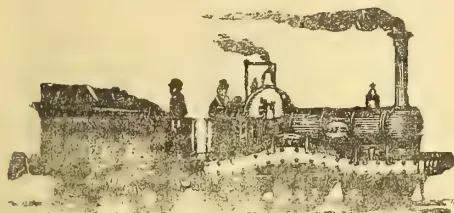

## THE CEYLON ADVERTISING AGENCY.

ADVERTISEMENTS CAN NOW BE RECEIVED  
IN ALL OR ANY RAILWAY STATIONS IN THE ISLAND.

For full Particulars apply to the Manager,  
CEYLON ADVERTISING AGENCY, COLOMBO. a-3

## GRAND ORIENTAL HOTEL, FORT, COLOMBO.

**The Largest and Best Appointed Hotel  
in the East.**

THE HOTEL is situated in the Fort, and commands a MAGNIFICENT VIEW OF THE HARBOUR AND COAST.

It is in the immediate vicinity of the Landing Jetties and Custom House, Post and Telegraph Offices, Banks, P. & O., M. M., and British India Co.'s Offices, &c., and within a few minutes' drive of the Railway Stations, and the beautiful Cinnamon Gardens.

The large handsome DINING SALOON of this Hotel, said to be the finest in the East, is justly admired by all Strangers and Visitors; as also is its Commodious BILLIARD Room.

EXCELLENT CUISINE. CHARGES MODERATE:  
Manager—F. A. RADEN.

## CHARTERED MERCANTILE BANK OF INDIA, LONDON AND CHINA.

Incorporated under Royal Charter.

<table>
<tr>
<td>PAID-UP CAPITAL</td>
<td>...£750,000.</td>
</tr>
<tr>
<td>RESERVED LIABILITY...</td>
<td>...£750,000.</td>
</tr>
<tr>
<td>RESERVED FUND...</td>
<td>...£150,000.</td>
</tr>
</table>

Head Office:—No. 65, OLD BROAD STREET,  
LONDON, E. C.

Local Branches:—COLOMBO; KANDY; GALLE;  
HATTON.

London Bankers:

BANK OF ENGLAND; LONDON JOINT STOCK BANK.

THE BANK receives Money on Current and Fixed Deposits, buys Bills and grants Drafts on Europe and on all part of the East and Colonies, and draws on the Bank of England at current rates of Exchange. Terms on Application.

A. B. MACKEAN,  
Manager in Ceylon.

[etc]

1147------------------------------------------------

xADVERTISEMENTS.

IF IT BE POSSIBLE, AS MUCH AS IN YOU LIES, STUDY TO LIVE AT PEACE WITH ALL MEN.

# WAR!!

"O World!  
O men! what are ye, and our best designs,  
That we must work by crime to punish crime,  
And slay, as if death had but this one gate?"—BYRON

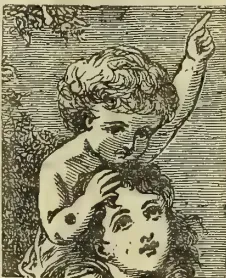

**THE COST OF WAR.**—"Give me the money that has been spent in war, and I will purchase every foot of land upon the globe; I will clothe every man, woman, and child in an attire of which kings and queens would be proud; I will build a schoolhouse on every hillside and in every valley over the whole earth; I will build an academy in every town, and endow it; a college in every State, and will fill it with able professors; I will crown every hill with a place of worship consecrated to the promulgation of the gospel of peace; I will support in every pulpit an able teacher of righteousness, so that on every Sabbath morning the chime on one hill should answer the chime on another round the earth's wide circumference, and the voice of prayer and the song of praise should ascend, like a universal holocaust, to heaven."—RICHARD.

## "WHAT IS MORE TERRIBLE THAN WAR?"

Outraged Nature. She is never tired of killing, till she has taught man the terrible lesson he is so slow to learn—that nature is only conquered by obeying her. Nature is fierce when she is offended, as she is bounteous and kind when she is obeyed.

Ah, would to God that some man had the pictorial eloquence to put before the mothers of England the mass of preventable suffering which exists in England year after year!"—KINGSLEY.

How much longer must the causes of this startling array of preventable deaths continue unchecked?

FOR THE MEANS OF PREVENTION, AND FOR PRESERVING  
HEALTH BY NATURAL MEANS, USE

# ENO'S "FRUIT SALT,"

prepared from Sound Ripe Fruit. You cannot overstate its great value in keeping the BLOOD PURE; as a means of keeping the system clear, and thus taking away the groundwork of Malarious Diseases, BLOOD POISONS, and all Liver complaints, or as a HEALTH-GIVING, COOLING, and INVIGORATING BEVERAGE, or as a gentle Laxative or Tonic in the various forms of Indigestion.

## AT HOME, MY HOUSEHOLD GOD; ABROAD, MY VADE MECUM.

A GENERAL OFFICER, writing from Ascot on January 2, 1886, says: "Blessings on your 'FRUIT SALT!' I trust it is not profane to say so, but in common parlance I swear by it. Here stands the cherished bottle—my little idol—at home my household god, abroad my *vade mecum*. Think not this the rhapsody of a hypochondriac; no, it is the outpouring of a grateful heart. The fact is, I am, in common, I daresay, with numerous old fellows of my age (67), now and then troubled with a tiresome liver. No sooner, however, do I use your cheery remedy than exit Pain—'Richard is himself again.' So highly do I value your composition that, when taking it, I grudge even the sediment that will always remain at the bottom of the glass. I give, therefore, the following advice to those persons who have learned to appreciate its inestimable benefits:

"When ENO'S SALT betimes you take,  
No waste of this elixir make,

"But drain the dregs, and lick the cup  
Of this the perfect pick-me-up."

WRITING again on January 24, 1887, he adds: "DEAR SIR,—A year or two ago I addressed you in grateful recognition of the never-failing virtues of your world-famed remedy. The same old man now salutes you with the following:

"When Time, who steals our years away,  
Shall steal our pleasures too,

"Eno's 'FRUIT SALT' will prove our stay,  
And still our health renew."

FEVERS, BLOOD POISONS, &c.—"Egypt.—Cairo.—Since my arrival in Egypt in August last, I have on three occasions been attacked by fever, from which, on the first occasion, I lay in hospital six weeks. The last attacks have been, however, completely repulsed in a short time by the use of your valuable 'FRUIT SALT,' to which I owe my present health at the very least, if not my life itself. Heartfelt gratitude for my restoration and preservation impels me to add my testimony to the already overwhelming store of the same, and in so doing I feel that I am but obeying the dictates of duty. Believe me to be, Sir, gratefully yours, A CORPORAL, 19th Hussars.—May 26, 1883.—Mr. J. C. Eno."

**Caution.**—Examine each Bottle, and see that the Capsule is marked ENO'S "FRUIT SALT"  
Without it you have been imposed on by a worthless imitation.

SOLD BY ALL CHEMISTS. Directions in Sixteen Languages HOW TO PREVENT DISEASE.

Prepared only at ENO'S "FRUIT SALT" Works, London, England.

1148------------------------------------------------

ADVERTISEMENTS.

xi

# THE DAWN OF ANOTHER DAY.

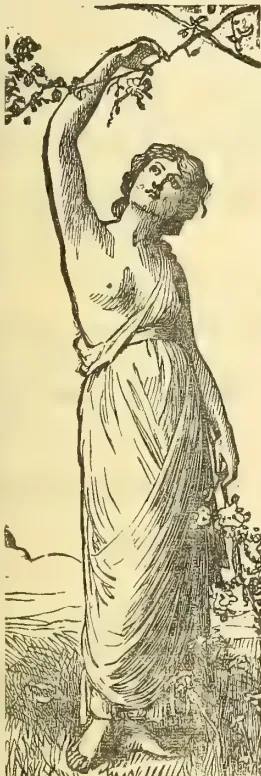

"Out of eternity this new day is born,  
Into eternity at night doth return.  
Behold it aforetime no eyes ever did,

So soon it for ever from all eyes is hid.  
Here hath been dawning another blue day;  
Think, wilt thou let it slip useless away?"  
—Tennyson.

QUEEN'S HEAD HOTEL, NEWCASTLE-UPON-TYNE, 4th June, 1877.

SIR,—Will you to-day allow me to present you with this Testimonial and Poem on your justly celebrated FRUIT SALT? Being the writer for several first-class London Magazines, and my occupation being a very sedentary one, I came here for a few weeks, in order to see what change of air would do for me, and at the wish of some personal friends of mine here I have taken your FRUIT SALT, and the good results accruing therefrom have been my reason for addressing you.—I am, Sir, yours truly, A LADY.

Free from danger, free from harm,  
It acts like some magician's charm;  
At any time a dainty draught,  
Which will dispel disease's shaft;  
More priceless than the richest gold,  
That ever did its wealth unfold;  
And all throughout our native land,  
Should always have at their command  
**ENO's famous Fruit Salt!**

Cool and refreshing as the breeze,  
To headache it gives certain ease;  
Biliousness it does assuage,  
And cures it both in Youth and Age;  
Giddiness it will arrest,  
And give both confidence and rest;  
Thirst it will at once allay,  
And what the best in every way,  
**Why, Eno's famous Fruit Salt!**

"MANY sick people looked upon me as a physician. For a long time we had been in the centre of Africa without any medical man. Natives came with all manner of diseases. One day we had a man that was said to be mad. In some of his fits he had wounded a neighbour with an arrow. Whether he was mad or not, he was evidently far from well, and I gave him a large dose of ENO'S 'FRUIT SALT.' The poor fellow came back next morning to tell us that he was better. His breath was no longer offensive, and he looked cheerful. We were sorry when our supply of Fruit Salt was done; it was a favourite both with natives and Europeans, and is much used along the malarious coasts."—"Africana," by the Rev. DUFF MACDONALD, M.A., B.D., Vol. II., p. 207.

## INDIA AND ENO'S "FRUIT SALT."

"DILBRUGHAR, UPPER ASSAM, INDIA, March 6, 1880.

"DEAR SIR,—I desire to state the advantage which I, and many others, in this part of the world, have derived from ENO'S "FRUIT SALT." Unlike other Saline Aperients, it is not lowering in its action. I have used it on board ship in tropical latitudes, and both there and here I can honestly bear witness that its use has warded off fever over and over again. When taken in time it is invaluable. As far as I am aware it is most popular in this part of NORTH-EASTERN ASIATIC INDIA, and I consider that you are distinctly entitled to this testimonial from me. I need not add, it is wholly unrequsted. I enclose my card; but from my extreme individual inconvenience arising from publicity, I do not wish my name to appear, and merely subscribe myself, most truly yours, 'A PLANTER.'—J. C. ENO."

### A WHITE MEDICINE-MAN ON THIRST TRIALS IN MASAI LAND.

"A medicine had to be prepared for the disease, which I did by laying out a small medicine-box with the lid open, showing all the array of phials, &c. Taking out my sextant, and putting on a pair of kid gloves—which impressed the natives enormously—I intently examined the contents. Discovering the proper *dawa*, and getting ready some ENO'S FRUIT SALT, I sang an incantation over it. My preparations complete, and Brahim being ready with a gun, I mixed some of the Salt; simultaneously the gun was fired, and, lo! up fizzed and sparkled the carbonic acid, causing the natives to shrink with intense dismay. . . . The chiefs, with fear and trembling, taste as it fizzes away."—Through Masai Land. By Joseph Thomson, F.R.G.S.

# ENO'S "FRUIT SALT,"

(prepared from sound ripe fruit) acts as a natural aperient; its simple but natural action removes all impurities, thus preserving and restoring health. If its great value in keeping the body in health were universally known, no family would be without it.

**Caution.**—Examine each Bottle, and see that the Capsule is marked ENO'S "FRUIT SALT." Without it you have been imposed on by a worthless imitation.

**SOLD BY ALL CHEMISTS.** Directions in Sixteen Languages HOW TO PREVENT DISEASE.  
Prepared only at ENO'S "FRUIT SALT" Works, London, England.

1149------------------------------------------------

xiiADVERTISEMENTS.

# THE MURREE BREWERY COMPANY, LTD., NUWARA ELIYA.

**PALE ALES AND STOUTS.**—In Wood, Rs. 1.50 per Gallon.

In 5, 9 and 18 Gallon Casks. 25 charged as deposit on Cask.

**DITTO IN BOTTLE:**—Rs. 4.50 per Dozen Quarts. Rs. 2.50 per Dozen Pints.

Rs. 50 and Rs. 25 per Dozen allowed for Empty Quarts and Pints, if delivered at the Brewery.

Ales and Stouts delivered *FREE* at any Railway Station.

**AERATED WATERS.**—SODA..... Rs. 8 7½ per Dozen;

TONIC, LEMONADE,  
GINGER ALE, and } Rs. 1.50 per Dozen  
BEER.....

SELTZER, LITHIA and POTASS WATERS made to order. Rs. 60 per Dozen charged for Bottles.

**GINGER ALE, AS SUPPLIED TO THE MILITARY CANTERNS IN INDIA.** Rs. 75 per Gallon  
In 5, 9, 18 and 54 Gallon Casks.

**ALES, STOUTS, and AERATED WATERS** sold for *Cash Only*, direct from the Brewery.

**SPECIAL TERMS FOR ANY OF THE ABOVE IN BULK)**

<table border="0">
<tr>
<td><b>AGENTS FOR COLOMBO</b></td>
<td>..</td>
<td><b>For BADULLA and</b></td>
<td></td>
</tr>
<tr>
<td>and KANDY, <b>MESSRS. CARGILL &amp; Co.</b></td>
<td>..</td>
<td>LINDULA.</td>
<td><b>MESSRS. JORDAN &amp; Co.</b></td>
</tr>
<tr>
<td>.. DIKOYA</td>
<td>..</td>
<td>BROWN, RAE &amp; Co.</td>
<td>.. NUWARA ELIYA, .. McLAREN &amp; Co.</td>
</tr>
<tr>
<td>.. NAWALAPITIYA</td>
<td>..</td>
<td>NEATE &amp; Co.</td>
<td>.. KOSLAND &amp; HAPUTALE, .. E. W. FERDINANDS.</td>
</tr>
<tr>
<td>.. LAMPEN</td>
<td>..</td>
<td>GAMBLE &amp; Co.</td>
<td>.. GALLE, .. VANDERSPAR &amp; Co.</td>
</tr>
</table>

## BANK OF MADRAS.

(Established 1843.)

Constituted and regulated by Government of India  
Act No. 11 of 1875. ("The Presidency Banks Act.")

CAPITAL..... Rs. 5,000,000.  
RESERVE FUND..... Rs. 1,200,000.

**THE BANK** undertakes general Banking Agency Business and issues Drafts and purchases approved Bills on the principal towns of India.

The Bank receives money on Current Accounts and Fixed Deposits at rates of interest which may be ascertained on application.

Agents in Ceylon of the Agra Bank, Ltd.

W. T. HOLMES,

Agent in Colombo.

[1 w t c

## BLAZÉ, REIDEL & CO.,

PENANG,

GENERAL DEALERS,

Agents for the TROPICAL AGRICULTURIST.

## H. HEWETSON & CO.,

IMPORTERS,

EXPORTERS

AND GENERAL MERCHANTS,

59, MARK LANE,

LONDON, E. C.

CONSIGNMENTS RECEIVED.

ALLIANCE BANK, LTD.,

LONDON.

1150------------------------------------------------

ADVERTISEMENTS.

xiii

## EDUCATION.

### Board and Education at Bournemouth.

[The mild climate of BOURNEMOUTH has been the subject of special letters to the London Times during the present winter season.]

**M**R. & MRS. FRED. HORSFALL, assisted by a well-qualified Governess, receive a few children between the ages of 6 and 12 at their home in Bournemouth, to be educated in the usual branches of English and Latin.

THE CLIMATE of this beautiful place on the South Coast is peculiarly suited for children from the tropics, and for those of delicate constitution. *Terms moderate and inclusive.* References kindly permitted to the parents of former pupils.

ADDRESS: MRS. F. HORSFALL,  
THE HERMITAGE,  
BOURNEMOUTH:

or, c/o "Ceylon Observer" Office. 1 moo

### Education in Wimbledon, near London.

**T**HE Wife of a Medical man wishes to meet with TWO LITTLE GIRLS, 10 or 12 years of age, to EDUCATE with her own. Excellent references

WIMBLEDON,

c/o MESSRS. J. HADDON & Co.,

ta 3, Bouverie St., Fleet St., London.

### WOODLANDS, HIGHGATE.

**M**ISS GOSBELL receives a limited number of Young Gentlemen as Resident Pupils.

FEES, including all the essentials of a thorough English Education, with Latin, French, Part Singing, Drilling, Seat in Church, and Laundress, Fourteen Guineas per Term.

THE EDUCATIONAL YEAR IS DIVIDED INTO

THREE TERMS.

EXTRAS: Music, Drawing, and Dancing.

References kindly permitted to Messrs. A. M.

Ferguson, C. M. G., and J. Ferguson, Colombo.

A TERM'S NOTICE PREVIOUS TO REMOVAL.

**M**RS. SYDNEY ROBJOHNS, living on the borders of Surrey Commons, will be glad to RECEIVE ONE OR TWO LITTLE GIRLS to have educated with her own, by a Governess at home. Healthful locality, motherly care, and a Christian home. References kindly allowed to the Editors of the *Ceylon Observer*. Address: 3, Kirk-stall Road, Streatham Hill, Surrey, England.

f 153

## Boots & Shoes ! Boots & Shoes !!

### Important Notice.

M. K. RETTIE & Co.

Madras Boot and Shoemakers,

13, BAILLIE STREET, FORT, COLOMBO,

**H**A VE recently received a fresh supply of ENGLISH and MADRAS LEATHERS of all sorts, and keep always on hand ready-made Boots and Shoes of different sizes, and hold highest Testimonials from various European residents in Ceylon.—INSPECTION SOLICITED. f tu

## HATTON DISPENSARY.

WE HAVE RECEIVED A FULL SUPPLY OF DRUGS, DRUGGISTS' SUNDRIES, PATENT MEDICINES, HOMOEOPATHIC MEDICINES, PERFUMERY, &c.

PRESCRIPTIONS CAREFULLY PREPARED

AND

ORDERS EXECUTED AT ALL HOURS.

THOME & Co.

tu f 160

MRS. ROGERS'

### HOME FOR INDIAN AYAHS,

No: 6, JEWRY STREET,

ALDGATE, LONDON.

ESTABLISHED 1825.

Ayahs boarded, Lodged and taken care of at 14s. per week, until their return passage is paid or a place secured for them to return. Ladies proceeding to INDIA or CHINA requiring an AYAH can always obtain one by applying at the above address.

[By paying down £5, an Ayah can usually be handed over to this home, the owner undertaking to get her sent back with some lady and keeping meanwhile

### A BARGAIN IN A FAVORITE TEA DISTRICT.

### Tea Land for Sale IN DOLOSAGE.

**F**OR SALE.—A portion of COORUNDUW WATTE Estate 225 acres more or less. Price R10,000. Cash on transfer, or the whole sum can remain, on Primary Mortgage at 9 per cent interest payable yearly in advance, provided 50 acres are planted up the first year, and another 50 acres the second year.

JOHN STEPHENS,  
GAMPOLA.

tu o ta te

1151------------------------------------------------

xivADVERTISEMENTS.

# OFFORD & SONS,

67, GEORGE ST., PORTMAN SQUARE.

92 & 94, GLOUCESTER ROAD, SOUTH KENSINGTON,

Factory—FULHAM ROAD, LONDON.

SPECIALITE—

## THE MODEL LANDAU,

Weight from 8½ cwt. Suitable for Hot Climates. Roll-up Back and Syce Board and Self-acting Head, complete  
Price (in any colours) from 130 Guineas.

## VENTILATED BROUGHAMS FOR INDIA.

Weight from 7½ cwt. Fitted with Syce Board complete. From 120 Guineas.  
Twenty-Six Prize Medals.

## OFFORD'S PATENT RUBBER TYRES:

Perfect for Invalids. Cheapest and Best.

## OFFORD'S PATENT RUBBER BRAKE SKIDS.

SILENT: DURABLE. POWERFUL:

Send for Illustrated Price List.

### AGENTS:

KING, KING, & Co., BOMBAY;

KING, HAMILTON, & Co., CALCUTTA.

### AGRICULTURAL ANALYTICAL CHEMIST.

JOHN HUGHES, F. C. S., F. I. C.,  
Fellow of the Institute of Chemistry,  
Consulting Chemist to the Ceylon Planters' Association.

Samples of Soil, Artificial Manures, Feeding Materials, Guano, Phosphatic Rocks, Water, &c., &c., carefully analysed and reported on.

ANALYTICAL LABORATORY,  
79 Mark Lane, London, E.C.

Messrs. JAMES INGLIS & Co.,  
SUTTON'S BUILDINGS, DEAN'S PLACE,  
SYDNEY.

HAVE been appointed AGENTS for the *Tropical Agriculturist* for New South Wales and Queensland, and receipts granted by them for Subscriptions or Advertisements will be binding on  
A. M. & J. FERGUSON.  
Colombo, Ceylon, 2nd May 1887.

1152------------------------------------------------

ADVERTISEMENTS.

xv

# ADVANTAGES OF ASSURING WITH THE ORIENTAL LIFE OFFICE.

All that Experience has proved Practicable and Prudent in the Modern System of Life Assurance can be obtained with perfect safety, combined with the following:—

## FIVE NEW AND IMPORTANT FEATURES

Not granted by any other Company whatever:—

1. 1—Policy-holders can Vote at Meetings.
2. 2—Amalgamations Impossible.
3. 3—Funds in Government Securities only, and remain in India.
4. 4—Native Lives assured at European Rates.
5. 5—Premiums reduced to English Rates from date of leaving any port in India, Ceylon, or China.

## LAST 12 MONTHS' NEW BUSINESS:

996 Proposals for R34,86,275.

## ANNUAL PREMIUM FOR ASSURANCE OF R1,000 UNDER NEW SYSTEM.

<table border="0">
<tr>
<td>Age</td>
<td>...</td>
<td>30</td>
<td>...</td>
<td>35</td>
<td>...</td>
<td>40</td>
<td>...</td>
<td>45</td>
</tr>
<tr>
<td>Premium</td>
<td>...</td>
<td>R21-5-4</td>
<td>...</td>
<td>R24-8-8</td>
<td>...</td>
<td>R28-10-0</td>
<td>...</td>
<td>R33-14-8.</td>
</tr>
</table>

Lower Safe Rates than any other Office.

80 per cent of Premia invested in Trust for Policy-holders with the Official Trustee of Bombay.

“The ‘Oriental,’ by its careful and equitable management, is rapidly gaining the confidence of the Native Community.”

Intending Assurers or Investors—Native or European—are invited to compare the Rates and Conditions to the “Oriental” with those of any other Company.

Full particulars and forms on application to the Head Office of the Company, BOMBAY:

OR,

W. M. Smith & Co., Colombo,

Agents for Ceylon.

9—89

# WRITE FOR PRICE LIST.

ESTABLISHED 1794.

-898

THE NEW EDITION OF OUR VOL. NO. 29:  
ASIA, AFRICA & AUSTRALIA,  
IS NOW COMPILING,  
All Names Inserted Free of Charge.

PRICE 30s. Subscribers 20s. Advertisements  $\frac{1}{4}$  page £1;  $\frac{1}{2}$  page £1 10s; 1 page £2 10s.

Vol. No. 27, England, and Vol. No. 27a, Scotland, Ireland and Wales, now in the press. Price 45s. Subscribers 30s. for the two vols.

C. LEUCHS & Co.,

BRANCH OFFICE,

17, BARRETT'S GROVE,

LONDON N.

1153------------------------------------------------

xviADVERTISEMENTS.

# John Walker and Company, Ceylon,

TEA MACHINERY, ENGINES,  
BOILERS, &C.

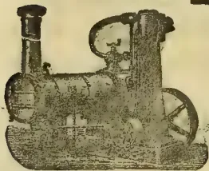
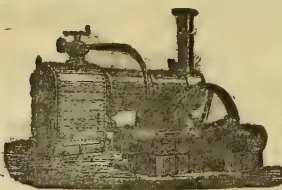
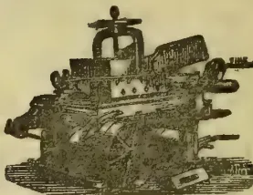
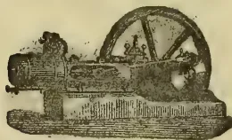
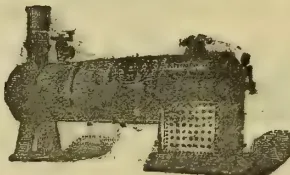
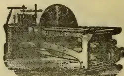

**WE** have pleasure in intimating to Tea Planters and others that we have made arrangements with our Agents,

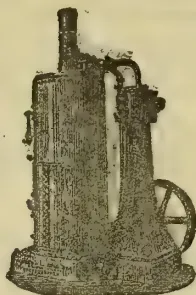

MESSRS.  
**JOHN WALKER**  
& Co.  
*Colombo, Ceylon,*

to hold a stock of our Machines, so as to ensure  
**PROMPT DELIVERY.**

ORDERS PLACED WITH OUR AGENTS WILL THEREFORE BE PROMPTLY EXECUTED  
AND ON FAVOURABLE TERMS.

**MARSHAL, SONS & Co., Lt.,**

**W. & J. JACKSON,**

10-89

**GAINSBOROUGH, ENGLAND.**

## SUTTON'S SEEDS

IN USE THROUGHOUT THE WORLD.

*Collections of Vegetable and Flower Seeds Specially Selected and Packed for India and the East.*

Price 5/- to £10 10s 0d.

PARTICULARS ON APPLICATION.

**SUTTON & SONS,**  
READING & LONDON, ENGLAND.

1154------------------------------------------------

ADVERTISEMENTS.

xvii

**BOOKS FOR PLANTERS.**

<table border="0">
<thead>
<tr>
<th></th>
<th>R.</th>
<th>c.</th>
</tr>
</thead>
<tbody>
<tr>
<td>Tropical Agriculturist, Seven Annual</td>
<td>13</td>
<td>00</td>
</tr>
<tr>
<td>Volumes, 1881 to 1887-8, ...</td>
<td>each</td>
<td></td>
</tr>
<tr>
<td>Tea Planter's Manual, with Plans of Tea Factories (T. C. Owen)...</td>
<td>4</td>
<td>12</td>
</tr>
<tr>
<td>Planter's Note Book (Planting Molesworth)</td>
<td>3</td>
<td>04</td>
</tr>
<tr>
<td>Coffee Planter's Manual, by Alex. Brown, with special additions by A. M. &amp; J. Ferguson and others ...</td>
<td>3</td>
<td>08</td>
</tr>
<tr>
<td>Coffee Grub, with Illustrations ...</td>
<td>1</td>
<td>54</td>
</tr>
<tr>
<td>Tea Cultivation in Assam, by H. Cottam ...</td>
<td>1</td>
<td>52</td>
</tr>
<tr>
<td>Cinchona Planter's Manual, by Owen</td>
<td>4</td>
<td>10</td>
</tr>
<tr>
<td>Cinchona Cultivation (Prize Essay), by T. N. Christie ...</td>
<td>1</td>
<td>27</td>
</tr>
<tr>
<td>All about the Coconut Palm ...</td>
<td>3</td>
<td>12</td>
</tr>
<tr>
<td>All about, Indiarubber &amp; Gutta-Percha, 2nd Edition enlarged ..</td>
<td>2</td>
<td>58</td>
</tr>
<tr>
<td>All About Tobacco ...</td>
<td>4</td>
<td>50</td>
</tr>
<tr>
<td>Gold, Gems, and Pearls in Ceylon..</td>
<td>4</td>
<td>10</td>
</tr>
<tr>
<td>Cardamoms—Notes on Cultivation (Owen)</td>
<td>1</td>
<td>27</td>
</tr>
<tr>
<td>First Year's Work on a Coffee Plantation, by A. L. Cross ...</td>
<td>1</td>
<td>02</td>
</tr>
<tr>
<td>On the Manuring of Estates, by E. S. Grigson</td>
<td>1</td>
<td>02</td>
</tr>
<tr>
<td>Mr. Hughes' Analyses, First and Second Series, Manures and Limestone ...</td>
<td>0</td>
<td>26</td>
</tr>
<tr>
<td>Ceylon Coffee Soil and Manures, by Hughes</td>
<td>1</td>
<td>54</td>
</tr>
<tr>
<td>Coffee Planting in Southern India and Ceylon, by E. C. P. Hull ...</td>
<td>5</td>
<td>66</td>
</tr>
<tr>
<td>Book-keeping for Planters, a system of Accounts (by "Double Entry") adapted to the requirements of Coffee Planters</td>
<td>1</td>
<td>79</td>
</tr>
<tr>
<td>Liability of Estate Owners &amp; Superintendents</td>
<td>1</td>
<td>77</td>
</tr>
<tr>
<td>Ceylon in Fifties and Eighties ...</td>
<td>1</td>
<td>54</td>
</tr>
<tr>
<td>Fifteen Hundred Conversational Sentences in Tamil, with English Translation ...</td>
<td>2</td>
<td>56</td>
</tr>
<tr>
<td>Uva: An Inauguration of the New Province "Ingē Vā!" or the Sinna Durai's Pocket Tamil Guide. [Greatly enlarged, 170 pages.] By A. M. Ferguson, jr. ...</td>
<td>2</td>
<td>54</td>
</tr>
<tr>
<td>The Coffee Tree and its Enemies, by Nietner (2nd Edition, revised by Mr. S. Green)</td>
<td>1</td>
<td>52</td>
</tr>
<tr>
<td>Brazil as a Coffee-growing Country ...</td>
<td>1</td>
<td>54</td>
</tr>
<tr>
<td>Liberian Coffee its History and Cultivation, with beautiful coloured drawings</td>
<td>5</td>
<td>18</td>
</tr>
<tr>
<td>Map of Ceylon with Uva Province: mounted on Rollers and Varnished ..</td>
<td>3</td>
<td>14</td>
</tr>
<tr>
<td>Do. on good paper ..</td>
<td>1</td>
<td>79</td>
</tr>
<tr>
<td>Medical Hints for Superintendents for the Treatment of Diseases Peculiar to Ceylon</td>
<td>0</td>
<td>50</td>
</tr>
<tr>
<td colspan="3">(These are cash prices and include local postage.)</td>
</tr>
<tr>
<td colspan="3">Post Office orders from India or elsewhere for above amounts will secure the books as ordered.</td>
</tr>
<tr>
<td colspan="3">A. M. &amp; J. Ferguson, "Observer" Office, Colombo.</td>
</tr>
</tbody>
</table>

**CEYLON IN 1837-46 AND 1847-60.**

**TWO LECTURES**

DELIVERED AT THE

Cinnamon Gardens Baptist Church,

BY

A. M. FERGUSON, ESQ., C.M.G.,  
of the "Ceylon Observer," &c.

[Delivered in aid of the effort made to clear off the debt on the building, to the improvement of which the proceeds of the sale of this pamphlet will be devoted.  
Price R1; postage 2c each.

**THE**

**BURIED CITIES OF CEYLON:**

A GUIDE BOOK TO

**ANURADHAPURA AND POLONNARUWA;**

WITH CHAPTERS ON

**DAMBULLA, KALAWEWA,**

**MIHINTALE, & SIGIRI,**

WITH

**LITHOGRAPHED PLAN OF ANURADHAPURA,**

BY

**S. M. BURROWS, M.A. OXON.,**

CEYLON CIVIL SERVICE.

Price—Stiff paper, cover, R2; boards, R2.50; postage 8c.

Published by A. M. & J. FERGUSON, *Observer* Office, Colombo; and Trübner & Co., London.

Also to be had of Resthouskeeper, Anuradhapura; Stationmaster, Matale; and C. M. S. Book Dépôt, Kandy; and of H. W. CAVE & Co., Colombo; Messrs. d'Esterre & Co., Agents, Kandy.

**THE PLANTING POCKET MOLESWORTH.**

**THE PLANTER'S NOTE-BOOK,**

WITH EVERYDAY INFORMATION

FOR THE

**TEA PLANTER;**

AND ALSO FOR PLANTERS OF

Coffee, Cinchona, Cacao, Rubber, Cardamoms, Coconuts, Cinnamon, &c.

WITH USEFUL HINTS

ON MACHINERY, BUILDING, &c., &c.

ALSO

MANUSCRIPT NOTE-BOOK;

FOR FIELD AND FACTORY OR STORE.

☛ [With strong leather cover and elastic band and calendar for 1888.]

Price R3.50, cash R3; postage 4c.

"OBSERVER" OFFICE.

**"Gold, Gems and Pearls in Ceylon."**

**ALL ABOUT GOLD, GEMS, AND PEARLS** (also Minerals generally) in Ceylon and Southern India, compiled by the Publishers, from a variety of available authorities, with special reference to the Mining Industry, as well as to the extension of the present Gem-digging, and to the commencement of a Gold Enterprise in Ceylon. (Second Edition greatly enlarged.) With two Maps, showing the Pearl Fishery Banks and the Sites of the Gem-digging Industry and Gold Exploration Operations.

—Credit R4.50, cash R4; postage 18c.

"OBSERVER" OFFICE.

1155------------------------------------------------

xviiiADVERTISEMENTS.

SILVER MEDALS INTERNATIONAL HEALTH (1884) AND  
INVENTIONS (1885) EXHIBITIONS.

**KEENAN'S**  
PATENT  
**NON-CONDUCTING VEGETABLE PULP,**  
FOR  
**COVERING STEAM AND LIQUOR BOILERS,  
STEAM COPPERS, PIPES, &c.**

It prevents the radiation of heat and condensation of steam, and effects a large saving in fuel and labour. It is not affected by exposure to Weather, and is the only effective non-con-

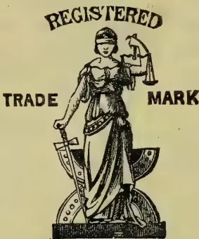
 A detailed illustration of a female figure, likely representing Justice or a similar allegorical figure, standing on a pedestal. She holds a scale in her right hand and a hammer in her left. The words 'REGISTERED', 'TRADE', and 'MARK' are arranged around her.

ductor. It adheres to vessels of every shape and in every position, without any external castings.—Weight when dry, 1 1/2 in. thick, 3 1/2 lb. per super square foot.

FOR SAMPLES, REFERENCES, AND FURTHER PARTICULARS, APPLY TO

**MATTHEW KEENAN,**

SOLE MANUFACTURER,

ARMAGH WORKS, TREDEGAR ROAD,  
NORTH BOW, LONDON, E.

[9]

1156------------------------------------------------

ADVERTISEMENT.xix

# “CEYLON IN THE JUBILEE YEAR:”

BY J. FERGUSON.

## PRICE FIVE RUPEES.

TWO MAPS (Worth the price of the Volume) and 42 other Illustrations; 428 pages letterpress. (By post 5-26; outside of Island R6.)

**ROYAL ACKNOWLEDGMENT.**—Windsor Castle, March 12, 1888.—Sir Henry Ponsonby is commanded by the Queen to thank Messrs. Haddon & Co. for the copy of Mr. John Ferguson's “Ceylon in the Jubilee Year,” which they have had the kindness to present to Her Majesty.

### *Opinions of the Press.*

Everything of interest about Ceylon has been carefully collected in this volume, and for any one who wishes to visit the island a better guide book is not to be found.—*Pall Mall Gazette*.

*Ceylon in the Jubilee Year*, by John Ferguson (Haddon & Co., London; Ferguson, Colombo), “a third edition, revised, enlarged, and brought down to date,” gives an account of the present condition of the island, its resources, and the prospects which it holds out for the remunerative investment of capital.—*Spectator*.

To the cultured class who study Oriental history and Buddhist archaeology, and to the large fraternity who are concerned in tea, coffee, cocoa, cinnamon, cinchona, and the many fragrant and spicy products of our colonial Eden, the work is invaluable.—*Christian World*.

Previous editions of Mr. Ferguson's valuable book have received full review in these columns, but the present edition contains much more matter—among other additions being strong criticism of the administration of the present Governor, Sir Arthur Gordon.—*Colonies and India*.

Mr. Ferguson's book on Ceylon seems to us a most valuable one, and it ought to be in the hands of every one in any way interested in the island. It gives an excellent account of the country, its inhabitants, railways, government, pearl fisheries, exports, &c., with notices of archaeological remains and of the picturesque districts most worthy the attention of visitors.—*Literary World*.

The first part consists of some sixteen chapters, in which Mr. Ferguson shows himself possessed of the instincts of the true journalist. There seems scarcely a subject relating to the “spicy isle” which is not touched upon, the treatment being always effective, if sometimes brief. Anything like an outline of the various chapters is, as we have indicated, impossible in the space at our command.—*Aberdeen Free Press*.

This is a very complete handbook of Ceylon and everything Cinghalese from Government to snakes or tortoises, and from tea, sugar, coffee, and cinchona to polyandry, shooting, races, clubs, Buddhism and missionaries—in fact about as complete a fund of information about the island as it is possible to pack into 400 pages, of a handsome volume, with good maps and many illustrations. Any one who wishes to visit Ceylon, or employ his capital there, would do well to get this book.—*Overland Mail*.

Mr. John Ferguson has published a very handsome volume with the above title. For an account of the climate, scenery, and natural advantages of Ceylon, we must refer our readers to the work itself, merely adding that Mr. Ferguson's statements can be accepted with confidence, as no one knows Ceylon and its resources better than he does. The new volume will be welcomed especially by old Colonists who have witnessed the rise and the depression of Ceylon, and who may probably agree with the author that fortune seems about to smile on the old isle once more.—*Nottinghamshire Telegraph*.

In this re-issue of his book on Ceylon, Mr. Ferguson has brought the mass of information respecting the Colony contained in former issues up to the most recent date, and he has fitted given it a designation commemorative of the present eventful year. No effort has been spared by Mr. Ferguson to make his latest work as complete in every respect as possible, and the result has been that no book can be more replete with information about this valuable island. As the most important of our Crown Colonies, Ceylon has a special claim to consideration, and we can strongly recommend “Ceylon in the Jubilee Year” to everyone who takes an interest in colonial matters. A word must be said in praise of the numerous illustrations.—*European Mail*.

Mr. Ferguson, of Colombo, published a considerable time ago a careful and much-needed description of the island, but there was quite room for the full, clear, and picturesque statement which he has now made of the actual condition of CEYLON IN THE JUBILEE YEAR. The earlier chapters of a book which is crowded from cover to cover with interesting facts and impressive statistics, is devoted to the political and social history of Ceylon both before and since it came under the English flag. The concluding portion gives a curiously minute and vivid picture of the life, customs, caste, and occupations of the natives, and also describes the tea industry, life on the plantations, the pearl fisheries, the legislative progress of England's chief tropical colony, and the present condition and prospects of the trade of the island. The book presents a vivid picture of every phase of the life of the colony, and so far as we can discover, there is not a single point on which information is likely to be needed which has been slurred over, much less neglected. The maps and illustrations heighten the value of an extremely interesting volume.—*Leeds Mercury*, April 9th.

I got your most charming book, “Ceylon in the Jubilee Year” the other day, and have gone most carefully and delightedly through it. The get-up of the book is really first-class, and so many pictures make it very lightsome. To me, an old Ceylon man, every line was of interest, and I fear your book had to answer for a considerable quantity of midnight oil burned in my establishment. In fact, I think your “Ceylon” is Emerson Tenneut brought up to the present date, and put into a more handy and readable style, and when I was reading it, I, more than once wished I was back in the dear little island.—A. H. D.

“CEYLON OBSERVER” OFFICE, COLOMBO, CEYLON, 30TH APRIL 1888.

Also to be had at Messrs H. W. Cave & Co. and Colombo Apothecaries' Company, Colombo; d'Esterre & Co., Kandy.

JOHN HADDON & Co., LONDON.

1157------------------------------------------------

xxADVERTISEMENTS.

ENGLISH SEEDS DELIVERED FREE TO YOUR OWN DOOR.

# CARTERS' BOXES OF "TESTED" ENGLISH SEEDS,

The selection is specially made to comprise those varieties best adapted to the different climates.

## VEGETABLE SEEDS.

<table border="1">
<tr>
<td>Peas</td>
<td>Spinach</td>
<td>Parsnip</td>
<td>Parsley</td>
<td>Melon</td>
</tr>
<tr>
<td>Broccoli</td>
<td>Beans</td>
<td>Turnip</td>
<td>Vegetable Marrow</td>
<td>Radish</td>
</tr>
<tr>
<td>Cauliflower</td>
<td>Beet</td>
<td>Kale</td>
<td>Brussels Sprouts</td>
<td>Carrot</td>
</tr>
<tr>
<td>Kohl Rabi</td>
<td>Celery</td>
<td>Cabbage</td>
<td>Savoy</td>
<td>Herbs</td>
</tr>
<tr>
<td>Onions</td>
<td>Leek</td>
<td>Lettuce</td>
<td>Cucumber, Tomato</td>
<td>Mustard, Cress.</td>
</tr>
</table>

**CARTERS' BOX OF "TESTED" ENGLISH VEGETABLE SEEDS.**  
COMPRISING THE ABOVE VARIETIES,

*Sent packing and postage free to all parts within the Parcel Post Union,*

On receipt of remittance or an order for payment in England, price 16s.

Boxes, containing large packets, price 23s., 43s., 56s., 70s., 90s., and 120s.

## FLOWER SEEDS.

<table border="1">
<tr>
<td>Aster</td>
<td>Cobæa</td>
<td>Godetia</td>
<td>Marvel of Peru</td>
<td>Polyanthus</td>
</tr>
<tr>
<td>Amaranthus</td>
<td>Convolvulus</td>
<td>Golden Feather</td>
<td>Maurandya</td>
<td>Portulaca</td>
</tr>
<tr>
<td>Antirrhinum</td>
<td>Dahlia</td>
<td>Heartsease</td>
<td>Mesembryanthemum</td>
<td>Salpiglossis</td>
</tr>
<tr>
<td>Balsam</td>
<td>Delphinium</td>
<td>Heliotrope</td>
<td>Mignonette</td>
<td>Stock</td>
</tr>
<tr>
<td>Calliopsis</td>
<td>Dianthus</td>
<td>Larkspur</td>
<td>Nasturtion</td>
<td>Sweet Pea</td>
</tr>
<tr>
<td>Canary Creeper</td>
<td>Eschscholtzia</td>
<td>Linum</td>
<td>Nemophila</td>
<td>Sweet William</td>
</tr>
<tr>
<td>Candytuft</td>
<td>Everlasting flower</td>
<td>Lobelia</td>
<td>Perilla</td>
<td>Verbena</td>
</tr>
<tr>
<td>Celosia</td>
<td>Gaillardia</td>
<td>Lupinus</td>
<td>Petunia</td>
<td>Wallflower</td>
</tr>
<tr>
<td>Chrysanthemum</td>
<td>Globe Amaranthus</td>
<td>Marigold</td>
<td>Phlox</td>
<td>Zea, Zinnia.</td>
</tr>
</table>

**Carters' box of "Tested" English Flower Seeds, comprising the above varieties, sent packing and postage free to all parts within the Parcel Post Union. On receipt of cash, or an order to pay in England, price 22s.**

Smaller Boxes, containing selections from the above list, price 5s. 6d., 11s., and 17s.

For Further Particulars, see "CARTERS' ILLUSTRATED CATALOGUE of GARDEN & FARM SEEDS.

Gratis and Post Free to any reliable address.

Seedsmen by Royal Warrants to

**H. M. THE QUEEN AND H. R. H. THE PRINCE OF WALES,**  
237 & 238, HIGH HOLBORN, LONDON, ENGLAND.

TO TEA PLANTERS AND MERCHANTS.

## G. FARMILOE & SONS.

34, ST. JOHN STREET,  
WEST SMITHFIELD,  
LONDON, E. C.

WORKS:—ISLAND LEAD MILLS,  
LIMEHOUSE, LONDON, E.

![A detailed black and white illustration of a large industrial facility, likely a lead mill, situated along a river. The scene shows several large brick buildings with multiple chimneys and gabled roofs. In the foreground, a long, narrow boat is docked at a wooden pier. The river is filled with numerous other boats, including several large sailing vessels with multiple masts and sails. The background shows a dense urban or industrial landscape with more buildings and structures. The overall style is that of a 19th-century engraving.](3c880134e66666d6a5eafd31ce860f2e_22_img.webp)

LEADED LIGHT WORKS:  
109, ST. MARTIN'S LANE, LONDON, W. C.

MANUFACTURERS.

**B**EST Incorrodible **TEA LEAD** Sheet Lead, Lead Pipe, Tin lined Lead Pipe,  
Solder, Sheet Zinc, White Lead, Paints, Colors and Varnishes.  
Please Indent:—"ISLAND OF CEYLON BRAND" TEA LEAD.

COLOMBO : PRINTED AND PUBLISHED BY A. M. & J. FERGUSON, "CEYLON OBSERVER" PRESS.

1158------------------------------------------------

8..

99.....

WAM

1159------------------------------------------------

1160------------------------------------------------

This image shows a blank, aged, cream-colored page, likely an endpaper or flyleaf from an old book. The paper has a textured appearance with visible creases and some minor discoloration or foxing. A prominent vertical crease runs down the center of the page. There is a small, irregular tear or hole near the right edge, approximately halfway down the page. The right edge of the page is bordered by a dark, solid color, which appears to be the inner cover or binding of the book.

1161------------------------------------------------

